# The Interrelationship and Characteristic Distribution of Direct, Diffuse and Total Solar Radiation*

# 直接、散射和总太阳辐射的相互关系与特征分布*

By Benjamin Y. H. Liu† 和 Richard C. Jordan‡

基于现有数据，本文提出了可用于确定水平面上以下参数的相互关系：晴天时散射辐射的瞬时强度、散射辐射的长期平均每小时和每日总量、以及不同云量等级下散射辐射的日总量。要进行这些计算，需要掌握水平面上总辐射（直接辐射加散射辐射）的数据——这些数据目前在美国和加拿大的98个地点进行定期测量。对于那些只有长期平均总辐射估算值的地区，本文提出的关系式可用于确定这些地区日总辐射的统计分布。

# 术语表

| 符号 | 说明 | 单位 |
|------|------|------|
| D 和 $\bar{D}$ | 水平面上接收的日散射辐射和月平均日散射辐射 | Btu/天·平方英尺 |
| $f$ | 日总辐射小于等于某值的分数时间 | 无量纲 |
| H 和 $\bar{H}$ | 水平面上接收的日总辐射(直接+散射)和月平均日总辐射 | Btu/天·平方英尺 |
| $H_{o}$ | 水平面上接收的日地外太阳辐射 | Btu/天·平方英尺 |
| $I_{D h}$ | 水平面上直接辐射强度 | Btu/小时·平方英尺 |
| $I_{D n}$ | 法向入射直接辐射强度 | Btu/小时·平方英尺 |
| $I_{d h}$ | 水平面上散射辐射强度 | Btu/小时·平方英尺 |
| $\bar{I}_{d h}$ | 水平面上长期平均小时散射辐射强度 | Btu/小时·平方英尺 |
| $I_{o h}$ | 地球大气层外水平面太阳辐射强度 | Btu/小时·平方英尺 |
| $I_{o n}$ | 地球大气层外法向入射太阳辐射强度 = $r I_{s c}$ | Btu/小时·平方英尺 |
| $I_{s c}$ | 太阳常数 = 442 Btu/小时·平方英尺 = 2 ly/分钟 | - |
| $I_{T h}$ | 水平面上总辐射(直接+散射)强度 | Btu/小时·平方英尺 |
| $\bar{I}_{T h}$ | 水平面上长期平均小时总辐射强度 | Btu/小时·平方英尺 |
| $K_{d}$ 和 $\bar{K}_{d}$ | $D / H_{o}$ 和 $\bar{D} /H_{o}$ | 无量纲 |
| $K_{D}$ | $(H - D) / H_{o}$ | 无量纲 |
| $K_{T}$ 和 $\bar{K}_{T}$ | $H / H_{o}$ 和 $\bar{H} / H_{o}$ | 无量纲 |
| $L$ | 纬度 | 度 |
| $m$ | 大气质量 = cscα(低海拔除外) | 无量纲 |
| $r$ | 地外法向太阳辐射强度与太阳常数之比 | 无量纲 |
| $r_{d}$ | $\bar{I}_{d h} / \bar{D}$ = 小时与日散射辐射之比 | 无量纲 |
| $r_{T}$ | 小时与日总辐射之比 | 无量纲 |
| $\alpha$ | 太阳高度角 | 度 |
| $\delta$ | 太阳赤纬 | 度 |
| $\tau_{D}$ | $I_{D n} / I_{o n} = I_{D h} / I_{o h}$ = 直接太阳辐射透射系数 | 无量纲 |
| $\tau_{d}$ | $I_{d h} / I_{o h}$ = 水平面散射辐射透射系数 | 无量纲 |
| $\tau_{T}$ | $I_{Th} / I_{on}$ = 水平面总辐射透射系数 | 无量纲 |
| $\omega$ | 时角 | 度 |
| $\omega_{\mathrm{g}}$ | 日落时角 | 弧度 |

表1 - 太阳赤纬角δ及大气层外法向入射太阳辐射强度与太阳常数之比r

| 月份 | 日期 | δ | r | 日期 | δ | r | 日期 | δ | r | 日期 | δ | r |
|------|------|---|----|------|---|----|------|---|----|------|---|----|
| 1月 | 1日 | -23°04' | 1.0335 | 8日 | -22°21' | 1.0325 | 15日 | -21°16' | 1.0315 | 22日 | -19°51' | 1.0300 |
| 2月 | 1日 | -17°19' | 1.0288 | 8日 | -15°14' | 1.0263 | 15日 | -12°56' | 1.0235 | 22日 | -10°28' | 1.0207 |
| 3月 | 1日 | -7°53' | 1.0173 | 8日 | -5°11' | 1.0140 | 15日 | -2°26' | 1.0103 | 22日 | 0°20' | 1.0057 |
| 4月 | 1日 | 4°15' | 1.0009 | 8日 | 6°55' | 0.9963 | 15日 | 9°30' | 0.9913 | 22日 | 11°56' | 0.9875 |
| 5月 | 1日 | 14°51' | 0.9841 | 8日 | 16°53' | 0.9792 | 15日 | 18°41' | 0.9757 | 22日 | 20°14' | 0.9727 |
| 6月 | 1日 | 21°57' | 0.9714 | 8日 | 22°47' | 0.9692 | 15日 | 23°17' | 0.9680 | 22日 | 23°27' | 0.9670 |
| 7月 | 1日 | 23°10' | 0.9666 | 8日 | 22°34' | 0.9670 | 15日 | 21°39' | 0.9680 | 22日 | 20°26' | 0.9692 |
| 8月 | 1日 | 18°13' | 0.9709 | 8日 | 16°22' | 0.9727 | 15日 | 14°18' | 0.9757 | 22日 | 12°03' | 0.9785 |
| 9月 | 1日 | 8°34' | 0.9828 | 8日 | 5°59' | 0.9862 | 15日 | 3°20' | 0.9898 | 22日 | 0°37' | 0.9945 |
| 10月 | 1日 | -2°54' | 0.9995 | 8日 | -5°36' | 1.0042 | 15日 | -8°14' | 1.0087 | 22日 | -10°47' | 1.0133 |
| 11月 | 1日 | -14°11' | 1.0164 | 8日 | -16°21' | 1.027 | 15日 | -18°18' | 1.0238 | 22日 | -19°58' | 1.0267 |
| 12月 | 1日 | -21°41' | 1.0288 | 8日 | -22°39' | 1.0305 | 15日 | -23°14' | 1.0318 | 22日 | -23°27' | 1.0327 |

# 引言

近年来，随着涉及太阳辐射问题的增多，许多领域的研究人员经常需要太阳辐射数据。虽然目前许多地区都能获取太阳辐射数据，但在利用这些数据时仍存在困难，因为这些数据主要只包含总辐射(直接辐射+散射辐射)，而实际应用中往往需要了解其中的散射辐射分量。由于目前从理论上计算散射辐射极其困难(甚至不可能)，本研究尝试利用现有有限数据，探究散射辐射与总辐射之间的关系，以便在仅知总辐射的情况下估算某地的散射辐射。Parmelee最早仅针对无云天气进行了这种尝试，但未将其扩展到多云天气。

在本研究中，我们还发现有必要研究总辐射的特征分布。所得结果有助于指明在研究太阳辐射其他统计特征时应使用的参数类型(当需要这些特征时)。本研究仅限于水平面上的辐射。

# 太阳常数

由于本研究必须始终采用一个确定的太阳常数值，因此采用Johnson根据1932年史密森尼绝对日射表标尺给出的最新值2.00 ly/min或442 Btu/hr-sq ft。太阳常数是指在自由空间中，在日地平均距离处，垂直于太阳光线的单位面积上接收的太阳能量速率。由于日地距离的变化，它通常与大气层外法向入射的太阳辐射略有不同。(见表1)

# 晴天直接辐射与散射辐射强度的关系

当太阳辐射穿过大气层时，会因吸收和散射而衰减。并非所有散射辐射都会损失，其中一部分最终会以散射辐射的形式到达地球表面。本文中"散射辐射"一词按惯例指来自天空各处的短波辐射，应与大气热辐射明确区分，后者虽然也是散射性质，但波长要长得多。

为便于讨论，定义以下无量纲透射系数：

$\tau_{D} =$ 直接太阳辐射透射系数 $\begin{array}{l}{\tau_{D n} = I_{D h} / I_{o h}}\\ {= I_{D n} / I_{o n} = I_{D h} / I_{o h}} \end{array}$ $\tau_{d} =$ 水平面散射辐射透射系数 $= I_{dh} / I_{oh}$

这些透射系数是太阳高度角、大气水汽含量、尘埃含量、臭氧含量以及其他辐射衰减因子的函数。但在大气相对清洁、尘埃影响较小的非工业地区，当太阳高度角固定时，这些透射系数的日变化主要源于大气水汽含量的变化。因此，随着大气水汽含量日复一日的变化导致$\tau_{D}$和$\tau_{d}$都发生变化，就会在$\tau_{D}$和$\tau_{d}$之间产生函数关系。

图1中的四条上部曲线展示了无云无尘大气中四种大气质量(1、2、3和4，分别对应太阳高度角90°、30°、19.5°和14.5°)下$\tau_{D}$与$\tau_{d}$的理论关系。这些关系可以很容易地从Kimball计算的透射系数推导出来，前提是假设水平面接收的散射辐射是大气成分散射的太阳辐射的一半。然而，由于Kimball的计算基于紫外区较低的零大气质量太阳光谱，图1中$\tau_{D}$和$\tau_{d}$的理论值已降低3%。由于这些理论关系未考虑尘埃影响，且基于一个已知仅为近似正确的假设，因此不应期望它们能准确代表实际无云天空条件下的$\tau_{D}$与$\tau_{d}$关系，此处推导仅作为寻找实验关系的指导。

图1中的实验点来自Moore和Abbot在北卡罗来纳州Hump Mountain的测量数据，这些数据似乎是目前可获得的最佳数据。但在计算实验透射系数时，原始数据中的直接和散射辐射强度降低了2.5%，以使辐射强度表达在1932年史密森尼绝对日射表标尺上(当前采用的2.00 ly/min太阳常数即基于此标尺)。

图1中理论曲线和实验点都表明，对应于固定$\tau_{D}$值的$\tau_{d}$值仅微弱依赖于大气质量，这说明就本研究所追求的精度而言，一个与大气质量无关的关系式已足够。以下最小二乘法得到的直线方程最符合实验点：

$$
\tau_{d} = 0.2710 - 0.2939\tau_{D} \tag{[1]}
$$

共使用28个晴天的149个数据点得到此方程。通过下式计算的可能误差为0.0052：

$$
\mathrm{可能误差} = 0.6745\sqrt{\frac{v^{2}}{n - 1}}
$$

其中$v$是$\tau_{d}$的实验值与直线给出的$\tau_{d}$值之差(在相同$\tau_{D}$值下)，$n$是使用的总点数。

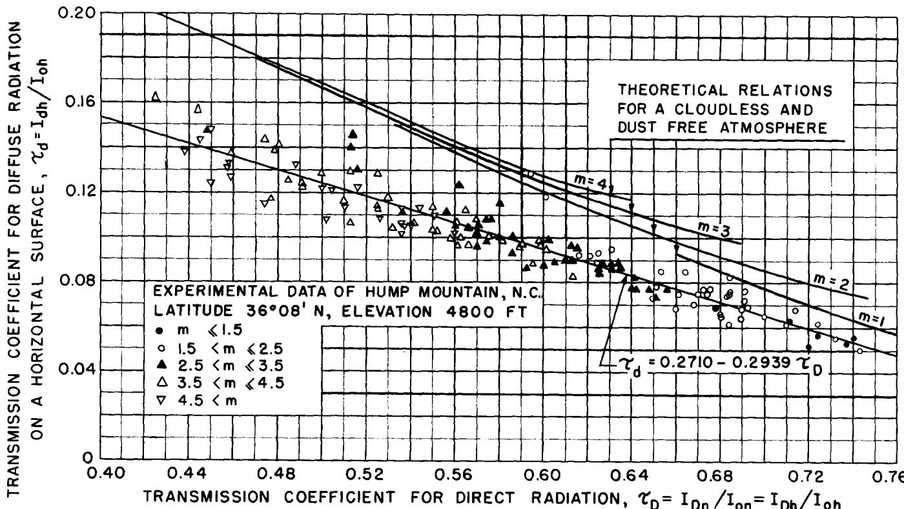  
图1—海拔4800英尺无云大气中水平面上直接辐射与散射辐射强度的理论与实验关系

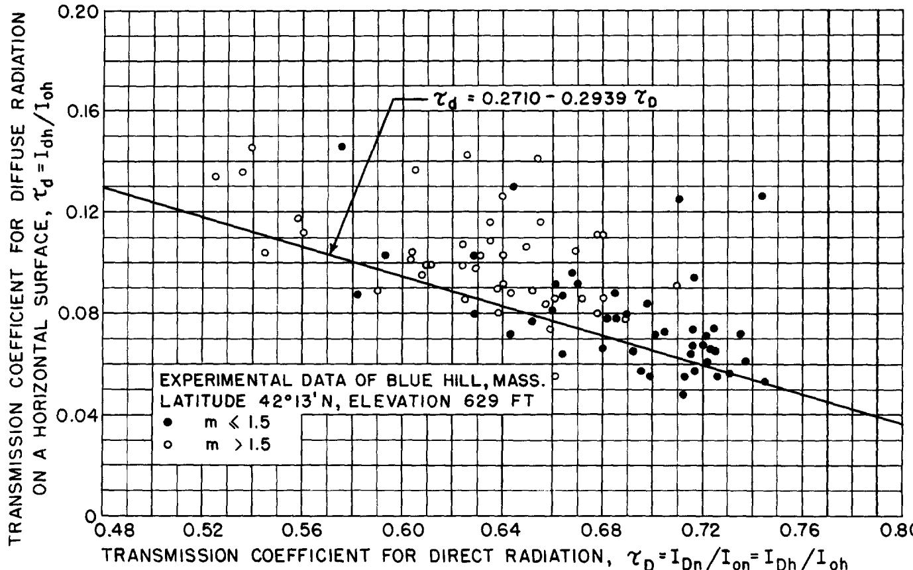  
图2—基于Hump Mountain数据建立的直接辐射与散射辐射经验关系与Blue Hill实测数据的对比

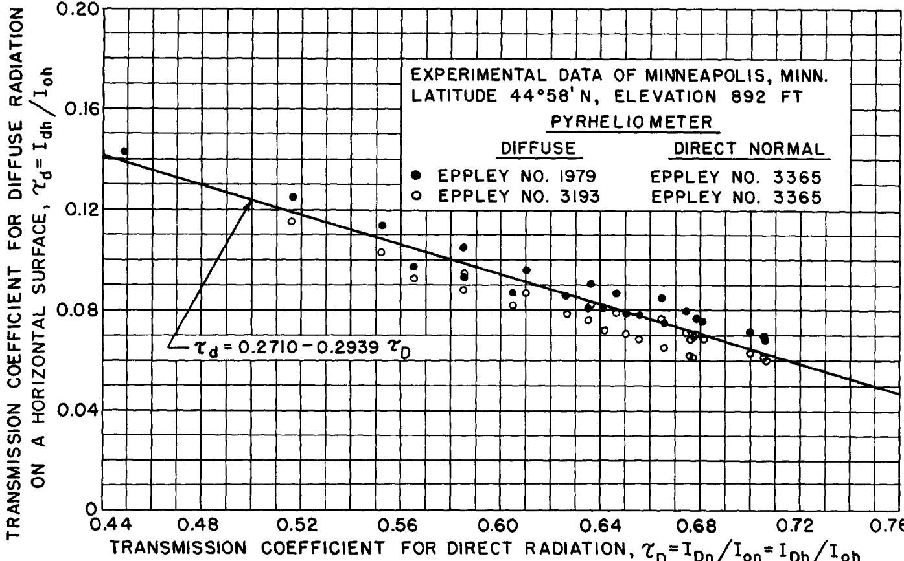  
图3—基于Hump Mountain数据建立的直接辐射与散射辐射经验关系与Minneapolis实测数据的对比

观测到的散射辐射值低于理论计算值（基于无尘大气且假设50%散射辐射到达地面的模型）的原因并不显而易见。由于理论关系未考虑尘埃影响，且大气实际上总含有尘埃，若按通常假设"尘埃粒子只散射不吸收辐射"4,6，观测值应高于理论值。理论推导中未考虑的地形反射效应也会增加散射辐射，因为地表反射辐射会被大气成分再次散射，其中部分会返回地面。此外，"50%散射辐射到达地面"的假设仅适用于空气分子的纯瑞利散射，而水汽散射通常产生更强的前向散射分量，本应使观测值高于理论值。因此，散射辐射在到达地面过程中必然有相当部分被大气水汽或其他吸收介质吸收。但如图1所示，仅此因素尚不足以解释理论与实验值的全部差异。不过无论差异原因如何，公式[1]提供了在已知法向直接辐射强度时估算无云天气水平面散射辐射强度的方法。由于水平面总辐射强度是直接辐射与散射辐射强度之和，从公式[1]可推导出τd与τT的关系式：

$$
\tau_{d} = 0.3840 - 0.4160\tau_{T} \tag{2}
$$

其中τT是水平面总辐射强度与大气层外水平面入射辐射强度之比。

为验证公式[1]是否适用于Hump Mountain以外的地区，我们将其与Hand7的Blue Hill数据及明尼苏达大学在Minneapolis的测量数据进行了对比（图2、图3）。虽然Blue Hill数据离散度较大且散射辐射值普遍高于Hump Mountain，但吻合度仍令人满意。公式[1]与Minneapolis实验数据的吻合度极佳，微小差异完全在Eppley直接辐射表的测量误差范围内（图3显示两台Eppley仪器测量的散射辐射差异约10%）。因此我们认为公式[1]及由此导出的公式[2]具有普适性，可应用于周边地形反照率和大气尘埃污染程度与Hump Mountain、Blue Hill及Minneapolis相似的地区。

# 多云天气日散射辐射与日总辐射的关系

由于云量变化极大，非完全晴朗天空条件下的直接辐射和散射辐射强度也会高度变化，其瞬时值无法预测。因此，要建立阴天条件下散射辐射与总辐射之间的关系，必须采用统计平均值，这些数据需要来自足够长时间跨度的实验观测。

若以一个月为研究周期，在此期间太阳赤纬变化不大，因此某地大气层外水平面接收的日太阳辐射量也保持相对恒定。那么在一个月内，某地水平面接收的日总辐射和日散射辐射的逐日变化主要源于云量变化，其次（影响程度小得多）才是大气水汽、尘埃和臭氧含量的变化。由于水平面日总辐射量反映了大气云量程度，而云量变化又是导致散射辐射日际变化的主因，因此可以预期：当采用适当的统计平均方法时，特定地点各月份的日总辐射与日散射辐射之间将存在相关关系。

图4展示了基于马萨诸塞州Blue Hill地区1947-1956年十年间12月、3月和6月数据建立的这种关系。图中每个点的日散射辐射值$D$表示在日总辐射等于$H$的那些天接收到的日散射辐射平均值。但由于即使在同月内日总辐射值完全相同的天数极少，图4中每个点的$H$值实际上是日总辐射落在小范围区间内(区间大小由图4中相邻点$H$值差异表示)的那些天的日总辐射平均值。由于使用了每个月份十年的数据，且每月约获得十个数据点，因此图5中每个点约代表三十天的平均值。

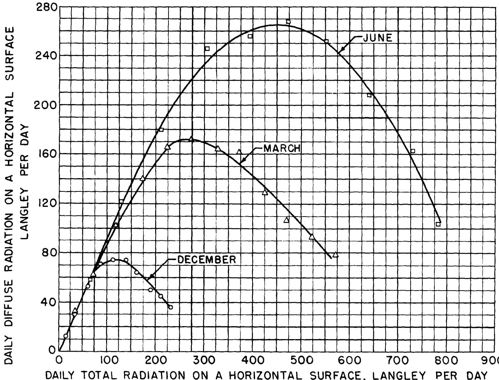  
图4—Blue Hill地区12月、3月和6月水平面日总辐射与日散射辐射关系

图5结果表明，这三个月份中日散射辐射与日总辐射之间存在相当平滑的关系。此外，三条曲线形态的相似性表明，通过坐标归一化可能获得这些关系的统一表达。图5展示了采用归一化坐标$K_{d}$和$K_{T}$表示的全年12个月日散射辐射与日总辐射关系，证实了这种可能性：

$$
\begin{array}{r}K_{d} = D / H_{o} \\ K_{T} = H / H_{o} \end{array} \tag{[3]}
$$

其中$H_{o}$表示水平面接收的大气层外日太阳辐射量，由下式计算：

$$
H_{0} = \frac{24}{\pi} r I_{s c}(\cos L\cos \delta \sin \omega_{s} + \omega_{s}\sin L\sin \delta) \tag{[5]}
$$

计算时采用各月平均太阳赤纬。式[5]中的日落时角$\omega_{s}$(即太阳在西方落下的时角)可通过下式确定：

$$
\cos \omega_{s} = -\tan L\tan \delta \tag{[6]}
$$

各月选定日期的太阳赤纬及大气层外法向辐射强度与太阳常数的比值$r$见表1。式[6]的图示见图6，其中$H_{o}$随纬度变化，月份作为参数。

尽管Blue Hill所在纬度$(42^{\circ}13^{\prime}\mathrm{N})$从12月到6月$H_{o}$值增长超过三倍(见图6)，但图5结果显示两个无量纲量$K_{d}$和$K_{\tau}$之间存在相当明确的关系。值得注意的是，在相对无云天气($K_{\tau} = 0.75$)时，水平面接收的散射辐射约为大气层外太阳辐射的$12\%$($K_{d} = 0.12$)。而在某些局部多云天气($K_{\tau} = 0.40$)时，散射辐射可达晴天值的两倍以上，达到大气层外辐射量的$25\%$。随着云量增加，当$K_{\tau}$趋近于零时，$K_{d}$也如预期趋近于零。

因此，图5曲线提供了一种有趣的方法，可在日总辐射测量地区以约$\pm 5\%$的平均精度估算日散射辐射，当然前提是图5关系式在其他地区同样适用。由于数据有限，目前未能将研究扩展到其他地区。但后续发展将表明，基于这些结果有效性假设得出的结论与所有现有实验数据仍能很好吻合。

对于$K_{\tau} > 0.75$的少数偏离整体趋势的数据点需要特别说明。需要强调的是，在公式[3]和[4]中，$H_{o}$是采用各月平均太阳赤纬计算的。因此，只有当计算得到的$H_{o}$值确实等于用于获取各数据点的那些天的地外日辐射真实平均值时，图5中各点的$K_{\tau}$（或$K_{d}$）值才能准确表示透过大气层的地外日辐射中转化为总辐射（或散射辐射）的比例，从而真实反映云量程度。由于地外日辐射量在月内确实存在一定波动，这就要求用于获取各数据点的那些天在月中前后呈对称分布。分析Blue Hill数据发现，$K_{\tau} < 0.75$的所有点基本满足这一条件，但$K_{\tau} > 0.75$的少数点则不符合。事实上，这些点$K_{\tau}$值偏大的直接原因是所采用的$H_{o}$值小于真实平均值。若采用"正确"的平均$H_{o}$值会得到更好结果，但为确保各月$H_{o}$具有确定值而未作调整。为解决此问题，建议当$K_{\tau} > 0.75$时，采用这些点$D/H$的平均比值0.16。

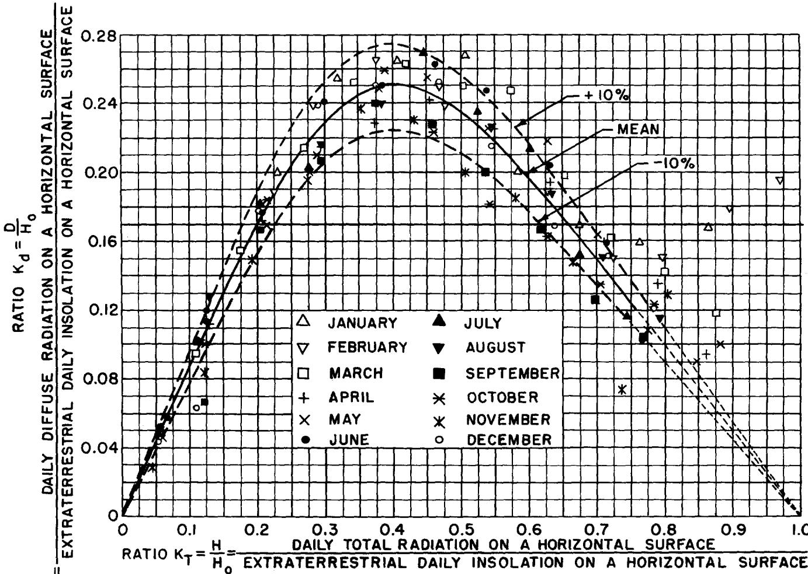  
图5—水平面日总辐射与日散射辐射关系

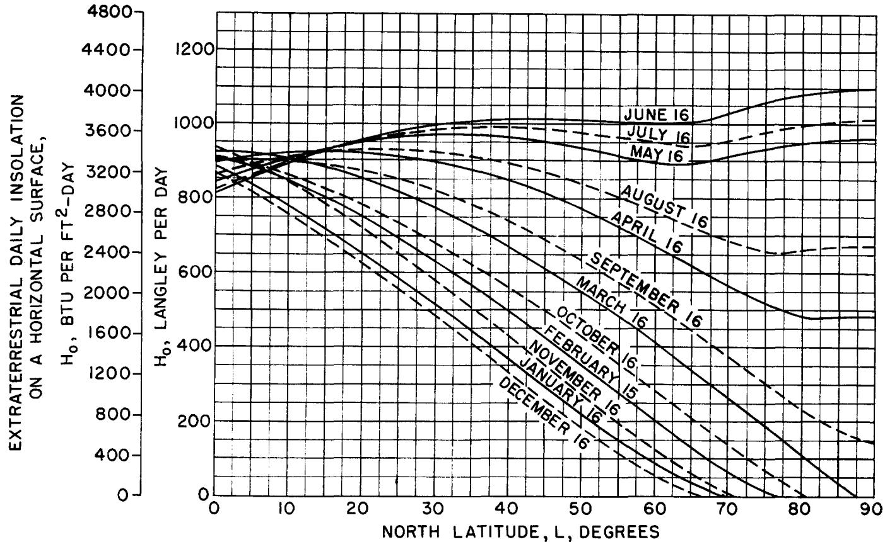  
图6—水平面接收的地外日辐射量

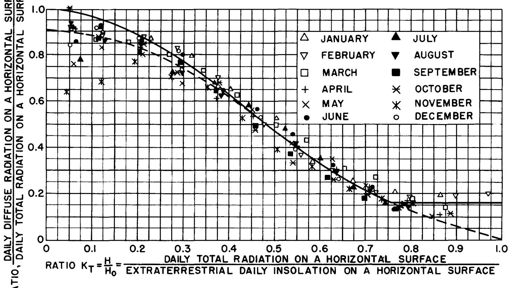  
图7—日散射辐射与日总辐射比值随云量指数$K_{T}$的变化

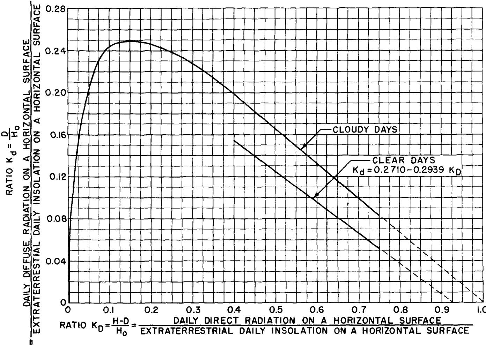  
图8—晴天与阴天条件下水平面日直接辐射和日散射辐射关系对比

图7展示了$D/H$随$K_{\tau}$的变化关系。由于全阴天时散射辐射应与总辐射相等，当$K_{\tau}$趋近于零时，$D/H$应趋近于极限值1。但在$K_{\tau}$接近零的数据点处观察到不一致性。图中实线绘制时已确保$K_{\tau}=0$时$D/H=1$，建议实际应用采用此曲线。

# 晴天与阴天日直接辐射和日散射辐射关系对比

图8对比了晴天与阴天的散射辐射情况，其中将图5的$K_{d}$与$K_{D}$进行对比：

$$
K_{D} = (H - D) / H_{o} = K_{\tau} - K_{d} \tag{[7]}
$$

$K_{D}$表示透过大气层转化为直接辐射的地外日辐射比例。由于$K_{d}$和$K_{D}$分别是$\tau_{d}$和$\tau_{D}$的加权平均值，且晴天时$\tau_{d}$与$\tau_{D}$呈线性关系，将公式[1]中的$\tau_{d}$和$\tau_{D}$替换为$K_{d}$和$K_{D}$后，可得到晴天水平面日直接辐射与散射辐射的关系式：

$$
K_{d} = 0.2710 - 0.2939K_{D} \tag{[8]}
$$

该式也在图8中绘出。

云层对散射辐射的影响在图8中清晰可见：相同$K_{D}$值下，阴天的$K_{d}$值明显高于晴天。这显然源于云层的额外散射作用。

# 水平面日总辐射的统计分布

在大多数情况下，了解日散射辐射的月平均值$\bar{D}$更为重要。然而，为了利用图7的关系式计算$\bar{D}$，必须已知日总辐射的统计分布。

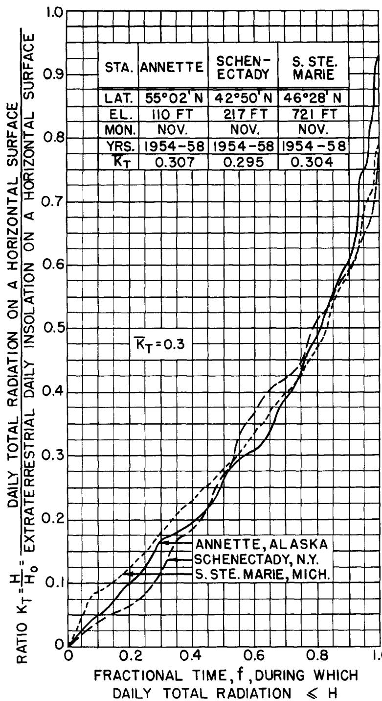  
图9—$\bar{K}_{T} = 0.3$时的月$K_{T}$曲线

基于后续将讨论的原因，我们推测不同地区的统计分布曲线间可能存在相关性。为验证这一假设，我们构建并比较了相距甚远地区的日总辐射统计分布曲线。图9、10和11展示了这些比较的典型示例。

图9、10和11中的每条曲线均采用美国气象局出版物《气候数据国家摘要》中五年(主要为1954-1958年)的日总辐射数据构建而成。这些曲线的排列使得同一图表中各曲线的$\bar{K}_{T}$值近似相等，其中：

$$
\bar{K}_{\tau} = \bar{H} /H_{o} \tag{[9]}
$$

式中$\bar{H}$为特定地区特定月份的日总辐射月平均值，$H_{o}$为大气层外日辐射量，两者均从图6获取。由此得到的统计分布曲线将称为"月$K_{\tau}$曲线"，因为它们表示$K_{\tau}$量的统计分布且基于月度构建。

同一图中不同曲线的比较表明，尽管曲线不完全相同，但差异不大，在许多实际应用中可忽略不计。图9中相距甚远的纽约州Schenectady和阿拉斯加州Annette，以及图11中海拔差异显著的新墨西哥州Albuquerque和Wake Island，这些地区具有几乎相同的月$K_{\tau}$曲线，这表明月$K_{T}$曲线形态与$\bar{K}_{T}$值之间的相关性不必局限于特定地区。因此，若获得一组对应不同$\bar{K}_{T}$均值的月$\bar{K}_{T}$曲线，它们可作为实际月$K_{T}$曲线的良好近似，在已知日总辐射月平均值时用于确定日总辐射的统计分布。基于表2所列地区数据构建的月$K_{T}$曲线，我们得到了一组对应$\bar{K}_{T}$为0.3、0.4、0.5、0.6和0.7的"广义月$K_{T}$曲线"，如图12和表3所示。

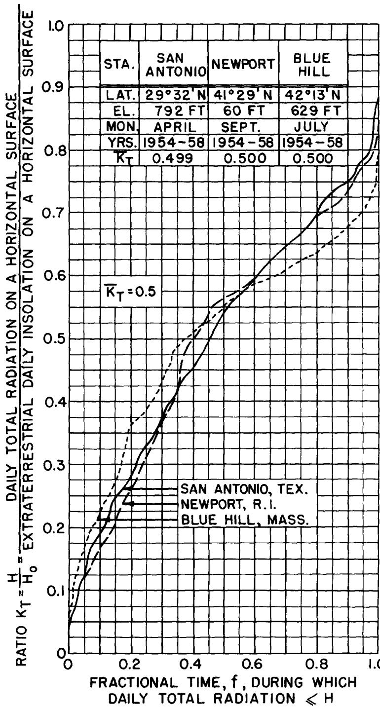  
图10—$\bar{K}_{\tau} = 0.5$时的月$K_{\tau}$曲线

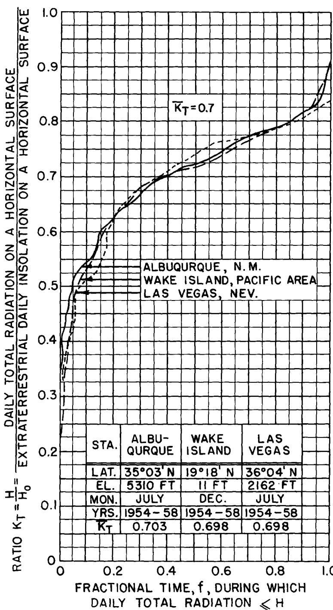  
图11—$\bar{K}_{T} = 0.7$时的月$K_{\tau}$曲线

# 日总辐射月平均值与日散射辐射月平均值的关系

前文所述的广义月$K_{T}$曲线可与图7的曲线结合使用，按以下方法计算日散射辐射的月平均值。

表2. 用于构建广义月$\kappa_{\tau}$曲线的站点选择

| 站点 | 北纬纬度 | 海拔(英尺) | 月份 | 日照时数(小时/天) | Kτ | 数据周期 |
|------|---------|-----------|------|------------------|----|---------|
| 阿拉斯加安尼特 | 55°02' | 110 | 11月 | 199 | 0.307 | 1954-1958 |
| 纽约州斯克内克塔迪 | 42°50' | 217 | 11月 | 380 | 0.295 | 1954-1958 |
| 密歇根州苏圣玛丽 | 46°28' | 721 | 11月 | 326 | 0.304 | 1954-1958 |
| 马萨诸塞州波士顿 | 42°22' | 15 | 12月 | 298 | 0.399 | 1955-1958 |
| 俄亥俄州克利夫兰 | 41°30' | 787 | 12月 | 310 | 0.400 | 1955-1958 |
| 印第安纳州印第安纳波利斯 | 39°44' | 793 | 11月 | 434 | 0.401 | 1954-1958 |
| 田纳西州橡树岭 | 36°01' | 905 | 1月 | 429 | 0.399 | 1952,54,55,57 |
| 俄亥俄州普廷贝 | 41°39' | 575 | 11月 | 404 | 0.396 | 1950-1953 |
| 宾州州立学院 | 40°48' | 1175 | 1月 | 357 | 0.406 | 1954-1958 |
| 佐治亚州亚特兰大 | 33°39' | 975 | 1月 | 468 | 0.498 | 1954-1958 |
| 马萨诸塞州蓝山 | 42°13' | 629 | 7月 | 994 | 0.500 | 1954-1958 |
| 罗德岛州纽波特 | 41°29' | 60 | 9月 | 730 | 0.500 | 1954-1958 |
| 安大略省渥太华 | 45°30' | - | 4月 | 915 | 0.499 | 1954-1958 |
| 德克萨斯州圣安东尼奥 | 29°22' | 792 | 4月 | 802 | 0.498 | 1954-1958 |
| 华盛顿州西雅图 | 47°36' | 14 | 8月 | 858 | 0.502 | 1951,52,54,55,58 |
| 佛罗里达州阿巴拉契科拉 | 29°44' | 13 | 3月 | 778 | 0.600 | 1952,1955-1958 |
| 北达科他州俾斯麦 | 46°46' | 1650 | 8月 | 862 | 0.599 | 1954-1958 |
| 俄亥俄州克利夫兰 | 40°30' | 1787 | 5月 | 963 | 0.597 | 1951,1955-1958 |
| 科罗拉多州大湖 | 41°15' | 8389 | 4月 | 850 | 0.598 | 1950-1953,1957 |
| 德克萨斯州米德兰 | 32°01' | 2854 | 10月 | 661 | 0.601 | 1954-1958 |
| 南达科他州拉皮德城 | 44°09' | 3165 | 4月 | 825 | 0.600 | 1954-1958 |
| 新墨西哥州阿尔伯克基 | 35°03' | 5310 | 7月 | 997 | 0.703 | 1954-1958 |
| 科罗拉多州大章克申 | 39°06' | 4849 | 6月 | 1019 | 0.699 | 1954,55,57,58 |
| 内华达州拉斯维加斯 | 36°04' | 2162 | 7月 | 998 | 0.698 | 1954-1958 |
| 加利福尼亚州河滨 | 33°58' | 1050 | 9月 | 797 | 0.700 | 1954-1958 |
| 加利福尼亚州圣玛丽亚 | 34°56' | 238 | 7月 | 997 | 0.700 | 1954-1958 |
| 威克岛 | 19°18' | 11 | 12月 | 635 | 0.698 | 1954-1958 |

表3 广义月Kτ曲线

| Kτ   | 当Kτ=0.3时的f值 | 当Kτ=0.4时的f值 | 当Kτ=0.5时的f值 | 当Kτ=0.6时的f值 | 当Kτ=0.7时的f值 |
|------|----------------|----------------|----------------|----------------|----------------|
| 0.04 | 0.073          | 0.015          | 0.001          | 0.000          | 0.000          |
| 0.08 | 0.162          | 0.070          | 0.023          | 0.008          | 0.000          |
| 0.12 | 0.245          | 0.129          | 0.045          | 0.021          | 0.007          |
| 0.16 | 0.299          | 0.190          | 0.082          | 0.039          | 0.007          |
| 0.20 | 0.395          | 0.249          | 0.121          | 0.053          | 0.007          |
| 0.24 | 0.496          | 0.248          | 0.160          | 0.076          | 0.007          |
| 0.28 | 0.513          | 0.396          | 0.194          | 0.101          | 0.013          |
| 0.32 | 0.579          | 0.379          | 0.234          | 0.126          | 0.013          |
| 0.36 | 0.628          | 0.438          | 0.277          | 0.152          | 0.027          |
| 0.40 | 0.687          | 0.493          | 0.323          | 0.191          | 0.034          |
| 0.44 | 0.748          | 0.545          | 0.358          | 0.235          | 0.047          |
| 0.48 | 0.793          | 0.601          | 0.400          | 0.269          | 0.054          |
| 0.52 | 0.824          | 0.654          | 0.560          | 0.310          | 0.081          |
| 0.56 | 0.861          | 0.719          | 0.409          | 0.360          | 0.128          |
| 0.60 | 0.904          | 0.709          | 0.614          | 0.410          | 0.161          |
| 0.64 | 0.936          | 0.827          | 0.703          | 0.467          | 0.228          |
| 0.68 | 0.953          | 0.888          | 0.793          | 0.538          | 0.295          |
| 0.72 | 0.967          | 0.931          | 0.872          | 0.648          | 0.517          |
| 0.76 | 0.979          | 0.967          | 0.945          | 0.758          | 0.678          |
| 0.80 | 0.986          | 0.981          | 0.980          | 0.884          | 0.859          |
| 0.84 | 0.993          | 0.997          | 0.993          | 0.945          | 0.940          |
| 0.88 | 0.995          | 0.999          | 1.000          | 0.985          | 0.980          |
| 0.92 | 0.998          | 0.999          | 0.999          | 0.996          | 1.000          |
| 0.96 | 0.998          | 1.000          |                | 0.999          |                |
| 1.00 | 1.000          |                |                | 1.000          |                |

需要指出的是，任何月份$K_{\tau}$曲线下的面积在数值上等于$\bar{K}_{\tau}$的值，因为根据图9、10、11或12中$\bar{K}_{\tau}$和"f"的定义：

$$
\begin{array}{c}\bar{K}_{\tau} = \bar{H} /H_{0} = \frac{1}{\bar{H}_{0}}\int_{f = 0}^{f = 1}Hdf = \int_{f = 0}^{f = 1}\frac{H}{H_{0}} df \\ = \int_{f = 0}^{f = 1}K_{\tau}df \end{array} \tag{[10]}
$$

然而，由于$D / H$的比值是$K_{\tau}$的唯一函数（如图7所示），当$\bar{K}_{d}$定义为：

$$
\bar{K}_{d} = \bar{D} /H_{o} \tag{[11]}
$$

可以看出：

$$
\bar{K}_{d} = \int_{f = 0}^{f = 1}\frac{D}{H_{0}} df = \int_{f = 0}^{f = 1}\frac{D}{H} K_{\tau}df \tag{[12]}
$$

公式[12]表明，当将月份$K_{\tau}$曲线的纵坐标$K_{\tau}$乘以图7中的$D / H$比值时，所得曲线下的面积在数值上等于$\bar{K}_{d}$的值。然后，$\bar{D}$的值可以通过将$\bar{K}_{d}$乘以图6中的地外日辐射$H_{0}$轻松获得。

当将图12中广义月份$K_{\tau}$曲线的坐标$K_{\tau}$乘以图7中的$D / H$比值时，就得到了图13中的曲线。根据公式[12]，这些曲线下的面积在数值上等于$\bar{K}_{d}$的值。通过图形积分得到表4所示的结果。

表4中$\bar{K}_{\tau} = 0.75$对应的$\bar{K}_{d}$值取自图5，因为$\bar{K}_{\tau} = 0.75$的地区应该几乎每天都是晴朗天气，因此$K_{d}$和$K_{\tau}$应该几乎每天保持不变，并分别等于$\bar{K}_{d}$和$\bar{K}_{\tau}$。

需要注意的是，表4中$\bar{K}_{d}$是$\bar{K}_{\tau}$的单值函数这一结果，只有在月份$K_{\tau}$曲线与$\bar{K}_{\tau}$之间存在如图9、10和11所示的相关性时才能获得。事实上，这正是最初让作者怀疑存在这种相关性的原因，因为根据Blue Hill数据得出的图5中$K_{d}$和$K_{\tau}$之间的关系，强烈暗示了$\bar{K}_{d}$和$\bar{K}_{\tau}$之间存在类似的唯一关系。

在查看表4时需要注意，如果某地区大气层透射的日平均地外太阳辐射仅为30%（$\bar{K}_{\tau} = 0.30$），则该地区可被视为极端多云。而当$\bar{K}_{\tau} = 0.70$时，则可认为该地区非常晴朗。表4结果显示，尽管不同$\bar{K}_{T}$值对应显著不同的大气条件，但以散射辐射形式透过大气层的日平均地外辐射比例（即$\bar{K}_{d}$值）变化非常平缓——最小值0.125到最大值0.188。此外，对美国气象局发布的日总辐射数据分析表明，对于大多数（超过70%）地区和月份，$\bar{K}_{T}$值处于0.3至0.6范围内。因此仅从表4结果就可预期，许多地区的$\bar{K}_{d}$值应在0.174至0.188之间。根据现有有限的散射辐射数据，$\bar{K}_{d}$的12个月平均值在：马萨诸塞州Blue Hill为0.178（10年平均）；法国Nice为0.185（3年平均）；芬兰Helsingfors为0.189（4年平均）；英国London为0.205（5年平均）。对London数据的进一步检查表明，其实测$\bar{K}_{d}$值高于预测值的原因至少部分是由于对测量散射辐射添加了1%至6%的"遮光环"校正。如果像其他地区数据一样未应用此校正，则吻合度将完全令人满意。

  
图12—广义月$K_{\tau}$曲线

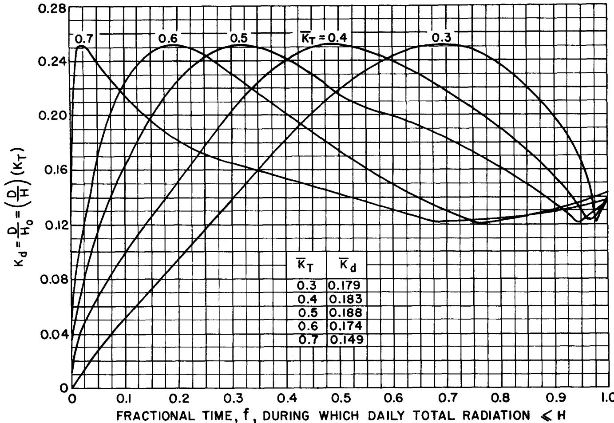  
图13—用于确定$\bar{K}_{d}$的曲线

表4-月平均日总辐射与月平均日散射辐射的关系  

| $K_{T}$ | 0.3 | 0.4 | 0.5 | 0.6 | 0.7 | (0.75) |
|---------|-----|-----|-----|-----|-----|--------|
| $K_{d}$ | 0.179 | 0.183 | 0.188 | 0.174 | 0.149 | (0.125) |

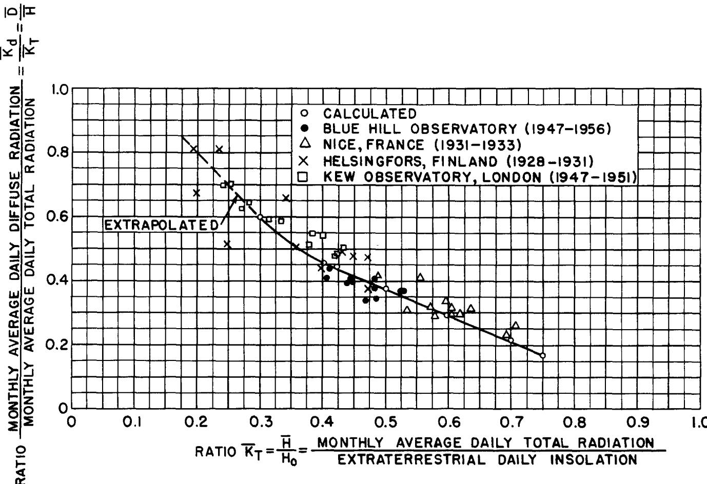  
图11—月平均日散射辐射与月平均日总辐射之比随云量指数$\bar{K}_{T}$的变化关系

在阴天条件下，除了直接实验测量外，难以获得真实的瞬时辐射强度。

根据公式[11]

$$
\bar{D} = \bar{K}_{d}H_{o} \tag{[13]}
$$

如果假设相同的比例$\bar{K}_{d}$也代表散射辐射平均强度与地外辐射强度之比，即：

$$
\bar{I}_{dh} = \bar{K}_{d}I_{oh} \tag{[14]}
$$

其中$\bar{I}_{dh}$是水平面上接收到的散射辐射平均强度，那么散射辐射平均强度与日散射辐射之比$r_{d}$为：

$$
r_{d} = \bar{I}_{dh} / \bar{D} = I_{oh} / H_{o} \tag{[15]}
$$

只有当通过公式[15]计算得到的比值与实验数据得出的比值进行比较时，才能验证这一假设的正确性。

$H_{o}$的表达式由公式[5]给出，瞬时辐射强度可表示为：

$$
I_{oh} = rI_{sc}(\cos L\cos \delta \cos \omega +\sin L\sin \delta) \tag{[16]}
$$

因此

$$
r_{d} = \frac{\pi}{24}\frac{\cos L\cos\delta\cos\omega + \sin L\sin\delta}{\cos L\cos\delta\sin\omega_{s} + \omega_{s}\sin L\sin\delta} \tag{[17]}
$$

将公式[6]中的日落时角$\omega_{s}$代入公式[17]，可得到表达式：

$$
r_{d} = \frac{\pi}{24}\frac{\cos\omega - \cos\omega_{s}}{\sin\omega_{s} - \omega_{s}\cos\omega_{s}} \tag{[18]}
$$

使用美国马萨诸塞州Blue Hill十年数据和芬兰Helsingfors四年数据，将月平均小时散射辐射与日散射辐射之比（针对11:00-12:00、12:00-13:00、10:00-11:00和13:00-14:00等时段）相对于通过公式[6]计算得到的日落时角$\omega_{s}$（使用各月平均太阳赤纬）绘制如图15所示。在计算这些比值时，将相对于太阳正午对称的上午和下午时段数据进行了合并。如果将这些小时平均散射辐射视为这些时段中点的散射辐射平均强度，则可以与公式[18]的理论比值$r_d$进行比较。通过公式[18]计算得到的$r_d$值（使用距太阳正午$\frac{1}{2}$、$1\frac{1}{2}$、$2\frac{1}{2}$小时等时刻的时角）在图15中以实线表示。

实验比值与通过公式[18]计算得到的比值之间的高度一致性，验证了公式[14]中所做的假设。

因此，当已知$\bar{K}_d$的值（可通过表3和图14确定）时，公式[14]和图15均可用于确定散射辐射的平均强度。

# 小时总辐射与日总辐射的关系

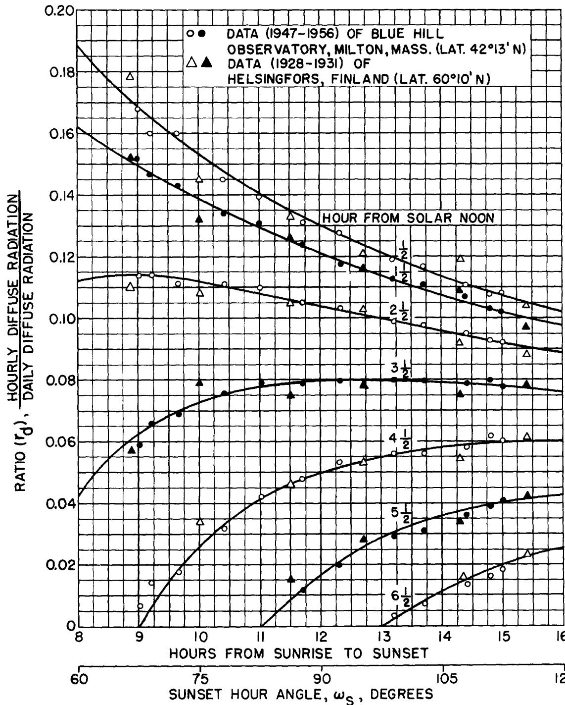  
图15—小时散射辐射与日散射辐射比值的理论与实验结果对比

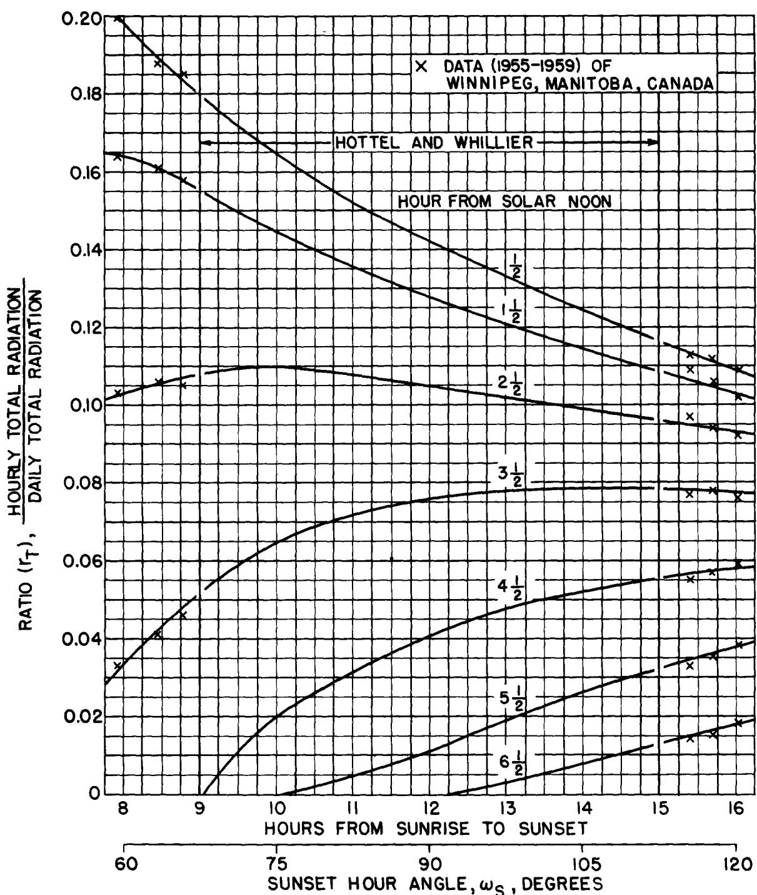  
图16—小时总辐射与日总辐射比值的实验结果

若将公式[13]和[14]中表示散射辐射的下标$d$替换为表示总辐射的下标$T$，则可得到与公式[18]中$r_d$形式相同的表达式$r_T$，即水平面上接收到的总辐射平均强度与日总辐射之比。Whillier$^{13}$以及Hottel和Whillier$^{14}$的研究表明，实验测得的$r_T$比值与通过公式[18]计算得到的值存在差异。然而，当将来自不同地区的实验$r_T$比值相对于日落时角绘制曲线时，可获得各小时的平均曲线，在太阳时9:00至15:00之间，各数据点与平均曲线的偏差不超过$\pm 5\%$。图16中9至15小时范围内的实验曲线由Hottel和Whillier$^{14}$提供，超出该范围的部分使用了加拿大Winnipeg$^{15}$的数据进行扩展。

以下两个示例展示了前文推导关系的可能应用场景。

示例1：估算北纬$36^{\circ}$地区6月23日正午12:00水平面上的散射辐射和总辐射强度。根据Threlkeld和Jordan的数据，在假设的基础大气条件下，法向直射辐射强度$I_{Dn}$为280 Btu/hr-sq ft，太阳高度角为$77.5^{\circ}$。

解：由表1可知，6月23日$r=0.9670$。因此$I_{on}=rI_{sc}=(0.9670)(442)=428$ Btu/hr-sq ft，$\tau_{D}=I_{Dn}/I_{on}=280/442=0.655$。通过公式[1]计算得$\tau_{d}=0.2710-(0.2939)(0.655)=0.079$。因此$I_{dh}=\tau_{d}I_{oh}=(0.079)(428)(\sin 77.5^{\circ})=33$ Btu/hr-sq ft，$I_{th}=I_{dh}+I_{dh}=(280)(\sin 77.5^{\circ})+33=307$ Btu/hr-sq ft。

若已知总辐射强度为307 Btu/hr-sq ft，则可按以下方式计算$I_{dh}$和$I_{Dn}$：由于$\tau_{T}=I_{Th}/I_{oh}=307/(428)(\sin 77.5^{\circ})=0.734$，通过公式[2]得$\tau_{d}=0.3840-(0.4160)(0.734)=0.079$，$I_{dh}=\tau_{d}I_{oh}=33$ Btu/hr-sq ft（与之前相同）。因此$I_{Dn}=(I_{rh}-I_{dh})/\sin\alpha=(307-33)/\sin 77.5^{\circ}=280$ Btu/hr-sq ft。

示例2：根据美国气象局在《气候数据国家摘要》中发布的数据，印第安纳州Indianapolis（北纬$39^{\circ}44^{\prime}$）1954-1958年五年间1月份水平面日总辐射平均值$\bar{H}$为553 Btu/day-sq ft。需要估算日散射辐射平均值以及11:00-12:00和12:00-13:00时段的总辐射和散射辐射平均强度。

解：通过图6或公式[5]得$H_{o}=1370$ Btu/day-sq ft。因此$\bar{K}_{T}=\bar{H}/H_{o}=553/1370=0.403$，由图14得$\bar{D}/\bar{H}=0.454$。故$\bar{D}=(\bar{D}/\bar{H})(\bar{H})=(0.454)(533)=242$ Btu/day-sq ft。

根据公式[6]计算日落时角$\omega_{s}$，1月16日太阳赤纬为$-21^{\circ}$，得$\cos\omega_{s}=-(\tan 39^{\circ}+4^{\prime})-\tan 21^{\circ})=0.323$，$\omega_{s}=71^{\circ}$（即日出至日落时间间隔为$\frac{71}{18}\times2=9.45$小时）。由图16和15得$r_{T}=0.172$，$r_{d}=0.161$。因此11:00-12:00和12:00-13:00时段的总辐射和散射辐射平均强度分别为$\bar{I}_{th}=r_{T}\bar{H}=(0.172)(553)=95$ Btu/hr-sq ft，$\bar{I}_{th}=r_{d}\bar{D}=(0.161)(242)=39$ Btu/hr-sq ft。

利用图12或表3中的广义月$K_{T}$曲线，可以从给定的$\bar{H}$值近似确定日总辐射小于或等于特定值的时间比例。例如，根据表3或图12，当$K_{T} = 0.20$时，$f = 0.249$。因此在Indianapolis地区1月份，有$25\%$的时间（或每月$7\frac{1}{2}$天），日总辐射小于或等于$K_{T}H_{o} = (0.20)(1370) = 274$ Btu/天-平方英尺。类似地，有$76\%$的时间（或每月23天）日总辐射小于或等于$(0.60)(1370) = 820$ Btu/天-平方英尺。实际观测数据（1954-1958年）显示，Indianapolis地区1月份辐射低于上述值的天数分别为$6\frac{1}{2}$天和23天。

广义月$K_{T}$曲线还可用于近似确定仅知道日总辐射月平均值估计值的地区的日总辐射统计分布，因为唯一需要的信息就是$\bar{H}$的值。

# 参考文献

1. Parmelee, (i. V., "晴空条件下漫射太阳辐射对垂直和水平表面的照射", ASHVE Transaction 60: 341-358, 1954. 
2. Johnson, F. S., "太阳常数", Journal of Meteorology, 11: 431-439, December, 1954. 
3. Drummond, A. J. and Greer, H. W., "基础日射测量学", The Sun at Work 3(2): 3-5, 11, June, 1958. 
4. Klein, W. H., "太阳辐射计算及对人体的热负荷", Journal of Meteorology, 5: 119-129, August, 1948. 
5. Moore, A. F. and Abbot, L. H., "天空亮度", Smithsonian Miscellaneous Collection, 71(4): 1-36, February, 1920. 
6. Fritz, S., "晴空条件下的太阳辐射", Heating and Ventilating, 46: 69-74, January, 1949. 
7. Hand, I. F., "马萨诸塞州Blue Hill天文台太阳辐射值的计算方法", Monthly Weather Review, 82: 43-49, February, 1954. 
8. 马萨诸塞州Blue Hill地区的漫射和总辐射数据来自美国气象局Blue Hill天文台的C. V. Cuniff先生。测量仪器和方法参见: Hand, I. F. and Wollaston, R. A., "Blue Hill天文台漫射太阳辐射测量", Technical Paper No. 18, U. S. Department of Commerce, Weather Bureau, Washington, D. C. May, 1952. 
9. Goreynski, W., "利用太阳记录仪和日射强度计记录太阳辐射", Nice Office Meteorologique, Annales, Tome II: 117-165, 1933. 
10. Lunelund, H., "芬兰太阳辐射知识贡献", Finska Vetenskaps-Societetens, Helsingfors, Commentationes Physico-Mathematicae, 7(11): 1-58, February, 1934. 
11. Blackwell, M. J., "Kew天文台五年连续总辐射和漫射辐射记录", Paper of the Meteorological Research Committee (London), No. 895, 1954. 
12. Lunelund, H., "赫尔辛基太阳辐射记录", Finska Vetenskaps-Societetens, Helsingfors, Commissions Physicsico-Mathematicae, 1-28, 1933. 
13. Whillier, A., "从日总量确定太阳辐射小时值", Archiv für Meteorologie, Geophysik und Bioklimatologie, Vienna, Series B., 7: 197-244, 1956. 
14. Hottel, H. C. and Whillier, A., "平板太阳能集热器性能评估", Transactions of the Conference on the Use of Solar Energy: The Scientific Basis, Vol. II, Part I, Section A, pp. 74-104, 1955. 
15. 加拿大温尼伯总辐射数据来自温尼伯地区气象学家I. M. Robertson先生。 
16. Threlkeld, J. L. and Jordan, R. C., "晴天条件下可获得的直接太阳辐射", Heating, Piping and Air Conditioning, 29:(12): 135-145, December, 1957. 
17. Fritz, S. and MacDonald, T. H., "美国平均太阳辐射", Heating and Ventilating, 46(7): 61-64, July, 1949.

# REFERENCES

1. Parmelee, (i. V., "Irradiation of Vertical and Horizontal Surfaces by Diffuse Solar Radiation from Cloudless Skies," ASHVE Transaction 60: 341-358, 1954. 
2. Johnson, F. S., "The Solar Constant," Journal of Meteorology, 11: 431-439, December, 1954. 
3. Drummond, A. J. and Greer, H. W., "Fundamental Pyrhiometry," The Sun at Work 3(2): 3-5, 11, June, 1958. 
4. Klein, W. H., "Calculation of Solar Radiation and the Solar Heat Load on Man," Journal of Meteorology, 5: 119-129, August, 1948. 
5. Moore, A. F. and Abbot, L. H., "The Brightness of the Sky," Smithsonian Miscellaneous Collection, 71(4): 1-36, February, 1920. 
6. Fritz, S., "Solar Radiation During Cloudless Days," Heating and Ventilating, 46: 69-74, January, 1949. 
7. Hand, I. F., "Methods of Calculating Solar Radiation Values at Blue Hill Observatory, Milton, Massachusetts," Monthly Weather Review, 82: 43-49, February, 1954. 
8. Diffuse and total radiation data for Blue Hill, Massachusetts, were obtained from Mr. C. V. Cuniff, U. S. Weather Bureau, Blue Hill Observatory, Milton, Massachusetts. For instrumentation and methods of measurement see: Hand, I. F. and Wollaston, R. A., "Measurement of Diffuse Solar Radiation at Blue Hill Observatory," Technical Paper No. 18, U. S. Department of Commerce, Weather Bureau, Washington, D. C. May, 1952. 
9. Goreynski, W., "Enregistrements due Rayonnement Solaire au Moyan des Solargraphy et des Pyrheliographs," Nice Office Meteorologique, Annales, Tome II: 117-165, 1933. 
10. Lunelund, H., "Contribution to the Knowledge of Solar Radiation in Finland," Finska Vetenskaps-Societetens, Helsingfors, Commentationes Physico-Mathematicae, 7(11): 1-58, February, 1934. 
11. Blackwell, M. J., "Five Years Continuous Recording of Total and Diffuse Radiation at Kew Observatory," Paper of the Meteorological Research Committee (London), No. 895, 1954. 
12. Lunelund, H., "Records of Solar Radiation in Helsingfors," Finska Vetenskaps-Societetens, Helsingfors, Commissions Physicsico-Mathematicae, 1-28, 1933. 
13. Whillier, A., "The Determination of Hourly Values of Total Solar Radiation from Daily Summations," Archiv für Meteorologie, Geophysik und Bioklimatologie, Vienna, Series B., 7: 197-244, 1956. 
14. Hottel, H. C. and Whillier, A., "Evaluation of Flat-Plate Solar Collector Performance," Transactions of the Conference on the Use of Solar Energy: The Scientific Basis, Vol. II, Part I, Section A, pp. 74-104, 1955. 
15. Data of total radiation for Winnipeg, Canada, are obtained from Mr. I. M. Robertson, Regional Meteorologist, District Aviation Forecast Office, Winnipeg, Canada. 
16. Threlkeld, J. L. and Jordan, R. C., "Direct Solar Radiation Available on Clear Days," Heating, Piping and Air Conditioning, 29:(12): 135-145, December, 1957. 
17. Fritz, S. and MacDonald, T. H., "Average Solar Radiation in the United States," Heating and Ventilating, 46(7): 61-64, July, 1949.