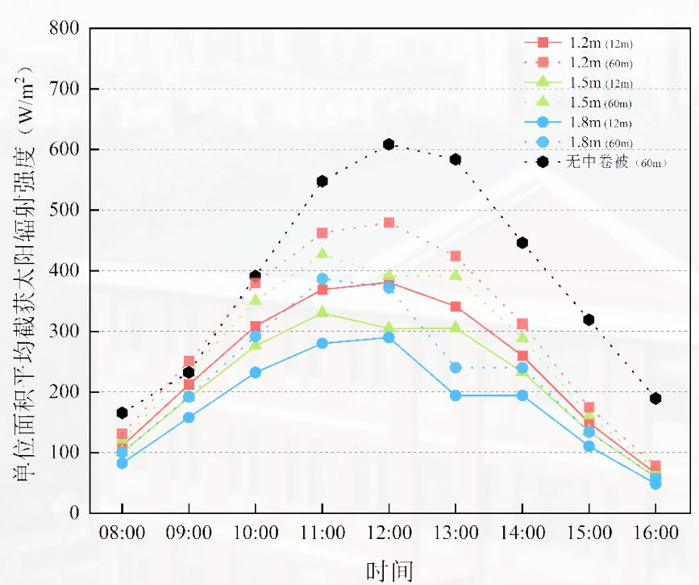
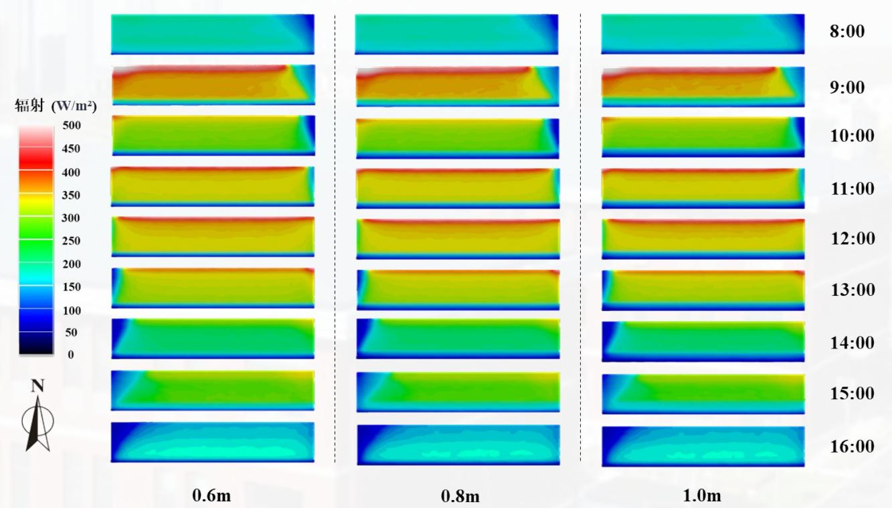

# 日光温室围护结构及立体栽培结构遮阴优化研究

汇报人：李茂千  导师：刘兴安 教授  专业：设施园艺学  时间：2025年06月10日

# 目录

Contents

# 1

# 前言

PART ONE

# 1.1 研究背景

# 日光温室

中国北方的严寒天气使农作物在室外越冬变得不切实际，日光温室是一种利用太阳能，人为调节作物生长内部环境因子的保护性设施，可为作物冬季生长提供稳定可控的生长环境（李天来，2005）。

截至2022年中国设施园艺总面积为280余万hm²，如图1，其中日光温室总面积为81万hm²，约占设施园艺总面积的29%，稳居世界第一（李天来，2023）。

# 温室光环境

光作为温室生产的最主要能源之一，首先为作物提供生长的基础，参与作物光合作用，光质和光强还影响到作物的形态建成和生理过程（邵丽等，2018；Ahamed et al，2020）。

其次，光不仅作为光源，也充当温室的热源，其在一定程度上决定着温室内的温度和湿度分布，是实现作物越冬生产的关键因素。

  
图1中国日光温室分布图

# 1.1 研究背景

# 温室围护结构遮阴

温室围护结构遮阴日光温室在生产过程中对太阳光能的利用率并未实现最大化。温室固有的围护结构对温室内的遮阴没有消除关于温室中卷被、前底角被、东西山墙、后屋面、骨架参数对温室光环境的影响研究尚未完善，导致温室的围护结构遮阴对温室内光能损失缺乏定量计算和优化以及温室内栽培设施的光调控手段仍无法明确（张惠楠等，2024；Chen et al，2018）。

# 立体栽培结构遮阴

立体栽培结构遮阴另一方面，利用日光温室进行矮株作物生产时，会造成温室内部空间的大量浪费。有学者尝试在日光温室内进行矮株作物生产时，采用诸多立体栽培模式，使日光温室的单位土地利用有所提升。但由于通过立体栽培设施充分利用温室空间势必造成栽培结构的遮阴，因此单纯依赖于试验种植的方法难以快速明确适宜的立体栽培结构优化参数。

图2 温室围护结构（中卷被、前底角被、东西山墙、后屋面、骨架）遮阴效果

# 1.2 研究目的与意义

# 研究目的

- 构建可综合考虑日光温室结构参数及立体栽培结构参数的光分布仿真模型，为日光温室光环境仿真研究提供新思路。

- 阐明温室围护结构参数及立体栽培结构参数对日光温室内部及立体栽培设施环境光分布的作用规律，为日光温室设计及种植规划提供理论指导。

# 研究意义

- 通过试验结合仿真分析的方法，缩短试验周期，明晰温室结构及立体栽培结构遮阴造成的光能损失定量计算及优化。

- 合理的立体栽培结构光环境优化及配套作物品种选型对温室作物的生长和生产有重要意义。

# 2

# 材料与方法

PART TWO

# 2.1 技术路线

# 2.2 研究内容与方法

  
1. 试验温室

  
图3 试验温室结构示意图：（a）日光温室结构示意图；（b）日光温室实景；（c）内部种植环境  
2. 试验A字架  
图4 试验A字架结构示意图：（a）A字架实物图；（b）A字架各单架；（c）A字架各部位组件实物图

# 2.2 研究内容与方法

# 日光温室结构参数的测定

日光温室结构参数的测定- 日光温室几何参数测定- 中卷被在地面后墙的阴影测量计算

  
图5 中卷被阴影形成：（a）中卷被阴影示意图；（b）阴影宽度与日光温室结构之间关系

# A字架结构光温环境的测定

  
图6 测试点示意图布置：(a)A字架及测点布置；(b)测点探头位置；(c)草莓种植位置

# 2.2 研究内容与方法

# 日光温室及A字架结构的重建

# 太阳辐射模型构建

利用speos完成温室及A字架虚拟三维结构- 准确模拟光线在日光温室中路径

  
图7日光温室及A字架模型：（a）四种A字架1:1模型；（b）辽沈II代日光温室1:1模型

- nature light  $\rightarrow$  2024.12.21（冬至日）- China时区  $/41.49^{\circ}\mathrm{N} \cdot 123.33^{\circ}\mathrm{E}/$  光线数量：1

  
图8虚拟天空模型示意图：（a）各时段太阳模型；（b）自然光源模块设置；（c）自然光设置

# 参数

# 2.2 研究内容与方法

# 研究内容

# ① 构建综合考虑日光温室结构及A字架结构参数的光分布仿真模型

试验日光温室及A字架的结构和光学参数的采集温室虚拟模型及A字架结构模型的构建仿真模型的验证

# ② 研究温室围护结构遮阴对后墙和地面的光分布规律

前底角被、中卷被遮阴对温室后墙和地面光分布规律研究- 东西侧墙遮阴对温室后墙和地面光分布规律研究- 温室骨架阴影对温室后墙和地面光分布规律研究- 后屋面水平投影对温室后墙和地面光分布规律研究

# ③ 明确A字架结构遮阴对草莓作物生长环境光热分布规律的影响

A字架主架遮阴对两侧耳架的光分布规律及其优化研究- A字架立体栽培较传统土地栽培的草莓生长规律研究

3

# 结果与分析

PART THREE

  
图9 日光温室内部地面后墙光截获实测数据与模拟数据对比

  
图10 A字架东西耳架及主架光截获实测数据与模拟数据对比

R²变化范围0.9446- 0.9751之间

R²变化范围在0.9164- 0.9741之间

日光温室及A字架截获模型验证

# 3.2.1 中卷被－温室地面光截获

  
图11不同宽度中卷被

  
图12不同宽度中卷被对地面仿真云图：地面

（1.2m、1.5m、1.8m）对地面光

截获影响规律

中卷被宽度每增加0.1m，地面阴影投影区域辐射降低2.91%

中卷被对温室地面光环境变化规律

# 3.2.1 中卷被－温室后墙光截获

  
图13不同宽度中卷被

（1.2m、1.5m、1.8m）对后墙光截获影响规律

  
图14不同宽度中卷被对后墙仿真云图：后墙

中卷被宽度每增加0.1m，地面阴影投影区域辐射降低1.72%

中卷被对温室后墙光环境变化规律

# 3.2.1前底角被－温室地面光截获

  
图15 不同高度前底角被（0.6m、0.8m、1.0m）对地面光截获影响规律

  
图16 不同高度前底角被对地面仿真云图

平均高度增加0.1m，其地面平均截获太阳辐射强度降低4.75%

前底角对温室地面光环境变化规律

# 3.2.2 东西侧墙 - 温室地面光截获

  
图17 温室东侧山墙对地面光截获影响规律：（a）地面

  
图18 温室西侧山墙对地面光截获影响规律：（a）地面

  
图19 不同山墙结构仿真云图：（a）地面

侧墙对温室地面光环境变化规律

# 3.2.2 东西侧墙 - 温室后墙光截获

  
图20 温室东侧山墙对后墙光截获影响规律：（b）后墙

  
图21 温室西侧山墙对后墙光截获影响规律：（b）后墙

  
图22 不同山墙结构仿真云图：（b）后墙

Ⅱ代温室地面与后墙受侧墙的遮阴作用较Ⅲ代和I代温室侧墙较弱

# 侧墙对温室后墙光环境变化规律

# 3.2.3 后屋面－温室地面光截获

  
图23 不同倾角（ $30^{\circ} \sim 45^{\circ}$ ）前屋面角对地面光截获影响规律

  
图24 不同后屋面倾角仿真云图

后屋面倾角从  $45^{\circ} - 30^{\circ}$  之间，平均每降低  $5^{\circ}$ ，地面单位面积截获太阳辐射强度降低  $7\%$ ，对整体地面单位面积截获太阳辐射强度降低  $8\%$

后屋面角对温室地面光环境变化规律

# 3.2.4 骨架 - 温室地面 / 后墙光截获

  
图25 不同骨架结构对地面及后墙光截获影响规律

  
图26 不同骨架结构光仿真云图：（a）地面；（b）后

椭圆钢管骨架在地面损失光截获达  $5\%$  ，在后墙损失光截获达  $8\%$  ；上下该温室骨架在地面损失光截获达  $7.7\%$  ，后墙损失光截获达  $12\%$

12%

# 温室骨架类型对温室地面及后墙光环境变化规律

# 3.3.1 A 字架与传统土地栽培对比

  
图27 土地栽培与A字架立体栽培光温性能差异对比

  
图28 土地栽培与A字架立体栽培土地利用率对比

  
图29 传统土地种植与A字架立体栽培的面积对比示意图

A字架立体栽培土地利用效率提高了  $37.1\%$  平均辐射量增加了  $71.3 \mathrm{W / m^2}$ ，平均温度升高了  $2.7^{\circ}\mathrm{C}$

传统土地栽培与A字架立体栽培对比

# 3.3.2 A 字架光温性能解析

  
图30 覆盖黑白膜A字架各结构光性能分析

  
图31 覆盖黑白膜A字架各结构温度性能表现

  
图32 覆盖黑白膜A字架光温性能互作分析

近南底角处平均光照强度差值为  $133.38\mathrm{W / m^2}$ ，近后墙处的平均光照强度差值为  $115.22\mathrm{W / m^2}$  西侧耳架的温度高于东侧耳架，最大温差为  $2.99^{\circ}\mathrm{C}$ ，东侧架的温度比西侧架最高高出  $3.15^{\circ}\mathrm{C}$  每增加  $100\mathrm{W / m^2}$  的辐射量，温度就会变化  $1.57^{\circ}\mathrm{C}$

覆黑白膜A字架光温性能机制解析

# 3.3.2 A 字架光温性能优化

图33 典型晴天天气下，四种A字架的光温性能：(a) 无膜A字架；(b) 覆盖PO膜A字架；(c) 覆盖黑白膜A字架；(d) 覆盖镀铝反光膜A字架

A字架的日间光温分布三个时段：8:00- 11:00；11:30- 12:30；以及13:00- 15:30

4种A字架峰值数据分别达到344.32 W/m²、378.4 W/m²、370.55 W/m²和401.98 W/m²。反光膜热辐射特性，与温室内的热量进行对流换热

典型晴天，A字架的光温性能

# 3.3.2 A 字架光温性能优化

图34 典型阴天天气下，四种A字架的光温性能：(a) 无膜A字架；(b) 覆盖PO膜A字架；(c) 覆盖黑白膜A字架；(d) 覆盖镀铝反光膜A字架

AP A字架东部耳架的光强度比NULL A字架东部耳架高164.92W/m²，比PO的高142.84W/m²，比PE高108.0W/m²  AP A字架东部耳架的温度比NULL A字架东部耳架4.1℃，比PO的高3.6℃，比PE高2.8℃

AP > PE > PO > NULL

典型阴天，A字架的光温性能

# 3.3.3 A 字架光分布仿真

  
图35 典型时间下，四种A字架的光截获仿真效果

A字架的光环境仿真效果

# 3.3.4 A 字架对草莓生长影响

  
图36 传统土地栽培与A字架立体栽培下，草莓叶片氮含量和叶温差

  
图37 传统土地栽培与A字架立体栽培下各品系草莓果实形态图

A字架栽培的草莓植株的叶绿素含量、叶片温度和氮素含量均高于传统土地栽培“香野”品系草莓在生长和生产方面表现出高于“初恋”、“天使”、“秦玉”和“美味C”

# A字架草莓种植效果

# 4

# 结论与讨论

PART FOUR

# 4.1 结论

# 光分布仿真模型的高精度验证

通过冬至日实测数据验证，地面与墙体光截获拟合度（ $R^2$ ）分别达到0.9146与0.9566以上，模型精度满足实际生产需求。该模型为温室光环境动态分析提供了可靠工具，揭示了遮阴对光分布的定量影响规律。

# 温室围护结构参数优化策略

中卷被宽度：每增加  $0.1\mathrm{m}$ ，地面单位面积太阳辐射降低  $2.91\%$  。前底角被高度：每增高  $0.1\mathrm{m}$ ，地面光截获强度降低  $4.75\%$ ，宜采用  $0.6\mathrm{m}$  高度以平衡保温与透光需求。山墙与骨架：辽沈II代温室东西山墙遮阴效应较II代和III代降低  $15\% \sim 20\%$ ；椭圆钢管骨架较传统上下弦骨架减少光能损失  $5\% \sim 12\%$ 。后屋面倾角： $45^{\circ}$  倾角较  $30^{\circ}$  可提升地面光截获强度  $8\%$

# 立体栽培光温性能优化与品种适配性

A字架立体栽培可提升土地利用率  $37.1\%$ ，光强与温度平均提高  $71.3\mathrm{W / m^2}$  和  $2.7^{\circ}\mathrm{C}$ 。AP- A字架：有效均衡东西耳架光温差异，光强提升  $18\% \sim 25\%$ ，温度波动稳定在  $3 \sim 4^{\circ}\mathrm{C}$  范围内。“香野”草每在立体栽培中表现最优，适合作为高纬度地区立体主栽品系。

综合优化方案的应用价值：提出窄卷被（ $1.2\mathrm{m}$ ）- 低前底角被（ $0.6\mathrm{m}$ ）- 辽沈II代侧墙-  $45^{\circ}$  后屋面- 椭圆钢管骨架- AP- A字架- 香野品系草莓”的组合优化方案，可提升温室光能利用率  $20\%$  以上，土地利用率  $37.1\%$ 。

# 4.2 讨论

本研究通过试验与仿真手段系统探究了日光温室围护结构遮阴效应及其对立体栽培光环境的影响机制。基于AnsysSpeos构建的1:1温室及A字架光分布模型验证结果显示，模型与实际光环境动态高度吻合（  $R^2\geq 0.914$  6），证实了辐射度学与光度学模型在设施农业研究中的适用性。

研究发现：中卷被宽度每增加  $0.1\mathrm{m}$  ，地面光截获强度降低  $2.91\%$  ，但对后墙单位面积光截获影响较弱，表明围护结构遮阴效应存在空间异质性；辽沈Ⅱ代温室因结构参数优化，其山墙遮阴强度较丨代降低  $15\% \sim 20\%$  ；后屋面倾角从  $45^{\circ}$  降至  $30^{\circ}$  导致地面光截获减少  $8\%$  ，揭示地理纬度差异对结构设计的显著影响。

针对A字架立体栽培系统，研究提出镀铝反光膜被动补光技术，可提升耳架光强  $18\% \sim 25\%$  ，温度波动稳定在  $3\sim 4^{\circ}C$  范围，土地利用率提升  $37.1\%$  ，同时筛选出"香野"草莓品种表现最优，其单果重达  $33.66\mathrm{g}$  ，可溶性固形物含量达  $15\%$  ，显著优于其他品种。研究创新性揭示了温室遮阴参数协同优化路径，但需注意材料均质化假设可能弱化散射效应模拟精度。

未来需结合材料微观形貌分析建立动态光学参数库，并深化光质- 作物生理响应机制研究，为设施农业光环境精准调控提供理论支撑。该成果为高纬度地区温室结构优化及立体栽培系统设计提供了兼具科学性与实用性的技术方案。

# 5攻读硕士学位期间发表的学术论文

Maoqian Li, Peiwei Wen, Ming He, Tianlai Li, Yiming Li*, Xingan Liu*. Improving space utilization and light- thermal environment in Chinese solar greenhouses: A- frame stereoscopic cultivation. Energy. (在审 / 一区 /8.9)

# 5

# 致谢

PART FIVE

# 在我的硕士期间要衷心感谢：

>沈阳、沈农，给予我提升自己的机会；>刘老师无微不至的关心和指导；>课题组的老师，对我的帮助；>课题组同学们对我的支持和帮助；>室友，在生活上对我的关系和陪伴；>家人们对我学业的支持和肯定；>所有的答辩老师为我提出宝贵的意见和建议。

# 请各位老师专家批评指正