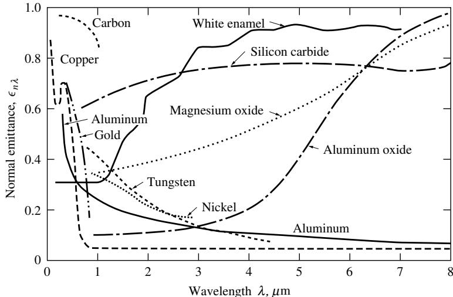

# Radiative heat transfer Third Edition

# 辐射传热 第三版

# Michael F. Modest 加州大学默塞德分校

Academic Press是Elsevier旗下出版品牌
英国牛津郡基德灵顿兰福德巷林荫大道 OX5 1GB
荷兰阿姆斯特丹雷达路29号 211信箱 1000 AE

第一版 1993第二版 2003第三版 2013

ISBN: 978- 0- 12- 386944- 9

www.elsevier.com | www.bookaid.org | www.sabre.org

Michael F. Modest出生于柏林，在德国度过了前25年的人生。在慕尼黑工业大学获得Dipl.-Ing.学位后，他来到美国，并于1972年在加州大学伯克利分校获得机械工程硕士和博士学位，在那里他首次接触了热辐射的理论和实验。此后，他在辐射传热的所有领域开展了许多研究项目（测量表面、液体和气体特性；表面传输和参与介质内的理论建模）。由于许多激光束是热辐射的一种形式，他的工作还包括材料激光加工中的传热方面。

他曾在伦斯勒理工学院和南加州大学任教多年，并在宾夕法尼亚州立大学担任机械工程教授24年。如今，Modest博士是加州大学默塞德分校的Shaffer和George工程教授，这是加州大学系统的第10个校区，也是21世纪第一所新成立的研究型大学。他是美国机械工程师学会会士，美国航空航天学会副会士。Modest博士和他的妻子Monika居住在加利福尼亚州默塞德。

献给我生命中的m&m's：Monika, Mara和Michelle

# 第三版序言 xiv

# 符号列表 xvii

## 内容索引

- [目录](README.md)
- [1 热辐射基础](1-热辐射基础.md)
- [2 基于电磁波理论的辐射特性预测](2-基于电磁波理论的辐射特性预测.md)
- [3 实际表面的辐射特性](3-实际表面的辐射特性.md)
- [4 视角因子](4-视角因子.md)
- [5 灰体漫射表面间的辐射交换](5-灰体漫射表面间的辐射交换.md)
- [6 部分镜面灰体表面间的辐射交换](6-部分镜面灰体表面间的辐射交换.md)
- [7 非理想表面间的辐射交换](7-非理想表面间的辐射交换.md)
- [8 表面交换的蒙特卡洛方法](8-表面交换的蒙特卡洛方法.md)
- [9 传导和对流存在时的表面辐射交换](9-传导和对流存在时的表面辐射交换.md)
- [10 参与介质中的辐射传递方程(RTE)](10-参与介质中的辐射传递方程(RTE).md)
- [11 分子气体的辐射特性](11-分子气体的辐射特性.md)
- [12 颗粒介质的辐射特性](12-颗粒介质的辐射特性.md)
- [13 半透明介质的辐射特性](13-半透明介质的辐射特性.md)
- [14 一维灰体介质的精确解](14-一维灰体介质的精确解.md)
- [15 一维介质的近似求解方法](15-一维介质的近似求解方法.md)
- [16 球谐函数法 (PN-近似)](16-球谐函数法(PN-近似).md)
- [17 离散坐标法 (SN-近似)](17-离散坐标法(SN-近似).md)
- [18 区域法](18-区域法.md)
- [19 准直辐射与瞬态现象](19-准直辐射与瞬态现象.md)
- [20 非灰消光系数的求解方法](20-非灰消光系数的求解方法.md)
- [21 参与介质的蒙特卡洛方法](21-参与介质的蒙特卡洛方法.md)
- [22 辐射与传导和对流的耦合](22-辐射与传导和对流的耦合.md)
- [23 逆辐射传热](23-逆辐射传热.md)
- [24 纳米尺度辐射传热](24-纳米尺度辐射传热.md)
- [附录](附录.md)

# 目录

      # 1 热辐射基础 1

      1.1 引言 1  1.2 热辐射的本质 3  1.3 热辐射基本定律 4  1.4 辐射功率 5  1.5 立体角 11  1.6 辐射强度 13  1.7 辐射热通量 15  1.8 辐射压力 17  1.9 可见辐射(亮度) 18  1.10 真空中的辐射强度 20  1.11 不透明表面辐射特性简介 21  1.12 气体辐射特性简介 23  1.13 固体和液体辐射特性简介 24  1.14 粒子辐射特性简介 25  1.15 辐射传递方程 26  1.16 辐射传输理论概述 27  参考文献 28  习题 29

      # 2 基于电磁波理论的辐射特性预测 31

      2.1 引言 31  2.2 宏观麦克斯韦方程 32  2.3 无界介质中的电磁波传播 32  2.4 偏振 37  2.5 反射与透射 42  2.6 光学常数理论 57  参考文献 60  习题 60

      # 3 实际表面的辐射特性 61

      3.1 引言 61  3.2 定义 62  3.3 基于电磁波理论的预测 73  3.4 金属的辐射特性 75  3.5 非导体的辐射特性 83  3.6 表面粗糙度的影响 89  3.7 表面损伤和氧化膜的影响 93  3.8 半透明薄片的辐射特性 95  3.9 特殊表面 101  3.10 实验方法 105  参考文献 118  习题 123

      # 4 视角因子 129

      4.1 引言 129  4.2 视角因子的定义 131  4.3 视角因子的计算方法 134  4.4 面积积分法 135  4.5 轮廓积分法 138  4.6 视角因子代数 143  4.7 交叉线法 147  4.8 内球法 151  4.9 单位球法 153  参考文献 154  习题 155

      # 5 灰体漫射表面间的辐射交换 160

      5.1 引言 160  5.2 黑体表面间的辐射交换 160  5.3 灰体漫射表面间的辐射交换 165  5.4 电网络类比 173  5.5 辐射屏蔽 176  5.6 控制积分方程的求解方法 178  参考文献 188  习题 188

      # 6 部分镜面灰体表面间的辐射交换 197

      6.1 引言 197  6.2 镜面视角因子 198  6.3 含部分镜面表面的封闭体 202  6.4 电网络类比 214  6.5 辐射屏蔽 215  6.6 半透明薄片(窗口) 216  6.7 控制积分方程的求解 220  6.8 结论 222  参考文献 222  习题 223

      # 7 非理想表面间的辐射交换 229

      7.1 引言 229  7.2 非灰体表面间的辐射交换 230  7.3 方向性非理想表面 234  7.4 任意表面特性的分析 242  参考文献 243  习题 243

      # 8 表面交换的蒙特卡洛方法 247

      8.1 引言 247  8.2 蒙特卡洛数值积分 251  8.3 表面间辐射交换的热传递关系 252  8.4 表面交换的随机数关系 254  8.5 表面描述 258  8.6 光线追踪 259  8.7 效率考虑 261  参考文献 263  习题 264

      # 9 传导和对流存在时的表面辐射交换 267

      9.1 引言 267  9.2 传导与表面辐射-散热片 268  9.3 对流与表面辐射 271  参考文献 275  习题 277

      # 10 参与介质中的辐射传递方程(RTE) 279

      10.1 引言 279  10.2 吸收和散射引起的衰减 280  10.3 发射和散射引起的增强 281  10.4 辐射传递方程 283  10.5 辐射传递方程的正式解 285  10.6 辐射传递方程的边界条件 288  10.7 辐射能量密度 291  10.8 辐射热通量 292  10.9 辐射热通量的散度 293  10.10 辐射传递方程的积分形式 295  10.11 总体能量守恒 297  10.12 辐射传递方程的求解方法 299  参考文献 300  习题 301

      # 11 分子气体的辐射特性 303

      11.1 基本原理 303  11.2 发射和吸收概率 304  11.3 原子和分子光谱 308  11.4 线辐射 315  11.5 非平衡辐射 321  11.6 高分辨率光谱数据库 322  11.7 辐射传递计算的光谱模型 325  11.8 窄带模型 326

      11.9 窄带k分布 336  11.10 宽带模型 349  11.11 总发射率和平均吸收系数 362  11.12 实验方法 369  参考文献 375  习题 382

      # 12 颗粒介质的辐射特性 387

      12.1 引言 387  12.2 单球体的吸收和散射 388  12.3 颗粒云的辐射特性 393  12.4 小颗粒的辐射特性(瑞利散射) 398  12.5 瑞利-甘斯散射 401  12.6 反常衍射 401  12.7 大颗粒的辐射特性 402  12.8 长圆柱的吸收和散射 408  12.9 近似散射相位函数 410  12.10 不规则颗粒和聚集体的辐射特性 413  12.11 燃烧颗粒的辐射特性 414  12.12 颗粒辐射特性的实验测定 426  参考文献 431  习题 437

      # 13 半透明介质的辐射特性 440

      13.1 引言 440  13.2 半透明固体的吸收 440  13.3 半透明液体的吸收 442  13.4 多孔固体的辐射特性 444  13.5 实验方法 447  参考文献 451  习题 453

      # 14 一维灰体介质的精确解 454

      14.1 引言 454  14.2 平面平行介质的通用公式 454  14.3 非散射介质的平面层 459  14.4 散射介质的平面层 465  14.5 球形介质中的辐射传递 467  14.6 圆柱介质中的辐射传递 471  14.7 控制积分方程的数值解 475  参考文献 476  习题 477

      # 15 一维介质的近似求解方法 480

      15.1 光学薄近似 480  15.2 光学厚近似(扩散近似) 482  15.3 Schuster-Schwarzschild近似 486  15.4 Milne-Eddington近似(矩方法) 488  15.5 指数核近似 491  参考文献 493  习题 493

      # 16 球谐函数法 $(P_{N}$ -近似) 495

      16 球谐函数法 $(P_{N}$ -近似) 495  
      16.1 引言 495  
      16.2 $P_{N}$ -近似的一般公式 496  
      16.3 一维平板的$P_{N}$ -近似 497  
      16.4 $P_{N}$ -方法的边界条件 498  
      16.5 $P_{1}$ -近似 502  
      16.6 $P_{3}$ -及更高阶近似 509  
      16.7 简化的$P_{N}$ -近似 522  
      16.8 修正微分近似 527  
      16.9 方法比较 531  
      参考文献 534  
      习题 537  

      # 17 离散坐标法 $(S_{N}$ -近似) 541

      17 离散坐标法 $(S_{N}$ -近似) 541  
      17.1 引言 541  
      17.2 一般关系 542  
      17.3 一维平板 545  
      17.4 一维同心球与圆柱 550  
      17.5 多维问题 556  
      17.6 有限体积法 566  
      17.7 修正离散坐标法 572  
      17.8 偶宇称公式 573  
      17.9 其他相关方法 574  
      17.10 结论 576  
      参考文献 576  
      习题 582  

      # 18 区域法 585

      18 区域法 585  
      18.1 引言 585  
      18.2 表面交换 - 无参与介质 585  
      18.3 灰体吸收/发射介质的辐射交换 590  
      18.4 具有各向同性散射的灰体介质辐射交换 596  
      18.5 非灰体介质的辐射交换 603  
      18.6 直接交换面积的确定 606  
      参考文献 606  
      习题 607  

      # 19 准直辐射与瞬态现象 610

      19 准直辐射与瞬态现象 610  
      19.1 引言 610  
      19.2 问题简化 613  
      19.3 带准直辐射的修正$P_{1}$ -近似 616  
      19.4 短脉冲准直辐射的瞬态效应 619  
      参考文献 622  
      习题 624  

      # 20 非灰消光系数的求解方法 626

      20 非灰消光系数的求解方法 626  
      20.1 引言 626  
      20.2 平均光束长度法 628  
      20.3 半灰近似 634  
      20.4 阶梯灰模型(箱模型) 637  
      20.5 通用波段模型公式 643  
      20.6 加权灰气体和(WSGG)模型 649  
      20.7 $k$ -分布模型 654  
      20.8 全光谱$k$ -分布(FSK)方法(均匀介质) 656  
      20.9 基于谱线的加权灰气体和(SLW) 659  
      20.10 非均匀介质的FSK方法 660  
      20.11 $k$ -分布的评估 668  
      20.12 高阶$k$ -分布方法 679  
      参考文献 686  
      习题 691  

      # 21 参与介质的蒙特卡洛方法 694

      21.1 引言 694  
      21.2 参与介质的热传递关系 694  
      21.3 参与介质的随机数关系 695  
      21.4 谱线结构效应的处理 700  
      21.5 整体能量守恒 705  
      21.6 离散粒子场 706  
      21.7 效率考虑 712  
      21.8 反向蒙特卡洛 713  
      21.9 直接交换蒙特卡洛 717  
      21.10 示例问题 717  
      参考文献 720  
      习题 722  

      # 22 辐射与传导和对流的耦合 724

      22.1 引言 724  
      22.2 辐射与传导的耦合 724  
      22.3 含内部辐射的熔化与凝固 733  
      22.4 边界层中的辐射与对流耦合 738  
      22.5 辐射与自然对流的耦合 743  
      22.6 内部流动中的辐射与对流耦合 744  
      22.7 辐射与燃烧的耦合 748  
      22.8 湍流场与辐射的接口 751  
      22.9 辐射与湍流的相互作用 753  
      22.10 聚光太阳能系统中的辐射 759  
      参考文献 763  
      习题 777  

      # 23 逆辐射传热 779

      23.1 引言 779  
      23.2 求解方法 780  
      23.3 正则化 785  
      23.4 基于梯度的优化 788  
      23.5 元启发式方法 794  
      23.6 逆辐射研究总结 795  
      参考文献 797  
      习题 801  

      # 24 纳米尺度辐射传热 803

      24.1 引言 803  
      24.2 光的相干性 803  
      24.3 倏逝波 804  
      24.4 辐射隧穿 805  
      24.5 表面波(极化激元) 807  
      24.6 涨落电动力学 809  
      24.7 平行板间的热传递 811  
      24.8 纳米尺度辐射实验 814  
      参考文献 816  
      习题 817  

      # 附录
      A 常数与转换因子 818
      B 不透明表面辐射特性表 820
      参考文献 820  
      C 黑体辐射表 833  
      D 视角因子目录 836  
      参考文献 846  
      E 指数积分函数 852  
      参考文献 853  
      F 计算机代码 855  
      参考文献 861  
      致谢 863  
      索引 867

自《辐射传热》第二版出版以来，又一个十年过去了。热辐射仍然是一个相对年轻的领域，其基本关系可追溯至20世纪初，而系统的传热模型直到1950年代才开始出现。过去十年间，该领域的持续关注催生了许多重大进展和新兴研究课题。因此，本书第三版的内容再次进行了重大调整以反映这些新增知识，并进一步提升了可读性和实用性。

本书的宗旨保持不变，其定位不仅限于作为一学期热辐射核心课程的标准教材——因为单门研究生课程显然无法涵盖辐射传热领域的所有重要主题。书中对一些超出"标准"课程范围的重要领域进行了详细阐述。我们期望那些曾以本书作为研究生教材的工程师，能够通过自学掌握这些进阶内容。通过囊括所有重要的高级主题以及大量延伸阅读文献，本书也致力于成为执业工程师的参考手册。

第三版的主要变化包括：将统计蒙特卡罗方法的章节拆分为两部分。第一部分涉及表面辐射，现被大幅提前至教材前部，使教师能将其纳入单学期课程的表面辐射讨论环节。第二部分针对参与性介质的内容则大幅扩充，纳入了该领域的诸多新进展，如光谱解析方案、随机介质扩展方法等。过去十年间，逆辐射问题与微纳尺度辐射传热领域尤为活跃。因此，逆辐射章节已完全重写，并新增了纳米尺度辐射传热章节。这两章应视为对这些广阔领域的入门导引，为工程师提供基础认知以便进一步研读相关文献。气体物性章节与非灰模型章节也因该领域的持续突破及对非平衡辐射日益增长的研究兴趣而进行了重大修订。

描述计算机程序的附录得以保留，相关代码可通过专属网站 https://booksite.elsevier.com/9780123869449 下载。部分基础代码专为辅助读者解决表面传热章节的习题而设计，另一些则源自研究项目：既有适合研究生完成复杂作业或学期项目的初级程序，也有仅供开展自主研究的执业工程师使用的高阶工具。考虑到许多研究生不再学习Fortran和$\mathrm{C + + }$等编译语言，基础程序现已同步提供MATLAB®版本。

此外还进行了诸多细节调整：删减过时内容，增补最新研究成果，重组章节结构以提升可读性。当然，文献引用已全面更新，各章末尾也新增了大量习题。与前两版相同，每章都详尽展示所有解析方法的推导过程，并通过实例演示如何将理论关系应用于实际问题。章末习题则为学生提供额外练习机会，帮助掌握前文所述的解析方法。这种全面的解析阐述使得任何具备微积分和微分方程基础的科研人员——无论是从事炉膛计算的热传导工程师、研究建筑照明的建筑师、关注海洋透光性的海洋学家，还是探究大气辐射问题的气象学家——都能通过自学理解相关内容。采用本书授课的教师可通过注册 https://www.inspectioncopy.elsevier.com/book/details/9780323984065 获取扩展版教师解答手册。

本书现分为24章，涵盖辐射传热领域的四大主要方向。在引言之后，有两章专门讨论不透明表面辐射特性的理论与应用，包括实验方法的简要介绍。随后五章研究无"辐射参与性介质"的封闭空间内表面间纯辐射交换，另有一章探讨传导、对流与表面辐射的相互作用。其余章节则聚焦于吸收、发射和散射介质（或称"参与性介质"）中的辐射传输问题。在详细推导辐射传递方程后，本书继续讨论气体、颗粒及半透明介质的辐射特性，同样包含实验方法的简要说明。接下来八章系统阐述参与性介质中辐射传热理论，划分为若干基础问题领域与求解方法。最终以三章作结，分别讨论多模式耦合传热以及逆辐射与纳米尺度辐射传热这两个新兴领域。

本书采用模块化写作方式。第2章虽对电磁波理论进行了相当详尽（尽管简明）的论述，但多数教师在首门辐射传热课程中会跳过该章。关于不透明表面特性的章节自成体系，并非后续内容的必要基础。表面传输相关五章（第4至9章）同样独立成篇，不构成参与性介质辐射研究的先决条件。同理，参与性介质特性的论述也非求解方法章节的必备基础。遵循相同逻辑，第14至21章讨论的不同求解视角与方法可任意调整学习顺序（尽管第21章需以第8章知识为前提）。最后三章是否讲授完全取决于教师或其学生的偏好。

我未刻意标注单学期热辐射课程应涵盖的内容，因不同教师对此必有不同见解。事实上，各主题的相对重要性不仅因教师而异，还取决于学生背景、地域或授课年份。个人建议单学期课程应均衡覆盖四大领域（表面特性、表面传输、参与性介质特性及参与性介质中的传输）。针对本科阶段接触热辐射较少的美国学生，建议用约半数课时讲授第1、3、4、5章及第7、8/9章部分内容（略过高级专题）。尽管第8章的蒙特卡罗方法属"进阶内容"，但极受学生欢迎，同时能让学生掌握这一日益重要的工程工具。后半学期应聚焦第10、11、12章（同样略去次要内容），适当覆盖第14章，并深入讨论第15章。若时间允许（主要取决于表面和/或参与性介质特性的讲解深度），建议补充$P_1$近似法（可独立讲授，如第16章开头所示）、离散坐标法的基本思想，和/或第20章部分内容（非灰介质求解方法）。

第三版在增补新材料的同时，虽删减了过时内容，篇幅仍较前版显著增加。衷心感谢全球多位挚友与同仁在本书修订决策过程中给予的指导，包括：A. Charette（魁北克）、P. Coelho（里斯本）、K. Daun（加拿大滑铁卢）、L. Dombrovsky（莫斯科）、W. Lipinski（明尼苏达）、S. Mazumder（俄亥俄）、K. Mitra（佛罗里达）、L. Pilon（加利福尼亚）、S. Thynell（宾夕法尼亚）及R. Viskanta（印第安纳）。当然，十位教授必有十二种见解：若未采纳全部建议，还望海涵。特别感谢Z. Zhang（佐治亚）提供的MATLAB®小程序，据此生成了图24-7与24-8。另向两位年轻同事致以特殊谢意：Wojciech Lipinski撰写了"多孔固体辐射特性"（第13章）与"聚光太阳能系统中的辐射"（第22章）两节；Kyle Daun则投入大量时间协助重写"逆辐射"章节（第23章）。同时感谢博士后J. Cai与R. Marquez将基础计算机程序（附录F）转换为MATLAB®版本。最后，谨以此纪念我已故的秘书Eileen Stevenson，她多年前为初版书稿打字，近期不幸早逝。

Michael F. Modest 加利福尼亚州默塞德市 2012年11月

以下是本书频繁使用的符号列表。由于符号数量有限，许多符号被赋予了多重含义。罗马字母仅有26个小写和26个大写字母，希腊字母提供了另外34个不同符号，总计86个——这显然远远不够。希望上下文总能明确符号的具体含义。我采用了一套简洁清晰的变量命名体系，但这种做法必然存在代价。例如，下标$\lambda$（表示"在给定波长处"或"每单位波长"）常被省略，假定读者能通过上下文识别变量的光谱属性。在适用情况下，下列表格中的变量均标注了单位。未标注单位的变量存在多种单位组合，例如总带吸收率$A$的单位取决于所用光谱变量$(\lambda, \eta, \text{或}\nu)$以及吸收系数类型（线性、基于密度或基于压力），共计九种可能组合。

| 符号 | 定义 | 单位 |
|------|------|------|
| $a$ | 偏振椭圆半长轴 | [N/C] |
| $a$ | 电场平面偏振分量 | [N/C] |
| $a$ | 粒子半径 | [m] |
| $a$ | 全光谱k分布法的权重函数 | [-] |
| $a_{k}$ | 灰气体加权和的权重因子 | [-] |
| $a_{m},b_{n}$ | 米氏散射系数 | [-] |
| $A$ | 总带吸收率(或有效带宽) | - |
| $A^{*}$ | 无量纲带吸收率 $= A / \omega$ | [-] |
| $A,A_{n}$ | 平板吸收率(n层平行板) | [-] |
| $A,A_{p}$ | 面积/投影面积 | [m²] |
| $A_{m}$ | 散射相函数系数 | [-] |
| $A_{ij},B_{ij}$ | 爱因斯坦系数 | - |
| $b$ | 自增宽系数 | [-] |
| $b$ | 偏振椭圆半短轴 | [N/C] |
| $B$ | 转动常数 | - |
| $B$ | 对流-辐射参数(玻尔兹曼数) | [-] |
| $c,c_{0}$ | 光速(真空中) | [m/s] |
| $C$ | 比热容 | [J/kg/K] |
| $C_1,C_2,C_3$ | 普朗克函数和维恩位移定律常数 | - |
| $C_1,C_2,C_3$ | 过时模型的宽带参数 | - |
| $d$ | 谱线间距 | - |
| $d_{ij},D_{ij}^{*}$ | 维格纳D函数 | [-] |
| $D$ | 直径 | [m] |
| $D,D^{*}$ | 探测率(归一化) | [1/W] ([cmHz¹ᐟ²/W]) |
| $D_{f}$ | 质量分形维数 | [-] |
| $\hat{\mathbf{e}}$ | 局部坐标系单位向量 | [-] |
| $E,E_{b}$ | 辐射力/黑体辐射力 | - |
| $E$ | 分子能级 | [J] |
| $\mathbf{E}$ | 电场矢量 | [N/C] |
| $E(m)$ | 折射率函数 | [-] |
| $E_{n}$ | n阶指数积分 | [-] |
| $f$ | k分布 | [cm] |
| $f$ | 概率密度函数 | - |

| 符号 | 定义 | 单位 |
|------|------|------|
| $f_{v},f_{s},f_{l}$ | 体积分数、固体分数、液体分数 | [-] |
| $f(n\lambda T)$ | 黑体辐射力分数 | [-] |
| $F$ | 目标函数 | - |
| $F$ | 宽带k分布 | [cm] |
| $F_{i-j}$ | (漫射)视角因子 | [-] |
| $F_{i-j}^{s}$ | 镜面视角因子 | [-] |
| $\mathcal{F}_{i\to j}$ | 辐射交换因子 | [-] |
| $g_{k}$ | 简并度 | [-] |
| $g$ | 无量纲入射辐射 | [-] |
| $g$ | 累积k分布 | [-] |
| $\overline{g_{i}s_{j}},\overline{g_{i}g_{k}}$ | 区域法中的直接交换面积 | [cm²] |
| gs, gg | 直接交换面积矩阵 | [cm²] |
| $G$ | 入射辐射 = 方向积分强度 | - |
| $\overline{G_{i}S_{j}},\overline{G_{i}G_{k}}$ | 区域法中的总交换面积 | [cm²] |
| G | 并矢格林函数 | - |
| $h$ | 普朗克常数 = 6.6261×10⁻³⁴ J·s | - |
| $h$ | 对流换热系数 | [W/m²K] |
| $H$ | 表面辐照度 | - |
| $H$ | 海维赛德单位阶跃函数 | [-] |
| $H$ | 无量纲换热系数 | [-] |
| $\mathcal{H}$ | 无量纲表面辐照度 | [-] |
| H | 磁场矢量 | [C/ms] |
| $i$ | 无量纲偏振强度 | [-] |
| i | x方向单位向量 | [-] |
| $I$ | 辐射强度 | - |
| $I$ | 偏振第一斯托克斯参数 | [N²/C²] |
| $I$ | 转动惯量 | [kg·cm²] |
| $I_{b}$ | 黑体强度(普朗克函数) | - |
| $I_{l},I_{l}^{m}$ | 位置相关强度函数 | - |
| $I_{0},I_{1}$ | 修正贝塞尔函数 | [-] |
| $\Im$ | 复数虚部 | - |
| $j$ | 转动量子数 | [-] |
| $\hat{\mathbf{J}}$ | y方向单位向量 | [-] |
| $J$ | 有效辐射 | [W/m²] |
| $\mathcal{J}$ | 无量纲有效辐射 | [-] |
| $k$ | 热导率 | [W/mK] |
| $k$ | 玻尔兹曼常数 = 1.3807×10⁻²³ J/K | - |
| $k$ | 复折射率中的吸收指数 | [-] |
| $k$ | 吸收系数变量 | [cm⁻¹] |
| $k_{f}$ | 分形前置因子 | [-] |
| $\mathbf{k}$ | z方向单位向量 | [-] |
| $K$ | 核函数 | - |
| $K$ | 发光效能 | [lm/W] |
| $l,m,n$ | 与x,y,z轴的方向余弦 | [-] |
| $L$ | 长度 | [m] |
| $L$ | 熔化潜热 | [J/kg] |
| $L$ | 亮度 | - |
| $L_{e}$ | 平均射束长度 | [m] |
| $L_{0},L_{m}$ | 几何或平均射束长度 | [m] |
| $\mathcal{L}$ | 拉普拉斯变换或微分算子 | - |
| $m$ | 质量 | [kg] |

| 符号 | 描述 | 单位 |
|------|------|------|
| $m$ | 复折射率 | [-] |
| $m$ | 质量流量 | [kg/s] |
| $M$ | 分子量 | [kg/kmol] |
| $n$ | 自增宽指数 | [-] |
| $n$ | 折射率 | [-] |
| $n$ | 粒子数分布函数 | [cm⁻⁴] |
| $h$ | 单位表面法向量(指向介质) | [-] |
| $N$ | 传导-辐射参数(Stark数) | [-] |
| $N_c$ | 传导-辐射参数 | [-] |
| $N_T$ | 单位体积粒子数 | [m⁻³] |
| Nu | 努塞尔数 | [-] |
| $\mathcal{O}\{\}$ | 数量级 | [-] |
| $p$ | 压力 | [bar] |
| $p$ | 辐射压力 | [N/m²] |
| $p$ | 参数向量 | - |
| $P$ | 概率函数 | [-] |
| $P_l,P_l^m$ | (伴随)勒让德多项式 | [-] |
| Pr | 普朗特数 | [-] |
| $q$ | 热流密度 | [W/m²] |
| $q$ | 热流密度矢量 | [W/m²] |
| $q_R$ | 辐射热流 | [W/m²] |
| qlum | 光通量 | [lm/m²=lx] |
| $Q$ | 热功率 | [W] |
| $\hat{Q}^{\prime\prime\prime}$ | 偏振第二斯托克斯参数 | [N²/C²] |
| $r$ | 径向坐标 | [m] |
| $r$ | 反射系数 | [-] |
| $r$ | 位置矢量 | [m] |
| $R$ | 半径 | [m] |
| $R_u$ | 通用气体常数=8.3145J/molK | - |
| $R$ | 随机数 | [-] |
| $R$ | 辐射阻力 | [cm⁻²] |
| $R,R_n$ | 平板反射率(n层平行板) | [-] |
| $\Re$ | 复数实部 | - |
| Re | 雷诺数 | [-] |
| $S$ | 几何路径长度 | [m] |
| $S$ | 方向单位矢量 | [-] |
| $\overline{S_iS_j},\overline{S_ig_k}$ | 区域法直接交换面积 | [cm²] |
| SS,sg | 直接交换面积矩阵 | [cm²] |
| $S$ | 两区域间距离或表面点间距 | [m] |
| $S$ | 线积分吸收系数=线强度 | - |
| $S$ | 辐射源函数 | - |
| $S$ | 坡印廷矢量 | [W/m²] |
| St | 斯坦顿数 | [-] |
| Ste | 斯特藩数 | [-] |
| $\overline{S_iS_j},\overline{S_iG_k}$ | 区域法总交换面积 | [cm²] |
| SS,SG | 总交换面积矩阵 | [cm²] |
| $t$ | 时间 | [s] |
| $t$ | 透射系数 | [-] |
| $t$ | 翅片厚度 | [m] |
| $t$ | 切向单位矢量 | [-] |
| $T$ | 温度 | [K] |
| $T,T_n$ | 平板透射率(n层平行板) | [-] |

| 符号 | 描述 | 单位 |
|------|------|------|
| $u$ | 内能 | [J/kg] |
| $u$ | 辐射能量密度 | - |
| $u$ | 速度 | [m/s] |
| $u$ | 吸收系数比例函数 | [-] |
| $u_{k}$ | 无量纲跃迁波数 | [-] |
| $U$ | 偏振第三斯托克斯参数 | [N²/C²] |
| $v$ | 振动量子数 | [-] |
| $v$ | 速度 | [m/s] |
| $\mathbf{v}$ | 速度矢量 | [m/s] |
| $V$ | 体积 | [m³] |
| $V$ | 偏振第四斯托克斯参数 | [N²/C²] |
| $\mathbf{w}$ | 波矢量 | [cm⁻¹] |
| $w_{i}$ | 求积权重 | [-] |
| $W$ | 等效线宽权重矩阵 | [-] |
| $x,y,z$ | 笛卡尔坐标 | [m] |
| $x$ | 颗粒尺寸参数 | [-] |
| $x$ | 线强度参数 | [-] |
| $x$ | 摩尔分数 | [-] |
| $X$ | 光程长度 | - |
| $X$ | 界面位置 | [m] |
| $\mathbf{X}$ | 灵敏度矩阵 | - |
| $Y$ | 质量分数 | [-] |
| $Y_{l}^{m}$ | 球谐函数 | [-] |
| $\Xi$ | 无量纲光谱变量 | [-] |
| $\alpha$ | 吸收率 | [-] |
| $\alpha$ | 波段积分吸收系数=波段强度参数 | - |
| $\alpha$ | 开口角 | [rad] |
| $\alpha$ | 热扩散率 | [m²/s] |
| $\alpha,\beta,\gamma$ | 欧拉旋转角 | [-] |
| $\beta$ | 消光系数 | - |
| $\beta$ | 谱线重叠参数 | [-] |
| $\beta^{*}$ | 稀薄气体谱线重叠参数 | [-] |
| $\gamma$ | 复介电常数 | [C²/Nm²] |
| $\gamma$ | 偏振椭圆方位旋转角 | [rad] |
| $\gamma$ | 振荡阻尼因子 | [Hz] |
| $\gamma$ | 谱线半宽 | - |
| $\gamma_{E}$ | 欧拉常数=0.57221... | - |
| $\delta$ | 狄拉克δ函数 | [-] |
| $\delta$ | 偏振相位角 | [rad] |
| $\delta_{ij}$ | 克罗内克δ | [-] |
| $\delta_{k}$ | 振动跃迁量子步长=Δv | [-] |
| $\Delta_{ij}^{n}$ | 旋转矩阵 | [-] |
| $\epsilon$ | 发射率 | [-] |
| $\epsilon$ | 介电常数 | [C²/Nm²] |
| $\epsilon$ | 复介电函数(相对介电常数)=ε'-iε'' | [-] |
| $\eta$ | 波数 | [cm⁻¹] |
| $\eta$ | 方向余弦 | [-] |
| $\eta$ | 无量纲(相似)坐标 | [-] |
| $\eta_{\mathrm{lum}}$ | 发光效率 | [-] |
| $\theta$ | 极角 | [rad] |

| 符号 | 描述 | 单位 |
|------|------|------|
| $\theta$ | 无量纲温度 | [-] |
| $\Theta$ | 散射角 | [rad] |
| $\Theta$ | 普朗克振荡器 | - |
| $\kappa$ | 吸收系数 | - |
| $\lambda$ | 波长 | [μm] |
| $\lambda_{m}$ | 重叠参数 | [cm⁻¹] |
| $\lambda$ | 正则化参数 | [-] |
| $\mu$ | 动力粘度 | [kg/ms] |
| $\mu$ | 磁导率 | [Ns²/C²] |
| $\mu$ | 方向余弦(极角) | [-] |
| $\nu$ | 频率 | [Hz] |
| $\nu$ | 运动粘度 | [m²/s] |
| $\xi$ | 方向余弦 | [-] |
| $\xi$ | 无量纲坐标 | [-] |
| $\rho$ | 反射率 | [-] |
| $\rho$ | 密度 | [kg/m³] |
| $\rho_{f}$ | 电荷密度 | [C/m³] |
| $\sigma$ | 斯特藩-玻尔兹曼常数 = 5.670×10⁻⁸ | [W/m²K⁴] |
| $\sigma_{s}$ | 散射系数 | - |
| $\sigma_{e},\sigma_{\mathrm{dc}}$ | 电导率(dc值) | [C²/Nm²s = 1/Ωm] |
| $\sigma_{h}$ | 均方根粗糙度 | [cm] |
| $\sigma_{l}$ | 相关长度 | [cm] |
| $\tau$ | 透射率 | [-] |
| $\tau$ | 光学坐标/光学厚度 | [-] |
| $\phi$ | 相位角 | [rad] |
| $\phi$ | 归一化线形函数 | - |
| $\phi$ | 组分变量向量(T,p,x) | - |
| $\Phi$ | 散射相函数 | [sr⁻¹] |
| $\Phi$ | 无量纲介质发射功率函数 | - |
| $\Phi$ | 线重叠温度函数β | [-] |
| $\Phi$ | 耗散函数 | [J/kgm²] |
| $\psi$ | 方位角 | [rad] |
| $\psi$ | 流函数 | [m²/s] |
| $\Psi$ | 带强度温度函数α | [-] |
| $\Psi$ | 无量纲热流 | - |
| $\omega$ | 单次散射反照率 | [-] |
| $\omega$ | 角频率 | [rad/s] |
| $\omega$ | 松弛参数 | [-] |
| $\Omega$ | 立体角 | [sr] |

# 下标说明

| 符号 | 描述 |
|------|------|
| 0 | 参考值，或在真空中，或在长度=0处 |
| 1,2 | 在介质中，或在位置"1"或"2"处 |
| ∞ | 远离表面 |
| α | 吸收的，或表观的 |
| av | 平均值 |
| b | 黑体值 |
| B | 波段积分值 |
| C̄ | 在波段中心，或在圆柱处，或临界值，或表示复数，或冷的 |
| C | 碰撞 |
| D | 多普勒的，或基于直径的 |
| e | 有效值，或在平衡状态 |
| f | 流体 |
| g | 气体，或在给定累积处 |
| k | k分布值 |
| h | 热的 |
| i | 入射的，或虚拟计数器 |
| j | 在旋转状态，或虚拟计数器 |
| k | 在吸收系数变量的给定值处 |
| L | 在长度=L处 |
| m | 修正普朗克值，或介质值，或平均(整体)值 |
| n | 法线方向 |
| o | 出射的，或来自外部 |
| p | 与压力相关的，或偏振值 |
| p | 等离子体 |
| P | 普朗克平均值 |
| r | 反射分量 |
| ref | 参考值 |
| R | 罗塞兰平均值，或辐射，或在r=R处 |
| s | 沿路径s，或在表面，或在球体，或在源处，或固体 |
| S | 斯塔克 |
| sol | 太阳的 |
| t | 透射分量 |
| u | 上限 |
| v | 在振动状态，或在恒定体积处 |
| w | 壁面值 |
| W | 光谱窗口积分值 |
| x,y,z,r | 在给定方向 |
| θ,ψ | 在给定方向 |
| η | 在给定波数处，或每单位波数 |
| λ | 在给定波长处，或每单位波长 |
| ν | 在给定频率处，或每单位频率 |
| ∥ | 偏振分量，或在入射平面内 |
| ⊥ | 偏振分量，或在垂直于入射平面的平面内 |

# 上标说明

| 符号 | 描述 |
|------|------|
| ' | 复数的实部或虚部，或方向值，或虚拟变量 |
| * | 半球值，或复共轭，或通过P₁近似获得 |
| +,- | 正方向或负方向 |
| d | 漫射分量 |
| s | 镜面反射分量或平均值 |
| ~ | 复数，或非等温路径的缩放值，或Favre平均 |
| → | 单位向量 |

- [1.1 引言](#11-引言)
- [1.2 热辐射的本质](#12-热辐射的本质)
- [1.3 热辐射基本定律](#13-热辐射基本定律)
- [1.4 辐射功率](#14-辐射功率)
- [1.5 立体角](#15-立体角)
- [1.6 辐射强度](#16-辐射强度)
- [1.7 辐射热通量](#17-辐射热通量)
- [1.8 辐射压力](#18-辐射压力)
- [1.9 可见辐射(亮度)](#19-可见辐射亮度)
- [1.10 真空中的辐射强度](#110-真空中的辐射强度)
- [1.11 不透明表面辐射特性简介](#111-不透明表面辐射特性简介)
- [1.12 气体辐射特性简介](#112-气体辐射特性简介)
- [1.13 固体和液体辐射特性简介](#113-固体和液体辐射特性简介)
- [1.14 粒子辐射特性简介](#114-粒子辐射特性简介)
- [1.15 辐射传输方程](#115-辐射传输方程)
- [1.16 辐射传输理论概述](#116-辐射传输理论概述)
- [参考文献](#参考文献)
- [习题](#习题)

# 第1章

# 热辐射基础

# 1.1 引言

术语"辐射传热"和"热辐射"通常用于描述由电磁波引起的传热科学。日常生活中热辐射的明显例子包括晴天阳光的加热效应、当人站在火堆前时面向火堆的身体一侧比背部感觉热得多等等。更微妙的热辐射例子包括晴朗天空呈现蓝色、日落呈现红色，以及在晴朗的冬夜，我们觉得拉上窗帘的房间比开着窗帘的房间（加热到相同温度）更舒适。

所有材料都通过降低或提高其分子能级来持续发射和吸收电磁波或光子。发射的强度和波长取决于发射材料的温度。正如我们将看到的，对于传热应用而言，$10^{-7}\mathrm{m}$到$10^{-3}\mathrm{m}$（紫外线、可见光和红外线）之间的波长最为重要，因此这里只考虑这些波长。

在开始分析热辐射之前，我们想简要比较这种传热方式与其他两种可能的能量传递机制——传导和对流。在固体传导的情况下，能量通过自由电子或声子-声子相互作用（即原子间键振动能级的激发）通过原子晶格传递。在气体和液体中，能量通过分子间碰撞传递（即较快的分子将其部分动能传递给较慢的分子）。对流传热类似，但许多具有较高动能的分子被流动带走，并被较冷的流体（低动能分子）取代，从而导致能量传递速率增加。因此，传导和对流都需要介质的存在来传递能量。另一方面，热辐射通过电磁波或光子传递，它们可以在不与介质相互作用的情况下长距离传播。热辐射不需要介质传递这一事实使其在真空和空间应用中非常重要。这种所谓的"远距离作用"也体现在许多日常热力学应用中。例如，在寒冷的冬日里，在有暖气的房间里，当窗帘拉上时我们会感觉更舒适：我们的身体通过与周围暖空气的对流交换热量，但也通过与墙壁（包括没有窗帘时的冷窗玻璃）的辐射交换热量；我们能感受到远处火堆的热量，等等。

传导和对流与热辐射之间的另一个显著区别是它们对温度的依赖性不同。对于绝大多数传导应用，传热速率可以用傅里叶定律很好地描述为：

$$
q_{x} = -k\frac{\partial T}{\partial x}, \tag{1.1}
$$

其中$q_{x}$是$x$方向的传导热通量1，$T$是温度，$k$是介质的热导率。类似地，对流传热通量通常可以从如下关系式计算：

$$
q = h(T - T_{\infty}), \tag{1.2}
$$

其中$h$称为对流传热系数，$T_{\infty}$是参考温度。虽然$k$和$h$可能依赖于温度，但这种依赖性通常不是很强。因此，对于大多数应用，传导和对流传热速率与温度差成线性比例关系。正如我们将看到的，辐射传热速率通常与温度的四次方（或更高次方）差成正比，即：

$$
q\propto T^4 -T_\infty^4. \tag{1.3}
$$

因此，随着温度水平的升高，辐射传热变得更加重要，并且在非常高的温度下可能完全主导传导和对流。因此，热辐射在燃烧应用（火灾、熔炉、火箭喷嘴、发动机等）、核反应（如太阳中的核聚变反应堆或核弹）、航天器再入大气层等方面非常重要。随着现代技术追求更高的效率，这将需要越来越高的温度，使得热辐射变得越来越重要。其他日益重要的应用包括太阳能收集和温室效应（两者都源于我们高温太阳的辐射）。最后，当今人类面临的最紧迫问题之一是全球变暖的影响，这是由于人为释放到地球大气中的二氧化碳吸收太阳能引起的。

使热辐射在真空和高温应用中重要的相同原因也使其分析更加困难，或者至少与"常规"分析有很大不同。在正常情况下，传导和对流是短程现象：分子碰撞之间的平均距离（碰撞平均自由程）通常非常小，可能在$10^{-10}$m左右。如果说需要大约10次碰撞才能使高动能分子的动能与周围分子相似，那么任何外部影响在大于$10^{-9}$m的距离上都不会直接感受到。因此，我们能够对"无限小体积"进行能量平衡，即与整体尺寸相比可以忽略不计，但与碰撞平均自由程相比非常大的体积。能量守恒原理然后导致一个偏微分方程来描述传导和对流的温度场和热通量。这个方程可能有多达四个独立变量（三个空间坐标和时间），并且在性质恒定的情况下对温度是线性的。另一方面，热辐射通常是长程现象。光子的平均自由程（即光子在与分子相互作用之前传播的平均距离）可能短至$10^{-10}$m（例如在金属中的吸收），但也可以长达$10^{+10}$m或更大（例如太阳光线到达地球）。因此，能量守恒不能应用于无限小体积，而必须应用于所考虑的整个体积。这导致了一个多达七个独立变量（辐射频率、三个空间坐标、描述光子行进方向的两个坐标和时间）的积分方程。

热辐射的分析由于材料辐射特性的行为而变得更加复杂。与传导和对流相关的特性（热导率、运动粘度、密度等）相对容易测量且通常表现良好（在整个介质中是各向同性的，可能具有较弱的温度依赖性）。而辐射特性通常难以测量且经常表现出不稳定的行为。对于液体和固体，这些特性通常仅取决于非常薄的表面层，这可能因表面处理方式而有很大变化，甚至每天都会不同。所有辐射特性（特别是气体）都可能随波长发生强烈变化，这为控制方程增加了另一个维度。这个方程几乎不能被假设为线性的。

由于热辐射分析中固有的这些困难，本书很大一部分内容专门讨论辐射特性以及求解辐射传输控制能量的不同近似方法。

# 1.2 热辐射的本质

热辐射能量可以被视为由电磁波（如电磁波理论所预测）或由无质量能量包（称为光子，如量子力学所预测）组成。这两种观点都不能完全描述所有观察到的辐射现象。因此，通常可互换使用这两个概念。一般来说，液体和固体（包括微小颗粒）以及界面（表面）的辐射特性更容易通过电磁波理论预测，而气体的辐射特性则更便于从量子力学获得。

所有电磁波或光子都以高速通过任何介质传播。由于光是电磁波谱的一部分，这个速度被称为光速c。光速取决于其传播的介质，可以通过以下公式与真空中的光速c₀相关联：

$$
c = \frac{c_0}{n},\qquad c_0 = 2.998\times 10^8\mathrm{m / s}, \tag{1.4}
$$

其中n称为介质的折射率。根据定义，真空的折射率为n≡1。对于大多数气体，折射率非常接近1，例如室温下空气在可见光谱范围内的n=1.00029。因此，光在气体中的传播速度几乎与在真空中一样快。电磁波在电介质（非导电体）中的传播速度明显较慢，其折射率大约在1.4到4之间，而在电导体（金属）中几乎无法穿透。每个波可以通过其频率ν（以周期/s=s⁻¹=Hz测量）、波长λ（以μm=10⁻⁶m或nm=10⁻⁹m测量）、波数η（以cm⁻¹测量）或角频率ω（以弧度/s=s⁻¹测量）来识别。

这四个量通过以下公式相互关联：

$$
\nu = \frac{\omega}{2\pi} = \frac{c}{\lambda} = c\eta . \tag{1.5}
$$

根据量子力学，每个波或光子携带的能量ε为：

$$
\epsilon = h\nu ,h = 6.626\times 10^{-34}\mathrm{Js}, \tag{1.6}
$$

其中$h$被称为普朗克常数。当光从一种介质穿透到另一种介质时，光的频率不会改变，因为光子的能量必须守恒。另一方面，波长和波数会发生变化，这取决于两种介质的折射率值。有时电磁波用光子携带的能量$h\nu$来表征，使用电子伏特作为能量单位$(1\mathrm{eV} = 1.6022\times 10^{-19}\mathrm{J})$。因此，光子能量(或"频率")为$a\mathrm{eV}$的光在真空中的波长为：

$$
\lambda = \frac{h c}{h\nu} = \frac{6.626\times 10^{-34}\mathrm{J}\mathrm{s}\times 2.998\times 10^{8}\mathrm{m} / \mathrm{s}}{a1.6022\times 10^{-19}\mathrm{J}} = \frac{1.240}{a}\mu \mathrm{m}. \tag{1.7}
$$

由于波长差异极大的电磁波携带的能量也差异极大，它们的行为往往大不相同。根据它们的行为或出现方式，电磁波被分为许多不同的类别，如图1-1所示。热辐射可以定义为仅由介质温度而发射的电磁波[1]。如前所述，这一定义将传热考虑中重要的波长范围限制在$0.1\mu \mathrm{m}$(紫外线)到$100\mu \mathrm{m}$(中红外)之间。

  
图1-1 电磁波谱(对于在真空中传播的辐射，$n = 1$)

# 1.3 热辐射基本定律

当电磁波穿过某种介质(或真空)照射到另一种介质(固体或液体表面、颗粒或气泡)的表面时，波可能会被部分或全部反射，任何未被反射的部分将穿透进入介质。在穿过介质的过程中，波可能会持续衰减。如果衰减完全导致没有穿透辐射重新射出，则该介质被称为不透明体。如果波穿过介质时没有任何衰减，则称为透明体，而具有部分衰减的物体则称为半透明体。2 介质是透明、半透明还是不透明取决于材料本身及其厚度(即电磁波必须穿过介质的距离)。金属几乎总是不透明的，尽管在高中物理实验中常展示光可以穿透极薄的金层。非金属通常需要更大的厚度才会变得不透明，有些在部分光谱范围内相当透明(例如可见光谱范围内的窗玻璃)。

  
图1-2 Kirchhoff定律

完全不反射任何辐射的不透明表面称为完美吸收体或黑体表面：当我们"看到"一个物体时，我们的眼睛吸收了来自光谱可见部分的电磁波，这些波由太阳(或人造光源)发射并被物体反射进入我们的眼睛。我们无法看到不反射辐射的表面，它在我们眼中呈现"黑色"。3 由于黑体表面吸收了最大可能的辐射能量，它们成为分类所有其他表面的标准。

很容易证明黑体表面也会发射最大量的辐射能量，即在相同温度下比其他任何物体都多。为了证明这一点，我们使用Kirchhoff定律的多种表述之一：4 考虑两个相同的黑壁封闭腔，外部热绝缘，每个腔内包含一个小物体——一个是黑体，另一个不是——如图1-2所示。根据热力学第二定律，经过长时间后，整个封闭腔及其内部物体将达到单一均匀温度。这意味着表面的每个部分(包括封闭腔和物体)发射的能量恰好等于它吸收的能量。两个不同腔体中的物体接收完全相同的辐射能量。但由于黑体吸收了更多能量(即最大可能值)，它也必须比非黑体发射更多能量(即也是最大可能值)。

通过同样的推理可以很容易地证明，黑体表面在每个波长和任何方向(入射或出射电磁波)上都是完美的吸收体和发射体，并且等温黑体封闭腔内的辐射场是各向同性的(即辐射能量密度在封闭腔内任何点和任何方向都相同)。

# 1.4 辐射功率

任何介质都会根据其局部温度和材料特性，持续向各个方向随机发射电磁辐射。这种现象有时被称为Prévos定律(以19世纪初瑞士哲学家和物理学家Pierre Prévost命名)。从表面发射的辐射热流称为发射功率$E$。我们区分总发射功率和光谱发射功率(即在完整光谱范围内或单位频率间隔内给定频率处的热流)，因此光谱发射功率$E_{\nu}\equiv$发射能量/时间/表面积/频率，总发射功率$E\equiv$发射能量/时间/表面积。

  
图1-3 地球接收的太阳辐射

在需要明确表达时，我们使用下标$\nu,\lambda$或$\eta$(取决于光谱变量的选择)来表示光谱量。单一频率或波长的热辐射有时也称为单色辐射(因为在可见光范围内，人眼感知电磁波呈现彩虹颜色)。从定义可以清楚地看出，总发射功率和光谱发射功率的关系为：

$$
E(T) = \int_0^\infty E_\nu (T,\nu)dv. \tag{1.8}
$$

# 黑体发射功率谱

黑体发射功率谱科学家们多年来一直试图从理论上预测太阳的发射光谱，我们现在知道其行为非常接近5777 K的黑体[2]。图1-3显示了在太空条件下(通过高空气球和卫星测量)和单位大气质量(大气质量定义为$1/\cos\theta_S$，其中天顶角$\theta_S$是当地垂线与指向太阳的矢量之间的夹角)[3,4]时，到达地球的太阳光谱通量或太阳辐射。太阳辐射在穿透大气层时会显著衰减，这种现象将在1.12和1.14节讨论。Lord Rayleigh(1900)[5]*和Sir James Jeans(1905)[6]*独立应用经典统计学的能量均分原理预测太阳光谱，但结果不佳。Wilhelm Wien(1896)[7]使用热力学论证和实验数据提出了黑体发射功率的光谱分布，该分布在光谱大部分区域非常准确。最终，Max Planck(1901)[8]发表了关于量子统计的研究：假设分子只能在特定能级发射光子，他发现了现在被称为Planck定律的黑体光谱发射功率分布，对于折射率为$n$的透明介质包围的黑体表面：

$$
E_{b\nu}(T,\nu) = \frac{2\pi h\nu^3n^2}{c_0^2\left[e^{h\nu / kT} - 1\right]}, \tag{1.9}
$$

其中$k = 1.3807\times 10^{-23}\mathrm{J/K}$称为Boltzmann常数。虽然频率$\nu$似乎是最合理的光谱变量(因为光从一种介质进入另一种介质时不会改变)，但波长$\lambda$(主要用于表面发射和吸收)和波数$\eta$(主要用于气体辐射)也经常使用。方程(1.9)可以通过以下关系方便地表示为波长和波数的形式：

$$
\nu = \frac{c_0}{n\lambda} = \frac{c_0}{n}\eta ,\qquad d\nu = -\frac{c_0}{n\lambda^2}\left[1 + \frac{\lambda}{n}\frac{dn}{d\lambda}\right]d\lambda = \frac{c_0}{n}\left[1 - \frac{\eta}{n}\frac{dn}{d\eta}\right]d\eta , \tag{1.10}
$$

以及

$$
E_{b\nu}(T) = \int_{0}^{\infty}E_{b\nu}d\nu = \int_{0}^{\infty}E_{b\lambda}d\lambda = \int_{0}^{\infty}E_{b\eta}d\eta , \tag{1.11}
$$

或

$$
E_{b\nu}d\nu = -E_{b\lambda}d\lambda = E_{b\eta}d\eta . \tag{1.12}
$$

这里$\lambda$和$\eta$是折射率为$n$的介质中电磁波的波长和波数(而$\lambda_0 = n\lambda$和$\eta_0 = \eta/n$是同一波在真空中传播时的波长和波数)。方程(1.10)表明，只有当折射率与频率(或波长、波数)无关时，方程(1.9)才能给出$E_{b\nu}$和$E_{b\eta}$的简便关系。对于真空$(n=1)$和普通气体$(n\geq1)$确实如此，对于某些半透明介质在大范围光谱内(例如石英在0.2到$2.4\mu m$波长范围内$1.52<n<1.68$)也可能具有可接受的精度。因此，假设折射率恒定：

$$
E_{b\lambda}(T,\lambda) = \frac{2\pi hc_0^2}{n^2\lambda^5\left[e^{hc_0 / n\lambda kT} - 1\right]}, \tag{n=const},
$$

# $\ddagger$ Wilhelm Wien (1864-1928)

德国物理学家，曾任吉森大学和慕尼黑大学物理学教授。除了电磁波研究外，他的兴趣还包括其他射线，如电子束、X射线和α粒子。因发现位移定律，他于1911年获得诺贝尔物理学奖。

# $\S$ Max Planck (1858-1947)

德国物理学家。Planck在柏林跟随H.L.F. von Helmholtz和G.R. Kirchhoff学习，但在慕尼黑大学获得博士学位后返回柏林任理论物理学教授。后来他成为Kaiser Wilhelm学会(今Max Planck研究所)的负责人。因发展量子理论，他于1918年获得诺贝尔物理学奖。

方程(1.9)适用于发射到吸收指数(将在第2章介绍)远小于折射率的介质中。这包括水、玻璃、石英等半透明介质，但不包括不透明材料。发射到这类物体中的辐射会立即被吸收，没有实际意义。

  
图1-4 黑体发射功率谱

$$
E_{b\eta}(T,\eta) = \frac{2\pi hc_0^2\eta^3}{n^2[e^{hc_{0\eta} / nkT} - 1]}, \tag{n=const.}
$$

图1-4是方程(1.13)对不同黑体温度的图形表示。可以看出，随着温度升高(根据热力学第二定律)，整体发射水平上升，而最大发射波长向短波方向移动。图1-3中也绘制了有效太阳温度5777 K的黑体发射功率，该图与太空太阳辐射数据吻合良好。

通常引入以下缩写：

$$
\begin{array}{rl} 
& C_1 = 2\pi hc_0^2 = 3.7418\times 10^{-16}\mathrm{Wm}^2,\\ 
& C_2 = hc_0 / k = 14,388\mu \mathrm{mK} = 1.4388\mathrm{cmK}, 
\end{array}
$$

因此方程(1.13)可以改写为：

$$
\frac{E_{b\lambda}}{n^3T^5} = \frac{C_1}{(n\lambda T)^5[e^{C_2 / (n\lambda T)} - 1]},\qquad (n = \mathrm{const}), \tag{1.15}
$$

可以看出这只是$(n\lambda T)$的函数。因此，可以将这个归一化发射功率绘制为一条关于真空中波长$(n\lambda)$和温度$(T)$乘积的单一曲线，如图1-5所示，附录C中提供了详细的数据表格。通过对方程(1.15)求导可以确定该曲线的最大值：

$$
\frac{d}{d(n\lambda T)}\left(\frac{E_{b\lambda}}{n^3T^5}\right) = 0,
$$

导出一个超越方程，其数值解为：

$$
(n\lambda T)_{\mathrm{max}} = C_3 = 2898\mu \mathrm{mK}. \tag{1.16}
$$

方程(1.16)被称为Wien位移定律，因为它由Wilhelm Wien[9]在1891年独立提出(即远早于Planck发射功率定律的发表)。

例1.1. 太阳在什么波长处具有最大发射功率？地球呢？

  
图1-5 归一化黑体发射功率谱

# 解答

根据方程(1.16)，太阳表面温度$T_{\mathrm{sun}} \simeq 5777 \mathrm{~K}$且在真空$(n = 1)$中，可得：

$$
\lambda_{\mathrm{max,sun}} = \frac{C_3}{T_{\mathrm{sun}}} = \frac{2898\mu\mathrm{mK}}{5777\mathrm{K}} = 0.50\mu \mathrm{m},
$$

这接近可见光区域的中心。显然，进化使我们的眼睛对电磁谱中日光最强的部分最为敏感。相比之下，地球的平均表面温度约为$T_{\mathrm{Earth}} = 290 \mathrm{~K}$，即：

$$
\lambda_{\mathrm{max,Earth}}\simeq \frac{2898\mu\mathrm{mK}}{290\mathrm{K}} = 10\mu \mathrm{m},
$$

也就是说，地球的最大发射位于中红外区域，这促使红外相机和探测器用于夜间"视觉"。

研究Planck定律在短波和长波情况下的渐近行为很有意义。对于非常小的$hc_0 / n \lambda kT$值(长波长或小频率)，方程(1.13)中的指数可以用两项泰勒级数近似，得到：

$$
E_{b\lambda} = \frac{2\pi c_0kT}{n\lambda^4},\qquad \frac{hc_0}{n\lambda kT}\ll 1. \tag{1.17}
$$

如果令$h \to 0$，即允许发射任意小能量的光子(如经典统计所假设的)，也会得到相同结果。因此，方程(1.17)与Rayleigh和Jeans导出的公式相同，并以他们的名字命名。Rayleigh-Jeans分布也包含在图1-5中。显然，这个公式仅在$(n \lambda T)$值很大时准确，此时发射功率谱的能量可以忽略不计。因此，这个公式对工程应用意义不大。

对于大的$(hc_0 / n \lambda kT)$值，方程(1.13)分母中的$-1$可以忽略，得到Wien分布(或Wien定律)：

$$
E_{b\lambda}\simeq \frac{2\pi hc_0^2}{n^2\lambda^5} e^{-hc_0 / n\lambda kT} = \frac{C_1}{n^2\lambda^5} e^{-C_2 / n\lambda T},\qquad \frac{hc_0}{n\lambda kT}\gg 1, \tag{1.18}
$$

因为它与Wien在量子力学出现前首次提出的公式相同。从图1-5可以看出，Wien分布在大部分光谱范围内都非常准确，整个光谱的总能量含量比Planck定律低约$8\%$。因此，Wien分布经常用于理论分析以简化积分。

# 黑体总发射功率

黑体的总发射功率可由方程(1.11)和(1.13)确定为：

$$
\begin{array}{l}{E_b(T) = \int_0^\infty E_{b\lambda}(T,\lambda)d\lambda = C_1n^2 T^4\int_0^\infty \frac{d(n\lambda T)}{(n\lambda T)^3[e^{C_2 / n\lambda T}} -1]}\\ {= [\frac{C_1}{C_2^4}\int_0^\infty \frac{\xi^3d\xi}{e^\xi - 1}]n^2 T^4,(n = \mathrm{const}).} \end{array} \tag{1.19}
$$

这个表达式中的积分可以通过复积分计算，并在许多积分表中列出：

$$
E_{b}(T) = n^{2}\sigma T^{4},\quad \sigma = \frac{\pi^{4}C_{1}}{15C_{2}^{4}} = 5.670\times 10^{-8}\frac{W}{\mathrm{m}^{2}\mathrm{K}^{4}}, \tag{1.20}
$$

其中$\sigma$被称为Stefan-Boltzmann常数。* 如果使用Wien分布，则方程(1.19)分母中没有$-1$，应该使用修正的Stefan-Boltzmann常数：

$$
\sigma_{w} = \frac{6C_{1}}{C_{2}^{4}} = 5.239\times 10^{-8}\frac{W}{m^{2}\mathrm{K}^{4}}, \tag{1.21}
$$

表明Wien分布低估了总发射功率约$7.5\%$。历史上，"$T^4$辐射定律"方程(1.20)早于Planck定律，是通过热力学论证发现的。简短的历史可以在[10]中找到。

经常需要计算有限波长带内的发射功率，比如$\lambda_{1}$和$\lambda_{2}$之间。那么：

$$
\int_{\lambda_1}^{\lambda_2}E_{b\lambda}d\lambda = \frac{C_1}{C_2^4}\int_{C_2 / n\lambda_2T}^{C_2 / n\lambda_1T}\frac{\xi^3d\xi}{e^\xi - 1} n^2 T^4. \tag{1.22}
$$

无法用简单的解析形式计算方程(1.22)中的积分。因此，通常用0到$n\lambda T$之间的黑体发射功率分数来表示方程(1.22)：

$$
f(n\lambda T) = \frac{\int_{0}^{\lambda}E_{b\lambda}d\lambda}{\int_{0}^{\infty}E_{b\lambda}d\lambda} = \int_{0}^{n\lambda T}\left(\frac{E_{b\lambda}}{n^3\sigma T^3}\right)d(n\lambda T) = \frac{15}{\pi^4}\int_{C_2 / n\lambda T}^{\infty}\frac{\xi^3d\xi}{e^\xi - 1}. \tag{1.23}
$$

# *Josef Stefan (1835-1893)

奥地利物理学家。作为维也纳大学教授，Stefan在1879年通过实验确定黑体辐射与温度的四次方成正比。

# Ludwig Erhard Boltzmann (1844-1906)

奥地利物理学家。在获得维也纳大学博士学位后，他先后在维也纳、格拉茨(均在奥地利)、慕尼黑和莱比锡(在德国)担任教授。他最重要的贡献是在统计力学领域(Boltzmann统计)。1889年，他从热力学考虑导出了四次方定律。

  
图1-6 发射方向与单位半球相关的立体角

因此

$$
\int_{\lambda_1}^{\lambda_2}E_{b\lambda}d\lambda = \left[f(n\lambda_2T) - f(n\lambda_1T)\right]n^2\sigma T^4. \tag{1.24}
$$

方程(1.23)只有在将分母展开为无穷级数后才能积分，得到

$$
f(n\lambda T) = \frac{15}{\pi^{4}}\sum_{m = 1}^{\infty}\frac{e^{-m\zeta}}{m^{4}}\left[6 + 6(m\zeta) + 3(m\zeta)^{2} + (m\zeta)^{3}\right],\quad \zeta = \frac{C_{2}}{n\lambda T}. \tag{1.25}
$$

分数发射功率是单一变量$n\lambda T$的函数，因此很容易制成表格，如附录C所示。对于计算机计算，附录F给出了方程(1.25)的一个小型Fortran子程序bbfn，以及一个独立程序p1anck，在输入波长(或波数)和温度后，可以返回$E_{b\lambda},E_{b\eta},$和$f$。

例1.2. 太阳总辐射中有多少比例落在可见光谱(0.4到$0.7\mu \mathrm{m}$)内？

# 解答

当$n = 1$，太阳温度为$5777\mathrm{K}$时，对于$\lambda_{1} = 0.4\mu \mathrm{m},n\lambda_{1}T_{\mathrm{sun}} = 1\times 0.4\times 5777 = 2310.8\mu \mathrm{mK}$；对于$\lambda_{2} = 0.7\mu \mathrm{m},n\lambda_{2}T_{\mathrm{sun}} = 4043.9\mu \mathrm{mK}$。从附录C中我们找到$f(n\lambda_{1}T_{\mathrm{sun}}) = 0.12220$和$f(n\lambda_{2}T_{\mathrm{sun}}) = 0.48869$。因此，根据方程(1.20)和(1.24)，太阳光的可见部分为

$$
f(n\lambda_{2}T_{\mathrm{sun}}) - f(n\lambda_{1}T_{\mathrm{sun}}) = 0.48869 - 0.12220 = 0.36649.
$$

(编写一行程序bbfn(4043.9)-bbfn(2310.8)会返回更精确的值0.36661。)因此，仅$0.3\mu \mathrm{m}$的带宽内，人眼就能感知大约$37\%$的太阳总辐射！

# 1.5 立体角

当辐射能量从一个介质进入另一个介质时(即从表面发射到另一个介质中)，这种能量通量通常在不同方向上具有不同的强度。类似地，通过任何介质内部任何点的电磁波或光子通量也可能随方向变化。通常用球坐标或极坐标系来描述方向矢量。考虑不透明表面$dA$上的一个点$P$向另一个介质(比如空气)辐射，如图1-6所示。显然，表面可以向无限多个方向辐射，每条射线都穿过图中所示的单位半径半球。这个半球的总表面积$2\pi 1^2 = 2\pi$，被称为表面上的总立体角。从表面发出的任意方向由单位方向矢量$\hat{\mathbf{s}}$指定，可以用极角$\theta$(从表面法线$\hat{\mathbf{n}}$测量)和方位角$\psi$(在表面上的任意轴与$\hat{\mathbf{s}}$在表面上的投影之间测量)表示。可以看到，对于半球，$0 \leq \theta \leq \pi /2$且$0 \leq \psi \leq 2\pi$。

从点$P$看无限小表面$dA_{j}$的立体角定义为表面在垂直于方向矢量的平面上的投影，除以$dA_{j}$和$P$之间距离$S$的平方，如图1-6所示。如果将表面投影到点上方的单位半球上，立体角就等于投影面积本身，即

$$
d\Omega = \frac{dA_{jp}}{S^2} = \frac{\cos\theta_jdA_j}{S^2} = dA_j^{\prime \prime}. \tag{1.26}
$$

因此，一个无限小的立体角就是单位球面上的一个无限小面积，即

$$
d\Omega = dA_j^{\prime \prime} = (1\times \sin \theta d\psi)(1\times d\theta) = \sin \theta d\theta d\psi . \tag{1.27}
$$

对所有可能方向积分，我们得到

$$
\int_{\psi = 0}^{2\pi}\int_{\theta = 0}^{\pi /2}\sin \theta d\theta d\psi = 2\pi , \tag{1.28}
$$

即表面上方的总立体角，如前所述。从点$P$看有限表面$A_{j}$的立体角，立即从方程(1.26)得出为

$$
\Omega = \int_{A_{jp}}\frac{dA_{jp}}{S^2} = \int_A\frac{\cos\theta_jdA_j}{S^2} = \int_{A_j}dA_j^{\prime \prime} = A_j^{\prime \prime}, \tag{1.29}
$$

即$A_{j}$在$P$上方半球上的投影。

虽然一开始可能有点陌生，但立体角其实就是二维的角度空间：类似于一维角度可以在0到$\pi$之间变化(以无量纲弧度测量，相当于半圆线上的长度)，立体角可以在0到$2\pi$之间变化(以无量纲球面度sr测量，相当于半球上的表面积)。

例1.3. 确定从地球看太阳的立体角。

# 解答

太阳在垂直于地日连线平面上的投影面积(或者说我们从地球看到的太阳图像)是一个半径为$R_{s} \simeq 6.96 \times 10^{8} \mathrm{~m}$(即太阳半径)的圆盘，距离约为$S_{ES} \simeq 1.496 \times 10^{11} \mathrm{~m}$(地球轨道平均距离)。因此太阳的立体角为

$$
\Omega_{S} = \frac{(\pi R_{S}^{2})}{S_{ES}^{2}} = \frac{\pi\times(6.955\times 10^{8})^{2}}{(1.496\times 10^{11})^{2}} = 6.79\times 10^{-5}\mathrm{sr}.
$$

这个立体角非常小，因此我们通常可以认为太阳辐射来自单一方向，即所有光线都是平行的。

例1.4. 从"0"点看，图1-7中窄条的立体角是多少？

# 解答

由于窄条很窄，我们可以假设方程(1.29)中的投影角仅沿图1-7所示的$x$方向变化，因此有

$$
\Omega = w\int_{0}^{L}\frac{\cos\theta_{0}dx}{r^{2}},\qquad \cos \theta_{0} = \frac{h}{r},\qquad r^{2} = h^{2} + x^{2},
$$

和

  
图1-7 窄条所张的立体角

图1-8 黑体辐射力与强度的关系

$$
\Omega = w\int_{0}^{L}\frac{hdx}{r^{3}} = wh\int_{0}^{L}\frac{dx}{(h^{2} + x^{2})^{3 / 2}} = \frac{w}{h}\frac{x}{\sqrt{h^{2} + x^{2}}}\bigg|_{0}^{L} = \frac{wL}{h\sqrt{h^{2} + L^{2}}}.
$$

# 1.6 辐射强度

虽然辐射力似乎是描述离开表面的辐射热流的自然选择，但它不足以描述辐射场的方向依赖性，特别是在吸收/发射介质内部，光子可能并非来自表面。因此，与辐射力非常相似，我们定义辐射强度$I$，作为每单位立体角和垂直于射线的单位面积(与表面积相对)的辐射能流。同样，我们区分光谱强度和总强度。因此，光谱强度$I_{\lambda}\equiv$辐射能流/时间/垂直于射线的面积/立体角/波长，总强度$I\equiv$辐射能流/时间/垂直于射线的面积/立体角。

光谱强度和总强度之间的关系为

$$
I(\mathbf{r},\hat{\mathbf{s}}) = \int_{0}^{\infty}I_{\lambda}(\mathbf{r},\hat{\mathbf{s}},\lambda)d\lambda . \tag{1.30}
$$

这里，$\mathbf{r}$是确定空间点位置的位置矢量，$\hat{\mathbf{s}}$是前一节定义的单位方向矢量。虽然辐射力仅取决于位置和波长，但辐射强度还取决于方向矢量$\hat{\mathbf{s}}$。辐射力可以通过对所有远离表面的方向进行积分与强度相关联。考虑图1-8，根据强度的定义，从$dA$沿$\hat{\mathbf{s}}$方向发射并包含在无限小立体角$d\Omega = \sin \theta d\theta d\psi$内的能量为，

$$
I(\mathbf{r},\hat{\mathbf{s}})dA_p d\Omega = I(\mathbf{r},\hat{\mathbf{s}})dA\cos \theta \sin \theta d\theta d\psi ,
$$

其中$dA_{p}$是$dA$在垂直于射线方向上的投影面积(即从$-\hat{\mathbf{s}}$方向观察$dA$时的可见面积)。因此，对所有可能方向积分这个表达式可以得到从$dA$发射的总能量，或者除以$dA$后得到：

  
图1-9 黑体辐射强度的方向特性与Kirchhoff定律

$$
E(\mathbf{r}) = \int_{0}^{2\pi}\int_{0}^{\pi /2}I(\mathbf{r},\theta ,\psi)\cos \theta \sin \theta d\theta d\psi = \int_{2\pi}I(\mathbf{r},\hat{\mathbf{s}})\hat{\mathbf{n}}\cdot \hat{\mathbf{s}} d\Omega . \tag{1.31}
$$

这个表达式当然也适用于光谱基础。

黑体辐射强度的方向特性可以通过Kirchhoff定律的变体轻松获得：考虑一个悬挂在等温球形空腔中心的小黑体表面，如图1-9所示。假设空腔表面涂有一层(假想的)能完全镜面反射所有入射辐射的材料，除了一个小面积$dA_{s}$，它在$\lambda$到$\lambda + d\lambda$的小波长区间内也像黑体一样不反射辐射。现在，从$dA$发出并射向球体的所有辐射(除了波长为$\lambda$并射向$dA_{s}$的光)都将被反射回$dA$并被吸收(因为$dA$是黑体)。因此，根据强度和立体角的定义，从$dA$到球体的净能流为：

$$
I_{b\lambda}(T,\theta ,\psi ,\lambda)(dA\cos \theta)d\Omega_{s}d\lambda = I_{b\lambda}(T,\theta ,\psi ,\lambda)(dA\cos \theta)\left(\frac{dA_{s}}{R^{2}}\right)d\lambda ,
$$

其中$d\Omega_{s}$是从$dA$看$dA_{s}$的立体角。另一方面，根据Kirchhoff定律，球体本身不发射任何辐射(因为它不吸收任何辐射)，除了在$dA_{s}$处波长为$\lambda$的辐射。从$dA_{s}$发射的所有能量最终都会返回自身，除了被$dA$截获的部分。因此，从球体到$dA$的净能流为：

$$
I_{bn\lambda}(T,\lambda)dA_s d\Omega d\lambda = I_{bn\lambda}(T,\lambda)dA_s\left(\frac{dA\cos\theta}{R^2}\right)d\lambda ,
$$

其中下标$n$表示法线方向发射($\theta_{s} = 0$，$\psi_{s}$任意)，$d\Omega$是从$dA_{s}$看$dA$的立体角。根据热力学第二定律，在等温空腔中这两个通量必须相等。因此，

$$
I_{b\lambda}(T,\theta ,\psi ,\lambda) = I_{bn\lambda}(T,\lambda).
$$

由于$dA_{s}$的朝向($\theta$, $\psi$)是任意的，我们得出结论$I_{b\lambda}$与方向无关，即：

$$
I_{b\lambda} = I_{b\lambda}(T,\lambda)\mathrm{only}. \tag{1.32}
$$

  
图1-10 任意表面上的辐射热流

将这个表达式代入方程(1.31)，我们得到黑体辐射强度与辐射力之间的关系：

$$
E_{b\lambda}(\mathbf{r},\lambda) = \pi I_{b\lambda}(\mathbf{r},\lambda). \tag{1.33}
$$

这个方程意味着离开黑体(或任何出射强度与方向无关的表面，即漫射表面)的强度可以通过黑体辐射力(或出射热流)计算为：

$$
I_{b\lambda}(\mathbf{r},\lambda) = E_{b\lambda}(\mathbf{r},\lambda) / \pi . \tag{1.34}
$$

在文献中，光谱黑体辐射强度有时被称为Planck函数。通过比较强度(每单位立体角和垂直于射线的面积的能流)和方向发射通量(每单位立体角和单位表面积的能流)，可以找到黑体发射的方向特性。方向热流有时称为方向辐射力，且：

$$
E_{b\lambda}^{\prime}(\mathbf{r},\lambda ,\theta ,\psi)dA = I_{b\lambda}(\mathbf{r},\lambda)dA_{p},
$$

或

$$
E_{b\lambda}^{\prime}(\mathbf{r},\lambda ,\theta ,\psi) = I_{b\lambda}(\mathbf{r},\lambda)\cos \theta , \tag{1.35}
$$

也就是说，黑体的方向发射通量随极角的余弦变化。这有时被称为Lambert定律*或余弦定律。

# 1.7 辐射热通量

考虑图1-10所示的表面。让来自方向$\hat{\mathbf{s}}_i$周围微小立体角的热辐射以强度$I_{\lambda}(\hat{\mathbf{s}}_i)$投射到表面上。这种辐射通常被称为"射线束"，因为微小立体角通常画得像削尖铅笔的尖端。回顾强度的定义，我们看到它在表面上每波长施加了一个微小热流率：

$$
d\Omega_{\lambda} = I_{\lambda}(\hat{\mathbf{s}}_i)d\Omega_idA_p = I_{\lambda}(\hat{\mathbf{s}}_i)d\Omega_i(dA\cos \theta_i),
$$

其中热流率沿表面法线向外方向(进入介质)为正，因此进入表面的入射通量为负，因为$\cos \theta_i < 0$。对所有$2\pi$入射方向积分并除以表面积，得到单位波长的总入射热通量，即：

$$
(q_{\lambda})_{\mathrm{in}} = \int_{\cos \theta_i< 0}I_{\lambda}(\hat{\mathbf{s}}_i)\cos \theta_id\Omega_i. \tag{1.36}
$$

从表面沿方向$\hat{\mathbf{s}}_o$的射线束热损失，并对所有出射方向积分，得到：

$$
(q_{\lambda})_{\mathrm{out}} = \int_{\cos \theta_o > 0}I_{\lambda}(\hat{\mathbf{s}}_o)\cos \theta_id\Omega_o. \tag{1.37}
$$

如果表面是黑体$(\epsilon_{\lambda} = 1)$，则没有能量从表面反射且$I_{\lambda} = I_{b\lambda}$，导致$(q_{\lambda})_{\mathrm{out}} = E_{b\lambda}$。如果表面不是黑体，出射强度包括发射和反射的贡献。出射热通量为正，因为它进入介质。可以通过将两个贡献相加来计算表面的净热通量：

$$
(q_{\lambda})_{\mathrm{net}} = (q_{\lambda})_{\mathrm{in}} + (q_{\lambda})_{\mathrm{out}} = \int_{4\pi}I_{\lambda}(\hat{\mathbf{s}})\cos \theta d\Omega , \tag{1.38}
$$

其中使用单个方向向量$\hat{\mathbf{s}}$来描述总立体角范围$4\pi$。从图1-10可以清楚地看出$\cos \theta = \hat{\mathbf{n}}\cdot \hat{\mathbf{s}}$，并且由于净热通量是沿正$\hat{\mathbf{n}}$方向计算的，因此得到：

$$
(q_{\lambda})_{\mathrm{net}} = \mathbf{q}_{\lambda}\cdot \hat{\mathbf{n}} = \int_{4\pi}I_{\lambda}(\hat{\mathbf{s}})\hat{\mathbf{n}}\cdot \hat{\mathbf{s}} d\Omega . \tag{1.39}
$$

为了获得表面的总辐射热通量，需要对方程(1.39)在整个光谱上进行积分：

$$
\mathbf{q}\cdot \hat{\mathbf{n}} = \int_{0}^{\infty}\mathbf{q}_{\lambda}\cdot \hat{\mathbf{n}} d\lambda = \int_{0}^{\infty}\int_{4\pi}I_{\lambda}(\hat{\mathbf{s}})\hat{\mathbf{n}}\cdot \hat{\mathbf{s}} d\Omega d\lambda . \tag{1.40}
$$

例1.5。一个安装在绕地球轨道上的太阳能收集器正对太阳(即垂直于太阳光线)。确定单位面积上入射到收集器上的总太阳热通量。

# 解

离开太阳的总热流率为$\dot{Q}_S = 4\pi R_S^2 E_b(T_S)$，其中$R_S\simeq 6.96\times 10^8\mathrm{m}$是太阳半径。在太阳周围放置一个半径为$S_{ES} = 1.496\times 10^{11}\mathrm{m}$的假想球壳(其中$S_{ES}$是太阳与地球之间的距离)，我们找到通过该假想球体(包括太阳能收集器)的热通量为：

$$
q_{\mathrm{sol}} = \frac{4\pi R_S^2E_b(T_S)}{4\pi S_{\mathrm{sol}}^2} = I_b(T_S)\frac{\pi R_S^2}{S_{\mathrm{sol}}^2} = I_b(T_S)\Omega_S,
$$

其中我们将太阳的发射功率替换为强度$E_{b} = \pi I_{b}$，$\Omega_{S} = 6.79\times 10^{- 5}\mathrm{sr}$是从地球看太阳的立体角，如例1.3所确定。因此，当$I_{b}(T_{S}) = \sigma T_{S}^{4} / \pi$且$T_{S} = 5777\mathrm{K}$时，

$$
\begin{array}{l}{q_{\mathrm{in}} = -(\sigma T_S^4 /\pi)(\Omega_S) = -\frac{1}{\pi} 5.670\times 10^{-8}\times 5777^4\times 6.79\times 10^{-5}\mathrm{W / m^2}}\\ {= -1366\mathrm{W / m^2},} \end{array}
$$

我们添加了一个负号以强调热通量是进入收集器的。当然，总入射热通量也可以从方程(1.36)确定为：

$$
q_{\mathrm{in}} = \int_{\cos \theta_i< 0}I(\hat{\mathbf{s}}_i)\cos \theta_id\Omega_i.
$$

由于来自太阳的光仅从极小的立体角$\Omega_{S}$到达(其中$\cos \theta_{i} \simeq - 1$)，积分可以写成：

$$
q_{\mathrm{in}} = I_i\times (-1)\times \Omega_S.
$$

将此与前面的表达式进行比较，我们看到收集器处的入射太阳强度$I_{i},$与离开太阳表面的强度$I_{b}(T_{S})$相同。辐射强度在真空中传播时的不变性将在第10章中更详细地讨论。

太阳常数。在前一个例子中确定的热通量的绝对值被称为太阳常数。然而实际上，地球表面的太阳辐射不断变化，表现出从分钟到数十年的所有时间尺度上的变化。最显著的特征是由于地球与太阳距离变化引起的年度波动(1月初约为$1412\mathrm{W / m^2}$，7月初约为$1321\mathrm{W / m^2}$；变化约$\pm 3.4\%$)。基于卫星的精确观测也证实了由于太阳活动周期性引起的11年周期，年平均值在约$1365.6\mathrm{W / m^2}$和$1366.7\mathrm{W / m^2}$之间变化(或$\pm 0.04\%$)[11,12]。普遍接受的"太阳常数"年平均值似乎是：

$$
q_{\mathrm{sol}} = 1366\mathrm{W / m}^2, \tag{1.41}
$$

并在图1-3中定性表示。$T = 5777\mathrm{K}$的有效太阳温度是通过反向计算例1.5确定的。

# 1.8 辐射压力

如果我们将辐射能量视为携带能量$h\nu$并以光速$c$沿特定方向传播的光子或(无质量)粒子，那么这些粒子应该携带动量为能量/速度$= h\nu /c = h\eta$(尽管它们没有质量)。因此，当光子撞击材料表面时会发生动量转移，这意味着光子流会对容器壁施加压力，称为辐射压力或光子压力。

考虑一束强度为$I_{\lambda}(\hat{\mathbf{s}}_i)$的单色光束，从方向$\hat{\mathbf{s}}_i$以立体角$d\Omega_{i}$入射到表面元$dA$上。由于该光束入射到$dA$上的能量流为$I_{\lambda}(\hat{\mathbf{s}}_i)\cos \theta_i dA d\Omega_i$。因此，光束携带的动量速率为

$$
\frac{1}{c} I_{\lambda}(\hat{\mathbf{s}}_i)|\cos \theta_i|dAd\Omega_i\hat{\mathbf{s}}_i,
$$

其中添加了单位向量$\hat{\mathbf{s}}_i$以强调动量流是指向$\hat{\mathbf{s}}_i$方向的向量。在法线方向上落在$dA$上的动量分数为$|\cos \theta_i| = |\hat{\mathbf{n}} \cdot \hat{\mathbf{s}}_i|$。因此，单位面积上在法线方向上落到$dA$的动量流为

$$
\frac{1}{c} I_{\lambda}(\hat{\mathbf{s}}_i)\cos^2\theta_id\Omega_i.
$$

根据牛顿第二定律，由于来自所有可能方向的辐照，垂直于表面的总动量通量必须由压力$p_{\lambda} dA$抵消，从而产生光谱辐射压力

$$
p_{\lambda} = \frac{1}{c}\int_{0}^{2\pi}\int_{0}^{\pi}I_{\lambda}(\hat{\mathbf{s}})\cos^{2}\theta \sin \theta d\theta d\psi . \tag{1.42}
$$

与其他光谱特性一样，总辐射压力定义为

$$
p = \int_0^\infty p_\lambda d\lambda . \tag{1.43}
$$

例1.6. 一艘非常轻的航天器参加了哥伦布竞赛(原定于1992年，即哥伦布发现新大陆500周年，但最终因资金不足而取消)，其目标是仅使用太阳辐射压力作为推进剂将航天器航行到火星。假设有一个黑色帆和100N的必要推力，确定太阳帆的必要表面积。

# 解

作用在帆上的太阳压力可以用方程(1.42)计算。与前面的例子一样，太阳辐射以极小的立体角$\Omega_{S} = 6.79\times 10^{- 5}\mathrm{sr}$入射。因此，太阳压力可以计算为

$$
p = \frac{1}{c}\frac{\sigma T_S^4}{\pi} (-1)^2\Omega_S = \frac{q_{\mathrm{sol}}}{c} = \frac{1366\mathrm{W / m^2}}{2.998\times 10^8\mathrm{m / s}} = 4.56\times 10^{-6}\mathrm{W s / m^3} = 4.56\times 10^{-6}\mathrm{N / m^2}.
$$

帆上的总力为$F = pA$，因此100N的力需要帆面积为$A = 100 / 4.56\times 10^{- 6} = 22\times 10^{6}\mathrm{m}^{2} = 22\mathrm{km}^{2}$。

注意，对于一个完美反射的帆，反射强度将与入射强度相等，但方向相反，$\cos \theta = +1$。对辐射压力的贡献将再次为正，使压力加倍至$9\times 10^{- 6}\mathrm{N}$，并将必要的帆面积减半至$11\mathrm{km}^2$。

这个例子表明，辐射压力虽然可测量且在某些应用中不可忽略，但肯定无法与分子气体施加的压力相竞争。

# 1.9 可见辐射(亮度)

由于可见辐射的重要性，以及本书中开发的许多理论直接适用于照明设计计算，我们将非常简要地讨论人眼感知的电磁波的性质。有关照明的更详细处理，读者应参考该主题的书籍，例如Moon [13]和Hopkinson及其同事[14]的书籍，或IES(照明工程学会)手册[15]。

当光谱强度$I_{\lambda}$的电磁波落在人眼上时，一定比例的强度被观察为"光"，称为光谱亮度，

$$
L_{\lambda} = K_{\lambda}I_{\lambda}, \tag{1.44}
$$

其中比例因子$K_{\lambda}$称为发光效能。光谱亮度以每单位波长、每单位立体角和每单位垂直于光线的面积流明($\mathrm{lm} / \mathrm{m}^2\mu \mathrm{msr}$)测量。因此，发光效能的单位为$\mathrm{lm} / \mathrm{W}$。亮度也可以用坎德拉(cd)、勒克斯(lx)或朗伯(L)测量，其中不同单位的关系为

$$
1\mathrm{L} = \frac{1}{\pi}\mathrm{cd} / \mathrm{cm}^2,1\mathrm{cd} = 1\mathrm{lm} / \mathrm{sr},1\mathrm{lx} = 1\mathrm{lm} / \mathrm{m}^2.
$$

人眼平均对$\sim 0.4\mu \mathrm{m}$到$0.7\mu \mathrm{m}$波长区间内的辐射有反应，$K_{\lambda}$在此区间外为零。CIE(国际照明委员会)在1924年设定了一个标准发光效能来近似人眼的平均响应，如图1-11所示。图中还显示了标准发光效率，定义为

$$
\eta_{\mathrm{lum},\lambda} = K_{\lambda} / K_{\mathrm{max}};K_{\mathrm{max}} = K_{\lambda}(\lambda = 0.555\mu \mathrm{m}) = 683\mathrm{lm} / \mathrm{W}, \tag{1.45}
$$

其中$K_{\mathrm{max}}$是$K_{\lambda}$的光谱最大值，(对于标准)出现在$\lambda = 0.555\mu \mathrm{m}$处。总亮度由下式计算

$$
L = \int_0^\infty K_\lambda I_\lambda d\lambda , \tag{1.46}
$$

  
图1-11 CIE标准发光效率和发光效能。

如果$I_{\lambda}$在区间$0.4\mu \mathrm{m} < \lambda < 0.7\mu \mathrm{m}$内变化不大，则可以近似为

$$
\begin{array}{l}{L\simeq I_{\lambda}(\lambda = 0.555\mu \mathrm{m})K_{\mathrm{max}}\int_{0}^{\infty}\eta_{\mathrm{lum},\lambda}d\lambda}\\ {\simeq 86\frac{\mathrm{lm}\mu\mathrm{m}}{\mathrm{W}}\times I_{\lambda}(\lambda = 0.555\mu \mathrm{m})\simeq 286\frac{\mathrm{lm}}{\mathrm{W}}\int_{0.4\mu \mathrm{m}}^{0.7\mu \mathrm{m}}I_{\lambda}d\lambda ,} \end{array} \tag{1.47}
$$

其中 $86\mathrm{lm}\mu \mathrm{m} / \mathrm{W}$ 是图1-11中发光效率曲线下的面积，$286\mathrm{lm} / \mathrm{W}$ 是 $K_{\lambda}$ 的适当平均值。

例题1.7. 在晴朗天气下，测得垂直于太阳光线的太阳辐射强度为 $q_{\mathrm{sun}} = 800\mathrm{W / m}^2$，而来自所有方向落在水平面上的天空总辐射为 $q_{\mathrm{sky}} = 200\mathrm{W / m}^2$。当太阳天顶角为 $60^{\circ}$ 时，求水平面上的光通量（照度）。

# 解答

类似于辐射热流，表面上的光通量定义为

$$
q_{\mathrm{lum}} = \int_{2\pi}L(\hat{\mathbf{s}})\cos \theta d\Omega .
$$

因此，根据方程(1.46)和(1.47)

$$
q_{\mathrm{lum}} = \int_{2\pi}286\frac{\mathrm{lm}}{\mathrm{W}}\int_{0.4\mu \mathrm{m}}^{0.7\mu \mathrm{m}}I_{\lambda}d\lambda \cos \theta d\Omega = 286\frac{\mathrm{lm}}{\mathrm{W}}\int_{0.4\mu \mathrm{m}}^{0.7\mu \mathrm{m}}\int_{2\pi}I_{\lambda}\cos \theta d\Omega = 286\frac{\mathrm{lm}}{\mathrm{W}}\int_{0.4\mu \mathrm{m}}^{0.7\mu \mathrm{m}}q_{\lambda}d\lambda ,
$$

其中 $q_{\lambda}$ 是来自太阳和天空的总光谱辐照度。由于这两部分都源于太阳辐射（直接传播或经大气散射后），我们可以写成 $q_{\lambda} = (q_{\mathrm{sun}}\cos \theta_{\mathrm{sun}} + q_{\mathrm{sky}})E_{b\lambda}(T_{\mathrm{sun}}) / E_{b}(T_{\mathrm{sun}})$，即

$$
q_{\mathrm{lum}} = 286\frac{\mathrm{lm}}{\mathrm{W}} (q_{\mathrm{sun}}\cos \theta_{\mathrm{sun}} + q_{\mathrm{sky}})\left[f(0.7\mu \mathrm{m}T_{\mathrm{sun}}) - f(0.4\mu \mathrm{m}T_{\mathrm{sun}})\right],
$$

当 $T_{\mathrm{sun}} = 5777\mathrm{K}$ 时，

$$
q_{\mathrm{lum}} = 286\frac{\mathrm{lm}}{\mathrm{W}}\left(860\times \frac{1}{2} +200\right)\frac{\mathrm{W}}{\mathrm{m}^2} [0.48869 - 0.12220] = 62,890\mathrm{lm} / \mathrm{m}^2 = 62,890\mathrm{lx}.
$$

实际上，对于可见光波长，使用太阳温度 $T_{\mathrm{sun}} = 5777\mathrm{K}$ 并不十分准确（参见图1-3），因此通常采用 $6500\mathrm{K}$ 进行亮度计算。在此温度下 $f(0.7\times 6500\mu \mathrm{mK}) - f(0.4\times 6500\mu \mathrm{mK}) = 0.57177 - 0.18311$，则

$$
q_{\mathrm{lum}}\simeq 66,694\mathrm{lx}.
$$

本书中发展的所有关于辐射强度和辐射热流的关系式，只需将单位从瓦特改为流明，即可用于确定亮度和光通量。

  
图1-12 真空中的辐射强度；(a) 从 $dA_{1}$ 向 $dA_{2}$ 的辐射，(b) 从 $dA_{1}$ 到达 $dA_{2}$ 的辐射。

# 1.10 真空中的辐射强度

在讨论吸收、发射和散射如何影响辐射强度之前，理解强度如何在真空中传播非常重要。在讨论黑体表面发射时，我们注意到强度概念比发射功率有一个优势：发射强度不随方向变化。在介质内部，发射功率的定义不适用，因为没有与之关联的表面。强度定义为每单位时间、立体角、光谱变量和垂直于射线束的面积传递的辐射能量，是描述介质内辐射传递最合适的变量。

考虑辐射强度以法向角穿过假想的微元面积$dA_{1}$，位于位置$s_{1}$和时间$t_{1}$，如图1-12所示。根据强度定义，通过$dA_{1}$在时间$dt$和光谱范围$d\eta$内传递、稍后将落在微元表面$dA_{2}$上的能量为

$$
I_{\eta}(s_1,t_1)dt d\Omega_{1\rightarrow 2}d\eta dA_1 = I_{\eta}(s_1,t_1)dt\frac{dA_2}{(s_2 - s_1)^2} d\eta dA_1,
$$

其中$d\Omega_{1\rightarrow 2}$是从$dA_{1}$观察$dA_{2}$的立体角。由于辐射从$s_{1}$传播到$s_{2}$需要时间$t_2 = t_1 + (s_2 - s_1) / c$，我们可以说通过$dA_{2}$来自$dA_{1}$的能量为

$$
I_{\eta}(s_2,t_2)dt d\Omega_{2\rightarrow 1}d\eta dA_2 = I_{\eta}(s_2,t_2)dt\frac{dA_1}{(s_2 - s_1)^2} d\eta dA_2.
$$

由于两者能量必须相等，我们得出结论：

$$
I_{\eta}(s_2,t_1 + (s_2 - s_1) / c) = I_{\eta}(s_1,t_1). \tag{1.48}
$$

由于光速相对于工程问题中的几乎所有时间尺度都非常大，我们几乎总是可以假设辐射能量在介质中"瞬时"到达各处，即

$$
I_{\eta}(s_2) = I_{\eta}(s_1), \tag{1.49}
$$

或

$$
I_{\eta}(\hat{\mathbf{s}}) = \mathrm{const}. \tag{1.50}
$$

因此，在不发射、吸收或散射辐射的介质（称为"非参与介质"）中，任何给定方向的辐射强度沿其路径保持恒定。

  
图1-13 平板对辐射的吸收、反射和透射

相反，在"参与介质"（吸收、发射和/或散射的介质）中，沿任何给定路径的强度变化必须由这些现象中的一个或多个引起。

# 1.11 不透明表面辐射特性简介

我们已经注意到，与传导和对流不同，热辐射是长程现象。对空间某点进行能量平衡时，必须考虑所有可能到达该点的光子，无论来自多远。因此，必须在由不透明壁（即厚度足以阻止电磁波穿透的介质）包围的封闭空间内进行能量守恒平衡。严格来说，封闭壁表面只能反射辐射能量或允许部分穿透进入基底。表面不能吸收或发射光子：衰减发生在固体内部，辐射能量的发射也是如此（部分发射能量通过表面逃逸到封闭空间内）。在实际系统中，吸收封闭空间内辐射的表面层厚度与封闭空间整体尺寸相比非常小——金属通常为几埃($\mathring{\mathrm{A}}$)，大多数非金属为几微米($\mu \mathrm{m}$)。对于从壁内发射并逃逸到封闭空间内的辐射也是如此。因此，对于不透明壁，习惯上说是"表面"的吸收和发射，尽管隐含了薄表面层。

考虑热辐射入射到有限厚度的介质上，如图1-13所示。通常，部分辐射会被介质反射，部分在层内吸收，其余透过平板。基于此观察，我们定义三个基本辐射特性：

$$
\begin{array}{r l} & {\mathrm{反射率,}\quad \rho \equiv \frac{\mathrm{入射辐射中被反射部分}}{\mathrm{总入射辐射}},}\\ & {\mathrm{吸收率,}\quad \alpha \equiv \frac{\mathrm{入射辐射中被吸收部分}}{\mathrm{总入射辐射}},}\\ & {\mathrm{透射率,}\quad \tau \equiv \frac{\mathrm{入射辐射中透射部分}}{\mathrm{总入射辐射}}.} \end{array} \tag{1.51a}
$$

  
图1-14 部分材料的法向光谱发射率，来自[16]

由于所有辐射必须被反射、吸收或透射，我们得出：

$$
\rho +\alpha +\tau = 1. \tag{1.52}
$$

如果介质足够厚而不透明，则$\tau = 0$，且

$$
\rho +\alpha = 1. \tag{1.53}
$$

我们注意到这三个特性都是无量纲的，大小可能在0到1之间变化。由于黑体表面吸收所有入射辐射，因此对于这样的表面$\alpha = 1$且$\rho = \tau = 0$。

所有表面也发射热辐射（更准确地说，辐射能量在介质内发射，部分从表面逃逸）。由于我们知道在给定温度下，黑体表面发射最大可能的辐射，因此我们定义第四个无量纲特性：

$$
发射率,\epsilon = \frac{从表面发射的能量}{同温度黑体表面发射的能量}. \tag{1.54}
$$

因此，发射率也可以在0到1之间变化，对于黑体表面$\epsilon = 1$。

所有四个特性都可能是温度和波长（或频率）的函数。吸收率可能因入射方向不同而异，而发射率可能随出射方向变化。最后，反射率和透射率的大小可能取决于入射和出射方向。因此，我们区分光谱和总特性（即光谱上的平均值），以及方向和半球特性（即所有方向上的平均值）。

图1-14显示了White[16]收集的几种材料表面发射率的典型光谱行为。显示的是表面法线方向的定向发射率值。然而，光谱行为与半球发射率（即所有方向平均的发射率）相似。一般来说，非金属具有相对较高的发射率，可能在光谱上不规则变化，而金属在短波长下表现类似，但在红外区域往往具有较低的发射率和更规则的光谱依赖性。第3章将更详细地描述辐射表面特性的定义、评估和测量。

  
图1-15 气体分子中电子、振动和旋转能量变化导致的光谱线

# 1.12 气体辐射特性简介

与固体介质(或其表面的薄层)类似，气体也能吸收和发射辐射能。所有气体原子或分子都携带一定能量，包括动能(分子的平动能)和每个分子内部的能量。分子内部能量又由多个部分组成，主要是电子能级、振动能态和转动能态。因此，一个经过的光子可能被分子吸收，从而提高其某个内部能态的水平。另一方面，分子也可能自发释放(发射)光子以降低其内部能态。

量子力学假设只有有限数量的离散能级是可能的，即电子只能在特定允许轨道上绕核旋转，核间振动只能以特定频率发生，核间转动也只能以特定允许速度进行。因此，改变分子气体的内部能量只能产生或消灭具有特定能级$h\nu$的光子，因而只能在特定频率或波长下发生。改变电子轨道需要相对较多的能量，这会在紫外和可见光谱区域产生吸收-发射线，但通常只在工程中罕见的高温下发生。对于单原子气体，只有电子能级可以被光子改变。改变分子的振动能级需要中等能量，导致在近红外到中红外区域$(1\mu \mathrm{m}\lesssim \lambda \lesssim 15\mu \mathrm{m})$产生谱线。最后，转动能量变化需要的能量更少，因此转动谱线出现在中红外到远红外区域$(\lambda \gtrsim 10\mu \mathrm{m})$。通常，振动能量变化会伴随转动能级的同步变化，因此振动线周围会有许多转动线，如图1-15所示。类似地，分子中的电子跃迁也会伴随多种振动和转动能量变化。

除非气体温度极高，否则气体基本不含离子和自由电子。这种情况下，光子的吸收或发射导致束缚-束缚跃迁(即跃迁前后没有电离)，产生离散的谱线，如图1-15所示。如果光子吸收导致电离并释放电子，这种跃迁称为束缚-自由跃迁。相反，自由电子可能与离子结合形成自由-束缚跃迁，产生光子。最后，自由电子可以吸收或发射光子，形成自由-自由跃迁。由于电子可以具有任意动能，所有涉及自由电子的跃迁不受离散波长限制，会产生连续光谱。

实际上，即使是束缚-束缚跃迁产生的谱线也不是完全离散的，而是略有展宽。伴随振动跃迁的转动线通常会重叠，形成所谓的振动-转动带，如图1-15所示。

  
图1-16 等温氮气-二氧化碳混合物的光谱吸收率，来自Edwards[17]

当辐射能穿过气体层时，会逐渐被吸收而衰减。经验(和理论发展)表明，这种吸收会导致入射辐射呈指数衰减，因此均匀等温气体层的透射率可表示为：

$$
\tau_{\eta} = e^{-\kappa_{\eta}s}, \tag{1.55}
$$

其中$s$是气体层厚度，比例常数$\kappa_{\eta}$称为吸收系数。入射辐射的指数衰减通常也称为比尔定律。在透射率表达式中，我们使用波数$\eta$作为光谱变量，因为波数是气体辐射领域研究人员常用的选择。对于气体层，入射辐射要么透射要么被吸收，因此我们定义气体层的光谱吸收率为：

$$
\alpha_{\eta} = 1 - \tau_{\eta} = 1 - e^{-\kappa_{\eta}s}. \tag{1.56}
$$

图1-16显示了Edwards[17]早期工作中测得的氮气-二氧化碳混合物的典型吸收光谱。由于束缚-束缚跃迁在红外区域形成的振动-转动带，以及它们之间的光谱窗口清晰可见。图中谱线结构不明显，部分原因是前述的谱线展宽(在高压下尤为显著)，部分原因是这些早期测量的光谱分辨率较低。

并非所有气体都有振动-转动带。特别是中等温度下的干燥空气(即氮气和氧气)不会吸收或发射红外辐射。气体的辐射特性将在第11章更详细地讨论。

# 1.13 固体和液体辐射特性简介

有许多液体和固体物质对辐射能的吸收是渐进的，因此这些材料不能被近似为"不透明表面"。它们被称为半透明介质。在可见光谱区域的典型例子包括水、玻璃、石英等。液体中光子的吸收和发射源于与自由电子的相互作用，而在固体中则既与自由电子有关，也涉及晶格振动(声子)的激发。因此，半透明材料通常都是不良电导体(自由电子较少)。这些材料的吸收行为在定性上与解离气体相似(电子的自由-自由跃迁)，同时由于光子-声子相互作用可能产生强吸收带。图1-17展示了Neuroth[18]测量的窗玻璃吸收系数示例。关于半透明介质辐射特性的更详细讨论见第13章。

  
图1-17 窗玻璃的光谱吸收系数，数据来自Neuroth[18]

# 1.14 粒子辐射特性简介

光子或电磁波与小颗粒的相互作用与均匀气体、液体或固体的情况有所不同。与均匀介质类似，穿过颗粒云的辐射可能被透射、反射或吸收。此外，与颗粒的相互作用可能改变光子的传播方向，如图1-18示意所示。这种方向改变可通过三种不同机制实现：(i)光子路径可能通过衍射改变而无需与颗粒碰撞，(ii)光子可能通过颗粒表面的反射改变方向，(iii)光子可能穿透颗粒内部，因折射而改变方向。这三种现象统称为辐射散射。吸收发生在电磁波穿透颗粒内部时。因此，存在散射的情况下，材料层的透射率方程(1.55)需修正为：

$$
\tau_{\eta} = e^{-(\kappa_{\eta} + \sigma_{s\eta})s} = e^{-\beta_{\eta}s}, \tag{1.57}
$$

其中$\sigma_{s\eta}$称为散射系数，$\beta_{\eta} = \kappa_{\eta} + \sigma_{s\eta}$为消光系数。散射光线继续传播而不衰减，而来自某一方向的光线以角度$\theta$散射到其他特定方向的概率由散射相函数$\Phi_{\eta}$描述。通常还引入单次散射反照率：

  
图1-18 电磁波与小颗粒的相互作用

$$
\omega_{\eta}\equiv \frac{\sigma_{s\eta}}{\kappa_{\eta} + \sigma_{s\eta}} = \frac{\sigma_{s\eta}}{\beta_{\eta}}, \tag{1.58}
$$

它表示散射的相对重要性：完全不散射的介质$\omega = 0$，而$\omega = 1$表示纯散射体(无吸收)。

电磁波与颗粒相互作用的性质取决于颗粒尺寸与辐射波长的相对关系。定义尺寸参数：

$$
x = \frac{2\pi a}{\lambda}, \tag{1.59}
$$

其中$a$为颗粒有效半径，可区分三种不同情况：

1. $x\ll 1$，即Rayleigh散射，以Lord Rayleigh命名，他研究了大气分子(实际是非常小的颗粒)与阳光的相互作用[19]。他观察到，对于非常小的颗粒，散射与$\nu^4$或$1 / \lambda^4$成正比。因此在可见光谱范围内，蓝光散射最强(形成蓝天)，红光散射最弱(导致红日落)。
2. $x = \mathcal{O}(1)$，即Mie散射，以Gustav Mie命名，他建立了电磁波与颗粒相互作用的全面(且复杂)理论[20]。
3. $x\gg 1$。此时可将颗粒表面视为普通表面，其性质可通过几何光学获得。

关于颗粒辐射特性的更详细讨论见第12章。

# 1.15 辐射传输方程

要确定表面(或介质内任意点)的辐射通量，需要知道该点所有方向和所有波长或波数下的辐射强度。参与性介质内的强度场由辐射传输方程控制，该方程是沿一束细光线的辐射能量平衡(如1.10节所述)，但现在是针对能发射、吸收和/或散射辐射的介质。这个将在第10章严格推导的方程表明，沿视线方向$\hat{\mathbf{s}}$，光谱辐射强度的变化遵循：

$$
\frac{dI_{\eta}}{ds} = \kappa_{\eta}I_{b\eta} - \kappa_{\eta}I_{\eta} - \sigma_{s\eta}I_{\eta} + \frac{\sigma_{s\eta}}{4\pi}\int_{4\pi}I_{\eta}(\hat{\mathbf{s}}_i)\Phi_{\eta}(\hat{\mathbf{s}}_i,\hat{\mathbf{s}})d\Omega_i. \tag{1.60}
$$

方程右侧各项表示沿路径$s$，强度如何通过发射$(\kappa_{\eta}I_{b\eta})$增强，以及如何通过吸收$(\kappa_{\eta}I_{\eta})$和远离$\hat{\mathbf{s}}$方向的散射$(\sigma_{s\eta}I_{\eta})$减弱。

  
图1-19 参与性介质内的强度变化

散射辐射只是被引导到其他方向，因此方程(1.60)的最后一项是由于来自其他方向的辐射导致的强度增加(散射相函数$\Phi_{\eta}(\hat{\mathbf{s}}_i,\hat{\mathbf{s}})$给出了从$\hat{\mathbf{s}}_i$方向入射的光线被散射到$\hat{\mathbf{s}}$方向的概率)。我们注意到，如果$\kappa_{\eta} = \sigma_{s\eta} = 0$(非参与性介质)，方程(1.60)简化为方程(1.50):

$$
\frac{dI_{\eta}}{ds} = 0\quad \mathrm{or}\quad I_{\eta}(\hat{\mathbf{s}}) = \mathrm{const.} \tag{1.61}
$$

为了更好地区分辐射的衰减和增强，我们可以引入辐射强度的源函数：

$$
S_{\eta}(s,\hat{\mathbf{s}}) = (1 - \omega_{\eta})I_{b\eta} + \frac{\omega_{\eta}}{4\pi}\int_{4\pi}I_{\eta}(\hat{\mathbf{s}}_i)\Phi_{\eta}(\hat{\mathbf{s}}_i,\hat{\mathbf{s}})d\Omega_{i}, \tag{1.62}
$$

其中我们使用了由方程(1.58)定义的单次散射反照率$\omega$。这将辐射传输方程(通常缩写为RTE)简化为：

$$
\frac{dI_{\eta}}{ds} = \beta_{\eta}[S_{\eta}(s,\hat{\mathbf{s}}) - I_{\eta}]. \tag{1.63}
$$

其形式解很容易找到，对于消光系数空间不变的特殊情况$\beta_{\eta} = \mathrm{常数}$，解为：

$$
I_{\eta}(s) = I_{\eta}(0)e^{-\beta_{\eta}s} + \int_{0}^{s}S_{\eta}(s^{\prime},\hat{\mathbf{s}})e^{-\beta_{\eta}(s - s^{\prime})}\beta_{\eta}ds^{\prime}. \tag{1.64}
$$

$s$处的局部强度由两部分组成(参见图1-19)：(i)在$s=0$处进入介质的强度(例如来自边界壁面)，由于从0到$s$的吸收和外散射而衰减；(ii)沿路径在$s'$处强度的增加(通过发射和/或内散射)，在$s'$到$s$的剩余距离上衰减。重要的是要记住，如果介质散射$(\omega > 0)$，方程(1.64)中的源函数包含路径上每一点所有可能方向(不仅仅是$\hat{\mathbf{s}}$)的辐射强度：辐射传输方程(1.60)是一个积分-微分方程(强度既作为导数出现，也出现在右侧积分内)，具有五个维度(三个空间维度和两个方向坐标)。这使得RTE极难求解，本书大部分内容将致力于描述多年来开发的各种求解方法(第14-21章)。

# 1.16 辐射传输理论概述

当考虑介质中的传导和/或对流传热时，我们需要了解许多材料属性，如热导率$k$、热扩散率$\alpha$、运动粘度$\nu$等。这些知识结合能量守恒定律，使我们能够以基本变量温度$T$的形式计算介质内的能量场。一旦确定了温度场，就可以根据傅里叶定律找到局部热流矢量。辐射能量传输的评估遵循类似的模式：需要了解辐射特性（对于表面是发射率$\epsilon$、吸收率$\alpha$和反射率$\rho$，对于半透明介质还有吸收系数$\kappa$和散射系数$\sigma_{s}$），并应用能量守恒定律来确定能量场。传导/对流与热辐射之间存在两个主要差异，使得辐射传输分析更为复杂：(i)与热物理性质不同，辐射特性可能是方向和波长的函数；(ii)辐射能量守恒定律中出现的基本变量不是温度，而是上一节介绍的辐射传输方程中的辐射强度，它不仅是空间位置（如温度）的函数，还是方向的函数。只有在确定了强度场后，才能计算局部温度（以及辐射热流矢量）。

热辐射计算总是通过对由不透明壁面（其中一些可能是人工的，以考虑通过开口穿透的辐射）包围的封闭空间进行能量平衡来执行。如果封闭空间被抽空或填充了非吸收、非散射介质（如低温至中等温度下的空气），我们称之为表面辐射传输。如果封闭空间填充了吸收性气体或半透明固体/液体，或含有吸收和散射粒子（或气泡），我们称之为参与性介质中的辐射传输。当然，参与性介质中的辐射总是伴随着表面辐射传输。

# 参考文献

1. Sparrow, E. M., and R. D. Cess: 《辐射传热》, Hemisphere, New York, 1978.  
2. NASA 关于太阳系和太阳的网页 http://solarsystem.nasa.gov/planets, 2011.  
3. Thekaekara, M. P.: "太阳常数与太阳辐射通量的光谱分布", Solar Energy, vol. 9, no. 1, pp. 7-20, 1965.  
4. Thekaekara, M. P.: "地球大气层外的太阳能", Solar Energy, vol. 14, pp. 109-127, 1973.  
5. Rayleigh, L.: "完全辐射定律", Phil. Mag., vol. 49, pp. 539-540, 1900.  
6. Jeans, J. H.: "论物质与以太之间的能量分配", Phil. Mag., vol. 10, pp. 91-97, 1905.  
7. Wien, W.: "关于黑体发射光谱的能量分布", Annalen der Physik, vol. 58, pp. 662-669, 1896.  
8. Planck, M.: "光谱中的能量分布", Annalen der Physik, vol. 4, no. 3, pp. 553-563, 1901.  
9. Wien, W.: "辐射的温度与熵", Annalen der Physik, vol. 52, pp. 132-165, 1894.  
10. Crepeau, J.: "T^4辐射定律简史", ASME paper no. HT2009-88060, 2009.  
11. Fröhlich, C., and J. Lean: "太阳辐射输出及其变化性：证据与机制", Astron. Astrophys. Rev, no. 3, pp. 273-320, 2004.  
12. 世界辐射中心太阳常数网页 http://www.pmodwrc.ch/pmod.php?topic=tsi/composite/SolarConstant, 2010.  
13. Moon, P.: 《照明工程的科学基础》, Dover Publications, New York, 1961, (originally published by McGraw-Hill, New York, 1936).  
14. Hopkinson, R. B., P. Petherbridge, and J. Longmore: 《日光照明》, Pitman Press, London, 1966.  
15. Kaufman, J. E. (ed.). 《IES照明手册》, Illuminating Engineering Society of North America, New York, 1981.  
16. White, F. M.: 《传热学》, Addison-Wesley, Reading, MA, 1984.  
17. Edwards, D. K.: "非灰体封闭空间中等温CO2-N2气体混合物的辐射交换", ASME Journal of Heat Transfer, vol. 84C, pp. 1-11, 1962.  
18. Neuroth, N.: "温度对玻璃红外光谱吸收的影响I", Glastechnische Berichte, vol. 25, pp. 242-249, 1952.  
19. Rayleigh, L.: Phil. Mag., vol. 12, 1881.  
20. Mie, G. A.: "关于混浊介质光学的贡献，特别是胶体金属溶液", Annalen der Physik, vol. 25, pp. 377-445, 1908.

# References

1. Sparrow, E. M., and R. D. Cess: Radiation Heat Transfer, Hemisphere, New York, 1978.  
2. NASA web page on the solar system and the sun http://solarsystem.nasa.gov/planets, 2011.  
3. Thekaekara, M. P.: "The solar constant and spectral distribution of solar radiant flux," Solar Energy, vol. 9, no. 1, pp. 7-20, 1965.  
4. Thekaekara, M. P.: "Solar energy outside the earth's atmosphere," Solar Energy, vol. 14, pp. 109-127, 1973.  
5. Rayleigh, L.: "The law of complete radiation," Phil. Mag., vol. 49, pp. 539-540, 1900.  
6. Jeans, J. H.: "On the partition of energy between matter and the ether," Phil. Mag., vol. 10, pp. 91-97, 1905.  
7. Wien, W.: "Über die Energieverteilung im Emissionsspektrum eines schwarzen Körpers," Annalen der Physik, vol. 58, pp. 662-669, 1896.  
8. Planck, M.: "Distribution of energy in the spectrum," Annalen der Physik, vol. 4, no. 3, pp. 553-563, 1901.  
9. Wien, W.: "Temperatur und Entropie der Strahlung," Annalen der Physik, vol. 52, pp. 132-165, 1894.  
10. Crepeau, J.: "A brief history of the  $T^{4}$  radiation law," ASME paper no. HT2009-88060, 2009.  
11. Fröhlich, C., and J. Lean: "Solar radiative output and its variability: evidence and mechanisms," Astron. Astrophys. Rev, no. 3, pp. 273-320, 2004.  
12. World Radiation Center solar constant web page http://www.pmodwrc.ch/pmod.php?topic=tsi/composite/SolarConstant, 2010.  
13. Moon, P.: Scientific Basis of Illuminating Engineering, Dover Publications, New York, 1961, (originally published by McGraw-Hill, New York, 1936).  
14. Hopkinson, R. B., P. Petherbridge, and J. Longmore: Daylighting, Pitman Press, London, 1966.  
15. Kaufman, J. E. (ed.). IES Lighting Handbook, Illuminating Engineering Society of North America, New York, 1981.  
16. White, F. M.: Heat Transfer, Addison-Wesley, Reading, MA, 1984.  
17. Edwards, D. K.: "Radiation interchange in a nongray enclosure containing an isothermal  $\mathrm{CO}_{2} - \mathrm{N}_{2}$  gas mixture," ASME Journal of Heat Transfer, vol. 84C, pp. 1-11, 1962.  
18. Neuroth, N.: "Der Einfluss der Temperatur auf die spektrale Absorption von Gläsern im Ultraroten, I (Effect of temperature on spectral absorption of glasses in the infrared, I)," Glastechnische Berichte, vol. 25, pp. 242-249, 1952.  
19. Rayleigh, L.: Phil. Mag., vol. 12, 1881.  
20. Mie, G. A.: "Beiträge zur Optik trüber Medien, speziell kolloidaler Metallösungen," Annalen der Physik, vol. 25, pp. 377-445, 1908.

# 习题

1.1 到达地球大气层外层的太阳能（通常称为"太阳常数"）测量值为$1366\mathrm{W / m^2}$。火星上的太阳常数是多少？（地球到太阳的距离$= 1.496\times 10^{11}\mathrm{m}$，火星到太阳的距离$= 2.28\times 10^{11}\mathrm{m}$）

1.2 假设地球是一个黑体，如果没有来自地核的内部加热，其平均温度会是多少？

1.3 假设地球是一个表面温度为$300\mathrm{K}$的黑体球体，为了维持该温度，地球内部必须产生多少热量（忽略来自恒星的辐射，但不忽略太阳辐射）（地球半径$R_{E} = 6.37\times 10^{6}\mathrm{m}$）

1.4 要估算太阳直径，可以使用太阳辐射数据。到达地球大气层的太阳能（称为"太阳常数"）测量值为$1366\mathrm{W / m^2}$。假设太阳可以近似为具有有效温度$5777\mathrm{K}$的黑体表面，估算太阳直径（太阳到地球的距离$S_{ES}\simeq 1.496\times 10^{11}\mathrm{m}$）

1.5 到达地球大气层外层的太阳能（通常称为"太阳常数"）测量值为$1366\mathrm{W / m^2}$。假设太阳表面可以近似为黑体，估算其有效表面温度（太阳到地球的距离$S_{ES}\simeq 1.496\times 10^{11}\mathrm{m}$，太阳半径$R_{S}\simeq 6.96\times 10^{8}\mathrm{m}$）

1.6 太空中的火箭可以近似为一个长度$L = 20\mathrm{m}$、直径$D = 2\mathrm{m}$的黑色圆柱体。它以1.4亿公里的距离飞过太阳，圆柱体轴线垂直于太阳光线。假设$(i)$太阳是温度为$5777\mathrm{K}$的黑体，$(ii)$圆柱体具有高导热性（即基本等温），火箭的温度是多少？（太阳半径$R_{S} = 696,000\mathrm{km}$；忽略来自地球和恒星的辐射）

1.7 一个具有极高导热性（即等温）的黑色球体正在绕地球轨道运行。它的温度是多少？（考虑太阳但忽略来自地球和恒星的辐射）如果球体涂有一种材料，该材料在$0.4\mu \mathrm{m}$到$3\mu \mathrm{m}$波长范围内表现为黑体，但在其他波长不吸收和发射，球体的温度会是多少？

1.8 一个$100\mathrm{W}$的灯泡可以被视为具有一定温度的等温黑体球。如果直接照射在灯泡下方$(2.5\mathrm{m})$地板上的光通量（即可见光，$0.4\mu \mathrm{m}< \lambda < 0.7\mu \mathrm{m}$）为$42.6\mathrm{mW / m^2}$，并且假设传导/对流损失可以忽略不计，灯泡的有效温度是多少？其效率是多少？

1.9 当金属表面受到高度集中的激光束照射时，会在表面上形成等离子体羽流（即由离子和自由电子组成的气体），吸收激光能量，通常会阻挡其到达表面。假设一个直径为$1\mathrm{cm}$的等离子体位于表面上方$1\mathrm{cm}$处，并且该等离子体表现为温度为$20,000\mathrm{K}$的黑体。基于这些假设，计算直接位于等离子体中心下方的金属上的辐射热通量和总辐射压力。

1.10 到达地球表面的太阳能可以分为两部分：直接分量（不受阻碍地穿过大气层）和天空分量（被大气散射后到达表面）。在晴朗的日子里，直接太阳热通量测定为$q_{\mathrm{sun}} = 1000\mathrm{W / m^2}$（垂直于光线的单位面积），而天空分量的强度被发现是漫射的（即击中表面的天空辐射强度在所有方向上都相同）且$I_{\mathrm{sky}} = 70\mathrm{W / m^2}$ sr。如果太阳位于地平线上方$60^{\circ}$（即与法线成$30^{\circ}$），确定到达地球表面的总太阳辐照度。

1.11 一个窗户（由垂直玻璃板组成）暴露在强度为$1000\mathrm{W / m^2}$的直射阳光下。窗户朝正南方向，而太阳位于西南方向，地平线上方$30^{\circ}$。估算$(i)$进入建筑物的太阳能，$(ii)$被窗户吸收的太阳能，和$(iii)$被窗户反射的太阳能。窗户由
$(a)$普通玻璃，
$(b)$有色玻璃制成，其辐射特性可近似为：

$$
\begin{array}{rl} & {\rho_{\lambda} = 0.08\quad \mathrm{对于所有波长（两种玻璃）}}\\ & {\tau_{\lambda} = \left\{ \begin{array}{ll}0.90 & \mathrm{对于~0.35\mu m< \lambda< 2.7\mu m}\\ 0 & \mathrm{对于所有其他波长}\quad \mathrm{(普通玻璃)}, \end{array} \right.}\\ & {\tau_{\lambda} = \left\{ \begin{array}{ll}0.90 & \mathrm{对于~0.5\mu m< \lambda< 1.4\mu m}\\ 0 & \mathrm{对于所有其他波长}\quad \mathrm{(有色玻璃)}. \end{array} \right.} \end{array}
$$

(c) 如果使用有色玻璃而不是普通玻璃，可见光$(0.4\mu \mathrm{m}< \lambda < 0.7\mu \mathrm{m})$的量减少了多少比例？根据图1-11，您将如何修改这一说法？

1.12 在多云天气，被大气散射后到达地球表面的太阳辐射强度的方向性行为可以近似为$I_{\mathrm{sky}}(\theta) = I_{\mathrm{sky}}(\theta = 0)\cos \theta$，其中$\theta$是从表面法线测量的。对于$I_{\mathrm{sky}}(0) = 100\mathrm{W / m^2}$ sr的一天，确定太阳能集热器接收到的太阳辐照度，如果集热器是$(a)$水平的，$(b)$从水平倾斜$30^{\circ}$。忽略来自地球表面（通过发射或反射）击中集热器的辐射。

1.13 一个100 W的灯泡额定总光输出为$1750\mathrm{lm}$。假设灯泡由一个小的黑色辐射体（灯丝）组成，封装在玻璃外壳中（在可见光波长范围内的透射率$\tau_{g} = 0.9$），估算灯丝的温度。如果灯丝的发射率为$\epsilon_{f} = 0.7$（在所有波长和方向上恒定），这会如何影响其温度？

1.14 高温计是一种通过测量落在检测器上的辐射能量来远程确定表面温度的装置。考虑一个$1\mathrm{mm}\times 1\mathrm{mm}$面积的黑色检测器，暴露在距离$1\mathrm{m}$远的炉子上的$1\mathrm{cm}^2$孔上。炉子内部温度为$1500\mathrm{K}$，从孔中逃逸的强度基本上是该温度下的黑体强度。$(a)$击中检测器的辐射热速率是多少？$(b)$假设高温计已针对$(a)$中的情况进行校准，如果炉子和检测器之间的非吸收性气体被具有（平均）吸收系数$\kappa = 0.1\mathrm{m}^{-1}$的气体取代，高温计将指示什么温度？

1.15 考虑一个高温计，其检测器面积也为$1\mathrm{mm}\times 1\mathrm{mm}$，在波长范围$1.0\mu \mathrm{m}\leq \lambda \leq 1.2\mu \mathrm{m}$内为黑色，在其他波长完全反射。检测器前面是一个聚焦透镜$(f = 10\mathrm{cm})$，直径$D = 2\mathrm{cm}$，透射率$\tau_{l} = 0.9$（约$1\mu \mathrm{m}$）。为了测量炉子内部的温度，高温计聚焦在距离透镜$1\mathrm{m}$远的炉内热黑色表面上。

(a) 检测器看到的炉壁上的光斑有多大？（记住几何光学规定：

$$
\frac{1}{f} = \frac{1}{u} +\frac{1}{v};\qquad M = \frac{h(\mathrm{检测器尺寸})}{H(\mathrm{光斑尺寸})} = \frac{v}{h},
$$

其中$u = 1\mathrm{m}$是透镜到炉壁的距离，$v$是透镜到检测器的距离。）

$(b)$ 如果炉壁温度为$1200\mathrm{K}$，检测器每单位时间吸收多少能量？$(c)$ 事实证明炉壁并不是真正的黑色，而是具有发射率$\epsilon = 0.7$（约$1\mu \mathrm{m}$）。假设没有从炉表面反射的辐射到达检测器，对于$(b)$情况的高温计读数，真实的表面温度是多少？$(d)$ 为了测量更高的温度，高温计配备了滤光片。如果在透镜前放置一个$\tau_{f} = 0.7$的滤光片，什么炉温会提供与$(b)$情况相同的高温计读数？