## 内容索引

- [目录](README.md)
- [1 热辐射基础](1-热辐射基础.md)
- [2 基于电磁波理论的辐射特性预测](2-基于电磁波理论的辐射特性预测.md)
- [3 实际表面的辐射特性](3-实际表面的辐射特性.md)
- [4 视角因子](4-视角因子.md)
- [5 灰体漫射表面间的辐射交换](5-灰体漫射表面间的辐射交换.md)
- [6 部分镜面灰体表面间的辐射交换](6-部分镜面灰体表面间的辐射交换.md)
- [7 非理想表面间的辐射交换](7-非理想表面间的辐射交换.md)
- [8 表面交换的蒙特卡洛方法](8-表面交换的蒙特卡洛方法.md)
- [9 传导和对流存在时的表面辐射交换](9-传导和对流存在时的表面辐射交换.md)
- [10 参与介质中的辐射传递方程(RTE)](10-参与介质中的辐射传递方程(RTE).md)
- [11 分子气体的辐射特性](11-分子气体的辐射特性.md)
- [12 颗粒介质的辐射特性](12-颗粒介质的辐射特性.md)
- [13 半透明介质的辐射特性](13-半透明介质的辐射特性.md)
- [14 一维灰体介质的精确解](14-一维灰体介质的精确解.md)
- [15 一维介质的近似求解方法](15-一维介质的近似求解方法.md)
- [16 球谐函数法 (PN-近似)](16-球谐函数法(PN-近似).md)
- [17 离散坐标法 (SN-近似)](17-离散坐标法(SN-近似).md)
- [18 区域法](18-区域法.md)
- [19 准直辐射与瞬态现象](19-准直辐射与瞬态现象.md)
- [20 非灰消光系数的求解方法](20-非灰消光系数的求解方法.md)
- [21 参与介质的蒙特卡洛方法](21-参与介质的蒙特卡洛方法.md)
- [22 辐射与传导和对流的耦合](22-辐射与传导和对流的耦合.md)
- [23 逆辐射传热](23-逆辐射传热.md)
- [24 纳米尺度辐射传热](24-纳米尺度辐射传热.md)
- [附录](附录.md)

- [10.1 引言](#101-引言)  
- [10.2 吸收和散射引起的衰减](#102-吸收和散射引起的衰减)  
- [10.3 发射和散射引起的增强](#103-发射和散射引起的增强)  
- [10.4 辐射传递方程(RTE)](#104-辐射传递方程RTE)  
- [10.5 辐射传递方程的形式解](#105-辐射传递方程的形式解)  
- [10.6 辐射传递方程的边界条件](#106-辐射传递方程的边界条件)  
- [10.7 辐射能量密度](#107-辐射能量密度)  
- [10.8 辐射热通量](#108-辐射热通量)  
- [10.9 辐射热通量的散度](#109-辐射热通量的散度)  
- [10.10 辐射传递方程的积分形式](#1010-辐射传递方程的积分形式)  
- [10.11 总体能量守恒](#1011-总体能量守恒)  
- [10.12 辐射传递方程的求解方法](#1012-辐射传递方程的求解方法)  
- [参考文献](#参考文献)  
- [习题](#习题)

# 第10章

# 参与介质中的辐射传递方程(RTE)

# 10.1 引言

在前面的章节中，我们研究了被真空或透明("非参与辐射")介质分隔的表面之间的辐射传递。然而，在许多工程应用中，必须考虑热辐射与吸收、发射和散射("参与辐射")介质的相互作用。传热领域的例子包括任何燃料的燃烧(无论是气体、液体还是固体；无论是用于发电、火灾中、爆炸中等)、火箭推进、高超音速激波层、再入飞行器的烧蚀系统、核爆炸、聚变反应堆中的等离子体等等。

在本章中，我们将建立控制存在吸收、发射和/或散射介质时辐射传热行为的一般关系。我们将从建立辐射能量平衡开始，称为辐射传递方程(RTE)，它描述了封闭空间内辐射强度场作为位置(由位置矢量$\mathbf{r}$确定)、方向(由单位方向矢量$\hat{\mathbf{s}}$确定)和光谱变量(波数$\eta$)的函数。1为了获得穿过表面元素的净辐射热通量，我们必须对所有可能方向和所有可能波数的辐射能量贡献进行求和。因此，对所有方向和波数积分辐射传递方程，可以得到应用于无限小体积的辐射能量守恒表述。最后，这将与所有类型能量(包括传导和对流)的平衡相结合，形成总体能量守恒方程。

在接下来的三章中，我们将讨论参与介质的辐射特性，即物质如何吸收、发射和散射热辐射。第11章将讨论分子气体如何通过改变其能量状态来吸收和发射光子，如何预测辐射特性以及如何通过实验测量它们。第12章关注小颗粒如何与电磁波相互作用——它们如何吸收、发射和散射辐射能。同样涵盖了理论和实验方法。最后，第13章简要介绍了允许某些波长的电磁波穿透相当距离的固体和液体的辐射特性，称为半透明介质。

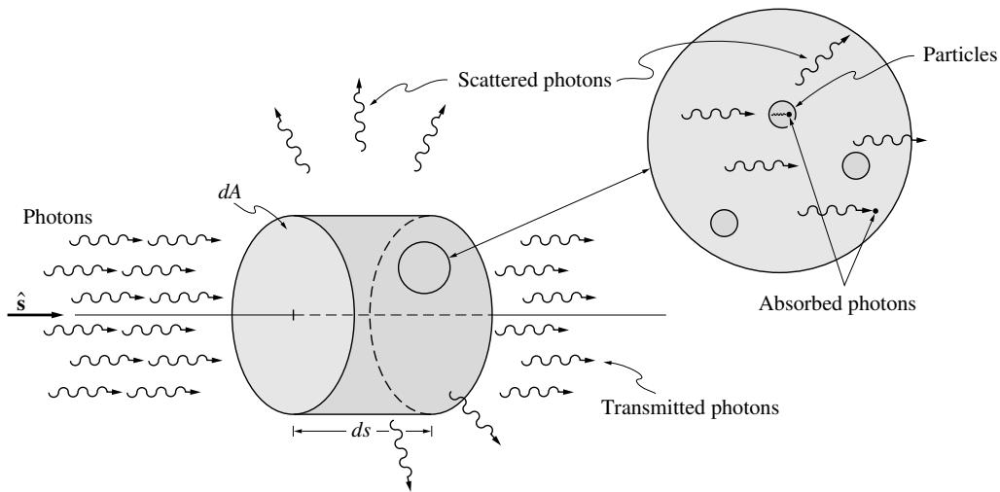  
图10-1 吸收和散射引起的辐射强度衰减

# 10.2 吸收和散射引起的衰减

如果辐射能量通过的介质是"参与的"，那么任何入射光束在通过介质时都会因吸收和散射而衰减，如图10-1示意所示。下面我们将针对沿$\hat{\mathbf{s}}$方向传播的光束建立这种衰减的表达式。当前讨论将限于折射率恒定的介质，即电磁波沿直线传播的介质[而变化的折射率会使光线弯曲，如斯涅尔定律(方程(2.72))所示，对于突变情况]。进一步假设介质是静止的(与光速相比)，是非偏振的，并且(对于大多数讨论)处于局部热力学平衡(LTE)状态。

# 吸收

已观察到吸收的绝对量与入射能量的大小以及光束通过介质传播的距离成正比。因此，我们可以写成：

$$
(dI_{\eta})_{\mathrm{abs}} = -\kappa_{\eta}I_{\eta}ds, \tag{10.1}
$$

其中比例常数$\kappa_{\eta}$称为(线性)吸收系数，引入负号是因为强度减小。如下一章将讨论的，分子气体中辐射的吸收还取决于每单位体积中可接受分子的数量，因此一些研究人员使用质量吸收系数或压力吸收系数，定义为：

$$
(dI_{\eta})_{\mathrm{abs}} = -\kappa_{\rho \eta}I_{\eta}\rho ds = -\kappa_{\rho \eta}I_{\eta}pd s. \tag{10.2}
$$

这里使用下标$\rho$和$p$仅用于说明系数之间的差异。科学文献的读者通常必须依靠物理单位来确定所使用的系数。

将方程(10.1)沿几何路径$s$积分得到：

$$
I_{\eta}(s) = I_{\eta}(0)\exp \left(-\int_{0}^{s}\kappa_{\eta}ds\right) = I_{\eta}(0)e^{-\tau_{\eta}}, \tag{10.3}
$$

其中

$$
\tau_{\eta} = \int_{0}^{s}\kappa_{\eta}ds \tag{10.4}
$$

是光束穿过的(吸收)光学厚度，$I_{\eta}(0)$是在$s=0$处进入介质的强度。注意(线性)吸收系数是光子被吸收前平均自由程的倒数。还可以为参与介质(对于介质内的给定路径)定义吸收率为：

$$
\alpha_{\eta}\equiv \frac{I_{\eta}(0) - I_{\eta}(s)}{I_{\eta}(0)} = 1 - e^{-\tau_{\eta}}. \tag{10.5}
$$

# 散射

由散射引起的衰减(或称"外散射"，即偏离所考虑方向的散射)与吸收非常相似，即部分入射强度从传播方向$\hat{\mathbf{s}}$中被移除。这两种现象的唯一区别在于：吸收的能量转化为内能，而散射的能量只是被重定向并表现为沿其他方向的增强(将在下一节讨论)，也称为"内散射"。因此我们可以写成：

$$
(dI_{\eta})_{\mathrm{sca}} = -\sigma_{s\eta}I_{\eta}ds, \tag{10.6}
$$

其中比例常数$\sigma_{s\eta}$是将所考虑方向的光束散射到所有其他方向的(线性)散射系数。同样，可以定义基于密度或压力的散射系数。也可以定义散射的光学厚度，其中散射系数是散射平均自由程的倒数。

# 总衰减

光束强度因吸收和散射共同作用而产生的总衰减称为消光。因此，消光系数定义为：

$$
\beta_{\eta} = \kappa_{\eta} + \sigma_{s\eta}. \tag{10.7}
$$

基于消光的光学距离定义为：

$$
\tau_{\eta} = \int_{0}^{s}\beta_{\eta}ds. \tag{10.8}
$$

与吸收和散射类似，消光系数有时也基于密度或压力定义。

# 10.3 发射和散射引起的增强

沿$\hat{\mathbf{s}}$方向在参与介质中传播的光束会因吸收和偏离传播方向的散射而损失能量。但同时，它也会通过发射以及从其他方向散射到传播方向$\hat{\mathbf{s}}$而获得能量。

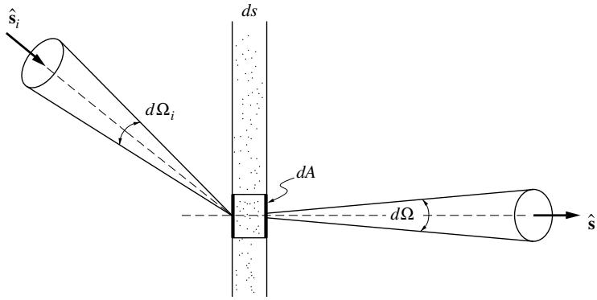  
图10-2 散射引起的辐射强度减弱

# 发射

体积元的发射率将与体积大小成正比。因此，沿任何路径的发射强度(即单位面积的发射能量率)必须与路径长度成正比，并且必须与介质中的局部能量含量成正比。因此：

$$
(dI_{\eta})_{\mathrm{em}} = j_{\eta}ds, \tag{10.9}
$$

其中$j_{\eta}$称为发射系数。由于在局部热力学平衡(LTE)条件下，各处的强度必须等于黑体强度，将在第11章方程(11.22)中证明：

$$
j_{\eta} = \kappa_{\eta}I_{b\eta}\quad \mathrm{and}\quad (dI_{\eta})_{\mathrm{em}} = \kappa_{\eta}I_{b\eta}ds, \tag{10.10}
$$

即在LTE条件下，发射的比例常数与吸收相同。类似于吸收率，也可以定义等温介质的发射率，即沿某路径$s$发射并逃逸到给定方向(在发射点和出射点之间未被吸收)的能量与最大可能值之比。结合方程(10.1)和(10.10)可以得到吸收-发射(但不散射)介质的完整辐射传递方程：

$$
\frac{dI_{\eta}}{ds} = \kappa_{\eta}(I_{b\eta} - I_{\eta}), \tag{10.11}
$$

其中右边第一项是发射引起的增强，第二项是吸收引起的衰减。对于厚度为$s$的等温气体层，辐射传递方程的解为：

$$
I_{\eta}(s) = I_{\eta}(0)e^{-\tau_{\eta}} + I_{b\eta}\left(1 - e^{-\tau_{\eta}}\right), \tag{10.12}
$$

其中光学距离已在方程(10.4)中定义。如果只考虑发射，$I_{\eta}(0) = 0$，则发射率定义为：

$$
\epsilon_{\eta} = I_{\eta}(s) / I_{b\eta} = 1 - e^{-\tau_{\eta}}, \tag{10.13}
$$

与表面辐射情况相同，该表达式与吸收率的表达式一致。

# 散射

由散射或"内散射"引起的增强来自所有方向，因此必须通过对所有立体角进行积分来计算。考虑如图10-2所示，从方向$\hat{\mathbf{s}}_i$的无限小射线束入射到体积元$dV = dA ds$上的辐射热通量。回顾辐射强度的定义(垂直于射线的单位面积、单位立体角和单位波数间隔的能量通量)，可以计算从立体角$d\Omega_{i}$内入射到$dA$上的光谱辐射热通量为：

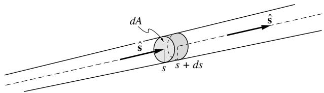  
图10-3 辐射能量平衡的射线束

$$
I_{\eta}(\pmb {\mathfrak{s}}_i)(dA\pmb {\mathfrak{s}}_i\cdot \pmb {\mathfrak{s}})d\Omega_i d\eta .
$$

该通量穿过$dV$的距离为$ds / \hat{\mathbf{s}}_i\cdot \hat{\mathbf{s}}$。因此，根据方程(10.6)，从$\hat{\mathbf{s}}_i$方向散射出去的总能量为：

$$
\sigma_{s\eta}\Big(I_{\eta}(\hat{\mathbf{s}}_i)(dA\hat{\mathbf{s}}_i\cdot \hat{\mathbf{s}})d\Omega_id\eta \Big)\left(\frac{ds}{\hat{\mathbf{s}}_i\cdot\hat{\mathbf{s}}}\right) = \sigma_{s\eta}I_{\eta}(\hat{\mathbf{s}}_i)dAd\Omega_id\eta ds. \tag{10.14}
$$

其中，$\Phi_{\eta}(\hat{\mathbf{s}}_i,\hat{\mathbf{s}})d\Omega /4\pi$部分被散射到方向$\hat{\mathbf{s}}$周围的$d\Omega$锥体中。函数$\Phi_{\eta}$称为散射相函数，描述从$\hat{\mathbf{s}}_i$方向入射的射线被散射到$\hat{\mathbf{s}}$方向的概率。常数$4\pi$是任意的，为方便起见而引入[见下文方程(10.17)]。

从$d\Omega_{i}$锥体散射到$d\Omega$锥体的能量通量为：

$$
\sigma_{s\eta}I_{\eta}(\hat{\mathbf{s}}_i)dAd\Omega_id\eta ds\frac{\Phi_{\eta}(\hat{\mathbf{s}}_i,\hat{\mathbf{s}})}{4\pi} d\Omega . \tag{10.15}
$$

现在可以通过积分计算从所有入射方向$\hat{\mathbf{s}}_i$散射到$\hat{\mathbf{s}}$方向的能量通量：

$$
\left(dI_{\eta}\right)_{\mathrm{sca}}(\hat{\mathbf{s}})dAd\Omega d\eta = \int_{4\pi}\sigma_{s\eta}I_{\eta}(\hat{\mathbf{s}}_i)dAd\Omega_i d\eta ds\Phi_{\eta}(\hat{\mathbf{s}}_i,\hat{\mathbf{s}})\frac{d\Omega}{4\pi},
$$

或

$$
\left(dI_{\eta}\right)_{\mathrm{sca}}(\hat{\mathbf{s}}) = ds\frac{\sigma_{s\eta}}{4\pi}\int_{4\pi}I_{\eta}(\hat{\mathbf{s}}_i)\Phi_{\eta}(\hat{\mathbf{s}}_i,\hat{\mathbf{s}})d\Omega_i. \tag{10.16}
$$

回到方程(10.15)，我们发现从$d\Omega_{i}$散射到所有方向的能量通量为：

$$
\sigma_{s\eta}I_{\eta}(\hat{\mathbf{s}}_i)dAd\Omega_id\eta ds\frac{1}{4\pi}\int_{4\pi}\Phi_{\eta}(\hat{\mathbf{s}}_i,\hat{\mathbf{s}})d\Omega ,
$$

这必须等于方程(10.14)中的量。我们得出结论：

$$
\frac{1}{4\pi}\int_{4\pi}\Phi_{\eta}(\hat{\mathbf{s}}_i,\hat{\mathbf{s}})d\Omega \equiv 1. \tag{10.17}
$$

因此，如果$\Phi_{\eta} =$常数，即如果等量的能量被散射到所有方向(称为各向同性散射)，则$\Phi_{\eta} \equiv 1$。这就是包含因子$4\pi$的原因。

# 10.4 辐射传递方程(RTE)

我们现在可以对如图10-3所示的小射线束中沿$\hat{\mathbf{s}}$方向传播的辐射能量进行能量平衡。强度的变化由发射、吸收、偏离$\hat{\mathbf{s}}$方向的散射和散射到$\hat{\mathbf{s}}$方向的贡献之和给出，根据方程(10.1)、(10.6)、(10.9)和(10.16)：

$$
\begin{array}{l}{I_{\eta}(s + ds,\hat{\mathbf{s}},t + dt) - I_{\eta}(s,\hat{\mathbf{s}},t) = j_{\eta}(s,t)ds - \kappa_{\eta}I_{\eta}(s,\hat{\mathbf{s}},t)ds}\\ {-\sigma_{s\eta}I_{\eta}(s,\hat{\mathbf{s}},t)ds + \frac{\sigma_{s\eta}}{4\pi}\int_{4\pi}I_{\eta}(\hat{\mathbf{s}}_i)\Phi_{\eta}(\hat{\mathbf{s}}_i,\hat{\mathbf{s}})d\Omega_ids.} \end{array} \tag{10.18}
$$

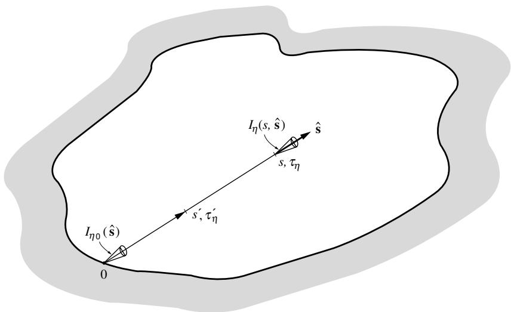  
图10-4 推导辐射传递方程的封闭体

这个方程本质上是拉格朗日形式的，即我们跟踪从$s$到$s + ds$的射线；由于射线以光速$c$传播，$ds$和$dt$通过$ds = c dt$相关联。出射强度可以展开为截断的泰勒级数：

$$
I_{\eta}(s + ds,\pmb {\hat{s}},t + dt) = I_{\eta}(s,\pmb {\hat{s}},t) + dt\frac{\partial I_{\eta}}{\partial t} +ds\frac{\partial I_{\eta}}{\partial s}, \tag{10.19}
$$

因此方程(10.18)可以简化为：

$$
\frac{1}{c}\frac{\partial I_{\eta}}{\partial t} +\frac{\partial I_{\eta}}{\partial s} = j_{\eta} - \kappa_{\eta}I_{\eta} - \sigma_{s\eta}I_{\eta} + \frac{\sigma_{s\eta}}{4\pi}\int_{4\pi}I_{\eta}(\pmb{\hat{s}}_i)\Phi_{\eta}(\pmb{\hat{s}}_i,\pmb {\hat{s}})d\Omega_i. \tag{10.20}
$$

在这个辐射传递方程(通常缩写为RTE)或传递方程中，所有量都可能随空间位置、时间和波数而变化，而强度和相函数还依赖于方向$\hat{\mathbf{s}}$(和$\hat{\mathbf{s}}_i$)。为简化符号，仅在必要时明确表示方向依赖性。如前所述，该方程的推导基于一些简化假设，即介质是均匀且静止的(与光速相比)，介质是非偏振的且偏振状态被忽略，以及介质具有恒定的折射率。Viskanta和Menguc[1]对这些限制进行了详细讨论。Pomraning[2]给出了变折射率介质的RTE，Ben-Abdallah[3]报道了一些最新进展。

方程(10.20)在任意封闭体内的任何位置都有效。其求解需要知道某些位置$s$处每个方向的强度，通常是介质通过或从封闭边界进入$\hat{\mathbf{s}}$方向的强度，如图10-4所示。我们尚未将辐射传递方程化为最紧凑的形式，以便清楚识别强度变化的四个不同贡献。方程(10.20)是辐射传递方程的瞬态形式，适用于局部热力学平衡和非平衡状态。

近年来，主要由于脉冲持续时间在ps或fs范围内的短脉冲激光器的发展，瞬态辐射现象变得越来越重要[4]。然而，对于绝大多数工程应用，光速与局部时间和长度尺度相比非常大，因此可以忽略方程(10.20)中的第一项。还有一些重要的应用发生在热力学非平衡状态下，例如高超声速航天器进入地球大气层时遇到的强非平衡辐射[5](在其前方产生高温等离子体；参见图11-7)。尽管如此，大多数工程应用都处于局部热力学平衡状态。我们在此给出完整方程以求全面，但在本书其余部分将省略瞬态和非平衡项(第11章对非平衡性质的简要讨论和第19章对瞬态辐射的更详细考虑除外)。

引入方程(10.7)定义的消光系数后，可以将方程(10.20)重写为平衡、准稳态形式：

$$
\frac{dI_{\eta}}{ds} = \hat{\mathbf{q}}\cdot \nabla I_{\eta} = \kappa_{\eta}I_{b\eta} - \beta_{\eta}I_{\eta} + \frac{\sigma_{s\eta}}{4\pi}\int_{4\pi}I_{\eta}(\hat{\mathbf{s}}_i)\Phi_{\eta}(\hat{\mathbf{s}}_i,\hat{\mathbf{s}}_i)d\Omega_i, \tag{10.21}
$$

由于我们假设过程是准稳态的，强度梯度已转换为全导数。辐射传递方程通常用无量纲光学坐标重写（见图10-4）：

$$
\tau_{\eta} = \int_{0}^{s}(\kappa_{\eta} + \sigma_{s\eta})ds = \int_{0}^{s}\beta_{\eta}ds, \tag{10.22}
$$

以及单次散射反照率，首次在方程(1.58)中定义为：

$$
\omega_{\eta}\equiv \frac{\sigma_{s\eta}}{\kappa_{\eta} + \sigma_{s\eta}} = \frac{\sigma_{s\eta}}{\beta_{\eta}}, \tag{10.23}
$$

由此得到：

$$
\frac{dI_{\eta}}{d\tau_{\eta}} = -I_{\eta} + (1 - \omega_{\eta})I_{b\eta} + \frac{\omega_{\eta}}{4\pi}\int_{4\pi}I_{\eta}(\hat{\mathbf{s}}_i)\Phi_{\eta}(\hat{\mathbf{s}}_i,\hat{\mathbf{s}}_i)d\Omega_i. \tag{10.24}
$$

方程(10.24)中的最后两项常被合并，称为辐射强度的源函数：

$$
S_{\eta}(\tau_{\eta},\hat{\mathbf{s}}) = (1 - \omega_{\eta})I_{b\eta} + \frac{\omega_{\eta}}{4\pi}\int_{4\pi}I_{\eta}(\hat{\mathbf{s}}_i)\Phi_{\eta}(\hat{\mathbf{s}}_i,\hat{\mathbf{s}}_i)d\Omega_i. \tag{10.25}
$$

于是方程(10.24)呈现出看似简单的形式：

$$
\frac{dI_{\eta}}{d\tau_{\eta}} +I_{\eta} = S_{\eta}(\tau_{\eta},\hat{\mathbf{s}}), \tag{10.26}
$$

这当然是一个积分-微分方程（在空间中，以及两个具有局部原点的方向坐标中）。此外，普朗克函数$I_{b\eta}$通常未知，必须通过考虑整体能量方程来确定（需要添加三个空间坐标的导数和两个方向坐标及波数谱的积分）。

# 10.5 辐射传递方程的形式解

如果源函数已知（或假设已知），方程(10.26)可以通过积分因子法进行形式积分。因此，乘以$e^{\tau_{\eta}}$得到：

$$
\frac{d}{d\tau_{\eta}}\left(I_{\eta}e^{\tau_{\eta}}\right) = S_{\eta}(\tau_{\eta},\hat{\mathbf{s}})e^{\tau_{\eta}}, \tag{10.27}
$$

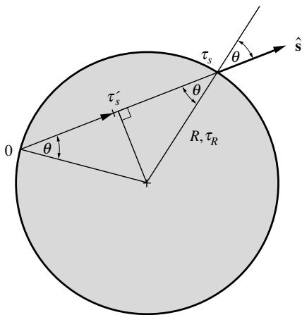  
图10-5 例10.1的等温球体

可以从壁面点$s' = 0$积分到介质内部点$s' = s$（见图10-4），得到：

$$
I_{\eta}(\tau_{\eta}) = I_{\eta}(0)e^{-\tau_{\eta}} + \int_{0}^{\tau_{\eta}}S_{\eta}(\tau_{\eta^{\prime}}^{\prime}\hat{\mathbf{s}})e^{-(\tau_{\eta} - \tau_{\eta^{\prime}}^{\prime})}d\tau_{\eta^{\prime}}^{\prime} \tag{10.28}
$$

其中$\tau_{\eta}^{\prime}$是$s = s^{\prime}$处的光学坐标

从物理上看，可以很容易理解方程(10.28)右边的第一项是$s = 0$处进入封闭空间的强度对局部强度的贡献，由于在光学距离$\tau_{\eta}$上的消光而呈指数衰减。第二项的积分元$S_{\eta}(\tau_{\eta}^{\prime}) d \tau_{\eta}^{\prime}$则是$\tau_{\eta}^{\prime}$处局部发射的贡献，在发射点与考虑点之间的光学距离$\tau_{\eta} - \tau_{\eta}^{\prime}$上因自消光而呈指数衰减。最后，积分将所有贡献沿整个发射路径求和。

方程(10.28)是关于强度$I_{\eta}$的三阶积分方程。源函数的积分必须在光学坐标上执行（对所有方向），而源函数本身也是一个包含未知强度的方向坐标集（具有变化的局部原点）的积分。此外，通常温度和黑体强度未知，必须与整体能量守恒一起求解。然而，在某些情况下，辐射传递方程可以得到显著简化。

# 非散射介质

如果介质只吸收和发射辐射，源函数简化为局部黑体强度，且

$$
I_{\eta}(\tau_{\eta}) = I_{\eta}(0)e^{-\tau_{\eta}} + \int_{0}^{\tau_{\eta}}I_{b_{\eta}}(\tau_{\eta}^{\prime})e^{-(\tau_{\eta} - \tau_{\eta}^{\prime})}d\tau_{\eta}^{\prime} \tag{10.29}
$$

如果温度场已知，这个方程是辐射强度的显式表达式。然而，通常温度未知，必须结合整体能量守恒来确定。

例10.1. 被真空或冷黑壁包围的等温球体的出射光谱强度是多少？

# 解答

由于问题的对称性，球体表面出射的强度仅是出射角的函数。观察图10-5，方程(10.29)简化为

$$
I_{\eta}(\tau_{R},\theta) = \int_{0}^{\tau_{s}}I_{b\eta}(\tau_{s}^{\prime})e^{-(\tau_{s} - \tau_{s}^{\prime})}d\tau_{s}^{\prime}.
$$

但对于球体

$$
\tau_{s} = 2\tau_{R}\cos \theta ,
$$

与方位角无关。因此，当$I_{b\eta}(\tau_s') = I_{b\eta} = \mathrm{const}$时，所求强度为

$$
I_{\eta}(\tau_{\tau_{R}},\theta) = I_{b\eta}e^{-(2\tau_{R}\cos \theta -\tau_{s}^{\prime})}\Big|_{0}^{2\tau_{R}\cos \theta} = I_{b\eta}\big(1 - e^{-2\tau_{R}\cos \theta}\big).
$$

因此，当$\tau_{R} \gg 1$时，等温球体向所有方向均匀发射，就像同温度的黑体表面一样。

# 冷介质

如果介质温度很低，使得该温度下的黑体强度远小于入射强度，则辐射传递方程与其他传热模式解耦。然而，控制方程仍然是三阶积分方程，即

$$
I_{\eta}(\tau_{\eta},\hat{\mathbf{s}}) = I_{\eta}(0)e^{-\tau_{\eta}} + \int_{0}^{\tau_{\eta}}\frac{\omega_{\eta}}{4\pi}\int_{4\pi}I_{\eta}(\tau_{\eta}',\hat{\mathbf{s}}_{i})\Phi_{\eta}(\hat{\mathbf{s}}_{i},\hat{\mathbf{s}})d\Omega_{i}e^{-(\tau_{\eta} - \tau_{\eta}')}d\tau_{\eta}'. \tag{10.30}
$$

如果散射是各向同性的，即$\Phi \equiv 1$，则方程(10.30)中的方向积分可以执行，得到

$$
I_{\eta}(\tau_{\eta},\hat{\mathbf{s}}) = I_{\eta}(0)e^{-\tau_{\eta}} + \frac{1}{4\pi}\int_{0}^{\tau_{\eta}}\omega_{\eta}G_{\eta}(\tau_{\eta}^{\prime})e^{-(\tau_{\eta} - \tau_{\eta}^{\prime})}d\tau_{\eta^{\prime}}^{\prime} \tag{10.31}
$$

其中

$$
G_{\eta}(\mathfrak{t})\equiv \int_{4\pi}I_{\eta}(\tau_{\eta}^{\prime},\hat{\mathbf{s}}_{i})d\Omega_{i} \tag{10.32}
$$

称为入射辐射函数（因为它是从所有方向入射到某点的总强度）。问题因此大大简化，因为只需要找到$G$的解[通过对方程(10.31)进行方向积分]，而不需要确定方向相关的强度。

# 纯散射介质

如果介质只散射辐射而不吸收或发射，则辐射传递再次与其他传热模式解耦。此时$\omega_{\eta} \equiv 1$，辐射传递方程简化为与方程(10.30)基本相同的形式，即

$$
I_{\eta}(\tau_{\eta},\hat{\mathbf{s}}) = I_{\eta}(0)e^{-\tau_{\eta}} + \frac{1}{4\pi}\int_{0}^{\tau_{\eta}}\int_{4\pi}I_{\eta}(\tau_{\eta}',\hat{\mathbf{s}}_{i})\Phi_{\eta}(\hat{\mathbf{s}}_{i},\hat{\mathbf{s}})d\Omega_{i}e^{-(\tau_{\eta} - \tau_{\eta}')}d\tau_{\eta}'. \tag{10.33}
$$

同样，对于各向同性散射，可以通过引入入射辐射来简化方程，得到

$$
I_{\eta}(\tau_{\eta},\hat{\mathbf{s}}) = I_{\eta}(0)e^{-\tau_{\eta}} + \frac{1}{4\pi}\int_{0}^{\tau_{\eta}}G_{\eta}(\tau_{\eta}',\hat{\mathbf{s}})e^{-(\tau_{\eta} - \tau_{\eta}')}d\tau_{\eta}'. \tag{10.34}
$$

例10.2. 一块大的等温黑板被一层薄的各向同性散射、非吸收（因此也不发射）且折射率为1的材料覆盖。假设该层非常薄，使得从平板发射的任何光线在离开散射层之前最多散射一次，估算该层上方法线方向的辐射强度。

# 解

法线方向的出射强度(见图10-6)可以通过保留方程(10.34)中$\tau_{\eta}$阶或更高阶的项来计算(因为$\tau_{\eta} \ll 1$)。这个过程导致$e^{- \tau_{\eta}} = 1 - \tau_{\eta} + \mathcal{O}(\tau_{\eta}^{2})$，

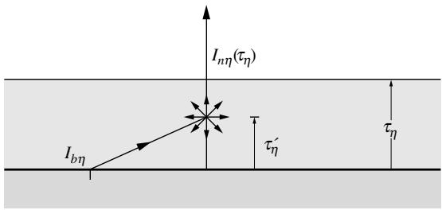  
图10-6 例10.2的几何结构

$G(\tau_{\eta}^{\prime}) = G(\tau_{\eta}) + \mathcal{O}(\tau_{\eta})$ (待散射的辐射无衰减地到达某点)，且$e^{- (\tau_{\eta} - \tau_{\eta}^{\prime})} = 1 - \mathcal{O}(\tau_{\eta})$ (散射辐射将无进一步衰减地离开介质)，因此

$$
I_{n\eta} = I_{b\eta}(1 - \tau_{\eta}) + \frac{1}{4\pi} G_{\eta}\tau_{\eta} + \mathcal{O}(\tau_{\eta}^{2}),
$$

其中从平板发出的强度是已知的，因为平板是黑体。任意点的入射辐射来自下方$2\pi$立体角内从底板无衰减发射的辐射，而上方$2\pi$立体角没有辐射，即$G_{\eta} \approx 2\pi I_{b\eta}$，因此

$$
I_{n\eta} = I_{b\eta}(1 - \tau_{\eta}) + \frac{1}{2} I_{b\eta}\tau_{\eta} + \mathcal{O}(\tau_{\eta}^{2}) = I_{b\eta}\left(1 - \frac{\tau_{\eta}}{2}\right) + \mathcal{O}(\tau_{\eta}^{2}).
$$

从物理上看，这个结果告诉我们：法线方向的发射被$\tau_{\eta}$部分衰减(散射离开法线方向)，又被$\tau_{\eta}/2$部分增强(散射进入法线方向)。由于散射是各向同性的，衰减部分恰好一半向上散射，一半向下散射；后者随后被发射平板吸收。因此，散射层充当了热板的隔热层。

# 10.6 辐射传递方程的边界条件

准稳态形式的辐射传递方程(10.21)是关于强度的一阶微分方程(对于固定方向$\hat{\mathbf{s}}$)。因此，该方程需要知道空间中某一点沿$\hat{\mathbf{s}}$方向的辐射强度。通常，可以独立指定强度的点位于包围参与介质的封闭表面上，如方程(10.28)的形式解所示。离开壁面进入指定方向的强度可以通过第5章(漫发射和反射表面)、第6章(漫发射和镜面反射表面)和第7章(具有任意特性的表面)中给出的方法确定。

# 漫发射和反射的不透明表面

对于漫发射和反射的表面，出射强度与方向无关。因此，在表面点$\mathbf{r}_w$处，根据方程(5.18)和(5.19)，

$$
I(\mathbf{r}_w,\hat{\mathbf{s}}) = I(\mathbf{r}_w) = J(\mathbf{r}_w) / \pi = \epsilon (\mathbf{r}_w)I_b(\mathbf{r}_w) + \rho (\mathbf{r}_w)H(\mathbf{r}_w) / \pi , \tag{10.35}
$$

其中$H(\mathbf{r}_w)$是由方程(3.41)定义的半球辐照度(即入射辐射热流)，由此可得

$$
I(\mathbf{r}_w,\hat{\mathbf{s}}) = \epsilon (\mathbf{r}_w)I_b(\mathbf{r}_w) + \frac{\rho(\mathbf{r}_w)}{\pi}\int_{\hat{\mathbf{n}}\cdot \hat{\mathbf{s}} '\prec 0}I(\mathbf{r}_w,\hat{\mathbf{s}} ')|\hat{\mathbf{n}}\cdot \hat{\mathbf{s}} '|d\Omega ', \tag{10.36}
$$

其中$\hat{\mathbf{n}}$是局部外向表面法向量，$\hat{\mathbf{n}} \cdot \hat{\mathbf{s}}' = \cos \theta'$表示任意入射方向$\hat{\mathbf{s}}'$与表面法线之间夹角的余弦，如图10-7所示。因此，出射强度通常不能显式确定，而是与入射强度相关。黑体表面是一个例外（当$\rho = 0$时），

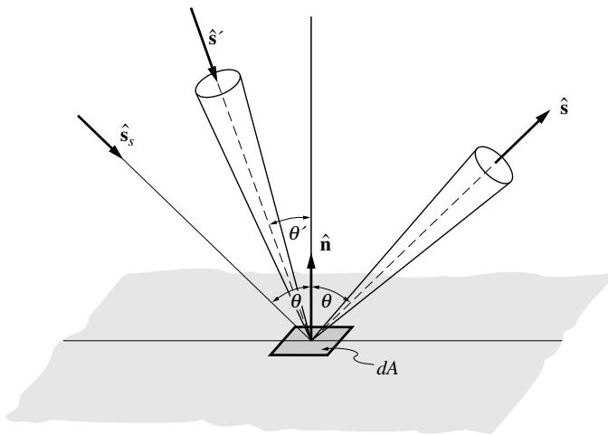  
图10-7 从表面反射的辐射强度

$$
I(\mathbf{r}_w,\hat{\mathbf{s}}) = I_b(\mathbf{r}_w). \tag{10.37}
$$

# 漫发射、镜面反射的不透明表面

如果表面的反射率同时包含镜面和漫反射分量（即反射率服从方程(6.1)），那么出射强度也由两部分组成。一部分出射强度来自漫发射以及反射能量的漫反射部分，如方程(10.36)所述。此外，出射强度还包含镜面反射分量：

$$
I(\mathbf{r}_w,\hat{\mathbf{s}}) = \epsilon (\mathbf{r}_w)I_b(\mathbf{r}_w) + \frac{\rho^d(\mathbf{r}_w)}{\pi}\int_{\hat{\mathbf{n}}\cdot \hat{\mathbf{s}} '\cdot < 0}I(\mathbf{r}_w,\hat{\mathbf{s}} ')|\hat{\mathbf{n}}\cdot \hat{\mathbf{s}} '|d\Omega ' + \rho^s (\mathbf{r}_w)I(\mathbf{r}_w,\hat{\mathbf{s}}_s), \tag{10.38}
$$

其中$\hat{\mathbf{s}}_s$是"镜面方向"，定义为光束必须从该方向入射才能在镜面反射后沿$\hat{\mathbf{s}}$方向传播。根据图10-7，该方向满足$\hat{\mathbf{s}} +(- \hat{\mathbf{s}}_s) = 2\cos \theta \hat{\mathbf{n}}$，即

$$
\hat{\mathbf{s}}_s = \hat{\mathbf{s}} -2(\hat{\mathbf{s}}\cdot \hat{\mathbf{n}})\hat{\mathbf{n}}. \tag{10.39}
$$

# 具有任意表面特性的不透明表面

具有非理想辐射特性的表面反射由双向反射函数决定，如第7章所述。从方程(7.10)可直接得到：

$$
I(\mathbf{r}_w,\hat{\mathbf{s}}) = \epsilon '(\mathbf{r}_w,\hat{\mathbf{s}})I_b(\mathbf{r}_w) + \int_{\hat{\mathbf{n}}\cdot \hat{\mathbf{s}} < 0}\rho ''(\mathbf{r}_w,\hat{\mathbf{s}} ',\hat{\mathbf{s}})I(\mathbf{r}_w,\hat{\mathbf{s}} ')|\hat{\mathbf{n}}\cdot \hat{\mathbf{s}} '|d\Omega '. \tag{10.40}
$$

如果表面是漫反射，$\rho '' = \rho^d /\pi$，方程(10.40)简化为方程(10.36)。对于镜面反射，方程(7.15)的推导表明其简化为方程(10.38)。

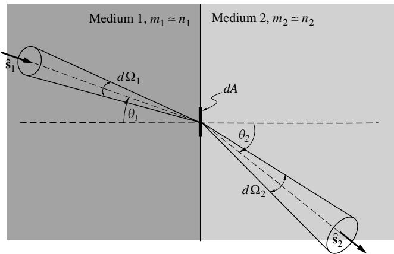  
图10-8 光线束从一种介质穿过折射率不同的另一种介质的辐射（展示$n_1 > n_2$的情况）

# 半透明边界

如果边界是半透明壁，外部辐射可能穿透进入封闭空间，必须作为$I_{\alpha}(\mathbf{r}_w,\hat{\mathbf{s}})$添加到方程(10.36)、(10.38)和(10.40)中。这些边界条件中的发射率$\epsilon$是整个半透明壁厚内部发射的有效值。如果边界表面完全透明（或仅是开口），则边界没有发射，$\epsilon = 0$。这种边界条件在第6.6节中有详细讨论。

# 两种半透明介质间的界面

只有当辐射能在任一介质中穿透相当距离时，两种半透明介质间的界面才值得关注——否则，光密介质可建模为"不透明表面"。这意味着两种介质的吸收指数都非常小[见方程(2.43)]，且$m = n - ik \simeq n$。我们还假设界面是光学平滑的，即反射可以用斯涅尔定律建模，如方程(2.72)和(3.59)所示，结合菲涅尔关系式(2.96)和(3.60)（其中$n = n_2 / n_1$）。如果我们对从介质1传输到介质2的光线束进行能量平衡（如图10-8所示$n_1 > n_2$的情况），根据辐射强度的定义有：

$$
I_{\nu 1}(\theta_1)(1 - \rho_{12})dt(dA\cos \theta_1)d\Omega_1d\nu = I_{\nu 2}(\theta_2)dt(dA\cos \theta_2)d\Omega_2d\nu , \tag{10.41}
$$

其中$dA$是界面上的微元面积，我们选择频率$\nu$作为光谱变量，因为只有频率在光穿过不同折射率介质时保持不变。消除立体角$d\Omega = \sin \theta d\theta d\psi$（以及方位角$\psi$，它不受介质变化影响），简化为：

$$
I_{\nu 1}(\theta_1)(1 - \rho_{12})\sin \theta_1\cos \theta_1d\theta_1 = I_{\nu 1}(\theta_2)\sin \theta_2\cos \theta_2d\theta_2. \tag{10.42}
$$

根据斯涅尔定律，方程(2.72)和(3.59)：

$$
n_1\sin \theta_1 = n_2\sin \theta_2, \tag{10.43}
$$

最后，将这两个关系代入方程(10.42)，我们得到

$$
\frac{I_{\nu 1}(\theta_1)(1 - \rho_{12})}{n_1^2} = \frac{I_{\nu 2}(\theta_2)}{n_2^2}. \tag{10.44}
$$

需要注意的是，由于$n_1 > n_2$，在介质2中的折射会偏离表面法线方向，即$\theta_2 > \theta_1$，并且存在一个由方程(2.100)给出的临界角$\theta_1 = \theta_c$。当$\theta_2 = 90^\circ$时，对于更大的$\theta_{1}$会发生全内反射，没有能量会透射到介质2中：

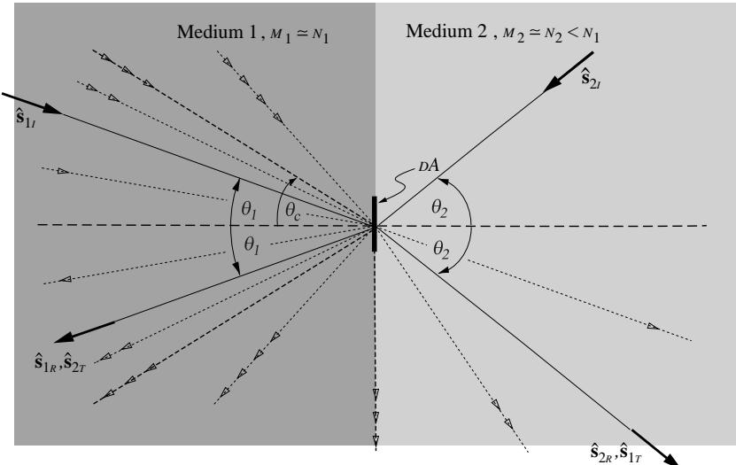  
图10-9 两种不同折射率半透明介质界面处的辐射强度分布（展示$n_1 > n_2$的情况）

$$
\theta_{1} > \theta_{c} = \sin^{-1}\left(\frac{n_{2}}{n_{1}}\right):\quad \rho_{12} = 1;I_{\nu 2}(\theta_{2}) = 0. \tag{10.45}
$$

图10-9中通过多条附加入射方向（用虚线细线和空心箭头表示）及其透射（仅当$\theta_{1}< \theta_c$时）和反射方向展示了这一现象。

利用方程(10.44)和(10.45)，我们现在可以对界面进行完整的能量平衡分析，包括从介质1内部入射的强度$I_{\nu 1i}(\theta_1)$、其反射部分$I_{\nu 1r}(\theta_1)$（镜面反射角$\theta_{r} = \theta_{1}$）、透射到介质2的部分$I_{\nu 1t}(\theta_2)$，以及从介质2内部入射到界面的类似贡献，如图10-9所示：

$$
\begin{array}{l}{I_{\nu 2}(\theta_2) = \rho_{21}I_{\nu 2i}(\theta_2) + I_{\nu 1t}(\theta_2) = \rho_{21}I_{\nu 2i}(\theta_2) + (1 - \rho_{12})\left(\frac{n_2}{n_1}\right)^2 I_{\nu 1i}(\theta_1),}\\ {I_{\nu 1}(\theta_1) = \rho_{12}I_{\nu 1i}(\theta_1) + I_{\nu 2t}(\theta_1) = \rho_{12}I_{\nu 1i}(\theta_1) + (1 - \rho_{21})\left(\frac{n_1}{n_2}\right)^2 I_{\nu 2i}(\theta_2),} \end{array} \tag{10.46b}
$$

其中，根据方程(2.96)：

$$
\rho_{12} = \rho_{21} = \left\{ \begin{array}{ll}\frac{1}{2}\left[\left(\frac{n_1\cos\theta_2 - n_2\cos\theta_1}{n_1\cos\theta_2 + n_2\cos\theta_1}\right)^2 +\left(\frac{n_1\cos\theta_1 - n_2\cos\theta_2}{n_1\cos n_1 + n_2\cos\theta_2}\right)^2\right], & \theta_1< \theta_c,\\ 1 & \theta_1\geq \theta_c. \end{array} \right. \tag{10.47}
$$

从界面进入光学密度较小的介质2的强度$I_{\nu 2}(\theta_2)$，对于所有$\theta_{2}$值都会有来自介质1的透射贡献（但仅来自开口角为$\theta_{c}$的锥形区域内）。另一方面，进入介质1的强度$I_{\nu 1}(\theta_1)$，只有当$\theta_{1}< \theta_c$时才会有来自介质2的透射分量。

# 10.7 辐射能量密度

封闭空间内的一个体积元会受到来自各个方向的辐射，在任意时刻$t$，该体积元内都会以光子形式储存一定量的辐射能。例如，考虑如图10-3所示的一个体积元$dV = dAds$，它受到垂直于$dA$面、强度为$I_{\eta}(\hat{\mathbf{s}})$的辐射。因此，单位时间内进入$dV$的辐射能量为$I_{\eta}(\hat{\mathbf{s}})d\Omega dA$。根据第1章公式(1.48)的推导，这部分能量会在$dV$内停留$dt = ds / c$时间，然后从另一侧射出。因此，对于单一方向的辐射，体积元在任意时刻包含的辐射能量为$I_{\eta}(\hat{\mathbf{s}})d\Omega dAds / c = I_{\eta}(\hat{\mathbf{s}})d\Omega dV / c$。将所有可能方向的贡献相加，我们得到$dV$内存储的总辐射能量为$u_{\eta}dV$，其中$u_{\eta}$是光谱辐射能量密度：

$$
u_{\eta}\equiv \frac{1}{c}\int_{4\pi}I_{\eta}(\hat{\mathbf{s}})d\Omega . \tag{10.48}
$$

对整个光谱积分得到总辐射能量密度：

$$
u = \int_{0}^{\infty}u_{\eta}d\eta = \frac{1}{c}\int_{4\pi}\int_{0}^{\infty}I_{\eta}(\hat{\mathbf{s}})d\eta d\Omega = \frac{1}{c}\int_{4\pi}I(\hat{\mathbf{s}})d\Omega . \tag{10.49}
$$

尽管辐射能量密度是与物质内能类似的基本量，但传热工程师并不广泛使用它。相反，通常采用入射辐射$G_{\eta}$，它与能量密度的关系为：

$$
G_{\eta}\equiv \int_{4\pi}I_{\eta}(\hat{\mathbf{s}})d\Omega = cu_{\eta};\quad G = cu. \tag{10.50}
$$

# 10.8 辐射热通量

表面元上的光谱辐射热流已在公式(1.39)中用入射和出射强度表示为：

$$
{\mathfrak{q}}_{\eta}\cdot\hat{\mathfrak{n}}=\int_{4\pi}I_{\eta}\hat{\mathfrak{n}}\cdot\hat{\mathfrak{s}}d\Omega. \tag{10.51}
$$

这个关系当然也适用于放置在封闭空间内任意位置的假想(即完全透射)表面元。从公式(1.39)中移除表面法线，我们得到参与介质内光谱辐射热流矢量的定义。要获得总辐射热流，需要对公式(10.51)进行光谱积分：

$$
{\mathfrak{q}}=\int_{0}^{\infty}{\mathfrak{q}}_{\eta}d\eta=\int_{0}^{\infty}\int_{4\pi}I_{\eta}(\hat{\mathbf{s}})\hat{\mathbf{s}}d\Omega d\eta. \tag{10.52}
$$

根据所使用的坐标系或所描述的曲面，辐射热流矢量可以分解为其坐标分量，例如$q_{x}, q_{y},$和$q_{z}$(对于笛卡尔坐标系)，或者分解为曲面的法向和切向分量等。

例10.3. 计算被真空包围的等温球形介质的总热损失，假设$\kappa_{\eta} =$常数(即不随位置、温度或波数变化)。

# 解

这里我们处理的是球坐标系，我们关注的是辐射热流的径向分量(由于对称性，其他两个分量为零)。在例10.1中我们看到，从球体发出的强度为：

$$
I_{\eta}(\tau_{R},\theta) = I_{b\eta}\left(1 - e^{-2\tau_{R}\cos \theta}\right),\quad 0\leq \theta \leq \frac{\pi}{2},
$$

其中$\theta$是从指向球体外部的表面法线测量的(图10-5)。由于球体被真空包围，没有入射辐射：

$$
I_{\eta}(\tau_{R},\theta) = 0,\quad \frac{\pi}{2}\leq \theta \leq \pi .
$$

因此，根据公式(10.52)：

$$
\begin{array}{l}{q(\tau_{R}) = \int_{0}^{\infty}\int_{0}^{2\pi}\int_{0}^{\pi}I_{\eta}(\tau_{R},\theta)\cos \theta \sin \theta d\theta d\psi d\eta}\\ {= 2\pi \int_{0}^{\infty}\int_{0}^{\pi /2}I_{b\eta}\left(1 - e^{-2\tau_{R}\cos \theta}\right)\cos \theta \sin \theta d\theta d\eta}\\ {= \pi I_{b}\left\{1 - \frac{1}{2\tau_{R}^{2}}\left[1 - (1 + 2\tau_{R})e^{-2\tau_{R}}\right]\right\} = n^{2}\sigma T^{4}\left\{1 - \frac{1}{2\tau_{R}^{2}}\left[1 - (1 + 2\tau_{R})e^{-2\tau_{R}}\right]\right\} ,} \end{array}
$$

其中$\pi$是介质的折射率(对于气体通常$n \approx 1$，但对于半透明液体和固体$n > 1$)。如前一例所述，如果$\tau_{R} \to \infty$，热流将接近黑体表面的值。

如果上例中的球体是光学薄的$\tau_{R} \ll 1$(即介质发射辐射能，但不吸收任何发射的能量)，则球体的总热损失(总发射)为：

$$
\begin{array}{r}Q = 4\pi R^2 q = 4\pi R^2\times \frac{4}{3}\tau_Rn^2\sigma T^4 = 4\kappa n^2\sigma T^4 V. \end{array} \tag{10.53}
$$

这个结果可以推广到任何等温体积$V$的无自吸收发射：

$$
Q_{\mathrm{emission}} = 4\kappa n^2\sigma T^4 V. \tag{10.54}
$$

# 10.9 辐射热通量的散度

虽然传热工程师对辐射热流感兴趣，但这种兴趣通常只限于物理边界处的热流。另一方面，在介质内部，我们需要知道有多少净辐射能被沉积到(或从)每个体积元中。因此，对如图10-10所示的微小体积$dV = dxdydz$进行辐射能量平衡，我们有

$$
\left( \begin{array}{c}\mathrm{radiative~energy}\\ \mathrm{stored~in~}dV\\ \mathrm{per~unit~time} \end{array} \right) - \left( \begin{array}{c}\mathrm{rad.~energy~generated}\\ \mathrm{(emitted)~by~}dV\\ \mathrm{per~unit~time} \end{array} \right) + \left( \begin{array}{c}\mathrm{rad.~energy~destroyed}\\ \mathrm{(absorbed)~by~}dV\\ \mathrm{per~unit~time} \end{array} \right)
$$

$$
= \left( \begin{array}{c}{\mathrm{flux~in~at~}x - \mathrm{flux~out~at~}x + dx}\\ {+\mathrm{flux~in~at~}y - \mathrm{flux~out~at~}y + dy}\\ {+\mathrm{flux~in~at~}z - \mathrm{flux~out~at~}z + dz} \end{array} \right).
$$

右侧可以用数学形式表示为

$$
\begin{array}{rl} & q(x)dydz - q(x + dx)dydz\\ & +q(y)dxdz - q(y + dy)dxdz\\ & +q(z)dxdy - q(z + dz)dxdy \end{array} \left\} = -(\frac{\partial q}{\partial x} +\frac{\partial q}{\partial y} +\frac{\partial q}{\partial z})dxdydz = -\nabla \cdot \mathbf{q}dV.
$$

因此，在整体能量方程中，参与介质内部感兴趣的是辐射热流的散度。4

我们已经建立了热辐射的能量平衡，即辐射传递方程[例如方程(10.21)]，

$$
\frac{dI_{\eta}}{ds} = \hat{\mathbf{s}}\cdot \nabla I_{\eta} = \kappa_{\eta}I_{b\eta} - \beta_{\eta}I_{\eta}(\hat{\mathbf{s}}) + \frac{\sigma_{5\eta}}{4\pi}\int_{4\pi}I_{\eta}(\hat{\mathbf{s}}_i)\Phi_{\eta}(\hat{\mathbf{s}},\hat{\mathbf{s}})d\Omega_i, \tag{10.55}
$$

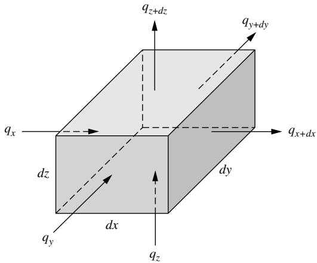  
图10-10 推导辐射热流散度的控制体

这是一个无限小射线束的辐射平衡。因此，为了得到体积平衡，我们对该方程在所有立体角上积分，即

$$
\int_{4\pi}\hat{\mathbf{s}}\cdot \nabla I_{\eta}d\Omega = \int_{4\pi}\kappa_{\eta}I_{b\eta}d\Omega -\int_{4\pi}\beta_{\eta}I_{\eta}(\hat{\mathbf{s}})d\Omega +\int_{4\pi}\frac{\sigma_{s\eta}}{4\pi}\int_{4\pi}I_{\eta}(\hat{\mathbf{s}}_i)\Phi_{\eta}(\hat{\mathbf{s}}_i,\hat{\mathbf{s}})d\Omega_id\Omega_i, \tag{10.56}
$$

以及

$$
\nabla \cdot \int_{4\pi}I_{\eta}\hat{\mathbf{s}} d\Omega = 4\pi \kappa_{\eta}I_{b\eta} - \int_{4\pi}\beta_{\eta}I_{\eta}(\hat{\mathbf{s}})d\Omega +\frac{\sigma_{s\eta}}{4\pi}\int_{4\pi}I_{\eta}(\hat{\mathbf{s}}_i)\left(\int_{4\pi}\Phi_{\eta}(\hat{\mathbf{s}}_i,\hat{\mathbf{s}})d\Omega\right)d\Omega_i. \tag{10.57}
$$

在方程(10.57)的左侧，积分和方向向量被纳入梯度中，因为方向和空间坐标彼此独立。现在算子内部的表达式当然是光谱辐射热流。在方程(10.57)的右侧，积分顺序已经改变，将$\Omega$积分应用于唯一依赖它的部分，即散射相函数$\Phi_{\eta}$。最后的积分可以使用方程(10.17)进行，得到

$$
\nabla \cdot \mathbf{q}_{\eta} = 4\pi \kappa_{\eta}I_{b\eta} - \beta_{\eta}\int_{4\pi}I_{\eta}(\hat{\mathbf{s}})d\Omega +\sigma_{s\eta}\int_{4\pi}I_{\eta}(\hat{\mathbf{s}}_i)d\Omega_i. \tag{10.58}
$$

由于$\Omega$和$\Omega_{i}$是对所有立体角积分的哑变量，最后两项可以合并，使用$\kappa_{\eta} = \beta_{\eta} - \sigma_{s\eta}$。

$$
\nabla \cdot \mathbf{q}_{\eta} = \kappa_{\eta}\left(4\pi I_{b\eta} - \int_{4\pi}I_{\eta}d\Omega\right) = \kappa_{\eta}\left(4\pi I_{b\eta} - G_{\eta}\right). \tag{10.59}
$$

方程(10.59)表明，从物理上看，控制体中辐射能的净损失等于发射能量减去吸收的辐照度。这个方向积分形式的辐射传递方程不再包含散射系数。这个事实并不令人惊讶，因为散射只是重新定向光子流；它不会影响任何给定单位体积的能量含量。

方程(10.59)是一个光谱关系，即它给出了在特定光谱位置每单位波数的热流。如果需要总热流的散度，则对整个光谱进行积分得到

$$
\nabla \cdot \mathbf{q} = \nabla \cdot \int_{0}^{\infty}\mathbf{q}_{\eta}d\eta = \int_{0}^{\infty}\kappa_{\eta}\left(4\pi I_{b\eta} - \int_{4\pi}I_{\eta}d\Omega\right)d\eta = \int_{0}^{\infty}\kappa_{\eta}\left(4\pi I_{b\eta} - G_{\eta}\right)d\eta . \tag{10.60}
$$

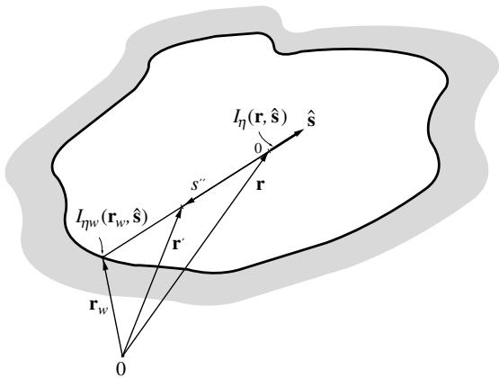  
图10-11 推导辐射传递方程积分形式的封闭体

方程(10.60)是辐射能量守恒的表述。对于灰体介质($\kappa_{\eta} = \kappa =$常数)的特殊情况，可以简化为

$$
\nabla \cdot \mathbf{q} = \kappa \left(4\sigma T^4 -\int_{4\pi}I d\Omega\right) = \kappa \left(4\sigma T^4 -G\right). \tag{10.61}
$$

例10.4. 计算上例中灰色等温球形介质中心和表面处总辐射热流的散度。

# 解

我们已经知道球体表面的强度，因此

$$
\begin{array}{c}{G_{\eta}(\tau_R) = 2\pi \int_0^\pi \sin \theta I_\eta d\theta = 2\pi I_{b\eta}\int_0^{\pi /2}\left(1 - e^{-2\tau_R\cos \theta}\right)\sin \theta d\theta}\\ {= 2\pi I_{b\eta}\left(1 - \frac{e^{-2\tau_R\cos\theta}}{2\tau_R}\Bigg|_0^{\pi /2}\right) = \frac{\pi I_{b\eta}}{\tau_R}\left(2\tau_R - 1 + e^{-2\tau_R}\right),} \end{array}
$$

以及

$$
\nabla \cdot \mathbf{q}(\tau_R) = \kappa (4\pi I_b - G) = \frac{\sigma T^4}{R}\left(2\tau_R + 1 - e^{-2\tau_R}\right). \tag{10.62}
$$

在球体中心，强度很容易计算为

$$
I_{\eta}(0) = I_{b\eta}\left(1 - e^{-\tau_R}\right),
$$

以及

$$
G_{\eta}(0) = 4\pi I_{b\eta}\left(1 - e^{-\tau_R}\right),
$$

因此

$$
\nabla \cdot \mathbf{q}(0) = \kappa 4\sigma T^4 e^{-\tau_R}. \tag{10.63}
$$

方程(10.62)和(10.63)的右侧是单位时间和体积的辐射热损失，如果要使球体保持等温，必须通过体积热源来补偿。

# 10.10 辐射传递方程的积分形式

为了获得入射辐射、辐射热流或其散度，有时需要使用辐射传递方程的积分形式。我们从形式解(方程(10.28))出发，但用图10-11所示的矢量重新表示：

$$
I_{\eta}(\mathbf{r},\hat{\mathbf{s}}) = I_{w\eta}(\mathbf{r}_w,\hat{\mathbf{s}})\exp \left[-\int_0^s\beta_\eta ds^{\prime \prime}\right] + \int_0^s S_\eta (\mathbf{r}',\hat{\mathbf{s}})\exp \left[-\int_0^{s^{\prime \prime}}\beta_\eta ds^{\prime \prime}\right]\beta_\eta ds^{\prime \prime}, \tag{10.64}
$$

其中$s = |\mathbf{r} - \mathbf{r}_w|$，积分方向已切换为沿$s^{\prime \prime}$(从点$\mathbf{r}$指向壁面)。根据入射辐射的定义(方程(10.32))，我们有

$$
G_{\eta}(\mathbf{r}) = \int_{4\pi}I_{w\eta}(\mathbf{r}_w,\hat{\mathbf{s}})\exp \left[-\int_0^s\beta_\eta ds''\right]d\Omega +\int_{4\pi}\int_0^s S_\eta (\mathbf{r}',\hat{\mathbf{s}})\exp \left[-\int_0^{s''}\beta_\eta ds''\right]\beta_\eta ds''d\Omega , \tag{10.65}
$$

根据方程(1.26)，

$$
d\Omega = \left\{ \begin{array}{ll}\frac{dA^{\prime\prime}}{|\mathbf{r} - \mathbf{r}^{\prime}|^{2}}, & \mathrm{体积内部},\\ \displaystyle \frac{\hat{\mathbf{n}}\cdot\hat{\mathbf{s}}dA_{w}}{|\mathbf{r} - \mathbf{r}_{w}|^{2}}, & \mathrm{壁面处}, \end{array} \right. \tag{10.66}
$$

其中$dA^{\prime \prime}$是垂直于积分路径(和$ds^{\prime \prime}$)的微元面积，使得$dV = ds^{\prime \prime}dA^{\prime \prime}$成为微元体积。因此，方程(10.65)可改写为

$$
G_{\eta}(\mathbf{r}) = \int_{A_{w}}I_{w\eta}(\mathbf{r}_{w},\hat{\mathbf{s}})\exp \left[-\int_{0}^{s}\beta_{\eta}ds^{\prime \prime}\right]\frac{\hat{\mathbf{n}}\cdot\hat{\mathbf{s}}dA_{w}}{|\mathbf{r} - \mathbf{r}_{w}|^{2}} +\int_{V}S_{\eta}(\mathbf{r}^{\prime},\hat{\mathbf{s}})\exp \left[-\int_{0}^{s^{\prime \prime}}\beta_{\eta}ds^{\prime \prime}\right]\frac{\beta_{\eta}dV}{|\mathbf{r} - \mathbf{r}^{\prime}|^{2}}, \tag{10.67}
$$

局部单位方向矢量由下式确定：

$$
\hat{\mathbf{s}} = \frac{\mathbf{r} - \mathbf{r}^{\prime}}{|\mathbf{r} - \mathbf{r}^{\prime}|}. \tag{10.68}
$$

辐射热流(及任何高阶矩)可以类似地确定，首先将方程(10.64)乘以$\hat{\mathbf{s}}$：

$$
\mathbf{q}_{\eta}(\mathbf{r}) = \int_{A_{w}}I_{w\eta}(\mathbf{r}_{w},\hat{\mathbf{s}})\exp \left[-\int_{0}^{s}\beta_{\eta}ds^{\prime \prime}\right]\frac{(\hat{\mathbf{n}}\cdot\hat{\mathbf{s}})\hat{\mathbf{s}}dA_{w}}{|\mathbf{r} - \mathbf{r}_{w}|^{2}} +\int_{V}S_{\eta}(\mathbf{r}^{\prime},\hat{\mathbf{s}})\exp \left[-\int_{0}^{s^{\prime \prime}}\beta_{\eta}ds^{\prime \prime}\right]\frac{\beta_{\eta}\hat{\mathbf{s}}dV}{|\mathbf{r} - \mathbf{r}^{\prime}|^{2}}. \tag{10.69}
$$

对于非散射介质$S_{\eta} = I_{b\eta}$，若温度场已知且壁面为黑体，则方程(10.67)是入射辐射$G_{\eta}$的显式解。对于各向同性散射，源函数仅取决于$I_{b\eta}$(或温度)和入射辐射。这种情况下(且壁面为黑体)，方程(10.67)是入射辐射的单一独立积分方程；一旦确定$G_{\eta}$，$\mathbf{q}_{\eta}$可由方程(10.69)求得。对于反射壁面和各向异性散射，必须同时求解方程(10.67)和(10.69)(可能还包括高阶矩)。此外，对于非参与介质$(\beta_{\eta} = 0)$和漫反射表面$(I_{w} = J / \pi)$，可以很容易从方程(10.69)恢复方程(5.25)；这留作练习(问题10.15)。

例10.5. 使用RTE的积分形式重做例10.3。

# 解

在这个具有冷黑(即非反射)壁面$I_{w\eta} = 0$且无散射$S_{\eta} = I_{b\eta} = \text{const}$的简单问题中，我们可以直接从方程(10.69)确定$q_{\eta}$：

$$
q_{\eta}(R) = -\mathbf{q}_{\eta}(\mathbf{r}_{w})\cdot \hat{\mathbf{n}} = -I_{b\eta}\kappa_{\eta}\int_{V}e^{-\kappa_{\eta}s^{\prime \prime}}\frac{\hat{\mathbf{n}}\cdot\hat{\mathbf{s}}dV}{(s^{\prime\prime})^{2}},
$$

其中$s^{\prime \prime}$是介质内任意点($\mathbf{r}^{\prime}$)与壁面上选定点($\mathbf{r} = \mathbf{r}_w$)之间的距离。此时很自然地想到在球心引入球坐标系来计算$q_{\eta}$的体积积分；然而，这将导致非常困难的积分。相反，我们在壁面选定点引入球坐标系，即$\mathbf{r}_w = \mathbf{0}$(图10-5中的点$\tau_s$)。球内任意位置可表示为：

$$
\mathbf{r}^{\prime} = -\hat{\mathbf{s}} s^{\prime \prime} = s^{\prime \prime}(\cos \psi \sin \theta \hat{\mathbf{t}} +\sin \psi \sin \theta \hat{\mathbf{j}} +\cos \theta \hat{\mathbf{k}}),
$$

其中$\hat{\mathbf{k}} = \hat{\mathbf{n}}$指向球心，$\hat{\mathbf{I}}$和$\hat{\mathbf{\eta}}$是任意的(只要它们构成右手坐标系)。然后，根据例10.1给出的$s_{\mathrm{max}}^{\prime \prime} = 2R\cos \theta$最大值，

$$
\begin{array}{l}{q_{\eta}(R) = -I_{b\eta}\kappa_{\eta}\int_{\psi = 0}^{2\pi}\int_{\theta = 0}^{\pi /2}\int_{s^{\prime \prime} = 0}^{2R\cos \theta}e^{-\kappa_{\eta}s^{\prime \prime}}\frac{(-\cos\theta)\sin\theta\theta d\psi(s^{\prime\prime})^{2}ds^{\prime\prime}}{(s^{\prime\prime})^{2}}}\\ {= 2\pi I_{b\eta}\int_{\theta = 0}^{\pi /2}(1 - e^{-2\tau_{R}\cos \theta})\cos \theta \sin \theta d\theta ,} \end{array}
$$

与例10.3完全相同。

# 10.11 总体能量守恒

热辐射只是传热的一种方式，通常需要与导热和对流传热相互竞争。因此，温度场必须通过包含所有三种传热方式的能量守恒方程来确定。辐射强度通过发射和温度相关特性依赖于温度场，因此不能从整体能量方程中解耦。

对于可压缩流动流体，能量守恒方程的一般形式可表示为：

$$
\rho \frac{D u}{D t} = \rho \left(\frac{\partial u}{\partial t} +\mathbf{v}\cdot \nabla u\right) = -\nabla \cdot \mathbf{q} - p\nabla \cdot \mathbf{v} + \mu \Phi +\dot{Q}^{\prime \prime \prime}, \tag{10.70}
$$

其中$u$是内能，$\mathbf{v}$是速度矢量，$\mathbf{q}$是总热流矢量，$\Phi$是耗散函数，$\dot{Q}^{\prime \prime \prime}$是介质内部产生的热量（如化学反应释放的能量）。关于方程(10.70)的详细推导，读者可参考[6,7]等标准教材。如果介质通过发射、吸收和散射参与辐射，那么动量和能量守恒方程会受到三个效应的影响[8]：

1. 方程(10.70)中的热流项（在没有辐射时通常仅由分子扩散/热传导引起）现在增加了第二个分量——辐射热流，这是由于辐射能量与控制体积内介质的相互作用；
2. 内能现在包含辐射贡献[入射辐射$G$，来自方程(10.20)的第一项]；
3. 辐射压力张量需要添加到传统流体动力学压力张量中。

我们已经看到第二个效应几乎总是可以忽略，压力张量的增强同样如此。在这些条件下，能量守恒方程可以简化。假设$du = c_{v}dT$，且傅里叶导热定律成立：

$$
\mathbf{q} = \mathbf{q}_c + \mathbf{q}_R = -k\nabla T + \mathbf{q}_R, \tag{10.71}
$$

则方程(10.70)变为：

$$
\begin{array}{l}\rho c_{\mathrm{c}}\frac{DT}{Dt} = \rho c_{v}\left(\frac{\partial T}{\partial t} +\mathbf{v}\cdot \nabla T\right)\\ \displaystyle = \nabla \cdot (k\nabla T) - p\nabla \cdot \mathbf{v} + \mu \Phi +\dot{Q}^{\prime \prime \prime} - \nabla \cdot \mathbf{q}_{R}. \end{array} \tag{10.72}
$$

这是一个用于计算温度场的积分-微分方程，因为辐射热流散度的评估需要来自(10.59)的温度积分方程。显然，即使借助现代超级计算机，完整求解这个方程也是一项极其艰巨的任务。

例10.6. 陈述一维平面灰色非散射介质中稳态导热与辐射联合作用时的辐射传递方程及其边界条件，介质边界为等温黑体壁面。

# 解

由于问题是稳态且介质中没有运动，方程(10.72)左侧为零，右侧仅保留第一项（导热）和最后一项（辐射）。对于一维平面介质，简化为6：

$$
\frac{d}{dz}\left(k\frac{dT}{dz} -q_R\right) = 0, \tag{10.73}
$$

辐射热流的散度通过方程(10.59)与温度和入射辐射相关：

$$
\frac{dq_R}{dz} = \kappa (4\sigma T^4 -G),
$$

其中灰色介质的光谱积分通过简单地去掉下标$\eta$完成。最后，入射辐射通过方向积分方程(10.29)获得（非易事）。必要的边界条件是：两壁面处$T = T_{i}, i = 1,2$（用于导热）和方程(10.29)需要的$I(0,\mathfrak{s}) = \sigma T_i^4 /\pi$（用于辐射）。这个看似简单的问题求解绝非易事，只能通过相对复杂的数值分析实现。

# 辐射平衡

在后续章节中，我们将重点关注辐射作为主导传热方式的情况，这意味着导热和对流可以忽略不计。这种情况被称为辐射平衡，即介质中的热力学平衡仅通过热辐射实现。与讨论"纯"导热或对流时类似，我们允许介质中存在体积热源。因此可以写出：

$$
\rho c_v\frac{\partial T}{\partial t} +\nabla \cdot \mathbf{q}_R = \dot{Q}^{\prime \prime \prime}, \tag{10.74}
$$

该方程在形式上与基本瞬态热传导方程相同（在傅里叶定律代入之前）。在绝大多数情况下，辐射传递发生得非常快，在温度发生明显变化之前就已达到辐射平衡[即方程(10.20)中的非稳态项可以忽略]。此时辐射平衡的表述简化为其稳态形式：

$$
\nabla \cdot \mathbf{q}_R = \dot{Q}^{\prime \prime \prime}. \tag{10.75}
$$

辐射平衡在极高温度应用中通常是很好的假设，如等离子体、核爆炸等。体积热源的引入允许"走后门"处理导热和对流：先猜测温度场，然后计算方程(10.72)中的非辐射项以得到$\dot{Q}^{\prime \prime \prime}$用于辐射计算。这个过程重复进行直到满足收敛准则。

# 10.12 辐射传递方程的求解方法

辐射传递方程[方程(10.21)]的精确解析解极其困难，除最简单情况外，显式解是不可能的。因此，参与介质中辐射传热的研究通常沿两个方向进行：(i)高度理想化情况的精确(解析和数值)解；(ii)更复杂场景的近似解法。使辐射传热问题复杂化的现象可分为四类：

几何形状：问题可能是一维、二维或三维的。迄今为止大多数研究都处理一维几何，其中绝大多数处理最简单的一维平行平板情况。

温度场：最简单的情况是介质内温度分布已知，这使得方程(10.21)成为相对"简单"的积分方程。因此，等温介质这一最基本情况已被广泛研究。或者，如果辐射平衡占主导，温度场未知但与导热和对流解耦，必须通过辐射传递方程的方向和光谱积分求得。最复杂的情况是辐射传热与导热和/或对流结合，形成高度非线性的积分-微分方程。

散射：如果介质不散射，辐射问题的求解将大大简化。此时若温度场已知，辐射传递方程简化为简单的一阶微分方程；若辐射平衡占主导，则简化为相对简单的积分方程。如果必须考虑散射，通常假设各向同性散射。相对较少的研究处理各向异性散射情况，且大多限于线性各向异性散射(见第12.9节)。

物性：尽管如后续三章所述，大多数参与介质表现出强烈的非灰特性，但迄今为止绝大多数研究集中在灰介质上。此外，虽然辐射特性通常也强烈依赖于温度、浓度等，但大多数计算限于特性恒定的情况。

大多数"精确"解限于一维(主要是平行平板)几何中特性恒定的灰介质。介质是等温的或处于辐射平衡，如果散射，则通常是各向同性散射。由于这类一维解在传热应用中的实用性有限，第14章仅简要讨论。

有几个章节专门讨论为求解辐射传递方程而设计的各种近似方法。尽管如此，这七章远未涵盖该领域研究者曾经和正在使用的所有不同方法。第15章讨论了一些一维问题的近似方法。光学薄和扩散(或光学厚)近似历史上是为二维平行平板介质开发的，但可以很容易地应用于更复杂的几何形状。类似地，Schuster-Schwarzschild或双通量近似[9,10]是多维离散坐标法的先驱。在该方法中，假设强度在总立体角$4\pi$的离散部分上恒定。还存在其他几种通量方法，但它们通常针对特殊几何形状定制，难以应用于其他场景，例如Chu和Churchill[11]以及Shih等[12,13]的六通量方法。另一个早期的一维模型是矩方法或Eddington近似[14]。在该模型中，方向依赖性通过截断级数表示(而非离散化)。在一般几何中，这种展开通常通过使用球谐函数实现，形成球谐函数法。已经提出了几种针对特定几何形状定制的矩方法变体[15,16]，但它们的通用性有限。最后，第5章已讨论过的表面辐射问题的指数核近似，可用作许多一维问题的工具。然而，将其扩展到多维几何是有问题的。

对过去四十年文献的调查表明，一些解法经常使用，而另一些曾一度有前景的方法已不再常规使用。显然，某些方法比其他方法更容易适应更困难的情况(如多维性、可变物性、各向异性散射和/或非灰效应)。当今大多数辐射传热分析似乎使用以下四种方法之一：(i)球谐函数法或其变体，(ii)离散坐标法或其更现代的形式——有限体积法，(iii)区域法，和(iv)蒙特卡洛法。前两种已在一维近似中简要讨论过。区域法由Hottel[17]在其开创性的炉膛传热工作中开发。与球谐函数和离散坐标法不同，区域法通过将封闭空间划分为有限的等温子体积来近似空间行为而非方向行为。另一方面，蒙特卡洛法[18]是一种统计方法，追踪光子束穿过封闭空间的历史。虽然蒙特卡洛法的统计特性使其难以与其他计算匹配，但它是唯一能令人满意地处理不规则辐射特性(非理想方向和/或非灰行为)影响的方法。

由于它们的重要性，本书为这四种解法各设一章。文献中可以找到的其他几种方法本书未涵盖(除在适当位置简要描述外)。例如，Shah[19]和Lockwood与Shah[20]提出的离散传递法结合了离散坐标法、区域法和蒙特卡洛法的特点。Edwards[21]提出的另一种混合方法结合了蒙特卡洛法和区域法的元素。

# 参考文献

1. Viskanta, R., and M. P. Menguc: "燃烧系统中的辐射传热", Progress in Energy and Combustion Science, vol. 13, pp. 97-160, 1987.  
2. Pomraining, G. C.: 《辐射流体动力学方程》, Pergamon Press, New York, 1973.  
3. Ben-Abdallah, P., V. Le Des, D. Lemonnier, S. Fumeron, and A. Charette: "折射和色散半透明恒星大气的不均匀辐射模型", Journal of Quantitative Spectroscopy and Radiative Transfer, vol. 69, pp. 61-80, 2001.  
4. Kumar, S., and K. Mitra: "热辐射传输和激光应用的微观尺度研究", in Advances in Heat Transfer, vol. 33, Academic Press, New York, pp. 187-294, 1999.  
5. Hartung, L., R. Mitcheltree, and P. Gnoffo: "驻点非平衡辐射加热及能量交换模型的影响", Journal of Thermophysics and Heat Transfer, vol. 6, no. 3, pp. 412-418, 1992.  
6. Rohsenow, W. M., and H. Y. Choi: 《热、质量和动量传递》, Prentice-Hall, Englewood Cliffs, NJ, 1961.  
7. Kays, W. M., and M. E. Crawford: 《对流传热与传质》, McGraw-Hill, 1980.  
8. Sparrow, E. M., and R. D. Gess: 《辐射传热》, Hemisphere, New York, 1978.  
9. Schuster, A.: "雾状大气中的辐射传输", Astrophysical Journal, vol. 21, pp. 1-22, 1905.  
10. Schwarzschild, K.: "Über das Gleichgewicht der Sonnenatmosphären (太阳大气的平衡)", Akad. Wiss. Göttingen, Math.-Phys. Kl. Nachr., vol. 195, pp. 41-53, 1906.  
11. Chu, C. M., and S. W. Churchill: "电磁辐射多重散射问题的数值解法", Journal of Physical Chemistry, vol. 59, pp. 855-863, 1960.  
12. Shih, T. M., and Y. N. Chen: "包围辐射和传导介质的二维系统离散强度方法", Numerical Heat Transfer, vol. 6, pp. 117-134, 1983.  
13. Shih, T. M., and A. L. Renz: "封闭空间内辐射和对流再循环流动的耦合", Numerical Heat Transfer, vol. 8, no. 2, pp. 149-167, 1985.  
14. Eddington, A. S.: 《恒星的内部结构》, Dover Publications, New York, 1959.  
15. Chou, Y. S., and C. L. Tien: "非平面系统中辐射传递的修正矩方法", Journal of Quantitative Spectroscopy and Radiative Transfer, vol. 8, pp. 719-733, 1968.
16. Hunt, G. E.: "具有轴对称性的辐射传递输运方程", SIAM J. Appl. Math., vol. 16, no. 1, pp. 228-237, 1968.  
17. Hottel, H. C., and E. S. Cohen: "气体填充封闭空间中的辐射热交换：考虑气体温度非均匀性", AIChB Journal, vol. 4, pp. 3-14, 1958.  
18. Howell, J. R.: "蒙特卡洛方法在传热问题中的应用", in Advances in Heat Transfer, eds. J. P. Hartnett and T. F. Irvine, vol. 5, Academic Press, New York, 1968.  
19. Shah, N. G.: "燃烧室中辐射传热计算的新方法", Ph.D. thesis, Imperial College of Science and Technology, London, England, 1979.  
20. Lockwood, F. C., and N. G. Shah: "通用燃烧预测程序中辐射求解的新方法", in Eighteenth Symposium (International) on Combustion, The Combustion Institute, pp. 1405-1409, 1981.  
21. Edwards, D. K.: "具有体积散射的辐射传热混合蒙特卡洛矩阵求逆公式", in Heat Transfer in Fire and Combustion Systems, vol. HTD-45, ASME, pp. 273-278, 1985.

# References

1. Viskanta, R., and M. P. Menguc: "Radiation heat transfer in combustion systems," Progress in Energy and Combustion Science, vol. 13, pp. 97-160, 1987.  
2. Pomraining, G. C.: The Equations of Radiation Hydrodynamics, Pergamon Press, New York, 1973.  
3. Ben-Abdallah, P., V. Le Des, D. Lemonnier, S. Fumeron, and A. Charette: "Inhomogeneous radiative model of refractive and dispersive semi-transparent stellar atmospheres," Journal of Quantitative Spectroscopy and Radiative Transfer, vol. 69, pp. 61-80, 2001.  
4. Kumar, S., and K. Mitra: "Microscale aspects of thermal radiation transport and laser applications," in Advances in Heat Transfer, vol. 33, Academic Press, New York, pp. 187-294, 1999.  
5. Hartung, L., R. Mitcheltree, and P. Gnoffo: "Stagnation point nonequilibrium radiative heating and influence of energy exchange models," Journal of Thermophysics and Heat Transfer, vol. 6, no. 3, pp. 412-418, 1992.  
6. Rohsenow, W. M., and H. Y. Choi: Heat, Mass and Momentum Transfer, Prentice-Hall, Englewood Cliffs, NJ, 1961.  
7. Kays, W. M., and M. E. Crawford: Convective Heat and Mass Transfer, McGraw-Hill, 1980.  
8. Sparrow, E. M., and R. D. Gess: Radiation Heat Transfer, Hemisphere, New York, 1978.  
9. Schuster, A.: "Radiation through a foggy atmosphere," Astrophysical Journal, vol. 21, pp. 1-22, 1905.  
10. Schwarzschild, K.: "Über das Gleichgewicht der Sonnenatmosphären (Equilibrium of the sun's atmosphere)," Akad. Wiss. Göttingen, Math.-Phys. Kl. Nachr., vol. 195, pp. 41-53, 1906.  
11. Chu, C. M., and S. W. Churchill: "Numerical solution of problems in multiple scattering of electromagnetic radiation," Journal of Physical Chemistry, vol. 59, pp. 855-863, 1960.  
12. Shih, T. M., and Y. N. Chen: "A discretized-intensity method proposed for two-dimensional systems enclosing radiative and conductive media," Numerical Heat Transfer, vol. 6, pp. 117-134, 1983.  
13. Shih, T. M., and A. L. Renz: "Combined radiative and convective recirculating flows in enclosures," Numerical Heat Transfer, vol. 8, no. 2, pp. 149-167, 1985.  
14. Eddington, A. S.: The Internal Constitution of the Stars, Dover Publications, New York, 1959.  
15. Chou, Y. S., and C. L. Tien: "A modified moment method for radiative transfer in non-planar systems," Journal of Quantitative Spectroscopy and Radiative Transfer, vol. 8, pp. 719-733, 1968.
16. Hunt, G. E.: "The transport equation of radiative transfer with axial symmetry," SIAM J. Appl. Math., vol. 16, no. 1, pp. 228-237, 1968.  
17. Hottel, H. C., and E. S. Cohen: "Radiant heat exchange in a gas-filled enclosure: Allowance for nonuniformity of gas temperature," AIChB Journal, vol. 4, pp. 3-14, 1958.  
18. Howell, J. R.: "Application of Monte Carlo to heat transfer problems," in Advances in Heat Transfer, eds. J. P. Hartnett and T. F. Irvine, vol. 5, Academic Press, New York, 1968.  
19. Shah, N. G.: "New method of computation of radiation heat transfer in combustion chambers," Ph.D. thesis, Imperial College of Science and Technology, London, England, 1979.  
20. Lockwood, F. C., and N. G. Shah: "A new radiation solution method for incorporation in general combustion prediction procedures," in Eighteenth Symposium (International) on Combustion, The Combustion Institute, pp. 1405-1409, 1981.  
21. Edwards, D. K.: "Hybrid Monte-Carlo matrix-inversion formulation of radiation heat transfer with volume scattering," in Heat Transfer in Fire and Combustion Systems, vol. HTD-45, ASME, pp. 273-278, 1985.

# 习题

10.1 一个半无限介质 $0 \leq z < \infty$ 由灰色、吸收-发射但不散射的气体组成，在界面 $z = 0$ 处与真空接壤。气体等温为 $1000 \mathrm{~K}$，吸收系数为 $\kappa = 1 \mathrm{~m}^{- 1}$。界面不反射；传导和对流可忽略。

(a) 要保持气体在 $1000 \mathrm{~K}$ 所需的局部热生成率是多少？  
(b) 界面处的辐射强度分布 $I(z = 0, \theta , \psi)$ 是多少（对所有 $\theta$ 和 $\psi$）？  
(c) 离开半无限介质的总热流是多少？

10.2 重新考虑习题10.1中的半无限介质，温度分布为 $T = T_{0} e^{- z / L}$，$T_{0} = 1000 \mathrm{~K}$，$L = 1 \mathrm{~m}$。这种情况下出射强度和热流是多少？讨论当 $\kappa$ 在0到 $\infty$ 之间变化时答案会如何改变。

10.3 对厚度 $L = 1 \mathrm{~m}$ 的介质重复习题10.1。讨论当 $\kappa$ 在0到 $\infty$ 之间变化时答案会如何改变。

10.4 一个半无限、灰色、不散射的介质 $(n = 2, \kappa = 1 \mathrm{~m}^{- 1})$ 受到太阳垂直照射，辐射强度为 $I_{\mathrm{sun}} = 1000 \mathrm{~W} / \mathrm{m}^{2}$。忽略相对低温介质的发射，确定由于吸收太阳能导致的局部热生成率。

提示：太阳辐射可以看作是由辐射强度引起的，该强度在很小的立体角 $\delta \Omega$ 范围内有较大值 $I_{0}$，其他位置为零，即：

$$
I(\hat{\mathbf{s}}) = \left\{ \begin{array}{ll}I_{o} & \text{沿}\hat{\mathbf{n}}\text{方向在}\delta \Omega\text{内},\\ 0 & \text{其他位置}, \end{array} \right.
$$

且

$$
q_{\mathrm{sun}} = \int_{4\pi}I(\hat{\mathbf{s}})\hat{\mathbf{n}}\cdot \hat{\mathbf{s}} d\Omega = I_{o}\delta \Omega .
$$

10.5 一块 $1 \mathrm{~m}$ 厚的吸收-发射气体平板具有近似线性的温度分布（如示意图所示）。两侧都与真空接壤，边界不反射。

(a) 如果介质具有恒定灰色吸收系数 $\kappa = 1 \mathrm{~m}^{-1}$，离开平板热侧的强度（作为方向的函数）是多少？

(b) 给出离开热侧的辐射热流表达式。

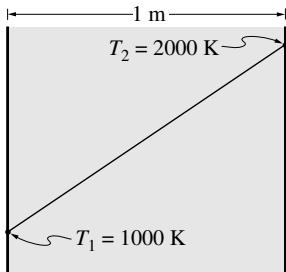

10.6 一个半径 $R = 10 \mathrm{~cm}$ 的半透明球体具有抛物线温度分布 $T = T_{c}(1 - r^{2} / R^{2})$，$T_{c} = 2000 \mathrm{~K}$。球体为灰色，$\kappa = 0.1 \mathrm{~cm}^{- 1}$，$n = 1.0$，不散射且边界不反射。概述如何计算球体的总热损失（即不需要实际进行繁琐的积分）。

10.7 重复习题10.6，但假设温度均匀为 $2000 \mathrm{~K}$。如果球体各处要保持 $2000 \mathrm{~K}$，局部热生成率必须是多少？注：答案可以保留积分形式（需数值求解）。对 $r = 0$ 和 $r = R$ 进行积分。

10.8 重复习题10.6，但假设温度均匀为 $2000\mathrm{K}$。且没有热生成，意味着球体会冷却。球体冷却到 $500\mathrm{K}$ 需要多长时间（介质的热容为 $\rho c = 1000\mathrm{kJ} / \mathrm{m}^3\mathrm{K}$，导热系数非常大，即球体始终等温）？

10.9 一个半径 $R_{o} = 1\mathrm{m}$ 的相对低温球体由不散射的灰色介质组成，吸收系数 $\kappa = 0.1\mathrm{cm}^{- 1}$，折射率 $n = 2$。球体中心有一个半径 $R_{i} = 1\mathrm{cm}$ 的小黑球，温度为 $1000\mathrm{K}$。外部与真空接壤。离开球体的总热流是多少？解释当 $\kappa$ 从0增加到很大值时会发生什么。

10.10 一束激光照射到某(假设的)行星大气层上。该行星大气中含有体积分数为$0.01\%$的吸收性气体。该吸收气体的分子量为20，在激光波长处的吸收系数为$\kappa_{\eta} = 10^{- 4}\mathrm{cm}^{- 1} / (\mathrm{g} / \mathrm{m}^{3})$。已知大气压力和温度分布可近似表示为$p = p_0e^{- 2z / L}$和$T = T_0e^{- z / L}$，其中$p_0 = 0.75\mathrm{atm}$、$T_0 = 400\mathrm{K}$是行星表面$z = 0$处的值，$L = 2\mathrm{km}$为特征长度。问有多少比例的激光能量能到达行星表面？

10.11 一台总输出功率$Q = 10\mathrm{W}$的$\mathrm{CO_2}$激光器垂直照射到一块$10\mathrm{cm}$厚、等温、吸收/发射(但不散射)的介质上，介质温度为$1000\mathrm{K}$。已知该激光束在$10.6\mu \mathrm{m}$波长处基本是单色的，具有高斯功率分布。因此，照射到介质上的强度为

$$
\begin{array}{l}{I(0)\propto e^{-\left(\frac{r}{R}\right)^2} / (\delta \Omega \delta \eta),\quad 0\leq r\leq \infty ;}\\ {Q = \int_AI(0)dA\delta \Omega \delta \eta ,} \end{array}
$$

其中$r$为距光束中心的距离，$R = 100\mu \mathrm{m}$是激光束的"有效半径"，$\delta \Omega = 5\times 10^{- 3}\mathrm{ar}$是激光束输出强度的立体角范围(假设在$\delta \Omega$内均匀分布)，$\delta \eta$是强度分布的波数范围(同样假设均匀分布)。在$10.6\mu \mathrm{m}$处，已知介质的吸收系数$\kappa_{\eta} = 0.15\mathrm{cm}^{- 1}$。假设介质边界不反射，确定法线方向出射的总强度(透射的激光辐射加上发射，假设介质为灰色)。发射贡献重要吗？介质需要多厚才能使透射和发射同等重要？

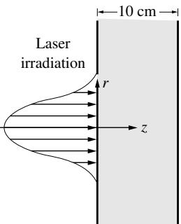

10.12 对折射率$n = 2$、以真空为边界(即有反射表面)的介质重复习题10.11。提示：(1)激光束首次撞击平板时部分会被反射，部分会穿透进入平板。这部分能量中部分会被平板吸收，部分会到达背面，其中一部分会被反射回平板，其余会从平板射出，等等。发射能量在从平板射出前也会发生类似的多次内反射。(2)为计算平板与周围环境的反射率，证明吸收指数的值可以忽略不计。

10.13 一个横截面积为$\delta A$、长度为$L$的薄气体柱中含有均匀悬浮的小颗粒，这些小颗粒能吸收和散射辐射。散射遵循以下相位函数：$(a)\Phi = 1$(各向同性散射)，$(b)\Phi = 1 + A_{1}\cos \Theta$(线性各向异性散射，$A_{1}$为常数)，$(c)\Phi = \frac{3}{4} (1 + \cos^2\Theta)$(瑞利散射)，其中$\Theta$为入射和散射方向之间的夹角。一束激光垂直照射气体柱的$\delta A$面。问激光功率的透射比例是多少？激光通量中有多少比例能通过$L$处垂直于气体柱的无限大平面？有多少比例能返回通过$0$处的平面？其余部分发生了什么？

10.14 对以下情况重复例10.2：$(a)\Phi = 1 + A_{1}\cos \Theta$(线性各向异性散射，$A_{1} = \mathrm{const}$)，$(b)\Phi = \frac{3}{4} (1 + \cos^2\Theta)$(瑞利散射)，其中$\Theta$为入射和散射方向之间的夹角。

10.15 证明：通过设$\beta_{\eta} = 0$和$I_{w} = J / \pi$，对于被漫反射壁面包围的非参与介质，可以从方程(10.69)恢复出辐射度积分方程(5.25)。提示：将方程(10.69)中的热通量分为两部分：入射辐射$H$和出射辐射$J$。对于后者，假设$\mathbf{r}$在表面上方的无穷小距离处，并计算方程(10.69)中的积分。

