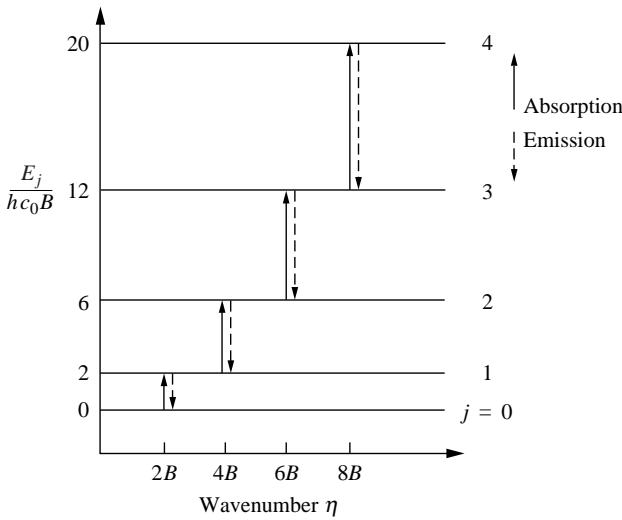
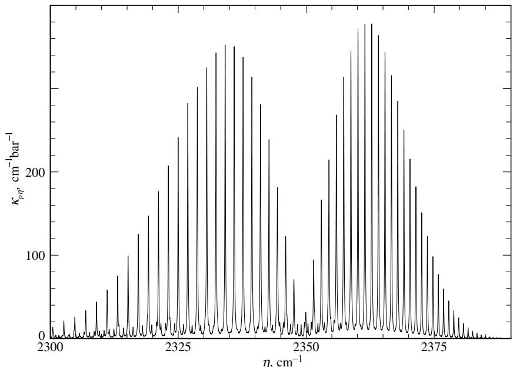
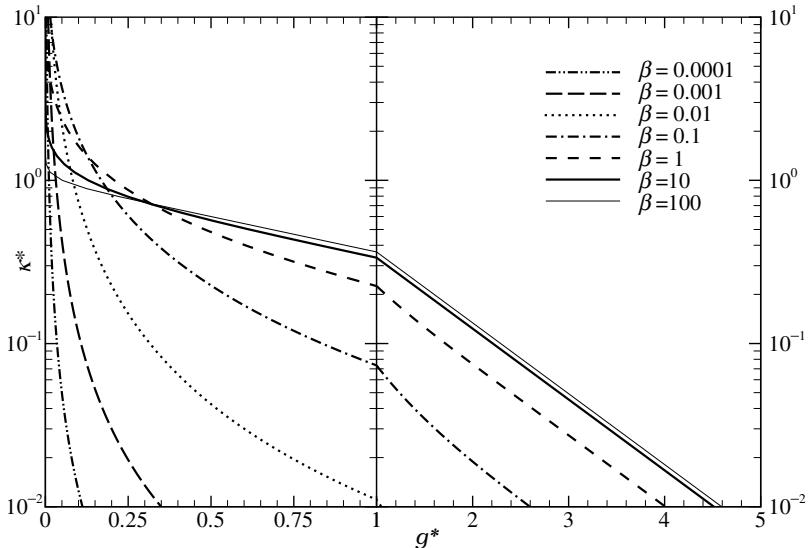

## 内容索引

- [目录](README.md)
- [1 热辐射基础](1-热辐射基础.md)
- [2 基于电磁波理论的辐射特性预测](2-基于电磁波理论的辐射特性预测.md)
- [3 实际表面的辐射特性](3-实际表面的辐射特性.md)
- [4 视角因子](4-视角因子.md)
- [5 灰体漫射表面间的辐射交换](5-灰体漫射表面间的辐射交换.md)
- [6 部分镜面灰体表面间的辐射交换](6-部分镜面灰体表面间的辐射交换.md)
- [7 非理想表面间的辐射交换](7-非理想表面间的辐射交换.md)
- [8 表面交换的蒙特卡洛方法](8-表面交换的蒙特卡洛方法.md)
- [9 传导和对流存在时的表面辐射交换](9-传导和对流存在时的表面辐射交换.md)
- [10 参与介质中的辐射传递方程(RTE)](10-参与介质中的辐射传递方程(RTE).md)
- [11 分子气体的辐射特性](11-分子气体的辐射特性.md)
- [12 颗粒介质的辐射特性](12-颗粒介质的辐射特性.md)
- [13 半透明介质的辐射特性](13-半透明介质的辐射特性.md)
- [14 一维灰体介质的精确解](14-一维灰体介质的精确解.md)
- [15 一维介质的近似求解方法](15-一维介质的近似求解方法.md)
- [16 球谐函数法 (PN-近似)](16-球谐函数法(PN-近似).md)
- [17 离散坐标法 (SN-近似)](17-离散坐标法(SN-近似).md)
- [18 区域法](18-区域法.md)
- [19 准直辐射与瞬态现象](19-准直辐射与瞬态现象.md)
- [20 非灰消光系数的求解方法](20-非灰消光系数的求解方法.md)
- [21 参与介质的蒙特卡洛方法](21-参与介质的蒙特卡洛方法.md)
- [22 辐射与传导和对流的耦合](22-辐射与传导和对流的耦合.md)
- [23 逆辐射传热](23-逆辐射传热.md)
- [24 纳米尺度辐射传热](24-纳米尺度辐射传热.md)
- [附录](附录.md)

- [11.1 基本原理](#111-基本原理)  
- [11.2 发射和吸收概率](#112-发射和吸收概率)  
- [11.3 原子和分子光谱](#113-原子和分子光谱)  
- [11.4 谱线辐射](#114-谱线辐射)  
- [11.5 非平衡辐射](#115-非平衡辐射)  
- [11.6 高分辨率光谱数据库](#116-高分辨率光谱数据库)  
- [11.7 辐射传输计算的光谱模型](#117-辐射传输计算的光谱模型)  
- [11.8 窄带模型](#118-窄带模型)  
- [11.9 窄带k分布](#119-窄带k分布)  
- [11.10 宽带模型](#1110-宽带模型)  
- [11.11 总发射率和平均吸收系数](#1111-总发射率和平均吸收系数)  
- [11.12 实验方法](#1112-实验方法)  
- [参考文献](#参考文献)  
- [习题](#习题)

# 第11章

# 分子气体的辐射特性

# 11.1 基本原理

不透明壁面的辐射传递特性通常可以用灰体漫射发射、吸收和反射的简单模型准确描述。而分子气体的辐射特性在光谱范围内变化如此剧烈且迅速，以至于"灰体"假设几乎从不适用[1]。本章将简要介绍分子气体辐射特性的发展。更详细的讨论可参考Goody和Yung的著作[2]、Tien的专著[3]以及Taine和Soufiani的最新论著[4]。

早期的研究大多不在传热领域，而是由研究地球大气光吸收的天文学家以及研究恒星光谱的天体物理学家完成。大气辐射研究显然始于19世纪末的Lord Rayleigh[5]和Langley[6]。恒星辐射光谱在20世纪初开始受到关注，例如Eddington[7]和Chandrasekhar[8,9]的工作。热气体辐射的最早测量由物理学家Paschen于1894年报道[10]，但多年来传热工程师似乎忽视了他的工作[11]。

过去几十年在理解分子气体辐射方面取得了很大进展，特别是水蒸气和二氧化碳的辐射，这对碳氢燃料燃烧非常重要，也主导着地球大气的热力学影响。两者的结合，即人为导致大气中CO₂含量大幅增加引起的"全球变暖"，可能是当今人类面临的最紧迫问题。自20世纪20年代末以来的开创性工作主要由Hottel及其合作者[12-19](测量和实际计算)以及Penner[20]和Plass[21,22](理论基础)完成。

当光子(或电磁波)与气体分子相互作用时，它可能被吸收从而提高分子能级，或者被散射改变传播方向。反之，气体分子可能通过发射适当光子自发降低能级。如将在下一章粒子特性中看到的(因为每个分子当然都是非常小的粒子)，对于传热应用，分子对光子的散射总是可以忽略不计。有三种不同类型的辐射跃迁会导致分子能级通过发射或吸收光子而改变：(i)未解离("束缚")原子或分子状态之间的跃迁，称为束缚-束缚跃迁；(ii)从"束缚"状态到"自由"(解离)状态的跃迁(吸收)或从"自由"到"束缚"的跃迁(发射)，称为束缚-自由跃迁；(iii)两个不同"自由"状态之间的跃迁，自由-自由跃迁。

每个原子和分子的内能取决于许多因素，主要是与电子绕核旋转、分子内原子相互旋转以及分子内原子相互振动相关的能量。量子力学假设原子或分子电子轨道以及分子旋转和振动的能级都是量子化的；即电子轨道和旋转、振动频率只能以某些离散量变化。由于光子或电磁波包含的能量与频率成正比，量子化意味着在束缚-束缚跃迁中，光子必须具有特定频率(或波长)才能被捕获或释放，导致吸收和发射的离散光谱线。根据海森堡不确定性原理，原子或分子的能级不能精确固定，这种现象(以及我们将看到的其他一些现象)会导致这些光谱线轻微展宽。

改变电子轨道需要相对大量的能量或高频光子，导致在紫外到近红外(10⁻²μm至1.5μm之间)的短波长处出现吸收-发射线。振动能级变化需要较少能量，因此其光谱线出现在红外区(1.5μm至10μm之间)，而旋转能级变化需要最少能量，因此旋转线出现在远红外区(10μm以上)。振动能级变化可能(且通常必须)伴随旋转跃迁，导致紧密排列的光谱线群，由于谱线展宽可能部分重叠，在红外区形成所谓的振动-旋转带。类似地，分子(相对于原子)的电子跃迁总是伴随着振动和旋转能量变化，通常在紫外到近红外区域。

如果分子的初始能级非常高(例如在极高温度气体中)，则光子吸收可能导致电子脱离或整个分子因振动过强而解离，即束缚-自由跃迁。分子吸收后的能级取决于分离部分的动能，这基本上不是量子化的。因此，束缚-自由跃迁导致在所有波长或频率上的连续吸收光谱，只要光子能量超过所需的电离或解离能量。对于反向过程，自由-束缚跃迁中的光子发射(通常称为辐射复合)也是如此。

在电离气体中，自由电子可以与离子的电场相互作用导致自由-自由跃迁(也称为Bremsstrahlung，德语意为制动辐射)；即光子释放降低电子动能(减速)，或光子捕获加速电子(逆Bremsstrahlung)。由于电子动能水平基本上不是量子化的，这些光子可以具有任何频率或波长。

束缚-自由和自由-自由跃迁通常发生在极高温度下(当解离和电离变得显著时)。与之相关的连续辐射通常出现在短波长(紫外到可见光)。因此，这些效应仅在极端高温情况下才重要。大多数工程应用发生在中等温度水平，电离和解离很少，使束缚-束缚跃迁最为重要。在燃烧温度下，发射功率在红外区(1μm至6μm之间)达到最大值，使振动-旋转带特别重要。本书将重点讨论最重要的束缚-束缚跃迁情况。

# 11.2 发射和吸收概率

光子释放或捕获存在三种不同过程：自发发射、受激发射（亦称负吸收）和吸收。这些跃迁相关的吸收和发射系数至少理论上可通过量子力学计算。微观现象的完整描述可参阅统计力学[23,24]或光谱学[25,26]专著。Tien[3]曾给出过信息性（而非精确）的概要，我们将主要遵循其论述。

设单位体积内有$n_u$个处于非简并高能态$u$的原子/分子，$n_l$个处于低能态$l$。"非简并"意味着若存在多个能量相同的态（简并），每个态需单独计数。两能态间能量差为$h\nu$。通过释放能量$h\nu$的光子（自发发射）从$u$态到$l$态的跃迁数必与该能级粒子数成正比：

$$
\left(\frac{dn_u}{dt}\right)_{u\to l} = -A_{ul}n_u, \tag{11.1}
$$

其中比例常数$A_{ul}$称为自发发射爱因斯坦系数。自发发射是各向同性的，即光子发射方向随机，各方向发射强度相等。量子力学还假设：除自发发射外，适当频率的入射辐射强度（或光子流）可诱导分子沿入射方向发射光子（受激发射）。因此，$u$→$l$态总跃迁数可表示为：

$$
\left(\frac{dn_u}{dt}\right)_{u\to l} = -n_u\left(A_{ul} + B_{ul}\int_{4\pi}I_\nu d\Omega\right), \tag{11.2}
$$

式中$I_{\nu}$为入射强度（需全空间积分以涵盖所有可能跃迁），$B_{ul}$为受激发射爱因斯坦系数。最后，部分入射辐射可被$l$态分子吸收，吸收率显然与入射辐射强度及$l$态分子数成正比：

$$
\left(\frac{dn_l}{dt}\right)_{l\to u} = n_lB_{lu}\int_{4\pi}I_\nu d\Omega , \tag{11.3}
$$

$B_{lu}$为吸收爱因斯坦系数。通过平衡辐射的特殊情形可关联这三个系数。平衡辐射存在于等温黑体 enclosure 中，其辐射强度处处等于黑体强度$I_{b\nu}$，且任意时刻各能级平均分子数恒定，即所有$u$→$l$与$l$→$u$跃迁数相等：

$$
g_{u}\left(\frac{dn_{u}}{dt}\right)_{u\to l} + g_{l}\left(\frac{dn_{l}}{dt}\right)_{l\to u} = -g_{u}n_{u}\left(A_{ul} + B_{ul}\int_{4\pi}I_{b\nu}d\Omega\right) + g_{l}n_{l}B_{lu}\int_{4\pi}I_{b\nu}d\Omega = 0, \tag{11.4}
$$

$g_{u}$和$g_{l}$分别为上下能态简并度（即分子达到该能级的不同构型数）。局域热平衡时，粒子数服从玻尔兹曼分布[23]：

$$
n_{l} / n_{u} = e^{-E_{l} / kT} / e^{-E_{u} / kT} = e^{j_{\nu} / kT}, \tag{11.5}
$$

$E_{u}$和$E_{l}$为对应能级。由式(11.4)可得黑体强度：

$$
I_{b\nu} = \frac{1}{4\pi}\frac{A_{ul} / B_{ul}}{(g_lB_{lu} / g_uB_{ul})e^{j_{\nu} / kT} - 1}. \tag{11.6}
$$

对比普朗克定律（式1.9）可得三个爱因斯坦系数的关系：

$$
A_{ul} = \frac{8\pi h\nu^3}{c_0^2} B_{ul},g_uB_{ul} = g_lB_{lu}. \tag{11.7}
$$

这些系数是跃迁的普适函数，其关系在非局域热平衡时（即粒子数不服从式11.5的玻尔兹曼分布）仍成立。

剩余独立爱因斯坦系数可表征气体发射/吸收辐射的强弱。考察单方向（或细光束内）诱导跃迁数最易理解：

$$
\frac{d}{d\Omega}\bigg(g\frac{dn}{dt}\bigg)_{l\mapsto u} = (g_in_lB_{lu} - g_un_uB_{ul})I_\nu \tag{11.8}
$$

表示单位时间单位体积光束中净减少的光子数。因每个光子携带能量$h\nu$，单位时间单位面积单位距离单位立体角内辐射能变化为：

$$
-h\nu \frac{d}{d\Omega}\bigg(g\frac{dn}{dt}\bigg)_{l\mapsto u} = -(g_in_lB_{lu} - g_un_uB_{ul})h\nu I_\nu . \tag{11.9}
$$

该式与式(10.1)等效，但实际$u$→$l$跃迁的光谱线存在"展宽"（即跃迁发生在极小频率范围内）。考虑频率微小展宽（回顾1.6节强度定义）后：

$$
\frac{d}{ds}\int_{\Delta \nu}I_{\nu}d\nu = -(g_in_lB_{lu} - g_un_uB_{ul})h\nu I_{\nu} = -\int_{\Delta \nu}(g_in_lB_{lu}' - g_un_uB_{ul}')h\nu I_{\nu}d\nu , \tag{11.10}
$$

即爱因斯坦概率并非针对单一跃迁频率，而是因展宽分布于小范围$\Delta \nu$内[27]：

$$
A_{ul}^{\prime} = A_{ul}\phi_{\nu},B_{ul}^{\prime} = B_{ul}\phi_{\nu},B_{lu}^{\prime} = B_{lu}\phi_{\nu}, \tag{11.11}
$$

$\phi_{\nu}(\nu)$为归一化线型函数（此处假设三者相同）：

$$
\int_{\Delta \nu}\phi_{\nu}(\nu)d\nu = 1. \tag{11.12}
$$

线展宽的具体形式将在11.4节详述。由式(11.11)可改写式(11.10)为：

$$
\frac{d}{ds}\int_{\Delta \nu}I_{\nu}d\nu = -(g_in_lB_{lu} - g_un_uB_{ul})\int_{\Delta \nu}h\nu \phi_{\nu}I_{\nu}d\nu . \tag{11.13}
$$

该式给出整条谱线的吸收，定义谱线强度为：

$$
S_{\nu} = (g_in_lB_{lu} - g_un_uB_{ul})\int_{\Delta \nu}h\nu \phi_{\nu}d\nu = (g_in_lB_{lu} - g_un_uB_{ul})h\nu . \tag{11.14}
$$

式(11.14)末项将（线中心）频率移出积分，因$\nu$在窄谱线范围内变化极小。按吸收系数定义，谱线强度即为积分吸收系数。对$\Delta \nu$谱段有：

$$
S_{\nu} = \int_{\Delta \nu}\kappa_{\nu}d\nu ,\quad \mathrm{and}\quad \kappa_{\nu} = S_{\nu}\phi_{\nu}, \tag{11.15}
$$

故：

$$
\frac{dI_{\nu}}{ds} = -\kappa_{\nu}I_{\nu}, \tag{11.16}
$$

这与式(10.1)完全相同。此处定义的吸收系数常称有效吸收系数，因其包含受激发射（负吸收）。有时定义真吸收系数为：

$$
\int_{\Delta \nu}\kappa_{\nu}d\nu = g_{l}n_{l}B_{lu}h\nu . \tag{11.17}
$$

因受激发射与吸收总相伴发生且不可分离，通常将受激发射纳入吸收系数，只需考虑有效吸收系数。由式(11.14)可见吸收系数与分子数密度成正比，故如前述，部分研究者通过定义质量吸收系数或压力吸收系数将数密度分离：

$$
\kappa_{\rho \nu}\equiv \frac{\kappa_{\nu}}{\rho},\quad \kappa_{\rho \nu}\equiv \frac{\kappa_{\nu}}{p}, \tag{11.18}
$$

$S_{\nu}$同理。若采用质量或压力吸收系数，则需在式(11.16)中补充$\rho$或$p$。

式(11.1)的负值给出分子向全空间（$4\pi$立体角）随机发射$h\nu$光子的速率。乘以$-h\nu$再除以$4\pi$即得单位时间单位立体角单位面积单位距离内各向同性发射能量（简言之，自发发射引起的强度变化率）：

$$
\frac{d}{ds}\int_{\Delta \nu}I_{\nu}d\nu = -h\nu \frac{d}{d\Omega}\left(\frac{dn}{dt}\right)_{u\to l} = g_{u}n_{u}A_{ul}h\nu /4\pi . \tag{11.19}
$$

这是整条谱线的发射，在$\Delta \nu$谱段上可表示为：

$$
\frac{dI_{\nu}}{ds} = g_{u}n_{u}A_{ul}^{\prime}h\nu /4\pi = j_{\nu}, \tag{11.20}
$$

其中$j_{\nu}$称为发射系数，通过式(11.7)、(11.14)和(11.15)与吸收系数相关联：

$$
j_{\nu} = \kappa_{\nu}\frac{2h\nu^{3}}{c_{0}^{2}}\frac{n_{u}}{n_{l} - n_{u}}, \tag{11.21}
$$

在局部热力学平衡状态下，能级粒子数服从Boltzmann分布（式11.5），发射系数和式(11.20)简化为：

$$
\frac{dI_{\nu}}{ds} = j_{\nu} = \kappa_{\nu}I_{b\nu}, \tag{11.22}
$$

该式表示自发发射引起的定向辐射强度增强，如式(10.10)所示。

# 11.3 原子和分子光谱

前文已述，光子发射或吸收总是伴随着分子转动/振动能级或电子轨道（原子和分子中）的变化。这种变化进而导致辐射强度改变，形成光谱线。本节简要讨论振动-转动带内谱线位置的计算方法，因这些谱带对传热工程师至关重要。更详细的电子光谱讨论及束缚-自由、自由-自由跃迁可参阅量子力学[24,25,28]或光谱学[26,29-31]专著，Goody和Yung的大气辐射著作[2]，或Tien[3]与Taine和Soufiani[4]的气体辐射特性专著。

每个粒子在三维空间中运动，具有三个平动自由度：前后、左右和上下方向。若粒子相互连接（双原子和多原子分子），则分子中每个原子均有三个自由度。更准确地说，由$N$个原子组成的分子具有3个平动自由度和$3N-3$个原子间相对运动自由度。这些内部自由度可进一步分为转动和振动自由度。图11-1展示了双原子分子、线性和非线性三原子分子的情况。双原子分子有三个内部自由度：可绕纸面内或垂直于纸面（转轴位于纸面）的中心旋转，也可绕自身轴旋转（此时原子仅自转不位移），最后一个自由度用于两原子间振动。原子数增多时情况迅速复杂化：线性三原子分子（如$\mathrm{CO_2}$、$\mathrm{N}_2\mathrm{O}$、$\mathrm{HCN}$）仅有两个转动模式，六个内部自由度中四个为振动模式（其中两个振动模式除发生平面垂直外完全相同）。而非线性三原子分子有三个转动模式（含纸面内水平轴旋转），故仅剩三个振动自由度。多原子分子三个转动模式的转动惯量可能不同：若三者相同称为球形陀螺（如$\mathrm{CH_4}$）；两者相同为对称陀螺（如$\mathrm{NH_3}$、$\mathrm{CH_3Cl}$、$\mathrm{C_2H_6}$、$\mathrm{SF_6}$）；三者均不同则为不对称陀螺（如$\mathrm{H_2O}$、$\mathrm{O_3}$、$\mathrm{SO_2}$、$\mathrm{NO_2}$、$\mathrm{H_2S}$、$\mathrm{H_2O_2}$）。

# 转动跃迁

用量子力学中的薛定谔波动方程计算允许的转动能级时（参见文献[23,24]），通常假设分子由通过刚性无质量杆连接的点质量组成，即所谓的刚性转子模型。该波动方程的解表明，线性分子的可能能级仅限于：

  
图11-1 (a)双原子、(b)线性三原子和(c)非线性三原子分子的转动与振动自由度

$$
E_{j} = \frac{\hbar^{2}}{2I} j(j + 1) = hc_{0}Bj(j + 1),\quad j = 0,1,2,\ldots (j为整数), \tag{11.23}
$$

其中$\hbar = h / 2\pi$为约化普朗克常数，$I$为分子转动惯量，$j$为转动量子数，引入缩写$B$以便后续使用。允许的跃迁为$\Delta j = \pm 1$和0（后者对伴随振动跃迁的情况很重要），该表达式称为选择定则。对于光子吸收$(j\rightarrow j + 1$跃迁)，所得谱线的波数可确定为：

$$
\begin{array}{r l r} & {} & {\eta = (E_{j + 1} - E_{j}) / h c_{0} = B(j + 1)(j + 2) - B j(j + 1)}\\ & {} & {= 2B(j + 1),\qquad j = 0,1,2,\ldots .} \end{array} \tag{11.24}
$$

该方程产生一系列等间距谱线（以波数或频率为单位），如图11-2示意图所示。

刚性转子模型精度出人意料地高，不过在高速转动$(j\gg 0)$时，可考虑"杆"拉伸导致的离心贡献小修正因子。并非所有线性分子都显示转动谱线，因为跃迁需要电偶极矩。因此，$\mathrm{O_2}$和$\mathrm{N}_2$等双原子分子从不发生纯转动跃迁，而$\mathrm{CO_2}$等对称分子仅在伴随振动跃迁时显示转动光谱[3]。非线性多原子分子的谱线计算总是相当复杂，读者可参阅Herzberg[30]等专著。

  
图11-2 刚性转子的光谱位置与能级

# 振动跃迁

振动双原子分子的最简单模型假设两个点质量通过完全弹性的无质量弹簧连接。该模型导致谐振动，故称为谐振子。这种情况下，确定可能振动能级的薛定谔方程解易得为：

$$
E_{v} = h\nu_{e}(v + \textstyle \frac{1}{2}),\quad v = 0,1,2,\ldots (v为整数), \tag{11.25}
$$

其中$\nu_{e}$为谐振动平衡频率或本征频率，$v$为振动量子数。谐振子的选择定则是$\Delta v = \pm 1$，因此预期在谐振动相同频率处出现单条谱线，或波数为：

$$
\eta = (E_{v + 1} - E_v) / hc_0 = (\nu_e / c_0)(v + 1 - v) = \nu_e / c_0, \tag{11.26}
$$

如图11-3所示。遗憾的是，谐振子假设的精度远低于刚性转子模型。通过观察图11-4可清晰理解这一事实，该图描绘了双原子分子能级随原子间距的变化：当原子相互靠近时，排斥力增长越来越快；而原子远离时情况相反。图11-4中的粗线表示给定振动能态下原子间的最小和最大距离（同时显示当能级过高时分子可能解离）。对于完全弹性弹簧，力随位移线性增加，导致位移极限呈对称二次多项式关系（如图中所示）。若分析中包含更复杂的弹簧常数，则需在式(11.25)中添加额外项，且选择定则变为$\Delta v = \pm 1, \pm 2, \pm 3, \ldots$，从而产生多条近似等间距的谱线。$\Delta v = \pm 1$对应的跃迁称为基频或一次谐波，通常强度最大；$\Delta v = \pm 2$称为第一泛音或二次谐波，以此类推。例如CO在$\eta_0 = 2143 \mathrm{cm}^{-1}$处有强基频带，而在$\eta_0 = 4260 \mathrm{cm}^{-1}$处存在弱得多的第一泛音带（参见11.10节表11.3数据）。

  
图11-3 谐振子的光谱位置与能级

  
图11-4 能级随原子间距的变化

文献中通常用振动量子数值标识分子振动状态。例如非线性三原子分子（如$\mathrm{H}_2\mathrm{O}$）具有三种不同振动模式，其振动态记为$(v_1v_2v_3)$。存在简并模式时情况稍复杂：如线性$\mathrm{CO}_2$分子有三种振动模式，其中第二种为双重简并（见图11-1），其振动态定义为$(v_1v_2^1 v_3)$或$(v_1v_2v_3)$，其中$0 \leq l_2 \leq v_2$为角动量量子数，描述不同平面振动引起的分子旋转。更多细节参见Taine和Soufiani[4]及Herzberg[30]的著作。

# 振动-转动联合跃迁

由于改变振动状态所需能量远大于转动能级变化，且两种跃迁常同时发生，这导致在波数$\eta = \nu_e / c_0$（称为谱带原点或带心）附近出现大量密集谱线，即振动-转动谱带。

对于刚性转子与谐振子的最简单组合模型（假设两种模式独立），量子数$j, v$下的联合能级为：

$$
\begin{array}{r}E_{vj} = h\nu_{e}(v + \frac{1}{2}) + B_{v}j(j + 1),\quad v,j = 0,1,2,\ldots . \end{array} \tag{11.27}
$$

考虑到完全刚性转子假设的小误差在大量同步振动-转动跃迁中会产生显著累积误差，上述表达式已考虑$B_{v}$（或分子转动惯量）可能随振动能级变化。允许跃迁$(\Delta v = \pm 1$结合$\Delta j = \pm 1,0)$形成谱带的三个分支：$P(\Delta j = -1)$、$Q$

  
图11-5 典型振动-转动谱带光谱

$(\Delta j = 0)$和$R$$(\Delta j = +1)$分支，其谱线波数分别为：

$$
\begin{array}{rlr}\eta_{P} = \eta_{0} - (B_{v + 1} + B_{v})j + (B_{v + 1} - B_{v})j^{2}, & j = 1,2,3,\ldots \\ \eta_{Q} = \eta_{0} + (B_{v + 1} - B_{v})j + (B_{v + 1} - B_{v})j^{2}, & j = 1,2,3,\ldots \\ \eta_{R} = \eta_{0} + 2B_{v + 1} + (3B_{v + 1} - B_{v})j + (B_{v + 1} - B_{v})j^{2}, & j = 0,1,2,\ldots \end{array} \tag{11.28a}
$$

其中$j$为跃迁前的转动量子数。可见带心处无谱线。若$B_{v + 1} = B_{v} =$常数，则$Q$支消失，剩余两支在带心两侧形成等间距谱线。若$B_{v + 1}< B_{v}$（高振动能级下转动惯量$I$增大），则$R$支在$j$足够大时会向带心折返甚至越过带心，此时所有谱线位于极限波数同一侧。当这种现象在带心附近（即$j$较小且谱线强度较强时）发生时，称为带头谱带。图11-5展示了典型振动-转动谱带光谱示意图。注意线性分子中$Q$支常因禁戒跃迁而不出现[3]。更复杂的联合跃迁可能存在，因每个分子具有多个转动和振动能态，可同时发生任意数量的跃迁。图11-6展示了从HITRAN数据库[32]生成的$4.3\mu \mathrm{m}\mathrm{CO}_2$带计算光谱（包含多种振动跃迁及其转动谱线），显然该谱带无$Q$支。

# 电子跃迁

电子能级跃迁（即改变电子轨道半径）所需能量远大于振动和转动跃迁，产生的光子位于紫外和可见光波段。在传热应用中关注的跃迁（波长大于$0.25\mu \mathrm{m}$）通常仅在极高温度（数千开尔文以上）和/或存在大量自由电子（如荧光灯）时发生。极端温度下，原子和分子还可能通过束缚-自由吸收事件电离，或离子与电子复合（自由-束缚发射）。此外，自由电子与分子碰撞时可能吸收或发射光子（自由-自由跃迁）。单原子气体中，辐射仅能改变电子能态，但仍会产生显著效应：单原子氮有914条谱线，单原子氧有682条[33]，这些对高超音速航天器再入大气层时前端空气等离子体等高温传热应用有重要贡献。图11-7展示了Stardust航天器激波层中$T=10,860\mathrm{K}$下原子氮的吸收系数[34]。许多单原子谱线极强（吸收系数接近$10^{6}\mathrm{m}^{-1}$），连续辐射（束缚-自由和自由-自由跃迁）也很显著。在此波段，通常辐射惰性的双原子分子（如$\mathrm{N}_2$）也会发射吸收光子，形成电子-振动-转动联合谱带。图11-7同时包含$\mathrm{N}_2$的吸收系数，由5个电子谱带组成，每个包含多个振动-转动子带。温度高于$10,000\mathrm{K}$时$\mathrm{N}_2$几乎完全解离，其吸收系数远小于单原子$\mathrm{N}$。较低温度下，几乎所有分子处于最低电子能级，仅保留$\eta>50,000\mathrm{cm}^{-1}$（$\lambda<0.2\mu \mathrm{m}$）的谱带（多数工程应用可忽略）。

  
图11-6 氮气中少量$\mathrm{CO_2}$的压力光谱吸收系数；$4.3\mu \mathrm{m}$带，$p=1.0\mathrm{bar}$，$T=296\mathrm{K}$

# 谱带内谱线强度

式(11.14)在未明确跃迁机制的情况下将光谱吸收系数与Einstein系数$B_{lu}$、$B_{ul}$相关联。现需进一步推导该式，以分析振动-转动谱带内单条谱线强度（及吸收系数）的变化规律及其受温压影响。

对于振动（振动量子数$v$到$v\pm1$）与转动（转动量子数$j$到$j$或$j\pm1$）联合跃迁，线强度或线强可改写为波数形式（即除以$c_0$）：

$$
S_{\eta} = (n_{l}g_{l}B_{lu} - n_{u}g_{u}B_{ul})h\eta , \tag{11.29}
$$

其中$\eta$为式(11.28)给出的跃迁波数。结合式(11.5)和(11.7)可得：

  
图11-7 高超音速边界层空气等离子体中单双原子氮的线性光谱吸收系数

$$
S_{\eta} = \frac{n_{l}g_{u}A_{ul}}{8\pi c_{0}\eta^{2}}\left(1 - e^{-hc_{0}\eta /kT}\right). \tag{11.30}
$$

低能态分子数$n_{l}$与总粒子数密度$n$的关系为[23]：

$$
\frac{n_l}{n} = \frac{e^{-E_l / kT}}{Q(T)},\qquad n = \frac{p}{kT}, \tag{11.31}
$$

其中$Q(T)$为振转配分函数（分子所有可能振转能级的求和）。将其代入式(11.30)并将Einstein系数与分子电偶极矩矩阵元[20]$\Re_{ul}$关联，得：

$$
S_{\eta} = \frac{8\pi^{3}\eta}{3hc_{0}k} |\Re_{ul}|^{2}\frac{p}{Q(T)T}\left(1 - e^{-hc_{0}\eta /kT}\right)e^{-E_{l} / kT}. \tag{11.32}
$$

振转配分函数$Q(T)$和偶极矩元$|\Re_{ul}|^2$原则上可通过量子力学计算获得，但过程极为复杂。例如Penner著作[20]大部分内容专述此课题。

为理解振动-转动谱带内谱线相对强度，考察刚性转子-谐振子模型（假设谱带宽度远小于带心波数且仅$P$、$R$支重要）。此时$|\Re_{ul}|^2$计算较简单[20]，式(11.32)可表述为：

$$
\begin{array}{r}S_{Pj} = Cje^{-hc_0B_vj(j + 1) / kT},\qquad j = 1,2,3,\ldots \\ S_{Rj} = C(j + 1)e^{-hc_0B_vj(j + 1) / kT},\quad j = 0,1,2,\ldots \end{array} \tag{11.33b}
$$

其中$E_{rj} = hc_0B_vj(j + 1)$为式(11.23)中低能态的转动贡献（吸收光子前/发射后的状态），$C$整合式(11.32)系数及低能态振动贡献。分析式(11.33)可知：线强先随$j$线性增加（当$hc_{0}B_{v}j(j + 1) / kT \ll 1$时），在$j \simeq \sqrt{kT / hc_{0}B_{v}}$附近达到峰值，随后随$j$增大指数衰减。显然谱带随温度展宽，远离带心的谱线变得更重要。图11-6展示HITRAN数据库[32]生成的$4.3\mu \mathrm{m}$ $\mathrm{CO}_{2}$带计算光谱实例。室温下该谱带以$00^{0}0 \rightarrow 00^{0}1$振动跃迁为主（中心波数$2349\mathrm{cm}^{-1}$），明显无$Q$支且$P$、$R$支线强严格遵循式(11.33)。

温度与压力依赖性 由式(11.32)可见线性线强$S_{\eta}$正比于吸收/发射气体压力；因此基于压力的线强$S_{\eta \eta}$和基于密度的线强$S_{\rho \eta}$仅为温度函数。温度依赖性来自三方面：$(i)$配分函数$Q(T)$，$(ii)$受激发射项$\exp (- hc_{0}\eta /kT)$，$(iii)$低能态$E_{l}$。配分函数计算极困难，需作近似。较高精度下可将振转贡献分离，即$Q(T) \simeq Q_{v}(T)Q_{r}(T)$。假设谐振子时，振动配分函数可表示为[30]：

$$
Q_{v}(T) = \prod_{k}\left(1 - e^{-hc_{0}\eta_{k} / kT}\right)^{-g_{k}}, \tag{11.34}
$$

其中连乘积遍历所有不同振动模式，其谐振波数$\eta_{k} = \nu_{e} / c_{0}$见式(11.25)，$g_{k}$为振动模式简并度。转动配分函数取决于分子对称性及绕两个（线性分子）或三个（非线性分子）轴的转动惯量。在中等至高温条件下（即$2IkT / \hbar^2 \gg 1$时）[23,30]：

$$
\begin{array}{rl} & {\text{线性分子}(I_r = I_y = I)\colon Q_r(T) = \frac{1}{\sigma}\frac{2IkT}{\hbar^2}\propto T,}\\ & {\text{非线性分子:}\qquad Q_r(T) = \frac{1}{\sigma}\prod_{i = x,y,z}\left(\frac{2I_i kT}{\hbar^2}\right)^{1 / 2}\propto T^{3 / 2},} \end{array} \tag{11.35b}
$$

式中$\sigma$为对称数，即可区分转动模式的数量。分析温度依赖性的各独立贡献可知：在中等温度下，转动配分函数导致线强随温度按$1/T$或$1/T^{3/2}$减小，而振动配分函数与受激发射项影响甚微（但当$T>1000\mathrm{K}$时可能显著）。低能态$E_l$的影响可忽略或显著，取决于$E_l$大小：对于小$E_l$值（低振动能级），$\exp(-E_l/kT)=1$，继续升温不会改变该值；而大$E_l$值（对应高振动能级）使线强在低温时极弱，但在高温时（更多分子占据高振动能级）急剧增强，产生所谓"热谱线"和"热谱带"。包含谱线展宽与间距效应的光谱吸收系数温度依赖性示例将在下节图11-11给出。

# 11.4 谱线辐射

前两节已阐明，量子力学假设分子气体可在无限组离散波数或频率处发射/吸收光子。实际观测表明，任何谱线均非严格单色，吸收/发射发生在微小但有限的波数范围，形成以量子力学预测波数为峰值的展宽谱线。本节将简要讨论线强、谱线展宽成因及线型（孤立谱线强度随波数变化规律），更详尽论述见专著[2,3,20,26]。红外区振动-转动谱带中常见的谱线重叠效应将在11.8节"窄带模型"中探讨。

谱线展宽机制众多，其中四种最主要的是：自然展宽、碰撞展宽、Stark展宽和Doppler展宽。工程应用中碰撞展宽占主导，Doppler展宽次之。这些模型针对孤立谱线建立（不考虑重叠谱线相互作用），在低至中压条件下精度良好，但在高压（约10 bar）时需考虑碰撞干扰（或谱线混合）效应[35,36]。

# 自然展宽

即使分子完全不受扰动，激发态分子仍会通过自发辐射衰减至低能态。根据Heisenberg不确定性原理，能量跃迁无法以完全相同的能量发生，导致发射光子能量微幅波动，谱线展宽。自发辐射的衰减机制与下节讨论的碰撞展宽相同，故线型一致。但自发辐射平均时间远大于分子碰撞间隔，因此工程上自然展宽通常不重要，其效应始终小于碰撞展宽。其微弱影响可通过将自然展宽半宽$\gamma_{\mathrm{L}}$叠加至碰撞展宽半宽$\gamma_{C}$来计入。

# 碰撞展宽

如名称所示，谱线碰撞展宽源于气体分子碰撞频率。该线型可通过Lorentz电子理论或量子力学[2,37]计算：

$$
\kappa_{\eta} = \frac{S}{\pi}\frac{\gamma_{c}}{(\eta - \eta_{0})^{2} + \gamma_{c}^{2}} = S\phi_{Ll}\big(\gamma_{c},\eta -\eta_{0}\big),\quad S\equiv \int_{\Delta \eta}\kappa_{\eta}d\eta , \tag{11.36}
$$

其中$S$为线积分吸收系数（线强），$\gamma_c$为以波数为单位的谱线半宽（最大吸收系数一半处的全宽之半），$\eta_0$为线心波数。线型函数为归一化Lorentz轮廓，满足

$$
\int_{\Delta \eta}\phi_{Ll}(\eta)d\eta = 1. \tag{11.37}
$$

线型函数并非无量纲量，其单位为光谱变量的倒数。在式(11.37)中表现为波数的倒数(或cm)，因为$\eta_{\eta}$以波数表示。碰撞展宽谱线形状与自然展宽相同，二者综合效应通常称为洛伦兹展宽，其谱线半宽为$\gamma_{L}$。图11-8展示了洛伦兹谱线的光谱分布（同时呈现多普勒展宽和Voigt展宽线型）。由于分子碰撞频率正比于分子数密度$(n \propto \rho \propto p / T)$和平均分子速度$(v_{\mathrm{av}} \propto \sqrt{T})$，纯气体的半宽可通过分子运动论[2]计算：

  
图11-8 洛伦兹(碰撞)、多普勒及Voigt展宽的谱线形状（线强与半宽相同）

$$
\gamma_{\mathrm{c}} = \frac{2}{\sqrt{\pi}}\frac{D^{2}p}{c_{0}\sqrt{mkT}} = \gamma_{\mathrm{co}}\left(\frac{p}{p_{0}}\right)\left(\frac{T_{0}}{T}\right)^{n}, \tag{11.38}
$$

式中$D$为分子有效直径，$m$为分子质量，$p$为气体总压，$T$为绝对温度，下标$\sqrt[0]{0}$表示参考状态。碰撞直径取决于气体温度，指数$n$通常需通过实验确定。若吸收-发射气体为混合物，需考虑仅含非辐射气体的碰撞不引起展宽，且非辐射气体具有不同分子直径，式(11.38)应推广为：

$$
\gamma_{\mathrm{c}} = \sqrt{\frac{2}{\pi}}\sum_{i}\frac{\sigma_{i}^{2}p_{i}}{c_{0}\sqrt{kT}}\left(\frac{1}{m} +\frac{1}{m_{i}}\right)^{1 / 2} = \sum_{i}\gamma_{\mathrm{co},i}\left(\frac{p_{i}}{p_{0}}\right)\left(\frac{T_{0}}{T}\right)^{n_{i}}, \tag{11.39}
$$

其中$p_i$和$m_i$分别为各展宽气体（含辐射气体）的分压和分子质量，$\sigma_{i}$为与$i$组分的有效碰撞直径。Rosenmann等[38]($\mathrm{CO}_2$)、Delaye等[39]($\mathrm{H}_2\mathrm{O}$)和Hartmann等[40]已列表给出某些含$\mathrm{N}_2$、$\mathrm{O}_2$、$\mathrm{CO}_2$和$\mathrm{H}_2\mathrm{O}$混合气体的温度相关展宽系数。

# Stark展宽

当辐射跃迁发生在强电场环境中时会产生Stark展宽。电场可外施，但更多源于内场（如高温等离子体中离子与自由电子的存在）。在足够低压下，Stark展宽谱线对称且呈洛伦兹线型（式(11.36)）。线宽强烈依赖于自由电子数密度$n_e$和自由电子温度$T_{e}$，可按下式计算[26,41]：

$$
\gamma_{s} = \gamma_{s0}\left(\frac{T_{e}}{T_{0}}\right)^{n}\left(\frac{n_{e}}{n_{0}}\right), \tag{11.40}
$$

其中双引号下标$^{\prime \prime}0^{\prime \prime}$表示参考状态。Stark效应还可能导致谱线光谱位置偏移。

# 多普勒展宽

根据多普勒效应，波源朝向观测者运动时，观测到的波会略微压缩（波长变短或频率升高）；波源远离时则略微扩展（波长变长或频率降低）。该效应适用于声波（如经过观测者的火车汽笛音调变化）和电磁波。因此：

$$
\eta_{\mathrm{obs}} = \eta_{\mathrm{em}}\left(1 + \frac{\mathbf{v}\cdot\hat{\mathbf{s}}}{c}\right), \tag{11.41}
$$

其中$\mathbf{v}$为辐射源速度，$\hat{\mathbf{s}}$为指向观测者的单位矢量。假设局部热力学平衡成立，采用Maxwell速度分布，辐射/吸收分子与观测者间相对速度$v = \mathbf{v}\cdot \hat{\mathbf{s}}$的概率为：

$$
p(v) = \left(\frac{m}{2\pi kT}\right)^{1 / 2}\exp \left(-\frac{mv^2}{2kT}\right), \tag{11.42}
$$

$m$为辐射分子质量。当$v$较小时，观测波数的多普勒位移为：

$$
\eta -\eta_0 = \eta_0\frac{v}{c}. \tag{11.43}
$$

将式(11.43)代入(11.42)可得线型函数[20]：

$$
\kappa_{\eta} = S\phi_{D\eta}(\gamma_{D},\eta -\eta_{0}) = S\frac{\sqrt{\ln 2}}{\gamma_{D}\sqrt{\pi}}\exp \left[-(\ln 2)\left(\frac{\eta - \eta_{0}}{\gamma_{D}}\right)^{2}\right], \tag{11.44}
$$

其中多普勒线半宽$\gamma_{D}$为：

$$
\gamma_{D} = \frac{\eta_{0}}{c_{0}}\sqrt{\frac{2kT}{m}\ln 2}. \tag{11.45}
$$

需注意，与碰撞展宽和自然展宽不同，多普勒线宽取决于其光谱位置。不同线型对比见图11-8。当总强度相同时，多普勒谱线能量更集中于线心附近。

# 综合效应

在大多数工程应用中，与$p/\sqrt{T}$成正比的碰撞展宽是最主要的展宽机制。只有在极高温度下（由于Planck函数分布使得大$\eta$处的跃迁变得重要；和/或$\gamma_L$与$\gamma_D$的温度依赖性相反）和/或极低压力下，与$\eta\sqrt{T}$成正比的多普勒展宽才会占主导地位。图11-9展示了$\mathrm{CO_2}$和水蒸气在$2.7\mu\mathrm{m}$波段中线半宽随温度的典型变化。可见在低压$(p=0.1$ bar)下多普勒展宽始终占优。在较高压力$(p\geq1$ bar)下，除非遇到极高温度$(T>2000\mathrm{K})$，否则碰撞展宽占主导。即便如此，在至关重要的线翼区域谱线仍保持洛伦兹线型（由于气体柱中线中心区域往往不透明，无论线型如何，辐射行为通常由线翼强度决定）。Wang和Modest[42]的研究量化了需要考虑压力-多普勒联合展宽的条件。联合展宽行为也出现在低压等离子体中，其中多普勒和Stark展宽都可能很显著，尤其是单原子气体。

  
图11-9 $\mathrm{CO_2}$和$\mathrm{H}_2\mathrm{O}$在$2.7\mu\mathrm{m}$波段的洛伦兹与多普勒线半宽

若需考虑联合效应，通常假设碰撞展宽与多普勒展宽相互独立（严格来说并不正确）。此时碰撞展宽谱线将通过多普勒位移（式(11.43)）进行偏移，并按其概率（式(11.42)）平均，从而得到Voigt线型[2]：

$$
\kappa_{\eta} = \frac{S\gamma_{L}}{\pi^{3 / 2}}\int_{-\infty}^{+\infty}\frac{e^{-x^{2}}dx}{\left(\eta - \eta_{0} - \frac{xy_{D}}{\sqrt{\ln 2}}\right)^{2} + \gamma_{L}^{2}},x = v\sqrt{\frac{m}{2kT}}. \tag{11.46}
$$

Voigt线型无解析解，在气象学文献中已按参数$2\gamma_L/\gamma_D$制表。图11-8展示了Voigt线型从纯多普勒展宽$(\gamma_L/\gamma_D=0)$到纯碰撞展宽$(\gamma_L/\gamma_D\rightarrow\infty)$的变化（线半宽恒定）。文献[43-46]报道了多种快速计算Voigt线型的算法。附录F给出了基于Humil'ck算法[46]的Fortran子程序voigt，可根据$S$、$\gamma_L$、$\gamma_D$和$|\eta|-|\eta_0|$计算Voigt $\kappa_\eta$。

例11.1 某气体谱线在室温(300K)和1 atm下测得半宽为$0.05\mathrm{cm}^{-1}$。当在1 atm和$3000\mathrm{K}$下测量时，线宽保持不变。估算两种情况下多普勒与碰撞展宽的贡献。

# 解

作为一级近似，假设两种展宽贡献相加得到总半宽（当某一种贡献远大于另一种时此近似较好）。因此可估算：

$$
\gamma_{\mathrm{cl}} + \gamma_{\mathrm{dl}}\approx \gamma_{1} = \gamma_{2}\approx \gamma_{\mathrm{c2}} + \gamma_{\mathrm{b2}}
$$

由式(11.38)和(11.45)得：

$$
\frac{\gamma_{c2}}{\gamma_{c1}} = \sqrt{\frac{T_1}{T_2}} = \frac{1}{\sqrt{10}},\quad \frac{\gamma_{d2}}{\gamma_{d1}} = \sqrt{\frac{T_2}{T_1}} = \sqrt{10}.
$$

消去多普勒宽度得：

$$
\begin{array}{c}\gamma_2 = \frac{\gamma_{c_1}}{\sqrt{10}} +\sqrt{10}\gamma_{d_1} = \frac{\gamma_{c_1}}{\sqrt{10}} +\sqrt{10} (\gamma_1 - \gamma_{c_1}),\\ \displaystyle \frac{\gamma_{c_1}}{\gamma_1} = \frac{\sqrt{10}}{9}\left(\sqrt{10} -\frac{\gamma_2}{\gamma_1}\right) = 0.76, \end{array}
$$

且

$$
\frac{\gamma_{c2}}{\gamma_2} = \frac{1}{9}\left(\sqrt{10}\frac{\gamma_1}{\gamma_2} -1\right) = 0.24.
$$

可见室温下碰撞展宽约为多普勒展宽的三倍，而在$3000\mathrm{K}$时情况完全相反。

# 孤立谱线的辐射

联立式(11.16)和(11.22)可得吸收-发射（非散射）介质的完整传输方程：

$$
\frac{dI_{\eta}}{ds} = \kappa_{\eta}(I_{b\eta} - I_{\eta}), \tag{11.47}
$$

其中右端第一项表示发射增强，第二项为吸收衰减。设厚度$L$的等温均匀气体层，则$I_{b\eta}$和$\kappa_\eta$均与位置无关，传输方程解为：

$$
I_{\eta}(X) = I_{\eta}(0)e^{-\kappa_{\eta}X} + I_{b\eta}\left(1 - e^{-\kappa_{\eta}X}\right), \tag{11.48}
$$

其中光程$X$对线性吸收系数取几何光程$L$，对质量或压力吸收系数则分别乘以辐射气体分密度（密度光程）或分压（压力光程）。因此整个谱线范围内进出辐射强度差为：

$$
I(X) - I(0) = \int_{\Delta \eta}[I_{\eta}(X) - I_{\eta}(0)]d\eta \approx [I_{b\eta} - I_{\eta}(0)]\int_{\Delta \eta}\left(1 - e^{-\kappa_{\eta}X}\right)d\eta , \tag{11.49}
$$

这里假设入射与黑体强度在单谱线宽度内无明显变化。积分因子

$$
W = \int_{\Delta \eta}\left(1 - e^{-\kappa_{\eta}X}\right)d\eta \tag{11.50}
$$

表示气体层在各波数处吸收的入射辐射比例，也是总发射辐射中逃逸出气体层（未经历自吸收）的比例。$W$常称为等效线宽，因为具有无限吸收系数、宽度$W$的谱线会产生完全相同的吸收和发射效果；$W$随光程$X$的增长关系有时称为生长曲线。将式(11.36)代入(11.50)可得洛伦兹线的等效线宽：

$$
W = 2\pi \gamma_{L}x e^{-x}[I_{0}(x) + I_{1}(x)] = 2\pi \gamma_{L}L(x), \tag{11.51}
$$

其中

$$
\gamma_{L}\equiv \gamma_{C} + \gamma_{N},\qquad x\equiv SX / 2\pi \gamma_{L}, \tag{11.52}
$$

$I_0$和$I_1$为修正贝塞尔函数，$L(x)$称为Ladenburg-Reiche函数[47]。为简化计算，式(11.51)可按文献[2]近似为：

$$
L(x)\simeq x\left[1 + \left(\frac{\pi x}{2}\right)^{5 / 4}\right]^{-2 / 5}, \tag{11.53}
$$

在$x=1$附近最大误差约$1\%$。$W$的渐近值为：

$$
\begin{array}{ll}{W=SX,}&{x\ll 1,}\\{W=2\sqrt{SX\gamma_{L}},}&{x\gg 1.}\end{array} \tag{11.54a}
$$

比较式(11.52)与半高处$(|\eta-\eta_0|=\gamma_L)$的式(11.36)可知，$x$表示该位置气体层的无量纲光学厚度$\kappa_\eta X$。因此参数$x$反映谱线强度：弱线$(x\ll1)$吸收很少，气体层各处接收完整辐照，导致吸收率随距离线性增长；强线$(x\gg1)$辐射强度在出射前显著减弱，造成局部吸收减少，从而产生式(11.54b)的平方根依赖关系。

# 11.5 非平衡辐射

许多辐射应用场景无法假设局部热平衡成立，例如航天器再入大气层产生的等离子体、弹道靶场、高速激波管、电弧喷射器等。当气体处于非热平衡状态时，其状态无法用单一温度描述[48]，内部能级粒子数分布也不遵循Boltzmann分布（式(11.5)）。此时可采用多温度方法描述热力学状态（即对每个具有特定温度的内模式假设Boltzmann分布）[49]，或直接考虑碰撞和辐射过程计算能级分布，称为碰撞-辐射模型(CR)[50,51]；若假设反应速率无限快，则称为准稳态(QSS)近似[49]。通常平动、转动、振动和自由电子等间距较密的能级采用最多四个不同温度$(T_{t},T_{r},T_{v},T_{e})$的独立平衡分布，而间距较大的电子能级则采用QSS/CR方法建模。确定所有能态分布后，发射强度由式(11.20)给出。结合吸收系数可定义非平衡Planck函数（基于波数）：

$$
I_{b\eta}^{\mathrm{ne}} = \frac{j_{\eta}}{\kappa_{\eta}} = 2hc_0^2\eta^3\frac{n_u}{n_l - n_u}. \tag{11.55}
$$

图11-10展示了双原子分子CN（热防护系统强辐射烧蚀产物）的非平衡Planck函数实例[52]。该图采用双温度模型：$T_{t} = T_{r} = 15,000\mathrm{K}$，$T_{v} = T_{el} = T_{e} = 10,000\mathrm{K}$（电子能级在$T_{el}$下平衡），仅考虑Doppler展宽。紫外CN带$(1\leftrightarrow3$电子跃迁)显示了许多振动-转动子带，例如标记$\Delta v = v_{u} - v_{l} = -2$的谱线表示上能级振动能比下能级低两个能级。非平衡Planck函数的谱线结构与吸收系数相似，通过忽略受激发射和谱线重叠的特殊情况（本案例的良好近似）可更好理解[参见式(11.31)]：

  
图11-10 双温度模型下CN的非平衡Planck函数（电子、振动和电子态与$T_{v}$平衡，转动和平动态与$T_{r}$平衡）

$$
\frac{I_{b\eta}^{\mathrm{ne}}(T_v,T_r)}{I_{b\eta}(T_v)} = \frac{n_u}{n_l} e^{b\epsilon_{\eta} / kT_v} = \frac{[Q_{vr,l} / Q_{vr,u}]^{\mathrm{ne}}(T_v,T_r)}{[Q_{vr,l} / Q_{vr,u}](T_v)}\exp \left[\frac{E_{ru} - E_{rl}}{k}\left(\frac{1}{T_v} -\frac{1}{T_r}\right)\right], \tag{11.56}
$$

其中$Q_{vr}$为转动振动配分函数（仅与温度相关），$E_{r}$为转动能级。注意$u$和$l$表示总跃迁的上下能态（始终由电子能级决定），即$E_{ru}-E_{rl}$为给定跃迁（谱线）的转动能变化，可为负值（图11-10中平衡Planck函数下方的谱线）。

如本节及11.3节电子跃迁讨论所示，高温非平衡等离子体的辐射问题比常规工程问题复杂得多，超出本书范围。读者可参阅相关专著[49,53]。

# 11.6 高分辨率光谱数据库

过去40年间，随着高分辨率光谱技术（主要是FTIR光谱仪）的发展，已能测量单条谱线的强度和位置。1960年代末，美国空军剑桥研究实验室为大气科学家汇编了首个光谱数据集（包含地球大气主要成分的低温数据），1973年作为空军报告发布[54]。经全球研究者贡献，该库发展为HITRAN数据库（高分辨率透射分子吸收谱缩写），1987年首次发布[55]。现由哈佛-史密松天体物理中心维护并定期更新[32,56-59]，最新版本HITRAN2008[32]包含39种物质约270万条谱线的详细信息。

随着HITRAN数据库的普及，建立适用于高温环境的光谱数据库需求日益凸显。法国Taine团队率先尝试通过理论计算扩展HITRAN 1986中水蒸气和二氧化碳的数据[60,61]。HITRAN团队随后开发出首个HITEMP版本(1995)[62]，包含$\mathrm{H}_2\mathrm{O}$、$\mathrm{CO}_2$、$\mathrm{CO}$和$\mathrm{OH}$的理论模型数据。实验对比[63-66]显示HITEMP 1995在$1000\mathrm{K}$以上严重高估$\mathrm{CO}_2$发射率，而$\mathrm{H}_2\mathrm{O}$数据较为准确。俄罗斯研究者对$\mathrm{CO}_2$进行了更精确的大规模计算，开发出CDSD-1000系列数据库[67,68](2008版含400万条谱线)，实验吻合良好。最新版CDSD-4000[69]目标精度达$4000\mathrm{K}$，包含6.28亿条谱线，存储需求23GB。针对$\mathrm{H}_2\mathrm{O}$的高温数据库包括：Ames数据库[70](3亿条)、SCAN[71](30亿条)和BT2[72](5亿条)；Perez等[73]基于Ames数据库剔除$3000\mathrm{K}$以下弱线，结合HITRAN 2001和HITEMP 1995的可靠数据，最终形成130万条谱线的精简集合。2010年发布的HITEMP新版[74]适用温度达$3000\mathrm{K}$，整合优化了CDSD 2008的$\mathrm{CO}_2$数据(1100万条)和BT2的$\mathrm{H}_2\mathrm{O}$数据(1.11亿条)，并新增CN、CO和OH三种双原子气体的少量谱线。甲烷的近似高温数据(最高$2000\mathrm{K}$)可参考[75]。图11-11展示了基于HITRAN数据库[32]生成的$4.3\mu \mathrm{m}\mathrm{CO}_2$带人工光谱局部(含1500余条Lorentz展宽谱线)。上图显示10mbar总压下空气中低分压$\mathrm{CO}_2$的压力吸收系数——低压使谱线窄化，重叠较少。中图将压力升至1bar，谱线显著展宽导致强烈重叠，吸收系数变化更平缓(峰值降低，谷值升高)。燃烧高温环境下，谱线因式(11.38)明显窄化，重叠减少；同时低温主导谱线按式(11.35)减弱，而室温可忽略的"热谱线"变得重要。为覆盖$3000\mathrm{K}$，HITEMP 2010[74]在此窄波数范围列出超2.2万条谱线，形成下图所示的剧烈波动吸收系数。高温低压组合(未展示)会使吸收系数呈现高频电子噪声特征。所幸低压介质传热计算较少见(但对研究低压高层大气的气象应用很重要)。

等离子体辐射领域也开展了类似工作。RAD/EQUIL可能是最早尝试，包含原子谱线和连续谱贡献及分子近似模型，但仅适用于热力学平衡条件[76]。非平衡空气辐射模型(NEQAIR)[77]最初为研究非平衡低密度空气等离子体辐射特性而开发。升级版NEQAIR96[78]包含14种单原子和双原子物质的自发辐射、受激辐射和吸收谱线数据，以及原子束缚-自由和自由-自由跃迁数据，采用QSS近似确定非平衡电子能级布居(参见11.5节)。NEQAIR创建后，Laux[79]等人进行了多项改进，发展出SPECAIR数据库[80]。日本学者汇编了SPRADIAN数据库[81]，近期与KAIST合作更新[82]。Johnston开发的新型高温气动热辐射模型(HARA)[50,83]采用NIST在线数据库[84]和Opacity项目[85]提供的全面更新原子谱线数据，以及TOPbase[86]的原子束缚-自由截面数据。由于上述数据库多为独立程序(包含原始RTE求解器等工具)，Sohn等[87]从NEQAIR96提取关键数据形成高效辐射特性模块，近期已更新实现高速检索并整合HARA的最先进数据[88]。

  
图11-11 氮气中微量CO₂在4.3μm波段局部光谱吸收系数：上图p=10mbar, T=300K；中图p=1bar, T=300K；下图p=1bar, T=1000K

# 11.7 辐射传输计算的光谱模型

特定光谱位置的单条谱线完全由强度(积分吸收系数)和半峰宽(含展宽机制信息，如碰撞或Doppler展宽)表征。但振动-转动带含大量紧密排列且可能严重重叠的谱线。虽然任意光谱位置的全波段吸收系数可由各谱线简单叠加得到：

$$
\kappa_{\eta} = \sum_{j}\kappa_{\eta j}, \tag{11.57}
$$

除非谱线强烈重叠，否则该函数在波段内剧烈波动(见图11-6和11-11)。这种特性加之可能存在数百万条谱线，若在总强度[式(10.28)]、总辐射热流[式(10.52)]或热流散度[式(10.59)]的光谱积分中采用精确关系，将使辐射传输计算极为困难。这促使发展了多种近似光谱模型，按复杂度和精度递减可分为：(1)逐线计算，(2)窄带计算，(3)宽带计算，(4)全局模型。

逐线计算 随着高性能计算机和高分辨率光谱数据库的出现，已开展大量光谱分辨或"逐线计算"，部分用于实际传热计算[89-91]，有些用于建立窄带模型关联式[92,93]，还有些用于验证全局光谱模型[94-96]。这类计算依赖11.6节所述高分辨率光谱数据库提供的每条谱线详细信息。由于吸收系数剧烈变化(图11-11)，需在百万量级波数上求解辐射传输问题再进行光谱积分。虽然目前最精确，但需要巨大计算资源。即使计算机性能提升，这仍不理想，因为辐射计算通常只是复杂燃烧/火灾代码中的小部分。此外，逐线计算所需高分辨率气体属性数据(优于0.01cm⁻¹)多来自理论计算，大多仍需实验验证，特别是谱线展宽的温度和压力依赖性极为复杂，现有认识不足以外推至燃烧环境的高温情况。因此可合理推测，未来逐线计算仅作为验证近似模型的基准。

窄带模型 分子气体光谱辐射热流计算中，气体吸收系数(及辐射强度)的光谱变化远快于黑体强度等其他量。因此原则上可用窄光谱范围内适当平滑的平均值替代实际吸收系数(和强度)。40-50年前发展了多种此类"窄带模型"，其精度原则上与逐线计算相当，前提是能找到"精确"窄带平均。主要缺点在于难以应用于非均匀气体，且基于窄带数据的传热计算限于黑壁包围的非散射介质。

传统窄带模型的替代方案是"关联k分布法"。该方法发现：窄光谱范围内快速振荡的吸收系数κₙ会在不同波数η多次取相同值，每次产生相同强度Iₙ和辐射热流(介质均匀时)。由于实际波数无关紧要，该方法对吸收系数重排序，形成吸收系数与人工波数的平滑关系，使光谱积分更直接。k分布法较新且仍在发展，虽具吸引力但也难用于非均匀介质。

宽带模型 利用整个振动-转动波段内黑体强度变化不大的特点，通过积分窄带结果获得宽带关联式，精度略低。过去因计算简单且缺乏更好数据，宽带模型非常流行。但公认其典型关联精度为±30%，某些情况误差可达70%，实验误差还会带来额外未量化偏差。关联k分布法的优势之一是易于扩展至宽带计算。

全局模型 传热计算通常只关注(光谱积分的)总辐射热流或其散度。全局模型尝试直接用积分辐射属性计算总热流。早期多采用气体柱总发射率和吸收率，近期也发展了全光谱关联k分布法。

本章后续将讨论分子气体光谱辐射特性在窄带和宽带上的平滑处理及总属性评估，实际传热计算将推迟至第20章(讨论颗粒物特性和RTE解法后)。全局模型需操作RTE，故同样延至第20章。

# 11.8 窄带模型

分析辐射传输方程(10.28)的形式解可知，所有光谱积分可简化为四种情况：

$$
\int_0^\infty \kappa_\eta I_{(b)\eta}d\eta \quad \mathrm{and}\quad \int_0^\infty I_{(b)\eta}\left[1 - \exp \left(-\int_0^X\kappa_\eta dX\right)\right]d\eta , \tag{11.58}
$$

其中$I_{(b)\eta}$表示$I_{b\eta}$或$I_{\eta}$，$X$为式(11.48)引入的光程长度。由图1-5可见，Planck函数在几条谱线范围内变化不大，因为相邻谱线间距极小(以$\mathrm{cm}^{-1}$分数计)。而局部辐射强度$I_{\eta}$可能与吸收系数同样剧烈变化，因为气体发射主要发生在$\kappa_{\eta}$较大的波数处[见式(10.10)]。若仅考虑黑壁(或无壁)包围的非散射介质，辐射传输方程形式解(10.29)表明所有光谱积分仅涉及Planck函数而非局部强度。在此限定条件下4，可高精度简化式(11.58)为：

  
图11-12 (a)Elsasser和(b)统计模型的典型谱线排列

$$
\int_0^\infty I_{b\eta}\left\{\frac{1}{\Delta\eta}\int_{\eta -\Delta \eta /2}^{\eta +\Delta \eta /2}\kappa_\eta d\eta '\right\} d\eta \tag{11.59a}
$$

和

$$
\int_0^\infty I_{b\eta}\left\{\frac{1}{\Delta\eta}\int_{\eta -\Delta \eta /2}^{\eta +\Delta \eta /2}\left[1 - \exp \left(-\int_0^X\kappa_\eta dX\right)\right]d\eta '\right\} d\eta . \tag{11.59b}
$$

大括号内表达式分别为光谱吸收系数和光谱发射率的局部平均值，用上划线表示5：

$$
\overline{\kappa}_{\eta}(\eta) = \frac{1}{\Delta\eta}\int_{\eta -\Delta \eta /2}^{\eta +\Delta \eta /2}\kappa_{\eta}d\eta ', \tag{11.60}
$$

$$
\overline{\epsilon}_{\eta}(\eta) = \frac{1}{\Delta\eta}\int_{\eta -\Delta \eta /2}^{\eta +\Delta \eta /2}\left[1 - \exp \left(-\int_{0}^{X}\kappa_{\eta}dX\right)\right]d\eta '. \tag{11.61}
$$

可以预期$\overline{\kappa}$和$\overline{\epsilon}$在波段内的光谱变化相对平滑，使辐射热流的光谱积分成为可能。

为获得吸收系数和发射率的光谱平均或"窄带"值，需要谱线间距和相对强度的信息。已提出多种模型，其中两个极端是：Elsasser模型(假设等间距等强度谱线)和统计模型(假设谱线间距和/或强度随机)。图11-12展示了这两种模型的典型谱线排列。主要区别在于谱线重叠特性：在光学薄或非重叠条件下(重叠无影响)，以及光学极强条件下(无论重叠特性如何，光束均无法穿透气体)，两模型预测的窄带参数相同。在中间条件下，由于规则间距导致较少重叠(相同平均吸收系数)[3]，Elsasser模型预测的发射率/吸收率总是高于统计模型，偏差不超过$20\%$。下文将限于讨论Lorentz线型，因为传热应用中较高压力下碰撞展宽通常占主导。Doppler和Voigt线型模型可参考气象学文献，如[2]。

# Elsasser模型

本章前文已指出，双原子分子和线性多原子分子仅具有两种相同的转动模式，形成单一谱线组（包含2-3个分支，如图11-2和图11-5所示）。对于这类气体，当Q支不重要（或"禁戒"）且R支回折贡献较小时，可预期其谱线间距近乎恒定且强度变化缓慢。

对中心位于η₀的任意谱线两侧无限多条Lorentz线贡献求和，可得：

$$
\kappa_{\eta} = \sum_{i = -\infty}^{\infty}\frac{S}{\pi}\frac{\gamma_{L}}{(\eta - \eta_{0} - id)^{2} + \gamma_{L}^{2}}, \tag{11.62}
$$

其中d为谱线间距（常数）。该级数可由Elsasser首次给出的闭合形式求解[97]：

$$
\kappa_{\eta} = \frac{S}{d}\frac{\sinh 2\beta}{\cosh 2\beta - \cos(z - z_0)}, \tag{11.63}
$$

式中：

$$
\beta \equiv \pi \gamma_{L} / d,\qquad z\equiv 2\pi \eta /d. \tag{11.64}
$$

由式(11.60)可得平均吸收系数为：

$$
\overline{\kappa}_{\eta} = \frac{S}{d}. \tag{11.65}
$$

此结果无需积分即可得出：因S为单条谱线对积分吸收系数的贡献[见式(11.36)]，且谱线间距为d，即每d波数间隔增加S贡献。光谱平均发射率可由式(11.61)计算：

$$
\overline{\delta}_{\eta} = 1 - \frac{1}{2\pi}\int_{-\pi}^{\pi}\exp \left(-\frac{2\beta x\sinh 2\beta}{\cosh 2\beta - \cos z}\right)dz, \tag{11.66}
$$

由于吸收系数为周期函数，选择完整周期作为平均波数范围可消除任意位置z₀。由定义式(11.64)可知，β为谱线重叠参数：反映谱线间重叠程度；x（式11.52定义）为谱线强度参数。此时可定义窄带光学厚度τ=κ̅X，得到三个特征参数：

$$
x = \frac{SX}{2\pi\gamma_L},\quad \beta = \pi \frac{\gamma_L}{d},\quad \tau = \frac{S}{d} X = 2\beta x. \tag{11.67}
$$

式(11.66)无闭合解，但可采用Godson近似[2]：

$$
\bar{\epsilon}_{\eta}\approx \mathrm{erf}\left(\frac{\sqrt{\pi}}{2}\frac{W}{d}\right) = \mathrm{erf}\left(\frac{\sqrt{\pi}}{2}\frac{S}{d} Xe^{-x}[I_{0}(x) + I_{1}(x)]\right) = \mathrm{erf}\left(\sqrt{\pi}\beta L(x)\right) \tag{11.68}
$$

其中erf为误差函数（标准数学文献[98]可查）。Godson近似在中小重叠(β<1)时精度良好。对于大β值及手算需求，可采用更简表达式。存在三种极限情况：

$$
\begin{array}{rl}\mathrm{弱线条件~}(x\ll 1): & \bar{\epsilon}_{\eta} = 1 - \exp \left(-\frac{S}{d} X\right) = 1 - e^{-\tau},\\ \mathrm{强重叠~}(\beta >1): & \bar{\epsilon}_{\eta} = \mathrm{erf}\left(\sqrt{\pi\frac{S}{d}\frac{\gamma_{L}}{d}X}\right) = \mathrm{erf}\left(\sqrt{\tau\beta}\right),\\ \mathrm{强线条件~}(x\gg 1): & \bar{\epsilon}_{\eta} = \mathrm{erf}\left(\sqrt{\pi\frac{S}{d}\frac{\gamma_{L}}{d}X}\right) = \mathrm{erf}\left(\sqrt{\tau\beta}\right),\\ \mathrm{无重叠~}(\beta \ll 1): & \bar{\epsilon}_{\eta} = \frac{W}{d} = 2\beta L(x), \end{array} \tag{11.69a}
$$

式(11.69c)中W/d可进一步用式(11.54a-b)简化。相关关系总结于表11.1。

# 统计模型

统计模型假设谱线非等距等强，而是随机强度且随机分布于窄带内。该假设能准确描述复杂分子中不同转动模式谱线的不规则重叠。Goody[99]和Godson[100]早期研究表明，任意随机分布谱线的窄带模型（Lorentz线型或其他）均给出相同的光谱平均发射率表达式：

$$
\bar{\epsilon}_{\eta} = 1 - \exp \left(-\frac{\overline{W}}{d}\right), \tag{11.70}
$$

其中W̅为谱线间隔Δη内N条谱线的平均等效宽度：

$$
\overline{W} = \frac{1}{N}\sum_{i = 1}^{N}W_{i}, \tag{11.71}
$$

d为平均线间距：

$$
d = \frac{\Delta\eta}{N}. \tag{11.72}
$$

现有多种统计模型，通过不同概率分布随机生成谱线强度。本文重点讨论三种典型模型：

均匀统计模型（所有谱线强度相同）：

$$
\mathrm{均匀统计模型:}\qquad S = \overline{S} = \mathrm{const.} \tag{11.73}
$$

更真实的模型应考虑谱线强度的变化，通过概率密度函数$p(S)$描述。窄带特性可通过用该概率密度函数对谱线特性进行平均得到。Goody[99]提出的指数形式是常用的概率分布之一，

$$
p(S) = \frac{1}{S}\exp \left(-\frac{S}{S}\right),\quad 0\leq S< \infty , \tag{11.74}
$$

该模型因形式简单而流行。但Malkmus[101]发现该分布严重低估低强度谱线数量，遂改进Godson[100]提出的1/S分布，形成带指数尾的1/S分布（Malkmus模型）：

$$
p(S) = \frac{1}{S}\exp \left(-\frac{S}{S}\right),\quad 0\leq S< \infty . \tag{11.75}
$$

式(11.73)-(11.75)三种分布具有相同的平均线强度S̅。

均匀统计模型的W̅求解简单（所有谱线等效宽度相同，W̅=W）。对Goody和Malkmus模型，当统计样本足够大时，式(11.71)求和可转为积分：

$$
\overline{W}\underset {N\rightarrow \infty}{\longrightarrow}\int_{0}^{\infty}p(S)W(S)dS = \int_{0}^{\infty}p(S)\int_{-\infty}^{+\infty}\left(1 - e^{-\kappa_{\eta}(S)X}\right)d\eta dS. \tag{11.76}
$$

代入式(11.74)-(11.75)积分得（Lorentz线型）：

均匀统计模型：

$$
\frac{\overline{W}}{d} = 2\pi \frac{\overline{\gamma}_L}{d} L\left(\frac{\overline{S}X}{2\pi\overline{\gamma}_L}\right) = 2\beta L(x) = 2\beta L(\tau /2\beta), \tag{11.77}
$$

Goody模型：

$$
\frac{\overline{W}}{d} = \frac{\overline{S}}{d} X[(1 + \frac{\overline{S}X}{\pi\overline{\gamma}_L})^{1 / 2} = \tau \left/(1 + \tau /\beta)^{1 / 2}, \tag{11.78}
$$

Malkmus模型：

$$
\frac{\overline{W}}{d} = \frac{\pi\overline{\gamma}_L}{2d}\left[\left(1 + \frac{4\overline{S}X}{\pi\overline{\gamma}_L}\right)^{1 / 2} - 1\right] = \frac{\beta}{2}\left[(1 + 4\tau /\beta)^{1 / 2} - 1\right], \tag{11.79}
$$

其中L(x)为Ladenburg-Reiche函数（式11.51）。窄带参数γ̅_L/d和S̅/d可通过实验数据拟合或HITRAN数据库[32]获取。模型需满足弱线(x≪1)和强线(x≫1)极限下的精确解。弱线极限下三模型一致：

$$
\mathrm{弱线条件~}(x\ll 1):\quad \frac{\overline{W}}{d}\rightarrow \frac{\overline{S}}{d} X = 2\beta x = \tau , \tag{11.80}
$$

强线极限下略有差异：

强线条件(x≫1)：

$$
\begin{array}{rl} & {\mathrm{Uniformstatistic:}\frac{\overline{W}}{d}\rightarrow \frac{2\sqrt{\overline{\gamma_L}\overline{S}X}}{d} = 2\beta (2x / \pi)^{1 / 2} = 2(\tau \beta /\pi)^{1 / 2},}\\ & {\mathrm{Goody / Malkmu s:}\frac{\overline{W}}{d}\rightarrow \frac{\sqrt{\pi\overline{\gamma_L}\overline{S}X}}{d} = \beta (2x)^{1 / 2} = (\tau \beta)^{1 / 2}.} \end{array} \tag{11.81b}
$$

表11.1 Lorentz线型的有效线宽和窄带发射率总结

| 模型 | 弱线(x≪1) | 强线(x≫1) | 无重叠(β≪1) | 全区间 |
|------|----------|----------|------------|-------|
| 单条谱线W | SX | 2√(SXγL) |  | 2πγL/L(τ/2β) |
| W/d | τ | 2√(τβ/π) |  | 2βL(τ/2β) |
| Elsasser模型 |  |  |  |  |
| W/d | τ | 2√(τβ/π) |  | 2βL(τ/2β) |
| εη | 1-e⁻ᵀ | erf(√(τβ)) | W/d | erf(√(π/2 W/d)) |
| 统计模型 |  |  |  |  |
| W/d (S=常数) | τ | 2√(τβ/π) |  | 2βL(τ/2β) |
| W/d (Goody) | τ | √(τβ) |  | τ/√(1+τ/β) |
| W/d (Malkmus) | τ | √(τβ) |  | β/2[√(1+4τ/β)-1] |
| εη | 1-e⁻ᵀ | 1-exp(-W/d) | W/d | 1-exp(-W/d) |
| 定义参数 |  |  |  |  |
| x=2X/2πγL; β=πγL/d; τ=5/4X=2βx; L(x)≈x[1+(πx/2γL/4)^(2/5)] |

满足这两个条件需要[2]：

$$
\frac{\overline{S}}{d} = \frac{1}{\Delta\eta}\sum_{i = 1}^{N}S_{i},\qquad \frac{\overline{\gamma}_{L}}{d} = \frac{C_{\gamma}}{\Delta\eta}\frac{\left[\sum_{i = 1}^{N}(S_{i}\gamma_{ui})^{1 / 2}\right]^{2}}{\sum_{i = 1}^{N}S_{i}}, \tag{11.82}
$$

其中均匀统计模型取$C_{\gamma} = 1$，Goody和Malkmus模型取$C_{\gamma} = 4 / \pi$；后两种模型由于始终存在弱线，即使在强线极限下（基于平均线强）也会导致较小的$\overline{W} /d$值。统计模型的结果也总结在表11.1中。

图11-13比较了四种模型的窄带发射率随平均谱线光程（即平均吸收系数$\overline{S} /2\pi \overline{\gamma}_{L}$乘以距离$X$）的变化。虽然统计模型在光学厚情况下预测的发射率可能低达20%，但所有预测结果相对接近。Goody和Malkmus模型在$\beta$值较小时基本重合，由于它们不同的强线行为，给出的发射率略低于均匀统计模型。在光学薄情况下$(x< 1)$，均匀统计模型和Goody模型趋近于Elsasser模型，而Malkmus模型预测的发射率较低。注意Elsasser曲线是通过数值计算方程(11.66)得到的，而非方程(11.68)，后者对$\beta = 1$的情况会有较大误差。

例11.2. 已知某纯气体在$300\mathrm{K}$和0.75 atm下某光谱位置的以下数据：平均线间距为$0.6\mathrm{cm}^{-1}$，平均线半宽为$0.03\mathrm{cm}^{-1}$，平均线强（或积分吸收系数）为$0.08\mathrm{cm}^{-2}\mathrm{atm}^{-1}$。若气体为双原子（如CO）或多原子（如水蒸气），求几何路径长度为$1\mathrm{cm}$和$1\mathrm{m}$时的平均光谱发射率？

  
图11-13 Lorentz线的平均光谱发射率随平均光学厚度$(\overline{S} /d)X$的变化

# 解答

由于给定线强的单位表明使用了压力吸收系数，我们需要采用压力路径长度$X = ps$。对于1 cm路径长度，$X = 0.75\mathrm{atm}\times 1\mathrm{cm} = 0.75\mathrm{cm}$ atm，$x = SX / 2\pi \gamma = 0.08\mathrm{cm}^{-2}\mathrm{atm}^{-1}\times 0.75\mathrm{cm}$ atm $(2\pi 0.03\mathrm{cm}^{-1}) = 1 / \pi$，重叠参数$\beta = \pi \gamma /d = \pi \times 0.03\mathrm{cm}^{-1} / 0.6\mathrm{cm}^{-1} = \pi /20$，$\tau = 2\beta x = 2(\pi /20)(1 / \tau) = 0.1$。对于更适合Elsasser模型的双原子气体，可使用方程(11.68)或（因$\beta \ll 1$）方程(11.69c)。由(11.53)计算Ladenburg-Reiche函数得：

$$
L\left(\frac{1}{\pi}\right) = \frac{1}{\pi}\left[1 + 0.5^{5 / 4}\right]^{-2 / 5} = 0.2766,
$$

且

$$
\overline{\epsilon}_{\eta} = \mathrm{erf}\left(\sqrt{\pi}\frac{\pi}{20} 0.2766\right) = \mathrm{erf}\left(0.0770\right) = 0.0867\simeq 2\frac{\pi}{20} 0.2766 = 0.0869 = 8.7\% .
$$

若为多原子气体，可采用统计模型之一。选择Malkmus模型(11.79)得：

$$
\overline{\epsilon}_{\eta} = 1 - \exp \left\{-\frac{1}{2}\frac{\pi}{20}\left[\left(1 + \frac{4\times 0.1}{(\pi / 20)}\right)^{1 / 2} - 1\right]\right\} = 0.0670.
$$

当路径长度为1米时，$X = 75\mathrm{cm}$ atm，$x = 100 / \pi$，$\beta$仍为$\pi /20$，$\tau = 10$，此时处于强线区域。对双原子气体，由方程(11.69b)得$\overline{\epsilon}_{\eta} = \mathrm{erf}\left[\sqrt{10(\pi / 20)}\right] = \mathrm{erf}(1.2533) = 0.924$。对多原子气体，再次使用方程(11.79)得$\overline{\epsilon}_{\eta} = 0.692$。

前两种情况使用简单关系$\overline{\epsilon} = 1 - \exp (- \overline{\kappa}\mathrm{s})$也能得到较好结果(0.095)，因为气体光学薄导致各波数处基本为线性吸收。对较长路径会得到$1 - e^{-10}\approx 1$。因此使用平均吸收系数会使气体在所有波数处不透明，而不仅在线中心附近。

例11.3. 已知某多原子气体在红外振动-转动波段满足：

$$
\begin{array}{c}{\left(\frac{S}{d}\right)_\eta \approx \left(\frac{S}{d}\right)_0e^{-2|\eta -\eta_0| / \omega},\left(\frac{S}{d}\right)_0 = 10\mathrm{cm}^{-1},}\\ {\omega = 50\mathrm{cm}^{-1},\frac{\gamma}{d}\approx 0.1\approx \mathrm{const}.} \end{array} \tag{11.83}
$$

求路径长度$20\mathrm{cm}$时的平均光谱发射率及总带吸收率：

$$
A\equiv \int_{\mathrm{band}}\epsilon_{\eta}d\eta = \int_{0}^{\infty}\left(1 - e^{-\kappa_{\eta}X}\right)d\eta ,
$$

# 解答

计算光学厚度$\tau_0 = (S / d)_0X = 10\times 20 = 200$，重叠参数$\beta = \pi /10$，线强$x_0 = \tau_0 / 2\beta = 1000 / \pi$，可见除（不重要的）远带翼外该波段处于"强线"区域。由于是多原子分子且强度呈指数衰减，应采用统计模型。如图11-13所示，三种统计模型结果非常相似，且（更合适的）Goody和Malkmus模型趋近于相同的强线极限方程(11.81b)：

$$
\overline{\epsilon}_{\eta} = 1 - e^{-\overline{W} /d}\approx 1 - \exp \left(-\sqrt{\tau\beta}\right),
$$

因$\tau /\beta \gg 1$。代入得光谱发射率：

$$
\overline{\epsilon}_{\eta} = 1 - \exp \left(-\sqrt{\tau_0\beta} e^{-\eta \eta -\eta_0 / \omega}\right).
$$

对整个波段积分得总带吸收率：

$$
A = \int_{0}^{\infty}\left[1 - \exp \left(-\sqrt{\tau_{0}\beta} e^{-\eta \eta -\eta_{0} / \omega}\right)\right]d\eta .
$$

注意到积分有两对称部分，设$\ln z = - (\eta - \eta_0) / \omega$，得：

$$
A = 2\omega \int_{0}^{1}\left[1 - \exp \left(-\sqrt{\tau_{0}\beta} z\right)\right]\frac{dz}{\overline{\tau}}.
$$

该积分可用指数积分表示（如见Abramowitz和Stegun[98]），结果为：

$$
A = 2\omega \left(E_{1}(\sqrt{\tau_{0}\beta}) + \ln (\sqrt{\tau_{0}\beta}) + \gamma_{E}\right) = 264.7\mathrm{cm}^{-1},
$$

其中$\gamma_{E} = 0.57721\ldots$为欧拉常数。

目前可用的窄带特性数据(如RADCAL数据库[102,103])大多与Goody模型相关联。Malkmus关联式虽然出现较晚，但如今被公认为多原子分子的最佳模型。尽管该模型在大气科学中应用广泛，却在传热学界被长期忽视。Taine及其合作者[92,93,104]基于HITRAN 1992逐线数据生成了人工窄带特性。采用分辨率为$25\mathrm{cm}^{-1}$的Malkmus模型时，他们观察到逐线计算与窄带吸收率之间的最大误差为10%。Lacis和Oinas[105]通过研究$\mathrm{H}_2\mathrm{O}$和$\mathrm{CO}_2$的两个窄光谱范围(分辨率为$10\mathrm{cm}^{-1}$，总气压高于0.1 atm)发现，若模型参数通过HITRAN 1992逐线数据的最小二乘拟合确定，Malkmus模型的关联精度可提高至优于1%。Soufiani和Taine[106]结合HITRAN 1992数据库及法国专有的高温扩展数据，建立了Malkmus关联的EM2C窄带数据库(分辨率$25\mathrm{cm}^{-1}$)。但迄今为止，仅有极少数实验窄带数据采用Malkmus模型关联：Phillips测量并关联了室温至$1000\mathrm{K}$范围内的$2.7\mu \mathrm{m}\mathrm{H}_2\mathrm{O}$波段[107]和$4.3\mu \mathrm{m}\mathrm{CO}_2$波段[108]。RADCAL和EM2C数据库均收录于附录F。

最近，Malkmus模型发展出两种推广形式：适用于非均匀气体的多尺度模型[109](另见下文)和更适合多普勒主导区域的广义模型[110]。

7指数积分在附录E中有详细讨论。

# 气体混合物

窄带特性(如线重叠度$(\gamma /d)$和平均吸收系数$(S / d)$)的实验数据通常来自单一吸收气体均匀气柱的测量关联。然而实际应用中常需处理含多种吸收气体(如$\mathrm{CO_2}$、$\mathrm{H}_2\mathrm{O}$、$\mathrm{CO}$等)的混合物辐射特性。在大部分光谱区域，不同气体的谱线互不重叠，表11.1中的表达式仍然适用。但在某些区域(如最重要的燃烧气体水蒸气和$\mathrm{CO_2}$均在$2.7\mu \mathrm{m}$附近存在强带)，谱线重叠显著必须予以考虑。混合物参数$(\gamma /d)$和$(S / d)$可通过定义式(11.82)确定：

$$
\sum_{i}S_{i} = \sum_{n}\sum_{i}S_{ni};\qquad \sum_{i}\sqrt{S_{i}\gamma_{i}} = \sum_{n}\sum_{i}\sqrt{S_{ni}\gamma_{ni}}, \tag{11.84}
$$

其中下标$n$表示气体种类。对比混合物及其组分的方程(11.82)可得：

$$
\left(\frac{S}{d}\right)_{\mathrm{mix}} = \sum_{n}\left(\frac{S}{d}\right)_{n};\qquad \left(\frac{\gamma}{d}\right)_{\mathrm{mix}}\left(\frac{S}{d}\right)_{\mathrm{mix}} = \left[\sum_{n}\sqrt{\left(\frac{\gamma}{d}\right)_{n}\left(\frac{S}{d}\right)_{n}}\right]^{2}. \tag{11.85}
$$

结合表11.1表达式与方程(11.85)可计算混合物的透射率。Liu等[111]还讨论了$(\gamma /d)$和$(S / d)$的其他混合表达式。

Taine和Soufiani[4]指出，不同气体吸收系数的光谱变化不存在显著关联的物理原因。若将$M$种气体的吸收系数视为统计独立的随机变量，混合物透射率可表示为各组分透射率的乘积：

$$
\overline{\tau}_{\eta ,\mathrm{mix}} = 1 - \overline{\epsilon}_{\eta ,\mathrm{mix}} = \prod_{m = 1}^{M}\overline{\tau}_{\eta ,m}. \tag{11.86}
$$

例如，对室温水蒸气-二氧化碳混合物在重叠的$2.7\mu \mathrm{m}$区域，直接基于HITRAN数据库与方程(11.86)计算的透射率几乎无差别。

# 非均匀气体

在窄带发射率计算中，我们此前默认假设气体处于等温状态，且吸收气体的总压和分压处处恒定，即用$\kappa X$替代方程(11.61)中的积分$\int_0^T\kappa dX$。现在我们将结果拓展至非均匀气体情形。对于Elsasser模型，虽然方程(11.66)有解，但当气体性质与路径相关时，求解过程过于繁琐。对于更重要的统计模型同样如此，特别是当谱线强度$S$和线重叠参数$\beta$均沿路径变化时。因此需要采用近似方法。最著名且应用最广的是Curtis-Godson双参数标度近似[2,112]，该方法已取得相当成功。其他标度近似也有发展，如Lindquist和Simmons提出的方法[113]。在Curtis-Godson近似中，方程(11.66)或(11.68)(Elsasser模型)及方程(11.70)加(11.77)-(11.79)(统计模型)中的$\tau$和$\beta$值被替换为路径平均值$\widetilde{\tau}$和$\widetilde{\beta}$。通过同时满足光学薄与光学厚极限条件，可确定$\widetilde{\tau}$和$\widetilde{\beta}$的适当值(标度)。因此，由方程(11.54a)和(11.54b)对单条谱线"i"可得：

$$
\begin{array}{ll}{x\ll 1:} & {W_i = \int_0^X S_i(X)dX,}\\ {} & {}\\ {x\gg 1:} & {W_i = 2\sqrt{\int_0^X S_i(X)\gamma_{Li}(X)dX}.} \end{array} \tag{11.88}
$$

对多条谱线，由方程(11.71)得：

$$
x\ll 1:\qquad \overline{W} = \frac{1}{N}\sum_{i = 1}^{N}\int_{0}^{X}S_{i}(X)dX = \int_{0}^{X}\overline{S} (X)dX. \tag{11.89}
$$

由方程(11.69a)或(11.80)得：

$$
\overline{\tau} = \frac{\overline{W}}{d} = \int_{0}^{X}\left(\frac{\overline{S}}{d}\right)dX. \tag{11.90}
$$

对强线有：

$$
x\gg 1:\qquad \overline{W} = \frac{2}{N}\sum_{i = 1}^{N}\sqrt{\int_{0}^{X}S_{i}(X)\gamma_{Li}(X)dX}. \tag{11.91}
$$

若假设$S_{i}$和$\gamma_{Li}$可分离(即$S_{i}(X) = S_{i0}f_{s}(X)$，其中$S_{i0}$为各线特有常数，$f_{s}(X)$为路径函数)，经推导可得[4]：

$$
x\gg 1:\qquad \overline{W}^{2} = \left(\frac{2}{N}\right)^{2}\int_{0}^{X}\left[\sum_{i = 1}^{N}\sqrt{S_{i}(X)\gamma_{Li}(X)}\right]^{2}dX. \tag{11.92}
$$

结合方程(11.54b)[或(11.81)]及(11.82)得：

$$
\left(\frac{\overline{W}}{d}\right)^2 = \frac{4 / \pi}{C_\gamma}\widetilde{\tau}\widetilde{\beta} = \frac{4}{d^2}\int_0^X\overline{S} (X)\gamma_L(X)dX \tag{11.93}
$$

即：

$$
\widetilde{\beta} = \frac{1}{\overline{\tau}}\int_{0}^{X}\frac{\overline{S}}{d}\beta dX. \tag{11.94}
$$

现可用$\widetilde{\tau}$和$\beta$结合方程(11.68)、(11.77)-(11.79)计算非均匀路径的窄带发射率。

Hartmann等[93,104]测试了$\mathrm{CO_2 - N_2}$和$\mathrm{H}_2\mathrm{O} - \mathrm{N}_2$混合物在不同非均匀条件下的标度近似精度，发现除强压力梯度情况外，Malkmus模型结合Curtis-Godson标度近似的计算结果最精确。Bharadwaj和Modest[109]近期发展的多尺度Malkmus模型进一步提高了非均匀路径的计算精度。该模型假设高温谱线(来自高振动能级，即具有较大下能级能量$E_{l}$)与低温谱线不相关，故各"尺度"的透射率具有可乘性[方程(11.86)]。将气体按尺度分离并应用方程(11.75)和Curtis-Godson近似得：

$$
\frac{\overline{W}}{d} = \sum_{m}\frac{\tilde{\beta}_{m}}{2}\left[\left(1 + \frac{4\tilde{\tau}_{m}}{\tilde{\beta}_{m}}\right)^{1 / 2} - 1\right], \tag{11.95}
$$

其中$\tilde{\tau}_{m}$和$\tilde{\beta}_{m}$来自方程(11.90)和(11.94)。Bharadwaj和Modest还阐述了如何定义尺度，无论是使用实验数据还是光谱数据库数据。通过对多种非均匀$\mathrm{CO_2 - H_2O - N_2}$混合物进行测试，他们发现双尺度Malkmus模型的计算精度比标准Curtis-Godson方法高2至5倍。

# 11.9 窄带k分布

与传统窄带模型(如Elsasser模型和统计模型)类似，我们首先考虑均匀介质(温度、压力和浓度恒定)，即吸收系数仅与波数相关的介质。在此类介质中，光谱强度取决于几何形状、普朗克函数$I_{b\eta}$、边界表面发射率$\epsilon_{\eta}$、悬浮粒子的吸收和散射系数$\kappa_{p\eta}$与$\sigma_{s\eta}$，以及任何吸收气体的吸收系数。在数十波数的小光谱区间内，普朗克函数和非气体辐射特性基本保持恒定。因此，在此类小光谱区间内，强度变化仅与气体吸收系数相关。然而，图11-11显示即使在一个非常窄的光谱范围内，气体吸收系数也会剧烈波动，$\kappa_{\eta}$多次达到相同值，每次都在介质内产生相同的强度场。因此，在此类光谱上进行逐线计算相当浪费，会重复进行相同的计算。因此，将吸收系数场重新排序为平滑单调递增函数具有优势，可确保每个强度场计算仅执行一次。

这种重排序思想最早由Arking和Grossman[114]在西方文献中报道，但他们将功劳归于Kondratyev[115]，而Kondratyev又引用了1939年的俄语论文。其他关于k分布的早期研究来自Goody及其合作者[116]、Lacis和Oinas[105]以及Fu和Liou[117]，均属于气象学(大气辐射)领域。在传热领域，关于k分布的研究主要来自法国Taine和Soufiani的研究团队[106,118-120]。

任何仅依赖于气体吸收系数的光谱量(如强度$\overline{I}_{\eta}$、透射率$\overline{\tau}_{\eta}$等)的窄带平均值，都可以用k分布$f(k)$重新表示为(以透射率$\overline{\tau}_{\eta}$为例):

$$
\overline{\tau}_{\eta}(X) = \frac{1}{\Delta\eta}\int_{\Delta \eta}e^{-\kappa_{\eta}X}d\eta = \int_{0}^{\infty}e^{-kX}f(k)dk. \tag{11.96}
$$

k分布的本质及其评估方法，最好通过观察包含极少谱线的微小光谱部分来说明。图11-14a展示了$\mathrm{CO_2}$ $15\mu \mathrm{m}$波段在1 bar和$296\mathrm{K}$条件下的片段，为减少不规则性，仅考虑最强的10条谱线(其中两条谱线中心略超出图示光谱范围)。可见吸收系数经历多个极小值和极大值；在任意两个极值之间，积分可改写为

$$
\int e^{-\kappa_{\eta}X}d\eta = \int_{\kappa_{\eta ,\min}}^{\kappa_{\eta ,\max}}e^{-\kappa_{\eta}X}\left|\frac{d\eta}{d\kappa_{\eta}}\right|d\kappa_{\eta}.
$$

绝对值符号的出现是因为当$d\kappa_{\eta}/d\eta < 0$时，我们改变了积分方向（总是从$\kappa_{\eta,\min}$积到$\kappa_{\eta,\max}$）。因此，在整个$\Delta \eta$范围内的积分将$f(k)$表示为$\kappa_{\eta} = k$点数的加权和，

  
图11-14 从光谱吸收系数数据提取$k$分布：(a) $\mathrm{CO_2}$ $15\mu \mathrm{m}$波段小部分区域的简化吸收系数$(p=1.0\mathrm{bar},T=296\mathrm{K})$；(b)对应的$k$分布$f(k)$和累积$k$分布$k(g)$。

$$
f(k) = \frac{1}{\Delta\eta}\sum_{\eta}\left|\frac{d\eta}{d\kappa_{\eta}}\right|_{\eta}. \tag{11.97}
$$

数学上可以表示为更优雅的形式：

$$
f(k) = \frac{1}{\Delta\eta}\int_{\Delta \eta}\delta (k - \kappa_{\eta})d\eta , \tag{11.98}
$$

其中$\delta(k-\kappa_{\eta})$是Dirac-delta函数，定义为：

$$
\delta (x) = \lim_{\delta \epsilon \to 0}\left\{ \begin{array}{ll}0, & |x| > \delta \epsilon ,\\ \displaystyle \frac{1}{2\delta\epsilon}, & |x|< \delta \epsilon , \end{array} \right. \tag{11.99a}
$$

或

$$
\int_{-\infty}^{\infty}\delta (x)dx = 1. \tag{11.99b}
$$

图11-14a中吸收系数的$k$分布如图11-14b中的细实线所示。即使在这个仅含三条主导谱线的微小光谱片段中，$f(k)$也表现出非常不规则的特性：在吸收系数达到极值处$f(k)\to \infty$（因为此时$|d\kappa_{\eta}/d\eta|=0$，本例中有6处）；而在半强谱线引起吸收系数波动的区域，$f(k)$会出现强烈峰值。幸运的是，实际计算中并不需要$k$分布本身。引入累积$k$分布函数$g(k)$：

$$
g(k) = \int_0^k f(k)dk, \tag{11.100}
$$

可将透射率（或任何其他窄带平均量）重写为：

$$
\overline{\tau}_{\eta}(X) = \int_{0}^{\infty}e^{-kX}f(k)dk = \int_{0}^{1}e^{-k(g)X}dg, \tag{11.101}
$$

  
图11-15 图11-11所示三种情况下的$\mathrm{CO_2}$ $k$分布

其中$k(g)$是$g(k)$的反函数，如图11-14b中的粗实线所示。将方程(11.100)代入(11.98)可得：

$$
g(k) = \int_0^k f(k)dk = \frac{1}{\Delta\eta}\int_{\Delta \eta}\int_0^k\delta (k - \kappa_\eta)dkd\eta = \frac{1}{\Delta\eta}\int_{\Delta \eta}H(k - \kappa_\eta)d\eta , \tag{11.102}
$$

其中$H(k)$是Heaviside单位阶跃函数：

$$
H(x) = \left\{ \begin{array}{ll}0, & x< 0,\\ 1, & x > 0. \end{array} \right. \tag{11.103}
$$

因此，$g(k)$表示吸收系数低于$k$值的光谱部分占比，故$0\leq g\leq 1$[这也可以通过令$X=0$代入方程(11.96)或(11.101)看出，此时$\overline{\tau}_{\eta}=1$]。$g$作为无量纲波数（以$\Delta \eta$归一化），重排后的吸收系数$k(g)$是光滑单调递增函数，其最小最大值与$\kappa_{\eta}(\eta)$相同。

在实际重排方案中，$k$值被分组到小范围$k_j\leq k<k_j+\delta k_j=k_{j+1}$内，如图11-14所示，因此：

$$
dg(k_{j}) = f(k_{j})\delta k_{j}\simeq \frac{1}{\Delta\eta}\sum_{i}\left|\frac{\delta\eta}{\delta\kappa_{\eta}}\right|_{i}\delta k_{j} = \frac{1}{\Delta\eta}\sum_{i}\delta \eta_{i}(k_{j}), \tag{11.104}
$$

其中对$i$的求和收集了所有满足$k_j<\kappa_{\eta}<k_{j+1}$的情况，如图中所示。如果吸收系数来自逐线数据，则可直接通过方程(11.104)计算$k$分布。

图11-11中三种情况对应的$k$分布如图11-15所示。由于吸收系数存在大量极大值和极小值，这些函数表现出预期的非常不规则行为。数值计算中永远无法获得$f(k)\to \infty$的奇点，它们表现为尖锐的峰值[强烈依赖于方程(11.104)中$\eta$和$\delta k$的间距]。$f(k)$(如峰值)的不准确评估对$k(g)$影响很小，后者更容易准确确定。这一事实，加上$g(k)$表示$k_{\eta}\leq k$的波数占比，提示了一种评估$f(k)\delta k$和$g(k)$的简单方法：将波数范围$\Delta \eta$划分为$N$个等宽区间$\delta \eta$。计算每个区间中心处的吸收系数，如果$k_{j}\leq \kappa_{\eta}< k_{j + 1}$，则将$f(k_{j})\delta k_{j}$的值增加$1/N$。统计完所有区间后，$f(k_{j})\delta k_{j}$包含$k_{j}\leq \kappa_{\eta}< k_{j + 1}$的波数占比，且

  
图11-16 图11-11所示三种$\mathrm{CO_2}$情况下$k$值随累积$k$分布$g$的变化

$$
g(k_{j + 1}) = \sum_{j' = 1}^{j}f(k_{j'})\delta k_{j'} = g(k_{j}) + f(k_{j})\delta k_{j}. \tag{11.105}
$$

图11-11中三种情况的$k(g)$如图11-16所示。

附录$\mathrm{F}$中的程序nbkdistdb是一个Fortran代码，可直接从光谱数据库计算此类$g(k)$分布，而nbkdistsg则根据给定的波数-吸收系数对数组确定单个$k$分布。作为确定$k$分布的示例，nbkdistdb的说明展示了如何获得图11-15和11-16的分布。

如果有精确的窄带透射率数据，可以更轻松地找到$k$分布：观察方程(11.96)可知$\overline{\tau}_{\eta}$是$f(k)$的拉普拉斯变换，即

$$
f(k) = \mathcal{L}^{-1}\{\overline{\tau}_{\eta}(X)\} , \tag{11.106}
$$

其中$\mathcal{L}^{- 1}$表示拉普拉斯逆变换。Domoto[121]首次认识到这一点，并基于Malkmus模型(方程(11.79))给出了$k$分布的解析表达式：

$$
f(k) = \frac{1}{2}\sqrt{\frac{\overline{\kappa\beta}}{\pi k^3}}\exp \left[\frac{\beta}{4}\left(2 - \frac{\overline{\kappa}}{k} -\frac{k}{\overline{\kappa}}\right)\right],\quad \overline{\kappa} = \frac{S}{d}. \tag{11.107}
$$

累积$k$分布也可解析确定为

$$
g(k) = \frac{1}{2}\operatorname {erfc}\left[\frac{\sqrt{\beta}}{2}\left(\sqrt{\frac{\overline{\kappa}}{k}} -\sqrt{\frac{k}{\overline{\kappa}}}\right)\right] + \frac{1}{2} e^{\beta}\operatorname {erfc}\left[\frac{\sqrt{\beta}}{2}\left(\sqrt{\frac{\overline{\kappa}}{k}} +\sqrt{\frac{k}{\overline{\kappa}}}\right)\right], \tag{11.108}
$$

其中erfc是互补误差函数[98]，按照惯例$\operatorname {erfc}(- \infty) = 2$。

例11.4 发现某种双原子气体在宽度$\Delta \eta = 10\mathrm{cm}^{- 1}$的窄带内吸收系数服从Elsasser模型。气体条件使得窄带内$N = \Delta \eta /d$条谱线的平均吸收系数$(S / d)$和重叠参数$\beta$已知。确定该气体的窄带$k$分布。

# 解

由方程(11.64)可将吸收系数写为

$$
\kappa_{\eta} = \frac{S}{d}\frac{\sinh 2\beta}{\cosh 2\beta - \cos\left(2\beta\frac{\eta - \eta_{c}}{\gamma}\right)},\quad \eta_{l}< \eta < \eta_{l} + \Delta \eta , \tag{11.109}
$$

其中$\eta_{l}$是窄带的最小波数，$\eta_{c}$是带内任一条谱线的中心位置。由于Elsasser带的周期性(见图11-12a)，将恰好存在$2N$个波长满足

$$
k_{\min} = \frac{S}{d}\frac{\sinh 2\beta}{\cosh 2\beta + 1} < k = \kappa_{\eta}< k_{\max} = \frac{S}{d}\frac{\sinh 2\beta}{\cosh 2\beta - 1}
$$

且每次$|d\kappa_{\eta} / d\eta |$相同。因此，由方程(11.97)或(11.98)

$$
f(k) = \frac{1}{\Delta\eta}\int \delta (k - \kappa_{\eta})\left|\frac{d\eta}{d\kappa_{\eta}}\right|_{k = \kappa_{\eta}}d\kappa_{\eta} = \frac{2N}{\Delta\eta}\left|\frac{d\eta}{d\kappa_{\eta}}\right|_{k = \kappa_{\eta}}.
$$

但

$$
\left|\frac{d\kappa_{\eta}}{d\eta}\right| = \frac{S}{d}\frac{\sinh 2\beta}{\left[\cosh 2\beta - \cos\left(2\beta\frac{\eta - \eta_{c}}{\gamma}\right)\right]^2}\frac{2\beta}{\gamma}\sin \left(2\beta \frac{\eta - \eta_{c}}{\gamma}\right) = \frac{\kappa_{\eta}^2}{S}\frac{2\beta}{\sinh 2\beta}\frac{2\beta}{\gamma}\sin \left(2\beta \frac{\eta - \eta_{c}}{\gamma}\right),
$$

且

$$
\sin \left(2\beta \frac{\eta - \eta_c}{\gamma}\right) = \sin \left(\cos^{-1}\left[\cosh 2\beta -\frac{S}{d}\frac{\sinh 2\beta}{\kappa_{\eta}}\right]\right) = \sqrt{1 - \left[\cosh 2\beta - \frac{S}{d}\frac{\sinh 2\beta}{\kappa_{\eta}}\right]^2}.
$$

因此，

$$
\begin{array}{l}{f(k) = \frac{2}{d}\frac{\gamma}{2\beta}\frac{\frac{S}{d}\sinh 2\beta}{k^2}\bigg / \sqrt{1 - \left[\cosh 2\beta - \frac{S}{d}\frac{\sinh 2\beta}{k}\right]^2}}\\ {= \frac{1}{\pi}\frac{\frac{S}{d}\sinh 2\beta}{k\sqrt{k^2 - \left(k\cosh 2\beta - \frac{S}{d}\sinh 2\beta\right)^2}}.} \end{array}
$$

根据方程(11.101)积分$f(k)$得(使用积分表)，

$$
\rho (k) = 1 - \frac{1}{\pi}\cos^{-1}\left[\cosh 2\beta -\frac{S}{d}\frac{\sinh 2\beta}{k}\right]
$$

或反演后，

$$
k = \frac{S}{d}\frac{\sinh 2\beta}{\cosh 2\beta - \cos\pi(1 - g)}. \tag{11.110}
$$

这当然就是方程(11.109)，其中$2\beta (\eta - \eta_{c}) / \gamma$被替换为$\pi (1 - g)$：$k$分布认识到，在Elsasser方案中，相同结构重复$2N$次(其中$N$次为镜像)，单个半周期被拉伸到整个重排范围$0\leq g\leq 1$。当前的$k$分布也可以通过从方程(11.109)预计算$\Delta \eta$上的吸收系数数组并使用附录F中的子程序nbkdistsg获得。

将方程(11.101)与方程(11.96)中的第一个表达式进行比较，我们注意到方程(11.101)中的积分难度相当于对单条谱线的一半进行积分。考虑到一个窄光谱范围可能包含数千条重叠的小谱线，我们可以得出结论：与逐线计算相比，CPU时间的节省可能是巨大的！然而，从各种光谱数据库中的大量谱线生成必要的$k$分布是繁琐且耗时的。Soufani和Taine[106]首次提供了$\mathrm{CO_2}$和$\mathrm{H}_2\mathrm{O}$的窄带$k$分布数据库，作为他们EM2C窄带数据库的一部分。它包含相当宽光谱区间(大于$100\mathrm{cm}^{-1}$；$\mathrm{CO_2}$有17个带，$\mathrm{H}_2\mathrm{O}$有44个带)的$k$分布数据，适用于大气压和高达$2500\mathrm{K}$的温度。每个$k$分布由$7k$值定义，用于7点高斯求积进行光谱积分。与它们的Malkmus参数对应物一样，它们是从HITRAN 1992数据库加上专有扩展生成的(参见第333页)。Wang和Modest[122]也生成了一个更精确、高度紧凑的数据库，同样针对$\mathrm{CO_2}$和$\mathrm{H}_2\mathrm{O}$，适用于0.1 bar到30 bar的总压力和$300\mathrm{K}$到$2500\mathrm{K}$的温度。光谱被划分为248个窄带(允许从单个组分的$k$分布确定混合物的$k$分布)。使用多达128个求积点的嵌套高斯-切比雪夫求积来保证所有吸收系数和发射率计算的$0.5\%$精度，并允许可变阶数的光谱求积。原始的Wang和Modest数据库采用了CDSD-1000数据库[67](用于$\mathrm{CO_2}$)和HITEMP 1995[62](用于$\mathrm{H}_2\mathrm{O}$)。这个红外窄带K分布(NBKDIR)数据库后来被扩充以包括其他组分$(\mathrm{CO},\mathrm{CH}_4,$和$\mathrm{C}_2\mathrm{H}_4)$，并不断更新以纳入最新的光谱数据；在印刷时，所有$k$分布都来自HITEMP 2010[74]$(\mathrm{H}_2\mathrm{O},\mathrm{CO}_2,$和$\mathrm{CO})$和HITRAN 2008[32]$(\mathrm{CH}_4$和$\mathrm{C}_2\mathrm{H}_4)$。EM2C和NBKDIR都包含在附录F中。

# 气体混合物

原则上，混合物的$k$分布可以直接计算，只需在应用重排序过程(方程11.104)之前将所有组分的线性光谱吸收系数相加。由于组装$k$分布是一项繁琐、耗时的工作，最好从数据库中获取它们。然而，从单个组分的$k$分布确定混合物的精确$k$分布通常是不可能的，因为$k$分布从不保留与单个吸收线光谱位置有关的任何信息。只有在两种简单情况下才能对$k$分布进行精确操作：(1)气体"与自身混合"，即改变吸收气体组分的浓度；(2)将灰色(在给定窄带范围内)材料添加到非灰色吸收气体中。

单个吸收气体的可变摩尔分数 考虑一种吸收系数线性依赖于其分压的气体，即其线宽不受自身分压影响的气体。这对于与周围展宽气体分子大小相同的分子(如空气中的$\mathrm{CO_2}$)总是成立，对于所有以多普勒展宽为主的气体也是如此。那么

$$
\kappa_{x\eta}(T,p,x;\eta) = x\kappa_{\eta}(T,p;\eta), \tag{11.111}
$$

其中$\kappa_{\eta}$是纯气体的吸收系数，$x$是其在混合物中的摩尔分数。比较两个$k$分布

$$
f(T,p;k) = \frac{1}{\Delta\eta}\int_{\Delta \eta}\delta (k - \kappa_{\eta})d\eta , \tag{11.112}
$$

$$
f_{x}(T,p,x;k_{x} = xk) = \frac{1}{\Delta\eta}\int_{\Delta \eta}\delta (k_{x} - \kappa_{x\eta})d\eta , \tag{11.113}
$$

我们看到它们都由完全相同的光谱位置填充(即$k_{x} = \kappa_{x\eta}$当且仅当$k = \kappa_{\eta}$)，因此

$$
f_{x}(T,p,x;k_{x})d(xk) = f(T,p;k)dk
$$

或

$$
f_{x}(T,p,x;k_{x}) = \frac{1}{x} f(T,p;k_{x} / x). \tag{11.114}
$$

  
图11-17 窄带$k$分布的可扩展性：$k$：纯气体；$k_{x}$：摩尔分数$x=0.5$的气体；$k_{p}$：与$\kappa_{p}=2\mathrm{cm}^{-1}$的灰色介质混合的气体。

积分方程(11.114)得到

$$
g(T,p;k) = \int_0^k f(T,p;k)dk = \int_0^{k_x}f_x(T,p,x;k_x)dk_x = g_x(T,p,x;k_x), \tag{11.115}
$$

即$k$与$g$的关系与摩尔分数无关。在$k$-$g$图中，曲线只是垂直移动了一个乘法因子$x$，即

$$
k_{x}(g) = \kappa k(g), \tag{11.116}
$$

如图11-17所示，这是基于Malkmus模型(方程11.108)的$k$分布(为了更好的可见性，使用了不现实的大重叠参数$\beta=10$)。

单个吸收气体与灰色介质混合 考虑一种与灰色介质(如颗粒)混合的气体，灰色介质具有恒定的吸收系数$\kappa_{p}$。那么

$$
\kappa_{p\eta}(T,p,\kappa_p;\eta) = \kappa_\eta (T,p,\eta) + \kappa_p. \tag{11.117}
$$

按照前一段的方法，我们得到

$$
\begin{array}{c}{f_p(T,p,\kappa_p;k_p) = \frac{1}{\Delta\eta}\int_{\Delta \eta}\delta (k_p - [\kappa_{x\eta} + \kappa_p])d\eta}\\ {= \frac{1}{\Delta\eta}\int_{\Delta \eta}\delta ([k_p - \kappa_p] - \kappa_{x\eta})d\eta}\\ {= f(T,p;k = k_p - \kappa_p)} \end{array} \tag{11.118}
$$

和

$$
g(T,p;k) = g_{p}(T,p,\kappa_{p};k_{p} = k + \kappa_{p}), \tag{11.119}
$$

即$k$与$g$的关系也与任何灰色添加物无关。在$k$-$g$图中，曲线只是垂直移动了一个常数$\kappa_{p}$，

$$
k_{p}(g) = \kappa_{p} + k(g), \tag{11.120}
$$

如图11-17所示。

多组分混合物 已经提出了几种$k$分布的近似混合模型，这些模型依赖于对单个组分吸收线之间统计关系的假设，主要是Solovjov和Webb[123](仅全光谱模型)，

如他们的卷积、叠加、乘法和混合方法，以及Modest和Riazzi[124]利用组分间不相关性的方法。所有这些方法都产生单一的混合物$k$分布，但依赖于不同的假设和方法来实现其目标。研究发现，Modest和Riazzi的方法在所有测试条件下(低到中等压力)产生的误差可以忽略不计。最近，Pal和Modest[125]发现他们的方法在非常高的压力下(高达30 bar)同样有效，尽管展宽的光谱线重叠得更强烈。因此，我们在这里只介绍Modest和Riazzi的混合方案。

前文已经展示了如何利用不相关吸收系数的概念来获得混合物的透射率，如方程(11.86)所示。通过简单的数学处理，可以将这一逻辑扩展到累积$k$分布的混合。我们首先回顾，对于单一吸收气体，用$k$分布定义的透射率同时也是$f(k)$的拉普拉斯变换定义[121]，见方程(11.106)。利用这一点和透射率乘积模型，$M$种气体混合物的透射率可以表示为各组分$k$分布拉普拉斯变换的乘积：

$$
\bar{\tau}_{\eta ,\mathrm{mix}} = \mathcal{L}[f_{\mathrm{mix}}(k)] = \prod_{m = 1}^{M}\bar{\tau}_{\eta ,m} = \prod_{i = m}^{M}\mathcal{L}[f_m(k)]. \tag{11.121}
$$

对于累积$k$分布，单个组分的透射率为：

$$
\bar{\tau}_{m} = \int_{0}^{1}e^{-k_{m}L}dg_{m}, \tag{11.122}
$$

对于二元混合物则变为：

$$
\bar{\tau}_{\mathrm{mix}} = \mathcal{L}[f_{\mathrm{mix}}(k)] = \int_{0}^{1}e^{-k_{1}L}dg_{1}\int_{0}^{1}e^{-k_{2}L}dg_{2} = \int_{g_{1} = 0}^{1}\int_{g_{2} = 0}^{1}e^{-[k_{1}(g_{1}) + k_{2}(g_{2})]L}dg_{2}dg_{1}. \tag{11.123}
$$

利用拉普拉斯变换的积分性质可得：

$$
\begin{array}{r}\mathcal{L}\bigg[\int_0^k f_{\mathrm{mix}}(k)\bigg] = \mathcal{L}[g_{\mathrm{mix}}(k)] = \bigg(\int_{g_1 = 0}^1\int_{g_2 = 0}^1 e^{-[k_1(g_1) + k_2(g_2)]L}dg_2dg_1\bigg)\frac{1}{L}\\ = \int_{g_1 = 0}^1\int_{g_2 = 0}^1\frac{e^{-[k_1(g_1) + k_2(g_2)]L}}{L} dg_2dg_1, \end{array} \tag{11.124}
$$

或者当进行逆变换时，其中$H$为Heaviside阶跃函数：

$$
g_{\mathrm{mix}}(k_{\mathrm{mix}}) = \int_{g_1 = 0}^1\int_{g_2 = 0}^1 H[k_{\mathrm{mix}} - (k_1 + k_2)]dg_2dg_1 = \int_{g_1 = 0}^1 g_2(k_{\mathrm{mix}} - k_1)dg_1. \tag{11.125}
$$

在第二个积分表达式中，假设$g_{m}(k< k_{m,\mathrm{min}}) = 0$（即所有吸收系数都大于$k_{m,\mathrm{min}}$）且$g_{m}(k > k_{m,\mathrm{max}}) = 1$（即所有吸收系数都小于$k_{m,\mathrm{max}}$）。这个关系也可以很容易地扩展到$M$种组分的混合物：

$$
g_{\mathrm{mix}}(k_{\mathrm{mix}}) = \int_{g_1 = 0}^1\ldots \int_{g_M = 0}^1 H[k_{\mathrm{mix}} - (k_1 + \ldots +k_M)]dg_{M}\ldots dg_1. \tag{11.126}
$$

这个积分可以通过多重高斯求积来评估，从而在特定$k$值处得到单一的混合物$k$分布，同时使用存储在求积点处的组分$k$分布及其相关权重。这个新混合物分布的$k$值必须预先确定，并选择覆盖所有组分气体的整个值范围。使用该模型进行混合计算始终优于Solovjov和Webb[123]的模型（优势达11倍或更多）。图11-18展示了该方法在水蒸气和二氧化碳混合物在$2.7\mu \mathrm{m}$波段（两种气体强烈重叠）的精度，绝对误差大多低于0.005（与直接透射率相乘得到的结果大致相同）。这里描述的混合方案已纳入附录F中的NBKDIR数据库，即NBKDIR允许检索混合物$k$分布。

  
图11-18 由各组分$k$分布得到的$\mathrm{CO_2 - }$$\mathrm{H}_2\mathrm{O}$混合物窄带透射率，方程(11.126)。

例11.5 考虑两种双原子气体的混合物，它们的吸收系数$\kappa_{1\eta}$和$\kappa_{2\eta}$在$\Delta \eta = 10\mathrm{cm}^{- 1}$的窄带内遵循Elsasser模型。已知两种气体的参数如下：

$$
\begin{array}{rl} & {\mathrm{gas}1:d_1 = 0.2500\mathrm{cm}^{-1},\gamma_1 = 0.0250\mathrm{cm}^{-1},\frac{S_1}{d_1} = 1\mathrm{cm}^{-1};\beta_1 = \pi \frac{\gamma_1}{d_1} = \frac{\pi}{10} = 0.314;}\\ & {\mathrm{gas}2:d_2 = 0.1429\mathrm{cm}^{-1},\gamma_2 = 0.0050\mathrm{cm}^{-1},\frac{S_2}{d_2} = 2\mathrm{cm}^{-1};\beta_2 = \pi \frac{\gamma_2}{d_2} = \frac{7\pi}{200} = 0.110.} \end{array}
$$

确定该混合物的窄带$k$分布。

# 解

两种组分气体的独立$k$分布由前例给出：

$$
k_{i} = \left(\frac{S}{d}\right)_{i}\frac{\sinh 2\beta_{i}}{\cosh 2\beta_{i} - \cos\pi(1 - g_{i})};\quad i = 1,2. \tag{11.127}
$$

混合物的$k$分布可直接由方程(11.125)最右侧表达式得到：

$$
g_{\mathrm{mix}}(k_{\mathrm{mix}}) = \int_{g_1 = 0}^{1}g_2(k_{\mathrm{mix}} - k_1)dg_1,k_{\mathrm{min}} = k_{1\mathrm{min}} + k_{2\mathrm{min}}\leq k_{\mathrm{mix}}\leq k_{\mathrm{max}} = k_{1\mathrm{max}} + k_{2\mathrm{max}}, \tag{11.128}
$$

其中$k_{1}$由方程(11.127)获得，而$g_{2}$由其反函数给出：

$$
g_{2}(k) = \left\{ \begin{array}{ll}0, & k< k_{2\min},\\ 1 - \frac{1}{\pi}\cos^{-1}\left[\cosh 2\beta_{2} - \left(\frac{S}{d}\right)_{2}\frac{\sinh 2\beta_{2}}{k}\right], & k_{2\min}< k< k_{2\max},\\ 1, & k > k_{2\max}. \end{array} \right.
$$

方程(11.128)的积分最好采用数值方法计算。需注意$\cos^{-1}$的参数不能超出允许范围(-1到+1)。对于任意两种$k$分布的混合也是如此，即当$k_{\mathrm{mix}} - k_{1} \leq k_{2_{\mathrm{min}}}$时$g_{2} \equiv 0$，当$k_{\mathrm{mix}} - k_{1} \geq k_{2_{\mathrm{max}}}$时$g_{2} \equiv 1$。图11-19展示了简单梯形法则积分的结果：(a)显示了混合物及两种组分气体的吸收系数，(b)为对应的$k$分布。混合物$k$分布通过两种方式计算："精确"方法使用图11-19a中的吸收系数或方程(11.109)(每种气体采用随机且不同的$\eta_{1}$)，以及方程(11.129)。采用半对数坐标以更好区分各吸收系数和$k$分布。可见两种混合物$k$分布几乎重合(实际上，用两种$k$分布计算的透射率前5位小数都相同)。

  
图11-19 双组分混合物的窄带$k$分布(例11.5)：(a)吸收系数，(b)$k$分布

# 非均匀气体

相关$k$分布 与统计模型类似，$k$分布不直接适用于非均匀路径。但研究发现，在许多重要情况下$k$分布本质上是"相关"的，即如果已知非均匀介质中两处的$k$分布$k(g)$，则吸收系数可基本实现位置间的映射(Lacis和Oinas[105]部分证实)。这意味着某位置对应特定$\kappa$和$g$的所有$\eta$值，在另一位置大致映射到相同的$g$值(但$\kappa$不同)[105,117]；压力变化对所有谱线影响相同(通过更高/更低的总压力$p$导致更多/更少的展宽，通过吸收气体分压$p_{a}$的变化均匀增加线强)。因此可较准确地写出：

$$
\overline{\tau}_{\eta}(0\to X) = \frac{1}{\Delta\eta}\int_{\Omega^{\eta}}\exp \left(-\int_{0}^{X}\kappa_{\eta}dX\right)d\eta \simeq \int_{0}^{1}\exp \left(-\int_{0}^{X}k(X,g)dX\right)dg. \tag{11.129}
$$

这种相关$k$分布的假设在大气科学中非常成功，其中温度仅从约$200\mathrm{K}$变化到$320\mathrm{K}$，但压力变化可能非常显著[105,116,117]。

缩放$k$分布 一个限制性更强但数学上更精确的相关$k$分布条件是假设吸收系数对波数和位置的依赖性可分离：

$$
\kappa_{\eta}(\eta ,T,p,p_{a}) = k_{\eta}(\eta)u(T,p,p_{a}), \tag{11.130}
$$

其中$k_{\eta}(\eta)$是某参考条件下的吸收系数，$u(T,p,p_{a})$是取决于气体局部状态的无量纲函数，但与波数无关。这通常称为缩放近似。将其代入方程(11.129)得：

$$
\overline{\tau}_{\eta}(0\to X) = \frac{1}{\Delta\eta}\int_{\Delta \eta}\exp \left(-k_{\eta}(\eta)\int_{0}^{X}u dX\right)d\eta = \frac{1}{\Delta\eta}\int_{\Delta \eta}\exp \left(-k_{\eta}\overline{X}\right)d\eta , \tag{11.131}
$$

其中$\overline{X}$现在是$X$的路径积分值。与方程(11.96)比较，发现此时仅存在基于参考吸收系数$k_{\eta}$的单一$k$分布：

$$
\overline{\tau}_{\eta}(0\to X) = \int_{0}^{1}e^{-k(g)\overline{X}}dg;\qquad \overline{X} = \int_{0}^{X}udX. \tag{11.132}
$$

对于均匀介质，方程(11.129)和(11.132)提供了重排的吸收系数，可在任意辐射求解器中无限制使用。乍看方程(11.129)优于(11.132)，因为缩放吸收系数的假设限制性更强。但实际上需要近似一个既非缩放也非相关的实际吸收系数：若采用缩放方法，可自由选择缩放函数$u(T,p,p_{a})$及其参考状态$k_{\eta}$，从而针对特定问题优化；而若使用相关$k$方法，则简单地假设吸收系数相关(即使实际不相关)，无法最小化固有误差。根据Modest和Zhang[126]，假设总压恒定，参考态温度$T_{0}$和分压$p_{a0}$可选自：

$$
\begin{array}{c}{p_{a0} = \frac{1}{V}\int_{V}p_{a}dV,}\\ {\overline{\kappa}_{\eta}(T_{0},x_{0})I_{b\eta}(T_{0}) = \frac{1}{V}\int_{V}\overline{\kappa}_{\eta}(T,x)I_{b\eta}(T)dV,} \end{array} \tag{11.133}
$$

其中$\overline{\kappa}_{\eta} = \int_{\Delta \eta}\kappa_{\eta}d\eta /\Delta \eta$是平均吸收系数，即体积平均分压和基于体积平均发射的平均温度。对于缩放函数，Modest和Zhang建议通过使考虑长度下均匀平板的精确与近似出射辐射相等来确定：

$$
\int_0^1\exp \left[-k(T,p_a,g)L\right]dg = \int_0^1\exp \left[-k(T_0,p_{a0},g)u(T,p,p_a)L\right]dg. \tag{11.135}
$$

相关$k$和缩放$k$在数值效率上大致相当：两者都需要沿路径各处评估局部$k$分布$k(T,p_{a},g)$。图11-20展示了一个简单(但极端)的示例：温度为$1000\mathrm{K}$的热气体平板与$300\mathrm{K}$的冷平板相邻时的透射率和发射率。两层具有相同的总压和分压，且宽度相等[127]。根据第10章，黑体光束$I_{b\eta}(T_h = 1000\mathrm{K})$通过这种双层结构的透射率为：

$$
\overline{\tau}_{\eta} = \frac{I_{\eta}(L)_{\mathrm{tr}}}{I_{b\eta}(T_h)} = \frac{1}{\Delta\eta}\int_{\Delta \eta}\exp [-\kappa_{\eta}(T_h,x)L_h - \kappa_{\eta}(T_c,x)L_c]d\eta , \tag{11.136}
$$

而此处定义的发射率为冷层出射的发射辐射强度与热层Planck函数之比。利用方程(10.29)可计算为：

$$
\overline{\epsilon}_{\eta} = \frac{I_{\eta}(L)_{\mathrm{em}}}{I_{b\eta}(T_h)} = \frac{1}{\Delta\eta}\int_{\Delta \eta}\left[e^{-\kappa_{\eta}(T_c,x)L_c} - e^{-\kappa_{\eta}(T_c,x)L_c - \kappa_{\eta}(T_h,x)L_h} + \frac{I_{b\eta}(T_c)}{I_{b\eta}(T_h)}\left(1 - e^{-\kappa_{\eta}(T_c,x)L_c}\right)\right]d\eta . \tag{11.137}
$$

  
图11-20 采用$\mathrm{LBL}_r$、scaled-$k$和correlated-$k$方法计算的双温平板窄带透射率和发射率：(a) $\mathrm{CO_2}$的$2.7\mu \mathrm{m}$波段，$p_{\mathrm{CO_2}} = 0.1$ bar；(b) $\mathrm{H}_2\mathrm{O}$的$6.3\mu \mathrm{m}$波段，$p_{\mathrm{H_2O}} = 0.2$ bar。

需要注意的是，虽然窄带文献中更常展示透射率，但发射率通常更能描述传热问题。图11-20a展示了$\mathrm{CO_2}$在$2.7\mu \mathrm{m}$波段、分压$p_{\mathrm{CO_2}} = 0.1$ bar条件下的窄带透射率和发射率，分别采用$\mathrm{LBL}_r$、scaled-$k$和correlated-$k$方法计算，数据源自HITEMP 1995数据库[62]，分辨率分别为$\Delta \eta = 5\mathrm{cm}^{-1}$（线型）和$25\mathrm{cm}^{-1}$（符号）。相关$k$分布和缩放$k$分布都能非常准确地预测透射率，仅在$3600\mathrm{cm}^{-1}$和$3700\mathrm{cm}^{-1}$的最小值附近存在微小差异。类似误差也出现在发射率中，但有所放大。这种放大效应在所有研究波段中均被观察到（即该效应不仅限于如图所示的低发射率区域）。对于透射率和发射率，两种$k$分布的结果几乎相同，尽管correlated-$k$在$2.7\mu \mathrm{m}$波段表现略优（在未展示的$4.3\mu \mathrm{m}$波段情况相反，scaled-$k$略优于correlated-$k$）。图11-20b展示了水蒸气宽$6.3\mu \mathrm{m}$波段的透射率和发射率。条件与图11-20a相同，只是$p_{\mathrm{H_2O}} = 0.2$ bar且仅显示$\Delta \eta = 25\mathrm{cm}^{-1}$分辨率（$5\mathrm{cm}^{-1}$分辨率会导致非常不规则的形状，虽然$k$分布能准确跟随此行为，但难以比较）。同样，两种$k$分布都能较准确预测透射率，微小误差在发射率中有所放大。两种$k$分布结果仍几乎相同，scaled-$k$对该波段略更准确。总之，两种模型表现相当；这意味着——对于窄带和不超过$1000\mathrm{K}$的温度——水蒸气和二氧化碳的吸收系数相关性较好。还需注意，当前具有温度陡变的案例相当极端；在实际燃烧系统中，精度预期会显著提高。

遗憾的是，对于温度梯度更极端的非均匀介质，不同温度下$k$分布间的相关性会失效。原因在于方程(11.32)中的指数项导致不同谱线具有显著不同的温度依赖性：低温时靠近带中心的谱线最强（$\kappa_{\eta}$最大），而高温时远离带中心的谱线$\kappa_{\eta}$最大。由于相关$k$分布将相同吸收系数值配对，这导致热区和冷区错误配对光谱值。这不仅适用于宽光谱范围，也适用于窄带层面，因为振动-转动带由许多略微偏移的子带组成，这些子带源于不同振动能级（不同$B_{v}$），其中一些仅在高温下发生跃迁[方程(11.32)中$E_{l}$值较大]，称为"热谱线"。更多细节可参阅Taine和Soufiani的专著[4]。非等温介质中相关性的缺失最早由Rivière及其合作者[118-120]发现，他们提出了"虚拟气体技术"：从高分辨率数据库出发，根据低能级值$E_{j} = hcB_{v}j(j + 1)$（即温度依赖性）对谱线分组，找到每个虚拟气体的$k$分布，并进一步近似将气体透射率估计为各虚拟气体透射率的乘积：

$$
\overline{\tau}_{\eta} = \prod_{i = 1}^{n_g}\int_0^{1}\exp \left[-\int_0^X k_i(g,X)dX\right]dg, \tag{11.138}
$$

其中$n_{g}$为虚拟气体数量。Bharadwaj和Modest[109]采用了非常相似的方法，将虚拟气体技术应用于Malkmus模型获得的$k$分布。遗憾的是，这些方法只能提供气体层的平均透射率，即失去了$k$分布的所有优势，应用限制与统计窄带模型相同。

# $k$分布与统计模型的比较

$k$分布方法相比统计窄带模型具有若干重要优势，尽管统计模型（特别是结合Curtis-Godson缩放近似的Malkmus模型）在某些方面优于$k$分布：

1. $k$分布的最大优势可能是以（重排的）吸收系数表述辐射特性。这意味着可使用任何所需的辐射传输方程解法计算辐射传热率。若基于精确的逐线属性数据，该方法本质上是精确的（对均匀介质）。而统计窄带模型计算气体柱透射率，传热率只能通过这些透射率确定。
2. 由于透射率方法，统计窄带模型仅限于无散射的黑体封闭空间应用。$k$分布无需此限制（只要壁面反射率和散射特性在窄带内保持恒定）。
3. $k$分布方法适用于任何线型的谱线；而统计窄带模型通常限于Lorentz线型（尽管存在Doppler和Voigt轮廓的某些公式）。这并非不重要，因为燃烧应用中谱线常具有Voigt轮廓（见图11-9）。
4. 统计窄带模型返回平均透射率的显式表达式，而$k$分布需要对（重排的）窄谱进行积分（求积）。另一方面，统计模型的窄带限于几十个波数（以避免统计参数如$\overline{S}$和$d$的显著变化），而$k$分布可跨越数百个波数（仅受Planck函数变化及壁面发射率和散射特性光谱变化的限制）。
5. 两种方法都无法完全满意地处理非均匀路径问题。在温度梯度适中且压力变化中等至强烈的场中，相关$k$方法表现极佳，而Curtis-Godson近似在强压力变化下会丧失精度。另一方面，在极端温度场中所有方法都存在一定问题；在此条件下只有相关$k$虚拟气体方法表现良好。但虚拟气体方法仅计算气体层的透射率，即与统计方法存在相同的局限性。

  
图11-21 用于近似总带吸收率的箱式模型

# 11.10 宽带模型

传热工程师通常只关注获取整个光谱范围内积分的热流或其散度。因此需要能更便捷预测整个带总吸收或发射的模型，如例11.3所示。这类模型被称为宽带模型，因其处理整个带的光谱范围。

理论上可以使用量子力学关系（如方程(11.33)）精确预测整个带的辐射行为。Greif及其合作者[128,129]在一系列论文中进行了尝试。虽然这类计算更精确，但往往过于复杂，因此实际应用中需要寻求更简单的方法。

# 箱式模型

在这个非常简单的模型中，带被近似为宽度$\Delta \eta_{e}$（有效带宽）和高度$\overline{\kappa}$的矩形箱，如图11-21所示。基于这些假设，我们可以计算均匀气体层的总带吸收率为：

$$
A\equiv \int_{\mathrm{band}}\epsilon_{\eta}d\eta = \int_{0}^{\infty}\left(1 - e^{-\kappa_{\eta}x}\right)d\eta = \Delta \eta_{e}\left(1 - e^{-\kappa_{\eta}x}\right), \tag{11.139}
$$

其中$\Delta \eta_{e}$和$\overline{\kappa}$都可能是温度和压力的函数。箱式模型由Penner[20]开发并成功应用于双原子气体。然而，确定有效带宽某种程度上是"黑色艺术"。一旦找到$\Delta \eta_{e}$（通过使用Penner[20]给出的有些任意的标准或其他方法），$\overline{\kappa}$可以与带强度$\alpha$相关联，定义为：

$$
\alpha \equiv \int_{0}^{\infty}\kappa_{\eta}d\eta = \int_{0}^{\infty}\left(\frac{S}{d}\right)_{\eta}d\eta , \tag{11.140}
$$

由此可得

$$
\overline{\kappa} = \alpha /\Delta \eta_{e}. \tag{11.141}
$$

当分子气体层作为两个不等温表面间的辐射屏障时，选择合适的有效带宽可以得到相当合理的结果。然而，若考虑高温气体的发射，则结果对$\Delta \eta_{e}$的选择变得非常敏感。尽管如此，箱式模型因其极高的简洁性，在传热模型中仍广受欢迎（参见第20章）。

  
图11-22 指数宽带模型的带形示意图

例11.6 计算箱式模型预测例11.3中总带吸收率所需的等效带宽$\Delta \eta_{e}$。

# 解

将方程(11.83)在整个波段积分可得$\alpha = (S / d)_0\times \omega = 500\mathrm{cm}^{- 2}$，且$\overline{\kappa} X = \alpha X / \Delta \eta_{e} = 10,000\mathrm{cm}^{- 1} / \Delta \eta_{e}$。结合方程(11.139)及$A = 264.7\mathrm{cm}^{- 1}$，通过试错法得到$\Delta \eta_{e} = 264.7\mathrm{cm}^{- 1}$。由于本例中波段在光学上极厚，$\Delta \eta_{e}$显著大于$\omega$且基本等于$A_{r}$。即使在远离带中心的翼区，波段仍呈光学不透明($\tau \gg 1$)。选择$\Delta \eta_{e}$时必须考虑该结果。对于光学厚气体，寻找正确的$\Delta \eta_{e}$等同于确定$A$本身。看似最佳逼近实际带形的箱式绘制可能导致较大误差！

# 指数宽带模型

由Edwards和Menard[130]首次提出的指数宽带模型是目前最成功的宽带模型。原始模型经Edwards及其合作者[131-134]在一系列论文中进一步发展。此处"成功"指该模型能以约$\pm 20\%$的平均误差（但最大误差高达$50\%$至$80\%$）关联带吸收率的实验数据。我们介绍Edwards模型的最新版本及其术语体系（基于Goody窄带模型），并简要讨论Felske和Tien[135]（Goody模型）及Wang[136]（Malkmus模型）的新模型。更详尽的讨论可参阅Edwards的气体辐射专著[1]。

根据量子力学可知，远离带中心的翼区谱线强度呈指数衰减，因此Edwards假设平滑吸收系数$S / d$具有图11-22所示的三种形态之一：

带头上限型
$$
\frac{S}{d} = \frac{\alpha}{\omega} e^{-(\eta_u - \eta) / \omega}, \tag{11.142a}
$$

对称带型
$$
\frac{S}{d} = \frac{\alpha}{\omega} e^{-2|\eta_c - \eta | / \omega}, \tag{11.142b}
$$

带下限头型

表11.2 等温气体的指数宽带关联式

| 条件 | 范围 | 公式 | 区域 |
|------|------|------|------|
| β ≤ 1 | 0 ≤ τ₀ ≤ β | A* = τ₀ | 线性区 |
|  | β ≤ τ₀ ≤ 1/β | A* = 2√(τ₀β) - β | 平方根区 |
|  | 1/β ≤ τ₀ < ∞ | A* = ln(τ₀β) + 2 - β | 对数区 |
| β ≥ 1 | 0 ≤ τ₀ ≤ 1 | A* = τ₀ | 线性区 |
|  | 1 ≤ τ₀ < ∞ | A* = lnτ₀ + 1 | 对数区 |

$\alpha ,\beta ,$ 和 $\omega$ 取自表11.3及方程(11.144)-(11.147)，$\tau_0 = \alpha X / \omega$

$$
\frac{S}{d} = \frac{\alpha}{\omega} e^{-(\eta -\eta_{l}) / \omega}, \tag{11.142c}
$$

其中$\alpha$为积分吸收系数或带强度参数（即图11-22曲线下面积），由方程(11.140)定义；$\omega$为带宽度参数，表示最大强度1/e处的带宽。若转动能级变化时$B$值变化不大[参见方程(11.28a)-(11.28c)]，则谱带可视为近似对称。此时$\eta_{c}$为对应振动跃迁的波数。反之，若$B$值变化显著，则$R$支或$P$支可能回折，形成带头在上或下的谱带。因此$\eta_{u}$和$\eta_{l}$分别表示谱带回折处的波数，而非带中心。当然，这种尖锐的指数峰并不完全符合实际，其合理性在于：若带中心光学厚，则无论形状如何均为不透明；若光学薄，则仅总$\alpha$值重要。Edwards和Menard[130]通过将式(11.142)代入式(11.78)并进行近似积分，利用广义统计模型评估了带吸收率。由于式(11.78)包含线重叠参数$\beta$和光学厚度$\tau$，作者将总带吸收率描述为三个参数的函数：

$$
A^{*} = A / \omega = A^{*}(\alpha ,\beta ,\tau_{0}), \tag{11.143}
$$

其中$\tau_{0}$为带中心（对称带）或带头处的光学厚度。结果总结于表11.2中。

例11.7 用指数宽带模型计算前两例中的总带吸收率。

# 解

由例11.3知$\tau_{0} = 200$，$\beta = \pi /10$。因$\tau_{0} > 1 / \beta$，由表11.2得$A^{*} = \ln (\tau_{0}\beta) + 2 - \beta = \ln (200\times \pi /10) + 2 - \pi /10 = 5.826$，故$A = A^{*}\omega = 5.826\times 50 = 291.3\mathrm{cm}^{- 1}$。两结果差异主要源于例11.3中将光学薄的带翼处理为光学厚。

参数$\alpha ,\beta ,$和$\omega$均为温度函数，需通过实验确定。表11.3给出了主要燃烧气体（$\mathrm{H}_2\mathrm{O}, \mathrm{CO}_{2},$ CO, $\mathrm{CH_4},$ NO及$\mathrm{SO}_2$）在参考温度$T_0 = 100\mathrm{K}$下的相关数据。多数关联式基于Edwards团队工作并汇总于[1]。$\mathrm{H}_2\mathrm{O}$纯转动带数据取自Modak[137]的现代研究。其他谱带和气体的参数可查阅文献，如$\mathrm{H}_2\mathrm{O}$、$\mathrm{CO}_2$和$\mathrm{CH}_4$[1,131,134,138-142]，CO[1,131,134,143-145]，$\mathrm{SO}_2$[1,134,146]，$\mathrm{NH}_3$[147]，NO[148]，$\mathrm{N}_2\mathrm{O}$[149]及$\mathrm{C}_2\mathrm{H}_2$[150]（较早文献中参数对应略有差异的原模型；部分论文使用压力路径长度替代密度路径长度）。Edwards[1]给出振动-转动带的温度依赖关系：

$$
\alpha (T) = \alpha_{0}\frac{\Psi(T)}{\Psi(T_{0})}, \tag{11.144}
$$

$$
\beta (T) = \beta^{*}P_{e} = \beta_{0}^{*}\sqrt{\frac{T_{0}}{T}\frac{\Phi(T)}{\Phi(T_{0})}} P_{e}, \tag{11.145}
$$

$$
\omega (T) = \omega_{0}\sqrt{\frac{T}{T_{0}}}, \tag{11.146}
$$

及

$$
P_{e} = \left[\frac{p}{p_{0}}\left(1 + (b - 1)\frac{p_{a}}{p}\right)\right]^{n},\quad (p_{0} = 1\mathrm{atm},T_{0} = 100\mathrm{K}), \tag{11.147}
$$

其中

$$
\Psi (T) = \left\{1 - \exp \left(\sum_{k = 1}^{m}u_{k}(T)\delta_{k}\right)\right\} \frac{\prod_{k = 1}^{m}\sum_{v_{k} = v_{0,k}}^{\infty}\frac{(v_{k} + g_{k} + |\delta_{k}| - 1)!}{(g_{k} - 1)!v_{k}!}e^{-u_{k}(T)v_{k}}}{\prod_{k = 1}^{m}\sum_{v_{k} = 0}^{\infty}\frac{(v_{k} + g_{k} - 1)!}{(g_{k} - 1)!v_{k}!}e^{-u_{k}(T)v_{k}}}, \tag{11.148}
$$

$$
\Phi (T) = \frac{\left\{\prod_{k = 1}^{m}\sum_{v_k = v_{0,k}}^{\infty}\sqrt{\frac{(v_k + g_k + |\delta_k| - 1)!}{(g_k - 1)!v_k!}e^{-u_k(T)v_k}}\right\}^2}{\prod_{k = 1}^{m}\sum_{v_k = v_{0,k}}^{\infty}\frac{(v_k + g_k + |\delta_k| - 1)!}{(g_k - 1)!v_k!}e^{-u_k(T)v_k}}, \tag{11.149}
$$

且

$$
u_{k}(T) = hcn_{k} / kT,\quad v_{0,k} = \left\{ \begin{array}{ll}0 & \mathrm{for}\quad \delta_{k}\geq 0,\\ |\delta_{k}| & \mathrm{for}\quad \delta_{k}\leq 0. \end{array} \right. \tag{11.150}
$$

这些复杂表达式中：$v_{k}$为振动量子数，$\delta_{k}$为跃迁时振动量子数变化（基带为±1等），$g_{k}$为跃迁统计权重（简并度=跃迁可能方式数）。$\eta_{k}, \delta_{k}$和$g_{k}$值列于表11.3。有效压力$P_{e}$描述吸收分子与其它分子（如混合物中的氮气等惰性气体）碰撞导致的谱线增宽压力依赖性。注意此处$P_{e}$定义与式(11.39)略有不同（基于实验数据拟合经验）。对于$\delta_{k}$非负或$v_{0,k} = 0$的情况（表11.3中多数气体带），$\Psi$表达式及$\Phi$分母中的级数可简化为[98]：

$$
\sum_{v_k = 0}^{\infty}\frac{(v_k + g_k + \delta_k - 1)!}{(g_k - 1)!v_k!} e^{-u_kv_k} = \frac{(g_k + \delta_k - 1)!}{(g_k - 1)!} (1 - e^{-u_k})^{-g_k - \delta_k}. \tag{11.151}
$$

表11.3 各类气体的宽带模型关联参数

| 气体 | 谱带位置 | 振动量子步长(δk) | 压力参数 | 关联参数 |
|------|----------|------------------|----------|----------|
|      | λ [μm] | ηc [cm⁻¹] | n | b | α₀ [cm⁻¹(g/m²)] | β₀ | ω₀ [cm⁻¹] |
| H₂O (m=3,η₁=3652cm⁻¹,η₂=1595cm⁻¹,η₃=3756cm⁻¹,gₖ=(1,1,1)) | 71μm a | 140 | (0,0,0) | 1 | 8.6√T₀+0.5 | 5.455 | 0.143 | 69.3 |
| | 6.3μm | 1600 | (0,1,0) | 1 | 8.6√T₀+0.5 | 41.2 | 0.094 | 56.4 |
| | | | (0,2,0) | | | 0.2 | | |
| | 2.7μm | 3760 | (1,0,0) | 1 | 8.6√T₀+0.5 | 23.3 | 0.132b,c | 60.0b |
| | | | (0,0,1) | | | 23.4 | | |
| | 1.87μm | 5350 | (0,1,1) | 1 | 8.6√T₀+0.5 | 3.0 | 0.082 | 43.1 |
| | 1.38μm | 7250 | (1,0,1) | 1 | 8.6√T₀+0.5 | 2.5 | 0.116 | 32.0 |
| CO₂ (m=3,η₁=1351cm⁻¹,η₂=666cm⁻¹,η₃=2396cm⁻¹,gₖ=(1,2,1)) | 15μm | 667 | (0,1,0) | 0.7 | 1.3 | 19.0 | 0.062 | 12.7 |
| | 10.4μm d | 960 | (-1,0,1) | 0.8 | 1.3 | 2.47×10⁻⁹ | 0.040 | 13.4 |
| | 9.4μm d | 1060 | (0,-2,1) | 0.8 | 1.3 | 2.48×10⁻⁹ | 0.119 | 10.1 |
| | 4.3μm | 2410 | (0,0,1) | 0.8 | 1.3 | 110.0 | 0.247 | 11.2 |
| | 2.7μm | 3660 | (1,0,1) | 0.65 | 1.3 | 4.0 | 0.133 | 23.5 |
| | 2.0μm | 5200 | (2,0,1) | 0.65 | 1.3 | 0.060 | 0.393 | 34.5 |
| CO (m=1,η₁=2143cm⁻¹,g₁=1) | 4.7μm | 2143 | (1) | 0.8 | 1.1 | 20.9 | 0.075 | 25.5 |
| | 2.35μm | 4260 | (2) | 0.8 | 1.0 | 0.14 | 0.168 | 20.0 |
| CH₄ (m=4,η₁=2914cm⁻¹,η₂=1526cm⁻¹,η₃=3020cm⁻¹,gₖ=(1,2,3,3)) | 7.7μm | 1310 | (0,0,0,1) | 0.8 | 1.3 | 28.0 | 0.087 | 21.0 |
| | 3.3μm | 3020 | (0,0,1,0) | 0.8 | 1.3 | 46.0 | 0.070 | 56.0 |
| | 2.4μm | 4220 | (1,0,0,1) | 0.8 | 1.3 | 2.9 | 0.354 | 60.0 |
| | 1.7μm | 5861 | (1,1,0,1) | 0.8 | 1.3 | 0.42 | 0.686 | 45.0 |
| NO (m=1,η₁=1876cm⁻¹,g₁=1) | 5.3μm | 1876 | (1) | 0.65 | 1.0 | 9.0 | 0.181 | 20.0 |
| SO₂ (m=3,η₁=1151cm⁻¹,η₂=519cm⁻¹,η₃=1361cm⁻¹,gₖ=(1,1,1)) | 19.3μm | 519 | (0,1,0) | 0.7 | 1.28 | 4.22 | 0.053 | 33.1 |
| | 8.7μm | 1151 | (1,0,0) | 0.7 | 1.28 | 3.67 | 0.060 | 24.8 |
| | 7.3μm | 1361 | (0,0,1) | 0.65 | 1.28 | 29.97 | 0.493 | 8.8 |
| | 4.3μm | 2350 | (2,0,0) | 0.6 | 1.28 | 0.423 | 0.475 | 16.5 |
| | 4.0μm | 2512 | (1,0,1) | 0.6 | 1.28 | 0.346 | 0.589 | 10.9 |

a 对于转动带 $\alpha = \alpha_{0}\exp \left(-9(\sqrt{T_{0} / T} -1)\right)$ $\beta^{*} = \beta_{0}^{*}\sqrt{T_{0} / T}$  
b 三个谱带的组合，除较弱的(0,2,0)带外均为基带，$\alpha_{0} = 25.9\mathrm{cm}^{-1} / (\mathrm{g} / \mathrm{m}^{2})$。重叠谱带的线重叠参数由式(11.154)计算。  
d "热谱带"，室温下非常弱，高温时强度呈指数增长。

$$
\begin{array}{r}\alpha = \alpha_0\frac{\Psi}{\Psi_0},\quad \omega = \omega_0\sqrt{\frac{T}{T_0}},\quad \beta = \beta^* P_e = \beta_0^*\sqrt{\frac{T_0}{T}}\frac{\Phi}{\Phi_0} P_e,\quad P_e = \left[\frac{p}{p_0}\left(1 + (b - 1)\frac{p_e}{p}\right)\right]^n. \end{array}
$$

$\Psi$ 由式(11.144)和(11.148)给出，$\Phi$ 由式(11.149)给出，$T_0 = 100 \mathrm{K}$，$p_0 = 1 \mathrm{atm}$。

若 $v_{0,k} \neq 0$，则需要从上述结果中减去 $v_{0,k}$ 项。

由于参考温度 $T_{0} = 100\mathrm{K}$ 较低，$u_{0,k}$ 值相对较大，因此 $\Phi_0$ 和 $\Psi_0$ 的计算非常简单，当 $v_{0,k} = 0$ 时：

$$
\Psi_{0}\approx \prod_{k = 1}^{m}\frac{(g_{k} + \delta_{k} - 1)!}{(g_{k} - 1)!},\quad \Phi_{0}\approx 1. \tag{11.152}
$$

如果只有一个振动模式发生跃迁（仅一个 $v_{k} \neq 0$），则其他所有模式会在 $\Psi$ 表达式中相互抵消；如果跃迁形成基带（$\delta_{k} = 1$ 的单次跃迁），则 $\Psi \equiv 1$。这意味着对于基带，$\alpha (T) = \alpha_{0} =$ 常数。遗憾的是，展宽机制的温度依赖性总是更为复杂，通常需要通过式(11.149)计算 $\Phi$。

当多个谱带相互重叠时（例如位于 $2.7\mu \mathrm{m}$ 附近的三个 $\mathrm{H}_2\mathrm{O}$ 谱带），各谱带的谱线也会与其他谱带的谱线重叠，导致有效重叠参数 $\beta$ 大于任何单个谱带的值。重叠谱带的带强度和重叠参数按下式计算[1]：

$$
\begin{array}{l}\alpha = \sum_{j = 1}^{J}\alpha_{j},\\ \displaystyle \beta = \frac{1}{\alpha}\left[\sum_{j = 1}^{J}\sqrt{\alpha_{j}\beta_{j}}\right]^{2}, \end{array} \tag{11.153}
$$

其中 $J$ 为重叠谱带的数量。

当Edwards和Menard首次提出指数宽带模型时，展宽参数的温度依赖性并非通过量子统计计算，而是根据实验数据关联得出。由于数据分散性，通常得到相当简单的公式，但向高温外推时往往非常不准确。表11.3列出的大多数是基带，并非因为这些谱带计算更简单，而是因为基带通常比泛频带或组合模式带强得多，在传热计算中往往是唯一重要的谱带。

为便于手工计算，图11-23展示了水蒸气非基带的带强度参数 $\alpha$ 和重叠参数 $\beta^{*}$ 的温度依赖性。图11-24给出了二氧化碳重要谱带的类似曲线，图11-25则显示了甲烷和一氧化碳基带（$\alpha = \alpha_{0} =$ 常数）线重叠参数的温度依赖性。如需更精确的计算机计算，附录F提供了子程序wbmh2o、wbmco2、wbmch4、wbmco、wbmno和wbmso2。此外，Lailemant和Weber[151]给出了这些函数的精确多项式拟合。

例11.8。考虑3 atm、600K下体积分数5%的水蒸气-空气混合物。最重要的 $\mathrm{H}_2\mathrm{O}$ 谱带是什么？对于10cm的光程，其总带吸收率是多少？

# 解答

在600K时，普朗克函数在5μm附近达到最大值。由于总辐射量取决于黑体辐射强度[见方程(11.58)]，我们需要在5μm附近寻找具有较大α值的谱带。查表11.3可知，水蒸气最强的振动-转动谱带位于6.3μm处，这正是我们感兴趣的谱带。从表中我们得到：α = α₀ = 41.2cm⁻¹/(g/m²)，β = β₀*√(T₀/T)(Φ/Φ₀)Pₑ，其中β₀* = 0.094，ω = ω₀√(T/T₀) = 56.4√(600/100) = 138.15cm⁻¹。

为计算有效展宽压力，我们得到n=1，b=8.6√(100/600)+0.5=4.01，体积分数x=pₐ/p，则有效压力为Pₑ={(p/1atm)[1+(b-1)x]}ⁿ=3[1+3.01×0.05]=3.452。根据图11-23估算线重叠参数的温度依赖性，得到β*/β₀*≈0.65，因此β=0.094×0.65×3.452=0.211。

由于表11.3中所有α值均基于质量吸收系数，我们需要计算X=ρₐs，其中ρₐ是吸收气体的分密度(不是混合气体的密度)。对于分压为0.05×3=0.15atm、分子量M=18g/mol的水蒸气，根据理想气体定律：

  
图11-23 水蒸气线重叠参数β*和谱带强度参数α的温度依赖性

  
图11-24 二氧化碳线重叠参数β*和谱带强度参数α的温度依赖性

$$
\rho_{a} = \frac{\mathcal{M}\rho_{a}}{R_{u}T} = \frac{18\mathrm{g / mol}\times 0.15\mathrm{atm}}{8.3145\mathrm{J / mol}\mathrm{K}\times 600\mathrm{K}}\frac{1.0132\times 10^{5}\mathrm{J / m^{3}}}{1\mathrm{atm}} = 54.84\mathrm{g / m^{3}}
$$

X=54.84×0.1=5.48g/m²。由τ₀=αX/ω得τ₀=41.2×5.48/138.15=1.634。由于τ₀值介于β和1/β之间，我们处于平方根区域：

$$
A^{*} = 2\sqrt{\tau_{0}\beta} -\beta = 2\sqrt{1.634\times 0.211} -0.211 = 0.964
$$

即A=0.964×138.15=133cm⁻¹

  
图11-25 甲烷和一氧化碳基带线重叠参数β*的温度依赖性

对于非基带，精确计算Φ和Ψ值相当繁琐，最好使用附录F提供的子程序进行计算机计算。

虽然表11.2中的相关性简单直接(除了α和β的温度依赖性外)，但通常更希望有一个单一的连续相关公式。在高压极限下(即谱线因展宽变得非常宽导致强烈重叠，β→∞)，可以得到一个简单的解析表达式：

$$
A^{*} = E_{1}(\tau_{0}) + \ln \tau_{0} + \gamma_{E} = \mathrm{Ein}(\tau_{0}),\qquad \beta \to \infty , \tag{11.155}
$$

其中E₁(τ)是指数积分函数，在附录E中有详细讨论。Felske和Tien[135]基于方程(11.78)的数值积分结果，给出了适用于所有β范围的公式：

$$
A^{*} = 2E_{1}\left(\sqrt{\frac{\tau_{0}\beta}{1 + \beta / \tau_{0}}}\right) + E_{1}\left(\frac{1}{2}\sqrt{\frac{\tau_{0} / \beta}{1 + \beta / \tau_{0}}}\right) - E_{1}\left(\frac{1 + 2\beta}{2}\sqrt{\frac{\tau_{0} / \beta}{1 + \beta / \tau_{0}}}\right) + \ln \left(\frac{\tau_{0}\beta}{(1 + \beta / \tau_{0})(1 + 2\beta)}\right) + 2\gamma_{E}, \tag{11.156}
$$

或更简洁地表示为：

$$
A^{*} = 2\operatorname {Ein}(w) + \operatorname {Ein}\left(\frac{w}{2\beta}\right) - \operatorname {Ein}\left(\left[\frac{1}{2\beta} +1\right]w\right),\quad w = \left(\frac{\overline{W}}{d}\right)_{0,\mathrm{Goody}} = \frac{\tau_{0}}{\sqrt{1 + \tau_{0} / \beta}}. \tag{11.157}
$$

Tien和Lowder[152]之前提出的一个较简单表达式，现在已知对于小β值[135,153]存在严重误差，因此不建议使用。

表11.2中给出的Edwards宽谱带模型以及Felske和Tien的连续关联式，都是基于方程(11.70)与Goody统计模型[方程(11.78)]的结合，这是Edwards和Menard[130]原始论文时期可获得的最佳窄谱带模型。后来发现，1967年提出的Malkmus模型[方程(11.79)]比Goody模型能更好地描述大多数气体的辐射行为[104]。Wang[136]证明，如果将方程(11.142)与Malkmus窄谱带模型结合，可以得到谱带吸收率的精确闭式解：

  
图11-26 不同谱带吸收率关联式的比较

$$
A^{*} = e^{\beta}\left[E_{1}(\beta +w) - E_{1}(\beta)\right] + \ln (1 + w / \beta) + \mathrm{Ein}(w),\quad w = \left(\frac{\overline{W}}{d}\right)_{0,\mathrm{Malkmu}} = \frac{\beta}{2}\left[\sqrt{1 + 4\tau_{0} / \beta} -1\right].
$$

图11-26将Wang模型[方程(11.158)]的结果与Edwards和Menard(表11.2)以及Felske和Tien[方程(11.156)]的结果进行了比较。三个模型之间吻合良好。然而，基于Malkmus模型的谱带吸收率[方程(11.158)]总是略低于Goody模型[方程(11.156)]的预测值。Felske和Tien模型与Wang模型都能达到正确的强重叠极限$(\beta \rightarrow \infty)$[方程(11.155)]，而较老的Edwards和Menard模型则显示出其近似特性，对于大$\beta$值(特别是中等$\tau_0$值)会显著高估谱带吸收率。

文献中还有大量基于Elsasser和统计模型各种变体的其他谱带关联式。Tiwari[154]对1978年之前的关联式及其准确性(与基于普通Elsasser和一般统计模型的数值积分结果相比)进行了详尽讨论。

例11.9 使用Felske和Tien以及Wang模型重复例11.8。

# 解

为Edwards和Menard模型建立的所有关系式[方程(11.144)至(11.147)]对这两个模型同样有效，表11.3中的数据也是如此。因此，我们仍有$\tau_0 = 1.634$和$\beta = 0.211$。将这些数值代入方程(11.156)和(11.158)(或使用附录F提供的Fortran函数ftwbm和wangwbm，或独立程序wbmodel1s)可得：

$$
A_{\mathrm{FT}}^{*} = 0.6916,\qquad A_{\mathrm{Wang}}^{*} = 0.6427.
$$

正如预期，结果相当接近，基于Malkmus的Wang关联式预测的谱带吸收率约低$7\%$。这两个值都明显低于Edwards和Menard模型的预测值——如图11-26所示，该模型对于强线重叠(大$\beta$)在中等光学厚度$\tau_0$下会显著高估谱带吸收率。

# 非均匀气体的宽谱带模型

如前一节关于窄谱带模型所述，非均匀路径(温度和/或气体压力变化)的光谱发射率[参见方程(11.61)]为：

$$
\epsilon_{\eta} = 1 - \exp \Bigl (-\int_{0}^{X}\kappa_{\eta}dX\Bigr), \tag{11.159}
$$

由此可计算总谱带吸收率为：

$$
A = \int_{0}^{\infty}\epsilon_{\eta}d\eta = \int_{0}^{\infty}\left[1 - \exp \left(-\int_{0}^{X}\kappa_{\eta}dX\right)\right]d\eta . \tag{11.160}
$$

这里我们用$X$替换了几何路径$s$，以防不使用线性吸收系数，而是使用基于密度(如表11.3中相关参数)或压力的系数。由于我们仍希望使用简单的宽谱带模型，必须找到相关参数$\alpha , \beta ,$和$\omega$的适当路径平均值。Chan和Tien[155]、Cess和Wang[156]以及Edwards和Morizumi[157]尝试了这种标度方法，Edwards[1]对此进行了总结。$\alpha$的平均值很容易从弱线极限(表11.2中的线性区域)得出：

$$
\widetilde{\alpha}\equiv \frac{1}{X}\int_{0}^{X}\int_{0}^{\infty}\kappa_{\eta}d\eta dX = \frac{1}{X}\int_{0}^{X}\int_{0}^{\infty}\left(\frac{S}{d}\right)_{\eta}d\eta dX = \frac{1}{X}\int_{0}^{X}\alpha dX. \tag{11.161}
$$

$\omega$的平均值定义为：

$$
\widetilde{\omega}\equiv \frac{1}{\alpha X}\int_{0}^{X}\omega \alpha dX, \tag{11.162}
$$

而$\beta$的平均值通过与表11.2中的平方根区域比较得出：

$$
\widetilde{\beta}\equiv \frac{1}{\omega\widetilde{\alpha}X}\int_{0}^{X}\beta \omega \alpha dX. \tag{11.163}
$$

对于$\widetilde{\omega}$和$\widetilde{\beta},^{11}$的选择几乎没有理论依据，但与使用方程(11.90)、(11.94)和(11.78)的光谱计算比较表明，它们给出了极好的结果[157]。

例11.10 重新考虑例11.8，但假设水蒸气-空气混合物的温度在其10cm路径上从$400\mathrm{K}$线性变化到$800\mathrm{K}$。这如何影响$6.3\mu \mathrm{m}$波段的总谱带吸收率？

# 解

我们可以将温度变化表示为$T = 400\mathrm{K}(1 + s^{\prime} / s)$，其中$s^{\prime}$是沿路径$s$的距离，密度变化为：

$$
\rho_{a} = \rho_{600}\frac{600\mathrm{K}}{T} = 6\rho_{600}\frac{T_{0}}{T} = \frac{\frac{3}{2}\rho_{600}}{1 + s^{\prime} / s}.
$$

因此，

$$
X = \int_{0}^{s}\rho_{a}ds^{\prime} = 6\rho_{600}\int_{0}^{s}\left(\frac{T_{0}}{T}\right)ds^{\prime} = \frac{3}{2}\rho_{600}s\int_{0}^{1}\frac{d\xi}{1 + \xi} = \frac{3}{2} X_{600}\ln 2 = 1.040X_{600} = 5.702\mathrm{g} / \mathrm{m}^{2}.
$$

路径平均谱带强度为：

$$
\widetilde{\alpha} = \frac{1}{X}\int_{0}^{s}\alpha \rho_{a}ds = \frac{1}{X}\alpha_{0}X = \alpha_{0} = 41.2\mathrm{cm}^{-1} / (\mathrm{g} / \mathrm{m}^{2}),
$$

因为$6.3\mu \mathrm{m}$波段是基波带，$\alpha$与温度无关。对于平均$\widetilde{\omega}$，由$\omega = \omega_{0}\sqrt{T / T_{0}} = \omega_{0}\sqrt{4}\sqrt{1 + s^{\prime} / s},$得到：

$$
\begin{array}{r l r} & {} & {\widetilde{\omega} = \frac{1}{\widetilde{\alpha}X}\int_{0}^{s}\omega \alpha \rho_{a}d s^{\prime} = \frac{6\omega_{0}\rho_{600}}{X}\int_{0}^{s}\sqrt{\frac{T}{T_{0}}}\frac{T_{0}}{T} d s^{\prime} = \frac{3\omega_{0}\rho_{600}}{X}\int_{0}^{1}\frac{d\xi}{\sqrt{1 + \xi}}}\\ & {} & {= \frac{3\omega_{0}X_{600}}{X}\times 2\sqrt{1 + \xi}\Big|_{0}^{1} = 6\big(\sqrt{2} -1\big)\frac{X_{600}}{X}\omega_{0} = \frac{6\big(\sqrt{2} - 1\big)}{\frac{3}{2}\ln 2}\times 56.4\mathrm{cm}^{-1}}\\ & {} & {= 134.8\mathrm{cm}^{-1}.} \end{array}
$$

最后，重叠参数由下式获得：

$$
\begin{array}{l}\widetilde{\beta} = \frac{1}{\widetilde{\omega}\widetilde{\alpha}X}\int_{0}^{s}\beta \omega \alpha \rho_{a}ds^{\prime} = \frac{6\rho_{600}}{\widetilde{\omega}X}\int_{0}^{s}\left(\beta_{0}^{*}P_{e}\frac{\beta^{*}}{\beta_{0}^{*}}\right)\left(\omega_{0}\sqrt{\frac{T}{T_{0}}}\right)\left(\frac{T_{0}}{T}\right)ds^{\prime}\\ = 6\beta_{0}^{*}P_{e}\frac{\omega_{0}}{\widetilde{\omega}}\frac{X_{600}}{X}\int_{0}^{1}\frac{\beta^{*}}{\beta_{0}^{*}}\sqrt{\frac{T_{0}}{T}} d\xi^{\prime}. \end{array}
$$

观察图11-23可以看出，被积函数的变化范围从$0.59/\sqrt{8}\simeq 0.30$（在$400\mathrm{K}$时）到$0.66/\sqrt{6}\simeq 0.27$（在$600\mathrm{K}$时），再回到$0.80/\sqrt{8}\simeq 0.29$（在$800\mathrm{K}$时）；即被积函数相对恒定。考虑到宽带模型固有的不准确性，可以使用0.28的平均值来近似积分。因此：

$$
\widetilde{\beta}\simeq 0.28\times 6\beta_{0}^{*}P_{e}\frac{\omega_{0}}{\widetilde{\omega}}\frac{X_{600}}{X} = \frac{0.28\times 6\beta_{0}^{*}P_{e}}{6\left(\sqrt{2} - 1\right)} = \frac{0.28\times 0.09427\times 3.4515}{\sqrt{2} - 1} = 0.220.
$$

此时带中心的有效光学厚度为：

$$
\tau_{0} = \widetilde{\alpha} X / \widetilde{\omega} = 41.2\times 5.702 / 134.8 = 1.743.
$$

我们再次处于平方根区域：

$$
A^{*} = 2\sqrt{\frac{\pi}{\tau_{0}\beta}} -\widetilde{\beta} = 2\sqrt{1.743\times 0.220} -0.220 = 1.018\mathrm{and}A = 137\mathrm{cm}^{-1}.
$$

因此，尽管温度沿路径变化很大（变化了两倍），$\alpha$、$\beta$和$\omega$的值仅略有变化，最终带吸收率的变化小于$3\%$。考虑到宽带关联式的准确性，等温气体的假设通常可以得到令人满意的结果。Felske和Tien[158]证实了这一点，他们建议对温度采用线性平均，对密度采用第二个独立的线性平均（而不是在平均温度下评估密度）。他们发现对于大量非等温情况，差异可以忽略不计。

# 宽带$k$分布

宽带模型允许我们通过单次计算确定整个振动-转动带上气体体积的辐射发射（或入射辐射的吸收）；但它们本质上比窄带模型准确性低，并且具有相同的局限性，即难以应用于非均匀气体，并且完全不能用于具有非黑体壁面和/或存在散射粒子的封闭空间。

另一方面，$k$分布方法通过简单的谱重排序来平滑光谱，而不是提供有效的透射率，因此它可以很容易地应用于非黑体壁面以及散射介质。对于均匀介质，该方法本质上是精确的，即使对于整个振动-转动带也是如此，除了假设普朗克函数$I_{b\eta}$在整个带内不变。这促使许多研究人员基于指数宽带关联数据生成了宽带$k$分布。第一个这样的$k$分布由Wang和Shi[159]生成，他们使用了Malkmus窄带模型和指数衰减的平均线强度。为了获得有限范围的重排序波数$0 \leq g \leq 1$（如窄带$k$分布所做的那样），他们截断了指数衰减的带翼[见图11-22和方程(11.142b)]。这导致了宽带$k$分布$F(k)$的解析表达式。然而，重排序波数$g(k) = \int F dk$的评估及其反演为$k(g)$需要数值积分。Marin和Buckius[160]采用了非常相似的方法，但使用了指数宽带模型以及Malkmus模型和Goody模型；他们还为水蒸气和二氧化碳提供了近似的显式表达式[161-163]。Lee等人[164,165]能够直接从宽带关联中找到$k$分布，使用了Edwards模型的一个相当晦涩的版本。Parthasarathy等人[166]使用Wang的宽带模型[136]进一步完善了这种方法。Denison和Fiveland[167]也基于表11.2中给出的Edwards原始宽带模型，为累积$k$分布提供了闭式近似。与窄带计算的比较表明，该模型的结果具有非常可观的准确性[168]。

振动-转动带的带吸收率由方程(11.139)给出。假设一个对称带，如方程(11.142b)给出的那样，并根据第11.9节进行重排序，得到：

$$
A = 2\int_{0}^{\infty}\left(1 - e^{-\kappa_{\eta}X}\right)d\eta \eta -\eta_{c}| = 2\int_{0}^{\infty}\left(1 - e^{-\kappa X}\right)F(\kappa)d\kappa = 2\int_{0}^{\infty}\left(1 - e^{-\kappa (g)X}\right)dg, \tag{11.164}
$$

其中$k$分布

$$
F(\kappa) = \int_{0}^{\infty}\delta (\kappa -\kappa_{\eta})d\eta , \tag{11.165}
$$

定义在一个无界的（宽带）光谱范围$\Delta \eta \rightarrow \infty$上，因此$g$也是无界的[参见方程(11.98)和(11.101)]，并且等价于$|\eta - \eta_c|$。如果需要，重排序的带也可以被视为对称的（$g$从$\eta_c$向两个方向延伸）。对方程(11.164)进行无量纲化得到：

$$
\begin{array}{c}{A^{*} = \frac{A}{\omega} = 2\int_{0}^{\infty}\left(1 - e^{-\kappa^{*}\tau_{0}}\right)F^{*}(\kappa^{*})d\kappa^{*} = \int_{0}^{\infty}\left(1 - e^{-\kappa^{*}(g^{*})\tau_{0}}\right)dg^{*},}\\ {\tau_{0} = \frac{\alpha}{\omega} X,\quad \kappa^{*} = \frac{\kappa\omega}{\alpha},\quad F^{*} = \frac{\alpha F}{\omega^{2}},\quad g^{*} = 2\frac{g}{\omega}.} \end{array} \tag{11.166}
$$

对方程(11.166)关于$\tau_0$求导，并使用Wang的带吸收率表达式(11.158)，得到：

$$
\frac{dA^{*}}{d\tau_{0}} = \frac{1}{\tau_{0}}\left\{1 - \exp \left[\frac{3}{2}\left(1 - \sqrt{1 + \frac{4\tau_{0}}{\beta}}\right)\right]\right\} = 2\int_{0}^{\infty}e^{-\kappa^{*}\tau_{0}}\kappa^{*}F^{*}(\kappa^{*})d\kappa^{*}. \tag{11.167}
$$

比较这个方程的两边，显然$F^{*}(\kappa^{*})$与$dA^{*} / d\tau_{0}$的拉普拉斯逆变换有关，

$$
2\kappa^{*}F^{*}(\kappa^{*}) = \mathcal{L}^{-1}\left(\frac{dA^{*}}{d\tau_{0}}\right). \tag{11.168}
$$

使用Wang的模型，可以得到逆的解析表达式[166]：

$$
F^{*}(\kappa^{*}) = \frac{1}{4\kappa^{*}}\left\{\mathrm{erfc}\left[\frac{\sqrt{\beta}}{2}\left(\sqrt{\kappa^{*}} -\frac{1}{\sqrt{\kappa^{*}}}\right)\right] - e^{\beta}\mathrm{erfc}\left[\frac{\sqrt{\beta}}{2}\left(\sqrt{\kappa^{*}} +\frac{1}{\sqrt{\kappa^{*}}}\right)\right]\right\} . \tag{11.169}
$$

累积$k$分布$g^{*}$或重排序波数必须从下式数值求解并反演：

$$
\int_{\kappa^*}^\infty F^* (\kappa^*)d\kappa^* = \frac{1}{2} g^* = \frac{g}{\omega}. \tag{11.170}
$$

  
图11-27 指数宽带的无量纲重排序吸收系数$\kappa^{*}$与无量纲累积$k$分布$g^{*}$的关系。

图11-27显示了得到的重排序无量纲吸收系数$\kappa^{*}$与人工归一化波数$g^{*}$的关系。对于较大的$\beta$值，存在强烈的线重叠，$\kappa_{\eta} \simeq (S / d)_{\eta}$，基本上不需要重排序。对于这种情况，$F^{*}$在$\kappa^{*} < 1$时趋近于$F^{*} \rightarrow 1 / 2 \kappa^{*}$，在$\kappa^{*} > 1$时趋近于$F^{*} \rightarrow 0$，导致$\kappa^{*} \rightarrow e^{- g^{*}}$，$g^{*} \gtrsim 0.1$。对于较小的$\beta$值，或较少的线重叠，但具有相同的平均吸收系数，光谱吸收系数的最大值增加，具有中间值的光谱位置减少，使得分布越来越压缩到小的$g^{*}$，在$g^{*} = 0$附近有较大的值。

例11.11。例11.8中的水蒸气-空气混合物包含在一个非黑体炉中，与烟灰和散射粒子混合。为了能够准确预测通过$6.3 \mu \mathrm{m}$水蒸气带的辐射热流，确定该混合物的重排序相关$k$分布。

# 解

对于例11.8中的水蒸气-空气混合物，$6.3 \mu \mathrm{m}$带的参数为$\alpha = 41.2 \mathrm{~cm}^{- 1} / (\mathrm{g} / \mathrm{m}^{2})$，$\omega = 138.15 \mathrm{~cm}^{- 1}$，$\beta = 0.211$，$\rho_{a} = 54.84 \mathrm{~g} / \mathrm{m}^{3}$。从方程(11.170)获得重排序无量纲吸收系数$\kappa^{*} = \kappa^{*}(g^{*})$[通过使用附录F中给出的Fortran子程序wbmkvsg]，我们从方程(11.166)得到：

$$
\kappa (g) = \kappa (|\eta -\eta_c|) = \frac{\rho_a\alpha}{\omega}\kappa^*\left(\frac{2g}{\omega}\right) = \frac{\rho_a\alpha}{\omega}\kappa^*\left(\frac{2|\eta - \eta_c|}{\omega}\right),
$$

其中我们将方程(11.166)中的$\alpha$替换为$\rho_{a} \alpha$，以获得线性的而非基于密度的吸收系数[见方程(11.18)]，这通常是光谱计算的首选。这个$6.3 \mu \mathrm{m}$水蒸气带的等效光谱吸收系数，中心在$\eta_{c} = 1600 \mathrm{~cm}^{- 1}$，如图11-28所示，并与相同条件下的光谱窄带平均吸收系数$(S / d)_{\eta}$进行了比较。由于$\beta = 0.211$时线重叠相对较少，平均值$(S / d)_{\eta}$必须来自强烈变化的$\kappa_{\eta}$，其值远大于和远小于平均值；因此，在$\eta = \eta_{c}$附近有大量大的$\kappa$值，远离带中心时迅速下降。

图11-28显示的带宽度比带宽参数$\omega$指示的要窄。这是为了数学上的便利：如图11-11所示，$\beta$值较小的带包含许多被小$\kappa$分隔的强线；我们选择将所有大$\kappa$值集中在带中心附近。

  
图11-28 例11.11的重排序吸收系数

这里介绍的宽带$k$分布需要通过数值积分方程(11.170)并求逆来获得重排序吸收系数$k(g)$；重排序吸收系数恢复了由指数宽带模型参数定义的总带吸收率。另一方面，在Marin和Buckius的工作[161-163]中给出了$k(g)$的显式（尽管繁琐）表达式，这些表达式近似于从HITEMP 1995数据库[62]获得的宽带$k$分布。虽然在1000K以下（HITEMP的适用极限）可能更准确，但Marin和Buckius的公式强烈依赖于截止波数的任意和非物理选择（选择该波数以获得与HITEMP生成的$k$分布的最佳拟合）。

# 11.11 总发射率和平均吸收系数

# 总发射率

在不太复杂、更实用的工程处理中，通常只需评估到达壁面的热气体（通常认为是等温的）的发射。总发射率定义为路径$X$上未被自吸收衰减的总发射辐射部分除以最大可能发射，或从方程(11.48)并仅考虑气体内的发射，

$$
\epsilon \equiv \frac{\int_0^\infty I_{b\eta}\epsilon_\eta d\eta}{\int_0^\infty I_{b\eta}d\eta} = \frac{\int_0^\infty I_{b\eta}\left(1 - e^{-\kappa_\eta X}\right)d\eta}{\int_0^\infty I_{b\eta}d\eta} = \sum_{i = 1}^N\left(\frac{\pi I_{b\eta 0}}{\sigma T^4}\right)_i\int_{\Delta \eta_{\mathrm{band}}}\left(1 - e^{-\kappa_\eta X}\right)d\eta = \sum_{i = 1}^N\left(\frac{\pi I_{b\eta 0}}{\sigma T^4}\right)_iA_i, \tag{11.171}
$$

其中做了两个简化假设：(i) 每个$N$个带的光谱宽度非常窄，以至于Planck函数在此范围内变化可忽略；(ii) 带不重叠。虽然第一个假设通常非常好（除了纯旋转带，如表11.3中列出的水蒸气带），但带有时会重叠（例如，水蒸气-$\mathrm{CO_2}$混合物中的$2.7\mu \mathrm{m}$带）。

如果气体混合物中包含的两个或更多物种的带重叠，混合物的发射将小于各个贡献的总和（由于自吸收增加）。Hottel和Sarofim[11]以近似方式处理了这个问题。他们认为物种$a$和$b$在重叠区域$\Delta \eta$的透射率是相互独立的，即

$$
\overline{\tau}_{a + b} = \frac{1}{\Delta\eta}\int_{\Delta \eta}e^{-\kappa_{\eta \mu}X}e^{-\kappa_{\eta \nu}X}d\eta \approx \frac{1}{\Delta\eta}\int_{\Delta \eta}e^{-\kappa_{\eta \mu}X}d\eta \frac{1}{\Delta\eta}\int_{\Delta \eta}e^{-\kappa_{\eta \nu}X}d\eta = \overline{\tau}_a\overline{\tau}_b. \tag{11.172}
$$

如果将单个带的总发射率定义为

$$
\epsilon_{i}\equiv \left(\frac{\pi I_{b\eta 0}}{\sigma T^{4}}\right)_{i}A_{i}, \tag{11.173}
$$

则此表达式导致两个重叠带的总发射率为

$$
\epsilon_{a + b} = \epsilon_{a} + \epsilon_{b} - \epsilon_{a}\epsilon_{b}. \tag{11.174}
$$

此方程仅在两个带完全重叠时准确。如果重叠仅是部分的，则修正项$\epsilon_{a}\epsilon_{b}$应基于属于重叠区域的带发射率分数计算（即从宽带关联中不可获得的量）。Felske和Tien[158]提出了一种处理此问题的近似方法。

气体的总吸收率可以用与方程(11.171)相同的方式定义。然而，与表面一样，在吸收率中，吸收系数必须在气体温度下评估，而Planck函数基于辐射源的黑体温度。

从方程(11.171)可以清楚地看出，总发射率等于带吸收率乘以权重因子$(\pi I_{b\eta 0} / \sigma T^{4})$的总和。由于带吸收率大致与带强度参数$\alpha$成正比（对于小的光路$X$值完全成正比），比较因子$[\alpha (\pi I_{b\eta 0} / \sigma T^{4})]_{i}$可以了解哪些带需要考虑用于总发射率的计算。

例11.12。800K和1 atm下20 cm厚的纯CO层的总发射率是多少？

# 解

对于这些条件，CO在红外区域有一个重要的吸收带。比较$4.7\mu \mathrm{m}$和$2.35\mu \mathrm{m}$带的$\alpha I_{b\eta 0}$（见表11.3），我们得到$(\eta_{0} / T)_{4.3} = 2143\mathrm{cm}^{- 1} / 800\mathrm{K} = 2.679\mathrm{cm}^{- 1} / \mathrm{K}$和$(\eta_{0} / T)_{2.35} = 4260\mathrm{cm}^{- 1} / 800\mathrm{K} = 5.325\mathrm{cm}^{- 1} / \mathrm{K},$

$$
(\frac{\alpha E_{b\eta 0}}{T^3})_{4.7}\left / (\frac{\alpha E_{b\eta 0}}{T^3})_{2.35} = \frac{20.9\times 1.5563}{0.14\times 0.2659} = 874.
$$

因此，由于$4.7\mu \mathrm{m}$带强得多$(\alpha_{4.7} / \alpha_{2.35}\simeq 150)$且位于光谱中更重要的部分$\left(E_{b\eta 4.7} / E_{b\eta 2.35}\simeq 6\right)$，$2.35\mu \mathrm{m}$带的影响可以忽略。我们首先需要计算$4.7\mu \mathrm{m}$带的带吸收率。由于表11.3中的值基于质量吸收系数，我们需要从理想气体定律计算CO的密度，如例11.8所示：

$$
\rho_{a} = \frac{\mathcal{M}\rho_{a}}{R_{a}T} = \frac{28\mathrm{g / mol}\times 1\mathrm{atm}}{8.3145\mathrm{J / mol}\mathrm{K}\times 800\mathrm{K}}\frac{1.0132\times 10^{5}\mathrm{J / m}^{3}}{1\mathrm{atm}} = 426.6\mathrm{g / m}^{3}
$$

且$X = \rho_{a}s = 85.32\mathrm{g} / \mathrm{m}^{2}$。我们还从表11.3中得出$n = 0.8$和$b = 1.1$，因此$P_{e} = 1.1^{0.8} = 1.079$和$\beta_{e}^{*}P_{e} = 0.075\times 1.079 = 0.081$。进一步我们得到$\alpha = 20.9\mathrm{cm}^{- 1} / (\mathrm{g} / \mathrm{m}^{2})$，$\omega = 25.5\sqrt{800 / 100} = 72.125\mathrm{cm}^{- 1}$，和$\tau_{0} = \alpha X / \omega = 20.9\times 85.32 / 72.125 = 24.72$。从图11-25或子程序wbmco我们得到$\beta^{*} / \beta_{0}^{*} = 0.529$和$\beta = (\beta^{*} / \beta_{0}^{*})\beta_{0}^{*}P_{e} = 0.529\times 0.081 = 0.043$。因此，$\tau_{0} > 1 / \beta$，我们处于对数区域，且

$$
A^{*} = \ln (\tau_{0}\beta) + 2 - \beta = 2.018\mathrm{and}A = 145.6\mathrm{cm}^{-1}.
$$

将其代入方程(11.171)，

$$
\begin{array}{l}\epsilon_{\mathrm{co}}(800\mathrm{K},1\mathrm{atm}) = \left(\frac{\pi I_{b\eta 0}}{\sigma T^4}\right)_{\eta_0 = 2143\mathrm{cm}^{-1}}\times A = \left(\frac{E_{b\eta 0}}{T^3}\right)_{\eta_0 = 2143\mathrm{cm}^{-1}}\times \frac{A}{\sigma T}\\ = 1.5563\times 10^{-8}\frac{\mathrm{W}}{\mathrm{m}^2\mathrm{cm}^{-1}\mathrm{K}^3}\times \frac{145.6\mathrm{cm}^{-1}}{5.670\times 10^{-8}\times 800\mathrm{W / m}^2\mathrm{K}^3}\\ = 0.0500. \end{array}
$$

  
图11-29 水蒸气在总压1 bar和零分压下的总发射率，来自Hottel[18]（实线）和Leckner[169]（虚线）。

如果只需要总发射率，那么拥有可以直接读取总发射率的相关性、表格或图表将非常方便，而不必通过宽带相关性加上方程(11.171)的代数运算。许多研究者在其宽带相关数据中包含了总发射率图表；例如，Brosmer和Tien[141,150]整理了$\mathrm{CH_4}$和$\mathrm{C_2H_2}$的数据，Tien及其同事[149]对$\mathrm{N}_2\mathrm{O}$做了同样的工作。然而，迄今为止最全面的工作是由Hottel[18]以及Hottel和Sarofim[11]收集的。他们主要考虑了燃烧气体，但也提供了许多其他气体的图表。他们的总发射率和吸收率数据以下列形式呈现：

$$
\begin{array}{l}\epsilon = \epsilon (p_aL,p,T_g),\\ \alpha = \alpha (p_aL,p,T_g,T_s)\approx \left(\frac{T_g}{T_s}\right)^{1 / 2}\epsilon \left(p_aL\frac{T_s}{T_g},p,T_s\right), \end{array} \tag{11.176}
$$

其中$T_g$是气体温度，$T_s$是外部黑体（或灰体）源（如热表面）的温度。最初，Hottel推荐的$T_g/T_s$幂次对于$\mathrm{CO_2}$为0.65，对于水蒸气为0.45，但随着理论理解的深入，0.5的单一值已被接受[11]。在方程(11.176)中，$p_a$是吸收气体的分压，$p$是总压。（Hottel和Sarofim更喜欢使用压力路径长度而非Edwards使用的密度路径长度。）发射率以图表形式给出，以温度为横坐标，压力路径长度为参数，总压为1 atm。后来Leckner[169]、Ludwig及其同事[170,171]、Sarofim及其同事[172]等人的工作表明，Hottel[11,18]的原始图表虽然对许多条件（特别是当时实验数据覆盖的范围）准确，但对某些条件（主要是基于实验数据外推的情况）存在严重误差。Leckner[169]和Ludwig及其同事[170,171]基于光谱数据积分编制了新图表，彼此之间显示出良好的一致性。图11-29和图11-30分别比较了Leckner[169]新计算的数据与Hottel[18]的水蒸气和二氧化碳发射率图表。这些图表给出了吸收气体分压趋近于零$(p_a \rightarrow 0)$的极限情况下的发射率。

  
图11-30 二氧化碳在总压1 bar和零分压下的总发射率，来自Hottel[18]（实线）和Leckner[169]（虚线）。

Hottel的原始图表还包括用于评估$p_a \neq 0$和$p \neq 1$ bar情况的压力修正图表，以及重叠参数$\Delta \epsilon$的图表。同样，这些因子在极端条件下被发现有些不准确，并在后续工作中得到了改进。特别适用于计算的是Leckner[169]给出的相关性，对于水蒸气和$\mathrm{CO}_2$，在温度高于$400\mathrm{K}$时，与其光谱积分发射率（即图11-29和11-30中的虚线）相比，最大误差分别为$5\%$和$10\%$。在他的相关性中，零分压发射率由下式给出：

$$
\epsilon_0(p_aL,p = 1\mathrm{bar},T_g) = \exp \left[\sum_{i = 0}^{M}\sum_{j = 0}^{N}c_{ji}\left(\frac{T_g}{T_0}\right)^j\left(\log_{10}\frac{p_aL}{(p_aL)_0}\right)^i\right],\quad T_0 = 1000\mathrm{K},(p_aL)_0 = 1\mathrm{bar}\mathrm{cm}, \tag{11.177}
$$

其中$c_{ji}$是表11.4中给出的水蒸气和二氧化碳的相关常数。不同压力条件下的发射率则由下式求得：

$$
\frac{\epsilon(p_aL,p,T_g)}{\epsilon_0(p_aL,1\mathrm{bar},T_g)} = 1 - \frac{(a - 1)(1 - P_E)}{a + b - 1 + P_E}\exp \left(-\left[1\log_{10}\frac{(p_aL)_m}{p_aL}\right]^2\right), \tag{11.178}
$$

其中$P_E$是有效压力，$a, b, c,$和$(p_aL)_m$是表11.4中给出的相关参数。

如前所述，在同时含有二氧化碳和水蒸气的混合物中，谱带部分重叠，必须引入另一个修正因子，由下式求得：

$$
\Delta \epsilon = \left[\frac{\zeta}{10.7 + 101\zeta} -0.0089\zeta^{10.4}\right]\left(\log_{10}\frac{(p_{\mathrm{H_2O}} + p_{\mathrm{CO_2}})L}{(p_aL)_0}\right)^{2.76}, \tag{11.179}
$$

其中

$$
\zeta = \frac{p_{\mathrm{H_2O}}}{p_{\mathrm{H_2O}} + p_{\mathrm{CO_2}}}. \tag{11.180}
$$

表11.4 水蒸气和二氧化碳总发射率确定的相关常数[169]。

| 气体 | 水蒸气 | | | 二氧化碳 | | | |
|------|--------|---|---|----------|---|---|---|
| M,N | 2,2 | | | 2,3 | | | |
| c00 ... cN0 | -2.2118 | -1.1987 | 0.035596 | -3.9893 | 2.7669 | -2.1081 | 0.39163 |
| ... | 0.85667 | 0.93048 | -0.14391 | 1.2710 | -1.1090 | 1.0195 | -0.21897 |
| c0M ... cNM | -0.10838 | -0.17156 | 0.045915 | -0.23678 | 0.19731 | -0.19544 | 0.044644 |
| PE | (p+2.56pa/√f)/p0 | | | (p+0.28pa)/p0 | | | |
| (paL)m/(paL)0 | 13.2t² | | | 0.054t², t<0.7 | | | |
| | | | | 0.226t², t>0.7 | | | |
| a | 2.144, 1.888-2.053log10t, t<0.75 | | | 1+0.1/t1.45 | | | |
| b | 1.10/t1.4 | | | 0.23 | | | |
| c | 0.5 | | | 1.47 | | | |
| T0=1000K, p0=1bar, t=T/T0, (paL)0=1barcm | | | | | | | |

该修正因子可直接应用于发射率和吸收率的计算。

综上所述，含有$\mathrm{CO_2}$、水蒸气或两者混合气体的总发射率和总吸收率可通过以下公式计算：

$$
\begin{array}{r l r} 
& {\epsilon_{i}(p_{i}L,p,T_{g}) = \epsilon_{0i}(p_{i}L,1\mathrm{bar},T_{g})\left(\frac{\epsilon}{\epsilon_{0}}\right)_{i}(p_{i}L,p,T_{g}),} & {i = \mathrm{CO}_{2}\mathrm{或}\mathrm{H}_{2}\mathrm{O},}\\ 
& {\alpha_{i}(p_{i}L,p,T_{g},T_{s}) = \left(\frac{T_{g}}{T_{s}}\right)^{1 / 2}\epsilon_{i}\left(p_{i}\frac{T_{s}}{T_{g}},p,T_{s}\right),} & {i = \mathrm{CO}_{2}\mathrm{或}\mathrm{H}_{2}\mathrm{O},}\\ 
& {\epsilon_{\mathrm{CO}_{2} + \mathrm{H}_{2}\mathrm{O}} = \epsilon_{\mathrm{CO}_{2}} + \epsilon_{\mathrm{H}_{2}\mathrm{O}} - \Delta \epsilon \left(p_{\mathrm{H}_{2}\mathrm{O}}L,p_{\mathrm{CO}_{2}}L\right),} & {(11.181c)}\\ 
& {\alpha_{\mathrm{CO}_{2} + \mathrm{H}_{2}\mathrm{O}} = \alpha_{\mathrm{CO}_{2}} + \alpha_{\mathrm{H}_{2}\mathrm{O}} - \Delta \epsilon \left(p_{\mathrm{H}_{2}\mathrm{O}}L\frac{T_{s}}{T_{g}},p_{\mathrm{CO}_{2}}L\frac{T_{s}}{T_{g}}\right).} & {(11.181d)} 
\end{array} \tag{11.181d}
$$

为方便读者，附录F提供了Fortran子程序totemiss和totabsor，这些程序基于Leckner的相关性计算$\mathrm{CO_2}$-水蒸气混合物的总发射率或吸收率，也可以通过独立程序Leckner的用户提示调用。

例11.13. 考虑一个厚度为$1\mathrm{m}$的气体混合物层，温度为$1000\mathrm{K}$，压力为5 bar，其组成为$10\%$二氧化碳、$20\%$水蒸气和$70\%$氮气。求从该层逸出的总法向辐射强度是多少？

# 解答

根据方程(11.48)和(11.171)，出射的总辐射强度为

$$
I = \int_{0}^{\infty}I_{b\eta}\left(1 - e^{-\kappa_{\eta}X}\right)d\eta = \int_{0}^{\infty}I_{b\eta}\epsilon_{\eta}d\eta = \frac{\epsilon\sigma T^{4}}{\pi},
$$

其中$\epsilon$是水蒸气-二氧化碳混合物的总发射率。首先我们根据表11.4计算1 bar总压下$\mathrm{CO_2}$的发射率：当$p_{\mathrm{CO_2}}L = 0.1\times 5\mathrm{mbar} = 50\mathrm{barcm}$且$T_{g} = 1000\mathrm{K}$时，得到$\epsilon_{\mathrm{CO_2,0}}(1\mathrm{bar}) = 0.157$（也可从图11-30估算）；对于5 bar的总压，从表11.4得到有效压力$P_E = 5.14$，$a = 1.1$，$b = 0.23$，$c = 1.47$，以及$(p_{a}L)_{m} = 0.225$ bar cm。因此，根据方程(11.178)

$$
\left(\frac{\epsilon}{\epsilon_0}\right)_{\mathrm{CO}} = 1 - \frac{0.1\times(-4.14)}{0.33 + 5.14}\exp \left[-1.47\times \left(\log_{10}\frac{0.225}{50}\right)^2\right]\approx 1.00,
$$

故

$$
\epsilon_{\mathrm{CO}}\approx 0.157.
$$

类似地，对于水蒸气，当$p_{\mathrm{H_2O}}L = 0.2\times 5\mathrm{mbar} = 100\mathrm{barcm}$时，得到$\epsilon_{\mathrm{H_2O0}}(1\mathrm{bar})\approx 0.359$，压力修正因子为（$P_E = 7.56$，$a = 1.88$，$b = 1.1$，$c = 0.5$，$(p_{a}L)_{m} = 13.2$ bar cm）

$$
\left(\frac{\epsilon}{\epsilon_0}\right)_{\mathrm{H_2O}} = 1 - \frac{0.888\times(-6.56)}{1.988 + 7.56}\exp \left[-0.5\times \left(\log_{10}\frac{13.2}{100}\right)^2\right] = 1.414,
$$

因此

$$
\epsilon_{\mathrm{H_2O}}\approx 0.359\times 1.414 = 0.508.
$$

最后，由于存在二氧化碳和水蒸气的混合物，需要扣除谱带重叠部分：根据方程(11.179)，当$\zeta = \frac{2}{3}$时，$\Delta \epsilon = 0.072$。因此总发射率为$\epsilon = 0.157 + 0.508-$$0.072 = 0.593$。或者更简便地，使用子程序totemiss，输入参数$\mathrm{ph2o} = 1.$，$\mathsf{pco2} = .5$，ptot $= 5$，$\mathrm{L} = 100$，以及$\mathrm{^7g} = 1000$，可得到相同结果。

总法向辐射强度为

$$
I = 0.593\times 5.670\times 10^{-8}\mathrm{W / (m^2K^4)}\times (1000\mathrm{K})^4 /\pi \mathrm{sr} = 10.70\mathrm{kW / m^2}\mathrm{sr}.
$$

从这个例子可以明显看出，总发射率的计算远非精确科学，存在相当大的不确定性。在上述计算中保留三位数字最多只能算是乐观估计。读者应理解精确的发射率值难以测量，且涉及参数过多，难以建立简单而准确的相关性。

# 平均吸收系数

我们在前一章注意到，在辐射传递方程(10.21)和辐射热流散度方程(10.59)中，发射项与$\kappa_{\eta}I_{b\eta}$成正比。因此，为计算总辐射强度或热流散度，定义以下总吸收系数（称为Planck平均吸收系数）较为方便：

$$
\kappa_{P}\equiv \frac{\int_{0}^{\infty}I_{b\eta}\kappa_{\eta}d\eta}{\int_{0}^{\infty}I_{b\eta}d\eta} = \frac{\pi}{\sigma T^{4}}\int_{0}^{\infty}I_{b\eta}\kappa_{\eta}d\eta . \tag{11.182}
$$

使用窄带平均的吸收系数值，并再次假设Planck函数在每个振动-转动带内变化不大，方程(11.182)可重新表述为

$$
\kappa_{\epsilon} = \sum_{i = 1}^{N}\left(\frac{\pi I_{b\eta 0}}{\sigma T^{4}}\right)_{i}\int_{\Delta \eta_{\mathrm{band}}}\left(\frac{S}{d}\right)d\eta = \sum_{i = 1}^{N}\left(\frac{\pi I_{b\eta 0}}{\sigma T^{4}}\right)\alpha_{i}, \tag{11.183}
$$

其中求和是对所有$N$个谱带进行的，$I_{b\eta 0}$在每个谱带中心处计算。值得注意的是，Planck平均吸收系数仅取决于谱带强度参数$\alpha$，因此只与温度有关（与压力无关）。多位研究者已测量并整理了各种气体的$\alpha$值，Tien[3]利用这些数据给出了Planck平均吸收系数，但现今已知这些值存在严重误差。或者，Planck平均吸收系数可直接从高分辨率数据库如HITRAN[32]和HITEMP[74]计算得出[173]：

  
图11-31 二氧化碳和水蒸气的Planck平均吸收系数

$$
\kappa_{P} = \frac{\pi}{\sigma T^{4}}\int_{0}^{\infty}I_{b\eta}\sum_{j}^{\infty}\kappa_{\eta j}d\eta = \sum_{j}\left(\frac{\pi I_{b\eta 0}}{\sigma T^{4}}\right)_{j}\int_{0}^{\infty}\kappa_{\eta j}d\eta = \sum_{j}\left(\frac{\pi I_{b\eta 0}}{\sigma T^{4}}\right)_{j}S_{j}, \tag{11.184}
$$

其中求和现在是对气体的所有谱线进行的，$I_{b\eta 0}$在每条谱线中心处计算。图11-31至11-33展示了基于HITEMP 2010 ($\mathrm{CO}_2,\mathrm{H}_2\mathrm{O}$和CO)和HITRAN 2008数据库(所有气体)计算的Planck平均吸收系数。对于HITRAN 2008版本有重大更新的某些气体，图中也显示了HITRAN 1996[57]的结果作为对比。在较高温度下，HITRAN 2008的Planck平均吸收系数通常大于HITRAN 1996的结果，这是因为包含了更多来自更高振动能级的谱线。因此，现今的HITRAN 2008可在约$1000\mathrm{K}$内可靠使用。最新版HITEMP[74]包含了更多"热谱线"，力求在高达$3000\mathrm{K}$的温度下保持准确。

有时需要计算吸收(而非发射)的Planck平均吸收系数，例如当气体与辐射源处于不同温度时。该表达式称为修正Planck平均吸收系数，定义为：

$$
\kappa_{m}(T,T_{s})\equiv \frac{\int_{0}^{\infty}I_{b\eta}(T_{s})\kappa_{\eta}(T)d\eta}{\int_{0}^{\infty}I_{b\eta}(T_{s})d\eta}. \tag{11.185}
$$

Coss和Mighdoll[174]给出了$\kappa_{m}$与$\kappa_{i}$的近似关系式：

$$
\kappa_{m}(T,T_{s}) = \kappa_{P}(T_{s})\left(\frac{T_{s}}{T}\right). \tag{11.186}
$$

在后文将看到，在光学厚的情况下，辐射热流正比于：

$$
\frac{1}{\kappa_{\eta}}\nabla I_{b\eta} = \frac{1}{\kappa_{\eta}}\frac{dI_{b\eta}}{dT}\nabla T. \tag{11.187}
$$

这引出了光学厚或Rosseland平均吸收系数的定义：

$$
\frac{1}{\kappa_{\scriptscriptstyle R}}\equiv \int_{0}^{\infty}\frac{1}{\kappa_{\scriptscriptstyle R}}\frac{dI_{b\eta}}{dT} d\eta \bigg / \int_{0}^{\infty}\frac{dI_{b\eta}}{dT} d\eta = \frac{\pi}{4\sigma T^{3}}\int_{0}^{\infty}\frac{1}{\kappa_{\scriptscriptstyle R}}\frac{dI_{b\eta}}{dT} d\eta . \tag{11.188}
$$

  
图11-32 氨气、一氧化二氮和二氧化硫的Planck平均吸收系数。图11-33 一氧化碳、一氧化氮和甲烷的Planck平均吸收系数。

尽管Abu-Romia和Tien[145]以及Tien[3]注意到在整个光谱上积分方程(11.188)的困难(谱带间吸收系数为零)，他们仍尝试计算纯气体的Rosseland平均吸收系数。由于这些结果至少被本文作者认为非常不可靠，此处不再复现。我们将在适用时重新讨论Rosseland吸收系数，即当介质在整个光谱上都是光学厚时(例如带有或不带分子气体的光学厚粒子背景)。

# 11.12 实验方法

在将上述分子气体辐射特性的概念应用于求解辐射传递方程和计算辐射热流之前，我们先简要了解一些测定这些特性的常用实验方法。虽然光源、单色仪、探测器和光学组件与第3.10节讨论的表面特性测量所用类似，但气体特性测量主要通过透射研究(而非表面的反射测量)实现。

所有透射测量在某种程度上都相似：它们由光源、单色仪或FTIR光谱仪（对于窄光谱范围测量可使用可调谐激光器作为光源）、斩波器、装有待测（近似等温）气体的测试腔、探测器、相关光学元件以及放大器-记录设备组成。斩波器通常有两个作用：(i) 热释电探测器无法测量辐射强度，而是测量强度变化；(ii) 若光束在通过样品气体前被调制，通过测量斩波器开启和关闭状态下的强度差，实际上仅测量了入射光束的透射率。这样，（可能非常热的）测试气体发射和/或杂散辐射将不会成为信号的一部分。图11-34展示了Tien和Giedt[175]使用的典型装置示意图。使用FTIR光谱仪时不需要斩波器，因为光在仪器内部已被调制。但对于高温测试气体，必须注意消除样品发射对信号的影响[176,177]。通常，气体温度会独立测量，同时获取气体吸收系数信息。但若已知精确的吸收系数（如双原子分子的详细谱线结构结合FTIR光谱技术），也可通过辐射方式测定气体温度[178-180]。

  
图11-34 气体辐射测量装置总体布置[175]

气体辐射特性的测量可根据测试气体 containment 方式和光谱测量宽度进行分类。如Edwards[1]所述，主要分为：(1) 热窗腔，(2) 冷窗腔，(3) 喷嘴密封腔，(4) 自由射流装置；这些装置可用于进行(a)窄带测量，(b)总带吸收率测量，或(c)总发射率/吸收率测量。

热窗腔采用两端由与气体同温的窗口密封的等温气体容器。虽然这种设置最接近理想测量条件，但通常难以找到满足以下要求的窗口材料：(i) 能承受气体特性测量常见的高温，(ii) 在目标测量光谱区（通常为近红外至红外）保持透明且不发生"热失控"（特定温度下吸收率急剧增加），(iii) 能抵抗测试气体及其他气体的化学侵蚀。此类装置曾被Penner[20]、Goldstein[181]以及Oppenheim和Goldman[182]使用。

冷窗腔顾名思义，让探测光束通过水冷窗口进出测试腔。这种方法几乎避免了热窗腔的所有问题。然而，若气体几何路径较短，该方法会引入严重的沿程温度和密度变化。Tien和Giedt[175]设计了由锆石管和石墨加热器组成的高温炉，温度可达2000K。炉体配备水冷可移动硒化锌窗口，在0.5μm至20μm波段具有透射性，且在550K以下不与水蒸气和碳氧化物发生反应。图11-35为其炉体示意图。虽然能达到高温，但无法用此装置获得真正等温的气体柱。例如，对于标称1750K、30cm长的腔体，他们发现温度在中央2/3区域逐渐变化约350K，在外围1/3区域则骤降至330K。该装置被Tien团队用于测量多种气体特性[144,146-149,183]。

  
图11-35 Tien和Giedt[175]使用的高温气体炉示意图

喷嘴密封腔是开放式流动腔，通过两端惰性气体层（如氩气或氮气）contain 吸收气体。这种系统消除了窗口问题，但可能在密封处产生密度和温度梯度，且混合流的湍流涡旋会引入散射[184]。Hottel和Mangelsdorf[13]以及Eckert[185]曾用此类装置测量水蒸气和二氧化碳的总发射率。Edwards团队的大部分测量也使用喷嘴密封腔[131,132,134,143,184,186,187]。图11-36展示了Bevans团队[186]使用的装置示意图。采用燃烧器和射流进行气体辐射测量可消除窗口问题，其原理与喷嘴密封腔类似。自由射流装置可用于极高温度，但会引入气体温度/密度分布和路径长度的显著不确定性。Ferriso和Ludwig[188]曾用此类装置测量2.7μm水蒸气带的光谱特性。

最近，Modest构建了高温气体透射率测量仪（图11-37示意），被Bharadwaj等[63,65,66]用于测量二氧化碳和水蒸气的透射率。该装置基于图3-44所示红外发射率计[189-191]，结合了热窗和冷窗吸收腔的优点。本质上，该设备由密封高温炉、带光学窗口的电动管、密封光路以及内置红外光源的FTIR光谱仪和外置探测器（仅能检测FTIR的调制光）组成。FTIR发出的光经炉内铂镜反射后成像于外置探测器。带光学窗口的冷落管由高速电机控制进出位置。铂镜与光学窗之间的气体柱形成等温吸收腔，由于光学窗每次仅在炉体热区停留数秒，该装置能测量真正等温的高温气体柱透射率。

迄今为止讨论的所有多光谱诊断技术都采用了单探测器单色仪或FTIR光谱仪。这类设备能够提供各种分辨率和极高精度的光谱扫描，但要获得信噪比良好的光谱分辨测量，低分辨率窄带扫描需要数十秒，而高分辨率全光谱测量则需数小时。目前极少尝试从湍流系统中获取时间分辨的多光谱信号，因为要捕捉湍流流场的快照，曝光时间必须控制在0.1毫秒量级或更短。Richardson等人[192,193]可能是最早尝试此类测量的团队，他们使用配备光栅单色仪的32元InSb线性阵列探测器。该装置与图11-34所示设备非常相似，只是无需旋转单色仪的棱镜或光栅，光谱分离的光会同时照射阵列探测器的不同元件。他们的设备能在160微秒内采集32个光谱信号，为每个探测器元件存储250个样本。在采集250cm⁻¹范围的光谱时，这相当于32cm⁻¹的FTIR分辨率，信噪比约为50。他们改进的第二代设备能够每16微秒采集并存储2048个完整光谱。Keltner等人[194]构建了类似装置，使用256×256的MCT阵列探测器。他们认为在阵列探测器应用中，(双)棱镜比光栅单色仪更具优势。Ji等人[195]也采用了这种双棱镜结构，配合160元PbSe线性阵列探测器。所得高速光谱仪能以390Hz速率拍摄近乎瞬时的快照。该设备通过黑体校准，并将层流预混火焰的光谱与光栅光谱仪-InSb探测器组合的测量结果进行了对比。后续使用该高速红外阵列光谱仪开展了更多测量，为已有完善文档的Sandia Workshop火焰[196-198]以及含碳烟的乙烯空气扩散火焰[199]提供了辐射数据。

  
图11-36 Bevans团队[186]使用的喷嘴密封气体约束系统示意图

  
图11-37 落管透射率测量仪示意图[63]

# 数据关联

典型红外光谱线的半宽约为0.1cm⁻¹。为获得足够强的信号，除非使用极单色性激光束，否则任何光谱测量都必然是对多个波数（即数十甚至数百条谱线）的平均。因此，测得的透射率或（从1减去后得到的）吸收率/发射率属于窄带平均类型。大多数FTIR测量也属于此类，尽管它们通常比单色仪具有更好的分辨率；高端光谱仪可实现优于0.1cm⁻¹的分辨率。通过反转方程(11.68)或方程(11.70)可找到平均吸收系数的关联式（取决于使用Elsasser模型还是统计模型），得到：

$$
\frac{S}{d} = \frac{S}{d} (\overline{\epsilon}_{\eta},X,\gamma /d), \tag{11.189}
$$

其中$\overline{\epsilon}_{\eta}$和$X$（密度或压力路径长度）为测量量，而宽度-间距比必须独立确定。早期测量大多假设整个谱带的$\gamma /d$为常数，此时可通过多种方式获得宽度-间距比：(i)直接预测$\gamma$和$d$，(ii)使用独立确定的谱带强度$\alpha$作为闭合参数，或(iii)在指数宽带模型中寻找$\beta$（与$\gamma /d$直接相关）的最佳拟合值。随着高分辨率数据库的出现，人们认识到线间距在谱带内可能剧烈变化。Brosmer和Tien[200]首次采用可变$\beta$的窄带关联，他们使用Goody模型和最小均方误差拟合对丙烯进行了研究。

在$\mathrm{CO_2}$的中等分辨率测量中，Modest和Bharadwaj[63]通过最小均方误差拟合将实验透射率与Malkmus模型相关联。图11-38展示了300K和1000K下$\mathrm{CO_2}$的$2.7\mu \mathrm{m}$谱带示例，并与当时最精确的数据库HITRAN 1996[57]和EM2C[106]的数据进行了对比。$\mathrm{CO_2}$在$2.7\mu \mathrm{m}$附近有两个谱带，分别以$3615\mathrm{cm}^{-1}$和$3715\mathrm{cm}^{-1}$为中心。实验关联结果与HITRAN 1996显示出极好的一致性，除了四个$S/d$峰值附近区域——这些位置的吸收系数由少数间隔较大的强谱线主导（间距约$1.8\mathrm{cm}^{-1}$）。若使用$S/d$的统计定义（方程11.82），即使进行$4\mathrm{cm}^{-1}$（等于实验分辨率）的简单平均，仍会出现锯齿状特征。标有"HITRAN/FTIR avg."的曲线是通过以FTIR仪器响应函数[201]为权重因子对吸收系数进行平均得到的，这种方法能较好地模拟实际实验。EM2C数据库的结果也显示在图中作对比。由于其相对较低的分辨率（$25\mathrm{cm}^{-1}$），该数据库无法捕捉双峰特征，但若考虑较低分辨率因素，与实验结果的吻合度仍然很好。

  
图11-38 二氧化碳$2.7\mu \mathrm{m}$谱带的窄带关联；实验数据来自[63]

测量的光谱吸收率可积分得到总带吸收率。将对数区的带吸收率相对于$XP_e$在半对数坐标纸上绘图，将得到一条斜率为带宽参数的直线（参见表11.2）。对于平方根区的数据，绘制$A/P_e$相对于$\sqrt{X/P_e}$的线性图将再次得到直线，此时斜率为$\sqrt{\alpha\omega\beta^{*}}$（其中$\beta^{*} = \beta /P_e = \pi \gamma /d$为稀释混合物的宽度-间距比，参见表11.2和11.3）。最后，通过将测得的总带吸收率代入方程(11.171)可计算总发射率值。

# 实验误差

早期大多数气体特性测量都存在相当大的实验误差，如Edwards[184]所列：(1)温度、压力和成分值的不均匀性和不确定性，(2)喷嘴密封和自由射流混合区的散射，(3)光学窗口的反射和散射，和/或(4)窗口材料因吸附或"热失控"导致的劣化。此外，1980年代之前的所有数据基本都采用固定$\gamma/d$值（跨越整个振动-转动谱带）进行关联，关联精度最高仅约$\pm 20\%$。只有Phillips[107,108]和Bharndwaj等[63,65,66]的现代测量才实现了优于$5\%$的实验精度，并进行了精确关联。

# 参考文献

1. Edwards, D. K.: "分子气体带辐射," in Advances in Heat Transfer, vol. 12, Academic Press, New York, pp. 115-193, 1976.
2. Goody, R. M., and Y. L. Yang: 大气辐射-理论基础, 2nd ed., Oxford University Press, New York, 1989.
3. Tien, C. L.: "气体的热辐射特性," in Advances in Heat Transfer, vol. 5, Academic Press, New York, pp. 253-324, 1968.
4. Taine, J., and A. Soufianis: "气体红外辐射特性:从光谱数据到近似模型," in Advances in Heat Transfer, vol. 33, Academic Press, New York, pp. 295-414, 1999.
5. Rayleigh, L.: "关于天空光的偏振和颜色," Philos. Mag., vol. 41, pp. 107-120, 274-279, 1871, (reprinted in Scientific Papers by Lord Rayleigh, vol. I: 1869-1881, No. 8, Dover, New York, 1964).
6. Langley, S. P.: "不可见棱镜光谱波长的实验测定," Mem. Natl. Acad. Sci., vol. 2, pp. 147-162, 1883.
7. Eddington, A. S.: 恒星的内部结构, Cambridge University Press, England, 1926, (also Dover Publications, New York, 1959).
8. Chandrasekhar, S.: 恒星结构研究导论, University of Chicago Press, 1939.
9. Chandrasekhar, S.: 辐射传输, Dover Publications, New York, 1960, (originally published by Oxford University Press, London, 1950).
10. Paschen, F.: Annalen der Physik und Chemie, vol. 53, p. 334, 1894.
11. Hottel, H. C., and A. F. Sarofim: 辐射传输, McGraw-Hill, New York, 1967.
12. Hottel, H. C.: "非发光气体的辐射传热," Transactions of AIChE, vol. 19, pp. 173-205, 1927.
13. Hottel, H. C., and H. G. Mangelsdorf: "非发光气体的辐射传热II.二氧化碳和水蒸气的实验研究," Transactions of AIChE, vol. 31, pp. 517-549, 1935.
14. Hottel, H. C., and V. C. Smith: "非发光火焰的辐射," Transactions of ASME, Journal of Heat Transfer, vol. 57, pp. 463-470, 1935.
15. Hottel, H. C., and I. M. Stewart: "粉煤燃烧的空间需求," Industrial Engineering Chemistry, vol. 32, pp. 719-730, 1940.
16. Hottel, H. C., and R. B. Egbert: "炉膛气体的辐射," Transactions of ASME, Journal of Heat Transfer, vol. 63, pp. 297-307, 1941.
17. Hottel, H. C., and R. B. Egbert: "水蒸气的辐射传热," Transactions of AIChE, vol. 38, pp. 531-565, 1942.
18. Hottel, H. C.: "辐射传热," in Heat Transmission, ed. W. H. McAdams, 3rd ed., ch. 4, McGraw-Hill, New York, 1954.
19. Hottel, H. C., and E. S. Cohen: "充气封闭空间中的辐射换热:考虑气体温度不均匀性," AIChE Journal, vol. 4, pp. 3-14, 1958.
20. Penner, S. S.: 定量分子光谱学和气体发射率, Addison Wesley, Reading, MA, 1960.
21. Plass, G. N.: "光谱带吸收模型," Journal of the Optical Society of America, vol. 48, no. 10, pp. 690-703, 1958.
22. Plass, G. N.: "二氧化碳在1800-2500 cm $^{-1}$ 的光谱发射率," Journal of the Optical Society of America, vol. 49, pp. 821-828, 1959.
23. Tien, C. L., and J. H. Lienhard: 统计热力学, rev. ed., McGraw-Hill Inc., New York, 1978.
24. Davidson, N.: 统计力学, McGraw-Hill, New York, 1962, also Dover Publications 2003.
25. Heitler, W.: 辐射的量子理论, 3rd ed., Dover Publications, New York, 2010.
26. Griem, H. R.: 等离子体导致的光谱线展宽 (Pure & Applied Physics), Academic Press, New York, 1974.
27. Salzmann, D.: 原子物理与等离子体, Oxford University Press, New York, 1998.
28. Bethe, H. A., and E. E. Salpeter: 单电子和双电子系统的量子力学, Academic Press, New York, 1957, also Dover Publications 2008.
29. Herzberg, G.: 原子光谱与原子结构, 2nd ed., Van Nostrand, New York, 1944, also Dover Publications 2010.
30. Herzberg, G.: 分子光谱与分子结构, 第二卷:多原子分子的红外和拉曼光谱, Van Nostrand, Princeton, NJ, 1945.
31. Herzberg, G.: 分子光谱与分子结构, 第一卷:双原子分子光谱, 2nd ed., Van Nostrand, Princeton, NJ, 1950, also Reitell Press 2007.
32. Rothman, L. S., I. E. Gordon, A. Barbe, D. C. Benner, P. F. Bernath, M. Birk, V. Boudon, L. R. Brown, A. Campargue, J.-P. Champion, K. Chance, L. H. Coudert, V. Dana, V. M. Devi, S. Fally, J.-M. Fiaud, R. R. Gamache, A. Goldman, D. Jacquemart, I. Kleiner, N. Lacome, W. J. Lafferty, J.-Y. Mandin, S. T. Masse, S. N. Mikhailenko, C. E. Miller, N. Moazzen-Ahmadi, O. V. Naumenko, A. V. Nikitin, J. Orphal, V. I. Perevalov, A. Perrin, A. Predoi-Cross, C. P. Rinsland, M. Rotger, M. Simeckova, M. A. H. Smith, K. Sung, S. A. Tashkun, J. Tennyson, R. A. Toth, A. C. Vandaele, and J. V. Auwera: "HITRAN 2008分子光谱数据库", Journal of Quantitative Spectroscopy and Radiative Transfer, vol. 110, pp. 533-572, 2009.
33. Park, C.: "阿波罗4号驻点辐射研究", Journal of Thermophysics and Heat Transfer, vol. 18, no. 1, pp. 349-357, 2004.
34. Feldick, A. M., M. F. Modest, and D. A. Levin: "高超声速再入过程中流场与辐射的紧密耦合相互作用", Journal of Thermophysics and Heat Transfer, vol. 25, no. 4, pp. 481-492, 2011.
35. Niro, F., N. F. Boulet, and J.-M. Hartmann: "10-20μm范围内CO₂红外谱带中心及翼区的光谱计算 I: 模型与实验室测量", Journal of Quantitative Spectroscopy and Radiative Transfer, vol. 88, pp. 483-498, 2004.
36. Farooq, A., J. B. Jeffries, and R. K. Hanson: "2.7μm附近CO₂吸收的高压测量: 谱线混合与有限碰撞持续时间效应", Journal of Quantitative Spectroscopy and Radiative Transfer, vol. 111, no. 7-8, pp. 949-960, 2010.
37. Breene, R. G.: 谱线形状理论, John Wiley & Sons, New York, 1981.
38. Rosenmann, L., J.-M. Hartmann, M.-Y. Perrin, and J. Taine: "300-2400K温度范围内CO₂、H₂O、N₂、O₂对CO₂红外和拉曼谱线增宽的精确制表", Applied Optics, vol. 27, pp. 3902-3907, 1988.
39. Delaye, C., J.-M. Hartmann, and J. Taine: "高温下H₂O、N₂、O₂和CO₂对H₂O谱线增宽的计算制表", Applied Optics, vol. 28, pp. 5080-5087, 1989.
40. Hartmann, J.-M., L. Rosenmann, M.-Y. Perrin, and J. Taine: "200-3000K温度范围内H₂O、N₂、O₂和CO₂对CO谱线增宽的精确计算制表", Applied Optics, vol. 27, pp. 3063-3065, 1988.
41. Hartung-Chambers, L.: "热化学非平衡流场中辐射传热的预测", NASA Technical Memorandum 4564, 1994.
42. Wang, A., and M. F. Modest: "高温辐射传热应用中联合洛伦兹-多普勒增宽的重要性", ASME Journal of Heat Transfer, vol. 126, no. 5, pp. 858-861, 2004.
43. Drayson, S. R.: "Voigt轮廓的快速计算", Journal of Quantitative Spectroscopy and Radiative Transfer, vol. 16, pp. 611-614, 1976.
44. Pierluissi, J. H., P. C. Vanderwood, and R. B. Gomez: "Voigt轮廓的快速计算算法", Journal of Quantitative Spectroscopy and Radiative Transfer, vol. 18, pp. 555-558, 1977.
45. Hui, A. K., B. H. Armstrong, and A. A. Wray: "Voigt和复误差函数的快速计算", Journal of Quantitative Spectroscopy and Radiative Transfer, vol. 19, p. 509, 1978.
46. Humlicek, J.: "Voigt和复概率函数的优化计算", Journal of Quantitative Spectroscopy and Radiative Transfer, vol. 27, p. 437, 1982.
47. Ladenburg, R., and F. Reiche: "关于选择性吸收", Annalen der Physik, vol. 42, p. 181, 1913.
48. Lamet, J.-M., P. Riviere, M.-Y. Perrin, and A. Soufiani: "非平衡空气等离子体辐射的窄带模型", Journal of Quantitative Spectroscopy and Radiative Transfer, vol. 111, no. 1, pp. 87-104, 2010.
49. Park, C.: 非平衡高超声速气动热力学, Wiley, New York, 1990.
50. Johnston, C. O., B. R. Hollis, and K. A. Sutton: "月球返回条件下空气激波层辐射的非玻尔兹曼建模", Journal of Spacecraft and Rockets, vol. 45, no. 5, pp. 879-890, 2008.
51. Panesi, M., T. Magin, A. Bourdon, A. Biltel, and O. Chazot: "通过碰撞辐射模型分析Fire II飞行实验", Journal of Thermophysics and Heat Transfer, vol. 25, no. 2, pp. 236-248, 2009.
52. Bansal, A., and M. F. Modest: "使用新型k分布模型对含碳大气中辐射传热的光谱建模", 49th AIAA Aerospace Sciences Conference, AIAA Paper 2011-0247, 2011.
53. Capitelli, M.: 非平衡振动动力学, Topics in Current Physics, Springer Verlag, New York, 1986.
54. McClatchey, R. A., W. S. Benedict, S. A. Clough, D. E. Burch, K. Fox, L. S. Rothman, and J. S. Garing: "AFCRL大气吸收线参数汇编", Technical Report AFCRL-TR-0096, 1973.
55. Rothman, L. S., R. R. Gamache, A. Goldman, L. R. Brown, R. A. Toth, H. M. Pickett, R. L. Poynter, J.-M. Flaud, C. Camy-Peyret, A. Barbe, N. Husson, C. P. Rinsland, and M. A. H. Smith: "HITRAN数据库：1986版," Applied Optics, vol. 26, no. 19, pp. 4058-4097, 1987.
56. Rothman, L. S., R. R. Gamache, R. H. Tipping, C. P. Rinsland, M. A. H. Smith, D. C. Benner, V. M. Devi, J.-M. Flaud, C. Camy-Peyret, A. Perrin, A. Goldman, S. T. Massie, L. R. Brown, and R. A. Toth: "HITRAN分子数据库：1991和1992版," Journal of Quantitative Spectroscopy and Radiative Transfer, vol. 48, no. 5/6, pp. 469-507, 1992.
57. Rothman, L. S., C. P. Rinsland, A. Goldman, S. T. Massie, D. P. Edwards, J.-M. Flaud, A. Perrin, C. Camy-Peyret, V. Dana, J.-Y. Mandin, J. Schroeder, A. McCann, R. R. Gamache, R. B. Wattson, K. Yoshino, K. V. Chance, K. W. Jucks, L. R. Brown, V. Nemtchinov, and P. Varanasi: "HITRAN分子光谱数据库和HAWKS(HITRAN大气工作站)：1996版," Journal of Quantitative Spectroscopy and Radiative Transfer, vol. 60, pp. 665-710, 1998.
58. Rothman, L. S., A. Barbe, D. C. Benner, L. R. Brown, C. Camy-Peyret, M. R. Carleer, K. Chance, C. Clerbaux, V. Dana, V. M. Devi, A. Fatt, J.-M. Flaud, R. R. Gamache, A. Goldman, D. Jacquemart, K. W. Jucks, W. J. Lafferty, J.-Y. Mandin, S. Massie, V. Nemtchinov, D. Newnham, A. Perrin, C. P. Rinsland, J. Schroeder, K. M. Smith, M. A. H. Smith, K. Tang, R. A. Toth, J. V. Auwera, P. Varanasi, and K. Yoshino: "HITRAN光谱分子数据库：2000版及2001年更新," Journal of Quantitative Spectroscopy and Radiative Transfer, vol. 82, no. 1-4, pp. 5-44, 2003.
59. Rothman, L. S., D. Jacquemart, A. Barbe, D. C. Benner, M. Birk, L. R. Brown, M. R. Carleer, C. Chackerian, Jr., K. Chance, L. H. Coudert, V. Dana, V. M. Devi, J.-M. Flaud, R. R. Gamache, A. Goldman, J.-M. Hartmann, K. W. Jucks, A. G. Maki, J.-Y. Mandin, S. T. Massie, J. Orphal, A. Perrin, C. P. Rinsland, M. A. H. Smith, J. Tennyson, R. N. Tolchenov, R. A. Toth, J. V. Auwera, P. Varanasi, and G. Wagner: "HITRAN 2004分子光谱数据库," Journal of Quantitative Spectroscopy and Radiative Transfer, vol. 96, pp. 139-204, 2005.
60. Scutaru, D., L. Rosenmann, and J. Taine: "CO₂热谱带在2.7、4.3和12μm处的高温中等分辨率应用近似谱带强度," Journal of Quantitative Spectroscopy and Radiative Transfer, vol. 52, pp. 765-781, 1994.
61. Rivière, P., S. Langlois, A. Soufiani, and J. Taine: "H₂O红外谱线在低分辨率高温应用中的近似数据库：统计窄带模型参数," Journal of Quantitative Spectroscopy and Radiative Transfer, vol. 53, pp. 221-234, 1995.
62. Rothman, L. S., R. B. Wattson, R. R. Gamache, J. Schroeder, and A. McCann: "HITRAN、HAWKS和HITEMP高温数据库," Proceedings of SPIE, vol. 2471, pp. 105-111, 1995.
63. Modest, M. F., and S. P. Bharadwaj: "二氧化碳-氮气混合物的高分辨率高温透射率测量与相关性," Journal of Quantitative Spectroscopy and Radiative Transfer, vol. 73, no. 2-5, pp. 329-338, 2002.
64. Fleckl, I., H. Jager, and I. Obernberger: "使用HITRAN/HITEMP数据库计算的高温气体光谱的实验验证," Journal of Physics D: Applied Physics, vol. 35, no. 23, pp. 3138-3144, 2002.
65. Bharadwaj, S. P., M. F. Modest, and R. J. Riazzi: "水蒸气在高温下的中等分辨率透射测量," ASME Journal of Heat Transfer, vol. 128, pp. 374-381, 2006.
66. Bharadwaj, S. P., and M. F. Modest: "CO₂在高温下的中等分辨率透射测量-更新," Journal of Quantitative Spectroscopy and Radiative Transfer, vol. 103, pp. 146-155, 2007.
67. Tashkun, S. A., V. I. Perevalov, A. D. Bykov, N. N. Lavrentieva, and J.-L. Teffo: 二氧化碳光谱数据库(CDSD): available from ftp://ftp.iao.ru/pub/CDSD-1000, 2002.
68. Tashkun, S. A., and V. I. Perevalov: "二氧化碳光谱数据库(CDSD)：大气应用的更新和扩展版本," in Tenth HITRAN conference, Cambridge, MA; Paper T2.3, 2008, available from ftp://ftp.iao.ru/pub/CDSD-2008.
69. Tashkun, S. A., and V. I. Perevalov: "CDSD-4000：高分辨率高温二氧化碳光谱数据库," Journal of Quantitative Spectroscopy and Radiative Transfer, vol. 112, no. 9, pp. 1403-1410, 2011, available from ftp://ftp.iao.ru/pub/CDSD-4000.
70. Partridge, H., and D. W. Schwenke: "通过大量从头计算和实验数据确定水分子同位素依赖的精确势能面," J. Chem. Phys., vol. 106, no. 11, pp. 4618-4639, 1997.
71. Jorgensen, U. G., P. Jensen, G. O. Sorensen, and B. Aringer: "恒星大气中的H₂O," Astron. Astrophys., vol. 372, pp. 249-259, 2001.
72. Barber, R. J., J. Tennyson, G. J. Harris, and R. N. Tolchenov: "高精度计算的水分子谱线列表," Mon. Not. R. Astron. Soc., vol. 368, pp. 1087-1094, 2006.
73. Perez, P., A. Boischot, L. Bogui, and A. Roblin: "适用于高温和中分辨率光谱特性的水蒸气光谱数据库," Journal of Quantitative Spectroscopy and Radiative Transfer, vol. 103, no. 2, pp. 231-244, 2007.
74. Rothman, L. S., I. E. Gordon, R. J. Barber, H. Dothe, R. R. Gamache, A. Goldman, V. I. Perevalov, S. A. Tashkun, and J. Tennyson: "HITEMP高温分子光谱数据库," Journal of Quantitative Spectroscopy and Radiative Transfer, vol. 111, no. 15, pp. 2139-2150, 2010.
75. Perrin, M.-Y., and A. Soufiani: "甲烷在高温下的近似辐射特性," Journal of Quantitative Spectroscopy and Radiative Transfer, vol. 103, pp. 3-13, 2007.
76. Nicolet, W. E.: "通用辐射传输程序RAD/EQUIL/1973用户手册," NASA CR-132470, 1973.
77. Whiting, E., and C. Park: "AFE飞行器驻点处的辐射加热," NASA Technical Memorandum 102829, pp. 995-418, 1990.
78. Whiting, E., C. Park, Y. Liu, J. Arnold, and J. Paterson: "非平衡和平衡辐射传输及光谱程序NEQAIR96用户手册," NASA reference publication 1389, NASA/Ames Research Center, Moffett Field, CA 94035-1000, December 1996.
79. Laux, C. O.: "空气等离子体的光学诊断和辐射发射," Ph.D. thesis, Stanford University, Stanford, CA, 1993.
80. Laux, C. O.: "辐射和非平衡碰撞辐射模型," in Physico-Chemical Modeling of High Enthalpy and Plasma Flows, eds. D. Fletcher, J.-M. Charbonnier, G. S. R. Sarma, and T. Magin, von Karman Institute Lecture Series 2002-07, Rhode-Saint-Genese, Belgium, 2002, available from http://specair-radiation.net/.
81. Fujita, K., and T. Abe: "辐射分析结构化包SPRADIAN:理论与应用," Technical Report Report No. 669, Japanese Aerospace Exploration Agency (JAXA), 1997.
82. Hyun, S. Y., C. Park, K. S. Chang, H. Katsurayama, K. Fujita, and T. Abe: "用户手册:SPRADIAN07程序(2007辐射分析结构化包)," Technical report, 2007.
83. Johnston, C. O., B. R. Hollis, and K. A. Sutton: "月球返回条件下空气激波层辐射的光谱建模," Journal of Spacecraft and Rockets, vol. 45, no. 5, pp. 865-878, 2008.
84. Ralchenko, Y., A. E. Kramida, and J. Reader: "NIST原子光谱数据库4.0版," National Institute of Standards and Technology (NIST), Physics Lab, 2010, available from http://www.nist.gov/pml/data/asd.cfm.
85. The Opacity Project Team: "不透明度项目第1卷," Technical report, Bristol and Philadelphia: Intitute of Physics Publishing, 1995.
86. Cunto, W., C. Mendoza, F. Ochsenbein, and C. J. Zeippen: "CDS中的TOPbase," Astronomy and Astrophysics, vol. 275, pp. L5-L8, 1993.
87. Sohn, I., A. Bansal, D. A. Levin, and M. F. Modest: "使用高效数据库方案的高超声速再入流动高级辐射计算," Journal of Thermophysics and Heat Transfer, vol. 24, no. 3, pp. 623-637, 2010.
88. Bansal, A., A. M. Feldick, and M. F. Modest: "使用OpenFOAM模拟火星再入飞行器的高超声速流动和辐射," 50th AIAA Aerospace Sciences Conference, Paper No. AIAA-2012-0650, 2012.
89. Schenker, G. N., and B. Keller: "水蒸气在充满潮湿空气的箱形围护结构中吸收红外辐射的逐线计算," International Journal of Heat and Mass Transfer, vol. 38, pp. 3127-3134, 1995.
90. Chauveau, S., C. Deron, M.-Y. Perrin, P. Rivière, and A. Soufiani: "温度高达15,000K的LTE空气等离子体中的辐射传输," Journal of Quantitative Spectroscopy and Radiative Transfer, vol. 77, pp. 113-130, 2003.
91. Beler, K., and E. Lindermor: "高空导弹羽流红外辐射的逐线计算与分子带模型比较," Journal of Quantitative Spectroscopy and Radiative Transfer, vol. 105, pp. 111-127, 2007.
92. Taine, J.: "CO₂-CO-透明非等温气体混合物在3000K以下的低分辨率辐射特性的逐线计算," Journal of Quantitative Spectroscopy and Radiative Transfer, vol. 30, no. 4, pp. 371-379, 1983.
93. Hartmann, J.-M., R. Levi Di Leon, and J. Taine: "H₂O的逐线计算和窄带统计模型计算," Journal of Quantitative Spectroscopy and Radiative Transfer, vol. 32, no. 2, pp. 119-127, 1984.
94. Zhang, H., and M. F. Modest: "用于辐射传输计算的水蒸气混合物多群全光谱k分布数据库," International Journal of Heat and Mass Transfer, vol. 46, no. 19, pp. 3593-3603, 2003.
95. Solovjov, V. P., and B. W. Webb: "含烟尘气体混合物辐射传输建模的累积波数方法," Journal of Quantitative Spectroscopy and Radiative Transfer, vol. 93(1-3), pp. 273-287, 2005.
96. Andre, F., and R. Vaillon: "用于窄带和宽带气体辐射特性黑体加权透射函数建模的k矩方法," Journal of Quantitative Spectroscopy and Radiative Transfer, vol. 108, no. 1, pp. 1-16, 2007.
97. Elsasser, W. M.: 大气中红外辐射的传热, Harvard University Press, Cambridge, MA, 1943.
98. Abramowitz, M., and I. A. Stegun (eds.): 数学函数手册, Dover Publications, New York, 1965.
99. Goody, R. M.: "水蒸气吸收的统计模型", Quart. J. R. Meteorol. Soc., vol. 78, p. 165, 1952.
100. Godson, W. L.: "大气水蒸气红外传输的计算:I和II", Journal of Meteorology, vol. 12, p. 272 and 533, 1955.
101. Malkmus, W.: "具有指数尾S⁻¹线强度分布函数的随机Lorentz带模型", Journal of the Optical Society of America, vol. 57, no. 3, pp. 323-329, 1967.
102. Grosshandler, W. L.: "非均匀气体中的辐射传输:一种简化方法", International Journal of Heat and Mass Transfer, vol. 23, pp. 1447-1457, 1980.
103. Grosshandler, W. L.: "RADCAL:燃烧环境中辐射计算的窄带模型", Technical Report NIST Technical Note 1402, National Institute of Standards and Technology, 1993.
104. Soufiani, A., J.-M. Hartmann, and J. Taine: "CO₂和H₂O带模型计算对辐射特性和传导-辐射传输的有效性", Journal of Quantitative Spectroscopy and Radiative Transfer, vol. 33, pp. 243-257, 1985.
105. Lacis, A. A., and V. Oinas: "用于模拟垂直非均匀大气中非灰气体吸收、热发射和多重散射的相关k分布方法描述", Journal of Geophysical Research, vol. 96, no. D5, pp. 9027-9063, 1991.
106. Soufiani, A., and J. Taine: "H₂O、CO₂和CO统计窄带模型的高温气体辐射特性参数，以及H₂O和CO₂的相关k模型", International Journal of Heat and Mass Transfer, vol. 40, no. 4, pp. 987-991, 1997.
107. Phillips, W. J.: "H₂O 2.7μm波段的带模型参数", Journal of Quantitative Spectroscopy and Radiative Transfer, vol. 43, 1990.
108. Phillips, W. J.: "300-1000K温度范围内CO₂ 4.3μm波段的带模型参数", Journal of Quantitative Spectroscopy and Radiative Transfer, vol. 48, 1992.
109. Bharadwaj, S. P., and M. F. Modest: "处理非均匀气体路径的多尺度Malkmus模型", International Journal of Thermal Sciences, vol. 46, pp. 479-490, 2007.
110. Rivière, P., and A. Soufiani: "多普勒展宽状态下CO₂红外辐射的广义Malkmus线强度分布", Journal of Quantitative Spectroscopy and Radiative Transfer, vol. 112, no. 3, pp. 475-485, 2011.
111. Liu, F., G. J. Smallwood, and O. L. Gülder: "统计窄带相关k方法在CO₂混合物非灰气体辐射中的应用:重叠波段的近似处理", Journal of Quantitative Spectroscopy and Radiative Transfer, vol. 68, pp. 401-417, 2001.
112. Young, S. J.: "非等温带模型理论", Journal of Quantitative Spectroscopy and Radiative Transfer, vol. 18, pp. 1-28, 1977.
113. Lindquist, G. H., and F. S. Simmons: "非常不均匀路径的带模型公式", Journal of Quantitative Spectroscopy and Radiative Transfer, vol. 12, pp. 807-820, 1972.
114. Arking, A., and K. Grossman: "线形和带结构对行星大气温度的影响", Journal of the Atmospheric Sciences, vol. 29, pp. 937-949, 1972.
115. Kondratyev, K. Y.: 大气中的辐射, Academic Press, New York, 1969.
116. Goody, R. M., R. West, L. Chen, and D. Crisp: "非均匀大气中辐射计算的相关k方法", Journal of Quantitative Spectroscopy and Radiative Transfer, vol. 42, pp. 539-550, 1989.
117. Fu, Q., and K. N. Liou: "非均匀大气中辐射传输的相关k分布方法", Journal of the Atmospheric Sciences, vol. 49, no. 22, pp. 2139-2156, 1992.
118. Riviere, P., A. Soufiani, and J. Taine: "H₂O在2.7μm附近的相关k和虚拟气体方法", Journal of Quantitative Spectroscopy and Radiative Transfer, vol. 48, pp. 187-203, 1992.
119. Riviere, P., D. Scutaru, A. Soufiani, and J. Taine: "适用于300-2500K的CO₂-H₂O透明气体混合物中光谱相关辐射传输的新ck数据库", in Tenth International Heat Transfer Conference, Taylor & Francis, pp. 129-134, 1994.
120. Riviere, P., A. Soufiani, and J. Taine: "Voigt状态下H₂O红外辐射的相关k和虚拟气体模型", Journal of Quantitative Spectroscopy and Radiative Transfer, vol. 53, pp. 335-346, 1995.
121. Domoto, G. A.: "涉及均匀非灰气体的辐射传输问题的频率积分：逆透射函数", Journal of Quantitative Spectroscopy and Radiative Transfer, vol. 14, pp. 935-942, 1974.
122. Wang, A., and M. F. Modest: "水蒸气和二氧化碳窄带k分布的高精度紧凑数据库", Journal of Quantitative Spectroscopy and Radiative Transfer, vol. 93, pp. 245-261, 2005.
123. Solovjov, V. P., and B. W. Webb: "多组分气体混合物中辐射传输的SLW建模", Journal of Quantitative Spectroscopy and Radiative Transfer, vol. 65, pp. 655-672, 2000.
124. Modest, M. F., and R. J. Riazzi: "从窄带数据库组装全光谱k分布；混合气体、气体和非灰吸收粒子以及非灰封闭体中与非灰散射体混合的影响", Journal of Quantitative Spectroscopy and Radiative Transfer, vol. 90, no. 2, pp. 169-189, 2005.
125. Pal, G., and M. F. Modest: "高压燃烧中辐射计算的k分布方法", 50th Aerospace Sciences Meeting, Paper No. AIAA-2012-0529, 2012.
126. Modest, M. F., and H. Zhang: "分子气体-颗粒混合物热辐射的全光谱相关k分布", ASME Journal of Heat Transfer, vol. 124, no. 1, pp. 30-38, 2002.
127. Modest, M. F.: "辐射传热的窄带和全光谱k分布——相关k与缩放近似", Journal of Quantitative Spectroscopy and Radiative Transfer, vol. 76, no. 1, pp. 69-83, 2003.
128. Hsieh, T. C., and R. Greif: "吸收系数和总带吸收率的理论确定，包括对一氧化碳的具体应用", International Journal of Heat and Mass Transfer, vol. 15, pp. 1477-1487, 1972.
129. Chu, K. H., and R. Greif: "非刚性旋转带吸收的理论确定及其在CO、NO、N₂O和CO2中的应用", ASME Journal of Heat Transfer, vol. 100, pp. 230-234, 1978.
130. Edwards, D. K., and W. A. Menard: "总带吸收相关模型的比较", Applied Optics, vol. 3, pp. 621-625, 1964.
131. Edwards, D. K., L. K. Glassen, W. C. Hauser, and J. S. Tuchscher: "非等温非灰气体中的辐射传热", ASME Journal of Heat Transfer, vol. 89, pp. 219-229, 1967.
132. Weiner, M. M., and D. K. Edwards: "叠加振动-旋转带中的非等温气体辐射", Journal of Quantitative Spectroscopy and Radiative Transfer, vol. 8, pp. 1171-1183, 1968.
133. Edwards, D. K.: "材料的辐射传输特性", ASME Journal of Heat Transfer, vol. 91, pp. 1-15, 1969.
134. Edwards, D. K., and A. Balakrishnan: "燃烧气体的热辐射", International Journal of Heat and Mass Transfer, vol. 16, pp. 25-40, 1973.
135. Felske, J. D., and C. L. Tien: "红外辐射气体总带吸收率的理论闭式表达式", ASME Journal of Heat Transfer, vol. 96, pp. 155-158, 1974.
136. Wang, W. C.: "红外辐射气体总带吸收率的解析表达式", Journal of Quantitative Spectroscopy and Radiative Transfer, vol. 29, pp. 279-281, 1983.
137. Modak, A. T.: "水蒸气纯旋转带的指数宽带参数", Journal of Quantitative Spectroscopy and Radiative Transfer, vol. 21, pp. 131-142, 1979.
138. Edwards, D. K., and W. A. Menard: "甲烷和二氧化碳气体吸收的相关性", Applied Optics, vol. 3, pp. 847-852, 1964.
139. Edwards, D. K., and W. A. Menard: "300K至1100K温度下水蒸气吸收的相关性", Applied Optics, vol. 4, pp. 715-721, 1965.
140. Edwards, D. K., B. J. Flomes, L. K. Glassen, and W. Sun: "总带吸收相关模型的比较", Applied Optics, vol. 3, pp. 621-625, 1964.
141. Brosmer, M. A., and C. L. Tien: "高温下甲烷的红外辐射特性", Journal of Quantitative Spectroscopy and Radiative Transfer, vol. 33, no. 5, pp. 521-532, 1985.
142. Fuss, S. P., O. A. Ezekoye, and M. J. Hall: "高温下甲烷对红外辐射的吸收率", ASME Journal of Heat Transfer, pp. 918-923, 1996.
143. Edwards, D. K.: "根据指数宽带模型的一氧化碳气体对辐射的吸收", Applied Optics, vol. 4, no. 10, pp. 1352-1353, 1965.
144. Abu-Romia, M. M., and C. L. Tien: "高温下一氧化碳红外辐射的测量与关联," Journal of Quantitative Spectroscopy and Radiative Transfer, vol. 6, pp. 143-167, 1966.
145. Abu-Romia, M. M., and C. L. Tien: "气体红外辐射的适当平均吸收系数," ASME Journal of Heat Transfer, vol. 89C, pp. 321-327, 1967.
146. Chan, S. H., and C. L. Tien: "二氧化硫的红外辐射特性," ASME Journal of Heat Transfer, vol. 93, pp. 172-177, 1971.
147. Tien, C. L.: "氨气的带发射率和总发射率," International Journal of Heat and Mass Transfer, vol. 16, pp. 856-857, 1973.
148. Green, R. M., and C. L. Tien: "高温下一氧化氮的红外辐射特性," Journal of Quantitative Spectroscopy and Radiative Transfer, vol. 10, pp. 805-817, 1970.
149. Tien, C. L., M. F. Modest, and C. R. McCreight: "一氧化二氮的红外辐射特性," Journal of Quantitative Spectroscopy and Radiative Transfer, vol. 12, pp. 267-277, 1972.
150. Brosmer, M. A., and C. L. Tien: "乙炔的热辐射特性," ASME Journal of Heat Transfer, vol. 107, pp. 943-948, 1985.
151. Lallemant, N., and R. Weber: "使用指数宽带模型计算气体辐射特性的计算高效方法," International Journal of Heat and Mass Transfer, vol. 39, pp. 3273-3286, 1996.
152. Tien, C. L., and J. E. Lowder: "辐射气体总带吸收的关联式," International Journal of Heat and Mass Transfer, vol. 9, pp. 698-701, 1966.
153. Cess, R. D., and S. N. Tiwari: "气体中的红外辐射能量传递," in Advances in Heat Transfer, vol. 8, Academic Press, New York, pp. 229-283, 1972.
154. Tiwari, S. N.: "红外大气辐射模型," in Advances in Geophysics, vol. 20, Academic Press, New York, 1978.
155. Chan, S. H., and C. L. Tien: "非等温红外辐射气体的总带吸收率," Journal of Quantitative Spectroscopy and Radiative Transfer, vol. 9, pp. 1261-1271, 1969.
156. Cess, R. D., and L. S. Wang: "非等温气体辐射的带吸收率公式," International Journal of Heat and Mass Transfer, vol. 13, pp. 547-555, 1970.
157. Edwards, D. K., and S. J. Morizumi: "非均匀气体辐射的振动-旋转带参数缩放," Journal of Quantitative Spectroscopy and Radiative Transfer, vol. 10, pp. 175-188, 1970.
158. Felske, J. D., and C. L. Tien: "具有重叠带的非均匀气体混合物的红外辐射," Journal of Quantitative Spectroscopy and Radiative Transfer, vol. 14, pp. 35-48, 1974.
159. Wang, W. C., and G. Y. Shi: "大气气体的总带吸收率和k分布函数," Journal of Quantitative Spectroscopy and Radiative Transfer, vol. 39, pp. 387-398, 1988.
160. Marin, O., and R. O. Buckius: "应用于吸收、发射和散射介质的宽带相关k方法," Journal of Thermophysics and Heat Transfer, vol. 10, pp. 364-371, 1996.
161. Marin, O., and R. O. Buckius: "宽带辐射特性累积分布函数模型," Journal of Quantitative Spectroscopy and Radiative Transfer, vol. 59, pp. 671-685, 1998.
162. Marin, O., and R. O. Buckius: "水蒸气累积分布函数的简化宽带模型," International Journal of Heat and Mass Transfer, vol. 41, pp. 2877-2892, 1998.
163. Marin, O., and R. O. Buckius: "二氧化碳累积分布函数的简化宽带模型," International Journal of Heat and Mass Transfer, vol. 41, pp. 3881-3892, 1998.
164. Lee, P. Y. C., G. D. Raithby, and K. G. T. Hollands: "用于非灰气体建模的吸收系数'重排序'概念," in Radiative Heat Transfer: Current Research, vol. HTD-276, ASME, pp. 21-30, 1994.
165. Lee, P. Y. C., K. G. T. Hollands, and G. D. Raithby: "宽带内吸收系数的重排序用于预测气体辐射交换," ASME Journal of Heat Transfer, vol. 118, no. 2, pp. 394-400, 1996.
166. Parthasarathy, G., J. C. Chai, and S. V. Patankar: "非灰气体建模的简单方法," Numerical Heat Transfer, vol. 29, pp. 394-400, 1996.
167. Denison, M. K., and W. A. Fiveland: "辐射气体宽带吸收率重排序波数的关联式," ASME Journal of Heat Transfer, vol. 119, pp. 853-856, 1997.
168. Ströhle, J., and P. J. Coelho: "指数宽带模型在一维和二维封闭空间中辐射传热计算的应用," International Journal of Heat and Mass Transfer, vol. 45, pp. 2129-2139, 2002.
169. Leckner, B.: "水蒸气和二氧化碳的光谱发射率与总发射率", Combustion and Flame, vol. 19, pp. 33-48, 1972.
170. Boynton, F. P., and C. B. Ludwig: "高温水蒸气总发射率 - II：基于长光程光谱数据的半经验图表", International Journal of Heat and Mass Transfer, vol. 14, pp. 963-973, 1971.
171. Ludwig, C. B., W. Malkrinos, J. E. Reardon, and J. A. L. Thomson: "燃烧气体红外辐射手册", Technical Report SP-3080, NASA, 1973.
172. Sarofim, A. F., I. H. Farag, and H. C. Hottel: "非发光气体的辐射热传递：二氧化碳发射率的计算研究", ASME paper no. 78-HT-55, 1978.
173. Zhang, H., and M. F. Modest: "基于HITRAN和HITEMP数据库的普朗克平均吸收系数评估", Journal of Quantitative Spectroscopy and Radiative Transfer, vol. 73, no. 6, pp. 649-653, 2002.
174. Cess, R. D., and P. Mighdell: "光学薄气体辐射的修正普朗克平均系数", International Journal of Heat and Mass Transfer, vol. 10, pp. 1291-1292, 1967.
175. Tien, C. L., and W. H. Giedt: "高温气体红外吸收的实验测定", in Advances in Thermophysical Properties at Extreme Temperatures and Pressures, ASME, pp. 167-173, 1965.
176. Tanner, D. B., and R. P. McCall: "傅里叶变换光谱学问题的来源", Applied Optics, vol. 23, no. 14, pp. 2363-2368, 1994.
177. Tripp, C. P., and R. A. McFarlane: "FT-IR光谱仪杂散光抑制效率的讨论：样品发射对FT-IR光谱的影响", Applied Spectroscopy, vol. 48, no. 9, pp. 1138-1142, 1994.
178. Anderson, R. J., and P. R. Griffiths: "基于中等分辨率吸收光谱的双原子分子旋转温度测定", Journal of Quantitative Spectroscopy and Radiative Transfer, vol. 17, pp. 393-401, 1977.
179. Gross, L. A., and P. R. Griffiths: "基于中等分辨率红外吸收光谱法的二氧化碳温度估计", Journal of Quantitative Spectroscopy and Radiative Transfer, vol. 39, no. 2, pp. 131-138, 1988.
180. Medvecz, P. J., K. M. Nichols, D. T. Clay, and R. Atalla: "使用FT-IR光谱仪记录的CO振动-旋转吸收光谱测定295-1273K气体温度", Applied Spectroscopy, vol. 45, no. 8, pp. 1350-1359, 1991.
181. Goldstein, R. J.: "水蒸气在1000K温度下的红外吸收测量", Journal of Quantitative Spectroscopy and Radiative Transfer, vol. 4, pp. 343-352, 1964.
182. Oppenheim, U. P., and A. Goldman: "1200K温度下水蒸气的光谱发射率", in Tenth Symposium (International) on Combustion, The Combustion Institute, pp. 185-188, 1965.
183. Abu-Romia, M. M., and C. L. Tien: "高温下一氧化碳基频带的光谱和积分强度", International Journal of Heat and Mass Transfer, vol. 10, pp. 1779-1784, 1967.
184. Edwards, D. K.: "热辐射测量", in Measurements in Heat Transfer, eds. E. R. G. Eckert and R. J. Goldstein, ch. 10, Hemisphere, Washington, DC, 1976.
185. Eckert, E. R. G.: "水蒸气和二氧化碳与非辐射气体混合在温度高达1300°C时的总辐射测量", VDI Forschungshefte, vol. 387, pp. 1-20, 1937.
186. Bevans, J. T., R. V. Dunkle, D. K. Edwards, J. T. Gier, L. L. Levenson, and A. K. Oppenheim: "用于测定高压高温下气体带吸收的装置", Journal of the Optical Society of America, vol. 50, pp. 130-136, 1960.
187. Edwards, D. K.: "高压高温下二氧化碳气体红外带的吸收", Journal of the Optical Society of America, vol. 50, pp. 617-626, 1960.
188. Ferriso, C. C., and C. B. Ludwig: "530-2200K温度范围内2.7μm水蒸气带的光谱发射率和积分强度", Journal of Quantitative Spectroscopy and Radiative Transfer, vol. 4, pp. 215-227, 1964.
189. Postlethwait, M. A., K. S. Jukka, M. F. Modest, and J. R. Hellmann: "碳化硅基材料的高温法向光谱发射率", Journal of Thermophysics and Heat Transfer, vol. 8, no. 3, pp. 412-418, 1994.
190. Postlethwait, M. A., M. F. Modest, M. A. Botch, and J. R. Hellmann: "氧化铝基材料的法向光谱发射率", in Radiative Heat Transfer: Current Research; 6th AIAA/ASME Thermophysics and Heat Transfer Conference, vol. HTD-276, ASME, pp. 73-77, 1994.
191. Challingsworth, M. J., J. R. Hellmann, and M. F. Modest: "通过掺杂调控稀土氧化物的光谱发射率", Proceedings of the 97th Annual Meeting and Exposition of the American Ceramic Society, 1995.
192. Richardson, H. H., V. W. Pabst, and J. A. Butcher: "使用线性阵列探测器的新型红外光谱仪", Applied Spectroscopy, vol. 44, no. 5, pp. 822-825, 1990.
193. Alawi, S. M., T. Krug, and H. H. Richardson: "红外线性阵列光谱仪在时间分辨红外光谱中的表征与应用", Applied Spectroscopy, vol. 47, no. 10, pp. 1626-1630, 1993.
194. Keltner, Z., K. Kayima, A. Lanzarotta, L. Lavalle, M. Canepa, A. E. Dowrey, G. M. Story, C. Marcott, and A. J. Sommer: "基于棱镜和现代探测器的红外光谱仪", Applied Spectroscopy, vol. 61, no. 9, pp. 909-915, 2007.
195. Ji, J., J. P. Gore, Y. R. Sivathanu, and J. Lim: "采用热电制冷160元PbSe探测器的快速红外阵列光谱仪", Review of Scientific Instruments, vol. 75, no. 2, pp. 333-339, 2004.
196. Barlow, R. S.: "湍流非预混火焰测量与计算国际研讨会"网站: http://www.sandia.gov/TNF/abstract.html.
197. Zheng, Y., R. S. Barlow, and J. P. Gore: "湍流非预混和部分预混火焰光谱辐射强度的测量与计算", ASME Journal of Heat Transfer, vol. 125, pp. 678-686, 2003.
198. Zheng, Y., R. S. Barlow, and J. P. Gore: "部分预混湍流火焰的光谱辐射特性", ASME Journal of Heat Transfer, vol. 125, pp. 1065-1073, 2003.
199. Zheng, Y., and J. P. Gore: "湍流乙烯/空气喷射火焰光谱辐射强度的测量与反演计算", in Thirtieth Symposium (International) on Combustion, The Combustion Institute, pp. 727-734, 2005.
200. Brosmer, M. A., and C. L. Tien: "丙烯的热辐射特性", Combustion Science and Technology, vol. 48, pp. 163-175, 1986.
201. Griffiths, P. R., and J. A. de Haseth: 《傅里叶变换红外光谱法》, vol. 83 of Chemical Analysis, John Wiley & Sons, New York, 1986.

# References

1. Edwards, D. K.: "Molecular gas band radiation," in Advances in Heat Transfer, vol. 12, Academic Press, New York, pp. 115-193, 1976.
2. Goody, R. M., and Y. L. Yang: Atmospheric Radiation - Theoretical Basis, 2nd ed., Oxford University Press, New York, 1989.
3. Tien, C. L.: "Thermal radiation properties of gases," in Advances in Heat Transfer, vol. 5, Academic Press, New York, pp. 253-324, 1968.
4. Taine, J., and A. Soufianis: "Gas IR radiative properties: From spectroscopic data to approximate models," in Advances in Heat Transfer, vol. 33, Academic Press, New York, pp. 295-414, 1999.
5. Rayleigh, L.: "On the light from the sky, its polarization and colour," Philos. Mag., vol. 41, pp. 107-120, 274-279, 1871, (reprinted in Scientific Papers by Lord Rayleigh, vol. I: 1869-1881, No. 8, Dover, New York, 1964).
6. Langley, S. P.: "Experimental determination of wave-lengths in the invisible prismatic spectrum," Mem. Natl. Acad. Sci., vol. 2, pp. 147-162, 1883.
7. Eddington, A. S.: The Internal Constitution of the Stars, Cambridge University Press, England, 1926, (also Dover Publications, New York, 1959).
8. Chandrasekhar, S.: An Introduction to the Study of Stellar Structure, University of Chicago Press, 1939.
9. Chandrasekhar, S.: Radiative Transfer, Dover Publications, New York, 1960, (originally published by Oxford University Press, London, 1950).
10. Paschen, F.: Annalen der Physik und Chemie, vol. 53, p. 334, 1894.
11. Hottel, H. C., and A. F. Sarofim: Radiative Transfer, McGraw-Hill, New York, 1967.
12. Hottel, H. C.: "Heat transmission by radiation from non-luminous gases," Transactions of AIChE, vol. 19, pp. 173-205, 1927.
13. Hottel, H. C., and H. G. Mangelsdorf: "Heat transmission by radiation from non-luminous gases II. Experimental study of carbon dioxide and water vapor," Transactions of AIChE, vol. 31, pp. 517-549, 1935.
14. Hottel, H. C., and V. C. Smith: "Radiation from non-luminous flames," Transactions of ASME, Journal of Heat Transfer, vol. 57, pp. 463-470, 1935.
15. Hottel, H. C., and I. M. Stewart: "Space requirement for the combustion of pulverized coal," Industrial Engineering Chemistry, vol. 32, pp. 719-730, 1940.
16. Hottel, H. C., and R. B. Egbert: "The radiation of furnace gases," Transactions of ASME, Journal of Heat Transfer, vol. 63, pp. 297-307, 1941.
17. Hottel, H. C., and R. B. Egbert: "Radiant heat transmission from water vapor," Transactions of AIChE, vol. 38, pp. 531-565, 1942.
18. Hottel, H. C.: "Radiant heat transmission," in Heat Transmission, ed. W. H. McAdams, 3rd ed., ch. 4, McGraw-Hill, New York, 1954.
19. Hottel, H. C., and E. S. Cohen: "Radiant heat exchange in a gas-filled enclosure: Allowance for nonuniformity of gas temperature," AIChE Journal, vol. 4, pp. 3-14, 1958.
20. Penner, S. S.: Quantitative Molecular Spectroscopy and Gas Emissivities, Addison Wesley, Reading, MA, 1960.
21. Plass, G. N.: "Models for spectral band absorption," Journal of the Optical Society of America, vol. 48, no. 10, pp. 690-703, 1958.
22. Plass, G. N.: "Spectral emissivity of carbon dioxide from 1800-2500 cm $^{-1}$ ," Journal of the Optical Society of America, vol. 49, pp. 821-828, 1959.
23. Tien, C. L., and J. H. Lienhard: Statistical Thermodynamics, rev. ed., McGraw-Hill Inc., New York, 1978.
24. Davidson, N.: Statistical Mechanics, McGraw-Hill, New York, 1962, also Dover Publications 2003.
25. Heitler, W.: The Quantum Theory of Radiation, 3rd ed., Dover Publications, New York, 2010.
26. Griem, H. R.: Spectral Line Broadening by Plasmas (Pure & Applied Physics), Academic Press, New York, 1974.
27. Salzmann, D.: Atomic physics and plasmas, Oxford University Press, New York, 1998.
28. Bethe, H. A., and E. E. Salpeter: Quantum Mechanics of One- and Two-Electron Systems, Academic Press, New York, 1957, also Dover Publications 2008.
29. Herzberg, G.: Atomic Spectra and Atomic Structure, 2nd ed., Van Nostrand, New York, 1944, also Dover Publications 2010.
30. Herzberg, G.: Molecular Spectra and Molecular Structure, Vol. II: Infrared and Raman Spectra of Polyatomic Molecules, Van Nostrand, Princeton, NJ, 1945.
31. Herzberg, G.: Molecular Spectra and Molecular Structure, Vol. I: Spectra of Diatomic Molecules, 2nd ed., Van Nostrand, Princeton, NJ, 1950, also Reitell Press 2007.
32. Rothman, L. S., I. E. Gordon, A. Barbe, D. C. Benner, P. F. Bernath, M. Birk, V. Boudon, L. R. Brown, A. Campargue, J.-P. Champion, K. Chance, L. H. Coudert, V. Dana, V. M. Devi, S. Fally, J.-M. Fiaud, R. R. Gamache, A. Goldman, D. Jacquemart, I. Kleiner, N. Lacome, W. J. Lafferty, J.-Y. Mandin, S. T. Masse, S. N. Mikhailenko, C. E. Miller, N. Moazzen-Ahmadi, O. V. Naumenko, A. V. Nikitin, J. Orphal, V. I. Perevalov, A. Perrin, A. Predoi-Cross, C. P. Rinsland, M. Rotger, M. Simeckova, M. A. H. Smith, K. Sung, S. A. Tashkun, J. Tennyson, R. A. Toth, A. C. Vandaele, and J. V. Auwera: "The HITRAN 2008 molecular spectroscopic database," Journal of Quantitative Spectroscopy and Radiative Transfer, vol. 110, pp. 533-572, 2009.
33. Park, C.: "Stagnation-point radiation for Apollo 4," Journal of Thermophysics and Heat Transfer, vol. 18, no. 1, pp. 349-357, 2004.
34. Feldick, A. M., M. F. Modest, and D. A. Levin: "Closely coupled flowfield-radiation interactions during hypersonic reentry," Journal of Thermophysics and Heat Transfer, vol. 25, no. 4, pp. 481-492, 2011.
35. Niro, F., N. F. Boulet, and J.-M. Hartmann: "Spectra calculations in central and wing regions of  $\mathrm{CO_2}$  IR bands between 10 and  $20\mu \mathrm{m}$ . I: model and laboratory measurements," Journal of Quantitative Spectroscopy and Radiative Transfer, vol. 88, pp. 483-498, 2004.
36. Farooq, A., J. B. Jeffries, and R. K. Hanson: "High-pressure measurements of  $\mathrm{CO_2}$  absorption near  $2.7\mu \mathrm{m}$ : Line mixing and finite duration collision effects," Journal of Quantitative Spectroscopy and Radiative Transfer, vol. 111, no. 7-8, pp. 949-960, 2010.
37. Breene, R. G.: Theories of Spectral Line Shape, John Wiley & Sons, New York, 1981.
38. Rosenmann, L., J.-M. Hartmann, M.-Y. Perrin, and J. Taine: "Accurate tabulation of IR and Raman  $\mathrm{CO_2}$  line broadening by  $\mathrm{CO_2}$ ,  $\mathrm{H}_2\mathrm{O}$ ,  $\mathrm{N}_2$ ,  $\mathrm{O}_2$  in the 300-2400 K temperature range," Applied Optics, vol. 27, pp. 3902-3907, 1988.
39. Delaye, C., J.-M. Hartmann, and J. Taine: "Calculated tabulations of  $\mathrm{H}_2\mathrm{O}$  line broadening by  $\mathrm{H}_2\mathrm{O}$ ,  $\mathrm{N}_2$ ,  $\mathrm{O}_2$  and  $\mathrm{CO_2}$  at high temperature," Applied Optics, vol. 28, pp. 5080-5087, 1989.
40. Hartmann, J.-M., L. Rosenmann, M.-Y. Perrin, and J. Taine: "Accurate calculated tabulations of CO line broadening by  $\mathrm{H}_2\mathrm{O}$ ,  $\mathrm{N}_2$ ,  $\mathrm{O}_2$  and  $\mathrm{CO_2}$  in the 200-3000 K temperature range," Applied Optics, vol. 27, pp. 3063-3065, 1988.
41. Hartung-Chambers, L.: "Predicting radiative heat transfer in thermochemical nonequilibrium flow fields," NASA Technical Memorandum 4564, 1994.
42. Wang, A., and M. F. Modest: "Importance of combined Lorentz-Doppler broadening in high-temperature radiative heat transfer applications," ASME Journal of Heat Transfer, vol. 126, no. 5, pp. 858-861, 2004.
43. Drayson, S. R.: "Rapid computation of the Voigt profile," Journal of Quantitative Spectroscopy and Radiative Transfer, vol. 16, pp. 611-614, 1976.
44. Pierluissi, J. H., P. C. Vanderwood, and R. B. Gomez: "Fast calculational algorithm for the Voigt profile," Journal of Quantitative Spectroscopy and Radiative Transfer, vol. 18, pp. 555-558, 1977.
45. Hui, A. K., B. H. Armstrong, and A. A. Wray: "Rapid computation of the Voigt and complex error functions," Journal of Quantitative Spectroscopy and Radiative Transfer, vol. 19, p. 509, 1978.
46. Humlicek, J.: "Optimized computation of the Voigt and complex probability functions," Journal of Quantitative Spectroscopy and Radiative Transfer, vol. 27, p. 437, 1982.
47. Ladenburg, R., and F. Reiche: "Über selektive Absorption," Annalen der Physik, vol. 42, p. 181, 1913.
48. Lamet, J.-M., P. Riviere, M.-Y. Perrin, and A. Soufiani: "Narrow-band model for nonequilibrium air plasma radiation," Journal of Quantitative Spectroscopy and Radiative Transfer, vol. 111, no. 1, pp. 87-104, 2010.
49. Park, C.: Nonequilibrium Hypersonic Aerothermodynamics, Wiley, New York, 1990.
50. Johnston, C. O., B. R. Hollis, and K. A. Sutton: "Non-Boltzmann modeling for air shock-layer radiation at lunar-return conditions," Journal of Spacecraft and Rockets, vol. 45, no. 5, pp. 879-890, 2008.
51. Panesi, M., T. Magin, A. Bourdon, A. Biltel, and O. Chazot: "Fire II flight experiment analysis by means of a collisional-radiative model," Journal of Thermophysics and Heat Transfer, vol. 25, no. 2, pp. 236-248, 2009.
52. Bansal, A., and M. F. Modest: "Spectral modeling of radiative heat transfer in carbonaceous atmospheres using new k-distribution models," 49th AIAA Aerospace Sciences Conference, AIAA Paper 2011-0247, 2011.
53. Capitelli, M.: Nonequilibrium Vibrational Kinetics, Topics in Current Physics, Springer Verlag, New York, 1986.
54. McClatchey, R. A., W. S. Benedict, S. A. Clough, D. E. Burch, K. Fox, L. S. Rothman, and J. S. Garing: "AFCRL atmospheric absorption line parameters compilation," Technical Report AFCRL-TR-0096, 1973.
55. Rothman, L. S., R. R. Gamache, A. Goldman, L. R. Brown, R. A. Toth, H. M. Pickett, R. L. Poynter, J.-M. Flaud, C. Camy-Peyret, A. Barbe, N. Husson, C. P. Rinsland, and M. A. H. Smith: "The HITRAN database: 1986 edition," Applied Optics, vol. 26, no. 19, pp. 4058-4097, 1987.
56. Rothman, L. S., R. R. Gamache, R. H. Tipping, C. P. Rinsland, M. A. H. Smith, D. C. Benner, V. M. Devi, J.-M. Flaud, C. Camy-Peyret, A. Perrin, A. Goldman, S. T. Massie, L. R. Brown, and R. A. Toth: "The HITRAN molecular database: Editions of 1991 and 1992," Journal of Quantitative Spectroscopy and Radiative Transfer, vol. 48, no. 5/6, pp. 469-507, 1992.
57. Rothman, L. S., C. P. Rinsland, A. Goldman, S. T. Massie, D. P. Edwards, J.-M. Flaud, A. Perrin, C. Camy-Peyret, V. Dana, J.-Y. Mandin, J. Schroeder, A. McCann, R. R. Gamache, R. B. Wattson, K. Yoshino, K. V. Chance, K. W. Jucks, L. R. Brown, V. Nemtchinov, and P. Varanasi: "The HITRAN molecular spectroscopic database and HAWKS (HITRAN atmospheric workstation): 1996 edition," Journal of Quantitative Spectroscopy and Radiative Transfer, vol. 60, pp. 665-710, 1998.
58. Rothman, L. S., A. Barbe, D. C. Benner, L. R. Brown, C. Camy-Peyret, M. R. Carleer, K. Chance, C. Clerbaux, V. Dana, V. M. Devi, A. Fatt, J.-M. Flaud, R. R. Gamache, A. Goldman, D. Jacquemart, K. W. Jucks, W. J. Lafferty, J.-Y. Mandin, S. Massie, V. Nemtchinov, D. Newnham, A. Perrin, C. P. Rinsland, J. Schroeder, K. M. Smith, M. A. H. Smith, K. Tang, R. A. Toth, J. V. Auwera, P. Varanasi, and K. Yoshino: "The HITRAN spectroscopic molecular database: Edition of 2000 including updates through 2001," Journal of Quantitative Spectroscopy and Radiative Transfer, vol. 82, no. 1-4, pp. 5-44, 2003.
59. Rothman, L. S., D. Jacquemart, A. Barbe, D. C. Benner, M. Birk, L. R. Brown, M. R. Carleer, C. Chackerian, Jr., K. Chance, L. H. Coudert, V. Dana, V. M. Devi, J.-M. Flaud, R. R. Gamache, A. Goldman, J.-M. Hartmann, K. W. Jucks, A. G. Maki, J.-Y. Mandin, S. T. Massie, J. Orphal, A. Perrin, C. P. Rinsland, M. A. H. Smith, J. Tennyson, R. N. Tolchenov, R. A. Toth, J. V. Auwera, P. Varanasi, and G. Wagner: "The HITRAN 2004 molecular spectroscopic database," Journal of Quantitative Spectroscopy and Radiative Transfer, vol. 96, pp. 139-204, 2005.
60. Scutaru, D., L. Rosenmann, and J. Taine: "Approximate band intensities of  $\mathrm{CO_2}$  hot bands at 2.7, 4.3 and  $12\mu \mathrm{m}$  for high temperature and medium resolution applications," Journal of Quantitative Spectroscopy and Radiative Transfer, vol. 52, pp. 765-781, 1994.
61. Rivière, P., S. Langlois, A. Soufiani, and J. Taine: "An approximate data base of  $\mathrm{H}_2\mathrm{O}$  infrared lines for high temperature applications at low resolution. statistical narrow-band model parameters," Journal of Quantitative Spectroscopy and Radiative Transfer, vol. 53, pp. 221-234, 1995.
62. Rothman, L. S., R. B. Wattson, R. R. Gamache, J. Schroeder, and A. McCann: "HITRAN, HAWKS and HITEMP high temperature databases," Proceedings of SPIE, vol. 2471, pp. 105-111, 1995.
63. Modest, M. F., and S. P. Bharadwaj: "High-resolution, high-temperature transmissivity measurements and correlations for carbon dioxide-nitrogen mixtures," Journal of Quantitative Spectroscopy and Radiative Transfer, vol. 73, no. 2-5, pp. 329-338, 2002.
64. Fleckl, I., H. Jager, and I. Obernberger: "Experimental verification of gas spectra calculated for high temperatures using the HITRAN/HITEMP database," Journal of Physics D: Applied Physics, vol. 35, no. 23, pp. 3138-3144, 2002.
65. Bharadwaj, S. P., M. F. Modest, and R. J. Riazzi: "Medium resolution transmission measurements of water vapor at high temperature," ASME Journal of Heat Transfer, vol. 128, pp. 374-381, 2006.
66. Bharadwaj, S. P., and M. F. Modest: "Medium resolution transmission measurements of  $\mathrm{CO_2}$  at high temperature - an update," Journal of Quantitative Spectroscopy and Radiative Transfer, vol. 103, pp. 146-155, 2007.
67. Tashkun, S. A., V. I. Perevalov, A. D. Bykov, N. N. Lavrentieva, and J.-L. Teffo: Carbon Dioxide Spectroscopic databank (CDSD): available from ftp://ftp.iao.ru/pub/CDSD-1000, 2002.
68. Tashkun, S. A., and V. I. Perevalov: "Carbon dioxide spectroscopic databank (CDSD): updated and enlarged version for atmospheric applications," in Tenth HITRAN conference, Cambridge, MA; Paper T2.3, 2008, available from ftp://ftp.iao.ru/pub/CDSD-2008.
69. Tashkun, S. A., and V. I. Perevalov: "CDSD-4000: High-resolution, high-temperature carbon dioxide spectroscopic databank," Journal of Quantitative Spectroscopy and Radiative Transfer, vol. 112, no. 9, pp. 1403-1410, 2011, available from ftp://ftp.iao.ru/pub/CDSD-4000.
70. Partridge, H., and D. W. Schwenke: "The determination of an accurate isotope dependent potential energy surface for water from extensive ab initio calculations and experimental data," J. Chem. Phys., vol. 106, no. 11, pp. 4618-4639, 1997.
71. Jorgensen, U. G., P. Jensen, G. O. Sorensen, and B. Aringer: "  $\mathrm{H}_2\mathrm{O}$  in stellar atmospheres," Astron. Astrophys., vol. 372, pp. 249-259, 2001.
72. Barber, R. J., J. Tennyson, G. J. Harris, and R. N. Tolchenov: "A high-accuracy computed water line list," Mon. Not. R. Astron. Soc., vol. 368, pp. 1087-1094, 2006.
73. Perez, P., A. Boischot, L. Bogui, and A. Roblin: "A spectroscopic database for water vapor adapted to spectral properties at high temperature, and moderate resolution," Journal of Quantitative Spectroscopy and Radiative Transfer, vol. 103, no. 2, pp. 231-244, 2007.
74. Rothman, L. S., I. E. Gordon, R. J. Barber, H. Dothe, R. R. Gamache, A. Goldman, V. I. Perevalov, S. A. Tashkun, and J. Tennyson: "HITEMP, the high-temperature molecular spectroscopic database," Journal of Quantitative Spectroscopy and Radiative Transfer, vol. 111, no. 15, pp. 2139-2150, 2010.
75. Perrin, M.-Y., and A. Soufiani: "Approximate radiative properties of methane at high temperature," Journal of Quantitative Spectroscopy and Radiative Transfer, vol. 103, pp. 3-13, 2007.
76. Nicolet, W. E.: "User's manual for RAD/EQUIL/1973, a general purpose radiation transport program," NASA CR-132470, 1973.
77. Whiting, E., and C. Park: "Radiative heating at the stagnation point of the AFE vehicle," NASA Technical Memorandum 102829, pp. 995-418, 1990.
78. Whiting, E., C. Park, Y. Liu, J. Arnold, and J. Paterson: "NEQAIR96, nonequilibrium and equilibrium radiative transport and spectra programs: User's manual," NASA reference publication 1389, NASA/Ames Research Center, Moffett Field, CA 94035-1000, December 1996.
79. Laux, C. O.: "Optical diagnostics and radiative emission of air plasmas," Ph.D. thesis, Stanford University, Stanford, CA, 1993.
80. Laux, C. O.: "Radiation and nonequilibrium collisional-radiative models," in Physico-Chemical Modeling of High Enthalpy and Plasma Flows, eds. D. Fletcher, J.-M. Charbonnier, G. S. R. Sarma, and T. Magin, von Karman Institute Lecture Series 2002-07, Rhode-Saint-Genese, Belgium, 2002, available from http://specair-radiation.net/.
81. Fujita, K., and T. Abe: "SPRADIAN, structured package for radiation analysis: Theory and application," Technical Report Report No. 669, Japanese Aerospace Exploration Agency (JAXA), 1997.
82. Hyun, S. Y., C. Park, K. S. Chang, H. Katsurayama, K. Fujita, and T. Abe: "User's manual: Program SPRADIAN07 (structured package for radiation analysis 2007)," Technical report, 2007.
83. Johnston, C. O., B. R. Hollis, and K. A. Sutton: "Spectrum modeling for air shock-layer radiation at lunar-return conditions," Journal of Spacecraft and Rockets, vol. 45, no. 5, pp. 865-878, 2008.
84. Ralchenko, Y., A. E. Kramida, and J. Reader: "NIST atomic spectra database, version 4," National Institute of Standards and Technology (NIST), Physics Lab, 2010, available from http://www.nist.gov/pml/data/asd.cfm.
85. The Opacity Project Team: "The opacity project, vol. 1," Technical report, Bristol and Philadelphia: Intitute of Physics Publishing, 1995.
86. Cunto, W., C. Mendoza, F. Ochsenbein, and C. J. Zeippen: "TOPbase at the CDS," Astronomy and Astrophysics, vol. 275, pp. L5-L8, 1993.
87. Sohn, I., A. Bansal, D. A. Levin, and M. F. Modest: "Advanced radiation calculations of hypersonic reentry flows using efficient databasing schemes," Journal of Thermophysics and Heat Transfer, vol. 24, no. 3, pp. 623-637, 2010.
88. Bansal, A., A. M. Feldick, and M. F. Modest: "Simulation of hypersonic flow and radiation over a Mars reentry vehicle using OpenFOAM," 50th AIAA Aerospace Sciences Conference, Paper No. AIAA-2012-0650, 2012.
89. Schenker, G. N., and B. Keller: "Line-by-line calculations of the absorption of infrared radiation by water vapor in a box-shaped enclosure filled with humid air," International Journal of Heat and Mass Transfer, vol. 38, pp. 3127-3134, 1995.
90. Chauveau, S., C. Deron, M.-Y. Perrin, P. Rivière, and A. Soufiani: "Radiative transfer in LTE air plasmas for temperatures up to  $15,000\mathrm{K}$ ," Journal of Quantitative Spectroscopy and Radiative Transfer, vol. 77, pp. 113-130, 2003.
91. Beler, K., and E. Lindermor: "Comparison of line-by-line and molecular band IR modeling of high altitude missile plume," Journal of Quantitative Spectroscopy and Radiative Transfer, vol. 105, pp. 111-127, 2007.
92. Taine, J.: "A line-by-line calculation of low-resolution radiative properties of  $\mathrm{CO_2 - CO - }$  transparent nonisothermal gases mixtures up to  $3000\mathrm{K}$ ," Journal of Quantitative Spectroscopy and Radiative Transfer, vol. 30, no. 4, pp. 371-379, 1983.
93. Hartmann, J.-M., R. Levi Di Leon, and J. Taine: "Line-by-line and narrow-band statistical model calculations for  $\mathrm{H}_2\mathrm{O}$ ," Journal of Quantitative Spectroscopy and Radiative Transfer, vol. 32, no. 2, pp. 119-127, 1984.
94. Zhang, H., and M. F. Modest: "Multi-group full-spectrum  $k$ -distribution database for water vapor mixtures in radiative transfer calculations," International Journal of Heat and Mass Transfer, vol. 46, no. 19, pp. 3593-3603, 2003.
95. Solovjov, V. P., and B. W. Webb: "The cumulative wavenumber method for modeling radiative transfer in gas mixtures with soot," Journal of Quantitative Spectroscopy and Radiative Transfer, vol. 93(1-3), pp. 273-287, 2005.
96. Andre, F., and R. Vaillon: "The  $k$ -moment method for modeling the blackbody weighted transmission function for narrow and wide band radiative properties of gases," Journal of Quantitative Spectroscopy and Radiative Transfer, vol. 108, no. 1, pp. 1-16, 2007.
97. Elsasser, W. M.: Heat transfer by infrared radiation in the atmosphere, Harvard University Press, Cambridge, MA, 1943.
98. Abramowitz, M., and I. A. Stegun (eds.): Handbook of Mathematical Functions, Dover Publications, New York, 1965.
99. Goody, R. M.: "A statistical model for water-vapour absorption," Quart. J. R. Meteorol. Soc., vol. 78, p. 165, 1952.
100. Godson, W. L.: "The computation of infrared transmission by atmospheric water vapour: I and II," Journal of Meteorology, vol. 12, p. 272 and 533, 1955.
101. Malkmus, W.: "Random Lorentz band model with exponential-tailed  $S^{-1}$  line-intensity distribution function," Journal of the Optical Society of America, vol. 57, no. 3, pp. 323-329, 1967.
102. Grosshandler, W. L.: "Radiative transfer in nonhomogeneous gases: A simplified approach," International Journal of Heat and Mass Transfer, vol. 23, pp. 1447-1457, 1980.
103. Grosshandler, W. L.: "RADCAL: a narrow-band model for radiation calculations in a combustion environment," Technical Report NIST Technical Note 1402, National Institute of Standards and Technology, 1993.
104. Soufiani, A., J.-M. Hartmann, and J. Taine: "Validity of band-model calculations for  $\mathrm{CO_2}$  and  $\mathrm{H}_2\mathrm{O}$  applied to radiative properties and conductive-radiative transfer," Journal of Quantitative Spectroscopy and Radiative Transfer, vol. 33, pp. 243-257, 1985.
105. Lacis, A. A., and V. Oinas: "A description of the correlated-  $k$  distribution method for modeling nongray gaseous absorption, thermal emission, and multiple scattering in vertically inhomogeneous atmospheres," Journal of Geophysical Research, vol. 96, no. D5, pp. 9027-9063, 1991.
106. Soufiani, A., and J. Taine: "High temperature gas radiative property parameters of statistical narrow-band model for  $\mathrm{H}_2\mathrm{O}$ ,  $\mathrm{CO_2}$  and  $\mathrm{CO}$ , and correlated-  $k$  model for  $\mathrm{H}_2\mathrm{O}$  and  $\mathrm{CO_2}$ ," International Journal of Heat and Mass Transfer, vol. 40, no. 4, pp. 987-991, 1997.
107. Phillips, W. J.: "Band model parameters of the  $2.7\mu \mathrm{m}$  band of  $\mathrm{H}_2\mathrm{O}$ ," Journal of Quantitative Spectroscopy and Radiative Transfer, vol. 43, 1990.
108. Phillips, W. J.: "Band model parameters of the  $4.3\mu \mathrm{m}$ $\mathrm{CO_2}$  band in the  $300 - 1000\mathrm{K}$  temperature range," Journal of Quantitative Spectroscopy and Radiative Transfer, vol. 48, 1992.
109. Bharadwaj, S. P., and M. F. Modest: "A multiscale Malkmus model for treatment of inhomogeneous gas paths," International Journal of Thermal Sciences, vol. 46, pp. 479-490, 2007.
110. Rivière, P., and A. Soufiani: "Generalized Malkmus line intensity distribution for  $\mathrm{CO_2}$  infrared radiation in Doppler broadening regime," Journal of Quantitative Spectroscopy and Radiative Transfer, vol. 112, no. 3, pp. 475-485, 2011.
111. Liu, F., G. J. Smallwood, and O. L. Gülder: "Application of the statistical narrow-band correlated-  $k$  method to non-grey gas radiation in  $\mathrm{CO_2}$  mixtures: approximate treatments of overlapping bands," Journal of Quantitative Spectroscopy and Radiative Transfer, vol. 68, pp. 401-417, 2001.
112. Young, S. J.: "Nonisothermal band model theory," Journal of Quantitative Spectroscopy and Radiative Transfer, vol. 18, pp. 1-28, 1977.
113. Lindquist, G. H., and F. S. Simmons: "A band model formulation for very non uniform paths," Journal of Quantitative Spectroscopy and Radiative Transfer, vol. 12, pp. 807-820, 1972.
114. Arking, A., and K. Grossman: "The influence of line shape and band structure on temperatures in planetary atmospheres," Journal of the Atmospheric Sciences, vol. 29, pp. 937-949, 1972.
115. Kondratyev, K. Y.: Radiation in the Atmosphere, Academic Press, New York, 1969.
116. Goody, R. M., R. West, L. Chen, and D. Crisp: "The correlated  $k$  method for radiation calculations in nonhomogeneous atmospheres," Journal of Quantitative Spectroscopy and Radiative Transfer, vol. 42, pp. 539-550, 1989.
117. Fu, Q., and K. N. Liou: "On the correlated  $k$ -distribution method for radiative transfer in nonhomogeneous atmospheres," Journal of the Atmospheric Sciences, vol. 49, no. 22, pp. 2139-2156, 1992.
118. Riviere, P., A. Soufiani, and J. Taine: "Correlated-  $k$  and fictitious gas methods for  $\mathrm{H}_2\mathrm{O}$  near  $2.7\mu \mathrm{m}$ ," Journal of Quantitative Spectroscopy and Radiative Transfer, vol. 48, pp. 187-203, 1992.
119. Riviere, P., D. Scutaru, A. Soufiani, and J. Taine: "A new ck data base suitable from 300 to  $2500\mathrm{K}$  for spectrally correlated radiative transfer in  $\mathrm{CO}_2\mathrm{-H}_2\mathrm{O}$  transparent gas mixtures," in Tenth International Heat Transfer Conference, Taylor & Francis, pp. 129-134, 1994.
120. Riviere, P., A. Soufiani, and J. Taine: "Correlated-  $k$  and fictitious gas model for  $\mathrm{H}_2\mathrm{O}$  infrared radiation in the Voigt regime," Journal of Quantitative Spectroscopy and Radiative Transfer, vol. 53, pp. 335-346, 1995.
121. Domoto, G. A.: "Frequency integration for radiative transfer problems involving homogeneous non-gray gases: The inverse transmission function," Journal of Quantitative Spectroscopy and Radiative Transfer, vol. 14, pp. 935-942, 1974.
122. Wang, A., and M. F. Modest: "High-accuracy, compact database of narrow-band  $k$ -distributions for water vapor and carbon dioxide," Journal of Quantitative Spectroscopy and Radiative Transfer, vol. 93, pp. 245-261, 2005.
123. Solovjov, V. P., and B. W. Webb: "SLW modeling of radiative transfer in multicomponent gas mixtures," Journal of Quantitative Spectroscopy and Radiative Transfer, vol. 65, pp. 655-672, 2000.
124. Modest, M. F., and R. J. Riazzi: "Assembly of full-spectrum  $k$ -distributions from a narrow-band database; effects of mixing gases, gases and nongray absorbing particles, and mixtures with nongray scatterers in nongray enclosures," Journal of Quantitative Spectroscopy and Radiative Transfer, vol. 90, no. 2, pp. 169-189, 2005.
125. Pal, G., and M. F. Modest: "  $k$ -distribution methods for radiation calculations in high pressure combustion," 50th Aerospace Sciences Meeting, Paper No. AIAA-2012-0529, 2012.
126. Modest, M. F., and H. Zhang: "The full-spectrum correlated-  $k$  distribution for thermal radiation from molecular gas-particulate mixtures," ASME Journal of Heat Transfer, vol. 124, no. 1, pp. 30-38, 2002.
127. Modest, M. F.: "Narrow-band and full-spectrum  $k$ -distributions for radiative heat transfer—correlated-  $k$  vs. scaling approximation," Journal of Quantitative Spectroscopy and Radiative Transfer, vol. 76, no. 1, pp. 69-83, 2003.
128. Hsieh, T. C., and R. Greif: "Theoretical determination of the absorption coefficient and the total band absorptance including a specific application to carbon monoxide," International Journal of Heat and Mass Transfer, vol. 15, pp. 1477-1487, 1972.
129. Chu, K. H., and R. Greif: "Theoretical determination of band absorption for nonrigid rotation with applications to CO, NO,  $\mathrm{N}_2\mathrm{O}$ , and CO2," ASME Journal of Heat Transfer, vol. 100, pp. 230-234, 1978.
130. Edwards, D. K., and W. A. Menard: "Comparison of models for correlation of total band absorption," Applied Optics, vol. 3, pp. 621-625, 1964.
131. Edwards, D. K., L. K. Glassen, W. C. Hauser, and J. S. Tuchscher: "Radiation heat transfer in nonisothermal nongray gases," ASME Journal of Heat Transfer, vol. 89, pp. 219-229, 1967.
132. Weiner, M. M., and D. K. Edwards: "Non-isothermal gas radiation in superposed vibration-rotation bands," Journal of Quantitative Spectroscopy and Radiative Transfer, vol. 8, pp. 1171-1183, 1968.
133. Edwards, D. K.: "Radiative transfer characteristics of materials," ASME Journal of Heat Transfer, vol. 91, pp. 1-15, 1969.
134. Edwards, D. K., and A. Balakrishnan: "Thermal radiation by combustion gases," International Journal of Heat and Mass Transfer, vol. 16, pp. 25-40, 1973.
135. Felske, J. D., and C. L. Tien: "A theoretical closed form expression for the total band absorptance of infrared-radiating gases," ASME Journal of Heat Transfer, vol. 96, pp. 155-158, 1974.
136. Wang, W. C.: "An analytical expression for the total band absorptance of infrared-radiating gases," Journal of Quantitative Spectroscopy and Radiative Transfer, vol. 29, pp. 279-281, 1983.
137. Modak, A. T.: "Exponential wide band parameters for the pure rotational band of water vapor," Journal of Quantitative Spectroscopy and Radiative Transfer, vol. 21, pp. 131-142, 1979.
138. Edwards, D. K., and W. A. Menard: "Correlations for absorption by methane and carbon dioxide gases," Applied Optics, vol. 3, pp. 847-852, 1964.
139. Edwards, D. K., and W. A. Menard: "Correlation of absorption by water vapor at temperatures from  $300\mathrm{K}$  to  $1100\mathrm{K}$ ," Applied Optics, vol. 4, pp. 715-721, 1965.
140. Edwards, D. K., B. J. Flomes, L. K. Glassen, and W. Sun: "Comparison of models for correlation of total band absorption," Applied Optics, vol. 3, pp. 621-625, 1964.
141. Brosmer, M. A., and C. L. Tien: "Infrared radiation properties of methane at elevated temperatures," Journal of Quantitative Spectroscopy and Radiative Transfer, vol. 33, no. 5, pp. 521-532, 1985.
142. Fuss, S. P., O. A. Ezekoye, and M. J. Hall: "The absorptance of infrared radiation by methane at elevated temperatures," ASME Journal of Heat Transfer, pp. 918-923, 1996.
143. Edwards, D. K.: "Absorption of radiation by carbon monoxide gas according to the exponential wide-band model," Applied Optics, vol. 4, no. 10, pp. 1352-1353, 1965.
144. Abu-Romia, M. M., and C. L. Tien: "Measurements and correlations of infrared radiation of carbon monoxide at elevated temperatures," Journal of Quantitative Spectroscopy and Radiative Transfer, vol. 6, pp. 143-167, 1966.
145. Abu-Romia, M. M., and C. L. Tien: "Appropriate mean absorption coefficients for infrared radiation of gases," ASME Journal of Heat Transfer, vol. 89C, pp. 321-327, 1967.
146. Chan, S. H., and C. L. Tien: "Infrared radiation properties of sulfur dioxide," ASME Journal of Heat Transfer, vol. 93, pp. 172-177, 1971.
147. Tien, C. L.: "Band and total emissivity of ammonia," International Journal of Heat and Mass Transfer, vol. 16, pp. 856-857, 1973.
148. Green, R. M., and C. L. Tien: "Infrared radiation properties of nitric oxide at elevated temperatures," Journal of Quantitative Spectroscopy and Radiative Transfer, vol. 10, pp. 805-817, 1970.
149. Tien, C. L., M. F. Modest, and C. R. McCreight: "Infrared radiation properties of nitrous oxide," Journal of Quantitative Spectroscopy and Radiative Transfer, vol. 12, pp. 267-277, 1972.
150. Brosmer, M. A., and C. L. Tien: "Thermal radiation properties of acetylene," ASME Journal of Heat Transfer, vol. 107, pp. 943-948, 1985.
151. Lallemant, N., and R. Weber: "A computationally efficient procedure for calculating gas radiative properties using the exponential wide band model," International Journal of Heat and Mass Transfer, vol. 39, pp. 3273-3286, 1996.
152. Tien, C. L., and J. E. Lowder: "A correlation for total band absorption of radiating gases," International Journal of Heat and Mass Transfer, vol. 9, pp. 698-701, 1966.
153. Cess, R. D., and S. N. Tiwari: "Infrared radiative energy transfer in gases," in Advances in Heat Transfer, vol. 8, Academic Press, New York, pp. 229-283, 1972.
154. Tiwari, S. N.: "Models for infrared atmospheric radiation," in Advances in Geophysics, vol. 20, Academic Press, New York, 1978.
155. Chan, S. H., and C. L. Tien: "Total band absorptance of non-isothermal infrared-radiating gases," Journal of Quantitative Spectroscopy and Radiative Transfer, vol. 9, pp. 1261-1271, 1969.
156. Cess, R. D., and L. S. Wang: "A band absorptance formulation for non-isothermal gaseous radiation," International Journal of Heat and Mass Transfer, vol. 13, pp. 547-555, 1970.
157. Edwards, D. K., and S. J. Morizumi: "Scaling vibration-rotation band parameters for nonhomogeneous gas radiation," Journal of Quantitative Spectroscopy and Radiative Transfer, vol. 10, pp. 175-188, 1970.
158. Felske, J. D., and C. L. Tien: "Infrared radiation from non-homogeneous gas mixtures having overlapping bands," Journal of Quantitative Spectroscopy and Radiative Transfer, vol. 14, pp. 35-48, 1974.
159. Wang, W. C., and G. Y. Shi: "Total band absorptance and  $k$ -distribution function for atmospheric gases," Journal of Quantitative Spectroscopy and Radiative Transfer, vol. 39, pp. 387-398, 1988.
160. Marin, O., and R. O. Buckius: "Wide band correlated-  $k$  method applied to absorbing, emitting and scattering media," Journal of Thermophysics and Heat Transfer, vol. 10, pp. 364-371, 1996.
161. Marin, O., and R. O. Buckius: "A model of the cumulative distribution function for wide band radiative properties," Journal of Quantitative Spectroscopy and Radiative Transfer, vol. 59, pp. 671-685, 1998.
162. Marin, O., and R. O. Buckius: "A simplified wide band model of the cumulative distribution function for water vapor," International Journal of Heat and Mass Transfer, vol. 41, pp. 2877-2892, 1998.
163. Marin, O., and R. O. Buckius: "A simplified wide band model of the cumulative distribution function for carbon dioxide," International Journal of Heat and Mass Transfer, vol. 41, pp. 3881-3892, 1998.
164. Lee, P. Y. C., G. D. Raithby, and K. G. T. Hollands: "The "reordering" concept of the absorption coefficient for modelling nongray gases," in Radiative Heat Transfer: Current Research, vol. HTD-276, ASME, pp. 21-30, 1994.
165. Lee, P. Y. C., K. G. T. Hollands, and G. D. Raithby: "Reordering the absorption coefficient within the wide band for predicting gaseous radiant exchange," ASME Journal of Heat Transfer, vol. 118, no. 2, pp. 394-400, 1996.
166. Parthasarathy, G., J. C. Chai, and S. V. Patankar: "A simple approach to nongray gas modeling," Numerical Heat Transfer, vol. 29, pp. 394-400, 1996.
167. Denison, M. K., and W. A. Fiveland: "A correlation for the reordered wave number of the wideband absorptance of radiating gases," ASME Journal of Heat Transfer, vol. 119, pp. 853-856, 1997.
168. Ströhle, J., and P. J. Coelho: "On the application of the exponential wide band model to the calculation of radiative heat transfer in one- and two-dimensional enclosures," International Journal of Heat and Mass Transfer, vol. 45, pp. 2129-2139, 2002.
169. Leckner, B.: "Spectral and total emissivity of water vapor and carbon dioxide," Combustion and Flame, vol. 19, pp. 33-48, 1972.
170. Boynton, F. P., and C. B. Ludwig: "Total emissivity of hot water vapor - II, semi-empirical charts deduced from long-path spectral data," International Journal of Heat and Mass Transfer, vol. 14, pp. 963-973, 1971.
171. Ludwig, C. B., W. Malkrinos, J. E. Reardon, and J. A. L. Thomson: "Handbook of infrared radiation from combustion gases," Technical Report SP-3080, NASA, 1973.
172. Sarofim, A. F., I. H. Farag, and H. C. Hottel: "Radiative heat transmission from nonluminous gases. Computational study of the emissivities of carbon dioxide," ASME paper no. 78-HT-55, 1978.
173. Zhang, H., and M. F. Modest: "Evaluation of the Planck-mean absorption coefficients from HITRAN and HITEMP databases," Journal of Quantitative Spectroscopy and Radiative Transfer, vol. 73, no. 6, pp. 649-653, 2002.
174. Cess, R. D., and P. Mighdell: "Modified Planck mean coefficients for optically thin gaseous radiation," International Journal of Heat and Mass Transfer, vol. 10, pp. 1291-1292, 1967.
175. Tien, C. L., and W. H. Giedt: "Experimental determination of infrared absorption of high-temperature gases," in Advances in Thermophysical Properties at Extreme Temperatures and Pressures, ASME, pp. 167-173, 1965.
176. Tanner, D. B., and R. P. McCall: "Source of a problem with Fourier transform spectroscopy," Applied Optics, vol. 23, no. 14, pp. 2363-2368, 1994.
177. Tripp, C. P., and R. A. McFarlane: "Discussion of the stray light rejection efficiency of FT-IR spectrometers: The effects of sample emission on FT-IR spectra," Applied Spectroscopy, vol. 48, no. 9, pp. 1138-1142, 1994.
178. Anderson, R. J., and P. R. Griffiths: "Determination of rotational temperatures of diatomic molecules from absorption spectra measured at moderate resolution," Journal of Quantitative Spectroscopy and Radiative Transfer, vol. 17, pp. 393-401, 1977.
179. Gross, L. A., and P. R. Griffiths: "Temperature estimation of carbon dioxide by infrared absorption spectrometry at medium resolution," Journal of Quantitative Spectroscopy and Radiative Transfer, vol. 39, no. 2, pp. 131-138, 1988.
180. Medvecz, P. J., K. M. Nichols, D. T. Clay, and R. Atalla: "Determination of gas temperatures at 295-1273 K using CO vibrational-rotational absorption spectra recorded with an FT-IR spectrometer," Applied Spectroscopy, vol. 45, no. 8, pp. 1350-1359, 1991.
181. Goldstein, R. J.: "Measurements of infrared absorption by water vapor at temperatures to  $1000\mathrm{K}$ ," Journal of Quantitative Spectroscopy and Radiative Transfer, vol. 4, pp. 343-352, 1964.
182. Oppenheim, U. P., and A. Goldman: "Spectral emissivity of water vapor at  $1200\mathrm{K}$ ," in Tenth Symposium (International) on Combustion, The Combustion Institute, pp. 185-188, 1965.
183. Abu-Romia, M. M., and C. L. Tien: "Spectral and integrated intensity of CO fundamental band at elevated temperatures," International Journal of Heat and Mass Transfer, vol. 10, pp. 1779-1784, 1967.
184. Edwards, D. K.: "Thermal radiation measurements," in Measurements in Heat Transfer, eds. E. R. G. Eckert and R. J. Goldstein, ch. 10, Hemisphere, Washington, DC, 1976.
185. Eckert, E. R. G.: "Messung der Gesamtstrahlung von Wasserdampf und Kohlensäure in Mischung mit nichtstrahlenden Gasen bei Temperaturen bis  $1300^{\circ}\mathrm{C}$ ," VDI Forschungshefte, vol. 387, pp. 1-20, 1937.
186. Bevans, J. T., R. V. Dunkle, D. K. Edwards, J. T. Gier, L. L. Levenson, and A. K. Oppenheim: "Apparatus for the determination of the band absorption of gases at elevated pressures and temperatures," Journal of the Optical Society of America, vol. 50, pp. 130-136, 1960.
187. Edwards, D. K.: "Absorption by infrared bands of carbon dioxide gas at elevated pressures and temperatures," Journal of the Optical Society of America, vol. 50, pp. 617-626, 1960.
188. Ferriso, C. C., and C. B. Ludwig: "Spectral emissivities and integrated intensities of the  $2.7\mu \mathrm{m}\mathrm{H}_2\mathrm{O}$  band between 530 and  $2200\mathrm{K}$ ," Journal of Quantitative Spectroscopy and Radiative Transfer, vol. 4, pp. 215-227, 1964.
189. Postlethwait, M. A., K. S. Jukka, M. F. Modest, and J. R. Hellmann: "High temperature normal spectral emittance of silicon carbide based materials," Journal of Thermophysics and Heat Transfer, vol. 8, no. 3, pp. 412-418, 1994.
190. Postlethwait, M. A., M. F. Modest, M. A. Botch, and J. R. Hellmann: "Normal spectral emittance of alumina based materials," in Radiative Heat Transfer: Current Research; 6th AIAA/ASME Thermophysics and Heat Transfer Conference, vol. HTD-276, ASME, pp. 73-77, 1994.
191. Challingsworth, M. J., J. R. Hellmann, and M. F. Modest: "Tailoring the spectral emittance of rare earth oxides via doping," Proceedings of the 97th Annual Meeting and Exposition of the American Ceramic Society, 1995.
192. Richardson, H. H., V. W. Pabst, and J. A. Butcher: "A novel infrared spectrometer using a linear array detector," Applied Spectroscopy, vol. 44, no. 5, pp. 822-825, 1990.
193. Alawi, S. M., T. Krug, and H. H. Richardson: "Characterization and application of an infrared linear array spectrometer for time-resolved infrared spectroscopy," Applied Spectroscopy, vol. 47, no. 10, pp. 1626-1630, 1993.
194. Keltner, Z., K. Kayima, A. Lanzarotta, L. Lavalle, M. Canepa, A. E. Dowrey, G. M. Story, C. Marcott, and A. J. Sommer: "Prism-based infrared spectrographs using modern-day detectors," Applied Spectroscopy, vol. 61, no. 9, pp. 909-915, 2007.
195. Ji, J., J. P. Gore, Y. R. Sivathanu, and J. Lim: "Fast infrared array spectrometer with a thermoelectrically cooled 160-element pbse detector," Review of Scientific Instruments, vol. 75, no. 2, pp. 333-339, 2004.
196. Barlow, R. S.: International Workshop on Measurement and Computation of Turbulent Nonpremixed Flames (TNF) website: http://www.sandia.gov/TNF/abstract.html.
197. Zheng, Y., R. S. Barlow, and J. P. Gore: "Measurements and calculations of spectral radiation intensities for turbulent non-premixed and partially premixed flames," ASME Journal of Heat Transfer, vol. 125, pp. 678-686, 2003.
198. Zheng, Y., R. S. Barlow, and J. P. Gore: "Spectral radiation properties of partially premixed turbulent flames," ASME Journal of Heat Transfer, vol. 125, pp. 1065-1073, 2003.
199. Zheng, Y., and J. P. Gore: "Measurements and inverse calculations of spectral radiation intensities of a turbulent ethylene/air jet flame," in Thirtieth Symposium (International) on Combustion, The Combustion Institute, pp. 727-734, 2005.
200. Brosmer, M. A., and C. L. Tien: "Thermal radiation properties of propylene," Combustion Science and Technology, vol. 48, pp. 163-175, 1986.
201. Griffiths, P. R., and J. A. de Haseth: Fourier Transform Infrared Spectrometry, vol. 83 of Chemical Analysis, John Wiley & Sons, New York, 1986.

# 习题

11.1 估算CO分子的振动本征频率$\nu_{e}$。

11.2 某种气体在1 bar压力下，分子质量为$m = 10^{-22}$ g，直径为$D = 5\times 10^{-8}$ cm。对于波数为$4000\mathrm{cm}^{-1}$的谱线，在什么温度下多普勒增宽和碰撞增宽会产生相同的增宽宽度？

11.3 已知水蒸气在$\lambda = 1.38\mu\mathrm{m}$附近有光谱线。考虑一个中心在$\lambda_0 = 1.33\mu\mathrm{m}$的单一增宽谱线。如果水蒸气压力为0.1 atm，温度为$1000\mathrm{K}$，预计主要的增宽原因是什么？预计该谱线在什么波数范围内是显著的，即吸收系数至少达到线中心值的$1\%$？

11.4 计算$\mathrm{CO_2}$在$2.8\mu\mathrm{m}$处谱线的半宽，分别考虑多普勒增宽和碰撞增宽，作为压力和温度的函数。找出两种增宽现象产生相同半宽时温度与压力的函数关系。（注：$\mathrm{CO_2}$分子的有效直径为$4.0\times 10^{-8}\mathrm{cm}$。）

11.5 已知甲烷在$1.7\mu\mathrm{m}$附近有一个振动-转动带。希望在室温$(T = 300\mathrm{K})$下测量该带中一条谱线的多普勒半宽。为确保碰撞增宽可忽略，需要调整$\mathrm{CH_4}$的压力，使预期的碰撞半宽仅为多普勒半宽的$1/10$。这个压力是多少？（甲烷：$D = 0.381\mathrm{nm}$。）

11.6 对CO在$4.8\mu\mathrm{m}$处的谱线重复习题11.4（注：CO分子的有效直径为$3.4\times 10^{-8}\mathrm{cm}$。）

11.7 某种气体有两个重要的振动-转动带，中心分别在$4\mu\mathrm{m}$和$10\mu\mathrm{m}$。在$4\mu\mathrm{m}$带（在$300\mathrm{K}$和$1\mathrm{bar} = 10^{5}\mathrm{N}/\mathrm{m}^{2}$下测量）的谱线测量显示半宽为$\gamma_{\eta} = 0.5\mathrm{cm}^{-1}$。预测该气体在$500\mathrm{K}$、$3\mathrm{bar}$下$10\mu\mathrm{m}$带的半宽。（已知气体分子直径在$5\mathrm{\AA}< D< 40\mathrm{\AA}$之间。）

11.8 希望通过测量$10\mathrm{cm}$长气柱的透射率，使用黑体源和响应在$4.7\mu\mathrm{m}$附近的探测器，来测量热气体中CO的体积分数。气柱条件为$1000\mathrm{K}$、$1\mathrm{atm}$，已知CO在$4.7\mu\mathrm{m}$附近的特性为$S = 0.8\mathrm{cm}^{-2}\mathrm{atm}^{-1}$、$\gamma = 0.02\mathrm{cm}^{-1}$、$d = 0.05\mathrm{cm}^{-1}$。给出测量透射率与CO体积分数的关系表达式。

11.9 一种多原子气体在红外区有一个吸收带。对于某个小波长范围，已知以下信息：

平均线半宽：$0.04\mathrm{cm}^{-1}$，平均积分吸收系数：$2.0\times 10^{-4}\mathrm{cm}^{-1}/(\mathrm{g}/\mathrm{m}^{2})$，平均线间距：$0.25\mathrm{cm}^{-1}$，气体在标准状态下的密度为$3\times 10^{-3}\mathrm{g}/\mathrm{cm}^{3}$。

对于$50\mathrm{cm}$厚、$500\mathrm{K}$和$1\mathrm{atm}$的气体层，计算该波长范围的平均光谱发射率，使用：

(a) Elsasser模型，
(b) 统计模型。

哪个结果预计更准确？

11.10 考虑一种适用于半统计模型的气体，即$\overline{\epsilon}_{\eta} = 1 - \exp(-W_{\eta}/d)$。为了预测任意情况下的$\overline{\epsilon}_{\eta}$，必须知道$\gamma_{\eta}/d$的带平均（或常数）值。实验可获得给定$p_{e}$和$T$下的$\alpha = \int_{\Delta \eta}(S_{\eta}/d)d\eta$和$\overline{\epsilon}_{\eta} = \overline{\epsilon}_{\eta}(\eta)$（对于光学厚情况）。还已知：

$$
\frac{\gamma_{\eta}}{d}\simeq \left(\frac{\gamma_{\eta}}{d}\right)_0p_e\left(\frac{T_0}{T}\right)^{1 / 2}.
$$

概述如何找到$(\gamma_{\eta}/d)_{0}$的平均值。

11.11 对于$600\mathrm{K}$和$2\mathrm{atm}$总压力下、在某个光谱位置附近的气体混合物，已知以下信息：气体由$80\%$（体积）$\mathrm{N}_2$和$20\%$的双原子吸收气体组成，分子量为$20\mathrm{g/mol}$，平均线半宽$\gamma = 0.01\mathrm{cm}^{-1}$，平均线间距$d = 0.1\mathrm{cm}^{-1}$，平均线强度$S = 8\times 10^{-5}\mathrm{cm}^{-2}/(\mathrm{g}/\mathrm{m}^{3})$。(a) 对于$10\mathrm{cm}$厚的气体柱，确定气体的平均光谱发射率。(b) 如果压力增加到20 atm会发生什么？（由于不知道增宽参数，可以假设有效增宽压力等于总压力。）

11.12 对四原子气体重复习题11.11。

11.13 $1\mathrm{kg}$的气体混合物在$2000\mathrm{K}$和1 atm下占据$1\mathrm{m}$高的容器。气体由$70\%$氮气（体积）和$30\%$的吸收物种组成。已知在某个光谱位置，线半宽为$\gamma = 300\mathrm{MHz}$，平均线间距为$d = 2000\mathrm{MHz}$，线强度为$S = 100\mathrm{cm}^{-1}\mathrm{MHz}$。(a) 计算这些条件下的平均光谱发射率。(b) 如果密封容器冷却到$300\mathrm{K}$，发射率会发生什么变化？

11.14 一个$50\mathrm{cm}$厚的纯气体层保持在$1000\mathrm{K}$和1 atm。已知在某个光谱位置，平均线半宽为$\gamma = 0.1\mathrm{nm}$，平均线间距为$d = 2\mathrm{nm}$，平均线强度为$S = 0.002\mathrm{cm}^{-1}\mathrm{nm}\mathrm{atm}^{-1} = 2\times 10^{-10}\mathrm{atm}^{-1}$。在这些条件下的平均光谱发射率是多少？（$1\mathrm{nm} = 10^{-9}\mathrm{m}$）

11.15 对于$300\mathrm{K}$和1 atm下的双原子气体，已知以下数据：平均线间距为$0.6\mathrm{cm}^{-1}$，平均线半宽为$0.03\mathrm{cm}^{-1}$；平均线强度（=积分吸收系数）为$0.8\mathrm{cm}^{-2}\mathrm{atm}^{-1}$（基于压力吸收系数）。计算$1\mathrm{cm}$路径长度下的平均光谱发射率。光学条件属于哪种带近似？

11.16 在某个波数$\eta$处，均匀气体混合物的平均窄带透射率在$10\mathrm{cm}$长度下测得为$0.70$，在$20\mathrm{cm}$长度下测得为$0.58$。假设Malkmus模型成立，对于$30\mathrm{cm}$长的气柱，预期的透射率是多少？

11.17 在$2000\mathrm{K}$和1 atm下，$1\mathrm{kg}$的气体混合物占据$1\mathrm{m}$高的容器。气体由$70\%$氮气（体积分数）和$30\%$的吸收组分组成。已知在某个光谱位置，标准状态(1 atm和$300\mathrm{K}$)下氮气增宽的谱线半宽为$\gamma_{n0} = 0.05\mathrm{cm}^{-1}$，自增宽谱线半宽为$\gamma_{a0} = 0.02\mathrm{cm}^{-1}$，平均线间距为$d = 0.4\mathrm{cm}^{-1}$，密度和平均线强度(给定混合条件下)分别为$\rho = 0.800\mathrm{kg}/\mathrm{m}^3$和$\bar{S} = 4\times 10^{-3}\mathrm{cm}^{-1}/(\mathrm{g}/\mathrm{m}^2)$。在此条件下预计碰撞增宽占主导。

(a) 基于容器高度计算平均光谱发射率。
(b) 如果密封容器在恒定压力下(固定容器横截面积和下沉顶部)冷却到$300\mathrm{K}$，发射率会发生什么变化？

注：平均线强度与吸收气体分子数成正比，其他情况下为常数。谱线半宽由下式给出：

$$
\gamma = [\gamma_{n0}p_n + \gamma_{a0}p_a]\sqrt{\frac{T_0}{T}}\qquad (p\mathrm{in}\mathrm{atm},T_0 = 300\mathrm{K}),
$$

其中$p_n$和$p_a$分别是氮气和吸收组分的分压。

11.18 已知某种气体几乎遵循刚性转子/谐振子模型，导致线强度(随波数)逐渐变化和线间距有些不规则。计算$0.1\mathrm{atm}$压力下$1\mathrm{m}$厚气体层的平均发射率。在感兴趣的波长范围内，已知积分吸收系数等于$0.80\mathrm{cm}^{-2}\mathrm{atm}^{-1}$，谱线半宽为$0.04\mathrm{cm}^{-1}$，平均线间距为$0.40\mathrm{cm}^{-1}$。

11.19 某种吸收气体的窄带在其中心包含一条洛伦兹线型的单一谱线。对于$\Delta \eta = 10\gamma$的窄带宽度，确定相应的重排$k$ vs. $g$分布。提示：这不需要太多数学计算。

11.20 考虑给定示意图中$\Delta \eta$窄带范围内的光谱吸收系数。仔细绘制相应的$k$分布。根据此$k$分布确定厚度$L$层的平均窄带发射率。

11.21 考虑给定示意图中$\Delta \eta$窄带范围内的光谱吸收系数。仔细绘制相应的$k$分布。通过计算验证你的草图。

11.22 考虑(高度人为的)吸收系数。数学上可表示为

$$
\kappa_{\eta} = A[\eta +3h(\eta)]\qquad 0< \eta < \infty
$$

其中$h(\eta)$是周期为$2d$的周期函数，定义为

$$
h(\eta) = \left\{ \begin{array}{ll}\eta , & 0< \eta < d,\\ 2d - \eta , & d< \eta < 2d. \end{array} \right.
$$

对于$\Delta \eta = 10d$且$0.5d< \eta < 10.5d$的窄带：

(a) 找出$k$分布以及累积$k$分布，
(b) 通过直接$(\eta -)$积分以及从$k$分布确定窄带平均吸收系数$\overline{\kappa}_{\eta}$，
(c) 从$k$分布确定厚度$L$平板的窄带平均透射率；与灰气体值(使用$\overline{\kappa}_{\eta}$)比较。

11.23 再次考虑习题11.15中的气体，但将线强度替换为

$$
S_{\eta} = S_{\eta_0}e^{-|\eta_0 - \eta_0| / \omega},\quad S_{\eta_0} = 0.02\mathrm{cm}^{-2}\mathrm{atm}^{-1},\quad \omega = 20\mathrm{cm}^{-1}.
$$

这种光学条件属于什么区域？总带吸收率是多少？

11.24 氮气和二氧化硫的混合物(含0.05体积$\%$ $\mathrm{SO}_2$)处于1 atm和$300\mathrm{K}$。对于$\mathrm{SO}_2$的强$\nu_{3}$带(中心在$\eta_{3} = 1361\mathrm{cm}^{-1}$)，已知

$$
\frac{\gamma_{\eta}}{d}\simeq 0.06,\quad \frac{S_{\eta}}{d} = 17\mathrm{cm}^{-1}\mathrm{atm}^{-1}\exp \left[-\left(\frac{\eta - \eta_{3}}{25\mathrm{cm}^{-1}}\right)^{2}\right].
$$

对于$10\mathrm{cm}$厚的气体混合物层：

(a) 推导平均光谱发射率的表达式。
(b) 计算总带吸收率。
(c) 作为比较，用宽带模型计算总带吸收率。(提示：对于$300\mathrm{K}$已知$\mathrm{P} / \beta_0^*\geq 1$)

注：在此条件下碰撞增宽是主要的增宽机制。

11.25 已知在1500K和1 atm下的气体混合物中含有少量CO₂。为了远程测定CO₂的分压，测量了CO₂ 4.3μm波段的带吸收率，在1m光程下测得为100cm⁻¹。假设该气体可视为氮气-CO₂混合物，求CO₂的分压。

11.26 在2000K和1 atm下的氮气中含有少量水蒸气。为了远程测定水蒸气浓度，测量了6.3μm波段对总发射率的贡献，对于1m厚的等温气体层测得ε₆.₃=0.012。求水蒸气的摩尔分数。

11.27 太阳系外围的一颗大卫星具有纯甲烷的稀薄大气。为了测定大气平均温度，卫星在100Pa大气压的高度测量了3.3μm基频带的总带吸收率。如果测得100km厚气层的总带吸收率为A₃.₃=259cm⁻¹，求大气温度(可以保留隐式表达式形式)。注：在预期低温(<200K)下可假设γ≠γ₀≠γ'(T)。

11.28 氮气和二氧化硫的混合物总压为1 atm。为了测量炉内环境中二氧化硫的分压，使用了一种仪器测量SO₂在ηc=1361cm⁻¹处的强带总吸收率。已知该带的α=2340(T₀/T)cm⁻²atm⁻¹，β=0.357√(T/T₀)Pₑ，ω=8.8√(T/T₀)cm⁻¹，b=1.28，n=0.65。如果在T=1600K下1m厚气层的总带吸收率测得为142cm⁻¹，求二氧化硫的分压是多少？

11.29 一种用于测定燃气轮机燃烧产物中NOx含量的光学装置通过测量NO 5.3μm波段的透射率来工作。该装置由黑体源(Tbb=2000K)、两个端口、滤波器/探测器组合(在1750cm⁻¹<η<2000cm⁻¹范围内响应平坦，其他区域无响应)和斩波器(使探测器只记录来自黑体源的辐射，而不记录燃烧气体的发射)组成。进行两次测量：一次在涡轮机中充入惰性气体(信号S₀)，另一次存在燃烧气体(假设Tg=1600K=常数，pg=5bar=常数，通过气体的光程L=1m；信号S)。

(a) 证明测得的透射率τ为

$$
\tau \equiv \frac{S}{S_0} = 1 - \frac{\omega}{\Delta\eta} A^* (T_g,p_g,L,x_{\mathrm{NO}}),\qquad \Delta \eta = 250\mathrm{cm}^{-1},
$$

其中xNO是NO的体积或摩尔分数，并假设普朗克函数在Δη范围内为常数。

(b) 如果测得透射率τ=0.7，NO的体积分数xNO是多少？

注：对于1600K的NO，β*/β₀*=0.827。

11.30 需要预测大气中N₂O吸收阳光的比例。可以假设大气是20km高的N₂-N₂O混合气层，大气是等温的，压力从地面的1atm线性变化到大气顶部的零，且N₂O在各处占混合物体积的10⁻⁴⁰%。

N₂O有两个振动-转动带，其宽带系数(在大气温度下)如下：

| 波段 | α (cm⁻²atm⁻¹) | β* | ω (cm⁻¹) | n | b |
|------|---------------|----|---------|---|---|
| 4.5μm波段 | 2035 | 0.145 | 22 | 0.6 | 1.12 |
| 7.8μm波段 | 161 | 0.377 | 18.5 | 0.6 | 1.12 |

(a) 证明7.8μm波段的影响可以忽略不计。
(b) 假设平均压力恒定为0.5atm，计算该大气层的总吸收率。
(c) 证明当考虑压力的线性变化时，吸收率与(b)中相同。提示：可以假设基于压力的吸收系数κ_{pη}与压力无关。

11.31 一氧化二氮(N₂O)在地球大气中的分压为10⁻⁶atm。虽然N₂O会造成污染，但也可用于遥感应用。N₂O有两个振动-转动带，其宽带系数(在大气温度下)如习题11.30所示。

(a) 已知在大气中通过L₁=1km距离时，4.5μm波段的总带吸收率为A₁。要使7.8μm波段获得相同的带吸收率A₂=A₁，需要在大气中通过多长距离L₂？
(b) 如果L₁减小，这个比值L₂/L₁会增大、减小还是保持不变？

11.32 在燃烧室中，通过测量燃料(甲烷)3.3μm波段的总带吸收率来控制空燃比。混合物入口条件为：总压1atm，温度400K，燃烧室直径L=10cm，甲烷设计摩尔分数为25%。如果测得直径方向的总带吸收率为A₃.₃=112cm⁻¹，此时甲烷的实际摩尔分数是多少？

11.33 在T=300K和p=1atm下，1m厚的氮气-甲烷(CH₄)混合气层测得总发射率ε=0.010。估算甲烷的分压(R_{CH₄}=5.128×10⁻⁶atm·m³/(g·K))。已知p_{CH₄}≪p。

11.34 在总压1atm、温度300K下，测得水蒸气和氮气混合物在50cm几何光程下6.3μm波段的总带吸收率为100cm⁻¹。求水蒸气的分压。

11.35 测量高温气体温度的一种方法是确定气体在特定条件下振动-转动带的总带吸收率。考虑20cm厚的纯甲烷(CH₄)气层，压力1atm。如果测得3.3μm波段的总带吸收率为587cm⁻¹，CH₄的温度是多少？注：此类仪器通常仅用于T>1000°C的情况。

11.36 根据图1-16估算2.7μm CO₂波段在833K、总压10atm、分压1atm和质量路径长度ρ_{CO₂}L=2440g/m²下的总带吸收率。并与指数宽带模型的结果进行比较。

11.37 氮气和二氧化硫混合物(含5%体积SO₂)总压1atm。为测量炉内环境(T>1000K)中混合物的温度，使用了一种仪器测量SO₂在η_c=1361cm⁻¹处强带的总带吸收率。已知该带的α=2340(T₀/T)cm⁻²atm⁻¹，β=0.357√(T/T₀)P_e，ω=8.8√(T/T₀)cm⁻¹，b=1.28，n=0.65。如果在1m厚气层中测得总带吸收率为142cm⁻¹，混合物的温度是多少？

11.38 通过测量卫星发出的光束透射率来确定地球的二氧化硫(SO₂)污染程度。假设测得7.3μm波段的带吸收率为10.0cm⁻¹，且大气可近似为10km厚的等温氮气层(含微量SO₂)，压力0.5atm，温度-10°C。求SO₂的体积分数。使用附录F中的wbmso2计算重叠参数β，或使用β≈0.357√(T/T₀)P_e。

11.39 为确定遥远行星上的平均大气温度，测得3.3μm CH₄波段的总带吸收率A₃.₃=100cm⁻¹。已知甲烷是大气中的痕量元素(主要成分为氮气，总压2atm)，且在该行星上测量A₃.₃时甲烷的吸收路径长度为4.14g/m²。温度是多少？

11.40 使用指数宽带模型，计算2atm、400K下1m厚氮气-水蒸气混合气层的总发射率，水蒸气体积分数分别为(a)0.01%，(b)1%，(c)100%。并与使用子程序totemiss的Leckner模型进行比较。

11.41 使用指数宽带模型，计算0.75atm、600K下1m厚氮气-CO₂混合气层的总发射率，CO₂体积分数分别为(a)0.01%，(b)1%，(c)100%。并与使用子程序totemiss的Leckner模型进行比较。

11.42 基于表11.3中的数据，计算习题11.40和11.41中两种气体的普朗克平均吸收系数。并将结果与图11-31进行比较。

11.43 编写一个小型计算机程序，基于表11.3中的宽带特性数据，计算CO₂-惰性气体混合物的总发射率，作为温度、压力、CO₂体积分数和路径长度的函数。对于给定的压力、体积分数和长度组，与使用子程序totemiss的Leckner模型获得的值进行比较，并绘制发射率随温度变化的曲线。

11.44 对温度分布为T=300K[1+4s(L-s)/L³]的路径(s为穿过气层的距离)重复习题11.40。

11.45 开发一个简单的箱式模型来评估有效带宽，即A=∫₀^∞ε_ηdη=ε̄_ηΔη，基于平均发射率(而非吸收系数)。可以假设谱线间距和谱线强度在波段内恒定。计算0.1atm、400K下水蒸气在1mm和1m路径长度下的总带吸收率，假设Δη≈ω(ω为指数宽带模型中的带宽参数)。并与该模型的结果进行比较。
