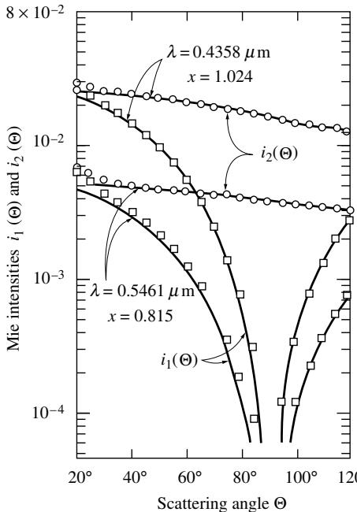

## 内容索引

- [目录](README.md)
- [1 热辐射基础](1-热辐射基础.md)
- [2 基于电磁波理论的辐射特性预测](2-基于电磁波理论的辐射特性预测.md)
- [3 实际表面的辐射特性](3-实际表面的辐射特性.md)
- [4 视角因子](4-视角因子.md)
- [5 灰体漫射表面间的辐射交换](5-灰体漫射表面间的辐射交换.md)
- [6 部分镜面灰体表面间的辐射交换](6-部分镜面灰体表面间的辐射交换.md)
- [7 非理想表面间的辐射交换](7-非理想表面间的辐射交换.md)
- [8 表面交换的蒙特卡洛方法](8-表面交换的蒙特卡洛方法.md)
- [9 传导和对流存在时的表面辐射交换](9-传导和对流存在时的表面辐射交换.md)
- [10 参与介质中的辐射传递方程(RTE)](10-参与介质中的辐射传递方程(RTE).md)
- [11 分子气体的辐射特性](11-分子气体的辐射特性.md)
- [12 颗粒介质的辐射特性](12-颗粒介质的辐射特性.md)
- [13 半透明介质的辐射特性](13-半透明介质的辐射特性.md)
- [14 一维灰体介质的精确解](14-一维灰体介质的精确解.md)
- [15 一维介质的近似求解方法](15-一维介质的近似求解方法.md)
- [16 球谐函数法 (PN-近似)](16-球谐函数法(PN-近似).md)
- [17 离散坐标法 (SN-近似)](17-离散坐标法(SN-近似).md)
- [18 区域法](18-区域法.md)
- [19 准直辐射与瞬态现象](19-准直辐射与瞬态现象.md)
- [20 非灰消光系数的求解方法](20-非灰消光系数的求解方法.md)
- [21 参与介质的蒙特卡洛方法](21-参与介质的蒙特卡洛方法.md)
- [22 辐射与传导和对流的耦合](22-辐射与传导和对流的耦合.md)
- [23 逆辐射传热](23-逆辐射传热.md)
- [24 纳米尺度辐射传热](24-纳米尺度辐射传热.md)
- [附录](附录.md)

- [12.1 引言](#121-引言)  
- [12.2 单球体的吸收和散射](#122-单球体的吸收和散射)  
- [12.3 颗粒云的辐射特性](#123-颗粒云的辐射特性)  
- [12.4 小球的辐射特性（瑞利散射）](#124-小球的辐射特性瑞利散射)  
- [12.5 瑞利-甘斯散射](#125-瑞利-甘斯散射)  
- [12.6 反常衍射](#126-反常衍射)  
- [12.7 大颗粒的辐射特性](#127-大颗粒的辐射特性)  
- [12.8 长圆柱的吸收与散射](#128-长圆柱的吸收与散射)  
- [12.9 近似散射相位函数](#129-近似散射相位函数)  
- [12.10 不规则颗粒和聚集体的辐射特性](#1210-不规则颗粒和聚集体的辐射特性)  
- [12.11 燃烧颗粒的辐射特性](#1211-燃烧颗粒的辐射特性)  
- [12.12 颗粒辐射特性的实验测定](#1212-颗粒辐射特性的实验测定)  
- [参考文献](#参考文献)  
- [习题](#习题)

# 第12章

# 颗粒介质的辐射特性

# 12.1 引言

当电磁波或光子与含有微小颗粒的介质相互作用时，辐射强度可能因吸收和/或散射而改变。这种相互作用的常见例子包括：阳光被烟雾云吸收（烟雾本质上是悬浮在空气中的大量微小颗粒）、阳光被大气散射（大气由分子组成，实际上也是微小颗粒）导致蓝天和红霞现象，以及彩虹的颜色。颗粒对辐射的散射最初由天体物理学家研究，他们关注星际尘埃对星光的散射。许多其他领域的科学家也关注电磁波的散射：气象学家研究地球大气层内的散射（阳光散射以及用于观测降水的雷达波散射）；电气工程师和物理学家研究无线电波在大气中的传播；如今物理学家、化学家和工程师将光散射作为非侵入式无损测量的诊断工具，应用于气体、液体和固体中。Tien和Drolen[1]以及Dombrovsky和Baillis[2]对颗粒介质中的热辐射现象进行了综述。

一个颗粒对通过其附近的电磁波的散射程度和方向取决于：(i)颗粒形状，(ii)颗粒材料（即复折射率$m = n - ik$），(iii)其相对尺寸，以及(iv)颗粒间的间距。在辐射分析中，通常假设颗粒形状为球形（适用于球形和不规则形状物体）或圆柱形（适用于长纤维材料）。这些简化假设通常能给出极好的结果，因为对数百万个不规则形状进行平均会平滑掉不规则性[1]。在接下来的讨论中，我们将主要考虑球形颗粒的吸收和散射，如图12-1所示。

通过球形颗粒附近的电磁波或光子会被吸收或散射。散射由三种独立现象引起：(i)衍射（波从未与颗粒接触，但其传播方向因颗粒存在而改变），(ii)颗粒反射（从球体表面反射的波），以及(iii)颗粒折射（穿透球体并在部分吸收后以不同方向重新出射的波）。绝大多数光子发生弹性散射，即其波长（和能量）保持不变。极小部分发生非弹性或拉曼散射（光子以不同波长重新出射）。虽然拉曼效应对光学诊断非常重要，但对辐射传热速率的评估并不重要，本书仅讨论弹性散射。如果一个颗粒的散射不受周围颗粒影响，称为独立散射，否则为依赖散射。因此，半径为$a$的球形颗粒云与波长为$\lambda$的电磁波相互作用时的辐射特性，由三个独立无量纲参数决定：

  
图12-1 电磁波与球形颗粒的相互作用。

$$
\mathrm{复折射率:}m = n - i\epsilon , \tag{12.1}
$$

$$
x = 2\pi a / \lambda , \tag{12.2}
$$

间距-波长比: $c / \lambda$

如果是独立散射$(c / \lambda \gg 1)$，则只需前两个参数。对于依赖散射的分类，间距-波长比常被纯几何参数$c / a$替代，后者又可与颗粒体积分数$f_{\theta}$相关联。早期工作如van de Hulst[3]认为依赖效应仅是颗粒间距的函数，现在已知波长效应也起作用。Hottel及其合作者[4]首先认识到这一点。此后，许多研究者特别是Tien及其合作者[1,5-9]确定了需要考虑依赖效应的界限。他们的结果总结在图12-2中，表明只要$f_{\theta} < 0.006$或$c / \lambda > 0.5$，依赖散射效应可忽略。由于这些值涵盖了几乎所有传热应用，本章仅讨论独立散射。对依赖散射特性预测感兴趣的读者可参阅Tien和Drolen[1]的专著。

# 12.2 单球体的吸收和散射

单球对辐射的散射和吸收最早由Lord Rayleigh[10,11]在19世纪后期讨论，他得到了直径远小于辐射波长（小尺寸参数$x \ll 1$）的球的简单解。随后在1890年代有Lorenz*[12,13]的工作，1908年Gustav Mie†[14]的经典论文，以及1909年Debye[15]的类似处理。

  
图12-2 独立和依赖散射的散射区域图[1]。

Lorenz的工作基于他自己的电磁理论而非Maxwell的理论，而Mie为通过嵌有球的介质传播的电磁波列开发了与Maxwell方程[参见方程(2.11)-(2.14)]等效的解。尽管Lorenz的工作早于Mie，描述吸收球辐射散射的一般理论通常称为"Mie理论"。最近，为认可Lorenz的贡献，"Lorenz-Mie理论"的术语也变得流行。Kerker[16]对粒子散射理论发展历史进行了详尽综述。

当球体尺寸太大无法应用Rayleigh理论，又太小不能使用几何光学（要求$x \gg 1$且$kx \gg 1$）时，通常必须使用复杂的Lorenz-Mie散射理论。这里我们将简要讨论Lorenz-Mie理论及一些代表性结果。详细推导可参阅van de Hulst[3]、Kerker[16]、Deirmendjian[17]以及Bohren和Huffman[18]的相关著作。

颗粒的散射和吸收量通常用散射截面$C_{\mathrm{sca}}$和吸收截面$C_{\mathrm{abs}}$表示。吸收和散射总量（即消光）用消光截面表示：

$$
C_{\mathrm{ext}} = C_{\mathrm{abs}} + C_{\mathrm{sca}}. \tag{12.4}
$$

常用效率因子$Q$代替截面，它们用球的投影表面积无量纲化：

$$
\begin{array}{rl} & {吸收效率因子:Q_{\mathrm{abs}} = \frac{C_{\mathrm{abs}}}{\pi a^2},}\\ & {散射效率因子:Q_{\mathrm{sca}} = \frac{C_{\mathrm{sca}}{\pi a^2},}\\ & {消光效率因子:Q_{\mathrm{ext}} = \frac{C_{\mathrm{ext}}}{\pi a^2},} \end{array} \tag{12.7}
$$

且

$$
Q_{\mathrm{ext}} = Q_{\mathrm{abs}} + Q_{\mathrm{sca}}. \tag{12.8}
$$

与球形粒子相互作用的辐射可能被散射偏离其原始方向一个角度$\Theta$，即电场和磁场的传播矢量可能被散射角重定向（图12-1）。这种偏离入射方向仅由角度$\Theta$描述，因为对于球形粒子，不可能存在方位角变化。以角度$\Theta$散射的波强度[即Poynting矢量的大小，方程(2.42)]与两个复振幅函数$S_{1}(\Theta)$和$S_{2}(\Theta)$成正比，下标表示两个垂直偏振。一旦确定了这些振幅函数，就可以从入射非偏振光束强度$I_{\mathrm{in}}$计算以角度$\Theta$散射的辐射强度$I_{\mathrm{sca}}$[3,16,17]：

$$
\frac{I_{\mathrm{sca}}(\Theta)}{I_{\mathrm{in}}} = \frac{1}{2}\frac{i_1 + i_2}{x^2}, \tag{12.9}
$$

其中$i_{1}$和$i_{2}$是由下式计算的无量纲偏振强度：

$$
i_{1}(x,m,\Theta) = |S_{1}|^{2},\quad i_{2}(x,m,\Theta) = |S_{2}|^{2}. \tag{12.10}
$$

从方程(12.9)可知，一个球向所有方向散射的总能量[3]为：

$$
Q_{\mathrm{sca}} = \frac{C_{\mathrm{sca}}}{\pi a^2} = \frac{a^2}{\pi a^2}\int_{4\pi}\frac{I_{\mathrm{sca}}}{I_{\mathrm{in}}} d\Omega = \frac{1}{x^2}\int_{0}^{\pi}(i_1 + i_2)\sin \Theta d\Theta . \tag{12.11}
$$

散射到任何给定方向的能量部分由散射相函数$\Phi (\Theta)$表示，其归一化为：

$$
\frac{1}{4\pi}\int_{4\pi}\Phi (\hat{\mathbf{s}}_i,\hat{\mathbf{s}})d\Omega \equiv 1. \tag{12.12}
$$

因此，结合方程(12.9)，散射相函数可表示为：

$$
\Phi (\Theta) = \frac{i_1 + i_2}{\frac{1}{4\pi}\int_{4\pi}(i_1 + i_2)d\Omega} = 2\frac{i_1 + i_2}{x^2Q_{\mathrm{sca}}}. \tag{12.13}
$$

最后，单个粒子的总消光（粒子内的吸收加上所有方向的散射）与振幅函数的实部相关：

$$
Q_{\mathrm{ext}} = \frac{4}{x^2}\Re \{S(0)\} , \tag{12.14}
$$

其中振幅函数$S$不带下标是因为$S_{1}(0) = S_{2}(0)$。

计算散射特性的主要困难在于复振幅函数$S_{1}(\Theta)$和$S_{2}(\Theta)$的求解。对于复折射率$m$和尺寸参数$x$取任意值的一般情况，必须使用van de Hulst[3]给出的完整Lorenz-Mie方程：

$$
\begin{array}{l}{S_1(\Theta) = \sum_{n = 1}^{\infty}\frac{2n + 1}{n(n + 1)} [a_n\tau_n(\cos \Theta) + b_n\tau_n(\cos \Theta)],}\\ {S_2(\Theta) = \sum_{n = 1}^{\infty}\frac{2n + 1}{n(n + 1)} [b_n\tau_n(\cos \Theta) + a_n\tau_n(\cos \Theta)],} \end{array} \tag{12.16}
$$

其中与方向相关的函数$\pi_{n}$和$\tau_{n}$与勒让德多项式$P_{n}$相关（关于这些多项式的描述可参见Wylie[19]）：

$$
\begin{array}{l}\pi_n(\cos \Theta) = \frac{dP_n(\cos\Theta)}{d\cos\Theta},\\ \displaystyle \tau_n(\cos \Theta) = \cos \Theta \pi_n(\cos \Theta) - \sin^2\Theta \frac{d\pi_n(\cos\Theta)}{d\cos\Theta}, \end{array} \tag{12.18}
$$

而Mie散射系数$a_{n}$和$b_{n}$是$x$和$y = mx$的复函数：

$$
\begin{array}{l}{a_n = \frac{\psi_n'(y)\psi_n(x) - m\psi_n(y)\psi_n'(x)}{\psi_n'(y)\zeta_n(x) - m\psi_n(y)\zeta_n'(x)},}\\ {b_n = \frac{m\psi_n'(y)\psi_n(x) - \psi_n(y)\psi_n'(x)}{m\psi_n'(y)\zeta_n(x) - \psi_n(y)\zeta_n'(x)}.} \end{array} \tag{12.20}
$$

函数$\psi_{n}$和$\zeta_{n}$称为Riccati-Bessel函数，与贝塞尔函数和汉克尔函数[19,20]的关系为：

$$
\psi_{n}(z) = \left(\frac{\pi z}{2}\right)^{1 / 2}J_{n + 1 / 2}(z),\quad \zeta_{n}(z) = \left(\frac{\pi z}{2}\right)^{1 / 2}H_{n + 1 / 2}(z). \tag{12.21}
$$

将方程(12.15)和(12.16)代入方程(12.11)和(12.14)，并利用$\pi_{n}$和$\tau_{n}$与勒让德多项式一样构成正交函数集这一事实，可以得到：

$$
\begin{array}{l}{Q_{\mathrm{sca}} = \frac{2}{x^2}\sum_{n = 1}^{\infty}(2n + 1)(a_n|z|^2 +|b_n|^2),}\\ {Q_{\mathrm{ext}} = \frac{2}{x^2}\sum_{n = 1}^{\infty}(2n + 1)\Re \{a_n + b_n\} .} \end{array} \tag{12.22}
$$

一旦确定了所有Mie散射系数$a_{n}$和$b_{n}$，也可以从方程(12.13)计算相函数$\Phi$，但由于方程(12.10)的性质，且必须对每个散射角$\Phi$重新计算，这一过程往往极其繁琐。为简化计算，Chu和Churchill[21,22]将散射相函数表示为勒让德多项式的级数：

$$
\Phi (\Theta) = 1 + \sum_{n = 1}^{\infty}A_nP_n(\cos \Theta), \tag{12.24}
$$

其中系数$A_{n}$通过一些相当复杂的公式（此处未给出）直接与Mie散射系数$a_{n}$和$b_{n}$相关。这种表达的主要优点是，一旦确定了$A_{n}$，就可以快速计算任意或所有散射方向的相函数$\Phi$值。

在许多应用中，使用方程(12.24)描述的复杂散射相函数过于繁琐。为简化分析，方向散射行为可以用散射角的平均余弦（称为不对称因子）来描述，其与相函数的关系为：

$$
g = \overline{\cos\Theta} = \frac{1}{4\pi}\int_{4\pi}\Phi (\Theta)\cos \Theta d\Omega . \tag{12.25}
$$

对于各向同性散射（即向所有方向的散射量相等，且$\Phi \equiv 1$）的情况，不对称因子为零；如果散射关于垂直于光束传播的平面对称，$g$也为零。如果粒子向前方$(\Theta < \pi /2)$散射更多辐射，则$g$为正；如果向后方$(\Theta >\pi /2)$散射更多辐射，则$g$为负。对于球形粒子，不对称因子可容易地计算为[18]：

  
图12-3 不同折射率下介质球的消光效率因子[3]。

$$
g = \overline{\cos\Theta} = \frac{4}{x^2Q_{\mathrm{scal}}}\sum_{n = 1}^{\infty}\left[\frac{n(n + 2)}{n + 1}\Re \{a_na_{n + 1}^* +b_nb_{n + 1}^*\} +\frac{2n + 1}{n(n + 1)}\Re \{a_nb_n^*\} \right]. \tag{12.26}
$$

即使在超级计算机时代，计算Mie散射系数$a_{n}$和$b_{n}$也绝非易事：确定这些系数的关系式十分复杂，需要频繁计算含复数参数的复杂函数。对于大尺寸参数$x$，需要计算许多项$(n_{\mathrm{max}}\approx 2x)$。Deirmendjian[17]等人给出了函数$\pi_{n}, \tau_{n}, \psi_{n},$和$\zeta_{n}$的递推公式，这些公式利用先前计算好的函数值来递推计算递增$n$时的函数值。Deirmendjian观察到随着$n$增大，计算精度会下降，导致对于大尺寸参数$x$（此时振幅函数级数需要计算很多项）的计算完全失败，即使采用双精度运算也是如此。Kattawar和Plass[23]解决了这个问题，他们证明这四个函数可分为两类：一类具有随$n$增大而稳定的递推公式（即舍入误差随$n$增大而减小），另一类则随$n$减小而稳定（将函数在比级数所需更大的$n$处设为零，可以得到稍小$n$时的精确值）。Wiscombe[24]比较了几种Lorenz-Mie散射计算机求解程序的精度和稳定性，并讨论了不同计算方法的效率（是使用向上还是向下递推，使用哪种递推公式等）。图12-3至12-5展示了一些典型的Lorenz-Mie计算结果。图12-3显示了不同折射率$n$下电介质$(k\equiv 0)$消光效率因子的典型行为。可以观察到$Q_{\mathrm{ext}}$随尺寸参数变化存在主振荡，其上叠加有次振荡（折射率越大次振荡越强）。还需注意随着尺寸参数增大，振荡幅度减小，且当$x \to \infty$时$Q_{\mathrm{ext}} \to 2$（对电介质和金属均成立）。图12-4展示了在固定尺寸参数$(x = 1)$下，吸收效率因子$Q_{\mathrm{abs}}$和散射效率因子$Q_{\mathrm{sca}}$随吸收指数$k$变化的定性行为。吸收效率因子可能随吸收指数$k$变化多个数量级，而散射效率在$k$大幅变化时保持恒定。最后，图12-5展示了一些代表性的散射相函数$\Phi (\Theta)$。图12-5a显示了非常小颗粒（称为瑞利散射）的散射行为：散射关于垂直于入射光束的平面对称，几乎是各向同性的，有轻微的前向和后向散射峰，侧面散射稍弱。图12-5b展示了折射率接近1的颗粒（称为瑞利-甘斯散射）的行为：几乎所有散射能量都向前散射，部分散射到其他几个优选方向。随着尺寸参数增大，这种行为变得更加极端。图12-5c显示了典型电介质的相函数：散射具有强烈的前向分量；此外散射行为在不同散射角处呈现快速的最大最小值变化，其振幅比瑞利-甘斯散射强得多（注意比例尺变化）。由于$n$值较大，其变化不像图12-5b中那样极端。图12-5d展示了典型金属（铝在$3.1\mu \mathrm{m}$处）的行为：除了强烈的前向散射峰外，这些颗粒的振荡程度比电介质小。这些相函数是用作者自编的mmmie代码计算的，为方便读者，该代码收录在附录F中。

  
图12-4 尺寸参数$x = 1$时效率因子随复折射率$m = n - ik$的变化[23]：(a)吸收效率因子，(b)散射效率因子。

# 12.3 颗粒云的辐射特性

在所有涉及颗粒散射和吸收的辐射传热问题中，我们都需要处理大量颗粒的集合。如果散射是独立的（如本章假设），那么大量颗粒的效应可以简单叠加。为简化计算，通常假设颗粒云由大小完全相同的球体组成。更精确的分析则考虑单个颗粒云中可能存在多种不同尺寸的颗粒，且这些尺寸往往相差几个数量级。我们将在下文中简要描述这两种方法。

  
图12-5 单个球形颗粒的散射相函数极坐标图：(a) 小颗粒 $x = 0.001$；(b) 电介质颗粒 $x = 5$ 且 $m = 1.0001$；(c) 电介质球 $x = 10$ 且 $m = 2$；(d) 金属球（铝）$x = 10$ 且 $m = 4.46 - 31.5i$。

# 均匀尺寸颗粒云

沿入射光束方向单位长度内所有颗粒散射的能量比例称为散射系数[如方程(10.6)所定义]，等于所有颗粒散射截面的总和。若单位体积内颗粒数为 $N_{T}$，且所有颗粒具有相同半径 $a$，则

$$
\sigma_{s\lambda} = N_{T}C_{\mathrm{sca}} = \pi a^{2}N_{T}Q_{\mathrm{sca}}, \tag{12.27}
$$

类似地，对于吸收和消光，

$$
\begin{array}{rl} & {\kappa_{\lambda} = N_{T}C_{\mathrm{abs}} = \pi a^{2}N_{T}Q_{\mathrm{abs}},}\\ & {\beta_{\lambda} = \kappa_{\lambda} + \sigma_{s\lambda} = N_{T}C_{\mathrm{ext}} = \pi a^{2}N_{T}Q_{\mathrm{ext}}.} \end{array} \tag{12.29}
$$

由于均匀颗粒云中每个颗粒的散射相函数（或散射能量的方向分布）相同，因此整个颗粒云的相函数也相同，即

$$
\Phi_{T\lambda}(\Theta) = \Phi (\Theta), \tag{12.30}
$$

不对称因子同理，

$$
g_{T\lambda} = \overline{(\cos\Theta)}_{T\lambda} = \overline{\cos\Theta}. \tag{12.31}
$$

在这两种情况下，我们暂时添加了下标 $T$（用于区分整个颗粒云与单个颗粒）和 $\lambda$ 以强调这两个量都是可能随波长变化的光谱量。

如需获得总（即光谱积分）特性，可对方程(12.27)至(12.29)进行积分，得到Planck平均或Rosseland平均系数（吸收、散射和/或消光），如方程(11.182)和(11.188)所定义：

$$
\begin{array}{l}{y_b = \frac{\pi}{\sigma T^4}\int_0^\infty I_{b\lambda}y_\lambda d\lambda ,\qquad y = \kappa ,\sigma_s,\mathrm{or}\beta ,}\\ {\frac{1}{y_b} = \frac{\pi}{4\sigma T^3}\int_0^\infty \frac{1}{y_\lambda}\frac{dI_{b\lambda}}{dT} d\lambda ,\qquad y = \kappa ,\sigma_s,\mathrm{or}\beta .} \end{array} \tag{12.32}
$$

类似地，总发射率和吸收率可从方程(11.171)获得。由于效率因子 $Q$ 可能在光谱范围内快速变化，这些积分通常需要数值计算。

# 非均匀尺寸颗粒云

对于非均匀尺寸的颗粒云，通常用颗粒分布函数来描述半径与颗粒数量的关系。不同研究者使用了多种分布函数形式。这里我们介绍所谓的修正伽马分布[17]：

$$
n(a) = A a^{\gamma}\exp (-B a^{\delta}),\quad 0\leq a< \infty , \tag{12.34}
$$

该分布在 $a = 0$ 和 $a\to \infty$ 处趋近于零。当 $\delta = 1$ 时，该分布退化为伽马分布。四个常数 $A, B, \gamma ,$ 和 $\delta$ 为正实数，$\gamma$ 和 $\delta$ 通常取整数。它们必须通过可测量确定，如单位体积总颗粒数：

$$
N_{T} = \int_{0}^{\infty}n(a)da = A\int_{0}^{\infty}a^{\gamma}\exp (-Ba^{\delta})da = \frac{A\Gamma\left(\frac{\gamma + 1}{\delta}\right)}{\delta B^{(\gamma + 1) / \delta}}. \tag{12.35}
$$

这里 $\Gamma$ 是伽马函数：

$$
\Gamma (z) = \int_{0}^{\infty}e^{-t}t^{z - 1}dt, \tag{12.36}
$$

其值已由Abramowitz和Stegun[20]等制表。方程(12.35)表明常数 $A$ 主要由 $N_{T}$ 决定。单位体积内颗粒总体积（即体积分数）为：

$$
f_{v} = \int_{0}^{\infty}\frac{4}{3}\pi a^{3}n(a)da = \frac{4\pi A\Gamma\left(\frac{\gamma + 4}{\delta}\right)}{3\delta B^{(\gamma + 4) / \delta}}. \tag{12.37}
$$

假设所有颗粒具有相同光学性质，我们仍可通过累加所有颗粒的散射截面来确定颗粒云的散射系数，但由于颗粒尺寸分布的存在，现在需要用积分而非简单求和：

$$
\alpha_{\lambda} = \int_{0}^{\infty}C_{\mathrm{sca}}n(a)da = \pi \int_{0}^{\infty}Q_{\mathrm{sca}}a^{2}n(a)da, \tag{12.38}
$$

类似地，对于吸收和消光，

$$
\begin{array}{r} \begin{array}{r}\kappa_{\lambda} = \int_{0}^{\infty}C_{\mathrm{abs}}n(a)da = \pi \int_{0}^{\infty}Q_{\mathrm{abs}}a^{2}n(a)da,\\ \beta_{\lambda} = \int_{0}^{\infty}C_{\mathrm{ext}}n(a)da = \pi \int_{0}^{\infty}Q_{\mathrm{ext}}a^{2}n(a)da. \end{array} \end{array} \tag{12.40}
$$

  
图12-6 吸收性颗粒云的Lorenz-Mie散射相函数[25]。

对于非均匀颗粒，散射相函数并非对所有颗粒都相同。根据相函数的定义，需要将所有颗粒在给定方向上的散射能量求和后进行归一化处理，即：

$$
\begin{array}{l}\Phi_{T\lambda}(\Theta) = \frac{\int_0^\infty(i_1 + i_2)n(a)da}{\frac{1}{4\pi}\int_{4\pi}^\infty\left[\int_0^\infty(i_1 + i_2)n(a)da\right]d\Omega} = \frac{\int_0^\infty C_{\mathrm{sca}}(a)\Phi(a,\Theta)n(a)da}{\int_0^\infty C_{\mathrm{sca}}(a)n(a)da}\\ \displaystyle = \frac{1}{\sigma_{s\lambda}}\int_0^\infty C_{\mathrm{sca}}(a)\Phi (a,\Theta)n(a)da, \end{array} \tag{12.41}
$$

类似地，

$$
g_{T\lambda} = \overline{(\cos\Theta)}_{T\lambda} = \frac{1}{\sigma_{s\lambda}}\int_{0}^{\infty}C_{\mathrm{sca}}(a)g(a)n(a)da. \tag{12.42}
$$

同样地，如需获得总特性，可将方程(12.38)至(12.40)在整个光谱范围内进行积分。

图12-6和12-7展示了使用附录F中mmmie程序计算的吸收性和非吸收性颗粒云的典型散射相函数。考虑了两类颗粒：一类是非吸收性颗粒，折射率$m=2$；另一类是吸收性颗粒，折射率$m=2-i$。这些颗粒要么存在于恒定半径$a=5\mu m$的云中，要么存在于具有尺寸分布函数的云中。两者差异显著，主要是因为方程(12.43)中的平均粒径小于$5\mu m$——体积或质量平均半径为$2.33\mu m$，数量平均半径为$1.52\mu m$。可以观察到，均匀粒径云的相函数由于衍射峰而呈现强烈振荡，因为其相函数与单颗粒相同（参见图12-5）。由于衍射峰会随尺寸参数变化而轻微偏移，这些峰谷在变粒径云中被平滑化。对于这类云，相函数变得非常平滑，仅保留一个强烈的前向散射峰（对于电介质颗粒还会有一个较弱的后向散射峰）。因此，存在粒径分布时，散射现象的分析实际上可能更简单！图12-6和12-7还展示了这些相函数的线性各向异性近似，如第12.9节所述。

$$
n(a) = 27,230a^2\exp (-1.7594a), \tag{12.43}
$$

该分布在$a=5\mu m$处取得最大值。所有颗粒云的数量密度均为$10^4$个颗粒$\mathrm{cm}^3$，Lorenz-Mie计算采用的典型波长为$\lambda=3.1416\mu m$。对于恒定半径云，尺寸参数为$x=2\pi a/\lambda=10$；对于具有粒径分布的云，有效尺寸参数范围为$0<x\leq 20$。四种不同颗粒云的辐射特性总结于表12.1中。

恒定半径与粒径分布的吸收和散射系数

  
图12-7 电介质颗粒云的Lorenz-Mie散射相函数[25]

表12.1 典型颗粒云的辐射特性 $(N_{T} = 10^{4} / \mathrm{cm}^{3},\lambda = 3.1416\mu \mathrm{m})$

| 参数 | 云#1 固定半径 a=5μm m=2-i | 云#2 尺寸分布 n(a) m=2-i | 云#3 固定半径 a=5μm m=2 | 云#4 尺寸分布 n(a) m=2 |
|------|----------------------------------|--------------------------------|--------------------------------|--------------------------------|
| 吸收系数 κ [cm⁻¹] | 8.307 × 10⁻³ | 1.524 × 10⁻³ | 0 | 0 |
| 散射系数 σₛ [cm⁻¹] | 1.073 × 10⁻² | 1.674 × 10⁻³ | 6.420 × 10⁻² | 3.363 × 10⁻³ |
| 消光系数 β [cm⁻¹] | 1.904 × 10⁻² | 3.198 × 10⁻³ | 6.420 × 10⁻² | 3.363 × 10⁻³ |
| 散射反照率 | 0.5634 | 0.5235 | 1 | 1 |
| 相函数所需项数 | 26 | 35 | 27 | 33 |

Bohren和Huffman[18]的研究表明，这种平滑效应不仅出现在相函数中，也出现在效率因子中，只需颗粒尺寸与均匀尺寸存在微小偏差即可产生。图12-8展示了水滴云的消光效率，假设水滴尺寸服从以平均粒径为中心、标准差为$\sigma$的高斯分布。与均匀尺寸的微小偏差会模糊消光效率的高频变化（称为波纹结构），而稍大的偏差还会减弱消光效率的低频变化（称为干涉结构）。Hodkinson[26]对不规则石英颗粒的水悬浮液研究表明，形状不规则但尺寸均匀的颗粒云也会产生类似的平滑效应。

  
图12-8 水滴尺寸分布对可见光消光效率的影响（$\sigma$=高斯分布的标准差）[18]

# 12.4 小球的辐射特性（瑞利散射）

远在Mie理论[14]发展之前，Lord Rayleigh[10,11]就首次描述了尺寸远小于波长的球体的辐射散射现象。不过，对于小颗粒的散射结果，最容易的方法是在Mie方程的一般解中取适当的极限获得。

当散射颗粒极其微小时，尺寸参数$x=2\pi a/\lambda$会变得非常小。这种行为主要见于气体分子（实际上是非常微小的颗粒）。然而，也存在一些多分子固体颗粒符合瑞利散射条件，例如炭黑颗粒（其直径通常小于$10\mathrm{nm}$，在燃烧应用中受到约$3\mu\mathrm{m}$光照射时，$x\approx 0.01$）。

在$x\rightarrow 0$的极限情况下，可以相对简单地证明方程(12.19)和(12.20)中只有$a_1$不为零，即：

$$
S_{2}(\Theta) = S_{1}(\Theta)\cos \Theta = i\frac{m^{2} - 1}{m^{2} + 2} x^{3}\cos \Theta , \tag{12.44}
$$

也就是说，一种偏振的振幅函数与散射角$\Theta$无关。将其代入方程(12.11)和(12.14)即可得到效率因子：

$$
\begin{array}{l}{Q_{\mathrm{sca}} = \frac{8}{3}\bigg|\frac{m^2 - 1}{m^2 + 2}\bigg|^2 x^4,}\\ {Q_{\mathrm{abs}} = -4\Im \bigg\{\frac{m^2 - 1}{m^2 + 2}\bigg\} x\approx Q_{\mathrm{ext}},} \end{array} \tag{12.46}
$$

  
图12-9 太阳光线穿过地球大气层的路径

方程(12.46)中最后一个等式成立的原因是$x^4 \ll x$，因此与吸收相比可以忽略散射。我们观察到散射效率的波长依赖性为：

$$
Q_{\mathrm{sca}}\propto \frac{1}{\lambda^4}\propto \nu^4. \tag{12.47}
$$

顺便指出，这一事实解释了天空的颜色：在白天大部分时间，当太阳光线穿过地球大气层的路径相对较短时（参见图12-9），只有最短波长的光会从太阳直射路径中显著散射出去；这些光被大气中的分子反复散射，为我们提供了蓝色的天空（蓝光在可见光谱中波长最短）。然而在日落时分，太阳光线以掠射角穿过大气到达观察者，此时除最长波长（可见光谱范围内）外的所有光都从直射路径中散射出去，使太阳呈现红色。如果没有大气层，天空对我们来说将是黑色的，正如宇航员在（无大气的）月球上所见。

另一方面，吸收效率的波长依赖性为：

$$
Q_{\mathrm{abs}}\propto \frac{1}{\lambda}\propto \nu , \tag{12.48}
$$

这较好地描述了诸如炭黑等小颗粒的光谱行为。

瑞利散射的相函数由方程(12.44)和(12.13)得出：

$$
\begin{array}{r}\Phi (\Theta) = \frac{3}{4} (1 + \cos^2\Theta), \end{array} \tag{12.49}
$$

其中两项来自两个垂直偏振方向的贡献，如图12-10所示。可以观察到，就前向和后向散射而言，相函数是对称的，并且与各向同性散射的偏离不太大。

对于非均匀尺寸小颗粒云的吸收系数，可由方程(12.39)和(12.46)得出：

$$
\kappa_{\lambda} = \pi \int_{0}^{\infty}Q_{\mathrm{abs}}a^{2}n(a)da = -4\Im \left\{\frac{m^{2} - 1}{m^{2} + 2}\right\} \int_{0}^{\infty}\left(\frac{2\pi a}{\lambda}\right)\pi a^{2}n(a)da. \tag{12.50}
$$

该方程中的积分可以与体积分数$f_v$相关联，

$$
f_{v} = \int_{0}^{\infty}\left(\frac{4}{3}\pi a^{3}\right)n(a)da, \tag{12.51}
$$

  
图12-30 瑞利相函数的极坐标图：1，电场矢量垂直于纸面偏振；2，电场矢量平行于纸面偏振；1+2，非偏振光。

因此小颗粒的吸收系数可简化为

$$
\kappa_{\lambda} = -\Im \left\{\frac{m^{2} - 1}{m^{2} + 2}\right\} \frac{6\pi f_{v}}{\lambda}, \tag{12.52}
$$

或者，展开复折射率$m = n - ik$，

$$
\kappa_{\lambda} = \frac{36\pi nk}{(n^{2} - k^{2} + 2)^{2} + 4n^{2}k^{2}}\frac{f_{v}}{\lambda}. \tag{12.53}
$$

由此可见，对于满足瑞利散射条件的足够小颗粒，吸收系数不依赖于颗粒尺寸分布，而仅取决于所有颗粒占据的总体积（单位系统体积内）。

例12.1。在丙烷燃烧过程中，观察到产物中含有体积分数为$10^{-4}\%$的炭黑，其复折射率$m = 2.21 - 1.23i$（在波长$3\mu\mathrm{m}$下测得）。假设平均颗粒直径为$0.05\mu\mathrm{m}$，计算该炭黑云在$3\mu\mathrm{m}$波长下的吸收和散射效率因子以及吸收系数。

# 解

对于给定的直径和波长，颗粒尺寸参数为$x = \pi \times 0.05\mu\mathrm{m} / 3\mu\mathrm{m} = 0.0524\ll 1$，我们假设所有颗粒都满足瑞利散射条件。对于这三个参数，我们需要计算复比例$(m^{2} - 1)/(m^{2} + 2)$

$$
\begin{array}{c}{\frac{m^2 - 1}{m^2 + 2} = \frac{2.21^2 - 2\times 2.21\times 1.23i - 1.23^2 - 1}{2.21^2 - 2\times 2.21\times 1.23i - 1.23^2 + 2}}\\ {= \frac{2.3712 - 5.4366i}{5.3712 - 5.4366i}\times \frac{5.3712 + 5.4366i}{5.3712 + 5.4366i}}\\ {= \frac{42.2928 - 16.3098i}{58.4064} = 0.7241 - 0.2792i.} \end{array}
$$

因此，效率因子可计算为

$$
Q_{\mathrm{sca}} = \frac{8}{3} |0.7241 - 0.2792i|^2\times (0.0524)^4 = 1.21\times 10^{-5},
$$

和

$$
Q_{\mathrm{abs}} = -4\times (-0.2792)\times 0.0524 = 5.85\times 10^{-2},
$$

这表明散射确实可以忽略不计。吸收系数由方程(12.53)得出

$$
\kappa_{\lambda} = -(-0.2792)\times \frac{6\pi\times 10^{-4} / 100}{3\times 10^{-4}\mathrm{cm}} = 0.01754\mathrm{cm}^{-1},
$$

即在$3\mu\mathrm{m}$波长下，任何辐射穿透该炭黑云时，其强度衰减至原始值的$1/e$所需的距离为$1/\kappa_{\lambda} = 57\mathrm{cm}$。

# 12.5 瑞利-甘斯散射

对于$k > 0$且折射率接近1的近介电球体（即$|m - 1|\ll 1$），其反射率可忽略不计，因此光线可以无衰减、无折射地进入球体。如果同时满足$x|m - 1|\ll 1$，则光线也将基本无衰减地离开球体。然而，由于光在颗粒内部的相速度略低，穿过球体的光将显示出相对于入射光的小相位滞后。这种现象称为瑞利-甘斯散射。

如van de Hulst[3]所述，取适当极限可将方程(12.15)和(12.16)简化为

$$
S_{2}(\Theta) = S_{1}(\Theta)\cos \Theta = ix^{3}(m - 1)G(u)\cos \Theta , \tag{12.54}
$$

其中

$$
G(u) = \frac{2}{u^3} (\sin u - u\cos u),\qquad u = 2x\sin \frac{1}{2}\Theta . \tag{12.55}
$$

吸收效率与瑞利散射相同，即

$$
Q_{\mathrm{abs}} = -4\Im \left\{\frac{m^2 - 1}{m^2 + 2}\right\} x, \tag{12.56}
$$

而散射效率为

$$
Q_{\mathrm{sea}} = |m - 1|^2 x^4\int_0^\pi G^2 (u)(1 + \cos^2\Theta)\sin \Theta d\Theta . \tag{12.57}
$$

最后，瑞利-甘斯散射的相函数可确定为

$$
\Phi (\Theta) = \frac{2G^2(u)(1 + \cos^2\Theta)}{\int_0^\pi G^2(u)(1 + \cos^2\Theta)\sin\Theta d\Theta}. \tag{12.58}
$$

图$12-5b$展示了$x=5$和$m=1.0001$时的相函数示例。该相函数显示出强烈的前向散射峰（随尺寸参数增加而增强），并在其他方向上呈现幅度变化的快速振荡。

# 12.6 反常衍射

对于折射率接近1的近介电球体($|m - 1|\ll 1$)，当颗粒足够大($x\gg 1$)时，可以针对任意$x|m - 1|$值建立简单关系式。这种方法能够分离(近似直线的)透射和衍射现象，被van de Hulst[3]称为反常衍射。在此极限情况下，效率因子可由下式求得：

$$
\begin{array}{l}{Q_{\mathrm{ext}} = 4\Re \left\{K\big(2x(m - 1)i\big)\right\}}\\ {= 2 - \frac{4}{p}\cos q\bigg[e^{-p\tan q}\bigg(\sin (p - q) + \frac{\cos q}{p}\cos (p - 2q)\bigg) - \frac{\cos q}{p}\cos 2q\bigg],}\\ {Q_{\mathrm{abs}} = 2K(2p\tan q),} \end{array} \tag{12.60}
$$

其中

$$
K(w) = \frac{1}{2} -\frac{1}{w^2}\left[1 - (1 + w)e^{-w}\right], \tag{12.61}
$$

$$
p = 2x(n - 1),\quad q = \tan^{-1}\frac{k}{n - 1};\quad p\tan q = 2xk. \tag{12.62}
$$

从物理意义上讲，$p$表示穿过球体中心的光线所经历的相位滞后。与瑞利-甘斯散射类似，燃烧过程中存在的许多非金属颗粒都能较好地满足$|m - 1| \ll 1$条件。

# 12.7 大颗粒的辐射特性

当球体非常大时($x \gg 1$)，在计算方程(12.15)和(12.16)时需要非常多项。然而在这种情况下，采用几何光学方法就足够了，可以将衍射与反射和折射分开处理。对于非常大的球体，始终满足：

$$
Q_{\mathrm{ext}} = 2. \tag{12.63}
$$

这个关系式有时被称为消光悖论，因为它表明大颗粒从光束中移除的光量恰好是其能拦截量的两倍，van de Hulst[3]对此进行了讨论。根据几何光学理论，颗粒用于反射和吸收的投影面积为$\pi a^2$，这意味着消光效率的一半来自衍射。剩余部分有多少来自吸收，多少来自反射，取决于复折射率$m$的值或球体表面的反射率。

接下来我们将确定大不透明球体的散射特性，即任何折射进入颗粒内部的光线都会被完全吸收而不会从其他位置射出的球体。这需要额外假设$kx \gg 1$(例如2或3)。因此，只要$x \gg 1$，$k$可以相当小。这样导致的结果是，对于金属而言，"大颗粒"可能意味着$x > 10$，而对于近介电体则可能意味着$x > 10,000$。

虽然电磁波理论总是假设光学光滑表面会产生镜面反射，但与波长相比非常大的球体，其表面粗糙度也可能与波长相当，从而导致非镜面反射。处理非常不规则的反射方向特性当然极其困难(就像表面传输的情况，参见第7章)。然而，完全漫反射这种极端情况可以进行直接分析(类似于第5章中对表面传输的处理)，因此也包含在本节中。

# 大球体的衍射

根据巴比涅原理，通过大球体附近的光的衍射图案与相同直径的圆孔衍射图案相同[3]。因此，衍射光的方向特性由交替的明暗环组成。van de Hulst[3]给出的衍射振幅函数为：

$$
S_{1}(\Theta) = S_{2}(\Theta) = x\frac{J_{1}(x\sin\Theta)}{\sin\Theta}, \tag{12.64}
$$

其中$J_{1}$是贝塞尔函数[19]。因此，大球体衍射的相函数可由方程(12.13)得出(注意对于衍射$Q_{\mathrm{sca}} = 1$)：

$$
\Phi (\Theta) = 2\frac{i_1 + i_2}{x^2} = 4\frac{J_1^2(x\sin\Theta)}{\sin^2\Theta}. \tag{12.65}
$$

如图12-11所示的相函数表明，几乎所有能量都在传输方向$\Theta < (150 / x)^{\circ}$的窄锥角内前向散射。因此，在传热应用中通常可以忽略衍射并将其视为透射。那么，对于不考虑衍射的大颗粒：

  
图12-11 大球体衍射的相函数

$$
Q_{\mathrm{ext}} = 1. \tag{12.66}
$$

# 大镜面反射球体

考虑一个被强度$I_{i}$照射的镜面反射不透明球体，该强度分布在立体角$d\Omega_{i}$的细光束上，如图12-12所示。在此条件下，与入射方向成$\beta$角的无限小带区（图中阴影部分）接收来自其表面法线偏转$\beta$角的辐射。回顾强度的定义："垂直于射线的单位面积、单位立体角、单位波长的热流率"，波段在波长范围$d\lambda$内拦截的能量为：

$$
d^{2}Q_{i} = I_{i}d\Omega_{i}d\lambda (dA_{\mathrm{band}}\cos \beta) = I_{i}d\Omega_{i}d\lambda 2\pi a\sin \beta a d\beta \cos \beta . \tag{12.67}
$$

其中，$\rho^{s}(\beta)$部分被反射到与入射光束成$2\beta$角的方向。球体拦截的总热流率为：

$$
dQ_{i} = \int_{0}^{\pi /2}I_{i}d\Omega_{i}d\lambda 2\pi a^{2}\sin \beta \cos \beta d\beta = I_{i}d\Omega_{i}d\lambda \pi a^{2}, \tag{12.68}
$$

而总反射（或散射）热流率为：

$$
\begin{array}{l}{dQ_s = \int_0^{\pi /2}\rho^s (\beta)I_id\Omega_id\lambda 2\pi a^2\sin \beta \cos \beta d\beta}\\ {= I_id\Omega_id\lambda \pi a^2 2\int_0^{\pi /2}\rho^s (\beta)\sin \beta \cos \beta d\beta = \rho^s I_id\Omega_id\lambda \pi a^2,} \end{array} \tag{12.69}
$$

其中$\rho^{s}$是所有入射方向上的半球反射率平均值[参见方程(3.46)]：

$$
\rho^s = 2\int_0^{\pi /2}\rho^s (\beta)\sin \beta \cos \beta d\beta . \tag{12.70}
$$

  
图12-12 大镜面反射球体对入射辐射的散射

因此，大而不透明镜面反射颗粒的散射效率简化为：

$$
Q_{\mathrm{sca}} = \frac{dQ_s}{dQ_i} = \rho^s, \tag{12.71}
$$

吸收效率则为：

$$
Q_{\mathrm{abs}} = Q_{\mathrm{ext}} - Q_{\mathrm{sca}} = 1 - \rho^s = \alpha , \tag{12.72}
$$

即半球吸收率。

为评估散射相函数，我们考虑散射到任意给定方向$\Theta$的能量，其中$\Theta$是从入射光束方向$\hat{\mathbf{s}}$测量的，如图12-12所示。显然，对于均匀球体，散射强度只能随极角$\Theta$变化（而非方位角）。此外，对于镜面反射球体，特定方向$\Theta$的出射强度只能来自球体表面的单个位置。例如，散射到$\Theta = \pi - 2\beta$方向的辐射来自图12-12中的阴影带区。回顾散射相函数定义为$4\pi \times$散射强度/总散射热流[参见方程(10.15)]，对于$\Theta = \pi - 2\beta$或$\beta = (\pi - \Theta) / 2$，我们得到：

$$
\begin{array}{l}\Phi (\Theta) = 4\pi \frac{\rho^s(\beta)d^2Q_i / d\Omega_r}{dQ_s}\\ \displaystyle = 4\pi \rho^s\left(\frac{\pi - \Theta}{2}\right)\frac{I_id\Omega_id\lambda 2\pi a^2\sin\beta\cos\beta d\beta / d\Omega_r}{\rho^sI_id\Omega_id\lambda\pi a^2}. \end{array} \tag{12.73}
$$

反射的立体角最好通过让反射强度落在半径为$R$的同心（且非常大）球体上来可视化。立体角就是被照射带区的面积除以$R^2$，即：

$$
d\Omega_{r} = 2\pi \sin 2\beta d(2\beta), \tag{12.74}
$$

由此可得：

$$
\Phi (\Theta) = \rho^s\left(\frac{\pi - \Theta}{2}\right)\bigg / \rho^s. \tag{12.75}
$$

或者，我们可以利用散射相函数与任意给定方向上的强度成正比这一事实，然后通过方程(10.17)对结果表达式进行归一化。实际的定向散射行为（或相函数的行为）取决于颗粒的构成材料。图12-13比较了"典型"金属（铝在$3.1\mu \mathrm{m}$波长下折射率为$m = 4.46 - 31.5i$）和"典型"电介质($m = 2$)的相函数。这两个相函数应与图$12-5c,d$进行比较，后者是相同材料但尺寸参数更小的情况（且采用极坐标而非笛卡尔坐标绘制）。由于图$12-5c,d$中的尺寸参数相当大$(x = 10)$，与图12-13的主要区别在于后者忽略了衍射效应。对于大颗粒，所有材料在正向$\Theta = 0$处都有最大散射，因为$\rho^5 (\pi /2) = 1$始终成立。然而，电介质的这一峰值明显更为突出，而金属由于在近掠射角处反射率下降（可对比图2-11中铝反射率的方向变化），这一峰值几乎不明显。由于金属颗粒在所有方向都具有相对较高的反射率，大金属颗粒往往呈现近乎各向同性的散射特性。

  
图12-13 不同材料大球体的散射相函数

例12.2 考虑折射率为$m = 1.5 - 0.1i$、密度$\rho_{\mathrm{glass}} = 2\mathrm{g}/\mathrm{cm}^3$的玻璃颗粒悬浮在惰性气体中，颗粒负载比为$1\mathrm{kg}$颗粒每$\mathrm{m}^3$悬浮体积。颗粒尺寸范围在$100\mu \mathrm{m}$到$1000\mu \mathrm{m}$之间，按重量百分比均匀分布。确定红外波段$(3\mu \mathrm{m} < \lambda < 10\mu \mathrm{m})$的吸收系数、散射系数和相函数。

# 解

首先需要确定按数量（而非质量）的颗粒分布函数。由于质量分布函数为常数，可得：

$$
\begin{array}{l}{m(a) = \frac{1\mathrm{kg} / \mathrm{m}^3}{(1000 - 100)\mu\mathrm{m}} = \frac{4}{3}\pi a^3\rho_{\mathrm{glass}}n(a),\quad 100\mu \mathrm{m}\leq a\leq 1000\mu \mathrm{m},}\\ {n(a) = \frac{3m(a)}{4\pi a^3\rho_{\mathrm{glass}}} = 1.3226\times 10^{-7}\mu \mathrm{m}^{-1} / a^3,\quad 100\mu \mathrm{m}\leq a\leq 1000\mu \mathrm{m}.} \end{array}
$$

接下来确定尺寸参数$x$的范围，以判断应采用瑞利散射、洛伦兹-米氏散射还是大颗粒散射理论。$x$的最小值出现在最小颗粒和最长波长情况下：

$$
x_{\mathrm{min}} = \frac{2\pi a_{\mathrm{min}}}{\lambda_{\mathrm{max}}} = \frac{2\pi 100}{10} = 62.83\gg 1,
$$

$$
(kx)_{\mathrm{min}} = 6.283\gg 1,
$$

说明大颗粒假设在本例所有条件下都适用。因此，吸收和散射系数可与玻璃的半球发射率相关联。由于该玻璃$k\ll n$，其行为基本类似电介质，半球发射率可从图3-19或方程(3.82)获得，两种方法都得出$\epsilon = \alpha = 1 - \rho = 0.91$。吸收和散射系数可由方程(12.39)和(12.38)计算：

$$
\begin{array}{c}{\kappa_{\lambda} = \pi \int_{0}^{\infty}\alpha a^{2}n(a)da = \pi \alpha \int_{100\mu \mathrm{m}}^{1000\mu \mathrm{m}}a^{2}\frac{1.3226\times 10^{-7}}{\mu\mathrm{m}a^{3}} da}\\ {= 1.3226\times 10^{-7}\mu \mathrm{m}^{-1}\pi \alpha \ln \frac{1000}{100} = 9.60\times 10^{-3}\alpha \mathrm{cm}^{-1}}\\ {= 8.74\times 10^{-3}\mathrm{cm}^{-1},}\\ {\alpha_{s\lambda} = 9.60\times 10^{-3}\rho \mathrm{cm}^{-1} = 0.86\times 10^{-3}\mathrm{cm}^{-1}.} \end{array}
$$

散射相函数需通过方程(12.75)计算，结果也包含在图12-13中。由于$k$值较小，其方向行为与完美电介质($m = 2$)非常相似，但由于折射率更小，前向散射峰更为明显。

# 大漫反射球体

在方程(12.67)至(12.72)中，球体反射的方向特性并未影响推导过程。因此，对于漫反射球体，表面元接收的入射辐射量以及反射到所有方向的热流表达式与镜面反射球体相同。故这些方程对漫反射球体同样适用：

$$
\begin{array}{r}Q_{\mathsf{abs}} = \alpha ,\\ Q_{\mathsf{sca}} = \rho . \end{array} \tag{12.77}
$$

然而，对于镜面反射球体，任意给定方向的散射能量来自球体表面单一位置的反射，而漫反射球体则不然。这使得散射相函数的推导稍显复杂。考虑图12-14：沿单位向量$\hat{\mathbf{s}}_i$方向传播的入射辐射照亮了漫反射球体的一半。位于$\hat{\mathbf{s}}_o$方向远处的观察者看到球体的另一半，其中部分被入射辐射照亮（阴影表示），部分处于阴影中。观察者看到的被照亮区域呈楔形，类似柠檬切片。为用极坐标描述表面，最方便的是将$\hat{\mathbf{s}}_i$和$\hat{\mathbf{s}}_o$形成的平面定义为$x-y$平面，极角$\beta$从$z$轴测量，方位角$\psi$从负$x$轴测量（如图12-14所示）。在此坐标系下，被照亮区域表面元的法线可表示为：

$$
\hat{\mathbf{n}} (\beta ,\psi) = -\sin \beta \cos \psi \hat{\mathbf{1}} +\sin \beta \sin \psi \hat{\mathbf{1}} +\cos \beta \hat{\mathbf{k}}, \tag{12.78}
$$

同时有：

$$
\hat{\mathbf{s}}_i = \hat{\mathbf{1}},\qquad \hat{\mathbf{s}}_o = \cos \Theta \hat{\mathbf{1}} +\sin \Theta \hat{\mathbf{1}}. \tag{12.79}
$$

如方程(12.67)所示，微元面积反射的能量为：

$$
d^2 Q_s = \rho I_i d\Omega_i d\lambda [dA(-\hat{\mathbf{n}}\cdot \hat{\mathbf{s}}_i)], \tag{12.80}
$$

其中$dA$是二维微元（如图12-14所示，非上节图12-12中的环形）。因此，由于入射辐射的漫反射，该位置的辐射亮度为：

$$
dJ = \rho I_i d\Omega_i d\lambda (-\hat{\mathbf{n}}\cdot \hat{\mathbf{s}}_i). \tag{12.81}
$$

  
图12-14 大漫反射球体对入射辐射的散射

部分反射辐射将沿$\hat{\mathbf{s}}_0$方向传播至观察者。假设观察者位于半径$R \gg a$的大球体上，则由于小球反射，大球表面元$dA_{R}$通过的热流为：

$$
dI_{s}d\Omega = \int_{A_{\mathrm{shaded}}}dJdF_{dA - dA_{R}}dA_{i} \tag{12.82}
$$

其中：

$$
dF_{dA - dA_R} = \frac{\hat{\mathbf{n}}\cdot\hat{\mathbf{s}}_o dA_R}{\pi R^2} = \frac{1}{\pi}\hat{\mathbf{n}}\cdot \hat{\mathbf{s}}_o d\Omega \tag{12.83}
$$

是$dA$与$dA_{R}$之间的视角系数，$\hat{\mathbf{n}} \cdot \hat{\mathbf{s}}_{o}$是$dA$处表面法线与到$dA_{R}$连线夹角的余弦，而$dA_{R}$处的表面法线直接指向颗粒。因此：

$$
dI_{s} = \frac{1}{\pi}\int_{A_{\mathrm{shaded}}}dJ\hat{\mathbf{n}}\cdot \hat{\mathbf{s}}_{o}dA, \tag{12.84}
$$

再次回顾散射相函数等于$4\pi \times$散射强度/总散射热流，我们得到

$$
\begin{array}{l}{\Phi (\hat{\mathbf{s}}_i,\hat{\mathbf{s}}_o) = 4\pi dI_s / d\Omega_s = 4\int_{A_{\mathrm{shaded}}}(\rho I_i d\Omega_i d\lambda)(-\hat{\mathbf{n}}\cdot \hat{\mathbf{s}}_i)(\hat{\mathbf{n}}\cdot \hat{\mathbf{s}}_o)dA / \rho I_i d\Omega_i d\lambda \pi a^2}\\ {= \frac{4}{\pi a^2}\int_{A_{\mathrm{shaded}}}(-\hat{\mathbf{n}}\cdot \hat{\mathbf{s}}_i)(\hat{\mathbf{n}}\cdot \hat{\mathbf{s}}_o)dA}\\ {= \frac{4}{\pi a^2}\int_{\frac{\pi}{2} -\Theta}^{\frac{\pi}{2}}\int_0^\pi \sin \beta \cos \psi \sin \beta (\sin \psi \sin \Theta -\cos \psi \cos \Theta)a^2\sin \beta d\beta d\psi ,} \end{array}
$$

该式可积分得到

$$
\Phi (\Theta) = \frac{8}{3\pi} (\sin \Theta -\Theta \cos \Theta). \tag{12.85}
$$

漫反射球体的相函数(12.85)也展示在图12-13中。与镜面反射球体不同，漫反射球体的相函数表现出强烈的后向散射峰，且与材料的反射率(或复折射率)无关。

  
图12-15 长圆柱对入射辐射的散射

# 颗粒床层

图12-2的散射区域图表明，对于填充床和流化床，当颗粒体积分数高达0.7时仍可假设独立散射[5]。然而，颗粒介质辐射传递的经典连续理论基于颗粒尺寸无限小的假设，因此忽略了遮蔽效应。颗粒床层通常包含相对较大的颗粒$(x \gg 1)$，加上较大的体积分数，遮蔽效应不可忽视[27]。Brewster[28]提出了对式(12.29)的简单修正：

$$
\beta_{\lambda} = \frac{\pi a^{2}N_{T}Q_{\mathrm{ext}}}{1 - f_{v}} = \frac{3f_{v}}{(1 - f_{v})a}, \tag{12.86}
$$

其中假设颗粒尺寸均匀，且大颗粒$Q_{\mathrm{ext}} = 1$。与随机蒙特卡洛模拟[27]的比较显示出近乎完美的一致性。另一个更近期的密集填充球体光线追踪算法也证实了式(12.86)的准确性[29]。

# 12.8 长圆柱的吸收与散射

圆柱散射的研究几乎与球体散射同时开始，最早由Lord Rayleigh研究无限长圆柱在垂直入射下的散射。在辐射传热领域，圆柱散射直到最近才引起关注，主要用于预测通过光纤和纤维绝缘材料的传热速率。

考虑一个长度为$L$、半径为$a$的圆柱，其轴线指向$\hat{\mathbf{s}}_f$方向，被沿$\hat{\mathbf{s}}$方向传播的电磁波斜向照射，如图12-15所示。对于圆柱，通常定义入射角相对于圆柱轴线法线方向，即$\hat{\mathbf{s}} \cdot \hat{\mathbf{s}}_f = \sin \phi$。类似于斜入射到平面表面的波(见第2章)，需要区分两种偏振分量：横磁(TM，或"Case I"；$\hat{\mathbf{s}}_f$方向无磁矢量分量)模式和横电(TE，或"Case II"；$\hat{\mathbf{s}}_f$方向无电矢量分量)模式。对于短圆柱，散射行为与球体非常相似，但随着$L/a$比增加，散射越来越局限于圆锥面(而非分布在所有4π立体角内)。

对于无限长圆柱$(L / a\rightarrow \infty)$，所有散射都局限在图12-15所示的$\hat{\mathbf{S}}_f$和$\hat{\mathbf{S}}$描述的圆锥面上。无量纲偏振散射强度可计算为[16]：

$$
\begin{array}{l}{i_{11}(m,x,\phi ,\theta) = |T_{11}|^2 = \left|b_{01} + 2\sum_{n = 1}^{\infty}b_{n1}\cos n\theta \right|^2,}\\ {i_{12}(m,x,\phi ,\theta) = |T_{12}|^2 = \left|2\sum_{n = 1}^{\infty}a_{n1}\sin n\theta \right|^2,}\\ {i_{21}(m,x,\phi ,\theta) = |T_{21}|^2 = \left|2\sum_{n = 1}^{\infty}b_{n1}\sin n\theta \right|^2,}\\ {i_{22}(m,x,\phi ,\theta) = |T_{22}|^2 = \left|a_{011} + 2\sum_{n = 1}^{\infty}a_{n1}\cos n\theta \right|^2.} \end{array} \tag{12.87d}
$$

与球体类似，$a_{n}$和$b_{n}$可用贝塞尔和汉克尔函数表示，由Kerker[16]给出。对于非偏振入射辐射，无量纲强度计算为：

$$
i(m,x,\phi ,\theta) = \frac{1}{2} (i_{11} + i_{12} + i_{21} + i_{22});\qquad i_{12} = i_{21}, \tag{12.88}
$$

消光和散射截面及效率由下式计算：

$$
\begin{array}{l}{Q_{\mathrm{ext}} = \frac{C_{\mathrm{ext}}}{2a} = \frac{2}{x}\Re \big(\tau (\theta = 0)\big) = \frac{1}{x}\Re \left\{i_{0\mathrm{II}} + a_{0\mathrm{II}} + 2\sum_{n = 1}^{\infty}\left(b_{n\mathrm{I}} + a_{n\mathrm{II}}\right)\right\}}\\ {Q_{\mathrm{sca}} = \frac{C_{\mathrm{sca}}}{2a} = \frac{1}{\pi x}\int_{0}^{2\pi}i\left(m,x,\phi ,\theta\right)d\theta}\\ {= \frac{1}{x}\left\{\left|b_{0\mathrm{II}}\right|^2 +\left|a_{0\mathrm{II}}\right|^2 +\sum_{n = 1}^{\infty}\left(\left|b_{n\mathrm{II}}\right|^2 +\left|b_{n\mathrm{II}}\right|^2 +\left|a_{n\mathrm{II}}\right|^2 +\left|a_{n\mathrm{II}}\right|^2\right)\right\} ,} \end{array} \tag{12.90}
$$

其中，与球体类似，$x = 2\pi a / \lambda$，但截面是单位长度圆柱的(即具有长度单位)。单个无限长圆柱的相函数由[30]给出：

$$
\Phi (\Theta ,\phi) = \frac{i(\theta,\phi)\delta(\phi - \phi^{\prime})}{\int_{0}^{\pi}i(\theta,\phi)d\theta},\cos \theta = (\cos \Theta -\sin^{2}\phi^{\prime}) / \cos^{2}\phi^{\prime}, \tag{12.91}
$$

其中$\delta (\phi - \phi^{\prime})$是狄拉克δ函数，$\Theta$是相对于$\hat{\mathbf{S}}$方向的散射角，与极角$\phi^{\prime}$和方位角$\theta$相关。

无限长纤维的行为已被多位研究者研究，特别是Tong团队[31-36]和Lee[30,37-43]等人[44-47]。部分研究集中于单根纤维的散射[34,35,37]，其他研究依赖散射效应[40-42,44]，但大多数涉及不同纤维排列的影响。对于具有尺寸分布$n(a)$的随机排列无限长纤维，消光和散射特性可由[37]确定：

$$
\beta_{\lambda}(m) = \int_{0}^{\infty}\int_{0}^{\pi /2}C_{\mathrm{ext}}(m,x,\phi)\cos \phi d\phi n(a)da, \tag{12.92}
$$

$$
\begin{array}{c}{\sigma_{s\lambda}(m) = \int_0^\infty \int_0^{\pi /2}C_{\mathrm{sca}}(m,x,\phi)\cos \phi d\phi n(a)da,}\\ {\Phi_\lambda (m,\Theta) = \frac{1}{\sigma_{s\lambda}}\frac{4\lambda}{\pi^2}\int_0^\infty \int_0^{\pi /2}\frac{i(\theta)}{\sin\theta\cos\phi} d\phi n(a)da,}\\ {\cos \theta = \left(\cos \Theta -\sin^2\phi\right)\left(\cos^2\phi .\right.} \end{array} \tag{12.94}
$$

# 12.9 近似散射相位函数

从图12-3和12-8可以明显看出，颗粒的辐射特性可能随尺寸参数(因而随波长)表现出强烈的振荡行为，特别是对于大尺寸、单分散的介电颗粒。更令人困扰的是，散射相函数在任意给定波长下都可能经历强烈的角度振荡，同样特别针对大尺寸、单分散的介电颗粒(参见图12-5、12-6、12-7)。由于具有光谱变化特性的介质辐射计算通常是在光谱基础上进行的，随后对所有相关波长进行积分，这意味着这些光谱振荡虽然有些不便，但不会使分析变得不可行。然而，散射相函数中的强角度振荡将在任何给定波长下极大地复杂化分析。事实上，后续章节描述的大多数求解方法无法接受高度振荡的相函数，否则必须进行到不可接受的高阶或节点数。因此，通常的做法是用具有更规则行为的简单表达式来近似振荡相函数。

观察到大颗粒通常具有强的前向散射峰(由于衍射，参见图12-6和12-7)。实际上，如第12.7节所述，当$x\rightarrow \infty$时，总消光的一半是由于衍射进入近前向方向。由于在该节中衍射被忽略(即被视为透射)，大颗粒的相函数实际上被简化了。如果几何光学不能使用或必须保留衍射效应，则近似相函数必须适应强的前向散射峰。为此，许多研究者使用了Henyey-Greenstein相函数：

$$
\Phi_{HG}(\Theta) = \frac{1 - g^2}{[1 + g^2 - 2g\cos\Theta]^{3 / 2}}, \tag{12.95}
$$

其中$g$为不对称因子。有时Henyey-Greenstein函数以Legendre多项式级数形式表示：

$$
\Phi_{HG}(\Theta) = 1 + \sum_{n = 1}^{\infty}(2n + 1)g^{n}P_{n}(\cos \Theta). \tag{12.96}
$$

因此，该表达式等价于方程(12.24)，其中$A_{n}$的近似值与不对称因子相关。图12-16展示了折射率$m = n = 1.33$、尺寸参数$x = 300$(水滴)的介电质中Lorenz-Mie和Henyey-Greenstein相函数的代表性比较。van de Hulst[48]和Hansen[49]都表明，只要颗粒是非介电质的，Henyey-Greenstein公式就能给出非常精确的辐射热流结果：介电颗粒除了强的前向散射峰外，还可能具有相对较强的后向散射峰。这种情况不能仅用不对称因子描述，Henyey-Greenstein公式必然失效。Modest和Azad[25]已证明，忽略后向散射峰会导致热流计算中的显著误差。

  
图12-16 水滴$(m = 1.33, x = 100)$的Lorenz-Mie、Henyey-Greenstein、线性各向异性和各向同性相函数比较

对于许多计算，Henyey-Greenstein相函数仍然过于复杂。如前所述，在传热应用中，前向散射通常可被视为透射。这一事实导致许多研究者使用所谓的Dirac-delta或Delta-Eddington近似，其中前向散射峰与其余散射相函数分离：

$$
\Phi (\Theta)\approx 2f\delta (1 - \cos \Theta) + (1 - f)\Phi^{*}(\Theta), \tag{12.97}
$$

其中$\Phi^{*}$是新的近似相函数，$f$是待确定的前向散射分数，$\delta$是Dirac-delta函数。将方程(12.97)代入方程(10.17)表明近似相函数是正确归一化的，即：

$$
\frac{1}{4\pi}\int_{4\pi}\Phi^{*}(\Theta)d\Omega = 1. \tag{12.98}
$$

不同作者使用不同方法定义$f$和$\Phi^{*}$。Potter[50]是最早将以下方案用于大气散射研究的人之一。他通过从峰外方向外推相函数到前向方向来截断峰；否则保持相函数不变。不出所料，他的方法产生了极好的结果，但仍使近似相函数保持相当复杂的形式。

更有前景的方法是将近似相函数表示为截断的Legendre级数：

$$
\Phi^{*}(\Theta) = 1 + \sum_{n = 1}^{M}A_{n}^{*}P_{n}(\cos \Theta), \tag{12.99}
$$

其中常数$M$是选择的近似阶数，通常取$M = 1$(线性各向异性散射)[25,51-53]，或$M = 0$(各向同性散射)[52]，而更高阶近似由Crosbie和Davidson[52]完成。关于确定前向分数$f$和系数$A_{n}^{*}$的标准，作者之间存在相当大的分歧。Joseph等人[51]和Crosbie与Davidson[52]都同意至少应满足方程(12.97)的一个矩：将方程(12.97)乘以$P_{m}(\Theta)$并对所有$\Theta$积分得到：

$$
\begin{array}{r l r}{{\int_{0}^{\pi}\Phi(\Theta)P_{m}(\cos\Theta)d\Theta=\int_{0}^{\pi}2f\delta(1-\cos\Theta)P_{m}(\cos\Theta)d\Theta}}\\ &{}&{+(1-f)\sum_{n=1}^{M}\int_{0}^{\pi}A_{n}^{*}P_{n}(\cos\Theta)P_{m}(\cos\Theta)d\Theta,}\end{array} \tag{12.100}
$$

或者，利用Legendre多项式在区间$(0, \pi)$[19]上的正交性：

$$
(1 - f)A_{m}^{*} = A_{m} - (2m + 1)f,m = 1,2,\ldots . \tag{12.101}
$$

如果近似相函数是各向同性的，方程(12.101)在$A_{1}^{*} = 0$时得出：

$$
f = \frac{A_1}{3} = g, \tag{12.102}
$$

和

$$
\Phi (\Theta)\approx 2g\delta (1 - \cos \Theta) + (1 - g). \tag{12.103}
$$

Joseph等人[51]开发了一个近似线性各向异性相函数。他们使用方程(12.101)的前两个矩来求$f$和$A_{1}^{*}$，使用$A_{2} \approx 5g^{2}$的近似值(来自Henyey-Greenstein相函数)。然而，他们的近似相函数在某些后向散射方向可能为负，这在物理上是不可能的。Crosbie和Davidson[52]通过有条件地应用第二矩克服了这一困难。从第一矩得出：

$$
A_{1}^{*} = 3\frac{g - f}{1 - f}. \tag{12.104}
$$

要求相函数对所有角度为正等价于$|A_{1}^{*}| \leq 1$，即：

$$
\frac{1}{2} (3g - 1)\leq f\leq g. \tag{12.105}
$$

他们不直接使用第二矩(即$f = A_{2} / 5$)，而是要求$|f - A_{2} / 5|$在不违反方程(12.105)的情况下最小化。该方法可轻松扩展到任意高阶。他们的线性各向异性和10阶相函数近似也包含在图12-16的水滴图中。应注意该方法仅适用于正不对称因子。在$g < 0$的情况下，方法失效，应使用$f = 0$。即使如此，仍可能出现$A_{1}^{*} < -1$，此时必须强制$A_{1}^{*} = -1$以避免负前向散射。对于强后向散射峰，该方法将完全失效。

上述近似均不允许同时存在前向和后向散射峰。Modest和Azad[25]已证明，忽略介电质中可能出现的后向散射峰可能导致热流计算中的显著误差。因此，他们提出了双Dirac-delta相函数近似。然而，该模型通过要求$I(- \hat{\mathbf{s}})$项(后向强度)使RTE大大复杂化。

例12.3. 使用Henyey-Greenstein函数和Crosbie-Davidson模型，计算大尺寸镜面介电球体$(m = 2)$和漫反射球体的单分散悬浮液的近似相函数。

# 解

Henyey-Greenstein函数需要计算不对称因子

$$
g = \frac{A_1}{3} = \frac{1}{2}\int_{-1}^{+1}\Phi (\mu)\mu d\mu ,
$$

  
图12-17 例12.3的散射相函数近似

其中$\mu$是散射角的余弦。Crosbie和Davidson近似除了需要计算$g$外，还需要计算

$$
\frac{A_2}{5} = \frac{1}{2}\int_{-1}^{+1}\Phi (\mu)P_2(\mu)d\mu .
$$

对相函数进行数值积分得到镜面介电球的$g = 0.229$和$A_{2} / 5 = 0.138$。由于$A_{2} / 5< g$，根据Crosbie和Davidson模型可得$f = A_{2} / 5 = 0.138$，由方程(12.104)得$A_{1}^{*} = 0.315$。图12-17展示了两种近似相函数与精确表达式的对比。Henyey-Greenstein函数没有试图去除前向散射峰，但无法跟随大$\mu$时的尖锐峰。Crosbie-Davidson模型能很好地跟踪实际函数，除了已被去除的前向峰。

漫反射球相函数的积分可以解析计算但相当繁琐。数值积分得到漫反射球的$g = -0.444$和$A_{2} / 5 = 0.062$。由于$g<0$，散射主要向后，Crosbie和Davidson模型无法应用。因此对于该模型，我们强制$f = 0$，由方程(12.104)得$A_{1}^{*} = -1.333$；由于这会导致前向散射出现负值，我们也强制$A_{1}^{*} = -1$。可见Henyey-Greenstein函数对后向散射效果不佳，而Crosbie和Davidson模型给出了可接受的结果。

# 12.10 不规则颗粒和聚集体的辐射特性

在实际应用中，颗粒很少是均匀球体或长圆柱体。如前所述，对数百万个不规则形状颗粒取平均得到的结果与均匀球体假设非常接近[1]。然而，如果不规则颗粒的平均形状不像球体或长纤维，就必须采用更先进的方法研究它们与电磁波的相互作用。多年来文献中出现了许多精确和近似方法，最近由Mishchenko[54]和Wriedt[55]进行了综述，后者还列出了可自由获取的计算机代码。Dombrovsky和Baillis[2]对一般分散系统进行了全面描述。深入讨论不规则颗粒的处理超出了本文范围，读者可参考这三份详尽文献。这里我们仅简要介绍最流行的几种方法：簇T矩阵法、广义多球Mie解和离散偶极子近似。

# 簇T矩阵法

该方法可追溯到1965年Waterman[56]的提出，Mishchenko等人[57]提供了详细描述。虽然该方法适用于任何形状的颗粒，但最适合旋转对称颗粒，可轻松应用于多颗粒簇，如分形聚集体。在T矩阵法中，单个颗粒的入射、内部和散射电磁场被展开为矢量球谐函数。散射场系数通过称为T(或过渡)矩阵的矩阵与入射场系数线性相关。麦克斯韦方程的线性性允许通过叠加确定聚集体的散射场。T矩阵法的一个优势是，一旦计算出矩阵，就可应用于任意入射角，即该方法不仅提供散射和消光系数，还提供方向散射信息，这对激光散射诊断非常重要。该方法越来越受欢迎，特别是已应用于多球簇，如烟灰聚集体[58-62]。多个T矩阵计算机代码可从[63,64]免费获取。

# 广义多球Mie解

与簇T矩阵法类似，广义多球Mie解(GMM)也是一种精确的小颗粒簇散射方法。实际上，该方法与T矩阵法有许多共同特点，但也存在显著差异，如远场干涉的不同处理以及在位移参考系间转换场展开[65,66]。该方法由Xu[67,68]开发，在烟灰聚集体散射建模中越来越受欢迎[69-71]。GMM计算机代码可从[72]下载。

# 离散偶极子近似

另一种处理小颗粒聚集体散射的流行方法是离散偶极子近似。在小点质量(即单个原子)极限下，颗粒可被视为电偶极子，从而允许对产生的电磁场进行精确表述。为使问题可管理，可将颗粒或聚集体细分为相对较少的相同元素，每个元素包含许多原子，但足够小以表示为偶极振子。每个偶极子散射场的矢量幅度通过迭代确定，总散射场是所有单个偶极子场的总和。该方法最初由Purcell和Pennypecker[73]提出。它似乎特别适合建模许多相同初级颗粒(如烟灰)的聚集体，并已被[74,75]等采用。

# 12.11 燃烧颗粒的辐射特性

毫无疑问，热辐射最重要的工程应用之一是在气体、液体(通常为液滴形式)或固体(通常是粉状)燃料燃烧领域，无论是用于发电还是推进。燃烧过程中，热辐射将以通常高于对流的速率将能量直接从燃烧产物传递到燃烧器壁。对于液体和固体燃料，热辐射在燃料预热和点火中也起重要作用。几乎所有火焰对人眼都是可见的，因此被称为发光(发出光)。显然，在没有任何燃烧气体振动-旋转带的波长处，火焰内部存在某种辐射发射。现在已知这种发光来自燃烧过程中产生的微小炭(几乎是纯碳)颗粒，称为烟灰。火焰"越脏"(即烟灰含量越高)，发光越强。Sarofim和Hottel[76]综述了辐射传热在燃烧系统中的重要性。

毫无疑问，热辐射最重要的工程应用之一是在气体、液体(通常为液滴形式)或固体(通常是粉状)燃料燃烧领域，无论是用于发电还是推进。燃烧过程中，热辐射将以通常高于对流的速率将能量直接从燃烧产物传递到燃烧器壁。对于液体和固体燃料，热辐射在燃料预热和点火中也起重要作用。几乎所有火焰对人眼都是可见的，因此被称为发光(发出光)。显然，在没有任何燃烧气体振动-旋转带的波长处，火焰内部存在某种辐射发射。现在已知这种发光来自燃烧过程中产生的微小炭(几乎是纯碳)颗粒，称为烟灰。火焰"越脏"(即烟灰含量越高)，发光越强。Sarofim和Hottel[76]综述了辐射传热在燃烧系统中的重要性。

表12.2 不同煤和灰在近红外区域的复折射率代表值[84]。

| 颗粒类型 | 复折射率 m = n - ik |
|---------|-------------------|
| 碳      | 2.20 - 1.12i      |
| 无烟煤  | 2.05 - 0.54i      |
| 烟煤    | 1.85 - 0.22i      |
| 褐煤    | 1.70 - 0.066i     |
| 飞灰    | 1.50 - 0.020i     |

所有燃烧过程都非常复杂。通常存在许多顺序和/或并行的中间化学反应，间歇性产生各种中间产物，生成烟灰，烟灰颗粒聚集，随后部分烟灰燃烧。由于热辐射对燃烧传热机制贡献很大，任何对该过程的理解和建模都必须包括燃烧气体以及存在的任何颗粒物的辐射特性知识。最重要的颗粒是粉煤燃烧过程中形成的相对较大的煤和飞灰颗粒，以及非常小的烟灰颗粒。由于它们的重要性，下面将详细讨论这些悬浮物。

# 粉煤和飞灰分散系

要计算任意尺寸分布的煤和灰颗粒的辐射特性，必须了解其复折射率随波长和温度的变化关系。碳和不同类型煤的数据表明，其实部$n$在红外区域变化很小，且对煤的类型(如无烟煤、褐煤、烟煤)相对不敏感，而吸收指数$k$可能在光谱范围内变化很大，且因煤种而异[77-79]。飞灰的组成及其光学性质可能因煤种差异很大。文献中的少量数据[80-83]报告了折射率$(n≈1.5)$的一致值和吸收指数的广泛变化值。Wall及其同事[82]计算了多种澳大利亚煤(基于其灰分组成)的吸收指数，发现$k$在0.008到0.020之间变化。关于这些光学性质随温度的变化关系似乎完全未知。Viskanta及其同事[84]报告了煤和灰光学常数的代表性值汇总，如表12.2所示。

Tien及其同事[85]首次尝试建立碳颗粒消光公式，他们研究了伽马尺寸分布的颗粒在单一折射率$(m = 1.5 - 0.5i)$下的情况[参见方程(12.34)]。他们发现了一个相对简单(但不太精确)的消光系数$\beta$的平滑关联式。Buckius和Hwang[86]针对多种复折射率(模拟不同煤种)和不同粒径分布函数[伽马分布和"矩形"分布，即在特定半径范围内$n(a)=$常数]进行了大量Lorenz-Mie计算。他们发现，当用瑞利小粒子极限归一化后，吸收系数、消光系数以及不对称因子几乎与粒径分布函数无关，仅取决于平均粒径。采用Foster和Howarth[77]给出的不同煤种的$m$值范围，他们发现折射率也有类似的不敏感性，至少在小粒子和大粒子极限情况下；在中等尺寸范围内，如图12-18所示的计算样本中，偏差可达近$\pm50\%$。光谱结果还通过波长积分得到了普朗克平均和罗斯兰平均吸收与消光系数。在$750\mathrm{K}$到$2500\mathrm{K}$的温度范围内，他们发现不同煤种的数据关联误差在$30\%$以内。基于不同类型煤种的数值数据，他们建立了多个无量纲辐射特性的关联式。关联的光谱特性包括吸收系数、消光系数和不对称因子，其中无量纲$\kappa$和$\beta$定义为：

  
图12-18 粉煤的消光和吸收特性[86,87]

$$
\kappa^{*}(\lambda ,m) = \kappa (\lambda ,m,N_{T}) / f_{A},\quad \beta^{*}(\lambda ,m) = \beta (\lambda ,m,N_{T}) / f_{A}, \tag{12.106}
$$

其中

$$
f_{A} = \int_{0}^{\infty}\pi a^{2}n(a)da \tag{12.107}
$$

是单位体积内颗粒的总投影面积。因此，这些无量纲值本质上是尺寸平均的吸收和消光效率[参见方程(12.39)和(12.40)]。对于极小的颗粒，$\kappa^{*} \approx \beta^{*}$可根据瑞利散射理论方程(12.53)计算：

$$
\kappa_0^* (\lambda ,m) = \beta_0^* (\lambda ,m) = -\Im \left\{\frac{m^2 - 1}{m^2 + 2}\right\} \frac{6\pi f_v}{\lambda f_A} = -4\bar{x}\Im \left\{\frac{m^2 - 1}{m^2 + 2}\right\} , \tag{12.108}
$$

其中$\bar{x}$是基于平均颗粒半径定义的平均尺寸参数：

$$
\bar{r} = \frac{3f_v}{4f_A} = \frac{\int_0^\infty a^3n(a)da}{\int_0^\infty a^2n(a)da}. \tag{12.109}
$$

表12.3 预测无量纲煤特性的关联参数，基于$y^{-z} = y_0^{-z} + y_\infty^{-z}$[86]。

| y         | y0                                | y∞             | z   |
|-----------|-----------------------------------|----------------|-----|
| β*(λ,m)   | β*(1+6.78β*2)                     | 3.09/β*0.1     | 1.2 |
| κ*(λ,m)   | β*(1+2.30β*2)                     | 1.66/β*0.16    | 1.6 |
| g(λ,m)    | g0                                | 0.9            | 1.0 |
| β*        | 0.0032φ[1+(φ/355)1.9]             | 10.99/φ0.02    | 1.2 |
| β*        | 0.0032φ[1+(φ/485)1.75]            | 10.99/φ0.02    | 1.2 |
| κ*        | 0.0032φ[1+(φ/725)1.65]            | 13.75/φ0.13    | 1.5 |
| κ*        | 0.0032φ[1+(φ/650)2.3]             | 15.65/φ0.143   | 1.15|

$\phi = \bar{r} T / 1\mu \mathrm{mK},$ 其中$\beta$和$\kappa$通过方程(12.107)中的$f_{A}$无量纲化；$\beta_0^*$来自方程(12.108)，$g_{0}$来自方程(12.110)，$\bar{r}$来自方程(12.109)。

由于$\beta_0^*$与$\bar{x}$呈线性关系，它也可以被视为一个由$m$函数加权的尺寸参数。瑞利散射的不对称因子为零(因其对称的相位函数)，而小粒子极限下的$g_0$必须通过[86]给出的高阶展开式求得，可简化为：

$$
g_{0}(\lambda ,m) = \frac{1}{15}\Re \left\{\frac{(m^{2} + 2)(m^{2} + 3)}{2m^{2} + 3}\right\} \left(\frac{2\pi}{\lambda}\right)^{2}\frac{\int_{0}^{\infty}a^{6}n(a)da}{\int_{0}^{\infty}a^{6}n(a)da}. \tag{12.110}
$$

类似地，他们定义了无量纲的普朗克平均和罗斯兰平均吸收与消光系数，均以$f_{A}$归一化。所有关联式都遵循相同的基本公式：

$$
\frac{1}{y^z} = \frac{1}{y_0^z} +\frac{1}{y_\infty^z}, \tag{12.111}
$$

其中$y$代表上述任一无量纲特性，$y_0$是小平均粒径下的该特性，$y_\infty$是大平均粒径下的特性。表12.3总结了各种特性的关联参数$y_0$、$y_\infty$和$z$，该关联的结果见图12-18。Kim和Lior[88]给出了计算煤粉反应器中辐射特性的稍简化的公式集。

Buckius和Hwang的结果基本得到了Viskanta及其同事[84]的证实。他们也发现颗粒分布函数的变化影响相对较小，不同折射率仅对中等尺寸颗粒有影响。然而，他们认为这些差异太大，无法使用单一关联式，并为不同煤种提供了单独的图表。表12.3表明——根据Buckius和Hwang[86]——普朗克平均和罗斯兰平均系数不依赖于煤的光学性质且彼此非常接近。Viskanta及其同事[84]再次证实了这一观察结果，适用于碳、无烟煤和烟煤，以及高温(1000K以上)下的褐煤。对于飞灰和低温褐煤，由于这些材料的吸收指数显著较低，平均吸收系数要低得多。因此，表12.3应被视为相对粗略的近似，当获得不同煤和灰的更准确数据(随波长和温度变化的光学性质、粒径分布)时应予以替换。

Mengüç和Viskanta[87]将方程(12.59)的近似理论应用于两种非常不同的粒径分布和几种不同的复折射率(模拟碳颗粒、几种煤和飞灰)。他们发现近似解与完整的Lorenz-Mie计算非常吻合，即使对于$m = 2.20 - 1.12i$的碳颗粒(这明显违反了方程(12.59)的限制)。与Buckius和Hwang[86]一样，他们注意到粒径分布对辐射特性的影响非常小。为比较，图12-18中还包含了均匀尺寸颗粒的方程(12.59)结果，显示与大粒径下Buckius和Hwang的关联式良好吻合。方程(12.59)能更准确地预测折射率效应，但在小尺寸参数下必然失效。Liu和Swithenbank[89]使用相同的简化理论，结合Goodwin[83]的全面实验数据，预测了飞灰分散系的辐射特性。他们发现复折射率的波长依赖性不可忽视：虽然$n$保持相对恒定，但飞灰的吸收指数$k$在整个光谱范围内变化几个数量级，导致辐射特性发生巨大变化。Im和Ahluwalia[90]同样使用Goodwin[83]的数据，给出了飞灰复折射率与波长和矿物组成函数的关联式。Manickavasagam和Mengüç[91]直接给出了两种煤的吸收系数(作为波长函数)的关联式，再次发现粒径分布对$\kappa$的影响不大。Caldas和Semão[92]采用了稍不同的方法，他们使用四个曲线拟合Lorenz-Mie对$Q_{\mathrm{ext}}$和$Q_{\mathrm{sca}}$的结果，覆盖不同有效粒径范围。他们将此方法应用于几种典型的飞灰和碳颗粒分布。附录F包含了Buckius和Hwang模型以及Mengüç和Viskanta模型的小型Fortran子程序。

# 烟灰的辐射特性

烟灰颗粒产生于富燃料火焰或火焰的富燃料部分，是碳氢燃料不完全燃烧的结果。电子显微镜显示，烟灰颗粒通常小而呈球形，尺寸范围约为$50\mathrm{\AA}$至$800\mathrm{\AA}$(5nm至$80\mathrm{nm}$)，极端情况下可达约$3000\mathrm{\AA}$[93,94]。虽然主要呈球形，烟灰颗粒也可能以聚集块状甚至长聚集丝状出现。实验测定，在典型碳氢燃料扩散火焰中，烟灰的体积百分比通常在$10^{-4}\%$至$10^{-6}\%$之间[76,95,96]。

由于烟灰颗粒非常小，它们通常与火焰同温，因此在红外区域以连续光谱强烈发射热辐射。实验表明，烟灰发射通常比燃烧气体的发射强得多。要预测烟灰云的辐射特性，必须确定烟灰颗粒的数量、形状和分布，以及它们的光学性质(取决于化学成分和颗粒孔隙率)。目前已知烟灰形成和消亡(氧化)的关键步骤是[97-105]：富燃料区域气相前驱体(多环芳烃-PAHs)的形成；烟灰颗粒成核($\sim 1\mathrm{nm}$粒径)；涉及乙炔$(\mathrm{C}_2\mathrm{H}_2)$和/或PAHs的颗粒表面生长；颗粒凝聚/聚集(可达数十$\mu \mathrm{m}$粒径)；以及富氧区域的氧化。高级烟灰模型常采用烟灰分布函数的浓度矩[106-108]：这种"矩方法"的优势在于可以使用与气相化学物种基本相同的方法计算烟灰颗粒的分布。

早期关于烟灰辐射特性的研究主要集中在预测给定火焰中吸收系数$\kappa_{\lambda}$随波长的变化关系。对于除最大烟灰颗粒外的所有颗粒，尺寸参数$x = 2\pi a / \lambda$在除红外最短波长外的所有波长下都非常小，因此可以预期瑞利小粒子理论至少近似成立。根据方程(12.53)，这种情况将导致散射可忽略不计，吸收系数为：

  
图12-19 烟灰沉积物的色散指数$a$与氢碳比的关系：1，纯碳(电弧蒸发)；2，乙炔/氧气火焰；3，乙烯/氧气火焰；4,5,6，乙烯/空气火焰[110]。

$$
\kappa_{\lambda} = \beta_{\lambda} = -\Im \left\{\frac{m^{2} - 1}{m^{2} + 2}\right\} \frac{6\pi f_{v}}{\lambda} = \frac{36\pi nk}{(n^{2} - k^{2} + 2)^{2} + 4n^{2}k^{2}}\frac{f_{v}}{\lambda}. \tag{12.112}
$$

在烟灰文献中，通常使用"折射率函数"：

$$
E(m) = -\Im \left\{\frac{m^2 - 1}{m^2 + 2}\right\} = \frac{6nk}{(n^2 - k^2 + 2)^2 + 4n^2k^2} \tag{12.113}
$$

吸收系数简化为：

$$
\kappa_{\lambda} = \beta_{\lambda} = 6\pi E(m)\frac{f_v}{\lambda}. \tag{12.114}
$$

实验已证实散射确实可以忽略[109]。方程(12.114)的形式会让人预期吸收系数应与波长成$1 / \lambda$关系。然而，这个假设只是近似正确，因为复折射率$m$(特别是吸收指数$k$)在整个光谱范围内可能有显著变化。通常写作：

$$
\kappa_{\lambda} = \frac{Cf_v}{\lambda^a}, \tag{12.115}
$$

其中$C$和$a$是经验常数。研究者测量了许多不同火焰条件下色散指数$a$的多种不同值，范围从低至0.7到高达2.2。早期理论将这种偏离瑞利理论的现象解释为粒径的结果。虽然Lorenz-Mie理论确实预测$a$值会随粒径增大而增加，但很容易证明这单独无法解释某些火焰中色散指数的大值。相反，$a$的增加必定是由于有效复折射率的光谱变化，这源于烟灰颗粒的化学成分和孔隙率。Millikan[110,111]研究了色散指数与化学成分的关系。虽然多年来烟灰被认为是无定形碳，但他发现颗粒含有大量氢(高达40原子百分比)，并确定$a$与烟灰材料的氢碳比近似成正比，如图12-19所示。他进一步表明，原位火焰测量和从火焰收集的烟灰的辐射特性相同，表明光学性质基本与温度无关。遗憾的是，他的实验装置无法确定方程(12.115)中的常数$C$，因此无法定量评估消光系数。

烟灰材料的光学性质，即复折射率$m$，在过去四十年中受到了极大关注，使用了不同形式的碳和各种实验方法。Foster和Howarth[77]首次报告了基于各种炭黑粉末的碳氢烟灰复折射率的实验测量结果。随后不久，Dalzell和Sarofim[112]测量了从燃烧乙炔或丙烷的层流扩散火焰中收集到冷却黄铜板上的烟灰。在这两种情况下，通过在光学平面之间以高达2760 bar的压力压缩小烟灰样品，形成了具有非常光滑、准镜面的颗粒。然后使用菲涅尔镜面反射关系从反射率测量中推导出折射率。他们发现两种不同烟灰的光学性质相当相似，乙炔烟灰的值略高于丙烷烟灰，显然是因为丙烷烟灰中$\mathrm{H} / \mathrm{C}$比较高。将他们的结果与Stull和Plass[113](基于无定形碳)以及Howarth、Foster和Thring[114](基于热解石墨)报告的值进行比较，他们指出无定形或石墨碳的光学性质与烟灰不同，主要是因为$\mathrm{H} / \mathrm{C}$比不同。

Dalzell和Sarofim[112]的数据已被许多后续研究使用(并沿用至今)。例如，Hubbard和Tien[115]用它们评估了烟灰云和烟灰-气体混合物的普朗克平均和罗斯兰平均吸收系数。然而，许多研究者对Dalzell和Sarofim数据的准确性提出了质疑。所有非原位测量都存在一个问题：分析时烟灰的状态与火焰中不同。烟灰颗粒处于不同温度，且采样过程中的团聚可能导致形态不同。最严厉的批评针对颗粒反射技术。Medalia和Richards[116]、Graham[117]和Janzen[118]指出，颗粒必须含有大量空隙(根据Medalia和Richards[116]，即使在2760 bar压缩后仍有33%)，因为样品是通过压缩粉末制成的。这种技术导致两个严重的误差来源：(i)由于颗粒实际上是烟灰和空气的两相分散体，推导出的折射率是分散体的折射率而非烟灰颗粒本身的折射率；(ii)至少在短波长下，不能假设颗粒是光学光滑的，菲涅尔关系不再有效。

这些问题促使Lee和Tien[119]通过原位火焰透射数据结合色散理论[18,120]（即通过将光学常数$n$和$k$与束缚电子和自由电子密度相关联来预测其波数依赖性的理论）获取烟灰光学性质。他们基于Buckius和Tien[121]以及Bard和Pagni[122]的数据，对聚苯乙烯和有机玻璃火焰烟灰的研究结果如图12-20所示，图中同时展示了Stull和Plass[113]、Howarth及其同事[114]的数据，以及Dalzell和Sarofim[112]与Chang和Charalampopoulos[123]的丙烷烟灰结果。Lee和Tien的数据与Dalzell和Sarofim的结果相当吻合，但在可见光区域例外——该区域颗粒反射技术特别不可靠。与Dalzell和Sarofim以及Millikan[110,111]不同，Tien和Lee注意到尽管不同火焰的燃料（不一定是烟灰）$\mathrm{H}/\mathrm{C}$比不同，但光学性质变化很小。可以推测他们不同火焰的烟灰具有相似的$\mathrm{H}/\mathrm{C}$比。他们还应用色散理论确定了光学性质对温度的依赖性，观察到高温下$m=n-ik$对温度变化非常不敏感。这意味着空间温度变化对烟灰性质的影响可以忽略，这一假设被普遍采用。需要注意的是，与颗粒反射技术类似，光谱透射技术也有其自身困难：数据处理需要使用散射理论和描述折射率光谱变化的色散理论。通常采用基于单分散球形烟灰颗粒的Lorenz-Mie散射理论。因此，只有当颗粒为单一直径的球形时，这些结果才能可靠使用。Chang和Charalampopoulos的最新数据显示了相似的折射率值，但吸收指数略低。他们的数据在涵盖不同火焰条件的更近期研究中得到了验证[124]。Chang和Charalampopoulos[123]还提供了一个多项式表达式，适用于波长范围

  
图12-20 基于不同研究的烟灰复折射率：1，Lee和Tien[119]（聚苯乙烯和有机玻璃烟灰）；2，Stull和Plass[113]（无定形碳）；3，Dalzell和Sarofim[112]（丙烷烟灰）；4，Howarth及其同事[114]（300K热解石墨）；5，Chang和Charalampopoulos[123]（丙烷烟灰）；6，Felske及其同事[125]（丙烷烟灰）。

$$
\begin{array}{rlr} 
& {} & {0.4\mu \mathrm{m}\leq \lambda \leq 30\mu \mathrm{m}:}\\ 
& {} & {n = 1.811 + .1263\ln \lambda +.0270\ln^2\lambda +.0417\ln^3\lambda ,}\\ 
& {} & {k = .5821 + .1213\ln \lambda +.2309\ln^2\lambda -.0100\ln^3\lambda ,\qquad \lambda \mathrm{单位}\mu \mathrm{m}.} 
\end{array} \tag{12.116b}
$$

在另一项研究中，Felske及其同事[125]重新采用颗粒反射技术，认为对于精心制备的颗粒，红外数据确实遵循菲涅尔关系。他们还测量了前几层颗粒（所有吸收发生的位置）的空隙率，发现这些层的空隙比例（18%）显著低于材料整体（33%）。在数据处理中，他们首先通过测量镜面反射指数来确定菲涅尔关系的适用性：

$$
s = \rho_{\perp}^{2}\left(\frac{\pi}{4}\right)\bigg / \rho_{\parallel}\left(\frac{\pi}{4}\right), \tag{12.117}
$$

其中$\rho_{\perp}$和$\rho_{\parallel}$分别是颗粒反射率的垂直和平行偏振分量。对于遵循菲涅尔关系的表面，无论材料的复折射率如何，$s=1$恒成立[参见方程(3.52)和(3.53)]。他们确定当波长$\lambda \geq 2.0 \mu \mathrm{m}$时，其表面可视为镜面反射体。随后他们使用多种不同模型对测量的空隙率进行数据校正。他们关于丙烷烟灰折射率的数据也包含在图12-20中。即使经过空隙率校正（使$n$值提高约0.3，$k$值提高约0.15），他们的数据仍与其他研究存在显著差异，且对波长的依赖性较弱。

如今众所周知，在大多数火焰中烟灰颗粒会聚集成大块或长链结构，这使得球形颗粒假设变得非常值得商榷。多本教科书已讨论了非球形颗粒的散射问题[3,16,18]，第12.10节也对非球形颗粒和聚集体的研究方法进行了简要介绍。Jones[126]将烟灰块近似为长椭球体，发现其吸收行为与相同体积的球体有显著差异。Lee和Tien[127]研究了用无限长圆柱近似长链的极端情况，发现球体的消光系数在红外区域比相同半径的圆柱体下降得快得多。然而，在高温条件下（如T>1000K，即烟灰辐射可能起重要作用的火焰温度），波长积分消光系数对颗粒形状相当不敏感[127]。Mackowski及其同事[128]使用Lee和Tien的光学性质研究无限长烟灰圆柱体时也发现了类似结果。他们研究多分散圆柱形烟灰颗粒的行为时，发现其表现与Buckius和Hwang[86]观察到的多分散煤颗粒行为相似。虽然他们根据方程(12.111)建立了吸收和消光系数的关联式，但由于不同波长需要应用不同的参数集，这些关联式使用起来相当繁琐。

在更现代的测量中，Dobbins和Megaridis[129]开发了一种热泳探针，可以从火焰中采集烟灰聚集体用于电子显微镜研究。他们发现在烟灰形成初期会产生小聚集体（约10nm量级），而在湍流火焰中可发现长度达1μm的团簇，这些尺寸明显超出了瑞利理论的适用范围。实验进一步表明烟灰聚集体具有质量分形特征，聚集体中的烟灰颗粒数量由下式给出3：

$$
N = k_{f}(R_{g} / a)^{D_{f}}, \tag{12.118}
$$

其中$a$为单个烟灰颗粒半径，$R_{g}$为回转半径，$D_{f}$和$k_{f}$分别为质量分形维数和分形前因子[130,131]。研究发现不同尺寸和形状的烟灰聚集体具有普适形态特征，$1.6 < D_{f} < 1.9$且$2.0 < k_{f} < 2.6$，几乎与燃料类型或火焰中的位置无关[132-135]。另一方面，通过扩散限制团簇聚集(DLCA)理论生成的分形团簇往往会产生约1.2的较小分形前因子[136]，这种差异至今尚未解决。对于单分散颗粒，回转半径由下式确定：

$$
R_{g}^{2} = \frac{1}{N}\sum_{i = 1}^{N}r_{i}^{2}, \tag{12.119}
$$

式中$r_{i}$表示每个颗粒中心到烟灰聚集体质心的距离。

因此，近期的理论研究将团聚烟灰建模为球形颗粒的长链结构[133, 137-155]。主要采用三种基本方法，其中多数基于Jones的公式[156,157]，该公式又源自Saxon积分方程[158]。该方法假设初级烟灰颗粒遵循瑞利散射，其内部电场均匀分布，而外部电场则由麦克斯韦方程组的积分表示确定[137-142]。在Purcell和Pennypecker[73]的离散偶极近似(DDA)中，烟灰聚集体被建模为真空中$N$个可极化元素("偶极子")的阵列，导出一组线性代数方程[143-146]。Iskander等[159]提出的I-C-P模型将聚集体划分为具有均匀电磁场的立方或球形单元，通过控制体积分析将控制方程转化为线性代数方程组[147-149]。这些聚集体模型的结果表明，将团聚烟灰近似为无限长圆柱体[127,128]会导致显著误差。近年来还开展了多项分形烟灰团聚体的数值精确(且计算密集)模拟，采用T矩阵和广义多球Mie(GMM)解法，如第12.10节简要所述[59,61,69-71,160,161]。

  
图12-21 烟灰聚集体的吸收和散射截面($C^p$为单颗粒截面，$C^a$为聚集体截面，$N$为聚集体中烟灰颗粒数)[151]。

Köylü和Faeth[151]、Manickavasagam和Mengüç[154]以及Sorensen[162]对计算团聚烟灰散射特性的不同方法进行了全面评述，同时评估了多种近似理论，如常规瑞利散射(将颗粒视为独立)、等效球Mie散射(用等体积单球代替聚集体)和Rayleigh-Debye-Gans(R-D-G)散射(适用于$|m-1|\ll 1$)，这些方法既适用于假设形状(如直链)也适用于分形聚集体。虽然瑞利散射总是低估散射，等效球Mie散射在某些条件下(特别是小聚集体)可给出可接受结果，但通常仍被认为不可靠。R-D-G散射理论往往能给出较好结果，特别是考虑分形聚集体时(即符合实验观测)。然而R-D-G理论假设复折射率接近1，这对烟灰(尤其长波下)显然不够准确(见图12-20)。Köylü和Faeth[163]指出并修正了Dobbins和Megaridis[150]分形R-D-G模型的不一致性[151]，Farias等[152]给出了修正结果。Sorensen和Roberts[136]报告了R-D-G方法的另一种变体，采用稍不同的形状因子。Zhao和Ma[61]比较了两种R-D-G模型并评估其准确性，发现两者表现相当。

图12-21[151]比较了等效球Mie计算、R-D-G计算与Nelson[147]的近似I-C-P计算(假设平均标量场)结果。图12-21a显示烟灰聚集体的吸收截面$C_{\mathrm{abs}}^a$与$N$个独立烟灰颗粒仅相差几个百分点。R-D-G理论(对假设或分形聚集体)也得到此结果，因其忽略团聚对吸收的影响，而等效球计算在$N>10$时完全不可靠。Mackowski[164]用静电近似(ESA)计算了不同折射率分形聚集体的$C_{\mathrm{abs}}^a$，发现团聚对吸收系数的影响可很好地关联为：

$$
\left(\frac{C_{\mathrm{abs}}^a}{NC_{\mathrm{abs}}^p}\right) = \frac{3}{2N + 1} +\frac{2(N - 1)}{2N + 1}\left(\frac{C_{\mathrm{abs}}^a}{NC_{\mathrm{abs}}^p}\right)_\infty , \tag{12.120}
$$

其中$N\to\infty$的极限值取决于折射率函数$E(m)$。典型烟灰光学常数下$(C_{\mathrm{abs}}^a/NC_{\mathrm{sca}}^p)_\infty$较小($=1.06$，$m=1.6-0.6i$时)，但$m$较大时可能显著。Liu和Smallwood[69,70]用精确GMM公式定性验证了这些结果，但指出$C_{\mathrm{abs}}^p$也取决于初级颗粒尺寸，且式(12.120)对大烟灰颗粒($x>0.1$)不准确。

图12-21b表明相对散射截面$C_{\mathrm{sca}}^a/NC_{\mathrm{sca}}^p$随颗粒数强烈增加——先线性增长(小聚集体，多重散射和自相互作用可忽略)，$N$大时趋于饱和。等效球预测在$N>10$左右再次不可靠，而R-D-G模型给出合理结果，特别是采用与Nelson相同的分形分布时。图12-21b中分形R-D-G结果反映了Köylü等[152,163]的修正，得到大聚集体散射截面极限：

$$
\left(\frac{C_{\mathrm{sca}}^a}{NC_{\mathrm{sca}}^p}\right)_\infty = \frac{k_f}{(2x)^{D_f}}\left[\frac{3}{2 - D_f} -\frac{12}{(6 - D_f)(4 - D_f)}\right], \tag{12.121}
$$

而Farias等[152]数据对中间$N$值的准确关联式为简单幂律：

$$
\frac{C_{\mathrm{sca}}^a}{NC_{\mathrm{sca}}^p} = \left(\frac{C_{\mathrm{sca}}^a}{NC_{\mathrm{sca}}^p}\right)_\infty^{1 - N^{-1 / 4}}. \tag{12.122}
$$

除大团簇外，R-D-G结果与Nelson的I-C-P模型吻合良好，Farias等[152]更完整的I-C-P计算表明Nelson结果低估了大团簇的相对散射截面。与Liu和Smallwood[70]精确GMM计算的比较显示，式(12.122)对所有$N$都吻合良好。Chakrabarty[135]最近通过浊度法和光声光谱测量乙烯烟灰，确定吸收和散射系数，得到分形前因子$k_f=2.6$和质量分形维数$D_f=1.7$。与R-D-G理论比较显示结果始终在$10\%$以内。虽然可能尚未完全确立为可靠工具，但普遍认为分形R-D-G理论为团聚烟灰辐射特性提供了简单可靠的估计。

上述模型均假设烟灰聚集体由单一尺寸的球形初级颗粒组成。Dobbins和Megaridis[129]及Köylü等[132,165]的广泛测量表明，烟灰初级颗粒尺寸通常在15-50nm间变化(取决于燃料和火焰位置)，但其局部尺寸分布的标准偏差确实很小(几乎均匀)。而构成聚集体的颗粒数$N$在局部和全局都呈现强烈变化，遵循几何标准偏差2-3.5的对数正态分布。

为简化传热分析，通常希望使用适当定义的平均吸收和消光系数(如Planck平均和Rosseland平均)。若烟灰颗粒非常小，使得瑞利理论对所有颗粒和相关波长都适用，则消光系数由式(12.114)描述。通过选择折射率$n$和吸收指数$k$的适当光谱平均值，可将消光系数近似为：

$$
\kappa_{\lambda} = \beta_{\lambda} = C_{0}\frac{f_{v}}{\lambda},\quad C_{0} = 6\pi E(m_{\mathrm{avg}}) = \frac{36\pi nk}{(n^{2} - k^{2} + 2)^{2} + 4n^{2}k^{2}}, \tag{12.123}
$$

其中$C_0$现在是仅取决于烟灰折射率的常数。基于这种简单的$1/\lambda$波长依赖性，可容易计算出Planck平均和Rosseland平均消光系数：

$$
\kappa_{P} = \beta_{P} = 3.83f_{v}C_{0}T / C_{2},\kappa_{R} = \beta_{R} = 3.60f_{v}C_{0}T / C_{2}, \tag{12.124}
$$

其中$C_2=1.4388\mathrm{cmK}$是第二Planck函数常数。值得注意的是，适用于光学薄情况的Planck平均系数与适用于光学厚情况的Rosseland平均系数仅相差$6\%$。因此Felske和Tien[166]建议对所有光学区域采用平均值：

$$
\kappa_{m} = \beta_{m} = 3.72f_{v}C_{0}T / C_{2} \tag{12.125}
$$

需注意上述公式仅适用于非常小的烟灰颗粒，对于聚集体(如图12-21所示)或初级颗粒尺寸超出瑞利散射极限时，消光系数会增加。

例12.4 丙烷在富燃料条件下与空气燃烧，产生烟灰体积分数$f_{v} = 10^{-5}$。使用以下研究者的折射率数据计算波长为$3\mu \mathrm{m}$时非常小颗粒的消光系数：(i) Lee和Tien，(ii) Stull和Plass，(iii) Dalzell和Sarofim，(iv) Chang和Charalampopoulos，(v) Felske及其合作者。若烟灰由100个烟灰颗粒($a=50\mathrm{nm}$)组成的长分形聚集体构成，消光系数将如何变化？

# 解

对于小球形烟灰颗粒，我们使用式(12.112)结合图12-20的光学特性数据计算消光系数：

Lee和Tien: $n=2.21,\quad k=1.23,\qquad \kappa_{\lambda}=0.1754\mathrm{cm}^{-1}$;  
Stull和Plass: $n=2.63,k=1.95,\kappa_{\lambda}=0.1472\mathrm{cm}^{-1}$;  
Dalzell和Sarofim: $n=2.19,k=1.30,\kappa_{\lambda}=0.1835\mathrm{cm}^{-1}$;  
Chang和Charalampopoulos: $n=1.89,k=0.92,\kappa_{\lambda}=0.1904\mathrm{cm}^{-1}$;  
Felske及其合作者: $n=2.31,k=0.71,\kappa_{\lambda}=0.1077\mathrm{cm}^{-1}$

由此可见，基于Lee和Tien、Dalzell和Sarofim以及Chang和Charalampopoulos数据得到的结果较为一致，而Stull和Plass数据的吸收指数明显偏高，这可能是因为无定形碳不能很好代表烟灰特性。Felske及其合作者数据的吸收指数最低。烟灰聚集体的消光系数可通过式(12.122)估算。重新计算例12.1(即采用Lee和Tien数据，但体积分数增大十倍且粒径增大一倍)，得到$x=2\pi\times0.05/3=0.1048$，$Q_{\mathrm{abs}}^p=1.17\times10^{-1}$，$Q_{\mathrm{sca}}^p=1.94\times10^{-4}$。对于聚集体，吸收系数基本保持不变。若采用式(12.120)并取$(C_{\mathrm{abs}}^a/NC_{\mathrm{sca}}^p)_\infty\simeq1.06$，可得：

$$
\left(\frac{C_{\mathrm{sca}}^a}{NC_{\mathrm{sca}}^p}\right) = \frac{3}{201} +\frac{2\times 99}{201}\times 1.06\simeq 1.06,
$$

即吸收系数增加约$6\%$，或：

$$
\begin{array}{c}{\kappa_{\lambda} = Q_{\mathrm{abs}}^{a}\pi a^{2}(N_{T} / N) = \left(C_{\mathrm{abs}}^{a} / NC_{\mathrm{abs}}^{p}\right)Q_{\mathrm{abs}}^{p}\pi a^{2}N_{T} = \left(C_{\mathrm{abs}}^{a} / NC_{\mathrm{abs}}^{p}\right)Q_{\mathrm{abs}}^{p}\frac{3f_{v}}{4a}}\\ {= 1.06\times 0.117\times \frac{3\times 10^{-5}}{4\times 5\times 10^{-6}\mathrm{cm}}\simeq 0.1860\mathrm{cm}^{-1}.} \end{array}
$$

另一方面，散射系数为(采用图12-21的分形参数)：

$$
\begin{array}{c}{\sigma_{s,\lambda} = Q_{\mathrm{sca}}^a\pi a^2 (N_T / N) = \left(C_{\mathrm{sca}}^a /NC_{\mathrm{sca}}^p\right)Q_{\mathrm{sca}}^p\frac{3f_v}{4a}}\\ {\left(\frac{C_{\mathrm{sca}}^a}{NC_{\mathrm{sca}}^p}\right)_\infty = \frac{1.9}{(2\times 0.1048)^{1.8}}\left[\frac{3}{0.2} -\frac{12}{4.2\times 2.2}\right] = 433.5}\\ {\frac{C_{\mathrm{sca}}^a}{NC_{\mathrm{sca}}^p} = 433.5^{1 - 100^{-1 / 4}} = 63.5} \end{array}
$$

且：

$$
\sigma_{s,\lambda}\simeq 63.5\times 1.94\times 10^{-4}\times \frac{3\times 10^{-5}}{4\times 5\times 10^{-6}\mathrm{cm}}\simeq 1.85\times 10^{-2}\mathrm{cm}^{-1}.
$$

相加得$\beta_{\lambda}=\kappa_{\lambda}+\sigma_{s,\lambda}=0.1860+.0185=0.2045\mathrm{cm}^{-1}$，即虽然聚集体的散射比单个颗粒强63倍(取决于烟灰云物理尺寸)，但对消光系数的影响相对较小。

  
图12-22 消光系数和吸收系数测量示意图[18]。

# 12.12 颗粒辐射特性的实验测定

颗粒及颗粒云辐射特性的实验测量对于验证Lorenz-Mie理论、确定该理论的适用性(针对非球形颗粒、各向异性颗粒、紧密排列颗粒等情形)或单纯测定尚无理论模型的颗粒辐射特性具有重要意义。Agarwal和Menguc[167]对1991年之前的相关实验研究进行了全面综述。可测量的特性包括消光系数、吸收系数和散射强度。其中消光系数最容易测量，原则上使用标准光谱仪即可完成测量。但若不修改探测器以消除前向散射光(该部分可能占总消光的主要部分[18]，尤其对于大尺寸颗粒，参见图12-6和12-7)，测量结果可能不可靠。图12-22展示了这种装置的示意图：点光源发出的光经透镜准直后通过样品池(内含颗粒悬浮液)，再由第二透镜聚焦到探测器。为屏蔽前向散射光，探测器覆盖有带小孔的防护板，小孔位于第二透镜焦点处。孔径需精细优化：过小会导致透射光信号过弱，过大则会使过多前向散射能量进入探测器。通常光束会被旋转斩波器调制，因为多数探测器仅对辐照度变化有响应。

要区分吸收与散射，需单独测量吸收系数或总散射量。全方向(前向和后向)散射测量非常困难，需要能收集各方向辐射的光谱仪(通常采用第3章描述的积分球技术，参见Bryant等[168])。吸收测量可采用光声法[18]较为简便地实现：被调制光束照射的颗粒发生周期性加热，引起颗粒温度周期性变化，进而产生可被灵敏麦克风检测的微弱压力波动。这些信号经与斩波器同步的锁相放大器放大。由于只有被吸收的光才会引起颗粒温度变化，声信号必然与悬浮液的吸收系数成正比。Roessler和Faxvog[169]及Faxvog和Roessler[170]详细介绍了该方法，他们用它测量了乙炔烟和柴油机排放物的吸收系数。Hard和Nilsson[171]开发了可见光波段分离透射与散射辐射的巧妙方法，利用运动颗粒散射电磁波时产生的多普勒效应。

角散射测量通过散射光度计(也称浊度计)完成。主要区分：单次散射测量(样品池为光学薄层稀颗粒悬浮液，$\sigma_{s}L\ll 1$，每束光在穿出颗粒层前最多散射一次)与多次散射测量；单分散悬浮液(所有颗粒尺寸相同)与多分散悬浮液(颗粒尺寸服从特定分布函数)测量；近前向散射(测量强前向散射峰但需与透射分离)与全方向散射测量。角散射测量可分为绝对测量与相对测量：绝对测量直接记录入射与散射辐射比$\delta I_{s}(\Theta) / I_{i}$，相对测量则将散射强度与参考方向散射强度$\delta I_{s}(\Theta) / \delta I_{s}(\Theta_{\mathrm{ref}})$相关联[18]。因此两种方法均非真正"绝对"，记录的均为相对(无量纲)强度。由于相对测量更易实施，多数实验采用此法。

  
图12-23 直径$0.106\mu \mathrm{m}$球体的Lorenz-Mie散射强度$i_{1}$和$i_{2}$；点为实验数据，实线为理论曲线[172]。

单次散射实验主要用于验证Lorenz-Mie理论，或评估用于其他散射测量的设备精度。Hottel及其合作者[172]描述了此类实验，他们测量了单分散聚苯乙烯乳胶球体(大多数实验者偏爱聚苯乙烯球体，因其易于制造可见光波段直径恒定且折射率已知($m=1.60$)的球体，即球体只散射不吸收)的无量纲偏振强度(式12.10)。实验装置包括汞弧光源、产生近平行非偏振光束的光学元件、偏振器、由平行显微镜载玻片制成的测试池，以及限制接收光束发散角的光学系统。图12-23展示了小尺寸球体($2a=0.106\mu \mathrm{m}$)的单次散射结果，可见实验与Lorenz-Mie理论吻合极佳。Hottel团队将微小差异主要归因于颗粒尺寸的不可避免分布。Menart等[173]报道了更现代的装置，可测量(近似)单次散射的相位函数及消光/散射系数，该设备采用旋转台上的Globar光源和开放气-粒柱，配合收集光学元件和高灵敏度双元(InSb-HgCdTe)探测器。对钠钙玻璃珠和氧化铝颗粒在2.5至$11\mu \mathrm{m}$波长范围的测量结果与Lorenz-Mie理论高度一致。

  
图12-24 角散射实验示意图[177]：A，汞弧；B，单色光纤；C，透镜；D、E、H，光阑；F，测试段；G，Nujol外套；I，分析器；J，光电倍增管。

Woodward[174,175]报道了针对窄尺寸分布聚苯乙烯球体的多次散射实验，其数据与Hartel[176]的多次散射理论(纯散射介质传输方程的近似解)吻合良好。但Smart等[177]指出，Woodward未校正测试池水-玻璃-空气界面的出射光束反射，也未考虑大角度下散射路径长度的变化。为修正这些误差，Smart团队[177]设计了图12-24所示装置：将平行载玻片测试段置于充满Nujol(液体石蜡)的特殊池中，Nujol与玻璃测试段及外罩折射率相同，既消除了界面反射，又通过斯涅尔定律将$90^{\circ}$散射角压缩至$65^{\circ}$实验角内。图12-25展示了不同光学厚度悬浮液的多次散射结果，除极薄/极厚情况外与理论吻合良好。薄层实验无法复现极值可能源于粒径分布不确定性，而厚层差异因Smart团队同样采用Hartel近似理论所致。Orchard[178]指出Hartel近似会导致无限光学厚度介质的透射率为0.5(正确值应为零)。因此Hottel团队[172]采用离散坐标法(通过增加"坐标"数可任意提高精度)计算颗粒层的双向反射/透射率，图12-26显示光学厚度达775时仍保持优异吻合。Brewster与Tien[5]、Yamada等[6]对空气中聚二乙烯球体的类似实验同样取得良好结果。Daniel等[179]采用不同方法避免反射/折射损失并测量斜角散射强度：将可旋转光纤探测器浸入稀藻类悬浮液培养皿，测量单细胞藻类水悬浮液的相位函数。

烟灰辐射特性的测量之所以重要，主要有以下几个原因：首先，烟灰是极强的辐射体，在含烟灰火焰中通常主导着传热过程；其次，烟灰作为污染物，人们设计了多种非侵入式光学（即辐射）实验方案进行原位检测，如透射法、散射法和发射法（通过激光诱导白炽技术LII实现）。图12-27展示了测量烟灰消光系数的先进设备[180]。该装置名为美国国家标准与技术研究院(NIST)的大型聚集体光学设施(LAOF)，用于测量层流或湍流条件下各种燃料燃烧产生烟灰的消光系数。

烟灰从层流或湍流燃烧器中被收集，且对火焰扰动极小。收集的烟灰在进入透射池前会与空气混合稀释。烟灰与气体混合物从位置1进入池体，从位置2排出。装置配备多个近单色激光源用于透射测量。激光束穿过两端空气净化的"光管"以防止光学表面烟灰沉积，信号可由多种探测器收集（如图中所示的InGaAs和光电二极管探测器）。当达到稳态时，混合物被引导通过过滤器，实验后对收集的烟灰进行精确称重（称量精度达2-5μg）。除消光测量外，LAOF还使用互易浊度计收集总散射数据（如图示）。该装置已用于测量湍流乙炔/乙烯火焰[180]、层流乙炔/乙烯火焰[181]以及湍流JP-8燃烧[182]产生烟灰的辐射特性。

  
图12-25 相对散射强度与观测角度的关系：(a)低浓度，(b)高浓度；点为实验数据，实线为理论曲线[177]

  
图12-26

不同浓度下$0.530\mu \mathrm{m}$聚苯乙烯球体水溶液的双向反射率与透射率；数据点为实验结果，实线为理论曲线[172]。

  
图12-27 美国国家标准与技术研究院(NIST)的大型聚集体光学设施[180]

其他散射介质的测量还包括二氧化钛粉末的特性研究。Kuhn及其合作者[183]采用支撑在薄膜上的松散粉末层(直径20nm至$3\mu \mathrm{m}$)，而Cabrera团队[184]则将$\mathrm{TiO_2}$颗粒悬浮于水中；两者均使用积分球获取该层的方向-半球透射率和反射率。Yaroslavsky等[185]采用类似实验测量了生物混浊介质的辐射特性。Brewster和Yamada[186]阐述了如何通过时间分辨测量(使用皮秒脉冲)推导混浊介质特性，克服了传统方法的若干困难；他们将新方案应用于乳胶颗粒溶液。

近前向散射强度的测量面临独特挑战：信号可能在几度散射角范围内变化数个数量级，且难以将透射辐射与前向散射分离。虽然近前向散射有时用于颗粒尺寸测量和折射率确定，但其主要应用领域是具有大几何路径的场景，如大气散射、海洋能见度散射效应、天体物理应用等。在传热应用中，前向散射通常影响较小，因其作为透射辐射处理时误差往往可忽略。对此类实验感兴趣的读者可参阅Spinrad团队[187]的论文。

# 参考文献

1. Tien, C. L., and B. L. Drolen: "颗粒介质中依赖与独立散射的热辐射," in Annual Review of Numerical Fluid Mechanics and Heat Transfer, vol. 1, Hemisphere, New York, pp. 1-32, 1987.  
2. Dombrovsky, L. A., and D. Baillis: 《分散系统中的热辐射：工程方法》, Begell House, New York, 2010.  
3. van de Hulst, H. C.: 《小颗粒的光散射》, John Wiley & Sons, New York, 1957, (also Dover Publications, New York, 1981).  
4. Hottel, H. C., A. F. Sarofim, W. H. Dalzell, and I. A. Vasalos: "涂层光学特性：颜料浓度的影响," AIAA Journal, vol. 9, pp. 1895-1898, 1971.  
5. Brewster, M. Q., and C. L. Tien: "填充/流化床中的辐射传输：依赖散射与独立散射," ASME Journal of Heat Transfer, vol. 104, pp. 573-579, 1982.  
6. Yamada, Y., J. D. Cartigny, and C. L. Tien: "颗粒依赖散射的辐射传输，第二部分：实验研究," ASME Journal of Heat Transfer, vol. 108, pp. 614-618, 1986.  
7. Cartigny, J. D., Y. Yamada, and C. L. Tien: "颗粒依赖散射的辐射传输，第一部分：理论研究," ASME Journal of Heat Transfer, vol. 108, pp. 608-613, 1986.  
8. Drolen, B. L., and C. L. Tien: "球体填充系统中的独立与依赖散射," Journal of Thermophysics and Heat Transfer, vol. 1, pp. 63-68, 1987.  
9. Drolen, B. L., K. Kumar, and C. L. Tien: "辐射依赖散射实验," AIAA paper no. TP-87-210, 1987.  
10. Rayleigh, L.: "论天空光的偏振与颜色," Philos. Mag., vol. 41, pp. 107-120, 274-279, 1871, (reprinted in Scientific Papers by Lord Rayleigh, vol. I: 1869-1881, No. 8, Dover, New York, 1964).  
11. Rayleigh, L.: 《哲学杂志》, vol. 12, 1881.  
12. Lorenz, L.: in 《科学论文集》, vol. 6, Copenhagen, Denmark, 1890.  
13. Lorenz, L.: in 《科学著作集》, vol. I, Copenhagen, Denmark, p. 405, 1898.  
14. Mie, G. A.: "关于浑浊介质特别是胶体金属溶液的光学研究," Annalen der Physik, vol. 25, pp. 377-445, 1908.  
15. Debye, P.: 《物理学年鉴》, vol. 30, no. 4, p. 57, 1909.  
16. Kerker, M.: 《光与其他电磁辐射的散射》, Academic Press, New York, 1969.  
17. Deirmendjian, D.: 《球形多分散体的电磁散射》, Elsevier, New York, 1969.  
18. Bohren, C. F., and D. R. Huffman: 《小颗粒对光的吸收与散射》, John Wiley & Sons, New York, 1983.  
19. Wylie, C. R.: 《高等工程数学》第5版, McGraw-Hill, New York, 1982.  
20. Abramowitz, M., and I. A. Stegun (eds.): 《数学函数手册》, Dover Publications, New York, 1965.  
21. Chu, C. M., and S. W. Churchill: "球形粒子散射辐射的角分布表示," Journal of the Optical Society of America, vol. 45, no. 11, pp. 958-962, 1955.  
22. Clark, G. C., C. M. Chu, and S. W. Churchill: "球形粒子散射辐射的角分布系数," Journal of the Optical Society of America, vol. 47, pp. 81-84, 1957.  
23. Kattawar, G. W., and G. N. Plass: "吸收球体的电磁散射," Applied Optics, vol. 6, no. 8, pp. 1377-1383, 1967.  
24. Wiscombe, W. J.: "改进的Mie散射算法," Applied Optics, vol. 19, pp. 1505-1509, 1980.  
25. Modest, M. F., and F. H. Azad: "Mie各向异性散射在辐射传热中的影响与处理方法," ASME Journal of Heat Transfer, vol. 102, pp. 92-98, 1980.  
26. Hodkinson, J. R.: "波长尺度以上不规则粒子的光散射与消光," in Electromagnetic Scattering, ed. M. Kerker, Macmillan, New York, pp. 87-100, 1963.  
27. Singh, B. P., and M. Kaviany: "填充床与流化床中的辐射传输：依赖散射与独立散射," International Journal of Heat and Mass Transfer, vol. 34, pp. 2869-2882, 1991.  
28. Brewster, M. Q.: "大尺寸不透明球体填充床中的辐射体积散射," ASME Journal of Heat Transfer, vol. 126, no. 4, pp. 1048-1050, 2004.
29. Randrianalisoa, J., and D. Baillis: "半透明介质中密排球体的辐射特性：一种新的几何光学方法," Journal of Quantitative Spectroscopy and Radiative Transfer, vol. 111, no. 10, pp. 1372-1388, 2010.
30. Lee, S. C.: "平行于漫射边界排列纤维的辐射传热模型," Journal of Thermophysics and Heat Transfer, vol. 2, no. 4, pp. 303-308, Oct 1988.
31. Tong, T. W., and C. L. Tien: "纤维绝热材料中热辐射的解析模型," Journal of Thermal Insulation, vol. 4, pp. 27-44, 1980.
32. Tong, T. W., and C. L. Tien: "纤维绝热材料中的辐射传热—第一部分：解析研究," ASME Journal of Heat Transfer, vol. 105, pp. 70-74, 1983.
33. Tong, T. W., P. S. Swathi, and G. R. Cunnington: "通过使用介电涂层纤维降低绝热材料中的辐射传热," International Communications in Heat and Mass Transfer, vol. 16, pp. 851-860, 1989.
34. Swathi, P. S., T. W. Tong, and G. R. Cunnington: "径向非均匀层涂层圆柱体的电磁波散射," Journal of Quantitative Spectroscopy and Radiative Transfer, vol. 46, no. 4, pp. 281-292, 1991.
35. Cunnington, G. R., T. W. Tong, and P. S. Swathi: "涂层圆柱纤维的辐射角散射特性," Journal of Quantitative Spectroscopy and Radiative Transfer, vol. 48, no. 4, pp. 353-362, 1992.
36. Tong, T. W., and W. Li: "多孔辐射燃烧器热发射的增强," Journal of Quantitative Spectroscopy and Radiative Transfer, vol. 53, no. 2, pp. 235-248, 1995.
37. Lee, S. C.: "纤维介质中的辐射传输：考虑纤维取向," Journal of Quantitative Spectroscopy and Radiative Transfer, vol. 36, no. 3, pp. 253-263, 1986.
38. Lee, S. C.: "纤维取向对纤维介质中热辐射的影响," International Journal of Heat and Mass Transfer, vol. 32, no. 2, pp. 311-320, 1989.
39. Lee, S. C.: "纤维介质的散射相位函数," International Journal of Heat and Mass Transfer, vol. 33, no. 10, pp. 2183-2190, 1990.
40. Lee, S. C.: "平行圆柱体集合对斜入射平面波的依赖散射," Journal of Applied Physics, vol. 68, no. 10, pp. 4952-4957, 1990.
41. Lee, S. C.: "平行纤维的依赖散射：多重散射和波干涉效应," Journal of Thermophysics and Heat Transfer, vol. 6, no. 4, pp. 589-595, 1992.
42. Lee, S. C.: "入射角和尺寸对纤维介质依赖散射的影响," ASME Journal of Heat Transfer, vol. 118, no. 4, pp. 931-936, 1996.
43. Cunnington, G. R., S. C. Lee, and S. M. White: "纤维增强气凝胶的辐射特性：理论与实验对比," Journal of Thermophysics and Heat Transfer, vol. 12, no. 1, pp. 17-22, 1998.
44. Kumar, S., and S. M. White: "编织纤维绝热材料在正入射下的依赖散射特性," ASME Journal of Heat Transfer, vol. 117, no. 1, pp. 160-166, 1995.
45. Dombrovsky, L. A.: "石英纤维绝热材料：红外辐射特性及辐射-传导传热计算," ASME Journal of Heat Transfer, vol. 118, no. 2, pp. 408-414, 1996.
46. Marschall, J., and F. S. Milos: "刚性纤维陶瓷绝热材料中辐射扩散各向异性消光系数的计算," International Journal of Heat and Mass Transfer, vol. 40, pp. 627-634, 1997.
47. Yamada, J., and Y. Kurosaki: "大尺寸参数纤维的辐射特性," International Journal of Heat and Mass Transfer, vol. 43, no. 6, pp. 981-991, 2000.
48. van de Hulst, H. C.: "渐近拟合法：解决厚层各向异性传输问题的方法," Journal of Computational Physics, vol. 3, pp. 291-306, 1968.
49. Hansen, J. E.: "多云和雾霾行星大气中多重散射的精确和近似解," Journal of the Atmospheric Sciences, vol. 26, pp. 478-487, 1969.
50. Potter, J. F.: "辐射传输理论中的δ函数近似," Journal of the Atmospheric Sciences, vol. 27, pp. 943-949, 1970.
51. Joseph, J. H., W. J. Wiscombe, and J. A. Weinman: "辐射通量传输的δ-Eddington近似," Journal of the Atmospheric Sciences, vol. 33, pp. 2452-2459, 1976.
52. Crosbie, A. L., and G. W. Davidson: "散射相位函数的Dirac-δ函数近似," Journal of Quantitative Spectroscopy and Radiative Transfer, vol. 33, no. 4, pp. 391-409, 1985.
53. Davies, R.: "平面平行云对太阳辐射反射的快速方位角依赖模型," Applied Optics, vol. 19, pp. 250-255, 1980.
54. Mishchenko, M. I.: "非球形粒子的电磁散射：教程综述," Journal of Quantitative Spectroscopy and Radiative Transfer, vol. 110, no. 11, pp. 808-832, 2009.
55. Wriedt, T.: "光散射理论与计算机代码," Journal of Quantitative Spectroscopy and Radiative Transfer, vol. 110, no. 11, pp. 833-843, 2009.
56. Waterman, P. C.: "电磁散射的矩阵表述," Proceedings of IEEE, vol. 53(8), p. 805, 1965.
57. Mishchenko, M. I., L. D. Travis, and D. W. Mackowski: "非球形粒子光散射的T矩阵计算：综述," Journal of Quantitative Spectroscopy and Radiative Transfer, vol. 55, no. 5, pp. 535-575, 1996.
58. Mackowski, D. W.: "多球体簇总截面的计算," Journal of the Optical Society of America, vol. 11, pp. 2851-2861, 1994.
59. Liu, L., and M. I. Mishchenko: "复杂烟灰及含烟灰聚集粒子的散射与辐射特性," Journal of Quantitative Spectroscopy and Radiative Transfer, vol. 106, pp. 262-273, 2007.
60. Mishchenko, M. I., N. T. Zakharova, G. Videen, N. G. Khlebtsov, and T. Wriedt: "全面T矩阵参考数据库：2007-2009更新," Journal of Quantitative Spectroscopy and Radiative Transfer, vol. 111, pp. 650-658, 2010.
61. Zhao, Y., and L. Ma: "两种分形散射模型对烟灰聚集粒子光学特性预测的评估," Journal of Quantitative Spectroscopy and Radiative Transfer, vol. 110, no. 4-5, pp. 315-322, 2009.
62. Yin, J. Y., and L. H. Liu: "复杂组分和粒子多分散性对大气中烟灰聚集粒子辐射特性的影响," Journal of Quantitative Spectroscopy and Radiative Transfer, vol. 111, no. 14, pp. 2115-2126, 2008.
63. Mishchenko, M. I., L. D. Travis, and D. W. Mackowski: 非球形和聚集粒子电磁散射计算的T矩阵代码 available from http://www.giss.nasa.gov/staff/mmishchenko/t_matrix.html.
64. Wriedt, T.: SCATTPORT available from http://www.scattport.org/.
65. Xu, Y.-L.: "多种形状小粒子集合的散射穆勒矩阵," Journal of the Optical Society of America, vol. 20, no. 11, pp. 2093-2105, 2003.
66. Xu, Y.-L., and N. G. Khlebtsov: "任意构型散射体的取向平均辐射特性," Journal of Quantitative Spectroscopy and Radiative Transfer, vol. 79-80, pp. 1121-1137, 2003.
67. Xu, Y.-L.: "球体聚集的电磁散射," Applied Optics, vol. 34, pp. 4573-4588, 1995.
68. Xu, Y.-L.: "球体聚集的电磁散射：远场," Applied Optics, vol. 36, pp. 9496-9508, 1995.
69. Liu, F., and G. J. Smallwood: "聚集对分形烟灰聚集粒子吸收截面的影响及其对LII建模的影响," Journal of Quantitative Spectroscopy and Radiative Transfer, vol. 111, no. 2, pp. 302-308, 2010.
70. Liu, F., and G. J. Smallwood: "数值生成分形烟灰聚集粒子的辐射特性：构型平均的重要性," ASME Journal of Heat Transfer, vol. 132, no. 1, p. 023308, 2010.
71. Li, H., C. Liu, L. Bi, P. Yang, and G. W. Kattawar: "计算分形烟灰聚集粒子系综平均散射特性时'等效'球近似的数值精度," Journal of Quantitative Spectroscopy and Radiative Transfer, vol. 111, no. 14, pp. 2127-2132, 2008.
72. Xu, Y.-L.: "广义多球Mie解程序 available from http://www.scattport.org/files/xu/codes.htm.
73. Purcell, E. M., and C. R. Pennypecker: "非球形介电颗粒的散射与吸收," Astrophysical Journal, vol. 186, pp. 705-714, 1973.
74. Mulholland, G. W., C. F. Bohren, and K. A. Fuller: "聚集体的光散射：耦合电偶极与磁偶极方法," Langmuir, vol. 10, pp. 2533-2546, 1994.
75. Mulholland, G. W., and R. D. Mountain: "烟雾聚集体的消光系数和偏振比的耦合偶极计算," Combustion and Flame, vol. 119, pp. 56-68, 1999.
76. Sarofim, A. F., and H. C. Bontel: "燃烧室中的辐射传输：替代燃料的影响," in Proceedings of the Sixth International Heat Transfer Conference, vol. 6, Hemisphere, Washington, D.C., pp. 199-217, 1978.
77. Foster, P. J., and C. R. Howarth: "碳和煤在红外区的光学常数," Carbon, vol. 6, pp. 719-729, 1968.
78. Blokh, A. G.: "火焰作为分散体系的问题," in Heat Transfer in Flames, eds. N. F. Afghan and J. M. Beer, Scripta Book Co., Washington, pp. 111-130, 1974.
79. Blokh, A. G., and L. D. Burak: "固体燃料的主要辐射特性," Thermal Engineering, vol. 20, no. 8, pp. 65-70, 1973.
80. Lowe, A., I. M. Stewart, and T. F. Wall: "大型煤粉火焰中飞灰颗粒辐射的测量与解释," in Seventeenth Symposium (International) on Combustion, The Combustion Institute, pp. 105-114, 1979.
81. Blokh, A. G., Sagadeev, and V. D. Vyushin: "大型锅炉炉膛中煤燃烧火焰辐射特性的实验与理论研究," in Heat and Mass Transfer-VI, vol. VIII, Soviet Academy of Sciences (in Russian), Minsk, pp. 70-73, 1980.
82. Wall, T. F., A. Lowe, L. J. Wibberley, T. Mai-Viet, and R. P. Gupta: "煤粉炉中飞灰特性与辐射传热," Combustion Science and Technology, vol. 26, pp. 107-121, 1981.
83. Goodwin, D. G.: "煤渣的红外光学常数," Technical Report T-255, Stanford University, California, 1986.
84. Viskanta, R., A. Ugnan, and M. P. Menguc: "煤粉和飞灰多分散系辐射特性的预测," ASME paper no. 81-HT-24, 1981.
85. Tien, C. L., D. G. Doornink, and D. A. Rafferty: "碳烟对可见辐射的衰减," Combustion Science and Technology, vol. 6, pp. 55-59, 1972.
86. Buckius, R. O., and D. C. Hwang: "多分散系的辐射特性：在煤中的应用," ASME Journal of Heat Transfer, vol. 102, pp. 99-103, 1980.
87. Menguc, M. P., and R. Viskanta: "关于多分散系辐射特性的简化方法," Combustion Science and Technology, vol. 44, pp. 143-159, 1985.
88. Kim, C., and N. Lior: "煤粉燃烧器中光谱辐射特性的简化模型," in Heat Transfer in Hazardous Waste Processing, vol. HTD-212, ASME, pp. 113-122, 1992.
89. Liu, F., and J. Swithenbark: "粒径分布和折射率对飞灰辐射特性的影响：一种简化方法," International Journal of Heat and Mass Transfer, vol. 36, no. 7, pp. 1905-1912, 1993.
90. Im, K. H., and R. K. Ahluwalia: "煤燃烧产物的辐射特性," International Journal of Heat and Mass Transfer, vol. 36, no. 2, pp. 293-302, 1993.
91. Manickavasagam, S., and M. P. Mengtuc: "通过FT-IR光谱实验确定的煤粉颗粒有效光学特性," Energy and Fuels, vol. 7, no. 6, pp. 860-869, 1993.
92. Caldas, M., and V. Semiao: "多分散系散射和吸收系数的建模," International Journal of Heat and Mass Transfer, vol. 42, no. 24, pp. 4535-4548, 1999.
93. Singer, J. M., and J. Grumer: "富烃-空气火焰中的碳形成-I：化学成分、温度、电离和颗粒物质的研究," in Seventh Symposium (International) on Combustion, The Combustion Institute, pp. 559-572, 1959.
94. Wersborg, B. L., J. B. Howard, and G. C. Williams: "火焰中碳形成的物理机制," in Fourteenth Symposium (International) on Combustion, The Combustion Institute, pp. 929-940, 1972.
95. Kunugi, M., and H. Jinno: "通过光散射技术测定扩散火焰中烟灰颗粒的尺寸和浓度," in Eleventh Symposium (International) on Combustion, The Combustion Institute, pp. 257-266, 1966.
96. Sato, T., T. Kunitomo, S. Yoshi, and T. Hashimoto: "关于发光火焰辐射的单色分布," Bulletin of Japan Society of Mechanical Engineers, vol. 12, pp. 1135-1143, 1969.
97. Frenklach, M., H. Wang, and M. J. Rabinowitz: "使用解映射方法对大型化学动力学机理的优化和分析—甲烷燃烧," Progress in Energy and Combustion Science, vol. 18, pp. 47-73, 1992.
98. Frenklach, M., and H. Wang: "烟灰颗粒形成的详细机理和建模," in Soot Formation in Combustion, Springer Verlag, New York, pp. 162-192, 1994.
99. Bockhorn, H.: Soot Formation in Combustion, Springer Verlag, New York, 1994.
100. Frenklach, M.: "关于烟灰颗粒的表面生长机制," in Twenty-Sixth Symposium (International) on Combustion, The Combustion Institute, pp. 2285-2293, 1996.
101. Kennedy, I. M.: "烟灰形成和氧化的模型," Progress in Energy and Combustion Science, vol. 23, pp. 95-132, 1997.
102. Wang, H., and M. Frenklach: "乙炔和乙烯层流预混火焰中芳香烃形成的详细动力学建模研究," Combustion and Flame, vol. 110, pp. 173-221, 1997.
103. Kazakov, A., and M. Frenklach: "烟尘颗粒凝聚与聚集的动态建模：矩量法的实现及其在高压层流预混火焰中的应用," Combustion and Flame, vol. 114, no. 3-4, pp. 484-501, 1998.
104. Appel, J., H. Bockhorn, and M. Frenklach: "包含详细化学和物理过程的烟尘形成动力学建模：C2烃类层流预混火焰," Combustion and Flame, vol. 121, pp. 122-136, 2000.
105. Richter, H., and J. B. Howard: "多环芳烃的形成及其向烟尘的生长过程——化学反应路径综述," Progress in Energy and Combustion Science, vol. 26, pp. 565-608, 2000.
106. Frenklach, M., and S. J. Harris: "使用矩量法的气溶胶动力学建模," J. Coll. Interf. Sci., vol. 118, pp. 252-261, 1987.
107. Frenklach, M., and S. J. Harris: "使用矩量法的气溶胶动力学," J. Coll. Interf. Sci., vol. 130, pp. 252-261, 1987.
108. Frenklach, M.: 烟尘建模主页 http://www.me.berkeley.edu/soot.
109. Becker, A.: Annalen der Physik, vol. 28, p. 1017, 1909.
110. Millikan, R. C.: "烟尘的光学特性," Journal of the Optical Society of America, vol. 51, pp. 698-699, 1961.
111. Millikan, R. C.: "烟尘颗粒的尺寸、光学特性和温度," in The Fourth Symposium on Temperature, Its Measurement and Control in Science and Industry, vol. 3, pp. 492-505, 1961.
112. Dalzell, W. H., and A. F. Sarofim: "烟尘的光学常数及其在热流计算中的应用," ASME Journal of Heat Transfer, vol. 91, no. 1, pp. 100-104, 1969.
113. Stull, V. R., and G. N. Plass: "分散碳颗粒的发射率," Journal of the Optical Society of America, vol. 50, no. 2, pp. 121-129, 1960.
114. Howarth, C. R., P. J. Foster, and M. W. Thring: "温度对烟尘颗粒辐射消光的影响," in Proceedings of the Third International Heat Transfer Conference, vol. 5, Hemisphere, Washington, D.C., pp. 122-128, 1966.
115. Hubbard, G. L., and C. L. Tien: "发光火焰和烟雾的红外平均吸收系数," ASME Journal of Heat Transfer, vol. 100, pp. 235-239, 1978.
116. Medalia, A. I., and L. W. Richards: "炭黑的着色强度," Journal of Colloid and Interface Science, vol. 40, pp. 233-252, 1972.
117. Graham, S. C.: "孤立和聚集烟尘颗粒的折射率," Combustion Science and Technology, vol. 9, pp. 159-163, 1974.
118. Janzen, J.: "胶体碳的折射率," Journal of Colloid and Interface Science, vol. 69, 1979.
119. Lee, S. C., and C. L. Tien: "烃类火焰中烟尘的光学常数," in Eighteenth Symposium (International) on Combustion, The Combustion Institute, pp. 1159-1166, 1980.
120. Moss, T. S., G. J. Burrell, and B. Ellis: Semiconductor Opto-Electronics, John Wiley & Sons, New York, 1972.
121. Buckius, R. O., and C. L. Tien: "红外火焰辐射," International Journal of Heat and Mass Transfer, vol. 20, pp. 93-106, 1977.
122. Bard, S., and P. J. Pagni: "小型池火火焰中的碳颗粒," ASME Journal of Heat Transfer, vol. 103, pp. 357-362, 1981.
123. Chang, H., and T. T. Charalampopoulos: "火焰烟尘折射率波长依赖性的测定," Proceedings of the Royal Society (London) A, vol. 430, no. 1880, pp. 577-591, 1990.
124. Koylui, U. O., and G. M. Faeth: "湍流扩散火焰中烟尘聚集体的光谱消光系数," ASME Journal of Heat Transfer, vol. 118, pp. 415-421, 1996.
125. Felske, J. D., T. T. Charalampopoulos, and H. S. Hura: "通过压缩烟尘颗粒反射率测定其折射率," Combustion Science and Technology, vol. 37, pp. 263-284, 1984.
126. Jones, A. R.: "颗粒聚集对含烟尘火焰发射率可能影响的估计," in Combustion Institute European Symposium, pp. 376-381, 1973.
127. Lee, S. C., and C. L. Tien: "烟尘形状对其辐射特性的影响," Journal of Quantitative Spectroscopy and Radiative Transfer, vol. 29, pp. 259-265, 1983.
128. Mackowski, D. W., R. A. Altenkirch, and M. P. Menguc: "圆柱形烟尘颗粒的消光和吸收系数," Combustion Science and Technology, vol. 40, pp. 399-410, 1987.
129. Dobbins, R. A., and C. M. Megaridis: "通过热泳采样确定的火焰生成烟尘形态学," Langmuir, vol. 3, pp. 254-259, 1987.
130. Samson, R. J., G. W. Mulholland, and J. W. Gentry: "烟尘聚集体的结构分析," Langmuir, vol. 3, pp. 272-281, 1987.
131. Jullien, R., and R. Botet: Aggregation and Fractal Aggregates, World Scientific Publishing Co., Singapore, 1987.
132. Koylui, U. O., and G. M. Faeth: "长时间停留下浮力湍流扩散火焰中过火烟尘的结构," Combustion and Flame, vol. 89, pp. 140-156, 1992.
133. Farias, T. L., M. G. Carvalho, and U. O. Koylui: "含烟尘聚集的燃烧系统中的辐射传热," International Journal of Heat and Mass Transfer, vol. 41, no. 17, pp. 2581-2587, 1998.
134. Hu, B., B. Yang, and U. O. Koylui: "乙烯/空气非预混湍流射流火焰轴线的烟尘测量," Combustion and Flame, vol. 134, pp. 93-106, 2003.
135. Chakrabarty, R. K., H. Mossmiller, W. P. Arnott, M. A. Garro, J. G. Slowik, E. S. Cross, J.-H. Han, P. Davidovits, T. B. Onasch, and D. R. Worsnop: "分形碳链聚集体的光散射和吸收：理论与实验比较," Applied Optics, vol. 86, pp. 6990-7006, 2007.
136. Sorensen, C. M., and G. C. Roberts: "分形聚集体的前置因子," Journal of Colloid and Interface Science, vol. 186, pp. 447-452, 1991.
137. Kumar, S., and C. L. Tien: "用于辐射消光和散射的团聚体有效直径," Combustion Science and Technology, no. 66, pp. 199-216, 1989.
138. Ku, J. C., and K. H. Shim: "模拟烟尘聚集体的光学诊断和辐射特性," ASME Journal of Heat Transfer, vol. 113, no. 4, pp. 953-958, 1991.
139. Ku, J. C., and K. H. Shim: "团聚或任意形状粒子光散射和吸收解的比较," Journal of Quantitative Spectroscopy and Radiative Transfer, vol. 47, pp. 201-220, 1992.
140. Charalampopoulos, T. T., and P. K. Panigrahi: "团聚颗粒的去极化特性-互易关系," Journal of Physics D: Applied Physics, vol. 26, pp. 2075-2081, 1993.
141. Lou, W., and T. T. Charalampopoulos: "关于团聚小球的电磁散射和吸收," Journal of Physics D: Applied Physics, vol. 27, pp. 2258-2270, 1994.
142. Lou, W., and T. T. Charalampopoulos: "关于表征团聚颗粒的逆散射问题：偏导数公式," Journal of Physics D: Applied Physics, vol. 28, pp. 2585-2594, 1995.
143. Menguc, M. P., A. Mahadeviah, K. Saito, and S. Manickavasagam: "应用离散偶极子近似确定烟尘聚集体的辐射特性," in Heat Transfer in Fire and Combustions Systems, eds. A. M. Kanury and M. Q. Brewster, vol. HTD-199, ASME, pp. 9-16, 1992.
144. Vaglieco, B. M., O. Monda, F. E. Corcione, and M. P. Menguc: "柴油机尾气中颗粒的光学和辐射特性," Combustion Science and Technology, vol. 102, pp. 283-299, 1994.
145. Ivezic, Z., and M. P. Menguc: "使用离散偶极子近似研究依赖/独立散射机制," International Journal of Heat and Mass Transfer, vol. 39, no. 4, pp. 811-822, 1996.
146. Ivezic, Z., M. P. Menguc, and T. G. Knauer: "从多波长实验确定烟尘聚集开始的过程," Journal of Quantitative Spectroscopy and Radiative Transfer, vol. 57, no. 6, pp. 859-865, 1997.
147. Nelson, J.: "分形团簇光学平均场理论的测试," J. Modern Optics, vol. 36, pp. 1031-1057, 1989.
148. Chen, H. Y., M. F. Iskander, and J. E. Penner: "烟雾气溶胶分形聚集和凝结的光散射和吸收," Journal of Modern Optics, vol. 2, pp. 171-181, 1990.
149. Chen, H. Y., M. F. Iskander, and J. E. Penner: "分形气溶胶聚集体光学吸收的经验公式," Applied Optics, vol. 30, pp. 1547-1551, 1991.
150. Dobbins, R. A., and C. M. Megaridis: "多分散聚集体的光吸收和散射," Applied Optics, vol. 30, pp. 4747-4754, 1991.
151. Koylui, U. O., and G. M. Faeth: "火焰生成烟尘的辐射特性," ASME Journal of Heat Transfer, vol. 115, no. 2, pp. 409-417, 1993.
152. Farias, T. L., M. G. Carvalho, Ü. Ö. Köylü, and G. M. Faeth: "烟尘吸收和散射特性的Rayleigh-Debye-Gans分形聚集体近似理论的计算评估," ASME Journal of Heat Transfer, vol. 117, no. 1, pp. 152–159, 1995.
153. Farias, T. L., M. G. Carvalho, and Ü. Ö. Köylü: "分形聚集体光学的Rayleigh-Debye-Gans理论的有效范围," Applied Optics, vol. 35, pp. 6560–6567, 1996.
154. Manickavasagam, S., and M. P. Mengüç: "分形烟尘聚集体的散射矩阵元素," Journal of Applied Physics, vol. 36, no. 6, pp. 1337–1351, 1997.
155. Krishnan, S. S., K. C. Lin, and G. M. Faeth: "湍流扩散火焰中烟尘聚集体的光谱消光系数," ASME Journal of Heat Transfer, vol. 123, pp. 331–339, 2001.
156. Jones, A. R.: "Rayleigh近似下粒子组件的电磁波散射," Proceedings of the Royal Society (London) A, vol. 366, pp. 111–127, 1979.
157. Jones, A. R.: "小球团聚体的散射效率因子," Journal of Physics D: Applied Physics, vol. 12, pp. 1661–1672, 1979.
158. Saxon, D. S.: 技术报告 CRI 40816, NASA, 1973.
159. Iskander, M. F., H. Y. Chen, and J. E. Penner: "气溶胶支链结构的光散射和吸收," Applied Optics, vol. 28, pp. 3083–3091, 1989.
160. Mackowski, D. W., and M. I. Mishchenko: "球体集合的T矩阵和散射矩阵计算," Journal of the Optical Society of America, vol. 13, no. 11, pp. 2266–2278, 1996.
161. Liu, L., M. I. Mishchenko, and W. P. Arnott: "使用叠加T矩阵方法研究分形烟尘聚集体的辐射特性," Journal of Quantitative Spectroscopy and Radiative Transfer, vol. 109, no. 15, pp. 2656–2663, 2008.
162. Sorensen, C. M.: "分形聚集体光散射综述," Aerosol Science and Technology, vol. 35, pp. 648–687, 2001.
163. Köylü, Ü. Ö., and G. M. Faeth: "长时间停留下浮力湍流扩散火焰中过火烟尘的光学特性," ASME Journal of Heat Transfer, vol. 116, no. 1, pp. 152–159, 1994.
164. Mackowski, D. W.: "预测聚集对烟尘颗粒吸收特性影响的简化模型," Journal of Quantitative Spectroscopy and Radiative Transfer, vol. 100, pp. 237–249, 2006.
165. Köylü, Ü. Ö., C. S. McEnally, D. E. Rosner, and L. D. Pfefferle: "使用热泳采样技术同时测量火焰中烟尘体积分数和颗粒尺寸/微观结构," Combustion and Flame, vol. 110, pp. 494–507, 1997.
166. Felske, J. D., and C. L. Tien: "Milne-Eddington吸收系数在燃烧系统辐射传热中的应用," ASME Journal of Heat Transfer, vol. 99, no. 3, pp. 458–465, 1977.
167. Agarwal, B. M., and M. P. Mengüç: "轴对称系统中准直辐射单次和多次散射的正反分析," International Journal of Heat and Mass Transfer, vol. 34, no. 3, pp. 633–647, 1991.
168. Bryant, F. D., B. A. Siebel, and P. Latimer: "细胞和叶绿体的绝对光学截面," Arch. Biochem. Biophys., vol. 135, pp. 97–108, 1969.
169. Roessler, D. M., and F. R. Faxvog: "乙炔烟雾中光吸收的光声测量," Journal of the Optical Society of America, vol. 69, pp. 1699–1704, 1979.
170. Faxvog, F. R., and D. M. Roessler: "柴油颗粒排放的光声测量," Journal of Applied Physics, vol. 50, pp. 7880–7882, 1979.
171. Härd, S., and O. Nilsson: "测量颗粒小角度散射的激光外差装置," Applied Optics, vol. 18, pp. 3018–3026, 1979.
172. Hottel, H. C., A. F. Saroffim, I. A. Vasalos, and W. H. Dalzell: "多重散射:理论与实验比较," ASME Journal of Heat Transfer, vol. 92, pp. 285–291, 1970.
173. Menart, J. A., H. S. Lee, and R. O. Buckius: "散射颗粒辐射特性的实验测定," Experimental Heat Transfer, vol. 2, no. 4, p. 309, 1989.
174. Woodward, D. H.: "用于光散射测量的He-Ne激光光源," Applied Optics, vol. 2, pp. 1205–1207, 1963.
175. Woodward, D. H.: "球形介电颗粒的多重光散射," Journal of the Optical Society of America, vol. 54, pp. 1325–1331, 1964.
176. Hartel, W.: "关于浑浊层特别是乳浊玻璃光散射的理论," Licht, vol. 10, pp. 141–143, 232–234, 1940.
177. Smart, C., R. Jacobsen, M. Kerker, P. Kratohvil, and E. Matijevic: "多重光散射的实验研究," Journal of the Optical Society of America, vol. 55, no. 8, pp. 947–955, 1965.
178. Orchard, S. E.: "球形介电颗粒的多重散射," Journal of the Optical Society of America, vol. 55, pp. 737–738, 1965.
179. Daniel, K. J., N. M. Laureendeau, and F. P. Incropera: "单细胞藻类悬浮液的光学特性测量," ASME paper no. 78-HT-14, 1978.
180. Mulholland, G. W., and M. Y. Choi: "使用大型团聚体光学设施测量乙炔和乙烯烟雾的质量比消光系数," Proceedings of the Combustion Institute, vol. 27, pp. 1515–1522, 1998.
181. Zhu, J. Y., M. Y. Choi, G. W. Mulholland, S. L. Manzello, L. A. Gritz, and J. Suo-Anttila: "层流火焰产生烟尘的可见光和近红外光学特性测量," Proceedings of the Combustion Institute, vol. 29, pp. 2367–2374, 2003.
182. Zhu, J. Y., A. Irrera, M. Y. Choi, G. W. Mulholland, J. Suo-Anttila, and L. A. Gritz: "JP-8烟尘在可见光和近红外光谱中消光常数的测量," International Journal of Heat and Mass Transfer, vol. 47, no. 17-18, pp. 3643-3648, 2004.  
183. Kuhn, J., S. Korder, and M. C. Arduini-Schuster: "松散粉末的红外-光学透射和反射测量," Review of Scientific Instruments, vol. 64, pp. 2523-2530, 1993.  
184. Cabrera, M. I., O. M. Alfano, and A. E. Cassano: "二氧化钛颗粒水悬浮液的吸收和散射系数," Journal of Physical Chemistry, vol. 100, pp. 20043-20050, 1996.  
185. Yaroslavsky, I. V., A. N. Yaroslavsky, and T. Goldbach: "基于积分球测量的浑浊介质光学特性反演混合技术," Applied Optics, vol. 35, pp. 6797-6809, 1996.  
186. Brewster, M. Q., and Y. Yamada: "基于皮秒时间分辨光散射测量的厚浑浊介质光学特性," International Journal of Heat and Mass Transfer, vol. 38, no. 14, pp. 2569-2581, 1995.  
187. Spinrad, R. W., J. R. V. Zanneveld, and H. Pak: "近前向角悬浮颗粒物的体积散射函数：实验值与理论值的比较," Applied Optics, vol. 17, no. 7, pp. 1125-1130, 1978.

# References

1. Tien, C. L., and B. L. Drolen: "Thermal radiation in particulate media with dependent and independent scattering," in Annual Review of Numerical Fluid Mechanics and Heat Transfer, vol. 1, Hemisphere, New York, pp. 1-32, 1987.  
2. Dombrovsky, L. A., and D. Baillis: Thermal Radiation in Disperse Systems: An Engineering Approach, Begell House, New York, 2010.  
3. van de Hulst, H. C.: Light Scattering by Small Particles, John Wiley & Sons, New York, 1957, (also Dover Publications, New York, 1981).  
4. Hottel, H. C., A. F. Sarofim, W. H. Dalzell, and I. A. Vasalos: "Optical properties of coatings. Effect of pigment concentration," AIAA Journal, vol. 9, pp. 1895-1898, 1971.  
5. Brewster, M. Q., and C. L. Tien: "Radiative transfer in packed/fluidized beds: Dependent vs. independent scattering," ASME Journal of Heat Transfer, vol. 104, pp. 573-579, 1982.  
6. Yamada, Y., J. D. Cartigny, and C. L. Tien: "Radiative transfer with dependent scattering by particles, part 2: Experimental investigation," ASME Journal of Heat Transfer, vol. 108, pp. 614-618, 1986.  
7. Cartigny, J. D., Y. Yamada, and C. L. Tien: "Radiative transfer with dependent scattering by particles, part 1: Theoretical investigation," ASME Journal of Heat Transfer, vol. 108, pp. 608-613, 1986.  
8. Drolen, B. L., and C. L. Tien: "Independent and dependent scattering in packed-sphere systems," Journal of Thermophysics and Heat Transfer, vol. 1, pp. 63-68, 1987.  
9. Drolen, B. L., K. Kumar, and C. L. Tien: "Experiments on dependent scattering of radiation," AIAA paper no. TP-87-210, 1987.  
10. Rayleigh, L.: "On the light from the sky, its polarization and colour," Philos. Mag., vol. 41, pp. 107-120, 274-279, 1871, (reprinted in Scientific Papers by Lord Rayleigh, vol. I: 1869-1881, No. 8, Dover, New York, 1964).  
11. Rayleigh, L.: Phil. Mag., vol. 12, 1881.  
12. Lorenz, L.: in Videnskab Skiskab Skrifter, vol. 6, Copenhagen, Denmark, 1890.  
13. Lorenz, L.: in Oeuvres Scientifiques, vol. I, Copenhagen, Denmark, p. 405, 1898.  
14. Mie, G. A.: "Beitrage zur Optik trüber Medien, speziell kolloidaler Metallösungen," Annalen der Physik, vol. 25, pp. 377-445, 1908.  
15. Debye, P.: Annalen der Physik, vol. 30, no. 4, p. 57, 1909.  
16. Kerker, M.: The Scattering of Light and Other Electromagnetic Radiation, Academic Press, New York, 1969.  
17. Deirmendjian, D.: Electromagnetic Scattering on Spherical Polydispersions, Elsevier, New York, 1969.  
18. Bohren, C. F., and D. R. Huffman: Absorption and Scattering of Light by Small Particles, John Wiley & Sons, New York, 1983.  
19. Wylie, C. R.: Advanced Engineering Mathematics, 5th ed., McGraw-Hill, New York, 1982.  
20. Abramowitz, M., and I. A. Stegun (eds.): Handbook of Mathematical Functions, Dover Publications, New York, 1965.  
21. Chu, C. M., and S. W. Churchill: "Representation of the angular distribution of radiation scattered by a spherical particle," Journal of the Optical Society of America, vol. 45, no. 11, pp. 958-962, 1955.  
22. Clark, G. C., C. M. Chu, and S. W. Churchill: "Angular distribution coefficients for radiation scattered by a spherical particle," Journal of the Optical Society of America, vol. 47, pp. 81-84, 1957.  
23. Kattawar, G. W., and G. N. Plass: "Electromagnetic scattering from absorbing spheres," Applied Optics, vol. 6, no. 8, pp. 1377-1383, 1967.  
24. Wiscombe, W. J.: "Improved Mie scattering algorithms," Applied Optics, vol. 19, pp. 1505-1509, 1980.  
25. Modest, M. F., and F. H. Azad: "The influence and treatment of Mie-anisotropic scattering in radiative heat transfer," ASME Journal of Heat Transfer, vol. 102, pp. 92-98, 1980.  
26. Hodkinson, J. R.: "Light scattering and extinction by irregular particles larger than the wavelength," in Electromagnetic Scattering, ed. M. Kerker, Macmillan, New York, pp. 87-100, 1963.  
27. Singh, B. P., and M. Kaviany: "Radiative transfer in packed and fluidized beds: Dependent versus independent scattering," International Journal of Heat and Mass Transfer, vol. 34, pp. 2869-2882, 1991.  
28. Brewster, M. Q.: "Volume scattering of radiation in packed beds of large, opaque spheres," ASME Journal of Heat Transfer, vol. 126, no. 4, pp. 1048-1050, 2004.
29. Randrianalisoa, J., and D. Baillis: "Radiative properties of densely packed spheres in semitransparent media: A new geometric optics approach," Journal of Quantitative Spectroscopy and Radiative Transfer, vol. 111, no. 10, pp. 1372-1388, 2010.
30. Lee, S. C.: "Radiation heat-transfer model for fibers oriented parallel to diffuse boundaries," Journal of Thermophysics and Heat Transfer, vol. 2, no. 4, pp. 303-308, Oct 1988.
31. Tong, T. W., and C. L. Tien: "Analytical models for thermal radiation in fibrous insulation," Journal of Thermal Insulation, vol. 4, pp. 27-44, 1980.
32. Tong, T. W., and C. L. Tien: "Radiative heat transfer in fibrous insulations—Part I: Analytical study," ASME Journal of Heat Transfer, vol. 105, pp. 70-74, 1983.
33. Tong, T. W., P. S. Swathi, and G. R. Cunnington: "Reduction of radiative heat transfer in thermal insulations by use of dielectric coated fibers," International Communications in Heat and Mass Transfer, vol. 16, pp. 851-860, 1989.
34. Swathi, P. S., T. W. Tong, and G. R. Cunnington: "Scattering of electromagnetic waves by cylinders coated with a radially-inhomogeneous layer," Journal of Quantitative Spectroscopy and Radiative Transfer, vol. 46, no. 4, pp. 281-292, 1991.
35. Cunnington, G. R., T. W. Tong, and P. S. Swathi: "Angular scattering of radiation from coated cylindrical fibers," Journal of Quantitative Spectroscopy and Radiative Transfer, vol. 48, no. 4, pp. 353-362, 1992.
36. Tong, T. W., and W. Li: "Enhancement of thermal emission from porous radiant burners," Journal of Quantitative Spectroscopy and Radiative Transfer, vol. 53, no. 2, pp. 235-248, 1995.
37. Lee, S. C.: "Radiative transfer through a fibrous medium: Allowance for fiber orientation," Journal of Quantitative Spectroscopy and Radiative Transfer, vol. 36, no. 3, pp. 253-263, 1986.
38. Lee, S. C.: "Effect of fiber orientation on thermal radiation in fibrous media," International Journal of Heat and Mass Transfer, vol. 32, no. 2, pp. 311-320, 1989.
39. Lee, S. C.: "Scattering phase function for fibrous media," International Journal of Heat and Mass Transfer, vol. 33, no. 10, pp. 2183-2190, 1990.
40. Lee, S. C.: "Dependent scattering of an obliquely incident plane wave by a collection of parallel cylinders," Journal of Applied Physics, vol. 68, no. 10, pp. 4952-4957, 1990.
41. Lee, S. C.: "Dependent scattering by parallel fibers: Effects of multiple scattering and wave interference," Journal of Thermophysics and Heat Transfer, vol. 6, no. 4, pp. 589-595, 1992.
42. Lee, S. C.: "Angle of incidence and size effects on dependent scattering in fibrous media," ASME Journal of Heat Transfer, vol. 118, no. 4, pp. 931-936, 1996.
43. Cunnington, G. R., S. C. Lee, and S. M. White: "Radiative properties of fiber-reinforced aerogel: Theory versus experiment," Journal of Thermophysics and Heat Transfer, vol. 12, no. 1, pp. 17-22, 1998.
44. Kumar, S., and S. M. White: "Dependent scattering properties of woven fibrous insulations for normal incidence," ASME Journal of Heat Transfer, vol. 117, no. 1, pp. 160-166, 1995.
45. Dombrovsky, L. A.: "Quartz-fiber thermal insulation: Infrared radiative properties and calculation of radiative-conductive heat transfer," ASME Journal of Heat Transfer, vol. 118, no. 2, pp. 408-414, 1996.
46. Marschall, J., and F. S. Milos: "The calculation of anisotropic extinction coefficients for radiation diffusion in rigid fibrous ceramic insulations," International Journal of Heat and Mass Transfer, vol. 40, pp. 627-634, 1997.
47. Yamada, J., and Y. Kurosaki: "Radiative characteristics of fibers with a large size parameter," International Journal of Heat and Mass Transfer, vol. 43, no. 6, pp. 981-991, 2000.
48. van de Hulst, H. C.: "Asymptotic fitting, a method for solving anisotropic transfer problems in thick layers," Journal of Computational Physics, vol. 3, pp. 291-306, 1968.
49. Hansen, J. E.: "Exact and approximate solutions for multiple scattering by cloudy and hazy planetary atmospheres," Journal of the Atmospheric Sciences, vol. 26, pp. 478-487, 1969.
50. Potter, J. F.: "The delta function approximation in radiative transfer theory," Journal of the Atmospheric Sciences, vol. 27, pp. 943-949, 1970.
51. Joseph, J. H., W. J. Wiscombe, and J. A. Weinman: "The delta-Eddington approximation for radiative flux transfer," Journal of the Atmospheric Sciences, vol. 33, pp. 2452-2459, 1976.
52. Crosbie, A. L., and G. W. Davidson: "Dirac-delta function approximations to the scattering phase function," Journal of Quantitative Spectroscopy and Radiative Transfer, vol. 33, no. 4, pp. 391-409, 1985.
53. Davies, R.: "Fast azimuthally dependent model of the reflection of solar radiation by plane-parallel clouds," Applied Optics, vol. 19, pp. 250-255, 1980.
54. Mishchenko, M. I.: "Electromagnetic scattering by nonspherical particles: A tutorial review," Journal of Quantitative Spectroscopy and Radiative Transfer, vol. 110, no. 11, pp. 808-832, 2009.
55. Wriedt, T.: "Light scattering theories and computer codes," Journal of Quantitative Spectroscopy and Radiative Transfer, vol. 110, no. 11, pp. 833-843, 2009.
56. Waterman, P. C.: "Matrix formulation for electromagnetic scattering," Proceedings of IEEE, vol. 53(8), p. 805, 1965.
57. Mishchenko, M. I., L. D. Travis, and D. W. Mackowski: "T-matrix computations of light scattering by nonspherical particles: A review," Journal of Quantitative Spectroscopy and Radiative Transfer, vol. 55, no. 5, pp. 535-575, 1996.
58. Mackowski, D. W.: "Calculation of total cross sections of multi-sphere clusters," Journal of the Optical Society of America, vol. 11, pp. 2851-2861, 1994.
59. Liu, L., and M. I. Mishchenko: "Scattering and radiative properties of complex soot and soot-containing aggregate particles," Journal of Quantitative Spectroscopy and Radiative Transfer, vol. 106, pp. 262-273, 2007.
60. Mishchenko, M. I., N. T. Zakharova, G. Videen, N. G. Khlebtsov, and T. Wriedt: "Comprehensive T-matrix reference database: A 2007-2009 update," Journal of Quantitative Spectroscopy and Radiative Transfer, vol. 111, pp. 650-658, 2010.
61. Zhao, Y., and L. Ma: "Assessment of two fractal scattering models for the prediction of the optical characteristics of soot aggregates," Journal of Quantitative Spectroscopy and Radiative Transfer, vol. 110, no. 4-5, pp. 315-322, 2009.
62. Yin, J. Y., and L. H. Liu: "Influence of complex component and particle polydispersity on radiative properties of soot aggregate in atmosphere," Journal of Quantitative Spectroscopy and Radiative Transfer, vol. 111, no. 14, pp. 2115-2126, 2008.
63. Mishchenko, M. I., L. D. Travis, and D. W. Mackowski: T-Matrix Codes for Computing Electromagnetic Scattering by Nonspherical and Aggregated Particles available from http://www.giss.nasa.gov/staff/mmishchenko/t_matrix.html.
64. Wriedt, T.: SCATTPORT available from http://www.scattport.org/.
65. Xu, Y.-L.: "Scattering Mueller matrix of an ensemble of variously shaped small particles," Journal of the Optical Society of America, vol. 20, no. 11, pp. 2093-2105, 2003.
66. Xu, Y.-L., and N. G. Khlebtsov: "Orientational-averaged radiative properties of an arbitrary configuration of scatterers," Journal of Quantitative Spectroscopy and Radiative Transfer, vol. 79-80, pp. 1121-1137, 2003.
67. Xu, Y.-L.: "Electromagnetic scattering by an aggregate of spheres," Applied Optics, vol. 34, pp. 4573-4588, 1995.
68. Xu, Y.-L.: "Electromagnetic scattering by an aggregate of spheres: Far field," Applied Optics, vol. 36, pp. 9496-9508, 1995.
69. Liu, F., and G. J. Smallwood: "Effect of aggregation on the absorption cross-section of fractal soot aggregates and its impact on LII modelling," Journal of Quantitative Spectroscopy and Radiative Transfer, vol. 111, no. 2, pp. 302-308, 2010.
70. Liu, F., and G. J. Smallwood: "Radiative properties of numerically generated fractal soot aggregates: The importance of configuration averaging," ASME Journal of Heat Transfer, vol. 132, no. 1, p. 023308, 2010.
71. Li, H., C. Liu, L. Bi, P. Yang, and G. W. Kattawar: "Numerical accuracy of "equivalent" spherical approximations for computing ensemble-averaged scattering properties of fractal soot aggregates," Journal of Quantitative Spectroscopy and Radiative Transfer, vol. 111, no. 14, pp. 2127-2132, 2008.
72. Xu, Y.-L.: "Generalized Multi-sphere Mie Solution Programs available from http://www.scattport.org/files/xu/codes.htm.
73. Purcell, E. M., and C. R. Pennypecker: "Scattering and absorption by non-spherical dielectric grains," Astrophysical Journal, vol. 186, pp. 705-714, 1973.
74. Mulholland, G. W., C. F. Bohren, and K. A. Fuller: "Light scattering by agglomerates: Coupled electric and magnetic dipole method," Langmuir, vol. 10, pp. 2533-2546, 1994.
75. Mulholland, G. W., and R. D. Mountain: "Coupled dipole calculation of extinction coefficient and polarization ratio for smoke agglomerates," Combustion and Flame, vol. 119, pp. 56-68, 1999.
76. Sarofim, A. F., and H. C. Bontel: "Radiative transfer in combustion chambers: Influence of alternative fuels," in Proceedings of the Sixth International Heat Transfer Conference, vol. 6, Hemisphere, Washington, D.C., pp. 199-217, 1978.
77. Foster, P. J., and C. R. Howarth: "Optical constants of carbons and coals in the infrared," Carbon, vol. 6, pp. 719-729, 1968.
78. Blokh, A. G.: "The problem of flame as a disperse system," in Heat Transfer in Flames, eds. N. F. Afghan and J. M. Beer, Scripta Book Co., Washington, pp. 111-130, 1974.
79. Blokh, A. G., and L. D. Burak: "Primary radiation characteristics of solid fuels," Thermal Engineering, vol. 20, no. 8, pp. 65-70, 1973.
80. Lowe, A., I. M. Stewart, and T. F. Wall: "The measurement and interpretation of radiation from fly-ash particles in large pulverized coal flames," in Seventeenth Symposium (International) on Combustion, The Combustion Institute, pp. 105-114, 1979.
81. Blokh, A. G., Sagadeev, and V. D. Vyushin: "Experimental and theoretical investigation of radiation properties of flame with coal burning in powerful boiler furnaces," in Heat and Mass Transfer-VI, vol. VIII, Soviet Academy of Sciences (in Russian), Minsk, pp. 70-73, 1980.
82. Wall, T. F., A. Lowe, L. J. Wibberley, T. Mai-Viet, and R. P. Gupta: "Fly-ash characteristics and radiative heat transfer in pulverized-coal-fired furnaces," Combustion Science and Technology, vol. 26, pp. 107-121, 1981.
83. Goodwin, D. G.: "Infrared optical constants of coal slags," Technical Report T-255, Stanford University, California, 1986.
84. Viskanta, R., A. Ugnan, and M. P. Menguc: "Predictions of radiative properties of pulverized coal and fly-ash polydispersions," ASME paper no. 81-HT-24, 1981.
85. Tien, C. L., D. G. Doornink, and D. A. Rafferty: "Attenuation of visible radiation by carbon smokes," Combustion Science and Technology, vol. 6, pp. 55-59, 1972.
86. Buckius, R. O., and D. C. Hwang: "Radiation properties for polydispersions: Application to coal," ASME Journal of Heat Transfer, vol. 102, pp. 99-103, 1980.
87. Menguc, M. P., and R. Viskanta: "On the radiative properties of polydispersions: A simplified approach," Combustion Science and Technology, vol. 44, pp. 143-159, 1985.
88. Kim, C., and N. Lior: "A simplified model for spectral radiative properties in pulverized coal combustors," in Heat Transfer in Hazardous Waste Processing, vol. HTD-212, ASME, pp. 113-122, 1992.
89. Liu, F., and J. Swithenbark: "The effects of particle size distribution and refractive index on fly-ash radiative properties using a simplified approach," International Journal of Heat and Mass Transfer, vol. 36, no. 7, pp. 1905-1912, 1993.
90. Im, K. H., and R. K. Ahluwalia: "Radiation properties of coal combustion products," International Journal of Heat and Mass Transfer, vol. 36, no. 2, pp. 293-302, 1993.
91. Manickavasagam, S., and M. P. Mengtuc: "Effective optical properties of pulverized coal particles determined from FT-IR spectrometer experiments," Energy and Fuels, vol. 7, no. 6, pp. 860-869, 1993.
92. Caldas, M., and V. Semiao: "Modelling of scattering and absorption coefficients for a polydispersion," International Journal of Heat and Mass Transfer, vol. 42, no. 24, pp. 4535-4548, 1999.
93. Singer, J. M., and J. Grumer: "Carbon formation in very rich hydrocarbon-air flames-I: Studies of chemical content, temperature, ionization and particulate matter," in Seventh Symposium (International) on Combustion, The Combustion Institute, pp. 559-572, 1959.
94. Wersborg, B. L., J. B. Howard, and G. C. Williams: "Physical mechanisms in carbon formation in flames," in Fourteenth Symposium (International) on Combustion, The Combustion Institute, pp. 929-940, 1972.
95. Kunugi, M., and H. Jinno: "Determination of size and concentration of soot particles in diffusion flames by a light-scattering technique," in Eleventh Symposium (International) on Combustion, The Combustion Institute, pp. 257-266, 1966.
96. Sato, T., T. Kunitomo, S. Yoshi, and T. Hashimoto: "On the monochromatic distribution of the radiation from the luminous flame," Bulletin of Japan Society of Mechanical Engineers, vol. 12, pp. 1135-1143, 1969.
97. Frenklach, M., H. Wang, and M. J. Rabinowitz: "Optimization and analysis of large chemical kinetic mechanisms using the solution mapping method—combustion of methane," Progress in Energy and Combustion Science, vol. 18, pp. 47-73, 1992.
98. Frenklach, M., and H. Wang: "Detailed mechanism and modeling of soot particle formation," in Soot Formation in Combustion, Springer Verlag, New York, pp. 162-192, 1994.
99. Bockhorn, H.: Soot Formation in Combustion, Springer Verlag, New York, 1994.
100. Frenklach, M.: "On surface growth mechanism of soot particles," in Twenty-Sixth Symposium (International) on Combustion, The Combustion Institute, pp. 2285-2293, 1996.
101. Kennedy, I. M.: "Models of soot formation and oxidation," Progress in Energy and Combustion Science, vol. 23, pp. 95-132, 1997.
102. Wang, H., and M. Frenklach: "A detailed kinetic modeling study of aromatics formation in laminar premixed acetylene and ethylene flames," Combustion and Flame, vol. 110, pp. 173-221, 1997.
103. Kazakov, A., and M. Frenklach: "Dynamic modeling of soot particle coagulation and aggregation: Implementation with the method of moments and application to high-pressure laminar premixed flames," Combustion and Flame, vol. 114, no. 3-4, pp. 484-501, 1998.
104. Appel, J., H. Bockhorn, and M. Frenklach: "Kinetic modeling of soot formation with detailed chemistry and physics: Laminar premixed flames of  $C_2$  hydrocarbons," Combustion and Flame, vol. 121, pp. 122-136, 2000.
105. Richter, H., and J. B. Howard: "Formation of polycyclic aromatic hydrocarbons and their growth to soot—a review of chemical reaction pathways," Progress in Energy and Combustion Science, vol. 26, pp. 565-608, 2000.
106. Frenklach, M., and S. J. Harris: "Aerosol dynamics modeling using the method of moments," J. Coll. Interf. Sci., vol. 118, pp. 252-261, 1987.
107. Frenklach, M., and S. J. Harris: "Aerosol dynamics using the method of moments," J. Coll. Interf. Sci., vol. 130, pp. 252-261, 1987.
108. Frenklach, M.: Soot Modeling Home Page http://www.me.berkeley.edu/soot.
109. Becker, A.: Annalen der Physik, vol. 28, p. 1017, 1909.
110. Millikan, R. C.: "Optical properties of soot," Journal of the Optical Society of America, vol. 51, pp. 698-699, 1961.
111. Millikan, R. C.: "Sizes, optical properties and temperatures of soot particles," in The Fourth Symposium on Temperature, Its Measurement and Control in Science and Industry, vol. 3, pp. 492-505, 1961.
112. Dalzell, W. H., and A. F. Sarofim: "Optical constants of soot and their application to heat-flux calculations," ASME Journal of Heat Transfer, vol. 91, no. 1, pp. 100-104, 1969.
113. Stull, V. R., and G. N. Plass: "Emissivity of dispersed carbon particles," Journal of the Optical Society of America, vol. 50, no. 2, pp. 121-129, 1960.
114. Howarth, C. R., P. J. Foster, and M. W. Thring: "The effect of temperature on the extinction of radiation by soot particles," in Proceedings of the Third International Heat Transfer Conference, vol. 5, Hemisphere, Washington, D.C., pp. 122-128, 1966.
115. Hubbard, G. L., and C. L. Tien: "Infrared mean absorption coefficients of luminous flames and smoke," ASME Journal of Heat Transfer, vol. 100, pp. 235-239, 1978.
116. Medalia, A. I., and L. W. Richards: "Tinting strength of carbon black," Journal of Colloid and Interface Science, vol. 40, pp. 233-252, 1972.
117. Graham, S. C.: "The refractive indices of isolated and of aggregated soot particles," Combustion Science and Technology, vol. 9, pp. 159-163, 1974.
118. Janzen, J.: "The refractive index of colloidal carbon," Journal of Colloid and Interface Science, vol. 69, 1979.
119. Lee, S. C., and C. L. Tien: "Optical constants of soot in hydrocarbon flames," in Eighteenth Symposium (International) on Combustion, The Combustion Institute, pp. 1159-1166, 1980.
120. Moss, T. S., G. J. Burrell, and B. Ellis: Semiconductor Opto-Electronics, John Wiley & Sons, New York, 1972.
121. Buckius, R. O., and C. L. Tien: "Infrared flame radiation," International Journal of Heat and Mass Transfer, vol. 20, pp. 93-106, 1977.
122. Bard, S., and P. J. Pagni: "Carbon particulate in small pool fire flames," ASME Journal of Heat Transfer, vol. 103, pp. 357-362, 1981.
123. Chang, H., and T. T. Charalampopoulos: "Determination of the wavelength dependence of refractive indices of flame soot," Proceedings of the Royal Society (London) A, vol. 430, no. 1880, pp. 577-591, 1990.
124. Koylui, U. O., and G. M. Faeth: "Spectral extinction coefficients of soot aggregates from turbulent diffusion flames," ASME Journal of Heat Transfer, vol. 118, pp. 415-421, 1996.
125. Felske, J. D., T. T. Charalampopoulos, and H. S. Hura: "Determination of refractive indices of soot particles from the reflectivities of compressed soot particles," Combustion Science and Technology, vol. 37, pp. 263-284, 1984.
126. Jones, A. R.: "An estimate of the possible effects of particle agglomeration on the emissivity of sooty flames," in Combustion Institute European Symposium, pp. 376-381, 1973.
127. Lee, S. C., and C. L. Tien: "Effect of soot shape on soot radiation," Journal of Quantitative Spectroscopy and Radiative Transfer, vol. 29, pp. 259-265, 1983.
128. Mackowski, D. W., R. A. Altenkirch, and M. P. Menguc: "Extinction and absorption coefficients of cylindrically-shaped soot particles," Combustion Science and Technology, vol. 40, pp. 399-410, 1987.
129. Dobbins, R. A., and C. M. Megaridis: "Morphology of flame-generated soot as determined by thermophoretic sampling," Langmuir, vol. 3, pp. 254-259, 1987.
130. Samson, R. J., G. W. Mulholland, and J. W. Gentry: "Structural analysis of soot agglomerates," Langmuir, vol. 3, pp. 272-281, 1987.
131. Jullien, R., and R. Botet: Aggregation and Fractal Aggregates, World Scientific Publishing Co., Singapore, 1987.
132. Koylui, U. O., and G. M. Faeth: "Structure of overfire soot in buoyant turbulent diffusion flames at long residence times," Combustion and Flame, vol. 89, pp. 140-156, 1992.
133. Farias, T. L., M. G. Carvalho, and U. O. Koylui: "Radiative heat transfer in soot-containing combustion systems with aggregation," International Journal of Heat and Mass Transfer, vol. 41, no. 17, pp. 2581-2587, 1998.
134. Hu, B., B. Yang, and U. O. Koylui: "Soot measurements at the axis of an ethylene/air nonpremixed turbulent jet flame," Combustion and Flame, vol. 134, pp. 93-106, 2003.
135. Chakrabarty, R. K., H. Mossmiller, W. P. Arnott, M. A. Garro, J. G. Slowik, E. S. Cross, J.-H. Han, P. Davidovits, T. B. Onasch, and D. R. Worsnop: "Light scattering and absorption by fractal-like carbonaceous chain aggregates: Comparison of theories and experiment," Applied Optics, vol. 86, pp. 6990-7006, 2007.
136. Sorensen, C. M., and G. C. Roberts: "The prefactor of fractal aggregates," Journal of Colloid and Interface Science, vol. 186, pp. 447-452, 1991.
137. Kumar, S., and C. L. Tien: "Effective diameter of agglomerates for radiative extinction and scattering," Combustion Science and Technology, no. 66, pp. 199-216, 1989.
138. Ku, J. C., and K. H. Shim: "Optical diagnostics and radiative properties of simulated soot agglomerates," ASME Journal of Heat Transfer, vol. 113, no. 4, pp. 953-958, 1991.
139. Ku, J. C., and K. H. Shim: "A comparison of solutions for light scattering and absorption by agglomerated or arbitrarily-shaped particles," Journal of Quantitative Spectroscopy and Radiative Transfer, vol. 47, pp. 201-220, 1992.
140. Charalampopoulos, T. T., and P. K. Panigrahi: "Depolarization characteristics of agglomerated particulates-reciprocity relations," Journal of Physics D: Applied Physics, vol. 26, pp. 2075-2081, 1993.
141. Lou, W., and T. T. Charalampopoulos: "On the electromagnetic scattering and absorption of agglomerated small spherical particles," Journal of Physics D: Applied Physics, vol. 27, pp. 2258-2270, 1994.
142. Lou, W., and T. T. Charalampopoulos: "On the inverse scattering problem for characterization of agglomerated particulates: Partial derivative formulation," Journal of Physics D: Applied Physics, vol. 28, pp. 2585-2594, 1995.
143. Menguc, M. P., A. Mahadeviah, K. Saito, and S. Manickavasagam: "Application of the discrete dipole approximation to determine the radiative properties of soot agglomerates," in Heat Transfer in Fire and Combustions Systems, eds. A. M. Kanury and M. Q. Brewster, vol. HTD-199, ASME, pp. 9-16, 1992.
144. Vaglieco, B. M., O. Monda, F. E. Corcione, and M. P. Menguc: "Optical and radiative properties of particulates at Diesel engine exhaust," Combustion Science and Technology, vol. 102, pp. 283-299, 1994.
145. Ivezic, Z., and M. P. Menguc: "An investigation of dependent/independent scattering regimes using a discrete dipole approximation," International Journal of Heat and Mass Transfer, vol. 39, no. 4, pp. 811-822, 1996.
146. Ivezic, Z., M. P. Menguc, and T. G. Knauer: "A procedure to determine the onset of soot agglomeration from multi-wavelength experiments," Journal of Quantitative Spectroscopy and Radiative Transfer, vol. 57, no. 6, pp. 859-865, 1997.
147. Nelson, J.: "Test of a mean field theory for the optics of fractal clusters," J. Modern Optics, vol. 36, pp. 1031-1057, 1989.
148. Chen, H. Y., M. F. Iskander, and J. E. Penner: "Light scattering and absorption by fractal agglomerates and coagulations of smoke aerosols," Journal of Modern Optics, vol. 2, pp. 171-181, 1990.
149. Chen, H. Y., M. F. Iskander, and J. E. Penner: "Empirical formula for optical absorption by fractal aerosol aggregates," Applied Optics, vol. 30, pp. 1547-1551, 1991.
150. Dobbins, R. A., and C. M. Megaridis: "Absorption and scattering light by polydisperse aggregates," Applied Optics, vol. 30, pp. 4747-4754, 1991.
151. Koylui, U. O., and G. M. Faeth: "Radiative properties of flame-generated soot," ASME Journal of Heat Transfer, vol. 115, no. 2, pp. 409-417, 1993.
152. Farias, T. L., M. G. Carvalho, Ü. Ö. Köylü, and G. M. Faeth: "Computational evaluation of approximate Rayleigh–Debye–Gans fractal-aggregate theory for the absorption and scattering properties of soot," ASME Journal of Heat Transfer, vol. 117, no. 1, pp. 152–159, 1995.
153. Farias, T. L., M. G. Carvalho, and Ü. Ö. Köylü: "The range of validity of the Rayleigh–Debye–Gans theory for optics of fractal aggregates," Applied Optics, vol. 35, pp. 6560–6567, 1996.
154. Manickavasagam, S., and M. P. Mengüç: "Scattering matrix elements of fractal-like soot agglomerates," Journal of Applied Physics, vol. 36, no. 6, pp. 1337–1351, 1997.
155. Krishnan, S. S., K. C. Lin, and G. M. Faeth: "Spectral extinction coefficients of soot aggregates from turbulent diffusion flames," ASME Journal of Heat Transfer, vol. 123, pp. 331–339, 2001.
156. Jones, A. R.: "Electromagnetic wave scattering by assemblies of particles in the Rayleigh approximation," Proceedings of the Royal Society (London) A, vol. 366, pp. 111–127, 1979.
157. Jones, A. R.: "Scattering efficiency factors for agglomerates of small spheres," Journal of Physics D: Applied Physics, vol. 12, pp. 1661–1672, 1979.
158. Saxon, D. S.: Technical Report CRI 40816, NASA, 1973.
159. Iskander, M. F., H. Y. Chen, and J. E. Penner: "Optical scattering and absorption by branched-chains of aerosols," Applied Optics, vol. 28, pp. 3083–3091, 1989.
160. Mackowski, D. W., and M. I. Mishchenko: "Calculation of the T matrix and the scattering matrix for ensembles of spheres," Journal of the Optical Society of America, vol. 13, no. 11, pp. 2266–2278, 1996.
161. Liu, L., M. I. Mishchenko, and W. P. Arnott: "A study of radiative properties of fractal soot aggregates using the superposition T-matrix method," Journal of Quantitative Spectroscopy and Radiative Transfer, vol. 109, no. 15, pp. 2656–2663, 2008.
162. Sorensen, C. M.: "Light scattering by fractal aggregates: A review," Aerosol Science and Technology, vol. 35, pp. 648–687, 2001.
163. Köylü, Ü. Ö., and G. M. Faeth: "Optical properties of overfire soot in buoyant turbulent diffusion flames at long residence times," ASME Journal of Heat Transfer, vol. 116, no. 1, pp. 152–159, 1994.
164. Mackowski, D. W.: "A simplified model to predict the effects of aggregation on the absorption properties of soot particles," Journal of Quantitative Spectroscopy and Radiative Transfer, vol. 100, pp. 237–249, 2006.
165. Köylü, Ü. Ö., C. S. McEnally, D. E. Rosner, and L. D. Pfefferle: "Simultaneous measurements of soot volume fraction and particle size/microstructure in flames using a thermophoretic sampling technique," Combustion and Flame, vol. 110, pp. 494–507, 1997.
166. Felske, J. D., and C. L. Tien: "The use of the Milne-Eddington absorption coefficient for radiative heat transfer in combustion systems," ASME Journal of Heat Transfer, vol. 99, no. 3, pp. 458–465, 1977.
167. Agarwal, B. M., and M. P. Mengüç: "Forward and inverse analysis of single and multiple scattering of collimated radiation in an axisymmetric system," International Journal of Heat and Mass Transfer, vol. 34, no. 3, pp. 633–647, 1991.
168. Bryant, F. D., B. A. Siebel, and P. Latimer: "Absolute optical cross sections of cells and chloroplasts," Arch. Biochem. Biophys., vol. 135, pp. 97–108, 1969.
169. Roessler, D. M., and F. R. Faxvog: "Optoacoustic measurement of optical absorption in acetylene smoke," Journal of the Optical Society of America, vol. 69, pp. 1699–1704, 1979.
170. Faxvog, F. R., and D. M. Roessler: "Optoacoustic measurement of Diesel particulate emission," Journal of Applied Physics, vol. 50, pp. 7880–7882, 1979.
171. Härd, S., and O. Nilsson: "Laser heterodyne apparatus for measuring small angle scattering from particles," Applied Optics, vol. 18, pp. 3018–3026, 1979.
172. Hottel, H. C., A. F. Saroffim, I. A. Vasalos, and W. H. Dalzell: "Multiple scatter: Comparison of theory with experiment," ASME Journal of Heat Transfer, vol. 92, pp. 285–291, 1970.
173. Menart, J. A., H. S. Lee, and R. O. Buckius: "Experimental determination of radiative properties for scattering particulates," Experimental Heat Transfer, vol. 2, no. 4, p. 309, 1989.
174. Woodward, D. H.: "He–Ne laser as source for light scattering measurements," Applied Optics, vol. 2, pp. 1205–1207, 1963.
175. Woodward, D. H.: "Multiple light scattering by spherical dielectric particles," Journal of the Optical Society of America, vol. 54, pp. 1325–1331, 1964.
176. Hartel, W.: "Zur Theorie der Lichtreung durch trübe Schichten, besonders Trübgläser," Licht, vol. 10, pp. 141–143, 232–234, 1940.
177. Smart, C., R. Jacobsen, M. Kerker, P. Kratohvil, and E. Matijevic: "Experimental study of multiple light scattering," Journal of the Optical Society of America, vol. 55, no. 8, pp. 947–955, 1965.
178. Orchard, S. E.: "Multiple scattering by spherical dielectric particles," Journal of the Optical Society of America, vol. 55, pp. 737–738, 1965.
179. Daniel, K. J., N. M. Laureendeau, and F. P. Incropera: "Optical property measurements for suspensions of unicellular algae," ASME paper no. 78-HT-14, 1978.
180. Mulholland, G. W., and M. Y. Choi: "Measurement of the mass specific extinction coefficient for acetylene and ethene smoke using the large agglomerate optics facility," Proceedings of the Combustion Institute, vol. 27, pp. 1515–1522, 1998.
181. Zhu, J. Y., M. Y. Choi, G. W. Mulholland, S. L. Manzello, L. A. Gritz, and J. Suo-Anttila: "Measurement of visible and near-ir optical properties of soot produced from laminar flames," Proceedings of the Combustion Institute, vol. 29, pp. 2367–2374, 2003.
182. Zhu, J. Y., A. Irrera, M. Y. Choi, G. W. Mulholland, J. Suo-Anttila, and L. A. Gritz: "Measurement of light extinction constant of JP-8 soot in the visible and near-infrared spectrum," International Journal of Heat and Mass Transfer, vol. 47, no. 17-18, pp. 3643-3648, 2004.  
183. Kuhn, J., S. Korder, and M. C. Arduini-Schuster: "Infrared-optical transmission and reflection measurements on loose powders," Review of Scientific Instruments, vol. 64, pp. 2523-2530, 1993.  
184. Cabrera, M. I., O. M. Alfano, and A. E. Cassano: "Absorption and scattering coefficients of titanium dioxide particulate suspensions in water," Journal of Physical Chemistry, vol. 100, pp. 20043-20050, 1996.  
185. Yaroslavsky, I. V., A. N. Yaroslavsky, and T. Goldbach: "Inverse hybrid technique for determining the optical properties of turbid media from integrating-sphere measurements," Applied Optics, vol. 35, pp. 6797-6809, 1996.  
186. Brewster, M. Q., and Y. Yamada: "Optical properties of thick, turbid media from picosecond time-resolved light scattering measurements," International Journal of Heat and Mass Transfer, vol. 38, no. 14, pp. 2569-2581, 1995.  
187. Spinrad, R. W., J. R. V. Zanneveld, and H. Pak: "Volume scattering function of suspended particulate matter at near-forward angles: A comparison of experimental and theoretical values," Applied Optics, vol. 17, no. 7, pp. 1125-1130, 1978.

# 习题

12.1 将质量为 $m(\mathrm{kg})$ 的煤研磨成尺寸为 $a(\mu \mathrm{m})$ 的等大颗粒，可假设这些颗粒"足够大"且为黑体。假设颗粒均匀分布在球形云团中，求基于半径 $R$ 的光学厚度。

12.2 测定气体中颗粒数量的一种方法是测量云团的吸收系数。对于大尺寸、漫射颗粒云 $(x \gg 1, \epsilon_{\lambda} = 0.4)$，已知其粒径分布函数为：

$$
n(a) = \left\{ \begin{array}{ll}C = \mathrm{const}, & 100\mu \mathrm{m}< a< 500\mu \mathrm{m},\\ 0, & \mathrm{elsewhere}. \end{array} \right.
$$

若测得 $\kappa_{\lambda}$ 为 $1\mathrm{cm}^{- 1}$，求 $C$ 和每 $\mathrm{cm}^3$ 中的总颗粒数。

12.3 灰体漫射煤颗粒 ($\epsilon = 0.9, m = 1.925 - 0.1i$) 在长圆柱形燃烧室中燃烧。燃烧室充分搅拌，颗粒均匀分布，其尺寸分布为：

$$
n(a) = \left\{ \begin{array}{ll}1.5\times 10^{8}\mathrm{m}^{-4}, & a_{\mathrm{最小}} = 1\mathrm{mm}< a< a_{\mathrm{最大}} = 3\mathrm{mm},\\ 0, & \text{其他情况}. \end{array} \right.
$$

求该颗粒云团的吸收系数和散射系数。

12.4 考虑固定尺寸颗粒（半径 $a$）组成的云团，分布在 $0 \leq x \leq L = 1\mathrm{m}$ 的平行平板之间。颗粒体积分数为 $f_{v}(x) = f_{0} + \Delta f(x / L)$，温度为 $T(x) = T_{0} + \Delta T(x / L)$，其中 $\Delta f / f_{0} = \Delta T / T_{0} = 1$，$f_{0} = 1\%$，$T_{0} = 500\mathrm{K}$。假设颗粒尺寸 $a = 500\mu \mathrm{m}$，材料在红外波段的灰体半球发射率为 $\epsilon_{\lambda} = 0.7$，证明可采用大颗粒近似。计算局部的光谱吸收和散射系数。确定局部普朗克平均消光系数以及平板的总体光学厚度（基于普朗克平均）。

12.5 半径为 $a = 10\mu \mathrm{m}$ 的黑体球占据半无限空间，其数密度变化为 $N_{T} = N_{0}e^{- z / L}$ $(N_{0} = 10^{4} / \mathrm{cm}^{3}, L = 1\mathrm{m})$。若 HeNe 激光 $(\lambda = 0.633\mu \mathrm{m})$ 照射该层（在 $z = 0$ 处沿 $z$ 方向），其能量直接透射的比例是多少？

12.6 粉煤在燃烧室中燃烧。为使辐射传热速率最大化，需将颗粒云的光学厚度保持在中等水平，即 $\tau_{L} = \kappa L = 1$（中红外波段 $\lambda = 5\mu \mathrm{m}$，特征燃烧室尺寸 $L = 1\mathrm{m}$）。若粒径分布为：

$$
n(a)\propto \left\{ \begin{array}{ll}a^{-3}, & 100\mu \mathrm{m}\leq a\leq 1000\mu \mathrm{m},\\ 0, & \mathrm{all~other}~a. \end{array} \right.
$$

且煤在 $\lambda = 5\mu \mathrm{m}$ 的光谱半球发射率为 $\epsilon_{\lambda} = 0.7$，求所需的煤粉体积分数。

12.7 为最大化热介质的辐射热损失，通常希望介质具有中等光学厚度。温度为 $1000\mathrm{K}$ 的非参与性热气体占据两平行平板间 $1\mathrm{m}$ 宽的空间，需添加铂颗粒使平板的消光光学厚度为 $(\tau_{L} = 1.0)$。为此需使用总量为 $2\mathrm{kg} / \mathrm{m}^3$ 的颗粒（铂密度 $\approx 20\mathrm{g / cm^3}$）。

(a) 应将铂研磨至多大半径才能达到要求？
(b) 若改用 $50\mu \mathrm{m}$ 和 $100\mu \mathrm{m}$ 半径的铂球，为达到相同效果（总量仍为 $2\mathrm{kg} / \mathrm{m}^3$），需各使用多少？

12.8 颗粒云的分布函数可用指数函数近似表示，如 $n(a) = Ca^2 e^{- ba}$，其中 $a$ 为颗粒半径，$b$ 和 $C$ 为常数。提出一种方法：将已知质量的颗粒悬浮于平行平板之间，通过测量颗粒层的光学衰减来确定其分布函数。已知平板间距为 $10\mathrm{cm}$，颗粒面密度 $m'' = 0.05\mathrm{g / cm^2}$，测得基于消光的光学厚度 $\tau_0 = 2$：

(a) 确定上述分布函数（即求 $b$ 和 $C$）
(b) 若使用单一粒径颗粒达到相同消光效果且保持相同质量，颗粒半径应为多少？

假设所有颗粒均为"大尺寸"漫射球体，发射率0.7，密度 $\rho = 2\mathrm{g / cm^3}$。

12.9 考虑分布函数为 $n(a) = Ca^2 e^{- ba}$ 的颗粒云（$a$ 为颗粒半径，$b$ 和 $C$ 为常数）。颗粒为煤粉 ($\epsilon = 1$)，测量显示颗粒体积分数为 $1\%$，数密度 $N_{T} = 10^{6} / \mathrm{cm}^{3}$。计算该颗粒云在 $1\mu \mathrm{m}< \lambda < 4\mu \mathrm{m}$ 波长范围内的消光系数、吸收系数和散射系数。

12.10 一束LIDAR激光（绿光 $\lambda = 0.6\mu \mathrm{m}$）射向天空。在1km高度处遇到200m厚的水滴云，水滴尺寸分布为 $(100\mu \mathrm{m}\leq a\leq 200\mu \mathrm{m})$，但各处颗粒分布函数恒定 $(n = 500 / \mu \mathrm{m}\mathrm{m}^3)$。求激光束透过云层的比例、被吸收的比例，以及粗略估计有多少光会被散射回地面。需通过估算、图表和/或物理论证来合理解释吸收和散射现象。若考虑 $k = 10^{- 7}$（即水滴非完全不透明），定性分析结果将如何变化？

注：水在 $0.6\mu \mathrm{m}$ 处的折射率 $m\simeq 1.35 - 10^{- 7}i$。本题可假设水滴完全不透明（实际并非如此）。

12.11 某燃煤电厂使用粉煤，其粒径分布函数为：

$$
n(a)\propto a^2 e^{-Aa^\epsilon},A = 3\times 10^{-11}\mu \mathrm{m}^{-6}.
$$

煤粉可近似为灰体漫射球体 ($\epsilon = 0.3$)。求有效最小尺寸参数 $z_{\mathrm{min}}$（即90%质量分数的颗粒尺寸参数大于该值）。假设燃烧温度 $\approx 2000\mathrm{K}$，相关波长范围约 $1\mu \mathrm{m}$ 至 $10\mu \mathrm{m}$。若炉膛内煤粉负载为 $10\mathrm{kg/m^3}$，求其光谱吸收和散射系数（煤密度 $= 2000\mathrm{kg/m^3}$）。

12.12 考虑氮气与球形颗粒的混合体系（颗粒浓度 $10^{8}/\mathrm{m}^{3}$）。颗粒半径 $300\mu \mathrm{m}$，为漫射灰体 ($\epsilon = 0.5$)：

(a) 确定吸收系数、散射系数和散射相函数
(b) 展示如何用Henyey-Greenstein函数近似该相函数
(c) 该混合物是否适用Crosbie-Davidson模型？
(d) 在 $\Phi$ vs. $\cos \Theta$ 图中比较不同版本的相函数

12.13 半无限空间充满黑体球。在距平板任意距离 $z$ 处，颗粒数密度恒为 $N_{T} = 6.3662\times 10^{8}\mathrm{m}^{-3}$，但颗粒半径随距离减小：

$$
a = a_0e^{-z / L};\quad a_0 = 10^{-4}\mathrm{m},\quad L = 1\mathrm{m}.
$$

(a) 确定吸收系数随 $z$ 的变化（可采用大颗粒假设）
(b) 确定光学坐标随 $z$ 的变化。该半无限空间的总光学厚度是多少？

12.14 半无限空间充满均匀半径 $a = 100\mu \mathrm{m}$ 的黑体球。颗粒数密度在表面处最大，并随距离指数衰减：

$$
N_{T} = N_{0}e^{-Cz};\qquad N_{0} = 10^{8}\mathrm{m}^{-3},\qquad C = \pi \mathrm{m}^{-1}.
$$

(a) 确定吸收和消光系数随 $z$ 的变化
(b) 确定光学坐标随 $z$ 的变化。该半无限空间的总光学厚度是多少？

12.15 燃烧室内非参与性气体与烟灰和煤粉混合。已知条件（每 $\mathrm{m}^3$ 混合物）：

烟灰：均匀粒径 $a_{s} = 10\mathrm{nm}$，质量 $= 10^{-3}\mathrm{kg}$，复折射率 $\frac{m^2 - 1}{m^2 + 2} = 0.5\lambda^2 - 0.1\lambda i$（$\lambda$ 单位 $\mu \mathrm{m}$）
煤粉：均匀粒径 $a_{c} = 1\mathrm{mm}$，质量 $= 1\mathrm{kg}$，煤为黑体
烟灰和煤粉密度均为 $2000\mathrm{kg/m^3}$。求该混合物在近红外波段的光谱吸收系数。

12.16 受限在平行平板 $-L\leq z\leq +L = 1\mathrm{m}$ 之间的片状火焰中，烟灰主要在中心区域生成，其局部体积分数分布为 $f_{v}(z) = f_{v0}[1 - (z/L)^{2}]$（$f_{v0} = 1.07\times 10^{-6}$）。烟灰为丙烷烟灰，复折射率 $m = 2.21 - 1.23i$：

(a) 假设燃烧气体不参与辐射，确定混合物的相关辐射特性
(b) 求该 $2L$ 厚层的光谱光学厚度

12.17 一束波长为 $633\mathrm{nm}$ 的激光探测空气中悬浮的 $1\mathrm{m}$ 厚金纳米颗粒层（半径 $a = 10\mathrm{nm}$；金在 $633\mathrm{nm}$ 处的复折射率 $m = 0.47 - 2.83i$）。若出射激光束因吸收和散射衰减了 $10\%$，求：(a) 金颗粒的数密度，(b) 其体积分数。

12.18 一束LIDAR激光（绿光 $\lambda = 0.6\mu \mathrm{m}$）射向天空。在1km高度处遇到200m厚的水滴云，水滴尺寸分布为 $1\mathrm{nm}\leq a\leq 20\mathrm{nm}$，但各处颗粒分布函数恒定（$n = 6\times 10^{15} / \mathrm{mm}\mathrm{m}^3$）。

(a) 确定云中水滴的体积分数
(b) 计算其光谱吸收系数，并与方程(12.123)比较
(c) 激光束透过云层的比例是多少？被吸收的比例是多少？

注：水在 $0.6\mu \mathrm{m}$ 处的折射率 $m\simeq 1.35 - 10^{- 7}i$。

12.19 对丙烷烟灰重做习题12.4，设火焰中烟灰平均半径 $a_{m} = 0.1\mu \mathrm{m}$，参数 $f_{0} = 10^{- 6}$ 且 $T_{0} = 1500\mathrm{K}$。证明小颗粒极限适用于 $\lambda >3\mu \mathrm{m}$ 的情况。手工计算时可取折射率的单一平均值（如在 $3\mu \mathrm{m}$ 处），并用维恩定律近似辐射功率。

12.20 对烟灰聚集成质量分形团簇的情况重做习题12.19，设每个团簇含 $1000$ 个烟灰颗粒（分形维数 $D_{f} = 1.77$，$k_{f} = 8.1$）。

12.21 考虑分布函数为 $n(a) = Ca^{2}e^{- ba}$ 的颗粒云（$a$ 为颗粒半径，$b$ 和 $C$ 为常数）。颗粒为烟灰（$m\simeq 1.5 - 0.5i$），测量显示烟灰体积分数为 $10^{- 5}$，数密度 $N_{T} = 10^{12} / \mathrm{cm}^{3}$。计算该颗粒云在 $1\mu \mathrm{m}< \lambda < 4\mu \mathrm{m}$ 波长范围内的消光系数、吸收系数和散射系数。

