## 内容索引

- [目录](README.md)
- [1 热辐射基础](1-热辐射基础.md)
- [2 基于电磁波理论的辐射特性预测](2-基于电磁波理论的辐射特性预测.md)
- [3 实际表面的辐射特性](3-实际表面的辐射特性.md)
- [4 视角因子](4-视角因子.md)
- [5 灰体漫射表面间的辐射交换](5-灰体漫射表面间的辐射交换.md)
- [6 部分镜面灰体表面间的辐射交换](6-部分镜面灰体表面间的辐射交换.md)
- [7 非理想表面间的辐射交换](7-非理想表面间的辐射交换.md)
- [8 表面交换的蒙特卡洛方法](8-表面交换的蒙特卡洛方法.md)
- [9 传导和对流存在时的表面辐射交换](9-传导和对流存在时的表面辐射交换.md)
- [10 参与介质中的辐射传递方程(RTE)](10-参与介质中的辐射传递方程(RTE).md)
- [11 分子气体的辐射特性](11-分子气体的辐射特性.md)
- [12 颗粒介质的辐射特性](12-颗粒介质的辐射特性.md)
- [13 半透明介质的辐射特性](13-半透明介质的辐射特性.md)
- [14 一维灰体介质的精确解](14-一维灰体介质的精确解.md)
- [15 一维介质的近似求解方法](15-一维介质的近似求解方法.md)
- [16 球谐函数法 (PN-近似)](16-球谐函数法(PN-近似).md)
- [17 离散坐标法 (SN-近似)](17-离散坐标法(SN-近似).md)
- [18 区域法](18-区域法.md)
- [19 准直辐射与瞬态现象](19-准直辐射与瞬态现象.md)
- [20 非灰消光系数的求解方法](20-非灰消光系数的求解方法.md)
- [21 参与介质的蒙特卡洛方法](21-参与介质的蒙特卡洛方法.md)
- [22 辐射与传导和对流的耦合](22-辐射与传导和对流的耦合.md)
- [23 逆辐射传热](23-逆辐射传热.md)
- [24 纳米尺度辐射传热](24-纳米尺度辐射传热.md)
- [附录](附录.md)

- [13.1 引言](#131-引言)  
- [13.2 半透明固体的吸收](#132-半透明固体的吸收)  
- [13.3 半透明液体的吸收](#133-半透明液体的吸收)  
- [13.4 多孔固体的辐射特性](#134-多孔固体的辐射特性)  
- [13.5 实验方法](#135-实验方法)  
- [参考文献](#参考文献)  
- [习题](#习题)  

# 第13章

# 半透明介质的辐射特性

# 13.1 引言

任何允许电磁波穿透一定深度的固体或液体都被称为半透明介质。所谓"一定深度"的具体含义取决于具体的物理系统。例如，如果基底上的厚膜能让大量光子(如100微米)穿透进入，这种膜材料就可视为半透明。另一方面，如果研究的是大型液态玻璃槽内的传热问题，对于那些无法穿透数厘米玻璃的波长，就不能认为玻璃是半透明的。

具有完美晶体结构或高度规则非晶结构的纯固体以及纯液体，当辐射穿过时会逐渐被吸收，但在传热工程关注的频谱范围内不会产生明显的散射。如果固体晶体存在缺陷，或者固体/液体含有杂质(外来分子、颗粒、气泡等)，材料可能同时表现出吸收和散射特性。某些情况下，半透明介质由于非均匀性会产生散射，例如气凝胶[1]——一种由微小空心玻璃球压制而成的高透明、低热损窗材。

现有多种理论模型可预测半透明介质的吸收和散射特性。与不透明表面类似，这些理论的应用存在局限，必须结合实验数据使用。本章将聚焦于半透明介质内部的吸收特性，散射行为的模型与前一章相同，不再赘述。特别是浑浊介质、隔热材料、泡沫等的散射特性已在12.12节末尾进行了总结。

# 13.2 半透明固体的吸收

离子晶体的吸收行为可以相当成功地用Lorentz模型来描述，该模型在第2章和第3章已有详细讨论。Lorentz理论预测离子晶体在中红外区域($\lambda > \simeq 5\mu \mathrm{m}$)会有一个或多个剩余射线带(晶格振动的光子激发)。由于剩余射线带开始产生强吸收的波长通常称为长波吸收边。图13-1展示了多种离子晶体的光谱吸收系数及其长波吸收边。值得注意的是，这些晶体在近红外大部分区域基本透明，但在剩余射线带起始处会迅速变得不透明。

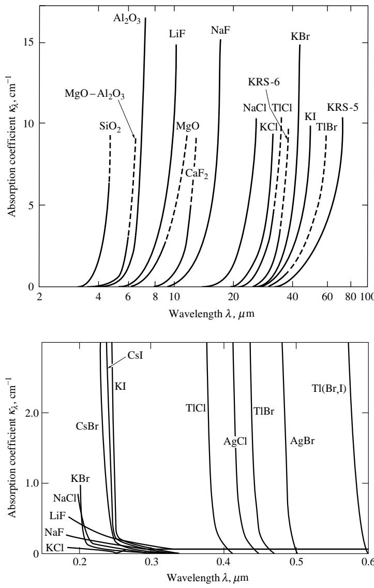  
图13-1 室温下几种离子晶体的光谱吸收系数[2]。图13-2 室温下几种卤化物的光谱吸收系数[2]。

Lorentz模型还预测，价带电子穿过带隙激发到导带会在短波长(通常在紫外附近)产生多个吸收带。图13-2显示了几种卤化物的吸收系数和短波吸收边：在紫外区域基本不透明的材料，在可见光及更长波长区域会变得高度透明。

纯净固体在两个吸收边之间通常高度透明。如果存在大量局域晶格缺陷和/或掺杂剂(称为色心的外来分子)，则可能在中间波长处发生电子激发。有多种模型可以预测此类缺陷的吸收特性，有些很复杂，有些则简单且半经验化。例如Bhattacharyya和Streetman[3]以及Blomberg等[4]开发了预测掺杂对硅吸收系数影响的模型。图13-3展示了Blomberg等的模型与Siregar等[5]和Boyd等[6]对磷掺杂硅在$10.6\mu \mathrm{m}$处(这是$\mathrm{CO_2}$激光材料加工的重要波长)的实验数据对比。吸收系数随掺杂浓度和温度显著增加。根据这两个模型，温度升高导致的增加是由于自由电子数量增加及其各自贡献所致。Timans[7]在1.1至$1.6\mu \mathrm{m}$波长范围也观察到了相同趋势。

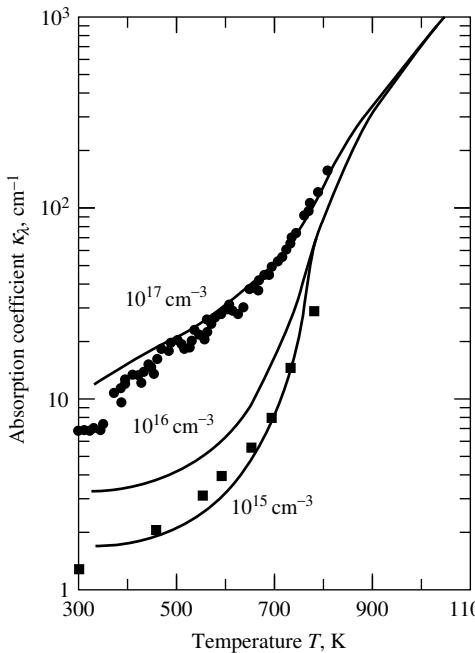  
图13-3 磷掺杂硅在$10.6\mu \mathrm{m}$处的光谱吸收系数；实线：Blomberg等[4]的模型；方形符号$(\blacksquare)$：Boyd等[6]的数据(掺杂浓度$1.1\times 10^{15}\mathrm{cm}^{-3}$)；圆形符号$(\bullet)$：Siregar等[5]的数据(掺杂浓度未知)。

非晶态(即非晶体)固体的吸收行为预测要困难得多，尽管总体趋势非常相似。目前最重要的半透明非晶固体是钠钙玻璃(普通窗玻璃，与图13-1所示的石英或二氧化硅晶体不同)。多位研究者测量了窗玻璃的吸收行为，特别是Genzel[8]、Neuroth[9,10]、Grove和Jellyman[11]以及Bagley等[12]。图1-17显示了窗玻璃在不同温度下的光谱吸收系数行为。从窗玻璃透射率数据(图3-28和3-29)可以预期，玻璃在$\lambda < 2.5\mu \mathrm{m}$波长下相当透明，超过此波长则趋于不透明。

Beder等[13]观察到石英的温度依赖性与硅类似，他们报告在室温和$1500^{\circ}\mathrm{C}$之间吸收系数增加了四倍。

# 13.3 半透明液体的吸收

半透明液体的吸收特性与固体非常相似，同时也表现出一些类似分子气体的行为。在许多液体中可以观察到分子间振动残余(剩余射线带)，以及在紫外区域的电子带隙跃迁残余。在两者之间的波长范围内，具有永久偶极矩的分子会出现分子振动带，这与气体的振动-转动带相似。

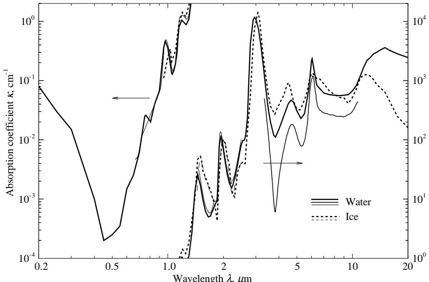  
图13-4 清水(室温下)和透明冰(在$-10^{\circ}\mathrm{C}$[14]和$-25^{\circ}\mathrm{C}$[17]下)的光谱吸收系数；数据来源[14](粗线)、[18](中线)和[17](细线)。

由于水在我们周围世界(实际上也包括我们体内)的普遍存在，水(及其固态形式冰)的吸收特性是最重要的，因此几个世纪以来得到了广泛研究。Irvine和Pollack[14]以及Ray[15]收集并解释了许多研究者关于清水和透明冰的数据。Hale和Querry[16]提供了另一篇仅限于纯水的综述。Kou等[17](波长低于$2.5\mu \mathrm{m}$的水和冰)和Marley等[18]($3.3\mu \mathrm{m}$至$11\mu \mathrm{m}$之间的水)报告了更近期的测量结果。图13-4显示了基于Irvine和Pollack[14]、Kou等[17]和Marley等[18]数据整理的清水(室温下)和透明冰($-10^{\circ}\mathrm{C}$下)的光谱吸收系数。注意固态冰和液态水的相似性。水和冰的吸收光谱最低点位于可见光区，使它们在短距离内几乎透明。最低点位于可见光的蓝色部分($\lambda \simeq 0.45\mu \mathrm{m}$)：大量水体(或透明冰)最能透射蓝光，呈现蓝色色调。在近红外至中红外区域，水和冰显示出几个吸收带(水在1.45、1.94、2.95、4.7和$6.05\mu \mathrm{m}$处，冰略有偏移)。这些吸收带与水蒸气在1.38、1.87、2.7和$6.3\mu \mathrm{m$处的吸收带非常相似(见表11.3)。Irvine和Pollack的数据与Kou等的数据吻合极好，而Marley等在长波区域的数据明显低于Irvine和Pollack：测量如此大的吸收系数极其困难，Marley等的现代测量列出了平均估计误差优于$3\%$。Goldstein和Penner[19](最高$209^{\circ}\mathrm{C}$)以及Hale等[20](最高$70^{\circ}\mathrm{C}$)研究了水吸收系数的温度依赖性，发现其变化相当微弱。随着温度升高，水在相对透明区域变得更透明，在吸收区域变得更不透明。Bohren和Huffman[21]对清水和冰的吸收行为进行了相当详细的讨论。天然水和冰通常含有大量颗粒物(微小生物体、碎屑)和气泡，这些会增加吸收率并散射辐射。虽然对多种天然水和冰进行了测量，但由于天然水成分差异很大，结果难以关联。

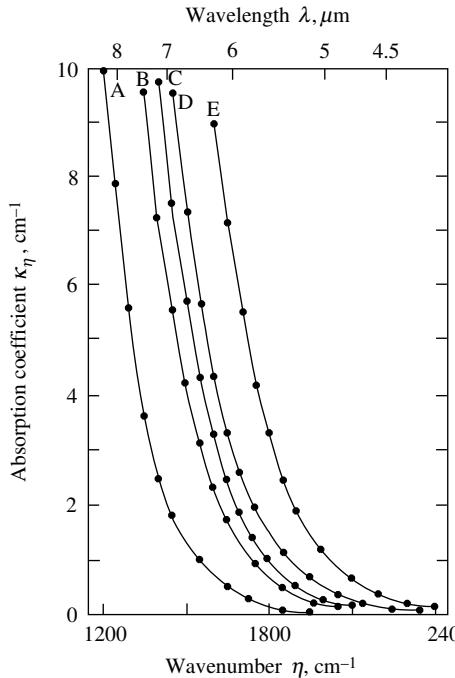  
图13-5 不同温度下LiF的光谱吸收系数；A:300K；B:705K；C:835K；D:975K；E:1160K。LiF的熔点为1115K[22]。

物质在固态和液态下吸收行为的相似性不仅限于水。Barker[22]测量了三种碱金属卤化物(KBr、NaCl和LiF)在$300\mathrm{K}$至熔点以上多个温度下的吸收系数。由于剩余射线带会随温度升高而变宽(见第3.5节)，长波吸收边向短波方向移动。材料从固态变为液态时，吸收系数没有观察到明显的不连续性。图13-5展示了氟化锂(LiF)的行为示例。Skettrup[23]和Woodruff[24]提出了碱金属卤化物晶体吸收系数的半经验模型，得到了简单公式，而Senators等[25]则开发了碱金属卤化物熔体的类似公式。

# 13.4 多孔固体的辐射特性

多位研究者研究了RTE在非均匀介质中的适用性，例如[26-38]。本节我们将假设非均匀介质可以建模为均匀介质，其辐射强度由基于适当连续介质特性的局部平均值描述。

Baillis等人[39]采用实验技术和预测模型研究了开孔碳泡沫的辐射特性。该模型结合了几何光学和衍射理论要素，应用于通过显微技术确定的泡沫几何结构。通过假设开孔由不同厚度的支柱和节点组成(如图13-6示意)，推导出消光系数、散射系数和吸收系数：

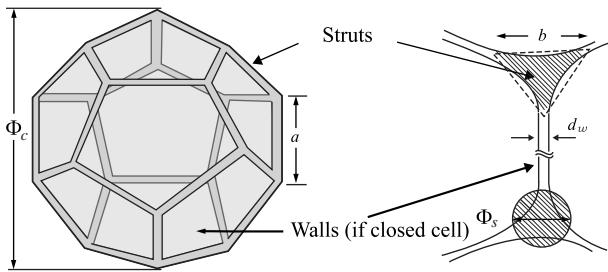  
图13-6

$$
\begin{array}{l}\beta_{\lambda} = N\bigg(\bar{G}_{1} + \frac{\bar{G}_{2}}{2}\bigg),\\ \sigma_{\bar{s}\lambda} = \rho_{\lambda}\beta_{\lambda},\\ \kappa_{\lambda} = (1 - \rho_{\lambda})\beta_{\lambda}, \end{array} \tag{13.1}
$$

式中$N$为单位体积支柱数量，$\bar{G}_{1}$和$\bar{G}_{2}$分别为支柱和节点的平均几何横截面积，$\rho_{\lambda}$为固体的光谱半球反射率。采用预测参数求解RTE获得的泡沫板半球反射率与实测结果吻合良好(图13-7)。但对于4.3mm厚样品的极小半球透射率(因而难以测量)，观测到较大偏差。

Loretz等人[42]采用简单预测模型研究了具有几何光学尺度非均匀性的高孔隙率开孔金属泡沫的辐射特性。通过显微和断层扫描技术确定泡沫结构，假设孔胞(图13-6)由支柱和节点构成。采用Glicksman和Torpey模型[43]计算五边形十二面体或十四面体孔胞的消光系数：

$$
\beta = 4.09\sqrt{\frac{1 - \epsilon}{D^2}}, \tag{13.4}
$$

其中$\epsilon$为孔隙率，$D$为平均孔胞直径。对于忽略节点的五边形十二面体，式(13.4)变为：

$$
\beta = \frac{3}{4} 1.305\frac{b}{a^2}, \tag{13.5}
$$

1式(13.1)中的$\frac{1}{2}$因子在原文献[39]中未出现，但在近期工作如[41]中被加入，可能是为了考虑泡沫中节点数量少于支柱的事实。

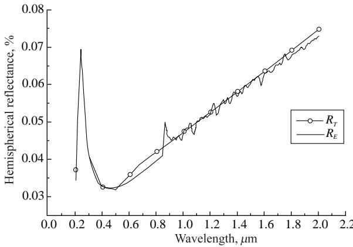  
图13-7 4.3mm厚碳泡沫样品在法向入射下的半球反射率；实验值$(R_{e})$与理论值$(R_{t})$对比[39]

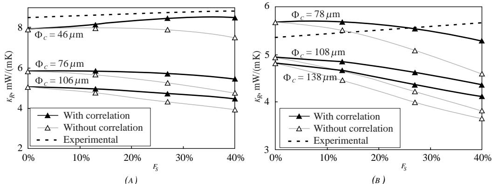  
图13-8 两种不同挤塑聚苯乙烯泡沫的辐射导热系数[40]。$\Phi_c$表示泡沫孔胞直径：(a) $\Phi_c = 76\pm 30\mu \mathrm{m}$；(b) $\Phi_c = 108\pm 30\mu \mathrm{m}$。预测和"实测"导热系数均取决于支柱中未知的固体分数$f_{s}$。

其中$a$和$b$分别表示支柱长度和平均厚度，如图13-6所示。

Coquard等人[44,45]研究了闭孔聚苯乙烯泡沫的辐射特性，Kaemmerlein及其合作者[40]则对挤塑聚苯乙烯泡沫的辐射特性进行了理论预测和实验验证。这些特性是通过将文献[46]的积分方法应用于图13-6所示的弯曲三角形泡沫孔壁和支柱几何结构来确定的。辐射导热系数$k_{r}$采用Rosseland平均消光系数计算，而该消光系数又是通过分别确定聚苯乙烯支柱和薄膜的消光系数得到的。由于泡沫密度较低，假设独立散射成立，整体消光系数通过累加支柱和孔壁的贡献确定，类似于式(13.1)。图13-8展示了$k_{r}$在考虑圆形支柱凹形散射效率修正因子前后的对比，修正后$k_{r}$随支柱比例的变化明显减小。但作者注意到，预测与实测的辐射导热系数变化趋势存在差异。

关于开孔和闭孔泡沫辐射特性更详细的讨论可参阅Dombrovsky和Baillis的著作[41]。

多项研究采用蒙特卡罗光线追踪方法，基于介质各组分的几何结构和特性来确定非均匀介质的有效辐射特性。Tancrez和Taine[29]提出了针对不透明固相多孔介质的方法，后扩展至半透明固相介质[33]。Coquard和Baillis应用光线追踪确定了不透明、漫反射或镜面反射颗粒床的辐射特性[47]。该研究进一步扩展至含吸收散射介质的球体床[48]，并应用于通过断层扫描获得的聚合物泡沫实际几何结构[49]。Petrasch等人[50]和Hausserer等人[51]同样采用断层扫描技术获得了不透明固相网状多孔陶瓷(RPC)的几何结构；后者还将该技术应用于不透明固相反应填充床[52]。Zeghondy及其合作者[33]研究了具有半透明固相的莫来石泡沫。在研究网状多孔陶瓷辐射特性的断层扫描-蒙特卡罗方法中(图13-9)[29,33,50,51]，假设介质在统计上均匀且各向同性，固相为不透明。忽略衍射效应，采用几何光学近似。在代表性单元体积$V$的子体积$V_{0}$的气相中发射大量$N_{r}$随机光线，追踪直至光线与固-气界面相互作用或从$V$表面逸出。记录每条光线与固相碰撞的距离，光线或被吸收，或以镜面或漫反射方式反射。衰减路径长度的分布函数计算如下：

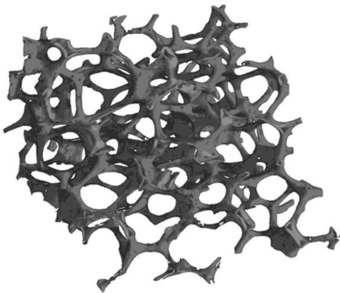  
图13-9 采用计算机断层扫描技术获得的标称孔径$d_{\mathrm{nom}}=2.54\mathrm{mm}$的Rh涂层网状多孔陶瓷三维渲染图[50]

$$
F_{s} = \frac{1}{N_{r}}\int_{s = 0}^{s}dN(s) = 1 - \exp (-\beta s), \tag{13.6}
$$

式中$dN(s)$表示在$s$附近$ds$范围内衰减的光线数量；$F_{s}$量化了光线在0到$s$之间与固-气界面碰撞的概率。散射和吸收系数则通过式(13.2)和(13.3)获得。

图13-10展示了数值计算和实验获得的辐射强度随归一化路径长度的变化。实验值$(\beta_{\mathrm{ex}})$与蒙特卡罗计算值$(\beta_{\mathrm{MC}})$之间10%的相对差异归因于有限尺寸较小RPC样品的局部材料各向异性效应。蒙特卡罗结果对所有立体角积分，而实验测量仅沿单一方向进行。

# 13.5 实验方法

半透明固体或液体的光谱吸收系数可通过多种方法测量。最简单常用的方法是测量已知厚度样品的透射率，如第12.12节对颗粒云的描述。由于固体和液体在空气界面会反射能量，透射率通常通过比较不同厚度样品的透射信号比值来确定。然而，透射法无法测量极低或极高的吸收系数：对于高透射率样品，透射率$\tau$的微小测量误差会导致吸收系数$\kappa$的巨大误差(因为$\kappa$与$\ln\tau$成正比)；而对于高$\kappa$材料，只有极薄样品才能透过足够能量进行测量。这类样品通常采用真空沉积薄膜制备，其特性与母材不同[54]。

吸收系数也可以通过多种反射技术测定。半透明介质光学平滑界面的反射率通过复折射率依赖于折射率$n$和吸收率$k$。而$k$与吸收系数的关系由式(3.79)给出：$\kappa = 4\pi \eta k / n$，其中$\eta = 1 / \lambda$是介质内辐射的波数。因此需要两个数据点来确定$n$和$k$。考虑到反射率对$m = n - ik$的方向依赖性，一些研究者测量了两个不同角度的镜面反射率。Leupacher和Penzkofer[55]表明这可能导致很大误差。其他研究者采用平行和垂直偏振光(椭偏技术)在单一角度测量反射率，但同样可能导致较大误差[55]。Lu和Penzkofer[56]提出了一种克服这些问题的新方法，他们使用平行偏振光改变入射角，直到找到布儒斯特角处的最小反射率点(参见图2-8和2-11)。

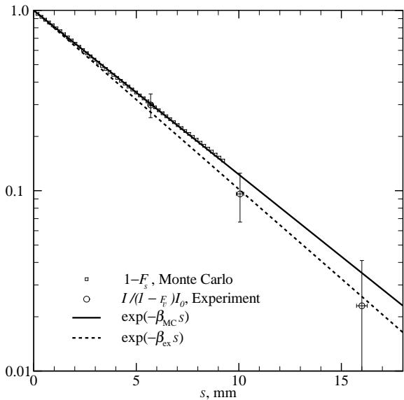  
图13-10 Rh涂层网状多孔陶瓷中辐射强度随归一化路径长度的变化：数值计算结果(方框)与实验数据(圆圈)对比，以及$\beta_{\mathrm{MC}} = 210\mathrm{m}^{-1}$和$\beta_{\mathrm{ex}} = 230\mathrm{m}^{-1}$的指数拟合[53]

另一种反射技术利用了$n$和$k$之间存在因果关系的事实，即它们不是相互独立的。这种因果关系称为Kramers-Kronig关系，可表示为：

$$
\delta (\eta) = \frac{\eta}{\pi}\int_{0}^{\infty}\frac{\ln\rho_{n}(\eta^{\prime})}{\eta^{2} - \eta^{\prime 2}} d\eta^{\prime}, \tag{13.7}
$$

其中$\rho_{n}(\eta)$是样品表面的光谱法向反射率[参见式(2.114)]，$\delta (\eta)$是复反射系数的相位角，式(2.111)：

$$
\overline{r_n} = \sqrt{\rho_n} e^{i\delta} = \frac{n - ik - 1}{n - ik + 1}. \tag{13.8}
$$

因此，如果在光谱的大部分区域测量$\rho_{n}$，则可以通过式(13.7)确定测量光谱内部波数的相位角$\delta$；然后通过式(13.8)容易求得$n$和$k$。该方法特别适合使用FTIR(傅里叶变换红外)光谱仪的实验，该仪器可以在很短时间内进行宽光谱测量，并且通常内置Kramers-Kronig分析功能。关于各种Kramers-Kronig关系的更详细讨论可参阅Wooten[57]以及Bohren和Huffman[21]的著作。Wooten[57]给出了式(13.7)数值计算的描述。

高温下物理性质的测量总是困难的，对于半透明介质尤其如此，因为需要测量两个性质(吸收系数和界面反射率，或等效的$n$和$k$)。Myers等[58]对固体样品的此类方法进行了很好的综述。他们还开发了一种测定小型半透明固体样品光学特性的新方法。他们的装置本质上是Stierwalt[59]所用装置的紧凑布置，可快速连续进行三种不同的辐射测量。图13-11显示了其样品加热装置的前视图和截面图。板状样品安装在均衡镍块内，镍块通过辐射与电加热管耦合。镍块有四个腔体和孔作为辐射靶。水冷石墨块(未显示)位于加热管后面，为通孔提供室温背景，并为探测器提供参考。进行三种辐射测量并与参考比较：(i)位于黑体(腔孔)前的板状样品，(ii)自由辐射样品(通孔)，和(iii)黑体参考。利用第3.8节给出的关系，可以从这些测量推导出光学性质$(n,k,$和$\kappa)$。该方法的优点是可以进行高温$(\simeq 1000^{\circ}\mathrm{C})$测量，只需单个样品，且不需要光学平滑表面。但另一方面，该方法具有透射法的标准弱点(见本节开头的讨论)，并且限于高温(以产生足够强的发射信号)。

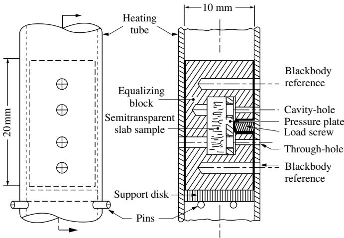  
图13-11 用于测定小型半透明固体样品光学特性的装置中的样品和支架，安装在加热管内[58]

高温液体光学性质的测量更具挑战性。将液体限制在样品架(必须水平)中更困难，测量液层厚度也更困难。此外，由于(通常未知的)表面张力效应，液层厚度可能不均匀。而且高温液体通常具有高反应性，需要密封室。如果在高温下蒸气压变得很大，密封室的窗口将受到侵蚀。Shvarev等[60]使用这种密封室炉装置，采用椭偏技术测量了液态硅在$0.4 - 1.0\mu \mathrm{m}$波长范围内的光学性质。Barker[22,61]设计了一种测量半透明固体板和腐蚀性熔体光学性质的装置。为了隔离样品，他依靠连续惰性气体吹扫的无窗室。他的数据评估需要独立测量界面反射率、铂镜反射率、样品总反射率和样品厚度。此外，还必须估计铂-液体界面的反射率。因此，Barker的方法似乎非常容易受到实验误差的影响。

Ebert和Self[62]报道了一种更精确的装置，限于液体的吸收系数测量。其装置示意图如图13-12a所示。$1700^{\circ}\mathrm{C}$黑体源的孔径通过球面镜M3成像到炉内氧化铝坩埚中的铂镜上。反射信号通过另一个球面镜(M5)聚焦到单色仪和探测器上。光束被调制以消除发射和信号中的背景辐射。液体的透射率通过他们称为"浸没反射器法"的方法测量，如图13-12b所示：可通过三个支撑杆调节的铂镜浸没在填充坩埚的液体表面下方。铂镜略微倾斜于水平面，以使第一表面反射和多次内反射被收集光学系统拒绝。通过升高和降低坩埚(保持铂镜位置不变)来调节液层厚度。与透射技术类似，对两个不同厚度($d_{1}$和$d_{2}$)的信号进行比值，得到厚度为$2(d_{2} - d_{1})$层的透射率。通过拒绝第一反射，并且能够产生和测量非常薄的液层，他们能够测量比Barker高一个数量级的吸收系数，报告合成熔渣的吸收系数高达$70\mathrm{cm}^{-1}$[62]。Gupta和Modest[63](锂盐)、Makino等[64](碱金属碳酸盐)和Zhang等[65](液态玻璃)进行了类似的测量。

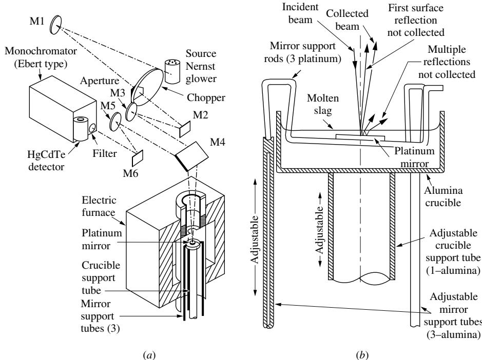  
图13-12 高温液体吸收系数测量。(a) Ebert和Self[62]装置示意图，(b) 他们的浸没反射器布置示意图

泡沫和填充纤维。Kuhn等[66](聚苯乙烯和聚氨酯泡沫绝缘材料)、Sacadura等[67-69](玻璃纤维和碳泡沫)、Mital等[70]以及Hendricks和Howell[71](网状多孔陶瓷)对泡沫进行了测量。Zeghondy等[72]测量了莫来石泡沫的双向反射率，与基于Tancrez和Taine[29,33]蒙特卡罗工具的模型结果吻合良好。Cunnington等[73]测量了单个涂层石英纤维的散射，发现与理论模型定性一致。Cunnington和Lee测量了随机填充高孔隙率纤维材料(航天飞机瓷砖)[74]和气凝胶增强纤维材料[75]的直接透射率和半球反射率；与Lee的模型[76-79]比较显示两种材料都有很好的一致性。

# 参考文献

1. Caps, R., and J. Fricke: "高透明硅气凝胶中的红外辐射传热," Solar Energy, vol. 36, no. 4, pp. 361-364, 1986.
2. Smakula, A.: "合成晶体与偏振材料," Optica Acta, vol. 9, pp. 205-222, 1962.
3. Bhattacharyya, A., and B. G. Streetman: "脉冲CO2激光退火硅的理论考量," Solid State Communications, vol. 36, pp. 671-675, 1980.
4. Blomberg, M., K. Naukkarinen, T. Tuomi, V. M. Airaksinen, M. Luomajarvi, and E. Rauhala: "离子注入硅CO2激光退火中的基底加热效应," Journal of Applied Physics, vol. 54, no. 5, pp. 2327-2328, 1983.
5. Siregar, M. R. T., W. Luthy, and K. Affolter: "硅加工中CO2激光加热动力学," Applied Physics Letters, vol. 36, pp. 797-798, 1988.
6. Boyd, I. W., J. I. Binnie, B. Wilson, and M. J. Colles: "硅中红外辐射吸收," Journal of Applied Physics, vol. 55, no. 8, pp. 3061-3063, 1984.
7. Timans, P. J.: "高温下硅的发射率," Journal of Applied Physics, vol. 74, no. 10, pp. 6353-6364, 1993.
8. Genzel, L.: "20°C至1360°C间玻璃红外吸收测量," Glastechnische Berichte, vol. 24, no. 3, pp. 55-63, 1951.
9. Neuroth, N.: "温度对玻璃红外光谱吸收的影响I," Glastechnische Berichte, vol. 25, pp. 242-249, 1952.
10. Neuroth, N.: "温度对玻璃红外光谱吸收的影响II," Glastechnische Berichte, vol. 26, pp. 66-69, 1953.
11. Grove, F. J., and P. E. Jellvman: "室温至1400°C范围内玻璃的红外透射," Journal of the Society of Glass Technology, vol. 39, no. 186, pp. 3-15, 1955.
12. Bagley, B. G., E. M. Vogel, W. G. French, G. A. Pasteur, J. N. Gan, and J. Tauc: "0.006至22eV范围内钠钙硅玻璃的光学性质," Journal of Non-Crystalline Solids, vol. 22, pp. 423-436, 1976.
13. Beder, E. C., C. D. Bass, and W. L. Shackleford: "0.2μm至3.5μm熔融石英从室温到1500°C的透射率与吸收," Applied Optics, vol. 10, pp. 2263-2268, 1971.
14. Irvine, W. M., and J. B. Pollack: "水与冰球的红外光学性质," ICARUS, vol. 8, pp. 324-360, 1968.
15. Ray, P. S.: "冰与水的宽带复折射率," Applied Optics, vol. 11, pp. 1836-1844, 1972.
16. Hale, G. M., and M. R. Querry: "200nm至200μm波长范围内水的光学常数," Applied Optics, vol. 12, pp. 555-563, 1973.
17. Kou, L., D. Labrie, and P. Chylek: "0.65至2.5μm光谱范围内水与冰的折射率," Applied Optics, vol. 32, pp. 3531-3540, 1993.
18. Marley, N. A., J. S. Gaffney, and M. M. Cunningham: "3000-934cm^-1频率范围内水的朗伯吸收系数," Applied Optics, vol. 33, pp. 8041-8054, 1994.
19. Goldstein, R. J., and S. S. Penner: "27至209°C间液态水的近红外吸收," Journal of Quantitative Spectroscopy and Radiative Transfer, vol. 4, pp. 441-451, 1964.
20. Hale, G. M., M. R. Querry, A. N. Rusk, and D. Williams: "温度对水光谱的影响," Journal of the Optical Society of America, vol. 62, pp. 1103-1108, 1972.
21. Bohren, C. F., and D. R. Huffman: 《小颗粒对光的吸收与散射》, John Wiley & Sons, New York, 1983.
22. Barker, A. J.: "熔化对KBr、NaCl和LiF多声子红外吸收光谱的影响," Journal of Physics C: Solid State Physics, vol. 5, pp. 2276-2282, 1972.
23. Skettrup, T.: "乌尔巴赫规则与透射光相位涨落," Physica Status Solidi (b), vol. 103, pp. 613-621, 1981.
24. Woodruff, T. O.: "20种碱卤化物晶体第一紫外吸收最大能量的经验公式," Solid State Communications, vol. 46, pp. 139-142, 1983.
25. Senatore, G., M. P. Tosi, and T. O. Woodruff: "碱卤化物熔体基本光学吸收的简单公式," Solid State Communications, vol. 52, no. 2, pp. 173-176, 1984.
26. Singh, B. P., and M. Kaviany: "填充床和流化床中的辐射传递: 依赖散射与独立散射," International Journal of Heat and Mass Transfer, vol. 34, pp. 2869-2885, 1991.
27. Singh, B. P., and M. Kaviany: "填充床中辐射传热的建模," International Journal of Heat and Mass Transfer, vol. 35, pp. 1997-1405, 1992.
28. Consalvi, J., B. Porterie, and J. Loraud: "颗粒介质中辐射传热的正式平均方法," International Journal of Heat and Mass Transfer, vol. 45, pp. 2755-2768, 2002.
29. Tancrez, M., and J. Taine: "通过蒙特卡罗技术直接识别多孔介质的吸收和散射系数及相位函数," International Journal of Heat and Mass Transfer, vol. 47, pp. 373-383, 2004.
30. Taine, J., and E. Iacona: "多孔介质中辐射传递的升尺度统计方法:新趋势," ASME Journal of Heat Transfer, vol. 134, p. 031012, 2012.
31. Baillis, D., and J.-F. Sacadura: "分散介质的热辐射特性:理论预测与实验表征," Journal of Quantitative Spectroscopy and Radiative Transfer, vol. 67, pp. 327-363, 2000.
32. Coquard, R., D. Baillis, and J. Randrianalisoa: "泡沫中辐射传递建模的均匀相和多相方法," International Journal of Thermal Sciences, vol. 50, pp. 1648-1663, 2011.
33. Zeghondy, B., E. Iacona, and J. Taine: "通过辐射分布函数识别(RDFI)确定多孔材料的各向异性辐射特性," International Journal of Heat and Mass Transfer, vol. 49, pp. 2810-2819, 2006.
34. Gusarov, A. V.: "具有不规则相界面的两相介质中辐射传递的均匀化," Physical Review B, vol. 77, pp. 144201-1-14, 2008.
35. Gusarov, A. V.: "多相异质介质中辐射传热模型," Physical Review B, vol. 81, pp. 061202-2010.
36. Lipinski, W., J. Petrarch, and S. Haussener: "空间平均定理在两相介质辐射传热中的应用," Journal of Quantitative Spectroscopy and Radiative Transfer, vol. 111, no. 1, pp. 253-258, 2010.
37. Lipinski, W., D. Keene, S. Haussener, and J. Petrarch: "几何光学极限下光学不同组分介质中的连续辐射传热建模," Journal of Quantitative Spectroscopy and Radiative Transfer, vol. 111, no. 16, pp. 2474-2480, 2010.
38. Petrarch, J., S. Haussener, and W. Lipinski: "空间平均定理在两相介质辐射传热中的应用," Journal of Quantitative Spectroscopy and Radiative Transfer, vol. 112, pp. 1450-1459, 2011.
39. Baillis, D., M. Raynaud, and J.-F. Sacadura: "开孔泡沫光谱辐射特性的确定:模型验证," Journal of Thermophysics and Heat Transfer, vol. 14, no. 2, pp. 137-143, 2000.
40. Kaemmerlen, A., C. Vo, F. Asllanj, G. Jeandel, and D. Baillis: "挤出聚苯乙烯泡沫的辐射特性:预测模型与实验结果," Journal of Quantitative Spectroscopy and Radiative Transfer, vol. 111, pp. 865-877, 2010.
41. Dombrovsky, L. A., and D. Baillis: 《分散系统中的热辐射：工程方法》, Begell House, New York, 2010.
42. Loretz, M., R. Coquard, D. Baillis, and E. Maire: "金属泡沫:辐射特性/不同模型间的比较," Journal of Quantitative Spectroscopy and Radiative Transfer, vol. 109(1), pp. 16-27, 2008.
43. Glicksman, L. R., and M. Torpey: "泡沫隔热材料中辐射传热的研究," Technical report, Massachusetts Institute of Technology, Cambridge, MA, 1988.
44. Coquard, R., and D. Baillis: "低密度EPS泡沫中传热的建模," ASME Journal of Heat Transfer, vol. 128, pp. 538-549, 2006.
45. Coquard, R., D. Baillis, and D. Quenard: "膨胀聚苯乙烯泡沫的辐射特性," ASME Journal of Heat Transfer, vol. 131, pp. 012702, 2009.
46. Placido, E., M. C. Arduini-Schuster, and J. Kuhn: "隔热泡沫热性能预测模型," Infrared Physics and Technology, vol. 46, pp. 219-231, 2005.
47. Coquard, R., and D. Baillis: "不透明球形颗粒床的辐射特性:一种新的预测方法," Journal of Thermophysics and Heat Transfer, vol. 18, pp. 178-186, 2004.
48. Coquard, R., and D. Baillis: "含有吸收和散射介质的球体床的辐射特性," Journal of Thermophysics and Heat Transfer, vol. 19, pp. 226-234, 2005.
49. Coquard, R., D. Baillis, and E. Maire: "从断层图像数值研究聚合物泡沫的辐射特性," Journal of Thermophysics and Heat Transfer, vol. 24, pp. 647-658, 2010.
50. Petrasch, J., P. Wyss, and A. Steinfeld: "基于断层扫描的网状多孔陶瓷辐射特性蒙特卡罗测定," Journal of Quantitative Spectroscopy and Radiative Transfer, vol. 105, no. 2, pp. 180-197, 2007.
51. Haussener, S., P. Coray, W. Lipinski, P. Wyss, and A. Steinfeld: "高温加工用网状多孔陶瓷的基于断层扫描的热质传递特性表征," ASME Journal of Heat Transfer, vol. 132, p. 023305, 2010.
52. Haussener, S., W. Lipinski, P. Wyss, and A. Steinfeld: "经历固-气热化学转化的反应填充床中辐射传递的断层扫描分析," ASME Journal of Heat Transfer, vol. 132, p. 061201, 2010.
53. Coray, P., J. Petrasch, W. Lipinski, and A. Steinfeld: "网状多孔陶瓷辐射特性的测定," in Proceedings of the ICHMT Fifth International Symposium on Radiative Transfer, eds. M. P. Menguc and N. Selcuk, Bodrum, Turkey, 2007.
54. Viskanta, R., and E. E. Anderson: "半透明固体中的热传递," in Advances in Heat Transfer, vol. 11, Academic Press, New York, pp. 317-441, 1975.
55. Leupacher, W., and A. Penzkofer: "吸收性凝聚介质折射率的测量," Applied Optics, vol. 23, no. 10, pp. 1554-1558, 1984.
56. Lu, Y., and A. Penzkofer: "强吸收介质光学常数的测量," Applied Optics, vol. 25, no. 1, pp. 221-225, 1986.
57. Wooten, F.: 《固体的光学性质》, Academic Press, New York, 1972.
58. Myers, V. H., A. Ono, and D. P. DeWitt: "高温下半透明材料光学特性的测量方法," AIAA Journal, vol. 24, no. 2, pp. 321-326, 1986.
59. Stierwalt, D. L.: "光学材料的红外光谱发射率," Applied Optics, vol. 5, no. 12, pp. 1911-1915, 1966.  
60. Shvarev, K. M., B. A. Baum, and P. V. Gel'd: "液态硅的光学特性," Sov. Phys. Solid State, vol. 16, no. 11, pp. 2111-2112, May 1975.  
61. Barker, A. J.: "用于腐蚀性熔体红外研究的紧凑无窗反射炉," Journal of Physics E: Scientific Instruments, vol. 6, pp. 241-244, 1973.  
62. Ebert, J. L., and S. A. Self: "熔融煤渣的光学特性," in Heat Transfer Phenomena in Radiation, Combustion and Fires, vol. HTD-106, ASME, pp. 123-126, 1989.  
63. Gupta, S. B., and M. F. Modest: "熔融LiF和Li2S红外吸收系数的测量," 28th AIAA Thermophysics Conference, Orlando, Florida, AIAA paper no. 93-2760, 1993.  
64. Makino, T., M. Edamura, A. Kato, and A. Yoshida: "熔盐的热辐射特性(碱金属碳酸盐特性)," Heat Transfer - Japanese Research, vol. 21, no. 4, pp. 333-339, 1992.  
65. Zhang, Z., M. F. Modest, and S. P. Bharadwaj: "熔融玻璃红外吸收系数的测量," Experimental Heat Transfer, vol. 14, no. 3, pp. 145-156, 2001.  
66. Kuhn, J., H. P. Ebert, M. C. Arduini-Schuster, D. Buettner, and J. Fricke: "聚苯乙烯和聚氨酯泡沫隔热材料中的热传输," International Journal of Heat and Mass Transfer, vol. 35, no. 7, pp. 1795-1801, 1992.  
67. Nicolau, V. P., M. Raynaud, and J.-F. Sacadura: "纤维隔热材料的光谱辐射特性识别," International Journal of Heat and Mass Transfer, vol. 37, pp. 311-324, 1994.  
68. Doermann, D., and J.-F. Sacadura: "开孔泡沫隔热材料中的热传递," ASME Journal of Heat Transfer, vol. 118, no. 1, pp. 88-93, 1996.  
69. Baillis, D., M. Raynaud, and J.-F. Sacadura: "开孔泡沫隔热材料的光谱辐射特性," Journal of Thermophysics and Heat Transfer, vol. 13, no. 3, pp. 292-298, 1999.  
70. Mital, R., J. P. Gore, and R. Viskanta: "高温下多孔陶瓷辐射特性的测量," Journal of Thermophysics and Heat Transfer, vol. 10, no. 1, pp. 33-38, January-March 1996.  
71. Hendricks, T. J., and J. R. Howell: "网状多孔陶瓷中的吸收/散射系数和散射相位函数," ASME Journal of Heat Transfer, vol. 118, no. 1, pp. 79-87, 1996.  
72. Zeghondy, B., E. Iacona, and J. Taine: "莫来石泡沫的实验和RDFI计算辐射特性," International Journal of Heat and Mass Transfer, vol. 49, pp. 3702-3707, 2006.  
73. Cunnington, G. R., T. W. Tong, and P. S. Swathi: "涂层圆柱纤维的辐射角散射," Journal of Quantitative Spectroscopy and Radiative Transfer, vol. 48, no. 4, pp. 353-362, 1992.  
74. Cunnington, G. R., and S. C. Lee: "纤维隔热材料的辐射特性:理论与实验对比," Journal of Thermophysics and Heat Transfer, vol. 10, no. 3, pp. 460-466, 1996.  
75. Cunnington, G. R., S. C. Lee, and S. M. White: "纤维增强气凝胶的辐射特性:理论与实验对比," Journal of Thermophysics and Heat Transfer, vol. 12, no. 1, pp. 17-22, 1998.  
76. Lee, S. C.: "纤维介质中的辐射传递：考虑纤维取向因素," Journal of Quantitative Spectroscopy and Radiative Transfer, vol. 36, no. 3, pp. 253-263, 1986.  
77. Lee, S. C.: "平行于漫射边界排列纤维的辐射传热模型," Journal of Thermophysics and Heat Transfer, vol. 2, no. 4, pp. 303-308, Oct 1988.  
78. Lee, S. C.: "纤维取向对纤维介质中热辐射的影响," International Journal of Heat and Mass Transfer, vol. 32, no. 2, pp. 311-320, 1989.  
79. Lee, S. C.: "纤维介质的散射相位函数," International Journal of Heat and Mass Transfer, vol. 33, no. 10, pp. 2183-2190, 1990.

# References

1. Caps, R., and J. Fricke: "Infrared radiative heat transfer in highly transparent silica aerogel," Solar Energy, vol. 36, no. 4, pp. 361-364, 1986.
2. Smakula, A.: "Synthetic crystals and polarizing materials," Optica Acta, vol. 9, pp. 205-222, 1962.
3. Bhattacharyya, A., and B. G. Streetman: "Theoretical considerations regarding pulsed  $\mathrm{CO_2}$  laser annealing of silicon," Solid State Communications, vol. 36, pp. 671-675, 1980.
4. Blomberg, M., K. Naukkarinen, T. Tuomi, V. M. Airaksinen, M. Luomajarvi, and E. Rauhala: "Substrate heating effects in  $\mathrm{CO_2}$  laser annealing of ion-implanted silicon," Journal of Applied Physics, vol. 54, no. 5, pp. 2327-2328, 1983.
5. Siregar, M. R. T., W. Luthy, and K. Affolter: "Dynamics of  $\mathrm{CO_2}$  laser heating in the processing of silicon," Applied Physics Letters, vol. 36, pp. 797-798, 1988.
6. Boyd, I. W., J. I. Binnie, B. Wilson, and M. J. Colles: "Absorption of infrared radiation in silicon," Journal of Applied Physics, vol. 55, no. 8, pp. 3061-3063, 1984.
7. Timans, P. J.: "Emissivity of silicon at elevated temperatures," Journal of Applied Physics, vol. 74, no. 10, pp. 6353-6364, 1993.
8. Genzel, L.: "Messung der Ultrarot-Absorption von Glas zwischen  $20^{\circ}\mathrm{C}$  and  $1360^{\circ}\mathrm{C}$  (measurement of infrared absorption of glass between  $20^{\circ}\mathrm{C}$  and  $1360^{\circ}\mathrm{C}$ )," Glastechnische Berichte, vol. 24, no. 3, pp. 55-63, 1951.
9. Neuroth, N.: "Der Einfluss der Temperatur auf die spektrale Absorption von Gläsern im Ultraroten, I (Effect of temperature on spectral absorption of glasses in the infrared, I)," Glastechnische Berichte, vol. 25, pp. 242-249, 1952.
10. Neuroth, N.: "Der Einfluss der Temperatur auf die spektrale Absorption von Gläsern im Ultraroten, II (Effect of temperature on spectral absorption of glasses in the infrared, II)," Glastechnische Berichte, vol. 26, pp. 66-69, 1953.
11. Grove, F. J., and P. E. Jellvman: "The infrared transmission of glass in the range from room temperature to  $1400^{\circ}\mathrm{C}$ ," Journal of the Society of Glass Technology, vol. 39, no. 186, pp. 3-15, 1955.
12. Bagley, B. G., E. M. Vogel, W. G. French, G. A. Pasteur, J. N. Gan, and J. Tauc: "The optical properties of soda-lime-silica glass in the region from 0.006 to  $22\mathrm{eV}$ ," Journal of Non-Crystalline Solids, vol. 22, pp. 423-436, 1976.
13. Beder, E. C., C. D. Bass, and W. L. Shackleford: "Transmissivity and absorption of fused quartz between  $0.2\mu \mathrm{m}$  and  $3.5\mu \mathrm{m}$  from room temperature to  $1500^{\circ}\mathrm{C}$ ," Applied Optics, vol. 10, pp. 2263-2268, 1971.
14. Irvine, W. M., and J. B. Pollack: "Infrared optical properties of water and ice spheres," ICARUS, vol. 8, pp. 324-360, 1968.
15. Ray, P. S.: "Broadband complex refractive indices of ice and water," Applied Optics, vol. 11, pp. 1836-1844, 1972.
16. Hale, G. M., and M. R. Querry: "Optical constants of water in the  $200\mathrm{nm}$  to  $200\mu \mathrm{m}$  wavelength region," Applied Optics, vol. 12, pp. 555-563, 1973.
17. Kou, L., D. Labrie, and P. Chylek: "Refractive indices of water and ice in the 0.65 to  $2.5\mu \mathrm{m}$  spectral range," Applied Optics, vol. 32, pp. 3531-3540, 1993.
18. Marley, N. A., J. S. Gaffney, and M. M. Cunningham: "Lambert absorption coefficients of water in the frequency range of  $3000 - 934\mathrm{cm}^{-1}$ ," Applied Optics, vol. 33, pp. 8041-8054, 1994.
19. Goldstein, R. J., and S. S. Penner: "The near-infrared absorption of liquid water at temperatures between 27 and  $209^{\circ}\mathrm{C}$ ," Journal of Quantitative Spectroscopy and Radiative Transfer, vol. 4, pp. 441-451, 1964.
20. Hale, G. M., M. R. Querry, A. N. Rusk, and D. Williams: "Influence of temperature on the spectrum of water," Journal of the Optical Society of America, vol. 62, pp. 1103-1108, 1972.
21. Bohren, C. F., and D. R. Huffman: Absorption and Scattering of Light by Small Particles, John Wiley & Sons, New York, 1983.
22. Barker, A. J.: "The effect of melting on the multiphonon infrared absorption spectra of KBr, NaCl, and LiF," Journal of Physics C: Solid State Physics, vol. 5, pp. 2276-2282, 1972.
23. Skettrup, T.: "Urbach's rule and phase fluctuations of the transmitted light," Physica Status Solidi (b), vol. 103, pp. 613-621, 1981.
24. Woodruff, T. O.: "Empirically derived formula for the energies of the first ultraviolet absorption maximum of 20 alkali-halide crystals," Solid State Communications, vol. 46, pp. 139-142, 1983.
25. Senatore, G., M. P. Tosi, and T. O. Woodruff: "A simple formula for the fundamental optical absorption of alkali halide melts," Solid State Communications, vol. 52, no. 2, pp. 173-176, 1984.
26. Singh, B. P., and M. Kaviany: "Radiative transfer in packed and fluidized beds: Dependent versus independent scattering," International Journal of Heat and Mass Transfer, vol. 34, pp. 2869-2885, 1991.
27. Singh, B. P., and M. Kaviany: "Modelling radiative heat transfer in packed beds," International Journal of Heat and Mass Transfer, vol. 35, pp. 1997-1405, 1992.
28. Consalvi, J., B. Porterie, and J. Loraud: "A formal averaging procedure for radiation heat transfer in particulate media," International Journal of Heat and Mass Transfer, vol. 45, pp. 2755-2768, 2002.
29. Tancrez, M., and J. Taine: "Direct identification of absorption and scattering coefficients and phase function of a porous medium by a Monte Carlo technique," International Journal of Heat and Mass Transfer, vol. 47, pp. 373-383, 2004.
30. Taine, J., and E. Iacona: "Upscaling statistical methodology for radiative transfer in porous media: New trends," ASME Journal of Heat Transfer, vol. 134, p. 031012, 2012.
31. Baillis, D., and J.-F. Sacadura: "Thermal radiation properties of dispersed media: Theoretical prediction and experimental characterization," Journal of Quantitative Spectroscopy and Radiative Transfer, vol. 67, pp. 327-363, 2000.
32. Coquard, R., D. Baillis, and J. Randrianalisoa: "Homogeneous phase and multi-phase approaches for modeling radiative transfer in foams," International Journal of Thermal Sciences, vol. 50, pp. 1648-1663, 2011.
33. Zeghondy, B., E. Iacona, and J. Taine: "Determination of the anisotropic radiative properties of a porous material by radiative distribution function identification (RDFI)," International Journal of Heat and Mass Transfer, vol. 49, pp. 2810-2819, 2006.
34. Gusarov, A. V.: "Homogenization of radiation transfer in two-phase media with irregular phase boundaries," Physical Review B, vol. 77, pp. 144201-1-14, 2008.
35. Gusarov, A. V.: "Model of radiative heat transfer in heterogeneous multiphase media," Physical Review B, vol. 81, pp. 061202-2010.
36. Lipinski, W., J. Petrarch, and S. Haussener: "Application of the spatial averaging theorem to radiative heat transfer in two-phase media," Journal of Quantitative Spectroscopy and Radiative Transfer, vol. 111, no. 1, pp. 253-258, 2010.
37. Lipinski, W., D. Keene, S. Haussener, and J. Petrarch: "Continuum radiative heat transfer modeling in media consisting of optically distinct components in the limit of geometrical optics," Journal of Quantitative Spectroscopy and Radiative Transfer, vol. 111, no. 16, pp. 2474-2480, 2010.
38. Petrarch, J., S. Haussener, and W. Lipinski: "Application of the spatial averaging theorem to radiative heat transfer in two-phase media," Journal of Quantitative Spectroscopy and Radiative Transfer, vol. 112, pp. 1450-1459, 2011.
39. Baillis, D., M. Raynaud, and J.-F. Sacadura: "Determination of spectral radiative properties of open cell foam: Model validation," Journal of Thermophysics and Heat Transfer, vol. 14, no. 2, pp. 137-143, 2000.
40. Kaemmerlen, A., C. Vo, F. Asllanj, G. Jeandel, and D. Baillis: "Radiative properties of extruded polystyrene foams: Predictive model and experimental results," Journal of Quantitative Spectroscopy and Radiative Transfer, vol. 111, pp. 865-877, 2010.
41. Dombrovsky, L. A., and D. Baillis: Thermal Radiation in Disperse Systems: An Engineering Approach, Begell House, New York, 2010.
42. Loretz, M., R. Coquard, D. Baillis, and E. Maire: "Metallic foams: Radiative properties/comparison between different models," Journal of Quantitative Spectroscopy and Radiative Transfer, vol. 109(1), pp. 16-27, 2008.
43. Glicksman, L. R., and M. Torpey: "A study of radiative heat transfer through foam insulation," Technical report, Massachusetts Institute of Technology, Cambridge, MA, 1988.
44. Coquard, R., and D. Baillis: "Modeling of heat transfer in low-density EPS foams," ASME Journal of Heat Transfer, vol. 128, pp. 538-549, 2006.
45. Coquard, R., D. Baillis, and D. Quenard: "Radiative properties of expanded polystyrene foams," ASME Journal of Heat Transfer, vol. 131, pp. 012702, 2009.
46. Placido, E., M. C. Arduini-Schuster, and J. Kuhn: "Thermal properties predictive model for insulating foams," Infrared Physics and Technology, vol. 46, pp. 219-231, 2005.
47. Coquard, R., and D. Baillis: "Radiative characteristics of opaque spherical particle beds: A new method of prediction," Journal of Thermophysics and Heat Transfer, vol. 18, pp. 178-186, 2004.
48. Coquard, R., and D. Baillis: "Radiative characteristics of beds of spheres containing an absorbing and scattering medium," Journal of Thermophysics and Heat Transfer, vol. 19, pp. 226-234, 2005.
49. Coquard, R., D. Baillis, and E. Maire: "Numerical investigation of the radiative properties of polymeric foams from tomographic images," Journal of Thermophysics and Heat Transfer, vol. 24, pp. 647-658, 2010.
50. Petrasch, J., P. Wyss, and A. Steinfeld: "Tomography-based Monte Carlo determination of radiative properties of reticulate porous ceramics," Journal of Quantitative Spectroscopy and Radiative Transfer, vol. 105, no. 2, pp. 180-197, 2007.
51. Haussener, S., P. Coray, W. Lipinski, P. Wyss, and A. Steinfeld: "Tomography-based heat and mass transfer characterization of reticulate porous ceramics for high-temperature processing," ASME Journal of Heat Transfer, vol. 132, p. 023305, 2010.
52. Haussener, S., W. Lipinski, P. Wyss, and A. Steinfeld: "Tomography-based analysis of radiative transfer in reacting packed beds undergoing a solid-gas thermochemical transformation," ASME Journal of Heat Transfer, vol. 132, p. 061201, 2010.
53. Coray, P., J. Petrasch, W. Lipinski, and A. Steinfeld: "Determination of radiative characteristics of reticulate porous ceramics," in Proceedings of the ICHMT Fifth International Symposium on Radiative Transfer, eds. M. P. Menguc and N. Selcuk, Bodrum, Turkey, 2007.
54. Viskanta, R., and E. E. Anderson: "Heat transfer in semi-transparent solids," in Advances in Heat Transfer, vol. 11, Academic Press, New York, pp. 317-441, 1975.
55. Leupacher, W., and A. Penzkofer: "Refractive-index measurement of absorbing condensed media," Applied Optics, vol. 23, no. 10, pp. 1554-1558, 1984.
56. Lu, Y., and A. Penzkofer: "Optical constants measurements of strongly absorbing media," Applied Optics, vol. 25, no. 1, pp. 221-225, 1986.
57. Wooten, F.: Optical Properties of Solids, Academic Press, New York, 1972.
58. Myers, V. H., A. Ono, and D. P. DeWitt: "A method for measuring optical properties of semitransparent materials at high temperatures," AIAA Journal, vol. 24, no. 2, pp. 321-326, 1986.
59. Stierwalt, D. L.: "Infrared spectral emittance of optical materials," Applied Optics, vol. 5, no. 12, pp. 1911-1915, 1966.  
60. Shvarev, K. M., B. A. Baum, and P. V. Gel'd: "Optical properties of liquid silicon," Sov. Phys. Solid State, vol. 16, no. 11, pp. 2111-2112, May 1975.  
61. Barker, A. J.: "A compact, windowless reflectance furnace for infrared studies of corrosive melts," Journal of Physics E: Scientific Instruments, vol. 6, pp. 241-244, 1973.  
62. Ebert, J. L., and S. A. Self: "The optical properties of molten coal slag," in Heat Transfer Phenomena in Radiation, Combustion and Fires, vol. HTD-106, ASME, pp. 123-126, 1989.  
63. Gupta, S. B., and M. F. Modest: "Measurement of infrared absorption coefficient of molten LiF and  $\mathrm{Li}_2\mathrm{S}$ ," 28th AIAA Thermophysics Conference, Orlando, Florida, AIAA paper no. 93-2760, 1993.  
64. Makino, T., M. Edamura, A. Kato, and A. Yoshida: "Thermal radiation properties of molten salt (properties of alkali-metal cathoxides)," Heat Transfer - Japanese Research, vol. 21, no. 4, pp. 333-339, 1992.  
65. Zhang, Z., M. F. Modest, and S. P. Bharadwaj: "Measurement of infrared absorption coefficients of molten glasses," Experimental Heat Transfer, vol. 14, no. 3, pp. 145-156, 2001.  
66. Kuhn, J., H. P. Ebert, M. C. Arduini-Schuster, D. Buettner, and J. Fricke: "Thermal transport in polystyrene and polyurethane foam insulations," International Journal of Heat and Mass Transfer, vol. 35, no. 7, pp. 1795-1801, 1992.  
67. Nicolau, V. P., M. Raynaud, and J.-F. Sacadura: "Spectral radiative properties identification of fiber insulating materials," International Journal of Heat and Mass Transfer, vol. 37, pp. 311-324, 1994.  
68. Doermann, D., and J.-F. Sacadura: "Heat transfer in open cell foam insulation," ASME Journal of Heat Transfer, vol. 118, no. 1, pp. 88-93, 1996.  
69. Baillis, D., M. Raynaud, and J.-F. Sacadura: "Spectral radiative properties of open-cell foam insulation," Journal of Thermophysics and Heat Transfer, vol. 13, no. 3, pp. 292-298, 1999.  
70. Mital, R., J. P. Gore, and R. Viskanta: "Measurements of radiative properties of cellular ceramics at high temperatures," Journal of Thermophysics and Heat Transfer, vol. 10, no. 1, pp. 33-38, January-March 1996.  
71. Hendricks, T. J., and J. R. Howell: "Absorption/scattering coefficients and scattering phase functions in reticulated porous ceramics," ASME Journal of Heat Transfer, vol. 118, no. 1, pp. 79-87, 1996.  
72. Zeghondy, B., E. Iacona, and J. Taine: "Experimental and RDFI calculated radiative properties of a mullite foam," International Journal of Heat and Mass Transfer, vol. 49, pp. 3702-3707, 2006.  
73. Cunnington, G. R., T. W. Tong, and P. S. Swathi: "Angular scattering of radiation from coated cylindrical fibers," Journal of Quantitative Spectroscopy and Radiative Transfer, vol. 48, no. 4, pp. 353-362, 1992.  
74. Cunnington, G. R., and S. C. Lee: "Radiative properties of fibrous insulations: Theory versus experiments," Journal of Thermophysics and Heat Transfer, vol. 10, no. 3, pp. 460-466, 1996.  
75. Cunnington, G. R., S. C. Lee, and S. M. White: "Radiative properties of fiber-reinforced aerogel: Theory versus experiment," Journal of Thermophysics and Heat Transfer, vol. 12, no. 1, pp. 17-22, 1998.  
76. Lee, S. C.: "Radiative transfer through a fibrous medium: Allowance for fiber orientation," Journal of Quantitative Spectroscopy and Radiative Transfer, vol. 36, no. 3, pp. 253-263, 1986.  
77. Lee, S. C.: "Radiation heat transfer model for fibers oriented parallel to diffuse boundaries," Journal of Thermophysics and Heat Transfer, vol. 2, no. 4, pp. 303-308, Oct 1988.  
78. Lee, S. C.: "Effect of fiber orientation on thermal radiation in fibrous media," International Journal of Heat and Mass Transfer, vol. 32, no. 2, pp. 311-320, 1989.  
79. Lee, S. C.: "Scattering phase function for fibrous media," International Journal of Heat and Mass Transfer, vol. 33, no. 10, pp. 2183-2190, 1990.

# 习题

13.1 需要通过透射法测量被限制在两块平行透明窗之间的液体的吸收系数。将使用不同液体厚度下的透射测量检测器信号。

(a) 使用两种厚度下的透射测量，说明如何推导出吸收系数 $\kappa$。确定透射率值和液层厚度的误差如何影响 $\kappa$ 的精度。  
(b) 如果对多种厚度进行透射测量，能否设计一种方法更精确地测量小吸收系数？

13.2 说明如何通过Myers等人[58]的装置（如图13-11所示）的三次测量推导出半透明固体的光学性质 $(n, k, 和 \kappa)$。

