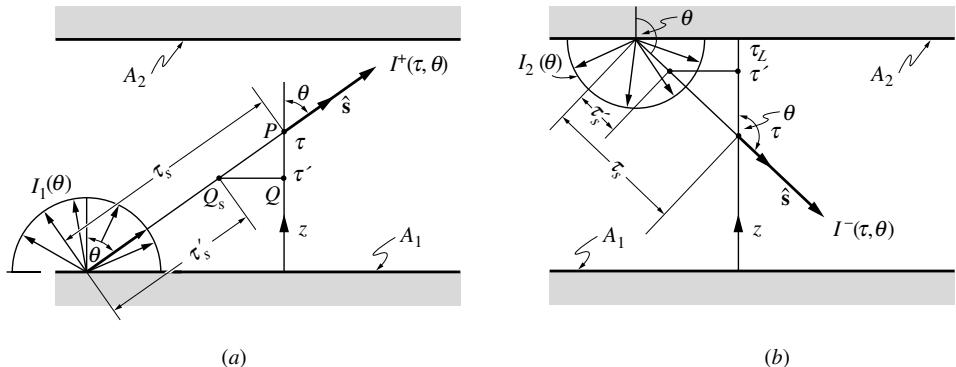
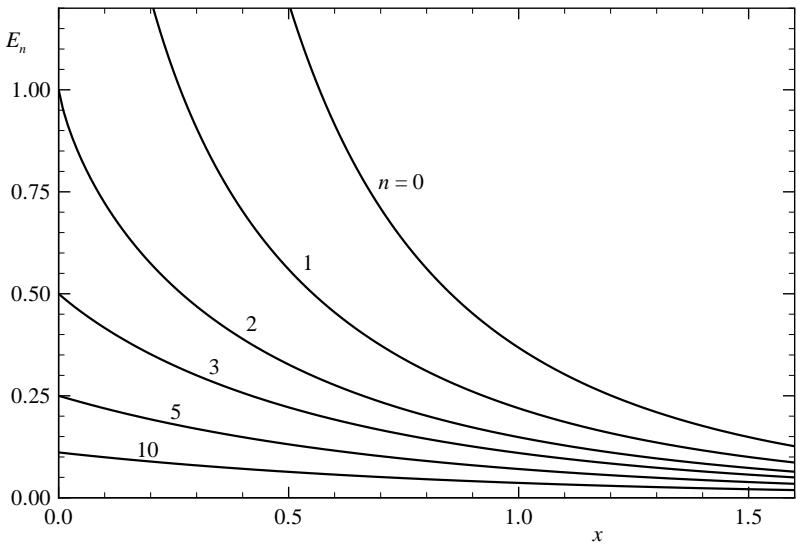
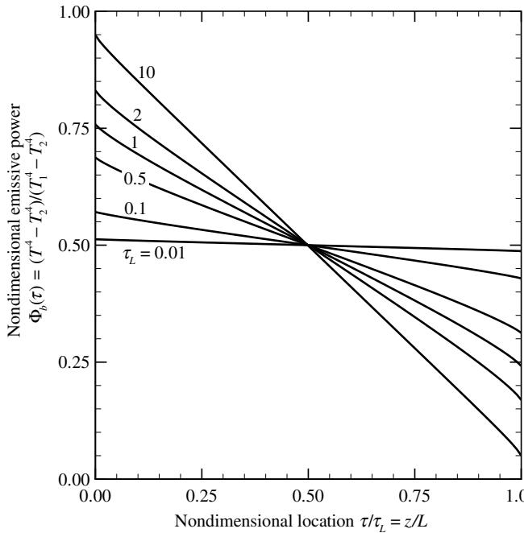
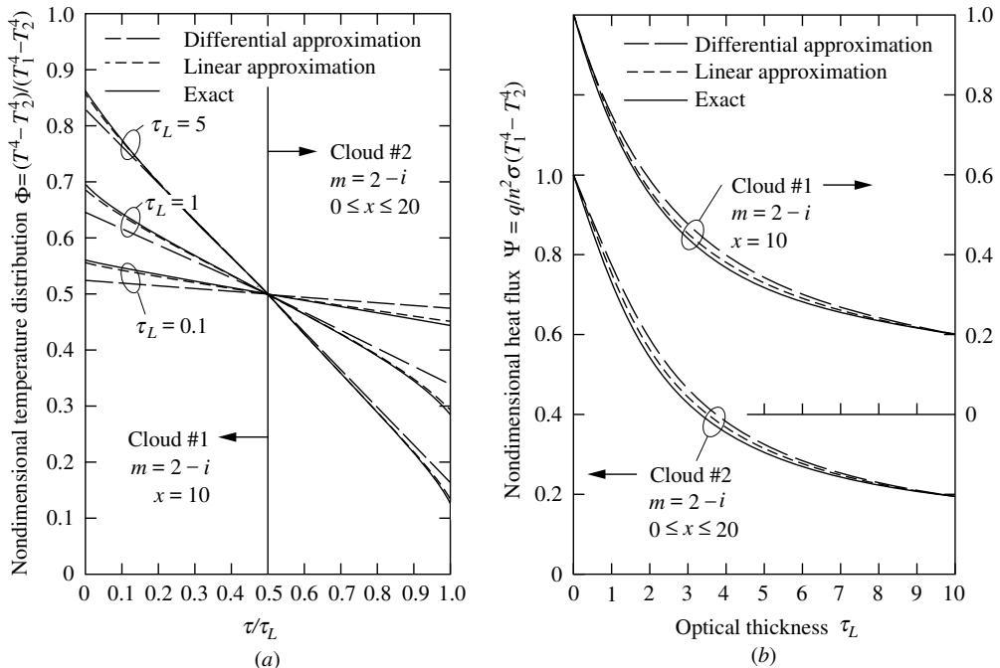
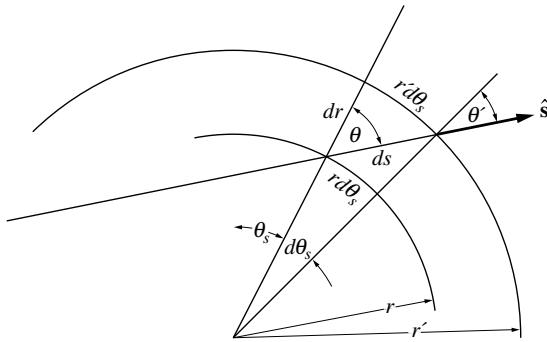
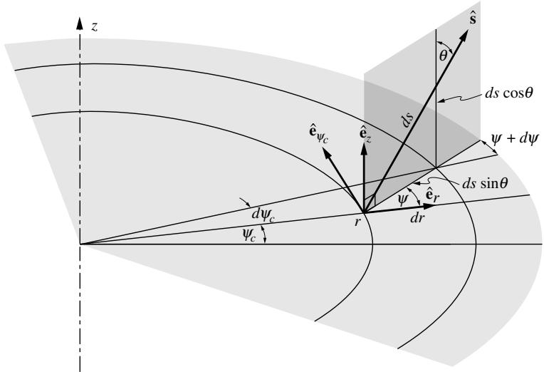

## 内容索引

- [目录](README.md)
- [1 热辐射基础](1-热辐射基础.md)
- [2 基于电磁波理论的辐射特性预测](2-基于电磁波理论的辐射特性预测.md)
- [3 实际表面的辐射特性](3-实际表面的辐射特性.md)
- [4 视角因子](4-视角因子.md)
- [5 灰体漫射表面间的辐射交换](5-灰体漫射表面间的辐射交换.md)
- [6 部分镜面灰体表面间的辐射交换](6-部分镜面灰体表面间的辐射交换.md)
- [7 非理想表面间的辐射交换](7-非理想表面间的辐射交换.md)
- [8 表面交换的蒙特卡洛方法](8-表面交换的蒙特卡洛方法.md)
- [9 传导和对流存在时的表面辐射交换](9-传导和对流存在时的表面辐射交换.md)
- [10 参与介质中的辐射传递方程(RTE)](10-参与介质中的辐射传递方程(RTE).md)
- [11 分子气体的辐射特性](11-分子气体的辐射特性.md)
- [12 颗粒介质的辐射特性](12-颗粒介质的辐射特性.md)
- [13 半透明介质的辐射特性](13-半透明介质的辐射特性.md)
- [14 一维灰体介质的精确解](14-一维灰体介质的精确解.md)
- [15 一维介质的近似求解方法](15-一维介质的近似求解方法.md)
- [16 球谐函数法 (PN-近似)](16-球谐函数法(PN-近似).md)
- [17 离散坐标法 (SN-近似)](17-离散坐标法(SN-近似).md)
- [18 区域法](18-区域法.md)
- [19 准直辐射与瞬态现象](19-准直辐射与瞬态现象.md)
- [20 非灰消光系数的求解方法](20-非灰消光系数的求解方法.md)
- [21 参与介质的蒙特卡洛方法](21-参与介质的蒙特卡洛方法.md)
- [22 辐射与传导和对流的耦合](22-辐射与传导和对流的耦合.md)
- [23 逆辐射传热](23-逆辐射传热.md)
- [24 纳米尺度辐射传热](24-纳米尺度辐射传热.md)
- [附录](附录.md)

- [14.1 引言](#141-引言)
- [14.2 平行平板介质的通用公式](#142-平行平板介质的通用公式)
- [14.3 非散射介质的平面层](#143-非散射介质的平面层)
- [14.4 散射介质的平面层](#144-散射介质的平面层)
- [14.5 球对称介质中的辐射传递](#145-球对称介质中的辐射传递)
- [14.6 圆柱介质中的辐射传递](#146-圆柱介质中的辐射传递)
- [14.7 控制积分方程的数值解](#147-控制积分方程的数值解)
- [参考文献](#参考文献)
- [习题](#习题)

# 第14章

# 一维灰体介质的精确解

# 14.1 引言

第10章推导了吸收、发射和散射介质的辐射传递控制方程，得到了关于辐射强度的积分-微分方程，包含五个独立变量(三个空间坐标和两个方向坐标)。如果介质是非灰体(引入额外变量如波长或频率)和/或存在其他传热模式(需要同时求解与强度非线性相关的总能量守恒方程)，问题将更加复杂。因此，仅存在少数极简单情况的精确解析解。最简单的情况是考虑一维平行平板灰体介质中的热辐射，介质处于辐射平衡(即辐射是唯一的传热模式)或其温度场已知。这类简单问题的解析解已被广泛研究，部分因为一维平行平板介质的重要性，部分因为其简单性可用于测试更一般的求解方法，还因为这类解可为更复杂情况提供定性指示。

本章将为一维平行平板介质开发一些解析解，并包含少量一维圆柱和球形介质的解(不展开推导)。通常假设介质为灰体，所有辐射强度相关量均为全量(即频率积分量)，例如$\begin{array}{r}I_{b} = \int_{0}^{\infty}I_{b\nu}d\nu = n^{2}\sigma T^{4} / \pi \end{array}$。除利用辐射平衡条件$\nabla \cdot \mathbf{q} = 0$的关系外(因为该关系在光谱基础上不成立)，大多数关系也适用于非灰介质的光谱基础。

# 14.2 平行平板介质的通用公式

吸收、发射和散射介质中强度场的控制方程为(来自方程(10.24)):

$$
\mathbf{\hat{s}}\cdot \nabla I = \kappa I_{b} - \beta I + \frac{\sigma_{s}}{4\pi}\int_{4\pi}I(\hat{\mathbf{s}}_{i})\Phi (\hat{\mathbf{s}}_{i},\hat{\mathbf{s}})d\Omega_{i}, \tag{14.1}
$$

  
图14-1 一维平行平板介质中辐射强度的坐标：(a)向上方向，(b)向下方向。

该方程描述了沿$\hat{\mathbf{s}}$方向路径上辐射强度的变化。方程(14.1)的形式解由方程(10.28)给出:

$$
I(\mathbf{r},\hat{\mathbf{s}}) = I_w(\hat{\mathbf{s}})e^{-\tau_s} + \int_0^{\tau_s}S(\tau_s',\hat{\mathbf{s}})e^{-(\tau_s - \tau_s')}d\tau_s', \tag{14.2}
$$

其中$S$是辐射源项(方程(10.25)):

$$
S(\tau_s^{\prime},\hat{\mathbf{s}}) = (1 - \omega)I_b(\tau_s^{\prime}) + \frac{\omega}{4\pi}\int_{4\pi}I(\tau_s^{\prime},\hat{\mathbf{s}}_i)\Phi (\hat{\mathbf{s}},\hat{\mathbf{s}}_i)d\Omega_i, \tag{14.3}
$$

$\tau_{s} = \int_{0}^{s}\beta (s)ds$是基于消光系数的光学厚度或光学深度1，从壁面点$(\tau_s = 0)$沿$\hat{\mathbf{s}}$方向测量到考虑点$(\tau_s' = \tau_s)$。对于平行平板介质，强度变化如图14-1a所示，极角$\theta$从垂直于平板的方向(z方向)测量，方位角$\psi$在平行于平板的平面(x-y平面)内测量:强度为$I_w(\hat{\mathbf{s}}) = I_w(\theta ,\psi)$的辐射从下表面点沿$\theta ,\psi$方向射出，朝向考虑点$P$。该强度通过辐射源(通过发射和内散射，即从其他方向散射到$P$方向的强度)增强。能量$S(\tau_s',\theta ,\psi)d\tau_s'$在微元光学深度$d\tau_s'$释放并朝向$P$传播。由于该能量在从$\tau_s'$到$\tau_s$的路径上也经历吸收和外散射，只有$e^{- (\tau_s' - \tau_s')}$部分实际到达$P$。通常，离开下壁的强度可能在下表面各处变化，辐射源和介质属性也可能在介质内变化，即平行和垂直于平板的方向。

现假设两平板均为等温且各向同性，即每块平板上温度和辐射属性不变化，属性可能显示对极角$\theta$的方向依赖性，但不依赖方位角$\psi$。因此，下板某点离开的强度对所有方位角相同，实际上对该板上所有位置相同；它仅是极角$\theta$的函数。还假设介质温度场和辐射属性仅在垂直于平板方向变化。这意味着位置$Q$的辐射源$S(\tau_s',\theta)$与位置$Q_s$的$S(\tau_s',\theta)$或任何具有相同$z$坐标$\tau ' = \int_0^{z'}\beta dz$的水平位置相同。因此，辐射源$S(\tau ,\theta)$和辐射强度$I(\tau ,\theta)$都仅依赖于单个空间坐标加单个方向坐标。一维情况下辐射源项可简化为:

$$
S(\tau^{\prime},\theta) = (1 - \omega)I_{b}(\tau^{\prime}) + \frac{\omega}{4\pi}\int_{\psi_{i} = 0}^{2\pi}\int_{\theta_{i} = 0}^{\pi}I(\tau^{\prime},\theta_{i})\Phi (\theta ,\psi ,\theta_{i},\psi_{i})\sin \theta_{i}d\theta_{i}d\psi_{i}. \tag{14.4}
$$

对于各向同性散射，$\Phi \equiv 1$，根据入射辐射$G$的定义(方程(10.32))，立即得到:

$$
S(\tau^{\prime}) = (1 - \omega)I_{b}(\tau^{\prime}) + \frac{\omega}{4\pi} G(\tau^{\prime}). \tag{14.5}
$$

换句话说，源项不依赖方向，即各向同性发射和各向同性内散射产生的辐射源也是各向同性的。

如果散射是各向异性的，根据方程(12.99)可写为:2

$$
\Phi (\hat{\mathbf{s}}\cdot \hat{\mathbf{s}}_i) = 1 + \sum_{m = 1}^{M}A_mP_m(\hat{\mathbf{s}}\cdot \hat{\mathbf{s}}_i), \tag{14.6}
$$

假设级数在$M$项后截断。对$\hat{\mathbf{s}}$和$\hat{\mathbf{s}}_i$，从$z$轴测量极角，从$x$轴(在$x-y$平面内)测量方位角，得到方向向量:

$$
\begin{array}{c}\hat{\mathbf{s}} = \sin \theta (\cos \psi \hat{\mathbf{i}} +\sin \psi \hat{\mathbf{j}}) + \cos \theta \hat{\mathbf{k}},\\ \hat{\mathbf{s}}_i = \sin \theta_i(\cos \psi_i\hat{\mathbf{i}} +\sin \psi_i\hat{\mathbf{j}}) + \cos \theta_i\hat{\mathbf{k}}, \end{array} \tag{14.8}
$$

且

$$
\Phi (\theta ,\psi ,\theta_{i},\psi_{i}) = 1 + \sum_{m = 1}^{M}A_{m}P_{m}[\cos \theta \cos \theta_{i} + \sin \theta \sin \theta_{i}\cos (\psi -\psi_{i})]. \tag{14.9}
$$

利用Legendre多项式关系[1]，可将最后关系中的方向依赖性分离为:

$$
\begin{array}{l}{P_m[\cos \theta \cos \theta_i + \sin \theta \sin \theta_i\cos (\psi -\psi_i)] = P_m(\cos \theta)P_m(\cos \theta_i)}\\ {+2\sum_{n = 1}^{m}\frac{(m - n)!}{(m + n)!} P_n^m (\cos \theta)P_n^m (\cos \theta_i)\cos m(\psi -\psi_i),} \end{array} \tag{14.10}
$$

其中$P_n^m$是关联Legendre多项式。因此，散射相函数可重写为:

$$
\begin{array}{l}{\Phi (\theta ,\psi ,\theta_{i},\psi_{i}) = 1 + \sum_{m = 1}^{M}A_{m}P_{m}(\cos \theta)P_{m}(\cos \theta_{i})}\\ {+2\sum_{m = 1}^{M}\sum_{n = 1}^{m}A_{m}\frac{(m - n)!}{(m + n)!} P_{n}^{m}(\cos \theta)P_{n}^{m}(\cos \theta_{i})\cos m(\psi -\psi_{i}).} \end{array} \tag{14.11}
$$

对于一维平行平板几何结构，辐射强度不依赖于方位角，因此可以对方程(14.4)进行$\psi_i$积分。这个积分导出了一维散射相函数：

$$
\Phi (\theta ,\theta_{i}) = \frac{1}{2\pi}\int_{0}^{2\pi}\Phi (\hat{\mathbf{s}}\cdot \hat{\mathbf{s}}_{i})d\psi_{i} = 1 + \sum_{m = 1}^{M}A_{m}P_{m}(\cos \theta)P_{m}(\cos \theta_{i}), \tag{14.12}
$$

因为$\int_0^{2\pi}\cos m(\psi - \psi_i)d\psi_i = 0$。辐射源项变为：

$$
S(\tau^{\prime},\theta) = (1 - \omega)I_{b}(\tau^{\prime}) + \frac{\omega}{2}\int_{0}^{\pi}I(\tau^{\prime},\theta_{i})\Phi (\theta ,\theta_{i})\sin \theta_{i}d\theta_{i}. \tag{14.13}
$$

对于线性各向异性散射，有：

$$
\Phi (\pmb {\xi}\cdot \hat{\pmb{s}}_i) = 1 + A_1P_1(\hat{\pmb{s}}\cdot \hat{\pmb{s}}_i) = 1 + A_1\hat{\pmb{s}}\cdot \hat{\pmb{s}}_i,\quad M = 1, \tag{14.14}
$$

利用入射辐射和辐射热流的定义（分别为方程(10.32)和(10.52)），方程(14.13)简化为：

$$
S(\tau^{\prime},\theta) = (1 - \omega)I_{b}(\tau^{\prime}) + \frac{\omega}{4\pi}\left[G(\tau^{\prime}) + A_{1}q(\tau^{\prime})\cos \theta \right]. \tag{14.15}
$$

现在可以利用几何关系$\tau_{s} = \tau /\cos \theta$和$\tau_{s}^{\prime} = \tau^{\prime} / \cos \theta$（见图14-1a）简化辐射传输方程(14.1)：

$$
\frac{1}{\beta}\frac{dI}{ds} = \frac{dI}{d\tau_s} = \cos \theta \frac{dI}{d\tau} = (1 - \omega)I_b - I + \frac{\omega}{2}\int_0^\pi I(\tau ,\theta_i)\Phi (\theta ,\theta_i)\sin \theta_id\theta_i. \tag{14.16}
$$

类似地，强度表达式(14.2)可简化为：

$$
I^{+}(\tau ,\theta) = I_{1}(\theta)e^{-\tau /\cos \theta} + \int_{0}^{\tau}S(\tau^{\prime},\theta)e^{-(\tau -\tau^{\prime}) / \cos \theta}\frac{d\tau^{\prime}}{\cos\theta},\quad 0< \theta < \frac{\pi}{2}, \tag{14.17}
$$

其中强度用$I^{+}$表示，因为方程(14.17)仅限于来自下壁面$\tau = 0$处（"正"方向）的壁面强度方向。这里的辐射源项$S(\tau^{\prime},\theta)$对于各向同性散射（或$\omega = 0$的无散射情况）由方程(14.5)给出，对于线性各向异性散射由方程(14.15)给出，对于一般各向异性散射由方程(14.12)和(14.13)给出。

类似地可以推导出来自顶壁（沿"负"方向传播）的强度关系。考虑到$\tau_{s}^{\prime} = - (\tau_{L} - \tau^{\prime}) / \cos \theta$和$\tau_{s} = - (\tau_{L} - \tau) / \cos \theta$（注意对于"负"方向$\theta >\pi /2$，$\cos \theta < 0$），我们得到（见图14-1b）：

$$
\begin{array}{l}{I^{-}(\tau ,\theta) = I_{2}(\theta)e^{(\tau_{L} - \tau) / \cos \theta} + \int_{\tau_{L}}^{\tau}S(\tau^{\prime},\theta)e^{(\tau^{\prime} - \tau) / \cos \theta}\frac{d\tau^{\prime}}{\cos\theta}}\\ {= I_{2}(\theta)e^{(\tau_{L} - \tau) / \cos \theta} - \int_{\tau}^{\tau_{L}}S(\tau^{\prime},\theta)e^{(\tau^{\prime} - \tau) / \cos \theta}\frac{d\tau^{\prime}}{\cos\theta},\quad \frac{\pi}{2} < \theta < \pi ,} \end{array} \tag{14.18}
$$

其中$I_{2}(\theta)$是离开$\tau = \tau_{L}$处壁面（壁面2）的强度。通常（且更紧凑）用方向余弦$\mu = \cos \theta$重写方程(14.16)至(14.18)：

$$
\mu \frac{dI}{d\tau} +I = (1 - \omega)I_b + \frac{\omega}{2}\int_{-1}^{1}I(\tau ,\mu_i)\Phi (\mu ,\mu_i)d\mu_i = S(\tau ,\mu), \tag{14.19}
$$

$$
\begin{array}{l}{I^{+}(\tau ,\mu) = I_{1}(\mu)e^{-\tau /\mu} + \int_{0}^{\tau}S(\tau^{\prime},\mu)e^{-(\tau -\tau^{\prime}) / \mu}\frac{d\tau^{\prime}}{\mu},\qquad 0< \mu < 1,}\\ {I^{-}(\tau ,\mu) = I_{2}(\mu)e^{(\tau_{L} - \tau) / \mu} - \int_{\tau}^{\tau_{L}}S(\tau^{\prime},\mu)e^{(\tau^{\prime} - \tau) / \mu}\frac{d\tau^{\prime}}{\mu},\qquad -1< \mu < 0.} \end{array} \tag{14.20b}
$$

对于传热问题，入射辐射$G$和辐射热流$q$是关注的重点。根据入射辐射的定义（方程(10.32)）有：

$$
\begin{array}{l}{G(\tau) = \int_{0}^{2\pi}\int_{0}^{\pi}I(\tau ,\theta)\sin \theta d\theta d\psi = 2\pi \int_{-1}^{+1}I(\tau ,\mu)d\mu}\\ {= 2\pi \left[\int_{-1}^{0}I^{-}(\tau ,\mu)d\mu +\int_{0}^{+1}I^{+}(\tau ,\mu)d\mu \right]}\\ {= 2\pi \left[\int_{0}^{1}I^{-}(\tau , - \mu)d\mu +\int_{0}^{1}I^{+}(\tau ,\mu)d\mu \right]}\\ {= 2\pi \left\{\int_{0}^{1}I_{1}(\mu)e^{-\tau /\mu}d\mu +\int_{0}^{1}I_{2}(-\mu)e^{-(\tau_{L} - \tau) / \mu}d\mu \right.}\\ {\left. + \int_{0}^{1}\left[\int_{0}^{\tau}S(\tau ',\mu)e^{-(\tau -\tau ') / \mu}d\tau ' + \int_{\tau}^{\tau_{L}}S(\tau ', - \mu)e^{-(\tau ' - \tau) / \mu}d\tau '\right]\frac{d\mu}{\mu}\right\} .} \end{array} \tag{14.21}
$$

类似地，对于平行平板介质的辐射热流（方程(10.52)）：

$$
\begin{array}{l}{q(\tau) = \int_{0}^{2\pi}\int_{0}^{\pi}I(\tau ,\theta)\cos \theta \sin \theta d\theta d\psi = 2\pi \int_{-1}^{+1}I(\tau ,\mu)\mu d\mu}\\ {= 2\pi \left\{\int_{0}^{1}I_{1}(\mu)e^{-\tau /\mu}d\mu -\int_{0}^{1}I_{2}(-\mu)e^{-(\tau_{L} - \tau) / \mu}d\mu \right.}\\ {\left. + \int_{0}^{1}\left[\int_{0}^{\tau}S(\tau ',\mu)e^{-(\tau -\tau ') / \mu}d\tau ' - \int_{\tau}^{\tau_{L}}S(\tau ', - \mu)e^{-(\tau ' - \tau) / \mu}d\tau '\right]d\mu \right\} .} \end{array} \tag{14.22}
$$

在本章大部分内容中，我们将研究方程(14.21)和(14.22)在不同情况下的解。我们假设介质中的温度分布$I_{b}(\tau)$已知，或者辐射平衡条件$dq / d\tau = 0$成立。无论哪种情况，我们都对方程(14.1)的方向积分形式感兴趣，如方程(10.59)所示：

$$
\nabla \cdot \mathbf{q} = \kappa (4\pi I_b - G), \tag{14.23}
$$

或者，对于当前一维情况，在除以消光系数$\beta$后（记住$\kappa/\beta = 1 - \sigma_{\mathrm{s}}/\beta$），

$$
\frac{dq}{d\tau} = (1 - \omega)(4\pi I_b - G). \tag{14.24}
$$

我们注意到，到目前为止，所有关系式，特别是方程(14.21)、(14.22)和(14.24)，对于灰体介质在总量基础上成立，对于任何介质在光谱基础上成立。如果辐射平衡占主导，则$dq/d\tau = 0$，或者在存在热源的情况下，

$$
\frac{dq}{d\tau} = \frac{\dot{Q}^{\prime\prime\prime}}{\beta} (\tau), \tag{14.25}
$$

其中$\dot{Q}^{\prime \prime \prime}$是单位时间和体积的局部热生成。方程(14.25)仅对总辐射热流有效，因此只能以这种形式应用于灰体介质。对于这种情况，我们看到入射辐射与黑体强度（因此与温度）密切相关：

$$
4\pi I_{b}(\tau) = G(\tau) + \frac{\dot{Q}^{\prime\prime\prime}}{\kappa} (\tau). \tag{14.26}
$$

# 14.3 非散射介质的平面层

# 具有黑体边界表面的封闭体

由于这是最基本的情况，我们将重新推导这个简单问题的关系式。从方程(14.3)可知，当$\omega = 0$时，$S(\tau^{\prime},\hat{\mathbf{s}}) = I_{b}(\tau^{\prime})$；对于黑体边界表面，离开下板的强度为$I_{1}(\theta) = I_{b1}$，离开顶板的强度为$I_{2}(\theta) = I_{b2}$。因此，对于这个简单情况，辐射源和边界强度都不依赖于方向。方程(14.17)和(14.18)可以重写为：

$$
\begin{array}{l}{{I^{+}(\tau,\theta)=I_{b1}e^{-\tau/\cos\theta}+\int_{0}^{\tau}I_{b}(\tau^{\prime})e^{-(\tau-\tau^{\prime})/\cos\theta}\frac{d\tau^{\prime}}{\cos\theta},\qquad\quad 0< \theta< \frac{\pi}{2},}}\\ {{I^{-}(\tau,\theta)=I_{b2}e^{(\tau_{L}-\tau)/\cos\theta}-\int_{\tau}^{\tau_{L}}I_{b}(\tau^{\prime})e^{(\tau^{\prime}-\tau)/\cos\theta}\frac{d\tau^{\prime}}{\cos\theta},\qquad\frac{\pi}{2}< \theta< \pi.}}\end{array} \tag{14.27b}
$$

将$\mu = \cos \theta$代入后，可以将其转换为：

$$
\begin{array}{l l}{{I^{+}(\tau,\mu)=I_{b1}e^{-\tau/\mu}+\frac{1}{\mu}\int_{0}^{\tau}I_{b}(\tau^{\prime})e^{-(\tau-\tau^{\prime})/\mu}d\tau^{\prime},}}&{{\qquad 0< \mu< 1,}}\\ {{I^{-}(\tau,\mu)=I_{b2}e^{(\tau_{L}-\tau)/\mu}-\frac{1}{\mu}\int_{\tau}^{\tau_{L}}I_{b}(\tau^{\prime})e^{(\tau^{\prime}-\tau)/\mu}d\tau^{\prime},}}&{{\qquad-1< \mu< 0.}}\end{array} \tag{14.28b}
$$

根据入射辐射的定义，从方程(14.21)可得：

$$
\begin{array}{l}{{G(\tau)=2\pi\left[\int_{-1}^{0}I^{-}(\tau,\mu)d\mu+\int_{0}^{1}I^{+}(\tau,\mu)d\mu\right]}}\\ {{\quad=2\pi\left[I_{b1}\int_{0}^{1}e^{-\tau/\mu}d\mu+I_{b2}\int_{0}^{1}e^{-(\tau_{L}-\tau)/\mu}d\mu\right.}}\\ {{\quad\left.+\int_{0}^{\tau}I_{b}(\tau^{\prime})\int_{0}^{1}e^{-(\tau-\tau^{\prime})/\mu}\frac{d\mu}{\mu}d\tau^{\prime}+\int_{\tau}^{\tau_{L}}I_{b}(\tau^{\prime})\int_{0}^{1}e^{-(\tau^{\prime}-\tau)/\mu}\frac{d\mu}{\mu}d\tau^{\prime}\right].}}\end{array} \tag{14.29}
$$

利用壁面强度和辐射源不依赖于方向这一事实，我们将这些项从方向积分中提取出来，并反转描述介质发射项的积分顺序。

类似地，可以从方程(14.22)建立辐射热流的关系：

$$
\begin{array}{l}{{q(\tau)=2\pi\bigg[I_{b1}\int_{0}^{1}e^{-\tau/\mu}\mu d\mu-I_{b2}\int_{0}^{1}e^{-(\tau_{L}-\tau)/\mu}\mu d\mu}}\\ {{\qquad+\int_{0}^{\tau}I_{b}(\tau^{\prime})\int_{0}^{1}e^{-(\tau-\tau^{\prime})/\mu}d\mu d\tau^{\prime}-\int_{\tau}^{\tau_{L}}I_{b}(\tau^{\prime})\int_{0}^{1}e^{-(\tau^{\prime}-\tau)/\mu}d\mu d\tau^{\prime}\bigg].}}\end{array} \tag{14.30}
$$

我们看到重要参数$G,q$和$I_{b}$都不依赖于方向，方向$\mu$在方程(14.29)和(14.30)中仅作为积分变量出现。我们可以通过引入n阶指数积分来以更紧凑的形式写出这些方程。

$$
E_{n}(x) = \int_{1}^{\infty}e^{-xt}\frac{dt}{t^{n}} = \int_{0}^{1}\mu^{n - 2}e^{-x / \mu}d\mu . \tag{14.31}
$$

由于指数积分在辐射传递中非常重要，图14-2展示了它们的示意图，附录E中给出了更详细的讨论。就我们当前的目的而言，我们注意到指数积分的行为类似于"广义负指数函数"，并且

  
图14-2 指数积分$E_{n}(x)$的一般行为

$$
E_{n}(0) = \int_{1}^{\infty}\frac{dt}{t^{n}} = \frac{1}{n - 1}, \tag{14.32}
$$

$$
\frac{d}{dx} E_{n}(x) = -E_{n - 1}(x); \quad \text{or} \quad E_{n}(x) = \int_{x}^{\infty} E_{n - 1}(x) dx. \tag{14.33}
$$

将方程(14.31)代入方程(14.29)和(14.30)可得

$$
\begin{array}{c}{G(\tau) = 2\pi \bigg[I_{b1}E_2(\tau) + I_{b2}E_2(\tau_L - \tau) + \int_0^\tau I_b(\tau ')E_1(\tau -\tau ')d\tau ' + \int_\tau^{\tau_L}I_b(\tau ')E_1(\tau ' - \tau)d\tau '\bigg],}\\ {(14.34)}\\ {q(\tau) = 2\pi \bigg[I_{b1}E_3(\tau) - I_{b2}E_3(\tau_L - \tau) + \int_0^\tau I_b(\tau ')E_2(\tau -\tau ')d\tau ' - \int_\tau^{\tau_L}I_b(\tau ')E_2(\tau ' - \tau)d\tau '\bigg].} \end{array} \tag{14.35}
$$

# 具有指定温度场的介质

如果辐射传热不是主导到可以忽略传导和/或对流的程度，那么寻找温度分布和热通量的问题总是非线性的。对于具有恒定性质的灰体介质的最简单情况，根据方程(14.21)计算的入射辐射与温度的四次方成正比，而传导和/或对流项与温度本身成正比。因此，温度场必须通过迭代过程确定。通常，这包括猜测一个温度场，然后用于确定入射辐射$G$[来自方程(14.34)]和辐射热通量的散度$\nabla \cdot \mathbf{q}$[来自方程(14.24)]。然后将这个辐射源项代入总体能量守恒方程(10.72)，从中确定改进的温度场。重复此过程直到温度场收敛到指定标准内。第22章更详细地讨论了辐射与传导和/或对流的联合处理。还有一些重要的工业应用可以直接假设温度场已知，例如由于非常强的对流而基本等温的旋流燃烧室。

对于灰体介质，方程(14.34)和(14.35)给出了总入射辐射$G$和辐射通量$q$。辐射源项则来自

$$
\frac{dq}{d\tau} = (1 - \omega)(4\pi I_b - G). \tag{14.36}
$$

对于非灰体介质，方程(14.34)和(14.35)仅提供光谱值$G_{\lambda}$和$q_{\lambda}$，总辐射源必须通过积分求得

$$
\frac{dq}{dz} = \int_0^\infty \kappa_\lambda (4\pi I_{b\lambda} - G_\lambda)d\lambda . \tag{14.37}
$$

# 处于辐射平衡的介质

如果其他传热模式可以忽略或不考虑，温度分布未知，必须从辐射平衡条件$dq / dz = 0$确定。这是一个总(光谱积分)热通量，为了使问题易于处理，我们将自己限制在灰体介质[即方程(14.34)和(14.35)处理总性质，或$I_{b} = n^{2}\sigma T^{4} / \pi$]。我们发现$q(\tau) = \text{const}$，从方程(14.26)可得$G = 4\pi I_{b} = 4n^{2}\sigma T^{4}$。方程(14.34)现在成为控制介质内温度分布的积分方程

$$
T^{4}(\tau) = \frac{1}{2}\biggl [T_{1}^{4}E_{2}(\tau) + T_{2}^{4}E_{2}(\tau_{L} - \tau) + \int_{0}^{\tau_{L}}T^{4}(\tau^{\prime})E_{1}(|\tau^{\prime} - \tau |)d\tau^{\prime}\biggr ]. \tag{14.38}
$$

由于热通量

$$
\begin{array}{l}{q(\tau) = 2n^{2}\sigma T_{1}^{4}E_{3}(\tau) - 2n^{2}\sigma T_{2}^{4}E_{3}(\tau_{L} - \tau)}\\ {+2\int_{0}^{\tau}n^{2}\sigma T^{4}(\tau^{\prime})E_{2}(\tau -\tau^{\prime})d\tau^{\prime} - 2\int_{\tau}^{\tau_{L}}n^{2}\sigma T^{4}(\tau^{\prime})E_{2}(\tau^{\prime} - \tau)d\tau^{\prime},} \end{array} \tag{14.39}
$$

在介质中不变化，可以在任何位置评估，方便地选择$\tau = 0$:

$$
q = n^{2}\sigma T_{1}^{4} - 2n^{2}\sigma T_{2}^{4}E_{3}(\tau_{L}) - 2\int_{0}^{\tau_{L}}n^{2}\sigma T^{4}(\tau^{\prime})E_{2}(\tau^{\prime})d\tau^{\prime}. \tag{14.40}
$$

方程(14.40)和(14.39)的区别在于方程(14.40)仅对辐射平衡有效，而方程(14.39)对黑板之间任何灰体介质的更一般情况有效。对于整体解，首先通过求解积分方程(14.38)找到温度场，然后利用温度场知识从方程(14.39)确定辐射热通量。不幸的是，像(14.38)这样的积分方程不存在封闭形式的解；必须通过数值和/或近似方法找到解。在继续求解之前，将方程(14.38)和(14.39)中的参数数量减少到最少是有利的。我们引入无量纲发射功率或温度

$$
\Phi_{b}(\tau) = \frac{T^{4}(\tau) - T_{2}^{4}}{T_{1}^{4} - T_{2}^{4}}, \tag{14.41}
$$

和无量纲辐射热通量

$$
\Psi_{b} = \frac{q}{n^{2}\sigma(T_{1}^{4} - T_{2}^{4})}. \tag{14.42}
$$

  
图14-3 等温平板之间处于辐射平衡的灰体介质的无量纲温度分布

如果我们将这些表达式代入方程(14.38)和(14.39)并使用方程(14.32)和(14.33)，我们发现

$$
\begin{array}{l}\Phi_{b}(\tau) = \frac{1}{2}\left[E_{2}(\tau) + \int_{0}^{\tau_{L}}\Phi_{b}(\tau^{\prime})E_{1}(|\tau -\tau^{\prime}|)d\tau^{\prime}\right],\\ \displaystyle \Psi_{b}(\tau) = 2\left[E_{3}(\tau) + \int_{0}^{\tau}\Phi_{b}(\tau^{\prime})E_{2}(\tau -\tau^{\prime})d\tau^{\prime} - \int_{\tau}^{\tau_{L}}\Phi_{b}(\tau^{\prime})E_{2}(\tau^{\prime} - \tau)d\tau^{\prime}\right], \end{array} \tag{14.43}
$$

或

$$
\Psi_{b} = 1 - 2\int_{0}^{\tau_{L}}\Phi_{b}(\tau^{\prime})E_{2}(\tau^{\prime})d\tau^{\prime}. \tag{14.45}
$$

除了自变量$\tau$外，只有一个参数，即介质的光学厚度$\tau_{L}$，出现在$\Phi_{b}$和$\Psi_{b}$的控制方程中：一旦对于给定的$\tau_{L}$确定了$\Phi_{b}$，就可以确定任何表面温度组合的温度场和辐射热通量。方程(14.43)是一个Fredholm积分方程，可以通过第5.6节中描述的任何方法轻松求解。Heaslet和Warming[2]首次给出了方程(14.43)和(14.45)的数值解。图14-3展示了一系列光学厚度的无量纲温度场。表14.1给出了一些具有代表性的无量纲通量。

观察图14-3可以发现，在辐射平衡状态下，壁面处可能存在温度不连续。在透明介质的极限情况下($\tau_{L} \to 0$)，有$\Phi_{b} = \frac{1}{2}$或$T^{4} \to (T_{1}^{4} + T_{2}^{4}) / 2 = \mathrm{const}$，边界处会出现相应的温度跃变(严格来说，透明或不参与介质$\tau_{L} = 0$可以具有任何温度分布，因为它不会参与计算)。随着光学厚度的增加，温度滑移逐渐减小，直到$\tau_{L} \to \infty$时完全消失。在这种光学厚极限下，无量纲发射功率分布变为线性。这种情况类似于稀薄气体中的传导：当碰撞(吸收)的平均自由程很大时，分子(光子)在平板间自由运动，其平均能量等于表面温度(发射功率)的平均值。如果平均自由程与物理尺寸相比变得非常小，传导通量遵循傅里叶定律，达到扩散极限。

表14.1 平行黑平板间辐射平衡的无量纲辐射热通量$\Psi_{b} = q / n^{2}\sigma (T_{1}^{4} - T_{2}^{4})$，数据来自Heaslet和Warming[2]

| 光学厚度τL | Ψb    | 光学厚度τL | Ψb    |
|------------|-------|------------|-------|
| 0.0        | 1.0000| 0.8        | 0.6046|
| 0.1        | 0.9157| 1.0        | 0.5532|
| 0.2        | 0.8491| 1.5        | 0.4572|
| 0.3        | 0.7934| 2.0        | 0.3900|
| 0.4        | 0.7458| 2.5        | 0.3401|
| 0.5        | 0.7040| 3.0        | 0.3016|
| 0.6        | 0.6672| 5.0        | 0.2077|
| 当τL≫1时，Ψb=4/3/(1.42089+τL) |

# 灰体漫反射边界

如果壁面不是黑体，而是灰体漫反射发射体和反射体，本节的所有推导仍然适用，只是需要将底部和顶部平板出射的辐射通量$\pi I_{b1}$和$\pi I_{b2}$分别替换为有效辐射$J_{1}$和$J_{2}$：

$$
G(\tau) = 2J_{1}E_{2}(\tau) + 2J_{2}E_{2}(\tau_{L} - \tau) + 2\pi \int_{0}^{\tau}I_{b}(\tau^{\prime})E_{1}(\tau -\tau^{\prime})d\tau^{\prime} + 2\pi \int_{\tau}^{\tau_{L}}I_{b}(\tau^{\prime})E_{1}(\tau^{\prime} - \tau)d\tau^{\prime}, \tag{14.46}
$$

$$
q(\tau) = 2J_{1}E_{3}(\tau) - 2J_{2}E_{3}(\tau_{L} - \tau) + 2\pi \int_{0}^{\tau}I_{b}(\tau^{\prime})E_{2}(\tau -\tau^{\prime})d\tau^{\prime} - 2\pi \int_{\tau}^{\tau_{L}}I_{b}(\tau^{\prime})E_{2}(\tau^{\prime} - \tau)d\tau^{\prime}. \tag{14.47}
$$

考虑发射和漫反射的有效辐射可以通过方程(5.26)与普朗克函数相关联：

$$
{\bf q}_{w}\cdot \hat{\bf n} = \frac{\epsilon_{w}}{1 - \epsilon_{w}}\left(\pi I_{bw} - J_{w}\right), \tag{14.48}
$$

或

$$
\begin{array}{rl}\tau = 0: & q_1 = \frac{\epsilon_1}{1 - \epsilon_1}\big(n^2\sigma T_1^4 -J_1\big),\\ \tau = \tau_c: & q_2 = -\frac{\epsilon_2}{1 - \epsilon_2}\big(n^2\sigma T_2^4 -J_2\big). \end{array} \tag{14.49b}
$$

# 给定温度场的介质

对于非黑体表面，入射辐射和辐射通量方程通过有效辐射耦合。首先将方程(14.49)代入方程(14.47)可以确定未知有效辐射，然后计算入射辐射。辐射源项则与黑体表面情况相同。

例14.1. 折射率$n=1$的灰体非散射介质位于两块平行灰板之间。介质在温度$T_{m}$下等温，具有恒定吸收系数$\kappa$。两板均为等温$T_{w}$，具有相同的灰体漫发射率$\epsilon$，间距为$L$。求板间的辐射热通量及其散度。

# 解

辐射热通量由方程(14.47)确定，其中$\tau = \kappa z$，

$$
\begin{array}{l}{q(\tau) = 2J_wE_3(\tau) - 2J_wE_3(\tau_L - \tau) + 2\sigma T_m^4\int_0^\tau E_2(\tau -\tau ')d\tau ' - 2\sigma T_m^4\int_\tau^{\tau_L}E_2(\tau ' - \tau)d\tau '}\\ {= 2J_wE_3(\tau) - 2J_wE_3(\tau_L - \tau) + 2\sigma T_m^4\left[E_3(\tau -\tau ')\right]_0 + E_3(\tau ' - \tau ')\left|_{\tau}^{\tau_L}\right]}\\ {= (J_w - \sigma T_m^4)2[E_3(\tau) - E_3(\tau_L - \tau)],} \end{array}
$$

利用对称性$J_{1}=J_{2}=J_{w}$，且$\pi I_{bm}=\sigma T_m^4=$常数。表面通量、温度和有效辐射的关系由方程(14.48)给出，在$\tau=0$处：

$$
q(0) = \frac{\epsilon}{1 - \epsilon} (\sigma T_w^4 -J_w) = (J_w - \sigma T_m^4)[1 - 2E_3(\tau_L)].
$$

解得$J_{w}$：

$$
J_{w} = \frac{\sigma T_{w}^{4} + (1 / \epsilon - 1)[1 - 2E_{3}(\tau_{L})]\sigma T_{m}^{4}}{1 + (1 / \epsilon - 1)[1 - 2E_{3}(\tau_{L})]},
$$

且

$$
\frac{q(\tau)}{\sigma(T_w^4 - T_m^4)} = \frac{2[E_3(\tau) - E_3(\tau_L - \tau)]}{1 + (1 / \epsilon - 1)[1 - 2E_3(\tau_L)]}.
$$

通量散度可通过先计算入射辐射再使用方程(14.36)求得。但对于多维计算，直接微分热通量表达式更方便：

$$
\frac{dq}{d\tau} (\tau)\big / \sigma (T_w^4 -T_m^4) = -\frac{2[E_2(\tau) + E_2(\tau_L - \tau)]}{1 + (1 / \epsilon - 1)[1 - 2E_3(\tau_L)]}.
$$

若$T_{w}>T_{m}$，则$dq/d\tau$始终为负：通量在$\tau=0$处为正(进入介质)，在中平面为零，在接近$\tau=\tau_{L}$板时越来越负。

# 辐射平衡介质

我们再次限于灰体介质讨论。在无量纲辐射平衡方程(14.41)和(14.42)中用$J_{i}$替换$\pi I_{bi}=n^2\sigma T_i^4$，并设$q_{1}=q_{2}=q=$常数，方程(14.45)变为

$$
\frac{q}{J_1 - J_2} = \Psi_b = 1 - 2\int_0^{\tau_L}\Phi_b(\tau ')E_2(\tau ')d\tau ',
$$

由方程(14.49)得

$$
J_{1} - J_{2} = n^{2}\sigma (T_{1}^{4} - T_{2}^{4}) - \left(\frac{1}{\epsilon_{1}} +\frac{1}{\epsilon_{2}} -2\right)q.
$$

因此，

$$
q = \Psi_{b}(J_{1} - J_{2}) = \Psi_{b}\left[n^{2}\sigma (T_{1}^{4} - T_{2}^{4}) - \left(\frac{1}{\epsilon_{1}} +\frac{1}{\epsilon_{2}} -2\right)q\right],
$$

即

$$
\Psi = \frac{q}{n^2\sigma(T_1^4 - T_2^4)} = \frac{\Psi_b}{1 + \Psi_b\left(\frac{1}{\epsilon_1} + \frac{1}{\epsilon_2} - 2\right)}. \tag{14.50}
$$

类似地，无量纲温度分布为

$$
\Phi (\tau) = \frac{T^4(\tau) - T_2^4}{T_1^4 - T_2^4} = \frac{\Phi_b(\tau) + \left(\frac{1}{\epsilon_2} - 1\right)\Psi_b}{1 + \Psi_b\left(\frac{1}{\epsilon_1} + \frac{1}{\epsilon_2} - 2\right)}. \tag{14.51}
$$

例14.2. 折射率$n=1$、吸收系数$\kappa=0.1\mathrm{cm}^{-1}$的灰体非散射介质位于两个等温圆柱之间。内圆柱高温$(T_{1}=2000\mathrm{K})$且高反射$(\epsilon_{1}=0.1)$；外圆柱强吸收$(\alpha_{2}=\epsilon_{2}=0.9)$，需保持相对低温$(T_{2}\leq400\mathrm{K})$。圆柱间隙$25\mathrm{cm}$。假设导热和对流换热可忽略，且圆柱直径较大$(D_{1}>25\mathrm{cm})$，求外圆柱所需冷却速率以避免过热。

# 解

由于介质厚度远小于圆柱直径，可将间隙建模为一维平行平板，光学厚度$\tau_{\mathrm{L}}=0.1\mathrm{cm}^{-1}\times25\mathrm{cm}=2.5$。由表14.1得$\Psi_{b}=0.3401$，由方程(14.50)：

$$
\Psi = \frac{q}{\sigma(T_1^4 - T_2^4)} = \frac{0.3401}{1 + 0.3401\left(\frac{1}{0.1} + \frac{1}{0.9} - 2\right)} = 0.0830,
$$

且

$$
\begin{array}{rcl}{q_{\mathrm{min}}} & = & {\Psi_{\sigma}\left(T_1^4 -T_2^4,\mathrm{max}\right)}\\ {} & = & {0.0830\times 5.670\times 10^{-12}(2000^4 -400^4)\mathrm{W / cm}^2 = 7.52\mathrm{W / cm}^2.} \end{array}
$$

# 14.4 散射介质的平面层

# 各向同性散射

对于各向同性散射，源函数由方程(14.5)给出：

$$
S(\tau) = (1 - \omega)I_b(\tau) + \frac{\omega}{4\pi} G(\tau), \tag{14.52}
$$

且方程(14.46)和(14.47)中的$I_{b}(\tau^{\prime})$必须替换为$S(\tau^{\prime})$

$$
\begin{array}{l}{G(\tau) = 2J_1E_2(\tau) + 2J_2E_2(\tau_{\mathrm{L}} - \tau) + 2\pi \int_0^\tau S(\tau ')E_1(\tau -\tau ')d\tau ' + 2\pi \int_\tau^\tau S(\tau ')E_1(\tau ' - \tau)d\tau ',}\\ {q(\tau) = 2J_1E_3(\tau) - 2J_2E_3(\tau_{\mathrm{L}} - \tau) + 2\pi \int_0^\tau S(\tau ')E_2(\tau -\tau ')d\tau ' - 2\pi \int_\tau^\tau S(\tau ')E_2(\tau ' - \tau)d\tau '.} \end{array} \tag{14.54}
$$

# 指定温度场的介质

在各向同性散射存在时，方程(14.53)成为关于未知量$G(\tau)$的积分方程。定义一个类似于方程(14.41)的通用无量纲函数：

$$
\Phi (\tau) = \frac{\pi S(\tau) - J_2}{J_1 - J_2}, \tag{14.55}
$$

方程(14.53)可简化为

$$
\Phi (\tau) = (1 - \omega)\frac{\pi I_b(\tau) - J_2}{J_1 - J_2} +\frac{\omega}{2}\bigg[E_2(\tau) + \int_0^{\tau_L}\Phi (\tau)E_1(\tau ') - \tau |)d\tau '\bigg]. \tag{14.56}
$$

当$\omega \rightarrow 1$(纯散射介质)时，方程(14.56)退化为方程(14.43)。对于这种介质，热辐射与温度场解耦(因为没有发射)，无论温度分布如何，辐射平衡都占主导地位。这种行为也可以从方程(14.24)中看出，该方程表明如果$\omega = 1$，则$dq / d\tau = 0$，与$I_{b}(\tau)$无关。

类似地，方程(14.54)可无量纲化为

$$
\Psi (\tau) = \frac{q(\tau)}{J_1 - J_2} = 2\bigg[E_b(\tau) + \int_0^\tau \Phi (\tau ')E_2(\tau -\tau ')d\tau ' - \int_\tau^{\tau_L}\Phi (\tau ')E_2(\tau ' - \tau)d\tau '\bigg]. \tag{14.57}
$$

一旦求得$\Phi (\tau)$的解，辐射通量可由方程(14.57)确定，入射辐射和辐射源项则通过方程(14.55)求得。

# 辐射平衡介质

在灰体介质辐射平衡情况下(假设无内热源产生)，方程(14.26)进一步将源函数简化为

$$
S(\tau) = (1 - \omega)I_b(\tau) + \frac{\omega}{4\pi} G(\tau) = I_b(\tau). \tag{14.58}
$$

因此，前一节关于辐射平衡的所有关系式同样适用于基于消光系数而非吸收系数的各向同性散射介质，其光学厚度为$\begin{array}{r}\tau = \int_0^\tau \beta dz \end{array}$。对于处于辐射平衡的灰体介质，吸收和各向同性散射没有区别：任何在$\tau$处吸收的能量必须在同一位置各向同性地重新发射(尽管波长不同)；任何各向同性散射的能量只是被各向同性地重定向(波长不变)。由于灰体介质是"色盲"的，它无法区分发射和各向同性散射。然而，对于纯散射情况$\omega \rightarrow 1$，没有发射，因此$I_{b}$不再参与计算。对于这种极端情况，方程(14.41)和(14.51)中的$T^4 (\tau)$应替换为$G(\tau) / 4n^2\sigma$。

# 各向异性散射

为演示目的，我们仅考虑具有线性各向异性散射的灰体平板在辐射平衡下的情况。源函数由方程(14.15)给出，简化为

$$
S(\tau ,\mu) = I_b(\tau) + \frac{A_1\omega}{4\pi} q\mu . \tag{14.59}
$$

因此，方程(14.21)和(14.22)变为

$$
\begin{array}{l}{\frac{G(\tau)}{4\pi} = I_b(\tau) = \frac{J_1}{2\pi} E_2(\tau) + \frac{J_2}{2\pi} E_2(\tau_L - \tau) + \frac{1}{2}\int_0^\tau I_b(\tau ')E_1(\tau -\tau ')d\tau '}\\ {+\frac{1}{2}\int_\tau^{\tau_L}I_b(\tau ')E_1(\tau ' - \tau)d\tau ' + \frac{A_1\omega}{8\pi} q[E_3(\tau_L - \tau) - E_3(\tau)],}\\ {q(\tau) = q = 2J_1E_3(\tau) - 2J_2E_3(\tau_L - \tau) + 2\pi \bigg[\int_0^\tau I_b(\tau ')E_2(\tau -\tau ')d\tau '}\\ {-\int_\tau^{\tau_L}I_b(\tau ')E_2(\tau ' - \tau)d\tau ' + \frac{A_1\omega}{2} q\bigg[\frac{2}{3} -E_4(\tau) - E_4(\tau_L - \tau)\bigg].} \end{array} \tag{14.61}
$$

  
图14-4 (a)无量纲温度分布，(b)无量纲热流率；辐射平衡平板。

这些关系在无量纲形式下简化为

$$
\Phi_{b}(\tau) = \frac{\pi I_{b}(\tau) - J_{2}}{J_{1} - J_{2}} = \frac{1}{2}\left\{E_{2}(\tau) + \int_{0}^{\tau_{L}}\Phi_{b}(\tau^{\prime})E_{1}(|\tau -\tau^{\prime}|)d\tau^{\prime}\right.\\ \left. + \frac{A_{1}\omega}{4}\Psi_{b}[E_{3}(\tau_{L} - \tau) - E_{3}(\tau)]\right\} , \tag{14.62}
$$

$$
\Psi_{b} = \frac{q}{J_{1} - J_{2}} = 2\left\{E_{3}(\tau) + \int_{0}^{\tau}\Phi_{b}(\tau^{\prime})E_{2}(\tau -\tau^{\prime})d\tau^{\prime} - \int_{\tau}^{\tau_{L}}\Phi_{b}(\tau^{\prime})E_{2}(\tau^{\prime} - \tau)d\tau^{\prime}\right.\\ \left. + \frac{A_{1}\omega}{4}\Psi_{b}\left[\frac{2}{3} -E_{4}(\tau) - E_{4}(\tau_{L} - \tau)\right]\right\} . \tag{14.63}
$$

一维平面平行各向异性散射介质中的辐射平衡问题已由Modest和Azad[3]解决。他们考虑了多种颗粒云的全Mie各向异性散射，相关参数见第12章表12.1。图14-4展示了云1和云2中辐射热流率和温度分布的代表性结果。还包括了线性各向异性散射的结果(如第12章图12-6所示相位函数的近似)，使用了精确关系式(14.62)和(14.63)，以及微分近似(将在后续两章讨论)。观察到，在去除前向和后向散射峰后，用线性各向异性散射近似复杂相位函数总能得到传热应用的准确结果。

# 14.5 球对称介质中的辐射传递

在平面平行介质中，如果温度场(以及任何辐射特性)仅在垂直于平板的方向上变化，则该问题是一维的。如果极角$\theta$从垂直于平板的方向测量，则辐射强度仅取决于空间坐标$z$和极角$\theta$(由于对称性，不依赖于方位角$\psi$)。类似的情况也存在于一维球对称介质中。设温度场仅在径向$r$上变化，而不随极角$\theta_s$或方位角$\psi_s$变化(其中下标$s$用于强调这些角度指定了球坐标系中的位置，与用于描述方向的$\theta$和$\psi$无关)。如果极方向角$\theta$从径向位置矢量测量，如图14-5所示，则辐射强度仅取决于极角$\theta$，并且由于对称性，不依赖于方位角$\psi$。然而，与图14-1中的平面层不同，在球对称情况下，当光束沿$\S$方向通过介质传播时，极角会发生变化($\theta$随路径长度$s$的增加而持续减小)。因此，由于强度取决于径向位置$r$和方向角$\theta$，方程(14.1)的左侧必须表示为5:

  
图14-5 一维球对称介质的坐标系

$$
\mathfrak{s}\cdot \nabla I = \frac{dI}{ds} = \frac{\partial I}{\partial r}\frac{dr}{ds} +\frac{\partial I}{\partial\theta}\frac{d\theta}{ds}. \tag{14.64}
$$

通过观察图14-5，我们发现$\cos \theta = dr / ds$。此外，根据正弦定理，

$$
\frac{\sin\theta}{r^{\prime}d\theta_{s}} = \frac{\sin\theta^{\prime}}{r d\theta_{s}}\quad \mathrm{或}\quad r\sin \theta = r^{\prime}\sin \theta^{\prime} = \mathrm{const} \tag{14.65}
$$

沿$s$方向成立。对该关系式微分可得

$$
dr\sin \theta +r\cos \theta d\theta = 0,\quad \mathrm{或}\quad \frac{d\theta}{dr} = -\frac{\tan\theta}{r}. \tag{14.66}
$$

将这两个关系式代入方程(14.64)得到

$$
\frac{dI}{ds} = \cos \theta \frac{\partial I}{\partial r} (r,\theta) - \frac{\sin\theta}{r}\frac{\partial I}{\partial\theta} (r,\theta), \tag{14.67}
$$

或者，如果使用简写$\mu = \cos \theta$，

$$
\frac{dI}{ds} = \mu \frac{\partial I}{\partial r} (r,\mu) + \frac{1 - \mu^2}{r}\frac{\partial I}{\partial\mu} (r,\mu), \tag{14.68}
$$

其中我们使用了$d\mu = - \sin \theta d\theta$。将方程(14.68)代入方程(14.1)和(14.3)，并令$\tau = \int_0^r\beta dr$，得到

$$
\mu \frac{\partial I}{\partial\tau} (\tau ,\mu) + \frac{1 - \mu^2}{\tau}\frac{\partial I}{\partial\mu} (\tau ,\mu) = S(\tau ,\mu) - I(\tau ,\mu), \tag{14.69}
$$

其中线性各向异性散射的辐射源项由方程(14.15)给出。

球对称介质中的一维热传递问题最初由Sparrow及其同事[4]研究，他们考察了位于两个同心黑球体之间的灰色非散射介质中的辐射平衡。他们假设介质内有均匀的内热生成，且两个表面具有相同且恒定的温度。Ryhming[5]研究了相同的问题，但没有内热生成，且两个表面温度不同($T_{1}$和$T_{2}$)。Viskanta和Crosbie[6]放宽了黑体壁面的条件，研究了位于两个灰色等温球体(半径分别为$R_{1}$和$R_{2}$，温度为$T_{1}$和$T_{2}$，灰色漫发射率为$\epsilon_{1}$和$\epsilon_{2}$)之间的非散射、灰色、有内热生成的介质。他们发现，以发射功率$E_{b}$表示的温度场可通过下式计算：

$$
E_{b}(\tau) = J_{1} + (J_{2} - J_{1})\Phi (\tau) + \frac{\dot{Q}^{\prime\prime\prime}}{\kappa}\Phi_{s}(\tau). \tag{14.70}
$$

这里$J_{1}$和$J_{2}$是两个球体表面的辐射度，$\dot{Q}^{\prime \prime \prime}$是介质内的(均匀)内热生成率。$\Phi (\tau)$是无内热生成介质的无量纲发射功率，由下式确定：

$$
\begin{array}{l}{\Phi (\tau) = \frac{E_b(\tau) - J_1}{J_2 - J_1} = \frac{1}{2\tau}\left[g(\tau) + \int_{\tau_1}^{\tau_2}K(\tau ,t)\Phi (t)dt\right],}\\ {g(\tau) = \tau_2E_2(\tau_2 - \tau) - \sqrt{\tau_2^2 - \tau_1^2} E_2\left(\sqrt{\tau_2^2 - \tau_1^2} +\sqrt{\tau^2 - \tau_1^2}\right)}\\ {+E_3(\tau_2 - \tau) - E_3\left(\sqrt{\tau_2^2 - \tau_1^2} +\sqrt{\tau^2 - \tau_1^2}\right),}\\ {K(\tau ,t) = \left[E_1(|\tau -t|) - E_1\left(\sqrt{\tau_2^2 - \tau_1^2} +\sqrt{\tau^2 - \tau_1^2}\right)\right]t.} \end{array} \tag{14.73}
$$

$\Phi_{s}(\tau)$是有均匀内热生成但两个表面具有相同辐射度$J_{1}$时的无量纲发射功率，由下式获得：

$$
\Phi_{s}(\tau) = \frac{E_{b} - J_{1}}{\dot{Q}^{\prime\prime\prime} / \kappa} = \frac{1}{4} +\frac{1}{2\tau}\int_{\tau_{1}}^{\tau_{2}}K(\tau ,t)\Phi_{s}(t)dt. \tag{14.74}
$$

一旦确定了函数$\Phi (\tau)$和/或$\Phi_{s}(\tau)$，辐射热流可通过下式计算：

$$
\tau^2 g(\tau) = (J_1 - J_2)\tau_1^2\Psi (\tau) + \frac{\dot{Q}^{\prime\prime\prime}}{\kappa}\left[\frac{\tau^3}{3} -\tau_1^2\Psi_s(\tau)\right], \tag{14.75}
$$

其中

$$
\begin{array}{l}\Psi (\tau) = \frac{2}{\tau_1^2}\left[h(\tau) + \int_{\tau_1}^{\tau_2}H(\tau ,t)\Phi (t)dt\right],\\ \displaystyle \Psi_s(\tau) = \frac{1}{\tau_1^2}\left[\frac{\tau^3}{3} -2\int_{\tau_1}^{\tau_2}H(\tau ,t)\Phi_s(t)dt\right], \end{array} \tag{14.76}
$$

$$
\begin{array}{rl} & h(\tau) = -\tau \tau_2E_3(\tau_2 - \tau) - \sqrt{(\tau_2^2 - \tau_1^2)(\tau^2 - \tau_1^2)} E_3\Big(\sqrt{\tau_2^2 - \tau_1^2} +\sqrt{\tau^2 - \tau_1^2}\Big)\\ & \qquad +(\tau_2 - \tau)E_4(\tau_2 - \tau) - \Big(\sqrt{\tau_2^2 - \tau_1^2} +\sqrt{\tau^2 - \tau_1^2}\Big)E_4\Big(\sqrt{\tau_2^2 - \tau_1^2} +\sqrt{\tau^2 - \tau_1^2}\Big)\\ & \qquad +E_5(\tau_2 - \tau) - E_5\Big(\sqrt{\tau_2^2 - \tau_1^2} +\sqrt{\tau^2 - \tau_1^2}\Big),\\ & H(\tau ,t) = \Big[\tau \mathrm{sgn}(\tau -t)E_2(|\tau -t|) - \sqrt{\tau^2 - \tau_1^2} E_2\Big(\sqrt{\tau^2 - \tau_1^2} +\sqrt{\tau^2 - \tau_1^2}\Big)\\ & \qquad +E_3(|\tau -t|) - E_3\Big(\sqrt{\tau^2 - \tau_1^2} +\sqrt{t^2 - \tau_1^2}\Big)\Big]t, \end{array} \tag{14.79}
$$

表14.2 同心球体间辐射平衡的无量纲通量函数值，来自Viskanta和Crosbie[6]

| τ₂  | R₁/R₂=0.1 | R₁/R₂=0.5 | R₁/R₂=0.9 | Ψₛ   | R₁/R₂=0.5 |
|-----|----------|----------|----------|------|----------|
| 0   | 1.0000   | 1.0000   | 1.0000   | 0.0000 |          |
| 0.1 | 0.9970   | 0.9900   | 0.9946   | 0.0321 |          |
| 0.5 | 0.9844   | 0.9488   | 0.9728   | 0.1678 |          |
| 1.0 | 0.9680   | 0.8976   | 0.9459   | 0.3525 |          |
| 2.0 |          | 0.8006   | 0.8944   | 0.7619 |          |
| 5.0 | 0.8316   | 0.5797   | 0.7625   | 2.1552 |          |
| 10.0| 0.6839   | 0.3834   | 0.6077   |       |          |
| 20.0|          | 0.2250   | 0.4312   |       |          |

其中符号函数$\operatorname{sgn}(t) = t / |t| = \pm 1$，取决于$t$的符号。Viskanta和Crosbie[6]已经针对多种半径比$R_{1}/R_{2}$和光学厚度$\tau_{2}$，将$\Phi,\Psi,\Phi_{s}$和$\Psi_{s}$的解制成表格。他们的无量纲通量函数$\Psi$和$\Psi_{s}$的结果列于表14.2中。与平面平板类似，辐射平衡的表述：

$$
\frac{1}{\tau^2}\frac{d}{d\tau} (\tau^2 q) = \frac{\dot{Q}'''}{\kappa}, \tag{14.80}
$$

意味着$\Psi$和$\Psi_{s}$是常数，方程(14.76)和(14.77)可以在任意$\tau$值下求值。

对于非黑体边界的情况，还需要从方程(14.75)中消去辐射度$J_{1}$和$J_{2}$。类似于平行平板的推导过程（方程(14.48)至(14.50)），我们有：

$$
\begin{array}{rlr}\tau = \tau_1: & & q_1 = \frac{\epsilon_1}{1 - \epsilon_1}\left(n^2\sigma T_1^4 -J_1\right),\\ \tau = \tau_2: & & -q_2 = \frac{\epsilon_2}{1 - \epsilon_2}\left(n^2\sigma T_2^4 -J_2\right). \end{array} \tag{14.81b}
$$

进行能量平衡（即球体1进入的能量加上球体间体积内产生的能量等于球体2出去的能量），我们得到：

$$
4\pi R_1^2 q_1 + \dot{Q}'''\frac{4}{3}\pi (R_2^3 -R_1^3) = 4\pi R_2^2 q_2,
$$

即：

$$
q_{2} = \left(\frac{\tau_{1}}{\tau_{2}}\right)^{2}q_{1} + \frac{1}{3}\frac{\dot{Q}^{\prime\prime\prime}}{\kappa}\frac{\tau_{2}^{3} - \tau_{1}^{3}}{\tau_{2}^{2}}. \tag{14.82}
$$

将方程(14.82)代入(14.81)可得：

$$
\left(\frac{1}{\epsilon_1} -1\right)q_1 + \left(\frac{1}{\epsilon_2} -1\right)\left[\left(\frac{\tau_1}{\tau_2}\right)^2 q_1 + \frac{1}{3}\frac{\dot{Q}'''}{\kappa}\frac{\tau_2^3 - \tau_1^3}{\tau_2^2}\right] = n^2\sigma (T_1^4 -T_2^4) - (J_1 - J_2),
$$

或：

$$
(J_{1} - J_{2})\tau_{1}^{2} = n^{2}\sigma (T_{1}^{4} - T_{2}^{4})\tau_{1}^{2} - \left[\frac{1}{\epsilon_{1}} -1 + \left(\frac{\tau_{1}}{\tau_{2}}\right)^{2}\left(\frac{1}{\epsilon_{2}} -1\right)\right]\tau^{2}q - \frac{1}{3}\frac{\dot{Q}^{\prime\prime\prime}}{\kappa}\left(\frac{1}{\epsilon_{2}} -1\right)\left(\frac{\tau_{1}}{\tau_{2}}\right)^{2}\left(\frac{\tau_{2}^{3}}{\tau_{2}} -\frac{1}{\tau_{1}}\right)\left(\frac{\tau_{1}}{\tau_{2}}\right)^{2} \tag{14.83}
$$

该式可用于从方程(14.75)中消去辐射度。

最近，一些研究者考虑了更为复杂的情况。Pomraning和Siewert[7]首次提出了各向同性散射球状介质的控制积分方程。Thynell和Özisik[8]利用这些方程研究了具有灰色漫反射边界的灰色各向同性散射实心球体。他们的分析适用于任何给定的温度场或变化的内部热生成。最后，Wu和Wang[9]研究了服从菲涅尔定律的外表面非漫反射问题，针对等温、各向同性散射的实心球体。

例14.3。一个折射率$n=1$、吸收系数$\kappa=0.1\mathrm{cm}^{-1}$的灰色非散射介质被包含在两个等温同心球体之间，半径分别为$R_{1}=25\mathrm{cm}$和$R_{2}=50\mathrm{cm}$。内球体温度高$(T_{1}=2000\mathrm{K})$且高反射$(\epsilon_{1}=0.1)$；外球体是强吸收体$(\alpha_{2}=\epsilon_{2}=0.9)$，需要保持相对低温$(T_{2}=400\mathrm{K})$。假设传导和对流传热与辐射相比可以忽略，确定必要的冷却速率。

# 解

我们有一维辐射平衡的同心球体情况，方程(14.75)适用且$\dot{Q}^{\prime \prime \prime}=0$。由$R_{1}/R_{2}=25/50=0.5$和$\tau_{2}=\kappa R_{2}=0.1\times50=5$，从表14.2得到$\Psi=0.5797$。用方程(14.83)消去辐射度：

$$
\tau^2 q = \sigma (T_1^4 -T_2^4)\tau_1^2\Psi -\left[\frac{1}{\epsilon_1} -1 + \left(\frac{\tau_1}{\tau_2}\right)^2\left(\frac{1}{\epsilon_2} -1\right)\right]\tau_1^2 q\Psi ,
$$

即：

$$
\begin{array}{r}\frac{\tau_1^2q}{\tau_1^2\sigma(T_1^4 - T_2^4)} = \frac{q_1}{\sigma(T_1^4 - T_2^4)} = \frac{\Psi}{1 + \left[\frac{1}{\epsilon_1} - 1 + \left(\frac{\tau_1}{\tau_2}\right)^2\left(\frac{1}{\epsilon_2} - 1\right)\right]\Psi}\\ = \frac{0.5797}{1 + \left[\frac{1}{0.1} - 1 + 0.5^2\left(\frac{1}{0.9} - 1\right)\right]0.5797} = 0.0930. \end{array}
$$

这个结果应与例14.2中平行平板相同情况下得到的0.0830进行比较。内球体的热流密度为：

$$
\begin{array}{l}{q_1 = 0.0930\sigma (T_1^4 -T_2^4)}\\ {= 0.0930\times 5.670\times 10^{-12}(2000^4 -400^4)\mathrm{W / cm}^2 = 8.42\mathrm{W / cm}^2.} \end{array}
$$

# 14.6 圆柱介质中的辐射传递

我们现在简要考虑一维圆柱介质的情况，其中温度和辐射特性仅在径向$r$方向变化，而不随轴向位置$z$或方位角$\psi_{c}$变化（我们再次添加下标$c$以强调这个角度指定圆柱坐标系中的位置，与方位方向角$\psi$无关）。对于这种几何形状，最好将方向坐标系设置如下：极角$\theta$从正$z$轴测量，而方位角$\psi$在垂直于它的$r$-$\psi_{c}$平面中测量，如图14-6所示。从图中所示的径向坐标测量方位角，我们认识到辐射强度可能随径向位置$r$和两个方向角$\theta$和$\psi$变化。因此，类似于方程(14.64)，我们有：

$$
\hat{\mathbf{s}}\cdot \nabla I = \frac{dI}{ds} = \frac{\partial I}{\partial r}\frac{dr}{ds} +\frac{\partial I}{\partial\theta}\frac{d\theta}{ds} +\frac{\partial I}{\partial\psi}\frac{d\psi}{ds}. \tag{14.84}
$$

由对称性可知$I(r,\theta,\psi)=I(r,\theta,-\psi)=I(r,\pi-\theta,\psi)$。观察图14-6，我们发现：

$$
\cos \psi = \frac{dr}{ds\sin\theta},\quad \mathrm{or}\quad \frac{dr}{ds} = \sin \theta \cos \psi , \tag{14.85}
$$

  
图14-6 一维圆柱介质的坐标。

其中$ds\sin \theta$是$ds$在$r - \psi_c$平面上的投影。沿着$\hat{\mathbf{s}}$方向的光束传播时，类似于球坐标情况，方位角$\psi$持续减小（与球坐标中的$\theta$不同，见图14-5）。因此，将方程(14.66)中的$\theta$替换为$\psi$，我们得到：

$$
\frac{d\psi}{dr} = -\frac{\tan\psi}{r},\quad \mathrm{or}\quad \frac{d\psi}{ds} = \frac{d\psi}{dr}\frac{dr}{ds} = -\frac{\sin\theta\sin\psi}{r}. \tag{14.86}
$$

另一方面，沿着$\hat{\mathbf{s}}$传播时，与$\mathbf{z}$轴的夹角保持不变，即$d\theta /ds = 0$。将这些关系代入方程(14.84)可得：

$$
\frac{dI}{ds} = \sin \theta \left[\cos \psi \frac{\partial I}{\partial r} (r,\theta ,\psi) - \frac{\sin\psi}{r}\frac{\partial I}{\partial\psi} (r,\theta ,\psi)\right]. \tag{14.87}
$$

适用于一维圆柱介质的传输方程可由方程(14.1)和(14.3)导出：

$$
\sin \theta \left[\cos \psi \frac{\partial I}{\partial\tau} (\tau ,\theta ,\psi) - \frac{\sin\psi}{\tau}\frac{\partial I}{\partial\psi} (\tau ,\theta ,\psi)\right] = S(\tau ,\theta ,\psi) - I(\tau ,\theta ,\psi), \tag{14.88}
$$

其中$\tau = \int_0^r\beta dr$。这个关系也可以通过识别方程(14.84)左侧得到（参见图14-6）：

$$
\begin{array}{c}{\hat{\mathbf{s}} = \sin \theta \cos \psi \hat{\mathbf{e}}_r + \sin \theta \sin \psi \hat{\mathbf{e}}_{\psi_c} + \cos \theta \hat{\mathbf{e}}_z,}\\ {\psi +\psi_c = \mathrm{const~along~}\hat{\mathbf{s}},} \end{array} \tag{14.89b}
$$

并使用柱坐标系下的梯度算子：

$$
\nabla = \frac{\partial}{\partial r}\hat{\mathbf{e}}_r + \frac{1}{r}\frac{\partial}{\partial\psi_c}\hat{\mathbf{e}}_{\psi_c} + \frac{\partial}{\partial z}\hat{\mathbf{e}}_z,
$$

其中$d\psi_{c} = - d\psi$且$\partial I / \partial z = 0$。辐射源函数的通用形式由方程(14.3)给出；对于线性各向异性散射，方程(14.15)仍然适用，只需将$\hat{\mathbf{e}}_r\cdot \hat{\mathbf{s}} = \cos \theta$（适用于平板和球体，见图14-1和14-5）替换为$\hat{\mathbf{e}}_r\cdot \hat{\mathbf{s}} = \sin \theta \cos \psi$（适用于圆柱体，见图14-6），即：

$$
S(\tau ,\theta ,\psi) = (1 - \omega)I_b(\tau) + \frac{\omega}{4\pi}\left[G(\tau) + A_1q(\tau)\sin \theta \cos \psi \right]. \tag{14.90}
$$

表14.3 灰色非散射等温圆柱体的无量纲热损失，$\Psi = q(\tau_{R}) / (n^{2}\sigma T^{4}-$ $J_{w})$  

| τR  | Ψ     | τR  | Ψ     |
|-----|-------|-----|-------|
| 0.1 | 0.1770| 1.0 | 0.8143|
| 0.2 | 0.3172| 1.5 | 0.9047|
| 0.3 | 0.4299| 2.0 | 0.9458|
| 0.4 | 0.5213| 2.5 | 0.9662|
| 0.5 | 0.5960| 3.0 | 0.9772|
| 0.6 | 0.6573| 3.5 | 0.9836|
| 0.7 | 0.7080| 4.0 | 0.9877|
| 0.8 | 0.7500| 4.5 | 0.9904|
| 0.9 | 0.7850| 5.0 | 0.9923|

圆柱介质中的一维传热问题最初由Heaslet和Warming[10]研究。他们考察了包含在等温黑体圆柱容器内的各向同性散射介质情况，处理了两种情形：(i)介质内均匀发热的辐射平衡，以及(ii)等温介质。虽然他们展示了一些图形结果，但未提供表格数据。

对于具有任意但给定温度分布的一维灰色线性各向异性散射圆柱体，Azad和Modest[11]采用不同方法给出了解。这里我们列出他们对于无散射(ω=0)简单情况的解：

$$
\begin{array}{l}{q(\tau) = \left[n^{2}\sigma T^{4}(\tau_{R}) - J_{w}\right]F(\tau ,\tau_{R})}\\ {-\int_{0}^{\tau}\frac{d}{d\tau^{\prime}} (n^{2}\sigma T^{4})\frac{\tau^{\prime}}{\tau} F(\tau^{\prime},\tau)d\tau^{\prime} - \int_{\tau}^{\tau_{R}}\frac{d}{d\tau^{\prime}} (n^{2}\sigma T^{4})F(\tau ,\tau^{\prime})d\tau ,} \end{array} \tag{14.91}
$$

其中

$$
F(\tau ,\tau^{\prime}) = -\frac{4}{\pi}\int_{0}^{\pi}\int_{0}^{\pi /2}\exp \left[-\frac{\tau}{\sin\theta}\left(\cos \psi +\sqrt{\left(\frac{\tau^{\prime}}{\tau}\right)^{2} - \sin^{2}\psi}\right)\right]\sin^{2}\theta \cos \psi d\theta d\psi . \tag{14.92}
$$

方程(14.91)与一维平板的等效表达式(14.39)(分部积分后)非常相似：不同于相对简单(且广泛列表)的指数积分E₃(τ'-τ)，这里使用了一个更复杂的几何函数F(τ,τ')。对于等温圆柱体，方程(14.91)可以在τ=τ_R处显式求值，其中F(τ_R,τ_R)用修正贝塞尔函数表示。表14.3列出了方程(14.91)在τ=τ_R处的一些代表性结果。

同心圆柱体间的热辐射最初由Kesten[12]研究，他考察了已知温度分布的非散射灰色气体。Pandey和Cogley[13]与Loyalka[14]研究了同心圆柱间灰色各向同性散射介质在辐射平衡下的情况。控制方程变得相当复杂，这里不再复现。由于这种复杂性，两种解法都不完全精确：Pandey和Cogley使用了一些近似几何函数，而Loyalka采用简单变分法求解控制积分方程。与Perlmutter和Howell[15]的"精确"蒙特卡洛解比较表明，Loyalka的结果基本可视为精确解。表14.4列出了以表面辐射度为参数的无量纲辐射热流的一些代表性结果，

表14.4 辐射平衡下同心圆柱间的无量纲辐射传热，Ψ = q(τ₁)/(J₁ - J₂)

| 光学厚度 τ₂-τ₁ | 半径比 R₁/R₂ | Ψ (0.1) | Ψ (0.5) | Ψ (0.9) |
|---------------|-------------|--------|--------|--------|
| 0.1           | 0.9893      | 0.9677 | 0.9462 |
| 0.5           | 0.9464      | 0.8476 | 0.7688 |
| 1.0           | 0.8937      | 0.7225 | 0.6167 |
| 2.0           | 0.7956      | 0.5446 | 0.4371 |
| 3.0           | 0.7105      | 0.4313 | 0.3367 |
| 4.0           | 0.6377      | 0.3549 | 0.2727 |
| 5.0           | 0.5763      | 0.3010 | 0.2291 |
| 6.0           | 0.5250      | 0.2615 | 0.1976 |
| 7.0           | 0.4810      | 0.2308 | 0.1738 |
| 8.0           | 0.4429      | 0.2060 | 0.1549 |
| 9.0           | 0.4102      | 0.1864 | 0.1398 |
| 10.0          | 0.3821      | 0.1703 | 0.1278 |

$$
\Psi = \frac{q(\tau_1)}{J_1 - J_2}, \tag{14.93}
$$

这些结果已在表14.4中给出。

对于非黑体壁面，可以按照与同心球完全相同的方式从方程(14.93)中消去辐射强度。根据方程(14.83)，当$A_{1} / A_{2} = R_{1} / R_{2} = \tau_{1} / \tau_{2}$且$\dot{Q}^{\prime \prime \prime} = 0$时，

$$
J_{1} - J_{2} = n^{2}\sigma (T_{1}^{4} - T_{2}^{4}) - \left[\frac{1}{\epsilon_{1}} -1 + \frac{\tau_{1}}{\tau_{2}}\left(\frac{1}{\epsilon_{2}} -1\right)\right]q_{1},
$$

以及

$$
\frac{q_1}{n^2\sigma(T_1^4 - T_2^4)} = \frac{\Psi}{1 + \left[\frac{1}{\epsilon_1} - 1 + \frac{\tau_1}{\tau_2}\left(\frac{1}{\epsilon_2} - 1\right)\right]\Psi}. \tag{14.94}
$$

例14.4. 针对同心圆柱情况重复例14.3的计算。

# 解答

当$\tau_{2} = 5$且$\tau_{1} = 2.5$时，$\tau_{2} - \tau_{1} = 2.5$。通过表14.4中$\tau_{2} - \tau_{1} = 2.0$和$\tau_{2} - \tau_{1} = 3.0$之间的(非线性)插值，可得$\Psi \simeq 0.48$。因此，

$$
\frac{q_1}{\sigma(T_1^4 - T_2^4)} = \frac{0.48}{1 + \left[\frac{1}{0.1} - 1 + 0.5\left(\frac{1}{0.9} - 1\right)\right]0.48} = 0.0898,
$$

且

$$
q_{1} = 0.0898\times 5.670\times 10^{-12}(2000^{4} - 400^{4}) = 8.13W / \mathrm{cm}^{2}.
$$

我们观察到，在相同条件下，同心球之间的热损失最大，其次是同心圆柱，最后是平行平板。此外，从表14.2和14.4可以看出，热损失随着半径比$R_{1} / R_{2}$的减小而增加。这一现象可以解释为：单位面积上，(内)球面与(外)球面的热交换面积$(A_{2} / A_{1} = R_{2}^{2} / R_{1}^{2})$大于同心圆柱$(A_{2} / A_{1} = R_{2} / R_{1})$或平行平板$(A_{2} / A_{1} = 1)$的情况。同样的解释也适用于半径比减小的情况。

# 14.7 控制积分方程的数值解

控制积分方程可以通过多种解析和/或数值技术求解，本文不会详细讨论这些方法。

解析技术的一个例子是使用Chandrasekhar的$X-$和Y-函数，基于不变性原理，这在Chandrasekhar的著作[16]中有详细描述。例如，Heaslet和Warming[2]用这些$X-$和$Y$-函数的矩表示了方程(14.43)中的无量纲温度$\Phi_b$。这些矩通过数值积分确定，使用Chandrasekhar的$X-$和$Y$-函数的表格值。Case的正模展开技术[17,18]对于线性积分方程的作用，就像分离变量法对于偏微分方程的作用一样。该技术最初是为中子输运理论开发的，后来被Ferziger和Simmons[19,20]以及Siewert和Ozisik[21-27]应用于辐射传热。Ozisik的著作[28]中有详细描述。Siewert及其同事[29,30]进一步发展了Case的正模方法，通过幂级数形式寻找解。这种方法被称为$F_{N}$-方法，最初也应用于中子输运，后来才应用于热辐射[31]。

控制积分方程的数值解可以通过多种方法获得。最简单的方法是第5.6节讨论的标准数值积分。由于被积函数通常包含奇点[参见方程(14.43)]，在应用积分前必须消除这些奇点[2]。奇点问题也可以通过用函数形式近似未知变量来解决，这样可以解析计算这些积分。例如，Ozisik及其同事[32-35]使用Galerkin方法[36]求解了几个平面平行问题的控制积分方程。在这种方法中，未知因变量[如方程(14.43)中的$\Phi (\tau)$]被近似为一组独立函数$\phi_{i}(\tau)$的级数，即

$$
\Phi (\tau) = C_1\phi_1(\tau) + C_2\phi_2(\tau) + \dots = \sum_{i = 1}^{N}C_i\phi_i(\tau), \tag{14.95}
$$

其中$C_i$是未知常数。通过将控制方程乘以每个函数$\phi_{i}(\tau)$，然后在整个域上积分，可以得到$N$个关于未知常数的联立代数方程。方程(14.95)中的独立函数通常选择为自变量的幂次，例如$\phi_{i}(\tau) = \tau^{i - 1}$$(i = 1,2,\ldots)$，尽管为了利用正交性，也使用了Legendre多项式[37]。Galerkin方法即使在级数截断后也能提供高精度的结果，尽管代价是繁琐的解析或数值积分。对于更一般的几何形状，使用相关的有限元方法变得更加实用，如Reddy和Murty[38]所应用的。

一个稍简单的方法是点配置法与分段连续样条近似未知变量相结合。在这种方法中，未知因变量(如$\Phi (\tau)$)被近似为一个涉及$N + 1$个节点值$\Phi_i =$$\Phi (\tau_i),i = 0,1,2,\ldots ,N$的样条函数。例如，如果使用标准三次样条[39]，

$$
\begin{array}{r}\Phi = \Phi_i + B_i(\tau -\tau_i) + C_i(\tau -\tau_i)^2 +D_i(\tau -\tau_i)^3,\\ \tau_i\leq \tau \leq \tau_{i + 1},i = 0,1,\ldots ,N - 1, \end{array} \tag{14.96}
$$

其中常数$B_{i},C_{i},$和$D_{i}$依赖于所有$\Phi_i$的值，可以通过大多数计算机上的标准软件包轻松找到。更复杂的样条，如$B$-样条[40-42]或Chebyshev多项式[43]，会导致更复杂的表达式。将方程(14.96)代入控制积分方程，分段积分可以解析计算。将控制方程应用于$N + 1$个节点(点配置)会产生$N + 1$个关于未知$\Phi_i$的联立线性代数方程。

# 参考文献

1. MacRobert, T. M.: 《球谐函数》第3版, Pergamon Press, New York, 1967.  
2. Heaslet, M. A., and R. F. Warming: "吸收平面介质中的辐射传输和壁面温度滑移," International Journal of Heat and Mass Transfer, vol. 8, pp. 979-994, 1965.  
3. Modest, M. F., and F. H. Azad: "Mie各向异性散射在辐射传热中的影响和处理," ASME Journal of Heat Transfer, vol. 102, pp. 92-98, 1980.  
4. Sparrow, E. M., C. M. Usiskin, and H. A. Hubbard: "含有参与性产热气体的球形封闭空间内的辐射传热," ASME Journal of Heat Transfer, vol. 83, pp. 199-206, 1961.  
5. Ryhming, I. L.: "被吸收和发射气体分隔的两个同心球之间的辐射传输," International Journal of Heat and Mass Transfer, vol. 9, pp. 315-324, 1966.  
6. Viskanta, R., and A. L. Crosbie: "通过吸收发射灰体介质的球壳的辐射传输," Journal of Quantitative Spectroscopy and Radiative Transfer, vol. 7, pp. 871-889, 1967.  
7. Pomraining, G. C., and C. E. Siewert: "关于均匀球体传输方程的积分形式," Journal of Quantitative Spectroscopy and Radiative Transfer, vol. 28, no. 6, pp. 503-506, 1982.  
8. Thynell, S. T., and M. N. Ozisik: "各向同性散射均匀实心球中的辐射传输," Journal of Quantitative Spectroscopy and Radiative Transfer, vol. 33, no. 4, pp. 319-330, 1985.  
9. Wu, C. Y., and C. J. Wang: "具有菲涅尔边界的有限球形散射介质的发射率," Journal of Thermophysics and Heat Transfer, vol. 4, no. 2, pp. 250-251, 1990.  
10. Heaslet, M. A., and R. F. Warming: "均匀圆柱介质中辐射传输的理论预测," Journal of Quantitative Spectroscopy and Radiative Transfer, vol. 6, pp. 751-774, 1966.  
11. Azad, F. H., and M. F. Modest: "吸收、发射和各向异性散射圆柱介质中辐射热通量的评估," ASME Journal of Heat Transfer, vol. 103, pp. 350-356, 1981.  
12. Kesten, A. S.: "具有温度依赖吸收系数的圆柱对称非等温气体中的辐射热通量分布," Journal of Quantitative Spectroscopy and Radiative Transfer, vol. 8, pp. 419-434, 1968.  
13. Pandey, D. K., and A. C. Cogley: "同心圆柱介质中辐射传输的积分求解方法," ASME paper no. 83-WA/HT-78, 1983.  
14. Loyalka, S. K.: "平行平板和同心圆柱之间的辐射传热," International Journal of Heat and Mass Transfer, vol. 12, pp. 1513-1517, 1969.  
15. Perlmutter, M., and J. R. Howell: "使用蒙特卡洛方法研究同心圆柱间灰体气体的辐射传输," ASME Journal of Heat Transfer, vol. 86, no. 2, pp. 169-179, 1964.  
16. Chandrasekhar, S.: 《辐射传输》, Oxford University Press, London, 1950.  
17. Case, K. M.: "传输方程的基本解及其应用," Annals of Physics, vol. 9, pp. 1-23, 1960.  
18. Case, K. M., and P. F. Zweifel: 《线性传输理论》, Addison-Wesley, Reading, MA, 1967.  
19. Ferziger, J. H., and G. M. Simmons: "Case方法在平行平面辐射传输中的应用," International Journal of Heat and Mass Transfer, vol. 9, pp. 987-992, 1966.  
20. Simmons, G. M., and J. H. Ferziger: "平行平板间的非灰体辐射传热," International Journal of Heat and Mass Transfer, vol. 11, pp. 1611-1620, 1968.  
21. Siewert, C. E., and P. F. Zweifel: "非灰体情况下局部热力学平衡辐射传输方程的精确解:栅栏近似," Ann. Phys. (N.Y.), vol. 36, pp. 61-85, 1966.  
22. Siewert, C. E., and P. F. Zweifel: "辐射传输 II," J. Math Phys., vol. 7, pp. 2092-2102, 1966.  
23. Siewert, C. E., and M. N. Ozisik: "线形成理论中的精确解," Monthly Notices Royal Astronomical Society, vol. 146, pp. 351-360, 1969.  
24. Kriese, J. T., and C. E. Siewert: "具有内源的保守有限平板中的辐射传输," International Journal of Heat and Mass Transfer, vol. 9, pp. 987-992, 1966.  
25. Ozisik, M. N., and C. E. Siewert: "镜面反射边界散射、吸收和发射平板中辐射传输的正模展开技术", International Journal of Heat and Mass Transfer, vol. 12, pp. 611-620, 1969.  
26. Beach, H. L., M. N. Ozisik, and C. E. Siewert: "具有反射边界的线性各向异性散射、保守和非保守平板中的辐射传输", International Journal of Heat and Mass Transfer, vol. 14, pp. 1551-1565, 1971.  
27. Reith, R. J., C. E. Siewert, and M. N. Ozisik: "具有反射边界的保守平行平面介质中的非灰体辐射传热", Journal of Quantitative Spectroscopy and Radiative Transfer, vol. 11, pp. 1441-1462, 1971.  
28. Ozisik, M. N.: 《辐射传递及其与传导和对流的相互作用》, John Wiley & Sons, New York, 1973.  
29. Siewert, C. E., and P. Benoist: "中子输运理论中的$F_{N}$方法 第一部分：理论与应用", Nuclear Science and Engineering, vol. 69, pp. 156-160, 1979.  
30. Grandjean, P., and C. E. Siewert: "中子输运理论中的$F_{N}$方法 第二部分：应用与数值结果", Nuclear Science and Engineering, vol. 69, pp. 161-168, 1979.
31. Siewert, C. E., J. R. Maiorino, and M. N. Özisik: "$F_{N}$方法在具有反射边界条件的辐射传输问题中的应用", Journal of Quantitative Spectroscopy and Radiative Transfer, vol. 23, pp. 565-573, 1980.  
32. Özisik, M. N., and Y. Yener: "求解平行平面介质中辐射传输的Galerkin方法", ASME Journal of Heat Transfer, vol. 104, pp. 351-354, 1982.  
33. Cengel, Y. A., M. N. Özisik, and Y. Yener: "各向同性散射平板中辐射角分布的确定", ASME Journal of Heat Transfer, vol. 106, pp. 248-252, 1984.  
34. Cengel, Y. A., and M. N. Özisik: "Galerkin方法在具有反射边界的各向异性散射平板辐射传输中的应用", Journal of Quantitative Spectroscopy and Radiative Transfer, vol. 32, pp. 225-234, 1982.  
35. Cengel, Y. A., and M. N. Özisik: "辐射传输解中涉及的Legendre多项式积分", Journal of Quantitative Spectroscopy and Radiative Transfer, vol. 31, pp. 215-219, 1982.  
36. Kantorovich, L. V., and V. I. Krylov: "高等分析的近似方法", John Wiley & Sons, New York, 1964.  
37. Condiff, D.: "辐射传热三维微分近似中的各向异性散射", in Fundamentals and Applications of Radiation Heat Transfer, vol. HTD-72, ASME, pp. 19-29, 1987.  
38. Reddy, J. N., and V. D. Murty: "辐射传热和层流边界层理论中积分方程的有限元解法", Numerical Heat Transfer, vol. 1, pp. 389-401, 1978.  
39. Modest, M. F.: "吸收散射平行平面层的倾斜准直辐照", Journal of Quantitative Spectroscopy and Radiative Transfer, vol. 45, pp. 309-312, May 1991.  
40. Chawla, T. C., G. Leaf, and W. Chen: "使用B样条的一维热或质量传递控制移动边界问题的配置方法", Nuclear Engineering Design, vol. 35, pp. 163-180, 1975.  
41. Chawla, T. C., and S. H. Chan: "使用B样条作为近似函数的辐射-传导问题的配置解法", International Journal of Heat and Mass Transfer, vol. 22, no. 12, pp. 1657-1667, 1979.  
42. Chawla, T. C., W. J. Minkowycz, and G. Leaf: "辐射传输和层流边界层问题中积分方程的样条配置解法", Numerical Heat Transfer, vol. 3, pp. 133-148, 1980.  
43. Kamiuto, K.: "求解辐射传输方程的Chebyshev配置方法", Journal of Quantitative Spectroscopy and Radiative Transfer, vol. 35, no. 4, pp. 329-336, 1986.

# References

1. MacRobert, T. M.: Spherical Harmonics, 3rd ed., Pergamon Press, New York, 1967.  
2. Heaslet, M. A., and R. F. Warming: "Radiative transport and wall temperature slip in an absorbing planar medium," International Journal of Heat and Mass Transfer, vol. 8, pp. 979-994, 1965.  
3. Modest, M. F., and F. H. Azad: "The influence and treatment of Mie-anisotropic scattering in radiative heat transfer," ASME Journal of Heat Transfer, vol. 102, pp. 92-98, 1980.  
4. Sparrow, E. M., C. M. Usiskin, and H. A. Hubbard: "Radiation heat transfer in a spherical enclosure containing a participating, heat-generating gas," ASME Journal of Heat Transfer, vol. 83, pp. 199-206, 1961.  
5. Ryhming, I. L.: "Radiative transfer between two concentric spheres separated by an absorbing and emitting gas," International Journal of Heat and Mass Transfer, vol. 9, pp. 315-324, 1966.  
6. Viskanta, R., and A. L. Crosbie: "Radiative transfer through a spherical shell of an absorbing-emitting gray medium," Journal of Quantitative Spectroscopy and Radiative Transfer, vol. 7, pp. 871-889, 1967.  
7. Pomraining, G. C., and C. E. Siewert: "On the integral form of the equation of transfer for a homogeneous sphere," Journal of Quantitative Spectroscopy and Radiative Transfer, vol. 28, no. 6, pp. 503-506, 1982.  
8. Thynell, S. T., and M. N. Ozisik: "Radiation transfer in an isotropically scattering homogeneous solid sphere," Journal of Quantitative Spectroscopy and Radiative Transfer, vol. 33, no. 4, pp. 319-330, 1985.  
9. Wu, C. Y., and C. J. Wang: "Emittance of a finite spherical scattering medium with Fresnel boundary," Journal of Thermophysics and Heat Transfer, vol. 4, no. 2, pp. 250-251, 1990.  
10. Heaslet, M. A., and R. F. Warming: "Theoretical predictions of radiative transfer in homogeneous cylindrical medium," Journal of Quantitative Spectroscopy and Radiative Transfer, vol. 6, pp. 751-774, 1966.  
11. Azad, F. H., and M. F. Modest: "Evaluation of radiative heat fluxes in absorbing, emitting and anisotropically scattering cylindrical media," ASME Journal of Heat Transfer, vol. 103, pp. 350-356, 1981.  
12. Kesten, A. S.: "Radiant heat flux distribution in a cylindrically-symmetric nonisothermal gas with temperature-dependent absorption coefficients," Journal of Quantitative Spectroscopy and Radiative Transfer, vol. 8, pp. 419-434, 1968.  
13. Pandey, D. K., and A. C. Cogley: "An integral solution procedure for radiative transfer in concentric cylindrical media," ASME paper no. 83-WA/HT-78, 1983.  
14. Loyalka, S. K.: "Radiative heat transfer between parallel plates and concentric cylinders," International Journal of Heat and Mass Transfer, vol. 12, pp. 1513-1517, 1969.  
15. Perlmutter, M., and J. R. Howell: "Radiant transfer through a gray gas between concentric cylinders using Monte Carlo," ASME Journal of Heat Transfer, vol. 86, no. 2, pp. 169-179, 1964.  
16. Chandrasekhar, S.: Radiative Transfer, Oxford University Press, London, 1950.  
17. Case, K. M.: "Elementary solutions of the transport equation and their applications," Annals of Physics, vol. 9, pp. 1-23, 1960.  
18. Case, K. M., and P. F. Zweifel: Linear Transport Theory, Addison-Wesley, Reading, MA, 1967.  
19. Ferziger, J. H., and G. M. Simmons: "Application of Case's method to plane-parallel radiative transfer," International Journal of Heat and Mass Transfer, vol. 9, pp. 987-992, 1966.  
20. Simmons, G. M., and J. H. Ferziger: "Non-grey radiative heat transfer between parallel plates," International Journal of Heat and Mass Transfer, vol. 11, pp. 1611-1620, 1968.  
21. Siewert, C. E., and P. F. Zweifel: "An exact solution of equations of radiative transfer for local thermodynamic equilibrium in the non-gray case: Picket fence approximation," Ann. Phys. (N.Y.), vol. 36, pp. 61-85, 1966.  
22. Siewert, C. E., and P. F. Zweifel: "Radiative transfer II," J. Math Phys., vol. 7, pp. 2092-2102, 1966.  
23. Siewert, C. E., and M. N. Ozisik: "An exact solution in the theory of line formation," Monthly Notices Royal Astronomical Society, vol. 146, pp. 351-360, 1969.  
24. Kriese, J. T., and C. E. Siewert: "Radiative transfer in a conservative finite slab with an internal source," International Journal of Heat and Mass Transfer, vol. 9, pp. 987-992, 1966.  
25. Ozisik, M. N., and C. E. Siewert: "On the normal-mode expansion technique for radiative transfer in a scattering, absorbing and emitting slab with specularly reflecting boundaries," International Journal of Heat and Mass Transfer, vol. 12, pp. 611-620, 1969.  
26. Beach, H. L., M. N. Ozisik, and C. E. Siewert: "Radiative transfer in linearly anisotropic-scattering, conservative and non-conservative slabs with reflective boundaries," International Journal of Heat and Mass Transfer, vol. 14, pp. 1551-1565, 1971.  
27. Reith, R. J., C. E. Siewert, and M. N. Ozisik: "Non-grey radiative heat transfer in conservative plane-parallel media with reflecting boundaries," Journal of Quantitative Spectroscopy and Radiative Transfer, vol. 11, pp. 1441-1462, 1971.  
28. Ozisik, M. N.: Radiative Transfer and Interactions With Conduction and Convection, John Wiley & Sons, New York, 1973.  
29. Siewert, C. E., and P. Benoist: "The  $F_{N}$  method in neutron-transport theory. Part I: Theory and applications," Nuclear Science and Engineering, vol. 69, pp. 156-160, 1979.  
30. Grandjean, P., and C. E. Siewert: "The  $F_{N}$  method in neutron-transport theory. Part II: Applications and numerical results," Nuclear Science and Engineering, vol. 69, pp. 161-168, 1979.
31. Siewert, C. E., J. R. Maiorino, and M. N. Özisik: "The use of the  $F_{N}$  method for radiative transfer problems with reflective boundary conditions," Journal of Quantitative Spectroscopy and Radiative Transfer, vol. 23, pp. 565-573, 1980.  
32. Özisik, M. N., and Y. Yener: "The Galerkin method for solving radiation transfer in plane-parallel media," ASME Journal of Heat Transfer, vol. 104, pp. 351-354, 1982.  
33. Cengel, Y. A., M. N. Özisik, and Y. Yener: "Determination of angular distribution of radiation in an isotropically scattering slab," ASME Journal of Heat Transfer, vol. 106, pp. 248-252, 1984.  
34. Cengel, Y. A., and M. N. Özisik: "The use of Galerkin method for radiation transfer in an anisotropically scattering slab with reflecting boundaries," Journal of Quantitative Spectroscopy and Radiative Transfer, vol. 32, pp. 225-234, 1982.  
35. Cengel, Y. A., and M. N. Özisik: "Integrals involving Legendre polynomials that arise in the solution of radiation transfer," Journal of Quantitative Spectroscopy and Radiative Transfer, vol. 31, pp. 215-219, 1982.  
36. Kantorovich, L. V., and V. I. Krylov: "Approximate Methods of Higher Analysis," John Wiley & Sons, New York, 1964.  
37. Condiff, D.: "Anisotropic scattering in three dimensional differential approximation of radiation heat transfer," in Fundamentals and Applications of Radiation Heat Transfer, vol. HTD-72, ASME, pp. 19-29, 1987.  
38. Reddy, J. N., and V. D. Murty: "Finite-element solution of integral equations arising in radiative heat transfer and laminar boundary-layer theory," Numerical Heat Transfer, vol. 1, pp. 389-401, 1978.  
39. Modest, M. F.: "Oblique collimated irradiation of an absorbing, scattering plane-parallel layer," Journal of Quantitative Spectroscopy and Radiative Transfer, vol. 45, pp. 309-312, May 1991.  
40. Chawla, T. C., G. Leaf, and W. Chen: "A collocation method using B-splines for one-dimensional heat or mass-transfer-controlled moving boundary problems," Nuclear Engineering Design, vol. 35, pp. 163-180, 1975.  
41. Chawla, T. C., and S. H. Chan: "Solution of radiation-conduction problems with collocation method using B-splines as approximating functions," International Journal of Heat and Mass Transfer, vol. 22, no. 12, pp. 1657-1667, 1979.  
42. Chawla, T. C., W. J. Minkowycz, and G. Leaf: "Spline-collocation solution of integral equations occurring in radiative transfer and laminar boundary-layer problems," Numerical Heat Transfer, vol. 3, pp. 133-148, 1980.  
43. Kamiuto, K.: "Chebyshev collocation method for solving the radiative transfer equation," Journal of Quantitative Spectroscopy and Radiative Transfer, vol. 35, no. 4, pp. 329-336, 1986.

# 习题

14.1 两块温度分别为$T_{1}$和$T_{2}$的平行黑平板之间充满含颗粒的气体。辐射平衡占主导，颗粒体积分数固定，颗粒由两种不同材料制成(一种为镜面反射体，另一种为漫反射体，两者具有相同的$\epsilon$)。绘制无量纲热流$\Psi = q / \sigma (T_{1}^{4} - T_{2}^{4})$随颗粒尺寸变化的曲线(保持体积分数不变)。

14.2 考虑一维、灰体、无散射的平行平板介质中的辐射平衡，边界为温度$T_{1}$和$T_{2}$的等温黑平板。为了获得简单的闭式解来确定平板间的热流，有人提出用恒定温度平板代替辐射平衡平板，其温度取$T_{\mathrm{av}}^{4} = \frac{1}{2} (T_{1}^{4} + T_{2}^{4})$。在什么光学条件下这是个好主意(如果有的话)？通过比较不同光学厚度($\tau_{L} = 0$, 1, 5)下的"精确"解来确定。

14.3 考虑由无限大漫灰平行平板围成的空间，其中充满无散射的灰体介质。表面为等温($T_{w}$)，介质内有均匀恒定的体积热生成率$\hat{Q}^{\prime \prime \prime}$。传导和对流可忽略，故$\nabla \cdot \mathbf{q} = \hat{Q}^{\prime \prime \prime}$。建立描述封闭空间内温度和热流分布的积分方程，即证明：

$$
\begin{array}{l}\Phi (\tau) = \frac{\sigma T^4 - J_w}{\hat{Q}^{\prime\prime\prime} / 4\kappa} = 1 + \frac{1}{2}\int_0^{\tau_L}\Phi (\tau ')E_1(|\tau -\tau '|)d\tau ',\\ \displaystyle \Psi (\tau) = \frac{q}{\hat{Q}^{\prime\prime\prime} / \kappa} = \tau -\frac{\tau_L}{2}. \end{array}
$$

14.4 一个半无限、灰体、各向同性散射的介质，初始温度为$0\mathrm{K}$，受到垂直于其非反射表面的恒定热流$q_{0}$的准直辐射。建立控制介质内稳态温度和辐射热流的积分关系，假设辐射平衡。提示：热流$q_{0}$的准直辐射的辐射强度为：

$$
I_{0}(\theta ,\psi) = \left\{ \begin{array}{ll}\frac{q_{0}}{2\pi\sin\theta\delta\theta^{\prime}}, & 0\leq \theta < \delta \theta ,0\leq \psi \leq 2\pi ,\\ 0, & \mathrm{其他情况}. \end{array} \right.
$$

14.5 两块大等温灰平板($T_{1} = 2000\mathrm{K}$, $T_{2} = 1000\mathrm{K}$，$\epsilon = \epsilon_{1} = \epsilon_{2} = 0.5$)间距$L = 1\mathrm{m}$，中间充满纯(各向同性)散射颗粒。如果测得平板间热流为$223.3\mathrm{kW} / \mathrm{m}^2$，介质的散射系数是多少？

14.6 考虑两块平行黑等温平板($T_{1} = 2000\mathrm{K}$, $T_{2} = 1000\mathrm{K}$)间距$1\mathrm{m}$，中间为灰体且处于辐射平衡的介质，其吸收系数非常数：

$$
\kappa = \kappa_{0} + \kappa_{1}^{\prime}z;\quad \kappa_{0} = 10^{-2}\mathrm{cm}^{-1},\quad \kappa_{1}^{\prime} = 2\times 10^{-4}\mathrm{cm}^{-2}.
$$

介质无散射。
(a) 平板间的热流是多少？
(b) 介质中心$(z = \frac{1}{2} L)$的温度是多少？

14.7 一块无限大黑等温平板与充满黑球的半无限空间相邻。在任何距离平板$z$处，粒子数密度相同，即$N_{T} = 6.3662\times 10^{8}\mathrm{m}^{- 3}$。但悬浮球的半径随远离表面单调减小：

$$
a = a_0e^{-z / L};\quad a_0 = 10^{-4}\mathrm{m},\quad L = 1\mathrm{m}.
$$

(a) 确定吸收系数随$z$的函数(可做大粒子假设)。
(b) 确定光学坐标随$z$的函数。半无限空间的总光学厚度是多少？
(c) 假设辐射平衡占主导，确定平板的热损失。

14.8 需要最小化两块温度$T_{1}$和$T_{2}$的等温黑平板间的辐射传热，中间为非参与性气体。有足够黑材料可放置$1\mathrm{mm}$厚的辐射屏蔽层，或者用相同材料制成$0.1\mathrm{mm}$半径的小球悬浮在平板间。假设传导和对流可忽略，哪种方案能获得更低的热流？

14.9 两块无限大等温平板($T_{1}$和$T_{2}$)被光学厚度$\tau_{L} = \kappa_{L}$的冷灰介质隔开(无散射)。
(a) 计算下平板和上平板的辐射热流，以及进入灰介质的净辐射能，假设两平板均为黑体。
(b) 重复(a)，但假设两平板温度相同$T$，且均为灰体，具有相同的发射率$\epsilon$(漫发射和反射)。

14.10 一个半无限、吸收-发射、无散射的均匀温度介质与温度为$T_{\mathrm{g}}$、发射率为$\epsilon_{w}$的漫灰壁面接触。

(a) 若介质为灰体且具有恒定吸收系数，求壁面处的净辐射热流。  
(b) 若介质为非灰体且吸收系数$\kappa_{\lambda}$非常数，壁面为非灰体非漫射且具有光谱方向发射率$\epsilon_{\lambda}^{\prime}$，这将如何影响壁面热流？

14.11 一块厚度为$1\mathrm{m}$的等温平板被两块冷黑平板包围，温度为$3000\mathrm{K}$，其非灰吸收系数可近似为：

$$
\kappa_{\lambda} = \left\{ \begin{array}{cc}0, & \lambda < 2\mu \mathrm{m},\\ 0.20\mathrm{cm}^{-1}, & \lambda >2\mu \mathrm{m}. \end{array} \right.
$$

计算平板的总辐射热损失(单位为$\mathrm{W / cm}^2$)。

14.12 考虑以下三种情况：$(a)$两块平行平板，$(b)$两个同心球，$(c)$两个同轴圆柱。底部/内表面需要耗散$30\mathrm{W / cm^2}$的热流，其漫灰发射率为$\epsilon_{1} = 0.5$。顶部/外表面温度为$T_{2} = 1000\mathrm{K}$，$\epsilon_{2} = 0.8$。两表面间的介质为灰体且无散射$(\kappa = 0.1\mathrm{cm}^{- 1})$，厚度$L = 5\mathrm{cm}$，处于辐射平衡状态。计算三种情况下底部/内表面为耗散给定热流所需的温度(内圆柱和球的半径$R_{1} = 5\mathrm{cm}$)。讨论结果。

14.13 考虑一个半径为$R = 1\mathrm{m}$的非灰气体热球，处于$0\mathrm{K}$的真空环境中。气体在红外区有一个吸收-发射带，其吸收系数为：

$$
\kappa_{\eta} = \left\{ \begin{array}{ll}0, & \eta < 3000\mathrm{cm}^{-1} = \eta_{0}\\ \kappa_{0}e^{-(\eta -\eta_{0}) / \omega}, & \eta >3000\mathrm{cm}^{-1}, \end{array} \right.
$$

其中$\kappa_{0} = 1\mathrm{cm}^{- 1}$，$\omega = 200\mathrm{cm}^{- 1}$。冷却过程中球体始终保持等温且尺寸不变(即密度恒定$\rho = 1000\mathrm{g / m^3}$)。气体热容$c_{p} = 1\mathrm{kJ / kgK}$。计算气体从$T_{i} = 6000\mathrm{K}$冷却到$T_{e} = 1000\mathrm{K}$所需的时间。定性绘制$\Psi = q / \sigma T^{4}$随$T$变化的曲线。

提示：为获得解析解，可做以下假设：
(a) $\mathrm{Ein}(x) = \int_0^1 (1 - e^{-x})d\xi /\xi = E_1(x) + \ln x + \gamma_E\simeq \ln x + \gamma_E$(当$x$足够大时；参见附录E)。
(b) 可使用维恩分布。

14.14 有人提出通过引导高温燃烧气体通过碳化硅管来构建高温加热元件。SiC管外壁将热量辐射至负载。这种装置称为"辐射管"。设计这种辐射管时可做以下假设：

(a) 辐射管内的燃烧气体基本为灰体且等温，$\kappa = 0.2\mathrm{cm}^{-1}$，$T_{\mathrm{gas}} = 2000\mathrm{K}$。
(b) 碳化硅管壁基本等温且厚度可忽略，两侧漫灰发射率均为0.8。
(c) 长管置于背景温度为$1000\mathrm{K}$的大型炉膛中。

确定实现每米管长$100\mathrm{kW}$辐射加热率所需的管径。

