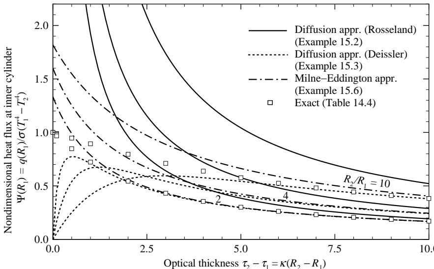
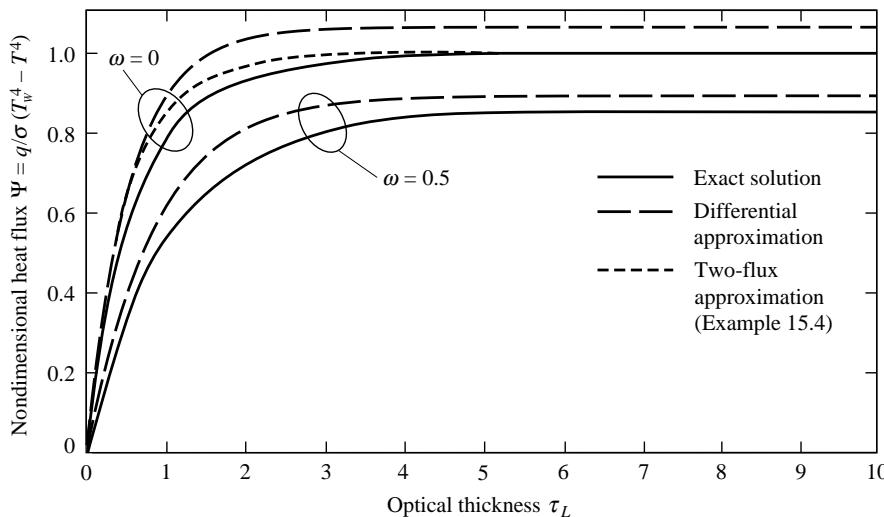
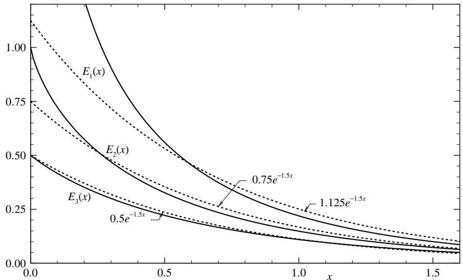

## 内容索引

- [目录](README.md)
- [1 热辐射基础](1-热辐射基础.md)
- [2 基于电磁波理论的辐射特性预测](2-基于电磁波理论的辐射特性预测.md)
- [3 实际表面的辐射特性](3-实际表面的辐射特性.md)
- [4 视角因子](4-视角因子.md)
- [5 灰体漫射表面间的辐射交换](5-灰体漫射表面间的辐射交换.md)
- [6 部分镜面灰体表面间的辐射交换](6-部分镜面灰体表面间的辐射交换.md)
- [7 非理想表面间的辐射交换](7-非理想表面间的辐射交换.md)
- [8 表面交换的蒙特卡洛方法](8-表面交换的蒙特卡洛方法.md)
- [9 传导和对流存在时的表面辐射交换](9-传导和对流存在时的表面辐射交换.md)
- [10 参与介质中的辐射传递方程(RTE)](10-参与介质中的辐射传递方程(RTE).md)
- [11 分子气体的辐射特性](11-分子气体的辐射特性.md)
- [12 颗粒介质的辐射特性](12-颗粒介质的辐射特性.md)
- [13 半透明介质的辐射特性](13-半透明介质的辐射特性.md)
- [14 一维灰体介质的精确解](14-一维灰体介质的精确解.md)
- [15 一维介质的近似求解方法](15-一维介质的近似求解方法.md)
- [16 球谐函数法 (PN-近似)](16-球谐函数法(PN-近似).md)
- [17 离散坐标法 (SN-近似)](17-离散坐标法(SN-近似).md)
- [18 区域法](18-区域法.md)
- [19 准直辐射与瞬态现象](19-准直辐射与瞬态现象.md)
- [20 非灰消光系数的求解方法](20-非灰消光系数的求解方法.md)
- [21 参与介质的蒙特卡洛方法](21-参与介质的蒙特卡洛方法.md)
- [22 辐射与传导和对流的耦合](22-辐射与传导和对流的耦合.md)
- [23 逆辐射传热](23-逆辐射传热.md)
- [24 纳米尺度辐射传热](24-纳米尺度辐射传热.md)
- [附录](附录.md)

- [15.1 光学薄近似](#151-光学薄近似)  
- [15.2 光学厚近似(扩散近似)](#152-光学厚近似扩散近似)  
- [15.3 Schuster-Schwarzschild近似](#153-schuster-schwarzschild近似)  
- [15.4 Milne-Eddington近似(矩方法)](#154-milne-eddington近似矩方法)  
- [15.5 指数核近似](#155-指数核近似)  
- [参考文献](#参考文献)  
- [习题](#习题)

# 第15章

# 一维介质的近似求解方法

由于灰体(或光谱)、平面平行或其他一维介质被等温、灰体、漫发射和漫反射壁面包围的情况具有重要性和相对简单性，这些情况已被广泛研究。即使对于最简单的情况，精确解也只能以积分方程的隐式形式给出，因此促使了多种近似求解技术的发展。这些近似方法大致可分为适用于极限条件的方法(冷介质近似、光学薄近似、光学厚近似)和对辐射强度方向分布进行近似的方法(双通量近似、矩方法)。下面我们将讨论其中几种方法在一维等温灰体表面间介质情况下的应用。原则上，所有这些方法也可以应用于更复杂的几何形状，尽管这种扩展对某些方法并不明显(实际上可能非常繁琐)。我们将假设介质是灰体的，因此不在强度和其他量上携带任何光谱下标；然而，这里讨论的所有方法在光谱基础上同样有效。

# 15.1 光学薄近似

描述灰体介质(或光谱基础上)被两个等温、灰体漫射平行板包围时的入射辐射$G$和辐射热流$q$的精确积分方程由式(14.21)和(14.22)给出：

$$
\begin{array}{l}{G(\tau) = 2J_1E_2(\tau) + 2J_2E_2(\tau_\tau -\tau) + 2\pi \int_0^\tau S(\tau ')E_1(\tau -\tau ')d\tau ' + 2\pi \int_{\tau}^{J_L}S(\tau ')E_1(\tau ' - \tau)d\tau ',}\\ {q(\tau) = 2J_1E_3(\tau) - 2J_2E_3(\tau_\tau -\tau) + 2\pi \int_0^\tau S(\tau ')E_2(\tau -\tau ')d\tau ' - 2\pi \int_{\tau}^{J_L}S(\tau ')E_2(\tau ' - \tau)d\tau ',} \end{array} \tag{15.2}
$$

其中$J_{1}$和$J_{2}$是两个表面的辐射度，辐射源$S(\tau)$被假设为与方向无关[限制我们考虑各向同性散射，见式(14.5)]。

我们现在假设介质是光学薄的，即$\tau_{L}\ll 1$。如果我们想精确到$\mathcal{O}(\tau)$量级评估$q$[即忽略$\mathcal{O}(\tau^2)$或更小的项]，我们必须将式(15.2)中的$E_{3}$精确到$\mathcal{O}(\tau)$量级，而将$E_{2}$(和$S$)精确到$\mathcal{O}(1)$量级就足够了[因为积分本身是$\mathcal{O}(\tau)]$。因此，有

$$
\begin{array}{r}E_{2}(x) = 1 + \mathcal{O}(x),\qquad E_{3}(x) = \frac{1}{2} -x + \mathcal{O}(x^{2}), \end{array}
$$

我们得到

$$
q(\tau)\simeq J_1(1 - 2\tau) - J_2(1 - 2\tau_L + 2\tau) + 2\pi \bigg[\int_0^\tau S(\tau ')d\tau ' - \int_\tau^{\tau_L}S(\tau ')d\tau '\bigg]. \tag{15.3}
$$

评估辐射源，式(14.5)，

$$
S = (1 - \omega)I_{b}(\tau) + \frac{\omega}{4\pi} G(\tau), \tag{15.4}
$$

意味着将$G(\tau)$精确到$\mathcal{O}(1)$量级，即从式(15.1)，

$$
G(\tau) = 2J_{1} + 2J_{2} + \mathcal{O}(\tau) \tag{15.5}
$$

[记住，虽然$\begin{array}{r}\lim_{x\to 0}E_1(x)\to \infty ,\lim_{x\to 0}xE_1(x)\to 0] \end{array}$。黑体强度$I_{b}(\tau)$要么是"已知"的(通过考虑其他传热模式)，要么我们有$S = I_{b} =$ $G / 4\pi = (J_{1} + J_{2}) / 2\pi$(在几乎透明的灰体介质中的辐射平衡)。因此，光学薄平板的辐射热流为：

$I_{b}(\tau)$指定时：

$$
\begin{array}{r l} & {q(\tau) = J_{1}[1 - 2(1 - \omega)\tau -\omega \tau_{L}] - J_{2}[1 + 2(1 - \omega)\tau -(2 - \omega)\tau_{L}]}\\ & {\qquad +2\pi (1 - \omega)\bigg[\int_{0}^{\tau}I_{b}(\tau^{\prime})d\tau^{\prime} - \int_{\tau}^{\tau_{L}}I_{b}(\tau^{\prime})d\tau^{\prime}\bigg];} \end{array} \tag{15.6}
$$

辐射平衡时：

$$
q = (J_{1} - J_{2})(1 - \tau_{L}) = \mathrm{const}. \tag{15.7}
$$

如果介质的温度被指定，我们通常对辐射热流的散度$dq / dz$(整体能量方程中的辐射源)感兴趣。从式(14.24)

$$
\frac{dq}{d\tau} = (1 - \omega)(4\pi I_b - G). \tag{15.8}
$$

为了将$dq / dz$预测精确到$\mathcal{O}(\tau)$量级，我们必须将$G$精确到$\mathcal{O}(1)$量级[因为我们在式(15.8)中使用$\tau$而不是$z$作为自变量]。因此，从式(15.5)

$$
\frac{dq}{d\tau} = 2(1 - \omega)(2\pi I_b - J_1 - J_2). \tag{15.9}
$$

式(15.6)可以从物理上解释：离开表面的强度(辐射度$J_{1}$和$J_{2}$)被吸收和散射衰减，但衰减是线性的，因为辐射度的强度减弱非常小(即介质中每一点基本上具有相同的入射辐射，因此衰减率相同)。积分项描述了介质内部的发射，向上(+)和向下(-)传播。由于消光系数太低，发射几乎不受自吸收的衰减。式(15.7)显示不依赖于散射反照率$\omega$：在灰体介质处于辐射平衡时，无法区分吸收和各向同性散射。如果光子在某处被吸收，相同数量的能量必须立即被各向同性地重新发射。由于对于灰体介质无法检测到(不同的)发射波长，这个过程等同于各向同性散射。

# 15.2 光学厚近似（扩散近似）

当平板光学厚度很大（$\tau_{L}\gg 1$）时，可以得到辐射热流的特别简单表达式。从方程(15.2)我们注意到辐射源$S$伴随着一个作为权重函数的指数积分。如果介质光学厚度很大，这个指数积分在远离$\tau^{\prime} = \tau$的短（几何）距离内会迅速衰减。为了利用这一事实，我们首先通过将积分变量$\tau^{\prime}$改为$\tau^{\prime \prime} = |\tau - \tau^{\prime}|$来重写方程(15.2)。

$$
q(\tau) = 2J_{1}E_{3}(\tau) - 2J_{2}E_{3}(\tau_{L} - \tau) + 2\pi \int_{0}^{\tau}S(\tau -\tau^{\prime \prime})E_{2}(\tau^{\prime \prime})d\tau^{\prime \prime} - 2\pi \int_{0}^{\tau_{L} - \tau}S(\tau +\tau^{\prime \prime})E_{2}(\tau^{\prime \prime})d\tau^{\prime \prime}. \tag{15.10}
$$

我们现在假设我们距离任一表面都有很大的光学距离，即$\tau \gg 1$且$\tau_{L} - \tau \gg 1$。在这些条件下，边界$(J_{1}$和$J_{2}$)的影响变得可以忽略，积分限可以用无穷大代替[因为在实际限值之外$E_{2}(\tau^{\prime \prime})\simeq 0$]。因此，

$$
q(\tau)\simeq 2\pi \int_{0}^{\infty}S(\tau -\tau^{\prime \prime})E_{2}(\tau^{\prime \prime})d\tau^{\prime \prime} - 2\pi \int_{0}^{\infty}S(\tau +\tau^{\prime \prime})E_{2}(\tau^{\prime \prime})d\tau^{\prime \prime}, \tag{15.11}
$$

其中$q$和$S$中的参数仅表示两板之间的物理位置。由于$E_{2}(\tau^{\prime \prime})$预计在距离$\tau^{\prime \prime} = 0$(或$\tau^{\prime} = \tau$)很短的几何距离内消失，辐射源在这个距离内只能有轻微变化。因此，我们可以将$S$展开为泰勒级数：

$$
S(\tau \pm \tau^{\prime \prime}) = S(\tau)\pm \tau^{\prime \prime}\left(\frac{dS}{d\tau}\right)_{\tau} + \frac{(\tau^{\prime\prime})^{2}}{2}\left(\frac{d^{2}S}{d\tau^{2}}\right)_{\tau}\pm \dots .
$$

将这个表达式代入方程(15.11)得到：

$$
\begin{array}{l}{\frac{q(\tau)}{2\pi} = S(\tau)\int_{0}^{\infty}E_{2}(\tau^{\prime \prime})d\tau^{\prime \prime} - \frac{dS}{d\tau}\int_{0}^{\infty}\tau^{\prime \prime}E_{2}(\tau^{\prime \prime})d\tau^{\prime \prime} + \frac{1}{2}\frac{d^{2}S}{d\tau^{2}}\int_{0}^{\infty}(\tau^{\prime \prime})^{2}E_{2}(\tau^{\prime \prime})d\tau^{\prime \prime} - + \dots}\\ {-S(\tau)\int_{0}^{\infty}E_{2}(\tau^{\prime \prime})d\tau^{\prime \prime} - \frac{dS}{d\tau}\int_{0}^{\infty}\tau^{\prime \prime}E_{2}(\tau^{\prime \prime})d\tau^{\prime \prime} - \frac{1}{2}\frac{d^{2}S}{d\tau^{2}}\int_{0}^{\infty}(\tau^{\prime \prime})^{2}E_{2}(\tau^{\prime \prime})d\tau^{\prime \prime} - - \dots}\\ {= -2\frac{dS}{d\tau}\int_{0}^{\infty}xE_{2}(x)dx + \mathcal{O}\Big(\frac{1}{\tau^{3}}\Big).} \end{array}
$$

计算积分，利用附录E中的指数积分关系，我们得到：

$$
\int_0^\infty xE_2(x)dx = -xE_3(x)\bigg|_0^\infty +\int_0^\infty E_3(x)dx = -E_4(x)\bigg|_0^\infty = \frac{1}{3},
$$

以及

$$
q(\tau) = -\frac{4\pi}{3}\frac{dS}{d\tau}. \tag{15.12}
$$

对于非散射介质，或处于辐射平衡的灰体介质，$S = I_{b},$方程(15.12)简化为：

$$
q(\tau) = -\frac{4\pi}{3}\frac{dI_b}{d\tau}. \tag{15.13}
$$

对于各向同性散射介质的一般情况，辐射源必须通过首先从方程(15.1)确定入射辐射$G(\tau)$，然后从方程(15.4)确定。遵循与$q(\tau)$相同的步骤，我们得到：

$$
\begin{array}{c}{\frac{G(\tau)}{2\pi} = S(\tau)\int_{0}^{\infty}E_{1}(\tau^{\prime \prime})d\tau^{\prime \prime} - \frac{dS}{d\tau}\int_{0}^{\infty}\tau^{\prime \prime}E_{1}(\tau^{\prime \prime})d\tau^{\prime \prime} + \frac{1}{2}\frac{d^{2}S}{d\tau^{2}}\int_{0}^{\infty}(\tau^{\prime \prime})^{2}E_{1}(\tau^{\prime \prime})d\tau^{\prime \prime} - + \dots}\\ {+S(\tau)\int_{0}^{\infty}E_{1}(\tau^{\prime \prime})d\tau^{\prime \prime} + \frac{dS}{d\tau}\int_{0}^{\infty}\tau^{\prime \prime}E_{1}(\tau^{\prime \prime})d\tau^{\prime \prime} + \frac{1}{2}\frac{d^{2}S}{d\tau^{2}}\int_{0}^{\infty}(\tau^{\prime \prime})^{2}E_{1}(\tau^{\prime})d\tau^{\prime \prime} + + \dots}\\ {= 2S(\tau)\int_{0}^{\infty}E_{1}(\tau^{\prime \prime})d\tau^{\prime \prime} + \mathcal{O}\bigg(\frac{1}{\tau^{2}}\bigg) = 2S(\tau),} \end{array} \tag{15.14}
$$

或者

$$
\frac{G}{4\pi} = S = (1 - \omega)I_b + \omega \frac{G}{4\pi}
$$

以及

$$
S(\tau) = \frac{G}{4\pi} (\tau) = I_b(\tau).
$$

因此，对于光学厚、各向同性散射介质，无论介质是否处于辐射平衡，方程(15.13)都成立，并且基于光谱的热流由下式确定：

$$
q_{\eta} = -\frac{4\pi}{3\beta_{R}}\frac{dI_{b\eta}}{dz}, \tag{15.15}
$$

或者，在波数积分后，总热流为：

$$
q = -\frac{4\sigma}{3\beta_R}\frac{d(n^2T^4)}{dz}, \tag{15.16}
$$

其中$\beta_{R}$是方程(11.188)中定义的Rosseland平均消光系数。方程(15.15)和(15.16)通常被称为Rosseland近似，因为它们最初由Rosseland[1]导出，或者称为扩散近似，因为方程(15.16)与傅里叶热扩散定律和菲克质量扩散定律属于同一类型。

扩散近似使用起来非常方便。甚至可以定义一个"辐射导热系数"：

$$
k_{R} = \frac{16n^{2}\sigma T^{3}}{3\beta_{R}}, \tag{15.17}
$$

因此

$$
q = -k_{R}\frac{dT}{dz}, \tag{15.18}
$$

辐射问题简化为具有强烈温度依赖性导热系数的简单传导问题。类似于傅里叶定律，方程(15.15)可以通过写作扩展到三维几何：

$$
\mathbf{q}_{\eta} = -\frac{4\pi}{3\beta_{\eta}}\nabla I_{b\eta}, \tag{15.19}
$$

和

$$
\mathbf{q} = -\frac{4\sigma}{3\beta_R}\nabla (n^2 T^4) = -k_R\nabla T. \tag{15.20}
$$

然而，重要的是要记住扩散近似在边界附近无效，在那里它经常表现得很糟糕。实际上，该方法仅适用于光学极厚的情况（例如，通过热玻璃和其他半透明材料的热传递）。

例15.1。考虑一个温度为$T$的灰体等温介质，被限制在两个温度为$T_{w}$的平行黑体等温板之间。使用扩散近似确定穿过层的辐射热流随距离的变化。

# 解

从方程(15.16)我们发现介质内部各处$q \equiv 0$，而在两个表面$q \to \infty$（因为那里的温度跳跃）。扩散近似在壁的光学附近明显不足，特别是在存在温度不连续的情况下。

例15.2. 现在考虑一个灰体介质被限制在两个黑体等温圆柱之间。内圆柱半径为$R_{1}$，温度为$T_{1}$；外圆柱半径为$R_{2}$，温度为$T_{2}$。该介质吸收和发射辐射但不散射，且处于辐射平衡状态。确定介质中的温度分布和热流。

# 解

根据辐射平衡条件：

$$
\nabla \cdot \mathbf{q} = \frac{1}{r}\frac{d}{dr} (rq) = 0,
$$

我们得到$rq = C_{1}^{\prime} = \mathrm{const}$，或者如果使用光学坐标$\tau = \kappa r$，则$q = C_{1}^{\prime} / r = C_{1} / \tau$。因此，根据方程(15.13)：

$$
q = \frac{C_1}{\tau} = -\frac{4\sigma}{3}\frac{dT^4}{d\tau}
$$

(假设折射率为1)。我们可以积分这个表达式得到：

$$
\sigma T^4 = -\frac{3}{4} C_1\ln \tau +C_2, \tag{15.21}
$$

或者，使用边界条件$T = T_{1}$在$r = R_{1}$处和$T = T_{2}$在$r = R_{2}$处：

$$
\frac{T^4 - T_1^4}{T_2^4 - T_1^4} = \frac{\ln(\tau / \tau_1)}{\ln(\tau_2 / \tau_1)},
$$

以及

$$
\Psi = \frac{q}{\sigma(T_1^4 - T_2^4)} = \frac{4}{3\tau\ln(\tau_2 / \tau_1)}. \tag{15.22}
$$

通过与图15-1中精确解和其他近似解的比较可以看出，方程(15.22)在光学厚情况下表现较好，但在光学薄极限$\kappa \to 0$时失效，此时$\Psi \to \infty$[与正确极限$\Psi (R_{1}) = 1$相反]。

# Deissler的跳跃边界条件

在推导方程(15.13)时，我们假设介质是光学厚的$(\tau_{L} \gg 1)$且远离边界$(\tau \gg 0, \tau_{L} - \tau \gg 0)$。但在示例中我们假设方程(15.13)在壁面也成立，并通过使用边界温度找到了温度分布(例15.2)。这些示例表明这个假设并不理想。Deissler[2]指出，虽然通量必须守恒[因此如果方程(15.13)在邻近介质的表面内成立，则它必须在表面成立]，但没有辐射原理表明表面和邻近介质的温度必须是连续的(正如精确解已知的那样)。为了建立边界条件，他使用了与方程(15.10)及其后续推导相同的原理，并将其应用于边界点。对于$\tau = 0$，方程(15.10)变为(当$\tau_{L} \gg 1$时)

  
图15-1 辐射平衡介质中的无量纲辐射热流，限制在等温黑圆柱之间。

$$
\begin{array}{l}{q(0) = J_1 - 2\pi \int_0^\infty S(\tau '')E_2(\tau '')d\tau ''}\\ {= J_1 - 2\pi \left[S(0)\int_0^\infty E_2(\tau '')d\tau '' + \frac{dS}{d\tau} (0)\int_0^\infty \tau ''E_2(\tau '')d\tau ''\right.}\\ {\left. + \frac{1}{2}\frac{d^2S}{d\tau^2} (0)\int_0^\infty (\tau '')^2 E_2(\tau '')d\tau '' + \mathcal{O}\left(\frac{1}{\tau^3}\right)\right].} \end{array}
$$

使用方程(15.15)后，该表达式变为

$$
q(0) = J_{1} - \pi I_{b}(0) - \frac{2\pi}{3}\frac{dI_{b}}{d\tau} (0) - \frac{\pi}{2}\frac{d^{2}I_{b}}{d\tau^{2}} (0) + \mathcal{O}\left(\frac{1}{\tau^{3}}\right). \tag{15.23}
$$

Deissler在二阶导数后截断了级数，因为这样做可以得到与方程(15.13)相同水平的近似。将方程(15.13)代入方程(15.23)得到

$$
J_{1} = \pi I_{b}(0) - \frac{2\pi}{3}\frac{dI_{b}}{d\tau} (0) + \frac{\pi}{2}\frac{d^{2}I_{b}}{d\tau^{2}} (0). \tag{15.24}
$$

对于一维平板的辐射平衡，这进一步简化为

$$
J_{1} - \pi I_{b}(0) = -\frac{2\pi}{3}\frac{dI_{b}}{d\tau} (0) = \frac{1}{2} q(0) = \frac{1}{2} q, \tag{15.25}
$$

因为$q =$常数，因此$d^{2}I_{b} / d\tau^{2} = 0$

跳跃边界条件可以推广到多维几何[2]:

$$
J_{w}(\mathbf{r}_{w}) = \pi I_{b}(\mathbf{r}_{w}) - \frac{2\pi}{3}\frac{\partial I_{b}}{\partial\tau_{z}} (\mathbf{r}_{w}) + \frac{\pi}{4}\left(2\frac{\partial^{2}I_{b}}{\partial\tau_{z}^{2}} +\frac{\partial^{2}I_{b}}{\partial\tau_{x}^{2}} +\frac{\partial^{2}I_{b}}{\partial\tau_{y}^{2}}\right)(\mathbf{r}_{w}), \tag{15.26}
$$

其中$\tau_z$如前所述是沿外表面法线方向测量的光学坐标，$\tau_x$和$\tau_y$是切向于表面的光学坐标。

例15.3. 使用Deissler的跳跃边界条件重复例15.2。

# 解

对于圆柱坐标系，方程(15.26)变为2

$$
\begin{array}{ll}\tau = \tau_1: & \sigma T_1^4 = \sigma T^4 -\frac{2}{3}\sigma \frac{dT^4}{d\tau} +\frac{\sigma}{4}\left(\frac{1}{\tau}\frac{dT^4}{d\tau} +2\frac{d^2T^4}{d\tau^2}\right),\\ \displaystyle \tau = \tau_2: & \sigma T_2^4 = \sigma T^4 +\frac{2}{3}\sigma \frac{dT^4}{d\tau} +\frac{\sigma}{4}\left(\frac{1}{\tau}\frac{dT^4}{d\tau} +2\frac{d^2T^4}{d\tau^2}\right) \end{array}
$$

[第二个边界条件的符号变化是因为在方程(15.24)中$\tau$是从表面向外测量，而在$\tau_2$处是向表面测量]。利用辐射平衡下一维圆柱的一般扩散解，方程(15.21)，我们得到

$$
\begin{array}{ll}\tau = \tau_1: & \sigma T_1^4 = C_2 - \frac{3}{4} C_1\ln \tau_1 + \frac{C_1}{2\tau_1} +\frac{3C_1}{16\tau_1^2},\\ \displaystyle \tau = \tau_2: & \sigma T_2^4 = C_2 - \frac{3}{4} C_1\ln \tau_2 - \frac{C_1}{2\tau_2} +\frac{3C_1}{16\tau_2^2}. \end{array}
$$

从这两个方程我们得到

$$
C_1 = \frac{\sigma(T_1^4 - T_2^4)}{\frac{3}{4}\ln\frac{\tau_2}{\tau_1} + \frac{1}{2}\left(\frac{1}{\tau_1} + \frac{1}{\tau_2}\right) + \frac{3}{16}\left(\frac{1}{\tau_1^2} - \frac{1}{\tau_2^2}\right)},
$$

并且，当$q_{1} = C_{1} / \tau_{1},$

$$
\Psi = \frac{q_1}{\sigma(T_1^4 - T_2^4)} = 1 / \left[\frac{3\tau_1}{4}\ln \frac{\tau_2}{\tau_1} +\frac{1}{2}\left(1 + \frac{\tau_1}{\tau_2}\right) + \frac{3}{16\tau_1}\left(1 - \frac{\tau_1^2}{\tau_2^2}\right)\right].
$$

这个无量纲通量的图也包含在图15-1中。

# 15.3 SCHUSTER-SCHWARZSCHILD近似

Schuster[3]和Schwarzschild[4]独立提出了一种非常简单的一维平面平行板的求解方法。虽然他们的推导仅限于非散射介质，但该方法可以很容易地扩展到包括各向同性散射，我们将在此考虑。对于一维平面平行、各向同性散射的灰介质(或基于光谱)，传输方程为，在方程(14.19)中设$\Phi \equiv 1$，

$$
\mu \frac{dI}{d\tau} = (1 - \omega)I_b - I + \frac{\omega}{2}\int_{-1}^{+1}Id\mu , - 1< \mu < +1. \tag{15.27}
$$

Schuster和Schwarzschild假设辐射强度在上半球和下半球是各向同性但不同的，即

$$
I(\tau ,\mu) = \left\{ \begin{array}{ll}I^{-}(\tau), & -1< \mu < 0,\\ I^{+}(\tau), & 0< \mu < +1. \end{array} \right. \tag{15.28}
$$

将此表达式代入方程(15.27)得到

$$
\frac{dI}{d\tau} = (1 - \omega)I_b - I + \frac{\omega}{2} (I^- +I^+). \tag{15.29}
$$

由于对$I$的近似，方程(15.29)当然只能以近似方式求解。由于强度已被简化为仅两个空间未知函数，因此必须将方程(15.29)简化为两个空间相关方程。分别在上下半球积分方程(15.29)实现这一目标，得到

$$
\begin{array}{c}{\frac{1}{2}\frac{dI^{+}}{d\tau} = (1 - \omega)I_{b} - I^{+} + \frac{\omega}{2} (I^{-} + I^{+}),}\\ {-\frac{1}{2}\frac{dI^{-}}{d\tau} = (1 - \omega)I_{b} - I^{-} + \frac{\omega}{2} (I^{-} + I^{+}),} \end{array} \tag{15.30b}
$$

边界条件为

$$
\begin{array}{rl}\tau = 0: & I^{+} = J_{1} / \pi ,\\ \tau = \tau_{L}: & I^{-} = J_{2} / \pi , \end{array} \tag{15.31b}
$$

其中$J_{1}$和$J_{2}$是边界板的辐射度。根据入射辐射和辐射热流的定义，我们得到

$$
G = 2\pi \int_{-1}^{1}I d\mu = 2\pi (I^{+} + I^{-}), \tag{15.32}
$$

以及

$$
q = 2\pi \int_{-1}^{1}I\mu d\mu = \pi (I^{+} - I^{-}). \tag{15.33}
$$

通过加减方程(15.30)及其边界条件，可以轻松消去$I^{+}$和$I^{-}$，得到

$$
\begin{array}{l}\frac{dq}{d\tau} = (1 - \omega)(4\pi I_b - G),\\ \displaystyle \frac{dG}{d\tau} = -4q,\\ \displaystyle \tau = 0:G + 2q = 4J_1,\\ \displaystyle \tau = \tau_{L}:G - 2q = 4J_2. \end{array} \tag{15.36b}
$$

例15.4. 求一个灰色、非散射、等温介质(温度$T$)在两个等温平行黑板(温度相同$T_{w}$)之间的热流表达式。使用Schuster-Schwarzschild近似。

# 解答

对方程(15.34)求导并利用方程(15.35)可得

$$
\frac{d^2q}{d\tau^2} = -\frac{dG}{d\tau} = 4q,
$$

即

$$
q = C_{1}e^{2\tau} + C_{2}e^{-2\tau},
$$

边界条件为

$$
\begin{array}{ll}\tau = 0: & 4\sigma T^4 -\frac{dq}{d\tau} +2q = 4\sigma T_w^4,\\ \displaystyle \tau = \tau_{L}: & 4\sigma T^4 -\frac{dq}{d\tau} -2q = 4\sigma T_w^4, \end{array}
$$

  
图15-2 灰色、等温、各向同性散射介质在黑板之间的辐射热流

其中$G$已通过方程(15.34)消去，且$J_{1} = J_{2} = \sigma T_{w}^{4}$。将热流表达式代入边界条件得

$$
\begin{array}{r}(2 - 2)C_1 + (2 + 2)C_2 = 4\sigma (T_w^4 -T^4),\\ -(2 + 2)C_1e^{2\tau_L} - (2 - 2)C_2e^{-2\tau_L} = 4\sigma (T_w^4 -T^4), \end{array}
$$

即

$$
C_2 = -C_1e^{2\tau_L} = \sigma (T_w^4 -T^4)
$$

且

$$
\Psi = \frac{q}{\sigma(T^4 - T_w^4)} = e^{-2(\tau_L - \tau)} - e^{-2\tau_L}
$$

这个无量纲通量在壁面处的值绘制在图15-2中，同时给出了精确解和另一种近似方法。

Schuster-Schwarzschild近似总能达到正确的光学薄极限$(\tau_{L}\rightarrow 0)$，因为在这种情况下处理是精确的。由于它将强度函数分解为两个方向的常数分量，该方法也常被称为双通量近似。显然，该方法可以很容易地推广到更高阶(将$4\pi$方向分解为更多分量和方向，或离散坐标)，以及多维几何。例如，Chin和Churchill[5]以及Shih和Chen[6]使用了六通量方法；Chan[7]对六通量方法进行了综述。一般离散坐标方法将在第17章详细讨论。

# 15.4 MILNE-EDDINGTON近似(矩方法)

对于一维平面平行介质，Milne[8]和Eddington[9]独立开发了另一种简单方法。该方法在推广到更复杂几何时也常被称为微分近似。从方程(15.27)出发，他们取了方程的零阶和一阶矩，即在乘以$\mu^0 = 1$(零阶矩)和$\mu^1 = \mu$(一阶矩)后对所有方向积分。定义强度矩为

$$
I_{k} = 2\pi \int_{-1}^{1}I\mu^{k}d\mu ,k = 0,1,\ldots \tag{15.37}
$$

得到

$$
\begin{array}{l}\frac{dI_1}{d\tau} = (1 - \omega)4\pi I_b - I_0 + \omega I_0 = (1 - \omega)(4\pi I_b - I_0),\\ \displaystyle \frac{dI_2}{d\tau} = -I_1, \end{array} \tag{15.39}
$$

即三个未知量$I_0, I_1,$和$I_2$的两个方程。为了使系统确定，必须找到一个闭合条件，即$I_0, I_1,$和$I_2$之间的关系。Milne和Eddington与Schuster和Schwarzschild一样，假设强度在上半球和下半球都是各向同性的。因此，

$$
I_{k} = 2\pi \left(I^{-}\int_{-1}^{0}\mu^{k}d\mu +I^{+}\int_{0}^{1}\mu^{k}d\mu\right) = \frac{2\pi}{k + 1}\left[(-1)^{k}I^{-} + I^{+}\right], \tag{15.40}
$$

即

$$
\begin{array}{r}I_2 = \frac{1}{3} I_0. \end{array} \tag{15.41}
$$

令$G = I_0$和$q = I_1$，方程(15.41)将(15.38)和(15.39)转化为

$$
\begin{array}{l}\frac{dq}{d\tau} = (1 - \omega)(4\pi I_b - G),\\ \displaystyle \frac{dG}{d\tau} = -3q. \end{array} \tag{15.43}
$$

边界条件与Schuster-Schwarzschild近似相同，方程(15.31)，同样得到

$$
\begin{array}{rl}\tau = 0: & G + 2q = 4J_1,\\ \tau = \tau_L: & G - 2q = 4J_2. \end{array} \tag{15.44b}
$$

在辐射平衡情况下，有$dq / d\tau = 0$，因此$G = 4\pi I_b$。对于这种情况，方程(15.43)简化为

$$
q = -\frac{4\pi}{3}\frac{dI_b}{d\tau}, \tag{15.45}
$$

这与扩散近似相同(尽管边界条件不同，并且对于大$\tau_L$，扩散近似会达到更高一阶的精度)。

例15.5. 考虑一个折射率$n = 1$的灰色介质，被限制在两个等温黑平行板之间，温度分别为$T_1$和$T_2$。如例15.2所示，介质处于辐射平衡状态，吸收和发射但不散射辐射。使用微分近似确定板之间的热流。

# 解

对于处于辐射平衡的灰色非散射介质，方程(15.42)和(15.43)简化为

$$
\begin{array}{c}\frac{dq}{d\tau} = 4\sigma T^4 -G = 0,\quad \mathrm{or}\quad q = \mathrm{const},\\ \displaystyle \frac{dG}{d\tau} = -3q,\quad \mathrm{or}\quad G = 4\sigma T^4 = C - 3q\tau . \end{array}
$$

应用边界条件可得

$$
\begin{array}{rlr}\tau = 0: & C & +2q = 4\sigma T_1^4,\\ \tau = \tau_L: & C - 3q\tau_L - 2q = 4\sigma T_2^4, \end{array}
$$

即

$$
\Psi = \frac{q}{\sigma(T_1^4 - T_2^4)} = \frac{1}{1 + \frac{3}{4}\tau_L}
$$

和

$$
\begin{array}{l}{C = 4\sigma T_1^4 -2q,}\\ {}\\ {\Phi = \frac{T_1^4 - T^4}{T_1^4 - T_2^4} = \frac{2 + 3\tau}{4 + 3\tau_L}.} \end{array}
$$

容易证明该结果与采用Deissler跳跃边界条件的扩散近似结果相同(例如在例15.3中令$\tau_{2} = \tau_{1} + \tau_{L}$且$\tau_{1}\to \infty$时)。

例15.6. 使用微分近似重做例15.2。

# 解

对于同心圆柱间处于辐射平衡的一维介质，在柱坐标系中辐射热流散度为

$$
\frac{1}{\tau}\frac{d}{d\tau} (\tau q) = 4\sigma T^4 -G = 0,
$$

即

$$
q = \frac{C_1}{\tau}.
$$

将该表达式代入方程(15.45)得

$$
\sigma T^4 = -\textstyle \frac{3}{4} C_1\ln \tau +C_2,
$$

这与扩散近似结果相同(因为处于辐射平衡状态)。应用边界条件($G = 4\sigma T^4$)得

$$
\begin{array}{rl}\tau = \tau_1: & -\frac{3}{4} C_1\ln \tau_1 + C_2 + \frac{C_1}{2\tau_1} = \sigma T_1^4,\\ \tau = \tau_2: & -\frac{3}{4} C_1\ln \tau_2 + C_2 - \frac{C_1}{2\tau_2} = \sigma T_2^4, \end{array}
$$

即

$$
C_1 = \frac{\sigma(T_1^4 - T_2^4)}{\frac{1}{2}\left(\frac{1}{\tau_1} + \frac{1}{\tau_2}\right) + \frac{3}{4}\ln\frac{\tau_2}{\tau_1}}
$$

和

$$
\Psi = \frac{q_1}{\sigma(T_1^4 - T_2^4)} = 1\bigg / \bigg[\frac{1}{2}\left(1 + \frac{\tau_1}{\tau_2}\right) + \frac{3}{4}\tau_1\ln \frac{\tau_2}{\tau_1}\bigg].
$$

微分近似的结果也包含在图15-1中。注意带跳跃条件的扩散近似在较大光学厚度范围内优于微分近似(因其具有更高阶边界条件)，但在光学薄情况下失效更严重。

与Schuster-Schwarzschild近似类似，Milne-Eddington近似也可推广到更高阶和更复杂几何。此时称为矩方法，其中辐射强度近似为

$$
\begin{array}{rl} & I(\mathbf{r},\hat{\mathbf{s}}) = I_0(\mathbf{r}) + I_{1x}(\mathbf{r})s_x + I_{1y}(\mathbf{r})s_y + I_{1z}(\mathbf{r})s_z + I_{2xx}(\mathbf{r})s_x^2 +I_{2xy}(\mathbf{r})s_x s_y + \dots \\ & \qquad = I_0(\mathbf{r}) + \mathbf{I}_1(\mathbf{r})\cdot \hat{\mathbf{s}} +\mathbf{I}_2(\mathbf{r}):\hat{\mathbf{s}}\hat{\mathbf{s}} +\dots . \end{array} \tag{15.46}
$$

这里$s_x = \hat{\mathbf{s}}\cdot \hat{\mathbf{1}} = \sin \theta \cos \psi$, $s_y = \hat{\mathbf{s}}\cdot \hat{\mathbf{1}} = \sin \theta \sin \psi$, $s_z = \hat{\mathbf{s}}\cdot \hat{\mathbf{k}} = \cos \theta$是单位方向向量$\hat{\mathbf{s}}$的方向余弦。$I_0$是待定标量(与$G$相关)，$\mathbf{I}_1$是向量(与$\mathbf{q}$相关)，$\mathbf{I}_2$是二阶张量(可能与辐射压力相关)，以此类推。通过取传输方程的矩来确定未知量，即在乘以$1, s_x, s_y, s_z, s_x^2, s_x s_y, \ldots$后对所有方向积分。Krook[10]已证明该方法与球谐函数法完全等价(使用方向余弦函数的球谐函数并利用其正交性)。该方法将在第16章详细讨论。

# 15.5 指数核近似

另一种近似求解方程(15.1)和(15.2)的常用方法称为指数核近似。该方法中，积分核[方程(15.1)中的$E_1$和方程(15.2)中的$E_2$]被近似为指数函数$(e^x, \cosh x, \sinh x, \cos x, \sin x)$。由于这些函数具有重复导数(除常数因子外)，这使得我们可以消除方程(15.1)和(15.2)中的积分项，将其转化为微分方程。我们将通过使用如下形式的简单近似核来求解方程(15.2)以演示该方法：

$$
E_{2}(x)\simeq ae^{-bx}. \tag{15.47}
$$

更复杂的近似可以包含多个指数项的和(只要对$x$的导数具有重复性)。确定$a$和$b$的"最佳"值可以选择在两点满足方程(15.47)，或在积分意义上满足方程(15.47)。具体如何确定$a$和$b$的值具有一定任意性，应根据具体问题(介质是光学薄、光学厚还是全范围？)来决定。最常用的确定$a$和$b$的方法是取方程(15.47)的零阶和一阶矩：

$$
\begin{array}{c}{\int_0^\infty E_2(x)dx = -E_3(x)\bigg|_0^\infty = \frac{1}{2} = a\int_0^\infty e^{-bx}dx = -\frac{a}{b} e^{-bx}\bigg|_0^\infty = \frac{a}{b},}\\ {\int_0^\infty xE_2(x)dx = \frac{1}{3} = a\int_0^\infty xe^{-bx}dx = \frac{a}{b^2},} \end{array}
$$

即

$$
a = \textstyle \frac{3}{4},\quad b = \textstyle \frac{3}{2},\quad E_2(x)\simeq \textstyle \frac{3}{4} e^{-3x / 2}.
$$

虽然$E_1(x)$和$E_3(x)$可以用类似方法求得，但通常(为了一致性和数值简便)更倾向于使用附录E给出的指数积分递推公式。因此，

$$
\begin{array}{l}{E_1(x) = -\frac{dE_2}{dx}\simeq \frac{9}{8} e^{-3x / 2},}\\ {E_3(x) = \int_x^\infty E_2(x)dx\simeq \frac{1}{2} e^{-3x / 2}.} \end{array}
$$

这些近似的结果绘制在图15-3中。利用它们，方程(15.2)可重写为

$$
q(\tau) = J_1e^{-3\tau /2} - J_2e^{-3(\tau_L - \tau) / 2} + \frac{3\pi}{2}\left[\int_0^\tau S(\tau ')e^{-3(\tau -\tau ') / 2}d\tau ' - \int_\tau^{\tau_L}S(\tau ')e^{-3(\tau ' - \tau) / 2}d\tau '\right]. \tag{15.48}
$$

将该方程对$\tau$求二阶导数得

$$
\begin{array}{l}{\frac{d^2q}{d\tau^2} = \frac{9}{4} J_1e^{-3\tau /2} - \frac{9}{4} J_2e^{-3(\tau_L - \tau) / 2} + 3\pi \frac{dS}{d\tau}}\\ {+\frac{27\pi}{8}\left[\int_0^\tau S(\tau ')e^{-3(\tau -\tau ') / 2}d\tau ' - \int_\tau^{\tau_L}S(\tau ')e^{-3(\tau ' - \tau) / 2}d\tau '\right],} \end{array} \tag{15.49}
$$

  
图15-3 指数积分的近似

或利用方程(15.48)消去积分项，

$$
\frac{d^2q}{d\tau^2} -\frac{9}{4} q = 3\pi \frac{dS}{d\tau} = 3\pi \frac{d}{d\tau}\left[(1 - \omega)I_b + \frac{\omega}{4\pi} G\right]. \tag{15.50}
$$

源函数要么已知，要么需要通过对方程(15.1)执行类似过程来确定。方程(15.50)是一个二阶微分方程，因此需要两个边界条件(而积分方程不需要任何边界条件)。通过将方程(15.50)的解代回方程(15.48)可以解决这个问题。由于需要两个边界条件，在$\tau = 0$和$\tau = \tau_{L}$两个选定位置执行此操作即可。

例15.7. 使用指数核近似重做例15.5。

# 解

对于$\omega = 0$有$S = I_{b} = \sigma T^{4} / \pi$，对于辐射平衡$dq / d\tau = 0$(因此$d^{2}q / d\tau^{2} = 0$)。因此，由方程(15.50)得

$$
q = -\frac{4\sigma}{3}\frac{dT^4}{d\tau} = \mathrm{const},
$$

这与扩散近似和微分近似结果相同。积分得

$$
\sigma T^4 = C - \textstyle \frac{3}{4} q\tau .
$$

将该表达式代入方程(15.48)得

$$
\begin{array}{l}{q = \sigma T_1^4 e^{-3\tau /2} - \sigma T_2^4 e^{-3(\tau_L - \tau) / 2} + \frac{3}{2}\left[\int_0^\tau \left(C - \frac{3}{4} q\tau '\right)e^{-3(\tau -\tau) / 2}d\tau ' - \int_{\tau}^{T_L}\left(C - \frac{3}{4} q\tau '\right)e^{-3(\tau ' - \tau) / 2}d\tau '\right]}\\ {= \left(\sigma T_1^4 -C - \frac{q}{2}\right)e^{-3\tau /2} - \left(\sigma T_2^4 -C + \frac{q}{2} +\frac{3}{4} q\tau_L\right)e^{-3(\tau_L - \tau) / 2} + q.} \end{array}
$$

由于该方程对所有$\tau$值都成立，括号内的两个表达式必须为零，

$$
\begin{array}{l}\sigma T_1^4 = C + \frac{q}{2},\\ \sigma T_2^4 = C - \frac{q}{2} -\frac{3}{4}\tau_Lq, \end{array}
$$

即

$$
\Psi = \frac{q}{\sigma(T_1^4 - T_2^4)} = \frac{1}{1 + \frac{3}{4}\tau_L}.
$$

该结果与带跳跃条件的扩散近似和微分近似(例15.5)的结果完全相同。

# 参考文献

1. Rosseland, S.: 《理论天体物理学：原子理论与恒星大气和包层的分析》, Clarendon Press, Oxford, 1936.  
2. Deissler, R. G.: "具有跳跃边界条件的气体中热辐射的扩散近似", ASME Journal of Heat Transfer, vol. 86, pp. 240-246, 1964.  
3. Schuster, A.: "雾状大气中的辐射", Astrophysical Journal, vol. 21, pp. 1-22, 1905.  
4. Schwarzschild, K.: "Über das Gleichgewicht der Sonnenatmosphären (太阳大气的平衡)", Akad. Wiss. Göttingen, Math.-Phys. Kl. Nachr., vol. 195, pp. 41-53, 1906.  
5. Chin, J. H., and S. W. Churchill: "无限平板中任意圆柱源各向异性多重散射辐射", ASME Journal of Heat Transfer, vol. 87, pp. 167-172, 1965.  
6. Shih, T. M., and Y. N. Chen: "二维辐射与传导介质系统的离散强度方法", Numerical Heat Transfer, vol. 6, pp. 117-134, 1983.  
7. Chan, S. H.: "参与性介质中多维辐射传递分析的数值方法", in Annual Review of Numerical Fluid Mechanics and Heat Transfer, vol. 1, Hemisphere, New York, pp. 305-350, 1987.  
8. Milne, F. A.: "恒星的 thermodynamics", in Handbuch der Astrophysik, Springer-Verlag, OHG, Berlin, pp. 65-255, 1930.  
9. Eddington, A. S.: 《恒星的内部结构》, Dover Publications, New York, 1959.  
10. Krook, M.: "关于传递方程的解 I", Astrophysical Journal, vol. 122, pp. 488-497, 1955.

# References

1. Rosseland, S.: Theoretical Astrophysics: Atomic Theory and the Analysis of Stellar Atmospheres and Envelopes, Clarendon Press, Oxford, 1936.  
2. Deissler, R. G.: "Diffusion approximation for thermal radiation in gases with jump boundary conditions," ASME Journal of Heat Transfer, vol. 86, pp. 240-246, 1964.  
3. Schuster, A.: "Radiation through a foggy atmosphere," Astrophysical Journal, vol. 21, pp. 1-22, 1905.  
4. Schwarzschild, K.: "Über das Gleichgewicht der Sonnenatmosphären (Equilibrium of the sun's atmosphere)," Akad. Wiss. Göttingen, Math.-Phys. Kl. Nachr., vol. 195, pp. 41-53, 1906.  
5. Chin, J. H., and S. W. Churchill: "Anisotropic, multiply scattered radiation from an arbitrary, cylindrical source in an infinite slab," ASME Journal of Heat Transfer, vol. 87, pp. 167-172, 1965.  
6. Shih, T. M., and Y. N. Chen: "A discretized-intensity method proposed for two-dimensional systems enclosing radiative and conductive media," Numerical Heat Transfer, vol. 6, pp. 117-134, 1983.  
7. Chan, S. H.: "Numerical methods for multidimensional radiative transfer analysis in participating media," in Annual Review of Numerical Fluid Mechanics and Heat Transfer, vol. 1, Hemisphere, New York, pp. 305-350, 1987.  
8. Milne, F. A.: "Thermodynamics of the stars," in Handbuch der Astrophysik, Springer-Verlag, OHG, Berlin, pp. 65-255, 1930.  
9. Eddington, A. S.: The Internal Constitution of the Stars, Dover Publications, New York, 1959.  
10. Krook, M.: "On the solution of the equation of transfer, I," Astrophysical Journal, vol. 122, pp. 488-497, 1955.

# 习题

15.1 推导扩散近似中的跳跃边界条件(方程15.26)在同心圆柱情况下的表达式。假设热传递是一维的(仅径向，无方位角或轴向依赖)。

提示：在边界点引入局部笛卡尔坐标系，用$x,y,z$表示介质内任意$r$位置，并将方程(15.26)中的导数转换为$r$导数；最后令$x,y,z$趋近于零(因为需要边界处的导数)。

15.2 两块温度分别为$T_1$和$T_2$的平行黑平板之间的间隙充满了含颗粒气体。辐射平衡占主导，颗粒负载为固定体积分数，颗粒由两种不同材料制成(一种为镜面反射体，另一种为漫反射体，两者具有相同的$\epsilon$)。绘制无量纲热流$\Psi = q / \sigma (T_1^4 - T_2^4)$随颗粒尺寸变化的示意图(保持体积分数不变)。

15.3 考虑一个灰体、吸收、发射和各向同性散射介质在辐射平衡状态下，被限制在两块相距$L$的等温、灰漫射平行平板之间。对于光学薄情况$(\tau_L \ll 1)$，确定介质内的无量纲温度变化$\Phi = (\sigma T^4 - J_2) / (J_1 - J_2)$。

15.4 考虑一个灰体、吸收-发射、线性各向异性散射介质处于辐射平衡状态。介质被限制在两块等温黑平板(温度分别为$T_1$和$T_2$)之间。使用带跳跃边界条件的扩散近似，确定两平板之间的辐射热流表达式。

15.5 使用Schuster-Schwarzschild(双流)近似求解问题15.4。

15.6 使用Milne-Eddington(微分)近似求解问题15.4。

15.7 使用指数核近似方法求解问题15.4。

15.8 使用Milne-Eddington(微分)近似求解问题14.7。

15.9 使用Milne-Eddington(微分)近似求解问题14.11。

15.10 考虑一个由无限、漫射-灰、相距$1\mathrm{m}$的平行平板围成的空间，其中填充了灰体、非散射介质$(\kappa = 5\mathrm{m}^{-1})$。表面是等温的(均为$T_w = 500\mathrm{K}$，发射率$\epsilon_w = 0.6$)，介质内有均匀恒定的体积热生成$\dot{Q}^{\prime \prime \prime} = 10^{6}\mathrm{W/m}^3$。传导和对流可忽略，因此$\nabla \cdot \mathbf{q} = \dot{Q}^{\prime \prime \prime}$。使用带跳跃边界条件的扩散近似，确定壁面的辐射热流以及介质内的最高温度。

15.11 使用Schuster-Schwarzschild近似求解问题15.10。

15.12 使用Milne-Eddington近似求解问题15.10。

15.13 使用指数核近似求解问题15.10。注：必要的精确积分关系已在问题14.3中给出。

15.14 考虑 $(a)$ 两块平行平板和 $(b)$ 两个同心球体两种情况。底面/内表面需要耗散 $30\mathrm{W / cm}^2$ 的热流密度，灰漫发射率 $\epsilon_{1} = 0.5$。顶面/外表面温度 $T_{2} = 1000\mathrm{K}$，发射率 $\epsilon_{2} = 0.8$。表面间的介质为灰体、非散射 $(\kappa = 0.1\mathrm{cm}^{- 1})$，厚度 $L = 5\mathrm{cm}$，处于辐射平衡状态。使用Milne-Eddington近似方法，分别计算两种情况下底面/内表面为耗散给定热流所需的温度(内球半径 $R_{1} = 5\mathrm{cm}$)。并与习题14.12的结果进行比较。

15.15 某种材料以恒定体积产热率 $\dot{Q}^{\prime \prime \prime} = \text{const}$ 产生热量，需要通过热辐射移除。建议将(固定体积的)材料研磨成小颗粒，均匀悬浮在两块相同发射率 $\epsilon$ 的冷平板之间。由于需要尽可能降低颗粒的整体温度水平，应该将颗粒研磨得尽可能细、尽可能大，还是存在某个最佳半径？最佳粒径是多少？采用该尺寸时的最高温度是多少？可假设为一维平行平板系统，颗粒体积分数恒定，黑体颗粒具有较大尺寸参数，并可使用Schuster-Schwarzschild近似。

15.16 使用Milne-Eddington(微分)近似方法求解习题15.15。

15.17 使用指数核近似方法求解习题15.15。

15.18 考虑间距 $1\mathrm{m}$ 的两块平行黑体平板，温度分别为 $T_{1}$ 和 $T_{2}$。由于压力变化，(灰体)吸收系数为：

$$
\kappa = \kappa_{0} + \kappa_{1}z;\quad \kappa_{0} = 0.01\mathrm{cm}^{-1};\quad \kappa_{1} = 0.0002\mathrm{cm}^{-2},
$$

其中 $\Xi$ 从平板1开始测量。介质不散射辐射。对于辐射平衡状态，通过以下方法确定无量纲热流 $\Psi = q / \sigma (T_1^4 - T_2^4)$：$(a)$ 精确方法，$(b)$ 常规扩散近似，$(c)$ 带跳跃边界条件的扩散近似，$(d)$ 双流法，$(e)$ 微分近似，$(f)$ 核近似。

15.19 一个 $1000\mathrm{K}$ 的无限大黑体等温平板与半无限空间相邻，空间中充满均匀半径 $a = 100\mu \mathrm{m}$ 的黑体球体。颗粒数密度在表面附近最大，并随距离表面呈指数衰减：

$$
N_{T} = N_{0}e^{-Cz};\qquad N_{0} = 10^{8}\mathrm{m}^{-3},\qquad C = \pi \mathrm{m}^{-1}.
$$

$(a)$ 确定吸收系数和消光系数随 $z$ 变化的函数关系。

$(b)$ 确定光学坐标随 $z$ 变化的函数关系。半无限空间的总光学厚度是多少？

$(c)$ 假设辐射平衡占主导并使用Milne-Eddington近似，建立边界条件并求解热流密度和温度分布(作为 $z$ 的函数)。

