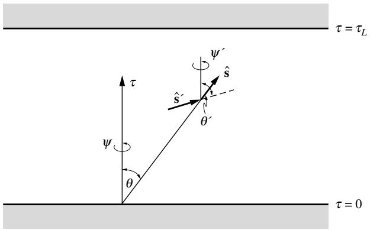
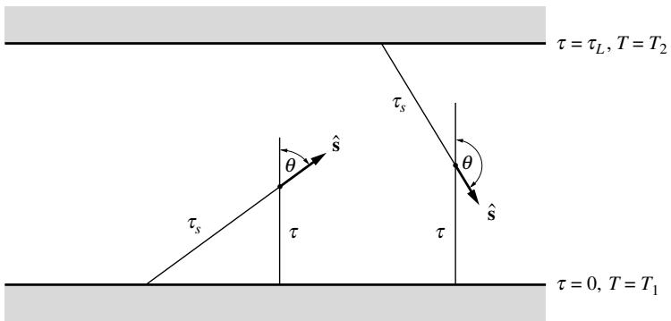

## 内容索引

- [目录](README.md)
- [1 热辐射基础](1-热辐射基础.md)
- [2 基于电磁波理论的辐射特性预测](2-基于电磁波理论的辐射特性预测.md)
- [3 实际表面的辐射特性](3-实际表面的辐射特性.md)
- [4 视角因子](4-视角因子.md)
- [5 灰体漫射表面间的辐射交换](5-灰体漫射表面间的辐射交换.md)
- [6 部分镜面灰体表面间的辐射交换](6-部分镜面灰体表面间的辐射交换.md)
- [7 非理想表面间的辐射交换](7-非理想表面间的辐射交换.md)
- [8 表面交换的蒙特卡洛方法](8-表面交换的蒙特卡洛方法.md)
- [9 传导和对流存在时的表面辐射交换](9-传导和对流存在时的表面辐射交换.md)
- [10 参与介质中的辐射传递方程(RTE)](10-参与介质中的辐射传递方程(RTE).md)
- [11 分子气体的辐射特性](11-分子气体的辐射特性.md)
- [12 颗粒介质的辐射特性](12-颗粒介质的辐射特性.md)
- [13 半透明介质的辐射特性](13-半透明介质的辐射特性.md)
- [14 一维灰体介质的精确解](14-一维灰体介质的精确解.md)
- [15 一维介质的近似求解方法](15-一维介质的近似求解方法.md)
- [16 球谐函数法 (PN-近似)](16-球谐函数法(PN-近似).md)
- [17 离散坐标法 (SN-近似)](17-离散坐标法(SN-近似).md)
- [18 区域法](18-区域法.md)
- [19 准直辐射与瞬态现象](19-准直辐射与瞬态现象.md)
- [20 非灰消光系数的求解方法](20-非灰消光系数的求解方法.md)
- [21 参与介质的蒙特卡洛方法](21-参与介质的蒙特卡洛方法.md)
- [22 辐射与传导和对流的耦合](22-辐射与传导和对流的耦合.md)
- [23 逆辐射传热](23-逆辐射传热.md)
- [24 纳米尺度辐射传热](24-纳米尺度辐射传热.md)
- [附录](附录.md)

- [16.1 引言](#161-引言)
- [16.2 PN-近似的一般公式](#162-pn-近似的一般公式)
- [16.3 一维平板的PN-近似](#163-一维平板的pn-近似)
- [16.4 PN-方法的边界条件](#164-pn-方法的边界条件)
- [16.5 P1近似](#165-p1近似)
- [16.6 P3及更高阶近似](#166-p3及更高阶近似)
- [16.7 简化的PN近似](#167-简化的pn近似)
- [16.8 修正微分近似](#168-修正微分近似)
- [16.9 方法比较](#169-方法比较)
- [参考文献](#参考文献)
- [习题](#习题)

# 第16章

# 球谐函数法($P_N$-近似)

# 16.1 引言

对于已知温度分布的灰体介质(或基于光谱分析)，或在辐射平衡情况下，辐射传递的一般问题需要从包含五个独立变量(三个空间坐标和两个方向坐标)的积分-微分方程中确定辐射强度，这是一项极其困难的任务。球谐函数法通过将传递方程转化为一组联立偏微分方程(PDEs)，提供了一种获得任意高阶(即高精度)近似解的途径。该方法最初由Jeans[1]在研究恒星辐射传递时提出。关于该方法的更多描述可参考Kourganoff[2]、Davison[3]和Murray[4]的著作(后两本主要讨论密切相关的中子输运理论)。球谐函数法与第15章描述的矩方法相同，只是矩的选取利用了球谐函数的正交性。

球谐函数法的最大优势是将控制方程转化为相对简单的偏微分方程。该方法的缺点是低阶近似通常只在辐射强度接近各向同性的介质中准确，且随着近似阶数提高，精度提升缓慢而数学复杂度急剧增加。这促使中子输运领域的几位研究者，特别是Gelbard[5]，开发了简化的球谐函数法，称为简化$P_N$-近似或$SP_N$。虽然这种方法更容易达到高阶，但在极限情况下不会趋近于精确解。

一个常见的误解是最低阶$P_1$-近似在光学薄介质中失效：如图15-2或下面的例16.2所示，当考虑热介质发射时，$P_1$-近似会趋近于正确的光学薄极限，但在光学厚极限下可能失效。实际上，$P_1$-近似在以下情况会失去精度：例如当光学薄介质作为热冷表面间的辐射屏障时，存在准直辐射照射时等。

本章将首先为一维平面平行介质建立一般$P_N$方法的偏微分方程组及其边界条件。接下来我们将更详细地讨论最流行的$P_1$-近似在任意几何形状中的应用。然后简要介绍$P_3$及更高阶近似。随后描述$SP_N$方案，最后本章将讨论$P_N$-近似的若干变体，这些变体试图克服其在强各向异性情况下的不准确性，最著名的是修正微分近似(MDA)，它将来自壁面的辐射与介质内部发出的辐射分开处理。虽然这些方法提供了更好的精度，但它们不再是简单偏微分方程的解，还需要计算一些积分修正因子。

# 16.2 PN-近似的一般公式

我们可以将介质内位置$\mathbf{r}$处的辐射强度场$I(\mathbf{r},\hat{\mathbf{s}})^3$视为围绕点$\mathbf{r}$的单位半径球面上标量函数的值。任何这样的函数都可以用二维广义傅里叶级数表示为：

$$
I(\mathbf{r},\hat{\mathbf{s}}) = \sum_{l = 0}^{\infty}\sum_{m = -l}^{l}I_{l}^{m}(\mathbf{r})Y_{l}^{m}(\hat{\mathbf{s}}), \tag{16.1}
$$

其中$I_{l}^{m}(\mathbf{r})$是位置相关的系数，$Y_{l}^{m}(\hat{\mathbf{s}})$是球谐函数，由下式给出：

$$
Y_{n}^{m}(\theta ,\phi) = \left\{ \begin{array}{ll}\cos (m\psi)P_{n}^{m}(\cos \theta), & \mathrm{for} m\geq 0,\\ \sin (m\psi)P_{n}^{m}(\cos \theta), & \mathrm{for} m< 0, \end{array} \right. \tag{16.2}
$$

这些函数满足球坐标下的拉普拉斯方程。这里$\theta$和$\psi$分别是描述方向单位向量$\hat{\mathbf{s}}$的极角和方位角，$P_{l}^{m}$是关联勒让德多项式，由下式给出：

$$
P_{n}^{m}(\mu) = (-1)^{m}\frac{(1 - \mu^{2})^{|m| / 2}}{2^{n}n!}\frac{d^{n + |m|}}{d\mu^{n + |m|}} (\mu^{2} - 1)^{n}. \tag{16.3}
$$

我们可以将方程(16.1)代入辐射传递的一般方程(10.24)，

$$
\hat{\mathbf{s}}\cdot \nabla_{\tau}I + I = (1 - \omega)I_{b} + \frac{\omega}{4\pi}\int_{4\pi}I(\hat{\mathbf{s}}^{\prime})\Phi (\hat{\mathbf{s}}\cdot \hat{\mathbf{s}}^{\prime})d\Omega^{\prime}, \tag{16.4}
$$

其中空间坐标已通过消光系数无量纲化，即$d\tau = \beta ds$（如$\nabla_{\tau}$中的下标$\tau$所示）。方程(16.4)要求沿封闭体表面各处指定出射辐射强度。在将散射相函数展开为Legendre多项式级数[方程(12.99)]后，将方程(16.4)乘以$Y_{k}^{n}$，然后对所有方向积分。利用球谐函数的正交性[6]，可以得到关于未知位置相关函数$I_{l}^{m}(\mathbf{r})$的无限多个耦合偏微分方程。至此，上述表示仍是确定辐射强度场的精确方法。为简化问题，现通过截断方程(16.1)中的级数（仅保留很少几项）进行近似。这样，我们用一个仅与空间相关的$(N+1)^2$个未知函数$I_{l}^{m}$替代了单个未知量$I$（它是空间和方向的函数）。因此，需要用$(N+1)^2$个仅与空间相关的方程替代方程(16.4)（它是空间和方向的函数）。这通过将方程(16.4)乘以$Y_{k}^{m}$并对所有方向积分实现。

  
图16-1 一维平面平行介质的坐标系

保留的最高$l$值$N$决定了方法的阶数和名称。最常用的是$P_{1}$或微分近似$(l=0,1)$，而$P_{3}$近似$(l=0,1,2,3)$也有少量应用。从中子输运理论可知，奇数阶近似比相邻的更高阶偶数阶近似更精确，因此$P_{2}$近似从未被使用。在大多数早期发展和应用中，$P_{N}$方法仅针对一维平面平行情况推导，例如Jeans[1]、Kourganoff[2]和Krook[7]的工作。Davison[3]和Cheng[8,9]给出了笛卡尔坐标系下一般三维情况的详细推导。Ou和Liou[10]将其扩展到一般坐标系。Condiff[11]给出了另一个一般三维推导，他使用Brenner[12]提出的多向Legendre多项式展开强度，即参数为$n$阶张量（而非标量）的Legendre函数$P_{n}(\hat{\mathbf{s}})$。最近，Modest和Yang[13]以椭圆二阶偏微分方程形式提出了笛卡尔几何下的一般三维$P_{N}$近似，便于融入标准CFD代码。

# 16.3 一维平板的PN-近似

我们现在将详细推导一维平面平行介质的一般$P_{N}$方法，以便：(i)进一步阐明一般方法，(ii)促进建立一致边界条件这一难题的解决。对于这种简单情况，辐射强度不依赖于方位角$\psi$（假设极角$\theta$从垂直于平板的轴测量，如图16-1所示），即$m\neq 0$时$I_{l}^{m}=0$。因此，方程(16.1)可简化为

$$
I(\tau ,\mu)\simeq \sum_{l = 0}^{N}I_{l}(\tau)P_{l}(\mu), \tag{16.5}
$$

其中设$\mu = \cos \theta$，且由于不再需要，省略了$I_{l}$的上标$0$。方程(16.5)是近似的，因为级数在$l=N$后被截断，即假设所有$l>N$时$I_{l}(\tau)=0$。这种介质的散射相函数展开为Legendre多项式为[见方程(14.12)]

$$
\Phi (\mu ,\mu^{\prime}) = \sum_{m = 0}^{M}A_{m}P_{m}(\mu^{\prime})P_{m}(\mu), \tag{16.6}
$$

其中$M$是相函数的近似阶数；我们发现

$$
\int_{-1}^{1}\Phi (\mu ,\mu^{\prime})I(\tau ,\mu^{\prime})d\mu^{\prime} = \sum_{l = 0}^{N}I_{l}(\tau)\sum_{m = 0}^{M}A_{m}P_{m}(\mu)\int_{-1}^{1}P_{l}(\mu^{\prime})P_{m}(\mu^{\prime})d\mu^{\prime}. \tag{16.7}
$$

现在可以利用Legendre多项式的正交性（例如参见Abramowitz和Stegun[14]）写出

$$
\int_{-1}^{1}P_{l}(\mu)P_{m}(\mu)d\mu = \frac{2\delta_{lm}}{2m + 1} = \left\{ \begin{array}{ll}0 & \mathrm{当}m\neq l\\ \displaystyle 2m + 1 & \mathrm{当}m = l. \end{array} \right. \tag{16.8}
$$

在方程(16.7)中应用此正交关系可得

$$
\int_{-1}^{1}\Phi (\mu ,\mu^{\prime})I(\tau ,\mu^{\prime})d\mu^{\prime} = \sum_{l = 0}^{N}\frac{2A_{l}}{2l + 1} I_{l}(\tau)P_{l}(\mu), \tag{16.9}
$$

其中隐含$l>M$时$A_{l}=0$。（另一方面，若$M>N$，则$l=N+1,\ldots,M$的$A_{l}$消失，这部分相函数信息在$N$阶近似中丢失。）现在可以将一维平面平行介质的传递方程重写为

$$
\mu \frac{dI}{d\tau} +I(\tau) = (1 - \omega)I_{b}(\tau) + \frac{\omega}{2}\int_{-1}^{1}\Phi (\mu ,\mu^{\prime})I(\tau ,\mu^{\prime})d\mu^{\prime}, \tag{16.10}
$$

或

$$
\sum_{l = 0}^{N}\left[\frac{dI_l}{d\tau}\mu P_l(\mu) + I_l(\tau)P_l(\mu)\right] = (1 - \omega)I_b(\tau) + \omega \sum_{l = 0}^{N}\frac{A_lI_l(\tau)}{2l + 1} P_l(\mu). \tag{16.11}
$$

为利用Legendre多项式的正交性，我们将使用递推关系[14]

$$
(2l + 1)\mu P_l(\mu) = lP_{l - 1}(\mu) + (l + 1)P_{l + 1}(\mu). \tag{16.12}
$$

因此，可将方程(16.11)重写为

$$
\sum_{l = 0}^{N}\left\{\frac{I_l^{\prime}(\tau)}{2l + 1}\left[IP_{l - 1}(\mu) + (l + 1)P_{l + 1}(\mu)\right] + I_l(\tau)P_l(\mu)\right\} = (1 - \omega)I_b(\tau) + \sum_{l = 0}^{N}\frac{\omega A_lI_l(\tau)}{2l + 1} P_l(\mu), \tag{16.13}
$$

其中撇号表示对$\tau$求导。由于我们引入了$(N+1)$个新变量$I_{0},I_{1},\ldots,I_{N}$，需要将方程(16.13)转换为$(N+1)$个与方向无关的方程。因此，乘以$P_{k}(\mu)$ $(k=0,1,\ldots,N)$并对所有$\mu$积分得到

$$
\frac{k + 1}{2k + 3} I_{k + 1}^{\prime}(\tau) + \frac{k}{2k - 1} I_{k - 1}^{\prime}(\tau) + \left(1 - \frac{\omega A_k}{2k + 1}\right)I_k(\tau) = (1 - \omega)I_b(\tau)\delta_{0k},\\ k = 0,1,\ldots ,N, \tag{16.14}
$$

其中利用了方程(16.8)。方程(16.14)是关于未知函数$I_{0}(\tau),I_{1}(\tau),\ldots,I_{N}(\tau)$的$(N+1)$个联立一阶常微分方程组。因此，它需要$(N+1)$个边界条件来求解。

# 16.4 PN-方法的边界条件

辐射传递方程(16.4)是一个关于辐射强度的一阶偏微分方程，需要在表面各处施加边界条件，即离开表面(由向量$\mathbf{r}_w$描述)的辐射强度必须对所有出射方向$\hat{\mathbf{n}} \cdot \hat{\mathbf{s}} > 0$($\hat{\mathbf{n}}$为表面外法线)进行规定，如图16-2所示。

$$
I(\mathbf{r} = \mathbf{r}_w,\hat{\mathbf{s}}) = I_w(\mathbf{r}_w,\hat{\mathbf{s}})\quad \mathrm{for}\hat{\mathbf{n}}\cdot \hat{\mathbf{s}} >0 \tag{16.15}
$$

  
图16-2 $P_{N}$方法规定的边界辐射强度。

当应用$P_{N}$近似[在$l = N$处截断方程(16.1)]时，这一边界条件无法再满足，必须替换为在选定方向$\hat{\mathbf{s}}_i$满足方程(16.15)或在积分意义上满足的条件。Mark[15,16]和Marshak[17]针对一维平面平行介质中的中子输运问题，提出了球谐函数法的两种不同边界条件集。

# Mark边界条件

对于光学厚度为$\tau_{L}$的一维平板，方程(16.15)可改写为

$$
\begin{array}{rlr} & {} & {I(0,\mu) = I_{w1}(\mu),\qquad 0< \mu < 1,}\\ & {} & {I(\tau_L,\mu) = I_{w2}(\mu),\qquad -1< \mu < 0,} \end{array} \tag{16.16b}
$$

其中$I_{w1}$和$I_{w2}$是表面1$(\tau = 0)$和表面2$(\tau = \tau_{L})$的规定辐射强度。6

对此介质的$P_{N}$方法(方程16.14)需要$(N + 1)$个边界条件，假设$N$为奇数，则在$\tau = 0$和$\tau = \tau_{L}$处各需$\frac{1}{2} (N + 1)$个。注意到方程

$$
P_{N + 1}(\mu) = 0 \tag{16.17}
$$

在0到1之间恰好有$\frac{1}{2} (N + 1)$个根$\mu_i$，Mark建议用以下边界条件替代方程(16.16):

$$
\begin{array}{rl}{I(0,\mu = \mu_i) = I_{w1}(\mu_i),} & {i = 1,2,\ldots ,\frac{1}{2} (N + 1),}\\ {I(\tau_L,\mu = -\mu_i) = I_{w2}(-\mu_i),} & {i = 1,2,\ldots ,\frac{1}{2} (N + 1),} \end{array} \tag{16.18b}
$$

其中$\mu_i$是方程(16.17)的正根。Mark[15,16]和Davison[3]对此选择给出了详细解释。例如，对于被黑壁包围介质的$P_{1}$近似，有$P_{2}(\mu) = \frac{1}{2} (3\mu^{2} - 1)$，$\mu_{1} = 1 / \sqrt{3}$，由方程(16.5)可得:

$$
\begin{array}{c}{I\left(0,\mu = \frac{1}{\sqrt{3}}\right) = I_0(0) + \frac{I_1(0)}{\sqrt{3}} = I_{b1},}\\ {I\left(\tau_L,\mu = -\frac{1}{\sqrt{3}}\right) = I_0(\tau_L) - \frac{I_1(\tau_L)}{\sqrt{3}} = I_{b2}.} \end{array} \tag{16.19b}
$$

Mark边界条件的一个严重缺点是难以(甚至不可能)应用于更复杂的几何形状。

# Marshak边界条件

Marshak提出了一维平面平行$P_N$近似的另一组边界条件，建议通过设置以下积分来满足方程(16.16):

$$
\begin{array}{rlr}\int_0^1 I(0,\mu)P_{2i - 1}(\mu)d\mu = \int_0^1 I_{w1}(\mu)P_{2i - 1}(\mu)d\mu , & i = 1,2,\ldots ,\frac{1}{2} (N + 1);\\ \displaystyle \int_{-1}^0 I(\tau_L,\mu)P_{2i - 1}(\mu)d\mu = \int_{-1}^0 I_{w2}(\mu)P_{2i - 1}(\mu)d\mu , & i = 1,2,\ldots ,\frac{1}{2} (N + 1). \end{array} \tag{16.20b}
$$

Marshak[17]和Davison[3]详细解释了选择所有奇数阶Legendre多项式的原因。代入方程(16.5)并假设漫射表面(即$I_w = J_w / \pi$)，可得:

$$
\begin{array}{rlr}\sum_{l = 0}^{N}I_{l}(0)\int_{0}^{1}P_{l}(\mu)P_{2i - 1}(\mu)d\mu = \frac{J_{w1}}{\pi}\int_{0}^{1}P_{2i - 1}(\mu)d\mu , & i = 1,2,\ldots ,\frac{1}{2} (N + 1);\\ \displaystyle \sum_{l = 0}^{N}I_{l}(\tau_{L})\int_{-1}^{0}P_{l}(\mu)P_{2i - 1}(\mu)d\mu = \frac{J_{w2}}{\pi}\int_{-1}^{0}P_{2i - 1}(\mu)d\mu , & i = 1,2,\ldots ,\frac{1}{2} (N + 1). \end{array} \tag{16.21b}
$$

再次以被黑壁包围介质的$P_1$近似为例，有$P_1(\mu) = \mu$，

$$
\int_0^1 I(0,\mu)\mu d\mu = \int_0^1 [I_0(0) + I_1(0)\mu ]\mu d\mu = \int_0^1 I_{b1}\mu d\mu ,
$$

即

$$
\begin{array}{r}I_0(0) + \frac{2}{3} I_1(0) = I_{b1},\\ I_0(\tau_L) - \frac{2}{3} I_1(\tau_L) = I_{b2}. \end{array} \tag{16.22b}
$$

注意到将Marshak边界条件中的系数2替换为$\sqrt{3}$即可转换为Mark边界条件。

Marshak边界条件的一个优势是可以扩展到更一般的问题，尽管并非易事。注意方程(16.20)中的积分是在表面上方所有方向(即半球)上进行的，以方程(16.5)的Legendre多项式作为权重因子。因此，将边界条件推广为(见图16-2)显得很自然:

$$
\begin{array}{r}\int_{\hat{\mathbf{n}}\cdot \hat{\mathbf{s}} >0}I(\mathbf{r}_w,\hat{\mathbf{s}})\overline{Y}_{2i - 1}^m (\hat{\mathbf{s}})d\Omega = \int_{\hat{\mathbf{n}}\cdot \hat{\mathbf{s}} >0}I_w(\hat{\mathbf{s}})\overline{Y}_{2i - 1}^m (\hat{\mathbf{s}})d\Omega ,\\ i = 1,2,\ldots ,\frac{1}{2} (N + 1),\quad \mathrm{all~relevant~}m, \end{array} \tag{16.23}
$$

其中$\overline{Y}_{2i - 1}^m (\hat{\mathbf{s}})$采用局部坐标系表示，极角$\theta'$从表面法线测量(即$\cos \theta' = \hat{\mathbf{n}} \cdot \hat{\mathbf{s}}$)，方位角$\psi'$在表面上测量，如图16-2所示。方程(16.23)中使用"所有相关$m$"而非$-i \leq m \leq +i$的表述，是因为它可能提供比实际需要更多的边界条件。例如，对于一维平面平行介质，由于没有方位角依赖性，所有$m\neq 0$的$I_{n}^{m}$都为零，唯一"相关"的$m$值是$m=0$。这导致$P_1$近似在每个表面只需一个边界条件(已被证明是正确的)，$P_3$近似需要两个，以此类推。通常，方程(16.23)在多维情况下会产生过多边界条件。例如，对于无对称性的三维介质$P_1$近似，方程(16.23)会在各处产生三个边界条件$(i=1,m=0,\pm1)$，而实际只需要一个(如下节所述)。Davison[3]证明，在$\begin{array}{r}i = \frac{1}{2} (N + 1) \end{array}$处，多余条件的数量总是比可能的$m$值至少少一个。因此，根据经验法则，通常做法是对$i=1,2,\ldots,\frac{1}{2}(N-1)$满足所有$m$的方程(16.23)，而对$i=\frac{1}{2}(N+1)$则尽可能满足相关$m$。最近Modest[18]证明，如果在$\begin{array}{r}i=\frac{1}{2}(N+1) \end{array}$时只选择$m$的偶数值而舍弃所有奇数值，可以得到一组自洽的边界条件。

  
图16-3 例题16.1的几何结构

例题16.1. 考虑无限四分之一空间$\tau_x>0,\tau_z>0$，边界为温度$T_1$和$T_2$的等温黑体表面，如图16-3所示。为两个表面(即$\tau_x=0$和$\tau_z=0$)建立$P_1$近似的边界条件。

# 解

对于$P_1$近似，方程(16.1)简化为

$$
I(\tau_{x},\tau_{z},\theta ,\psi) = I_{0}^{0}(\tau_{x},\tau_{z}) - I_{1}^{-1}(\tau_{x},\tau_{z})\sin \psi P_{1}^{-1}(\cos \theta) + I_{1}^{0}(\tau_{x},\tau_{z})P_{1}^{0}(\cos \theta) + I_{1}^{1}(\tau_{x},\tau_{z})\cos \psi P_{1}^{1}(\cos \theta).
$$

对于这个二维问题，极角$\theta$从$\tau_z$轴测量，方位角$\psi$在$\tau_x-\tau_y$平面内从$\tau_x$轴测量。由于对称性，含$\sin\psi$的项必须为零，且$I(\psi)=I(-\psi)$，同时$P_1^0(\cos\theta)=\cos\theta$，$P_1^1=P_1^{-1}(\cos\theta)=-\sin\theta$，因此

$$
I(\tau_{x},\tau_{y},\theta ,\psi) = I_{0}^{0} + I_{1}^{0}\cos \theta -I_{1}^{1}\cos \psi \sin \theta ,
$$

因此，方程(16.23)能在表面上提供两个边界条件$(i=1$和$m=0,1)$，而我们只需要一个(如下节所述)。根据方程(16.23)的讨论，我们在表面引入局部方向坐标系，并仅对$m=0$满足方程(16.23)。对于底面$\tau_z=0$，问题较简单，因为表面法线与$\tau_z$轴平行，极角即由此测量。因此，

$$
\int_{\psi = 0}^{2\pi}\int_{\theta = 0}^{\pi /2}\left(I_0^0 +I_1^0\cos \theta -I_1^1\cos \psi \sin \theta\right)\cos \theta \sin \theta d\theta d\psi = \int_0^{2\pi}\int_0^{\pi /2}I_{b1}\cos \theta \sin \theta d\theta d\psi ,
$$

即

$$
I_0^0 (\tau_x,0) + \textstyle \frac{2}{3} I_1^0 (\tau_x,0) = I_{b1}.
$$

在垂直表面$(\tau_x=0)$，$P_1^0=\cos\theta'$，其中$\theta'$是方向向量与表面法线$\hat{\mathbf{n}}=\hat{\mathbf{1}}$的夹角。由于$\cos\theta'=\hat{\mathbf{s}}\cdot\hat{\mathbf{1}}$，且$\hat{\mathbf{s}}=\sin\theta(\cos\psi\hat{\mathbf{1}}+\sin\psi\hat{\mathbf{1}})+\cos\theta\hat{\mathbf{k}}$，可得$\cos\theta'=\sin\theta\cos\psi$，因此

$$
\int_{\psi = -\pi /2}^{\pi /2}\int_{\theta = 0}^{\pi}\Big(I_0^0 +I_1^0\cos \theta -I_1^1\cos \psi \sin \theta \Big)\sin \theta \cos \psi \sin \theta d\theta d\psi = \pi \Big(I_0^0 -\frac{2}{3} I_1^1\Big) = \pi I_{b2},
$$

即

$$
I_0^0 (0,\tau_x) - \textstyle \frac{2}{3} I_1^1 (0,\tau_x) = I_{b2}.
$$

下节将看到，$I_0^0$与入射辐射成正比，而$I_1^0$和$I_1^1$分别与$\tau_y$和$\tau_x$方向的辐射热流成正比。

Davison[3]指出，对于低阶近似，Marshak边界条件会给出更好的结果，而对于高阶近似，Mark边界条件应该更准确。然而，Pellaud[19]以及Schmidt和Gelbard[20]随后的数值研究表明，即使在高阶近似中，Marshak边界条件也能得到更准确的结果。

# 16.5 P1近似

如果在方程(16.1)的级数中截断$l=1$之后的项(即$l\geq 2$时$I_{l}^{m}\equiv 0$)，我们就得到最低阶的$P_1$近似：

$$
I(\mathbf{r},\hat{\mathbf{s}}) = I_0^0 Y_0^0 +I_1^{-1}Y_1^{-1} + I_1^0 Y_1^0 +I_1^1 Y_1^1. \tag{16.24}
$$

从标准数学文献如MacRobert[21]，或直接从方程(16.3)可以得到关联Legendre多项式：$P_0^0 = 1$，$P_1^0 = \cos \theta$，$P_1^1 = P_1^{- 1} = - \sin \theta$。利用方程(16.2)可得：

$$
I(\mathbf{r},\theta ,\psi) = I_0^0 +I_1^0\cos \theta +I_1^{-1}\sin \theta \sin \psi -I_1^1\sin \theta \cos \psi . \tag{16.25}
$$

我们注意到方程(16.25)有四项：第一项与方向无关，第二项正比于方向向量$\hat{\mathbf{s}} = \sin \theta \cos \psi \hat{\mathbf{1}} +\sin \theta \sin \psi \hat{\mathbf{1}} + \cos \theta \hat{\mathbf{k}}$的$\Xi$分量，第三项正比于$s_{y}$，最后一项正比于$s_{x}$。每项前面都有一个待确定的空间坐标未知函数。通过引入两个新函数$a$(标量)和$\mathbf{b}$(具有三个分量的向量)，方程(16.25)可以更简洁地表示为：

$$
I(\mathbf{r},\hat{\mathbf{s}}) = a(\mathbf{r}) + \mathbf{b}(\mathbf{r})\cdot \hat{\mathbf{s}}. \tag{16.26}
$$

这四个未知量($a$和$\mathbf{b}$的三个分量，或$I_{n}^{m}$的四个分量)可以与物理量相关联。将方程(16.26)代入入射辐射的定义得：

$$
G(\mathbf{r}) = \int_{4\pi}I(\mathbf{r},\hat{\mathbf{s}})d\Omega = a(\mathbf{r})\int_{4\pi}d\Omega +\mathbf{b}(\mathbf{r})\cdot \int_{4\pi}\hat{\mathbf{s}} d\Omega = 4\pi a(\mathbf{r}), \tag{16.27}
$$

因为

$$
\int_{4\pi}\hat{\mathbf{s}} d\Omega = \int_{0}^{2\pi}\int_{0}^{\pi}\left( \begin{array}{c}\sin \theta \cos \psi \\ \sin \theta \sin \psi \\ \cos \theta \end{array} \right)\sin \theta d\theta d\psi = \left( \begin{array}{c}0\\ 0\\ 0 \end{array} \right) = \mathbf{0}. \tag{16.28}
$$

类似地，将方程(16.26)代入辐射热流的定义得：

$$
\mathbf{q}(\mathbf{r}) = \int_{4\pi}I(\mathbf{r},\hat{\mathbf{s}})\hat{\mathbf{s}} d\Omega = a(\mathbf{r})\int_{4\pi}\hat{\mathbf{s}} d\Omega +\mathbf{b}(\mathbf{r})\cdot \int_{4\pi}\hat{\mathbf{s}}\hat{\mathbf{s}} d\Omega = \frac{4\pi}{3}\mathbf{b}(\mathbf{r}), \tag{16.29}
$$

因为

$$
\begin{array}{rl} & {\int_{4\pi}\hat{\mathbf{s}}\hat{\mathbf{s}} d\Omega = \int_{0}^{2\pi}\int_{0}^{\pi}\left( \begin{array}{ccc}\sin^{2}\theta \cos^{2}\psi & \sin^{2}\theta \sin \psi \cos \psi & \sin \theta \cos \theta \cos \psi \\ \sin^{2}\theta \sin \psi \cos \psi & \sin^{2}\theta \sin^{2}\psi & \sin \theta \cos \theta \sin \psi \\ \sin \theta \cos \theta \cos \psi & \sin \theta \cos \theta \sin \psi & \cos^{2}\theta \end{array} \right)\times \sin \theta d\theta d\psi}\\ & {\quad \quad = \int_{0}^{\pi}\left( \begin{array}{ccc}\pi \sin^{2}\theta & 0 & 0\\ 0 & \pi \sin^{2}\theta & 0\\ 0 & 0 & 2\pi \cos^{2}\theta \end{array} \right)\sin \theta d\theta}\\ & {\quad \quad = \frac{4\pi}{3}\left( \begin{array}{ccc}1 & 0 & 0\\ 0 & 1 & 0\\ 0 & 0 & 1 \end{array} \right) = \frac{4\pi}{3}\delta ,} \end{array} \tag{16.30}
$$

其中$\delta$是单位张量，且$\mathbf{b} \cdot \delta = \mathbf{b}$。因此，我们可以用入射辐射和辐射热流重写方程(16.26)：

$$
I(\mathbf{r},\hat{\mathbf{s}}) = \frac{1}{4\pi} [G(\mathbf{r}) + 3\mathbf{q}(\mathbf{r})\cdot \hat{\mathbf{s}} ]. \tag{16.31}
$$

我们发现，除常数因子外，$I_0^0$对应入射辐射，而$I_1^1$、$I_1^{-1}$和$I_1^0$分别对应辐射热流的$x$、$y$和$z$分量。上述推导有助于说明方程(16.31)确实对应于$P_N$近似的最低阶形式(方程16.1)。当然，方程(16.31)应具有物理意义，并且应该可以从物理原理推导出来。Modest[22]完成了这项工作，他将辐射视为具有动量和能量的"光子气体"，并通过量子统计推导出强度场。他证明了平均光子速度(与热流成正比)与光学厚度成反比，且方程(16.31)适用于远离任何非热力学平衡点(急剧温度梯度、温度阶跃等)的大光学距离位置。

现在，将方程(16.31)代入方程(16.4)并假设线性各向异性散射$^8$：

$$
\Phi (\hat{\mathbf{s}}\cdot \hat{\mathbf{s}}^{\prime}) = 1 + A_{1}\hat{\mathbf{s}}\cdot \hat{\mathbf{s}}^{\prime}, \tag{16.32}
$$

可得：

$$
\begin{array}{r l r}{{\int_{4\pi}I(\hat{\mathbf{s}}^{\prime})\Phi(\hat{\mathbf{s}}\cdot\hat{\mathbf{s}}^{\prime})d\Omega^{\prime}=\frac{1}{4\pi}\int_{4\pi}(G+3\mathbf{q}\cdot\hat{\mathbf{s}}^{\prime})(1+A_{1}\hat{\mathbf{s}}\cdot\hat{\mathbf{s}}^{\prime})d\Omega^{\prime}}}\\ &{}&{=\frac{G}{4\pi}\left[\int_{4\pi}d\Omega^{\prime}+A_{1}\hat{\mathbf{s}}\cdot\int_{4\pi}\hat{\mathbf{s}}^{\prime}d\Omega^{\prime}\right]+\frac{3\mathbf{q}}{4\pi}\cdot\left[\int_{4\pi}\hat{\mathbf{s}}^{\prime}d\Omega^{\prime}+A_{1}\left(\int_{4\pi}\hat{\mathbf{s}}^{\prime}\hat{\mathbf{s}}^{\prime}d\Omega^{\prime}\right)\cdot\hat{\mathbf{s}}\right]}\\ &{}&{=G+A_{1}\mathbf{q}\cdot\hat{\mathbf{s}}\cdot\hat{\mathbf{s}}=G+A_{1}\mathbf{q}\cdot\hat{\mathbf{s}},\qquad(16.33)}\end{array} \tag{16.33}
$$

这里我们使用了方程(16.28)和(16.30)(最后一步可以通过笛卡尔坐标系进行点积运算来验证)。因此，方程(16.4)变为

$$
\frac{1}{4\pi}\nabla_{\tau}\cdot [\hat{\mathbf{s}} (G + 3\mathbf{q}\cdot \hat{\mathbf{s}})] + \frac{1}{4\pi} (G + 3\mathbf{q}\cdot \hat{\mathbf{s}})\simeq (1 - \omega)I_{b} + \frac{\omega}{4\pi} (G + A_{1}\mathbf{q}\cdot \hat{\mathbf{s}}), \tag{16.34}
$$

由于方向与位置无关，我们可以将方向向量$\hat{\mathbf{s}}$拉入梯度算子内。将方程(16.34)乘以$Y_0^0 = 1$并对所有立体角积分得到

$$
\nabla_{\tau}\cdot \mathbf{q} = (1 - \omega)(4\pi I_{b} - G), \tag{16.35}
$$

这里再次使用了方程(16.28)和(16.30)。由于不依赖于强度的函数形式，方程(16.35)与方程(10.59)完全相同。

为了获得更多方程，我们可以将方程(16.34)乘以$Y_{1}^{m}$ $(m = - 1,0, + 1)$，或者等价地乘以方向向量$\hat{\mathbf{s}}$的分量。选择后者并对所有方向积分得到

$$
\begin{array}{c}{\frac{1}{4\pi}\nabla_{\tau}\cdot \left[G\int_{4\pi}\hat{\mathbf{s}}\hat{\mathbf{s}} d\Omega +3\mathbf{q}\cdot \int_{4\pi}\hat{\mathbf{s}}\hat{\mathbf{s}}\hat{\mathbf{s}} d\Omega \right] + \frac{1}{4\pi}\left[G\int_{4\pi}\hat{\mathbf{s}} d\Omega +3\mathbf{q}\cdot \int_{4\pi}\hat{\mathbf{s}}\hat{\mathbf{s}} d\Omega \right]}\\ {= (1 - \omega)I_{b}\int_{4\pi}\hat{\mathbf{s}} d\Omega +\frac{\omega}{4\pi}\left[G\int_{4\pi}\hat{\mathbf{s}} d\Omega +A_{1}\mathbf{q}\cdot \int_{4\pi}\hat{\mathbf{s}}\hat{\mathbf{s}} d\Omega \right].} \end{array} \tag{16.36}
$$

容易证明$\int_{4\pi}\hat{\mathbf{s}}\hat{\mathbf{s}}\hat{\mathbf{s}} d\Omega = 0$(实际上任何$\hat{\mathbf{s}}$的奇数次乘积的积分都为零)，因此这个方程简化为

或

$$
\begin{array}{c}{\frac{1}{3}\nabla_{\tau}\cdot (G\delta) + \mathbf{q}\cdot \delta = \frac{\omega A_1}{3}\mathbf{q}\cdot \delta ,}\\ {}\\ {\nabla_{\tau}G = -(3 - A_1\omega)\mathbf{q}.} \end{array} \tag{16.37}
$$

方程(16.35)和(16.37)构成了关于未知量$G$和$\mathbf{q}$的一个标量方程和一个矢量方程的完整方程组，是$P_{1}$近似或微分近似的控制方程。通过将方程(16.37)除以$(1 - A_{1}\omega /3)$后取散度，可以消去热流：

$$
\nabla_{\tau}\cdot \left(\frac{1}{1 - A_{1}\omega / 3}\nabla_{\tau}G\right) = -3\nabla_{\tau}\cdot \mathbf{q} = -3(1 - \omega)(4\pi I_{b} - G). \tag{16.38}
$$

如果$A_{1}\omega$是常数(在整个体积内不变化)，这个方程简化为

$$
\nabla_{\tau}^{2}G - (1 - \omega)(3 - A_{1}\omega)G = -(1 - \omega)(3 - A_{1}\omega)4\pi I_{b}. \tag{16.39}
$$

方程(16.39)是一个Helmholtz方程，与Laplace方程密切相关，本质上是椭圆型的(例如参见Pipes和Harvill[23]的标准数学教材)。因此，它需要在包围体表面各处指定一个边界条件。

如果辐射平衡占主导，则$\nabla \cdot \mathbf{q} = 0$，且

$$
\nabla_{\tau}^{2}G = 0, \tag{16.40}
$$

或

$$
\nabla_{\tau}^{2}I_{b} = 0. \tag{16.41}
$$

无论哪种情况，我们都得到具有相同边界条件要求的椭圆型Laplace方程。一旦确定了入射辐射和/或黑体强度，就可以从方程(16.37)得到辐射热流：

$$
\mathbf{q} = -\frac{1}{3 - A_1\omega}\nabla_{\tau}G. \tag{16.42}
$$

方程(16.23)可以为$P_{1}$近似提供三个边界条件，而方程(16.39)或(16.40)只需要一个。因此，根据Marshak边界条件(方程16.23)的讨论，我们选择方程(16.23)中仅$m = 0$的情况作为权函数，极角从表面法线测量。因此，

$$
\overline{\Upsilon}_1^0 (\hat{\mathbf{q}}) = P_1^0 (\cos \theta ') = \cos \theta ' = \hat{\mathbf{s}}\cdot \hat{\mathbf{n}}, \tag{16.43}
$$

其中$\theta^{\prime}$是$\hat{\mathbf{s}}$在局部坐标系中的极角，如图16-2所示。从物理上讲，即不参考一般的$P_{N}$近似，这种边界条件的选择意味着通过要求法向热流连续(从包围体表面进入参与介质)，在积分意义上满足沿包围体壁面的出射强度的方向分布。那么边界条件变为

$$
\begin{array}{l}{\int_{\hat{\mathbf{n}}\cdot \hat{\mathbf{s}} >0}I_w(\hat{\mathbf{s}}\cdot \hat{\mathbf{n}} d\Omega = \frac{1}{4\pi}\int_{\hat{\mathbf{n}}\cdot \hat{\mathbf{s}} >0}^{\pi /2}(G + 3\mathbf{q}\cdot \hat{\mathbf{s}})\hat{\mathbf{s}}\cdot \hat{\mathbf{n}} d\Omega}\\ {= \frac{1}{4\pi}\int_{\psi ' = 0}^{2\pi}\int_{\theta ' = 0}^{\pi /2}\bigl (G + 3q_{t1}\sin \theta '\cos \psi ' + 3q_{t2}\sin \theta '\sin \psi ' + 3q_{t1}\cos \theta '\bigr)\cos \theta '\sin \theta 'd\theta}\\ {= \frac{1}{2}\int_{0}^{\pi /2}(G + 3q_{n}\cos \theta ')\cos \theta '\sin \theta 'd\theta ' = \frac{1}{4} (G + 2q_{n})} \end{array}
$$

或

$$
G + 2\mathbf{q}\cdot \hat{\mathbf{n}} = 4\int_{\hat{\mathbf{n}}\cdot \hat{\mathbf{s}} >0}I_w(\hat{\mathbf{s}})\hat{\mathbf{s}}\cdot \hat{\mathbf{n}} d\Omega . \tag{16.44}
$$

这里$q_{t1}$和$q_{t2}$是热流矢量在表面切向的两个分量，$q_{n} = \mathbf{q}\cdot \hat{\mathbf{n}}$是法向分量。

对于漫发射和漫反射的不透明表面，$I_{w}(\hat{\mathbf{s}}) = J_{w} / \pi$，其中$J_{w}$是表面的有效辐射。将其代入方程(16.44)得到

$$
G + 2\mathbf{q}\cdot \hat{\mathbf{n}} = \frac{4}{\pi} J_w\int_0^{2\pi}\int_0^{\pi /2}\cos \theta '\sin \theta 'd\theta 'd\psi ' = 4J_w. \tag{16.45}
$$

回顾方程(5.26)，

$$
\mathbf{q}\cdot \hat{\mathbf{n}} = \frac{\epsilon}{1 - \epsilon}\left(\pi I_{bw} - J_w\right), \tag{16.46}
$$

方程(16.44)最终变为

$$
2\mathbf{q}\cdot \hat{\mathbf{n}} = 4J_w - G = \frac{\epsilon}{2 - \epsilon} (4\pi I_{bw} - G), \tag{16.47}
$$

其中$\epsilon$是局部表面发射率。Modest[22]已经证明，如果表面反射率由纯漫反射和纯镜面反射组成，即如果

$$
\epsilon = 1 - \rho^d -\rho^s. \tag{16.48}
$$

因此，在$P_{1}$近似或微分近似的精度范围内，具有漫反射和/或镜面反射表面的封闭腔体的结果是相同的。由于方程(16.39)是关于$G$的二阶方程，利用方程(16.42)从边界条件中消去$\mathbf{q}\cdot \hat{\mathbf{n}}$是有优势的。因此，

$$
-\frac{2 - \epsilon}{\epsilon}\frac{2}{3 - A_1\omega}\hat{\mathbf{n}}\cdot \nabla_\tau G + G = 4\pi I_{bw} \tag{16.49}
$$

是与方程(16.38)或(16.39)配套的正确边界条件。方程(16.49)被称为第三类边界条件(因为它同时包含了因变量及其法向梯度)。附录F提供了子程序P1sor，用于求解二维(矩形或轴对称圆柱)封闭腔体的这个系统。

# P1近似方法总结

为方便起见，我们在此总结构成漫灰壁面包围介质$P_{1}$近似的相关方程和边界条件。这可以通过两种方式完成：(i)关于入射辐射和辐射热流量的联立一阶偏微分方程，或(ii)关于入射辐射的单个椭圆型二阶偏微分方程。前者是灰介质中辐射平衡情况的首选公式；后者在温度场已知(或需要通过迭代求解)时更有用。

# 联立方程：

$$
\nabla \cdot \mathbf{q} = \kappa (4\pi I_b - G), \tag{16.50a}
$$

$$
\nabla G = -(3\beta -A_1\sigma_s)\mathbf{q}, \tag{16.50b}
$$

$$
\mathbf{r} = \mathbf{r}_w:\qquad 2\mathbf{q}\cdot \hat{\mathbf{n}} = 4J_w - G = \frac{\epsilon}{2 - \epsilon} (4\pi I_{bw} - G). \tag{16.50c}
$$

入射辐射公式：

$$
\begin{array}{c}\frac{1}{3\kappa}\nabla \cdot \left(\frac{1}{\beta - A_1\sigma_s / 3}\nabla G\right) - G = -4\pi I_b,\\ \displaystyle \mathbf{r} = \mathbf{r}_w:\qquad -\frac{2 - \epsilon}{\epsilon}\frac{2}{3\beta - A_1\sigma_s}\hat{\mathbf{n}}\cdot \nabla G + G = 4\pi I_{bw}, \end{array} \tag{16.51b}
$$

以及

$$
\mathbf{q} = -\frac{1}{3\beta - A_1\sigma_s}\nabla G. \tag{16.52}
$$

例16.2. 考虑一个温度为$T$、光学厚度为$\tau_{L}$的等温灰平板，由两个温度为$T_{w}$的等温黑表面包围。介质具有线性各向异性散射。确定无量纲热流作为光学参数函数的表达式。

# 解

由于温度场已知，我们使用入射辐射公式，可以将方程(16.39)或方程(16.51a)写为

或

$$
\begin{array}{c}{\frac{d^2G}{d\tau^2} -(1 - \omega)(3 - A_1\omega)G = -(1 - \omega)(3 - A_1\omega)4n^2\sigma T^4,}\\ {}\\ {G(\tau) = C_1\cosh \gamma \tau +C_2\sinh \gamma \tau +4n^2\sigma T^4,} \end{array}
$$

其中

$$
\gamma = \sqrt{(1 - \omega)(3 - A_1\omega)}.
$$

由于问题的对称性，将原点置于平板中心是有利的，即$- \tau_{L} / 2 \leq \tau \leq +\tau_{L} / 2$。那么

$$
\frac{dG}{d\tau} (\tau = 0) = 0 = \gamma C_1\sinh (\gamma \times 0) + \gamma C_2\cosh (\gamma \times 0) + 0,
$$

即$C_{2} = 0$。在$\tau = \tau_{L} / 2$处应用方程(16.49)[或(16.51b)]，其中$\epsilon = 1$，我们得到

$$
\frac{2}{3 - A_1\omega}\frac{dG}{d\tau} (\tau_L / 2) + G(\tau_L / 2) = 4n^2\sigma T_w^4,
$$

或

$$
\frac{2\gamma}{3 - A_1\omega} C_1\sinh \frac{1}{2}\gamma \tau_L + C_1\cosh \frac{1}{2}\gamma \tau_L + 4n^2\sigma T^4 = 4n^2\sigma T_w^4,
$$

$$
C_1 = -\frac{4n^2\sigma(T^4 - T_w^4)}{\cosh\frac{1}{2}\gamma\tau_L + 2\sqrt{\frac{1 - \omega}{3 - A_1\omega}}\sinh\frac{1}{2}\gamma\tau_L},
$$

以及

  
图16-4 具有线性各向异性散射的等温平板的无量纲壁面热流

$$
G(\tau) = 4n^{2}\sigma T^{4} - 4n^{2}\sigma (T^{4} - T_{w}^{4})\frac{\cosh\gamma\tau}{\cosh\frac{1}{2}\gamma\tau_{L} + 2\sqrt{\frac{1 - \omega}{3 - A_{1}\omega}}\sinh\frac{1}{2}\gamma\tau_{L}}.
$$

热流由方程(16.42)确定为

$$
\Psi = \frac{q}{n^2\sigma(T^4 - T_w^4)} = -\frac{1}{n^2\sigma(T^4 - T_w^4)}\frac{1}{3 - A_1\omega}\frac{dG}{d\tau} = \frac{2\sinh\gamma\tau}{\sinh\frac{1}{2}\gamma\tau_L + \frac{1}{2}\sqrt{\frac{3 - A_1\omega}{1 - \omega}}\cosh\frac{1}{2}\gamma\tau_L}.
$$

图16-4给出了壁面$(\tau = \tau_{L} / 2)$处热流的一些示例结果。我们注意到，在这种情况下，$P_{1}$近似趋近于正确的光学薄极限$\Psi \to 4\tau /\tau_{L}$(发射，但没有发射的自吸收)，但没有达到正确的光学厚极限(因为由于壁面处的温度阶跃，壁面处总会存在强度不连续性)。事实上，对于这个问题，$P_{1}$近似的结果在最接近该位置处的绝对量级上是最差的。

例16.3. 让我们考虑一个处于辐射平衡的灰介质，放置在半径分别为$R_{1}$和$R_{2}$的两个等温黑同心圆柱之间，温度分别为$T_{1}$和$T_{2}$。为简单起见，我们假设介质不散射$(\sigma_{s} = 0)$，且其吸收系数$\kappa$为常数。我们希望找到从内圆柱到外圆柱的热流作为$R_{1} / R_{2}$比和介质光学厚度$\tau_{12} = \tau_{2} - \tau_{1} = \kappa (R_{2} - R_{1})$的函数。

# 解

对于此类一维辐射平衡问题，使用联立方程(16.50a)和(16.50b)较为有利。在柱坐标系中(设$\omega = 0$且$\tau = \kappa r$)，由方程(16.50a)可得：

$$
\frac{1}{\tau}\frac{d}{d\tau} (\tau q) = 4n^2\sigma T^4 -G = 0.
$$

两边乘以$\tau$并积分，得到：

$$
\tau q = C_1\quad \text{或}\quad q = \frac{C_1}{\tau}.
$$

将此表达式代入方程(16.37)得：

$$
\frac{dG}{d\tau} = -3q = -\frac{3C_1}{\tau},
$$

或

  
图16-5 辐射平衡状态下同心黑圆柱间的无量纲热流

$$
G = -3C_{1}\ln \tau +C_{2}.
$$

边界条件由方程(16.47)给出($\epsilon = 1$)：

$$
\begin{array}{rl}\tau = \tau_1: & 2\mathbf{q}\cdot \hat{\mathbf{n}} = 2q = 4n^2\sigma T_1^4 -G,\\ \tau = \tau_2: & 2\mathbf{q}\cdot \hat{\mathbf{n}} = -2q = 4n^2\sigma T_2^4 -G, \end{array}
$$

由此可确定$C_1$和$C_2$：

$$
C_1 = \frac{4n^2\sigma(T_1^4 - T_2^4)}{\frac{2}{\tau_1} + \frac{2}{\tau_2} + 3\ln\frac{\tau_2}{\tau_1}},\quad C_2 = 4n^2\sigma T_2^4 +C_1\left(\frac{2}{\tau_2} +3\ln \tau_2\right).
$$

热流和温度分布为：

$$
\begin{array}{l}\Psi = \frac{q}{n^2\sigma(T_1^4 - T_2^4)} = \frac{2}{1 + \frac{\tau_2}{\tau_1} + \frac{3}{2}\tau_2\ln\frac{\tau_2}{\tau_1}}\left(\frac{\tau_2}{\tau_1}\right),\\ \Phi = \frac{T^4 - T_2^4}{T_1^4 - T_2^4} = \frac{1 + \frac{3}{2}\tau_2\ln\frac{\tau_2}{\tau}}{1 + \frac{\tau_2}{\tau_1} + \frac{3}{2}\tau_2\ln\frac{\tau_2}{\tau_1}}. \end{array}
$$

内圆柱处的无量纲热流$\Psi$如图16-5所示($R_2 / R_1 = 2$)，同时展示了精确解(表14.4)、带跳跃边界条件的扩散近似解(例15.3)以及Bayazitoglu和Higenyi[24]给出的$P_1$近似解。如预期所示，$P_1$近似在光学厚介质中表现良好。然而对于光学薄情况，当$\kappa \to 0$时热流趋于：

$$
\Psi_{1}\rightarrow \frac{2}{1 + R_{2} / R_{1}}\frac{R_{2}}{R_{1}} = 2\bigg / \bigg(1 + \frac{R_{1}}{R_{2}}\bigg),
$$

而根据第5章方程(5.35)可知正确解应为$\Psi_1 \to 1$。因此当$R_1 / R_2 \to 1$时可获得正确的光学薄极限(此时圆柱间隙变为平行平板)，但对于小内圆柱($R_1 / R_2 \ll 1$)，误差会增大甚至可达100%！

$P_1$近似法非常流行，因为它将(光谱或灰体)传输方程从复杂的积分方程简化为相对简单的偏微分方程[25-37]。该方法功能强大(可处理非黑体表面、非恒定属性、各向异性散射等)，且传热工程师通常更擅长求解微分方程而非积分方程。此外，若同时计算总体能量守恒(也是偏微分方程)，可确保解法兼容性。但需注意，$P_1$近似在具有强各向异性强度分布的光学薄介质中可能存在显著误差，特别是在大长宽比的多维几何(即细长结构)和/或表面发射主导介质发射的情况下。Liu等[38]和Su[39]尝试通过修改Marshak边界条件来提高精度。在一维几何中，Mengüç和Subramaniam[40]通过将$P_1$近似分别应用于不同立体角范围也提高了精度。$P_1$近似的大多数缺点可通过第16.8节讨论的修正微分近似来克服。

# 16.6 P3及更高阶近似

Kofink [41]给出了针对一维吸收/发射和各向异性散射圆柱介质的一般$P_{N}$近似方法。Bayazitoglu和Higenyi [24]则基于矩方法，发展了一维平板、同心圆柱和同心球体的$P_{3}$近似。对于同心球体间的灰体各向异性散射介质，Tong和Swathi [42]（均匀发热）以及Li和Tong [43]（等温介质）研究了高达$P_{11}$的高阶解。Tong和Li [44]研究了一维纤维材料，Wu和Chu [45]研究了填充床情况。

对于多维几何结构，Davison [3]指出方程(16.11)至(16.14)描述的过程也可在三维情况下进行，最终得到$(N + 1)^2$个关于未知量$I_{n}^{m}$的联立一阶偏微分方程组。Cheng [8,9]推导了三维笛卡尔坐标系下的一般$P_{N}$公式，包括垂直于某一坐标轴表面的Marshak边界条件。Park及其合作者[26]通过分析填充灰体非散射介质的矩形盒中的辐射平衡，解决了一个三维问题。Mengüç和Viskanta [46,47]将其研究限于基于矩方法的$P_{3}$近似（而非球谐函数），但考虑了三维笛卡尔坐标[46]以及轴对称圆柱几何[47]。Ou和Liou [10]推导了任意坐标系下的三维$P_{N}$近似。除Cheng [8]外，这些文献中均未提供超出方程(16.23)参考的边界条件。

最近，Modest及其合作者[13,18,48]提出了一种方法，将标准$P_{N}$公式的$(N + 1)^2$个联立方程简化为$N(N + 1)/2$个联立的二阶椭圆偏微分方程（针对给定的奇数阶$N$），适用于变物性、各向异性散射和任意三维几何。他们还展示了如何从方程(16.23)中提取完全定义且自洽的边界条件集。至少可以说，该分析非常繁琐，这里我们仅给出各向同性散射（相对简单）情况下的最终结果。定义二阶算子

$$
\mathcal{L}_{xy} = \frac{1}{\beta}\frac{\partial}{\partial x}\left(\frac{1}{\beta}\frac{\partial}{\partial y}\right), \tag{16.53}
$$

等，并消除奇数阶$n$的球谐函数系数$I_{n}^{m}$，得到以下二阶偏微分方程组：

表16.1 各向同性散射的椭圆$P_N$近似系数

| | k=1 | k=2 | k=3 |
|---|---|---|---|
| anm (a) | 1 | 1 | 1 |
| bnm (a) | 4(2n+5)(2n+3) n+m+1 2(2n+5)(2n+3) | -2(2n+3)(2n-1) 2m-1 2(2n+3)(2n-1) | 4(2n-1)(2n-3) n-m 2(2n-1)(2n-3) |
| cnm | n2(n+m+1) 2(2n+5)(2n+3) | n2+n-1+m2 (2n+3)(2n-1) | n2(n-m-1) 2(2n-1)(2n-3) |
| dnm | -π3(n+m+1) 2(2n+5)(2n+3) | (2m+1)(n+m+1)(n-m) 2(2n+3)(2n-1) | π3(n-m-2) 2(2n-1)(2n-3) |
| enm | π4(n+m+1) 4(2n+5)(2n+3) | π2(n+m+1)π2(n-m-1) 2(2n+3)(2n-1) | π4(n-m-3) 4(2n-1)(2n-3) |
| (a) anm = 0 当 m ≤ 1, bnm = 0 当 m = 0 | | | |

Ym: n=0,2,...,N-1, 0≤m≤n:

$$
\begin{array}{l}{\sum_{k = 1}^{3}\left\{(\mathcal{L}_{xx} - \mathcal{L}_{yy})\left[(1 + \delta_{m2})a_k^{nm}I_{n + 4 - 2k}^{m - 2} + \frac{\delta_{m1}}{2} c_k^{nm}I_{n + 4 - 2k}^m +e_k^{nm}I_{n + 4 - 2k}^{m + 2}\right]\right.}\\ {\left. + (\mathcal{L}_{xz} + \mathcal{L}_{zx})\left[(1 + \delta_{m1})b_k^{nm}I_{n + 4 - 2k}^{m - 1} + d_k^{nm}I_{n + 4 - 2k}^{m + 1}\right]\right.}\\ {\left. + (\mathcal{L}_{xy} + \mathcal{L}_{yx})\left[-(1 - \delta_{m2})a_k^{nm}I_{n + 4 - 2k}^{-(m - 2)} + \frac{\delta_{m1}}{2} c_k^{nm}I_{n + 4 - 2k}^{m - m} + e_k^{nm}I_{n + 4 - 2k}^{-(m + 2)}\right]\right.}\\ {\left. + (\mathcal{L}_{yz} + \mathcal{L}_{zy})\left[-(1 - \delta_{m1})b_k^{nm}I_{n + 4 - 2k}^{-(m - 1)} + d_k^{nm}I_{n + 4 - 2k}^{-(m + 1)}\right]\right.}\\ {\left. + (\mathcal{L}_{xx} + \mathcal{L}_{yy} - 2\mathcal{L}_{zz})c_k^{nm}I_{n + 4 - 2k}^m\right\} +[\mathcal{L}_{zz} - (1 - \omega \delta_{0n})]I_n^m = -(1 - \omega)I_b\delta_{0n}} \end{array} \tag{16.54a}
$$

以及

Ym: n=0,2,...,N-1, 1≤m≤n:

$$
\begin{array}{l}{\sum_{k = 1}^{3}{(\mathcal{L}_{xy} + \mathcal{L}_{yx})[(1 + \delta_{m2})a_k^{nm}I_{n + 4 - 2k}^{m - 2} + \frac{\delta_{m1}}{2} c_k^{nm}I_{n + 4 - 2k}^m -e_k^{nm}I_{n + 4 - 2k}^{m + 2}]}\\ {\left. + (\mathcal{L}_{yz} + \mathcal{L}_{zy})[(1 + \delta_{m1})b_k^{nm}I_{n + 4 - 2k}^{m - 1} - d_k^{nm}I_{n + 4 - 2k}^{m + 1}]}\\ {\left. + (\mathcal{L}_{xx} - \mathcal{L}_{yy})[(1 - \delta_{m2})a_k^{nm}I_{n + 4 - 2k}^{-(m - 2)} - \frac{\delta_{m1}}{2} c_k^{nm}I_{n + 4 - 2k}^m +e_k^{nm}I_{n + 4 - 2k}^{-(m + 2)}]}\\ {\left. + (\mathcal{L}_{xz} + \mathcal{L}_{zx})[(1 - \delta_{m1})b_k^{nm}I_{n + 4 - 2k}^{-(m - 1)} + d_k^{nm}I_{n + 4 - 2k}^{-(m + 1)}]}\\ {\left. + (\mathcal{L}_{xx} + \mathcal{L}_{yy} - 2\mathcal{L}_{zz})c_k^{nm}I_k^{m - m} + [\mathcal{L}_{zz} - 1]I_n^{-m} = 0.} \end{array} \tag{16.54b}
$$

所需常数9列于表16.1中。对于各向异性散射(此处未展示)，k=1和3的常数仅需微小调整，但k=2[涉及方程(16.6)中的两个不同各向异性常数Am]会使算子变为非对称形式。

  
图16-6 二维封闭体的局部与全局坐标系

由于笛卡尔坐标系的取向是任意的，我们预期方程(16.54)在x、y和z方向上会呈现相似的算子。之所以不这样，是因为全局方向角(θ,ψ)以及Inm的结果与坐标系的选择绑定，即可以表示为：

$$
I(\mathbf{r},\hat{\mathbf{s}}) = \sum_{n}^{N}\sum_{m = -n}^{n}I_{n}^{m}(\mathbf{r})Y_{n}^{m}(\hat{\mathbf{s}}) = \sum_{n}^{N}\sum_{m = -n}^{n}\bar{I}_{n}^{m}(\mathbf{r})\overline{Y}_{n}^{m}(\hat{\mathbf{s}}), \tag{16.55}
$$

其中带横线的值表示旋转后的坐标系(x,y,z)。

例16.4. 考虑温度为T的等温介质，封闭于图16-6所示的二维空间内。介质为灰色，吸收并发射但不散射。确定P3近似的控制方程组。

# 解

对于极角θ从Z轴测量的二维问题，必须有I(θ,ψ)=I(π-θ,ψ)，即所有伴随勒让德多项式Pnm(cosθ)对cosθj有奇次幂依赖的Inm必须为零。当n+m为奇数时即为此情况。因此，n+m=奇数的Inm=0，且由于控制方程以偶数n表示，方程(16.54)中奇数m的项消失。利用这一点，并消除所有含Z导数的项，我们从方程(16.54)得到：

$$
\begin{array}{rlr} & {Y_0^0:(\mathcal{L}_{xx} - \mathcal{L}_{yy})e_1^{00}I_2^0 +(\mathcal{L}_{xy}^0 +\mathcal{L}_{yx})e_1^{00}I_2^{-2} + (\mathcal{L}_{xx} + \mathcal{L}_{yy})c_1^{00}I_2^0 +(\mathcal{L}_{xx}^0 +\mathcal{L}_{yy})c_2^{00}I_0^0 -I_0^0 = -I_b,}\\ & {Y_2^0:(\mathcal{L}_{xx} - \mathcal{L}_{yy})e_2^{20}I_2^2 +(\mathcal{L}_{xy}^0 +\mathcal{L}_{yx})e_2^{20}I_2^{-2} + (\mathcal{L}_{xx} + \mathcal{L}_{yy})c_2^{20}I_2^0 +(\mathcal{L}_{xx}^0 +\mathcal{L}_{yy})c_3^{20}I_0^0 -I_2^0 = 0,}\\ & {Y_2^2:(\mathcal{L}_{xx} - \mathcal{L}_{yy})2a_2^{22}I_2^0 +(\mathcal{L}_{xx}^0 +\mathcal{L}_{yy})c_2^{22}I_2^2 +(\mathcal{L}_{xx}^0 -\mathcal{L}_{yy})2a_3^{22}I_0^0 -I_2^2 = 0,}\\ & {Y_2^{-2}:(\mathcal{L}_{xy}^0 +\mathcal{L}_{yx})2a_2^{22}I_2^0 +(\mathcal{L}_{xx}^0 +\mathcal{L}_{yy})c_2^{22}I_2^{-2} + (\mathcal{L}_{xy}^0 +\mathcal{L}_{yx})2a_3^{22}I_0^0 -I_0^{-2} = 0.} \end{array}
$$

当$n=0$时不需要考虑$k=3$的情况，因为这会导致不存在的$I_{2}^{m}$；类似地，当$n=2$时也不需要考虑$k=1$的情况，因为会产生$I_{4}^{m}$，即在$P_{3}$近似中被省略的项。此外，所有奇数$m$以及$m>n$的$I_{n}^{m}$都被舍弃。方程(16.54)对于$n=2, m=\pm1$也成立，但其中所有项都为零。因此上述方程组构成了求解四个未知数所需的四个方程。系数从表16.1计算如下：

$$
\begin{array}{c}{a_2^{22} = -\frac{1}{2\cdot 7\cdot 3} = -\frac{1}{22};a_3^{22} = \frac{1}{4\cdot 3\cdot 1} = \frac{1}{12};c_1^{00} = \frac{1\cdot 2\cdot 3\cdot 4}{4\cdot 5\cdot 3} = \frac{2}{5};c_2^{20} = -\frac{3\cdot 4\cdot 1\cdot 2}{2\cdot 7\cdot 3} = -\frac{4}{7};}\\ {c_1^{00} = -\frac{1\cdot 2}{2\cdot 5\cdot 3} = -\frac{1}{15};c_2^{00} = \frac{-1}{3\cdot (-1)} = \frac{1}{3};c_2^{20} = \frac{5}{7\cdot 3} = \frac{5}{21};c_2^{22} = \frac{9}{7\cdot 3} = \frac{3}{7};c_3^{20} = -\frac{1\cdot 2}{2\cdot 3\cdot 1} = -\frac{1}{3}.} \end{array}
$$

  
图16-7 任意旋转的欧拉角定义

将这些值代入四个控制方程，我们得到：

$$
\begin{array}{rlr} & {Y_0^0:} & {\frac{2}{5} (\mathcal{L}_{xx} - \mathcal{L}_{yy})I_2^2 +\frac{2}{5} (\mathcal{L}_{xy} + \mathcal{L}_{yx})I_2^{-2} - (\mathcal{L}_{xx} + \mathcal{L}_{yy})\Big(\frac{1}{15} I_2^0 -\frac{1}{3} I_0^0\Big) - I_0^0 = -I_b,}\\ & {Y_2^0:} & {-\frac{4}{7} (\mathcal{L}_{xx} - \mathcal{L}_{yy})I_2^2 -\frac{4}{7} (\mathcal{L}_{xy} + \mathcal{L}_{yx})I_2^{-2} + (\mathcal{L}_{xx} + \mathcal{L}_{yy})\Big(\frac{5}{21} I_2^0 -\frac{1}{3} I_0^0\Big) - I_2^0 = 0,}\\ & {Y_2^2:} & {\frac{3}{7} (\mathcal{L}_{xx} + \mathcal{L}_{yy})I_2^2} & {-(\mathcal{L}_{xx} - \mathcal{L}_{yy})\Big(\frac{1}{21} I_2^0 -\frac{1}{6} I_0^0\Big) - I_2^2 = 0,}\\ & {Y_2^{-2}:} & {\frac{3}{7} (\mathcal{L}_{xx} + \mathcal{L}_{yy})I_2^{-2} - (\mathcal{L}_{xy} + \mathcal{L}_{yx})\Big(\frac{1}{21} I_2^0 -\frac{1}{6} I_0^0\Big) - I_2^{-2} = 0.} \end{array} \tag{16.56d}
$$

# 边界条件

方程组(16.54)包含$N(N+1)/2$个联立的椭圆型偏微分方程，需要在域边界上确定$N(N+1)/2$个边界条件，这些条件必须从一般的Marshak条件(方程16.23)推导得出。遗憾的是，方程(16.23)是基于局部坐标系建立的。因此，为了获得适用于任意几何形状的通用边界条件，需要将全局球谐函数旋转到局部坐标系中。根据欧拉旋转定理，这种旋转可以用三个角度来描述，称为欧拉角。文献中有多种欧拉角的表示和旋转约定。这里采用Varshalovich等人[49]定义的$(\alpha,\beta,\gamma)$三个欧拉角进行旋转。在Varshalovich的约定中，如图16-7所示，任意旋转由欧拉角$(\alpha,\beta,\gamma)$定义，其中第一次旋转是绕$z$轴旋转角度$\alpha$，第二次是绕$y'$轴旋转角度$\beta$，第三次是绕$z'$轴旋转角度$\gamma$。如图16-7所示，所有三次旋转都遵循右手定则，绕中心轴逆时针方向进行。这三个旋转可以通过以下步骤实现：(1)旋转$x-y$平面使$y'$垂直于$\hat{\mathbf{n}}$（$\hat{\mathbf{n}},\hat{\mathbf{y}}'=0$），

$$
\hat{\mathbf{r}}^{\prime} = \cos \alpha \hat{\mathbf{r}} +\sin \alpha \hat{\mathbf{r}},\quad \hat{\mathbf{y}}^{\prime} = -\sin \alpha \hat{\mathbf{r}} +\cos \alpha \hat{\mathbf{y}} \tag{16.57}
$$

且

$$
\tan \alpha = \frac{n_y}{n_x}, \tag{16.58}
$$

(2)旋转$x'-z$平面使$z'$与$\hat{\mathbf{n}}$平行，即

$$
\hat{\mathbf{k}}^{\prime} = \sin \beta \hat{\mathbf{r}}^{\prime} + \cos \beta \hat{\mathbf{k}} \tag{16.59}
$$

且$\hat{\mathbf{n}}\cdot\hat{\mathbf{k}}'=1$给出

$$
(n_{x}\cos \alpha +n_{y}\sin \alpha)\sin \beta +n_{z}\cos \beta = 1. \tag{16.60}
$$

(3)第三次旋转是任意的，用于将局部$\overline{x}-\overline{y}$坐标放置到方便的位置。

例16.5. 确定图16-6所示边界位置的局部坐标系欧拉角。

# 解

为实现图16-6所示的变换（全局$z$轴指向读者），局部表面法线确定为

$$
\hat{\alpha} = -\sin \delta \hat{\mathbf{1}} +\cos \delta \hat{\mathbf{1}} +0\hat{\mathbf{1}}, \tag{16.61}
$$

第一个旋转角$\alpha$由下式确定：

$$
\tan \alpha = -\tan \delta ,\mathrm{or}\alpha = \delta \pm \frac{\pi}{2}. \tag{16.62}
$$

如果选择$\alpha=\delta-\pi/2$（$\gamma^\prime$指向所示的$\overline{x}$方向），则第二个旋转角变为

$$
\left[-\sin \delta \cos \left(\delta -\frac{\pi}{2}\right) + \cos \delta \sin \left(\delta -\frac{\pi}{2}\right)\right]\sin \beta = 1,\mathrm{or}\beta = \frac{3\pi}{2}. \tag{16.63}
$$

这使得$x^{\prime \prime}$指向纸面外，最后的（可选的）$\gamma=\pi/2$旋转将$x^{\prime \prime \prime}$旋转到所需的局部$\overline{x}$方向。

可以证明，对于给定的旋转，阶数为$n$的球谐函数会被转换为同阶$n$的球谐函数的线性组合。这种操作可以用旋转矩阵表示，其中该矩阵的每个元素都是欧拉角的函数，

$$
Y_{n}^{m^{\prime}}(\theta ,\phi) = \sum_{m = -n}^{n}\Delta_{mm^{\prime}}^{n}(\alpha ,\beta ,\gamma)Y_{n}^{m}(\theta ,\phi), \tag{16.64}
$$

其中$\Delta_{mm^{\prime}}^{n}(\alpha,\beta,\gamma)$是阶数为$n$的实球谐函数$Y_{n}^{m}$的旋转操作表示矩阵。Blanco10等人[50]基于所谓的Wigner-$D$函数开发了一个闭式表达式来指定所有元素，从中可以得到$\Delta^{n}$矩阵关于欧拉角的表达式：

$$
\begin{array}{rl} & {\Delta_{mm^{\prime}}^{n} = \mathrm{sign}(m^{\prime})\Psi_{m}(\alpha)\Psi_{m^{\prime}}(\gamma)[d_{|m|,|m^{\prime}|}^{n}(\beta) + (-1)^{m^{\prime}}d_{|m|, - |m^{\prime}|}^{n}(\beta)]}\\ & {\qquad -\mathrm{sign}(m)\Psi_{-m}(\alpha)\Psi_{-m^{\prime}}(\gamma)[d_{|m|,|m^{\prime}|}^{n}(\beta) - (-1)^{m^{\prime}}d_{|m|, - |m^{\prime}|}^{n}(\beta)]} \end{array} \tag{16.65}
$$

其中 $\mathrm{sign}(0) = 1$，函数 $\Psi_{m}$ 定义为

$$
\Psi_{m}(\xi) = \left\{ \begin{array}{ll}\cos m\xi , & \mathrm{for} m\geq 0,\\ \sin |m|\xi , & \mathrm{for} m< 0. \end{array} \right. \tag{16.66}
$$

要通过方程(16.65)确定 $\Delta^{n}$ 矩阵，需要 $d^{n}$ 矩阵，它们是Wigner-$D_{mm^{\prime}}^{n}$ 函数实部的修正版本，可由下式计算：

$$
d_{mm^{\prime}}^{n}(\beta) = \frac{(-1)^{m + m^{\prime}}(n - |m|)!(n + |m^{\prime}|)!}{1 + \delta_{m,0}}\sum_{k = \max (0,m^{\prime} - m)}^{\min (n - m,n + m^{\prime})}\frac{(-1)^{k}\left(\cos\frac{\beta}{2}\right)^{2n - 2k - m + m^{\prime}}\left(\sin\frac{\beta}{2}\right)^{2k + m - m^{\prime}}}{k!(n - m - k)!(n + m^{\prime} - k)!(m - m^{\prime} + k)!}. \tag{16.67}
$$

根据方程(16.64)所示的局部与全局坐标系之间的球谐函数旋转，通过同时用局部和全局坐标表示强度（如方程(16.55)所示），可以揭示 $I_{n}^{m}$ 和 $\overline{I}_{n}^{m}$ 之间的关系。这导致

$$
I_{n}^{m} = \sum_{m^{\prime} = -n}^{n}\Delta_{mm^{\prime}}^{n}(\alpha ,\beta ,\gamma)I_{n}^{m^{\prime}},\mathrm{and}I_{n}^{m} = \sum_{m^{\prime} = -n}^{n}\bar{\Delta}_{mm^{\prime}}^{n}(-\gamma , - \beta , - \alpha)I_{n}^{m^{\prime}}, \tag{16.68}
$$

其中 $\bar{\Delta}_{mm^{\prime}}^{n}$ 上的横杠表示从局部到全局坐标的反向旋转，如参数所示。将方程(16.55)代入(16.23)，并假设表面强度 $I_{w}$ 为漫射，可将边界条件简化为

$$
\begin{array}{c}{\sum_{n = 0}^{N}\left[\int_{0}^{1}P_{n}^{m}(\bar{\mu})P_{2i - 1}^{m}(\bar{\mu})d\bar{\mu}\right]\bar{I}_{n}^{m}(\tau_{w}) = \left[\int_{0}^{1}P_{2i - 1}(\bar{\mu})d\bar{\mu}\right]\delta_{m,0}I_{w},}\\ {i = 1,2,\dots, \frac{1}{2} (N + 1),\mathrm{所有相关}m.} \end{array} \tag{16.69}
$$

在将这些边界条件应用于方程(16.54)之前，必须消除奇数 $n$ 的 $\bar{I}_{n}^{m}$。边界条件通常用局部法向和切向梯度表示，这导致

$$
\begin{array}{r l r}&{\overline{{Y}}_{2i-1}^{0}:\sum_{l=0}^{\frac{N-1}{2}}p_{2l,2i-1}^{0}\bar{I}_{2l}^{0}+\frac{\partial}{\partial\tau_{i}}[\sum_{l=1}^{\frac{N-1}{2}}v_{l i}^{0}\bar{I}_{2l}^{1}]}&{m=0,}\\ &{\qquad+\frac{\partial}{\partial\tau_{i}}[\sum_{l=1}^{\frac{N-1}{2}}v_{l i}^{0}\bar{I}_{2l}^{1}-\frac{\partial}{\partial\tau_{i}}[\sum_{l=0}^{\frac{N-1}{2}}w_{l i}^{0}\bar{I}_{2l}^{0}]=I_{w}p_{2l,2i-1}^{0},}\\ &{\overline{{Y}}_{2i-1}^{m}:\sum_{l=1}^{\frac{N-1}{2}}p_{2l,2i-1}^{m}\bar{I}_{2l}^{m}-\frac{\partial}{\partial\tau_{i}}[\sum_{l=0}^{\frac{N-1}{2}}(1+\delta_{m,1})u_{l i}^{m}\bar{I}_{2l}^{m-1}-\sum_{l=1}^{\frac{N-1}{2}}v_{l i}^{m}\bar{I}_{2l}^{m+1}]}\\ &{\qquad+\frac{\partial}{\partial\tau_{i}}[\sum_{l=1}^{\frac{N-1}{2}}(1-\delta_{m,1})u_{l i}^{m}\bar{I}_{2l}^{(m-1)}+\sum_{l=1}^{\frac{N-1}{2}}v_{l i}^{m}\bar{I}_{2l}^{(m+1)}]-\frac{\partial}{\partial\tau_{i}}[\sum_{l=1}^{\frac{N-1}{2}}w_{l i}^{m}\bar{I}_{2l}^{m}]=0,\quad m>0,}\\ &{\overline{{Y}}_{2i-1}^{-m}:\sum_{l=1}^{\frac{N-1}{2}}p_{2l,2i-1}^{m}\bar{I}_{2l}^{m}-\frac{\partial}{\partial\tau_{i}}[\sum_{l=1}^{\frac{N-1}{2}}(1-\delta_{m,1})u_{l i}^{m}\bar{I}_{2l}^{(m-1)}-\sum_{l=1}^{\frac{N-1}{2}}v_{l i}^{m}\bar{I}_{2l}^{(m+1)}]}\\ &{\qquad-\frac{\partial}{\partial\tau_{i}}[\sum_{l=0}^{\frac{N-1}{2}}(1+\delta_{m,1})u_{l i}^{m}\bar{I}_{2l}^{m-1}+\sum_{l=1}^{\frac{N-1}{2}}v_{l i}^{m}\bar{I}_{2l}^{m+1}]-\frac{\partial}{\partial\tau_{i}}[\sum_{l=1}^{\frac{N-1}{2}}w_{l i}^{m}\bar{I}_{2l}^{m-1}]=0,\quad m>0,}\end{array} \tag{16.70b}
$$

其中 $p_{n,j}^{m}$ 定义为

$$
p_{n,j}^m = p_{j,n}^m = \int_0^1 P_n^m (\bar{\mu})P_j^m (\bar{\mu})d\bar{\mu}, \tag{16.71}
$$

系数 $u_{li}^{m},v_{li}^{m},w_{li}^{m}$ 与之相关：

$$
\begin{array}{rl} & u_{li}^{m} = \frac{p_{2l - 1,2i - 1}^{m} - p_{2l + 1,2i - 1}^{m}}{2(4l + 1)},\\ & v_{li}^{m} = \frac{\pi_{2}(2l + m)p_{2l - 1,2i - 1}^{m} - \pi_{2}(2l - m)p_{2l + 1,2i - 1}^{m}}{2(4l + 1)},\\ & w_{li}^{m} = \frac{(2l + m)p_{2l - 1,2i - 1}^{m} + (2l - m + 1)p_{2l + 1,2i - 1}^{m}}{(4l + 1)}. \end{array} \tag{16.72b}
$$

表16.2 连带勒让德多项式的半矩，$10^{-m}\times p_{n,j}^{m}$

| m | n | 0 | 1 | 2 | 3 | 4 | 5 |
|---|---|---|---|---|---|---|---|
| 0 | 0 | 1.00000 | . | . | . | . | . |
| 0 | 1 | 0.50000 | 0.33333 | . | . | . | . |
| 0 | 2 | 0.00000 | 0.12500 | 0.20000 | . | . | . |
| 0 | 3 | -0.12500 | 0.00000 | 0.12500 | 0.14286 | . | . |
| 0 | 4 | 0.00000 | -0.02083 | 0.00000 | 0.07031 | 0.11111 | . |
| 0 | 5 | 0.06250 | 0.00000 | -0.03906 | 0.00000 | 0.07031 | 0.09091 |
| 1 | 1 | . | 0.06667 | . | . | . | . |
| 1 | 2 | . | 0.07500 | 0.12000 | . | . | . |
| 1 | 3 | . | 0.00000 | 0.07500 | 0.17143 | . | . |
| 1 | 4 | . | -0.04167 | 0.00000 | 0.14062 | 0.22222 | . |
| 1 | 5 | . | 0.00000 | -0.02344 | 0.00000 | 0.14062 | 0.27273 |
| 2 | 2 | . | . | 0.04800 | . | . | . |
| 2 | 3 | . | . | 0.07500 | 0.17143 | . | . |
| 2 | 4 | . | . | 0.00000 | 0.14062 | 0.40000 | . |
| 2 | 5 | . | . | -0.06563 | 0.00000 | 0.39375 | 0.76364 |
| 3 | 3 | . | . | . | 0.10286 | . | . |
| 3 | 4 | . | . | . | 0.19687 | 0.56000 | . |
| 3 | 5 | . | . | . | 0.00000 | 0.55125 | 1.83273 |
| 4 | 4 | . | . | . | . | 0.44800 | . |
| 4 | 5 | . | . | . | . | 0.99225 | 3.29891 |
| 5 | 5 | . | . | . | . | . | 3.29891 |

在方程(16.70)和(16.72)中，隐含了非物理意义的$\overline{I}_n^m$(即$|m| > n$)和下标非物理的$p_{nj}^{m}$($n< m$)前的系数为零。$p_{n,j}^{m}$可以通过递推关系[18]确定，表16.2列出了$P_{5}$近似以内的值(缩放因子为$10^{- m}$)。

接下来需要将方程(16.70)中的$\overline{I}_n^m$旋转到全局值$I_{n}^{m}$，得到：

$$
\begin{array}{rl}&{\overline{Y}_{2i-1}^{0}:\sum_{l=0}^{\frac{N-1}{2}}\sum_{m'=-2l}^{2l}p_{2l,2i-1}^{0}\bar{\Delta}_{0,m'}^{2l}I_{2l}^{m'}+\frac{\partial}{\partial\tau_{\bar{x}}}\left\{\sum_{l=1}^{\frac{N-1}{2}}\sum_{m'=-2l}^{2l}v_{li}^{0}\bar{\Delta}_{1,m'}^{2l}I_{2l}^{m'}\right\}}\\&{\quad+\frac{\partial}{\partial\tau_{\bar{y}}}\left\{\sum_{l=1}^{\frac{N-1}{2}}\sum_{m'=-2l}^{2l}v_{li}^{0}\bar{\Delta}_{-1,m'}^{2l}I_{2l}^{m'}\right\}-\frac{\partial}{\partial\tau_{\bar{z}}}\left\{\sum_{l=0}^{\frac{N-1}{2}}\sum_{m'=-2l}^{2l}w_{li}^{0}\bar{\Delta}_{0,m'}^{2l}I_{2l}^{m'}\right\}=I_{w}p_{0,2i-1}^{0},\quad m=0,}\\&{\overline{Y}_{2i-1}^{m}:\sum_{l=1}^{\frac{N-1}{2}}\sum_{m'=-2l}^{2l}p_{2l,2i-1}^{m}\bar{\Delta}_{m,m'}^{2l}I_{2l}^{m'}-\frac{\partial}{\partial\tau_{\bar{x}}}\left\{\sum_{l=0}^{\frac{N-1}{2}}\sum_{m'=-2l}^{2l}\left[(1+\delta_{m,1})u_{li}^{m}\bar{\Delta}_{m-1,m'}^{2l}-v_{li}^{m}\bar{\Delta}_{m+1,m'}^{2l}\right]I_{2l}^{m'}\right\}}\\&{\quad+\frac{\partial}{\partial\tau_{\bar{y}}}\left\{\sum_{l=1}^{\frac{N-1}{2}}\sum_{m'=-2l}^{2l}\left[(1-\delta_{m,1})u_{li}^{m}\bar{\Delta}_{-(m-1),m'}^{2l}+v_{li}^{m}\bar{\Delta}_{-(m+1),m'}^{2l}\right]I_{2l}^{m'}\right\}-\frac{\partial}{\partial\tau_{\bar{z}}}\left\{\sum_{l=1}^{\frac{N-1}{2}}\sum_{m'=-2l}^{2l}w_{li}^{m}\bar{\Delta}_{m,m'}^{2l}I_{2l}^{m'}\right\}=0,}\end{array} \tag{16.73b}
$$

$$
\begin{array}{r l r} & {} & {\overline{{Y}}_{2i - 1}^{-m}:\sum_{l = 1}^{\frac{N - 1}{2}}\sum_{m' = -2l}^{2l}p_{2l,2i - 1}^{m}\bar{\Delta}_{-l,m}^{2l}I_{2l}^{m'} - \frac{\partial}{\partial\tau_{\bar{x}}}\left\{\sum_{l = 1}^{\frac{N - 1}{2}}\sum_{m' = -2l}^{2l}\left[(1 - \delta_{m,1})u_{l i}^{m}\bar{\Delta}_{-(m - 1,m'}^{2l} - v_{l i}^{m}\bar{\Delta}_{-(m + 1,m')}^{2l}\right]I_{2l}^{m'}\right\}}\\ & {} & {-\frac{\partial}{\partial\tau_{\bar{y}}}\left\{\sum_{l = 0}^{\frac{N - 1}{2}}\sum_{m' = -2l}^{2l}\left[(1 + \delta_{m,1})u_{l i}^{m}\bar{\Delta}_{m - 1,m'}^{2l} + v_{l i}^{m}\bar{\Delta}_{m + 1,m'}^{2l}\right]I_{2l}^{m'}\right\} -\frac{\partial}{\partial\tau_{\bar{z}}}\left\{\sum_{l = 1}^{\frac{N - 1}{2}}\sum_{m' = -2l}^{2l}w_{l i}^{m}\bar{\Delta}_{-m,m'}^{2l}I_{2l}^{m'}\right\} = 0,}\\ & {} & {m > 0.} \end{array} \tag{16.73c}
$$

方程(16.73)提供了$(N + 2)(N + 1) / 2$个边界条件，对应$N(N + 1) / 2$个变量$I_{2l}^{m}$$(l = 0,1,\dots,(N - 1) / 2;m = - 2l,\dots, + 2l)$，包含法向和切向导数，或者说多了$N + 1$个条件。商业PDE求解器通常允许包含法向导数的边界条件。原则上，如果法向导数中$I_{2l}^{m}$前的系数形成非奇异矩阵，边界条件的线性组合可以得到每个变量的"自然"边界条件：

$$
\begin{array}{r}\frac{\partial I_{2l}^{m}}{\partial\tau_{\overline{z}}} = f\left(I_{2l'}^{m'};\frac{\partial I_{2l'}^{m'}}{\partial\tau_{\overline{z}}};I' = 0,\dots \frac{1}{2} (N - 1);m' = -2l',\dots, + 2l'\right),\\ l = 0,\dots,\frac{1}{2} (N - 1),m = -2l',\dots, + 2l, \end{array} \tag{16.74}
$$

这可以用于FlexPDE [51]和其他商业程序。Modest [18]已证明只有当$i = \frac{1}{2} (N + 1)$时仅使用偶数值$m$(去掉$N + 1$个奇数值)才能找到这样的非奇异矩阵。因此，方程(16.69)、(16.70)和(16.73)中的限定词"所有相关$m^{\prime \prime}$可以更精确地表述为：

$$
\mathrm{所有相关}m = \left\{ \begin{array}{ll}i = 1,2,\dots,\frac{1}{2} (N - 1), & \mathrm{所有}m,\\ i = \frac{1}{2} (N + 1), & \mathrm{所有偶}m, \end{array} \right. \tag{16.75}
$$

这为相同数量的变量提供了一致的$N(N + 1) / 2$个边界条件。

其他代码如PDE2D [52]或FDEM [53]在边界条件中使用全局坐标的导数。这种情况下，首先使用方程(16.68)将$\overline{I}_n^m$转换为全局$I_{n}^{m}$，然后消除奇数阶。最终边界条件见[13]。

例16.6. 确定例16.4问题在图16-6所示表面位置的边界条件。表面为黑体，温度为$T_{w}$。

# 解

边界条件通常用局部坐标表示(即用表面法向和切向梯度表示)，要么使用局部球谐函数$\overline{I}_n^m$，方程(16.70)，然后旋转到全局球谐函数$I_{n}^{m}$；要么直接应用方程(16.73)。这里我们采用第一种方法。局部方位角$\overline{\psi}$定义为$\overline{x} - \overline{y}$平面中从$\overline{x}$轴开始，对于这个与$\overline{y}$无关的二维问题，必须有$I(\overline{\theta},\overline{\psi}) = I(\overline{\theta}, - \overline{\psi})$，因此所有负$m$的$\overline{I}_n^m$都为零。因此，从方程(16.70)中消除所有负$m$和$\overline{y}$梯度项，我们得到：

$$
\begin{array}{rlrl} & {\overline{Y}_1^0:} & {p_{01}^0\overline{I}_0^0 +p_{21}^0\overline{I}_2^0 +\frac{\partial}{\partial\tau_{\overline{x}}}\left[v_{11}^0\overline{I}_1^1\right]} & {-\frac{\partial}{\partial\tau_{\overline{z}}}\left[w_{01}^0\overline{I}_0^0 +w_{11}^0\overline{I}_2^0\right] = I_{bw}p_{01}^0,}\\ & {\overline{Y}_1^1:} & {p_{21}^1\overline{I}_2^1 -\frac{\partial}{\partial\tau_{\overline{x}}}\left[2u_{01}^1\overline{I}_0^0 +2u_{11}^1\overline{I}_2^0 -v_{11}^1\overline{I}_2^2\right] - \frac{\partial}{\partial\tau_{\overline{z}}}\left[w_{11}^1\overline{I}_2^1\right]} & {= 0,}\\ & {\overline{Y}_3^0:} & {p_{03}^0\overline{I}_0^0 +p_{23}^0\overline{I}_2^0 +\frac{\partial}{\partial\tau_{\overline{x}}}\left[v_{12}^0\overline{I}_2^1\right]} & {-\frac{\partial}{\partial\tau_{\overline{z}}}\left[w_{02}^0\overline{I}_0^0 +w_{12}^0\overline{I}_2^0\right] = I_{bw}p_{03}^0,}\\ & {\overline{Y}_3^2:} & {p_{23}^2\overline{I}_2^2 -\frac{\partial}{\partial\tau_{\overline{x}}}\left[u_{12}^2\overline{I}_2^1\right]} & {-\frac{\partial}{\partial\tau_{\overline{z}}}\left[w_{12}^2\overline{I}_2^2\right]} & {= 0.} \end{array}
$$

方程 $\overline{Y}_1^{-1}$ 和 $\overline{Y}_3^{-2}$ 仅包含 $m$ 为负的 $\overline{I}_n^m$，因此恒等于零，从而为四个未知量 $\overline{I}_n^m$ 提供了四个恰当的边界条件。系数 $p_{nj}^m, u_{li}^m, v_{li}^m$ 和 $w_{li}^m$ 可从表16.2[或更简便地从附录F中的程序pnbc.s.f90]获得：

$$
\begin{array}{l}{p_{01}^{0}=\frac{1}{2},p_{21}^{0}=\frac{1}{8},p_{21}^{1}=\frac{3}{4},p_{03}^{0}=-\frac{1}{8},p_{23}^{0}=\frac{1}{8},p_{23}^{2}=\frac{15}{2};}\\ {u_{01}^{1}=\frac{-p_{11}^{1}}{2\cdot 1}=-\frac{1}{3},u_{11}^{1}=\frac{p_{11}^{1}-p_{31}^{1}}{2\cdot 5}=\frac{1}{10}\left(\frac{2}{3}-0\right)=\frac{1}{15},u_{12}^{2}=\frac{p_{13}^{2}-p_{33}^{2}}{2\cdot 5}=\frac{1}{10}\left(0-\frac{120}{7}\right)=-\frac{12}{7};}\\ {v_{11}^{0}=\frac{2\cdot 3p_{11}^{0}-2\cdot 3p_{31}^{0}}{2\cdot 5}=\frac{3}{5}\left(\frac{1}{3}-0\right)=\frac{1}{5},v_{11}^{1}=\frac{3\cdot 4p_{11}^{1}-1\cdot 2p_{31}^{1}}{2\cdot 5}=\frac{1}{10}\left(12\times\frac{2}{3}-0\right)=\frac{4}{5},}\\ {v_{12}^{0}=\frac{2\cdot 3p_{13}^{0}-2\cdot 3p_{33}^{0}}{2\cdot 5}=\frac{3}{5}\left(0-\frac{1}{7}\right)=\frac{3}{35},}\\ {w_{01}^{0}=\frac{1\cdot p_{11}^{0}}{1}=\frac{1}{3},w_{11}^{0}=\frac{2p_{11}^{0}+3p_{31}^{0}}{5}=\frac{1}{5}\left(\frac{2}{3}-0\right)=\frac{2}{15},w_{11}^{1}=\frac{3p_{11}^{1}+2p_{31}^{1}}{5}=\frac{1}{5}\left(3\times\frac{2}{3}+0\right)=\frac{2}{5},}\\ {w_{02}^{0}=\frac{1\cdot p_{13}^{0}}{1}=0,w_{12}^{0}=\frac{2p_{13}^{0}+3p_{33}^{0}}{5}=\frac{1}{5}\left(0+\frac{3}{7}\right)=\frac{3}{35},w_{12}^{2}=\frac{4p_{13}^{2}+1\cdot p_{33}^{2}}{5}=\frac{1}{5}\left(0+\frac{120}{7}\right)=\frac{24}{7}.}\end{array}
$$

因此，对首项归一化后得到：

$$
\begin{array}{rlr}\overline{Y}_1^0:\overline{I}_0^0 +\frac{1}{4} I_2^0 +\frac{2}{5}\frac{\partial\overline{I}_2^1}{\partial\tau_{\overline{x}}} & -\frac{2}{3}\frac{\partial\overline{I}_0^0}{\partial\tau_{\overline{z}}} -\frac{4}{15}\frac{\partial\overline{I}_2^0}{\partial\tau_{\overline{z}}} = I_{bw},\\ \overline{Y}_1^1:\overline{I}_2^1 +\frac{\partial}{\partial\tau_{\overline{x}}}\left[\frac{8}{9} I_0^0 -\frac{8}{45} I_2^0 +\frac{16}{15} I_2^2\right] - \frac{8}{15}\frac{\partial\overline{I}_2^1}{\partial\tau_{\overline{z}}} & = 0,\\ \overline{Y}_3^0:\overline{I}_0^0 -\frac{24}{35}\frac{\partial\overline{I}_2^1}{\partial\tau_{\overline{x}}} & +\frac{24}{35}\frac{\partial\overline{I}_2^0}{\partial\tau_{\overline{z}}} & = I_{bw},\\ \overline{Y}_3^2:\overline{I}_2^2 +\frac{8}{35}\frac{\partial\overline{I}_2^1}{\partial\tau_{\overline{x}}} & -\frac{16}{35}\frac{\partial\overline{I}_2^2}{\partial\tau_{\overline{z}}} & = 0. \end{array} \tag{16.76d}
$$

接下来，需要通过方程(16.68)将局部 $\overline{I}_n^m$ 转换为全局 $I_n^m$。对于 $n=0$ 的情况，这简化为 $\overline{I}_0^0 = I_0^0$，即 $I_0^0$ 是无方向性的且不随旋转变化，我们将去掉 $I_0$ 中不必要的上标。记住在全局坐标中，$m$ 为奇数的 $I_n^m$ 会消失(与局部坐标中 $m$ 为负的情况相反)，对于 $n=2$ 的情况，这导致：

$$
\begin{array}{r}\overline{I}_2^0 = \bar{\Delta}_{0, - 2}^2 I_2^{-2} + \bar{\Delta}_{0,0}^2 I_2^0 +\bar{\Delta}_{0,2}^2 I_2^2,\\ \overline{I}_2^1 = \bar{\Delta}_{1, - 2}^2 I_2^{-2} + \bar{\Delta}_{1,0}^2 I_2^0 +\bar{\Delta}_{1,2}^2 I_2^2,\\ \overline{I}_2^2 = \bar{\Delta}_{2, - 2}^2 I_2^{-2} + \bar{\Delta}_{2,0}^2 I_2^0 +\bar{\Delta}_{2,2}^2 I_2^2. \end{array}
$$

所需的 $\bar{\Delta}_{m,m'}^2$ 通过反向旋转从方程(16.65)确定，其中：

$$
\Psi_{m}\Bigl (-\frac{\pi}{2}\Bigr) = \left\{ \begin{array}{c c c}{{-1,}} & {{m = 2}} & {{}}\\ {{0,}} & {{1}} & {{}}\\ {{1,}} & {{0}} & {{}}\\ {{-1,}} & {{-1}} & {{}}\\ {{0,}} & {{-2}} & {{}} \end{array} \right.,\quad \Psi_{m^{\prime}}\Bigl (\frac{\pi}{2} -\delta \Bigr) = \left\{ \begin{array}{c c c}{{-\cos 2\delta,}} & {{m^{\prime} = 2}} & {{}}\\ {{\sin \delta ,}} & {{1}} & {{}}\\ {{1,}} & {{0}} & {{}}\\ {{\cos \delta ,}} & {{-1}} & {{}}\\ {{\sin 2\delta ,}} & {{-2}} & {{}} \end{array} \right.,
$$

且 $\cos \left(\frac{\beta}{2}\right) = \sin \left(\frac{\beta}{2}\right) = \cos \left(- \frac{3\pi}{4}\right) = - \frac{1}{\sqrt{2}}$。$d_{mm'}^2$ 通过方程(16.67)获得(或更简便地通过操作附录F中的程序Delta.f90)。最终得到：

$$
\begin{array}{l}\overline{I}_2^0 = -3\sin 2\delta I_2^{-2} - \frac{1}{2} I_2^0 -3\cos 2\delta I_2^2,\\ \displaystyle \overline{I}_2^1 = -2\cos 2\delta I_2^{-2} + 2\sin 2\delta I_2^2,\\ \displaystyle \overline{I}_2^2 = \frac{1}{2}\sin 2\delta I_2^{-2} - \frac{1}{4} I_2^0 +\frac{1}{2}\cos 2\delta I_2^2. \end{array}
$$

将其代入方程(16.76)得到所需的局部边界条件为：

$$
\begin{array}{r l r} & {\overline{{Y}}_{1}^{0}:} & {I_{0} - \frac{3}{4}\sin 2\delta I_{2}^{-2} - \frac{1}{8} I_{2}^{0} - \frac{3}{4}\cos 2\delta I_{2}^{2} - \frac{4}{5}\frac{\partial}{\partial\tau_{x}}\left[\cos 2\delta I_{2}^{-2} - \sin 2\delta I_{2}^{2}\right]}\\ & {} & {-\frac{2}{15}\frac{\partial}{\partial\tau_{x}}\left[5I_{0} - 6\sin 2\delta I_{2}^{-2} - I_{2}^{0} - 6\cos 2\delta I_{2}^{2}\right] = I_{w},}\\ & {\overline{{Y}}_{1}^{1}:} & {-2\cos 2\delta I_{2}^{-2} + 2\sin 2\delta I_{2}^{2} + \frac{8}{45}\frac{\partial}{\partial\tau_{x}}\left[5I_{0} - I_{2} + 6\sin 2\delta I_{2}^{-2} + 6\cos 2\delta I_{2}^{2}\right]}\\ & {} & {+\frac{48}{45}\frac{\partial}{\partial\tau_{x}}\left[\cos 2\delta I_{2}^{-2} - \sin 2\delta I_{2}^{2}\right] = 0,}\\ & {\overline{{Y}}_{3}^{0}:} & {I_{0} + 3\sin 2\delta I_{2}^{-2} + \frac{1}{2} I_{2}^{0} + 3\cos 2\delta I_{2}^{2} - \frac{48}{35}\frac{\partial}{\partial\tau_{x}}\left[\cos 2\delta I_{2}^{-2} - \sin 2\delta I_{2}^{2}\right]}\\ & {} & {-\frac{24}{35}\frac{\partial}{\partial\tau_{x}}\left[3\sin 2\delta I_{2}^{-2} + \frac{1}{2} I_{2}^{0} + 3\cos 2\delta I_{2}^{2}\right] = I_{w},}\\ & {\overline{{Y}}_{3}^{2}:} & {\frac{1}{2}\sin 2\delta I_{2}^{-2} - \frac{1}{4} I_{2}^{0} + \frac{1}{2}\cos 2\delta I_{2}^{2} - \frac{16}{35}\frac{\partial}{\partial\tau_{x}}\left[\cos 2\delta I_{2}^{-2} - \sin 2\delta I_{2}^{2}\right]}\\ & {} & {-\frac{4}{35}\frac{\partial}{\partial\tau_{x}}\left[2\sin 2\delta I_{2}^{-2} - I_{2}^{0} + 2\cos 2\delta I_{2}^{2}\right] = 0.} \end{array}
$$

当所有偶数阶$n$的$I_{n}^{m}$确定后，剩余的奇数阶$I_{n}^{m}$可以通过Modest和Yang[13]给出的关系式确定。通常我们只关注入射辐射$G = 4\pi I_{0}$和辐射通量，后者与$I_{1}^{m}$相关：比较方程(16.24)、(16.25)和(16.31)，并注意到由于球谐函数的正交性[14]，高阶项会被消除，从而得到：

$$
{\bf q}({\bf r}) = \int_{4\pi}I({\bf r},{\bf \hat{s}}){\bf \hat{s}}d\Omega = \frac{4\pi}{3}\left( \begin{array}{c}{-I_{1}^{1}}\\ {-I_{1}^{-1}}\\ {I_{1}^{0}} \end{array} \right), \tag{16.77}
$$

其中$I_{1}^{m}$由[13]给出：

$$
\begin{array}{l}{I_1^0 = -\frac{\partial I_0}{\partial\tau_z} -\frac{2}{5}\frac{\partial I_2^0}{\partial\tau_z} +\frac{3}{5}\frac{\partial I_2^1}{\partial\tau_x} +\frac{3}{5}\frac{\partial I_2^{-1}}{\partial\tau_y},}\\ {I_1^1 = +\frac{\partial I_0}{\partial\tau_x} -\frac{1}{5}\frac{\partial I_2^0}{\partial\tau_x} -\frac{3}{5}\frac{\partial I_2^1}{\partial\tau_z} +\frac{6}{5}\frac{\partial I_2^2}{\partial\tau_x} +\frac{6}{5}\frac{\partial I_2^{-2}}{\partial\tau_y},}\\ {I_1^{-1} = +\frac{\partial I_0}{\partial\tau_y} -\frac{1}{5}\frac{\partial I_2^0}{\partial\tau_y} -\frac{3}{5}\frac{\partial I_2^{-1}}{\partial\tau_z} -\frac{6}{5}\frac{\partial I_2^2}{\partial\tau_y} +\frac{6}{5}\frac{\partial I_2^{-2}}{\partial\tau_x}.} \end{array} \tag{16.78b}
$$

由于方程(16.1)对任何坐标系方向都成立，因此方程(16.77)和(16.78)既适用于全局坐标系$(x - y - z, I_{n}^{m})$，也适用于边界处的局部坐标系$(\overline{x} - \overline{y} - \overline{z}, I_{n}^{m})$。

对于非黑体表面，边界辐射度$J_{w} = \pi I_{w}$必须与壁面的发射功率和/或净辐射通量相关联。根据方程(16.1)和(16.77)可得：

$$
q_{n} = \frac{\epsilon\pi}{1 - \epsilon} [I_{bw} - I_{w}] = \frac{4\pi}{3} I_{1}^{0}, \tag{16.79}
$$

其中$\epsilon$是表面发射率，$I_{1}^{0}$通过方程(16.68)转换为全局$I_{1}^{m}$。如果表面温度$T_{w}$已知，则$I_{w}$可由下式确定：

$$
I_{w} = I_{bw} - \frac{4}{3}\left(\frac{1}{\epsilon} -1\right)I_{1}^{0}. \tag{16.80}
$$

对于三维几何结构，显然除了低阶近似外，其他方法都会变得极其复杂。即使是$P_{3}$近似也可能导致多达六个联立偏微分方程(取决于对称性)，并且包含交叉导数项，这在工程问题中并不常见(且会使数值解复杂化)。此外，还需要从方程(16.73)推导复杂的边界条件。由于这种复杂性，很少有多维问题通过$P_{3}$近似求解，更高阶的近似显然更无人尝试。Modest及其合作者[13,18,48]首次报道了使用方程(16.54)和(16.73)的新椭圆公式的结果。这里我们将限于一个简单的一维平行平板例子。

例16.7. 考虑一个温度为$T$的等温介质，被限制在两个大的平行黑体平板之间，平板保持相同的等温温度$T_{w}$。介质为灰色，吸收和发射但不散射。使用$P_{3}$近似确定介质内的热传递速率表达式。利用前三个例子的结果。

# 解

对于这种一维问题，通常选择$\tau_{z}$作为板间的(无量纲)空间坐标是有利的，如例16.2所示，因为这会使所有$m\neq 0$的$I_{n}^{m}$消失。然而，为了演示目的，并利用前三个例子的结果，我们将选择图16-6的全局坐标系，即问题在$y$方向是一维的，下表面对应$\delta = 0$，上表面对应$\delta = \pi$。由于现在没有$x$依赖性，必须有$I(\theta ,\psi) = I(\theta ,\pi - \psi)$，这意味着在方程(16.56a)中不会有任何奇数正或偶数负$n$项。结合$n + m =$偶数(无$z$依赖性)，将例16.4中开发的方程组简化为：

$$
\begin{array}{rl}{Y_0^0:} & {\frac{d^2}{d\tau_y^2}\Big(\frac{2}{5} I_2^2 +\frac{1}{15} I_2^0 -\frac{1}{3} I_0\Big) + I_0 = I_b,}\\ {Y_2^0:} & {\frac{d^2}{d\tau_y^2}\Big(\frac{4}{7} I_2^2 +\frac{5}{21} I_2^0 -\frac{1}{3} I_0\Big) - I_2^0 = 0,}\\ {Y_2^2:} & {\frac{d^2}{d\tau_y^2}\Big(\frac{3}{7} I_2^2 +\frac{1}{21} I_2^0 -\frac{1}{6} I_0\Big) - I_2^2 = 0,} \end{array}
$$

而$Y_{2}^{- 2}$方程的所有项都为零，即我们现在有三个方程和三个未知数(因为$I_{2}^{- 2} = 0$)。

为了利用问题的对称性，我们选择$\tau_{y}$的原点位于两板之间的中点。那么所有三个未知数在中心点的一阶导数都为零：

$$
\tau_{y} = 0:\quad \frac{dI_{0}}{d\tau_{y}} = \frac{dI_{2}^{0}}{d\tau_{y}} = \frac{dI_{2}^{2}}{d\tau_{y}} = 0.
$$

必要的第二组边界条件来自例16.6，在$\tau_{y} = - \tau_{L} / 2$处($\tau_{L}$是介质的总光学厚度)取$\delta = 0$：

$$
\begin{array}{rl}{\overline{Y}_1^0:} & {I_0 - \frac{1}{8} I_2^0 -\frac{3}{4} I_2^2 -\frac{2}{15}\frac{d}{d\tau_y}\left[5I_0 - I_2^0 -6I_2^2\right] = I_{w0},}\\ {\overline{Y}_3^0:} & {I_0 + \frac{1}{2} I_2^0 +3I_2^2 -\frac{12}{35}\frac{d^4}{d\tau_y}\left[I_2^0 +6I_2^2\right]} & {= I_{w0},}\\ {\overline{Y}_3^2:} & {-\frac{1}{4} I_2^0 +\frac{1}{2} I_2^2 +\frac{4}{35}\frac{d^4}{d\tau_y}\left[I_2^0 -2I_2^2\right]} & {= 0,} \end{array}
$$

而$\overline{Y}_{1}^{1}$边界条件中的所有项都消失。虽然给定的关于$I_{0}, I_{2}^{0}$和$I_{2}^{2}$的三个联立常微分方程及其边界条件可以按原样求解，但从16.3节我们知道，对于一维问题，每个$n$应该只有一个$I_{n}^{m}$(即$I_{n}^{0}$)。检查控制方程和边界条件，我们发现$I_{2}^{0}$和$I_{2}^{2}$总是以两种组合之一出现，即：

$$
\begin{array}{c}{I_2 = -\frac{1}{2}\left(I_2^0 +6I_2^2\right),}\\ {K_2 = I_2^0 -2I_2^2,} \end{array}
$$

其中引入因子$- \frac{1}{2}$是为了方便(即当$z$轴从平板指向平板时，$I_{2}$恰好等于$I_{2}^{0}$)。于是有：

$$
\begin{array}{c}{Y_0^0:}\\ {-\frac{1}{15} I_2'' - \frac{1}{3} I_0'' + I_0 = I_b,}\\ {Y_2^0 +6Y_2^2: - \frac{11}{21} I_2'' - \frac{2}{3} I_0'' + I_2 = 0,}\\ {Y_2^0 -2Y_2^2:}\frac{1}{7} K_2'' - K_2 = 0,} \end{array}
$$

其中撇号表示对$d / d\tau_{y}$的简写。在$\tau_{y} = - \tau_{L} / 2$处的边界条件为：

$$
\begin{array}{rl}{\overline{Y}_1^0:} & {I_0 + \frac{1}{4} I_2 - \frac{2}{3} I_0' - \frac{4}{15} I_2' = I_{bw},}\\ {\overline{Y}_3^0:} & {I_0 - I_2} & {+\frac{24}{35} I_2' = I_{bw},}\\ {\overline{Y}_3^2:} & {\frac{1}{2} K_2} & {+\frac{4}{35} K_2' = 0.} \end{array}
$$

由于$K_{2}$的控制方程和边界条件都是齐次的，因此$K_{2} \equiv 0$。可以从剩余方程中消去$I_{2}$：首先从前两个方程中消去$I_{2}^{\prime}$，得到：

$$
\begin{array}{c}{-\frac{9}{55} I_0^{\prime \prime} + I_0 - \frac{14}{55} I_2 = I_b,}\\ {}\\ {I_2 = -\frac{9}{14} I_0^{\prime \prime} + \frac{55}{14} (I_0 - I_b).} \end{array}
$$

对上述方程进行两次微分并从$Y_{0}^{0}$方程中消去$I_{2}^{\prime \prime}$，得到：

$$
\frac{3}{35} I_0^{(iv)} - \frac{6}{7} I_0^{\prime \prime} + I_0 = I_b.
$$

考虑到$I_{b} = \mathrm{const}$，上述方程的通解为：

$$
I_{0}(\tau_{y}) = I_{b} + (I_{bw} - I_{b})[C_{1}\cosh \lambda_{1}\tau_{y} + C_{2}\cosh \lambda_{2}\tau_{y} + C_{3}\sinh \lambda_{1}\tau_{y} + C_{4}\sinh \lambda_{2}\tau_{y}],
$$

其中引入常数因子$(I_{bw} - I_{b})$是为了使$C_{i}$无量纲。$\lambda_{1}$和$\lambda_{2}$是方程

$$
\frac{3}{35}\lambda^4 -\frac{6}{7}\lambda^2 +1 = 0,
$$

的正根，即$\lambda_{1} = 1.1613$和$\lambda_{2} = 2.9413$。将$\tau_{y} = 0$置于两板中点时，$I_{0}^{\prime}(0) = I_{0}^{\prime \prime \prime}(0) = 0$，因此$C_{3} = C_{4} = 0$。在$\tau = - \tau_{L} / 2$处的两个边界条件通过再次消去$I_{2}$得到：

$$
\begin{array}{rlr}\overline{Y}_1^0: & I_0 + \frac{1}{4}\left[-\frac{9}{14} I_0'' + \frac{55}{14} (I_0 - I_b)\right] - \frac{2}{3} I_0' - \frac{4}{15}\left[-\frac{9}{14} I_0'' + \frac{55}{14} I_0'\right] = I_{bw},\\ \overline{Y}_3^0: & I_0 & -\left[-\frac{9}{14} I_0'' + \frac{55}{14} (I_0 - I_b)\right] & +\frac{24}{35}\left[-\frac{9}{14} I_0'' + \frac{55}{14} I_0'\right] = I_{bw}, \end{array}
$$

导出：

$$
I_{bw} - I_{b} = \frac{111}{56} (I_{0} - I_{b}) - \frac{12}{7} I_{0}^{\prime \prime} - \frac{9}{56} I_{0}^{\prime \prime \prime} + \frac{6}{35} I_{0}^{\prime \prime \prime \prime},
$$

$$
I_{bw} - I_{b} = -\frac{41}{14} (I_{0} - I_{b}) + \frac{132}{49} I_{0}^{\prime} + \frac{9}{14} I_{0}^{\prime \prime} - \frac{108}{245} I_{0}^{\prime \prime \prime \prime}.
$$

将$I_{0}$的解代入这些边界条件得到：

$$
1 = a_{1}C_{1} + a_{2}C_{2} = b_{1}C_{1} + b_{2}C_{2},
$$

其中：

$$
\begin{array}{l}{a_i = \Big(\frac{111}{56} -\frac{9}{56}\lambda_i^2\Big)\cosh \lambda_i\frac{\tau_i}{2} +\Big(\frac{12}{7}\lambda_i - \frac{6}{35}\lambda_i^3\Big)\sinh \lambda_i\frac{\tau_L}{2},\quad i = 1,2,}\\ {b_i = -\Big(\frac{11}{74} -\frac{9}{14}\lambda_i^2\Big)\cosh \lambda_i\frac{\tau_L}{2} -\Big(\frac{132}{49}\lambda_i - \frac{108}{245}\lambda_i^3\Big)\sinh \lambda_i\frac{\tau_L}{2},\quad i = 1,2.} \end{array}
$$

最终得到：

$$
C_1 = \frac{b_2 - a_2}{a_1b_2 - a_2b_1},\qquad C_2 = \frac{a_1 - b_1}{a_1b_2 - a_2b_1}.
$$

通过方程(16.77)和(16.78)确定介质中的热流：

$$
q(\tau_{y}) = -\frac{4\pi}{3} I_{1}^{-1} = -\frac{4\pi}{3}\left(\frac{\partial I_{0}}{\partial\tau_{y}} -\frac{1}{5}\frac{\partial I_{2}^{0}}{\partial\tau_{y}} -\frac{6}{5}\frac{\partial I_{2}^{2}}{\partial\tau_{y}}\right) = -\frac{4\pi}{3}\left(\frac{\partial I_{0}}{\partial\tau_{y}} +\frac{2}{5}\frac{\partial I_{2}}{\partial\tau_{y}}\right).
$$

将$I_{2}$代入得到：

$$
q(\tau_{y}) = -\frac{4\pi}{3}\left(I_{0}^{\prime} - \frac{9}{35} I_{0}^{\prime \prime \prime} + \frac{11}{7} I_{0}^{\prime}\right),
$$

热流可以无量纲形式表示为：

$$
\Psi = \frac{q(\tau_y)}{n^2\sigma((T_w^4 - T^4)} = -\frac{12}{35}\frac{10I_0' - I_0'''}{I_{bw} - I_b} = -\frac{12}{35}\sum_{i = 1}^{2}(10\lambda_i - \lambda_i^3)C_i\sinh \lambda_i\tau_y,
$$

为简化起见，假设介质是灰体，即$I_{b} = n^{2}\sigma T^{4} / \pi$。

图16-8显示了顶表面$(\tau_{y} = \tau_{L} / 2)$处的无量纲热流随平板光学厚度的变化。结果与$P_{1}$或微分近似(例16.2)以及精确解进行了比较：

$$
\Psi = 1 - 2E_{3}(\tau_{L}),
$$

这可以从方程(14.35)直接得到。对于这个特定例子，$P_{1}$近似非常准确(最大误差$\sim 15\%$)，正如预期的那样，$P_{3}$近似表现更好(最大误差$\sim 7\%$)。

从上述例子可以清楚地看出，即使是简单几何形状，$P_{3}$及更高阶的$P_{N}$近似也会很快变得非常繁琐。然而，$P_{3}$结果可以比$P_{1}$结果精确得多，特别是在光学薄介质和/或大纵横比几何形状中。图16-5展示了另一个例子，描绘了在无限长同心黑体等温圆柱之间辐射平衡状态下通过灰色非散射介质的无量纲热流，其中Bayazitoglu和Higenyi[24]的$P_{3}$解与$P_{1}$解(例16.3)进行了比较。观察到$P_{3}$近似引入的误差大约是$P_{1}$方法的一半，这似乎对所有问题都大致成立。$P_{3}$方法的一个突出优势是，一旦问题被公式化(建立适合数值求解的控制方程)，所需的计算机时间增加(与$P_{1}$方法相比)相对较小。此外，如果必须考虑组合传热模式，$P_{3}$计算通常也与传导/对流计算非常网格兼容。本章最后一节将展示三个额外的二维例子，比较球谐函数法不同阶数和不同方案的结果。

  
图16-8 等温平板的无量纲壁面热流；$P_{1}$和$P_{3}$近似与精确解的比较。

# 16.7 简化的PN近似

如前一节所述，除一维平板外，高阶$P_{N}$公式在数学上变得极其繁琐，并且还引入了交叉导数，这使得数值求解更加复杂。面对这些数学困难，Gelbard[5]大约50年前提出了简化$P_{N}$近似，作为一维平板$P_{N}$公式(方程(16.14))及其Marshak边界条件(方程(16.21))的直观三维扩展。Gelbard制定了他的简化$P_{N}$或$SP_{N}$方程组，使其在一维平板和一些其他狭窄情况下简化为标准$P_{N}$近似，但该方法缺乏任何理论基础，这阻碍了其接受。多年后，Larsen等人[54](显示$SP_{N}$是第15.2节扩散近似的渐近修正)和Pomraning[55](显示$SP_{N}$与平板几何的$P_{N}$方程渐近相关)找到了理论依据。McClarran[56]最近对$SP_{N}$方法进行了很好的综述。

虽然Larsen和Pomraning的发展为该方法提供了理论依据，但它们相当繁琐，我们在这里只提供Gelbard的直观发展，由Modest[57]进一步发展为辐射传热应用。根据$k$是奇数还是偶数，Gelbard在方程(16.14)和(16.21)中进行了以下替换:

$$
\begin{array}{rlrl} & {k\mathrm{odd}:} & & {I_k(\tau)\to \mathbf{I}_k(\tau_x,\tau_y,\tau_z),} & & {I_k' = \frac{dI_k}{d\tau}\to \nabla_\tau \cdot \mathbf{I}_k,}\\ & {k\mathrm{even}:} & & {I_k(\tau)\to I_k(\tau_x,\tau_y,\tau_z),} & & {I_k' = \frac{dI_k}{d\tau}\to \nabla_\tau I_k,} \end{array} \tag{16.81b}
$$

即，对于每个奇数$k$，$I_{k}$变为向量，微分被散度算子取代，而偶数$I_{k}$保持标量，其微分被梯度算子取代。将方程(16.81)代入方程(16.14)得到:

$$
\begin{array}{ll}{k = 0,2,\ldots ,N - 1} & {\mathrm{(even):}\qquad \frac{k + 1}{2k + 3}\nabla_{\tau}\cdot \mathbf{I}_{k + 1} + \frac{k}{2k - 1}\nabla_{\tau}\cdot \mathbf{I}_{k - 1} + \alpha_kI_k = \alpha_kI_b\delta_{0k},}\\ {} & {}\\ {k = 1,3,\ldots ,N} & {\mathrm{(odd):}\qquad \frac{k + 1}{2k + 3}\nabla_{\tau}I_{k + 1} + \frac{k}{2k - 1}\nabla_{\tau}I_{k - 1} + \alpha_k\mathbf{I}_k = 0,} \end{array} \tag{16.82b}
$$

其中

$$
\alpha_{k} = 1 - \frac{\omega A_{k}}{2k + 1}. \tag{16.82c}
$$

求解方程(16.82b)得到$\mathbf{I}_k$并将结果代入(16.82a)，在未知标量$I_{k}$(k为偶数)中产生一组联立椭圆偏微分方程:

$$
\begin{array}{rl} & k = 0,2,\ldots ,N - 1\quad (\mathrm{even}):\\ & \quad \frac{(k + 1)(k + 2)}{(2k + 3)(2k + 5)}\nabla_{\tau}\cdot \left(\frac{1}{\alpha_{k + 1}}\nabla_{\tau}I_{k - 2}\right) + \frac{(k + 1)^2}{(2k + 3)(2k + 1)}\nabla_{\tau}\cdot \left(\frac{1}{\alpha_{k + 1}}\nabla_{\tau}I_{k}\right)\\ & \quad +\frac{k^2}{(2k - 1)(2k + 1)}\nabla_{\tau}\cdot \left(\frac{1}{\alpha_{k - 1}}\nabla_{\tau}I_{k}\right) + \frac{k(k - 1)}{(2k - 1)(2k - 3)}\nabla_{\tau}\cdot \left(\frac{1}{\alpha_{k - 1}}\nabla_{\tau}I_{k - 1}\right) = \alpha_{k}(I_{k} - I_{b}\delta_{0k}). \end{array} \tag{16.83}
$$

类似地，将方程(16.81)代入$P_N$边界条件(方程(16.21))，得到$SP_N$方程的一致条件集:

$$
\begin{array}{r}\sum_{k\mathrm{even}}^{N - 1}I_k\int_0^1 P_k(\mu)P_{2i - 1}(\mu)d\mu +\sum_{k\mathrm{odd}}^N\hat{\mathbf{n}}\cdot \mathbf{I}_k\int_0^1 P_k(\mu)P_{2i - 1}(\mu)d\mu = \frac{J_w}{\pi}\int_0^1 P_{2i - 1}(\mu)d\mu ,\\ i = 1,2,\ldots ,\frac{1}{2} (N + 1), \end{array} \tag{16.84}
$$

或者，用方程(16.71)给出的Legendre多项式半矩$p_{n_k}^m$定义，

$$
\sum_{k\mathrm{even}}^{N - 1}p_{k,2i - 1}^0 I_k + \sum_{k\mathrm{odd}}^N p_{k,2i - 1}^0\hat{\mathbf{n}}\cdot \mathbf{I}_k = \frac{p_{0,2i - 1}^0}{\pi} J_w,i = 1,2,\ldots ,\frac{1}{2} (N + 1). \tag{16.85}
$$

再次，用方程(16.82b)消除奇数$\mathbf{I}_k$，这组边界条件简化为:

$$
\begin{array}{r}\sum_{k\mathrm{even}}^{N - 1}p_{k,2i - 1}^0 I_k - \sum_{k\mathrm{odd}}^N\frac{p_{k,2i - 1}^0}{\alpha_k}\left[\frac{k}{2k - 1}\hat{\mathbf{n}}\cdot \nabla_\tau I_{k - 1} + \frac{k + 1}{2k + 3}\hat{\mathbf{n}}\cdot \nabla_\tau I_{k + 1}\right] = \frac{p_{0,2i - 1}^0}{\pi} J_w\\ i = 1,2,\ldots ,\frac{1}{2} (N + 1). \end{array} \tag{16.86}
$$

没有直接推导出强度的公式，但可以假设一个形式如下的级数:

$$
I(\mathbf{r},\hat{\mathbf{s}}) = I_0(\mathbf{r}) + \mathbf{I}_1(\mathbf{r})\cdot \hat{\mathbf{s}} +I_2(\mathbf{r})P_2^0 (\hat{\mathbf{s}}) + \ldots , \tag{16.87}
$$

它不再是一个完整的正交函数系列，因此不能保证在极限情况下接近精确答案。然而，假设这是一个正交集，我们可以从定义中获得入射辐射$G$和辐射通量$\mathbf{q}$:

$$
\begin{array}{l}{G(\mathbf{r}) = \int_{4\pi}I(\mathbf{r},\hat{\mathbf{s}})d\Omega = 4\pi I_0(\mathbf{r}),}\\ {\mathbf{q}(\mathbf{r}) = \int_{4\pi}I(\mathbf{r},\hat{\mathbf{s}})\hat{\mathbf{s}} d\Omega = \frac{4\pi}{3}\mathbf{I}_1(\mathbf{r}) = -\frac{4\pi}{3\alpha_1}\left[\nabla_\tau I_0 + \frac{2}{5}\nabla_\tau I_2\right].} \end{array} \tag{16.89}
$$

虽然方程(16.83)和(16.86)构成了$(N + 1) / 2$个自洽的联立椭圆偏微分方程及其边界条件，但通过认识到变量组合

$$
J_{k} = \frac{k + 1}{2k + 1} I_{k} + \frac{k + 2}{2k + 5} I_{k + 2} \tag{16.90}
$$

在控制方程和边界条件中反复出现，可以进一步简化问题。此外，检查表16.2表明，当$n + j =$偶数时$p_{n,j}^{0} = 0$，除非$n = j$。因此我们可以将方程(16.83)重写为

$$
\begin{array}{l}{k = 0,2,\ldots ,N - 1\quad (\mathrm{even}):}\\ {\frac{k + 1}{2k + 3}\nabla_{\tau}\cdot \left(\frac{1}{\alpha_{k + 1}}\nabla_{\tau}J_{k}\right) + \frac{k}{2k - 1}\nabla_{\tau}\cdot \left(\frac{1}{\alpha_{k - 1}}\nabla_{\tau}J_{k - 2}\right) = \alpha_{k}(I_{k} - I_{b}\delta_{0k}),} \end{array} \tag{16.91}
$$

并将边界条件(16.86)重写为

$$
\frac{p_{2i - 1,2i - 1}^{0}}{\alpha_{2i - 1}}\hat{\mathbf{n}}\cdot \nabla_{\tau}J_{i - 2} = \sum_{k = 0}^{\frac{N - 1}{2}}p_{2k,2i - 1}^{0}I_{2k} - \frac{p_{0,2i - 1}^{0}}{\pi} J_{w},\qquad i = 1,2,\ldots ,\frac{1}{2} (N + 1). \tag{16.92}
$$

右边的$I_{k}$可以通过从$k = N - 1$开始反演方程(16.90)来消除(注意$I_{N + 1}\equiv 0$)。这将得到每个$J_{k}$的独立偏微分方程，其中$J_{l}$ $(l\neq k)$仅作为无导数的源项出现。一旦确定了$J_{k}$，就可以从方程(16.88)和(16.89)中获得入射辐射和辐射通量：

$$
\begin{array}{l}{G(\mathbf{r}) = 4\pi \left[J_0(\mathbf{r}) - \frac{2}{3} J_2(\mathbf{r}) + \frac{24}{55} J_4(\mathbf{r}) - + \ldots \right],}\\ {\mathbf{q}(\mathbf{r}) = -\frac{4\pi}{3\alpha_1}\nabla_\tau J_0(\mathbf{r}).} \end{array} \tag{16.94}
$$

我们将通过更详细地研究$SP_{1}$和$SP_{3}$近似来证明这一点(偶数阶如$SP_{2}$也已提出[58]，但基于此处所示的发展，它们似乎与标准$P_N$方法一样不合适)。

# $SP_{1}$近似

当$N = 1$时，我们从方程(16.91)和(16.92)得到一个方程和一个边界条件：

控制方程：

$$
k = 0:\frac{1}{3}\nabla_{\tau}\cdot \left(\frac{1}{\alpha_{1}}\nabla_{\tau}J_{0}\right) = \alpha_{0}(I_{0} - I_{b}); \tag{16.95}
$$

边界条件：

$$
i = 1:\frac{p_{1,1}^{0}}{\alpha_{1}}\hat{\mathbf{n}}\cdot \nabla_{\tau}J_{0} = p_{0,1}^{0}(I_{0} - J_{w} / \pi). \tag{16.96}
$$

根据表16.2，$p_{0,1}^{0} = \frac{1}{2}$，$p_{1,1}^{0} = \frac{1}{3}$，根据方程(16.90)，$I_{0} = J_{0}$，我们得到

$$
\frac{1}{3}\nabla_{\tau}\cdot \left(\frac{1}{\alpha_{1}}\nabla_{\tau}J_{0}\right) = \alpha_{0}(J_{0} - I_{b}), \tag{16.97}
$$

边界条件为

$$
\frac{1}{3\alpha_1}\hat{\mathbf{n}}\cdot \nabla_\tau J_0 = \frac{1}{2} (J_0 - J_w / \pi). \tag{16.98}
$$

不出所料，与方程(16.38)和(16.49)比较并使用$G = 4\pi I_{0} = 4\pi J_{0}$表明$SP_{1}$近似与$P_{1}$方法相同。

# $SP_{3}$近似

设$N = 3$，我们得到两个联立方程和两个边界条件：

控制方程：

$$
\begin{array}{rl}{k=0:}&{\frac{1}{3}\nabla_{\tau}\cdot\left(\frac{1}{\alpha_{1}}\nabla_{\tau}J_{0}\right)=\alpha_{0}(I_{0}-I_{b})=\alpha_{0}\left(J_{0}-\frac{2}{3}J_{2}-I_{b}\right),}\\{k=2:}&{\frac{3}{7}\nabla_{\tau}\cdot\left(\frac{1}{\alpha_{3}}\nabla_{\tau}J_{2}\right)+\frac{2}{3}\nabla_{\tau}\cdot\left(\frac{1}{\alpha_{1}}\nabla_{\tau}J_{0}\right)=\alpha_{2}I_{2}=\frac{5}{3}\alpha_{2}J_{2},}\end{array} \tag{16.99b}
$$

或者，减去$2 \times$方程(16.99a)，

$$
k = 2:\frac{3}{7}\nabla_{\tau}\cdot \left(\frac{1}{\alpha_{3}}\nabla_{\tau}J_{2}\right) = \left(\frac{5}{3}\alpha_{2} + \frac{4}{3}\alpha_{0}\right)J_{2} - 2\alpha_{0}(J_{0} - I_{b}). \tag{16.99c}
$$

边界条件：

$$
\begin{array}{rl}{i=1:}&{\frac{p_{1,1}^{0}}{\alpha_{1}}\hat{\mathbf{n}}\cdot\nabla_{\tau}J_{0}=p_{0,1}^{0}(I_{0}-J_{w}/\pi)+p_{2,1}^{0}I_{2},}\\{i=2:}&{\frac{p_{3,3}^{0}}{\alpha_{3}}\hat{\mathbf{n}}\cdot\nabla_{\tau}J_{2}=p_{0,3}^{0}(I_{0}-J_{w}/\pi)+p_{2,3}^{0}I_{2}.}\end{array} \tag{16.100a}
$$

当$p_{2,1}^{0} = p_{2,3}^{0} = \frac{1}{8}, p_{3,3}^{0} = \frac{1}{7}, p_{0,2}^{0} = - \frac{1}{8},$并消除$I_{k}$后，边界条件变为

$$
\begin{array}{rl}{i=1:}&{\frac{1}{3\alpha_1}\hat{\mathbf{n}}\cdot\nabla_\tau J_0=\frac{1}{2}(J_0-\frac{2}{3}J_2-J_w/\pi)+\frac{1}{8}\frac{5}{3}J_2=\frac{1}{2}(J_0-J_w/\pi)-\frac{1}{8}J_2,}\\{i=2:}&{\frac{1}{7\alpha_3}\hat{\mathbf{n}}\cdot\nabla_\tau J_2=-\frac{1}{8}(J_0-\frac{2}{3}J_2-J_w/\pi)+\frac{1}{8}\frac{5}{3}J_2=-\frac{1}{8}(J_0-J_w/\pi)+\frac{7}{24}J_2.}\end{array} \tag{16.100d}
$$

与常规$P_{3}$近似不同，$SP_{3}$只有两个几乎分离的椭圆偏微分方程：$J_{0}$的方程(16.99a)和(16.100c)，以及$J_{2}$的方程(16.99c)和(16.100d)，唯一的联系是出现在源项中的其他$J_{k}$。

例16.8. 使用$SP_{3}$近似重复例16.4、16.6和16.7。

# 解

对于无散射且不依赖$z$方向的介质，方程(16.99)简化为

$$
\begin{array}{r}\frac{1}{3} (\mathcal{L}_{xx} + \mathcal{L}_{yy})J_0 - J_0 = -\frac{2}{3} J_2 - I_b,\\ \frac{1}{7} (\mathcal{L}_{xx} + \mathcal{L}_{yy})J_2 - J_2 = -\frac{2}{3} (J_0 - I_b), \end{array}
$$

这里使用了方程(16.53)中定义的算子，以便更好地与例16.4中的等效$P_{3}$方程组进行比较。

一般位置的边界条件简化为

$$
\begin{array}{l}\frac{1}{3}\frac{\partial J_0}{\partial\tau_{\overline{z}}} = \frac{1}{2} (J_0 - I_b) - \frac{1}{8} J_2,\\ \displaystyle \frac{1}{7}\frac{\partial J_2}{\partial\tau_{\overline{z}}} = -\frac{1}{8} (J_0 - I_b) + \frac{7}{24} J_2. \end{array}
$$

最后，对于仅依赖$y$方向的一维情况，并利用对称性将$\tau_{y} = 0$置于中平面，方程和边界条件进一步简化为

$$
\begin{array}{l}\frac{1}{3} J_0'' - J_0 = -\frac{2}{3} J_2 - I_b,\\ \displaystyle \frac{1}{7} J_2'' - J_2 = -\frac{2}{3} (J_0 - I_b), \end{array}
$$

$$
\begin{array}{ll}\tau_y = 0: & J_0' = J_2' = 0,\\ \displaystyle \tau_y = -\tau_L / 2: & \frac{1}{3} J_0' = \frac{1}{2} (J_0 - I_{bw}) - \frac{1}{8} J_2,\\ \displaystyle \frac{1}{7} J_2' = -\frac{1}{8} (J_0 - I_{bw}) + \frac{7}{24} J_2. \end{array}
$$

这组联立方程可以通过解第一个方程求$J_{2}$来简化为一个方程：

$$
J_{2} = \frac{3}{2} (J_{0} - I_{b}) - \frac{1}{2} J_{0}^{\prime \prime},
$$

然后将$J_{2}$和$J_{2}^{\prime \prime}$代入第二个方程，得到

$$
\begin{array}{c}{\frac{1}{7}\left[\frac{3}{2} J_0^{\prime \prime} - \frac{1}{2} J_0^{(iv)}\right] - \left[\frac{3}{2} (J_0 - I_b) - \frac{1}{2} J_0^{\prime \prime}\right] = -\frac{2}{3} (J_0 - I_b),}\\ {}\\ {\frac{3}{35} J_0^{(iv)} - \frac{6}{7} J_0^{\prime \prime} + J_0 = I_b.} \end{array}
$$

类似地，我们从边界条件中消去$J_{2}$：

$$
\begin{array}{c}{\tau_y = 0:}\\ {\tau_y = -\tau_L / 2:}\\ {\frac{1}{7}\left[\frac{3}{2} J_0' - \frac{1}{2} J_0'''\right] = -\frac{1}{8} (J_0 - I_{bw}) + \frac{7}{24}\left[\frac{3}{2} (J_0 - I_b) - \frac{1}{2} J_0'''\right],} \end{array}
$$

最终得到

$$
\begin{array}{c}{\tau_y = -\tau_L / 2:}\\ {I_{bw} - I_b = \frac{5}{8} (J_0 - I_b) - \frac{2}{3} J_0' + \frac{1}{8} J_0''}\\ {I_{bw} - I_b = -\frac{5}{2} (J_0 - I_b) + \frac{12}{7} J_0' + \frac{7}{6} J_0'' - \frac{4}{7} J_0'''}.} \end{array}
$$

由于这个四阶控制方程与例16.7中$I_{0}$的方程完全相同，解的形式也相同：

$$
J_{0}(\tau_{y}) = I_{b} + (I_{bw} - I_{b})[C_{1}\cosh \lambda_{1}\tau_{y} + C_{2}\cosh \lambda_{2}\tau_{y}],
$$

(这里直接给出不含$C_{3}$和$C_{4}$的解，它们通过$\tau_{y} = 0$的边界条件被消去)。同样，

$$
C_1 = \frac{b_2 - a_2}{a_1b_2 - a_2b_1},\qquad C_2 = \frac{a_1 - b_1}{a_1b_2 - a_2b_1},
$$

但$a_{i}$和$b_{i}$替换为

$$
\begin{array}{l}{a_i = \left(\frac{5}{8} +\frac{1}{8}\lambda_i^2\right)\cosh \lambda_i\frac{\tau_i}{2} +\frac{2}{3}\lambda_i\sinh \lambda_i\frac{\tau_i}{2},}\\ {b_i = \left(-\frac{5}{2} +\frac{7}{6}\lambda_i^2\right)\cosh \lambda_i\frac{\tau_i}{2} -\left(\frac{12}{7}\lambda_i - \frac{4}{7}\lambda_i^3\right)\sinh \lambda_i\frac{\tau_i}{2},} \end{array} \tag{i=1,2,}
$$

介质中的热流由方程(16.89)确定为

$$
q(\tau_y) = -\frac{4\pi}{3}\left(I_0' + \frac{2}{5} J_2'\right) = -\frac{4\pi}{3} J_0'.
$$

将$J_{0}$代入，我们可以将灰介质的热流再次表示为无量纲形式：

$$
\Psi = \frac{q(\tau_y)}{n^2\sigma(T_w^4 - T^4)} = -\frac{4}{3}\sum_{i = 1}^{2}C_i\lambda_i\sinh \lambda_i\tau_y.
$$

如本节开头所述，对于一维平板，$SP_{N}$方法简化为常规$P_{N}$解。因此，这里的解必须与例16.4的解相同，经过大量代数运算可以证明这一点。

  
图16-9 任意封闭空间内的辐射强度

# 16.8 修正微分近似

如前所述，$P_1$近似或微分近似因其相对简单且与求解（整体）能量方程的标准方法兼容而广受欢迎。然而，$P_1$近似在光学薄介质中可能变得非常不准确，从而限制了其应用范围，这促使许多研究者寻求对微分近似的改进或修正，使其在所有条件下都能保持合理精度[59-70]。下面我们将简要介绍所谓的修正微分近似法。

介质内任意点的方向辐射强度来自两个源：来自表面的辐射（由发射和反射产生）和来自介质内部的辐射（由发射和内散射产生）。来自壁面的辐射贡献可能表现出非常不规则的方向行为，特别是在光学薄的情况下（由于封闭表面辐射率的变化导致入射辐射随方向快速变化）。而来自介质内部的辐射强度通常随方向变化非常缓慢，因为发射和各向同性散射会产生各向同性辐射源。只有在高度各向异性散射的情况下，辐射源（以及至少局部的辐射强度）才可能表现出不规则的方向行为。

Olfe[59-62]和Glatt与Olfe[71]在他们提出的修正微分近似(MDA)中，将简单黑体和灰壁封闭空间内非散射灰介质的壁面发射与介质发射分开处理，用精确方法计算壁面发射的辐射，用微分（或$P_1$）近似计算介质发射的辐射。虽然非常精确，但他们的模型仅限于简单（主要是一维）封闭空间中的非散射介质。Wu及其同事[63]证明，对于一维平面平行介质，MDA可以扩展到具有反射边界的散射介质。最后，Modest[64]表明该方法可应用于具有反射边界的三维线性各向异性散射介质。虽然直到最近该方法仅与$P_1$近似结合使用，但高阶$P_N$和$SP_N$方法也能从中受益，正如Modest和Yang[13]最近展示的修正$P_3$方法的准确性所证明的那样。

考虑如图16-9所示的任意封闭空间。根据方程(16.4)，传输方程为：

$$
\frac{dI}{dI_s} (\mathbf{r},\hat{\mathbf{s}}) = \hat{\mathbf{s}}\cdot \nabla_{\tau}I = S(\mathbf{r},\hat{\mathbf{s}}) - I(\mathbf{r},\hat{\mathbf{s}}), \tag{16.101}
$$

其中，对于具有方程(16.32)给出的相函数的线性各向异性散射，辐射源项由方程(16.33)给出：

$$
S(\mathbf{r},\hat{\mathbf{s}}) = (1 - \omega)I_b(\mathbf{r}) + \frac{\omega}{4\pi} [G(\mathbf{r}) + A_1\mathbf{q}(\mathbf{r})\cdot \hat{\mathbf{s}} ]. \tag{16.102}
$$

对于漫反射壁面，方程(16.101)和(16.102)受以下边界条件约束：

$$
I(\mathbf{r}_w,\hat{\mathbf{s}}) = \frac{J_w}{\pi} (\mathbf{r}_w) = I_{bw}(\mathbf{r}_w) - \frac{1 - \epsilon}{\pi\epsilon}\mathbf{q}\cdot \hat{\mathbf{n}} (\mathbf{r}_w), \tag{16.103}
$$

其中$J_{w}$是通过方程(16.46)与$I_{bw}$和$q_{w} = \mathbf{q}\cdot \hat{\mathbf{n}}$相关的表面辐射率。

现在我们将任意点的辐射强度分为两个分量：一个是$I_{w}$，可追溯至封闭壁面的发射（但可能因介质中的吸收和散射以及封闭壁面的反射而衰减）；另一个是$I_{m}$，可追溯至辐射源项（即介质内通过发射和散射向给定方向释放的辐射强度）。因此，我们写作：

$$
I(\mathbf{r},\hat{\mathbf{s}}) = I_w(\mathbf{r},\hat{\mathbf{s}}) + I_m(\mathbf{r},\hat{\mathbf{s}}) \tag{16.104}
$$

并让$I_{w}$满足方程：

$$
\frac{dI_w}{d\tau_s} (\mathbf{r},\hat{\mathbf{s}}) = -I_w(\mathbf{r},\hat{\mathbf{s}}), \tag{16.105}
$$

从而得到：

$$
I_{w}(\mathbf{r},\hat{\mathbf{s}}) = \frac{J_{w}}{\pi} (\mathbf{r}_{w})e^{-\tau_{s}}, \tag{16.106}
$$

如图16-9所示。由于$I_{w}$不考虑介质内的辐射源，方程(16.106)中的辐射率仅由壁面发射引起（在介质中有衰减）。封闭壁面辐射率的变化可以通过将辐射率定义为发射加反射辐照度之和来确定：

$$
\begin{array}{l}{J_w(\mathbf{r}) = \epsilon \pi I_{bw}(\mathbf{r}) + (1 - \epsilon)\int_{\hat{\mathbf{s}}\cdot \hat{\mathbf{n}} < 0}I_w(\mathbf{r},\hat{\mathbf{s}})|\hat{\mathbf{s}}\cdot \hat{\mathbf{n}} |d\Omega}\\ {= \epsilon \pi I_{bw}(\mathbf{r}) + (1 - \epsilon)\int_AJ_w(\mathbf{r}_w)\frac{\cos\theta\cos\theta'}{\pi S^2} e^{-\tau_s}dA,} \end{array} \tag{16.107}
$$

如图16-9所示。方程(16.107)的表面积分表示是通过引用立体角定义方程(1.29)或$d\Omega = \cos \theta ' dA / S^2$获得的，这等同于第4章中视角因子的定义。

方程(16.107)是无参与介质封闭空间中辐射率的标准积分方程，除了衰减因子$e^{- \tau_s}$外，可以通过标准方法求解，例如将封闭表面划分为$N$个具有恒定辐射率的小子表面。假设衰减项可以用节点中心之间的值近似，则得到：

$$
J_{i} = \epsilon_{i}\pi I_{b i} + (1 - \epsilon_{i})\sum_{j = 1}^{N}J_{j}e^{-\tau_{i j}}F_{i - j},\qquad i = 1,2,\ldots ,N, \tag{16.108}
$$

其中$F_{i - j}$是子表面之间的视角因子。

接下来需要计算来自介质内部的辐射贡献。假设$P_1$近似能充分表示来自介质内部的辐射强度，我们使用方程(16.31)写作：

$$
I_{m}(\mathbf{r},\hat{\mathbf{s}})\simeq \frac{1}{4\pi} [G_{m}(\mathbf{r}) + 3\mathbf{q}_{m}(\mathbf{r})\cdot \hat{\mathbf{s}} ], \tag{16.109}
$$

其中$G_{m}$和$\mathbf{q}_m$分别是与介质相关的入射辐射和热流，定义为：

$$
\begin{array}{l}{G_m(\mathbf{r}) = \int_{4\pi}I_m(\mathbf{r},\hat{\mathbf{s}})d\Omega ,}\\ {\mathbf{q}_m(\mathbf{r}) = \int_{4\pi}I_m(\mathbf{r},\hat{\mathbf{s}})\hat{\mathbf{s}} d\Omega .} \end{array} \tag{16.111}
$$

将方程(16.105)和(16.109)代入方程(16.101)得到：

$$
\frac{dI_m}{d\tau_s} = \hat{\mathbf{s}}\cdot \nabla_\tau I_m\simeq (1 - \omega)I_b + \frac{\omega}{4\pi}\left[G_w + G_m + A_1(\mathbf{q}_w + \mathbf{q}_m)\cdot \hat{\mathbf{s}}\right] - I_m, \tag{16.112}
$$

其中与壁面相关的入射辐射和热流定义为：

$$
\begin{array}{r}G_{w}(\mathbf{r}) = \int_{4\pi}I_{w}(\mathbf{r},\hat{\mathbf{s}})d\Omega = \frac{1}{\pi}\int_{4\pi}J_{w}(\mathbf{r}_{w})e^{-\tau_{s}}d\Omega ,\\ \mathbf{q}_{w}(\mathbf{r}) = \int_{4\pi}I_{w}(\mathbf{r},\hat{\mathbf{s}})d\Omega = \frac{1}{\pi}\int_{4\pi}J_{w}(\mathbf{r}_{w})e^{-\tau_{s}}\hat{\mathbf{s}} d\Omega . \end{array} \tag{16.113}
$$

将方程(16.112)对所有立体角积分后得到：

$$
\nabla_{\tau}\cdot \mathbf{q}_{m} = (1 - \omega)4\pi I_{b} + \omega (G_{w} + G_{m}) - G_{m}. \tag{16.115}
$$

如果将方程(16.112)乘以$\hat{\mathbf{s}}$再对所有方向积分，则得到：

$$
\nabla_{\tau}G_{m} = A_{1}\omega (\mathbf{q}_{w} + \mathbf{q}_{m}) - 3\mathbf{q}_{m}. \tag{16.116}
$$

方程(16.115)和(16.116)构成了关于未知量$G_{m}$和$\mathbf{q}_m$的完整方程组。[对于更高阶的$P_N$近似，需要通过将方程(16.112)依次乘以更高阶的谐波后再积分来生成额外的方程。]方程(16.115)和(16.116)所需的边界条件可通过在表面某点处建立介质相关辐射的能量平衡得到：

$$
I_{m}\cdot \hat{\mathbf{n}} = \epsilon \int_{\hat{\mathbf{s}}\cdot \hat{\mathbf{n}} < 0}I_{m}(\mathbf{r},\hat{\mathbf{s}})\hat{\mathbf{s}}\cdot \hat{\mathbf{n}} d\Omega , \tag{16.117}
$$

将方程(16.109)中的$I_{m}$代入后，可得到冷表面的Marshak边界条件：

$$
2\left(\frac{2}{\epsilon} -1\right)\mathbf{q}_m\cdot \hat{\mathbf{n}} +G_m = 0. \tag{16.118}
$$

[关于这些关系的更详细推导，可参考$P_1$近似的类似发展过程，即方程(16.34)至(16.37)。]方程(16.115)和(16.116)与边界条件(16.118)共同构成了一组用于确定介质相关入射辐射和热流的方程，其中封闭壁面相关的入射辐射和热流由方程(16.113)、(16.114)和(16.107)给出。最终，入射辐射和热流的总值由下式给出：

$$
\begin{array}{r}G = G_w + G_m,\\ \mathbf{q} = \mathbf{q}_w + \mathbf{q}_m. \end{array} \tag{16.120}
$$

该解在光学薄极限(介质贡献可忽略)下将退化为正确解，在光学厚极限下则退化为未修正的$P_1$近似。对于非散射或各向同性散射介质，该方法需要求解Helmholtz方程(类似于普通$P_1$近似)，并额外计算介质中每一点的标量面积分$(G_{w})$；而对于各向异性散射，则需同时计算$G_{w}$和矢量面积分$(\mathbf{q}_w)$。此外，为确定辐射率，必须求解表面积分方程(或计算视角因子)。若消光系数与温度无关，$G_{w}$(和$\mathbf{q}_w$)积分将不依赖于介质温度，因此可一次性计算完成(即当需要确定介质温度场时，它们不会进入任何迭代过程)。若消光系数与温度相关，基于温度场的粗略估计[为计算方程(16.108)中的光学距离$\tau_{i}$]求解$G_{w}$和$\mathbf{q}_w$，仍将得到正确的光学薄和厚极限解，因此可预期在两者之间的所有情况下都具有合理精度。

  
图16-10 一维平行平板中的辐射强度分布

$$
\tau = \tau_{L},T = T_{2}
$$

例16.9. 考虑一个处于辐射平衡状态的一维、灰体、吸收/发射且各向同性散射的平板，其折射率$n = 1$，被夹在两个温度分别为$T_{1}$和$T_{2}$的等温黑体壁面之间。使用修正微分近似法确定平板间的辐射热流。

# 解

如图16-10所示，测量垂直于平板的的光学距离$\tau = \int_0^z\beta dz$，可以容易地确定与壁面相关的辐射强度为：

$$
I_{w}(\tau ,\mu) = \left\{ \begin{array}{ll}\frac{\sigma T_{1}^{4}}{\pi} e^{-\tau /\mu}, & 0< \mu \leq 1,\\ \displaystyle \frac{\sigma T_{2}^{4}}{\pi} e^{(\tau_{L} - \tau) / \mu}, & -1\leq \mu < 0, \end{array} \right.
$$

由此可得：

$$
\begin{array}{c}{G_w(\tau) = 2\pi \int_{-1}^{1}Iwd\mu = 2\sigma T_1^4 E_2(\tau) + 2\sigma T_2^4 E_2(\tau_L - \tau),}\\ {q_w(\tau) = 2\pi \int_{-1}^{1}Iwd\mu = 2\sigma T_1^4 E_3(\tau) - 2\sigma T_2^4 E_3(\tau_L - \tau).} \end{array}
$$

将这些表达式代入方程(16.116)，令$A_{1} = 0$且$q_{m} = q - q_{w}$，得到：

$$
\frac{dG_m}{d\tau} = -3q + 6\left[\sigma T_1^4 E_3(\tau) - \sigma T_2^4 E_3(\tau_L - \tau)\right].
$$

由于辐射平衡时$q =$常数，该方程可直接积分得到：

$$
G_{m} = C - 3q\tau -6\left[\sigma T_{1}^{4}E_{4}(\tau) + \sigma T_{2}^{4}E_{4}(\tau_{L} - \tau)\right].
$$

常数$C$和$q$可由边界条件方程(16.118)确定：

$$
\begin{array}{rl} & {\tau = 0:2q_m + G_m = 2q - 2\sigma T_1^4 +4\sigma T_2^4 E_3(\tau_L) + C - 2\sigma T_1^4 -6\sigma T_2^4 E_4(\tau_L) = 0,}\\ & {\tau = \tau_L: - 2q_m + G_m = -2q + 4\sigma T_1^4 E_3(\tau_L) - 2\sigma T_2^4 +C - 3q\tau_L - 6\sigma T_1^4 E_4(\tau_L) - 2\sigma T_2^4 = 0.} \end{array}
$$

将第二个边界条件从第一个中减去，得到无量纲热流：

$$
\Psi = \frac{q}{\sigma(T_1^4 - T_2^4)} = \frac{1 + E_3(\tau_L) - \frac{3}{2}E_4(\tau_L)}{1 + 3\tau_L / 4}.
$$

与表14.1中的精确值以及例15.5中普通微分近似(ODA)的结果比较表明，ODA的最大误差约为3.3%，而MDA约为1.3%（两者均在$\tau_{L} = 1$附近）。然而，这个比较并不能完全展示本方法的优势，因为这个问题是少数几个普通微分近似能退化为正确光学薄极限的情况之一。

例16.10. 考虑一个一维、灰体、吸收/发射且无散射的平板，夹在两个温度均为$T_{w}$的等温黑体壁面之间。介质折射率$n = 1$且等温于$T_{m}$。使用MDA确定平板间的辐射热流。

# 解

壁面相关热流可直接由前例得出：

$$
q_{w}(\tau) = 2\sigma T_{w}^{4}[E_{3}(\tau) - E_{3}(\tau_{L} - \tau)].
$$

对于无散射介质，方程(16.115)和(16.116)不含壁面相关项：

$$
\frac{d^2G_m}{d\tau^2} = -3\frac{dq_m}{d\tau} = -3(4\sigma T_m^4 -G_m),
$$

即：

$$
G_{m}(\tau) = C_{1}e^{-\sqrt{3}\tau} + C_{2}e^{+\sqrt{3}\tau} + 4\sigma T_{m}^{4} = C\left[e^{-\sqrt{3}\tau} + e^{-\sqrt{3} (\tau_{L} - \tau)}\right] + 4\sigma T_{m}^{4},
$$

其中最后一个等式利用了对称性$G_{m}(\tau) = G_{m}(\tau_{L} - \tau)$。介质相关热流为：

$$
q_{m} = -\frac{1}{3}\frac{dG_{m}}{d\tau} = \frac{C}{\sqrt{3}}\left[e^{-\sqrt{3}\tau} - e^{-\sqrt{3} (\tau_{L} - \tau)}\right].
$$

在$\tau = 0$处应用边界条件：

$$
2q_{m} + G_{m} = \frac{2}{\sqrt{3}} C\left(1 - e^{-\sqrt{3}\tau_{L}}\right) + C\left(1 + e^{-\sqrt{3}\tau_{L}}\right) + 4\sigma T_{m}^{4} = 0,
$$

得到：

$$
q_{m}(\tau) = -\frac{4\sigma T_{m}^{4}\left[e^{-\sqrt{3}\tau} - e^{-\sqrt{3}(\tau_{L} - \tau)}\right]}{2 + \sqrt{3} - (2 - \sqrt{3})e^{-\sqrt{3}\tau_{L}}}.
$$

总热流$q = q_{w} + q_{m}$。在下表面处：

$$
q(0) = [1 - 2E_{3}(\tau_{L})]\sigma T_{w}^{4} - \frac{4\left(1 - e^{-\sqrt{3}\tau_{L}}\right)}{2 + \sqrt{3} - (2 - \sqrt{3})e^{-\sqrt{3}\tau_{L}}}\sigma T_{m}^{4}.
$$

这个例子展示了MDA的一个剩余缺陷：虽然$q$在光学薄极限下趋于正确解$(q\rightarrow 0)$，但在光学厚极限下，介质发射项的贡献趋于ODA预测值，而ODA无法处理光学厚介质中的温度跳跃。由于结果可能位于精确解和$P_{1}$结果之间的任何位置（取决于$T_{w}$和$T_{m}$的值），因此未包含在图16-8中。

[26, 28, 61, 64, 70-74]给出了一些多维MDA算例，证明其在所有条件下都具有极好的精度（即使在$P_{1}$近似失效时）。

# 16.9 方法比较

为了更好地理解各种球谐函数法的优缺点，我们将展示三个二维问题的示例结果：包含纯散射介质的方形腔体、具有给定温度和吸收系数场的方形腔体，以及一个（真实的）轴对称火焰。

纯散射介质 我们考虑一个充满纯散射介质的方形腔体，介质具有灰体且空间均匀的散射系数$\alpha_{s}$（或等效地，处于辐射平衡状态且具有恒定消光系数$\beta$的灰体介质）。所有四个壁面均为黑体，底部壁面温度为$T_{\mathrm{w}} > 0$，其他三个壁面温度为$0\mathrm{K}$。这类问题常被用来展示所谓的射线效应如何对离散坐标法（下一章的主题，另见图17-7）获得的解产生不利影响。图16-11展示了在光学厚度中等情况$\tau_{L} = \sigma_{s}L = 1$下，顶部、侧面和底部壁面的归一化入射辐射$H^{*} = H / \sigma T_{\mathrm{w}}^{4}$（必须始终为正），比较了$P_{1}, P_{3}, SP_{3}, SP_{5}$及其改进版本与统计蒙特卡洛方法（PMC，见第21章）获得的精确结果。可以观察到，所有$P_N$和$SP_N$方案都不能给出非常令人满意的结果，甚至在底部壁面导致物理上不可能的负辐射。改进版本（该方案应用于所有$(S)P_N$级别）在这个表面驱动问题中给出了非常好的结果；改进方案比采用更高阶方法提供了更大的改进。仔细观察发现，高阶$SP_N$保留了$P_{1}$解的特征，仅略有改进。[13, 57]中给出了更详细的结果，表明所有阶数的原始$P_N$和$SP_N$方法在光学薄情况下的表现非常差，而改进的$P_{1}$（及更高阶）方法给出了基本精确的结果。

  
图16-11 纯散射方形腔体中各种$P_N$和$SP_N$级别对表面热通量的比较；光学厚度中等情况$\tau_L = 1.0$。

变物性灰体介质 接下来我们考虑具有以下无量纲场的方形腔体[18, 57, 75]：

$$
\begin{array}{l}{I_b = 1 + 5r^2 (2 - r^2),}\\ {\kappa = C_k\left[1 + \frac{15}{4} (2 - r^2)^2\right],} \end{array} \tag{16.121b}
$$

$$
r^2 = x^2 +y^2;\qquad -1\leq x\leq +1,\quad -1\leq y\leq +1, \tag{16.121c}
$$

即黑体强度（普朗克函数）以其最小值（在中心和四个角点获得）归一化，在距离中心线$r = 1$处达到最大值$I_{b} = 6$。吸收系数以长度单位归一化，在$x = y = 0$处达到最大值$\kappa = 16C_{k}$，并迅速远离中心减小，在四个角点达到最小值$\kappa = C_{k}$。因此，除了四个垂直壁面的条件（假设为冷黑体）外，该问题是径向一维的。方形腔体沿对角线的光学厚度为$\tau_{D} = 18\sqrt{2} C_{k}$，沿$x = 0$或$y = 0$线的光学厚度为$\tau_{L} = 23.5C_{k}$。这里我们展示了$C_{k} = 0.01$（光学薄条件）情况下入射辐射和辐射通量散度的解，如图16-12a所示。我们再次比较了几种$P_{N}$近似级别与$SP_{N}$方法的相应结果，并与精确蒙特卡洛结果进行对比。由于没有壁面发射，因此没有改进的$P_{N} / SP_{N}$结果。可以观察到，所有方法都无法预测入射辐射的双峰，但$P_{3}$明显优于$P_{1}$，而$P_{5}$给出的结果比$P_{3}$更好。虽然$SP_{3}$和$SP_{5}$是对$P_{1}$结果的改进，但它们的特征仍然类似于$P_{1}$。对于中等和大的光学厚度[57]，所有阶数和方法都迅速变得更加准确。所有方法都能很好地预测辐射通量的散度，$P_{1}$的精度稍低；对于更大的光学厚度，这一结论仍然成立。图16-12b展示了在光学厚情况$(C_{k} = 1)$下沿冷底部壁面的辐射通量，正如预期的那样，由于壁面温度的阶跃变化，$P_{1}$给出了最差的结果。可以看到，$P_{3}$和$P_{5}$总能给出准确的结果，而$P_{1}$的壁面通量在多维几何中可能显示出不准确性。$SP_{N}$解表现出$P_{1}$特征，即精度明显落后于对应的$P_{N}$方法。

  
图16-12 变物性方形腔体：(a)光学薄情况$(C_{k} = 0.01)$下的入射辐射和辐射源；(b)沿底部壁面$(y = -1)$的辐射通量。

轴对称非灰火焰 作为最后一个例子，我们考虑一个实际应用，即轴对称甲烷射流火焰，该火焰在多项研究[76, 77]中进行了研究。该火焰是经过广泛研究但非常小（因此仅微弱辐射）的Sandia Flame D[78]的放大版本。图16-13a展示了火焰的温度和浓度等值线，径向（以及较小程度的轴向）方向上存在极端的温度和浓度梯度，伴随着吸收系数和黑体强度的类似梯度。此外，吸收气体的吸收系数具有强烈的非灰特性，即火焰在光谱的某些部分光学薄至透明，在其他部分光学厚，并且水蒸气浓度在比温度和二氧化碳更早的轴向位置达到峰值（因为在反应生成$CO_{2}$之前形成了CO）。所有这些因素给RTE求解器（无论是球谐函数求解器还是后续章节讨论的方法）以及光谱模型带来了极大的挑战。图16-13b展示了一个轴向位置（具有离轴最高温度）的负辐射源$\nabla \cdot \mathbf{q}$，由$P_{1}$、$SP_{3}$和$SP_{5}$方法与全光谱相关-$k$（FSCK）光谱模型（将在20.10节讨论）计算，并与精确蒙特卡洛计算进行比较。我们顺便指出，FSCK光谱模型引入的误差非常小，因此$(S)P_{N}$解与蒙特卡洛结果之间的差异可归因于$(S)P_{N}$方法的误差，在这个极具挑战性的案例中，这些误差峰值分别为$35\%$ $(P_{1})$、$25\%$ $(SP_{3})$和$20\%$ $(SP_{5})$。

  
图16-13 具有变物性非灰特性的二维轴对称甲烷射流火焰：(a)温度和组分质量分数的等值线图；(b)固定轴向位置$(x = 1.0\mathrm{m})$处的辐射源，由多种方法计算。

# 参考文献

1. Jeans, J. H.: "能量辐射传递方程," Monthly Notices Royal Astronomical Society, vol. 78, pp. 28-36, 1917.  
2. Kourganoff, V.: 传递问题基本方法, Dover Publications, New York, 1963.  
3. Davison, B.: 中子输运理论, Oxford University Press, London, 1958.  
4. Murray, R. L.: 核反应堆物理, Prentice Hall, Englewood Cliffs, NJ, 1957.  
5. Gelbard, E. M.: "简化球谐函数方程及其在屏蔽问题中的应用," Technical Report WAPD-T-1182, Bettis Atomic Power Laboratory, 1961.  
6. Sommerfeld, A.: 物理学中的偏微分方程, Academic Press, New York, 1964.  
7. Krook, M.: "关于传递方程的解 I," Astrophysical Journal, vol. 122, pp. 488-497, 1955.  
8. Cheng, P.: "采用微分近似法研究辐射气体流动," Ph.D. thesis, Stanford University, Stanford, CA, 1965.  
9. Cheng, P.: "辐射气体动力学及其在波浪壁面流动中的应用," AIAA Journal, vol. 4, no. 2, pp. 238-245, 1966.  
10. Ou, S. C. S., and K. N. Liou: "球谐函数法在多维空间辐射传递中的推广," Journal of Quantitative Spectroscopy and Radiative Transfer, vol. 28, no. 4, pp. 271-288, 1982.  
11. Condiff, D.: "三维辐射传热微分近似中的各向异性散射," in Fundamentals and Applications of Radiation Heat Transfer, vol. HTD-72, ASME, pp. 19-29, 1987.  
12. Brenner, H.: "轻微变形球体的斯托克斯阻力 - II 任意初始流动的本征阻力算子," Chemical Engineering and Science, vol. 22, p. 375, 1967.
13. Modest, M. F., and J. Yang: "任意阶球谐函数法在一般三维几何中的椭圆PDE公式及边界条件," Journal of Quantitative Spectroscopy and Radiative Transfer, vol. 109, pp. 1641-1666, 2008.
14. Abramowitz, M., and I. A. Stegun (eds.): 数学函数手册, Dover Publications, New York, 1965.
15. Mark, J. C.: "球谐函数法 第一部分," Technical Report Atomic Energy Report No. MT 92, National Research Council of Canada, 1944.
16. Mark, J. C.: "球谐函数法 第二部分," Technical Report Atomic Energy Report No. MT 97, National Research Council of Canada, 1945.
17. Marshak, R. E.: "关于球谐函数法在球体Milne问题中的应用," Phys. Rev., vol. 71, pp. 443-446, 1947.
18. Modest, M. F.: "椭圆P_N近似公式及其边界条件的进一步发展," Numerical Heat Transfer - Part B: Fundamentals, vol. 61, 2012, in print.
19. Pellaud, B.: "P_N近似不同真空边界条件的数值比较," Trans. Am. Nucl. Soc., vol. 9, pp. 434-435, 1966.
20. Schmidt, E., and E. M. Gellhard: "球体和圆柱体的双P_N方法," Trans. Am. Nucl. Soc., vol. 9, pp. 432-433, 1966.
21. MacRobert, T. M.: 球谐函数, 3rd ed., Pergamon Press, New York, 1967.
22. Modest, M. F.: "辐射传递中微分近似的光子气体表述," Letters in Heat and Mass Transfer, vol. 3, pp. 111-116, 1976.
23. Pipes, L. A., and L. R. Harvill: "工程师和物理学家的应用数学," McGraw-Hill, New York, 1970.
24. Bayazitoglu, Y., and J. Higeydi: "辐射传递的高阶微分方程: P_3近似," AIAA Journal, vol. 17, pp. 424-431, 1979.
25. Park, S. H., and S. S. Kim: "高颗粒质量负载层流管流中吸收、发射和各向同性散射颗粒的热泳沉积," International Journal of Heat and Mass Transfer, vol. 36, no. 14, pp. 3477-3485, 1993.
26. Park, H. M., R. K. Ahluwalia, and K. H. Im: "采用改进微分近似的吸收-发射-散射介质中的三维辐射," International Journal of Heat and Mass Transfer, vol. 36, no. 5, pp. 1181-1189, 1993.
27. Kamiuto, K., and S. Saitoh: "圆柱填充床中强制对流与相关辐射传热的组合," Journal of Thermophysics and Heat Transfer, vol. 8, no. 1, pp. 119-124, 1994.
28. Ahluwalia, R. K., and K. H. Im: "煤炉中采用混合技术的光谱辐射传热研究," Journal of the Institute of Energy, vol. 67, pp. 23-29, 1994.
29. Kaminski, D. A., X. D. Fu, and M. K. Jensen: "圆柱绕流中层流对流与辐射耦合换热的数值与实验分析," International Journal of Heat and Mass Transfer, vol. 38, no. 17, pp. 3161-3169, 1995.
30. Tsukada, T., K. Kakinoki, M. Hozawa, and N. Imaishi: "晶体和熔体内部辐射对氧化物Czochralski晶体生长的影响," International Journal of Heat and Mass Transfer, vol. 38, pp. 2707-2714, 1995.
31. Ezekoye, O. A., and Z. Zhang: "燃烧器支撑扩散火焰中对流与辐射的耦合效应," Journal of Thermophysics and Heat Transfer, vol. 11, no. 2, pp. 239-245, 1997.
32. Derby, J. J., S. Brandon, and A. G. Salinger: "光学厚流体浮力流动建模中的扩散和PI近似方法," International Journal of Heat and Mass Transfer, vol. 41, no. 11, pp. 1405-1415, 1998.
33. Bayazitoglu, Y., and B. Y. Wang: "小波方法在非灰辐射传热方程求解中的应用," ASME Journal of Heat Transfer, vol. 120, no. 1, pp. 133-139, 1998.
34. Lin, T. H., and C. H. Chen: "二维气相辐射对向下火焰传播的影响," Combustion Science and Technology, vol. 141, no. 1, pp. 83-106, 1999.
35. Kuo, D. C., J. C. Morales, and K. S. Ball: "水平环形空间内自然对流与体积辐射的耦合: 谱方法与有限体积预测," ASME Journal of Heat Transfer, vol. 121, pp. 610-615, 1999.
36. Zheng, B., C. X. Lin, and M. A. Ebadian: "螺旋管内层流强制对流与热辐射的耦合换热," International Journal of Heat and Mass Transfer, vol. 43, no. 7, pp. 1067-1078, 2000.
37. Li, G., and M. F. Modest: "一种加速收敛并保持辐射能量平衡的P1方程迭代求解方法," ASME Journal of Heat Transfer, vol. 124, no. 3, pp. 580-582, 2002.
38. Liu, F., J. Swithenbank, and E. S. Garbett: "求解辐射传递方程时PN近似的边界条件处理," International Journal of Heat and Mass Transfer, vol. 35, pp. 2043-2052, 1992.
39. Su, B.: "微分近似边界条件的进一步讨论," Journal of Quantitative Spectroscopy and Radiative Transfer, vol. 64, pp. 409-419, 2000.
40. Menguc, M. P., and S. Subramaniam: "非均匀飞灰云中辐射传递: 温度与波长依赖光学特性的影响," Numerical Heat Transfer - Part A: Applications, vol. 21, no. 3, pp. 261-273, 1992.
41. Kofink, W.: "圆柱几何均匀介质中中子输运Boltzmann方程的完整球谐解," Nuclear Science and Engineering, vol. 6, pp. 473-486, 1959.
42. Tong, T. W., and P. S. Swath: "发射-吸收-散射球形介质中的辐射传热," Journal of Thermophysics and Heat Transfer, vol. 1, no. 2, pp. 162-170, 1987.
43. Li, W., and T. W. Tong: "等温球形介质中的辐射传热," Journal of Quantitative Spectroscopy and Radiative Transfer, vol. 43, no. 3, pp. 239-251, 1990.
44. Tong, T. W., and W. Li: "多孔辐射燃烧器热发射的增强," Journal of Quantitative Spectroscopy and Radiative Transfer, vol. 53, no. 2, pp. 235-248, 1995.
45. Wu, J. W., and H. S. Chu: "变孔隙度平行板填充床中的导热与辐射耦合换热," Journal of Quantitative Spectroscopy and Radiative Transfer, vol. 61, no. 4, pp. 443-452, 1999.
46. Menguc, M. P., and R. Viskanta: "含非均匀各向异性散射介质的三维矩形腔体辐射传递," Journal of Quantitative Spectroscopy and Radiative Transfer, vol. 33, no. 6, pp. 533-549, 1985.
47. Menguc, M. P., and R. Viskanta: "轴对称有限圆柱腔体中的辐射传递," ASME Journal of Heat Transfer, vol. 108, pp. 271-276, 1986.
48. Yang, J., and M. F. Modest: "任意几何中辐射传递的高阶PN近似方法," Journal of Quantitative Spectroscopy and Radiative Transfer, vol. 104, no. 2, pp. 217-227, 2007.
49. Varshalovich, D. A., A. N. Moskalev, and V. K. Khersonski: "角动量的量子理论," World Scientific, Singapore, 1981.
50. Blanco, M. A., M. Florez, and M. Bermejo: "实球谐函数基中旋转矩阵的评估," Journal of Molecular Structure (Theochem), vol. 49, pp. 19-27, 1997.
51. FlexPDE软件, PDE Solutions Inc., Antioch.
52. Sewell, G.: PDE2D 9.0 http://www.pde2d.com/.
53. Schonauer, W.: FDEM 参见"燃料电池报告" at http://www.rz.uni-karlsruhe.de/produkte/5336.php, 2005.
54. Larsen, E., J. E. Morel, and J. McGhee: "辐射传热方程的简化P_N近似及应用," in Proceedings of the Joint International Conference on Mathematical Methods and Supercomputing in Nuclear Applications, Portland, Oregon, 1993.
55. Pomraning, G. C.: "简化P_n方程的渐近和变分推导," Annals of Nuclear Energy, vol. 20, no. 9, pp. 623-637, 1993.
56. McClarren, R. G.: "简化P_n方程的理论方面," Transport Theory and Statistical Physics, vol. 39, pp. 73-109, 2011.
57. Modest, M. F., and S. Lei: "辐射传热的简化球谐函数法," in Proceedings of Eurotherm Seminar 95, Elsevier, Nancy, France, April 2012.
58. Larsen, E., G. Thommes, A. Klar, M. Seaid, and T. Gotz: "简化P_N方程的渐近推导," Journal of Computational Physics, vol. 183, pp. 652-675, 2002.
59. Olfe, D. B.: "辐射传递微分近似的改进," AIAA Journal, vol. 5, no. 4, pp. 638-643, 1967.
60. Olfe, D. B.: "改进微分近似在同心球和圆柱间灰介质辐射传递中的应用," Journal of Quantitative Spectroscopy and Radiative Transfer, vol. 8, pp. 899-907, 1968.
61. Olfe, D. B.: "非等温壁面边界灰介质的辐射平衡," Progress in Astronautics and Aeronautics, vol. 23, pp. 295-317, 1970.
62. Olfe, D. B.: "矩形封闭空间内灰介质的辐射平衡," Journal of Quantitative Spectroscopy and Radiative Transfer, vol. 13, pp. 881-895, 1973.
63. Wu, C. Y., W. H. Sutton, and T. J. Love: "辐射传热中改进微分近似的连续改进," Journal of Thermophysics and Heat Transfer, vol. 1, no. 4, pp. 296-300, 1987.
64. Modest, M. F.: "一般三维介质中辐射传递的改进微分近似," Journal of Thermophysics and Heat Transfer, vol. 3, no. 3, pp. 283-288, 1989.
65. Modest, M. F.: "灰非等温壁面边界平面层中灰介质的二维辐射平衡," ASME Journal of Heat Transfer, vol. 96C, pp. 483-488, 1974.
66. Modest, M. F.: "灰非等温壁面边界矩形封闭空间内的辐射平衡," Journal of Quantitative Spectroscopy and Radiative Transfer, vol. 15, pp. 445-461, 1975.
67. Modest, M. F., and D. Stevens: "同心圆柱间灰介质的二维辐射平衡," Journal of Quantitative Spectroscopy and Radiative Transfer, vol. 19, pp. 353-365, 1978.
68. Modest, M. F.: "一般三维介质中辐射传递的改进微分近似," in Heat Transfer Phenomena in Radiation, Combustion and Fires, vol. HTD-106, ASME, pp. 213-220, 1989.
69. Modest, M. F.: "多维介质中辐射传递的改进微分近似," ASME Journal of Heat Transfer, vol. 112, pp. 819-821, 1990.
70. Modest, M. F., and G. Pal: "辐射传递P_n方法的高级微分近似公式," in Proceedings of ASME Summer Heat Transfer Conference, Paper HT2009-88242, 2009.
71. Glatt, L., and D. B. Olfe: "矩形封闭空间内灰介质的辐射平衡," Journal of Quantitative Spectroscopy and Radiative Transfer, vol. 13, pp. 881-895, 1973.
72. Hartung, L., and H. A. Hassan: "使用改进微分近似的轴对称钝头体周围辐射传递," Journal of Thermophysics and Heat Transfer, vol. 7, no. 2, pp. 220-227, 1993.
73. Wu, C. Y., and N. R. Ou: "散射介质中瞬态二维辐射与传导传热," International Journal of Heat and Mass Transfer, vol. 37, no. 17, pp. 2675-2686, 1994.
74. Ravishankar, M., S. Mazumder, and M. Sankar: "改进微分近似在任意几何形状辐射传递中的应用," Journal of Quantitative Spectroscopy and Radiative Transfer, vol. 111, no. 14, pp. 2052-2069, 2008.
75. Deshmukh, K. V., M. F. Modest, and D. C. Haworth: "高阶球谐函数在湍流反应流直接数值模拟中辐射建模的应用," Computational Thermal Sciences, vol. 1, pp. 207-230, 2009.
76. Wang, A., M. F. Modest, D. C. Haworth, and L. Wang: "甲烷/空气喷射火焰中辐射传热与湍流相互作用的蒙特卡洛模拟," Journal of Quantitative Spectroscopy and Radiative Transfer, vol. 109, no. 2, pp. 269-279, 2008.  
77. Pal, G., A. Gupta, M. F. Modest, and D. C. Haworth: "非预混湍流喷射火焰模拟中辐射模型精度与计算成本的比较," in Proceedings of 2011 ASME/JSME Thermal Engineering Joint Conference, 2011.  
78. Barlow, R. S.: "湍流非预混火焰测量与计算国际研讨会"网站: http://www.sandia.gov/TNF/abstract.html.

# References

1. Jeans, J. H.: "The equations of radiative transfer of energy," Monthly Notices Royal Astronomical Society, vol. 78, pp. 28-36, 1917.  
2. Kourganoff, V.: Basic Methods in Transfer Problems, Dover Publications, New York, 1963.  
3. Davison, B.: Neutron Transport Theory, Oxford University Press, London, 1958.  
4. Murray, R. L.: Nuclear Reactor Physics, Prentice Hall, Englewood Cliffs, NJ, 1957.  
5. Gelbard, E. M.: "Simplified spherical harmonics equations and their use in shielding problems," Technical Report WAPD-T-1182, Bettis Atomic Power Laboratory, 1961.  
6. Sommerfeld, A.: Partial Differential Equations of Physics, Academic Press, New York, 1964.  
7. Krook, M.: "On the solution of the equation of transfer, I," Astrophysical Journal, vol. 122, pp. 488-497, 1955.  
8. Cheng, P.: "Study of the flow of a radiating gas by a differential approximation," Ph.D. thesis, Stanford University, Stanford, CA, 1965.  
9. Cheng, P.: "Dynamics of a radiating gas with application to flow over a wavy wall," AIAA Journal, vol. 4, no. 2, pp. 238-245, 1966.  
10. Ou, S. C. S., and K. N. Liou: "Generalization of the spherical harmonic method to radiative transfer in multidimensional space," Journal of Quantitative Spectroscopy and Radiative Transfer, vol. 28, no. 4, pp. 271-288, 1982.  
11. Condiff, D.: "Anisotropic scattering in three dimensional differential approximation of radiation heat transfer," in Fundamentals and Applications of Radiation Heat Transfer, vol. HTD-72, ASME, pp. 19-29, 1987.  
12. Brenner, H.: "The Stokes resistance of a slightly deformed sphere — II intrinsic resistance operators for an arbitrary initial flow," Chemical Engineering and Science, vol. 22, p. 375, 1967.
13. Modest, M. F., and J. Yang: "Elliptic PDE formulation and boundary conditions of the spherical harmonics method of arbitrary order for general three-dimensional geometries," Journal of Quantitative Spectroscopy and Radiative Transfer, vol. 109, pp. 1641-1666, 2008.
14. Abramowitz, M., and I. A. Stegun (eds.): Handbook of Mathematical Functions, Dover Publications, New York, 1965.
15. Mark, J. C.: "The spherical harmonics method, Part I," Technical Report Atomic Energy Report No. MT 92, National Research Council of Canada, 1944.
16. Mark, J. C.: "The spherical harmonics method, Part II," Technical Report Atomic Energy Report No. MT 97, National Research Council of Canada, 1945.
17. Marshak, R. E.: "Note on the spherical harmonics method as applied to the Milne problem for a sphere," Phys. Rev., vol. 71, pp. 443-446, 1947.
18. Modest, M. F.: "Further developments of the elliptic  $P_N$ -approximation formulation and its boundary conditions," Numerical Heat Transfer - Part B: Fundamentals, vol. 61, 2012, in print.
19. Pellaud, B.: "Numerical comparison of different types of vacuum boundary conditions for the  $P_N$  approximation," Trans. Am. Nucl. Soc., vol. 9, pp. 434-435, 1966.
20. Schmidt, E., and E. M. Gellhard: "A double  $P_N$  method for spheres and cylinders," Trans. Am. Nucl. Soc., vol. 9, pp. 432-433, 1966.
21. MacRobert, T. M.: Spherical Harmonics, 3rd ed., Pergamon Press, New York, 1967.
22. Modest, M. F.: "Photon-gas formulation of the differential approximation in radiative transfer," Letters in Heat and Mass Transfer, vol. 3, pp. 111-116, 1976.
23. Pipes, L. A., and L. R. Harvill: "Applied Mathematics for Engineers and Physicists," McGraw-Hill, New York, 1970.
24. Bayazitoglu, Y., and J. Higeydi: "The higher-order differential equations of radiative transfer:  $P_3$  approximation," AIAA Journal, vol. 17, pp. 424-431, 1979.
25. Park, S. H., and S. S. Kim: "Thermophoretic deposition of absorbing, emitting and isotropically scattering particles in laminar tube flow with high particle mass loading," International Journal of Heat and Mass Transfer, vol. 36, no. 14, pp. 3477-3485, 1993.
26. Park, H. M., R. K. Ahluwalia, and K. H. Im: "Three-dimensional radiation in absorbing-emitting-scattering media using the modified differential approximation," International Journal of Heat and Mass Transfer, vol. 36, no. 5, pp. 1181-1189, 1993.
27. Kamiuto, K., and S. Saitoh: "Combined forced-convection and correlated-radiation heat transfer in cylindrical packed beds," Journal of Thermophysics and Heat Transfer, vol. 8, no. 1, pp. 119-124, 1994.
28. Ahluwalia, R. K., and K. H. Im: "Spectral radiative heat-transfer in coal furnaces using a hybrid technique," Journal of the Institute of Energy, vol. 67, pp. 23-29, 1994.
29. Kaminski, D. A., X. D. Fu, and M. K. Jensen: "Numerical and experimental analysis of combined convective and radiative heat transfer in laminar flow over a circular cylinder," International Journal of Heat and Mass Transfer, vol. 38, no. 17, pp. 3161-3169, 1995.
30. Tsukada, T., K. Kakinoki, M. Hozawa, and N. Imaishi: "Effect of internal radiation within crystal and melt on Czochralski crystal growth of oxide," International Journal of Heat and Mass Transfer, vol. 38, pp. 2707-2714, 1995.
31. Ezekoye, O. A., and Z. Zhang: "Convective and radiative coupling in a burner-supported diffusion flame," Journal of Thermophysics and Heat Transfer, vol. 11, no. 2, pp. 239-245, 1997.
32. Derby, J. J., S. Brandon, and A. G. Salinger: "The diffusion and PI approximations for modeling buoyant flow of an optically thick fluid," International Journal of Heat and Mass Transfer, vol. 41, no. 11, pp. 1405-1415, 1998.
33. Bayazitoglu, Y., and B. Y. Wang: "Wavelets in the solution of nongray radiative heat transfer equation," ASME Journal of Heat Transfer, vol. 120, no. 1, pp. 133-139, 1998.
34. Lin, T. H., and C. H. Chen: "Influence of two-dimensional gas phase radiation on downward flame spread," Combustion Science and Technology, vol. 141, no. 1, pp. 83-106, 1999.
35. Kuo, D. C., J. C. Morales, and K. S. Ball: "Combined natural convection and volumetric radiation in a horizontal annulus: spectral and finite volume predictions," ASME Journal of Heat Transfer, vol. 121, pp. 610-615, 1999.
36. Zheng, B., C. X. Lin, and M. A. Ebadian: "Combined laminar forced convection and thermal radiation in a helical pipe," International Journal of Heat and Mass Transfer, vol. 43, no. 7, pp. 1067-1078, 2000.
37. Li, G., and M. F. Modest: "A method to accelerate convergence and to preserve radiative energy balance in solving the  $P_1$  equation by iterative methods," ASME Journal of Heat Transfer, vol. 124, no. 3, pp. 580-582, 2002.
38. Liu, F., J. Swithenbank, and E. S. Garbett: "The boundary condition of the  $P_N$ -approximation used to solve the radiative transfer equation," International Journal of Heat and Mass Transfer, vol. 35, pp. 2043-2052, 1992.
39. Su, B.: "More on boundary conditions for differential approximations," Journal of Quantitative Spectroscopy and Radiative Transfer, vol. 64, pp. 409-419, 2000.
40. Menguc, M. P., and S. Subramaniam: "Radiative transfer through an inhomogeneous fly-ash cloud: Effects of temperature and wavelength dependent optical properties," Numerical Heat Transfer - Part A: Applications, vol. 21, no. 3, pp. 261-273, 1992.
41. Kofink, W.: "Complete spherical harmonics solution of the Boltzmann equation for neutron transport in homogeneous media with cylindrical geometry," Nuclear Science and Engineering, vol. 6, pp. 473-486, 1959.
42. Tong, T. W., and P. S. Swath: "Radiative heat transfer in emitting-absorbing-scattering spherical media," Journal of Thermophysics and Heat Transfer, vol. 1, no. 2, pp. 162-170, 1987.
43. Li, W., and T. W. Tong: "Radiative heat transfer in isothermal spherical media," Journal of Quantitative Spectroscopy and Radiative Transfer, vol. 43, no. 3, pp. 239-251, 1990.
44. Tong, T. W., and W. Li: "Enhancement of thermal emission from porous radiant burners," Journal of Quantitative Spectroscopy and Radiative Transfer, vol. 53, no. 2, pp. 235-248, 1995.
45. Wu, J. W., and H. S. Chu: "Combined conduction and radiation heat transfer in plane-parallel packed beds with variable porosity," Journal of Quantitative Spectroscopy and Radiative Transfer, vol. 61, no. 4, pp. 443-452, 1999.
46. Menguc, M. P., and R. Viskanta: "Radiative transfer in three-dimensional rectangular enclosures containing inhomogeneous, anisotropically scattering media," Journal of Quantitative Spectroscopy and Radiative Transfer, vol. 33, no. 6, pp. 533-549, 1985.
47. Menguc, M. P., and R. Viskanta: "Radiative transfer in axisymmetric, finite cylindrical enclosures," ASME Journal of Heat Transfer, vol. 108, pp. 271-276, 1986.
48. Yang, J., and M. F. Modest: "High-order  $P - N$  approximation for radiative transfer in arbitrary geometries," Journal of Quantitative Spectroscopy and Radiative Transfer, vol. 104, no. 2, pp. 217-227, 2007.
49. Varshalovich, D. A., A. N. Moskalev, and V. K. Khersonski: "Quantum Theory of Angular Momentum," World Scientific, Singapore, 1981.
50. Blanco, M. A., M. Florez, and M. Bermejo: "Evaluation of the rotation matrices in the basis of real spherical harmonics," Journal of Molecular Structure (Theochem), vol. 49, pp. 19-27, 1997.
51. FlexPDE software, PDE Solutions Inc., Antioch.
52. Sewell, G.: PDE2D 9.0 http://www.pde2d.com/.
53. Schonauer, W.: FDEM see the "Fuel Cell Report" at http://www.rz.uni-karlsruhe.de/produkte/5336.php, 2005.
54. Larsen, E., J. E. Morel, and J. McGhee: "Simplified  $P_N$  approximations to the equations of radiative heat transfer and applications," in Proceedings of the Joint International Conference on Mathematical Methods and Supercomputing in Nuclear Applications, Portland, Oregon, 1993.
55. Pomraning, G. C.: "Asymptotic and variational derivations of the simplified  $p_n$  equations," Annals of Nuclear Energy, vol. 20, no. 9, pp. 623-637, 1993.
56. McClarren, R. G.: "Theoretical aspects of the simplified  $P_n$  equations," Transport Theory and Statistical Physics, vol. 39, pp. 73-109, 2011.
57. Modest, M. F., and S. Lei: "Simplified spherical harmonics method for radiative heat transfer," in Proceedings of Eurotherm Seminar 95, Elsevier, Nancy, France, April 2012.
58. Larsen, E., G. Thommes, A. Klar, M. Seaid, and T. Gotz: "Asymptotic derivation of the simplified  $P_N$  equations," Journal of Computational Physics, vol. 183, pp. 652-675, 2002.
59. Olfe, D. B.: "A modification of the differential approximation for radiative transfer," AIAA Journal, vol. 5, no. 4, pp. 638-643, 1967.
60. Olfe, D. B.: "Application of a modified differential approximation to radiative transfer in a gray medium between concentric sphere and cylinders," Journal of Quantitative Spectroscopy and Radiative Transfer, vol. 8, pp. 899-907, 1968.
61. Olfe, D. B.: "Radiative equilibrium of a gray medium bounded by nonisothermal walls," Progress in Astronautics and Aeronautics, vol. 23, pp. 295-317, 1970.
62. Olfe, D. B.: "Radiative equilibrium of a gray medium in a rectangular enclosure," Journal of Quantitative Spectroscopy and Radiative Transfer, vol. 13, pp. 881-895, 1973.
63. Wu, C. Y., W. H. Sutton, and T. J. Love: "Successive improvement of the modified differential approximation in radiative heat transfer," Journal of Thermophysics and Heat Transfer, vol. 1, no. 4, pp. 296-300, 1987.
64. Modest, M. F.: "The modified differential approximation for radiative transfer in general three-dimensional media," Journal of Thermophysics and Heat Transfer, vol. 3, no. 3, pp. 283-288, 1989.
65. Modest, M. F.: "Two-dimensional radiative equilibrium of a gray medium in a plane layer bounded by gray non-isothermal walls," ASME Journal of Heat Transfer, vol. 96C, pp. 483-488, 1974.
66. Modest, M. F.: "Radiative equilibrium in a rectangular enclosure bounded by gray non-isothermal walls," Journal of Quantitative Spectroscopy and Radiative Transfer, vol. 15, pp. 445-461, 1975.
67. Modest, M. F., and D. Stevens: "Two dimensional radiative equilibrium of a gray medium between concentric cylinders," Journal of Quantitative Spectroscopy and Radiative Transfer, vol. 19, pp. 353-365, 1978.
68. Modest, M. F.: "The improved differential approximation for radiative transfer in general three-dimensional media," in Heat Transfer Phenomena in Radiation, Combustion and Fires, vol. HTD-106, ASME, pp. 213-220, 1989.
69. Modest, M. F.: "The improved differential approximation for radiative transfer in multi-dimensional media," ASME Journal of Heat Transfer, vol. 112, pp. 819-821, 1990.
70. Modest, M. F., and G. Pal: "Advanced differential approximation formulation of the  $p_n$  method for radiative transfer," in Proceedings of ASME Summer Heat Transfer Conference, Paper HT2009-88242, 2009.
71. Glatt, L., and D. B. Olfe: "Radiative equilibrium of a gray medium in a rectangular enclosure," Journal of Quantitative Spectroscopy and Radiative Transfer, vol. 13, pp. 881-895, 1973.
72. Hartung, L., and H. A. Hassan: "Radiation transport around axisymmetric blunt body vehicles using a modified differential approximation," Journal of Thermophysics and Heat Transfer, vol. 7, no. 2, pp. 220-227, 1993.
73. Wu, C. Y., and N. R. Ou: "Transient two-dimensional radiative and conductive heat transfer in a scattering medium," International Journal of Heat and Mass Transfer, vol. 37, no. 17, pp. 2675-2686, 1994.
74. Ravishankar, M., S. Mazumder, and M. Sankar: "Application of the modified differential approximation for radiative transfer to arbitrary geometry," Journal of Quantitative Spectroscopy and Radiative Transfer, vol. 111, no. 14, pp. 2052-2069, 2008.
75. Deshmukh, K. V., M. F. Modest, and D. C. Haworth: "Higher-order spherical harmonics to model radiation in direct numerical simulation of turbulent reacting flows," Computational Thermal Sciences, vol. 1, pp. 207-230, 2009.
76. Wang, A., M. F. Modest, D. C. Haworth, and L. Wang: "Monte Carlo simulation of radiative heat transfer and turbulence interactions in methane/air jet flames," Journal of Quantitative Spectroscopy and Radiative Transfer, vol. 109, no. 2, pp. 269-279, 2008.  
77. Pal, G., A. Gupta, M. F. Modest, and D. C. Haworth: "Comparison of accuracy and computational expense of radiation models in simulation of non-premixed turbulent jet flames," in Proceedings of 2011 ASME/JSME Thermal Engineering Joint Conference, 2011.  
78. Barlow, R. S.: International Workshop on Measurement and Computation of Turbulent Nonpremixed Flames (TNF) website: http://www.sandia.gov/TNF/abstract.html.

# 习题

16.1 考虑一个处于辐射平衡的灰体介质，包含在一个表面温度为$T(r = R_z(z) = T_w(z)$的长黑圆柱体内。直接从方程(16.23)出发，以类似于例16.1的方式推导$P_{1}$近似的相关边界条件。

16.2 考虑一个处于辐射平衡的灰体、各向同性散射介质，夹在两个大的等温灰板之间，温度分别为$T_{1}$和$T_{2}$，发射率分别为$\epsilon_{1}$和$\epsilon_{2}$。使用$P_{1}$近似确定板间的辐射热流密度，并与表14.1中的精确解进行比较。

16.3 考虑一个大的等温($T_{w}$)、灰体漫射(发射率$\epsilon$)壁面与半无限灰体吸收/发射且线性各向异性散射介质相邻。介质是等温的(温度$T_{m}$)。使用$P_{1}$近似分别采用(i)Marshak和(ii)Mark边界条件，确定远离壁面的辐射热流密度随距离的变化。

16.4 考虑两个平行的灰体漫射板，温度分别为$T_{1}$和$T_{2}$，发射率分别为$\epsilon_{1}$和$\epsilon_{2}$。两板之间由厚度为$L$的灰体线性各向异性散射介质隔开，介质处于辐射平衡。使用$P_{1}$近似确定介质内的温度分布和通过介质的热流密度。将热流密度与表14.1给出的精确解进行比较(针对各向同性散射，光学厚度$\tau_{i} = \beta L = 0$, 0.1, 0.5, 1, 2和5)。证明通过令$R_{2} = R_{1} + L \rightarrow \infty$，可以从例16.3给出的表达式中获得辐射热流密度。

16.5 半径为$100\mu \mathrm{m}$的黑体球形颗粒悬浮在两个相距$1\mathrm{m}$的冷黑平行板之间。颗粒以$\pi /10\mathrm{W}/$颗粒的速率产热，必须通过热辐射移除。两板间颗粒数量分布为：

$$
N_{T}(z) = N_{0} + \Delta Nz / L,\quad 0< z< L;\qquad N_{0} = \Delta N = 212\mathrm{~particles / cm^{3}}.
$$

(a) 确定局部吸收系数和局部产热率；引入光学坐标并确定整个间隙的光学厚度。  
(b) 假设$P_{1}$近似有效，控制传热的相关方程和边界条件是什么？  
(c) 顶部和底部表面的热流密度是多少？颗粒释放的总能量是多少？颗粒的最高温度是多少？

16.6 考虑两个相距$1\mathrm{m}$的平行黑板，温度分别为$T_{1} = 1000\mathrm{K}$和$T_{2} = 300\mathrm{K}$，中间由处于辐射平衡的灰体非散射介质隔开。介质的吸收系数随温度按幂律变化，$\kappa = \kappa_{0}(T / T_{0})^{n}$($\kappa_{0} = 1\mathrm{m}^{- 1}$，$T_{0} = 300\mathrm{K}$，$n$为任意正常数)。

(a) 使用$P_{1}$近似，概述如何确定通过介质的热流密度和介质内的温度场(结果可能包含未解的隐式关系)。  
(b) 编写小程序计算$n = 0$, 0.5, 1和4时的结果。与恒定$\kappa$[在平均温度$T_{\mathrm{av}} = 0.5 \times (300 + 1000) = 650\mathrm{K}$下计算]的结果进行比较。

16.7 一个可近似为灰体非散射介质($\kappa = 1.317\mathrm{m}^{- 1}$)的气体/烟灰/煤混合物在直径$D = 1\mathrm{m}$的球形容器内燃烧，容器壁为黑体且冷。燃烧过程中煤颗粒以$\dot{Q}^{\prime \prime \prime} = 2.885\mathrm{MW} / \mathrm{m}^3$的速率均匀释放热量(按容器总体积计算)。假设$P_{1}$近似成立，在整个燃烧过程中混合物保持辐射平衡，建立必要的方程和边界条件以确定介质的温度分布和总热损失率。

16.8 根据习题12.16的烟灰分布，发现烟灰在燃烧处产生，即燃烧引起的局部热释放可表示为$\dot{Q}^{\prime \prime \prime}(z) = \dot{Q}_{0}^{\prime \prime \prime}[1 - (z / L)^{2}]$，$\dot{Q}_{0}^{\prime \prime \prime} = 10^{5}\mathrm{W} / \mathrm{m}^{3}$。假设烟灰为非散射灰体(性质在$\lambda = 3\mu \mathrm{m}$下评估)，传导/对流可忽略，壁面为冷黑体，使用$P_{1}$/微分近似确定介质内的温度分布。

16.9 两个无限长的同心圆柱体，半径分别为$R_{1}$和$R_{2}$，发射率分别为$\epsilon_{1}$和$\epsilon_{2}$，表面温度均为$T_{w}$。圆柱体间的介质具有恒定吸收系数$\kappa$且不散射；介质内部有均匀产热$\dot{Q}^{\prime \prime \prime}$。假设辐射是唯一的传热方式，使用$P_{1}$近似确定介质中的温度分布和壁面热流密度。

16.10 一块无限大的黑体等温平板与充满黑体球体的半无限空间相邻。在距离平板任意距离$z$处，粒子数密度相同，即$N_{T} = 6.3662\times 10^{8}\mathrm{m}^{- 3}$。然而，悬浮球体的半径随着远离表面而单调减小：

$$
a = a_{o}e^{-z / L};\qquad a_{o} = 10^{-4}\mathrm{m},\qquad L = 1\mathrm{m}.
$$

(a) 确定吸收系数随$z$的变化关系（可采用大粒子假设）。
(b) 确定光学坐标随$z$的变化关系。半无限空间的总光学厚度是多少？
(c) 假设辐射平衡占主导且微分近似有效，建立边界条件。
(d) 求解热流密度和温度分布（作为$z$的函数）。

16.11 考虑两块相距$2\mathrm{m}$、温度均为$1000\mathrm{K}$的平行黑板。板间介质发射和吸收（但不散射），吸收系数为$\kappa = 0.05236\mathrm{cm}^{- 1}$（灰体介质）。介质根据下式产热：

$$
\dot{Q}^{\prime \prime \prime} = C\sigma T^{4},\qquad C = 6.958\times 10^{-4}\mathrm{cm}^{-1},
$$

其中$T$是板间介质的局部温度。假设辐射是唯一重要的传热方式，确定板的热流密度。

16.12 燃烧粉煤的炉子可近似为一个处于辐射平衡的灰体圆柱体，具有均匀产热率$\dot{Q}^{\prime \prime \prime} = 0.266\mathrm{W / cm}^{3}$，边界为冷黑壁。灰体且恒定的吸收和散射系数分别为$0.16\mathrm{cm}^{- 1}$和$0.04\mathrm{cm}^{- 1}$，炉子半径为$R = 0.5\mathrm{m}$。散射可假设为各向同性。使用$P_{1}$近似：

(a) 建立相关方程及其边界条件。
(b) 计算炉子的总热损失（单位长度）。
(c) 计算径向温度分布；中心线和靠近壁面的温度分别是多少？
(d) 定性地，在保持消光系数不变的情况下，改变散射系数对以下方面有何影响：
(i) 传热速率，
(ii) 温度水平？

16.13 问题12.3中的煤颗粒在半径为$R = 1\mathrm{m}$的长圆柱形燃烧室中燃烧。燃烧室壁面为灰体漫射，$\epsilon_{w} = 0.8$，温度为$800\mathrm{K}$。由于充分搅拌，燃烧在整个燃烧室内均匀产热$\dot{Q}^{\prime \prime \prime} = 720\mathrm{kW} / \mathrm{m}^{3}$。使用$P_{1}$/微分近似确定燃烧室内的最高温度，假设辐射是唯一的传热方式（如果问题12.3的结果不可用，则使用$\kappa = 4.5\mathrm{m}^{- 1}$和$\sigma_{s} = 0.5\mathrm{m}^{- 1}$）。

16.14 估算太阳的径向温度分布。可做以下假设：

(i) 太阳是半径为$R$的球体 (ii) 由于太阳内部高温，吸收和散射系数可近似为常数，即$\kappa_{\nu},\beta_{\nu} = \mathrm{const}\neq f(\nu ,T,r)$（自由-自由跃迁！）。 (iii) 由于高温，辐射是唯一的传热方式。 $(iv)$ 聚变过程可近似为太阳中心的一个小球体均匀释放热量，对应于太阳的总热损失（即假设太阳为同心球体，在内部边界$r = r_i$处有特定热流）- $(a)$ 将产热与太阳有效温度$T_{\mathrm{SHMEff}} = 5777\mathrm{K}$关联 $(b)$ 你认为太阳是光学薄、中等还是厚的？为什么？主要的边界条件是什么？ $(c)$ 找出温度分布的表达式（对于$r > r_i$ $(d)$ 太阳的表面温度是多少？

16.15 重复问题16.14，但将假设$(iv)$替换为：聚变过程可近似为太阳在整个体积内均匀释放热量，对应于太阳的总热损失。

16.16 考虑一个半径为$5\mathrm{cm}$的非常热解离气体球。该气体可近似为灰体、线性各向异性散射介质，$\kappa = 0.1\mathrm{cm}^{- 1}$，$\sigma_{s} = 0.2\mathrm{cm}^{- 1}$，$A_{1} = 1$。气体被磁悬浮在真空中的大型冷容器内，初始均匀温度为$T_{g} = 10,000\mathrm{K}$。使用$P_{1}$近似并忽略传导和对流，指定整个球体在$t = 0$时刻单位时间的总热损失。概述$t > 0$时的求解步骤。

提示：通过引入新的因变量$g(\tau) = \tau (4\pi I_b - G)$来求解控制方程。

16.17 一个半径为$1\mathrm{m}$的球形测试弹涂有非反射材料并被冷却。球体内是氮气与球形颗粒的混合物，颗粒密度为$10^{8}$个$/ \mathrm{m}^{3}$。颗粒半径为$300\mu \mathrm{m}$，呈漫灰体特性$\epsilon = 0.5$，并以$150\mathrm{W / cm^3}$（按颗粒体积计算）的速率产热。使用习题12.12中的吸收和散射系数，采用$P_{1}$近似和两种简化相位函数确定弹体内的温度分布：

(i) 各向同性散射，和 (ii) 线性各向异性后向散射$A_{1} = -1$

特别地，中心和壁面处的气体温度分别是多少？两种散射处理方式的结果差异有多大？

16.18 一种革命性新型燃料被研磨成小颗粒，通过磁约束保持在半径为$R$的球形云团内。该颗粒云具有恒定的灰体吸收系数，不散射辐射，并以$\dot{Q}^{\prime \prime \prime}(\mathrm{W / m}^{3})$的速率均匀释放热量。云团悬浮在真空室中，外部为大型等温腔室（温度$T_{w}$）。传热仅通过辐射进行，即$\mathbf{V}\cdot \mathbf{q} = \left(1 / r^{2}\right)a\left(r^{2}q\right) / dr = \dot{Q}^{\prime \prime \prime}$

(a) 假设$P_{1}$近似成立，建立必要的方程和边界条件以确定球形云团内的传热速率和温度分布。
(b) 确定云团内的最高温度。

16.19 使用子程序P1sor和/或程序P1-2D重做习题16.5。对于方形封闭空间（侧壁同样为冷黑体）结果如何变化？

16.20 使用子程序P1sor和/或程序P1-2D重做习题16.6。对于方形封闭空间（侧壁同样为黑体，表面温度从$T(x=0)=T_{1}$到$T(x=L)=T_{2}$线性变化）结果如何变化？

16.21 考虑两块大等温灰板（温度分别为$T_{1}$和$T_{2}$，发射率$\epsilon_{1}$和$\epsilon_{2}$）之间处于辐射平衡的灰体各向同性散射介质。使用$P_{3}$近似确定板间的辐射热流密度。将结果与习题16.2的答案进行比较。

16.22 使用$P_{3}$近似和Marshak边界条件重做习题16.3。

16.23 一个高温灰体介质被约束在两个同心黑球之间，半径分别为$R_{1}=10\mathrm{cm}$和$R_{2}=20\mathrm{cm}$。球面温度分别为$T_{1}=2000\mathrm{K}$和$T_{2}=500\mathrm{K}$。介质吸收和发射系数为$n=1$，$\kappa=0.05\mathrm{cm}^{-1}$，但不散射辐射。使用修正微分近似(MDA)确定球体间的热流密度。注：本题需要数值求解一个简单的常微分方程。

16.24 对相同半径的同心圆柱体重做习题16.23。将结果与图16-5进行比较。注：本题需要数值求解一个简单的常微分方程。

