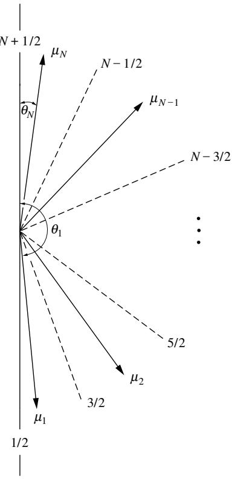
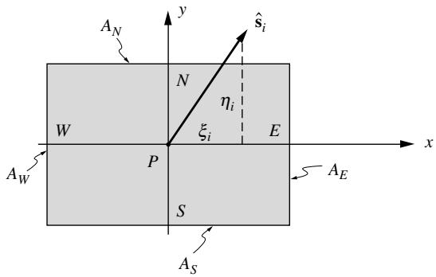
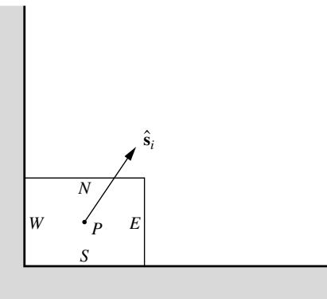
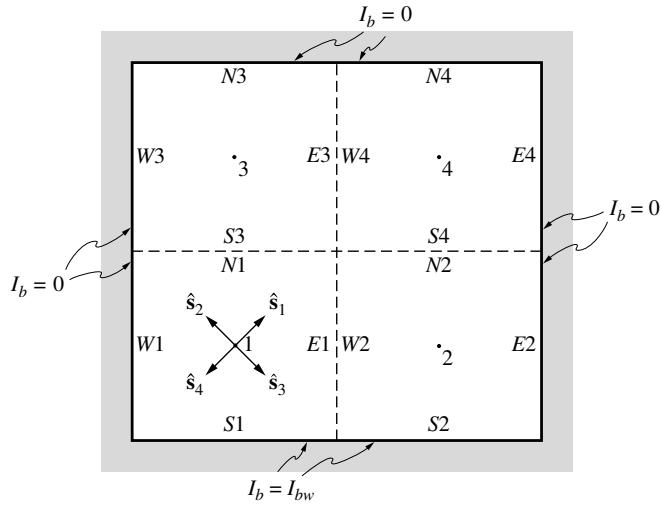
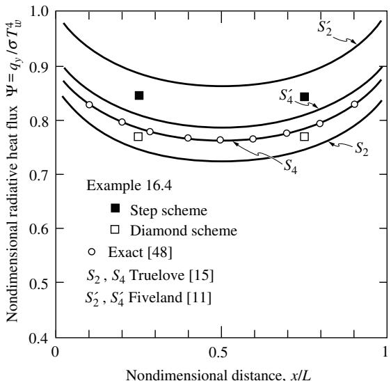
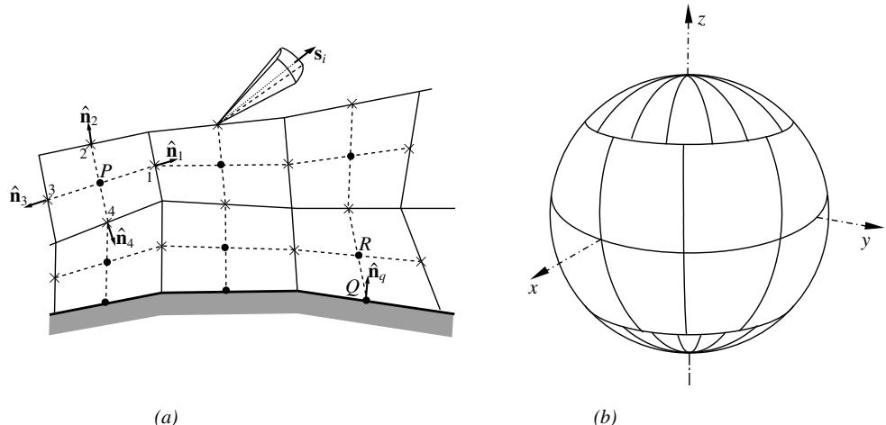
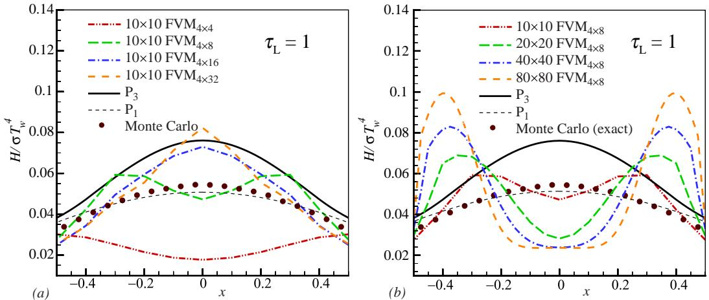

## 内容索引

- [目录](README.md)
- [1 热辐射基础](1-热辐射基础.md)
- [2 基于电磁波理论的辐射特性预测](2-基于电磁波理论的辐射特性预测.md)
- [3 实际表面的辐射特性](3-实际表面的辐射特性.md)
- [4 视角因子](4-视角因子.md)
- [5 灰体漫射表面间的辐射交换](5-灰体漫射表面间的辐射交换.md)
- [6 部分镜面灰体表面间的辐射交换](6-部分镜面灰体表面间的辐射交换.md)
- [7 非理想表面间的辐射交换](7-非理想表面间的辐射交换.md)
- [8 表面交换的蒙特卡洛方法](8-表面交换的蒙特卡洛方法.md)
- [9 传导和对流存在时的表面辐射交换](9-传导和对流存在时的表面辐射交换.md)
- [10 参与介质中的辐射传递方程(RTE)](10-参与介质中的辐射传递方程(RTE).md)
- [11 分子气体的辐射特性](11-分子气体的辐射特性.md)
- [12 颗粒介质的辐射特性](12-颗粒介质的辐射特性.md)
- [13 半透明介质的辐射特性](13-半透明介质的辐射特性.md)
- [14 一维灰体介质的精确解](14-一维灰体介质的精确解.md)
- [15 一维介质的近似求解方法](15-一维介质的近似求解方法.md)
- [16 球谐函数法 (PN-近似)](16-球谐函数法(PN-近似).md)
- [17 离散坐标法 (SN-近似)](17-离散坐标法(SN-近似).md)
- [18 区域法](18-区域法.md)
- [19 准直辐射与瞬态现象](19-准直辐射与瞬态现象.md)
- [20 非灰消光系数的求解方法](20-非灰消光系数的求解方法.md)
- [21 参与介质的蒙特卡洛方法](21-参与介质的蒙特卡洛方法.md)
- [22 辐射与传导和对流的耦合](22-辐射与传导和对流的耦合.md)
- [23 逆辐射传热](23-逆辐射传热.md)
- [24 纳米尺度辐射传热](24-纳米尺度辐射传热.md)
- [附录](附录.md)

- [17.1 引言](#171-引言)
- [17.2 一般关系](#172-一般关系)
- [17.3 一维平板问题](#173-一维平板问题)
- [17.4 一维同心球与圆柱](#174-一维同心球与圆柱)
- [17.5 多维问题](#175-多维问题)
- [17.6 有限体积法](#176-有限体积法)
- [17.7 修正离散坐标法](#177-修正离散坐标法)
- [17.8 偶宇称公式](#178-偶宇称公式)
- [17.9 其他相关方法](#179-其他相关方法)
- [17.10 结论](#1710-结论)
- [参考文献](#参考文献)
- [习题](#习题)

# 第17章

# 离散坐标法(S_N近似)

# 17.1 引言

与球谐函数法类似，离散坐标法是一种将传递方程(对于灰体介质或基于光谱)转换为一组联立偏微分方程的工具。与P_N方法类似，离散坐标法或S_N方法可以执行到任意阶数和精度，尽管高阶S_N方案的数学公式要简单得多。该方法最初由Chandrasekhar[1]在其关于恒星和大气辐射的工作中提出，最初在传热领域并未受到太多关注。与P_N方法类似，离散坐标法首先被系统地应用于中子输运理论问题，特别是由Lee[2]和Lathrop[3,4]完成。早期有一些未优化的尝试将该方法应用于一维平面热辐射问题(Love等[5,6]，Hottel等[7]，Roux和Smith[8,9])。但仅在过去的三十年中，离散坐标法才被应用于并优化用于一般辐射传热问题，主要是通过Fiveland[10-13]和Truelove[14-16]的开创性工作。

离散坐标法基于辐射强度方向变化的离散表示。通过求解一组覆盖总立体角范围4π的离散方向的传递方程来找到输运问题的解。因此，离散坐标法本质上是对传递方程方向依赖性的有限差分。立体角积分通过数值积分近似(例如，用于评估辐射源项、辐射热流等)。

如今，许多数值传热模型使用有限体积法而非有限差分法。类似地，也可以使用有限的"立体角体积"进行方向离散化。这种离散坐标法的变体通常被称为(辐射传递的)有限体积法，并且越来越受欢迎。由于高阶实现的相对直接性，离散坐标法(DOM)及其有限体积法变体(FVM)受到了极大关注，如今可能是最流行的RTE求解器(与P1近似一起)，大多数商业CFD代码中都包含了它们的某些版本。Charest等[17]和Coelho[18]对DOM和FVM的能力和缺点进行了详细评述。后者提供了针对一般几何形状最完整的方法描述，远超本书能提供的细节。

在本章中，我们将首先为标准S_N方法开发偏微分方程组及其边界条件。随后将介绍如何将该方法应用于一维平面平行介质，以及处理球面和圆柱几何的章节，然后概述其在二维和三维问题中的应用。接着将介绍有限体积法的发展，最后本章将简要介绍其他相关方法。

# 17.2 一般关系

根据方程(10.21)，吸收、发射和各向异性散射介质的一般传递方程为：

$$
\frac{dI}{ds} = \hat{\mathbf{s}}\cdot \nabla I(\mathbf{r},\hat{\mathbf{s}}) = \kappa (\mathbf{r})I_b(\mathbf{r}) - \beta (\mathbf{r})I(\mathbf{r},\hat{\mathbf{s}}) + \frac{\sigma_s(\mathbf{r})}{4\pi}\int_{4\pi}I(\mathbf{r},\hat{\mathbf{s}}')\Phi (\mathbf{r},\hat{\mathbf{s}}',\hat{\mathbf{s}})d\Omega '. \tag{17.1}
$$

方程(17.1)适用于灰体介质或非灰介质的光谱基础，并受边界条件约束：

$$
I(\mathbf{r}_w,\hat{\mathbf{s}}) = \epsilon (\mathbf{r}_w)I_b(\mathbf{r}_w) + \frac{\rho(\mathbf{r}_w)}{\pi}\int_{\hat{\mathbf{n}}\cdot \hat{\mathbf{s}} '\prec 0}I(\mathbf{r}_w,\hat{\mathbf{s}} ')|\hat{\mathbf{n}}\cdot \hat{\mathbf{s}} '|d\Omega ', \tag{17.2}
$$

其中我们限制自己考虑具有不透明、漫发射和漫反射壁面的封闭空间。将方程(17.2)扩展到更复杂的边界条件是直接的。

# 离散坐标方程

在离散坐标法中，方程(17.1)针对n个不同方向$\hat{\mathbf{s}}_i$($i=1,2,...,n$)求解，方向积分被数值积分替代，即：

$$
\int_{4\pi}f(\hat{\mathbf{s}})d\Omega \simeq \sum_{i = 1}^{n}w_{i}f(\hat{\mathbf{s}}_{i}), \tag{17.3}
$$

其中$w_{i}$是与方向$\hat{\mathbf{s}}_i$相关的积分权重。因此，方程(17.1)近似为n个方程：

$$
\hat{\mathbf{s}}_i\cdot \nabla I(\mathbf{r},\hat{\mathbf{s}}_i) = \kappa (\mathbf{r})I_b(\mathbf{r}) - \beta (\mathbf{r})I(\mathbf{r},\hat{\mathbf{s}}_i) + \frac{\sigma_s(\mathbf{r})}{4\pi}\sum_{j = 1}^{n}w_jI(\mathbf{r},\hat{\mathbf{s}}_j)\Phi (\mathbf{r},\hat{\mathbf{s}}_j,\hat{\mathbf{s}}_i),\quad i = 1,2,\ldots ,n, \tag{17.4}
$$

受边界条件约束：

$$
I(\mathbf{r}_w,\hat{\mathbf{s}}_i) = \epsilon (\mathbf{r}_w)I_b(\mathbf{r}_w) + \frac{\rho(\mathbf{r}_w)}{\pi}\sum_{\hat{\mathbf{n}}\cdot \hat{\mathbf{s}}_j< 0}w_jI(\mathbf{r}_w,\hat{\mathbf{s}}_j)|\hat{\mathbf{n}}\cdot \hat{\mathbf{s}}_j|,\quad \hat{\mathbf{n}}\cdot \hat{\mathbf{s}}_i > 0. \tag{17.5}
$$

每个沿$\hat{\mathbf{s}}_i$方向传播的光束与封闭表面相交两次：一次是光束从壁面发出($\hat{\mathbf{n}}\cdot \hat{\mathbf{s}}_i > 0$)，另一次是光束撞击壁面被吸收或反射($\hat{\mathbf{n}}\cdot \hat{\mathbf{s}}_i< 0$)。控制方程是一阶的，只需要一个边界条件(对于发出强度，$\hat{\mathbf{n}}\cdot \hat{\mathbf{s}}_i > 0$)。方程(17.4)及其边界条件(17.5)构成了n个联立的一阶线性偏微分方程，用于求解未知的$I_{i}(\mathbf{r}) = I(\mathbf{r},\hat{\mathbf{s}}_{i})$。$I_{i}$的解可以使用任何标准技术(解析或数值)找到。如果存在散射($\sigma_{s}\neq 0$)和/或边界壁面是反射的，方程会以某种方式耦合，通常需要迭代过程。即使没有散射和表面反射，如果存在辐射平衡，温度场可能未知，必须从强度场计算，这又需要迭代。只有在没有散射和壁面反射，且温度场已知的情况下，强度$I_{i}$的解才是直接的(与精确解一样)。

一旦确定了强度，所需的方向积分量就可以轻松计算。介质内部或表面的辐射热流可以根据其定义(方程(10.52))找到：

$$
\mathbf{q}(\mathbf{r}) = \int_{4\pi}I(\mathbf{r},\hat{\mathbf{s}})\hat{\mathbf{s}} d\Omega \simeq \sum_{i = 1}^{n}w_{i}I_{i}(\mathbf{r})\hat{\mathbf{s}}_{i}. \tag{17.6}
$$

入射辐射$G$[以及通过方程(10.59)的辐射热流散度]类似地确定为：

$$
G(\mathbf{r}) = \int_{4\pi}I(\mathbf{r},\hat{\mathbf{s}})d\Omega \simeq \sum_{i = 1}^{n}w_{i}I_{i}(\mathbf{r}). \tag{17.7}
$$

在表面，热流也可以从表面能量平衡[方程(4.1)和(3.16)]确定为：

$$
\begin{array}{l}\mathbf{q}\cdot \hat{\mathbf{n}} (w_w) = \epsilon (w_w)[\pi I_b(\mathbf{r}_w) - H(w_w)]\\ \displaystyle \simeq \epsilon (w_w)\big(\pi I_b(\mathbf{r}_w) - \sum_{\hat{\mathbf{n}}\cdot \hat{\mathbf{s}}_i< 0}w_iI_i(\mathbf{r}_w)|\hat{\mathbf{n}}\cdot \hat{\mathbf{s}}_i\big)\big). \end{array} \tag{17.8}
$$

如果将分析限制在线性各向异性散射，即散射相函数为：

$$
\Phi (\mathbf{r},\hat{\mathbf{s}},\hat{\mathbf{s}}^{\prime}) = 1 + A_{1}(\mathbf{r})\hat{\mathbf{s}}^{\prime}\cdot \hat{\mathbf{s}}. \tag{17.9}
$$

那么使用方程(17.6)和(17.7)和/或方程(14.15)可以得到：

$$
\hat{\mathbf{s}}_i\cdot \nabla I_i + \beta I_i = \kappa I_b + \frac{\sigma_s}{4\pi} (G + A_1\mathbf{q}\cdot \hat{\mathbf{s}}_i),\quad i = 1,2,\ldots ,n, \tag{17.10}
$$

在封闭表面具有边界条件：

$$
I_{i} = \frac{J_{w}}{\pi} = I_{bw} - \frac{1 - \epsilon}{\epsilon\pi}\mathbf{q}\cdot \hat{\mathbf{n}},\quad \hat{\mathbf{n}}\cdot \hat{\mathbf{s}}_{i} > 0 \tag{17.11}
$$

在封闭表面处。当然，辐射热流和入射辐射是需要通过方程(17.6)和(17.7)中的方向强度级数来确定的未知量。方程(17.10)和(17.11)为迭代求解过程提供了便利形式：在每次迭代中，先估计$G$和$\mathbf{q}$的值，然后评估$n$个强度$I_{i}$。接着更新$G$和$\mathbf{q}$的值，如此循环。

# 离散坐标方向的选择

求积方案的选择是任意的，尽管对方向$\hat{\mathbf{s}}_{i}$和求积权重$w_{i}$的限制可能源于保持对称性和满足某些条件的需要。通常选择完全对称的方向和权重集合(即在任何$90^{\circ}$旋转后保持不变的集合)，并且满足零阶、一阶和二阶矩条件：

$$
\begin{array}{l}{\int_{4\pi}d\Omega = 4\pi = \sum_{i = 1}^{n}w_{i},}\\ {\int_{4\pi}\hat{\mathbf{s}} d\Omega = \textbf{0} = \sum_{i = 1}^{n}w_{i}\hat{\mathbf{s}}_{i},}\\ {\int_{4\pi}\hat{\mathbf{s}}\hat{\mathbf{s}} d\Omega = \frac{4\pi}{3}\delta = \sum_{i = 1}^{n}w_{i}\hat{\mathbf{s}}_{i}\hat{\mathbf{s}}_{i},} \end{array} \tag{17.12b}
$$

其中$\delta$是单位张量[参见方程(16.30)]。满足所有这些标准的不同方向和权重集合已被制表，例如由Lee [2]和Lathrop与Carlson [19]完成。Fiveland [12]和Truelove [15]观察到不同的坐标集合可能导致显著不同的精度。他们指出$(i)$强度在壁面处可能存在方向不连续性，$(ii)$壁面处重要的辐射热流是通过$2\pi$半范围内强度的第一矩来评估的[方程(17.8)]。他们得出结论，坐标和权重集合还应满足半范围的第一矩条件，即：

$$
\int_{\hat{\mathbf{n}}\cdot \hat{\mathbf{s}} < 0}|\hat{\mathbf{n}}\cdot \hat{\mathbf{s}} |d\Omega = \int_{\hat{\mathbf{n}}\cdot \hat{\mathbf{s}} >0}\hat{\mathbf{n}}\cdot \hat{\mathbf{s}} d\Omega = \pi = \sum_{\hat{\mathbf{n}}\cdot \hat{\mathbf{s}} >0}w_{i}\hat{\mathbf{n}}\cdot \hat{\mathbf{s}}_{i}. \tag{17.13}
$$

虽然对于表面法线的任意方向不可能满足方程(17.13)，但对于主方向$\hat{\mathbf{n}} = \hat{\mathbf{i}},\hat{\mathbf{j}}$或${\bf k}$是可以满足的。满足$(i)$对称性要求、$(ii)$矩方程(17.12)和$(iii)$半矩方程(17.13)(对于$\hat{\mathbf{n}}$的三个主方向)^1的坐标和权重集合已由Lathrop和Carlson [19]给出。表17.1中复制了前四个标记为$S_{2^{-}}$、$S_{4^{-}}$、$S_{6^{-}}$和$S_{8}$-近似的集合。表中$\xi_{i}$、$\eta_{i}$和$\mu_{i}$是$\hat{\mathbf{s}}_i$的方向余弦，即

$$
\hat{\mathbf{s}}_i = (\hat{\mathbf{s}}_i\cdot \hat{\mathbf{i}})\hat{\mathbf{i}} +(\hat{\mathbf{s}}_i\cdot \hat{\mathbf{j}})\hat{\mathbf{j}} +(\hat{\mathbf{s}}_i\cdot \hat{\mathbf{k}})\hat{\mathbf{k}} = \xi_i\hat{\mathbf{i}} +\eta_i\hat{\mathbf{j}} +\mu_i\hat{\mathbf{k}}. \tag{17.14}
$$

表17.1中仅给出了正方向余弦值，覆盖了总立体角$4\pi$的八分之一。为了覆盖整个$4\pi$空间，$\xi_{i}$、$\eta_{i}$和$\mu_{i}$的值可以全部或部分为正或负。因此，每个坐标行实际上包含八个不同的方向。例如，对于$S_{2}$近似，不同方向包括$\hat{\mathbf{s}}_{1} = 0.577350(\hat{\mathbf{i}} + \hat{\mathbf{j}} + \hat{\mathbf{k}})$、$\hat{\mathbf{s}}_{2} = 0.577350(\hat{\mathbf{i}} + \hat{\mathbf{j}} - \hat{\mathbf{k}})$，...，$\hat{\mathbf{s}}_{8} = - 0.577350(\hat{\mathbf{i}} + \hat{\mathbf{j}} + \hat{\mathbf{k}})$。由于对称的$S_{2}$近似不满足半矩条件，表17.1中还包含了Truelove[15]提出的非对称$S_{2}$近似。该近似满足方程(17.13)对两个主方向的要求，适用于一维和二维问题（非对称项会消失，如下节例17.1所示）。

"$S_{N}$近似"的名称表示每个主方向使用$N$个不同的方向余弦。例如$S_{4}$近似中$\xi_{i} = \pm 0.295876$和$\pm 0.908248$（$\eta_{i}$或$\mu_{i}$同理）。总共有$n = N(N + 2)$个不同方向需要考虑（由于对称性，其中许多方向对一维和二维问题可能不必要）。

文献中还可以找到其他几种求积方案。Carlson[20]提出了一组等权重$w_{i}$的方案（如表17.1中的$S_{2}$和$S_{4}$集合）。Fiveland[21]提供了另外两种求积方案以及对所有离散坐标集适用性的详细评述。Sánchez和Smith[22]以及El-Wakil和Sacadura[23]的文献记录了生成求积集的程序。

Thurgood等人[24]提出了一类新的求积集，类似于$S_{n}$集在$90^{\circ}$旋转下对称，但方向排列不同，作者称之为$T_{n}$集。这些集合总能产生正权重，据称可以减少所谓的"射线效应"（将在第560页稍后讨论）。Li等人[25]进一步改进了这些集合。Koch和Becker[26]最近对方向求积方案进行了全面综述，包括对其精度的评估。

上述坐标集都无法准确处理准直（即单向）辐射。为解决这个问题，Li等人[27]开发了ISW方案，在常规求积集中添加了一个"无限小权重"的坐标。

表17.1 $S_N$近似的离散坐标($N=2,4,6,8$)，来自[19]

| 近似阶数 | 坐标ξ | 坐标η | 坐标μ | 权重w |
|---------|-------|-------|-------|-------|
| S2(对称) | 0.5773503 | 0.5773503 | 0.5773503 | 1.5707963 |
| S2(非对称) | 0.5000000 | 0.7071068 | 0.5000000 | 1.5707963 |
| S4 | 0.2958759 | 0.2958759 | 0.9082483 | 0.5235987 |
| S4 | 0.2958759 | 0.9082483 | 0.2958759 | 0.5235987 |
| S4 | 0.9082483 | 0.2958759 | 0.2958759 | 0.5235987 |
| S6 | 0.1838670 | 0.1838670 | 0.9656013 | 0.1609517 |
| S6 | 0.1838670 | 0.6950514 | 0.6950514 | 0.3626469 |
| S6 | 0.1838670 | 0.9656013 | 0.1838670 | 0.1609517 |
| S6 | 0.6950514 | 0.1838670 | 0.6950514 | 0.3626469 |
| S6 | 0.6950514 | 0.6950514 | 0.1838670 | 0.3626469 |
| S6 | 0.9656013 | 0.1838670 | 0.1838670 | 0.1609517 |
| S8 | 0.1422555 | 0.1422555 | 0.9795543 | 0.1712359 |
| S8 | 0.1422555 | 0.5773503 | 0.8040087 | 0.0992284 |
| S8 | 0.1422555 | 0.8040087 | 0.5773503 | 0.0992284 |
| S8 | 0.1422555 | 0.9795543 | 0.1422555 | 0.1712359 |
| S8 | 0.5773503 | 0.1422555 | 0.8040087 | 0.0992284 |
| S8 | 0.5773503 | 0.5773503 | 0.5773503 | 0.4617179 |
| S8 | 0.5773503 | 0.8040087 | 0.1422555 | 0.0992284 |
| S8 | 0.8040087 | 0.1422555 | 0.5773503 | 0.0992284 |
| S8 | 0.8040087 | 0.5773503 | 0.1422555 | 0.0992284 |
| S8 | 0.9795543 | 0.1422555 | 0.1422555 | 0.1712359 |

# 17.3 一维平板问题

我们首先演示如何将$S_{N}$离散坐标法应用于由两个漫发射反射等温平板包围的一维平面平行平板这一简单情况。与前面章节一样，我们将自己限制在线性各向异性散射，尽管扩展到任意各向异性散射是直接的。我们在这里避免这样做是为了使推导步骤更容易理解。如果我们选择$z$作为两板之间的空间坐标$(0 \leq z \leq L)$，并引入光学坐标$\tau$，其中$d\tau = \beta dz (0 \leq \tau \leq \tau_{i})$，则方程(17.4)转换为：

$$
\mu_{i}\frac{dI_{i}}{d\tau} = (1 - \omega)I_{b} - I_{i} + \frac{\omega}{4\pi}\sum_{j = 1}^{n}w_{j}I_{j}\left[1 + A_{1}(\mu_{i}\mu_{j} + \xi_{i}\xi_{j} + \eta_{i}\eta_{j})\right],\quad i = 1,2,\ldots ,n. \tag{17.15}
$$

表17.2 一维$S_{N}$近似的离散坐标$(N = 2,4,6,8)$

| 近似阶数 | 坐标μ | 权重w' |
|---------|-------|--------|
| S2(对称) | 0.5773503 | 6.2831853 |
| S2(非对称) | 0.5000000 | 6.2831853 |
| S4 | 0.2958759 | 4.1887902 |
| S4 | 0.9082483 | 2.0943951 |
| S6 | 0.1838670 | 2.7382012 |
| S6 | 0.6950514 | 2.9011752 |
| S6 | 0.9656013 | 0.6438068 |
| S8 | 0.1422555 | 2.1637144 |
| S8 | 0.5773503 | 2.6406988 |
| S8 | 0.8040087 | 0.7938272 |
| S8 | 0.9795543 | 0.6849436 |

对于一维平板问题，辐射强度与方位角无关。由于对于每个具有正ξ_j值的坐标点j(给定μ_j)，都存在一个具有相同但负ξ_j值的对应点，且两者的强度相同，因此方程(17.15)中涉及ξ_j的项相互抵消。同样的情况也适用于涉及η_j的项，但不适用于涉及μ_j的项(因为强度确实依赖于极角θ，且μ = cosθ)。然而，涉及μ_j的项会多次重复出现：表17.1中每一行所示的每个μ值(正负μ值分别计算)对应四个不同的坐标点(ξ和η的正负值组合)。此外，特定的μ值可能在表17.1的多行中出现。如果将对应于单个μ值的所有求积权重相加，方程(17.15)可简化为

$$
\mu_{i}\frac{dI_{i}}{d\tau} = (1 - \omega)I_{b} - I_{i} + \frac{\omega}{4\pi}\sum_{j = 1}^{N}w_{j}^{\prime}I_{j}(1 + A_{1}\mu_{i}\mu_{j}),\quad i = 1,2,\ldots ,N, \tag{17.16}
$$

其中w_j'是求和后的求积权重。例如，对于S4近似中μ=0.2958759的情况，求和后的求积权重为w'=4×(0.5235987+0.5235987)=4π/3，依此类推。一维平板的坐标点和求积权重列于表17.2中。方程(17.16)本可以通过使用方程(17.10)而非(17.4)更轻松地得到，直接导出

$$
\mu_{i}\frac{dI_{i}}{d\tau} +I_{i} = (1 - \omega)I_{b} + \frac{\omega}{4\pi} (G + A_{1}q\mu_{i}),\quad i = 1,2,\ldots ,N. \tag{17.17}
$$

在讨论方程(17.17)的边界条件之前，我们应该认识到，在N个不同的强度中，一半来自τ=0处的壁面(μ_i>0)，另一半来自τ=τ_L处的壁面(μ_i<0)。按照第14章的表示法，我们将N个不同的I_i替换为

$$
I_1^+,I_2^+,...,I_{N / 2}^+\mathrm{and}I_1^-,I_2^-,...,I_{N / 2}^-
$$

则方程(17.17)可重写为

$$
\begin{array}{c}{\mu_i\frac{dI_i^+}{d\tau} +I_i^+ = (1 - \omega)I_b + \frac{\omega}{4\pi} (G + A_1q\mu_i),}\\ {-\mu_i\frac{dI_i^-}{d\tau} +I^- = (1 - \omega)I_b + \frac{\omega}{4\pi} (G - A_1q\mu_i),}\\ {i = 1,2,\ldots ,N / 2;\quad \mu_i > 0.} \end{array} \tag{17.18b}
$$

采用这种表示法，方程(17.18)的边界条件可由方程(17.5)或(17.11)得出

$$
\begin{array}{ll}\tau = 0: & I_i^+ = J_1 / \pi = I_{b1} - \frac{1 - \epsilon_1}{\epsilon_1\pi} q_1,\\ \displaystyle \tau = \tau_i: & I_i^- = J_2 / \pi = I_{b2} + \frac{1 - \epsilon_2}{\epsilon_2\pi} q_2,\\ \displaystyle & i = 1,2,\ldots ,N / 2,\quad \mu_i > 0. \end{array} \tag{17.19a}
$$

(对于τ_L处的边界条件，符号会切换，因为n̂指向与z相反的方向。)辐射热流q和入射辐射G通过方程(17.6)和(17.7)与方向强度相关，即

$$
\begin{array}{l}{q = \sum_{i = 1}^{N / 2}w_i^{\prime}\mu_i(I_i^+ -I_i^-),}\\ {G = \sum_{i = 1}^{N / 2}w_i^{\prime}(I_i^+ +I_i^-).} \end{array} \tag{17.20b}
$$

在两个表面处，辐射热流更方便地通过方程(17.8)计算为

$$
\begin{array}{lcl}{\tau = 0:} & {q_1 =} & {q(0) =} & {\epsilon_1\Big(E_{b1} - \sum_{i = 1}^{N / 2}w_i'\mu_iI_i^- \Big),}\\ {} & {} & {}\\ {\tau = \tau_i:} & {q_2 = -q(\tau_i) = -\epsilon_2\Big(E_{b2} - \sum_{i = 1}^{N / 2}w_i'\mu_iI_i^+\Big).} \end{array} \tag{17.21b}
$$

例17.1. 考虑两块大的平行灰漫射等温平板，间距为L。一块平板温度为T1，发射率为ε1，另一块为T2，发射率为ε2。两板之间的介质是灰色、吸收/发射和线性各向异性散射的气体(n=1)，具有恒定消光系数β和单次散射反照率ω。假设处于辐射平衡状态，使用S2近似确定两板之间的辐射热流。

# 解

对于辐射平衡，根据方程(10.59)，有I_b=G/4π且q=常数；方程(17.18)和(17.19)变为

$$
\begin{array}{l}\mu_1\frac{dI_1^+}{d\tau} +I_1^+ = \frac{1}{4\pi} (G + A_1\omega \mu_1q),\\ -\mu_1\frac{dI_1^-}{d\tau} +I_1^- = \frac{1}{4\pi} (G - A_1\omega \mu_1q), \end{array}
$$

$$
\tau = 0:\quad I_1^+ = J_1 / \pi ,\qquad \tau = \beta L = \tau_L:\quad I_1^- = J_2 / \pi .
$$

对于S2近似，我们只有一个坐标方向μ1(指向τ_L表示I1^+，指向0表示I1^-)，其中对称S2近似中μ1=0.57735，非对称S2近似中μ1=0.5[满足半范围矩条件，方程(17.13)]。对于简单的S2近似，联立方程(本例中只有两个)可以分离。我们通过用G和q表示I1^+和I1^-来实现这一点。根据方程(17.20)，w_i'=2π，

$$
\begin{array}{l}{G = 2\pi (I_1^+ +I_1^-),}\\ {q = 2\pi \mu_1(I_1^+ -I_1^-).} \end{array}
$$

因此，将两个微分方程相加和相减并乘以2π得到

$$
\begin{array}{c}{\frac{dq}{d\tau} +G = G,\quad \mathrm{or}\quad \frac{dq}{d\tau} = 0,}\\ {\mu_1\frac{dG}{d\tau} +\frac{1}{\mu_1} q = A_1\omega \mu_1q,\quad \mathrm{or}\quad \frac{dG}{d\tau} = -\bigg(\frac{1}{\mu_1^2} -A_1\omega \bigg)q.} \end{array}
$$

第一个方程只是辐射平衡的重述，而第二个方程可以积分(因为q=常数)，即

$$
G = C - \Big(\frac{1}{\mu_1^2} -A_1\omega \Big)q\tau .
$$

这个关系包含两个未知常数(C和q)，必须由边界条件确定，即

$$
\begin{array}{rl}\tau = 0: & I_1^+ = \frac{1}{4\pi}\left(G + \frac{q}{\mu_1}\right) = J_1 / \pi ,\\ \tau = \tau_{\iota}: & I_1^- = \frac{1}{4\pi}\left(G - \frac{q}{\mu_1}\right) = J_2 / \pi ,\\ \tau = 0: & 4J_1 = G + \frac{q}{\mu_1} = C + \frac{q}{\mu_1},\\ \tau = \tau_{\iota}: & 4J_2 = G - \frac{q}{\mu_1} = C - \left(\frac{1}{\mu_1^2} -A_1\omega\right)q\tau_{\iota} - \frac{q}{\mu_1}. \end{array}
$$

相减后得到

$$
\Psi = \frac{q}{J_1 - J_2} = \frac{2\mu_1}{1 + \left(1 / \mu_1^2 - A_1\omega\right)\mu_1\tau_{\iota} / 2},
$$

其中辐射强度可以通过方程(14.48)消除。对于对称的$S_{2}$近似，$\mu_{1} = 0.57735 = 1 / \sqrt{3}$，且在各向同性散射($A_{1} = 0$)情况下，该表达式变为

$$
\Psi_{\mathrm{symmetric}} = \frac{1}{\sqrt{3} / 2 + 3\tau_{\iota} / 4}.
$$

另一方面，对于非对称$S_{2}$近似($\mu_{1} = 0.5$)，同样在各向同性散射情况下，

$$
\Psi_{\mathrm{nonsymmetric}} = \frac{1}{1 + \tau_{\iota}}.
$$

$S_{2}$近似与15.3节讨论的双通量法相同，而非对称$S_{2}$方法本质上就是Schuster-Schwarzschild近似。表17.3比较了两种$S_{2}$近似、$P_{1}$近似和精确解的结果。可以看出$S_{2}$方法的精度大致与$P_{1}$近似相当。非对称$S_{2}$近似优于对称近似，因为对称$S_{2}$不满足半矩条件(方程17.13)，在光学薄极限情况下会产生显著误差。

作为一维离散坐标法的第二个示例，我们将重复例16.4，该示例最初用于演示$P_{3}$近似的应用。

例17.2. 考虑一个温度为$T$的等温介质，被夹在两个大的平行黑体平板之间，平板保持相同温度$T_{w}$。介质是灰色的，具有吸收和发射能力但不散射。使用$S_{2}$和$S_{4}$离散坐标近似确定介质内热传递率的表达式。

表17.3 辐射平衡下一维平行平板介质中的辐射热流；$S_2$和$P_1$近似方法的比较

| τL  | 精确解 | S2(对称) | S2(非对称) | P1   |
|-----|--------|----------|------------|------|
| 0.0 | 1.0000 | 1.1547   | 1.0000     | 1.0000 |
| 0.1 | 0.9157 | 1.0627   | 0.9091     | 0.9302 |
| 0.5 | 0.7040 | 0.8058   | 0.6667     | 0.7273 |
| 1.0 | 0.5532 | 0.6188   | 0.5000     | 0.5714 |
| 5.0 | 0.2077 | 0.2166   | 0.1667     | 0.2105 |

注：Ψ = q/(J1-J2)

# 解

对于这个特别简单的情况，方程(17.18)简化为

$$
\begin{array}{c}{\mu_i\frac{dI_i^+}{d\tau} = I_i = I_b,}\\ {-\mu_i\frac{dI_i^-}{d\tau} = I_i = I_b.} \end{array}
$$

由于$I_{b} =$常数，这些方程可以直接积分得到

$$
\begin{array}{r}I_{i}^{+} = I_{b} + C^{+}e^{-\tau /\mu_{i}},\\ I_{i}^{-} = I_{b} + C^{-}e^{\tau /\mu_{i}}. \end{array}
$$

积分常数$C^+$和$C^-$可由边界条件(17.19)确定：

$$
\begin{array}{rl}\tau = 0; & I_i^+ = I_{bw} = I_b + C^+,~\mathrm{or}~C^+ = I_{bw} - I_b;\\ \tau = \tau_i; & I_i^- = I_{bw} = I_b + C^- e^{\tau_L / \mu_i},~\mathrm{or}~C^- = (I_{bw} - I_b)e^{-\tau_L / \mu_i}. \end{array}
$$

因此，

$$
\begin{array}{r}I_i^+ = I_b + (I_{bw} - I_b)e^{-\tau /\mu_i},\\ I_i^- = I_b + (I_{bw} - I_b)e^{-(\tau_L - \tau) / \mu_i}. \end{array}
$$

辐射热流可由方程(17.20)得出：

$$
q = \sum_{i = 1}^{N / 2}w_i^{\prime}\mu_i(l_{bw} - I_b)\left(e^{-\tau /\mu_i} - e^{-(\tau_L - \tau) / \mu_i}\right),
$$

或以无量纲形式表示为

$$
\Psi = \frac{q}{n^2\sigma(T_w^4 - T^4)} = \frac{1}{\pi}\sum_{i = 1}^{N / 2}w_i'\mu_i\left(e^{-\tau /\mu_i} - e^{-(\tau_L - \tau) / \mu_i}\right).
$$

对于非对称$S_{2}$近似，$w_{1}^{\prime} = 2\pi$且$\mu_{1} = 0.5$，即

$$
\Psi_{S_2} = e^{-2\tau} - e^{-2(\tau_L - \tau)}.
$$

对于$S_{4}$近似，$w_{1}^{\prime} = 4\pi /3$，$w_{2}^{\prime} = 2\pi /3$，$\mu_{1} = 0.2958759$，$\mu_{2} = 0.9082483$，且$\sum w_{i}^{\prime}\mu_{i} = \pi$，因此

$$
\Psi_{S_4} = 0.3945012\left(e^{-\tau /0.2958759} - e^{-(\tau_L - \tau) / 0.2958759}\right) + 0.6054088\left(e^{-\tau /0.9082483} - e^{-(\tau_L - \tau) / 0.9082483}\right).
$$

这些结果应与例16.2和16.4中的$P_{1}$和$P_{3}$近似结果进行比较。需要注意的是，$S_{N}$方法在壁面处趋近于正确的光学厚极限$(\tau_{L}\rightarrow \infty)$，即$\Psi \rightarrow 1$[如果满足方程(17.13)的半矩条件]。而对于这个特定例子，$P_{N}$近似会高估光学厚极限。

需要强调的是，最后一个例子——处理非散射、等温介质——特别适合离散坐标法。不能期望对于一般问题，$S_{4}$方法比$P_{3}$近似更容易应用。

许多研究者已用离散坐标法解决了更复杂的一维问题。Fiveland [12]考虑了与本小节相同的情况，但允许任意各向异性散射。通过有限差分法求解方程组时，他注意到高阶$S_{N}$方法需要更小的数值步长$\Delta \tau$才能获得稳定解。Kumar等人[28]不仅允许任意各向异性散射，还考虑了具有镜面反射和准直辐照的边界(如第19章所述)。他们使用IMSL软件库[29]中的子程序求解联立一阶微分方程组，该库在许多计算机上都可用。Stamnes等人[30,31]研究了与Kumar相同的问题，但还考虑了变化的辐射特性和表面的一般双向反射函数。他们使用线性代数方法解耦联立方程组，并找到了用特征值和特征向量表示的精确解析解，这些特征值/向量又通过EISPACK软件库[32]确定。使用一维离散坐标模型作为工具解决更复杂问题的其他例子可见[33-42]。

# 17.4 一维同心球与圆柱

在同心球和圆柱体中应用离散坐标法并利用一维问题的对称性，比在平行平板中要困难得多。这是因为在穿过这类封闭体时，沿视线方向的局部方向余弦会发生变化。

# 同心球体

考虑半径分别为$R_{1}$和$R_{2}$的两个同心球。内球表面具有发射率$\epsilon_{1}$并保持等温温度$T_{1}$，而外球温度为$T_{2}$，发射率为$\epsilon_{2}$。如果介质内的温度仅是半径的函数，则传递方程由式(14.69)给出：

$$
\mu \frac{\partial I}{\partial r} +\frac{1 - \mu^2}{r}\frac{\partial I}{\partial\mu} +\beta I = \beta S, \tag{17.22a}
$$

或者等价地：

$$
\frac{\mu}{r^2}\frac{\partial}{\partial r} (r^2 I) + \frac{1}{r}\frac{\partial}{\partial\mu}\left[(1 - \mu^2)I\right] + \beta I = \beta S, \tag{17.22b}
$$

其中$\mu = \cos \theta$是从径向测量的极角余弦（见图14-5）。$S$是辐射源函数：

$$
S(r,\mu) = (1 - \omega)I_b + \frac{\omega}{2}\int_{-1}^{1}I(r,\mu ')\Phi (\mu ,\mu ')d\mu ', \tag{17.23a}
$$

或者对于线性各向异性散射：

$$
S(r,\mu) = (1 - \omega)I_b + \frac{\omega}{4\pi} (G + A_1q\mu), \tag{17.23b}
$$

  
图17-1 一维问题的方向离散化和离散坐标值

额外的困难在于方程(17.22)包含对方向余弦$\mu$的导数，这需要在离散坐标法中进行离散化处理。将$S_{N}$方法应用于方程(17.22)，我们得到：

$$
\frac{\mu_i}{r^2}\frac{d}{dr} (r^2 I_i) + \frac{1}{r}\left\{\frac{\partial}{\partial\mu}\left[(1 - \mu^2)I\right]\right\}_{\mu = \mu_i} + \beta I_i = \beta S_i,i = 1,2,\ldots ,N, \tag{17.24}
$$

其中$S_{i}$可以容易地从方程(17.23)确定（除非介质是各向异性散射，否则与坐标方向无关）。由于方向向量$\mu$被离散化，其导数必须用有限差分近似。我们可以写成：

$$
\left\{\frac{\partial}{\partial\mu}\left[(1 - \mu^2)I\right]\right\}_{\mu = \mu_i}\simeq \frac{\alpha_{i + 1 / 2}I_{i + 1 / 2} - \alpha_{i - 1 / 2}I_{i - 1 / 2}}{w_i'}, \tag{17.25}
$$

这是一个中心差分格式，$I_{i\pm 1 / 2}$在两个坐标边界处求值，如图17-1所示。由于任意两个连续$\mu_{i}$之间的差异不均匀，几何系数$\alpha$非常数且需要确定。$\alpha$的值仅取决于差分格式，因此与强度无关，可以通过检查一个特别简单的强度场来确定。例如，如果两个球体温度相同，则$I_{b1} = I_{b2} = I_{b} = \mathrm{const}$，且$I = I_{b} = \mathrm{const}$。这导致：

$$
\alpha_{i + 1 / _2} - \alpha_{i - 1 / _2} = w_i'\left[\frac{\partial}{\partial\mu} (1 - \mu^2)\right]_{\mu = \mu_i} = -2w_i'\mu_i,i = 1,2,\ldots ,N. \tag{17.26}
$$

这个表达式可以作为$\alpha_{i + 1 / 2}$的递推公式，前提是能确定$\alpha_{1 / 2}$的值。注意到$I_{1 / 2}$在$\mu = -1$处求值（图17-1），其中$(1 - \mu^{2})I = 0$，因此$\alpha_{1 / 2} = 0$。类似地，$I_{N + 1 / 2}$在$\mu = +1$处求值，$\alpha_{N + 1 / 2} = 0$。方程(17.25)和(17.26)的有限差分格式满足关系[4]：

$$
\begin{array}{rl} & {\int_{-1}^{+1}\frac{\partial}{\partial\mu}\left[(1 - \mu^2)I\right]d\mu = (1 - \mu^2)I\bigg|_{-1}^{+1} = 0}\\ & {\quad = \sum_{i = 1}^{N}w_i^{\prime}\left\{\frac{\partial}{\partial\mu}\left[(1 - \mu^2)I\right]\right\}_{\mu = \mu_i} = \sum_{i = 1}^{N}\left(\alpha_{i + 1 / 2}I_{i + 1 / 2} - \alpha_{i - 1 / 2}I_{i - 1 / 2}\right)}\\ & {\quad = \alpha_{31}I_{3 / 2} - \alpha_{1 / 2}I_{1 / 2} + \alpha_{5 / 2}I_{5 / 2} - \alpha_{3 / 2}I_{3 / 2} + \dots \cdot \alpha_{N + 1 / 2}I_{N + 1 / 2} - \alpha_{N + 1 / 2}I_{N - 1 / 2}}\\ & {\quad = 0.} \end{array}
$$

最后，节点边界处的强度$I_{i\pm 1 / 2}$需要用节点中心值$I_{i}$表示。这里我们使用简单的线性平均，即$I_{i + 1 / 2}\simeq \frac{1}{2} (I_i + I_{i + 1})$。方程(17.24)现在可以重写为：

$$
\frac{\mu_i}{r^2}\frac{d}{dr} (r^2 I_i) + \frac{\alpha_{i + 1 / 2}I_{i + 1} + (\alpha_{i + 1 / 2} - \alpha_{i - 1 / 2})I_i - \alpha_{i - 1 / 2}I_{i - 1}}{2rw_i'} +\beta I_i = \beta S_i,
$$

或者，进行微分并使用方程(17.26)：

$$
\begin{array}{c}{\mu_i\frac{dI_i}{dr} +\frac{\mu_i}{r} I_i + \frac{\alpha_{i + 1 / 2}I_{i + 1} - \alpha_{i - 1 / 2}I_{i - 1}}{2rw_i'} +\beta I_i = \beta S_i,}\\ {\alpha_{i + 1 / 2} = \alpha_{i - 1 / 2} - 2w_i'\mu_i,\quad \alpha_{1 / 2} = \alpha_{N + 1 / 2} = 0,\quad i = 1,2,\ldots ,N.} \end{array} \tag{17.27b}
$$

方程(17.27)构成了一组$N$个关于未知强度$I_{i}$的联立微分方程，受边界条件约束[参见方程(17.19)]：

$$
\begin{array}{l}{r = R_1:I_i = I_1 / \pi = I_{b1} - \frac{1 - \epsilon_1}{\epsilon_1\pi} q_1,i = \frac{N}{2} +1,\frac{N}{2} +2,\ldots ,N(\mu_i > 0),}\\ {r = R_2:I_i = I_2 / \pi = I_{b2} + \frac{1 - \epsilon_2}{\epsilon_2\pi} q_2,i = 1,2,\ldots ,\frac{N}{2} (\mu_i< 0).} \end{array} \tag{17.28b}
$$

与一维平板情况类似，辐射热流和入射辐射由下式计算[参见方程(17.20)和(17.21)]：

$$
\begin{array}{l}{G(r) = \sum_{i = 1}^{N}w_{i}^{\prime}I_{i}(r),}\\ {q(r) = \sum_{i = 1}^{N}w_{i}^{\prime}\mu_{i}I_{i}(r),} \end{array} \tag{17.29b}
$$

以及：

$$
\begin{array}{c}{q(R_1) = q_1 = \epsilon_1\big(E_{b1} + \sum_{i = 1\atop (\mu_i< 0)}^{N / 2}w_i'\mu_iI_i\big),}\\ {-q(R_2) = q_2 = \epsilon_2\big(E_{b2} - \sum_{i = N / 2 + 1\atop (\mu_i > 0)}^{N}w_i'\mu_iI_i\big).} \end{array} \tag{17.29d}
$$

例17.3. 考虑一个处于辐射平衡的非散射介质，该介质被包含在两个等温灰体球壳之间。可以假设介质的吸收系数为灰体且恒定。使用$S_{2}$近似法确定两个同心球壳之间的辐射热流。

# 解

由方程(17.27)可知，当$N=2$时，$\alpha_{1/2}=\alpha_{3/2}=0$，$\alpha_{3/2}=-2w_{1}^{\prime}\mu_{1}=2w_{2}^{\prime}\mu_{2}=4\pi\mu$（因为$\mu_{2}=-\mu_{1}>0$；我们保留$\mu=\mu_{2}$作为非数值量以便比较对称和非对称$S_{2}$近似）。对于处于辐射平衡的灰体非散射介质，有$\beta=\kappa$且$\nabla\cdot\mathbf{q}=0$，源函数由方程(10.61)和(17.39)给出为$S=I_{b}=G/4\pi$。

$$
\begin{array}{rl}{i = 1:} & {-\mu \frac{dI_1}{d\tau} -\frac{\mu}{\tau} I_1 + \frac{\mu}{\tau} I_2 + I_1 = \frac{G}{4\pi} = \frac{1}{2} (I_1 + I_2),}\\ & {-\mu \frac{dI_1}{d\tau} -\left(\frac{\mu}{\tau} -\frac{1}{2}\right)(I_1 - I_2) = 0,}\\ {i = 2:} & {\mu \frac{dI_2}{d\tau} +\frac{\mu}{\tau} I_2 - \frac{\mu}{\tau} I_1 + I_2 = \frac{1}{2} (I_1 + I_2),}\\ & {\mu \frac{dI_2}{d\tau} -\left(\frac{\mu}{\tau} +\frac{1}{2}\right)(I_1 - I_2) = 0.} \end{array}
$$

将两个方程相加仅能重述辐射平衡条件（如例17.1所示），而相减（并乘以$w_{i}^{\prime}=2\pi$）则得到：

或

$$
\begin{array}{c}{-\mu\frac{d}{d\tau}[2\pi(I_1+I_2)]+2\pi(I_1-I_2)=0,}\\ {\frac{dG}{d\tau}=-\frac{q}{\mu^2}=-\frac{\tau^2q}{\mu^2}\frac{1}{\tau^2}.} \end{array}
$$

由于同心球壳间处于辐射平衡的介质满足$Q=4\pi r^{2}q=\text{常数}$，因此$\tau^{2}q=\text{常数}$，可以通过积分求得入射辐射：

$$
G(\tau) = \frac{\tau^2q}{\mu^2}\frac{1}{\tau} +C,
$$

其中两个常数$(\tau^{2}q)$和$C$仍未知，需要通过边界条件方程(17.28)确定：

$$
I_{2}(\tau_{1}) = J_{1} / \pi ,I_{1}(\tau_{2}) = J_{2} / \pi .
$$

利用$q$和$G$的定义，方程(17.29)：

$$
q = 2\pi \mu (I_2 - I_1)\quad \mathrm{and}\quad G = 2\pi (I_2 + I_1),
$$

或

$$
I_{1} = \frac{1}{4\pi}\left(G - \frac{q}{\mu}\right),I_{2} = \frac{1}{4\pi}\left(G + \frac{q}{\mu}\right),
$$

边界条件可以重新用$q$和$G$表示为：

$$
\begin{array}{rl}\tau = \tau_1: & 4J_1 = G + \frac{q_1}{\mu} = \frac{\tau_1q_1}{\mu^2} +C + \frac{q_1}{\mu} = \frac{\tau^2q}{\mu^2}\bigg(\frac{1}{\tau_1} +\frac{\mu}{\tau_1^2}\bigg) + C,\\ \tau = \tau_2: & 4J_2 = G - \frac{q_2}{\mu} = \frac{\tau_2q_2}{\mu^2} +C - \frac{q_2}{\mu} = \frac{\tau^2q}{\mu^2}\bigg(\frac{1}{\tau_2} -\frac{\mu}{\tau_2^2}\bigg) + C. \end{array}
$$

将第二个边界条件从第一个中减去，得到：

$$
\Psi = \frac{\tau^2}{\tau_1^2}\frac{q}{J_1 - J_2} = \frac{1}{\frac{1}{4\mu}\big(1 + \frac{\tau_1^2}{\tau_2^2}\big) + \frac{\tau_1}{4\mu^2}\big(1 - \frac{\tau_1}{\tau_2}\big)}.
$$

对于对称$S_{2}$近似，取$\mu=1/\sqrt{3}$，该方程变为：

$$
\Psi_{\mathrm{symmetric}} = \frac{1}{\frac{\sqrt{3}}{4}\left(1 + \frac{\tau_1^2}{\tau_2^2}\right) + \frac{3\tau_1}{4}\left(1 - \frac{\tau_1}{\tau_2}\right)},
$$

而对于非对称近似，取$\mu=0.5$：

$$
\Psi_{\mathrm{nonsymmetric}} = \frac{1}{\frac{1}{2}\left(1 + \frac{\tau_1^2}{\tau_2^2}\right) + \tau_1\left(1 - \frac{\tau_1}{\tau_2}\right)}.
$$

$S_{2}$近似的精度与$P_{1}$近似非常相似，后者为：

$$
\Psi_{P_1} = \frac{1}{\frac{1}{2}\left(1 + \frac{\tau_1^2}{\tau_2^2}\right) + \frac{3\tau_1}{4}\left(1 - \frac{\tau_1}{\tau_2}\right)}.
$$

注意该方法对于大$\tau_{1}$（大光学厚度）非常精确，但在光学薄条件$(\kappa\rightarrow0)$下会失效，特别是对于小半径比$R_{1}/R_{2}$。在极限$(\kappa\rightarrow0,R_{1}/R_{2}\rightarrow0)$下，我们发现$\Psi_{P_{1}}=\Psi_{S_{2,\text{非对称}}}\rightarrow2$，而正确的极限应该是$\Psi_{\text{精确}}\rightarrow1$。

Tsai及其同事[43]使用Fiveland[12]的等权重坐标的$S_{8}$离散坐标法，报告了方程(17.27)的数值解，允许各向异性散射、可变特性和外部辐射。Jones和Bayazitoglu[44,45]使用相同方法研究了通过球壳的传导和辐射的联合效应。

# 同心圆柱体

对两个同心圆柱体的分析遵循类似的思路。我们再次考虑一个吸收、发射和散射介质，它位于两个等温圆柱体之间，半径分别为$R_{1}$（温度$T_{1}$，漫发射率$\epsilon_{1}$）和$R_{2}$（温度$T_{2}$，发射率$\epsilon_{2}$）。对于这种情况，传递方程由方程(14.88)给出：

$$
\sin \theta \cos \psi \frac{\partial I}{\partial r} -\frac{\sin\theta\sin\psi}{r}\frac{\partial I}{\partial\psi} +\beta I = \beta S, \tag{17.30}
$$

其中极角$\theta$从$z$轴测量，方位角$\psi$从局部径向方向测量（参见图14-6）。$S$是辐射源函数，由方程(17.23)给出。引入方向余弦$\xi = \hat{\mathbf{s}} \cdot \hat{\mathbf{e}}_{z} = \cos \theta$，$\mu = \hat{\mathbf{s}} \cdot \hat{\mathbf{e}}_{r} = \sin \theta \cos \psi$和$\eta = \hat{\mathbf{s}} \cdot \hat{\mathbf{e}}_{\psi_{c}} = \sin \theta \sin \psi$，我们可以将方程(17.30)重写为：

$$
\frac{\mu}{r}\frac{\partial}{\partial r} (rI) - \frac{1}{r}\frac{\partial}{\partial\psi} (\eta I) + \beta I = \beta S. \tag{17.31}
$$

对于一维圆柱介质，对称条件不像平板和球体那样简单。这里我们有：

$$
I(r,\theta ,\psi) = I(r,\pi -\theta ,\psi) = I(r,\theta , - \psi). \tag{17.32}
$$

因此，强度对于$\xi$的正负值以及$\eta$的正负值都是相同的。因此，我们只需要考虑表17.1中$\xi_{i}$和$\eta_{i}$的正值，导致$S_{N}$近似有$N_{c} = N(N + 2) / 4$个不同的坐标点，其中求积权重为$w_{i}^{\prime \prime} = 4w_{i}$。方程(17.31)可以写成离散坐标形式：

$$
\frac{\mu_i}{r}\frac{d}{dr} (rI_i) - \frac{1}{r}\left\{\frac{\partial}{\partial\psi} (\eta I)\right\}_{\psi = \psi_i} + \beta I_i = \beta S_i,i = 1,2,\ldots ,N_c. \tag{17.33}
$$

与同心球体情况类似，大括号中的项近似为：

$$
\left\{\frac{\partial}{\partial\psi} (\eta I)\right\}_{\psi = \psi_i}\simeq \frac{\alpha_{i + 1 / 2}I_{i + 1 / 2} - \alpha_{i - 1 / 2}I_{i - 1 / 2}}{w_i^{\prime\prime}},\quad i = 1,2,\ldots ,N_i,\xi_i\mathrm{fixed}. \tag{17.34}
$$

在这个关系中，下标$i + 1 / 2$表示"朝向$\psi_{i}$的下一个更高值，同时保持$\xi_{i}$不变"。$N_{i}$的值取决于$\xi_{i}$的值。例如，对于$S_{4}$近似，从表17.1中我们有：当$\xi_{i} = 0.2958759$时$N_{i} = 4$（$\mu_{i}$有四个不同的值，两个正两个负），当$\xi_{i} = 0.9082483$时$N_{i} = 2$。在同心圆柱体情况下，通过令$I = S =$常数，可以得到$\alpha$的递推公式：

$$
\alpha_{i + 1 / 2} - \alpha_{i - 1 / 2} = w_i^{\prime \prime}\left.\frac{\partial\eta}{\partial\psi}\right|_{\psi = \psi_i} = w_i^{\prime \prime}\mu_i,i = 1,2,\ldots ,N_i,\xi_i\mathrm{fixed}. \tag{17.35}
$$

同样，$\alpha_{1 / 2} = 0$，因为在该位置$\psi_{1 / 2} = 0$，因此$\eta = 0$。类似地，$\alpha_{N_i + 1 / 2} = 0$，因为$\psi_{N_i + 1 / 2} = \pi$且$\eta = 0$。最后，对半节点强度使用线性平均得到：

$$
\begin{array}{c}{\mu_i\frac{dI_i}{dr} +\frac{\mu_i}{2r} I_i - \frac{\alpha_{i + 1 / 2}I_{i + 1} - \alpha_{i - 1 / 2}I_{i - 1}}{2rw_i^{\prime\prime}} +\beta I_i = \beta S_i,i = 1,2,\ldots ,N_c,}\\ {\alpha_{i + 1 / 2} = \alpha_{i - 1 / 2} + w_i^{\prime \prime}\mu_i,\quad \alpha_{1 / 2} = \alpha_{N + 1 / 2} = 0,i = 1,2,\ldots ,N_i,\xi_i\mathrm{fixed}.} \end{array} \tag{17.36b}
$$

方程(17.36)是同心圆柱体的方程组，用于$N_{c} = N(N + 2) / 4$个未知方向强度$I_{i}$，与同心球体的方程组(17.27)等价。圆柱体和球体的边界条件基本相同[方程(17.28)]，除了重新编号外，入射强度和辐射热流的表达式[方程(17.29)]也相同：

$$
\begin{array}{l}{r = R_1:\quad I_i = \frac{J_1}{\pi} = I_{b1} - \frac{1 - \epsilon_1}{\epsilon_1\pi} q_1,\quad i = \frac{N_c}{2} +1,\frac{N_c}{2} +2,\ldots ,N_c(\mu_i > 0),}\\ {r = R_2:\quad I_i = \frac{J_2}{\pi} = I_{b2} + \frac{1 - \epsilon_2}{\epsilon_2\pi} q_2,\quad i = 1,2,\ldots ,\frac{N_c}{2} (\mu_i< 0),}\\ {G(r) = \sum_{i = 1}^{N_c}w_i^{\prime \prime}I_i(r),}\\ {q(r) = \sum_{i = 1}^{N_c}w_i^{\prime \prime}\mu_iI_i(r),} \end{array} \tag{17.37d}
$$

以及

$$
\begin{array}{c}{q(R_1) = q_1 = \epsilon_1\big(E_{b1} + \sum_{i = 1\atop (\mu_i< 0)}^{N_c / 2}w_i^{\prime \prime}\mu_iI_i\big),}\\ {-q(R_2) = q_2 = \epsilon_2\big(E_{b2} - \sum_{i = N_c / 2 + 1\atop (\mu_i > 0)}^{N_c}w_i^{\prime \prime}\mu_iI_i\big).} \end{array} \tag{17.37f}
$$

离散坐标法在一维介质中应用的一个例子是Krishnaprakas[46]的工作，他研究了具有各种散射行为的灰色恒定性质介质中的传导和辐射联合效应。

  
图17-2 一般的二维控制体积

# 17.5 多维问题

虽然离散坐标法可以很容易地扩展到多维构型，但该方法会产生一组同时的一阶偏微分方程，通常需要数值求解。与一维几何形状一样，传递方程在笛卡尔坐标系、圆柱坐标系或球坐标系中略有不同。我们将首先描述笛卡尔坐标系的方法，然后简要说明圆柱和球坐标系的差异。

# 笛卡尔坐标系描述的封闭空间

对于笛卡尔坐标系，使用方程(17.14)可将方程(17.4)改写为：

$$
\xi_{i}\frac{\partial I_{i}}{\partial x} +n_{i}\frac{\partial I_{i}}{\partial y} +\mu_{i}\frac{\partial I_{i}}{\partial z} +\beta I_{i} = \beta S_{i},\quad i = 1,2,\ldots ,n, \tag{17.38}
$$

其中$S_{i}$是辐射源函数的简写：

$$
S_{i} = (1 - \omega)I_{b} + \frac{\omega}{4\pi}\sum_{j = 1}^{n}w_{j}\Phi_{ij}I_{j},\quad i = 1,2,\ldots ,n. \tag{17.39}
$$

方程(17.38)在每个表面都需满足方程(17.5)的边界条件。例如，对于平行于$y-z$平面的表面，$\hat{\mathbf{n}} = \hat{\mathbf{1}}$且$\hat{\mathbf{n}}\cdot \hat{\mathbf{s}}_j = \hat{\mathbf{s}}_j\cdot \hat{\mathbf{1}} = \xi_j$，对于所有$\xi_{i} > 0$的$i$（$n / 2$个边界条件）有：

$$
I_{i} = J_{w} / \pi = \epsilon_{w}I_{bw} + \frac{1 - \epsilon_{w}}{\pi}\sum_{\xi_{j}< 0}w_{j}I_{j}|\xi_{j}|. \tag{17.40}
$$

虽然可以通过标准有限差分法求解方程(17.38)，但由于方程的一阶特性需要采用后向差分，会导致较大的截断误差。因此，更常见的是采用下面描述的Carlson和Lathrop[4]的有限体积法。

# 二维问题

为清晰起见，我们将在二维几何（即$\partial I / \partial z\equiv 0$）下展开该方法。对于这种问题，强度在$\mu_{i}$的正负值下相同。因此，我们只需考虑$\mu_{i}$的正值（并将求积权重$w_{i}$加倍）。图17-2展示了一个通用体积元。体积元有四个面面积：$A_{W}$和$A_{E}$（x方向），$A_{S}$和$A_{N}$（y方向）。在简单矩形封闭空间中（z方向单位长度），$A_{W} = A_{E} = \Delta y$，$A_{S} = A_{N} = \Delta x$，$V = \Delta x\Delta y$。通过将方程(17.38)在体积元上积分得到其有限体积形式。例如，$\partial I_{i} / \partial x$项转换为：

  
图17-3 离散坐标计算的起始点：封闭空间角落

$$
\int_{V}\frac{\partial I_{i}}{\partial x} dV = \int_{A_{E}}I_{i}dA_{E} - \int_{A_{W}}I_{i}dA_{W} = I_{Ei}A_{E} - I_{Wi}A_{Wi}, \tag{17.41}
$$

其中$I_{Ei}$和$I_{Wi}$分别是$A_{E}$和$A_{W}$面上$I_{i}$的平均值。类似处理其他项后，方程(17.38)变为：

$$
\xi_{i}(A_{E}I_{Ei} - A_{W}I_{Wi}) + \eta_{i}(A_{N}I_{Ni} - A_{S}I_{Si}) = -\beta VI_{pi} + \beta VS_{pi}, \tag{17.42}
$$

其中$I_{ni}$和$S_{ni}$是体积平均值。通过将单元边界强度与体积平均强度关联可以减少方程(17.42)中的未知数。通常选择线性关系：

$$
I_{pi} = \gamma_yI_{Ni} + (1 - \gamma_y)I_{Si} = \gamma_xI_{Ei} + (1 - \gamma_x)I_{Wi}, \tag{17.43}
$$

其中$\gamma_{x}$和$\gamma_{y}$是常数$\frac{1}{2}\leq \gamma_{x},\gamma_{y}\leq 1$，该方案被称为Carlson和Lathrop[4]提出的"加权菱形差分"。目前大多数研究者采用$\gamma_{x} = \gamma_{y} = \frac{1}{2}$，即简单的菱形方案。

对于表面上的任何点，边界条件给出了所有远离表面的方向。因此，方程(17.38)的数值解通常按以下步骤进行：首先估计表面辐射率$J_{w}$和内部辐射源项$S_{i}$（通常在第一次迭代中忽略反射表面辐照和体积内散射）。然后选择左下角（对应$x$和$y$的最小值，如图17-3所示）作为起点。从该点出发，所有出射方向都位于第一象限（即方向余弦$\xi_{i}$和$\eta_{i}$均为正）。该角落控制体积的西面和南面是封闭空间表面的一部分，因此它们的强度$I_{Wi}$和$I_{Si}$可从边界条件获知。对于任何离散坐标$i$，可以通过方程(17.43)从方程(17.42)中消去$I_{Ei}$和$I_{Ni}$来计算角落控制体积的体积平均强度$I_{pi}$。因此，

$$
\gamma_{x}(A_{E}I_{Ei} - A_{W}I_{Wi}) = A_{E}I_{pi} - [(1 - \gamma_{x})A_{E} + \gamma_{x}A_{W}]I_{Wi},
$$

等等，以及

$$
I_{pi} = \frac{\beta VS_{pi} + \xi_iA_{EW}I_{Wi} / \gamma_x + \eta_iA_{NS}I_{Si} / \gamma_y}{\beta V + \xi_iA_E / \gamma_x + \eta_iA_N / \gamma_y}, \tag{17.44}
$$

其中

$$
\begin{array}{r}A_{EW} = (1 - \gamma_x)A_E + \gamma_xA_W,\\ A_{NS} = (1 - \gamma_y)A_N + \gamma_yA_S, \end{array} \tag{17.45b}
$$

是平均面面积。一旦计算出$I_{pi}$，就可以从方程(17.43)轻松确定$I_{Ei}$和$I_{Ni}$，它们等于相邻控制体积（$x$和$y$增加方向）的西面和南面强度；因此，可以逐个计算封闭空间中所有有限体积的第一象限强度。然后从封闭空间的其余三个角落开始重复该过程三次，覆盖其余三个方向象限。例如，对于$\xi_{i} < 0$，控制体积东面的强度已知，必须从方程(17.42)中消去西面强度，在找到$I_{pi}$后确定。因此，我们可以将方程(17.42)和(17.43)改写为适用于$\xi_{i}$和$\eta_{i}$的一般（正或负）值：

$$
|\xi_{i}|(A_{x_{e}}I_{x_{e}i} - A_{x_{i}}I_{x_{i}i}) + |\eta_{i}|(A_{y_{e}}I_{y_{e}i} - A_{y_{i}}I_{y_{i}i}) = -\beta V I_{pi} + \beta V S_{i}, \tag{17.46}
$$

$$
I_{pi} = \gamma_{x}I_{x_{e}i} + (1 - \gamma_{x})I_{x_{i}i} = \gamma_{y}I_{y_{e}i} + (1 - \gamma_{y})I_{y_{i}i} \tag{17.47}
$$

其中$A_{x_i}$是光束进入的$x$方向面面积（$\xi_{i} > 0$时为$A_W$，$\xi_{i} < 0$时为$A_E$），$A_{x_e}$是光束退出的$x$方向面面积（$\xi_{i} > 0$时为$A_E$，$\xi_{i} < 0$时为$A_W$），$I_{y_{i}i}$和$I_{y_{i}j}$是相应的$y$方向面强度，等等。然后可以将方程(17.44)推广为：

$$
I_{pi} = \frac{\beta VS_{pi} + |\xi_i|A_xI_{x_i} / \gamma_x + |\eta_i|A_yI_{y_i} / \gamma_y}{\beta V + |\xi_i|A_{x_e} / \gamma_x + |\eta_i|A_{y_e} / \gamma_y}, \tag{17.48}
$$

其中

$$
\begin{array}{c}{A_x = (1 - \gamma_x)A_{x_e} + \gamma_xA_{x_i},}\\ {A_y = (1 - \gamma_y)A_{y_e} + \gamma_yA_{y_i}.} \end{array} \tag{17.49b}
$$

如果所有壁面都是黑体且不存在散射，所有未知量都可以通过单次计算得到，因为所有壁面辐射力$J_{w}$和所有内部源项$S_{pi} = (I_b)_pi$都是先验已知的（如果温度场给定或假设）。如果壁面具有反射性和/或介质存在散射，则需要进行迭代计算。在完成所有方向和所有有限体积的遍历后，更新壁面辐射力和辐射源项的值，并重复该过程直到满足收敛准则。最后，根据方程(17.6)和(17.7)确定内部入射辐射和辐射热流的值，而壁面热流可以通过方程(17.8)计算。对于高反射壁面($\epsilon_w \ll 1$)和强散射介质($1 - \omega \ll 1$)，离散坐标法会变得极其低效。如Chai等人[47]指出，通过从相位函数中移除前向散射并将其视为透射，可以减少由散射引起的迭代次数。这可以通过在方程(17.38)和(17.39)中定义修正的消光系数和修正源项来实现：

$$
\begin{array}{l}\beta_{mi} = \beta -\frac{\sigma_s}{4\pi} w_i\Phi_{ii},\\ \displaystyle S_{mi} = (1 - \omega)I_b + \frac{\omega}{4\pi}\sum_{j = 1\atop j\neq i}^{n}w_j\Phi_{ij}I_j,i = 1,2,\dots,n. \end{array} \tag{17.51}
$$

这可以加速收敛，特别是当相位函数具有强前向峰值时（大颗粒常见情况；另见第12.9节的讨论）。

# 空间差分格式

用上游值表示未知强度，例如在方程(17.43)中对于$\xi_{i}, \eta_{i} > 0$，用$I_{pi}$、$I_{Si}$和$I_{Wi}$定义$I_{Ni}$和$I_{Ei}$，这被称为（强度的）空间差分。多年来提出了许多不同的差分格式。这里我们仅简要介绍最基本和流行的几种。

步进格式 步进格式是最简单的差分格式，设$\gamma_{x} = \gamma_{y} = 1$，这导致对于$\xi_{i},\eta_{i} > 0$等有$I_{Ni} = I_{pi}$和$I_{Ei} = I_{pi}$。类似于一阶导数的全隐式有限差分，它具有所有方法中最大的截断误差，但也是唯一不会产生非物理结果的方法。

菱形格式 这是最流行的差分格式，其中插值因子设为$\begin{array}{r}\gamma_{x} = \gamma_{y} = \frac{1}{2} \end{array}$。然而，Carlson和Lathrop[4]已经注意到，这可能导致控制体面上出现物理上不可能的负强度（即对于$\xi_{i},\eta_{i} > 0$等的$I_{Ni}$和$I_{Ei}$）。虽然他们简单地建议将负强度设为零并继续计算，但这可能导致振荡和不稳定性。Fiveland[13]表明，如果有限体积尺寸保持在以下范围内，这种负强度可以最小化（但不能完全避免）：

$$
\Delta x< \frac{|\xi_{i}|_{\min}}{\beta(1 - \gamma_{x})},\quad \Delta y< \frac{|\eta_{i}|_{\min}}{\beta(1 - \gamma_{y})}. \tag{17.52}
$$

因此，高阶$S_{N}$近似（其$\xi_{i}$和$\eta_{i}$的最小值较小）以及光学厚介质（大$\beta$）需要更精细的体积网格。然而，Chai等人[48]已经证明，精细网格不能保证正强度，实际上可能导致负强度。他们还注意到，菱形格式可能导致"过冲"，即预测非物理的高强度（离开控制体的强度大于进入强度加内部发射）。

指数格式 指数格式[4]通常被认为更准确，特别适用于一维几何。这里

$$
\gamma_{x} = \frac{1}{1 - e^{-\tau_{si}}} = \frac{1}{\tau_{si}},\quad s = x\mathrm{or}y;\quad \tau_{si} = \frac{\beta\Delta x}{\xi_{i}},\quad \tau_{yi} = \frac{\beta\Delta y}{\eta_{i}}. \tag{17.53}
$$

由于方程(17.53)导致插值因子小于1，该方法也可能导致物理上不可能的强度。

其他相对简单的差分格式已被提出，如正格式(Lathrop[49])、变权格式(Jamaluddin和Smith[50])、上游追踪格式(Chai等人[48])和混合格式(Kim和Kim[51])。这些方法稍微复杂一些，具有较小的截断误差。然而，与简单的步进格式不同，它们都可能产生非物理结果。

CLAM格式 CLAM格式是二阶方法，因此不遵循方程(17.43)。该方法最初是为流体流动问题开发的有限格式，首次应用于辐射传热的是Jessee和Fiveland[52]。控制体在面$f$（其中$f = W,N,E,$或$S$）退出的强度用$I_{p}$和相邻体积单元在上游$(I_{u})$和下游$(I_d)$方向的中心值表示：

$$
I_{f} = \left\{ \begin{array}{ll}I_{p} + \phi (I_{d} - I_{p}), & 0\leq \phi \leq 1,\\ I_{p}, & \mathrm{otherwise}, \end{array} \right. \tag{17.54}
$$

其中

$$
\phi = \frac{I_p - I_u}{I_d - I_u}. \tag{17.55}
$$

在图17-2的背景下，对于给定方向$\hat{\mathbf{s}}_i$，强度从$N$面退出（$d$为$N$上方的体积单元，$u$为$S$下方的体积单元）和$E$面退出（$d$为$E$右侧的体积单元，$u$为$W$左侧的体积单元）。进入$S$面的强度从下方体积单元的$N$面退出，并对该单元应用方程(17.54)，等等。

由于高阶格式（如CLAM）使方程组非线性化，即使在没有散射和/或壁面反射的情况下，沿单一方向传播的强度也无法通过单次扫描评估。必须对方程进行线性化并通过迭代找到解，主要使用"延迟修正"程序[18]。对于第$n$次迭代，方程(17.54)修改为

$$
I_{f}^{n} = I_{p}^{n} + \phi^{n - 1}(I_{d}^{n - 1} - I_{p}^{n - 1}), \tag{17.56}
$$

即右侧第一项隐式处理（使用步进格式，$\gamma_{x} = \gamma_{y} = 1$），而其余部分显式处理（取前一次迭代的值，前提是$0 \leq \phi^{n - 1} \leq 1$）。这样方程(17.48)仍然有效，但包括来自方程(17.56)显式项的附加源项。

CLAM格式属于基于Leonard[53]提出的归一化变量图(NVD)公式的有界高分辨率插值格式类。CLAM格式以稳定和相当经济著称，虽然其他NVD格式可能更准确，但它们也往往更耗时。关于空间差分格式的更多细节可以在[18,52,54]中找到。

# 伪散射

离散坐标法较严重的缺点之一是伪散射，这是空间离散化误差的结果，类似于CFD计算中的"数值扩散"。如果用离散坐标法追踪通过封闭空间的单条准直光束，光束会随着远离原点而逐渐变宽。这种辐射强度的非物理扩散，即使在没有真实散射的情况下，被称为伪散射，可以通过使用更精细的控制体积网格来减少。

# 射线效应

该方法的另一个严重缺点是被称为"射线效应"的现象，这是角度离散化的结果。考虑一个具有非常小区域(体积或表面积)但发射率极高的封闭空间。来自该区域的辐射强度将沿着离散坐标方向传播。在远离发射区域的地方，这些射线可能会变得非常分散，导致某些控制体积和/或表面区域无法接收到来自这个高发射区域的任何能量，从而产生非物理结果。显然，可以通过增大控制体积和表面区域的尺寸来减轻射线效应。因此，当使用更精细的空间网格来减少伪散射时，应同时提高方法的阶数(即使用更精细的角度求积)。更多关于射线效应及其缓解方法的讨论可参见[55-58]。

例17.4. 一个灰色、吸收/发射(但不散射)的介质被包含在边长为$L$的方形封闭空间内。介质处于辐射平衡状态，具有恒定的吸收系数$\kappa L = 1$。顶部和两侧壁面温度为零，底部壁面为等温温度$T_{w}$(具有恒定黑体强度$I_{bw}$)；所有四个表面都是黑体。使用离散坐标法计算底部表面的局部热损失。

# 解

为了说明目的，本例将限于简单的非对称$S_{2}$近似，采用图17-4所示的粗略节点系统。对于非对称$S_{2}$近似(不考虑$z$方向)，我们需要考虑四个离散坐标，其方向向量(投影到$x$-$y$平面)为$\hat{\mathbf{s}}_i = \xi_i\hat{\mathbf{q}} + \eta_i\hat{\mathbf{j}} = \pm 0.5\hat{\mathbf{q}} \pm \hat{\mathbf{j}}$)，如表17.1所示。由于二维性，每个方向的求积权重加倍为$w_{i} = \pi$。对于灰色非散射介质中的辐射平衡，$\nabla \cdot \mathbf{q} = 0$，源函数由方程(10.61)和(17.39)给出为$S = I_{b} = G / 4\pi$，这不是方向的函数。

我们首先使用流行的菱形空间差分格式求解该问题，即$\gamma_{x} = \gamma_{y} = \frac{1}{2}$。由于所有节点表面积$A = L / 2$，所有$|\xi_{i}| = |\eta_{i}| = 0.5$，且$\beta V = \kappa (L / 2)^{2} = 0.25\kappa L^{2} = 0.25L$，方程(17.48)变为

  
图17-4 例17.4的方形封闭空间

$$
I_{pi} = \frac{\frac{1}{8}S_p + \frac{1}{4}I_{x,i} + \frac{1}{4}I_{y,i}}{\frac{1}{8} + \frac{1}{4} + \frac{1}{4}} = \frac{1}{5}\left(S_p + 2I_{x,i} + 2I_{y,i}\right).
$$

我们从左下角开始，考虑所有$\xi_{i} > 0$和$\eta_{i} > 0$的方向(即$S_{2}$近似中的单一方向)。对于这个方向，$x_{i} =$西和$y_{i} =$南。为了区分不同节点，我们在$W$等后面附加节点编号。例如，$I_{W2,1}$是体积元2西面的强度，指向$\hat{\mathbf{s}}_{1}$方向：

$i = 1$ $[\hat{\mathbf{s}}_1 = 0.5(\hat{\mathbf{1}} +\hat{\mathbf{1}})]:$ 对于所有节点

$$
\begin{array}{rcl}I_{pj,1} & = & \frac{1}{5}\left(S_{pj} + 2I_{Wj,1} + 2I_{Sj,1}\right),\\ & & I_{Ej,1} = 2I_{pj,1} - I_{Wj,1},\\ & & I_{Nj,1} = 2I_{pj,1} - I_{Sj,1},\quad j = 1,2,3,4. \end{array}
$$

从单元1开始，我们有$I_{W1,1} = 0$，$I_{S1,1} = I_{bw}$，以及

$$
\begin{array}{rcl}I_{p1,1} & = & \frac{1}{5}\left(S_{p1} + 2I_{bw}\right),\\ & & I_{E1,1} = 2I_{p1,1} = I_{W2,1},I_{N1,1} = 2I_{p1,1} - I_{bw} = I_{S3,1};\\ & & I_{p2,1} = \frac{1}{5}\left(S_{p2} + 2I_{W2,1} + 2I_{S2,1}\right) = \frac{1}{5}\left(S_{p2} + 4I_{p1,1} + 2I_{bw}\right),\\ & & I_{N2,1} = 2I_{p2,1} - I_{bw} = I_{S4,1};\\ & & I_{p3,1} = \frac{1}{5}\left(S_{p3} + 2I_{S3,1}\right) = \frac{1}{5}\left(S_{p3} + 4I_{p1,1} - 2I_{bw}\right),\\ & & I_{E3,1} = 2I_{p3,1} = I_{W4,1};\\ & & I_{p4,1} = \frac{1}{5}\left(S_{p4} + 2I_{W4,1} + 2I_{S4,1}\right)\\ & & = \frac{1}{5}\left(S_{p4} + 4I_{p3,1} + 4I_{p2,1} - 2I_{bw}\right). \end{array}
$$

$i = 2$ $[\hat{\mathbf{s}}_2 = 0.5(- \hat{\mathbf{1}} +\hat{\mathbf{1}})]:$ 在没有对称性的问题中，我们会从右下角开始重新扫描所有单元。然而，在这个问题中，我们可以通过对称性直接确定强度：

$$
I_{p1,2} = I_{p2,1},I_{p2,2} = I_{p1,1},I_{p3,2} = I_{p4,1},I_{p4,2} = I_{p3,1}.
$$

$i = 3$ $[\hat{\mathbf{s}}_3 = - 0.5(\hat{\mathbf{1}} +\hat{\mathbf{y}})]:$ 从右上角开始，对于所有节点有：

$$
\begin{array}{c}{I_{p j,3} = \frac{1}{5}\Big(S_{p j} + 2I_{E j,3} + 2I_{N j,3}\Big),}\\ {I_{W j,3} = 2I_{p j,3} - I_{W E,3},}\\ {I_{S j,3} = 2I_{p j,3} - I_{N j,3}.} \end{array}
$$

从单元4开始，$I_{E4,3} = I_{N4,3} = 0,$ 我们得到：

$$
\begin{array}{c}{I_{p4,3} = \frac{1}{5} S_{p4},}\\ {I_{s4,3} = 2I_{p4,3} = I_{N2,3},I_{W4,3} = 2I_{p4,3} = I_{E3,3};} \end{array}
$$

$$
I_{p3,3} = \textstyle \frac{1}{5}\left(S_{p3} + 2I_{E3,3}\right) = \textstyle \frac{1}{5}\left(S_{p3} + 4I_{p4,3}\right),
$$

$$
I_{S3,3} = 2I_{p3,3} = I_{N1,3};
$$

$$
I_{p2,3} = \textstyle \frac{1}{5}\left(S_{p2} + 2I_{N2,3}\right) = \textstyle \frac{1}{5}\left(S_{p2} + 4I_{p4,3}\right),
$$

$$
I_{W2,3} = 2I_{p2,3} = I_{E1,3};
$$

$$
\begin{array}{r}I_{p1,3} = \frac{1}{5}\left(S_{p1} + 2I_{E1,3} + 2I_{N1,3}\right) = \frac{1}{5}\left(S_{p1} + 4I_{p2,3} + 4I_{p3,3}\right). \end{array}
$$

Also

$$
\begin{array}{r}I_{S1,3} = 2I_{p1,3} - I_{N1,3} = 2(I_{p1,3} - I_{p3,3}),\\ I_{S2,3} = 2I_{p2,3} - I_{N2,3} = 2(I_{p2,3} - I_{p4,3}), \end{array}
$$

这些值将在后续通过方程(17.8)计算壁面热流时用到。$i = 4$ $[\hat{\mathbf{s}}_4 = 0.5(\hat{\mathbf{1}} - \hat{\mathbf{y}})]:$ 同样地，根据对称性可以直接得出：

$$
I_{p1,4} = I_{p2,3},I_{p2,4} = I_{p1,3},I_{p3,4} = I_{p4,3},I_{p4,4} = I_{p3,3},
$$

以及

$$
I_{S1,4} = I_{S2,3},I_{S2,4} = I_{S1,3}.
$$

总结如下：

$$
\begin{array}{r l}{I_{p1,1}} & {= I_{p2,2} = \frac{1}{5}\left(S_{p1} + 2I_{b w}\right),}\\ {I_{p2,1}} & {= I_{p1,2} = \frac{1}{5}\left(S_{p2} + 4I_{p1,1} + 2I_{b w}\right),}\\ {I_{p3,1}} & {= I_{p4,2} = \frac{1}{5}\left(S_{p3} + 4I_{p1,1} - 2I_{b w}\right),}\\ {I_{p4,1}} & {= I_{p3,2} = \frac{1}{5}\left(S_{p4} + 4I_{p3,1} + 4I_{p2,1} - 2I_{b w}\right),}\\ {I_{p4,3}} & {= I_{p2,4} = \frac{1}{5}\left(S_{p1} + 4I_{p2,3} + 4I_{p3,3}\right),}\\ {I_{p2,3}} & {= I_{p1,4} = \frac{1}{5}\left(S_{p2} + 4I_{p4,3}\right),}\\ {I_{p3,3}} & {= I_{p4,4} = \frac{1}{5}\left(S_{p3} + 4I_{p4,3}\right),}\\ {I_{p4,3}} & {= I_{p3,4} = \frac{1}{5} S_{p4},}\\ {I_{S1,3}} & {= I_{S2,4} = 2(I_{p1,3} - I_{p3,3}),}\\ {I_{S2,3}} & {= I_{S1,4} = 2(I_{p2,3} - I_{p4,3}).} \end{array}
$$

源函数可以直接通过方程(17.7)和对称性计算得到：

$$
\begin{array}{r}S_{p1} = S_{p2} = \frac{1}{4} (I_{p1,1} + I_{p1,2} + I_{p1,3} + I_{p1,4}),\\ S_{p3} = S_{p4} = \frac{1}{4} (I_{p3,1} + I_{p3,2} + I_{p3,3} + I_{p3,4}). \end{array}
$$

表17.4 例17.4中节点强度随迭代次数的变化(以$I_{bw}$为基准归一化)

| 迭代 | Ip1,1 | Ip2,1 | Ip3,1 | Ip4,1 | Ip1,3 | Ip2,3 | Ip3,3 | Ip4,3 | Sp1 | Sp3 |
|------|-------|-------|-------|-------|-------|-------|-------|-------|-----|-----|
| **菱形格式** | | | | | | | | | | |
| 1 | 0.4000 | 0.7200 | 0.0000* | 0.1760 | 0.0000 | 0.0000 | 0.0000 | 0.0000 | 0.2800 | 0.0440 |
| 2 | 0.4560 | 0.8208 | 0.0000* | 0.2654 | 0.1191 | 0.0630 | 0.0158 | 0.0088 | 0.3647 | 0.0725 |
| 3 | 0.4729 | 0.8513 | 0.0000* | 0.2955 | 0.1615 | 0.0846 | 0.0261 | 0.0145 | 0.3926 | 0.0840 |
| >9 | 0.4815 | 0.8667 | 0.0037 | 0.3148 | 0.1852 | 0.0963 | 0.0333 | 0.0185 | 0.4074 | 0.0926 |
| **步进格式** | | | | | | | | | | |
| 1 | 0.3333 | 0.4444 | 0.1111 | 0.1852 | 0.0000 | 0.0000 | 0.0000 | 0.0000 | 0.1944 | 0.0741 |
| 2 | 0.3981 | 0.5309 | 0.1574 | 0.2541 | 0.1001 | 0.0730 | 0.0329 | 0.0247 | 0.2755 | 0.1173 |
| 3 | 0.4252 | 0.5669 | 0.1808 | 0.2883 | 0.1442 | 0.1049 | 0.0521 | 0.0391 | 0.3103 | 0.1401 |
| ≥10 | 0.4459 | 0.5946 | 0.2027 | 0.3198 | 0.1802 | 0.1306 | 0.0721 | 0.0541 | 0.3378 | 0.1622 |

负值设为零

由于这些方程是线性的，理论上可以将$S_{pj}$的关系式代入上述方程，并通过矩阵求逆来求解未知的$I_{pj}$。然而，通常情况下会有更多且更复杂的方程，因此迭代法是最佳解决方案。我们首先将所有$S_{pj}$设为0，求出$I_{pji}$的值，然后更新$S_{pj}$，重新计算$I_{pji}$，如此循环直至收敛。表17.4给出了辐射强度（以$I_{bw}$为基准归一化）随迭代次数的变化情况。经过三次迭代后精度可达$\simeq 5\%$，九次迭代后可获得完全收敛值（四位有效数字）。收敛后的强度值用于计算底部壁面在$x = L / 4$和$x = 3L / 4$处的净辐射热流。根据方程(17.8)可得：

$$
q(x = 0.25L) = q(x = 0.75L) = \pi I_{bw} - \sum_{i = 3}^{4}w_{i}I_{s1,i}|\eta_{i}| = \pi I_{bw} - \frac{\pi}{2} (I_{s1,3} + I_{s1,4}),
$$

或

$$
\Psi = \frac{q_{0.25L}}{E_{bw}} = \frac{q_{0.75L}}{E_{bw}} = 1 - \frac{I_{p1,3} - I_{p3,3} + I_{p2,3} - I_{p4,3}}{I_{bw}} = 0.7704.
$$

为进行比较，我们采用更简单但更稳定的步进差分格式（即$\gamma_{x} = \gamma_{y} = 1$）重新计算本例。根据方程(17.47)和(17.48)可得：

$$
I_{pi} = \frac{1}{3} (S_{p} + I_{x,i} + I_{y,i}),\qquad I_{x,i} = I_{y,i} = I_{pi}.
$$

采用相同流程（计算稍简便）得到：

$$
\begin{array}{rl} & I_{p1,1} = \frac{1}{3} (S_{p1} + 0 + I_{bw}) = I_{p2,2}\\ & I_{p2,1} = \frac{1}{3} (S_{p2} + I_{p1,1} + I_{bw}) = I_{p1,2}\\ & I_{p3,1} = \frac{1}{3} (S_{p3} + 0 + I_{p1,1}) = I_{p4,2}\\ & I_{p4,1} = \frac{1}{3} (S_{p4} + I_{p3,1} + I_{p2,1}) = I_{p3,2}\\ & I_{p4,3} = \frac{1}{3} (S_{p4} + 0 + 0) = I_{p3,4}\\ & I_{p3,3} = \frac{1}{3} (S_{p3} + I_{p4,3} + 0) = I_{p4,4}\\ & I_{p2,3} = \frac{1}{3} (S_{p2} + 0 + I_{p4,3}) = I_{p1,4}\\ & I_{p1,3} = \frac{1}{3} (S_{p1} + I_{p2,3} + I_{p3,3}) = I_{p2,4} \end{array}
$$

源函数和热流公式保持不变，但将$I_{S} = I_{p}$代入后，无量纲热流变为：

$$
\Psi = 1 - \frac{I_{p1,3} + I_{p1,4}}{2I_{bw}} = 0.844.
$$

步进格式的迭代结果也列于表17.4中。两种格式的无量纲热流结果与Razzaque等人[59]的精确解以及Truelove[15]的$S_{2}$和$S_{4}$计算结果(采用更精细网格)一同展示在图17-5中。Truelove的结果证明了良好坐标集的重要性，至少对于低阶近似而言：$S_{2}^{\prime}$和$S_{4}^{\prime}$结果使用的坐标集不满足方程(17.13)的半矩条件(如Fiveland[11]在矩形腔体首次研究中采用的)，而$S_{2}$和$S_{4}$结果采用表17.1给出的坐标集($S_{2}$使用非对称坐标)。不出所料，菱形格式(类似于Crank-Nicolson有限差分格式)比步进格式(类似于全隐式有限差分)更精确。步进格式对$I_{p}$和$S_{p}$的分布更平滑且始终稳定。而菱形格式在前几次迭代中会产生非物理的负强度值$I_{p3,1}$，这些值被设为零。

  
图17-5 例17.4中方形腔体底部壁面无量纲热流分布

由于采用大网格单元以便手工计算，本例中虽然存在射线效应但不明显。当使用精细网格重复此例时(如下节有限体积法中的例17.7)，射线效应将变得非常显著。

Fiveland[11]在早期计算中将$S_{2}$、$S_{4}$和$S_{3}$近似应用于纯散射矩形介质$(\omega=1)$以及由冷黑壁包围的等温非散射介质。Truelove[15]重复了部分结果以证明良好坐标集的重要性，并给出了方形腔体辐射平衡的新结果。Jamaluddin和Smith[50]将$S_{4}$近似应用于已知温度分布的矩形非散射腔体。Kim和Lee研究了强各向异性散射效应(采用高达$S_{16}$的高阶近似)[60]以及准直辐射效应[61]。Baek和Kim[62]研究了线性各向异性散射矩形腔体中的传导与辐射耦合问题。他们还用相同方法(此处为无散射的灰体常数特性)[63]研究了可压缩湍流在后向台阶流动中辐射的影响。Lu等人[36]研究了二维填充床中的辐射与传导、对流耦合问题。他们虽然也假设灰体特性，但允许其局部变化；散射采用大漫射球相位函数(方程12.85)。其他关于二维笛卡尔离散坐标法的应用可参见[64-67]，均涉及多模式传热。特别值得注意的是Selçuk和Kayakol[68]的研究，他们比较了$S_{4}$方法与相关离散传递法[69](见第575页)的性能，发现两种方法精度相当，但$S_{4}$求解所需的计算时间少三个数量级。

# 三维问题

该方法可通过为控制体添加前后面$A_{F}$和$A_{B}$，并重写方程(17.48)为以下形式，直接扩展至三维几何：

$$
I_{pi} = \frac{\beta VS_{pi} + |\xi_i|A_xI_{xii} / \gamma_x + |\eta_i|A_yI_{yii} / \gamma_y + |\mu_i|A_zI_{zii} / \gamma_z}{\beta V + |\xi_i|A_{x_e} / \gamma_x + |\eta_i|A_{y_e} / \gamma_y + |\mu_i|A_{z_e} / \gamma_z}, \tag{17.57}
$$

其中

$$
\begin{array}{r}A_{x} = (1 - \gamma_{x})A_{x_{e}} + \gamma_{x}A_{x_{i}},\\ A_{y} = (1 - \gamma_{y})A_{y_{e}} + \gamma_{y}A_{y_{i}},\\ A_{z} = (1 - \gamma_{z})A_{z_{e}} + \gamma_{z}A_{z_{i}}, \end{array} \tag{17.58a}
$$

下标$i$再次表示光束入射面，$e$表示出射面，如方程(17.48)所述。三维笛卡尔腔体有八个角点，每个角点需追踪$\frac{1}{8}N(N+2)$个方向(覆盖一个八分空间)，总计$N(N+2)$个坐标。Jamaluddin和Smith[70](已知温度的非散射介质)、Fiveland[13]和Truelove[16](均研究Mengüç和Viskanta[71]的理想化炉膛，考虑具有内热源的线性各向异性散射介质在辐射平衡下)、Park和Yoon[72](耦合传导与辐射，采用反演分析确定给定温度分布下$\kappa$和$\sigma_{s}$的常数灰体值)、Lacroix等人(激光焊接过程形成等离子体中的辐射)[73]等已进行过此类计算。Gonçalves和Coelho[74]展示了如何在并行计算机上实现离散坐标法。Fiveland和Jessee[75]讨论了光厚几何的几种加速方案，离散坐标法在此类情况下收敛极慢(或不收敛)。Balsara[76]从计算机科学角度对2000年前的离散坐标法进行了全面综述，重点讨论了收敛速率以及多重网格和并行实现。

# 多维非笛卡尔几何

已有少量研究将离散坐标法应用于二维和三维圆柱形封闭空间，最近该方法也被应用于不规则几何体。Fiveland [10]最早研究了二维轴对称封闭空间，计算了已知温度分布的圆柱形炉膛的辐射热流率。Jamaluddin和Smith [70]处理了非常相似的问题，稍后又研究了三维圆柱形炉膛的情况[77, 78]。Kim和Baek [79]研究了完全发展的非轴对称管道流动，介质为灰体、恒定特性、吸收/发射和各向同性散射。Kaplan等[80]模拟了非稳态乙烯扩散火焰，将烟灰和燃烧气体视为灰体且无散射，但具有空间变化特性。Ramamurthy等[81]研究了辐射管中的反应辐射流动，采用了更复杂的燃烧气体光谱行为模型，Song等[82]则研究了熔融玻璃射流。这些研究均在二维圆柱几何中使用$S_{4}$方法，不过Jendoubi等[83]使用$S_{14}$方案评估了不同散射行为。

复杂的三维几何体难以用标准离散坐标法处理。Howell和Beckner [84]尝试使用"嵌入边界"模拟不规则表面，Adams和Smith [85]则模拟了复杂炉膛。他们的结果清晰地展示了射线效应：使用粗坐标网格(最高$S_{8}$)配合极细空间网格时，计算得到的辐射通量会出现严重的非物理振荡。Sakami等[86, 87]展示了如何在非结构化三角形二维网格上进行空间微分。他们通过有限元Galerkin方案追踪每个单元中的每条射线并进行积分。Cheong和Song[88-91]提出了类似方法，通过精细的空间差分，展示了如何将标准离散坐标法应用于非结构化网格和不规则几何体。Seo和Kim[92]进一步改进了该方法。

方程(17.4)的离散化，无论是对于矩形笛卡尔网格还是不规则结构化/非结构化网格，都可以采用Patankar[93]的有限体积法，如下节所述的"有限体积法"(用于辐射)那样。这可以与任何空间差分方案结合[18]。或者，方程(17.4)也可以用有限元法(如[94, 95])、无网格法(如[96])等求解。

  
图17-6 二维域中的空间和方向离散：(a)节点位于单元中心的有限体积元，(b)典型的所有方向划分为立体角元

# 17.6 有限体积法

标准形式的离散坐标法存在若干严重缺陷，如伪散射和射线效应。为准确评估表面通量必须满足半距矩条件(方程17.13)这一事实，使得该方法很难应用于不规则几何体。或许该方法最严重的缺陷是不能保证辐射能量守恒。这是因为标准离散坐标法虽然在前几节概述的空间离散中通常采用有限体积法，但在角度离散上却使用简单求积。因此，方法发展的合理步骤是转向完全有限体积法，包括空间和方向。Briggs等[97]在中子输运领域首次提出这一方法。Raithby等[98-101]给出了辐射传热的首次表述。Chai等[102-104]提出了稍有不同的方案。Raithby[105]提供了很好的综述。

有限体积法使用精确积分计算立体角积分，类似于有限体积法中面积和体积的计算。该方法完全守恒：对于任意几何体都能精确满足所有全距和半距矩条件，且无辐射能量损失。角度网格可针对每种特殊情况调整，如准直辐射[102]。

# 二维公式

与标准离散坐标法的发展类似，为清晰起见，我们将限于二维几何；向三维扩展是直接的。鉴于有限体积法能轻松适应不规则几何体，我们将考虑如图17-6a所示的具有不规则形状有限体积的一般二维域。四边形体积遵循Patankar[93]的"实践B"，即Chai等[104]使用的方案(节点位于每个有限体积中心)。当然也可使用其他有限体积方案。与空间域类似，$4\pi$球面度的方向域被划分为$n$个立体角$\Omega_{i}(i=1,2,\ldots,n)$，这些立体角完全填满方向域且无重叠。划分方式多种多样且无限制，但通常最简单的是将$\Omega_{i}$定义为经线和纬线在单位球面上划分的区域，如图17-6b所示。

分析的起点仍是方程(17.1)及其边界条件(17.2)。对于每个体积元(如图17-6a中点$P$周围的)，将方程(17.1)在体积元和每个立体角元$\Omega_{i}$上积分。$\partial I/\partial s$的体积积分与方程(17.41)相同，但现在针对的是任意形状的单元，我们得到

$$
\int_{V}\frac{\partial I}{\partial s} dV = \int_{V}\hat{\mathbf{s}}\cdot \nabla I dV = \int_{V}\nabla \cdot (\hat{\mathbf{s}} I)dV = \int_{\Gamma}I\hat{\mathbf{s}}\cdot \hat{\mathbf{n}} d\Gamma , \tag{17.59}
$$

其中$\Gamma$是体积元的表面，由四个(二维)或六个(三维)面组成，$\hat{\mathbf{n}}$是图中所示的外向表面法线。在方程(17.59)中，单位方向向量$\hat{\mathbf{s}}$可移入空间$\nabla$算子内，因为方向坐标与空间坐标独立。最后一步转换为面积积分依据散度定理[106]。

因此，在体积元$V$和立体角$\Omega_{i}$上积分方程(17.1)得

$$
\int_{\Omega_i}\int_\Gamma I\hat{\mathbf{s}}\cdot \hat{\mathbf{n}} d\Gamma d\Omega = \int_{\Omega_i}\int_\Gamma (\kappa I_b - \beta I)dVd\Omega +\int_{\Omega_i}\int_V\frac{\sigma_s}{4\pi}\int_{4\pi}\Phi (\hat{\mathbf{s}} ',\hat{\mathbf{s}})J(\hat{\mathbf{s}} ')d\Omega 'dVd\Omega . \tag{17.60}
$$

在有限体积法的最简单实现中，假设左侧项的强度在单元每个面上和整个立体角$\Omega_{i}$内恒定。类似地，假设体积积分值在整个体积内恒定且等于点$P$处的值。方程(17.60)则变为

$$
\sum_{k}I_{ki}(b_{i}\cdot \hat{\mathbf{n}}_{k})A_{k} = \beta_{p}(S_{pi} - I_{pi})V\Omega_{i}, \tag{17.61a}
$$

$$
S_{pi} = (1 - \omega_p)I_{bp} + \frac{\omega_p}{4\pi}\sum_{j = 1}^{n}I_{pj}\bar{\Phi}_{ij}, \tag{17.61b}
$$

$$
\bar{\Phi}_{ij} = \frac{1}{\Omega_i}\int_{\Omega_i}\int_{\Omega_j}\bar{\Phi} (\hat{\mathbf{s}} ',\hat{\mathbf{s}})d\Omega 'd\Omega , \tag{17.61c}
$$

$$
\mathbf{s}_i = \int_{\Omega_i}\hat{\mathbf{s}} d\Omega , \tag{17.61d}
$$

其中下标$k$和$p$分别表示在体积面$A_{k}$中心(图17-6a中用×标记)和单元中心$P$处求值；下标$i$表示与立体角$\Omega_{i}$相关的值。辐射源$S_{pi}$类似于方程(17.39)中的，但现在具有解析平均的相位函数$\bar{\Phi}_{ij}$。最后，$\mathbf{s}_i$是向量(长度变化反映$\Omega_{i}$大小)，指向立体角元$\Omega_{i}$内的平均方向。当然，$S_{pi}$中的前向散射项可以且应该移除，如标准离散坐标公式[参见方程(17.50)]所做的那样。

剩下的工作是将面中心强度$I_{ki}$与体积中心强度$I_{pi}$关联起来。有多种方法可以实现。Raithby等[98]特别开发了高精度方案。但这类复杂方案需要大量分析和计算开销。鉴于Chai等[48]讨论的稳定性考虑，通常更倾向于简单的步进格式。因此，类似于$\gamma=1$时的方程(17.43)，我们假设对于离开控制体$P$的强度(即$\mathbf{s}_i\cdot \hat{\mathbf{n}}_k>0$)$I_{ki}=I_{pi}$。所有入射强度$(\mathbf{s}_i\cdot \hat{\mathbf{n}}_k<0)$被赋予其来源单元中心的值。将$\mathbf{s}_i\cdot \hat{\mathbf{n}}_k>0$时的$I_{ki}=I_{pi}$代入方程(17.61)得到最终表达式

$$
I_{pi} = \frac{\beta_pS_{pi}V\Omega_i + \sum_{k,\mathrm{in}}I_{ki}|\mathbf{s}_i\cdot\hat{\mathbf{n}}_k|A_k}{\beta_pV\Omega_i + \sum_{k,\mathrm{out}}(\mathbf{s}_i\cdot\hat{\mathbf{n}}_k)A_k}, \tag{17.62}
$$

其中求和符号上的"in"和"out"分别表示仅对入射$(\mathbf{s}_i \cdot \hat{\mathbf{n}}_k < 0)$或出射$(\mathbf{s}_i \cdot \hat{\mathbf{n}}_k > 0)$辐射强度的体积面进行求和。最近，CLAM方案(如[58,107]所述)变得流行起来，这需要如17.5节讨论的迭代方法。

边界条件的推导方式类似，但对于漫发射和漫反射表面，进行能量平衡以确保不与立体角$\Omega_i$对齐的表面辐射能量守恒是有利的。将方程(17.2)乘以$\hat{\mathbf{n}} \cdot \hat{\mathbf{s}}$并在所有出射方向积分，得到表面辐射度的表达式：

$$
J_{w} = \int \limits_{\hat{\mathbf{n}}\cdot \hat{\mathbf{s}} >0}I\hat{\mathbf{h}}\cdot \hat{\mathbf{s}} d\Omega = \int \limits_{\hat{\mathbf{n}}\cdot \hat{\mathbf{s}} >0}\epsilon_{w}I_{bw}\hat{\mathbf{n}}\cdot \hat{\mathbf{s}} d\Omega +(1 - \epsilon_{w})\int \limits_{\hat{\mathbf{n}}\cdot \hat{\mathbf{s}} < 0}I|\hat{\mathbf{n}}\cdot \hat{\mathbf{s}} |d\Omega . \tag{17.63}
$$

以有限体积形式表示，对如图17-6a所示的$A_{Q}$等表面单元积分，并假设$A_{Q}$上的强度恒定，得到：

$$
I_{q0}\sum_{i,\mathrm{out}}\mathbf{s}_i\cdot \hat{\mathbf{n}}_qA_Q = \epsilon_qI_{bq}\sum_{i,\mathrm{out}}\mathbf{s}_i\cdot \hat{\mathbf{n}}_qA_Q + (1 - \epsilon_q)\sum_{i,\mathrm{in}}I_{qq}\left|\hat{\mathbf{s}}_i\cdot \hat{\mathbf{n}}_q\right|A_Q \tag{17.64}
$$

或

$$
I_{q0} = \epsilon_qI_{bq} + (1 - \epsilon_q)\sum_{i,\mathrm{in}}I_{qi}\left|\mathbf{s}_i\cdot \hat{\mathbf{n}}_q\right|\bigg / \sum_{i,\mathrm{out}}\left(\mathbf{s}_i\cdot \hat{\mathbf{n}}_q\right), \tag{17.65}
$$

其中$I_{q0}$是离开边界单元$Q$的漫射强度(对于所有$\mathbf{s}_i \cdot \hat{\mathbf{n}}_k > 0$的出射方向$\Omega_i$相同)，$\hat{\mathbf{n}}_q$是$Q$点指向边界外(但进入相邻体积元$R$)的单位表面法线。$I_{qi}$是从相邻体积元$R$进入边界单元$Q$的强度。使用步进格式，对于$\mathbf{s}_i \cdot \hat{\mathbf{n}}_q < 0$可设$I_{qi} = I_{Ri}$。

一旦确定了所有内部强度$I_{pi}$和边界强度$I_{qi}$，入射辐射和辐射通量的内部值可由下式求得：

$$
G_{p} = \sum_{i}I_{pi}\Omega_{i},\qquad \mathbf{q}_{p} = \sum_{i}I_{pi}\mathbf{s}_{i}, \tag{17.66}
$$

而壁面通量由下式给出：

$$
q_{q} = \epsilon_{q}\left(E_{bq} - H_{q}\right) = \epsilon_{q}\left(I_{bq}\sum_{i,\mathrm{out}}\mathbf{s}_{i}\cdot \hat{\mathbf{n}}_{q} - \sum_{i,\mathrm{in}}I_{qi}\left|\mathbf{s}_{i}\cdot \hat{\mathbf{n}}_{q}\right|\right). \tag{17.67}
$$

注意，对于任意取向的表面，$\left| \mathbf{s}_i \cdot \hat{\mathbf{n}}_q \right|$的和可能不等于$\pi$(无论是入射还是出射方向)；因此，为保持一致性，建议使用方程(17.67)最右侧给出的$E_{bq}$的有限体积表示。

例17.5. 使用有限体积法重复例17.1，将上下半球作为立体角范围。

# 解

控制方程与之前相同：

$$
\mu \frac{dI}{d\tau} +I = (1 - \omega)I_b + \frac{\omega}{4\pi} (G + A_1q\mu).
$$

若要以类似于例17.1的方式应用有限体积法，即为每个立体角范围获得微分方程，则只需在立体角上积分控制方程，而非体积。假设上半球强度$I^{+}$恒定，下半球$I^{-}$恒定，且$I_{b} = G / 4\pi$，得到：

$$
\begin{array}{l}\text{上半球：}\int_0^{2\pi}\int_0^1\left[\mu \frac{dI^+}{d\tau} +I^+ = \frac{1}{4\pi} (G + A_1\omega \mu q)\right]d\mu d\psi ,\\ \text{下半球：}\int_0^{2\pi}\int_{-1}^0\left[\mu \frac{dI^-}{d\tau} +I^- = \frac{1}{4\pi} (G + A_1\omega \mu q)\right]d\mu d\psi , \end{array}
$$

即：

$$
\begin{array}{c}\pi \frac{dI^{+}}{d\tau} +2\pi I^{+} = \frac{1}{2} G + \frac{1}{4} A_{1}\omega q,\\ -\pi \frac{dI^{-}}{d\tau} +2\pi I^{-} = \frac{1}{2} G - \frac{1}{4} A_{1}\omega q. \end{array}
$$

根据热流和入射辐射的定义，再次得到：

$$
\left\{ \begin{array}{l}G\\ q \end{array} \right\} = \int_0^{2\pi}\int_{-1}^{+1}\left\{1\atop \mu \right\} Id\mu d\psi = \left\{ \begin{array}{l}2\pi (I^+ +I^-)\\ \pi (I^+ -I^-) \end{array} \right\} ,
$$

如例17.1所示。因此，将上下半球的方程相加和相减可得：

$$
\begin{array}{lcl}\frac{dq}{d\tau} +G = G & \mathrm{or} & \frac{dq}{d\tau} = 0,\\ \displaystyle \frac{1}{2}\frac{dG}{d\tau} +2q = \frac{1}{2} A_1\omega q & \mathrm{or} & \frac{dG}{d\tau} = -(4 - A_1\omega)q. \end{array}
$$

对于边界条件，方程(17.65)，我们首先需要计算$\mathbf{s}_i$：

$$
\begin{array}{l}\mathbf{s}_1 = \int_0^{2\pi}\int_0^{\pi /2}(\sin \theta \cos \psi \hat{\mathbf{r}} +\sin \theta \sin \psi \hat{\mathbf{r}} +\cos \theta \hat{\mathbf{k}})\sin \theta d\theta d\psi = \pi \hat{\mathbf{k}},\\ \displaystyle \mathbf{s}_2 = \int_0^{2\pi}\int_{\pi /2}^{\pi}(\sin \theta \cos \psi \hat{\mathbf{r}} +\sin \theta \sin \psi \hat{\mathbf{r}} +\cos \theta \hat{\mathbf{k}})\sin \theta d\theta d\psi = -\pi \hat{\mathbf{k}}. \end{array}
$$

对于底部边界，我们有$\hat{\mathbf{n}} = \hat{\mathbf{k}}$且$\mathbf{s}_1\cdot \hat{\mathbf{n}} = - \mathbf{s}_2\cdot \hat{\mathbf{n}} = \pi$，因此在

$$
\tau = 0:\qquad I^{+} = \epsilon_{1}I_{b1} + (1 - \epsilon_{1})I^{-}.
$$

减去$(1 - \epsilon_{1})I^{+}$，利用$q$的定义，并除以$\epsilon_{1}$得到

$$
\tau = 0:\qquad I^{+} = J_{1} / \pi = I_{b1} - \frac{1 - \epsilon_{1}}{\epsilon_{1}\pi} q,
$$

这与例17.1(以及任何漫射表面)的结果相同。类似地，在顶部壁面

$$
\tau = \tau_{i}:\qquad I^{-} = J_{2} / \pi .
$$

解可以直接从例17.1(设$1 / \mu_{1}^{2} = 4$)得到

$$
\Psi = \frac{q}{J_1 - J_2} = \frac{1}{1 + \left(1 + \frac{A_1\omega}{4}\right)\tau_{i}},
$$

这与非对称$S_{2}$近似的结果相同。更重要的是，本例分析表明Schuster-Schwarzschild(或双通量)近似就是最低阶的有限体积法。

例17.6. 使用有限体积法重复例17.4，将总立体角划分为四个相等范围。

# 解

如例17.4，我们将$z$轴垂直于图17-4的纸面，极角$\theta$由此测量。由于二维特性，最好为每个$\Omega_{i}$分配整个极角范围和四分之一的方位角范围。因此，按象限划分我们选择

$$
\begin{array}{lll}\Omega_1: & 0\leq \psi < \frac{\pi}{2}, & 0\leq \theta \leq \pi ,\\ \Omega_2: & \frac{\pi}{2}\leq \psi < \pi , & 0\leq \theta \leq \pi ,\\ \Omega_3: & \pi \leq \psi < \frac{3\pi}{2}, & 0\leq \theta \leq \pi ,\\ \Omega_4: & \frac{3\pi}{2}\leq \psi < 2\pi , & 0\leq \theta \leq \pi . \end{array}
$$

立体角矢量$\mathbf{s}_i$由$\hat{\mathbf{s}} = \sin \theta \cos \psi \hat{\mathbf{1}} +\sin \theta \sin \psi \hat{\mathbf{j}} +\cos \theta \hat{\mathbf{k}}$得到

$$
\begin{array}{l}\mathbf{s}_i = \int_{{\Delta \psi}_i}^{\pi}\int_0^{\pi}\hat{\mathbf{s}}\sin \theta d\theta d\psi = \int_{{\Delta \psi}_i}\left[\frac{\pi}{2}\cos \psi \hat{\mathbf{1}} +\frac{\pi}{2}\sin \psi \hat{\mathbf{j}} +0\hat{\mathbf{k}}\right]d\psi \\ = \left(\frac{\pi}{2}\sin \psi \hat{\mathbf{1}} -\frac{\pi}{2}\cos \psi \hat{\mathbf{j}}\right)\bigg|_{{\Delta \psi}_i}, \end{array}
$$

即

$$
\mathbf{s}_1 = \frac{\pi}{2} (\hat{\mathbf{1}} +\hat{\mathbf{j}}),\quad \mathbf{s}_2 = -\frac{\pi}{2} (\hat{\mathbf{1}} -\hat{\mathbf{j}}),\quad \mathbf{s}_3 = -\frac{\pi}{2} (\hat{\mathbf{1}} +\hat{\mathbf{j}}),\quad \mathbf{s}_4 = \frac{\pi}{2} (\hat{\mathbf{1}} -\hat{\mathbf{j}}),
$$

这与例17.4中的方向相同，除了因子$\pi$(给出$\Omega_{i}$的总立体角)，以及例17.4中的$\hat{\mathbf{s}}_i$是$x-y$平面上的投影，而本例中的$\mathbf{s}_i$实际上位于$x-y$平面内。现在，设$A_{k} = \frac{1}{2} L$，$\beta V = \kappa \left(\frac{1}{2} L\right)^{2} = \frac{1}{4} L$，$\Omega_{i} = \pi$，由方程(17.62)得到

$$
\Omega_{1}(i = 1):I_{p1} = \frac{\frac{1}{4}L\pi S_{p1} + I_{W1}|\mathbf{s}_{1}\cdot(-\hat{\mathbf{1}})|\frac{1}{2}L + I_{S1}|\mathbf{s}_{1}\cdot(-\hat{\mathbf{1}})|}{\frac{1}{4}L\pi + \mathbf{s}_{1}\cdot\hat{\mathbf{1}}\frac{1}{2}L + \mathbf{s}_{1}\cdot\hat{\mathbf{1}}\frac{1}{2}L},p = 1,2,3,4,
$$

其他三个方向类似。计算点积并简化后，可以写成适用于所有节点和方向的通用形式：

$$
I_{pi} = \frac{1}{3} (S_p + I_{px,i} + I_{py,i}),\quad p,i = 1,2,3,4,
$$

其中$I_{px,i}$是通过$x=$常数的面沿$\mathbf{s}_i$方向进入体积$p$的强度，$I_{py,i}$类似。因此

$$
\begin{array}{l}{I_{p1,1} = \frac{1}{3} (S_{p1} + I_{W1,1} + I_{S1,1}) = \frac{1}{3} (S_{p1} + 0 + I_{bW}),}\\ {I_{p2,1} = \frac{1}{3} (S_{p2} + I_{W2,1} + I_{S2,1}) = \frac{1}{3} (S_{p2} + I_{p1,1} + I_{bW}),}\\ {\ldots ,} \end{array}
$$

这与采用步进格式的$S_{2}$近似完全相同。这是预期的，因为$(i)$这里应用的有限体积法使用了步进格式，$(ii)$对于这个非常简单的案例，$S_{2}$近似满足所有半矩。有限体积法的优势在于它易于应用于不规则几何形状，并且能守恒辐射能量。如例17.4，由于空间网格较粗，射线效应不明显。

附录F包含由Chai和同事[102-104]开发的程序FVM2D.f，它可以求解任意矩形封闭腔的方程(17.62)、(17.65)和(17.67)。

例17.7. 使用程序FVM2D.f重复例17.6，允许细网格和坐标分辨率。特别考虑只有底部条带$-0.1 < x < +0.1$被加热的情况。

# 解

如例17.4所示，我们将$z$轴设为垂直于纸面方向。在$x$-$y$平面采用$N \times N$网格，并将总立体角离散为$4 \times M$个子角，由于问题的二维特性，我们仅使用4个极角。对于光学厚度$\tau_{L} = \kappa L = 1$的中间情况，FVM2D.f程序计算得到的顶面辐照度结果如图17-7所示。计算结果与Monte Carlo方法（见第21章）的精确解进行了对比，同时也与前一章描述的$P_{1}$和$P_{3}$近似结果进行了比较。需要注意的是，对于具有各向同性散射的灰介质辐射平衡问题，解仅取决于消光系数（无论散射或吸收/再发射的比例如何），本例与图16-11所示情况相同（除了此处考虑的部分加热条带）。图17-7a展示了固定$10\times 10$空间网格下方向离散化的影响。可以观察到，当方向数从$4\times 4$增加到$4\times 8$时精度提高，但更精细的方向间隔会导致精度下降。在图17-7b中，固定$4\times 8$方向离散化时，射线效应更加明显：随着空间网格细化，远离加热壁面的更多网格单元无法沿选定坐标方向接收直接辐射。显然，对于（相对粗糙的）$4\times 8$方向离散化，（粗糙的）$10\times 10$空间网格给出的结果最准确，更精细网格的精度会迅速下降。需要注意的是，有限体积法中的射线效应比标准离散坐标法（使用离散方向而非平均立体角）更弱，因此后者在当前情况下表现更差。

  
图17-7 底部壁面带有加热条带的方形腔体顶面辐照度：(a)方向离散化影响，(b)空间离散化影响。

相比之下，$P_{N}$方法的结果相对准确，因为它们不受射线效应影响，且其解与空间离散化无关（除了避免明显截断误差所需的最小$N\times N$离散化）。在这个特定例子中，$P_{1}$实际上优于$P_{3}$。这并不意味着$P_{N}$近似优于离散坐标法（或$P_{1}$优于$P_{3}$），从图16-11给出的其他结果以及[108]中对$P_{N}$和FVM的直接比较可以看出这一点。

Murthy和Mathur[109-111]指出，方程(17.62)、(17.65)和(17.67)通常存在立体角重叠导致的误差。例如，对于体积元$P$的面$k$，$\mathbf{s}_{i}\cdot \hat{\mathbf{n}}_{k} > 0$（指向体积元外部）的部分立体角$\Omega_{i}$可能实际重叠进入该体积元。类似地，立体角边界很难在所有位置都与实体边界完美对齐。他们通过像素化（即将$\Omega_{i}$分解为更小的部分以确定重叠比例）提高了方法的精度。此外，注意到标准线迭代方法在光学厚介质中收敛速度过慢，他们提出了一种新方案，可同时更新单元内所有方向强度，使收敛速度基本不受光学厚度影响[111,112]。Hassanzadeh等[113]也开发了一种加速光学厚介质收敛的方法，通过基于平均强度$G/4\pi$而非所有方向强度进行迭代。Kim和Huh[114]指出，大多数研究者将$4\pi$总立体角划分为$N\times N$个极角$\theta$和方位角$\psi$相等的部分。这使得$\Omega_{i}$在两极附近$(\theta = 0, \pi)$非常小，在赤道附近$(\theta = \pi/2)$较大。他们建议，对于$n$个不同极角$\theta_{i}$，应在两极附近选择较少的方位角，即采用$4, 8, \ldots , 2n - 4, 2n, 2n, 2n - 4, \ldots , 8, 4$的分布（随$\theta_{i}$增大）。这会产生$n(n+2)$个不同的立体角（与标准$S_{n}$方案的坐标数相同），且所有$\Omega_{i}$大致相等。Liu等[115]展示了如何通过区域分解实现非结构网格有限体积法的并行化。该方法已应用于多个耦合传热问题[116,117]，并被纳入FLUENT[118]等重要商业CFD软件。

# 与标准离散坐标法的比较

辐射传递方程(RTE)(17.1)是一个五维积分-微分方程，包含三个空间坐标和两个方向坐标。数值求解时需要离散化空间和方向依赖关系。可采用有限差分、有限体积、有限元等多种离散方法，可分别应用于空间和方向离散。最初，标准离散坐标法对两者都使用有限差分。随着方法发展到更一般的几何形状，采用了不同的空间离散方案，但方向离散仍保持有限差分形式。相比之下，有限体积法的原始形式对空间和方向离散都使用有限体积。不过最近也采用了其他空间离散方案，如Cui和Li[119]、Grissa等[120]使用了有限元方法。因此，标准离散坐标法与有限体积法的本质区别在于：前者使用有限差分进行方向离散，而后者使用有限体积。

Liu等[121]在一般边界拟合坐标系[122]中表达了RTE，并将标准离散坐标法和有限体积法应用于多个二维和三维问题。他们发现两种方法所需的CPU时间相近，但有限体积法总是略更精确。Fiveland和Jessee[123]以及Kim和Huh[124]也得出了类似结论，指出有限体积(FV)法在光学薄介质中表现尤其优于标准离散坐标法，因其对射线效应较不敏感。Coelho等[125]比较了FV法与离散传递法[69]的性能，与Selguk和Kayakol[68]一样，发现FV法经济性高得多。有限体积法的主要优势包括：选择坐标的自由度更大，FV法能守恒辐射能量，以及更自然地处理复杂腔体。例如，Baek等[126-128]使用边界拟合坐标系研究了多个具有灰介质、恒定属性的三维腔体中的辐射。

# 17.7 修正离散坐标法

17.5节指出，当方向离散比空间离散粗糙，且介质包含强发射小源（来自壁面或介质内部）时，离散坐标法（标准或有限体积形式）可能出现射线效应。这促使Ramankutty和Crosbie[129,130]将边界发射与介质发射分离，如16.8节的修正微分近似所示：

$$
I(\mathbf{r},\hat{\mathbf{s}}) = I_w(\mathbf{r},\hat{\mathbf{s}}) + I_m(\mathbf{r},\hat{\mathbf{s}}). \tag{17.68}
$$

壁面相关强度场可采用17.5节概述的任何标准方法求解，而$I_{m}$的RTE和边界条件变为：

$$
\frac{dI_m}{ds} = \kappa I_b - \beta I_m(\hat{\mathbf{s}}) + \frac{\sigma_s}{4\pi}\int_{4\pi}I_m(\hat{\mathbf{s}} ')\Phi (\hat{\mathbf{s}} ',\hat{\mathbf{s}})d\Omega ' + \frac{\sigma_s}{4\pi}\int_{4\pi}I_w(\hat{\mathbf{s}} ')\Phi (\hat{\mathbf{s}} ',\hat{\mathbf{s}})d\Omega ', \tag{17.69}
$$

$$
I_{m}(\mathbf{r}_{w},\hat{\mathbf{s}}) = \frac{1 - \epsilon}{\pi}\int_{\hat{\mathbf{n}}\cdot \hat{\mathbf{s}}^{\prime}< 0}I_{m}\hat{\mathbf{s}}^{\prime})|\hat{\mathbf{n}}\cdot \hat{\mathbf{s}}^{\prime}|d\Omega^{\prime}. \tag{17.70}
$$

同样，方程(17.69)和(17.70)适用于灰介质，或非灰介质的光谱情况，在具有不透明、漫发射和漫反射壁面的腔体中。与方程(17.4)和(17.5)比较可见，$I_{m}$的修正方程可通过将方程(17.4)中的发射项$\kappa I_{b}$替换为下式来求解：

$$
\kappa I_{b} + \frac{\sigma_{s}}{4\pi}\sum_{j = 1}^{n}w_{j}I_{w}(\hat{\mathbf{s}}_{j})\Phi (\hat{\mathbf{s}}_{j},\hat{\mathbf{s}}_{i}).
$$

对于给定的温度和辐射特性场，壁面相关强度只需计算一次，在存在散射、壁面反射或高阶空间格式的情况下求解$I_{m}$所需的迭代过程中无需重新计算。或者，方程(17.69)和(17.70)也可以通过有限体积法求解，只需将$I_{w}$相关的散射源项添加到方程(17.61b)的$S_{ji}$中。Ramankutty和Crosbie将修正离散坐标法应用于以边界发射为主的黑壁矩形腔体，并使用解析解计算$I_{w}$。对于这类问题，当采用低阶$S_{N}$方法配合精细空间网格时，标准离散坐标法会表现出强烈的射线效应，而修正离散坐标法则能完全消除这种效应。Sakami等[131,132]和Baek等[128,133]研究了该修正方法在复杂几何中的应用，后者采用简单的Monte Carlo方法处理壁面发射部分，即使在极端边界源项情况下也能获得优异精度。

然而，与修正微分近似类似，如果介质中存在强孤立发射源，修正离散坐标法也无法提高基础标准方法的精度。Coelho[56]以及Li和Werther[134]扩展了该方法，将所有发射(壁面和介质)都与$I_{w}$关联，仅通过离散坐标计算散射辐射。虽然这消除了所有射线效应，但尚不清楚这种方法带来了什么优势(因为发射相关强度的求解本质上与完整问题同样复杂)。

# 17.8 偶宇称公式

标准离散坐标法的方向RTE(方程17.4)或有限体积法的方程(17.61)是具有双曲线性质的一阶偏微分方程，可能导致非物理结果(负强度)并表现出强射线效应。将其转换为二阶边值问题可消除非物理结果并可能缓解射线效应。Song和Park[135]在传热领域首次尝试了这种转换。通过定义沿一条线的正向$\hat{\mathbf{s}}$和反向$-\hat{\mathbf{s}}$的偶宇称和奇宇称强度，可获得二阶公式：

$$
\begin{array}{r}\psi (\mathbf{r},\hat{\mathbf{s}}) = I(\mathbf{r},\hat{\mathbf{s}}) + I(\mathbf{r}, - \hat{\mathbf{s}}),\\ \phi (\mathbf{r},\hat{\mathbf{s}}) = I(\mathbf{r},\hat{\mathbf{s}}) - I(\mathbf{r}, - \hat{\mathbf{s}}). \end{array} \tag{17.71}
$$

以下讨论限于各向同性散射的简单情况。在此条件下，对方向$\hat{\mathbf{s}}$和$-\hat{\mathbf{s}}$的RTE(17.1)进行加减可得：

$$
\begin{array}{l}\hat{\mathbf{s}}\cdot \nabla \phi (\mathbf{r},\hat{\mathbf{s}}) = -\beta (\mathbf{r})\psi (\mathbf{r},\hat{\mathbf{s}}) + 2\kappa (\mathbf{r})I_b(\mathbf{r}) + \frac{2\sigma_s(\mathbf{r})}{4\pi}\int_{2\pi}\psi (\mathbf{r},\hat{\mathbf{s}} ')d\Omega '\\ \hat{\mathbf{s}}\cdot \nabla \psi (\mathbf{r},\hat{\mathbf{s}}) = -\beta (\mathbf{r})\phi (\mathbf{r},\hat{\mathbf{s}}). \end{array} \tag{17.74}
$$

注意方向积分现在仅覆盖$2\pi$(半个单位球)。利用方程(17.74)可轻松消除奇宇称项，得到抛物型二阶偏微分方程：

$$
\hat{\mathbf{s}}\cdot \nabla \left(\frac{1}{\beta(\mathbf{r})}\hat{\mathbf{s}}\cdot \nabla \psi (\mathbf{r},\hat{\mathbf{s}})\right) = \beta (\mathbf{r})\psi (\mathbf{r},\hat{\mathbf{s}}) - 2\kappa (\mathbf{r})I_b(\mathbf{r}) - \frac{2\sigma_s(\mathbf{r})}{4\pi}\int_{2\pi}\psi (\mathbf{r},\hat{\mathbf{s}} ')d\Omega ', \tag{17.75}
$$

该方程需要在双方向射线的两端(边界交点)施加边界条件。将方程(17.71)和(17.72)代入(17.2)得：

$$
\psi (\mathbf{r}_w,\hat{\mathbf{s}}) + \phi (\mathbf{r}_w,\hat{\mathbf{s}}) = 2\epsilon (\mathbf{r}_w)I_b(\mathbf{r}_w) + \frac{\rho(\mathbf{r}_w)}{\pi}\int_{\hat{\mathbf{n}}\cdot \hat{\mathbf{s}} '\cdot < 0}[\psi (\mathbf{r}_w,\hat{\mathbf{s}} ') - \phi (\mathbf{r}_w,\hat{\mathbf{s}} ')]|\hat{\mathbf{n}}\cdot \hat{\mathbf{s}} '|d\Omega ',\quad \hat{\mathbf{n}}\cdot \hat{\mathbf{s}} >0. \tag{17.76}
$$

由于$\psi$和$\phi$的双方向特性，边界条件也必须在$-\hat{\mathbf{s}}$方向应用：

$$
\psi (\mathbf{r}_w,\hat{\mathbf{s}}) - \phi (\mathbf{r}_w,\hat{\mathbf{s}}) = 2\epsilon (\mathbf{r}_w)I_b(\mathbf{r}_w) + \frac{\rho(\mathbf{r}_w)}{\pi}\int_{\hat{\mathbf{n}}\cdot \hat{\mathbf{s}} '\cdot < 0}[\psi (\mathbf{r}_w,\hat{\mathbf{s}} ') + \phi (\mathbf{r}_w,\hat{\mathbf{s}} ')]|\hat{\mathbf{n}}\cdot \hat{\mathbf{s}} '|d\Omega ',\quad \hat{\mathbf{n}}\cdot \hat{\mathbf{s}} < 0. \tag{17.77}
$$

这两个方程仅在$\hat{\mathbf{n}}\cdot \hat{\mathbf{s}}$符号上不同，可以组合并消除$\phi$，得到方程(17.75)描述的射线两端适用的边界条件：

$$
\begin{array}{l}\psi (\mathbf{r}_w,\hat{\mathbf{s}}) - \mathrm{sign}(\hat{\mathbf{n}}\cdot \hat{\mathbf{s}})\frac{1}{\beta(\mathbf{r})}\hat{\mathbf{s}}\cdot \nabla \psi (\mathbf{r},\hat{\mathbf{s}})\\ \displaystyle = 2\epsilon (\mathbf{r}_w)I_b(\mathbf{r}_w) + \frac{\rho(\mathbf{r}_w)}{\pi}\int_{\hat{\mathbf{n}}\cdot \hat{\mathbf{s}} '\cdot < 0}\left[\psi (\mathbf{r}_w,\hat{\mathbf{s}} ') + \mathrm{sign}(\hat{\mathbf{n}}\cdot \hat{\mathbf{s}})\frac{1}{\beta(\mathbf{r})}\hat{\mathbf{s}}\cdot \nabla \psi (\mathbf{r},\hat{\mathbf{s}} ')\right]|\hat{\mathbf{n}}\cdot \hat{\mathbf{s}} '|d\Omega '. \end{array} \tag{17.78}
$$

在偶宇称公式中，方向离散仅需覆盖$2\pi$或半球，即仅需一半数量的坐标，但需要求解二阶偏微分方程。空间离散可采用中心差分[135]、有限体积[136,137]或有限元[94,123,138,139]；方向离散通常采用标准离散坐标法，只有Becker等[139]在方向离散中也使用了有限元。Liu等[137]、Fiveland和Jessee[123]以及Kang和Song[138]比较了标准离散坐标法与偶宇称公式，发现精度相近，但偶宇称模型需要更多CPU时间，尤其在光学薄情况下。

# 17.9 其他相关方法

辐射的方向性特性带来的困难促使许多研究者开发了各种近似方案来离散方向(类似于标准离散坐标法)或在立体角范围内求平均(类似于有限体积法)。下面简要讨论其中最重要的几种相关模型。

通量方法。从例17.5已经看到，双通量或Schuster-Schwarzschild近似只是有限体积法的粗略实现。多位研究者将双通量法应用于一维问题，通常在对辐射通量精度要求不高的情况下[140-145]。注意到该方法的精度基本限于无各向异性散射的一维问题，Chin和Churchill[146,147]开发了六流法，主要用于处理存在准直照射时的强各向异性散射。该方法将强度分解为前向、后向和四个(通常相等的)侧向分量。这些分量如何分解或在$4\pi$总立体角上平均是任意的。多位研究者已将该方法应用于若干二维和三维问题[147-150]。

离散传输法。离散传输法(DTM)由Lockwood和Shah[69]提出，比离散坐标法(DOM)的正式发展早若干年。该方法与DOM相似之处在于都需要选择离散方向，同时也与蒙特卡洛方法(见第21章)相关，因为需要追踪从表面到表面的辐射强度射线。本质上，该方法在封闭边界上建立节点，从这些节点向预定方向发射射线。随后追踪射线穿过内部有限体积的过程，记录相互作用(射线因在体积内沉积能量而减弱，因发射和内散射而增强)，直至击中另一表面。该方法与标准DOM非常相似，具有相同缺点(非守恒性、易受射线效应影响、对非黑体壁面和/或散射需要迭代)，但使用了更为繁琐的光束追踪(相当于指数格式)。在发射点建立立体角"铅笔束"，当光束穿过内部体积时会导致不精确。射线追踪过程与蒙特卡洛方法非常相似。虽然DTM避免了蒙特卡洛方法的统计散射，但效率较低，因为每条射线只携带单一统计量(给定位置、方向、波长)，而蒙特卡洛模拟中统计选择的束可携带多个统计量(在非灰体、反射和/或散射环境中尤为重要)。尽管如此，该方法仍有一定流行度，因其出现较早、早期处理不规则几何的能力，以及被集成到多个重要商业CFD代码中。Cumber[151,152]提出了若干改进，Coelho和Carvalho[153]给出了DTM的守恒形式，Versteeg及其同事[154,155]量化了该方法固有误差。多位研究者进行了二维和三维计算，主要针对炉膛和其他燃烧应用[156-163]。也有若干DTM与其他方法的比较研究。Selcuk和Kayakol[68]比较了二维矩形几何中的DTM和$S_4$解，发现$S_4$方法能以低三个数量级的计算时间获得相当精度的结果。类似地，Coelho等[125]使用DTM、DOM、FVM、蒙特卡洛和区域法(见第18章)求解带障碍物的二维封闭空间辐射问题，发现DOM和FVM最经济。Keramida等采用DTM和六流法模拟天然气炉[150]，发现六流法更优。

YIX方法。该方法由Tan和Howell[164]首次提出，将辐射传递方程表示为积分形式[例如见方程(10.28)]，即入射辐射$G$和辐射通量$q$可在任意点(介质内或边界上)通过三重积分(沿距离和立体角)计算。从每点出发的积分(沿离散坐标)涉及某些可预定的几何函数。虽然该方法可能比DOM和FVM更高效，但每个问题的准备工作量大且难以推广。似乎只有开发团队使用过该方法[165-169]。

# 17.10 结论

有限体积法因其普适性和通过精细网格获得高精度解的能力，目前可能是复杂情况下求解RTE最流行的方法。当然，该方法也有弱点：存在散射和/或反射壁面时总需要迭代求解，对于光学厚介质这些迭代往往收敛极慢甚至不收敛。此外，离散坐标法易受射线效应和虚假散射影响。然而，DOM和FVM是仅有的(除统计蒙特卡洛方法外)能通过细化空间和方向网格达到任意精度而不增加数学复杂度的方法。

离散坐标法与第18章的区域法相关，后者在1960年代前是首选的RTE求解方法。区域法在光学厚介质中表现也差，但不受射线效应和虚假散射影响。然而它不能用于各向异性散射，且难以应用于不规则几何。另一方面，$P_1$近似更易应用和求解，对光学厚介质(此时DOM和FVM难以应用)以及冷环境中高温辐射介质能给出非常准确的结果。但该方法对辐射壁面包围的光学薄介质和/或受方向性照射的情况失效。重要的是，更高阶$P_N$近似的数学表述十分困难。

# 参考文献

1. Chandrasekhar, S.: 《辐射传输》, Dover Publications, New York, 1960.
2. Lee, C. E.: "输运理论的离散$b_{h}$近似," Technical Information Series Report LA2595, Lawrence Livermore Laboratory, 1962.
3. Lathrop, K. D.: "离散坐标法在光子输运问题求解中的应用," Nuclear Science and Engineering, vol. 24, pp. 381- 388, 1966.
4. Carlson, B. G., and K. D. Lathrop: "输运理论——离散坐标法," in Computing Methods in Reactor Physics, eds. H. Greenspan, C. N. Kelber, and D. Okrent, Gordon & Breach, New York, 1968.
5. Love, T. J., and R. J. Grosh: "吸收、发射和散射介质中的辐射传热," ASME Journal of Heat Transfer, vol. 87, pp. 161- 166, 1965.
6. Hsia, H. M., and T. J. Love: "各向异性散射非等温介质分隔平行平板间的辐射传热," ASME Journal of Heat Transfer, vol. 89, pp. 197- 204, 1967.
7. Hottel, H. C., A. F. Sarofim, L. B. Evans, and I. A. Vasalos: "各向异性散射介质中的辐射传递：边界菲涅尔反射的考虑," ASME Journal of Heat Transfer, vol. 90, pp. 56- 62, 1968.
8. Roux, J. A., D. C. Todd, and A. M. Smith: "辐射输运方程解的特征值和特征向量," AIAA Journal, vol. 10, no. 7, pp. 973- 976, 1972.
9. Roux, J. A., and A. M. Smith: "平面几何中各向同性散射和任意温度下的辐射输运分析," AIAA Journal, vol. 12, no. 9, pp. 1273- 1277, 1974.
10. Fiveland, W. A.: "预测轴对称封闭空间辐射传热的离散坐标法," ASME Paper 82- HT- 20, 1982.
11. Fiveland, W. A.: "矩形封闭空间辐射输运方程的离散坐标解," ASME Journal of Heat Transfer, vol. 106, pp. 699- 706, 1984.
12. Fiveland, W. A.: "各向同性和各向异性散射介质的辐射传热离散坐标法," ASME Journal of Heat Transfer, vol. 109, pp. 809- 812, 1987.
13. Fiveland, W. A.: "三维辐射传热问题的离散坐标法求解," Journal of Thermophysics and Heat Transfer, vol. 2, no. 4, pp. 309- 316, Oct 1988.
14. Hyde, D. J., and J. S. Truelove: "炉内多维辐射传热的离散坐标近似," Technical Report VKAEA Report No. AERE- R 8502, Thermodynamics Division, AERE Harwell, Oxfordshire, February 1977.
15. Truelove, J. S.: "辐射输运方程的离散坐标解," ASME Journal of Heat Transfer, vol. 109, no. 4, pp. 1048- 1051, 1987.
16. Truelove, J. S.: "吸收-发射-散射介质中三维辐射的离散坐标近似," Journal of Quantitative Spectroscopy and Radiative Transfer, vol. 39, no. 1, pp. 27- 31, 1988.
17. Charest, M. R. J., C. P. T. Groth, and O. L. Guldner: "使用Newton-Krylov方法和自适应网格细化的辐射输运方程求解," Journal of Computational Physics, vol. 231, no. 8, pp. 3023-3040, 2012.
18. Coelho, P. J.: "离散坐标法和有限体积法," Thermopedia, 2011, http://www.thermopedia.com.
19. Lathrop, K. D., and B. G. Carlson: "中子输运方程的离散坐标角度求积," Technical Information Series Report LASL-3186, Los Alamos Scientific Laboratory, 1965.
20. Carlson, B. G.: "单位球面上等权重求积表," Technical Information Series Report LA-4737, Los Alamos Scientific Laboratory, 1971.
21. Fiveland, W. A.: "各向异性散射离散坐标求积集的选择," in Fundamentals of Radiation Heat Transfer, vol. HTD-160, ASME, pp. 89-96, 1991.
22. Sanchez, A., and T. F. Smith: "使用离散坐标法计算二维矩形封闭空间的表面辐射交换," ASME Journal of Heat Transfer, vol. 114, pp. 465-472, 1992.
23. El-Wakil, N., and J.-F. Sacadura: "多维各向异性散射介质中辐射输运方程离散坐标法的若干改进," in Developments in Radiative Heat Transfer, vol. HTD-203, ASME, pp. 119-127, 1992.
24. Thurgood, C. P., A. Pollard, and H. A. Becker: "离散坐标法的$T_{\mathrm{N}}$求积集," ASME Journal of Heat Transfer, vol. 117, no. 4, pp. 1068-1070, 1995.
25. Li, B. W., Q. Yao, X. Y. Cao, and K. F. Cen: "三维辐射传热的新型离散坐标求积方案," ASME Journal of Heat Transfer, vol. 120, no. 2, pp. 514-518, 1998.
26. Koch, R., and R. Becker: "离散坐标法求积方案的评估," Journal of Quantitative Spectroscopy and Radiative Transfer, vol. 84, pp. 423-435, 2004.
27. Li, H. S., G. Flamant, and J. D. Lu: "准直辐射问题的替代离散坐标方案," International Communications in Heat and Mass Transfer, vol. 30, no. 1, pp. 61-70, 2003.
28. Kumar, S., A. Majumdar, and C. L. Tien: "辐射输运方程求解的微分-离散坐标法," ASME Journal of Heat Transfer, vol. 112, no. 2, pp. 424-429, 1990.
29. IMSL Math/Library, 1st ed., IMSL, Houston, TX, 1989.
30. Stamnes, K., and P. Conkin: "垂直非均匀大气中辐射传输的新型多层离散坐标方法," Journal of Quantitative Spectroscopy and Radiative Transfer, vol. 31, no. 3, pp. 273-282, 1984.
31. Stamnes, K., S.-C. Tsay, W. J. Wiscombe, and K. Jayaweera: "多层介质中多重散射和发射辐射传输的离散坐标法数值稳定算法," Applied Optics, vol. 27, no. 12, pp. 2502-2509, 1988.
32. Cowell, W. R. (ed.): 《数学软件的来源与发展》, Prentice Hall, Englewood Cliffs, NJ, 1980.
33. Boulet, P., G. Jeandel, and G. Morlot: "纤维介质辐射传输的矩阵方法模型," International Journal of Heat and Mass Transfer, vol. 36, pp. 4287-4297, 1993.
34. Kim, T. K., J. A. Menart, and H. S. Lee: "使用S-N离散坐标法的非灰气体辐射分析," ASME Journal of Heat Transfer, vol. 113, no. 4, pp. 946-952, 1991.
35. Menart, J. A., H. S. Lee, and T. K. Kim: "漫反射壁面非灰辐射传输的离散坐标解," ASME Journal of Heat Transfer, vol. 115, no. 1, pp. 184-193, 1993.
36. Lu, J. D., G. Flamant, and B. Variot: "平板与填充床间传导、对流和辐射复合传热的理论研究," International Journal of Heat and Mass Transfer, vol. 37, no. 5, pp. 727-736, 1994.
37. De Miranda, A. B., and J.-F. Sacadura: "预测非灰气体辐射传输的S-N离散坐标替代公式," ASME Journal of Heat Transfer, vol. 118, no. 3, pp. 650-653, 1996.
38. Hendricks, T. J., and J. R. Howell: "网状多孔陶瓷辐射分析的新型离散坐标法," ASME Journal of Heat Transfer, vol. 118, no. 4, pp. 911-917, 1996.
39. Jones, P. D., D. G. McLeod, and D. E. Dorai-Raj: "填充床出口辐射强度的测量与计算相关性," ASME Journal of Heat Transfer, vol. 118, no. 1, pp. 94-102, 1996.
40. Wang, Y., and Y. Bayazitoglu: "小波与离散坐标法求解一维非灰辐射问题," International Journal of Heat and Mass Transfer, vol. 42, no. 3, pp. 385-393, 1999.
41. Mitra, K., and J. H. Churriside: "应用于海洋激光雷达的瞬态辐射传输方程," Applied Optics, vol. 38, no. 6, pp. 889-895, 1999.
42. Yao, C., G. X. Wang, and B. T. F. Chung: "半透明辐射材料凝固的非平衡平面界面模型," Journal of Thermophysics and Heat Transfer, vol. 14, no. 3, pp. 297-304, 2000.
43. Tsai, J. R., M. N. Ozisik, and F. Santarelli: "各向异性散射和变物性条件下的球对称辐射," Journal of Quantitative Spectroscopy and Radiative Transfer, vol. 42, no. 3, pp. 187-199, 1989.
44. Jones, P. D., and Y. Bayazitoglu: "参与性介质中球体的辐射与导热耦合", in Proceedings of the Ninth International Heat Transfer Conference, vol. 6, Hemisphere, Washington, D.C., pp. 397-402, 1990.
45. Jones, P. D., and Y. Bayazitoglu: "吸收、发射灰介质中球体的辐射、导热与对流", ASME Journal of Heat Transfer, vol. 114, no. 1, pp. 250-254, 1992.
46. Krishnaprakas, C. K.: "圆柱介质中的导热与辐射耦合传热", Journal of Thermophysics and Heat Transfer, vol. 12, no. 4, pp. 605-608, 1998.
47. Chai, J. C., H. S. Lee, and S. V. Patankar: "离散坐标法中散射处理的改进", ASME Journal of Heat Transfer, vol. 116, no. 1, pp. 260-263, 1994.
48. Chai, J. C., S. V. Patankar, and H. S. Lee: "离散坐标法空间差分方案的评估", Journal of Thermophysics and Heat Transfer, vol. 8, no. 1, pp. 140-144, 1994.
49. Lathrop, K. D.: "输运方程的空间差分：正定性vs精度", Nuclear Science and Engineering, vol. 4, pp. 475-498, 1968.
50. Jamaluddin, A. S., and P. J. Smith: "使用离散坐标法预测矩形封闭空间内的辐射传递", Combustion Science and Technology, vol. 59, pp. 321-340, 1988.
51. Kim, I. K., and W. S. Kim: "二维矩形封闭空间中离散坐标法的混合空间差分方案", International Journal of Heat and Mass Transfer, vol. 44, pp. 575-586, 2001.
52. Jessee, J. P., and W. A. Fiveland: "应用于离散坐标法的有界高分辨率差分格式", Journal of Thermophysics and Heat Transfer, vol. 11, no. 4, pp. 540-548, 1997.
53. Leonard, B. P.: "有界高阶迎风多维有限体积对流-扩散算法", Advances in numerical heat transfer, eds. W. J. Minkowycz and E. M. Sparrow, vol. 1, Taylor & Francis, Washington, DC, pp. 1-57, 1997.
54. Coelho, P. J.: "辐射传输方程微分求解法中空间离散格式的比较", Journal of Quantitative Spectroscopy and Radiative Transfer, vol. 109(2), pp. 189-200, 2008.
55. Chai, J. C., H. S. Lee, and S. V. Patankar: "离散坐标法中的射线效应和虚假散射", Numerical Heat Transfer - Part B: Fundamentals, vol. 24, pp. 373-389, 1993.
56. Coelho, P. J.: "射线效应和虚假散射对标准及改进离散坐标法精度的影响", Journal of Quantitative Spectroscopy and Radiative Transfer, vol. 73(2-5), pp. 231-238, 2002.
57. Li, H. S., G. Flamant, and J. D. Lu: "离散坐标法中射线效应的缓解", Numerical Heat Transfer - Part B: Fundamentals, vol. 43, no. 5, pp. 445-466, 2003.
58. Chai, J. C., P-F. Hsu, and Y. C. Lam: "使用有限体积法的三维瞬态辐射传递建模", Journal of Quantitative Spectroscopy and Radiative Transfer, vol. 86(3), pp. 299-313, 2004.
59. Razzaque, M. M., D. E. Klein, and J. R. Howell: "灰参与介质二维矩形封闭空间辐射传热的有限元解", ASME Journal of Heat Transfer, vol. 105, pp. 933-936, 1983.
60. Kim, T. K., and H. S. Lee: "各向异性散射对二维矩形封闭空间辐射传热的影响", International Journal of Heat and Mass Transfer, vol. 31, no. 8, pp. 1711-1721, 1988.
61. Kim, T. K., and H. S. Lee: "准直入射下二维各向异性散射介质中的辐射传递", Journal of Quantitative Spectroscopy and Radiative Transfer, vol. 42, pp. 225-238, 1989.
62. Baek, S. W., and T. Y. Kim: "使用离散坐标法的矩形封闭空间导热与辐射传热", in Proceedings of the Ninth International Heat Transfer Conference, vol. 6, Hemisphere, Washington, D.C., pp. 433-438, 1990.
63. Kim, T. Y., and S. W. Baek: "具有非轴对称周向对流热损失的辐射活性管流热发展", International Journal of Heat and Mass Transfer, vol. 39, no. 14, pp. 2969-2976, 1996.
64. Kim, J. S., S. W. Baek, and C. R. Kaplan: "辐射对可燃固体上扩散火焰行为的影响," Combustion Science and Technology, vol. 88, no. 1/2, pp. 133-150, 1993.
65. Mesyngier, C., and B. Farouk: "方形封闭空间内湍流自然对流-非灰气体辐射分析," Numerical Heat Transfer - Part A: Applications, vol. 29, no. 7, pp. 671-687, 1996.
66. Mesyngier, C., and B. Farouk: "通道流动中对流-非灰气体辐射相互作用," in Proceedings of the 1996 Heat Transfer Conference, vol. HTD-325 No. 3, ASME, pp. 103-113, 1996.
67. Wang, H. Y., P. Joulain, and J. M. Most: "火灾诱导流动下大规模垂直平行表面燃烧的建模," Fire Safety Journal, vol. 32, no. 3, pp. 241-247, 1999.
68. Selcuk, N., and N. Kayakol: "矩形炉内辐射传递离散坐标法的评估," International Journal of Heat and Mass Transfer, vol. 40, no. 2, pp. 213-222, 1997.
69. Lockwood, F. C., and N. G. Shakh: "一种适用于通用燃烧预测程序的辐射求解新方法," in Eighteenth Symposium (International) on Combustion, The Combustion Institute, pp. 1405-1409, 1981.
70. Jamaluddin, A. S., and P. J. Smith: "使用离散坐标法预测轴对称圆柱封闭空间内的辐射传递," Combustion Science and Technology, vol. 62, pp. 173-186, 1988.
71. Menguc, M. P., and R. Viskanta: "含非均匀各向异性散射介质的三维矩形封闭空间内的辐射传递," Journal of Quantitative Spectroscopy and Radiative Transfer, vol. 33, no. 6, pp. 533-549, 1985.
72. Park, H. M., and T. Y. Yoon: "使用共轭梯度法求解逆辐射问题," International Journal of Heat and Mass Transfer, vol. 43, no. 10, pp. 1767-1776, 2000.
73. Lacroix, D., G. Jeandel, and C. Boudot: "Nd:YAG激光诱导羽流中吸收和散射介质辐射传递方程的求解," Journal of Applied Physics, vol. 84, pp. 2443-2449, 1998.
74. Goncalves, J., and P. J. Coelho: "离散坐标法的并行化," Numerical Heat Transfer - Part B: Fundamentals, vol. 32, pp. 151-173, 1997.
75. Fiveland, W. A., and J. P. Jessee: "离散坐标法的加速方案," Journal of Thermophysics and Heat Transfer, vol. 10, no. 3, pp. 445-451, 1996.
76. Balsara, D.: "多维辐射传递的快速精确离散坐标法 第一部分:基本方法," Journal of Quantitative Spectroscopy and Radiative Transfer, vol. 69, pp. 671-707, 2001.
77. Jamaluddin, A. S., and P. J. Smith: "非轴对称圆柱封闭空间内辐射传递方程的离散坐标解," in Proceedings of the 1988 National Heat Transfer Conference, vol. HTD-96, ASME, pp. 227-232, 1988.
78. Jamaluddin, A. S., and P. J. Smith: "非轴对称圆柱封闭空间内辐射传递方程的离散坐标解," Journal of Thermophysics and Heat Transfer, vol. 6, no. 2, pp. 242-245, 1992.
79. Kim, S. S., and S. W. Baek: "辐射影响下后向台阶的可压缩湍流流动," International Journal of Heat and Mass Transfer, vol. 39, no. 16, pp. 3325-3332, 1996.
80. Kaplan, C. R., S. W. Baek, E. S. Oran, and J. L. Elzey: "强辐射非稳态乙烯射流扩散火焰的动力学," Combustion and Flame, vol. 96, pp. 1-21, 1994.
81. Ramamurthy, H., S. Ramadhyani, and R. Viskanta: "辐射管内燃烧、反应和辐射流动的二维轴对称模型," Journal of the Institute of Energy, vol. 67, pp. 90-100, 1994.
82. Song, M., K. S. Ball, and T. L. Bergman: "半透明熔融玻璃射流辐射冷却模型," ASME Journal of Heat Transfer, vol. 120, no. 4, pp. 931-938, 1998.
83. Jendoubi, S., H. S. Lee, and T. K. Kim: "圆柱封闭空间内参与性介质的离散坐标解," Journal of Thermophysics and Heat Transfer, vol. 7, no. 2, pp. 213-219, 1993.
84. Howell, L. H., and V. E. Beckner: "含嵌入边界域离散坐标算法," Journal of Thermophysics and Heat Transfer, vol. 11, no. 4, pp. 549-555, 1997.
85. Adams, B. R., and P. J. Smith: "几何复杂炉内辐射传递的三维离散坐标模拟," Combustion Science and Technology, vol. 88, pp. 293-308, 1993.
86. Sakami, M., A. Charette, and V. Le Dez: "离散坐标法在二维复杂几何中传导与辐射复合传热的应用," Journal of Quantitative Spectroscopy and Radiative Transfer, vol. 56, no. 4, pp. 517-533, 1996.
87. Sakami, M., A. Charette, and V. Le Dez: "使用离散坐标法求解复杂三维封闭空间内的辐射传热," Journal of Quantitative Spectroscopy and Radiative Transfer, vol. 59, no. 1-2, pp. 117-136, 1998.
88. Cheong, K. B., and T.-H. Song: "二维辐射传递问题中采用插值和源项差分的替代离散坐标法," Numerical Heat Transfer - Part B: Fundamentals, vol. 32, pp. 107-125, 1997.
89. Koo, H. M., K. B. Cheong, and T.-H. Song: "不规则二维几何中一阶和二阶离散坐标插值方法的方案与应用," ASME Journal of Heat Transfer, vol. 119, no. 4, pp. 730-737, 1997.
90. Cha, H., and T.-H. Song: "任意二维几何和非结构网格系统中辐射传递方程求解的离散坐标插值法," in Proceedings of The 11th International Heat Transfer Conference, vol. 7, pp. 267-274, 1998.
91. Cha, H., and T.-H. Song: "离散坐标插值法在非规则三维几何中的应用," ASME Journal of Heat Transfer, vol. 122, no. 4, pp. 823-827, 2000.
92. Seo, S. H., and T. K. Kim: "非正交网格三维辐射传递离散坐标插值方法插值方案研究," ASME Journal of Heat Transfer, vol. 120, no. 4, pp. 1091-1094, 1998.
93. Patankar, S. V.: 《数值传热与流体流动》, 1st ed., Hemisphere Publishing Corporation, New York, 1980.
94. Fiveland, W. A., and J. P. Jessee: "多维几何中离散坐标法的有限元公式," Journal of Thermophysics and Heat Transfer, vol. 8, no. 3, pp. 426-433, 1994.
95. An, W., L. M. Ruan, H. Q., and L. H. Liu: "吸收和各向异性散射介质中辐射传热的有限元方法," Journal of Quantitative Spectroscopy and Radiative Transfer, vol. 96(3-4), pp. 409-422, 2005.
96. Liu, L. H., and J. Y. Tan: "吸收和散射介质中辐射传热的最小二乘配点无网格方法," Journal of Quantitative Spectroscopy and Radiative Transfer, vol. 103, no. 3, pp. 545-557, 2007.
97. Briggs, L. L., W. F. Miller, Jr., and E. E. Lewis: "中子输运中离散坐标类角有限元近似的射线效应缓解," Nuclear Science and Engineering, vol. 57, pp. 205-217, 1975.
98. Raithby, G. D., and E. H. Chui: "参与性介质封闭空间辐射传热预测的有限体积法," ASME Journal of Heat Transfer, vol. 112, no. 2, pp. 415-423, 1990.
99. Chui, E. H., G. D. Raithby, and P. M. J. Hughes: "有限体积法预测圆柱封闭空间内的辐射传递," Journal of Thermophysics and Heat Transfer, vol. 6, no. 4, pp. 605-611, 1992.
100. Chui, E. H., and G. D. Raithby: "非正交网格上使用有限体积法计算辐射传热," Numerical Heat Transfer - Part B: Fundamentals, vol. 23, pp. 269-288, 1993.
101. Chui, E. H., P. M. J. Hughes, and G. D. Raithby: "有限体积法在煤粉火焰辐射传递计算中的实现," Combustion Science and Technology, vol. 92, no. 4/6, pp. 225-242, 1993.
102. Chai, J. C., H. S. Lee, and S. V. Patankar: "辐射传热的有限体积法," Journal of Thermophysics and Heat Transfer, vol. 8, no. 3, pp. 419-425, 1994.
103. Chai, J. C., H. S. Lee, and S. V. Patankar: "使用笛卡尔坐标有限体积辐射传热程序处理不规则几何," Numerical Heat Transfer - Part B: Fundamentals, vol. 26, pp. 225-235, 1994.
104. Chai, J. C., G. Parthasarathy, H. S. Lee, and S. V. Patankar: "不规则几何辐射传热计算的有限体积法程序," Journal of Thermophysics and Heat Transfer, vol. 9, no. 3, pp. 410-415, 1995.
105. Raithby, G. D.: "辐射有限体积法的讨论及其在三维非结构化网格中的应用", Numerical Heat Transfer - Part B: Fundamentals, vol. 35, no. 4, pp. 389-405, 1999.
106. Wylie, C. R.: 《高等工程数学》第5版, McGraw-Hill, New York, 1982.
107. Chai, J. C.: "使用有限体积法的一维瞬态辐射传热建模", Numerical Heat Transfer - Part B: Fundamentals, vol. 44, pp. 1-22, 2003.
108. Modest, M. F., and J. Yang: "任意阶球谐函数法在一般三维几何中的椭圆PDE公式和边界条件", Journal of Quantitative Spectroscopy and Radiative Transfer, vol. 109, pp. 1641-1666, 2008.
109. Murthy, J. Y., and S. R. Mathur: "使用非结构化网格的辐射传热有限体积法", Journal of Thermophysics and Heat Transfer, vol. 12, no. 3, pp. 313-321, 1998.
110. Mathur, S. R., and J. Y. Murthy: "使用有限体积格式的周期性几何中的辐射传热", ASME Journal of Heat Transfer, vol. 121, no. 2, pp. 357-364, 1999.
111. Mathur, S. R., and J. Y. Murthy: "耦合坐标法用于辐射计算的多重网格加速", Journal of Thermophysics and Heat Transfer, vol. 13, no. 4, pp. 467-473, 1999.
112. Mathur, S. R., and J. Y. Murthy: "使用耦合坐标法(COMET)加速各向异性散射计算", ASME Journal of Heat Transfer, vol. 123, no. 3, pp. 607-612, 1999.
113. Hassanzadeh, P., G. D. Raithby, and E. H. Chui: "参与性介质中辐射传热的有效计算", Journal of Thermophysics and Heat Transfer, vol. 22, no. 2, pp. 129-139, 2008.
114. Kim, S. H., and K. Y. Huh: "吸收、发射和各向异性散射介质中三维辐射传热的有限体积法新角度离散方案", International Journal of Heat and Mass Transfer, vol. 43, no. 7, pp. 1233-1242, 2000.
115. Liu, J., H. M. Shang, and Y. S. Chen: "使用非结构化有限体积法的辐射传热并行模拟", Numerical Heat Transfer - Part B: Fundamentals, vol. 36, no. 2, pp. 115-137, 1999.
116. Martin, A. R., C. Saltiel, J. C. Chai, and W. Shyy: "纤维阵列增强的对流和辐射内部传热", International Journal of Heat and Mass Transfer, vol. 41, pp. 3431-3440, 1998.
117. Bergero, S., E. Nannei, and R. Sala: "不同壁温下三维矩形通道中辐射与对流的复合传热", Wärme- und Stoffübertragung, vol. 36, no. 6, pp. 443-450, 1999.
118. ANSYS FLUENT 计算流体动力学软件, ANSYS Corp., Canonsburg, Pennsylvania, 2011.
119. Cui, X., and B. Q. Li: "二维辐射传递的间断有限元解：轴对称与非轴对称情况", Journal of Quantitative Spectroscopy and Radiative Transfer, vol. 96(3-4), pp. 383-407, 2005.
120. Grissa, H., F. Askri, M. B. Salah, and S. Ben Nasrallah: "使用控制体积有限元法的三维辐射传递建模", Journal of Quantitative Spectroscopy and Radiative Transfer, vol. 105, no. 3, pp. 388-404, 2007.
121. Liu, J., H. M. Shang, Y. S. Chen, and T. S. Wang: "偶宇称公式离散坐标法的分析", Journal of Thermophysics and Heat Transfer, vol. 11, no. 2, pp. 253-260, 1997.
122. Thompson, J. F., Z. U. A. Warsi, and C. W. Mastin: 《数值网格生成：基础与应用》, North-Holland, New York, 1985.
123. Fiveland, W. A., and J. P. Besse: "多维几何中辐射传热离散坐标公式的比较", Journal of Thermophysics and Heat Transfer, vol. 9, no. 1, pp. 47-54, 1995.
124. Kim, S. H., and K. Y. Huh: "三维矩形封闭空间中有限体积法和离散坐标法对辐射传热的评估", Numerical Heat Transfer - Part B: Fundamentals, vol. 35, no. 1, pp. 85-112, 1999.
125. Coelho, P. J., J. Gonçalves, and M. G. Carvalho: "含障碍物封闭空间内辐射传热的建模", International Journal of Heat and Mass Transfer, vol. 41, no. 4, pp. 745-759, 1998.
126. Baek, S. W., and M. Y. Kim: "使用有限体积法分析火箭羽流底部的辐射加热", International Journal of Heat and Mass Transfer, vol. 40, no. 7, pp. 1501-1508, 1997.
127. Baek, S. W., M. Y. Kim, and J. S. Kim: "三维封闭空间中辐射传热的非正交有限体积解," Numerical Heat Transfer - Part B: Fundamentals, vol. 34, pp. 419-437, 1998.
128. Baek, S. W., D. Y. Byun, and S. J. Kang: "二维不规则几何中辐射的蒙特卡洛与有限体积组合方法," International Journal of Heat and Mass Transfer, vol. 43, no. 13, pp. 2337-2344, 2000.
129. Ramankutty, M. A., and A. L. Crosbie: "二维矩形封闭空间中辐射传递的改进离散坐标解," Journal of Quantitative Spectroscopy and Radiative Transfer, vol. 57, pp. 107-140, 1997.
130. Ramankutty, M. A., and A. L. Crosbie: "三维矩形封闭空间中辐射传递的改进离散坐标解," Journal of Quantitative Spectroscopy and Radiative Transfer, vol. 60, no. 1, pp. 103-134, 1998.
131. Sakami, M., and A. Charrette: "改进离散坐标法在二维不规则几何封闭空间中的应用," Journal of Quantitative Spectroscopy and Radiative Transfer, vol. 64, pp. 275-298, 2000.
132. Sakami, M., A. El Kasmi, and A. Charette: "使用改进离散坐标法分析含障碍物的复杂二维封闭空间中的辐射传热," International Journal of Heat and Mass Transfer, vol. 123, pp. 892-900, 2001.
133. Byun, D. Y., C. Lee, and S. W. Baek: "使用蒙特卡洛与有限体积组合方法求解含吸收、发射和各向异性散射介质的离散加热不规则几何中的辐射传热," International Journal of Heat and Mass Transfer, vol. 47, pp. 4195-4205, 2004.
134. Li, H. S., and J. Werther: "孤立源和准直辐照问题中辐射图像形成的计算," Journal of Quantitative Spectroscopy and Radiative Transfer, vol. 97, pp. 142-159, 2006.
135. Song, T-H., and C. W. Park: "二阶离散坐标法的公式化与应用," in Transport Phenomena and Science, ed. B.-X. Wang, Higher Education Press, Beijing, pp. 833-841, 1992.
136. Koch, R., W. Krebs, S. Wittig, and R. Viskanta: "处理复杂几何的离散坐标法的抛物线公式化," in Proceedings of the First International Symposium on Radiation Transfer, ed. M. P. Mengtig, Begell House, pp. 193-208, 1996.
137. Liu, J., H. M. Shang, Y. S. Chen, and T. S. Wang: "偶宇称公式离散坐标法的分析," Journal of Thermophysics and Heat Transfer, vol. 11, no. 2, pp. 253-260, 1997.
138. Kang, S. H., and T. H. Song: "三维参与性介质中辐射传热计算的一阶和二阶离散坐标方程的有限元公式化," Journal of Quantitative Spectroscopy and Radiative Transfer, vol. 109, no. 11, pp. 2094-2107, 2008.
139. Becker, R., R. Koch, H.-J. Bauer, and M. F. Modest: "辐射传递偶宇称方程角度依赖性的有限元处理," ASME Journal of Heat Transfer, vol. 132, p. 023404, 2010.
140. Jeandel, G., P. Boulet, and G. Morlot: "平行平面取向二氧化硅纤维介质中的辐射传递," International Journal of Heat and Mass Transfer, vol. 36, no. 2, pp. 531-536, 1993.
141. Argento, C., and D. Bouvard: "评估多孔介质中辐射传热的射线追踪方法," International Journal of Heat and Mass Transfer, vol. 39, pp. 3175-3180, 1996.
142. Siegel, R., and C. M. Spuckler: "高折射率层中光谱辐射传递的近似求解方法," International Journal of Heat and Mass Transfer, vol. 37, pp. 403-413, 1994.
143. Spuckler, C. M., and R. Siegel: "复合层中辐射传递的双通量和扩散方法," ASME Journal of Heat Transfer, vol. 118, pp. 218-222, 1996.
144. Tremante, A., and F. Malpica: "同心圆柱间传导-辐射复合传热下陶瓷复合材料温度分布分析," Journal of Engineering for Gas Turbines and Power, vol. 120, no. 2, pp. 271-275, 1998.
145. Dembele, S., J. X. Wen, and J.-F. Sacadura: "消防应用中预测水喷雾透射率的双通量模型分析," ASME Journal of Heat Transfer, vol. 122, no. 1, pp. 183-186, 2000.
146. Chu, C. M., and S. W. Churchill: "电磁辐射多重散射问题的数值解," Journal of Physical Chemistry, vol. 59, pp. 855-863, 1960.
147. Chin, J. H., and S. W. Churchill: "无限平板中任意圆柱源各向异性多重散射辐射," ASME Journal of Heat Transfer, vol. 87, pp. 167-172, 1965.
148. Daniel, K. J., N. M. Laurendeau, and F. P. Incropera: "浑浊水体中辐射吸收与散射的预测," ASME Journal of Heat Transfer, vol. 101, pp. 63-67, 1979.
149. Sasse, C., R. Konigsdorff, and S. Frank: "矩形封闭空间辐射传递改进混合六通量/区域模型的评估," International Journal of Heat and Mass Transfer, vol. 38, pp. 3423-3431, 1995.
150. Keramida, E. P., H. H. Liakos, and M. A. Founti: "天然气燃烧炉中的辐射传热," International Journal of Heat and Mass Transfer, vol. 43, no. 10, pp. 1801-1809, 2000.
151. Cumber, P. S.: "计算辐射传热的离散传递法改进," International Journal of Heat and Mass Transfer, vol. 38, pp. 2251-2258, 1995.
152. Cumber, P. S.: "自适应求积在火灾辐射建模中的应用," ASME Journal of Heat Transfer, vol. 121, no. 1, pp. 203-205, 1989.
153. Coelho, P. J., and M. G. Carvalho: "离散传递法的守恒公式," ASME Journal of Heat Transfer, vol. 119, pp. 118-128, 1997.
154. Versteeg, H. K., J. C. Henson, and W. M. G. Malalasekera: "离散传递法热流积分中的近似误差，第一部分：透明介质," Numerical Heat Transfer - Part B: Fundamentals, vol. 36, no. 4, pp. 387-407, 1999.
155. Versteeg, H. K., J. C. Henson, and W. M. G. Malalasekera: "离散传递法热流积分中的近似误差，第二部分：参与性介质," Numerical Heat Transfer - Part B: Fundamentals, vol. 36, no. 4, pp. 409-432, 1999.
156. Carvalho, M. G., T. L. Fariss, and P. Fontes: "散射介质中辐射传热的多维建模," ASME Journal of Heat Transfer, vol. 116, no. 2, pp. 486-488, May 1993.
157. Malalasekera, W. M. G., and E. H. James: "三维复杂几何中辐射传热计算," ASME Journal of Heat Transfer, vol. 118, pp. 225-228, 1996.
158. Henson, J. C., and W. M. G. Malalasekera: "离散传递法与蒙特卡洛法在三维非均匀散射介质中辐射传热的比较," Numerical Heat Transfer - Part A: Applications, vol. 32, no. 1, pp. 19-36, 1997.
159. Bressloff, N. W., J. B. Moss, and P. A. Rubini: "湍流火焰中辐射传热与烟灰生成耦合的CFD预测," in Proceedings of Twenty-Sixth Symposium (International) on Combustion, vol. 2, The Combustion Institute, pp. 2379-2386, 1996.
160. Visona, S. P., and B. R. Stanmore: "275MW电站锅炉中NOx形成的三维建模," Journal of the Institute of Energy, vol. 69, pp. 68-79, 1996.  
161. Beeri, Z., C. A. Blunsdon, and W. M. G. Malalasekera: "湍流火焰综合建模与相干火焰片模型—第二部分：高动量反应射流," Journal of Energy Resources Technology, vol. 118, pp. 72-76, 1996.  
162. Yuan, J., V. Semiao, and M. G. Carvalho: "三维燃油炉中颗粒形成、氧化和分布的预测," Journal of the Institute of Energy, vol. 70, pp. 57-70, 1997.  
163. Novo, P. J., P. J. Coelho, and M. G. Carvalho: "离散传递法的并行化," Numerical Heat Transfer - Part B: Fundamentals, vol. 35, no. 2, pp. 137-161, 1999.  
164. Tan, Z. M., and J. R. Howell: "非均匀参与介质中辐射传热的新数值方法," Journal of Thermophysics and Heat Transfer, vol. 4, no. 4, pp. 419-424, 1990.  
165. Hsu, P.-F., Z. M. Tan, and J. R. Howell: "非均匀、散射和非灰介质中YIX方法的辐射传递," Journal of Thermophysics and Heat Transfer, vol. 7, no. 3, pp. 487-495, 1993.  
166. Hsu, P.-F., and J. C. Ku: "非均匀参与介质有限圆柱封闭空间中的辐射传热," Journal of Thermophysics and Heat Transfer, vol. 8, no. 3, pp. 433-440, 1994.  
167. Hsu, P.-F., and J. T. Farmer: "非均匀参与介质中辐射传热的蒙特卡洛与YIX方法基准解," ASME Journal of Heat Transfer, vol. 119, pp. 185-188, 1997.  
168. Hsu, P.-F., and Z. M. Tan: "L形非均匀非灰参与介质中的辐射与复合模式传热," Numerical Heat Transfer - Part A: Applications, vol. 31, no. 8, pp. 819-835, 1997.  
169. Tan, Z. M., P.-F. Hsu, S. H. Wu, and C. Y. Wu: "改进YIX方法与伪自适应角度求积缓解射线效应," Journal of Thermophysics and Heat Transfer, vol. 14, no. 3, pp. 289-296, 2000.

# References

1. Chandrasekhar, S.: Radiative Transfer, Dover Publications, New York, 1960.
2. Lee, C. E.: "The discrete  $b_{h}$  approximation to transport theory," Technical Information Series Report LA2595, Lawrence Livermore Laboratory, 1962.
3. Lathrop, K. D.: "Use of discrete- ordinate methods for solution of photon transport problems," Nuclear Science and Engineering, vol. 24, pp. 381- 388, 1966.
4. Carlson, B. G., and K. D. Lathrop: "Transport theory—the method of discrete ordinates," in Computing Methods in Reactor Physics, eds. H. Greenspan, C. N. Kelber, and D. Okrent, Gordon & Breach, New York, 1968.
5. Love, T. J., and R. J. Grosh: "Radiative heat transfer in absorbing, emitting, and scattering media," ASME Journal of Heat Transfer, vol. 87, pp. 161- 166, 1965.
6. Hsia, H. M., and T. J. Love: "Radiative heat transfer between parallel plates separated by a nonisothermal medium with anisotropic scattering," ASME Journal of Heat Transfer, vol. 89, pp. 197- 204, 1967.
7. Hottel, H. C., A. F. Sarofim, L. B. Evans, and I. A. Vasalos: "Radiative transfer in anisotropically scattering media: Allowance for Fresnel reflection at the boundaries," ASME Journal of Heat Transfer, vol. 90, pp. 56- 62, 1968.
8. Roux, J. A., D. C. Todd, and A. M. Smith: "Eigenvalues and eigenvectors for solutions to the radiative transport equation," AIAA Journal, vol. 10, no. 7, pp. 973- 976, 1972.
9. Roux, J. A., and A. M. Smith: "Radiative transport analysis for plane geometry with isotropic scattering and arbitrary temperature," AIAA Journal, vol. 12, no. 9, pp. 1273- 1277, 1974.
10. Fiveland, W. A.: "A discrete ordinates method for predicting radiative heat transfer in axisymmetric enclosures," ASME Paper 82- HT- 20, 1982.
11. Fiveland, W. A.: "Discrete ordinates solutions of the radiative transport equation for rectangular enclosures," ASME Journal of Heat Transfer, vol. 106, pp. 699- 706, 1984.
12. Fiveland, W. A.: "Discrete ordinate methods for radiative heat transfer in isotropically and anisotropically scattering media," ASME Journal of Heat Transfer, vol. 109, pp. 809- 812, 1987.
13. Fiveland, W. A.: "Three- dimensional radiative heat- transfer solutions by the discrete- ordinates method," Journal of Thermophysics and Heat Transfer, vol. 2, no. 4, pp. 309- 316, Oct 1988.
14. Hyde, D. J., and J. S. Truelove: "The discrete ordinates approximation for multidimensional radiant heat transfer in furnaces," Technical Report VKAEA Report No. AERE- R 8502, Thermodynamics Division, AERE Harwell, Oxfordshire, February 1977.
15. Truelove, J. S.: "Discrete- ordinate solutions of the radiation transport equation," ASME Journal of Heat Transfer, vol. 109, no. 4, pp. 1048- 1051, 1987.
16. Truelove, J. S.: "Three- dimensional radiation in absorbing- emitting- scattering media using the discrete- ordinates approximation," Journal of Quantitative Spectroscopy and Radiative Transfer, vol. 39, no. 1, pp. 27- 31, 1988.
17. Charest, M. R. J., C. P. T. Groth, and O. L. Guldner: "Solution of the equation of radiative transfer using a Newton-Krylov approach and adaptive mesh refinement," Journal of Computational Physics, vol. 231, no. 8, pp. 3023-3040, 2012.
18. Coelho, P. J.: "Discrete ordinates and finite volume methods," Thermopedia, 2011, http://www.thermopedia.com.
19. Lathrop, K. D., and B. G. Carlson: "Discrete-ordinates angular quadrature of the neutron transport equation," Technical Information Series Report LASL-3186, Los Alamos Scientific Laboratory, 1965.
20. Carlson, B. G.: "Tables of equal weight quadrature over the unit sphere," Technical Information Series Report LA-4737, Los Alamos Scientific Laboratory, 1971.
21. Fiveland, W. A.: "The selection of discrete ordinate quadrature sets for anisotropic scattering," in Fundamentals of Radiation Heat Transfer, vol. HTD-160, ASME, pp. 89-96, 1991.
22. Sanchez, A., and T. F. Smith: "Surface radiation exchange for two-dimensional rectangular enclosures using the discrete-ordinates method," ASME Journal of Heat Transfer, vol. 114, pp. 465-472, 1992.
23. El-Wakil, N., and J.-F. Sacadura: "Some improvements of the discrete ordinates method for the solution of the radiative transport equation in multidimensional anisotropically scattering media," in Developments in Radiative Heat Transfer, vol. HTD-203, ASME, pp. 119-127, 1992.
24. Thurgood, C. P., A. Pollard, and H. A. Becker: "The  $T_{\mathrm{N}}$  quadrature set for the discrete ordinates method," ASME Journal of Heat Transfer, vol. 117, no. 4, pp. 1068-1070, 1995.
25. Li, B. W., Q. Yao, X. Y. Cao, and K. F. Cen: "A new discrete ordinates quadrature scheme for three-dimensional radiative heat transfer," ASME Journal of Heat Transfer, vol. 120, no. 2, pp. 514-518, 1998.
26. Koch, R., and R. Becker: "Evaluation of quadrature schemes for the discrete ordinates method," Journal of Quantitative Spectroscopy and Radiative Transfer, vol. 84, pp. 423-435, 2004.
27. Li, H. S., G. Flamant, and J. D. Lu: "An alternative discrete ordinate scheme for collimated irradiation problems," International Communications in Heat and Mass Transfer, vol. 30, no. 1, pp. 61-70, 2003.
28. Kumar, S., A. Majumdar, and C. L. Tien: "The differential-discrete-ordinate method for solutions of the equation of radiative transfer," ASME Journal of Heat Transfer, vol. 112, no. 2, pp. 424-429, 1990.
29. IMSL Math/Library, 1st ed., IMSL, Houston, TX, 1989.
30. Stamnes, K., and P. Conkin: "A new multi-layer discrete ordinate approach to radiative transfer in vertically inhomogeneous atmospheres," Journal of Quantitative Spectroscopy and Radiative Transfer, vol. 31, no. 3, pp. 273-282, 1984.
31. Stamnes, K., S.-C. Tsay, W. J. Wiscombe, and K. Jayaweera: "Numerically stable algorithm for discrete-ordinate method radiative transfer in multiple scattering and emitting layered media," Applied Optics, vol. 27, no. 12, pp. 2502-2509, 1988.
32. Cowell, W. R. (ed.): Sources and Developments of Mathematical Software, Prentice Hall, Englewood Cliffs, NJ, 1980.
33. Boulet, P., G. Jeandel, and G. Morlot: "Model of radiative transfer in fibrous media-matrix method," International Journal of Heat and Mass Transfer, vol. 36, pp. 4287-4297, 1993.
34. Kim, T. K., J. A. Menart, and H. S. Lee: "Nongray radiative gas analyses using the S-N discrete ordinates method," ASME Journal of Heat Transfer, vol. 113, no. 4, pp. 946-952, 1991.
35. Menart, J. A., H. S. Lee, and T. K. Kim: "Discrete ordinates solutions of nongray radiative transfer with diffusely reflecting walls," ASME Journal of Heat Transfer, vol. 115, no. 1, pp. 184-193, 1993.
36. Lu, J. D., G. Flamant, and B. Variot: "Theoretical study of combined conductive, convective and radiative heat transfer between plates and packed beds," International Journal of Heat and Mass Transfer, vol. 37, no. 5, pp. 727-736, 1994.
37. De Miranda, A. B., and J.-F. Sacadura: "An alternative formulation of the S-N discrete ordinates for predicting radiative transfer in nongray gases," ASME Journal of Heat Transfer, vol. 118, no. 3, pp. 650-653, 1996.
38. Hendricks, T. J., and J. R. Howell: "New radiative analysis approach for reticulated porous ceramics using discrete ordinates method," ASME Journal of Heat Transfer, vol. 118, no. 4, pp. 911-917, 1996.
39. Jones, P. D., D. G. McLeod, and D. E. Dorai-Raj: "Correlation of measured and computed radiation intensity exiting a packed bed," ASME Journal of Heat Transfer, vol. 118, no. 1, pp. 94-102, 1996.
40. Wang, Y., and Y. Bayazitoglu: "Wavelets and discrete ordinates method in solving one-dimensional nongray radiation problem," International Journal of Heat and Mass Transfer, vol. 42, no. 3, pp. 385-393, 1999.
41. Mitra, K., and J. H. Churriside: "Transient radiative transfer equation applied to oceanographic lidar," Applied Optics, vol. 38, no. 6, pp. 889-895, 1999.
42. Yao, C., G. X. Wang, and B. T. F. Chung: "Nonequilibrium planar interface model for solidification of semitransparent radiating materials," Journal of Thermophysics and Heat Transfer, vol. 14, no. 3, pp. 297-304, 2000.
43. Tsai, J. R., M. N. Ozisik, and F. Santarelli: "Radiation in spherical symmetry with anisotropic scattering and variable properties," Journal of Quantitative Spectroscopy and Radiative Transfer, vol. 42, no. 3, pp. 187-199, 1989.
44. Jones, P. D., and Y. Bayazitoglu: "Combined radiation and conduction from a sphere in a participating medium," in Proceedings of the Ninth International Heat Transfer Conference, vol. 6, Hemisphere, Washington, D.C., pp. 397-402, 1990.
45. Jones, P. D., and Y. Bayazitoglu: "Radiation, conduction and convection from a sphere in an absorbing, emitting, gray medium," ASME Journal of Heat Transfer, vol. 114, no. 1, pp. 250-254, 1992.
46. Krishnaprakas, C. K.: "Combined conduction and radiation heat transfer in a cylindrical medium," Journal of Thermophysics and Heat Transfer, vol. 12, no. 4, pp. 605-608, 1998.
47. Chai, J. C., H. S. Lee, and S. V. Patankar: "Improved treatment of scattering using the discrete ordinates method," ASME Journal of Heat Transfer, vol. 116, no. 1, pp. 260-263, 1994.
48. Chai, J. C., S. V. Patankar, and H. S. Lee: "Evaluation of spatial differencing practices for the discrete-ordinates method," Journal of Thermophysics and Heat Transfer, vol. 8, no. 1, pp. 140-144, 1994.
49. Lathrop, K. D.: "Spatial differencing of the transport equation: Positivity vs. accuracy," Nuclear Science and Engineering, vol. 4, pp. 475-498, 1968.
50. Jamaluddin, A. S., and P. J. Smith: "Predicting radiative transfer in rectangular enclosures using the discrete ordinates method," Combustion Science and Technology, vol. 59, pp. 321-340, 1988.
51. Kim, I. K., and W. S. Kim: "A hybrid spatial differencing scheme for discrete ordinates method in 2D rectangular enclosures," International Journal of Heat and Mass Transfer, vol. 44, pp. 575-586, 2001.
52. Jessee, J. P., and W. A. Fiveland: "Bounded, high-resolution differencing schemes applied to the discrete ordinates method," Journal of Thermophysics and Heat Transfer, vol. 11, no. 4, pp. 540-548, 1997.
53. Leonard, B. P.: "Bounded higher-order upwind multidimensional finite-volume convection-diffusion algorithms," Advances in numerical heat transfer, eds. W. J. Minkowycz and E. M. Sparrow, vol. 1, Taylor & Francis, Washington, DC, pp. 1-57, 1997.
54. Coelho, P. J.: "A comparison of spatial discretization schemes for differential solution methods of the radiative transfer equation," Journal of Quantitative Spectroscopy and Radiative Transfer, vol. 109(2), pp. 189-200, 2008.
55. Chai, J. C., H. S. Lee, and S. V. Patankar: "Ray effect and false scattering in the discrete ordinates method," Numerical Heat Transfer - Part B: Fundamentals, vol. 24, pp. 373-389, 1993.
56. Coelho, P. J.: "The role of ray effects and false scattering on the accuracy of the standard and modified discrete ordinates methods," Journal of Quantitative Spectroscopy and Radiative Transfer, vol. 73(2-5), pp. 231-238, 2002.
57. Li, H. S., G. Flamant, and J. D. Lu: "Mitigation of ray effects in the discrete ordinates method," Numerical Heat Transfer - Part B: Fundamentals, vol. 43, no. 5, pp. 445-466, 2003.
58. Chai, J. C., P-F. Hsu, and Y. C. Lam: "Three-dimensional transient radiative transfer modeling using the finite-volume method," Journal of Quantitative Spectroscopy and Radiative Transfer, vol. 86(3), pp. 299-313, 2004.
59. Razzaque, M. M., D. E. Klein, and J. R. Howell: "Finite element solution of radiative heat transfer in a two-dimensional rectangular enclosure with gray participating media," ASME Journal of Heat Transfer, vol. 105, pp. 933-936, 1983.
60. Kim, T. K., and H. S. Lee: "Effect of anisotropic scattering on radiative heat transfer in two-dimensional rectangular enclosures," International Journal of Heat and Mass Transfer, vol. 31, no. 8, pp. 1711-1721, 1988.
61. Kim, T. K., and H. S. Lee: "Radiative transfer in two-dimensional anisotropic scattering media with collimated incidence," Journal of Quantitative Spectroscopy and Radiative Transfer, vol. 42, pp. 225-238, 1989.
62. Baek, S. W., and T. Y. Kim: "The conductive and radiative heat transfer in rectangular enclosure using the discrete ordinates method," in Proceedings of the Ninth International Heat Transfer Conference, vol. 6, Hemisphere, Washington, D.C., pp. 433-438, 1990.
63. Kim, T. Y., and S. W. Baek: "Thermal development of radiatively active pipe flow with nonaxisymmetric circumferential convective heat loss," International Journal of Heat and Mass Transfer, vol. 39, no. 14, pp. 2969-2976, 1996.
64. Kim, J. S., S. W. Baek, and C. R. Kaplan: "Effect of radiation on diffusion flame behavior over a combustible solid," Combustion Science and Technology, vol. 88, no. 1/2, pp. 133-150, 1993.
65. Mesyngier, C., and B. Farouk: "Turbulent natural convection-nongray gas radiation analysis in a square enclosure," Numerical Heat Transfer - Part A: Applications, vol. 29, no. 7, pp. 671-687, 1996.
66. Mesyngier, C., and B. Farouk: "Convection-nongray gas radiation interactions in a channel flow," in Proceedings of the 1996 Heat Transfer Conference, vol. HTD-325 No. 3, ASME, pp. 103-113, 1996.
67. Wang, H. Y., P. Joulain, and J. M. Most: "Modeling on burning of large-scale vertical parallel surfaces with fire-induced flow," Fire Safety Journal, vol. 32, no. 3, pp. 241-247, 1999.
68. Selcuk, N., and N. Kayakol: "Evaluation of discrete ordinates method for radiative transfer in rectangular furnaces," International Journal of Heat and Mass Transfer, vol. 40, no. 2, pp. 213-222, 1997.
69. Lockwood, F. C., and N. G. Shakh: "A new radiation solution method for incorporation in general combustion prediction procedures," in Eighteenth Symposium (International) on Combustion, The Combustion Institute, pp. 1405-1409, 1981.
70. Jamaluddin, A. S., and P. J. Smith: "Predicting radiative transfer in axisymmetric cylindrical enclosures using the discrete ordinates method," Combustion Science and Technology, vol. 62, pp. 173-186, 1988.
71. Menguc, M. P., and R. Viskanta: "Radiative transfer in three-dimensional rectangular enclosures containing inhomogeneous, anisotropically scattering media," Journal of Quantitative Spectroscopy and Radiative Transfer, vol. 33, no. 6, pp. 533-549, 1985.
72. Park, H. M., and T. Y. Yoon: "Solution of the inverse radiation problem using a conjugate gradient method," International Journal of Heat and Mass Transfer, vol. 43, no. 10, pp. 1767-1776, 2000.
73. Lacroix, D., G. Jeandel, and C. Boudot: "Solution of the radiative transfer equation in an absorbing and scattering Nd:YAG laser-induced plume," Journal of Applied Physics, vol. 84, pp. 2443-2449, 1998.
74. Goncalves, J., and P. J. Coelho: "Parallelization of the discrete ordinates method," Numerical Heat Transfer - Part B: Fundamentals, vol. 32, pp. 151-173, 1997.
75. Fiveland, W. A., and J. P. Jessee: "Acceleration schemes for the discrete ordinates method," Journal of Thermophysics and Heat Transfer, vol. 10, no. 3, pp. 445-451, 1996.
76. Balsara, D.: "Fast and accurate discrete ordinates methods for multidimensional radiative transfer. Part I: Basic methods," Journal of Quantitative Spectroscopy and Radiative Transfer, vol. 69, pp. 671-707, 2001.
77. Jamaluddin, A. S., and P. J. Smith: "Discrete-ordinates solution of radiative transfer equation in nonaxisymmetric cylindrical enclosures," in Proceedings of the 1988 National Heat Transfer Conference, vol. HTD-96, ASME, pp. 227-232, 1988.
78. Jamaluddin, A. S., and P. J. Smith: "Discrete-ordinates solution of radiative transfer equation in nonaxisymmetric cylindrical enclosures," Journal of Thermophysics and Heat Transfer, vol. 6, no. 2, pp. 242-245, 1992.
79. Kim, S. S., and S. W. Baek: "Radiation affected compressible turbulent flow over a backward facing step," International Journal of Heat and Mass Transfer, vol. 39, no. 16, pp. 3325-3332, 1996.
80. Kaplan, C. R., S. W. Baek, E. S. Oran, and J. L. Elzey: "Dynamics of a strongly radiating unsteady ethylene jet diffusion flame," Combustion and Flame, vol. 96, pp. 1-21, 1994.
81. Ramamurthy, H., S. Ramadhyani, and R. Viskanta: "A two-dimensional axisymmetric model for combusting, reacting and radiating flows in radiant tubes," Journal of the Institute of Energy, vol. 67, pp. 90-100, 1994.
82. Song, M., K. S. Ball, and T. L. Bergman: "A model for radiative cooling of a semitransparent molten glass jet," ASME Journal of Heat Transfer, vol. 120, no. 4, pp. 931-938, 1998.
83. Jendoubi, S., H. S. Lee, and T. K. Kim: "Discrete ordinates solutions for radiatively participating media in a cylindrical enclosure," Journal of Thermophysics and Heat Transfer, vol. 7, no. 2, pp. 213-219, 1993.
84. Howell, L. H., and V. E. Beckner: "Discrete ordinates algorithm for domains with embedded boundaries," Journal of Thermophysics and Heat Transfer, vol. 11, no. 4, pp. 549-555, 1997.
85. Adams, B. R., and P. J. Smith: "Three-dimensional discrete-ordinates modeling of radiative transfer in a geometrically complex furnace," Combustion Science and Technology, vol. 88, pp. 293-308, 1993.
86. Sakami, M., A. Charette, and V. Le Dez: "Application of the discrete ordinates method to combined conductive and radiative heat transfer in a two-dimensional complex geometry," Journal of Quantitative Spectroscopy and Radiative Transfer, vol. 56, no. 4, pp. 517-533, 1996.
87. Sakami, M., A. Charette, and V. Le Dez: "Radiation heat transfer in three-dimensional enclosures of complex geometry by using the discrete ordinates method," Journal of Quantitative Spectroscopy and Radiative Transfer, vol. 59, no. 1-2, pp. 117-136, 1998.
88. Cheong, K. B., and T.-H. Song: "An alternative discrete ordinates method with interpolation and source differencing for two-dimensional radiative transfer problems," Numerical Heat Transfer - Part B: Fundamentals, vol. 32, pp. 107-125, 1997.
89. Koo, H. M., K. B. Cheong, and T.-H. Song: "Schemes and applications of first and second-order discrete ordinates interpolation methods to irregular two-dimensional geometries," ASME Journal of Heat Transfer, vol. 119, no. 4, pp. 730-737, 1997.
90. Cha, H., and T.-H. Song: "Discrete ordinates interpolation method for solution of radiative transfer equation in arbitrary 2-D geometry and unstructured grid system," in Proceedings of The 11th International Heat Transfer Conference, vol. 7, pp. 267-274, 1998.
91. Cha, H., and T.-H. Song: "Discrete ordinates interpolation method applied to irregular three-dimensional geometries," ASME Journal of Heat Transfer, vol. 122, no. 4, pp. 823-827, 2000.
92. Seo, S. H., and T. K. Kim: "Study on interpolation schemes of the discrete ordinates interpolation method for three-dimensional radiative transfer with nonorthogonal grids," ASME Journal of Heat Transfer, vol. 120, no. 4, pp. 1091-1094, 1998.
93. Patankar, S. V.: Numerical Heat Transfer and Fluid Flow, 1st ed., Hemisphere Publishing Corporation, New York, 1980.
94. Fiveland, W. A., and J. P. Jessee: "Finite element formulation of the discrete-ordinates method for multidimensional geometries," Journal of Thermophysics and Heat Transfer, vol. 8, no. 3, pp. 426-433, 1994.
95. An, W., L. M. Ruan, H. Q., and L. H. Liu: "Finite element method for radiative heat transfer in absorbing and anisotropic scattering media," Journal of Quantitative Spectroscopy and Radiative Transfer, vol. 96(3-4), pp. 409-422, 2005.
96. Liu, L. H., and J. Y. Tan: "Least-squares collocation meshless approach for radiative heat transfer in absorbing and scattering media," Journal of Quantitative Spectroscopy and Radiative Transfer, vol. 103, no. 3, pp. 545-557, 2007.
97. Briggs, L. L., W. F. Miller, Jr., and E. E. Lewis: "Ray-effect mitigation in discrete ordinate-like angular finite element approximations in neutron transport," Nuclear Science and Engineering, vol. 57, pp. 205-217, 1975.
98. Raithby, G. D., and E. H. Chui: "A finite-volume method for predicting a radiant heat transfer enclosures with participating media," ASME Journal of Heat Transfer, vol. 112, no. 2, pp. 415-423, 1990.
99. Chui, E. H., G. D. Raithby, and P. M. J. Hughes: "Prediction of radiative transfer in cylindrical enclosures with the finite volume method," Journal of Thermophysics and Heat Transfer, vol. 6, no. 4, pp. 605-611, 1992.
100. Chui, E. H., and G. D. Raithby: "Computation of radiant heat transfer on a nonorthogonal mesh using the finite-volume method," Numerical Heat Transfer - Part B: Fundamentals, vol. 23, pp. 269-288, 1993.
101. Chui, E. H., P. M. J. Hughes, and G. D. Raithby: "Implementation of the finite volume method for calculating radiative transfer in a pulverized fuel flame," Combustion Science and Technology, vol. 92, no. 4/6, pp. 225-242, 1993.
102. Chai, J. C., H. S. Lee, and S. V. Patankar: "Finite volume method for radiation heat transfer," Journal of Thermophysics and Heat Transfer, vol. 8, no. 3, pp. 419-425, 1994.
103. Chai, J. C., H. S. Lee, and S. V. Patankar: "Treatment of irregular geometries using a Cartesian coordinates finite-volume radiation heat transfer procedure," Numerical Heat Transfer - Part B: Fundamentals, vol. 26, pp. 225-235, 1994.
104. Chai, J. C., G. Parthasarathy, H. S. Lee, and S. V. Patankar: "Finite volume method radiative heat transfer procedure for irregular geometries," Journal of Thermophysics and Heat Transfer, vol. 9, no. 3, pp. 410-415, 1995.
105. Raithby, G. D.: "Discussion of the finite-volume method for radiation, and its application using 3D unstructured meshes," Numerical Heat Transfer - Part B: Fundamentals, vol. 35, no. 4, pp. 389-405, 1999.
106. Wylie, C. R.: Advanced Engineering Mathematics, 5th ed., McGraw-Hill, New York, 1982.
107. Chai, J. C.: "One-dimensional transient radiation heat transfer modeling using a finite-volume method," Numerical Heat Transfer - Part B: Fundamentals, vol. 44, pp. 1-22, 2003.
108. Modest, M. F., and J. Yang: "Elliptic PDE formulation and boundary conditions of the spherical harmonics method of arbitrary order for general three-dimensional geometries," Journal of Quantitative Spectroscopy and Radiative Transfer, vol. 109, pp. 1641-1666, 2008.
109. Murthy, J. Y., and S. R. Mathur: "Finite volume method for radiative heat transfer using unstructured meshes," Journal of Thermophysics and Heat Transfer, vol. 12, no. 3, pp. 313-321, 1998.
110. Mathur, S. R., and J. Y. Murthy: "Radiative heat transfer in periodic geometries using a finite volume scheme," ASME Journal of Heat Transfer, vol. 121, no. 2, pp. 357-364, 1999.
111. Mathur, S. R., and J. Y. Murthy: "Coupled ordinates method for multigrid acceleration of radiation calculations," Journal of Thermophysics and Heat Transfer, vol. 13, no. 4, pp. 467-473, 1999.
112. Mathur, S. R., and J. Y. Murthy: "Acceleration of anisotropic scattering computations using coupled ordinates method (Comet)," ASME Journal of Heat Transfer, vol. 123, no. 3, pp. 607-612, 1999.
113. Hassanzadeh, P., G. D. Raithby, and E. H. Chui: "Efficient calculation of radiation heat transfer in participating media," Journal of Thermophysics and Heat Transfer, vol. 22, no. 2, pp. 129-139, 2008.
114. Kim, S. H., and K. Y. Huh: "A new angular discretization scheme of the finite volume method for 3-D radiative heat transfer in absorbing, emitting and anisotropically scattering media," International Journal of Heat and Mass Transfer, vol. 43, no. 7, pp. 1233-1242, 2000.
115. Liu, J., H. M. Shang, and Y. S. Chen: "Parallel simulation of radiative heat transfer using an unstructured finite-volume method," Numerical Heat Transfer - Part B: Fundamentals, vol. 36, no. 2, pp. 115-137, 1999.
116. Martin, A. R., C. Saltiel, J. C. Chai, and W. Shyy: "Convective and radiative internal heat transfer augmentation with fiber arrays," International Journal of Heat and Mass Transfer, vol. 41, pp. 3431-3440, 1998.
117. Bergero, S., E. Nannei, and R. Sala: "Combined radiative and convective heat transfer in a three-dimensional rectangular channel at different wall temperatures," Wärme- und Stoffübertragung, vol. 36, no. 6, pp. 443-450, 1999.
118. ANSYS FLUENT Computational Fluid Dynamics Software, ANSYS Corp., Canonsburg, Pennsylvania, 2011.
119. Cui, X., and B. Q. Li: "Discontinuous finite element solution of 2-D radiative transfer with and without axisymmetry," Journal of Quantitative Spectroscopy and Radiative Transfer, vol. 96(3-4), pp. 383-407, 2005.
120. Grissa, H., F. Askri, M. B. Salah, and S. Ben Nasrallah: "Three-dimensional radiative transfer modeling using the control volume finite element method," Journal of Quantitative Spectroscopy and Radiative Transfer, vol. 105, no. 3, pp. 388-404, 2007.
121. Liu, J., H. M. Shang, Y. S. Chen, and T. S. Wang: "Analysis of discrete ordinates method with even parity formulation," Journal of Thermophysics and Heat Transfer, vol. 11, no. 2, pp. 253-260, 1997.
122. Thompson, J. F., Z. U. A. Warsi, and C. W. Mastin: Numerical Grid Generation, Foundations and Applications, North-Holland, New York, 1985.
123. Fiveland, W. A., and J. P. Besse: "Comparison of discrete ordinates formulations for radiative heat transfer in multidimensional geometries," Journal of Thermophysics and Heat Transfer, vol. 9, no. 1, pp. 47-54, 1995.
124. Kim, S. H., and K. Y. Huh: "Assessment of the finite-volume method and the discrete ordinate method for radiative heat transfer in a three-dimensional rectangular enclosure," Numerical Heat Transfer - Part B: Fundamentals, vol. 35, no. 1, pp. 85-112, 1999.
125. Coelho, P. J., J. Gonçalves, and M. G. Carvalho: "Modelling of radiative heat transfer in enclosures with obstacles," International Journal of Heat and Mass Transfer, vol. 41, no. 4, pp. 745-759, 1998.
126. Baek, S. W., and M. Y. Kim: "Analysis of radiative heating of a rocket plume base with the finite-volume method," International Journal of Heat and Mass Transfer, vol. 40, no. 7, pp. 1501-1508, 1997.
127. Baek, S. W., M. Y. Kim, and J. S. Kim: "Nonorthogonal finite-volume solutions of radiative heat transfer in a three-dimensional enclosure," Numerical Heat Transfer - Part B: Fundamentals, vol. 34, pp. 419-437, 1998.
128. Baek, S. W., D. Y. Byun, and S. J. Kang: "The combined Monte-Carlo and finite-volume method for radiation in a two-dimensional irregular geometry," International Journal of Heat and Mass Transfer, vol. 43, no. 13, pp. 2337-2344, 2000.
129. Ramankutty, M. A., and A. L. Crosbie: "Modified discrete ordinates solution of radiative transfer in two-dimensional rectangular enclosures," Journal of Quantitative Spectroscopy and Radiative Transfer, vol. 57, pp. 107-140, 1997.
130. Ramankutty, M. A., and A. L. Crosbie: "Modified discrete ordinates solution of radiative transfer in three-dimensional rectangular enclosures," Journal of Quantitative Spectroscopy and Radiative Transfer, vol. 60, no. 1, pp. 103-134, 1998.
131. Sakami, M., and A. Charrette: "Application of a modified discrete ordinate method to two-dimensional enclosures of irregular geometry," Journal of Quantitative Spectroscopy and Radiative Transfer, vol. 64, pp. 275-298, 2000.
132. Sakami, M., A. El Kasmi, and A. Charette: "Analysis of radiative heat transfer in complex two-dimensional enclosures with obstacles using the modified discrete ordinates method," International Journal of Heat and Mass Transfer, vol. 123, pp. 892-900, 2001.
133. Byun, D. Y., C. Lee, and S. W. Baek: "Radiative heat transfer in discretely heated irregular geometry with an absorbing, emitting, and anisotropically scattering medium using combined Monte-Carlo and finite volume method," International Journal of Heat and Mass Transfer, vol. 47, pp. 4195-4205, 2004.
134. Li, H. S., and J. Werther: "Computation of radiative image formation in isolated source and collimated irradiation problems," Journal of Quantitative Spectroscopy and Radiative Transfer, vol. 97, pp. 142-159, 2006.
135. Song, T-H., and C. W. Park: "Formulation and application of the second-order discrete ordinate method," in Transport Phenomena and Science, ed. B.-X. Wang, Higher Education Press, Beijing, pp. 833-841, 1992.
136. Koch, R., W. Krebs, S. Wittig, and R. Viskanta: "A parabolic formulation of the discrete ordinates method for the treatment of complex geometries," in Proceedings of the First International Symposium on Radiation Transfer, ed. M. P. Mengtig, Begell House, pp. 193-208, 1996.
137. Liu, J., H. M. Shang, Y. S. Chen, and T. S. Wang: "Analysis of discrete ordinates method with even parity formulation," Journal of Thermophysics and Heat Transfer, vol. 11, no. 2, pp. 253-260, 1997.
138. Kang, S. H., and T. H. Song: "Finite element formulation of the first- and second-order discrete ordinates equations for radiative heat transfer calculation in three-dimensional participating media," Journal of Quantitative Spectroscopy and Radiative Transfer, vol. 109, no. 11, pp. 2094-2107, 2008.
139. Becker, R., R. Koch, H.-J. Bauer, and M. F. Modest: "A finite element treatment of the angular dependency of the even-parity equation of radiative transfer," ASME Journal of Heat Transfer, vol. 132, p. 023404, 2010.
140. Jeandel, G., P. Boulet, and G. Morlot: "Radiative transfer through a medium of silica fibers oriented in parallel planes," International Journal of Heat and Mass Transfer, vol. 36, no. 2, pp. 531-536, 1993.
141. Argento, C., and D. Bouvard: "A ray tracing method for evaluating the radiative heat transfer in porous media," International Journal of Heat and Mass Transfer, vol. 39, pp. 3175-3180, 1996.
142. Siegel, R., and C. M. Spuckler: "Approximate solution methods for spectral radiative transfer in high refractive index layers," International Journal of Heat and Mass Transfer, vol. 37, pp. 403-413, 1994.
143. Spuckler, C. M., and R. Siegel: "Two-flux and diffusion methods for radiative transfer in composite layers," ASME Journal of Heat Transfer, vol. 118, pp. 218-222, 1996.
144. Tremante, A., and F. Malpica: "Analysis of the temperature profile of ceramic composite materials exposed to combined conduction-radiation between concentric cylinders," Journal of Engineering for Gas Turbines and Power, vol. 120, no. 2, pp. 271-275, 1998.
145. Dembele, S., J. X. Wen, and J.-F. Sacadura: "Analysis of the two-flux model for predicting water spray transmittance in fire protection application," ASME Journal of Heat Transfer, vol. 122, no. 1, pp. 183-186, 2000.
146. Chu, C. M., and S. W. Churchill: "Numerical solution of problems in multiple scattering of electromagnetic radiation," Journal of Physical Chemistry, vol. 59, pp. 855-863, 1960.
147. Chin, J. H., and S. W. Churchill: "Anisotropic, multiply scattered radiation from an arbitrary, cylindrical source in an infinite slab," ASME Journal of Heat Transfer, vol. 87, pp. 167-172, 1965.
148. Daniel, K. J., N. M. Laurendeau, and F. P. Incropera: "Prediction of radiation absorption and scattering in turbid water bodies," ASME Journal of Heat Transfer, vol. 101, pp. 63-67, 1979.
149. Sasse, C., R. Konigsdorff, and S. Frank: "Evaluation of an improved hybrid six-flux/zone model for radiative transfer in rectangular enclosures," International Journal of Heat and Mass Transfer, vol. 38, pp. 3423-3431, 1995.
150. Keramida, E. P., H. H. Liakos, and M. A. Founti: "Radiative heat transfer in natural gas-fired furnaces," International Journal of Heat and Mass Transfer, vol. 43, no. 10, pp. 1801-1809, 2000.
151. Cumber, P. S.: "Improvements to the discrete transfer method of calculating radiative heat transfer," International Journal of Heat and Mass Transfer, vol. 38, pp. 2251-2258, 1995.
152. Cumber, P. S.: "Application for adaptive quadrature to fire radiation modeling," ASME Journal of Heat Transfer, vol. 121, no. 1, pp. 203-205, 1989.
153. Coelho, P. J., and M. G. Carvalho: "A conservative formulation of the discrete transfer method," ASME Journal of Heat Transfer, vol. 119, pp. 118-128, 1997.
154. Versteeg, H. K., J. C. Henson, and W. M. G. Malalasekera: "Approximation errors in the heat flux integral of the discrete transfer method, part 1: Transparent media," Numerical Heat Transfer - Part B: Fundamentals, vol. 36, no. 4, pp. 387-407, 1999.
155. Versteeg, H. K., J. C. Henson, and W. M. G. Malalasekera: "Approximation errors in the heat flux integral of the discrete transfer method, part 2: Participating media," Numerical Heat Transfer - Part B: Fundamentals, vol. 36, no. 4, pp. 409-432, 1999.
156. Carvalho, M. G., T. L. Fariss, and P. Fontes: "Multidimensional modeling of radiative heat transfer in scattering media," ASME Journal of Heat Transfer, vol. 116, no. 2, pp. 486-488, May 1993.
157. Malalasekera, W. M. G., and E. H. James: "Radiative heat transfer calculations in three-dimensional complex geometries," ASME Journal of Heat Transfer, vol. 118, pp. 225-228, 1996.
158. Henson, J. C., and W. M. G. Malalasekera: "Comparison of the discrete transfer and Monte Carlo methods for radiative heat transfer in three-dimensional nonhomogeneous scattering media," Numerical Heat Transfer - Part A: Applications, vol. 32, no. 1, pp. 19-36, 1997.
159. Bressloff, N. W., J. B. Moss, and P. A. Rubini: "CFD prediction of coupled radiation heat transfer and soot production in turbulent flames," in Proceedings of Twenty-Sixth Symposium (International) on Combustion, vol. 2, The Combustion Institute, pp. 2379-2386, 1996.
160. Visona, S. P., and B. R. Stanmore: "3-D modelling of NOx formation in a 275 MW utility boiler," Journal of the Institute of Energy, vol. 69, pp. 68-79, 1996.  
161. Beeri, Z., C. A. Blunsdon, and W. M. G. Malalasekera: "Comprehensive modeling of turbulent flames with the coherent flame-sheet model — part II: High-momentum reactive jets," Journal of Energy Resources Technology, vol. 118, pp. 72-76, 1996.  
162. Yuan, J., V. Semiao, and M. G. Carvalho: "Predictions of particulate formation, oxidation and distribution in a three-dimensional oil-fired furnace," Journal of the Institute of Energy, vol. 70, pp. 57-70, 1997.  
163. Novo, P. J., P. J. Coelho, and M. G. Carvalho: "Parallelization of the discrete transfer method," Numerical Heat Transfer - Part B: Fundamentals, vol. 35, no. 2, pp. 137-161, 1999.  
164. Tan, Z. M., and J. R. Howell: "A new numerical method for radiation heat transfer in nonhomogeneous participating media," Journal of Thermophysics and Heat Transfer, vol. 4, no. 4, pp. 419-424, 1990.  
165. Hsu, P.-F., Z. M. Tan, and J. R. Howell: "Radiative transfer by the YIX method in nonhomogeneous, scattering, and nongray media," Journal of Thermophysics and Heat Transfer, vol. 7, no. 3, pp. 487-495, 1993.  
166. Hsu, P.-F., and J. C. Ku: "Radiative heat transfer in finite cylindrical enclosures with nonhomogeneous participating media," Journal of Thermophysics and Heat Transfer, vol. 8, no. 3, pp. 433-440, 1994.  
167. Hsu, P.-F., and J. T. Farmer: "Benchmark solutions of radiative heat transfer within nonhomogeneous participating media using the Monte Carlo and YIX method," ASME Journal of Heat Transfer, vol. 119, pp. 185-188, 1997.  
168. Hsu, P.-F., and Z. M. Tan: "Radiative and combined-mode heat transfer within L-shaped nonhomogeneous and nongray participating media," Numerical Heat Transfer - Part A: Applications, vol. 31, no. 8, pp. 819-835, 1997.  
169. Tan, Z. M., P.-F. Hsu, S. H. Wu, and C. Y. Wu: "Modified YIX method and pseudoadaptive angular quadrature for ray effects mitigation," Journal of Thermophysics and Heat Transfer, vol. 14, no. 3, pp. 289-296, 2000.

# 习题

17.1 考虑一个灰色、等温且各向同性散射的介质，夹在两个大尺寸、等温的灰色平板之间，平板温度分别为$T_{1}$和$T_{2}$，发射率分别为$\epsilon_{1}$和$\epsilon_{2}$。使用$S_{2}$近似法确定平板之间的辐射热流。

17.2 考虑一个大的等温（温度$T_{w}$）、灰色且漫射（发射率$\epsilon$）的壁面，与一个半无限的灰色吸收/发射且线性各向异性散射的介质相邻。介质是等温的（温度$T_{m}$）。使用$S_{2}$近似法确定远离壁面的辐射热流随距离的变化关系。

17.3 考虑两块平行的黑体平板，间距$1\mathrm{m}$，保持恒定温度$T_{1}$和$T_{2}$。由于压力变化，（灰色）吸收系数为

$$
\kappa = \kappa_{1} + \kappa_{1}x;\quad \kappa_{0} = 0.01\mathrm{cm}^{-1};\quad \kappa_{1} = 0.0002\mathrm{cm}^{-2},
$$

其中$x$从平板1开始测量。介质不散射辐射。对于辐射平衡，分别用精确方法和$S_{2}$近似法确定无量纲热流$\Psi = q / \sigma (T_{1}^{4} - T_{2}^{4})$。

17.4 半径为$100\mu \mathrm{m}$的黑色球形颗粒悬浮在两块冷黑平行平板之间，间距$1\mathrm{m}$。颗粒以$\pi /10\mathrm{W}/$颗粒的速率产热，必须通过热辐射移除。平板间的颗粒数量分布为

$$
N_{T}(z) = N_{0} + \Delta Nz / L,\quad 0< z< L;\qquad N_{0} = \Delta N = 212\mathrm{~particles} / \mathrm{cm}^{3}.
$$

(a) 确定局部吸收系数和局部产热率；引入光学坐标并确定整个间隙的光学厚度。  
(b) 如果采用$S_{2}$近似，控制传热的相关方程和边界条件是什么？  
(c) 顶部和底部表面的热流率是多少？颗粒释放的总能量是多少？颗粒的最高温度是多少？

17.5 两个无限长的同心圆柱，半径分别为$R_{1}$和$R_{2}$，发射率分别为$\epsilon_{1}$和$\epsilon_{2}$，具有相同的恒定表面温度$T_{w}$。圆柱间的介质具有恒定吸收系数$\kappa$且不散射；介质内部有均匀产热$\dot{Q}^{\prime \prime \prime}$。如果辐射是唯一的传热方式，使用$S_{2}$近似法确定介质中的温度分布和壁面热流。

17.6 一块无限大的黑体等温平板与一个充满黑体球的半无限空间相邻。在距离平板任意距离$z$处，颗粒数密度相同，即$N_{T} = 6.3662 \times 10^{8} \mathrm{~m}^{- 3}$。然而，悬浮球的半径随远离表面单调减小：

$$
a = a_{o}e^{-z / L};\qquad a_{o} = 10^{-4}\mathrm{m},\qquad L = 1\mathrm{m}.
$$

(a) 确定吸收系数随$z$的变化关系（可采用大颗粒假设）。  
(b) 确定光学坐标随$z$的变化关系。半无限空间的总光学厚度是多少？  
(c) 假设辐射平衡占主导并使用$S_{2}$近似，建立边界条件并求解热流和温度分布（作为$z$的函数）。

17.7 考虑两块平行的黑体平板，温度均为$1000 \mathrm{~K}$，间距$2 \mathrm{~m}$。平板间的介质发射和吸收（但不散射），吸收系数为$\kappa = 0.05236 \mathrm{~cm}^{- 1}$（灰色介质）。介质根据以下公式产热：

$$
\dot{Q}^{\prime \prime \prime} = C\sigma T^{4},\qquad C = 6.958\times 10^{-4}\mathrm{cm}^{-1},
$$

其中$T$是平板间介质的局部温度。假设辐射是唯一重要的传热方式，使用（对称的）$S_{2}$近似法确定平板的热流。

17.8 燃烧煤粉的炉子可以近似为一个处于辐射平衡的灰色圆柱体，具有均匀产热$\dot{Q}^{\prime \prime \prime} = 0.266 \mathrm{~W} / \mathrm{cm}^{3}$，边界为冷黑壁。灰色且恒定的吸收和散射系数分别为$0.16 \mathrm{~cm}^{- 1}$和$0.04 \mathrm{~cm}^{- 1}$，炉子半径为$R = 0.6 \mathrm{~m}$。散射可假设为各向同性。使用$S_{2}$近似：

(a) 建立相关方程及其边界条件。  
(b) 计算炉子的总热损失（单位长度）。  
(c) 计算径向温度分布；中心线和靠近壁面的温度是多少？  
(d) 定性地，如果消光系数保持不变，散射系数的变化对$(i)$传热速率、$(ii)$温度水平有何影响？

17.9 估算太阳的径向温度分布。可做以下假设：

(i) 太阳是半径为$R$的球体  
(ii) 由于太阳内部高温，吸收和散射系数可近似为常数，即$\kappa_{\nu}, \beta_{\nu} = \mathrm{const} \neq f(\nu , T, r)$（自由-自由跃迁！）  
(iii) 由于高温，辐射是唯一的传热方式  
(iv) 聚变过程可近似为太阳中心的一个小球体均匀释放热量，对应于太阳的总热损失（即假设太阳为同心球体，内边界$r = r_{i}$处有特定热流）  
(a) 将产热与太阳有效温度$T_{\mathrm{eff}} = 5777 \mathrm{~K}$关联  
(b) 你认为太阳是光学薄、中等还是厚的？为什么？主要的边界条件是什么？  
(c) 使用$S_{2}$近似法找到温度分布的表达式（$r > r_{i}$）  
(d) 太阳的表面温度是多少？

17.10 重复习题17.9，但将假设$(iv)$替换为：聚变过程可近似为太阳在整个体积内均匀释放热量，对应于太阳的总热损失。

17.11 考虑一个半径为$5\mathrm{cm}$的高温解离气体球。该气体可近似为灰色、线性各向异性散射介质，参数为$\kappa = 0.1\mathrm{cm}^{-1}$，$\sigma_{s} = 0.2\mathrm{cm}^{-1}$，$A_{1} = 1$。气体被磁悬浮在一个大型冷容器的真空中，初始均匀温度为$T_{g} = 10,000\mathrm{K}$。使用$S_{2}$近似并忽略传导和对流，确定$t=0$时刻整个球体单位时间内的总热损失。概述$t>0$时的求解步骤。提示：通过引入新的因变量$g(\tau) = \tau (4\pi I_b - G)$来求解控制方程。

17.12 考虑两块大型冷黑平板之间的灰色、等温、各向同性散射介质。使用$S_{4}$方法确定局部辐射热流。为此，采用逐次逼近法建立解析解，即先假设一个辐射源函数$S(\tau)$，然后通过迭代改进。完成一次逐次逼近。

17.13 重新考虑问题17.12，但介质处于辐射平衡状态，且被两块温度分别为$T_{1}$和$T_{2}$的等温黑平板包围。

17.14 一个高温灰色介质被限制在两个同心黑球之间，半径分别为$R_{1} = 10\mathrm{cm}$和$R_{2} = 20\mathrm{cm}$。球面温度分别为$T_{1} = 2000\mathrm{K}$和$T_{2} = 500\mathrm{K}$。介质吸收、发射（折射率$n=1$，吸收系数$\kappa = 0.05\mathrm{cm}^{-1}$）但不散射辐射。使用$S_{4}$近似确定球体间的热流。将结果与表14.2进行比较。注：该问题需要数值求解四个联立常微分方程。

17.15 使用有限体积法重做问题17.2。采用上下半球作为立体角范围。

17.16 使用有限体积法重做问题17.10。采用上下半球作为立体角范围。

17.17 使用有限体积法重做问题17.12，共采用四个立体角范围。

(a) 使用例17.6中的立体角范围
(b) 或者，让$\mathcal{Z}$轴从一块平板指向另一块平板（极角$\theta$由此测量），并选择：

$$
\begin{array}{lll}\Omega_1: & 0\leq \psi < \frac{\pi}{2}, & 0\leq \theta \leq \pi ,\\ \displaystyle \Omega_2: & \frac{\pi}{2}\leq \psi < \pi , & 0\leq \theta \leq \pi ,\\ \displaystyle \Omega_3: & \pi \leq \psi < \frac{3\pi}{2}, & 0\leq \theta \leq \pi ,\\ \displaystyle \Omega_4: & \frac{3\pi}{2}\leq \psi < 2\pi , & 0\leq \theta \leq \pi . \end{array}
$$

