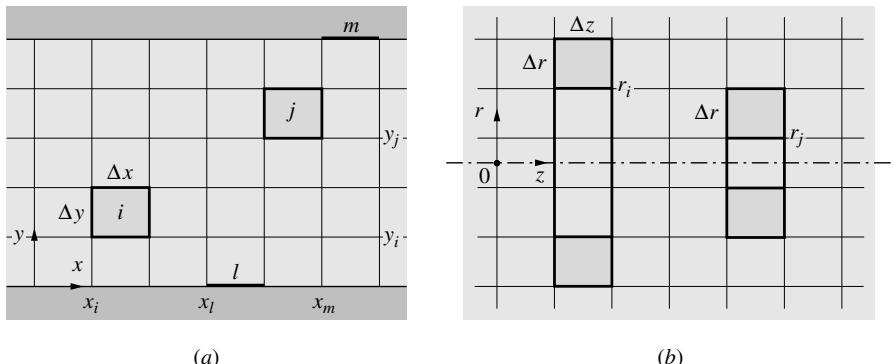

## 内容索引

- [目录](README.md)
- [1 热辐射基础](1-热辐射基础.md)
- [2 基于电磁波理论的辐射特性预测](2-基于电磁波理论的辐射特性预测.md)
- [3 实际表面的辐射特性](3-实际表面的辐射特性.md)
- [4 视角因子](4-视角因子.md)
- [5 灰体漫射表面间的辐射交换](5-灰体漫射表面间的辐射交换.md)
- [6 部分镜面灰体表面间的辐射交换](6-部分镜面灰体表面间的辐射交换.md)
- [7 非理想表面间的辐射交换](7-非理想表面间的辐射交换.md)
- [8 表面交换的蒙特卡洛方法](8-表面交换的蒙特卡洛方法.md)
- [9 传导和对流存在时的表面辐射交换](9-传导和对流存在时的表面辐射交换.md)
- [10 参与介质中的辐射传递方程(RTE)](10-参与介质中的辐射传递方程(RTE).md)
- [11 分子气体的辐射特性](11-分子气体的辐射特性.md)
- [12 颗粒介质的辐射特性](12-颗粒介质的辐射特性.md)
- [13 半透明介质的辐射特性](13-半透明介质的辐射特性.md)
- [14 一维灰体介质的精确解](14-一维灰体介质的精确解.md)
- [15 一维介质的近似求解方法](15-一维介质的近似求解方法.md)
- [16 球谐函数法 (PN-近似)](16-球谐函数法(PN-近似).md)
- [17 离散坐标法 (SN-近似)](17-离散坐标法(SN-近似).md)
- [18 区域法](18-区域法.md)
- [19 准直辐射与瞬态现象](19-准直辐射与瞬态现象.md)
- [20 非灰消光系数的求解方法](20-非灰消光系数的求解方法.md)
- [21 参与介质的蒙特卡洛方法](21-参与介质的蒙特卡洛方法.md)
- [22 辐射与传导和对流的耦合](22-辐射与传导和对流的耦合.md)
- [23 逆辐射传热](23-逆辐射传热.md)
- [24 纳米尺度辐射传热](24-纳米尺度辐射传热.md)
- [附录](附录.md)

- [18.1 引言](#181-引言)  
- [18.2 表面交换 - 无参与介质](#182-表面交换---无参与介质)  
- [18.3 灰体吸收/发射介质中的辐射交换](#183-灰体吸收发射介质中的辐射交换)  
- [18.4 具有各向同性散射的灰体介质辐射交换](#184-具有各向同性散射的灰体介质辐射交换)  
- [18.5 非灰体介质的辐射交换](#185-非灰体介质的辐射交换)  
- [18.6 直接交换面积的确定](#186-直接交换面积的确定)  
- [参考文献](#参考文献)  
- [习题](#习题)

# 第18章

# 区域法

# 18.1 引言

区域法用于确定吸收、发射和各向同性散射介质内的辐射传热速率，是第5章中针对表面交换(即无参与介质的封闭空间)开发的净辐射法的扩展。在该方法中，封闭空间被细分为有限数量的等温体积和表面积区域。然后利用预先计算的"交换面积"对任意两个区域之间的辐射交换进行能量平衡分析。这一过程会导出一组关于未知温度或热流量的联立方程。该方法最初由Hottel和Cohen[1]针对具有恒定吸收系数的吸收、发射、非散射灰体气体开发。Hottel和Sarofim[2]将其扩展到处理非恒定和非灰体吸收系数以及各向同性散射介质。Hottel和Sarofim[2]的讨论很全面但仅限于三维问题(即仅讨论在所有三个维度上都有限的体积区域)。Walther及其同事[3]将该方法扩展到允许通过一维平板区域的发射功率线性变化，Einstein则将其扩展到处理笛卡尔[4]和圆柱[5]坐标系中的二维区域。Larsen和Howell[6]给出了该方法的一个轻微变体，他们用"交换因子"表示能量平衡，这些因子是物理可测量。Liu和Howell[7]进行了此类测量。另一个衍生模型是Maruyama[8-10]的$\mathrm{REM}^2$方法。Yuen和Takara[11](以及针对一维平板的Ma[12])已经证明区域法可以应用于各向异性散射介质，但会大大增加所需的计算机时间。

# 18.2 表面交换 - 无参与介质

我们将首先以区域形式重新推导表面间辐射交换的关系，因为这样做可以清楚地展示标准净辐射法与区域法之间的相似性。与净辐射方法一样，我们将封闭空间的表面分解为$N$个等温子表面或区域，如图18-1所示。

# 黑体表面 - 直接交换面积

如果封闭空间仅由黑体表面组成，则根据方程(5.9)，任意两个表面之间的净辐射能量交换为

$$
Q_{i\leftrightarrow j} = -Q_{j\leftrightarrow i} = \overline{s_i s_j} (E_{bi} - E_{bj}),\qquad i,j = 1,2,\ldots ,N, \tag{18.1}
$$

  
图18-1 划分为$N$个等温表面区域的封闭空间

其中$Q_{i\leftrightarrow j}$表示区域$i$和$j$之间的净能量交换(当区域$i$因交换而损失热量时为正值)，而

$$
\overline{s_i s_j} = \overline{s_j s_i} = A_i F_{i\rightarrow j} = A_j F_{j\rightarrow i} = \int_{A_i}\int_{A_j}\frac{\cos\theta_i\cos\theta_j}{\pi s_{ij}^2} dA_j dA_i \tag{18.2}
$$

称为直接交换面积。与角系数$F_{i\rightarrow j}$不同，$\overline{s_i s_j}$不是无量纲量，而是具有面积量纲。虽然这会带来些许不便，但方程(18.2)的表述具有更容易应用互易性原理的优势(消除了常见误差源)。尽管使用直接交换因子(在没有参与介质时简化为角系数)同样可以接受，但使用交换面积是公认的做法。对所有区域求和方程(18.1)可得区域$i$的净热流为

$$
Q_{i} = A_{i}q_{i} = \sum_{j = 1}^{N}\overline{s_{i}s_{j}} (E_{bi} - E_{bj}) = A_{i}E_{bi} - \sum_{j = 1}^{N}\overline{s_{i}s_{j}} E_{bj},\quad i = 1,2,\ldots ,N. \tag{18.3}
$$

由于离开表面$i$的总热流为$A_{i}E_{bi}$，我们得到

$$
\sum_{j = 1}^{N}\overline{s_i s_j} = A_i, \tag{18.4}
$$

这等价于方程(4.18)，即$\sum_{j = 1}^{N}F_{i\rightarrow j} = 1$

# 灰漫射表面 - 总交换面积

如果表面不是黑体而是部分反射的，则区域之间的能量交换不仅通过直接传播，还可能包括来自任意数量表面区域的单次和多次反射的贡献。如果表面的反射行为是灰体且漫反射的，则离开表面的反射辐射与发射辐射无法区分，将方程(18.1)中的辐射力$E_{b}$替换为有效辐射$J$(如第5章详细描述)后仍然成立。因此，

$$
Q_{i\leftrightarrow j} = -Q_{j\leftrightarrow i} = \overline{s_i s_j} (J_i - J_j),\quad i,j = 1,2,\ldots ,N, \tag{18.5}
$$

对$A_{i}$进行能量平衡，

$$
Q_{i} = A_{i}q_{i} = A_{i}\left(J_{i} - H_{i}\right) = A_{i}J_{i} - \sum_{j = 1}^{N}\overline{s_{i}s_{j}} J_{j},\quad i = 1,2,\ldots ,N. \tag{18.6}
$$

因此，类似于净辐射法，我们现在必须假设表面区域足够小，使得其有效辐射在区域内变化不大。

我们可以使用方程(5.26)从方程(18.6)中消去有效辐射，

$$
q_{i} = \frac{\epsilon_{i}}{1 - \epsilon_{i}}\left(E_{bi} - J_{i}\right),\quad i = 1,2,\ldots ,N. \tag{18.7}
$$

这导致

$$
\sum_{j = 1}^{N}\left(\frac{A_j\delta_{ij}}{\epsilon_j} -\frac{1 - \epsilon_j}{\epsilon_j}\overline{s_is_j}\right)q_j = \sum_{j = 1}^{N}\left(A_j\delta_{ij} - \overline{s_is_j}\right)E_{bj},\quad i = 1,2,\ldots ,N, \tag{18.8}
$$

这等价于方程(5.37)。因此，如果所有温度已知，可以通过矩阵求逆确定未知壁面热流。如果区域温度未知，但必须通过考虑传导和/或对流迭代确定，则每次迭代都需要进行一次矩阵求逆。为避免这种不必要的矩阵求逆(因为交换面积不依赖于温度)，Hottel和Cohen[1]引入了总交换面积的概念，定义为

$$
Q_{i\leftrightarrow j} = -Q_{j\leftrightarrow i} = \overline{S_iS_j} (E_{bi} - E_{bj}),\quad i,j = 1,2,\ldots ,N, \tag{18.9}
$$

包括直接传播以及通过一次或多次表面反射路径的能量交换。这个概念意味着互易性也适用于总交换面积，即

$$
\overline{S_iS_j} = \overline{S_jS_i},\quad \mathrm{all}i,j. \tag{18.10}
$$

一旦确定了$\overline{S_iS_j}$，每个区域的热流可以立即且无需矩阵求逆地从下式得到

$$
\begin{array}{l}{Q_{i} = A_{i}q_{i} = \sum_{j = 1}^{N}\overline{S_{i}S_{j}} (E_{bi} - E_{bj})}\\ {= \epsilon_{i}A_{i}E_{bi} - \sum_{j = 1}^{N}\overline{S_{i}S_{j}} E_{bj},\quad i = 1,2,\ldots ,N,} \end{array} \tag{18.11}
$$

其中方程(18.11)的最后部分源于区域$i$的总发射为$\epsilon_{i}A_{i}E_{bi}$。我们得出结论，对于非参与介质，

$$
\sum_{j = 1}^{N}\overline{S_iS_j} = \epsilon_iA_i,\quad i = 1,2,\ldots ,N. \tag{18.12}
$$

有许多方法可以用直接交换面积$\overline{s_i s_j}$表示总交换面积$\overline{S_iS_j}$。Hottel和Cohen[1]以及Hottel和Sarofim[2]通过将所有区域的辐射力设为零，除了区域$k$设为1来实现这一点。从方程(18.11)可知，对于这种情况，

$$
Q_{i} = -\overline{S_{i}S_{k}} = A_{i}kJ_{i} - \sum_{j = 1}^{N}\overline{s_{i}s_{j}} kJ_{j},\quad i = 1,2,\ldots ,N, \tag{18.13}
$$

其中$J_{i}$的前下标$k$表示这些人工有效辐射是针对具有单位辐射力的单个发射区域。可以使用方程(18.7)消去$Q_{i}$，得到$N$个关于未知$kJ_{i}$ $(i = 1,2,\ldots ,N)$的联立方程。确定后，可以从方程(18.13)确定$\overline{S_iS_k}$。采用不同的方法，Noble[13]将控制方程转换为矩阵形式，并使用优雅的矩阵操作来评估总交换面积。我们将采用类似于Noble的方法，但将使用更常规的符号以适应不太熟悉矩阵操作的读者。

对区域$i$进行简单的热平衡，

$$
Q_{i} = \epsilon_{i}A_{i}E_{bi} - \epsilon_{i}A_{i}H_{i} \tag{18.14}
$$

(表示离开区域$i$的净热流是发射和吸收辐照度之差)，我们从方程(18.6)发现直接交换面积与吸收的辐照度$\epsilon_{i}A_{i}H_{i}$相关，其中$H_{i}$是区域$i$单位面积上的总辐照度，即

$$
A_{i}H_{i} = \sum_{j = 1}^{N}\overline{s_{i}s_{j}} J_{j},\quad i = 1,2,\ldots ,N. \tag{18.15}
$$

我们现在使用其定义方程(5.18)从方程(18.15)中消去有效辐射，

$$
J_{j} = \epsilon_{j}E_{bj} + \rho_{j}H_{j}, \tag{18.16}
$$

这导致

$$
\sum_{j = 1}^{N}\left(\frac{\delta_{ij}}{\epsilon_j} -\frac{\rho_j\overline{s_is_j}}{\epsilon_jA_j}\right)\epsilon_jA_jH_j = \sum_{j = 1}^{N}\overline{s_is_j}\epsilon_jE_{bj},\quad i = 1,2,\ldots ,N. \tag{18.17}
$$

方程(18.17)是$N$个关于$N$个未知$H_{j}$的线性方程组。通过将其转换为矩阵形式最容易找到该方程的一般解。我们定义两个$N\times N$矩阵(或二阶张量)，

$$
\mathbf{T} = \left( \begin{array}{cccccc}\frac{1}{\epsilon_1} -\frac{\rho_1\overline{s_1s_1}}{\epsilon_1A_1} & -\frac{\rho_2\overline{s_1s_2}}{\epsilon_2A_2} & \dots & -\frac{\rho_N\overline{s_1s_N}}{\epsilon_NA_N}\\ -\frac{\rho_1\overline{s_2s_1}}{\epsilon_1A_1} & \frac{1}{\epsilon_2} -\frac{\rho_2\overline{s_2s_2}}{\epsilon_2A_2} & \dots & -\frac{\rho_N\overline{s_2s_N}}{\epsilon_NA_N}\\ \vdots & \vdots & \ddots & \vdots \\ -\frac{\rho_1\overline{s_Ns_1}}{\epsilon_1A_1} & -\frac{\rho_2\overline{s_Ns_2}}{\epsilon_2A_2} & \dots & \frac{1}{\epsilon_N} -\frac{\rho_N\overline{s_Ns_N}}{\epsilon_NA_N} \end{array} \right) \tag{18.18}
$$

以及

$$
\mathbf{S} = \left( \begin{array}{cccc}\overline{s_1s_1}\epsilon_1 & \overline{s_1s_2}\epsilon_2 & \dots & \overline{s_1s_N}\epsilon_N\\ \overline{s_2s_1}\epsilon_1 & \overline{s_2s_2}\epsilon_2 & \dots & \overline{s_2s_N}\epsilon_N\\ \vdots & \vdots & \ddots & \vdots \\ \overline{s_Ns_1}\epsilon_1 & \overline{s_Ns_2}\epsilon_2 & \dots & \overline{s_Ns_N}\epsilon_N \end{array} \right), \tag{18.19}
$$

还有两个向量$\mathbf{h}$和$\mathbf{e_b}$，

$$
\mathbf{h} = \left( \begin{array}{c}\epsilon_{1}A_{1}H_{1}\\ \epsilon_{2}A_{2}H_{2}\\ \vdots \\ \epsilon_{N}A_{N}H_{N} \end{array} \right),\quad \mathbf{e}_{\mathbf{b}} = \left( \begin{array}{c}E_{b1}\\ E_{b2}\\ \vdots \\ E_{bN} \end{array} \right). \tag{18.20}
$$

方程(18.17)可以重写为2

$$
\mathbf{T}\cdot \mathbf{h} = \mathbf{S}\cdot \mathbf{e}_{\mathbf{b}}. \tag{18.21}
$$

如果我们用$\mathbf{T}$的逆矩阵$\mathbf{T}^{-1}$点乘方程(18.21)，得到

$$
\mathbf{T}^{-1}\cdot \mathbf{T}\cdot \mathbf{h} = \mathbf{h} = \mathbf{T}^{-1}\cdot \mathbf{S}\cdot \mathbf{e}_{\mathbf{b}}, \tag{18.22}
$$

这里我们利用了$\mathbf{T}^{-1}\cdot \mathbf{T} = \delta$的性质，其中$\delta$是单位张量，其元素为$\delta_{ij}$，且$\delta \cdot \mathbf{h} = \left[\Sigma_j\delta_{ij}h_j\right] = [h_1] = \mathbf{h}$。因此，我们可以用级数表示法写出：

$$
\epsilon_{i}A_{i}H_{i} = \sum_{k = 1}^{N}\sum_{j = 1}^{N}(T^{-1})_{ik}S_{kj}E_{bj}. \tag{18.23}
$$

通过将此表达式与方程(18.11)和(18.14)比较，我们得到总交换面积为

$$
\overline{S_iS_j} = \sum_{k = 1}^{N}(T^{-1})_{ik}S_{kj}, \tag{18.24}
$$

或者用矩阵表示法

$$
\overline{\mathbf{SS}} = \mathbf{T}^{-1}\cdot \mathbf{S}. \tag{18.25}
$$

我们注意到，对于每个黑体区域，$\mathbf{T}$的整列元素都为零(除了对角线项)，这简化了$\mathbf{T}$的求逆过程。

例18.1. 计算两个无限长同心圆柱体之间通过非参与介质的辐射热流。两个圆柱体都是等温的，并覆盖有灰体、漫发射和反射材料。内圆柱半径为$R_{1}$，温度为$T_{1}$，发射率为$\epsilon_{1}$。外圆柱对应参数为$R_{2},T_{2}$和$\epsilon_{2}$。使用区域法并采用总交换面积的概念。

# 解答

设内圆柱为区域1，外圆柱为区域2，我们有

$$
\overline{S_1S_2} = \overline{S_2S_1} = A_1F_{1\rightarrow 2} = A_1,\quad \overline{S_1S_1} = 0,\quad \overline{S_2S_2} = A_2F_{2\rightarrow 2} = A_2 - A_1.
$$

因此，我们得到

$$
\begin{array}{r}\mathbf{T} = \left( \begin{array}{cc}\frac{1}{\epsilon_1} & -\frac{\rho_2}{\epsilon_2}\frac{A_1}{A_2}\\ -\frac{\rho_1}{\epsilon_1} & 1 + \frac{\rho_2}{\epsilon_2}\frac{A_1}{A_2} \end{array} \right),\\ \mathbf{S} = \left( \begin{array}{cc}0 & A_1\epsilon_2\\ A_1\epsilon_1 & (A_2 - A_1)\epsilon_2 \end{array} \right). \end{array}
$$

$\mathbf{T}$的逆矩阵立即得到为

$$
\mathbf{T}^{-1} = \frac{1}{T}\left( \begin{array}{cc}1 + \frac{\rho_2}{\epsilon_2}\frac{A_1}{A_2} & \frac{\rho_2}{\epsilon_2}\frac{A_1}{A_2}\\ \displaystyle \frac{\rho_1}{\epsilon_1} & \frac{1}{\epsilon_1} \end{array} \right),
$$

其中

$$
T = |\mathbf{T}| = \frac{1}{\epsilon_1} +\frac{\rho_2}{\epsilon_2}\frac{A_1}{A_2}.
$$

总交换面积由下式计算

$$
\overline{S_iS_j} = \sum_{k = 1}^{2}(T^{-1})_{ik}S_{kj},
$$

即

$$
\begin{array}{rl} & {\overline{S_1S_1} = T_{11}^{-1}S_{11} + T_{12}^{-1}S_{21} = \frac{1}{T}\frac{\rho_2}{\epsilon_2}\frac{A_1}{A_2} A_1\epsilon_1,}\\ & {\overline{S_1S_2} = T_{11}^{-1}S_{12} + T_{12}^{-1}S_{22} = \overline{S_2S_1}}\\ & {\qquad = \frac{1}{T}\left[\left(1 + \frac{\rho_2}{\epsilon_2}\frac{A_1}{A_2}\right)A_1\epsilon_2 + \frac{\rho_2}{\epsilon_2}\frac{A_1}{A_2} (A_2 - A_1)\epsilon_2\right] = \frac{A_1}{T},}\\ & {\overline{S_2S_2} = T_{21}^{-1}S_{12} + T_{22}^{-1}S_{22} = \frac{1}{T}\left[\frac{\rho_1}{\epsilon_1} A_1\epsilon_2 + \frac{\epsilon_2}{\epsilon_1} (A_2 - A_1)\right].} \end{array}
$$

表面1的净热流为

$$
Q_{1} = A_{1}q_{1} = \overline{S_{1}S_{2}} (E_{b1} - E_{b2})
$$

即

$$
\Psi_{1} = \frac{q_{1}}{\sigma(T_{1}^{4} - T_{2}^{4})} = \frac{1}{T} = \frac{1}{\frac{1}{\epsilon_{1}} + \frac{A_{1}}{A_{2}}\left(\frac{1}{\epsilon_{2}} - 1\right)}.
$$

当然，这种方法对于得到这个众所周知的结果来说有些复杂。然而，如果涉及多个区域和温度场的迭代确定，这种方法将节省大量计算时间。

# 18.3 灰体吸收/发射介质中的辐射交换

我们现在考虑通过具有恒定吸收系数的灰色吸收、发射但不散射介质的辐射传递。该介质被具有灰色、漫发射和反射表面的外壳所包围。表面被划分为$N$个等温区域(具有弱变化的辐射度)，而介质被划分为$K$个等温体积区域。现在将存在表面区域与其他表面区域之间、表面区域与体积区域之间以及体积区域与体积区域之间的辐射交换。

# 直接交换面积

# 表面-表面交换

两个表面区域之间的直接交换面积定义与纯表面交换相同：

$$
Q_{i\rightarrow j} = \overline{s_i s_j} J_i,
$$

其中$Q_{i\rightarrow j}$是从区域$i$出发直接(无反射)到达区域$j$的总热流。交换面积与上一节相同，只是从$i$向$j$离开的能量中只有一部分会到达$j$(其余部分将被介质吸收)。因此，类似于第4章中标准视角因子的推导，我们发现从区域$i$离开到达$j$的热流 = 从$dA_{i}$向$dA_{j}$方向离开的强度 × 垂直于射线的面积 × 从$dA_{i}$看$dA_{j}$所张的立体角 × 透射分数，即

$$
\left(\frac{J_1}{\pi}\right)\times \left(dA_i\cos \theta_i\right)\times \left(\frac{dA_j\cos\theta_j}{S^2}\right)\times e^{-\kappa S},
$$

  
图18-2 (a)两个微分表面元素、(b)微分体积和表面元素、(c)两个微分体积元素之间的辐射交换。

如图18-2a所示。因此，表面到表面的直接交换面积可由下式确定：

$$
\overline{s_i s_j} = \int_{A_i}\int_{A_j}e^{-\kappa S}\frac{\cos\theta_i\cos\theta_j}{\pi S^2} dA_jdA_i. \tag{18.26}
$$

方程(18.26)与方程(18.2)相同，只是多了透射因子$e^{- \kappa S}$。

# 体积-表面交换

体积到表面的直接交换面积类似地定义为：

$$
Q_{i\rightarrow j} = \overline{g_i s_j} E_{bi}.
$$

观察图18-2b，我们发现从体积区域$i$发射到达表面区域$j$的热流 = 由方程(10.54)给出的从$dV_{i}$向所有$4\pi$方向发射的能量 × 向$dA_{j}$离开的分数 × 透射分数，即

$$
(4\kappa E_{bi}dV_{i})\times \left(\frac{dA_{j}\cos\theta_{j}}{4\pi S^{2}}\right)\times e^{-\kappa S},
$$

从而得到体积到表面的直接交换面积为：

$$
\overline{g_i s_j} = \int_{V_i}\int_{A_j}e^{-\kappa S}\frac{\cos\theta_j}{\pi S^2}\kappa dA_jdV_i. \tag{18.27}
$$

# 体积-体积交换

体积-体积直接交换面积与从一个区域离开并直接传播(无反射)被另一个区域吸收的热流相关：

$$
Q_{i\rightarrow j} = \overline{g_i g_j} E_{bi}.
$$

直接交换面积的大小最容易通过将接收体积$dV_{j} = dA_{j}\times dS_{j}$定向如图18-2c所示来推导：从$i$被$j$拦截的热流等于从$dV_{i}$向所有$4\pi$方向发射的能量×向$dA_{j}$离开的分数×透射分数×在$dS_{j}$上吸收的分数，即

$$
(4\kappa E_{bi}dV_{i})\times \left(\frac{dA_{j}}{4\pi S^{2}}\right)\times (e^{-\kappa S})\times (\kappa dS_{j}),
$$

从而得到体积-体积直接交换面积为：

$$
\overline{g_i g_j} = \int_{V_i}\int_{V_j}e^{-\kappa S}\frac{\kappa^2}{\pi S^2} dV_j dV_i. \tag{18.28}
$$

通过相反方向的相同论证，或通过检查方程(18.26)至(18.28)，我们发现直接交换面积满足互易性，即

$$
\overline{s_i s_j} = \overline{s_j s_i},\quad \overline{g_i s_j} = \overline{s_j g_i},\quad \overline{g_i g_j} = \overline{g_j g_i}. \tag{18.29}
$$

对表面区域$i$进行能量平衡，我们有

$$
\begin{array}{rl} & {Q_{si} = A_iq_i = A_i(J_i - H_{si}) = A_i\epsilon_i(E_{bsi} - H_{si})}\\ & {\quad = \sum_{j = 1}^{N}\overline{s_j}\overline{s_i} (J_i - J_j) + \sum_{k = 1}^{K}\overline{g_k}\overline{s_i} (J_i - E_{bgk})}\\ & {\quad = \epsilon_i\Bigg(A_iE_{bsi} - \sum_{j = 1}^{N}\overline{s_j}\overline{s_i} J_j - \sum_{k = 1}^{K}\overline{g_k}\overline{s_i} E_{bgk}\Bigg),\quad i = 1,2,\ldots ,N,} \end{array} \tag{18.30}
$$

其中我们添加了下标$s$和$g$来区分表面和体积区域的发射功率和辐照度。

方程(18.30)的第一个版本使用了区域$i$处的净热流等于任意两个区域之间净交换之和的概念，第二个版本说明净热流等于总发射减去总辐照度的吸收分数。认识到交换面积不依赖于温度，并且对于等温封闭体，所有热流都趋于零(以及$J_{j} = E_{bj}$)，我们得到关系式

$$
\sum_{j = 1}^{N}\overline{s_j s_i} +\sum_{k = 1}^{K}\overline{g_k}\overline{s_i} = A_i,i = 1,2,\ldots ,N. \tag{18.31}
$$

类似地，对体积区域进行能量平衡，我们发现

$$
\begin{array}{l}{Q_{gi} = \kappa V_{i}(4E_{bgi} - G_{i}) = \sum_{j = 1}^{N}\overline{s_{j}g_{i}}\left(E_{bgi} - J_{j}\right) + \sum_{k = 1}^{K}\overline{g_{k}g_{i}}\left(E_{bgi} - E_{bgk}\right)}\\ {= 4\kappa V_{i}E_{bgi} - \sum_{j = 1}^{N}\overline{s_{j}g_{i}} J_{j} - \sum_{k = 1}^{K}\overline{g_{k}g_{i}} E_{bgk},i = 1,2,\ldots ,K.} \end{array} \tag{18.32}
$$

通过比较或观察等温封闭体，我们发现

$$
\sum_{j = 1}^{N}\overline{s_j}\overline{g_i} +\sum_{k = 1}^{K}\overline{g_k}\overline{g_i} = 4\kappa V_i,i = 1,2,\ldots ,K. \tag{18.33}
$$

对于体积区域，$Q_{gi}$表示体积$V_{i}$内的净辐射源，因此

$$
Q_{gi} = \int_{V_i}\nabla \cdot \mathbf{q}dV_i. \tag{18.34}
$$

如果通过方程(18.7)消除表面区域的$Q_{si}$，并且体积区域的$Q_{gi}$已知(通过假设辐射平衡)或气体区域的发射功率已知(通过与整体能量方程的联系)，那么方程(18.30)和(18.32)形成了关于未知数$J_{i}(i = 1,2,\ldots ,N)$和$Q_{gk}$或$E_{bgk}(k = 1,2,\ldots ,K)$的$N + K$个方程的系统。

# 总交换面积

再次，我们希望从方程(18.30)和(18.32)中消除辐射度$J_{j}$，以避免在区域温度需要通过迭代确定时重复矩阵求逆。总交换面积定义为

$$
\begin{array}{c}{Q_{si} = \epsilon_iA_iE_{bsi} - \sum_{j = 1}^{K}\overline{S_iS_j} E_{bsj} - \sum_{k = 1}^{K}\overline{S_iG_k} E_{bgk},\qquad i = 1,2,\ldots ,N,}\\ {Q_{gi} = 4\kappa V_iE_{bgj} - \sum_{j = 1}^{N}\overline{G_iS_j} E_{bsj} - \sum_{k = 1}^{K}\overline{G_iG_k} E_{bgk},\qquad i = 1,2,\ldots ,K.} \end{array} \tag{18.36}
$$

互易律再次从总交换面积的定义中得出，即

$$
\overline{S_jS_i} = \overline{S_iS_j},\qquad \overline{G_kS_i} = \overline{S_iG_k},\qquad \overline{G_kG_i} = \overline{G_iG_k}, \tag{18.37}
$$

并且，在方程(18.35)和(18.36)中设置所有发射功率相等(导致各处热流为零)给出关系

$$
\begin{array}{l}{\sum_{j = 1}^{N}\overline{S_iS_j} +\sum_{k = 1}^{K}\overline{S_iG_k} = \epsilon_iA_i,\qquad i = 1,2,\ldots ,N,}\\ {\sum_{j = 1}^{N}\overline{G_iS_j} +\sum_{k = 1}^{K}\overline{G_iG_k} = 4\kappa V_i,\qquad i = 1,2,\ldots ,K.} \end{array} \tag{18.39}
$$

为了确定总交换因子，我们从方程(18.30)中提取表面辐照度，得到

$$
A_{i}H_{si} = \sum_{j = 1}^{N}\overline{s_{i}s_{j}} J_{j} + \sum_{k = 1}^{K}\overline{s_{i}g_{k}} E_{bgk},\qquad i = 1,2,\ldots ,N, \tag{18.40}
$$

或者，在使用方程(18.16)后，

$$
\sum_{j = 1}^{N}\left(\frac{\delta_{ij}}{\epsilon_j} -\frac{\rho_j\overline{s_i\overline{s_j}}}{\epsilon_jA_j}\right)\epsilon_jA_jH_{sj} = \sum_{j = 1}^{N}\overline{s_i\overline{s_j}}\epsilon_jE_{bsj} + \sum_{k = 1}^{K}\overline{s_i\overline{g_k}} E_{bgk},\quad i = 1,2,\ldots ,N. \tag{18.41}
$$

在向量表示法中，我们可以写为4

$$
\mathbf{T}\cdot \mathbf{h}_s = \mathbf{S}\cdot \mathbf{e}_{\mathbf{bs}} + \overline{\mathbf{s}\mathbf{g}}\cdot \mathbf{e}_{\mathbf{bg}}, \tag{18.42}
$$

其中$\mathbf{T},\mathbf{h}_s,\mathbf{S},\mathbf{e}_{\mathbf{bs}}$的定义与前一节相同(尽管其中的直接交换面积由于透射因子而不同)，而另外两个定义为

$$
\overline{\mathbf{s}\mathbf{g}} = \left( \begin{array}{cccc}\overline{s_1\overline{g_1}} & \overline{s_1\overline{g_2}} & \dots & \overline{s_1\overline{g_K}}\\ \overline{s_2\overline{g_1}} & \overline{s_2\overline{g_2}} & \dots & \overline{s_2\overline{g_K}}\\ \vdots & \vdots & \ddots & \vdots \\ \overline{s_N\overline{g_1}} & \overline{s_N\overline{g_2}} & \dots & \overline{s_N\overline{g_K}} \end{array} \right),\quad \mathbf{e}_{\mathbf{bg}} = \left( \begin{array}{c}E_{bg1}\\ E_{bg2}\\ \vdots \\ E_{bgK} \end{array} \right). \tag{18.43}
$$

注意到$\mathbf{T}$和$\mathbf{S}$是$N\times N$矩阵，$\mathbf{h}_{\mathbf{s}}$和$\mathbf{e}_{\mathrm{bs}}$是$N$维向量，而$\overline{\mathbf{sg}}$是$N\times K$矩阵，$\mathbf{e}_{\mathrm{bg}}$是$K$维向量。对$\mathbf{T}$求逆可得

$$
\mathbf{h}_{\mathbf{s}} = \mathbf{T}^{-1}\cdot \mathbf{S}\cdot \mathbf{e}_{\mathbf{bs}} + \mathbf{T}^{-1}\cdot \overline{\mathbf{sg}}\cdot \mathbf{e}_{\mathbf{bg}}, \tag{18.44}
$$

通过与方程(18.35)比较，可以确定总交换面积为

$$
\begin{array}{l}\overline{\mathbf{SS}} = \mathbf{T}^{-1}\cdot \mathbf{S},\quad \mathrm{or}\quad \overline{S_iS_j} = \sum_{l = 1}^{N}(T^{-1})_{il}S_{lj},\\ \displaystyle \overline{\mathbf{SG}} = \mathbf{T}^{-1}\cdot \overline{\mathbf{sg}},\quad \mathrm{or}\quad \overline{S_iG_k} = \sum_{l = 1}^{N}(T^{-1})_{il}\overline{S_lg_k}. \end{array} \tag{18.46}
$$

对体积区域采用类似方法，从方程(18.32)可得

$$
\begin{array}{l}\kappa V_{i}G_{i} = \sum_{j = 1}^{N}\overline{g_{iS_{j}}} J_{j} + \sum_{k = 1}^{K}\overline{g_{i}g_{k}} E_{bgk},\\ \displaystyle = \sum_{j = 1}^{N}\overline{g_{iS_{j}}} (\epsilon_{j}E_{bsj} + \rho_{j}H_{sj}) + \sum_{k = 1}^{K}\overline{g_{i}g_{k}} E_{bgk},\quad i = 1,2,\ldots ,K. \end{array} \tag{18.47}
$$

记住$h_{sj} = \epsilon_{i}A_{j}H_{sj}$并使用方程(18.44)和(18.45)，我们发现方程(18.47)可转化为

$$
\begin{array}{l}\kappa V_{i}G_{i} = \sum_{j = 1}^{N}\overline{g_{i}S_{j}}\epsilon_{j}E_{bsj} + \sum_{j = 1}^{N}\overline{\frac{g_{i}S_{j}}{A_{j}}}\frac{\rho_{j}}{\epsilon_{j}}\sum_{l = 1}^{N}\overline{S_{j}S_{l}} E_{bsl}\\ \displaystyle +\sum_{j = 1}^{N}\overline{\frac{g_{i}S_{j}}{A_{j}}}\frac{\rho_{j}}{\epsilon_{j}}\sum_{k = 1}^{K}\overline{S_{j}G_{k}} E_{bgk} + \sum_{k = 1}^{K}\overline{g_{i}g_{k}} E_{bgk},\quad i = 1,2,\ldots ,K. \end{array} \tag{18.48}
$$

将右侧第二项的哑指标$j$和$l$交换并重新排列，我们得到

$$
\begin{array}{l}\kappa V_{i}G_{i} = \sum_{j = 1}^{N}\left(\overline{g_{i}S_{j}}\epsilon_{j} + \sum_{l = 1}^{N}\overline{\frac{g_{i}S_{l}}{A_{l}}}\frac{\rho_{l}}{\epsilon_{l}}\overline{S_{l}S_{j}}\right)E_{bsj}\\ \displaystyle +\sum_{k = 1}^{K}\left(\overline{\overline{g_{i}g_{k}}} +\sum_{l = 1}^{N}\overline{\frac{g_{i}S_{l}}{A_{l}}}\frac{\rho_{l}}{\epsilon_{l}}\overline{S_{l}G_{k}}\right)E_{bgk},\quad i = 1,2,\ldots ,K. \end{array} \tag{18.49}
$$

通过与方程(18.36)比较，我们发现

$$
\begin{array}{l}\overline{G_iS_j} = \overline{g_iS_j}\epsilon_j + \sum_{l = 1}^{N}\overline{\frac{g_iS_l}{A_l}}\frac{\rho_l}{\epsilon_l}\overline{S_lS_j},\quad i = 1,2,\ldots ,K,\\ \displaystyle \overline{G_iG_k} = \overline{g_ig_k} +\sum_{l = 1}^{N}\overline{\frac{g_iS_l}{A_l}}\frac{\rho_l}{\epsilon_l}\overline{S_lG_k},\quad i = 1,2,\ldots ,K, \end{array} \tag{18.51}
$$

或者用矩阵表示

$$
\begin{array}{r}\overline{\mathbf{GS}} = \mathbf{R} + \mathbf{Q}\cdot \overline{\mathbf{SS}},\\ \overline{\mathbf{GG}} = \overline{\mathbf{gg}} +\mathbf{Q}\cdot \overline{\mathbf{SG}}, \end{array} \tag{18.53}
$$

其中

$$
\mathbf{R} = \left( \begin{array}{cccc}\overline{g_1s_1}\epsilon_1 & \overline{g_1s_2}\epsilon_2 & \dots & \overline{g_1s_N}\epsilon_N\\ \overline{g_2s_1}\epsilon_1 & \overline{g_2s_2}\epsilon_2 & \dots & \overline{g_2s_N}\epsilon_N\\ \vdots & \vdots & \ddots & \vdots \\ \overline{g_ks_1}\epsilon_1 & \overline{g_ks_2}\epsilon_2 & \dots & \overline{g_ks_N}\epsilon_N \end{array} \right), \tag{18.54}
$$

$$
\mathbf{Q} = \left( \begin{array}{cccc}\overline{g_1s_1}\rho_1 & \overline{g_1s_2}\rho_2 & \dots & \overline{g_1s_N}\rho_N\\ \overline{A_1}\epsilon_1 & \overline{A_2}\epsilon_2 & \dots & \overline{A_N}\epsilon_N\\ \overline{g_2s_1}\rho_1 & \overline{g_2s_2}\rho_2 & \dots & \overline{g_2s_N}\rho_N\\ \overline{A_1}\epsilon_1 & \overline{A_2}\epsilon_2 & \dots & \overline{A_N}\epsilon_N\\ \vdots & \vdots & \ddots & \vdots \\ \overline{g_ks_1}\rho_1 & \overline{g_ks_2}\rho_2 & \dots & \overline{g_ks_N}\rho_N\\ \overline{A_1}\epsilon_1 & \overline{A_2}\epsilon_2 & \dots & \overline{A_N}\epsilon_N \end{array} \right). \tag{18.55}
$$

由于互易性$\overline{G_kS_j} = \overline{S_kG_k}$或$\overline{\mathbf{GS}} = \overline{\mathbf{SG}}^T$(其中上标$T$表示矩阵转置)且

$$
\mathbf{R} + \mathbf{Q}\cdot \overline{\mathbf{SS}} = \overline{\mathbf{gs}}\cdot (\mathbf{T}^{-1})^T. \tag{18.56}
$$

显然，$\overline{G_kS_j}$可以使用方程(18.46)或(18.50)中的任一个进行评估(或两者都使用，一个作为验证机制)。

例18.2. 考虑一个灰色、吸收-发射(但不散射)的等温介质，被限制在两块平行、等温、灰色且漫射的平板之间。介质的温度为$T_{m}$，其吸收系数为$\kappa$，平板之间的距离为$L$。两块平板具有相同的温度$T_{w}$和发射率$\epsilon$。确定平板处的净辐射热通量。

# 解

我们首先评估直接交换面积。由于问题是一维的且平板无限大，所有直接和总交换面积都将变得无限大。因此，我们将评估每单位面积的交换面积，使用波浪号代替横杠表示。从方程(18.26)

$$
\widetilde{s_1s_2} = \lim_{A_1\to \infty}\frac{1}{A_1}\int_{A_1}\int_{A_2}e^{-\kappa S}\frac{\cos\theta_1\cos\theta_2}{\pi S^2} dA_2dA_1 = \int_{A_2}e^{-\kappa S}\frac{\cos\theta_1\cos\theta_2}{\pi S^2} dA_2,
$$

因为表面1上任何点与整个表面2之间的交换因子在任何地方都相同。因此，我们得到，当$\cos \theta_{1} = \cos \theta_{2} = L / S, S^{2} = \gamma^{2} + L^{2}$且$\tau_{L} = \kappa L$时，

$$
\widetilde{s_1s_2} = \int_0^\infty e^{-\kappa S}\frac{L^2}{\pi S^4} 2\pi rdr = 2\int_1^\infty e^{-\tau_{LL}}\frac{dy}{\gamma^3} = 2E_3(\tau_L),
$$

其中 $\gamma = S / L = \sqrt{(r / L)^2 + 1}$。同时我们有 $\widetilde{s_1s_1} = \widetilde{s_2s_2} = 0$ 且 $\widetilde{s_2s_1} = \widetilde{s_1s_2}$。根据方程(18.31)立即可以得到

$$
\widetilde{g_5} = 1 - \widetilde{s_1s_2} = \widetilde{g_5} = \widetilde{g} s = \widetilde{sg},
$$

以及从方程(18.33)得到

$$
\widetilde{g}\widetilde{g} = 4\tau_{L} - 2\widetilde{s}\widetilde{g}.
$$

为确定总交换因子，我们首先建立相关矩阵：

$$
\mathbf{T} = \left( \begin{array}{cc}\frac{1}{\epsilon} & -\frac{\rho}{\epsilon}\widetilde{s_{1}s_{2}}\\ -\frac{\rho}{\epsilon}\widetilde{s_{1}s_{2}} & \frac{1}{\epsilon} \end{array} \right),\quad T = \frac{1}{\epsilon^{2}}\left[1 - \rho^{2}\left(\widetilde{s_{1}s_{2}}\right)^{2}\right],
$$

$$
\mathbf{T}^{-1} = \frac{1}{T}\left( \begin{array}{cc}\frac{1}{\epsilon} & \frac{\rho}{\epsilon}\widetilde{s_{1}s_{2}}\\ \rho & \frac{1}{\epsilon} \end{array} \right),\quad \mathbf{S} = \left( \begin{array}{cc}0 & \epsilon \widetilde{s_{1}s_{2}}\\ \epsilon \widetilde{s_{1}s_{2}} & 0 \end{array} \right),
$$

其中 $\mathbf{S}$ 也是按单位面积计算的。现在，根据方程(18.45)和(18.46)：

$$
\begin{array}{l}\widetilde{s_1\widetilde{s_1}} = \frac{1}{T}\rho (s\widetilde{s_2})^2 = \widetilde{S_2\widetilde{S_2}},\quad \widetilde{S_1\widetilde{S_2}} = \frac{1}{T}\widetilde{s_1\widetilde{s_2}} = \widetilde{S_2\widetilde{S_1}},\\ \widetilde{s_1\widetilde{G}} = \frac{1}{T}\left(\frac{1}{\epsilon} +\frac{\rho}{\epsilon}\widetilde{s_1\widetilde{s_2}}\right)\widetilde{sg} = \widetilde{S_2\widetilde{G}} = \widetilde{SG} = \widetilde{GS}. \end{array}
$$

最后结果可以通过与方程(18.50)的结果比较来验证。最终有

$$
\begin{array}{c}{\bf Q} = \left(\frac{\rho}{\epsilon}\widetilde{sg}\frac{\rho}{\epsilon}\widetilde{sg}\right),\\ \widetilde{GG} = \widetilde{gg} +2\frac{\rho}{\epsilon}\widetilde{sg}\widetilde{SG} = \widetilde{gg} +\frac{2\rho}{\epsilon^2T}\left(1 + \rho \widetilde{S_1S_2}\right)\left(\widetilde{sg}\right)^2. \end{array}
$$

这些结果可以(也应该)通过代入方程(18.38)和(18.39)来验证。根据方程(18.35)计算平板处的净辐射热通量为

$$
q_{w} = \left(\epsilon -\widetilde{S_{1}S_{1}} -\widetilde{S_{1}S_{2}}\right)E_{bw} - \widetilde{SG} E_{bm} = \widetilde{SG}\left(E_{bw} - E_{bm}\right),
$$

或

$$
\Psi = \frac{q_w}{\sigma\left(T_w^4 - T_m^4\right)} = \widetilde{SG} = \frac{\epsilon\left[1 - 2E_3(\tau_L)\right]}{1 - 2\rho E_3(\tau_L)},
$$

这当然是精确结果。

许多研究者已将区域法应用于无散射的灰色介质。例如，Einstein计算了黑色壁面管道中二维管道流动的灰色气体的对流/辐射组合热通量[4,5]，Modest研究了具有单面非黑壁的矩形封闭空间[14]以及同心灰色圆柱体之间空间[15]的辐射平衡。

# 18.4 具有各向同性散射的灰体介质辐射交换

现在我们将区域法扩展到最一般的情况，包括各向同性散射和空间变化的吸收与散射系数的影响。如前所述，我们将表面划分为$N$个等温区域(具有弱变化的辐射强度)，将介质划分为$K$个等温体积区域(我们将看到，这些区域应具有弱变化的辐射源项)。我们将重新推导直接交换面积的表达式，同时考虑属性变化和各向同性散射。

# 直接交换面积

# 表面-表面交换

两个表面区域之间的直接交换面积现在适用于从区域$i$直接到达$j$的总热通量，无需反射且不被散射。因此，

方程(18.26)必须重写为

$$
\overline{s_i s_j} = \int_{A_i}\int_{A_j}e^{-\beta_{ij}S}\frac{\cos\theta_i\cos\theta_j}{\pi S^2} dA_jdA_i, \tag{18.57}
$$

其中

$$
\beta_{ij} = \frac{1}{S}\int_{0}^{S}\beta dS \tag{18.58}
$$

是区域$i$和$j$之间的平均消光系数。当然，一般来说，$\beta_{ij}$的值对任何两个区域都是不同的。

# 体积-表面交换

辐射能量离开微元体积不仅以各向同性发射形式 $(= 4\pi \kappa_{i}I_{bgi} = 4\kappa_{i}E_{bgi})$，还以各向同性外散射形式 $(= \sigma_{si}G_{i},$ 其中 $\sigma_{s}$ 为散射系数)离开。定义体积区域的有效辐射为：

$$
J_{g} = (1 - \omega)E_{bg} + \frac{\omega}{4} G, \tag{18.59}
$$

体积与表面区域间的直接能量交换可表示为：

$$
Q_{i\leftrightarrow j} = \overline{g_i s_j} (J_{gi} - J_{sj}), \tag{18.60}
$$

方程(18.27)则变为：

$$
\overline{g_i s_j} = \int_{V_i}\int_{A_j}e^{-\beta_{ij}S}\frac{\cos\theta_j}{\pi S^2}\beta_i dA_j dV_i. \tag{18.61}
$$

因此，根据此定义，我们要求体积区域的有效辐射 $J_{g}$ 在整个区域内可视为常数。

# 体积-体积交换

同理，我们需要重新定义体积间直接交换面积为：

$$
\overline{g_i g_j} = \int_{V_i}\int_{V_j}e^{-\beta_{ij}S}\frac{\beta_i\beta_j}{\pi S^2} dV_jdV_i, \tag{18.62}
$$

其中 $\beta_{i}$ 来自对 $dV_{i}$ 上源项的平均，而 $\beta_{j}$ 与 $dV_{j}$ 中的消光相关。

重写表面区域 $i$ 的能量平衡方程(18.30)：

$$
\begin{array}{l}{Q_{si} = A_iq_i = A_i(J_{si} - H_{si}) = A_i\epsilon_i(E_{bsi} - H_{si})}\\ {= \sum_{j = 1}^{N}\overline{s_i g_j} (J_{si} - J_{sj}) + \sum_{k = 1}^{K}\overline{s_i g_k} (J_{si} - J_{gk})}\\ {= \epsilon_i\left(A_iE_{bsi} - \sum_{j = 1}^{N}\overline{s_i\overline{s_j} J_{sj}} -\sum_{k = 1}^{K}\overline{s_i g_k} J_{gk}\right),\quad i = 1,2,\ldots ,N.} \end{array} \tag{18.63}
$$

类似地，对于体积区域，方程(18.32)重写为：

$$
\begin{array}{rcl}{Q_{gi}} & = & {\kappa_iV_i(4E_{bgj} - G_i) = \beta_iV_i(4J_{gi} - G_i)}\\ {} & {} & {= \sum_{j = 1}^{N}\overline{g_is_j} (J_{gi} - J_{sj}) + \sum_{k = 1}^{K}\overline{g_i\overline{g_k}} (J_{gi} - J_{gk})}\\ {} & {} & {= 4\kappa_iV_iE_{bgj} - (1 - \omega_i)\left(\sum_{j = 1}^{N}\overline{g_is_j} J_{sj} + \sum_{k = 1}^{K}\overline{g_i\overline{g_k}} J_{gk}\right),\quad i = 1,2,\ldots ,K.} \end{array} \tag{18.64}
$$

考察等温封闭空间时，我们发现方程(18.31)和(18.33)仍然成立，只要将吸收系数处处替换为消光系数，且消光系数(因而直接交换面积)不依赖于温度：

$$
\begin{array}{rl}\sum_{j = 1}^{N}\overline{s_js_i} +\sum_{k = 1}^{K}\overline{g_ks_i} = A_i, & i = 1,2,\ldots ,N,\\ \displaystyle \sum_{j = 1}^{N}\overline{s_j\overline{g_j}i} +\sum_{k = 1}^{K}\overline{g_ig_i} = 4\beta_iV_i, & i = 1,2,\ldots ,K. \end{array} \tag{18.66}
$$

通过方程(18.16)和(18.59)消去有效辐射，我们得到类似于方程(18.41)和(18.47)的方程组：

$$
\begin{array}{rl} & {\sum_{j = 1}^{N}\bigg(\delta_{ij}\quad \rho_{j}\overline{s_{i}s_{j}}\bigg)h_{sj} - \sum_{k = 1}^{K}\overline{s_{i}\overline{g_{k}}}\omega_{k}h_{gk}}\\ & {\quad \quad \quad = \sum_{j = 1}^{N}\overline{s_{i}s_{j}}\epsilon_{j}E_{bsj} + \sum_{k = 1}^{K}\overline{s_{i}\overline{g_{k}}}(1 - \omega_{k})E_{bgk},\quad i = 1,2,\ldots ,N,}\\ & {\quad \quad -\sum_{j = 1}^{N}\overline{g_{i}s_{j}}\rho_{j}h_{sj} + \sum_{k = 1}^{K}\bigg(\frac{\delta_{ik}}{1 - \omega_{k}} -\frac{\overline{g_{i}g_{k}}\omega_{k}}{4\kappa_{k}V_{k}}\bigg)h_{gk}}\\ & {\quad \quad \quad = \sum_{j = 1}^{N}\overline{g_{i}s_{j}}\epsilon_{j}E_{bsj} + \sum_{k = 1}^{K}\overline{g_{i}\overline{g_{k}}}(1 - \omega_{k})E_{bgk},\quad i = 1,2,\ldots ,K,} \end{array} \tag{18.68}
$$

其中 $h_{gk} = \kappa_k V_k G_k$。方程(18.67)和(18.68)构成了 $N + k$ 个方程，求解 $N + K$ 个未知数 $h_{sj}$ 和 $h_{gk}$，可通过标准方法求解。

# 总交换面积

若要通过迭代确定温度场，只要辐射属性(因而直接和总交换面积)不随温度变化(尽管可能随位置变化)，确定总交换面积仍是可取的。我们可以将方程(18.67)和(18.68)重写为矩阵形式：

$$
\begin{array}{r}\mathbf{T}\cdot \mathbf{h}_s - \mathbf{U}\cdot \mathbf{h}_g = \mathbf{S}\cdot \mathbf{e}_{\mathbf{bs}} + \mathbf{V}\cdot \mathbf{e}_{\mathbf{bg}},\\ -\mathbf{Q}\cdot \mathbf{h}_s + \mathbf{W}\cdot \mathbf{h}_g = \mathbf{R}\cdot \mathbf{e}_{\mathbf{bs}} + \mathbf{X}\cdot \mathbf{e}_{\mathbf{bg}}, \end{array} \tag{18.70}
$$

其中 $\mathbf{T}, \mathbf{S}, \mathbf{Q}, \mathbf{R}, \mathbf{e}_{\mathrm{bs}}, \mathbf{e}_{\mathrm{bg}}$ 和 $\mathbf{h}_{\mathrm{s}}$ 已在上一节定义，

$$
\mathbf{U} = \left( \begin{array}{cccc}\overline{s_{1}g_{1}} \omega_{1} & \overline{s_{1}g_{2}} \omega_{2} & \ldots & \overline{s_{1}g_{K}} \omega_{K} \\ \overline{4\kappa_{1}} V_{1} & \overline{4\kappa_{2}} V_{2} & \ldots & \overline{4\kappa_{K}} V_{K} \\ \overline{s_{2}g_{1}} \omega_{1} & \overline{s_{2}g_{2}} \omega_{2} & \ldots & \overline{s_{2}g_{K}} \omega_{K} \\ \overline{4\kappa_{1}} V_{1} & \overline{4\kappa_{2}} V_{2} & \ldots & \overline{4\kappa_{K}} V_{K} \\ \vdots & \vdots & \ddots & \vdots \\ \overline{s_{N}g_{1}} \omega_{1} & \overline{s_{N}g_{2}} \omega_{2} & \ldots & \overline{s_{N}g_{K}} \omega_{K} \\ \overline{4\kappa_{1}} V_{1} & \overline{4\kappa_{2}} V_{2} & \ldots & \overline{4\kappa_{K}} V_{K} \end{array} \right), \tag{18.71}
$$

$$
\mathbf{W} = \left( \begin{array}{cccc}\frac{1}{1 - \omega_{1}} -\frac{\overline{g_{1}g_{1}}\omega_{1}}{4\kappa_{1}V_{1}} & -\frac{\overline{g_{1}g_{2}}\omega_{2}}{4\kappa_{2}V_{2}} & \ldots & -\frac{\overline{g_{1}g_{K}}\omega_{K}}{4\kappa_{K}V_{K}} \\ -\frac{\overline{g_{2}g_{1}}\omega_{1}}{4\kappa_{1}V_{1}} & \frac{1}{1 - \omega_{2}} -\frac{\overline{g_{2}g_{2}}\omega_{2}}{4\kappa_{2}V_{2}} & \ldots & -\frac{\overline{g_{2}g_{K}}\omega_{K}}{4\kappa_{K}V_{K}} \\ \vdots & \vdots & \ddots & \vdots \\ -\frac{\overline{g_{K}g_{1}}\omega_{1}}{4\kappa_{1}V_{1}} & -\frac{\overline{g_{K}g_{2}}\omega_{2}}{4\kappa_{2}V_{2}} & \ldots & \frac{1}{1 - \omega_{K}} -\frac{\overline{g_{K}g_{K}}\omega_{K}}{4\kappa_{K}V_{K}} \end{array} \right), \tag{18.72}
$$

$$
\mathbf{V} = \left( \begin{array}{cccc}\overline{s_{1}g_{1}} (1 - \omega_{1}) & \overline{s_{1}g_{2}} (1 - \omega_{2}) & \dots & \overline{s_{1}g_{K}} (1 - \omega_{k}) \\ \overline{s_{2}g_{1}} (1 - \omega_{1}) & \overline{s_{2}g_{2}} (1 - \omega_{2}) & \dots & \overline{s_{2}g_{K}} (1 - \omega_{k}) \\ \vdots & \vdots & \ddots & \vdots \\ \overline{s_{N}g_{1}} (1 - \omega_{1}) & \overline{s_{N}g_{2}} (1 - \omega_{2}) & \dots & \overline{s_{N}g_{K}} (1 - \omega_{k}) \end{array} \right), \tag{18.73}
$$

$$
\mathbf{X} = \left( \begin{array}{cccc}\overline{g_{1}g_{1}} (1 - \omega_{1}) & \overline{g_{1}g_{2}} (1 - \omega_{2}) & \dots & \overline{g_{1}g_{K}} (1 - \omega_{k}) \\ \overline{g_{2}g_{1}} (1 - \omega_{1}) & \overline{g_{2}g_{2}} (1 - \omega_{2}) & \dots & \overline{g_{2}g_{K}} (1 - \omega_{k}) \\ \vdots & \vdots & \ddots & \vdots \\ \overline{g_{K}g_{1}} (1 - \omega_{1}) & \overline{g_{K}g_{2}} (1 - \omega_{2}) & \dots & \overline{g_{K}g_{K}} (1 - \omega_{k}) \end{array} \right), \tag{18.74}
$$

$$
\mathbf{h}_{\mathbf{g}} = \left( \begin{array}{c}\kappa_{1}V_{1}G_{1} \\ \kappa_{2}V_{2}G_{2} \\ \vdots \\ \kappa_{K}V_{K}G_{K} \end{array} \right). \tag{18.75}
$$

对 $\mathbf{W}$ 求逆，我们可以将方程(18.70)解为 $\mathbf{h}_{\mathbf{g}}$：

$$
\mathbf{h}_{\mathbf{g}} = \mathbf{W}^{-1} \cdot \mathbf{Q} \cdot \mathbf{h}_{\mathbf{s}} + \mathbf{W}^{-1} \cdot \mathbf{R} \cdot \mathbf{e}_{\mathbf{bs}} + \mathbf{W}^{-1} \cdot \mathbf{X} \cdot \mathbf{e}_{\mathbf{bg}}, \tag{18.76}
$$

将此表达式代入方程(18.69)，我们得到：

$$
\begin{array}{c}{\mathbf{h}_s = \mathbf{P}^{-1}\cdot \mathbf{C}\cdot \mathbf{e}_{\mathbf{bs}} + \mathbf{P}^{-1}\cdot \mathbf{D}\cdot \mathbf{e}_{\mathbf{bg}},}\\ {\mathbf{h}_\mathbf{g} = \mathbf{W}^{-1}\cdot (\mathbf{Q}\cdot \mathbf{P}^{-1}\cdot \mathbf{C} + \mathbf{R})\cdot \mathbf{e}_{\mathbf{bs}} + \mathbf{W}^{-1}\cdot (\mathbf{Q}\cdot \mathbf{P}^{-1}\cdot \mathbf{D} + \mathbf{X})\cdot \mathbf{e}_{\mathbf{bg}},} \end{array} \tag{18.78}
$$

其中：

$$
\begin{array}{c}{\mathbf{C} = \mathbf{S} + \mathbf{U}\cdot \mathbf{W}^{-1}\cdot \mathbf{R},\qquad \mathbf{D} = \mathbf{V} + \mathbf{U}\cdot \mathbf{W}^{-1}\cdot \mathbf{X},}\\ {\mathbf{P} = \mathbf{T} - \mathbf{U}\cdot \mathbf{W}^{-1}\cdot \mathbf{Q}.} \end{array} \tag{18.79b}
$$

用总交换面积表示，方程(18.63)和(18.64)重写为：

$$
\begin{array}{c}{Q_{si} = \epsilon_iA_iE_{bsj} - \sum_{j = 1}^{N}\overline{S_iS_j} E_{bsj} - \sum_{k = 1}^{K}\overline{S_iG_k} E_{bgk},\quad i = 1,2,\ldots ,N,}\\ {Q_{gi} = 4\kappa_iV_iE_{bgj} - \sum_{j = 1}^{N}\overline{G_iS_j} E_{bsj} - \sum_{k = 1}^{K}\overline{G_iG_k} E_{bgk},\quad i = 1,2,\ldots ,K,} \end{array} \tag{18.81}
$$

这与方程(18.35)和(18.36)相同（但使用了修正的总交换面积）。因此，通过比较我们得到：

$$
\begin{array}{r l} & {\overline{{\mathbf{S}\mathbf{S}}} = \mathbf{P}^{-1}\cdot \mathbf{C}\quad \mathrm{or}\quad \overline{{S_{i}S_{j}}} = \sum_{l = 1}^{N}P_{i l}^{-1}C_{l j},}\\ & {\overline{{\mathbf{S}\mathbf{G}}} = \mathbf{P}^{-1}\cdot \mathbf{D}\quad \mathrm{or}\quad \overline{{S_{i}G_{k}}} = \sum_{l = 1}^{N}P_{i l}^{-1}D_{l k},}\\ & {\overline{{\mathbf{G}\mathbf{S}}} = \mathbf{W}^{-1}\cdot (\mathbf{Q}\cdot \mathbf{P}^{-1}\cdot \mathbf{C} + \mathbf{R}) = \overline{{\mathbf{S}\mathbf{G}}}^{T},}\\ & {\qquad \mathrm{or}\quad \overline{{G_{k}S_{i}}} = \sum_{l = 1}^{K}W_{k l}^{-1}\left(\sum_{m = 1}^{N}\sum_{n = 1}^{N}Q_{l m}P_{m n}^{-1}C_{n i} + R_{l i}\right),}\\ & {\overline{{\mathbf{G}\mathbf{G}}} = \mathbf{W}^{-1}\cdot (\mathbf{Q}\cdot \mathbf{P}^{-1}\cdot \mathbf{D} + \mathbf{X}),}\\ & {\qquad = \mathrm{or}\quad \overline{{G_{k}G_{i}}} = \sum_{l = 1}^{K}W_{k l}^{-1}\left(\sum_{m = 1}^{N}\sum_{n = 1}^{N}Q_{l m}P_{m n}^{-1}D_{n i} + X_{i l}\right).} \end{array} \tag{18.85}
$$

在方程(18.80)和(18.81)中令所有辐射功率相等，表明方程(18.38)和(18.39)仍然成立，且无需在方程(18.39)右侧用消光系数$\beta$替换吸收系数$\kappa$：

$$
\begin{array}{c c}{{\sum_{j=1}^{N}\overline{{S_{i}S_{j}}}+\sum_{k=1}^{K}\overline{{S_{i}G_{k}}}=\epsilon_{i}A_{i},}}&{{i=1,2,\ldots,N,}}\\ {{\sum_{j=1}^{N}\overline{{G_{i}S_{j}}}+\sum_{k=1}^{K}\overline{{G_{i}G_{k}}}=4\kappa_{i}V_{i},}}&{{i=1,2,\ldots,K.}}\end{array} \tag{18.87}
$$

# 温度相关属性

如果吸收系数和消光系数与温度相关，那么所有直接交换面积也将与温度相关。因此，如果通过迭代求解温度场，则每次迭代后都必须重新计算直接交换面积。这一要求反过来消除了使用总交换面积的优势。因此，对于这些问题，通常直接求解方程(18.67)和(18.68)（或其变体）。然而，存在一个重要情况，可以预先计算一组总交换面积（且不参与迭代）。

为此，我们做出以下两个假设：$(i)$ 介质不散射，$(ii)$ 两个区域间平均吸收系数$\kappa_{ij}$的温度依赖性可以忽略（或在温度场迭代一定次数后才更新）。基于这些假设，我们可以写出：

$$
\overline{{s_{i}s_{j}}} = (\overline{{s_{i}s_{j}}})_{\mathrm{av}},\quad \overline{{s_{i}g_{j}}} = \overline{{g_{j}s_{i}}} = (\overline{{s_{i}g_{j}}})_{\mathrm{av}}\frac{\kappa_{j}}{\kappa_{\mathrm{av}}},\quad \overline{{g_{i}g_{j}}} = (\overline{{g_{i}g_{j}}})_{\mathrm{av}}\frac{\kappa_{i}\kappa_{j}}{\kappa_{\mathrm{av}}^{2}}, \tag{18.88}
$$

其中$(\overline{s_i s_j})_{\mathrm{av}}$等是从方程(18.57)、(18.61)和(18.62)计算得到的直接交换面积，其中$\beta_{i}$和$\beta_{j}$（对于非散射介质为$\kappa_{i}$和$\kappa_{j}$）被替换为平均吸收系数$\kappa_{\mathrm{av}}$。$\kappa_{ij}$与温度无关的假设意味着平均直接交换面积也不依赖于温度。将方程(18.88)代入(18.45)，并注意到$\mathbf{T}$和$\mathbf{S}$都不依赖于温度，我们得到：

$$
\overline{{S_{i}S_{j}}} = \sum_{l = 1}^{N}(T^{-1})_{il}S_{lj} = \left(\overline{{S_{i}S_{j}}}\right)_{\mathrm{av}}, \tag{18.89}
$$

也就是说，$\overline{S_iS_j}$也不依赖于温度。从方程(18.46)：

$$
\overline{S_iG_k} = \sum_{l = 1}^{N}(T^{-1})_{il}\left(\overline{s_i g_k}\right)_{\mathrm{av}}\frac{\kappa_k}{\kappa_{\mathrm{av}}} = \left(\overline{S_i G_k}\right)_{\mathrm{av}}\frac{\kappa_k}{\kappa_{\mathrm{av}}}, \tag{18.90}
$$

即$(\overline{\mathbf{SG}})_{\mathrm{av}}$可以一次性计算，实际的$\overline{\mathbf{SG}}$通过简单乘法得到。类似地，从方程(18.51)：

$$
\overline{G_iG_k} = \left[\left(\overline{g_i g_k}\right)_{\mathrm{av}} + \sum_{l = 1}^{N}\frac{(\overline{g_i s_i})_{\mathrm{av}}}{A_l}\frac{\rho_l}{\epsilon_l}\left(\overline{S_i G_k}\right)_{\mathrm{av}}\right]\frac{\kappa_l\kappa_k}{\kappa_{\mathrm{av}}^2} = \left(\overline{G_i G_k}\right)_{\mathrm{av}}\frac{\kappa_l\kappa_k}{\kappa_{\mathrm{av}}^2}. \tag{18.91}
$$

方程(18.35)和(18.36)可以用平均总交换面积重写。

例18.3. 对不仅发射和吸收，还各向同性散射的介质重复例18.2。

# 解

尽管这样会使分析不再精确，我们仍将限制在单一气体区域：为此，辐射源项$4(1 - \omega)E_{b} + \omega G$必须在整个体积区域内保持恒定。

直接交换面积保持不变（除了$\tau_{L} = \beta L$现在基于消光系数）。从方程(18.80)和(18.86)可知，表面的无量纲热流仍可表示为：

$$
\Psi = \frac{q_w}{\sigma(T_w^4 - T_m^4)} = \widetilde{SG},
$$

只是$\widetilde{SG}$从直接交换面积的计算方式与前一例子不同。虽然张量$\mathbf{T}$和$\mathbf{Q}$保持不变，但我们仍需计算$\mathbf{U},\mathbf{V},\mathbf{W}$和$\mathbf{X}$来求$\widetilde{SG}$。因此，

$$
\mathbf{U} = \frac{\widetilde{s}\widetilde{g}\omega}{4\tau_{\scriptscriptstyle L}(1 - \omega)}\left( \begin{array}{l}1\\ 1 \end{array} \right);\qquad \mathbf{V} = \widetilde{s}\widetilde{g} (1 - \omega)\left( \begin{array}{l}1\\ 1 \end{array} \right);
$$

$$
\mathbf{W} = \left(\frac{4\tau_{L} - \omega\widetilde{g}\widetilde{g}}{4\tau_{L}(1 - \omega)}\right);\qquad \mathbf{X} = \left(\widetilde{g}\widetilde{g} (1 - \omega)\right);
$$

其中$\mathbf{W}$和$\mathbf{X}$是单元素$1\times 1$矩阵。因此，

$$
\mathbf{W}^{-1} = (1 / W)\quad \text{且}\quad D_{ij} = V_{ij} + \sum_{k = 1}^{1}\sum_{l = 1}^{1}U_{ik}W_{kl}^{-1}X_{lj},
$$

即

$$
\mathbf{D} = \left[\widetilde{s}\widetilde{g} (1 - \omega) + \frac{\widetilde{s}\widetilde{g}\omega}{4\tau_{L}(1 - \omega)}\times \frac{4\tau_{L}(1 - \omega)}{4\tau_{L} - \omega\widetilde{g}\widetilde{g}}\times \widetilde{g}\widetilde{g} (1 - \omega)\right]\left( \begin{array}{c}1\\ 1\\ 1 \end{array} \right) = \frac{4\tau_{L}(1 - \omega)\widetilde{s}\widetilde{g}}{4\tau_{L} - \omega\widetilde{g}\widetilde{g}}\left( \begin{array}{c}1\\ 1\\ 1 \end{array} \right).
$$

类似地，

$$
\begin{array}{l}{P_{ij} = T_{ij} - \frac{U_{i1}Q_{1j}}{W} = T_{ij} - \frac{\widetilde{s}\widetilde{g}\omega}{4\tau_L(1 - \omega)}\times \frac{4\tau_L(1 - \omega)}{4\tau_L - \omega\widetilde{g}\widetilde{g}}\times \frac{\rho}{\epsilon}\widetilde{s}\widetilde{g}}\\ {= T_{ij} - \frac{\rho}{\epsilon}\frac{\omega(\widetilde{s}\widetilde{g})^2}{4\tau_{L} - \omega\widetilde{g}\widetilde{g}},} \end{array}
$$

即

$$
\mathbf{P} = \left( \begin{array}{cc}\frac{1}{\epsilon} -\frac{\rho}{\epsilon}\frac{\omega(\widetilde{s}\widetilde{g})^2}{4\tau_L - \omega\widetilde{g}\widetilde{g}} & -\frac{\rho}{\epsilon}\left[\widetilde{s_1s_2} +\frac{\omega(\widetilde{s}\widetilde{g})^2}{4\tau_L - \omega\widetilde{g}\widetilde{g}}\right]\\ -\frac{\rho}{\epsilon}\left[\widetilde{s_1s_2} +\frac{\omega(\widetilde{s}\widetilde{g})^2}{4\tau_L - \omega\widetilde{g}\widetilde{g}}\right] & \frac{1}{\epsilon} -\frac{\rho}{\epsilon}\frac{\omega(\widetilde{s}\widetilde{g})^2}{4\tau_L - \omega\widetilde{g}\widetilde{g}} \end{array} \right),
$$

$$
\mathbf{P}^{-1} = \frac{1}{P}\left( \begin{array}{cc}\frac{1}{\epsilon} -\frac{\rho}{\epsilon}\frac{\omega(\widetilde{s}\widetilde{g})^2}{4\tau_L - \omega\widetilde{g}\widetilde{g}} & \frac{\rho}{\epsilon}\left[\widetilde{s_1s_2} +\frac{\omega(\widetilde{s}\widetilde{g})^2}{4\tau_L - \omega\widetilde{g}\widetilde{g}}\right]\\ \frac{\rho}{\epsilon}\left[\widetilde{s_1s_2} +\frac{\omega(\widetilde{s}\widetilde{g})^2}{4\tau_L - \omega\widetilde{g}\widetilde{g}}\right] & \frac{1}{\epsilon} -\frac{\rho}{\epsilon}\frac{\omega(\widetilde{s}\widetilde{g})^2}{4t_L - \omega\widetilde{g}\widetilde{g}} \end{array} \right)
$$

且

$$
\begin{array}{l}{P = P_{11}^{2} - P_{12}^{2} = \frac{1}{\epsilon^{2}}\bigg[1 - 2\rho \frac{\omega(\widetilde{s}\widetilde{g})^{2}}{4\tau_{L} - \omega\widetilde{g}\widetilde{g}} -\rho^{2}(\widetilde{s_{1}s_{2}})^{2} - 2\rho^{2}\widetilde{s_{1}s_{2}}\frac{\omega(\widetilde{s}\widetilde{g})^{2}}{4\tau_{L} - \omega\widetilde{g}\widetilde{g}}\bigg]}\\ {= \frac{1}{\epsilon^{2}}\bigg[1 - (\rho \widetilde{s_{1}s_{2}})^{2} - 2\rho (1 + \rho \widetilde{s_{1}s_{2}})\frac{\omega(\widetilde{s}\widetilde{g})^{2}}{4\tau_{L} - \omega\widetilde{g}\widetilde{g}}\bigg].} \end{array}
$$

最终，

$$
\begin{array}{r l} & {\widetilde{\mathbf{S}}\widetilde{\mathbf{G}} = \mathbf{P}^{-1}\cdot \mathbf{D} = \left( \begin{array}{l}{P_{11}^{-1}D_{11} + P_{12}^{-1}D_{21}}\\ {P_{21}^{-1}D_{11} + P_{22}^{-1}D_{21}} \end{array} \right)}\\ & {\quad = \epsilon \frac{(1 + \rho\widetilde{s_{1}s_{2}})4\tau_{L}(1 - \omega)\widetilde{s g} / (4\tau_{L} - \omega\widetilde{g g})}{1 - (\rho\widetilde{s_{1}s_{2}})^{2} - 2\rho(1 + \rho\widetilde{s_{1}s_{2}})\frac{\omega(\widetilde{s g})^{2}}{4\tau_{L} - \omega\widetilde{g g}}}\left( \begin{array}{l}{1}\\ {1}\\ {1} \end{array} \right)}\\ & {\quad = \frac{4\tau_{L}(1 - \omega)\epsilon\widetilde{s g}}{(1 - \rho\widetilde{s_{1}s_{2}})(4\tau_{L} - \omega\widetilde{g g}) - 2\rho\omega(\widetilde{s g})^{2}}\left( \begin{array}{l}{1}\\ {1}\\ {1} \end{array} \right).} \end{array}
$$

将$\widetilde{s_1s_2}, \widetilde{s_2}$和$\widetilde{g g}$（已在例18.2中计算，尽管$\tau_L$现在基于消光系数）代入，可简化为：

$$
\Psi = \frac{q_w}{\sigma(T_1^4 - T_2^4)} = \widetilde{S}\widetilde{G} = \frac{\epsilon[1 - 2E_3(\tau_L)]}{1 - 2\rho E_3(\tau_L) + \frac{2\epsilon\omega}{4\tau_L(1 - \omega)}[1 - 2E_3(\tau_L)]}.
$$

多位研究者已将区域法应用于灰色、各向同性散射介质。例如，Naraghi和Kassemi[16]处理了与Modest[14]相同的矩形介质辐射平衡问题，但包含了各向同性散射。他们还将该方法应用于自由对流-辐射耦合问题[17,18]。

Vercammen和Froment[19]采用了一种不同于本文的方法来评估总交换面积，他们使用蒙特卡洛方法并进行后续数据平滑（以消除统计波动）。Naraghi和Chung[20]也采用了类似方法。Naraghi和Chung还提出了一种"统一矩阵方法"，将方程(18.69)和(18.70)组合成单个矩阵方程：

$$
\left( \begin{array}{cc}\mathbf{T} & -\mathbf{U}\\ -\mathbf{Q} & \mathbf{W} \end{array} \right)\cdot \left( \begin{array}{c}\mathbf{h}_{\mathrm{s}}\\ \mathbf{h}_{\mathrm{g}} \end{array} \right) = \left( \begin{array}{cc}\mathbf{S} & \mathbf{V}\\ \mathbf{R} & \mathbf{X} \end{array} \right)\cdot \left( \begin{array}{c}\mathbf{e}_{\mathrm{bs}}\\ \mathbf{e}_{\mathrm{bg}} \end{array} \right), \tag{18.92}
$$

其逆矩阵可表示为

$$
\left(\frac{\overline{\mathbf{S}\overline{\mathbf{S}}}}{\overline{\mathbf{G}\overline{\mathbf{S}}}}\right) = \left( \begin{array}{cc}\mathbf{T} & -\mathbf{U}\\ -\mathbf{Q} & \mathbf{W} \end{array} \right)^{-1}\cdot \left( \begin{array}{cc}\mathbf{S} & \mathbf{V}\\ \mathbf{R} & \mathbf{X} \end{array} \right). \tag{18.93}
$$

尚不清楚这种方法是否能提高计算效率，因为这里需要求逆一个$(N + K)\times (N + K)$的矩阵，而在标准方法中需要求逆两个矩阵（一个$N\times N$，另一个$K\times K$）。

原则上，区域法也可应用于各向异性散射介质（和/或具有非漫射边界表面）。Yuen和Takara[11]（以及Ma[12]对一维平板）已证明了这一点。然而，这需要将（表面和/或体积）辐射强度转换为向量[即任意两个区域之间的交换，导致$(N + K)^2$个未知数和联立方程，从而造成计算机存储和时间的不可接受增长]。

# 18.5 非灰体介质的辐射交换

在前述讨论中，我们假设介质和表面都是灰体，尽管本章至此的所有方程在光谱基础上对于非灰壁面和非灰介质同样有效。遗憾的是，区域法——与许多其他辐射传递问题的求解方法一样——并不太适合非灰介质。然而，Hottel及其同事[1,2,21]已证明，区域法可应用于一种非常特殊但非常重要的情况下的非灰介质：被限制在黑壁封闭空间内的吸收、发射（但不散射）介质。这种重要情况常见于燃烧气体和烟灰混合物被烟灰熏黑的炉膛耐火材料所限制的炉膛应用中。

在这种称为灰气体加权和法的方法中，介质被假设由具有不同（但为灰体）吸收系数的不同比例灰气体组成。8"气体"也可以是半透明液体：Yin和Jaluria[22,23]将玻璃的吸收系数建模为一个透明带和两个灰带。

# 表面-表面交换

由方程(18.26)可得，离开$dA_{i}$并到达$dA_{j}$的辐射热流为

$$
Q_{i\rightarrow j} = \int_{0}^{\infty}\int_{A_i}\int_{A_j}e^{-\kappa_iS}\frac{\cos\theta_i\cos\theta_j}{\pi S^2} dA_jdA_iJ_{\nu i}d\nu , \tag{18.94}
$$

其中为简化起见，假设光谱吸收系数$\kappa_{\nu}$不依赖于温度或位置。对于黑体封闭空间$J_{\nu} = E_{b\nu}$，方程(18.94)可通过使用介质发射率的定义(方程11.171)在整个光谱上积分，

$$
\epsilon_{m}(T,S) = \frac{1}{\sigma T^{4}}\int_{0}^{\infty}(1 - e^{-\kappa_{\nu}S})E_{b\nu}(T)d\nu , \tag{18.95}
$$

得到

$$
Q_{i\rightarrow j} = \int_{A_i}\int_{A_j}[1 - \epsilon_m(T_i,S)]\frac{\cos\theta_i\cos\theta_j}{\pi S^2} dA_jdA_iE_{bi} = \overleftrightarrow{s_iS_j} E_{bi}. \tag{18.96}
$$

类似地，

$$
Q_{j\rightarrow i} = \int_{A_i}\int_{A_j}\left[1 - \epsilon_m(T_j,S)\right]\frac{\cos\theta_i\cos\theta_j}{\pi S^2} dA_jdA_iE_{bj} = \overleftrightarrow{s_iS_j} E_{bj}. \tag{18.97}
$$

两个交换面积现在都用箭头而非横线表示，因为它们不再相等，而是依赖于发射表面的温度，即

$$
Q_{i\leftrightarrow j} = \overleftrightarrow{s_iS_j} E_{bi} - \overleftrightarrow{s_iS_j} E_{bj}. \tag{18.98}
$$

Hottel[21]已证明介质的发射率可表示为

$$
\epsilon_{m}(T,S)\simeq \sum_{l = 0}^{L}a_{l}(T)\left(1 - e^{-\kappa_{l}S}\right),\quad \sum_{l = 0}^{L}a_{l} = 1, \tag{18.99}
$$

其中包含$l = 0$且$\kappa_0 = 0$的情况，适用于介质完全由带间具有大窗口的分子气体组成的情况。经验表明$L = 3$通常能给出足够准确的结果，甚至$L = 1$（灰体加透明气体）往往就足够了[2]。使用这种"灰气体加权和"法，我们有

$$
Q_{i\leftrightarrow j}\simeq \sum_{l = 0}^{L}(\overleftrightarrow{s_iS_j})_l\left[a_l(T_i)E_{bi} - a_l(T_j)E_{bj}\right], \tag{18.100}
$$

其中$(\overline{s_iS_j})_l$是对吸收系数$\kappa_{l}$求得的$\overline{s_iS_j}$。因此，非灰介质的解与灰介质相同，只是用加权发射功率代替发射功率，且需要对多个灰气体进行计算。

# 表面-体积交换

类似地，由方程(18.27)可得，对于黑体封闭空间，

$$
\begin{array}{r l}{Q_{i\rightarrow j} =} & {\int_{0}^{\infty}\int_{V_{i}}\int_{A_{j}}\frac{\cos\theta_{j}}{\pi S^{2}}\kappa_{\nu}e^{-\kappa_{\nu}S}d A_{j}d V_{i}E_{b\nu i}d\nu}\\ = & {\int_{V_{i}}\int_{A_{j}}\frac{\cos\theta_{j}}{\pi S^{2}}\frac{d}{d S}\left[\int_{0}^{\infty}\left(1 - e^{-\kappa_{\nu}S}\right)E_{b\nu i}d\nu \right]d A_{j}d V_{i}}\\ = & {\int_{V_{i}}\int_{A_{j}}\frac{d\epsilon_{m}}{d S} (T_{i},S)\frac{\cos\theta_{j}}{\pi S^{2}} d A_{j}d V_{i}E_{b i} = \overrightarrow{g_{i}S_{j}} E_{b i}.} \end{array} \tag{18.101}
$$

注意$E_{bi}$可以提到$d / dS$算子内部，因为假设其在$V_{i}$上恒定。因此，使用方程(18.99)，我们得到

$$
Q_{i\leftrightarrow j} = \overrightarrow{g_{i}s_{j}} E_{bi} - \overleftarrow{g_{i}s_{j}} E_{bj}\simeq \sum_{l = 1}^{L}(\overrightarrow{g_{i}s_{j}})_{l}\left[a_{l}(T_{i})E_{bi} - a_{l}(T_{j})E_{bj}\right], \tag{18.102}
$$

其中求和从$l = 1$开始，因为$\kappa_0 = 0$时介质内部没有发射。

# 体积-体积交换

同理，方程(18.28)变为

$$
\begin{array}{l}{Q_{i\rightarrow j} = \int_0^\infty \int_{V_i}\int_{V_j}\frac{1}{\pi S^2}\kappa_i^2 e^{-\kappa_iS}dV_jdV_iE_{b\nu i}d\nu}\\ {= -\int_{V_i}\int_{V_j}\frac{d^2\epsilon_m}{dS^2} (T_i,S)\frac{1}{\pi S^2} dV_jdV_iE_{bi} = \overrightarrow{g_ig_j} E_{bi},} \end{array} \tag{18.103}
$$

且

$$
Q_{i\leftrightarrow j} = \overrightarrow{g_{i}}\overrightarrow{g_{j}} E_{bi} - \overleftarrow{g_{i}}\overrightarrow{g_{j}} E_{bj}\simeq \sum_{l = 1}^{L}\left(\overrightarrow{g_{i}}\overrightarrow{g_{j}}\right)_{l}\left[a_{l}(T_{i})E_{bi} - a_{l}(T_{j})E_{bj}\right]. \tag{18.104}
$$

因此，任意两个表面或体积区域之间的净热流计算方法是：确定多个充满灰气体并具有加权发射功率的封闭空间的热流，然后将这些热流相加。

需要注意的是，方程(18.99)的近似并非必要：方向性直接交换面积可以通过总发射率$\epsilon_{m}(T,S)$来评估，这样能得到更精确的结果。采用近似主要是为了方便，将问题简化为灰体情况，从而减少直接交换面积的计算复杂度。加权灰气体求和法的主要优势在于直接交换面积$(\overline{s_i s_j})_l, (\overline{s_i} \overline{g_k})_l$和$(\overline{g_i} \overline{g_k})_l$不依赖于温度，因此(i)可以从表格和图表中查得（如[2]中提供的），这在计算机尚未普及的早期方法发展中非常重要；(ii)如果通过迭代求解温度场，这些值无需重新计算。

虽然方程(18.100)或(18.98)、(18.102)和(18.104)严格来说仅适用于无散射的黑体封闭空间，但可以推广到反射表面和散射介质：直接交换面积和总交换面积的区别在于区域$i$和$j$之间的平均总距离与直接距离的差异。由于$S$并未直接出现在这些方程中10，我们可以近似认为它们也适用于总交换面积：

$$
\begin{array}{c}{\overrightarrow{S_iS_jE_{bi}} -\overrightarrow{S_iS_jE_{bj}}\simeq \sum_{l = 0}^{L}\left(\overrightarrow{S_iS_j}\right)_l\left[a_l(T_i)E_{bi} - a_l(T_j)E_{bj}\right],}\\ {\overrightarrow{G_iS_jE_{bi}} -\overleftarrow{G_iS_jE_{bj}}\simeq \sum_{l = 1}^{L}\left(\overrightarrow{G_iS_j}\right)_l\left[a_l(T_i)E_{bi} - a_l(T_j)E_{bj}\right],}\\ {\overrightarrow{G_iG_jE_{bi}} -\overleftarrow{G_iG_jE_{bj}}\simeq \sum_{l = 1}^{L}\left(\overrightarrow{G_iG_j}\right)_l\left[a_l(T_i)E_{bi} - a_l(T_j)E_{bj}\right],} \end{array} \tag{18.105}
$$

方程(18.80)和(18.81)可用于确定净热流。

关于非灰区域方法已有大量文献研究。Nelson[24]指出，除非为了迭代计算的数值效率，否则不需要使用方程(18.99)。他还提出了将区域法应用于反射边界的近似方法。Smith等人[25]针对$\mathrm{CO_2 - H_2O}$混合气体确定了类似方程(18.99)的相关性。他们后来将加权灰气体模型应用于管道中的辐射和对流耦合传热[26]。Sistino[27]也研究了类似问题。

# 18.6 直接交换面积的确定

使用方程(18.63)和(18.64)结合直接交换面积的定义，或使用方程(18.80)和(18.81)结合总交换面积的定义，要求忽略每个表面区域上辐射度的变化，以及忽略每个体积区域上辐射源项的变化。Hottel和Sarofim[2]指出，若要保证热流计算达到$5\%$的精度，区域尺寸应使得任何区域的光学深度（消光系数×辐射度或源项变化的最大区域尺寸）不超过0.4。

提高区域法精度有两种方法：(i)增加区域数量，(ii)提高用于确定单个直接交换面积的数值积分精度。增加区域数量可以使用简单高效的技术评估交换面积，但需要进行耗时的大型矩阵求逆。Modest[14,15]发现，对于足够多的区域，除一个区域外，所有交换面积都可以通过计算区域中心之间的被积函数乘以相应的区域面积和/或体积来确定。最近区域产生的误差可以通过应用方程(18.65)和(18.66)来抵消（体积-体积区域用$\overline{g_{i}g_{j}}$，共面体积-表面区域用$\overline{g_{i}s_{j}}$，角区域用$\overline{s_{i}s_{j}}$）。Naraghi等人[28,29]对这种有限差分版本的区域法进行了推广和完善。

另一方面，使用较少但精确计算的交换面积区域只需要求逆小型矩阵。但由于需要许多内部节点，数值积分会变得耗时。不过，如果通过迭代确定温度场，可以节省大量计算时间，因为交换面积的计算不参与迭代。对于较少区域的区域法，可以通过允许区域内发射功率变化来提高精度。Walther等人[3]证明，对于一维平行平板区域，可以严格地纳入平板上的线性发射功率变化。对于二维矩形体积区域，Einstein[4,5]以半严格的方式包含了线性发射功率变化（适用于二维笛卡尔和圆柱几何）。

# 参考文献

1. Hottel, H. C., and E. S. Cohen: "气体填充封闭空间中的辐射热交换：考虑气体温度不均匀性," AIChE Journal, vol. 4, pp. 3-14, 1958.  
2. Hottel, H. C., and A. F. Sarofim: 《辐射传热》, McGraw-Hill, New York, 1967.  
3. Walther, V. A., J. Dörr, and E. Eller: "考虑热传导和热辐射的玻璃熔体温度分布的数学计算," Glastechnische Berichte, vol. 26, pp. 133-140, 1953.  
4. Einstein, T. H.: "平行平板间吸收性气体的辐射传热：考虑流动和传导," NASA TR R-154, 1963.  
5. Einstein, T. H.: "圆管内吸收性气体的辐射传热：考虑传导、气体流动和内部热生成," NASA TR R-156, 1963.
6. Larsen, M. E., and J. R. Howell: "交换因子法：辐射封闭空间分析的另一种区域公式," ASME Journal of Heat Transfer, vol. 108, no. 4, pp. 936-942, 1985.
7. Liu, H. P., and J. R. Howell: "辐射交换因子的测量," ASME Journal of Heat Transfer, vol. 109, no. 2, pp. 470-477, 1987.
8. Maruyama, S., and T. Aihara: "任意三维吸收、发射和散射介质及镜面和漫射表面的辐射传热," ASME Journal of Heat Transfer, vol. 119, no. 1, pp. 129-136, 1997.
9. Maruyama, S., Z. Guo, and M. Higano: "任意三维非灰和各向异性散射介质及表面的辐射传热," in Proceedings of the 11th International Heat Transfer Conference, vol. 7, Kyongju, Korea, pp. 457-462, 1998.
10. Maruyama, S., and Z. Guo: "非灰吸收、发射和各向异性散射介质的任意构型中的辐射传热," ASME Journal of Heat Transfer, vol. 121, no. 3, pp. 722-726, 1999.
11. Yuen, W. W., and E. E. Takara: "吸收和各向异性散射介质中辐射传递分析的通用区域方法开发," Numerical Heat Transfer - Part B: Fundamentals, vol. 25, pp. 75-96, 1994.
12. Ma, A.: "一维参与介质中的广义区域方法," ASME Journal of Heat Transfer, vol. 117, pp. 520-523, 1995.
13. Noble, J. J.: "区域法：总交换面积的显式矩阵关系," International Journal of Heat and Mass Transfer, vol. 18, no. 2, pp. 261-269, 1975.
14. Modest, M. F.: "灰色非等温壁面矩形封闭空间中的辐射平衡," Journal of Quantitative Spectroscopy and Radiative Transfer, vol. 15, pp. 445-461, 1975.
15. Modest, M. F., and D. Stevens: "同心圆柱间灰色介质的二维辐射平衡," Journal of Quantitative Spectroscopy and Radiative Transfer, vol. 19, pp. 353-365, 1978.
16. Naraghi, M. H. N., and M. Kassemi: "矩形封闭空间中的辐射传递：离散交换因子解法," in Proceedings of the 1988 National Heat Transfer Conference, vol. HTD-96, ASME, pp. 259-268, 1988.
17. Kassemi, M., and M. H. N. Naraghi: "使用离散交换因子法分析1-g和低重力环境中的辐射-自然对流相互作用," International Journal of Heat and Mass Transfer, vol. 36, no. 17, pp. 4141-4149, 1993.
18. Kassemi, M., and M. H. N. Naraghi: "离散交换因子法在圆柱介质组合传热问题中的应用," in Transport Phenomena in Materials Processing and Manufacturing, vol. HTD-336, ASME, pp. 151-160, 1996.
19. Vercammen, H. A. J., and G. F. Froment: "使用蒙特卡洛技术改进工业炉辐射模拟的区域方法," International Journal of Heat and Mass Transfer, vol. 23, pp. 329-337, 1980.
20. Naraghi, M. H. N., and B. T. F. Chung: "区域法的统一矩阵公式：随机方法," International Journal of Heat and Mass Transfer, vol. 28, no. 2, pp. 245-251, 1985.
21. Hottel, H. C.: "辐射热传递," in Heat Transmission, ed. W. H. McAdams, 3rd ed., ch. 4, McGraw-Hill, New York, 1954.
22. Yin, Z., and Y. Jaluria: "区域法模拟光纤拉制炉中的辐射传输," ASME Journal of Heat Transfer, vol. 119, pp. 597-603, 1997.
23. Yin, Z., and Y. Jaluria: "高速光纤拉制中的热传输与流动," ASME Journal of Heat Transfer, vol. 120, no. 4, pp. 916-930, 1998.
24. Nelson, D. A.: "分子气体填充封闭空间中的辐射传热," ASME paper no. 77-HT-16, 1977.
25. Smith, T. F., Z. F. Shen, and J. N. Friedman: "加权灰气体模型系数的评估," ASME Journal of Heat Transfer, vol. 104, pp. 602-608, 1982.
26. Smith, T. F., Z. F. Shen, and A. M. Al-Turki: "圆柱封闭空间中真实气体的辐射与传导传热," ASME Journal of Heat Transfer, vol. 107, pp. 482-485, 1985.
27. Sistino, A. J.: "圆柱封闭空间中的平均光束长度与区域法（含散射与不含散射）," ASME paper no. 82-HT-3, 1982.
28. Naraghi, M. H. N., B. T. F. Chung, and B. Litkouhi: "参与介质封闭空间中辐射交换的连续交换因子法," ASME Journal of Heat Transfer, vol. 110, no. 2, pp. 456-462, 1988.
29. Naraghi, M. H. N., and M. Kassemi: "矩形封闭空间中的辐射传递：离散交换因子解法," ASME Journal of Heat Transfer, vol. 111, no. 4, pp. 1117-1119, 1989.

# References

1. Hottel, H. C., and E. S. Cohen: "Radiant heat exchange in a gas-filled enclosure: Allowance for nonuniformity of gas temperature," AIChE Journal, vol. 4, pp. 3-14, 1958.  
2. Hottel, H. C., and A. F. Sarofim: Radiative Transfer, McGraw-Hill, New York, 1967.  
3. Walther, V. A., J. Dörr, and E. Eller: "Mathematische Berechnung der Temperaturverteilung in der Glasschmelze mit Bertücksichtigung von Wärmeleitung und Wärmestrahlung," Glastechnische Berichte, vol. 26, pp. 133-140, 1953.  
4. Einstein, T. H.: "Radiant heat transfer to absorbing gases enclosed between parallel flat plates with flow and conduction," NASA TR R-154, 1963.  
5. Einstein, T. H.: "Radiant heat transfer to absorbing gases enclosed in a circular pipe with conduction, gas flow, and internal heat generation," NASA TR R-156, 1963.
6. Larsen, M. E., and J. R. Howell: "The exchange factor method: An alternative zonal formulation of radiating enclosure analysis," ASME Journal of Heat Transfer, vol. 108, no. 4, pp. 936-942, 1985.
7. Liu, H. P., and J. R. Howell: "Measurement of radiation exchange factors," ASME Journal of Heat Transfer, vol. 109, no. 2, pp. 470-477, 1987.
8. Maruyama, S., and T. Aihara: "Radiation heat transfer of arbitrary three-dimensional absorbing, emitting and scattering media and specular and diffuse surfaces," ASME Journal of Heat Transfer, vol. 119, no. 1, pp. 129-136, 1997.
9. Maruyama, S., Z. Guo, and M. Higano: "Radiative heat transfer of arbitrary three-dimensional, nongray and anisotropically scattering media and surfaces," in Proceedings of the 11th International Heat Transfer Conference, vol. 7, Kyongju, Korea, pp. 457-462, 1998.
10. Maruyama, S., and Z. Guo: "Radiative heat transfer in arbitrary configurations with nongray absorbing, emitting, and anisotropic scattering media," ASME Journal of Heat Transfer, vol. 121, no. 3, pp. 722-726, 1999.
11. Yuen, W. W., and E. E. Takara: "Development of a general zonal method for analysis of radiative transfer in absorbing and anisotropically scattering media," Numerical Heat Transfer - Part B: Fundamentals, vol. 25, pp. 75-96, 1994.
12. Ma, A.: "Generalized zoning method in one-dimensional participating media," ASME Journal of Heat Transfer, vol. 117, pp. 520-523, 1995.
13. Noble, J. J.: "The zone method: Explicit matrix relations for total exchange areas," International Journal of Heat and Mass Transfer, vol. 18, no. 2, pp. 261-269, 1975.
14. Modest, M. F.: "Radiative equilibrium in a rectangular enclosure bounded by gray non-isothermal walls," Journal of Quantitative Spectroscopy and Radiative Transfer, vol. 15, pp. 445-461, 1975.
15. Modest, M. F., and D. Stevens: "Two dimensional radiative equilibrium of a gray medium between concentric cylinders," Journal of Quantitative Spectroscopy and Radiative Transfer, vol. 19, pp. 353-365, 1978.
16. Naraghi, M. H. N., and M. Kassemi: "Radiative transfer in rectangular enclosures: A discretized exchange factor solution," in Proceedings of the 1988 National Heat Transfer Conference, vol. HTD-96, ASME, pp. 259-268, 1988.
17. Kassemi, M., and M. H. N. Naraghi: "Analysis of radiation-natural convection interactions in 1-g and low-g environments using the discrete exchange factor method," International Journal of Heat and Mass Transfer, vol. 36, no. 17, pp. 4141-4149, 1993.
18. Kassemi, M., and M. H. N. Naraghi: "Application of discrete exchange factor method to combined heat transfer problems in cylindrical media," in Transport Phenomena in Materials Processing and Manufacturing, vol. HTD-336, ASME, pp. 151-160, 1996.
19. Vercammen, H. A. J., and G. F. Froment: "An improved zone method using Monte Carlo techniques for the simulation of radiation in industrial furnaces," International Journal of Heat and Mass Transfer, vol. 23, pp. 329-337, 1980.
20. Naraghi, M. H. N., and B. T. F. Chung: "A unified matrix formulation for the zone method: A stochastic approach," International Journal of Heat and Mass Transfer, vol. 28, no. 2, pp. 245-251, 1985.
21. Hottel, H. C.: "Radiant heat transmission," in Heat Transmission, ed. W. H. McAdams, 3rd ed., ch. 4, McGraw-Hill, New York, 1954.
22. Yin, Z., and Y. Jaluria: "Zonal method to model radiative transport in an optical fiber drawing furnace," ASME Journal of Heat Transfer, vol. 119, pp. 597-603, 1997.
23. Yin, Z., and Y. Jaluria: "Thermal transport and flow in high-speed optical fiber drawing," ASME Journal of Heat Transfer, vol. 120, no. 4, pp. 916-930, 1998.
24. Nelson, D. A.: "Radiation heat transfer in molecular-gas filled enclosures," ASME paper no. 77-HT-16, 1977.
25. Smith, T. F., Z. F. Shen, and J. N. Friedman: "Evaluation of coefficients for the weighted sum of gray gases model," ASME Journal of Heat Transfer, vol. 104, pp. 602-608, 1982.
26. Smith, T. F., Z. F. Shen, and A. M. Al-Turki: "Radiative and conductive transfer in a cylindrical enclosure for a real gas," ASME Journal of Heat Transfer, vol. 107, pp. 482-485, 1985.
27. Sistino, A. J.: "Mean beam length and the zone method (without and with scattering) for a cylindrical enclosure," ASME paper no. 82-HT-3, 1982.
28. Naraghi, M. H. N., B. T. F. Chung, and B. Litkouhi: "A continuous exchange factor method for radiative exchange in enclosures with participating media," ASME Journal of Heat Transfer, vol. 110, no. 2, pp. 456-462, 1988.
29. Naraghi, M. H. N., and M. Kassemi: "Radiative transfer in rectangular enclosures: A discretized exchange factor solution," ASME Journal of Heat Transfer, vol. 111, no. 4, pp. 1117-1119, 1989.

# 习题

18.1 对于两块平行板之间的一维气体介质问题，确定直接交换因子 $\widetilde{g_i g_j}$（即单位面积），其中介质区域 $i$ 是厚度为 $\Delta z$ 的无限大平板（位于 $z_i \leq z \leq z_i + \Delta z$ 之间），$j$ 是另一个介质区域（位于 $z_j \leq z \leq z_j + \Delta z$）。

18.2 对于二维问题，确定两个具有恒定矩形截面的无限长体积区域之间的直接交换因子 $\overline{g_i g_j'}$（即单位长度），如图18-3a所示（区域在垂直于图面的方向上无限长）。可以假设区域间距足够远，使得 $S \simeq$ 常数跨越区域截面。类似地确定 $\overline{g_{i}s_{i}'}$ 和 $\overline{s_{m}s_{i}'}$。

  
图18-3 笛卡尔和圆柱坐标系中的二维区域

18.3 考虑限制在圆柱内的二维介质（在径向和轴向方向变化）。确定两个矩形截面的环形体积区域之间的直接交换面积 $\overline{g_{i}g_{j}}$，如图18-3b所示。

18.4 对于习题18.1，确定总交换面积 $\widetilde{G_{i}G_{j}}$（单位面积），其中底面 $(z = 0)$ 是漫反射体（发射率 $\epsilon$），而顶面 $(z = L)$ 是黑体。

18.5 对具有一个红外振动-转动波段的分子气体重做例18.2，波数为 $\eta_{0}$，假设气体的总发射率可近似为：

$$
\epsilon (T,S) = \frac{\omega E_{b\eta 0}}{E_b} (T)\left(1 - e^{-\kappa_0S}\right),
$$

其中 $\omega$ 是波段宽度参数，$E_{b\eta 0}$ 是波段中心的光谱发射功率。

以下习题较为复杂，需要开发小型计算程序。

18.6 考虑一个宽度 $W = 1\mathrm{m}$、高度 $H = 20\mathrm{cm}$（长度无限，无该方向依赖）的矩形封闭空间。底面温度 $T_{1} = 1000\mathrm{K}$，发射率 $\epsilon_{1} = 0.8$。其他三面墙温度 $T_{2} = T_{3} = T_{4} = 400\mathrm{K}$，发射率 $\epsilon_{2} = \epsilon_{3} = \epsilon_{4} = 0.5$。封闭空间内无参与介质。将表面划分为 $4\mathrm{cm}$ 宽的区域，用总交换面积的区域法计算局部热传递率。

18.7 对填充吸收/发射灰介质的封闭空间重做习题18.6，吸收系数 $\kappa = 5\mathrm{m}^{- 1}$。封闭空间处于辐射平衡。考虑 $4\mathrm{cm} \times 4\mathrm{cm}$ 体积区域，计算黑壁情况下的表面热通量。

18.8 对等温介质 $T_{m} = 400\mathrm{K}$ 重做习题18.7。

18.9 对灰壁封闭空间重做习题18.7，发射率值取自习题18.6。

18.10 对同时具有各向同性散射的介质重做习题18.9（$\sigma_{s} = 3\mathrm{m}^{- 1}$）。

18.11 考虑类似习题18.1的一维问题。平板间距 $L = 1\mathrm{m}$，底板温度 $T_{1} = 1000\mathrm{K}$，发射率 $\epsilon_{1} = 0.5$，顶板温度 $T_{2} = 300\mathrm{K}$，发射率 $\epsilon_{2} = 0.5$。板间介质等温 $T_{m} = 1000\mathrm{K}$，吸收系数为：

$$
\kappa_{\eta} = \kappa_{0}e^{-2|\eta -\eta_{0}| / \omega},\quad \kappa_{0} = 10\mathrm{cm}^{-1},\quad \eta_{0} = 3000\mathrm{cm}^{-1},\quad \omega = 200\mathrm{cm}^{-1}
$$

（即采用指数宽带近似模拟单一分子气体波段）。计算顶板的热增益，使用：
(a) 光谱直接交换面积，
(b) 加权灰气体求和法。

18.12 对处于辐射平衡的介质重做习题18.11。

18.13 考虑一个半径为 $5\mathrm{cm}$ 的极热解离气体球。该气体可近似为灰体、各向同性散射介质，吸收系数 $\kappa = 0.1\mathrm{cm}^{- 1}$，散射系数 $\sigma_{s} = 0.2\mathrm{cm}^{- 1}$。气体被磁悬浮在真空中的大型冷容器内，初始温度均匀分布 $T_{g} = 10,000\mathrm{K}$。使用区域法并忽略传导和对流，计算 $t = 0$ 时刻整个球体单位时间内的总热损失。概述 $t > 0$ 时的求解方法。

18.14 考虑一个初始温度均匀 $T = 3000\mathrm{K}$ 的非散射气体球，具有单一振动-转动波段 $\eta_{0} = 3000\mathrm{cm}^{- 1}$。气体球半径 $20\mathrm{cm}$，被磁悬浮在真空中的大型冷容器内。已知该气体的波段强度 $\beta_{a}\alpha (T) = 500\mathrm{cm}^{- 2}$，带宽 $\omega = 100\sqrt{T / 100\mathrm{Kcm}^{- 1}}$，且谱线重叠 $\beta \gg 1$。这些特性意味着吸收系数可由下式确定：

$$
\kappa_{\eta} = \kappa_{0}e^{-2|\eta_{0} - |\omega |},\quad \kappa_{0} = \frac{\rho_{a}\alpha}{\omega};
$$

波段吸收率由下式给出：

$$
A(s) = \omega A^{*} = \omega \left[E_{1}(\kappa_{0}s) + \ln (\kappa_{0}s) + \gamma_{\epsilon}\right].
$$

忽略传导和对流，使用区域法计算 $t = 0$ 时刻整个球体单位时间内的总热损失。概述 $t > 0$ 时的求解步骤。

