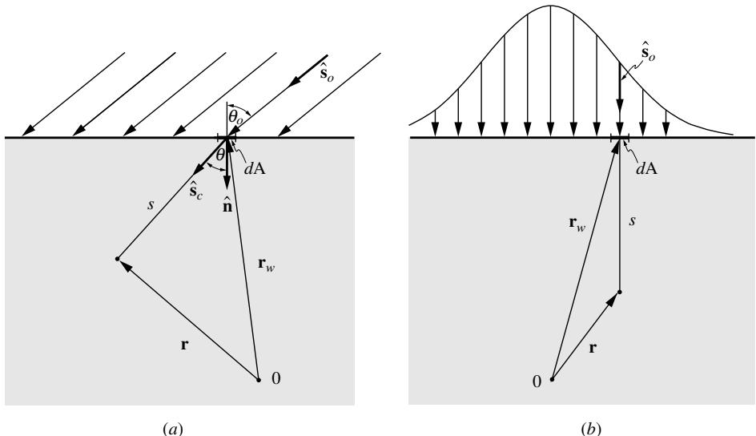
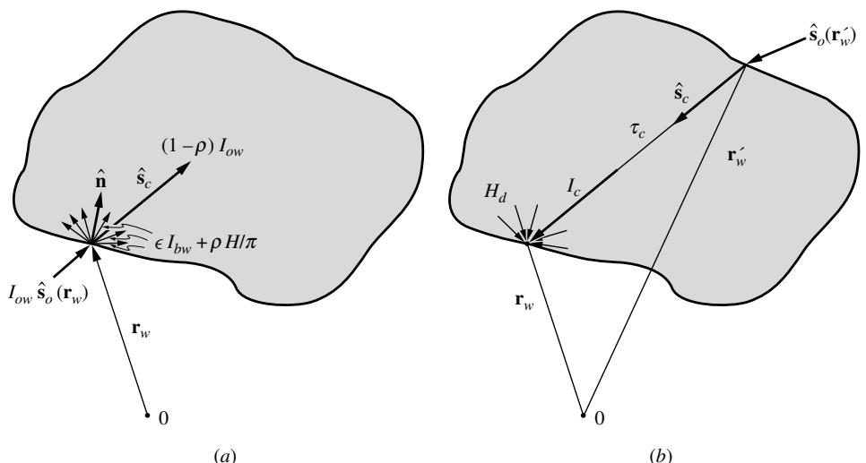
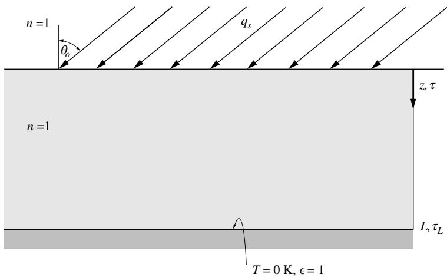
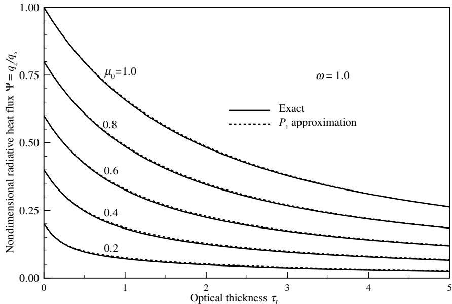
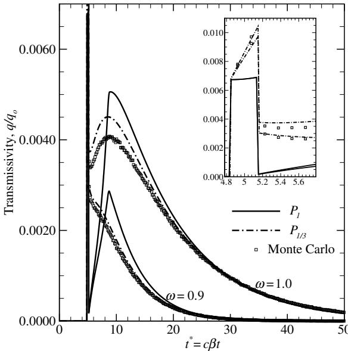
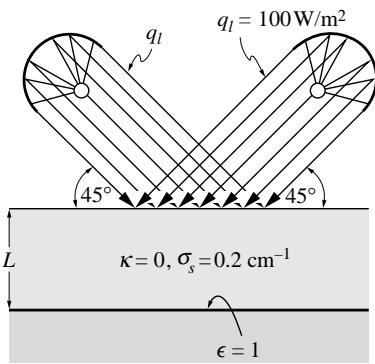
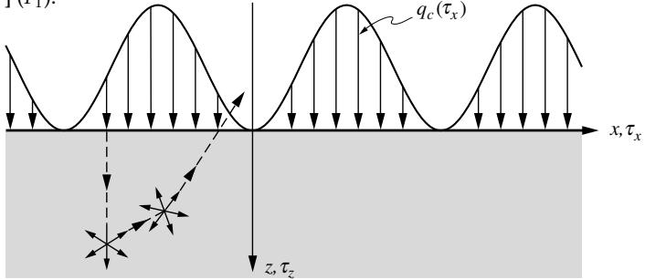
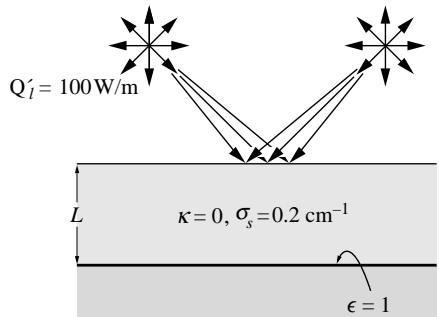

## 内容索引

- [目录](README.md)
- [1 热辐射基础](1-热辐射基础.md)
- [2 基于电磁波理论的辐射特性预测](2-基于电磁波理论的辐射特性预测.md)
- [3 实际表面的辐射特性](3-实际表面的辐射特性.md)
- [4 视角因子](4-视角因子.md)
- [5 灰体漫射表面间的辐射交换](5-灰体漫射表面间的辐射交换.md)
- [6 部分镜面灰体表面间的辐射交换](6-部分镜面灰体表面间的辐射交换.md)
- [7 非理想表面间的辐射交换](7-非理想表面间的辐射交换.md)
- [8 表面交换的蒙特卡洛方法](8-表面交换的蒙特卡洛方法.md)
- [9 传导和对流存在时的表面辐射交换](9-传导和对流存在时的表面辐射交换.md)
- [10 参与介质中的辐射传递方程(RTE)](10-参与介质中的辐射传递方程(RTE).md)
- [11 分子气体的辐射特性](11-分子气体的辐射特性.md)
- [12 颗粒介质的辐射特性](12-颗粒介质的辐射特性.md)
- [13 半透明介质的辐射特性](13-半透明介质的辐射特性.md)
- [14 一维灰体介质的精确解](14-一维灰体介质的精确解.md)
- [15 一维介质的近似求解方法](15-一维介质的近似求解方法.md)
- [16 球谐函数法 (PN-近似)](16-球谐函数法(PN-近似).md)
- [17 离散坐标法 (SN-近似)](17-离散坐标法(SN-近似).md)
- [18 区域法](18-区域法.md)
- [19 准直辐射与瞬态现象](19-准直辐射与瞬态现象.md)
- [20 非灰消光系数的求解方法](20-非灰消光系数的求解方法.md)
- [21 参与介质的蒙特卡洛方法](21-参与介质的蒙特卡洛方法.md)
- [22 辐射与传导和对流的耦合](22-辐射与传导和对流的耦合.md)
- [23 逆辐射传热](23-逆辐射传热.md)
- [24 纳米尺度辐射传热](24-纳米尺度辐射传热.md)
- [附录](附录.md)

- [19.1 引言](#191-引言)  
- [19.2 问题的简化](#192-问题的简化)  
- [19.3 带准直辐射的修正P1-近似](#193-带准直辐射的修正p1-近似)  
- [19.4 短脉冲准直辐射的瞬态效应](#194-短脉冲准直辐射的瞬态效应)  
- [参考文献](#参考文献)  
- [习题](#习题)  

# 第19章

# 准直辐射与瞬态现象

# 19.1 引言

近年来，人们对多维吸收、发射和散射介质中准直辐射的辐射传递分析越来越感兴趣。准直辐射指的是从外部穿透进入参与介质的外部辐射（与边界表面发射的辐射不同），所有光波彼此平行（或近似平行）。典型例子包括穿过大气层进入海洋的太阳辐射、对颗粒或液体的激光照射等。随着脉冲持续时间在皮秒甚至飞秒量级的短脉冲激光的出现，瞬态辐射效应也引起了人们的关注。由于在工程应用中，几乎所有瞬态辐射效应都是由短脉冲激光引起的，因此本章将这两个主题一并讨论。准直辐射可以定义为：如图19-1所示，在介质边界表面位置$\mathbf{r}_w$处，入射到表面$dA$上的强度可表示为

$$
\begin{array}{l}{I_{ow}(\mathbf{r}_w,\hat{\mathbf{s}}) = q_o(\mathbf{r}_w)\delta [\hat{\mathbf{s}} -\hat{\mathbf{s}}_o(\mathbf{r}_w)]}\\ {= q_o(\mathbf{r}_w)\delta [\mu -\mu_o(\mathbf{r}_w)]\delta [\psi -\psi_o(\mathbf{r}_w)],} \end{array} \tag{19.1}
$$

其中$\delta$是Dirac-δ函数，此处定义为1

$$
\delta (x) = \left\{ \begin{array}{ll}0, & |x| > \epsilon ,\\ \lim_{\epsilon \to 0}\frac{1}{2\epsilon}, & |x|< \epsilon , \end{array} \right. \tag{19.2a}
$$

$$
\int_{4\pi}f(\hat{\mathbf{s}})\delta (\hat{\mathbf{s}} -\hat{\mathbf{s}}_o)d\Omega = \int_0^{2\pi}\int_{-1}^{+1}f(\mu ,\psi)\delta (\mu -\mu_o)\delta (\psi -\psi_o)d\mu d\psi = f(\mu_o,\psi_o), \tag{19.2b}
$$

且

$$
\hat{\mathbf{s}}_o = \cos \theta_o\hat{\mathbf{n}} +\sin \theta_o(\cos \psi_o\hat{\mathbf{t}}_1 + \sin \psi_o\hat{\mathbf{t}}_2),\qquad \mu_o = \cos \theta_o, \tag{19.3}
$$

表示准直辐射入射到介质的方向（$\hat{\mathbf{n}}$为指向介质内部的表面法向量，$\hat{\mathbf{t}}_1$和$\hat{\mathbf{t}}_2$为位于边界表面上的两个正交单位向量）。方程(19.1)意味着入射强度在所有方向上均为零，除了$\hat{\mathbf{s}}_o$方向外，该方向强度无限大。准直辐射内的总热流由下式确定：

  
图19-1 准直辐射照射任意表面：(a)太阳辐射，(b)激光辐射

$$
\mathbf{q}_o = \int_{4\pi}I_{ow}(\hat{\mathbf{s}})\hat{\mathbf{s}} d\Omega = q_o\int_{4\pi}\hat{\mathbf{s}}\delta (\hat{\mathbf{s}} -\hat{\mathbf{s}}_o)d\Omega = q_o\hat{\mathbf{s}}_o, \tag{19.4}
$$

即$q_{o}$是通过垂直于光线的表面的准直辐射总辐射热流。进入介质的组分则为

$$
\mathbf{q}_c = \left[1 - \rho (\mathbf{r}_w,\hat{\mathbf{s}}_o)\right]q_o\hat{\mathbf{s}}_c, \tag{19.5}
$$

其中$\rho$是$\hat{\mathbf{s}}_o$方向上的界面反射率。由于进入介质的辐射可能会发生折射，介质内的单位方向向量记为$\hat{\mathbf{s}}_c$，可能与$\hat{\mathbf{s}}_o$不同。如上表达式所示，辐射强度$q_{o}$的大小以及辐射方向$\hat{\mathbf{s}}_o$可能在封闭表面各处变化，而表面反射率也可能随位置和方向变化。

从严格的数学意义上讲，方程(19.1)并没有引入新内容：准直辐射可以简单地视为"强方向性发射"。然而，强度随方向的不连续性给解析和数值求解技术带来了问题，因此需要针对此类问题采用单独的处理方法。

早期关于准直辐射的研究大多涉及太阳辐射和其他大气或天体物理应用。因此，这些研究通常局限于平面介质均匀辐射的一维情况。对于这种简单情况，Irvine[1]给出了一些精确解和近似解，他使用了Henyey-Greenstein相函数，该散射相函数能充分近似多种介质的各向异性散射行为[2]，如方程(12.95)所示。Kubo[3]处理了Rayleigh散射的相同问题，但未报告任何结果。Armaly和El-Baz[4]使用核近似方法，针对有限厚度平板中的各向同性散射找到了一些近似解，其应用领域为太阳能集热器。Houf和Incropera[5]研究了类似问题，他们考察了水介质中太阳辐射的不同近似技术。

直到激光成为研究和制造工具后，非太阳准直辐射才得到一些研究关注。Smith[6]研究了均匀条状准直辐射入射半无限介质的情况，通过傅里叶变换将所得二维积分方程简化为一维形式。Hunt[7]研究了圆柱形准直光束照射有限层的影响，使用格林函数针对Bessel函数变化强度的基本情况找到了解。最早将该理论应用于激光辐射的似乎是Beckett及其同事[8]，他们数值研究了具有高斯变化的圆柱形光束穿透有限层的情况，展示了如何利用诊断激光束推导光学厚平板的辐射特性，如单次散射反照率、消光和吸收系数。最后，Crosbie及其同事[9-12]的一系列论文处理了准直辐射照射吸收-散射层的通用二维问题的精确解。他们首先处理了照射半无限体的准直条状源[9]；随后讨论了照射半无限体的圆柱形光束[10,11]。Crosbie和Schrenker[12]研究了矩形介质上的准直辐射和各向同性散射，而Kim和Lee[13]通过将其应用于相同问题但考虑各向异性散射，证明了高阶离散坐标法的准确性。精确解可作为评估近似方法的基准，在需要高精度结果的情况下可能是必要的。然而在传热领域，近似解通常能为大多数实际情况提供可接受的预测。

最近，一些更高级的问题也引起了关注。Tan及其同事考虑了玻璃的传导和辐射激光联合加热[14]，而Lacroix团队[15]以及Xu和Song[16,17]应用离散坐标法分析了激光束与激光产生的羽流或等离子体之间的相互作用。El Ammouri等人[18]展示了如何利用温度波动引起的激光束波动作为测量湍流水平的工具。Ben-Abdallah[19]及其同事沿着相同思路，分析了激光在折射率变化气体中传播的弯曲路径。

超短脉冲激光在纳米技术和生物医学工程等新兴领域得到广泛应用[20]。这种短脉冲激光产生的辐射场与本书讨论的辐射场在两个重要方面可能不同：(1)由于光在1 ps时间跨度内仅传播$300\mu \mathrm{m}$，必须考虑瞬态效应；(2)将固定能量压缩到极短持续时间的脉冲中会导致时间上的极端强度。前者需要考虑RTE方程(10.20)中的瞬态项，许多研究人员对此进行了研究[21-32]。在极高强度下，许多分子被激发到具有不同吸收行为的能级，使吸收系数成为强度的函数，这称为可饱和吸收[33]。根据吸收截面的相对大小，这可能导致漂白(吸收系数随强度降低)或暗化(吸收系数随强度增加)[34]。此外，在极高强度下，分子可能同时吸收多个光子，使分子跃迁到激发电子态，这称为多光子吸收[35-37]。如果吸收的总光子能量足够高，这又可能导致电离或解离，称为光解作用。已经开发了几种光化学和光热模型来描述短脉冲激光烧蚀材料的过程[38-41]。在生物医学工程中，短脉冲激光被视为光学成像(如肿瘤等)[24,42,43]和微创手术(如肿瘤消融)[44]的有前景工具。

本章将描述如何处理任意几何形状的吸收、发射和各向异性散射介质在任意准直辐射下的辐射传递问题，方法是将准直辐射(当它穿过介质时)与辐射场的其余部分分离。这样问题就简化为没有准直辐射但具有修正辐射源项(现在包括由准直辐射散射部分引起的源)的问题。我们将看到，可以容易地将准直辐射纳入众所周知的近似方法，如$P_{1}$-近似。由于其日益增长的重要性，本章还包括关于短脉冲激光照射期间瞬态效应的简要章节。

# 19.2 问题的简化

对于吸收、发射和各向异性散射介质，其传输方程由方程(10.18)给出：

$$
\hat{\mathbf{s}}\cdot \nabla I(\mathbf{r},\hat{\mathbf{s}}) = \kappa I_b(\mathbf{r}) - \beta I(\mathbf{r},\hat{\mathbf{s}}) + \frac{\sigma_s}{4\pi}\int_{4\pi}I(\mathbf{r},\hat{\mathbf{s}}')\Phi (\hat{\mathbf{s}},\hat{\mathbf{s}} ')d\Omega '. \tag{19.6}
$$

与往常一样，缺少光谱下标意味着我们处理的是光谱强度或灰体介质。这里我们将自己限制在具有漫发射和漫反射边界的介质中。那么对于表面任意位置$\mathbf{r}_w$，方程(19.6)的边界条件为：

$$
I(\mathbf{r}_w,\hat{\mathbf{s}}) = [1 - \rho (\mathbf{r}_w)]I_{dw}(\mathbf{r}_w,\hat{\mathbf{s}}) + \epsilon (\mathbf{r}_w)I_{bw}(\mathbf{r}_w) + \frac{\rho(\mathbf{r}_w)}{\pi}\int_{\hat{\mathbf{n}}\cdot \hat{\mathbf{s}} '\cdot < 0}I(\mathbf{r}_w,\hat{\mathbf{s}} ')\left|\hat{\mathbf{n}}\cdot \hat{\mathbf{s}} '\right|d\Omega '. \tag{19.7}
$$

这里右边第一项表示准直辐射的穿透，第二项描述周围介质的发射，最后一项是由于界面处的漫反射。这种分布如图19-2a示意所示。由于我们这里假设漫发射和漫反射，并且考虑的是光谱关系或灰体介质，我们也有$\epsilon = 1 - \rho$。

现在我们将介质内的强度分为两部分：(i)准直光束在路径上经过部分吸收和散射后剩余的残余部分，以及(ii)相当漫射的部分，这部分来自边界的发射、介质内部的发射以及从准直辐射散射出去的辐射。因此，我们设：

$$
I(\mathbf{r},\hat{\mathbf{s}}) = I_c(\mathbf{r},\hat{\mathbf{s}}) + I_d(\mathbf{r},\hat{\mathbf{s}}), \tag{19.8}
$$

其中准直辐射的残余部分服从传输方程：

$$
\hat{\mathbf{s}}\cdot \nabla I_c(\mathbf{r},\hat{\mathbf{s}}) = -\beta I_c(\mathbf{r},\hat{\mathbf{s}}), \tag{19.9}
$$

边界条件为：

$$
I_{c}(\mathbf{r}_{w},\hat{\mathbf{s}}) = [1 - \rho (\mathbf{r}_{w})]q_{o}(\mathbf{r}_{w})\delta [\hat{\mathbf{s}} -\hat{\mathbf{s}}_{c}(\mathbf{r}_{w})]. \tag{19.10}
$$

方程(19.9)和(19.10)可以容易地解为：

$$
I_{c}(\mathbf{r},\hat{\mathbf{s}}) = [1 - \rho (\mathbf{r}_{w})]q_{o}(\mathbf{r}_{w})\delta [\hat{\mathbf{s}} -\hat{\mathbf{s}}_{c}(\mathbf{r}_{w})]e^{-\tau_{c}}, \tag{19.11}
$$

其中$\tau_{c} = \int_{0}^{s}\beta ds^{\prime}$，$s = |\mathbf{r} - \mathbf{r}_w|$如图19-2b所示。将方程(19.8)和(19.9)代入方程(19.6)得到非准直辐射的传输方程为：

$$
\begin{array}{r}\frac{1}{\beta}\hat{\mathbf{s}}\cdot \nabla I_d(\mathbf{r},\hat{\mathbf{s}}) = \hat{\mathbf{s}}\cdot \nabla_\tau I_d(\mathbf{r},\hat{\mathbf{s}}) = -I_d(\mathbf{r},\hat{\mathbf{s}}) + \frac{\omega}{4\pi}\int_{4\pi}I_d(\mathbf{r},\hat{\mathbf{s}}')\Phi (\hat{\mathbf{s}},\hat{\mathbf{s}} ')d\Omega '\\ +(1 - \omega)I_b(\mathbf{r}) + \omega S_c(\mathbf{r},\hat{\mathbf{s}}), \end{array} \tag{19.12}
$$

  
图19-2 具有准直辐射的封闭表面辐射强度：(a)出射强度，(b)入射强度。

其中引入了缩写

$$
S_{c}(\mathbf{r},\hat{\mathbf{s}})\equiv \frac{1}{4\pi}\int_{4\pi}I_{c}(\mathbf{r},\hat{\mathbf{s}}^{\prime})\Phi (\hat{\mathbf{s}},\hat{\mathbf{s}}^{\prime})d\Omega^{\prime} = \frac{1}{4\pi}\left[1 - \rho (\mathbf{r}_{w})\right]q_{o}(\mathbf{r}_{w})e^{-\tau_{c}}\Phi (\hat{\mathbf{s}},\hat{\mathbf{s}}_{c}) \tag{19.13}
$$

且$\nabla_{c}$再次表示梯度是相对于无量纲光学坐标而言的。因此，$S_{c}$是由准直光束散射产生的辐射源项；其行为类似于$I_{b}$，尽管这种"发射"可能不是各向同性的（在非各向同性散射情况下）。类似地，将方程(19.8)和(19.10)代入方程(19.7)得到方程(19.12)的边界条件为

$$
I_{d}(\mathbf{r}_{w},\hat{\mathbf{s}}) = \epsilon I_{bw}(\mathbf{r}_{w}) + \frac{\rho(\mathbf{r}_{w})}{\pi}\bigg[H_{c}(\mathbf{r}_{w}) + \int_{\hat{\mathbf{n}}\cdot \hat{\mathbf{s}}^{\prime}< 0}I_{d}(\mathbf{r}_{w},\hat{\mathbf{s}}^{\prime})|\hat{\mathbf{n}}\cdot \hat{\mathbf{s}}^{\prime}|d\Omega^{\prime}\bigg], \tag{19.14}
$$

其中

$$
H_{c}(\mathbf{r}_{w})\equiv \int_{\hat{\mathbf{n}}\cdot \hat{\mathbf{s}}^{\prime}< 0}I_{c}(\mathbf{r}_{w},\hat{\mathbf{s}}^{\prime})|\hat{\mathbf{n}}\cdot \hat{\mathbf{s}}^{\prime}|d\Omega^{\prime} = \left[1 - \rho (\mathbf{r}_{w}^{\prime})\right]q_{o}(\mathbf{r}_{w}^{\prime})|\hat{\mathbf{n}}\cdot \hat{\mathbf{s}}_{c}^{\prime}|e^{-\tau_{c}} \tag{19.15}
$$

是由准直光束引起的表面辐照项，其漫反射产生类似于$I_{bw}$的附加表面源。在此表达式中，$\mathbf{r}_{w}^{\prime}$是准直光束以$\hat{\mathbf{s}}_{c}^{\prime}$方向进入介质的位置，$\mathbf{r}_{w}$是光束穿过介质后撞击封闭表面的下一个点，如图19-2b所示。

检查方程(19.12)和(19.14)表明，对于各向同性散射，$I_{d}$的强度场可以通过标准方法容易地确定，只需将介质内的$I_{b}$替换为$I_{b} + (\sigma_{s} / \kappa)S_{c}$，并将封闭表面的$I_{bw}$替换为$I_{bw} + (\rho /\epsilon)H_{c} / \pi$。在非各向同性散射情况下，发射项$S_{c}$变为方向依赖的，这可能需要稍微改变求解过程。

例19.1。考虑如图19-3所示的吸收和各向同性散射介质的平行平板。介质为灰色（吸收系数$\kappa$，散射系数$\sigma_{s}$，折射率$n = 1$），冷（即基本不发射）且具有恒定厚度$L$。在顶部$(z = 0)$，该层与非参与气体$(n = 1)$相邻，并受到以$\theta_{o}$角度斜入射的太阳辐射。在层底部$(z = L)$，介质与冷黑表面相邻。确定辐射热通量（及其散度）随深度的变化。

  
图19-3 例19.1的几何结构

# 解

由于两种介质具有相同的折射率，界面反射率为$\rho = 0$且$\hat{\mathbf{s}}_c = \hat{\mathbf{s}}_o$；由方程(19.11)我们立即得到

$$
I_{c}(\tau ,\hat{\mathbf{s}}) = q_{s}e^{-\tau /\mu_{o}}\delta (\hat{\mathbf{s}} -\hat{\mathbf{s}}_{o}),
$$

以及

$$
S_{c}(\tau) = \frac{G_{c}}{4\pi} (\tau) = \frac{q_{s}}{4\pi} e^{-\tau /\mu_{o}},
$$

$$
\mathbf{q}_c(\tau) = q_se^{-\tau /\mu_o}\hat{\mathbf{s}}_o.
$$

由于准直辐射产生的热流矢量有两个分量：一个沿$\tau$方向，另一个与之垂直（在$\hat{\mathbf{s}}_o$与表面法线形成的平面内）。因此，整体问题是二维的。然而，检查方程(19.12)中的源项表明，该源是各向同性的，方程(19.12)的边界条件也是如此。因此，$I_{d}$只能取决于垂直于表面的距离$\tau$和极角。于是，

$$
\mu \frac{dI_d}{d\tau} +I_d = \omega \left[\frac{1}{4\pi}\int_{4\pi}I_d d\Omega ' + S_c\right] = \frac{\omega}{4\pi}\left[G_d(\tau) + G_c(\tau)\right].
$$

边界条件为

$$
\begin{array}{llll}\tau = 0: & I(0,\hat{\mathbf{s}}) = q_s\delta (\hat{\mathbf{s}} -\hat{\mathbf{s}}_o), & 0\leq \theta < \frac{\pi}{2},\\ \tau = \tau_c: & I(\tau_c,\hat{\mathbf{s}}) = 0, & \frac{\pi}{2} < \theta \leq \pi , \end{array}
$$

或者，在减去准直分量后，

$$
\begin{array}{r l r l r} & {\tau = 0:} & & {I_{d}(0,\mu) = 0,} & & {0< \mu \leq 1,}\\ & {} & & {}\\ & {\tau = \tau_{L}:} & & {I_{d}(\tau ,\mu) = 0,} & & {-1\leq \mu < 0.} \end{array}
$$

因此，令$S = (\omega /4\pi)(G_d + G_c)$，$I_{d}$的解由方程(14.21)给出：

$$
G_{d}(\tau) = 2\pi \int_{0}^{\tau_{L}}\frac{\omega}{4\pi} (G_{d} + G_{c})(\tau^{\prime})E_{1}(|\tau -\tau^{\prime}|)d\tau^{\prime}.
$$

在无量纲形式下，令$\Phi (\tau) = (G_d + G_c) / q_s$，该表达式变为

$$
\Phi (\tau) - e^{-\tau /\mu_o} = \frac{\omega}{2}\int_0^{\tau_L}\Phi (\tau ')E_1(|\tau -\tau '|)d\tau '.
$$

  
图19-4 纯散射层中准直辐射的无量纲热流

该积分方程必须以与方程(14.43)相同的方式数值求解。一旦确定了函数$\Phi (\tau)$，漫射热流分量可由方程(14.22)得出：

$$
\begin{array}{l}{\mathbf{q}_d(\tau) = q_d(\tau)\hat{\mathbf{k}} = 2\pi \int_{-1}^{1}I_d\mu d\mu \hat{\mathbf{k}},}\\ {q_d(\tau) = 2\pi \left\{\int_0^{\tau}\frac{\omega}{4\pi} (G_d + G_c)(\tau ')E_2(\tau -\tau ')d\tau ' - \int_{\tau}^{\tau_L}\frac{\omega}{4\pi} (G_d + G_c)(\tau ')E_2(\tau ' - \tau)d\tau '\right\} .} \end{array}
$$

最后，$\tau$方向的总热流在无量纲基础上为

$$
\Psi = \frac{\mathbf{q}_c\cdot\hat{\mathbf{k}} + q_d}{q_s} = \mu_oe^{-\tau /\mu_o} + \frac{\omega}{2}\left[\int_0^\tau \Phi (\tau ')E_2(\tau -\tau ')d\tau ' - \int_\tau^{\tau_L}\Phi (\tau ')E_2(\tau ' - \tau)d\tau '\right].
$$

辐射热流的散度由方程(10.59)得出：

$$
\nabla_{\tau}\cdot \mathbf{q} = (1 - \omega)(4\pi I_{b} - G) = -(1 - \omega)(G_{c} + G_{d}),
$$

或以无量纲形式表示

$$
\frac{1}{q_s}\nabla_{\tau}\cdot \mathbf{q} = -(1 - \omega)\Phi .
$$

图19-4展示了纯散射介质$(\omega = 1)$的一些结果。对于这种情况，我们发现$\nabla \cdot \mathbf{q} = 0$，并且由于$\mathbf{q}_c$的切向分量不依赖于切向方向，$\mathbf{q}\cdot \hat{\mathbf{k}} =$常数且$\Psi =$常数。因此，在$\tau = 0$处评估热流，我们得到

$$
\Psi (\omega = 1) = \mu_o - \frac{1}{2}\int_0^{\tau_L}\Phi (\tau ')E_2(\tau ')d\tau '.
$$

# 19.3 带准直辐射的修正P1-近似

与无准直辐射的问题类似，方程(19.12)及其边界条件(19.14)的精确或近似解可以通过多种不同方法求得。

作为示例，我们将展示如何将$P_{1}$近似应用于准直辐射问题，遵循Modest和Tabanfar[47]的发展。$P_{1}$或微分近似使用简单（仅需解一个椭圆微分方程）且功能强大（适用于多维几何和各向异性散射）。然而，$P_{1}$近似仅对方向平滑变化的强度场准确这一事实，使其特别不适合处理准直辐射问题。但是，一旦从强度场中去除准直强度$I_{c}$，类似于第16.8节的发展，所得的修正$P_{1}$近似有望为方程(19.12)和(19.14)提供许多情况下的准确解。为了应用该方法，我们再次假设剩余强度只能略微偏离各向同性条件，或者由方程(16.31)，

$$
I_{d}(\mathbf{r},\hat{\mathbf{s}})\simeq \frac{1}{4\pi}\left[G_{d}(\mathbf{r}) + 3\mathbf{q}_{d}(\mathbf{r})\cdot \hat{\mathbf{s}}\right]. \tag{19.16}
$$

如第16.5节所述，我们将自己限制在线性各向异性散射情况下，

$$
\Phi (\hat{\mathbf{s}},\hat{\mathbf{s}}^{\prime}) = 1 + A_{1}\hat{\mathbf{s}}\cdot \hat{\mathbf{s}}^{\prime}, \tag{19.17}
$$

因此

$$
\begin{array}{l}{S_{c} = \frac{1}{4\pi}\int_{4\pi}I_{c}(\hat{\mathbf{s}}^{\prime})(1 + A_{1}\hat{\mathbf{s}}\cdot \hat{\mathbf{s}}^{\prime})d\Omega^{\prime}}\\ {= \frac{1}{4\pi} (G_{c} + A_{1}\mathbf{q}_{c}\cdot \hat{\mathbf{s}}) = \frac{1}{4\pi} [1 - \rho (\mathbf{r}_{w})]q(\mathbf{r}_{w})e^{-\tau_{c}}(1 + A_{1}\hat{\mathbf{s}}\cdot \hat{\mathbf{s}}^{\prime}).} \end{array} \tag{19.18}
$$

现在，对所有方向积分方程(19.12)（零阶矩），我们得到

$$
\nabla_{\tau}\cdot \mathbf{q}_{d} = (1 - \omega)(4\pi I_{b} - G_{d}) + \omega G_{c}. \tag{19.19}
$$

类似地，将方程(19.12)乘以$\hat{\mathbf{s}}$后积分并应用方程(19.16)，我们得到

$$
\frac{1}{3}\nabla_{\tau}G_{d} = -\left(1 - \frac{A_{1}\omega}{3}\right)\mathbf{q}_{d} + \frac{A_{1}\omega}{3}\mathbf{q}_{c}. \tag{19.20}
$$

与标准$P_{1}$近似一样，这组方程的必要边界条件是通过要求在边界处表面法向热流连续来找到的，即

$$
\mathbf{q}_d\cdot \hat{\mathbf{n}} (\mathbf{r}_w) = \int_{4\pi}I_d(\mathbf{r}_w,\hat{\mathbf{s}})\hat{\mathbf{n}}\cdot \hat{\mathbf{s}} d\Omega , \tag{19.21}
$$

其中$I_{d}(\mathbf{r}_{w},\hat{\mathbf{s}})$对于入射方向$(\hat{\mathbf{n}}\cdot \hat{\mathbf{s}} < 0)$来自方程(19.16)，对于出射方向$(\hat{\mathbf{n}}\cdot \hat{\mathbf{s}} >0)$来自方程(19.14)。首先计算漫射辐照度得到

$$
\begin{array}{l}{-H_d(\mathbf{r}_w) = \int_{\hat{\mathbf{n}}\cdot \hat{\mathbf{s}} < 0}I_d(\mathbf{r}_w,\hat{\mathbf{s}})\hat{\mathbf{n}}\cdot \hat{\mathbf{s}} d\Omega = \frac{1}{4\pi}\int_0^{2\pi}\int_{\pi /2}^{\pi}(\boldsymbol {G}_d + 3\mathbf{q}_d\cdot \hat{\mathbf{s}})\hat{\mathbf{n}}\cdot \hat{\mathbf{s}} d\Omega}\\ {= \frac{1}{2}\int_{\pi /2}^{\pi}(\boldsymbol {G}_d + 3\mathbf{q}_d\cdot \hat{\mathbf{n}}\cos \theta)\cos \theta \sin \theta d\theta = -\frac{G_d}{4} +\frac{\mathbf{q}_d\cdot\hat{\mathbf{n}}}{2}.} \end{array} \tag{19.22}
$$

因此，

$$
\mathbf{q}_d\cdot \hat{\mathbf{n}} = \epsilon \pi I_{bw} + \rho (H_c + H_d) - H_d,
$$

或者，代入方程(19.22)后，

$$
\mathbf{r} = \mathbf{r}_w:\qquad 2\mathbf{q}_d\cdot \hat{\mathbf{n}} = \frac{\epsilon(4\pi I_{bw} - G_d) + 4(1 - \epsilon)H_c}{2 - \epsilon}. \tag{19.23}
$$

方程(19.19)和(19.20)的推导与标准$P_{1}$近似的发展非常相似，这在第16.5节中已经给出了更详细的说明。

例19.2. 使用$P_{1}$近似求解前一个例子。

# 解

与精确解一样，我们发现

$$
G_{c} = q_{s}e^{-\tau /\mu_{o}},\qquad \mathbf{q}_{c} = G_{c}\hat{\mathbf{s}}_{o},
$$

并且我们再次认识到$G_{d}$和$\mathbf{q}_d = q_d\hat{\mathbf{k}}$仅依赖于$\tau$（垂直于层的光学距离）。因此，从方程(19.19)和(19.20)及其边界条件(19.23)中，我们发现

$$
\begin{array}{rl}\frac{dq_d}{d\tau} & = -(1 - \omega)G_d + \omega G_c,\\ \displaystyle \frac{dG_d}{d\tau} & = -3q_d, \end{array}
$$

$$
\begin{array}{rlr}\tau = 0: & {} & 2q_d = -G_d,\\ \tau = \tau_L: & {} & -2q_d = -G_d. \end{array}
$$

由于这个方程的求解过程对于$\omega = 1$（与$\omega < 1$相对）是不同的，并且由于我们希望将当前结果与图19-4中显示的精确结果进行比较，我们将把讨论限制在$\omega = 1$的情况下。然后

$$
\frac{dq_d}{d\tau} = q_se^{-\tau /\mu_o},\quad \mathrm{or}\quad q_d = -\mu_oq_se^{-\tau /\mu_o} + C_1,
$$

$$
\frac{dq_d}{d\tau} = -3q_d,\quad \mathrm{or}\quad G_d = -3\mu_o^2 q_se^{-\tau /\mu_o} - 3C_1\tau +C_2.
$$

根据边界条件可得

$$
\begin{array}{rl}{\tau = 0:} & {2C_1 + C_2 = (2 + 3\mu_o)\mu_oq_s,}\\ {\tau = \tau_L:} & {(2 + 3\tau_L)C_1 - C_2 = (2 - 3\mu_o)\mu_oq_se^{-\tau /\mu_o},} \end{array}
$$

或

$$
\begin{array}{l}{C_1 = \frac{2 + 3\mu_o + (2 - 3\mu_o)e^{-\tau_L / \mu_o}}{4 + 3\tau_L}\mu_oq_s,}\\ {}\\ {q_d = \left[\frac{2 + 3\mu_o + (2 - 3\mu_o)e^{-\tau_L / \mu_o}}{4 + 3\tau_L} -e^{-\tau / \mu_o}\right]\mu_oq_s.} \end{array}
$$

最后，

$$
\Psi = \frac{\mathbf{q}_c\cdot\hat{\mathbf{k}} + q_d}{q_c} = \frac{2 + 3\mu_o + (2 - 3\mu_o)e^{-\tau_L / \mu_o}}{4 + 3\tau_L}\mu_o,
$$

如前一例所述，这在层中是恒定的。这个无量纲热流与图19-4中的精确结果进行了比较。可以看出，$P_{1}$近似对于图中显示的所有情况都给出了良好的准确性。

Modest和Tabanfar[47]给出了一些关于$P_{1}$近似在准直辐射下的二维例子，并与Crosbie和Koewing[48]以及Crosbie和Dougherty[10]的精确结果进行了比较。$P_{1}$近似的准确性在大多数情况下都非常好，因为它通常应用于具有冷边界的"发射"介质。正如预期的那样，如果介质内出现辐射源的急剧梯度（例如，由高度聚焦的穿透激光束散射产生的源），$P_{1}$近似的准确性会降低。

# 19.4 短脉冲准直辐射的瞬态效应

当持续时间极短的激光脉冲(通常伴随着脉冲期间强烈的时间变化)照射到介质上时，辐射传递方程中的瞬态项变得非常重要。因此，根据方程(10.20)，方程(19.12)必须重新表述为

$$
\frac{1}{\beta c}\frac{\partial I_d}{\partial t} (\mathbf{r},\hat{\mathbf{s}},t) + \frac{1}{\beta}\hat{\mathbf{s}}\cdot \nabla I_d(\mathbf{r},\hat{\mathbf{s}}) = -I_d(\mathbf{r},\hat{\mathbf{s}}) + \frac{\omega}{4\pi}\int_{4\pi}I_d(\mathbf{r},\hat{\mathbf{s}}^{\prime})\Phi (\hat{\mathbf{s}},\hat{\mathbf{s}}^{\prime})d\Omega^{\prime}\\ +(1 - \omega)I_b(\mathbf{r}) + \omega S_c(\mathbf{r},\hat{\mathbf{s}}), \tag{19.24}
$$

其中"漫射强度"$I_{d}$和散射源$S_{c}$现在不仅是位置和方向的函数，也是时间的函数。此外，从介质入口点$\mathbf{r}_w$进入的准直辐射残余，到达位置$\mathbf{r}$时会有$s / c = |\mathbf{r} - \mathbf{r}_w| / c$的时间延迟。因此，方程(19.13)必须替换为

$$
S_{c}(\mathbf{r},\hat{\mathbf{s}},t) = \frac{1}{4\pi} [1 - \rho (\mathbf{r}_{w})]q_{o}(\mathbf{r}_{w},t - s / c)e^{-\tau_{c}}\Phi (\hat{\mathbf{s}},\hat{\mathbf{s}}_{c}). \tag{19.25}
$$

边界条件基本保持不变[除了方程(19.15)中$q_{o}$的时间延迟]。方程(19.24)本质上是双曲型的，即信号(强度)可以以$c$的信号速度传播(和变化)。从源项方程(19.25)也可以立即看出这一点。这组方程经转换为积分形式后，已被Tan和Hsu[49]在一维层中求解，被Wu和Wu[27-30]在一维和二维轴对称平板中求解。Hsu[50]使用第21章的蒙特卡洛方法预测了一维平板中的入射辐射和通量，而Guo等[24]将蒙特卡洛方法应用于二维轴对称场。Lu和Hsu[51,52]应用反向蒙特卡洛方案预测了一维平板的反射率和透射率。

基于第15-17章介绍的RTE求解方法，还开发了许多近似模型。考虑到具有非反射边界的一维平板，Kumar等[21]将修正的$P_{1}$近似扩展到这种情况，稍后Mitra和Kumar[23]又增加了双通量和离散坐标公式。他们注意到双通量近似的信号速度仅为$c / 2$，而$P_{1}$近似的信号速度为$c / \sqrt{3}$。当使用更高阶的方法时，无论是球谐$P_N$还是离散坐标$S_{N}$，都会接近正确的信号速度$c$。注意到$P_{1}$近似的不正确相速度，Olson等[25]和Morel[26]将该方法修改为他们所称的$P_{1 / 3}$近似。

几位研究者[43,53,54]将常规离散坐标法(DOM)扩展到瞬态问题，Chai等[55-57]则将相关的有限体积法(FVM)应用于一、二和三维问题。最后，Liu等[58-60]展示了如何使用FVM的变体，即空间离散化的不连续有限元，进行瞬态计算。显然，Liu和Hsu[60]最先认识到，由于方程(19.24)在时间上是线性的，可以通过叠加找到任意时间脉冲形状(和脉冲序列)的解。

在上述所有讨论的情况下，介质都被假定为非发射的。一些研究考虑了材料的加热和发射，假设辐射平衡成立，方程(10.74)[61,62]，有些还包括傅里叶传导[61,63]，甚至双曲传导[44]。

由于其简单性和流行性，我们将在此简要概述非发射介质的$P_{1}$和$P_{1 / 3}$近似的发展。

# $P_{1}$ 公式

现在的起点是增强的RTE方程(19.24)。在取零阶和一阶矩后，再次使用近各向同性条件方程(19.16)和线性各向异性散射假设方程(19.17)，增强的$P_{1}$方程(19.19)和(19.20)变为

$$
\begin{array}{l}\frac{\partial G_d}{\partial t^*} +\nabla_\tau \cdot \mathbf{q}_d = (1 - \omega)(4\pi I_b - G_d) + \omega G_c,\\ \displaystyle \frac{\partial\mathbf{q}_d}{\partial t^*} +\frac{1}{3}\nabla_\tau G_d = -\left(1 - \frac{A_1\omega}{3}\right)\mathbf{q}_d + \frac{A_1\omega}{3}\mathbf{q}_c, \end{array} \tag{19.27}
$$

其中$t^* = \beta ct$是无量纲时间。这些方程当然与方程(19.19)和(19.20)相同，只是增加了瞬态项。至于精确公式，边界条件方程(19.23)保持不变[再次，除了方程(19.15)中$q_{o}$的时间延迟]。从方程(19.26)和(19.27)中消去$\mathbf{q}_d$，可以得到$G_{d}$的双曲波动方程，其信号速度为$c / \sqrt{3}$。

# $P_{1 / 3}$ 公式

Olson等[25]注意到，如果将方程(19.27)中的瞬态项乘以$1 / 3$，所得方程组具有正确的传播速度$c$，同时仍能简化为正确的稳态$P_{1}$近似。因此，所谓的$P_{1 / 3}$近似为

$$
\begin{array}{c}\frac{\partial G_d}{\partial t^*} +\nabla_\tau \cdot \mathbf{q}_d = (1 - \omega)(4\pi I_b - G_d) + \omega G_c,\\ \displaystyle \frac{1}{3}\frac{\partial\mathbf{q}_d}{\partial t^*} +\frac{1}{3}\nabla_\tau G_d = -\left(1 - \frac{A_1\omega}{3}\right)\mathbf{q}_d + \frac{A_1\omega}{3}\mathbf{q}_c, \end{array} \tag{19.28}
$$

同样受边界条件方程(19.23)约束。虽然乘以因子$1 / 3$看起来是任意的，但应该记住方程(19.27)已经是近似的(通过使用近各向同性条件方程(19.16))，因此可以通过瞬态项增强以产生所需结果。

例19.3. 考虑一个宽度为$L$ $(0\leq x\leq L)$、折射率$n = 1$的冷介质，由真空包围(导致非反射界面)。介质吸收、各向同性散射，并在$x = 0$处受到方波激光脉冲的作用：

$$
q_{o}(0,t) = q_{o}[H(t) - H(t - t_{p})],
$$

其中$t_p$是脉冲持续时间，$H(t)$是Heaviside单位阶跃函数。4确定平板随时间变化的透射率。(这基本上是由Mitra和Kumar[23]以及Wu和Ou[31]进行的示例问题。)

# 解

对于非发射且各向同性散射的一维介质，$P_{1}$和$P_{1/3}$近似的方程可简化为：

$$
\begin{array}{c}\frac{\partial G}{\partial t^*} +\frac{\partial q}{\partial\tau} = -(1 - \omega)G + \omega G_c,\\ 3a\frac{\partial q}{\partial t^*} +\frac{\partial G}{\partial\tau} = -3q, \end{array}
$$

其中对于$P_{1}$有$a=1$，对于$P_{1/3}$有$a=1/3$，且$G$和$q$已归一化为$G=G_{d}/q_{o}$和$q=q_{d}/q_{o}$。这两个方程需满足以下初始和边界条件：

$$
\begin{array}{rl}t^{*} = 0: & G(0,\tau) = q(0,\tau) = 0,\\ \tau = 0: & -2q(t^{*},0) = G(t^{*},0),\\ \tau = \tau_{\mathrm{L}}: & +2q(t^{*},\tau_{\mathrm{L}}) = G(t^{*},\tau_{\mathrm{L}}). \end{array}
$$

  
图19-5 吸收-散射平板在准直方波激光脉冲作用下的瞬态透射率$(t_{p}^{*}=0.3,\tau_{L}=5)$

归一化的各向同性散射源可直接从非反射边界条件下的方程(19.25)和(19.18)得出：

$$
G_{c}(t^{*},\tau) = \left[H(t^{*} - \tau) - H^{*}(t^{*} - \tau -t_{p}^{*})\right]e^{-\tau}.
$$

若通过微分消去$q$（第一个方程对$t^{*}$求导，第二个方程对$\tau$求导），可以明显看出这组方程的双曲特性：

$$
\frac{\partial^2G}{\partial t^*^2} -\frac{1}{3a}\frac{\partial^2G}{\partial\tau^2} +\left(1 - \omega +\frac{1}{a}\right)\frac{\partial G}{\partial t^*} +\frac{1 - \omega}{a} G - \frac{\omega}{a} G_c - \omega \frac{\partial G_c}{\partial t^*} = 0,
$$

其信号速度为$1/\sqrt{3a}$（以光速$c$为单位的无量纲值），正如$P_{a}$方法中所示。从初始和边界条件中消去$q$可得：

$$
\begin{array}{l}{t^{*} = 0:G(0,\tau) = \frac{\partial G}{\partial t^{*}} (0,\tau) = 0,}\\ {\tau = 0:3\bigg(G(t^{*},0) + a\frac{\partial G}{\partial t^{*}} (t^{*},0)\bigg) - 2\frac{\partial G}{\partial\tau} (t^{*},0) = 0,}\\ {\tau = \tau :3\bigg(G(t^{*},0) + a\frac{\partial G}{\partial t^{*}} (t^{*},0)\bigg) + 2\frac{\partial G}{\partial\tau} (t^{*},0) = 0.} \end{array}
$$

这个二阶双曲方程可以通过特征线法[64]沿特征线$\tau = \pm t^{*}/\sqrt{3a}$求解，附录F中的transPN程序实现了这一方法。对于光学厚度$\tau_{L}=5$、无量纲脉冲宽度$t_{p}^{*}=0.3$的平板，图19-5展示了时间透射率$[q_{c}(\tau_{L})+q_{a}(\tau_{L})]/q_{o}$的典型结果，并与Monte Carlo模拟结果进行了比较（见问题21.8）。在$t^{*}=\tau_{L}$之前透射率保持为零，因为直接分量需要这段时间穿过平板。如插图所示，在$\tau_{L}<t^{*}<\tau_{L}+t_{p}^{*}$期间，透射率主要由直接分量$q_{c}(\tau_{L})/q_{o}$主导，而散射贡献逐渐累积，对于$\omega=1$的情况在$t^{*}\approx9$时达到最大值。显然，$P_{1}$近似由于其$c/\sqrt{3}$的信号速度严重滞后于真实透射率，随后又过度补偿，而$P_{1/3}$近似能较准确地预测瞬态行为。

Wu和Ou[31]使用了截断高斯激光脉冲（而非方波脉冲），并指出$P_{1}$近似会在$t^{*}=\sqrt{3}\tau_{L}$处产生非物理的二次尖峰（即从$\tau=0$散射的辐射沿直线路径到达$\tau=\tau_{L}$所需的时间），而$P_{1/3}$近似不会出现这种现象。这显然是因为对于高斯轮廓，$\partial G_{c}/\partial t^{*}\neq0$会产生二次峰（可通过运行预编程高斯脉冲的transPN验证）。

由于瞬态RTE本质上是双曲型的，数值求解中常采用特征线法（包括transPN）以准确捕捉辐射波前。Katika和Pilon[65]提出了一种改进的（反向）特征线法，提供了更好的时间步进灵活性。如果用常规差分法求解双曲方程，通常优先采用二阶时间格式。Olson[63,66]讨论了几种适用于此类方法的一阶和二阶时间步进技术。

# 参考文献

1. Irvine, W. M.: "大颗粒的多重散射II：光学厚层", The Astrophysical Journal, vol. 152, pp. 823-834, 1968.  
2. Van de Hulst, H. C.: 《小颗粒的光散射》, John Wiley & Sons, New York, 1957, (also Dover Publications, New York, 1981).  
3. Kubo, S.: "各向异性散射对吸收-发射介质中稳态一维辐射传热的影响", J. Phys. Soc. Japan, vol. 41, no. 3, pp. 894-898, 1976.  
4. Armaly, B. F., and H. S. El-Baz: "各向同性散射有限介质中的辐射传递：近似解", AIAA Journal, vol. 15, no. 8, pp. 1180-1185, 1976.  
5. Houf, W. G., and F. P. Incropera: "预测水介质中辐射传递技术的评估", Journal of Quantitative Spectroscopy and Radiative Transfer, vol. 23, pp. 101-115, 1980.  
6. Smith, M. G.: "具有平面对称和各向同性散射的传输方程", Proc. Camb. Phil. Soc., vol. 60, p. 909, 1964.  
7. Hunt, G. E.: "具有轴对称性的辐射传递传输方程", SIAM J. Appl. Math., vol. 16, no. 1, pp. 228-237, 1968.  
8. Beckett, P., P. J. Foster, V. Huston, and R. L. Moss: "圆柱光束在各向同性散射中的辐射传递", Journal of Quantitative Spectroscopy and Radiative Transfer, vol. 14, pp. 1115-1125, 1974.  
9. Crosbie, A. L., and T. L. Lindsenbardt: "半无限介质中的二维各向同性散射", Journal of Quantitative Spectroscopy and Radiative Transfer, vol. 19, pp. 257-284, 1978.  
10. Crosbie, A. L., and R. L. Dougherty: "半无限圆柱介质中的二维各向同性散射", Journal of Quantitative Spectroscopy and Radiative Transfer, vol. 20, pp. 151-173, 1978.  
11. Crosbie, A. L., and R. L. Dougherty: "暴露于激光束的半无限圆柱介质中的二维线性各向异性散射", Journal of Quantitative Spectroscopy and Radiative Transfer, vol. 28, no. 3, pp. 233-263, 1982.  
12. Crosbie, A. L., and R. G. Schrenker: "暴露于准直辐射的二维矩形介质中的多重散射", Journal of Quantitative Spectroscopy and Radiative Transfer, vol. 33, no. 2, pp. 101-125, 1985.  
13. Kim, T. K., and H. S. Lee: "准直入射下二维各向异性散射介质中的辐射传递", Journal of Quantitative Spectroscopy and Radiative Transfer, vol. 42, pp. 225-238, 1989.  
14. Tan, H. P., L. Ruan, and T. W. Tong: "激光脉冲引起的吸收性各向同性散射介质中的温度响应", International Journal of Heat and Mass Transfer, vol. 43, no. 2, pp. 311-320, 2000.  
15. Lacroix, D., G. Jeandel, and C. Boudot: "吸收和散射Nd:YAG激光诱导羽流中辐射传递方程的求解", Journal of Applied Physics, vol. 84, pp. 2443-2449, 1998.  
16. Xu, X., and K. H. Song: "存在激光诱导等离子体时脉冲激光与目标之间的辐射传递", in Transport Phenomena in Materials Processing and Manufacturing, vol. HTD-336, ASME, pp. 9-16, 1996.  
17. Xu, X., and K. H. Song: "脉冲激光诱导等离子体中的辐射传递", ASME Journal of Heat Transfer, vol. 119, no. 3, pp. 502-508, 1997.  
18. El Ammouri, F., A. Soufiani, and J. Taine: "湍流非等温流中激光束偏差波动的分析及其与$\epsilon_{\theta}$的相关性", International Journal of Heat and Mass Transfer, vol. 38, no. 17, pp. 3135-3142, 1995.  
19. Ben-Abdallah, P., V. Le Dez, D. Lemonnier, S. Fumeron, and A. Charette: "折射和色散半透明恒星大气的不均匀辐射模型", Journal of Quantitative Spectroscopy and Radiative Transfer, vol. 69, pp. 61-80, 2001.  
20. Kumar, S., and K. Mitra: "热辐射传输和激光应用的微观尺度方面", in Advances in Heat Transfer, vol. 33, Academic Press, New York, pp. 187-294, 1999.  
21. Kumar, S., K. Mitra, and Y. Yamada: "散射介质中瞬态光脉冲传播的双曲阻尼波模型", Applied Optics, vol. 35, no. 19, pp. 3372-3378, 1996.  
22. Mitra, K., and S. Kumar: "短脉冲辐射与散射介质的相互作用：问题与瞬态辐射传递公式", in Proceedings of the 11th International Heat Transfer Conference, vol. 7, pp. 313-318, 1998.
23. Mitra, K., and S. Kumar: "光脉冲在散射吸收介质中传输模型的开发与比较", Applied Optics, vol. 38, no. 1, pp. 188-196, 1999.
24. Guo, Z., J. Aber, B. A. Garetz, and S. Kumar: "脉冲辐射传输的蒙特卡洛模拟与实验", Journal of Quantitative Spectroscopy and Radiative Transfer, vol. 73, pp. 159-168, 2002.
25. Olson, G. L., L. H. Auer, and M. L. Hall: "扩散、$P_{1}$及其他辐射传输近似形式", Journal of Quantitative Spectroscopy and Radiative Transfer, vol. 64, pp. 619-634, 2000.
26. Morel, J. E.: "传输方程的扩散极限渐近、$P_{1/3}$方程及两种通量限制扩散理论", Journal of Quantitative Spectroscopy and Radiative Transfer, vol. 65, pp. 769-778, 2000.
27. Wu, C. Y., and S. H. Wu: "各向异性散射介质中瞬态辐射传输的积分方程表述", International Journal of Heat and Mass Transfer, vol. 43, no. 11, pp. 2009-2020, 2000.
28. Wu, S. H., and C. Y. Wu: "非均匀各向异性散射介质中瞬态辐射传输的积分方程解", ASME Journal of Heat Transfer, vol. 122, no. 4, pp. 818-822, 2000.
29. Wu, C. Y.: "脉冲辐照下参与性平面介质中散射辐射的传播", Journal of Quantitative Spectroscopy and Radiative Transfer, vol. 64, pp. 537-548, 2000.
30. Wu, S. H., and C. Y. Wu: "具有大散射自由程的二维圆柱介质中散射辐射能的时间分辨空间分布", International Journal of Heat and Mass Transfer, vol. 44, pp. 2611-2619, 2001.
31. Wu, C. Y., and N. R. Ou: "准直辐照下参与介质瞬态辐射传输的微分近似", Journal of Quantitative Spectroscopy and Radiative Transfer, vol. 73, pp. 111-120, 2002.
32. Sakami, M., K. Mitra, and R-F. Hsu: "二维散射吸收介质中光脉冲传输分析", Journal of Quantitative Spectroscopy and Radiative Transfer, vol. 73, pp. 169-179, 2002.
33. Longtin, J. P., and C. L. Tien: "高强度激光加热液体时的可饱和吸收", ASME Journal of Heat Transfer, vol. 118, no. 4, pp. 924-930, 1996.
34. Luk'yanchuk, B., N. Bityurin, S. Anisimov, N. Arnold, and D. Bauerle: "激发态在紫外激光材料烧蚀中的作用III：有机聚合物的非稳态烧蚀", Applied Physics A, vol. 62, pp. 397-401, 1996.
35. Nikogosyan, D. N., A. A. Oraevsky, and V. I. Rupasov: "强激光紫外辐射对液态水的双光子电离与解离", Chemical Physics, vol. 77, pp. 131-143, 1983.
36. Pepin, C., D. Houde, H. Remita, T. Goulet, and J.-P. Jay-Gerin: "使用2eV激光实现液态水共振增强多光子电离的证据：水合电子吸收率随飞秒脉冲强度的变化", Physical Review Letters, vol. 69, pp. 3389-3392, 1992.
37. Longtin, J. P., and C. L. Tien: "利用多光子吸收实现透明液体的高效激光加热", International Journal of Heat and Mass Transfer, vol. 40, no. 4, pp. 951-959, 1997.
38. Sauerbrey, R., and G. H. Petit: "紫外激光脉冲蚀刻有机材料的理论", Applied Physics Letters, vol. 55, no. 5, pp. 421-423, 1989.
39. Cain, S. R., F. C. Burns, C. E. Otis, and B. Braren: "聚合物烧蚀的光热描述：吸收行为与降解时间尺度", Journal of Applied Physics, vol. 72, no. 11, pp. 5172-5178, 1992.
40. Bityurin, N., and A. Malyshev: "超短激光脉冲对吸收性电介质的紫外激光烧蚀", Applied Surface Science, vol. 127-129, pp. 199-205, 1998.
41. Sadoqi, M., S. Kumar, and Y. Yamada: "脉冲激光烧蚀的光化学与光热模型", Journal of Thermophysics and Heat Transfer, vol. 16, no. 2, pp. 193-199, 2002.
42. Guo, Z., and K. Kim: "采用离散坐标法研究非均匀组织中超快激光辐射传输", Applied Optics, vol. 42, no. 16, pp. 2897-2905, 2003.
43. Trivedi, A., S. Basu, and K. Mitra: "短脉冲激光与非均匀组织模型相互作用时反射光信号的时间分析", Journal of Quantitative Spectroscopy and Radiative Transfer, vol. 93(1-3), pp. 337-348, 2005.
44. Jaunich, M., S. Raje, K. Kim, K. Mitra, and Z. Guo: "短脉冲激光辐照组织时的生物热传递分析", International Journal of Heat and Mass Transfer, vol. 51, pp. 5511-5521, 2008.
45. Duley, W. W.: 《激光材料处理与分析》, Plenum Press, New York, 1983.
46. Bang, S. Y., and M. F. Modest: "移动连续激光蒸发刻划中多次反射和光束偏振的影响", in Proceedings of ICALEO '91, Laser Materials Processing, vol. 74, San Jose, CA, pp. 288-304, 1992.
47. Modest, M. F., and S. Tabaniar: "准直辐照下吸收/发射各向异性散射介质的多维微分近似", Journal of Quantitative Spectroscopy and Radiative Transfer, vol. 29, pp. 339-351, 1983.
48. Crosbie, A. L., and J. W. Koewing: "非等温壁面边界平面层中的二维辐射传热", AIAA Journal, vol. 17, no. 2, pp. 196-203, 1979.
49. Tan, Z. M., and P.-F. Hsu: "瞬态辐射传递的积分公式", ASME Journal of Heat Transfer, vol. 123, pp. 466-475, 2001.
50. Hsu, P.-F.: "多次散射和反射边界对瞬态辐射传递过程的影响", International Journal of Thermal Sciences, vol. 40, pp. 539-549, 2001.
51. Lu, X., and P.-F. Hsu: "参与性介质中瞬态辐射传递的反向蒙特卡洛方法", ASME Journal of Heat Transfer, vol. 126(4), pp. 621-627, 2004.
52. Lu, X., and P-F. Hsu: "非均匀介质中光脉冲传播的反向蒙特卡洛模拟", Journal of Quantitative Spectroscopy and Radiative Transfer, vol. 93(1-3), pp. 349-367, 2005.  
53. Guo, Z., and S. Kumar: "瞬态辐射传递中的三维离散坐标法", Journal of Thermophysics and Heat Transfer, vol. 16, no. 3, pp. 289-296, 2002.  
54. Kim, K., and Z. Guo: "激光组织焊接与钎焊中的超快辐射传热", Numerical Heat Transfer - Part A: Applications, vol. 46, no. 1, pp. 23-40, 2004.  
55. Chai, J. C.: "使用有限体积法的一维瞬态辐射传热建模", Numerical Heat Transfer - Part B: Fundamentals, vol. 44, pp. 1-22, 2003.  
56. Chai, J. C.: "不规则二维几何中的瞬态辐射传递", Journal of Quantitative Spectroscopy and Radiative Transfer, vol. 84, pp. 281-294, 2004.  
57. Chai, J. C., P-F. Hsu, and Y. C. Lam: "使用有限体积法的三维瞬态辐射传递建模", Journal of Quantitative Spectroscopy and Radiative Transfer, vol. 86(3), pp. 299-313, 2004.  
58. Liu, L. H., and L. J. Liu: "瞬态辐射传递方程的非连续有限元方法", ASME Journal of Heat Transfer, vol. 129(8), pp. 1069-1074, 2007.  
59. Liu, L. H., and P-F. Hsu: "半透明梯度折射率介质中瞬态辐射传递分析", Journal of Quantitative Spectroscopy and Radiative Transfer, vol. 105, no. 3, pp. 357-376, 2007.  
60. Liu, L. H., and P-F. Hsu: "求解瞬态辐射传递方程的时间偏移与叠加法", Journal of Quantitative Spectroscopy and Radiative Transfer, vol. 109, no. 7, pp. 1297-1308, 2008.  
61. Olson, G. L.: "材料温度耦合的多维随机二元介质中的灰辐射传输", Journal of Quantitative Spectroscopy and Radiative Transfer, vol. 104, no. 1, pp. 86-98, 2007.  
62. Kim, M. Y., S. Menon, and S. W. Baek: "辐射平衡下一维平面介质中的瞬态辐射传递", International Journal of Heat and Mass Transfer, vol. 53, pp. 5682-5691, 2010.  
63. Olson, G. L.: "辐射传输$p_n$方程的二阶时间演化", Journal of Computational Physics, vol. 228, pp. 3072-3083, 2009.  
64. Ferziger, J. H.: 《工程应用的数值方法》第2版, John Wiley & Sons, New York, 1981.  
65. Katika, K. M., and L. Pilin: "瞬态辐射传递中改进的特征线法", Journal of Quantitative Spectroscopy and Radiative Transfer, vol. 98, no. 2, pp. 220-237, 2006.  
66. Olson, G. L.: "具有二阶时间离散的多维通量限制非平衡辐射扩散与材料传导的高效求解", Journal of Computational Physics, vol. 226, pp. 1181-1195, 2007.

# References

1. Irvine, W. M.: "Multiple scattering by large particles II. Optically thick layers," The Astrophysical Journal, vol. 152, pp. 823-834, 1968.  
2. Van de Hulst, H. C.: Light Scattering by Small Particles, John Wiley & Sons, New York, 1957, (also Dover Publications, New York, 1981).  
3. Kubo, S.: "Effects of anisotropic scattering on steady one-dimensional radiative heat transfer through an absorbing-emitting medium," J. Phys. Soc. Japan, vol. 41, no. 3, pp. 894-898, 1976.  
4. Armaly, B. F., and H. S. El-Baz: "Radiative transfer through an isotropically scattering finite medium: Approximate solution," AIAA Journal, vol. 15, no. 8, pp. 1180-1185, 1976.  
5. Houf, W. G., and F. P. Incropera: "An assessment of techniques for predicting radiation transfer in aqueous media," Journal of Quantitative Spectroscopy and Radiative Transfer, vol. 23, pp. 101-115, 1980.  
6. Smith, M. G.: "The transport equation with plane symmetry and isotropic scattering," Proc. Camb. Phil. Soc., vol. 60, p. 909, 1964.  
7. Hunt, G. E.: "The transport equation of radiative transfer with axial symmetry," SIAM J. Appl. Math., vol. 16, no. 1, pp. 228-237, 1968.  
8. Beckett, P., P. J. Foster, V. Huston, and R. L. Moss: "Radiative transfer for a cylindrical beam scattered isotropically," Journal of Quantitative Spectroscopy and Radiative Transfer, vol. 14, pp. 1115-1125, 1974.  
9. Crosbie, A. L., and T. L. Lindsenbardt: "Two-dimensional isotropic scattering in a semi-infinite medium," Journal of Quantitative Spectroscopy and Radiative Transfer, vol. 19, pp. 257-284, 1978.  
10. Crosbie, A. L., and R. L. Dougherty: "Two-dimensional isotropic scattering in a semi-infinite cylindrical medium," Journal of Quantitative Spectroscopy and Radiative Transfer, vol. 20, pp. 151-173, 1978.  
11. Crosbie, A. L., and R. L. Dougherty: "Two-dimensional linearly anisotropic scattering in a semi-infinite cylindrical medium exposed to a laser beam," Journal of Quantitative Spectroscopy and Radiative Transfer, vol. 28, no. 3, pp. 233-263, 1982.  
12. Crosbie, A. L., and R. G. Schrenker: "Multiple scattering in a two-dimensional rectangular medium exposed to collimated radiation," Journal of Quantitative Spectroscopy and Radiative Transfer, vol. 33, no. 2, pp. 101-125, 1985.  
13. Kim, T. K., and H. S. Lee: "Radiative transfer in two-dimensional anisotropic scattering media with collimated incidence," Journal of Quantitative Spectroscopy and Radiative Transfer, vol. 42, pp. 225-238, 1989.  
14. Tan, H. P., L. Ruan, and T. W. Tong: "Temperature response in absorbing, isotropic scattering medium caused by laser pulse," International Journal of Heat and Mass Transfer, vol. 43, no. 2, pp. 311-320, 2000.  
15. Lacroix, D., G. Jeandel, and C. Boudot: "Solution of the radiative transfer equation in an absorbing and scattering Nd:YAG laser-induced plume," Journal of Applied Physics, vol. 84, pp. 2443-2449, 1998.  
16. Xu, X., and K. H. Song: "Radiative transfer between the pulsed laser and the target in the presence of laser-induced plasma," in Transport Phenomena in Materials Processing and Manufacturing, vol. HTD-336, ASME, pp. 9-16, 1996.  
17. Xu, X., and K. H. Song: "Radiative transfer in pulsed-laser induced plasma," ASME Journal of Heat Transfer, vol. 119, no. 3, pp. 502-508, 1997.  
18. El Ammouri, F., A. Soufiani, and J. Taine: "Analysis of laser beam deviation fluctuations in a turbulent non-isothermal flow and relevance to  $\epsilon_{\theta}$ ," International Journal of Heat and Mass Transfer, vol. 38, no. 17, pp. 3135-3142, 1995.  
19. Ben-Abdallah, P., V. Le Dez, D. Lemonnier, S. Fumeron, and A. Charette: "Inhomogeneous radiative model of refractive and dispersive semi-transparent stellar atmospheres," Journal of Quantitative Spectroscopy and Radiative Transfer, vol. 69, pp. 61-80, 2001.  
20. Kumar, S., and K. Mitra: "Microscale aspects of thermal radiation transport and laser applications," in Advances in Heat Transfer, vol. 33, Academic Press, New York, pp. 187-294, 1999.  
21. Kumar, S., K. Mitra, and Y. Yamada: "Hyperbolic damped-wave models for transient light-pulse propagation in scattering media," Applied Optics, vol. 35, no. 19, pp. 3372-3378, 1996.  
22. Mitra, K., and S. Kumar: "Interaction of short pulse radiation with scattering media: Issues and transient radiative transfer formulation," in Proceedings of the 11th International Heat Transfer Conference, vol. 7, pp. 313-318, 1998.
23. Mitra, K., and S. Kumar: "Development and comparison of models for light-pulse transport through scattering absorbing media," Applied Optics, vol. 38, no. 1, pp. 188-196, 1999.
24. Guo, Z., J. Aber, B. A. Garetz, and S. Kumar: "Monte Carlo simulation and experiments of pulsed radiative transfer," Journal of Quantitative Spectroscopy and Radiative Transfer, vol. 73, pp. 159-168, 2002.
25. Olson, G. L., L. H. Auer, and M. L. Hall: "Diffusion,  $P_{1}$ , and other approximate forms of radiation transport," Journal of Quantitative Spectroscopy and Radiative Transfer, vol. 64, pp. 619-634, 2000.
26. Morel, J. E.: "Diffusion-limit asymptotics of the transport equation, the  $P_{1 / 3}$  equations, and two flux-limited diffusion theories," Journal of Quantitative Spectroscopy and Radiative Transfer, vol. 65, pp. 769-778, 2000.
27. Wu, C. Y., and S. H. Wu: "Integral equation formulation for transient radiative transfer in an anisotropically scattering medium," International Journal of Heat and Mass Transfer, vol. 43, no. 11, pp. 2009-2020, 2000.
28. Wu, S. H., and C. Y. Wu: "Integral equation solutions for transient radiative transfer in nonhomogeneous anisotropically scattering media," ASME Journal of Heat Transfer, vol. 122, no. 4, pp. 818-822, 2000.
29. Wu, C. Y.: "Propagation of scattered radiation in a participating planar medium with pulse irradiation," Journal of Quantitative Spectroscopy and Radiative Transfer, vol. 64, pp. 537-548, 2000.
30. Wu, S. H., and C. Y. Wu: "Time-resolved spatial distribution of scattered radiative energy in a two-dimensional cylindrical medium with a large mean free path for scattering," International Journal of Heat and Mass Transfer, vol. 44, pp. 2611-2619, 2001.
31. Wu, C. Y., and N. R. Ou: "Differential approximations for transient radiative transfer through a participating medium exposed to collimated irradiation," Journal of Quantitative Spectroscopy and Radiative Transfer, vol. 73, pp. 111-120, 2002.
32. Sakami, M., K. Mitra, and R-F. Hsu: "Analysis of light pulse transport through two-dimensional scattering and absorbing media," Journal of Quantitative Spectroscopy and Radiative Transfer, vol. 73, pp. 169-179, 2002.
33. Longtin, J. P., and C. L. Tien: "Saturable absorption during high-intensity laser heating of liquids," ASME Journal of Heat Transfer, vol. 118, no. 4, pp. 924-930, 1996.
34. Luk'yanchuk, B., N. Bityurin, S. Anisimov, N. Arnold, and D. Bauerle: "The role of excited species in ultraviolet-laser materials ablation III: Non-stationary ablation of organic polymers," Applied Physics A, vol. 62, pp. 397-401, 1996.
35. Nikogosyan, D. N., A. A. Oraevsky, and V. I. Rupasov: "Two-photon ionization and dissociation of liquid water by powerful laser UV radiation," Chemical Physics, vol. 77, pp. 131-143, 1983.
36. Pepin, C., D. Houde, H. Remita, T. Goulet, and J.-P. Jay-Gerin: "Evidence for resonance-enhanced multiphoton ionization of liquid water using 2-eV laser light: variation of hydrated electron absorbance with femtosecond pulse intensity," Physical Review Letters, vol. 69, pp. 3389-3392, 1992.
37. Longtin, J. P., and C. L. Tien: "Efficient laser heating of transparent liquids using multiphoton absorption," International Journal of Heat and Mass Transfer, vol. 40, no. 4, pp. 951-959, 1997.
38. Sauerbrey, R., and G. H. Petit: "Theory for the etching of organic materials by ultraviolet laser pulses," Applied Physics Letters, vol. 55, no. 5, pp. 421-423, 1989.
39. Cain, S. R., F. C. Burns, C. E. Otis, and B. Braren: "Photothermal description of polymer ablation: absorption behavior and degradation time scales," Journal of Applied Physics, vol. 72, no. 11, pp. 5172-5178, 1992.
40. Bityurin, N., and A. Malyshev: "UV-laser ablation of absorbing dielectrics by ultra-short laser pulses," Applied Surface Science, vol. 127-129, pp. 199-205, 1998.
41. Sadoqi, M., S. Kumar, and Y. Yamada: "Photochemical and photothermal model for pulsed-laser ablation," Journal of Thermophysics and Heat Transfer, vol. 16, no. 2, pp. 193-199, 2002.
42. Guo, Z., and K. Kim: "Ultrafast-laser-radiation transfer in heterogeneous tissues with the discrete-ordinates method," Applied Optics, vol. 42, no. 16, pp. 2897-2905, 2003.
43. Trivedi, A., S. Basu, and K. Mitra: "Temporal analysis of reflected optical signals for short pulse laser interaction with nonhomogeneous tissue phantoms," Journal of Quantitative Spectroscopy and Radiative Transfer, vol. 93(1-3), pp. 337-348, 2005.
44. Jaunich, M., S. Raje, K. Kim, K. Mitra, and Z. Guo: "Bio-heat transfer analysis during short pulse laser irradiation of tissues," International Journal of Heat and Mass Transfer, vol. 51, pp. 5511-5521, 2008.
45. Duley, W. W.: Laser Processing and Analysis of Materials, Plenum Press, New York, 1983.
46. Bang, S. Y., and M. F. Modest: "Evaporative scribing with a moving CW laser—effects of multiple reflections and beam polarization," in Proceedings of ICALEO '91, Laser Materials Processing, vol. 74, San Jose, CA, pp. 288-304, 1992.
47. Modest, M. F., and S. Tabaniar: "A multi-dimensional differential approximation for absorbing/emitting anisotropically scattering media with collimated irradiation," Journal of Quantitative Spectroscopy and Radiative Transfer, vol. 29, pp. 339-351, 1983.
48. Crosbie, A. L., and J. W. Koewing: "Two-dimensional radiative heat transfer in a planar layer bounded by nonisothermal walls," AIAA Journal, vol. 17, no. 2, pp. 196-203, 1979.
49. Tan, Z. M., and P.-F. Hsu: "An integral formulation of transient radiative transfer," ASME Journal of Heat Transfer, vol. 123, pp. 466-475, 2001.
50. Hsu, P.-F.: "Effects of multiple scattering and reflective boundary on the transient radiative transfer process," International Journal of Thermal Sciences, vol. 40, pp. 539-549, 2001.
51. Lu, X., and P.-F. Hsu: "Reverse Monte Carlo method for transient radiative transfer in participating media," ASME Journal of Heat Transfer, vol. 126(4), pp. 621-627, 2004.
52. Lu, X., and P-F. Hsu: "Reverse Monte Carlo simulations of light pulse propagation in nonhomogeneous media," Journal of Quantitative Spectroscopy and Radiative Transfer, vol. 93(1-3), pp. 349-367, 2005.  
53. Guo, Z., and S. Kumar: "Three-dimensional discrete ordinates method in transient radiative transfer," Journal of Thermophysics and Heat Transfer, vol. 16, no. 3, pp. 289-296, 2002.  
54. Kim, K., and Z. Guo: "Ultrafast radiation heat transfer in laser tissue welding and soldering," Numerical Heat Transfer - Part A: Applications, vol. 46, no. 1, pp. 23-40, 2004.  
55. Chai, J. C.: "One-dimensional transient radiation heat transfer modeling using a finite-volume method," Numerical Heat Transfer - Part B: Fundamentals, vol. 44, pp. 1-22, 2003.  
56. Chai, J. C.: "Transient radiative transfer in irregular two-dimensional geometries," Journal of Quantitative Spectroscopy and Radiative Transfer, vol. 84, pp. 281-294, 2004.  
57. Chai, J. C., P-F. Hsu, and Y. C. Lam: "Three-dimensional transient radiative transfer modeling using the finite-volume method," Journal of Quantitative Spectroscopy and Radiative Transfer, vol. 86(3), pp. 299-313, 2004.  
58. Liu, L. H., and L. J. Liu: "Discontinuous finite element approach for transient radiative transfer equation," ASME Journal of Heat Transfer, vol. 129(8), pp. 1069-1074, 2007.  
59. Liu, L. H., and P-F. Hsu: "Analysis of transient radiative transfer in semitransparent graded index medium," Journal of Quantitative Spectroscopy and Radiative Transfer, vol. 105, no. 3, pp. 357-376, 2007.  
60. Liu, L. H., and P-F. Hsu: "Time shift and superposition method for solving transient radiative transfer equation," Journal of Quantitative Spectroscopy and Radiative Transfer, vol. 109, no. 7, pp. 1297-1308, 2008.  
61. Olson, G. L.: "Gray radiation transport in multi-dimensional stochastic binary media with material temperature coupling," Journal of Quantitative Spectroscopy and Radiative Transfer, vol. 104, no. 1, pp. 86-98, 2007.  
62. Kim, M. Y., S. Menon, and S. W. Baek: "On the transient radiative transfer in a one-dimensional planar medium subjected to radiative equilibrium," International Journal of Heat and Mass Transfer, vol. 53, pp. 5682-5691, 2010.  
63. Olson, G. L.: "Second-order time evolution of  $p_n$  equations for radiation transport," Journal of Computational Physics, vol. 228, pp. 3072-3083, 2009.  
64. Ferziger, J. H.: Numerical Methods for Engineering Application, 2nd ed., John Wiley & Sons, New York, 1981.  
65. Katika, K. M., and L. Pilin: "Modified method of characteristics in transient radiation transfer," Journal of Quantitative Spectroscopy and Radiative Transfer, vol. 98, no. 2, pp. 220-237, 2006.  
66. Olson, G. L.: "Efficient solution of multi-dimensional flux-limited nonequilibrium radiation diffusion coupled to material conduction with second-order time discretization," Journal of Computational Physics, vol. 226, pp. 1181-1195, 2007.

# 习题

19.1 一个半无限的灰色各向同性散射介质，初始温度为零，在其非反射表面受到法向入射的恒定通量$q_0$的准直辐射。假设辐射平衡，建立控制介质内稳态温度和辐射热通量的积分关系。

19.2 在温室中，一层水（厚度$L=5\mathrm{cm}$）位于黑色基底上。水中含有生长生物体，这些生物体各向同性地散射光但不吸收（$\sigma_s=0.2\mathrm{cm}^{-1}$）。水层被两个长条形促进生长的灯照射，灯配有反射罩使光线基本平行，如图所示，每个灯提供的热通量为$q_0=100\mathrm{W/m^2}$（垂直于光线的单位面积）。使用精确方法计算水中产生的能量以及黑色表面在两灯之间区域吸收的辐射热通量，该区域的热传递基本是一维的。水和基底的发射可以忽略。

提示：使用图3-16和19-4。

19.3 重新考虑例19.1中描述的介质。现在该层不再以冷黑表面为底，而是暴露于非参与气体以及两侧的太阳辐射（使用镜子）。根据例19.1中给出的函数$\Phi(\pi_{\iota},\omega,\mu_0,\tau)$，确定层内的辐射热通量及其散度。

19.4 使用$P_1$近似求解问题19.1。

19.5 企业号星舰正在用相位炮攻击克林贡巡洋舰。巡洋舰的装甲是一种部分反射材料，经过一定辐射后会部分蒸发，在表面上方形成保护性气体层。假设表面处于蒸发温度$T_{\mathrm{ev}}$，发射率为$\epsilon$，气体吸收系数为$\kappa_g$，厚度为$L$，确定击中克林贡飞船的热通量比例。在此条件下，可以忽略传导和对流的影响（但不包括气体的再辐射）。使用$P_1$近似。

19.6 重新考虑问题19.5。经过进一步辐射后，表面材料开始分解，将颗粒物质喷入气体层。如果我们假设碎片具有吸收系数$\kappa_p$和（各向同性）散射系数$\sigma_{sp}$，这会如何改变表面辐照度？

19.7 考虑一个具有非反射表面的半无限灰色介质。介质是冷的，具有吸收（吸收系数$\kappa$）和各向同性散射（散射系数$\sigma_s$）。准直辐射服从关系式

$$
\mathbf{q}_c = q_0(1 - \cos \alpha \tau_x)\mathbf{k}
$$

如图所示法向入射到介质上。使用$P_1$近似确定介质的反射率（即离开界面相反方向的辐射比例）。提示：为求解二维控制方程，设$G_d(\tau_x,\tau_z) = G_1(\tau_z) + G_2(\tau_z)\cos \alpha \tau_x$。

该问题是Crosbie和Koewing[48]（精确解）以及Modest和Tabanfar[47]（$P_1$近似）给出的解的特例。

19.8 重新考虑问题19.2，但灯未配备反射罩，如相邻示意图所示。假设图中仅显示了许多等间距灯中的两个（即利用对称性），使用$P_1$近似建立辐射热通量的解。每个灯每米长度输出总功率为$100W$。由于这是一个二维问题，将问题简化为具有给定边界条件的二维偏微分方程的解即可。

19.9 一个厚度为$L$的平板，由吸收和线性各向异性散射介质组成，受到具有高斯通量分布的准直激光辐射$q_0(r)=(\mathcal{Q}/\pi w^2)e^{-2(r/w)^2}$法向入射到其非反射表面，其中$r$是距光束中心的径向距离，$w$是所谓的$\epsilon_1/e^2$光束半径，$Q$是总激光功率（单位：W）。假设介质温度适中，通常可以忽略发射相对于激光通量的影响。证明该问题可以通过改进的$P_1$近似求解，使用附录F中的子程序P1sor和/或程序P1-2D。然后确定介质的反射率（即离开界面相反方向的辐射比例），作为半径$r$的函数，对于一个纯各向同性散射介质，$\sigma_s=5\mathrm{cm}^{-1}$，$L=1\mathrm{cm}$，$w=100\mu\mathrm{m}$。

19.10 使用附录F中的程序transPN，针对Wu和Ou[31]考虑的截断高斯激光脉冲，重复例19.3的计算。

19.11 考虑一个宽度为$L$（$0\leq x\leq L$）、折射率$n=1$的冷介质，边界为真空（导致非反射界面）。介质吸收、各向同性散射，并在$x=0$处受到一个CW（"连续波"，即恒定）激光脉冲照射，从时间$t=0$开始，根据

$$
q_o(0,t) = q_oH(t),
$$

其中$H(t)$是Heaviside单位阶跃函数。确定平板的反射率和透射率随时间的变化，直到达到稳态。使用附录F中的程序transPN。

