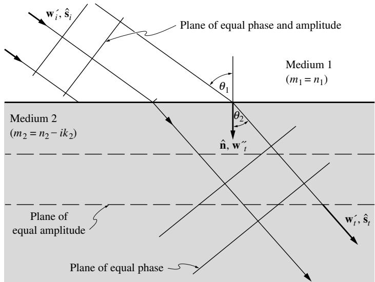

## 内容索引

- [目录](README.md)
- [1 热辐射基础](1-热辐射基础.md)
- [2 基于电磁波理论的辐射特性预测](2-基于电磁波理论的辐射特性预测.md)
- [3 实际表面的辐射特性](3-实际表面的辐射特性.md)
- [4 视角因子](4-视角因子.md)
- [5 灰体漫射表面间的辐射交换](5-灰体漫射表面间的辐射交换.md)
- [6 部分镜面灰体表面间的辐射交换](6-部分镜面灰体表面间的辐射交换.md)
- [7 非理想表面间的辐射交换](7-非理想表面间的辐射交换.md)
- [8 表面交换的蒙特卡洛方法](8-表面交换的蒙特卡洛方法.md)
- [9 传导和对流存在时的表面辐射交换](9-传导和对流存在时的表面辐射交换.md)
- [10 参与介质中的辐射传递方程(RTE)](10-参与介质中的辐射传递方程(RTE).md)
- [11 分子气体的辐射特性](11-分子气体的辐射特性.md)
- [12 颗粒介质的辐射特性](12-颗粒介质的辐射特性.md)
- [13 半透明介质的辐射特性](13-半透明介质的辐射特性.md)
- [14 一维灰体介质的精确解](14-一维灰体介质的精确解.md)
- [15 一维介质的近似求解方法](15-一维介质的近似求解方法.md)
- [16 球谐函数法 (PN-近似)](16-球谐函数法(PN-近似).md)
- [17 离散坐标法 (SN-近似)](17-离散坐标法(SN-近似).md)
- [18 区域法](18-区域法.md)
- [19 准直辐射与瞬态现象](19-准直辐射与瞬态现象.md)
- [20 非灰消光系数的求解方法](20-非灰消光系数的求解方法.md)
- [21 参与介质的蒙特卡洛方法](21-参与介质的蒙特卡洛方法.md)
- [22 辐射与传导和对流的耦合](22-辐射与传导和对流的耦合.md)
- [23 逆辐射传热](23-逆辐射传热.md)
- [24 纳米尺度辐射传热](24-纳米尺度辐射传热.md)
- [附录](附录.md)

- [2.1 引言](#21-引言)  
- [2.2 宏观麦克斯韦方程](#22-宏观麦克斯韦方程)  
- [2.3 无界介质中的电磁波传播](#23-无界介质中的电磁波传播)  
- [2.4 偏振](#24-偏振)  
- [2.5 反射与透射](#25-反射与透射)  
- [2.6 光学常数理论](#26-光学常数理论)  
- [参考文献](#参考文献)  
- [习题](#习题)

# 第2章

# 基于电磁波理论的辐射特性预测

# 2.1 引言

在进行任何辐射传热计算之前，必须了解构成封闭空间的表面的基本辐射特性，即发射率、吸收率、反射率和透射率。这些特性大多随入射方向、出射方向和波长而变化，通常需要通过实验确定。然而，对于纯净、完全光滑的表面，这些特性可以通过经典电磁波理论计算得出。1 这些预测使得在某些情况下无需进行实验测量，并在许多其他情况下有助于实验数据的插值和外推。

关于光的第一个重要发现出现在17世纪，如折射定律（Snell于1621年提出）、白光分解为单色光成分（Newton于1666年发现）以及光速的首次测定（Romer于1675年完成）。然而，光的本质仍然未知：微粒说（由Newton提出）与初步的波动理论相互竞争。直到19世纪初，波动理论才最终被接受为描述光的正确模型。Young在1817年提出了纯横波模型（与之前流行的纯纵波模型相对），随后Fresnel对衍射和其他光学现象进行了全面研究。1845年，Faraday通过实验证明了磁与光之间存在联系。基于这些实验，Maxwell在1861年提出了著名的方程组，完整描述了电磁波，即电场和磁场之间的相互作用。它们的成功非常显著，特别是考虑到与电磁波密切相关的量子力学和狭义相对论理论直到半个世纪后才被发现。时至今日，Maxwell方程组仍然是研究光的基础。*

# 2.2 宏观麦克斯韦方程

Maxwell方程组的原始形式基于当时可用的电学实验，这些实验的时间和空间分辨率非常粗糙。因此，任何测量结果都是对许多原子层的空间平均和对电磁波多次振荡的时间平均。由于这个原因，原始方程组被称为宏观的。今天我们知道电磁波在分子水平上与物质相互作用，每个波周期内都有强烈的场波动。因此，现在关于光学和电磁波的更详细论述通常从波动方程的微观描述开始，例如Stone[1]的著作。虽然关于微观方程组的文献中几乎没有分歧，但宏观方程组在不同的书籍中往往有所不同，这取决于所做的假设和使用的本构关系。根据Stone[1]的推导，我们可以将宏观Maxwell方程组表示为

$$
\begin{array}{c}\nabla \cdot (\epsilon \mathbf{E}) = \rho_f,\\ \nabla \cdot (\mu \mathbf{H}) = 0,\\ \nabla \times \mathbf{E} = -\mu \frac{\partial\mathbf{H}}{\partial t},\\ \nabla \times \mathbf{H} = \epsilon \frac{\partial\mathbf{E}}{\partial t} +\sigma_e\mathbf{E}, \end{array} \tag{2.4}
$$

其中$\mathbf{E}$和$\mathbf{H}$分别是电场和磁场矢量，$\epsilon$是介电常数，$\mu$是磁导率，$\sigma_{e}$是电导率，$\rho_{f}$是自由电子引起的电荷密度，通常假设其与电场的关系由下式给出

$$
\frac{\partial\rho_f}{\partial t} = -\nabla \cdot (\sigma_e\mathbf{E}). \tag{2.5}
$$

现象学系数$\sigma_{e}, \mu ,$和$\epsilon$取决于所考虑的介质，但可以假设与场无关（对于线性介质）且与位置和方向无关（对于均匀和各向同性介质）；然而，它们可能依赖于电磁波的波长[2]。

# 2.3 无界介质中的电磁波传播

我们寻求以上方程组以波的形式的解。时谐场（即具有恒定频率或波长的波）的最一般形式是

$$
\mathbf{F} = \mathbf{A}\cos \omega t + \mathbf{B}\sin \omega t = \mathbf{A}\cos 2\pi \nu t + \mathbf{B}\sin 2\pi \nu t, \tag{2.6}
$$

其中$\omega$是角频率（以弧度/秒为单位），$\nu = \omega /2\pi$是以每秒周期数为单位的频率。虽然稍微不太方便，但为了限制本书中使用的不同光谱变量的数量，我们将在以下推导中使用循环频率$\nu$。当涉及到线性偏微分方程的时谐解时，通常引入实场的复数表示是有优势的。因此，设

$$
\mathbf{F}_c = \overline{\mathbf{F}}_ce^{2\pi ivt},\quad \overline{\mathbf{F}}_c = \mathbf{A} - i\mathbf{B}, \tag{2.7}
$$

其中$\overline{\mathbf{F}}_c$是复场的时间平均值，结果为

$$
\mathbf{F} = \Re \{\mathbf{F}_c\} , \tag{2.8}
$$

其中符号$\Re$表示取复矢量$\mathbf{F}_c$的实部。由于Maxwell方程组在$\mathbf{E}$和$\mathbf{H}$场中是线性的，可以求解它们的复场，然后在找到解后提取其实部。因此，设

$$
\begin{array}{r}\mathbf{E} = \Re \{\mathbf{E}_c\} = \Re \{\overline{\mathbf{E}}_ce^{2\pi ivt}\} ,\\ \mathbf{H} = \Re \{\mathbf{H}_c\} = \Re \{\overline{\mathbf{H}}_ce^{2\pi ivt}\} , \end{array} \tag{2.10}
$$

结果为

$$
\begin{array}{r}\nabla \cdot (\gamma \mathbf{E}_c) = 0,\\ \nabla \cdot \mathbf{H}_c = 0,\\ \nabla \times \mathbf{E}_c = -2\pi i\nu \mu \mathbf{H}_c,\\ \nabla \times \mathbf{H}_c = 2\pi i\nu \gamma \mathbf{E}_c, \end{array} \tag{2.11}
$$

其中

$$
\gamma = \epsilon -i\frac{\sigma_e}{2\pi\nu} \tag{2.15}
$$

是复介电常数。如果$\gamma \neq 0$，则可以证明上述方程组的解必须是平面波，即电场和磁场与传播方向垂直（在传播方向上没有分量）。因此，方程(2.11)至(2.14)的解将具有以下形式

$$
\begin{array}{rl} & {\mathbf{E} = \Re \{\overline{\mathbf{E}}_ce^{2\pi ivt}\} = \Re \{\mathbf{E}_0e^{-2\pi i(\mathbf{w}\cdot \mathbf{r} - \nu t)}\} ,}\\ & {\mathbf{H} = \Re \{\overline{\mathbf{H}}_ce^{2\pi ivt}\} = \Re \{\mathbf{H}_0e^{-2\pi i(\mathbf{w}\cdot \mathbf{r} - \nu t)}\} ,} \end{array} \tag{2.16}
$$

其中$\mathbf{r}$是指向空间中任意点的矢量，$\mathbf{w}$称为波矢，$\mathbf{E}_0$和$\mathbf{H}_0$是常矢量。通常$\mathbf{w}$是一个复矢量，

$$
\begin{array}{r}\mathbf{w} = \mathbf{w}^{\prime} - i\mathbf{w}^{\prime \prime}, \end{array} \tag{2.18}
$$

其中$\mathbf{w}'$是一个其大小为波数的矢量，$\mathbf{w}''$称为衰减矢量。利用方程(2.18)，方程(2.16)和(2.17)可以重写为

$$
\begin{array}{r}\mathbf{E}_c = \mathbf{E}_0e^{-2\pi \mathbf{w}''\cdot \mathbf{r}}e^{-2\pi i(\mathbf{w}'\cdot \mathbf{r} - \nu t)},\\ \mathbf{H}_c = \mathbf{H}_0e^{-2\pi \mathbf{w}''\cdot \mathbf{r}}e^{-2\pi i(\mathbf{w}'\cdot \mathbf{r} - \nu t)}. \end{array} \tag{2.19}
$$

因此，复电场和磁场具有局部振幅矢量$\mathbf{E}_0e^{-2\pi \mathbf{w}''\cdot \mathbf{r}}$和$\mathbf{H}_0e^{-2\pi \mathbf{w}''\cdot \mathbf{r}}$，以及振荡部分$e^{-2\pi i(\mathbf{w}'\cdot \mathbf{r} - \nu t)}$，其相位角为$\phi = 2\pi (\mathbf{w}'\cdot \mathbf{r} - \nu t)$。位置矢量$\mathbf{r}$可以看作有两个分量：一个平行于$\mathbf{w}'$，另一个垂直于它。对于所有在$\mathbf{w}'$方向上具有相同分量的矢量$\mathbf{r}$（即在与$\mathbf{w}'$垂直的平面上），矢量积$\mathbf{w}'\cdot \mathbf{r}$是恒定的；这些平面被称为等相位面。为了观察波的传播方式，让我们看看两个不同时间和位置的相位角（图2-1）。首先考虑时间$t=0$时$\mathbf{r}=0$的点，其相位角为零。其次考虑沿$\mathbf{w}'$方向距离为$\mathcal{Z}$的另一点，我们发现当$t=|\mathbf{w}'|z/\nu$时该点的相位角为零。因此，波从一个点传播到另一个点的相速度为$c=z/t=\nu/w'$。我们得出结论：波沿$\mathbf{w}'$方向传播，且该矢量的模$w'$等于波数$\eta$。通过检查振幅矢量，我们发现$\mathbf{w}''\cdot \mathbf{r}=$常数的平面是等振幅面，且场振幅沿$\mathbf{w}''$方向衰减。如果等相位面和等振幅面重合（即$\mathbf{w}'$和$\mathbf{w}''$平行），我们称波是均匀的，否则称为非均匀波。由于$\mathbf{E}_0$和$\mathbf{w}$与位置无关，我们可以将方程(2.19)代入方程(2.11)，并假设$\gamma$在空间上也不变，得到：

  
图2-1 电磁波的相位传播

$$
\begin{array}{rl} & {\nabla \cdot (\gamma \mathbf{E}_c) = \gamma \nabla \cdot \left(\mathbf{E}_0e^{-2\pi i(\mathbf{w}\cdot \mathbf{r} - \nu t)}\right) = \gamma \mathbf{E}_0\cdot \nabla \left(e^{-2\pi i(\mathbf{w}\cdot \mathbf{r} - \nu t)}\right)}\\ & {\qquad = \gamma \mathbf{E}_0e^{-2\pi i(\mathbf{w}\cdot \mathbf{r} - \nu t)}\cdot \nabla (-2\pi i\mathbf{w}\cdot \mathbf{r}) = -2\pi i\gamma \mathbf{w}\cdot \mathbf{E}_0e^{-2\pi i(\mathbf{w}\cdot \mathbf{r} - \nu t)} = 0.} \end{array} \tag{2.21}
$$

类似地，将方程(2.19)代入方程(2.13)可得：

$$
\begin{array}{rl} & {\nabla \times \mathbf{E}_c = \nabla \times \left(\mathbf{E}_0e^{-2\pi i(\mathbf{w}\cdot \mathbf{r} - \nu t)}\right) = \nabla \left(e^{-2\pi i(\mathbf{w}\cdot \mathbf{r} - \nu t)}\right)\times \mathbf{E}_0}\\ & {\qquad = -2\pi i\mathbf{w}e^{-2\pi i(\mathbf{w}\cdot \mathbf{r} - \nu t)}\times \mathbf{E}_0 = -2\pi i\nu \mu \mathbf{H}_0e^{-2\pi i(\mathbf{w}\cdot \mathbf{r} - \nu t)}.} \end{array} \tag{2.22}
$$

因此，偏微分方程(2.11)至(2.14)可以被一组代数方程所替代：

$$
\begin{array}{rl} & {\mathbf{w}\cdot \mathbf{E}_0 = 0,}\\ & {\mathbf{w}\cdot \mathbf{H}_0 = 0,}\\ & {\mathbf{w}\times \mathbf{E}_0 = \nu \mu \mathbf{H}_0,}\\ & {\mathbf{w}\times \mathbf{H}_0 = -\nu \gamma \mathbf{E}_0.} \end{array} \tag{2.25}
$$

从方程(2.23)和(2.24)可以清楚地看出，$\mathbf{E}_0$和$\mathbf{H}_0$都与$\mathbf{w}$垂直，然后从方程(2.25)和(2.26)可以得出它们也彼此垂直。如果波是均匀的，那么$\mathbf{w}$指向波的传播方向，电场和磁场位于与此方向垂直的平面内，如图2-2所示。

接下来需要将复波矢$\mathbf{w}$与介质的性质联系起来。将方程(2.25)与$\mathbf{w}$取向量积，并回忆例如在Wylie[3]中导出的向量恒等式：

$$
\mathbf{A}\times (\mathbf{B}\times \mathbf{C}) = \mathbf{B}(\mathbf{A}\cdot \mathbf{C}) - \mathbf{C}(\mathbf{A}\cdot \mathbf{B}), \tag{2.27}
$$

  
图2-2 均匀波的电场和磁场

由此可得

$$
\mathbf{w}\times (\mathbf{w}\times \mathbf{E}_0) = \mathbf{w}(\mathbf{w}\cdot \mathbf{E}_0) - \mathbf{E}_0\mathbf{w}\cdot \mathbf{w} = \nu \mu \mathbf{w}\times \mathbf{H}_0 = -\nu^2\mu \gamma \mathbf{E}_0,
$$

即

$$
\mathbf{w}\cdot \mathbf{w} = \nu^2\mu \gamma . \tag{2.28}
$$

若波在真空中传播，则无衰减$(\mathbf{w}^{\prime \prime} = 0)$且$\mu = \mu_0$，$\gamma = \epsilon_0$。由此可得真空中的光速为

$$
c_{0} = \nu /\upsilon^{\prime} = \nu /\sqrt{\mathbf{w}\cdot\mathbf{w}} = \frac{1}{\sqrt{\epsilon_{0}\mu_{0}}}. \tag{2.29}
$$

通常引入复折射率

$$
m = n - ik \tag{2.30}
$$

代入方程(2.28)可得

$$
\mathbf{w}\cdot \mathbf{w} = \ν^2\mu \gamma = \ν^2\epsilon_0\mu_0\left(\frac{\epsilon\mu}{\epsilon_0\mu_0} -i\frac{\sigma_\epsilon\mu}{2\pi\nu\epsilon_0\mu_0}\right) = \eta_0^2 m^2, \tag{2.31}
$$

其中$\eta_0 = \nu /c_0$是频率为$\nu$、相速度为$c_0$的波在真空中的波数。$m$的定义要求满足

$$
n^2 -k^2 = \frac{\epsilon\mu}{\epsilon_0\mu_0} = \epsilon \mu c_0^2, \tag{2.32}
$$

$$
n k = \frac{\sigma_{\epsilon}\mu}{4\pi\nu\epsilon_{0}\mu_{0}} = \frac{\sigma_{\epsilon}\mu\lambda_{0}c_{0}}{4\pi}, \tag{2.33}
$$

其中$\lambda_0 = 1 / \eta_0 = c_0 / \nu$是真空中的波长。方程(2.32)和(2.33)可解出折射率$n$和吸收率$^4 k$为

$$
\begin{array}{l}{n^2 = \frac{1}{2}\left[\frac{\epsilon}{\epsilon_0} +\sqrt{\left(\frac{\epsilon}{\epsilon_0}\right)^2 + \left(\frac{\lambda_0\sigma_e}{2\pi c_0\epsilon_0}\right)^2}\right],}\\ {k^2 = \frac{1}{2}\left[-\frac{\epsilon}{\epsilon_0} +\sqrt{\left(\frac{\epsilon}{\epsilon_0}\right)^2 + \left(\frac{\lambda_0\sigma_e}{2\pi c_0\epsilon_0}\right)^2}\right],} \end{array} \tag{2.34}
$$

这里我们假设材料为非磁性的，即$\mu = \mu_0$。这些关系式并未揭示复折射率的频率(波长)依赖性，因为唯象系数$\epsilon$和$\sigma_{e}$可能依赖于频率。若波是均匀的，波矢量可表示为$\mathbf{w} = (w' - iw'')\hat{\mathbf{s}}$，其中$\hat{\mathbf{s}}$为波传播方向的单位矢量，由方程(2.31)可得$w' - iw'' = \eta_0(n - ik)$，因此电场和磁场简化为

$$
\begin{array}{r}\mathbf{E}_c = \mathbf{E}_0e^{-2\pi \eta_0kz}e^{-2\pi i\eta_0n(z - c_0t / n)},\\ \mathbf{H}_c = \mathbf{H}_0e^{-2\pi \eta_0kz}e^{-2\pi i\eta_0n(z - c_0t / n)}, \end{array} \tag{2.36}
$$

其中$z = \hat{\mathbf{s}} \cdot \mathbf{r}$为沿传播方向的距离。对于非真空介质，电磁波的相速度$c$为5

$$
c = \frac{c_0}{n}. \tag{2.38}
$$

此外，当$k$不为零时，场强呈指数衰减；因此吸收率反映了波在介质中被吸收的快慢程度。观察方程(2.35)可知，较大的吸收率$k$对应较大的电导率$\sigma_{e}$：电磁波在良导体(如金属)中往往衰减很快，而在电导率较差的介质(即电介质，如玻璃)中通常以弱衰减传输。

电磁能量传递的大小和方向由坡印廷矢量给出，即大小为$EH$、指向传播方向的矢量(参见图2-2)6

$$
\mathbf{S} = \mathbf{E}\times \mathbf{H} = \Re \{\mathbf{E}_{\mathrm{c}}\} \times \Re \{\mathbf{H}_{\mathrm{c}}\} . \tag{2.39}
$$

坡印廷矢量的瞬时值是时间的快速变化函数。对工程师更有价值的是坡印廷矢量的时间平均值，即

$$
\overline{\mathbf{S}} = \frac{1}{\delta t}\int_t^{t + \delta t}\mathbf{S}(t)dt, \tag{2.40}
$$

其中$\delta t$为极短的时间间隔，但明显大于一个周期$1 / \nu$的持续时间；由于$\mathbf{S}$在每个周期后重复自身(若无衰减发生)，任何$1 / \nu$整数倍的$\delta t$都会给出相同的$\overline{\mathbf{S}}$结果，即

$$
\begin{array}{r}\overline{\mathbf{S}} = \frac{1}{2}\Re \{\mathbf{E}_{\mathrm{c}}\times \mathbf{H}_{\mathrm{c}}\} , \end{array} \tag{2.41}
$$

其中$\mathbf{H}^{*}$表示$\mathbf{H}$的复共轭，系数$1 / 2$来自对$\cos^{2}(2\pi \eta_{0}c_{0}t)$和$\sin^{2}(2\pi \eta_{0}c_{0}t)$项的积分。因此利用方程(2.25)和矢量恒等式(2.27)，坡印廷矢量可表示为

$$
\begin{array}{l}\overline{\mathbf{S}} = \frac{1}{2\nu\mu}\Re \{\mathbf{E}_c\times (\mathbf{w}^*\times \mathbf{E}_c^*)\} = \frac{1}{2\nu\mu}\Re \{\mathbf{w}^* (\mathbf{E}_c\cdot \mathbf{E}_c^*)\} \\ \displaystyle = \frac{n}{2c_0\mu} |\mathbf{E}_0|^2 e^{-4\pi \eta_0kz}\hat{\mathbf{s}}. \end{array} \tag{2.42}
$$

矢量$\mathbf{S}$指向传播方向，且当波穿过介质时其能量呈指数衰减，其中衰减因子

$$
\kappa = 4\pi \eta_0k \tag{2.43}
$$

称为介质的吸收系数。

例2.1. 一平面均匀波在完美电介质介质$(n=2)$中沿$\hat{\mathbf{s}}=0.8\hat{\mathbf{i}}+0.6\hat{\mathbf{k}}$方向传播，波数为$\eta_0=2500\mathrm{cm}^{-1}$，电场振幅矢量为$\mathbf{E}_0=E_0[(6+3i)\hat{\mathbf{i}}+(2-5i)\hat{\mathbf{j}}-(8+4i)\hat{\mathbf{k}}]/\sqrt{154}$，其中$E_0=600\mathrm{N/C}$，$\hat{\mathbf{i}}$、$\hat{\mathbf{j}}$和$\hat{\mathbf{k}}$分别为$x$、$y$和$z$方向的单位矢量。假设介质为非磁性的，求磁场振幅矢量及波中能量。

# 解

由于$\mathbf{w}=\mathbf{w}^{\prime}$与$\hat{\mathbf{s}}$共线，由式(2.31)得$\mathbf{w}=w\hat{\mathbf{s}}=\eta_0w\hat{\mathbf{s}}$，由式(2.25)得

$$
\begin{array}{l}{\mathbf{H}_0 = \frac{1}{\nu\mu}\mathbf{w}\times \mathbf{E}_0 = \frac{1}{\nu\mu_0}\mathbf{w}\times \mathbf{E}_0 = \frac{n}{c_0\mu_0}\hat{\mathbf{s}}\times \mathbf{E}_0}\\ {= \frac{nE_0}{c_0\mu_0\sqrt{154}}\left| \begin{array}{ccc}\hat{\mathbf{i}} & \hat{\mathbf{j}} & \hat{\mathbf{k}}\\ 0.8 & 0.0 & 0.6\\ 6 + 3i & 2 - 5i & -8 - 4i \end{array} \right|}\\ {= \frac{nE_0}{c_0\mu_05\sqrt{154}} [(-6 + 15i)\hat{\mathbf{i}} +(50 + 25i)\hat{\mathbf{j}} +(8 - 20i)\hat{\mathbf{k}} ]}\\ {= \frac{H_0}{\sqrt{3850}} [(-6 + 15i)\hat{\mathbf{i}} +(50 + 25i)\hat{\mathbf{j}} +(8 - 20i)\hat{\mathbf{k}} ],} \end{array}
$$

其中

$$
H_{0} = \frac{nE_{0}}{c_{0}\mu_{0}} = \frac{2\times 600\mathrm{N / C}}{2.998\times 10^{8}\mathrm{m / s}\times 4\pi\times 10^{-7}\mathrm{Ns}^{2} / \mathrm{C}^{2}} = 3.185\mathrm{C / m s},
$$

并假设非磁性介质的磁导率与真空相同，$\mu=\mu_{0}$(来自表A.1)。波的能量由坡印廷矢量给出，可用式(2.41)或式(2.42)计算。选择后者得

$$
\overline{\mathbf{S}} = \frac{n}{2c_0\mu_0} E_0^2\hat{\mathbf{s}} = \overline{S}\hat{\mathbf{s}},\qquad \overline{S} = \frac{2\times 600^2\mathrm{N}^2 / \mathrm{C}^2}{2\times 2.2998\times 10^{-6}\mathrm{m / s}\times 4\pi\times 10^{-7}\mathrm{Ns}^2 / \mathrm{C}^2} = 955.6\mathrm{W / m}^2.
$$

# 2.4 偏振

仅知道频率、传播方向和能量含量[即坡印廷矢量的大小，式(2.42)]并不能完全描述单色(或时谐)电磁波。每一束电磁波都具有称为偏振态的特性。对于传热工程师而言，偏振效应通常不太重要，因为发射的光通常是随机偏振的。但在某些应用中会使用部分或完全偏振光，例如激光光源；工程师需要知道$(i)$表面的反射行为如何依赖于入射光的偏振，以及$(ii)$表面反射如何改变偏振态。这里我们将基于Bohren和Huffman[2]的优秀简短描述，对偏振进行非常简要的介绍。更详细的论述可参考van de Hulst[4]、Chandrasekhar[5]等人的著作。

考虑波数为$\eta$的单色平面波在非吸收介质$(k\equiv0)$中沿$z$方向传播。描述偏振时，通常将参数与电场相关联(记住磁场与之垂直)，由式(2.36)可得

$$
\mathbf{E} = \Re \{\mathbf{E}_c\} = \Re \{(\mathbf{A} - i\mathbf{B})e^{-2\pi i\eta n(z - ct)}\} = \mathbf{A}\cos 2\pi \eta n(z - ct) - \mathbf{B}\sin 2\pi \eta n(z - ct), \tag{2.44}
$$

其中矢量$\mathbf{E}_0$及其实分量$\mathbf{A}$和$\mathbf{B}$与位置无关，在任何位置$z$都位于垂直于传播方向的平面内。在给定位置(如$z=0$)处，电场矢量尖端描绘出曲线

$$
\mathbf{E}(z = 0,t) = \mathbf{A}\cos 2\pi \nu t + \mathbf{B}\sin 2\pi \nu t. \tag{2.45}
$$

如图2-3所示，该曲线描述了一个称为振动椭圆的椭圆。如果$\mathbf{A}$或$\mathbf{B}$消失，椭圆会退化为直线，此时波称为线偏振(有时也称为平面偏振)。如果$\mathbf{A}$和$\mathbf{B}$相互垂直且大小相等，振动椭圆变为圆，波称为圆偏振。一般情况下，式(2.44)中的波是椭圆偏振的。

在给定时间(如$t=0$)时，电场矢量尖端描述的曲线是一个螺旋线(图2-4)，即

$$
\mathbf{E}(z,t = 0) = \mathbf{A}\cos 2\pi n\eta z - \mathbf{B}\sin 2\pi n\eta z. \tag{2.46}
$$

式(2.46)描述了某一特定时刻的电场。随时间增加，螺旋线沿传播方向移动，其与任何$z=$常数的平面的交线描述了局部振动椭圆。

偏振态由振动椭圆表征，定义为椭圆度$b/a$(半短轴与半长轴长度之比，如图2-3所示)、方位角$\gamma$(任意参考方向与半长轴之间的夹角)和旋向性(即电场矢量尖端沿振动椭圆运动的方向，顺时针或逆时针)。这三个参数与坡印廷矢量的大小一起构成了平面波的椭偏参数。

例2.2. 计算例2.1中波的椭偏参数$a$、$b$和$\gamma$。

# 解

由式(2.44)可得

$$
\mathbf{A} = E_0(6\hat{\mathbf{1}} +2\hat{\mathbf{j}} -8\hat{\mathbf{k}}) / \sqrt{154},\quad \mathbf{B} = -E_0(3\hat{\mathbf{1}} -5\hat{\mathbf{j}} -4\hat{\mathbf{k}}) / \sqrt{154},
$$

  
图2-3 单色波的振动椭圆

  
图2-4 固定时刻的电场空间变化

在任意给定位置，如$z=0$处，电场矢量可表示为

$$
\mathbf{E} = E_0\left[(6\cos 2\pi \nu t - 3\sin 2\pi \nu t)\hat{\mathbf{i}} +(2\cos 2\pi \nu t + 5\sin 2\pi \nu t)\hat{\mathbf{j}} -(8\cos 2\pi \nu t - 4\sin 2\pi \nu t)\hat{\mathbf{k}}\right] / \sqrt{154}.
$$

该位置处电场大小随时间变化为

$$
\begin{array}{c}{|\mathbf{E}|^2 = \mathbf{E}\cdot \mathbf{E} = \frac{E_0^2}{154} (36\cos^2 2\pi \nu t - 36\cos 2\pi \nu t\sin 2\pi \nu t + 9\sin^2 2\pi \nu t}\\ {+4\cos 2\pi \nu t + 20\cos^2 2\pi \nu t\sin 2\pi \nu t + 25\sin^2 2\pi \nu t}\\ {+64\cos 2\pi \nu t - 64\cos^2 2\pi \nu t\sin 2\pi \nu t + 16\sin^2 2\pi \nu t)}\\ {= E_0^2 (50 - 80\cos 2\pi \nu t\sin 2\pi \nu t + 54\cos^2 2\pi \nu t) / 154.} \end{array}
$$

$|\mathbf{E}|$的最大值$(a)$和最小值$(b)$可通过将上式对$t$求导并令结果为零得到：

$$
\begin{array}{c}{-80(\cos^2 2\pi \nu t - \sin^2 2\pi \nu t) = 108\sin 2\pi \nu t\cos 2\pi \nu t}\\ {-80\cos 4\pi \nu t = 54\sin 4\pi \nu t} \end{array}
$$

即

$$
2\pi \nu t = 0.5\tan^{-1}\left(-\frac{80}{54}\right).
$$

该函数有双值解，得到$(2\pi \nu t)_1 = - 27.99^\circ$和$(2\pi \nu t)_2 = 62.01^\circ$。将这些值代入$\mathbf{E}$表达式得：

$$
\mathbf{E}_1 = E_0(0.5404\hat{\mathbf{u}} -0.0468\hat{\mathbf{j}} -0.7205\hat{\mathbf{k}}),\quad |\mathbf{E}| = a = 0.9009E_0
$$

和

$$
\mathbf{E}_2 = E_0(0.0134\hat{\mathbf{u}} +0.4314\hat{\mathbf{j}} -0.0179\hat{\mathbf{k}}),\quad |\mathbf{E}| = b = 0.4339E_0.
$$

方位角的计算取决于振动椭圆平面内参考轴的选择。本问题中$y$轴位于该平面内，因此是自然选择：

$$
\cos \gamma = \frac{\mathbf{E}\cdot\hat{\mathbf{j}}}{|\mathbf{E}|} = -\frac{0.0468}{0.9009} = -0.0519,\quad \gamma = 92.97^\circ .
$$

虽然椭偏参数可以完整描述任何单色波，但除坡印廷矢量外，其他参数难以直接测量。此外，当两个或多个频率相同但偏振不同的波叠加时，只有它们的强度是可加的：其他三个椭偏参数必须重新计算。因此，通常采用另一种等效的偏振光描述方法——Stokes参数。Stokes参数通过将波列分解为两个垂直分量来定义：

$$
\mathbf{E}_c = \mathbf{E}_0e^{-2\pi i\eta n(z - ct)};\quad \mathbf{E}_0 = E_{\parallel}\hat{\mathbf{e}}_{\parallel} + E_{\perp}\hat{\mathbf{e}}_{\perp}, \tag{2.47}
$$

其中$\hat{\mathbf{e}}_{\parallel}$和$\hat{\mathbf{e}}_{\perp}$是垂直于波传播方向的平面内的实正交单位矢量，$\hat{\mathbf{e}}_{\parallel}$位于包含波传播矢量的任意参考平面内，$\hat{\mathbf{e}}_{\perp}$与之垂直。平行$(E_{\parallel})$和垂直$(E_{\perp})$偏振分量通常是复数，可表示为：

$$
E_{\parallel} = a_{\parallel}e^{-i\delta_{\parallel}},\quad E_{\perp} = a_{\perp}e^{-i\delta_{\perp}}, \tag{2.48}
$$

其中$a$是电场幅度，$\delta$是偏振相位角。具有平行偏振的波(即电场在入射平面内，磁场与之垂直)也称为横磁(TM)波；垂直偏振为横电(TE)波。代入式(2.44)得：

$$
\begin{array}{rl} & {\mathbf{E} = \Re \{a_{\parallel}e^{-i\delta_{\parallel} - 2\pi i\eta n(z - ct)}\hat{\mathbf{e}}_{\parallel} + a_{\perp}e^{-i\delta_{\perp} - 2\pi i\eta n(z - ct)}\hat{\mathbf{e}}_{\perp}\}}\\ & {\quad = a_{\parallel}\cos [\delta_{\parallel} + 2\pi \eta n(z - ct)]\hat{\mathbf{e}}_{\parallel} + a_{\perp}\cos [\delta_{\perp} + 2\pi \eta n(z - ct)]\hat{\mathbf{e}}_{\perp}.} \end{array} \tag{2.49}
$$

因此，式(2.44)给出的任意波被分解为两个相互垂直的线偏振波。四个Stokes参数$I, Q, U,$和$V$定义为：

$$
\begin{array}{c}{I = E_{\parallel}E_{\parallel}^{*} + E_{\perp}E_{\perp}^{*} = a_{\parallel}^{2} + a_{\perp}^{2},}\\ {Q = E_{\parallel}E_{\parallel}^{*} - E_{\perp}E_{\perp}^{*} = a_{\parallel}^{2} - a_{\perp}^{2},}\\ {U = E_{\parallel}E_{\perp}^{*} + E_{\perp}E_{\parallel}^{*} = 2a_{\parallel}a_{\perp}\cos (\delta_{\parallel} - \delta_{\perp}),}\\ {V = i(E_{\parallel}E_{\perp}^{*} - E_{\perp}E_{\parallel}^{*}) = 2a_{\parallel}a_{\perp}\sin (\delta_{\parallel} - \delta_{\perp}),} \end{array} \tag{2.50}
$$

其中星号表示复共轭。可以证明，这四个参数可通过功率测量确定：直接测量$(I)$，使用线偏振器(平行和垂直方向测量$Q$，旋转$45^{\circ}$测量$U$)，或圆偏振器$(V)$(参见Bohren和Huffman[2])。显然只有三个Stokes参数是独立的，因为：

$$
I^2 = Q^2 +U^2 +V^2. \tag{2.54}
$$

由于波列的Stokes参数是根据其组成波的能量含量表示的[通过与式(2.42)比较可见]，因此波集合的Stokes参数是可加的。

Stokes参数也可与椭偏参数相关联：

$$
\begin{array}{c}{I = a^2 +b^2,}\\ {Q = (a^2 -b^2)\cos 2\gamma ,}\\ {U = (a^2 -b^2)\sin 2\gamma ,}\\ {V = \pm 2ab,} \end{array} \tag{2.58}
$$

表2.1 几种偏振光情况的Stokes参数

| 偏振类型 | 0°线偏振 | 90°线偏振 | +45°线偏振 | -45°线偏振 | 方位角γ | 圆偏振 |
|---------|---------|----------|-----------|-----------|--------|-------|
| 符号表示 | ↔      | ↓        | ↓         | ↓         | 1      |       |
| I参数   | (1)     | (1)      | (1)       | (1)       | (1)    |       |
| Q参数   | (1)     | -1       |           | 0         |        |       |
| U参数   | (0)     | 0        |           | -1        |        |       |
| V参数   | (0)     | (0)      |           | (0)       |        |       |
| 圆偏振类型 | 右旋圆偏振 |          |           |           |        | 左旋圆偏振 |
| I参数   | (1)     |          |           |           |        | (1)    |
| Q参数   | (0)     |          |           |           |        | (0)    |
| U参数   | (0)     |          |           |           |        | (0)    |
| V参数   | (1)     |          |           |           |        | (-1)   |

其中方位角$\gamma$是从$\hat{\mathbf{e}}_{\parallel}$开始测量的，$V$的符号指定了振动椭圆的旋转方向。表2.1(来自[2])展示了几种特殊偏振情况的Stokes参数集——已归一化并以列向量形式表示。参数$Q$和$U$表示线偏振程度(及其方向)，而$V$与圆偏振程度相关。

上述Stokes参数的定义对于严格单色波(如式(2.47)给出的)是正确的。大多数自然光源(如太阳、灯泡、火焰等)产生的光，其振幅$\mathbf{E}_0$是时间的缓变函数(即相对于完整波周期$1/\nu$而言)，即：

$$
\mathbf{E}_0(t) = E_{\parallel}(t)\hat{\mathbf{e}}_{\parallel} + E_{\perp}(t)\hat{\mathbf{e}}_{\perp}. \tag{2.59}
$$

这类波称为准单色波。如果$E_{\parallel}$和$E_{\perp}$随时间缓慢变化且互不相关，则该波称为非偏振波。这种情况下振动椭圆随时间缓慢变化，最终会描绘出各种形状、方向和旋转的椭圆。迄今讨论的所有波在$E_{\parallel}$和$E_{\perp}$之间都有固定关系，称为(完全)偏振波。如果$E_{\parallel}$和$E_{\perp}$之间存在某种相关性(例如具有恒定旋转方向、椭圆率或方位角的波)，则该波称为部分偏振波。对于准单色波，Stokes参数用时间平均值定义，式(2.54)必须替换为：

$$
I^2\geq Q^2 +U^2 +V^2, \tag{2.60}
$$

其中等号仅对偏振光成立。对于非偏振光有$Q = U = V = 0$，而对于部分偏振光，$Q$、$U$和$V$的幅值给出以下关系：

$$
\begin{array}{rl} 
& \text{偏振度} = \sqrt{Q^2 + U^2 + V^2} /I, \\ 
& \text{线偏振度} = \sqrt{Q^2 + U^2} /I, \\ 
& \text{圆偏振度} = V / I. 
\end{array}
$$

例2.3. 重新考虑前两个例子中的平面波。将该波分解为两个线偏振波，一个在$x$-$z$平面内，另一个与之垂直。求Stokes系数、两种偏振之间的相位差以及不同的偏振度。

# 解

已知$\hat{\mathbf{s}} = 0.8\hat{\mathbf{1}} +0.6\hat{\mathbf{k}}$，且$\hat{\mathbf{e}}_{\parallel}$必须位于$x$-$z$平面内(即$\hat{\mathbf{e}}_{\parallel}\cdot \hat{\mathbf{j}} = 0$)，同时$\hat{\mathbf{e}}_{\parallel}$必须与$\hat{\mathbf{s}}_i$垂直($\hat{\mathbf{e}}_{\parallel}\cdot \hat{\mathbf{s}} = 0$)，最后$\hat{\mathbf{e}}_{\perp}$必须与两者都垂直，我们得到：

$$
\hat{\mathbf{e}}_{\parallel} = 0.6\hat{\mathbf{1}} -0.8\hat{\mathbf{k}},\quad \hat{\mathbf{e}}_{\perp} = \hat{\mathbf{j}},
$$

其中两个向量的符号选择是任意的(我们选择让$\hat{\mathbf{e}}_{\parallel}$、$\hat{\mathbf{e}}_{\perp}$和$\hat{\mathbf{s}}$形成右手坐标系)。因此，由式(2.47)和

$$
\mathbf{E}_0 = E_0[(6 + 3i)\hat{\mathbf{1}} +(2 - 5i)\hat{\mathbf{j}} -(8 + 4i)\hat{\mathbf{k}} ] / \sqrt{154}
$$

立即得到：

$$
\begin{array}{rl} 
& {\mathbf{E}_0 = E_0(2 + i)(3\hat{\mathbf{1}} -4\hat{\mathbf{k}}) / \sqrt{154} = \left(5 / \sqrt{154}\right)(2 + i)E_0\hat{\mathbf{e}}_{\parallel},}\\ 
& {\mathbf{E}_{\perp} = E_0(2 - 5i)\hat{\mathbf{j}} /\sqrt{154} = \left[(2 - 5i) / \sqrt{154}\right]E_0\hat{\mathbf{e}}_{\perp},} 
\end{array}
$$

即：

$$
\begin{array}{l}
{E_{\parallel} = \left(5 / \sqrt{154}\right)(2 + i)E_0 = \sqrt{\frac{125}{154}} E_0e^{-i\delta_{\parallel}},}\\ 
{E_{\perp} = \left[(2 - 5i) / \sqrt{154}\right]E_0 = \sqrt{\frac{29}{154}} E_0e^{-i\delta_{\perp}},} 
\end{array}
$$

其中：

$$
\begin{array}{l}
\delta_{\parallel} = -\tan^{-1}\left(\frac{1}{2}\right) = -26.565^{\circ},\\ 
\delta_{\perp} = -\tan^{-1}\left(-\frac{5}{2}\right) = 68.199^{\circ}, 
\end{array}
$$

两偏振间的相位差为：

$$
\delta_{\parallel} - \delta_{\perp} = -94.76^{\circ}
$$

(由于$\tan^{-1}$是双值函数，需通过检查$E$的实部和虚部符号确定正确值)。Stokes参数可直接通过式(2.50)-(2.53)计算，或通过式(2.55)-(2.58)(使用上例计算的椭偏参数)计算。这里采用第一种方法，得到：

$$
\begin{array}{rl} 
& I = (125 + 29)E_0^2 /154 = E_0^2,\\ 
& Q = (125 - 29)E_0^2 /154 = 48E_0^2 /77,\\ 
& U = 5(4 + 2i + 10i - 5 + 4 - 2i - 10i - 5)E_0^2 /154 = -5E_0^2 /77,\\ 
& V = 5i(4 + 2i + 10i - 5 - 4 + 2i + 10i + 5)E_0^2 /154 = -60E_0^2 /77. 
\end{array}
$$

最终得到偏振度：$\sqrt{Q^2 + U^2 + V^2} /I = 100\%$总偏振度，$\sqrt{Q^2 + U^2} /I = 62.7\%$线偏振度，$|V| / I = 77.9\%$圆偏振度。

一般而言，电磁波列的偏振状态在与光学元件(可能是偏振器或反射镜，也可能是封闭空间中的反射面或悬浮粒子等散射元件)相互作用时会发生变化。虽然偏振光束可以用其四元素Stokes向量表征，但也可以用称为Mueller矩阵的$4×4$矩阵表示光学元件的影响，该矩阵描述入射和透射Stokes向量之间的关系。详情可参阅Bohren和Huffman[2]等文献。

# 2.5 反射与透射

当电磁波入射到两种均匀介质的界面时，部分波会被反射，部分会透射进入第二介质。我们在此仅讨论平面界面情况，即局部曲率半径远大于入射光波长λ的情形，此时问题可简化为代数方程。关于小颗粒形式的高度弯曲表面将在第12章讨论颗粒云的辐射特性时涉及。

  
图2-5 推导界面条件的几何关系

图2-5 推导界面条件的几何关系

下文将首先建立Maxwell方程组在界面处的通用条件，然后考虑波从一种非吸收介质传播到另一种非吸收介质的情况，最后简要讨论从非吸收介质入射到吸收介质的情形。

# Maxwell方程组的界面条件

为建立两种介质界面处E和H的边界条件，我们将对Maxwell方程组应用Gauss定理和Stokes定理。这两个定理都将体积分转换为面积分，在Wylie[3]等标准数学教材中有详细讨论。给定定义在体积V内及其边界Γ上的向量函数F，这两个定理可表述为：

Gauss定理：

$$
\int_{V}\nabla \cdot \mathbf{F}dV = \int_{\Gamma}\mathbf{F}\cdot d\Gamma , \tag{2.61}
$$

Stokes定理：

$$
\int_{V}\nabla \times \mathbf{F}dV = -\int_{\Gamma}\mathbf{F}\times d\Gamma , \tag{2.62}
$$

其中dΓ = n̂dΓ，n̂为指向体积外的单位表面法向量。

现考虑如图2-5所示的包含部分界面的薄体积元δV = Aδs。对Maxwell第一个方程(2.11)应用Gauss定理得：

$$
\int_{\delta V}\nabla \cdot (\gamma \mathbf{E}_c)dV = \int_{\Gamma}\gamma \mathbf{E}_c\cdot d\Gamma \approx \int_A[(\gamma \mathbf{E}_c)_1\cdot (\hat{\mathbf{\Gamma}}\hat{\mathbf{n}}) + (\gamma \mathbf{E}_c)_2\cdot \hat{\mathbf{n}} ]dA = 0, \tag{2.63}
$$

其中Γ是δV的总表面积，由于δs很小，面积分主要来自平行于界面的两侧。当A缩小为任意小面积时，我们得出结论：沿界面处处满足

$$
m_1^2\mathbf{E}_{c1}\cdot \hat{\mathbf{n}} = m_2^2\mathbf{E}_{c2}\cdot \hat{\mathbf{n}}, \tag{2.64}
$$

这里使用了方程(2.31)并假设非磁性介质以消除复介电常数γ。类似地，由方程(2.12)可得：

$$
\mathbf{H}_{c1}\cdot \hat{\mathbf{n}} = \mathbf{H}_{c2}\cdot \hat{\mathbf{n}}. \tag{2.65}
$$

因此，m²E_c和H_c的法向分量在平面边界上是守恒的。Stokes定理可应用于方程(2.13)和(2.14)，同样针对图2-5所示的体积元。例如：

$$
\int_{\delta V}\nabla \times \mathbf{H}_c dV = -\int_{\Gamma}\mathbf{H}_c\times d\Gamma \approx \int_A(\mathbf{H}_{c1} - \mathbf{H}_{c2})\times \hat{\mathbf{n}} dA = \int_V2\pi i\nu \gamma \mathbf{E}_c dV, \tag{2.66}
$$

  
图2-6 平面波在两种非吸收介质界面的透射与反射

当 $\delta s \to 0$ 且 $A$ 缩小为极小值时，

$$
\mathbf{E}_{c1}\times \hat{\mathbf{n}} = \mathbf{E}_{c2}\times \hat{\mathbf{n}} \tag{2.67}
$$

以及

$$
\mathbf{H}_{c1}\times \hat{\mathbf{n}} = \mathbf{H}_{c2}\times \hat{\mathbf{n}}. \tag{2.68}
$$

因此，$\mathbf{E}_c$ 和 $\mathbf{H}_c$ 的切向分量在平面边界上都是守恒的。

给定入射波，可以通过Maxwell方程组和上述界面条件求出完整的场分布。显然，在入射介质中会存在反射波，而在另一介质中会存在透射波。我们还可以假设所有波都保持为平面波。由此得出的一个重要推论是：条件(2.67)和(2.68)足以确定反射波和透射波，而条件(2.64)和(2.65)会自动满足(Stone [1])。

# 两种非吸收介质间的界面

当均匀平面波到达两种非吸收介质间的平面界面时，反射和透射关系会变得特别简单。对于这种波列，等相位面和等振幅面重合且与传播方向垂直，如图2-6所示。这个平面（也称为波前）以恒定速度 $c_{1} = c_{0} / n_{1}$ 在介质1中传播，以恒定但不同的速度 $c_{2} = c_{0} / n_{2}$ 在介质2中传播。如果 $n_{2} > n_{1}$，如图2-6所示，波前在介质2中的传播速度会变慢，落后于在介质1中传播的波前。通过观察波前上点 $A$ 和 $B$ 在时刻 $t$ 的位置，可以很容易地用数学表达这一现象。在时刻 $t + \Delta t$，初始位于 $A$ 的波前部分将到达界面上的点 $A'$，而点 $B$ 处的波前由于在介质2中传播距离较短，将到达点 $B'$，其中

$$
\Delta t = \frac{\overline{A A^{\prime}}}{c_{1}} = \frac{\overline{B B^{\prime}}}{c_{2}}. \tag{2.69}
$$

利用 $\overline{AA'}$ 和 $\overline{BB'}$ 的几何关系并代入相速度，我们得到

$$
\Delta t = \frac{\overline{BA^{\prime}}\sin\theta_{i}}{c_{0} / n_{1}} = \frac{\overline{BA^{\prime}}\sin\theta_{2}}{c_{0} / n_{2}} = \frac{\overline{BA^{\prime}}\sin\theta_{r}}{c_{0} / n_{1}}, \tag{2.70}
$$

其中最后一项对应于反射（为避免图形过于拥挤未在图中显示）。因此我们得出结论：

$$
\theta_{r} = \theta_{i} = \theta_{1}, \tag{2.71}
$$

即根据电磁波理论，光的反射总是镜面反射。这是"平面"界面的直接结果，即不仅平坦（曲率半径无限大）而且完全光滑的表面。方程(2.70)还给出了入射波与透射波方向之间的关系：

$$
\frac{\sin\theta_2}{\sin\theta_1} = \frac{n_1}{n_2}, \tag{2.72}
$$

这被称为Snell定律*。角度 $\theta_{1} = \theta_{i}$ 和 $\theta_{2} = \theta_{r}$ 分别称为入射角和折射角。当前对Snell定律的推导基于几何原理，仅适用于均匀平面波，因此其应用范围限于两种非吸收介质（即两种理想电介质）的界面。当考虑入射到吸收介质时，将给出广义Snell定律的更严格推导。

除了反射和透射方向外，我们还希望确定反射和透射的光量。对于非吸收介质（设 $\mathbf{w}'' = 0$），我们可以根据方程(2.19)和(2.20)写出介质1（包含入射波和反射波）中的电场和磁场表达式：

$$
\begin{array}{r}\mathbf{E}_{c1} = \mathbf{E}_{0i}e^{-2\pi i(\mathbf{w}_{\mathbf{i}}^{\prime}\cdot \mathbf{r} - \nu t)} + \mathbf{E}_{0r}e^{-2\pi i(\mathbf{w}_{\mathbf{i}}^{\prime}\cdot \mathbf{r} - \nu t)},\\ \mathbf{H}_{c1} = \mathbf{H}_{0i}e^{-2\pi i(\mathbf{w}_{\mathbf{i}}^{\prime}\cdot \mathbf{r} - \nu t)} + \mathbf{H}_{0r}e^{-2\pi i(\mathbf{w}_{\mathbf{i}}^{\prime}\cdot \mathbf{r} - \nu t)}. \end{array} \tag{2.74}
$$

类似地，对于介质2：

$$
\begin{array}{r}\mathbf{E}_{c2} = \mathbf{E}_{0t}e^{-2\pi i(\mathbf{w}_{\mathbf{i}}^{\prime}\cdot \mathbf{r} - \nu t)},\\ \mathbf{H}_{c2} = \mathbf{H}_{0t}e^{-2\pi i(\mathbf{w}_{\mathbf{i}}^{\prime}\cdot \mathbf{r} - \nu t)}. \end{array} \tag{2.76}
$$

为方便起见，我们将坐标原点放在边界上需要考虑反射和透射的点。因此，在界面该点处（$\mathbf{r} = 0$），利用边界条件(2.67)和(2.68)：

$$
\begin{array}{r}(\mathbf{E}_{0i} + \mathbf{E}_{0r})\times \hat{\mathbf{n}} = \mathbf{E}_{0t}\times \hat{\mathbf{n}},\\ (\mathbf{H}_{0i} + \mathbf{H}_{0r})\times \hat{\mathbf{n}} = \mathbf{H}_{0t}\times \hat{\mathbf{n}}. \end{array} \tag{2.78}
$$

为了评估界面处电场和磁场的切向分量，最好将场（通常可能是非偏振或椭圆偏振的）分解为两个线性偏振波：一个平行于入射平面（由入射波矢量 $\mathbf{w}_i$ 和表面法线 $\hat{\mathbf{n}}$ 形成），另一个垂直于入射平面：

$$
\mathbf{E}_0 = E_{||}\hat{\mathbf{e}}_{||} + E_{\perp}\hat{\mathbf{e}}_{\perp},\quad \mathbf{H}_0 = H_{||}\hat{\mathbf{e}}_{||} + H_{\perp}\hat{\mathbf{e}}_{\perp}. \tag{2.79}
$$

这一关系如图2-7所示。从图中可以明显看出，在入射平面内，界面法向单位矢量($\hat{\mathbf{n}}$)和切向单位矢量($\hat{\mathbf{t}}$)可以表示为

$$
\begin{array}{r}\hat{\mathbf{n}} = \hat{\mathbf{s}}_i\cos \theta_1 - \hat{\mathbf{e}}_{i\parallel}\sin \theta_1 = -\hat{\mathbf{s}}_r\cos \theta_1 + \hat{\mathbf{e}}_{r\parallel}\sin \theta_1 = \hat{\mathbf{s}}_t\cos \theta_2 - \hat{\mathbf{e}}_{t\parallel}\sin \theta_2,\\ \hat{\mathbf{t}} = \hat{\mathbf{s}}_i\sin \theta_1 + \hat{\mathbf{e}}_{i\parallel}\cos \theta_1 = \hat{\mathbf{s}}_r\sin \theta_1 + \hat{\mathbf{e}}_{r\parallel}\cos \theta_1 = \hat{\mathbf{s}}_t\sin \theta_2 + \hat{\mathbf{e}}_{t\parallel}\cos \theta_2. \end{array} \tag{2.80b}
$$

  
图2-7 界面处波矢量的方向

如图2-7所定义，单位矢量$\hat{\mathbf{e}}_{\parallel}$、$\hat{\mathbf{e}}_{\perp}$和$\hat{\mathbf{s}}$对于入射波和透射波形成右手坐标系，即

$$
\hat{\mathbf{e}}_{\parallel} = \hat{\mathbf{e}}_{\perp}\times \hat{\mathbf{s}},\quad \hat{\mathbf{e}}_{\perp} = \hat{\mathbf{s}}\times \hat{\mathbf{e}}_{\parallel},\quad \hat{\mathbf{s}} = \hat{\mathbf{e}}_{\parallel}\times \hat{\mathbf{e}}_{\perp}, \tag{2.81}
$$

而对于反射波则形成左手坐标系(导致上述单位矢量的叉积符号相反)。8

因此，由方程(2.80)可得

$$
\begin{array}{rl} & {\hat{\mathbf{e}}_{\parallel}\times \hat{\mathbf{n}} = \pm \hat{\mathbf{e}}_{\parallel}\times \hat{\mathbf{s}}\cos \theta = -\hat{\mathbf{e}}_{\perp}\cos \theta ,}\\ & {\hat{\mathbf{e}}_{\perp}\times \hat{\mathbf{n}} = \pm \hat{\mathbf{e}}_{\perp}\times \hat{\mathbf{s}}\cos \theta \mp \hat{\mathbf{e}}_{\perp}\times \hat{\mathbf{e}}_{\parallel}\sin \theta = \hat{\mathbf{e}}_{\parallel}\cos \theta +\hat{\mathbf{s}}\sin \theta = \hat{\mathbf{t}},} \end{array}
$$

其中正号适用于入射波和透射波，负号适用于反射分量。第二个关系也可以直接从图2-7得出。利用这些关系，方程(2.77)和(2.78)可以重写为极化分量的形式：

$$
\begin{array}{c}{(E_{r\parallel} + E_{r\parallel})\cos \theta_1 = E_{t\parallel}\cos \theta_2,}\\ {E_{i\perp} + E_{r\perp} = E_{t\perp},}\\ {(H_{i\parallel} + H_{r\parallel})\cos \theta_1 = H_{t\parallel}\cos \theta_2,}\\ {H_{i\perp} + H_{r\perp} = H_{t\perp}.} \end{array} \tag{2.85}
$$

通过使用方程(2.25)可以消去磁场：由方程(2.31)得$\mathbf{w} = \eta_0 m \hat{\mathbf{s}} = (\nu / c_0) m \hat{\mathbf{s}}$，因此有

$$
\begin{array}{l}{{\bf H}_0 = \frac{m}{c_0\mu}\hat{\bf s}\times {\bf E}_0 = \pm \frac{m}{c_0\mu\cos\theta} (\hat{\bf n}\pm \hat{\bf e}_{\parallel}\sin \theta)\times (E_{\parallel}\hat{\bf e}_{\parallel} + E_{\perp}\hat{\bf e}_{\perp})}\\ {= \pm \frac{m}{c_0\mu\cos\theta}\left[E_{\parallel}\cos \theta \hat{\bf e}_{\perp} - E_{\perp}(\hat{\bf t} -\hat{\bf s}\sin \theta)\right]}\\ {= \pm \frac{m}{c_0\mu} (E_{\parallel}\hat{\bf e}_{\perp} - E_{\perp}\hat{\bf e}_{\parallel}).} \end{array} \tag{2.86}
$$

同样，正号适用于入射波和透射波，负号适用于反射波。最后两个条件现在可以用电场重写。假设两种介质中的磁导率相同，并设$m = n$(非吸收介质)，可得

$$
\begin{array}{c}{(E_{i\perp} - E_{r\perp})n_1\cos \theta_1 = E_{i\perp}n_2\cos \theta_2,}\\ {(E_{i\parallel} - E_{r\parallel})n_1 = E_{t\parallel}n_2.} \end{array} \tag{2.88}
$$

由此可以计算反射系数$r$和透射系数$t$：

$$
\begin{array}{c}{r_{\parallel} = \frac{E_{r\parallel}}{E_{i\parallel}} = \frac{n_1\cos\theta_2 - n_2\cos\theta_1}{n_1\cos\theta_2 + n_2\cos\theta_1},}\\ {r_{\perp} = \frac{E_{r\perp}}{E_{i\perp}} = \frac{n_1\cos\theta_1 - n_2\cos\theta_2}{n_1\cos\theta_1 + n_2\cos\theta_2},}\\ {t_{\parallel} = \frac{E_{t\parallel}}{E_{i\parallel}} = \frac{2n_1\cos\theta_1}{n_1\cos\theta_2 + n_2\cos\theta_1},}\\ {t_{\perp} = \frac{E_{t\perp}}{E_{i\perp}} = \frac{2n_1\cos\theta_1}{n_1\cos\theta_1 + n_2\cos\theta_2}.} \end{array} \tag{2.90}
$$

对于两种非吸收介质之间的界面，尽管电场振幅是复数，但这些系数实际上是实数。反射率$\rho$定义为被反射的波能量比例，因此必须根据坡印廷矢量(方程(2.42))计算：

$$
\rho_{\parallel} = \frac{\overline{S}_{r\parallel}}{\overline{S}_{i\parallel}} = \left(\frac{E_{r\parallel}}{E_{i\parallel}}\right)^2 = r_{\parallel}^2 \tag{2.93}
$$

表示电场矢量位于入射平面内(磁场与之垂直)的那部分波的反射率，而

$$
\rho_{\perp} = \frac{\overline{S}_{r\perp}}{\overline{S}_{i\perp}} = \left(\frac{E_{r\perp}}{E_{i\perp}}\right)^2 = r_{\perp}^2 \tag{2.94}
$$

表示电场矢量垂直于入射平面的那部分波的反射率。用这些极化分量表示，总反射率可以表述为"两种极化的反射能量除以总入射能量"，即

$$
\rho = \frac{E_{i\parallel}E_{i\parallel}^{*}\rho_{\parallel} + E_{i\perp}E_{i\perp}^{*}\rho_{\perp}}{E_{i\parallel}E_{i\parallel}^{*} + E_{i\perp}E_{i\perp}^{*}}. \tag{2.95}
$$

对于非偏振光和圆偏振光$E_{i\parallel} = E_{i\perp}$，整个波列的反射率为

$$
\rho = \frac{1}{2}\left(\rho_{\parallel} + \rho_{\perp}\right) = \frac{1}{2}\left[\left(\frac{n_1\cos\theta_2 - n_2\cos\theta_1}{n_1\cos\theta_2 + n_2\cos\theta_1}\right)^2 +\left(\frac{n_1\cos\theta_1 - n_2\cos\theta_2}{n_1\cos\theta_1 + n_2\cos\theta_2}\right)^2\right]. \tag{2.96}
$$

通过Snell定律可以消去折射率，得到

$$
\rho = \frac{1}{2}\left[\frac{\tan^2(\theta_1 - \theta_2)}{\tan^2(\theta_1 + \theta_2)} +\frac{\sin^2(\theta_1 - \theta_2)}{\sin^2(\theta_1 + \theta_2)}\right], \tag{2.97}
$$

这个关系被称为菲涅耳关系*。附录F中的fresnel子程序是菲涅耳关系在完美电介质与吸收介质界面情况下的广义版本(见下节)，其中$\mathbf{r} = n_2 / n_1$，$\mathbf{k} = k_2 / n_1$，$\mathbf{th} = \theta_1$。

  
图2-8 两种电介质界面($n_{2} / n_{1} = 1.5$)的反射系数和反射率。

类似地，总透射率$\tau$可以通过坡印廷矢量(方程(2.42))计算，但需要考虑透射介质和入射介质中不同的折射率和波传播方向，因此有

$$
\tau = \frac{n_2}{n_1}\frac{\cos\theta_2}{\cos\theta_1} t^2 = 1 - \rho . \tag{2.98}
$$

图2-8给出了两种电介质界面($n_2 / n_1 = 1.5$)角度反射率的示例。可以看到，当入射角$\theta_{1} = \theta_{p}$时，$r_{\parallel}$通过零点，导致波的平行分量反射率为零。这个角度被称为偏振角或布儒斯特角*，因为从表面反射的光——无论入射偏振如何——都将完全偏振。布儒斯特角可由方程(2.72)和(2.89)得出：

$$
\tan \theta_{p} = \frac{n_{2}}{n_{1}}. \tag{2.99}
$$

当光从一种电介质进入另一种光密度较小的介质($n_{1} > n_{2}$)时，会观察到不同的行为，如图2-9所示。对方程(2.72)的检查表明，$\theta_{2}$在入射角为$\theta_{c}$(称为临界角)时达到$90^{\circ}$：

$$
\sin \theta_{c} = \frac{n_{2}}{n_{1}}. \tag{2.100}
$$

作为练习留给读者证明，当$\theta_{1} > \theta_{c}$时，任何偏振的光都会被反射，没有光能透射进入第二种介质。

重要的是要认识到，在反射时波的偏振状态会发生变化，因为$E_{\parallel}$和$E_{\perp}$被不同幅度地衰减。如果入射波是非偏振的(例如来自热表面的辐射)，$E_{\parallel}$和$E_{\perp}$之间没有关联关系，反射后仍将保持这种状态。如果入射波是偏振的(例如激光辐射)，$E_{\parallel}$和$E_{\perp}$之间的关系将会改变，导致偏振状态的变化。

例2.4. 前例中的平面均匀波遇到另一个介电常数为$(n_{2} = 8 / 3)$的平坦界面，该界面由方程$z = 0$描述（即位于$z = 0$处的$x-y$平面）。计算入射角、反射角和折射角。波的能量中有多少比例被反射，多少被透射？此外，确定反射波的偏振状态。

  
图2-9 两种电介质界面$(n_{1} / n_{2} = 1.5)$的反射系数和反射率。

# 解答

由于界面由$z = 0$描述，表面法线（指向介质2）简化为$\hat{\mathbf{n}} = \hat{\mathbf{k}}$。根据$\hat{\mathbf{s}} = 0.8\hat{\mathbf{1}} +0.6\hat{\mathbf{k}}$和$\hat{\mathbf{n}} \cdot \hat{\mathbf{s}} = \cos \theta_{1} = 0.6$，可得入射角为$\theta_{1} = 53.13^{\circ}$偏离法线，等于反射角，而折射角根据斯涅尔定律（方程(2.72)）为

$$
\sin \theta_{2} = \frac{n_{1}}{n_{2}}\sin \theta_{1} = \frac{2}{8 / 3}\times 0.8 = 0.6,\quad \theta_{2} = 36.82^{\circ}.
$$

由此可得$\cos \theta_{2} = 0.8$，反射系数根据方程(2.89)和(2.90)计算为

$$
\begin{array}{l}{r_{\parallel} = \frac{2\times 0.8 - (8 / 3)\times 0.6}{2\times 0.8 + (8 / 3)\times 0.6} = \frac{1.6 - 1.6}{3.2} = 0,}\\ {r_{\perp} = \frac{2\times 0.6 - (8 / 3)\times 0.8}{2\times 0.6 + (8 / 3)\times 0.8} = \frac{3.6 - 6.4}{10.0} = -0.28,} \end{array}
$$

相应的反射率为

$$
\rho_{\parallel} = 0\mathrm{且}\rho_{\perp} = (-0.28)^{2} = 0.0784.
$$

对于当前波和界面，波以布儒斯特角入射，即在入射平面内线性偏振的波分量完全透射。

通常，要计算总反射率，必须将波分解为两个线性偏振分量：在入射平面内振动和垂直于入射平面振动。幸运的是，这已在例2.3中完成。根据方程(2.95)，结合前例中的$E_{\parallel} = [5(2 + i) / \sqrt{154}]E_{0}$和$E_{i\perp} = [(2 - 5i) / \sqrt{154}]E_{0}$值，我们得到

$$
\rho = \frac{E_{i\parallel}E_{i\parallel}^{*}\rho_{\parallel} + E_{i\perp}E_{i\perp}^{*}\rho_{\perp}}{E_{i\parallel}E_{i\parallel}^{*} + E_{i\perp}E_{i\perp}^{*}} = \frac{125\times 0 + 29\times 0.0784}{154} = 0.0148,
$$

总透射率$\tau$为

$$
\tau = 1 - \rho = 0.9852.
$$

为确定反射光束的偏振状态，首先需要确定反射电场振幅矢量。根据反射系数的定义，我们有

$$
E_{r\parallel} = r_{\parallel}E_{i\parallel} = 0,\quad E_{r\perp} = r_{\perp}E_{i\perp} = -0.28\times \frac{2 - 5i}{\sqrt{154}} E_{0}
$$

根据方程(2.50)至(2.53)，

$$
\begin{array}{l}{I = -Q = E_{r\perp}E_{r\perp}^{*} = \frac{0.28^{2}}{154} 29E_{0}^{2} = 0.01476E_{0}^{2},}\\ {U = V = 0.} \end{array}
$$

因此，波保持$100\%$偏振，但偏振不完全线性。实际上，任何以布儒斯特角从表面反射的偏振辐射都将变为完全偏振，仅包含垂直分量。

# 完美电介质与吸收介质之间的界面

分析两个完美电介质之间界面的反射和透射相对简单，因为入射的平面均匀波在反射和透射后仍保持平面均匀。然而，如果平面均匀波入射到吸收介质上，则透射波通常是非均匀的。如果光束从一个吸收介质进入另一个吸收介质，则波通常在两者中都是非均匀的，这使得分析有些复杂。幸运的是，两个吸收体之间的界面很少重要：在遇到第二个吸收体之前，通过吸收介质传播的波通常会被强烈衰减（如果不是完全吸收）。本节我们将考虑从完美电介质入射到吸收介质上的平面均匀光波。

入射、反射和透射波再次由方程(2.73)至(2.76)描述，只是透射波的波矢量$\mathbf{w}_t$可能是复数。因此，使用方程(2.67)和(2.68)，界面条件可写为

$$
\begin{array}{r}\mathbf{E}_{0i}\times \hat{\mathbf{n}} e^{-2\pi i\mathbf{w}_{i}^{\prime}\cdot \mathbf{r}} + \mathbf{E}_{0r}\times \hat{\mathbf{n}} e^{-2\pi i\mathbf{w}_{i}^{\prime}\cdot \mathbf{r}} = \mathbf{E}_{0t}\times \hat{\mathbf{n}} e^{-2\pi i(\mathbf{w}_{i}^{\prime}\cdot \mathbf{r} - i\mathbf{w}_{i}^{\prime \prime}\cdot \mathbf{r})},\\ \mathbf{H}_{0i}\times \hat{\mathbf{n}} e^{-2\pi i\mathbf{w}_{i}^{\prime}\cdot \mathbf{r}} + \mathbf{H}_{0r}\times \hat{\mathbf{n}} e^{-2\pi i\mathbf{w}_{i}^{\prime}\cdot \mathbf{r}} = \mathbf{H}_{0t}\times \hat{\mathbf{n}} e^{-2\pi i(\mathbf{w}_{i}^{\prime}\cdot \mathbf{r} - i\mathbf{w}_{i}^{\prime \prime}\cdot \mathbf{r})}, \end{array} \tag{2.101}
$$

其中$\mathbf{r}$在此处任意保留，以便形式上推导广义斯涅尔定律，尽管为方便起见，我们仍假设坐标原点位于界面上。我们注意到，振幅矢量$\mathbf{E}_{0i}, \mathbf{H}_{0i},$等均不依赖于位置，而$\mathbf{r}$是指向界面上任意点的矢量，可以独立变化。因此，为了使方程(2.101)和(2.102)在界面上的任何点都成立，必须有

$$
\begin{array}{r}\mathbf{w}_i^{\prime}\cdot \mathbf{r} = \mathbf{w}_r^{\prime}\cdot \mathbf{r} = \mathbf{w}_t^{\prime}\cdot \mathbf{r},\\ 0 = \mathbf{w}_t^{\prime \prime}\cdot \mathbf{r}, \end{array} \tag{2.103}
$$

也就是说，由于$\mathbf{r}$与界面相切，波矢量$\mathbf{w}^{\prime}$的切向分量必须在界面上连续，而衰减矢量$\mathbf{w}_t^{\prime \prime}$的切向分量必须为零，即$\mathbf{w}_t^{\prime \prime} = u_t^{\prime \prime} / \hat{\mathbf{n}}$。因此，在吸收介质内，等振幅平面平行于界面，如图2-10所示。由于$\mathbf{w}_t^{\prime}$与$\mathbf{w}_i^{\prime}$具有相同的切向分量和相同的大小[参见方程(2.31)]，因此反射必须是镜面反射，即$\theta_r = \theta_i$。

透射波矢量切向分量的连续性表明

$$
w_{i}^{\prime}\sin \theta_{1} = \eta_{0}n_{1}\sin \theta_{1} = w_{i}^{\prime}\sin \theta_{2}. \tag{2.105}
$$

透射波矢量$w_{t}^{\prime}$可以通过使用方程(2.31)从方程(2.105)中消除：

$$
\begin{array}{r}\mathbf{w}_t\cdot \mathbf{w}_t = w_t^{\prime 2} - w_t^{\prime \prime 2} - 2i\mathbf{w}_t^{\prime}\cdot \mathbf{w}_t^{\prime \prime} = \eta_0^2 m_2^2 = \eta_0^2 (n_2^2 -k_2^2 -2n_2k_2), \end{array} \tag{2.106a}
$$

或

  
图2-10 电介质与吸收介质界面处的透射与反射

$$
\begin{array}{c}{w_t^{\prime 2} - w_t^{\prime \prime 2} = \eta_0^2 (n_2^2 -k_2^2),}\\ {\mathbf{w}_t^{\prime}\cdot \mathbf{w}_t^{\prime \prime} = w_t^{\prime}w_t^{\prime \prime}\cos \theta_2 = \eta_0^2 n_2k_2.} \end{array} \tag{2.106b}
$$

因此，方程(2.105)和(2.106)构成了关于三个未知量$\theta_{2},w_{t}^{\prime}$和$w_{t}^{\prime \prime}$的三个方程。该方程组可解为：

$$
\begin{array}{l}{r^{2} = \left(\frac{w_{t}^{\prime}\cos\theta_{2}}{\eta_{0}}\right)^{2} = \frac{1}{2}\left[\sqrt{(n_{2}^{2} - k_{2}^{2} - n_{1}^{2}\sin^{2}\theta_{1})^{2} + 4n_{2}^{2}k_{2}^{2}} +\left(n_{2}^{2} - k_{2}^{2} - n_{1}^{2}\sin^{2}\theta_{1}\right)\right],}\\ {q^{2} = \left(\frac{w_{t}^{\prime\prime}}{\eta_{0}}\right)^{2} = \frac{1}{2}\left[\sqrt{(n_{2}^{2} - k_{2}^{2} - n_{1}^{2}\sin^{2}\theta_{1})^{2} + 4n_{2}^{2}k_{2}^{2}} -\left(n_{2}^{2} - k_{2}^{2} - n_{1}^{2}\sin^{2}\theta_{1}\right)\right],} \end{array} \tag{2.107b}
$$

折射角$\theta_{2}$可由方程(2.105)计算得到：

$$
p\tan \theta_2 = n_1\sin \theta_1. \tag{2.108}
$$

方程(2.108)与方程(2.107)一起被称为广义斯涅尔定律。

反射系数的计算方式与两种电介质的情况相同（留作练习），得到：

$$
\begin{array}{r}\widetilde{r}_{||} = \frac{E_{r||}}{E_{i||}} = \frac{n_1^2(w_t'\cos\theta_2 - iw_t'') - m_2^2w_i'\cos\theta_1}{n_1^2(w_t'\cos\theta_2 - iw_t'') + m_2^2w_i'\cos\theta_1},\\ \widetilde{r}_{\perp} = \frac{E_{r\perp}}{E_{i\perp}} = \frac{w_i'\cos\theta_1 - (w_t'\cos\theta_2 - iw_t'')}{w_i'\cos\theta_1 + (w_t'\cos\theta_2 - iw_t'')}, \end{array} \tag{2.109b}
$$

其中添加了波浪号表示反射系数现在是复数。从方程(2.106)到(2.107)我们得到：

$$
m_2^2 = \frac{p^2}{\cos^2\theta_2} -q^2 -2ipq = p^2 (1 + \tan^2\theta_2) - q^2 -2ipq = p^2 -q^2 +n_1^2\sin^2\theta_1 - 2ipq. \tag{2.110}
$$

消去波矢后，反射系数可表示为：

$$
\begin{array}{l}\widetilde{r}_{||} = \frac{n_1(p - iq) - (p^2 - q^2 + n_1^2\sin^2\theta_1 - 2ipq)\cos\theta_1}{n_1(p - iq) + (p^2 - q^2 + n_1^2\sin^2\theta_1 - 2ipq)\cos\theta_1},\\ \widetilde{r}_{\perp} = \frac{n_1\cos\theta_1 - p + iq}{n_1\cos\theta_1 + p - iq}. \end{array} \tag{2.111b}
$$

  
图2-11 金属(铝在$3.1\mu \mathrm{m}$波长处，$n_2 = 4.46$，$k_2 = 31.5$)与空气($n_1 = 1$)接触时的方向性反射率

表达式 $\widetilde{r}_{\parallel}$ 可以通过将 $\widetilde{r}_{\parallel}$ 的分子(和分母)除以 $\cos \theta_1$ 乘以 $\widetilde{r}_{\perp}$ 的分子(或分母)来简化。这个操作得到：

$$
\widetilde{r}_{\parallel} = \frac{p - n_1\sin\theta_1\tan\theta_1 - iq}{p + n_1\sin\theta_1\tan\theta_1 - iq}\widetilde{r}_{\perp}. \tag{2.112}
$$

最终，反射率可以计算为：

$$
\begin{array}{c}\rho_{\parallel} = \widetilde{r_{\parallel}}\widetilde{r_{\parallel}} = \frac{(p - n_1\sin\theta_1\tan\theta_1)^2 + q^2}{(p + n_1\sin\theta_1\tan\theta_1)^2 + q^2}\rho_{\perp},\\ \rho_{\perp} = \widetilde{r_{\perp}}\widetilde{r_{\perp}} = \frac{(n_1\cos\theta_1 - p)^2 + q^2}{(n_1\cos\theta_1 + p)^2 + q^2}. \end{array} \tag{2.113b}
$$

附录F中的fresnel子程序根据这个广义的Fresnel关系计算 $\rho_{\parallel},\rho_{\perp},$ 和 $\rho = (\rho_{\parallel} + \rho_{\perp}) / 2$，该关系描述的是完美电介质与吸收介质界面的情况，其中 $\mathbf{n} = n_2 / n_1,\mathbf{k} = k_2 / n_1,$ 且 $\mathrm{th} = \theta_{1}$。

我们注意到，在垂直入射时 $\theta_{1} = \theta_{2} = 0$，导致 $p = n_2$，$q = k_2$ 且

$$
\rho_{\parallel} = \rho_{\perp} = \frac{(n_1 - n_2)^2 + k_2^2}{(n_1 + n_2)^2 + k_2^2}. \tag{2.114}
$$

典型金属($n_2 = 4.46$ 和 $k_2 = 31.5$，对应铝在 $3.1\mu \mathrm{m}$ 处的实验值[6])暴露在空气($n_1 = 1$)中时，反射率的方向性行为如图2-11所示。

例2.5. 对金属界面重做例2.4，即前面例子中的平面均匀波遇到金属($n_2 = k_2 = 90$)的平坦界面，该界面再次由方程 $z = 0$ 描述。计算入射角、反射角和折射角。波的能量中有多少比例被反射，多少被透射？

# 解

如果 $n_2$ 和 $k_2$ 远大于 $n_1$，根据方程(2.107)可得 $p\approx n_2$ 和 $q\approx k_2$，并且由方程(2.105)可得：

$$
n_1\sin \theta_1\approx n_2\tan \theta_2\approx n_2\sin \theta_2
$$

(即只要 $n_2\gg n_1$，电介质间的斯涅尔定律就成立) 由此可得 $\theta_2 = 1.02^\circ$。当 $n_2 = k_2$ 时，方程(2.113)简化为：

  
图2-12 平板的反射和透射

$$
\begin{array}{c}{\rho_{\perp} = \frac{(n_1\cos\theta_1 - n_2)^2 + n_2^2}{(n_1\cos\theta_1 + n_2)^2 + n_2^2} = \frac{(1.2 - 90)^2 + 90^2}{(1.2 + 90)^2 + 90^2} = 0.9737,}\\ {\rho_{\parallel} = \frac{(n_2 - n_1\sin\theta_1\tan\theta_1)^2 + n_2^2}{(n_2 + n_1\sin\theta_1\tan\theta_1)^2 + n_2^2}\rho_{\perp} = \frac{(90 - 2\times 0.8^2 / 0.6)^2 + 90^2}{(90 + 2\times 0.8^2 / 0.6)^2 + 90^2}\times 0.9737 = 0.9286,} \end{array}
$$

总反射率再次由方程(2.95)计算为：

$$
\rho = \frac{E_{\parallel}E_{\parallel\parallel}\rho_{\parallel} + E_{i\perp}E_{i\perp}^{*}\rho_{\perp}}{E_{\parallel}E_{\parallel\parallel}^{*} + E_{i\perp}E_{i\perp}^{*}} = \frac{125\times 0.9286 + 29\times 0.9737}{154} = 0.9371.
$$

因此，近 $94\%$ 的辐射被反射(如果金属被 $n \approx 1$ 的空气包围，反射会更多)，只有 $6\%$ 透射进入金属，由于 $k_{2}$ 值很大，在很短距离内就会完全衰减：方程(2.42)显示透射达到其 $1 / e$ 值的距离为：

$$
4\pi \eta_0k_2z = 1,\quad \mathrm{or}\quad z = 1 / (4\pi \times 2500\times 90) = 3.5\times 10^{-7}\mathrm{cm} = 0.0035\mu \mathrm{m}.
$$

# 薄膜或平板的反射和透射

作为最后一个主题，我们将简要讨论厚度为 $d$、复折射率为 $m_{2} = n_{2} - ik_{2}$ 的薄膜或平板在折射率为 $m_{1}$ 和 $m_{3}$ 的两种介质之间的反射和透射，如图2-12所示。虽然本节提出的理论适用于任意厚度的平板，但它最适合研究薄膜或涂层中的干涉波效应。当电磁波被薄膜反射时，从两个界面反射的波具有不同的相位并相互干涉(即相位差小时可能相互增强，相位差为 $180^{\circ}$ 时可能相互抵消)。对于厚板，如窗玻璃，几何光学为确定整体反射率和透射率提供了更简单的方法。然而，对于窗户上的抗反射涂层，应考虑薄膜光学。

# 垂直入射

由于计算变得相当繁琐，我们将限制自己在更简单的垂直入射情况 $(\theta = 0)$。对于更详细的讨论，包括斜入射角度，读者可参考该主题的书籍，如Knitt [7]的著作或Anders [8]非常易读的专著。

考虑图2-12所示的平板：入射到左界面的波部分被反射，部分透射向第二界面。在第二界面，波再次部分反射和部分透射进入介质3。反射部分返回第一界面，其中一部分反射回第二界面，一部分透射进入介质1，即被添加到反射波中，等等。因此，反射波 $\mathbf{E}_r$ 和透射波 $\mathbf{E}_t$ 由许多贡献组成，介质2内有两个波 $\mathbf{E}_2^+$ 和 $\mathbf{E}_2^-$ 分别沿 $\hat{\mathbf{n}}$ 和 $- \hat{\mathbf{n}}$ 方向传播。因此，边界条件方程(2.67)和(2.68)可以针对第一界面写出，类似于方程(2.82)到(2.85)：

$$
\begin{array}{r}z = \mathbf{r}\cdot \hat{\mathbf{n}} = 0:\qquad E_i + E_r = E_2^+ +E_2^-,\\ H_i + H_r = H_2^+ +H_2^-, \end{array} \tag{2.116}
$$

其中光束的偏振不出现，因为在垂直入射时 $E_{\parallel} = E_{\perp}$。可以再次使用方程(2.25)消除磁场，以及 $\mathbf{w}_i = - \mathbf{w}_r = \eta_0m_1\hat{\mathbf{n}}$ 和 $\mathbf{w}^{+} = - \mathbf{w}^{- } = \eta_{0}m_{2}\hat{\mathbf{n}}$ [来自方程(2.31)]，即：

$$
(E_{i} - E_{r})m_{1} = (E_{2}^{+} - E_{2}^{-})m_{2}. \tag{2.117}
$$

第二界面的边界条件如下[类似于方程(2.101)和(2.102)]：

$$
\begin{array}{r}z = \mathbf{r}\cdot \hat{\mathbf{n}} = d:\qquad E_2^+ e^{-2\pi i\eta_0m_2d} + E_2^- e^{+2\pi i\eta_0m_2d} = E_t e^{-2\pi i\eta_0m_3d}\\ (E_2^+ e^{-2\pi i\eta_0m_2d} - E_2^- e^{+2\pi i\eta_0m_2d})m_2 = E_t e^{-2\pi i\eta_0m_3d}m_3. \end{array} \tag{2.118}
$$

方程(2.115)、(2.117)、(2.118)和(2.119)是四个关于未知数 $E_r$、$E_2^+$、$E_2^-$ 和 $E_t$ 的方程，可以求解薄膜的反射和透射系数。经过一些代数运算后得到：

$$
\begin{array}{rl} & {\widetilde{r}_{\mathrm{film}} = \frac{E_r}{E_i} = \frac{\widetilde{r}_{12} + \widetilde{r}_{23}}{1 + \widetilde{r}_{12}\widetilde{r}_{23}} e^{-4\pi i\eta_0dm_2},}\\ & {\widetilde{t}_{\mathrm{film}} = \frac{E_t e^{-2\pi i\eta_0dm_3}}{E_i} = \frac{\widetilde{t}_{12}\widetilde{t}_{23}}{1 + \widetilde{r}_{12}\widetilde{r}_{23}} e^{-2\pi i\eta_0dm_2},} \end{array} \tag{2.121}
$$

其中 $\widetilde{r}_{ij}$ 和 $\widetilde{t}_{ij}$ 是两个界面的复反射和透射系数：

$$
\begin{array}{rlr}\widetilde{r}_{12} = \frac{m_1 - m_2}{m_1 + m_2}, & \quad \widetilde{r}_{23} = \frac{m_2 - m_3}{m_2 + m_3};\\ \widetilde{t}_{12} = \frac{2m_1}{m_1 + m_2}, & \quad \widetilde{t}_{23} = \frac{2m_2}{m_2 + m_3}. \end{array} \tag{2.122b}
$$

为了从复系数评估薄膜的反射率和透射率，将系数写成极坐标形式是有利的(例如参见Wylie [3])：

$$
\begin{array}{r l r l r} & {\widetilde{r}_{i j} = r_{i j}e^{i\delta_{i j}},} & & {r_{i j} = |\widetilde{r}_{i j}|,} & & {\tan \delta_{i j} = \frac{\widetilde{v}(\widetilde{r}_{i j})}{\mathfrak{R}(\widetilde{r}_{i j})},}\\ & {\widetilde{t}_{i j} = t_{i j}e^{i\epsilon_{i j}},} & & {t_{i j} = |\widetilde{t}_{i j}|,} & & {\tan \epsilon_{i j} = \frac{\widetilde{v}(\widetilde{t}_{i j})}{\mathfrak{R}(\widetilde{t}_{i j})},} \end{array} \tag{2.123b}
$$

其中 $r_{ij}$ 和 $t_{ij}$ 是系数的绝对值，$\delta_{ij}$ 和 $\epsilon_{ij}$ 是系数的相位角。在计算相位角时需要特别注意，因为正切函数的周期是 $\pi$ 而不是 $2\pi$：$\delta_{ij}$ 和 $\epsilon_{ij}$ 的正确象限需要通过分别检查 $\widetilde{r}_{ij}$ 和 $\widetilde{t}_{ij}$ 的实部和虚部的符号来确定。经过进一步代数运算后，可以得到薄膜的反射率 $R_{\mathrm{film}}$ 和透射率 $T_{\mathrm{film}}$：

$$
\begin{array}{r}R_{\mathrm{film}} = \widetilde{rr^*} = \frac{r_{12}^2 + 2r_{12}r_{23}e^{-\kappa_2d}\cos(\delta_{12} - \delta_{23} + \zeta_2) + r_{23}^2e^{-2\kappa_2d}}{1 + 2r_{12}r_{23}e^{-\kappa_2d}\cos(\delta_{12} + \delta_{23} - \zeta_2) + r_{12}^2r_{23}^2e^{-2\kappa_2d}},\\ T_{\mathrm{film}} = \frac{n_3 - \widetilde{rr^*}}{n_1} = \frac{\tau_{12}\tau_{23}e^{-\kappa_2d}}{1 + 2r_{12}r_{23}e^{-\kappa_2d}\cos(\delta_{12} + \delta_{23} - \zeta_2) + r_{12}^2r_{23}^2e^{-2\kappa_2d}}, \end{array} \tag{2.124}
$$

其中

$$
\begin{array}{c}{r_{ij}^2 = \rho_{ij} = \frac{(n_i - n_j)^2 + (k_i - k_j)^2}{(n_i + n_j)^2 + (k_i + k_j)^2},}\\ {\frac{n_j}{n_i} t_{ij}^2 = \tau_{ij} = \frac{n_i}{n_j}\frac{4(n_i^2 + k_i^2)}{(n_i + n_j)^2 + (k_i + k_j)^2},}\\ {\tan \delta_{ij} = \frac{2(n_ik_j - n_jk_i)}{n_i^2 + k_i^2 - (n_j^2 + k_j^2)},}\\ {\kappa_i = 4\pi \eta_0k_i,\quad \zeta_i = 4\pi \eta_0n_id.} \end{array} \tag{2.126b}
$$

$\delta_{ij}$ 的正确象限需要通过检查方程(2.126c)中分子和分母的符号来确定（虽然这与 $\widetilde{r}_{ij}$ 的实部和虚部不同，但保留了它们的符号）。如果相邻介质 $i$ 和 $j$ 都是电介质，则 $\widetilde{r}_{ij} = r_{ij}$ 是实数。在这种情况下，我们设 $\delta_{ij} = 0$ 并让 $r_{ij}$ 带符号。薄膜透射率的定义包含因子 $(n_{3} / n_{1})$，因为需要比较的是透射和入射坡印廷矢量的大小，见方程(2.42)。

例2.6. 确定悬浮在空气中、厚度为 $5\mu \mathrm{m}$ 的硫化锰(MnS)晶体 $(n = 2.68, k\ll 1)$ 在 $1\mu \mathrm{m}$ 到 $1.25\mu \mathrm{m}$ 波长范围内的反射率和透射率。

# 解答

假设 $n_1 = n_3 = 1, k_1 = k_2 = k_3 = 0$，且 $n_2 = 2.68$，将这些值代入方程(2.126)可得：

$$
\begin{array}{c}{r_{12} = r_{23} = \frac{n_2 - 1}{n_2 + 1};\quad t_{12} = \frac{2}{n_2 + 1},\quad t_{23} = \frac{2n_2}{n_2 + 1};}\\ {\tan \delta_{12} = \frac{0}{1 - n_2^2} = 0;\quad \tan \delta_{23} = \frac{0}{n_2^2 - 1} = 0.} \end{array}
$$

由于 $\widetilde{r}_{12}$ 的实部为负，即 $1 - n_2^2 < 0$，因此 $\delta_{12} = \pi$。同理可得 $\delta_{23} = 0$。或者，由于所有介质都是电介质，我们可以设 $\delta_{12} = \delta_{23} = 0$ 且 $r_{12} = - r_{23}$。因此，当 $\kappa_2 = 0$ 时，电介质薄膜的反射率和透射率为：

$$
\begin{array}{l}{R_{\mathrm{film}} = \frac{2\rho_{12}(1 - \cos\zeta_2)}{1 - 2\rho_{12}\cos\zeta_2 + \rho_{12}^2},}\\ {T_{\mathrm{film}} = \frac{\tau_{12}^2}{1 - 2\rho_{12}\cos\zeta_2 + \rho_{12}^2}.} \end{array} \tag{2.128}
$$

可以很容易证明 $\tau_{12} = \tau_{23} = 1 - \rho_{12}$，因此对于电介质介质有 $R_{\mathrm{film}} + T_{\mathrm{film}} = 1$。将MnS的数值代入可得 $\rho_{12} = 0.2084$ 且

$$
R_{\mathrm{film}} = \frac{0.3995(1 - \cos\zeta_2)}{1 - 0.3995\cos\zeta_2},\quad T_{\mathrm{film}} = \frac{0.6005}{1 - 0.3995\cos\zeta_2},
$$

  
图2-13 具有干涉效应的薄膜法向反射率

其中 $\zeta_{2} = 4\pi n_{2}d\eta_{0} = 168.4\mu \mathrm{m}\eta_{0} = 168.4\mu \mathrm{m} / \lambda_{0}$。$R_{\mathrm{film}}$ 和 $T_{\mathrm{film}}$ 具有周期性，周期为 $\Delta \eta_{0} = 2\pi /168.4\mu \mathrm{m} = 0.0373\mu \mathrm{m}^{- 1}$。当 $\lambda_{0} = 1\mu \mathrm{m}$ 时，这意味着 $\Delta \lambda_{0} = \lambda_{0}^{2}\Delta \eta_{0} = 0.0373\mu \mathrm{m}$。图2-13中电介质薄膜的反射率显示出周期性变化，最大反射率为0.5709（出现在 $\zeta_{2} = \pi ,3\pi ,\ldots$ 处）。当 $\zeta_{2} = 2\pi ,4\pi ,\ldots$ 时，薄膜的反射率完全消失。图中还展示了轻微吸收薄膜（$k_{2} = 0.01$）的情况，其最大和最小反射率（以及透射率）分别有所下降和上升。这种效应在较长波长处（即吸收系数 $\kappa_{2}$ 较小处）不太明显[参见方程(2.126d)]。

虽然方程(2.124)至(2.126)适用于任意厚度的平板，但将其应用于厚平板既存在问题也不必要。存在问题是因为：(i) 当 $d\gg \lambda_0$ 时，反射率振荡的周期对应的极值间 $\Delta \lambda_0$ 太小而难以测量；(ii) 当 $d\gg \lambda_0$ 时，距离 $d$ 在大面积范围内保持 $\lambda_0$ 量级的精度不太可能。厚平板的反射率和透射率可以通过对方程(2.124)和(2.125)进行周期平均积分得到：

$$
\begin{array}{c}{R_{\mathrm{slab}} = \rho_{12} + \frac{\rho_{23}(1 - \rho_{12})^2e^{-2\kappa_2d}}{1 - \rho_{12}\rho_{23}e^{-2\kappa_2d}},}\\ {T_{\mathrm{slab}} = \frac{(1 - \rho_{12})(1 - \rho_{23})e^{-\kappa_2d}}{1 - \rho_{12}\rho_{23}e^{-2\kappa_2d}},} \end{array} \tag{2.130}
$$

其中对于 $T_{\mathrm{slab}}$，利用了 $k_{1}$ 和 $k_{2}$ 必须非常小的事实，这样才能有显著的能量到达介质3。对于无波干涉的厚板，相同的关系将在下一章通过几何光学推导。

# 斜入射

Knittl [7] 已证明，对于斜入射情况，如果将界面反射率 $\rho_{ij}$ 和透射率 $\tau_{ij}$ 替换为它们的方向相关值，方程(2.124)和(2.125)对每种偏振仍然有效（例如参见方程(2.113)）。这里我们将主要遵循Zhang [9]的推导给出最终结果。场反射和透射系数可表示为：

$$
\widetilde{r} = \widetilde{r}_{12} + \frac{\widetilde{t}_{12}\widetilde{t}_{21}\widetilde{r}_{23}e^{-2i\beta}}{1 - \widetilde{r}_{21}\widetilde{r}_{23}e^{-2i\beta}}, \tag{2.131a}
$$

$$
\widetilde{t} = \frac{\widetilde{t}_{12}\widetilde{t}_{23}e^{-i\beta}}{1 - \widetilde{r}_{21}\widetilde{r}_{23}e^{-2i\beta}}, \tag{2.131b}
$$

这些公式被称为Airy公式。其中界面反射和透射系数由方程(2.89)至(2.92)给出（电介质），或由方程(2.111)和(2.112)给出（吸收介质），对于电介质薄膜，介质2中的相移计算如下：

$$
\beta = 2\pi \eta_{0}n_{1}d\cos \theta_{2}. \tag{2.131c}
$$

薄膜的总反射率由下式给出：

$$
R_{\mathrm{film}} = \widetilde{rr^{*}} = \left|\widetilde{r}_{12} + \frac{\widetilde{t}_{12}\widetilde{t}_{21}\widetilde{r}_{23}e^{-2i\beta}}{1 - \widetilde{r}_{21}\widetilde{r}_{23}e^{-2i\beta}}\right|^{2}, \tag{2.132}
$$

如果介质1和3都是电介质，薄膜透射率计算为：

$$
T_{\mathrm{film}} = \frac{n_3\cos\theta_3}{n_1\cos\theta_1} t\widetilde{t^*} = \frac{n_3\cos\theta_3}{n_1\cos\theta_1}\left|\frac{\widetilde{t_{12}}\widetilde{t_{23}}e^{-i\beta}}{1 - \widetilde{r_{21}}\widetilde{r_{23}}e^{-2i\beta}}\right|. \tag{2.133}
$$

与单界面情况类似，对于随机偏振，方程(2.132)和(2.133)需要分别对平行和垂直偏振进行计算，然后取平均。

# 2.6 光学常数理论

如果要基于电磁波理论从理论上评估表面的辐射特性——吸收率、发射率和反射率，就必须知道所关注光谱范围内的复折射率$m$。针对多种不同的相互作用现象和表面类型，已经发展出许多经典和量子力学的色散理论，用于预测唯象系数$\epsilon$（介电常数）和$\sigma_{e}$（电导率）随入射电磁波频率（或波长）的变化关系。虽然复折射率$m = n - ik$对于处理波的传播最为方便，但在考虑决定唯象系数大小的微观机制时，复介电函数（或相对介电常数）$\epsilon = \epsilon^{\prime} - i\epsilon^{\prime \prime}$更为合适。这两组参数通过以下表达式相关联：

$$
\epsilon = \epsilon^{\prime} - i\epsilon^{\prime \prime} = \frac{\epsilon}{\epsilon_{0}} -i\frac{\sigma_{e}}{2\pi\nu\epsilon_{0}} = m^{2} \tag{2.134}
$$

[对比方程(2.31)至(2.35)]，因此，

$$
\begin{array}{c}\epsilon^{\prime} = \frac{\epsilon}{\epsilon_{0}} = n^{2} - k^{2},\\ \epsilon^{\prime \prime} = \frac{\sigma_{e}}{2\pi\nu\epsilon_{0}} = 2nk, \end{array} \tag{2.135b}
$$

$$
\begin{array}{l}{n^2 = \frac{1}{2}\left(\epsilon^{\prime} + \sqrt{\epsilon^{\prime 2} + \epsilon^{\prime\prime 2}}\right),}\\ {k^2 = \frac{1}{2}\left(-\epsilon^{\prime} + \sqrt{\epsilon^{\prime 2} + \epsilon^{\prime\prime 2}}\right),} \end{array} \tag{2.136b}
$$

这里我们再次假设介质为非磁性的$(\mu = \mu_{0})$

  
图2-14 固体中的电子能带和带隙（阴影表示填充能带的电子数量）[2]。

任何材料都可能由于杂质（外来原子的存在）和离子晶格缺陷而在多个波长吸收或发射辐射能。然而，有几种现象往往主导物质的光学行为。在传热工程师关注的频率范围（紫外到中红外）内，电磁波主要被自由电子和束缚电子吸收，或通过晶格振动能级的变化吸收（将光子转化为声子，即晶格振动的量子）。由于电流由自由电子传导，且自由电子是固体吸收辐射能的主要贡献者，因此电导体和非导体之间存在显著的光学差异。每种固体都含有大量电子，形成近乎连续的可能能态（因此也形成近乎连续的可吸收光子频率）。但这些允许的能态以能带形式存在，能带之间可能存在带隙，即固体无法达到的能态，如图2-14示意所示。

若材料在完全填满和完全空置的能带之间存在带隙，则该材料为非导体——宽带隙时为绝缘体，窄带隙时为半导体。若电子能带未完全填满或与另一个空带重叠，电子可被激发到相邻能态形成电流，这种材料称为导体。非导体中的电子吸收通常仅发生在光子能量大于带隙时，尽管有时两个或多个光子可能协同跨越带隙。带内跃迁指电子改变能级但仍停留在同一能带内（仅发生于导体中）；若电子进入不同能带（即跨越带隙），则称为带间跃迁（可发生于导体和非导体中）。这种差异导致导体和非导体表现出截然不同的光学行为：对于能量低于带隙的光子，绝缘体通常透明且反射较弱，而金属在可见到红外波段往往具有强吸收和高反射性[2]。

20世纪初，Lorentz[10]*通过假设电子和离子是受电磁波作用力影响的谐振子（即弹簧），建立了介电函数的经典理论。其成果与后续量子力学发展等效，据Bohren和Huffman[2]所述可表示为：

  
图2-15 Lorentz模型描述的(a)介电函数，(b)折射率及法向光谱反射率。

$$
\epsilon (\nu) = 1 + \sum_{j}\frac{\nu_{pj}^{2}}{\nu_{j}^{2} - \nu^{2} + i\gamma_{j}\nu}, \tag{2.137}
$$

其中求和针对不同类型的振子，$\nu_{pj}$称为等离子体频率（$\nu_{pj}^{2}$与j型振子数量成正比），$\nu_{j}$为共振频率，$\gamma_{j}$为振子阻尼因子。因此介电函数可能在$\nu_{j}$处形成多个带，这些带可能相互重叠。观察方程(2.137)可见，当$\nu \gg \nu_{j}$时j带对$\epsilon$的贡献消失，而$\nu \ll \nu_{j}$时趋近于常数$(\nu_{pj} / \nu_{j})^{2}$。因此对于非重叠的i带，可将方程改写为：

$$
\epsilon (\nu) = \epsilon_{0} + \frac{\nu_{pi}^{2}}{\nu_{i}^{2} - \nu^{2} + i\gamma_{i}\nu}, \tag{2.138}
$$

其中$\epsilon_{0}$包含所有$\nu_{j} > \nu_{i}$能带的贡献。该方程可分解为实部和虚部：

$$
\begin{array}{l}\epsilon^{\prime} = \epsilon_{0} + \frac{\nu_{pi}^{2}(\nu_{i}^{2} - \nu^{2})}{(\nu_{i}^{2} - \nu^{2})^{2} + \gamma_{i}^{2}\nu^{2}},\\ \epsilon^{\prime \prime} = \frac{\nu_{pi}^{2}\gamma_{i}\nu}{(\nu_{i}^{2} - \nu^{2})^{2} + \gamma_{i}^{2}\nu^{2}}. \end{array} \tag{2.139a}
$$

图2-15定性展示了单振动带介电函数实部与虚部的频率依赖性，同时呈现了由方程(2.136)计算的复折射率实部/虚部曲线，以及方程(2.114)给出的表面法向光谱反射率特性。当$k\gg 0$的强吸收带存在时，共振频率附近会出现强吸收区并伴随高反射区：入射光子大多被反射，少数进入介质的光子会快速衰减。在能带外侧，折射率$n$随频率增加（或波长减小）而增大，称为正常色散；但在共振频率附近，$n$随频率增加而减小，称为反常色散。注意$\epsilon^{\prime}$可能为负值，导致某些光谱区域出现$n<1$。

所有固体和液体都能吸收能量匹配不同能带间电子能级差的光子。由于这类跃迁需要大量能量，通常发生在紫外区（即高频段）。近乎连续的电子能级导致大范围的强吸收区（常伴有多个重叠带）。激发晶格振动模式所需能量低得多，会在中红外区（约$10\mu \mathrm{m}$）形成吸收带。各向同性晶格中振动模式较少，这类跃迁常可用单带模型（方程2.137）描述。对于电导体，光子还可通过提升自由电子和部分填充/重叠带中束缚电子的能级被吸收——前者因自由电子能级近乎连续，在远红外区形成单个宽吸收带；后者则在紫外到红外区产生较窄的吸收带。

# 参考文献

1. Stone, J. M.: 《辐射与光学》, McGraw-Hill, New York, 1963.  
2. Bohren, C. F., and D. R. Huffman: 《小颗粒对光的吸收与散射》, John Wiley & Sons, New York, 1983.  
3. Wylie, C. R.: 《高等工程数学》第五版, McGraw-Hill, New York, 1982.  
4. van de Hulst, H. C.: 《小颗粒的光散射》, John Wiley & Sons, New York, 1957, (Dover Publications再版, New York, 1981).  
5. Chandrasekhar, S.: 《辐射传输》, Dover Publications, New York, 1960, (原由Oxford University Press出版, London, 1950).  
6. Weast, R. C. (编): 《CRC化学物理手册》第68版, Chemical Rubber Company, Cleveland, OH, 1988.  
7. Knittl, Z.: 《薄膜光学》, John Wiley & Sons, New York, 1976.  
8. Anders, H.: 《光学中的薄膜》, The Focal Press, New York, London, 1967.  
9. Zhang, Z. M.: 《纳米/微米尺度传热》, McGraw-Hill, New York, 2007.  
10. Lorentz, H. A.: 《论文集》第8卷, Martinus Nijhoff, The Hague, 1935.

# References

1. Stone, J. M.: Radiation and Optics, McGraw-Hill, New York, 1963.  
2. Bohren, C. F., and D. R. Huffman: Absorption and Scattering of Light by Small Particles, John Wiley & Sons, New York, 1983.  
3. Wylie, C. R.: Advanced Engineering Mathematics, 5th ed., McGraw-Hill, New York, 1982.  
4. van de Hulst, H. C.: Light Scattering by Small Particles, John Wiley & Sons, New York, 1957, (also Dover Publications, New York, 1981).  
5. Chandrasekhar, S.: Radiative Transfer, Dover Publications, New York, 1960, (originally published by Oxford University Press, London, 1950).  
6. Weast, R. C. (ed.): CRC Handbook of Chemistry and Physics, 68th ed., Chemical Rubber Company, Cleveland, OH, 1988.  
7. Knittl, Z.: Optics of Thin Films, John Wiley & Sons, New York, 1976.  
8. Anders, H.: Thin Films in Optics, The Focal Press, New York, London, 1967.  
9. Zhang, Z. M.: Nano/Microscale Heat Transfer, McGraw-Hill, New York, 2007.  
10. Lorentz, H. A.: Collected Papers, vol. 8, Martinus Nijhoff, The Hague, 1935.

# 习题

2.1 证明当电磁波穿过介电常数为$(m_{1} = n_{1})$的介质，入射到光疏介质$(n_{2}< n_{1})$界面时，任何偏振光在入射角大于$\theta_{c} = \sin^{-1}(n_{2} / n_{1})$时都会发生全反射。提示：使用方程(2.105)和(2.106)，设$k_{2} = 0$。

2.2 采用与推导方程(2.89)-(2.92)相同的方法，推导方程(2.109)。提示：在吸收介质中，$\mathbf{w} = \mathbf{w}^{\prime} - i\mathbf{w}^{\prime \prime} = v^{\prime}\hat{\mathbf{s}} - iw^{\prime \prime}\hat{\mathbf{n}}$，这意味着$\mathbf{E}_{0}$不是垂直于$\hat{\mathbf{s}}$的矢量。最好假设$\mathbf{E}_{0} = E_{\parallel}\hat{\mathbf{e}}_{\parallel} + E_{\perp}\hat{\mathbf{e}}_{\perp} + E_{\mathrm{s}}\hat{\mathbf{s}}$。

2.3 求两个吸收介质界面处的法向光谱反射率。

提示：采用类似推导方程(2.89)和(2.90)的方法，注意所有波矢量都是复数，但波在两种介质中都是均匀的，即所有波矢量分量都与表面法线共线。

2.4 空气中一束圆偏振波以$45^{\circ}$偏离法线方向入射到光滑介电表面$(n = 1.5)$上。求反射前后的归一化Stokes参数及偏振度。

2.5 空气中沿$z$轴传播的圆偏振波入射到介电表面$(n = 1.5)$上。如何调整介质-空气界面的取向，才能使反射波成为$y - z$平面内的线偏振波？

2.6 抛光的铂表面涂有$1\mu \mathrm{m}$厚的$\mathrm{MgO}$层。

(a) 计算在$\lambda = 2\mu \mathrm{m}$附近材料的反射率（铂在$2\mu \mathrm{m}$处的$m_{\mathrm{Pt}} = 5.29 - 6.71i$，$\mathrm{MgO}$的$m_{\mathrm{MgO}} = 1.65 - 0.0001i$）。  
(b) 估算需要多厚的$\mathrm{MgO}$层才能将$2\mu \mathrm{m}$附近的平均反射率降至0.4。这种情况下干涉效应会发生什么变化？