## 内容索引

- [目录](README.md)
- [1 热辐射基础](1-热辐射基础.md)
- [2 基于电磁波理论的辐射特性预测](2-基于电磁波理论的辐射特性预测.md)
- [3 实际表面的辐射特性](3-实际表面的辐射特性.md)
- [4 视角因子](4-视角因子.md)
- [5 灰体漫射表面间的辐射交换](5-灰体漫射表面间的辐射交换.md)
- [6 部分镜面灰体表面间的辐射交换](6-部分镜面灰体表面间的辐射交换.md)
- [7 非理想表面间的辐射交换](7-非理想表面间的辐射交换.md)
- [8 表面交换的蒙特卡洛方法](8-表面交换的蒙特卡洛方法.md)
- [9 传导和对流存在时的表面辐射交换](9-传导和对流存在时的表面辐射交换.md)
- [10 参与介质中的辐射传递方程(RTE)](10-参与介质中的辐射传递方程(RTE).md)
- [11 分子气体的辐射特性](11-分子气体的辐射特性.md)
- [12 颗粒介质的辐射特性](12-颗粒介质的辐射特性.md)
- [13 半透明介质的辐射特性](13-半透明介质的辐射特性.md)
- [14 一维灰体介质的精确解](14-一维灰体介质的精确解.md)
- [15 一维介质的近似求解方法](15-一维介质的近似求解方法.md)
- [16 球谐函数法 (PN-近似)](16-球谐函数法(PN-近似).md)
- [17 离散坐标法 (SN-近似)](17-离散坐标法(SN-近似).md)
- [18 区域法](18-区域法.md)
- [19 准直辐射与瞬态现象](19-准直辐射与瞬态现象.md)
- [20 非灰消光系数的求解方法](20-非灰消光系数的求解方法.md)
- [21 参与介质的蒙特卡洛方法](21-参与介质的蒙特卡洛方法.md)
- [22 辐射与传导和对流的耦合](22-辐射与传导和对流的耦合.md)
- [23 逆辐射传热](23-逆辐射传热.md)
- [24 纳米尺度辐射传热](24-纳米尺度辐射传热.md)
- [附录](附录.md)

- [20.1 引言](#201-引言)  
- [20.2 平均光束长度法](#202-平均光束长度法)  
- [20.3 半灰近似](#203-半灰近似)  
- [20.4 阶梯灰模型(箱模型)](#204-阶梯灰模型箱模型)  
- [20.5 通用波段模型公式](#205-通用波段模型公式)  
- [20.6 加权灰气体和(WSGG)模型](#206-加权灰气体和wsgg模型)  
- [20.7 k-分布模型](#207-k-分布模型)  
- [20.8 全光谱k-分布(FSK)方法(均匀介质)](#208-全光谱k-分布fsk方法均匀介质)  
- [20.9 基于谱线的加权灰气体和(SLW)](#209-基于谱线的加权灰气体和slw)  
- [20.10 非均匀介质的FSK方法](#2010-非均匀介质的fsk方法)  
- [20.11 k-分布的评估](#2011-k-分布的评估)  
- [20.12 高阶k-分布方法](#2012-高阶k-分布方法)  
- [参考文献](#参考文献)  
- [习题](#习题)

# 第20章

# 非灰消光系数的求解方法

## 20.1 引言

在前几章关于参与介质中辐射传递方程求解方法的讨论中，我们仅处理了灰体介质，即其辐射特性（吸收系数$\kappa$、散射系数$\sigma_{s}$、相函数$\Phi$以及边界表面发射率$\epsilon$）在电磁波谱范围内保持不变的介质。我们注意到，大多数关系式在非灰介质的光谱基础上也成立（即只要不采用辐射平衡的简化假设）。虽然第5章（漫反射表面）和第6章（部分镜面反射表面）中净辐射法采用的灰体表面假设在相对较小的相关光谱范围内通常是合理的，但这几乎从不适用于参与介质。低于电离温度的分子气体（第11章详细讨论）通过大量非常窄的光谱线吸收和发射辐射，这些谱线可能重叠形成振动-转动带。这导致吸收系数在每个带内剧烈振荡，而在带间为零。类似地，第12章对悬浮粒子辐射特性的讨论表明，它们的吸收和散射特性在整个光谱范围内也可能强烈振荡（例如参见图12-3）。然而，如果存在不同尺寸的粒子（通常情况如此），光谱振荡往往会减弱，使得灰体介质的假设变得合理。与分子气体类似，半透明固体和液体由于光子-声子耦合，在红外区域常表现出强吸收带，带间吸收系数较弱。因此，我们得出结论：除了具有可变尺寸的粒子悬浮体外，灰体参与介质的简化是一个可能导致分析中出现重大误差的不良假设。工程师应当认识到，除非考虑辐射特性的光谱变化，否则传递方程的精确解（如二维或三维的精确解）与简单近似解（如一维或二维的$\rho_{1}$近似）相比可能毫无意义。

遗憾的是，考虑辐射特性的光谱变化往往会显著增加这个本已极其困难问题的难度，或者至少使其数值解的计算时间增加许多倍。迄今为止讨论的所有求解方法，无论是精确的还是近似的，都不太适合考虑非灰特性。通常需要对许多光谱位置评估辐射热流、热流散度和/或入射辐射，然后对光谱结果进行数值积分。这个过程总是需要先猜测温度场，然后进行迭代计算。即使在辐射平衡的情况下，这个说法也成立，因为条件$\nabla \cdot \mathbf{q} = 0$仅对总热流成立，而不适用于光谱热流：虽然每个体积元确实必须发射与吸收一样多的辐射能，但再发射的能量不必发生在相同波长；吸收波长由局部吸收系数和入射辐射的波长决定（因此取决于周围介质的温度），而发射波长则由局部吸收系数和局部温度决定。

原则上，如果给出参与介质光谱消光系数的详细信息，如分子气体的高分辨率HITRAN[1]和HITEMP[2]数据库中所包含的，就可以准确确定辐射通量和辐射源项。实际上，气体吸收系数的快速光谱变化需要约一百万次光谱评估才能完成这种"逐线"(LBL)计算，这使得它们除了作为评估更近似模型的基准外，对所有应用都不切实际。在燃烧领域，最早的完整光谱传热逐线计算可能是由Denison和Webb[3-5]进行的，他们使用HITRAN92数据库研究了一维水蒸气-氮气混合物的平板，具有规定的简单温度分布和恒定的水蒸气浓度。Riviere等人[6]研究了$T > 10000\mathrm{K}$的一维空气层，Pierrot及其同事[7,8]使用法国数据库[9,10]考虑了一维含有$\mathrm{H}_2\mathrm{O}$和/或$\mathrm{CO}_2$的混合物层，具有各种简单温度和浓度分布（阶梯、线性、抛物线）。类似地，Marin和Buckius[11]使用了HITRAN92数据库，而Solovjov和Webb[12]以及Modest和Zhang[13-16]的后期论文使用了HITEMP 1995数据库[17]。Solovjov和Webb[18]研究了一个含有CO的一维均匀平板。所有这些逐线计算都是作为近似全局模型的基准生成的，这些模型将在本章后面讨论。Tang和Brewster进行了稍有不同的逐线计算，研究了叠加在指数宽带模型上的Elsasser模型线[19]，以及$\mathrm{CO}_2$混合物与线性各向异性散射粒子的蒙特卡洛生成逐线结果[20]，两者再次针对一维平板。在非平衡航空航天应用中，迄今为止几乎所有计算都是逐线、一维且解耦的，因为直到最近才有光谱模型可用。最早的计算是由Park使用NEQAIR[21]完成的。大多数行星进入计算都以解耦方式使用该数据库，例如Olynick及其同事评估了FIRE II[22]和Stardust[23]任务的辐射通量，Olejniczak[24]考虑了在Titan（木星的卫星之一）上进行空气捕获期间的辐射加热等。da Silva[25]和Feldick及其同事[26]最近报道了优化的LBL方案，后者与高超声速流动代码紧密耦合。迄今为止仅有的二维逐线传热计算似乎是由Modest和Zhang[13,14,16]进行的，他们考虑了具有甲烷、水蒸气和二氧化碳温度和浓度强烈空间变化的轴对称燃烧室，以及Hartung和Hassan[27]，他们将第16.8节的修正微分近似应用于高超声速进入问题。

如果考虑极限情况，或者对吸收和/或散射系数的光谱依赖性做一些简单近似，可以大大降低非灰特性处理的复杂性和时间消耗。下面我们将首先考虑最简单的方法，即平均光束长度法，其中整个参与介质被假定为单个等温区，与有限表面积交换热量，很像第5章的净辐射法，然后是半灰近似，这是一种灰体模型，但对发射和吸收使用不同的光谱加权特性值。接下来讨论箱模型，其中假设吸收系数在有限波数区域内取得有限数量的恒定值。随后是更严格处理分子气体带特性的几个部分，但或多或少限于一维、平面平行、非散射介质，夹在黑板之间，最终是加权灰气体和(WSGG)模型，这是一种非常简单、准确且强大的方法。最后，将描述基于高分辨率数据库和第11章描述的$k$分布的全局模型，这些模型允许非常准确地确定任意几何形状中的辐射传热，包括反射壁和/或散射介质。

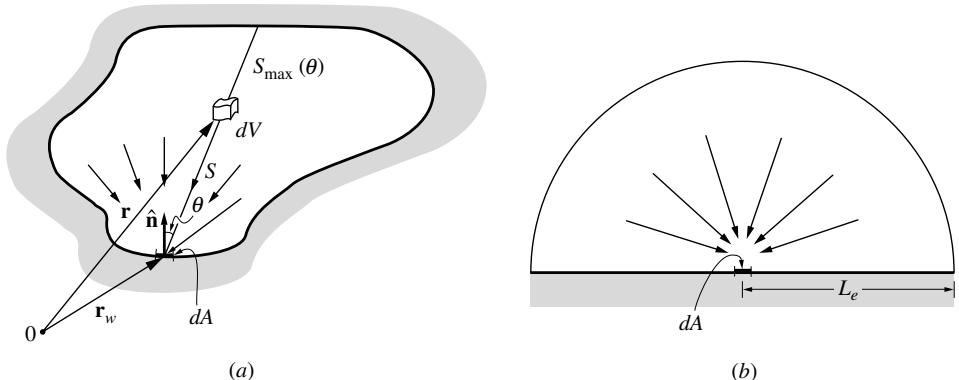  
图20-1 等温气体体积向表面元辐射：(a)任意气体体积，(b)向基底中心辐射的等效半球

## 20.2 平均光束长度法

平均光束长度的概念最初由Hottel[28]提出，用于确定从热燃烧气体等温体积到冷黑炉壁的辐射热通量。该方法可以扩展到包括热壁和灰壁的影响，但有一定难度。我们在此仅简要讨论该方法，主要是出于历史原因，也因为平均光束长度的概念有时被其他方法采用（例如下一节中的箱模型）。Hottel[28]和Hottel与Sarofim[29]给出了更详细的描述。如今，随着快速数字计算机的出现，该方法有些过时，通常被第18章详细讨论的相关区域法所取代，区域法不仅允许热壁和灰壁，还允许封闭体内有多个等温子体积。

### 平均光束长度的定义

考虑一个热的、等温的、非散射气体体积向其表面上的黑面积元$dA$辐射，如图20-1a所示。从体积元到达并被$dA$吸收的光谱热流等于$dV$向所有$(4\pi)$方向的发射×被$dA$拦截的分数×从$dV$到$dA$路径上的透射分数。因此，根据方程(10.51)，从所有体积元到达$dA$的光谱热流可写为

$$
q_{\eta}dA(\mathbf{r}_w) = \int_V(4\pi \kappa_{\eta}I_{b\eta}dV)\times \left(\frac{dA\cos\theta}{4\pi S^2}\right)\times e^{-\kappa_{\eta}S},
$$

或

$$
q_{\eta}(\mathbf{r}_w) = I_{b\eta}\int_Ve^{-\kappa_{\eta}S}\frac{\kappa_{\eta}\cos\theta dV}{S^2}, \tag{20.1}
$$

这里我们选择波数$\eta$作为光谱变量。我们注意到，一般来说，从热气体体积到达表面元$dA$的热流与黑体强度$I_{b\eta}$成正比，还与一个取决于光谱吸收系数和介质几何形状的因子成正比。虽然对于大多数几何形状来说，这个积分因子并不容易计算，但对于向基底中心$dA$辐射的半球形体积（如图20.10所示）来说，可以很容易确定。对于这种情况，$S = r$且$dV = r^2\sin \theta drd\theta d\psi$，因此

$$
q_{\eta} = I_{b\eta}\int_{\psi = 0}^{2\pi}\int_{\theta = 0}^{\pi /2}\int_{r = 0}^{R}e^{-\kappa_{\eta}r}\kappa_{\eta}\cos \theta \sin \theta drd\theta d\psi = \pi I_{b\eta}(1 - e^{-\kappa_{\eta}R}) = \pi I_{b\eta}\epsilon_{\eta}, \tag{20.2}
$$

这里我们使用了等温层光谱发射率的定义，即方程(10.13)。显然，如果选择适当的半球半径值，从任意体积$V$或半径为$R$的半球到达$dA$的辐射热流可以相等。因此，就$dA$上的光谱半球辐照而言，辐射是来自任意体积还是来自具有正确半径$R = L_{e}$的等效半球没有区别，其中$L_{e}$被称为平均光束长度。因此，根据方程(20.1)和(20.2)，对于照射无穷小表面元$dA$的任意体积，平均光束长度的定义为

$$
\frac{q_{\eta}}{\pi I_{b\eta}} = 1 - e^{-\kappa_{\eta}L_{e}} = \int_{V}e^{-\kappa_{\eta}S}\frac{\kappa_{\eta}\cos\theta dV}{\pi S^{2}}. \tag{20.3}
$$

注意，平均光束长度的大小取决于吸收系数和几何形状。

通常还会定义照射有限表面的任意体积的平均光束长度，将方程(20.1)中的局部热流$q_{\eta}$替换为表面平均值，即

$$
\frac{q_{\eta_{e}W}}{\pi I_{b\eta}} = 1 - e^{-\kappa_{\eta}L_{e}} = \frac{1}{A}\int_{A}\int_{V}e^{-\kappa_{\eta}S}\frac{\kappa_{\eta}\cos\theta dV}{\pi S^{2}} dA. \tag{20.4}
$$

例20.1. 确定厚度为$L$的等温气体层对$(a)$一个无穷小表面元，$(b)$整个边界表面的平均光束长度。

# 解

可以通过首先从方程(14.40)找到撞击表面元的辐射热流，或直接积分方程(20.3)来评估平均光束长度。为了说明目的，我们选择后者，用圆柱坐标系表示$V$，原点在$dA$处。因此，$dV = 2\pi rdrdz$，$S = \sqrt{r^2 + z^2}$，且$\cos \theta = z / S$，得到

$$
\frac{q_{\eta}}{E_{b\eta}} = \frac{1}{\pi}\int_{z = 0}^{L}\int_{r = 0}^{\infty}e^{-\kappa_{\eta}S}\frac{\kappa_{\eta}z2\pi rdrdz}{S^{3}}.
$$

通过将积分变量$r$替换为$S$，且$rdr = SdS$，这个表达式变为

$$
\frac{q_{\eta}}{E_{b\eta}} = 2\int_{z = 0}^{L}\int_{S = z}^{\infty}e^{-\kappa_{\eta}S}\frac{\kappa_{\eta}zdSdz}{S^{2}} = 2\kappa_{\eta}\int_{z = 0}^{L}E_{2}(\kappa_{\eta}z)dz,
$$

其中使用了指数积分的定义[见方程(14.31)或附录E]。积分后，我们得到

$$
\frac{q_{\eta}}{E_{b\eta}} = -2E_3(\kappa_{\eta}z)\bigg|_0^L = 1 - 2E_3(\kappa_{\eta}L),
$$

当然，如果只考虑介质的发射（$T_{1} = T_{2} = 0$），这也可以直接从方程(14.40)得出。

因此，根据方程(20.3)，从气体层到表面元$dA$的平均光束长度为

$$
L_{e} = \frac{1}{\kappa_{\eta}}\ln \frac{1}{2E_{3}(\kappa_{\eta}L)}.
$$

对于整个表面的平均光束长度，方程(20.4)，由于这个一维问题中局部和平均热流相同，所以结果相同。

# 光学薄介质的平均光束长度

方程(20.3)和(20.4)通常不容易评估，对于非灰介质，如果需要总热流而不是光谱热流（通常是这种情况），则需要针对不同的吸收系数进行积分。然而，如果考虑光学薄介质，即$\kappa_{\eta}L\ll 1$，其中$L$是介质的特征尺寸，关系会变得简单得多。如果我们展开方程(20.3)和(20.4)中的指数，并忽略$\kappa_{\eta}^{2}$及更高阶的项，我们发现光学薄体积照射其表面上一点的平均光束长度$L_{0}$为

$$
1 - (1 - \kappa_{\eta}L_{0}) = \frac{1}{\pi}\int_{V}1\times \frac{\kappa_{\eta}\cos\theta dV}{S^{2}},
$$

或

$$
L_{0} = \frac{1}{\pi}\int_{V}\frac{\cos\theta dV}{S^{2}}. \tag{20.5}
$$

如果我们用以$dA$为中心的球坐标系表示体积，$S$为半径，可以写成$dV = S^{2}dS\sin \theta d\theta d\psi = S^{2}dSd\Omega$，方程(20.5)变为

$$
\begin{array}{l}{L_0 = \frac{1}{\pi}\int_{\psi = 0}^{2\pi}\int_{\theta = 0}^{\pi /2}\int_{S = 0}^{S_{\max}(\theta ,\psi)}\cos \theta \sin \theta dSd\theta d\psi}\\ {= \frac{1}{\pi}\int_{2\pi}S_{\max}(\hat{\mathbf{s}})\cos \theta d\Omega .} \end{array} \tag{20.6}
$$

类似地，根据方程(20.4)，光学薄体积照射有限表面的平均光束长度为

$$
L_{0} = \frac{1}{\pi A}\int_{A}\int_{2\pi}S_{\max}(\mathbf{r}_{w},\hat{\mathbf{s}})\cos \theta d\Omega dA. \tag{20.7}
$$

通过物理论证，可以发现当$A$是包围体积$V$的整个表面积时，方程(20.7)的解是简单的：根据方程(10.54)，整个体积的总发射为$4\pi \kappa_{\eta}I_{b\eta}V$。由于对于光学薄介质，没有自吸收发生，所有这些能量必须被（黑体）边界表面吸收。因此，表面上的平均热流为

$$
q_{\eta} = 4\pi \kappa_{\eta}I_{b\eta}V / A
$$

根据方程(20.3)(当$\kappa_{\eta}L_{0}\ll 1$时),

$$
\frac{q_{\eta}}{\pi I_{b\eta}} = \kappa_{\eta}L_{0} = 4\kappa_{\eta}V / A
$$

即

$$
L_{0} = 4\frac{V}{A}. \tag{20.8}
$$

对于光学薄介质，平均光束长度$L_{0}$通常被称为几何平均光束长度，这是基于Dunkle[30]的工作。

例20.2. 确定例20.1中光学薄气体层的平均光束长度。

# 解答

从上例中我们有

$$
\frac{q_{\eta}}{E_{b\eta}} = 1 - e^{-\kappa_{\eta}L_{e}} = 1 - 2E_{3}(\kappa_{\eta}L),
$$

当$\kappa_{\eta}L\ll 1$时，可简化为

$$
\frac{q_{\eta}}{E_{b\eta}} = 1 - 1 + \kappa_{\eta}L_{0} = 1 - 2\left(\frac{1}{2} -\kappa_{\eta}L\right) = 2\kappa_{\eta}L,
$$

即

$$
L_0 = 2L.
$$

对于整个表面的平均光束长度当然也是相同的。这也可以直接从方程(20.8)得出：

$$
L_{0} = 4\frac{V}{A} = 4\frac{A_{\mathrm{plate}}\times L}{2A_{\mathrm{plate}}} = 2L.
$$

方程(20.8)对于任何几何形状都很容易计算，甚至方程(20.7)(到边界表面某部分的平均光束长度)和(20.5)(到边界表面某点的平均光束长度)对于许多构型也很容易积分。

表20.1总结了Hottel和Sarofim[29]收集的多种构型下气体体积与边界表面之间的几何平均光束长度，其中同心圆柱和球体的值由Andersen及其同事[31,32]补充。

# 光谱平均平均光束长度

由等温体积发射并被黑色边界表面元素吸收的光谱热流(或有限面积上的平均热流)由方程(20.2)给出：

$$
q_{\eta} = \epsilon_{\eta}(L_e)\pi I_{b\eta} = (1 - e^{-\kappa_{\eta}L_e})\pi I_{b\eta}, \tag{20.9}
$$

其中平均光束长度$L_{e}$取决于光谱吸收系数以及体积的几何形状。然而，Hottel注意到光谱热流$q_{\eta}$对$L_{e}$的光谱波动不太敏感，用与$\kappa_{\eta}$无关的平均平均光束长度$L_{m}$代替光谱变化的$L_{e}$可以以可接受的精度预测光谱热流。这一事实在图20-2中得到了证明，该图显示了精确和近似光谱热流之比：

$$
\frac{q_{\eta}\big(\kappa_{\eta}L_{e} = L_{e}(\kappa_{\eta})\big)}{q_{\eta}\big(\kappa_{\eta},L_{e} = L_{m} = \mathrm{const}\big)} = \frac{1 - e^{-\kappa_{\eta}L_{e}}}{1 - e^{-\kappa_{\eta}L_{m}}}. \tag{20.10}
$$

图20-2中考虑了两种不同的几何构型：一种是如例20.1所示的无限大平板向其边界上某点(或整个表面)辐射，另一种是球体向其表面某点(或整个表面)辐射。观察图20-2可以发现，如果使用平均平均光束长度来计算光谱热流，其误差永远不会超过$\sim 5\%$(前提是选择了合适的$L_{m}$)。这一结论可以推广到其他几何构型。表20.1中也包含了平均平均光束长度的数值。通过观察平均光束长度与光学薄平均光束长度的比值$L_{m} / L_{0}$，可以发现该值通常在0.9附近。因此，对于无法获得$L_{e}$值的几何构型，推荐采用以下值：

$$
L_{m}\simeq 0.9L_{0} = 3.6\frac{V}{A} \tag{20.11}
$$

表20.1 从气体体积到其边界表面的平均光束长度

| 气体体积几何形状 | 特征尺寸L | 几何平均光束长度L0/L | 平均平均光束长度Lm/L | Lm/L0 |
|----------------|----------|---------------------|---------------------|-------|
| 球体辐射至表面 | 直径L=D | 0.67 | 0.65 | 0.97 |
| 同心球体至[32]: 内表面(R1) | 外半径L=R2 | φs1(R1/R2) |  |  |
| 外表面(R2) | L=R2 | φs2(R1/R2) |  |  |
| 无限长圆柱至边界表面 | 直径L=D | 1.00 | 0.94 | 0.94 |
| 同心圆柱至[31]: 内表面(R1) | 外半径L=R2 | φc1(R1/R2) |  |  |
| 外表面(R2) | L=R2 | φc2(R1/R2) |  |  |
| 半无限长圆柱至: | 直径L=D |  |  |  |
| 底面中心点 |  | 1.00 | 0.90 | 0.90 |
| 整个底面 |  | 0.81 | 0.65 | 0.80 |
| 圆柱(高/直径=1)至: | 直径L=D |  |  |  |
| 底面中心点 |  | 0.76 | 0.71 | 0.92 |
| 整个表面 |  | 0.67 | 0.60 | 0.90 |
| 圆柱(高/直径=2)至: | 直径L=D |  |  |  |
| 平面底面 |  | 0.73 | 0.60 | 0.82 |
| 凹面 |  | 0.82 | 0.76 | 0.93 |
| 整个表面 |  | 0.80 | 0.73 | 0.91 |
| 圆柱(高/直径=0.5)至: | 直径L=D |  |  |  |
| 平面底面 |  | 0.48 | 0.43 | 0.90 |
| 凹面 |  | 0.53 | 0.46 | 0.88 |
| 整个表面 |  | 0.50 | 0.45 | 0.90 |
| 无限大半圆柱至平面矩形面中心 | 半径L=R |  |  |  |
| 无限大平板至表面 | 板厚L | 2.00 | 1.76 | 0.88 |
| 立方体至一个面 | 边长L | 0.67 | 0.6 | 0.90 |
| 1×1×4长方体至: | 最短边L |  |  |  |
| 1×4面 |  | 0.90 | 0.82 | 0.91 |
| 1×1面 |  | 0.86 | 0.71 | 0.83 |
| 所有面 |  | 0.89 | 0.81 | 0.91 |
| φs1(x) = 2/3x²[1-x³-(1-x²)³/²], φs2(x) = 2/3[1-x³+(1-x²)³/²] |
| φc1(x) = 1-x²+2/π[cos⁻¹x-x√1-x²], φc2(x) = 2/π(√1-x²+1/xsin⁻¹x)-x |

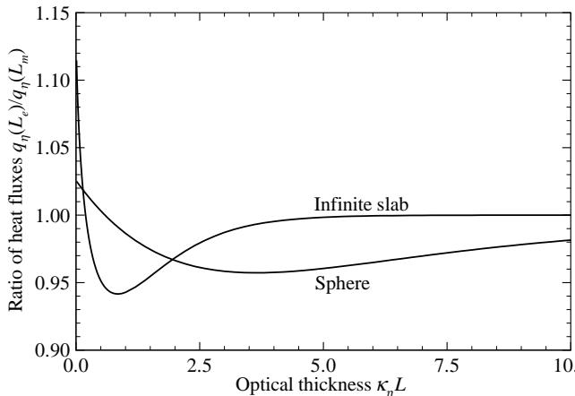  
图20-2 等温气体体积向表面辐射的精确光谱热流与使用平均平均光束长度计算得到的热流之比

除了节省计算$L_{e}$的工作量外，采用平均值$L_{m}$还有一个巨大优势：它允许对方程(20.9)进行直接的光谱积分，从而得到总热流：

$$
q = \int_{0}^{\infty}q_{\eta}d\eta = \int_{0}^{\infty}\left(1 - e^{-\kappa_{\eta}L_{m}}\right)\pi I_{b\eta}(T)d\eta = \epsilon (L_{m},T)\pi I_{b}(T) = \epsilon (L_{m},T)n^{2}\sigma T^{4}, \tag{20.12}
$$

其中$\epsilon (L_{m},T)$是厚度为$L_{m}$的等温气体层的总发射率。

例20.3. 压力$p = 5$ bar、温度$T = 1000\mathrm{K}$的燃烧产物（含70% $\mathrm{N}_2$、10% $\mathrm{CO}_2$和20% $\mathrm{H}_2\mathrm{O}$）被封闭在半径$R = 75\mathrm{cm}$的球形容器中。假设容器壁为冷黑体，估算辐射到壁面的热流。

# 解

一旦确定了气体混合物在平均平均光束长度$L_{m} = 0.65D\simeq 100\mathrm{cm}$下的总发射率（如表20.1所示），就可以直接从方程(20.12)求出容器壁的辐射热流。第11章讨论了二氧化碳-水蒸气混合物的总发射率，这个特定气体混合物在$100\mathrm{cm}$厚层中的总发射率已在例11.13中计算为$\epsilon = 0.593$。因此，

$$
q = 0.593\times 5.670\times 10^{-12}\times 1000^{4}\mathrm{W / cm}^{2} = 3.36\mathrm{W / cm}^{2}.
$$

例20.4. 压力$1$ bar、温度$1700\mathrm{K}$的纯$\mathrm{CO}_2$等温层，厚度$1\mathrm{m}$，被限制在两个平行冷黑板之间。使用平均光束长度法估算气体的总热损失。

# 解

同样，如果已知平均光束长度的总发射率，就可以从方程(20.12)直接确定壁面的热流。本例中$L_{m} = 1.76L = 176\mathrm{cm}$。$\mathrm{CO}_2$的总发射率可以从图11-30或方程(11.177)确定。使用图11-30，我们得到$\epsilon_0$(176 bar cm, $1\mathrm{bar},1700\mathrm{K})\simeq 0.17$。修正因子$\epsilon /\epsilon_0$由方程(11.178)和表11.4给出的相关常数确定，得到$\epsilon /\epsilon_0\simeq 1.00$，因此$\epsilon \simeq 0.17$。将此值代入方程(20.12)，我们得到

$$
-q(0) = q(L) = 0.17\times 5.670\times 10^{-12}1700^{4}\mathrm{W / cm}^{2} = 8.05\mathrm{W / cm}^{2},
$$

两侧总热损失为$2\times 8.05 = 16.1\mathrm{W / cm}^2$。如果使用Leckner的相关性（调用附录F中的子程序totemiss），将返回$\epsilon = 0.153$，总热损失为$2\times 7.25 = 14.5\mathrm{W / cm}^2$。

# 20.3 半灰近似

在工程实践中，通常将属性视为"常数"，即独立于一个或多个因变量，主要是为了线性化问题。例如，在热传导中通常假设热导率与温度无关。如果$(i)$材料热导率的温度变化不太强，且$(ii)$能找到合适的恒定"有效热导率"，这种分析可以得到非常准确的结果。在辐射热流计算中，特别是在光谱变化方面，也很容易使用这种简化假设。Viskanta [33]、Finkleman及其同事[34-36]以及Traugott [37,38]等研究者提出了几种不同的"有效"吸收系数，并将其纳入"半灰"方案，但效果有限。

考虑温度为$T$的均匀参与介质的体积。如果介质是光学薄的（即它发射但不吸收任何发射的辐射），根据方程(10.54)，体积的总热损失为

$$
Q = 4V\int_{0}^{\infty}\kappa_{\eta}E_{b\eta}d\eta , \tag{20.13}
$$

或者，根据Planck平均吸收系数的定义，方程(11.182)，

$$
Q = 4V\kappa_{P}n^{2}\sigma T^{4}. \tag{20.14}
$$

这个表达式相当于取方向积分的传输方程（或辐射能量守恒方程），方程(10.60)，在去掉自吸收项后对整个体积进行积分。因此，对于光学薄介质，可以合理地设

$$
\nabla \cdot \mathbf{q} = \int_{0}^{\infty}\kappa_{\eta}(4\pi I_{b\eta} - G_{\eta})d\eta \simeq \kappa_{\rho}(4\pi I_{b} - G). \tag{20.15}
$$

另一方面，对于光学厚介质，辐射热流遵循扩散极限，或者对于各向同性散射介质，根据方程(15.19)，

$$
{\mathfrak{q}}_{\eta}\simeq-\frac{1}{3\beta_{\eta}}\nabla E_{b\eta}; \tag{20.16}
$$

并且，使用Rosseland平均消光系数的定义，方程(11.188)，

$$
{\mathfrak{q}}=-\int_{0}^{\infty}\frac{1}{3\beta_{\eta}}\nabla E_{b\eta}d\eta=-\frac{1}{3\beta_{R}}\nabla E_{b}. \tag{20.17}
$$

显然，要使用灰模型进行准确计算，有效吸收系数在光学薄情况下必须接近Planck平均，在光学厚情况下必须接近Rosseland平均。一个简单的（即不依赖于几何形状和由此产生的光学厚度）平均值只有在Planck平均和Rosseland平均值相近时才能给出准确结果（而在实际中它们经常相差几个数量级，特别是对于分子气体）。

将方程(20.17)中的$E_{b}$替换为入射辐射$G$，与方程(20.15)一起，得到一个半灰$P_{1}$近似，

$$
\begin{array}{c}{\nabla \cdot \mathbf{q} = \kappa_{P}(4\pi I_{b} - G),}\\ {\nabla G = -3\beta_{R}\mathbf{q}.} \end{array} \tag{20.18a}
$$

消去$\mathfrak{q}$得到$G_{j}$的单一方程

$$
\nabla^2 G - 3\beta_R\kappa_P(G - 4\pi I_b) = 0, \tag{20.19}
$$

为简单起见，我们假设$\kappa_{p}$和$\beta_{R}$在空间上是常数。因此，将方程(20.19)与(16.39)比较（对于各向同性散射设$A_{1} = 0$），得到一个有效吸收系数

$$
\kappa_{\mathrm{eff}}\simeq \sqrt{\kappa_{p}\kappa_{R}}, \tag{20.20}
$$

这在灰分析中相当常用。然而，方程(20.20)应非常谨慎地使用，$(i)$因为只有当$\kappa_{p} / \kappa_{R}$接近1时才能期望得到准确答案，且$(ii)$因为Rosseland平均吸收系数对于纯分子气体是有问题的。在第二种情况下，扩散极限仅适用于光学厚的情况，而所有分子气体在光谱的大部分区域都有透明区域。

考虑一种气体-颗粒混合物，其吸收系数可以写成

$$
\kappa_{\eta} = \kappa_{p\eta} + \kappa_{g\eta} = \kappa_{p\eta} + \sum_{n = 1}^{N}\kappa_{n\eta}. \tag{20.21}
$$

这里$\kappa_{p\eta}$是颗粒的光谱吸收系数，$\kappa_{g\eta}$是气体的光谱吸收系数，由$N$个独立的振动-转动带组成，每个带都有自己的光谱吸收系数$\kappa_{n\eta}$。我们还假设这些带相对较窄，不重叠，可以用第11章的宽带模型描述。那么Planck平均吸收系数可以计算为

$$
\begin{array}{l}\kappa_{p} = \frac{1}{E_{b}}\int_{0}^{\infty}\kappa_{\eta}E_{b\eta}d\eta = \kappa_{p,p} + \sum_{n = 1}^{N}\frac{1}{E_{b}}\int_{\mathrm{band}n}\kappa_{n\eta}E_{b\eta}d\eta \\ \displaystyle \qquad \simeq \kappa_{p,p} + \sum_{n = 1}^{N}\frac{E_{b\eta_{n}}}{E_{b}}\int_{\mathrm{band}n}\kappa_{n\eta}d\eta = \kappa_{p,p} + \sum_{n = 1}^{N}\frac{E_{b\eta_{n}}}{E_{b}}\alpha_{n}, \end{array} \tag{20.22}
$$

其中$\alpha_{n}$是第$n$个谱带的强度参数，$E_{b\eta_{n}}$是该谱带中心处的光谱黑体辐射力。Rosseland平均吸收系数可类似地计算为：

$$
\begin{array}{l}\frac{1}{\kappa_R} = \int_0^\infty \frac{1}{\kappa_\eta}\frac{dE_{b\eta}}{dE_b} d\eta = \frac{1}{\kappa_{p,R}} -\int_0^\infty \left(\frac{1}{\kappa_{p\eta}} -\frac{1}{\kappa_\eta}\right)\frac{dE_{b\eta}}{dE_b} d\eta \\ \displaystyle \qquad \simeq \frac{1}{\kappa_{p,R}} -\sum_{n = 1}^N\left(\frac{dE_{b\eta}}{dE_b}\right)_{\eta_n}\int_{\mathrm{band}n}\left(\frac{1}{\kappa_{p\eta_n}} -\frac{1}{\kappa_{p\eta_n} + \kappa_{n\eta}}\right)d\eta , \end{array} \tag{20.23}
$$

这里$\kappa_{p\eta_{n}}$是一个常数平均值，假设$\kappa_{p\eta}$在每个谱带内变化不大。我们还假设在积分内，$\kappa_{n\eta}$可以用窄带平均值$(S/d)_{\eta}$代替，宽带模型规定[参见方程(11.142)]：

$$
\left(\frac{S}{d}\right)_\eta \simeq \frac{\alpha_n}{\omega_n} e^{-t|\eta | - \eta_n| / \omega_n}, \tag{20.24}
$$

其中$\omega_{n}$是谱带宽度参数，$t=1$表示有谱带头，$t=2$表示对称谱带。将此表达式代入方程(20.23)得到：

$$
\begin{array}{r l} & {\int_{\mathrm{band}n}\left(\frac{1}{\kappa_{p\eta_{n}}} -\frac{1}{\kappa_{p\eta_{n}} + \kappa_{n\eta}}\right)d\eta = \frac{1}{\kappa_{p\eta_{n}}}\int_{0}^{\infty}\frac{(S / d)_{\eta}}{\kappa_{p\eta_{n}} + (S / d)_{\eta}} d\eta}\\ & {\qquad = \frac{\alpha_{n}}{\kappa_{p\eta_{n}}}\int_{0}^{\infty}\frac{e^{-x}d x}{\kappa_{p\eta_{n}} + (\alpha_{n} / \omega_{n})e^{-x}} = \frac{\omega_{n}}{\kappa_{p\eta_{n}}}\ln \left(1 + \frac{\alpha_{n}}{\omega_{n}\kappa_{p\eta_{n}}}\right),} \end{array} \tag{20.25}
$$

与$t$值无关(参见例11.3的推导)。因此，

$$
\frac{1}{\kappa_{n}} = \frac{1}{\kappa_{p,R}} -\sum_{n = 1}^{N}\frac{\omega_{n}}{\kappa_{p\eta_{n}}}\left(\frac{dE_{b\eta}}{dE_{b}}\right)_{\eta_{n}}\ln \left(1 + \frac{\alpha_{n}}{\omega_{n}\kappa_{p\eta_{n}}}\right). \tag{20.26}
$$

从方程(20.26)明显看出，对于纯分子气体，$\kappa_{R}\to 0$。即使放宽窄带假设，这个结论也成立：可以很容易观察到，对于$\eta \to 0$和$\eta \to \infty$，$1/\kappa_{n\eta}$趋向无穷大的速度比$E_{b\eta}$趋向零的速度快。显然，对于纯分子气体$\kappa_{P}/\kappa_{R}\rightarrow \infty$，因此$(i)$ $\kappa_{R}$和方程(20.20)不适合确定$\kappa_{\mathrm{eff}}$，$(ii)$不能期望半灰方法给出准确预测。

例20.5。一种分子气体被限制在两块相距$1\mathrm{m}$的平行黑平板之间，平板分别保持等温$T_{1}=1200\mathrm{K}$和$T_{2}=800\mathrm{K}$。该(假设的)气体在红外区有一个振动-转动带，其平均吸收系数为：

$$
\left(\frac{\sigma}{d}\right)_\eta = \frac{\alpha}{\omega} e^{-2\eta /\eta_0 / \eta_\omega},\quad \eta_0 = 3000\mathrm{cm}^{-1},\quad \omega = 200\mathrm{cm}^{-1},
$$

且重叠参数为$\beta$(参见第11章窄带和宽带模型的讨论)。假设对流和传导可以忽略，使用半灰模型估算两平板之间的辐射热流。对不同的$(\alpha/\omega)$和$\beta$值进行分析。对相同气体与不散射颗粒(吸收系数$\kappa_{p}=0.1\mathrm{m}^{-1}$(灰体))的混合物重复计算。

# 解

要进行"等效"灰体分析，必须找到合适的灰体吸收系数。由于对于纯分子气体Rosseland平均不适用，且缺乏更好的值，我们选择Planck平均吸收系数，得到：

$$
\tau_{p} = \kappa_{r}L = \alpha \frac{E_{b\eta_{0}}}{\sigma T^{4}} L = \tau_{L}\frac{\omega E_{b\eta_{0}}(T)}{\sigma T^{4}},\quad \tau_{L} = \left(\frac{\alpha}{\omega}\right)L.
$$

因此，即使$(\alpha/\omega)= \mathrm{const}$，$\tau_{p}$也取决于气体的局部温度。为简化分析，我们使用在某个平均温度(如$T_{\mathrm{av}}=1000\mathrm{K}$)下评估的常数Planck平均吸收系数。因此，$\eta_0/T_{\mathrm{av}}=3\mathrm{cm}^{-1}/\mathrm{K}$，根据附录C，

$$
\tau_{p} = \frac{200\times 1.36576\times 10^{-8}}{5.670\times 10^{-8}\times 1000}\times \tau_{L} = 0.0482\tau_{L}.
$$

对于灰体介质，两平板之间的辐射热流由例15.5的$P_{1}$近似确定为：

$$
\Psi_{\mathrm{gray}} = \frac{1}{1 + \frac{3}{4}\tau_p} = \frac{1}{1 + 0.0362\tau_L}.
$$

如果存在颗粒背景，最好使用方程(20.20)中的$\kappa_{\mathrm{eff}}$。因此，当$\tau_{p}=\kappa_{p}L=0.1\times1=0.1$时，

$$
\tau_{p} = 0.1 + 0.0482\tau_{L},
$$

$$
\frac{1}{\tau_{\mathrm{R}}} = \frac{1}{\tau_{p}} -\frac{1}{\tau_{p}}\left(\omega \frac{dE_{b\eta}}{dE_{b}}\right)_{\eta_{n}}\ln \left(1 + \frac{\tau_{L}}{\tau_{p}}\right).
$$

根据方程(1.14)可得：

$$
\begin{array}{r l} & {\omega \frac{d E_{b\eta}}{d E_{b}} = \frac{\omega}{4\sigma T^{3}}\frac{d E_{b\eta}}{d T} = \frac{\omega}{4\sigma T^{3}}\frac{d}{d T}\left[\frac{C_{1}\eta^{3}}{\exp\left(C_{2}\eta / T\right) - 1}\right]}\\ & {\quad = \frac{\omega C_{1}\eta^{3}}{4\sigma T^{3}}\frac{\exp\left(C_{2}\eta / T\right)C_{2}\eta / T^{2}}{\left[\exp\left(C_{2}\eta / T\right) - 1\right]^{2}} = \frac{1}{4}\frac{\omega E_{b\eta}}{E_{b}}\frac{\left(C_{2}\eta / T\right)\exp\left(C_{2}\eta / T\right)}{\exp\left(C_{2}\eta / T\right) - 1},} \end{array}
$$

$$
\left(\omega \frac{dE_{b\eta}}{dE_b}\right)_{\eta_n} = \frac{1}{4}\times 0.0482\times \frac{4.3164e^{4.3164}}{e^{4.3164} - 1} = 0.0527,
$$

$$
\tau_{\scriptscriptstyle R} = \frac{0.1}{1 - 0.0527\ln(1 + 10\tau_{\scriptscriptstyle L})}.
$$

$\tau_{p}$和$\tau_{R}$可以针对任何$\tau_{L}$计算，热流变为：

$$
\Psi = \frac{1}{1 + \frac{3}{4}\sqrt{\tau_{p}\tau_{R}}}.
$$

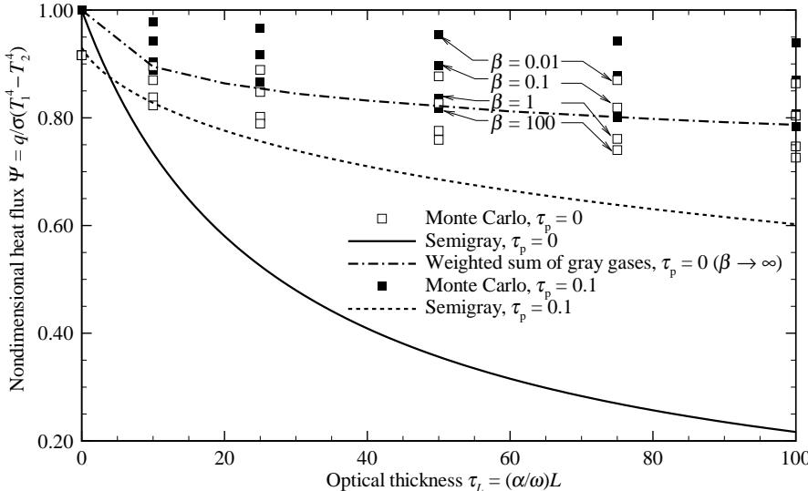  
图20-3 采用半灰方法计算的平行黑壁约束下分子气体-颗粒层辐射平衡的无量纲辐射热流

代表性结果如图20-3所示，同时展示了Monte Carlo方法[39,40]的精确结果以及加权灰气体方法(本章稍后讨论)的结果。显然，对于纯分子气体，半灰近似完全失效，因为Planck平均对于光学厚波段而言过大而无法成为有效的吸收系数。在有颗粒背景的情况下，该方法表现明显更好，$\kappa_{P} / \kappa_{R}$的值在1($\tau_{L} = 0$时)到31($\tau_{L} = 100$时)之间变化。半灰方法无法考虑光谱窗口，也无法处理谱线结构(谱线重叠参数$\beta$)：如果谱线重叠较少($\beta$较小)，辐射可以不受阻碍地穿过强谱线之间的"微窗口"。对于灰体气体，热流在光学厚气体中必然趋近于零。

# 20.4 阶梯灰模型(箱式模型)

在辐射传热计算中考虑分子气体吸收-发射带效应的另一种简单方法是通过11.10节描述的箱式模型近似带吸收率。在该模型中，具有$N$个振动-转动带的分子气体的光谱吸收系数近似为(见图20-4):

$$
\kappa_{\eta}\simeq \sum_{n = 1}^{N}\kappa_{n}\left[H(\eta -\eta_{n} + \frac{1}{2}\Delta \eta_{n}) - H(\eta -\eta_{n} - \frac{1}{2}\Delta \eta_{n})\right], \tag{20.27}
$$

其中$\eta_{n}$是带中心波数，$\Delta \eta_{n}$是带宽，$\kappa_{n}$是第$n$个带的吸收系数(假设每个带为常数)。函数$H(x)$是Heaviside单位阶跃函数。如果分子气体伴有吸收和/或散射颗粒(如烟灰或灰颗粒)，则方程(20.27)的吸收系数必须加上背景的消光系数。如果背景材料可近似为灰体，则混合消光系数可表示为:

$$
\beta_{\eta} = \beta_{p} + \sum_{n = 1}^{N}\kappa_{n}\left[H(\eta -\eta_{n} + \frac{1}{2}\Delta \eta_{n}) - H(\eta -\eta_{n} - \frac{1}{2}\Delta \eta_{n})\right]. \tag{20.28}
$$

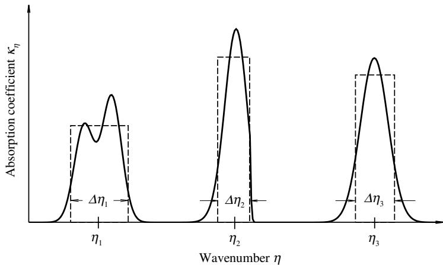  
图20-4 分子气体带的箱式模型近似

许多研究者使用不同形式的箱式模型来解决非灰辐射问题。该模型最初由Chandrasekhar[41]提出，主要应用于辐射平衡的一维平面介质，例如Siewert和Zweifel[42]、Kung和Sibulkin[43]以及Reith、Siewert和Ozisik[44]的工作。Greif[45]将该方法应用于平面层中的传导/辐射组合问题。Modest[46]表明，对于具有单一带强度的气体，箱式模型方法可以纳入$P_{1}$近似，从而进行多维计算。Modest和Sikka[39]将其推广到一般箱式模型，并给出了确定箱式模型参数的一致方法。Thynell[47]也使用了箱式模型和$P_{1}$近似的组合来预测含有二氧化碳、水蒸气、烟灰和较大颗粒的一维圆柱介质中的辐射；类似地，Kaminski及其同事[48,49]分别研究了燃烧产物混合物在圆柱上的层流横流和管内的湍流流动。Mazumder和Modest也使用该方法确定了湍流与辐射在反应[50]和非反应[51]流动中相互作用的重要性。

将箱式模型与平均光束长度方法进行比较，我们发现平均光束长度方法可以很好地模拟吸收系数的光谱变化，但它仅限于非散射介质的等温黑壁封闭空间。另一方面，箱式模型可以处理非等温、有散射且边界为非黑壁的介质，但其光谱建模较为粗糙。

箱式模型对非灰介质辐射热流(或其散度)的预测效果很大程度上取决于如何为给定介质确定"最佳"箱参数。要找到这些参数的适当值，必须认识到控制参与介质中辐射传热的精确积分关系[例如见方程(10.28)]包含以光谱发射率(或其导数)形式出现的光谱吸收系数:

$$
\epsilon_{\eta} = 1 - e^{-\kappa_{\eta}X}. \tag{20.29}
$$

这里$X = L$(如果使用线性吸收系数)，或$L$乘以吸收气体的分密度或分压(如果使用质量或压力吸收系数)；$L$是考虑吸收/发射的几何路径长度。因此，光谱积分热流(或其散度)强烈依赖于介质的总带吸收率,

$$
A(X) = \int_{\mathrm{band}}\epsilon_{\eta}d\eta = \int_{\mathrm{band}}(1 - e^{-\kappa_{\eta}X})d\eta . \tag{20.30}
$$

因此，箱式模型的目标必须是在所有可能条件下尽可能准确地近似总带吸收率。对于无颗粒背景的气体，如图20-4所示，对于第$n$个带我们有：

$$
A_{n}(X)\simeq \Delta \eta_{n}(1 - e^{-\kappa_{n}X}), \tag{20.31}
$$

其中$\Delta \eta_{n}$和$\kappa_{n}$是两个参数，可以任意依赖于所有气体条件（压力、温度、谱线重叠等），除了路径长度$X$。因此，由方程(20.31)计算的$A_{n}(X)$值在0到$\Delta \eta_{n}$之间变化，并且可以恰好与$A_{n}(X)$的精确值（如第11章讨论的）在$X$的两个特定值处重合。正是这种限制影响了箱式模型的精度，因为在光学厚条件下总带吸收率的"精确"值随$\ln (\kappa_{\eta}X)$增加（参见表11.2）。Modest和Sikka[39]发现，最佳结果是通过选择$\Delta \eta_{n}$和$\kappa_{n}$使得方程(20.31)能正确预测光学薄情况（$X$较小）和基于平均光束长度$L_{m}$的特征长度$X_{m}$（如表20.1所列）下的带吸收率。

在光学薄极限下我们有：

$$
X\ll X_{m}:A_{n}(x) = \int_{\mathrm{band}}\kappa_{\eta}Xd\eta = \alpha_{n}X = \kappa_{n}\Delta \eta_{n}X, \tag{20.32}
$$

其中$\alpha_{n}$是积分吸收系数，即：

$$
\alpha_{n}\simeq \kappa_{n}\Delta \eta_{n}. \tag{20.33}
$$

在平均光束长度处有：

$$
X = X_{m}:A_{n}(X_{m}) = \Delta \eta_{n}(1 - e^{-\kappa_{n}X_{m}}), \tag{20.34}
$$

其中$A_{n}(X_{m})$必须从任何适当的宽带模型评估。方程(20.33)和(20.34)构成了关于未知数$\kappa_{n}$和$\Delta \eta_{n}$的一组方程，特别当$\kappa_{n}X_{m} \gg 1$时（大多数重要带都是这种情况），这些方程很容易求解。

作为一个简单示例，我们考虑被限制在两个等温灰漫射平板之间的一维平面平行分子气体层的辐射平衡。介质不散射且吸收系数服从方程(20.27)。作为进一步简化，我们假设所有带强度相等，即：

$$
\kappa_{1} = \kappa_{2} = \dots = \kappa_{N} = \overline{\kappa}, \tag{20.35}
$$

且带宽$\Delta \eta_{n}$不随位置或温度变化。对于这种简单情况，入射辐射$G_{\eta}$和辐射热流$q_{\eta}$的光谱值可以很容易地从方程(14.34)和(14.35)得到：

$$
\begin{array}{l}{G_{\eta}(\tau_{\eta}) = 2\Big\{J_{1\eta}E_{2}(\tau_{\eta}) + J_{2\eta}E_{2}(\tau_{L\eta} - \tau_{\eta}) + \int_{0}^{\tau_{L}}E_{b\eta}(\tau_{\eta}^{\prime})E_{1}(|\tau_{\eta} - \tau_{\eta}^{\prime}|)d\tau_{\eta}^{\prime}\Big\} ,}\\ {q_{\eta}(\tau_{\eta}) = 2\Big\{J_{1\eta}E_{3}(\tau_{\eta}) - J_{2\eta}E_{3}(\tau_{L\eta} - \tau_{\eta})}\\ {+\int_{0}^{\tau_{L}}E_{b\eta}(\tau_{\eta}^{\prime})E_{2}(\tau_{\eta} - \tau_{\eta}^{\prime})d\tau_{\eta}^{\prime} - \int_{\tau_{\eta}}^{\tau_{L\eta}}E_{b\eta}(\tau_{\eta}^{\prime})E_{2}(\tau_{\eta}^{\prime} - \tau_{\eta})d\tau_{\eta}^{\prime}\Big\} ,} \end{array} \tag{20.37}
$$

其中：

$$
\tau_{\eta} = \int_{0}^{\tau_{L}}\overline{\kappa} dz\sum_{n = 1}^{N}\left[H(\eta -\eta_{n} + \frac{1}{2}\Delta \eta_{n}) - H(\eta -\eta_{n} - \frac{1}{2}\Delta \eta_{n})\right]
$$

$$
= \left\{ \begin{array}{ll}\overline{\tau}, & \mathrm{within~bands},\\ 0, & \mathrm{across~windows}. \end{array} \right. \tag{20.38}
$$

将所有带（不包括窗口）的方程(20.36)和(20.37)积分得到：

$$
\begin{array}{l}{G_B(\overline{\tau}) = 2\Big\{J_{B1}E_2(\overline{\tau}) + J_{B2}E_2(\overline{\tau}_L - \overline{\tau}) + \int_0^{\overline{\tau}_L}E_B(\overline{\tau} ')E_1(|\overline{\tau} -\overline{\tau} ')|d\overline{\tau} '\Big\} ,}\\ {q_B(\overline{\tau}) = 2\Big\{J_{B1}E_3(\overline{\tau}) - J_{B2}E_3(\overline{\tau}_L - \overline{\tau}) + \int_0^{\overline{\tau}}E_B(\overline{\tau} ')E_2(\overline{\tau} -\overline{\tau} ')d\overline{\tau} ' - \int_{\overline{\tau}}^{\overline{\tau}_L}E_B(\overline{\tau} ')E_2(\overline{\tau} ' - \overline{\tau})d\overline{\tau} '\Big\} ,} \end{array} \tag{20.40}
$$

其中下标$B$表示对所有带积分的量，例如：

$$
G_{B} = \sum_{n = 1}^{N}\int_{n_{n} - \frac{1}{2}\Delta \eta_{n}}^{\eta +\frac{1}{2}\Delta \eta_{n}}G_{\eta}d\eta . \tag{20.41}
$$

另一方面，将传输方程在整个光谱（包括窗口）上积分，从方程(10.60)得到：

$$
\nabla \cdot \mathbf{q} = \frac{dq}{dz} = \int_{0}^{\infty}\kappa_{\eta}(4E_{b\eta} - G_{\eta})d\eta = \overline{\kappa} (4E_{B} - G_{B}) = 0, \tag{20.42}
$$

其中零是由于辐射平衡占主导。由于仅对带（不包括窗口）积分传输方程会得到相同的右侧，我们得出结论$dq_{B} / dz = 0$或$q_{B} = \mathrm{const},$且$G_{B} = 4E_{B}$。因此，方程(20.39)和(20.40)与灰体情况方程(14.34)和(14.35)相同，只需将总量替换为带积分值，即：

$$
\Phi_{B} = \frac{E_{B}(\overline{\tau}) - J_{B2}}{J_{B1} - J_{B2}} = \frac{1}{2}\left[E_{2}(\overline{\tau}) + \int_{0}^{\overline{\tau}_{L}}\Phi_{B}(\overline{\tau}^{\prime})E_{1}(|\overline{\tau} -\overline{\tau}^{\prime}|)d\overline{\tau}^{\prime}\right], \tag{20.43}
$$

$$
\Psi_{B} = \frac{q_{B}}{J_{B1} - J_{B2}} = 1 - 2\int_{0}^{\overline{\tau}_{L}}\Phi_{B}(\overline{\tau}^{\prime})E_{2}(\overline{\tau}^{\prime})d\overline{\tau}^{\prime}. \tag{20.44}
$$

然后通过加上光谱窗口的热流来确定板之间的总热流：

$$
q_{w} = \int_{\mathrm{windows}}(J_{1\eta} - J_{2\eta})d\eta = J_{1} - J_{2} - (J_{B1} - J_{B2}), \tag{20.45}
$$

即：

$$
\Psi = \frac{q}{J_1 - J_2} = \frac{q_w + q_B}{J_1 - J_2} = 1 - \frac{J_{B1} - J_{B2}}{J_1 - J_2} (1 - \Psi_B). \tag{20.46}
$$

我们注意到，对于灰体介质，$\Psi$在1（真空）和0（不透明介质）之间变化，而非灰介质的最小热流为：

$$
\Psi_{\mathrm{min}} = 1 - \frac{J_{B1} - J_{B2}}{J_1 - J_2}, \tag{20.47}
$$

因为即使带不透明，辐射也会通过光谱窗口无阻碍地从表面传输到表面。

例20.6. 压力为1 bar = 100 kPa的纯CO₂被限制在两块平行黑平板之间，平板间距1 m，温度分别保持在T₁ = 1000 K和T₂ = 2000 K。假设传导和对流可忽略不计，估算两板之间的辐射热流。

# 解答

由表11.3可知，二氧化碳在红外区域有三个重要吸收带：3660 cm⁻¹(2.7 μm)、2410 cm⁻¹(4.3 μm)和667 cm⁻¹(15 μm)。由于平板温度分别为1000 K和2000 K，根据维恩位移定律(第1章)，最重要的波长范围大约在1 μm到4 μm之间。乍看之下2.7 μm带似乎最重要，但实际上4.3 μm带强度约高20倍，因此需要更精确建模。在使用箱式模型前，我们需要确定这些带的合适参数。我们将通过比较箱式模型与(更精确的)指数宽带模型[39]的带吸收率来实现，应用方程(20.33)和(20.34)。由于我们希望对所有带使用统一的κ̅，不能使用所有这些条件，仅对(最重要的)4.3 μm带应用方程(20.34)。因此，

$$
\overline{\kappa}\Delta \eta_{i} = \alpha_{i},\quad \text{对所有三个带},
$$

$$
\Delta \eta_{4.3} = A_{4.3}(X_m),\quad \text{对}4.3\mu \text{m带}.
$$

在最后一个关系中我们假设了κ̅Xₘ≫1，这需要验证。

为简化分析，我们将在单一温度下计算箱式模型参数，取Tₐᵥ⁴ = (T₁⁴ + T₂⁴)/2或Tₐᵥ ≈ 1700 K。使用CO₂的气体常数R = 0.18892 kJ/kgK[52]以及表11.3和图11-24的数据，我们得到：

2.7 μm带：

$$
\begin{array}{rl} 
& {\rho_{\mathrm{CO_2}} = p / RT = 100\mathrm{kPa} / (0.18892\times 1700\mathrm{kJ / kg}) = 311.4\mathrm{g / m^3},}\\ 
& {\alpha_{\rho \mathrm{CO_2}} = \alpha_0(\alpha /\alpha_0)\rho = 4.0\times 1.61\times 311.4 = 2005\mathrm{cm^{-1} / m},}\\ 
& {\omega = 23.5\times \sqrt{17} = 96.9\mathrm{cm^{-1}},}\\ 
& {\alpha \rho_{\mathrm{CO_2}} = 110.0\times 1\times 311.4 = 34,254\mathrm{cm^{-1} / m},}\\ 
& {\omega = 11.2\times \sqrt{17} = 46.2\mathrm{cm^{-1}},}\\ 
& {\gamma = \gamma_0(\gamma /\gamma_0) = 0.247\times 24.8 = 6.12,}\\ 
& {P_e = 1.3^{0.8} = 1.234,\beta = 6.12\times 1.234 = 7.55,}\\ 
& {\alpha \rho_{\mathrm{CO_2}} = 19.0\times 1\times 311.4 = 5917\mathrm{cm^{-1} / m},}\\ 
& {\omega = 12.7\times \sqrt{17} = 52.4\mathrm{cm^{-1}}.} 
\end{array}
$$

4.3 μm带：

15 μm带：

取平均射线长度Lₘ = 1.76×1 m = 1.76 m，由表11.3得到重要的4.3 μm带：

$$
\begin{array}{rl} 
& {\Delta \eta_{4.3} = A_{4.3} = \omega_{4.3}\left[\ln \frac{\alpha_{4.3}\rho_{\mathrm{CO_2}}L_m}{\omega_{4.3}} +1\right]}\\ 
& {\qquad = 46.2\mathrm{cm}^{-1}\left[\ln \frac{34,254\times 1.76}{46.2} +1\right] = 377.6\mathrm{cm}^{-1},} 
\end{array}
$$

且

$$
\overline{\kappa} = \left(\alpha \rho_{\mathrm{CO_2}} / \Delta \eta\right)_{4.3} = 34,254 / 377.6 = 90.7\mathrm{m}^{-1} = 0.907\mathrm{cm}^{-1}.
$$

注意到κ̅是线性吸收系数，乘以Lₘ得到κ̅Lₘ = 0.907×176 = 160≫1，因此忽略方程(20.34)中的指数项是合理的。

其他两个带的宽度由相同关系确定：

$$
\begin{array}{r}\Delta \eta_{2.7} = \alpha_{2.7}\rho_{\mathrm{CO_2}} / \overline{\kappa} = 2005 / 90.7 = 22.1\mathrm{cm}^{-1},\\ \Delta \eta_{15} = \alpha_{15}\rho_{\mathrm{CO_2}} / \overline{\kappa} = 5917 / 90.7 = 65.2\mathrm{cm}^{-1}. \end{array}
$$

现在我们可以用方程(20.46)计算板间的无量纲热流，其中τ̅ = κ̅L = 90.7。Ψ_B(τ̅)遵循与第14章中Ψ_b(τ)相同的方程，因此可以从表14.1评估。由于带基本不透明，我们得到Ψ_B = 0.015≪1，且

$$
\Psi = 1 - 0.985\frac{E_{B1} - E_{B2}}{E_{b1} - E_{b2}}\simeq 1 - \frac{0.985}{E_{b1} - E_{b2}}\sum_{n = 1}^{3}(E_{b\eta_{n,1}} - E_{b\eta_{n,2}})\Delta \eta_{n},
$$

其中对黑壁封闭体，辐射度被发射功率替代，并假设带较窄(以将E_B评估为带中心值×带宽)。为在附录C中查找光谱发射功率值，我们取η₂.₇ = 3660 cm⁻¹，η₄.₃ ≈ 10⁴/4.3 = 2326 cm⁻¹(由于4.3 μm带是有头的带，最好在带中心附近评估E_bη)，以及η₁₅ = 667 cm⁻¹，

$$
\begin{array}{l}{\Psi = 1 - \frac{0.985}{\sigma(T_1^4 - T_2^4)}\sum_{n = 1}^{3}\left[\frac{E_{b\eta}(\eta_n / T_1)}{T_1^3} T_1^3 -\frac{E_{b\eta}(\eta_n / T_2)}{T_2^3} T_2^3\right]\Delta \eta_n}\\ {= 1 - \frac{0.985}{5.670\times 10^{-8}(1000^4 - 2000^4)}\times \left[(0.9523\times 10^{-8 + 9} - 1.7747\times 2^3\times 10)\times 22.1\right.}\\ {\left. + \left(1.7157\times 10 - 1.3589\times 2^3\times 10\right)\times 377.6 + \left(0.6885\times 10 - 0.2251\times 2^3\times 10\right)\times 65.2\right]}\\ {= 0.956.} \end{array}
$$

因此，与无气体情况相比，热流仅减少4.7%，为

$$
q = 0.956\times 5.670\times 10^{-8}(2000^{4} - 1000^{4}) = 813,000\mathrm{W / m^{2}} = 81.3\mathrm{W / cm^{2}}.
$$

注意，由于所有带基本不透明，带宽度的(有些任意的)选择在此模型中极为重要。

# 单带强度气体辐射平衡的P₁近似

上节讨论的方法使我们能简单计算非灰介质在辐射平衡时的传热率。但该方法限于一维平行平板介质。根据Modest[46]的处理，我们将展示相同的箱式模型吸收系数也可应用于P₁或微分近似，从而适用于任意多维几何。

P₁近似在光谱基础上对非散射介质的控制方程来自第16.5节：

$$
\begin{array}{c}{\nabla \cdot \mathbf{q}_{\eta} = \kappa_{\eta}(4E_{b\eta} - G_{\eta}),}\\ {\nabla G_{\eta} = -3\kappa_{\eta}\mathbf{q}_{\eta},} \end{array} \tag{20.49}
$$

边界条件为

$$
2\mathbf{q}_{\eta}\cdot \hat{\mathbf{n}} = 4J_{w\eta} - G_{\eta}. \tag{20.50}
$$

再次假设吸收系数可用方程(20.35)近似，我们将方程(20.48)对整个光谱和所有波段进行积分，得到

$$
\nabla \cdot \mathbf{q} = \nabla \cdot \mathbf{q}_B = \overline{\kappa} (4E_B - G_B) = 0, \tag{20.51}
$$

其中零值再次归因于辐射平衡假设。现在，对所有波段积分方程(20.49)和(20.50)得

$$
\begin{array}{c}{\nabla G_B = -3\overline{\kappa}\mathbf{q}_B,}\\ {2\mathbf{q}_B\cdot \hat{\mathbf{n}} = 4J_{Bw} - G_B.} \end{array} \tag{20.53}
$$

热流可从这些方程中消去，得到关于$G_{B}$的单个椭圆方程：

$$
\nabla_{\overline{\tau}}^{2}G_{B} = 0, \tag{20.54}
$$

边界条件为

$$
-\textstyle \frac{2}{3}\hat{\mathbf{n}}\cdot \nabla_{\overline{\tau}}G_{B} + G_{B} = 4J_{Bw}, \tag{20.55}
$$

其中下标$\overline{\tau}$表示梯度是相对于光学坐标$d\overline{\tau} = \overline{\kappa} ds$的。一旦确定了波段积分入射辐射$G_{B}$，气体波段的热流即为

$$
\mathbf{q}_B = -\frac{1}{3}\nabla_{\overline{\tau}}G_B. \tag{20.56}
$$

最后，为计算总热传递率，必须通过标准方法(第5章和第6章)独立确定通过光学窗口的热流$\mathbf{q}_{\mathrm{w}}$，如前一节对一维平行平板介质方程(20.45)所示。

例20.7. 使用微分近似重复例20.6。

# 解

由于我们使用与上例相同的箱式模型来近似吸收系数，将再次使用$\overline{\kappa} = 0.907\mathrm{cm}^{- 1}$、$\Delta \eta_{2.7} = 22.1\mathrm{cm}^{- 1}$、$\Delta \eta_{4.3} = 377.6\mathrm{cm}^{- 1}$和$\Delta \eta_{15} = 65.2\mathrm{cm}^{- 1}$。方程(20.51)至(20.53)或方程(20.54)和(20.55)与灰体介质的通用$P_{1}$近似相同(除了添加的下标$B$)。因此，对于一维平行平板介质中的辐射平衡

$$
\Psi_{B} = \frac{1}{1 + \frac{3}{4}\overline{\tau}} = 0.015.
$$

光谱窗口上的热流当然与上例计算结果相同，总热流表达式(20.46)也相同。我们得出结论，使用$P_{1}$近似得到的热流评估结果与精确方法2完全相同。

一维平行平板介质的精确方法和通用几何的$P_{1}$近似都可以很容易地扩展到通用箱式模型，其中消光系数由方程(20.28)近似，包括非灰背景，如Modest和Sikka[39]所开发。

# 20.5 通用波段模型公式

虽然阶梯灰模型非常方便，但不幸的是它不一定非常准确。我们已经看到，对波段宽度的相当任意的选择可能会引入严重的误差。此外，在某些情况下，即使是最谨慎的波段宽度选择也会导致不可接受的结果。例如，考虑吸收/发射气体在管内的流动。让气体温度在壁面处等于表面温度(无滑移)而在内部更高。气体将在其振动-转动波段的光谱区域发射和吸收辐射，而在窗口的光谱区域不会有净辐射热流。如果管的半径足够大且采用箱式模型，使得$\overline{\kappa} R\gg 1$，则由于扩散极限(因为没有温度不连续性)，波段的光谱热流也将消失。因此，阶梯灰模型预测这种情况下总辐射热流为零，这显然不现实。这种误差的原因是箱式模型无法考虑振动-转动波段指数衰减的翼部效应：无论波段中心的光学厚度有多大，总会有部分波段翼部具有中等光学厚度，从而对辐射热流有重要贡献。

在本节中，我们将使用第11章的波段模型(窄带模型、宽带模型和由此产生的发射率)来制定吸收/发射介质的光谱积分强度、入射辐射和辐射热流的解；介质的吸收系数可以具有任意函数形式(尽管我们也将研究分子气体和颗粒悬浮物等重要特殊情况)，几何形状可以是任意和多维的。由于波段模型固有的局限性，发展将限于封闭在黑壁之间的非散射介质。虽然这些公式不如人们希望的那么通用，但它们确实有许多重要应用，最显著的是燃烧室内的热传递，其中介质由燃烧气体和(非散射)烟灰组成，壁面被烟灰覆盖(且近乎黑色)。

对于无散射介质中波数$\eta$处沿路径s的辐射传输方程，由方程(10.21)给出：

$$
\frac{dI_{\eta}}{ds} = \kappa_{\eta}(I_{b\eta} - I_{\eta}), \tag{20.57}
$$

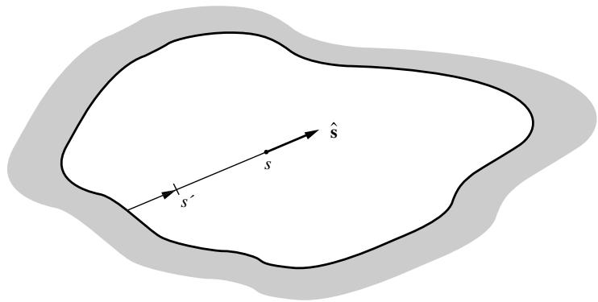  
图20-5 任意黑壁封闭空间内的光谱强度

其形式解由方程(10.29)给出：

$$
I_{\eta}(s) = I_{bw\eta}\exp \left(-\int_0^s\kappa_\eta ds'\right) + \int_0^s I_{b\eta}(s')\exp \left(-\int_{s'}^s\kappa_\eta ds''\right)\kappa_\eta (s')ds', \tag{20.58}
$$

其中$I_{bw\eta} = I_{b\eta}(T_w)$是从$s=0$处(黑体)壁面发射进入介质的强度，如图20-5所示。对整个光谱积分此表达式，得到总强度：

$$
\begin{array}{r l r}{{I(s)=\int_{0}^{\infty}I_{\eta}d\eta=\int_{0}^{\infty}I_{b w\eta}\exp\left(-\int_{0}^{s}\kappa_{\eta}d s^{\prime}\right)d\eta}}\\ &{}&{+\int_{0}^{s}\int_{0}^{\infty}I_{b\eta}(s^{\prime})\exp\left(-\int_{s^{\prime}}^{s}\kappa_{\eta}d s^{\prime\prime}\right)\kappa_{\eta}(s^{\prime})d\eta d s^{\prime}.}\end{array} \tag{20.59}
$$

在10.2和10.3节中，我们定义了参与介质的光谱吸收率和发射率为：

$$
a_{\eta}(0\to s) = \epsilon_{\eta}(0\to s) = 1 - \exp \left(-\int_{0}^{s}\kappa_{\eta}ds^{\prime}\right). \tag{20.60}
$$

对于恒定吸收系数，吸收率取决于气体层厚度和(恒定的)吸收系数。如果$\kappa_{\eta}$不是常数而是随空间和/或温度变化，吸收率则取决于$\kappa_{\eta}$沿整个路径的变化，这里用参数$0\to s$表示。将方程(20.60)代入(20.59)，并使用

$$
\frac{\partial\alpha_{\eta}}{\partial s^{\prime}} (s^{\prime}\rightarrow s) = \frac{\partial}{\partial s^{\prime}}\left[1 - \exp \left(-\int_{s^{\prime}}^{s}\kappa_{\eta}ds^{\prime \prime}\right)\right] = -\kappa_{\eta}(s^{\prime})\exp \left(-\int_{s^{\prime}}^{s}\kappa_{\eta}ds^{\prime \prime}\right) \tag{20.61}
$$

其中使用了莱布尼茨法则对积分进行微分，我们得到：

$$
I(s) = \int_{0}^{\infty}I_{bw\eta}\left[1 - \alpha_{\eta}(0\to s)\right]d\eta -\int_{0}^{s}\int_{0}^{\infty}I_{b\eta}(s^{\prime})\frac{\partial\alpha_{\eta}}{\partial s^{\prime}} (s^{\prime}\to s)d\eta ds^{\prime}. \tag{20.62}
$$

物理上，第一项表示来自壁面的透射辐射，第二项表示沿路径$s$发射的增强。定义总吸收率为：

$$
\begin{array}{c}{\alpha (T,s^{\prime}\to s) = \frac{1}{I_b(T)}\int_0^{\infty}\alpha_\eta (s^{\prime}\to s)I_{b\eta}(T)d\eta}\\ {= \frac{1}{I_b(T)}\int_0^{\infty}\left[1 - \exp \left(-\int_{s^{\prime}}^{s}\kappa_\eta ds^{\prime \prime}\right)\right]I_{b\eta}(T)d\eta ,} \end{array} \tag{20.63}
$$

我们可以将方程(20.62)整合为5：

$$
I(s) = [1 - \alpha (T_w,0\rightarrow s)]I_{bw} - \int_0^s\frac{\partial\alpha}{\partial s'} [T(s'),s'\rightarrow s]I_b(s')ds'. \tag{20.64}
$$

为确定总热流，必须在乘以单位向量$\hat{\mathbf{s}}$后对所有方向的总强度进行积分：

$$
{\mathfrak{q}}=\int_{0}^{\infty}{\mathfrak{q}}_{\eta}d\eta=\int_{4\pi}I{\mathfrak{s}}d\Omega. \tag{20.65}
$$

为评估辐射热流散度(对于已知温度场)或温度场(对于辐射平衡)，必须对所有波数积分辐射能量守恒方程，由方程(10.60)：

$$
\begin{array}{c}{\nabla \cdot \mathbf{q} = \nabla \cdot \int_{0}^{\infty}\mathbf{q}_{\eta}d\eta = \int_{0}^{\infty}\kappa_{\eta}\left(4\pi I_{b\eta} - \int_{4\pi}I_{\eta}d\Omega\right)d\eta}\\ {= 4\pi \kappa_{P}I_{b} - \int_{4\pi}\left(\int_{0}^{\infty}\kappa_{\eta}I_{\eta}d\eta\right)d\Omega ,} \end{array} \tag{20.66}
$$

其中$\kappa_{P}$是首次在方程(11.182)中定义的普朗克平均吸收系数。因此，将方程(20.58)乘以$\kappa_{\eta}(s)$并积分，得到：

$$
\begin{array}{r l r}{{\int_{0}^{\infty}\kappa_{\eta}(s)I_{\eta}(s)d\eta=\int_{0}^{\infty}I_{b w\eta}\kappa_{\eta}(s)\exp\left(-\int_{0}^{s}\kappa_{\eta}d s^{\prime\prime}\right)d\eta}}\\ &{}&{+\int_{0}^{s}\int_{0}^{\infty}I_{b\eta}(s^{\prime})\exp\left(-\int_{s^{\prime}}^{s}\kappa_{\eta}d s^{\prime\prime}\right)\kappa_{\eta}(s^{\prime})\kappa_{\eta}(s)d\eta d s^{\prime}.}\end{array} \tag{20.67}
$$

对方程(20.61)关于$s$再次使用莱布尼茨法则微分，得到：

$$
\frac{\partial^2\alpha_{\eta}}{\partial s\partial s'} (s'\rightarrow s) = \kappa_{\eta}(s')\kappa_{\eta}(s)\exp \left(-\int_{s'}^s\kappa_{\eta}ds''\right). \tag{20.68}
$$

因此，

$$
\begin{array}{c}{\int_{0}^{\infty}\kappa_{\eta}I_{\eta}d\eta = \int_{0}^{\infty}I_{bw\eta}\frac{\partial\alpha_{\eta}}{\partial s} (0\rightarrow s)d\eta +\int_{0}^{s}\int_{0}^{\infty}I_{bw\eta}(s')\frac{\partial^{2}\alpha_{\eta}}{\partial s\partial s'} (s'\rightarrow s)d\eta ds'}\\ {= \frac{\partial\alpha}{\partial s} (T_{w},0\rightarrow s)I_{bw} + \int_{0}^{s}\frac{\partial^{2}\alpha}{\partial s\partial s'} [T(s'),s'\rightarrow s]I_{b}(s')ds'.} \end{array} \tag{20.69}
$$

当然，$\alpha (T, s' \rightarrow s)$的函数形式取决于参与介质的局部特性。我们将简要讨论纯气体和气体-颗粒混合物的特殊情况。

# 纯分子气体

对于纯气体，方程(20.65)和(20.66)所需的总吸收率可以通过窄带模型、宽带模型或总吸收率关联式计算。窄带计算在采用准确数据库(如基于实验数据的RADCAL[53,54]和基于高分辨率数据的EM2C[55]数据库)时可能是最精确的。然而，它们需要进行数百到数千次光谱评估。Menart及其同事[56-58]获得了一些一维平板的结果，后两篇论文通过将壁面辐射度展开为无限级数(用于多重反射)克服了窄带模型的黑壁限制。Cherkaoui等[59]采用了类似[57]的方法确定了一维反射壁平板中的直接交换因子(用于第18章的区域法)。Liu团队[60-62]主要进行了多维计算，用于各种燃烧场景。所有引用的工作都使用了Malkmus模型以及EM2C数据库及其前身。

若要对具有$N$个振动-转动能带的气体使用宽带模型，其吸收系数可表示为：

$$
\kappa_{\eta} = \sum_{n = 1}^{N}\kappa_{n\eta}. \tag{20.70}
$$

为应用宽带关联式，还需假设每个能带相对较窄，即黑体辐射强度在单个能带内变化不大，且各能带互不重叠。此时总吸收率可近似计算为：

$$
\alpha (T,s^{\prime}\rightarrow s)\simeq \sum_{n = 1}^{N}\frac{\omega_{n}I_{b\eta_{n}}}{I_{b}} (T)\frac{1}{\omega_{n}}\int_{0}^{\infty}\left[1 - \exp \left(-\int_{s^{\prime}}^{s}\kappa_{n\eta}ds^{\prime \prime}\right)\right]d\eta = \sum_{n = 1}^{N}\frac{\omega_{n}I_{b\eta_{n}}}{I_{b}} (T)A_{n}^{*}(s^{\prime}\rightarrow s), \tag{20.71}
$$

其中$I_{b\eta_{n}}$为第$n$个能带中心的普朗克函数，$\omega_{n}$为能带宽度参数，$A_{n}^{*}$为无量纲能带吸收率，详见第11章讨论。

# 含悬浮颗粒的分子气体

若分子气体中含有非散射性悬浮颗粒，吸收系数可表示为：

$$
\kappa_{\eta} = \kappa_{p\eta} + \kappa_{g\eta} = \kappa_{p\eta} + \sum_{n = 1}^{N}\kappa_{n\eta}. \tag{20.72}
$$

现假设不仅气体能带窄且不重叠，而且颗粒的吸收系数$\kappa_{p\eta}$在各能带范围内变化不大。则有：

$$
\begin{array}{rl} & {\alpha (T,s^{\prime}\rightarrow s) = \frac{1}{I_b(T)}\int_0^{\infty}\left[1 - \exp \left(-\int_{s^{\prime}}^{s}\kappa_{p\eta}ds^{\prime \prime}\right)\exp \left(-\int_{s^{\prime}}^{s}\kappa_{g\eta}ds^{\prime \prime}\right)\right]I_{b\eta}(T)d\eta}\\ & {\quad \quad = \frac{1}{I_b(T)}\int_0^{\infty}\left[1 - \exp \left(-\int_{s^{\prime}}^{s}\kappa_{p\eta}ds^{\prime \prime}\right)\right]I_{b\eta}(T)d\eta}\\ & {\quad \quad +\frac{1}{I_b(T)}\int_0^{\infty}\exp \left(-\int_{s^{\prime}}^{s}\kappa_{p\eta}ds^{\prime \prime}\right)\left[1 - \exp \left(-\int_{s^{\prime}}^{s}\kappa_{g\eta}ds^{\prime \prime}\right)\right]I_{b\eta}(T)d\eta .} \end{array} \tag{20.73}
$$

式(20.73)中第一项表示纯颗粒背景（无分子气体）的吸收率。注意到第二项光谱积分中，仅当$\kappa_{g\eta}$非零时（即气体振动-转动能带范围内）被积函数不为零。由于假设气体能带光谱窄，可将颗粒衰减项在能带中心取值并移出积分：

$$
\alpha (T,s^{\prime}\rightarrow s)\simeq \alpha_{p}(T,s^{\prime}\rightarrow s) + \sum_{n = 1}^{N}\frac{\omega_{n}I_{b\eta_{n}}}{I_{b}} (T)\exp \left(-\int_{s^{\prime}}^{s}\kappa_{p\eta_{n}}ds^{\prime \prime}\right)A_{n}^{*}(s^{\prime}\rightarrow s). \tag{20.74}
$$

# 辐射平衡

在辐射平衡情况下，用式(20.69)确定温度场。结合$\nabla \cdot \mathbf{q} = 0$的式(20.66)可得：

$$
4\pi \kappa_{P}I_{b} = \int_{4\pi}\left[\frac{\partial\alpha}{\partial s} (T_{w},0\rightarrow s)I_{bw} + \int_{0}^{s}\frac{\partial^{2}\alpha}{\partial s\partial s^{\prime}} [T(s^{\prime}),s^{\prime}\rightarrow s]I_{b}(s^{\prime})ds^{\prime}\right]d\Omega . \tag{20.75}
$$

这是关于未知温度的单一（但相当复杂）积分方程。温度场确定后，热流可由式(20.65)和(20.64)得出：

$$
{\mathfrak{q}}=\int_{4\pi}[1-\alpha(T_w,0\to s)]I_{bw}-\int_0^s\frac{\partial\alpha}{\partial s^{\prime}}[T(s^{\prime}),s^{\prime}\to s]I_b(s^{\prime})ds^{\prime}]\mathfrak{s}d\Omega. \tag{20.76}
$$

式(20.75)和(20.76)中的吸收率及其导数分别来自式(20.71)（纯分子气体）或(20.74)（气-粒混合物）。

# 已知温度场的介质

若温度场已知，局部热流可由式(20.76)确定，而热流散度则由式(20.66)和(20.69)给出：

$$
\nabla \cdot \mathbf{q} = 4\pi \kappa_{P}I_{b} - \int_{4\pi}\left[\frac{\partial\alpha}{\partial s} (T_{w},0\rightarrow s)I_{bw} + \int_{0}^{s}\frac{\partial^{2}\alpha}{\partial s\partial s^{\prime}} [T(s^{\prime}),s^{\prime}\rightarrow s]I_{b}(s^{\prime})ds^{\prime}\right]d\Omega . \tag{22}
$$

同样，吸收率及其导数来自式(20.71)（纯分子气体）或(20.74)（气-粒混合物）。

本节建立的一般关系将在后续两节中用于传热计算。首先详细分析一维等温非灰介质内的辐射传递，接着介绍如何将加权灰气体概念应用于一般非灰介质问题。

# 等温介质的宽谱带模型

对于等温介质，我们假设吸收系数仅是温度的函数（因此在整个介质中为常数）。考虑到吸收系数取决于$T_{m}$，而普朗克函数可在介质或壁面温度下计算，总吸收率的定义式(20.63)简化为：

$$
\alpha (T,T_m,s) = \frac{1}{I_b(T)}\int_0^\infty \left(1 - e^{-\kappa_\eta (T_m)s}\right)I_{b\eta}(T)d\eta , \tag{20.78}
$$

即总吸收率不再取决于整个路径，而仅与路径长度本身相关。当$T = T_{w}$时，式(20.78)给出壁面发射沿路径$s$的吸收；当$T = T_{m}$时，式(20.78)表示总发射率：

$$
\epsilon (T_m,s) = \frac{1}{I_b(T_m)}\int_0^\infty \left(1 - e^{-\kappa_\eta (T_m)s}\right)I_{b\eta}(T_m)d\eta . \tag{20.79}
$$

类似地，分子气体的无量纲能带吸收率现在仅取决于光学路径长度（以及谱线重叠参数），如第11章所述：

$$
A_{n}^{*}(s^{\prime}\rightarrow s) = A^{*}[\kappa_{n}(s - s^{\prime}),\beta_{n}], \tag{20.80}
$$

其中$\kappa_{n} = \rho_{a}\alpha_{n} / \omega_{n}$是能带中心或能带头的气体吸收系数$^{7}$，$\beta_{n}$是重叠参数，均在$T_{m}$下计算。对于等温介质，式(20.64)简化为：

$$
I(s) = [1 - \alpha (T_w,T_m,s)]I_{bw} + \epsilon (T_m,s)I_{bm}, \tag{20.81}
$$

其中$I_{bm} = I_b(T_m)$，$T_{m}$为介质的（恒定）温度。

例20.8. 考虑一个厚度为$1\mathrm{m}$的纯$\mathrm{CO_2}$等温层，压力为$100\mathrm{kPa}$，温度为$1700\mathrm{K}$。气体被限制在两个平行、冷、黑平板之间。使用指数宽谱带模型计算从气体到壁面的辐射传热。

# 解

对于平板$0< z< L$，式(20.81)给出的强度可能来自两个边界表面中的任一个。如第14.2节所述，将强度分为$I^{+}$和$I^{-}$（"正向"和"负向"方向），对于"正向"方向$(0< \mu < 1)$有$s = z / \mu$，对于"负向"方向$(- 1< \mu < 0)$有$s = - (L - z) / \mu$，如图14-1所示。代入式(20.81)得：

$$
\begin{array}{r l r} 
& {I^{+}(z) = \big[1 - \alpha (T_{w},T_{m},z / \mu)\big]I_{b w} + \epsilon (T_{m},z / \mu)I_{b m},} & {0< \mu < 1,}\\ 
& {I^{-}(z) = \big[1 - \alpha \big(T_{w},T_{m}, - (L - z) / \mu \big)\big]I_{b w} + \epsilon \big(T_{m}, - (L - z) / \mu \big)I_{b m},} & {-1< \mu < 0.} 
\end{array}
$$

局部热流由下式确定：

$$
\begin{array}{l}
{q(z) = 2\pi \left[\int_{-1}^{0}I^{\mu}d\mu +\int_{0}^{+1}I^{+}\mu d\mu \right]}\\ 
{= 2\pi \left\{\int_{0}^{1}\left[\epsilon \left(T_{m},\frac{z}{\mu}\right) - \epsilon \left(T_{m},\frac{L - z}{\mu}\right)\right]\mu d\mu I_{b}(T_{m})\right.}\\ 
{\left. - \int_{0}^{1}\left[\alpha \left(T_{w},T_{m},\frac{z}{\mu}\right) - \alpha \left(T_{w},T_{m},\frac{L - z}{\mu}\right)\right]\mu d\mu I_{b}(T_{w})\right\} .} 
\end{array}
$$

若介质为分子气体，将式(20.71)代入此表达式。用辐射力代替强度，$E_{b\eta} = \pi I_{b\eta}$，可得：

$$
q(z) = \sum_{n = 1}^{N}\omega_{n}\big[E_{b\eta_{n}}(T_{m}) - E_{b\eta_{n}}(T_{w})\big]\big[A_{s}(\kappa_{n}z,\beta_{n}) - A_{s}(\kappa_{n}(L - z),\beta_{n})\big],
$$

其中$A_{s}$被Edwards和Balakrishnan[63]称为平板能带吸收率，定义为：

$$
A_{s}(\tau ,\beta) = 2\int_{0}^{1}A^{*}\left(\frac{\tau}{\mu},\beta\right)\mu d\mu . \tag{20.82}
$$

平板能带吸收率可对多种能带吸收率关联式显式计算，如表11.2中的Edwards和Menard关联式以及式(11.155)给出的高压极限，对于更复杂的关联式如Felske和Tien的式(11.156)以及Wang的式(11.158)则需数值计算。谱线重叠参数$\beta$已在例20.6中对最重要的$4.3\mu \mathrm{m}$能带计算过$(\beta_{4.3} = 7.55)$，且对所有能带都远大于1。因此可采用高压极限，这里我们仅考虑高压极限$(\beta \rightarrow \infty)$：

$$
A^{*}(\tau ,\infty) = E_{1}(\tau) + \ln \tau +\gamma_{E},
$$

或

$$
A_{s}(\tau ,\infty) = 2\int_{0}^{1}\left[E_{1}\left(\frac{\tau}{\mu}\right) + \ln \frac{\tau}{\mu} +\gamma_{E}\right]\mu d\mu .
$$

分部积分得，由$E_{1}^{\prime}(x) = - E_{0}(x) = e^{- x} / x$，

$$
A_{s}(\tau ,\infty) = \mu^{2}\left[E_{1}\left(\frac{\tau}{\mu}\right) + \ln \frac{\tau}{\mu} +\gamma_{E}\right]\left|_{0}^{1} - \int_{0}^{1}\mu^{2}\left(\frac{\tau}{\mu^{2}}\frac{e^{-\tau / \mu}}{\tau / \mu} -\frac{1}{\mu}\right)d\mu ,\right.
$$

即

$$
A_{s}(\tau ,\infty) = E_{1}(\tau) + \ln \tau +\gamma_{E} + \frac{1}{2} -E_{3}(\tau). \tag{20.83}
$$

计算三个重要$\mathrm{CO_2}$能带在$z = L$处的$q$，得[当$T_{w} = 0$且$A_{s}(0,\beta) = 0$]：

$$
q_{n}(L) = \omega_{n}E_{b\eta_{n}}(T_{m})A_{s}\bigg(\frac{\alpha_{n}\rho_{\mathrm{CO_{2}}}}{\omega_{n}} L,\beta \bigg).
$$

所有必要项已在前例中计算，结果如下：8

$$
\begin{array}{rl} 
& {2.7\mu \mathrm{m}能带:}\\ 
& {\qquad a_{2.7}\rho_{\mathrm{CO_2}}L / \omega_{2.7} = 2005\times 1 / 96.9 = 20.69}\\ 
& {\qquad A_{12.7}(20.69,\infty) = E_1(20.69) + \ln 20.69 + 0.5772 + 0.5 - E_3(20.69) = 4.107}\\ 
& {\qquad q_{2.7}(L) = 1.7649\times 10^{-8}\times 1700^3\times 96.9\times 4.107 = 34,508\mathrm{W / m^2};} 
\end{array}
$$

$4.3\mu \mathrm{m}$能带：

$$
a_{43}\rho_{\mathrm{CO_2}}L / a_{43} = 34,254\times 1 / 46.2 = 741.43
$$

$$
A_{s,1s}(741.43,\infty) = E_1(741.43) + \ln 741.43 + 0.5772 + 0.5 - E_3(741.43) = 7.686
$$

$$
q_{43}(L) = 1.5548\times 10^{-8}\times 1700^{3}\times 46.2\times 7.686 = 27,125\mathrm{W / m}^{2};
$$

$15\mu \mathrm{m}$ 波段：

$$
\alpha_{15}\rho_{\mathrm{CO_2}}L / \omega_{15} = 5917\times 1 / 52.4 = 112.92\\ A_{s,1s}(112.92,\infty) = E_1(112.92) + \ln 112.92 + 0.5772 + 0.5 - E_3(112.92) = 5.804
$$

$$
q_{15}(L) = 0.2979\times 10^{-8}\times 1700^{3}\times 52.4\times 5.804 = 4805\mathrm{W / m}^{2}.
$$

最终，气体的总热损失为

$$
q = 2\times [34,508 + 27,125 + 4805] = 13.29\mathrm{W / cm}^2.
$$

与例20.2的比较表明，当前结果与平均束长方法的结果非常吻合。

许多研究者已经获得了一维等温介质相对简单问题的精确宽带模型解。Edwards和Balakrishnan [63]找到了等温气体平板中热通量的表达式，并给出了高压极限（强谱线重叠）的结果。Edwards [64]给出了等温气体球体热损失的表达式，而Wassel和Edwards [65]讨论了等温气体圆柱体的热损失。Kim及其同事[56]最近对包含水蒸气的一维平板进行了宽带计算（以与他们的窄带计算进行比较）。Hutchison和Richards [66]也使用了宽带方法来研究含有$\mathrm{CO_2}$的层中的传导和辐射组合，再次通过将辐射度展开为无限级数来处理反射壁。对于含有悬浮颗粒的气体的计算已由Modest [67]（具有非灰颗粒的通用宽带公式）、Cumber及其同事[68]（将Goody模型与RADCAL数据库应用于含有水蒸气、$\mathrm{CO_2}$和烟灰的喷射火焰）、Liu及其同事[69]（使用EM2C数据库的三维水蒸气、$\mathrm{CO_2}$和氧化铝颗粒混合物）以及Maruyama和Guo [70]（使用宽带模型的光谱版本与Elsasser窄带模型相结合的三维炉子，含有水蒸气、$\mathrm{CO_2}$和碳颗粒）进行。后两篇论文试图克服带模型的无散射限制。

# 20.6 加权灰气体(WSGG)模型

加权灰气体方法的概念最初由Hottel [29]在分区方法的框架内提出，该方法在第18章中有详细描述。Modest [40]已经证明，这种方法可以应用于传递的方向方程，即方程(20.57)，因此可以应用于传递方程的任何求解方法（精确解、$P_N$近似、离散坐标法等），前提是所有边界都是黑的且介质无散射。在这种方法中，非灰气体被多个灰气体替代，独立计算每个灰气体的热传递率。然后通过将灰气体的热通量乘以某些权重因子相加得到总热通量。

作为起点，考虑方程(20.64)。为了数学上的简单性，我们在这里限制自己使用空间恒定（或平均）的吸收系数，尽管它可能在光谱上变化。这样的吸收系数不再依赖于局部温度，尽管选择适当的恒定值将基于介质中的整体温度场。因此，对于光谱积分强度，我们有

$$
I(s) = [1 - \alpha (T_w,s)]I_{bw} - \int_0^\infty \frac{\partial\epsilon}{\partial s'} [T(s'),s - s']I_b(s')ds', \tag{20.84}
$$

其中总吸收率和发射率的表达式类似于为等温介质开发的表达式，方程(20.78)，

$$
\epsilon (T,s) = \frac{1}{I_b(T)}\int_0^\infty (1 - e^{-\kappa_\eta s})I_{b\eta}(T)d\eta ,\quad \alpha (T_w,s) = \epsilon (T_w,s). \tag{20.85}
$$

由于假设吸收系数在空间上是恒定的，总吸收率不再依赖于介质的温度。因此，对于灰介质$\kappa_{\eta} = \kappa = \mathrm{const},$

$$
\epsilon (T,s) = \alpha (T,s) = 1 - e^{-\kappa s}. \tag{20.86}
$$

我们现在假设方程(20.85)的发射率和吸收率可以用加权灰气体的和来近似，即

$$
\epsilon (T,s) = \alpha (T,s)\simeq \sum_{k = 0}^{K}a_{k}(T)\left(1 - e^{-\kappa_{k}s}\right). \tag{20.87}
$$

与方程(20.84)和(20.85)一致，我们选择灰气体吸收系数$\kappa_{k}$为常数，而权重因子$a_{k}$可以是源温度的函数[吸收率的壁温和发射率的局部介质温度，如方程(20.84)所要求的]。$a_{k}$和$\kappa_{k}$都不允许依赖于路径长度$s$。根据材料、拟合质量和所需的精度，$K$为2或3通常可以得到令人满意的结果[29]。由于对于无限厚的介质，吸收率趋近于1，我们发现

$$
\sum_{k = 0}^{K}a_{k}(T) = 1. \tag{20.88}
$$

然而，对于具有"光谱窗口"的纯分子气体，吸收率接近1确实需要非常大的路径长度。因此，方程(20.88)以$k = 0$（隐含$\kappa_{0} = 0$）开始，以允许光谱窗口。如果介质包含颗粒，使得$\kappa_{\eta} > 0$始终成立，则简单地去掉$k = 0$项，即$a_{0} = 0$。

将方程(20.87)代入方程(20.84)并使用

$$
\begin{array}{l}{1 - \alpha (T_w,s) = \sum_{k = 0}^{K}a_k(T_w)e^{-\kappa_ks},}\\ {\frac{\partial\epsilon}{\partial s'} (T,s - s') = \frac{\partial}{\partial s'}\sum_{k = 0}^{K}a_k(T)\left[1 - e^{-\kappa_k(s - s')}\right] = -\sum_{k = 0}^{K}a_k(T)\kappa_ke^{-\kappa_k(s - s')},} \end{array}
$$

得到

$$
\begin{array}{l}{I(s) = \sum_{k = 0}^{K}a_{k}(T_{w})e^{-\kappa_{k}s}I_{bw} + \int_{0}^{s}\sum_{k = 0}^{K}a_{k}[T(s^{\prime})]\kappa_{k}e^{-\kappa_{k}(s - s^{\prime})}I_{b}(s^{\prime})ds^{\prime}}\\ {= \sum_{k = 0}^{K}\left\{[a_{k}I_{b}](T_{w})e^{-\kappa_{k}s} + \int_{0}^{s}[a_{k}I_{b}](s^{\prime})e^{-\kappa_{k}(s - s^{\prime})}\kappa_{k}ds^{\prime}\right\} .} \end{array} \tag{20.89}
$$

设

$$
I(s) = \sum_{k = 0}^{K}I_{k}(s), \tag{20.90}
$$

并比较方程(20.89)和(20.58)，我们发现$I_{k}$满足传递方程

$$
\frac{dI_k}{ds} = \kappa_k([a_kI_b] - I_k), \tag{20.91}
$$

边界条件为

$$
s = 0:\qquad I_k = [a_kI_b](T_w). \tag{20.92}
$$

这个表达式当然是一个具有恒定吸收系数$\kappa_{k}$的灰气体的传递方程，但黑体强度$I_{b}$（对于介质和表面）被加权强度$a_{k}I_{b}$替代。因此，如果温度场已知（或假设），必须使用任何标准求解方法确定$k = 0,1,\ldots ,K$的强度场（或简单的热通量）。然后将结果相加得到总强度（或辐射热通量）。注意，与逐步灰近似一样，总是需要知道或假设温度分布：对于辐射平衡，条件$\nabla \cdot \mathbf{q} = 0$仅适用于总热通量，并且通常$\nabla \cdot \mathbf{q}_{k}\neq 0$。

介质总吸收率的曲线拟合(方程20.87)应根据具体介质的组成、压力水平、温度水平、分子气体带数量等因素进行调整。只有当拟合优化后，才能用两到三个加权灰气体的和获得可接受的精度。遗憾的是，这种曲线拟合是非线性的，且由于$a_{k}$可能是温度、压力、组成等的函数而更加复杂。这些困难可能导致曲线拟合工作比传热计算本身更复杂！一些重要气体的加权灰气体吸收率拟合已在文献中报道，用于分区法(第18章)，例如Smith等人[71]对水蒸气-二氧化碳混合物的研究，以及Farag和Allam[72]对二氧化碳的研究。Modest[40]给出了一个适用于任何可获得宽带数据的气体的"食谱式"公式，并用于获得图20-3中的WSGG结果。Truelove[73]提供了水蒸气、二氧化碳和烟尘不同混合物的WSGG参数集。他对$p_{\mathrm{H_2O}} = 2p_{\mathrm{CO_2}}$常见情况(如甲烷完全燃烧产生)的相关性研究见表20.2，其中方程(20.87)稍作修改为：

$$
\epsilon (T,s) = a(T,s) = \sum_{k = 0}^{K}\sum_{l = 1}^{L}a_{kl}(T)\left(1 - e^{-[k_{pk}(p_{\mathrm{H_2O}} + p_{\mathrm{CO_2}}) + k_{pd}\rho_p f_v]s}\right), \tag{20.93}
$$

其中$\rho_{p}$是烟尘密度，$f_{v}$是其体积分数。Taylor和Foster[74]也生成了另一组类似的WSGG参数。

最近，为解决全球变暖问题，氧燃料燃烧系统受到广泛关注，该系统使用氧气(而非空气)燃烧煤炭，产生主要由$\mathrm{H}_2\mathrm{O}$和$\mathrm{CO_2}$组成的废气。$\mathrm{H}_2\mathrm{O}$可被冷凝，留下高浓度的$\mathrm{CO_2}$气流用于封存。温度控制通过返回部分$\mathrm{CO_2}$实现。这导致$\mathrm{H}_2\mathrm{O}$和$\mathrm{CO_2}$水平大幅提高，促进辐射传热并需要不同的WSGG参数集。Yin[75]及其同事使用表11.3的宽带模型数据，为氧燃料燃烧中相关的十种不同$p_{\mathrm{H_2O}} / p_{\mathrm{CO_2}}$比例找到了四组灰气体参数。Johansson等人[76]也使用EM2C窄带数据库[55]为两种$p_{\mathrm{H_2O}} / p_{\mathrm{CO_2}}$比例(1/8和1)生成了类似参数集。

表20.2 水蒸气、二氧化碳和烟尘混合物的加权灰气体吸收系数和权重因子，固定分压比$p_{\mathrm{H_2O}} = 2p_{\mathrm{CO_2}}$，$a_{kl} = a_{kl}^0 +a_{kl}^1 T$，来自Truelove[73]。

| k | l | up | akl×10³ | κg,k(m⁻¹atm⁻¹) | κp,l(m²kg⁻¹) |
|---|---|----|--------|----------------|-------------|
| 0 | 1 | 0.588 | -0.2401 | 0.0 | 541 |
| 0 | 2 | -0.165 | 0.2834 | 0.0 | 2749 |
| 1 | 1 | 0.412 | -0.1665 | 0.89 | 541 |
| 1 | 2 | -0.127 | 0.2178 | 0.89 | 2749 |
| 2 | 1 | 0.2375 | -0.0941 | 15.5 | 541 |
| 2 | 2 | -0.0105 | 0.0265 | 15.5 | 2749 |
| 3 | 1 | 0.0585 | -0.0243 | 239.0 | 541 |
| 3 | 2 | 0.0065 | -0.0027 | 239.0 | 2749 |

例20.9. 考虑一个温度为$T = 1000\mathrm{K}$、总压力为$p = 1$ atm的等温平板。该平板由70% $\mathrm{N}_2$、20% $\mathrm{H}_2\mathrm{O}$和10% $\mathrm{CO_2}$（体积比）的混合气体组成，边界为冷的黑体壁面。使用Truelove参数的WSGG方法，确定该平板热损失随厚度$L$的变化关系。此外，若气体中混有烟尘$(\rho_{p} = 2,000\mathrm{kg} / \mathrm{m}^{3},f_{v} = 5\times 10^{- 6})$，计算该层的热损失。

# 解

若无烟尘存在，可立即对式(20.93)中的$l$求和，取$a_0 = (0.588 - 0.2401) + (- 0.165 + 0.2834) = 0.466$等，并使用$\kappa_{k} = \kappa_{g,k}(0.2 + 0.1)$ atm，可得

$$
\begin{array}{rlrlrl} & {a_0 = 0.466,} & {a_1 = 0.337,} & {a_2 = 0.159,} & {a_3 = 0.038;}\\ & {\kappa_0 = 0,} & {\kappa_1 = 0.267\mathrm{m}^{-1},} & {\kappa_2 = 4.65\mathrm{m}^{-1},} & {\kappa_3 = 71.7\mathrm{m}^{-1}.} \end{array}
$$

若采用(光谱)传递方程的精确解，对于灰介质的情况已在例14.1中得到解为

$$
q = \sigma T^4\left[1 - 2E_3(\kappa L)\right] \tag{20.94}
$$

(其中设$T_{w} = 0$，$\epsilon_{w} = 1$，且$\tau_{L} = \kappa L$)。因此，若使用WSGG方法，可得无量纲形式

$$
\Psi = \frac{q}{\sigma T^4} = \sum_{k = 0}^{3}a_k[1 - 2E_3(\kappa_kL)]. \tag{20.95}
$$

该结果绘制于图20-6中，并与HITEMP 1995数据库[17]的逐线(LBL)计算结果进行对比。可见WSGG方法给出了相当精确的结果，仅在极长光程时略微低估了气体发射率。

若在气体混合物中添加烟尘，项数将加倍。取$\rho_{p}f_{v} = 10^{- 2}\mathrm{kg} / \mathrm{m}^{3}$，可得

$$
\begin{array}{rl} & a_{01} = 0.348,\quad a_{02} = 0.118;\quad a_{11} = 0.246,\quad a_{12} = 0.091;\\ & a_{21} = 0.143,\quad a_{22} = 0.016;\quad a_{31} = 0.034,\quad a_{32} = 0.004. \end{array}
$$

类似地，$\kappa_{p1}\rho_{p}f_{v} = 541\times 10^{- 2} = 5.41\mathrm{m}^{- 1}$和$\kappa_{p2}\rho_{p}f_{v} = 27.49\mathrm{m}^{- 1}$，对应灰气体吸收系数为

$$
\begin{array}{rl} & {\kappa_{01} = 5.41\mathrm{m}^{-1},\kappa_{02} = 27.49\mathrm{m}^{-1};\kappa_{11} = 5.68\mathrm{m}^{-1},\kappa_{12} = 27.76\mathrm{m}^{-1};}\\ & {\kappa_{21} = 10.05\mathrm{m}^{-1},\kappa_{22} = 32.14\mathrm{m}^{-1};\kappa_{31} = 77.11\mathrm{m}^{-1},\kappa_{32} = 99.19\mathrm{m}^{-1};} \end{array}
$$

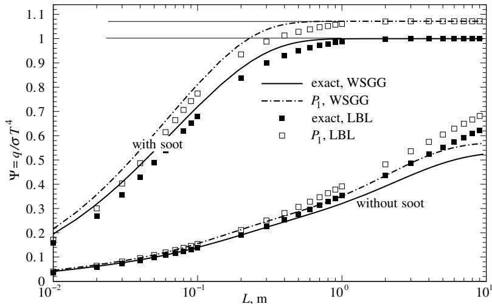  
图20-6 含烟尘与不含烟尘的等温$\mathrm{N}_2$、$\mathrm{H}_2\mathrm{O}$、$\mathrm{CO}_2$混合物的无量纲热损失

无量纲热通量由下式计算：

$$
\Psi = \frac{q}{\sigma T^4} = \sum_{k = 0}^{3}\sum_{l = 1}^{2}a_{kl}[1 - 2E_3(\kappa_{kl}L)], \tag{20.96}
$$

该结果也绘制在图20-6中，并与烟尘吸收系数随波数线性变化的LBL计算结果进行对比（使用Chang和Charalampopoulos折射率$m = 1.89 - 0.92i$，由式(12.123)得到$C_0 = 5.71$，见例12.4）。对于此类烟尘，WSGG模型在薄板厚度较小时会高估约20%的发射率，随着$L$增大误差逐渐减小。若选择$C_0 = 7$或$m = 1.38 - 0.69i$，则可获得几乎完美的吻合。Truelove报告[73]承认$\kappa_{pl}$值存在很大不确定性，表20.2中的值是Bressloff[77]选择的折中值。此外，式(20.93)需要烟尘密度，而式(12.123)则不需要。烟尘密度也存在额外的不确定性，此处任意设为$\rho_{p} = 2,000\mathrm{kg} / \mathrm{m}^{3}$（近似热解石墨密度），最后折射率也可能有很大变化（如图12-20所示）。因此，考虑到烟尘生成和性质的重大不确定性，可以认为吻合度良好；差异可归因于烟尘模型而非WSGG近似。

例20.10. 重新考虑例20.9的等温介质（含颗粒与不含颗粒）。假设介质被限制在两块相距$L$的平行冷黑平板之间，使用灰气体加权求和法结合$P_{1}$近似计算平板内的辐射热通量。

# 解

对于吸收系数为$\kappa_{k}$、普朗克函数为$[a_{k}I_{b}]$的等温介质，边界为冷黑平板时，$P_{1}$近似方程为：

$$
\begin{array}{l}\frac{dq_k}{dz} = \kappa_k(4\pi [a_kI_b] - G_k),\\ \displaystyle \frac{dG_k}{dz} = -3\kappa_kq_k, \end{array}
$$

边界条件：
$$
\begin{array}{rl}{z=0:}&{2q_k+G_k=0,}\\{z=L:}&{-2q_k+G_k=0.}\end{array}
$$

该方程组的解可直接由例16.2的特殊情况得出：
$$
q_{k}(z) = a_{k}E_{b}\frac{2\sinh\sqrt{3}\kappa_{k}(z - L / 2)}{\sinh\frac{1}{2}\sqrt{3}\kappa_{k}L + \frac{1}{2}\sqrt{3}\cosh\frac{1}{2}\sqrt{3}\kappa_{k}L}.
$$

由于介质与例20.9相同，其总吸收率及相关系数$a_{k}$和$\kappa_{k}$也相同。总无量纲热通量为：
$$
\Psi = \frac{q}{\sigma T^4} = \frac{\sum_{k = 0}^{L}q_k}{\sigma T^4} = \sum_{k = 0}^{L}\frac{2a_k\sinh\sqrt{3}\kappa_k(z - L / 2)}{\sinh\frac{1}{2}\sqrt{3}\kappa_kL + \frac{1}{2}\sqrt{3}\cosh\frac{1}{2}\sqrt{3}\kappa_kL}.
$$

$P_{1}$近似在$z = L$处的结果也显示在图20-4中，与LBL结果对比。趋势与上例相同，$P_{1}$近似总是略微高估发射率。误差在光学厚度较大时最大，这是由于冷边界的影响（如例16.2所述）。

乍看之下，灰气体加权求和法似乎是估算复杂参与介质辐射热通量的相当粗糙的近似工具。在该方法最初开发时（在强大计算机和精确高分辨率数据库出现之前），确实如此。然而，即使是最原始的形式，该方法也广受欢迎，因为它易于应用且更精确的计算难以（甚至不可能）获得（部分原因是缺乏精确的高温光谱特性数据）。例如，Ramamurthy等[78]将$S_{4}$离散坐标法应用于辐射管中的反应流动；Mesyngier和Farouk[79]研究了含水蒸气和/或二氧化碳混合物的方形腔体内的湍流自由对流；Liu等[80]分析了天然气燃烧炉；Baek等[81]研究了单液滴燃烧——均采用WSGG方案结合离散坐标法。Kuhlert和Renz[82]考虑了煤粉火焰，Bressloff[77]将WSGG模型精度与窄带计算结果对比，Pierrot等[7]也做了类似工作（还使用了其他几种光谱方法）。Yu等[83]研究了多种等温一维$\mathrm{H}_2\mathrm{O} - \mathrm{CO}_2-$烟尘混合物，Omori等[84]结合商业流动求解器研究了工业炉。

如今我们知道，该方法也可应用于反射（尽管是灰体）壁面，只要吸收系数满足缩放近似[见11.9节式(11.130)]，且可通过高分辨率数据库获得精确的灰气体系数——主要得益于Denison和Webb[3,5,85-87]对WSGG方法的扩展。注意到WSGG方法可视为20.4节的箱式模型（光谱上有数千个箱体，但箱高$\kappa_{k}$相对较少），权重因子$a_{k}$就是所有高度为$\kappa_{k}$的箱体$(E_{b\eta}\Delta \eta)_i$之和除以$E_{b}$；即$a_{k}$是吸收系数等于$\kappa_{k}$的发射功率谱占比。他们称这种方法为基于谱线的灰气体加权求和法(SLW)，可以任意精度对分子气体的谱线结构进行有限差分。计算表明，对于均匀气体混合物，仅需三到四次光谱计算即可获得极精确的结果（与LBL基准对比），在变温变浓度混合物中精度稍低。Solovjov和Webb[18]找到了更多SLW参数，并研究了处理混合物中重叠气体带的方法[12]，包括烟尘[88]。Rivière等[6-8]开发了非常相似的吸收分布函数(ADF)模型，应用于具有不同温度和浓度分布的一维水蒸气和二氧化碳混合物。文献[8]将该方法扩展到包含虚拟气体，如窄带$k$分布式(11.138)所做的那样。

# 20.7  k分布模型

在第11章讨论带模型时我们注意到，结果是以光谱平均透射率或发射率（窄带模型）、总带吸收率（宽带模型）或总发射率和吸收率（全光谱或"全局"模型）的形式给出的，而不是平滑的吸收系数。因此带模型仅限于视线计算，即不能用于具有反射壁面和/或散射颗粒的介质中，至少应用起来非常困难。虽然k分布模型与带模型存在一些共同的弱点（如难以应用于非均匀介质），但它们产生的是重新排序而非平滑的吸收系数，因此可以应用于任意封闭空间（包括反射壁面和散射），使用任意RTE求解方法（包括第21章讨论的随机蒙特卡洛方法）。然而，k分布模型的构建往往较为繁琐，必须为计算域中的每个单元单独生成，通常需要从高分辨率数据库（如包含数百万甚至数亿条谱线的HITRAN 2008[1]和HITEMP 2010[2]）中获取数据。因此，通过相关性或使用预计算的k分布数据库快速构建k分布至关重要。

与传统带模型类似，k分布模型也分为窄带、宽带和全光谱（全局）版本。

窄带k分布计算 在传统带模型中，"窄带"指应用统计有效的光谱范围（如Malkmus模型），对于高精度计算将窄带限制在Δη≈4至10cm⁻¹，绝对最大值约为25cm⁻¹。对于k分布模型，"窄带"指普朗克函数I_bη可视为恒定的光谱范围，高精度计算时约为25至100cm⁻¹，一般精度可达数百cm⁻¹。然而，k分布模型每个Δη范围需要约10次光谱计算，使得两种窄带计算的数值工作量大致相当。目前大多数窄带k分布计算都采用Soufiani和Taine[55]的k分布数据库（基于HITRAN96及专有高温外推数据）。Marin和Buckius[11]将该方法应用于包含水蒸气或二氧化碳（但不同时包含）的一维平板，固定浓度但温度变化（阶梯式和抛物线分布）。使用波数范围达Δη=1000cm⁻¹时，他们发现Δη≤500cm⁻¹时精度损失很小。Dembele及其合作者使用该方法确定带水幕火灾的辐射，对水滴采用离散坐标法和Mie散射[89]，并预测天然气火焰的出射强度[90]。Tang和Brewster[20]也研究了含CO₂的一维平板，但包含了各向异性散射。Pierrot等[7,8]同样考虑含H₂O和CO₂的一维平板，比较了各种光谱求解方法。Liu等[91]测试了窄带k分布计算的不同求积方案，并将该方法用于三维几何结构，验证了应用于散射介质的统计窄带模型的近似公式[91]。该方法经进一步优化后应用于多个二维火焰[92]，使用EM2C数据库[55]通过方程(11.108)生成k分布。最后，Tessé[93]应用该方法评估了湍流火焰中的湍流-辐射相互作用。

宽带k分布计算 在传统带模型中，"宽带"指整个振动-转动带覆盖的光谱范围，并（有些勉强地）假设普朗克函数在带内恒定。k分布模型通常采用相同定义，使得窄带与宽带k分布的区别成为判断问题。为便于使用，已生成多个近似宽带k分布，这是其与窄带分布的区别所在。一种方法[94-98]重新表述了实验确定的宽带参数，使其可用于任意RTE求解器，如11.10节所述。这些基于指数宽带的k分布已由作者在平行平板间的各种一维等温气体混合物上进行了测试。另一种方法[99-102]从HITRAN92数据库[103]获取CO₂和H₂O各振动-转动带的k分布，并建立了相对易用的近似相关性。

全光谱k分布及相关方法 窄带和宽带k分布依赖于普朗克函数在带内相对恒定的事实。Modest和Zhang[104]通过纳入光谱变化的黑体强度，将k分布概念扩展到全光谱，并表明SLW和ADF形式的WSGG方法只是全光谱k分布(FSK)方法的粗略实现，因此也可用于含（灰体）散射颗粒的介质。由于模型间的密切关系，SLW方法将作为全光谱k分布方法的一个特例进行描述。

# 20.8 均匀介质的全光谱k分布(FSK)方法

与WSGG方法类似，全光谱k分布(FSK)方法要求除吸收系数外，其他辐射特性不随光谱变化，然后在求解前尝试对整个光谱积分辐射传递方程。与11.9节的窄带k分布类似，这是通过将吸收系数重新排序为单调递增函数实现的。但在全光谱情况下，必须考虑黑体强度（或普朗克函数）随光谱的变化。FSK方法可以像窄带k分布那样通过气体柱透射率（或吸收率）建立，清楚显示其与WSGG方法的密切关系。Modest和Zhang[104]在原始论文中描述了这一点。FSK方法也可直接应用于RTE，得到更强大的推导，因为它表明只要吸收系数是唯一随光谱变化的辐射特性，该方法也适用于任意散射介质和任意反射表面[104,105]。这里我们仅描述后一种方法。

本节首先考虑均匀介质的简单情况，即温度、压力和混合物摩尔分数处处相同的介质。这种混合物的吸收系数虽然随光谱变化，但在空间上是恒定的。根据方程(10.21)，这种介质的辐射传递方程为：

$$
\frac{dI_{\eta}}{ds} = \kappa_{\eta}I_{b\eta} - (\kappa_{\eta} + \sigma_{s})I_{\eta} + \frac{\sigma_{s}}{4\pi}\int_{4\pi}I_{\eta}(\hat{\mathbf{s}}^{\prime})\Phi (\hat{\mathbf{s}},\hat{\mathbf{s}}^{\prime})d\Omega^{\prime}, \tag{20.97}
$$

其中为建立全局模型，假设散射系数和相位函数与波数无关（灰体）。设方程(20.97)在壁面处满足边界条件：

$$
I_{\eta} = I_{w\eta} = \epsilon_{w}I_{bw\eta} + (1 - \epsilon_{w})\frac{1}{\pi}\int_{\hat{\mathbf{n}}\cdot \hat{\mathbf{s}}< 0}I_{\eta}|\hat{\mathbf{n}}\cdot \hat{\mathbf{s}} |d\Omega , \tag{20.98}
$$

其中I_wη是由于（漫射灰体）发射和/或（漫射灰体）反射离开封闭壁面的光谱强度（只要表面特性保持灰体，扩展到更一般的边界条件很简单）。

根据窄带的方程(11.98)，全光谱k分布定义为9

$$
f(T,k) = \frac{1}{I_b}\int_0^\infty I_{b\eta}(T)\delta (k - \kappa_\eta)d\eta . \tag{20.99}
$$

方程(20.99)中的$f(T,k)$是一个普朗克函数加权的$k$分布，通过黑体辐射强度成为温度的函数。将方程(20.97)和(20.98)乘以狄拉克δ函数$\delta (k - \kappa_{\eta})$，然后对整个光谱积分，可以得到重新排序的辐射传递方程(RTE)。由此得到：

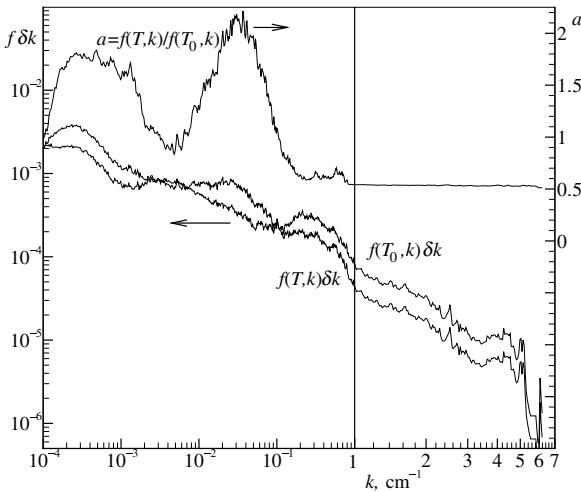  
图20-7 氮气中10%$\mathrm{CO_2}$在不同普朗克函数温度($T=1000\mathrm{K}$和$T_w=500\mathrm{K}$)下的普朗克函数加权$k$分布

$$
\frac{dI_k}{ds} = kf(T,k)I_b - (k + \sigma_s)I_k + \frac{\sigma_s}{4\pi}\int_{4\pi}I_k(\mathfrak{8}')\Phi (\mathfrak{8},\mathfrak{8}')d\Omega ' \tag{20.100}
$$

边界条件为：

$$
I_{k} = I_{\mathrm{kl}} = \epsilon_{\mathrm{w}}f(T_{w},k)I_{\mathrm{la}} + (1 - \epsilon_{\mathrm{w}})\frac{1}{\pi}\int_{\hat{\mathbf{n}}\cdot \hat{\mathbf{s}}< 0}I_{k}\left|\hat{\mathbf{n}}\cdot \hat{\mathbf{s}}\right|d\Omega , \tag{20.101}
$$

其中

$$
I_{k} = \int_{0}^{\infty}I_{\eta}\delta (k - k_{\eta})d\eta \tag{20.102}
$$

表示在$k_{\eta}=k$的所有光谱位置(每$dk$)收集的强度$I_{\eta}$。因此，一旦从方程(20.100)求得$I_{k}$，总强度就可以通过

$$
I = \int_{0}^{\infty}I_{\eta}d\eta = \int_{0}^{\infty}I_{k}dk. \tag{20.103}
$$

需要注意的是，这里需要两个普朗克函数加权的$k$分布：一个是均匀介质温度下的$f(T,k)$，另一个是壁面温度下的$f(T_w,k)$，但两者都使用介质条件下的吸收系数。图20-7展示了两个典型的普朗克函数加权$k$分布，介质温度为$T=1000\mathrm{K}$，壁面温度为$T_w=500\mathrm{K}$，介质为氮气中10%$\mathrm{CO_2}$的混合物（1000K，1 bar），数据来自HITEMP 1995数据库[17]。遗憾的是，全光谱$k$分布随评估方法变化很大，跨越多个数量级（图20-7中通过绘制$f\delta k$而非$f$本身部分抑制了这种变化），且可能表现不佳，类似于窄带对应物（参见图11-15）。此外，不同普朗克函数温度下的$k$分布差异显著：不同普朗克函数温度强调光谱的不同部分，因此强调不同的谱线。然而，如第11.9节所述，$f(T,k)$中的尖锐峰是由$\kappa_{\eta}$的极值引起的，这些极值在所有普朗克函数温度下保持不变。因此，在不同普朗克函数温度下评估的任意两个全光谱$k$分布的比值应该会产生更平滑的函数，特别是当温度接近时。实际情况确实如此，图20-7中的$a(T,k)$函数也表明了这一点，尽管仍存在一些残余噪声，特别是对于（幸运的是不太重要的）小$k$值和低温情况。在图20-7中，平滑效应在大$k$值时最为明显，噪声减少了100多倍。当$T_w$接近$T$时，$a$函数以平滑方式趋近于$a\to 1$，并且在高温下（$T$和$T_w$）通常表现良好。这种行为的原因是，在低温下，普朗克函数在某些重要的振动-转动带中基本可以忽略不计，而在高温下，所有带都会贡献，无论它们在光谱中的位置如何。基于此讨论，为便于方程(20.103)的积分，将方程(20.100)和(20.101)除以介质温度下的$k$分布。这导致在平滑变化的$g$空间中重新排序的RTE，其中累积$k$分布$g$是一个无量纲的、普朗克函数加权的、重新排序的波数。这被称为全光谱$k$分布(FSK)方法：

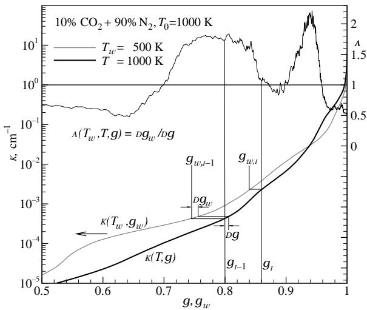  
图20-8 氮气中10%$\mathrm{CO}_2$在普朗克函数温度为$1000\mathrm{K}$和$500\mathrm{K}$时的普朗克函数加权累积$k$分布

$$
\frac{dI_g}{ds} = k\left(I_b(T) - I_g\right) - \sigma_s\left(I_g - \frac{1}{4\pi}\int_{4\pi}I_g(\hat{s}^{\prime})\Phi (\hat{s},\hat{s}^{\prime})d\Omega^{\prime}\right), \tag{20.104}
$$

边界条件为

$$
I_{g} = I_{w\eta} = \epsilon_{w}a(T_{w},T,g)I_{bw} + (1 - \epsilon_{w})\frac{1}{\pi}\int_{\hat{\mathbf{n}}\cdot \hat{\mathbf{s}}< 0}I_{g}\left|\hat{\mathbf{n}}\cdot \hat{\mathbf{s}}\right|d\Omega , \tag{20.105}
$$

其中

$$
\begin{array}{c}{I_g = I_k / f(T,k) = \int_0^\infty I_\eta \delta (k - \kappa_\eta)d\eta \Big|f(T,k),}\\ {g(T,k) = \int_0^k f(T,k)dk,}\\ {a(T_w,T,g) = \frac{f(T_w,k)}{f(T,k)} = \frac{dg_w(T_w,k)}{dg(T,k)}.} \end{array} \tag{20.106}
$$

物理上，$g$是吸收系数$\kappa_{\eta} < k$的光谱部分的普朗克函数加权分数。因此，总强度通过下式计算：

$$
I = \int_{0}^{\infty}I_{\eta}d\eta = \int_{0}^{\infty}I_{k}dk = \int_{0}^{1}I_{g}dg. \tag{20.109}
$$

在方程(20.108)中，分子和分母都在相同的$k$值下评估，而$k$又通过方程(20.107)与$g$相关。

图20-7中$\mathrm{CO_2}$分布的累积$k$分布如图20-8所示，可以看到它们是平滑的、单调递增的无量纲"波数"$g$的函数。两个$k$分布$k(T,g)$和$k(T_w,g_w)$具有相同的$k$值范围（$\mathrm{CO_2}$在$T=1000\mathrm{K}$时的吸收系数），但$g$值不同，函数$a$是在相同$k$值下评估的两个分布之间的拉伸因子$dg_w/dg$（图20-8中的水平线）：当$k(T_w,g_w)$的斜率小于$k(T,g)$的斜率时（对于相同的$k$值），$a(T_w,T,g)>1$，反之亦然。虽然$k(T,g)$是一个单调递增的函数（在$\kappa_{\eta}$有极值的地方有微小阶跃），但$a(T_w,T,g)$不是。数学上，在$\kappa_{\eta}$有极值的地方，$f(T_w,k)$和$f(T,k)$都趋向于无穷大，导致零除零的情况。取极限时，$a(T_w,T,g)$应该是一个平滑函数，但实际上，这取决于$k$分布的评估精度。通常，最好使用$g(k)$的斜率而非$f$本身来评估$a(T_w,T,g)$，如方程(20.108)所示，甚至可能仅在$g(k)$轻微平滑后进行。

重要的是要理解，由方程(20.104)至(20.108)给出的FSK方法是一种精确方法（受限于均匀介质的限制）。事实上，该方法对于非均匀介质也是精确的，只要吸收系数在空间上不变（例如，在参考条件下评估然后应用于整个介质）。在这些限制下，FSK结果与LBL计算等效，前者需要大约10次光谱评估，而后者需要约1,000,000次。

# 20.9 基于谱线的灰气体加权和(SLW)方法

同样值得注意的是，如果将方程(20.104)至(20.109)应用于由黑壁包围的非散射介质，并使用粗略的梯形法进行积分，即用单个恒定值$\widetilde{k}_i(T)$替换可变吸收系数$k(T,g)$，覆盖$g_{i-1} < g \leq g_i$的第$i$个有限范围。积分方程(20.104)并省略散射项后，简化为

$$
\frac{dI_i}{ds} = \widetilde{k_i} (T)\Big(\bar{a}_i(T)I_b(T) - I_i\Big),\quad i = 1,\ldots ,N, \tag{20.110}
$$

对于$N$个灰气体，边界条件为

$$
I_{wi} = \bar{a}_i(T_w)I_b(T_w), \tag{20.111}
$$

其中

$$
I_{i} = I_{g}(\widetilde{k_{i}})(g_{i} - g_{i - 1}). \tag{20.112}
$$

方程(20.110)中的权重函数$\bar{a}_i$为

$$
\bar{a}_i(T) = g_i - g_{i - 1}, \tag{20.113}
$$

而对于边界条件，$\bar{a}_i$从方程(20.108)评估为

$$
\bar{a}_i(T_w) = \int_{g_{i - 1}}^{g_i}a(T_w,T,g)dg(T) = \int_{g_{w,i - 1}}^{g_{w,i}}dg_w(T_w) = g_{w,i} - g_{w,i - 1}. \tag{20.114}
$$

因此，$\bar{a}_i$是在局部普朗克函数温度（$T$或$T_w$）下评估的累积$k$分布的第$i$个有限范围。这也如图20-8所示。$\bar{k}_i$是$k(T,g)$在$g_{i-1} < g \leq g_i$范围内的平均值。这是Denison和Webb[3,5,86]开发的SLW方法，他们建议通过平方根平均来评估$\bar{k}_i$，即

$$
\widetilde{k_i} (T) = \sqrt{k(T,g_{i - 1})k(T,g_i)}. \tag{20.115}
$$

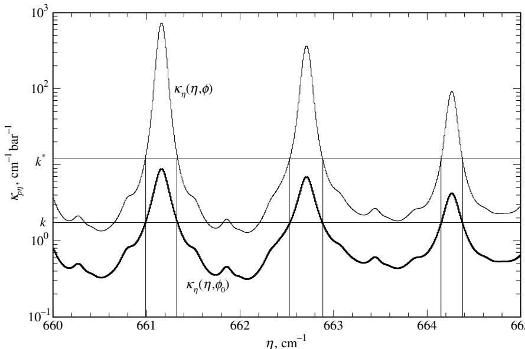  
图20-9 从光谱吸收系数数据中提取$k$分布（粗线表示氮气中$\mathrm{CO_2}$在$15\mu \mathrm{m}$波段小范围内的数据，$p=1.0$ bar，$T=296\mathrm{K}$；细线为人工创建的相关吸收系数）。

通过检查方程(20.91)和(20.92)可以看出，SLW方案本质上就是灰气体加权和方法，其吸收系数$k_{i}$和权重$a_{i}$通过逐线数据库评估得出。虽然在SLW方法发展过程中未考虑散射，但我们可以得出结论：(a)WSGG方法可应用于灰散射介质以及灰反射壁面；(b)SLW方法——或者说基于光谱线数据库参数的WSGG方法——只不过是FSK方法最粗略的实现方式。最近，Solovjov及其同事[106]提出了SLW-1模型用于单灰气体的快速计算，这本质上是方程(20.4)的箱式模型，但提供了多种确定$\widetilde{k_{1}}(T)$的方法。

# 20.10 非均匀介质的FSK方法

如第11.9节所述，与传统带模型类似，无法为非均匀介质中的任意吸收系数开发精确的$k$分布。因此，为了开发适用于非均匀介质的全光谱$k$分布方法，我们将像窄带$k$分布那样，假设光谱吸收系数是相关的或甚至遵循比例近似。定义一个包含影响吸收系数的组成变量的向量$\phi$，即温度$\overline{T}$、压力$\rho$和气体摩尔分数（或存在时小颗粒的体积分数）$\mathbf{x}$，吸收系数可表示为

$$
\kappa_{\eta}(\eta ,\phi) = \left\{ \begin{array}{ll}k_{\eta}^{*}(\phi ,k_{\eta}), & \mathrm{相关},\\ k_{\eta}(\eta)u(\phi ,\phi_{0}), & \mathrm{比例}, \end{array} \right. \tag{20.116}
$$

其中$k_{\eta}(\eta) = \kappa_{\eta}(\eta ,\phi_{0})$是参考状态$\phi_{0} = (T_{0},p_{0},\mathbf{x}_{0})$下的吸收系数。如果吸收系数是相关的，那么在每一个波数处，当$\kappa_{\eta}(\eta ,\phi_{0})$具有相同的值$k$时，$\kappa_{\eta}(\eta ,\phi)$也总是具有唯一值$k^{*}(\phi ,k)$，如图20-9中$\mathrm{CO_2}$带的小部分所示。如果比值$k_{\eta}^{*} / k_{\eta}$是常数（不是$k_{\eta}$的函数），则吸收系数是比例的，$u(\phi ,\phi_{0})$称为比例函数。

对于这样的吸收系数，一般辐射传递方程(10.21)变为

$$
\frac{dI_{\eta}}{ds} = k_{\eta}^{\star}(\phi ,k_{\eta})I_{b\eta} - \left(k_{\eta}^{\star}(\phi ,k_{\eta}) + \sigma_{s}\right)I_{\eta} + \frac{\sigma_{s}}{4\pi}\int_{4\pi}I_{\eta}(\mathfrak{s}^{\prime})\Phi (\mathfrak{s}^{\prime},\mathfrak{s}^{\prime})d\Omega^{\prime}, \tag{20.117}
$$

需满足边界条件(20.98)。

将FSK方法扩展到具有相关吸收系数的非均匀介质，需要针对不同吸收系数状态$\phi$以及不同普朗克函数温度$T$评估$k$分布。因此，理解这些$k$分布之间的关系非常重要，如Modest[105]所述。

# 相关全光谱k分布

对于非均匀介质，广义全光谱k分布定义为

$$
f(T,\phi ,k) = \frac{1}{I_b}\int_0^\infty I_{b\eta}(T)\delta \Big(k - \kappa_\eta (\eta ,\phi)\Big)d\eta , \tag{20.118}
$$

该分布通过普朗克函数成为温度的函数，同时通过吸收系数κ_η的评估状态φ也成为φ的函数。类似于窄带k分布，普朗克函数加权的k分布可计算为

$$
f(T,\phi_0,k) = \frac{1}{I_b}\int_0^\infty I_{b\eta}(T)\delta \Big(k - \kappa_\eta (\eta ,\phi_0)\Big)\frac{d\eta}{dk_\eta} d\kappa_\eta = \frac{1}{I_b(T)}\sum_iI_{b\eta i}(T)\left|\frac{d\eta}{dk_\eta}\right|_{\kappa_\eta (\eta_i,\phi_0) = k}. \tag{20.119}
$$

在此关系中，求和是针对所有满足κ_η(η_i,φ_0)=k的情况进行的，如图20-9所示（绝对值符号源于当dη/dκ_η<0时，dk_η也<0）。类似地，可以得到局部状态φ的k分布：

$$
f(T,\phi ,k^{*}) = \frac{1}{I_{b}(T)}\sum_{i}I_{b\eta i}(T)\left|\frac{d\eta}{dk_{\eta}}\right|_{\kappa_{\eta}(\eta_{i},\phi) = k^{*}}, \tag{20.120}
$$

该分布具有相同的k*-κ_η交点波数η_i，如图20-9所示。由方程(20.116)可得

$$
\left|\frac{d\kappa_{\eta}}{d\eta}\right|_{\kappa_{\eta}(\eta_{i},\phi_{0}) = k^{*}} = \left|\frac{dk_{\eta}^{*}}{d\eta}\right|_{\kappa_{\eta}^{*} = k^{*}} = \left|\frac{dk_{\eta}^{*}}{dk_{\eta}}\right|\left|\frac{dk_{\eta}}{d\eta}\right|_{\kappa_{\eta} = k} = \left|\frac{dk_{\eta}}{d\eta}\right|_{\kappa_{\eta}(\eta_{i},\phi_{0}) = k}\frac{dk^{*}}{dk} \tag{20.121}
$$

因此，

$$
f(T,\phi ,k^{*})dk^{*} = f(T,\phi_{0},k)dk. \tag{20.122}
$$

累积k分布g在两种情况下相同，即

$$
g(T,\phi_0,k) = \int_0^k f(T,\phi_0,k)dk = \int_0^{k^*}f(T,\phi ,k^*)dk^* = g(T,\phi ,k^*). \tag{20.123}
$$

方程(20.123)可对k和k*进行反演，两者都是相同累积k分布g的函数。这就是相关k分布的定义。

现在我们将比较针对相同吸收系数(例如在参考状态$\phi_{0}$下)但不同普朗克函数温度(例如局部温度$T$和参考状态温度$T_{0}$)计算的相关$k$分布。使用方程(20.123)将得到两个不同的累积$k$分布$g$(介质温度$T$)和$g_{0}$(参考状态温度$T_{0}$)。由于$k(T,\phi_{0},g)$和$k(T_{0},\phi_{0},g_{0})$都是对相同吸收系数的重排序(但使用不同的权重函数)，$k(T_{0},\phi_{0},g_{0})$在$g$空间上只是被拉伸了，如图20-10所示(图20-10中的四个$k$分布来自图20-9的两个吸收系数分布，将其光谱范围扩展到整个光谱，普朗克函数温度为$300\mathrm{K}$和$1000\mathrm{K}$)。两条粗线$k(T_{h},T_{c},g_{0})$和$k(T_{c},T_{c},g)$都基于图20-9中的粗线，即在$T = T_{c} = 300\mathrm{K}$下计算的吸收系数($k$的第二个参数)。粗实线表示$k(T_{h},T_{c},g_{0})$，意味着普朗克函数在参考温度$T_{0} = T_{h} = 1000\mathrm{K}$下计算($k$的第一个参数)，得到参考累积$k$分布$g_{0}$。粗点划线是相同吸收系数但在$T = T_{c} = 300\mathrm{K}$下计算的$k$分布，得到累积$k$分布$g$。两个$k$分布具有相同的$k$值，但不同的$y$分布。图20-10中的细线显示了等效的两个$k$分布，其中(人工)吸收系数在$T_{0} = T_{h} = 1000\mathrm{K}$下计算(图20-9中的细线)。由于图20-9中的吸收系数是真正相关的，且方程(20.123)可以应用于任何温度(包括$T = T_{0}$)，显然$k^{*}(T_{0},\phi ,g_{0})$以完全相同的方式被拉伸，即

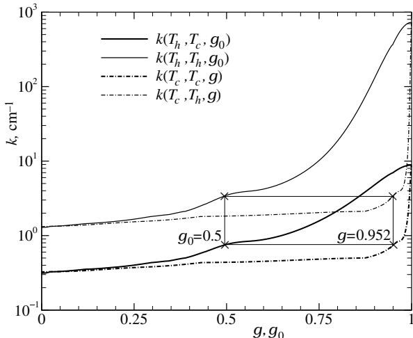  
图20-10 不同普朗克函数温度下相关吸收系数的$k$分布等效性

$$
k^{*}(\phi ,k) = k^{*}(T,\phi ,g) = k^{*}(T_{0},\phi ,g_{0}). \tag{20.124}
$$

注意方程(20.124)仅对真正相关的吸收系数精确成立：图20-11显示了从HITEMP 1995数据库[17]计算的$10\% \mathrm{CO}_{2} - 20\% \mathrm{H}_{2}\mathrm{O} - 70\% \mathrm{N}_{2}$混合物的等效四个$k$分布：如果$k$分布$k(T_{0} = 1000\mathrm{K},T = 300\mathrm{K},g_{0})$(普朗克函数在参考温度$1000\mathrm{K}$下计算，吸收系数在$300\mathrm{K}$下)和$k(T_{0} = 1000\mathrm{K},T_{0} = 1000\mathrm{K},g_{0})$(普朗克函数在$1000\mathrm{K}$下，$\kappa_{\eta}$在$1000\mathrm{K}$下)是相关的，那么根据方程(20.123)，它们在普朗克函数温度为$300\mathrm{K}$时也应该相关。这意味着对于任何$g$值(这里显示$g = 0.3$)，在一个普朗克函数温度(这里$300\mathrm{K}$)下的两个$k$值应该映射到任何其他普朗克函数温度(这里$T_{0} = 1000\mathrm{K}$)下相同的$g_{0}$值。对于给定的二氧化碳-水蒸气混合物，显然不是这种情况。另一方面，可以使用如图20-11所示的图形来研究吸收系数实际上与相关性的接近程度。

# 全光谱相关$k$(FSCK)方法

A reordered RTE is obtained by multiplying equation (20.117) and boundary condition (20.98) by the Dirac- delta function  $\delta (k - k_{\eta})$ , i.e., using the absorption coefficient at a representative reference state  $\phi_{0}$  introduced in equation (20.116). This is then followed by integration over the entire spectrum. Noting that because  $\delta (k - k_{\eta})$  is nonzero only wherever  $k_{\eta} = k$ , this leads to

$$
\int_0^\infty k_\eta^* (\phi ,k_\eta)I_{b\eta}(T)\delta (k - k_\eta)d\eta = k^* (\phi ,k)\int_0^\infty I_{b\eta}(T)\delta (k - k_\eta)d\eta ,
$$

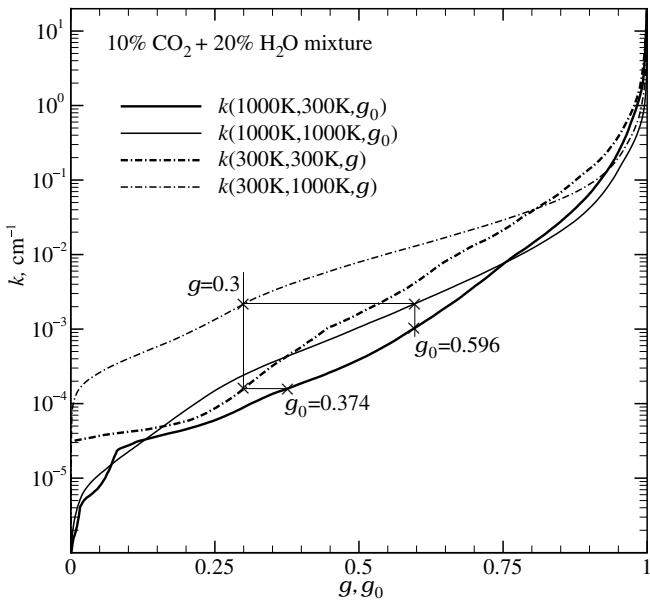  
FIGURE 20-11(Lack of)  $k$ -distribution equivalence for varying Planck function temperatures for real gas mixtures  $(\mathrm{CO}_2 - \mathrm{H}_2\mathrm{O} - \mathrm{N}_2$  mixture at different temperatures using HITEMP 1995:  $T_{\mathrm{hot}} = 1000\mathrm{K}$ ,  $T_{\mathrm{col}} = 300\mathrm{K}$ , uniform  $p = 1$  bar,  $x_{\mathrm{CO}_2} = 0.1$ ,  $x_{\mathrm{HeO}} = 0.2$ ).

$$
\frac{dI_k}{ds} = k^* (\phi ,k)f(T,\phi_0,k)I_b - \left(k^* (\phi ,k) + \sigma_s\right)I_k + \frac{\sigma_s}{4\pi}\int_{4\pi}I_k(\hat{\mathbf{s}} ')\Phi (\hat{\mathbf{s}},\hat{\mathbf{s}} ')d\Omega ' \tag{20.125}
$$

with boundary condition

$$
I_{k} = I_{wk} = \epsilon_{w}f(T_{w},\phi_{0},k)I_{bw} + (1 - \epsilon_{w})\frac{1}{\pi}\int_{\hat{\mathbf{n}}\cdot \hat{\mathbf{s}} < 0}I_{k}|\hat{\mathbf{n}}\cdot \hat{\mathbf{s}} |d\Omega , \tag{20.126}
$$

and

$$
I_{k} = \int_{0}^{\infty}I_{\eta}\delta (k - k_{\eta})d\eta . \tag{20.127}
$$

Again, to facilitate integration, equations (20.125) and (20.126) are divided by a  $k$ - distribution. To allow such a division, this  $k$ - distribution must be evaluated at a constant but arbitrary Planck function reference temperature  $T_{0}$  [generally chosen to be identical to the one used for the absorption coefficient in equation (20.116)]. This leads to a reordered RTE in smoothly- varying  $g_{0}$ - space, and is called the Full Spectrum Correlated-  $k$  (FSCK) method:

$$
\frac{dI_g}{ds} = k^* (T_0,\phi ,g_0)\left[a(T,T_0,g_0)I_b(T) - I_g\right] - \sigma_s\left(I_g - \frac{1}{4\pi}\int_{4\pi}I_g(\hat{s} ')\Phi (\hat{s},\hat{s} ')d\Omega '\right), \tag{20.128}
$$

subject to the boundary condition

$$
I_{g} = I_{ws} = \epsilon_{w}a(T_{w},T_{0},g_{0})I_{bw} + (1 - \epsilon_{w})\frac{1}{\pi}\int_{\hat{\mathbf{n}}\cdot \hat{\mathbf{s}} < 0}I_{g}|\hat{\mathbf{n}}\cdot \hat{\mathbf{s}} |d\Omega . \tag{20.129}
$$

Here

$$
\begin{array}{c}{I_g = I_k / f(T_0,\phi_0,k) = \int_0^\infty I_\eta \delta \left(k - \kappa_\eta (\eta ,\phi_0)\right)d\eta \Big / f(T_0,\phi_0,k),}\\ {g_0(T_0,\phi_0,k) = \int_0^k f(T_0,\phi_0,k)dk,}\\ {d(T,T_0,g_0) = \frac{f(T,\phi_0,k)}{f(T_0,\phi_0,k)} = \frac{dg(T,\phi_0,k)}{dg_0(T_0,\phi_0,k)},} \end{array} \tag{20.132}
$$

and the total intensity is evaluated from

$$
I = \int_{0}^{\infty}I_{\eta}d\eta = \int_{0}^{\infty}I_{k}dk = \int_{0}^{1}I_{g}dg_{0}. \tag{20.133}
$$

As for a homogeneous medium, numerator and denominator in equation (20.132) are both evaluated at identical values of  $k$ , which in turn are related to  $g_{0}$  through equation (20.131). It turns out that the weight function  $a(T,T_0,g_0)$  is actually independent of  $\phi_0$  for a truly correlated absorption coefficient [as a consequence of equation (20.122)]. In equation (20.128) the  $k^{*}(\phi ,k)$  of equation (20.125) has been replaced by  $k^{*}(T_{0},\phi ,g_{0})$ , using equation (20.124), i.e.,  $k^{*}$  is the  $k(y)$  value obtained from the  $k$ - distribution obtained for the absorption coefficient at local conditions and the Planck function at reference temperature.

# The Full Spectrum Scaled-  $k$  (FSSK) Method

As for narrow band  $k$ - distributions the problem is reduced to a single  $k$ - distribution if a scaled absorption coefficient is employed. Then the  $k^{*}$ - term in equation (20.128) is replaced by

$$
k^{*}(T,\phi ,g) = k(T,\phi_{0},g)u(\phi ,\phi_{0}) = k^{*}(T_{0},\phi ,g_{0}) = k(T_{0},\phi_{0},g_{0})u(\phi ,\phi_{0}). \tag{20.134}
$$

This then becomes the Full Spectrum Scaled-  $k$  (FSSK) method:

$$
\frac{dI_g}{ds} = k(T_0,\phi_0,g_0)u(\phi ,\phi_0)\left[a(T,T_0,g_0)I_b(T) - I_g\right] - \sigma_s\left(I_g - \frac{1}{4\pi}\int_{4\pi}I_g(\hat{s}^\prime)\Phi (\hat{s},\hat{s}^\prime)d\Omega^\prime\right), \tag{20.135}
$$

with the same boundary condition (20.129) as for the FSCK method. How to determine the scaling function for a given medium will be discussed below together with the determination of a proper reference state.

Both methods given by equations (20.128) through (20.135) are "exact" like equations (20.104) through (20.108), but are now subject to the somewhat less severe restriction of an absorption coefficient that is correlated or scaled.

# The SLW Method for Nonhomogeneous Media

The SLW method of Denison and Webb can also be applied to nonhomogeneous media, including scattering media and reflecting walls. Again, integrating equation (20.128) over the  $i$ th  $g$ - range, across which  $\widetilde{k}_i$  is assumed constant, this leads to

$$
\frac{dI_i}{ds} = \widetilde{k_i} (T_0,\phi)\Big(\bar{a}_i(T,T_0)I_b(T) - I_i\Big) - \sigma_s\left(I_i - \frac{1}{4\pi}\int_{4\pi}I_i(\hat{s}^\prime)\Phi (\hat{s},\hat{s}^\prime)d\Omega^\prime\right),\quad i = 1,\ldots ,N, \tag{20.136}
$$

subject to the boundary condition

$$
I_{wi} = \epsilon_w\bar{a}_i(T_w,T_0)I_b(T_w) + (1 - \epsilon_w)\frac{1}{\pi}\int_{\hat{\mathbf{n}}\cdot \hat{\mathbf{s}} < 0}I_i|\hat{\mathbf{n}}\cdot \hat{\mathbf{s}} |d\Omega , \tag{20.137}
$$

where

$$
I_{i} = I_{g}(\widetilde{k_{i}})(g_{0,i} - g_{0,i - 1}). \tag{20.138}
$$

The weight function  $\bar{a}_i$  is evaluated from equation (20.132) as

$$
\begin{array}{rcl}{\bar{a}_i(T,\phi_0)} & = & {\int_{g_{0,i - 1}}^{g_{0,i}}a(T,T_0,g_0)dg_0(T_0,\phi_0)}\\ {} & = & {\int_{g_{i - 1}}^{g_i}dg(T,\phi_0) = g_i(T,\phi_0) - g_{i - 1}(T,\phi_0).} \end{array} \tag{20.139}
$$

Thus,  $\overline{a}_i$  is the  $i$ th finite range of the cumulative  $k$ - distribution evaluated at the local Planck function temperature. This transformation from reference state  $g_0$  to local state  $g$  is indicated in Figs. 20- 10 and 20- 11 for a single value of  $g$  by the lower thin horizontal line. The  $\overline{k}_i$  is an average value of  $k^{*}(T_{0},\phi ,g_{0})$  over the range  $g_{0,i - 1}< g_0\leq g_{0,i}$  (i.e., the value from the  $k$ - distribution evaluated from the local absorption coefficient and the Planck function evaluated at the reference temperature), and is calculated as [3, 5, 86]

$$
\widetilde{k}_i(T_0,\phi) = \sqrt{k_{i - 1}(T_0,\phi)k_i(T_0,\phi)}. \tag{20.140}
$$

Again values of  $k_{i}(T_{0},\phi)$  are indicated for a single value of  $g_{0}$  in Figs. 20- 10 and 20- 11, this time as points on the thin vertical line going through  $g_{0}$ ; the top intersection for the case of  $\phi = T_h$ , the lower for  $\phi = T_c$ . These rather complicated relationships for  $\overline{a}$  and  $k^{*}$  were correctly deduced by Denison and Webb [5, 86], well before a solid theoretical foundation describing the interrelationships between  $k$ - distributions was developed by Modest [105].

Cumulative Wavenumber Solovjov and Webb [107- 109] also introduced the concept of cumulative wavenumber, defined as

$$
w(\phi ;k,\eta) = \int_0^\eta H(k - \kappa_\eta)d\eta , \tag{20.141}
$$

where  $H(k)$  is again Heaviside's unit step function, and applied it on a narrow band basis to the SLW method. Comparison with equation (11.102) shows that this is the narrow band  $k$ - distribution approach together with the  $N$  distinct gray gases of the SLW method. While Solovjov and Webb report some promising results for nonhomogeneous examples, the method is mathematically unclear and is expensive, requiring  $N_{\mathrm{nb}}\times N$  RTE evaluations, where  $N_{\mathrm{nb}}$  is the number of narrow bands employed.

# Reference State and Scaling Function

The only errors in the FSK methods for nonhomogeneous media arise from the fact that absorption coefficients of actual gases or, even more so, gas mixtures are not truly correlated. The strength of individual lines is given by equation (11.32), and is seen to be linearly proportional to the (partial) pressure of the absorbing gas, while temperature dependence consists of three parts: the rovibrational partition function, the stimulated emission term, and the influence of the lower energy state  $E_{l}$ . Pressure dependence and rovibrational partition function are the same for all lines and are, therefore, easily separated from spectral dependence. The stimulated emission term varies only gradually with wavenumber, causing little problem. It is the sharp growth of "hot lines" (lines with large  $E_{l}$ ), which essentially do not contribute at moderate temperatures, that decorrelate the absorption coefficient and make scaling difficult under extreme conditions. Line broadening is also affected by pressure and temperature, but this dependence again is fairly similar for all lines. In a mixture of gases each species has its own partial pressure and its own temperature dependence, causing further degradation of the absorption coefficient's level of correlation.

Whether the assumption of a correlated absorption coefficient is to be used (FSCK), or whether the absorption coefficient is to be scaled (FSSK), the exact  $k$  vs.  $g$  behavior can be employed only for a single reference state  $\phi_0$ . Therefore, the choice of  $\phi_0$  is very important and should be optimized for any given problem (on the other hand, the reference Planck function temperature is only a mathematical convenience, and its choice does not affect the accuracy of calculations). Modest and Zhang [104] suggest, for a medium at constant total pressure  $p$ ,

$$
\mathbf{x}_0 = \frac{1}{V}\int_V\mathbf{x}dV, \tag{20.142}
$$

$$
\kappa_{P}(T_{0},\mathbf{x}_{0})I_{b}(T_{0}) = \frac{1}{V}\int_{V}\kappa_{P}(T,\mathbf{x})I_{b}(T)dV, \tag{20.143}
$$

i.e., volume-averaged mole fraction and a Planck- mean temperature based on average emission from the volume.

In the correlated-  $k$  method, the  $k(T,\phi_0,g)$  are then determined, followed by evaluation of  $k^{*} = k(T_{0},\phi ,g_{0})$  making the assumption of corresponding  $g$  - values (and its resulting errors). If a scaled absorption coefficient is to be used, scaling functions must be found, and Modest and Zhang [104] suggest the implicit relation

$$
\int_0^\infty I_{b\eta}(T_0)\exp \left[-\kappa_\eta (\eta ,\phi)L_m\right]d\eta = \int_0^\infty I_{b\eta}(T_0)\exp \left[-\kappa_\eta (\eta ,\phi_0)u(\phi ,\phi_0)L_m\right]d\eta , \tag{20.144}
$$

i.e., forcing correct evaluation of radiation leaving from a homogeneous slab equal in width to the mean beam length,  $L_{m}$  . Using  $k$  - distributions this becomes

$$
\int_0^1\exp \left[-k^* (T_0,\phi ,g)L_m\right]dg = \int_0^1\exp \left[-k(T_0,\phi_0,g_0)u(\phi ,\phi_0)L_m\right]dg_0. \tag{20.145}
$$

Both methods are about equally efficient numerically: besides the evaluation of  $k(T,\phi_0,g)$  [needed for both methods to evaluate  $k(g_0)$  and the weight function  $a]$  , for a correlated absorption coefficient  $k$  - distributions must be evaluated for all states  $\phi$  (with a Planck function based on the reference temperature). For a scaled absorption coefficient, the same  $k$  - distributions are needed, but here for the evaluation of the scaling functions  $u$  .However, the scaled-  $k$  method holds two advantages over its correlated cousin:  $(i)$  for a poorly correlated absorption coefficient the scaling function from equation (20.145) can partially correct for this lack of correlation, and  $(ii)$  alternatively, a simplified scaling function can be chosen without the use of equation (20.145), thus reducing the number of cumbersome  $k$  - distribution evaluations.

Example 20.11. Consider a mixture of  $10\%$ $\mathrm{CO_2 - 20\%H_2O - 70\%N_2}$  (by volume) confined between two cold, black plates. The mixture is at a total pressure of 1 bar and consists of a hot, isothermal layer of fixed width  $L_{h} = 50\mathrm{cm}$  and a temperature of  $T_{h} = 1000\mathrm{K},$  and a cold, isothermal layer  $(T_{c} = 300\mathrm{K})$  of variable width  $L_{c}$  . Determine the radiative heat flux leaving from the cold layer using the FSCK and FSSK methods.

# Solution

On a spectral basis the desired heat loss can be determined immediately from equation (14.54) as

$$
q_{\eta}(\tau_{\mathrm{L}}) = 2\pi \int_{0}^{\tau_{\mathrm{L}}}I_{b\eta}(\tau)E_{2}(\tau_{\mathrm{L}} - \tau)d\tau , \tag{20.146}
$$

where we have set  $J_{1} = J_{2} = 0$  (cold, black boundaries) and  $S(\tau) = I_{b\eta}(\tau)$  (no scattering). The optical coordinate for a medium with a step in temperature is

$$
\tau = \int_{0}^{x}\kappa_{\eta}dx = \left\{ \begin{array}{ll}\kappa_{\eta}(T_{h})x, & x\leq L_{h},\\ \kappa_{\eta}(T_{h})L_{h} + \kappa_{\eta}(T_{c})(x - L_{h}), & x\geq L_{h}, \end{array} \right.
$$

and  $\tau_{\mathrm{L}} = \tau_{h} + \tau_{c} = \kappa_{\eta}(T_{h})L_{h} + \kappa_{\eta}(T_{c})L_{c}$  . Since  $I_{b\eta}$  is constant across each layer, equation (20.146) is easily integrated to yield

$$
\begin{array}{l}{q_{\eta}(\tau_{\mathrm{L}}) = 2\pi I_{b\eta}(T_{h})\int_{0}^{\tau_{h}}E_{2}(\tau_{\mathrm{L}} - \tau)d\tau +2\pi I_{b\eta}(T_{c})\int_{\tau_{h}}^{\tau_{L}}E_{2}(\tau_{\mathrm{L}} - \tau)d\tau}\\ {= 2\pi I_{b\eta}(T_{h})E_{3}(\tau_{\mathrm{L}} - \tau)\Big|_{0}^{\tau_{h}} + 2\pi I_{b\eta}(T_{c})E_{3}(\tau_{\mathrm{L}} - \tau)\Big|_{\tau_{h}}^{\tau_{L}}}\\ {= 2\pi I_{b\eta}(T_{h})\left[E_{3}(\tau_{c}) - E_{3}(\tau_{c} + \tau_{h})\right] + \pi I_{b\eta}(T_{c})\left[1 - 2E_{3}(\tau_{c})\right].} \end{array}
$$

If the FSK method is used to calculate the "spectral" flux  $q_{g}$ , the Planck function  $I_{b\eta}$  must be replaced by a weighted value  $aI_{b}$ , and the absorption coefficient  $\kappa_{\eta}$  by a reordered  $k$ . Thus,

$$
q_{g}(\tau_{c}) = 2a(T_{h},T_{0},g_{0})\sigma T_{h}^{4}[E_{3}(\tau_{c}) - E_{3}(\tau_{c} + \tau_{h})] + a(T_{c},T_{0},g_{0})\sigma T_{c}^{4}[1 - 2E_{3}(\tau_{c})],
$$

with

$$
\begin{array}{rlrl} & {\mathrm{for~FSCK:}} & {\tau_i = k^* (T_0,T_i,g_0)L_i,} & {i = c\mathrm{or}h,} & {\mathrm{from~equation~(20.128),}}\\ & {\mathrm{for~FSSK:}} & {\tau_i = k(T_0,T_0,g_0)u(T_i,T_0)L_i,} & {i = c\mathrm{or}h,} & {\mathrm{from~equation~(20.135).}} \end{array}
$$

Before these relations can be applied, a reference temperature must be found from equation (20.143), leading to an implicit relation for  $T_{0}$

$$
\kappa_{P}(T_{0})T_{0}^{4} = \frac{L_{h}}{L_{h} + L_{c}}\kappa_{P}(T_{h})T_{h}^{4} + \frac{L_{c}}{L_{h} + L_{c}}\kappa_{P}(T_{c})T_{c}^{4},
$$

which must be solved iteratively. From Fig. 11- 31 we find

$$
\begin{array}{r}\kappa_{P}(1000\mathrm{K}) = 0.1\mathrm{bar}\times 0.231\mathrm{cm}^{-1}\mathrm{bar}^{-1} + 0.2\mathrm{bar}\times 0.051\mathrm{cm}^{-1}\mathrm{bar}^{-1} = 0.033\mathrm{cm}^{-1},\\ \kappa_{P}(300\mathrm{K}) = 0.1\mathrm{bar}\times 0.259\mathrm{cm}^{-1}\mathrm{bar}^{-1} + 0.2\mathrm{bar}\times 0.516\mathrm{cm}^{-1}\mathrm{bar}^{-1} = 0.129\mathrm{cm}^{-1}; \end{array}
$$

for example, for  $L_{c} = 0\mathrm{cm}$  this leads to  $T_{0} = 1000\mathrm{K},$  for  $L_{c} = L_{h} = 50\mathrm{cm}$  to  $T_{0} = 780\mathrm{K},$  etc. Five  $k$  - distributions need to be determined: three of these are needed for the weight functions  $a_{j}$  all with the absorption coefficient evaluated at  $T_{0},$  but for the three Planck function temperatures  $T_{c},T_{0},$  and  $T_{h}$  . In addition,  $k^{\prime}(T_{0},T_{h},g_{0})$  and  $k^{\prime}(T_{0},T_{c},g_{0})$  are needed for the evaluation of  $\tau_{h}$  and  $\tau_{c}$  (FSCK) or the scaling function  $u(T,T_0)$  (FSSK). For the special case of  $T_{0} = T_{h}(L_{c}\simeq 0),$  all the necessary  $k$  - distributions are shown in Fig. 20- 11. For example, for  $a(T_c,T_0)$  we evaluate the  $k$  - distributions  $k(T_{c},T_{0},g)$  and  $k(T_{0},T_{0},g_{0}),$  or rather  $g(T_{c},T_{0},k)$  and  $g_{0}(T_{0},T_{0},k)$  from equation (20.148). The weight function then follows as

$$
a(T_c,T_0,g_0) = \frac{dg(T_c,T_0,k)}{dg_0(T_0,T_0,k)}\simeq \frac{\Delta g}{\Delta g_0}.
$$

For  $T_{0} = 1000\mathrm{K},$  this is the ratio of the slopes in Fig. 20- 11 of the thin dash- dot line at  $g = 0.3$  to that of the thin solid line at  $g_{0} = 0.596$  . The equivalent value for  $k^{\prime}(T_{0},T_{c},g_{0})$  is the intersection of the thick solid line at  $g_{0} = 0.596$  . If the FSSK method is employed, scaling functions must be evaluated from equation (20.145),

$$
\int_0^1\exp \left[-k^* (T_0,T_i,g)L_m\right]dg = \int_0^1\exp \left[-k(T_0,T_0,g_0)u(T_i,T_0)L_m\right]dg_0,i = c\mathrm{or}h,
$$

where  $L_{m} = 1.76(L_{c} + L_{h})$  is the mean beam length of the layer (from Table 20.2). This implicit relation is readily solved with a Newton- Raphson technique, starting with a first guess of  $u = 1$  (the correct value for  $T_{i} = T_{0}$  ), and requiring very few iterations. After determining the two weight functions  $a_{j}$  and the two  $k$  - distributions  $k^{\prime}(T_{0},T_{i},g_{0})$  (FSCK) or scaling functions  $u(T_{i},T_{0})$  (FSSK), the "spectral" flux  $q_{g}$  can be integrated over the  $g$  - spectrum, or

$$
\Psi = \frac{q(L)}{\sigma T_b^4} = \frac{1}{\sigma T_b^4}\int_0^1 q_g(\tau_c)dg\simeq \sum_{n = 1}^{N}w_n\frac{q_g(g_n)}{\sigma T_b^4},
$$

using the same quadrature as in Example 20.10. Results are shown in Fig. 20- 12, and are compared with LBL values, using the HITEMP 1995 database [17] for all the calculations. It is observed that both FSCK and FSSK results coincide with LBL data for  $L_{c} = 0$ , since the methods become exact. For  $L_{c} > 0$  the FSCK method consistently underpredicts the heat loss, with a maximum error of about 25% at intermediate  $L_{c}$ . The reason is that the FSCK method assumes the absorption coefficient to be correlated, i.e., that large  $\kappa_{\eta}$  in the hot layer (emission) line up with large  $\kappa_{\eta}$  in the cold layer (absorption). Since this is not the case (in particular in the presence of "hot lines"), absorption in the cold layer is overpredicted. The FSCK method can partially compensate for this lack of correlation, with a maximum error of only about 10% at intermediate  $L_{c}$ .

For comparison, the case of  $T_{h} = 2000\mathrm{K}$  is also included in Fig. 20- 12 ( $T_{c}$  remains at 300 K), making hot lines much more important and, thus, further decorrelating the absorption coefficients. Maximum relative errors are seen to increase slightly to about 30% (FSCK) and 15% (FSSK).

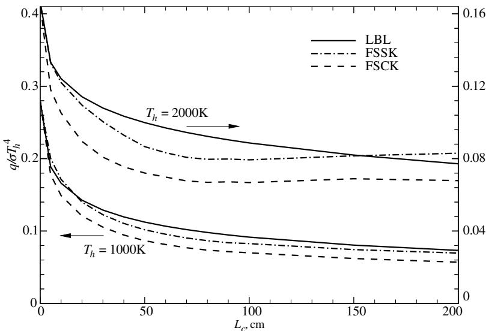  
FIGURE 20-12Heat loss from the cold column of a two-column  $10\%$ $\mathrm{CO_2 - 20\%}$ $\mathrm{H}_2\mathrm{O} - 70\%$ $\mathrm{N}_2$  mixture at different temperatures  $(T_{h} = 1000\mathrm{K}$  and  $2000\mathrm{K},L_{h} = 50\mathrm{cm};T_{c} = 300\mathrm{K},L_{c}$  variable; uniform  $p = 1$  bar, cold and black walls), from LBL, FSsK and FSCK models, all using the HITEMP 1995 database.

Note that the weight function  $a(T,T_0)$  is always accompanied by the emissive power  $\sigma T^4$ :  $a$  is, effectively, a scaling factor attached to the absorption coefficient for emission. In cold regions emission can be neglected, and the  $a$  does not need to be calculated (in the present example, cold region emission contributes  $< 1\%$  to  $\Psi$  for  $T_{h} = 1000\mathrm{K}$ , and  $< 0.1\%$  for  $2000\mathrm{K}$ ).

Note also that the present example constitutes an "acid test" for the FSK models: the step in temperature makes the gas extremely uncorrelated. More realistic situations, such as encountered in actual combustion systems, incur much smaller errors.

A realistic example was given in Section 16.9, where a scaled- up version of the much studied (but very small and, therefore, only weakly radiating) Sandia Flame D [110] was considered in the context of the spherical harmonics RTE solution methods. Figure 16- 13 shows temperature and mass fraction distributions as well as the resulting radiative source term for one axial location. Comparing Monte Carlo results using LBL and FSCK spectral models (see Section 21.4) shows the FSCK approach to have excellent accuracy (in fact, the error across the entire computational domain rarely exceeds  $3\%$  of maximum  $\nabla \cdot \mathbf{q}$ ), if only water vapor and carbon dioxide are allowed to radiate. If methane is included in the calculations, the gas mixture becomes very uncorrelated and small (methane) pockets with large errors are found (up to  $40\%$ ); such errors can be avoided with higher order methods discussed later in this chapter.

# 20.11 EVALUATION OF  $k$ -DISTRIBUTIONS

The full spectrum  $k$ - distribution  $f(T,k)$  and the cumulative  $k$ - distribution  $g(T,k)$  are evaluated exactly as outlined in Section 11.9, except that  $\delta \eta /\Delta \eta$  is replaced by  $I_{b\eta}\delta \eta /I_{b}$ , or

$$
f(T,k_j)\delta k_j\simeq \sum_i\frac{I_{b\eta i}(T)}{I_b(T)}\left|\frac{\delta\eta}{\delta\kappa_\eta}\right|_i\big[H(k_j + \delta k_j - \kappa_\eta) - H(k_j - \kappa_\eta)\big]. \tag{20.147}
$$

If the simple method described in Section 11.9 is used, the  $k$ - distributions can be found simultaneously for any number of temperatures  $T_{i}$ $(i = 1,2,\dots,I)$ : The relevant (i.e., contributing) part of the total spectrum is broken up into  $N$  equal subintervals  $\delta \eta$ , the absorption coefficient  $\kappa_{\eta}$  is evaluated at the center of each interval and, if  $k_{j}\leq \kappa_{\eta}\leq k_{j + 1}$ , the value of each  $f(T_{i},k_{j})\delta k_{j}$  is incremented by  $I_{b\eta}(T_{i},\eta_{h})\delta \eta /I_{b}(T_{i})$ . At the end, the cumulative function  $g(T,k)$  is again calculated

from equation (11.105), or

$$
g(T_{i},k_{j + 1}) = \sum_{j' = 1}^{j}f(T_{i},k_{j'})\delta k_{j'} = g(k_{j}) + f(T_{i},k_{j})\delta k_{j}. \tag{20.148}
$$

fskdist is the corresponding Fortran program in Appendix F that evaluates the  $f(T_{i},k_{j})$  and  $g(T_{i},k_{j})$  for a set of temperatures  $T_{i}$  and absorption coefficients  $k_{j}$ , as well as the  $a(T_{i},k_{j})$ . Figure 20- 7 shows the full spectrum  $k$ - distributions for  $10\%$ $\mathrm{CO_2}$  in nitrogen for two temperatures. For efficient integration of equation (20.109) it is desirable to have the function  $a(T,g)$  as smooth as possible, which—in turn—depends on the accuracy with which the  $f(T,k)$  are evaluated. Different smoothing schemes have been discussed in the original paper by Modest and Zhang [104].

As indicated earlier, assembling narrow band or full spectrum  $k$ - distributions from high- resolution databases is a very time- consuming task. First, the absorption coefficient must be calculated at fine spectral resolution for all relevant temperatures, pressures, and concentrations. This was apparently first done by Rivière and coworkers [111] for various gases, using the HITRAN 1992 database together with some proprietary French high- temperature extensions. For repeated calculations absorption coefficients may be precalculated and placed into an absorption coefficient database, such as the one by Wang and Modest [112], which is based on HITEMP 1995 [17] ( $\mathrm{H}_2\mathrm{O}$  and  $\mathrm{CO}$ ), and CDSD- 1000 [113] for  $\mathrm{CO_2}$ . Wang and Modest's database includes 23 temperatures (300–2500 K), 24 pressures (0.1–30 bar), and 5 concentrations, requiring about 225 GB of storage. (In its present version the database also includes several hydrocarbon species and has been updated to HITRAN 2008 and HITEMP 2010). Next, in the case of gas mixtures, the absorption coefficients of individual species are added; then the  $k$ - distribution is found from equations (20.147) and (20.148). This should be done for closely spaced  $\delta k_{j}$ . Finally, the resulting function is inverted to determine the relevant  $k$  for desired quadrature points  $g$ . Clearly, this process of assembling  $k$ - distributions is too involved to make it part of an overall heat transfer analysis, or even a pure radiation calculation. Rather, they must be available from simple correlations or from databases.

# Full Spectrum  $k$ -Distribution Correlations

Denison and Webb [3,86,114] have calculated large numbers of  $k$ - distributions for water vapor and carbon dioxide, using the HITRAN92 database [103] together with the high- temperature extrapolation scheme of Hartmann and coworkers [115]. The resulting cumulative  $k$ - distributions were then presented in the form of relatively straightforward correlations for engineering use. The correlations were subsequently updated by Modest and coworkers using the then- new HITEMP 1995 database [116, 117], and one more time for  $\mathrm{CO_2}$  using CDSD- 1000 [118], after it was recognized that HITEMP 1995 is seriously in error for  $\mathrm{CO_2}$  above  $1000\mathrm{K}$ . The latest correlations (for atmospheric total pressure) have been reproduced in Table 20.3 (water vapor) and Table 20.4 (carbon dioxide). The cumulative  $k$ - distributions for a Planck function temperature  $T_{P}$ , and the absorption coefficient evaluated at gas temperature  $T_{g}$ , pressure  $p = 1$  bar, and mole fraction  $x$ , are calculated from With  $k_{0} = k$  equations (20.150) and (20.151) give the cumulative  $k$ - distribution for air broadening, i.e., for small amounts of absorbing gas in air ( $x\approx 0$ , accounting for collision broadening due to collisions with air molecules; see Section 11.4). If the mole fraction of the absorbing gas is substantial, self- broadening must be accounted for (collisions between two molecules of the absorbing species), resulting in a shift in  $g$ . For  $\mathrm{CO_2}$  this shift is negligible (since  $\mathrm{CO_2}$  and air molecules have roughly the same size), and  $k_{0} = k$ . However, for water vapor the effect is quite substantial (since  $\mathrm{H}_2\mathrm{O}$  molecules are much smaller than air molecules), and must be accounted for. Modest and Singh [117] give a correlation for  $k_{0}(T_{g},k,x)$

TABLE20.3 Coefficients for the full spectrum  $k$  -distribution of water vapor, from [117].  

<table><tr><td></td><td>l</td><td>m1</td><td>0</td><td>1</td><td>2</td><td>3</td></tr><tr><td rowspan="16">aImm</td><td rowspan="4">0</td><td>0</td><td>1.172739</td><td>-0.792337</td><td>0.45678</td><td>-6.7356E-02</td></tr><tr><td>1</td><td>0.88261</td><td>3.3022</td><td>-2.048</td><td>0.394137</td></tr><tr><td>2</td><td>-0.28465</td><td>1.6339</td><td>1.09924</td><td>-0.20874</td></tr><tr><td>3</td><td>5.2641E-02</td><td>0.26822</td><td>-0.18706</td><td>3.5073E-02</td></tr><tr><td rowspan="4">1</td><td>0</td><td>0.27995</td><td>0.527055</td><td>-0.43156</td><td>0.13503</td></tr><tr><td>1</td><td>1.31104</td><td>-1.3535E-02</td><td>2.39465E-02</td><td>-3.7574E-02</td></tr><tr><td>2</td><td>-0.61658</td><td>-8.1576E-02</td><td>0.15935</td><td>-2.2954E-02</td></tr><tr><td>3</td><td>0.10234</td><td>1.70129E-02</td><td>-3.84058E-02</td><td>6.51758E-03</td></tr><tr><td rowspan="4">2</td><td>0</td><td>8.6277E-02</td><td>0.34948</td><td>-0.20189</td><td>5.5391E-02</td></tr><tr><td>1</td><td>0.31365</td><td>-1.06025</td><td>0.857</td><td>-0.17833</td></tr><tr><td>2</td><td>-0.136779</td><td>0.5768</td><td>-0.48058</td><td>9.1345E-02</td></tr><tr><td>3</td><td>2.007E-02</td><td>-9.727E-02</td><td>8.1344E-02</td><td>-1.14502E-02</td></tr><tr><td rowspan="4">3</td><td>0</td><td>5.5203E-02</td><td>-9.0309E-02</td><td>0.22803</td><td>-5.04129E-02</td></tr><tr><td>1</td><td>-2.64678E-02</td><td>-6.3565E-02</td><td>-0.13107</td><td>3.717E-02</td></tr><tr><td>2</td><td>1.333E-02</td><td>6.7414E-02</td><td>2.5817E-02</td><td>-1.325E-02</td></tr><tr><td>3</td><td>-2.5024E-03</td><td>-1.3749E-02</td><td>-1.4234E-03</td><td>1.9916E-03</td></tr><tr><td rowspan="9">bImm</td><td rowspan="3">0</td><td>0</td><td>-0.89871</td><td>0.539</td><td></td><td></td></tr><tr><td>1</td><td>1.0116</td><td>-0.58957</td><td></td><td></td></tr><tr><td>2</td><td>0.48279</td><td>0.2747</td><td></td><td></td></tr><tr><td rowspan="3">1</td><td>0</td><td>1.0985</td><td>-5.829E-02</td><td></td><td></td></tr><tr><td>1</td><td>-1.0454</td><td>0.11542</td><td></td><td></td></tr><tr><td>2</td><td>0.4717</td><td>-5.623E-02</td><td></td><td></td></tr><tr><td rowspan="3">2</td><td>0</td><td>-0.22529</td><td>-6.06033E-03</td><td></td><td></td></tr><tr><td>1</td><td>0.18432</td><td>-1.6727E-02</td><td></td><td></td></tr><tr><td>2</td><td>-7.69132E-02</td><td>1.035E-02</td><td></td><td></td></tr></table>

as

$$
\log_{10}\left(\frac{k_0}{k_{\mathrm{ref}}}\right) = \log_{10}\left(\frac{k}{k_{\mathrm{ref}}}\right) + \sum_{l = 0}^{2}\sum_{m = 0}^{2}\sum_{n = 0}^{1}b_{lmn}\left[\log_{10}\left(\frac{k}{k_{\mathrm{ref}}}\right)\right]^n [x]^{m + 1}\left[\frac{T_g}{T_{\mathrm{ref}}}\right]^l. \tag{20.149}
$$

$$
g(T_P,T_g,x;k) = \frac{1}{2}\left[1 + \tanh \left(P(T_P,T_g,x;k)\right)\right], \tag{20.150}
$$

with the function  $P$  given as

$$
\begin{array}{r}P(T_P,T_g,x;k) = \sum_{l = 0}^{3}\sum_{m = 0}^{3}\sum_{n = 0}^{3}a_{lmn}\left[\frac{T_g}{T_{\mathrm{ref}}}\right]^n\left[\frac{T_P}{T_{\mathrm{ref}}}\right]^m\left[\log_{10}\left(\frac{k_0(T_g,k,x)}{k_{\mathrm{ref}}}\right)\right]^l,\\ (T_{\mathrm{ref}} = 1000\mathrm{K},k_{\mathrm{ref}} = 1\mathrm{cm}^{-1}\mathrm{bar}^{-1}). \end{array} \tag{20.151}
$$

The values for the  $b_{lmn}$  are also included in Table 20.3. As an example, results of the correlational fit (20.150) (based on the CDSD- 1000 database), for a  $10\% \mathrm{CO_2 - N_2}$  mixture at  $1000\mathrm{K}$  are compared in Fig. 20- 13 with the one calculated from the new HITEMP 2010 (which is based on a CDSD- 1000 version), both directly or assembled from the NBKDIR database described in the following section. It is observed that the fit is generally very good for large values of  $k (> 10^{- 3}\mathrm{cm}^{- 1})$ , the range over which most of the heat transfer takes place in common applications). Extensive tests have shown that Planck- mean absorption coefficients and slab emissivities determined with this correlation are never in error by more than  $10\%$  for  $\mathrm{CO_2}$  and  $8\%$  for  $\mathrm{H}_2\mathrm{O}$ , respectively.

For the convenience of the reader several Fortran routines are included in Appendix F for the evaluation of equations (20.150) through (20.149). fskdh2o and fskdco2 are for the correlations given by Tables 20.3 and 20.4, while fskdh2odw and fskdco2dw for the older Dennison and Webb correlations are also included in Appendix F.

TABLE20.4 Coefficients for the full spectrum  $k$  -distribution of carbon dioxide, from [118].  

<table><tr><td></td><td>l</td><td>m</td><td>0</td><td>1</td><td>2</td><td>3</td></tr><tr><td rowspan="16">aimm</td><td rowspan="4">0</td><td>0</td><td>1.85071</td><td>0.33373</td><td>0.62660</td><td>-0.12890</td></tr><tr><td>1</td><td>-0.20643</td><td>-2.57690</td><td>0.30090</td><td>-0.14090</td></tr><tr><td>2</td><td>0.27664</td><td>1.81420</td><td>-0.24728</td><td>0.10052</td></tr><tr><td>3</td><td>-0.37435E-01</td><td>-0.37762</td><td>0.53014E-01</td><td>-0.20836E-01</td></tr><tr><td rowspan="4">1</td><td>0</td><td>0.67523</td><td>1.25760</td><td>0.67523E-01</td><td>-0.39669E-01</td></tr><tr><td>1</td><td>-0.70997</td><td>0.07080</td><td>1.71159</td><td>-0.57694</td></tr><tr><td>2</td><td>0.48493</td><td>2.04603</td><td>-1.20220</td><td>0.40510</td></tr><tr><td>3</td><td>-0.98138E-01</td><td>-0.41928</td><td>0.24956</td><td>-0.84109E-01</td></tr><tr><td rowspan="4">2</td><td>0</td><td>0.20690</td><td>0.28500</td><td>-0.48324E-01</td><td>0.15174E-01</td></tr><tr><td>1</td><td>-0.39473</td><td>-0.42333</td><td>0.54095</td><td>-0.23469</td></tr><tr><td>2</td><td>0.29020</td><td>0.21882</td><td>-0.34748</td><td>0.15857</td></tr><tr><td>3</td><td>-0.61998E-01</td><td>-0.38629E-01</td><td>0.68728E-01</td><td>-0.32314E-01</td></tr><tr><td rowspan="4">3</td><td>0</td><td>0.38488E-01</td><td>0.18292E-01</td><td>-0.18958E-01</td><td>0.61307E-02</td></tr><tr><td>1</td><td>-0.41013E-01</td><td>-0.59115E-02</td><td>0.47118E-01</td><td>-0.23229E-01</td></tr><tr><td>2</td><td>0.37740E-01</td><td>-0.30114E-01</td><td>-0.11303E-01</td><td>0.12140E-01</td></tr><tr><td>3</td><td>-0.87906E-02</td><td>0.98357E-02</td><td>-0.53884E-04</td><td>-0.20604E-02</td></tr></table>

# $k$  -Distribution Databases

$k$  - distributions may be databased in narrow band form, which can then be collected into full spectrum versions, or they may be stored directly in full spectrum form. Narrow band  $k$  distributions depend only on the local gas state, i.e.,  $\phi = (T,p,\mathbf{x})$  , and  assuming a fixed constant pressure - can be obtained by double interpolation in temperature and mole fraction (albeit for many narrow bands). They have the additional advantage that they lend themselves better to mixing of species (as shown later in this section). Full spectrum  $k$  - distributions, on the other hand, also depend on the Planck function temperature, i.e., a triple interpolation is required.

As already indicated in Chapter 11, Soufiani and Taine [55] have assembled a narrow band database for  $\mathrm{H}_2\mathrm{O}$  and  $\mathrm{CO}_2,$  using the HITRAN 1992 database together with some proprietary French high- temperature extensions, which includes narrow band  $k$  - distributions for atmospheric pressure and 16 temperatures (EM2C database). There are 17 narrow bands for  $\mathrm{CO_2}$  (ranging in width from  $100 - 300\mathrm{cm}^{- 1}$  ), and 44 for  $\mathrm{H}_2\mathrm{O}$ $(50 - 500\mathrm{cm}^{- 1}$  widths), each containing 7 Gauss- Lobatto quadrature points. A more voluminous high- accuracy narrow band database was generated by Wang and Modest [112], using the absorption coefficients described earlier in this section. They broke up the spectrum into 248 narrow bands  $(10 - 250\mathrm{cm}^{- 1}$  widths), common to all species,  $(i)$  to ensure that taking a constant Planck function across each band causes  $< 0.5\%$  error, and  $(ii)$  to allow for accurate mixing of the species. The database covers 23 temperatures (300- 2500 K) and 24 pressures (0.1- 30 bar), and each  $k$  - distributions is given for nth order nested quadrature schemes: the (variable) nth order guarantees  $0.5\%$  accuracy, but the nesting allows the use of lower orders (with fewer quadrature points). The latest version of this database, extended to five species  $(\mathrm{CO}_2,\mathrm{H}_2\mathrm{O},\mathrm{CO},\mathrm{CH}_4,\mathrm{C}_2\mathrm{H}_4)$  , and higher temperatures and pressures, and updated to HITEMP 2010, is contained in the NBKDIR database. Both the EM2C and NBKDIR databases are included in Appendix F.

Full spectrum  $k$  - distributions from narrow band data are assembled from narrow band data using the definition of the cumulative  $k$  - distribution,

$$
\begin{array}{l}{g(T_{P},\phi_{0},k) = \int_{0}^{k}f(T_{P},\phi_{0},k)dk = \frac{1}{I_{b}}\int_{0}^{\infty}I_{b\eta}(T_{P})H\big(k - \kappa_{\eta}(\phi_{0})\big)d\eta}\\ {= \sum_{j\in [\mathrm{allNB^{\prime}s}]}\frac{I_{bj}}{I_{b}} g_{j}(\phi_{0},k),} \end{array} \tag{20.152}
$$

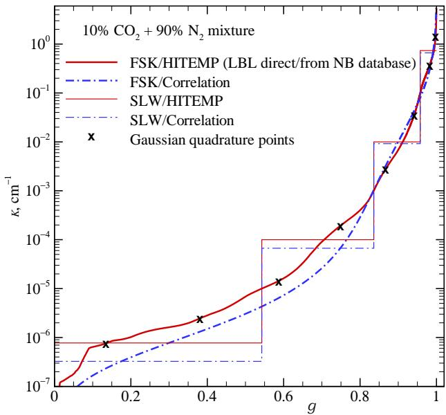  
FIGURE 20-13 Planck-function-weighted cumulative  $k$ -distributions for  $10\%$ $\mathrm{CO_2}$  in nitrogen for gas and Planck function temperatures of  $1000\mathrm{K}$ , as evaluated from the HITEMP database and the correlation by Modest and Mehta.

where  $H$  is the Heaviside step function, and  $I_{bj}$  is the Planck function integrated over the narrow band:

$$
I_{bj} = \int_{\Delta \eta_{j}}I_{b\eta}d\eta . \tag{20.153}
$$

A collection of full spectrum  $k$ - distributions is included in the spectral module of Pal et al. [119]. This database covers the same temperature and pressure ranges as the Wang and Modest narrow band database, as well as their nested quadrature scheme.

Example 20.12. Reconsider Example 20.9, i.e., the heat loss from an isothermal slab at  $T = 1000\mathrm{K}$ , but here consisting of a  $90\%$ $\mathrm{N}_2 - 10\%$ $\mathrm{CO_2}$  (by volume) binary gas mixture. Calculate the heat loss from this slab using the FSK and SLW methods, employing both the HITEMP database and the correlation of Modest and Mehta [118].

# Solution

For a homogeneous medium without scattering the FSK's radiative transfer equation, equation (20.104), reduces to

$$
\frac{dI_g}{ds} = k(I_b - I_g), \tag{20.154}
$$

subject to the cold- wall boundary condition of  $I_{g} = 0$  at both walls. Since the walls are cold no  $a$ - function is needed and only one  $k$ - distribution must be obtained, either  $(i)$  directly from the HITEMP 2010 database using the Fortran program fskdist from Appendix F,  $(ii)$  assembling it from a narrow band database, such as the EM2C database [55] or the one by Wang and Modest [112] (the latter employed here), or  $(iii)$  from the Modest and Mehta correlation using subroutine fskdco2. All three distributions are shown in Fig. 20- 13, with the  $k$ - distribution obtained from the narrow band database being indistinguishable from the exact direct calculation. The solution to the spectral equation (20.154) is, as in Example 20.9

$$
q_{g}(L) = \sigma T^{4}\left[1 - 2E_{3}(kL)\right],
$$

and the total, nondimensional heat flux becomes,

$$
\Psi = \frac{q}{dT^4} = \int_0^1\left[1 - 2E_3(kL)\right]dg\simeq \sum_{n = 1}^N w_n\left[1 - 2E_3\big(k(g_n)L\big)\right],
$$

where the integral is evaluated through an  $N$ - point numerical quadrature (with quadrature points  $g_{n}$  and weights  $w_{n}$ ). Usually  $N\simeq 10$  gives accuracies better than  $1\%$  if the quadrature scheme is chosen

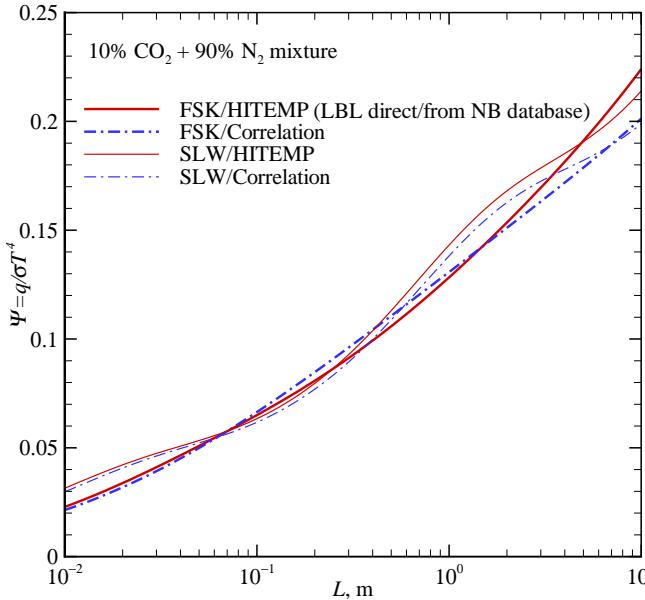  
FIGURE 20-14Heat loss from an isothermal slab of  $10\% \mathrm{CO}_2$  in nitrogen at  $T = 1000 \mathrm{K}$ , as evaluated from the LBL, FSK, and SLW models.

wisely. Since  $k$ - values generally vary over several orders of magnitude, and since the larger  $k$ - values tend to have a larger impact on the solution, quadrature points should move closer together for larger values of  $k$  and  $g$ . The Gauss- Lobatto quadrature scheme [120] has probably been the most popular for this purpose. Another scheme, the  $m$ th order Gaussian quadrature of moments [120], is somewhat more flexible, because, depending on the order  $m$ , the spacing of quadrature points can be controlled. We will here use an eight- point, third order Gaussian quadrature of moments, whose quadrature points have been obtained from a Numerical Recipes [121] routine and are included in Fig. 20- 13. Results are shown in Fig. 20- 14 and are seen to virtually coincide with line- by- line results: for a homogeneous medium the FSK methods are exact and any discrepancies are due to quadrature errors (for the LBL as well as the FSK quadratures). Using the  $k$ - distribution correlation of Modest and Mehta gives very respectable results, slightly overpredicting the LBL data for intermediate  $L$ , with a maximum error of about  $5\%$  in that range. For large  $L$  the correlation would be expected to underpredict the heat loss, since the fit underpredicts small  $k$ - values (see Fig. 20- 13); indeed, Fig. 20- 14 shows the correlation to be about  $10\%$  in error for  $L = 10 \mathrm{m}$ .

For the SLW approach four  $g$ - ranges have been chosen, namely ranges (based on the LBL  $k$ - distribution) with  $k < 10^{- 3} \mathrm{cm}^{- 1}$  (and a lower limit taken as  $k$  at  $g = 0.01$ ),  $10^{- 5} \mathrm{cm}^{- 1} < k < 10^{- 3} \mathrm{cm}^{- 1}$ ,  $10^{- 3} \mathrm{cm}^{- 1} < k < 10^{- 1} \mathrm{cm}^{- 1}$ , and  $k > 10^{- 1} \mathrm{cm}^{- 1}$  (and the actual maximum  $k$  as the upper limit), and the same  $g$ - values are employed for the  $k$ - distribution correlation. The  $k$ - values are then calculated from equation (20.115), resulting in almost identical values for the HITEMP and correlation distributions for large  $g$  (where the correlation is very accurate), and  $k_{\mathrm{HITEMP}} > k_{\mathrm{correlation}}$  for  $g < 0.8$  (where the correlation underpredicts actual  $k$ - values); see Fig. 20- 13. Consequently, both SLW simulations yield similar results for small  $L$  (where large  $k$  dominate), with increasing underprediction by the correlation as  $L$  increases. The SLW results oscillate slightly around the LBL data, indicating that the accuracy of the SLW method depends mostly on a wise choice of  $g$ - ranges (with different optima for different slab widths  $L$ ).

# Full Spectrum  $k$ -Distributions for Mixtures

Similar to narrow band  $k$ - distributions, variable mixtures of different absorbing gases, and perhaps the addition of nonscattering particles, such as soot, pose no additional difficulty, in principle, because the absorption coefficient of all species can simply be added up. In practice, however, because of the considerable effort involved, one would like to precalculate and database all necessary  $k$ - distributions, before embarking on detailed heat transfer calculations. Because of the infinite number of possible mixture concentrations this would quickly become a Herculean task. Therefore, it would be highly desirable to build full spectrum  $k$ - distributions

for arbitrary gas mixtures from relatively few distributions databased for individual species. Exact construction of such  $k$ - distributions is possible as long as the absorption coefficient of each species is unaffected by the other species (i.e., collisions with varying amounts of other species have no impact on line broadening), but the integral in equation (20.109) or (20.133) becomes a multiple integral (one for each species) [6, 8, 12]. Numerical effort would increase from  $N$  RTE evaluations (number of quadrature points), to  $N^M$  RTE evaluations in a mixture of  $M$  absorbing species, quickly eliminating the advantages of the FSK methods. Mixing full spectrum  $k$ - distributions is essentially identical to the narrow band mixing case described in Section 11.9, equations (11.111) through (11.126) and, therefore, the discussion here will be very brief.

Variable Mole Fraction of a Single Absorbing Gas As in equation (11.111) we consider an absorption coefficient that is linearly dependent on its partial pressure, i.e., a gas whose line broadening is unaffected by its own partial pressure, or

$$
\kappa_{x\eta}(T,p,x;\eta) = x\kappa_{\eta}(T,p;\eta). \tag{20.155}
$$

Going through the identical steps as for narrow bands, we obtain

$$
f_{x}(T_{P},T_{g},p,x;k_{x}) = \frac{1}{x} f(T_{P},T_{g},p;k_{x} / x), \tag{20.156}
$$

and

$$
g(T_{P},T_{g},p;k) = g_{x}(T_{P},T_{g},p,x;k_{x}), \tag{20.157}
$$

where the arguments, from the definition of full spectrum  $k$ - distributions, now include a Planck function temperature  $T_P$ . As before, the  $k$  vs.  $g$  behavior is independent of mole fraction, with  $k_x$  smaller than  $k(g)$  by the multiplicative factor  $x$  for any value of  $g$ . Equation (20.156) also implies that the nongray stretching function  $a$  remains unaffected if the mole fraction is changed [see equations (20.108) and (20.132)].

Single Absorbing Gas Mixed with Gray Medium Identical to its narrow band equivalent, if

$$
\kappa_{p\eta}(T,p,\kappa_{p};\eta) = \kappa_{\eta}(T,p,\eta) + \kappa_{p}, \tag{20.158}
$$

it follows that

$$
\begin{array}{c}{f_p(T_P,T_g,p,\kappa_p;k_p) = f(T_P,T_g,p;k = k_p - \kappa_p)}\\ {g(T_P,T_g,p;k) = g_p(T_P,T_g,p,\kappa_p;k_p = k + \kappa_p).} \end{array} \tag{20.160}
$$

As for narrow bands, for the same  $g$  the  $k$ - values are displaced by a constant additive factor  $\kappa_p$  and, as for the variable mole fraction case, equation (20.159) implies that the weight factor  $a$  remains unaffected.

Superposition of  $k$ - Distributions Under certain conditions it may be acceptable to neglect overlap of spectral lines from different species. For example, Bansal and coworkers [122] have shown that radiation in air plasma is dominated by few widely spaced electronic excitation lines of monatomic  $N$  and  $O$ . Thus, if we consider a mixture of  $M$  different absorbing gases, whose absorption coefficients do not overlap each other anywhere across the entire spectrum, then the  $k$ - distributions of the individual species are unaffected by the others, i.e., the spectral locations where  $k = \kappa_{mn}$  for the  $m$ th species remain unaffected by the other gases, and

$$
f_{\mathrm{mix}}(T_P,T_g,p;k) = \sum_{m = 1}^{M}f_m(T_P,T_g,p;k), \tag{20.161}
$$

where the  $f_m$  are the  $k$ - distributions of the individual species. Keeping in mind that, for nonoverlapping absorption coefficients, each species must have large parts of the spectrum with  $\kappa_{mn} \equiv 0$ ,

we integrate equation (20.161) as

$$
1 - g_{\mathrm{mix}}(T_P,T_g,p;k) = \int_k^\infty f(T_P,T_g,p;k)dk = \sum_{m = 1}^M\int_k^\infty f_m(T_P,T_g,p;k)dk = \sum_{m = 1}^M\left(1 - g_m(T_P,T_g,p;k)\right).
$$

or

$$
g_{\mathrm{mix}}(T_P,T_g,p;k) = \sum_{m = 1}^M g_m(T_P,T_g,p;k) - M + 1. \tag{20.162}
$$

Therefore, the cumulative  $k$ - distribution for a nonoverlapping mixture is constructed by simply adding up the individual components. Note that  $1 - g_{m}$  is the (Planck function weighted) part of the spectrum where  $\kappa_{mn} > 0$  and, thus, their sum can never exceed unity.

$k$ - Distributions for Random Overlap As pointed out by Taine and Soufiani [123], there is no physical reason why there should be any significant correlation between the spectral variation of absorption coefficients of different gas species. If one treats the absorption coefficients of the  $M$  species as statistically independent random variables of wavenumber, the  $k$ - distributions are said to be statistically uncorrelated. Using such an argument, Soloviyov and Webb [12] postulated that the cumulative  $k$ - distributions are multiplicative, or

$$
g_{\mathrm{mix}}(T_P,T_g,p;k) = g_1(T_P,T_g,p;k)\times g_2(T_P,T_g,p;k)\times \ldots = \prod_{m = 1}^{M}g_m(T_P,T_g,p;k). \tag{20.163}
$$

Statistically Uncorrelated Gas Mixtures Taine and Soufiani [123] argued that, if the  $M$  species in a gas mixture are statistically uncorrelated, then their transmissivities should be multiplicative, i.e.,

$$
\overline{\tau}_{\mathrm{mix}} = \prod_{m = 1}^{M}\overline{\tau}_{\eta ,m}, \tag{20.164}
$$

and this was shown to be true on a narrow band basis by comparison with LBL calculations (see [123] as well as Fig. 11- 18). Based on equation (20.164) Modest and Riazzi [124] developed the narrow band mixing scheme in Section 11.9, equations (11.121) through (11.126). The same argument can also be made at the full spectrum level. Defining a full spectrum transmissivity as

$$
\overline{\tau} (T,L) = \frac{1}{I_b}\int_0^\infty I_{b\eta}(T)e^{-\kappa_\eta L}d\eta , \tag{20.165}
$$

we can manipulate this expression, using the definition of the Dirac- delta function given by equation (11.99), to obtain

$$
\begin{array}{rl} & {\overline{\tau} (T,L) = \frac{1}{I_b}\int_{\eta = 0}^{\infty}I_{b\eta}(T)e^{-\kappa_\eta L}\int_{k = 0}^{\infty}\delta (k - \kappa_\eta)dkd\eta}\\ & {\quad \quad = \int_{k = 0}^{\infty}e^{-kL}\frac{1}{I_b}\int_{\eta = 0}^{\infty}I_{b\eta}(T)\delta (k - \kappa_\eta)d\eta dk}\\ & {\quad \quad = \int_{k = 0}^{\infty}e^{-kL}f(T,k)dk = \int_{g = 0}^{1}e^{-kL}dg,} \end{array} \tag{20.166}
$$

which is identical to equation (11.122). Assuming equation (20.164) to hold, the analysis is identical to the narrow band case, leading to

$$
g_{\mathrm{mix}}(T,k_{\mathrm{mix}}) = \int_{g_1 = 0}^{1}\int_{g_2 = 0}^{1}H[k_{\mathrm{mix}} - (k_1 + k_2)]dg_2dg_1 = \int_{g_1 = 0}^{1}g_2(k_{\mathrm{mix}} - k_1)dg_1 \tag{20.167}
$$

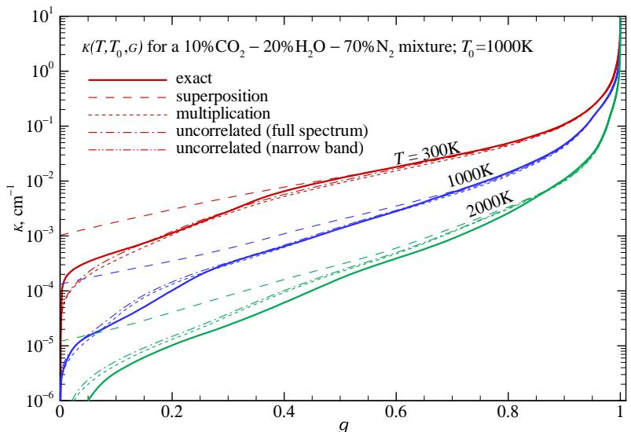  
FIGURE 20-15 Full-spectrum  $k$ -distributions for a  $10\%$ $\mathrm{CO_2 - 20\%}$ $\mathrm{H}_2\mathrm{O} - 70\%$ $\mathrm{N}_2$  mixture without soot, for various Planck function temperatures (absorption coefficient evaluated at  $1000\mathrm{K}$ ).

for a two- component mixture, and

$$
g_{\mathrm{mix}}(T,k_{\mathrm{mix}}) = \int_{g_1 = 0}^{1}\dots \int_{g_M = 0}^{1}H[k_{\mathrm{mix}} - (k_1 + \dots +k_M)]dg_M\dots dg_1 \tag{20.168}
$$

for a mixture of  $M$  species, but now using full spectrum  $k$ - distributions.

Mixtures of Gases and Particles If the particles are assumed to be gray, equation (20.160) applies directly, i.e., the full spectrum  $k$ - distribution is found for the gas mixture as  $g(T_P,T_g,p;k)$ . The mixture's  $k$ - distribution is then determined by simply adding the particles' constant absorption coefficient  $\kappa_p$  for every value of  $g$ . If the particles' absorption coefficient is nongray, mixing must be performed at the narrow band level, assuming that  $\kappa_{p\eta} = \kappa_{p,j}$  is constant across narrow band range  $j$ . Any of the narrow band schemes described in Section 11.9 may be employed. For example, with the Modest and Riazzi [124] model, equation (11.126), for each narrow band:

$$
g_{\mathrm{mix},j}(\phi_0,k) = \int_{g_1 = 0}^{1}\dots \int_{g_M = 0}^{1}H[k_{\mathrm{mix}} - (k_1 + \dots +k_M + \kappa_{p,j})]dg_M\dots dg_1, \tag{20.169}
$$

where  $\phi_0$  is the (reference) state at which the absorption coefficients of the gas are evaluated, and  $\kappa_{p,j}$  has been added to the argument inside the Heaviside function according to equation (11.119). The full spectrum  $k$ - distribution is then determined from

$$
g(T_{P},\phi_{0},k) = \sum_{j\in \mathrm{[allNB^{\prime}s]}}\frac{I_{b}}{I_{b}} (T)g_{\mathrm{mix},j}(\phi_{0},k). \tag{20.170}
$$

Test Calculations A real gas mixture will, of course, always have some spectral overlap, and the absorption coefficient will never be quite statistically uncorrelated. Figure 20- 15 shows the case of a  $10\%$ $\mathrm{CO_2 - 20\%}$ $\mathrm{H}_2\mathrm{O} - 70\%$ $\mathrm{N}_2$  mixture, with the absorption coefficient evaluated at a reference temperature of  $T_0 = 1000\mathrm{K}$ . Full- spectrum  $k$ - distributions were evaluated for a number of Planck function temperatures by five methods: (i) the exact  $k$ - distribution for the mixture was found from the HITEMP database [2], (ii) individual  $k$ - distributions were found for  $\mathrm{CO_2}$  and  $\mathrm{H}_2\mathrm{O}$ , and a mixture distribution was found from equation (20.162) (superposition, neglecting overlap), (iii) similarly a mixture distribution was determined from equation (20.163) (random overlap), and (iv) the Modest and Riazzi full spectrum mixing of equation (20.167) was

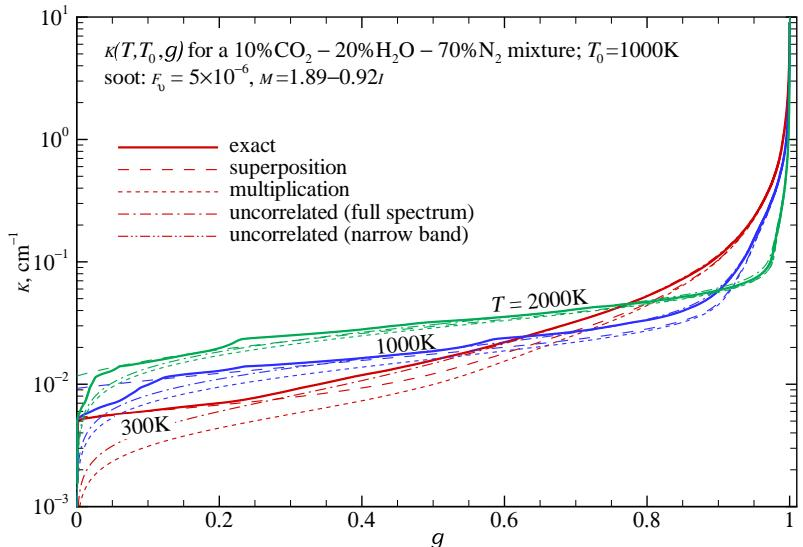  
FIGURE 20-16 Full-spectrum  $k$ -distributions for a  $10\% \mathrm{CO_2} - 20\% \mathrm{H_2O} - 70\% \mathrm{N_2}$  mixture with soot, for various Planck function temperatures (absorption coefficient evaluated at  $1000\mathrm{K}$ ).

employed; finally,  $(v)$  mixing was done on a narrow band basis, using the Modest and Riazzi scheme, equation (11.125), after which the full spectrum distribution was obtained from equation (20.152). Figure 20- 15 shows that all approximate methods predict the correct distribution very well for large values of  $k$ . For very small values of  $k$  substantial overlap between species is to be expected, and the superposition method fails. The product method, on the other hand, appears to give good accuracy for nearly all conditions. The uncorrelated transmissivity scheme of Modest and Riazzi, when applied on a full- spectrum basis, displays good accuracy similar to the multiplication scheme, but outperforms it for very small values of  $k$ . When applied at the narrow band level, the uncorrelated mixing rule is virtually exact (lines become indistinguishable). Note that the  $k(g)$  levels decrease with temperature, because of the strong effect of the rotational band of water vapor at long wavelengths, favoring low temperatures. When applied to evaluate the radiative source within a homogeneous slab [124] (for which directly calculated  $k$ - distributions return exact answers), the multiplication scheme incurred errors of  $4\%$  and  $5\%$  when mixing on narrow band and full spectrum levels, respectively, while the Modest and Riazzi mixing scheme resulted in  $0\%$  and  $1\%$  error, respectively. These findings were corroborated by Demarco et al. [125], who tested several spectral models (WSGG with parameters from Smith and coworkers [71]; statistical narrow band using the EM2C database [55]; and SLW and FSCK using the EM2C database [55]) to assemble full- spectrum  $k$ - distributions) as well as mixing models (superposition, multiplication and uncorrelated mixing), and found that the combination of FSCK with the Modest and Riazzi mixing scheme gave the most accurate results.

The methods were also tested for gas mixtures with nonscattering soot, using equation (12.123) with a volume fraction of  $f_{v} = 5\times 10^{- 6}$  and a refractive index  $m = 1.89 - 0.92i$ . Clearly, none of the first four methods should work terribly well, since strong overlap is assured, and the soot absorption coefficient is anything but random. That Fig. 20- 16, nonetheless, shows reasonable agreement is a consequence of the fact that the soot  $k$ - distribution dominates the mixture, especially at high Planck function temperatures (favoring short wavelengths with strong soot and weak gas radiation). For the same reason  $k(g)$  values now increase with temperature. None of the assumptions underlying scheme  $(v)$  are violated, and it again displays superb accuracy (with its line indistinguishable from the exact one).

Example 20.13. Repeat Example 20.11 using individual  $k$ - distributions for  $\mathrm{CO_2}$  and  $\mathrm{H_2O}$  obtained from the correlations in Tables 20.3 and 20.4, together with the superposition, multiplication, and uncorrelated methods.

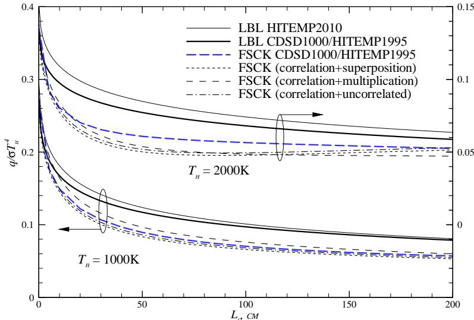  
FIGURE 20-17Heat loss from the cold column of a two-column  $10\%$ $\mathrm{CO_2 - 20\%}$ $\mathrm{H}_2\mathrm{O} - 70\%$ $\mathbb{N}_2$  mixture at different temperatures  $(T_{h} = 1000\mathrm{K}$  and  $2000\mathrm{K},L_{h} = 50\mathrm{cm};T_{c} = 300\mathrm{K},L_{c}$  variable; uniform  $p = 1$  bar, cold and black walls), from LBL and FSCK models; LBL from HITEMP 2010 database and  $\mathrm{CDSD1000(CO_2) / HITEMP1995(H_2O)}$  FSCK using individual  $k$  -distributions for  $\mathrm{CO_2}$  from  $\mathrm{CDSD1000}$  and the Modest and Singh correlation [117]  $\mathrm{H}_2\mathrm{O}$  from HITEMP 1995 and the Modest and Mehta correlation [118].

# Solution

The solution proceeds identically to that of Example 20.11, except that the five  $k$  - distributions are evaluated differently.

Subroutines fskdco2 and fskdh2o are provided in Appendix F to calculate the individual  $k$  distributions for  $\mathrm{CO_2}$  and  $\mathrm{H}_2\mathrm{O},$  respectively. Combined  $k$  - distributions are then obtained using program fskdistmix, choosing the proper mixing option, i.e., applying equations (20.162) (superposition), (20.163) (multiplication), or (20.167) (uncorrelated mixture). Results from the FSCK method are shown in Fig. 20- 17 and are compared with LBL results, all using the identical spectroscopic databases (CDSD1000 for  $\mathrm{CO_2}$  and HITEMP 1995 for  $\mathrm{H}_2\mathrm{O}$  ) that were used for the correlations given in Tables 20.3 and 20.4. As was observed in Fig. 20- 12 for this problem the FSCK scheme is less accurate than FSSK, giving fair answers for a hot medium temperature of  $T_{h} = 1000\mathrm{K},$  but rather poor answers for  $T_{h} = 2000\mathrm{K}$  . For  $T_{h} = 1000\mathrm{K}$  the agreement between the directly calculated FSCK and those from the correlations is good for all three mixing schemes, with- - as expected- - the uncorrelated mixture scheme of equation (20.167) giving the best results. At  $T_{h} = 2000\mathrm{K}$  there is a considerable difference between directly calculated FSCK results and those from the correlations, indicating that one or both of the correlations loses accuracy (probably the  $\mathrm{H}_2\mathrm{O}$  correlation, which- - due to neglect of  $T_{p}$  - dependence- - becomes inaccurate for the small values of  $k$  important here). For both cases the superposition method returns the least- accurate answers and should be avoided. While the uncorrelated- mixture approach always is the most accurate, the multiplication scheme returns respectable results with less effort and, given the inaccuracies of the correlations, may be sufficient.

The exiting flux for this example was also calculated using the NBKDIR database given in Appendix F, i.e., the FSCK result compiled from databased narrow band  $k$  - distributions for  $\mathrm{CO_2}$  and  $\mathrm{H}_2\mathrm{O}$  mixed at the narrow band level with the Modest and Riazzi (uncorrelated mixture) scheme. Those results are virtually indistinguishable from the directly calculated FSCK line in Fig. 20- 17, attesting to the accuracy of this mixing model.

Also shown in Fig. 20- 17 are LBL results obtained with the latest HITEMP 2010 database [2] (for both  $\mathrm{CO_2}$  and  $\mathrm{H}_2\mathrm{O}$  ) yielding a noticeably higher heat flux at  $T_{h} = 2000\mathrm{K},$  due to the inclusion of many more high- temperature lines for water vapor. On the other hand, the LBL flux given in Fig. 20- 12 is quite a bit larger for the higher temperature, in this case due to errors in HITEMP 1995 that manifest themselves for  $T > 1000\mathrm{K}$  (incorrectly strong high- temperature lines for  $\mathrm{CO_2}$ , as discussed in Chapter 11).

# 20.12 HIGHER ORDER  $k$  -DISTRIBUTION METHODS

20.12 HIGHER ORDER  $k$ - DISTRIBUTION METHODSThe FSK method is exact for homogeneous media, and also for materials with a "correlated" absorption coefficient, i.e., media where spectral minima and maxima always occur at the same wavenumbers everywhere inside the spatial domain. We noticed that this premise is violated in media with large temperature disparities, because of the rise of "hot lines" in high- temperature regions (spectral lines from elevated vibrational energy levels, which are not present in colder gas). In such cases the gas becomes "uncorrelated" and the FSK method breaks down, and likewise the SLW and ADF schemes (see Fig. 20- 12). The problem is exacerbated if the medium also contains strong concentration changes, with spectral lines of onespecies (say, a hydrocarbon fuel, such as methane) in one part of the domain, and other species (such as combustion products  $\mathrm{CO_2}$  and  $\mathrm{H}_2\mathrm{O}$ ) elsewhere. There is no reason to believe spectral lines of two different gas species would occur at the same wavenumbers, and the gas mixture becomes uncorrelated. In fact, this uncorrelatedness between species is the basis for some of the  $k$ - distribution mixing models of the previous section.

The accuracy of the FSK methods for nonhomogeneous media (and similarly, that of the SLW and ADF methods) can be improved by breaking up the absorption coefficient of the gas into spectral scales or groups, each of which is assumed to be correlated or scaled, and solving separate RTEs for each scale or group. This was first recognized by researchers in France for the case of strong temperature inhomogeneities. They grouped spectral lines according to the values of their lower level energies into a number of "fictitious gases," first for narrow band  $k$ - distributions [10, 111] (cf. Section 11.9), and then for the ADF scheme, calling it the ADFFG (absorption distribution function fictitious gases) method [8].

While grouping spectral lines according to their lower level energies is straightforward, it does have the disadvantage that the absorption coefficients of the different scales overlap. The ADFFG treats this overlap exactly, by evaluating conditional probability density functions (i.e., the joint event that  $k_{1} = \kappa_{1\eta}$  while also  $k_{2} = \kappa_{2\eta}$ , etc.). This makes the method uneconomical beyond two or three fictitious gases, requiring  $N^{M}$  RTE evaluations, where  $M$  is the number of fictitious gases or scales and  $N$  is the number of gray gases for each scale. Zhang and Modest [14] also used this scheme to extend the validity of the FSK approach, calling it the "multiscale" MSFSK method. However, recognizing that overlap between scales (separate species or groups of species, or a single gas broken up into temperature scales) tends to be relatively minor, they opted for an approximate approach to determine overlap, arguing that a small error in overlap treatment would result in near- negligible overall error. In this way the MSFSK method requires only  $N \times M$  RTE evaluations, making it much more economical than the ADFFG approach. Zhang and Modest applied their method to gas mixtures without wall emission, using both the FSSK and FSCK schemes. They noted that—even for the worst- possible temperature steps—already a two- scale model returns near- exact answers with little difference between the scaled FSSK and the correlated FSCK. Since the FSCK is somewhat more straightforward to apply, only this scheme was pursued in further work. Wang and Modest [126] extended the MSFSK scheme to allow determination of the required  $k$ - distributions from narrow band databases, such as the one by Wang and Modest [112], and, finally, the method was further developed to allow for gray surface emission as well as for nongray particles [127, 128].

A somewhat different approach to improve the accuracy of the FSK method in the presence of strong temperature disparities is the "multigroup" or MGFSK approach [15, 16], in which spectral positions are grouped together according to their absorption coefficient's temperature and pressure dependence (i.e., the contributions from all spectral lines at one spectral location, as opposed to individual lines contributing to all wavenumbers in the multiscale/fictitious gas approach). Since there is no overlap between spectral groups, there is no need to evaluate an overlap factor with the presumption of uncorrelatedness among scales (somewhat questionable for lines from the same species). The method also requires only  $N \times M$  RTE evaluations, but

without additional approximations, and was shown to reach line- by- line accuracy with as few as  $N = 4$  spectral groups.

Recently, Pal and coworkers [129, 130] combined the advantages of the multigroup approach (breaking up the absorption coefficient of a single species according to temperature behavior, without overlap issues between groups), with those of the multiscale scheme (treating different species or groups of species as separate scales, exploiting their uncorrelatedness to accurately evaluate overlap effects). They generated a four- group narrow band database for the two most important species ( $\mathrm{H}_2\mathrm{O}$  and  $\mathrm{CO}_2$ ), which can be used for four- group simulations or combined for two- group and single- group calculations, and it can be employed in conjunction with Wang and Modest's [112] narrow band database for other species.

For illustrative purposes we will present here only the (relatively) simple case of the MSFSK approach applied to a gas mixture without wall emission [126]. Readers interested in gas- particulate mixtures and/or wall emission should consult [127, 128], and those striving for the greatest accuracy obtainable by the hybrid multigroup- multiscale scheme are referred to [129, 130].

If one separates the contributions to  $\kappa_{\eta}$  from the  $M$  scales (such as component gases, or groups of species) and breaks up the radiative intensity  $I_{\eta}$  accordingly, i.e.,

$$
\kappa_{\eta} = \sum_{m = 1}^{M}\kappa_{m\eta},\quad I_{\eta} = \sum_{m = 1}^{M}I_{m\eta}, \tag{20.171}
$$

then the RTE equation (20.97) (without particle absorption and scattering) is transformed into  $M$  component RTEs, one for each species or scale. For each scale this leads to

$$
\frac{dI_{m\eta}}{ds} = \kappa_{m\eta}(\phi)I_{b\eta} - \kappa_{\eta}(\phi)I_{m\eta} + ,\quad \mathrm{for} m = 1,\ldots ,M. \tag{20.172}
$$

Physically, the intensity  $I_{m\eta}$  for the  $m$ th scale is due to emission from the  $m$ th species but subject to absorption by all species.

If there is no particle or wall emission present in the medium, the spectral locations where  $\kappa_{\eta}$  contributes to the absorption of  $I_{m\eta}$  (i.e., absorption by all the gas scales) are only those wavenumbers for which  $\kappa_{m\eta}$  is nonzero. Therefore, the overlap region is only a subset of those wavenumbers with  $\kappa_{m\eta} \neq 0$ , across which absorption from other gases occurs as well. The MSFSK formulation takes advantage of the fact that the overlap regions for each scale are relatively small compared to the total emission/absorption spectrum of each scale.

In the absence of wall emission, equation (20.98) for scale  $m$  can be written as

$$
I_{m\eta} = I_{wm\eta} = (1 - \epsilon_w)\frac{1}{\pi}\int_{\hat{\mathbf{n}}\cdot \hat{\mathbf{s}}< 0}I_{m\eta}|\hat{\mathbf{n}}\cdot \hat{\mathbf{s}} |d\Omega , \tag{20.173}
$$

where  $I_{wm\eta}$  is the spectral intensity leaving the enclosure wall, due to diffuse, gray reflection.

We now apply the FSK scheme to the RTE of each scale: First equation (20.172) is multiplied by Dirac's delta function  $\delta (k_m - \kappa_{m\eta}(\phi_0))$ , followed by division with

$$
f_{m}(T_{0},\phi_{0},k_{m}) = \frac{1}{I_{b}(T_{0})}\int_{0}^{\infty}I_{b\eta}(T_{0})\delta \left(k_{m} - \kappa_{m\eta}(\phi_{0})\right)d\eta , \tag{20.174}
$$

where  $\phi_0$  and  $T_0$  refer to a reference state. The resulting equation is then integrated over the entire spectrum, leading to

$$
\frac{dI_{m\eta}}{ds} = k_ma_mI_b - \lambda_mI_{m\eta},\quad \mathrm{for} m = 1,\ldots ,M, \tag{20.175}
$$

where

$$
I_{mg} = \int_{0}^{\infty}I_{m\eta}\delta \left(k_{m} - \kappa_{m\eta}(\phi_{0})\right)d\eta \bigg / f_{m}\left(T_{0},\phi_{0},k_{m}\right), \tag{20.176}
$$

subscript  $g$  pertains to the cumulative  $k$ - distribution for the  $m$ th scale,

$$
g_{m} = \int_{0}^{k_{m}}f_{m}(T_{0},\phi_{0},k)dk, \tag{20.177}
$$

$a_{m}$  is the nongray stretching factor,

$$
a_{m} = \frac{f_{m}(T,\phi_{0},k_{m})}{f_{m}(T_{0},\phi_{0},k_{m})}, \tag{20.178}
$$

and  $\lambda_{m}$  is the overlap parameter of the  $m$ th scale with all other scales, defined by

$$
\lambda_{m}I_{mg} = k_{m}I_{mg} + \int_{0}^{\infty}\left(\sum_{n\neq m}\kappa_{n\eta}\right)I_{m\eta}\delta \left(k_{m} - \kappa_{m\eta}(\phi_{0})\right)d\eta \bigg / f_{m}\left(T_{0},\phi_{0},k_{m}\right) \tag{20.179}
$$

Similarly, FSK reordering is performed on boundary condition(s) with respect to  $\kappa_{m\eta}(\phi_0)$ , which results in

$$
I_{mg} = \frac{1 - \epsilon}{\pi}\int_{2\pi}I_{mg}|\hat{n},\hat{s}|d\Omega ,\quad \mathrm{for} m = 1,\ldots ,M. \tag{20.180}
$$

The last term in equation (20.175) describes the overlap of the absorption coefficient of the  $m$ th scale,  $\kappa_{m\eta}$ , with those of all other scales, which occurs over part of the spectrum. In the MSFSK method the overlap parameter  $\lambda_{m}$  is evaluated in an approximate way, such that the emitted intensity emanating from a homogeneous nonscattering layer bounded by black walls is predicted exactly. The so- determined  $\lambda_{m}$  is a function of the state variables as well as of  $k_{m}$  (or  $g_{m}$ ).

In equation (20.175) the reordering is performed in terms of the absorption coefficient of one scale  $\kappa_{m\eta}$ , and the interaction between  $\kappa_{m\eta}$  and  $\kappa_{\eta}$  during the reordering process is lumped into the overlap parameter  $\lambda_{m}$ . The reordering of equation (20.172) can also be performed in terms of  $\kappa_{\eta}$ , which, for a homogeneous layer at temperature  $T$ , leads to

$$
\frac{dI_{mg}^{*}}{ds} = \frac{k_{m}^{*}I_{b}}{f(T,\phi,k)} -k_{mg}^{*},\quad \mathrm{for} m = 1,\ldots ,M, \tag{20.181}
$$

where

$$
\begin{array}{c}{f(T,\phi ,k) = \frac{1}{I_b(T)}\int_0^\infty I_{b\eta}(T)\delta \big(k - \kappa_\eta (\phi)\big)d\eta ,}\\ {I_{mg}^* = \int_0^\infty I_{mn}\delta \big(k - \kappa_\eta (\phi)\big)d\eta \bigg / f(T,\phi ,k),}\\ {k_m^* = \frac{1}{I_b}\int_0^\infty I_{b\eta}(T)\kappa_{mn}\delta \big(k - \kappa_\eta (\phi)\big)d\eta .} \end{array} \tag{20.183}
$$

In equation (20.181) the interaction between  $\kappa_{m\eta}$  and  $\kappa_{\eta}$  is lumped into  $k_{m}^{*}$ . The solutions to equations (20.175) and (20.181) for a homogeneous layer at temperature  $T$  bounded by black walls (for which  $a_{m} \equiv 1$ ) can be obtained analytically, and the total exiting intensities from the gas scales at  $s = L$  are

$$
I_{m} = \int_{0}^{1}I_{mg}dg_{m} = \int_{0}^{\infty}\frac{k_{m}}{\lambda_{m}} I_{b}\left[1 - \exp (-\lambda_{m}s)\right]f_{m}(T,\phi ,k_{m})dk_{m},\quad \mathrm{for} m = 1,\ldots ,M, \tag{20.185}
$$

and

$$
I_{m}^{*} = \int_{0}^{1}I_{mg}^{*}dg = \int_{0}^{\infty}\frac{k_{m}^{*}}{k} I_{b}\left[1 - \exp (-ks)\right]dk,\quad \mathrm{for} m = 1,\ldots ,M, \tag{20.186}
$$

respectively. The spectrally integrated intensity,  $I_{m}$ , should be equal to  $I_{m}^{*}$ , and this requirement leads to

$$
\lambda_{m} = k,\quad \mathrm{and}\quad k_{m}f_{m}(T,k_{m})dk_{m} = k_{m}^{*}(T,k)dk, \tag{20.187}
$$

or

$$
k_{m}^{*}(T,\lambda_{m})d\lambda_{m} = k_{m}f_{m}(T,k_{m})dk_{m} = k_{m}(g_{m})dg_{m}. \tag{20.188}
$$

Equation (20.188) provides the relationship between  $\lambda_{m}$  and  $k_{m}$  that is required to solve equation (20.175). One convenient way of determining  $\lambda_{m}$  is using a partly integrated form

$$
\int_{0}^{g_{m}(k_{m})}k_{m}(g_{m})dg_{m} = \int_{0}^{k = \lambda_{m}}k_{m}^{*}(T,k)dk. \tag{20.189}
$$

The overlap parameter can be determined efficiently and accurately from a database of narrow band  $k$ - distributions of individual species (scales). One advantage of using narrow band  $k$ - distributions is that assembling mixture full spectrum  $k$ - distributions from narrow band  $k$ - distributions of individual gas species mixed at the narrow band level is more accurate than mixing entire full spectrum  $k$ - distributions of individual species. In addition, the use of narrow band  $k$ - distributions of individual species allows the inclusion of nongray absorbing particles in the participating medium, by employing equation (11.120).

For the  $m$ th scale, substituting equation (20.184), into equation (20.189) the right- hand side (RHS) may be rewritten in terms of narrow band  $k_{m}^{*}$  as

$$
\mathrm{RHS} = \int_{0}^{k = \lambda_{m}}\sum_{i = 1}^{N_{\mathrm{nb}}}\frac{I_{bi}}{I_{b}}\frac{1}{\Delta\eta}\int_{\Delta \eta}\kappa_{m\eta}\delta (k - \kappa_{\eta})d\eta dk = \sum_{i = 1}^{N_{\mathrm{nb}}}\frac{I_{bi}}{I_{b}}\int_{0}^{k = \lambda_{m}}k_{m,i}^{*}(k)dk, \tag{20.190}
$$

where  $k_{m,i}^{*}$  is the narrow band counterpart of  $k_{m}^{*}, N_{\mathrm{nb}}$  is the number of narrow bands comprising the entire spectrum, and the narrow band Planck function  $I_{bi}$  is defined by equation (20.153). In order to evaluate the integrals involving  $k_{m,i}^{*}$  in equation (20.190) in terms of narrow band  $k$ - distributions, we consider the quantity

$$
Q_{m} = \frac{1}{\Delta\eta}\int_{\Delta \eta}\kappa_{m\eta}\exp (-\kappa_{\eta}L)d\eta \tag{20.191}
$$

for the  $i$ th narrow band. Physically,  $Q_{m}$  is related to narrow band emission from scale  $m$ , attenuated over path  $L$  by the entire gas mixture. Using the definition of the Dirac- delta function, equation (11.99),  $Q_{m}$  can be rewritten as

$$
Q_{m} = \frac{1}{\Delta\eta}\int_{\Delta \eta}\kappa_{m\eta}\int_{0}^{\infty}\exp (-kL)\delta (k - \kappa_{\eta})dkd\eta = \int_{0}^{\infty}k_{m,i}^{*}\exp (-kL)dk = \mathcal{L}(k_{m,i}^{*}), \tag{20.192}
$$

i.e.,  $Q_{m}$  is the Laplace transform of  $k_{m,i}^{*}$ . It was observed in Section 20.11 that, on a narrow band basis, the spectral behavior of different species is essentially statistically uncorrelated. With this assumption,  $Q_{m}$  can also be written as

$$
\begin{array}{l}{Q_{m} = \frac{1}{\Delta\eta}\int_{\Delta \eta}\kappa_{m\eta}\exp (-\kappa_{m\eta}L)\prod_{n\neq m}\exp (-\kappa_{n\eta}L)d\eta}\\ {\approx \frac{1}{\Delta\eta}\int_{\Delta \eta}\kappa_{m\eta}\exp (-\kappa_{m\eta}L)d\eta \prod_{n\neq m}\left(\frac{1}{\Delta\eta}\int_{\Delta \eta}\exp (-\kappa_{n\eta}L)d\eta\right).} \end{array} \tag{20.193}
$$

The second step follows by recognizing that the integration in the first step is an averaging operator, together with the assumption that the absorption coefficients of different scales are statistically uncorrelated. The  $k$ - distribution method can then be applied to equation (20.193) and we obtain

$$
\begin{array}{rl} & Q_{m}\approx \int_{0}^{1}k_{m,i}\exp (-k_{m,i}L)dg_{m}\prod_{n\neq m}\left(\int_{0}^{1}\exp (-k_{n,i}L)dg_{n}\right)\\ & \qquad = \int_{g_{M} = 0}^{1}\dots \int_{g_{M} = 0}^{1}k_{m,i}\exp \left(-\sum_{n = 1}^{M}k_{n,i}L\right)dg_{1}\dots dg_{M}. \end{array} \tag{20.194}
$$

Equating equations (20.192) and (20.194), we have

$$
\mathcal{L}(k_{m,i}^{*})\approx \int_{g_{1} = 0}^{1}\dots \int_{g_{M} = 0}^{1}k_{m,i}\exp \left(-\sum_{n = 1}^{M}k_{n,i}L\right)dg_{1}\dots dg_{M}, \tag{20.195}
$$

and, using the integral property of the Laplace transform,

$$
\mathcal{L}\left(\int_{0}^{k = \lambda_{m}}k_{m,i}^{*}(k)dk\right)\approx \int_{g_{1} = 0}^{1}\dots \int_{g_{M} = 0}^{1}k_{m}\frac{\exp(-\sum_{n = 1}^{M}k_{n}L)}{L} dg_{1}\dots dg_{M}. \tag{20.196}
$$

Finally, taking the inverse Laplace transform, we obtain

$$
\int_{0}^{k = \lambda_{m}}k_{m,i}^{*}(k)dk\approx \int_{g_{1} = 0}^{1}\dots \int_{g_{M} = 0}^{1}k_{m}H\left(k - \sum_{n = 1}^{M}k_{n}\right)dg_{1}\dots dg_{M}, \tag{20.197}
$$

where  $H$  is the Heaviside step function.

The left- hand side of equation (20.189) is also readily expressed in terms of narrow band  $k$ - distributions, as defined by equation (11.98), as

$$
\begin{array}{rl} & {\mathrm{LHS} = \int_{0}^{k_{m}}k_{m}\frac{1}{I_{b}}\int_{0}^{\infty}I_{b\eta}\delta (k_{m} - \kappa_{m\eta})d\eta dk_{m} = \sum_{i = 1}^{N_{\mathrm{nb}}}I_{b i}\int_{0}^{k_{m}}k_{m}\frac{1}{\Delta\eta}\int_{\Delta \eta}\delta (k_{m} - \kappa_{m\eta})d\eta dk_{m}}\\ & {\quad = \sum_{i = 1}^{N_{\mathrm{nb}}}I_{b i}\int_{0}^{g_{m,i}(k_{m})}k_{m,i}dg_{m}.} \end{array} \tag{20.198}
$$

Equating the left- and right- hand sides, we obtain a generic expression for the determination of the overlap coefficient  $\lambda_{m}$  based on narrow band  $k$ - distributions of individual gases as

$$
\sum_{i = 1}^{N_{\mathrm{nb}}}\frac{I_{b}}{I_b}\int_0^{g_{m,i}(k_m)}k_{m,i}dg_m = \sum_{i = 1}^{N_{\mathrm{nb}}}\frac{I_{b}}{I_b}\int_{g_{1\mu} = 0}^{1}\dots \int_{g_{M,i} = 0}^{1}k_{m,i}H\left(\lambda_m - \sum_{n = 1}^{M}k_{n,i}\right)dg_1\dots dg_M, \tag{20.199}
$$

In this expression the  $k_{m}$  and  $\lambda_{m}$  are global values; all others  $(k_{m,i},g_{m,i}$  etc.), are for the ith narrow band. In particular, the integration in equation (20.198) is taken over the  $k$ - distribution of the ith narrow band until  $k_{m,i}$  reaches the global value  $k_{m,i} = k_{m}$ . In practice,  $\lambda_{m}(k_{m})$  is found by evaluating the left- and right- hand sides of equation (20.199) independently for many values of  $k_{m}$  and  $\lambda_{m}$  once and for all for each cell. Required values of  $\lambda_{m}(k_{m})$  for  $g$ - quadrature are then found by interpolation.

A few extreme one- dimensional examples are shown in Figs. 20- 18 and 20- 19, all considering a mixture of  $\mathrm{CO_2}$ ,  $\mathrm{H}_2\mathrm{O}$ , and  $\mathrm{N}_2$  confined between two cold black walls [126, 130]. The mixture

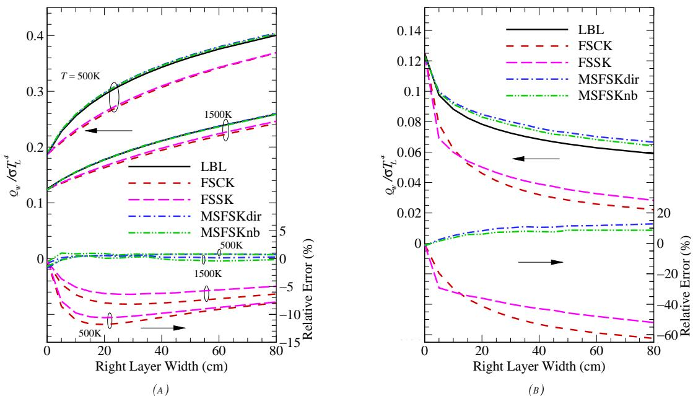  
FIGURE 20-18 Relative errors of the FSCK, FSsK, MSFSKdir, and MSFSKnb calculations with step changes in mole fraction. Left layer:  $2\%$ $\mathrm{CO_2}$  and  $20\%$ $\mathrm{H}_2\mathrm{O};$  right layer:  $20\%$ $\mathrm{CO_2}$  and  $2\%$ $\mathrm{H}_2\mathrm{O}.$  (a) Medium at uniform temperature (500 K or 1500 K); (b) medium with step temperature (left layer at  $1500\mathrm{K},$  right at  $500\mathrm{K}$  [126].

is at a total pressure of 1 bar and consists of two different homogeneous layers (denoted as left and right layer). The left layer has a fixed width of  $L_{L} = 50\mathrm{cm},$  and the right layer a variable width of  $L_{R}$ . The radiative heat flux leaving from the right layer is calculated. Five methods are used to calculate the exiting flux: the LBL, FSK (using both the correlated-  $k$ , FSCK, and the scaled-  $k$ , FSsK, approaches), and MSFSK (using correlated-  $k$ , both, with the overlap coefficient calculated directly from the spectral database, MSFSKdir, and calculated from the NBKDIR narrow band database, MSFSKnb) methods. In the LBL calculations, the HITEMP 1995 and CDSD- 1000 spectral databases were used for the absorption coefficients of  $\mathrm{H}_2\mathrm{O}$  and  $\mathrm{CO}_2$ , respectively. In the FSK calculations, the  $k - g$  distributions are constructed directly from the spectral databases; the reference states and the scaling functions were determined according to equations (20.142) and (20.143). Only correlated-  $k$  was considered for the present MSFSK examples. For the MSFSKdir calculations the overlap coefficients (and  $k$ - distributions) were obtained directly from HITEMP 1995 and CDSD- 1000; for the MSFSKnb calculation the overlap coefficients and  $k$ - distributions were obtained from narrow band  $k - g$  distributions read from the narrow band  $k - g$  database of Wang and Modest [112]. A 10- point Gaussian quadrature scheme was used for the spectral integrations in all FSCK, FSsK, MSFSKdir, and MSFSKnb calculations.

In Fig. 20- 18a the temperatures of both layers ( $T_{L}$  and  $T_{R}$ ) are set equal, but the species mole fractions change sharply: the left layer contains  $20\%$ $\mathrm{CO}_2$  and  $2\%$ $\mathrm{H}_2\mathrm{O}$ , while the right layer has  $2\%$ $\mathrm{CO}_2$  and  $20\%$ $\mathrm{H}_2\mathrm{O}$ . The nondimensional heat flux exiting from the right layer is plotted in the upper half of Fig. 20- 18a as a function of the right layer width (i.e., the optical thickness of the right layer). The figure includes the results for two mixture temperatures (1500 and 500 K). The heat flux increases with increasing thickness of the right layer as emission from the right layer builds up. The MSFSK results follow the LBL calculations closely, while the FSK methods show significant departures. The relative errors of the FSCK, FSsK, MSFSKdir, and MSFSKnb calculations compared to LBL calculations are shown in the lower half of the figure. For the case of homogeneous temperature with strongly inhomogeneous gas concentration, the MSFSK

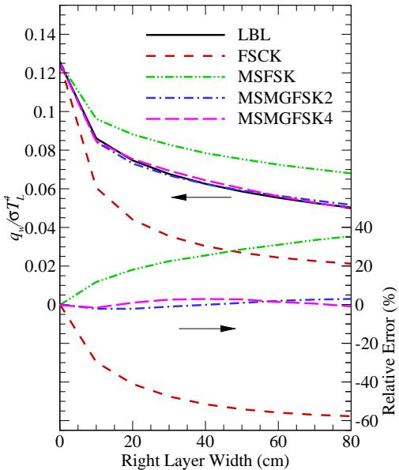  
FIGURE 20-19 Relative errors of the FSCK, MSFSK, and MGMFSFSK (two and four groups) calculations for the two-layer slab of Fig. 20-18b with 0.1 ppm nongray soot added to right layer [130].

method gives errors less than  $1\%$  with 10 quadrature points (and, thus, RTE evaluations) for various optical thicknesses, while the FSCK and FSSK methods reach errors of  $10\%$  to  $12\%$ . As the width of the right layer increases, the FSCK and FSSK errors decrease, indicating that emission from the homogeneous right layer becomes dominant, and that limit can be predicted exactly by the FSCK and FSSK methods.

In Fig. 20- 18b, in addition to a step change in species mole fraction, a step change in mixture temperature is introduced: the temperature of the left layer is set to  $1500\mathrm{K}$ , and the right layer to  $500\mathrm{K}$ , with the same mixture as given in Fig. 20- 18a. Thus, in this example the absorption coefficients of both layers are uncorrelated due to, both, species concentration and temperature effects. Heat flux leaving the right layer is now due to emission by the left hot layer, which is attenuated by the (strongly uncorrelated) right layer. The nondimensional heat fluxes calculated by the LBL, FSCK, FSSK, MSFSKdir, and MSFSKnb methods are shown in Fig. 20- 18b against the width of the right layer. In the MSFSK calculations, the reference states are determined separately for each scale. The heat flux decreases with increasing width of the right absorption layer. For this extreme case of strong inhomogeneity in both species concentration and temperature, the FSCK and FSSK methods fail completely, while the present MSFSK method, although designed for just dealing with strong inhomogeneities in gas concentration, has a maximum error of only about  $12\%$  with 10 quadrature points for various optical thickness. The difference between MSFSKdir and MSFSKnb calculations is small, indicating that the scheme of using a database of narrow band  $k$  distributions to evaluate overlap coefficients is robust.

Finally, in Fig. 20- 19 we consider the same two- layer slab as in Fig. 20- 18b, but with 0.1 ppm soot added to the right layer [130]. Nongray soot absorption coefficients were calculated from equation (12.53), with the complex index of refraction given by Chang and Charalampopoulos [131], equation (12.116). Again, LBL, FSCK, and MSFSK results are shown, the latter using 3 scales (one each for  $\mathrm{CO_2}$ ,  $\mathrm{H_2O}$ , and soot) within the extended MSFSK model of Pal and Modest [128]. Also included are hybrid multigroup- multiscale results [130] (three scales, two or four groups each for  $\mathrm{CO_2}$  and  $\mathrm{H_2O}$ ). It is seen that the FSCK incurs a maximum error of close to  $60\%$ , but even the three- scale MSFSK displays large errors, indicating that the method cannot always cope with severe temperature and concentration inhomogeneity in multiphase mixtures. The hybrid model, on the other hand, never has errors exceeding  $5\%$ , with the two- group model requiring  $2 \times 10(\mathrm{CO_2}) + 2 \times 10(\mathrm{H_2O}) + 10(\mathrm{soot}) = 50$  RTE evaluations.

It should be understood that these examples (with discontinuities in temperature, concen

trations, and/or soot levels) are extreme, and are never encountered in realistic systems. For the vast majority of industrial applications the MSFSK method can be expected to produce excellent results. Pal and Modest have investigated several realistic combustion situations, applying the FSCK and MSFSK approaches to an artificial methane flame [128, 132] and all higher order methods to an ethylene flame [130] first studied experimentally by Kent and Honnery [133]. In the Kent and Honnery flame radiation from ethylene  $(\mathrm{C}_2\mathrm{H}_4),\mathrm{H}_2\mathrm{O},\mathrm{CO}_2,\mathrm{CO},$  and nongray soot was considered, using the FSCK scheme (10 spectral RTE evaluations), the MSFSK scheme (treating  $\mathrm{C}_2\mathrm{H}_4,\mathrm{CO},$  and soot as separate scales, and combining  $\mathrm{H}_2\mathrm{O}$  and  $\mathrm{CO}_2$  into a single scale, for a total of four scales, or  $4\times 10$  spectral RTE evaluations), and the MSMGFSK scheme (also separating  $\mathrm{H}_2\mathrm{O}$  and  $\mathrm{CO}_2$  and breaking each into two groups, for a total of  $7\times 10$  spectral RTE evaluations). The basic FSCK scheme displayed good accuracy over most of the domain, but had errors of up to  $35\%$  (in terms of maximum  $\nabla \cdot \mathbf{q}$ ) near the inlet; the MSFSK and MSMGFSK schemes reduced the maximum error to  $6\%$  and  $3\%$ , respectively. It was also demonstrated that the methods, including the Modest and Riazzi mixing scheme, remain accurate at high pressures [132].

We close our discussion in this section by observing that narrow band  $k$ - distributions were first applied in the field of atmospheric sciences, before the development of full spectrum  $k$ - distributions in the heat transfer field; and that the full- spectrum versions have since then found their way back to the atmospheric sciences [134, 135]. The concept may be applied to any system with strong spectrally varying radiation, and has most recently also been applied to nonequilibrium radiation in hypersonic plasmas [122, 136, 137].

# References

1. Rothman, L. S., I. E. Gordon, A. Barbe, D. C. Benner, P. F. Bernath, M. Birk, V. Boudon, L. R. Brown, A. Campargue, J.-P. Champion, K. Chance, L. H. Coudert, V. Dana, V. M. Devi, S. Fally, J.-M. Fiaud, R. R. Gamache, A. Goldman, D. Jacquemart, I. Kleiner, N. Lacome, W. J. Lafferty, J.-Y. Mandin, S. T. Massie, S. N. Mikhailenko, C. E. Miller, N. Moazzen-Ahmadi, O. V. Naumenko, A. V. Nikitin, J. Orphal, V. I. Perevalov, A. Perrin, A. Predoi-Cross, C. P. Rinsland, M. Rotger, M. Simeckova, M. A. H. Smith, K. Sung, S. A. Tashkun, J. Tennyson, R. A. Toth, A. C. Vandaele, and J. V. Auwera: "The HITRAN 2008 molecular spectroscopic database," Journal of Quantitative Spectroscopy and Radiative Transfer, vol. 110, pp. 533-572, 2009.  
2. Rothman, L. S., I. E. Gordon, R. J. Barber, H. Dothe, R. R. Gamache, A. Goldman, V. I. Perevalov, S. A. Tashkun, and J. Tennyson: "HITEMP, the high-temperature molecular spectroscopic database," Journal of Quantitative Spectroscopy and Radiative Transfer, vol. 111, no. 15, pp. 2139-2150, 2010.  
3. Denison, M. K., and B. W. Webb: "An absorption-line blackbody distribution function for efficient calculation of total gas radiative transfer," Journal of Quantitative Spectroscopy and Radiative Transfer, vol. 50, pp. 499-510, 1993.  
4. Denison, M. K., and B. W. Webb: "A spectral line based weighted-sum-of-gray-gases model for arbitrary RTE solvers," ASME Journal of Heat Transfer, vol. 115, pp. 1004-1012, 1993.  
5. Denison, M. K., and B. W. Webb: "The spectral-line-based weighted-sum-of-gray-gases model in nonisothermal nonhomogeneous media," ASME Journal of Heat Transfer, vol. 117, pp. 359-365, 1995.  
6. Rivière, P., A. Soufiani, M.-Y. Perrin, H. Riad, and A. Gleizes: "Air mixture radiative property modelling in the temperature range 10000-40000 K," Journal of Quantitative Spectroscopy and Radiative Transfer, vol. 56, pp. 29-45, 1996.  
7. Pierrot, L., A. Soufiani, and J. Taine: "Accuracy of narrow-band and global models for radiative transfer in  $\mathrm{H}_2\mathrm{O}$ ,  $\mathrm{CO}_2$ , and  $\mathrm{H}_2\mathrm{O} - \mathrm{CO}_2$  mixtures at high temperature," Journal of Quantitative Spectroscopy and Radiative Transfer, vol. 62, pp. 523-548, 1999.  
8. Pierrot, L., P. Rivière, A. Soufiani, and J. Taine: "A fictitious-gas-based absorption distribution function global model for radiative transfer in hot gases," Journal of Quantitative Spectroscopy and Radiative Transfer, vol. 62, pp. 609-624, 1999.  
9. Scutaru, D., L. Rosenmann, and J. Taine: "Approximate band intensities of  $\mathrm{CO}_2$  hot bands at 2.7, 4.3 and  $12\mu \mathrm{m}$  for high temperature and medium resolution applications," Journal of Quantitative Spectroscopy and Radiative Transfer, vol. 52, pp. 765-781, 1994.  
10. Rivière, P., A. Soufiani, and J. Taine: "Correlated-  $k$  and fictitious gas model for  $\mathrm{H}_2\mathrm{O}$  infrared radiation in the Voigt regime," Journal of Quantitative Spectroscopy and Radiative Transfer, vol. 53, pp. 335-346, 1995.  
11. Marin, O., and R. O. Buckius: "Wide band correlated-  $k$  approach to thermal radiative transport in nonhomogeneous media," ASME Journal of Heat Transfer, vol. 119, no. 4, pp. 719-729, 1997.  
12. Solovjov, V. P., and B. W. Webb: "SLW modeling of radiative transfer in multicomponent gas mixtures," Journal of Quantitative Spectroscopy and Radiative Transfer, vol. 65, pp. 655-672, 2000.

13. Modest, M. F., and H. Zhang: "The full-spectrum correlated-k distribution and its relationship to the weighted-sum-of-gray-gases method," in Proceedings of the IMECE 2000, vol. HTD-366-1, ASME, Orlando, FL, pp. 75-84, 2000.14. Zhang, H., and M. F. Modest: "A multi-scale full-spectrum correlated-k distribution for radiative heat transfer in inhomogeneous gas mixtures," Journal of Quantitative Spectroscopy and Radiative Transfer, vol. 73, no. 2-5, pp. 349-360, 2002.15. Zhang, H., and M. F. Modest: "Scalable multi-group full-spectrum correlated-k distributions for radiative heat transfer," ASME Journal of Heat Transfer, vol. 125, no. 3, pp. 454-461, 2003.16. Zhang, H., and M. F. Modest: "Multi-group full-spectrum k-distribution database for water vapor mixtures in radiative transfer calculations," International Journal of Heat and Mass Transfer, vol. 46, no. 19, pp. 3593-3603, 2003.17. Rothman, L. S., R. B. Wattson, R. R. Gamache, J. Schroeder, and A. McCann: "HITRAN, HAWKS and HITEMP high temperature databases," Proceedings of SPIE, vol. 2471, pp. 105-111, 1998.18. Solovjov, V. P., and B. W. Webb: "Radiative transfer model parameters for carbon monoxide at high temperature," in Proceedings of the 11th International Heat Transfer Conference, vol. 7, Kyongju, Korea, pp. 445-450, 1998.19. Tang, K. C., and M. Q. Brewster: "K-distribution analysis of gas radiation with nongray, emitting, absorbing and anisotropic scattering particles," ASME Journal of Heat Transfer, vol. 116, no. 4, pp. 980-985, 1994.20. Tang, K. C., and M. Q. Brewster: "Analysis of molecular gas radiation: Real gas property effects," in 7th AIAA/ASME Joint Thermophysics and Heat Transfer Conference, vol. HTD-357-1, ASME, pp. 23-32, 1998.21. Park, C.: "Nonequilibrium air radiation (NEQAIR) program: User's manual," NASA/Ames Research Center, Moffett Field, CA 94035-1000, 1985.22. Olynick, D. R., W. D. Henline, L. Hartung-Chambers, and G. V. Candler: "Comparison of coupled radiative flow solutions with project Fire II flight data," Journal of Thermophysics and Heat Transfer, vol. 9, no. 4, pp. 586-594, 1995.23. Olynick, D. R., Y.-K. Chen, and M. E. Tauber: "Aerothermodynamics of the Stardust sample return capsule," Journal of Spacecraft and Rockets, vol. 36, no. 3, pp. 442-462, 1999.24. Olejniczak, J., M. Wright, D. Pabhu, N. Takashima, B. R. Hollis, and E. V. Zoby: "An analysis of the radiative heating environment for aerocapture at Titan," AIAA Paper No. 2003-4953, 2003, 39th AIAA/ASME/SAE/ASEE Joint Propulsion Conference and Exhibit, Huntsville, Alabama.25. da Silva, M. L.: "An adaptive line-by-line-statistical model for fast and accurate spectral simulations in low-pressure plasmas," Journal of Quantitative Spectroscopy and Radiative Transfer, vol. 108, pp. 106-125, 2007.26. Feldick, A. M., M. F. Modest, and D. A. Levin: "Closely coupled flow/field-radiation interactions during hypersonic reentry," Journal of Thermophysics and Heat Transfer, vol. 25, no. 4, pp. 481-492, 2011.27. Hartung, L., and H. A. Hassan: "Radiation transport around axisymmetric blunt body vehicles using a modified differential approximation," Journal of Thermophysics and Heat Transfer, vol. 7, no. 2, pp. 220-227, 1993.28. Hottel, H. C.: "Radiant heat transmission," in Heat Transmission, ed. W. H. McAdams, 3rd ed., ch. 4, McGraw-Hill, New York, 1954.29. Hottel, H. C., and A. F. Sarofim: Radiative Transfer, McGraw-Hill, New York, 1967.30. Dunkle, R. V.: "Geometric mean beam lengths for radiant heat transfer calculations," ASME Journal of Heat Transfer, vol. 86, no. 1, pp. 75-80, 1964.31. Andersen, K. M., and S. Hadvig: "Geometric mean beam lengths for the space between two coaxial cylinders," ASME Journal of Heat Transfer, vol. 111, no. 3, pp. 811-812, 1989.32. Andersen, F. M. B.: "Geometric mean beam lengths between two concentric spheres," ASME Journal of Heat Transfer, vol. 119, no. 2, pp. 379-380, 1997.33. Viskanta, R.: "Concerning the definitions of the mean absorption coefficient," International Journal of Heat and Mass Transfer, vol. 7, no. 9, pp. 1047-1049, 1964.34. Finkleman, D., and K. Y. Chiang: "Semigrey radiative transfer," AIAA Journal, vol. 6, no. 4, pp. 755-758, 1968.35. Finkleman, D.: "Numerical studies in semigray radiative transfer," AIAA Journal, vol. 7, pp. 1602-1605, 1969.36. Finkleman, D.: "A note on boundary conditions for use with the differential approximation to radiative transfer," International Journal of Heat and Mass Transfer, vol. 12, pp. 653-656, 1969.37. Traugott, S. C.: "Radiative heat-flux potential for a nongray gas," AIAA Journal, vol. 4, no. 3, pp. 541-542, 1966.38. Traugott, S. C.: "On grey absorption coefficients in radiative transfer," Journal of Quantitative Spectroscopy and Radiative Transfer, vol. 8, pp. 971-999, 1968.39. Modest, M. F., and K. K. Sikka: "The application of the stepwise-gray P-1 approximation to molecular gas-particulate mixtures," Journal of Quantitative Spectroscopy and Radiative Transfer, vol. 48, no. 2, pp. 159-168, 1992.40. Modest, M. F.: "The weighted-sum-of-gray-gases model for arbitrary solution methods in radiative transfer," ASME Journal of Heat Transfer, vol. 113, no. 3, pp. 650-656, 1991.41. Chandrasekhar, S.: "The radiative equilibrium of the outer layers of a star with special reference to the blanketing effects of the reversing layer," Monthly Notices Royal Astron. Soc., vol. 96, pp. 21-42, 1935.42. Siewert, C. E., and P. F. Zweifel: "An exact solution of equations of radiative transfer for local thermodynamic equilibrium in the non-gray case: Picket fence approximation," Ann. Phys. (N.Y.), vol. 36, pp. 61-85, 1966.43. Kung, S. C., and M. Sibulkin: "Radiative transfer in a nongray gas between parallel walls," Journal of Quantitative Spectroscopy and Radiative Transfer, vol. 9, pp. 1447-1461, 1969.

44. Reith, R. J., C. E. Siewert, and M. N. Ozisik: "Non-grey radiative heat transfer in conservative plane-parallel media with reflecting boundaries," Journal of Quantitative Spectroscopy and Radiative Transfer, vol. 11, pp. 1441-1462, 1971.45. Greif, R.: "Energy transfer by radiation and conduction with variable gas properties," International Journal of Heat and Mass Transfer, vol. 7, pp. 891-900, 1964.46. Modest, M. F.: "A simple differential approximation for radiative transfer in non-gray gases," ASME Journal of Heat Transfer, vol. 101, pp. 735-736, 1979.47. Thynell, S. T.: "Radiation due to  $\mathrm{CO_2}$  or  $\mathrm{H}_2\mathrm{O}$  and particles in cylindrical media," Journal of Thermophysics and Heat Transfer, vol. 4, no. 4, pp. 436-445, 1990.48. Kaminski, D. A., X. D. Fu, and M. K. Jensen: "Numerical and experimental analysis of combined convective and radiative heat transfer in laminar flow over a circular cylinder," International Journal of Heat and Mass Transfer, vol. 38, no. 17, pp. 3161-3169, 1995.49. Seo, T., M. K. Jensen, and D. A. Kaminski: "Combined convection and non-gray radiation in simultaneously developing turbulent flow and heat transfer," in Proceedings of the 11th International Heat Transfer Conference, vol. 7, Kyongju, Korea, pp. 337-342, 1998.50. Mazumder, S., and M. F. Modest: "A PDF approach to modeling turbulence- radiation interactions in nonluminous flames," International Journal of Heat and Mass Transfer, vol. 42, pp. 971-991, 1999.51. Mazumder, S., and M. F. Modest: "Turbulence- radiation interactions in nonreactive flow of combustion gases," ASME Journal of Heat Transfer, vol. 121, pp. 726-729, 1999.52. Van Wylen, G. H., and R. E. Sonntag: Fundamentals of Classical Thermodynamics, John Wiley & Sons, New York, 1985.53. Grosshandler, W. L.: "Radiative transfer in nonhomogeneous gases: A simplified approach," International Journal of Heat and Mass Transfer, vol. 23, pp. 1447-1457, 1980.54. Grosshandler, W. L.: "RADECAL: a narrow-band model for radiation calculations in a combustion environment," Technical Report NIST Technical Note 1402, National Institute of Standards and Technology, 1993.55. Soufiani, A., and J. Taine: "High temperature gas radiative property parameters of statistical narrow-band model for  $\mathrm{H}_2\mathrm{O}$ ,  $\mathrm{CO_2}$  and  $\mathrm{CO_2}$  and correlated-  $k$  model for  $\mathrm{H}_2\mathrm{O}$  and  $\mathrm{CO_2}$ ," International Journal of Heat and Mass Transfer, vol. 40, no. 4, pp. 987-991, 1997.56. Kim, T. K., J. A. Menart, and H. S. Lee: "Nongray radiative gas analyses using the S-N discrete ordinates method," ASME Journal of Heat Transfer, vol. 113, no. 4, pp. 946-952, 1991.57. Menart, J. A., H. S. Lee, and T. K. Kim: "Discrete ordinates solutions of nongray radiative transfer with diffusely reflecting walls," ASME Journal of Heat Transfer, vol. 115, no. 1, pp. 184-193, 1993.58. Menart, J. A., and H. S. Lee: "Nongray gas analyses for reflecting walls utilizing a flux technique," ASME Journal of Heat Transfer, vol. 115, no. 3, pp. 645-652, 1993.59. Cherkaoui, M., J.-L. Dufrisne, R. Fournier, J.-Y. Grandpeix, and A. Lahellec: "Radiative net exchange formulation within one-dimensional gas enclosures with reflective surfaces," ASME Journal of Heat Transfer, vol. 120, no. 1, pp. 275-278, 1998.60. Liu, F., O. L. Gulder, G. J. Smallwood, and Y. Ju: "Non-grey gas radiative transfer analyses using the statistical narrow-band model," International Journal of Heat and Mass Transfer, vol. 41, no. 14, pp. 2227-2236, 1998.61. Ju, Y., K. Takita, M. Goro, F. Liu, and H. Guo: "Analyses of extinction and flammability limit of stretched premixed flames using the statistical narrow-band model," in Proceedings of the 11th International Heat Transfer Conference, vol. 7, Kyongju, Korea, pp. 301-306, 1998.62. Liu, F.: "Numerical solutions of three-dimensional non-grey gas radiative transfer using the statistical narrow-band model," ASME Journal of Heat Transfer, vol. 121, no. 1, pp. 200-203, 1999.63. Edwards, D. K., and A. Balakrishnan: "Slab band absorptance for molecular gas radiation," Journal of Quantitative Spectroscopy and Radiative Transfer, vol. 12, pp. 1379-1387, 1972.64. Edwards, D. K.: "Molecular gas band radiation," in Advances in Heat Transfer, vol. 12, Academic Press, New York, pp. 115-193, 1976.65. Wassel, A. T., and D. K. Edwards: "Molecular gas band radiation in cylinders," ASME Journal of Heat Transfer, vol. 96, pp. 21-26, 1974.66. Hutchison, J. R., and R. R. Richards: "Effect of nongray gas radiation on thermal stability in carbon dioxide," Journal of Thermophysics and Heat Transfer, vol. 13, no. 1, pp. 25-32, 1999.67. Modest, M. F.: "Radiative heat transfer in a plane-layer mixture of non-gray particulates and molecular gases," Journal of Quantitative Spectroscopy and Radiative Transfer, vol. 26, pp. 523-533, 1981.68. Cumber, P. S., M. Fairweather, and H. S. Ledin: "Application of wide-band radiation models to nonhomogeneous combustion systems," International Journal of Heat and Mass Transfer, vol. 41, no. 11, pp. 1573-1584, 1998.69. Liu, F., G. J. Smallwood, and O. L. Gulder: "Application of statistical narrowband model to three-dimensional absorbing-emitting-scattering media," Journal of Thermophysics and Heat Transfer, vol. 13, no. 3, pp. 285-291, 1999.70. Maruyama, S., and Z. Guo: "Radiative heat transfer in arbitrary configurations with nongray absorbing, emitting, and anisotropic scattering media," ASME Journal of Heat Transfer, vol. 121, no. 3, pp. 722-726, 1999.71. Smith, T. F., Z. F. Shen, and J. N. Friedman: "Evaluation of coefficients for the weighted sum of gray gases model," ASME Journal of Heat Transfer, vol. 104, pp. 602-608, 1982.

72. Farag, I. H., and T. A. Allam: "Gray-gas approximation of carbon dioxide standard emissivity," ASME Journal of Heat Transfer, vol. 103, pp. 403-405, 1981.73. Truelove, J. S.: "The zone method for radiative heat transfer calculations in cylindrical geometries," HTFS Design Report DR33 (Part I: AERE-R8167), Atomic Energy Authority, Harwell, 1975.74. Taylor, P. B., and P. J. Foster: "Some gray gas weighting coefficients for  $\mathrm{CO_2 - H_2O}$ -soot mixtures," International Journal of Heat and Mass Transfer, vol. 18, pp. 1331-1332, 1975.75. Yin, C., L. C. R. Johansen, L. A. Rosendahl, and S. K. Kär: "New weighted sum of gray gases model applicable to computational fluid dynamics (CFD) modeling of oxy-fuel combustion: Derivation, validation, and implementation," Energy & Fuels, vol. 24, pp. 6275-6282, 2010.76. Johansson, R., K. Andersson, B. Leckner, and H. Thunman: "Models for gaseous radiative heat transfer applied to oxy-fuel conditions in boilers," International Journal of Heat and Mass Transfer, vol. 53, pp. 220-230, 2010.77. Bressloff, N. W.: "The influence of soot loading on weighted sum of grey gases solutions to the radiative transfer equation across mixtures of gases and soot," International Journal of Heat and Mass Transfer, vol. 42, no. 18, pp. 3469-3480, 1999.78. Ramamurthy, H., S. Ramadhyani, and R. Viskanta: "A two-dimensional axisymmetric model for combusting, reacting and radiating flows in radiant tubes," Journal of the Institute of Energy, vol. 67, pp. 90-100, 1994.79. Mesyngier, C., and B. Farouk: "Turbulent natural convection-nongray gas radiation analysis in a square enclosure," Numerical Heat Transfer - Part A: Applications, vol. 29, no. 7, pp. 671-687, 1996.80. Liu, F., H. A. Becker, and Y. Bindar: "A comparative study of radiative heat transfer modelling in gas-fired furnaces using the simple grey gas and the weighted-sum-of-grey-gases models," International Journal of Heat and Mass Transfer, vol. 41, no. 22, pp. 3357-3371, 1998.81. Baek, S. W., J. H. Park, and C. E. Choi: "Investigation of droplet combustion with nongray gas radiation effects," Combustion Science and Technology, vol. 142, no. 1, pp. 55-79, 1999.82. Kuhlert, K., and U. Renz: "A comprehensive radiation model for numerical simulations of pulverised coal flames," in Proceedings of the 11th International Heat Transfer Conference, vol. 7, Kyongju, Korea, pp. 307-312, 1998.83. Yu, M. J., S. W. Baek, and J. H. Park: "An extension of the weighted sum of gray gases non-gray gas radiation model to a two phase mixture of non-gray gas with particles," International Journal of Heat and Mass Transfer, vol. 43, no. 10, pp. 1699-1713, 2000.84. Omori, T., S. Yamaguchi, and T. Fusegi: "Computational heat transfer analysis of a furnace using the WSGG model," in Proceedings of 2000 IMECE, vol. HTD-366-1, ASME, pp. 103-108, 2000.85. Denison, M. K., and B. W. Webb: "k-Distributions and weighted-sum-of-gray gases: A hybrid model," in Tenth International Heat Transfer Conference, Taylor & Francis, pp. 19-24, 1994.86. Denison, M. K., and B. W. Webb: "Development and application of an absorption line blackbody distribution function for  $\mathrm{CO_2}$ ," International Journal of Heat and Mass Transfer, vol. 38, pp. 1813-1821, 1995.87. Denison, M. K., and B. W. Webb: "The spectral-line weighted-sum-of-gray-gases model for  $\mathrm{H_2O / CO_2}$  mixtures," ASME Journal of Heat Transfer, vol. 117, pp. 788-792, 1995.88. Solovjov, V. P., and B. W. Webb: "An efficient method of modeling radiative transfer in multicomponent gas mixtures with soot," ASME Journal of Heat Transfer, vol. 123, pp. 450-457, 2001.89. Dembele, S., A. Delmas, and J.-F. Sacadura: "A method for modeling the mitigation of hazardous fire thermal radiation by water spray curtains," ASME Journal of Heat Transfer, vol. 119, pp. 746-753, 1997.90. Dembele, S., and J. X. Wen: "Investigation of a spectral formulation for radiative heat transfer in a one-dimensional fires and combustion system," International Journal of Heat and Mass Transfer, vol. 43, pp. 4019-4030, 2000.91. Liu, F., G. J. Smallwood, and O. L. Gulder: "Application of the statistical narrow-band correlated-k method to low-resolution spectral intensity and radiative heat transfer calculations - effects of the quadrature," International Journal of Heat and Mass Transfer, vol. 43, pp. 3119-3135, 2000.92. Liu, F., and G. J. Smallwood: "An efficient approach for the implementation of the SNB based correlated-k method and its evaluation," Journal of Quantitative Spectroscopy and Radiative Transfer, vol. 84, pp. 465-475, 2004.93. Tesse, L., F. Dupoirieux, B. Zamuner, and J. Taine: "Radiative transfer in real gases using reciprocal and forward Monte Carlo methods and a correlated-k approach," International Journal of Heat and Mass Transfer, vol. 45, pp. 2797-2814, 2002.94. Lee, P. Y. C., G. D. Raithby, and K. G. T. Hollands: "The "reordering" concept of the absorption coefficient for modelling nongray gases," in Radiative Heat Transfer: Current Research, vol. HTD-276, ASME, pp. 21-30, 1994.95. Lee, P. Y. C., K. G. T. Hollands, and G. D. Raithby: "Reordering the absorption coefficient within the wide band for predicting gaseous radiant exchange," ASME Journal of Heat Transfer, vol. 118, no. 2, pp. 394-400, 1996.96. Parthasarathy, G., J. C. Choi, and S. V. Patankar: "A simple approach to nongray gas modeling," Numerical Heat Transfer, vol. 29, pp. 394-400, 1996.97. Denison, M. K., and W. A. Fiveland: "A correlation for the reordered wave number of the wideband absorptance of radiating gases," ASME Journal of Heat Transfer, vol. 119, pp. 853-856, 1997.98. Ströhle, J.: "Assessment of the re-ordered wide band model for non-grey radiative transfer calculations in 3D enclosures," Journal of Quantitative Spectroscopy and Radiative Transfer, vol. 109, no. 10, pp. 1622-1640, 2008.99. Marin, O., and R. O. Buckius: "Wide band correlated-k method applied to absorbing, emitting and scattering media," Journal of Thermophysics and Heat Transfer, vol. 10, pp. 364-371, 1996.100. Marin, O., and R. O. Buckius: "A model of the cumulative distribution function for wide band radiative properties," Journal of Quantitative Spectroscopy and Radiative Transfer, vol. 59, pp. 671-685, 1998.

101. Marin, O., and R. O. Buckius: "A simplified wide band model of the cumulative distribution function for water vapor," International Journal of Heat and Mass Transfer, vol. 41, pp. 2877-2892, 1998.102. Marin, O., and R. O. Buckius: "A simplified wide band model of the cumulative distribution function for carbon dioxide," International Journal of Heat and Mass Transfer, vol. 41, pp. 3881-3892, 1998.103. Rothman, L. S., R. R. Gamache, R. H. Tipping, C. P. Rinsland, M. A. H. Smith, D. C. Benner, V. M. Devi, J.-M. Flaud, C. Camy-Peyret, A. Perrin, A. Goldman, S. T. Massie, L. R. Brown, and R. A. Toth: "The HITRAN molecular database: Editions of 1991 and 1992," Journal of Quantitative Spectroscopy and Radiative Transfer, vol. 48, no. 5/6, pp. 469-507, 1992.104. Modest, M. F., and H. Zhang: "The full-spectrum correlated-k distribution for thermal radiation from molecular gas-particulate mixtures," ASME Journal of Heat Transfer, vol. 124, no. 1, pp. 30-38, 2002.105. Modest, M. F.: "Narrow-band and full-spectrum  $k$ -distributions for radiative heat transfer—correlated-k vs. scaling approximation," Journal of Quantitative Spectroscopy and Radiative Transfer, vol. 76, no. 1, pp. 69-83, 2003.106. Solovjov, V. P., D. Lemonnier, and B. W. Webb: "The SLW-1 model for efficient prediction of radiative transfer in high temperature gases," Journal of Quantitative Spectroscopy and Radiative Transfer, vol. 112, no. 7, pp. 1205-212, 2011.107. Solovjov, V. P., and B. W. Webb: "A local-spectrum correlated model for radiative transfer in non-uniform gas media," Journal of Quantitative Spectroscopy and Radiative Transfer, vol. 73(2-5), pp. 361-373, 2002.108. Solovjov, V. P., and B. W. Webb: "The cumulative wavenumber method for modeling radiative transfer in gas mixtures with soot," Journal of Quantitative Spectroscopy and Radiative Transfer, vol. 93(1-3), pp. 273-287, 2005.109. Solovjov, V. P., and B. W. Webb: "Application of CW local correction approach to SLW modeling of radiative transfer in non-isothermal gaseous media," Journal of Quantitative Spectroscopy and Radiative Transfer, vol. 111, no. 2, pp. 318-324, 2010.110. Barlow, R. S.: International Workshop on Measurement and Computation of Turbulent Nonpremixed Flames (TNF) website: http://www.sandia.gov/TNF/abstract.html.111. Riviere, P., A. Soufiani, and J. Taine: "Correlated-  $k$  and fictitious gas methods for  $\mathrm{H}_2\mathrm{O}$  near  $2.7\mu \mathrm{m}$ ," Journal of Quantitative Spectroscopy and Radiative Transfer, vol. 48, pp. 187-203, 1992.112. Wang, A., and M. F. Modest: "High-accuracy, compact database of narrow-band  $k$ -distributions for water vapor and carbon dioxide," Journal of Quantitative Spectroscopy and Radiative Transfer, vol. 93, pp. 245-261, 2005.113. Tashkun, S. A., V. I. Perevalov, A. D. Bykov, N. N. Lavrentieva, and J.-L. Teffo: Carbon Dioxide Spectroscopic databank (CDSD): available from ftp://ftp.iao.ru/pub/CDSD-1000, 2002.114. Denison, M. K., and B. W. Webb: "The absorption-line blackbody distribution function at elevated pressure," in Proceedings of the First International Symposium on Radiation Transfer, ed. M. P. Menguc, Begell House, pp. 228-238, 1996.115. Hartmann, J.-M., R. Levi Di Leon, and J. Taine: "Line-by-line and narrow-band statistical model calculations for  $\mathrm{H}_2\mathrm{O}$ ," Journal of Quantitative Spectroscopy and Radiative Transfer, vol. 32, no. 2, pp. 119-127, 1984.116. Zhang, H., and M. F. Modest: "Full-spectrum  $k$ -distribution correlations for carbon dioxide mixtures," Journal of Thermophysics and Heat Transfer, vol. 17, no. 2, pp. 259-263, 2003.117. Modest, M. F., and V. Singh: "Engineering correlations for full spectrum  $k$ -distribution of  $\mathrm{h}_2\mathrm{o}$  from the HITEMP spectroscopic databank," Journal of Quantitative Spectroscopy and Radiative Transfer, vol. 93, pp. 263-271, 2005.118. Modest, M. F., and R. S. Mehta: "Full spectrum  $k$ -distribution correlations for  $\mathrm{CO}_2$  from the CDSD-1000 spectroscopic databank," International Journal of Heat and Mass Transfer, vol. 47, pp. 2487-2491, 2004.119. Pal, G., A. Wang, and M. F. Modest: "A  $k$ -distribution-based spectral module for radiation calculations in multiphase mixtures," in Proceedings of ASME Summer Heat Transfer Conference, Paper HT2009-88245, 2009.120. Abramowitz, M., and I. A. Stegun (eds.): Handbook of Mathematical Functions, Dover Publications, New York, 1965.121. Press, W. H., B. P. Flannery, S. A. Tenkolsky, and W. T. Vetterling: Numerical Recipes - The Art of Scientific Computing, 1st ed., Cambridge, New York, 1989.122. Bansal, A., M. F. Modest, and D. A. Levin: "Multigroup correlated-  $k$  distribution method for nonequilibrium atomic radiation," Journal of Thermophysics and Heat Transfer, vol. 24, no. 3, pp. 638-646, 2010, DOI: 10.2514/1.46641.123. Taine, J., and A. Soufianis: "Gas IR radiative properties: From spectroscopic data to approximate models," in Advances in Heat Transfer, vol. 33, Academic Press, New York, pp. 295-414, 1999.124. Modest, M. F., and R. J. Riazzi: "Assembly of full-spectrum  $k$ -distributions from a narrow-band database; effects of mixing gases, gases and nongray absorbing particles, and mixtures with nongray scatterers in nongray enclosures," Journal of Quantitative Spectroscopy and Radiative Transfer, vol. 90, no. 2, pp. 169-189, 2005.125. Demarco, R., J. L. Consalvi, A. Fuentes, and S. Melis: "Assessment of radiative property models in non-gray sooting media," International Journal of Thermal Sciences, vol. 50, pp. 1672-1684, 2011.126. Wang, L., and M. F. Modest: "Narrow-band based multi-scale full-spectrum  $k$ -distribution method for radiative transfer in inhomogeneous gas mixtures," ASME Journal of Heat Transfer, vol. 127, pp. 740-748, 2005.127. Wang, L., and M. F. Modest: "Treatment of wall emission in the narrow-band based multi-scale full-spectrum  $k$ -distribution method," ASME Journal of Heat Transfer, vol. 129, no. 6, pp. 743-748, 2007.128. Pal, G., and M. F. Modest: "A multi-scale full-spectrum  $k$ -distribution method for radiative transfer in nonhomogeneous gas-soot mixture with wall emission," Computational Thermal Sciences, vol. 1, pp. 137-158, 2009.

129. Pal, G., M. F. Modest, and L. Wang: "Hybrid full-spectrum correlated  $k$ -distribution method for radiative transfer in strongly nonhomogeneous gas mixtures," ASME Journal of Heat Transfer, vol. 130, pp. 082701-1-082701-8, 2008.  
130. Pal, G., and M. F. Modest: "A narrow-band based multi-scale multi-group full-spectrum  $k$ -distribution method for radiative transfer in nonhomogeneous gas-soot mixture," ASME Journal of Heat Transfer, vol. 132, pp. 023307-1-023307-9, 2010.  
131. Chang, H., and T. T. Charalambopoulos: "Determination of the wavelength dependence of refractive indices of flame soot," Proceedings of the Royal Society (London) A, vol. 430, no. 1880, pp. 577-591, 1990.  
132. Pal, G., and M. F. Modest: " $k$ -distribution methods for radiation calculations in high pressure combustion," 50th Aerospace Sciences Meeting, Paper No. AIAA-2012-0529, 2012.  
133. Kent, J. H., and D. Honnery: "Modeling sooting turbulent jet flames using an extended flamelet technique," Combustion Science and Technology, vol. 54, pp. 383-397, 1987.  
134. Pawlak, D. T., E. E. Clothiaux, M. F. Modest, and J. N. S. Cole: "Full spectrum correlated-  $k$  for shortwave atmospheric radiative transfer," Journal of the Atmospheric Sciences, vol. 61, pp. 2588-2601, 2004.  
135. Hogan, R. J.: "The full-spectrum correlated-  $k$  method for longwave atmospheric radiative transfer using an effective Planck function," Journal of the Atmospheric Sciences, vol. 67, pp. 2086-2100, 2010.  
136. Bansal, A., M. F. Modest, and D. A. Levin: "Multi-scale  $k$ -distribution model for gas mixtures in hypersonic nonequilibrium flows," Journal of Quantitative Spectroscopy and Radiative Transfer, vol. 112, no. 7, pp. 1213-1221.  
137. Bansal, A., and M. F. Modest: "Narrow-band  $k$ -distribution database for atomic radiation in hypersonic nonequilibrium flows," ASME Journal of Heat Transfer, p. 122701, 2011.

# Problems

20.1 A long, cylindrical furnace bounded by a cold, black wall of  $1\mathrm{m}$  radius contains pure  $\mathrm{CO_2}$  that is isothermal at  $1700\mathrm{K}$  and at a pressure of  $p$  atm. Using the mean- beam- length method, determine the nondimensional wall heat flux  $\Psi = q_w / \sigma T^4$  as a function of pressure. Plot  $\Psi$  vs.  $p$  (actual calculations for  $p = 0.001$ , 0.01, 0.1, and 1.0 should suffice).

20.2 A high- pressure isothermal mixture  $(p > 40\mathrm{atm})$  of  $80\%$ $\mathbb{N}_2$  and  $20\%$  CO at  $2000\mathrm{K}$  is contained between two large, parallel, cold black plates, spaced  $1\mathrm{m}$  apart. If the radiative flux to each wall may not exceed  $100\mathrm{kW / m^2}$ , what is the maximum pressure the gas mixture may be raised to? Use the mean- beam- length method.

20.3 An isothermal mixture of  $\mathbb{N}_2$  and soot  $(m = 2.5 - 0.15i)$  at  $2000\mathrm{K}$  is contained between two large, parallel, cold black plates, spaced  $1\mathrm{m}$  apart. If the radiative flux to each wall may not exceed  $100\mathrm{kW / m^2}$ , what is the maximum volume fraction of soot,  $f_v$ , allowed? Use the mean- beam- length method.

20.4 Two parallel, infinite, black plates at constant temperatures  $T_{1}$  and  $T_{2}$  are separated by a nongray medium of geometrical thickness  $d = 10\mathrm{cm}$  that is at radiative equilibrium. The absorption characteristics of the medium are such that they can be approximated by

$$
\kappa_{\lambda} = \left\{ \begin{array}{ll}\overline{\kappa} = 1\mathrm{cm}^{-1} & 3\mu \mathrm{m}< \lambda < 7\mu \mathrm{m},\\ 0 & \mathrm{elsewhere}. \end{array} \right.
$$

Calculate the nondimensional heat flux,  $q / \sigma (T_1^4 - T_2^4)$ , for a number of  $T_{2}$ $(T_{2} = 500\mathrm{K}, 750\mathrm{K}, 1000\mathrm{K}, 1500\mathrm{K}, \text{and} 2000\mathrm{K})$  and  $T_{1} = 300\mathrm{K}$  by

(a) the differential approximation, using a gray gas with Planck-mean absorption coefficient  $\kappa_{p}$ ,  
(b) the nongray differential approximation.

For the evaluation of  $\kappa_{p}$  you may use  $T_{m} = (T_{1} + T_{2}) / 2$ . Plot, compare, and discuss your results.

20.5 A cold- walled cylindrical furnace of  $1\mathrm{m}$  radius contains pure  $\mathrm{CO_2}$  that is isothermal at  $1700\mathrm{K}$  and at a pressure of  $p$  atm. Using the  $(i)$  gray and  $(ii)$  nongray differential approximation with single band strength  $\overline{\kappa}$ , determine the nondimensional wall heat flux  $\Psi = q_w / \sigma T^4$  as a function of pressure. Plot  $\Psi$  vs.  $p$  (actual calculations for  $p = 0.001$ , 0.01, 0.1, and 1.0 should suffice; for simplification, you may assume that band width is not a function of  $p$ ).

20.6 Repeat Problem 20.5, adding steam at 0.1 atm partial pressure to the medium. You may assume that only the 2.7 and  $6.3\mu \mathrm{m}$  bands are of importance.

20.7 An infinitely long cylinder of radius  $R = 10\mathrm{cm}$  is bounded by a cold black wall. Inside the cylinder there is uniform heat generation of  $\dot{Q}^{\prime \prime \prime} = 38,136\mathrm{W / m}^3$  . Estimate wall heat fluxes and temperature distributions using the  $P_{1}$  - approximation if

$(a)$  the medium has a band at  $\lambda = 4\mu \mathrm{m}$  of width  $\Delta \lambda = 1\mu \mathrm{m};$  across the band it has a constant absorption coefficient such that  $\overline{\kappa} R = 100,$ $(b)$  the medium is gray with an "appropriately" chosen  $\kappa_{p},$  say by evaluating  $\kappa_{p}$  at the volumeaveraged temperature  $T_{\mathrm{av}}$  , that is

$$
T_{\mathrm{av}}^4 = \frac{1}{V}\int_V T^4 dV.
$$

20.8 The new planet in an adjacent solar system recently found by Penn State (and other) researchers has been determined to have an atmosphere consisting of nitrogen with  $1\%$  by volume NO. The planet's surface has an emittance of  $\epsilon = 0.5,$  and a temperature of  $T_{s} = 900\mathrm{K}$  . The atmosphere's total pressure is known to be  $p(z) = p_s e^{- z / L}$  (surface pressure  $p_{s} = 5$  bar, characteristic length  $L = 10\mathrm{km}$  . Assuming radiative equilibrium prevails, what is the heat loss from the planet? You may assume that for NO line broadening is unaffected by temperature.

(a) To make a coarse approximation, replace the atmosphere by a constant pressure  $(p_{s})$  layer of a thickness that would contain the correct total pressure path length. Evaluate radiative properties as if the atmosphere's temperature were constant at  $T_{s}$  
(b) The problem is to be solved by the  $P_{1}$  -approximation combined with the box model. Find the appropriate absorption coefficient(s) and other necessary parameters. You may assume that the spectral width of bands for NO is unaffected by altitude (evaluate at surface conditions). Set up equation(s) and boundary condition(s). 
(c) Determine the heat loss from the planet. 
(d) What would change if an infinitely thick atmosphere with exponentially decaying pressure were considered?

20.9 A high- pressure isothermal mixture  $(p > 40\mathrm{atm})$  of  $80\%$ $\mathbb{N}_2$  and  $20\%$  CO at  $2000\mathrm{K}$  is contained between two large, parallel, cold black plates, spaced  $1\mathrm{m}$  apart. If the radiative flux to each wall may not exceed  $100\mathrm{kW / m^2}$  , what is the maximum pressure the gas mixture may be raised to? Use the box model together with  $(a)$  the  $P_{1}$  - approximation as well as  $(b)$  the exact formulation.

20.10 The coal particles of Problem 12.3 are burnt in a long cylindrical combustion chamber of  $R = 1\mathrm{m}$  radius. The combustor walls are gray and diffuse, with  $\epsilon_{w} = 0.8,$  and are at  $800\mathrm{K}$  . Since it is well stirred, combustion results in uniform heat generation throughout of  $\dot{Q}^{\prime \prime \prime} = 720\mathrm{kW / m}^3$

(a) Determine the maximum temperature in the combustor, using the  $P_{1}$  /differential approximation, assuming radiation is the only mode of heat transfer (use  $\kappa = 4.5\mathrm{m}^{-1}$  and  $\sigma_{s} = 0.5\mathrm{m}^{-1}$  if the results of Problem 12.3 are not available).

(b) How will the answer change if, instead, the combustion gas is responsible for the radiation with

$$
\kappa_{\lambda} = \left\{ \begin{array}{ll}10\mathrm{cm}^{-1}, & 4\mu \mathrm{m}< \lambda < 5\mu \mathrm{m};\\ 0, & \mathrm{elsewhere} \end{array} \right.;\quad \sigma_{s} = 0?
$$

(c) What if both are present?

20.11 Consider a sphere of very hot molecular gas of radius  $50\mathrm{cm}$  .The gas has a single vibrationrotation band at  $\eta_0 = 3000\mathrm{cm}^{- 1}$  , is suspended magnetically in a vacuum within a large cold container and is initially at a uniform temperature  $T_{g} = 3000\mathrm{K}$  . For this gas  $(\rho_{a}\alpha)(T) = 500\mathrm{cm}^{- 2},$ $\omega (T) =$ $100\sqrt{T / 100\mathrm{Kcm}^{- 1}}$  , and  $\beta \gg 1$  . These properties imply that the absorption coefficient may be determined from

$$
\kappa_{\eta} = \kappa_{0}e^{-2|\eta -\eta_{0}| / \omega},\quad \kappa_{0} = \frac{\rho_{a}\alpha}{\omega}
$$

and the band absorptance from

$$
A(s) = \omega A^{*} = \omega [E_{1}(\kappa_{0}s) + \ln (\kappa_{0}s) + \gamma_{\epsilon}],\qquad \gamma_{\epsilon} = 0.577216.
$$

Using the stepwise- gray model together with the  $P_{1}$ - approximation and neglecting conduction and convection, specify the total heat loss per unit time from the entire sphere at time  $t = 0$ . Outline the solution procedure for times  $t > 0$ .Hint: Solve the governing equation by introducing a new dependent variable  $g(\tau) = \tau (4\pi I_b - G)$ .

20.12 Repeat Problem 20.11 using the exact integral relations together with the exponential wide band model.

20.13 Repeat Problem 20.11 using the weighted- sum- of- gray gases approach together with the  $P_{1}$ - approximation.

20.14 Repeat Problem 20.11 for varying line overlap  $\beta$ , say  $\beta = 0.01$ , 0.1, 1, and 10. Plot heat loss at  $t = 0$  vs.  $\beta$ .Hint: Use Table 11.2 or some other correlation for the band absorptance.

20.15 An infinitely long cylinder of radius  $R = 10\mathrm{cm}$  is bounded by a wall that is isothermal at  $T_{w} = 1500\mathrm{K}$  and has a gray emittance of  $\epsilon = 0.3$ . Inside the cylinder there is uniform heat generation of  $\dot{Q}^{\prime \prime \prime} = 38,136\mathrm{W / m^3}$ . The cylinder is filled with a mixture of combustion gases at  $p = 1$  atm, containing  $10\%$  by volume  $\mathrm{CO_2}$  and  $20\%$  water vapor. Assuming the gas to be well- stirred (i.e., isothermal) determine the gas temperature using the weighted- sum- of- gray- gases approach, using the data of Table 20.2. This problem will require an iteration and, thus, is most conveniently solved on a computer.

(a) Set up all necessary equations and explain the procedure. You may use the exact relations of Section 14.6 or the  $P_{1}$ -approximation. 
(b) Write a small computer code to find the gas temperature.

Note for the  $P_{1}$ - approximation: The solution to the ODE

$$
\begin{array}{r}\frac{1}{r}\frac{d}{dr}\left(\frac{df}{dr}\right) - \nu^2 f = 0 \end{array}
$$

is

$$
f(r) = C_{1}I_{0}(\nu r) + C_{2}K_{0}(\nu r),
$$

where  $I_{0}$  and  $K_{0}$  are modified Bessel functions. Note also that  $K_{0}(0) \to \infty$  and  $\bar{I_0'} (x) = I_1(x)$ .

20.16 Repeat Problem 20.7 for the case that the medium is a mixture of  $30\%$  water vapor in nitrogen, using the SLW method with four gray gases, together with the correlation of Denison and Webb. To determine an appropriate reference temperature, first make a more approximate gray calculation, using a Planck mean absorption coefficient from Fig. 11- 31.

20.17 A spherical container of  $1\mathrm{m}$  diameter is filled with pure  $\mathrm{CO_2}$  and is initially at  $2000\mathrm{K}$ , 1 bar. While the  $\mathrm{CO_2}$  is continuously stirred (i.e., stays isothermal), the walls of the container are cooled such that the gray, diffuse wall  $(\epsilon_{p} = 0.6)$  remains at a constant  $T_{w} = 400\mathrm{K}$ . Determine the time it takes for the gas to cool down to  $500\mathrm{K}$ , using the FSK method together with the Denison and Webb correlation. Assume a constant reference condition of  $T_{\mathrm{ref}} = 1000\mathrm{K}$ , and use the  $P_{1}$  method to solve the RTE.

20.18 Repeat Problem 20.17 adding small gray particles with an absorption coefficient of  $\kappa_{p} = 0.1\mathrm{m}^{- 1}$  and an (isotropic) scattering coefficient of  $\sigma_{p} = 1\mathrm{m}^{- 1}$ .

20.19 Repeat Problem 20.17 adding  $\mathrm{H}_2\mathrm{O}$  and  $\mathrm{N}_2$  to the mixture, so that the final mixture has  $20\% \mathrm{CO}_2$  and  $40\% \mathrm{N}_2$  (by volume).

20.20 Repeat Problem 20.19 using the WSGG approach together with the correlation of Truelove.

20.21 Repeat Problem 20.19 using the SLW method with four gray gases. Compare with results from the previous problem.

20.22 Repeat Problem 20.19 for the case of radiative equilibrium without stirring.

20.23 Repeat Problem 20.21 for the case of radiative equilibrium without stirring.

