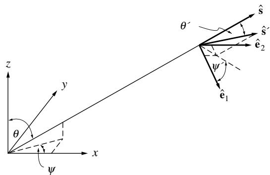
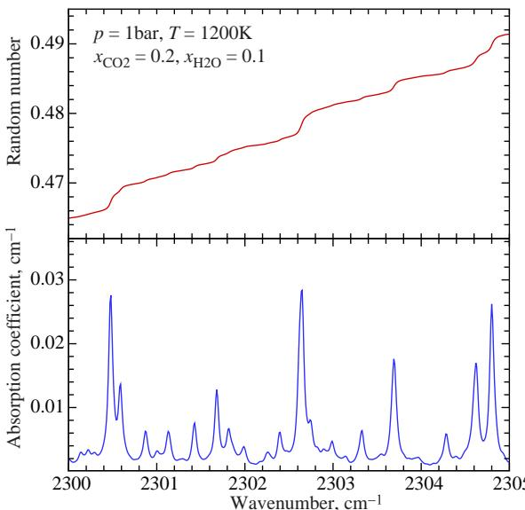
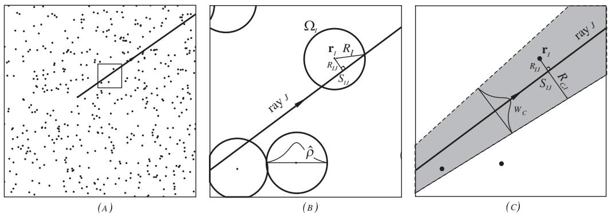
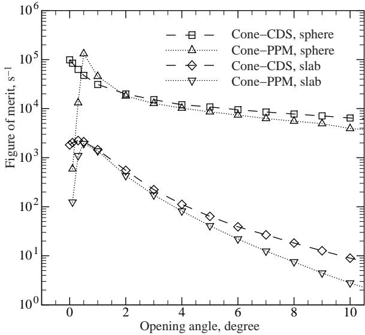
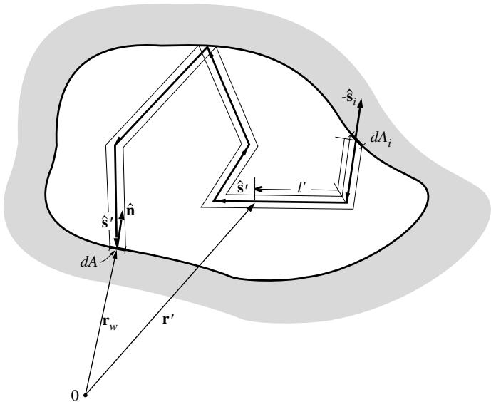
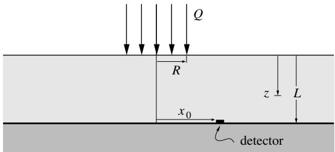
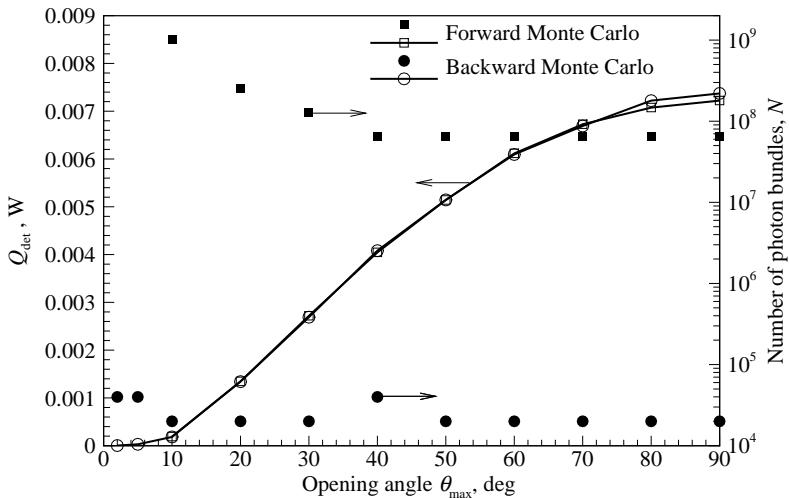

## 内容索引

- [目录](README.md)
- [1 热辐射基础](1-热辐射基础.md)
- [2 基于电磁波理论的辐射特性预测](2-基于电磁波理论的辐射特性预测.md)
- [3 实际表面的辐射特性](3-实际表面的辐射特性.md)
- [4 视角因子](4-视角因子.md)
- [5 灰体漫射表面间的辐射交换](5-灰体漫射表面间的辐射交换.md)
- [6 部分镜面灰体表面间的辐射交换](6-部分镜面灰体表面间的辐射交换.md)
- [7 非理想表面间的辐射交换](7-非理想表面间的辐射交换.md)
- [8 表面交换的蒙特卡洛方法](8-表面交换的蒙特卡洛方法.md)
- [9 传导和对流存在时的表面辐射交换](9-传导和对流存在时的表面辐射交换.md)
- [10 参与介质中的辐射传递方程(RTE)](10-参与介质中的辐射传递方程(RTE).md)
- [11 分子气体的辐射特性](11-分子气体的辐射特性.md)
- [12 颗粒介质的辐射特性](12-颗粒介质的辐射特性.md)
- [13 半透明介质的辐射特性](13-半透明介质的辐射特性.md)
- [14 一维灰体介质的精确解](14-一维灰体介质的精确解.md)
- [15 一维介质的近似求解方法](15-一维介质的近似求解方法.md)
- [16 球谐函数法 (PN-近似)](16-球谐函数法(PN-近似).md)
- [17 离散坐标法 (SN-近似)](17-离散坐标法(SN-近似).md)
- [18 区域法](18-区域法.md)
- [19 准直辐射与瞬态现象](19-准直辐射与瞬态现象.md)
- [20 非灰消光系数的求解方法](20-非灰消光系数的求解方法.md)
- [21 参与介质的蒙特卡洛方法](21-参与介质的蒙特卡洛方法.md)
- [22 辐射与传导和对流的耦合](22-辐射与传导和对流的耦合.md)
- [23 逆辐射传热](23-逆辐射传热.md)
- [24 纳米尺度辐射传热](24-纳米尺度辐射传热.md)
- [附录](附录.md)

- [21.1 引言](#211-引言)  
- [21.2 参与介质的热传递关系](#212-参与介质的热传递关系)  
- [21.3 参与介质的随机数关系](#213-参与介质的随机数关系)  
- [21.4 谱线结构效应的处理](#214-谱线结构效应的处理)  
- [21.5 整体能量守恒](#215-整体能量守恒)  
- [21.6 离散粒子场](#216-离散粒子场)  
- [21.7 效率考虑](#217-效率考虑)  
- [21.8 反向蒙特卡洛](#218-反向蒙特卡洛)  
- [21.9 直接交换蒙特卡洛](#219-直接交换蒙特卡洛)  
- [21.10 示例问题](#2110-示例问题)  
- [参考文献](#参考文献)  
- [习题](#习题)

# CHAPTER 21

# THE MONTE CARLO METHOD FOR PARTICIPATING MEDIA

# 21.1 INTRODUCTION

In Chapter 8 we first introduced the Monte Carlo method for the evaluation of radiative exchange between surfaces. While statistical in nature, in this method we are tracing physically meaningful photons from their point of emission to their point of absorption, or their exit from the enclosure (albeit only a tiny, but statistically relevant sample). Therefore, the method is immediately applicable to participating media: we simply need to add statistical algorithms for the emission of photons from a gas, particles, or a semitransparent medium, as well as rules for the interaction of streaming photons with the medium, i.e., volumetric absorption and scattering.

We have observed in the previous chapters that the radiative transfer equation (RTE) is a five- dimensional integro- differential equation, which is extremely difficult and expensive to solve. In fact, while the spherical harmonics and discrete ordinates methods and, to a lesser extent, the zonal method each enjoy a certain popularity and can be applied to fairly general problems, to this day no truly satisfactory RTE solution method has emerged. The problem is exacerbated by strong spectral variations of radiative properties (gases as well as particulates), so that up to one million RTE evaluations are needed to achieve acceptable accuracy. These challenges, combined with the fact that Monte Carlo methods, unlike conventional RTE solvers, are ideal candidates for parallel computing, have led to their rapidly increasing popularity during the past few years.

# 21.2 HEAT TRANSFER RELATIONS FOR PARTICIPATING MEDIA

If the enclosure is filled with an absorbing, emitting, and/or scattering medium, equations (8.14) through (8.21) for the evaluation of surface heat fluxes must be augmented by a term to account for emission from within the medium, and the definition for the generalized radiation exchange

factor must be altered to allow for absorption and/or scattering. Again assuming a refractive index of unity, from equation (10.54) the total emission per unit volume is  $4\kappa_{p}\sigma T^{4}$  and, therefore,

$$
q(\mathbf{r}) = \epsilon (\mathbf{r})\sigma T^{4}(\mathbf{r}) - \int_{A}\epsilon (\mathbf{r^{\prime}})\sigma T^{4}(\mathbf{r^{\prime}})\frac{d\mathcal{F}_{dA^{\prime}\rightarrow dA}}{dA} dA^{\prime} - \int_{V}4\kappa_{p}(\mathbf{r^{\prime\prime}})\sigma T^{4}(\mathbf{r^{\prime\prime}})\frac{d\mathcal{F}_{dV^{\prime\prime}\rightarrow dA}}{dA} dV^{\prime \prime}, \tag{21.1}
$$

where

$\begin{array}{rlr}\kappa_{P}(\mathbf{r}^{\prime \prime}) & = & \mathrm{local~Planck - mean~absorption~coefficient~of~the~medium~at~}\mathbf{r}^{\prime \prime},\\ d\mathcal{F}_{dV^{\prime \prime}\rightarrow dA} & = & \mathrm{generalized~radiation~exchange~factor~between~volume~elements~}dV^{\prime \prime}\\ & & \mathrm{and~surface~element~}dA. \end{array}$

Equation (8.15) still applies to all exchange factors, including  $d\mathcal{F}_{dV^{\prime \prime}\rightarrow dA}$ , with the added stipulation that energy bundles may be attenuated by absorption and/or redirected by scattering.

A similar equation is needed to describe the net amount of radiative energy deposited (or withdrawn) per unit volume of the medium, i.e., the divergence of the radiative heat flux. From equations (10.59) and (11.182), it follows that

$$
\nabla \cdot \mathbf{q} = 4\kappa_{P}\sigma T^{4} - \int_{0}^{\infty}\kappa_{\lambda}G_{\lambda}d\lambda , \tag{21.2}
$$

where  $G_{\lambda}$  is the spectral incident radiation. The first term in equation (21.2) describes emission from within the volume, and the second term gives the absorbed fraction per unit volume of all radiation incident on the element. For Monte Carlo calculations this term may be replaced by an expression similar to the one in equation (21.1), i.e.,

$$
\nabla \cdot \mathbf{q} = 4\kappa_{P}\sigma T^{4} - \int_{A}\epsilon (\mathbf{r}^{\prime})\sigma T^{4}(\mathbf{r}^{\prime})\frac{d\mathcal{F}_{dA^{\prime}\rightarrow dV}}{dV} dA^{\prime} - \int_{V}4\kappa_{P}(\mathbf{r}^{\prime \prime})\sigma T^{4}(\mathbf{r}^{\prime \prime})\frac{d\mathcal{F}_{dV^{\prime\prime}\rightarrow dV}}{dV} dV^{\prime \prime}. \tag{21.3}
$$

For numerical calculations it is again necessary to break up the enclosure into a number  $J$  finite subsurfaces and  $K$  finite subvolumes, transforming equations (21.1) and (21.3) to

$$
Q_{i} = \epsilon_{i}\sigma T_{i}^{4}A_{i} - \sum_{j = 1}^{J}\epsilon_{j}\sigma T_{j}^{4}A_{j}\mathcal{F}_{j\rightarrow i} - q_{\mathrm{ext}}A_{s}\mathcal{F}_{s\rightarrow i} - \sum_{k = 1}^{K}4\kappa_{P k}\sigma T_{k}^{4}V_{k}\mathcal{F}_{k\rightarrow i},\qquad i = 1,2,\ldots ,J, \tag{21.4}
$$

$$
\begin{array}{r l} & {\int_{V_{l}}\nabla \cdot \mathbf{q}d V = 4\kappa_{P l}\sigma T_{l}^{4}V_{l} - \sum_{j = 1}^{J}\epsilon_{j}\sigma T_{j}^{4}A_{j}\mathcal{F}_{j\rightarrow l} - q_{\mathrm{ext}}A_{s}\mathcal{F}_{s\rightarrow l}}\\ & {\qquad -\sum_{k = 1}^{K}4\kappa_{P k}\sigma T_{k}^{4}V_{k}\mathcal{F}_{k\rightarrow l},\qquad l = 1,2,\ldots ,K,} \end{array} \tag{21.5}
$$

where the  $T_{k}$  are suitably defined average temperatures within the medium

$$
\kappa_{P k}\sigma T_{k}^{4} = \frac{1}{V_{k}}\int_{V_{k}}\kappa_{P}\sigma T^{4}d V. \tag{21.6}
$$

Using this formulation, all generalized exchange factors may then be evaluated through equation (8.21).

# 21.3 RANDOM NUMBER RELATIONS FOR PARTICIPATING MEDIA

Besides the random number relations established in the last section we need to find additional expressions for emission from within the volume, for absorption by the medium, and for scattering.

# Points of Emission within Medium

The total emission from a subvolume  $V_{k}$  is given by

$$
E_{k} = \int_{V_{k}}4\kappa_{P}\sigma T^{4}dV. \tag{21.7}
$$

Using Cartesian coordinates with  $dV = dxdydz$ , equation (21.7) may be rewritten as

$$
E_{k} = \int_{0}^{x}\left(\int_{0}^{Y}\int_{0}^{Z}4\kappa_{P}\sigma T^{4}dzdy\right)dx = \int_{0}^{X}E_{k}^{\prime}(x)dx. \tag{21.8}
$$

Then, following the development of equations (8.22) through (8.27), points of emission may be related to random numbers through

$$
\begin{array}{l}{R_{x} = \frac{1}{E_{k}}\int_{0}^{x}E_{k}^{\prime}dx = \int_{0}^{x}\int_{0}^{Y}\int_{0}^{Z}\kappa_{P}\sigma T^{4}dzdydx\bigg / \int_{0}^{X}\int_{0}^{Y}\int_{0}^{Z}\kappa_{P}\sigma T^{4}dzdydx,}\\ {R_{y} = \int_{0}^{y}\int_{0}^{Z}\kappa_{P}\sigma T^{4}dzdy\bigg / \int_{0}^{Y}\int_{0}^{Z}\kappa_{P}\sigma T^{4}dzdy,}\\ {R_{z} = \int_{0}^{z}\kappa_{P}\sigma T^{4}dz\bigg / \int_{0}^{Z}\kappa_{P}\sigma T^{4}dz,} \end{array} \tag{21.9b}
$$

or

$$
x = x(R_{x}),\quad y = y(R_{y},x),\quad z = z(R_{z},x,y). \tag{21.10}
$$

Again, choices for  $x, y,$  and  $z$  become independent of one another if the emission term is separable, e.g., for an isothermal medium with uniform absorption coefficient.

# Wavelengths for Emission from within Medium

As for surface emission, the choice of emission wavelength (or wavenumber), in general, depends on emission location  $(x, y, z)$ , unless the volume is isothermal with constant absorption coefficient. From equation (10.54) and the definition of the Planck- mean absorption coefficient it follows immediately that

$$
R_{\lambda} = \frac{\pi}{\kappa_{P}\sigma T^{4}}\int_{0}^{\lambda}\kappa_{\lambda}I_{b\lambda}d\lambda , \tag{21.11}
$$

and, after inversion,

$$
\lambda = \lambda (R_{\lambda},x,y,z). \tag{21.12}
$$

# Directions for Emission from within Medium

Under local thermodynamic equilibrium conditions emission within a participating medium is isotropic, i.e., all possible directions are equally likely for the emission of a photon. All possible directions from a point within the medium are contained within the solid angle of  $4\pi = \int_{0}^{2\pi}\int_{0}^{\pi}\sin \theta d\theta d\psi$ , where polar angle  $\theta$  and azimuthal angle  $\psi$  are measured from arbitrary reference axes. Thus, since the integrand is separable,

$$
R_{\psi} = \frac{\psi}{2\pi},\mathrm{or}\psi = 2\pi R_{\psi}, \tag{21.13a}
$$

$$
R_{\theta} = \frac{1}{2}\int_{0}^{\theta}\sin \theta d\theta = \frac{1}{2} (1 - \cos \theta), \tag{21.13b}
$$

or

$$
\theta = \cos^{-1}\left(1 - 2R_{\theta}\right). \tag{21.13c}
$$

If the polar angle is measured from the  $z$ - axis and  $\psi$  from the  $x$ - axis, then the unit direction vector for emission may be expressed as

$$
\hat{\mathbf{s}} = \sin \theta (\cos \psi \hat{\mathbf{1}} +\sin \psi \hat{\mathbf{1}}) + \cos \theta \hat{\mathbf{k}}. \tag{21.14}
$$

# Absorption within Medium

When radiative energy travels through a participating medium, the energy is attenuated by absorption and scattered. Equation (10.5) gives the absorptivity for a photon path of length  $l_{\kappa}$  as

$$
\alpha_{\lambda} = 1 - \exp \left(-\int_{0}^{l_{\kappa}}\kappa_{\lambda}ds\right). \tag{21.15}
$$

Therefore, the fraction of energy penetrating through a layer of thickness  $l_{\kappa}$  is

$$
R_{\kappa} = \exp \left(-\int_{0}^{l_{\kappa}}\kappa_{\lambda}ds\right). \tag{21.16}
$$

Note that  $l_{\kappa}$  does not have to be a straight path, i.e., the number of photons absorbed from a photon bundle depends only on the number of absorbing molecules encountered along its path. This implies that, if the total radiative energy is divided into bundles of equal energy content, the fraction  $R_{\kappa}$  will be transmitted over a distance  $l_{\kappa}$  or farther, either along a straight path or a zigzagging one (i.e., after being scattered and/or reflected one or more times). Thus, we may relate the distance that any one bundle travels before absorption to a random number by inverting equation (21.16).

This inversion is readily obtained if the absorption coefficient does not vary throughout the medium ( $\kappa_{\lambda} = \text{const}$ ). Under these conditions

$$
l_{\kappa} = \frac{1}{\kappa_{\lambda}}\ln \frac{1}{R_{\kappa}}, \tag{21.17}
$$

and the bundle is allowed to travel a total distance  $l_{\kappa}$  through the medium before being absorbed (unless it is absorbed by a surface before traveling this far).

If the absorption coefficient is not uniform (because of temperature dependence or because of a nonisotropic medium), inversion of equation (21.16) is considerably more difficult. Usually, the optical path is evaluated by breaking the volume up into  $K$  subvolumes with constant absorption coefficient. Then

$$
\int_0^s\kappa_\lambda ds\simeq \sum_k\kappa_\lambda_k s_k, \tag{21.18}
$$

where the summation is over those subvolumes  $(k)$  through which the bundle has traveled, and  $s_{k}$  is the geometric distance the bundle travels through these elements. As long as

$$
\int_0^s\kappa_\lambda ds< \int_0^{l_\kappa}\kappa_\lambda ds = \ln \frac{1}{R_\kappa}, \tag{21.19}
$$

the bundle is not absorbed and is allowed to travel on.

# Scattering within Medium

Attenuation by scattering obeys the same relationships as for absorption, with the absorption coefficient replaced by the scattering coefficient. Thus,

$$
l_{\sigma} = \frac{1}{\sigma_{s\lambda}}\ln \frac{1}{R_{\sigma}} \tag{21.20}
$$

is the distance a bundle travels in a medium with uniform scattering coefficient before being scattered, or

$$
\int_0^s\sigma_{s\lambda}ds< \int_0^{l_\sigma}\sigma_{s\lambda}ds = \ln \frac{1}{R_\sigma} \tag{21.21}
$$

for a medium with variable scattering coefficient.

Alternatively, the combined event of absorption and scattering can be modeled by determining an extinction distance,

$$
l_{\beta} = \frac{1}{\beta_{\lambda}}\ln \frac{1}{R_{\beta}}. \tag{21.22}
$$

When the location  $l_{\beta}$  is reached, a second random number  $R_{\omega}$  is required to decide whether the bundle is absorbed  $(R_{\omega} > \omega)$  or scattered  $(R_{\omega}< \omega)$ , with  $\omega$  being the single scattering albedo.

Once a photon bundle is scattered, it will travel on into a new direction. The probability that the scattered bundle will travel within a cone of solid angle  $d\Omega^{\prime}$  around the direction  $\S^{\prime}$ , after originally traveling in the direction  $\S$ , is

$$
P(\pmb {\S}')d\Omega ' = \Phi (\pmb {\S}\cdot \pmb {\S}')d\Omega ',
$$

where  $\Phi$  is the scattering phase function. Therefore, we may establish polar and azimuthal angles for scattering as

$$
R_{\psi} = \int_{0}^{\psi^{\prime}}\int_{0}^{\pi}\Phi (\pmb {\S}\cdot \pmb {\S}^{\prime})\sin \theta^{\prime}d\theta^{\prime}d\psi^{\prime}\bigg / \int_{0}^{2\pi}\int_{0}^{\pi}\Phi (\pmb {\S}\cdot \pmb {\S}^{\prime})\sin \theta^{\prime}d\theta^{\prime}d\psi^{\prime}, \tag{21.23a}
$$

and

$$
R_{\theta} = \int_{0}^{\theta^{\prime}}\Phi (\pmb {\S}\cdot \pmb {\S}^{\prime})\sin \theta^{\prime}d\theta^{\prime}\bigg / \int_{0}^{\pi}\Phi (\pmb {\S}\cdot \pmb {\S}^{\prime})\sin \theta^{\prime}d\theta^{\prime}. \tag{21.23b}
$$

For linear anisotropic scattering, from equation (12.99),

$$
\Phi (\pmb {\S}\cdot \pmb {\S}^{\prime}) = 1 + A_{1}\pmb {\S}\cdot \pmb{\S}^{\prime} = 1 + A_{1}\cos \theta^{\prime}, \tag{21.24}
$$

where it is assumed that the polar angle  $\theta^{\prime}$  is measured from an axis pointing into the  $\S$  - direction, and the azimuthal angle  $\psi^{\prime}$  is measured in a plane normal to  $\S$ . Equations (21.23a) and (21.23b), then, reduce for linear anisotropic scattering to

$$
\begin{array}{l}{R_{\psi} = \frac{\psi^{\prime}}{2\pi},\mathrm{or}\psi^{\prime} = 2\pi R_{\psi},}\\ {R_{\theta} = \frac{1}{2}\Big(1 - \cos \theta^{\prime} + \frac{A_{1}}{2}\sin^{2}\theta^{\prime}\Big).} \end{array} \tag{21.25b}
$$

For isotropic scattering  $(A_{1}\equiv 0)$  these relations are identical to those for (by nature isotropic) emission, equations (21.13).

The new direction vector,  $\S^{\prime}$ , must then be found by introducing a local coordinate system at the point of scattering, with  $\S$  pointing into its  $z$ - direction (i.e., from where the polar angle

  
FIGURE 21-1 Local coordinate system for scattering direction.

$\theta^{\prime}$  is measured), as shown in Fig. 21- 1. The local  $x$ - direction (from where  $\psi^{\prime}$  is measured) and  $y$ - direction are given by

$$
\hat{\mathbf{e}}_1 = \mathbf{a}\times \hat{\mathbf{s}} /\left|\mathbf{a}\times \hat{\mathbf{s}}\right|,\quad \hat{\mathbf{e}}_2 = \hat{\mathbf{s}}\times \hat{\mathbf{e}}_1, \tag{21.26}
$$

where  $\mathbf{a}$  is any arbitrary vector. The first of equations (21.26) ensures that the local  $x$ - axis is perpendicular to  $\hat{\mathbf{s}}$ , and the second makes the coordinate system right- handed. Similar to equation (21.14), the new direction vector may now be expressed as

$$
\hat{\mathbf{s}}^{\prime} = \sin \theta^{\prime}(\cos \psi^{\prime}\hat{\mathbf{e}}_{1} + \sin \psi^{\prime}\hat{\mathbf{e}}_{2}) + \cos \theta^{\prime}\hat{\mathbf{s}}. \tag{21.27}
$$

If scattering is isotropic the scattering direction does not depend on the original path  $\hat{\mathbf{s}}$  (all directions are equally likely). In that case, the choice of a local coordinate is totally arbitrary, and equation (21.14) may be used directly.

Example 21.1. Consider again the geometry of Example 8.2. The medium within the diffuser is gray with absorption and scattering coefficients of  $\kappa r_{0} = 1$  and  $\sigma_{s}r_{0} = 2$ , respectively, and an anisotropy factor of  $A_{1} = 1$  (strong forward scattering). How far will the energy bundle of Example 8.3 travel before being absorbed and/or scattered, if random numbers  $R_{\kappa} = 0.200$  and  $R_{\sigma} = 0.082$  are drawn? If scattering occurs, determine the energy bundle's new direction after the scattering event, for  $R_{\psi} = 0.25$  and  $R_{\theta} = 0.13$ .

# Solution

From equations (21.17) and (21.20)  $l_{\kappa} = r_{0}\ln (1 / 0.20) = 1.61r_{0},$  and  $l_{\sigma} = (r_{0} / 2)\times \ln (1 / 0.082) = 1.25r_{0}$ . From Example 8.3 we know that the bundle must travel a distance of  $D = (2r_{0})\cos 0 / 0.8 = 2.5r_{0}$  before hitting the diffuser. Since  $l_{\sigma}< l_{\kappa}< D$ , this implies that the bundle will scatter before hitting the diffuser, after which it will travel another distance of  $l_{\kappa} - l_{\sigma} = 0.36r_{0}$  before being absorbed (over which distance it may be scattered again or hit a diffuser wall). The location at which the scattering occurs is, from equation (8.57),

$$
x = x_{e} + l_{\sigma}\hat{\mathbf{s}}\cdot \hat{\mathbf{i}} = 1.25r_{0}\times 0.8 = 1.0r_{0},y = 0,z = 1.25r_{0}\times 0.6 = 0.75r_{0}.
$$

From equations (21.25) we find  $\psi^{\prime} = 2\pi \times 0.25 = \pi /2$  and  $\cos \theta^{\prime} = 2\sqrt{1 - R_{\theta}} - 1 = 2\sqrt{1 - 0.13} - 1 = 0.8655,$  or  $\theta^{\prime} = 30^{\circ}$ . Here the polar angle  $\theta^{\prime}$  is measured from the direction of  $\hat{\mathbf{s}} = 0.8\hat{\mathbf{u}} +0.6\hat{\mathbf{k}}$  and  $\psi^{\prime}$  in the plane normal to it. At the scattering point we may introduce a local coordinate system with, say,  $\mathbf{a} = \hat{\mathbf{j}}$ , or

$$
\hat{\mathbf{e}}_1 = \hat{\mathbf{j}}\times \hat{\mathbf{s}} /\left|\hat{\mathbf{j}}\times \hat{\mathbf{s}}\right| = 0.6\hat{\mathbf{i}} -0.8\hat{\mathbf{k}},\quad \hat{\mathbf{e}}_2 = \hat{\mathbf{s}}\times \hat{\mathbf{e}}_1 = \hat{\mathbf{j}},
$$

and, from equation (21.27),

$$
\begin{array}{r}\hat{\mathbf{s}}^{\prime} = \frac{1}{2} (0 + 1\times \hat{\mathbf{j}}) + \frac{1}{2}\sqrt{3} (0.8\hat{\mathbf{i}} -0.6\hat{\mathbf{k}}) = 0.4\sqrt{3}\hat{\mathbf{i}} +0.5\hat{\mathbf{j}} -0.3\sqrt{3}\hat{\mathbf{k}}. \end{array}
$$

# 21.4 TREATMENT OF SPECTRAL LINE STRUCTURE EFFECTS

21.4 TREATMENT OF SPECTRAL LINE STRUCTURE EFFECTSIf the participating medium contains an absorbing/emitting molecular gas, the gas will have a number of vibration- rotation bands, which in turn consist of thousands of overlapping spectral lines (cf. the discussion on gas properties in Chapter 11). The absorption coefficient becomes a strongly gyrating function of wavelength (cf. Fig. 11- 11), making the use of equation (21.11) (emission wavelength) and equation (21.16) (absorption location, requiring the determination of spectral absorption coefficients along the path) difficult, if not impractical:  $(i)$  many digits of accuracy are required in the evaluation of  $\lambda$  to ascertain whether emission occurs near a line center (with large  $\kappa_{\lambda}$ ) or between lines (small  $\kappa_{\lambda}$ ), and  $(ii)$  accurate knowledge of the spectral variation of  $\kappa_{\lambda}$  was not known until recently. A first attempt to include line structure effects was made by Modest [1], employing the narrow band models described in Chapter 11. With the advent of high- power computers as well as high- resolution spectroscopic databases line- by- line accurate Monte Carlo solutions have recently become reality. And, finally, with modern  $k$ - distributions rapidly replacing band models, the Monte Carlo method may also be used in conjunction with them.

# Narrow Band Model Monte Carlo

In order to find statistically meaningful emission wavelengths using the statistical narrow band models of Chapter 11, the absorption coefficient is first split into two components,

$$
\kappa_{\lambda} = \kappa_{p\lambda} + \kappa_{g\lambda}, \tag{21.28}
$$

where  $\kappa_{p\lambda}$  is the (spectrally smooth) absorption coefficient of other participating material (such as particles or ions), and  $\kappa_{g\lambda}$  is the rapidly varying gas absorption coefficient. Taking a narrow band average over the Planck function- weighted absorption coefficient leads to

$$
\int_0^\lambda \kappa_{g\lambda}I_{b\lambda}d\lambda = \int_0^\lambda \left(\frac{1}{\delta\lambda}\int_{\delta \lambda}\kappa_{g\lambda}I_{b\lambda}d\lambda '\right)d\lambda \simeq \int_0^\lambda \overline{\kappa}_{g\lambda}I_{b\lambda}d\lambda ,
$$

where  $\overline{\kappa}_{g\lambda} = (S / d)_{\lambda}$  is the narrow band average of the gas absorption coefficient. The wavelength of emission is determined with equation (21.11) from

$$
R_{\lambda} = \frac{\pi}{\left(\kappa_{pp} + \kappa_{gp}\right)\sigma T^{4}}\int_{0}^{\lambda}\left(\kappa_{p\lambda} + \overline{\kappa}_{g\lambda}\right)I_{b\lambda}d\lambda , \tag{21.29}
$$

and again, after inversion,

$$
\lambda = \lambda (R_{\lambda},x,y,z). \tag{21.30}
$$

Application of the narrow band model to find the location of absorption within the participating medium is somewhat more complicated. The random number relations are different for photon bundles emitted from a surface (with spectrally smooth emittance  $\epsilon_{\lambda}$ ), as opposed to bundles emitted from within the medium (with strongly varying absorption coefficient  $\kappa_{\lambda}$ ). Bundles emitted from a wall are equally likely to have wavelengths close to the center of a line or the gap between two lines, causing them to travel a certain distance before absorption. Bundles emitted from within the medium are likely to have wavelengths for which  $\kappa_{\lambda}$  is large [as easily seen by looking at equations (10.54) or (21.7) on a spectral basis], making them much more likely to be absorbed near the point of emission. We will limit our discussion here to the case of a spatially constant absorption coefficient, i.e.,  $\kappa_{\lambda} = \kappa_{\lambda}(\lambda)$ . The more general case of a spatially varying (i.e., temperature- and/or concentration- dependent) absorption coefficient may be found in the original paper of Modest [1].

The amount of energy emitted by a surface element  $dA$  over a wavelength range  $d\lambda$  into a pencil of rays  $d\Omega$  is

$$
\epsilon_{\lambda}I_{b\lambda}dA_{p}d\lambda d\Omega ,
$$

where  $dA_{p} = dA|\hat{\mathbf{n}}\cdot \hat{\mathbf{s}} |$  is the projected area normal to the pencil of rays. Of this, the amount

$$
\epsilon_{\lambda}I_{b\lambda}dA_{p}d\lambda d\Omega e^{-\kappa_{\lambda}l}
$$

penetrates a distance  $l$  into the medium. Taking a narrow band average of both expressions leaves the first one untouched while the second becomes

$$
\epsilon_{\lambda}I_{b\lambda}dA_{p}d\lambda d\Omega \frac{1}{\delta\lambda}\int_{\delta \lambda}e^{-\kappa_{\lambda}l}d\lambda = \epsilon_{\lambda}I_{b\lambda}dA_{p}d\lambda d\Omega (1 - \overline{\alpha}_{\lambda}),
$$

where  $\overline{\alpha}_{\lambda}$  is the narrow band average of the spectral absorptivity. The ratio of the two expressions gives the fraction of energy traveling a distance  $l$ . Thus, using one of the narrow band models summarized in Table 11.1, we find

$$
R_{\kappa} = 1 - \overline{\alpha}_{\lambda}\simeq \exp \left(-\kappa_{p\lambda}l - \frac{\overline{W}}{d}\right), \tag{21.31}
$$

with  $\overline{W} /d$  from equation (11.68) (Elsasser model) or equations (11.77) through (11.79) (statistical models), for which  $\tau = \overline{\kappa}_{\lambda}l$  and  $\beta$  is the line overlap parameter. In the high- pressure limit (strong line overlap with  $\beta \rightarrow \infty$ ) equation (21.31) reduces to equation (21.16) for all narrow band models. Explicit inversion of equation (21.31) is possible only for the Malkmus model (unless  $\kappa_{p\lambda} = 0$ ).

If emission is from a volume element, we have for a volume  $dV$ , a wavelength range  $d\lambda$ , and a pencil of rays  $d\Omega$ , the total emitted energy

$$
\kappa_{\lambda}I_{b\lambda}dVd\lambda d\Omega ,
$$

of which the amount

$$
\kappa_{\lambda}I_{b\lambda}dVd\lambda d\Omega e^{-\kappa_{\lambda}l}
$$

is transmitted over a distance of  $l$ . Taking the narrow band average of both expressions and dividing the second by the first gives the transmitted fraction as

$$
\begin{array}{l}{R_{\kappa} = \frac{1}{\delta\lambda}\int_{\delta \lambda}\kappa_{\lambda}e^{-\kappa_{\lambda}l}d\lambda \Bigg / \frac{1}{\delta\lambda}\int_{\delta \lambda}\kappa_{\lambda}d\lambda}\\ {= -\frac{1}{\kappa_{p\lambda} + \overline{\kappa}_{g\lambda}}\frac{d}{dl}\Bigg(\frac{1}{\delta\lambda}\int_{\delta \lambda}e^{-\kappa_{\lambda}l}d\lambda \Bigg) = \frac{1}{\kappa_{p\lambda} + \overline{\kappa}_{g\lambda}}\frac{d\overline{\alpha}_{\lambda}}{dl} = \frac{\kappa_{p\lambda} + \frac{d}{dl}\Bigg(\frac{\overline{W}}{d}\Bigg)}{\kappa_{p\lambda} + \overline{\kappa}_{g\lambda}}\overline{\alpha}_{\lambda}.} \end{array} \tag{21.32}
$$

Again, equation (21.32) reduces to equation (21.16) for  $\beta \rightarrow \infty$ .

All other random number relations, since they do not involve the spectral absorption coefficient, are unaffected by spectral line effects.

Example 21.2. Consider a photon bundle traveling through a molecular gas. The wavelength of the bundle is such that  $\overline{\kappa}_{g\lambda} = 1\mathrm{cm}^{- 1}$  and  $\beta = 0.1$ . Drawing a random number of  $R_{\kappa} = 0.200$ , how far will the bundle travel before absorption, if it was emitted  $(a)$  by a gray wall,  $(b)$  from within the gas? Use the Goody statistical model.

# Solution

$(a)$  If the bundle originates from a wall, we have from equation (21.31)

$$
R_{\kappa} = 0.200 = \exp \left(-\frac{\overline{W}}{d}\right) = \exp \left(-\frac{\tau}{\sqrt{1 + \tau / \beta}}\right) = \exp \left(-\frac{\tau}{\sqrt{1 + 10\tau}}\right).
$$

By trial and error (or solution of a quadratic equation), it follows that  $\tau = 25.9$  and  $l = \tau /\overline{\kappa}_{g\lambda} = 25.9\mathrm{cm}$ .  $(b)$  For medium emission, equation (21.32) is applicable, and

$$
\begin{array}{c}{R_{\kappa} = 0.200 = \frac{1}{\kappa_{g\lambda}}\frac{d}{dl}\left(\frac{\overline{W}}{d}\right) = \frac{d}{d\tau}\left(\frac{\overline{W}}{d}\right) = \frac{1}{\sqrt{1 + \tau / \beta}}\frac{\beta + \tau / 2}{\beta + \tau}\exp \left(-\frac{\tau}{\sqrt{1 + \tau / \beta}}\right)}\\ {= \frac{1}{\sqrt{1 + 10\tau}}\frac{1 + 5\tau}{1 + 10\tau} e^{-\tau /\sqrt{1 + 10\tau}},} \end{array}
$$

or  $\tau \simeq 0.48$  and  $l = 0.48\mathrm{cm}$

Therefore, as expected, the bundle travels much farther if emitted from a wall. For comparison, in a gray medium the bundle would have traveled

$$
l = \frac{1}{\kappa}\ln \frac{1}{R_{\kappa}} = \frac{1}{1\mathrm{cm}^{-1}}\ln \frac{1}{0.200} = 1.61\mathrm{cm}
$$

for both cases.

Some Monte Carlo results for gas- particulate mixtures with line structure effects are shown in Chapter 20, in Fig. 20- 3.

# Line-by-Line Monte Carlo

As indicated in the beginning of this chapter, Monte Carlo methods tend to be CPU time intensive, but they can be applied to very advanced problems without drastically increasing computational effort. Therefore, unlike line- by- line (LBL) accurate conventional RTE solutions (requiring upwards of 1 million spectral RTE solutions), LBL- accurate Monte Carlo calculations can essentially be had for the price of a gray simulation, provided  $(i)$  emission wavelengths and spectral absorption coefficients can be determined efficiently, and  $(ii)$  the data storage requirements do not become excessive. The first LBL Monte Carlo scheme was implemented by Wang and Modest [2], who considered mixtures of  $\mathrm{CO_2}$  and  $\mathrm{H}_2\mathrm{O}$  at combustion conditions. Considering that the absorption coefficients of individual species in a mixture are additive,

$$
\kappa_{\lambda} = \sum_{i}\kappa_{\lambda ,i} = \sum_{i}\kappa_{p\lambda ,i}p_{i}\quad \mathrm{and}\quad \kappa_{p\lambda} = \kappa_{\lambda} / p = \sum_{i}x_{i}\kappa_{p\lambda ,i}, \tag{21.33}
$$

where  $\kappa_{p\lambda}$  is the pressure- based absorption coefficient,  $x_{i} = p_{i} / p$  is the mole fraction of species  $i,$  and  $p$  is the total pressure of the mixture, one can obtain the random- number relation for the gas mixture as

$$
\begin{array}{l}{R_{\lambda} = \frac{\pi}{\kappa_{p}\sigma T^{4}}\int_{0}^{\lambda}\kappa_{p\lambda}I_{b\lambda}\mathrm{d}\lambda = \frac{\pi}{\sigma T^{4}\sum_{i}x_{i}\kappa_{p,i}}\int_{0}^{\lambda}\sum_{i}x_{i}\kappa_{p\lambda}I_{b\lambda}\mathrm{d}\lambda}\\ {= \frac{\pi}{\sigma T^{4}\sum_{i}x_{i}\kappa_{p,i}}\sum_{i}x_{i}\int_{0}^{\lambda}\kappa_{p\lambda}I_{b\lambda}\mathrm{d}\lambda = \sum_{i}x_{i}\kappa_{p,i}R_{\lambda ,i}\int_{i}\sum_{i}x_{i}\kappa_{p,i},} \end{array} \tag{21.35}
$$

where

$$
R_{\lambda ,i} = \frac{\int_0^\lambda\kappa_{\lambda,i}I_{b\lambda}d\lambda}{\int_0^\infty\kappa_{\lambda,i}I_{b\lambda}d\lambda} = \frac{\int_0^\lambda\kappa_{p\lambda,i}I_{b\lambda}d\lambda}{\int_0^\infty\kappa_{p,i}\lambda_{i}I_{b\lambda}d\lambda} = \frac{\pi}{\kappa_{p,i}\sigma T^4}\int_0^\lambda \kappa_{p\lambda ,i}I_{b\lambda}d\lambda , \tag{21.36}
$$

is the emission wavelength random number for species  $i,$  and  $\kappa_{p,i}$  is the pressure- based Planck- mean absorption coefficient. Equation (21.34) establishes a direct relation between the mixture random number  $R_{\lambda}$  and species random numbers  $\{R_{\lambda ,i}\}$ . Since the relation between the mixture random number  $R_{\lambda}$  and the corresponding wavelength  $\lambda$  is a complicated implicit expression, the emission wavelength is found by trial- and- error. First an emission wavelength is guessed,

  
FIGURE 21-2 Random number and absorption coefficient distributions in a small spectral interval [2].

and then the species random numbers  $\{R_{\lambda ,i}\}$  are determined, followed by the calculation of  $R_{\lambda}$  through equation (21.34). Figure 21- 2 (given in terms of wavenumber, rather than wavelength) shows the random number and corresponding absorption coefficient distributions of a gas mixture in a small spectral interval. Although the random number is a monotonically increasing function, it has strongly varying gradients even in such a small interval. A small error in random number may result in a significant deviation in absorption coefficient. Therefore, common root- finding techniques relying on smooth gradients, such as the Newton- Raphson method, cannot be used here to invert random numbers; instead, a bisectional search algorithm was employed.

For absorption calculations, the desired mixture absorption coefficient  $\kappa_{\lambda}$  at a given wavelength can be directly calculated from species pressure- based absorption coefficients  $\{\kappa_{p\lambda ,i}\}$  through equation (21.33). Therefore, a database tabulating both  $R_{\lambda ,i} - \lambda$  and  $\kappa_{p\lambda ,i} - \lambda$  relations of each species can be utilized to determine emission wavelengths and absorption coefficients for the mixture, and such a database can be constructed once and for all. If the total pressure is fixed, both the species random number, as in equation (21.36), and the pressure- based absorption coefficient are functions of wavelength, temperature, and species concentration only, i.e.,

$$
R_{\lambda ,i} = f_{\lambda ,i}(\lambda ,T,x_i),\quad \kappa_{p\lambda ,i} = f_{\kappa ,i}(\lambda ,T,x_i),\quad i = 1,2,\dots,I, \tag{21.37}
$$

where  $I$  is the number of species.  $R_{\lambda ,i}$  and  $\kappa_{p\lambda ,i}$  are functions of temperature and wavelength only, and a 3D interpolation scheme is sufficient for the database and the computational effort increases only linearly with increasing number of species. Several 2D axisymmetric example problems were calculated using the mocacyl. f code of Appendix F, leading to two important conclusions:

1. Very respectable LBL accuracy can be obtained with very few photon bundles; e.g., as few as 30,000 bundles produced relative standard deviations of  $< 2\%$  (vs. the need of 1 million or so conventional RTE solutions). Apparently (in optically thin to intermediate media), spectral regions with large absorption coefficients contribute most to the heat transfer, and such wavelengths are chosen preferentially by the Monte Carlo method. 
2. Computer time was dominated by spectral property calculations (primarily determination of emission wavelengths), indicating the need to make these evaluations as efficient as possible.

Ozawa et al. [3] generated an LBL- accurate Monte Carlo scheme for nonequilibrium plasmas found in hypersonic atmospheric entry of space vehicles. They realized that overlap between species is of no consequence for emission, i.e., equation (21.11) may be rescaled in terms of emitting species as

$$
R_{\lambda} = \frac{1}{\sum_{i = 1}^{I}j_{i}}\left(\sum_{i = 1}^{k - 1}j_{i} + \int_{0}^{\lambda}j_{k\lambda}d\lambda\right), \tag{21.38}
$$

where  $j_{k\lambda}$  is the emission coefficient of species  $k\left[= \kappa_{k\lambda}I_{b\lambda}\right.$  for equilibrium conditions; cf. equation (11.22)]. Separating, for emission, first the emitting species before finding an emission wavelength results in the same total emission as direct application of equation (21.34). Thus, based on a given emission wavelength random number, they first determined the emitting species  $k$  from

$$
\frac{\sum_{i = 1}^{k - 1}j_i}{\sum_{i = 1}^{I}j_i} < R_{\lambda}\leq \frac{\sum_{i = 1}^{k}j_i}{\sum_{i = 1}^{I}j_i}. \tag{21.39}
$$

The random number is then rescaled to

$$
0< R_{k\lambda} = \frac{R_{\lambda}\sum_{i = 1}^{I}j_{i} - \sum_{i = 1}^{k - 1}j_{i}}{j_{k}}\leq 1, \tag{21.40}
$$

and an emission wavelength is found from

$$
R_{k\lambda} = \frac{1}{j_k}\intop_0^{\lambda}j_{k\lambda}d\lambda . \tag{21.41}
$$

In equilibrium applications (such as combustion)  $j_{k\lambda} = \kappa_{k\lambda}I_{b\lambda}$  is a function of only  $(\lambda ,T,x_{k})$  and  $\lambda = \lambda (R_{k\lambda},T,x_{k})$  is readily databased and  $\lambda$  found by simple interpolation; no costly trial- and- error solution is required. In nonequilibrium applications  $j_{k\lambda}$  can depend on many parameters (four temperatures, electronic level populations, number densities of ions, electrons, and neutrals), and a trial- and- error procedure was used by Ozawa et al. [3] to solve equation (21.41). In very recent work by Feldick and Modest [4] it was recognized that, within a given species, emission from individual lines is also independent of overlap, and the scaling process of equation (21.40) can be repeated by choosing an individual electronic transition, then a vibrational one, and finally an individual line, for which equation (21.41) can be inverted analytically (for Lorentz and Doppler line shapes).

# FSCK Monte Carlo

The Monte Carlo method may also be combined with the full- spectrum  $k$ - distribution (FSCK) model of Chapter 20, as was first done by Wang et al. [5], while the related ADF method was employed by Maurente and coworkers [6]. If one compares the general RTE, e.g., equation (10.21), with the transformed FSCK RTE, equation (20.128), it is apparent that the emission term  $\kappa_{\lambda}I_{b\lambda}$  is replaced by  $k^{\ast}(T_{0},\underline{\phi},g_{0})a(T,T_{0},g_{0})I_{b}(T),g_{0}$  is the new spectral variable, and the absorption coefficient becomes  $k^{\ast}(\overline{T_{0}},\underline{\phi},g_{0})$ . Thus, a Monte Carlo simulation can be done by simply replacing actual spectral data by reordered emission and absorption as a function of the new spectral variable. Proper emission rescaled "wavelengths"  $g_{0}$  are then found from equation (21.11) as

$$
R_{g} = \frac{\int_{0}^{g}k(T_{0},\underline{\phi},g)a(T,T_{0},g)I_{b}(T)dg}{\int_{0}^{1}k(T_{0},\underline{\phi},g)a(T,T_{0},g)I_{b}(T)dg} = \frac{\int_{0}^{g}k(T_{0},\underline{\phi},g)a(T,T_{0},g)dg}{\int_{0}^{1}k(T_{0},\underline{\phi},g)a(T,T_{0},g)dg}, \tag{21.42}
$$

since  $I_{b}$  does not depend on  $g_{0}$ . The denominator is the local Planck- mean absorption coefficient. In contrast to the oscillatory variation of the spectral absorption coefficient, e.g., Fig. 11- 11, the variations of  $k^{*}$  and  $a$  with  $g_{0}$  are much smoother as shown, e.g., in Fig. 20- 13. A number of data points on the order of 100 is sufficient to represent these smooth  $k$ - and  $a$ - distributions. Memory requirements are thus no longer an issue if the FSCK method is used in the Monte Carlo simulation. In addition, the number of photons needed to resolve the spectral variation during one Monte Carlo trial is somewhat reduced. On the negative side, mixture  $k$ - distributions must be preassembled from databases for all possible states, as described in Chapter 20, which is no trivial task (although it needs to be done only once, provided the reference state of the mixture remains fairly constant in a transient or iterative solution environment). However, absorption coefficients of different species can no longer be separated, and  $g_{0}(R_{g}, \phi)$  and  $k^{*}(g_{0}, \phi)$  must be found from  $I + 2$ - order interpolation in a mixture with  $I$  radiating species. Wang and Modest [2] found FSCK Monte Carlo to speed up calculations by about a factor of 4 for similar amounts of photon bundles, while also reducing standard deviations by 10–20%. Much greater speed- ups of up to a factor of 20 can be obtained in nonequilibrium applications, where radiative property evaluations are exceedingly expensive.

# 21.5 OVERALL ENERGY CONSERVATION

The temperature field within the medium is determined from overall conservation of energy, as given by equation (10.72). In the absence of conduction and convection, i.e., if radiative equilibrium prevails, this equation reduces to the simple form of  $\nabla \cdot \mathbf{q}_{\mathrm{R}} = 0$ , where  $\mathbf{q}_{\mathrm{R}}$  is the radiative heat flux. Whether an analytical technique or a Monte Carlo method is used, the solution is simplest for a gray medium at radiative equilibrium, followed by the case of radiative equilibrium in a nongray medium and, finally, the gray and nongray medium in the presence of conduction and/or convection.

# Gray Medium at Radiative Equilibrium

Radiative equilibrium implies that anywhere within the medium the material absorbs precisely as much radiative energy as it emits. Therefore, for every photon bundle absorbed at location  $\mathbf{r}$ , another photon bundle of the same strength must be emitted at the same location. The direction of the new photon is determined from equations (21.13). We note that these relations are identical to those for isotropic scattering, equations (21.25), since emission is always isotropic. The wavelength of the newly emitted energy bundle may be determined from equation (21.11) and depends on the local temperature. However, if the medium and the walls are gray, then the wavelength of the bundle is irrelevant (indeed, does not have to be determined). Thus, if absorption and scattering coefficients are independent of temperature, knowledge of the temperature field is not required to find the solution: Energy bundles are emitted from the bounding walls (according to their temperatures) and are followed until they are absorbed by a wall (after perhaps numerous scattering and absorption- reemission events inside the medium). Numerically, the process is identical to a purely scattering medium, with the extinction coefficient  $\beta = \kappa + \sigma_{\mathrm{s}}$  replaced by an effective scattering coefficient  $\sigma_{\mathrm{s}}^{\prime} = \beta$ . The temperature field inside the medium is determined by keeping track of the total reemitted energy from a control volume  $V_{i}$ :

$$
Q_{\mathsf{abs},i} = \sum_{j = 1}^{N_i}Q_{ij} = Q_{\mathsf{em},i} = 4\sigma \kappa_iT_i^4 V_i, \tag{21.43}
$$

or

$$
T_{i} = \left(\sum_{j = 1}^{N_{i}}Q_{ij}\big / 4\sigma \kappa_{i}V_{i}\right)^{1 / 4}, \tag{21.44}
$$

where the  $Q_{ij}$  are the amounts of energy carried by the  $N_{i}$  photon bundles that have been absorbed within  $V_{i}$  (after emission from a wall and, possibly, reemission from within the medium).

This solution is limited to the case of constant properties, since absorption and scattering locations depend on local values of absorption and scattering coefficients. If these properties depend on temperature, a temperature field must be guessed to determine them, and an iteration becomes necessary.

# Nongray Medium at Radiative Equilibrium

If the medium is nongray, the wavelength of each reemitted bundle must be determined from equation (21.11), requiring knowledge of the temperature field. Therefore, the solution becomes an iterative process: First a temperature field is guessed, and employing this guess, the solution proceeds similar to the one described above for a gray medium, after which local temperatures are recalculated from equation (21.44), etc., until the solution converges.

There is another way to obtain a solution. Based on the guess of the temperature field we "know" how much energy is emitted from each subvolume. We may therefore separate the emission and absorption processes: Photon bundles are emitted not only by the walls, but also by the medium, and they are then traced until they are absorbed by either wall or medium (i.e., there is no reemission in this method). This leads to different values for  $Q_{\mathrm{abs,i}}$  and  $Q_{\mathrm{em,i}}$  in equation (21.43), which may be used to update the temperature field. This method of solution is usually inferior since emission depends very strongly on the (unknown) temperature field, while nongray behavior is only implicitly influenced by the temperature.

# Coupling with Conduction and/or Convection

If conduction and/or convection are of importance the radiation problem must be solved simultaneously with overall conservation of energy, equation (10.72). Since the energy equation is usually solved by conventional numerical methods (although a Monte Carlo solution is, in principle, possible; see, e.g., Haji- Sheikh [7]), an iteration in the temperature field is necessary: Similar to radiative equilibrium in a nongray medium a temperature field is guessed and used to solve the radiation problem, leading to volume emission rates,  $Q_{\mathrm{em,i}}$ , and absorption rates,  $Q_{\mathrm{abs,i}}$ , for each subvolume. The net radiative source is then

$$
(\nabla \cdot \mathbf{q}_R)_i = \frac{1}{V_i} (Q_{\mathrm{em,i}} - Q_{\mathrm{abs,i}}), \tag{21.45}
$$

which is substituted into the solution for equation (10.72) to predict an updated temperature field. Because of the statistical uncertainties in the Monte Carlo calculations, this may lead to instabilities. The tight convergence standards normally applied to finite difference/volume iterations must be loosened considerably. If quasi- steady turbulence is treated through stochastic particle fields (i.e., by a Monte Carlo method applied to the flow), radiation Monte Carlo schemes blend naturally with the turbulence model and can be very efficient [8,9] (see following section). Tight coupling with a quasi- steady fully finite- volume flow code can also be achieved through time- blending (limited sampling during a given iteration blended with the solution from previous iterations) [10].

# 21.6 DISCRETE PARTICLE FIELDS

In modern combustion simulations it is becoming common to represent pulverized coal and fuel sprays through Lagrangian discrete particle fields, e.g., [11, 12]. Turbulent combustion models use stochastic probability density function (PDF) models to resolve the nonlinear turbulence- chemistry interaction term, in which the fluid is represented by a large number of notional point masses (see discussion in Chapter 22). To simulate the radiative transfer process by ray tracing

  
FIGURE 21-3 Discrete particle field representations of a 2D medium: (a) PPM representation; (b) SPM/CDS representation of a sub-region in (a); (c) Cone-PPM scheme

in a discrete particle field, the interaction between infinitesimal point- masses and infinitesimally thin photon rays needs to be modeled. This can be done by assigning effective volumes to the point- masses, by assigning an influence volume to the ray's trajectory, or a combination of both. In this section, several particle models and ray models are developed, as well as photon emission and absorption algorithms based on these models. More detail can be found in the original papers of Wang and Modest [13,14]. Their work dealt with stochastic particles used in turbulence modeling, and we will describe the method in this context. However, with very minor modifications the model is also directly applicable to physical particle fields.

# Particle and Photon Ray Models

Point Particle Model (PPM) In this model, particles are treated as point- masses, i.e., they carry an amount of mass without a specific shape at a certain spatial location as shown in Fig. 21- 3a, which is a 2D particle field. The only geometric information known about the particles is their position vector  $\mathbf{r}_i$ . However, particles do have a nominal volume, which may be calculated from their thermophysical properties such as pressure and temperature. For example, for stochastic fluid particles, if the ideal gas assumption is adopted, the nominal volume may be computed as

$$
V_{i} = \frac{m_{i}RT_{i}}{p_{i}}, \tag{21.46}
$$

where  $m_i$  is the mass carried by particle  $i$ ,  $T_i$  is its temperature,  $p_i$  is its total pressure, and  $R$  is the gas constant. To enforce consistency in the discrete particle representation of the medium, the overall nominal volume of all particles should be the same as the actual geometric expanse of the medium. As a consequence, one may regard the nominal volume of a particle as its real volume.

The Point Particle Model only contains the particle information that the original discrete particle field contains. It does not employ any other assumption and, therefore, it will not induce any inconsistency. The disadvantage of this model is that it is difficult to determine the interaction of a photon ray with a volume without shape.

Spherical Particle Model (SPM) In this method, each point- mass  $m_i$  has a spherical influence region  $\Omega_i$ , surrounding it as shown in Fig. 21- 3b. The mass is distributed to its influence region according to a density profile  $\hat{\rho}$ ,  $R_i$  is its influence radius, and  $\rho_i$  is the nominal density calculated by

$$
\rho_{i} = \frac{m_{i}}{V_{i}} = \frac{p_{i}}{RT_{i}}, \tag{21.47}
$$

so that the total mass in the influence region is equal to the point- mass. In this method, particles are assigned a spherical volume (influence region) with varying density, and overlapping other particles in the domain. Here we consider only the case of constant density spheres with a radius determined by their nominal volumes,

$$
R_{i} = \left(\frac{3V_{i}}{4\pi}\right)^{1 / 3}, \tag{21.48}
$$

termed the Constant Density Sphere (CDS) model. The overall density at an arbitrary position is the sum of density contributions from all nearby particles. Some locations may be influenced by more than one particle, while some other locations may not be in the influence region of any particle, i.e., there is a void in these places. Therefore, this model cannot recover a continuous density medium as shown in Fig. 21- 3b, which is a small portion of the CDS representation of the 2D field given in Fig. 21- 3a (if variable density were employed, the  $R_{i}$  would be larger, resulting in substantial overlap, even in this region of few particles). A location with lots of void space was chosen for better readability. In order to show particle locations in a plane, a 2D rather than 3D particle field is depicted.

Line Ray Model In this model, a ray is simply treated as a volume- less line and energy propagates one- dimensionally along the line. This is the standard model for ray tracing in continuous media. Since such rays are not designed to have a specific volume, they are not able to interact with point- masses. Therefore, this model requires volumetric particle models for radiative transfer simulations.

Cone Ray Model Physically, a photon bundle consists of many millions of individual photons, occupying a small solid angle. Thus, to model the volume of a ray, one may assign a small solid angle to the ray and treat it as a cone. Energy is assumed to propagate axisymmetrically along the cone, with its strength decaying in the radial direction normal to the cone axis, similar to the varying particle density in the spherical particle model. For a ray emitted at  $\mathbf{r}_0$  into a direction given by a unit direction vector  $\hat{\mathbf{s}}$ , the intensity at location  $\mathbf{r}$  within the ray's cone can then be modeled as

$$
I(s,r) = I_{o}(s)w_{c}(r / R_{c}(s)), \tag{21.49}
$$

where  $s = (\mathbf{r} - \mathbf{r}_0)\cdot \hat{\mathbf{s}}$  is the distance from the emission location to a point on the ray axis,  $r$  is the distance from a point to the ray axis on a plane normal to the axis,  $I_{o}(s)$  is the intensity at the ray center,  $R_{c}(S)$  is the local influence radius of the cross- section as depicted in Fig. 21- 3c, and  $w_{c}$  is a normalized two- dimensional center- symmetric profile, which satisfies

$$
\frac{2}{R_c^2}\int_0^{R_c}w_c(r)rdr = 1. \tag{21.50}
$$

Again, many weight functions are possible, ranging from  $w_{c} = 1$  to Gaussian decay. A popular Gaussian- like weight function is given by [15]. Physically, the distribution of energy emitted from a point is isotropic in all directions. Different rays from the same point may overlap if rays have a volume. The Gaussian decay of energy along the radial direction provides a smoother overlap than a uniform energy distribution across the cone cross- section. Since in this model the ray has a specific volume, volume- less particles can be intercepted by the ray, and this model can work together with the Point Particle Model.

# Emission from a Particle

A small gas volume emits energy uniformly into all directions. In Monte Carlo simulations, the total energy is divided into a number of photon bundles (rays) which are released into random directions. In a physical gas volume, the emitted energy comes from every point in the volume. If the medium is represented by discrete particles, emission takes place inside these

particles. Thus, depending on the optical thickness of the particle, and the point and direction of emission, some of the emitted energy may not escape from the particle due to self- absorption. If the particle is optically thin, the self- absorption of emission is negligible and the total emission from particle  $i$  is calculated from equation (10.54):

$$
Q_{\mathrm{em},i} = 4\kappa_{\rho ,i}m_i\sigma T_i^4, \tag{21.51}
$$

where  $\kappa_{\rho ,i}$  is the density- based Planck- mean absorption coefficient at particle temperature  $T_{i}$ . If self- absorption is considered and the particle is assumed to be a constant density sphere, the total emission from a sphere is obtained from Example 10.3 as

$$
Q_{\mathrm{em},i} = 4\pi R_i^2\sigma T_i^4\left\{1 - \frac{1}{2\tau_i^2}\left[1 - (1 + 2\tau_i)e^{-2i}\right]\right\} , \tag{21.52}
$$

where  $\tau_{i} = \rho_{i}\kappa_{\rho ,i}R_{i}$  is the optical thickness of the spherical volume based on the nominal radius. In the Point Particle Model, the shape of a particle is arbitrary, but equation (21.52) is still a good approximation of total emission from such a particle. If more than one ray is emitted from a particle, the sum of initial energy carried by all rays must be equal to the total emission calculated from equation (21.51) or equation (21.52), depending on whether self- absorption is neglected.

The number of rays emitted by a specific particle should be determined by the total emission of the particle, guided by the average value of energy that the rays carry, i.e.,

$$
Q_{\mathrm{avg}} = \sum_{i = 1}^{N_p}Q_{\mathrm{em},i}\big / N_r, \tag{21.53}
$$

where  $N_{p}$  is the total number of particles in the computational domain and  $N_{r}$  is the prescribed total number of rays to trace. The range of ray energy  $[Q_{\mathrm{min}},Q_{\mathrm{max}}]$  can be chosen around the average ray energy,

$$
Q_{\mathrm{min}}< Q_{\mathrm{avg}}< Q_{\mathrm{max}}, \tag{21.54}
$$

since the total emission from a particle cannot be expected to be an integer multiple of the average ray energy. If the total emission of a particle is in the range defined in equation (21.54), its total energy will be lumped into one ray. However, particles in hot zones of the medium tend to emit more energy, and if the total emission of particle  $i$  exceeds the maximum ray energy, it needs to emit more than one ray in order for each ray to obey equation (21.54). The number of rays emitted by particle  $i$  can be determined from

$$
N_{r,i} = \lfloor Q_{\mathrm{em},i} / Q_{\mathrm{avg}} + 0.5\rfloor , \tag{21.55}
$$

with  $\lfloor x\rfloor$  being the largest integer  $\leq x$ . The individual bundles' strengths leaving particle  $i$  as ray  $j$  is then

$$
Q_{i,j} = Q_{\mathrm{em},i} / N_{r,i}. \tag{21.56}
$$

Because the energy of each ray should also satisfy equation (21.54), a requirement of choosing the ray energy range is obtained as

$$
Q_{\mathrm{max}}\geq 2Q_{\mathrm{min}}. \tag{21.57}
$$

One convenient choice is

$$
Q_{\mathrm{min}} = \frac{2}{3} Q_{\mathrm{avg}}\quad \mathrm{and}\quad Q_{\mathrm{max}} = \frac{4}{3} Q_{\mathrm{avg}}. \tag{21.58}
$$

In cold zones particles emit little energy and, for increased efficiency, it is advantageous to combine the emission of several particles into one ray. To be meaningful, a low- emission

particle should be combined with particles in its close proximity. In modeling of combustion flows a finite- volume mesh is often used to control the particle number density and resolve different levels of gradients. Particle size and other properties tend to be relatively uniform in a single finite- volume cell, which means that a low- emission particle tends to be surrounded by other low- emission particles. Therefore, the finite- volume mesh can be utilized to search low- emission particles and combine their emission. The emission point of the resultant ray is then determined as

$$
\mathbf{r} = \sum_{c}Q_{\mathrm{em},c}\mathbf{r}_{c}\big / \sum_{c}Q_{\mathrm{em},c}, \tag{21.59}
$$

where the subscript  $c$  denotes those particles combined together. Equation (21.57) also guarantees that the resultant ray energy falls into the prescribed ray energy range during the particle emission combination process.

# Absorption Models

The basic task of simulating the absorption of a photon bundle in a medium described by a point particle field is the evaluation of the optical thickness that a ray traverses along its path. This is achieved by modeling the interaction between the ray and the particles that it encounters. Based on different models employed for rays and particles, several schemes for absorption simulation may be obtained.

Line- SPM Scheme In this scheme, the ray is treated as a line and the Spherical Particle Model (SPM) is employed for the particles as shown in Fig. 21- 3b. If the Constant Density Sphere (CDS) model is employed, the mass of the particle is distributed uniformly across its influence region and the optical thickness that ray  $j$  passes through is computed as

$$
\Delta \tau_{ij} = 2\rho_i\kappa_{\rho ,i}\sqrt{R_i^2 - r_{ij}^2}, \tag{21.60}
$$

where  $r_{ij}$  is the distance from the center of particle  $i$  to ray  $j$ , as indicated in Fig. 21- 3b.

The total optical thickness that ray  $j$  passes through is simply the summation of the contributions from the individual particles it interacts with,

$$
\tau_{j} = \sum_{i\in I_{j}}\Delta \tau_{ij}, \tag{21.61}
$$

where  $I_{j}$  denotes all the particles intersected by ray  $j$ .

Cone- PPM Scheme If the ray is modeled as a cone, it is possible to let it interact with point particles. The energy change of a conical ray when it traverses over a small distance  $ds$  in a continuous medium is

$$
dE(s) = -\int_{0}^{R_c}\kappa dsI(r)2\pi rdr = -\overline{\kappa} ds\int_{0}^{R_c}I(r)2\pi rdr = -E(s)\overline{\kappa} ds, \tag{21.62}
$$

where  $E(s)$  is the plane- integrated energy over the cone cross- section at axial location  $s$ ,  $\kappa (s)$  is the local absorption coefficient,  $\overline{\kappa} (s)$  is the plane- averaged absorption coefficient, and  $R_{c}(s)$  is the local radius of the cone's cross- section. The plane- averaged absorption coefficient can be derived as

$$
\overline{\kappa} = \frac{\int_{0}^{R_{c}}\kappa I r d r}{\int_{0}^{R_{c}}I r d r} = \frac{\int_{0}^{R_{c}}\kappa w_{c}r d r}{\int_{0}^{R_{c}}w_{c}r d r} = \frac{2}{R_{c}^{2}}\int_{0}^{R_{c}}\kappa w_{c}r d r. \tag{21.63}
$$

Limiting ourselves again to constant weights  $(w_{c} = 1)$ ,

$$
\overline{\kappa} = \frac{2}{R_c^2}\int_0^1\kappa rdr. \tag{21.64}
$$

Therefore, the total optical thickness that ray  $j$  passes through along  $S$  is

$$
\tau = -\ln \frac{E(S)}{E(0)} = -\int_{S}\frac{dE}{E} = \int_{S}\overline{\kappa} ds = \int_{S}\int_{0}^{R_{c}}\frac{\kappa}{\pi R_{c}^{2}} 2\pi rdrds = \int_{V_{j}}\frac{\kappa}{\pi R_{c}^{2}} dV, \tag{21.65}
$$

where  $V_{j}$  is the volume that the ray covers in its path.

In discrete particle fields as shown in Fig. 21- 3c, the absorption coefficient is represented by a set of Dirac delta functions, $^{2}$

$$
\kappa = \sum_{i}\kappa_{i}V_{i}\delta (\mathbf{r} - \mathbf{r}_{i}). \tag{21.66}
$$

Integration over  $V_{j}$  yields

$$
\tau = \sum_{i\in I}\frac{\kappa_iV_i}{\pi R_{c,i}^2} = \sum_{i\in I}\frac{\kappa_{\rho,i}m_i}{\pi R_{c,i}^2}, \tag{21.67}
$$

where  $I$  denotes all the particles enclosed by the cone.

Cone- SPM Scheme In the most advanced scheme, the ray is treated as a cone, and the particle is given a specific shape and a density distribution may exist across its volume, as described in [13]. All three absorption models were found to be roughly equally accurate, with the Cone- SPM scheme slightly better, but somewhat more involved and expensive.

# Implementation Considerations

In order to evaluate and compare the performance of the different schemes for Monte Carlo ray tracing in media represented by statistical (or physical) particles, one- dimensional radiative heat transfer problems in a nonscattering gray gaseous medium were studied. Two media were considered: a 1D gas slab bounded by two infinitely large, parallel, cold, black walls and a gas sphere surrounded by a cold black wall. The thickness of the slab and the radius of the sphere were fixed, while temperature and density (or absorption coefficient) were varied across the slab thickness or along the sphere radial direction. The resulting radiative heat flux at the boundary were compared with exact values found through numerical integration.

In the slab problem, the 1D medium was simulated by repeating a gas cube, each with equal side lengths in the two infinite dimensions. A single gas cube is then taken as the computational domain in the Monte Carlo simulation. In the sphere problem, the computational domain is the gas sphere itself. The continuous gas medium in both problems is represented by a number of discrete gas particles randomly placed inside the computational domain. The mass of particles can be equally sized or have a distribution function. For computational efficiency, a mesh of cubic cells is laid on top of the computational domain because the ray- tracing algorithm on smaller cubic cells is simpler and more efficient. The same cubic- cell mesh is used for the sphere problem as well. In the slab problem each of the cells contains a number of gas particles, while in the sphere problem some cells at the corners of the mesh may contain no particles, because they may be outside the spherical computational domain. If the Point Particle Model (PPM) is employed, it can be assumed that each particle is completely enclosed by a single cell, since the shape of particles is not specified. However, if the Spherical Particle Model (SPM) is employed, the cells contain not only the particles with their center in it, but also parts of particles from neighboring cells. Thus, a scheme must be developed to avoid having the ray interact with a single particle more than once, since a single particle may belong to multiple cells.

When the Cone Ray Model is adopted for ray tracing, the opening angle (the angle between the cone axis and its lateral surface) needs to be chosen. Larger opening angles result in more particles caught by the ray, requiring more CPU time per ray. At the same time, larger opening angles reduce the statistical scatter (i.e., reduce the number of required photon bundles for a given desired standard deviation), while also smoothing out gradients that may exist in

  
FIGURE 21-4Figure of merit (FoM) of Cone Ray Models at different cone opening angles;  $50 \times 10,000$  equally-sized particles; 1 ray/particle; homogeneous medium.

the solution. For example, in turbulent flow fields large opening angles may smooth out the turbulence. The "figure of merit" (FoM) of a Monte Carlo simulation is defined as [16]

$$
\mathrm{F o M} = \frac{1}{\epsilon^{2}t},\quad \epsilon = \left(\frac{1}{S}\sum_{s = 1}^{S}(q_{s} / q^{0} - 1)^{2}\right)^{1 / 2} \tag{21.68}
$$

where  $\epsilon$  is the root- mean- square (RMS) relative error of the simulation and  $t$  is the simulation time. Here, the error of 50 simulations was employed for  $\epsilon$  ( $S = 50$ ).  $q_{s}$  is the simulation result of radiative flux at the boundary and  $q^{0}$  is the exact solution. A good Monte Carlo simulation should have a high FoM score. Figure 21- 4 shows FoM scores for different opening angles. The gas slab or sphere was represented by 10,000 randomly distributed, equally sized particles, each of which emits all its energy into a single random direction. Temperature and absorption coefficient are uniform and, thus, the smoothing effect of larger cone angles is not an issue. The mesh in use contains  $5 \times 5 \times 5 = 125$  cubic cells. As seen from Fig. 21- 4, for this one- dimensional problem  $1^{\circ}$  is the optimal opening angle, which can achieve high accuracy as well as high CPU efficiency. Although smaller opening angles required less computational time, their errors were larger, because they could not interact with enough particles. Similar results were also obtained for other temperature and absorption coefficient profiles.

Another factor that can affect the simulation speed is the number of particles per cell. When a ray is traced, the cells that it travels through are identified first. Then all particles in those cells are checked for interaction with the ray. For a finer mesh, the number of particles per cell is smaller and, thus, a smaller number of particles are checked during ray tracing. However, more cells must be searched. Thus, finer meshes tend to reduce the time spent on checking particles for their interaction with a ray, but increase the overhead related to cell searching and recording. It was found that no optimal cell size exists for the Line- CDS scheme; the computational time decreases consistently with decrease of cell size. For Cone schemes, however, an optimal value was found to be around 50 particles/cell in both the slab and the sphere problems.

# 21.7 EFFICIENCY CONSIDERATIONS

Monte Carlo calculations in the presence of a participating medium are generally even more computationally intensive than those for surface exchange, making efficiency considerations all the more important. All efficiency improvements introduced in Chapter 8 continue to hold in

participating media, such as inversion of random number relations in terms of look- up tables and interpolation from precalculated databases, energy partitioning, etc.

In optically thick media, bundles emitted in the interior rarely travel far enough (before absorption) to hit a bounding surface, although it is usually the surface heat fluxes that are of primary interest. Modest [17] extended the partitioning concept by depleting the energy content of a bundle along its path: No random number is drawn to determine the distance traveled until absorption, equation (21.17); rather, the energy content is depleted due to gradual absorption. The depleted amount is added to the absorption rates of the subvolumes through which the bundle travels. Again, the bundle is traced until it leaves the enclosure or until its energy is depleted. An illustration of this method is included with Example 21.4 for the backward Monte Carlo method in the following section. A similar method is also described by Walters and Buckius [18], who called it "absorption suppression," and by Farmer and Howell [19], who named it "pathlength method." Both references also discuss several variations to the method.

If an optically thin medium is externally irradiated, it is the lack of substantial absorption that causes the method to become inefficient. Energy partitioning can also be used to increase the efficiency for such problems, either in the way described in the previous paragraph, or through a variation called "forced collisions" by Walters and Buckius [18]. Wong and Menguc [20] systematically compared the efficiency of different tracing schemes for irradiated slabs and found energy partitioning to be more efficient for large optical thicknesses and for strong scatterers  $(\omega >0.5)$  ; however, they did not investigate near- transparent media, for which energy. partitioning should also improve convergence.

Energy partitioning can result in tremendous computer time savings for optically thick and thin media. However, the method is limited to media with known (or iterated) temperature field (i.e., it cannot be applied to the standard method for radiative equilibrium, where photon bundles are absorbed and reemitted at selected locations).

Smoothing algorithms similar to those presented in Chapter 8 can be also be applied to exchange areas for participating media, as used in the zonal method of Chapter 18 [21,22]. A simple, yet very effective smoothing scheme for energy deposition into volumetric cells has been proposed by Fippel and Nusslin [23], by minimizing local second derivatives. Wu and coworkers [24] developed the perhaps only higher- order Monte Carlo scheme, evaluating local emission via Lagrangian interpolation of varying order, and similarly distributing absorbed energies across adjacent nodal points.

There are many other ways to make a particular Monte Carlo simulation computationally more efficient. For example, Farmer and Howell [25, 26] overcame the standard method's inefficiency in optically thick media by using hybrid approaches, employing the diffusion approximation of Chapter 15 for optically thick volume elements, and a regular Monte Carlo simulation for the rest. A similar hybrid, separating near- opaque wavelengths, for which they used the  $P_{1}$  - method of Chapter 16, was proposed by Feldick and coworkers [27]. The dilemma of optically thick regions can also be addressed by importance sampling: photon bundles emitted in near- opaque regions are given larger weights (and, thus, are chosen less often) [28, 29].

# 21.8 BACKWARD MONTE CARLO

21.8 BACKWARD MONTE CARLOThe Monte Carlo scheme, as presented so far, is a "forward" method, i.e., a photon bundle is emitted and we then follow its progress until it is absorbed or until it leaves the system. The method can easily simulate problems of great complexity and, for the majority of problems where overall knowledge of the radiation field is desired, the method is reasonably efficient. However, if only the radiative intensity hitting a small spot and/or over a small range of solid angles is required, the method can become terribly inefficient. Consider, for example, a small detector (maybe  $1\mathrm{mm}\times 1\mathrm{mm}$  in size) with a small field of view (capturing only photons hitting it from within a small cone of solid angles) monitoring the radiation from a large furnace filled

with an absorbing, emitting, and scattering medium. In a standard Monte Carlo simulation, we would emit many photon bundles within the furnace and would trace the path of each of these photons, even though only the tiniest of fractions will hit the detector. It may take many billion bundles before a statistically meaningful result is achieved—at the same time the intensity field is being calculated everywhere (without need); clearly a very wasteful procedure. Obviously, it would be much more desirable if one could just trace those photon bundles that eventually hit the detector.

This idea of a backward tracing solution, sometimes also called reverse Monte Carlo, has been applied by several investigators [30- 41], all based on the principle of reciprocity described by Case [42]. This principle states that, if  $I_{\lambda 1}$  and  $I_{\lambda 2}$  are two different solutions to the radiative transfer equation for a specific medium,

$$
\hat{\mathbf{s}}\cdot \nabla I_{\lambda j}(\mathbf{r},\hat{\mathbf{s}}) = S_{\lambda j}(\mathbf{r},\hat{\mathbf{s}}) - \beta_{\lambda}(\mathbf{r})I_{\lambda j}(\mathbf{r},\hat{\mathbf{s}}) + \frac{\sigma_{s\lambda}(\mathbf{r})}{4\pi}\int_{4\pi}I_{\lambda j}(\mathbf{r},\hat{\mathbf{s}}^{\prime})\Phi_{\lambda}(\mathbf{r},\hat{\mathbf{s}}^{\prime},\hat{\mathbf{s}})d\Omega ,\quad j = 1,2, \tag{21.69}
$$

subject to the boundary condition

$$
I_{\lambda j}(\mathbf{r}_w,\hat{\mathbf{s}}) = I_{w\lambda j}(\mathbf{r}_w,\hat{\mathbf{s}}),\quad j = 1,2, \tag{21.70}
$$

then these two solutions are related by the following identity:

$$
\begin{array}{rl} & {\int_{A}\int_{\hat{\mathbf{n}}\cdot \hat{\mathbf{s}} >0}[I_{w\lambda 2}(\mathbf{r}_w,\hat{\mathbf{s}})I_{\lambda 1}(\mathbf{r}_w, - \hat{\mathbf{s}}) - I_{w\lambda 1}(\mathbf{r}_w,\hat{\mathbf{s}})I_{\lambda 2}(\mathbf{r}_w, - \hat{\mathbf{s}})](\hat{\mathbf{n}}\cdot \hat{\mathbf{s}})\delta \Omega dA}\\ & {\qquad = \int_{V}\int_{4\pi}[I_{\lambda 2}(\mathbf{r}, - \hat{\mathbf{s}})S_{\lambda 1}(\mathbf{r},\hat{\mathbf{s}}) - I_{\lambda 1}(\mathbf{r},\hat{\mathbf{s}})S_{\lambda 2}(\mathbf{r}, - \hat{\mathbf{s}})]d\Omega dV,} \end{array} \tag{21.71}
$$

where  $A$  and  $V$  denote integration over enclosure surface area and enclosure volume, respectively, and  $\hat{\mathbf{n}} \cdot \hat{\mathbf{s}} > 0$  indicates that the integration is over the hemisphere on a point on the surface pointing into the medium.

In the backward Monte Carlo scheme, the solution to  $I_{\lambda 1}(\mathbf{r},\hat{\mathbf{s}})$  [with specified  $S_{\lambda 1}(\mathbf{r},\hat{\mathbf{s}})$  and  $I_{w\lambda 1}(\mathbf{r}_{\lambda 1},\hat{\mathbf{s}})]$  is found from the solution to a much simpler problem  $I_{\lambda 2}(\mathbf{r},\hat{\mathbf{s}})$ . In particular, if we desire the solution to  $I_{\lambda 1}$  at location  $\mathbf{r}_i$  (say, a detector at the wall) into direction  $- \hat{\mathbf{s}}_i$  (pointing out of the medium into the surface), we choose  $I_{\lambda 2}$  to be the solution to a collimated point source of unit strength located also at  $\mathbf{r}_i$ , but pointing into the opposite direction,  $+\hat{\mathbf{s}}_i$ . Mathematically, this can be expressed as

$$
\begin{array}{c}{I_{w\lambda 2}(\mathbf{r}_w,\hat{\mathbf{s}}) = 0,}\\ {S_{\lambda 2}(\mathbf{r},\hat{\mathbf{s}}) = \delta (\mathbf{r} - \mathbf{r}_i)\delta (\hat{\mathbf{s}} -\hat{\mathbf{s}}_i),} \end{array} \tag{21.72a}
$$

where the  $\delta$  are Dirac- delta functions for volume and solid angles. If the infinitesimal cross- section of the source, normal to  $\hat{\mathbf{s}}_i$ , is  $dA_i$ , then this results in an  $I_{\lambda 2}$  intensity at  $\mathbf{r}_i$  of

$$
I_{\lambda 2}(\mathbf{r}_i,\hat{\mathbf{s}}) = \frac{\delta(\hat{\mathbf{s}} - \hat{\mathbf{s}}_i)}{dA_i}. \tag{21.73}
$$

As the  $I_{\lambda 2}$  light beam travels through the absorbing and/or scattering medium, it will be attenuated accordingly.

Sticking equations (21.72) into equation (21.71) yields the desired intensity as

$$
\begin{array}{l}{I_{\lambda 1}(\mathbf{r}_i, - \hat{\mathbf{s}}_i) = \int_A\int_{\hat{\mathbf{n}}\cdot \hat{\mathbf{s}} >0}I_{w\lambda 1}(\mathbf{r}_w,\hat{\mathbf{s}})I_{\lambda 2}(\mathbf{r}_w, - \hat{\mathbf{s}})(\hat{\mathbf{n}}\cdot \hat{\mathbf{s}})d\Omega dA}\\ {+\int_V\int_{4\pi}S_{\lambda 1}(\mathbf{r},\hat{\mathbf{s}})I_{\lambda 2}(\mathbf{r}, - \hat{\mathbf{s}})d\Omega dV.} \end{array} \tag{21.74}
$$

  
FIGURE21-5 Typical ray path in a backward Monte Carlo simulation.

While the  $I_{\lambda 2}$  problem is much simpler to solve than the  $I_{\lambda 1}$  problem, it remains quite difficult if the medium scatters radiation, making a Monte Carlo solution desirable. Therefore, we will approximate  $I_{\lambda 1}$  as the statistical average over  $N$  distinct paths that a photon bundle emitted at  $\mathbf{r}_i$  into direction  $\hat{\mathbf{s}}_i$  traverses, as schematically shown in Fig. 21- 5, or

$$
I_{\lambda 1}(\mathbf{r}_i, - \hat{\mathbf{s}}_i) = \frac{1}{N}\sum_{n = 1}^{N}I_{\lambda 1n}(\mathbf{r}_i, - \hat{\mathbf{s}}_i), \tag{21.75}
$$

where the solution for each  $I_{\lambda 1n}$  is found for its distinct statistical path (with absorption and scattering occurrences chosen exactly as in the forward Monte Carlo method). Along such a zigzag path of total length  $l$  from  $\mathbf{r}_i$  to  $\mathbf{r}_w$ , consisting of several straight segments pointing along a local direction  $\hat{\mathbf{s}}^{\prime}(\mathbf{r}^{\prime}), I_{\lambda 2}$  is nonzero only over an infinitesimal volume along the path,  $dV = dA_i l$ , and an infinitesimal solid angle centered around the local direction vector  $- \hat{\mathbf{s}} = \hat{\mathbf{s}}^{\prime}(\mathbf{r}^{\prime})$ . At its final destination on the enclosure surface, the beam of cross- section  $dA_i$  illuminates an area of only  $dA = dA_i / \left(- \hat{\mathbf{s}}^{\prime}(\mathbf{r}_w) \cdot \hat{\mathbf{n}}\right)$ , so that equation (21.74) simplifies to

$$
\begin{array}{l}{I_{\lambda 1n}(\mathbf{r}_i, - \hat{\mathbf{s}}_i) = I_{w1n}(\mathbf{r}_w, - \hat{\mathbf{s}}^{\prime}(\mathbf{r}_w))\exp \left[-\int_0^l\kappa_\lambda (\mathbf{r}^{\prime})dl^{\prime}\right]}\\ {+\int_0^l\hat{S}_{\lambda 1}(\mathbf{r}^{\prime}, - \hat{\mathbf{s}}^{\prime}(\mathbf{r}^{\prime}))\exp \left[-\int_0^{l^{\prime}}\kappa_\lambda (\mathbf{r}^{\prime \prime})dl^{\prime \prime}\right]dl^{\prime \prime},} \end{array} \tag{21.76}
$$

where  $\int_0^{l'} dl''$  indicates integration along the piecewise straight path, starting at  $\mathbf{r}_i$ . It is seen that  $I_{\lambda 1n}(\mathbf{r}_i, - \hat{\mathbf{s}}_i)$  consists of intensity emitted at the wall into the direction of  $\hat{\mathbf{s}}^{\prime}(\mathbf{r}_w^{\prime})$  (i.e., along the path toward  $\mathbf{r}_i$ ), attenuated by absorption along the path, and by emission along the path due to the source  $S_{\lambda 1}$ , in the direction of  $- \hat{\mathbf{s}}^{\prime}(\mathbf{r}^{\prime})$  (also along the path toward  $\mathbf{r}_i$ ), and attenuated by absorption along the path, between the point of emission,  $\mathbf{r}^{\prime}$ , and  $\mathbf{r}_i$ . This result is intuitively obvious since it is the same as equation (10.28), except that we here have a zigzag path due to scattering and/or wall reflection events.

If we trace a photon bundle back toward its point of emission, allowing for intermediate reflections from the enclosure wall (as indicated in Fig. 21- 5), then, at the emission point  $\mathbf{r}_w$ ,  $I_{w\lambda 1} = \epsilon_{\lambda} I_{b\lambda}(\mathbf{r}_w)$ . And, if the internal source of radiation is due to isotropic emission, then,

comparing equations (10.21) and (21.69) we find  $S_{\lambda 1}(\mathbf{r}', - \hat{\mathbf{s}} ') = \kappa_{\lambda}(\mathbf{r}')I_{b\lambda}(\mathbf{r}')$ . Thus,

$$
\begin{array}{l}{I_{\lambda n}(\mathbf{r}_i, - \hat{\mathbf{s}}_i) = \epsilon_{\lambda}(\mathbf{r}_w)I_{b\lambda}(\mathbf{r}_w)\exp \left[-\int_0^l\kappa_{\lambda}(\mathbf{r}')dl'\right]}\\ {+\int_0^l\kappa_{\lambda}(\mathbf{r}')I_{b\lambda}(\mathbf{r}')\exp \left[-\int_0^{l'}\kappa_{\lambda}(\mathbf{r}'')dl''\right]d'l',} \end{array} \tag{21.77}
$$

where the subscript  $\prime \prime 1^{\prime \prime}$  has been dropped since it is no longer needed. Equation (21.77) may be solved via a standard Monte Carlo simulation or using the energy partitioning scheme of the previous section. For the standard method scattering lengths  $l_{\sigma}$  are chosen from equation (21.21) as well as an absorption length  $l_{\kappa}$  from equation (21.19). The bundle is then traced backward from  $\mathbf{r}_i$  unattenuated [i.e., the exponential decay terms in equation (21.77) are dropped], until the total path length equals  $l_{\kappa}$  or until emission location  $\mathbf{r}_w$  is reached (whichever comes first). Thus,

$$
I_{\lambda n}(\mathbf{r}_i, - \hat{\mathbf{s}}_i) = \left\{ \begin{array}{ll}\int_0^{l_k}\kappa_\lambda (\mathbf{r}')I_{b\lambda}(\mathbf{r}')dl', & l_\kappa < l,\\ \epsilon_\lambda (\mathbf{r}_w)I_{b\lambda}(\mathbf{r}_w) + \int_0^l\kappa_\lambda (\mathbf{r}')I_{b\lambda}(\mathbf{r}')dl', & l_\kappa \geq l. \end{array} \right. \tag{21.78}
$$

If energy partitioning is used only scattering lengths are chosen from equation (21.21) and  $I_{\lambda n}$  is found directly from equation (21.77).

Radiative Fluxes If radiative flux onto a surface at location  $\mathbf{r}_i$  over a finite range of solid angles is desired, the absorbed incoming flux needs to be computed as in equation (3.17), using the statistical data obtained for  $I_{\lambda n}(\mathbf{r}_i, - \hat{\mathbf{s}}_i)$ . This is best done by the method described in Section 8.2, equation (8.10). For example, for a detector located at  $\mathbf{r}_i$  with opening angle  $\theta_{\mathrm{max}}$  one obtains

$$
\begin{array}{rl} & {q_{\mathrm{det}} = \int_{0}^{2\pi}\int_{0}^{\theta_{\mathrm{max}}}\epsilon_{\lambda}^{\prime}(\theta ,\psi)I_{\lambda}(\pi -\theta ,\psi)\cos \theta \sin \theta d\theta d\psi}\\ & {\quad = \frac{1}{2}\int_{0}^{2\pi}\int_{\cos^{2}\theta_{\mathrm{max}}}^{1}\epsilon_{\lambda}^{\prime}(\theta ,\psi)I_{\lambda}(\pi -\theta ,\psi)d(\cos^{2}\theta)d\psi}\\ & {\quad \simeq \pi (1 - \cos^{2}\theta_{\mathrm{max}})\sum_{n = 1}^{N}\epsilon_{\lambda}^{\prime}(\hat{\mathbf{s}}_{in})I_{\lambda n}(-\hat{\mathbf{s}}_{in}),} \end{array} \tag{21.79}
$$

where the directions  $\hat{\mathbf{s}}_{in}$  need to be picked uniformly from the interval  $0\leq \psi \leq 2\pi$ ,  $\cos^2\theta_{\mathrm{max}}\leq \cos^2\theta \leq 1$ . The azimuthal angle  $\psi_{n}$  is found from equation (8.41), while  $\theta_{n}$  is found from

$$
R_{\theta} = \frac{\int_{\cos^{2}\theta_{n}}^{1}d\zeta}{\int_{\cos^{2}\theta_{\mathrm{max}}}^{1}d\zeta} = \frac{1 - \cos^{2}\theta_{n}}{1 - \cos^{2}\theta_{\mathrm{max}}} = \frac{\sin^{2}\theta_{n}}{\sin^{2}\theta_{\mathrm{max}}},\quad \mathrm{or}\quad \theta_{n} = \sin^{-1}\left(\sqrt{R_{\theta}}\sin \theta_{\mathrm{max}}\right). \tag{21.80}
$$

If the detector is of finite dimension, points distributed across the surface are chosen like in a forward Monte Carlo simulation.

Collimated Irradiation Backward Monte Carlo is extremely efficient if radiative fluxes onto a small surface and/or over a small solid angle range are needed. Conversely, forward Monte Carlo is most efficient if the radiation source is confined to a small volume and/or solid angle range. Both methods become extremely inefficient, or fail, if radiation from a small source intercepted by a small detector is needed. For collimated irradiation (and similar problems) backward Monte Carlo can be made efficient by separating intensity into a direct (collimated) and a scattered part, as outlined in Chapter 19. Thus, comparing equations (21.69) and (19.12) we find, assuming volumetric emission to be negligible,

$$
S_{\lambda 1}(\mathbf{r},\hat{\mathbf{s}}) = \sigma_{\mathrm{s}}(\mathbf{r})\frac{q_{\mathrm{coll}}(\mathbf{r}_w)}{4\pi}\exp \left[-\int_{0}^{l_c}(\kappa_{\lambda} + \sigma_{s\lambda})dl_c'\right]\Phi (\mathbf{r},\hat{\mathbf{s}}_0,\hat{\mathbf{s}}), \tag{21.81}
$$

where  $q_{\mathrm{coll}}$  is the collimated flux entering the medium at  $\mathbf{r}_{w}$ , traveling a distance of  $l_{c}$  toward  $\mathbf{r}$  in the direction of  $\hat{\mathbf{s}}_{0}$ , and  $\Phi (\mathbf{r}, \hat{\mathbf{s}}_{0}, \hat{\mathbf{s}})$  indicates the amount of collimated flux arriving at  $\mathbf{r}$  from  $\hat{\mathbf{s}}_{0}$ , being scattered into the direction of  $\hat{\mathbf{s}}$ . Therefore, the diffuse component of the intensity at  $\mathbf{r}_{i}$  is found immediately from equation (21.76) as

$$
I_{\lambda n}(r_{i}, - \hat{\mathbf{s}}_{i}) = \int_{0}^{l}S_{\lambda 1}(\mathbf{r}^{\prime}, - \hat{\mathbf{s}}^{\prime})\exp \left[-\int_{0}^{l^{\prime}}\kappa_{\lambda}dl^{\prime \prime}\right]d\hat{\mathbf{r}}, \tag{21.82}
$$

with  $S_{\lambda 1}$  from equation (21.81). As before, equation (21.82) may be solved using standard tracing [picking absorption length  $l_{\kappa}$ , and dropping the exponential attenuation term in equation (21.82)] or energy partitioning [using equation (21.82) as given].

# 21.9 DIRECT EXCHANGE MONTE CARLO

As noted in Section 21.7, standard Monte Carlo implementations become inefficient in optically thick media, but that can be mitigated by using the energy partitioning approach. Another difficulty arises in near- isothermal enclosures: while emission from and absorption by a hot cell can be substantial, the net heat transfer between two cells may be very small, i.e., emission is nearly balanced by absorption of incoming radiation. Thus, a small percentage of uncertainty in emitted and absorbed energies may lead to huge uncertainty in the radiative source  $\nabla \cdot \mathbf{q}$ , the difference between emission and absorption. In the Direct Exchange Monte Carlo scheme the energy exchange between any two cells is formulated in terms of volume integrals (and also a spectral integral if the medium is nongray). Rather than tracing statistically meaningful photon bundles, these exchange integrals are solved stochastically, using the methods of Section 8.2.

For example, the net energy exchange between two homogeneous cells  $V_{i}$  and  $V_{j}$ , in the absence of scattering and wall reflections, is, from Section 18.3

$$
Q_{i\rightarrow j} = -Q_{j\rightarrow i} = \int_{0}^{\infty}\left(I_{b\lambda ,i} - I_{b\lambda ,j}\right)\int_{V_{i}}\int_{V_{j}}e^{-\int \kappa_{\lambda}dS}\frac{\kappa_{\lambda,i}\kappa_{\lambda,j}}{S^{2}} dV_{j}dV_{i}d\lambda , \tag{21.83}
$$

where  $S$  is the distance between any two points within  $V_{i}$  and  $V_{j}$ , and  $\int \kappa_{\lambda} dS$  is the absorption coefficient integrated over that path. Assigning probability density functions for points within  $V_{i}$  and  $V_{j}$  (such as  $p_{i} = 1 / V_{i}$  for uniform probability) and for wavelength, equation (21.83) can be solved stochastically using equation (8.13). This method was first introduced by Cherkaoui et al. for a one- dimensional slab of a nonscattering medium contained between black [43] and reflecting [44] plates. They noted that CPU requirements for an isothermal slab were orders of magnitude lower than for standard Monte Carlo. Tessé [45,46] and coworkers have conceptually extended the method to nonscattering media in three- dimensional enclosures, but only 1D results were reported. A 2D axisymmetric solution for a sooty flame (i.e., without surface reflections) was also reported [47].

# 21.10 EXAMPLE PROBLEMS

We will conclude this chapter on Monte Carlo methods with a couple of worked example problems designed to show the structure of a typical Monte Carlo code, and to highlight the salient features, as well as strengths and weaknesses, of different approaches. All problems deal with energy reaching a (relatively) small detector, in order to investigate the conditions under which backward Monte Carlo can potentially outperform forward Monte Carlo. Problems, in which radiative flux or source is to be determined everywhere, have the same structure, but backward Monte Carlo can, at best, perform equally well as the standard forward approach. The Fortran90 computer codes for all these examples have been included in Appendix F.

  
FIGURE 21-6 Geometry for Example 21.3.

Example 21.3. Consider a one- dimensional slab  $0 \leq z \leq L = 1 \mathrm{~m}$  of a gray, purely isotropically scattering medium  $(\sigma_{s} = 1 \mathrm{~m}^{- 1} = \mathrm{const})$ , bounded at the top  $(z = 0)$  by vacuum and at the bottom  $(z = L)$  by a cold, black surface. Collimated irradiation of strength  $Q = 100 \mathrm{~W}$  is normally incident on this nonreflecting layer, equally distributed over the disk  $0 \leq r \leq R = 0.1 \mathrm{~m}$ , as shown in Fig. 21- 6. A small detector  $2 \mathrm{~cm} \times 2 \mathrm{~cm}$  in size, with an acceptance angle of  $\theta_{\mathrm{max}}$  is located on the black surface at  $x = x_{0} = 0.2 \mathrm{~m}$ ,  $y = 0$ . Determine the flux incident on the detector for varying acceptance angles, comparing forward and backward Monte Carlo implementations.

# Solution

Forward Monte Carlo Emission points across the irradiation disk for  $N$  bundles are chosen as in Example 8.1,

$$
r = R\sqrt{R_r},\phi = 2\pi R_\phi ,\mathrm{and}x = r\cos \phi ,y = r\sin \phi .
$$

Emission is always into the  $\hat{\mathbf{s}} = \hat{\mathbf{k}}$  or  $\mathcal{Z}$  - direction. Each bundle carries an amount of energy of  $Q / N$  and travels a distance of

$$
l_{\sigma} = \frac{1}{\sigma_{s}}\ln \frac{1}{R_{\sigma}},
$$

from equation (21.20), before being scattered into a new direction found from equations (21.25). For isotropic scattering the incident direction is irrelevant and one may set the new direction to that given for isotropic emission, equations (21.13). The bundle is then traced along as many scattering paths as needed, until it leaves the layer  $(z< 0,$  or  $z > L$  .If the bundle strikes the bottom surface  $(z = L)$  incidence angle  $(\hat{\mathbf{s}}\cdot \hat{\mathbf{k}} >\cos \theta_{\mathrm{max}}2)$  and location  $(x,y$  on detector?) are checked and a detector hit is recorded, if appropriate. Results are shown in Fig. 21- 7. As the detector's acceptance angle increases, more photon bundles are captured. Obviously, this results in a larger detector- absorbed flux. However, it also increases the fraction of statistically meaningful samples, decreasing the variance of the results or the number of required photon bundles to achieve a given variance. All calculations were carried out until the variance fell below  $2\%$  of the calculated flux, and the necessary number of bundles is also included in the figure. For the chosen variance about  $4\times 10^{6}$  bundles are required for large acceptance angles, rising to  $512\times 10^{6}$  for  $\theta_{\mathrm{max}} = 10^{\circ}$  . Results are difficult to obtain for  $\theta_{\mathrm{max}}< 10^{\circ}$  . Similar remarks can be made for detector area: as the detector area decreases, the necessary number of bundles increases. Modeling a more typical detector  $1\mathrm{mm}\times 1\mathrm{mm}$  in size would almost be impossible.

Backward Monte Carlo In this case no direct radiation hits the detector  $(\sigma_{i} > R)$ , and the scattered irradiation is calculated from equations (21.82) and (21.81) with  $q_{\mathrm{coll}} = Q / \pi R^{2}$  as

$$
I_{n}(\mathbf{r}_{i}, - \hat{\mathbf{s}}_{i}) = \int_{0}^{l}\frac{\sigma_{s}Q}{4\pi^{2}R^{2}} e^{-\sigma_{s}z}H\big(R - r(l^{\prime})\big)dl^{\prime},
$$

where  $l$  consists of a number of straight- line segments, for which  $d l^{\prime} = d z^{\prime} / \cos \theta$ , and  $H$  is Heaviside's unit step function. Therefore,

$$
I_{n}(\mathbf{r}_{i}, - \hat{\mathbf{s}}_{i}) = \frac{\sigma_{s}Q}{4\pi^{2}R^{2}}\sum_{j}\int_{z_{1j}}^{z_{2j}}e^{-\sigma_{z}z}\frac{dz}{s_{zj}} = \frac{Q}{4\pi^{2}R^{2}}\sum_{j}\frac{e^{-\sigma_{s}z_{1j}} - e^{\sigma_{s}z_{2j}}}{s_{zj}}, \tag{21.84}
$$

where  $s_{zj} = \cos \theta_j$  is the  $z$ - component of the direction vector for the  $j$ th segment, and  $z_{1j}$  and  $z_{2j}$  are the  $z$ - locations between which the segment lies within the cylindrical column  $r \leq R$  (note that some segments may lie totally inside this column, some partially, and some not at all).

  
FIGURE 21-7Detector fluxes and required number of photon bundles for Example 21.3.

As in forward Monte Carlo a starting point on the detector is chosen from equation (8.32), and a direction for the backward trace is picked from equations (21.80) and (8.41). Again, a scattering distance is found from equation (21.20), after which the bundle is scattered into a new direction found from equations (21.25). However, rather than having fixed energy, the backward- traveling bundles accumulate energy according to equation (21.84) as they travel through regions with a radiative source. The total flux hitting the detector is calculated by adding up bundle energies according to equation (21.79). Results are included in Fig. 21- 7, and are seen to coincide with forward Monte Carlo results to about one variance or better (discrepancy being larger at large  $\theta_{\mathrm{max}}$ , since the absolute variance increases). However, the number of required bundles remains essentially independent of opening angle at about 20,000 (and, similarly independent of detector area). Since the tracing of a photon bundle requires essentially the same CPU time for forward and backward tracing, for the problem given here the backward Monte Carlo scheme is up to 25,000 times more efficient than forward Monte Carlo.

Fortran90 codes used for this example are included in Appendix F as RevMccs and FwdMccs.

Example 21.4. Repeat the previous example, for an acceptance angle of  $\theta_{\mathrm{max}} = 10^{\circ}$ , assuming that the medium absorbs as well as scatters radiation, using absorption coefficients of  $\kappa_{\lambda} = 1\mathrm{m}^{- 1}$  and  $\kappa_{\lambda} = 5\mathrm{m}^{- 1}$ . Use forward as well as backward Monte Carlo, and also both standard ray tracing as well as energy partitioning.

# Solution

Forward Monte Carlo- standard ray tracing The solution proceeds as in the previous example, except that also an absorption length  $l_{k}$  is chosen, from equation (21.17). If the sum of all scattering paths exceeds  $l_{\kappa}$ , the bundle is terminated.

Forward Monte Carlo- energy partitioning The solution proceeds as in the previous example, except the energy of each bundle hitting the detector is attenuated by a factor of  $\exp (- \kappa l)$ , where  $l$  is the total (scattered) path that the bundle travels through the layer before hitting the detector.

Backward Monte Carlo- standard ray tracing The solution proceeds as in the previous example, except for two changes. First, the local scattering source must be attenuated by absorption of the direct beam, and equation (21.84) becomes

$$
I_{n}(\mathbf{r}_{l}, - \hat{\mathbf{s}}_{l}) = \frac{\sigma_{s}Q}{4\pi^{2}R^{2}}\sum_{j}\int_{z_{1j}}^{z_{2j}}e^{-(\kappa +\sigma_{s})z}\frac{dz}{s_{zj}} = \frac{\omega Q}{4\pi^{2}R^{2}}\sum_{j}\frac{e^{-\beta z_{2j}} - e^{-\beta z_{2j}}}{s_{zj}}, \tag{21.85}
$$

where  $\omega$  and  $\beta$  are scattering albedo and extinction coefficient, as usual. And again, an absorption length  $l_{\kappa}$  is chosen, and the addition in equation (21.85) is stopped as soon as the total path reaches  $l_{\kappa}$  or the bundle leaves the layer (whichever comes first).

TABLE21.1 Comparison between four different Monte Carlo implementations to calculate irradiation onto a detector from a collimated source.  

<table><tr><td>κ
(m-1)</td><td>Forward MC— Standard Qdet</td><td>Forward MC— Energy partitioning Qdet</td><td>Backward MC— Standard Qdet</td><td>Backward MC— Energy partitioning Qdet</td><td>Backward MC— Qdet</td><td>Backward MC— N×10-6</td></tr><tr><td>0</td><td>9.22×10-4</td><td>512</td><td>9.22×10-4</td><td>512</td><td>9.17×10-4</td><td>0.02</td></tr><tr><td>1</td><td>2.66×10-4</td><td>512</td><td>2.70×10-4</td><td>512</td><td>2.56×10-4</td><td>0.08</td></tr><tr><td>5</td><td>2.54×10-6</td><td>16,384*</td><td>2.93×10-6</td><td>512</td><td>2.77×10-6</td><td>5.12</td></tr></table>

\*Variance of  $5\%$  (all other data have variance of  $2\%$

Backward Monte Carlo- energy partitioning Again, the scattering source must be attenuated as in equation (21.85), but the exponential attenuation term in equation (21.82) must also be retained. Thus,

$$
I_{n}(\mathbf{r}_{i}, - \hat{\mathbf{s}}_{i}) = \frac{\sigma_{s}Q}{4\pi^{2}R^{2}}\int_{0}^{l}e^{-\beta z(l^{\prime}) - \kappa l^{\prime}}H\big(R - r(l^{\prime})\big)dl^{\prime},
$$

where the integrand contributes only where the source is active  $(r\leq R)$  , but attenuation of the bundle takes place everywhere  $(l^{\prime} =$  total distance along path from  $\mathbf{r}_i$  to  $\mathbf{r}^{\prime}$  ). With  $l^{\prime} = l_{1j} + (z - z_{1j}) / s_{zj},dl^{\prime} = dz / s_{zj},$  and  $l_{2j} = l_{1j} + (z_{2j} - z_{1j}) / s_{zj},$  where  $l_{1j}$  and  $l_{2j}$  are total path lengths of the bundle until the beginning and end of segment  $j,$  respectively, this becomes

$$
\begin{array}{rcl}I_n(\mathbf{r}_i, - \hat{\mathbf{s}}_i) & = & \frac{\sigma_sQ}{4\pi^2R^2}\sum_j e^{-\kappa l_{1j}}\int_{z_{1j}}^{z_{2j}}e^{-\beta z - \kappa (z - z_{1j}) / s_{zj}}\frac{dz}{s_{zj}}\\ & = & \frac{\sigma_sQ}{4\pi^2R^2}\sum_j e^{-\kappa l_{1j}}\frac{e^{-\beta z_{1j}} - e^{-\beta z_{2j} - \kappa (z_{2j} - z_{1j}) / s_{zj}}}{\beta + \kappa / s_{zj}}\\ & = & \frac{Q}{4\pi^2R^2}\sum_j\frac{\sigma_s}{\beta + \kappa / s_{zj}}\left[e^{-\beta z_{1j} - \kappa l_{1j}} - e^{-\beta z_{2j} - \kappa l_{2j}}\right]. \end{array}
$$

The rest of the simulation remains as in the previous example. Results are summarized in Table 21.1. As expected, if standard ray tracing is employed, the number of required bundles grows astronomically if the absorption coefficient becomes large, both for forward and backward Monte Carlo. While backward Monte Carlo retains its advantage (indeed, the forward Monte Carlo simulation for  $\kappa_{\lambda} = 5\mathrm{m}^{- 1}$  could only be carried out to a variance of  $5\%$  ), the relative growth of required bundles appears to be worse for backward Monte Carlo. If energy partitioning is employed, the number of bundles remains unaffected by the absorption coefficient for both, forward and backward Monte Carlo. All four Fortran90 codes used for this example have also been included in Appendix F.

It was demonstrated in the last two examples that in media with large optical thickness based on absorption coefficient, energy partitioning is vastly more efficient than the standard method. And in problems to find irradiation onto small surfaces and/or small solid angles, backward Monte Carlo strongly outperforms forward Monte Carlo. As seen in the last example, employing backward Monte Carlo with energy partitioning may reduce CPU time by a factor of 1,000,000 or more!

# References

1. Modest, M. F.: "The Monte Carlo method applied to gases with spectral line structure," Numerical Heat Transfer - Part B: Fundamentals, vol. 22, no. 3, pp. 273-284, 1992.  
2. Wang, A., and M. F. Modest: "Spectral Monte Carlo models for nongray radiation analyses in inhomogeneous participating media," International Journal of Heat and Mass Transfer, vol. 50, pp. 3877-3889, 2007.  
3. Ozawa, T., M. F. Modest, and D. A. Levin: "Spectral module for photon Monte Carlo calculations in hypersonic nonequilibrium radiation," ASME Journal of Heat Transfer, vol. 132, p. 023406, 2010.

4. Feldick, A. M., and M. F. Modest: "An improved wavelength selection scheme for Monte Carlo solvers applied to hypersonic plasmas," Journal of Quantitative Spectroscopy and Radiative Transfer, vol. 112, pp. 1394-1401, 2011.5. Wang, L., J. Yang, M. F. Modest, and D. C. Haworth: "Application of the full-spectrum k-distribution method to photon Monte Carlo solvers," Journal of Quantitative Spectroscopy and Radiative Transfer, vol. 104, no. 2, pp. 297-304, 2007.6. Maurente, A., H. A. Vielmo, and F. H. R. França: "Regularized variable metric method versus the conjugate gradient method in solution of radiative boundary design problem," Journal of Quantitative Spectroscopy and Radiative Transfer, vol. 108, no. 2, pp. 295-307, 2007.7. Haji-Sheikh, A.: "Monte Carlo methods," in Handbook of Numerical Heat Transfer, John Wiley & Sons, New York, pp. 673-722, 1988.8. Mehta, R. S., A. Wang, M. F. Modest, and D. C. Haworth: "Modeling of a turbulent ethylene/air flame using hybrid finite volume/Monte Carlo methods," Computational Thermal Sciences, vol. 1, pp. 37-53, 2009.9. Pal, G., A. Gupta, M. F. Modest, and D. C. Haworth: "Comparison of accuracy and computational expense of radiation models in simulation of nonpremixed turbulent jet flames," in Proceedings of 2011 ASME/JSME Thermal Engineering Joint Conference, 2011.10. Feldick, A. M., and M. F. Modest: "A spectrally accurate tightly-coupled 2-D axisymmetric photon Monte-Carlo RTE solver for hypersonic entry flows," ASME Journal of Heat Transfer, 2012, in print.11. OpenFOAM website, http://www.opencfd.co.uk/openfoam/.12. Syamlal, M., W. Rodgers, and T. O'Brien: "MFIX documentation: Theory guide," Technical Note, DOE/METC-94/1004, 1993.13. Wang, A., and M. F. Modest: "Photon Monte Carlo simulation for radiative transfer in gaseous media represented by discrete particle fields," ASME Journal of Heat Transfer, vol. 128, pp. 1041-1049, 2006.14. Wang, A., and M. F. Modest: "An adaptive emission model for Monte Carlo ray-tracing in participating media represented by statistical particle fields," Journal of Quantitative Spectroscopy and Radiative Transfer, vol. 104, no. 2, pp. 288-296, 2007.15. Liu, G. R., and M. B. Liu: Smoothed Particle Hydrodynamics - a Meshfree Particle Method, World Scientific Publishing Co. Pte. Ltd., Singapore, 2003.16. Lewis, E. E., and W. F. J. Miller: Computational Methods of Neutron Transport, John Wiley & Sons, Inc., 1984.17. Modest, M. F.: "Radiative/heat transfer fluxes through the exit of GE combustor transition piece," Technical Report (private communication to General Electric Co.), 1980.18. Walters, D. V., and R. O. Buckius: "Monte Carlo methods for radiative heat transfer in scattering media," in Annual Review of Heat Transfer, vol. 5, Hemisphere, New York, pp. 131-176, 1992.19. Farmer, J. T., and J. R. Howell: "Comparison of Monte Carlo strategies for radiative transfer in participating media," in Advances in Heat Transfer, eds. J. P. Hartnett and T. F. Irvine, vol. 31, Academic Press, New York, 1998.20. Wong, B. T., and M. P. Menguc: "Comparison of Monte Carlo techniques to predict the propagation of a collimated beam in participating media," Numerical Heat Transfer - Part B: Fundamentals, vol. 42, pp. 119-140, 2002.21. Vercammen, H. A. J., and G. F. Froment: "An improved zone method using Monte Carlo techniques for the simulation of radiation in industrial furnaces," International Journal of Heat and Mass Transfer, vol. 23, pp. 329-337, 1980.22. Larsen, M. E., and J. R. Howell: "Least-squares smoothing of direct-exchange areas in zonal analysis," ASME Journal of Heat Transfer, vol. 108, no. 1, pp. 239-242, 1986.23. Fippel, M., and F. Nusslin: "Smoothing Monte Carlo calculated dose distributions by iterative reduction of noise," Phys. Med. Biol., vol. 48, pp. 1289-1304, 2003.24. Wu, Y., M. F. Modest, and D. C. Haworth: "A high-order photon Monte Carlo method for radiative transfer in direct numerical simulation of chemically reacting turbulent flows," Journal of Computational Physics, vol. 223 (2), pp. 898-922, 2007.25. Farmer, J. T., and J. R. Howell: "Hybrid Monte Carlo/diffusion method for enhanced solution of radiative transfer in optically thick non-gray media," in Radiative Transfer: Current Research, eds. Y. Bayazitoglu et al., ASME, 1994.26. Farmer, J. T., and J. R. Howell: "Monte Carlo algorithms for predicting radiative heat transport in optically thick participating media," in Proc. 10th International Heat Transfer Conference, Brighton, pp. 37-42, 1994.27. Feldick, A. M., A. Bansal, and M. F. Modest: "Variance reduction techniques for Monte Carlo solution of radiative transfer in hypersonic flows: Hybrid P-1-Monte Carlo," 49th AIAA Aerospace Sciences Conference, AIAA Paper 2011-0249, 2011.28. de Lataillade, A., J.-L. Dufresne, M. El Hafi, V. Eymet, and R. Fournier: "A net-exchange Monte Carlo approach to radiation in optically thick systems," Journal of Quantitative Spectroscopy and Radiative Transfer, vol. 74, no. 5, pp. 563-584, 2002.29. Feldick, A. M., and M. F. Modest: "Variance reduction techniques for Monte Carlo solution of radiative transfer in hypersonic flows: Importance sampling," 49th AIAA Aerospace Sciences Conference, AIAA Paper 2011-0245, 2011.30. Gordon, H. R.: "Ship perturbation of irradiance measurements at sea. 1: Monte Carlo simulations," Applied Optics, vol. 24, pp. 4172-4182, 1985.31. Collins, D. G., W. G. Blattner, M. B. Wells, and H. G. Horak: "Backward Monte Carlo calculations of the polarization characteristics of the radiation emerging from spherical-shell atmospheres," Applied Optics, vol. 11, pp. 2684-2696, 1972.

32. Adams, C. N., and G. W. Kattawar: "Radiative transfer in spherical shell atmospheres—I. Rayleigh scattering," Icarus, vol. 35, pp. 139–151, 1978.33. Nishita, T., Y. Miyawaki, and E. Nakamae: "A shading model for atmospheric scattering considering luminous intensity distribution of light sources," Computer Graphics, vol. 21, pp. 303–310, 1987.34. Sabella, P.: "A rendering algorithm for visualizing 3D scalar fields," Computer Graphics, vol. 22, pp. 51–58, 1988.35. Edwards, D. K.: "Numerical methods in radiation heat transfer," in Proc. Second National Symposium on Numerical Properties and Methodologies in Heat Transfer, ed. T. M. Shih, Hemisphere, pp. 479–496, 1983.36. Walters, D. V., and R. O. Buckius: "Rigorous development for radiation heat transfer in nonhomogeneous absorbing, emitting and scattering media," International Journal of Heat and Mass Transfer, vol. 35, pp. 3323–3333, 1992.37. Shuai, Y., S. K. Dong, and H. P. Tan: "Simulation of the infrared radiation characteristics of high-temperature exhaust plume including particles using the backward Monte Carlo method," Journal of Quantitative Spectroscopy and Radiative Transfer, vol. 95(2), pp. 231–240, 2005.38. Ruan, L. M., H. P. Tan, and Y. Y. Yan: "A Monte Carlo (MC) method applied to the medium with nongray absorbing-emitting-anisotropic scattering particles and gray approximation," Numerical Heat Transfer – Part A: Applications, vol. 42, no. 3, pp. 253–268, 2002.39. Lu, X., and P.-F. Hsu: "Reverse Monte Carlo simulations of light pulse propagation in nonhomogeneous media," Journal of Quantitative Spectroscopy and Radiative Transfer, vol. 93(1-3), pp. 349–367, 2005.40. Wang, F., D. Liu, K.-F. Cen, J.-H. Yan, Q.-X. Huang, and Y. Chi: "Efficient inverse radiation analysis of temperature distribution in participating medium based on backward Monte Carlo method," Journal of Quantitative Spectroscopy and Radiative Transfer, vol. 109, no. 12-13, pp. 2171–2181, 2008.41. Sun, X., and P. J. Smith: "A parametric case study in radiative heat transfer using the reverse Monte-Carlo ray-tracing with full-spectrum k-distribution method," ASME Journal of Heat Transfer, vol. 132, p. 024501, 2010.42. Case, K. M.: "Transfer problems and the reciprocity principle," Review of Modern Physics, vol. 29, pp. 651–663, 1957.43. Cherkaoui, M., J.-L. Dufresne, R. Fournier, J.-Y. Grandpeix, and A. Lahellec: "Monte Carlo simulation of radiation in gases with a narrow-band model and a net-exchange formulation," ASME Journal of Heat Transfer, vol. 118, no. 2, pp. 401–407, 1996.44. Cherkaoui, M., J.-L. Dufresne, R. Fournier, J.-Y. Grandpeix, and A. Lahellec: "Radiative net exchange formulation within one-dimensional gas enclosures with reflective surfaces," ASME Journal of Heat Transfer, vol. 120, no. 1, pp. 275–278, 1998.45. Tessé, L., F. Dupoirieux, B. Zamuner, and J. Taine: "Radiative transfer in real gases using reciprocal and forward Monte Carlo methods and a correlated-k approach," International Journal of Heat and Mass Transfer, vol. 45, pp. 2797–2814, 2002.46. Dupoirieux, F., L. Tessé, S. Avila, and J. Taine: "An optimized reciprocity Monte Carlo method for the calculation of radiative transfer in media of various optical thicknesses," International Journal of Heat and Mass Transfer, vol. 49, pp. 1310–1319, 2006.47. Tessé, L., F. Dupoirieux, and J. Taine: "Monte Carlo modeling of radiative transfer in a turbulent sooty flame," International Journal of Heat and Mass Transfer, vol. 47, pp. 555–572, 2004.

# Problems

Because of the nature of the Monte Carlo technique, most of the following problems require the development of a small computer code. However, all problem solutions can be outlined by giving relevant relations, equations, and a detailed flow chart.

21.1 Consider the (highly artificial) absorption coefficient of Problem 11.22. Find narrow band averages for the absorption coefficient and the transmissivity using Monte Carlo integration (use mcint. f90 or write your own code). Compare with answers from Problem 11.22.

21.2 Consider radiative equilibrium in a plane- parallel medium between two isothermal, diffusely emitting and reflecting gray plates ( $T_{1} = 300\mathrm{K}$ ,  $\epsilon_{1} = 0.5$ ,  $T_{2} = 2000\mathrm{K}$ ,  $\epsilon_{2} = 0.8$ ) spaced  $L = 1\mathrm{m}$  apart. The medium has constant absorption and scattering coefficients ( $\kappa = 0.01\mathrm{cm}^{- 1}$ ,  $\sigma_{\mathrm{s}} = 0.04\mathrm{cm}^{- 1}$ ), and scattering is linear- anisotropic with  $A_{1} = 0.5$ . Calculate the radiative heat flux and the temperature distribution within the medium by the Monte Carlo method. Compare with results from the  $P_{1}$ - approximation.

21.3 Consider an isothermal plane- parallel slab ( $T = 1000\mathrm{K}$ ) between two cold, gray, diffuse surfaces ( $\epsilon = 0.5$ ). The medium absorbs and emits but does not scatter. Prepare a standard Monte Carlo solution to obtain the radiative heat loss from the medium for optical thickness  $\kappa L = 0.2$ , 1, 5, 10. Compare with the exact solution.

21.4 Repeat Problem 21.3 using energy partitioning. Compare the efficiency of the two methods.

21.5 A molecular gas is confined between two parallel, black plates, spaced  $1\mathrm{m}$  apart, that are kept isothermal at  $T_{1} = 1200\mathrm{K}$  and  $T_{2} = 800\mathrm{K},$  respectively. The (hypothetical) gas has a single vibrationrotation band in the infrared, with an average absorption coefficient of

$$
\bar{\kappa}_{g\eta} = \left(\frac{S}{d}\right)_{\eta} = \frac{\alpha}{\omega} e^{-2|\eta -\eta_0| / \omega},\quad \eta_0 = 3000\mathrm{cm}^{-1},\quad \omega = 200\mathrm{cm}^{-1}
$$

and a line overlap parameter of  $\beta$  (see the discussion of narrow band and wide band models in Chapter 11). Assuming convection and conduction to be negligible, determine the radiative heat flux between the two plates, using the Monte Carlo method. Carry out the analysis for variable values of  $(\alpha /\omega)$  and  $\beta ,$  and plot nondimensional radiative heat flux vs.  $(S / d)_0L$  with  $\beta$  as a parameter.

21.6 Consider a sphere of very hot molecular gas of radius  $50\mathrm{cm}$  .The gas has a single vibrationrotation band at  $\eta_0 = 3000\mathrm{cm}^{- 1}$  , is suspended magnetically in a vacuum within a large, cold con- . tainer, and is initially at a uniform temperature  $T_{g} = 3000\mathrm{K}$  . For this gas,  $\rho_{a}\alpha (T) = 500\mathrm{cm}^{- 2}$ $\omega =$ $100\sqrt{T / 100\mathrm{Kcm}^{- 1}}$ $\beta \gg 1$  . This implies that the absorption coefficient may be determined from

$$
\kappa_{\eta} = \kappa_{0}e^{-2|\eta -\eta_{0}| / \omega},\quad \kappa_{0} = \frac{\rho_{a}\alpha}{\omega}
$$

and the band absorptance from

$$
A(s) = \omega A^{*} = \omega [E_{1}(\kappa_{0}s) + \ln (\kappa_{0}s) + \gamma_{E}].
$$

Find the total heat loss from the sphere and its temperature distribution by the Monte Carlo method (including  $t > 0$  -

21.7 Consider a sphere of very hot dissociated gas of radius  $5\mathrm{cm}$  . The gas may be approximated as a gray, isotropically scattering medium with  $\kappa = 0.1\mathrm{cm}^{- 1}$ $\alpha_{\mathrm{r}} = 0.2\mathrm{cm}^{- 1}$  . The gas is suspended magnetically in a vacuum within a large, cold container and is initially at a uniform temperature  $T_{g} = 10,000\mathrm{K}$  Using the Monte Carlo method and neglecting conduction and convection, specify the total heat loss per unit time from the entire sphere at  $t = 0$  . Outline the solution for times  $t > 0$

21.8 Consider an absorbing- scattering slab irradiated by a short- pulsed laser, as described in Example 19.3. Prepare a transient Monte Carlo code to predict the flux exiting the slab as a function of time into either direction (transmissivity and reflectivity).

