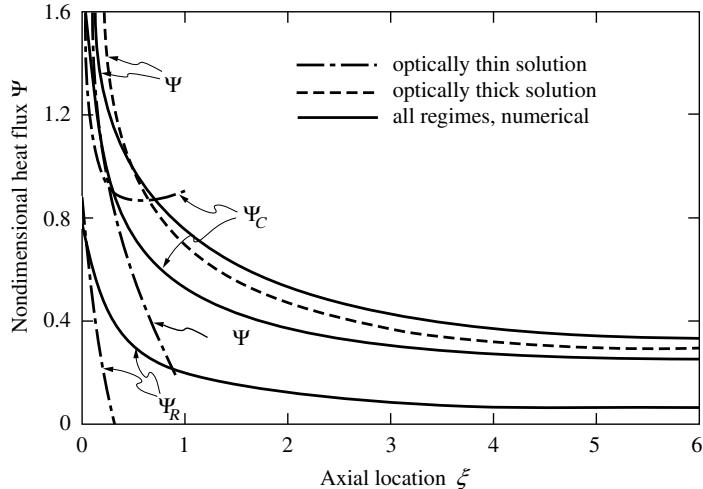
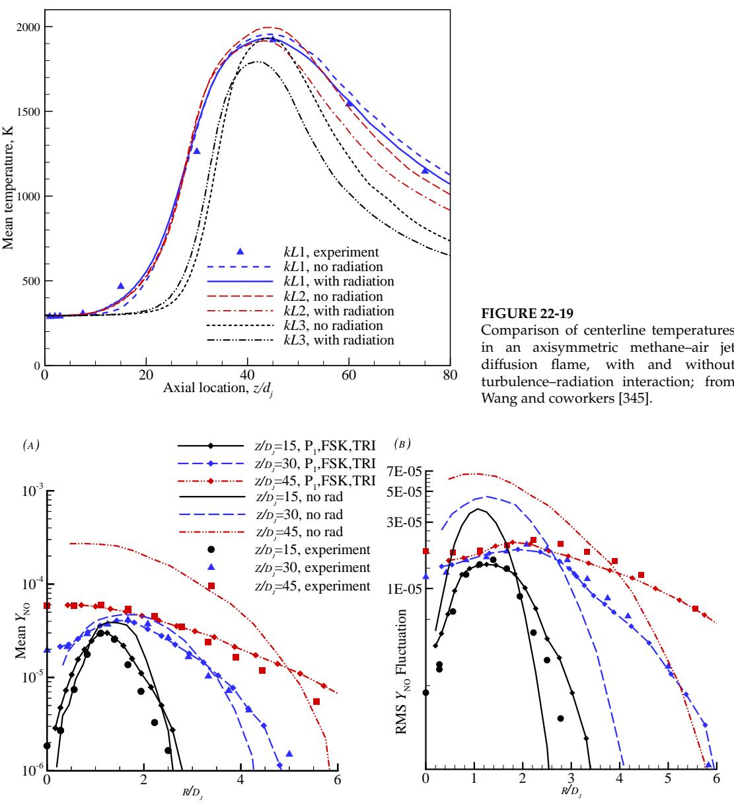

## 内容索引

- [目录](README.md)
- [1 热辐射基础](1-热辐射基础.md)
- [2 基于电磁波理论的辐射特性预测](2-基于电磁波理论的辐射特性预测.md)
- [3 实际表面的辐射特性](3-实际表面的辐射特性.md)
- [4 视角因子](4-视角因子.md)
- [5 灰体漫射表面间的辐射交换](5-灰体漫射表面间的辐射交换.md)
- [6 部分镜面灰体表面间的辐射交换](6-部分镜面灰体表面间的辐射交换.md)
- [7 非理想表面间的辐射交换](7-非理想表面间的辐射交换.md)
- [8 表面交换的蒙特卡洛方法](8-表面交换的蒙特卡洛方法.md)
- [9 传导和对流存在时的表面辐射交换](9-传导和对流存在时的表面辐射交换.md)
- [10 参与介质中的辐射传递方程(RTE)](10-参与介质中的辐射传递方程(RTE).md)
- [11 分子气体的辐射特性](11-分子气体的辐射特性.md)
- [12 颗粒介质的辐射特性](12-颗粒介质的辐射特性.md)
- [13 半透明介质的辐射特性](13-半透明介质的辐射特性.md)
- [14 一维灰体介质的精确解](14-一维灰体介质的精确解.md)
- [15 一维介质的近似求解方法](15-一维介质的近似求解方法.md)
- [16 球谐函数法 (PN-近似)](16-球谐函数法(PN-近似).md)
- [17 离散坐标法 (SN-近似)](17-离散坐标法(SN-近似).md)
- [18 区域法](18-区域法.md)
- [19 准直辐射与瞬态现象](19-准直辐射与瞬态现象.md)
- [20 非灰消光系数的求解方法](20-非灰消光系数的求解方法.md)
- [21 参与介质的蒙特卡洛方法](21-参与介质的蒙特卡洛方法.md)
- [22 辐射与传导和对流的耦合](22-辐射与传导和对流的耦合.md)
- [23 逆辐射传热](23-逆辐射传热.md)
- [24 纳米尺度辐射传热](24-纳米尺度辐射传热.md)
- [附录](附录.md)

- [22.1 引言](#221-引言)  
- [22.2 辐射与传导的耦合](#222-辐射与传导的耦合)  
- [22.3 含内部辐射的熔化与凝固](#223-含内部辐射的熔化与凝固)  
- [22.4 边界层中辐射与对流的耦合](#224-边界层中辐射与对流的耦合)  
- [22.5 辐射与自然对流的耦合](#225-辐射与自然对流的耦合)  
- [22.6 内部流动中的辐射与对流耦合](#226-内部流动中的辐射与对流耦合)  
- [22.7 辐射与燃烧的耦合](#227-辐射与燃烧的耦合)  
- [22.8 湍流流场与辐射的耦合](#228-湍流流场与辐射的耦合)  
- [22.9 辐射与湍流的相互作用](#229-辐射与湍流的相互作用)  
- [22.10 聚光太阳能系统中的辐射](#2210-聚光太阳能系统中的辐射)  
- [参考文献](#参考文献)  
- [习题](#习题)  

# 第22章

# 辐射与传导和对流的耦合

# 22.1 引言

在我们此前对参与介质中辐射传递的分析中，始终假设不存在与其他传热模式的相互作用，即我们仅限于研究辐射平衡和给定温度场的情况。然而在实际系统中，辐射几乎总是与传导和/或对流同时发生，必须同时考虑两种或三种传热模式。这种情况下需要求解总体能量守恒方程(10.72)，这总是会导致一个非线性积分-微分方程。

文献中报道了许多关于辐射与其他传热模式相互作用的重要应用。仅讨论所有这些应用本身就足以填满一本与此书篇幅相当的专著。因此，我们将仅限于讨论几个非常基础的案例：(i)展示不同传热模式间相互作用的基本趋势，(ii)概述用于解决此类问题的一些数值方法。我们将首先用两节讨论参与介质中辐射与传导的耦合，后者包括相变效应。随后几节将处理辐射与对流的耦合，前三节涉及简单的外部流动、内部流动以及自然对流。另设专门章节讨论更高级的主题，如化学反应流中的辐射、对流/化学反应与辐射的数值接口，以及湍流-辐射相互作用。

本章大部分内容将理论发展限于简单的平面平行几何和灰介质，因为我们的目标只是研究不同传热模式间相互作用的总体趋势。更高级的主题和应用（如辐射与对流、湍流及化学反应的多维相互作用）将被概述以理解这类相互作用的本质，并提供深入研究的参考文献列表。

# 22.2 辐射与传导的耦合

本章剩余部分将讨论吸收、发射和散射介质中辐射与传导和/或对流的相互作用。本节首先讨论静止辐射参与介质中辐射与传导的相互作用。由于我们主要关注总体趋势和评估方法，这里将限于研究一个相对简单的例子：稳态热传导通过一维吸收-发射（但不散射）的灰介质，该介质被限制在两个平行、等温、灰体、漫发射和反射的平板之间。

参与介质中同时存在传导和辐射时的能量方程由式(10.72)给出：

$$
\rho \mathrm{c}_{\mathrm{r}}\frac{\partial T}{\partial t} = \nabla \cdot (k\nabla T) + \dot{Q}^{\prime \prime \prime} - \nabla \cdot \mathbf{q}_{\mathrm{r}}. \tag{22.1}
$$

对于稳态、无内热源的一维平面介质，简化为式(10.73)：

$$
\frac{d}{dz}\left(k\frac{dT}{dz} -q_R\right) = 0, \tag{22.2}
$$

边界条件为

$$
\begin{array}{rl}{z=0:}&{T(0)=T_1,}\\{z=L:}&{T(L)=T_2.}\end{array} \tag{22.3b}
$$

辐射热流或其散度

$$
\frac{dq_k}{dz} = \int_0^\infty \kappa_\eta (4\pi I_{b\eta} - G_\eta)d\eta , \tag{22.4}
$$

可通过前几章讨论的任何方法获得。

为简化起见，我们假设所有物性均为常数（即热导率$k$、吸收系数$\kappa_{j}$和折射率$n$）且为灰体。注意半透明介质的假设意味着吸收指数（同样用字母$k$表示）——尽管与吸收系数直接相关——在黑体强度计算中可以忽略，即$I_{b} = n^{2}\sigma T^{4} / \pi$。引入无量纲变量和参数：

$$
\begin{array}{c}{\xi = \frac{z}{L},\quad \theta = \frac{T}{T_1},\quad \Psi_R = \frac{q_R}{n^2\sigma T_1^4},\quad g = \frac{G}{4n^2\sigma T_1^4};}\\ {\tau_L = \kappa L,\quad \theta_L = \frac{T_2}{T_1},\quad N = \frac{k\kappa}{4\sigma T_1^3},} \end{array}
$$

将方程(22.2)-(22.4)简化为：

$$
\begin{array}{l}\frac{d^2\theta}{dt^2} = \frac{1}{4N}\frac{d\Psi_R}{dt},\\ \displaystyle \frac{d\Psi_R}{d\tau} = 4(\theta^4 -g),\\ \displaystyle \theta (0) = 1,\quad \theta (\tau_L) = \theta_L. \end{array} \tag{22.5}
$$

这里$\tau_{L}$是介质的光学厚度，$N$称为传导-辐射参数。对于光学厚平板$(\tau_{L}\gg 1)$，$N$可以很好地估计传导与辐射热流的相对重要性：由式(15.17)和(15.18)，

$$
\tau_{L} > 1:\frac{q_{C}}{q_{R}} = \frac{-k\partial T / \partial z}{-k_{R}\partial T / \partial z} = \frac{k}{k_{R}} = \frac{3}{4}\frac{k\kappa}{4n^{2}\sigma T^{4}},
$$

这给出了以局部温度表示的热流比。对于光学薄情况$(\tau_{L}\ll 1)$则稍复杂，必须考虑整个封闭空间的温度场。例如，对于被$T_{1}$和$T_{2}$两个黑体壁面包围的光学薄平板，由式(15.7)：

$$
\begin{array}{rl} & {\tau_{L}\ll 1:\quad q_{R}\simeq n^{2}\sigma (T_{1}^{4} - T_{2}^{4}) = 4n^{2}\sigma T_{\mathrm{av}}^{3}(T_{1} - T_{2}),}\\ & {\quad q_{c} = -k\frac{\partial T}{\partial z}\simeq k(T_{1} - T_{2}) / L,}\\ & {\quad q_{c} = \frac{k / L}{4n^{2}\sigma T_{\mathrm{av}}^{3}} = \frac{1}{\tau_{L}}\frac{k\kappa}{4n^{2}\sigma T_{\mathrm{av}}^{3}}.} \end{array}
$$

如果在光学薄平板中，来自平板内部的发射（而非边界）主导辐射热流，则$q_{R}$与$\kappa$成正比[参见式(10.54)]，且

$$
\tau_{L}\ll 1(\mathrm{emission~dominated}):\frac{q_{C}}{q_{R}} = \mathcal{O}\left(\frac{N}{\tau_{L}^{2}}\right).
$$

作为平板中辐射与传导耦合的代表性示例，我们将使用精确积分公式（第14章介绍）和微分或$P_{1}$近似（15.4和16.5节描述）讨论辐射热流的解。类似地，方程(22.2)可通过多种数值技术求解。由于该方程是非线性的（因为辐射热流的$T^{4}$依赖性），解析解不可能存在，数值方案需要迭代求解。为说明目的，我们这里将限于对方程(22.2)和(22.3)进行有限差分解。

# 精确公式

对于具有指定温度分布的一维平板，入射辐射$G$和辐射热流$q_{R}$的精确公式已由方程(14.53)和(14.54)给出。对于非散射介质，辐射源项简化为$S(\tau) = I_{b}(\tau) = n^{2}\sigma T^{4}(\tau) / \pi$[如方程(14.52)所示]，而辐射热流，如方程(14.54)所示，以无量纲形式表示为：

$$
\Psi_{R}(\tau) = 2\left\{\mathcal{J}_{1}E_{3}(\tau) - \mathcal{J}_{2}E_{3}(\tau_{L} - \tau) + \int_{0}^{\tau}\theta^{4}(\tau^{\prime})E_{2}(\tau -\tau^{\prime})d\tau^{\prime} - \int_{\tau}^{\tau_{L}}\theta^{4}(\tau^{\prime})E_{2}(\tau^{\prime} - \tau)d\tau^{\prime}\right\} , \tag{22.8}
$$

其中我们引入了无量纲辐射度$\mathcal{J}_{i} = J_{i} / a^{2}\sigma T_{1}^{4}$。方程(22.8)可以通过附录E的递推关系进行分部积分，得到：

$$
\begin{array}{l}{\Psi_{R}(\tau) = 2\Big\{(\mathcal{J}_{1} - 1)E_{3}(\tau) - (\mathcal{J}_{2} - \theta_{L}^{4})E_{3}(\tau_{L} - \tau)}\\ {-\int_{0}^{\tau}\frac{d\theta^{4}}{d\tau^{\prime}} (\tau^{\prime})E_{3}(\tau -\tau^{\prime})d\tau^{\prime} - \int_{\tau}^{\tau_{L}}\frac{d\theta^{4}}{d\tau^{\prime}} (\tau^{\prime})E_{3}(\tau^{\prime} - \tau)d\tau^{\prime}\Big\} ,} \end{array} \tag{22.9}
$$

并且，使用Leibniz法则[1]，如方程(3.107)所示：

$$
\begin{array}{l}{\frac{d\Psi_R}{d\tau} = 2\Big\{(1 - \mathcal{J}_1)E_2(\tau) + (\theta_L^4 -\mathcal{J}_2)E_2(\tau_L - \tau)}\\ {+\int_0^\tau \frac{d\theta^4}{d\tau'} (\tau ')E_2(\tau -\tau ')d\tau ' - \int_\tau^{\tau_L}\frac{d\theta^4}{d\tau'} (\tau ')E_2(\tau ' - \tau)d\tau '\Big\} .} \end{array} \tag{22.10}
$$

方程(22.10)必须与方程(22.5)及其边界条件(22.7)同时求解。对于非黑体表面，需要两个额外的关系式来确定辐射度$\mathcal{J}_1$和$\mathcal{J}_2$。这可以通过在两个边界处应用方程(22.9)(用辐射度和介质温度表示辐射热流)，并通过方程(14.48)(将热流与辐射度和表面温度相关联)消除辐射热流来获得。为了说明目的，我们将仅限于黑体表面，即$\mathcal{J}_1 = 1$和$\mathcal{J}_2 = \theta_L^4$，以及

$$
\frac{d\Psi_R}{d\tau} = 2\left\{\int_0^{\tau}d\theta \frac{4}{\tau'} (\tau ')E_2(\tau -\tau ')d\tau ' - \int_\tau^{\tau_L}\frac{d\theta^4}{\tau'} (\tau ')E_2(\tau ' - \tau)d\tau '\right\} . \tag{22.11}
$$

对于这个简单情况，将方程(22.11)代入(22.5)给出了未知温度$\theta$的单个非线性积分微分方程。一旦确定了温度场，总热流为：

$$
q = -k\frac{dT}{dz} +q_R = \mathrm{const},
$$

或者，以无量纲形式：

$$
\Psi = \frac{q}{n^2\sigma T_1^4} = -4N\frac{d\theta}{d\tau} +\Psi_R = \mathrm{const.} \tag{22.12}
$$

例22.1。一个吸收-发射介质被包含在两个大的、平行的、等温的黑体平板之间，温度分别为$T_{1}$和$T_{2} = 0.5T_{1}$。如果热量通过传导和辐射传递，确定介质内的稳态温度分布和两个平板之间的总热流。讨论传导-辐射参数$N$和层的光学厚度$\tau_{i}$的影响。

# 解

控制方程的数值解可以通过多种方式找到。我们将在这里使用$J + 1$个等距节点$\tau = 0, \Delta \tau , 2\Delta \tau , \ldots , J\Delta \tau = \tau_{i}$，节点温度为$\theta_{i} (i = 0,1,2,\ldots ,J)$，并对传导项进行简单的有限差分：

$$
\frac{d^2\theta}{d\tau^2}\simeq \frac{\theta_{i + 1} - 2\theta_i + \theta_{i - 1}}{\Delta\tau^2} +\mathcal{O}(\Delta \tau^2),
$$

截断误差为$\Delta \tau^2$量级。辐射热流的散度，方程(22.11)，将通过用样条函数近似发射功率$\theta^4$，然后对分段积分进行解析计算。为了获得与传导项相同的截断误差$\mathcal{O}(\Delta \tau^2)$，$d\theta^4 /d\tau '$的预测必须精确到$\mathcal{O}(\Delta \tau)$[因为分段积分将截断误差降低了$\mathcal{O}(\Delta \tau)$]。因此，对于发射功率，线性样条就足够了，即：

$$
\begin{array}{c}{\theta^4 (\tau) = \theta_i^4 +B_i(\tau -\tau_i) + \mathcal{O}(\Delta \tau^2) = \frac{\theta_i^4(\tau_{i + 1} - \tau) + \theta_{i + 1}^4(\tau - \tau_i)}{\Delta\tau} +\mathcal{O}(\Delta \tau^2),}\\ {\frac{d\theta^4}{d\tau} (\tau) = \frac{\theta_{i + 1}^4 - \theta_i^4}{\Delta\tau} +\mathcal{O}(\Delta \tau),}\\ {\tau_i< \tau < \tau_{i + 1},\quad i = 0,1,2,\ldots ,J - 1.} \end{array}
$$

将其代入方程(22.11)得到：

$$
\begin{array}{r l r}{{\left(\frac{d\Psi_{R}}{d\tau}\right)_{i}\simeq2\sum_{j=1}^{i}\frac{\theta_{j}^{4}-\theta_{j-1}^{4}}{\Delta\tau}\int_{\tau_{j-1}}^{\tau_{j}}E_{2}(\tau_{i}-\tau^{\prime})d\tau^{\prime}-2\sum_{j=i+1}^{J}\frac{\theta_{j}^{4}-\theta_{j-1}^{4}}{\Delta\tau}\int_{\tau_{j-1}}^{\tau_{j}}E_{2}(\tau^{\prime}-\tau_{i})d\tau^{\prime}}}\\ &{}&{=\frac{2}{\Delta\tau}\sum_{j=1}^{i}\left(\theta_{j}^{4}-\theta_{j-1}^{4}\right)\left[E_{3}(\tau_{i}-\tau_{j})-E_{3}(\tau_{i}-\tau_{j-1})\right]+\frac{2}{\Delta\tau}\sum_{j=i+1}^{J}\left(\theta_{j}^{4}-\theta_{j-1}^{4}\right)\left[E_{3}(\tau_{j}-\tau_{i})-E_{3}(\tau_{j-1}-\tau_{i})\right]}\\ &{}&{=\frac{2}{\Delta\tau}\sum_{j=1}^{J}\left(\theta_{j}^{4}-\theta_{j-1}^{4}\right)\left[E_{3}\left(i j-j|\Delta\tau\right)-E_{3}\left(i j+1-j|\Delta\tau\right)\right].}\end{array}
$$

将方程(22.5)两边相等，我们得到：

$$
\begin{array}{l}\theta_{i - 1} - 2\theta_{i} + \theta_{i + 1} = \frac{\Delta\tau}{2N}\sum_{j = 1}^{J}(\theta_{j}^{4} - \theta_{j - 1}^{4})\left[E_{3}(|i - j|\Delta \tau) - E_{3}(|i + 1 - j|\Delta \tau)\right],\quad i = 1,2,\ldots ,J - 1,\\ \theta_{0} = 1,\quad \theta_{J} = \theta_{L}. \end{array}
$$

如果$N$相对较大$(N > 0.1)$，热传递主要由传导主导，解的过程如下：

1. 首先假设一个温度分布(例如纯传导时的线性分布)，并基于这些温度计算$(d\Psi_{R} / d\tau)_{i}$的值。
2. 通过求解$\theta$的简单三对角矩阵，确定新的温度分布。
3. 必要时使用欠松弛方法(如前一示例所述)对温度分布进行迭代。

如果$N$值较小，辐射占主导地位，则过程应反转：

1. 假设一个温度分布，计算传导贡献，并通过求解右侧$\theta_{i}^{4}$的完整矩阵确定发射功率场。
2. 根据发射功率等推导出新的温度分布。

一旦温度分布确定，总热流可根据方程(22.9)和(22.12)计算：

$$
\begin{array}{r l r} & {} & {\Psi_{i}\simeq -\frac{2N}{\Delta\tau} (\theta_{i + 1} - \theta_{i - 1}) - \frac{2}{\Delta\tau}\left\{\sum_{j = 1}^{i}\left(\theta_{j}^{4} - \theta_{j - 1}^{4}\right)\int_{\tau_{j - 1}}^{\tau_{j}}E_{3}(\tau_{i} - \tau^{\prime})d\tau^{\prime}\right.}\\ & {} & {\left. + \sum_{j = i + 1}^{J}\left(\theta_{j}^{4} - \theta_{j - 1}^{4}\right)\int_{\tau_{j - 1}}^{\tau_{j}}E_{3}(\tau_{i}^{\prime} - \tau_{i})d\tau^{\prime}\right\}}\\ & {} & {= -\frac{2N}{\Delta\tau}\left(\theta_{i + 1} - \theta_{i - 1}\right) - \frac{2}{\Delta\tau}\left\{\sum_{j = 1}^{i}\left(\theta_{j}^{4} - \theta_{j - 1}^{4}\right)\left[E_{4}(\tau_{i} - \tau_{j}) - E_{4}(\tau_{i} - \tau_{j - 1})\right]\right.}\\ & {} & {\left. - \sum_{j = i + 1}^{J}\left(\theta_{j}^{4} - \theta_{j - 1}^{4}\right)\left[E_{4}(\tau_{j} - \tau_{i}) - E_{4}(\tau_{j - 1} - \tau_{i})\right]\right\} ,\qquad i = 1,2,\ldots ,J - 1.} \end{array}
$$

这个无量纲热流值对所有节点都应相同。

代表性结果如图22-1和22-2所示。图22-1显示了$\tau_{i} = 1$中等光学厚度下板内的无量纲温度变化，通过两种不同方法计算：本示例的积分公式和$P_{1}$近似法。当$N = 0$时没有传导，温度分布在壁面处不连续，如图14-3首次所示。对于非常小的$N$值，温度分布除壁面附近外保持相似，介质温度必须快速接近表面温度。随着$N$增加，传导影响增强，温度分布迅速变为线性。对于光学薄情况(未显示)，效果更加明显：$N = 0$时壁面处温度跃变更大，而$N = 0.01$时温度分布已接近线性。这种行为可以解释为：对于小$\tau_{i}$，介质内部发射和吸收很少；辐射热流直接从表面传递到表面。

代表性无量纲热流如图22-2所示，并与稍后将讨论的近似方法进行比较。由于板的的光学厚度作为不同温度表面之间的辐射屏障，净热流随$\tau_{i}$减小而增加。$q / n^{2}\sigma \tau_{1}^{4}$随$N$增加而增加可以从两个相反的角度解释：如果$N$的增加是由于热导率$k$的增加，则传导和总热流增加。然而，如果$N$的增加是由于$T_{1}$的降低，则由于温度水平降低，辐射和总热流减小(因为$q / n^{2}\sigma \tau_{1}^{4}$的增加速度慢于$N$)。

这类简单的传导-辐射耦合问题最初由Viskanta和Grosh[2,3]以及Lick[4]研究。近期对非散射介质的研究包括半透明材料的激光闪光扩散率测量[5]，以及通过气凝胶[6]、塑料[7]和燃烧气体[8]等非灰体问题的传热分析。其他一维研究还采用了各向同性[9-11]甚至各向异性散射[12]情况下的精确辐射公式，均使用灰体且辐射特性恒定的假设。Wu和Ou[13]研究了具有各向同性散射的灰体矩形介质，Tuntomo和Tien[14]则将Maxwell方程应用于激光照射的金属微粒，探讨了二维问题。Siegel[15]对传导-辐射耦合传热研究进行了全面综述。

  
图22-1 光学厚度$\tau_{L}=1$的灰体平板在辐射与传导耦合作用下的无量纲温度分布，边界为温度比$\theta_{L}=T_{2}/T_{1}=0.5$的黑体平板

  
图22-2 灰体平板在辐射与传导耦合作用下的无量纲总热流，边界为温度比$\theta_{L}=T_{2}/T_{1}=0.5$的黑体平板

# $P_{1}$近似

$P_{1}$近似的控制方程及其边界条件在一维平板情况下由方程(15.42)-(15.44)给出，一般几何形状下由方程(16.50)-(16.52)给出。对于两个灰漫射表面之间的一维、灰体、非散射平板，关系可总结为：

$$
\begin{array}{l}\frac{dq}{d\tau} = 4\pi I_b - G,\\ \displaystyle \frac{dG}{d\tau} = -3q, \end{array} \tag{22.14}
$$

$$
\begin{array}{c}{\tau = 0:\qquad 2q = 4J_1 - G = \frac{\epsilon_1}{2 - \epsilon_1} (4\pi I_{b1} - G),}\\ {\tau = \tau_L:\qquad -2q = 4J_2 - G = \frac{\epsilon_2}{2 - \epsilon_2} (4\pi I_{b2} - G),} \end{array} \tag{22.15b}
$$

或以无量纲形式表示（如本节开头所示）：

$$
\begin{array}{l}\frac{d\Psi_R}{d\tau} = 4(\theta^4 -g),\\ \displaystyle \frac{dg}{d\tau} = -\frac{3}{4}\Psi_R, \end{array} \tag{22.17}
$$

$$
\begin{array}{l}\tau = 0:\qquad \Psi_R = 2(\mathcal{J}_1 - g) = \frac{2\epsilon_1}{2 - \epsilon_1} (1 - g),\\ \displaystyle \tau = \tau_L:\qquad -\Psi_R = 2(\mathcal{J}_2 - g) = \frac{2\epsilon_2}{2 - \epsilon_2} (\theta_L^4 -g). \end{array} \tag{22.18b}
$$

通过消去方程(22.16)-(22.18)中的辐射热流$\Psi_{R}$，可得：

$$
\frac{d^2g}{d\tau^2} +3(\theta^4 -g) = 0, \tag{22.19}
$$

$$
\begin{array}{ll}\tau = 0: & \frac{dg}{d\tau} +\frac{3}{2}\frac{\epsilon_1}{2 - \epsilon_1} (1 - g) = 0,\\ \displaystyle \tau = \tau_L: & \frac{dg}{d\tau} -\frac{3}{2}\frac{\epsilon_2}{2 - \epsilon_2} (\theta_L^4 -g) = 0. \end{array} \tag{22.20b}
$$

这个关于入射辐射的二阶微分方程通过结合方程(22.5)和(22.6)与总能量方程相关联：

$$
\frac{d^2\theta}{d\tau^2} = \frac{1}{N} (\theta^4 -g), \tag{22.21}
$$

及其边界条件(22.7)。求解过程包括：先假设温度场，然后通过方程(22.19)和(22.20)确定入射辐射场，再通过方程(22.21)和(22.7)更新温度场。由于问题的非线性特性，通常需要采用适当的欠松弛方法进行迭代，直到获得收敛的温度场和入射辐射场。此时，可通过方程(22.17)计算辐射热流，再根据方程(22.12)计算净热流：

$$
\Psi_{R} = -\frac{4}{3}\frac{dg}{d\tau}. \tag{22.22}
$$

  
图22-3 一维平板的节点系统，包含壁面内的虚拟节点$-1^{\prime \prime}$和$^{\prime \prime}J + 1^{\prime \prime}$。例22.2 采用$P_{1}$近似重复前例。

# 求解

我们将采用简单的有限差分法求解总能量方程和$P_{1}$近似。如前所述，将光学厚度$\tau_{i}$划分为$J + 1$个等距节点：$i = 0,1,\ldots ,J$，其中$\tau_{i} = i\Delta \tau$，$\Delta \tau = \tau_{i} / N$。因此，方程(22.21)变为：

$$
\begin{array}{c}{\theta_{i - 1} - 2\theta_{i} + \theta_{i + 1} = \phi_{i} = \frac{\Delta\tau^{2}}{N} (\theta_{i}^{4} - g_{i}),\qquad i = 1,2,\ldots ,J - 1,}\\ {\theta_{0} = 1,\quad \theta_{J} = \theta_{L}.} \end{array}
$$

类似地，方程(22.19)转换为：

$$
g_{i - 1} - (2 + 3\Delta \tau^{2})g_{i} + g_{i + 1} = -3\Delta \tau^{2}\theta_{i}^{4},\qquad i = 1,2,\ldots ,J - 1.
$$

在两侧边界还需要两个关系式。$g$的两个边界条件属于第三类，即同时包含因变量及其法向导数。为了保持所有关系的整体截断误差为$\mathcal{O}(\Delta \tau^{2})$，并保持有限差分方程的三对角特性，最好采用虚拟节点法[16]。如图22-3所示，在介质外（即壁面内）两侧引入假设节点，并在边界节点处对方程(22.19)和(22.20)进行有限差分，就像边界节点位于介质内部一样。因此，有：

$$
\left(\frac{dg}{d\tau}\right)_0\cong \frac{g_1 - g_{-1}}{2\Delta\tau},
$$

得到：

$$
\begin{array}{rcl}{g_{-1} - (2 + 3\Delta \tau^2)g_0 + g_1} & = & {-3\Delta \tau^2,}\\ {} & {} & {}\\ {-g_{-1}} & {} & {-3\Delta \tau g_0 + g_1 = -3\Delta \tau .} \end{array}
$$

相加后：

$$
-[2 + 3\Delta \tau (1 + \Delta \tau)]g_0 + 2g_1 = -3\Delta \tau (1 + \Delta \tau).
$$

在另一边界类似处理：

$$
\begin{array}{rcl}{g_{N - 1} - (2 + 3\Delta \tau^2)g_N + g_{N + 1}} & = & {-3\Delta \tau^2\theta_L^4,}\\ {} & {} & {}\\ {-g_{N - 1}} & {} & {+3\Delta \tau g_N + g_{N + 1}} & {= 3\Delta \tau \theta_L^4,} \end{array}
$$

相减后：

$$
2g_{N - 1} - [2 + 3\Delta \tau (1 + \Delta \tau)]g_N = -3\Delta \tau (1 + \Delta \tau)\theta_L^4.
$$

因此，我们得到了关于未知量$\theta_{i}$和$g_{i}$的两个同时存在的三对角方程组。这些方程组可以通过以下方式轻松求解：首先猜测$\phi_{i}$的分布（例如设$\phi_{i} = 0$），然后求$\theta_{i}$的三对角矩阵的逆。利用这个结果可以计算$g_{i}$的右侧项，再求$g_{i}$的三对角矩阵的逆。此时可以确定新的$\phi_{i}$值，如此迭代。一旦迭代收敛，净热流可由下式获得：

$$
\Psi_{i} = \frac{2N}{\Delta\tau}\left(\theta_{i - 1} - \theta_{i + 1}\right) + \frac{2}{3\Delta\tau} (g_{i - 1} - g_{i + 1}).
$$

图22-1和22-2中展示了一些样本结果用于与精确解比较。可以观察到温度分布的精度符合微分近似的预期（参见第15和16章）。正如预期的那样，随着$N$的增加（即当传导相对于辐射越来越占主导地位时），精度会提高。对于净热流的评估也有类似的观察结果。

Wang和Tien[17]显然是第一个将$P_{1}$近似或微分近似应用于辐射与传导耦合问题的人。

# 叠加解法

由于同时评估传导和辐射传热相当繁琐，人们倾向于分别处理每种能量传递模式（就像另一种模式不存在一样），然后将得到的两个热流相加。这种简单方法在两种极限情况下（当只有单一传热模式存在时）能给出正确的热流。问题是，这种方法在中间情况下的准确性如何？

通过厚度为$L$的一维平板的纯稳态传导能量通量由下式给出：

$$
q_{c} = k\frac{T_{1} - T_{2}}{L}, \tag{22.23}
$$

而对于限制在两个等温黑板之间的灰色、无散射介质在辐射平衡时的辐射热流，根据例15.5有：

$$
q_{R} = \frac{n^{2}\sigma(T_{1}^{4} - T_{2}^{4})}{1 + \frac{3}{4}\tau_{L}}, \tag{22.24}
$$

这里我们使用了微分近似得到的结果，以便获得闭合形式的表达式。将这两个热流相加得到近似净热流，其无量纲形式可写为：

$$
\Psi = \frac{q}{n^2\sigma T_1^4}\simeq \frac{4N}{\tau_L} (1 - \theta_L) + \frac{1 - \theta_L^4}{1 + \frac{3}{4}\tau_L}, \tag{22.25}
$$

该结果也包含在图22-2中。可以观察到叠加解的准确性出人意料地好。Einstein[18]和Cess[19]已经证明，对于黑板，该方法与精确解的偏差在$10\%$以内，尽管对于强反射表面观察到稍大的误差。Zeng及其同事[20]将该方法应用于一些非灰色材料，Howell[21]证明了该方法在同心圆柱体中的相对准确性。由于该方法没有物理基础，因此无法预测其在一般几何形状中的准确性。此外，该方法不能用于预测温度场，因为纯传导和纯辐射各自预测的温度分布是相互冲突的。

# 其他工作

自20世纪60年代初以来，文献中出现了大量关于传导-辐射耦合问题的研究论文。早期研究大多集中于简单的一维问题[2-4,17,22-27]。部分研究探讨了一维平板中的散射效应[28-51]，另一些则从不同角度分析了光谱/非灰效应[44,46,47,52-65]。关于外部辐射对一维平板中耦合传热模式的影响已在多项研究中讨论[5,57,62,66-73]，而瞬态传导的影响则在其他研究中探讨[5,34,41,50,51,62,70-86]。其他研究涉及变物性效应（导热系数和/或辐射特性）[42,43,49]，超快效应（双曲传导）[51,73]，以及通过逆分析从实验数据推断物性[12,48,87]。针对控制非线性积分-微分方程的求解，研究者采用了多种数值方法，如B样条试函数的配置法[88]、Chebyshev多项式配置法[38]、Galerkin法[33,34]以及有限元法[34]。除"精确"积分表达式外，还采用多种近似方法评估辐射热流，包括扩散法[45,63,65,70,89]、双通量法[29,44,47,72,77,90,91]、指数核近似[4,50,64,72]、P_N近似及其变体[13,17,35,48,49,74]、离散坐标法[41-43,46,51,65,87,92-96]、区域法[60]、蒙特卡洛法[37,97-99]等。有限的传导-辐射相互作用实验测量验证了理论模型在玻璃[95,100,101]、气凝胶[6,102]、玻璃颗粒[38]、玻璃纤维[36]、多孔介质[103]、堆积球体[46]和气体[104]中的有效性。

  
图22-4 半无限体内熔化区域：(a)不透明介质，(b)半透明介质。

虽然大多数研究针对一维平板中的相互作用，但其他几何形状也逐渐受到关注，如一维球体[21,105-110]、一维圆柱体[91,99,111-116]以及矩形和其他二维、三维构型[13,37,63,87,92-96,117-125]。

# 22.3 含内部辐射的熔化与凝固

材料的熔化和凝固在许多应用中具有重要意义，相关研究已持续一个多世纪。直到20世纪50年代，研究焦点完全集中于不透明材料的熔化和凝固，即忽略内部辐射传热影响的情况。早期关于辐射效应的研究假设，与不透明体类似，液态和固态区域之间存在明确界面[126-136]，尽管气象学家已认识到冰内可能发生内部熔化（如[137,138]）。Chan及其合作者[139]提出在纯液态和纯固态区域之间存在两相区，如图22-4示意。在内部辐射场存在下，这种两相层的存在可解释如下：考虑初始处于熔化温度$T_m$的等温半无限固体熔化，如图22-4所示，在固体表面施加恒定辐射热流。若材料不透明，入射热流被$x=0$处的薄表面层吸收，介质内部仅通过传导传热。熔化过程如图22-4a所示，具有明确界面，如许多论文和教科书所述[140]。若材料半透明，外部辐射深入固体内部，部分能量在$dx$层内吸收。这部分能量既不能通过传导散失（固体在$T_m$等温），也不能在未熔化该层固体前增加显热。由于短时间内吸收的能量不足以瞬时熔化$dx$层内所有材料，只能预期逐渐的、部分熔化。随着与表面距离增加，吸收能量减少，熔化分数相应降低。更一般情况，若存在低于熔点的固体，吸收的辐射能将首先用于提高材料显热，形成纯固态区。用热表面（及其表面发射）替代外部热流，或考虑凝固而非熔化，也可得出两相区或"糊状区"存在的类似结论。

  
图22-5 初始温度为$T_\infty$的半透明液体($T_w<T_m<T_\infty$)在冷边界$T_w$作用下的凝固

为说明本节内容，我们将研究对象限定为初始液态且温度为$T_\infty$($T_\infty>T_m$，介质熔化温度)的半无限体。当$t>0$时，$x=0$表面温度降至并保持在低于熔化/凝固温度$T_m$的$T_w$，形成具有图22-5定性温度分布的三层系统。为简化分析，进一步假设液态和固态具有相同恒定物性($k_l=k_s=k$，$\kappa_l=\kappa_s=\kappa$等)，介质无散射，表面为黑体($\epsilon_w=1$)。变物性、不同边界条件、不同几何形状和/或熔化而非凝固的情况虽直接但繁琐，此处不予讨论。下文将按照Chan等[139]的方法，建立控制三个区域的能量方程及其所需边界条件。

纯固态区 若在$t=0$时表面温度瞬时降至$T_w<T_m$，将立即形成(无限薄)纯固态层并随时间增长。固态区温度控制方程由式(10.72)给出：

$$
\rho c\frac{\partial T}{\partial t} = k\frac{\partial^2T}{\partial x^2} -\frac{dq_R}{dx}, \tag{22.26}
$$

假设固-糊状区界面位置$X_1(t)$已知，需初始条件和两个边界条件：

$$
\begin{array}{rl}{t=0:}&{T(x,0)=T_{\infty},}\\{x=0:}&{T(0,t)=T_w,}\\{x=X_1(t):}&{T(X_1,t)=T_m.}\end{array} \tag{22.27c}
$$

暂不计算辐射热流，因其在三区域中计算方法相同。

两相区(糊状区) 两相区存在时，至少部分凝固发生在有限体积内(而非仅明确界面)。因凝固过程介质释放$L\mathrm{J/kg}$热量($L$为熔化热)，产生体积热源：

$$
Q^{\prime \prime \prime} = L\dot{m}_s^{\prime \prime \prime} = L\rho_s\dot{V}_s^{\prime \prime \prime} = L\rho_s\frac{\partial f_s}{\partial t}, \tag{22.28}
$$

其中$\dot{m}_s^{\prime \prime \prime}$和$\dot{V}_s^{\prime \prime \prime}$分别为单位时间单位体积形成的固体质量和体积，$\rho_s$为纯固体密度，$f_s$为局部固相分数。含此热源的能量方程(10.72)变为：

$$
\rho c\frac{\partial T}{\partial t} = k\frac{\partial^2T}{\partial x^2} -\frac{dq_R}{dx} +\rho L\frac{\partial f_s}{\partial t}, \tag{22.29}
$$

热源项中省略$\rho_s$下标，因假设$\rho_s=\rho_l=\rho=\mathrm{const}$。两相区内液态和固态共存且处于局部热力学平衡，意味着糊状区温度均匀为熔点，无显热变化$(\partial T/\partial t=0)$和无传导$(\partial^2T/\partial x^2=0)$。因此，能量方程简化为确定固相分数的关系式：

$$
\frac{\partial f_s}{\partial t} = \frac{1}{\rho L}\frac{dq_R}{dx}, \tag{22.30}
$$

初始条件为：

$$
t = 0:f_s(x,0) = 0. \tag{22.31}
$$

纯液态区 纯液态区能量方程与固态区相同，但边界条件不同，因区域从$x=X_2(t)$延伸至$x\rightarrow\infty$：

$$
\begin{array}{c}{\rho c\frac{\partial T}{\partial t} = k\frac{\partial^2T}{\partial x^2} -\frac{dq_R}{dx},}\\ {t = 0:\qquad T(x,0) = T_\infty ,}\\ {x = X_2(t):\qquad T(X_2,t) = T_m,}\\ {x\to \infty :\qquad T(\infty ,t) = T_\infty .} \end{array} \tag{22.33b}
$$

辐射热流 半透明半无限介质中以黑体为界的辐射热流及其散度可由式(14.54)-(14.36)直接得到：

$$
\begin{array}{c}{q_R(\tau) = 2\left[E_{bw}E_3(\tau) + \int_0^\tau E_b(\tau ')E_2(\tau -\tau ')d\tau -\int_\tau^\infty E_b(\tau ')E_2(\tau ' - \tau)d\tau '\right],}\\ {\frac{dq_R}{d\tau} (\tau) = 4E_b(\tau) - 2\left[E_{bw}E_2(\tau) + \int_0^\infty E_b(\tau ')E_1(|\tau -\tau ')d\tau '\right],} \end{array} \tag{22.35}
$$

其中$\tau = \kappa x$为常规光学坐标，此处假设吸收系数为常数且在液态和固态中相同。注意$q_{R}(\tau)$和$dq_{R}/d\tau$处处连续（包括界面处），这与传导热流散度不同（从下文界面条件可见）。

  
图22-6 固-糊状区移动界面的能量平衡

界面条件 最终需要两个条件确定固-糊状区界面$X_{1}(t)$和糊状-纯液态区界面$X_{2}(t)$的位置。通过图22-6所示界面微元能量平衡获得。考虑固-糊状区界面厚度$dX_{1}$的微元，$dX_{1}$表示$dt$时间内完全固化的厚度。能量平衡式为：

$X_{1}(t)$处导入传导能 + $X_{1}(t)$处导入辐射能 + $dt$内释放能 = $X_{1}(t+dt)$处导出传导能 + $X_{1}(t+dt)$处导出辐射能

即

$$
-k\left.\frac{\partial T}{\partial x}\right|_{X_1 - 0}dt + q_R(X_1)dt + \rho L(1 - f_s)dX_1 = -k\left.\frac{\partial T}{\partial x}\right|_{X_1 + dX_1 + 0}dt + q_R(X_1 + dX_1)dt, \tag{22.36}
$$

下标$\pm 0$表示界面左侧（-0，固态区）和右侧（+0，糊状区）。释热项含$(1-f_{s})$因子，因$f_{s}$部分已固化。注意到糊状区内$T=T_{m}=$常数，故$\frac{\partial T}{\partial x} \big|_{X_{1} + dX_{1} + 0} = 0$。辐射热流连续，当$dt$和$dX_{1}$趋近零时相消，式(22.36)简化为：

$$
x = X_{1}(t):\quad -k\left.\frac{\partial T}{\partial x}\right|_{X_{1} - 0} + \rho L(1 - f_{s})\frac{dX_{1}}{dt} = 0, \tag{22.37}
$$

初始条件：

$$
t = 0:\qquad X_1(0) = 0. \tag{22.38}
$$

注意界面处不要求$f_{s} \to 1$（糊状区向纯固态平滑过渡）。

类似地，糊状-液态区界面方程为：

$$
-k\left.\frac{\partial T}{\partial x}\right|_{X_2 - 0}dt + q_R(X_2)dt + \rho Lf_sdX_2 = -k\left.\frac{\partial T}{\partial x}\right|_{X_2 + dX_2 + 0}dt + q_R(X_2 + dX_2)dt, \tag{22.39}
$$

$(1-f_{s})$替换为$f_{s}$，因$f_{s}$表示从纯液态凝固的部分。当$dt$和$dX_{2}$趋零时，$q_{R}$项相消，糊状区内传导项消失，得：

$$
\rho Lf_{s}\frac{dX_{2}}{dt} = -k\left.\frac{\partial T}{\partial x}\right|_{X_{2} + 0}. \tag{22.40}
$$

  
图22-7 初始处于熔点的半无限半透明介质凝固过程：固相与糊状区发展；$\theta_{w} = T_{w}/T_{m}=0.9$，$N=k\kappa/4n^{2}\sigma T_{m}^{3}=0.75$，$\mathrm{Ste}=L/cT_{m}=500$，$t^*=2\kappa n^{2}\sigma (T_{m}^{4}-T_{w}^{4})t/\rho L$

凝固发生时需满足$dX_{2}/dt>0$且$\partial T/\partial x\geq 0$。由于固相分数非负，式(22.40)左侧应为正而右侧为负。这一矛盾仅当两侧恒为零时成立，即：

$$
x = X_{2}(t):\qquad f_{s}(X_{2},t) = 0,\quad \frac{\partial T}{\partial x} (X_{2},t) = 0. \tag{22.41}
$$

这意味着糊状区与液态区无明确界面。温度、热流和固相分数在该"界面"处连续。数学上仍区分两区域：糊状区$f_{s}$为未知量（$T=T_{m}$已知），液态区温度未知（$f_{s}=0$已知）。$X_{2}$位置通过求解$f_{s}(x,t)=0$隐式确定。

综上，预测半透明介质凝固需联立求解：固态区方程(22.26)-(22.27)、糊状区方程(22.30)-(22.31)、液态区方程(22.32)-(22.33)及界面条件(22.37)和(22.41)。对于不透明介质，辐射源项消失（$q_{R}=0$），由式(22.30)-(22.31)得$f_{s}(x,t)=0$，即糊状区退化为点界面，符合纯传导预期。该方程组即使无辐射也呈非线性，难以解析求解。Chan等[139]给出了几种简单情况的近似解，例如图22-7展示初始均匀熔点液态的凝固过程。

例22.3. 考虑大块（半无限）透明冰体单侧受太阳辐射。冰初始温度均匀为$0^{\circ}\mathrm{C}$（熔点）。除太阳辐射外，冰表面换热及内部辐射可忽略。计算小时间段内糊状区发展，并说明液-糊状区界面移动的求解方法。

# 解

由于侧壁绝热，问题可简化为一维；且因冰块"非常大"，可视为半无限大物体，其左侧面（其余部分绝热）在$x=0$处受太阳辐射。本例考虑固体熔化过程，区域顺序与凝固相反：纯液态区$0\leq x\leq X_{1}$，糊状区$X_{1}< x< X_{2}$，纯固态区$x > X_{2}$。本例中$X_{2}\to \infty$，因冰体各处均处于熔点。且由于表面温度未突变，不会立即形成纯液态层，故$X_{1} = 0$持续一段时间$t > 0$。太阳辐射不被表面吸收而是穿透冰体，若忽略冰的发射和散射，产生局部辐射热流：

$$
q_{k}(x) = q_{\mathrm{sol}}e^{-\kappa x},
$$

其中$q_{\mathrm{sol}}$为穿透冰体的太阳辐射强度（在$x=0$界面因反射损失部分强度后，参见第19章）。

纯液态区基本由方程(22.26)-(22.27)描述：

$$
\begin{array}{l}\rho c\frac{\partial T}{\partial t} = k\frac{\partial^2T}{\partial x^2} +q_{\mathrm{sol}}\kappa e^{-\kappa x},\\ \displaystyle t = t_0:\quad T(x,t_0) = T_m,\\ \displaystyle x = 0:\quad \frac{\partial T}{\partial x} (x,t) = 0,\\ \displaystyle x = X_1(t):\quad T(X_1,t) = T_m, \end{array}
$$

$t_0$为纯液态区开始存在的时间，$x=0$处边界条件已修改以反映表面无热交换。

方程(22.28)的热生成项变为热汇，虽原表达式正确，但熔化过程采用液相分数$f_{l} = 1 - f_{s}$更合理。因此方程(22.30)改写为：

$$
\frac{\partial f_l}{\partial t} = -\frac{1}{\rho L}\frac{dq_k}{dx} = \frac{q_{\mathrm{sol}}\kappa}{\rho L} e^{-\kappa x},
$$

$$
t = 0:\quad f_l(0) = 0.
$$

最后，$x=X_{1}(t)$处的界面方程需重写为：

$$
-k\frac{\partial T}{\partial x}\bigg|_{X_1 - 0} = \rho L(1 - f_l)\frac{dX_1}{dt},
$$

$$
t = t_0:\quad X_1 = 0,
$$

其中$f_{s}$替换为$f_{l}$，$L$改为$-L$（因熔化需吸热而非放热）。由于$x=0$处$\partial T / \partial x = 0$，液态层无法增长直至$x=0$处$f_{l}=1$。达到此状态后（$t=t_0$时），$x=0$处温度可上升，$x=X_{1}-0$处$\partial T / \partial x$变为负值，故$f_{l}(X_{1})$必再次减小，且$dX_{1}/dt>0$。

当$t<t_0$时，糊状区方程易解为：

$$
f_{l}(x,t) = \frac{q_{\mathrm{sol}}\kappa t}{\rho L} e^{-\kappa x},\qquad 0 = X_{1}(t)< x< \infty .
$$

由此可得纯液态区开始时间为：

$$
t_0 = \frac{\rho L}{q_{\mathrm{sol}}\kappa},
$$

即$x=0$处$f_{l}=1$时。当$t>t_0$，糊状区内液相分数关系$f_{l}(x,t)$仍成立，但仅适用于$x\geq X_{1}>0$。液态区内温度分布及界面位置需联立求解导热方程和界面方程（已知$f_{l}$值）。

自Chan等[139]首次提出后，糊状区概念已获广泛认可[86, 141–144]。

# 22.4 边界层中辐射与对流的耦合

本节将简要讨论高温条件下热辐射的存在如何影响热边界层中的温度分布，从而影响壁面传热速率。由于我们主要关注对流与辐射传热相互作用的基本特性，因此仅研究平板层流这一简单案例。

  
图22-8 吸收/发射性流体在等温灰漫射平板上的层流

如图22-8所示，考虑黏性、可压缩、吸收/发射（但不散射）的灰色流体在等温灰漫射平板上的稳态层流。采用标准边界层假设[145]，质量、动量和能量守恒方程可表示为：

$$
\begin{array}{l}\frac{\partial}{\partial x} (\rho u) + \frac{\partial}{\partial y} (\rho v) = 0,\\ \displaystyle \rho \left(u\frac{\partial u}{\partial x} +v\frac{\partial u}{\partial y}\right) = \frac{\partial}{\partial y}\left(\mu \frac{\partial u}{\partial y}\right) - \frac{dp}{dx},\\ \displaystyle \rho c_{L}\left(u\frac{\partial T}{\partial x} +v\frac{\partial T}{\partial y}\right) = \frac{\partial}{\partial y}\left(k\frac{\partial T}{\partial y}\right) - \frac{\partial q_{R}}{\partial y} +\mu \left(\frac{\partial u}{\partial y}\right)^{2}, \end{array} \tag{22.44}
$$

边界条件为：

$$
\begin{array}{rlr}x = 0: & u(0,y) = u_{\infty}, & T(0,y) = T_{\infty};\\ y = 0: & u(x,0) = v(x,0) = 0, & T(x,0) = T_{\infty};\\ y\to \infty : & u(x,\infty) = u_{\infty}, & T(x,\infty) = T_{\infty}. \end{array} \tag{22.45b}
$$

方程(22.43)-(22.44)采用了标准边界层假设：$\partial u / \partial y \gg \partial u / \partial x$和$\partial T / \partial y \gg \partial T / \partial x$（边界层内动量与热量的横向传递远强于沿板方向），以及简化的耗散函数$(\partial u / \partial y)^2$。类似地，可忽略沿板方向的辐射项，仅考虑边界层横向辐射热流。通过扩散近似估算辐射热流数量级可证明此简化：由式(15.20)，$\mathbf{q}_R = - k_R N T$，且因$\partial T / \partial y \gg \partial T / \partial x$，沿板辐射可忽略。因此假设辐射热流为一维，$q_R$可由式(14.54)近似（$\tau = \int_0^y \kappa dy$，$\tau_L \to \infty$）3：

$$
q_{R}(x,y) = 2J_{w}(x)E_{3}(\tau) + 2\int_{0}^{\tau}E_{b}(x,\tau^{\prime})E_{2}(\tau -\tau^{\prime})d\tau^{\prime} - 2\int_{\tau}^{\infty}E_{b}(x,\tau^{\prime})E_{2}(\tau^{\prime} - \tau)d\tau^{\prime}, \tag{22.46}
$$

且

$$
\frac{1}{\kappa}\frac{\partial q_{R}}{\partial y} (x,y) = \frac{\partial q_{R}}{\partial\tau} = 4E_{b}(x,\tau) - 2J_{w}E_{2}(\tau) - 2\int_{0}^{\infty}E_{b}(x,\tau^{\prime})E_{1}(|\tau -\tau^{\prime}|)d\tau^{\prime}. \tag{22.47}
$$

辐射热流也可采用第15章讨论的近似方法计算。

需注意光子携带动量会产生辐射压力和辐射应力（参见1.8节），且控制体积储存辐射能[参见式(10.20)和10.7节]。但这些效应在极端高温下（1 atm压力下$>50,000\mathrm{K}$）才显著[146,147]，此处不予考虑。

为简化分析，补充假设：流体物性恒定$(\rho ,c_{p},\mu ,k,\kappa = \mathrm{const})$、低速流动（忽略耗散项）、黑体平板$[\epsilon_{w} = 1,$即$J_{w} = E_{b}(T_{w}) = E_{bw}]$，以及自由流参数恒定$(u_{\infty},T_{\infty} = \mathrm{const})$。则方程(22.42)-(22.44)和(22.47)简化为：

$$
\frac{\partial u}{\partial x} +\frac{\partial v}{\partial y} = 0, \tag{22.48}
$$

$$
u\frac{\partial u}{\partial x} +v\frac{\partial u}{\partial y} = \nu \frac{\partial^2u}{\partial y^2}, \tag{22.49}
$$

$$
u\frac{\partial T}{\partial x} +v\frac{\partial T}{\partial y} = \alpha \frac{\partial^2T}{\partial y^2} -\frac{1}{\rho c_p}\frac{\partial q_R}{\partial y}, \tag{22.50}
$$

$$
\frac{\partial q_{R}}{\partial y} = 2\kappa \Big[2E_{b}(x,\tau) - E_{bw}E_{2}(\tau) - \int_{0}^{\infty}E_{b}(x,\tau^{\prime})E_{1}(|\tau -\tau^{\prime}|)d\tau^{\prime}\Big], \tag{22.51}
$$

边界条件仍为(22.45)。其中$\nu = \mu /\rho$为运动粘度，$\alpha = k / \rho c_{p}$为热扩散率。引入流函数$\psi$：

$$
u = \frac{\partial\psi}{\partial y},\quad v = -\frac{\partial\psi}{\partial x}, \tag{22.52}
$$

可消去连续性方程，并将动量与能量方程转化为：

$$
\frac{\partial\psi}{\partial y}\frac{\partial^2\psi}{\partial x\partial y} -\frac{\partial\psi}{\partial x}\frac{\partial^2\psi}{\partial y^2} = \nu \frac{\partial^3\psi}{\partial y^3}, \tag{22.53}
$$

$$
\frac{\partial\psi}{\partial y}\frac{\partial T}{\partial x} -\frac{\partial\psi}{\partial x}\frac{\partial T}{\partial y} = \alpha \frac{\partial^2T}{\partial y^2} -\frac{1}{\rho c_p}\frac{\partial q_R}{\partial y}. \tag{22.54}
$$

通过标准坐标变换，将$x$和$y$转换为无量纲$\xi$和$\eta$：

$$
\xi = \frac{4n^2\sigma T_{\infty}^3\kappa x}{\rho c_p\mu_{\infty}},\quad \eta = \left(\frac{u_{\infty}}{\nu x}\right)^{1 / 2}y, \tag{22.55}
$$

并引入新的无量纲因变量：

$$
f = \frac{\psi}{(\nu u_{\infty}x)^{1 / 2}},\quad \theta = \frac{T}{T_{\infty}},\quad \Psi_{_R} = \frac{q_{_R}}{n^2\sigma T_{\infty}^4} \tag{22.56}
$$

将动量与能量方程简化为：

$$
\frac{d^3f}{d\eta^3} +\frac{1}{2} f\frac{d^2f}{d\eta^2} = 0, \tag{22.57}
$$

$$
\frac{1}{\mathrm{Pr}}\frac{\partial^2\theta}{\partial\eta^2} +\frac{1}{2} f\frac{\partial\theta}{\partial\eta} = \frac{df}{d\eta}\xi \frac{\partial\theta}{\partial\xi} +\frac{1}{4}\left(\frac{\xi}{N\mathrm{Pr}}\right)^{1 / 2}\frac{\partial\Psi_R}{\partial\eta}. \tag{22.58}
$$

式中$\mathrm{Pr} = \nu /\alpha = \mu c_p / k$为流体普朗特数，$N$为导辐射参数：

$$
N\equiv \frac{k\kappa}{4n^2\sigma T_\infty^3}. \tag{22.59}
$$

有时还引入对流-辐射参数（玻尔兹曼数）：

$$
\mathrm{Bo}\equiv \frac{\rho c_n u_\infty}{n^2\sigma T_\infty^3} = 4\left(\frac{N\mathrm{Re}_x\mathrm{Pr}}{\xi}\right)^{1 / 2}, \tag{22.60}
$$

其中$\mathrm{Re}_x = u_\infty x / \nu$为局部雷诺数。与$N$类似，玻尔兹曼数定性表征对流与辐射热流的相对大小。

方程(22.57)不含$\xi$的导数，因为$\eta$是一个相似变量，即方程中除$\xi$导数外的所有项都不含$\xi$，且$f$的边界条件也不依赖于$\xi$，简化为：

$$
\eta = 0:\quad f = \frac{df}{d\eta} = 0,\qquad \eta \to \infty :\quad \frac{df}{d\eta} = 1. \tag{22.61}
$$

因此，方程(22.57)是关于未知函数$f$的常微分方程，$f$仅是相似变量$\eta$的函数。该方程及其解最早由Blasius给出，并在流体力学教材如[148]中有详细记载。能量方程(22.58)则是关于未知量$\theta$的偏微分方程，其边界条件为：

$$
\begin{array}{ll}\eta = 0: & \theta = \frac{T_w}{T_\infty} = \theta_w,\quad \eta \to \infty : \theta = 1,\\ \xi = 0: & \theta = 1. \end{array} \tag{22.62b}
$$

由于$x=0$处的边界条件同时对应$\xi=0$和$\eta\to\infty$，方程(22.58)也可简化为相似解，但仅当$\Psi_R \propto \xi^{-1/2}$时成立。若$\Psi_R$由方程(22.51)或第15章讨论的近似方法计算，则不符合此条件。然而，当热边界层光学厚度很大时，扩散近似适用，由方程(15.20)可得：

$$
\Psi_{R} = -\frac{4}{3\kappa}\frac{\partial\theta^{4}}{\partial y} = -\frac{4}{3(N\operatorname*{Pr}\xi)^{1 / 2}}\frac{\partial\theta^{4}}{\partial\eta}. \tag{22.63}
$$

将该表达式代入方程(22.58)，得到常微分方程：

$$
\frac{1}{\operatorname*{Pr}}\frac{d^2\theta}{d\eta^2} +\frac{1}{2}\frac{f}{d\eta}\frac{d\theta}{d\eta} = -\frac{1}{3N\operatorname*{Pr}}\frac{d^2\theta^4}{d\eta^2}, \tag{22.64}
$$

此时$\theta$仅是相似变量$\eta$的函数。

Viskanta和Grosh[149]首次研究了灰气体在光学厚层流边界层中辐射与对流的相互作用，其他研究见[150-153]。图22-9展示了采用扩散近似[149]获得的无量纲温度相似剖面，对应不同传导-辐射参数$N$值。当$N=10$时，温度剖面与纯对流情况($N\to\infty$)的偏差在2%以内。存在辐射时，热边界层总是会增厚，这是因为辐射提供了额外的能量扩散途径。即使强辐射(大$T_\infty$)情况下，若流体光学厚度大(大$\kappa$)，热边界层增厚也会受限。然而，若吸收系数小(光学薄流体)，热边界层增厚可能过大，导致基本边界假设失效(即忽略$x$方向的传导和辐射)。

  
图22-9 平板光学厚层流边界层的无量纲温度相似剖面；$\mathrm{Pr}=1$：(a)$\theta_w=T_w/T_\infty=0.5$，(b)$\theta_w=2$

图22-10展示了三种不同方法计算的典型情况下沿平板的无量纲辐射、传导及总表面热流。辐射热流按方程(22.56)定义计算，传导热流定义为：

$$
\Psi_{c} = -k\left.\frac{\partial T}{\partial y}|_{y = 0}|n^{2}\sigma T_{\infty}^{4} = -4(\frac{N}{\mathrm{Pr}\xi})^{1 / 2}\left.\frac{\partial\theta}{\partial\eta}|_{\eta = 0}, \tag{22.65}
$$

且

$$
\Psi = \Psi_{c} + \Psi_{R}. \tag{22.66}
$$

"精确"结果是Zamuraev[154]通过数值求解方程(22.58)获得的(由Viskanta[155]报道)，其中辐射项由方程(22.51)计算。在光学厚解中，$\Psi_{R}$由方程(22.63)计算得到：

$$
\Psi_{R} = -\frac{4}{3(N\mathrm{Pr}\xi)^{1 / 2}}\left.\frac{\partial\theta^{4}}{\partial\eta}\right|_{\eta = 0}, \tag{22.67}
$$

并显示出简单的$\xi^{-1/2}$依赖关系。光学薄解取自Cess[19,156]，他提出了一个两区域温度场模型：一个非常薄的传统热边界层（其中忽略辐射而只考虑传导）和一个温度变化缓慢的外层区域（其中忽略传导）。如图22-10所示，扩散近似在整个平板长度上都能准确预测壁面热流，而光学薄近似在距前缘很短距离后就失效（显然是因为下游边界层变得太厚而不能忽略辐射，和/或外层变得非等温而不能忽略传导）。其他早期的光学薄模型由Smith和Hassan[157]以及Tabaczynski和Kennedy[158]报道；Pai和Tsao[159]使用了指数核方法，Oliver和McFadden[160]通过逐次逼近法求解了"精确"关系式(22.51)，在三次迭代后停止。许多研究者还考虑了耗散效应[156,161-163]以及高超音速条件[162,164-166]。散射[167,168]、非灰辐射特性[169-171]、外部辐射[172,173]、湍流边界层[174-176]以及圆柱[171]和球体[177]上的层流影响也已被研究。

  
图22-10 平板层流边界层的传导、辐射及总热流比较：光学薄解来自[19]，光学厚解来自[149]，精确解来自[154]；$N=0.1$，$\mathrm{Pr}=1.0$，$\theta_w=0.1$

# 22.5 辐射与自然对流的耦合

当辐射与自然对流而非强制对流结合时，其影响往往更为重要。Cess[178]对光学薄情况下的垂直自然对流边界层进行了建模，Arpaci[179]则研究了光学薄和厚两种情况，而Cheng和Ozisik[180]以及Desrayaud和Lauriat[181]研究了各向同性散射效应，Krishnaprakas等人[182]考虑了线性各向异性散射。Hossain等人[183]使用扩散近似处理了具有抽吸的多孔垂直板附近的光学厚气体。Webb和Viskanta[184]研究了外部辐射的影响，并通过实验[185]验证了他们的模型，Yan和Li[186,187]研究了垂直方形管道。Lacona和Taine[188]通过全息干涉测量和激光偏转技术在氮气（抑制辐射）和纯二氧化碳（强辐射效应）中测量温度，验证了标准（无辐射）预测模型，并表明辐射可以显著改变自然对流温度分布。

水平层中的热稳定性与辐射[189-192]以及封闭空间特别是方形腔[193-199]和平行垂直板[200,201]中的辐射与自然对流耦合也受到了一定关注。此外，还研究了水平[202]和垂直环形空间[203]以及立方腔[204]。Derby及其同事[205]通过研究装有熔融玻璃的圆柱形容器，Tsukuda及其团队[206]通过考虑Czochralski晶体生长过程中的内部辐射，研究了液体中自然对流与辐射的相互作用。

上述大多数研究仅限于恒定灰体辐射特性的简单情况。例外的是Mesyngier和Farouk[198]的研究，他们使用离散坐标法和加权灰气体方法研究了方形腔中的$\mathrm{H}_2\mathrm{O}-\mathrm{CO}_2$混合物，以及Bedoui及其同事[207]的研究，他们使用精确公式和ADF方法研究了水蒸气辐射对Rayleigh-Benard对流的影响。此外，Colomer等人[199]使用SLW方法研究了充满$\mathrm{H}_2\mathrm{O}-\mathrm{CO}_2$混合物的方形腔，表明非灰气体特性对此类流动中的温度分布有非常强烈的影响。

  
图22-11 灰体、吸收和发射流体在灰漫射板之间的热发展泊肃叶流动

# 22.6 内部流动中的辐射与对流耦合

对于可以忽略辐射传热的圆形和非圆形管道中的强制对流换热，无论是层流还是湍流，都已得到深入研究。边界辐射的透明介质情况已在第9.3节简要讨论。本节我们将研究辐射参与介质在管道中流动时的辐射与对流相互作用。按照前几节的思路，我们再次将理论发展限制在一个特别简单的情况，即不可压缩、恒定特性流体通过平行板通道的流体力学充分发展的层流。这通常称为泊肃叶流动。随后将简要讨论更复杂情况下的趋势，并回顾最新技术。

# 泊肃叶流动

我们假设流体是灰体、吸收和发射（但不散射）的，平板是灰漫射的，相距$L$，并且是等温的，如图22-11所示。泊肃叶流动的充分发展速度分布很容易从方程(22.48)和(22.49)中得到，设$u=u(y)$，为

$$
u = 6u_{m}\frac{y}{L}\left(1 - \frac{y}{L}\right),\quad v = 0, \tag{22.68}
$$

其中$u_{m}$是管道中的平均速度。因此，能量方程(22.50)简化为

$$
u(y)\frac{\partial T}{\partial x} = \alpha \frac{\partial^2T}{\partial y^2} -\frac{1}{\rho c_p}\frac{\partial q_R}{\partial y}, \tag{22.69}
$$

如果我们再次将传导和辐射限制在流动方向（沿$x$）上的值与其横向值（沿$y$）相比可以忽略的情况。对于距离入口几个板间距$L$的通道位置，这通常是一个很好的假设[208]。方程(22.69)的边界条件为

$$
\begin{array}{rl}{x=0:}&{T=T_i,}\\{y=0,L:}&{T=T_w,}\end{array} \tag{22.70b}
$$

辐射热通量可以从方程(14.54)得到5

$$
q_{R}(x,y) = 2J_{w}(x)[E_{3}(\tau) - E_{3}(\tau_{L} - \tau)] + 2\int_{0}^{\tau}E_{b}(x,\tau^{\prime})E_{2}(\tau -\tau^{\prime})d\tau^{\prime} - 2\int_{\tau}^{\tau_{L}}E_{b}(x,\tau^{\prime})E_{2}(\tau^{\prime} - \tau)d\tau^{\prime}. \tag{22.71}
$$

  
图22-12 光学厚度和传导-辐射参数对泊肃叶流动中努塞尔数发展的影响——加热壁面

当然，辐射热通量也可以用第15章讨论的任何近似方法来评估。

引入与前几节类似的无量纲变量和参数，

$$
\theta = \frac{T}{T_w},\quad \Psi_R = \frac{a_w}{n^2\sigma T_w^4}, \tag{22.72a}
$$

$$
\xi = \frac{x}{L\mathrm{Re}_m\mathrm{Pr}} = \frac{x}{L}\bigg / \frac{u_mL}{\nu}\frac{\nu}{\alpha},\quad \eta = \frac{y}{L},\quad \tau = \kappa y, \tag{22.72b}
$$

$$
N = \frac{k\kappa}{4n^2\sigma T_w^3},\quad \tau_{\mathrm{L}} = \kappa L, \tag{22.72c}
$$

将方程(22.68)至(22.71)转换为

$$
6\eta (1 - \eta)\frac{\partial\theta}{\partial\xi} = \frac{\partial^2\theta}{\partial\eta^2} -\frac{\tau_{\mathrm{L}}}{4N}\frac{\mathrm{d}\Psi_{\mathrm{R}}}{d\eta}, \tag{22.73}
$$

$$
\xi = 0:\quad \theta = T_{i} / T_{w} = \theta_{i},\quad \eta = 0,1:\quad \theta = 1, \tag{22.74}
$$

$$
\Psi_{R} = 2\bigg[E_{3}(\tau) - E_{3}(\tau_{L} - \tau) + \int_{0}^{\tau}\theta^{4}(\xi ,\tau^{\prime})E_{2}(\tau -\tau^{\prime})d\tau^{\prime} - \int_{\tau}^{\tau_{L}}\theta^{4}(\xi ,\tau^{\prime})E_{2}(\tau^{\prime} - \tau)d\tau^{\prime}\bigg], \tag{22.75}
$$

其中，为简单起见，我们仅限于黑色通道壁面。

方程(22.73)及其边界条件必须与方程(22.75)联立求解，构成一个非线性积分-微分系统。方程(22.73)是一个抛物型微分方程，可以采用从$\xi=0$开始向前推进的直接数值解法。虽然原则上只要$\xi$的步长足够小，显式数值解是可行的，但实际上通常采用隐式方法。由于非线性特性，这需要先猜测下一个$\xi$位置处的温度场(作为$\eta$的函数)，然后进行迭代计算直至满足收敛准则。这个计算方案将在所有下游位置重复进行。这里描述的泊肃叶流动问题最初由Kurosaki[209]解决，稍后Echigo及其合作者[210]报告了更高温度(更小$N$值)下的结果。图22-12展示了$\theta_i=0.5$(冷流体，热壁面)情况下局部努塞尔数的轴向发展，其中努塞尔数定义为

  
图22-13 光学厚度和传导-辐射参数对管内气体-颗粒流动中努塞尔数发展的影响——冷却壁面

$$
\mathrm{Nu}_x(\xi) = \frac{q_wL}{k[T_w - T_m(\xi)]}, \tag{22.76}
$$

式中$q_w = q_c + q_R$是通过辐射和传导在壁面处的单位面积总热通量。用无量纲量表示，局部努塞尔数变为

$$
\mathrm{Nu}_x(\xi) = \frac{4}{1 - \theta_m(\xi)}\left[-\frac{\partial\theta}{\partial\eta} +\frac{\tau_L}{4N}\Psi_R\right]_{\eta = 0}. \tag{22.77}
$$

从图22-12可以明显看出，由于辐射的非线性贡献，不会形成完全发展的温度分布，因此也不会出现渐近的努塞尔数。相反，对于加热壁面情况$(T_w > T_i)$，努塞尔数会在某个下游位置达到最小值，之后又趋于增大。随着辐射重要性的增加，这个极值位置会向入口方向移动。这种现象可以解释如下：在入口下游，对流热通量总是比温差$T_w - T_m(\xi)$下降得更快，导致努塞尔数中对流贡献的持续减小；而辐射热通量的比例则随$x$单调增加，从而产生观察到的行为。

# 层流与湍流通道流动

从定性角度看，其他加热壁面通道流动的努塞尔数发展与泊肃叶流动相同（无论几何形状、湍流、散射存在与否、非灰性等如何）。当热流体进入冷壁管道$(T_w<T_i)$时，传热行为则有所不同。图22-13展示了Azad和Modest[211]研究的含小颗粒气体湍流管流情况。努塞尔数总是单调递减，与纯对流情况类似，最终似乎趋于渐近值。然而，如图22-14所示，在存在热辐射的情况下，这种"充分发展"状态直到整体温度基本等于壁温才会出现（注意对于纯对流，达到充分发展条件时整体温度仅变化了最大值的约20%）。因此可以得出结论：在管道流动中，当强制对流与显著热辐射（即辐射热通量大到无法用温度的线性表达式近似）相结合时，不存在热充分发展条件。这一事实在早期研究中未被认识到，许多研究采用"热充分发展"条件来获得相对简单的结果[212-219]。图22-13和22-14还展示了温度水平和光学厚度如何影响努塞尔数和整体温度的变化。在恒定光学厚度下减小$N/\tau_R$（这不依赖于吸收系数，对于给定介质和管半径意味着升高温度）会完全由于辐射热通量增加而提高传热速率。辐射热通量在中间光学厚度$\tau_R\simeq1$（对于恒定$N/\tau_R$）处达到最大值。这可以通过考察光学极限来合理解释：在光学薄极限下，介质不发射或吸收任何辐射，导致纯对流传热；而在光学厚极限下，任何发射的辐射都会在发射点附近立即被重新吸收，再次使辐射热通量降为零。

  
图22-14 光学厚度和传导-辐射参数对管内气体-颗粒流动中整体温度发展的影响——冷却壁面

在Couette流动（两块以不同速度运动的无限平行平板）情况下确实存在简单的一维温度分布，因为整个问题简化为一维。这种情况的分析可归结为与上一节导出的传导与辐射耦合相同的方程组，已由Goulard和Goulard[220]以及Viskanta和Grosh[221]数值求解。

如前所述，泊肃叶流动问题最初由Kurosaki[209]使用辐射热通量的精确积分关系进行研究。Timofeyev等人[222]稍早使用双通量法处理了该问题。Lii和Ozisik[223]处理了平行平板间塞状流动的情况，对辐射热通量进行了严格建模。多位研究者[224-227]讨论了散射对泊肃叶流动的影响。Yener等人[228,229]研究了湍流条件下的相同问题，而Echigo和Hasegawa[230]处理了层流散射气体-颗粒混合物。这些研究都忽略了轴向辐射。Einstein[18]（非散射流体）和Kassemi与Chung[231]（各向同性散射流体）使用区域法，Kim和Lee[232]（各向异性散射流体）使用离散坐标法研究了泊肃叶流动的二维辐射问题。其他使用离散坐标法研究灰色介质湍流管流的包括Kim和Baek[233,234]（无散射的二维辐射）以及Krishnaprakas等人[235]（线性各向异性散射的一维辐射）。

热发展管流中对流与辐射的耦合研究似乎最早由Einstein[236]、deSoto[208]和Echigo等人[237]开展，考虑了二维（轴向和径向）辐射，而Bergero等人[238]使用有限体积法（用于辐射）研究了层流矩形管道中的发展流动和三维灰色辐射。

多位研究者[239-242]使用指数宽带模型研究了非灰分子气体辐射对层流管流和通道流动的影响。对于湍流流动的类似计算也采用充分发展流动和简单的热涡扩散代数表达式[219,240,243-245]，而Smith等人[246]使用二维区域法和加权灰气体求和法。Soufiani和Taine团队使用统计窄带模型、窄带$k$分布和全局ADF模型进行辐射计算，对层流[170,247,248]和湍流[249,250]管流和通道流动进行了更精确分析，后者采用$k-\epsilon$湍流模型。总体趋势与灰色介质流动相似，即无论气体被加热还是冷却，强烈的辐射效应表现为温度分布发展快得多（导致更大的努塞尔数）。然而，与宽带模型结果的比较表明，后者在预测温度场和辐射通量时可能产生显著误差。另一方面，与实验[247]的比较显示，窄带模型预测的温度场与实验数据非常吻合。

Echigo等人[251,252]最早分别研究了层流和湍流非散射介质的气体-颗粒悬浮流动。Modest团队处理了管流悬浮中灰色[211,253]和非灰色[245]载气的各向异性散射问题。AlTurki和Smith[254]使用区域法研究了悬浮流动中的非灰效应，而Park和Kim[255]使用$P_1$近似考虑了二维灰色颗粒辐射。Yin和Jaluria[256,257]以及Song等人[258]研究了液态玻璃射流的辐射效应，均采用二维分段灰色方法结合区域法[256,257]或离散坐标法[258]。最后，有多项尝试模拟通过多孔介质[259,260]和填充床[261-263]流动的辐射相互作用。Viskanta[264]提供了文献的全面综述。

# 22.7 辐射与燃烧的耦合

气体和颗粒的热辐射是燃料燃烧过程中重要且通常占主导地位的传热机制。因此，在燃烧过程的数学模型中包含适当的辐射模型对于成功至关重要，特别是在大型系统（具有较大光学厚度）中。即使不考虑辐射，燃烧过程的描述也是极其困难的任务："完整"的化学反应机制可能涉及数百种化学物质和数千个基元反应[265]，由一组非线性刚性联立微分方程建模。此外，燃烧过程通常伴随着涉及所有物种的多维（可能是两相）对流以及湍流混合。Viskanta和Menguc给出了截至1986年[266]和2004年[267]的相关文献的全面综述。这里我们将简要讨论层流自由对流扩散火焰这一特别简单的情况，使用简单燃料（甲烷$\mathrm{CH_4}$）、简单全局反应机制，

$$
\mathrm{CH}_4 + 2\mathrm{O}_2\rightarrow \mathrm{CO}_2 + 2\mathrm{H}_2\mathrm{O} \tag{22.78}
$$

（忽略多步化学和中间物种生成），以及简单反应速率模型（假设甲烷和氧气接触处发生无限快速反应）。Negrelli等人[268]对水平圆柱体下驻点区域，Liu等人[269]对垂直平板燃烧器进行了此类早期分析。

简单层流扩散火焰中燃烧-辐射相互作用的结果对所有反应流动都非常具有代表性，可以定性地应用于相当一般的燃烧系统。对于这种火焰，方程(22.42)至(22.45)变为

$$
\frac{\partial}{\partial x} (\rho u) + \frac{\partial}{\partial y} (\rho v) = 0, \tag{22.79}
$$

$$
\rho \left(u\frac{\partial u}{\partial x} +v\frac{\partial u}{\partial y}\right) = \frac{\partial}{\partial y}\left(\mu \frac{\partial u}{\partial y}\right) - g(\rho_{\infty} - \rho), \tag{22.80}
$$

$$
\rho c_{p}\left(u\frac{\partial T}{\partial x} +v\frac{\partial T}{\partial y}\right) = \frac{\partial}{\partial y}\left(k\frac{\partial T}{\partial y}\right) - \frac{\partial q_{R}}{\partial y} +\dot{Q}_{\mathrm{ch}}^{\prime \prime \prime}, \tag{22.81}
$$

$$
\rho \left(u\frac{\partial Y_i}{\partial x} +v\frac{\partial Y_i}{\partial y}\right) = \frac{\partial}{\partial y}\left(\rho D\frac{\partial Y_i}{\partial y}\right) + \dot{m}_i^{\prime \prime \prime},i = \mathrm{species}, \tag{22.82}
$$

边界条件为：对于自由对流，动量方程中的压力项已被浮力项取代，并去除了耗散函数。能量方程现在有一个热源项（由于化学能的释放），并且必须为所有物种的质量分数$Y_i$添加扩散方程。在早期工作中，通常进一步简化问题，假设所有物种具有单一质量扩散系数$D$，并且仅考虑燃料（甲烷$F$）、氧化剂（氧气$O$）和产物$\mathrm{H}_2\mathrm{O}$与$\mathrm{CO}_2$作为独立"物种"。方程组通过理想气体定律或$\rho T=$常数（假设恒压）封闭，而源项$\dot{Q}_{\mathrm{ch}}^{\prime \prime \prime}$和$\dot{m}_i^{\prime \prime \prime}$由反应动力学计算。最后，边界条件替换为

$$
\begin{array}{rlrl} & {x = 0:} & & {u(0,y) = 0,T(0,y) = T_{\infty},Y_F = Y_P = 0,Y_O = Y_{O\infty};}\\ & {y = 0:} & & {u(x,0) = 0,v(x,0) = v_w,T(x,0) = T_w,Y_F = 1,Y_P = Y_O = 0;}\\ & {y\rightarrow \infty :} & & {u(x,\infty) = 0,T(x,\infty) = T_{\infty},Y_F = Y_P = 0,Y_O = Y_{O\infty}.} \end{array} \tag{22.83a}
$$

在辐射项的处理上，Negrelli [268]和Liu [269]都采用了辐射传递方程(RTE)的一维精确解结合宽带模型，来模拟燃烧气体$(\mathrm{CH}_4,\mathrm{CO}_2,\mathrm{H}_2\mathrm{O})$的非灰辐射。Negrelli团队[268]和Liu团队[269]都采用半解析方法求解了上述方程组，并与实验结果进行了对比。两组研究都发现理论与实验吻合较好，特别是考虑到所使用的模型较为简化。图22-15展示了Negrelli等人[268]的部分计算结果，他们同时计算了透明气体(无辐射)和灰体气体(基于当地分压使用普朗克平均吸收系数)的情况。与无辐射解的对比清楚地表明：辐射会降低边界层高温区的温度(降幅超过$100^{\circ}\mathrm{C}$)，同时提高边界层外缘较冷区域的温度。显然，辐射的"远距作用"使能量直接从高温区传递到低温区。研究还发现，基于相同原因，辐射会增大热边界层厚度。另一方面，使用灰体气体近似会严重高估辐射对火焰温度和火焰热损失的影响。非灰气体会在可能具有很大光学厚度的谱线处发射和吸收辐射，即发射的能量会在发射点附近立即被重新吸收：在光谱的很大范围内("吸收系数接近零的光谱窗口")几乎不发生辐射。灰体近似用单一的中间值替代非灰吸收系数，虽然能预测正确的总发射量，但对于足够大的火焰，会严重低估辐射的再吸收过程。

  
图22-15 层流甲烷扩散火焰的实验与理论温度分布；引自[268]

近期对层流甲烷扩散火焰的研究采用了更复杂的反应动力学结合CHEMKIN软件[270,271]，并使用统计窄带模型处理辐射[272,273]。关于炭黑辐射对层流扩散火焰影响的研究涉及乙烯[274-277]和乙炔火焰[278]。早期研究采用简单的一步反应动力学，并假设吸收系数为灰体(假设辐射主要由近灰体的炭黑主导)，但使用了不同的炭黑成核、生长、聚结和氧化模型以及不同的RTE求解器。近期研究则采用完整化学反应机制，结合统计窄带模型和非灰体炭黑处理辐射。Kaplan团队[274]还通过对比忽略辐射的计算结果，评估了辐射的重要性。图22-16是他们工作的一个示例，清楚表明忽略辐射会高估温度水平，进而导致炭黑浓度被严重高估。关于辐射传热重要性的类似结论也适用于高温条件下痕量污染物(如$\mathrm{NO}_x$[279,280])的生成研究。Liu团队[277]指出，在微重力条件下辐射效应会显著增强。

目前，关于燃烧应用中辐射传热相互作用的文献正在快速增长，包括对湍流射流扩散火焰[281-289]、沿垂直平板传播的火焰[290-293]、液滴[294-296]和填充床[297]燃烧、火灾模拟[298]以及整个炉膛[299-305]的研究，最近还涉及未来富氧燃烧器[306](设计用于碳捕集)的研究。所有这些研究的结果都与本节描述的定性行为一致。值得注意的是，在含炭黑火焰模拟中，非灰体炭黑建模比非灰气体建模更为重要，灰体炭黑模型会产生较大误差[289]。

  
图22-16 层流乙炔扩散火焰的实验与理论炭黑浓度分布；引自[274]

# 22.8 湍流流场与辐射的耦合

近年来，湍流流动和化学反应建模以及多维非灰辐射领域都取得了巨大进展，每个领域都需要各自复杂耗时的算法来获得准确结果。虽然现代大涡模拟(LES)和直接数值模拟(DNS)发展迅速，但在可预见的未来，大多数计算流体力学(CFD)计算仍将依赖雷诺平均Navier-Stokes(RANS)求解方法。在RANS计算中，Navier-Stokes方程以时间平均量求解，所有湍流效应通过模型处理。虽然这些方案总是考虑湍流-对流的相互作用(通过涡扩散率或更高级的模型)，但湍流流场与脉动强度之间的相互作用通常被忽略。本节将描述在没有这种湍流-辐射相互作用(TRI)的情况下，如何将时间平均流场与辐射传热计算相耦合。关于雷诺平均和TRI的细节将在下一节讨论。

强制对流问题本质上是抛物型的(即下游条件无关紧要)，但在表面附近(以及燃烧锋面附近)存在巨大梯度，需要在其附近设置非常精细的网格系统。而辐射问题则倾向于椭圆型(即需要同时考虑整个计算域)，且由于辐射强度的方向性和光谱依赖性而更加复杂。将高级湍流模型与辐射模型结合需要格外小心，以避免不稳定、不收敛和/或过高的计算机内存和CPU需求。整体算法通常包括以下步骤：

1. 对局部辐射热源$\dot{Q}_R^{\prime \prime \prime} = -\nabla \cdot \mathbf{q}_R$进行初步估计  
2. 计算流场，包括速度、温度(或焓)和组分浓度(如果存在化学反应)。对于非严格抛物型的复杂流场，可能需要多次迭代  
3. 根据流场参数(压力、温度和组分浓度)计算吸收系数

  
图22-17 无辐射时燃烧室的温度分布及三种辐射网格；引自[307]

4. 对给定的温度和吸收系数场求解RTE以获得辐射源项。可采用简单或复杂的RTE求解器($P_{1}$近似、不同阶数的离散坐标法或有限体积法等)，以及基础或高级的光谱模型(灰气体、宽带模型、窄带模型、$k$分布等)。也可以从相对粗糙的RTE解开始，随着整体解的推进转向更精确的模型

5. 更新辐射源项并返回步骤2，直到满足某些整体收敛准则

迄今为止，大多数对流-辐射耦合计算对流场和热辐射计算使用相同的空间网格。这在湍流中效率较低，因为流场求解器在界面附近需要大量网格点，而RTE求解器则不需要。另一方面，RTE求解器通常要求计算单元的光学厚度有限制，这也可能与流场求解器不兼容。然而，使用两个独立网格也有其缺点：首先，两个网格间的插值计算成本高且不精确，通常会累积误差导致不稳定；其次，定义第二个网格需要额外工作确定其拓扑结构，并增加计算机内存需求。

解决这些问题的一个有效方法是建立一个辐射网格，其单元由多个流场单元组合而成，类似于数值分析中常用的多重网格算法（前提是流场单元不违反RTE求解器的光学厚度限制）。Badinand和Fransson[307]对此进行了详细研究，他们考察了喷气发动机后方高温燃烧气体的羽流流动。在迭代过程中，与辐射相关的变量（压力、温度、组分浓度）必须从CFD网格传递到辐射网格，而更新后的辐射源项值则需从辐射网格传回CFD网格。Badinand和Fransson采用了最简单的传递方案：将所有包含的CFD单元体积平均到辐射单元，并将辐射单元评估的辐射源项分配到其包含的每个CFD单元中。Omori团队[305]描述了一种稍复杂的传递方案。图22-17展示了Badinand和Fransson[307]用于轴对称预混燃烧器的一组网格，以及忽略辐射效应时的温度场分布。湍流采用$k-\epsilon$模型模拟，燃烧则使用简单的涡耗散模型结合单步反应动力学。流场计算仅使用精细网格（32,625个单元），而辐射计算则采用精细、粗化（2,727个单元）和极粗（625个单元）三种网格。辐射计算采用空间变化的普朗克平均吸收系数的灰气体模型，以及第17.6节的有限体积法（$8\times8$方向）。图22-18显示了辐射对燃烧室内温度分布的显著影响：高温燃烧气体因辐射发射损失大量能量，局部温度降低达$150\mathrm{K}$。大部分辐射能量传递至壁面，部分被较冷区域吸收，使冷燃料-空气射流温度升高$50\mathrm{K}$。从图22-18还可看出，辐射网格的选择对结果几乎没有影响：与精细网格相比，粗网格的温度差异误差小于$\pm0.2\%$，极粗网格误差小于$\pm0.4\%$。但使用粗网格时辐射计算速度提高20倍，极粗网格提高100倍。

  
图22-18 采用精细网格（填充和实线）、粗网格（虚线）和极粗网格（点线）计算的燃烧室温度差异；引自[307]。

Soufiani团队[248]采用了相同方案，而Howell团队[308]则采用他们称为自适应网格细化(AMR)的更复杂方法。他们实际上为每个流场解使用多重网格算法，并为离散坐标RTE求解器使用类似但独立的多重网格方案。他们实现了最高4倍的CPU时间节省，但远低于Badinand和Fransson的结果，因为RTE在最高层级仍需针对最精细的CFD网格求解。

# 22.9 辐射与湍流的相互作用

在第10章推导辐射传递方程(RTE)时，我们注意到热辐射传热本质上是瞬时的，取决于瞬时温度分布以及吸收、发射和/或散射介质的瞬时浓度场。在湍流流动中，温度场和（对于混合物）浓度场会发生快速且不规则的局部振荡（但相比热辐射的响应时间较慢）。控制方程如(22.42)-(22.44)或(22.79)-(22.82)需改写为时间平均量（用上划线表示），例如：

$$
\overline{\rho} (x,y) = \frac{1}{\delta t}\int_{\delta t}\rho (x,y,t)dt, \tag{22.84}
$$

其中$\delta t$是用于平均的（小）时间间隔。对于可压缩流动，通常还采用Favre平均（或质量加权平均，用波浪线表示）：

$$
\widetilde{\phi} = \overline{\rho\phi} /\overline{\rho}, \tag{22.85}
$$

其中$\phi$为待平均量。对于二维强制对流化学反应，这导致：

$$
\frac{\partial}{\partial x} (\overline{\rho}\overline{u}) + \frac{\partial}{\partial y} (\overline{\rho}\overline{v}) = 0, \tag{22.86}
$$

$$
\begin{array}{l}\overline{\rho}\left(\widetilde{u}\frac{\partial\widetilde{u}}{\partial x} +\widetilde{v}\frac{\partial\widetilde{u}}{\partial y}\right) = \frac{\partial}{\partial y}\left[\overline{\rho} (\overline{\nu} +\nu_t)\frac{\partial\widetilde{u}}{\partial y}\right] - \frac{d\overline{p}}{dx},\\ \displaystyle \overline{\rho}\left(\widetilde{u}\frac{\partial\widetilde{h}}{\partial x} +\widetilde{v}\frac{\partial\widetilde{h}}{\partial y}\right) = \frac{\partial}{\partial y}\left[\overline{\rho} (\overline{\alpha} +\alpha_t)\frac{\partial\widetilde{h}}{\partial y}\right] + \overline{Q}_{\mathrm{ch}}^{\prime \prime \prime} + \overline{Q}_R^{\prime \prime \prime},\\ \displaystyle \overline{\rho}\left(\widetilde{u}\frac{\partial\widetilde{Y}_i}{\partial x} +\widetilde{v}\frac{\partial\widetilde{Y}_i}{\partial y}\right) = \frac{\partial}{\partial y}\left[\overline{\rho} (\overline{D}_i + D_t)\frac{\partial\widetilde{Y}_i}{\partial y}\right] + \overline{m}_i^{\prime \prime \prime},\quad i = 1,\ldots ,s - 1, \end{array} \tag{22.89}
$$

其中温度已替换为焓$h = \int \epsilon_{\eta} dT$。在这些关系中，$\nu_{t}, \alpha_{t},$和$D_{t}$分别是湍流粘度、热扩散率和质量扩散率。源项$\dot{Q}_{\mathrm{ch}}^{\prime \prime \prime}$和$\dot{m}_{i}^{\prime \prime \prime}$是$s$个组成变量的强非线性函数，收集到向量$\phi (\phi_{i} = Y_{i}, i = 1, \ldots , s - 1, \phi_{s} = h)$中，必须以时间平均形式确定。湍流建模是一个极其复杂且研究活跃的领域，近年来取得了显著进展。基于雷诺平均Navier-Stokes(RANS)的湍流模型目前最流行，特别是普遍使用的$k-\epsilon$模型[309]，还有一些更精确的模型可供选择。如果要考虑湍流与非线性源项的相互作用，则会出现另一层难度。湍流与化学反应的相互作用已受到相当关注，产生了火焰面模型[310-312]和PDF（概率密度函数）方法[313]。虽然这些模型与湍流-辐射相互作用的建模非常相关，但已超出本书范围，读者可参考相关文献[314-319]。

为考虑湍流与辐射的相互作用(TRI)，必须评估时间平均辐射源：

$$
\overline{Q_R^{\prime\prime\prime}} = -\overline{\nabla\cdot\mathbf{q}_R} = -\int_0\kappa_\eta \left[4\pi I_{b\eta} - \int_{4\pi}I_\eta d\Omega \right]d\eta = -\int_0^\infty \left[4\pi \overline{\kappa_\eta I_{b\eta}} -\int_{4\pi}\overline{\kappa_\eta I_\eta} d\Omega \right]d\eta . \tag{22.90}
$$

由于它们对组成变量的非线性依赖，这些项无法基于平均值确定。因此需要两个湍流矩或相关性：吸收系数与普朗克函数的相关性$\overline{\kappa_{\eta}I_{\eta}}$，以及吸收系数与辐射强度的相关性$\overline{\kappa_{\eta}I_{\eta}}$。前者称为：

$$
发射TRI:\qquad \overline{\kappa_{\eta}I_{b\eta}}\neq \kappa_{\eta}(\widetilde{\phi})I_{b\eta}(\widetilde{T}), \tag{22.91}
$$

而后者称为：

$$
吸收TRI:\qquad \overline{\kappa_{\eta}I_{\eta}}\neq \kappa_{\eta}(\widetilde{\phi})I_{\eta}(\widetilde{\phi}). \tag{22.92}
$$

吸收TRI特别难以评估，因为局部强度的波动可能受到介质中各处属性波动的影响。另一方面，Kabashnikov团队[320-322]在早期工作中提出，如果辐射的平均自由程远大于湍流涡长度尺度$l_{t}$，则局部辐射强度与局部吸收系数仅弱相关，即：

$$
吸收TRI:\qquad \overline{\kappa_{\eta}I_{\eta}}\simeq \overline{\kappa_{\eta}I_{\eta}}. \tag{22.93}
$$

该表达式在$\kappa_{\eta}l_{t}\ll 1$时成立，通常称为光学薄涡近似(thin eddy approximation)或光学薄波动近似(OTFA)，它大大简化了$\overline{Q_R^{\prime\prime\prime}}$的评估，因为剩余的关联项$\overline{\kappa_{\eta}}$和$\overline{\kappa_{\eta}I_{b\eta}}$可以通过组分变量的单点统计量构建。需要注意的是，要应用此近似，必须对所有波数满足$\kappa_{\eta}l_{t}\ll 1$。虽然燃烧气体在光谱的极小部分(见图11-6)以及极端烟尘火焰中通常会违反此条件，但在绝大多数应用中都是合理的。迄今为止，大多数TRI(湍流-辐射相互作用)预测都采用了OTFA。

与时间平均化学源项非常相似，评估剩余关联项$\overline{\kappa_{\eta}}$和$\overline{\kappa_{\eta}I_{b\eta}}$需要任何两个组分变量之间的关联方程或模型，总共需要$s^2$个矩[323]；这对于传统的基于RANS的模型显然是不可行的。

由于这些困难，辐射和湍流传统上被视为独立现象，即忽略了湍流脉动对组分变量(决定辐射特性、黑体强度和局部辐射强度的局部值)的影响。如果考虑辐射效应，计算通常基于平均(时间平均)组分变量。Faeth和Gore团队[324-333]获得的实验数据表明，根据燃料和其他条件，火焰的辐射发射可能比基于温度和吸收系数平均值预期的值高出50%至300%。Cox[334]表明，仅通过将发射功率展开为泰勒级数，热介质由于湍流导致的发射就会显著增加。例如，对于具有恒定吸收系数的简单灰色介质，TRI简化为$\overline{\kappa I_b} = \kappa \overline{I_b} = \kappa \overline{E_b} /\pi$，其中

$$
\overline{E_b(x,y,t)} = \frac{1}{\delta t}\int_{\delta t}n^2\sigma T^4 (x,y,t)dt. \tag{22.94}
$$

如果将温度及其脉动表示为时间平均值，

$$
T(x,y,t) = \overline{T} (x,y,t) + T'(x,y,t),\quad \overline{T'} = 0, \tag{22.95}
$$

则$E_{b}(x,y,t)$可以通过截断泰勒级数近似为

$$
E_{b}(T)\simeq E_{b}(\overline{T}) + T^{\prime}\frac{dE_{b}}{d\overline{T}} +\frac{1}{2} (T^{\prime})^{2}\frac{d^{2}E_{b}}{d\overline{T}^{2}} +\ldots , \tag{22.96a}
$$

和

$$
\overline{E_b(T)}\simeq E_b(\overline{T}) + \frac{1}{2}\frac{d^2E_b}{d\overline{T}^2}\overline{(T')^2} = \sigma \overline{T}^4\left[1 + 6\frac{\overline{(T')^2}}{\overline{T}^2}\right]. \tag{22.96b}
$$

方程(22.96b)表明，所谓的温度自相关(时间平均发射功率)总是正的，导致由于湍流-辐射相互作用而增强发射。在当前情况下(灰色、恒定特性介质)，$\pm 30\%$的温度波动会使发射增加超过50%。

在大多数早期关于湍流-辐射相互作用的研究中，辐射计算并未与流场模型耦合；而是假设了脉动场[249,250,335-340]。普遍认为TRI仅在存在化学反应(燃料燃烧)时重要，并且有一些建议认为温度脉动主导湍流辐射相互作用。虽然现在广泛认识到湍流脉动会影响辐射传输速率，但反之亦然，即辐射对湍流中的温度脉动有影响。这首先由Townsend[341]认识到，并已在大气科学[342,343]和高温气体[344,345]中进一步研究。

在22.4和22.6节中观察到，在边界层和内部流动中，辐射通常由其横向分量主导，因此可以近似为一维，由于强制对流的抛物线性质，大大简化了求解。湍流脉动总是瞬态和三维的，尽管问题在统计上可能是稳态和一维或二维的[即，在时间平均意义上，方程(22.84)]。类似地，边界层和内部流动中的时间平均辐射传输往往再次主要由横向方向主导。Sakurai及其同事[346]表明，如果辐射在统计上是一维的，TRI可以用一维RTE求解器(即忽略湍流的三维性)充分评估，大大减少了必要的工作量。

首次从基本原理建模TRI的研究由Mazumder和Modest[347,348]完成，他们分别考虑了甲烷-空气扩散火焰和非反应燃烧气体混合物。通过使用速度-组分PDF方法的蒙特卡洛解，调用薄涡近似并使用第20.4节的box模型进行辐射，他们能够在没有进一步近似的情况下评估湍流-辐射相互作用。研究非反应流动[348]证实，TRI在非反应流动中确实从不重要，辐射源和通量的变化从未超过10%。另一方面，在甲烷-空气火焰中，观察到由于TRI导致的热损失率比温度自相关高出75%[347]。

Li和Modest[349-351]首次对二维轴对称非发光射流扩散火焰中的湍流-辐射相互作用进行了系统分析。他们采用混合方法，使用商业有限体积代码(Fluent[352])与组分PDF方法[313,319]结合，并调用薄涡近似(OTFA)。概率密度函数(PDF)方法的理念是将热流体变量$(\mathbf{u},h,\mathbf{Y},$等)视为随机变量，并考虑其PDF的传输而非矩。组分PDF是PDF方法的最简单形式，因为它仅携带组分变量的信息，收集在向量$\phi$中，其中包含$s - 1$个质量分数$\mathbf{Y}$和焓$h$。PDF方法的巨大优势是，任何量的平均值，比如源$\dot{Q}^{\prime \prime \prime}$，可以直接从PDF评估，前提是$\dot{Q}^{\prime \prime \prime}$仅是局部组分变量$\phi$的函数。这导致

$$
\overline{\dot{Q}^{\prime\prime\prime}} = \int_{0}^{\infty}f(\psi)\dot{Q}^{\prime \prime \prime}(\psi)d\psi , \tag{22.97}
$$

其中$\psi$表示组分变量$\phi$的样本空间(例如，$0\leq \psi_{s}< \infty$是最后一个组分变量$\phi_{s} = h,$可以取值的范围)；$f(\psi)$是$\phi = \psi$复合事件的概率密度(即$\phi_{1} = \psi_{1},\phi_{2} = \psi_{2},\ldots ,\phi_{s} = \psi_{s}$)，因此

$$
f(\psi)d\psi = \mathrm{probability}(\psi \leq \phi \leq \psi +d\psi). \tag{22.98}
$$

基于Pope[313]的广泛工作，Li和Modest[349]开发了辐射反应流的组分PDF传输方程。这导致了一个包含$s + 4$个独立变量(时间、空间和组分变量空间)的偏微分方程，由于其高维度，必须通过随机粒子追踪求解[313,319,353,354]。组分PDF不携带速度场信息，因此必须与另一个求解器结合，以提供平均动量方程的解以及湍流模型(如$k - \epsilon$)。

Li和Modest采用简单的单步化学反应机制，结合第20.8节的FSK方法和$P_1$近似来评估燃烧气体($\mathrm{CO}_{2}$、$\mathrm{H}_{2}\mathrm{O}$和$\mathrm{CH_4}$)的热辐射。他们通过无量纲参数表征火焰：雷诺数Re(描述射流速度、火焰尺寸和湍流水平)、光学厚度$\tau_{L}$(火焰尺寸)、Damköhler数Da(流动时间尺度与化学反应时间尺度之比)和弗劳德数Fr(浮力效应)，并评估了这些参数对湍流-辐射相互作用(TRI)的影响。他们的基础配置是Sandia Flame D[355]，该火焰有大量实验测量数据(包括辐射数据)。然而Sandia D是小型实验室火焰(与大多数实验记录的火焰一样)，因此辐射相对较弱。为此，Li和Modest还研究了放大2倍和4倍的火焰，以确定更大火焰中的辐射和TRI效应。研究发现TRI通过两种方式影响火焰：(1)火焰的发射和自吸收都显著且近乎同等程度地增强；(2)额外的净热损失导致火焰冷却(这反过来会大幅降低发射率和化学反应速率，甚至导致火焰熄灭)。不出所料，TRI强度对火焰光学厚度最为敏感。光学薄火焰通过辐射损失的热量相对较少；TRI使这种损失大幅增加50%，但仅使火焰温度略微降低(约$20^{\circ}\mathrm{C}$)。而对于光学厚火焰，这种额外热损失会导致温度显著下降($100^{\circ}\mathrm{C}$以上)，造成发射功率急剧下降，总体热损失率仅增加几个百分点。

为分离各种湍流相互作用对总体TRI效应的影响，Li和Modest[350]研究了多个火焰的"冻结"组分变量场(使用完全考虑TRI的火焰收敛温度和组分质量分数场)。他们在多种不同情景下确定了火焰发射和自吸收的各种辐射贡献。研究发现，从百分比来看，TRI导致的辐射热损失增加基本与光学厚度无关：对于所有三种火焰，发射和自吸收都一致增加了约60%。然而在光学薄火焰中，这转化为50%的净额外损失，因为温度水平(在"非冻结"场中)仅下降约$20^{\circ}\mathrm{C}$。而在光学厚火焰中，TRI使温度水平下降超过$100^{\circ}\mathrm{C}$，净热损失几乎没有增加。不同TRI机制也表现出类似的一致趋势：如果仅考虑普朗克函数自相关，灰色介质的发射和吸收增加约35%。但如果考虑燃烧气体的非灰特性，这种增加不到10%，同样与光学厚度无关(吸收滞后于发射，因为这是对发射水平提高的响应)。原因是气体仅在相当窄的吸收-发射带辐射，普朗克函数在这些带上的非线性程度要低得多。即使对于灰色介质(普朗克函数自相关是TRI最重要的驱动力)，它也绝不主导相互作用。TRI的最强贡献始终来自吸收系数与普朗克函数脉动之间的相关性。

其他几位研究者也在TRI背景下研究了Sandia Flame D[345,356-359]，大多数工作不如Li和Modest[349,350]的复杂，但都给出了关于辐射和湍流-辐射相互作用定量重要性的一致结论。迄今为止最先进准确的Flame D模型由Wang团队[345]建立，他们使用与Li和Modest类似的模型，但采用了更先进的组分PDF代码、更真实的化学反应机制以及第21.6节描述的逐线精确光子蒙特卡洛方案(专为传输PDF方法中使用的随机介质开发)。如图22-19所示，他们的模型能很好预测中心线温度，同时也表明辐射(无论是否考虑TRI)对小型光学薄火焰影响很小。Wang团队也将火焰放大2倍(KL2)和4倍(KL3)(但与Li和Modest采用不同方式以保持真实化学性质)。与Li和Modest的观察一致，他们注意到增大火焰尺寸(从而增加光学厚度)会提高辐射热损失，同时降低温度水平。TRI的相对重要性被发现与光学厚度无关(所有火焰约为30%)。

虽然光学薄火焰的温度水平对辐射依赖性较弱，但污染物水平往往与温度密切相关。Pal等[359]使用Wang团队的代码研究了Sandia D中的NO水平，如图22-20所示。可以看到辐射显著降低了NO水平(由于温度略微降低)。实验与理论的吻合相当令人鼓舞，图22-20清楚展示了辐射和TRI对平均污染物水平及其湍流脉动的重要性：辐射降低了火焰中心的温度(降低NO水平)，但加热了更远的较冷区域(增加NO)。辐射的"远距离作用"降低了各处的RMS脉动，除了那些没有辐射时完全没有NO的较冷区域。这些效应在更大火焰中被放大，辐射和TRI对温度的影响更大：当考虑辐射和TRI时，预测的NO水平会降低几个数量级。

  
图22-20 Flame D在不同轴向位置的NO质量分数径向分布：(a)平均值，(b)RMS脉动；来自Pal等[359]。

首次尝试量化吸收TRI的是Tessé团队[360]，他们研究了小型发光乙烯火焰，使用详细化学反应机制和复杂碳烟模型[361]，结合拉格朗日求解器获得组分PDF。然后他们从该PDF构建了许多均匀湍流结构，并使用光子蒙特卡洛方案结合Soufiani和Taine[362]的窄带$k$分布模型确定热辐射。他们发现发射增加30%，并且吸收TRI对这种发光火焰也很明显(占总发射的5%)，表明存在相当光学厚度的涡流。第一个从基本原理评估吸收TRI(即不使用Tessé对湍流结构的假设)的是Wang团队[345]，他们使用传输组分PDF确定组分变量及其湍流矩，结合Wang[363,364]的LBL精确光子蒙特卡洛方案处理随机粒子。该辐射求解器专为确定光子PDF而开发，与随机湍流模型完全兼容。Wang团队[345]通过该模型证明吸收TRI对Sandia D可忽略不计，实际上对大型非发光火焰也是如此。该方法还被用于研究碳烟火焰中TRI的影响：Mehta等[365-367]使用Wang团队[345]的方案结合复杂碳烟模型[371]模拟了六个碳烟火焰[368-370]，评估了此类系统中发射和吸收TRI的重要性。他们发现发射TRI(30%至60%)和火焰热损失(增加45%至90%)比非发光火焰更强。但与Tessé[360]的观察相反，尽管存在碳烟，吸收TRI对所有六个实验室规模火焰都可忽略。仅当将碳烟最多的火焰[369]放大32倍时，吸收TRI才变得明显(占总发射的6%)。

湍流-辐射相互作用也可通过更先进的CFD方法评估，如大涡模拟(LES)和直接数值模拟(DNS)。Chandy团队[372]首次使用LES结合组分变量的滤波密度函数(FDF)(RANS模拟中传输PDF的LES等效方法)研究TRI，考察了具有原始碳烟模型的理想化发光火焰。他们得出结论：虽然发射TRI在亚网格尺度(SGS)总是重要，但SGS尺度的吸收TRI总是可以忽略。Gupta等[373]使用类似LES/FDF方法但结合Wang[363,364]的LBL精确光子蒙特卡洛方案，得出了类似结论。最后，Roger[374,375]也通过静止各向同性湍流的DNS证明SGS吸收TRI可忽略。Haworth和Modest团队[376-380]在多种人工场景下研究了DNS背景下的湍流-辐射相互作用。但迄今为止，DNS模拟限于毫米级系统尺寸，即燃烧介质光学极薄的范围。

目前，湍流-辐射相互作用研究仍是极为活跃的领域。更多阅读可参考Modest的几篇综述文章[381-383]以及Coelho[384]的详尽专著。

# 22.10 聚光太阳能系统中的辐射

辐射传热在聚光太阳能的利用中起着重要作用。应用包括太阳能热发电[385,386]、太阳能热化学[387-389]和聚光光伏[390-392]，分别将太阳能转化为热能、化学能和电能。

光学聚光器可获得的热流密度从几$\mathrm{kW}/\mathrm{m}^2$到几$\mathrm{MW}/\mathrm{m}^2$不等。聚光太阳能系统的特征是太阳能聚光比，定义为聚光太阳能热流密度与$1\mathrm{kW}/\mathrm{m}^2$太阳辐照度的比值。通过提高聚光比可以限制接收器的再辐射损失，从而获得高温[393]。虽然太阳能热发电和热化学系统以提高效率为目标追求高温，但光伏电池效率随温度升高而降低，因此聚光光伏系统通常采用较低热流密度，研究重点集中在电池热管理[390]。

高温太阳能热系统通常包含温度超过数百摄氏度的固-气非均质介质，在某些应用中甚至超过$2000^{\circ}\mathrm{C}$。这类介质具有多重功能：吸收高通量辐照（由于气体在太阳能装置尺度上直接吸收效率低，吸收主要由固相完成），并将热量传递给太阳能热接收器中的工作气体以驱动热力循环，和/或传递给太阳能热化学反应器中的化学反应。在直接辐照的接收器/反应器中，辐射被直接接触工作气体或为化学反应提供表面的固体吸收（图22-21a）；而在间接辐照的接收器/反应器中，辐射先被固体吸收，然后通过中间传热介质（固体、流体或多相介质）以传导、对流和/或辐射方式传递给气体或化学反应（图22-21b）。

  
图22-21 利用聚光太阳能的高温装置示例：(a)用于甲烷热分解的直接辐照太阳能热化学测试反应器，含碳颗粒的甲烷流暴露于聚光辐射[394]；(b)间接辐照太阳能接收器原型，采用网状多孔陶瓷(RPC)环形层结构：聚光辐射通过复合抛物面聚光器$\mathrm{FPC}$被内圆柱腔吸收并转化为热能，再通过传导、辐射和对流传递给流经RPC层的加压空气[395]。

# 太阳能热接收器中的辐射

接收器设计取决于聚光器类型、工作流体及温度、压力和辐射通量的工作范围。Karni等[396]对1998年前的太阳能接收器进行了全面综述，Avila-Marin[397]则对中央接收式太阳能热电站的容积式接收器作了最新评述。

Flamant[398]最早对碳化硅、耐火黏土、氧化锆和二氧化硅颗粒的太阳能流化床进行了容积式太阳能吸收器的辐射传热分析，确定了温度分布、总发射率、热流分布和有效平均穿透距离，并与实验数据对比。Flamant等[399]采用双通量近似分析了含光谱特性不同颗粒填充床的容积选择性太阳能吸收器中辐射、传导和强制对流的耦合传热，该模型考虑了可见光与红外波段吸收和散射的变化，并通过玻璃与碳化硅颗粒床加热气相的实验验证了预测结果。Karni等[396]还在太阳炉中实验研究了暴露于气流中的辐照翅片阵列。

针对通过联合布雷顿-朗肯循环发电的高温加压空气接收器新设计（见图22-21b），开发了耦合辐射、传导和对流的二维稳态传热模型[395]。该模型对充满加压空气的网状多孔陶瓷环形层中的固相和气相分别建立能量方程：

  
图22-22 图22-21b所示接收器RPC层内选定轴向位置$z/L=0.12$处的辐射源项径向分布（接收器长度$65\mathrm{mm}$，SiC管外半径$20\mathrm{mm}$，总太阳能输入$1\mathrm{kW}$）[395]。

固体相：
$$
\frac{1}{r}\frac{\partial}{\partial r}\left(rk_s\frac{\partial T_s}{\partial r}\right) + \frac{\partial}{\partial z}\left(k_s\frac{\partial T_s}{\partial z}\right) + \dot{Q}_R^{\prime \prime \prime} = sh\left(T_s - T_f\right), \tag{22.99a}
$$

气相：
$$
\rho c_{p}v\frac{\partial T_{f}}{\partial z} = sh\left(T_{s} - T_{f}\right), \tag{22.99b}
$$

其中$s$为固-流界面的比表面积，$h$为颗粒与空气间的传热系数。接收器空腔辐射采用包壳理论建模，对灰色各向同性散射的多孔层分别采用Rosseland扩散近似、$P_1$近似和蒙特卡洛方法研究辐射传输：

$$
\begin{array}{rl} 
\text{扩散近似,方程(15.16):} & {\dot{Q}_R^{\prime \prime \prime} = \frac{1}{r}\frac{\partial}{\partial r}\left(r - \frac{16\sigma T_s^3}{3p}\frac{\partial T_s}{\partial r}\right),}\\ 
P_1\text{近似,方程(16.50a):} & {\dot{Q}_R^{\prime \prime \prime} = \kappa (G - 4\sigma T_s^4),}\\ 
\text{蒙特卡洛,方程(21.45):} & {\dot{Q}_R^{\prime \prime \prime} = \frac{\delta Q_a}{\delta V} -4\kappa \sigma T_s^4,} 
\end{array} \tag{22.100b}
$$

其中体积$\delta V$吸收的辐射功率$\delta Q_{a}$直接由蒙特卡洛法计算。图22-22比较了三种方法在$z/L=0.12$处的辐射源项分布，$P_1$近似与蒙特卡洛结果吻合较好，而Rosseland近似因网状多孔陶瓷层光学厚度较小($\tau_{\mathrm{RPC}}=3$)导致较大误差。$P_1$近似因其良好精度和较短计算时间被推荐为最佳方法。[400]还提出了采用离散坐标法对固体颗粒接收器进行的耦合传热数值研究。

空腔接收器常采用半透明窗口隔离内部高温气体与外部冷空气。Maag等[401]利用第7章的带近似分析了含石英和蓝宝石窗口的空腔接收器辐射传热。Yong等[402]则用蒙特卡洛法研究了平凸窗口太阳能空腔接收器的辐射传热。

# 太阳能热化学反应器中的辐射

聚光太阳能在化学中的应用可追溯至18世纪，Antoine Lavoisier曾使用由两个同心透镜组成的太阳炉进行燃烧实验[403]。Trombe和Foex[404]、Nakamura[405]、Fletcher和Moen[393]等人在太阳能反应过程与反应器方面做出了开创性工作。在太阳能热化学反应器中，入射太阳辐射通过可能带窗口的开口进入反应腔，被反应物和腔壁吸收。反应器设计与优化通常由耦合辐射、传导、对流与化学动力学的热化学模型指导[406]。辐射分析模型涵盖表面辐射交换模型，以及更复杂的考虑介质成分和相态随化学反应进程变化的动态模型。

太阳能驱动的氧化还原热化学循环已被研究用于从$\mathrm{H}_2\mathrm{O}$和$\mathrm{CO}_{2}$分别制取$\mathrm{H}_{2}$和CO。对于通式金属氧化物$\mathrm{M}_x\mathrm{O}_y$的两步循环可表示为[407]：

$$
\text{太阳能吸热步骤:}\qquad \frac{1}{\Delta\delta}\mathrm{M}_x\mathrm{O}_{y - \delta_{\mathrm{ox}}}\rightarrow \frac{1}{\Delta\delta}\mathrm{M}_x\mathrm{O}_{y - \delta_{\mathrm{red}}} + 0.5\mathrm{O}_2, \tag{22.101}
$$

$$
\text{非太阳能放热步骤:}\frac{1}{\Delta\delta}\mathrm{M}_x\mathrm{O}_{y - \delta_{\mathrm{red}}} + \mathrm{H}_2\mathrm{O}\rightarrow \frac{1}{\Delta\delta}\mathrm{M}_x\mathrm{O}_{y - \delta_{\mathrm{ox}}} + \mathrm{H}_2, \tag{22.102}
$$

$$
\frac{1}{\Delta\delta}\mathrm{M}_x\mathrm{O}_{y - \delta_{\mathrm{red}}} + \mathrm{CO}_2\rightarrow \frac{1}{\Delta\delta}\mathrm{M}_x\mathrm{O}_{y - \delta_{\mathrm{ox}}} + \mathrm{CO}, \tag{22.103}
$$

其中$\delta_{\mathrm{ox}}$和$\delta_{\mathrm{red}}$分别表示金属氧化物还原态和氧化态的非化学计量系数，$\Delta \delta = \delta_{\mathrm{red}} - \delta_{\mathrm{ox}}$。Lipinski等[408]研究了微米级氧化锌颗粒在直接高辐照下的静态悬浮分解。该瞬态模型耦合辐射传热与化学动力学，通过Mie理论在每个时间步更新因颗粒尺寸减小而变化的辐射特性。Abanades等[409]建立了多相模型，耦合流体流动、传热传质与氧化锌分解反应的化学动力学，将颗粒视为不透明球体。Müller等[410]与Schunk团队[411]采用Rosseland扩散近似数值分析了氧化锌颗粒填充床的直接辐照反应器瞬态辐射传热。Dombrovsky等[412]也提出了氧化锌填充床内部辐射传输的扩散模型。[411,412]中的数值温度分布与太阳能热重分析仪测量结果吻合良好。Villafán-Vidales等[413]采用蒙特卡洛方法分析了二氧化铈还原反应器的辐射传热，该参与介质为具有Mie理论特性的非等温、非灰、吸收发射及各向异性散射颗粒悬浮体系。Liang等[414]、Ganesan等[415,416]以及Haussener和Steinfeld[417]研究了新型二氧化铈基材料在非化学计量氧化还原循环中的辐射特性。

碳质材料的直接辐照颗粒出现在多项太阳能热化学过程中，包括煤的蒸汽气化和甲烷分解：

$$
\mathrm{CH}_x\mathrm{O}_{1 - y} + y\mathrm{H}_2\mathrm{O} = (x / 2 + y)\mathrm{H}_2 + \mathrm{CO}, \tag{22.104}
$$

$$
\mathrm{CH}_4\rightarrow \mathrm{C} + 2\mathrm{H}_2. \tag{22.105}
$$

Lipinski和Steinfeld[418]采用蒙特卡洛方法与Mie理论，Lipinski等[419]采用几何光学方法，分别数值研究了煤颗粒静态悬浮体系在蒸汽气化过程中的瞬态辐射传热。这两种方法也被应用于煤气流化床反应器的模拟。Maag团队[394]建立了含碳颗粒的$\mathrm{CH}_4$气流直接辐照瞬态对流-辐射耦合传热模型，通过Mie理论获得因碳沉积而增长的颗粒辐射特性。Maag等[420]开发了甲烷分解气流反应器的辐射-传导-对流耦合传热模型，对具有不透明壁和半透明开口的腔体采用净辐射法。

碳酸钙热分解被研究用于太阳能生产石灰和水泥，以及太阳能热化学$\mathrm{CO}_{2}$捕集。针对$\mathrm{CaCO}_{3}$颗粒填充床的反应模型假设颗粒处于几何光学尺寸范围：一项研究采用Rosseland扩散近似的瞬态辐射-传导耦合模型[421]，另一项研究则考虑了折射吸收性半透明颗粒的光谱特性[422]。

# 参考文献

1. Wylie, C. R.: 《高等工程数学》第5版, McGraw-Hill, New York, 1982.  
2. Viskanta, R., and R. J. Grosh: "表面发射率对传导与辐射同时传热的影响," International Journal of Heat and Mass Transfer, vol. 5, pp. 729-734, 1962.  
3. Viskanta, R., and R. J. Grosh: "吸收介质中传导与辐射同时传热," ASME Journal of Heat Transfer, vol. 84, pp. 63-72, 1963.  
4. Lick, W.: "辐射与传导的能量传递," in Proceedings of the Heat Transfer and Fluid Mechanics Institute, Stanford University Press, Palo Alto, California, pp. 14-26, 1963.  
5. Andre, S., and A. Degiovanni: "玻璃中瞬态耦合传导与辐射传热的理论研究:闪光技术测量声扩散率," International Journal of Heat and Mass Transfer, vol. 38, pp. 3401-3412, 1995.  
6. Heinemann, U., R. Caps, and J. Fricke: "辐射-传导相互作用:对硅气凝胶的研究," International Journal of Heat and Mass Transfer, vol. 39, pp. 2115-2130, 1996.  
7. Manohar, S. S., A. K. Kulkarni, and S. T. Thynell: "非灰介质中外部入射辐射的深度吸收," ASME Journal of Heat Transfer, vol. 117, no. 1, pp. 146-151, 1995.  
8. Soufiani, A., J.-M. Hartmann, and J. Taine: "带模型计算对CO₂和H₂O辐射特性及传导-辐射传递的有效性," Journal of Quantitative Spectroscopy and Radiative Transfer, vol. 33, pp. 243-257, 1985.  
9. Yao, C., and B. T. Chung: "散射-辐射-传导层中的瞬态传热," Journal of Thermophysics and Heat Transfer, vol. 13, no. 1, pp. 18-24, 1999.  
10. Abulwafa, E. M.: "具有方向性反射边界的不均匀平板中的传导-辐射传热," Journal of Physics D: Applied Physics, vol. 32, pp. 1626-1632, 1999.  
11. Tan, H. P., L. Ruan, X. L. Xia, and T. W. Tong: "吸收、发射和散射介质中的瞬态耦合辐射与传导传热," International Journal of Heat and Mass Transfer, vol. 42, pp. 2967-2980, 1999.  
12. Ruperti, N., Jr, M. Raynaud, and J.-F. Sacadura: "求解耦合逆热传导-辐射问题的方法," ASME Journal of Heat Transfer, vol. 118, pp. 10-17, 1996.  
13. Wu, C. Y., and N. R. Ou: "散射介质中的瞬态二维辐射与传导传热," International Journal of Heat and Mass Transfer, vol. 37, no. 17, pp. 2675-2686, 1994.  
14. Tuntomo, A., and C. L. Tien: "具有内部辐射吸收的导电粒子中的瞬态传热," ASME Journal of Heat Transfer, vol. 114, pp. 304-309, 1992.  
15. Siegel, R.: "半透明材料中辐射能的瞬态热效应," ASME Journal of Heat Transfer, vol. 120, no. 1, pp. 5-23, 1998.  
16. Ferziger, J. H.: 《工程应用数值方法》, John Wiley & Sons, New York, 1981.  
17. Wang, L. S., and C. L. Tien: "用微分方法研究辐射与传导的相互作用," in Proceedings of the Third International Heat Transfer Conference, vol. 5, Hemisphere, Washington, D.C., pp. 190-199, 1966.  
18. Einstein, T. H.: "平行平板间吸收气体的辐射传热与流动和传导," NASA TR R-154, 1963.  
19. Cess, R. D.: "热辐射与传导和对流的相互作用," in Advances in Heat Transfer, vol. 1, Academic Press, New York, pp. 1-50, 1964.  
20. Zeng, S. Q., A. J. Hunt, R. Greif, and W. Cao: "任意光学厚度介质中耦合传导与辐射的近似公式," ASME Journal of Heat Transfer, vol. 117, pp. 797-799, 1995.  
21. Howell, J. R.: "通过交换因子近似确定吸收介质中的传导与辐射组合传热," Chemical Engineering Progress Symposium Series, vol. 61, no. 59, pp. 162-171, 1965.  
22. Wang, L. S., and C. L. Tien: "辐射传热问题中各种极限的研究," International Journal of Heat and Mass Transfer, vol. 10, pp. 1327-1338, 1967.  
23. Chang, Y. P.: "传导、辐射和对流能量传递的势处理," AIAA Journal, vol. 5, pp. 1024-1026, 1967.  
24. Timmons, D. H., and J. C. Mingle: "具有镜面反射的同步辐射与传导," AIAA Paper No. 68-28, January 1968.
25. Tien, C. L., P. S. Jagannathan, and B. F. Armaly: "两平行长板侧向传导与辐射分析," AIAA Journal, vol. 7, pp. 1806-1808, 1969.
26. Tarshis, L. A., S. O'Hara, and R. Viskanta: "两种吸收介质紧密接触时的传导与辐射同时传热," International Journal of Heat and Mass Transfer, vol. 12, pp. 333-347, 1969.
27. Anderson, E. E., R. Viskanta, and W. H. Stevenson: "半透明固体中的传热," ASME Journal of Heat Transfer, vol. 95, no. 2, pp. 179-186, 1973.
28. Viskanta, R.: "吸收和散射材料中的传导与辐射传热," ASME Journal of Heat Transfer, vol. 87, pp. 143-150, 1965.
29. Bergquam, J. B., and R. A. Seban: "吸收和散射材料中的传导与辐射传热," ASME Journal of Heat Transfer, vol. 93, pp. 236-238, 1971.
30. Dayan, A., and C. L. Tien: "具有线性各向异性散射的灰色平面介质中的传热," ASME Journal of Heat Transfer, vol. 97, pp. 391-396, 1975.
31. Roux, J. A., and A. M. Smith: "吸收散射无限平板中的传导与辐射组合传热," ASME Journal of Heat Transfer, vol. 100, no. 1, pp. 98-104, 1978.
32. Yuen, W. W., and L. W. Wang: "一维吸收、发射和各向异性散射介质中的传导与辐射传热," ASME Journal of Heat Transfer, vol. 102, pp. 303-307, 1980.
33. Wu, S. T., R. E. Ferguson, and L. L. Altigilbers: "有限元技术在参与介质中传导与辐射相互作用中的应用," in Heat Transfer and Thermal Control, Progress in Aeronautics and Astronautics, vol. 78, AIAA, New York, pp. 61-69, 1981.
34. Fernandes, R., J. Francis, and J. N. Reddy: "平面介质中传导与辐射组合传热的有限元方法," in Heat Transfer and Thermal Control, Progress in Aeronautics and Astronautics, vol. 78, AIAA, New York, pp. 92-109, 1981.
35. Ratzel, A. C., and J. R. Howell: "采用微分近似的一维平面介质中的传导与辐射传热," ASME Journal of Heat Transfer, vol. 104, pp. 388-391, 1982.
36. Houston, R. L., and S. A. Korpela: "玻璃纤维绝缘材料中的传热," in Proceedings of the Seventh International Heat Transfer Conference, Munich, vol. 2, Hemisphere, Washington, D.C., pp. 499-504, 1982.
37. Mishkin, M., and G. J. Kowalski: "蒙特卡洛方法在参与介质稳态辐射与传导传热中的应用," ASME Paper No. 83-WAY/HT-27, 1983.
38. Kamiuto, K., and M. Iwamoto: "玻璃颗粒层中的传导与辐射组合传热," in Proceedings of the Second ASME/JSME Conference, vol. 4, pp. 77-84, 1987.
39. Ho, C. H., and M. N. Ozisik: "双层平面介质中的同时传导与辐射," Journal of Thermophysics and Heat Transfer, vol. 1, no. 2, pp. 154-161, 1987.
40. Ho, C. H., and M. N. Ozisik: "具有通量边界条件的双层平面介质中的传导与辐射组合传热," Numerical Heat Transfer, vol. 11, no. 3, p. 321, 1987.
41. Tsai, J. H., and J. D. Lin: "各向异性散射的瞬态传导与辐射组合传热," Journal of Thermophysics and Heat Transfer, vol. 4, no. 1, pp. 92-97, 1990.
42. Tseng, C. J., and H. S. Chu: "变导热系数的吸收、发射和各向异性散射介质中的瞬态传导与辐射组合传热," International Journal of Heat and Mass Transfer, vol. 35, pp. 1844-1847, 1992.
43. Kamiuto, K., M. Iwamoto, and Y. Nagumo: "填充床中的传导与相关辐射组合传热," Journal of Thermophysics and Heat Transfer, vol. 7, no. 3, pp. 496-501, 1993.
44. Siegel, R., and C. M. Spuckler: "高折射率层中光谱辐射传递的近似求解方法," International Journal of Heat and Mass Transfer, vol. 37, pp. 403-413, 1994.
45. Doermann, D., and J.-F. Saccadura: "开孔泡沫绝缘材料中的传热," ASME Journal of Heat Transfer, vol. 118, pp. 88-93, 1996.
46. Jones, P. D., D. G. McLeod, and D. E. Dorai-Raj: "填充床出口辐射强度的测量与计算相关性," ASME Journal of Heat Transfer, vol. 118, pp. 94-102, 1996.
47. Siegel, R.: "壁面具有半透明保护涂层的平行板围护结构中的辐射交换," International Journal of Heat and Mass Transfer, vol. 42, no. 1, pp. 73-84, 1999.
48. Li, H. Y.: "传导与辐射组合传热中热物性的估计," International Journal of Heat and Mass Transfer, vol. 42, no. 3, pp. 565-572, 1999.
49. Wu, J. W., and H. S. Chu: "变孔隙度平行板填充床中的传导与辐射组合传热," Journal of Quantitative Spectroscopy and Radiative Transfer, vol. 61, no. 4, pp. 443-452, 1999.
50. Lazard, M., S. Andre, and A. D. Maillet: "具有各向异性散射的灰色平面介质中的瞬态辐射-传导耦合传热," Journal of Quantitative Spectroscopy and Radiative Transfer, vol. 69, pp. 23-33, 2001.
51. Liu, L. H., and H. P. Tan: "周期性辐照下一维半透明介质中瞬态耦合辐射-传导传热的非傅里叶效应," Journal of Quantitative Spectroscopy and Radiative Transfer, vol. 71, pp. 11-24, 2001.
52. Greif, R.: "变气体特性下的辐射与传导能量传递," International Journal of Heat and Mass Transfer, vol. 7, pp. 891-900, 1964.
53. Lick, W.: "辐射与传导的瞬态能量传递," International Journal of Heat and Mass Transfer, vol. 8, pp. 119-127, 1965.
54. Echigo, R., S. Hasegawa, and Y. Miyazaki: "非灰介质中热辐射的复合传热:第一部分:辐射与传导的相互作用," International Journal of Heat and Mass Transfer, vol. 14, pp. 2001-2015, 1971.
55. Crosbie, A. L., and R. Viskanta: "非灰平面介质中传导与辐射传热的相互作用," Wärme- und Stoffübertragung, vol. 4, pp. 205-212, 1971.
56. Anderson, E. E., and R. Viskanta: "半透明固体中耦合传导-辐射传热的光谱和边界效应," Wärme- und Stoffübertragung, vol. 1, pp. 14-24, 1973.
57. Viskanta, R., and D. M. Kim: "高温下辐照半透明层的传热," ASME Journal of Heat Transfer, vol. 102, pp. 388-390, 1980.
58. Vasilev, M. G., and V. S. Yuferev: "温度和频率相关吸收系数导波近似下薄半透明板中的辐射-传导传热," J. Appl. Mech. Techn. Phys., vol. 22, pp. 89-85, 1981.
59. Ramerth, D., and R. Viskanta: "煤灰沉积层中的传热," ASME Paper No. 82-HT-11, 1982.
60. Smith, T. F., A. M. Al-Turki, K. H. Byun, and T. K. Kim: "漫射平行板间气体/烟灰混合物的辐射与传导传递," Journal of Thermophysics and Heat Transfer, vol. 1, no. 1, pp. 50-55, 1987.
61. Kamiuto, K.: "二氧化碳中传导与非灰辐射的组合传热," Journal of Thermophysics and Heat Transfer, vol. 10, no. 4, pp. 701-704, 1996.
62. Hahn, O., F. Raether, and M. C. Arduini-Schuster: "吸收、发射和散射介质中的瞬态耦合传导/辐射传热:在陶瓷材料激光闪光测量中的应用," International Journal of Heat and Mass Transfer, vol. 40, pp. 689-698, 1997.
63. Lentes, F. T., and N. Siecow: "玻璃冷却过程中的三维辐射传热," Glass Science and Technology: Glaztechnische Berichte, vol. 72, no. 6, pp. 188-196, 1999.
64. Hutchison, J. R., and R. F. Richards: "非灰气体辐射对二氧化碳热稳定性的影响," Journal of Thermophysics and Heat Transfer, vol. 13, no. 1, pp. 25-32, 1999.
65. Lee, K. H., and R. Viskanta: "玻璃传热研究中扩散近似与离散坐标法的比较," Glass Science and Technology, vol. 72, pp. 254-265, 1999.
66. Wendlandt, B. C. H.: "辐照热传导介质中的温度分布," Journal of Physics D: Applied Physics, vol. 6, pp. 657-660, 1973.
67. Gilpin, R. R., R. B. Robertson, and B. Singh: "冰中的辐射加热," ASME Journal of Heat Transfer, vol. 99, pp. 227-232, 1977.
68. Viskanta, R., and E. D. Hirleman: "辐照半透明板中的组合传导-辐射传热," ASME Journal of Heat Transfer, vol. 100, pp. 169-172, 1978.
69. Zakhidov, R. A., S. Y. Bogomolov, D. A. Kirgizbaev, and S. I. Klychev: "光学辐射加热半透明材料时温度场的确定," Applied Solar Energy, vol. 23, no. 6, p. 36, 1987.
70. Kowalski, G. J.: "光学厚介质对激光短脉冲的瞬态响应," in Fundamentals and Applications in Radiation Heat Transfer, vol. HTD-72, ASME, pp. 67-74, 1987.
71. Heping, T., B. Maestre, and M. Lallemand: "脉冲或阶跃辐照下半透明材料中的瞬态和稳态组合传热," ASME Journal of Heat Transfer, vol. 113, no. 1, pp. 166-173, 1991.
72. Andre, S., and A. Degiovanni: "求解瞬态辐射-传导传热问题的新方法," ASME Journal of Heat Transfer, vol. 120, no. 4, pp. 943-955, 1998.
73. Liu, L. H., H. P. Tan, and T. W. Tong: "激光脉冲引起半透明介质瞬态温度响应的非傅里叶效应," International Journal of Heat and Mass Transfer, vol. 44, pp. 3335-3344, 2001.
74. Hazzak, A. S., and J. V. Beck: "采用严格微分方法的非稳态传导-辐射组合能量传递," International Journal of Heat and Mass Transfer, vol. 13, pp. 517-522, 1970.
75. Lii, C. C., and M. N. Ozisik: "具有反射边界的吸收、发射、散射平板中的瞬态辐射与传导," International Journal of Heat and Mass Transfer, vol. 15, pp. 1175-1179, 1972.
76. Weston, K. C., and J. L. Hauth: "吸收、散射和发射介质中的非稳态辐射与传导组合传热," ASME Journal of Heat Transfer, vol. 95, pp. 357-364, 1973.
77. Matthews, L. K., R. Viskanta, and F. P. Incropera: "强太阳辐射加热多孔材料中的传导与辐射组合传热," Solar Energy, vol. 107, no. 1, p. 29, 1985.
78. Tong, T. W., D. L. McElroy, and D. W. Yarbrough: "多孔绝热材料中的瞬态传导与辐射传热," Journal of Thermal Insulation, vol. 9, pp. 13-29, July 1985.
79. Barker, C., and W. H. Sutton: "具有半透明边界的灰色参与介质中的瞬态辐射与传导传热," in Radiation Heat Transfer, vol. HTD-49, ASME, pp. 25-36, 1985.
80. Sutton, W. H.: "参与平板几何中耦合传导与辐射的短时解," ASME Journal of Heat Transfer, vol. 108, no. 2, pp. 465-466, 1986.
81. Burka, A. L.: "考虑散射各向异性的非稳态组合传热," High Temperature, vol. 25, no. 1, p. 99, 1987.
82. Crosbie, A. L., and M. Pattabongse: "平面介质中的辐射点火," Journal of Quantitative Spectroscopy and Radiative Transfer, vol. 37, no. 2, p. 193, 1987.
83. Glass, D. E., M. N. Ozisik, and D. S. McRae: "吸收和发射介质中的双曲热传导与辐射," Numerical Heat Transfer, vol. 12, no. 3, p. 321, 1987.
84. Rish III, J. W., and J. A. Roux: "带/不带辐射屏障的玻璃纤维绝热材料传热分析," Journal of Thermophysics and Heat Transfer, vol. 1, no. 1, pp. 43-49, 1987.
85. Rubtsov, N. A., and E. P. Golova: "多层介质非稳态辐射传导传热研究中散射的考虑," High Temperature, vol. 25, no. 4, p. 559, 1987.
86. Webb, B. W., and R. Viskanta: "半透明材料辐射熔化过程中的晶体学效应," Journal of Thermophysics and Heat Transfer, vol. 1, no. 4, pp. 313-320, 1987.
87. Park, H. M., and T. Y. Yoon: "使用共轭梯度法求解逆辐射问题," International Journal of Heat and Mass Transfer, vol. 43, no. 10, pp. 1767-1776, 2000.
88. Chawla, T. C., and S. H. Chan: "使用B样条作为近似函数的配置法求解辐射-传导问题," International Journal of Heat and Mass Transfer, vol. 22, no. 12, pp. 1657-1667, 1979.
89. Petrov, V. A.: "高温纤维绝热材料中的辐射与传导组合传热," International Journal of Heat and Mass Transfer, vol. 40, pp. 2241-2247, 1997.
90. Campo, A., and A. Tremante: "双通量模型在灰色平面介质传导-辐射组合传热中的应用," Wärme- und Stoffubertragung, vol. 21, no. 4, p. 221, 1987.
91. Tremante, A., and F. Malpica: "同心圆柱间传导-辐射组合传热下陶瓷复合材料温度分布分析," Journal of Engineering for Gas Turbines and Power, vol. 120, no. 2, pp. 271-275, 1998.
92. Baek, S. W., and T. Y. Kim: "使用离散坐标法的矩形围护结构中传导与辐射传热," in Proceedings of the Ninth International Heat Transfer Conference, Hemisphere, Washington, D.C., pp. 433-438, 1990.
93. Baek, S. W., T. Y. Kim, and J. S. Lee: "稀薄冷环境中有限圆柱介质的瞬态冷却," International Journal of Heat and Mass Transfer, vol. 36, pp. 3949-3956, 1993.
94. Sakami, M., A. Charette, and V. Le Dez: "离散坐标法在二维复杂几何中传导与辐射组合传热的应用," Journal of Quantitative Spectroscopy and Radiative Transfer, vol. 56, no. 4, pp. 517-533, 1996.
95. Lee, K. H., and R. Viskanta: "光学质量玻璃圆盘的瞬态传导-辐射冷却," International Journal of Heat and Mass Transfer, vol. 41, pp. 2083-2096, 1998.
96. Park, H. M., T. H. Kim, and J. H. Lee: "参与介质中热辐射动态模拟的模态缩减方法," Journal of Quantitative Spectroscopy and Radiative Transfer, vol. 62, pp. 141-161, 1999.
97. Kholodov, N. M., Z. H. Flom, and P. S. Koltun: "半透明平板中辐射传导传递的蒙特卡洛方法计算," Journal of Engineering Physics, vol. 42, pp. 333-338, 1982.
98. Abed, A. A., and J.-F. Saadadura: "半透明介质中耦合辐射-传导传热的蒙特卡洛-有限差分方法," ASME Journal of Heat Transfer, vol. 105, no. 4, p. 931, 1983.
99. Götz, T.: "热传导与辐射传递的耦合," Journal of Quantitative Spectroscopy and Radiative Transfer, vol. 72, pp. 57-73, 2002.
100. Nishimura, M., M. Hasatani, and S. Sugiyama: "辐射与传导同时传热:熔融玻璃中的高温一维传热," Intern. Chem. Eng., vol. 8, pp. 739-745, 1968.
101. Eryou, N. D., and L. R. Glicksman: "熔融玻璃中辐射与传导传热的实验与分析研究," ASME Journal of Heat Transfer, vol. 94, no. 2, pp. 224-230, 1972.
102. Scheuerpflug, P., R. Caps, D. Buettner, and J. Fricke: "辐射边界条件变化下真空$\mathrm{SiO_2}$气凝胶板的表观热导率," International Journal of Heat and Mass Transfer, vol. 28, no. 12, pp. 2299-2306, 1985.
103. Kamiuto, K., Y. Miyoshi, I. Kinoshita, and S. Hasegawa: "光学厚多孔体中的传导与辐射组合传热(堇青石多孔体案例)," Bulletin of Japan Society of Mechanical Engineers, vol. 27, p. 1136, 1984.
104. Schimmel, W. P., J. L. Novotny, and F. A. Olsofka: "辐射-传导相互作用的干涉研究," in Proceedings of the Fourth International Heat Transfer Conference, Elsevier, New York, September 1970.
105. Viskanta, R., and R. L. Merriam: "辐射介质分隔同心球间的传导与辐射组合传热," ASME Journal of Heat Transfer, vol. 90, pp. 248-256, 1968.
106. Tsai, J. R., and M. N. Ozisik: "吸收、发射和各向同性散射固体球中的瞬态传导与辐射组合传热," Journal of Quantitative Spectroscopy and Radiative Transfer, vol. 38, no. 4, pp. 243-251, 1987.
107. Jones, P. D., and Y. Bayazitoglu: "参与介质中球体的辐射与传导组合传热," in Proceedings of the Ninth International Heat Transfer Conference, Hemisphere, Washington, D.C., pp. 397-402, 1990.
108. Thynell, S. T.: "各向异性散射球形介质中传导与辐射的相互作用," Journal of Thermophysics and Heat Transfer, vol. 4, no. 3, pp. 299-304, 1990.
109. Miliauskas, G.: "半透明液滴蒸发过程中非稳态辐射-传导传热的规律," International Journal of Heat and Mass Transfer, vol. 44, pp. 785-798, 2001.
110. Liu, L. H., H. P. Tan, and T. W. Tong: "半透明球形颗粒中的瞬态耦合辐射-传导," Journal of Thermophysics and Heat Transfer, vol. 16, no. 1, pp. 43-49, 2002.
111. Gordoninejad, F., and J. Francis: "环形介质中瞬态传导与辐射组合传热的有限差分解," ASME Journal of Heat Transfer, vol. 106, no. 4, pp. 888-891, 1984.
112. Kim, T. K., and T. F. Smith: "灰壁真实气体圆柱围护结构中的辐射与传导传递," International Journal of Heat and Mass Transfer, vol. 28, no. 12, pp. 2269-2277, 1985.
113. Youssef, A. M., and J. A. Harris: "圆柱介质中恒定热源传导/辐射问题的P-1解," in Proceedings of the 1988 National Heat Transfer Conference, vol. HTD-96, ASME, pp. 187-192, 1988.
114. Tsai, J. R., and M. N. Ozisik: "吸收、发射和各向同性散射固体圆柱中的瞬态传导与辐射组合传热," Journal of Applied Physics, vol. 64, no. 8, p. 3820, 1988.
115. Harris, J. A.: "球谐函数法求解环形介质中线性各向异性散射的传导/辐射问题," ASME Journal of Heat Transfer, vol. 111, no. 1, pp. 194-196, 1989.
116. Pandey, D. K.: "同心圆柱介质中的传导与辐射组合传热," Journal of Thermophysics and Heat Transfer, vol. 3, no. 1, pp. 75-82, 1989.
117. Amlin, D. W., and S. A. Korpela: "热辐射对半透明固体温度分布的影响," ASME Journal of Heat Transfer, vol. 102, pp. 76-80, 1980.
118. Ratzel, A. C., and J. R. Howell: "P-N近似法研究辐射参与介质中的二维能量传递与传导," in Proceedings of the Seventh International Heat Transfer Conference, Munich, vol. 2, Hemisphere, Washington, D.C., pp. 535-540, 1982.
119. Shih, T. M., and Y. N. Chen: "包围辐射与传导介质的二维系统离散强度方法," Numerical Heat Transfer, vol. 6, pp. 117-134, 1983.
120. Razzaque, M. M., J. R. Howell, and D. E. Klein: "使用有限元法求解含灰色参与介质的二维封闭空间内辐射与传导耦合传热," in Proceedings of the First JSME/ASME Joint Thermal Conference, Honolulu, vol. 4, pp. 41-48, 1983.
121. Yucel, A., and M. L. Williams: "轴对称封闭空间内传导与辐射组合传热," Journal of Thermophysics and Heat Transfer, vol. 1, no. 4, pp. 301-306, 1987.
122. Yucel, A., and M. L. Williams: "无方位对称性的圆柱几何中传导与辐射的相互作用," in Proceedings of the 1988 National Heat Transfer Conference, vol. HTD-96, ASME, pp. 281-288, 1988.
123. Ho, C. H., and M. N. Ozisik: "二维矩形封闭空间内的传导与辐射组合传热," Numerical Heat Transfer, vol. 13, no. 2, p. 229, 1988.
124. Yuen, W. W., and E. E. Takara: "含灰色介质的二维矩形封闭空间内传导-辐射组合传热分析," ASME Journal of Heat Transfer, vol. 110, no. 2, pp. 468-474, 1988.
125. Hsu, P.-F., and Z. M. Tan: "L形非均匀非灰色参与介质内的辐射与组合模式传热," Numerical Heat Transfer - Part A: Applications, vol. 31, no. 8, pp. 819-835, 1997.
126. Habib, I. S.: "半透明材料通过传导和辐射的凝固," International Journal of Heat and Mass Transfer, vol. 14, pp. 2161-2164, 1971.
127. Habib, I. S.: "半透明圆柱介质通过传导和辐射的凝固," ASME Journal of Heat Transfer, vol. 95, pp. 37-41, 1973.
128. Abrams, M., and R. Viskanta: "辐射传热对半透明晶体熔化和凝固的影响," ASME Journal of Heat Transfer, vol. 96, pp. 184-190, 1974.
129. Viskanta, R., and E. E. Anderson: "半透明固体中的传热," in Advances in Heat Transfer, vol. 11, Academic Press, New York, pp. 317-441, 1975.
130. Cho, C., and M. N. Ozisik: "辐射对半透明半无限介质熔化的影响," in Proceedings of the Sixth International Heat Transfer Conference, vol. 3, Hemisphere, Washington, D.C., pp. 373-378, 1978.
131. Seki, N., M. Sugawara, and S. Fukusako: "水平透明冰层的辐射熔化," Wärme- und Stoffübertragung, vol. 11, pp. 207-216, 1978.
132. Seki, N., M. Sugawara, and S. Fukusako: "附着在垂直表面冰层的辐射熔化," Wärme- und Stoffübertragung, vol. 12, pp. 137-144, 1979.
133. Seki, N., M. Sugawara, and S. Fukusako: "辐射加热下水平浑浊冰层的反向熔化," ASME Journal of Heat Transfer, vol. 101, pp. 90-95, 1979.
134. Diaz, L. A., and R. Viskanta: "外部辐射源辐照下半透明材料的熔化," in Spacecraft Radiative Heat Transfer and Temperature Control, vol. 83, AIAA, New York, pp. 38-60, 1982.
135. Diaz, L. A., and R. Viskanta: "辐射诱导的半透明相变材料熔化," AIAA Paper No. 82-0848, 1982.
136. Viskanta, R., and X. Wu: "辐射对玻璃配合料熔化的影响," Glastechische Berichte, vol. 56, pp. 138-147, 1983.
137. Dorsey, N. E.: 普通水物质的性质, Hafner, New York, p. 404, 1963.
138. Knight, C. A.: 过冷液体的冻结, Van Nostrand, Princeton, p. 125, 1967.
139. Chan, S. H., D. H. Cho, and G. Kocamustafaogullari: "含内部辐射传递的熔化与凝固-广义相变模型," International Journal of Heat and Mass Transfer, vol. 26, no. 4, pp. 621-633, 1983.
140. Carslaw, H. S., and J. C. Jaeger: 固体中的热传导, 2nd ed., Oxford University Press, 1959.
141. Oruma, F. O., M. N. Ozisik, and M. A. Boles: "各向异性散射对半透明半无限介质熔化和凝固的影响," International Journal of Heat and Mass Transfer, vol. 28, no. 2, pp. 441-449, 1985.
142. Burka, A. L., N. A. Rubtsov, and N. A. Savvinova: "含相变的半透明介质中非稳态辐射-传导热交换," Journal of Applied Mechanics and Technical Physics, vol. 28, no. 1, p. 91, 1987.
143. Chan, S. H., and K. Y. Hsu: "含内部辐射传递的半透明材料相变模型中的糊状区," ASME Journal of Heat Transfer, vol. 110, pp. 260-264, February 1988.
144. Yao, C., B. T. F. Chung, and G. X. Wang: "受辐射和对流冷却的半透明层糊状区平衡凝固," International Journal of Heat and Mass Transfer, vol. 45, pp. 2397-2405, 2002.
145. Kays, W. M., and M. E. Crawford: 《对流换热与传质》, McGraw-Hill, 1980.
146. Pai, S. I.: "辐射气体动力学的无粘流动," J. Math Phys. Sci., vol. 39, pp. 361-370, 1969.
147. Ozisik, M. N.: 《辐射传递及其与传导和对流的相互作用》, John Wiley & Sons, New York, 1973.
148. Schlichting, H.: 《边界层理论》, 7th ed., McGraw-Hill, New York, 1979.
149. Viskanta, R., and R. J. Grosh: "热辐射吸收和发射介质中的边界层," International Journal of Heat and Mass Transfer, vol. 5, pp. 795-806, 1962.
150. Rumynskii, A. N.: "辐射和吸收介质中的边界层," American Rocket Society Journal, vol. 32, pp. 1135-1138, 1962.
151. Goulard, R.: "光学厚流动中从黑体到Rosseland公式的转变," International Journal of Heat and Mass Transfer, vol. 7, pp. 1145-1146, 1964.
152. Novotny, J. L., and K. T. Yang: "光学厚边界层中热辐射的相互作用," ASME Paper No. 67-HT-9, 1967.
153. Pai, S. I., and A. P. Scaglione: "光学厚辐射气体中无限平板的非定常层流边界层," Applied Scientific Research, vol. 22, pp. 97-112, 1970.
154. Zamuraev, V. P.; Zh. Prikl. Mekhan. i Tekhn. Fiz., vol. 3, p. 73, 1964.
155. Viskanta, R.: "辐射传递及对流与辐射换热的相互作用," in Advances in Heat Transfer, vol. 3, Academic Press, New York, pp. 175-251, 1966.
156. Cess, R. D.: "吸收气体边界层流动中的辐射效应," ASME Journal of Heat Transfer, vol. 86C, pp. 469-475, 1964.
157. Smith, A. M., and H. A. Hassan: "低Eckert数下非灰辐射对边界层的影响," ASME Paper No. 66-WA/HT-35, 1966.
158. Tabaczynski, R. J., and L. A. Kennedy: "层流边界层流动中的热辐射效应," AIAA Journal, vol. 5, pp. 1893-1894, 1967.
159. Pai, S. I., and C. K. Tsao: "辐射气体在平板上的均匀流动," Proceedings of the Third International Heat Transfer Conference, vol. 5, pp. 129-137, 1966.
160. Oliver, C. C., and P. W. McFadden: "层流边界层中辐射与对流的相互作用," ASME Journal of Heat Transfer, vol. C88, pp. 205-213, 1966.
161. Rumynskii, A. N.: "具有不透明下层的边界层," American Rocket Society Journal, vol. 32, pp. 1139-1140, 1962.
162. Koh, J. C. Y., and C. N. DeSilva: "平板高超音速边界层中辐射与对流的相互作用," American Rocket Society Journal, vol. 32, pp. 739-743, 1962.
163. Taitel, Y., and J. P. Hartnett: "吸收-发射气体在平板上边界层流动的平衡温度," ASME Paper No. 66-WA/HT-48, 1966.
164. Robin, M. N., R. I. Souloukhin, and I. B. Yutevich: "高超音速绕钝体流动时辐射反射对辐射-对流换热的影响," J. Appl. Mech. Tech. Phys., vol. 21, pp. 239-245, 1980.
165. Golubkin, V. N.: "关于辐射气体高超音速绕体三维流动的渐近理论," Appl. Math. Mech., vol. 47, p. 493, 1983.
166. Tiwari, S. N., K. Y. Szema, J. N. Moss, and S. V. Subramanian: "土星进入探测器的对流和辐射加热," International Journal of Heat and Mass Transfer, vol. 27, pp. 191-206, 1984.
167. Dombrovsky, L. A.: "平板上光学厚边界层的辐射-对流换热," High Temperature, vol. 19, pp. 100-109, 1981.
168. Yucel, A., and Y. Bayazitoglu: "吸收、发射和各向异性散射边界层中的辐射换热," AIAA Paper No. 83-1504, 1983.
169. Yucel, A., R. H. Kehtarenawaz, and Y. Bayazitoglu: "辐射与边界层的相互作用：非灰介质," ASME Paper No. 83-HT-33, 1983.
170. Soufiani, A., and J. Taine: "统计窄带模型在高温耦合辐射与对流中的应用," International Journal of Heat and Mass Transfer, vol. 30, no. 3, pp. 437-448, 1987.
171. Kaminski, D. A., X. D. Fu, and M. K. Jensen: "圆柱层流中组合对流和辐射换热的数值与实验分析," International Journal of Heat and Mass Transfer, vol. 38, no. 17, pp. 3161-3169, 1995.
172. Fritsch, C. A., R. J. Grosh, and M. W. Wild: "通过吸收边界层的辐射换热," ASME Journal of Heat Transfer, vol. 86, no. 4, pp. 296-304, 1966.
173. Houf, W. G., F. P. Incropera, and R. Viskanta: "辐照下缓慢移动液层的热状态," ASME Journal of Heat Transfer, vol. 107, no. 1, pp. 92-98, 1985.
174. Elliott, J. M., R. I. Vachon, D. F. Dyer, and J. R. Dunn: "Patankar-Spalding有限差分法在湍流辐射边界层流动中的应用," International Journal of Heat and Mass Transfer, vol. 14, pp. 667-672, 1971.
175. Goswami, D. Y., and R. I. Vachon: "吸收、发射和轴对称散射气体介质的湍流边界层流动," AIAA Paper No. 80-1518, 1980.
176. Naidenov, V. I., and S. A. Shindini: "辐射与边界层中湍流脉动的相互作用," High Temperature, vol. 19, pp. 106-109, 1981.
177. Jones, P. D., and Y. Bayazitoglu: "吸收、发射灰色介质中球体的辐射、传导和对流," ASME Journal of Heat Transfer, vol. 114, no. 1, pp. 250-254, 1992.
178. Cess, R. D.: "热辐射与自由对流传热的相互作用," International Journal of Heat and Mass Transfer, vol. 9, pp. 1269-1277, 1966.
179. Arpaci, V. S.: "热辐射对加热垂直平板层流自由对流的影响," International Journal of Heat and Mass Transfer, vol. 11, pp. 871-881, 1968.
180. Cheng, E. H., and M. N. Ozisik: "吸收、发射和散射介质中的辐射与自由对流," International Journal of Heat and Mass Transfer, vol. 15, pp. 1243-1252, 1972.
181. Desrayaud, G., and G. Lauriat: "垂直层中辐射流体的自然对流," ASME Journal of Heat Transfer, vol. 107, no. 3, pp. 710-712, 1985.
182. Krishnaprakas, C. K., K. B. Narayana, and P. Dutta: "辐射与自然对流的相互作用," Journal of Thermophysics and Heat Transfer, vol. 13, no. 3, pp. 387-390, 1999.
183. Hossain, M. A., M. A. Alim, and D. A. S. Rees: "辐射对多孔垂直板自由对流的影响," International Journal of Heat and Mass Transfer, vol. 42, no. 1, pp. 181-191, 1999.
184. Webb, B. W., and R. Viskanta: "矩形封闭空间中辐射诱导自然对流的分析," Journal of Thermophysics and Heat Transfer, vol. 1, no. 2, pp. 146-153, 1987.
185. Webb, B. W.: "加热垂直板上辐射与自由对流的相互作用：实验与分析," Journal of Thermophysics and Heat Transfer, vol. 4, no. 1, pp. 117-120, 1990.
186. Yan, W. M., and H. Y. Li: "倾斜方形管道中层流混合对流的辐射效应," ASME Journal of Heat Transfer, vol. 121, no. 1, pp. 194-200, 1999.
187. Yan, W. M., and H. Y. Li: "垂直方形管道中混合对流传热的辐射效应," International Journal of Heat and Mass Transfer, vol. 44, pp. 1401-1410, 2001.
188. Lacona, E., and J. Taine: "全息干涉法应用于290-650K含垂直板空腔中的自由对流与辐射传递耦合," International Journal of Heat and Mass Transfer, vol. 44, pp. 3755-3764, 2001.
189. Arpaci, V. S., K. Kabiri-Banoradian, and E. Cesmebasi: "纯辐射流体的有限振幅弯曲对流," ASME Paper No. 78-HT-40, 1978.
190. Epstein, M., F. B. Cheung, T. C. Chawla, and G. M. Hauser: "光学厚加热流体层中辐射与自由对流组合的有效导热系数," ASME Journal of Heat Transfer, vol. 103, pp. 114-120, 1981.
191. Bakan, S.: "辐射流体的热稳定性：散射问题," Physics of Fluids, vol. 27, no. 12, p. 2969, 1984.
192. Yang, W. M.: "辐射诱导的流体层热不稳定性," Numerical Heat Transfer - Part A: Applications, vol. 17, pp. 365-376, 1990.
193. Chang, L. C., K. T. Yang, and J. R. Lloyd: "二维封闭空间中的辐射-自然对流相互作用," ASME Journal of Heat Transfer, vol. 105, no. 1, pp. 89-95, 1983.
194. Webb, B. W., and R. Viskanta: "熔体中辐射诱导熔化与自然对流的分析," in Fundamentals and Applications of Radiation Heat Transfer, vol. HTD-72, ASME, pp. 75-82, 1987.
195. Yucel, A., S. Acharya, and M. L. Williams: "方形封闭空间中的自然对流与辐射组合," in Proceedings of the 1988 National Heat Transfer Conference, vol. HTD-96, ASME, pp. 209-218, 1988.
196. Fusegi, T., and B. Farouk: "方形腔体中自然对流与表面/气体辐射相互作用的计算与实验研究," ASME Journal of Heat Transfer, vol. 112, pp. 802-804, 1990.
197. Tan, Z. M., and J. R. Howell: "二维参与性方形介质中辐射与自然对流的耦合", International Journal of Heat and Mass Transfer, vol. 34, no. 3, pp. 785-794, 1991.
198. Mesyngier, C., and B. Farouk: "方形封闭空间内湍流自然对流与非灰气体辐射分析", Numerical Heat Transfer - Part A: Applications, vol. 29, no. 7, pp. 621-687, 1996.
199. Colomer, G., R. Consul, and A. Oliva: "辐射与自然对流的耦合：非灰气体混合物SLW模型的不同方法", Journal of Quantitative Spectroscopy and Radiative Transfer, vol. 107, no. 1, pp. 30-46, 2007.
200. Carpenter, J. R., D. G. Briggs, and V. Sernas: "非对称加热垂直平板间辐射与发展层流自由对流的耦合", ASME Paper No. 75-HT-19, 1975.
201. Yamada, Y.: "具有任意壁面发射率的垂直通道中辐射与自由对流传热的耦合", International Journal of Heat and Mass Transfer, vol. 31, no. 2, pp. 429-440, 1988.
202. Kuo, D. C., J. C. Morales, and K. S. Ball: "水平环形空间中自然对流与体积辐射的耦合：光谱和有限体积预测", ASME Journal of Heat Transfer, vol. 121, pp. 610-615, 1999.
203. Campo, A., and U. Lacos: "热辐射对垂直环形封闭空间内自然对流的影响", in Proceedings of the 1988 National Heat Transfer Conference, vol. HTD-96, ASME, pp. 219-226, 1988.
204. Fusegi, T., K. Ishii, B. Farouk, and K. Kuwahara: "立方体封闭空间内非灰气体对流-辐射相互作用的三维研究", in Proceedings of the Ninth International Heat Transfer Conference, Hemisphere, Washington, D.C., pp. 421-426, 1990.
205. Derby, J. J., S. Brandon, and A. G. Salinger: "光学厚流体浮力流动模拟的扩散和P1近似", International Journal of Heat and Mass Transfer, vol. 41, no. 11, pp. 1405-1415, 1998.
206. Tsukada, T., K. Kakinoki, M. Hozawa, and N. Imaishi: "晶体和熔体内部辐射对氧化物提拉法晶体生长的影响", International Journal of Heat and Mass Transfer, vol. 38, pp. 2707-2714, 1995.
207. Bdéoui, F., A. Soufiani, and P. L. Quéré: "辐射气体中Rayleigh-Benard对流的数值研究", in Proceedings of the 11th International Heat Transfer Conference, vol. 7, Kyongju, Korea, pp. 261-266, 1998.
208. DeSoto, S.: "入口区域流动中辐射、传导和对流的耦合", International Journal of Heat and Mass Transfer, vol. 11, pp. 39-53, 1968.
209. Kurosaki, Y.: "平行平板间流动的吸收和发射介质中同时辐射和对流的传热", in Proceedings of the Fourth International Heat Transfer Conference, vol. 3, No. R2.5, Elsevier, New York, 1970.
210. Echigo, R., K. Kamiuto, and S. Hasegawa: "以辐射为主的复合传热分析方法-积分方程分析和辐射滑移检验", in Proceedings of the Fifth International Heat Transfer Conference, vol. 1, JSME, Japan, pp. 103-107, 1974.
211. Azad, F. H., and M. F. Modest: "吸收、发射和各向异性散射气体-颗粒管流中辐射与对流的耦合", International Journal of Heat and Mass Transfer, vol. 24, pp. 1681-1698, 1981.
212. Viskanta, R.: "辐射流体中传导、对流和辐射传热的相互作用", ASME Journal of Heat Transfer, vol. 85, pp. 318-328, 1963.
213. Viskanta, R.: "平行平板通道中塞状流动辐射流体的传热", Applied Scientific Research Part A, vol. 13, pp. 291-311, 1964.
214. Chen, J. C.: "平行平板间塞状流动的吸收、发射和散射介质中辐射与对流的同步传热", AIChE Journal, vol. 10, no. 2, pp. 253-259, 1964.
215. DeSoto, S., and D. K. Edwards: "管中非等温非灰气体的辐射发射与吸收", Stanford University Press, Stanford, CA, pp. 358-372, 1965.
216. Edwards, D. K., and A. Balakrishnan: "湍流气体层中的非灰辐射传递", International Journal of Heat and Mass Transfer, vol. 16, pp. 1003-1015, 1973.
217. Edwards, D. K., and A. Balakrishnan: "湍流分子气体中辐射的自吸收", Combustion and Flame, vol. 20, pp. 401-417, 1973.
218. Balakrishnan, A., and D. K. Edwards: "辐射分子气体在通道中的稳定层流和湍流流动", in Proceedings of the Fifth International Heat Transfer Conference, vol. 1, JSME, Japan, pp. 93-97, 1974.
219. Wassel, A. T., and D. K. Edwards: "层流或湍流管流中的分子辐射", ASME Journal of Heat Transfer, vol. 98, pp. 101-107, 1976.
220. Goulard, R., and M. Goulard: "辐射和化学反应气体Couette流动中的能量传递", Stanford University Press, Stanford, CA, pp. 126-139, 1959.
221. Viskanta, R., and R. J. Gross: "考虑辐射的库埃特流温度分布," American Rocket Society Journal, vol. 31, pp. 839-840, 1961.
222. Timofeyev, V. N., F. R. Shkiyar, V. M. Malkin, and K. H. Berland: "平板通道中吸收性流动的组合传热 第I、II、III部分," Heat Transfer, Soviet Research, vol. 1, no. 6, pp. 57-93, November 1969.
223. Lii, C. C., and M. N. Ozisik: "平行平板间吸收、发射和散射塞流的传热," ASME Journal of Heat Transfer, vol. 95C, pp. 538-540, 1973.
224. Bergquam, J. B., and N. S. Wang: "平行平板间吸收散射介质中对流与辐射传热," ASME Paper No. 76-HT-50, 1976.
225. Chawla, T. C., and S. H. Chan: "热发展流中辐射-对流组合的样条配置解," Numerical Heat Transfer, vol. 3, pp. 47-76, 1980.
226. Chawla, T. C., and S. H. Chan: "考虑散射的热发展泊肃叶流中辐射与对流组合," ASME Journal of Heat Transfer, vol. 102, pp. 297-302, 1980.
227. Menguc, M. P., Y. Yener, and M. N. Ozisik: "平行平板通道热发展层流中辐射相互作用," ASME Paper No. 83-HT-35, 1983.
228. Yener, Y., B. Shahidi-Zandi, and M. N. Ozisik: "平行平板通道热发展湍流中辐射与强制对流同时作用," ASME Paper No. 84-WA/HT-15, 1984.
229. Yener, Y., and M. N. Ozisik: "平行平板通道热发展湍流中辐射与强制对流同时作用," ASME Journal of Heat Transfer, vol. 106, no. 4, pp. 985-987, 1986.
230. Echigo, R., and S. Hasegawa: "流动多相介质的辐射传热 第I部分:平行平板间层流传热分析," International Journal of Heat and Mass Transfer, vol. 15, pp. 2519-2534, 1972.
231. Kassemi, M., and B. T. F. Chung: "泊肃叶流中考虑散射的二维对流与辐射," Journal of Thermophysics and Heat Transfer, vol. 4, no. 1, pp. 98-105, 1990.
232. Kim, T. K., and H. S. Lee: "热发展泊肃叶流中二维各向异性散射辐射," Journal of Thermophysics and Heat Transfer, vol. 4, no. 3, pp. 292-298, 1990.
233. Kim, T. Y., and S. W. Baek: "具有非轴对称周向对流热损失的辐射活性管流热发展," International Journal of Heat and Mass Transfer, vol. 39, no. 14, pp. 2969-2976, 1996.
234. Kim, S. S., and S. W. Baek: "辐射影响的可压缩湍流后向台阶流动," International Journal of Heat and Mass Transfer, vol. 39, no. 16, pp. 3325-3332, 1996.
235. Krishnaprakas, C. K., K. B. Narayana, and P. Dutta: "湍流管流中对流与辐射组合传热," Journal of Thermophysics and Heat Transfer, vol. 13, no. 3, pp. 390-394, 1999.
236. Einstein, T. H.: "圆管内吸收性气体的辐射传热:考虑传导、气体流动和内热生成," NASA TR R-156, 1963.
237. Echigo, R., S. Hasegawa, and K. Kamiuto: "考虑二维传播热辐射的管道复合传热," International Journal of Heat and Mass Transfer, vol. 18, pp. 1149-1159, 1975.
238. Bergero, S., E. Nannel, and R. Sala: "不同壁温下三维矩形通道中辐射与对流组合传热," Wärme- und Stoffübertragung, vol. 36, no. 6, pp. 443-450, 1999.
239. Kim, D. M., and R. Viskanta: "高温高压蒸汽中对流与辐射传热的相互作用," International Journal of Heat and Mass Transfer, vol. 27, pp. 939-941, 1984.
240. Gau, C., and D. C. Chi: "圆形管道入口区域辐射与对流组合传热的简单数值研究," in Proceedings of the Second ASME/JSME Conference, vol. 3, pp. 635-643, 1987.
241. Kamiuto, K.: "非黑平行管道中二氧化碳流动的层流强制对流与非灰辐射组合传热," Numerical Heat Transfer - Part A: Applications, vol. 28 Part A, pp. 575-587, 1995.
242. Mesyngier, C., and B. Farouk: "通道流动中非灰气体辐射与对流的相互作用," in Proceedings of the 1996 Heat Transfer Conference, vol. HTD-325 No. 3, ASME, pp. 103-113, 1996.
243. Habib, I. S., and R. Greif: "流动非灰辐射气体的传热:实验与理论研究," International Journal of Heat and Mass Transfer, vol. 13, pp. 1571-1582, 1970.
244. Chiba, Z., and R. Greif: "管道中湍流蒸汽的传热," International Journal of Heat and Mass Transfer, vol. 16, pp. 1645-1648, 1973.
245. Tabanfar, S., and M. F. Modest: "非灰气体和颗粒在管流中辐射与对流的组合," ASME Journal of Heat Transfer, vol. 109, pp. 478-484, 1987.
246. Smith, T. F., Z. F. Shen, and A. M. Al-Turki: "真实气体在圆柱形封闭空间中的辐射与对流传递," ASME Journal of Heat Transfer, vol. 107, no. 2, pp. 482-485, 1985.
247. Soufiani, A., and J. Taine: "CO₂和H₂O层流中辐射与对流组合传递的实验与理论研究," International Journal of Heat and Mass Transfer, vol. 32, no. 3, pp. 477-486, 1989.
248. Sediki, E., A. Soufiani, and M. S. Sifaoui: "圆形管道入口区域的光谱相关辐射与层流强制对流," International Journal of Heat and Mass Transfer, vol. 45, pp. 5069-5081, 2002.
249. Soufiani, A., P. Mignon, and J. Taine: "红外活性气体通道流中的辐射-湍流相互作用," in Proceedings of the Ninth International Heat Transfer Conference, vol. 6, Hemisphere, Washington, D.C., pp. 403-408, 1990.
250. Soufiani, A., P. Mignon, and J. Taine: "红外活性气体通道流中辐射对湍流传热的影响," in Proceedings of the 1990 AIAA/ASME Thermophysics and Heat Transfer Conference, vol. HTD-137, ASME, pp. 141-148, 1990.
251. Echigo, R., S. Hasegawa, and H. Tamehiro: "流动多相介质的辐射传热 第II部分:圆管入口区域层流传热分析," International Journal of Heat and Mass Transfer, vol. 15, pp. 2595-2610, 1972.
252. Tamehiro, H., R. Echigo, and S. Hasegawa: "流动多相介质的辐射传热 第III部分:圆管湍流传热分析," International Journal of Heat and Mass Transfer, vol. 16, pp. 1199-1213, 1973.
253. Modest, M. F., B. R. Meyer, and F. H. Azad: "吸收、发射和各向异性散射气体-颗粒悬浮液在管流中的对流与辐射组合," ASME Paper No. 80-HT-27, 1980.
254. Al-Turki, A. M., and T. F. Smith: "气体/烟灰混合物在圆柱形封闭空间中的辐射与对流传递," ASME Journal of Heat Transfer, vol. 109, no. 1, p. 259, 1987.
255. Park, S. H., and S. S. Kim: "高颗粒质量载荷下吸收、发射和各向同性散射颗粒在层流管流中的热泳沉积," International Journal of Heat and Mass Transfer, vol. 36, no. 14, pp. 3477-3485, 1993.
256. Yin, Z., and Y. Jaluria: "光学纤维拉制炉中辐射传递的分区法建模," ASME Journal of Heat Transfer, vol. 119, pp. 597-603, 1997.
257. Yin, Z., and Y. Jaluria: "高速光学纤维拉制中的热传递与流动," ASME Journal of Heat Transfer, vol. 120, no. 4, pp. 916-930, 1998.
258. Song, M., K. S. Ball, and T. L. Bergman: "半透明熔融玻璃射流辐射冷却模型," ASME Journal of Heat Transfer, vol. 120, no. 4, pp. 931-938, 1998.
259. Tong, T. W., S. B. Sathe, and R. E. Peck: "通过使用亚微米级纤维改善多孔辐射燃烧器性能," International Journal of Heat and Mass Transfer, vol. 33, no. 6, pp. 1339-1346, 1990.
260. Martin, A. R., C. Saltiel, J. C. Chai, and W. Shyy: "纤维阵列增强的对流和辐射内部传热," International Journal of Heat and Mass Transfer, vol. 41, pp. 3431-3440, 1998.
261. Singh, B. P., and M. Kaviany: "填充床中辐射传热建模," International Journal of Heat and Mass Transfer, vol. 35, pp. 1397-1405, 1992.
262. Lu, J. D., G. Flamant, and B. Variot: "平板与填充床之间传导、对流和辐射组合传热的理论研究," International Journal of Heat and Mass Transfer, vol. 37, no. 5, pp. 727-736, 1994.
263. Kamiuto, K., and S. Saitoh: "圆柱形填充床中强制对流与相关辐射的组合传热," Journal of Thermophysics and Heat Transfer, vol. 8, no. 1, pp. 119-124, 1994.
264. Viskanta, R.: "高温气体流动中对流与辐射概述," International Journal of Engineering Science, vol. 36, pp. 1677-1699, 1998.
265. Curran, H. J., P. Gaffuri, W. J. Pitz, and C. K. Westbrook: "异辛烷氧化的综合建模研究," Lawrence Livermore National Laboratories, Livermore, CA, 2000.
266. Viskanta, R., and M. P. Plengu: "燃烧系统中的辐射传热," Progress in Energy and Combustion Science, vol. 13, pp. 97-160, 1987.
267. Viskanta, R.: Radiative Transfer in Combustion Systems: Fundamentals and Applications, Begell House, New York, 2005.
268. Negrelli, D. E., J. R. Lloyd, and J. L. Novotny: "扩散火焰中辐射-对流相互作用的理论与实验研究," ASME Journal of Heat Transfer, vol. 99, pp. 212-220, 1977.
269. Liu, K. V., J. R. Lloyd, and K. T. Yang: "垂直平板燃烧器附近层流扩散火焰的研究", International Journal of Heat and Mass Transfer, vol. 24, no. 12, pp. 1959-1970, 1981.
270. Kee, R. J., F. M. Rupley, and J. A. Miller: "CHEMKIN-II: 气相化学动力学分析的Fortran化学动力学包", Technical Report SAND89-8009B, Sandia National Laboratories, 1989.
271. Kee, R. J., G. Dixon-Lewis, J. Warnatx, M. E. Coltrin, and J. A. Miller: "气相多组分输运性质评估的Fortran计算机代码包", Technical Report SAND86-8246, Sandia National Laboratory, 1986.
272. Daguse, T., T. Croonenbrek, J. C. Rolon, N. Darabiha, and A. Soufiani: "辐射对层流逆流$\mathrm{H_2O_2 / N_2}$扩散火焰影响的研究", Combustion and Flame, vol. 106, pp. 271-287, 1996.
273. Ruan, J., H. Kobayashi, T. Nishida, and Y. Ju: "非灰辐射和压力对预混$\mathrm{CH_4 / O_2 / CO_2}$火焰的联合影响", Combustion and Flame, vol. 124, pp. 225-230, 2001.
274. Kaplan, C. R., S. W. Baek, E. S. Oran, and J. L. Ellzey: "强辐射非稳态乙烯射流扩散火焰的动力学", Combustion and Flame, vol. 96, pp. 1-21, 1994.
275. Liu, F., H. Guo, G. J. Smallwood, and O. L. Guldner: "气体和烟灰辐射对并流层流乙烯扩散火焰中烟灰形成的影响", Journal of Quantitative Spectroscopy and Radiative Transfer, vol. 73, pp. 409-421, 2002.
276. Liu, F., H. Guo, G. J. Smallwood, and M. El Hafi: "气体和烟灰辐射对逆流乙烯扩散火焰中烟灰形成的影响", Journal of Quantitative Spectroscopy and Radiative Transfer, vol. 84, pp. 501-511, 2004.
277. Liu, F., G. J. Smallwood, and W. Kong: "热辐射传递在常重力和微重力层流扩散火焰中的重要性", Journal of Quantitative Spectroscopy and Radiative Transfer, vol. 112, no. 7, pp. 1241-1249, 2011.
278. Ezekoye, O. A., and Z. Zhang: "燃烧器支撑扩散火焰中的对流和辐射耦合", Journal of Thermophysics and Heat Transfer, vol. 11, no. 2, pp. 239-245, 1997.
279. Turns, S. R.: "理解非预混火焰中$\mathrm{NO}_x$的形成:实验和建模", Progress in Energy and Combustion Science, vol. 21, pp. 361-385, 1995.
280. Barlow, R. S., N. S. A. Smith, J. Y. Chen, and R. W. Bilger: "CMC和PDF建模预测与湍流$\mathrm{H_2}$射流火焰中实验性一氧化氮LIF/拉曼测量的比较", Combustion Science and Technology, vol. 105, pp. 357-375, 1995.
281. Delichatsios, M. A., L. Orloff, and M. M. Delichatsios: "燃料烟灰倾向和流动对发光湍流射流火焰中火焰辐射的影响", Combustion Science and Technology, vol. 84, no. 1/6, pp. 199-215, 1992.
282. Orloff, L., J. de Ris, and M. A. Delichatsios: "浮力湍流扩散火焰的辐射", Combustion Science and Technology, vol. 84, no. 1/6, pp. 177-186, 1992.
283. Ramamurthy, H., S. Ramadhyani, and R. Viskanta: "辐射管中燃烧、反应和辐射流动的二维轴对称模型", Journal of the Institute of Energy, vol. 67, pp. 90-100, 1994.
284. Bressloff, N. W., J. B. Moss, and P. A. Rubini: "湍流火焰中耦合辐射传热和烟灰生成的CFD预测", in Proceedings of Twenty-Sixth Symposium (International) on Combustion, vol. 2, The Combustion Institute, pp. 2379-2386, 1996.
285. Zimberg, M. J., S. H. Frankel, J. P. Gore, and Y. R. Sivathanu: "使用线性涡模型研究耦合湍流混合、烟灰化学和辐射效应", Combustion and Flame, vol. 113, pp. 454-469, 1998.
286. Brookes, S. J., and J. B. Moss: "受限湍流射流扩散火焰中烟灰和热辐射特性的预测", Combustion and Flame, vol. 116, pp. 486-503, 1999.
287. Brookes, S. J., and J. B. Moss: "受限甲烷湍流射流扩散火焰中烟灰产生和热辐射的测量", Combustion and Flame, vol. 116, pp. 49-61, 1999.
288. Wang, L., D. C. Haworth, S. R. Turns, and M. F. Modest: "富氧湍流非预混火焰中烟灰、热辐射和NOx排放之间的相互作用:CFD建模研究", Combustion and Flame, vol. 141, no. 1-2, 2005, 170-179.
289. Wang, L., M. F. Modest, D. C. Haworth, and S. R. Turns: "发光湍流非预混射流火焰中非灰烟灰和气相辐射的建模", Combustion Theory and Modelling, vol. 9, no. 3, pp. 479-498, 2005.
290. Kim, J. S., S. W. Baek, and C. R. Kaplan: "辐射对可燃固体上扩散火焰行为的影响", Combustion Science and Technology, vol. 88, no. 1/2, pp. 133-150, 1993.
291. Bhattacharjee, S., R. A. Altenkirch, and K. Sacksteder: "静默微重力环境中环境压力对薄纤维素燃料火焰传播的影响," ASME Journal of Heat Transfer, vol. 118, pp. 181-190, 1996.
292. Wang, H. Y., P. Joulain, and J. M. Most: "火灾诱导流动下大型垂直平行表面燃烧的建模," Fire Safety Journal, vol. 32, no. 3, pp. 241-247, 1999.
293. Lin, T. H., and C. H. Chen: "二维气相辐射对向下火焰传播的影响," Combustion Science and Technology, vol. 141, no. 1, pp. 83-106, 1999.
294. Baek, S. W., J. H. Park, and C. E. Choi: "非灰气体辐射效应下液滴燃烧的研究," Combustion Science and Technology, vol. 142, no. 1, pp. 55-79, 1999.
295. Duval, R., A. Soufiani, and J. Taine: "铝化固体推进剂火箭发动机中辐射与湍流多相流的耦合," Journal of Quantitative Spectroscopy and Radiative Transfer, vol. 84, pp. 513-526, 2004.
296. Byun, D. Y., and S. W. Baek: "液体火箭发动机中非灰热辐射和烟灰形成效应的燃烧数值研究," International Journal of Heat and Mass Transfer, vol. 50, pp. 412-422, 2007.
297. Mohamad, A. A., S. Ramadhyani, and R. Viskanta: "嵌入冷却管道的填充床中燃烧和传热的建模," International Journal of Heat and Mass Transfer, vol. 37, no. 8, pp. 1181-1191, 1994.
298. Sacadura, J.-F.: "火灾安全科学中的辐射传热," Journal of Quantitative Spectroscopy and Radiative Transfer, vol. 93, pp. 5-24, 2005.
299. Chui, E. H., P. M. J. Hughes, and G. D. Raithby: "有限体积法在粉煤火焰辐射传递计算中的实现," Combustion Science and Technology, vol. 92, no. 4/6, pp. 225-242, 1993.
300. Visona, S. P., and B. R. Stannone: "275MW电站锅炉中NOx形成的三维建模," Journal of the Institute of Energy, vol. 69, pp. 68-79, 1996.
301. Yuan, J., V. Semiao, and M. G. Carvalho: "三维燃油炉中颗粒形成、氧化和分布的预测," Journal of the Institute of Energy, vol. 70, pp. 57-70, 1997.
302. Song, G., T. Bjorge, J. Holen, and B. F. Magnussen: "天然气燃烧炉中流体流动和气相辐射传热的模拟," Int. J. Numerical Methods for Heat and Fluid Flow, vol. 7, no. 2-3, pp. 169-180, 1997.
303. Liu, F., H. A. Becker, and Y. Bindar: "使用简单灰气体模型和加权灰气体模型对燃气炉辐射传热建模的比较研究," International Journal of Heat and Mass Transfer, vol. 41, no. 22, pp. 3357-3371, 1998.
304. Keramida, E. P., H. H. Liakos, and M. A. Founti: "天然气燃烧炉中的辐射传热," International Journal of Heat and Mass Transfer, vol. 43, no. 10, pp. 1801-1809, 2000.
305. Omori, T., S. Yamaguchi, and T. Fusegi: "使用WSGG模型对炉膛进行传热计算分析," in Proceedings of 2000 IMECE, vol. HTD-366-1, ASME, pp. 103-108, 2000.
306. Edge, P., M. Gharebaghi, R. Irons, R. Porter, R. T. J. Porter, M. Pourkashaniaina, D. Smith, P. Stephenson, and A. Williams: "氧煤碳捕获技术中燃烧建模的机遇与挑战," Chemical Engineering Research and Design, vol. 89, pp. 1470-1493, 2011.
307. Badinand, T., and T. Fransson: "通过使用双网格和旋转周期界面改进耦合流动和辐射计算的有限体积法," in Radiative Transfer 2001 — The Third International Symposium on Radiative Transfer, eds. M. P. Menguc and N. Selcuk, Begell House, 2001.
308. Howell, L. H., R. B. Pember, P. Colella, J. P. Jessee, and W. A. Fiveland: "使用离散坐标法的非稳态组合模式传热保守自适应网格算法," Numerical Heat Transfer - Part B: Fundamentals, vol. 35, no. 4, pp. 407-430, 1999.
309. Jones, W. P., and B. E. Launder: "使用双方程湍流模型预测层流化," International Journal of Heat and Mass Transfer, vol. 15, pp. 301-304, 1972.
310. Carrier, G. F., F. E. Fendell, and F. E. Marble: "应变率对扩散火焰的影响," SIAM Journal of Applied Mathematics, vol. 28, p. 463, 1975.
311. Williams, F. A.: "湍流扩散火焰理论描述的最新进展," in Turbulent Mixing in Nonreactive and Reactive Flows, ed. S. N. B. Murphy, Plenum Press, New York, pp. 189-208, 1975.
312. Peters, N.: "非预混湍流燃烧中的层流扩散火焰模型," Progress in Energy and Combustion Science, vol. 10, p. 319, 1984.
313. Pope, S. B.: "湍流反应流的PDF方法," Progress in Energy and Combustion Science, vol. 11, pp. 119-192, 1985.
314. Bilger, R. W.: "非预混反应物的湍流流动," in Turbulent Reacting Flows, Springer Verlag, pp. 65-113, 1980.
315. Kuo, K. K.: 《燃烧原理》, Wiley Interscience, New York, 1986.
316. Lesieur, M.: 《流体中的湍流》第3版, Kluwer Academic Publishers, 1996.
317. Peters, N.: 《湍流燃烧》, Cambridge University Press, Cambridge, 2000.
318. Pope, S. B.: 《湍流流动》, Cambridge University Press, Cambridge, 2000.
319. Haworth, D. C.: "湍流反应流概率密度函数方法的进展," Progress in Energy and Combustion Science, vol. 16, pp. 168-259, 2010.
320. Kabashnikov, V. P., and G. I. Kmit: "热辐射湍流波动的影响," Journal of Applied Spectroscopy, vol. 31, pp. 953-967, 1979.
321. Kabashnikov, V. P.: "吸收系数和普朗克函数大幅波动下湍流流动的热辐射," Journal of Engineering Physics, vol. 49, no. 1, pp. 778-784, 1985.
322. Kabashnikov, V. P., and G. I. Mkanikova: "湍流流动中的热辐射——温度和浓度波动," Heat Transfer-Soviet Research, vol. 17, no. 6, pp. 116-125, 1985.
323. Mazumder, S.: "具有辐射传热的化学反应湍流数值研究," Ph.D. thesis, The Pennsylvania State University, University Park, PA, 1997.
324. Jeng, S. M., M. C. Lai, and G. M. Faeth: "湍流浮力轴对称火焰中的非发光辐射," Combustion Science and Technology, vol. 40, pp. 41-53, 1984.
325. Faeth, G. M.: "火焰中的热质传递," in Proceedings of the Eighth International Heat Transfer Conference, Hemisphere, Washington, D.C., pp. 151-160, 1986.
326. Gore, J. P., and G. M. Faeth: "湍流乙烯/空气扩散火焰的结构和光谱辐射特性," in Proceedings of the Twenty-First Symposium (International) on Combustion, pp. 1521-1531, 1986.
327. Gore, J. P., S. M. Jeng, and G. M. Faeth: "湍流一氧化碳/空气扩散火焰的光谱和总辐射特性," AIAA Journal, vol. 25, no. 2, pp. 339-345, 1987.
328. Gore, J. P., and G. M. Faeth: "发光乙炔/空气扩散火焰的结构和光谱辐射特性," ASME Journal of Heat Transfer, vol. 110, pp. 173-181, 1988.
329. Kounalakis, M. E., J. P. Gore, and G. M. Faeth: "非预混氢/空气火焰中的湍流/辐射相互作用," in Twenty-Second Symposium (International) on Combustion, The Combustion Institute, pp. 1281-1290, 1988.
330. Kounalakis, M. E., J. P. Gore, and G. M. Faeth: "非预混湍流一氧化碳/空气火焰的平均和波动辐射特性," ASME Journal of Heat Transfer, vol. 111, pp. 1021-1030, 1989.
331. Faeth, G. M., J. P. Gore, S. G. Chuech, and S. M. Jeng: "湍流扩散火焰的辐射," in Annual Review of Numerical Fluid Mechanics and Heat Transfer, vol. 2, Hemisphere, Washington, D.C., pp. 1-38, 1989.
332. Sivathanu, Y. R., M. E. Kounalakis, and G. M. Faeth: "发光湍流扩散火焰的烟灰和连续辐射统计," in Twenty-Third Symposium (International) on Combustion, The Combustion Institute, pp. 1543-1550, 1990.
333. Kounalakis, M. E., Y. R. Sivathanu, and G. M. Faeth: "非发光湍流扩散火焰的红外辐射统计," ASME Journal of Heat Transfer, vol. 113, no. 2, pp. 437-445, 1991.
334. Cox, G.: "关于湍流火焰的辐射传热," Combustion Science and Technology, vol. 17, pp. 75-78, 1977.
335. Song, T-H., and R. Viskanta: "辐射与湍流的相互作用:在燃烧系统中的应用," Journal of Thermophysics and Heat Transfer, vol. 1, no. 1, pp. 56-62, 1987.
336. Nelson, D. A.: "来自波动介质的带辐射," ASME Journal of Heat Transfer, vol. 111, no. 1, pp. 131-134, 1989.
337. Kritzstein, F., and A. Soufiani: "均匀湍流介质中的红外气体辐射," International Journal of Heat and Mass Transfer, vol. 36, no. 7, pp. 1749-1762, 1993.
338. Hall, R. J., and A. Vranos: "湍流火焰气体辐射的高效计算," International Journal of Heat and Mass Transfer, vol. 37, no. 17, pp. 2745-2750, 1994.
339. Hartick, J. W., M. Tacke, G. Fruchtel, E. P. Hassel, and J. Janicka: "受限扩散火焰中湍流和辐射的相互作用," in Twenty-Sixth Symposium (International) on Combustion, The Combustion Institute, pp. 75-82, 1996.
340. Krebs, W., R. Koch, B. Ganz, L. Eigenmann, and S. Wittig: "温度和浓度波动对湍流火焰辐射传热的影响," in Twenty-Sixth Symposium (International) on Combustion, The Combustion Institute, pp. 2763-2770, 1996.
341. Townsend, A. A.: "辐射传递对分层流体湍流流动的影响," Journal of Fluid Mechanics, vol. 4, pp. 361-375, 1958.
342. Sheved, G. M., and R. A. Akmayev: "辐射传热对行星大气中湍流的影响," Atmospheric and Oceanic Physics, vol. 10, pp. 547-559, 1974.
343. Coantic, M., and O. Simonin: "行星边界层中辐射对湍流温度谱和收支的影响," Journal of the Atmospheric Sciences, vol. 41, pp. 2629-2629, 1984.
344. Soufiani, A.: "高温辐射气体的温度湍流谱," Journal of Thermophysics and Heat Transfer, vol. 5, no. 4, pp. 489-494, 1991.
345. Wang, A., M. F. Modest, D. C. Haworth, and L. Wang: "甲烷/空气喷射火焰中辐射传热与湍流相互作用的蒙特卡洛模拟," Journal of Quantitative Spectroscopy and Radiative Transfer, vol. 109, no. 2, pp. 269-279, 2008.
346. Sakurai, A., S. Maruyama, K. Matsubara, T. Miura, and M. Behnia: "应用于湍流通道流动的辐射传热高效方法," ASME Journal of Heat Transfer, vol. 132, no. 2, p. 023507, 2010.
347. Mazumder, S., and M. F. Modest: "非发光火焰中湍流-辐射相互作用的PDF建模方法," International Journal of Heat and Mass Transfer, vol. 42, pp. 971-991, 1999.
348. Mazumder, S., and M. F. Modest: "燃烧气体非反应流动中的湍流-辐射相互作用," ASME Journal of Heat Transfer, vol. 121, pp. 726-729, 1999.
349. Li, G., and M. F. Modest: "组分PDF方法在湍流-辐射相互作用研究中的应用," Journal of Quantitative Spectroscopy and Radiative Transfer, vol. 73, no. 2–5, pp. 461–472, 2002.
350. Li, G., and M. F. Modest: "湍流扩散火焰中湍流-辐射相互作用的重要性," ASME Journal of Heat Transfer, vol. 125, pp. 831–838, 2003.
351. Li, G.: "采用混合FV/PDF蒙特卡洛方法研究湍流-辐射相互作用," Ph.D. thesis, The Pennsylvania State University, University Park, PA, 2002.
352. FLUENT计算流体动力学软件，第5版，Fluent Corp., New Hampshire, 1998.
353. Pope, S. B.: "湍流随机拉格朗日模型与二阶矩闭合之间的关系," Physics of Fluids, vol. 6, pp. 973–985, 1994.
354. Pope, S. B.: "湍流粒子方法：随机模型方程的积分," Journal of Computational Physics, vol. 117, pp. 332–349, 1995.
355. Barlow, R. S.: 湍流非预混火焰测量与计算国际研讨会(TNF)网站: http://www.sandia.gov/TNF/abstract.html.
356. Coelho, P. J.: "非发光湍流喷射扩散火焰中辐射传递的详细数值模拟," Combustion and Flame, vol. 136, pp. 481–492, 2004.
357. Xu, X., Y. Chen, and H. Wang: "Sandia火焰D中热辐射影响的详细数值模拟," International Journal of Heat and Mass Transfer, vol. 49, pp. 2347–2355, 2006.
358. Habibi, A., B. Merci, and D. Roekaerts: "非预混引导湍流实验室尺度火焰的雷诺平均Navier-Stokes模拟中的湍流辐射相互作用," Combustion and Flame, vol. 151, pp. 303–320, 2007.
359. Pal, G., A. Gupta, M. F. Modest, and D. C. Haworth: "非预混湍流喷射火焰模拟中辐射模型精度和计算成本的比较," in Proceedings of 2011 ASME/JSME Thermal Engineering Joint Conference, 2011.
360. Tesse, L., F. Dupoirieux, and J. Taine: "湍流含碳火焰中辐射传递的蒙特卡洛建模," International Journal of Heat and Mass Transfer, vol. 47, pp. 555–572, 2004.
361. Zamuner, B., and F. Dupoirieux: "采用蒙特卡洛PDF方法和详细化学反应模拟湍流火焰中的碳烟形成," Combustion Science and Technology, vol. 158, pp. 407–438, 2000.
362. Soufiani, A., and J. Taine: "高温气体辐射特性参数：H2O、CO2和CO的统计窄带模型及H2O和CO2的相关k模型," International Journal of Heat and Mass Transfer, vol. 40, no. 4, pp. 987–991, 1997.
363. Wang, A., and M. F. Modest: "统计粒子场表示参与介质中蒙特卡洛射线追踪的自适应发射模型," Journal of Quantitative Spectroscopy and Radiative Transfer, vol. 104, no. 2, pp. 288–296, 2007.
364. Wang, A., and M. F. Modest: "非均匀参与介质中非灰辐射分析的光谱蒙特卡洛模型," International Journal of Heat and Mass Transfer, vol. 50, pp. 3877–3889, 2007.
365. Mehta, R. S., A. Wang, M. F. Modest, and D. C. Haworth: "采用混合有限体积/蒙特卡洛方法模拟湍流乙烯/空气火焰," Computational Thermal Sciences, vol. 1, pp. 37–53, 2009.
366. Mehta, R. S., D. C. Haworth, and M. F. Modest: "中等碳烟湍流喷射火焰的组分PDF/光子蒙特卡洛建模," Combustion and Flame, vol. 157, pp. 982–994, 2010.
367. Mehta, R. S., M. F. Modest, and D. C. Haworth: "含碳湍流喷射火焰的辐射特性及湍流-辐射相互作用," Combust. Theory and Modelling, vol. 14, no. 1, pp. 105–124, 2010.
368. Coppalle, A., and D. Joyeux: "湍流扩散火焰中的温度和碳烟体积分数：平均值和波动值的测量," Combustion and Flame, vol. 96, pp. 275–285, 1994.
369. Kent, J. H., and D. Honneary: "采用扩展火焰片技术模拟含碳湍流喷射火焰," Combustion Science and Technology, vol. 54, pp. 383–397, 1987.
370. Endrud, N. E.: "富氧湍流喷射火焰中的烟灰、辐射和污染物排放," M.S. thesis, The Pennsylvania State University, University Park, PA, 2000.
371. Mehta, R. S., D. C. Haworth, and M. F. Modest: "层流常压乙烯-空气火焰中气相热化学和烟灰模型的评估," Proceedings of the Combustion Institute, vol. 32, pp. 1327–1334, 2009.
372. Chandy, A. J., D. J. Glaze, and S. H. Frankel: "火焰中湍流/辐射相互作用的通用半因果随机模型," ASME Journal of Heat Transfer, vol. 113, no. 3, pp. 509–516, 1997.
373. Gupta, A., D. C. Haworth, and M. F. Modest: "发光和非发光非预混火焰大涡模拟中的湍流-辐射相互作用," Proceedings of the Combustion Institute, vol. 34, 2013, accepted.
374. Roger, M., C. B. D. Silva, and P. J. Coelho: "湍流流动大涡模拟中湍流-辐射相互作用的分析," International Journal of Heat and Mass Transfer, vol. 52, pp. 2243–2254, 2009.
375. Roger, M., P. J. Coelho, and C. B. da Silva: "湍流流动大涡模拟中未解析热辐射尺度的影响:基础研究," International Journal of Heat and Mass Transfer, vol. 53, pp. 2897–2907, 2010.
376. Wu, Y., D. C. Haworth, M. F. Modest, and B. Cuenot: "预混燃烧系统中湍流/辐射相互作用的直接数值模拟," Proceedings of the Combustion Institute, vol. 30, pp. 639–646, 2005.
377. Wu, Y., M. F. Modest, and D. C. Haworth: "化学反应湍流流动直接数值模拟中辐射传递的高阶光子蒙特卡洛方法," Journal of Computational Physics, vol. 223 (2), pp. 898–922, 2007.
378. Deshmukh, K. V., D. C. Haworth, and M. F. Modest: "统计均匀非预混燃烧系统中湍流-辐射相互作用的直接数值模拟," Proceedings of the Combustion Institute, vol. 31, pp. 1641–1648, 2007.
379. Deshmukh, K. V., M. F. Modest, and D. C. Haworth: "统计一维非预混燃烧系统中湍流-辐射相互作用的直接数值模拟," Journal of Quantitative Spectroscopy and Radiative Transfer, vol. 109, no. 14, pp. 2391–2400, 2008.
380. Deshmukh, K. V., M. F. Modest, and D. C. Haworth: "湍流反应流动直接数值模拟中辐射建模的高阶球谐函数方法," Computational Thermal Sciences, vol. 1, pp. 207–230, 2009.
381. Modest, M. F., and G. Li: "湍流辐射相互作用," in Modelling and Simulation of Turbulent Heat Transfer, eds. B. Sunderfi and M. Faghri, Developments in Heat Transfer, WIT Press, Southampton, England, 2004.
382. Modest, M. F.: "湍流火焰中湍流、辐射和燃烧相互作用的多尺度建模," International Journal for Multiscale Computational Engineering, vol. 3, no. 2, pp. 85–106, 2005.
383. Modest, M. F.: "火灾建模中的辐射传热," in Transport Phenomena in Fires, eds. B. Sunderfi and M. Faghri, Developments in Heat Transfer, WIT Press, Southampton, England, 2006.
384. Coelho, P. J.: "反应流动中湍流与辐射相互作用的数值模拟," Progress in Energy and Combustion Science, vol. 33, pp. 311–383, 2007.
385. Lovegrove, K., and A. Luzzi: "太阳能热发电系统," in Encyclopedia of Physical Science and Technology, ed. R. A. Meiers, vol. 15, Academic Press, San Diego, pp. 223–235, 2001.
386. Barlev, D., R. Vidu, and A. Stroeve: "聚光太阳能发电的创新," Solar Energy Materials and Solar Cells, vol. 95, pp. 2703–2725, 2011.
387. Fletcher, E. A.: "太阳能热加工:综述," ASME Journal of Solar Energy Engineering, vol. 123, pp. 63–74, 2001.
388. Steinfeld, A., and R. Palumbo: "太阳能热化学过程技术," in Encyclopedia of Physical Science and Technology, ed. R. Meiers, vol. 15, Academic Press, San Diego, pp. 237–256, 2001.
389. Kodama, T.: "将太阳能转化为化学燃料的高温太阳能化学," Progress in Energy and Combustion Science, vol. 29, pp. 567–597, 2003.
390. Royne, A., C. J. Dey, and D. R. Mills: "聚光照明下光伏电池的冷却:关键性综述," Solar Energy Materials and Solar Cells, vol. 86, pp. 451–483, 2005.
391. Vossier, A., D. Chemisana, G. Flamant, and A. Dollet: "聚光光伏的极高通量:来自简单实验和建模的考虑," Renewable Energy, vol. 16, pp. 31–39, 2012.
392. Cotal, H., C. Fetzer, J. Boisvert, G. Kinsey, R. King, P. Hebert, H. Yoon, and N. Karam: "用于聚光光伏的III-V族多结太阳能电池," Energy and Environmental Science, vol. 5, pp. 174–192, 2003.
393. Fletcher, E. A., and R. L. Moen: "从水中制取氢气和氧气," Science, vol. 197, pp. 1050–1056, 1977.
394. Maag, G., W. Lipinski, and A. Steinfeld: "聚光太阳能照射下的颗粒-气体反应流动," International Journal of Heat and Mass Transfer, vol. 52, pp. 4997–5004, 2009.
395. Hischier, I., D. Hess, W. Lipinski, M. F. Modest, and A. Steinfeld: "聚光太阳能联合循环新型加压空气接收器的传热分析," Journal of Thermal Science and Engineering Applications, vol. 1, p. 041002, 2009.
396. Karni, J., A. Kribus, R. Rubin, and P. Doron: ""豪猪"：一种用于体积式太阳能接收器的新型高通量吸收器," ASME Journal of Solar Energy Engineering, vol. 120, pp. 85–95, 1998.
397. Avila Marín, A. L.: "采用中央接收器系统技术的太阳能热电站中的体积式接收器：综述," Solar Energy, vol. 85, no. 5, pp. 891–910, 2011.
398. Flamant, G.: "太阳能流化床接收器中辐射传热的理论与实验研究," AIChE Journal, vol. 18, pp. 529–535, 1982.
399. Flamant, G., T. Menigault, and D. Schwander: "半透明多层填充床中的联合传热," ASME Journal of Heat Transfer, vol. 110, no. 2, pp. 463–467, 1988.
400. Tan, T., and Y. Chen: "固体颗粒太阳能接收器研究综述," Renewable and Sustainable Energy Reviews, vol. 14, no. 1, pp. 265–276, 2010.
401. Maag, G., C. Falter, and A. Steinfeld: "太阳能腔体接收器中石英/蓝宝石窗口的温度," ASME Journal of Solar Energy Engineering, vol. 133, no. 1, p. 014501, 2011.
402. Yong, S., F.-Q. Wang, X. L. Xia, H. P. Tan, and Y.-C. Liang: "带石英窗的太阳能腔体接收器/反应器的辐射特性," International Journal of Hydrogen Energy, vol. 36, no. 19, pp. 12148–12158, 2011.
403. Brock, W. H.: "诺顿化学史", W. W. Norton & Company, Inc., New York, 1993.
404. Trombe, F., and M. Foex: "太阳能氢炉冶炼铬的试验", Revue de Métallurgie, vol. 48, pp. 359–362, 1951.
405. Nakamura, T.: "高温太阳能热解水制氢", Solar Energy, vol. 19, no. 5, pp. 467–475, 1977.
406. Palumbo, R., M. Keunecke, S. Möller, and A. Steinfeld: "太阳能热化学反应器设计的思考：转型中的理念", Energy, vol. 29, pp. 727–744, 2004.
407. Lapp, J., J. H. Davidson, and W. Lipinski: "带热回收的两步太阳能热化学部分氧化还原循环效率", Energy, vol. 37, pp. 591–600, 2012.
408. Lipinski, W., D. Thommen, and A. Steinfeld: "ZnO颗粒热解过程中悬浮体系内的非稳态辐射传热", Chemical Engineering Science, vol. 61, pp. 7029–7035, 2006.
409. Abanades, S., P. Charvin, and G. Flamant: "金属氧化物热还原太阳能化学反应器的设计与模拟：氧化锌分解案例研究", Chemical Engineering Science, vol. 62, no. 22, pp. 6323-6333, 2007.  
410. Müller, R., W. Lipinski, and A. Steinfeld: "直接辐照太阳能化学反应器中ZnO热解的非稳态传热", Applied Thermal Engineering, vol. 28, pp. 524-531, 2008.  
411. Schunk, L. O., W. Lipinski, and A. Steinfeld: "ZnO太阳能热解过程中收缩填充床的烧蚀传热", AIChE Journal, vol. 55, pp. 1659-1666, 2009.  
412. Dombrovsky, L. A., L. O. Schunk, W. Lipinski, and A. Steinfeld: "集中太阳辐射加热多孔氧化锌层热分解的烧蚀模型", International Journal of Heat and Mass Transfer, vol. 52, pp. 2444-2452, 2009.  
413. Villafan-Vidales, H. I., C. A. Arancibia-Bulnes, U. Dehesa-Carrasco, and H. Romero-Paredes: "氧化铈还原腔体太阳能反应器的蒙特卡洛辐射传递模拟", International Journal of Hydrogen Energy, vol. 34, no. 1, pp. 115-124, 2009.  
414. Liang, Z., W. C. Chueh, K. Ganesan, S. M. Haile, and W. Lipinski: "多孔二氧化铈介质在300-1100nm光谱范围内透射率的实验测定", Experimental Heat Transfer, vol. 24, pp. 285-299, 2011.  
415. Ganesan, K., and W. Lipinski: "多孔二氧化铈在900-1700nm范围内光谱透射率的实验测定", ASME Journal of Heat Transfer, vol. 133, p. 104501, 2011.  
416. Ganesan, K., L. A. Dombrovsky, and W. Lipinski: "一种确定二氧化铈陶瓷光谱辐射特性的新方法", in Proceedings of the Eurotherm Seminar 95—Computational Thermal Radiation in Participating Media IV, eds. P. Boulet and D. Lacroix, Nancy, 18-20 April 2012.  
417. Haussener, S., and A. Steinfeld: "用于太阳能热化学燃料生产的各向异性多孔二氧化铈的有效传热传质特性", Materials, vol. 5, pp. 192-209, 2012.  
418. Lipinski, W., and A. Steinfeld: "煤颗粒蒸汽气化过程中悬浮体系内的瞬态辐射传热", Heat and Mass Transfer, vol. 41, pp. 1021-1032, 2005.  
419. Lipinski, W., A. Z'Gragger, and A. Steinfeld: "反应收缩的非灰非等温吸收-发射-散射颗粒悬浮体系内的瞬态辐射传热", Numerical Heat Transfer - Part B: Fundamentals, vol. 47, pp. 443-457, 2005.  
420. Maag, G., S. Rodat, G. Flamant, and A. Steinfeld: "甲烷热解气流式太阳能反应器的传热模型与放大", International Journal of Hydrogen Energy, vol. 35, no. 24, pp. 13232-13241, 2010.  
421. Lipinski, W., and A. Steinfeld: "直接辐照下的非均相热化学分解", International Journal of Heat and Mass Transfer, vol. 47, pp. 1907-1916, 2004.  
422. Dombrovsky, L. A., and W. Lipinski: "高通量辐照下半透明颗粒的瞬态温度与热应力分布", International Journal of Heat and Mass Transfer, vol. 50, pp. 2117-2123, 2007.

# References

1. Wylie, C. R.: Advanced Engineering Mathematics, 5th ed., McGraw-Hill, New York, 1982.  
2. Viskanta, R., and R. J. Grosh: "Effect of surface emissivity on heat transfer by simultaneous conduction and radiation," International Journal of Heat and Mass Transfer, vol. 5, pp. 729-734, 1962.  
3. Viskanta, R., and R. J. Grosh: "Heat transfer by simultaneous conduction and radiation in an absorbing medium," ASME Journal of Heat Transfer, vol. 84, pp. 63-72, 1963.  
4. Lick, W.: "Energy transfer by radiation and conduction," in Proceedings of the Heat Transfer and Fluid Mechanics Institute, Stanford University Press, Palo Alto, California, pp. 14-26, 1963.  
5. Andre, S., and A. Degiovanni: "A theoretical study of the transient coupled conduction and radiation heat transfer in glass: Phonic diffusivity measurements by the flash technique," International Journal of Heat and Mass Transfer, vol. 38, pp. 3401-3412, 1995.  
6. Heinemann, U., R. Caps, and J. Fricke: "Radiation-conduction interaction: an investigation on silica aerogels," International Journal of Heat and Mass Transfer, vol. 39, pp. 2115-2130, 1996.  
7. Manohar, S. S., A. K. Kulkarni, and S. T. Thynell: "In-depth absorption of externally incident radiation in nongray media," ASME Journal of Heat Transfer, vol. 117, no. 1, pp. 146-151, 1995.  
8. Soufiani, A., J.-M. Hartmann, and J. Taine: "Validity of band-model calculations for  $\mathrm{CO}_{2}$  and  $\mathrm{H}_{2}\mathrm{O}$  applied to radiative properties and conductive-radiative transfer," Journal of Quantitative Spectroscopy and Radiative Transfer, vol. 33, pp. 243-257, 1985.  
9. Yao, C., and B. T. Chung: "Transient heat transfer in a scattering-radiating-conducting layer," Journal of Thermophysics and Heat Transfer, vol. 13, no. 1, pp. 18-24, 1999.  
10. Abulwafa, E. M.: "Conductive-radiative heat transfer in an inhomogeneous slab with directional reflecting boundaries," Journal of Physics D: Applied Physics, vol. 32, pp. 1626-1632, 1999.  
11. Tan, H. P., L. Ruan, X. L. Xia, and T. W. Tong: "Transient coupled radiative and conductive heat transfer in an absorbing, emitting and scattering medium," International Journal of Heat and Mass Transfer, vol. 42, pp. 2967-2980, 1999.  
12. Ruperti, N., Jr, M. Raynaud, and J.-F. Sacadura: "A method for the solution of the coupled inverse heat conduction-radiation problem," ASME Journal of Heat Transfer, vol. 118, pp. 10-17, 1996.  
13. Wu, C. Y., and N. R. Ou: "Transient two-dimensional radiative and conductive heat transfer in a scattering medium," International Journal of Heat and Mass Transfer, vol. 37, no. 17, pp. 2675-2686, 1994.  
14. Tuntomo, A., and C. L. Tien: "Transient heat transfer in a conducting particle with internal radiant absorption," ASME Journal of Heat Transfer, vol. 114, pp. 304-309, 1992.  
15. Siegel, R.: "Transient thermal effects of radiant energy in translucent materials," ASME Journal of Heat Transfer, vol. 120, no. 1, pp. 5-23, 1998.  
16. Ferziger, J. H.: Numerical Methods for Engineering Application, John Wiley & Sons, New York, 1981.  
17. Wang, L. S., and C. L. Tien: "Study of the interaction between radiation and conduction by a differential method," in Proceedings of the Third International Heat Transfer Conference, vol. 5, Hemisphere, Washington, D.C., pp. 190-199, 1966.  
18. Einstein, T. H.: "Radiant heat transfer to absorbing gases enclosed between parallel flat plates with flow and conduction," NASA TR R-154, 1963.  
19. Cess, R. D.: "The interaction of thermal radiation with conduction and convection heat transfer," in Advances in Heat Transfer, vol. 1, Academic Press, New York, pp. 1-50, 1964.  
20. Zeng, S. Q., A. J. Hunt, R. Greif, and W. Cao: "Approximate formulation for coupled conduction and radiation through a medium with arbitrary optical thickness," ASME Journal of Heat Transfer, vol. 117, pp. 797-799, 1995.  
21. Howell, J. R.: "Determination of combined conduction and radiation of heat through absorbing media by the exchange factor approximation," Chemical Engineering Progress Symposium Series, vol. 61, no. 59, pp. 162-171, 1965.  
22. Wang, L. S., and C. L. Tien: "A study of various limits in radiation heat-transfer problems," International Journal of Heat and Mass Transfer, vol. 10, pp. 1327-1338, 1967.  
23. Chang, Y. P.: "A potential treatment of energy transfer by conduction, radiation, and convection," AIAA Journal, vol. 5, pp. 1024-1026, 1967.  
24. Timmons, D. H., and J. C. Mingle: "Simultaneous radiation and conduction with specular reflection," AIAA Paper No. 68-28, January 1968.
25. Tien, C. L., P. S. Jagannathan, and B. F. Armaly: "Analysis of lateral conduction and radiation along two parallel long plates," AIAA Journal, vol. 7, pp. 1806-1808, 1969.
26. Tarshis, L. A., S. O'Hara, and R. Viskanta: "Heat transfer by simultaneous conduction and radiation for two absorbing media in intimate contact," International Journal of Heat and Mass Transfer, vol. 12, pp. 333-347, 1969.
27. Anderson, E. E., R. Viskanta, and W. H. Stevenson: "Heat transfer through semitransparent solids," ASME Journal of Heat Transfer, vol. 95, no. 2, pp. 179-186, 1973.
28. Viskanta, R.: "Heat transfer by conduction and radiation in absorbing and scattering materials," ASME Journal of Heat Transfer, vol. 87, pp. 143-150, 1965.
29. Bergquam, J. B., and R. A. Seban: "Heat transfer by conduction and radiation in absorbing and scattering materials," ASME Journal of Heat Transfer, vol. 93, pp. 236-238, 1971.
30. Dayan, A., and C. L. Tien: "Heat transfer in a gray planar medium with linear anisotropic scattering," ASME Journal of Heat Transfer, vol. 97, pp. 391-396, 1975.
31. Roux, J. A., and A. M. Smith: "Combined conductive and radiative heat transfer in an absorbing scattering infinite slab," ASME Journal of Heat Transfer, vol. 100, no. 1, pp. 98-104, 1978.
32. Yuen, W. W., and L. W. Wang: "Heat transfer by conduction and radiation in a one-dimensional absorbing, emitting and anisotropically scattering medium," ASME Journal of Heat Transfer, vol. 102, pp. 303-307, 1980.
33. Wu, S. T., R. E. Ferguson, and L. L. Altigilbers: "Application of finite-element techniques to the interaction of conduction and radiation in a participating medium," in Heat Transfer and Thermal Control, Progress in Aeronautics and Astronautics, vol. 78, AIAA, New York, pp. 61-69, 1981.
34. Fernandes, R., J. Francis, and J. N. Reddy: "A finite-element approach to combined conductive and radiative heat transfer in a planar medium," in Heat Transfer and Thermal Control, Progress in Aeronautics and Astronautics, vol. 78, AIAA, New York, pp. 92-109, 1981.
35. Ratzel, A. C., and J. R. Howell: "Heat transfer by conduction and radiation in one-dimensional planar medium using differential approximation," ASME Journal of Heat Transfer, vol. 104, pp. 388-391, 1982.
36. Houston, R. L., and S. A. Korpela: "Heat transfer through fiberglass insulation," in Proceedings of the Seventh International Heat Transfer Conference, Munich, vol. 2, Hemisphere, Washington, D.C., pp. 499-504, 1982.
37. Mishkin, M., and G. J. Kowalski: "Application of Monte Carlo techniques to the steady state radiative and conductive heat transfer through a participating medium," ASME Paper No. 83-WAY/HT-27, 1983.
38. Kamiuto, K., and M. Iwamoto: "Combined conductive and radiative heat transfer through a glass particle layer," in Proceedings of the Second ASME/JSME Conference, vol. 4, pp. 77-84, 1987.
39. Ho, C. H., and M. N. Ozisik: "Simultaneous conduction and radiation in a two-layer planar medium," Journal of Thermophysics and Heat Transfer, vol. 1, no. 2, pp. 154-161, 1987.
40. Ho, C. H., and M. N. Ozisik: "Combined conduction and radiation in a two-layer planar medium with flux boundary condition," Numerical Heat Transfer, vol. 11, no. 3, p. 321, 1987.
41. Tsai, J. H., and J. D. Lin: "Transient combined conduction and radiation with anisotropic scattering," Journal of Thermophysics and Heat Transfer, vol. 4, no. 1, pp. 92-97, 1990.
42. Tseng, C. J., and H. S. Chu: "Transient combined conduction and radiation in an absorbing, emitting and anisotropically-scattering medium with variable thermal conductivity," International Journal of Heat and Mass Transfer, vol. 35, pp. 1844-1847, 1992.
43. Kamiuto, K., M. Iwamoto, and Y. Nagumo: "Combined conduction and correlated-radiation heat transfer in packed beds," Journal of Thermophysics and Heat Transfer, vol. 7, no. 3, pp. 496-501, 1993.
44. Siegel, R., and C. M. Spuckler: "Approximate solution methods for spectral radiative transfer in high refractive index layers," International Journal of Heat and Mass Transfer, vol. 37, pp. 403-413, 1994.
45. Doermann, D., and J.-F. Saccadura: "Heat transfer in open cell foam insulation," ASME Journal of Heat Transfer, vol. 118, pp. 88-93, 1996.
46. Jones, P. D., D. G. McLeod, and D. E. Dorai-Raj: "Correlation of measured and computed radiation intensity exiting a packed bed," ASME Journal of Heat Transfer, vol. 118, pp. 94-102, 1996.
47. Siegel, R.: "Radiative exchange in a parallel-plate enclosure with translucent protective coatings on its walls," International Journal of Heat and Mass Transfer, vol. 42, no. 1, pp. 73-84, 1999.
48. Li, H. Y.: "Estimation of thermal properties in combined conduction and radiation," International Journal of Heat and Mass Transfer, vol. 42, no. 3, pp. 565-572, 1999.
49. Wu, J. W., and H. S. Chu: "Combined conduction and radiation heat transfer in plane-parallel packed beds with variable porosity," Journal of Quantitative Spectroscopy and Radiative Transfer, vol. 61, no. 4, pp. 443-452, 1999.
50. Lazard, M., S. Andre, and A. D. Maillet: "Transient coupled radiative-conductive heat transfer in a gray planar medium with anisotropic scattering," Journal of Quantitative Spectroscopy and Radiative Transfer, vol. 69, pp. 23-33, 2001.
51. Liu, L. H., and H. P. Tan: "Non-Fourier effects on transient coupled radiative-conductive heat transfer in one-dimensional semitransparent medium subjected to periodic irradiation," Journal of Quantitative Spectroscopy and Radiative Transfer, vol. 71, pp. 11-24, 2001.
52. Greif, R.: "Energy transfer by radiation and conduction with variable gas properties," International Journal of Heat and Mass Transfer, vol. 7, pp. 891-900, 1964.
53. Lick, W.: "Transient energy transfer by radiation and conduction," International Journal of Heat and Mass Transfer, vol. 8, pp. 119-127, 1965.
54. Echigo, R., S. Hasegawa, and Y. Miyazaki: "Composite heat transfer with thermal radiation in nongray medium: Part I: Interaction of radiation with conduction," International Journal of Heat and Mass Transfer, vol. 14, pp. 2001-2015, 1971.
55. Crosbie, A. L., and R. Viskanta: "Interaction of heat transfer by conduction and radiation in a nongray planar medium," Wärme- und Stoffübertragung, vol. 4, pp. 205-212, 1971.
56. Anderson, E. E., and R. Viskanta: "Spectral and boundary effects on coupled conduction-radiation heat transfer through semitransparent solids," Wärme- und Stoffübertragung, vol. 1, pp. 14-24, 1973.
57. Viskanta, R., and D. M. Kim: "Heat transfer through irradiated semi-transparent layer at high temperature," ASME Journal of Heat Transfer, vol. 102, pp. 388-390, 1980.
58. Vasilev, M. G., and V. S. Yuferev: "Radiative-conductive heat transfer in a thin semitransparent plate in the guide-wave approximation for a temperature and frequency-dependent absorption coefficient," J. Appl. Mech. Techn. Phys., vol. 22, pp. 89-85, 1981.
59. Ramerth, D., and R. Viskanta: "Heat transfer through coal-ash deposits," ASME Paper No. 82-HT-11, 1982.
60. Smith, T. F., A. M. Al-Turki, K. H. Byun, and T. K. Kim: "Radiative and conductive transfer for a gas/soot mixture between diffuse parallel plates," Journal of Thermophysics and Heat Transfer, vol. 1, no. 1, pp. 50-55, 1987.
61. Kamiuto, K.: "Combined conduction and nongray radiation heat transfer in carbon dioxide," Journal of Thermophysics and Heat Transfer, vol. 10, no. 4, pp. 701-704, 1996.
62. Hahn, O., F. Raether, and M. C. Arduini-Schuster: "Transient coupled conductive/radiative heat transfer in absorbing, emitting and scattering media: Application to laser-flash measurements on ceramic materials," International Journal of Heat and Mass Transfer, vol. 40, pp. 689-698, 1997.
63. Lentes, F. T., and N. Siecow: "Three-dimensional radiative heat transfer in glass cooling processes," Glass Science and Technology: Glaztechnische Berichte, vol. 72, no. 6, pp. 188-196, 1999.
64. Hutchison, J. R., and R. F. Richards: "Effect of nongray gas radiation on thermal stability in carbon dioxide," Journal of Thermophysics and Heat Transfer, vol. 13, no. 1, pp. 25-32, 1999.
65. Lee, K. H., and R. Viskanta: "Comparison of the diffusion approximation and the discrete ordinates method for the investigation of heat transfer in glass," Glass Science and Technology, vol. 72, pp. 254-265, 1999.
66. Wendlandt, B. C. H.: "Temperature in an irradiated thermally conducting medium," Journal of Physics D: Applied Physics, vol. 6, pp. 657-660, 1973.
67. Gilpin, R. R., R. B. Robertson, and B. Singh: "Radiative heating in ice," ASME Journal of Heat Transfer, vol. 99, pp. 227-232, 1977.
68. Viskanta, R., and E. D. Hirleman: "Combined conduction-radiation heat transfer through an irradiated semitransparent plate," ASME Journal of Heat Transfer, vol. 100, pp. 169-172, 1978.
69. Zakhidov, R. A., S. Y. Bogomolov, D. A. Kirgizbaev, and S. I. Klychev: "Determination of the temperature field of semitransparent materials when they are heated with optical radiant," Applied Solar Energy, vol. 23, no. 6, p. 36, 1987.
70. Kowalski, G. J.: "Transient response of an optically thick medium exposed to short pulses of laser radiation," in Fundamentals and Applications in Radiation Heat Transfer, vol. HTD-72, ASME, pp. 67-74, 1987.
71. Heping, T., B. Maestre, and M. Lallemand: "Transient and steady-state combined heat transfer in semitransparent materials subjected to a pulse or a step irradiation," ASME Journal of Heat Transfer, vol. 113, no. 1, pp. 166-173, 1991.
72. Andre, S., and A. Degiovanni: "A new way of solving transient radiative-conductive heat transfer problems," ASME Journal of Heat Transfer, vol. 120, no. 4, pp. 943-955, 1998.
73. Liu, L. H., H. P. Tan, and T. W. Tong: "Non-Fourier effects on transient temperature response in semitransparent medium caused by laser pulse," International Journal of Heat and Mass Transfer, vol. 44, pp. 3335-3344, 2001.
74. Hazzak, A. S., and J. V. Beck: "Unsteady combined conduction-radiation energy transfer using a rigorous differential method," International Journal of Heat and Mass Transfer, vol. 13, pp. 517-522, 1970.
75. Lii, C. C., and M. N. Ozisik: "Transient radiation and conduction in an absorbing, emitting, scattering slab with reflective boundaries," International Journal of Heat and Mass Transfer, vol. 15, pp. 1175-1179, 1972.
76. Weston, K. C., and J. L. Hauth: "Unsteady, combined radiation and conduction in an absorbing, scattering, and emitting medium," ASME Journal of Heat Transfer, vol. 95, pp. 357-364, 1973.
77. Matthews, L. K., R. Viskanta, and F. P. Incropera: "Combined conduction and radiation heat transfer in porous materials heated by intense solar radiation," Solar Energy, vol. 107, no. 1, p. 29, 1985.
78. Tong, T. W., D. L. McElroy, and D. W. Yarbrough: "Transient conduction and radiation heat transfer in porous thermal insulations," Journal of Thermal Insulation, vol. 9, pp. 13-29, July 1985.
79. Barker, C., and W. H. Sutton: "The transient radiation and conduction heat transfer in a gray participating medium with semi-transparent boundaries," in Radiation Heat Transfer, vol. HTD-49, ASME, pp. 25-36, 1985.
80. Sutton, W. H.: "A short time solution for coupled conduction and radiation in a participating slab geometry," ASME Journal of Heat Transfer, vol. 108, no. 2, pp. 465-466, 1986.
81. Burka, A. L.: "Nonsteady combined heat transfer, taking account of scattering anisotropy," High Temperature, vol. 25, no. 1, p. 99, 1987.
82. Crosbie, A. L., and M. Pattabongse: "Radiative ignition in a planar medium," Journal of Quantitative Spectroscopy and Radiative Transfer, vol. 37, no. 2, p. 193, 1987.
83. Glass, D. E., M. N. Ozisik, and D. S. McRae: "Hyperbolic heat conduction with radiation in an absorbing and emitting medium," Numerical Heat Transfer, vol. 12, no. 3, p. 321, 1987.
84. Rish III, J. W., and J. A. Roux: "Heat transfer analysis of fiberglass insulations with and without foil radiant barriers," Journal of Thermophysics and Heat Transfer, vol. 1, no. 1, pp. 43-49, 1987.
85. Rubtsov, N. A., and E. P. Golova: "Taking into account scattering in the study of nonstationary radiative conductive heat transfer in multilayered media," High Temperature, vol. 25, no. 4, p. 559, 1987.
86. Webb, B. W., and R. Viskanta: "Crystallographic effects during radiative melting of semitransparent materials," Journal of Thermophysics and Heat Transfer, vol. 1, no. 4, pp. 313-320, 1987.
87. Park, H. M., and T. Y. Yoon: "Solution of the inverse radiation problem using a conjugate gradient method," International Journal of Heat and Mass Transfer, vol. 43, no. 10, pp. 1767-1776, 2000.
88. Chawla, T. C., and S. H. Chan: "Solution of radiation-conduction problems with collocation method using B-splines as approximating functions," International Journal of Heat and Mass Transfer, vol. 22, no. 12, pp. 1657-1667, 1979.
89. Petrov, V. A.: "Combined radiation and conduction heat transfer in high temperature fiber thermal insulation," International Journal of Heat and Mass Transfer, vol. 40, pp. 2241-2247, 1997.
90. Campo, A., and A. Tremante: "Two-flux model applied to combined conduction-radiation in a gray planar medium," Wärme- und Stoffubertragung, vol. 21, no. 4, p. 221, 1987.
91. Tremante, A., and F. Malpica: "Analysis of the temperature profile of ceramic composite materials exposed to combined conduction-radiation between concentric cylinders," Journal of Engineering for Gas Turbines and Power, vol. 120, no. 2, pp. 271-275, 1998.
92. Baek, S. W., and T. Y. Kim: "The conductive and radiative heat transfer in rectangular enclosure using the discrete ordinates method," in Proceedings of the Ninth International Heat Transfer Conference, Hemisphere, Washington, D.C., pp. 433-438, 1990.
93. Baek, S. W., T. Y. Kim, and J. S. Lee: "Transient cooling of a finite cylindrical medium in the rarefied cold environment," International Journal of Heat and Mass Transfer, vol. 36, pp. 3949-3956, 1993.
94. Sakami, M., A. Charette, and V. Le Dez: "Application of the discrete ordinates method to combined conductive and radiative heat transfer in a two-dimensional complex geometry," Journal of Quantitative Spectroscopy and Radiative Transfer, vol. 56, no. 4, pp. 517-533, 1996.
95. Lee, K. H., and R. Viskanta: "Transient conductive-radiative cooling of an optical quality glass disk," International Journal of Heat and Mass Transfer, vol. 41, pp. 2083-2096, 1998.
96. Park, H. M., T. H. Kim, and J. H. Lee: "Dynamic simulation of thermal radiation in participating media by means of mode reduction," Journal of Quantitative Spectroscopy and Radiative Transfer, vol. 62, pp. 141-161, 1999.
97. Kholodov, N. M., Z. H. Flom, and P. S. Koltun: "Calculation of radiative conductive transfer in a semitransparent plate by the Monte Carlo method," Journal of Engineering Physics, vol. 42, pp. 333-338, 1982.
98. Abed, A. A., and J.-F. Saadadura: "A Monte Carlo-finite difference method for coupled radiation-conduction heat transfer in semi-transparent media," ASME Journal of Heat Transfer, vol. 105, no. 4, p. 931, 1983.
99. Götz, T.: "Coupling heat conduction and radiative transfer," Journal of Quantitative Spectroscopy and Radiative Transfer, vol. 72, pp. 57-73, 2002.
100. Nishimura, M., M. Hasatani, and S. Sugiyama: "Simultaneous heat transfer by radiation and conduction: High-temperature one-dimensional heat transfer in molten glass," Intern. Chem. Eng., vol. 8, pp. 739-745, 1968.
101. Eryou, N. D., and L. R. Glicksman: "An experimental and analytical study of radiative and conductive heat transfer in molten glass," ASME Journal of Heat Transfer, vol. 94, no. 2, pp. 224-230, 1972.
102. Scheuerpflug, P., R. Caps, D. Buettner, and J. Fricke: "Apparent thermal conductivity of evacuated,  $\mathrm{SiO_2}$  aerogel tiles under variation of radiative boundary conditions," International Journal of Heat and Mass Transfer, vol. 28, no. 12, pp. 2299-2306, 1985.
103. Kamiuto, K., Y. Miyoshi, I. Kinoshita, and S. Hasegawa: "Combined conductive and radiative heat transfer in an optically thick porous body (case of cordierite porous bodies)," Bulletin of Japan Society of Mechanical Engineers, vol. 27, p. 1136, 1984.
104. Schimmel, W. P., J. L. Novotny, and F. A. Olsofka: "Interferometric study of radiation-conduction interaction," in Proceedings of the Fourth International Heat Transfer Conference, Elsevier, New York, September 1970.
105. Viskanta, R., and R. L. Merriam: "Heat transfer by combined conduction and radiation between concentric spheres separated by radiating medium," ASME Journal of Heat Transfer, vol. 90, pp. 248-256, 1968.
106. Tsai, J. R., and M. N. Ozisik: "Transient combined conduction and radiation in an absorbing, emitting, and isotropically scattering solid sphere," Journal of Quantitative Spectroscopy and Radiative Transfer, vol. 38, no. 4, pp. 243-251, 1987.
107. Jones, P. D., and Y. Bayazitoglu: "Combined radiation and conduction from a sphere in a participating medium," in Proceedings of the Ninth International Heat Transfer Conference, Hemisphere, Washington, D.C., pp. 397-402, 1990.
108. Thynell, S. T.: "Interaction of conduction and radiation in anisotropically scattering, spherical media," Journal of Thermophysics and Heat Transfer, vol. 4, no. 3, pp. 299-304, 1990.
109. Miliauskas, G.: "Regularities of unsteady radiative-conductive heat transfer in evaporating semitransparent liquid droplets," International Journal of Heat and Mass Transfer, vol. 44, pp. 785-798, 2001.
110. Liu, L. H., H. P. Tan, and T. W. Tong: "Transient coupled radiation-conduction in semitransparent spherical particle," Journal of Thermophysics and Heat Transfer, vol. 16, no. 1, pp. 43-49, 2002.
111. Gordoninejad, F., and J. Francis: "A finite difference solution to transient combined conductive and radiative heat transfer in an annular medium," ASME Journal of Heat Transfer, vol. 106, no. 4, pp. 888-891, 1984.
112. Kim, T. K., and T. F. Smith: "Radiative and conductive transfer for a real gas cylinder enclosure with gray walls," International Journal of Heat and Mass Transfer, vol. 28, no. 12, pp. 2269-2277, 1985.
113. Youssef, A. M., and J. A. Harris: "The P-1 solution to the conduction/radiation problem in a cylindrical medium with a constant heat source," in Proceedings of the 1988 National Heat Transfer Conference, vol. HTD-96, ASME, pp. 187-192, 1988.
114. Tsai, J. R., and M. N. Ozisik: "Transient combined conduction and radiation in an absorbing, emitting, and isotropically scattering solid cylinder," Journal of Applied Physics, vol. 64, no. 8, p. 3820, 1988.
115. Harris, J. A.: "Solution of the conduction/radiation problem with linear-anisotropic scattering in an annular medium by the spherical harmonics method," ASME Journal of Heat Transfer, vol. 111, no. 1, pp. 194-196, 1989.
116. Pandey, D. K.: "Combined conduction and radiation heat transfer in concentric cylindrical media," Journal of Thermophysics and Heat Transfer, vol. 3, no. 1, pp. 75-82, 1989.
117. Amlin, D. W., and S. A. Korpela: "Influence of thermal radiation on the temperature distribution in semitransparent solid," ASME Journal of Heat Transfer, vol. 102, pp. 76-80, 1980.
118. Ratzel, A. C., and J. R. Howell: "Two-dimensional energy transfer in radiatively participating media with conduction by the P-N approximation," in Proceedings of the Seventh International Heat Transfer Conference, Munich, vol. 2, Hemisphere, Washington, D.C., pp. 535-540, 1982.
119. Shih, T. M., and Y. N. Chen: "A discretized-intensity method proposed for two-dimensional systems enclosing radiative and conductive media," Numerical Heat Transfer, vol. 6, pp. 117-134, 1983.
120. Razzaque, M. M., J. R. Howell, and D. E. Klein: "Coupled radiative and conductive heat transfer in a two-dimensional enclosure with gray participating media using finite elements," in Proceedings of the First JSME/ASME Joint Thermal Conference, Honolulu, vol. 4, pp. 41-48, 1983.
121. Yucel, A., and M. L. Williams: "Heat transfer by combined conduction and radiation in axisymmetric enclosures," Journal of Thermophysics and Heat Transfer, vol. 1, no. 4, pp. 301-306, 1987.
122. Yucel, A., and M. L. Williams: "Interaction of conduction and radiation in cylindrical geometry without azimuthal symmetry," in Proceedings of the 1988 National Heat Transfer Conference, vol. HTD-96, ASME, pp. 281-288, 1988.
123. Ho, C. H., and M. N. Ozisik: "Combined conduction and radiation in a two-dimensional rectangular enclosure," Numerical Heat Transfer, vol. 13, no. 2, p. 229, 1988.
124. Yuen, W. W., and E. E. Takara: "Analysis of combined conductive-radiative heat transfer in a two-dimensional rectangular enclosure with a gray medium," ASME Journal of Heat Transfer, vol. 110, no. 2, pp. 468-474, 1988.
125. Hsu, P.-F., and Z. M. Tan: "Radiative and combined-mode heat transfer within L-shaped nonhomogeneous and nongray participating media," Numerical Heat Transfer - Part A: Applications, vol. 31, no. 8, pp. 819-835, 1997.
126. Habib, I. S.: "Solidification of semi-transparent materials by conduction and radiation," International Journal of Heat and Mass Transfer, vol. 14, pp. 2161-2164, 1971.
127. Habib, I. S.: "Solidification of a semi-transparent cylindrical medium by conduction and radiation," ASME Journal of Heat Transfer, vol. 95, pp. 37-41, 1973.
128. Abrams, M., and R. Viskanta: "The effects of radiative heat transfer upon the melting and solidification of semi-transparent crystals," ASME Journal of Heat Transfer, vol. 96, pp. 184-190, 1974.
129. Viskanta, R., and E. E. Anderson: "Heat transfer in semi-transparent solids," in Advances in Heat Transfer, vol. 11, Academic Press, New York, pp. 317-441, 1975.
130. Cho, C., and M. N. Ozisik: "Effects of radiation on melting of a semi-transparent, semi-infinite medium," in Proceedings of the Sixth International Heat Transfer Conference, vol. 3, Hemisphere, Washington, D.C., pp. 373-378, 1978.
131. Seki, N., M. Sugawara, and S. Fukusako: "Radiative melting of horizontal clear ice layer," Wärme- und Stoffübertragung, vol. 11, pp. 207-216, 1978.
132. Seki, N., M. Sugawara, and S. Fukusako: "Radiative melting of ice layer adhering to a vertical surface," Wärme- und Stoffübertragung, vol. 12, pp. 137-144, 1979.
133. Seki, N., M. Sugawara, and S. Fukusako: "Back melting of a horizontal cloudy ice layer with radiative heating," ASME Journal of Heat Transfer, vol. 101, pp. 90-95, 1979.
134. Diaz, L. A., and R. Viskanta: "Melting of a semitransparent material by irradiation from an external radiation source," in Spacecraft Radiative Heat Transfer and Temperature Control, vol. 83, AIAA, New York, pp. 38-60, 1982.
135. Diaz, L. A., and R. Viskanta: "Radiation induced melting of a semitransparent phase change material," AIAA Paper No. 82-0848, 1982.
136. Viskanta, R., and X. Wu: "Effect of radiation on the melting of glass batch," Glastechische Berichte, vol. 56, pp. 138-147, 1983.
137. Dorsey, N. E.: Properties of Ordinary Water Substance, Hafner, New York, p. 404, 1963.
138. Knight, C. A.: The Freezing of Supercooled Liquids, Van Nostrand, Princeton, p. 125, 1967.
139. Chan, S. H., D. H. Cho, and G. Kocamustafaogullari: "Melting and solidification with internal radiative transfer - a generalized phase change model," International Journal of Heat and Mass Transfer, vol. 26, no. 4, pp. 621-633, 1983.
140. Carslaw, H. S., and J. C. Jaeger: Conduction of Heat in Solids, 2nd ed., Oxford University Press, 1959.
141. Oruma, F. O., M. N. Ozisik, and M. A. Boles: "Effects of anisotropic scattering on melting and solidification of a semi-infinite, semi-transparent medium," International Journal of Heat and Mass Transfer, vol. 28, no. 2, pp. 441-449, 1985.
142. Burka, A. L., N. A. Rubtsov, and N. A. Savvinova: "Nonsteady-state radiant-conductive heat exchange in a semitransparent medium with phase transition," Journal of Applied Mechanics and Technical Physics, vol. 28, no. 1, p. 91, 1987.
143. Chan, S. H., and K. Y. Hsu: "The mushy zone in a phase change model of a semitransparent material with internal radiative transfer," ASME Journal of Heat Transfer, vol. 110, pp. 260-264, February 1988.
144. Yao, C., B. T. F. Chung, and G. X. Wang: "Mushy zone equilibrium solidification of a semitransparent layer subject to radiative and convective cooling," International Journal of Heat and Mass Transfer, vol. 45, pp. 2397-2405, 2002.
145. Kays, W. M., and M. E. Crawford: Convective Heat and Mass Transfer, McGraw-Hill, 1980.
146. Pai, S. I.: "Inviscid flow of radiation gas dynamics," J. Math Phys. Sci., vol. 39, pp. 361-370, 1969.
147. Ozisik, M. N.: Radiative Transfer and Interactions With Conduction and Convection, John Wiley & Sons, New York, 1973.
148. Schlichting, H.: Boundary Layer Theory, 7th ed., McGraw-Hill, New York, 1979.
149. Viskanta, R., and R. J. Grosh: "Boundary layer in thermal radiation absorbing and emitting media," International Journal of Heat and Mass Transfer, vol. 5, pp. 795-806, 1962.
150. Rumynskii, A. N.: "Boundary layers in radiating and absorbing media," American Rocket Society Journal, vol. 32, pp. 1135-1138, 1962.
151. Goulard, R.: "The transition from black body to Rosseland formulations in optically thick flows," International Journal of Heat and Mass Transfer, vol. 7, pp. 1145-1146, 1964.
152. Novotny, J. L., and K. T. Yang: "The interaction of thermal radiation in optically thick boundary layers," ASME Paper No. 67-HT-9, 1967.
153. Pai, S. I., and A. P. Scaglione: "Unsteady laminar boundary layers of an infinite plate in an optically thick radiating gas," Applied Scientific Research, vol. 22, pp. 97-112, 1970.
154. Zamuraev, V. P.; Zh. Prikl. Mekhan. i Tekhn. Fiz., vol. 3, p. 73, 1964.
155. Viskanta, R.: "Radiation transfer and interaction of convection with radiation heat transfer," in Advances in Heat Transfer, vol. 3, Academic Press, New York, pp. 175-251, 1966.
156. Cess, R. D.: "Radiation effects upon boundary layer flow of an absorbing gas," ASME Journal of Heat Transfer, vol. 86C, pp. 469-475, 1964.
157. Smith, A. M., and H. A. Hassan: "Nongray radiation effects on the boundary layer at low Eckert numbers," ASME Paper No. 66-WA/HT-35, 1966.
158. Tabaczynski, R. J., and L. A. Kennedy: "Thermal radiation effects in laminar boundary-layer flow," AIAA Journal, vol. 5, pp. 1893-1894, 1967.
159. Pai, S. I., and C. K. Tsao: "A uniform flow of a radiating gas over a flat plate," Proceedings of the Third International Heat Transfer Conference, vol. 5, pp. 129-137, 1966.
160. Oliver, C. C., and P. W. McFadden: "The interaction of radiation and convection in the laminar boundary layer," ASME Journal of Heat Transfer, vol. C88, pp. 205-213, 1966.
161. Rumynskii, A. N.: "Boundary layer with an opaque underlayer," American Rocket Society Journal, vol. 32, pp. 1139-1140, 1962.
162. Koh, J. C. Y., and C. N. DeSilva: "Interaction between radiation and convection in the hypersonic boundary layer on a flat plate," American Rocket Society Journal, vol. 32, pp. 739-743, 1962.
163. Taitel, Y., and J. P. Hartnett: "Equilibrium temperature in a boundary layer flow over a flat plate of absorbing-emitting gas," ASME Paper No. 66-WA/HT-48, 1966.
164. Robin, M. N., R. I. Souloukhin, and I. B. Yutevich: "Influence of reflection of radiation on radiative-convective heat exchange during hypersonic flow over a blunt body," J. Appl. Mech. Tech. Phys., vol. 21, pp. 239-245, 1980.
165. Golubkin, V. N.: "On the asymptotic theory of the three-dimensional flow of a hypersonic stream of radiating gas around a body," Appl. Math. Mech., vol. 47, p. 493, 1983.
166. Tiwari, S. N., K. Y. Szema, J. N. Moss, and S. V. Subramanian: "Convective and radiative heating of a Saturn entry probe," International Journal of Heat and Mass Transfer, vol. 27, pp. 191-206, 1984.
167. Dombrovsky, L. A.: "Radiation-convection heat transfer by an optically thick boundary layer on a plate," High Temperature, vol. 19, pp. 100-109, 1981.
168. Yucel, A., and Y. Bayazitoglu: "Radiative heat transfer in absorbing, emitting and anisotropically scattering boundary layer," AIAA Paper No. 83-1504, 1983.
169. Yucel, A., R. H. Kehtarenawaz, and Y. Bayazitoglu: "Interaction of radiation with the boundary layer: Nongray media," ASME Paper No. 83-HT-33, 1983.
170. Soufiani, A., and J. Taine: "Application of statistical narrow-band model to coupled radiation and convection at high temperature," International Journal of Heat and Mass Transfer, vol. 30, no. 3, pp. 437-448, 1987.
171. Kaminski, D. A., X. D. Fu, and M. K. Jensen: "Numerical and experimental analysis of combined convective and radiative heat transfer in laminar flow over a circular cylinder," International Journal of Heat and Mass Transfer, vol. 38, no. 17, pp. 3161-3169, 1995.
172. Fritsch, C. A., R. J. Grosh, and M. W. Wild: "Radiative heat transfer through an absorbing boundary layer," ASME Journal of Heat Transfer, vol. 86, no. 4, pp. 296-304, 1966.
173. Houf, W. G., F. P. Incropera, and R. Viskanta: "Thermal conditions in irradiated, slowly moving liquid layers," ASME Journal of Heat Transfer, vol. 107, no. 1, pp. 92-98, 1985.
174. Elliott, J. M., R. I. Vachon, D. F. Dyer, and J. R. Dunn: "Application of the Patankar-Spalding finite difference procedure to turbulent radiating boundary layer flow," International Journal of Heat and Mass Transfer, vol. 14, pp. 667-672, 1971.
175. Goswami, D. Y., and R. I. Vachon: "Turbulent boundary layer flow of absorbing, emitting and axisymmetrically scattering gaseous medium," AIAA Paper No. 80-1518, 1980.
176. Naidenov, V. I., and S. A. Shindini: "Interaction of radiation with turbulent fluctuations in a boundary layer," High Temperature, vol. 19, pp. 106-109, 1981.
177. Jones, P. D., and Y. Bayazitoglu: "Radiation, conduction and convection from a sphere in an absorbing, emitting, gray medium," ASME Journal of Heat Transfer, vol. 114, no. 1, pp. 250-254, 1992.
178. Cess, R. D.: "The interaction of thermal radiation with free convection heat transfer," International Journal of Heat and Mass Transfer, vol. 9, pp. 1269-1277, 1966.
179. Arpaci, V. S.: "Effect of thermal radiation on the laminar free convection from a heated vertical plate," International Journal of Heat and Mass Transfer, vol. 11, pp. 871-881, 1968.
180. Cheng, E. H., and M. N. Ozisik: "Radiation with free convection in an absorbing, emitting and scattering medium," International Journal of Heat and Mass Transfer, vol. 15, pp. 1243-1252, 1972.
181. Desrayaud, G., and G. Lauriat: "Natural convection of a radiating fluid in a vertical layer," ASME Journal of Heat Transfer, vol. 107, no. 3, pp. 710-712, 1985.
182. Krishnaprakas, C. K., K. B. Narayana, and P. Dutta: "Interaction of radiation with natural convection," Journal of Thermophysics and Heat Transfer, vol. 13, no. 3, pp. 387-390, 1999.
183. Hossain, M. A., M. A. Alim, and D. A. S. Rees: "The effect of radiation on free convection from a porous vertical plate," International Journal of Heat and Mass Transfer, vol. 42, no. 1, pp. 181-191, 1999.
184. Webb, B. W., and R. Viskanta: "Analysis of radiation-induced natural convection in rectangular enclosures," Journal of Thermophysics and Heat Transfer, vol. 1, no. 2, pp. 146-153, 1987.
185. Webb, B. W.: "Interaction of radiation and free convection on a heated vertical plate: Experiment and analysis," Journal of Thermophysics and Heat Transfer, vol. 4, no. 1, pp. 117-120, 1990.
186. Yan, W. M., and H. Y. Li: "Radiation effects on laminar mixed convection in an inclined square duct," ASME Journal of Heat Transfer, vol. 121, no. 1, pp. 194-200, 1999.
187. Yan, W. M., and H. Y. Li: "Radiation effects on mixed convection heat transfer in a vertical square duct," International Journal of Heat and Mass Transfer, vol. 44, pp. 1401-1410, 2001.
188. Lacona, E., and J. Taine: "Holographic interferometry applied to coupled free convection and radiative transfer in a cavity containing a vertical plate between 290 and 650K," International Journal of Heat and Mass Transfer, vol. 44, pp. 3755-3764, 2001.
189. Arpaci, V. S., K. Kabiri-Banoradian, and E. Cesmebasi: "Finite amplitude Bending convection of purely radiating fluids," ASME Paper No. 78-HT-40, 1978.
190. Epstein, M., F. B. Cheung, T. C. Chawla, and G. M. Hauser: "Effective thermal conductivity for combined radiation and free convection in an optically thick heated fluid layer," ASME Journal of Heat Transfer, vol. 103, pp. 114-120, 1981.
191. Bakan, S.: "Thermal stability of radiating fluids: The scattering problem," Physics of Fluids, vol. 27, no. 12, p. 2969, 1984.
192. Yang, W. M.: "Thermal instability of a fluid layer induced by radiation," Numerical Heat Transfer - Part A: Applications, vol. 17, pp. 365-376, 1990.
193. Chang, L. C., K. T. Yang, and J. R. Lloyd: "Radiation-natural convection interactions in two-dimensional enclosures," ASME Journal of Heat Transfer, vol. 105, no. 1, pp. 89-95, 1983.
194. Webb, B. W., and R. Viskanta: "Analysis of radiation-induced melting with natural convection in the melt," in Fundamentals and Applications of Radiation Heat Transfer, vol. HTD-72, ASME, pp. 75-82, 1987.
195. Yucel, A., S. Acharya, and M. L. Williams: "Combined natural convection and radiation in a square enclosure," in Proceedings of the 1988 National Heat Transfer Conference, vol. HTD-96, ASME, pp. 209-218, 1988.
196. Fusegi, T., and B. Farouk: "A computational and experimental study of natural convection and surface/gas radiation interactions in a square cavity," ASME Journal of Heat Transfer, vol. 112, pp. 802-804, 1990.
197. Tan, Z. M., and J. R. Howell: "Combined radiation and natural convection in a two-dimensional participating square medium," International Journal of Heat and Mass Transfer, vol. 34, no. 3, pp. 785-794, 1991.
198. Mesyngier, C., and B. Farouk: "Turbulent natural convection-nongray gas radiation analysis in a square enclosure," Numerical Heat Transfer - Part A: Applications, vol. 29, no. 7, pp. 621-687, 1996.
199. Colomer, G., R. Consul, and A. Oliva: "Coupled radiation and natural convection: Different approaches of the SLW model for a non-gray gas mixture," Journal of Quantitative Spectroscopy and Radiative Transfer, vol. 107, no. 1, pp. 30-46, 2007.
200. Carpenter, J. R., D. G. Briggs, and V. Sernas: "Combined radiation and developing laminar free convection between vertical flat plates with asymmetric heating," ASME Paper No. 75-HT-19, 1975.
201. Yamada, Y.: "Combined radiation and free convection heat transfer in a vertical channel with arbitrary wall emissivities," International Journal of Heat and Mass Transfer, vol. 31, no. 2, pp. 429-440, 1988.
202. Kuo, D. C., J. C. Morales, and K. S. Ball: "Combined natural convection and volumetric radiation in a horizontal annulus: Spectral and finite volume predictions," ASME Journal of Heat Transfer, vol. 121, pp. 610-615, 1999.
203. Campo, A., and U. Lacos: "Influence of thermal radiation on natural convection inside vertical annular enclosures," in Proceedings of the 1988 National Heat Transfer Conference, vol. HTD-96, ASME, pp. 219-226, 1988.
204. Fusegi, T., K. Ishii, B. Farouk, and K. Kuwahara: "Three-dimensional study of convection--radiation interactions in a cubical enclosure field with a non-gray gas," in Proceedings of the Ninth International Heat Transfer Conference, Hemisphere, Washington, D.C., pp. 421-426, 1990.
205. Derby, J. J., S. Brandon, and A. G. Salinger: "The diffusion and P1 approximations for modeling buoyant flow of an optically thick fluid," International Journal of Heat and Mass Transfer, vol. 41, no. 11, pp. 1405-1415, 1998.
206. Tsukada, T., K. Kakinoki, M. Hozawa, and N. Imaishi: "Effect of internal radiation within crystal and melt on Czochralski crystal growth of oxide," International Journal of Heat and Mass Transfer, vol. 38, pp. 2707-2714, 1995.
207. Bdéoui, F., A. Soufiani, and P. L. Quéré: "A numerical study of Rayleigh-Benard convection in radiating gases," in Proceedings of the 11th International Heat Transfer Conference, vol. 7, Kyongju, Korea, pp. 261-266, 1998.
208. DeSoto, S.: "Coupled radiation, conduction and convection in entrance region flow," International Journal of Heat and Mass Transfer, vol. 11, pp. 39-53, 1968.
209. Kurosaki, Y.: "Heat transfer by simultaneous radiation and convection in an absorbing and emitting medium in a flow between parallel plates," in Proceedings of the Fourth International Heat Transfer Conference, vol. 3, No. R2.5, Elsevier, New York, 1970.
210. Echigo, R., K. Kamiuto, and S. Hasegawa: "Analytical method on composite heat transfer with predominant radiation-analysis by integral equation and examination on radiation slip," in Proceedings of the Fifth International Heat Transfer Conference, vol. 1, JSME, Japan, pp. 103-107, 1974.
211. Azad, F. H., and M. F. Modest: "Combined radiation and convection in absorbing, emitting and anisotropically scattering gas-particulate tube flow," International Journal of Heat and Mass Transfer, vol. 24, pp. 1681-1698, 1981.
212. Viskanta, R.: "Interaction of heat transfer by conduction, convection, and radiation in a radiating fluid," ASME Journal of Heat Transfer, vol. 85, pp. 318-328, 1963.
213. Viskanta, R.: "Heat transfer in a radiating fluid with slug flow in a parallel plate channel," Applied Scientific Research Part A, vol. 13, pp. 291-311, 1964.
214. Chen, J. C.: "Simultaneous radiative and convective heat transfer in an absorbing, emitting, and scattering medium in slug flow between parallel plates," AIChE Journal, vol. 10, no. 2, pp. 253-259, 1964.
215. DeSoto, S., and D. K. Edwards: "Radiative Emission and Absorption in Nonisothermal Nongray Gases in Tubes," Stanford University Press, Stanford, CA, pp. 358-372, 1965.
216. Edwards, D. K., and A. Balakrishnan: "Nongray radiative transfer in a turbulent gas layer," International Journal of Heat and Mass Transfer, vol. 16, pp. 1003-1015, 1973.
217. Edwards, D. K., and A. Balakrishnan: "Self absorption of radiation in turbulent molecular gases," Combustion and Flame, vol. 20, pp. 401-417, 1973.
218. Balakrishnan, A., and D. K. Edwards: "Established laminar and turbulent channel flow of a radiating molecular gas," in Proceedings of the Fifth International Heat Transfer Conference, vol. 1, JSME, Japan, pp. 93-97, 1974.
219. Wassel, A. T., and D. K. Edwards: "Molecular radiation in a laminar or turbulent pipe flow," ASME Journal of Heat Transfer, vol. 98, pp. 101-107, 1976.
220. Goulard, R., and M. Goulard: "Energy Transfer in the Couette Flow of a Radiant and Chemically Reacting Gas," Stanford University Press, Stanford, CA, pp. 126-139, 1959.
221. Viskanta, R., and R. J. Gross: "Temperature distribution in Couette flow with radiation," American Rocket Society Journal, vol. 31, pp. 839-840, 1961.
222. Timofeyev, V. N., F. R. Shkiyar, V. M. Malkin, and K. H. Berland: "Combined heat transfer in an absorbing stream moving in a flat channel. Parts I, II, and III," Heat Transfer, Soviet Research, vol. 1, no. 6, pp. 57-93, November 1969.
223. Lii, C. C., and M. N. Ozisik: "Heat transfer in an absorbing, emitting and scattering slug flow between parallel plates," ASME Journal of Heat Transfer, vol. 95C, pp. 538-540, 1973.
224. Bergquam, J. B., and N. S. Wang: "Heat transfer by convection and radiation in an absorbing, scattering medium flowing between parallel plates," ASME Paper No. 76-HT-50, 1976.
225. Chawla, T. C., and S. H. Chan: "Spline collocation solution of combined radiation-convection in thermally developing flows with scattering," Numerical Heat Transfer, vol. 3, pp. 47-76, 1980.
226. Chawla, T. C., and S. H. Chan: "Combined radiation and convection in thermally developing Poiseuille flow with scattering," ASME Journal of Heat Transfer, vol. 102, pp. 297-302, 1980.
227. Menguc, M. P., Y. Yener, and M. N. Ozisik: "Interaction of radiation in thermally developing laminar flow in a parallel plate channel," ASME Paper No. 83-HT-35, 1983.
228. Yener, Y., B. Shahidi-Zandi, and M. N. Ozisik: "Simultaneous radiation and forced convection in thermally developing turbulent flow through a parallel plate channel," ASME Paper No. 84-WA/HT-15, 1984.
229. Yener, Y., and M. N. Ozisik: "Simultaneous radiation and forced convection in thermally developing turbulent flow through a parallel plate channel," ASME Journal of Heat Transfer, vol. 106, no. 4, pp. 985-987, 1986.
230. Echigo, R., and S. Hasegawa: "Radiative heat transfer by flowing multiphase medium—Part I: An analysis on heat transfer of laminar flow between parallel flat plates," International Journal of Heat and Mass Transfer, vol. 15, pp. 2519-2534, 1972.
231. Kassemi, M., and B. T. F. Chung: "Two-dimensional convection and radiation with scattering from a Poiseuille flow," Journal of Thermophysics and Heat Transfer, vol. 4, no. 1, pp. 98-105, 1990.
232. Kim, T. K., and H. S. Lee: "Two-dimensional anisotropic scattering radiation in a thermally developing Poiseuille flow," Journal of Thermophysics and Heat Transfer, vol. 4, no. 3, pp. 292-298, 1990.
233. Kim, T. Y., and S. W. Baek: "Thermal development of radiatively active pipe flow with nonaxisymmetric circumferential convective heat loss," International Journal of Heat and Mass Transfer, vol. 39, no. 14, pp. 2969-2976, 1996.
234. Kim, S. S., and S. W. Baek: "Radiation affected compressible turbulent flow over a backward facing step," International Journal of Heat and Mass Transfer, vol. 39, no. 16, pp. 3325-3332, 1996.
235. Krishnaprakas, C. K., K. B. Narayana, and P. Dutta: "Combined convective and radiative heat transfer in turbulent tube flow," Journal of Thermophysics and Heat Transfer, vol. 13, no. 3, pp. 390-394, 1999.
236. Einstein, T. H.: "Radiant heat transfer to absorbing gases enclosed in a circular pipe with conduction, gas flow, and internal heat generation," NASA TR R-156, 1963.
237. Echigo, R., S. Hasegawa, and K. Kamiuto: "Composite heat transfer in a pipe with thermal radiation of two-dimensional propagation," International Journal of Heat and Mass Transfer, vol. 18, pp. 1149-1159, 1975.
238. Bergero, S., E. Nannel, and R. Sala: "Combined radiative and convective heat transfer in a three-dimensional rectangular channel at different wall temperatures," Wärme- und Stoffübertragung, vol. 36, no. 6, pp. 443-450, 1999.
239. Kim, D. M., and R. Viskanta: "Interaction of convection and radiation heat transfer in high pressure and temperature steam," International Journal of Heat and Mass Transfer, vol. 27, pp. 939-941, 1984.
240. Gau, C., and D. C. Chi: "A simple numerical study of combined radiation and convection heat transfer in the entry region of a circular pipe flow," in Proceedings of the Second ASME/JSME Conference, vol. 3, pp. 635-643, 1987.
241. Kamiuto, K.: "Combined laminar forced convection and nongray-radiation heat transfer to carbon dioxide flowing in a nonblack plane-parallel duct," Numerical Heat Transfer - Part A: Applications, vol. 28 Part A, pp. 575-587, 1995.
242. Mesyngier, C., and B. Farouk: "Convection-nongray gas radiation interactions in a channel flow," in Proceedings of the 1996 Heat Transfer Conference, vol. HTD-325 No. 3, ASME, pp. 103-113, 1996.
243. Habib, I. S., and R. Greif: "Heat transfer to a flowing non-gray radiating gas: An experimental and theoretical study," International Journal of Heat and Mass Transfer, vol. 13, pp. 1571-1582, 1970.
244. Chiba, Z., and R. Greif: "Heat transfer to steam flowing turbulently in a pipe," International Journal of Heat and Mass Transfer, vol. 16, pp. 1645-1648, 1973.
245. Tabanfar, S., and M. F. Modest: "Combined radiation and convection in tube flow with non-gray gases and particulates," ASME Journal of Heat Transfer, vol. 109, pp. 478-484, 1987.
246. Smith, T. F., Z. F. Shen, and A. M. Al-Turki: "Radiative and convective transfer in a cylindrical enclosure for a real gas," ASME Journal of Heat Transfer, vol. 107, no. 2, pp. 482-485, 1985.
247. Soufiani, A., and J. Taine: "Experimental and theoretical studies of combined radiative and convective transfer in  $\mathrm{CO_2}$  and  $\mathrm{H}_2\mathrm{O}$  laminar flows," International Journal of Heat and Mass Transfer, vol. 32, no. 3, pp. 477-486, 1989.
248. Sediki, E., A. Soufiani, and M. S. Sifaoui: "Spectrally correlated radiation and laminar forced convection in the entrance region of a circular duct," International Journal of Heat and Mass Transfer, vol. 45, pp. 5069-5081, 2002.
249. Soufiani, A., P. Mignon, and J. Taine: "Radiation-turbulence interaction in channel flows of infrared active gases," in Proceedings of the Ninth International Heat Transfer Conference, vol. 6, Hemisphere, Washington, D.C., pp. 403-408, 1990.
250. Soufiani, A., P. Mignon, and J. Taine: "Radiation effects on turbulent heat transfer in channel flows of infrared active gases," in Proceedings of the 1990 AIAA/ASME Thermophysics and Heat Transfer Conference, vol. HTD-137, ASME, pp. 141-148, 1990.
251. Echigo, R., S. Hasegawa, and H. Tamehiro: "Radiative heat transfer by flowing multiphase medium—Part II: An analysis on heat transfer of laminar flow in an entrance region of circular tube," International Journal of Heat and Mass Transfer, vol. 15, pp. 2595-2610, 1972.
252. Tamehiro, H., R. Echigo, and S. Hasegawa: "Radiative heat transfer by flowing multiphase medium—Part III: An analysis on heat transfer of turbulent flow in a circular tube," International Journal of Heat and Mass Transfer, vol. 16, pp. 1199-1213, 1973.
253. Modest, M. F., B. R. Meyer, and F. H. Azad: "Combined convection and radiation in tube flow of an absorbing, emitting and anisotropically scattering gas-particulate suspension," ASME Paper No. 80-HT-27, 1980.
254. Al-Turki, A. M., and T. F. Smith: "Radiative and convective transfer in a cylindrical enclosure for a gas/soot mixture," ASME Journal of Heat Transfer, vol. 109, no. 1, p. 259, 1987.
255. Park, S. H., and S. S. Kim: "Thermophoretic deposition of absorbing, emitting and isotropically scattering particles in laminar tube flow with high particle mass loading," International Journal of Heat and Mass Transfer, vol. 36, no. 14, pp. 3477-3485, 1993.
256. Yin, Z., and Y. Jaluria: "Zonal method to model radiative transport in an optical fiber drawing furnace," ASME Journal of Heat Transfer, vol. 119, pp. 597-603, 1997.
257. Yin, Z., and Y. Jaluria: "Thermal transport and flow in high-speed optical fiber drawing," ASME Journal of Heat Transfer, vol. 120, no. 4, pp. 916-930, 1998.
258. Song, M., K. S. Ball, and T. L. Bergman: "A model for radiative cooling of a semitransparent molten glass jet," ASME Journal of Heat Transfer, vol. 120, no. 4, pp. 931-938, 1998.
259. Tong, T. W., S. B. Sathe, and R. E. Peck: "Improving the performance of porous radiant burners through use of sub-micron size fibers," International Journal of Heat and Mass Transfer, vol. 33, no. 6, pp. 1339-1346, 1990.
260. Martin, A. R., C. Saltiel, J. C. Chai, and W. Shyy: "Convective and radiative internal heat transfer augmentation with fiber arrays," International Journal of Heat and Mass Transfer, vol. 41, pp. 3431-3440, 1998.
261. Singh, B. P., and M. Kaviany: "Modelling radiative heat transfer in packed beds," International Journal of Heat and Mass Transfer, vol. 35, pp. 1397-1405, 1992.
262. Lu, J. D., G. Flamant, and B. Variot: "Theoretical study of combined conductive, convective and radiative heat transfer between plates and packed beds," International Journal of Heat and Mass Transfer, vol. 37, no. 5, pp. 727-736, 1994.
263. Kamiuto, K., and S. Saitoh: "Combined forced-convection and correlated-radiation heat transfer in cylindrical packed beds," Journal of Thermophysics and Heat Transfer, vol. 8, no. 1, pp. 119-124, 1994.
264. Viskanta, R.: "Overview of convection and radiation in high temperature gas flows," International Journal of Engineering Science, vol. 36, pp. 1677-1699, 1998.
265. Curran, H. J., P. Gaffuri, W. J. Pitz, and C. K. Westbrook: "Comprehensive modeling study of iso-octane oxidation," Lawrence Livermore National Laboratories, Livermore, CA, 2000.
266. Viskanta, R., and M. P. Plengu: "Radiation heat transfer in combustion systems," Progress in Energy and Combustion Science, vol. 13, pp. 97-160, 1987.
267. Viskanta, R.: Radiative Transfer in Combustion Systems: Fundamentals and Applications, Begell House, New York, 2005.
268. Negrelli, D. E., J. R. Lloyd, and J. L. Novotny: "A theoretical and experimental study of radiation-convection interaction in a diffusion flame," ASME Journal of Heat Transfer, vol. 99, pp. 212-220, 1977.
269. Liu, K. V., J. R. Lloyd, and K. T. Yang: "An investigation of a laminar diffusion flame adjacent to a vertical flat plate burner," International Journal of Heat and Mass Transfer, vol. 24, no. 12, pp. 1959-1970, 1981.
270. Kee, R. J., F. M. Rupley, and J. A. Miller: "CHEMKIN-II: A Fortran chemical kinetics package for the analysis of gas-phase chemical kinetics," Technical Report SAND89-8009B, Sandia National Laboratories, 1989.
271. Kee, R. J., G. Dixon-Lewis, J. Warnatx, M. E. Coltrin, and J. A. Miller: "A Fortran computer code package for the evaluation of gas-phase, multicomponent transport properties," Technical Report SAND86-8246, Sandia National Laboratory, 1986.
272. Daguse, T., T. Croonenbrek, J. C. Rolon, N. Darabiha, and A. Soufiani: "Study of radiative effects on laminar counterflow  $\mathrm{H_2O_2 / N_2}$  diffusion flames," Combustion and Flame, vol. 106, pp. 271-287, 1996.
273. Ruan, J., H. Kobayashi, T. Nishida, and Y. Ju: "Combined effects of nongray radiation and pressure on premixed  $\mathrm{CH_4 / O_2 / CO_2}$  flames," Combustion and Flame, vol. 124, pp. 225-230, 2001.
274. Kaplan, C. R., S. W. Baek, E. S. Oran, and J. L. Ellzey: "Dynamics of a strongly radiating unsteady ethylene jet diffusion flame," Combustion and Flame, vol. 96, pp. 1-21, 1994.
275. Liu, F., H. Guo, G. J. Smallwood, and O. L. Guldner: "Effects of gas and soot radiation on soot formation in a coflow laminar ethylene diffusion flame," Journal of Quantitative Spectroscopy and Radiative Transfer, vol. 73, pp. 409-421, 2002.
276. Liu, F., H. Guo, G. J. Smallwood, and M. El Hafi: "Effects of gas and soot radiation on soot formation in counterflow ethylene diffusion flames," Journal of Quantitative Spectroscopy and Radiative Transfer, vol. 84, pp. 501-511, 2004.
277. Liu, F., G. J. Smallwood, and W. Kong: "The importance of thermal radiation transfer in laminar diffusion flames at normal and microgravity," Journal of Quantitative Spectroscopy and Radiative Transfer, vol. 112, no. 7, pp. 1241-1249, 2011.
278. Ezekoye, O. A., and Z. Zhang: "Convective and radiative coupling in a burner-supported diffusion flame," Journal of Thermophysics and Heat Transfer, vol. 11, no. 2, pp. 239-245, 1997.
279. Turns, S. R.: "Understanding  $\mathrm{NO}_x$  formation in nonpremixed flames: experiments and modeling," Progress in Energy and Combustion Science, vol. 21, pp. 361-385, 1995.
280. Barlow, R. S., N. S. A. Smith, J. Y. Chen, and R. W. Bilger: "Comparison of CMC and PDF modeling predictions with experimental nitric oxide LIF/Raman measurements in a turbulent  $\mathrm{H_2}$  jet flame," Combustion Science and Technology, vol. 105, pp. 357-375, 1995.
281. Delichatsios, M. A., L. Orloff, and M. M. Delichatsios: "The effects of fuel sooting tendency and the flow on flame radiation in luminous turbulent jet flames," Combustion Science and Technology, vol. 84, no. 1/6, pp. 199-215, 1992.
282. Orloff, L., J. de Ris, and M. A. Delichatsios: "Radiation from buoyant turbulent diffusion flames," Combustion Science and Technology, vol. 84, no. 1/6, pp. 177-186, 1992.
283. Ramamurthy, H., S. Ramadhyani, and R. Viskanta: "A two-dimensional axisymmetric model for combusting, reacting and radiating flows in radiant tubes," Journal of the Institute of Energy, vol. 67, pp. 90-100, 1994.
284. Bressloff, N. W., J. B. Moss, and P. A. Rubini: "CFD prediction of coupled radiation heat transfer and soot production in turbulent flames," in Proceedings of Twenty-Sixth Symposium (International) on Combustion, vol. 2, The Combustion Institute, pp. 2379-2386, 1996.
285. Zimberg, M. J., S. H. Frankel, J. P. Gore, and Y. R. Sivathanu: "A study of coupled turbulent mixing, soot chemistry, and radiation effects using the linear eddy model," Combustion and Flame, vol. 113, pp. 454-469, 1998.
286. Brookes, S. J., and J. B. Moss: "Predictions of soot and thermal radiation properties in confined turbulent jet diffusion flames," Combustion and Flame, vol. 116, pp. 486-503, 1999.
287. Brookes, S. J., and J. B. Moss: "Measurements of soot production and thermal radiation from confined turbulent jet diffusion flames of methane," Combustion and Flame, vol. 116, pp. 49-61, 1999.
288. Wang, L., D. C. Haworth, S. R. Turns, and M. F. Modest: "Interactions among soot, thermal radiation, and NOx emissions in oxygen-enriched turbulent nonpremixed flames: a CFD modeling study," Combustion and Flame, vol. 141, no. 1-2, 2005, 170-179.
289. Wang, L., M. F. Modest, D. C. Haworth, and S. R. Turns: "Modeling nongray soot and gas-phase radiation in luminous turbulent nonpremixed jet flames," Combustion Theory and Modelling, vol. 9, no. 3, pp. 479-498, 2005.
290. Kim, J. S., S. W. Baek, and C. R. Kaplan: "Effect of radiation on diffusion flame behavior over a combustible solid," Combustion Science and Technology, vol. 88, no. 1/2, pp. 133-150, 1993.
291. Bhattacharjee, S., R. A. Altenkirch, and K. Sacksteder: "The effect of ambient pressure on flame spread over thin cellulosic fuel in a quiescent, microgravity environment," ASME Journal of Heat Transfer, vol. 118, pp. 181-190, 1996.
292. Wang, H. Y., P. Joulain, and J. M. Most: "Modeling on burning of large-scale vertical parallel surfaces with fire-induced flow," Fire Safety Journal, vol. 32, no. 3, pp. 241-247, 1999.
293. Lin, T. H., and C. H. Chen: "Influence of two-dimensional gas phase radiation on downward flame spread," Combustion Science and Technology, vol. 141, no. 1, pp. 83-106, 1999.
294. Baek, S. W., J. H. Park, and C. E. Choi: "Investigation of droplet combustion with nongray gas radiation effects," Combustion Science and Technology, vol. 142, no. 1, pp. 55-79, 1999.
295. Duval, R., A. Soufiani, and J. Taine: "Coupled radiation and turbulent multiphase flow in an aluminised solid propellant rocket engine," Journal of Quantitative Spectroscopy and Radiative Transfer, vol. 84, pp. 513-526, 2004.
296. Byun, D. Y., and S. W. Baek: "Numerical investigation of combustion with non-gray thermal radiation and soot formation effect in a liquid rocket engine," International Journal of Heat and Mass Transfer, vol. 50, pp. 412-422, 2007.
297. Mohamad, A. A., S. Ramadhyani, and R. Viskanta: "Modelling of combustion and heat transfer in a packed bed with embedded coolant tubes," International Journal of Heat and Mass Transfer, vol. 37, no. 8, pp. 1181-1191, 1994.
298. Sacadura, J.-F.: "Radiative heat transfer in fire safety science," Journal of Quantitative Spectroscopy and Radiative Transfer, vol. 93, pp. 5-24, 2005.
299. Chui, E. H., P. M. J. Hughes, and G. D. Raithby: "Implementation of the finite volume method for calculating radiative transfer in a pulverized fuel flame," Combustion Science and Technology, vol. 92, no. 4/6, pp. 225-242, 1993.
300. Visona, S. P., and B. R. Stannone: "3-D modelling of NOx formation in a 275 MW utility boiler," Journal of the Institute of Energy, vol. 69, pp. 68-79, 1996.
301. Yuan, J., V. Semiao, and M. G. Carvalho: "Predictions of particulate formation, oxidation and distribution in a three-dimensional oil-fired furnace," Journal of the Institute of Energy, vol. 70, pp. 57-70, 1997.
302. Song, G., T. Bjorge, J. Holen, and B. F. Magnussen: "Simulation of fluid flow and gaseous radiation heat transfer in a natural gas-fired furnace," Int. J. Numerical Methods for Heat and Fluid Flow, vol. 7, no. 2-3, pp. 169-180, 1997.
303. Liu, F., H. A. Becker, and Y. Bindar: "A comparative study of radiative heat transfer modelling in gas-fired furnaces using the simple grey gas and the weighted-sum-of-grey-gases models," International Journal of Heat and Mass Transfer, vol. 41, no. 22, pp. 3357-3371, 1998.
304. Keramida, E. P., H. H. Liakos, and M. A. Founti: "Radiative heat transfer in natural gas-fired furnaces," International Journal of Heat and Mass Transfer, vol. 43, no. 10, pp. 1801-1809, 2000.
305. Omori, T., S. Yamaguchi, and T. Fusegi: "Computational heat transfer analysis of a furnace using the WSGG model," in Proceedings of 2000 IMECE, vol. HTD-366-1, ASME, pp. 103-108, 2000.
306. Edge, P., M. Gharebaghi, R. Irons, R. Porter, R. T. J. Porter, M. Pourkashaniaina, D. Smith, P. Stephenson, and A. Williams: "Combustion modelling opportunities and challenges for oxy-coal carbon capture technology," Chemical Engineering Research and Design, vol. 89, pp. 1470-1493, 2011.
307. Badinand, T., and T. Fransson: "Improvement of the finite volume method for coupled flow and radiation calculations by the use of two grids and rotational periodic interface," in Radiative Transfer 2001 — The Third International Symposium on Radiative Transfer, eds. M. P. Menguc and N. Selcuk, Begell House, 2001.
308. Howell, L. H., R. B. Pember, P. Colella, J. P. Jessee, and W. A. Fiveland: "A conservative adaptive-mesh algorithm for unsteady, combined-mode heat transfer using the discrete ordinates method," Numerical Heat Transfer - Part B: Fundamentals, vol. 35, no. 4, pp. 407-430, 1999.
309. Jones, W. P., and B. E. Launder: "The prediction of laminarization with a two-equation model of turbulence," International Journal of Heat and Mass Transfer, vol. 15, pp. 301-304, 1972.
310. Carrier, G. F., F. E. Fendell, and F. E. Marble: "The effect of strain rate on diffusion flames," SIAM Journal of Applied Mathematics, vol. 28, p. 463, 1975.
311. Williams, F. A.: "Recent advances in theoretical descriptions of turbulent diffusion flames," in Turbulent Mixing in Nonreactive and Reactive Flows, ed. S. N. B. Murphy, Plenum Press, New York, pp. 189-208, 1975.
312. Peters, N.: "Laminar diffusion flamelet models in nonpremixed turbulent combustion," Progress in Energy and Combustion Science, vol. 10, p. 319, 1984.
313. Pope, S. B.: "PDF methods for turbulent reactive flows," Progress in Energy and Combustion Science, vol. 11, pp. 119-192, 1985.
314. Bilger, R. W.: "Turbulent flows with nonpremixed reactants," in Turbulent Reacting Flows, Springer Verlag, pp. 65-113, 1980.
315. Kuo, K. K.: Principles of Combustion, Wiley Interscience, New York, 1986.
316. Lesieur, M.: Turbulence in Fluids, 3rd ed., Kluwer Academic Publishers, 1996.
317. Peters, N.: Turbulent Combustion, Cambridge University Press, Cambridge, 2000.
318. Pope, S. B.: Turbulent Flows, Cambridge University Press, Cambridge, 2000.
319. Haworth, D. C.: "Progress in probability density function methods for turbulent reacting flows," Progress in Energy and Combustion Science, vol. 16, pp. 168-259, 2010.
320. Kabashnikov, V. P., and G. I. Kmit: "Influence of turbulent fluctuations of thermal radiation," Journal of Applied Spectroscopy, vol. 31, pp. 953-967, 1979.
321. Kabashnikov, V. P.: "Thermal radiation of turbulent flows in the case of large fluctuations of the absorption coefficient and the Planck function," Journal of Engineering Physics, vol. 49, no. 1, pp. 778-784, 1985.
322. Kabashnikov, V. P., and G. I. Mkanikova: "Thermal radiation in turbulent flows--temperature and concentration fluctuations," Heat Transfer-Soviet Research, vol. 17, no. 6, pp. 116-125, 1985.
323. Mazumder, S.: "Numerical study of chemically reactive turbulent flows with radiative heat transfer," Ph.D. thesis, The Pennsylvania State University, University Park, PA, 1997.
324. Jeng, S. M., M. C. Lai, and G. M. Faeth: "Nonluminous radiation in turbulent buoyant axisymmetric flames," Combustion Science and Technology, vol. 40, pp. 41-53, 1984.
325. Faeth, G. M.: "Heat and mass transfer in flames," in Proceedings of the Eighth International Heat Transfer Conference, Hemisphere, Washington, D.C., pp. 151-160, 1986.
326. Gore, J. P., and G. M. Faeth: "Structure and spectral radiation properties of turbulent ethylene/air diffusion flames," in Proceedings of the Twenty-First Symposium (International) on Combustion, pp. 1521-1531, 1986.
327. Gore, J. P., S. M. Jeng, and G. M. Faeth: "Spectral and total radiation properties of turbulent carbon monoxide/air diffusion flames," AIAA Journal, vol. 25, no. 2, pp. 339-345, 1987.
328. Gore, J. P., and G. M. Faeth: "Structure and spectral radiation properties of luminous acetylene/air diffusion flames," ASME Journal of Heat Transfer, vol. 110, pp. 173-181, 1988.
329. Kounalakis, M. E., J. P. Gore, and G. M. Faeth: "Turbulence/radiation interactions in nonpremixed hydrogen/air flames," in Twenty-Second Symposium (International) on Combustion, The Combustion Institute, pp. 1281-1290, 1988.
330. Kounalakis, M. E., J. P. Gore, and G. M. Faeth: "Mean and fluctuating radiation properties of nonpremixed turbulent carbon monoxide/air flames," ASME Journal of Heat Transfer, vol. 111, pp. 1021-1030, 1989.
331. Faeth, G. M., J. P. Gore, S. G. Chuech, and S. M. Jeng: "Radiation from turbulent diffusion flames," in Annual Review of Numerical Fluid Mechanics and Heat Transfer, vol. 2, Hemisphere, Washington, D.C., pp. 1-38, 1989.
332. Sivathanu, Y. R., M. E. Kounalakis, and G. M. Faeth: "Soot and continuous radiation statistics of luminous turbulent diffusion flames," in Twenty-Third Symposium (International) on Combustion, The Combustion Institute, pp. 1543-1550, 1990.
333. Kounalakis, M. E., Y. R. Sivathanu, and G. M. Faeth: "Infrared radiation statistics of nonluminous turbulent diffusion flames," ASME Journal of Heat Transfer, vol. 113, no. 2, pp. 437-445, 1991.
334. Cox, G.: "On radiant heat transfer from turbulent flames," Combustion Science and Technology, vol. 17, pp. 75-78, 1977.
335. Song, T-H., and R. Viskanta: "Interaction of radiation with turbulence: Application to a combustion system," Journal of Thermophysics and Heat Transfer, vol. 1, no. 1, pp. 56-62, 1987.
336. Nelson, D. A.: "Band radiation from a fluctuating medium," ASME Journal of Heat Transfer, vol. 111, no. 1, pp. 131-134, 1989.
337. Kritzstein, F., and A. Soufiani: "Infrared gas radiation from a homogeneously turbulent medium," International Journal of Heat and Mass Transfer, vol. 36, no. 7, pp. 1749-1762, 1993.
338. Hall, R. J., and A. Vranos: "Efficient calculations of gas radiation from turbulent flames," International Journal of Heat and Mass Transfer, vol. 37, no. 17, pp. 2745-2750, 1994.
339. Hartick, J. W., M. Tacke, G. Fruchtel, E. P. Hassel, and J. Janicka: "Interaction of turbulence and radiation in confined diffusion flames," in Twenty-Sixth Symposium (International) on Combustion, The Combustion Institute, pp. 75-82, 1996.
340. Krebs, W., R. Koch, B. Ganz, L. Eigenmann, and S. Wittig: "Effect of temperature and concentration fluctuations on radiative heat transfer in turbulent flames," in Twenty-Sixth Symposium (International) on Combustion, The Combustion Institute, pp. 2763-2770, 1996.
341. Townsend, A. A.: "The effects of radiative transfer on turbulent flow of a stratified fluid," Journal of Fluid Mechanics, vol. 4, pp. 361-375, 1958.
342. Sheved, G. M., and R. A. Akmayev: "Influence of radiative heat transfer on turbulence in planetary atmospheres," Atmospheric and Oceanic Physics, vol. 10, pp. 547-559, 1974.
343. Coantic, M., and O. Simonin: "Radiative effects on turbulent temperature spectra and budgets in the planetary boundary layer," Journal of the Atmospheric Sciences, vol. 41, pp. 2629-2629, 1984.
344. Soufiani, A.: "Temperature turbulence spectrum for high-temperature radiating gases," Journal of Thermophysics and Heat Transfer, vol. 5, no. 4, pp. 489-494, 1991.
345. Wang, A., M. F. Modest, D. C. Haworth, and L. Wang: "Monte Carlo simulation of radiative heat transfer and turbulence interactions in methane/air jet flames," Journal of Quantitative Spectroscopy and Radiative Transfer, vol. 109, no. 2, pp. 269-279, 2008.
346. Sakurai, A., S. Maruyama, K. Matsubara, T. Miura, and M. Behnia: "An efficient method for radiative heat transfer applied to a turbulent channel flow," ASME Journal of Heat Transfer, vol. 132, no. 2, p. 023507, 2010.
347. Mazumder, S., and M. F. Modest: "A PDF approach to modeling turbulence--radiation interactions in nonluminous flames," International Journal of Heat and Mass Transfer, vol. 42, pp. 971-991, 1999.
348. Mazumder, S., and M. F. Modest: "Turbulence--radiation interactions in nonreactive flow of combustion gases," ASME Journal of Heat Transfer, vol. 121, pp. 726-729, 1999.
349. Li, G., and M. F. Modest: "Application of composition PDF methods in the investigation of turbulence–radiation interactions," Journal of Quantitative Spectroscopy and Radiative Transfer, vol. 73, no. 2–5, pp. 461–472, 2002.
350. Li, G., and M. F. Modest: "Importance of turbulence–radiation interactions in turbulent diffusion jet flames," ASME Journal of Heat Transfer, vol. 125, pp. 831–838, 2003.
351. Li, G.: "Investigation of turbulence–radiation interactions by a hybrid FV/PDF Monte Carlo method," Ph.D. thesis, The Pennsylvania State University, University Park, PA, 2002.
352. FLUENT Computational Fluid Dynamics Software, Version 5, Fluent Corp., New Hampshire, 1998.
353. Pope, S. B.: "On the relationship between stochastic Lagrangian models of turbulence and second-moment closures," Physics of Fluids, vol. 6, pp. 973–985, 1994.
354. Pope, S. B.: "Particle method for turbulent flows: Integration of stochastic model equations," Journal of Computational Physics, vol. 117, pp. 332–349, 1995.
355. Barlow, R. S.: International Workshop on Measurement and Computation of Turbulent Nonpremixed Flames (TNF) website: http://www.sandia.gov/TNF/abstract.html.
356. Coelho, P. J.: "Detailed numerical simulation of radiative transfer in a nonluminous turbulent jet diffusion flame," Combustion and Flame, vol. 136, pp. 481–492, 2004.
357. Xu, X., Y. Chen, and H. Wang: "Detailed numerical simulation of thermal radiation influence in Sandia flame D," International Journal of Heat and Mass Transfer, vol. 49, pp. 2347–2355, 2006.
358. Habibi, A., B. Merci, and D. Roekaerts: "Turbulence radiation interaction in Reynolds-averaged Navier-Stokes simulations of nonpremixed piloted turbulent laboratory-scale flames," Combustion and Flame, vol. 151, pp. 303–320, 2007.
359. Pal, G., A. Gupta, M. F. Modest, and D. C. Haworth: "Comparison of accuracy and computational expense of radiation models in simulation of nonpremixed turbulent jet flames," in Proceedings of 2011 ASME/JSME Thermal Engineering Joint Conference, 2011.
360. Tesse, L., F. Dupoirieux, and J. Taine: "Monte Carlo modeling of radiative transfer in a turbulent sooty flame," International Journal of Heat and Mass Transfer, vol. 47, pp. 555–572, 2004.
361. Zamuner, B., and F. Dupoirieux: "Numerical simulation of soot formation in a turbulent flame with a Monte Carlo PDF approach and detailed chemistry," Combustion Science and Technology, vol. 158, pp. 407–438, 2000.
362. Soufiani, A., and J. Taine: "High temperature gas radiative property parameters of statistical narrow-band model for  $\mathrm{H}_2\mathrm{O}$ ,  $\mathrm{CO}_2$  and  $\mathrm{CO}$ , and correlated-  $k$  model for  $\mathrm{H}_2\mathrm{O}$  and  $\mathrm{CO}_2$ ," International Journal of Heat and Mass Transfer, vol. 40, no. 4, pp. 987–991, 1997.
363. Wang, A., and M. F. Modest: "An adaptive emission model for Monte Carlo ray-tracing in participating media represented by statistical particle fields," Journal of Quantitative Spectroscopy and Radiative Transfer, vol. 104, no. 2, pp. 288–296, 2007.
364. Wang, A., and M. F. Modest: "Spectral Monte Carlo models for nongray radiation analyses in inhomogeneous participating media," International Journal of Heat and Mass Transfer, vol. 50, pp. 3877–3889, 2007.
365. Mehta, R. S., A. Wang, M. F. Modest, and D. C. Haworth: "Modeling of a turbulent ethylene/air flame using hybrid finite volume/M Monte Carlo methods," Computational Thermal Sciences, vol. 1, pp. 37–53, 2009.
366. Mehta, R. S., D. C. Haworth, and M. F. Modest: "Composition PDF/photon Monte Carlo modeling of moderately sooting turbulent jet flames," Combustion and Flame, vol. 157, pp. 982–994, 2010.
367. Mehta, R. S., M. F. Modest, and D. C. Haworth: "Radiation characteristics and turbulence–radiation interactions in sooting turbulent jet flames," Combust. Theory and Modelling, vol. 14, no. 1, pp. 105–124, 2010.
368. Coppalle, A., and D. Joyeux: "Temperature and soot volume fraction in turbulent diffusion flames: Measurements of mean and fluctuating values," Combustion and Flame, vol. 96, pp. 275–285, 1994.
369. Kent, J. H., and D. Honneary: "Modeling sooting turbulent jet flames using an extended flamelet technique," Combustion Science and Technology, vol. 54, pp. 383–397, 1987.
370. Endrud, N. E.: "Soot, radiation and pollutant emissions in oxygen-enhanced turbulent jet flames," M.S. thesis, The Pennsylvania State University, University Park, PA, 2000.
371. Mehta, R. S., D. C. Haworth, and M. F. Modest: "An assessment of gas-phase thermochemistry and soot models for laminar atmospheric-pressure ethylene–air flames," Proceedings of the Combustion Institute, vol. 32, pp. 1327–1334, 2009.
372. Chandy, A. J., D. J. Glaze, and S. H. Frankel: "A general semicausal stochastic model for turbulence/ radiation interactions in flames," ASME Journal of Heat Transfer, vol. 113, no. 3, pp. 509–516, 1997.
373. Gupta, A., D. C. Haworth, and M. F. Modest: "Turbulence–radiation interactions in large-eddy simulations of luminous and nonluminous nonpremixed flames," Proceedings of the Combustion Institute, vol. 34, 2013, accepted.
374. Roger, M., C. B. D. Silva, and P. J. Coelho: "Analysis of the turbulence–radiation interactions for large eddy simulations of turbulent flows," International Journal of Heat and Mass Transfer, vol. 52, pp. 2243–2254, 2009.
375. Roger, M., P. J. Coelho, and C. B. da Silva: "The influence of the non-resolved scales of thermal radiation in large eddy simulation of turbulent flows: A fundamental study," International Journal of Heat and Mass Transfer, vol. 53, pp. 2897–2907, 2010.
376. Wu, Y., D. C. Haworth, M. F. Modest, and B. Cuenot: "Direct numerical simulation of turbulence/radiation interaction in premixed combustion systems," Proceedings of the Combustion Institute, vol. 30, pp. 639–646, 2005.
377. Wu, Y., M. F. Modest, and D. C. Haworth: "A high-order photon Monte Carlo method for radiative transfer in direct numerical simulation of chemically reacting turbulent flows," Journal of Computational Physics, vol. 223 (2), pp. 898–922, 2007.
378. Deshmukh, K. V., D. C. Haworth, and M. F. Modest: "Direct numerical simulation of turbulence–radiation interactions in a statistically homogeneous nonpremixed combustion system," Proceedings of the Combustion Institute, vol. 31, pp. 1641–1648, 2007.
379. Deshmukh, K. V., M. F. Modest, and D. C. Haworth: "Direct numerical simulation of turbulence–radiation interactions in statistically one-dimensional nonpremixed combustion systems," Journal of Quantitative Spectroscopy and Radiative Transfer, vol. 109, no. 14, pp. 2391–2400, 2008.
380. Deshmukh, K. V., M. F. Modest, and D. C. Haworth: "Higher-order spherical harmonics to model radiation in direct numerical simulation of turbulent reacting flows," Computational Thermal Sciences, vol. 1, pp. 207–230, 2009.
381. Modest, M. F., and G. Li: "Turbulence radiation interactions," in Modelling and Simulation of Turbulent Heat Transfer, eds. B. Sunderfi and M. Faghri, Developments in Heat Transfer, WIT Press, Southampton, England, 2004.
382. Modest, M. F.: "Multiscale modeling of turbulence, radiation, and combustion interactions in turbulent flames," International Journal for Multiscale Computational Engineering, vol. 3, no. 2, pp. 85–106, 2005.
383. Modest, M. F.: "Radiative heat transfer in fire modeling," in Transport Phenomena in Fires, eds. B. Sunderfi and M. Faghri, Developments in Heat Transfer, WIT Press, Southampton, England, 2006.
384. Coelho, P. J.: "Numerical simulation of the interaction between turbulence and radiation in reactive flows," Progress in Energy and Combustion Science, vol. 33, pp. 311–383, 2007.
385. Lovegrove, K., and A. Luzzi: "Solar thermal power systems," in Encyclopedia of Physical Science and Technology, ed. R. A. Meiers, vol. 15, Academic Press, San Diego, pp. 223–235, 2001.
386. Barlev, D., R. Vidu, and A. Stroeve: "Innovation in concentrated solar power," Solar Energy Materials and Solar Cells, vol. 95, pp. 2703–2725, 2011.
387. Fletcher, E. A.: "Solarthermal processing: A review," ASME Journal of Solar Energy Engineering, vol. 123, pp. 63–74, 2001.
388. Steinfeld, A., and R. Palumbo: "Solar thermochemical process technology," in Encyclopedia of Physical Science and Technology, ed. R. Meiers, vol. 15, Academic Press, San Diego, pp. 237–256, 2001.
389. Kodama, T.: "High-temperature solar chemistry for converting solar heat to chemical fuels," Progress in Energy and Combustion Science, vol. 29, pp. 567–597, 2003.
390. Royne, A., C. J. Dey, and D. R. Mills: "Cooling of photovoltaic cells under concentrated illumination: A critical review," Solar Energy Materials and Solar Cells, vol. 86, pp. 451–483, 2005.
391. Vossier, A., D. Chemisana, G. Flamant, and A. Dollet: "Very high fluxes for concentrating photovoltaics: Considerations from simple experiments and modeling," Renewable Energy, vol. 16, pp. 31–39, 2012.
392. Cotal, H., C. Fetzer, J. Boisvert, G. Kinsey, R. King, P. Hebert, H. Yoon, and N. Karam: "III–V multijunction solar cells for concentrating photovoltaics," Energy and Environmental Science, vol. 5, pp. 174–192, 2003.
393. Fletcher, E. A., and R. L. Moen: "Hydrogen and oxygen from water," Science, vol. 197, pp. 1050–1056, 1977.
394. Maag, G., W. Lipinski, and A. Steinfeld: "Particle–gas reacting flow under concentrated solar irradiation," International Journal of Heat and Mass Transfer, vol. 52, pp. 4997–5004, 2009.
395. Hischier, I., D. Hess, W. Lipinski, M. F. Modest, and A. Steinfeld: "Heat transfer analysis of a novel pressurized air receiver for concentrated solar power via combined cycles," Journal of Thermal Science and Engineering Applications, vol. 1, p. 041002, 2009.
396. Karni, J., A. Kribus, R. Rubin, and P. Doron: "The "Porcupine": A novel high-flux absorber for volumetric solar receivers," ASME Journal of Solar Energy Engineering, vol. 120, pp. 85–95, 1998.
397. Avila Marín, A. L.: "Volumetric receivers in solar thermal power plants with central receiver system technology: A review," Solar Energy, vol. 85, no. 5, pp. 891–910, 2011.
398. Flamant, G.: "Theoretical and experimental study of radiant heat transfer in a solar fluidized-bed receiver," AIChE Journal, vol. 18, pp. 529–535, 1982.
399. Flamant, G., T. Menigault, and D. Schwander: "Combined heat transfer in a semitransparent multilayer packed bed," ASME Journal of Heat Transfer, vol. 110, no. 2, pp. 463–467, 1988.
400. Tan, T., and Y. Chen: "Review of study on solid particle solar receivers," Renewable and Sustainable Energy Reviews, vol. 14, no. 1, pp. 265–276, 2010.
401. Maag, G., C. Falter, and A. Steinfeld: "Temperature of a quartz/sapphire window in a solar cavity-receiver," ASME Journal of Solar Energy Engineering, vol. 133, no. 1, p. 014501, 2011.
402. Yong, S., F.-Q. Wang, X. L. Xia, H. P. Tan, and Y.-C. Liang: "Radiative properties of a solar cavity receiver/reactor with quartz window," International Journal of Hydrogen Energy, vol. 36, no. 19, pp. 12148–12158, 2011.
403. Brock, W. H.: The Norton History of Chemistry, W. W. Norton & Company, Inc., New York, 1993.
404. Trombe, F., and M. Foex: "Essai de metallurgie du chrome par l'hydrogene aufour solaire," Revue de Métallurgie, vol. 48, pp. 359–362, 1951.
405. Nakamura, T.: "Hydrogen production from water utilizing solar heat at high temperatures," Solar Energy, vol. 19, no. 5, pp. 467–475, 1977.
406. Palumbo, R., M. Keunecke, S. Möller, and A. Steinfeld: "Reflections on the design of solar thermal chemical reactors: Thoughts in transformation," Energy, vol. 29, pp. 727–744, 2004.
407. Lapp, J., J. H. Davidson, and W. Lipinski: "Efficiency of two-step solar thermochemical partial redox cycles with heat recovery," Energy, vol. 37, pp. 591–600, 2012.
408. Lipinski, W., D. Thommen, and A. Steinfeld: "Unsteady radiative heat transfer within a suspension of ZnO particles undergoing thermal dissociation," Chemical Engineering Science, vol. 61, pp. 7029–7035, 2006.
409. Abanades, S., P. Charvin, and G. Flamant: "Design and simulation of a solar chemical reactor for the thermal reduction of metal oxides: Case study of zinc oxide dissociation," Chemical Engineering Science, vol. 62, no. 22, pp. 6323-6333, 2007.  
410. Müller, R., W. Lipinski, and A. Steinfeld: "Transient heat transfer in a directly-irradiated solar chemical reactor for the thermal dissociation of  $\mathrm{ZnO}$ ," Applied Thermal Engineering, vol. 28, pp. 524-531, 2008.  
411. Schunk, L. O., W. Lipinski, and A. Steinfeld: "Ablative heat transfer in a shrinking packed-bed of  $\mathrm{ZnO}$  undergoing solar thermal dissociation," AIChE Journal, vol. 55, pp. 1659-1666, 2009.  
412. Dombrovsky, L. A., L. O. Schunk, W. Lipinski, and A. Steinfeld: "An ablation model for the thermal decomposition of porous zinc oxide layer heated by concentrated solar radiation," International Journal of Heat and Mass Transfer, vol. 52, pp. 2444-2452, 2009.  
413. Villafan-Vidales, H. I., C. A. Arancibia-Bulnes, U. Dehesa-Carrasco, and H. Romero-Paredes: "Monte Carlo radiative transfer simulation of a cavity solar reactor for the reduction of cerium oxide," International Journal of Hydrogen Energy, vol. 34, no. 1, pp. 115-124, 2009.  
414. Liang, Z., W. C. Chueh, K. Ganesan, S. M. Haile, and W. Lipinski: "Experimental determination of transmittance of porous cerium dioxide media in the spectral range 300-1,100 nm," Experimental Heat Transfer, vol. 24, pp. 285-299, 2011.  
415. Ganesan, K., and W. Lipinski: "Experimental determination of spectral transmittance of porous cerium dioxide in the range 900-1,700 nm," ASME Journal of Heat Transfer, vol. 133, p. 104501, 2011.  
416. Ganesan, K., L. A. Dombrovsky, and W. Lipinski: "A novel methodology to determine spectral radiative properties of ceria ceramics," in Proceedings of the Eurotherm Seminar 95—Computational Thermal Radiation in Participating Media IV, eds. P. Boulet and D. Lacroix, Nancy, 18-20 April 2012.  
417. Haussener, S., and A. Steinfeld: "Effective heat and mass transport properties of anisotropic porous ceria for solar thermochemical fuel generation," Materials, vol. 5, pp. 192-209, 2012.  
418. Lipinski, W., and A. Steinfeld: "Transient radiative heat transfer within a suspension of coal particles undergoing steam gasification," Heat and Mass Transfer, vol. 41, pp. 1021-1032, 2005.  
419. Lipinski, W., A. Z'Gragger, and A. Steinfeld: "Transient radiation heat transfer within a nongray nonisothermal absorbing-emitting-scattering suspension of reacting particles undergoing shrinkage," Numerical Heat Transfer - Part B: Fundamentals, vol. 47, pp. 443-457, 2005.  
420. Maag, G., S. Rodat, G. Flamant, and A. Steinfeld: "Heat transfer model and scale-up of an entrained-flow solar reactor for the thermal decomposition of methane," International Journal of Hydrogen Energy, vol. 35, no. 24, pp. 13232-13241, 2010.  
421. Lipinski, W., and A. Steinfeld: "Heterogeneous thermochemical decomposition under direct irradiation," International Journal of Heat and Mass Transfer, vol. 47, pp. 1907-1916, 2004.  
422. Dombrovsky, L. A., and W. Lipinski: "Transient temperature and thermal stress profiles in semi-transparent particles under high-flux irradiation," International Journal of Heat and Mass Transfer, vol. 50, pp. 2117-2123, 2007.

# 问题

22.1 一个熔融玻璃槽被下方温度为$T = 1800\mathrm{K}$、发射率$\epsilon = 0.8$的灰体漫射表面加热。玻璃层厚度为$1\mathrm{m}$，其顶部暴露在$1000\mathrm{K}$的环境空间中(自由对流换热系数$= 5\mathrm{W / m^2K}$)。忽略熔体内的对流，使用图1-17和3-16给出的玻璃辐射特性，估算玻璃内的温度分布。底部表面的总热损失是多少？

22.2 使用叠加解法估算问题22.1中的总热通量以及玻璃-空气界面温度。

22.3 一个初始均匀温度$T_{i} = 300\mathrm{K}$的玻璃球$(D = 4\mathrm{cm})$被放入炉中，炉壁和惰性气体温度均匀为$T_{2} = T_{\mathrm{m}} = 1500\mathrm{K}$。假设玻璃为灰体且无散射$(\kappa = 1\mathrm{cm}^{- 1}, n = 1.5, k = 1.5\mathrm{W / mK})$，球体与炉气换热系数为$10\mathrm{W / m^2K}$，确定球体温度随时间变化的分布。

22.4 一个$1\mathrm{cm}$厚的石英窗(假设为灰体，$\kappa = 1\mathrm{cm}^{- 1}$，$n = 1.5$)作为炉体与环境的屏障，两侧温度分别为$T_{1} = 800\mathrm{K}$和$T_{2} = 400\mathrm{K}$。估算通过窗口的传导、辐射和总热通量$(k = 1.5\mathrm{W / mK})$。

22.5 对于灰体、各向同性散射的静止气体$(\kappa = 2\mathrm{cm}^{- 1}, k = 0.04\mathrm{W / mK})$填充表面与屏蔽层之间$1\mathrm{cm}$厚间隙的情况，重复问题5.36。

22.6 一块$20\mathrm{cm}$厚的冰层覆盖在黑色土壤上。初始时冰和土壤温度为$- 10^{\circ}\mathrm{C}$，当阳光开始照射时，以$800\mathrm{W / m^2}$的强度(垂直于光线)以$30^{\circ}$的偏离法线角度照射冰面顶部。假设地面绝热，冰和水具有恒定且相同的性质$(k, \rho , c_{p})$，对太阳光的灰体吸收系数$\kappa \simeq 1 \mathrm{~cm}^{- 1}$，灰体反射率0.02。忽略冰的发射和散射以及表面的对流损失/增益，确定冰/水内直到所有冰融化时的瞬态温度分布。

22.7 考虑一个灰体介质分隔轴和轴承。间隙非常窄，轴和轴承之间的运动可近似为库埃特流动(两个无限平行平板，一个静止，另一个以恒定速度$U$移动)。运动非常快，必须考虑粘性耗散$[\Phi = (\partial u / \partial y)^2$，其中$u = u(y)$是距下方静止平板$y$处的速度]。介质为灰体无散射，具有恒定吸收系数，两个表面均为等温(不同温度)且灰体漫射。建立必要的方程和边界条件以计算两个表面的净传热率。

22.8 考虑如图所示的太阳能热水器。一个$5 \mathrm{~mm}$厚的水层沿着黑色绝热板流动，同时暴露在阳光下。水中掺有细粉，使其具有灰体吸收系数$\kappa = 5 \mathrm{~cm}^{- 1}$。水层顶部通过自由对流$(h = 10 \mathrm{~W} / \mathrm{m}^{2} \mathrm{~K})$向$T_{\mathrm{amb}} = 300 \mathrm{~K}$的环境散热。在收集器顶部$(x = 0)$，水以均匀温度$T_{0} = 300 \mathrm{~K}$进入。速度分布可认为处处充分发展。确定累积收集的太阳能随$x$的变化。

22.9 考虑气体-颗粒混合物在等温管中流动 $(v_{w} = 1, T_{w} = 400 \mathrm{~K})$。气体不参与辐射，在管截面上具有恒定速度 $u$，使得 $\mathrm{Pe} = \mathrm{Re} \mathrm{Pr} = uD / \alpha = 30,000$。颗粒非常小，呈灰色且均匀分布，满足 $\kappa_{p} R = 5$（无散射）和 $(\bar{u} \bar{v}_{\mathrm{p}} c_{\mathrm{p}})_{\mathrm{vis}} = \bar{u} \bar{v}_{\mathrm{p}} c_{\mathrm{p}})_{\mathrm{bg}} = 2$。颗粒极小，其温度基本与周围气体相同。使用辐射传热的扩散近似，建立计算局部整体温度和局部总热通量的相关方程和边界条件。在忽略轴向传导和辐射后获得数值解，并与图22-13和22-14进行比较。

