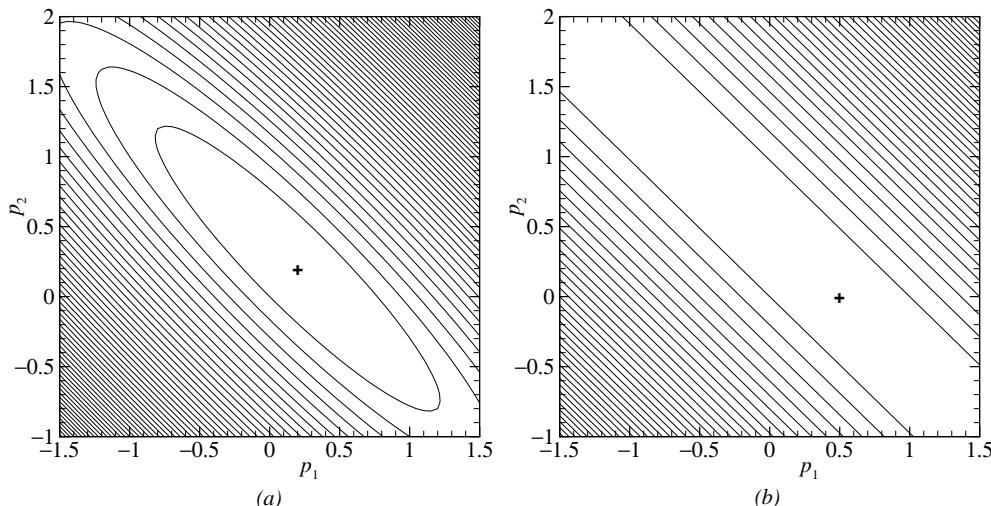
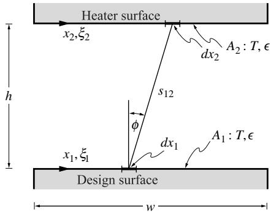
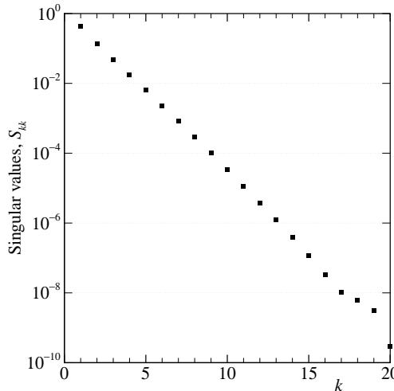
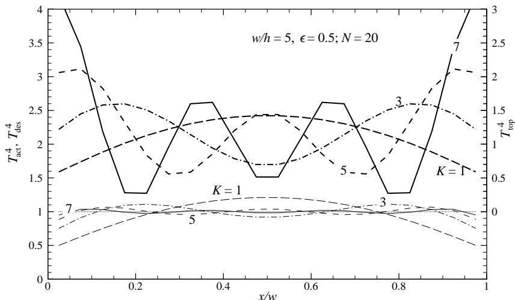
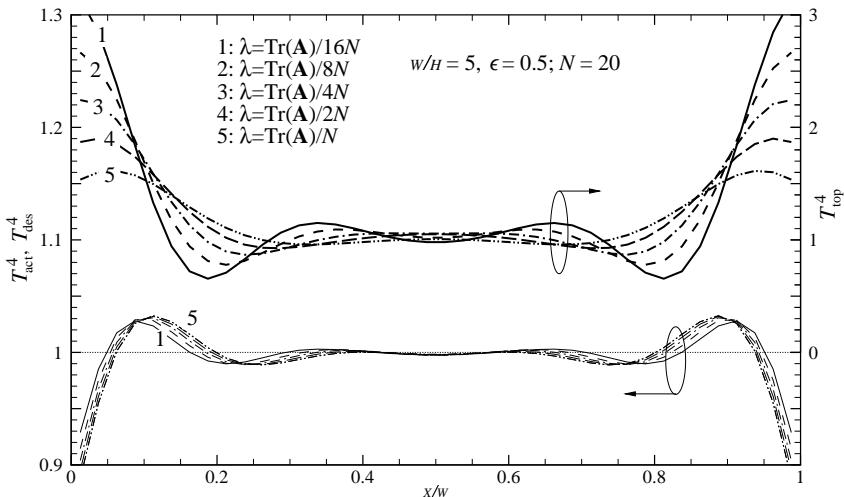
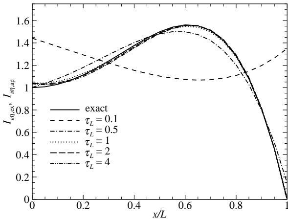
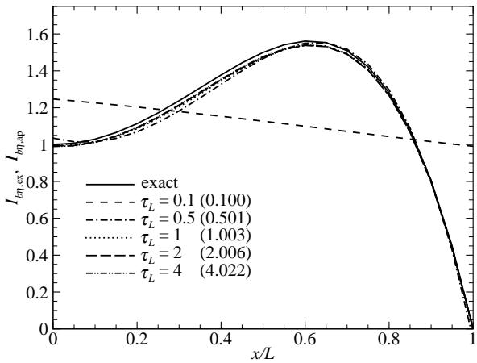
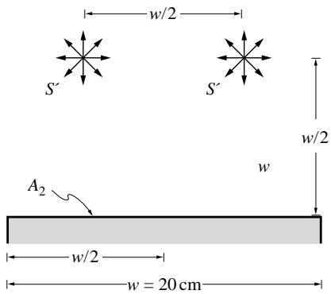
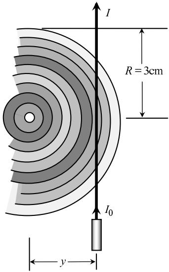

## 内容索引

- [目录](README.md)
- [1 热辐射基础](1-热辐射基础.md)
- [2 基于电磁波理论的辐射特性预测](2-基于电磁波理论的辐射特性预测.md)
- [3 实际表面的辐射特性](3-实际表面的辐射特性.md)
- [4 视角因子](4-视角因子.md)
- [5 灰体漫射表面间的辐射交换](5-灰体漫射表面间的辐射交换.md)
- [6 部分镜面灰体表面间的辐射交换](6-部分镜面灰体表面间的辐射交换.md)
- [7 非理想表面间的辐射交换](7-非理想表面间的辐射交换.md)
- [8 表面交换的蒙特卡洛方法](8-表面交换的蒙特卡洛方法.md)
- [9 传导和对流存在时的表面辐射交换](9-传导和对流存在时的表面辐射交换.md)
- [10 参与介质中的辐射传递方程(RTE)](10-参与介质中的辐射传递方程(RTE).md)
- [11 分子气体的辐射特性](11-分子气体的辐射特性.md)
- [12 颗粒介质的辐射特性](12-颗粒介质的辐射特性.md)
- [13 半透明介质的辐射特性](13-半透明介质的辐射特性.md)
- [14 一维灰体介质的精确解](14-一维灰体介质的精确解.md)
- [15 一维介质的近似求解方法](15-一维介质的近似求解方法.md)
- [16 球谐函数法 (PN-近似)](16-球谐函数法(PN-近似).md)
- [17 离散坐标法 (SN-近似)](17-离散坐标法(SN-近似).md)
- [18 区域法](18-区域法.md)
- [19 准直辐射与瞬态现象](19-准直辐射与瞬态现象.md)
- [20 非灰消光系数的求解方法](20-非灰消光系数的求解方法.md)
- [21 参与介质的蒙特卡洛方法](21-参与介质的蒙特卡洛方法.md)
- [22 辐射与传导和对流的耦合](22-辐射与传导和对流的耦合.md)
- [23 逆辐射传热](23-逆辐射传热.md)
- [24 纳米尺度辐射传热](24-纳米尺度辐射传热.md)
- [附录](附录.md)

- [23.1 引言](#231-引言)  
- [23.2 求解方法](#232-求解方法)  
- [23.3 正则化](#233-正则化)  
- [23.4 基于梯度的优化](#234-基于梯度的优化)  
- [23.5 元启发式方法](#235-元启发式方法)  
- [23.6 逆辐射研究总结](#236-逆辐射研究总结)  
- [参考文献](#参考文献)  
- [习题](#习题)

# CHAPTER 23

# INVERSE RADIATIVE HEAT TRANSFER

# 23.1 INTRODUCTION

Up to this point we have concerned ourselves with radiative heat transfer problems, where the necessary geometry, temperatures, and radiative properties are known, enabling us to calculate the radiative intensity and radiative heat fluxes in such enclosures. Such cases are sometimes called "direct" heat transfer problems. However, there are many important engineering applications where knowledge of one or more input parameters is desired that cause a certain radiative intensity field. For example, it may be desired to control the temperatures of heating elements in a furnace, in order to achieve a specified temperature distribution or radiative heat load on an object being heated. Or the aim may be to deduce difficult to measure parameters (such as radiative properties, temperature fields inside a furnace, etc.) based on measurements of radiative intensity or radiative flux. Such calculations are known as inverse heat transfer analyses.

One of the difficulties associated with inverse heat transfer analyses is the fact that they tend to be ill- posed (unlike direct heat transfer problems, which are nearly always well- posed). The conditions for a problem to be well- posed were first postulated by Hadamard [1] as the solution to the problem must exist, the solution must be unique, and the solution must be stable (i.e., small changes of problem parameters cause only small changes in the solution).

Only in rare instances can the solution to an inverse problem be proven to be unique. For example, while a given parameter field will produce, say, a unique radiative flux at a given location (direct problem), the measured radiative flux at a certain location, on the other hand, can be caused by various parameter fields governing the system (inverse problem). Moreover, inverse problems tend to be very sensitive to disturbances in the parameter field, such as random errors attached to experimental data. This generally necessitates special solution techniques to satisfy stability requirements, by adding additional information to the analysis based on prior knowledge of the true (or desired, in the case of design) solution attributes.

While rudimentary attempts at inverse heat transfer solutions have been around for many years, formal methods to convert unstable inverse problems into approximate, well- posed problems through different types of regularization or stabilization techniques are only 40 to 50 years old, notably Tikhonov's regularization procedure [2], and Beck's function estimation technique [3]. The earliest works on inverse heat transfer problems date back to about 1960 [4- 8], all on inverse heat conduction. The first investigations on inverse radiative heat transfer appeared in the early 1990s, mostly by Ozisik and coworkers [9- 16]. Interestingly, almost all

of these papers concerned themselves with radiative transfer within participating media, and there were only a few treatments dealing with inverse surface radiation before the turn of the century [17, 18].

The last decade has seen a veritable explosion in research on inverse radiation, which will be summarized after a brief outline is given of the nature of inverse radiation problems, and after some of the more basic and popular solution methods are explained. The reader interested in conducting serious research in this field should consult the various books on inverse heat transfer [19- 24] and solution methods for ill- posed problems [2,3,25- 32]. Reviews of inverse radiation tools and research have been given by França and coworkers [33] and Daun and Howell [34, 35] (inverse surface radiation problems), and by Charette et al. [36] (optical tomography).

# 23.2 SOLUTION METHODS

The solution to an inverse problem is usually found by minimizing an objective function,  $F$ , using a stabilization technique in the minimization procedure. We will here briefly discuss a few of the most popular methods, such as the truncated singular value decomposition (TSVD), Tikhonov regularization, Newton's method, and the Levenberg- Marquardt and conjugate gradient techniques. Others can be found in the books cited above, as well as in the various research papers in the field.

Suppose the radiative intensity or radiative flux, etc., is known for a number of directions, and/or wavelengths. These measured data values (for deducing parameters inside or on the surface of the radiative enclosure) or desired values (for control of parameters) will be denoted by the data vector  $\mathbf{y}$  (with elements  $Y_{1}, Y_{2}, \ldots , Y_{I}$ ). These data need to be compared with corresponding values estimated from a direct analysis, based on an optimized set of the unknown parameters to be determined, denoted by the vector  $\mathbf{i}$  (with elements  $I_{1}, I_{2}, \ldots , I_{I}$ ).

If  $J$  different parameters are chosen for the inverse problem, these values form a parameter vector  $\mathbf{p}$  (with elements  $p_{1}, p_{2}, \ldots , p_{J}$ ), and the estimated solutions  $I_{i}$  are a function of this vector. For example, if it is desired to estimate the Planck function (or temperature) distribution within a participating medium, one may postulate the Planck function field to be approximated by

$$
I_{b\eta}(\mathbf{r},\eta)\simeq \sum_{j = 1}^{J}p_{j}f_{j}(\mathbf{r},\eta), \tag{23.1}
$$

where the  $f_{j}$  are known specified basis functions (polynomials, splines, etc.), and the best values for the  $p_{j}$  are to be found.

If all the data points have statistically equal error values, or if all desired values have equal importance, then the objective function to be minimized is the ordinary least squares norm:

$$
F = \sum_{i = 1}^{J}(I_{i} - Y_{i})^{2} = (\mathbf{i} - \mathbf{y})\cdot (\mathbf{i} - \mathbf{y}) = \left\| \mathbf{i} - \mathbf{y}\right\|^{2}. \tag{23.2}
$$

If the data points are very close together then the summation in equation (23.2) may be replaced by an integral.

In many applications the statistical uncertainty of data points, or their variance,  $\sigma_{i}^{2}$ , may be known and may be different for individual data points. In that case it is preferable to define the objective function as a weighted least squares norm

$$
F = \sum_{i = 1}^{J}\left(\frac{I_i - Y_i}{\sigma_i}\right)^2 = (\mathbf{i} - \mathbf{y})\cdot \mathbf{W}\cdot (\mathbf{i} - \mathbf{y}), \tag{23.3}
$$

where  $\mathbf{W}$  is a diagonal weighting matrix,

$$
W = \left( \begin{array}{cccc}{1 / \sigma_1^2} & 0 & \dots & 0\\ {0} & {1 / \sigma_2^2} & \dots & 0\\ {\vdots} & \vdots & \ddots & \vdots \\ {0} & 0 & & {1 / \sigma_I^2} \end{array} \right). \tag{23.4}
$$

In control applications, where  $\mathbf{y}$  is the desired effect, rather than a vector of measured data, the factors  $1 / \sigma_{i}$  function as importance factors attached to individual control values  $Y_{j}$ . Equation (23.3) reduces to equation (23.2) if  $\mathbf{W}$  is equal to the unity tensor  $\delta$  (with Kronecker's delta function  $\delta_{ij}$  as elements, i.e., a diagonal matrix with all nondiagonal elements zero, and all diagonal elements  $W_{ii} = 1$ ).

Minimization of the objective function in terms of the parameter vector  $\mathbf{p}$  requires that the derivatives of  $F$  with respect to each of the parameters  $p_j$  be zero, i.e.,

$$
\frac{\partial F}{\partial p_1} = \frac{\partial F}{\partial p_2} = \dots = \frac{\partial F}{\partial p_J} = 0, \text{or} \nabla_p F(\mathbf{p}) = \mathbf{0}, \tag{23.5}
$$

where the  $\nabla_p F(\mathbf{p})$  represents the gradient of  $F(\mathbf{p})$  with respect to the vector of parameters. Carrying out the differentiation of equation (23.3) with respect to  $\mathbf{p}$  leads to

$$
\frac{\partial F}{\partial p_j} = 2 \sum_{i = 1}^{J} \frac{I_i - Y_i}{\sigma_i^2} \frac{\partial I_i}{\partial p_j} = 0, \quad j = 1, 2, \ldots , J, \tag{23.6}
$$

or, in matrix notation,

$$
\nabla_{p}F(\mathbf{p}) = 2(\mathbf{i} - \mathbf{y})\cdot \mathbf{W}\cdot \mathbf{X} = \mathbf{0}, \tag{23.7}
$$

where  $\mathbf{X}$  is known as the sensitivity matrix, or Jacobian, with elements

$$
\mathbf{X} = \nabla_{p}\mathbf{i} = \left( \begin{array}{cccc}\frac{\partial I_{1}}{\partial p_{1}} & \frac{\partial I_{1}}{\partial p_{2}} & \dots & \frac{\partial I_{1}}{\partial p_{J}} \\ \frac{\partial I_{2}}{\partial p_{1}} & \frac{\partial I_{2}}{\partial p_{2}} & \dots & \frac{\partial I_{2}}{\partial p_{J}} \\ \vdots & \vdots & \ddots & \vdots \\ \frac{\partial I_{I}}{\partial p_{1}} & \frac{\partial I_{I}}{\partial p_{2}} & \dots & \frac{\partial I_{I}}{\partial p_{J}} \end{array} \right), \tag{23.8}
$$

for  $J$  unknown parameters and  $I$  measured (or defined) data points. If the sensitivity matrix is independent of  $\mathbf{p}$  the problem is called linear. For example, if the general radiative transfer equation (10.21) is to be solved with the temperature field given by equation (23.1) (and there are no other unknown parameters), differentiation of the intensity field with respect to any parameter  $p_j$  makes  $\frac{\partial I}{\partial p_j}$  independent of all parameters  $\mathbf{p}$ . For such a case

$$
\mathbf{i} = \mathbf{X}\cdot \mathbf{p} \tag{23.9}
$$

and equation (23.7) may be restated in standard matrix form as

$$
\mathbf{A}\cdot \mathbf{p} = \mathbf{b}, \quad \text{with} \mathbf{A} = \mathbf{X}^T\cdot \mathbf{W}\cdot \mathbf{X}, \mathbf{b} = \mathbf{X}^T\cdot \mathbf{W}\cdot \mathbf{y}, \tag{23.10}
$$

which are known as the normal equations, and are solved after matrix inversion as

$$
\mathbf{p} = \mathbf{A}^{-1}\cdot \mathbf{b} = (\mathbf{X}^T\cdot \mathbf{W}\cdot \mathbf{X})^{-1}\cdot \mathbf{X}^T\cdot \mathbf{W}\cdot \mathbf{y}. \tag{23.11}
$$

  
FIGURE 23-1 Plot of the residual norm for (a) a well-conditioned and (b) an ill-conditioned matrix equation.

If the problem is nonlinear, i.e., the sensitivity coefficients  $X_{ij}$  are functions of  $\mathbf{p}$ , then the problem must be linearized and solved iteratively. This is usually done by expanding  $\mathbf{i}(\mathbf{p})$  into a truncated Taylor series around the current solution  $\mathbf{p}^k$  at iteration  $k$ , or

$$
\mathbf{i}(\mathbf{p})\simeq \mathbf{i}(\mathbf{p}^k) + \mathbf{X}^k\cdot (\mathbf{p} - \mathbf{p}^k), \tag{23.12}
$$

where  $\mathbf{i}(\mathbf{p}^k)$  and  $\mathbf{X}^k$  are the values for estimated intensity and the sensitivity matrix after the  $k$ th iteration. Sticking this into equation (23.7) leads to an iterative procedure with updated parameter vector as

$$
\mathbf{p}^{k + 1} = \mathbf{p}^k +(\mathbf{X}^{Tk}\cdot \mathbf{W}\cdot \mathbf{X}^{k})^{-1}\cdot \mathbf{X}^{Tk}\cdot \mathbf{W}\cdot (\mathbf{y} - \mathbf{i}^k), \tag{23.13}
$$

which is known as the Gauss (or Gauss- Newton) method.

The linear solution, equation (23.11), and the linearized iterative procedure, equation (23.13), both require the matrix  $\mathbf{X}^T\cdot \mathbf{W}\cdot \mathbf{X}$  to be nonsingular, i.e., its determinant may not be zero, or  $\left|\mathbf{X}^T\cdot \mathbf{W}\cdot \mathbf{X}\right|\neq 0$ . If the value of this determinant is close to zero the problem is called ill- conditioned and, unfortunately, inverse heat transfer problems tend to be very ill- conditioned. This is best understood by visually comparing the solutions to two very simple well- conditioned and ill- conditioned matrix equations, such as

$$
\begin{array}{rl} & {\mathrm{well - conditioned:}\qquad \mathbf{A}\cdot \mathbf{p} = \left( \begin{array}{ll}2 & 3\\ 3 & 3 \end{array} \right)\cdot \left( \begin{array}{l}p_{1}\\ p_{2} \end{array} \right) = \left( \begin{array}{l}1\\ 1 \end{array} \right) = \mathbf{b},}\\ & {\mathrm{ill - conditioned:}\qquad \mathbf{A}\cdot \mathbf{p} = \left( \begin{array}{ll}2 & 2.1\\ 2 & 2 \end{array} \right)\cdot \left( \begin{array}{l}p_{1}\\ p_{2} \end{array} \right) = \left( \begin{array}{l}1\\ 1 \end{array} \right) = \mathbf{b}.} \end{array} \tag{23.14b}
$$

The well- conditioned matrix equation has a well- defined solution  $\begin{array}{r}p_{1} = p_{2} = \frac{1}{5} \end{array}$  in the present case), which minimizes the square residual

$$
\| \mathbf{A}\cdot \mathbf{p} - \mathbf{b}\| ^2 = \sum_{i = 1}^{2}\left(\sum_{j = 1}^{2}A_{ij}p_j - b_i\right)^2, \tag{23.15}
$$

as shown in a contour plot in Fig. 23- 1a. Equation (23.14b) also has a single, unique solution (as is guaranteed for all nonsingular linear problems, with  $p_1 = \frac{1}{2}$ ,  $p_2 = 0$  in this particular case), but, as seen from the contour plot in Fig. 23- 1b, there is also a range of locations along the valley floor that makes the residual very small. In control problems this leads to many

  
FIGURE 23-2 Geometry for Example 23.1.

possible solutions, which almost satisfy the design criteria (but may require undesirable control parameters). Similarly, when trying to deduce a property field, many solutions exist that nearly satisfy the experimental data (but may yield property fields with wide fluctuations). In addition, ill- conditionedness makes the solution highly susceptible to small perturbations in experimental data as well as to numerical artifacts, such as roundoff error.

Before discussing methods to solve ill- conditioned problems it is instructive to investigate the matrices that need to be inverted in the analysis, such as  $\mathbf{X}$  in equation (23.9) or  $\mathbf{X}^T\cdot \mathbf{W}\cdot \mathbf{X}$  in equation (23.10). The properties of an arbitrary matrix  $\mathbf{A}$  with  $M\times N$  elements may be diagnosed through Singular Value Decomposition (SVD) [30,37], by decomposing it into a product of an  $M\times N$  column- orthogonal matrix  $\mathbf{U}$ , an  $N\times N$  diagonal matrix  $\mathbf{S}$  with only positive or zero elements (its singular values, usually placed in descending order), and the transpose of an  $N\times N$  orthogonal matrix  $\mathbf{V}^T$ , i.e.,  $\mathbf{A} = \mathbf{U}\cdot \mathbf{S}\cdot \mathbf{V}^T$ . The beauty of orthogonal matrices is that its inverse is simply its transpose, while the inverse of a diagonal matrix (i.e., a matrix where only the diagonal terms are nonzero) is another diagonal matrix whose elements are the reciprocals of  $S_{kk}$ . Therefore, the inverse of  $\mathbf{A}$  follows as

$$
\mathbf{A}^{-1} = \mathbf{V}\cdot \mathbf{S}^{-1}\cdot \mathbf{U}^{T}, \tag{23.16a}
$$

which has elements

$$
(A^{-1})_{ij} = \sum_{k = 1}^{N}V_{ik}\frac{1}{S_{kk}} U_{jk}. \tag{23.16b}
$$

Inspection of equation (23.16b) shows that the only thing that can go wrong with the inversion of (a nonsingular)  $\mathbf{A}$  is that the inversion gets greatly impacted by roundoff error caused by very small singular values. The condition number of a matrix is the ratio of the largest over the smallest  $S_{kk}$ ; the matrix is singular if the condition number is infinite, and is ill- conditioned if its condition number is too large.

Example 23.1. Consider two long parallel plates of width  $w$  as shown in Fig. 23- 2. Both plates have a gray, diffuse emittance of  $\epsilon$ , they are separated by a distance  $h$  and are placed in a large, cold environment. The bottom plate is insulated, and it is desired to keep this plate at an isothermal temperature  $T^*$  across its width through radiative heating from the top plate. Determine the necessary temperature distribution  $T_{2}(x_{2})$  to achieve this result.

# Solution

Direct Solution. From equation (5.27) we find that  $J_{1}(x_{1}) = \sigma T_{1}^{4}(x_{1})$  for an insulated surface. Thus, from equation (5.24), with  $dF_{di - d\bar{t}} = 0$ , we obtain

$$
\begin{array}{l}\sigma T_1^4 (x_1) = \int_0^w J_2(x_2)dF_{d1 - d2},\\ J_2(x_2) = \epsilon \sigma T_2^4 (x_2) + (1 - \epsilon)\int_0^w\sigma T_1^4 dF_{d2 - d1}. \end{array}
$$

The necessary view factors have already been obtained in Example 5.10. Also, using similar nondimensionalization as in that example, i.e.,  $W = w / h$ ,  $\xi = x / h$ ,  $\Theta (x) = [T(x) / T^* ]^4$ , and  $\mathcal{J}(\xi_2) = J_2(x_2) / \sigma T^* 4$ ,

these equations become

$$
\begin{array}{l}{\Theta_{1}(\xi_{1}) = \int_{0}^{W}\mathcal{J}(\xi_{2})f(\xi_{1} - \xi_{2})d\xi_{2},}\\ {\mathcal{J}(\xi_{2}) = \epsilon \Theta_{2}(\xi_{2}) + (1 - \epsilon)\int_{0}^{W}\Theta_{1}(\xi_{1})f(\xi_{1} - \xi_{2})d\xi_{1},}\\ {f(\xi_{1} - \xi_{2}) = \frac{1}{2}\left[1 + (\xi_{1} - \xi_{2})^{2}\right]^{-3 / 2}.} \end{array}
$$

The desired result is  $\Theta_{1}(\xi_{1}) = 1 = \mathrm{const},$  for which the necessary  $\Theta_{2}(\xi_{2})$  needs to be found. We will approximate both plates by  $N$  constant temperature (and radiosity) strips of width  $\Delta \xi = W / N$  that have nondimensional temperatures  $\Theta_{1i},\Theta_{2i},i = 1,2,\ldots ,N,$  with optimum values of the parameters  $\Theta_{2i}$  to be determined (and, for illustrative purposes, without taking advantage of the obvious symmetry across  $x = w / 2)$  . Thus, approximating the integrals by summation over the strips, and assuming view factors to be constant across the width of a strip [evaluated between  $\xi_{1i} = (i - \frac{1}{2})\Delta \xi$  and  $\xi_{2j} = (j - \frac{1}{2})\Delta \xi ],$  we obtain

$$
\begin{array}{rlrl}\Theta_{1i} = \Delta \xi \sum_{j = 1}^{N}\mathcal{J}_jf_{ij}, & & i = 1,2,\ldots ,N,\\ \mathcal{J}_j = \epsilon \Theta_{2j} + (1 - \epsilon)\Delta \xi \sum_{k = 1}^{N}\Theta_{1k}f_{jk}, & & j = 1,2,\ldots ,N, \end{array}
$$

or

$$
\begin{array}{l l}{{\Theta_{1i}=\sum_{j=1}^{N}\Theta_{2j}y_{i j}+\sum_{k=1}^{N}\Theta_{1k}z_{i k},}}&{{\quad i=1,2,\ldots,N,}}\\ {{y_{i j}=\epsilon\Delta\xi f_{i j},}}&{{}}\\ {{z_{i k}=(1-\epsilon)\Delta\xi^{2}\sum_{j=1}^{N}f_{i j}f_{j k}.}}\end{array} \tag{23.17}
$$

Inverse Problem. Since we have chosen equal numbers of strips on the bottom surface (design points) and top heater (parameter vector  $\mathbf{p}$  ), equation (23.17) constitutes a set of linear equations (with given desired  $\Theta_{1i}$  ) that can be solved directly for the  $N$  unknown  $\Theta_{2j},$  i.e., by direct solution of equation (23.9). In general, however, the number of strips may be different for each plate and we prefer to minimize the objective function. Since we want each design point to achieve  $T_{1} = T^{*}$  (or  $\Theta_{1} = 1$  ), the objective function becomes, assuming constant weights  $(\sigma_{i} = 1)$

$$
F = \| \Theta_{1} - 1\|^{2} = \sum_{i = 1}^{N}(\Theta_{1i} - 1)^{2},
$$

where 1 is a unity vector (all elements equal 1). The sensitivity matrix is obtained by differentiating equation (23.17) with respect to  $(p_j) = \Theta_{2j},$  or

$$
X_{ij} = y_{ij} + \sum_{k = 1}^{J}z_{ik}X_{ki},
$$

which is solved by successive approximation. We note that the sensitivity matrix is independent of  $\Theta_{2j}$  Thus, the problem is linear (as we noticed already). For a direct solution, and to diagnose the problem's ill- posedness, we perform an SVD on the matrix  $\mathbf{A} = \mathbf{X}^T\cdot \mathbf{X}$  Once the  $\mathbf{U},\mathbf{S},$  and  $\mathbf{V}$  matrices have been determined the solution for  $\mathbf{p}$  (with elements  $p_i = \Theta_{2i}$  ) is found from equations (23.10) and (23.16b) as

$$
\Theta_{2i} = \sum_{j = 1}^{N}(A)_{ij}^{-1}b_{j} = \sum_{k = 1}^{N}\frac{V_{ik}}{S_{kk}}\sum_{j = 1}^{N}U_{jk}b_{j}, \tag{23.18a}
$$

with

$$
\mathbf{b} = \mathbf{X}^T\cdot \mathbf{y} = \mathbf{X}^T\cdot \mathbf{1},\quad \mathrm{or}\quad b_j = \sum_{l = 1}^{N}X_{lj}y_l = \sum_{l = 1}^{N}X_{lj}. \tag{23.18b}
$$

  
FIGURE 23-3 Singular values for the matrix in Example 23.1.

The singular values for the present problem, with  $w / h = 5$ ,  $\epsilon = 0.5$ , and  $N = 20$  (as calculated with the Numerical Recipes routine swdcmp [37]) are shown in Fig. 23- 3. It can be seen that the singular values decay rapidly from a maximum value of 0.44 down to  $3 \times 10^{- 10}$ , with a condition number exceeding  $10^{9}$ , making the problem very ill- conditioned. The solution to equation (23.18a), when calculated in single precision (with about six digits of accuracy) yields oscillatory (and meaningless) values for nondimensional heater emissive power  $\Theta_{2}$  varying between approximately  $- 300$  and  $+300$  (not shown here).

The matrix  $\mathbf{A}$  in equation (23.10) contains the square of the sensitivity matrix  $\mathbf{X}$ , and thus also the square of its condition number, making the solution even more susceptible to round- off error. An alternative, and often preferred, technique involves solving a truncated version of equation (23.7), by setting

$$
\mathbf{i} - \mathbf{y} = \mathbf{0},\quad \mathrm{or}\quad \mathbf{X}\cdot \mathbf{p} = \mathbf{y}, \tag{23.19}
$$

which also finds a (different) least- squares minimum [37]. However, equation (23.19) is overdeterminate if there are more data points than parameters  $(I > J)$ .

From the above example it can be seen that it is generally necessary to apply stabilizing methods even to the solution of linear inverse problems, such as the techniques discussed below. The various techniques to solve ill- conditioned problems may be loosely collected under the titles regularization, gradient- based optimization, and metaheuristics, and some of the most common methods will be briefly discussed below. More detail can be found in books on the subject, e.g., Hansen [30], as well as several review articles [33,34]

# 23.3 REGULARIZATION

We saw in the previous section that an ill- conditioned matrix has a large condition number, i.e., some of the singular values are very small, causing the solution to become unstable. Decreasing the condition number of a matrix  $\mathbf{A}$  by modifying it (or its inverse) is known as regularization. We will briefly describe here the simple truncated singular value decomposition and the perhaps most popular Tikhonov regularization methods.

# Truncated Singular Value Decomposition (TSVD)

The simplest form of regularization consists of simply omitting parts of the inverse of  $\mathbf{A}$  corresponding to the (offending) smallest singular values. This is justified by the fact that the higher terms in the series correspond to "high frequency" components, and often have less physical significance. Our prior knowledge (or desire) of a smooth solution is used as justification for

  
FIGURE 23-4 Predicted top surface temperatures and recovery of desired bottom surface temperatures for Example 23.2.

truncation [30]. The matrix  $\mathbf{A}$ , as given in the normal equation set (23.10), is first singular value decomposed as given by equation (23.16b). The full solution to equation (23.10) would then be obtained from equation (23.18a). Eliminating the largest values of  $1 / S_{kk}$  is achieved by keeping only the first  $K$  terms in equation (23.18a) (i.e., dropping terms with  $k > K$ , thereby decreasing the condition number)

$$
p_{i}^{*} = \sum_{k = 1}^{K}\frac{V_{ik}}{S_{kk}}\sum_{j = 1}^{N}U_{jk}b_{j},\quad i = 1,\ldots ,N, \tag{23.20}
$$

where  $\mathbf{p}^{*}$  is the regularized solution. The proper value for  $K$  must be determined through external, often subjective criteria. Large values of  $K$  force the result vector  $\mathbf{i}$  (e.g., the achieved nondimensional temperature of the bottom plate in Example 23.1) to more closely follow the prescribed data vector  $\mathbf{y}$  (desired temperature), but may result in strongly oscillatory and/or unphysical parameter vectors  $\mathbf{p}$  (power setting on heater plate). Small values of  $K$ , on the other hand, lead to a smooth variation for  $\mathbf{p}$ , but the result vector  $\mathbf{i}$  may depart substantially from the desired value  $\mathbf{y}$ .

Example 23.2. Repeat the control problem Example 23.1 using truncated singular value decomposition (TSVD).

# Solution

The solution proceeds exactly as in Example 23.1, but the series in equation (23.18a) is truncated to give nondimensional heater temperatures as

$$
\Theta_{2i} = \sum_{k = 1}^{K}\frac{V_{ik}}{S_{kk}}\sum_{j = 1}^{N}U_{jk}b_{j},
$$

and the resulting design surface temperatures are found from equation (23.9)

$$
\Theta_{1i} = \sum_{j = 1}^{N}X_{ij}\Theta_{2j}.
$$

Figure 23- 4 shows the results, again for  $w / h = 5$ ,  $\epsilon = 0.5$ , and  $N = 20$  strips on each plate, for several odd values of  $K$  (even values produce essentially identical results as the next lower  $K$  because of symmetry). It is observed that retaining a single singular value  $(K = 1)$  results in a very smooth heater setting, and also a smooth design surface temperature (but departing substantially from the desired value of "1"). Larger values of  $K$  bring the design plate temperatures closer to the desired value (albeit with slight oscillations), but at a cost of oscillatory heater settings. Values of  $K > 7$  result in some strips having negative emissive power (cooling), which would be undesirable at best.

# Tikhonov Regularization

Most regularization methods transform an ill- posed inverse problem into a well- behaved one by adding auxiliary information based on desired or assumed solution characteristics [34, 38]:

$$
F = (\mathbf{i} - \mathbf{y})\cdot \mathbf{W}\cdot (\mathbf{i} - \mathbf{y}) + \lambda^{2}\Omega (\mathbf{p}), \tag{23.21}
$$

where  $\Omega (\mathbf{p})$  is an arbitrary (positive) function and  $\lambda$  is the (positive) regularization parameter. One of the earliest and most popular examples is Tikhonov regularization [2], employing  $\Omega =$ $\mathbf{p}\cdot \mathbf{L}\cdot \mathbf{p},$  where  $\mathbf{L}$  is an operator. In the simplest Oth order discrete Tikhonov regularization we have  $\mathbf{L} = \delta$  and  $\Omega = \mathbf{p}\cdot \mathbf{p}$  . Thus, equation (23.10) is changed to

$$
(\mathbf{A} + \lambda \delta)\cdot \mathbf{p} = \mathbf{b},\quad \mathrm{with}\mathbf{A} = \mathbf{X}^T\cdot \mathbf{W}\cdot \mathbf{X},\mathbf{b} = \mathbf{X}^T\cdot \mathbf{W}\cdot \mathbf{y}, \tag{23.22}
$$

where  $\delta$  is again an Nth order unity tensor. Many different and higher order versions of Tikhonov's regularization exist, and the reader is referred to [32,38]. The regularization parameter determines the smoothness of the solution: a small value of  $\lambda$  implies little regularization, while a large  $\lambda$  prioritizes some presumed information, which in the case of standard Tikhonov forces the solution vector toward zero. Several schemes exist to find an optimal value of  $\lambda$  Numerical Recipes [37] suggests a starting value for  $\lambda$  of

$$
\lambda \simeq \mathrm{Tr}(\mathbf{A}) / N, \tag{23.23}
$$

where  $\mathrm{Tr}$  is the trace of the matrix (sum of the  $N$  diagonal elements), giving both parts in the minimization equal weights. An optimum value for  $\lambda$  is then found by trial and error. More sophisticated schemes include construction of a so- called  $L$  - curve, which leads to a semiquantitative determination of  $\lambda$  [30,39].

Example 23.3. Repeat Example 23.1 using Oth order discrete Tikhonov regularization.

# Solution

As in the previous example we calculate  $\mathbf{A} = \mathbf{X}^T\cdot \mathbf{X}$  and  $\mathbf{b} = \mathbf{X}\cdot \mathbf{1}$  . Before inverting A we modify the matrix to

$$
\mathbf{A}^{*} = \mathbf{A} + \lambda \delta ,\quad \mathrm{or}\quad A_{ij}^{*} = A_{ij} + \lambda \delta_{ij},
$$

i.e., all diagonal elements are incremented by  $\lambda$  which is evaluated as

$$
\lambda = C\frac{1}{N}\sum_{i = 1}^{N}A_{ii},
$$

where  $C$  is a constant whose optimal value is to be found by trial and error. Heater emissive powers  $\Theta_{2}$  and design surface emissive powers  $\Theta_{1}$  are then determined from

$$
\begin{array}{l}\Theta_{2i} = \sum_{j = 1}^{N}\left(A^{*^{-1}}\right)_{ij}b_{j},\quad b_{j} = \sum_{k = 1}^{N}X_{kj},\\ \Theta_{1i} = \sum_{j = 1}^{N}X_{ij}\Theta_{2j}. \end{array}
$$

Results for Tikhonov regularization are shown in Fig. 23- 5, again for  $w / h = 5$ $\epsilon = 0.5,$  and  $N = 20$  strips on each plate, for five fractional values of  $C = 2^{-(5 - k)}$  , with larger  $C$  implying more regularization. It is seen from the figure that the Numerical Recipes' suggested value  $(C = 1)$  gives a reasonable (perhaps slightly over- regularized) solution with smoothly varying heater values, but with design surface temperatures dropping near the edges of the plate. Smaller values of the regularization parameter lead to somewhat better design surface temperatures, at the cost of stronger heater surface variations. In general, it appears that Tikhonov regularization gives better results than TSVD, at least for the present problem.

  
FIGURE 23-5 Predicted top surface temperatures and recovery of desired bottom surface temperatures for Example 23.3.

# 23.4 GRADIENT-BASED OPTIMIZATION

In optimization the objective function  $F$ , most often using least square norms as given by equations (23.2) or (23.3), is minimized in an iterative process. Iteration is always necessary for nonlinear problems, but may also be employed for linear ones to overcome ill- conditioning, which in optimization manifests itself in the form of a difficult objective function topography having a minimum (or several minima in nonlinear problems) surrounded by a long, shallow valley, as shown in Fig. 23- 1b. Many different optimization schemes have been developed to minimize  $F$ . When  $F$  is continuously differentiable over the feasible region of  $\mathbf{p}$ , it is generally best to use analytically defined search directions, with gradient- based methods being used most often [40]. In all schemes, during each iteration a step of appropriate size is taken along a direction of descent, which is based on the local curvature of the objective function at the previous iteration. Thus, after the  $k$ th iteration a new solution vector is found from

$$
\mathbf{p}^{k + 1} = \mathbf{p}^k +\beta^k\mathbf{d}^k, \tag{23.24}
$$

where  $\beta^k$  is the search step size, and  $\mathbf{d}^k$  is the direction of descent. The main difference between gradient minimization techniques is how the search direction is chosen, which usually is how they got their name. As indicated by Daun and coworkers [40], whose development we will follow here, nearly all of the methods require first- order curvature information as contained in the gradient vector,

$$
\mathbf{g}(\mathbf{p}) = \nabla_pF(\mathbf{p}) = \left(\frac{\partial F}{\partial p_1},\frac{\partial F}{\partial p_2},\dots ,\frac{\partial F}{\partial p_J}\right)^T = 2(\mathbf{i} - \mathbf{y})\cdot \mathbf{W}\cdot \mathbf{X}, \tag{23.25}
$$

where equation (23.7) has been invoked. Some methods also use second- order curvature information contained in the Hessian matrix

$$
\mathbf{H}(\mathbf{p}) = \nabla_{p}\nabla_{p}F(\mathbf{p}) = \left( \begin{array}{cccc}\frac{\partial^{2}F}{\partial p_{1}^{2}} & \frac{\partial^{2}F}{\partial p_{1}\partial p_{2}} & \dots & \frac{\partial^{2}F}{\partial p_{1}\partial p_{J}}\\ \frac{\partial^{2}F}{\partial p_{2}\partial p_{1}} & \frac{\partial^{2}F}{\partial p_{2}^{2}} & \dots & \frac{\partial^{2}F}{\partial p_{2}\partial p_{J}}\\ \vdots & \vdots & \ddots & \vdots \\ \frac{\partial^{2}F}{\partial p_{J}\partial p_{1}} & \frac{\partial^{2}F}{\partial p_{J}\partial p_{2}} & \dots & \frac{\partial^{2}F}{\partial p_{J}^{2}} \end{array} \right). \tag{23.26}
$$

Some of the more common gradient minimization techniques are steepest descent, Newton and quasi- Newton methods, the Levenberg- Marquardt method, and conjugate gradient methods. Steepest descent is the simplest, but has a linear or even slower convergence rate and is, therefore, not recommended. The other four are briefly described below.

# Newton's Method

In Newton's method the direction of descent is calculated using both first- and second- order curvature information, by expanding the objective function into a second- order Taylor series. Assuming the desired parameter vector  $\mathbf{p}^*$  is a distance  $\mathbf{s}^k$  away from the latest approximation for  $\mathbf{p}^k$ , i.e.,  $\mathbf{p}^* = \mathbf{p}^k + \mathbf{s}^k$ , the gradient vector of the objective function can be written as a two- term Taylor expansion

$$
\mathbf{g}(\mathbf{p}^{*}) = \mathbf{g}(\mathbf{p}^{k} + \mathbf{s}^{k})\simeq \mathbf{g}(\mathbf{p}^{k}) + \mathbf{s}^{kT}\cdot \mathbf{H}(\mathbf{p}^{k}), \tag{23.27}
$$

which is exact with constant Hessian if the objective function is quadratic (which tends to be approximately true, if  $\mathbf{p}^*$  is reasonably close to  $\mathbf{p}^k$ ). Since  $F$  has a global minimum at  $\mathbf{p}^*$  all elements of the gradient vector  $\mathbf{g}(\mathbf{p}^*)$  are equal to zero, and  $\mathbf{s}^k$  is determined from

$$
\mathbf{s}^k\simeq -\mathbf{H}(\mathbf{p}^k)^{-1}\cdot \mathbf{g}(\mathbf{p}^k). \tag{23.28}
$$

In Newton's method,  $\mathbf{d}^k$  is set equal to  $\mathbf{s}^k$ , which is called Newton's direction (with an implied step size  $\beta^k = 1$ ). While the Hessian matrix is generally not constant near the minimum, using Newton's direction results in much better convergence (typically quadratic), compared with the steepest descent method. However, calculating the Hessian matrix at each iteration tends to require significant extra CPU time, which can make Newton's method actually less efficient than the steepest descent method. Thus, Newton's method should only be used when the second derivatives can be calculated easily.

# The Quasi-Newton Method

The quasi- Newton method avoids calculating the Hessian matrix by approximating it using only first- order curvature data collected at previous iterations. At each iteration, the search direction  $\mathbf{d}^k = \mathbf{s}^k$  is calculated from equation (23.28) with an approximate Hessian  $\mathbf{B}$  as

$$
\mathbf{d}^k = -(\mathbf{B}^k)^{-1}\cdot \mathbf{g}(\mathbf{p}^k). \tag{23.29}
$$

Initially,  $(\mathbf{B}^k)^{- 1}$  is set equal to the identity matrix  $\delta$  (which makes it the search direction for the steepest descent method) times an appropriate step size  $\beta^0$  [usually found from a single- value minimization of  $F(\mathbf{p}^0 - \beta^0 \mathbf{g}^0)$ ]. At each subsequent iteration, the approximation of the Hessian matrix is improved upon by adding an update matrix,  $\mathbf{U}^k$ ,

$$
\mathbf{B}^k = \mathbf{B}^{k - 1} + \mathbf{U}^k, \tag{23.30}
$$

and  $\mathbf{U}^k$  is determined using only values of the objective function and gradient vectors from previous iterations. The most common quasi- Newton scheme is the Broyden- Fletcher- Goldfarb- Shanno (BFGS) scheme [31], in this method, the update matrix is calculated from

$$
\mathbf{U}^k = \frac{\mathbf{z}^k\cdot\mathbf{z}^k}{\mathbf{z}^k\cdot\mathbf{d}^{k - 1}} -\frac{\mathbf{B}^{k - 1}\cdot\mathbf{d}^{k - 1}\cdot\mathbf{d}^{k - 1}\cdot\mathbf{B}^{k - 1}}{\mathbf{d}^{k - 1}\cdot\mathbf{B}^{k - 1}\cdot\mathbf{d}^{k - 1}},\mathrm{where}\mathbf{d}^{k - 1} = \mathbf{p}^k -\mathbf{p}^{k - 1},\mathbf{z}^k = \mathbf{g}(\mathbf{p}^k) - \mathbf{g}(\mathbf{p}^{k - 1}), \tag{23.31a}
$$

or, in expanded notation

$$
U_{ij}^{k} = \frac{z_{i}^{k}z_{j}^{k}}{\sum_{m}z_{m}^{k}d_{m}^{k - 1}} -\frac{\sum_{l}B_{il}^{k - 1}d_{l}^{k - 1}\sum_{p}d_{p}^{k - 1}B_{pj}^{k - 1}}{\sum_{q}\sum_{p}d_{q}^{k - 1}B_{qp}^{k - 1}d_{p}^{k - 1}} \tag{23.31b}
$$

Since it takes a few iterations for  $\mathbf{B}$  to accurately approximate the Hessian matrix, the convergence rate of the quasi- Newton scheme is less than the Newton's method, requiring a few more iterations to find the global minimum for  $F$ . However, since no second derivatives are needed, the quasi- Newton scheme is usually computationally more efficient.

We will here illustrate the method by presenting a very simple example, this time a problem to infer radiative properties of a participating medium through intensity measurements. Extension to more complicated geometries and/or radiative property fields affects only the direct- solution part of the problem, which has been discussed extensively in previous chapters.

Example 23.4. Consider a one- dimensional, absorbing- emitting (but not scattering) slab of width  $L$ , bounded by two cold, black walls. The temperature distribution within the slab is unknown, and is to be estimated with the quasi- Newton method, by measuring exit intensities on both bounding walls for various angles. The absorption coefficient of the medium at the detector wavelength,  $\kappa$ , is known and constant.

# Solution

Direct Problem. The direct solution for this simple problem is immediately found from equation (14.20) as

$$
\begin{array}{rl}{I(x,\mu) = -\int_{x}^{L}I_{b}(x^{\prime})e^{\kappa (x^{\prime} - x) / \mu}\kappa \frac{dx^{\prime}}{\mu},} & {\mu < 0,}\\ {= \int_{0}^{x}I_{b}(x^{\prime})e^{-\kappa (x - x^{\prime}) / \mu}\kappa \frac{dx^{\prime}}{\mu},} & {\mu >0,} \end{array}
$$

with  $I_{1} = I_{2} = 0$  (cold walls) and  $S = I_{b}$  (no scattering). Letting  $\tau_{i} = \kappa L$ ,  $\xi = x / L$ , and evaluating only the necessary intensities exiting from the faces at  $\xi = 0, 1$ , leads to

$$
\begin{array}{rlrl} & {I(0,\mu) = -\frac{\tau_L}{\mu}\int_0^1 I_b(\xi)e^{\tau_L\xi /\mu}d\xi ,} & & {\mu < 0,}\\ & {I(1,\mu) = \frac{\tau_L}{\mu}\int_0^1 I_b(\xi)e^{-\tau_L(1 - \xi) / \mu}d\xi ,} & & {\mu >0.} \end{array}
$$

Inverse Problem. We will assume that the unknown Planck function field  $I_{b}(\xi)$  can be approximated by a simple  $N$ th order polynomial, or

$$
I_{b}(\xi) = \sum_{n = 0}^{N}p_{n}\xi^{n}.
$$

(Power series, while simple and adequate for the present example, are generally not a good practice because the coefficients will vary over a wide range of magnitudes [24]). Substituting this into the direct solution for exiting intensity gives

$$
\begin{array}{c}{I(0,\mu) = -\sum_{n = 0}^{N}p_{n}f_{n}\left(\frac{\tau_{i}}{\mu}\right),\qquad \mu < 0,}\\ {I(1,\mu) = e^{-\tau_{i} / \mu}\sum_{n = 0}^{N}p_{n}f_{n}\left(\frac{\tau_{i}}{\mu}\right),\qquad \mu >0,}\\ {f_{n}(\tau) = \tau \int_{0}^{1}\xi^{n}e^{\tau \xi}d\xi = e^{\tau} - \frac{n}{\tau} f_{n - 1}(\tau).} \end{array} \tag{23.32b}
$$

Since the temperature (or Planck function) is to be found by measuring  $I(0, \mu)$  and  $I(1, \mu)$  for a set of  $I$  exit angles  $- 1 < \mu_{i} < +1$ , and assuming constant weights, the objective function becomes

$$
F = \sum_{i = 1}^{I}(I_{i} - Y_{i})^{2},
$$

where the  $I_{i}$  are evaluated from equation (23.32a) or (23.32b), depending on whether  $\mu_{i}$  is negative or positive, and the  $Y_{i}$  are the corresponding experimental data.

The sensitivity matrix is readily found by differentiating equations (23.32a) and (23.32b) with respect to  $p_n$ , leading to

$$
X_{in} = \left\{ \begin{array}{ll} - f_n\left(\frac{\tau_i}{\mu_i}\right), & \mu_i< 0,\\ e^{-\tau_i / \mu_i}f_n\left(\frac{\tau_i}{\mu_i}\right), & \mu_i > 0, \end{array} \right.
$$

and

$$
I_{i} = \sum_{n = 0}^{N}p_{n}X_{in}, \tag{23.33}
$$

since the problem is linear.

In order to use the quasi- Newton method, we first need to calculate the gradient vector from equation (23.25), or, assuming unity weights  $\mathbf{W} = \delta$ ,

$$
g_{n}^{k} = 2\sum_{i = 1}^{I}\left(I_{i}^{k} - Y_{i}\right)\frac{\partial I_{i}^{k}}{\partial p_{n}} = 2\sum_{i = 1}^{I}\left(I_{i}^{k} - Y_{i}\right)X_{in}. \tag{23.34}
$$

In the first iteration we set  $\mathbf{B}^{- 1} = \delta$ , and  $\mathbf{p}^1 = \mathbf{p}^0 - \beta^0\mathbf{g}^0$ , using a first guess for  $\mathbf{p}$  of  $p_n = \delta_{n0}$  (constant temperature slab). The proper step size  $\beta^0$  is found by minimizing  $F$  with respect to  $\beta^0$ , i.e., by setting

$$
\frac{\partial F}{\partial\beta^0} = 2\sum_{i = 1}^{I}(I_i - Y_i)\frac{\partial I_i}{\partial\beta^0} = 0,
$$

or

$$
2\sum_{i = 1}^{I}\left(\sum_{n = 0}^{N}\left(p_{n}^{0} - \beta^{0}g_{n}^{0}\right)X_{in} - Y_{i}\right)\left(-\sum_{n = 0}^{N}g_{n}^{0}X_{in}\right) = 0
$$

$$
\sum_{i = 1}^{I}\left(\sum_{n = 0}^{N}p_{n}^{0}X_{in} - Y_{i}\right)\left(\sum_{n = 0}^{N}g_{n}^{0}X_{in}\right) - \beta^{0}\sum_{i = 1}^{I}\left(\sum_{n = 0}^{N}g_{n}^{0}X_{in}\right)^{2} = 0
$$

and, finally

$$
\beta^0 = \frac{\sum_{i = 1}^{I}(X_{i0} - Y_i)\left(\sum_{n = 0}^{N}g_n^0X_{in}\right)}{\sum_{i = 1}^{I}\left(\sum_{n = 0}^{N}g_n^0X_{in}\right)^2}.
$$

For all following iterations we need to update  $\mathbf{B}^k$  according to equations (23.30) and (23.31a). Since we are only interested in the inverse of  $\mathbf{B}^k$ , it is usually more efficient to calculate it directly from the Sherman- Morrison formula [31]:

$$
\left(\mathbf{B}^k\right)^{-1} = \left(\mathbf{B}^{k - 1}\right)^{-1} + \frac{\left(\mathbf{d}^{k - 1}\cdot\mathbf{z}^k + \mathbf{z}^k\cdot\left(\mathbf{B}^{k - 1}\right)^{-1}\cdot\mathbf{z}^k\right)\mathbf{d}^{k - 1}\mathbf{d}^{k - 1}}{\left(\mathbf{d}^{k - 1}\cdot\mathbf{z}^k\right)^2} -\frac{\left(\mathbf{B}^{k - 1}\right)^{-1}\cdot\mathbf{z}^k\mathbf{d}^{k - 1} + \mathbf{d}^{k - 1}\mathbf{z}^k\cdot\left(\mathbf{B}^{k - 1}\right)^{-1}}{\mathbf{d}^{k - 1}\cdot\mathbf{z}^k}, \tag{23.35a}
$$

or, in expanded notation,

$$
\left(\mathbf{B}^k\right)_{ij}^{-1} = \left(\mathbf{B}^{k - 1}\right)_{ij}^{-1} + \frac{\left(\sum_l d_l^{k - 1}z_l^k + \sum_l\sum_m z_l^k\left(\mathbf{B}^{k - 1}\right)_{lm}^{-1}z_m^k\right)d_i^{k - 1}d_j^{k - 1}}{\left(\sum_l d_l^{k - 1}z_l^k\right)^2} -\frac{\sum_l\left(\mathbf{B}^{k - 1}\right)_{il}^{-1}z_l^k d_{l}^{k - 1} + d_i^{k - 1}\sum_l z_l^k\left(\mathbf{B}^{k - 1}\right)_{ij}^{-1}}{\sum_l d_l^{k - 1}z_l^k}. \tag{23.35b}
$$

After each iteration the objective function is recalculated, and the procedure is stopped when  $F$  no longer decreases (substantially).

Figure 23- 6 shows the simulation results for a Planck function field of

$$
I_{b}(\xi) = 1 + 3\xi^{2} - 4\xi^{4}
$$

for various optical thicknesses, and using 20 equally spaced measurement directions. For errorless measurements  $Y_i$ , the exact result is recovered for all optical thicknesses. Figure 23- 6 shows the estimated

  
FIGURE 23-6 Planck function distribution for Example 23.4 predicted by the quasi-Newton method.

Planck function field for measurements that have been given a random Gaussian error, with a relative variance of  $3\%$ . It is seen that the Planck function field recovery is rather poor for optically thin slabs, getting more and more accurate as the optical thickness increases (up to a point: at very large  $\tau_{L}$  the exiting intensities become independent of the internal temperature field and, thus, the temperature field cannot be recovered).

# The Levenberg-Marquardt Method

The Levenberg- Marquardt method was originally devised for nonlinear parameter estimation problems, but has also proved useful for the solution of ill- conditioned linear problems [3,25, 41,42]. In this method the problem of inverting a near- singular matrix is avoided by increasing the value of each diagonal term in the matrix, i.e., by regularizing the Gauss- Newton method of equation (23.13) to

$$
\mathbf{p}^{k + 1} = \mathbf{p}^k +(\mathbf{X}^{Tk}\cdot \mathbf{W}\cdot \mathbf{X}^k +\mu^k\pmb {\Omega}^k)^{-1}\cdot \mathbf{X}^{Tk}\cdot \mathbf{W}\cdot (\mathbf{y} - \mathbf{i}^k), \tag{23.36}
$$

where  $\mu^k$  is a positive scalar called the damping parameter, and  $\Omega^k$  is a diagonal matrix. In this equation the inverse is an approximation of the Hessian matrix, and the remainder is the negative of the gradient vector, as given by equation (23.7). Levenberg suggested several choices for the diagonal matrix  $\Omega^k$ , among them  $\Omega^k = \delta$  (each diagonal term is increased by a fixed amount  $\mu^k$ ) and  $\Omega_{ii}^k = (X^{Tk}\cdot W\cdot X^k)_{ii}$  (each diagonal term is increased by a fixed percentage). As with regularization, large values for  $\mu^k$  dampen out oscillations in the ill- conditioned system, but also change the solution. Thus, after starting the iteration with a relatively large value of  $\mu^k$ , its value is gradually decreased as the iteration approaches convergence. Comparison with equation (23.21) shows that the method is related to Tikhonov regularization, but using a gradually decreasing regularization parameter.

Different versions of the Levenberg- Marquardt method have been incorporated into various numerical libraries, such as the Numerical Recipes [37] and IMSL routines [43].

# The Conjugate Gradient Method

The conjugate gradient method is another simple and powerful iterative technique to solve linear and nonlinear minimization problems. The method is explained in detail in a number of books, such as [21, 24, 44- 46]. In this method the direction of descent is found as a conjugate of the gradient direction and the previous direction of descent, or

$$
\begin{array}{r}\mathbf{d}^k = -\mathbf{g}(\mathbf{p}^{k - 1}) + \gamma^k\mathbf{d}^{k - 1}, \end{array} \tag{23.37}
$$

with  $\gamma^k$  being the conjugation coefficient and  $\mathbf{g}(\mathbf{p}^{k - 1}) = \nabla_pF(\mathbf{p}^{k - 1})$  evaluated from equation (23.25).

The search step size  $\beta^k$  is taken as the value that minimizes the objective function at the next iteration,  $F(\mathbf{p}^{k + 1})$ : using equations (23.3) and (23.24) together with the Taylor expansion, equation (23.12), leads to

$$
\begin{array}{rl} & {F(\mathbf{p}^{k + 1}) = \left(\mathrm{i}(\mathbf{p}^k +\beta^k\mathbf{d}^k) - \mathbf{y}\right)\cdot \mathbf{W}\cdot \left(\mathrm{i}(\mathbf{p}^k +\beta^k\mathbf{d}^k) - \mathbf{y}\right)}\\ & {\qquad \approx \left(\mathrm{i}(\mathbf{p}^k) - \mathbf{y} + \beta^k\mathbf{X}^k\cdot \mathbf{d}^k\right)\cdot \mathbf{W}\cdot \left(\mathrm{i}(\mathbf{p}^k) - \mathbf{y} + \beta^k\mathbf{X}^k\cdot \mathbf{d}^k\right).} \end{array} \tag{23.38}
$$

Differentiating with respect to  $\beta^k$ , setting  $\beta I^{k + 1} / \beta \beta^k = 0$ , and solving for  $\beta^k$  results in

$$
\beta^{k} = \frac{(\mathbf{X}^{k}\cdot\mathbf{d}^{k})\cdot\mathbf{W}\cdot(\mathbf{y} - \mathbf{i}^{k})}{(\mathbf{X}^{k}\cdot\mathbf{d}^{k})\cdot\mathbf{W}\cdot(\mathbf{X}^{k}\cdot\mathbf{d}^{k})}, \tag{23.39a}
$$

or, in expanded notation,

$$
\beta^{k} = \frac{\sum_{i = 1}^{I}\frac{Y_{i} - I_{i}^{k}}{\sigma_{i}^{2}}\sum_{j = 1}^{J}X_{ij}^{k}d_{j}^{k}}{\sum_{i = 1}^{I}\frac{1}{\sigma_{i}^{2}}\left(\sum_{j = 1}^{J}X_{ij}^{k}d_{j}^{k}\right)^{2}}. \tag{23.39b}
$$

Several different expressions are in use for the conjugation coefficient  $\gamma^k$ . We mention here only the simple Fletcher- Reeves expression

$$
\begin{array}{rl} & {\gamma^{k} = \frac{\left\|{\bf g}^{k}\right\|^{2}}{\left\|{\bf g}^{k - 1}\right\|^{2}},\qquad k = 1,2,\ldots ,}\\ & {\qquad = 0,\qquad k = 0.} \end{array} \tag{23.40a}
$$

In expanded notation  $\left\| \mathbf{g}^k\right\| ^2$  becomes, from equation (23.25),

$$
\left\| \mathbf{g}^k\right\| ^2 = 4\sum_{j = 1}^{J}\left(\sum_{i = 1}^{I}\frac{I_i^k - Y_i}{\sigma_i^2} X_{ij}^k\right)^2. \tag{23.41}
$$

Example 23.5. Repeat Example 23.4 using the conjugate gradient method.

# Solution

The solution proceeds exactly as in the previous example up to and including the evaluation of the gradient vector. But, in order to use the conjugate gradient method the  $\gamma^k$  and  $\beta^k$  coefficients need to be calculated from equations (23.39) through (23.41), i.e.,

$$
\begin{array}{rl} & {| \mathbf{g}^k| ^2 = \sum_{n = 0}^{N}(g_n^k)^2 = 4\sum_{n = 0}^{N}(\sum_{i = 1}^{I}(I_i^k -Y_i)X_{in}^k)^2,}\\ & {\beta^k = \sum_{i = 1}^{I}(Y_i - I_i^k)\sum_{n = 0}^{N}X_{in}^k d_n^k\left / \sum_{i = 1}^{I}(\sum_{n = 0}^{N}X_{in}^k d_n^k)^2.} \end{array} \tag{23.43}
$$

The calculation proceeds as follows:

1. Since the problem is linear, the sensitivity matrix is precalculated once and for all.  
2. An initial guess is made for the parameter vector (such as  $p_n = 0$ , all  $n$ ), and the iteration counter is set to  $k = 0$ .  
3. The direct solution  $I_i^k$  is found from equation (23.33), and the objective function  $F^k$  is calculated; if it meets certain stopping criteria, the iteration is terminated.

TABLE23.1 Recovery of slab temperature distribution using various inversion techniques.  

<table><tr><td rowspan="2">τL</td><td colspan="4">Quasi-Newton with BFGS</td><td colspan="2">Conjugate Gradient</td><td colspan="2">Steepest Descent</td><td>Tikhonov</td></tr><tr><td>without line search iterations</td><td>time (ms)</td><td>with line search iterations</td><td>time (ms)</td><td>iterations</td><td>time (ms)</td><td>iterations</td><td>time (ms)</td><td>time (ms)</td></tr><tr><td>0.1</td><td>17</td><td>0.88</td><td>17</td><td>1.02</td><td>6</td><td>0.45</td><td>4,446</td><td>280</td><td>0.34</td></tr><tr><td>0.5</td><td>18</td><td>0.91</td><td>20</td><td>1.13</td><td>5</td><td>0.47</td><td>51,914</td><td>4,330</td><td>0.44</td></tr><tr><td>1.0</td><td>22</td><td>1.00</td><td>20</td><td>1.12</td><td>5</td><td>0.47</td><td>28,286</td><td>1,800</td><td>0.47</td></tr><tr><td>2.0</td><td>10</td><td>0.75</td><td>19</td><td>1.14</td><td>5</td><td>0.46</td><td>40,779</td><td>2,750</td><td>0.48</td></tr><tr><td>4.0</td><td>11</td><td>0.77</td><td>19</td><td>1.11</td><td>5</td><td>0.48</td><td>30,282</td><td>1,990</td><td>0.48</td></tr></table>

4. The gradient of  $F^k$  is found from equation (23.34);  $\gamma^k$  is calculated by division with the previous value of  $\left\| \mathbf{g}^k\right\| ^2$  (for the first iteration, the "old" value is set to a very large number to force  $\gamma^0 = 0$ ). A new search direction  $\mathbf{d}^k$  is set from equation (23.37).

5. The search step size is determined from equation (23.39), and the parameter vector is updated with equation (23.24). The calculation returns then to step 3 above (alternatively, the step size  $\beta^k$ , or the change in the parameter vector can also be used as stopping criteria).

The simulation results for the same field as in Example 23.4, again using 20 equally spaced measurement directions, give essentially identical results when using the conjugate gradient approach, i.e., for errorless measurements the exact result is recovered for all optical thicknesses, and for random Gaussian error are similar to those of Fig. 23.4.

The problem was also solved using various other inversion techniques, viz., quasi- Newton BFGS with line search (i.e., BFGS with  $\beta^k \neq 1$  found from the relation for  $\beta^0$  in Example 23.4, with  $g_n^0$  replaced by  $- d_k^k$ ), Tikhonov regularization, and the method of steepest descent. All methods return very similar temperature profiles. The number of iterations and CPU times required for the different methods is compared in Table 23.1. Tikhonov regularization does not require any iteration (for this linear problem) and is, together with the conjugate gradient method, the fastest. Of the iterative methods conjugate gradients requires the fewest iterations and is thus the fastest, while BFGS with line search does not appreciably increase convergence, thus taking a little longer than BFGS without it. Not surprisingly, the method of steepest descent requires many more iterations.

# 23.5 METAHEURISTICS

Metaheuristics also belong to the family of optimization. They received their name because they are not based on a mathematically rigorous minimization formulation—in contrast to gradient- based methods, which usually approximate the objective function as locally quadratic, and then find the minimum via a Taylor series expansion. The algorithms of many metaheuristics are inspired by physics or biology (genetic algorithms and swarm algorithms are important examples of biomimicry). One popular algorithm is simulated annealing, which is based on the changing arrangement of atoms in metals. The simulated annealing algorithm is analogous to nature, where the objective function is the lattice energy, and the design parameters specify the lattice arrangement. The Second Law of Thermodynamics drives a system toward a lower energy state, so the atoms in a metal will preferentially move into lower energy configurations, but can spontaneously move into a high energy configuration. The same idea applies in metaheuristics, and the nomenclature "annealing schedule," "temperature," etc. carries over. At each iteration a candidate step is proposed, analogous to atoms randomly moving. A new candidate objective function is generated and compared to the present one. If the new objective function is lower, the candidate step is always accepted (probability of unity). If the new objective function is larger, the candidate step is accepted with a probability proportional to  $\exp (- \Delta F / T)$ , where the "annealing" temperature" is defined in terms of the iteration number  $k$ . Thus, higher  $T$  make uphill steps more likely (smaller  $k$ ) and, as temperature decreases (cooling the metal), accepting

an uphill step becomes increasingly improbable (large  $k$ ). As in actual metal annealing, the underlying idea behind simulated annealing is that the method allows the design parameters to transition through a temporary higher energy state (a crest in the objective function topography) in their quest for the lowest energy level (global minimum).

By their nature metaheuristics are inevitably less efficient than gradient- based methods at finding local minima. Therefore, they should only be used when gradient- based methods are unreliable or impractical, or if the objective function topography is suspected to have multiple local minima.

# 23.6 SUMMARY OF INVERSE RADIATION RESEARCH

# Inverse Surface Radiation

While inverse radiation problems involving a participating medium received the earliest attention, more recently a number of researchers have concerned themselves with inverse surface radiation problems. Harutunian et al. [47], Fedorov et al. [48], Jones [17], Erturk et al. [49] and Franca et al. [50], were the first to recognize the potential of inverse radiation analysis for control: they investigated the needed energy input into a heating element, in order to achieve a prespecified result at a design surface. This was followed with considerable more work by the group around Howell [35, 40, 51- 54] and a few others [55]. That inverse analysis can also be used to deduce surface reflectances was demonstrated by Wu and Wu [18].

Various solution techniques were employed. For example, TSVD was used by Franca et al. [50,53] to predict heater performance in the presence of convection, and by Daun and coworkers [35] for 3D surface heating; the latter also used Tikhonov regularization, quasi- Newton and conjugate gradient techniques (optimization), and simulated annealing (metaheuristics). The conjugate gradient method was also used by Erturk et al. [51], who optimized transient heating control of a furnace, while Porter and Howell [52] used metaheuristic methods (simulated annealing and tabu search) to control a surface heater. Daun and coworkers [40, 56] and Leduc et al. [55] performed geometric optimization of radiant enclosures using Tikhonov regularization [55], the quasi- Newton method [40], and Kiefer- Wolfowitz stochastic programming (a variation on the steepest descent scheme) [56]. The only work reporting experimental verification seems to be the one by Erturk et al. [54], who investigated radiative heating control of silicon wafers. They found that accurate knowledge of radiative properties is crucial, and obtained wafer temperatures to within  $3\%$  of the target value.

# Inverse Radiation in Participating Media

Most research to date on inverse radiation within a participating medium has centered around the retrieval of temperature distributions, with some also deducing various radiative properties, such as surface reflectances, scattering albedos, and phase functions. Much of the work dealt with pure radiation in mostly gray [9- 16, 57- 68], and a few nongray [69, 70], constant- property, one- dimensional media. Others have dealt with multidimensional geometries [71- 85], and interactions between conduction and radiation have also received growing attention [76, 77, 86- 89], along with, to a lesser extent, inverse radiation combined with convection [90]. Most of these investigations have concentrated on developing an inverse method using artificial data. Only a few experiments have been combined with inverse analysis to measure particle distributions and scattering properties of pulverized coal [91, 92], and to infer temperature and concentration distributions in axisymmetric flames [93- 99]. Most of these determined spatial averages [93] or used Abel's transformation [94- 98] (reconstruction from spatial scans). However, it has been shown that these profiles can also be determined from a single transmission measurement through spectrometry (reconstruction from spectral scan) [70, 98- 100].

More recently, there has been growing interest in optical tomography, the reconstruction of property fields based on radiative field measurements. Two areas of interest have been identified. One is the detection of internal tumors in biomedical applications, generally using ultrafast lasers with transient radiation effects (see also Chapter 19) [101- 106]. A recent review with many references has been given by Charette and colleagues [36]. Secondly, optical tomography is increasingly applied to the diagnosis of combustion systems [39, 107- 109].

As for surface radiation problems, several different inverse methodologies have been employed, such as TSVD [69], Tikhonov regularization [39, 108], Tikhonov regularization plus Kalman filtering (to connect information from transient signals) [109], conjugate gradient methods [68, 81, 101- 106, 110, 111], and metaheuristics [67, 70, 80, 81, 84].

# Comparison of Inverse Solution Methods

A few studies used several inversion techniques to allow for comparison. Daun and coworkers [35], in order to investigate surface heater control in a 3D furnace, used five different inversion techniques, viz., TSVD and Tikhonov regularization, two optimizations (the quasi- Newton and conjugate gradient methods), and one metaheuristic scheme (simulated annealing). They found that all techniques predicted solutions within acceptable accuracy, but the methods in some cases provided widely different distributions that achieve the same final result. The regularization, conjugate gradient, and simulated annealing methods provided smooth distributions of heater inputs across the heater surface, whereas the quasi- Newton technique tended to give uneven distributions. In another study Deiveegan et al. [67] retrieved surface emittances and gas properties in gray participating media, using the Levenberg- Marquardt method, and several metaheuristics schemes, i.e., genetic algorithms, artificial neural networks, and Bayesian statistics. They also found that all methods gave acceptable results, with Bayesian statistics being least susceptible to random noise, and genetic algorithms being considerably more computationally expensive.

We conclude our discussion of solution methods with one simple, nonlinear example.

Example 23.6. Repeat Example 23.5 for the case that the absorption coefficient is also unknown and, thus, must be estimated, as well. Compare performance and effort of the quasi- Newton, Levenberg- Marquardt, and conjugate gradient methods.

# Solution

The solution is identical to the previous example, only now the parameter vector  $\mathbf{p}$  has one additional member,  $\kappa$ , or equivalently,  $\tau_{L}$ . The sensitivity matrix is identical to the one of Example 23.4, except that it has one additional row, namely

$$
\begin{array}{rl} & X_{i,N + 1} = \frac{\partial I_i}{\partial\tau_L} = -\sum_{n = 0}^{N}a_n\left[\frac{1}{\tau_L} f_n\left(\frac{\tau_L}{\mu_i}\right) + \frac{1}{\mu_i} f_{n + 1}\left(\frac{\tau_L}{\mu_i}\right)\right],\qquad \mu_i< 0,\\ & \qquad = e^{-\tau_L / \mu_i}\sum_{n = 0}^{N}a_n\left[\left(\frac{1}{\tau_L} -\frac{1}{\mu_i}\right)f_n\left(\frac{\tau_L}{\mu_i}\right) + \frac{1}{\mu_i} f_{n + 1}\left(\frac{\tau_L}{\mu_i}\right)\right],\qquad \mu_i > 0. \end{array}
$$

The problem is now nonlinear, since all  $X_{in}$  contain the unknown parameter  $\tau_{L}$ , and  $X_{i,N + 1}$  also contains the  $a_{n}$ . This causes no problem in the conjugate gradient method, except that the sensitivity matrix now has to be evaluated anew after each iteration (i.e., in the calculation procedure of Example 23.5 steps 1 and 2 are interchanged, and the iteration always repeats from step 2).

Results for the conjugate gradient method are shown in Fig. 23- 7. Again, the exact relations are recovered for undisturbed measurements, and the cases shown are for measurements with a random Gaussian error with  $3\%$  relative variance. Results are very similar to Example 23.3, perhaps just a little worse, and recovery of the absorption coefficient is well within the variance of the data, except for Levenberg- Marquardt, which incurs errors up to  $5\%$  for small and large  $\tau_{L}$ . On the other hand, Levenberg- Marquardt also is the fastest of the different methods for this problem, as seen in Table 23.2, which shows the time requirements for the different methods.

  
FIGURE 23-7 Absorption coefficient and Planck function distribution for Example 23.6 as predicted by the conjugate gradient method.

Absorption coefficient and Planck function distribution for Example 23.6 as predicted by the conjugate gradient method.

TABLE23.2 Recovery of slab temperature distribution and absorption coefficient using various inversion techniques.  

<table><tr><td></td><td colspan="3">Quasi-Newton with BFGS without line search with line search</td><td colspan="2">Conjugate Gradient</td><td colspan="2">Steepest Descent</td><td colspan="2">Levenberg-Marquardt</td><td></td></tr><tr><td>τL</td><td>iterations</td><td>time (ms)</td><td>iterations</td><td>time (ms)</td><td>iterations</td><td>time (ms)</td><td>iterations</td><td>time (ms)</td><td>iterations</td><td>time (ms)</td></tr><tr><td>0.1</td><td>-</td><td>-</td><td>9</td><td>5.69</td><td>2334</td><td>6.94</td><td>57,118</td><td>33,200</td><td>13</td><td>0.97</td></tr><tr><td>0.5</td><td>24</td><td>2.03</td><td>22</td><td>4.36</td><td>716</td><td>2.30</td><td>130,001</td><td>61,080</td><td>4</td><td>0.52</td></tr><tr><td>1.0</td><td>20</td><td>1.80</td><td>19</td><td>3.13</td><td>235</td><td>0.96</td><td>34,101</td><td>16,350</td><td>3</td><td>0.45</td></tr><tr><td>2.0</td><td>21</td><td>1.88</td><td>20</td><td>2.94</td><td>350</td><td>1.31</td><td>13,512</td><td>5,760</td><td>3</td><td>0.59</td></tr><tr><td>4.0</td><td>23</td><td>1.98</td><td>24</td><td>3.57</td><td>752</td><td>2.61</td><td>19,435</td><td>8,770</td><td>6</td><td>0.69</td></tr></table>

# References

1. Hadamard, J.: Lectures on Cauchy's Problem in Linear Differential Equations, Yale University Press, New Haven, CT, 1923.  
2. Tikhonov, A. N., and V. Y. Arsenin: Solution on Ill-Posed Problems, Winston & Sons, Washington, DC, 1977.  
3. Beck, J. V., and K. J. Arnold: Parameter Estimation in Engineering and Science, Wiley Interscience, New York, 1977.  
4. Stolz, G.: "Numerical solutions to an inverse problem of heat conduction for simple shapes," ASME Journal of Heat Transfer, vol. 82, pp. 20-26, 1960.  
5. Beck, J. V.: "Calculation of surface heat flux from an internal temperature history," ASME paper no. 62-HT-46, 1962.  
6. Frank, I.: "An application of least squares method to the solution of the inverse problem of heat conduction," ASME Journal of Heat Transfer, vol. 85C, pp. 378-379, 1963.  
7. Burggraf, O. R.: "An exact solution of the inverse problem in heat conduction theory and applications," ASME Journal of Heat Transfer, vol. 86C, pp. 373-382, 1964.  
8. Sparrow, E. M., A. Haji-Sheikh, and T. S. Lundgren: "The inverse problem in transient heat conduction," ASME Journal of Applied Mechanics, vol. 86E, pp. 369-375, 1964.  
9. Ho, C. H., and M. N. Özisik: "Inverse radiation problem in inhomogeneous media," Journal of Quantitative Spectroscopy and Radiative Transfer, vol. 40, pp. 553-560, 1988.  
10. Ho, C. H., and M. N. Özisik: "An inverse radiation problem," International Journal of Heat and Mass Transfer, vol. 32, no. 2, pp. 335-342, 1989.  
11. Li, H. Y., and M. N. Özisik: "Estimation of the radiation source term with a conjugate-gradient method of inverse analysis," Journal of Quantitative Spectroscopy and Radiative Transfer, vol. 48, pp. 237-244, 1992.  
12. Li, H. Y., and M. N. Özisik: "Identification of temperature profile in an absorbing, emitting and isotropically scattering medium by inverse analysis," ASME Journal of Heat Transfer, vol. 114, pp. 1060-1063, 1992.  
13. Sacadura, J.-F., and V. P. Nicolau: "Spectral radiative properties identification of semi-transparent porous media," in 3rd UK National & 1st European Conference Thermal Sciences, Birmingham, UK, pp. 717-723, 1992.  
14. Li, H. Y., and M. N. Özisik: "Inverse radiation problem for simultaneous estimation of temperature profile and surface reflectivity," Journal of Thermophysics and Heat Transfer, vol. 7, no. 1, pp. 88-93, 1993.  
15. Mengüç, M. P., and S. Manickavasagam: "Inverse radiation problem in axisymmetric cylindrical scattering media," Journal of Thermophysics and Heat Transfer, vol. 7, no. 3, pp. 479-486, 1993.

16. Bokar, J., and M. N. Özisik: "An inverse problem for estimation of radiation temperature source term in a sphere," Inverse Problems in Engineering, vol. 1, pp. 191-205, 1995.17. Jones, M. R.: "Inverse analysis of radiative heat transfer systems," ASME Journal of Heat Transfer, vol. 121, pp. 481-484, 1999.18. Wu, C. Y., and S. H. Wu: "A new application of successive approximation to radiative exchange among surfaces: direct and inverse problems," International Journal of Heat and Mass Transfer, vol. 42, pp. 2255-2267, 1999.19. Beck, J. V., B. Blackwell, and C. R. St. Clair: Inverse Heat Conduction: Ill-Posed Problems, Wiley Interscience, 1985.20. Beck, J. V., and B. Blackwell: "Inverse problems," in Handbook of Numerical Heat Transfer, eds. W. J. Minkowycz, E. M. Sparrow, G. E. Schneider, and R. H. Pletcher, Wiley Interscience, New York, 1988.21. Alifanov, O. M.: Inverse Heat Transfer Problems, Springer Verlag, 1994.22. Kurpisz, K., and A. J. Nowak: Inverse Thermal Problems, WIT Press, Southampton, UK, 1995.23. Alifanov, O. M., E. Artyushin, and A. Rumyantsev: Extreme Methods for Solving Ill-Posed Problems with Applications to Inverse Heat Transfer Problems, Begell House, 1995.24. Özisik, M. N., and H. R. B. Orlande: Inverse Heat Transfer, Taylor & Francis, New York, 2000.25. Bard, Y. B.: Nonlinear Parameter Estimation, Academic Press, New York, 1974.26. Sabatier, P. C.: Applied Inverse Problems, Springer Verlag, Berlin, 1978.27. Morozov, V. A.: Methods for Solving Incorrectly Posed Problems, Springer Verlag, 1984.28. Hensel, E.: Inverse Theory and Applications for Engineers, Prentice Hall, Englewood Cliffs, NJ, 1991.29. Murio, D. A.: The Mollification Method and the Numerical Solution of Ill-Posed Problems, Wiley Interscience, New York, 1993.30. Hansen, P. C.: Rank-Deficient and Discrete Ill-Posed Problems: Numerical Aspects of Linear Inversion, SIAM, Philadelphia, 1998.31. Nocedal, J., and S. J. Wright: Numerical Optimization, 2nd ed., Springer, Berlin, 2006.32. Idier, J. (ed.): Bayesian Approach to Inverse Problems, Digital Signal and Image Processing Series, Wiley, New York, 2008.33. França, F. H. R., J. R. Howell, O. A. Ezekoye, and J. C. Morales: "Inverse design of thermal systems," in Advances in Heat Transfer, vol. 36, Elsevier, New York, pp. 1-110, 2002.34. Daun, K. J., and J. R. Howell: "Inverse design methods for radiative transfer systems," Journal of Quantitative Spectroscopy and Radiative Transfer, vol. 93(1-3), pp. 43-60, 2005.35. Daun, K. J., F. H. R. França, M. E. Larsen, G. Leduc, and J. R. Howell: "Comparison of methods for inverse design of radiant enclosures," ASME Journal of Heat Transfer, vol. 45, pp. 537-552, 2006.36. Charette, A., J. Boulanger, and H. K. Kim: "An overview on recent radiation transport algorithm development for optical tomography imaging," Journal of Quantitative Spectroscopy and Radiative Transfer, vol. 109(17-18), pp. 2743-2766, 2008.37. Press, W. H., S. A. Teukolsky, W. T. Vetterling, and B. P. Flannery: Numerical Recipes - The Art of Scientific Computing, 3rd ed., Cambridge University Press, Cambridge, 2007.38. Rukolaine, S. A.: "Concept of regularization," Thermopedia, 2007, http://thermopedia.com/content/238/?tid=104&sn=74, DOI:10.1615/thermopedia.000238.39. Akesson, E. O., and K. J. Daun: "Parameter selection methods for axisymmetric flame tomography through Tikhonov regularization," Applied Optics, vol. 47, no. 3, pp. 407-416, 2008.40. Daun, K. J., J. R. Howell, and D. P. Morton: "Geometric optimization of radiative enclosures through nonlinear programming," Numerical Heat Transfer - Part B: Fundamentals, vol. 43(3), pp. 203-219, 2003.41. Levenberg, K.: "A method for the solution of certain non-linear problems in least squares," Quarterly of Applied Mathematics, vol. 2, pp. 164-168, 1944.42. Marquardt, D. W.: "An algorithm for least squares estimation of nonlinear parameters," Journal of the Society for Industrial and Applied Mathematics, vol. 11, pp. 431-441, 1963.43. IMSL Math/Library, 1st ed., IMME, Houston, TX, 1989.44. Beckman, F. S.: "The solution of linear equation by conjugate gradient method," in Mathematical Methods for Digital Computers, eds. A. Ralston and H. S. Wilf, Wiley Interscience, New York, 1960.45. Daniel, J. W.: The Approximate Minimization of Functionals, Prentice Hall, Englewood Cliffs, NJ, 1971.46. Özisik, M. N.: Heat Conduction, 2nd ed., Wiley Interscience, New York, 1993.47. Harutunian, V., J. C. Morales, and J. R. Howell: "Radiation exchange within an enclosure of diffuse-gray surfaces: the inverse problem," in Proceedings of the 30th 1995 National Heat Transfer Conference, eds. W. J. Bryan and J. V. Beck, vol. HTD-312, ASME, pp. 133-140, 1995.48. Fedorov, A. G., K. H. Lee, and R. Viskanta: "Inverse optimal design of the radiant heating in materials processing and manufacturing," Journal of Materials Engineering and Performance, vol. 7, no. 6, pp. 719-726, 1998.49. Ertürk, H., O. A. Ezekoye, and J. R. Howell: "Inverse solution of radiative heat transfer in two-dimensional irregularly shaped enclosures," in Proceedings of 2000 IMECE, vol. HTD-366-1, ASME, pp. 109-117, 2000.50. França, F. H. R., O. A. Ezekoye, and J. R. Howell: "Inverse boundary design combining radiation and convection heat transfer," ASME Journal of Heat Transfer, vol. 123, pp. 884-891, 2001.51. Ertürk, H., O. A. Ezekoye, and J. R. Howell: "The application of an inverse formulation in the design of boundary conditions for transient radiating enclosures," ASME Journal of Heat Transfer, vol. 124, pp. 1095-1102, 2002.52. Porter, J. M., M. E. Larsen, J. W. Barnes, and J. R. Howell: "Metaheuristic optimization of a discrete array of radiant heaters," ASME Journal of Heat Transfer, vol. 45, pp. 537-552, 2006.

53. Mossi, A. C., H. A. Vielmo, F. H. R. França, and J. R. Howell: "Inverse design involving combined radiative and turbulent convective heat transfer," International Journal of Heat and Mass Transfer, vol. 51, pp. 3217-3226, 2008.54. Ertürk, H., M. Gamba, O. A. Ezekoye, and J. R. Howell: "Validation of inverse boundary condition design in a thermometry test bed," Journal of Quantitative Spectroscopy and Radiative Transfer, vol. 109, pp. 317-326, 2008.55. Leduc, G., F. Monchoux, and F. Thellier: "Inverse radiative design in human thermal environment," International Journal of Heat and Mass Transfer, vol. 47, pp. 3291-3300, 2004.56. Daun, K. J., D. P. Morton, and J. R. Howell: "Geometric optimization of radiant enclosures containing specular surfaces," ASME Journal of Heat Transfer, vol. 125, pp. 845-851, 2003.57. Subramaniam, S., and M. P. Menguc: "Solution of the inverse radiation problem for inhomogeneous and anisotropically scattering media using a Monte Carlo technique," International Journal of Heat and Mass Transfer, vol. 34, no. 1, pp. 253-266, 1991.58. Hendricks, T. J., and J. R. Howell: "Absorption/scattering coefficients and scattering phase functions in reticulated porous ceramics," ASME Journal of Heat Transfer, vol. 118, no. 1, pp. 79-87, 1996.59. Yousefian, F., and M. Lallemand: "Temperature and species concentration profiles using high resolution infrared transmission data by inverse radiative analysis," in Proceedings of the Second International Symposium on Radiation Transfer, ed. M. P. Menguc, Begell House, Kusadasi, Turkey, pp. 329-340, 1997.60. Li, H. Y., and C. Y. Yang: "A genetic algorithm for inverse radiation problems," International Journal of Heat and Mass Transfer, vol. 40, no. 7, pp. 1545-1549, 1997.61. Liu, L. H., H. P. Tan, and Q. Z. Yu: "Simultaneous identification of temperature profile and wall emissivities in semitransparent medium by inverse radiation analysis," Numerical Heat Transfer, vol. 36A, pp. 511-525, 1999.62. Zhou, H. C., P. Yuan, F. Sheng, and C. G. Zheng: "Simulation of coal combustion by AUSM turbulence-chemistry char combustion model and a full two-fluid model," International Journal of Heat and Mass Transfer, vol. 43, pp. 4361-4364, 2000.63. Liu, L. H., H. P. Tan, and Q. Z. Yu: "Inverse radiation problem in one-dimensional semitransparent plane-parallel media with opaque and specularly reflecting boundaries," Journal of Quantitative Spectroscopy and Radiative Transfer, vol. 64, pp. 395-407, 2000.64. Baillis, D., M. C. Arduini-Seluster, and J.-F. Sacadura: "Identification of spectral radiative properties of polyurethane foam from hemispherical and bi-directional transmittance and reflectance measurements," in Radiative Transfer 2001 - The Third International Symposium on Radiative Transfer, eds. M. P. Menguc and N. Selcuk, Begell House, 2001.65. Liu, L. H., H. P. Tan, and Q. Z. Yu: "Inverse radiation problem of sources and emissivities in one-dimensional semitransparent media," International Journal of Heat and Mass Transfer, vol. 45, pp. 63-72, 2001.66. Chalhoub, E. S., and H. P. C. Velho: "Estimation of the optical properties of seawater from measurements of exit radiance," Journal of Quantitative Spectroscopy and Radiative Transfer, vol. 72, pp. 551-565, 2002.67. Deiveegan, M., C. Balaji, and S. P. Venkateshan: "Comparison of various methods for simultaneous retrieval of surface emissivities and gas properties in gray participating media," ASME Journal of Heat Transfer, vol. 128, pp. 829-837, 2006.68. An, W., L. Ruan, and H. Qi: "Inverse radiation problem in one-dimensional slab by time-resolved reflected and transmitted signals," Journal of Quantitative Spectroscopy and Radiative Transfer, vol. 107, no. 1, pp. 47-60, 2007.69. Vitkin, E. I., O. Zhdanovich, V. Tamanovich, V. Senchenko, V. Dozhdikov, M. Ignatiev, and I. Smurov: "Determination of the temperature and concentrations for the products of combustion of a hydrocarbon fuel on the basis of their infrared self-radiation," International Journal of Heat and Mass Transfer, vol. 45, pp. 1983-1991, 2002.70. Kim, H. K., and T.-H. Song: "Determination of the gas temperature profile in a large-scale furnace using a fast/efficient inversion scheme for the SRS technique," Journal of Quantitative Spectroscopy and Radiative Transfer, vol. 93, pp. 369-381, 2005.71. França, F. H. R., M. Oguma, and J. R. Howell: "Inverse radiation heat transfer within enclosures with non-isothermal, non-gray participating media," in Proceedings of the ASME Heat Transfer Division - 1998, eds. R. A. J. Nelson, T. Chopin, and S. T. Thynell, vol. HTD-361-5, ASME, Anaheim, California, pp. 145-151, 1998.72. Liu, L. H., H. P. Tan, and Q. Z. Yu: "Inverse radiation problem of temperature field in three-dimensional rectangular furnaces," International Communications in Heat and Mass Transfer, vol. 26, pp. 239-248, 1999.73. Zhou, H. C., F. Sheng, S. D. Han, and C. G. Zheng: "A fast algorithm for calculation of radiative energy distributions received by pinhole image-formation process from 2D rectangular enclosures," Numerical Heat Transfer - Part A: Applications, vol. 38, pp. 757-773, 2000.74. Liu, L. H., and J. Jiang: "Inverse radiation problem for reconstruction of temperature profile in axisymmetric free flames," Journal of Quantitative Spectroscopy and Radiative Transfer, vol. 70, pp. 207-215, 2001.75. Liu, L. H., and H. P. Tan: "Inverse radiation problem in three-dimensional complicated geometric systems with opaque boundaries," Journal of Quantitative Spectroscopy and Radiative Transfer, vol. 68, pp. 559-573, 2001.76. Park, H. M., and D. H. Yoo: "A multidimensional inverse radiation problem of estimating the strength of a heat source in participating media," International Journal of Heat and Mass Transfer, vol. 44, pp. 2949-2956, 2001.77. Park, H. M., and W. J. Lee: "The solution of inverse radiation problems using an efficient computational technique," Journal of Quantitative Spectroscopy and Radiative Transfer, vol. 73, pp. 41-54, 2002.78. Ertürk, H., O. A. Ezekoye, and J. R. Howell: "Comparison of three regularized solution techniques in a three-dimensional inverse radiation problem," Journal of Quantitative Spectroscopy and Radiative Transfer, vol. 73, pp. 307-316, 2002.

79. Zhou, H. C., S. D. Han, F. Sheng, and C. G. Zheng: "Visualization of three-dimensional temperature distributions in a large-scale furnace via regularized reconstruction from radiative energy images: Numerical studies," Journal of Quantitative Spectroscopy and Radiative Transfer, vol. 72, pp. 361-383, 2002.80. Wang, J., and N. Zabaras: "Using Bayesian statistics in the estimation of heat source in radiation," International Journal of Heat and Mass Transfer, vol. 48, pp. 15-29, 2005.81. Kim, K. W., and S. W. Baek: "Efficient inverse radiation analysis in a cylindrical geometry using a combined method of hybrid genetic algorithm and finite-difference Newton method," Journal of Quantitative Spectroscopy and Radiative Transfer, vol. 108, no. 3, pp. 423-439, 2007.82. Rukolaine, S. A.: "Regularization of inverse boundary design radiative heat transfer problems," Journal of Quantitative Spectroscopy and Radiative Transfer, vol. 104, no. 1, pp. 171-195, 2007.83. Kowsary, F., K. Pooladvarad, and A. Pourshaghaghy: "Regularized variable metric method versus the conjugate gradient method in solution of radiative boundary design problem," Journal of Quantitative Spectroscopy and Radiative Transfer, vol. 108, no. 2, pp. 277-294, 2007.84. Lee, K. H., S. W. Baek, and K. W. Kim: "Inverse radiation analysis using repulsive particle swarm optimization algorithm," International Journal of Heat and Mass Transfer, vol. 51, pp. 2772-2783, 2008.85. Wang, F., D. Liu, K.-F. Cen, J.-H. Yan, Q.-X. Huang, and Y. Chi: "Efficient inverse radiation analysis of temperature distribution in participating medium based on backward Monte Carlo method," Journal of Quantitative Spectroscopy and Radiative Transfer, vol. 109, no. 12-13, pp. 2171-2181, 2008.86. Ruperti, N., Jr, M. Raynaud, and J.-F. Sacadura: "A method for the solution of the coupled inverse heat conduction-radiation problem," ASME Journal of Heat Transfer, vol. 118, pp. 10-17, 1996.87. Li, H. Y.: "Estimation of thermal properties in combined conduction and radiation," International Journal of Heat and Mass Transfer, vol. 42, no. 3, pp. 565-572, 1999.88. França, F. H. R., O. A. Ezekoye, and J. R. Howell: "Inverse heat source design combining radiation and conduction heat transfer," in Proceedings of the ASME Heat Transfer Division - 1999, ed. L. C. Witte, vol. HTD-364-1, ASME, Nashville, Tennessee, pp. 45-52, 1999.89. Park, H. M., and T. Y. Yoon: "Solution of the inverse radiation problem using a conjugate gradient method," International Journal of Heat and Mass Transfer, vol. 43, no. 10, pp. 1767-1776, 2000.90. Hong, Y. K., S. W. Baek, and K. W. Kim: "Inverse radiation analysis using repulsive particle swarm optimization algorithm," Numerical Heat Transfer - Part A: Applications, vol. 57, pp. 315-330, 2010.91. Menguc, M. P., and P. Dutta: "Scattering tomography and its application to sooting diffusion flames," ASME Journal of Heat Transfer, vol. 116, pp. 144-151, 1994.92. Menguc, M. P., S. Manickavasagam, and D. A. Dsa: "Determination of radiative properties of pulverized coal particles from experiments," Fuel, vol. 73, no. 4, pp. 613-625, 1994.93. Solomon, P. R., P. E. Best, R. M. Carangelo, J. R. Markham, P. L. Chien, R. J. Santoro, and H. G. Semerjian: "FT-IR emission/transmission spectroscopy for in situ combustion diagnostics," in Twenty-First Symposium (International) on Combustion, pp. 1763-1771, 1986.94. Zhang, J. Q., and J. S. Cheng: "Determination of the temperature profile of axisymmetric combustion-gas flow from infrared spectral measurements," Combustion and Flame, vol. 65, pp. 163-176, 1986.95. Hall, R. J., and P. A. Bonczyk: "Sooting flame thermometry using emission/absorption tomography," Applied Optics, vol. 29, no. 31, pp. 4590-4598, 1990.96. Sakami, M., and M. Lallemand: "Retrieval of absorption and temperature profiles in axisymmetric and non-axisymmetric emitting-absorbing media by inverse radiative methods, inverse problems in engineering, theory and practice," in The First Conference in a Series on Inverse Problems in Engineering, Palm Coast, FL, pp. 259-266, 1993.97. Sakami, M., and M. Lallemand: "Retrieval of absorption and temperature profiles in a premixed flame by inverse radiative methods," in First International Symposium Radiative Heat Transfer, ed. M. P. Menguc, Begell House, pp. 555-576, 1995.98. Yousefian, F., M. Sakami, and M. Lallemand: "Recovery of temperature and species concentration profiles in flames using low-resolution infrared spectroscopy," ASME Journal of Heat Transfer, vol. 121, no. 2, pp. 268-279, 1999.99. Mallery, C. F., and S. T. Thornell: "Line-of-sight variations of temperature and species in solid propellant flames," Journal of Propulsion and Power, vol. 16, no. 3, pp. 505-512, 2000.100. Mallery, C. F., and S. T. Thornell: "Line-of-sight temperature and species profiles determined from spectral transmittances," Journal of Thermophysics and Heat Transfer, vol. 11, no. 3, pp. 367-374, 1997.101. Klose, A. D., and A. H. Hielscher: "Optical tomography using the time-independent equation of radiative transfer - part 2: Inverse model," Journal of Quantitative Spectroscopy and Radiative Transfer, vol. 72, pp. 715-732, 2002.102. Kim, H. K., and A. H. Hielscher: "A PDE-constrained SQP algorithm for optical tomography based on the frequency-domain equation of radiative transfer," Inverse Problems, vol. 25, no. 1, pp. 1-20, 2009.103. Boulanger, J., and A. Charrette: "Numerical developments for short-pulsed near infra-red laser spectroscopy. Part II: Inverse treatment," Journal of Quantitative Spectroscopy and Radiative Transfer, vol. 91, pp. 297-318, 2005.104. Boulanger, J., and A. Charrette: "Reconstruction optical spectroscopy using transient radiative transfer equation and pulsed laser: a numerical study," Journal of Quantitative Spectroscopy and Radiative Transfer, vol. 93, pp. 325-336, 2005.

105. Boulanger, J., A. El Akel, A. Charette, and F. Liu: "Direct imaging of turbid media using long-time back-scattered photons, a numerical study," International Journal of Thermal Sciences, vol. 45, pp. 537-552, 2006.  
106. Kim, H. K., and A. Charette: "A sensitivity function-based conjugate gradient method for optical tomography with the frequency-domain equation of radiative transfer," Journal of Quantitative Spectroscopy and Radiative Transfer, vol. 104(1), pp. 24-39, 2007.  
107. Ayranci, I., R. Vaillon, N. Selcuk, F. Andre, and D. Escudie: "Determination of soot temperature, volume fraction and refractive index from flame emission spectrometry," Journal of Quantitative Spectroscopy and Radiative Transfer, vol. 104, no. 2, pp. 266-276, 2007.  
108. Daun, K. J.: "Infrared species limited data tomography through Tikhonov reconstruction," Journal of Quantitative Spectroscopy and Radiative Transfer, vol. 111, no. 1, pp. 105-115, 2010.  
109. Daun, K. J., S. L. Waslander, and B. B. Tulloch: "Infrared species tomography of a transient flow field using Kalman filtering," Applied Optics, vol. 50, no. 6, pp. 891-900, 2011.  
110. Li, H. Y.: "Estimation of thermal properties in combined conduction and radiation," International Journal of Heat and Mass Transfer, vol. 42, no. 3, pp. 565-572, 1999.  
111. Park, H. M., and T. Y. Yoon: "Solution of the inverse radiation problem using a conjugate gradient method," International Journal of Heat and Mass Transfer, vol. 43, no. 10, pp. 1767-1776, 2000.

# Problems

23.1 Repeat Example 23.2, but determine the necessary heat flux distribution,  $q_{2}(x_{2})$ , along the plate.

23.2 A black plate of width  $\upsilon$  is irradiated by two line sources as shown. The plate is insulated at the bottom, while the top loses heat by radiation to the (cold) environment. Ideally, the plate should be at a uniform temperature of  $500\mathrm{K}$ . Breaking up the plate into four equally wide segments, determine the optimal heater powers (without exploiting the symmetry):

a) using TSVD on the direct equations (23.19),  
b) using TSVD and the normal equations (23.10),  
c) using Tikhonov regularization and the normal equations.

23.3 Soot volume fraction and temperature are to be determined by measuring the transmissivity of a gas- soot layer for several wavelengths. Consider a homogeneous layer of thickness  $L = 0.2\mathrm{m}$ , whose absorption coefficient obeys equation (12.123), where  $C_0$  is a known function of wavelength and temperature, such that

$$
C_0(\lambda ,T) = 5[1 + a\lambda (T - T_0)],\quad T_0 = 300\mathrm{K},\quad a = 0.01(\mu \mathrm{mK})^{-1}.
$$

Transmissivity measurements are conducted at four wavelengths as shown in the table: one set of data has been taken with high precision (i.e., zero error), and the other has some noise in the data.

<table><tr><td>Wavelength λ</td><td>1 μm</td><td>2 μm</td><td>3 μm</td><td>4 μm</td></tr><tr><td>High-fidelity data</td><td>0.6065</td><td>0.7788</td><td>0.8465</td><td>0.8825</td></tr><tr><td>Noisy data</td><td>0.617</td><td>0.763</td><td>0.826</td><td>0.891</td></tr></table>

Determine soot volume fraction and temperature using Tikhonov regularization.

23.4 Repeat Problem 23.3 using the quasi- Newton method.

23.5 Consider a one- dimensional, absorbing- emitting (but not scattering) slab of width  $L$ , bounded by two cold, black walls. The temperature distribution within the slab is unknown, and is to be estimated by measuring spectral exit heat fluxes on both bounding walls for various wavenumbers in a range over which the absorption coefficient of the medium,  $\kappa$ , is known, is linearly proportional to wavenumber, and is spatially constant. Use the  $P_{1}$ - approximation and Tikhonov regularization.

Hint: Set up a 1D finite difference solution for the  $P_{1}$ - approximation by breaking up the slab into  $N$  isothermal layers; then determine  $M > N$  wall fluxes in terms of the  $I_{b0}(T_{i})$ .

23.6 Repeat Problem 23.5 for a medium that also scatters radiation isentropically, with a gray scattering coefficient.

23.7 Repeat Problem 23.5 for the case of an unknown absorption coefficient (except for the fact that it is linearly proportional to wavenumber). Use the  $P_{1}$ - approximation together with the quasi- Newton algorithm.

23.8 In laser absorption tomography, the concentration of a target species (e.g., gas or soot) is inferred from the transmittance of multiple lasers passing through the flow field. If the domain is split into  $n$  regions in each of which the concentration is assumed uniform, the Beer- Lambert law along the  $i$ th beam becomes

$$
\ln (I_{0i} / I_i) = \sum_{j = 1}^{n}A_{ij}\kappa_j,
$$

where  $A_{ij}$  is the chord length of the  $i$ th beam subtended by the  $j$ th element. Writing this equation for  $m$  beams results in an  $m \times n$  matrix equation,  $\mathbf{A} \cdot \mathbf{p} = \mathbf{b}$ , which relates the beam transmittance data,  $\mathbf{b}$ , to the unknown species concentration (through the absorption coefficient,  $\mathbf{p} = \kappa$ ), equivalent to equation (23.19). However, even if  $n = m$  the matrix is ill- conditioned, and its inversion must be regularized to suppress measurement noise amplification.

Consider the axisymmetric problem shown to the right. Laser transmittance measurements made along the center of each annular element are summarized in the table below. It is known that each data point is contaminated by normally- distributed error having a standard deviation of 0.025.

<table><tr><td>y (cm)</td><td>0</td><td>0.3158</td><td>0.6316</td><td>0.9474</td><td>1.2632</td><td>1.5789</td><td>1.8947</td><td>2.2105</td><td>2.5263</td><td>2.8421</td></tr><tr><td>ln(I0i/Ii)</td><td>0.6258</td><td>0.5494</td><td>0.4652</td><td>0.2883</td><td>0.1183</td><td>0.0831</td><td>0.0171</td><td>0.0259</td><td>-0.0179</td><td>-0.0056</td></tr></table>

(a) Derive the A matrix and perform a singular value decomposition. What do the singular values imply about this problem? 
(b) Attempt to recover  $\mathbf{p}$  using no regularization, and plot the values as a function of  $y$ . Comment on the solution. 
(c) Use first-order Tikhonov regularization to recover the solution. The truncated equation (23.19) for first-order Tikhonov becomes

$$
(\mathbf{A} + \lambda \mathbf{L}^{\prime})\cdot \mathbf{p} = \mathbf{b},\mathrm{where}\mathbf{L}^{\prime} = \left( \begin{array}{cccccc}1 & -1 & & & & \\ & 1 & -1 & & & \\ & & \ddots & \ddots & & \\ & & & 1 & -1 \end{array} \right).
$$

Attempt to recover the solution using different values of  $\lambda$ . What is the optimal level of regularization?

