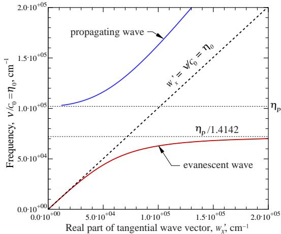
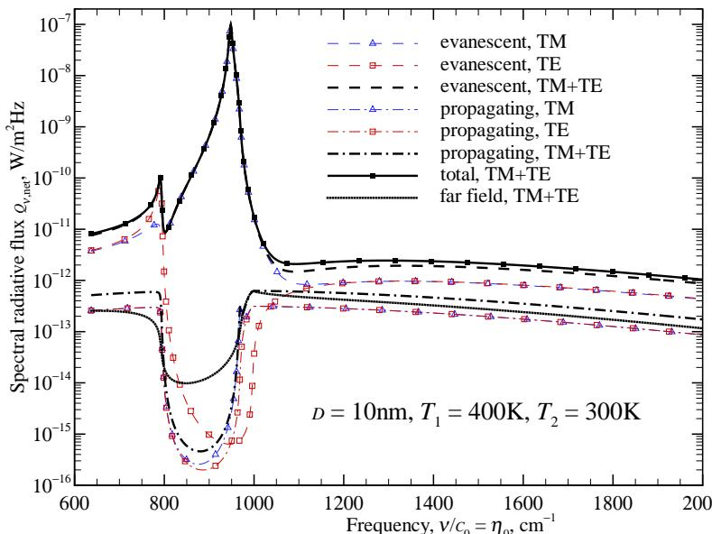

## 内容索引

- [目录](README.md)
- [1 热辐射基础](1-热辐射基础.md)
- [2 基于电磁波理论的辐射特性预测](2-基于电磁波理论的辐射特性预测.md)
- [3 实际表面的辐射特性](3-实际表面的辐射特性.md)
- [4 视角因子](4-视角因子.md)
- [5 灰体漫射表面间的辐射交换](5-灰体漫射表面间的辐射交换.md)
- [6 部分镜面灰体表面间的辐射交换](6-部分镜面灰体表面间的辐射交换.md)
- [7 非理想表面间的辐射交换](7-非理想表面间的辐射交换.md)
- [8 表面交换的蒙特卡洛方法](8-表面交换的蒙特卡洛方法.md)
- [9 传导和对流存在时的表面辐射交换](9-传导和对流存在时的表面辐射交换.md)
- [10 参与介质中的辐射传递方程(RTE)](10-参与介质中的辐射传递方程(RTE).md)
- [11 分子气体的辐射特性](11-分子气体的辐射特性.md)
- [12 颗粒介质的辐射特性](12-颗粒介质的辐射特性.md)
- [13 半透明介质的辐射特性](13-半透明介质的辐射特性.md)
- [14 一维灰体介质的精确解](14-一维灰体介质的精确解.md)
- [15 一维介质的近似求解方法](15-一维介质的近似求解方法.md)
- [16 球谐函数法 (PN-近似)](16-球谐函数法(PN-近似).md)
- [17 离散坐标法 (SN-近似)](17-离散坐标法(SN-近似).md)
- [18 区域法](18-区域法.md)
- [19 准直辐射与瞬态现象](19-准直辐射与瞬态现象.md)
- [20 非灰消光系数的求解方法](20-非灰消光系数的求解方法.md)
- [21 参与介质的蒙特卡洛方法](21-参与介质的蒙特卡洛方法.md)
- [22 辐射与传导和对流的耦合](22-辐射与传导和对流的耦合.md)
- [23 逆辐射传热](23-逆辐射传热.md)
- [24 纳米尺度辐射传热](24-纳米尺度辐射传热.md)
- [附录](附录.md)

- [24.1 引言](#241-引言)  
- [24.2 光的相干性](#242-光的相干性)  
- [24.3 倏逝波](#243-倏逝波)  
- [24.4 辐射隧穿](#244-辐射隧穿)  
- [24.5 表面波(极化激元)](#245-表面波极化激元)  
- [24.6 涨落电动力学](#246-涨落电动力学)  
- [24.7 平行板间的热传递](#247-平行板间的热传递)  
- [24.8 纳米尺度辐射实验](#248-纳米尺度辐射实验)  
- [参考文献](#参考文献)  
- [习题](#习题)  

# CHAPTER 24

# NANOSCALE RADIATIVE TRANSFER

# 24.1 INTRODUCTION

In the last chapter of this book we will provide a brief introduction to radiative heat transfer in geometries where the pertinent dimensions are measured in nanometers (nm). Research in the field of nanoscale energy transfer has exploded during the past few years, leading to fascinating new problems and devices in microelectronics and microfabrication technology, such as quantum structures, optoelectronics, molecular- and atomic- level imaging techniques, etc. Most radiation is incoherent (multispectral, as well as random in polarization and direction) in the "far field" (a distance of a wavelength or so away from the source), and the radiative transfer equation (RTE) and its solution methods described over the previous chapters are only valid for such incoherent radiation. We noticed in Chapters 2 and 3 (optically smooth surfaces) and Chapter 12 (small particles) that, when distances of the order of the wavelength  $\lambda$  are relevant, radiative transfer must be calculated from the full Maxwell's equations presented in Chapter 2. However, Maxwell's equations do not include any radiative emission sources, which must be modeled via what is known as fluctuational electrodynamics, pioneered by Rytov [1,2].

In the following we will give very brief accounts of some interesting radiative phenomena that are observed at the nanoscale, culminating in the prediction of radiative flux between two plates, spaced a tiny distance apart. The reader interested in detailed knowledge of the subject area should consult the books by Chen [3], Novotny and Hecht [4], and Zhang [5], review articles by Basu and coworkers [6] and Zhang and Park [7], as well as the large number of recent research papers in the field.

# 24.2 COHERENCE OF LIGHT

24.2 COHERENCE OF LIGHTNo radiation source is perfectly coherent, i.e., perfectly monochromatic and unidirectional, not even lasers or emission from single atoms. On the other hand, no source is truly incoherent: even the most chaotic blackbody radiation has a small coherence length, which is related to the distance the wave travels within a coherence time [5]. If the wave nature of light is completely preserved, we speak of coherent light. If light travels longer than the coherence time, or a distance larger than the coherence length, fluctuations in the waves will diminish wave interference effects (see Fig. 2- 13 and the discussion of reflection from a thin layer). The coherence of light in space and time (or, equivalently, frequency) is measured by the mutual coherence function of any two waves, defined as  $\langle E(\mathbf{r}_1, t)E^* (\mathbf{r}_2, t) \rangle$ , where the angular brackets denote time- averaging, and the  $\mathbf{r}_1$  and  $\mathbf{r}_2$  are two different locations; the electric field can be expressed in either the frequency

  
FIGURE 24-1 Total internal reflection and evanescent waves: (a) propagation of waves at critical angle of incidence, (b) evanescent wave propagating along  $x$ -direction and exponentially decaying in  $-z$ -direction.

domain, or time domain [5]. For our purposes we simply note that the coherence length of random blackbody radiation is about  $\lambda /2$  [4,8], and longer for more coherent sources.

# 24.3 EVANESCENT WAVES

We observed in Section 2.5, equation (2.100), that at an interface between two dielectrics total reflection takes place if light attempts to enter a less dense material  $(n_{2}< n_{1})$  at an incidence angle  $\theta_{1}$  larger than the critical angle

$$
\sin \theta_{1} > \sin \theta_{c} = \frac{n_{2}}{n_{1}}, \tag{24.1}
$$

with no energy penetrating into Medium 2 (see Fig. 24- 1a). This is true as far as far- field radiation is concerned, and also for net (time- and space- averaged) energy. However, if one carefully inspects the electromagnetic wave theory relationships, one observes that a wave traveling parallel to the interface enters Medium 2, with its strength decreasing exponentially away from the interface, known as an evanescent wave (from Latin for "vanishing"). To simplify the analysis we will, without loss of generality, consider here only the case of a parallel polarized (TM) wave  $(E_{\perp} = 0)$ , and only concern ourselves with the electric field. Then, from equations (2.73) and (2.75), we have

$$
\begin{array}{rl} & {\mathbf{E}_{c1} = E_{||i}\hat{\mathbf{e}}_{||i}e^{-2\pi i(\mathbf{w}_i\cdot \mathbf{r} - \nu t)} + E_{||r}\hat{\mathbf{e}}_{||r}e^{-2\pi i(\mathbf{w}_r\cdot \mathbf{r} - \nu t)},}\\ & {\mathbf{E}_{c2} = E_{||t}\hat{\mathbf{e}}_{||t}e^{-2\pi i(\mathbf{w}_t\cdot \mathbf{r} - \nu t)},} \end{array} \tag{24.2a}
$$

and the wave vector  $\mathbf{w}$ , as defined1 by equation (2.31) has  $x$ - and  $z$ - components

$$
\mathbf{w} = \eta_0n\hat{\mathbf{s}} = w_x\hat{\mathbf{1}} +w_z\hat{\mathbf{k}}. \tag{24.3}
$$

Since the tangential components of the electrical field must be conserved, equation (2.67), we have  $w_{xi} = w_{xr} = w_{xt} = w_{x}$ , and

$$
w_{x} = \eta_{0}n_{1}\sin \theta_{1} = \eta_{0}n_{2}\sin \theta_{2}, \tag{24.4}
$$

  
FIGURE 24-2 Photon tunneling through a layer of lesser refractive index, adjacent to two optically denser materials.

which is Snell's law. If  $\theta_{1}$  exceeds the critical angle, then

$$
n_1\sin \theta_1 > n_1\sin \theta_c > n_2, \tag{24.5}
$$

and the  $z$ - component of the transmitted wave becomes

$$
w_{z t} = \sqrt{(\eta_{0}n_{2})^{2} - w_{x}^{2}} = i\eta_{0}\sqrt{(n_{1}\sin\theta_{1})^{2} - n_{2}^{2}} = i|w_{z t}| = i\eta_{0}n_{2}|\cos \theta_{2}|, \tag{24.6}
$$

i.e.,  $w_{z t}$  and  $\cos \theta_{2}$  are purely imaginary (and  $|w_{z t}|$  and  $|\cos \theta_{2}|$  are their magnitudes). Substituting this into equation (24.2b) we have

$$
\mathbf{E}_{c2} = E_{||\mathbf{k}}\hat{\mathbf{k}} e^{-2\pi |w_{z t}| + 2\pi i\nu t}, \tag{24.7}
$$

with the magnitude of  $|w_{z t}| = \mathcal{O}\{\eta_{0} = 1 / \lambda_{0}\}$ , i.e., we have a wave inside Medium 2 traveling along the interface, exponentially decaying in strength over the distance of one wavelength or so (depending on  $\theta_{1}$ ). This is depicted in Fig. 24- 1b. Performing the same analysis for the magnetic field (with  $H_{||} = 0$ ), it is easy to show that the  $z$ - component of the time- averaged Poynting vector, see equation (2.42), is zero, i.e., no net energy crosses the interface [3]. However, if the instantaneous Poynting vector is examined, one finds that there is periodic in- and outflow of energy carried by the evanescent field.

# 24.4 RADIATION TUNNELING

We have seen in the previous section that, if a radiative wave train is reflected at the interface to an optically less dense medium, an evanescent wave exists within the optically rarer medium with exponentially decaying strength away from the interface. Furthermore, the evanescent wave does not carry any net (time- averaged) energy into the direction normal to the surface. However, if a second denser medium is brought into close proximity to the first, net energy can be transported across the gap or intermediate layer. This phenomenon is known as radiation tunneling (or sometimes as photon tunneling, or frustrated total internal reflection [5]), and is very important for heat transfer between two media a distance of a wavelength or less apart, as schematically shown in Fig. 24- 2. While this phenomenon has been known since Newton's time, in the heat transfer area it was probably first discovered by Cravalho and coworkers [9], who investigated closely spaced cryogenic insulation. Today's important applications range from thermophotovoltaic devices to nanothermal processing and nanoelectronics thermal management [5].

If a second optically dense material is close to the first, the evanescent wave in the layer in between is reflected back toward the first interface. Interference between the two waves cause the Poynting vector to have a nonzero net component in the  $\mathcal{Z}$  - direction. However, if the gap is too wide (i.e., well more than one wavelength away), the evanescent wave reaching the second interface is too weak and net energy transfer becomes negligible. To calculate the transmissivity of the gap or intermediate film for above- critical angles of incidence we may use the thin film relations developed in Chapter 2, keeping in mind that  $\cos \theta_{2}$  may become imaginary for large incidence angles. Limiting ourselves here to three dielectrics with  $n_1 = n_3 > n_2,$  equations  $(2.131b)$  and (2.133) may be rewritten as

$$
t = \frac{t_{12}t_{21}e^{i\beta}}{1 - r_{21}^{2}e^{2i\beta}},T = t t^{*},\beta = 2\pi w_{2z}d = 2\pi n_{2}\cos \theta_{2}\frac{d}{\lambda}, \tag{24.8}
$$

with  $r_{21},t_{12},$  and  $t_{21}$  determined from equations (2.89) through (2.92). For  $\theta_{1}< \theta_{c}$  the interface reflection and transmission coefficients are real, and

$$
T_{\lambda} = \frac{(t_{12}t_{21})^{2}}{1 - 2r_{21}^{2}\cos 2\beta + r_{21}^{4}} = \frac{(1 - r_{21}^{2})^{2}}{1 - 2r_{21}^{2}\cos 2\beta + r_{21}^{4}},\quad \theta_{1}< \theta_{c} = \sin \left(\frac{n_{2}}{n_{1}}\right). \tag{24.9}
$$

If  $\theta_{1}$  exceeds the critical angle an evanescent wave enters Medium 2 and  $w_{2z}$  and  $\cos \theta_{2}$  become purely imaginary. From equation (24.6) we find that the phase shift  $\beta$  now becomes imaginary (the exponential decay of the evanescent wave),

$$
\beta = i(2\pi n_2|\cos \theta_2|)\frac{d}{\lambda} = i|\beta |, \tag{24.10}
$$

and the  $r_{21},t_{12},$  and  $t_{21}$  become complex [i.e., replacing  $\cos \theta_{2}$  by  $i|\cos \theta_{2}|$  in equations (24.8) and (24.9)]. Therefore,

$$
t = \frac{t_{12}t_{21}e^{-|\beta|}}{1 + r_{21}^{2}e^{-2|\beta|}}, \tag{24.11}
$$

and

$$
T_{\lambda} = t t^{*} = \frac{(t_{12}t_{21})(t_{12}^{*}t_{21}^{*})e^{-2|\beta|}}{1 + \big(r_{21}^{2} + r_{21}^{*2}\big)e^{-2|\beta|} + r_{21}^{2}r_{21}^{*2}e^{-4|\beta|}}, \tag{24.12}
$$

which, after some algebra (left as an exercise), may be reduced to

$$
T_{\lambda} = \frac{\sin^{2}2\alpha}{\sin^{2}2\alpha + \sinh^{2}|\beta|},\mathrm{~where~}\tan \alpha = \left\{ \begin{array}{l l}{\frac{n_{1}|\cos\theta_{2}|}{n_{2}\cos\theta_{1}},} & \mathrm{parallel~(TM)~polarization,}\\ {\frac{n_{2}|\cos\theta_{2}|}{n_{1}\cos\theta_{1}},} & \mathrm{perpendicular~(TE)~polarization.} \end{array} \right. \tag{24.13}
$$

Again, equation (24.13) is valid for, both, parallel- and perpendicular- polarized light, except for the different definition of tan  $\alpha$  (due to the different structure of  $r_{\parallel}$  and  $r_{\perp}$  -

Example 24.1. Consider a vacuum gap surrounded by a dielectric medium with refractive index  $n_1 = n_3 = \sqrt{2} = 1.4142$  . Determine the transmissivity for parallel- polarized light for all angles of incidence and as a function of gap width.

# Solution

With  $n_2 = 1$  we have  $\sin \theta_{c} = 1 / \sqrt{2},$  or  $\theta_{c} = 45^{\circ}$  . Writing a small computer code, using equation (24.9) for  $\theta_{1}< 45^{\circ}$  , and equation (24.13) for  $\theta_{1} > 45^{\circ}$  , and with

$$
\tan \alpha = \frac{n_1|\cos\theta_2|}{n_2\cos\theta_1},
$$

  
FIGURE 24-3 Transmissivity of a vacuum gap surrounded by identical dielectrics  $(n_{1} = n_{3} = 1.4142)$ , for parallel-polarized light.

we obtain the gap transmissivity shown in Fig. 24- 3. It is observed that for small  $\theta_{1}$  we have noticeable interference effects, but the transmissivity remains high for all gap widths  $(T_{\lambda} > 0.9)$ . Wavelength of interference and magnitude increase with  $\theta_{1}$  until, reaching Brewster's angle  $(\approx 35^{\circ})$ , we have total transmission of a parallel- polarized wave (see also Fig. 2- 9). Beyond Brewster's angle  $\rho_{\parallel}$  increases rapidly, with decreasing transmissivity (but still increasing wavelength of interference). At  $\theta_{1} = 45^{\circ}$  we have  $r_{\parallel} = - 1$ , and an evanescent wave forms, and the larger the incident angle, the faster the strength of the evanescent wave decays across the gap. It is straightforward to verify that, at  $45^{\circ}$ , both equations (24.9) and (24.13), go to the same limit, i.e.,

$$
T_{\lambda}(\theta_{1} = 45^{\circ}) = \frac{1}{1 + \left(\frac{\pi}{2}\frac{d}{\lambda}\right)}.
$$

# 24.5 SURFACE WAVES (POLARITONS)

The interaction between electromagnetic waves and the oscillatory movement of free charges (electrons) near the surface of metallic materials is known as surface plasmons or surface plasmon polaritons. Surface plasmons are usually found in the visible to near- infrared part of the spectrum in highly conductive metals, such as gold, silver, and aluminum. They are of importance in near- field microscopy and nanophotonics [5, 10- 12]. In some polar dielectrics lattice vibrations (phonons) and/or oscillations of bound charges can also interact with electromagnetic waves in the mid- infrared; these are known as surface phonon polaritons, and are of interest in the tuning of emission properties [13] and nanoscale imaging [14]. In either case they result in the generation of an electromagnetic wave traveling along, and only in the immediate vicinity of both sides of an interface, i.e., a surface wave. In our brief discussion here we will mostly follow the presentation of Zhang [5].

One requirement of a surface wave, i.e., a wave decaying in both directions normal to the surface, is that there are evanescent waves on both sides of the interface. Consider the arrangement shown in Fig. 24- 4, consisting of a thin layer and a thick substrate, with the thin layer bound at the top by a third medium. The thin layer may be air with a metallic substrate (Otto configuration), or a metal layer bounded by air at the bottom (Kretschmann configuration) [15]. If light is incident from the top medium, it is possible for evanescent waves to occur simultaneously in both the underlying air and metal layers, as also indicated in Fig. 24- 4. A second requirement for polaritons is that the polariton dispersion relations must be satisfied,

  
FIGURE 24-4 Typical configuration for the generation of surface polaritons, consisting of a dielectric for incident light, and an air/metal thin layer/substrate combination.

which are the poles of the Fresnel reflection coefficients, since infinite reflection coefficients are an indication of resonance. If one writes the reflection coefficients in terms of wave- vector components [4, 5] as

$$
\begin{array}{r}r_{\parallel} = (\frac{w_{1z}}{\epsilon_1} -\frac{w_{2z}}{\epsilon_2})\left / (\frac{w_{1z}}{\epsilon_1} +\frac{w_{2z}}{\epsilon_2}),\\ r_{\perp} = (\frac{w_{1z}}{\mu_1} -\frac{w_{2z}}{\mu_2})\left / (\frac{w_{1z}}{\mu_1} +\frac{w_{2z}}{\mu_2}), \end{array} \tag{24.14b}
$$

the polariton dispersion relations are defined by

$$
\begin{array}{rl} & {\frac{w_{1z}}{\epsilon_1} +\frac{w_{2z}}{\epsilon_2} = 0,\quad \mathrm{for~parallel - polarized~light},}\\ & {\frac{w_{1z}}{\mu_1} -\frac{w_{2z}}{\mu_2} = 0,\quad \mathrm{for~perpendicular - polarized~light}.} \end{array} \tag{24.15b}
$$

The nature of the dispersion relations is more easily understood by first looking at the case of two dielectric media: in order to have evanescent waves we must have both  $w_{1z}$  and  $w_{2z}$  purely imaginary, with  $w_{1z} = - i|w_{1z}|$  and  $w_{2z} = - i|w_{2z}|$ , i.e., both with a negative sign in order to have  $e^{- 2\pi iw_{1}\cdot \mathbf{r}} = e^{- 2\pi i(w_{1x}x + w_{2z}z)} = e^{- 2\pi iw_{1x}x + 2\pi |w_{1z}|z}$  (reflected wave) decay toward negative  $z$ , and  $e^{- 2\pi iw_{1}\cdot \mathbf{r}} = e^{- 2\pi i(w_{2x}x + w_{2z}z)} = e^{- 2\pi iw_{2x}x - 2\pi |w_{2z}|z}$  (transmitted wave) toward positive  $z$  (see Fig. 24- 4). This implies that in order to produce a surface wave with parallel- polarized incident light, the electrical permittivities of the two materials must have opposite signs. Since metals display negative permittivities over large parts of the spectrum, this condition is easily fulfilled. To produce a surface polariton with perpendicular- polarized light, on the other hand, requires a medium with negative magnetic permeability. While so- called negative index materials (NIM) exhibit both negative permittivity and permeability [16], most materials are nonmagnetic, for which surface polaritons cannot be generated with perpendicular- polarized light. Employing equation (2.31) together with  $m^2 = \epsilon$ , we may write for a general nonmagnetic medium

$$
\begin{array}{r}w_{1}^{2} = w_{x}^{2} + w_{1z}^{2} = \eta_{0}^{2}\epsilon_{1},\\ w_{2}^{2} = w_{x}^{2} + w_{2z}^{2} = \eta_{0}^{2}\epsilon_{2}, \end{array} \tag{24.16b}
$$

where we have made use of the fact that the tangential component of the wave vector must be continuous across the interface,  $w_{1x} = w_{2x} = w_{x}$ . Using these relations the  $z$ - components may be eliminated from equation (24.15a), leading to

$$
w_{x} = \eta_{0}\sqrt{\frac{\epsilon_{1}\epsilon_{2}}{\epsilon_{1} + \epsilon_{2}}}. \tag{24.17}
$$

  
FIGURE 24-5 Dispersion relation for aluminum and air; top left solid line: propagating waves; dashed line: light line; bottom right solid line: evanescent waves.

This equation relates the tangential component of the wave vector to wavenumber (or frequency), and is a popular alternative statement of the polariton dispersion relation. If one of the media is vacuum or air  $(\epsilon = 1)$ , an evanescent wave exists if  $w_{x} > \eta_{0}$  (i.e.,  $w_{z}$  has an imaginary component). Note that equation (24.17) also gives the roots to the numerator of equation (24.14a): for  $w_{x}< \eta_{0}$  equation (24.17) describes propagating waves.

Example 24.2. Determine the dispersion relation between aluminum and air, assuming that the dielectric function of Al obeys the Drude theory.

# Solution

The Drude equation has been given by equation (3.64), when written in complex form, as

$$
\epsilon_{\mathrm{Al}} = 1 + \frac{\nu_p^2}{\nu(\nu + i\gamma)},\quad \nu_p = 3.07\times 10^{15}\mathrm{Hz},\quad \gamma = 3.12\times 10^{13}\mathrm{Hz},
$$

with plasma frequency  $\nu_{p}$  and damping factor  $\gamma$  from Fig. 3- 7. With  $\epsilon_{\mathrm{air}} = 1$  the tangential wave vector component may be calculated from equation (24.17). Since  $\epsilon_{\mathrm{Al}}$  is complex, so is  $w_{x} = w_{x}^{\prime} + iw_{x}^{\prime \prime}$ . It is common to show a dispersion relationship by plotting the real part of  $w_{x}w_{z}$ . frequency or wavenumber, which has been done in Fig. 24- 5. The dashed line  $w_{x}^{\prime} = \eta_{0}$  is called the light line. On its left  $w_{z}$  is real in air, and a propagating wave exists. On its right,  $w_{x}^{\prime} > \eta_{0}$  and the  $w_{z}$  in air becomes imaginary, and only evanescent waves are found. It is seen that, for the evanescent waves,  $w_{z}^{\prime \prime}$  increases rapidly, reaching an asymptote at  $\nu = \nu_{p} / \sqrt{2}$ , when the real part of the dielectric function of Al approaches  $- 1$ . For  $\nu >\nu_{p}$  metal becomes transparent and the real part of the dielectric function becomes positive. The solution to equation (24.17) for  $\nu >\nu_{p}$  corresponds to  $r_{\parallel} = 0$  in equation (24.14a) and shows, therefore, propagating waves.

# 24.6 FLUCTUATIONAL ELECTRODYNAMICS

As indicated earlier, Maxwell's equations do not contain a thermal radiation emission term. Such a source must be added by considering radiative transitions by elementary energy carriers (such as electrons, lattice vibrations called phonons, etc.) from a higher energy state to a lower one, accompanied by the release of a photon. Such a quantum- mechanical process, similar to emission from gas molecules covered in Chapter 11, must be linked to the equations describing the electromagnetic waves. This is achieved through the concept of fluctuational electrodynamics, originally developed by Rytov [1,2]. At any finite temperature above absolute zero, chaotic thermal motions takes place inside any material. Charged particles of opposite sign pair up (known as dipoles), and the random motion of the dipoles induce a fluctuating electromagnetic

field. Thus, in this fluctuational electrodynamics model the random thermal fluctuations generate a space- and time- dependent (but random) electric current density  $\mathbf{j}'(\mathbf{r},t)$  inside the medium, whose time average is zero [5]. To include the stochastic current density in the electromagnetic wave equations, several approaches are possible. The most common technique is to employ a dyadic Green's function  $\mathbf{G}_e(\mathbf{r},\mathbf{r}',\nu)$  (a  $3\times 3$  matrix). The induced electric and magnetic fields in the frequency domain can then be determined from

$$
\begin{array}{l}{\bf E}({\bf r},\nu) = 2\pi i\mu_0\int_V{\bf G}_e({\bf r},{\bf r}',\nu)\cdot {\bf j}({\bf r}',\nu){\bf d}{\bf r}',\\ {\bf H} ({\bf r},\nu) = \int_V{\bf G}_h({\bf r},{\bf r}',\nu)\cdot {\bf j}({\bf r}',\nu){\bf d}{\bf r}', \end{array} \tag{24.18b}
$$

where the integral is over the volume, which contains the fluctuating dipoles,  $\mathbf{j}(\mathbf{r}',\nu)$  is the Fourier transform of the electric current density source  $\mathbf{j}'(\mathbf{r},t)$  into frequency space, and  $\mu_0$  is the magnetic permeability of vacuum. The dyadic Green's function for the magnetic field is, by equation (2.13), directly related to  $\mathbf{G}_e$  through  $\mathbf{G}_h = - \nabla \times \mathbf{G}_e$ . Physically,  $\mathbf{G}_e$  may be interpreted as a transfer function relating the electric field at location  $\mathbf{r}$  and frequency  $\nu$  to a vector source located at  $\mathbf{r}'$ . Mathematically, the dyadic Green's function is found as the solution to a vector Helmholtz equation, which may be reduced to a scalar one as [4]

$$
\mathbf{G}_e(\mathbf{r},\mathbf{r}',\nu) = \left(\delta +\frac{1}{(2\pi w)^2}\nabla \mathbf{V}\right)G_0(\mathbf{r},\mathbf{r}',\nu), \tag{24.19}
$$

with  $G_{0}$  the solution to

$$
\left((2\pi w)^2 +\nabla^2\right)G_0(\mathbf{r},\mathbf{r}',\nu) = -\delta (\mathbf{r} - \mathbf{r}'), \tag{24.20}
$$

where  $\delta (\mathbf{r} - \mathbf{r}')$  is a 3D Dirac- delta function as defined on  $\mathbb{P}$ . 610, and  $w$  is the magnitude of the wave vector  $\mathbf{w}$ . The time- averaged emitted energy flux may be calculated from the average Poynting vector, equation (2.41),

$$
\begin{array}{r}\langle \mathbf{S}(\mathbf{r},\nu)\rangle = \frac{1}{2}\langle \mathfrak{R}\{\mathbf{E}_c\times \mathbf{H}_c^*\} \rangle , \end{array} \tag{24.21}
$$

where the angle brackets denote the ensemble average over the random fluctuations. Sticking equations (24.18) into equation (24.21) requires a two- point ensemble average of the random current density, which must be a function of local temperature. This is achieved through the fluctuation- dissipation theorem pioneered by Rytov [1], leading to

$$
\langle j_m(\mathbf{r},\nu)j_n(\mathbf{r}',\nu)\rangle = 8\nu \epsilon_0\epsilon ''\Theta (\nu ,T)\delta_{mn}\delta (\mathbf{r} - \mathbf{r}'), \tag{24.22}
$$

where  $\epsilon_0$  is the electrical permittivity of vacuum,  $\epsilon ''$  is the imaginary part of the medium's dielectric function, and subscripts  $m$  and  $n$  denote the  $x$ - ,  $y$ - and  $z$ - components of  $\mathbf{j}$ . The function  $\Theta (\nu ,T)$  is the mean energy of a Planck oscillator given by [4]

$$
\Theta (\nu ,T) = \frac{h\nu}{e^{h\nu / kT} - 1}. \tag{24.23}
$$

A multiplicative factor of 4 is included on the right- hand side of equation (24.22), since only positive frequencies are considered in the Fourier transform for the electric current density [17]. Sticking equations (24.18) and (24.22) into equation (24.21) yields for the individual terms arising in the Poynting vector, after some manipulation,

$$
\begin{array}{r}\frac{1}{2}\left\langle E_i(\mathbf{r},\nu)H_j^* (\mathbf{r},\nu)\right\rangle = 8\pi \left(\frac{\nu}{c_0}\right)^2\Theta (\nu ,T)\Re \left\{i\epsilon \int_V\sum_mG_{e,m}(\mathbf{r},\mathbf{r}',\nu)G_{e,jm}(\mathbf{r},\mathbf{r}',\nu)\mathbf{dr}'\right\} , \end{array} \tag{24.24}
$$

  
FIGURE 24-6 Closely spaced parallel plates separated by a vacuum gap.

where the subscripts again denote the various  $x - , y-$  and  $z$ - components. For example, the  $z$ - component of the Poynting vector becomes

$$
\begin{array}{l}{\langle S_z(\mathbf{r},\nu)\rangle = \frac{1}{2}\left\langle E_xH_y^* -E_yH_x^*\right\rangle}\\ {= 8\pi \left(\frac{\nu}{c_0}\right)^2\Theta (\nu ,T)\Re \left\{i\epsilon \int_V\sum_m\left(G_{e,xm}G_{h,ym}^* -G_{e,ym}G_{h,xm}^*\right)(\mathbf{r},\mathbf{r}',\nu)\mathbf{dr}'\right\} .} \end{array} \tag{24.25}
$$

As given, the time- averaged Poynting vector constitutes the local radiative flux caused by the surrounding electromagnetic field.

# 24.7 HEAT TRANSFER BETWEEN PARALLEL PLATES

Consider Medium 1 separated from Medium 2 by a small, perfectly parallel vacuum gap of width  $d$ , as shown in Fig. 24- 6. To calculate the radiative flux between them we need to determine the normal component of the Poynting vector for the energy transmitted from Medium 1 across the gap, as well as the counter- flow from Medium 2 to 1. Since the problem is one- dimensional in the  $z$ - direction, it has no azimuthal (or  $x$ - and  $y$ - ) dependence, making the analysis a little simpler if cylindrical coordinates are employed, i.e., we define position and wave vectors as

$$
\mathbf{r} = r\hat{\mathbf{e}}_r + z\hat{\mathbf{k}},\quad \mathbf{w} = w_r\hat{\mathbf{e}}_r + w_z\hat{\mathbf{k}}. \tag{24.26}
$$

The dyadic Green's function for two semi- infinite media separated by a parallel gap may be determined from [4, 5, 18, 19]

$$
\mathbf{G}_t(r,r',z,z';\nu) = i\int_0^\infty \frac{w_x}{2w_{1z}} (\hat{\mathbf{e}}\pm \hat{\mathbf{e}}_r + \hat{\mathbf{p}}_1t_{\parallel}\hat{\mathbf{p}}_2)e^{-2\pi i(w_2z - w_{1z}z')}e^{-2\pi iw_x(r - r')}dz_{x}, \tag{24.27a}
$$

where

$$
\begin{array}{r}\dot{\mathbf{s}} = \hat{\mathbf{e}}_r\times \hat{\mathbf{k}},\quad \hat{\mathbf{p}}_i = (w_x\hat{\mathbf{k}} -w_{iz}\hat{\mathbf{e}}_r) / w_i,\quad i = 1,2. \end{array} \tag{24.27b}
$$

Here  $t_\perp$  and  $t_{\parallel}$  are the transmission coefficients from Medium 1 to Medium 2, as evaluated from Airy's formula, equation (2.131b), and the interrelationship between  $w_{x},w_{iz},$  and  $w_{i}$  is given by equation (24.16). Sticking this into equation (24.25) one obtains, after considerable algebra, for the spectral radiative flux from Medium 1 to Medium 2

$$
q_{\nu ,1\to 2} = 8\pi \Theta (\nu ,T_1)\int_0^\infty Z_{12}(\nu ,w_x)w_xdw_x \tag{24.28a}
$$

where

$$
Z_{12}(\nu ,w_x) = \frac{4\Re\{w_{1z}\}\Re\{w_{2z}\}\left|w_0^2e^{-2iw_0d}\right|}{\left|(w_{0z} + w_{1z})(w_{0z} + w_{1z})(1 - r_{\perp 01}r_{\perp 02}e^{-2iw_0d})\right|^2} +\frac{4\Re\left\{\epsilon_1w_{1z}^*\right\}\Re\left\{\epsilon_2w_{2z}^*\right\}\left|w_0^2e^{-2iw_0d}\right|}{\left|(\epsilon_1w_{0z} + w_{1z})(\epsilon_2w_{0z} + w_{1z})(1 - r_{||01}r_{||02}e^{-2iw_0d})\right|^2}. \tag{24.28b}
$$

The  $Z_{12}(\nu ,w_x)$  may be interpreted as an exchange function, identifying the contribution of a given tangential wave vector component,  $w_{x}$  (related to incidence angle), to the spectral flux. Observing that  $Z_{12} = Z_{21}$ , the net heat exchange between the two surfaces is readily found, after integration over all frequencies, as

$$
q_{\mathrm{net}} = \int_{0}^{\infty}\left(q_{\nu ,1\to 2} - q_{\nu ,2\to 1}\right)d\nu = \int_{0}^{\infty}\left(\Theta (\nu ,T_{1}) - \Theta (\nu ,T_{2})\right)\int_{0}^{\infty}Z_{12}(\nu ,w_{x})w_{x}dw_{x}d\nu. \tag{24.29}
$$

Equations (24.28) and (24.29) include contributions from both propagating and evanescent waves. We observed in Section 24.3 that we have propagating waves for  $w_{x}< w_{0} = \eta_{0} = \nu /c_{0}$  (real  $w_{0z}$  in the vacuum layer), and evanescent waves for  $w_{x} > \nu /c_{0}$  (imaginary  $w_{0z}$ ). Using the expressions for transmission coefficients developed in Section 24.4, we find

$$
Z_{\mathrm{prop}}(\nu ,w_x) = \frac{(1 - r_{\perp 01}^2)(1 - r_{\perp 02}^2)}{4\left|1 - r_{\perp 01}r_{\perp 02}e^{-2iw_0d}\right|^2} +\frac{(1 - r_{||01}^2)(1 - r_{||02}^2)}{4\left|1 - r_{||01}r_{||02}e^{-2iw_0d}\right|^2},w_x< \eta_0. \tag{24.30a}
$$

For the evanescent waves the exchange function reduces to

$$
Z_{\mathrm{evan}}(\nu ,w_x) = \frac{\Im\left\{\nu_{r_{\perp 01}}\right\}\Im\left\{r_{\perp 02}\right\}e^{-2iw_0ld}}{\left|1 - r_{\perp 01}r_{\perp 02}e^{-2iw_0ld}\right|^2} +\frac{\Im\left\{r_{||01}\right\}\Im\left\{r_{||02}\right\}e^{-2iw_0ld}}{\left|1 - r_{||01}r_{||02}e^{-2iw_0ld}\right|^2},w_x > \eta_0. \tag{24.30b}
$$

Clearly, similar to the evanescent transmissivity of Section 24.3, the contribution from  $Z_{\mathrm{evan}}$  to the flux decreases exponentially with distance between the plates.

Far Field Heat Flux. As discussed in Section 2.5, as  $d$  becomes large,  $d\gg \lambda_0$ , the radiation will lose coherence, and the gap transmissivity will obey equation (2.133) (with  $\kappa = 0$  for the vacuum gap). Then the exchange function reduces to, with  $|r|^2 = \rho$ ,

$$
Z_{\mathrm{prop,ff}}(\nu ,w_x) = \frac{(1 - \rho_{\perp 01})(1 - \rho_{\perp 02})}{4(1 - \rho_{\perp 01}\rho_{\perp 02})} +\frac{(1 - \rho_{||01})(1 - \rho_{||02})}{4(1 - \rho_{||01}\rho_{||02})}. \tag{24.31}
$$

Integration over  $w_{x}$  may be replaced by  $w_{x} = (\nu /c_{0})\sin \theta$ , where  $\theta$  is the polar angle in vacuum, and equation (24.29) becomes, with  $Z_{\mathrm{evan}} = 0$  and  $1 - \rho = \epsilon$ ,

$$
q_{\mathrm{net,far}} = \frac{2\pi}{c_0^2}\int_0^\infty [\Theta (\nu ,T_1) - \Theta (\nu ,T_2)]\int_0^{\pi /2}\left(\frac{1}{\frac{1}{\epsilon_{\perp 01}} + \frac{1}{\epsilon_{\perp 02}} - 1} +\frac{1}{\frac{1}{\epsilon_{||01}} + \frac{1}{\epsilon_{||02}} - 1}\right)\cos \theta \sin \theta d\theta \nu^2 d\nu . \tag{24.32}
$$

Comparison with equation (5.35) shows that these results are identical if the emissivities are assumed to be gray and diffuse.

Example 24.3. Determine the total radiative flux between two plates of aluminum, separated by a vacuum gap, assuming that the dielectric function of Al obeys the Drude theory as in the previous example. The plates are isothermal and maintained at  $400\mathrm{K}$  and  $300\mathrm{K}$ , respectively. Determine the

  
FIGURE 24-7 Total radiative heat fluxes between aluminum plates separated by a vacuum microgap of varying width (dashed = evanescent waves; dash-dot = propagating waves; triangles = parallel/TM polarization; squares = perpendicular/TE polarization; thick lines = both polarizations).

total radiative flux as a function of gap thickness. Distinguish contributions from propagating and evanescent waves, and compare the influence of parallel and perpendicular polarizations.

# Solution

With the dielectric function of Al given in the previous example, and with the  $w_{\mathrm{iz}}$  related to  $w_{x}$  and  $\epsilon_{i}$  by equation (24.16), the reflection coefficients in equations (24.30) may be calculated from equations (24.14). Integrating over all frequencies  $\nu$  and all tangential wave vectors  $w_{x}$ , separately  $0 \leq w_{x} < \eta_{0}$  for propagating waves, and  $\eta_{0} < w_{x} < \infty$  for evanescent waves, yields the desired total radiative flux between the two aluminum plates, as shown in Fig. 24- 7 for gap widths ranging from  $1 \mathrm{~nm}$  to  $10 \mu \mathrm{m}$ . For the far- field solution equation (24.30a) is replaced by equation (24.31) and  $Z_{\mathrm{evan}} = 0$ . Integration may again be over tangential wave vectors  $0 \leq w_{x} < \eta_{0}$  or, alternatively, over polar angle  $\theta$ . It is seen that, for gap sizes of less than about  $2 \mu \mathrm{m}$ , the heat flux is dominated by the evanescent waves, in particular its TE component. For small gap widths the propagating component approaches an asymptotic limit, which is about an order of magnitude larger than the far- field solution, but still considerably smaller than the blackbody limit of  $\sigma (T_{1}^{4} - T_{2}^{4}) = 992 \mathrm{~W} / \mathrm{m}^{2}$  (due to the small emissivity of aluminum, see Fig. 3- 7).

The plasma frequency of aluminum corresponds to a wavelength slightly less than  $0.1 \mu \mathrm{m}$ , while heat transfer at the example's temperatures occurs at wavelengths between roughly 2.5 and  $60 \mu \mathrm{m}$ . Therefore, the spectral variations in heat flux essentially follow a Planck function pattern. Silicon carbide, on the other hand, has a band around  $12 \mu \mathrm{m}$  (see Fig. 3- 13), giving rise to interesting spectral variations.

Example 24.4. Determine the spectral radiative flux between two plates of silicon carbide, separated by a  $10 \mathrm{~nm}$  vacuum gap, assuming that the dielectric function of SiC obeys the Lorentz model with parameters given by Fig. 3- 13. The plates are again isothermal and maintained at  $400 \mathrm{~K}$  and  $300 \mathrm{~K}$ , respectively. Distinguish contributions from propagating and evanescent waves, as well as the influence of parallel and perpendicular polarizations, and compare with the far- field solution.

# Solution

As noted in Chapter 3, the dielectric function of SiC is well- described by the single oscillator Lorentz model of equation (3.63), with  $\epsilon_{0} = 6.7$ ,  $\nu_{pi} = 4.327 \times 10^{13} \mathrm{~Hz}$ ,  $\nu_{i} = 2.380 \times 10^{13} \mathrm{~Hz}$  (corresponding to a wavenumber of  $793 \mathrm{~cm}^{- 1}$ ), and  $\gamma_{i} = 1.428 \times 10^{11} \mathrm{~Hz}$ . Aside from the different dielectric function

  
FIGURE 24-8 Spectral radiative heat fluxes between silicon carbide plates separated by a  $10\mathrm{nm}$  vacuum microgap.

and the fixed gap width, the solution proceeds as in the previous example, but without carrying out the actual integration over frequency. Results are shown in Fig. 24- 8 for the spectral region between  $600\mathrm{cm}^{- 1}$  and  $2,000\mathrm{cm}^{- 1}$  surrounding the resonance band of SiC. It is seen that the TE evanescent wave has a maximum at the resonance frequency of  $793\mathrm{cm}^{- 1}$ , before dropping by several orders of magnitude similar to the propagating waves. On the other hand, the TM evanescent wave has a maximum at  $969\mathrm{cm}^{- 1}$  (corresponding to the wavelength with near- zero reflectivity in Fig. 3- 13). The far- field flux follows the behavior given in Fig. 3- 13, i.e., flux decreases over wavelengths with large reflectivities.

A number of researchers have investigated near- field radiative transfer theoretically, primarily looking at different aspects of the heat flow across plane- parallel gaps [17, 20- 26]. Other geometries that have also received attention are spheres in close contact with flat plates [18, 19, 27], and with another sphere [28- 31].

# 24.8 EXPERIMENTS ON NANOSCALE RADIATION

It has been recognized for some time that radiative heat transfer can exceed blackbody limits at the nanoscale, and thus plays an important role in a number of applications, such as near- field microscopy, nanoelectronics thermal management, photovoltaics, etc. Correspondingly, the problem of heat transfer between closely spaced objects has been studied theoretically in some detail, as outlined in the previous sections. On the other hand, experimental verification has been limited, mostly because of the difficulties of maintaining a precise nanoscale gap between the emitter and receiver. The earliest experiments were carried out in the field of cryogenic insulation by Domoto and coworkers [32] (accompanied by some theoretical attempts [20, 21]), and by Hargreaves [33, 34]. At cryogenic temperatures, say below  $10\mathrm{K}$ , according to Wien's displacement law, equation (1.16), heat transfer is maximized around a wavelength of  $300\mu \mathrm{m}$ , i.e., even plates tens of  $\mu \mathrm{m}$  apart should display tunneling effects. Domoto and coworkers measured heat flow between two copper plates as close as  $10\mu \mathrm{m}$  together, and at temperatures between  $5\mathrm{K}$  and  $15\mathrm{K}$ . While the measured heat transfer was only about  $3\%$  of that between blackbodies (because of copper's small emittance), and agreement with their model was only fair, they were able to show that—contrary to far- field analysis—the heat transfer increased

# FIGURE24-9

Heat transfer coefficients between sapphire plates separated by a vacuum microgap; curves are vertically offset by  $2\mathrm{W} / \mathrm{m}^2\mathrm{K}$ , with respective zeros indicated by the horizontal lines extending from the left axis. Solid lines = predictions from equation (24.29); dashed lines = predictions for slightly convex plates.

by a factor of 2.3 between the far field and their closest spacing of  $10\mu \mathrm{m}$ . Hargreaves carried out similar experiments, using chromium plates with vacuum gaps down to  $1.5\mu \mathrm{m}$ . He was able to demonstrate a factor of five heat transfer increase from far field to near field (but still considerably less than the blackbody limit).

Small gaps are more easily achieved by moving a small tip close to a surface. For example, Xu et al. [35] tried to measure near- field radiative transfer by moving a  $100\mu \mathrm{m}$  diameter indium probe of a scanning thermal microscope as close as  $12\mathrm{nm}$  to a thermocouple probe, but could not detect any substantial increase in heat transfer. Kittel and colleagues [36] used a scanning tunneling microscope (STM) to measure near- field radiation between the thermocouple tip and a plate, observing the expected  $1 / d^3$  increase in heat transfer down to a gap width of  $10\mathrm{nm}$ . Below that distance, there was disagreement between theory and experiment. Narayanaswamy et al. [27] measured near- field radiation with a bimetallic atomic force microscope (AFM) cantilever with a silica microsphere at its tip. The plate was heated to maintain a temperature difference with the sphere, leading to near- field radiative transfer rates in the order of nW, which was measured by monitoring the deflection of the bimetallic cantilever. Their measurements confirmed that the near- field radiation between the flat surface and the microsphere was more than two orders of magnitude larger than between blackbodies, with a  $1 / d$ - dependence.

Successful measurements between parallel plates have been carried out by Hu and coworkers [27]. They employed two precise optical glass flats spaced a fixed  $1.6\mu \mathrm{m}$  apart by using polystyrene spacer beads. Applying various temperature differences they measured heat transfer rates approximately  $35\%$  higher than the blackbody limit, and observed good agreement with theoretical predictions. Very recently, Ottens et al. [37] carried out high- precision heat transfer measurements between two sapphire plates spaced a variable distance as little as  $2\mu \mathrm{m}$  apart. They also used cryogenic temperatures to emphasize near- field effects. Figure 24- 9 shows the pertinent results of their experiments, compared with theoretical results from equation (24.29), displayed in the form of a heat transfer coefficient, i.e.,  $h_r = q_{\mathrm{net}} / (T_1 - T_2)$ . Agreement between theory and experiment is good, except for a slight systematic error, which may be due to imperfect flatness of the plates, as demonstrated by the dashed lines, which correspond to near- field radiative heat transfer between two convex plates, each having a radius of curvature of  $\simeq 1\mathrm{km}$ . Note that the highest heat transfer coefficient measured,  $8.5\mathrm{W} / \mathrm{m}^2\mathrm{K}$  for the  $\Delta T = 6.8\mathrm{K}$  case, exceeds the blackbody limit of  $\sigma (T_1^4 - T_2^4) / (T_1 - T_2)\simeq 6.7\mathrm{W} / \mathrm{m}^2\mathrm{K}$ .

# References

1. Rytov, S. M.: "Correlation theory of thermal fluctuations in an isotropic medium," Soviet Physics JETP, vol. 6, no. 1, pp. 130-140, 1958.  
2. Rytov, S. M., Y. A. Kravtsov, and V. I. Tatarskii: Principles of Statistical Radiophysics III: Elements of Random Fields, Springer Verlag, Berlin, 1987.  
3. Chen, G.: Nanoscale Energy Transport and Conversion: A Parallel Treatment of Electrons, Molecules, Phonons, and Photons, Oxford University Press, New York, 2005.  
4. Novotny, L., and B. Hecht: Principles of Nano-Optics, Cambridge University Press, New York, 2006.  
5. Zhang, Z. M.: Nano/Microscale Heat Transfer, McGraw-Hill, New York, 2007.  
6. Basu, S., Z. H. Zhang, and C. J. Fu: "Review of near-field thermal radiation and its application to energy conversion," International Journal of Energy Research, vol. 33, pp. 1203-1232, 2009.  
7. Zhang, Z. H., and K. Park: "Fundamentals and applications of near-field radiative energy transfer," in Thermal-Fluids-Pedia, Thermal-Fluids Central, 2012, https://www.thermalfluidscentral.org/encyclopedia/index.php/Near-field-thermal_radiation.  
8. Carminati, R., and J.-J. Greffet: "Near-field effect in spatial coherence of thermal sources," Physics Review Letters, vol. 82, no. 8, pp. 1660-1663, 1999.  
9. Cravalho, E. G., C. L. Tien, and R. P. Caren: "Effect of small spacings on radiative transfer between two dielectrics," ASME Journal of Heat Transfer, vol. 89, pp. 351-358, 1967.  
10. Kawata, S. (ed.): Near-Field Optics and Surface Plasmon Polaritons, Springer, Berlin, 2001.  
11. Tominaga, J., and D. P. Tsai (eds.): Optical Nanotechnologies — The Manipulation of Surface and Local Plasmons, Springer, Berlin, 2003.  
12. Homola, J., S. S. Yee, and G. Gauglitz: "Surface plasmon resonance sensors: Review," Sensors and Actuators B, vol. 54, pp. 3-15, 1999.  
13. Greffet, J.-J., R. Carminati, K. Joulain, J.-P. Mulet, S. Mainguy, and Y. Chen: "Coherent emission of light by thermal sources," Nature, vol. 416, pp. 61-64, 2002.  
14. Hillenbrand, R., T. Taubner, and F. Kellmann: "Phonon-enhanced light-matter interaction at the nanometer scale," Nature, vol. 418, pp. 159-162, 2002.  
15. Raether, H. (ed.): Surface Plasmons on Smooth and Rough Surfaces and on Gratings, Springer, Berlin, 1988.  
16. Rupin, R.: "Surface polaritons of a left-handed medium," Physics Letters A, vol. 277, pp. 61-64, 2000.  
17. Fu, C. J., and Z. H. Zhang: "Nanoscale radiation heat transfer for silicon at different doping levels," International Journal of Heat and Mass Transfer, vol. 49, pp. 1703-1718, 2006.  
18. Mulet, J. P., K. Joulain, R. Carminati, and J.-J. Greffet: "Nanoscale radiative heat transfer between a small particle and a plane surface," Applied Physics Letters, vol. 78, pp. 2931-2933, 2001.  
19. Mulet, J. P., K. Joulain, R. Carminati, and J.-J. Greffet: "Enhanced radiative heat transfer at nanometric distances," Microscale Thermophysical Engineering, vol. 6, pp. 209-222, 2002.  
20. Cravalho, E. G., C. L. Tien, and R. P. Caren: "Effect of small spacings on radiative transfer between two dielectrics," ASME Journal of Heat Transfer, vol. 89, pp. 351-358, 1967.  
21. Boehm, R. F., and C. L. Tien: "Small spacing analysis of radiative transfer between parallel metallic surfaces," ASME Journal of Heat Transfer, vol. 92, pp. 412-417, 1970.  
22. Narayanaswamy, A., and G. Chen: "Thermal radiation in 1D photonic crystals," Journal of Quantitative Spectroscopy and Radiative Transfer, vol. 93(1-3), pp. 175-183, 2005.  
23. Hu, L., A. Narayanaswamy, X. Chen, and G. Chen: "Near-field thermal radiation between two closely spaced glass plates exceeding Planck's blackbody radiation law," Applied Physics Letters, vol. 92, p. 133106, 2008.  
24. Narayanaswamy, A., S. Shen, L. Hu, X. Chen, and G. Chen: "Breakdown of the Planck blackbody radiation law at nanoscale gaps," Applied Physics A, vol. 96, pp. 357-362, 2009.  
25. Basu, S., B. J. Lee, and Z. M. Zoung: "Near-field radiation calculated with an improved dielectric function model for doped silicon," ASME Journal of Heat Transfer, vol. 132, no. 2, p. 023302, 2010.  
26. Rousseau, E., M. Laroche, and J.-J. Greffet: "Radiative heat transfer at nanoscale: Closed-form expression for silicon at different doping levels," Journal of Quantitative Spectroscopy and Radiative Transfer, vol. 111, no. 7-8, pp. 1005-1014, 2010.  
27. Narayanaswamy, A., S. Shen, and G. Chen: "Near-field radiative heat transfer between a sphere and a substrate," Physical Review B, vol. 72, p. 115303, 2008.  
28. Volokitin, A. I., and B. N. J. Persson: "Radiative heat transfer between nanostructures," Physical Review B, vol. 63, p. 205404, 2001.  
29. Volokitin, A. I., and B. N. J. Persson: "Resonant photon tunneling enhancement of the radiative heat transfer," Physical Review B, vol. 69, p. 045417, 2004.  
30. Domingues, G., S. Volz, K. Joulain, and J.-J. Greffet: "Heat transfer between two nanoparticles through near field interaction," Physical Review Letters, vol. 94, p. 085901, 2005.  
31. Narayanaswamy, A., and G. Chen: "Thermal near-field radiative transfer between two spheres," Physical Review B, vol. 77, p. 075125, 2005.  
32. Domoto, G. A., R. F. Boehm, and C. L. Tien: "Experimental investigation of radiative transfer between metallic surfaces at cryogenic temperatures," ASME Journal of Heat Transfer, vol. 92, pp. 405-411, 1970.  
33. Hargreaves, C. M.: "Anomalous radiative transfer between closely-spaced bodies," Physics Letters A, vol. 30, pp. 491-492, 1969.

34. Hargreaves, C. M.: "Radiative transfer between closely spaced bodies," Technical Report 5, Philips Research Report, 1973.  
35. Xu, J. B., K. Lauger, R. Moller, K. Dransfeld, and I. H. Wilson: "Heat transfer between two metallic surfaces at small distances," Journal of Applied Physics, vol. 76, pp. 7209-7216, 1994.  
36. Kittel, A., W. Müller-Hirsch, J. Parisi, S. Biehs, D. Reddig, and M. Holthaus: "Near-field heat transfer in a scanning thermal microscope," Physical Review Letters, vol. 95, p. 224301, 2005.  
37. Ottens, R. S., V. Quetschke, S. Wise, A. A. Alemi, R. Lundock, G. Mueller, D. H. Reitze, D. B. Tanner, and B. F. Whiting: "Near-field radiative heat transfer between macroscopic planar surfaces," Physical Review Letters, vol. 107, no. 1, p. 014301, 2011.

# Problems

24.1 Show that the transmissivity of a thin dielectric film, surrounded by two identical, but different dielectrics, is described by equation (24.13) for incidence angles  $\theta_{1} > \theta_{2}$ . Solve the problem separately for both TM and TE waves.

24.2 Consider an interface in the  $x - y$ - plane at  $z = 0$  between two dielectrics ( $n_{1}, z < 0$  and  $n_{2} < n_{1}, z > 0$ ), and determine the  $z$ - component of the Poynting vector in Medium 2 for incidence in Medium 1 at angles exceeding the critical angle. Show that the time average of the Poynting vector is zero.

