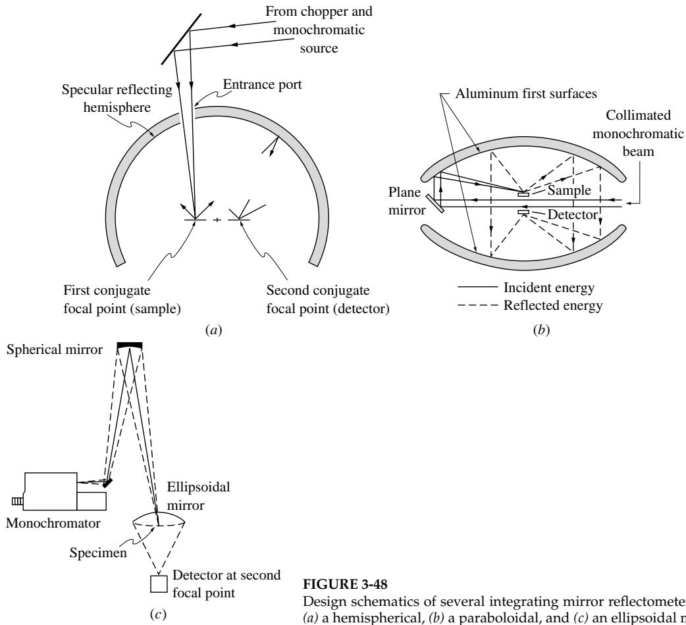
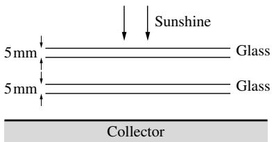

## 内容索引

- [目录](README.md)
- [1 热辐射基础](1-热辐射基础.md)
- [2 基于电磁波理论的辐射特性预测](2-基于电磁波理论的辐射特性预测.md)
- [3 实际表面的辐射特性](3-实际表面的辐射特性.md)
- [4 视角因子](4-视角因子.md)
- [5 灰体漫射表面间的辐射交换](5-灰体漫射表面间的辐射交换.md)
- [6 部分镜面灰体表面间的辐射交换](6-部分镜面灰体表面间的辐射交换.md)
- [7 非理想表面间的辐射交换](7-非理想表面间的辐射交换.md)
- [8 表面交换的蒙特卡洛方法](8-表面交换的蒙特卡洛方法.md)
- [9 传导和对流存在时的表面辐射交换](9-传导和对流存在时的表面辐射交换.md)
- [10 参与介质中的辐射传递方程(RTE)](10-参与介质中的辐射传递方程(RTE).md)
- [11 分子气体的辐射特性](11-分子气体的辐射特性.md)
- [12 颗粒介质的辐射特性](12-颗粒介质的辐射特性.md)
- [13 半透明介质的辐射特性](13-半透明介质的辐射特性.md)
- [14 一维灰体介质的精确解](14-一维灰体介质的精确解.md)
- [15 一维介质的近似求解方法](15-一维介质的近似求解方法.md)
- [16 球谐函数法 (PN-近似)](16-球谐函数法(PN-近似).md)
- [17 离散坐标法 (SN-近似)](17-离散坐标法(SN-近似).md)
- [18 区域法](18-区域法.md)
- [19 准直辐射与瞬态现象](19-准直辐射与瞬态现象.md)
- [20 非灰消光系数的求解方法](20-非灰消光系数的求解方法.md)
- [21 参与介质的蒙特卡洛方法](21-参与介质的蒙特卡洛方法.md)
- [22 辐射与传导和对流的耦合](22-辐射与传导和对流的耦合.md)
- [23 逆辐射传热](23-逆辐射传热.md)
- [24 纳米尺度辐射传热](24-纳米尺度辐射传热.md)
- [附录](附录.md)

- [3.1 引言](#31-引言)  
- [3.2 定义](#32-定义)  
- [3.3 基于电磁波理论的预测](#33-基于电磁波理论的预测)  
- [3.4 金属的辐射特性](#34-金属的辐射特性)  
- [3.5 非导体的辐射特性](#35-非导体的辐射特性)  
- [3.6 表面粗糙度的影响](#36-表面粗糙度的影响)  
- [3.7 表面损伤和氧化膜的影响](#37-表面损伤和氧化膜的影响)  
- [3.8 半透明薄片的辐射特性](#38-半透明薄片的辐射特性)  
- [3.9 特殊表面](#39-特殊表面)  
- [3.10 实验方法](#310-实验方法)  
- [参考文献](#参考文献)  
- [习题](#习题)

# 第3章

# 实际表面的辐射特性

## 3.1 引言

理想情况下，电磁波理论可用于预测任何材料的所有辐射特性（界面的反射率和透射率，介质内的吸收和发射）。然而，由于多种原因，电磁波理论在实际应用中的价值极为有限。首先，该理论包含大量假设，这些假设并不一定适用于所有材料。最重要的是，电磁波理论忽略了表面条件对辐射特性的影响，而是假设界面是光学光滑且与体材料完全相同的（均匀）材料——这种条件在实际中很少能满足。现实世界中，材料表面通常不同程度地覆盖着污染物、氧化层等，并且通常具有一定程度的粗糙度（这种粗糙度甚至很少被定量了解）。因此，电磁波理论的最大价值在于为工程师提供了一种工具，通过智能插值和外推来补充稀疏的实验数据。尽管如此，重要的是要认识到不透明材料的辐射特性完全取决于非常薄的表面层的组成，因此，即使是同一种材料，不同批次甚至隔夜之间都可能发生变化。这种行为与大多数其他热物理性质（如热导率）形成对比，后者是体性质，因此对表面污染、粗糙度等不敏感。美国国家标准与技术研究院（NIST，前身为NBS）建议保留后缀"-ivity"用于纯净、完全光滑材料的辐射特性（前一章讨论的那些），而"-ance"用于粗糙和受污染的表面。大多数实际表面属于后一类，将在本章讨论。因此，我们将在下一节的定义中使用"-ance"后缀，并在本章（以及本书其余部分）的大多数表面特性中使用，除非所讨论的表面是光学光滑的且特性来自电磁波理论。注意，有时这两个术语都可以使用（"几乎光滑"的表面，比较实验数据与电磁波理论等）。

在本章中，我们将首先制定与实际不透明表面相关的所有辐射特性的定义。然后应用电磁波理论预测金属和电介质（非导电体）的辐射特性趋势。这些理论结果将与有限的实验数据进行比较。随后简要讨论电磁波理论无法预测的现象，如表面粗糙度、表面氧化和污染的影响，以及"特殊表面"的制备（即通过表面涂层和/或受控粗糙度定制特性的表面）。

目前可用的大多数实验数据是在1950年代和1960年代NASA的"黄金时代"采集的，当时大量资源被用于将人类送上月球。随着NASA资金的减少，1970年代和1980年代初期的兴趣逐渐减弱。最近，由于高温陶瓷和高温应用的发展，对辐射表面特性测量的兴趣重新燃起。

此处不试图提供辐射表面特性的完整实验数据集。此类特性的广泛数据集已在一些参考文献中收集，如[1-8]，尽管所有这些调查都有些过时。

## 3.2 定义

### 发射率

不透明表面发射的最基本辐射特性是其光谱方向发射率，定义为

$$
\epsilon_{\lambda}^{\prime}(T,\lambda ,\pmb {\hat{s}}_{o}) = \frac{I_{\lambda}(T,\lambda,\pmb{\hat{s}}_{o})\cos\theta_{o}d\Omega_{o}}{I_{b\lambda}(T,\lambda)\cos\theta_{o}d\Omega_{o}} = \frac{I_{\lambda}(T,\lambda,\pmb{\hat{s}}_{o})}{I_{b\lambda}(T,\lambda)}, \tag{3.1}
$$

该式将实际光谱方向发射功率与相同条件下黑体表面的发射功率进行比较。我们在字母$\epsilon$上加了一撇以区分方向发射率和半球（即方向平均）值，下标$\lambda$用于区分光谱发射率和总（即光谱平均）值。方向向量用$\hat{\mathbf{s}}_o$表示，以强调对于发射，我们考虑的是远离表面的方向（出射）。最后，我们选择波长$\lambda$作为光谱变量，因为这是表面辐射现象领域大多数作者偏好的变量。如果使用频率$\nu$或波数$\eta$，则方程(3.1)的表达式同样成立。

Schmidt和Eckert[9]给出了实际材料实验测得的方向发射率的一些典型趋势，如图3-1a,b所示（这些图中的所有发射率都已在整个光谱上平均；见下文总方向发射率的定义）。对于非金属，方向发射率在较大极角范围内变化不大，但在掠射角处迅速下降，直到$\theta = \pi /2$时达到零。金属也有类似的趋势，只是在掠射角处发射率首先急剧增加，然后回落到零（未显示）。注意非金属的发射率水平明显更高。

发射率在所有方向上都相同的光谱表面称为漫发射体，或Lambert表面[因为它遵循Lambert定律，方程(1.35)]。没有真实表面可以是漫发射体，因为电磁波理论预测所有材料在$\theta = \pi /2$处的发射率为零。然而，如方程(1.31)所示，只有很少的能量发射到掠射方向，因此漫发射假设通常是合理的。

光谱半球发射率定义为

$$
\epsilon_{\lambda}(T,\lambda)\equiv \frac{E_{\lambda}(T,\lambda)}{E_{b\lambda}(T,\lambda)}, \tag{3.2}
$$

将实际光谱发射功率(即向表面上方所有方向的发射)与黑体表面的发射功率进行比较。光谱半球发射率可以通过方程(1.31)和(1.33)与方向发射率相关联，

  
图3-1 表面发射率的方向变化 (a)几种非金属材料 (b)几种金属材料[9]

$$
\begin{array}{r l}{\epsilon_{\lambda}(T,\lambda) = \frac{\int_{0}^{2\pi}\int_{0}^{\pi / 2}I_{\lambda}(T,\lambda,\theta,\psi)\cos\theta\sin\theta d\theta d\psi}{\pi I_{b\lambda}(T,\lambda)}}\\ {= \frac{\int_{0}^{2\pi}\int_{0}^{\pi / 2}\epsilon_{\lambda}^{\prime}(T,\lambda,\theta,\psi)I_{b\lambda}(T,\lambda)\cos\theta\sin\theta d\theta d\psi}{\pi I_{b\lambda}(T,\lambda)},} \end{array} \tag{3.3}
$$

可以简化为

$$
\epsilon_{\lambda}(T,\lambda) = \frac{1}{\pi}\int_{0}^{2\pi}\int_{0}^{\pi /2}\epsilon_{\lambda}^{\prime}(T,\lambda ,\theta ,\psi)\cos \theta \sin \theta d\theta d\psi , \tag{3.4}
$$

因为$I_{b\lambda}$不依赖于方向。对于各向同性表面(即表面在不同方向(方位角)上没有不同结构、组成或行为)，方程(3.4)可简化为

$$
\epsilon_{\lambda}(T,\lambda) = 2\int_{0}^{\pi /2}\epsilon_{\lambda}^{\prime}(T,\lambda ,\theta)\cos \theta \sin \theta d\theta . \tag{3.5}
$$

我们注意到半球发射率是在权重因子$\cos \theta$(由发射功率的方向变化引起)下对所有立体角的平均。对于漫射表面，$\epsilon_{\lambda}^{\prime}$不依赖于方向，我们得到

$$
\epsilon_{\lambda}(T,\lambda) = \epsilon_{\lambda}^{\prime}(T,\lambda). \tag{3.6}
$$

总方向发射率是$\epsilon_{\lambda}^{\prime}$的光谱平均，定义为

$$
\epsilon^{\prime}(T,\mathfrak{s}) = \frac{I(T,\mathfrak{s})\cos\theta d\Omega}{I_{b}(T)\cos\theta d\Omega} = \frac{I(T,\mathfrak{s})}{I_{b}(T)}, \tag{3.7}
$$

或者，由方程(1.30)和(1.34)，

$$
\epsilon^{\prime}(T,\mathfrak{s}) = \frac{1}{I_{b}}\int_{0}^{\infty}I_{\lambda}d\lambda = \frac{1}{I_{b}}\int_{0}^{\infty}\epsilon_{\lambda}^{\prime}I_{b\lambda}d\lambda = \frac{1}{n^{2}\sigma T^{4}}\int_{0}^{\infty}\epsilon_{\lambda}^{\prime}(T,\lambda ,\mathfrak{s})E_{b\lambda}(T,\lambda)d\lambda . \tag{3.8}
$$

最后，总半球发射率定义为

$$
\epsilon (T) = \frac{E(T)}{E_b(T)}, \tag{3.9}
$$

并且可以通过以下关系与光谱半球发射率相关联

$$
\epsilon (T) = \frac{\int_0^\infty E_\lambda(T,\lambda)d\lambda}{E_b(T)} = \frac{1}{n^2\sigma T^4}\int_0^\infty \epsilon_\lambda (T,\lambda)E_{b\lambda}(T,\lambda)d\lambda . \tag{3.10}
$$

显然，总发射率是以光谱发射功率为权重因子的光谱平均。如果光谱发射率对所有波长都相同，则方程(3.10)简化为

$$
\epsilon (T) = \epsilon_{\lambda}(T). \tag{3.11}
$$

这样的表面称为灰体表面。如果我们遇到一个非常特殊的灰体漫射表面，这意味着

$$
\epsilon (T) = \epsilon_{\lambda} = \epsilon^{\prime} = \epsilon_{\lambda}^{\prime}. \tag{3.12}
$$

虽然没有真实表面是真正的灰体，但经常出现$\epsilon_{\lambda}$在$E_{b\lambda}$显著的光谱范围内相对恒定的情况，这使得灰体表面的简化假设是合理的。

例3.1. 某种表面材料在暴露于空气中时具有以下光谱方向发射率：

$$
\epsilon_{\lambda}^{\prime}(\lambda ,\theta) = \left\{ \begin{array}{ll}0.9\cos \theta , & 0< \lambda < 2\mu \mathrm{m},\\ 0.3, & 2\mu \mathrm{m}< \lambda < \infty . \end{array} \right.
$$

确定表面温度为$T = 500\mathrm{K}$时的总半球发射率。

# 解答

我们首先根据方程(3.5)确定半球光谱发射率为

$$
\epsilon_{\lambda}(\lambda) = \left\{ \begin{array}{ll}2\times 0.9\int_{0}^{\pi /2}\cos^{2}\theta \sin \theta d\theta = 0.6, & 0< \lambda < 2\mu \mathrm{m},\\ 2\times 0.3\int_{0}^{\pi /2}\cos \theta \sin \theta d\theta = 0.3, & 2\mu \mathrm{m}< \lambda < \infty . \end{array} \right.
$$

根据方程(3.10)，总半球发射率为

$$
\begin{array}{l}\epsilon (T) = \frac{1}{n^2\sigma T^4}\int_{\lambda}^{\prime}(0.6\int_{0}^{2\mu \mathrm{m}}E_{b\lambda}d\lambda +0.3\int_{2\mu \mathrm{m}}^{\infty}E_{b\lambda}d\lambda) = 0.3 + \frac{0.6 - 0.3}{n^2\sigma T^4}\int_{0}^{2\mu \mathrm{m}}E_{b\lambda}d\lambda \\ = 0.3[1 + f(1\times 2\mu \mathrm{m}\times 500\mathrm{K})] = 0.3\times (1 + 0.00032)\simeq 0.3, \end{array}
$$

其中分数黑体辐射功率$f(n\lambda T)$如方程(1.23)所定义。对于500K的温度，2μm以下的频谱可以忽略不计，表面基本上是灰体和漫射的。

  
图3-2 表面上的定向辐照

# 吸收率

与发射率不同，吸收率(以及反射率和透射率)并不是真正的表面属性，因为它依赖于外部辐射场，如定义方程(1.51)所示。与发射率类似，我们区分定向和半球吸收率，以及光谱和总吸收率。

单位波长上从方向$\hat{\mathbf{s}}_i$在立体角$d\Omega_i$内入射到微元面积$dA$上的辐射传热速率，如图3-2所示：

$$
I_{\lambda}(\mathbf{r},\lambda ,\hat{\mathbf{s}}_i)(\cos \theta_idA)d\Omega_i,
$$

这里我们使用了强度的定义，即垂直于射线的单位面积和单位立体角上的辐射传热速率。$I_{\lambda}$是位置$\mathbf{r}$(刚好在表面上)的局部辐射强度。当以单位表面积$dA$和单位入射立体角$d\Omega_i$评估时，这个入射传热速率称为光谱定向辐照：

$$
H_{\lambda}^{\prime}(\mathbf{r},\lambda ,\hat{\mathbf{s}}_i) = I_{\lambda}(\mathbf{r},\lambda ,\hat{\mathbf{s}}_i)\cos \theta_i. \tag{3.13}
$$

辐照是始终指向表面的热通量。因此不需要为其值附加符号，它被评估为绝对值(与第1章中净热通量的定义相反)。表面位置$\mathbf{r}$处的光谱定向吸收率定义为：

$$
\alpha_{\lambda}^{\prime}(\mathbf{r},\lambda ,\hat{\mathbf{s}}_i)\equiv \frac{H_{\lambda,\mathrm{abs}}^{\prime}}{H_{\lambda}^{\prime}}, \tag{3.14}
$$

其中$H_{\lambda ,\mathrm{abs}}^{\prime}$是$H_{\lambda}^{\prime}$中被$dA$吸收的部分。如果局部热力学平衡占主导地位，当$H_{\lambda}^{\prime}$增加或减少时，分数$\alpha_{\lambda}^{\prime}$不会改变。在这种情况下，我们发现光谱定向吸收率不依赖于外部辐射场，而是取决于局部温度、波长和入射方向的表面属性。为了确定其大小，我们考虑如图3-3所示的等温球形外壳，类似于第1.6节中用于建立黑体强度方向各向同性的外壳。外壳涂层再次完全反射，除了一个小面积$dA_s$，它在$\lambda$到$\lambda + d\lambda$波长区间外也是完全反射的，在该区间内是黑色的。然而，悬挂在中心的小表面$dA$现在是非黑色的。遵循与推导方程(1.32)相同的论点，通过$\epsilon_{\lambda}^{\prime}$增加发射通量，通过$\alpha_{\lambda}^{\prime}$增加吸收通量，我们立即得到：

$$
\alpha_{\lambda}^{\prime}(T,\lambda ,\theta ,\psi) = \epsilon_{\lambda}^{\prime}(T,\lambda ,\theta ,\psi). \tag{3.15}
$$

  
图3-3 光谱定向吸收率的基尔霍夫定律

因此，如果局部热力学平衡占主导地位，光谱定向吸收率是真实的表面属性，且等于光谱定向发射率。

单位波长上从所有方向(即$dA$上方的半球)入射到表面的光谱辐射热通量为

$$
H_{\lambda}(\mathbf{r},\lambda) = \int_{2\pi}H_{\lambda}^{\prime}(\mathbf{r},\lambda ,\hat{\mathbf{s}}_{i})d\Omega_{i} = \int_{2\pi}I_{\lambda}(\mathbf{r},\lambda ,\hat{\mathbf{s}}_{i})\cos \theta_{i}d\Omega_{i}. \tag{3.16}
$$

其中被吸收的部分，根据方程(3.14)为

$$
\int_{2\pi}\alpha_{\lambda}^{\prime}(T,\lambda ,\hat{\mathbf{s}}_{i})I_{\lambda}(\mathbf{r},\lambda ,\hat{\mathbf{s}}_{i})\cos \theta_{i}d\Omega_{i}.
$$

因此，我们定义光谱半球吸收率为

$$
\alpha_{\lambda}(\mathbf{r},\lambda)\equiv \frac{H_{\lambda,\mathrm{abs}}}{H_{\lambda}} = \frac{\int_{2\pi}\alpha_{\lambda}^{\prime}(T,\lambda,\hat{\mathbf{s}}_{i})I_{\lambda}(\mathbf{r},\lambda,\hat{\mathbf{s}}_{i})\cos\theta_{i}d\Omega_{i}}{\int_{2\pi}I_{\lambda}(\mathbf{r},\lambda,\hat{\mathbf{s}}_{i})\cos\theta_{i}d\Omega_{i}}. \tag{3.17}
$$

由于入射辐射$I_{\lambda}$取决于周围环境的辐射场，光谱半球吸收率通常取决于整个温度场，不是表面属性。然而，如果入射辐射近似漫射(即$I_{\lambda}$与$\hat{\mathbf{s}}_{i}$无关)，则$I_{\lambda}$可以从方程(3.17)的积分中提出并约去。于是

$$
\alpha_{\lambda}(T,\lambda) = \frac{1}{\pi}\int_{0}^{2\pi}\int_{0}^{\pi /2}\alpha_{\lambda}^{\prime}(T,\lambda ,\theta_{i},\psi_{i})\cos \theta_{i}\sin \theta_{i}d\theta_{i}d\psi_{i}, \tag{3.18}
$$

或使用方程(3.4)和(3.15)，

$$
\alpha_{\lambda}(T,\lambda) = \epsilon_{\lambda}(T,\lambda)\quad (\text{漫射辐照}). \tag{3.19}
$$

当$\alpha_{\lambda}^{\prime} = \epsilon_{\lambda}^{\prime}$与方向无关时，此等式也成立，此时$\alpha_{\lambda}^{\prime}$可从积分中移除。因此，光谱半球吸收率和发射率相等当且仅当辐照和/或光谱定向吸收率是漫射的(即不依赖于入射方向)。

另一方面，来自单一远距离光源的能量会产生(近似)平行的光线，如太阳或激光的辐照。这称为准直辐照，导致

$$
H_{\lambda}(\mathbf{r},\lambda) = H_{\lambda}^{\prime}(\mathbf{r},\lambda ,\hat{\mathbf{s}}_{i})\delta \Omega_{i} = I_{\lambda}(\mathbf{r},\lambda ,\hat{\mathbf{s}}_{i})\cos \theta_{i}\delta \Omega_{i} \tag{3.20}
$$

和

$$
\alpha_{\lambda}(T,\lambda) = \alpha_{\lambda}^{\prime}(T,\lambda ,\hat{\mathbf{s}}_i) = \epsilon_{\lambda}^{\prime}(T,\lambda ,\hat{\mathbf{s}}_i)\quad (\text{准直辐照}). \tag{3.21}
$$

因此，对于准直辐照，定向和半球吸收率没有区别。

单位面积和单位立体角上所有波长的总辐照为

$$
H^{\prime}(\mathbf{r}) = \int_{0}^{\infty}I_{\lambda}(\mathbf{r},\lambda ,\hat{\mathbf{s}}_{i})\cos \theta_{i}d\lambda . \tag{3.22}
$$

因此，我们可以定义总定向吸收率为

$$
\alpha^{\prime}(\mathbf{r},\hat{\mathbf{s}}_{i})\equiv \frac{\int_{0}^{\infty}\alpha_{\lambda}^{\prime}(T,\lambda,\hat{\mathbf{s}}_{i})I_{\lambda}(\mathbf{r},\hat{\mathbf{s}}_{i})d\lambda}{\int_{0}^{\infty}I_{\lambda}(\mathbf{r},\hat{\mathbf{s}}_{i})d\lambda}, \tag{3.23}
$$

其中因子$\cos \theta_{i}$由于不依赖于波长而被约去。同样，$\alpha^{\prime}$通常不是表面属性，而是取决于整个辐射场。然而，如果辐照可以写成

$$
I_{\lambda}(\mathbf{r},\lambda ,\hat{\mathbf{s}}_i) = C(\hat{\mathbf{s}}_i)I_{b\lambda}(T,\lambda), \tag{3.24}
$$

其中$C(\hat{\mathbf{s}})$是与波长无关的任意函数，即如果入射辐射是灰体(基于局部表面温度$T$)，则根据方程(3.8)和(3.15)，

$$
\alpha^{\prime}(T,\theta ,\psi) = \epsilon^{\prime}(T,\theta ,\psi). \tag{3.25}
$$

当然，如果表面是灰体(即$\alpha_{\lambda}^{\prime} = \epsilon_{\lambda}^{\prime}$不依赖于波长)，此关系也成立。

最后，单位面积上所有方向和整个光谱的总辐照为

$$
H(\mathbf{r}) = \int_{0}^{\infty}\int_{2\pi}I_{\lambda}(\mathbf{r},\lambda ,\hat{\mathbf{s}}_{i})\cos \theta_{i}d\Omega_{i}d\lambda . \tag{3.26}
$$

因此，总半球吸收率定义为

$$
\alpha (\mathbf{r})\equiv \frac{H_{\mathrm{abs}}}{H} = \frac{\int_{0}^{\infty}\alpha_{\lambda}(\mathbf{r},\lambda)H_{b}(\mathbf{r},\lambda)d\lambda}{\int_{0}^{\infty}H_{\lambda}(\mathbf{r},\lambda)d\lambda} = \frac{\int_{0}^{\infty}\int_{2\pi}\alpha_{\lambda}^{\prime}(T,\lambda,\hat{\mathbf{s}}_{i})I_{\lambda}(\mathbf{r},\lambda,\hat{\mathbf{s}}_{i})\cos\theta_{i}d\Omega_{i}d\lambda}{\int_{0}^{\infty}\int_{2\pi}I_{\lambda}(\mathbf{r},\lambda,\hat{\mathbf{s}}_{i})\cos\theta_{i}d\Omega_{i}d\lambda}. \tag{3.27}
$$

这种吸收率仅在灰体漫射表面(方程3.12)和/或漫射灰体辐照的特殊情况下与总半球发射率相关，即如果

$$
I_{\lambda}(\mathbf{r},\lambda ,\hat{\mathbf{s}}_i) = Cl_{b\lambda}(T,\lambda), \tag{3.28}
$$

其中$T$是表面温度，$C$是常数。在这些条件下，再次使用方程(3.15)可得

$$
\alpha (T) = \epsilon (T). \tag{3.29}
$$

例3.2. 设前例中考虑的表面被太阳以偏离法线$30^{\circ}$的方向辐照(即从表面指向太阳的向量与表面外法线形成$30^{\circ}$角)。确定相关的表面吸收率。

# 解

由于太阳仅从一个方向照射表面，但覆盖整个光谱，我们需要求出总定向吸收率。根据上例，当$\theta_{i} = 30^{\circ}$时，有

$$
\alpha_{\lambda}^{\prime}\left(\lambda ,\theta_{i} = \frac{\pi}{6}\right) = \left\{ \begin{array}{ll}0.45\sqrt{3}, & 0< \lambda < 2\mu \mathrm{m},\\ 0.3, & 2\mu \mathrm{m}< \lambda < \infty . \end{array} \right.
$$

已知太阳表现为$T_{\mathrm{sun}} = 5777\mathrm{K}$的黑体，因此我们也知道照射到表面的太阳光的光谱行为，即

$$
I_{\lambda}(\lambda ,\theta_{i}) = C I_{b\lambda}(T_{\mathrm{sun}},\lambda), \tag{3.30}
$$

其中$C$是与波长无关的比例常数。1 将其代入方程(3.23)可得

$$
\begin{array}{l}\alpha^{\prime}\left(\theta_{i} = \frac{\pi}{6}\right) = \frac{\int_{0}^{\infty}\epsilon_{\lambda}^{\prime}(\lambda,\theta_{i})I_{b\lambda}(T_{\mathrm{sun}},\lambda)d\lambda}{\int_{0}^{\infty}I_{b\lambda}(T_{\mathrm{sun}},\lambda)d\lambda}\\ = \frac{1}{n^{2}dT_{\mathrm{sun}}^{4}}\left[0.45\sqrt{3}\int_{0}^{2\mu \mathrm{m}}E_{b\lambda}(T_{\mathrm{sun}},\lambda)d\lambda +0.3\int_{2\mu \mathrm{m}}^{\infty}E_{b\lambda}(T_{\mathrm{sun}},\lambda)d\lambda \right]\\ = 0.3 + (0.45\sqrt{3} -0.3)f(1\times 2\times 5777) = 0.3 + (0.779 - 0.3)\times 0.93962 = 0.750. \end{array}
$$

与上例相比，我们发现当温度为$5777\mathrm{K}$时，$2\mu \mathrm{m}$以上的光谱几乎不重要，表面再次基本呈现灰体特性。

通过此例我们认识到：$(i)$ 如果表面被温度为$T_{\mathrm{source}}$的灰体光源照射，且$(ii)$ 表面的光谱定向发射率与温度无关（大多数表面都很好地满足这一条件），则总吸收率等于其在光源温度下的总发射率，即

$$
\alpha = \epsilon (T_{\mathrm{source}}). \tag{3.31}
$$

这一关系在定向基础上成立，如果照射是漫射的，则对半球值也成立。

# 反射率

表面的反射率取决于两个方向：入射辐射方向$\hat{\mathbf{s}}_i$和反射能量传播方向$\hat{\mathbf{s}}_r$。因此，我们区分总量和光谱量，以及多种定向反射率。单位波长的热通量从$\hat{\mathbf{s}}_i$方向在立体角$d\Omega_{i}$内入射到面积$dA$上，由方程(3.13)给出为

$$
H_{i}^{\prime}d\Omega_{i} = I_{\lambda}(\mathbf{r},\lambda ,\hat{\mathbf{s}}_{i})\cos \theta_{i}d\Omega_{i}. \tag{3.32}
$$

其中有限部分$\alpha_{\lambda}^{\prime}$将被表面吸收（假设其为不透明），其余部分将向所有可能方向反射（总立体角$2\pi$）。因此，通常只有无限小部分会反射到围绕方向$\hat{\mathbf{s}}_r$的立体角$d\Omega_r$的无限小锥内，如图3-4所示。用$\rho_{\lambda}^{\prime \prime}(\mathbf{r},\lambda ,\hat{\mathbf{s}}_i,\hat{\mathbf{s}}_r)d\Omega_r$表示这一部分，我们得到锥$d\Omega_r$内的反射能量为

$$
dI_{\lambda}(\mathbf{r},\lambda ,\hat{\mathbf{s}}_i,\hat{\mathbf{s}}_r)d\Omega_r = (H_{\lambda}^{\prime}d\Omega_i)\rho_{\lambda}^{\prime \prime}(\mathbf{r},\lambda ,\hat{\mathbf{s}}_i,\hat{\mathbf{s}}_r)d\Omega_r. \tag{3.33}
$$

光谱双向反射函数2 $\rho_{\lambda}^{\prime \prime}(\mathbf{r},\lambda ,\hat{\mathbf{s}}_i,\hat{\mathbf{s}}_r)$与沿$\hat{\mathbf{s}}_r$方向传播的反射光强成正比，

$$
\rho_{\lambda}^{\prime \prime}(\mathbf{r},\lambda ,\hat{\mathbf{s}}_i,\hat{\mathbf{s}}_r) = \frac{dI_{\lambda}(\mathbf{r},\lambda,\hat{\mathbf{s}}_i,\hat{\mathbf{s}}_r)}{I_{\lambda}(\mathbf{r},\lambda,\hat{\mathbf{s}}_i)\cos\theta_id\Omega_i}. \tag{3.34}
$$

  
图3-4 双向反射函数

方程(3.34)是所有辐射特性中最基本的：不透明表面的所有其他辐射特性都可以与之关联。然而，对所有材料、温度、波长、入射方向和出射方向实验测定这一函数将是一项极其艰巨的任务，限制了其实用性。

可以容易地证明光谱双向反射函数满足互易定律（参见McNicholas [10]或Siegel和Howell [11]），

$$
\rho_{\lambda}^{\prime \prime}(\mathbf{r},\lambda ,\hat{\mathbf{s}}_i,\hat{\mathbf{s}}_r) = \rho_{\lambda}^{\prime \prime}(\mathbf{r},\lambda , - \hat{\mathbf{s}}_r, - \hat{\mathbf{s}}_i), \tag{3.35a}
$$

或

$$
\rho_{\lambda}^{\prime \prime}(\mathbf{r},\lambda ,\theta_{i},\psi_{i},\theta_{r},\psi_{r}) = \rho_{\lambda}^{\prime \prime}(\mathbf{r},\lambda ,\theta_{r},\psi_{r},\theta_{i},\psi_{i}). \tag{3.35b}
$$

这是通过将表面元置于等温黑体封闭腔内，并评估封闭腔壁上两个任意无限小表面元之间的净传热速率（必须为零）来实现的，这是基尔霍夫定律的另一种变体。方程(3.35)右侧的符号变化强调$\hat{\mathbf{s}}_i$指向表面，而$\hat{\mathbf{s}}_r$远离表面。检查方程(3.34)可知$0 \leq \rho_{\lambda}^{\prime \prime} < \infty$。达到$\rho_{\lambda}^{\prime \prime} \rightarrow \infty$的极限意味着$H_{\lambda}^{\prime}$的有限部分被反射到立体角$d\Omega_r$的无限小锥内。这种理想行为由光学光滑表面实现，导致镜面反射（完美镜子）。对于镜面反射器，除镜面方向$\theta_r = \theta_i$，$\psi_r = \psi_i + \pi$外，对所有$\hat{\mathbf{s}}_r$有$\rho_{\lambda}^{\prime \prime} = 0$，而在镜面方向$\rho_{\lambda}^{\prime \prime} \rightarrow \infty$（见图3-4）。

Torrance和Sparrow [12]对氧化镁的双向反射函数的一些测量结果如图3-5所示。氧化镁因其在近红外区的漫反射特性（如下文方程(3.38)所定义）而广泛用于辐射实验。图3-5中的数据是针对平均表面粗糙度为$1\mu \mathrm{m}$的情况，并相对于镜面方向的值进行了归一化。显然，该材料在较短波长下反射相当漫射，但在$\lambda > 2\mu \mathrm{m}$时显示出强烈的镜面峰值。

更具实际重要性的特性是光谱定向-半球反射率，定义为由于光谱定向辐照$H_{\lambda}^{\prime}$而从$dA$向所有方向离开的总反射热通量。由方程(3.33)给出的反射强度（即垂直于$\hat{\mathbf{s}}_r$的单位面积的反射能量），乘以$\cos \theta_r$后，我们有

$$
\rho_{\lambda}^{\prime \sigma}(\mathbf{r},\lambda ,\hat{\mathbf{s}}_i)\equiv \frac{\int_{2\pi}dI_{\lambda}(\mathbf{r},\lambda,\hat{\mathbf{s}}_i,\hat{\mathbf{s}}_r)\cos\theta_rd\Omega_r}{H_{\lambda}^{\prime}(\mathbf{r},\lambda,\hat{\mathbf{s}}_i)d\Omega_i}, \tag{3.36}
$$

  
图3-5 氧化镁的归一化双向反射函数[12]

或

$$
\rho_{\lambda}^{\prime \sigma}(\mathbf{r},\lambda ,\hat{\mathbf{s}}_i) = \int_{2\pi}\rho_{\lambda}^{\prime \prime}(\mathbf{r},\lambda ,\hat{\mathbf{s}}_i,\hat{\mathbf{s}}_r)\cos \theta_r d\Omega_r, \tag{3.37}
$$

其中$(H_{\lambda}^{\prime}d\Omega_{i})$项被约去，因为它不依赖于出射方向$\hat{\mathbf{s}}_r$。这里我们暂时添加上标$\sigma_{\alpha}^{\prime \prime}$以区分方向-半球反射率$(\rho^{\prime \sigma})$和半球-方向反射率$(\rho^{\sigma^{\prime}}$，后者将在下文定义)。如果反射函数与$\hat{\mathbf{s}}_i$和$\hat{\mathbf{s}}_r$都无关，则表面会向所有方向反射等量能量，与入射方向无关，此时有：

$$
\rho_{\lambda}^{\prime \sigma}(\mathbf{r},\lambda) = \pi \rho_{\lambda}^{\prime \prime}(\mathbf{r},\lambda). \tag{3.38}
$$

这种表面称为漫反射体。

将光谱方向-半球反射率的定义与光谱方向吸收率的定义（方程(3.14)）进行比较，对于不透明表面我们还可得到：

$$
\rho_{\lambda}^{\prime \sigma}(\mathbf{r},\lambda ,\hat{\mathbf{s}}_i) = 1 - \alpha_{\lambda}^{\prime}(\mathbf{r},\lambda ,\hat{\mathbf{s}}_i). \tag{3.39}
$$

有时需要确定从所有可能入射方向反射到某一特定方向的能量。方程(3.33)给出了单一入射方向产生的反射强度。将此表达式对所有入射方向的半球积分可得：

$$
\begin{array}{l}{I_{\lambda}(\mathbf{r},\lambda ,\hat{\mathbf{s}}_r) = \int_{2\pi}\rho_{\lambda}^{\prime \prime}(\mathbf{r},\lambda ,\hat{\mathbf{s}}_i,\hat{\mathbf{s}}_r)H_{\lambda}^{\prime}(\mathbf{r},\lambda ,\hat{\mathbf{s}}_i)d\Omega_i}\\ {= \int_{2\pi}\rho_{\lambda}^{\prime \prime}(\mathbf{r},\lambda ,\hat{\mathbf{s}}_i,\hat{\mathbf{s}}_r)I_{\lambda}(\mathbf{r},\lambda ,\hat{\mathbf{s}}_i)\cos \theta_id\Omega_i.} \end{array} \tag{3.40}
$$

另一方面，光谱半球辐照度为：

$$
H_{\lambda}(\mathbf{r},\lambda) = \int_{2\pi}I_{\lambda}(\mathbf{r},\lambda ,\hat{\mathbf{s}}_i)\cos \theta_id\Omega_i. \tag{3.41}
$$

如果表面是理想反射体，它将反射所有$H_{\lambda}$，并且会均等地反射到所有出射方向。因此对于理想情况，根据方程(1.34)，出射强度为$H_{\lambda} / \pi$。因此，光谱半球-方向反射率定义为：

$$
\rho_{\lambda}^{\sigma^{\prime}}(\mathbf{r},\lambda ,\hat{\mathbf{s}}_{r})\equiv \frac{I_{\lambda}(\mathbf{r},\lambda,\hat{\mathbf{s}}_{r})}{H_{\lambda}(\mathbf{r},\lambda) / \pi} = \frac{\int_{2\pi}\rho_{\lambda}^{\prime\prime}(\mathbf{r},\lambda,\hat{\mathbf{s}}_{i},\hat{\mathbf{s}}_{r})I_{\lambda}(\mathbf{r},\lambda,\hat{\mathbf{s}}_{i})\cos\theta_{i}d\Omega_{i}}{\frac{1}{\pi}\int_{2\pi}I_{\lambda}(\mathbf{r},\lambda,\hat{\mathbf{s}}_{i})\cos\theta_{i}d\Omega_{i}}. \tag{3.42}
$$

对于漫射辐照的特殊情况（即入射强度不依赖于$\hat{\mathbf{s}}_i$），方程(3.42)简化为：

$$
\rho_{\lambda}^{\sigma^{\prime}}(\mathbf{r},\lambda ,\hat{\mathbf{s}}_{r}) = \int_{2\pi}\rho_{\lambda}^{\prime \prime}(\mathbf{r},\lambda ,\hat{\mathbf{s}}_{i},\hat{\mathbf{s}}_{r})\cos \theta_{i}d\Omega_{i}, \tag{3.43}
$$

如果应用双向反射函数的互易性（方程(3.35)），这与方程(3.37)相同。因此对于漫射辐照：

$$
\rho_{\lambda}^{\sigma^{\prime}}(\mathbf{r},\lambda ,\hat{\mathbf{s}}_{r}) = \rho_{\lambda}^{\sigma^{\prime}}(\mathbf{r},\lambda ,\hat{\mathbf{s}}_{i}),\quad \hat{\mathbf{s}}_{i} = -\hat{\mathbf{s}}_{r}, \tag{3.44a}
$$

或

$$
\rho_{\lambda}^{\sigma^{\prime}}(\mathbf{r},\lambda ,\theta_{r},\psi_{r}) = \rho_{\lambda}^{\sigma^{\prime}}(\mathbf{r},\lambda ,\theta_{i} = \theta_{r},\psi_{i} = \psi_{r}), \tag{3.44b}
$$

即在任何给定的辐照/反射方向之间，光谱方向-半球反射率和半球-方向反射率存在互易关系。这一事实常被用于实验测量：虽然方向-半球反射率具有重要实际意义但难以测量，而半球-方向反射率虽不太重要却易于测量（见第3.10节）。

最后，我们定义光谱半球反射率为从所有方向入射的总辐照中被反射到所有方向的比例。由方程(3.36)可得对于单一入射方向$\hat{\mathbf{s}}_i$反射到所有方向的热通量为：

$$
\rho_{\lambda}^{\sigma^{\prime}}(\mathbf{r},\lambda ,\hat{\mathbf{s}}_{i})H_{\lambda}^{\prime}(\mathbf{r},\lambda ,\hat{\mathbf{s}}_{i})d\Omega_{i}.
$$

将此表达式以及$H_{\lambda}^{\prime}$本身对所有入射角积分可得：

$$
\rho_{\lambda}(\mathbf{r},\lambda) = \frac{\int_{2\pi}\rho_{\lambda}^{\prime\sigma}(\mathbf{r},\lambda,\hat{\mathbf{s}}_{i})H_{\lambda}^{\prime}(\mathbf{r},\lambda,\hat{\mathbf{s}}_{i})d\Omega_{i}}{\int_{2\pi}H_{\lambda}^{\prime}(\mathbf{r},\lambda,\hat{\mathbf{s}}_{i})d\Omega_{i}} = \frac{\int_{2\pi}\rho_{\lambda}^{\prime\sigma}(\mathbf{r},\lambda,\hat{\mathbf{s}}_{i})I_{\lambda}(\mathbf{r},\lambda,\hat{\mathbf{s}}_{i})\cos\theta_{i}d\Omega_{i}}{\int_{2\pi}I_{\lambda}(\mathbf{r},\lambda,\hat{\mathbf{s}}_{i})\cos\theta_{i}d\Omega_{i}}. \tag{3.45}
$$

如果入射强度与方向无关（漫射辐照），则方程(3.45)可进一步简化为：

$$
\rho_{\lambda}(\mathbf{r},\lambda) = \frac{1}{\pi}\int_{2\pi}\rho_{\lambda}^{\prime \sigma}(\mathbf{r},\lambda ,\hat{\mathbf{s}}_{i})\cos \theta_{i}d\Omega_{i}. \tag{3.46}
$$

此外，通过比较光谱半球吸收率和反射率的定义，对于不透明表面我们可得：

$$
\rho_{\lambda}(\mathbf{r},\lambda) = 1 - \alpha_{\lambda}(\mathbf{r},\lambda). \tag{3.47}
$$

最后，与发射率和吸收率类似，我们需要引入光谱积分或"总"反射率。这是通过对每个光谱反射率的分子和分母在全光谱范围内独立积分来实现的，从而得到以下关系式：总双向反射函数

$$
\rho ''(\mathbf{r},\hat{\mathbf{s}}_i,\hat{\mathbf{s}}_r) = \frac{\int_0^\infty\rho_\lambda''(\mathbf{r},\lambda,\hat{\mathbf{s}}_i,\hat{\mathbf{s}}_r)I_\lambda(\mathbf{r},\lambda,\hat{\mathbf{s}}_i)d\lambda}{\int_0^\infty I_\lambda(\mathbf{r},\lambda,\hat{\mathbf{s}}_i)d\lambda}; \tag{3.48}
$$

表3.1 表面辐射特性定义汇总

| 特性 | 符号 | 方程 | 说明 |
|------|------|------|------|
| **发射率** | | | |
| 光谱方向性 | ε'λ(T, λ, θ, ψ) | (3.1) | |
| 半球 | ελ(T, λ) | (3.4) | ε'λ的方向平均值(出射方向) |
| 全方向性 | ε'(T, θ, ψ) | (3.8) | ε'λ的光谱平均值(以Ib/λ为权重因子) |
| 半球 | ε(T) | (3.10) | ε'λ的方向和光谱平均值 |
| **吸收率** | | | 取决于入射强度Iin |
| 光谱方向性 | α'λ(T, λ, θ, ψ) | (3.14) | |
| 半球 | αλ(Iλ,in, T, λ) | (3.17) | α'λ的方向平均值(入射方向) |
| 全方向性 | α'(Iin, T, θ, ψ) | (3.23) | α'λ的光谱平均值(以Iλ,in为权重因子) |
| 半球 | α(Iin, T) | (3.27) | α'λ的方向和光谱平均值 |
| **反射率** | | | 取决于入射强度Iin |
| 光谱双向 | ρ"λ(T, λ, θi, ψi, θr, ψr) | (3.34) | 反射函数, 0 ≤ ρ"λ ≤ ∞ |
| 方向-半球 | ρ'λ○(Iλ,in, T, λ, θi, ψi) | (3.37) | ρ"λ在出射方向上的积分 |
| 半球-方向 | ρλ'○(Iλ,in, T, λ, θr, ψr) | (3.42) | ρ"λ在入射方向上的方向平均值 |
| 半球 | ρλ(Iλ,in, T, λ) | (3.45) | ρ"λ在入射和出射方向上的方向平均值 |
| 全双向 | ρ"(Iin, T, θi, ψi, θr, ψr) | (3.48) | ρ"λ的光谱平均值(以Iλ,in为权重因子) |
| 方向-半球 | ρ'○(Iin, T, θi, ψi) | (3.49) | ρ"在出射方向上的积分 |
| 半球-方向 | ρ○'(Iin, T, θr, ψr) | (3.50) | ρ"在入射方向上的方向平均值 |
| 半球 | ρ(Iin, T) | (3.51) | ρ"的方向和光谱平均值 |

总方向-半球反射率

$$
\rho^{\prime \bigcirc}(\mathbf{r},\hat{\mathbf{s}}_{r}) = \frac{\int_{0}^{\infty}\rho_{\lambda}^{\prime\bigcirc}(\mathbf{r},\lambda,\hat{\mathbf{s}}_{i})I_{\lambda}(\mathbf{r},\lambda,\hat{\mathbf{s}}_{i})d\lambda}{\int_{0}^{\infty}I_{\lambda}(\mathbf{r},\lambda,\hat{\mathbf{s}}_{i})d\lambda}; \tag{3.49}
$$

总半球-方向反射率 

$$
\rho^{\prime \bigcirc}(\mathbf{r},\hat{\mathbf{s}}_r) = \frac{\int_0^\infty\rho_\lambda^\bigcirc(\mathbf{r},\lambda,\hat{\mathbf{s}}_r)\int_{2\pi}I_\lambda(\mathbf{r},\lambda,\hat{\mathbf{s}}_i)\cos\theta_id\Omega_id\lambda}{\int_0^\infty\int_{2\pi}I_\lambda(\mathbf{r},\lambda,\hat{\mathbf{s}}_i)\cos\theta_id\Omega_id\lambda}; \tag{3.50}
$$

总半球反射率

$$
\rho (\mathbf{r}) = \frac{\int_{0}^{\infty}\rho_{\lambda}(\mathbf{r},\lambda)\int_{2\pi}I_{\lambda}(\mathbf{r},\lambda,\hat{\mathbf{s}}_{i})\cos\theta_{i}d\Omega_{i}d\lambda}{\int_{0}^{\infty}\int_{2\pi}I_{\lambda}(\mathbf{r},\lambda,\hat{\mathbf{s}}_{i})\cos\theta_{i}d\Omega_{i}d\lambda}. \tag{3.51}
$$

方程(3.35)和(3.44)中的互易关系同样适用于总反射率(受相同限制条件约束)，反射率与吸收率之间的关系式(3.39)和(3.47)也同样适用。

这些相当复杂的辐射特性定义及其相互关系已总结在表3.1(特性定义)和表3.2(特性相互关系)中。

表3.2 表面辐射特性关系总结

| 特性 | 关系式 | 限制条件 |
|------|--------|----------|
| 光谱方向性 | α'(T,λ,θ,ψ) = 1 - ρ'^(T,λ,θ,ψ) = ε'(T,λ,θ,ψ) | 不透明表面(θ,ψ为入射方向) 无限制(θ,ψ为出射方向) |
| 光谱半球 | α'(T,λ) = 1 - ρ'(T,λ) = ε'(T,λ) | 不透明表面(值取决于辐射源方向分布) 入射辐射和/或ε'(T,λ)与方向无关(漫射) |
| 全方向性 | α'(T,θ,ψ) = 1 - ρ'^(T,θ,ψ) = ε'(T,θ,ψ) α'(Ts,T,θ,ψ) = ε'(Ts,θ,ψ) | 不透明表面(值取决于辐射源光谱分布) ε'(T)与波长无关(灰体) 辐射源为灰体且源温度为Ts，且ε'(T)与T无关，或Ts = T |
| 全半球 | α(T) = 1 - ρ(T) = ε(T) α(Ts,T) = ε(Ts) | 不透明表面(值取决于辐射源的光谱和方向分布) ε'(T)与波长和方向无关(灰体且漫射) 辐射源为灰体且漫射，源温度为Ts，且ε'(T)与T无关，或Ts = T |

# 3.3 基于电磁波理论的预测

在第2章中，我们详细讨论了如何通过电磁波理论和色散理论预测光学平滑界面(镜面反射体)的光谱方向-半球反射率。在将这些预测与实验数据进行比较之前，我们先简要总结第2章的主要结果。

考虑一束电磁波在空气中传播(折射率=1)，以θ₁角度入射到导电介质表面(复折射率m = n - ik)，如图3-6所示。Fresnel关系式通过方程(2.107)至(2.113)³预测了平行和垂直偏振光的反射率：

$$
\begin{array}{c}{\rho_{\parallel} = \frac{(p - \sin\theta_1\tan\theta_1)^2 + q^2}{(p + \sin\theta_1\tan\theta_1)^2 + q^2}\rho_{\perp},}\\ {\rho_{\perp} = \frac{(\cos\theta_1 - p)^2 + q^2}{(\cos\theta_1 + p)^2 + q^2},} \end{array} \tag{3.53}
$$

其中

$$
\begin{array}{l}{p^2 = \frac{1}{2}\left[\sqrt{(n^2 - k^2 - \sin^2\theta_1)^2 + 4n^2k^2} +(n^2 -k^2 -\sin^2\theta_1)\right],}\\ {q^2 = \frac{1}{2}\left[\sqrt{(n^2 - k^2 - \sin^2\theta_1)^2 + 4n^2k^2} -(n^2 -k^2 -\sin^2\theta_1)\right].} \end{array} \tag{3.54}
$$

未被反射的光线将折射进入介质，与法线成θ₂角度传播，如广义Snell定律(方程2.108)所预测：

$$
p\tan \theta_2 = \sin \theta_1. \tag{3.56}
$$

  
图3-6 空气与吸收介质界面处的透射和反射

对于垂直入射(θ₁ = θ₂ = 0)，方程(3.52)至(3.55)简化为p = n，q = k，且

$$
\rho_{n\lambda} = \rho_{\parallel} = \rho_{\perp} = \frac{(n - 1)^2 + k^2}{(n + 1)^2 + k^2}. \tag{3.57}
$$

如果入射辐射是非偏振的，则反射率可计算为平均值：

$$
\begin{array}{r}\rho = \frac{1}{2} (\rho_{\parallel} + \rho_{\perp}). \end{array} \tag{3.58}
$$

对于电介质(k = 0)，p² = n² - sin²θ₁，Snell定律变为

$$
n\sin \theta_2 = \sin \theta_1. \tag{3.59}
$$

因此，p = ncosθ₂，且当q = 0时，Fresnel关系简化为

$$
\begin{array}{r}\rho_{\parallel} = \left(\frac{\cos\theta_2 - n\cos\theta_1}{\cos\theta_2 + n\cos\theta_1}\right)^2,\\ \rho_{\perp} = \left(\frac{\cos\theta_1 - n\cos\theta_2}{\cos\theta_1 + n\cos\theta_2}\right)^2. \end{array} \tag{3.60b}
$$

除半透明薄片部分外，本章我们将主要讨论不透明介质。对于这类介质，ρ + α = 1，根据Kirchhoff定律，

$$
\epsilon_{\lambda}^{\prime} = \alpha_{\lambda}^{\prime} = 1 - \rho_{\lambda}^{\prime}. \tag{3.61}
$$

要通过电磁波理论预测辐射特性，必须知道复折射率m，这可以通过直接测量或色散理论预测获得。在色散理论中，复介电函数ε = ε' - iε"是通过假设表面材料由与电磁波相互作用的谐振子组成而预测的。复介电函数与复折射率的关系为ε = m²，即

$$
\begin{array}{l}{n^2 = \frac{1}{2}\left(\epsilon ' + \sqrt{\epsilon''^2 + \epsilon''^2}\right),}\\ {k^2 = \frac{1}{2}\left(-\epsilon ' + \sqrt{\epsilon''^2 + \epsilon''^2}\right),} \end{array} \tag{3.62b}
$$

其中

$$
\epsilon^{\prime} = \frac{\epsilon}{\epsilon_{0}},\quad \epsilon^{\prime \prime} = \frac{\sigma_{e}}{2\pi\nu\epsilon_{0}};
$$

ε是介电常数，ε₀是真空中的介电常数，σₑ是介质的电导率。ε和σₑ都是电磁波频率ν的函数。对于孤立振子(非重叠带)，ε由Lorentz模型(方程2.139)预测为：

$$
\begin{array}{l}\epsilon^{\prime} = \epsilon_{0} + \frac{\nu_{pi}^{2}(\nu_{i}^{2} - \nu^{2})}{(\nu_{i}^{2} - \nu^{2})^{2} + \gamma_{i}^{2}\nu^{2}},\\ \epsilon^{\prime \prime} = \frac{\nu_{pi}^{2}\gamma_{i}\nu}{(\nu_{i}^{2} - \nu^{2})^{2} + \gamma_{i}^{2}\nu^{2}}, \end{array} \tag{3.63b}
$$

其中ε₀是来自短波长带的贡献，νᵢ是共振频率，νₚᵢ称为等离子体频率，γᵢ是振荡阻尼因子。如果这三个常数可以被确定或测量，那么n和k就可以通过方程(3.62)对所有频率(或波长)进行预测，辐射特性也可以通过方程(3.52)至(3.55)对所有频率(或波长)和所有方向进行计算。

# 3.4 金属的辐射特性

本节将简要讨论如何通过电磁波理论和色散理论预测洁净光滑金属表面(即电导体)的辐射特性，以及这些预测与实验数据的对比。我们将首先考察光谱法向反射率随波长的变化及总法向特性，接着讨论辐射特性的方向依赖性以及半球反射率(和发射率)的评估。最后，我们将研究光谱特性和总特性对温度的依赖性。

# 光谱法向特性的波长依赖性

金属通常因其丰富的自由电子而成为优良的电导体。Drude[13]提出了一个早期理论来预测自由电子的介电函数，这本质上是Lorentz模型的一个特例：由于自由电子不振荡而是自由传播，可以将其建模为弹簧常数为零的"弹簧"，导致共振频率$\nu_{i} = 0$。因此，自由电子的Drude理论介电函数可由方程(3.63)导出：

$$
\begin{array}{l}\epsilon^{\prime}(\nu) = \epsilon_{0} - \frac{\nu_{p}^{2}}{\nu^{2} + \gamma^{2}},\\ \epsilon^{\prime \prime}(\nu) = \frac{\nu_{p}^{2}\gamma}{\nu(\nu^{2} + \gamma^{2})}. \end{array} \tag{3.64b}
$$

图3-7展示了三种金属——铝、铜和银的光谱法向反射率。理论曲线来自Ehrenreich及其同事[14](铝)以及Ehrenreich和Phillip[15](铜和银)，他们通过半经验方法确定了方程(3.64)中未知量$\epsilon_0$、$\nu_{p}$和$\gamma$的值。实验反射率数据取自Shiles及其同事[16](铝)和Hagemann及其同事[17](铜和银)。在红外区域，实验与理论吻合得非常好。对于波长$\lambda >1\mu \mathrm{m}$的情况，如果样品制备非常仔细，Drude理论已被证明能准确表示许多金属的反射率。差异主要源于表面处理方法和实验精度限制。铝在$\sim 0.8\mu \mathrm{m}$处有一个反射率凹陷，这是由于Drude模型未考虑的束缚电子跃迁所致。由于总是满足$\gamma \ll \nu_{p}$，每种金属在等离子体频率$\nu \simeq \nu_{p}$附近都存在一个频率区域，其中$\epsilon^{\prime \prime} = 1$且$\epsilon^{\prime \prime}\ll 1$或$n\geq 1,k\ll 1$：这意味着许多金属在$\nu_{p}$附近的紫外区域既不反射也不吸收辐射，而是高度透明的！

  
图3-7 铝、铜和银在室温下的光谱法向反射率

对于极长波长(频率$\nu$非常小)的情况，由方程(3.64)和(2.134)可得：

$$
\epsilon^{\prime \prime} = \frac{\nu_p^2}{\nu\gamma} = \frac{\sigma_e}{2\pi\nu\epsilon_0},\qquad \nu \ll \gamma , \tag{3.65}
$$

其中$\sigma_{e}$是(通常与频率相关的)电导率，且

$$
\sigma_{e} = 2\pi \epsilon_{0}\nu_{p}^{2} / \gamma = \mathrm{const} = \sigma_{\mathrm{dc}}. \tag{3.66}
$$

注意在长波极限下，电导率变得与波长无关，称为$dc$-电导率。由于$dc$-电导率易于测量，将方程(3.64)改写为以下形式更为方便：

$$
\begin{array}{l}\epsilon (\nu) = \epsilon_0 - \frac{\sigma_{\mathrm{dc}}\gamma / 2\pi\epsilon_0}{\nu(\nu + i\gamma)},\\ \displaystyle \epsilon ' = \epsilon_0 - \frac{\sigma_{\mathrm{dc}}\gamma / 2\pi\epsilon_0}{\nu^2 + \gamma^2},\\ \displaystyle \epsilon '' = \frac{\sigma_{\mathrm{dc}}\gamma^2 / 2\pi\epsilon_0}{\nu(\nu^2 + \gamma^2)}. \end{array} \tag{3.67b}
$$

Parker和Abbott[18]提供了多种金属在室温下的电阻率$1/\sigma_{\mathrm{dc}}$和电子弛豫时间$1/2\pi\gamma$的测量值，经转换后列于表3.3中。需注意这些数值与图3-7所示存在明显差异。表中未提供$\epsilon_0$的值，但在红外区域$\epsilon_0$的影响通常可忽略。Ordal等[19]收集了大量金属的光谱数据集（对少数金属还给出了Drude参数，与表3.3数据略有冲突），而多本手册[20-23]则列出了多种金属和半导体的复折射率光谱值。

表3.3 室温下各种金属的弛豫时间倒数和直流电导率[18]

| 金属       | γ (Hz)       | σdc (Ω-1cm-1) | vp2=σdc/2πε0 (Hz2) |
|------------|--------------|-----------------------------------------------|---------------------------------------------------------------------------|
| 锂         | 1.85×1013 | 1.09×105                           | 3.62×1030                                                     |
| 钠         | 5.13×1012 | 2.13×105                           | 1.96×1010                                                     |
| 钾         | 3.62×1012 | 1.52×105                           | 9.88×1029                                                     |
| 铯         | 7.56×1012 | 0.50×105                           | 6.78×1029                                                     |
| 铜         | 5.89×1012 | 5.81×105                           | 6.14×1030                                                     |
| 银         | 3.88×1012 | 6.29×105                           | 4.38×1030                                                     |
| 金         | 5.49×1012 | 4.10×105                           | 4.04×1030                                                     |
| 镍         | 1.62×1013 | 1.28×105                           | 3.72×1030                                                     |
| 钴         | 1.73×1013 | 1.02×105                           | 3.17×1030                                                     |
| 铁         | 6.63×1012 | 1.00×105                           | 1.19×1030                                                     |
| 钯         | 1.73×1013 | 0.91×105                           | 2.83×1030                                                     |
| 铂         | 1.77×1013 | 1.00×105                           | 3.18×1030                                                     |

对于长波长情况，方程(3.62)可以大幅简化，因为此时$c^{\prime \prime}\gg |c^{\prime}|$，因此有：

$$
n^2\approx k^2\approx \epsilon '' / 2 = \frac{\sigma_{\mathrm{dc}}}{4\pi\nu\epsilon_0} = \frac{\sigma_{\mathrm{dc}}\lambda_0}{4\pi c_0\epsilon_0}\gg 1, \tag{3.68}
$$

其中$\lambda_0$为真空中的波长。代入普适常数$c_0$和$\epsilon_0$的值后，方程(3.68)变为：

$$
n\simeq k\simeq \sqrt{30\lambda_0\sigma_{\mathrm{dc}}},\quad \lambda_0\mathrm{~in~cm},\quad \sigma_{\mathrm{dc}}\mathrm{~in~}\Omega^{-1}\mathrm{cm}^{-1}, \tag{3.69}
$$

这被称为Hagen-Rubens关系式[24]。为便于比较，图3-7中也包含了方程(3.69)的结果。通常认为Hagen-Rubens关系式可用于$\lambda_0 > 6\mu \mathrm{m}$的情况，但这种假设可能导致严重误差，特别是在折射率计算方面。虽然方程(3.69)适用于金属与任意材料相邻的情况，但为简化表示，我们假设相邻材料的折射率为1(真空或气体)，即$\lambda_0 = \lambda$。将方程(3.69)代入方程(3.57)可得：

$$
\begin{array}{l}\rho_{n\lambda} = \frac{2n^2 - 2n + 1}{2n^2 + 2n + 1},\\ \displaystyle \epsilon_{n\lambda} = 1 - \rho_{n\lambda} = \frac{4n}{2n^2 + 2n + 1}. \end{array} \tag{3.70}
$$

由于$n\gg 1$，方程(3.71)可进一步简化为：

$$
\epsilon_{n\lambda} = \frac{2}{n} -\frac{2}{n^2} +\dots , \tag{3.72a}
$$

结合方程(3.69)可得：

$$
\epsilon_{n\lambda}\simeq \frac{2}{\sqrt{30\lambda\sigma_{\mathrm{dc}}}} -\frac{1}{15\lambda\sigma_{\mathrm{dc}}},\quad \lambda \mathrm{~in~cm},\quad \sigma_{\mathrm{dc}}\mathrm{~in~}\Omega^{-1}\mathrm{cm}^{-1}. \tag{3.72b}
$$

这种$1 / \sqrt{\lambda}$依赖关系未被Drude理论预测(远红外除外)，也未在光学光滑表面观察到。但它常能近似描述抛光(即不完全光滑)表面的行为。

例3.3. 使用图3-7给出的常数，分别采用(a)Drude理论和(b)Hagen-Rubens关系式计算银在$\lambda = 6.2\mu \mathrm{m}$处的复折射率和法向光谱反射率。

# 解答

(a) 由图3-7可知银的参数为$\epsilon_0 = 3.4$，$\nu_{p} = 2.22\times 10^{15}\mathrm{Hz}$，$\gamma = 4.30\times 10^{12}\mathrm{Hz}$。代入方程(3.64)，其中$\nu = \epsilon_0 / \lambda = 2.998\times 10^8\mathrm{m / s}\times (10^6\mu \mathrm{m / m}) / 6.2\mu \mathrm{m} = 4.84\times 10^{12}\mathrm{Hz}$，得到：

$$
\begin{array}{l}\epsilon^{\prime} = 3.4 - \frac{(2.22\times 10^{15})^{2}}{(4.84\times 10^{13})^{2} + (4.30\times 10^{12})^{2}} = 3.4 - 2087 = -2084,\\ \epsilon^{\prime \prime} = 2087\times 4.30\times 10^{12}\big / 4.84\times 10^{13} = 1851. \end{array}
$$

由方程(3.62)可得复折射率：

$$
\begin{array}{l}{n^2 = \frac{1}{2}\left(-2084 + \sqrt{2084^2 + 185.1^2}\right) = 4.102,}\\ {k^2 = \frac{1}{2}\left(2084 + \sqrt{2084^2 + 185.1^2}\right) = 2088,} \end{array}
$$

即$n = 2.03$，$k = 45.7$。最后由方程(3.57)得法向反射率：

$$
\rho_{n\lambda} = \frac{(1 - 2.03)^2 + 45.7^2}{(1 + 2.03)^2 + 45.7^2} = 0.996.
$$

(b) 使用Hagen-Rubens关系式，由方程(3.66)得：

$$
\begin{array}{l}\sigma_{\mathrm{dc}} = 2n\times 8.8542\times 10^{-12}\frac{\mathrm{C}^2}{\mathrm{Nm}^2}\times \left(2.22\times 10^{15}\mathrm{Hz}\right)^2\big / 4.30\times 10^{12}\mathrm{Hz}\\ = 6.376\times 10^7\frac{\mathrm{C}^2}{\mathrm{Nm}^2\mathrm{s}} = 6.376\times 10^7\Omega^{-1}\mathrm{m}^{-1} = 6.376\times 10^5\Omega^{-1}\mathrm{cm}^{-1}. \end{array}
$$

将此值代入方程(3.69)得：

$$
n = k = \sqrt{30\times 6.2\times 10^{-4}\times 6.376\times 10^{5}} = 108.9,
$$

且：

$$
\rho_{n\lambda} = 1 - \epsilon_{n\lambda} = 1 - \frac{2}{n} +\frac{2}{n^2} = 1 - \frac{2}{108.9} +\frac{2}{108.9^2} = 0.982.
$$

两组结果可与实验值$n = 2.84$，$k = 45.7$和$\rho_{n\lambda} = 0.995$[17]比较。初看Hagen-Rubens对$\rho_{n\lambda}$的预测似乎很好，因为对任何$k\gg 1$都有$\rho_{n\lambda}\approx 1$。但$n$和$k$的值表明，即使在$\lambda = 6.2\mu \mathrm{m}$这样相对较长的波长下，Hagen-Rubens关系式也存在严重误差。

# 法向入射的总量特性

总法向反射率和发射率可通过方程(3.8)计算，其中光谱法向特性可采用Drude理论或简单的Hagen-Rubens关系式求得。虽然Hagen-Rubens关系式精度不高，但它能正确预测红外区域的发射率趋势，并能显式计算总法向发射率。将方程(3.72)代入方程(3.8)得到的积分可采用与总辐射功率方程(1.19)类似的方式求解，保留级数展开的前三项得：

$$
\epsilon_{n} = 0.578(T / \sigma_{\mathrm{dc}})^{1 / 2} - 0.178(T / \sigma_{\mathrm{dc}}) + 0.0584(T / \sigma_{\mathrm{dc}})^{3 / 2},\quad T\mathrm{~in~K,~}\sigma_{\mathrm{dc}}\mathrm{~in~}\Omega^{-1}\mathrm{cm}^{-1}. \tag{3.73}
$$

  
图3-8 不同抛光金属的总法向发射率随温度变化[18]

显然，方程(3.73)仅适用于$(T / \sigma_{\mathrm{dc}})$较小的情况，即表面温度必须满足只有很小部分黑体辐射功率来自短波区域(此处Hagen-Rubens关系不适用)。对于纯金属，直流电导率可很好地近似为与绝对温度成反比：

$$
\sigma_{\mathrm{dc}} = \sigma_{\mathrm{ref}}\frac{T_{\mathrm{ref}}}{T}. \tag{3.74}
$$

因此，在足够低的温度下，纯金属的总法向发射率应近似与温度线性相关。与实验对比(图3-8)表明，这种近似线性关系对许多金属保持到出人意料的高温；例如铂在$(T / \sigma_{\mathrm{dc}})^{1 / 2} = 0.5$时对应温度为$2700\mathrm{K}$。值得注意的是，Drude模型的光谱积分会导致所有金属的总发射率降低30%至70%，因而无法反映实验趋势。Parker和Abbott[18]以近似方式完成了这种积分，他们将差异归因于表面处理引起的分子晶格缺陷和反常趋肤效应[25]，这两者都会降低表面层的电导率。

# 辐射特性的方向依赖性

吸收体与非吸收体界面处的光谱方向反射率由Fresnel关系式(3.52)-(3.55)给出。由于在红外区域金属的$n$和$k$通常较大，可以忽略方程(3.54)和(3.55)中的$\sin^2\theta_1$项，得到$p \simeq n$和$q \simeq k$。于是由方程(3.52)和(3.53)可计算平行和垂直偏振光的反射率4：

$$
\begin{array}{c}\rho_{\parallel} = \frac{(n\cos\theta - 1)^2 + (k\cos\theta)^2}{(n\cos\theta + 1)^2 + (k\cos\theta)^2},\\ \rho_{\perp} = \frac{(n - \cos\theta)^2 + k^2}{(n + \cos\theta)^2 + k^2}. \end{array} \tag{3.75b}
$$

非偏振光的方向光谱发射率则为

  
图3-9 铂在$\lambda = 2\mu \mathrm{m}$处的光谱方向反射率

$$
\begin{array}{r}\epsilon_{\lambda}^{\prime} = 1 - \frac{1}{2} (\rho_{\parallel} + \rho_{\perp}), \end{array} \tag{3.76}
$$

该关系式在图3-9中以反射率形式展示(铂在$\lambda = 2\mu \mathrm{m}$处)。室温下的理论曲线采用文献[23]中的$n = 5.29$、$k = 6.71$计算得到。与Brandenberg[26]、Brandenberg和Clausen[27]以及Price[28]的实验发射率数据对比，验证了Fresnel关系的有效性。5

方程(3.75)可对所有方向进行解析积分，通过方程(3.5)获得光谱半球发射率。Dunkle[29]对两种不同偏振态完成了这一计算，得到：

$$
\begin{array}{l}{\epsilon_{\parallel} = \frac{8n}{n^2 + k^2}\bigg[1 - \frac{n}{n^2 + k^2}\ln \big[n + 1\big)^2 +k^2\bigg] + \frac{(n^2 - k^2)}{k(n^2 + k^2)}\tan^{-1}\frac{k}{n + 1}\bigg),}\\ {\epsilon_{\perp} = 8n\bigg(1 - n\ln \frac{(n + 1)^2 + k^2}{n^2 + k^2} +\frac{(n^2 - k^2)}{k}\tan^{-1}\frac{k}{n(n + 1) + k^2}\bigg),}\\ {\epsilon_{\lambda} = \frac{1}{2}\big(\epsilon_{\parallel} + \epsilon_{\perp}\big).} \end{array} \tag{3.77b}
$$

图3-10来自Dunkle[30]，展示了半球发射率与法向发射率的比值$\epsilon_{\lambda} / \epsilon_{n\lambda}$。当$k / n = 1$时，虚线表示方程(3.77)的结果，而实线通过数值积分方程(3.52)-(3.55)获得。当$k / n > 1$时，两条线变得难以区分。Hering和Smith[31]报告称，当$n^2 + k^2$分别大于40和3.25时，方程(3.77)的精度在1-2%以内。鉴于金属在可见光和红外波段的$n$和$k$值通常很大，该方程对金属的精度几乎总能优于2%。为方便读者，附录F提供了用于计算方程(3.77)的emmet函数。

例3.4. 分别使用(a)Drude理论和(b)Hagen-Rubens关系，计算室温下镍在$\lambda = 10\mu \mathrm{m}$处的光谱半球发射率。

# 解答

首先需要根据两种理论确定光学常数$n$和$k$，然后通过方程(3.77)计算或从图3-10读取半球发射率。

  
图3-10 导体材料的半球与法向光谱发射率比值随$n$和$k$的变化[30]

(a) 使用表3.3中镍的参数代入方程(3.64)，取$\nu = c_{0} / \lambda = 2.998 \times 10^{8} \mathrm{~m} / \mathrm{s} / 10^{-5} \mathrm{~m} = 2.998 \times 10^{13} \mathrm{~Hz}$，得到：

$$
\begin{array}{rl} & {\epsilon^{\prime} = 1.0 - 3.72\times 10^{30}\Big / \big[(2.998\times 10^{13})^{2} + (1.62\times 10^{13})^{2}\big] = 1 - 3204 = -3203,}\\ & {\epsilon^{\prime \prime} = 3204\times 1.62\times 10^{13}\big / 2.998\times 10^{13} = 1731,}\\ & {n^{2} = 0.5\times \big(-3208 + \sqrt{3208^{2} + 1731^{2}}\big) = 219,}\\ & {k^{2} = 0.5\times \big(3208 + \sqrt{3208^{2} + 1731^{2}}\big) = 3422,} \end{array}
$$

因此：

$$
n = 14.8,k = 58.5,k / n = 58.5 / 14.8 = 3.95.
$$

使用图3-10前，先计算$\rho_{n\lambda}$：

$$
\rho_{n\lambda} = \frac{13.8^2 + 58.5^2}{15.8^2 + 58.5^2} = 0.984,
$$

则：

$$
\epsilon_{n\lambda} = 1 - \rho_{n\lambda} = 0.016.
$$

从图3-10查得$\epsilon_{\lambda} / \epsilon_{n\lambda} \simeq 1.29$，因此$\epsilon_{\lambda} \simeq 0.021$

(b) 使用Hagen-Rubens关系，由方程(3.72)得：

$$
\epsilon_{n\lambda} = \frac{2}{\sqrt{30\times 10^{-3}\times 1.28\times 10^{5}}} -\frac{1}{15\times 10^{-3}\times 1.28\times 10^{5}} = 0.032.
$$

进一步，取$n \simeq k \simeq \sqrt{30 \times 10^{- 3} \times 1.28 \times 10^{5}} = 62.0$，从图3-10查得$\epsilon_{\lambda} / \epsilon_{n\lambda} \simeq 1.275$，因此$\epsilon_{\lambda} \simeq 0.041$

两种模型的结果相差约2倍，这与图3-7所示的趋势一致。

总方向发射率的理论值通过对方程(3.75)和(3.76)在整个光谱范围内进行(数值)积分获得。总发射率的方向特性与光谱发射率相似，如Schmidt和Eckert[9]早期测量所示(见图3-1b极坐标图，与图3-9的笛卡尔坐标表示不同)。发射率数据通过加热至数百摄氏度的样品总辐射测量获得。

  
图3-11 不同抛光金属的总半球发射率随温度变化[18]

# 总半球发射率

通过将方程(3.77)在光谱范围内与方程(3.10)进行积分，可以获得金属的总半球发射率。基于Hagen-Rubens极限，已提出了几种近似关系式，特别是Davisson和Weeks[32]以及Schmidt和Eckert[9]提出的公式。Parker和Abbott[18]将方程(3.77)展开为1/n的幂级数(n=k≫1)，从而实现了方程(3.77)的解析积分，得到：

$$
\begin{array}{r}\epsilon (T) = 0.766(T / \sigma_{\mathrm{dc}})^{1 / 2} - [0.309 - 0.0889\ln (T / \sigma_{\mathrm{dc}})](T / \sigma_{\mathrm{dc}})\\ -0.0175(T / \sigma_{\mathrm{dc}})^{3 / 2},\quad T\mathrm{~in~K,~}\sigma_{\mathrm{dc}}\mathrm{~in~}\Omega^{-1}\mathrm{cm}^{-1}. \end{array} \tag{3.78}
$$

与总法向发射率类似，总半球发射率在表面温度相对较低时(此时只有长波长辐射重要，Hagen-Rubens关系能给出合理结果)近似与温度成正比(因为σdc∝1/T)。图3-11比较了由方程(3.78)计算得到的发射率与实验数据。Parker和Abbott还使用Drude理论计算的n和k值对方程(3.77)的级数展开进行了积分。与法向发射率类似，Drude模型预测值比Hagen-Rubens关系低30-70%，这与图3-11的实验证据相反。这种差异再次归因于晶格缺陷和反常趋肤效应。

# 表面温度的影响

Hagen-Rubens关系(方程3.72)预测金属的光谱法向发射率应与1/√σdc成正比。由于电导率近似与温度成反比，因此在足够长的波长下，光谱发射率应与绝对温度的平方根成正比。这一趋势也应适用于光谱半球发射率。实验证明许多金属确实如此。图3-12展示了钨在不同温度下的光谱半球发射率[33]。值得注意的是，钨的发射率在超过约1.3μm的交叉波长后随温度升高而增加，而在更短波长处温度依赖性相反。许多金属都观察到了类似的单一交叉波长趋势。

  
图3-12 钨的光谱半球发射率随温度的变化[33]

总法向或半球发射率通过将所有波长的光谱值以黑体辐射力为权重函数进行积分计算。由于黑体辐射力峰值随温度升高向短波方向移动，我们推断更热的表面会在发射率更高的短波区域发射更多能量，从而导致总发射率增加(如图3-8和3-11所示)。由于许多金属的交叉波长相当短，Hagen-Rubens温度关系往往在出人意料的高温下仍然适用。

# 3.5 非导体的辐射特性

电非导体自由电子很少，因此不像金属那样在整个红外波段表现出高反射率和不透明性。半导体如其名称所示，具有一些自由电子，通常与非导体一起讨论，但它们表现出某些金属特性。纯非导体的辐射特性在红外区主要受光子-声子相互作用支配，即光子激发固体晶格的振动能级。在强振动吸收光谱区之外，通常存在一个透明度较高(反射率较低)的区域，这里的吸收主要由晶格中的杂质和缺陷决定。因此，这些光谱区域常表现出不规则和不可预测的行为。

# 光谱法向特性的波长依赖性

纯净晶体非导体的光谱行为通常可以用方程(3.63)的单振子Lorentz模型很好地描述。其中一种材料是半导体α-SiC(碳化硅)，这是一种日益重要的高温陶瓷材料。Spitzer等人[34]给出了纯净光滑α-SiC在室温下的光谱法向反射率，如图3-13所示。图3-13中的理论反射率是通过方程(3.63)、(3.62)和(3.57)计算得出的，参数为ε₀=6.7，νₚᵢ=4.327×10¹³Hz，νᵢ=2.380×10¹³Hz，γᵢ=1.428×10¹¹Hz。在2μm到22μm的整个波长范围内，理论与实验吻合极好。通过分析方程(3.63)和(3.62)可以发现，在10μm<λ<13μm(或2.5×10¹³Hz>ν>1.9×10¹³Hz)光谱范围之外，α-SiC基本上是透明的(吸收指数k≪1)且反射较弱。而在10μm<λ<13μm范围内，α-SiC不仅具有高反射性，而且不透明(即任何未被反射的辐射都会被极薄的表面层吸收，因为k>1)。反射率在吸收带两侧急剧下降。因此，α-SiC等材料有时被用作带通滤波器：如果电磁辐射被α-SiC镜多次反射，出射光将几乎完全集中在10μm<λ<13μm的光谱带内。这种效应导致将晶体振动跃迁引起的吸收带称为Reststrahlen带(德语意为"剩余射线")。Bao和Ruan[35]证明，半导体的介电函数可以通过密度泛函理论计算，对于GaAs获得了与实验良好吻合的结果。

  
图3-13 α-SiC在室温下的光谱法向反射率[34]

  
图3-14 MgO在室温下的光谱法向反射率[36]

并非所有晶体都能用单振子模型很好地描述，因为可能存在两种或更多不同的振动跃迁，导致吸收带重叠。氧化镁(MgO)就是可以用双振子模型(两个重叠带)描述的材料实例，如Jasperse等人[36]所示(图3-14)。理论反射率是通过图中给出的方程(3.63)计算参数获得的。注意在计算ε'和ε''时，需要对两个带(i=1和2)的方程(3.63)求和。从量子角度看，第二个较弱的振子被解释为单个光子激发两个声子[37]。

  
图3-15 硅在室温下的光谱法向反射率[7]

由于Reststrahlen带之外的辐射特性强烈依赖于缺陷和杂质，不同样品之间甚至同一样品不同位置之间可能存在显著差异。例如，图3-15显示了室温下硅的光谱法向反射率(根据Touloukian和DeWitt[7]收集的数据重绘)。不同类型和含量杂质的影响非常明显。因此，除非给出表面和材料制备的详细描述，否则从已发表表格中查找给定材料的特性是有问题的。

方程(3.63)表明，在Reststrahlen带之外，非导体的ε''及吸收指数k非常小；对于纯净物质，通常k<10⁻⁶。虽然杂质和晶格缺陷会增加k值，但在Reststrahlen带之外的非导体中不太可能发现k>10⁻²的值。乍看之下，似乎所有非导体在近红外(和可见光)区域都必须是高度透明的。但事实并非如此，这可以从方程(1.55)中看出，该方程将透射率与吸收系数联系起来。而吸收系数又通过方程(2.42)与吸收指数相关：

$$
\tau = e^{-\kappa s} = e^{-4\pi ks / \lambda_0}. \tag{3.79}
$$

对于厚度1mm、k=10⁻³的材料，在真空波长λ₀=2μm时，方程(3.79)给出的透射率为τ=exp(-4π×10⁻³×1/2×10⁻³)=0.002，即该层基本上是不透明的。尽管如此，k的低值使我们能够大大简化界面反射率的Fresnel关系。当k²≪(n-1)²时，非导体的行为基本上类似于理想电介质，根据方程(3.57)，光谱法向反射率可以计算为

$$
\rho_{n\lambda} = \left(\frac{n - 1}{n + 1}\right)^2,k^2\ll n^2. \tag{3.80}
$$

因此，对于光学光滑的非导体，其辐射特性可以通过折射率数据计算得到。图3-16展示了多种半透明材料在室温下的折射率随波长的变化[20]。所有这些晶体材料都表现出相似的光谱行为：折射率在可见光区域快速下降，随后保持近乎恒定（缓慢下降）直到中红外区域，在此处$n$再次开始快速下降。这种行为可以解释为：晶体固体通常在可见光附近存在由电子跃迁引起的吸收带，在红外区存在Reststrahlen带。$n$的第一次下降是由电子带尾端引起的（如图2-15b所示）；中红外区域的第二次下降则是由Reststrahlen带的起始造成的。各种玻璃、水、无机液体和空气的折射率数据也可查阅[23]。

  
图3-16 多种半透明材料的折射率[20]

# 辐射特性的方向依赖性

实验发现，光学光滑非导体的行为与电磁波理论的Fresnel关系高度吻合。图3-17展示了玻璃在偏振单色光照射下方向反射率的理论与实验对比[26]（玻璃一侧涂黑以避免多次反射）。由于$k^2 \ll n^2$，可以从方程(3.52)和(3.53)中消除吸收指数，此时理想电介质的关系式成立。因此，对于从真空（或气体）入射的非偏振光，根据方程(3.59)和(3.60)：

  
图3-17 玻璃在室温下的光谱方向反射率（偏振光）[26]

  
图3-18 电磁波理论预测的非导体方向发射率

$$
\epsilon_{\lambda}^{\prime} = 1 - \frac{1}{2}\left(\rho_{\parallel} + \rho_{\perp}\right) = 1 - \frac{1}{2}\left[\left(\frac{n^{2}\cos\theta - \sqrt{n^{2} - \sin^{2}\theta}}{n^{2}\cos\theta + \sqrt{n^{2} - \sin^{2}\theta}}\right)^{2} + \left(\frac{\cos\theta - \sqrt{n^{2} - \sin^{2}\theta}}{\cos\theta + \sqrt{n^{2} - \sin^{2}\theta}}\right)^{2}\right]. \tag{3.81}
$$

当然，电介质的光谱方向反射率也可以通过附录F中的fresnel子程序计算，只需将$k$设为零。图3-18展示了电介质光谱发射率的方向变化。与图3-1的对比表明，实验数据与电磁波理论对大量非导体吻合良好，甚至对于总（而非光谱）方向发射率也是如此。

非导体的光谱半球发射率可以通过将方程(3.81)与方程(3.5)积分得到。虽然计算繁琐，但这种积分是可行的，如Dunkle[30]所示：

  
图3-19 非导体的法向和半球发射率随折射率的变化

$$
\begin{array}{l}\epsilon_{\parallel} = \frac{4(2n + 1)}{3(n + 1)^2},\\ \displaystyle \epsilon_{\perp} = \frac{4n^3(n^2 + 2n - 1)}{(n^2 + 1)(n^4 - 1)} +\frac{2n^2(n^2 - 1)^2}{(n^2 + 1)^3}\ln \left(\frac{n + 1}{n - 1}\right) - \frac{16n^4(n^4 + 1)\ln n}{(n^2 + 1)(n^4 - 1)^2},\\ \displaystyle \epsilon_{\lambda} = \frac{1}{2} (\epsilon_{\parallel} + \epsilon_{\perp}). \end{array} \tag{3.82b}
$$

法向和半球发射率随折射率的变化可以通过附录F中的emdiel$(\epsilon_{\lambda})$和emdielr$(\epsilon_{\lambda} / \epsilon_{n\lambda})$函数计算，如图3-19所示。对于金属而言，半球发射率通常大于法向发射率(参见图3-10)，而非导体则相反。从图3-1可以明显看出这种行为的原因：金属在大多数方向上的发射率相对较低，但在掠射角附近会急剧增加，然后回落到零；而非导体在大多数方向上具有(相对较高的)发射率，在掠射角处逐渐降至零(没有峰值)。

例3.5. 在$\lambda = 2\mu \mathrm{m}$和入射角$\theta = 10^{\circ}$条件下，测得碳化硅的方向反射率为$\rho_{n\lambda}^{\prime} = 0.20$(参见图3-13)。求SiC在$2\mu \mathrm{m}$处的半球发射率？

# 解答

由于在$\theta = 10^{\circ}$时方向反射率与法向反射率偏差不大(参见图3-18)，我们有$\epsilon_{n\lambda} = 1 - \rho_{n\lambda} \simeq 1 - 0.20 = 0.80$。然后从图3-19可得$n \simeq 2.6$，$\epsilon_{\lambda} \simeq 0.76$。

# 表面温度的影响

非导体辐射特性随温度的变化比金属更难量化。离子固体中由晶格振动激发引起的红外吸收带(Reststrahlen带)通常随温度升高而展宽、强度减弱，且峰值反射/吸收波长向长波方向移动。图3-20展示了MgO的Reststrahlen带行为[36]；SiC也观测到类似结果[38]。短波段的反射率主要取决于材料杂质，其行为通常与金属相似：近红外区域的发射率随温度升高而增加，而短波区域则降低。例如图3-21展示了碳化锆的法向发射率[39]。另一方面，非晶固体(即无晶格结构的固体)的发射率往往与温度无关[40]。

  
图3-20 MgO的光谱法向反射率随温度的变化[36]

# 3.6 表面粗糙度的影响

此前关于辐射特性的讨论均假设材料表面是光学光滑的，即表面粗糙度的平均尺度远小于电磁波波长。因此，在可见光(λ≈0.5μm)下显得粗糙的表面，在中红外(λ≈50μm)区域可能仍是光学光滑的。这种差异是电磁波理论在极短波长下失效的主要原因。

本节将简要讨论表面粗糙度如何影响不透明表面辐射特性的基本原理。Beckmann和Spizzichino[41]、Bass和Fuks[42]的专著以及Ogilvy[43]的综述文章提供了详细讨论。

粗糙度特征因材料、制造方法、表面处理等不同而差异显著，其分类较为困难。常用的粗糙度度量是均方根粗糙度σₕ，其定义为(参见图3-22):

$$
\sigma_{h} = \left[\left((z - z_{m})^{2}\right)\right]^{1 / 2} = \left[\frac{1}{A}\int_{A}(z - z_{m})^{2}dA\right]^{1 / 2}, \tag{3.83}
$$

其中$A$为待测表面，$|z - z_{m}|$表示局部高度与平均值的偏差。均方根粗糙度可通过轮廓仪(一种用尖锐探针扫描表面并记录高度波动的仪器)直接测量。然而，如图3-22a和b所示，仅凭$\sigma_h$远不足以全面描述表面粗糙度特征。具有相同$\sigma_h$的表面可能具有完全不同的粗糙峰频率，导致沿粗糙表面的平均斜率不同；此外，$\sigma_h$无法反映叠加在基础粗糙度上的二阶(或更高阶)粗糙度信息。

  
图3-21 碳化锆的光谱法向发射率随温度的变化[39]

  
图3-22 粗糙表面形貌：(a)缓坡粗糙度，(b)陡坡粗糙度。两表面具有相近的均方根粗糙度

Davies[44]首次发表了基于高斯概率分布粗糙表面的衍射理论模型。该方法忽略了相邻峰间的遮蔽效应，因此对掠射角和陡坡粗糙度(图3-22b)预测效果较差。与Bennett[45]实验数据的对比表明，对于小入射角，Davies模型能较好预测镜面反射峰的衰减(如$\mathrm{MgO}$的图3-14)。

Davies模型预测双向反射函数$\rho_{\lambda}^{\prime \prime}$在镜面反射方向会出现尖锐峰值，实验证实当入射角不大时确实如此(如图3-5)。大离轴入射角时，实验显示双向反射函数的峰值出现在大于镜面反射角的位置。图3-23展示了粗糙度$\sigma_{h} = 1.9\mu \mathrm{m}$的氧化镁在$\lambda = 0.5\mu \mathrm{m}$辐射照射下的情况(入射平面内的归一化双向反射函数)。可见小入射角$(\theta_{i} = 10^{\circ})$时反射函数相对弥散，镜面方向仅有小峰值；而大入射角时会出现越来越强的离镜面峰值(如$\theta_{i} = 45^{\circ}$时峰值出现在$\theta = 80^{\circ}$至$85^{\circ}$区域)。这些离镜面峰值显然源于相邻峰造成的表面遮蔽效应。Beckmann[46]及Torrance和Sparrow[47]将遮蔽效应纳入模型后，通过选择两个未知常数，其模型与实验数据吻合良好(图3-23)。

  
图3-23 氧化镁陶瓷的归一化双向反射函数(入射平面内)；$\sigma_{h} = 1.9\mu \mathrm{m},\lambda = 0.5\mu \mathrm{m}$[47]

上述模型仅考虑均方根粗糙度，未涉及粗糙斜率、次级粗糙度等特征。Berry等[48,49]研究了分形表面的辐射衍射特性——分形表面在反复放大时呈现自相似性(图3-22b)。Majumdar等[50,51]通过多种表面测量发现加工与未加工表面普遍具有分形特征。Majumdar和Tien[52]将Davies理论扩展至分形表面，与不同类型金属表面的实验结果吻合良好[53,54]，但因未考虑遮蔽效应，该模型仍限于近法向入射。

Buckius团队[55-58]研究了一维粗糙表面(即高度仅随单坐标变化$z = z(x)$，图3-23)，包括粗糙峰频率(或斜率)的影响。随机粗糙表面的峰间距通常用高斯相关函数$C(L)$中的相关长度$\sigma_{l}$表征，其中$L$为相关性衰减至$1/e$的长度：

$$
C(L) = \frac{1}{\sigma_h^2}\left\langle \Bigl ((z(x) - z_m)\Bigl ((z(x + L) - z_m\Bigr)\Bigr) = e^{-(L / \sigma)}\right\rangle . \tag{3.84}
$$

  
图3-24 几何光学与统计粗糙表面反射模型的适用域(入射角在法线±45°范围内)

他们首先研究$\sigma_{h}, \sigma_{l}$与$\lambda$同量级的三角槽纹表面，通过求解Maxwell方程积分形式获得双向反射率，发现其精确解与光栅理论预测的散射峰一致。随后将模型应用于式(3.83)-(3.84)描述的随机粗糙表面，并与Kirchhoff近似[41]对比——该近似假设表面上每点电磁场等于局部切平面场，忽略峰间多次反射。研究表明当表面几何参数$(\sigma_{h}, \sigma_{l})$小于或接近波长且粗糙斜率较小$(\sigma_{h} / \sigma_{l} \lesssim 0.3)$时，Kirchhoff近似效果良好[56,59-61]。近期Buckius团队转向几何光学方法(假设Fresnel关系在表面各点成立)，发现Kirchhoff近似计算量大却无显著精度提升。他们建立了图3-24所示的适用域判据：

$$
E_{d} = \left|\int_{-\pi /2}^{\pi /2}(I_{e} - I_{a})\cos \theta d\theta \right|\bigg / \int_{-\pi /2}^{\pi /2}I_{e}\cos \theta d\theta < 0.2, \tag{3.85}
$$

其中$I_{e}$和$I_{a}$分别为精确与近似反射强度。Zhang团队[65-67]对硅片粗糙表面的研究表明，虽然原子力显微镜显示表面粗糙度明显非高斯且各向异性，但采用二维斜率分布与统计光线追踪仍能准确复现实验双向反射。Tang和Buckius[68]提出无需光线追踪的统计几何光学模型，其闭式解在$\sigma_{h} / \sigma_{l} \lesssim 1$时效果良好(图3-24)，与氧化铝薄膜实验数据的对比验证了模型适用性[64]。Fu和Hsu[69]通过Maxwell方程数值解进一步验证并扩展了图3-24。

Carminati等[70]基于Kirchhoff近似，给出了一维随机粗糙表面的光谱定向发射率(偏振/非偏振)表达式：

$$
\epsilon_{\lambda}^{\prime}(\theta) = \int_{-\infty}^{\infty}\left[1 - \rho_{\lambda}(\theta -\tan^{-1}p)\right]\left|1 - p\tan \theta \right|P(p)dp, \tag{3.86}
$$

其中$\rho_{\lambda}(\theta)$为Fresnel关系给出的反射率，$P(p)$为相关函数导出的斜率概率：

$$
P(p) = \frac{\sigma_l}{\sigma_h\sqrt{4\pi}} e^{-(pq / 2\sigma_h)^2}. \tag{3.87}
$$

该"小斜率发射模型"(因$\sigma_h / \lambda \lesssim 0.3$时有效)被扩展为"大斜率发射模型"，采用Ishimaru和Chen[71]的遮蔽函数并假设二次反射场各向同性。

# 3.7 表面损伤和氧化膜的影响

即使光学平滑的表面，其表面结构也不同于体材料，这源于表面损伤或外来物质薄层的存在。表面损伤通常由加工过程导致（尤其对金属和半导体而言），会扭曲或破坏近表面晶格结构。外来薄层可能通过化学反应（主要是氧化）、吸附（如油脂或水膜）或静电作用（如尘埃颗粒）形成。这些效应会显著影响金属的辐射特性，并可能导致半导体特性的重大改变。其他材料通常受影响较小，因为金属具有较大的吸收指数$k$，因而反射率较高。具有小$k$值的非金属薄层可显著降低复合材料的反射率（并提高其发射率）。而电介质材料本身$k$值较小，其较强的发射和吸收发生在较厚的表面层中，添加不同电介质的薄层不会显著改变其辐射特性。

在样品制备过程中，若采用以下方法可最大限度减少表面损伤：（i）电抛光技术[45]；（ii）在超高真空环境中将材料蒸镀到基底上[72]；（iii）将金属蒸镀到透明材料平滑表面后，在透明介质-金属界面测量反射率[73]。图3-25展示了采用超高真空法制备的铝表面[72]与其他几种表面处理方式[74]的光谱法向发射率。超高真空铝在$\lambda > 1\mu m$时符合Drude理论（参见图3-7），而抛光铝（在大波长下清洁且光学平滑）在整个光谱范围内发射率更高，但总体发射水平仍很低，且反射保持较好的镜面特性。Bennett[45]对比电抛光和机械抛光铜样品也得到类似结果。如图3-25所示，市售铝的发射率更高，这可能是粗糙度、污染和轻微大气氧化的共同作用。Bennett等[75]研究表明，铝表面沉积薄氧化层（厚度达$100\mathrm{Å}$）仅对波长小于$1.5\mu m$的发射率有显著提升。但厚氧化层情况完全不同：阳极氧化铝（电解氧化形成厚氧化铝层$\mathrm{Al}_2\mathrm{O}_3$）不再呈现金属特性，而表现出电介质氧化铝的行为。许多金属的薄/厚氧化层效应已被测量，Wood等[3]对此有系统总结。经验表明，室温暴露于空气的清洁金属形成的氧化膜极薄，红外发射率几乎不受影响；而高温氧化环境（如炉内）中的金属表面，其辐射特性通常与其氧化层相似。

  
图3-25 不同表面处理铝的光谱法向发射率[72,74]。图3-26 紫外与γ射线对二氧化钛/环氧涂层的影响[78]。

虽然表面改性问题对金属最为严重，但非金属材料也非例外。例如，已知碳化硅（SiC）在高温空气中会形成二氧化硅（$\mathrm{SiO}_2$）表面层，导致约$9\mu m$处的反射带[76]。非氧化化学反应同样会显著改变电介质的辐射特性。如图3-26所示，太空中的强太阳紫外辐射和地球范艾伦带内的γ射线会损伤航天器防护涂层（如白色丙烯酸涂料[77]或二氧化钛/环氧涂层[78]）的表面。

总之，对于不透明表面的辐射特性数据（无论来自本章图表、附录B或文献[1-8,79,80]），应持审慎态度。除非掌握表面纯度、制备工艺等详细信息，否则这些数据可能仅提供数量级估计。还需注意：表面特性可能在加工过程或存放期间（因氧化/污染）发生变化。

  
图3-27 厚半透明平板的反射率与透射率

# 3.8 半透明薄片的辐射特性

参与性介质的特性将在第11-13章讨论，这类半透明介质会发生体吸收和发射，其温度分布受热辐射显著影响。但某些重要应用中，热辐射通过半透明平板进入封闭空间，且平板内部温度分布不受热辐射显著影响（如太阳能集热器盖板、室内采光计算中的窗户等）。因此本节简要介绍窗玻璃的辐射特性，包括有无镀膜的单层/多层玻璃。玻璃等非晶固体表面极其光滑，可通过电磁波理论精确预测界面反射率。

# 单层玻璃特性

对于厚度$d$远大于入射光波长（$d \gg \lambda$）的光学平滑窗玻璃，其辐射特性可通过几何光学和光线追踪确定。考虑图3-27所示的半透明平板，其复折射率$m_2 = n_2 - ik_2$满足$k_2 \ll 1$，因此透过平板的辐射分量（不计表面反射）：

$$
\tau = e^{-\kappa_2d / \cos \theta_2} = e^{-4\pi k_2d / \lambda_0\cos \theta_2}, \tag{3.88}
$$

仍具有显著强度[参见式(2.42)]。其中$\kappa_2 = 4\pi k_2 / \lambda_0$为吸收系数，$\lambda_0$为真空中的入射波长，$d / \cos \theta_2$为斜入射光线在介质2中的单程传播距离。平板两侧介质折射率分别为$n_1$和$n_3$。由于$k_2 \ll 1$，界面1-2和2-3的反射率可用电介质Fresnel关系计算。交换式(2.96)中的$n_1$与$n_2$及$\theta_1$与$\theta_2$可知，1-2界面反射率与辐射入射方向无关，即$\rho_{12} = \rho_{21}$，$\rho_{23} = \rho_{32}$。设单位强度辐射从介质1以$\theta_1$角入射，如图3-27所示：$\rho_{12}$部分在界面1-2反射，$(1 - \rho_{12})$部分折射进入介质2。经过$d / \cos \theta_2$距离衰减后，$(1 - \rho_{12})\tau$到达界面2-3，其中$(1 - \rho_{12})\tau \rho_{23}$反射回界面1-2，$(1 - \rho_{12})\tau (1 - \rho_{23})$透射进入介质3（方向$\theta_3$）。内反射分量在界面间多次往返（如图示），直至能量全部通过反射回介质1、介质2吸收或透射至介质3耗尽。因此，平板反射率$R_{\mathrm{slab}}$可通过累加所有贡献得到：

$$
R_{\mathrm{slab}} = \rho_{12} + \rho_{23}(1 - \rho_{12})^{2}\tau^{2}\Big[1 + \rho_{12}\rho_{23}\tau^{2} + (\rho_{12}\rho_{23}\tau^{2})^{2} + \dots \Big].
$$

因$\rho_{12}\rho_{23}\tau^{2}< 1$，该级数可解析求和[81]：

$$
R_{\mathrm{slab}} = \rho_{12} + \frac{\rho_{23}(1 - \rho_{12})^2\tau^2}{1 - \rho_{12}\rho_{23}\tau^2} = \frac{\rho_{12} + (1 - 2\rho_{12})\rho_{23}\tau^2}{1 - \rho_{12}\rho_{23}\tau^2}. \tag{3.89}
$$

同理，平板透射率$T_{\mathrm{slab}}$为：

$$
\begin{array}{rl} & {T_{\mathrm{slab}} = (1 - \rho_{12})(1 - \rho_{23})\tau \left[1 + \rho_{12}\rho_{23}\tau^2 +(\rho_{12}\rho_{23}\tau^2)^2 +\dots \right]}\\ & {\qquad = \frac{(1 - \rho_{12})(1 - \rho_{23})\tau}{1 - \rho_{12}\rho_{23}\tau^2}.} \end{array} \tag{3.90}
$$

这些关系与电磁波理论对厚平板推导的结果[式(2.129)-(2.130)]一致。由能量守恒$A_{\mathrm{slab}} + R_{\mathrm{slab}} + T_{\mathrm{slab}} = 1$可得平板吸收率：

$$
A_{\mathrm{slab}} = \frac{(1 - \rho_{12})(1 + \rho_{23}\tau)(1 - \tau)}{1 - \rho_{12}\rho_{23}\tau^2}. \tag{3.91}
$$

若介质1与3相同（如空气），则$\rho_{12} = \rho_{23} = \rho$，式(3.89)-(3.91)简化为：

$$
\begin{array}{l}{R_{\mathrm{slab}} = \rho \left[1 + \frac{(1 - \rho)^2\tau^2}{1 - \rho^2\tau^2}\right],}\\ {T_{\mathrm{slab}} = \frac{(1 - \rho)^2\tau}{1 - \rho^2\tau^2},}\\ {A_{\mathrm{slab}} = \frac{(1 - \rho)(1 - \tau)}{1 - \rho\tau}.} \end{array} \tag{3.92}
$$

图3-28展示了五种典型玻璃在法向入射、12.7mm厚度条件下的透射率与反射率谱。多数玻璃在0.1μm至9μm光谱范围内反射率较低且稳定（折射率n相对恒定，消光系数k较小）。超过9μm后，由于两个剩余射线带[82]（未显示）的存在，反射率显著上升。玻璃透射率在0.4μm至2.5μm区间通常极高，但超过2.5μm后普通窗玻璃透射率急剧下降，使其对红外辐射不透明。这种现象导致所谓的"温室效应"：由于太阳近似5777K黑体，其到达地球的能量（约95%）集中在玻璃高透射率波段，故透过窗户的太阳辐射能轻易进入室内空间（外太空与单位大气质量下的太阳辐射光谱变化见图1-3）。而室内温度在300-400K时，物体发射的较长波辐射将被玻璃吸收而无法透出。

  
图3-28 室温下五种玻璃的法向透射率与反射率谱（数据源自[7]）  
图3-29 不同厚度钠钙玻璃的法向透射率与反射率谱（数据源自[7]）

图3-29展示了钠钙玻璃（普通窗玻璃）厚度对光学特性的影响。随着厚度增加，吸收增强导致透射率下降。由于λ<2.7μm时吸收系数较小（见图1-17），这种影响较轻微（图3-28中其他玻璃更不明显）。在玻璃制造等高温应用中，热玻璃表面辐射变得重要。Gardon[83]基于Neuroth[84]的数据计算了1000°C钠钙玻璃的光谱/半球发射率及总半球发射率。当λ>2.7μm时，因吸收系数基本不随温度变化（图1-17），光谱发射率也保持稳定。除极薄玻璃外，材料此时完全不透明，其半球发射率可表示为ε_λ=1-ρ_λ≈0.91[7]。

# 镀膜层

玻璃板和其他透明固体常因多种目的施加镀膜：如阻隔紫外线传输、在特定光谱区间增减透射率等。镀膜可分为厚膜层（$d \gg \lambda$，无干涉效应）和薄膜层（$d = \mathcal{O}(\lambda)$，存在波干涉效应，如第2章所述）。对于厚介质层（折射率$n_2$，吸收系数$k_2 \simeq 0$）对厚玻璃板（$n_3$且$k_3 \simeq 0$）反射率的影响，可采用式(3.89)的双界面公式分析。当$\tau \simeq 1$且法向入射时：

$$
\rho_{12} = \left(\frac{n_1 - n_2}{n_1 + n_2}\right)^2\quad \mathrm{and}\quad \rho_{23} = \left(\frac{n_2 - n_3}{n_2 + n_3}\right)^2,
$$

镀膜反射率可表示为：

$$
\begin{array}{l}{R_{\mathrm{coat}} = \frac{\rho_{12} + \rho_{23} - 2\rho_{12}\rho_{23}}{1 - \rho_{12}\rho_{23}} = 1 - \frac{(1 - \rho_{12})(1 - \rho_{23})}{1 - \rho_{12}\rho_{23}}}\\ {= 1 - \frac{(4n_1n_2)(4n_2n_3)}{(n_1 + n_2)^2(n_2 + n_3)^2 - (n_1 - n_2)^2(n_2 - n_3)^2},} \end{array}
$$

可简化为：

$$
R_{\mathrm{coat}} = 1 - \frac{4n_1n_2n_3}{(n_2^2 + n_1n_3)(n_1 + n_3)}. \tag{3.95}
$$

若需最小化半透明板的整体反射率，应选择使$R_{\mathrm{coat}}$最小的镀膜折射率。令$dR_{\mathrm{coat}} / dn_2 = 0$可得：

$$
n_{2,\min} = \sqrt{n_1n_3}. \tag{3.96}
$$

将式(3.96)代入式(3.95)得最小镀膜反射率：

$$
R_{\mathrm{coat,min}} = 1 - \frac{2\sqrt{n_1n_3}}{n_1 + n_3}. \tag{3.97}
$$

对于介质基底上的薄膜镀层（$d = \mathcal{O}(\lambda)$），其反射率受波干涉效应影响，由式(2.124)结合$\delta_{12} = \pi$和$\delta_{23} = 0$（参见例2.6）可得：

$$
\begin{array}{l}{R_{\mathrm{coat}} = \frac{r_{12}^2 + 2r_{12}r_{23}\cos\zeta + r_{23}^2}{1 + 2r_{12}r_{23}\cos\zeta + r_{12}^2r_{23}^2},}\\ {r_{12} = \frac{n_1 - n_2}{n_1 + n_2},\quad r_{23} = \frac{n_2 - n_3}{n_2 + n_3},\quad \zeta = \frac{4\pi n_2d}{\lambda}.} \end{array} \tag{3.98b}
$$

当$\zeta = \pi$时（即膜层厚度为膜内波长的1/4，$d = 0.25\lambda /n_2$），式(3.98)出现干涉极小值，此时镀膜反射率为：

$$
R_{\mathrm{coat}} = \left(\frac{r_{12} - r_{23}}{1 - r_{12}r_{23}}\right)^2. \tag{3.99}
$$

  
图3-30 沉积在Corning 7059玻璃上$0.35\mu \mathrm{m}$厚Sn掺杂$\mathrm{In}_2\mathrm{O}_3$薄膜的光谱法向反射率与透射率[86]

显然，当$r_{12} = r_{23}$或$n_{2,\min} = \sqrt{n_1n_3}$时，该方程可使反射率达到最小值（或零），这与厚膜层的式(3.96)结论一致。对于玻璃$(n_{3}\simeq 1.5)$与空气$(n_{1}\simeq 1)$界面，要实现最小反射率需要折射率$n_{2}\simeq 1.22$的介质膜层。如此低折射率的介质膜层通常难以实现，但Yoldas和Partlow[85]研究表明，多孔膜层（孔径$\ll \lambda$）可有效降低折射率，他们在可见光波段实现了超过$99\%$的玻璃透射率。

在某些应用中需要高反射特性。图3-30展示了玻璃基底上$0.35\mu \mathrm{m}$厚Sn掺杂$\mathrm{In}_2\mathrm{O}_3$薄膜[86]的实验测定反射率与透射率。振荡特性清晰显示了短波段的波干涉效应。当波长$\lambda >1.5\mu \mathrm{m}$时，材料存在强吸收带，呈现高反射和不透明特性。因此，这种镀膜玻璃比普通玻璃更适合作为太阳能集热器盖板——内部发射的红外辐射被反射回集热器（而非被吸收），既保持盖板低温又减少热损失。Yoldas和O'Keefe[87]在钠钙玻璃上沉积20至$50\mathrm{nm}$厚的三层膜（二氧化钛-银-二氧化钛）也观察到类似现象。通过特殊倾斜沉积工艺[88]，还可定制方向性反射特性。

# 多层平行板结构

为减少对流损失，常采用两层或多层平行窗格结构（图3-31a）。为计算$n$层系统的总反射率和透射率，可将其分解为单层与剩余$(n - 1)$层的组合，通过光线追踪（图3-31b）得到：

$$
R_{n} = R_{1} + T_{1}^{2}R_{n - 1}\left[1 + R_{1}R_{n - 1} + (R_{1}R_{n - 1})^{2} + \dots \right] = R_{1} + \frac{T_{1}^{2}R_{n - 1}}{1 - R_{1}R_{n - 1}}, \tag{3.100}
$$

同理可得透射率：

$$
T_{n} = \frac{T_{1}T_{n - 1}}{1 - R_{1}R_{n - 1}}, \tag{3.101}
$$

其中$R_{n - 1}$和$T_{n - 1}$表示$(n - 1)$层结构的净反射率和透射率。$n$层系统的净吸收率可直接通过下式计算：

$$
\begin{array}{l}{A_n = A_1 + A_1T_1R_{n - 1}(1 + R_1R_{n - 1} + \dots) + A_{n - 1}T_1(1 + R_1R_{n - 1} + \dots)}\\ {= A_1 + \frac{T_1(A_1R_{n - 1} + A_{n - 1})}{1 - R_1R_{n - 1}},} \end{array} \tag{3.102}
$$

  
图3-31 多层板的反射与透射特性：(a)几何结构，(b)单层与其余层相互作用的光线追踪示意图

或根据能量守恒定律$A_{n} + R_{n} + T_{n} = 1$计算。在推导式(3.100)时，我们假设$R_{1}$在光线从顶部或底部入射时相同（即$\rho_{12} = \rho_{23}$），这意味着式(3.92)成立。上述递推公式最初由Edwards[89]推导得出，且不受$\rho_{12} = \rho_{23}$限制。Edwards在后续论文[90]中将该方法扩展至包含堆叠薄膜的波干涉效应。Mitts和Smith[91]则分析了受混合漫射与准直辐射作用的多层板（不考虑干涉效应）。

例3.6 计算三层玻璃窗对可见光的法向透射率。窗玻璃为钠钙玻璃薄板，板间以空气层隔开。

# 解答

单层玻璃的反射率$R_{1}$和透射率$T_{1}$可直接由式(3.92)和(3.93)计算。对于薄玻璃板（如图3-29曲线1），$\tau \simeq 1$，且$n \simeq 1.5$（参见图3-16），$\rho = [(1.5 - 1) / (1.5 + 1)]^2 = 0.04$。因此：

$$
\begin{array}{l}{R_1 = \rho \left[1 + \frac{(1 - \rho)^2}{1 - \rho^2}\right] = \frac{2\rho}{1 + \rho} = \frac{2\times 0.04}{1 + 0.04} = 0.0769,}\\ {T_1 = \frac{(1 - \rho)^2}{1 - \rho^2} = \frac{1 - \rho}{1 + \rho} = 1 - R_1 = 0.9231} \end{array}
$$

（且$A_{1} = 0$，因假设$\tau \simeq 1$）。对于双层玻璃，由式(3.100)和(3.101)取$n = 2$得：

$$
\begin{array}{l}{R_2 = R_1 + \frac{T_1^2R_1}{1 - R_1^2} = 0.0769\left(1 + \frac{0.9231^2}{1 - 0.0769^2}\right) = 0.1429,}\\ {T_2 = \frac{T_1^2}{1 - R_1^2} = 0.8571} \end{array}
$$

（同样$A_{2} = 0$）。最终，三层玻璃的计算结果为：

$$
\begin{array}{l}{R_3 = R_1 + \frac{T_1^2R_2}{1 - R_1R_2} = 0.0769 + \frac{0.9231^2\times 0.1429}{1 - 0.0769\times 0.1429} = 0.2000,}\\ {T_3 = \frac{T_1T_2}{1 - R_1R_2} = \frac{0.9231\times 0.8571}{1 - 0.0769\times 0.1429} = 0.8000.} \end{array}
$$

假设玻璃内部吸收可忽略，可见光通过三层玻璃窗（法向入射）的透射率为80%，反射率为20%。

尽管式(3.89)和(3.90)在斜入射时仍然成立，但计算相当繁琐，特别是当吸收不可忽略时。已有学者对不吸收（$n = 1.5$[92]和$n = 1.526$[93]）和吸收[93]（$n = 1.526$）的多层窗玻璃进行了相关计算。需注意，斜入射时平行偏振光和垂直偏振光的总反射率和透射率不同。即使对于非偏振光，在求平均前也必须分别计算偏振分量：

  
图3-32 不同光学厚度($\kappa d$)下1、2、3、4层玻璃($n = 1.526$)的透射率[93]

$$
R_{n} = \frac{1}{2} (R_{n\perp} + R_{n\parallel}),\quad T_{n} = \frac{1}{2} (T_{n\perp} + T_{n\parallel}). \tag{3.103}
$$

Duffie和Beckman[93]的计算结果以图示形式展示于图3-32。

# 3.9 特殊表面

许多工程应用需要具有特定辐射特性的表面材料。例如，太阳能集热器的净辐射得热是吸收的太阳能与集热器表面辐射损失之差。虽然黑色吸热板能吸收全部太阳辐射，但也会因表面发射而损失最大能量。理想的太阳能集热器表面应在太阳辐射波长范围和入射方向上具有最大发射率，而在其他波长和方向上保持最小发射率。相反，辐射散热器（如美国航天飞机使用的余热排放装置）应在长波波段具有高发射率，同时对太阳辐射波长和入射方向保持高反射率。

通过适当设计可调控表面辐射特性。在特定波长范围具有强吸收/发射特性，而在其他波段呈现强反射的表面称为光谱选择性表面；具有定向调控特性的表面称为方向选择性表面。

  
图3-33 几种光谱选择性表面的半球光谱反射率[99]

  
太阳能集热器  
图3-34 集热器板的太阳辐射与表面发射

理想的光谱选择性表面在需要最大吸收（或发射）的波长范围内呈黑色($\alpha_{\lambda} = \epsilon_{\lambda} = 1$)，在截止波长$\lambda_{c}$之外完全反射($\alpha_{\lambda} = \epsilon_{\lambda} = 0$)。实际中这种行为只能近似实现，图3-33中的长虚线表示这种理想表面。

选择性表面的性能通常用"$\alpha/\epsilon$比"衡量，其中$\alpha$是材料对太阳辐射的总方向吸收率，$\epsilon$是表面红外发射的总半球发射率。考虑被太阳以$\theta_{s}$离轴角照射的集热器板（图3-34），建立能量平衡（单位集热器面积）：

$$
q_{\mathrm{net}} = \epsilon \sigma T_{\mathrm{coll}}^4 -\alpha q_{\mathrm{sun}}\cos \theta_s, \tag{3.104}
$$

$\cos \theta_{s}$因子出现是因为$q_{\mathrm{sun}}$是垂直于太阳光线的单位面积热流。总半球发射率可通过式(3.10)与光谱半球值关联，总方向吸收率则由式(3.23)确定：

$$
\begin{array}{l}\epsilon = \frac{1}{\sigma T_{\mathrm{coll}}^4}\int_0^\infty \epsilon_\lambda (T_{\mathrm{coll}},\lambda)E_{b\lambda}(T_{\mathrm{coll}},\lambda)d\lambda ,\\ \displaystyle \alpha = \frac{1}{q_{\mathrm{sun}}}\int_0^\infty \alpha_\lambda (T_{\mathrm{coll}},\lambda,\theta_s)q_{\mathrm{sun},\lambda}d\lambda = \frac{1}{\sigma T_{\mathrm{sun}}^4}\int_0^\infty \alpha_\lambda (T_{\mathrm{coll}},\lambda,\theta_s)E_{b\lambda}(T_{\mathrm{sun}},\lambda)d\lambda , \end{array} \tag{3.105b}
$$

这里利用了$q_{\mathrm{sun}}$的光谱分布与太阳表面黑体辐射相同的特点。显然，为优化集热器性能，应最大化太阳吸收率，最小化红外发射率。因此，较大的$\alpha/\epsilon$比表示更好的集热器性能，而对辐射散热器则期望最小化该比值。

大多数选择性吸收体通过在金属基底上镀非金属薄膜制成。在多数波长下，非金属薄膜透射性很强，入射辐射直接到达高反射率的金属界面。但许多非导体在某些光谱区域会显著吸收而不强烈反射（通常由于晶格缺陷或杂质）。这种材料在大部分光谱中表现为强反射金属，而在特定波长范围表现为强吸收非导体。图3-33展示了几个实例：黑铬（氧化铬涂层）和黑镍（氧化镍涂层）是常用太阳能集热器材料，环氧树脂涂料可作为高效太阳能反射材料。当涂层极薄时，还可利用干涉效应增强选择性。例如Martin和Bell[94]研究表明，金属基底上的$\mathrm{SiO}_2$-Al-$\mathrm{SiO}_2$三层涂层可实现>90%的太阳吸收率和<10%的红外发射率。Fan和Bachner[86]开发的玻璃镀膜在红外波段反射率>80%，且基本不影响太阳透射率（图3-30）。

Hottel和Woertz[95]最早认识到光谱选择性表面的优势。随着1950-1960年代太阳能收集研究的兴起，Gier和Dunkle[96]以及Tabor等[97,98]开发了多种选择性涂层并进行了讨论。现有多个选择性吸收体辐射特性汇编[3,8,99]，Duffie和Beckman[93]对此进行了更详细的论述。

例3.7. 假设可以制造一种漫吸收/发射的选择性吸收体，其光谱发射率在$0< \lambda < \lambda_{c}$时为$\epsilon_{\lambda} = \epsilon_{s} = 0.05$，在$\lambda >\lambda_{c}$时为$\epsilon_{\lambda} = \epsilon_{c} = 0.95$，其中截止波长$\lambda_{c}$可通过制造工艺调节。试确定温度为$350\mathrm{K}$的太阳能集热板在偏离法线$\theta_{s} = 30^{\circ}$、太阳辐射强度$q_{\mathrm{sun}} = 1000\mathrm{W / m}^2$条件下的最佳截止波长，并计算该集热器的净辐射得热量。

# 解

利用式(3.9)和(3.41)建立表面能量平衡：

$$
q_{\mathrm{net}} = E - H_{\mathrm{abs}}'(\theta_s) = \epsilon E_b - \alpha '(\theta_s)H'(\theta_s)
$$

其中$q_{\mathrm{net}} > 0$表示净能量离开表面，$q_{\mathrm{net}}< 0$表示能量被收集。总半球发射率由式(3.10)确定，总方向吸收率由式(3.23)确定。对于漫吸收体有$\alpha_{\lambda}^{\prime}(\lambda ,\theta) = \epsilon_{\lambda}(\lambda)$，因此：

$$
\begin{array}{l}\epsilon = \frac{1}{\sigma T_{\mathrm{coll}}^4}\bigg[\epsilon_s\int_0^{\lambda_c}E_{b\lambda}(T_{\mathrm{coll}},\lambda)d\lambda +\epsilon_c\int_{\lambda_c}^{\infty}E_{b\lambda}(T_{\mathrm{coll}},\lambda)d\lambda \bigg] = \epsilon_s + \frac{(\epsilon_c - \epsilon_s)}{\sigma T_{\mathrm{coll}}^4}\int_{\lambda_c}^{\infty}E_{b\lambda}(T_{\mathrm{coll}},\lambda)d\lambda ,\\ \displaystyle \alpha = \frac{1}{\sigma T_{\mathrm{sun}}^4}\bigg[\epsilon_s\int_0^{\lambda_c}E_{b\lambda}(T_{\mathrm{sun}},\lambda)d\lambda +\epsilon_c\int_{\lambda_c}^{\infty}E_{b\lambda}(T_{\mathrm{sun}},\lambda)d\lambda \bigg] = \epsilon_s + \frac{(\epsilon_c - \epsilon_s)}{\sigma T_{\mathrm{sun}}^4}\int_{\lambda_c}^{\infty}E_{b\lambda}(T_{\mathrm{sun}},\lambda)d\lambda . \end{array}
$$

将上述表达式代入能量平衡方程得：

$$
q_{\mathrm{net}} = \epsilon_s(\sigma T_{\mathrm{coll}}^4 -q_{\mathrm{sun}}\cos \theta_s) + (\epsilon_c - \epsilon_s)\int_{\lambda_c}^{\infty}\left[E_{b\lambda}(T_{\mathrm{coll}},\lambda) - \frac{q_{\mathrm{sun}}\cos\theta_s}{\sigma T_{\mathrm{sun}}^4} E_{b\lambda}(T_{\mathrm{sun}},\lambda)\right]d\lambda .
$$

优化$\lambda_{c}$即寻找$q_{\mathrm{net}}$的最大值。根据莱布尼茨法则（参见[81]）：

$$
\frac{d}{dx}\int_{a(x)}^{b(x)}f(x,y)dy = \frac{db}{dx} f(x,b) - \frac{da}{dx} f(x,a) + \int_a^b\frac{df}{dx} (x,y)dy, \tag{3.106}
$$

可得：

$$
\frac{dq_{\mathrm{net}}}{d\lambda_c} = -(\epsilon_c - \epsilon_s)\bigg[E_{b\lambda}(T_{\mathrm{coll}},\lambda_c) - \frac{q_{\mathrm{sun}}\cos\theta_s}{\sigma T_{\mathrm{sun}}^4} E_{b\lambda}(T_{\mathrm{sun}},\lambda_c)\bigg] = 0,
$$

即：

$$
E_{b\lambda}(T_{\mathrm{coll}},\lambda_c) = \frac{q_{\mathrm{sun}}\cos\theta_s}{\sigma T_{\mathrm{sun}}^4} E_{b\lambda}(T_{\mathrm{sun}},\lambda_c).
$$

注意截止波长与$\epsilon_{c}$和$\epsilon_{s}$的取值无关。采用$n=1$（周围介质为空气）的普朗克定律（式1.13），上式可简化为：

$$
\exp (C_2 / \lambda_cT_{\mathrm{coll}}) - 1 = \frac{\sigma T_{\mathrm{sun}}^4}{q_{\mathrm{sun}}\cos\theta_s}\left[\exp (C_2 / \lambda_cT_{\mathrm{sun}}) - 1\right].
$$

该超越方程需迭代求解。首次近似可采用维恩分布（式1.18，忽略两个$-1$项）：

$$
\exp (C_2 / \lambda_cT_{\mathrm{coll}})\simeq \frac{\sigma T_{\mathrm{sun}}^4}{q_{\mathrm{sun}}\cos\theta_s}\exp (C_2 / \lambda_cT_{\mathrm{sun}})
$$

即：

$$
\exp \left[\frac{C_2}{\lambda_c}\left(\frac{1}{T_{\mathrm{coll}}} -\frac{1}{T_{\mathrm{sun}}}\right)\right]\simeq \frac{\sigma T_{\mathrm{sun}}^4}{q_{\mathrm{sun}}\cos\theta_s},
$$

$$
\begin{array}{l}\lambda_{c}\simeq C_{2}\left(\frac{1}{T_{\mathrm{coll}}} -\frac{1}{T_{\mathrm{sun}}}\right) / \ln \frac{\sigma T_{\mathrm{sun}}^{4}}{q_{\mathrm{sun}}\cos\theta_{s}}\\ = 14,388\left(\frac{1}{350} -\frac{1}{5777}\right)\mu \mathrm{m} / \ln \frac{5.670\times 10^{-8}\times 5777}{1000\times\cos 30^{\circ}} = 3.45\mu \mathrm{m}. \end{array}
$$

采用完整普朗克定律迭代后得到截止波长$\lambda_{c} = 3.69\mu \mathrm{m}$。将结果代入发射率和吸收率表达式：

$$
\begin{array}{rl} & {\epsilon = \epsilon_s + (\epsilon_c - \epsilon_s)[1 - f(\lambda_cT_{\mathrm{coll}})] = 0.95 - 0.90 + 0.90f(3.69\times 350)}\\ & {\quad = 0.05 + 0.90\times 0.00413 = 0.054,}\\ & {\alpha = \epsilon_s + (\epsilon_c - \epsilon_s)[1 - f(\lambda_cT_{\mathrm{sun}})] = 0.05 + 0.90\times f(3.69\times 5777)}\\ & {\quad = 0.05 + 0.90\times 0.98785 = 0.939.} \end{array}
$$

净热流密度为：

$$
q_{\mathrm{net}} = 0.054\times 5.760\times 10^{-8}\times 350^{4} - 0.939\times 1000\times \cos 30^{\circ} = -767\mathrm{W / m^{2}}.
$$

实际上，由于太阳辐射（95%位于$\lambda < 2.2\mu \mathrm{m}$）与350K黑体辐射（95%位于$\lambda >5.4\mu \mathrm{m}$）的光谱重叠很少，$f(\lambda_{c}T_{\mathrm{coll}})\simeq 0$和$f(\lambda_{c}T_{\mathrm{sun}})\simeq 1$对$\lambda_{c}$的精确值并不敏感。

通过微观（微槽）或宏观机械加工可使表面具有方向选择性。如图3-35所示（Trombe等[101]），对于张角$\gamma = 30^{\circ}$的V型槽（尺寸远大于辐射波长），近法向入射的辐射会经历多次反射，每次吸收部分能量。随着入射角增大，反射次数减少，当$\theta >90^{\circ} - \gamma$（图3-35中为$60^{\circ}$）时仅发生单次反射。Hollands[102]研究表明，此类表面的法向发射率（决定太阳能收集效率）显著高于半球发射率（决定辐射损失）。Perlmutter和Howell[103]对具有平坦黑底的类似结构进行了理论分析，其方向发射率计算结果与Brandenberg和Clausen[27]的实验结果吻合（图3-36）。

  
图3-35 V型槽表面对辐射的方向性吸收与反射[101]

图3-36

具有高反射镜面侧壁和近黑底沟槽表面的方向发射率。结果为垂直于沟槽长度的平面数据。理论值$(\rho_{\mathrm{侧壁}} = \epsilon_{\mathrm{基底}} = 1)$来自[103]，实验数据[在$\lambda = 8\mu \mathrm{m}$波长下测得，采用铝制侧壁和黑漆基底，$\epsilon_{\lambda}(8\mu \mathrm{m}) = 0.95$]来自[27]。

# 3.10 实验方法

从前文讨论可以明显看出，虽然电磁波理论可用于补充实验数据，但无法完全替代实验测量。尽管光谱双向反射函数（式3.34）是不透明表面最基本的辐射特性（其他所有特性都可与之关联），但实际测量却很少进行。获取双向反射函数存在以下困难：可实现的信号强度较低，且该函数同时依赖于入射/出射方向、波长和温度，完整描述表面特性需要海量数据。此外，使用双向反射函数会使分析过程异常复杂，因此鲜有尝试。

若无需双向数据，对于不透明材料只需测量以下任一参数即可推导其他特性：吸收率、发射率、方向-半球反射率或半球-方向反射率。目前已发展出多种测量技术，大致可分为三类：量热发射测量、辐射度发射测量和反射测量。由于太空时代的到来，实验方法研究在1960年代达到顶峰，相关文献汇编见NASA的两份出版物[104,105]。1970-1980年代兴趣减弱，但近年来随着高温新型材料的发展又重新兴起。Sacadura[106]对实验方法进行了最新综述。

虽然测量方法各异，但大多采用相似的光学组件，如光源、单色仪和探测器等。因此我们将首先简要介绍重要光学元件，再展开实验方法的讨论。

# 仪器设备

辐射特性测量通常需要光源、单色仪、探测器以及光路组件（如反射镜、透镜、分束器、光学窗口等）。根据实验和/或探测器类型，可能还需其他附件（如光学斩波器）。

光源系统 测量不透明表面的吸收/反射特性需要光源，任何光谱系统的光学组件对准同样需要。此外，后续章节将讨论的透射/散射测量（针对气体、颗粒、半透明固体和液体等吸收/散射介质）也需光源。光源可分为单色光源和宽谱光源两类。

单色光源 这类光源通过受激发射产生极窄波段的光辐射。激光因其单色性好、光束发散角小、相干性强和功率密度高等特点成为理想选择。虽然发明仅约30年，但目前已有数十种固态和气体激光器覆盖紫外到远红外波段。尽管激光通常单色输出，但部分气体激光器可通过激发不同能级跃迁实现波段调谐。例如染料激光器（以有机染料分子为工作物质）可在$0.2\mu \mathrm{m}< \lambda < 1\mu \mathrm{m}$范围内多波长工作；常见的$\mathrm{CO_2}$激光器（通常输出$10.6\mu \mathrm{m}$）加装可动光栅后可在$9\mu \mathrm{m}< \lambda < 11\mu \mathrm{m}$波段调谐。固态激光器也可通过倍频技术实现多波长输出，如最常用的Nd-YAG激光器可在$1.064\mu \mathrm{m}, 0.532\mu \mathrm{m}, 0.355\mu \mathrm{m}, 0.266\mu \mathrm{m}$工作。氦氖激光器（输出可见光$0.633\mu \mathrm{m}$）因价格低廉、体积小巧且便于光路准直，在辐射特性测量中尤为重要。

另一类单色光源是低压气体放电灯，其工作原理是低压气体中通过低密度电流使气体原子/分子电离，受激电子跃迁至高能级后回落，发射出特定气体的特征谱线（如锌、汞等元素的窄带辐射）。

宽谱光源。这类通常为白炽灯的光源通过原子和分子的热激发产生自发辐射，形成连续光谱。其光谱分布和总辐射功率取决于表面温度、面积和发射率。白炽光源可分为灯丝型（类似普通灯泡）和裸元件型。石英-钨-卤素灯在石英外壳内装有掺杂钨丝，壳内充有稀有气体和少量卤素。当灯丝温度超过3000K时，该灯产生接近黑体的光谱，最大辐射位于1μm以下。但由于石英（与熔融石英相同，见图3-28）的透射特性，在3μm以上几乎没有明显辐射。裸元件光源包括碳化硅棒（称为硅碳棒）或嵌入耐火氧化物的加热丝（称为能斯特灯）。硅碳棒工作温度约1000K，产生近似灰体的光谱，峰值约2.9μm。能斯特灯工作温度可达1500K，其光谱分布稍不理想。图3-37展示了不同白炽光源在远场表面的光谱辐照度。图中光源均非真正的"黑体"光谱分布，因其输出受自身光谱发射率影响。多数实验中这并不重要，因为通常比较的是来自同一光源的样品和参考信号。如需真实黑体源（主要用于仪器校准），多家厂商提供黑体腔源。这类光源将高温高发射率材料（如碳化硅）制成的柱形/锥形腔体加热至设定温度，从腔体（德语称Hohlraum，意为"空心空间"）发出的辐射基本符合黑体特性（参见表5.1）。

  
图3-37 不同白炽光源在远场表面的光谱辐照度

最亮的传统光学辐射源是高压气体放电灯，兼具自发辐射和受激辐射特性。其结构与低压气体放电源类似，但电流密度和气压更高，形成含高度激发原子分子的等离子体电弧。热等离子体产生白炽辐射，而电离原子发射显著展宽的光谱线，形成混合光谱（图3-37）。常用电弧气体包括氙气、汞蒸气和氘气。

光谱分离装置。测量部分光谱的辐射特性有两种方法：(i)使用多种能代表目标光谱段的单色光源；(ii)采用宽谱光源配合波长选择装置。这类装置包括简单光学滤光片、手动或电动单色仪，以及精密傅里叶变换红外（FTIR）光谱仪。

光学滤光片。这种多层薄膜器件选择性透射特定波长范围的辐射。带通滤光片仅允许有限（通常较窄）波段通过，而截止滤光片只透射高于或低于特定临界波长的光。带通滤光片由系列介质薄膜组成，每层界面部分反射/透射辐射（见图2-13）。膜层间距使目标波长光束经多次反射后与透射光束同相（相长干涉），其他波长因相消干涉被抑制。紫外到中红外任意波段的带通滤光片已可常规制备。截止滤光片原理相同但设计更复杂。

  
图3-38 光谱分离原理图：(a)透明棱镜，(b)衍射光栅

单色仪。该装置将入射宽谱光束分离为光谱成分，通常包含入射狭缝、按波长分光的棱镜或光栅，以及只允许目标波长出射的出口狭缝。采用棱镜时，需使用高透明材料且其折射率随波长轻微变化（见图3-16）。如图3-38a所示，根据斯涅尔定律，棱镜对不同折射率的波长产生不同偏折，从而实现分光。旋转棱镜可使不同波长从出口狭缝出射。也可用衍射光栅替代棱镜，利用相长/相消干涉原理分光[107]（图3-38b）。数年前单色仪还普遍使用盐棱镜，如今几乎全改用衍射光栅，因其更经济且易操作（盐棱镜易吸湿受潮）。但光栅存在光谱范围较窄（需多光栅切换）和可能因高阶信号（倍频）导致读数误差的缺点。

FTIR光谱仪。该仪器通过动镜反射收集全波段辐射能，测量强度随动镜位置变化产生干涉信号，经计算机逆快速傅里叶变换得到功率-波长图。FTIR的光谱范围仅受分束器和探测器限制，与棱镜单色仪相当。但单色仪需数分钟完成全谱扫描，而FTIR仅需几分之一秒。FTIR工作原理详见专业书籍，如Griffiths和de Haseth的著作[108]。

探测器。在典型光谱实验中，探测器测量由样品透射、发射或反射的入射辐射强度。该辐射可能是相对单色的（即通过滤光片或单色仪后覆盖极窄波长范围），也可能是多色的（用于全发射率测量或使用FTIR时）。无论哪种情况，探测器都将光束功率转换为电信号，经放大后记录。探测器性能通过特定标准衡量，这些标准通常是多种工作条件的函数，如波长、温度、调制频率、偏置电压和内部放大器增益等。响应时间$(\tau)$指探测器突然受到恒定辐照后，输出达到最终值$1 - 1 / e = 63\%$所需的时间。线性范围指输入功率在某个区间内时，输出信号与输入呈线性关系的范围。噪声等效功率(NEP)是指产生与探测器均方根噪声输出相等信号所需的辐射能量率（瓦特）。更常用的是NEP的倒数——探测率$(D)$。已知探测率与探测器面积$\Delta_{D}$的平方根成反比，而信号噪声与放大器噪声等效带宽$\Delta f$（单位$\mathrm{Hz}$）的平方根成正比。因此定义归一化探测率$(D^{*})$，使不同探测器类型可在忽略面积和带宽差异的情况下进行比较：

  
图3-39 (a)热释电探测器，(b)光电导探测器示意图

$$
D^{*} = (A_{D}\Delta f)^{1 / 2}D. \tag{3.107}
$$

根据入射辐射与探测器材料的相互作用方式，探测器分为热探测器和光子（量子）探测器两类。

热探测器。这类器件将入射辐射转化为温升，通过热电偶或热释电效应测量温度变化。单个通常发黑（以提高吸收率）的热电偶是最简单廉价的热探测器，但存在高放大器噪声和探测率受限的问题。提高输出电压和探测率的方法是将多个热电偶串联（通常20-120个）构成热电堆，可通过薄膜工艺经济地制造。热释电探测器由具有永久电极化的晶体材料制成，受辐照加热时材料膨胀并改变极化状态，导致连接探测器上下表面的电路中产生电流（如图3-39a所示）。由于温度变化产生电流，热释电探测器仅对脉冲或斩波辐照有响应，其响应速度远快于热电偶和热电堆，且不受稳态背景辐射影响。

光子探测器。这类器件通过电子吸收入射辐射能量，产生自由电荷载流子（光电导和光伏探测器）或使电子从材料中逸出（光发射探测器）。在光电导和光伏探测器中，自由电子的产生会提高材料的电导率。光电导模式下，施加电压或反向偏压会产生与辐照强度成正比的电流（如图3-39b示意）。光伏模式则不施加偏压，闭合电路后电子激发形成电流（类似光伏或太阳能电池工作原理）。光伏探测器具有更高探测率，而光电导探测器响应时间极快。虽然单一器件可工作于两种模式，但优化性能需要不同的设计。典型半导体材料包括硅(Si)、锗(Ge)、锑化铟(InSb)、碲镉汞(HgCdTe)、硫化铅/硒化铅(PbS/PbSe)和硫化镉(CdS)。除单点探测器外，现有线阵和面阵探测器（最高$512×512$像元），配合单色仪可实现多波长超快速数据采集。

  
图3-40 各类探测器的典型光谱范围与归一化探测率

最基础的光发射器件是真空光电二极管，高能光子（紫外至近红外）使真空中的光电阴极表面发射电子，施加电压后产生与辐射强度成正比的电流。光电倍增管通过多级倍增极（称为打拿极）产生二次电子发射，将原始光电流放大一个数量级。

热探测器在整个光谱范围内响应均匀，而光子探测器虽光谱响应有限，但探测率更高且响应更快（图3-40）。通过调整材料组分可一定程度定制光子探测器的光谱响应。热探测器响应时间较慢（毫秒级），光子探测器则为微秒至纳秒级。采用热电制冷（$-30^{\circ}\mathrm{C}$）、干冰（195K）或液氮杜瓦瓶（77K）冷却可提升探测率。

其他组件。光谱实验中，光源和/或样品发出的光通过反射镜和透镜引导至探测器。平面镜用于改变光路，曲面镜则聚焦发散光束至样品、单色仪入口狭缝或探测器。现代光学反射镜在目标光谱区反射率极高（$>99.5\%$）。尽管聚焦镜更具优势，但有时仍需使用透镜。透镜的主要缺点是反射损耗较大且高透射率的光谱范围有限。虽然可镀增透膜，但干涉效应使其仅适用于窄光谱范围。常用红外透镜材料包括硒化锌(ZnSe)、氟化钙($\mathrm{CaF}_2$)、锗(Ge)等。分束器（与透镜材料相同）可将光束分为两路（如生成不经过样品的参考光路）。机械斩波器（带孔/缝的旋转叶片）常用于：为热释电探测器提供交变信号、分离背景辐射、通过锁相放大器降低电子噪声等。

  
图3-41 量热发射测量的典型装置[110]

# 量热发射测量方法

若仅需获取表面总半球发射率，通常通过测量孤立试样的净辐射热损失或增益来确定[109-125]。图3-41展示了Funai[110]采用的典型实验装置：试样悬挂于真空测试腔内，腔壁涂覆近黑体材料。冷却腔壁的同时，试样通过电加热（金属样品直接加热/非导电样品通过金属基底加热）或其他方式升温。热电偶监测试样与腔壁温度，可通过稳态[109-117]或瞬态测量[111,118-125]确定发射率。

稳态法中，加热元件通入适当电流使样品达到并保持目标温度。总半球发射率通过平衡电热输入与试样向环境的辐射热损失计算：

$$
\epsilon (T) = \frac{I^2R}{A_s\sigma(T_s^4 - T_w^4)}, \tag{3.108}
$$

式中$I^2 R$为电功率耗散，$A_{s}$为试样暴露表面积，$T_{s}$和$T_{w}$分别为试样与腔壁温度。第5章将说明：该式假设腔体表面积远大于$A_{s}$且/或腔壁发射率接近1[参见式(5.36)]。

瞬态量热技术中，达到目标温度后切断电流，通过平衡内能损失率与辐射热损失率得到：

$$
\epsilon (T) = -\frac{m_s c_s d T_s / d t}{A_s\sigma(T_s^4 - T_w^4)}, \tag{3.109}
$$

其中$m_{s}$和$c_{s}$分别为样品质量与比热容。

  
图3-42 采用独立参考黑体与双光路的发射率测量仪[126]

# 辐射度发射测量方法

高温、光谱、方向表面发射率通常通过比较样品与同温黑体在相同波长下的发射强度确定，两者需经相同或等效光路被同一探测器检测。此时两信号均与发射强度成正比（比例常数相同），光谱方向发射率为两信号之比：

$$
\epsilon_{\lambda}^{\prime}(T,\lambda ,\theta ,\psi) = \frac{I_{\lambda}(T,\lambda,\theta,\psi)}{I_{b\lambda}(T,\lambda)}. \tag{3.110}
$$

参考黑体可为独立控温黑体，或集成于样品腔体。高温或短波测量优选后者，因温度控制更精确。

独立参考黑体法：黑体通常为$L/D>4$的等温长圆柱腔体，与样品腔分离但同温加热。该Hohlraum的辐射基本符合黑体特性（见表5.1）。差动热电偶监控温差并调节控温系统。实现等效光路需构建双光路[126]或交替切换样品/黑体位置[39]。图3-42展示双光路系统[126]，图3-43为线性驱动黑体/样品装置[127]。也可将黑体与样品组合，在单炉内旋转或往复移动[128]。Markham等[129]将样品/参考黑体分装转台，用火炬加热并测量喷砂铝(750K)、氧化铝(1300-2200K)、熔融石英(900K)和蓝宝石(1000K)的光谱方向发射率。其他应用包括硅固液态熔点附近的光谱法向发射率[130]，以及30种金属/合金在$1200^{\circ}\mathrm{C}$内的测量[131,132]。

  
图3-43 独立参考黑体与线性驱动样品/黑体装置的发射率测量仪[127]

集成参考黑体法：高温测量优选将黑体集成于样品炉。若样品置于深圆柱等温腔底部，其出射辐射（发射+反射）等效黑体辐射。移除热侧壁或替换为冷壁时，出射辐射仅含发射分量。两信号比值代入式(3.110)可得光谱方向发射率。实现方式有两种：(i)管式炉内移动样品杆[133-135]：样品深入炉内时信号为黑体辐射，快速移至管口后信号仅含发射。需解决管端等温性、位移后温度恒定及热应力问题。(ii)Vader等[136]和Postlethwait[137]采用冷管自由落体抑制反射。图3-44为Postlethwait装置示意图，冷管下落时需在数秒内完成测量以防升温。Vader通过滤光片分次测量，Postlethwait采用FTIR光谱仪单次获取$1\mu \mathrm{m}$至$9\mu \mathrm{m}$全谱数据。Havstad等[128]在钨坩埚（盛放液态金属）内集成微型黑体腔，整体移动实现光路切换。

# 反射测量方法

反射测量用于确定双向反射分布函数、方向-半球反射率及半球-方向反射率，后者为不透明试样方向吸收率与发射率的间接测量手段（特别适用于低温样品）。

  
图3-45 Birkebak和Eckert双向反射测量装置示意图[138]  
图3-44 落管式发射率测量仪示意图[137]

# 双向反射测量

当需要研究表面的双向反射特性时，必须直接测量双向反射分布函数$\rho_{A}^{\prime \prime}$。具体方法是用准直光束从特定方向照射样品，并在不同小立体角范围内收集反射强度。图3-45展示了Birkebak和Eckert[138]以及Torrance和Sparrow[139]使用的早期装置示意图：来自硅碳棒$A$的辐射通过光阑到达球面镜$SM$，经聚焦后照射测试样品$S$。样品向目标方向反射的辐射束被另一球面镜收集，聚焦至单色仪的入射狭缝，经岩盐棱镜$P$分光后由热电堆$T$记录信号。样品安装于多轴支架，可绕三个垂直轴独立旋转。测量结果为相对值（需用已知标准样品校准才能获得绝对值）。图3-5[12]展示了氧化镁的测量实例。现代设备采用多自由度样品台和FTIR光谱仪，如Ford等[140]测量漫反射金与沟槽镍的双向反射率所用装置。

  
图3-46 加热腔反射计示意图[146]

双向反射测量的主要难点在于反射辐射信号微弱（尤其在非镜面反射方向），即使采用FTIR光谱仪和高灵敏度探测器也难以捕捉。为此，部分设计采用强单色激光源解决此问题[141-145]。

Touloukian和DeWitt[6]系统总结了测量方向-半球与半球-方向反射率的不同方法，主要分为三类：加热腔反射计、积分球反射计和积分镜反射计，各有其适用场景与优缺点。

# 加热腔反射计

加热腔反射计[6,146-148]（又称Gier-Dunkle反射计[148]）由均匀加热腔体、水冷样品架和观察窗组成（图3-46）。样品处于准封闭等温腔中，各方向入射辐射强度基本等于腔壁温度$T_w$下的黑体辐射强度$I_{b\lambda}(T_w)$。样品与腔壁参考点的像交替聚焦至单色仪狭缝，样品信号包含自身发射（温度$T_s$）与腔壁黑体辐射的反射$I_{b\lambda}(T_w)$。由于腔壁信号正比于$I_{b\lambda}(T_w)$，两者比值为：

$$
\frac{I_s}{I_w} = \frac{\rho_\lambda^{\prime\prime}(\hat{\mathbf{s}})I_{b\lambda}(T_w) + \epsilon_\lambda'(\hat{\mathbf{s}})I_{b\lambda}(T_s)}{I_{b\lambda}(T_w)}. \tag{3.111}
$$

若样品温度较低$(T_s \ll T_w)$，其自身发射可忽略，此时装置仅测量半球-方向反射率。对于高温不透明表面及漫入射条件，由式(3.42)、(3.39)和(3.44)可得：

  
图3-47 典型积分球反射计：(a)直接模式，(b)间接模式

$$
\rho^{\ominus_{\lambda}^{\prime}}(\mathfrak{s}) = \rho_{\lambda}^{\prime \prime}(\mathfrak{s}) = 1 - \alpha_{\lambda}^{\prime}(\mathfrak{s}) = 1 - \epsilon_{\lambda}^{\prime}(\mathfrak{s}), \tag{3.112}
$$

及

$$
\frac{I_s}{I_w} = 1 - \epsilon_\lambda '\left(\mathfrak{s}\right)\left[1 - \frac{I_{b\lambda}(T_s)}{I_{b\lambda}(T_w)}\right]. \tag{3.113}
$$

该方法主要误差源于难以使整个腔体达到理想等温状态，导致参考信号无法严格正比于腔壁温度下的黑体辐射。为减小误差，通常仅用于低温样品测量。

积分球反射计：此类装置广泛用于反射率测量[147,149-159]，市售型号多样，既有独立仪器也有分光光度计集成组件。Edwards等[154]早期对不同设计进行了详细讨论。积分球可通过间接或直接模式分别测量半球-方向或方向-半球反射率，两种工作模式如图3-47所示。理想积分球内壁需涂覆高反射率完美漫反射材料，最常用的是烟熏氧化镁，其在$\lambda \simeq 2.6\mu \mathrm{m}$以下波段具有强漫反射特性（参见图3-5）。为突破波长限制，也采用"漫射金"[155-158]等材料。高漫反射率结合球面几何结构，确保外部辐射经多次漫反射后形成完美漫射强度场。直接模式（图3-47a）中，外部光源直接照射样品，所有反射辐射被积分球收集并转化为漫射强度场由探测器测量。相同条件下再对已知反射率的标准样进行测量，可采用样品替换法或更优的交替照射样品/标准样的比较法。间接模式则照射球面某点，探测器直接测量样品（或标准样）的反射强度。

积分球测量的误差主要源于表面涂层的缺陷（非理想漫反射）、孔径处的能量损失以及探测器接收到的杂散辐射（直接模式下样品的直接反射，间接模式下球体外照射点的直接反射）。由于漫反射涂层的温度敏感性，积分球测量通常仅限于中温范围。但对于单色光及高速FTIR测量，可采用高功率光源（如激光）快速加热样品，Zhang和Modest[160]即采用此方法。

# 积分镜反射计

积分镜反射计是积分球的替代方案，采用类似原理但使用积分镜实现。红外波段镜面反射率通常较高，其能量效率远优于积分球，因此在光源能量较低的红外区域优势显著。但将样品上方半球空间反射的辐射能汇聚为小截面平行光束存在技术难度，故积分镜反射计需配备大面积探测器。积分镜分为三类：半球形[161]、抛物面形[146,162]和椭球形[163-169]，图3-48展示了三种结构示意图。三类积分镜工作原理相同，仅镜面几何形状不同，均具有两个共轭焦点：当点光源置于第一焦点时，经镜面反射的所有辐射将汇聚至第二焦点。实际测量中，外部光束通过镜面开孔聚焦于第一焦点处的样品，样品向任意方向的反射辐射经积分镜反射后，由第二焦点处的探测器收集。通过与参考信号对比，可获得样品的方向-半球反射率。替代方案是在第一焦点放置黑体源，椭球镜将能量聚焦至第二焦点处的样品，再通过镜面小孔探测样品出射辐射，经单色仪或FTIR光谱仪分光检测，得到半球-方向反射率[169]。积分镜法的误差来源包括镜面吸收、入口能量损失、探测器角度响应不均及像差导致的能量偏离。为减小像差，椭球镜优于半球镜。该方法通常限于较长波长（$>2.5\mu \mathrm{m}$，受镜面性能限制）和中温范围。Battuello等[167]、Ravindra等[170]和Freeman等[171]报道了可实现约$1000^{\circ}\mathrm{C}$样品温度的设计，Markham等[169]的火焰加热方案更将样品温度上限提升至$2000^{\circ}\mathrm{C}$。总体而言，积分镜因对光通量损失和准直误差更为敏感，其普及度略低于积分球。

# 参考文献

1. Goldsmith, A., and T. E. Waterman: "固体材料的热物理性质," Technical Report WADC TR 58-476, Armour Research Foundation, 1959.  
2. Gubareff, G. G., J. E. Janssen, and R. H. Torborg: "热辐射特性调查," Honeywell Research Center, Minneapolis, MI, 1960.  
3. Wood, W. D., H. W. Deem, and C. F. Lucks: 《热辐射特性》, Plenum Publishing Company, New York, 1964.  
4. Svet, D. I.: 《热辐射：金属、半导体、陶瓷、部分透明体与薄膜》, Plenum Publishing Company, New York, 1965.  
5. Edwards, D. K., and I. Catton: "粗糙和氧化金属的辐射特性," in Adv. Thermophys. Properties Extreme Temp. Pressures, ed. S. Gratch, ASME, pp. 189-199, 1965.  
6. Touloukian, Y. S., and D. P. DeWitt (eds.): 《热辐射特性：金属元素与合金》, vol. 7 of Thermophysical Properties of Matter, Plenum Press, New York, 1970.  
7. Touloukian, Y. S., and D. P. DeWitt (eds.): 《热辐射特性：非金属固体》, vol. 8 of Thermophysical Properties of Matter, Plenum Press, New York, 1972.  
8. Touloukian, Y. S., D. P. DeWitt, and R. S. Hernicz (eds.): 《热辐射特性：涂层材料》, vol. 9 of Thermophysical Properties of Matter, Plenum Press, New York, 1973.  
9. Schmidt, E., and E. R. G. Eckert: "表面热辐射的方向分布," Forschung auf dem Gebiete des Ingenieurwesens, vol. 7, p. 175, 1935.  
10. McNicholas, H. J.: "反射测量的绝对方法," J. Res. Natl. Bur. Std, vol. 1, pp. 29-72, 1928.  
11. Siegel, R., and J. R. Howell: Thermal Radiation Heat Transfer, 3rd ed., Hemisphere, New York, 1992.  
12. Torrance, K. E., and E. M. Sparrow: "电绝缘体双向反射率与波长和表面粗糙度的关系," ASME Journal of Heat Transfer, vol. 87, pp. 283-292, 1965.  
13. Drude, P.: Annalen der Physik, vol. 39, p. 530, 1890.  
14. Ehrenreich, H., H. R. Phillip, and B. Segall: "铝的光学性质," Physical Review, vol. 132, no. 5, pp. 1918-1928, 1963.  
15. Ehrenreich, H., and H. R. Phillip: "银和铜的光学性质," Physical Review, vol. 128, no. 1, pp. 1622-1629, 1962.  
16. Shiles, E., T. Sasaki, M. Inokuti, and D. Y. Smith: "光学数据Kramers-Kronig分析的自洽性和求和规则检验:铝的应用," Physical Review B, vol. 22, pp. 1612-1628, 1980.  
17. Hagemann, H. J., W. Gudat, and C. Kunz: "从远红外到X射线区域的光学常数:Mg, Al, Cu, Ag, Au, Bi, C和Al₂O₃," Journal of the Optical Society of America, vol. 65, pp. 742-744, 1975.  
18. Parker, W. J., and G. L. Abbott: "金属总发射率的理论与实验研究," in Symposium on Thermal Radiation of Solids, ed. S. Katzoff, NASA SP-55, pp. 11-28, 1965.  
19. Ordal, M. A., L. L. Long, R. J. Bell, S. E. Bell, R. W. Alexander, and C. A. Ward: "金属Al, Co, Cu, Au, Fe, Pb, Ni, Pd, Pt, Ag, Ti和W在红外和远红外的光学性质," Applied Optics, vol. 22, no. 7, pp. 1099-1119, 1983.  
20. Gray, D. E. (编): 《美国物理学会手册》第3版第6章, McGraw-Hill, New York, 1972.  
21. Palik, E. D. (编): 《固体光学常数手册》第一卷, Academic Press, 1985.  
22. Palik, E. D. (编): 《固体光学常数手册》第二卷, Academic Press, 1991.  
23. Lide, D. R. (编): 《CRC化学物理手册》第78版, Chemical Rubber Company, Cleveland, OH, 1998.  
24. Hagen, E., and H. Rubens: "金属反射," Annalen der Physik, vol. 1, no. 2, pp. 352-375, 1900.  
25. Reuter, G. E. H., and E. H. Sondheimer: "金属反常趋肤效应理论," Proceedings of the Royal Society (London) A, vol. 195, no. 1042, pp. 336-364, 1948.  
26. Brandenberg, W. M.: "掠入射角度下固体的反射率," in Measurement of Thermal Radiation Properties of Solids, ed. J. C. Richmond, NASA SP-31, pp. 75-82, 1963.
27. Brandenberg, W. M., and O. W. Clausen: "200至600°C表面方向光谱发射率," in Symposium on Thermal Radiation of Solids, ed. S. Katzoff, NASA SP-55, pp. 313-319, 1965.
28. Price, D. J.: "高温金属在红外波段的发射率," Proceedings of the Physical Society, vol. 59, no. 331, pp. 118-131, 1947.
29. Dunkle, R. V.: "表面的热辐射特性," in Theory and Fundamental Research in Heat Transfer, ed. J. A. Clark, Pergamon Press, New York, pp. 1-31, 1963.
30. Dunkle, R. V.: "无限平行镜面间的发射率与相互反射关系," in Symposium on Thermal Radiation of Solids, ed. S. Katzoff, NASA SP-55, pp. 39-44, 1965.
31. Hering, R. G., and T. F. Smith: "基于电磁理论的表面辐射特性," International Journal of Heat and Mass Transfer, vol. 11, pp. 1567-1571, 1968.
32. Davisson, C., and J. R. Weeks: "金属总热发射功率与其电阻率的关系," Journal of the Optical Society of America, vol. 8, no. 5, pp. 681-605, 1924.
33. Weast, R. C. (编): 《CRC化学与物理手册》第68版, Chemical Rubber Company, Cleveland, OH, 1988.
34. Spitzer, W. G., D. A. Kleinman, C. J. Frosch, and D. J. Walsh: "碳化硅的光学性质," in Silicon Carbide - A High Temperature Semiconductor, eds. J. R. O'Connor and J. Smiltens, Proceedings of the 1959 Conference on Silicon Carbide, Boston, Massachusetts, Pergamon Press, pp. 347-365, 1960.
35. Bao, H., and X. Ruan: "热辐射特性的第一性原理计算:半导体GaAs," International Journal of Heat and Mass Transfer, vol. 53, pp. 1308-1312, 2010.
36. Jasperse, J. R., A. Kahan, J. N. Plendl, and S. S. Mitra: "离子晶体LiF和$\mathrm{MgO}$红外色散的温度依赖性," Physical Review, vol. 140, no. 2, pp. 526-542, 1966.
37. Bohren, C. F., and D. R. Huffman: 《微小粒子对光的吸收与散射》, John Wiley & Sons, New York, 1983.
38. Roy, S., S. Y. Bang, M. F. Modest, and V. S. Stubican: "9至$11\mu \mathrm{m}$波段高温固体光谱方向反射率的测量," Applied Optics, vol. 32, no. 19, pp. 3550-3558, 1993.
39. Riethof, T. R., and V. J. DeSantis: "导电耐火化合物高温法向光谱发射率的测量技术," in Measurement of Thermal Radiation Properties of Solids, ed. J. C. Richmond, NASA SP-31, pp. 565-584, 1963.
40. Mitra, S. S., and S. Nudelman: 《固体的远红外特性》, Plenum Press, New York, 1970.
41. Beckmann, P., and A. Spizzichino: 《粗糙表面的电磁波散射》, Macmillan, New York, 1963.
42. Bass, F. G., and I. M. Fuks: 《统计粗糙表面的波散射》, Pergamon Press, Oxford, 1979.
43. Ogilvy, J. A.: "粗糙表面的波散射," Reports on Progress in Physics, vol. 50, pp. 1553-1608, 1987.
44. Davies, H.: "电磁波在粗糙表面的反射," Proceedings of IEEE, vol. 101, part IV, pp. 209-214, 1954.
45. Bennett, H. E.: "镀铝毛玻璃的镜面反射与表面不规则高度分布," Journal of the Optical Society of America, vol. 53, pp. 1389-1394, 1963.
46. Beckmann, P.: "随机粗糙表面的阴影效应," IEEE Transactions on Antennas and Propagation, vol. AP-13, pp. 384-388, 1965.
47. Torrance, K. E., and E. M. Sparrow: "粗糙表面非镜面反射理论," Journal of the Optical Society of America, vol. 57, no. 9, pp. 1105-1114, 1967.
48. Berry, M. V.: "衍射分形," Journal of Physics A: Mathematical and General, vol. 12, pp. 781-797, 1979.
49. Berry, M. V., and T. M. Blackwell: "衍射分形回波," Journal of Physics A: Mathematical and General, vol. 14, pp. 3101-3110, 1981.
50. Majumdar, A., and C. L. Tien: "粗糙分形表面对辐射的反射," in Radiation Heat Transfer: Fundamentals and Applications, vol. HTD-137, ASME, pp. 27-35, June 1990.
51. Majumdar, A., and B. Bhushan: "分形几何在表面粗糙度表征和接触力学中的作用," ASME Journal of Tribology, vol. 112, pp. 205-216, 1990.
52. Majumdar, A., and C. L. Tien: "粗糙表面的分形表征与模拟," in Wear, vol. 136, pp. 313-327, 1990.
53. Houchens, A. F., and R. G. Hering: "粗糙金属表面的双向反射率," in Thermophysics of Spacecrafts and Planetary Bodies, ed. G. B. Heller, vol. 20, AIAA, Progress in Astronautics and Aeronautics, MIT Press, pp. 65-89, 1967.
54. Smith, T. F., and R. G. Hering: "粗糙金属表面双向反射率测量与模型的比较," in Proceedings of the Fifth Symposium on Thermophysical Properties, ASME, Boston, pp. 429-435, 1970.
55. Dimenna, R. A., and R. O. Buckius: "三角形表面方向散射的电磁理论预测," ASME Journal of Heat Transfer, vol. 116, no. 3, pp. 639-645, 1994.
56. Dimenna, R. A., and R. O. Buckius: "完美导电随机粗糙表面角度散射的镜面近似量化," Journal of Thermophysics and Heat Transfer, vol. 8, no. 3, pp. 393-399, 1994.
57. Yang, Y., and R. O. Buckius: "表面长度尺度对方向和半球发射率及反射率的贡献," Journal of Thermophysics and Heat Transfer, vol. 9, no. 4, pp. 663-659, 1995.
58. Tang, K., R. A. Dimenna, and R. O. Buckius: "几何光学近似在非常粗糙表面角度散射中的有效区域," International Journal of Heat and Mass Transfer, vol. 40, no. 1, pp. 49-59, 1997.
59. Thorsos, E.: "使用高斯粗糙度谱的粗糙表面散射基尔霍夫近似的有效性," Journal of the Acoustical Society of America, vol. 83, pp. 78-92, 1988.
60. Chen, M. F., and A. K. Fung: "基尔霍夫和小扰动粗糙表面散射模型有效区域的数值研究," Radio Science, vol. 23, pp. 163-170, 1988.
61. Nieto-Vesperinas, M., and J. A. Sanchez-Gil: "随机粗糙介质扩散器的光传输：理论与实验结果," Optics Letters, vol. 15, pp. 1261-1263, 1990.
62. Tang, K., and R. O. Buckius: "二维随机粗糙表面反射的几何光学近似," International Journal of Heat and Mass Transfer, vol. 41, no. 13, pp. 2037-2047, 1998.
63. Tang, K., Y. Yang, and R. O. Buckius: "粗糙界面散射的理论与实验," in Annual Review of Heat Transfer, ed. C. L. Tien, vol. X, Begell House, pp. 101-140, 1999.
64. Tang, K., P. Kawka, and R. O. Buckius: "几何光学在涂有吸收薄膜的粗糙表面上的应用," Journal of Thermodynamics and Heat Transfer, vol. 13, no. 2, pp. 169-176, 1999.
65. Zhou, Y., and Z. M. Zhang: "粗糙表面半透明硅片的辐射特性," ASME Journal of Heat Transfer, vol. 125, no. 3, pp. 462-470, 2003.
66. Zhu, Q. Z., and Z. M. Zhang: "粗糙硅表面的各向异性斜率分布和双向反射率," ASME Journal of Heat Transfer, vol. 126, no. 6, pp. 985-993, 2004.
67. Lee, H. J., Y. B. Chen, and Z. M. Zhang: "各向异性粗糙硅和金表面的方向辐射特性," International Journal of Heat and Mass Transfer, vol. 49, pp. 4482-4495, 2006.
68. Tang, K., and R. O. Buckius: "随机粗糙表面波散射的统计模型," International Journal of Heat and Mass Transfer, vol. 44, no. 21, pp. 4059-4073, 2001.
69. Fu, K., and P-F. Hsu: "随机粗糙表面散射几何光学近似的新区域图," Journal of Quantitative Spectroscopy and Radiative Transfer, vol. 109, no. 2, pp. 180-188, 2008.
70. Carminati, R., and J.-J. Graffet: "不透明粗糙表面辐射特性的模型," in Proceedings of the 11th International Heat Transfer Conference, vol. 7, Kyongju, Korea, pp. 427-432, 1998.
71. Ishimaru, A., and J. S. Chen: "基于角度和传播阴影修正二阶基尔霍夫近似的极粗糙表面散射," Journal of the Acoustical Society of America, vol. 88, no. 4, pp. 1877-1883, 1990.
72. Bennett, H. E., M. Silver, and E. J. Ashley: "超高真空中蒸镀铝的红外反射率," Journal of the Optical Society of America, vol. 53, no. 9, pp. 1089-1095, 1963.
73. Schulz, L. G.: "金属光学性质的实验研究及其与Drude自由电子理论的关系," Suppl. Phil. Mag., vol. 6, pp. 102-144, 1957.
74. Dunkle, R. V., and J. T. Gier: "雪特性项目进展报告," Technical report, University of California at Berkeley, June 1953.
75. Bennett, H. E., J. M. Bennett, and E. J. Ashley: "蒸镀铝膜的红外反射率," Journal of the Optical Society of America, vol. 52, pp. 1245-1250, 1962.
76. Spitzer, W. G., D. A. Kleinman, and D. J. Walsh: "六方碳化硅的红外特性," Physical Review, vol. 113, no. 1, pp. 127-132, January 1959.
77. Gaumer, R. E., E. R. Streed, and T. F. Vajta: "航天器材料地外太阳吸收率的实验测定方法," in Measurement of Thermal Radiation Properties of Solids, ed. J. C. Richmond, NASA SP-31, pp. 135-146, 1963.
78. Pezdirtz, G. F., and R. A. Jewell: "选定热控表面光降解的研究," in Symposium on Thermal Radiation of Solids, ed. S. Katzoff, NASA SP-55, pp. 433-441, 1965.
79. Hottel, H. C.: "辐射传热," in Heat Transmission, ed. W. H. McAdams, 3rd ed., ch. 4, McGraw-Hill, New York, 1954.
80. Edwards, D. K., A. F. Mills, and V. E. Denny: 《传递过程》第2版, Hemisphere/McGraw-Hill, New York, 1979.
81. Wylie, C. R.: 《高等工程数学》第5版, McGraw-Hill, New York, 1982.
82. Hsieh, C. K., and K. C. Su: "0.32至206微米玻璃的热辐射特性," Solar Energy, vol. 22, pp. 37-43, 1979.
83. Gardon, R.: "透明材料的发射率," Journal of The American Ceramic Society, vol. 39, no. 8, pp. 278-287, 1956.
84. Neuroth, N.: "温度对玻璃红外光谱吸收的影响I," Glastechnische Berichte, vol. 25, pp. 242-249, 1952.
85. Yoldas, B. E., and D. P. Partlow: "熔融石英和其他玻璃的宽光谱抗反射涂层," Applied Optics, vol. 23, no. 9, pp. 1418-1424, 1984.
86. Fan, J. C. C., and F. J. Bachner: "太阳能应用的透明热镜," Applied Optics, vol. 15, no. 4, pp. 1012-1017, 1976.
87. Yoldas, B. E., and T. O'Keefe: "玻璃上光学透明红外反射涂层的沉积," Applied Optics, vol. 23, no. 20, pp. 3638-43, 1984.
88. Smith, G. B., S. Dligatch, and R. Sullivan: "薄膜角度选择性玻璃," Solar Energy, vol. 62, no. 3, pp. 229-244, 1998.
89. Edwards, D. K.: "吸收体-盖玻片阵列中各元件的太阳吸收," Solar Energy, vol. 19, pp. 401-402, 1977.
90. Edwards, D. K.: "光学干涉的有限元嵌入," Presentation of the Twentieth Joint ASME/AIChE National Heat Transfer Conference, vol. 81-HT-65, 1981.
91. Mitts, S. J., and T. F. Smith: "半透明系统中的太阳能传递," Journal of Thermophysics and Heat Transfer, vol. 1, no. 4, pp. 307-312, 1987.
92. Shurcliff, W. A.: "太阳能收集器多板平面窗的透射率和反射损失: n=1.5情况下的公式和结果表格," Solar Energy, vol. 16, pp. 149-154, 1974.
93. Duffie, J. A., and W. A. Beckman: 《太阳能热过程》, John Wiley & Sons, New York, 1974.
94. Martin, D. C., and R. J. Bell: "利用光学干涉实现选择性能量吸收," in Proceedings of the Conference on Coatings for the Aerospace Environment, vol. WADD-TR-60-TB, 1960.
95. Hottel, H. C., and B. B. Voertz: "平板太阳能集热器的性能," Transactions of ASME, Journal of Heat Transfer, vol. 64, pp. 91-104, 1942.
96. Gier, J. T., and R. V. Dunkle: "选择性光谱特性作为太阳能集热器效率的重要因素," in Transactions of the Conference on the Use of Solar Energy, vol. 2, University of Arizona Press, Tucson, AZ, p. 41, 1958.
97. Tabor, H., J. A. Harris, H. Weinberger, and B. Doron: "选择性黑色涂层的进一步研究," Proceedings of the UN Conference on New Sources of Energy, vol. 4, p. 618, 1964.
98. Tabor, H.: "太阳能集热器的选择性表面," in Low Temperature Engineering Applications of Solar Energy, ASHRAE, 1967.
99. Edwards, D. K., K. E. Nelson, R. D. Roddick, and J. T. Gier: "太阳能利用与控制的基础研究," Technical Report 60-93, The University of California, Los Angeles, CA, 1960.
100. Thekaekara, M. P.: "地球大气层外的太阳能," Solar Energy, vol. 14, pp. 109-127, 1973.
101. Trombe, F., M. Foex, and V. LePhat: "住宅空调选择性表面的研究," Proceedings of the UN Conference on New Sources of Energy, vol. 4, pp. 625-638, 1964.
102. Hollands, K. G. T.: "V型波纹镜面的方向选择性、发射率和吸收率特性," Solar Energy, vol. 7, no. 3, pp. 108-116, 1963.
103. Perlmutter, M., and J. R. Howell: "强方向性发射和吸收表面," ASME Journal of Heat Transfer, vol. 85, no. 3, pp. 282-283, 1963.
104. Richmond, J. C. (ed.): 《固体热辐射特性的测量》, NASA SP-31, 1963.
105. Katzoff, S. (ed.): 《固体热辐射特性研讨会》, NASA SP-55, 1964.
106. Sacadura, J.-F.: "热辐射特性的测量技术," in Proceedings of the Ninth International Heat Transfer Conference, Hemisphere, Washington, D.C., pp. 207-222, 1990.
107. Hutley, M. C.: 《衍射光栅》, Academic Press, New York, 1982.
108. Griffiths, P. R., and J. A. de Haseth: 《傅里叶变换红外光谱法》, vol. 83 of Chemical Analysis, John Wiley & Sons, New York, 1986.
109. Sadler, R., L. Hemmerdinger, and I. Rando: "测量全半球发射率的装置," in Measurement of Thermal Radiation Properties of Solids, ed. J. C. Richmond, NASA SP-31, pp. 217-223, 1963.
110. Funai, A. I.: "用于高温发射率研究的多室量热计," in Measurement of Thermal Radiation Properties of Solids, ed. J. C. Richmond, NASA SP-31, pp. 317-327, 1963.
111. McElroy, D. L., and T. G. Kollie: "铂、1%铌锆合金以及抛光和氧化铁-8在100°C至1200°C范围内的全半球发射率," in Measurement of Thermal Radiation Properties of Solids, ed. J. C. Richmond, NASA SP-31, pp. 365-379, 1963.
112. Moore, V. S., A. R. Stetson, and A. G. Metcalfe: "耐火氧化物涂层在高达2900°C下的发射率测量," in Measurement of Thermal Radiation Properties of Solids, ed. J. C. Richmond, NASA SP-31, pp. 527-533, 1963.
113. Nyland, T. W.: "用于测量270°C至650°C范围内半球发射率和太阳吸收率的装置," in Measurement of Thermal Radiation Properties of Solids, ed. J. C. Richmond, NASA SP-31, pp. 393-401, 1963.
114. Zerlaut, G. A.: "用于测量卫星温度下表面法向总发射率的装置," in Measurement of Thermal Radiation Properties of Solids, ed. J. C. Richmond, NASA SP-31, pp. 275-285, 1963.
115. Chen, S. H. P., and S. C. Saxena: "金属半球总发射率随温度变化的实验测定," Ind. Eng. Chem. Fundam., vol. 12, no. 2, pp. 220-224, 1973.
116. Jody, B. J., and S. C. Saxena: "金属丝的辐射传热：铂的半球总发射率," Journal of Physics E: Scientific Instruments, vol. 9, pp. 359-362, 1976.
117. Taylor, R. E.: "通过直接电加热测定热物理性质," High Temperatures - High Pressures, vol. 13, pp. 9-22, 1981.
118. Gordon, G. D., and A. London: "卫星温度下的发射率测量," in Measurement of Thermal Radiation Properties of Solids, ed. J. C. Richmond, NASA SP-31, pp. 147-151, 1963.
119. Rudkin, R. L.: "高温下金属热性能的测量," in Temperature, Its Measurement and Control in Science and Industry, vol. 3, part 2, Reinhold Publishing Corp., New York, pp. 523-534, 1962.
120. Gaumer, R. E., and J. V. Stewart: "红外发射率和α/ε比的热量测定," in Measurement of Thermal Radiation Properties of Solids, ed. J. C. Richmond, NASA SP-31, pp. 127-133, 1963.
121. Butler, C. P., and R. J. Jenkins: "空间舱发射率测量," in Measurement of Thermal Radiation Properties of Solids, ed. J. C. Richmond, NASA SP-31, pp. 39-43, 1963.
122. Butler, C. P., and E. C. Y. Inn: "测量金属全半球发射率的方法," in First Symposium - Surface Effects on Spacecraft Materials, John Wiley & Sons, New York, pp. 117-137, 1960.
123. Smalley, R., and A. J. Sievers: "铜的全半球发射率," Journal of the Optical Society of America, vol. 68, pp. 1516-1518, 1978.
124. Ramanathan, K. G., and S. H. Yen: "铜、铝和银的高温发射率," Journal of the Optical Society of America, vol. 67, pp. 32-38, 1977.
125. Masuda, H., and M. Higano: "使用瞬态量热技术测量金属丝的全半球发射率," ASME Journal of Heat Transfer, vol. 110, pp. 166-172, 1988.
126. Limperis, T., D. M. Szels, and W. L. Wolfe: "三种核反应堆材料法向总发射率的测量," in Measurement of Thermal Radiation Properties of Solids, ed. J. C. Richmond, NASA SP-31, pp. 357-364, 1963.
127. Fussell, W. B., and F. Stair: "高温下均匀介电材料红外光谱吸收系数测定的初步研究," in Symposium on Thermal Radiation of Solids, ed. S. Katzoff, NASA SP-55, pp. 287-292, 1965.
128. Havstad, M. A., W. I. McLean, and S. A. Self: "用于测量0.4至10μm范围内纯液态金属光学常数和热辐射特性的装置," Review of Scientific Instruments, vol. 64, pp. 1971-1978, 1993.
129. Markham, J. R., P. R. Solomon, and P. E. Best: "基于FT-IR的高温材料光谱发射率测量仪器," Review of Scientific Instruments, vol. 61, no. 12, pp. 3700-3708, 1990.
130. Takasuka, E., E. Tokizaki, K. Terashima, and S. O. Kazutaka: "液态硅在可见光和红外区域的发射率," Journal of Applied Physics, vol. 81, pp. 6384-6389, 1997.
131. Kobayashi, M., M. Otsuki, H. Sakate, F. Sakuma, and A. Ono: "直流加热法测量金属法向发射率光谱分布的系统", International Journal of Thermophysics, vol. 20, no. 1, 1999.
132. Kobayashi, M., A. Ono, M. Otsuki, H. Sakate, and F. Sakuma: "高温金属法向光谱发射率数据库", International Journal of Thermophysics, vol. 20, no. 1, pp. 299-308, 1999.
133. Knopken, S., and R. Klemin: "高温热辐射评估", in Measurement of Thermal Radiation Properties of Solids, ed. J. C. Richmond, NASA SP-31, pp. 505-514, 1963.
134. Bennethum, W. H.: "用于测量陶瓷部件表面温度的薄膜传感器和辐射传感技术", in HITEMP Review, Advanced High Temperature Engine Materials Technology Program, NASA CP-10039, 1989.
135. Atkinson, W. H., and M. A. Cyr: "陶瓷材料温度测量传感器", in HITEMP Review, Advanced High Temperature Engine Materials Technology Program, NASA CP-10039, pp. 287-292, 1989.
136. Vader, D. T., R. Viskanta, and F. P. Incropera: "多孔和颗粒电介质高温发射率计的设计与测试", Review of Scientific Instruments, vol. 57, no. 1, pp. 87-93, 1986.
137. Postlethwait, M. A., K. K. Sikkka, M. F. Modest, and J. R. Hellmann: "碳化硅基材料的高温法向光谱发射率", Journal of Thermophysics and Heat Transfer, vol. 8, no. 3, pp. 412-418, 1994.
138. Birkebak, R. C., and E. R. G. Eckert: "金属表面粗糙度对单色反射辐射角度分布的影响", ASME Journal of Heat Transfer, vol. 87, pp. 85-94, 1965.
139. Torrance, K. E., and E. M. Sparrow: "反射热辐射方向分布中的离镜面峰值", ASME Journal of Heat Transfer, vol. 88, pp. 223-230, 1966.
140. Ford, J. N., K. Tang, and R. O. Buckius: "漫反射和沟槽表面双向反射率的傅里叶变换红外系统测量", ASME Journal of Heat Transfer, vol. 117, no. 4, pp. 955-962, 1995.
141. Hsia, J. J., and J. C. Richmond: "高分辨率激光双向反射计", Journal Research of N.B.S., vol. 80A, no. 2, pp. 189-220, 1976.
142. De Silva, A. A., and B. W. Jones: "六种太阳能吸收材料的双向光谱反射率和方向-半球光谱反射率", Solar Energy Materials, vol. 15, pp. 391-401, 1987.
143. Greffet, J.-J.: "全自动双向激光反射计的设计及其在发射率测量中的应用", in Proceedings of SPIE on Stray Light and Contamination in Optical Systems, ed. R. P. Breault, vol. 967, pp. 184-191, 1989.
144. Al Hamwi, M., and J.-F. Sacadura: "近中红外波段金属和非金属不透明表面光谱和方向辐射特性的测定方法", Proceedings of JITH '89, pp. 126-136, November 1989.
145. Zaworski, J. R., J. R. Welty, and M. K. Drost: "双向反射率的测量与应用", International Journal of Heat and Mass Transfer, vol. 39, pp. 1149-1156, 1996.
146. Dunkle, R. V.: "光谱反射测量", in First Symposium - Surface Effects on Spacecraft Materials, John Wiley & Sons, New York, pp. 117-137, 1960.
147. Hembach, R. J., L. Hemmerdinger, and A. J. Katz: "加热腔反射计的改进", in Measurement of Thermal Radiation Properties of Solids, ed. J. C. Richmond, NASA SP-31, pp. 153-167, 1963.
148. Gier, J. T., R. V. Dunkle, and J. T. Bevans: "1.0至15微米绝对光谱反射率的测量", Journal of the Optical Society of America, vol. 44, pp. 558-562, 1954.
149. Fussell, W. B., J. J. Triolo, and F. A. Jerozal: "用于监测航天器涂层反射率的便携式积分球", in Measurement of Thermal Radiation Properties of Solids, ed. J. C. Richmond, NASA SP-31, pp. 103-116, 1963.
150. Drummeter, L. F., and E. Goldstein: "NRL进行的Vanguard发射率研究", in First Symposium - Surface Effects on Spacecraft Materials, John Wiley & Sons, New York, pp. 152-163, 1960.  
151. Snail, K. A., and L. M. Hargsen: "具有各向同性通量的积分球设计," Applied Optics, vol. 28, pp. 1793-1799, May 1989.  
152. Egan, W. G., and T. Hilgeman: "用于0.185μm至12μm测量的积分球," Applied Optics, vol. 14, pp. 1137-1142, May 1975.  
153. Kneissl, G. J., and J. C. Richmond: "激光源积分球反射计," Technical Report NBS-TN-439, National Bureau of Standards, 1968.  
154. Edwards, D. K., J. T. Gier, K. E. Nelson, and R. D. Roddick: "用于非完美漫反射样品的积分球," Journal of the Optical Society of America, vol. 51, pp. 1279-1288, 1961.  
155. Willey, R. R.: "用于透射率和漫反射率测量的傅里叶变换红外分光光度计," Applied Spectroscopy, vol. 30, pp. 593-601, 1976.  
156. Richter, W.: "使用积分球在8000cm⁻¹(1.25μm)至800cm⁻¹(12.5μm)范围内的傅里叶变换反射光谱法," Applied Spectroscopy, vol. 37, pp. 32-38, 1983.  
157. Gindele, K., M. Kohl, and M. Mast: "红外波段使用积分球的光谱反射率测量," Applied Optics, vol. 24, pp. 1757-1760, 1985.  
158. Richter, W., and W. Erb: "红外光谱范围内精确的漫反射测量," Applied Optics, vol. 26, no. 21, pp. 4620-4624, November 1987.  
159. Sheffer, D., U. P. Oppenheim, D. Clement, and A. D. Devir: "0.8-2.5μm区域的绝对反射计," Applied Optics, vol. 26, no. 3, pp. 583-586, 1987.  
160. Zhang, Z., and M. F. Modest: "用于Nd:YAG和CO₂激光加工应用的陶瓷温度依赖性吸收率," ASME Journal of Heat Transfer, vol. 120, no. 2, pp. 322-327, 1998.  
161. Janssen, J. E., and R. H. Torborg: "使用积分半球的光谱反射率测量," in Measurement of Thermal Radiation Properties of Solids, ed. J. C. Richmond, NASA SP-31, pp. 169-182, 1963.  
162. Neher, R. T., and D. K. Edwards: "用于非完美漫反射样品的远红外反射计," Applied Optics, vol. 4, pp. 775-780, 1965.  
163. Neu, J. T.: "椭球光谱反射计的设计、制造和性能," NASA CR 73193, 1968.  
164. Dunn, S. T., J. C. Richmond, and J. F. Panner: "辐射传热中红外测量技术和计算方法的综述," Journal of Spacecraft and Rockets, vol. 3, pp. 961-975, July 1966.  
165. Heinisch, R. P., F. J. Bradar, and D. B. Perlick: "积分半椭球体的制造与评估," Applied Optics, vol. 9, no. 2, pp. 483-489, 1970.  
166. Wood, B. E., P. G. Pipes, A. M. Smith, and J. A. Roux: "半椭球镜红外反射计：开发与操作," Applied Optics, vol. 15, no. 4, pp. 940-950, 1976.  
167. Battuello, M., F. Lanza, and T. Ricolfi: "用于室温至1000°C测量的红外椭球镜反射计," High Temperature, vol. 18, pp. 683-688, 1986.  
168. Snail, K. A.: "使用非成像光学的反射计设计," Applied Optics, vol. 26, no. 24, pp. 5326-5332, 1987.  
169. Markham, J. R., K. Kinsella, R. M. Carangelo, C. R. Brouillette, M. D. Carangelo, P. E. Best, and P. R. Solomon: "同时测量表面光谱发射率和温度的台式傅里叶变换红外仪器," Review of Scientific Instruments, vol. 64, no. 9, pp. 2515-2522, 1993.  
170. Ravindra, N. M., S. Abedratbo, W. Chen, F. M. Tong, A. K. Nanda, and A. C. Speranza: "硅相关材料和结构的温度依赖性发射率," IEEE Transactions on Semiconductor Manufacturing, vol. 11, no. 1, pp. 30-39, 1998.  
171. Freeman, R. K., F. A. Rigby, and N. Morley: "激光照射下电镀金属和复合材料的温度依赖性反射率," Journal of Thermophysics and Heat Transfer, vol. 14, no. 3, pp. 305-312, 2000.  
172. Hale, G. M., and M. R. Querry: "200nm至200μm波长范围内水的光学常数," Applied Optics, vol. 12, pp. 555-563, 1973.

# References

1. Goldsmith, A., and T. E. Waterman: "Thermophysical properties of solid materials," Technical Report WADC TR 58-476, Armour Research Foundation, 1959.  
2. Gubareff, G. G., J. E. Janssen, and R. H. Torborg: "Thermal radiation properties survey," Honeywell Research Center, Minneapolis, MI, 1960.  
3. Wood, W. D., H. W. Deem, and C. F. Lucks: Thermal Radiative Properties, Plenum Publishing Company, New York, 1964.  
4. Svet, D. I.: Thermal Radiation: Metals, Semiconductors, Ceramics, Partly Transparent Bodies, and Films, Plenum Publishing Company, New York, 1965.  
5. Edwards, D. K., and I. Catton: "Radiation characteristics of rough and oxidized metals," in Adv. Thermophys. Properties Extreme Temp. Pressures, ed. S. Gratch, ASME, pp. 189-199, 1965.  
6. Touloukian, Y. S., and D. P. DeWitt (eds.): Thermal Radiative Properties: Metallic Elements and Alloys, vol. 7 of Thermophysical Properties of Matter, Plenum Press, New York, 1970.  
7. Touloukian, Y. S., and D. P. DeWitt (eds.): Thermal Radiative Properties: Nonmetallic Solids, vol. 8 of Thermophysical Properties of Matter, Plenum Press, New York, 1972.  
8. Touloukian, Y. S., D. P. DeWitt, and R. S. Hernicz (eds.): Thermal Radiative Properties: Coatings, vol. 9 of Thermophysical Properties of Matter, Plenum Press, New York, 1973.  
9. Schmidt, E., and E. R. G. Eckert: "Über die Richtungsverteilung der Warmestrahlung von Oberflächen," Forschung auf dem Gebiete des Ingenieurwesens, vol. 7, p. 175, 1935.  
10. McNicholas, H. J.: "Absolute methods of reflectometry," J. Res. Natl. Bur. Std, vol. 1, pp. 29-72, 1928.  
11. Siegel, R., and J. R. Howell: Thermal Radiation Heat Transfer, 3rd ed., Hemisphere, New York, 1992.  
12. Torrance, K. E., and E. M. Sparrow: "Biangular reflectance of an electric nonconductor as a function of wavelength and surface roughness," ASME Journal of Heat Transfer, vol. 87, pp. 283-292, 1965.  
13. Drude, P.: Annalen der Physik, vol. 39, p. 530, 1890.  
14. Ehrenreich, H., H. R. Phillip, and B. Segall: "Optical properties of aluminum," Physical Review, vol. 132, no. 5, pp. 1918-1928, 1963.  
15. Ehrenreich, H., and H. R. Phillip: "Optical properties of Ag and Cu," Physical Review, vol. 128, no. 1, pp. 1622-1629, 1962.  
16. Shiles, E., T. Sasaki, M. Inokuti, and D. Y. Smith: "Self-consistency and sum rule tests in the Kramers-Kronig analysis of optical data: Applications to aluminum," Physical Review B, vol. 22, pp. 1612-1628, 1980.  
17. Hagemann, H. J., W. Gudat, and C. Kunz: "Optical constants from the far infrared to the x-ray region: Mg, Al, Cu, Ag, Au, Bi, C and Al₂O₃," Journal of the Optical Society of America, vol. 65, pp. 742-744, 1975.  
18. Parker, W. J., and G. L. Abbott: "Theoretical and experimental studies of the total emittance of metals," in Symposium on Thermal Radiation of Solids, ed. S. Katzoff, NASA SP-55, pp. 11-28, 1965.  
19. Ordal, M. A., L. L. Long, R. J. Bell, S. E. Bell, R. W. Alexander, and C. A. Ward: "Optical properties of the metals Al, Co, Cu, Au, Fe, Pb, Ni, Pd, Pt, Ag, Ti, and W in the infrared and far infrared," Applied Optics, vol. 22, no. 7, pp. 1099-1119, 1983.  
20. Gray, D. E. (ed.): American Institute of Physics Handbook, 3d ed., ch. 6, McGraw-Hill, New York, 1972.  
21. Palik, E. D. (ed.): Handbook of Optical Constants of Solids, vol. I, Academic Press, 1985.  
22. Palik, E. D. (ed.): Handbook of Optical Constants of Solids, vol. II, Academic Press, 1991.  
23. Lide, D. R. (ed.): CRC Handbook of Chemistry and Physics, 78th ed., Chemical Rubber Company, Cleveland, OH, 1998.  
24. Hagen, E., and H. Rubens: "Metallic reflection," Annalen der Physik, vol. 1, no. 2, pp. 352-375, 1900.  
25. Reuter, G. E. H., and E. H. Sondheimer: "The theory of the anomalous skin effect in metals," Proceedings of the Royal Society (London) A, vol. 195, no. 1042, pp. 336-364, 1948.  
26. Brandenberg, W. M.: "The reflectivity of solids at grazing angles," in Measurement of Thermal Radiation Properties of Solids, ed. J. C. Richmond, NASA SP-31, pp. 75-82, 1963.
27. Brandenberg, W. M., and O. W. Clausen: "The directional spectral emittance of surfaces between 200 and  $600^{\circ}\mathrm{C}$ ," in Symposium on Thermal Radiation of Solids, ed. S. Katzoff, NASA SP-55, pp. 313-319, 1965.
28. Price, D. J.: "The emissivity of hot metals in the infrared," Proceedings of the Physical Society, vol. 59, no. 331, pp. 118-131, 1947.
29. Dunkle, R. V.: "Thermal radiation characteristics of surfaces," in Theory and Fundamental Research in Heat Transfer, ed. J. A. Clark, Pergamon Press, New York, pp. 1-31, 1963.
30. Dunkle, R. V.: "Emissivity and inter-reflection relationships for infinite parallel specular surfaces," in Symposium on Thermal Radiation of Solids, ed. S. Katzoff, NASA SP-55, pp. 39-44, 1965.
31. Hering, R. G., and T. F. Smith: "Surface radiation properties from electromagnetic theory," International Journal of Heat and Mass Transfer, vol. 11, pp. 1567-1571, 1968.
32. Davisson, C., and J. R. Weeks: "The relation between the total thermal emissive power of a metal and its electrical resistivity," Journal of the Optical Society of America, vol. 8, no. 5, pp. 681-605, 1924.
33. Weast, R. C. (ed.): CRC Handbook of Chemistry and Physics, 68th ed., Chemical Rubber Company, Cleveland, OH, 1988.
34. Spitzer, W. G., D. A. Kleinman, C. J. Frosch, and D. J. Walsh: "Optical properties of silicon carbide," in Silicon Carbide - A High Temperature Semiconductor, eds. J. R. O'Connor and J. Smiltens, Proceedings of the 1959 Conference on Silicon Carbide, Boston, Massachusetts, Pergamon Press, pp. 347-365, 1960.
35. Bao, H., and X. Ruan: "Ab initio calculations of thermal radiative properties: The semiconductor GaAs," International Journal of Heat and Mass Transfer, vol. 53, pp. 1308-1312, 2010.
36. Jasperse, J. R., A. Kahan, J. N. Plendl, and S. S. Mitra: "Temperature dependence of infrared dispersion in ionic crystals LiF and  $\mathrm{MgO}$ ," Physical Review, vol. 140, no. 2, pp. 526-542, 1966.
37. Bohren, C. F., and D. R. Huffman: Absorption and Scattering of Light by Small Particles, John Wiley & Sons, New York, 1983.
38. Roy, S., S. Y. Bang, M. F. Modest, and V. S. Stubican: "Measurement of spectral, directional reflectivities of solids at high temperatures between 9 and  $11\mu \mathrm{m}$ ," Applied Optics, vol. 32, no. 19, pp. 3550-3558, 1993.
39. Riethof, T. R., and V. J. DeSantis: "Techniques of measuring normal spectral emissivity of conductive refractory compounds at high temperatures," in Measurement of Thermal Radiation Properties of Solids, ed. J. C. Richmond, NASA SP-31, pp. 565-584, 1963.
40. Mitra, S. S., and S. Nudelman: Far-Infrared Properties of Solids, Plenum Press, New York, 1970.
41. Beckmann, P., and A. Spizzichino: The Scattering of Electromagnetic Waves from Rough Surfaces, Macmillan, New York, 1963.
42. Bass, F. G., and I. M. Fuks: Wave Scattering from Statistically Rough Surfaces, Pergamon Press, Oxford, 1979.
43. Ogilvy, J. A.: "Wave scattering from rough surfaces," Reports on Progress in Physics, vol. 50, pp. 1553-1608, 1987.
44. Davies, H.: "The reflection of electromagnetic waves from a rough surface," Proceedings of IEEE, vol. 101, part IV, pp. 209-214, 1954.
45. Bennett, H. E.: "Specular reflection of aluminized ground glass and the height distribution of surface irregularities," Journal of the Optical Society of America, vol. 53, pp. 1389-1394, 1963.
46. Beckmann, P.: "Shadowing of random rough surfaces," IEEE Transactions on Antennas and Propagation, vol. AP-13, pp. 384-388, 1965.
47. Torrance, K. E., and E. M. Sparrow: "Theory for off-specular reflection from roughened surfaces," Journal of the Optical Society of America, vol. 57, no. 9, pp. 1105-1114, 1967.
48. Berry, M. V.: "Diffractals," Journal of Physics A: Mathematical and General, vol. 12, pp. 781-797, 1979.
49. Berry, M. V., and T. M. Blackwell: "Diffractal echoes," Journal of Physics A: Mathematical and General, vol. 14, pp. 3101-3110, 1981.
50. Majumdar, A., and C. L. Tien: "Reflection of radiation by rough fractal surfaces," in Radiation Heat Transfer: Fundamentals and Applications, vol. HTD-137, ASME, pp. 27-35, June 1990.
51. Majumdar, A., and B. Bhushan: "Role of fractal geometry in roughness characterization and contact mechanics of surfaces," ASME Journal of Tribology, vol. 112, pp. 205-216, 1990.
52. Majumdar, A., and C. L. Tien: "Fractal characterization and simulation of rough surfaces," in Wear, vol. 136, pp. 313-327, 1990.
53. Houchens, A. F., and R. G. Hering: "Bidirectional reflectance of rough metal surfaces," in Thermophysics of Spacecrafts and Planetary Bodies, ed. G. B. Heller, vol. 20, AIAA, Progress in Astronautics and Aeronautics, MIT Press, pp. 65-89, 1967.
54. Smith, T. F., and R. G. Hering: "Comparison of bidirectional reflectance measurements and model for rough metallic surfaces," in Proceedings of the Fifth Symposium on Thermophysical Properties, ASME, Boston, pp. 429-435, 1970.
55. Dimenna, R. A., and R. O. Buckius: "Electromagnetic theory predictions of the directional scattering from triangular surfaces," ASME Journal of Heat Transfer, vol. 116, no. 3, pp. 639-645, 1994.
56. Dimenna, R. A., and R. O. Buckius: "Quantifying specular approximations for angular scattering from perfectly conducting random rough surfaces," Journal of Thermophysics and Heat Transfer, vol. 8, no. 3, pp. 393-399, 1994.
57. Yang, Y., and R. O. Buckius: "Surface length scale contributions to the directional and hemispherical emissivity and reflectivity," Journal of Thermophysics and Heat Transfer, vol. 9, no. 4, pp. 663-659, 1995.
58. Tang, K., R. A. Dimenna, and R. O. Buckius: "Regions of validity of the geometric optics approximation for angular scattering from very rough surfaces," International Journal of Heat and Mass Transfer, vol. 40, no. 1, pp. 49-59, 1997.
59. Thorsos, E.: "The validity of the Kirchhoff approximation for rough surface scattering using Gaussian roughness spectrum," Journal of the Acoustical Society of America, vol. 83, pp. 78-92, 1988.
60. Chen, M. F., and A. K. Fung: "A numerical study of the regions of validity of the Kirchhoff and small-perturbation rough surface scattering models," Radio Science, vol. 23, pp. 163-170, 1988.
61. Nieto-Vesperinas, M., and J. A. Sanchez-Gil: "Light transmission from a randomly rough dielectric diffuser: Theoretical and experimental results," Optics Letters, vol. 15, pp. 1261-1263, 1990.
62. Tang, K., and R. O. Buckius: "The geometric optics approximation for reflection from two-dimensional random rough surfaces," International Journal of Heat and Mass Transfer, vol. 41, no. 13, pp. 2037-2047, 1998.
63. Tang, K., Y. Yang, and R. O. Buckius: "Theory and experiments on scattering from rough interfaces," in Annual Review of Heat Transfer, ed. C. L. Tien, vol. X, Begell House, pp. 101-140, 1999.
64. Tang, K., P. Kawka, and R. O. Buckius: "Geometric optics applied to rough surfaces coated with an absorbing thin film," Journal of Thermodynamics and Heat Transfer, vol. 13, no. 2, pp. 169-176, 1999.
65. Zhou, Y., and Z. M. Zhang: "Radiative properties of semitransparent silicon wafers with rough surfaces," ASME Journal of Heat Transfer, vol. 125, no. 3, pp. 462-470, 2003.
66. Zhu, Q. Z., and Z. M. Zhang: "Anisotropic slope distribution and bidirectional reflectance of a rough silicon surface," ASME Journal of Heat Transfer, vol. 126, no. 6, pp. 985-993, 2004.
67. Lee, H. J., Y. B. Chen, and Z. M. Zhang: "Directional radiative properties of anisotropic rough silicon and gold surfaces," International Journal of Heat and Mass Transfer, vol. 49, pp. 4482-4495, 2006.
68. Tang, K., and R. O. Buckius: "A statistical model of wave scattering from random rough surfaces," International Journal of Heat and Mass Transfer, vol. 44, no. 21, pp. 4059-4073, 2001.
69. Fu, K., and P-F. Hsu: "New regime map of the geometric optics approximation for scattering from random rough surfaces," Journal of Quantitative Spectroscopy and Radiative Transfer, vol. 109, no. 2, pp. 180-188, 2008.
70. Carminati, R., and J.-J. Graffet: "A model for the radiative properties of opaque rough surfaces," in Proceedings of the 11th International Heat Transfer Conference, vol. 7, Kyongju, Korea, pp. 427-432, 1998.
71. Ishimaru, A., and J. S. Chen: "Scattering from very rough surfaces based on the modified second-order Kirchhoff approximation with angular and propagation shadowing," Journal of the Acoustical Society of America, vol. 88, no. 4, pp. 1877-1883, 1990.
72. Bennett, H. E., M. Silver, and E. J. Ashley: "Infrared reflectance of aluminum evaporated in ultra-high vacuum," Journal of the Optical Society of America, vol. 53, no. 9, pp. 1089-1095, 1963.
73. Schulz, L. G.: "The experimental studies of the optical properties of metals and the relation of the results to the Drude free electron theory," Suppl. Phil. Mag., vol. 6, pp. 102-144, 1957.
74. Dunkle, R. V., and J. T. Gier: "Snow characteristics project progress report," Technical report, University of California at Berkeley, June 1953.
75. Bennett, H. E., J. M. Bennett, and E. J. Ashley: "Infrared reflectance of evaporated aluminum films," Journal of the Optical Society of America, vol. 52, pp. 1245-1250, 1962.
76. Spitzer, W. G., D. A. Kleinman, and D. J. Walsh: "Infrared properties of hexagonal silicon carbide," Physical Review, vol. 113, no. 1, pp. 127-132, January 1959.
77. Gaumer, R. E., E. R. Streed, and T. F. Vajta: "Methods for experimental determination of the extra-terrestrial solar absorptance of spacecraft materials," in Measurement of Thermal Radiation Properties of Solids, ed. J. C. Richmond, NASA SP-31, pp. 135-146, 1963.
78. Pezdirtz, G. F., and R. A. Jewell: "A study of the photodegradation of selected thermal control surfaces," in Symposium on Thermal Radiation of Solids, ed. S. Katzoff, NASA SP-55, pp. 433-441, 1965.
79. Hottel, H. C.: "Radiant heat transmission," in Heat Transmission, ed. W. H. McAdams, 3rd ed., ch. 4, McGraw-Hill, New York, 1954.
80. Edwards, D. K., A. F. Mills, and V. E. Denny: Transfer Processes, 2nd ed., Hemisphere/McGraw-Hill, New York, 1979.
81. Wylie, C. R.: Advanced Engineering Mathematics, 5th ed., McGraw-Hill, New York, 1982.
82. Hsieh, C. K., and K. C. Su: "Thermal radiative properties of glass from 0.32 to  $206\mu \mathrm{m}$ ," Solar Energy, vol. 22, pp. 37-43, 1979.
83. Gardon, R.: "The emissivity of transparent materials," Journal of The American Ceramic Society, vol. 39, no. 8, pp. 278-287, 1956.
84. Neuroth, N.: "Der Einfluss der Temperatur auf die spektrale Absorption von Glasern im Ultraroten, I (Effect of temperature on spectral absorption of glasses in the infrared, I)," Glastechnische Berichte, vol. 25, pp. 242-249, 1952.
85. Yoldas, B. E., and D. P. Partlow: "Wide spectrum antireflective coating for fused silica and other glasses," Applied Optics, vol. 23, no. 9, pp. 1418-1424, 1984.
86. Fan, J. C. C., and F. J. Bachner: "Transparent heat mirrors for solar-energy applications," Applied Optics, vol. 15, no. 4, pp. 1012-1017, 1976.
87. Yoldas, B. E., and T. O'Keefe: "Deposition of optically transparent IR reflective coatings on glass," Applied Optics, vol. 23, no. 20, pp. 3638-43, 1984.
88. Smith, G. B., S. Dligatch, and R. Sullivan: "Thin film angular selective glazing," Solar Energy, vol. 62, no. 3, pp. 229-244, 1998.
89. Edwards, D. K.: "Solar absorption by each element in an absorber-coverglass array," Solar Energy, vol. 19, pp. 401-402, 1977.
90. Edwards, D. K.: "Finite element embedding with optical interference," Presentation of the Twentieth Joint ASME/AIChE National Heat Transfer Conference, vol. 81-HT-65, 1981.
91. Mitts, S. J., and T. F. Smith: "Solar energy transfer through semitransparent systems," Journal of Thermophysics and Heat Transfer, vol. 1, no. 4, pp. 307-312, 1987.
92. Shurcliff, W. A.: "Transmittance and reflection loss of multi-plate planar window of a solar-radiation collector: Formulas and tabulations of results for the case of  $\mathrm{n} = 1.5$ ," Solar Energy, vol. 16, pp. 149-154, 1974.
93. Duffie, J. A., and W. A. Beckman: Solar Energy Thermal Processes, John Wiley & Sons, New York, 1974.
94. Martin, D. C., and R. J. Bell: "The use of optical interference to obtain selective energy absorption," in Proceedings of the Conference on Coatings for the Aerospace Environment, vol. WADD-TR-60-TB, 1960.
95. Hottel, H. C., and B. B. Voertz: "The performance of flat-plate solar-heat collectors," Transactions of ASME, Journal of Heat Transfer, vol. 64, pp. 91-104, 1942.
96. Gier, J. T., and R. V. Dunkle: "Selective spectral characteristics as an important factor in the efficiency of solar collectors," in Transactions of the Conference on the Use of Solar Energy, vol. 2, University of Arizona Press, Tucson, AZ, p. 41, 1958.
97. Tabor, H., J. A. Harris, H. Weinberger, and B. Doron: "Further studies on selective black coatings," Proceedings of the UN Conference on New Sources of Energy, vol. 4, p. 618, 1964.
98. Tabor, H.: "Selective surfaces for solar collectors," in Low Temperature Engineering Applications of Solar Energy, ASHRAE, 1967.
99. Edwards, D. K., K. E. Nelson, R. D. Roddick, and J. T. Gier: "Basic studies on the use and control of solar energy," Technical Report 60-93, The University of California, Los Angeles, CA, 1960.
100. Thekaekara, M. P.: "Solar energy outside the earth's atmosphere," Solar Energy, vol. 14, pp. 109-127, 1973.
101. Trombe, F., M. Foex, and V. LePhat: "Research on selective surfaces for air conditioning dwellings," Proceedings of the UN Conference on New Sources of Energy, vol. 4, pp. 625-638, 1964.
102. Hollands, K. G. T.: "Directional selectivity, emittance, and absorptance properties of vee corrugated specular surfaces," Solar Energy, vol. 7, no. 3, pp. 108-116, 1963.
103. Perlmutter, M., and J. R. Howell: "A strongly directional emitting and absorbing surface," ASME Journal of Heat Transfer, vol. 85, no. 3, pp. 282-283, 1963.
104. Richmond, J. C. (ed.): Measurement of Thermal Radiation Properties of Solids, NASA SP-31, 1963.
105. Katzoff, S. (ed.): Symposium on Thermal Radiation Properties of Solids, NASA SP-55, 1964.
106. Sacadura, J.-F.: "Measurement techniques for thermal radiation properties," in Proceedings of the Ninth International Heat Transfer Conference, Hemisphere, Washington, D.C., pp. 207-222, 1990.
107. Hutley, M. C.: Diffraction Gratings, Academic Press, New York, 1982.
108. Griffiths, P. R., and J. A. de Haseth: Fourier Transform Infrared Spectrometry, vol. 83 of Chemical Analysis, John Wiley & Sons, New York, 1986.
109. Sadler, R., L. Hemmerdinger, and I. Rando: "A device for measuring total hemispherical emittance," in Measurement of Thermal Radiation Properties of Solids, ed. J. C. Richmond, NASA SP-31, pp. 217-223, 1963.
110. Funai, A. I.: "A multichamber calorimeter for high-temperature emittance studies," in Measurement of Thermal Radiation Properties of Solids, ed. J. C. Richmond, NASA SP-31, pp. 317-327, 1963.
111. McElroy, D. L., and T. G. Kollie: "The total hemispherical emittance of platinum, columbium-1%, zirconium, and polished and oxidized iron-8 in the range  $100^{\circ}\mathrm{C}$  to  $1200^{\circ}\mathrm{C}$ ," in Measurement of Thermal Radiation Properties of Solids, ed. J. C. Richmond, NASA SP-31, pp. 365-379, 1963.
112. Moore, V. S., A. R. Stetson, and A. G. Metcalfe: "Emittance measurements of refractory oxide coatings up to  $2900^{\circ}\mathrm{C}$ ," in Measurement of Thermal Radiation Properties of Solids, ed. J. C. Richmond, NASA SP-31, pp. 527-533, 1963.
113. Nyland, T. W.: "Apparatus for the measurement of hemispherical emittance and solar absorptance from  $270^{\circ}\mathrm{C}$  to  $650^{\circ}\mathrm{C}$ ," in Measurement of Thermal Radiation Properties of Solids, ed. J. C. Richmond, NASA SP-31, pp. 393-401, 1963.
114. Zerlaut, G. A.: "An apparatus for the measurement of the total normal emittance of surfaces at satellite temperatures," in Measurement of Thermal Radiation Properties of Solids, ed. J. C. Richmond, NASA SP-31, pp. 275-285, 1963.
115. Chen, S. H. P., and S. C. Saxena: "Experimental determination of hemispherical total emittance of metals as a function of temperature," Ind. Eng. Chem. Fundam., vol. 12, no. 2, pp. 220-224, 1973.
116. Jody, B. J., and S. C. Saxena: "Radiative heat transfer from metal wires: Hemispherical total emittance of platinum," Journal of Physics E: Scientific Instruments, vol. 9, pp. 359-362, 1976.
117. Taylor, R. E.: "Determination of thermophysical properties by direct electrical heating," High Temperatures - High Pressures, vol. 13, pp. 9-22, 1981.
118. Gordon, G. D., and A. London: "Emittance measurements at satellite temperatures," in Measurement of Thermal Radiation Properties of Solids, ed. J. C. Richmond, NASA SP-31, pp. 147-151, 1963.
119. Rudkin, R. L.: "Measurement of thermal properties of metals at elevated temperatures," in Temperature, Its Measurement and Control in Science and Industry, vol. 3, part 2, Reinhold Publishing Corp., New York, pp. 523-534, 1962.
120. Gaumer, R. E., and J. V. Stewart: "Calorimetric determination of infrared emittance and the  $\alpha /\epsilon$  ratio," in Measurement of Thermal Radiation Properties of Solids, ed. J. C. Richmond, NASA SP-31, pp. 127-133, 1963.
121. Butler, C. P., and R. J. Jenkins: "Space chamber emittance measurements," in Measurement of Thermal Radiation Properties of Solids, ed. J. C. Richmond, NASA SP-31, pp. 39-43, 1963.
122. Butler, C. P., and E. C. Y. Inn: "A method for measuring total hemispherical and emissivity of metals," in First Symposium - Surface Effects on Spacecraft Materials, John Wiley & Sons, New York, pp. 117-137, 1960.
123. Smalley, R., and A. J. Sievers: "The total hemispherical emissivity of copper," Journal of the Optical Society of America, vol. 68, pp. 1516-1518, 1978.
124. Ramanathan, K. G., and S. H. Yen: "High-temperature emissivities of copper, aluminum and silver," Journal of the Optical Society of America, vol. 67, pp. 32-38, 1977.
125. Masuda, H., and M. Higano: "Measurement of total, hemispherical emissivities of metal wires by using transient calorimetric techniques," ASME Journal of Heat Transfer, vol. 110, pp. 166-172, 1988.
126. Limperis, T., D. M. Szels, and W. L. Wolfe: "The measurement of total normal emittance of three nuclear reactor materials," in Measurement of Thermal Radiation Properties of Solids, ed. J. C. Richmond, NASA SP-31, pp. 357-364, 1963.
127. Fussell, W. B., and F. Stair: "Preliminary studies toward the determination of spectral absorption coefficients of homogeneous dielectric material in the infrared at elevated temperatures," in Symposium on Thermal Radiation of Solids, ed. S. Katzoff, NASA SP-55, pp. 287-292, 1965.
128. Havstad, M. A., W. I. McLean, and S. A. Self: "Apparatus for the measurement of the optical constants and thermal radiative properties of pure liquid metals from 0.4 to  $10\mu \mathrm{m}$ ," Review of Scientific Instruments, vol. 64, pp. 1971-1978, 1993.
129. Markham, J. R., P. R. Solomon, and P. E. Best: "An FT-IR based instrument for measuring spectral emittance of material at high temperature," Review of Scientific Instruments, vol. 61, no. 12, pp. 3700-3708, 1990.
130. Takasuka, E., E. Tokizaki, K. Terashima, and S. O. Kazutaka: "Emissivity of liquid silicon in visible and infrared regions," Journal of Applied Physics, vol. 81, pp. 6384-6389, 1997.
131. Kobayashi, M., M. Otsuki, H. Sakate, F. Sakuma, and A. Ono: "System for measuring the spectral distribution of normal emissivity of metals with direct current heating," International Journal of Thermophysics, vol. 20, no. 1, 1999.
132. Kobayashi, M., A. Ono, M. Otsuki, H. Sakate, and F. Sakuma: "Database of normal spectral emissivities of metals at high temperatures," International Journal of Thermophysics, vol. 20, no. 1, pp. 299-308, 1999.
133. Knopken, S., and R. Klemin: "Evaluation of thermal radiation at high temperatures," in Measurement of Thermal Radiation Properties of Solids, ed. J. C. Richmond, NASA SP-31, pp. 505-514, 1963.
134. Bennethum, W. H.: "Thin film sensors and radiation sensing techniques for measurement of surface temperature of ceramic components," in HITEMP Review, Advanced High Temperature Engine Materials Technology Program, NASA CP-10039, 1989.
135. Atkinson, W. H., and M. A. Cyr: "Sensors for temperature measurement for ceramic materials," in HITEMP Review, Advanced High Temperature Engine Materials Technology Program, NASA CP-10039, pp. 287-292, 1989.
136. Vader, D. T., R. Viskanta, and F. P. Incropera: "Design and testing of a high-temperature emisometer for porous and particulate dielectrics," Review of Scientific Instruments, vol. 57, no. 1, pp. 87-93, 1986.
137. Postlethwait, M. A., K. K. Sikkka, M. F. Modest, and J. R. Hellmann: "High temperature normal spectral emittance of silicon carbide based materials," Journal of Thermophysics and Heat Transfer, vol. 8, no. 3, pp. 412-418, 1994.
138. Birkebak, R. C., and E. R. G. Eckert: "Effect of roughness of metal surfaces on angular distribution of monochromatic reflected radiation," ASME Journal of Heat Transfer, vol. 87, pp. 85-94, 1965.
139. Torrance, K. E., and E. M. Sparrow: "Off-specular peaks in the directional distribution of reflected thermal radiation," ASME Journal of Heat Transfer, vol. 88, pp. 223-230, 1966.
140. Ford, J. N., K. Tang, and R. O. Buckius: "Fourier transform infrared system measurement of the bidirectional reflectivity of diffuse and grooved surfaces," ASME Journal of Heat Transfer, vol. 117, no. 4, pp. 955-962, 1995.
141. Hsia, J. J., and J. C. Richmond: "A high resolution laser bidirectional reflectometer," Journal Research of N.B.S., vol. 80A, no. 2, pp. 189-220, 1976.
142. De Silva, A. A., and B. W. Jones: "Bidirectional spectral reflectance and directional-hemispherical spectral reflectance of six materials used as absorbers of solar energy," Solar Energy Materials, vol. 15, pp. 391-401, 1987.
143. Greffet, J.-J.: "Design of a fully automated bidirectional laser reflectometer; applications to emissivity measurement," in Proceedings of SPIE on Stray Light and Contamination in Optical Systems, ed. R. P. Breault, vol. 967, pp. 184-191, 1989.
144. Al Hamwi, M., and J.-F. Sacadura: "Méthode de détermination des propriétés radiatives spectrales et directionnelles, dans le proche et moyen i.r., de surfaces opaques métalliques et non-métalliques," Proceedings of JITH '89, pp. 126-136, November 1989.
145. Zaworski, J. R., J. R. Welty, and M. K. Drost: "Measurement and use of bi-directional reflectance," International Journal of Heat and Mass Transfer, vol. 39, pp. 1149-1156, 1996.
146. Dunkle, R. V.: "Spectral reflection measurements," in First Symposium - Surface Effects on Spacecraft Materials, John Wiley & Sons, New York, pp. 117-137, 1960.
147. Hembach, R. J., L. Hemmerdinger, and A. J. Katz: "Heated cavity reflectometer modifications," in Measurement of Thermal Radiation Properties of Solids, ed. J. C. Richmond, NASA SP-31, pp. 153-167, 1963.
148. Gier, J. T., R. V. Dunkle, and J. T. Bevans: "Measurement of absolute spectral reflectivity from 1.0 to 15 microns," Journal of the Optical Society of America, vol. 44, pp. 558-562, 1954.
149. Fussell, W. B., J. J. Triolo, and F. A. Jerozal: "Portable integrating sphere for monitoring reflectance of spacecraft coatings," in Measurement of Thermal Radiation Properties of Solids, ed. J. C. Richmond, NASA SP-31, pp. 103-116, 1963.
150. Drummeter, L. F., and E. Goldstein: "Vanguard emittance studies at NRL," in First Symposium - Surface Effects on Spacecraft Materials, John Wiley & Sons, New York, pp. 152-163, 1960.  
151. Snail, K. A., and L. M. Hargsen: "Integrating sphere designs with isotropic throughput," Applied Optics, vol. 28, pp. 1793-1799, May 1989.  
152. Egan, W. G., and T. Hilgeman: "Integrating spheres for measurements between  $0.185\mu \mathrm{m}$  and  $12\mu \mathrm{m}$ ," Applied Optics, vol. 14, pp. 1137-1142, May 1975.  
153. Kneissl, G. J., and J. C. Richmond: "A laser source integrating sphere reflectometer," Technical Report NBS-TN-439, National Bureau of Standards, 1968.  
154. Edwards, D. K., J. T. Gier, K. E. Nelson, and R. D. Roddick: "Integrating sphere for imperfectly diffuse samples," Journal of the Optical Society of America, vol. 51, pp. 1279-1288, 1961.  
155. Willey, R. R.: "Fourier transform infrared spectrophotometer for transmittance and diffuse reflectance measurements," Applied Spectroscopy, vol. 30, pp. 593-601, 1976.  
156. Richter, W.: "Fourier transform reflectance spectrometry between  $8000\mathrm{cm}^{-1}$ $(1.25\mu \mathrm{m})$  and  $800\mathrm{cm}^{-1}$ $(12.5\mu \mathrm{m})$  using an integrating sphere," Applied Spectroscopy, vol. 37, pp. 32-38, 1983.  
157. Gindele, K., M. Kohl, and M. Mast: "Spectral reflectance measurements using an integrating sphere in the infrared," Applied Optics, vol. 24, pp. 1757-1760, 1985.  
158. Richter, W., and W. Erb: "Accurate diffuse reflection measurements in the infrared spectral range," Applied Optics, vol. 26, no. 21, pp. 4620-4624, November 1987.  
159. Sheffer, D., U. P. Oppenheim, D. Clement, and A. D. Devir: "Absolute reflectometer for the  $0.8 - 2.5\mu \mathrm{m}$  region," Applied Optics, vol. 26, no. 3, pp. 583-586, 1987.  
160. Zhang, Z., and M. F. Modest: "Temperature-dependent absorptances of ceramics for Nd:YAG and  $\mathrm{CO_2}$  laser processing applications," ASME Journal of Heat Transfer, vol. 120, no. 2, pp. 322-327, 1998.  
161. Janssen, J. E., and R. H. Torborg: "Measurement of spectral reflectance using an integrating hemisphere," in Measurement of Thermal Radiation Properties of Solids, ed. J. C. Richmond, NASA SP-31, pp. 169-182, 1963.  
162. Neher, R. T., and D. K. Edwards: "Far infrared reflectometer for imperfectly diffuse specimens," Applied Optics, vol. 4, pp. 775-780, 1965.  
163. Neu, J. T.: "Design, fabrication and performance of an ellipsoidal spectroreflector," NASA CR 73193, 1968.  
164. Dunn, S. T., J. C. Richmond, and J. F. Panner: "Survey of infrared measurement techniques and computational methods in radiant heat transfer," Journal of Spacecraft and Rockets, vol. 3, pp. 961-975, July 1966.  
165. Heinisch, R. P., F. J. Bradar, and D. B. Perlick: "On the fabrication and evaluation of an integrating hemiellipsoid," Applied Optics, vol. 9, no. 2, pp. 483-489, 1970.  
166. Wood, B. E., P. G. Pipes, A. M. Smith, and J. A. Roux: "Hemi-ellipsoidal mirror infrared reflectometer: Development and operation," Applied Optics, vol. 15, no. 4, pp. 940-950, 1976.  
167. Battuello, M., F. Lanza, and T. Ricolfi: "Infrared ellipsoidal mirror reflectometer for measurements between room temperature and  $1000^{\circ}\mathrm{C}$ ," High Temperature, vol. 18, pp. 683-688, 1986.  
168. Snail, K. A.: "Reflectometer design using nonimaging optics," Applied Optics, vol. 26, no. 24, pp. 5326-5332, 1987.  
169. Markham, J. R., K. Kinsella, R. M. Carangelo, C. R. Brouillette, M. D. Carangelo, P. E. Best, and P. R. Solomon: "Bench top Fourier transform infrared based instrument for simultaneously measuring surface spectral emittance and temperature," Review of Scientific Instruments, vol. 64, no. 9, pp. 2515-2522, 1993.  
170. Ravindra, N. M., S. Abedratbo, W. Chen, F. M. Tong, A. K. Nanda, and A. C. Speranza: "Temperature-dependent emissivity of silicon-related materials and structures," IEEE Transactions on Semiconductor Manufacturing, vol. 11, no. 1, pp. 30-39, 1998.  
171. Freeman, R. K., F. A. Rigby, and N. Morley: "Temperature-dependent reflectance of plated metals and composite materials under laser irradiation," Journal of Thermophysics and Heat Transfer, vol. 14, no. 3, pp. 305-312, 2000.  
172. Hale, G. M., and M. R. Querry: "Optical constants of water in the  $200\mathrm{nm}$  to  $200\mu \mathrm{m}$  wavelength region," Applied Optics, vol. 12, pp. 555-563, 1973.

# 习题

3.1 一个漫发射表面温度为500K，其光谱方向发射率在$0< \lambda < 5\mu \mathrm{m}$范围内可近似为0.5，在$\lambda >5\mu \mathrm{m}$时为0.3。求该表面在(a)空气和(b)折射率$n=2$的介质中的总半球发射率？

3.2 某种材料在600K时具有以下光谱方向发射率：

$$
\epsilon_{\lambda}^{\prime} = \left\{ \begin{array}{ll}0.9\cos \theta , & \lambda < 1\mu \mathrm{m},\\ 0.2, & \lambda >1\mu \mathrm{m}. \end{array} \right.
$$

(a) 该材料的总半球发射率是多少？
(b) 当太阳以$\theta = 60^{\circ}$离轴角照射该表面时，相关的总吸收率是多少？
(c) 该表面单位时间和面积的净辐射能量增益或损失是多少？

3.3 为获得最佳性能，太阳能集热器表面经过处理，其光谱方向发射率为：

$$
\begin{array}{rlrl}\epsilon_{\lambda}^{\prime} = \left\{ \begin{array}{ll}0.9\cos 2\theta , & \theta < 45^{\circ}\\ 0.0 & \theta >45^{\circ} \end{array} \right\} , & \lambda < 2\mu \mathrm{m},\\ = & 0.1, & \mathrm{all} \theta , & \lambda >2\mu \mathrm{m}. \end{array}
$$

对于离轴$15^{\circ}$的太阳入射和集热器温度400K，吸收率与发射率的相关比值是多少？

3.4 地球轨道卫星上一个半径1cm的长圆柱形天线涂有发射率为：

$$
\epsilon_{\lambda}^{\prime} = \left\{ \begin{array}{ll}0, & \lambda < 1\mu \mathrm{m},\\ \cos \theta , & \lambda \geq 1\mu \mathrm{m}. \end{array} \right.
$$

求每米长度吸收的能量。（假设仅受太阳照射，且方向与天线轴垂直；忽略地球和恒星的影响）

3.5 一种(假设的)金属的光谱半球发射率可近似为：

$$
\epsilon_{\lambda} = \left\{ \begin{array}{ll}0.5, & \lambda < \lambda_{c} = 0.5\mu \mathrm{m},\\ 0.5\lambda_{c} / \lambda , & \lambda >\lambda_{c} \end{array} \right.
$$

(与温度无关)。分别用(a)普朗克定律和(b)维恩分布计算该材料在$(i)300\mathrm{K}$和$(ii)1000\mathrm{K}$时的总半球发射率。维恩分布的预测精度如何？

3.6 一种处理过的金属表面用作太阳能集热材料，其光谱方向发射率可近似为：

$$
\epsilon_{\lambda}^{\prime} = \left\{ \begin{array}{ll}0.5\mu \mathrm{m} / \lambda , & \theta < 45^{\circ},\\ 0, & \theta >45^{\circ}. \end{array} \right.
$$

当集热器温度$T_{\mathrm{coll}}\simeq 600\mathrm{K}$时，近法向太阳入射的相关$\alpha /\epsilon$比值是多少？

3.7 一个具有以下光谱方向发射率的表面样品：

$$
\epsilon_{\lambda}^{\prime} = \left\{ \begin{array}{ll}0.9\cos \theta , & \lambda < 2\mu \mathrm{m},\\ 0.2, & \lambda >2\mu \mathrm{m}, \end{array} \right.
$$

受到三个钨丝灯的照射。钨丝灯可近似为温度2000K的黑体球，配有反射镜产生平行光束照射样品。忽略背景辐射，求样品的吸收率。

3.8 卫星天线可近似为一个长半圆柱体，如图所示暴露在阳光下。天线具有高导热性(即等温)，表面涂覆有图3-36所示的材料，该材料可视为具有以下方向特性的灰体：

$$
\epsilon_{\lambda}^{\prime} = \left\{ \begin{array}{ll}0.9, & 0\leq \theta < 40^{\circ},\\ 0, & \theta >40^{\circ}. \end{array} \right.
$$

假设天线仅与太阳(和寒冷的外太空)进行热交换，求其平衡温度。

3.9 一块大型等温平板(温度$T = 400\mathrm{K}$)暴露在一个长单色($\lambda = 1\mu \mathrm{m}$)线源下，如图所示。线源强度为$Q^{\prime}$(单位长度$\mathrm{W / m}$)$= h\sigma T^4$，向所有方向均匀辐射。平板的光谱方向发射率为：

$$
\epsilon_{\lambda}^{\prime} = \left\{ \begin{array}{ll}0.9\cos^{2}\theta , & \lambda < 2.5\mu \mathrm{m},\\ 0.1, & \lambda >2.5\mu \mathrm{m}, \end{array} \right.0\leq \theta < \frac{\pi}{2}.
$$

对于一般位置$\mathcal{X}$，确定相关吸收率、发射率以及为保持平板在温度$T$下等温需要提供/移除的局部净热通量$q_{\mathrm{net}}(x)$

3.10 一块大型等温平板(温度$T = 400\mathrm{K}$)暴露在一个长钨卤素线源下，如问题3.9旁边的示意图所示。线源强度为$Q^{\prime} = 1000\mathrm{W / m}$(单位长度)，向所有方向均匀辐射，并具有4000K黑体的光谱分布。平板的光谱方向发射率为：

$$
\epsilon_{\lambda}^{\prime} = \left\{ \begin{array}{ll}0.8\cos \theta , & \lambda < 3\mu \mathrm{m},\\ 0.2, & \lambda >3\mu \mathrm{m}. \end{array} \right.0\leq \theta < \frac{\pi}{2}
$$

对于一般位置$\mathcal{X}$，给出局部辐照度$H_{\prime}$的表达式，确定相关吸收率和发射率，并给出为保持平板在温度$T$下等温需要提供/移除的局部净热通量$q_{\mathrm{net}}(x)$的表达式

3.11 一个等温圆盘(温度$T = 400\mathrm{K}$)暴露在一个小黑球源(温度$T_{s} = 4000\mathrm{K}$)下，如图所示。源强度为$Q$($\mathrm{W}$)，向所有方向均匀辐射。平板的光谱方向发射率为：

$$
\epsilon_{\lambda}^{\prime} = \left\{ \begin{array}{ll}0.9\cos \theta , & \lambda < 4\mu \mathrm{m},\\ 0.3, & \lambda >4\mu \mathrm{m}. \end{array} \right.0\leq \theta < \frac{\pi}{2}
$$

对于一般位置$\mathcal{X}$，确定相关吸收率、相关发射率以及为保持平板在温度$T$下等温需要提供/移除的局部净热通量$q_{\mathrm{net}}(r)$

3.12 一个锥形腔被离焦的$\mathrm{CO_2}$激光(波长$=$$10.6\mu \mathrm{m}$)照射，如图所示。锥形表面保持在$500\mathrm{K}$。对于具有以下光谱方向发射率的腔体涂层：

$$
\epsilon_{\lambda}^{\prime}(\lambda ,\theta) = \left\{ \begin{array}{ll}0.15\cos \theta , & \lambda < 6\mu \mathrm{m},\\ 0.8\cos^{2}\theta , & \lambda >6\mu \mathrm{m}, \end{array} \right.
$$

确定相关总吸收率和发射率。

3.13 一种金属$(m_{2} = 50 - 50i)$涂有介电材料$(m_{1} = 2 - 0i)$，暴露在真空中。

(a) 辐射可以入射到金属上的可能方向范围是什么？
(b) 介电-金属界面的法向反射率是多少？
(c) 介电-金属界面的(近似)相关半球反射率是多少？

3.14 对于某种材料、温度和波长，测得光谱半球发射率为$\epsilon_{\lambda}$。估计在这些条件下材料的折射率，假设材料为$(a)$介电质$\epsilon_{\lambda} = 0.8$，$(b)$红外金属$\epsilon_{\lambda} = 0.2$(Hagen-Rubens关系有效)。

3.15 根据电磁波理论可以推导出：

$$
\frac{\epsilon_{\lambda}}{\epsilon_{n\lambda}}\simeq \frac{4}{3} -\frac{1}{4}\epsilon_{n\lambda}\quad \mathrm{for}\quad \epsilon_{n\lambda}\ll 1.
$$

对于$\epsilon_{n\lambda}\ll 1$的金属，确定$\epsilon_{\lambda}$作为波长和温度的函数。

3.16 一个发射率为

$$
\epsilon_{\lambda}^{\prime} = \left\{ \begin{array}{ll}0.9\cos \theta , & \lambda < 2\mu \mathrm{m},\\ 0.2, & \lambda >2\mu \mathrm{m}, \end{array} \right.
$$

的太阳能集热器表面需要保持在$T_{c} = 500\mathrm{K}$。当$q_{\mathrm{sol}} = 1300\mathrm{W / m^2}$时，太阳相对于表面的可能位置范围是多少，才能收集到至少$50\%$的最大净辐射能量？忽略表面的传导和对流损失。

3.17 在宾夕法尼亚中部(PennState所在地)一个著名的晴朗日子里，太阳能集热器受到直射阳光和大气漫射辐射通量的照射。太阳通量大小为$q_{\mathrm{sun}} = 1000\mathrm{W / m^2}$(入射角$\theta_{\mathrm{sun}} = 45^{\circ}$)，天空的有效黑体温度为$T_{\mathrm{sky}} = 244\mathrm{K}$。吸收板等温保持在$320\mathrm{K}$，并覆盖有非灰、非漫射材料，其光谱方向发射率可近似为：

$$
\epsilon_{\lambda}^{\prime}(\lambda ,\theta) = \epsilon_{n\lambda}\cos \theta ,\qquad \epsilon_{n\lambda} = \left\{ \begin{array}{ll}0.9, & \lambda < 2.2\mu \mathrm{m},\\ 0.1, & \lambda >2.2\mu \mathrm{m}, \end{array} \right.
$$

其中$\epsilon_{n\lambda}$是法向光谱发射率。确定集热器上的净辐射通量。

3.18 一个小平板，底部绝缘，被离焦的$\mathrm{CO_2}$激光束(波长$10.6\mu \mathrm{m}$)以偏离法线$30^{\circ}$的入射角加热。表面的辐射特性为：

$$
\epsilon_{\lambda}^{\prime} = \left\{ \begin{array}{ll}0.2\cos^{2}\theta , & \lambda < 3\mu \mathrm{m},\\ 0.8\cos \theta , & \lambda >3\mu \mathrm{m}. \end{array} \right.
$$

激光束强度为$1300\mathrm{W / m^2}$。忽略自然对流造成的损失，确定平板的温度。注意：对于如此弱的激光照射水平，加热效应相对较小。

3.19 一个薄圆盘，底部绝缘，被$\mathrm{CO_2}$激光$(\lambda = 10.6\mu \mathrm{m})$照射。顶面暴露在低温(300K)环境中。假设整个圆盘表面均匀受到$q_{L} = 5\mathrm{MW / m^2}$的照射，圆盘的比热/面积为$\rho_{\mathrm{c}}\delta = 2\mathrm{kl} / \mathrm{m}^2\mathrm{K}$。激光开启时圆盘处于环境温度。圆盘表面的发射率为：

$$
\epsilon_{\lambda}^{\prime} = \left\{ \begin{array}{ll}0.2, & \lambda < 6\mu \mathrm{m},\\ 0.9\cos \theta , & \lambda >6\mu \mathrm{m}. \end{array} \right.
$$

(a) 说明如何计算圆盘的温度历史。
(b) 确定$t = 0$时的初始加热速率(单位为$\mathrm{K / s}$)。
(c) 圆盘的稳态温度是多少？(预计会非常高，比如$>3000\mathrm{K}$)

3.20 确定铜、银和金在$1500\mathrm{K}$温度下的总法向发射率。通过与图3-8比较来验证结果。

3.21 确定铜、银和金在$1500\mathrm{K}$温度下的总半球发射率。通过与图3-11比较来验证结果。

3.22 一个抛光的铂球被加热到发红光。观察者站在远处，从那里看球体呈现为一个红色圆盘。利用电磁波理论的各个方面和/或图3-9和表3.3，解释如果用(a)人眼，(b)红外相机观察，发射辐射的亮度将如何在整个圆盘上变化。

3.23 两块铝板，一块涂有白色珐琅漆，另一块经过抛光处理，正对太阳，太阳辐射强度为$1000\mathrm{W / m^2}$。假设铝板向500K环境的热传导/对流损失可通过传热系数$10\mathrm{W / m^2K}$计算，且铝板背面绝热，估算每块铝板的平衡温度。

3.24 考虑涂有介电层的金属表面：

(a) 证明在真空-介电界面反射的能量比例可忽略不计$(n_{1} = 1.2; k_{1} = 0)$  
(b) 推导金属基底的法向光谱发射率表达式，类似于Hagen-Rubens关系式  
(c) 对于大波长和中等入射角(如$\theta < 75^{\circ}$)，推导金属基底方向光谱发射率的近似关系式

3.25 一块$n_2 = k_2 = 100$的金属板覆盖有介电层，其吸收带特性为：在$0.2\mu \mathrm{m}< \lambda < 2\mu \mathrm{m}$波长范围内$n_1 = 2$，$k_{1} = 1$，其他波长$k_{1} = 0$。介电层足够厚，使得$0.2\mu \mathrm{m}< \lambda < 2\mu \mathrm{m}$范围内的光在到达金属前被完全吸收。

| 介质层 | 参数 |
|--------|------|
| 真空 | n₀ = 1 |
| 电介质 | n₁, k₁ |
| 金属 | n₂, k₂ |

(a) 当复合材料温度为$400\mathrm{K}$时，其总法向发射率是多少？
(b) 当太阳光垂直照射该复合材料时，其总法向吸收率是多少？

3.26 估算$\alpha$-SiC在以下温度下的总法向发射率：(i) $300\mathrm{K}$，(ii) $1000\mathrm{K}$。可假设光谱法向发射率与温度无关。

3.27 估算室温下纯硅厚板的总半球发射率。

3.28 估算并比较室温下铝材在图3-25所示不同表面处理方式下的总法向发射率。

3.29 一颗绕地球运行的卫星，其部分(平面)表面涂有光谱选择性"黑镍"涂层。该涂层为漫射发射体，其光谱发射率可近似为：

$$
\epsilon_{\lambda} = \left\{ \begin{array}{ll}0.9, & \lambda < 2\mu \mathrm{m},\\ 0.25, & \lambda >2\mu \mathrm{m}. \end{array} \right.
$$

假设表面背面绝热，正面受到$q_{\mathrm{sol}} = 1367\mathrm{W / m^2}$的太阳辐射(垂直于表面)，确定该表面的相关$\alpha /\epsilon$比值。其平衡温度是多少？如果表面偏离太阳方向，使太阳光线以$\theta = 60^{\circ}$的极角照射，其平衡温度又是多少？

3.30 对涂有白漆的铝材重复问题3.29的计算，其漫射发射率可近似为：

$$
\epsilon_{\lambda} = \left\{ \begin{array}{ll}0.1, & \lambda < 2\mu \mathrm{m},\\ 0.9, & \lambda >2\mu \mathrm{m}. \end{array} \right.
$$

3.31 估算图3-36所示沟槽材料的光谱半球发射率。假设这些材料为灰体，重复问题3.29的计算。

3.32 对覆盖有图3-36沟槽材料的球体重复问题1.7的计算，其方向光谱发射率可近似为：

$$
\epsilon_{\lambda}^{\prime} = \left\{ \begin{array}{ll}0.9, & 0\leq \theta < 40^{\circ},\\ 0.0, & 40^{\circ}< \theta < 90^{\circ}. \end{array} \right.
$$

假设该材料为灰体。

3.33 一个太阳能集热器由涂有"黑镍"的金属板组成。集热器受到强度为$q_{\mathrm{sol}} = 1000\mathrm{W / m^2}$的太阳辐射，入射方向与表面法线成$\theta = 30^{\circ}$角。上表面通过辐射和自由对流(传热系数$h_1 = 10\mathrm{W / m^2K}$)向$T_{\mathrm{amb}} = 20^{\circ}\mathrm{C}$的大气散热。下表面向集热流体($h_2 = 50\mathrm{W / m^2K}$)传热，流体温度为$T_{\mathrm{fluid}} = 20^{\circ}\mathrm{C}$。集热板的平衡温度是多少？收集的能量(单位面积)是多少(即被流体带走的热量)？讨论该集热器的性能。假设黑镍为漫射发射体。

3.34 绘制以下材料的总半球发射率随温度的定性曲线：

(a) $3\mathrm{mm}$厚的窗玻璃板  
(b) 抛光铝材  
(c) 符合Hagen-Rubens关系的理想金属

3.35 一块$5\mathrm{mm}$厚的水平玻璃板上覆盖有$2\mathrm{mm}$厚的水层。当太阳辐射垂直入射时，水/玻璃组合层在$\lambda_{1} = 0.6\mu \mathrm{m}$和$\lambda_{2} = 2\mu \mathrm{m}$波长处的透射率和反射率是多少？水的复折射率$m_{\mathrm{H_2O}}(0.6\mu \mathrm{m}) = 1.332 - 1.09\times 10^{- 8}i$，$m_{\mathrm{H_2O}}(2\mu \mathrm{m}) = 1.306 - 1.1\times 10^{- 3}i$[172]；玻璃的复折射率$m_{\mathrm{glass}}(0.6\mu \mathrm{m}) = 1.517 - 6.04\times 10^{- 7}i$，$m_{\mathrm{glass}}(2\mu \mathrm{m}) = 1.497 - 5.89\times 10^{- 5}i$[82]。

3.36 一个光谱吸收率$\alpha_{\mathrm{coll}} = 0.90$的太阳能集热板安装有两块$5\mathrm{mm}$厚的玻璃板，如相邻示意图所示。在$0.6\mu \mathrm{m}$波长处，垂直入射的太阳辐射有多少比例被集热板吸收？在$0.6\mu \mathrm{m}$处$m_{\mathrm{glass}} = 1.517 - 6.04\times 10^{- 7}i$[82]。

