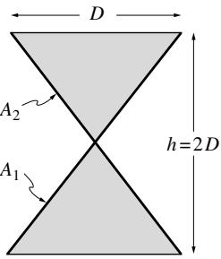
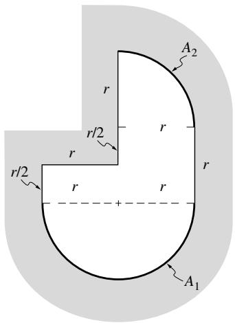

## 内容索引

- [目录](README.md)
- [1 热辐射基础](1-热辐射基础.md)
- [2 基于电磁波理论的辐射特性预测](2-基于电磁波理论的辐射特性预测.md)
- [3 实际表面的辐射特性](3-实际表面的辐射特性.md)
- [4 视角因子](4-视角因子.md)
- [5 灰体漫射表面间的辐射交换](5-灰体漫射表面间的辐射交换.md)
- [6 部分镜面灰体表面间的辐射交换](6-部分镜面灰体表面间的辐射交换.md)
- [7 非理想表面间的辐射交换](7-非理想表面间的辐射交换.md)
- [8 表面交换的蒙特卡洛方法](8-表面交换的蒙特卡洛方法.md)
- [9 传导和对流存在时的表面辐射交换](9-传导和对流存在时的表面辐射交换.md)
- [10 参与介质中的辐射传递方程(RTE)](10-参与介质中的辐射传递方程(RTE).md)
- [11 分子气体的辐射特性](11-分子气体的辐射特性.md)
- [12 颗粒介质的辐射特性](12-颗粒介质的辐射特性.md)
- [13 半透明介质的辐射特性](13-半透明介质的辐射特性.md)
- [14 一维灰体介质的精确解](14-一维灰体介质的精确解.md)
- [15 一维介质的近似求解方法](15-一维介质的近似求解方法.md)
- [16 球谐函数法 (PN-近似)](16-球谐函数法(PN-近似).md)
- [17 离散坐标法 (SN-近似)](17-离散坐标法(SN-近似).md)
- [18 区域法](18-区域法.md)
- [19 准直辐射与瞬态现象](19-准直辐射与瞬态现象.md)
- [20 非灰消光系数的求解方法](20-非灰消光系数的求解方法.md)
- [21 参与介质的蒙特卡洛方法](21-参与介质的蒙特卡洛方法.md)
- [22 辐射与传导和对流的耦合](22-辐射与传导和对流的耦合.md)
- [23 逆辐射传热](23-逆辐射传热.md)
- [24 纳米尺度辐射传热](24-纳米尺度辐射传热.md)
- [附录](附录.md)

- [4.1 引言](#41-引言)
- [4.2 视角因子的定义](#42-视角因子的定义)
- [4.3 视角因子的计算方法](#43-视角因子的计算方法)
- [4.4 面积积分法](#44-面积积分法)
- [4.5 轮廓积分法](#45-轮廓积分法)
- [4.6 视角因子代数](#46-视角因子代数)
- [4.7 交叉线法](#47-交叉线法)
- [4.8 内球面法](#48-内球面法)
- [4.9 单位球面法](#49-单位球面法)
- [参考文献](#参考文献)
- [习题](#习题)

# 第4章

# 视角因子

# 4.1 引言

在许多工程应用中，表面之间的辐射能量交换几乎不受中间介质的影响。这类(辐射)非参与介质包括真空以及低至中等温度下的单原子和大多数双原子气体(包括空气)(即在电离和解离发生之前)。应用实例包括航天器散热系统、太阳能集热系统、辐射空间加热器、照明问题等。

在接下来的四章中，我们将分析不同复杂程度的表面辐射传输，即在无参与介质情况下的辐射传热。通常的做法是通过假设理想化的封闭空间和/或理想的表面特性来简化分析。

如果所有表面都是黑体，则可以得到最大程度的简化：这种情况下不需要考虑反射辐射，且所有发射辐射都是漫射的(即离开表面的辐射强度与方向无关)。如果假设表面是灰体、漫射发射体(因而也是吸收体)以及灰体、漫射反射体，则难度会有所增加。绝大多数工程计算都限于这类理想表面，这将是第5章的主题。

如果表面的反射行为与漫反射体有显著差异(例如抛光金属，其反射几乎像镜子一样)，通常可以近似认为反射率由纯漫反射和纯镜面反射组成。这种情况将在第6章讨论。然而，如果需要更高的精度，如果反射率不能近似为纯漫反射和镜面反射组成，或者如果灰体表面的假设不可接受，则必须采用更通用的方法。第7章简要概述了几种此类方法。

如第1章所述，热辐射通常是一种长程现象。在没有参与介质的情况下总是如此，因为光子可以不受阻碍地从表面传播到表面。因此，对一个表面进行热辐射分析意味着必须同时考虑所有可以相互交换辐射能量的表面，无论它们相距多远。任意两个表面交换的能量部分取决于它们的大小、间距和方向，由此产生的几何函数称为视角因子。本章将针对灰体、漫射辐射(即发射和反射)表面推导这些视角因子。然而，视角因子是一个非常基础的函数，它也将用于镜面反射体的分析以及具有任意发射和反射特性的表面分析。

如图4-1所示，对表面微元进行能量平衡分析，我们得到

  
图4-1 表面能量平衡

$$
q = q_{\mathrm{发射}} - q_{\mathrm{吸收}} = E - \alpha H. \tag{4.1}
$$

在这个关系中，$q_{\mathrm{发射}}$和$q_{\mathrm{吸收}}$是绝对值，其方向如图4-1所示，而$q$是供给表面的净热流密度，如第1章方程(1.38)所定义。根据这个定义，如果热量来自壁材内部(通过传导或其他方式)，则$q$为正$(q > 0)$；如果热量从封闭空间进入壁材，则$q$为负$(q < 0)$。或者，热流密度也可以表示为

$$
\begin{array}{rl} & q = q_{\mathrm{出}} - q_{\mathrm{入}} = (q_{\mathrm{发射}} + q_{\mathrm{反射}}) - q_{\mathrm{辐照}}\\ & \quad = (E + \rho H) - H, \end{array} \tag{4.2}
$$

当然，这与方程(4.1)相同，因为对于不透明表面，$\rho = 1 - \alpha$。辐照度$H$通常取决于远离所考虑点的表面的发射水平，如图4-2a示意所示。因此，为了进行辐射能量平衡，我们总是需要考虑整个封闭空间，而不是像通常处理其他传热模式(即传导或对流)那样考虑一个无限小的控制体积。封闭空间必须是封闭的，这样才能考虑来自所有可能方向的辐照，且封闭表面必须是不透明的，这样才能为每个方向考虑所有辐照。在实践中，可以通过引入人工表面来封闭不完整的封闭空间。如图4-2b所示，可以通过两种方式理想化封闭空间：用几个简单的表面代替复杂的几何形状，以及假设表面是等温的，具有恒定的(即平均的)热流密度值。显然，对于足够小的等温子表面，理想化的封闭空间会接近真实的封闭空间。

  
图4-2 (a)封闭空间中不同位置的辐照，(b)用于辐射传热计算的实际和理想封闭空间

# 4.2 视角因子的定义

为了对表面微元进行能量平衡分析[方程(4.1)]，必须计算辐照度$H$。在一般封闭空间中，辐照度将来自封闭空间表面所有可见部分的贡献。因此，我们需要确定离开任意表面微元$dA'$并到达$dA$的能量有多少。对于"漫射"表面(即吸收和发射均为漫射，且反射辐射能量也是漫射的表面)，控制这一过程的几何关系称为视角因子。文献中使用的其他名称包括构形因子、角度因子和形状因子，有时也使用漫射视角因子这一术语(以区别于镜面反射表面的镜面视角因子；参见第6章)。如图4-3所示，两个无限小表面微元$dA_{i}$和$dA_{j}$之间的视角因子定义为

$$
dF_{dA_i - dA_j}\equiv \frac{\mathrm{diffuse~energy~leaving~}dA_i\mathrm{~directly~toward~and~intercepted~by~}dA_j}{\mathrm{total~diffuse~energy~leaving~}dA_i}, \tag{4.3}
$$

其中"直接"意味着"沿直线路径，没有中间反射"。由于只有无限小的面积才能拦截无限小的部分，这个视角因子是无限小的。根据强度的定义和图4-3，我们可以确定从$dA_{i}$到$dA_{j}$的传热速率为

$$
I(\mathbf{r}_i)(dA_i\cos \theta_i)d\Omega_j = I(\mathbf{r}_i)\cos \theta_i\cos \theta_jdA_idA_j / S^2, \tag{4.4}
$$

其中$\theta_{i}$(或$\theta_{j}$)是表面法线$\hat{\mathbf{n}}_i$(或$\hat{\mathbf{n}}_j$)与连接$dA_{i}$和$dA_{j}$的直线(长度为$S$)之间的夹角。离开$dA_{i}$进入其上半球的总辐射能量为$J = E + \rho H$，其中$J$称为辐射出射度。由于表面发射和反射都是漫射的，$E$和$\rho H$都遵循方程(1.33)，出射通量可以通过强度表示为

$$
J(\mathbf{r}_i)dA_i = [E(\mathbf{r}_i) + \rho (\mathbf{r}_i)H(\mathbf{r}_i)]dA_i = \pi I(\mathbf{r}_i)dA_i.
$$

注意，由于发射和/或反射，离开$dA_{i}$的辐射强度不依赖于方向。因此，两个无限小面积之间的视角因子为

$$
dF_{dA_i - dA_j} = \frac{\cos\theta_i\cos\theta_j}{\pi S^2} dA_j. \tag{4.5}
$$

通过引入缩写$\mathbf{s}_{ij} = \mathbf{r}_j - \mathbf{r}_i$，并注意到cos$\theta_{i} = \hat{\mathbf{n}}_{i}\cdot \mathbf{s}_{ij} / |\mathbf{s}_{ij}|$，视角因子可以重新表示为向量形式

$$
dF_{dA_i - dA_j} = \frac{(\hat{\mathbf{n}}_i\cdot\mathbf{s}_{ij})(\hat{\mathbf{n}}_j\cdot\mathbf{s}_{ji})}{\pi S^4} dA_j. \tag{4.6}
$$

在方程(4.5)中交换下标$j$和$j$立即得到重要的互易定律：

$$
dA_{i}dF_{dA_{i} - dA_{j}} = dA_{j}dF_{dA_{j} - dA_{i}}. \tag{4.7}
$$

通常，封闭空间被理想化为由若干有限等温子表面组成，如图4-2b所示。因此，我们希望扩展视角因子的定义，使其包括一个无限小与一个有限面积之间以及两个有限面积之间的辐射交换。首先考虑无限小$dA_{i}$与有限$A_{j}$之间的交换，如图4-4所示。根据方程(4.4)，离开$dA_{i}$到达整个$A_{j}$的总能量为

$$
I(\mathbf{r}_i)dA_i\int_{A_j}\frac{\cos\theta_i\cos\theta_j}{S^2} dA_j,
$$

  
图4-3 两个无限小表面微元之间的辐射交换

  
图4-4 一个无限小与一个有限表面微元之间的辐射交换

而离开$dA_{i}$进入所有方向的总能量保持不变。因此，我们得到

$$
F_{dA_i - A_j} = \int_{A_j}\frac{\cos\theta_i\cos\theta_j}{\pi S^2} dA_j, \tag{4.8}
$$

由于拦截表面$A_{j}$是有限的，这个视角因子现在是有限的。

接下来我们考虑从$A_{j}$到无限小$dA_{i}$的视角因子。根据方程(4.4)(交换下标$i$和$j$后)，离开整个$A_{j}$到达$dA_{i}$的辐射量为

$$
dA_{i}\int_{A_{j}}I(\mathbf{r}_{j})\frac{\cos\theta_{i}\cos\theta_{j}}{S^{2}} dA_{j},
$$

而离开$A_{j}$进入所有方向的总量为

$$
\pi \int_{A_j}I(\mathbf{r}_j)dA_j.
$$

因此，我们得到表面$A_{j}$和$dA_{i}$之间的视角因子为

$$
dF_{A_j - dA_i} = \int_{A_j}I(\mathbf{r}_j)\frac{\cos\theta_i\cos\theta_j}{S^2} dA_jdA_i\bigg / \pi \int_{A_j}I(\mathbf{r}_j)dA_j, \tag{4.9}
$$

由于拦截表面$dA_{i}$是无限小的，这个视角因子也是无限小的。与方程(4.5)和(4.8)不同，方程(4.9)中的视角因子不是纯粹的几何参数，因为它依赖于辐射场$I(\mathbf{r}_j)$。然而，对于如图4-2b所示的理想封闭空间，通常假设离开任何表面的强度不仅是漫射的，而且在表面上也不变化，即$I(\mathbf{r}_j) = I_j = \text{常数}$。在此假设下，方程(4.9)变为

$$
dF_{A_j - dA_i} = \frac{1}{A_j}\int_{A_j}\frac{\cos\theta_i\cos\theta_j}{\pi S^2} dA_jdA_i. \tag{4.10}
$$

将此与方程(4.8)比较，我们得到另一个互易定律：

$$
A_{j}dF_{A_{j} - dA_{i}} = dA_{i}F_{dA_{i} - A_{j}}, \tag{4.11}
$$

  
图4-5 两个有限表面之间的辐射交换

条件是离开$A_{j}$的强度在表面上不变化。

最后，我们考虑如图4-5所示的两个有限面积$A_{i}$和$A_{j}$之间的辐射交换。根据方程(4.4)，离开$A_{i}$到达$A_{j}$的总能量为

$$
\int_{A_i}\int_{A_j}I(\mathbf{r}_i)\frac{\cos\theta_i\cos\theta_j}{S^2} dA_jdA_i,
$$

视角因子则为

$$
F_{A_i - A_j} = \int_{A_i}\int_{A_j}I(\mathbf{r}_i)\frac{\cos\theta_i\cos\theta_j}{S^2} dA_jdA_i\bigg / \pi \int_{A_i}I(\mathbf{r}_i)dA_i. \tag{4.12}
$$

如果我们再次假设离开$A_{i}$的强度在表面上不变化，视角因子简化为

$$
F_{A_i - A_j} = \frac{1}{A_i}\int_{A_i}\int_{A_j}\frac{\cos\theta_i\cos\theta_j}{\pi S^2} dA_jdA_i. \tag{4.13}
$$

互易定律很容易得到：

$$
A_{i}F_{A_{i} - A_{j}} = A_{j}F_{A_{j} - A_{i}}, \tag{4.14}
$$

现在条件是离开$A_{i}$和$A_{j}$的辐射强度在各自表面上都必须恒定。

用更简洁的符号表示，互易定律可以总结为：

$$
\begin{array}{c}{dA_idF_{di - dj} = dA_jdF_{dj - di},}\\ {dA_iF_{di - j} = A_jdF_{j - di},\qquad (I_j = \mathrm{const}),}\\ {A_iF_{i - j} = A_jF_{j - i},\qquad (I_i,I_j = \mathrm{const}).} \end{array} \tag{4.15b}
$$

不同级别的视角因子可以通过以下方式相互关联：

$$
\begin{array}{l}{F_{di - j} = \int_{A_j}dF_{di - dj},}\\ {F_{i - j} = \frac{1}{A_i}\int_{A_i}F_{di - j}dA_i.} \end{array} \tag{4.16b}
$$

如果接收表面由若干子表面组成，我们还有：

$$
F_{i - j} = \sum_{k = 1}^{K}F_{i - (j,k)},\mathrm{with}A_{j} = \sum_{k = 1}^{K}A_{(j,k)}. \tag{4.17}
$$

最后，由N个表面组成的封闭空间，每个表面具有恒定出射强度，遵循求和关系：

$$
\sum_{j = 1}^{N}F_{di - j} = \sum_{j = 1}^{N}F_{i - j} = 1. \tag{4.18}
$$

最后两个关系直接来自视角因子的定义（即所有分数之和必须等于1）。注意方程(4.18)包含视角因子$F_{i - i}$。如果表面$A_{i}$是平面或凸面，离开它的辐射不会直接照射到自身，$F_{i - i}$将为零。然而，如果$A_{i}$是凹面，部分离开它的辐射将被自身拦截，$F_{i - i} > 0$。

# 4.3 视角因子的计算方法

计算任意两个有限表面之间的辐射视角因子需要求解双重面积积分，即四阶积分。除了非常简单的几何形状外，这种积分在解析上极难求解。即使数值积分也常常因为被积函数的奇异性或过高的CPU时间需求而存在问题。因此，人们投入了大量精力来编制视角因子表格和开发计算方法。早期简单构型的表格和图表由Hamilton和Morgan[1]、Leuenberger和Pearson[2]以及Kreith[3]给出。Sparrow和Cess[4]以及Siegel和Howell[5]的书中给出了相当全面的表格。Siegel和Howell还提供了更复杂视角因子的详尽来源列表。最完整的表格由Howell[6,7]的目录给出，最新版本也可以通过http://www.engr.uky.edu/rtl/Catalog/在线访问。还有一些商业和非商业的计算机程序可用于计算[8-18]，Emery及其同事[19]对现有数值方法进行了综述。Jakob[20]以及Liu和Howell[21]讨论了一些实验方法。本书附录D给出了大量几何形状的视角因子公式。附录F包含了自包含的Fortran/C++/Matlab®程序viewfactors，用于计算附录D中列出的所有视角因子[这些程序调用一个view函数，也可以从其他程序中使用]。

辐射视角因子可以通过多种方法确定。不同方法的一种可能分组是：

1. 直接积分法：

(i) 对前文给出的关系进行解析或数值积分（面积积分）；(ii) 将关系转换为轮廓积分，然后进行解析或数值积分（轮廓积分）。

2. 统计确定法：可以通过蒙特卡洛方法进行统计采样来确定视角因子。

3. 特殊方法：对于许多简单形状，可以通过以下特殊方法避免积分：

(i) 视角因子代数法：即重复应用互易定律和求和关系；

  
图4-6 表面元素的单位法向量和方向余弦

(ii) 交叉线法：用于二维几何形状视角因子计算的简单方法；(iii) 单位球法：计算一个微元面和一个有限面之间视角因子的有效方法；(iv) 内球法：适用于几种特殊形状的简单方法。

上述所有方法都将在后续章节中讨论，蒙特卡洛方法除外，该方法将在第8章详细阐述。

# 4.4 面积积分法

要计算方程(4.5)或执行方程(4.8)和(4.13)中的积分，必须知道被积函数(即$\cos \theta_{i}$、$\cos \theta_{j}$和$S$)在描述两个表面几何形状的局部坐标系中的表达式。虽然对于某些简单构型来说，被积函数的计算可能很直接，但最好能有一个更通用的公式可供使用。使用任意坐标原点时，从原点指向表面上某点的向量可表示为：

$$
\mathbf{r} = x\hat{\mathbf{r}} +y\hat{\mathbf{r}} +z\hat{\mathbf{k}}, \tag{4.19}
$$

其中$\hat{\mathbf{r}}$、$\hat{\mathbf{r}}$和$\hat{\mathbf{k}}$分别是$x$、$y$和$z$方向的单位向量。因此，从$dA_{i}$指向$dA_{j}$的向量可确定为(见图4-5)：

$$
\mathbf{s}_{ij} = -\mathbf{s}_{ji} = \mathbf{r}_j - \mathbf{r}_i = (x_j - x_i)\hat{\mathbf{r}} +(y_j - y_i)\hat{\mathbf{j}} +(z_j - z_i)\hat{\mathbf{k}}. \tag{4.20}
$$

该向量的长度确定为：

$$
|\mathbf{s}_{ij}|^2 = |\mathbf{s}_{ii}|^2 = S^2 = (x_j - x_i)^2 +(y_j - y_i)^2 +(z_j - z_i)^2. \tag{4.21}
$$

我们现在假设局部表面法线也可以用单位向量$\hat{\mathbf{r}}$、$\hat{\mathbf{r}}$和$\hat{\mathbf{k}}$表示，或者从图4-6可得：

$$
\hat{\mathbf{n}} = l\hat{\mathbf{1}} +m\hat{\mathbf{j}} +n\hat{\mathbf{k}}, \tag{4.22}
$$

其中$l$、$m$和$n$是单位向量$\hat{\mathbf{n}}$的方向余弦，即$l = \hat{\mathbf{n}} \cdot \hat{\mathbf{1}} = \cos \theta_{x}$是$\hat{\mathbf{n}}$与$x$轴夹角$\theta_{x}$的余弦，等等。现在我们可以计算$\cos \theta_{i}$和$\cos \theta_{j}$为：

$$
\begin{array}{l}\cos \theta_{i} = \frac{\hat{\mathbf{n}}\cdot\mathbf{s}_{ij}}{S} = \frac{1}{S}\left[(x_{j} - x_{i})l_{i} + (y_{j} - y_{i})m_{i} + (z_{j} - z_{i})n_{i}\right],\\ \cos \theta_{j} = \frac{\hat{\mathbf{n}}\cdot\mathbf{s}_{ji}}{S} = \frac{1}{S}\left[(x_{i} - x_{j})l_{j} + (y_{i} - y_{j})m_{j} + (z_{i} - z_{j})n_{j}\right]. \end{array} \tag{4.23b}
$$

  
图4-7 无限长沟槽上窄条带的视角因子

例4.1. 考虑如图4-7所示的无限长($-\infty < y < +\infty$)楔形沟槽。沟槽两侧宽度分别为$a$和$b$，开口角为$\alpha$。求图中所示窄条带之间的视角因子。

# 解

按照图中所示建立坐标系后，我们得到 $z_{1} = 0, x_{2} = u_{2} \cos \alpha$ 和 $z_{2} = u_{2} \sin \alpha$，从而有

$$
\begin{array}{rl} 
& S^{2} = (x_{1} - u_{2}\cos \alpha)^{2} + (y_{1} - y_{2})^{2} + u_{2}^{2}\sin^{2}\alpha \\ 
& \qquad = (x_{1}^{2} - 2x_{1}u_{2}\cos \alpha +u_{2}^{2}) + (y_{1} - y_{2})^{2} = S_{0}^{2} + (y_{1} - y_{2})^{2}, 
\end{array}
$$

其中 $S_{0}$ 是 $S$ 在 $x-z$ 平面上的投影，在当前问题中为常数。两个表面的法向量可确定为

$$
\begin{array}{rl} 
& {\hat{\mathbf{n}}_1 = \hat{\mathbf{k}},\quad \text{即}\quad l_1 = m_1 = 0,\quad n_1 = 1,}\\ 
& {\hat{\mathbf{n}}_2 = \hat{\mathbf{i}}\sin \alpha -\hat{\mathbf{k}}\cos \alpha ,\quad \text{即}\quad l_2 = \sin \alpha ,m_2 = 0,n_2 = -\cos \alpha ,} 
\end{array}
$$

由此可得

$$
\begin{array}{l}
\cos \theta_1 = u_2\sin \alpha /S,\\ 
\cos \theta_2 = [(x_1 - u_2\cos \alpha)\sin \alpha +u_2\sin \alpha \cos \alpha ] / S = x_1\sin \alpha /S. 
\end{array}
$$

为说明问题，我们将首先根据方程(4.8)计算 $dF_{d1 - \mathrm{strip}2}$，然后根据方程(4.16)计算 $dF_{\mathrm{strip1 - strip2}}$。因此

$$
\begin{array}{l}
{dF_{d1 - \mathrm{strip}2} = \int_{\partial A_{d1,\mathrm{strip}2}}\frac{\cos\theta_1\cos\theta_2}{\pi S_0^2} dA_2 = \frac{du_2}{\pi}\int_{-\infty}^{+\infty}\frac{x_1u_2\sin^2\alpha dy_2}{\left[S_0^2 + (y_1 - y_2)^2\right]^2}}\\ 
{= \frac{x_1u_2\sin^2\alpha du_2}{\pi}\left[\frac{y_2 - y_1}{2S_0^2\left[S_0^2 + (y_1 - y_2)^2\right]} +\frac{1}{2S_0^3}\tan^{-1}\frac{y_2 - y_1}{S_0}\right]_{-\infty}^{+\infty}}\\ 
{= \frac{x_1u_2\sin^2\alpha du_2}{2S_0^3} = \frac{1}{2}\frac{u_2\sin\alpha}{S_0}\frac{x_1\sin\alpha}{S_0}\frac{du_2}{S_0} = \frac{1}{2}\cos \theta_{10}\cos \theta_{20}\frac{du_2}{S_0},} 
\end{array}
$$

其中 $\theta_{10}$ 和 $\theta_{20}$ 分别是 $\theta_{1}$ 和 $\theta_{2}$ 在 $x-z$ 平面上的投影。观察图4-8，可以将其改写为

$$
\begin{array}{r}
dF_{d1 - \mathrm{strip}2} = \frac{1}{2}\cos \phi d\phi , 
\end{array}
$$

  
图4-8 二维楔形沟槽及其投影距离

其中 $\phi = \theta_{10}$ 是 $dA_{\mathrm{strip2}}$ 相对于 $dA_{\mathrm{strip1}}$ 的偏离法线角度。我们注意到 $dF_{d1 - \mathrm{strip2}}$ 不依赖于 $y_{1}$。无论观察者站在条带1上的哪个位置，看到的条带2都是从 $-\infty$ 延伸到 $+\infty$。接下来需要根据方程(4.16)计算 $dF_{\mathrm{strip1 - strip2}}$。由于方程(4.16)只是取平均值，且 $dF_{d1 - \mathrm{strip2}}$ 沿 $dA_{\mathrm{strip2}}$ 不变化，因此立即可以得到

$$
dF_{\mathrm{strip1 - strip2}} = \frac{1}{2}\cos \phi d\phi = \frac{x_1\sin^2\alpha u_2du_2}{2S_0^3}.
$$

例4.2. 确定图4-8所示无限长沟槽的视角因子 $F_{1 - 2}$。

# 解

既然我们已经知道两个无限长条带之间的视角因子，可以写出

$$
\begin{array}{l}
{F_{\mathrm{strip1 - 2}} = \int_0^b dF_{\mathrm{strip1 - strip2}},}\\ 
{F_{1 - 2} = \frac{1}{a}\int_0^a F_{\mathrm{strip1 - 2}}dx_1.} 
\end{array}
$$

因此，根据例4.1，

$$
\begin{array}{r l}
{F_{\mathrm{strip1 - 2}} =} & {\frac{x_{1}\sin^{2}\alpha}{2}\int_{0}^{b}\frac{u_{2}d u_{2}}{(x_{1}^{2} - 2x_{1}u_{2}\cos\alpha + u_{2}^{2})^{3 / 2}} = \frac{x_{1}\sin^{2}\alpha}{2}\frac{x_{1}\cos\alpha u_{2} - x_{1}^{2}}{x_{1}^{2}\sin^{2}\alpha\sqrt{1 - 2x_{1}u_{2}\cos\alpha + u_{2}^{2}}}\Bigg|_{0}^{b}}\\ 
& {= \frac{1}{2}\Bigg(1 + \frac{b\cos\alpha - x_{1}}{\sqrt{x_{1}^{2} - 2b x_{1}\cos\alpha + b^{2}}}\Bigg).} 
\end{array}
$$

最后，进行第二次积分得到

$$
F_{1 - 2} = \frac{1}{a}\int_{0}^{a}F_{\mathrm{strip1 - 2}}dx_{1} = \frac{1}{2}\left(1 - \frac{1}{a}\sqrt{x_{1}^{2} - 2bx_{1}\cos\alpha + b^{2}}\bigg|_{0}^{a}\right) = \frac{1}{2}\left(1 + \frac{b}{a} -\sqrt{1 - 2\frac{b}{a}\cos\alpha + \left(\frac{b}{a}\right)^{2}}\right).
$$

例4.3. 作为面积积分法的最后一个例子，我们将考虑图4-9所示的两个平行同轴圆盘之间的视角因子，圆盘半径分别为 $R_{1}$ 和 $R_{2}$。

# 解

如图4-9所示建立$x$、$y$和$z$坐标系，并进行柱坐标变换，可得：

  
图4-9 平行同轴圆盘间视角因子的坐标系

$$
\begin{array}{rl} 
& x_{1} = r_{1}\cos \psi_{1}, y_{1} = r_{1}\sin \psi_{1}, z_{1} = 0; dA_{1} = r_{1}dr_{1}d\psi_{1};\\ 
& x_{2} = r_{2}\cos \psi_{2}, y_{2} = r_{2}\sin \psi_{2}, z_{2} = h; dA_{2} = r_{2}dr_{2}d\psi_{2};\\ 
& S^{2} = (r_{1}\cos \psi_{1} - r_{2}\cos \psi_{2})^{2} + (r_{1}\sin \psi_{1} - r_{2}\sin \psi_{2})^{2} + h^{2}\\ 
& = h^{2} + r_{1}^{2} + r_{2}^{2} - 2r_{1}r_{2}\cos (\psi_{1} - \psi_{2}). 
\end{array}
$$

由于$\hat{\mathbf{n}}_1 = \hat{\mathbf{k}}$且$\hat{\mathbf{n}}_2 = - \hat{\mathbf{k}}$，可得$l_{1} = l_{2} = m_{1} = m_{2} = 0$，$n_1 = - n_2 = 1$，根据方程(4.23)有$\cos \theta_{1} = \cos \theta_{2} = \hbar /3$。因此，由方程(4.13)可得：

$$
F_{1 - 2} = \frac{1}{(\pi R_1)^{\pi}}\int_{r_1 = 0}^{R_1}\int_{r_2 = 0}^{R_2}\int_{\psi_1 = 0}^{2\pi}\int_{\psi_2 = 0}^{2\pi}\frac{h^2r_1r_2d\psi_2d\psi_1dr_2dr_1}{\left[h^2 + r_1^2 + r_2^2 - 2r_1r_2\cos(\psi_1 - \psi_2)\right]^2}.
$$

将虚拟变量$\psi_{2}$替换为$\psi = \psi_{1} - \psi_{2}$，使得被积函数与$\psi_{1}$无关（从$\psi_{1} - 2\pi$积分到$\psi_{1}$等同于从0积分到$2\pi$，因为积分覆盖了整个周期），因此可以立即进行$\psi_{1}$积分：

$$
F_{1 - 2} = \frac{2h^2}{\pi R_1^2}\int_{r_1 = 0}^{R_1}\int_{r_2 = 0}^{R_2}\int_{\psi = 0}^{2\pi}\frac{r_1r_2d\psi dr_2dr_1}{(h^2 + r_1^2 + r_2^2 - 2r_1r_2\cos\psi)^2}.
$$

这一结果也可以通过物理论证得到，因为从$A_{1}$的任何扇形区域看出去的视角因子都相同（且等于整个圆盘的视角因子）。虽然可以进行第二次积分（对$r_1$、$r_2$或$\psi$），但剩余两个积分的解析求解似乎前景渺茫。我们将在此放弃这个问题，希望能找到其他更简便的方法来计算$F_{1 - 2}$。

# 4.5 轮廓积分法

根据Wylie [22]等标准数学教材中发展的Stokes定理，一个面积分可以通过以下方式转换为等价的轮廓积分（见图4-10）：

$$
\oint_{\Gamma}\mathbf{f}\cdot d\mathbf{s} = \int_{A}(\nabla \times \mathbf{f})\cdot \hat{\mathbf{n}} dA, \tag{4.24}
$$

其中$\mathbf{f}$是定义在表面$A$及其边界$\Gamma$上的矢量函数，$\hat{\mathbf{n}}$是单位表面法向量，$\mathbf{s}$是$A$边界上点的位置矢量（因此$d\mathbf{s}$是描述$A$边界轮廓的矢量）。按照惯例，方程(4.24)中的轮廓积分沿逆时针方向进行，观察者站在表面上方（即法向量指向的一侧）。

  
图4-10 面积分与轮廓积分的转换；斯托克斯定理。

如果能找到一个矢量函数$\mathbf{f}$使方程(4.24)的被积函数等价于方程(4.8)的被积函数，那么方程(4.8)的面积分（或二重积分）就可以简化为轮廓积分（或单重积分）。应用两次斯托克斯定理，方程(4.13)的二重面积积分可以转换为二重线积分。Moon[23]首次将轮廓积分应用于辐射视角因子计算（在照明工程领域）。在辐射传热领域的最早应用似乎是由de Bastos[24]和Sparrow[25]完成的。

# 从微元到有限面积的视角因子

对于这种情况，矢量函数$\mathbf{f}$可以表示为

$$
\mathbf{f} = \frac{1}{2\pi}\frac{\mathbf{s}_{12}\times\hat{\mathbf{n}}_1}{S^2}, \tag{4.25}
$$

从而得到

$$
F_{d1 - 2} = \frac{1}{2\pi}\oint_{\Gamma_2}\frac{(\mathbf{s}_{12}\times\hat{\mathbf{n}}_1)\cdot d\mathbf{s}_2}{S^2}, \tag{4.26}
$$

其中$\mathbf{s}_{12}$是从$dA_{1}$指向$A_{2}$轮廓上某点的矢量（由矢量$\mathbf{s}_{2}$描述），而$d\mathbf{s}_{2}$沿$A_{2}$的轮廓指向。

对于具有矢量微积分背景的读者，我们将简要证明方程(4.26)等价于方程(4.8)。利用恒等式（例如由Wylie[22]给出），

$$
\mathbf{V}\times (\phi \mathbf{a}) = \phi \mathbf{V}\times \mathbf{a} - \mathbf{a}\times \mathbf{V}\phi , \tag{4.27}
$$

我们可以写出

$$
2\pi \nabla_{2}\times \mathbf{f} = \nabla_{2}\times \left(\frac{\mathbf{s}_{12}\times\hat{\mathbf{n}}_{1}}{S^{2}}\right) = \frac{1}{S^{2}}\nabla_{2}\times (\mathbf{s}_{12}\times \hat{\mathbf{n}}_{1}) - (\mathbf{s}_{12}\times \hat{\mathbf{n}}_{1})\times \nabla_{2}\left(\frac{1}{S^{2}}\right). \tag{4.28}
$$

由方程(4.20)和(4.21)可得

$$
\nabla_{2}\left(\frac{1}{S^{2}}\right) = -\frac{2}{S^{3}}\nabla_{2}S = -\frac{2}{S^{3}}\frac{\mathbf{s}_{12}}{S} = -\frac{2\mathbf{s}_{12}}{S^{4}}.
$$

利用标准矢量恒等式，我们还发现

$$
\begin{array}{r}(\mathbf{s}_{12}\times \hat{\mathbf{n}}_1)\times \mathbf{s}_{12} = \hat{\mathbf{n}}_1(\mathbf{s}_{12}\cdot \mathbf{s}_{12}) - \mathbf{s}_{12}(\mathbf{s}_{12}\cdot \hat{\mathbf{n}}_1) = S^2\hat{\mathbf{n}}_1 - \mathbf{s}_{12}(\mathbf{s}_{12}\cdot \hat{\mathbf{n}}_1),\\ \nabla_2\times (\mathbf{s}_{12}\times \hat{\mathbf{n}}_1) = \hat{\mathbf{n}}_1\cdot \nabla_2\mathbf{s}_{12} - \mathbf{s}_{12}\cdot \nabla_2\hat{\mathbf{n}}_1 + \mathbf{s}_{12}\nabla_2\cdot \hat{\mathbf{n}}_1 - \hat{\mathbf{n}}_1\nabla_2\cdot \mathbf{s}_{12}. \end{array} \tag{4.29b}
$$

在最后一个表达式中，由于$\hat{\mathbf{n}}_1$与表面$A_{2}$无关，$\nabla_2\hat{\mathbf{n}}_1$和$\nabla_2\cdot \hat{\mathbf{n}}_1$项消失。此外，从方程(4.20)我们发现

$$
\nabla_{2}\cdot \mathbf{s}_{12} = 3,\quad \nabla_{2}\mathbf{s}_{12} = \hat{\mathbf{n}} +\hat{\mathbf{y}}\hat{\mathbf{j}} +\hat{\mathbf{k}}\hat{\mathbf{k}} = \delta , \tag{4.30}
$$

其中$\delta$是单位张量，其对角元素为1，非对角元素为0：

$$
\delta = \left( \begin{array}{lll}1 & 0 & 0\\ & & \\ 0 & 1 & 0\\ & & \\ 0 & 0 & 1 \end{array} \right). \tag{4.31}
$$

由于$\hat{\mathbf{n}}_1\cdot \delta = \hat{\mathbf{n}}_1$，方程(4.29b)简化为

$$
\nabla_{2}\times (\mathbf{s}_{12}\times \hat{\mathbf{n}}_{1}) = \hat{\mathbf{n}}_{1} - 3\hat{\mathbf{n}}_{1} = -2\hat{\mathbf{n}}_{1}.
$$

将所有这些代入方程(4.28)，我们得到

$$
2\pi \nabla_{2}\times \mathbf{f} = -\frac{2\hat{\mathbf{n}}_{1}}{S^{2}} +\frac{2}{S^{4}}\left[S^{2}\hat{\mathbf{n}}_{1} - \mathbf{s}_{12}(\mathbf{s}_{12}\cdot \hat{\mathbf{n}}_{1})\right] = -\frac{2}{S^{4}}\mathbf{s}_{12}(\mathbf{s}_{12}\cdot \hat{\mathbf{n}}_{1}),
$$

且

$$
(\nabla_{2}\times \mathbf{f})\cdot \hat{\mathbf{n}}_{2} = -\frac{(\mathbf{s}_{12}\cdot\hat{\mathbf{n}}_{1})(\mathbf{s}_{12}\cdot\hat{\mathbf{n}}_{2})}{\pi S^{4}} = \frac{\cos\theta_{1}\cos\theta_{2}}{\pi S^{2}}. \tag{4.32}
$$

结合斯托克斯定理，这完成了方程(4.26)等价于对方程(4.32)给出的函数进行面积分的证明。

对于笛卡尔坐标系，使用方程(4.19)至(4.22)，我们有

$$
ds_{2} = dx_{2}\hat{\mathbf{1}} +dy_{2}\hat{\mathbf{j}} +dz_{2}\hat{\mathbf{k}},
$$

方程(4.26)变为

$$
\begin{array}{l}{F_{d1 - 2} = \frac{l_1}{2\pi}\oint_{\Gamma_2}\frac{(z_2 - z_1)dy_2 - (y_2 - y_1)dz_2}{S^2} +\frac{m_1}{2\pi}\oint_{\Gamma_2}\frac{(x_2 - x_1)dz_2 - (z_2 - z_1)dx_2}{S^2}}\\ {+\frac{n_1}{2\pi}\oint_{\Gamma_2}\frac{(y_2 - y_1)dx_2 - (x_2 - x_1)dy_2}{S^2}.} \end{array} \tag{4.33}
$$

例4.4. 确定图4-11所示构型的视角因子$F_{d1 - 2}$。

# 解答

采用图中所示的坐标系，我们有

$$
S = \sqrt{x^2 + y^2 + c^2},
$$

且由于 $\hat{\mathbf{n}}_1 = - \hat{\mathbf{k}}$，即 $l_1 = n_1 = 0$ 和 $n_1 = -1$，方程(4.33)可简化为

  
图4-11 位于对角位置的平行微元面积到矩形平板的视角因子

$$
\begin{array}{l}{{ F_{d1-2}=-\frac{1}{2\pi}\oint_{\Gamma_2}\frac{y d x-x d y}{S^2}}}\\ {{\quad=-\frac{1}{2\pi}{[\int_{x=0}^{x=b}\frac{y}{S^2} d x]_{y=0}^{a}+[\int_{y=0}^{y=a}\frac{(-x)}{S^2} d y]_{x=b}+[\int_{x=b}^{x=0}\frac{y}{S^2} d x]_{y=a}+[\int_{y=a}^{y=0}\frac{(-x)}{S^2} d y]_{x=0}}}}\\ {{\quad=\frac{1}{2\pi}(\int_{y=0}^{a}b d y+\int_{x=0}^{b}x^{a}d x)_{x=b}+[\int_{x=b}^{x=0}\frac{y}{S^2} d x]_{y=a}+[\int_{y=a}^{y=0}\frac{(-x)}{S^2} d y]_{x=0}}}}\\ {{\quad=\frac{1}{2\pi}(\frac{b}{\sqrt{b^2+c^2}}\tan^{-1}\frac{y}{\sqrt{b^2+c^2}}]_{0}^{a}+\frac{a}{\sqrt{a^2+c^2}}\tan^{-1}\frac{x}{\sqrt{a^2+c^2}}]_{0}^{b})}}\\ {{\quad F_{d1-2}=\frac{1}{2\pi}(\frac{b}{\sqrt{b^2+c^2}}\tan^{-1}\frac{a}{\sqrt{b^2+c^2}}+\frac{a}{\sqrt{b^2+c^2}}\tan^{-1}\frac{b}{\sqrt{a^2+c^2}}).}}\end{array}
$$

# 有限面积间的视角因子

为降低两个有限表面$A_{1}$和$A_{2}$之间视角因子的积分阶数，可两次应用斯托克斯定理，得到

$$
A_{1}F_{1 - 2} = \frac{1}{2\pi} \oint_{\Gamma_{1}} \oint_{\Gamma_{2}} \ln S d\mathbf{s}_{2} \cdot d\mathbf{s}_{1}, \tag{4.34}
$$

其中两个表面的轮廓由向量$\mathbf{s}_{1}$和$\mathbf{s}_{2}$描述。为证明方程(4.34)等价于方程(4.13)，与方程(4.24)(对于表面$A_{1}$)比较可得

$$
\mathbf{f} = \frac{1}{2\pi} \oint_{\Gamma_{2}} \ln S d\mathbf{s}_{2}. \tag{4.35}
$$

通过方程(4.27)取旋度得到

$$
\begin{array}{l}{2\pi \nabla_{1}\times \mathbf{f} = \oint_{\Gamma_{2}}\nabla_{1}\times (\ln S d\mathbf{s}_{2}) = \oint_{\Gamma_{2}}\nabla_{1}(\ln S)\times d\mathbf{s}_{2}}\\ {= \oint_{\Gamma_{2}}\frac{1}{S}\nabla_{1}S\times d\mathbf{s}_{2},} \end{array} \tag{4.36}
$$

其中微分是针对表面$A_{1}$的坐标进行的(已应用斯托克斯定理)。与$\hat{\mathbf{n}}_{1}$点积后得到

$$
\hat{\mathbf{n}}_1\cdot (\nabla_1\times \mathbf{f}) = \oint_{\Gamma_2}\frac{1}{2\pi S}\hat{\mathbf{n}}_1\cdot (\nabla_1S\times d\mathbf{s}_2) = \oint_{\Gamma_2}\frac{\hat{\mathbf{n}}_1\times\nabla_1S}{2\pi S}\cdot d\mathbf{s}_2, \tag{4.37}
$$

这里使用了向量关系

$$
\mathbf{u}\cdot (\mathbf{v}\times \mathbf{w}) = (\mathbf{u}\times \mathbf{v})\cdot \mathbf{w}. \tag{4.38}
$$

再次，由方程(4.20)和(4.21)可得$\nabla_{1}S = - \mathbf{s}_{12} / S$，因此

$$
\begin{array}{c}{\hat{\mathbf{n}}_1\cdot (\nabla_1\times \mathbf{f}) = -\oint_{\Gamma_2}\frac{\hat{\mathbf{n}}_1\times\mathbf{s}_{12}}{2\pi S^2}\cdot d\mathbf{s}_2 = \oint_{\Gamma_2}\frac{\mathbf{s}_{12}\times\hat{\mathbf{n}}_1}{2\pi S^2}\cdot d\mathbf{s}_2}\\ {= F_{d1 - 2} = \int_{A_2}\frac{\cos\theta_1\cos\theta_2}{\pi S^2} dA_2,} \end{array}
$$

其中应用了方程(4.26)。最终，

$$
A_{1}F_{1 - 2} = \int_{A_{1}}\hat{\mathbf{n}}_{1}\cdot (\nabla_{1}\times \mathbf{f})dA_{1} = \int_{A_{1}}\int_{A_{2}}\frac{\cos\theta_{1}\cos\theta_{2}}{\pi S^{2}} dA_{2}dA_{1}, \tag{4.39}
$$

这当然与方程(4.13)相同。

对于笛卡尔坐标系，使用方程(4.19)中的$\mathbf{s}_1$和$\mathbf{s}_2$，方程(4.34)变为

$$
A_{1}F_{1 - 2} = \frac{1}{2\pi}\oint_{\Gamma_{1}}\oint_{\Gamma_{2}}\ln S(dx_{2}dx_{1} + dy_{2}dy_{1} + dz_{2}dz_{1}). \tag{4.40}
$$

例4.5. 通过围线积分确定两个平行同轴圆盘之间的视角因子，见例4.3。

# 解答

由 $d\mathbf{s} = dx\hat{\mathbf{1}} +dy\hat{\mathbf{1}} +dz\hat{\mathbf{k}}$ 以及例4.3中给出的坐标，可以立即得到：

$$
\begin{array}{rl}{d\mathbf{s}_1} & {= R_1d\psi_1(-\sin \psi_1\hat{\mathbf{1}} +\cos \psi_1\hat{\mathbf{1}}),}\\ {d\mathbf{s}_2} & {= R_2d\psi_2(-\sin \psi_2\hat{\mathbf{1}} +\cos \psi_2\hat{\mathbf{1}}),}\\ {d\mathbf{s}_1\cdot d\mathbf{s}_2} & {= R_1R_2d\psi_1d\psi_2(\sin \psi_1\sin \psi_2 + \cos \psi_1\cos \psi_2)}\\ & {= R_1R_2\cos (\psi_1 - \psi_2)d\psi_1d\psi_2,} \end{array}
$$

需要记住的是，$d\mathbf{s}$ 是沿着圆盘边缘的，即在 $r = R$ 处。将最后一个表达式代入方程(4.34)可得：

$$
F_{1 - 2} = \frac{R_1R_2}{2\pi(\pi R_1^2)}\int_{\psi = 0}^{2\pi}\int_{\psi = 0}^{-2\pi}\ln \left[h^2 +R_1^2 +R_2^2 -2R_1R_2\cos (\psi_1 - \psi_2)\right]^{1 / 2}\cos (\psi_1 - \psi_2)d\psi_2d\psi_1,
$$

其中 $\psi_{2}$ 的积分从0到 $- 2\pi$，因为对于站在 $A_{2}$ 上方的观察者来说，积分必须沿逆时针方向进行。与例4.3类似，我们可以立即消除其中一个积分，因为角度仅以差值形式出现，即 $\psi_{1} - \psi_{2}$。

$$
F_{1 - 2} = -\frac{1}{\pi}\frac{R_2}{R_1}\int_0^{2\pi}\ln \left(h^2 +R_1^2 +R_2^2 -2R_1R_2\cos \psi\right)^{1 / 2}\cos \psi d\psi .
$$

通过分部积分我们得到：

$$
\begin{array}{l}{F_{1 - 2} = -\frac{1}{\pi}\frac{R_2}{R_1}[\sin \psi \ln (h^2 +R_1^2 +R_2^2 -2R_1R_2\cos \psi)^{1 / 2}]_0^{2\pi} - R_1R_2\int_0^{2\pi}\frac{\sin^2\psi d\psi}{h^2 + R_1^2 + R_2^2 - 2R_1R_2\cos\psi}]}\\ {= \frac{R_2 / R_1}{2\pi}\int_0^{2\pi}\frac{\sin^2\psi d\psi}{X - \cos\psi},} \end{array}
$$

  
图4-12 例4.6的视角因子配置

其中我们引入了缩写：

$$
X = \frac{h^2 + R_1^2 + R_2^2}{2R_1R_2}.
$$

该积分可以在更好的积分表中找到，或者通过三角关系转换为更简单的形式，最终得到：

$$
F_{1 - 2} = \frac{R_2 / R_1}{2\pi} 2\pi \left(X - \sqrt{X^2 - 1}\right) = \frac{R_2}{R_1}\left(X - \sqrt{X^2 - 1}\right).
$$

# 4.6 视角因子代数

许多相当复杂配置的视角因子可以通过简单地使用互易性和求和规则，以及可能已知的更基本几何形状的视角因子来计算，而无需任何积分。也就是说，除了一个（或多个）已知的视角因子外，我们只需要使用以下三个基本方程：

互易性规则：

$$
A_{i}F_{i - j} = A_{j}F_{j - i}, \tag{4.15c}
$$

求和关系：

$$
\sum_{j = 1}^{N}F_{i - j} = 1, \tag{4.18}
$$

子表面求和 $A_{j} = \sum_{k = 1}^{K}A_{(j,k)}$：

$$
F_{i - j} = \sum_{k = 1}^{K}F_{i - (j,k)}. \tag{4.17}
$$

我们将通过几个简单的例子来说明这种视角因子代数的实用性。

例4.6. 假设我们已经获得了图4-11所示配置的视角因子，即 $F_{d1 - 2} = F(a,b,c)$，如例4.4所确定。求图4-12所示配置的视角因子 $F_{d1 - 3}$。

# 解

为了用已知的视角因子$F(a,b,c)$(微元面积位于大平板一角对面)表示$F_{d1-3}$，我们在$A_3$平面上填充假设表面$A_4$、$A_5$和$A_6$，如图4-12所示。根据视角因子的定义或方程(4.13)，可以得到：

$$
\begin{array}{c}{F_{d1 - (3 + 4 + 5 + 6)} = F_{d1 - 3} + F_{d1 - 4} + F_{d1 - (5 + 6)},}\\ {F_{d1 - 4} = F_{d1 - (4 + 6)} - F_{d1 - 6}.} \end{array}
$$

因此，

$$
F_{d1 - 3} = F_{d1 - (3 + 4 + 5 + 6)} - F_{d1 - (4 + 6)} + F_{d1 - 6} - F_{d1 - (5 + 6)}.
$$

  
图4-13 例4.7的配置：(a)完整角件，(b)角件上的条带

这四个视角因子都属于例4.4讨论的类型。因此，

$$
F_{d1 - 3} = F(a + b,c + d,e) - F(a,c + d,e) + F(a,c,e) - F(a + b,c,e).
$$

我们成功地将当前复杂的视角因子转换为四个已知的更基本视角因子的求和。

例4.7. 假设图4-13a所示有限角件的视角因子已知为$F_{1-2}=f(a,b,c)$，其中$f$是角件尺寸的已知函数(如附录D所示)，求图4-13b所示两条垂直条带之间的视角因子$F_{3-4}$。

# 解

根据视角因子的定义，由于到达$A_4$的能量等于到达$A_2$加$A_4$减去到达$A_2$的能量，因此有：

$$
F_{3 - 4} = F_{3 - (2 + 4)} - F_{3 - 2},
$$

利用互易性可得：

$$
F_{3 - 4} = \frac{1}{A_3}\left[(A_2 + A_4)F_{(2 + 4) - 3} - A_2F_{2 - 3}\right].
$$

类似地，我们得到：

$$
F_{3 - 4} = \frac{A_2 + A_4}{A_3}\left(F_{(2 + 4) - (1 + 3)} - F_{(2 + 4) - 1}\right) - \frac{A_2}{A_3}\left(F_{2 - (1 + 3)} - F_{2 - 1}\right).
$$

等式右侧的所有视角因子都是角件类型，因此可以通过用适当尺寸评估函数$f$来获得。

例4.8. 再次假设图4-13a所示配置的视角因子已知，求图4-14所示的$F_{1-6}$。

# 解

观察图4-14并运用互易性原理，我们得到：

$$
\begin{array}{rl} & {(A_5 + A_6)F_{(5 + 6) - (1 + 2)} = (A_5 + A_6)\big(F_{(5 + 6) - 1} + F_{(5 + 6) - 2}\big)}\\ & {\qquad = A_1(F_{1 - 5} + F_{1 - 6}) + A_2(F_{2 - 5} + F_{2 - 6})}\\ & {\qquad = A_1\big(F_{1 - (3 + 5)} - F_{1 - 3}\big) + A_2\big(F_{2 - (4 + 6)} - F_{2 - 4}\big) + A_1F_{1 - 6} + A_2F_{2 - 5}.} \end{array}
$$

另一方面，我们还有：

$$
\begin{array}{r}(A_5 + A_6)F_{(5 + 6) - (1 + 2)} = (A_1 + A_2)\big(F_{(1 + 2) - (3 + 4 + 5 + 6)} - F_{(1 + 2) - (3 + 4)}\big). \end{array}
$$

  
图4-14 例4.8的配置

在这两个表达式中，除了$F_{1-6}$和$F_{2-5}$外，所有视角因子都属于图4-13a所示的类型。

最后这两个视角因子可以通过它们的积分形式相互关联。根据方程(4.13)：

$$
A_{2}F_{2 - 5} = \int_{A_{2}}\int_{A_{5}}\frac{\cos\theta_{2}\cos\theta_{5}}{\pi S^{2}} dA_{5}dA_{2}.
$$

采用图4-14所示的坐标系，从方程(4.21)和(4.23)可得$S^{2} = x_{2}^{2} + (y_{2} - y_{5})^{2} + z_{5}^{2}$，$\cos \theta_{2} = z_{5} / S$，$\cos \theta_{5} = x_{2} / S$，即：

$$
A_{2}F_{2 - 5} = \int_{x_{2} = 0}^{e}\int_{y_{2} = d}^{b}\int_{y_{5} = 0}^{a}\int_{z_{5} = c}^{d}\frac{x_{2}z_{5}dz_{5}dy_{5}dy_{2}dx_{2}}{\pi[x_{2}^{2} + (y_{2} - y_{5})^{2} + y_{5}^{2}^{2}]}.
$$

类似地，对于$F_{1-6}$我们得到：

$$
A_{1}F_{1 - 6} = \int_{x_{1} = 0}^{e}\int_{y_{1} = 0}^{a}\int_{y_{6} = d}^{b}\int_{z_{6} = c}^{d}\frac{x_{1}z_{6}dz_{6}dy_{6}dy_{1}dx_{1}}{\pi[x_{1}^{2} + (y_{1} - y_{6})^{2} + y_{6}^{2}]^{2}}.
$$

交换积分变量的名称后，显然有：

$$
A_{2}F_{2 - 5} = A_{1}F_{1 - 6},
$$

这可以称为对角相对垂直矩形板的互易定律。最终，求解$F_{1-6}$得到：

$$
F_{1 - 6} = \frac{A_1 + A_2}{2A_1}\left(F_{(1 + 2) - (3 + 4 + 5 + 6)} - F_{(1 + 2) - (3 + 4)}\right) - \frac{1}{2}\left(F_{1 - (3 + 5)} - F_{1 - 3}\right) - \frac{x_1}{2A_1}\left(F_{2 - (4 + 6)} - F_{2 - 4}\right).
$$

使用类似的论证方法，我们还可以确定位于垂直平面(图4-15a)或平行平面(图4-15b)上任意方向矩形板之间的视角因子。经过大量代数运算后，得到[1]：

垂直板(图4-15a)：

$$
\begin{array}{rl} & 2A_{1}F_{1 - 2} = f(x_{2},y_{2},z_{3}) - f(x_{2},y_{1},z_{3}) - f(x_{1},y_{2},z_{3}) + f(x_{1},y_{1},z_{3})\\ & \qquad +f(x_{1},y_{2},z_{2}) - f(x_{1},y_{1},z_{2}) - f(x_{2},y_{2},z_{2}) + f(x_{2},y_{1},z_{2})\\ & \qquad -f(x_{2},y_{2},z_{3} - z_{1}) + f(x_{2},y_{1},z_{3} - z_{1}) + f(x_{1},y_{2},z_{3} - z_{1}) - f(x_{1},y_{1},z_{3} - z_{1})\\ & \qquad +f(x_{2},y_{2},z_{2} - z_{1}) - f(x_{2},y_{1},z_{2} - z_{1}) - f(x_{1},y_{2},z_{2} - z_{1}) + f(x_{1},y_{1},z_{2} - z_{1}), \end{array} \tag{4.41}
$$

  
图4-15 广义矩形间的视角因子：$(a)$表面位于垂直平面，$(b)$表面位于平行平面

其中$f(w,h,l) = A_{1}F_{1 - 2}$是附录D中配置39给出的具有共同边的两个垂直矩形的面积与视角因子的乘积。

平行板(图4-15b)：

$$
\begin{array}{rl} & 4A_1F_{1 - 2} = f(x_3,y_3) - f(x_3,y_2) - f(x_3,y_3 - y_1) + f(x_3,y_2 - y_1)\\ & \qquad -[f(x_2,y_3) - f(x_2,y_2) - f(x_2,y_3 - y_1) + f(x_2,y_2 - y_1)]\\ & \qquad -[f(x_3 - x_1,y_3) - f(x_3 - x_1,y_2) - f(x_3 - x_1,y_3 - y_1) + f(x_3 - x_1,y_2 - y_1)]\\ & \qquad +f(x_2 - x_1,y_3) - f(x_2 - x_1,y_2) - f(x_2 - x_1,y_3 - y_1) + f(x_2 - x_1,y_2 - y_1), \end{array} \tag{4.42}
$$

其中$f(a,b) = A_{1}F_{1 - 2}$是附录D中配置38给出的两个直接相对的平行矩形的面积与视角因子的乘积。

方程(4.41)和(4.42)不仅限于$x_{3} > x_{2} > x_{1}$等情况，而是适用于任意值，例如它们对部分重叠的表面也有效。附录F中包含了Fortran函数perpplates和par1plates，用于基于对Fortran函数view的调用来评估这些视角因子(即调用函数view来分别评估配置39和38的各种视角因子)。

例4.9. 证明方程(4.42)可以简化为直接相对矩形的正确表达式。

# 解

对于直接相对的矩形，我们有$x_{1} = x_{3} = a$，$y_{1} = y_{3} = b$，且$x_{2} = y_{2} = 0$。我们注意到附录D中配置38的$A_{1}F_{1 - 2}$公式满足$f(a,b) = f(- a,b) = f(a, - b) = f(- a, - b)$，即当单个维度为负时，视角因子和面积都为"负"，使得它们的乘积为正，当$a$和$b$都为负时同理。此外，如果$a$或$b$为零(零面积)，则$f(a,b) = 0$。因此，

$$
\begin{array}{rl} & 4A_1F_{1 - 2} = f(a,b) - 0 - 0 + f(a, - b) - [0 - 0 - 0 + 0]\\ & \qquad -[0 - 0 - 0 + 0] + f(-a,b) - 0 - 0 + f(-a, - b)\\ & \qquad = 4f(a,b). \end{array}
$$

通过视角因子代数可以获得许多其他配置的视角因子。在本章和后续章节(讨论黑体、灰漫射和灰镜面表面之间的辐射交换时)将给出更多示例。

  
图4-16 任意二维构型的交叉线法

# 4.7 交叉线法

视角因子代数可用于确定具有恒定横截面的长封闭空间中的所有视角因子。该方法归功于Hottel[26]，被称为交叉线法，因为视角因子可以通过一个人用四个图钉、一卷线和一把尺子进行实验确定。考虑图4-16所示的构型，它显示了一个无限长封闭空间的横截面，延伸进入和离开图形平面：我们希望确定$F_{1 - 2}$。显然，所示的表面相当不规则(部分凸起，部分凹陷)，并且它们之间的视线可能被阻挡。想到必须通过积分来确定视角因子，我们感到畏惧，于是将四个图钉钉在每个表面的两端，如标签$a$、$b$、$c$和$d$所示。现在我们用紧绷的线连接点$a$和$c$以及$b$和$d$，确保两条线之间没有视觉障碍。同样，我们在表面上放置紧绷的线$ab$和$cd$，并在它们之间对角放置$ad$和$bc$，如图4-16所示。现在假设这些线是假想的表面$A_{ab}$、$A_{ac}$和$A_{bc}$，我们对"三角形"$abc$应用求和规则：

$$
\begin{array}{r}A_{ab}F_{ab - ac} + A_{ab}F_{ab - bc} = A_{ab},\\ A_{ac}F_{ac - ab} + A_{ac}F_{ac - bc} = A_{ac},\\ A_{bc}F_{bc - ac} + A_{bc}F_{bc - ab} = A_{bc}, \end{array} \tag{4.43a}
$$

其中$F_{ab - ab} = F_{ac - ac} = F_{bc - bc} = 0$，因为拉紧的线总是形成凸面。方程(4.43)是六个未知视角因子的三个方程，可以通过对其中三个应用互易性来求解：

$$
\begin{array}{r}A_{ab}F_{ab - ac} + A_{ab}F_{ab - bc} = A_{ab},\\ A_{ab}F_{ab - ac} + A_{ac}F_{ac - bc} = A_{ac},\\ A_{ac}F_{ac - bc} + A_{ab}F_{ab - bc} = A_{bc}. \end{array} \tag{4.44b}
$$

将前两个方程相加并减去最后一个方程，得到具有凸面的任意形状三角形的视角因子，

$$
F_{ab - ac} = \frac{A_{ab} + A_{ac} - A_{bc}}{2A_{ab}}, \tag{4.45}
$$

这表明任意"三角形"中两个表面之间的视角因子等于起始表面面积加上接收表面面积减去第三表面面积，再除以两倍的起始表面面积。

将方程(4.45)应用于三角形$abd$，我们立即得到

$$
F_{ab - bd} = \frac{A_{ab} + A_{bd} - A_{ad}}{2A_{ab}}. \tag{4.46}
$$

但是，根据求和规则，

因此

$$
\begin{array}{c}{F_{ab - ac} + F_{ab - bd} + F_{ab - cd} = 1.}\\ {}\\ {F_{ab - cd} = 1 - \frac{A_{ab} + A_{ac} - A_{bc}}{2A_{ab}} -\frac{A_{ab} + A_{bd} - A_{ad}}{2A_{ab}}}\\ {}\\ {= \frac{(A_{bc} + A_{ad}) - (A_{ac} + A_{bd})}{2A_{ab}}.} \end{array} \tag{4.47}
$$

观察图4-16可以看出，所有从$A_{ab}$出发到达$A_{cd}$的辐射都将击中表面$A_{1}$。同时，所有从$A_{ab}$出发前往$A_{1}$的辐射都必须通过$A_{cd}$。因此，

$$
F_{ab - cd} = F_{ab - 1}.
$$

使用互易性并对表面$A_{ab}$和$A_{2}$重复上述论证，我们得到

$$
F_{ab - cd} = F_{ab - 1} = \frac{A_1}{A_{ab}} F_{1 - ab} = \frac{A_1}{A_{ab}} F_{1 - 2},
$$

最终，

$$
F_{1 - 2} = \frac{(A_{bc} + A_{ad}) - (A_{ac} + A_{bd})}{2A_1}. \tag{4.49}
$$

通过将任意两个表面之间的构型视为由$A_{1}, A_{2}$以及两侧$A_{ac}$和$A_{bd}$组成的广义"矩形"，可以轻松记住这个公式：

$$
F_{1 - 2} = \frac{\mathrm{对角线 - 边}}{2\times\mathrm{原面积}}. \tag{4.50}
$$

例4.10. 计算图4-17所示构型的$F_{1 - 2}$。

# 解

从图中明显可以看出

$$
s_1^2 = (c - d\cos \alpha)^2 +d^2\sin^2\alpha = c^2 +d^2 -2cd\cos \alpha .
$$

类似地，我们有

$$
\begin{array}{l}{s_2^2 = (a + c)^2 +(b + d)^2 -2(a + c)(b + d)\cos \alpha ,}\\ {d_1^2 = (a + c)^2 +d^2 -2(a + c)d\cos \alpha ,}\\ {d_2^2 = c^2 +(b + d)^2 -2c(b + d)\cos \alpha ,} \end{array}
$$

且

$$
F_{1 - 2} = \frac{d_1 + d_2 - (s_1 + s_2)}{2a}.
$$

  
图4-17 例4.10和4.11的无限长楔形槽

当$c = d = 0$时，这简化为例4.2的结果，即

$$
F_{1 - 2} = \frac{a + b - \sqrt{a^2 + b^2 - 2ab\cos\alpha}}{2a}.
$$

例4.11. 当$A_{1}$是宽度为$dx$的无限小条带时，求图4-17的视角因子$F_{d1 - 2}$。使用交叉线法。

# 解

我们可以直接将前例中的$a$替换为$dx$来获得结果。忽略二阶及以上微分项后，发现$s_1$和$d_2$保持不变，且

$$
\begin{array}{rcl}{d_1} & = & {\sqrt{(c + dx)^2 + d^2 - 2(c + dx)d\cos\alpha}}\\ {} & = & {\sqrt{c^2 + d^2 - 2cd\cos\alpha + 2(c - d\cos\alpha)dx}}\\ {} & \simeq & {\sqrt{c^2 + d^2 - 2cd\cos\alpha}\left[1 + \frac{(c - d\cos\alpha)dx}{c^2 + d^2 - 2cd\cos\alpha}\right] = s_1 + \frac{dx}{s_1} (c - d\cos \alpha)}\\ {} & {} & {}\\ {s_2} & = & {\sqrt{(c + dx)^2 + (b + d)^2 - 2(c + dx)(b + d)\cos\alpha}}\\ {} & \simeq & {d_2 + \frac{dx}{d_2} [c - (b + d)\cos \alpha ].} \end{array}
$$

将其代入方程(4.50)可得

$$
\begin{array}{rcl}{F_{d1 - 2}} & = & {\frac{s_1 + (c - d\cos\alpha)dx / s_1 + d_2 - s_1 - d_2 - [c - (b + d)\cos\alpha]dx / d_2}{2dx}}\\ {} & = & {\frac{1}{2}\left[\frac{c - d\cos\alpha}{\sqrt{c^2 + d^2 - 2cd\cos\alpha}} -\frac{c - (b + d)\cos\alpha}{\sqrt{c^2 + (b + d)^2 - 2c(b + d)\cos\alpha}}\right].} \end{array}
$$

同样的结果也可以通过令

$$
F_{d1 - 2} = \lim_{a\to 0}F_{1 - 2},
$$

获得，其中$F_{1 - 2}$是前例中的视角因子。使用洛必达法则确定结果表达式的值可得

$$
F_{d1 - 2} = \frac{1}{2}\left(\frac{\partial d_1}{\partial a} -\frac{\partial s_2}{\partial a}\right)\bigg|_{a = 0},
$$

即上述结果。

因此，交叉线法也可应用于条带。例4.1也可以用这种方法求解；由于结果是无穷小量，这种计算需要保留至二阶微分。然而，对于微分宽度的条带，积分变得更简单，而交叉线法的应用则变得更复杂。

  
图4-18 例4.12视角因子计算的构型；弦线布置$(a)$对应$F_{1 - 2}^r$，$(b)$对应$F_{1 - 2}^r$。

我们将展示最后一个例子来说明如何用交叉线法确定曲面和带有浮动障碍物构型的视角因子。

例4.12. 确定图4-18所示构型的视角因子$F_{1 - 2}$。

# 解

图中已标记出$A_{1}$和$A_{2}$的端点(钉点)$a,b,c,d$，以及其他关键点(用大写字母表示)。对于圆柱体这类闭合曲面，可以通过将两个钉点紧邻放置来建模，其中$A_{2}$表面是钉点之间高度凸起的曲面。虽然钉点在圆柱体上的位置可以任意选择，但通常选择$A_{1}$视线之外的位置更为方便。由于$A_{1}$可以从障碍物两侧看到$A_{2}$，因此$F_{1-2}$无法用单组弦线确定。利用视角因子代数，我们可以表示为：

$$
F_{1 - 2} = F_{1 - 2}^{l} + F_{1 - 2}^{r},
$$

其中$F_{1-2}^{l}$和$F_{1-2}^{r}$分别是仅考虑障碍物左侧或右侧光路时$A_{1}$与$A_{2}$之间的视角因子。$F_{1-2}^{l}$的弦线布置见图4-18a，$F_{1-2}^{r}$的布置见图4-18b。

首先考虑$F_{1-2}^{l}$，对角线和边可确定为：

$$
\begin{array}{ll}{d_1 = aD + DE + Ed,} & {d_2 = bA + AB + BC + Cc,}\\ {} & {}\\ {s_1 = aC + Cc,} & {s_2 = bA + AE + Ed.} \end{array}
$$

将这些表达式代入方程(4.50)并消去同时出现在对角线和边中的项$(Ed,bA,Cc)$，得到：

$$
F_{1 - 2}^{l} = \frac{aD + DE + AB + BC - (aC + AE)}{2ab}.
$$

观察图4-18a还可发现$aC = aD$且$AB = AE$，因此：

$$
F_{1 - 2}^{l} = \frac{BC + DE}{2ab} = \frac{\alpha R + (\pi - 2\beta - \alpha)R}{2\times 2R} = \frac{1}{2}\left(\frac{\pi}{2} -\beta\right).
$$

  
图4-19 内球面法

由于$\cot \beta = \tan (\pi /2 - \beta) = R / (h + H)$，因此：

$$
F_{1 - 2}^{I} = \frac{1}{2}\tan^{-1}\frac{R}{h + H}.
$$

类似地，从图4-18b可得$F_{1-2}^{r}$：

$$
d_{1} = aF + FI + IJ + Jd, \quad d_{2} = bG + GH + Hc,
$$

$$
s_1 = aF + FH + Hc, \qquad s_2 = bJ + Jd,
$$

$$
F_{1 - 2}^{r} = \frac{FI + IJ + bG + GH - (FH + bJ)}{2ab}.
$$

通过观察可知$bG = bJ$且$FI = FH$，因此：

$$
F_{1 - 2}^{r} = \frac{IJ + GH}{2ab} = \frac{\left(\frac{\pi}{2} - \delta - \gamma\right)R + \left(\pi - 2\beta + \delta - \frac{\pi}{2} - \gamma\right)R}{2\times 2R}
$$

$$
= \frac{1}{2}\left(\frac{\pi}{2} -\beta -\gamma\right) = \frac{1}{2}\left(\tan^{-1}\frac{R}{h + H} -\tan^{-1}\frac{l}{h}\right).
$$

注意此公式仅在$GH > 0$时成立(即从$b$点观察圆柱体无遮挡时)。最终，将左右两侧的视角因子贡献相加：

$$
F_{1 - 2} = \tan^{-1}\frac{R}{h + H} -\frac{1}{2}\tan^{-1}\frac{l}{h}.
$$

# 4.8 内球面法

考虑两个表面$A_{1}$和$A_{2}$，它们都是同一个球面的一部分，如图4-19所示。我们注意到，对于这种构型，$\theta_{1} = \theta_{2} = \theta$且$S = 2R\cos \theta$。因此：

$$
F_{d1 - 2} = \int_{A_2}\frac{\cos\theta_1\cos\theta_2}{\pi S^2} dA_2 = \int_{A_2}\frac{\cos^2\theta}{\pi(2R\cos\theta)^2} dA_2 = \frac{1}{4\pi R^2}\int_{A_2}dA_2 = \frac{A_2}{A_s}, \tag{4.51}
$$

  
图4-20 同轴平行圆盘间的视角因子

其中$A_{s} = 4\pi R^{2}$是整个球面的表面积。类似地，由方程(4.16)可得：

$$
F_{1 - 2} = F_{d1 - 2} = \frac{A_2}{A_s}, \tag{4.52}
$$

因为$F_{d1 - 2}$不依赖于$dA_{1}$的位置。因此，由于球体的独特几何特性，同一球体上两个表面间的视角因子仅取决于接收表面的大小，而与两者的位置无关。

内球面法主要与视角因子代数结合使用，用于确定不一定位于球面上的两个表面间的视角因子。

例4.13. 使用内球面法求半径分别为$R_{1}$和$R_{2}$的两个平行同轴圆盘间的视角因子。

# 解答

观察图4-20可以发现，可以将平行圆盘放置在半径为$R$的球体内，使两个圆盘的整个圆周都位于球面上。

由于从$A_{1}$到$A_{2}$的所有辐射都会到达球冠$A_{2}$（在没有$A_{2}$的情况下），且从$A_{1}$到$A_{2}$的所有辐射都必须通过$A_{2}$，因此有：

$$
F_{1 - 2} = F_{1 - 2^{\prime}}.
$$

利用互易性并对$A_{1}$和球冠$A_{1^{\prime}}$应用类似的论证，我们得到：

$$
F_{1 - 2} = F_{1 - 2^{\prime}} = \frac{A_{2^{\prime}}}{A_{1}} F_{2^{\prime} - 1} = \frac{A_{2^{\prime}}}{A_{1}} F_{2^{\prime} - 1^{\prime}} = \frac{A_{1^{\prime}}A_{2^{\prime}}}{A_{1}A_{s}}.
$$

球冠的面积可以很容易地计算为：

$$
A_{i} = 2\pi R^{2}\int_{0}^{\beta_{i}}\sin \beta d\beta = 2\pi R^{2}(1 - \cos \beta_{i}),\quad i = 1,2.
$$

因此，当$A_{1} = \pi R_{1}^{2}$且$A_{s} = 4\pi R^{2}$时，结果为：

$$
F_{1 - 2} = \frac{(2\pi R^2)^2(1 - \cos\beta_1)(1 - \cos\beta_2)}{\pi R_1^24\pi R^2}.
$$

从图4-20可以发现（假设$\beta_{i}\leq \pi /2$）$\cos \beta_{i} = \sqrt{R^{2} - R_{i}^{2}} /R$，因此：

$$
F_{1 - 2} = \frac{1}{R_1^2}\Big(R - \sqrt{R^2 - R_1^2}\Big)\Big(R - \sqrt{R^2 - R_2^2}\Big).
$$

  
图4-21 单位球面法的表面投影

现在需要确定球体的半径$R$，因为已知的只有圆盘间的距离$h$。从图4-20可得：

$$
h = \sqrt{R^2 - R_1^2} +\sqrt{R^2 - R_2^2},
$$

通过两次平方可以解得：

$$
R^{2} = (X^{2} - 1)\left(\frac{R_{1}R_{2}}{h}\right)^{2},\quad X = \frac{h^{2} + R_{1}^{2} + R_{2}^{2}}{2R_{1}R_{2}}.
$$

这个结果当然与例4.5给出的结果相同，尽管要证明这一点并不简单。

# 4.9 单位球面法

单位球面法是计算一个微元面和一个有限面之间视角因子的强大工具。该方法最初由Nusselt[27]提出，特别适用于这类视角因子的实验测定。Farrell[28]讨论了通过光学投影实现该方法的实验方案。

为了确定$dA_{1}$和$A_{2}$之间的视角因子$F_{d1 - 2}$，我们在$A_{1}$上方放置一个半径为$R$的半球，中心位于$dA_{1}$处，如图4-21所示。根据方程(4.4)和(4.8)可以写出：

$$
F_{d1 - 2} = \int_{A_{2}}\frac{\cos\theta_{1}\cos\theta_{2}}{\pi S^{2}} dA_{2} = \int_{\Omega_{2}}\frac{\cos\theta_{1}}{\pi} d\Omega_{2}. \tag{4.53}
$$

立体角$d\Omega_{2}$也可以用投影到半球上的面积$dA_{2}^{\prime}$表示为$d\Omega_{2} = dA_{2}^{\prime} / R^{2}$。此外，面积$dA_{2}^{\prime}$可以沿$z$轴投影到$A_{1}$所在平面，得到$dA_{2}^{\prime \prime} = \cos \theta_{1}dA_{2}^{\prime \prime}$。因此，

$$
F_{d1 - 2} = \int_{A_2^{\prime}}\frac{\cos\theta_1}{\pi}\frac{dA_2^{\prime}}{R^2} = \int_{A_2^{\prime \prime}}\frac{dA_2^{\prime\prime}}{\pi R^2} = \frac{A_2^{\prime\prime}}{\pi R^2}, \tag{4.54}
$$

也就是说，$F_{d1 - 2}$是圆盘$\pi R^{2}$中被$A_{2}$双重投影所占据的比例。实验上可以通过以下方式测量：将不透明区域$A_{2}$置于由半透明材料制成的半球内，并在中心($dA_{1}$处)放置光源。沿负$z$方向观察半透明半球时，$A_{2}$会显示为阴影。拍摄阴影(和明亮圆盘)的照片可以显示$A_{2}$的双重投影，从而测量$F_{d1 - 2}$。

  
图4-22 例4.14中视角因子的几何关系

例4.14. 确定图4-22所示的微元面与平行圆盘之间的视角因子$F_{d1 - 2}$。

# 解答

虽然可以使用任意半径的半球，但为了方便起见，我们选择半径$R = \sqrt{a^2 + d^2}$，即一个将圆盘边缘包含在其表面上的半球。那么$A_{2}^{\prime \prime} = A_{2} = \pi a^{2}$，视角因子为：

$$
F_{d1 - 2} = \frac{\pi a^2}{\pi R^2} = \frac{a^2}{a^2 + d^2}.
$$

显然，只有少数构型允许如此简单的视角因子计算。对于更一般的情况，最好能有一些"现成公式"来应用该方法。通过观察表面的矢量表示可以很容易实现这一点。$A_{2}$边缘上的任意点可以表示为矢量：

$$
\mathbf{s}_{12} = x\hat{\mathbf{1}} +y\hat{\mathbf{j}} +z\hat{\mathbf{k}}. \tag{4.55}
$$

$A_{2}^{\prime}$上的对应点可以表示为：

$$
\mathbf{s}_{12}^{\prime} = x^{\prime}\hat{\mathbf{1}} +y^{\prime}\hat{\mathbf{j}} +z^{\prime}\hat{\mathbf{k}} = \frac{R}{\sqrt{x^{2} + y^{2} + z^{2}}}\mathbf{s}_{12}, \tag{4.56}
$$

而$A_{2}^{\prime \prime}$上的点为：

$$
\mathbf{s}_{12}^{\prime \prime} = x^{\prime \prime}\hat{\mathbf{1}} +y^{\prime \prime}\hat{\mathbf{j}} = x^{\prime}\hat{\mathbf{1}} +y^{\prime}\hat{\mathbf{j}}. \tag{4.57}
$$

因此，$A_{2}$上的任意点$(x, y, z)$被双重投影到$A_{2}^{\prime \prime}$上为：

$$
x_{2}^{\prime \prime} = \frac{x}{\sqrt{x^{2} + y^{2} + z^{2}}} R,y_{2}^{\prime \prime} = \frac{y}{\sqrt{x^{2} + y^{2} + z^{2}}} R. \tag{4.58}
$$

只需要找到通过方程(4.58)投影$A_{2}$边缘形成的面积。这个积分通常比方程(4.8)中的积分要简单得多。

# 参考文献

1. Hamilton, D. C., and W. R. Morgan: "辐射交换构型因子," NACA TN 2836, 1952.  
2. Leuenberger, H., and R. A. Pearson: "圆柱组件辐射形状因子汇编," ASME paper no. 56-A-144, 1956.
3. Kreith, F.: 《航天器与太阳能动力设计中的辐射传热》, International Textbook Company, Scranton, PA, 1962.
4. Sparrow, E. M., 和 R. D. Cess: 《辐射传热》, Hemisphere, New York, 1978.
5. Siegel, R., 和 J. R. Howell: 《热辐射传热》第4版, Taylor and Francis-Hemisphere, Washington, 2002.
6. Howell, J. R.: 《辐射构型因子目录》, McGraw-Hill, New York, 1982.
7. Howell, J. R., and M. P. Mengin: "辐射传递构型因子目录:常见几何关系列表," Journal of Quantitative Spectroscopy and Radiative Transfer, vol. 112, pp. 910-912, 2011.
8. Wong, R. L.: "CNVUFAC-通用动力热传递辐射视角因子程序用户手册," Technical report, University of California, Lawrence Livermore National Laboratory, 1976.
9. Shapiro, A. B.: "FACET-具有阴影处理的轴对称、2D平面和3D几何的计算机视角因子代码," Technical report, University of California, Lawrence Livermore National Laboratory, August 1983, (maintained by Nuclear Energy Agency under http://www.oecd-nea.org/tools/abstract/detail/nesc9578/).
10. Burns, P. J.: "MONTE-二维辐射交换因子代码," Technical report, Colorado State University, Fort Collins, 1983.
11. Emery, A. F.: "VIEW-具有交互式图形几何定义的辐射视角因子程序(版本5.5.3)," Technical report, NASA computer software management and information center, Atlanta, 1986, (available from http://www.openchannelfoundation.org/projects/VIEW).
12. Ikushima, T.: "MCVIEW:使用蒙特卡洛方法的三维几何辐射视角因子计算机程序," Technical report, Japan Atomic Energy Research Institute (JAERI), 1986, (maintained by Nuclear Energy Agency under http://www.oecd-nea.org/tools/abstract/detail/nea-1166).
13. Jensen, C. L.: "TRASYS-II用户手册-热辐射分析系统," Technical report, Martin Marietta Aerospace Corp., Denver, 1987.
14. Walton, G. N.: "计算有遮挡平面凸多边形间辐射视角因子的算法," in Fundamentals and Applications of Radiation Heat Transfer, vol. HTD-72, ASME, pp. 45-52, 1987.
15. Chin, J. H., T. D. Panczak, and L. Fried: "航天器热建模," Int. J. Numer. Methods Eng., vol. 35, pp. 641-653, 1992.
16. Zeeb, C. N., P. J. Burns, K. Branner, and J. S. Dolaghan: "Montsd用户手册-版本2.4," Colorado State University, Fort Collins, CO, 1999.
17. Walton, G. N.: "通过自适应积分计算有遮挡视角因子," Technical Report NISTIR-6925, National Institute of Standards and Technology (NIST), Gaithersburg, MD, 2002.
18. MacFarlane, J. J.: "VISRAD:高能量密度物理实验的3D视角因子代码和设计工具," Journal of Quantitative Spectroscopy and Radiative Transfer, vol. 81, pp. 287-300, 2003.
19. Emery, A. F., O. Johansson, M. Lobo, and A. Abrous: "复杂结构漫射辐射视角因子计算方法的比较研究," ASME Journal of Heat Transfer, vol. 113, no. 2, pp. 413-422, 1991.
20. Jakob, M.: 《传热学》第2卷, John Wiley & Sons, New York, 1957.
21. Liu, H. P., and J. R. Howell: "辐射交换因子的测量", ASME Journal of Heat Transfer, vol. 109, no. 2, pp. 470-477, 1956.
22. Wylie, C. R.: 《高等工程数学》第5版, McGraw-Hill, New York, 1982.
23. Moon, P.: 《照明工程的科学基础》, Dover Publications, New York, 1961, (originally published by McGraw-Hill, New York, 1936).
24. de Bastos, R.: "通过轮廓积分计算辐射构型因子", 硕士论文, Oklahoma State University, 1961.
25. Sparrow, E. M.: "辐射角度因子的新简化公式", ASME Journal of Heat Transfer, vol. 85, pp. 73-81, 1963.
26. Hottel, H. C.: "辐射热传递", 收录于《热传导》第3版第4章, W. H. McAdams编, McGraw-Hill, New York, 1954.
27. Nusselt, W.: "热辐射中角度关系的图解确定方法", VDI Zeitschrift, vol. 72, p. 673, 1928.
28. Farrell, R.: "不规则形状构型因子的确定," ASME Journal of Heat Transfer, vol. 98, no. 2, pp. 311-313, 1976.

# References

1. Hamilton, D. C., and W. R. Morgan: "Radiant interchange configuration factors," NACA TN 2836, 1952.  
2. Leuenberger, H., and R. A. Pearson: "Compilation of radiant shape factors for cylindrical assemblies," ASME paper no. 56-A-144, 1956.
3. Kreith, F.: Radiation Heat Transfer for Spacecraft and Solar Power Design, International Textbook Company, Scranton, PA, 1962.
4. Sparrow, E. M., and R. D. Cess: Radiation Heat Transfer, Hemisphere, New York, 1978.
5. Siegel, R., and J. R. Howell: Thermal Radiation Heat Transfer, 4th ed., Taylor and Francis-Hemisphere, Washington, 2002.
6. Howell, J. R.: A Catalog of Radiation Configuration Factors, McGraw-Hill, New York, 1982.
7. Howell, J. R., and M. P. Mengin: "Radiative transfer configuration factor catalog: A listing of relations for common geometries," Journal of Quantitative Spectroscopy and Radiative Transfer, vol. 112, pp. 910-912, 2011.
8. Wong, R. L.: "User's manual for CNVUFAC-the General Dynamics heat transfer radiation view factor program," Technical report, University of California, Lawrence Livermore National Laboratory, 1976.
9. Shapiro, A. B.: "FACET-a computer view factor computer code for axisymmetric, 2D planar, and 3D geometries with shadowing," Technical report, University of California, Lawrence Livermore National Laboratory, August 1983, (maintained by Nuclear Energy Agency under http://www.oecd-nea.org/tools/abstract/detail/nesc9578/).
10. Burns, P. J.: "MONTE-a two-dimensional radiative exchange factor code," Technical report, Colorado State University, Fort Collins, 1983.
11. Emery, A. F.: "VIEW-a radiation view factor program with interactive graphics for geometry definition (version 5.5.3)," Technical report, NASA computer software management and information center, Atlanta, 1986, (available from http://www.openchannelfoundation.org/projects/VIEW).
12. Ikushima, T.: "MCVIEW: A radiation view factor computer program or three-dimensional geometries using Monte Carlo method," Technical report, Japan Atomic Energy Research Institute (JAERI), 1986, (maintained by Nuclear Energy Agency under http://www.oecd-nea.org/tools/abstract/detail/nea-1166).
13. Jensen, C. L.: "TRASYS-II user's manual-thermal radiation analysis system," Technical report, Martin Marietta Aerospace Corp., Denver, 1987.
14. Walton, G. N.: "Algorithms for calculating radiation view factors between plane convex polygons with obstructions," in Fundamentals and Applications of Radiation Heat Transfer, vol. HTD-72, ASME, pp. 45-52, 1987.
15. Chin, J. H., T. D. Panczak, and L. Fried: "Spacecraft thermal modeling," Int. J. Numer. Methods Eng., vol. 35, pp. 641-653, 1992.
16. Zeeb, C. N., P. J. Burns, K. Branner, and J. S. Dolaghan: "User's manual for Montsd - Version 2.4," Colorado State University, Fort Collins, CO, 1999.
17. Walton, G. N.: "Calculation of obstructed view factors by adaptive integration," Technical Report NISTIR-6925, National Institute of Standards and Technology (NIST), Gaithersburg, MD, 2002.
18. MacFarlane, J. J.: "VISRAD: a 3D view factor code and design tool for high-energy density physics experiments," Journal of Quantitative Spectroscopy and Radiative Transfer, vol. 81, pp. 287-300, 2003.
19. Emery, A. F., O. Johansson, M. Lobo, and A. Abrous: "A comparative study of methods for computing the diffuse radiation view factors for complex structures," ASME Journal of Heat Transfer, vol. 113, no. 2, pp. 413-422, 1991.
20. Jakob, M.: Heat Transfer, vol. 2, John Wiley & Sons, New York, 1957.
21. Liu, H. P., and J. R. Howell: "Measurement of radiation exchange factors," ASME Journal of Heat Transfer, vol. 109, no. 2, pp. 470-477, 1956.
22. Wylie, C. R.: Advanced Engineering Mathematics, 5th ed., McGraw-Hill, New York, 1982.
23. Moon, P.: Scientific Basis of Illuminating Engineering, Dover Publications, New York, 1961, (originally published by McGraw-Hill, New York, 1936).
24. de Bastos, R.: "Computation of radiation configuration factors by contour integration," M.S. thesis, Oklahoma State University, 1961.
25. Sparrow, E. M.: "A new and simpler formulation for radiative angle factors," ASME Journal of Heat Transfer, vol. 85, pp. 73-81, 1963.
26. Hottel, H. C.: "Radiant heat transmission," in Heat Transmission, ed. W. H. McAdams, 3rd ed., ch. 4, McGraw-Hill, New York, 1954.
27. Nusselt, W.: "Graphische Bestimmung des Winkelverhältnisses bei der Wärmerstrahlung," VDI Zeitschrift, vol. 72, p. 673, 1928.
28. Farrell, R.: "Determination of configuration factors of irregular shape," ASME Journal of Heat Transfer, vol. 98, no. 2, pp. 311-313, 1976.

# 习题

4.1 对于附录D中的构型11，通过(a)面积积分和(b)轮廓积分求$F_{d1 - 2}$。比较两种方法的计算量。
4.2 利用习题4.1的结果，求附录D中构型33的$F_{1 - 2}$。
4.3 通过面积积分求附录D中构型32的$F_{1 - 2}$。
4.4 对附录D中的构型13，通过(a)面积积分和(b)轮廓积分计算$F_{d1 - 2}$。比较两种方法的计算量。

4.5 利用习题4.4的结果，计算附录D中构型40的$F_{1 - 2}$。

4.6 当$dA_{1}$向$A_{2}$倾斜角度$\phi$时，求附录D中构型11的视角因子$F_{d1 - 2}$。

4.7 对图中所示表面，使用(a)面积积分，(b)视角因子代数，以及附录D中的构型11，求$F_{d1 - 2}$。

4.8 对图中所示的无限长半圆柱体，求$F_{1 - 2}$。

4.9 求图中所示表面间的$F_{d1 - 2}$。

4.10 使用内球法求图中所示球环对自身的视角因子$F_{1 - 1}$。

4.11 确定附录D中构型51的视角因子，使用(a)附录D中给出的其他更基础的视角因子，(b)交叉弦法则。

4.12 为减少两个无限长同心圆柱体间的热传递，在它们之间放置第三个圆柱体如图所示。中间圆柱体有半角为$\theta$的开口。计算$F_{4 - 2}$。

4.13 考虑图中所示的两个长同心圆柱体。两圆柱体之间有一个长而薄的平板。确定$F_{4 - 2}$。

4.14 计算图中所示圆锥表面上$F_{1 - 2}$。

4.15 对图中所示构型，确定视角因子$F_{1 - 2}$，假设(a)物体是二维的(即垂直于纸面方向无限长)；(b)物体是轴对称的(圆锥)。

4.16 考虑图中所示构型；确定视角因子$F_{1 - 2}$，假设构型是：

a) 轴对称的(1为圆锥，2为带孔圆盘)，或
b) 二维笛卡尔坐标(1为V型槽，2由两个无限长条组成)。

4.17 求图中所示构型的$F_{1 - 2}$(垂直于纸面方向无限长)。

4.18 计算图中所示两个无限长圆柱体间的视角因子。如果在它们之间放置一个辐射屏蔽部分遮挡视线(虚线)，视角因子如何变化？

4.19 对图中所示的球冠，在满足下式条件下求其间的视角因子：

$$
H\geq \frac{R_1^2}{\sqrt{R_1^2 - a_1^2}} +\frac{R_2^2}{\sqrt{R_2^2 - a_2^2}},
$$

其中$H =$球心间距，$R =$球半径，$a =$冠底半径。为什么需要这个限制条件？

4.20 使用单位球法确定附录D中构型18的视角因子。

4.21 考虑图中所示的轴对称构型。计算视角因子$F_{1 - 3}$。

4.22 计算图中所示微元面积到圆盘的视角因子$F_{d1 - 2}$，其中$0 \leq \beta \leq \pi$。

4.23 考虑图中所示构型(可能是一个带中心搁板/孔的长圆柱形烧烤架；或一个积分球)。确定视角因子$F_{2 - 2}$和$F_{2 - 3}$，假设构型是：

(a) 轴对称的(球体)，  
(b) 二维笛卡尔坐标(圆柱体)，使用视角因子代数，  
(c) 二维笛卡尔坐标(圆柱体)，使用交叉弦法则(仅$F_{2 - 3}$)。

4.24 在UC Merced的太阳能实验室中，使用抛物线聚光器来增强管状太阳能收集器的吸收，如图所示。计算从抛物线聚光器$A_{1}$到收集圆柱体$A_{2}$的视角因子，使用(a)视角因子代数，(b)Hottel交叉弦法则。

4.25 将一个长度为$L = 4R$(其中$R$为半径)的直立圆柱体内部分为4个等宽的环形单元。确定所有环形单元间的视角因子，使用(a)视角因子代数和构型40的视角因子，(b)构型9并假设该公式可用于有限宽度的环形单元。评估近似视角因子的准确性。$\Delta X$的最大允许值是多少才能确保4R距离内的所有视角因子至少有5%的精度？(排除环形单元自身的视角因子，该因子最好最后用求和规则计算。)在计算中使用viewfactors程序或view函数。

4.26 将一个尺寸为$1\mathrm{m}\times 2\mathrm{m}\times 4\mathrm{m}$的平行六面体形炉的内表面划分为$281\mathrm{m}\times 1\mathrm{m}$的子区域。使用附录F中的parlplates和perpplates函数确定所有必要的视角因子。

