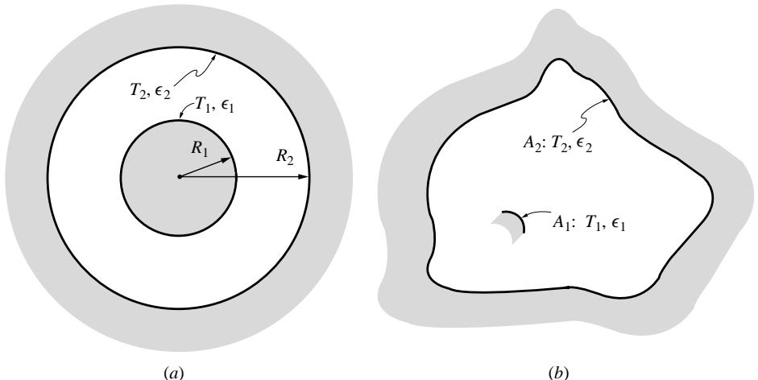
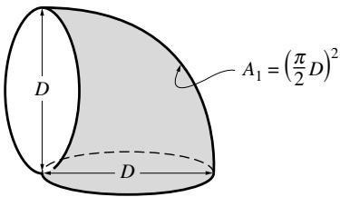
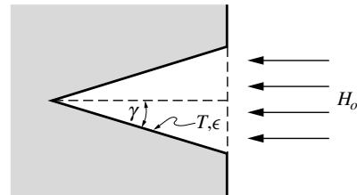
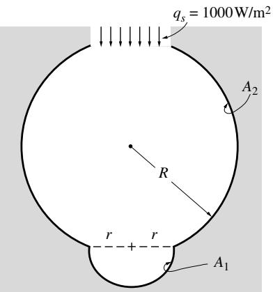

## 内容索引

- [目录](README.md)
- [1 热辐射基础](1-热辐射基础.md)
- [2 基于电磁波理论的辐射特性预测](2-基于电磁波理论的辐射特性预测.md)
- [3 实际表面的辐射特性](3-实际表面的辐射特性.md)
- [4 视角因子](4-视角因子.md)
- [5 灰体漫射表面间的辐射交换](5-灰体漫射表面间的辐射交换.md)
- [6 部分镜面灰体表面间的辐射交换](6-部分镜面灰体表面间的辐射交换.md)
- [7 非理想表面间的辐射交换](7-非理想表面间的辐射交换.md)
- [8 表面交换的蒙特卡洛方法](8-表面交换的蒙特卡洛方法.md)
- [9 传导和对流存在时的表面辐射交换](9-传导和对流存在时的表面辐射交换.md)
- [10 参与介质中的辐射传递方程(RTE)](10-参与介质中的辐射传递方程(RTE).md)
- [11 分子气体的辐射特性](11-分子气体的辐射特性.md)
- [12 颗粒介质的辐射特性](12-颗粒介质的辐射特性.md)
- [13 半透明介质的辐射特性](13-半透明介质的辐射特性.md)
- [14 一维灰体介质的精确解](14-一维灰体介质的精确解.md)
- [15 一维介质的近似求解方法](15-一维介质的近似求解方法.md)
- [16 球谐函数法 (PN-近似)](16-球谐函数法(PN-近似).md)
- [17 离散坐标法 (SN-近似)](17-离散坐标法(SN-近似).md)
- [18 区域法](18-区域法.md)
- [19 准直辐射与瞬态现象](19-准直辐射与瞬态现象.md)
- [20 非灰消光系数的求解方法](20-非灰消光系数的求解方法.md)
- [21 参与介质的蒙特卡洛方法](21-参与介质的蒙特卡洛方法.md)
- [22 辐射与传导和对流的耦合](22-辐射与传导和对流的耦合.md)
- [23 逆辐射传热](23-逆辐射传热.md)
- [24 纳米尺度辐射传热](24-纳米尺度辐射传热.md)
- [附录](附录.md)

- [5.1 引言](#51-引言)  
- [5.2 黑体表面间的辐射交换](#52-黑体表面间的辐射交换)  
- [5.3 灰体漫射表面间的辐射交换](#53-灰体漫射表面间的辐射交换)  
- [5.4 电路网络类比](#54-电路网络类比)  
- [5.5 辐射屏蔽层](#55-辐射屏蔽层)  
- [5.6 控制积分方程的求解方法](#56-控制积分方程的求解方法)  
- [参考文献](#参考文献)  
- [习题](#习题)

# 第5章 灰体漫射表面间的辐射交换

# 5.1 引言

本章我们将开始分析不含参与介质的封闭空间内的辐射传热率，利用前一章开发的视角因子。首先处理最简单的黑体封闭空间情况，即所有表面都是黑体的封闭空间。

这种简单分析通常就足够了，例如对于烟灰覆盖壁面的炉膛应用。随后将分析扩展到具有灰体漫射表面的封闭空间，这些表面的辐射特性不依赖于波长，并以漫射方式发射和反射能量。大量实验证据表明，大多数表面都以漫射方式发射（因此也吸收）能量，除了对传热计算不重要的掠射角$(\theta >60^{\circ})$（如图3-1所示）。大多数表面往往相当粗糙，因此以相对漫射的方式反射。最后，如果表面特性在表面黑体辐射功率显著的光谱范围内变化不大，那么灰体特性的简化可能是可以接受的。

对于这两种情况——黑体封闭空间以及具有灰体漫射表面的封闭空间——我们将首先推导任意封闭空间的控制积分方程，然后通过将其应用于理想化封闭空间简化为代数方程组。本章末尾将简要讨论一般积分方程的求解方法。

# 5.2 黑体表面间的辐射交换

考虑如图5-1所示的具有任意几何形状和温度分布的黑体壁面封闭空间。根据方程(4.1)，对$dA$进行能量平衡可得：

$$
q(\mathbf{r}) = E_b(\mathbf{r}) - H(\mathbf{r}), \tag{5.1}
$$

其中$H$是$dA$上的投射辐射。根据视角因子的定义，从$dA'$离开并被$dA$拦截的能量速率为$(E_{b}(\mathbf{r}')dA')dF_{dA' - dA}$。因此，$dA$从整个封闭空间和外部（对于具有半透明表面和/或孔洞的封闭空间）接收的总热流率为

  
图5-1 任意几何形状的黑体封闭空间

$$
H(\mathbf{r})dA = \int_{A}E_{b}(\mathbf{r}^{\prime})dF_{dA^{\prime} - dA}dA^{\prime} + H_{o}(\mathbf{r})dA, \tag{5.2}
$$

其中$H_{o}(\mathbf{r})$是投射辐射的外部贡献，即不是由封闭空间表面发射的部分。利用互易关系，可以表示为

$$
\begin{array}{l}{H(\mathbf{r}) = \int_{A}E_{b}(\mathbf{r}^{\prime})dF_{dA^{\prime} - dA^{\prime}} + H_{o}(\mathbf{r})}\\ {= \int_{A}E_{b}(\mathbf{r}^{\prime})\frac{\cos\theta\cos\theta^{\prime}}{\pi S^{2}} (\mathbf{r},\mathbf{r}^{\prime})dA^{\prime} + H_{o}(\mathbf{r}),} \end{array} \tag{5.3}
$$

其中$\theta$和$\theta^{\prime}$分别是表面元$dA$和$dA^{\prime}$处的角度，$S$是它们之间的距离，如第4.2节所定义。对于已知表面温度分布的封闭空间，局部热流可以方便地计算为1

$$
\mathbf{q}(\mathbf{r}) = E_{b}(\mathbf{r}) - \int_{A}E_{b}(\mathbf{r}^{\prime})dF_{dA - dA^{\prime}} - H_{o}(\mathbf{r}). \tag{5.4}
$$

为简化问题，通常将封闭空间划分为$N$个等温子表面，如图4-2b所示。则方程(5.4)变为

$$
q_{i}(\mathbf{r}) = E_{bi} - \sum_{j = 1}^{N}E_{bj}\int_{A_{j}}dF_{dA_{i} - dA_{j}} - H_{oi}(\mathbf{r}_{i}), \tag{5.5}
$$

或根据方程(4.16)，

$$
q_{i}(\mathbf{r}_{i}) = E_{bi} - \sum_{j = 1}^{N}E_{bj}F_{di - j}(\mathbf{r}_{i}) - H_{oi}(\mathbf{r}_{i}). \tag{5.6}
$$

  
图5-2 例5.1中的二维黑体管道

尽管$A_{i}$上的温度可能是恒定的，但热流通常不是，因为$(i)$局部视角因子$F_{di - j}$几乎总是在$A_{i}$上变化，$(ii)$外部投射辐射$H_{oi}$可能不均匀。我们可以通过对$A_{i}$上的方程(5.6)取平均来计算平均热流。利用$\begin{array}{r}\int_{A_i}F_{di - j}dA_i = A_iF_{i - j} \end{array}$，得到

$$
q_{i} = \frac{1}{A_{i}}\int_{A_{i}}q_{i}(\mathbf{r}_{i})dA_{i} = E_{bi} - \sum_{j = 1}^{N}E_{bj}F_{i - j} - H_{oi},\quad i = 1,2,\ldots ,N, \tag{5.7}
$$

其中$q_{i}$和$H_{oi}$现在理解为平均值。

利用方程(4.18)，我们将$E_{bi}$重写为$\sum_{j = 1}^{N}E_{bi}F_{i - j}$，即

$$
q_{i} = \sum_{j = 1}^{N}F_{i - j}(E_{bi} - E_{bj}) - H_{oi},\quad i = 1,2,\ldots ,N. \tag{5.8}
$$

在这个方程中，热流用表面$A_{i}$和$A_{j}$之间的净辐射能量交换表示，

$$
Q_{i - j} = q_{i - j}A_{i} = A_{i}F_{i - j}(E_{bi} - E_{bj}) = -Q_{j - i}. \tag{5.9}
$$

例5.1. 考虑如图5-2所示的非常长的管道。管道横截面为$30\mathrm{cm}\times 40\mathrm{cm}$，所有表面都是黑体。顶部和底部壁面温度为$T_{1} = 1000\mathrm{K}$，而侧壁温度为$T_{2} = 600\mathrm{K}$。确定每个表面上的净辐射热流率（单位管道长度）。

# 解

我们可以使用方程(5.7)或(5.8)。这里将使用后者，因为它更好地利用了问题的对称性（即利用了相同温度的两个表面之间的净辐射交换必须为零的事实）。因此，在没有外部投射辐射的情况下，利用对称性（例如$E_{b1} = E_{b3},F_{1 - 2} = F_{1 - 4},\mathrm{等}$）

$$
\begin{array}{rl} & q_{1} = F_{1 - 2}(E_{b1} - E_{b2}) + F_{1 - 3}(E_{b1} - E_{b3}) + F_{1 - 4}(E_{b1} - E_{b4})\\ & \quad = 2F_{1 - 2}(E_{b1} - E_{b2}) = q_{3},\\ & q_{2} = q_{4} = 2F_{2 - 1}(E_{b2} - E_{b1}). \end{array}
$$

只需要视角因子$F_{1 - 2}$和$F_{2 - 1}$，可以通过交叉线法方便地确定为

$$
\begin{array}{l}{F_{1 - 2} = \frac{30 + 40 - (\sqrt{30^2 + 40^2} + 0)}{2\times 40} = \frac{1}{4},}\\ {F_{2 - 1} = \frac{A_1}{A_2} F_{1 - 2} = \frac{40}{30}\times \frac{1}{4} = \frac{1}{3}.} \end{array}
$$

  
图5-3 例5.2中的同心黑体球

因此（用撇号表示"单位管道长度"），

$$
\begin{array}{l}{Q_1^{\prime} = Q_2^{\prime} = 2A_1^{\prime}F_{1 - 2}\sigma (T_1^4 -T_2^4)}\\ {= 2\times 0.4\mathrm{m}\times 0.25\times 5.670\times 10^{-8}\frac{\mathrm{W}}{\mathrm{m}^2\mathrm{K}^4} (1000^4 -600^4)\mathrm{K}^4 = 9870\mathrm{W / m}}\\ {Q_2^{\prime} = Q_2^{\prime} = 2A_2^{\prime}F_{2 - 1}\sigma (T_2^4 -T_1^4) = -9870\mathrm{W / m}} \end{array}
$$

从这个例子可以明显看出，所有表面热流率的总和必须为零。这直接来自能量守恒：进入封闭空间的总热流率（即所有表面的热流率之和）必须等于封闭空间内辐射能量的变化率。由于辐射以光速传播，稳态几乎瞬间达到，因此辐射能量的变化率几乎总是可以忽略不计。数学上，我们可以将方程(5.7)乘以$A_{i}$并对所有面积求和：

$$
\sum_{i = 1}^{N}(Q_{i} + A_{i}H_{oi}) = \sum_{i = 1}^{N}A_{i}E_{bi} - \sum_{i = 1}^{N}A_{i}\sum_{j = 1}^{N}E_{bj}F_{i - j} = \sum_{i = 1}^{N}A_{i}E_{bi} - \sum_{j = 1}^{N}A_{j}E_{bj}\sum_{i = 1}^{N}F_{j - i} = 0. \tag{5.10}
$$

这个关系对于检查计算的正确性或准确性（对于计算机计算）非常有用。

例5.2. 考虑如图5-3所示的两个同心等温黑体球，半径分别为$R_{1}$和$R_{2}$，温度分别为$T_{1}$和$T_{2}$。说明如何通过测量外球的温度和热流来推导内球的温度。

# 解

我们只有两个表面，方程(5.8)变为

$$
q_{1} = F_{1 - 2}(E_{b1} - E_{b2});q_{2} = F_{2 - 1}(E_{b2} - E_{b1}).
$$

由于球体1的所有辐射都到达球体2，我们有$F_{1 - 2} = 1$，根据互易关系，$F_{2 - 1} = A_{1} / A_{2}$。因此，

$$
Q_{1} = -Q_{2} = A_{1}\sigma (T_{1}^{4} - T_{2}^{4}).
$$

解这个方程求$T_{1}$，其中$A_{i} = 4\pi R_{i}^{2}$，得到

$$
T_{1}^{4} = T_{2}^{4} - \left(\frac{R_{2}}{R_{1}}\right)^{2}\frac{q_{2}}{\sigma}.
$$

当$T_{1}$大于$T_{2}$时，$q_{2}$为负，反之亦然。

  
图5-4 暴露在太阳辐射下的直角凹槽，例5.3

例5.3. 一个由两个宽度为$a$的长黑表面组成的直角凹槽，暴露在太阳辐射$q_{\mathrm{sol}}$下(图5-4)。整个凹槽表面保持等温温度$T$。确定从凹槽的净辐射热传递率。

# 解

我们同样可以使用方程(5.7)或(5.8)。然而，这次封闭体不是闭合的；我们必须人为地闭合它。我们注意到任何离开腔体的辐射都不会返回(除非附近有其他表面的反射)。因此，我们的人为表面应该是黑体。我们还假设，除了(平行的)太阳辐射外，没有外部辐射进入腔体。由于太阳辐射最好通过外部辐射项$H_{o}$单独处理，我们的人为表面是非发射的。这两个标准都可以通过在凹槽上覆盖一个温度为$0\mathrm{K}$的黑表面来满足。尽管我们现在有三个表面，但最后一个实际上不会出现在方程(5.7)中(因为$E_{b3} = 0$)，但它会出现在方程(5.8)中。使用方程(5.7)我们得到

$$
\begin{array}{rl}{q_1 = E_{b1} - F_{1 - 2}E_{b2} - H_{o1} = \sigma T^4 (1 - F_{1 - 2}) - q_{\mathrm{sol}}\cos \alpha ,}\\ {q_2 = E_{b2} - F_{2 - 1}E_{b1} - H_{o2} = \sigma T^4 (1 - F_{2 - 1}) - q_{\mathrm{sol}}\sin \alpha .} \end{array}
$$

从附录D中的配置33，当$H = 1$时，我们得到

$$
\begin{array}{r}F_{1 - 2} = \frac{1}{2}\left(2 - \sqrt{2}\right) = 0.293 = F_{2 - 1}, \end{array}
$$

且

$$
Q^{\prime} = a(q_{1} + q_{2}) = a\left[\sqrt{2}\sigma T^{4} - q_{\mathrm{sol}}(\cos \alpha +\sin \alpha)\right].
$$

这些例子表明，方程(5.8)通常更适用于封闭配置，因为它利用了相同温度的两个表面(或与自身)之间的净交换为零的事实。另一方面，方程(5.7)更适用于开放配置，因为用于闭合配置的假设表面不会贡献(因为它们的发射功率为零)：使用这个方程可以完全忽略假设的闭合表面！

方程(5.7)可以写成第三种形式，最适合计算机计算。使用克罗内克δ函数，定义为

$$
\delta_{ij} = \left\{ \begin{array}{ll}1, & i = j,\\ 0, & i\neq j, \end{array} \right. \tag{5.11}
$$

我们发现$\sum_{j = 1}^{N}\delta_{ij} = 1$和$\sum_{j = 1}^{N}E_{bj}\delta_{ij} = E_{bi}$。因此，

$$
q_{i} = \sum_{j = 1}^{N}(\delta_{ij} - F_{i - j})E_{bj} - H_{oi},\quad i = 1,2,\ldots ,N. \tag{5.12}
$$

假设对于表面$i = 1,2,\ldots ,n$，热流是给定的(温度未知)，而对于表面$i = n + 1,\ldots ,N$，温度是给定的(热流未知)。与热流不同，未知温度没有显式关系。将所有未知温度放在方程(5.12)的一边，我们可以写成

$$
\sum_{j = 1}^{n}(\delta_{ij} - F_{i - j})E_{bj} = q_{i} + H_{oi} + \sum_{j = n + 1}^{N}F_{i - j}E_{bj},\quad i = 1,2,\ldots ,n, \tag{5.13}
$$

其中方程右边的所有量都是已知的。矩阵形式可以写成2

$$
\mathbf{A}\cdot \mathbf{e}_{\mathbf{b}} = \mathbf{b}, \tag{5.14}
$$

其中

$$
\mathbf{A} = \left( \begin{array}{cccc}1 - F_{1 - 1} & -F_{1 - 2} & \dots & -F_{1 - n}\\ -F_{2 - 1} & 1 - F_{2 - 2} & \dots & -F_{2 - n}\\ \vdots & & \ddots & \vdots \\ -F_{n - 1} & -F_{n - 2} & \dots & 1 - F_{n - n} \end{array} \right), \tag{5.15}
$$

$$
\mathbf{e}_{\mathbf{b}} = \left( \begin{array}{c}E_{b1}\\ E_{b2}\\ \vdots \\ E_{bn} \end{array} \right),\mathbf{b} = \left( \begin{array}{c}q_{1} + H_{o1} + \sum_{j = n + 1}^{N}F_{1 - j}E_{bj}\\ q_{2} + H_{o2} + \sum_{j = n + 1}^{N}F_{2 - j}E_{bj}\\ \vdots \\ q_{n} + H_{on} + \sum_{j = n + 1}^{N}F_{n - j}E_{bj} \end{array} \right). \tag{5.16}
$$

$n \times n$矩阵$\mathbf{A}$可以在计算机上轻松求逆(通常借助软件库子程序)，未知温度计算为

$$
\mathbf{e}_{\mathbf{b}} = \mathbf{A}^{-1}\cdot \mathbf{b}. \tag{5.17}
$$

# 5.3 灰体漫射表面间的辐射交换

我们现在假设所有表面都是灰体，它们是漫射发射体、吸收体和反射体。在这些条件下$\epsilon = \epsilon_{\lambda}^{\prime} = \alpha_{\lambda}^{\prime} = \alpha = 1 - \rho$。从图4-1可知，离开位置$\mathbf{r}$表面的总热流为

$$
J(\mathbf{r}) = \epsilon (\mathbf{r})E_{b}(\mathbf{r}) + \rho (\mathbf{r})H(\mathbf{r}), \tag{5.18}
$$

这称为位置$\mathbf{r}$的表面有效辐射$J$。由于发射和反射都是漫射的，因此离开表面的强度也是漫射的：

$$
I(\mathbf{r},\hat{\mathbf{s}}) = I(\mathbf{r}) = J(\mathbf{r}) / \pi . \tag{5.19}
$$

因此，位于不同位置的观察者无法通过方向性行为来区分发射辐射和反射辐射。然而，观察者可能通过它们不同的光谱行为来区分两者。考虑示例5.2中黑色外球体和灰色漫射内球体的情况。在内球体上，发射辐射具有温度$T_{1}$下黑体的光谱分布，而反射辐射(最初由外球体发射)具有温度$T_{2}$下黑体的光谱分布。因此，光谱辐射度将表现出如图5-5所示的定性行为。如果观察者具备区分不同波长辐射的能力，就能区分发射辐射和反射辐射。灰色表面不具备这种能力，因为它对所有入射辐射都以相同方式响应，即它是"色盲"的。因此，灰色表面无法"知道"其辐照是来自灰色漫射表面还是具有有效发射功率$J$的黑色表面。这一事实大大简化了分析，因为它允许我们通过平衡直接从一个表面到另一个表面的净出射辐射(即发射和反射)来计算表面间的辐射传热率(而不是考虑直接或经过多次反射到达另一表面的发射辐射)。因此，以下分析通常被称为净辐射法。

  
图5-5 等温源辐照下辐射度的定性光谱行为

对图5-6所示封闭空间中的表面$dA$进行能量平衡，由方程(4.2)可得

$$
q(\mathbf{r}) = \epsilon (\mathbf{r})E_{b}(\mathbf{r}) - \alpha (\mathbf{r})H(\mathbf{r}) = J(\mathbf{r}) - H(\mathbf{r}). \tag{5.20}
$$

辐照度$H(\mathbf{r})$的确定方法是先计算微元面积$dA^{\prime}(\mathbf{r}^{\prime})$的贡献，然后对整个表面积分。根据视角因子的定义，离开$dA^{\prime}$被$dA$拦截的传热速率为$(J(\mathbf{r}^{\prime})dA^{\prime})dF_{dA^{\prime} - dA}$。因此，类似于黑体表面的情况，

$$
H(\mathbf{r})dA = \int_{A}J(\mathbf{r}^{\prime})dF_{dA^{\prime} - dA}dA^{\prime} + H_{o}(\mathbf{r})dA, \tag{5.21}
$$

其中$H_{o}(\mathbf{r})$是到达$dA$的任何外部辐射。利用互易关系，该方程可简化为

$$
H(\mathbf{r}) = \int_{A}J(\mathbf{r}^{\prime})dF_{dA - dA^{\prime}} + H_{o}(\mathbf{r}). \tag{5.22}
$$

将其代入方程(5.20)可得

$$
q(\mathbf{r}) = \epsilon (\mathbf{r})E_{b}(\mathbf{r}) - \alpha (\mathbf{r})\left[\int_{A}J(\mathbf{r}^{\prime})dF_{dA - dA^{\prime}} + H_{o}(\mathbf{r})\right]. \tag{5.23}
$$

因此，如果已知有效辐射场，就可以计算出未知的热流密度(或温度)。通过求解方程(5.20)中的$J$，可以很容易地建立有效辐射的控制积分方程：

  
图5-6 灰体漫射封闭空间中的辐射交换

$$
J(\mathbf{r}) = \epsilon (\mathbf{r})E_{o}(\mathbf{r}) + \rho (\mathbf{r})\left[\int_{A}J(\mathbf{r}^{\prime})dF_{dA - dA^{\prime}} + H_{o}(\mathbf{r})\right], \tag{5.24}
$$

对于局部热流密度已知的表面部分：
$$
J(\mathbf{r}) = q(\mathbf{r}) + \int_{A}J(\mathbf{r}^{\prime})dF_{dA - dA^{\prime}} + H_{o}(\mathbf{r}), \tag{5.25}
$$

然而，在没有参与介质的问题中，很少需要确定有效辐射，通常最好从方程(5.23)中消去有效辐射。用局部温度和热流密度表示有效辐射，并从方程(5.20)中消去辐照度$H$，我们得到：
$$
q - \alpha q = (\epsilon E_{b} - \alpha H) - \alpha (J - H) = \epsilon E_{b} - \alpha J.
$$

到目前为止，我们区分了发射率和吸收率，以保持关系尽可能普遍(即必要时适应非灰表面特性)。现在我们将采用灰体漫射表面的假设，即$\alpha = \epsilon$。于是：
$$
q(\mathbf{r}) = \frac{\epsilon(\mathbf{r})}{1 - \epsilon(\mathbf{r})} [E_{b}(\mathbf{r}) - J(\mathbf{r})]. \tag{5.26}
$$

求解有效辐射得到：
$$
J(\mathbf{r}) = E_{b}(\mathbf{r}) - \left(\frac{1}{\epsilon(\mathbf{r})} -1\right)q(\mathbf{r}). \tag{5.27}
$$

将其代入方程(5.23)，我们得到关于温度$T$和热流密度$q$的积分方程：
$$
\frac{q(\mathbf{r})}{\epsilon(\mathbf{r})} -\int_{A}\left(\frac{1}{\epsilon(\mathbf{r}^{\prime})} -1\right)q(\mathbf{r}^{\prime})dF_{dA - dA^{\prime}} + H_{o}(\mathbf{r}) = E_{b}(\mathbf{r}) - \int_{A}E_{b}(\mathbf{r}^{\prime})dF_{dA - dA^{\prime}}. \tag{5.28}
$$

注意，对于黑体封闭空间，方程(5.28)简化为方程(5.4)。然而，对于温度场已知的黑体封闭空间，局部热流密度可以通过对发射功率的简单积分确定。对于灰体封闭空间，必须求解积分方程，即未知因变量$q(\mathbf{r})$出现在积分内的方程。这一要求使得求解难度大大增加。

与黑体封闭空间类似，通常将灰体封闭空间划分为$N$个子表面，假设每个子表面上的有效辐射是恒定的。那么方程(5.23)变为：
$$
\frac{q_i(\mathbf{r}_i)}{\epsilon_i(\mathbf{r}_i)} = E_{bi}(\mathbf{r}_i) - \sum_{j = 1}^{N}J_jF_{di - j}(\mathbf{r}_i) - H_{oi}(\mathbf{r}_i),\quad i = 1,2,\ldots ,N, \tag{5.29}
$$

对子表面$A_{i}$取平均得到：
$$
\frac{q_i}{\epsilon_i} = E_{bi} - \sum_{j = 1}^{N}J_jF_{i - j} - H_{oi},\quad i = 1,2,\ldots ,N. \tag{5.30}
$$

对方程(5.26)进行类似平均得到：
$$
q_{i} = \frac{\epsilon_{i}}{1 - \epsilon_{i}}\left[E_{bi} - J_{i}\right]. \tag{5.31}
$$

求解$J$并代入方程(5.30)得到：
$$
\frac{q_i}{\epsilon_i} -\sum_{j = 1}^{N}\left(\frac{1}{\epsilon_j} -1\right)F_{i - j}q_j + H_{oi} = E_{bi} - \sum_{j = 1}^{N}F_{i - j}E_{bj},\quad i = 1,2,\ldots ,N. \tag{5.32}
$$

如果$(1 / \epsilon - 1)q$和$E_{b}$($J$的组成部分)在子表面上都假设为常数，这个关系也可以直接从方程(5.28)得出。回顾求和规则$\sum_{j = 1}^{N}F_{i - j} = 1$，我们也可以将方程(5.32)写成表面间的交换形式：
$$
\frac{q_i}{\epsilon_i} -\sum_{j = 1}^{N}\left(\frac{1}{\epsilon_j} -1\right)F_{i - j}q_j + H_{oi} = \sum_{j = 1}^{N}F_{i - j}(E_{bi} - E_{bj}),\quad i = 1,2,\ldots ,N. \tag{5.33}
$$

当然，这两个方程中的任何一个对于黑体封闭空间都会简化为方程(5.8)。方程(5.32)适用于开放构型，因为它允许忽略假设的封闭表面；而方程(5.33)适用于封闭空间，因为它消除了相同温度表面间的传热。

有时需要确定表面的有效辐射，例如在辐射测温领域(将表面温度与离开表面的辐射强度相关联)。根据两者中哪个是未知的，借助方程(5.31)从方程(5.30)中消去$q_{i}$或$E_{bi}$得到：
$$
\begin{array}{l}{J_i = \epsilon_iE_{bi} + (1 - \epsilon_i)\left(\sum_{j = 1}^N J_jF_{i - j} + H_{oi}\right)}\\ {= q_i + \sum_{j = 1}^N J_jF_{i - j} + H_{oi},\quad i = 1,2,\ldots ,N.} \end{array} \tag{5.34a}
$$

这两个关系简单地重复了有效辐射的定义，第一个说明有效辐射由发射和反射的热流组成，第二个说明有效辐射或出射热流等于净热流(负$q_{\mathrm{in}}$)加上$q_{\mathrm{in}}$的绝对值。

  
图5-7 例5.4中的二维灰体漫射通道

例5.4. 重新考虑例5.1，但使用灰体漫射表面材料。顶部和底部壁面温度为$T_{1} = T_{3} = 1000\mathrm{K}$，发射率$\epsilon_{1} = \epsilon_{3} = 0.3$；侧壁温度为$T_{2} = T_{4} = 600\mathrm{K}$，发射率$\epsilon_{2} = \epsilon_{4} = 0.8$，如图5-7所示。确定每个表面的净辐射传热率。

# 解答

对$i=1$和$i=2$应用方程(5.33)，并注意到$F_{1-2}=F_{1-4}$和$F_{2-1}=F_{2-3}$，有：

$$
\begin{array}{l}{i = 1:\frac{q_1}{\epsilon_1} -2\left(\frac{1}{\epsilon_2} -1\right)F_{1 - 2}q_2 - \left(\frac{1}{\epsilon_1} -1\right)F_{1 - 3}q_1 = 2F_{1 - 2}(E_{b1} - E_{b2}),}\\ {i = 2:\frac{q_2}{\epsilon_2} -2\left(\frac{1}{\epsilon_1} -1\right)F_{2 - 1}q_1 - \left(\frac{1}{\epsilon_2} -1\right)F_{2 - 4}q_2 = 2F_{2 - 1}(E_{b2} - E_{b1}).} \end{array}
$$

在例5.1中已求得$F_{1-2}=\frac{1}{4}$和$F_{2-1}=\frac{1}{3}$。根据求和规则$F_{1-3}=1-2F_{1-2}=\frac{1}{2}$，$F_{2-4}=1-2F_{2-1}=\frac{1}{3}$。将这些值及发射率代入关系式，可简化为：

$$
\begin{array}{r}\left[\frac{1}{0.3} -\left(\frac{1}{0.3} -1\right)\frac{1}{2}\right]q_1 - 2\left(\frac{1}{0.8} -1\right)\frac{1}{4} q_2 = 2\times \frac{1}{4} (E_{b1} - E_{b2}),\\ -2\left(\frac{1}{0.3} -1\right)\frac{1}{3} q_1 + \left[\frac{1}{0.8} -\left(\frac{1}{0.8} -1\right)\frac{1}{3}\right]q_2 = 2\times \frac{1}{3} (E_{b2} - E_{b1}), \end{array}
$$

即：

$$
\begin{array}{c}{\frac{13}{6} q_1 - \frac{1}{8} q_2 = \frac{1}{2} (E_{b1} - E_{b2}),}\\ {-\frac{14}{9} q_1 + \frac{7}{6} q_2 = -\frac{2}{3} (E_{b1} - E_{b2}).} \end{array}
$$

因此，

$$
\begin{array}{c}{\left(\frac{13}{6}\times \frac{7}{6} -\frac{14}{9}\times \frac{1}{8}\right)q_1 = \left(\frac{1}{2}\times \frac{7}{6} -\frac{2}{3}\times \frac{1}{8}\right)(E_{b1} - E_{b2}),}\\ {q_1 = \frac{3}{7}\times \frac{1}{2} (E_{b1} - E_{b2}) = \frac{3}{14}\sigma (T_1^4 -T_2^4),} \end{array}
$$

且

$$
\begin{array}{c}{\left(-\frac{1}{8}\times \frac{14}{9} +\frac{7}{6}\times \frac{13}{6}\right)q_2 = \left(\frac{1}{2}\times \frac{14}{9} -\frac{2}{3}\times \frac{13}{6}\right)(E_{b1} - E_{b2}),}\\ {q_2 = -\frac{3}{7}\times \frac{2}{3} (E_{b1} - E_{b2}) = -\frac{2}{7}\sigma (T_1^4 -T_2^4).} \end{array}
$$

最后，代入温度值得：

$$
\begin{array}{l}{Q_1^{\prime} = 0.4\mathrm{m}\times \frac{3}{14}\times 5.670\times 10^{-8}\frac{\mathrm{W}}{\mathrm{m}^2\mathrm{K}^4} (1000^4 -600^4)\mathrm{K}^4 = 4230\mathrm{W / m},}\\ {Q_2^{\prime} = -0.3\mathrm{m}\times \frac{2}{7}\times 5.670\times 10^{-8}\frac{\mathrm{W}}{\mathrm{m}^2\mathrm{K}^4} (1000^4 -600^4)\mathrm{K}^4 = -4230\mathrm{W / m}.} \end{array}
$$

显然，两个传热速率之和必须为零。我们观察到这些速率比黑体通道的情况小了一半以上。

  
图5-8 辐射传热示意图：(a)两个同心球体，(b)凸表面与大等温封闭体

例5.5. 计算两个等温灰体同心球体之间的辐射热流，其半径分别为$R_{1}$和$R_{2}$，温度为$T_{1}$和$T_{2}$，发射率分别为$\epsilon_{1}$和$\epsilon_{2}$，如图5-8a所示。

# 解答

再次对$i=1$(内球)和$i=2$(外球)应用方程(5.33)，得到：

$$
\begin{array}{l}{i = 1:\frac{q_1}{\epsilon_1} -\Big(\frac{1}{\epsilon_1} -1\Big)F_{1 - 1}q_1 - \Big(\frac{1}{\epsilon_2} -1\Big)F_{1 - 2}q_2 = F_{1 - 2}(E_{b1} - E_{b2}),}\\ {i = 2:\frac{q_2}{\epsilon_2} -\Big(\frac{1}{\epsilon_1} -1\Big)F_{2 - 1}q_1 - \Big(\frac{1}{\epsilon_2} -1\Big)F_{2 - 2}q_2 = F_{2 - 1}(E_{b2} - E_{b1}).} \end{array}
$$

由于$F_{1 - 1} = 0$，$F_{1 - 2} = 1$，$F_{2 - 1} = A_{1} / A_{2}$，且$F_{2 - 2} = 1 - F_{2 - 1} = 1 - A_{1} / A_{2}$，这两个方程可简化为：

$$
\frac{1}{\epsilon_1} q_1 - \left(\frac{1}{\epsilon_2} -1\right)q_2 = \sigma (T_1^4 -T_2^4),
$$

$$
\Big(\frac{1}{\epsilon_1} -1\Big)\frac{A_1}{A_2} q_1 + \Big[\frac{1}{\epsilon_2} -\Big(\frac{1}{\epsilon_2} -1\Big)\Big(1 - \frac{A_1}{A_2}\Big)\Big]q_2 = -\frac{A_1}{A_2}\sigma (T_1^4 -T_2^4).
$$

可以通过消去$q_{2}$(或利用能量守恒$A_{1}q_{1} + A_{2}q_{2} = 0$)来求解$q_{1}$：

$$
q_{1} = \frac{\sigma(T_{1}^{4} - T_{2}^{4})}{\frac{1}{\epsilon_{1}} + \frac{A_{1}}{A_{2}}\left(\frac{1}{\epsilon_{2}} - 1\right)}. \tag{5.35}
$$

需要注意的是，方程(5.35)不仅适用于同心球体，也适用于任何凸表面$A_{1}$(即$F_{1 - 1} = 0$)仅向$A_{2}$辐射(即$F_{1 - 2} = 1$)的情况，如图5-8b所示。这对于放置在大型等温环境($A_{a} \gg A_{i}$)中温度为$T_{a}$的凸表面$A_{i}$非常方便，可得：

$$
q_{i} = \epsilon_{i}\sigma (T_{i}^{4} - T_{a}^{4}). \tag{5.36}
$$

表面$A_{i}$也可以是假设性的，用于封闭包含在大型环境中的开放结构。

例5.6. 重新考虑例5.3，但凹槽表面为灰体漫射表面，发射率为$\epsilon$，而非黑体。

  
图5-9 带部分盖板的圆柱形空腔，例5.7

# 解答

对开放结构应用方程(5.32)得到：

$$
\begin{array}{rl}{i = 1:} & {\frac{q_1}{\epsilon} -\left(\frac{1}{\epsilon} -1\right)F_{1 - 2}q_2 + H_{o1} = \sigma T^4 (1 - F_{1 - 2}),}\\ {i = 2:} & {\frac{q_2}{\epsilon} -\left(\frac{1}{\epsilon} -1\right)F_{2 - 1}q_1 + H_{o2} = \sigma T^4 (1 - F_{2 - 1}),} \end{array}
$$

这里利用了$E_{b1} = E_{b2} = \sigma T^4$和$\epsilon_{1} = \epsilon_{2} = \epsilon$的事实。与例5.3相同，$F_{1 - 2} = F_{2 - 1} = 1 - \sqrt{2} /2$，$H_{o1} = q_{\mathrm{sol}}\cos \alpha$，$H_{o2} = q_{\mathrm{sol}}\sin \alpha$。由于我们只关心总热损失，将两个方程相加得到：

$$
\Big[\frac{1}{\epsilon} -\Big(\frac{1}{\epsilon} -1\Big)F_{1 - 2}\Big](q_1 + q_2) = \sqrt{2}\sigma T^4 -q_{\mathrm{sol}}(\cos \alpha +\sin \alpha),
$$

且

$$
Q^{\prime} = a(q_{1} + q_{2}) = \frac{a\Big[\sqrt{2}\sigma T^{4} - q_{\mathrm{sol}}(\cos\alpha + \sin\alpha)\Big]}{1 + \Big(\frac{1}{\epsilon} - 1\Big) / \sqrt{2}}.
$$

将此结果与例5.3比较，可以看到由于发射导致的热损失减少了(发射减少，但由于对面表面的反射，发射能量的热损失更有效)，太阳热增益也减少了(因为部分辐射被反射出空腔)。

例5.7. 考虑图5-9所示的空腔，它由直径为$D$、长度为$L$的圆柱形孔组成。空腔顶部覆盖着一个带直径为$d$孔的圆盘。整个空腔内部处于温度$T$的等温状态，并覆盖有发射率为$\epsilon$的灰体漫射材料。确定从空腔逃逸的辐射量。

# 解答

为简化计算，由于整个表面处于等温状态且具有相同的发射率，我们使用单一区域$A_{1}$来表示整个空腔表面(侧面、底部和顶部)。因此，方程(5.32)简化为：

$$
\Big[\frac{1}{\epsilon_1} -\Big(\frac{1}{\epsilon_1} -1\Big)F_{1 - 1}\Big]q_1 = (1 - F_{1 - 1})E_{b1}.
$$

由于离开空腔的总辐射能量速率为$Q_{1} = A_{1}q_{1}$，我们得到：

$$
Q_{1} = \frac{1 - F_{1 - 1}}{\frac{1}{\epsilon_{1}} - \left(\frac{1}{\epsilon_{1}} - 1\right)F_{1 - 1}} A_{1}E_{b1}.
$$

视角因子$F_{1 - 1}$可以通过认识到$F_{o - 1} = 1$(其中$A_{o}$是顶部的开口)并通过互易关系确定：

$$
F_{1 - 1} = 1 - F_{1 - o} = 1 - \frac{A_o}{A_1} F_{o - 1} = 1 - \frac{A_o}{A_1}.
$$

因此，单位开口面积离开空腔的辐射热流为：

$$
\frac{Q_1}{A_o} = \frac{\left(1 - 1 + \frac{A_o}{A_1}\right)\frac{A_1}{A_o}E_{b1}}{\epsilon_1\left(\frac{1}{\epsilon_1} - 1\right)\left(1 - \frac{A_o}{A_1}\right)} = \frac{E_{b1}}{1 + \left(\frac{1}{\epsilon_1} - 1\right)\frac{A_o}{A_1}}.
$$

因此，当$A_{o} / A_{1}\ll 1$时，空腔开口的行为类似于具有发射功率$E_{b1}$的黑体。这种空腔通常用于需要黑体进行比较的实验方法中。例如，对于$d / D = 1 / 2$和$L / D = 2$的空腔：

$$
\begin{array}{rcl}\frac{A_o}{A_1} & = & \frac{\pi d^2 / 4}{2\pi D^2 / 4 - \pi d^2 / 4 + \pi DL} = \frac{d^2}{2D^2 - d^2 + 4DL}\\ & = & \frac{(d / D)^2}{2 - (d / D)^2 + 4(L / D)} = \frac{1 / 4}{2 - 1 / 4 + 4\times 2} = \frac{1}{39}. \end{array}
$$

对于$\epsilon_{1} = 0.5$，这导致表观发射率为：

$$
\epsilon_{a} = \frac{Q_{1}}{A_{o}E_{b1}} = \frac{1}{1 + \left(\frac{1}{\epsilon_{1}} - 1\right)\frac{A_{o}}{A_{1}}} = \frac{1}{1 + \left(\frac{1}{0.5} - 1\right)\frac{1}{39}} = \frac{39}{40} = 0.975.
$$

对于计算机计算，将Kronecker delta引入方程(5.32)，如黑体封闭体中所做的那样，得到：

$$
\sum_{j = 1}^{N}\left[\frac{\delta_{ij}}{\epsilon_j} -\left(\frac{1}{\epsilon_j} -1\right)F_{i - j}\right]q_j = \sum_{j = 1}^{N}\left[\delta_{ij} - F_{i - j}\right]E_{bj} - H_{o}. \tag{5.37}
$$

如果所有温度已知且需要确定辐射热流，则方程(5.37)可以表示为矩阵形式：

$$
\mathbf{C}\cdot \mathbf{q} = \mathbf{A}\cdot \mathbf{e}_{\mathbf{b}} - \mathbf{h}_o, \tag{5.38}
$$

其中C和A是具有以下元素的矩阵：

$$
\begin{array}{l}{C_{ij} = \frac{\delta_{ij}}{\epsilon_j} -\left(\frac{1}{\epsilon_j} -1\right)F_{i - j},}\\ {A_{ij} = \delta_{ij} - F_{i - j},} \end{array}
$$

而$\mathbf{q},\mathbf{e}_{\mathrm{b}}$和$\mathbf{h}_{\mathrm{b}}$分别是未知热流$q_{j}$、已知发射功率$E_{bj}$和外部辐照$H_{o j}$的向量。方程(5.38)通过矩阵求逆求解：

$$
\begin{array}{r}\mathbf{q} = \mathbf{C}^{-1}\cdot [\mathbf{A}\cdot \mathbf{e}_{\mathbf{b}} - \mathbf{h}_{\mathbf{o}}]. \end{array} \tag{5.39}
$$

如果发射功率仅在某些表面已知，而在其他位置指定了热流，则可以将方程(5.38)重新排列为包含所有未知数的向量的类似方程。附录F中提供了子程序graydiff用于求解联立方程(5.38)，需要表面信息和部分视角因子矩阵作为输入。例5.4的三维版本解也以程序graydiffxch的形式给出，可用作解决其他问题的起点。提供了Fortran90、$\mathbb{C} + +$以及MATLAB®版本。还有一些商业求解器可用，通常包括视角因子评估软件，如TRASYS [1]和TSS [2]。

  
图5-10 无限平行板的电网络类比：(a)空间电阻，(b)表面电阻，(c)总电阻。

# 5.4 电路网络类比

虽然方程(5.37)代表了当今数字计算机上进行数值计算最方便的控制方程组，但有些人更喜欢通过等效电路网络来获得辐射换热问题的物理直观感受，这种方法更适合模拟计算机——现在几乎已经绝迹。为了完整性，我们将简要介绍这种由Oppenheim[3]首次提出的电路网络方法。

由方程(5.20)可得：

$$
q_{i} = J_{i} - H_{i},\quad i = 1,2,\ldots ,N, \tag{5.40}
$$

或者结合方程(5.30)和(5.31)：

$$
\begin{array}{l}{q_i = J_i - \sum_{j = 1}^N J_jF_{i - j} - H_{oi},}\\ {= \sum_{j = 1}^N (J_i - J_j)F_{i - j} - H_{oi},i = 1,2,\ldots ,N.} \end{array} \tag{5.42}
$$

我们首先考虑没有外部辐射的两个无限大平行平板的简单情况。因此，$N = 2$，$H_{oi} = 0$，且：

$$
Q_{1} = A_{1}q_{1} = \frac{J_{1} - J_{2}}{\frac{1}{A_{1}F_{1 - 2}}} = -Q_{2}. \tag{5.43}
$$

如式(5.43)所示，可以这样解释：如果将辐射力视为电势，$1 / A_{1}F_{1 - 2}$是表面间的辐射热阻，或称空间热阻，$Q$是辐射热流"电流"，那么方程(5.43)就等同于由于电势差导致电流流过电阻器的控制方程，如图5-10a所示。空间热阻衡量了辐射热流从一个表面流向另一个表面的难易程度：$F_{1 - 2}$越大，热量从$A_{1}$传递到$A_{2}$就越容易，导致热阻越小。同样的热流也可以由方程(5.31)给出：

$$
Q_{1} = \frac{E_{b1} - J_{1}}{\frac{1 - \epsilon_{1}}{A_{1}\epsilon_{1}}} = \frac{J_{2} - E_{b2}}{\frac{1 - \epsilon_{2}}{A_{2}\epsilon_{2}}} = -Q_{2}, \tag{5.44}
$$

其中$(1 - \epsilon_{i}) / A_{i}\epsilon_{i}$是辐射表面热阻。这种情况如图5-10b所示。表面热阻描述了表面辐射的能力。对于最大辐射体——黑体表面，热阻为零。这意味着对于有限的热流，零热阻上的电势降必须为零，即$J_{i} = E_{bi}$。当然，可以从方程(5.43)和(5.44)中消去辐射力，得到：

  
图5-11 表面$A_{i}$与所有其他表面间辐射热流的网络表示

$$
Q_{1} = \frac{E_{b1} - E_{b2}}{\frac{1 - \epsilon_{1}}{A_{1}\epsilon_{1}} + \frac{1}{A_{1}F_{1 - 2}} + \frac{1 - \epsilon_{2}}{A_{2}\epsilon_{2}}} = -Q_{2}, \tag{5.45}
$$

其中分母是表面$A_{1}$和$A_{2}$之间的总辐射热阻。由于这三个热阻是串联的，它们像电阻一样简单相加；见图5-10c。

通过将方程(5.42)重写为以下形式，可以很容易地将这种网络类比扩展到更复杂的情况：

$$
Q_{i} = \frac{E_{bi} - J_{i}}{\frac{1 - \epsilon_{i}}{A_{i}\epsilon_{i}}} = \sum_{j = 1}^{N}\frac{J_{i} - J_{j}}{\frac{1}{A_{i}F_{i - j}}} -A_{i}H_{oi} = \sum_{j = 1}^{N}Q_{i - j} - A_{i}H_{oi}. \tag{5.46}
$$

因此，表面$i$处的总热流是$A_{i}$与封闭体内所有其他表面之间的净辐射交换。电路类比如图5-11所示，其中从$E_{bi}$流向$J_{i}$的电流被分成$N$条平行支路，每条支路具有不同的电势差和不同的电阻。

例5.8. 考虑图5-12a所示的太阳能集热器。集热器由玻璃盖板、集热板和侧壁组成。我们假设玻璃对太阳辐射完全透明，太阳辐射穿透玻璃并以$1000\mathrm{W / m^2}$的强度照射吸收板。吸收板是黑色的，并通过下方流动的加热水保持恒定温度$T_{1} = 77^{\circ}\mathrm{C}$。侧壁是绝热的，由发射率$\epsilon_{2} = 0.5$的材料制成。玻璃盖板对热辐射(即红外辐射)可视为不透明，其发射率$\epsilon_{3} = 0.9$。集热器尺寸为$1\mathrm{m}\times 1\mathrm{m}\times 10\mathrm{cm}$，并适当抽真空以抑制吸收板与玻璃盖板之间的自由对流。已知玻璃盖板顶部的对流换热系数为$h = 5.0\mathrm{W / m^2K}$，环境温度为$T_{a} = 17^{\circ}\mathrm{C}$。估算垂直太阳入射时的收集能量。

# 解答

我们可以构建一个等效电路网络(图5-12b)，得到：

$$
Q_{1} = \frac{\sigma(T_{1}^{4} - T_{a}^{4})}{R_{13} + \frac{1 - \epsilon_{3}}{A_{3}\epsilon_{3}} + R_{3a}} -A_{1}q_{s},
$$

其中$R_{13}$是表面$A_{1}$和$A_{3}$之间的总热阻，$R_{3a}$是玻璃盖板与环境之间通过辐射和自由对流的总热阻。注意到由于$A_{2}$是绝热的，在$E_{b2}$处没有热流进出，根据方程(5.44)，$J_{2} = E_{b2}$。因此，$A_{1}$和$A_{3}$之间的总热阻来自两个并联电路：一个电阻为$1 / (A_{1}F_{1 - 3})$，另一个由两个串联电阻$1 / (A_{1}F_{1 - 2})$和$1 / (A_{3}F_{3 - 2})$组成，即：

  
图5-12 例5.8示意图：(a)几何结构，(b)网络

$$
\begin{array}{r}\frac{1}{R_{13}} = \frac{1}{1 / (A_1F_{1 - 3})} +\frac{1}{1 / (A_1F_{1 - 2}) + 1 / (A_3F_{3 - 2})}\\ = A_1F_{1 - 3} + \frac{1}{2} A_1F_{1 - 2} = A_1\left(F_{1 - 3} + \frac{1}{2} F_{1 - 2}\right), \end{array}
$$

这里我们利用了对称性$A_{1}F_{1 - 2} = A_{3}F_{3 - 2}$。根据附录D中的配置38，当$X = Y = 10$时，得到$F_{1 - 3} = 0.827$，$F_{1 - 2} = 1 - F_{1 - 3} = 0.173$，因此：

$$
R_{13} = 1 / \left[1\mathrm{m}^2\times (0.827 + 0.5\times 0.173)\right] = 1.095\mathrm{m}^{-2}.
$$

玻璃盖板与环境之间的热阻计算稍复杂。盖板通过自由对流和辐射的总热损失为：

$$
Q_{3a} = \epsilon_3A_3\sigma (T_3^4 -T_a^4) + hA_3(T_3 - T_a),
$$

我们假设环境(天空)以环境温度$T_{a}$向集热器辐射。为转换为正确形式，重写为：

$$
Q_{3a} = \sigma (T_3^4 -T_a^4)A_3\left[\epsilon_3 + \frac{h(T_3 - T_a)}{\sigma(T_3^4 - T_a^4)}\right],
$$

即：

$$
\frac{1}{R_{3a}} = A_3\left[\epsilon_3 + \frac{n}{\sigma}\frac{T_3 - T_a}{T_3^4 - T_a^4}\right] = A_3\left[\epsilon_3 + \frac{n}{\sigma}\frac{1}{T_3^3 + T_3^2T_a + T_3T_a^2 + T_a^3}\right].
$$

作为初步近似，若$T_{3}$与$T_{a}$相差不大：

$$
\frac{1}{R_{3a}}\simeq A_3\left(\epsilon_3 + \frac{n}{4\sigma T_a^3}\right) = 1\mathrm{m}^2\left(0.9 + \frac{5\mathrm{W} / \mathrm{m}^2\mathrm{K}}{4\times 5.670\times 10^{-8}\mathrm{W} / \mathrm{m}^2\mathrm{K}^4\times(273 + 17)^3\mathrm{K}^3}\right) = \frac{1}{0.554}\mathrm{m}^2.
$$

最后，将热阻代入$Q_{1}$表达式得：

$$
Q_{1} = \frac{5.670\times 10^{-8}\mathrm{W / m^{2}K^{4}}\left[(273 + 77)^{4} - (273 + 17)^{4}\right]\mathrm{K^{4}}}{1.095\mathrm{m}^{-2} + \frac{1 - 0.9}{0.9\mathrm{m}^{2}} + 0.554\mathrm{m}^{-2}} -1\mathrm{m}^{2}\times 1000\mathrm{W / m}^{2}
$$

  
图5-13 同心圆柱(或球体)间放置$N$个辐射屏蔽层

由于系统理论最大收集功率为$- 1000\mathrm{W}$，集热器效率为：

$$
\eta_{\mathrm{collector}} = \frac{Q_1}{A_1q_s} = \frac{744}{1000} = 0.744 = 74.4\% .
$$

该效率应与未覆盖黑体集热板比较，其净热流为：

$$
\begin{array}{rl}{Q_1 = A_1\left[\sigma (T_1^4 -T_a^4) + h(T_1 - T_a) - q_s\right]} & {}\\ {= 1\mathrm{m}^2\left[5.670\times 10^{-8}\times (350^4 -290^4) + 5\times (350 - 290) - 1000\right]\mathrm{W / m}^2} & {}\\ {= -250\mathrm{W}.} & {} \end{array}
$$

因此，该温度下无保护的集热器效率仅为$25\%$。

电路网络类比法对于简单两表面和三表面封闭体(如前例)是非常直观有效的方法。然而，对于具有多个表面的更复杂封闭体，该方法会迅速变得繁琐且难以处理。

# 5.5 辐射屏蔽层

在高性能绝热材料中，通常通过抽空两表面间的空间来抑制传导和对流热传递。这使得热辐射成为主导的热损失方式，即使在低温应用中（如低温储罐的绝热层）也是如此。通过在表面之间放置大量紧密排列、平行且高反射率的辐射屏蔽层，可以最小化辐射损失。辐射屏蔽层通常由薄金属箔制成，或为进一步减少传导损失，采用涂有金属薄膜的介电箔。无论哪种情况，辐射屏蔽层往往都是非常镜面的反射体。然而，对于紧密排列的屏蔽层，反射率的方向性行为往往无关紧要，假设漫反射率可获得极好的精度（另见下章例6.9）。

图5-13展示了两同心圆柱（或同心球体）间放置N个辐射屏蔽层的典型布置。该几何结构包括半径大（且接近相等）时的平行平板情况。设内圆柱温度为$T_{i}$，表面积为$A_{i}$，发射率为$\epsilon_{i}$。类似地，每个屏蔽层温度为$T_{n}$（未知），$A_{n}$，$\epsilon_{ni}$（内表面）和$\epsilon_{no}$（外表面）。最后一个屏蔽层$A_{N}$与外圆柱$T_{o},A_{o}$和$\epsilon_0$相对。离开$A_{i}$的净辐射热流当然等于通过每个屏蔽层的热流和到达$A_0$的热流。该净热流可以方便地通过电路网络类比或重复应用封闭关系式(5.32)确定。然而，这正是网络类比真正闪耀的问题类型，我们将在此使用该方法。同心表面的情况已在例5.5中评估，因此任意两同心圆柱间的净热流为

$$ 
Q = \frac{E_{bj} - E_{bk}}{R_{j - k}},R_{j - k} = \frac{1}{\epsilon_jA_j} +\frac{1}{A_k}\left(\frac{1}{\epsilon_k} -1\right). \tag{5.47} 
$$

因此，我们可以写出

$$ 
QR_{i - 1i} = E_{bi} - E_{b1}, 
$$

$$ 
QR_{1o - 2i} = E_{b1} - E_{b2}, 
$$

$$ 
QR_{N o - o} = E_{b N} - E_{b o}. 
$$

将所有方程相加可消除所有未知屏蔽层温度，解热流后得到

$$ 
Q = \frac{E_{bj} - E_{bo}}{R_{i - 1i} + \sum_{n = 1}^{N - 1}R_{n o - n + 1,i} + R_{N o - o}}. \tag{5.48} 
$$

例5.9. 一个装有4升4.2K液氦的Dewar瓶主要由两个同心不锈钢圆柱($\epsilon = 0.3$)组成，长度50cm，内外径分别为$D_{i} = 10\mathrm{cm}$和$D_{o} = 20\mathrm{cm}$。圆柱间抽成高真空以消除传导/对流热损失。需在Dewar壁间放置辐射屏蔽层，将辐射损失降低到当Dewar置于298K环境中时，4升液氦需要24小时才能蒸发完。为此例可假设：(i)端部损失及传导/对流损失可忽略，(ii)壁温分别为$T_{i} = 4.2\mathrm{K}$和$T_{o} = 298\mathrm{K}$，(iii)辐射是一维的。可用双面镀铝($\epsilon = 0.05$)的薄塑料片作为屏蔽材料。估算所需屏蔽层数量。常压下氦的蒸发焓$h_{fg,\mathrm{He}} = 20.94\mathrm{J / g}$（相比其他液体非常低），液氦密度$\rho_{\mathrm{He}} = 0.125\mathrm{g / cm}^3$[4]。

# 解

蒸发4升液氦所需总热量为

$$
Q = \rho_{\mathrm{He}}V_{\mathrm{He}}h_{fg,\mathrm{He}} = 0.125\frac{\mathrm{g}}{\mathrm{cm}^3}\times 4\mathrm{liters}\times \frac{10^3\mathrm{cm}^3}{\mathrm{liter}}\times 20.94\frac{\mathrm{J}}{\mathrm{g}} = 10.47\mathrm{kJ}.
$$

若所有这些能量在24小时内通过径向辐射提供，则方程(5.48)中的热流必须保持在$\dot{Q} = Q / 24\mathrm{h} = 10,470 / (24\mathrm{h}\times (1\mathrm{h} / 3600\mathrm{s}) = 0.1212\mathrm{W}$以下，或$q_{i} = \dot{Q} /A_{i} = 0.1212\mathrm{W} / (\pi \times 10\mathrm{cm}\times 50\mathrm{cm}) = 7.71\times 10^{- 5}\mathrm{W / cm}^{2}$。因此，由方程(5.48)，总电阻至少为

$$ 
\begin{array}{rl}A_{i}R_{\mathrm{tot}} & = |E_{bi} - E_{bo}| / q_{i} = 5.670\times 10^{-12}\times |4.2^{4} - 298^{4}| / 7.71\times 10^{-5}\\ & = 580.0. \end{array} 
$$

由方程(5.47)可知电阻与屏蔽层面积成反比。因此最好将屏蔽层尽可能靠近内圆柱放置。假设屏蔽层间距足够近，使得$A_{i} \simeq A_{2} \simeq \ldots \simeq A_{N} = A_{s} = \pi D_{s}L$，$D_{s} = 11 \mathrm{cm}$。由方程(5.47)和(5.48)计算总电阻：

$$ 
A_{i}R_{\mathrm{tot}} = \frac{1}{\epsilon_{w}} +\Big(\frac{1}{\epsilon_{s}} -1\Big)\frac{A_{i}}{A_{s}} +\sum_{n = 1}^{N - 1}\Big(\frac{2}{\epsilon_{s}} -1\Big)\frac{A_{i}}{A_{s}} +\frac{1}{\epsilon_{s}}\frac{A_{i}}{A_{s}} +\Big(\frac{1}{\epsilon_{w}} -1\Big)\frac{A_{i}}{A_{o}}, 
$$

其中$\epsilon_{w} = 0.3$为(不锈钢)壁的发射率，$\epsilon_{s} = 0.05$为(镀铝)屏蔽层的发射率。由于最后方程中级数的元素不依赖于$n$，可解$N$为

$$ 
\begin{array}{rcl}N & = & \frac{A_iR_{\mathrm{tot}} - \frac{1}{\epsilon_w} - \left(\frac{1}{\epsilon_w} - 1\right)\frac{A_i}{A_o}}{\left(\frac{2}{\epsilon_s} - 1\right)\frac{A_i}{A_s}}\\ & = & \frac{580.0 - \frac{1}{0.3} - \left(\frac{1}{0.3} - 1\right)\frac{10}{20}}{\left(\frac{2}{0.05} - 1\right)\frac{10}{11}}\\ & = & 16.23. \end{array} 
$$

因此，至少需要17个辐射屏蔽层。由方程(5.35)可知，无屏蔽层时

$$ 
\begin{array}{c}{q_i = \frac{|E_{bi} - E_{bo}|}{\frac{1}{\epsilon_w} + \left(\frac{1}{\epsilon_w} - 1\right)\frac{A_i}{A_o}} = \frac{5.670\times 10^{-12}|4.2^4 - 298^4|}{\frac{1}{0.3} + \left(\frac{1}{0.3} - 1\right)\times\frac{1}{2}}}\\ {= 9.94\times 10^{-3}\mathrm{W / cm^2},} \end{array} 
$$

即热损失大约大100倍！

# 5.6 控制积分方程的求解方法

前几节所述方法的实用性受到限制，因为它要求每个子表面的有效辐射保持恒定。当封闭体的子表面相对较大时（与表面间典型距离相比），这种情况很少出现。如今，随着强大数字计算机的出现，通常通过增加方程(5.37)中子表面数量$N$来获得更精确的解，这实际上就变成了对积分方程(5.28)的有限差分求解。然而，有时仍需要更精确的方法来求解方程(5.28)（出于计算效率考虑），或需要显式形式的精确解或近似解。因此，我们将在此简要概述这类求解方法。

若要确定有效辐射$J$，需要求解的控制方程可能是方程(5.24)（当表面温度给定时）或方程(5.25)（当表面热流给定时）。若要直接确定未知温度或热流，则必须求解方程(5.28)。在所有情况下，控制方程都可写成第二类Fredholm积分方程：

$$
\phi (\mathbf{r}) = f(\mathbf{r}) + \int_{A}K(\mathbf{r},\mathbf{r}^{\prime})\phi (\mathbf{r}^{\prime})dA^{\prime}, \tag{5.49}
$$

其中$K(\mathbf{r}, \mathbf{r}^{\prime})$称为积分方程的核，$f(\mathbf{r})$是已知函数，$\phi (\mathbf{r})$是待求函数（如有效辐射或热流）。Courant和Hilbert[5]或Hildebrand[6]等数学文献中对这类积分方程的解法进行了全面讨论。Özigik[7]则讨论了许多辐射传热的例子。

方程(5.49)的数值解可通过多种方式获得。在逐次逼近法中，首先假设$\phi (\mathbf{r}) = f(\mathbf{r})$，然后用它计算方程(5.49)中的积分（在简单情况下解析计算，但更多时候通过数值积分）。这会得到改进后的$\phi (\mathbf{r})$值，再将其代回积分中，如此反复。已知该方案对所有表面辐射问题都收敛。另一种可能的解法是通过数值积分将积分方程化为代数方程组，即用一系列积分系数和节点值代替积分。这会得到一组与方程(5.37)类似但精度更高的方程。Daun和Hollands[8]最近采用非均匀有理B样条(NURBS)表示曲面，证明了这类解法最容易推广到任意三维几何体。第三种解法由Sparrow和Haji-Sheikh[9]提出，他们证明了变分法可应用于由Fredholm积分方程控制的普遍问题。

文献中大多数早期数值解都针对两种基本系统。Sparrow及其合作者[9-11]使用变分法详细研究了有限宽度二维平行平板问题。多数研究集中在圆柱孔辐射上，因为这种几何形状对圆管流动和黑体标定辐射特性测量都很重要。无限长等温孔从开口辐射的问题最早由Buckley[12]和Eckert[13]研究。Buckley的工作似乎是第一个采用核近似法的研究。很久以后，Sparrow和Albers[14]通过逐次逼近法（结合数值积分）精确解决了同一问题。两端开口的有限长孔被多位研究者研究过。Usiskin和Siegel[15]采用核近似和变分法研究了恒定壁面热流情况。Lin和Sparrow[16]研究了恒定壁温情况，Perlmutter和Siegel[17,18]则研究了对流/表面辐射的复合传热。对黑体制造更重要的是有限深等温圆柱腔，Sparrow及其合作者[19,20]用逐次逼近法进行了研究。当开口部分被带小孔的平环覆盖时，这种腔体在$L/R$很小时表现得像黑体。Alfano[21]和Alfano与Sarno[22]研究了该问题。由于这些结果对黑体腔制造很重要，表5.1对其进行了总结。从腔体移开的探测器将感应到与腔底中心法向出射强度成正比的信号。因此黑体的有效性通过比值$I_{n}/I_{b}(T)$接近1的程度来衡量。对完全漫反射体，$I_{n}=J/\pi$，结合$I_{b}=\sigma T^{4}/\pi$可定义表观发射率为：

$$
\epsilon_{a} = I_{n} / I_{b}(T) = J / \sigma T^{4}. \tag{5.50}
$$

为说明不同方法的应用，我们将在接下来几页中用三种不同方法求解同一个简单例子，前两种是"精确"方法，第三种是核近似法。

例5.10. 考虑如图5-14所示的两块宽度为$w$的长平行平板。两板均为等温，温度同为$T$，且都具有灰体漫发射率$\epsilon$。两板间距为$h$，置于大的冷环境中。使用逐次逼近法确定板上各处的局部辐射热流。

# 解

由方程(5.24)可得，当$dF_{di-di}=0$时：

$$
\begin{array}{l}
J_1(x_1) = \epsilon \sigma T^4 +(1 - \epsilon)\int_0^w J_2(x_2)dF_{d1-d2}, \\
J_2(x_2) = \epsilon \sigma T^4 +(1 - \epsilon)\int_0^w J_1(x_1)dF_{d2-d1},
\end{array}
$$

表5.1 部分覆盖等温圆柱腔底部中心的表观发射率$\epsilon_a=J/\sigma T^4$[21,22]

| ε   | Ri/R | L/R=2 | L/R=4 | L/R=8 |
|-----|------|-------|-------|-------|
| 0.25 | 0.4  | 0.916 | 0.968 | 0.990 |
|     | 0.6  | 0.829 | 0.931 | 0.981 |
|     | 0.8  | 0.732 | 0.888 | 0.969 |
|     | 1.0  | 0.640 | 0.844 | 0.965 |
| 0.50 | 0.4  | 0.968 | 0.990 | 0.998 |
|     | 0.6  | 0.932 | 0.979 | 0.995 |
|     | 0.8  | 0.887 | 0.964 | 0.992 |
|     | 1.0  | 0.839 | 0.946 | 0.989 |
| 0.75 | 0.4  | 0.988 | 0.997 | 0.999 |
|     | 0.6  | 0.975 | 0.997 | 0.998 |
|     | 0.8  | 0.958 | 0.988 | 0.997 |
|     | 1.0  | 0.939 | 0.982 | 0.996 |

  
图5-14 两块长等温平行平板间的辐射交换

根据附录D中的配置1，其中$s_{12} = h / \cos \phi$，$s_{12} d\phi = dx_{2} \cos \phi$，且$\cos \phi = h / \sqrt{h^{2} + (x_{2} - x_{1})^{2}}$，

$$
dx_{1}dF_{d1 - d2} = dx_{2}dF_{d2 - d1} = \frac{1}{2}\cos \phi d\phi dx_{1} = \frac{\cos^{3}\phi}{2h} dx_{1}dx_{2} = \frac{1}{2}\frac{d^{2}dx_{1}dx_{2}}{[h^{2} + (x_{1} - x_{2})^{2}]^{3 / 2}}.
$$

引入无量纲变量$W = w / h$，$\xi = x / h$和$\mathcal{J}(x) = J(x) / \sigma T^{4}$，并认识到由于对称性$J_{1} = J_{2}$（且$q_{1} = q_{2}$），可将控制积分方程简化为：

$$
\mathcal{J}(\xi) = \epsilon +\frac{1}{2} (1 - \epsilon)\int_{0}^{W}\mathcal{J}(\xi^{\prime})\frac{d\xi^{\prime}}{[1 + (\xi^{\prime} - \xi)^{2}]^{3 / 2}}. \tag{5.51}
$$

首先假设$\mathcal{J}^{(1)} = \epsilon$，通过代入得到第二次猜测：

$$
\begin{array}{l}\mathcal{J}^{(2)}(\xi) = \epsilon \left\{1 + \frac{1}{2} (1 - \epsilon)\int_{0}^{W}\frac{d\xi^{\prime}}{[1 + (\xi^{\prime} - \xi)^{2}]^{3 / 2}}\right\} \\ = \epsilon \left\{1 + \frac{1}{2} (1 - \epsilon)\left[\frac{W - \xi}{\sqrt{1 + (W - \xi)^{2}}} +\frac{\xi}{\sqrt{1 + \xi^{2}}}\right]\right\} . \end{array}
$$

  
图5-15 长等温平行平板上局部辐射热流，由不同方法确定

重复该过程得到：

$$
\begin{array}{r l} & {\mathcal{J}^{(3)}(\xi) = \epsilon \left\{1 + \frac{1}{2} (1 - \epsilon)\left[\frac{W - \xi}{\sqrt{1 + (W - \epsilon)^{2}}} +\frac{\xi}{\sqrt{1 + \xi^{2}}}\right]\right.}\\ & {\qquad \left. + \frac{1}{4} (1 - \epsilon)^{2}\int_{0}^{W}\left[\frac{W - \xi^{\prime}}{\sqrt{1 + (W - \xi^{\prime})^{2}}} +\frac{\xi^{\prime}}{\sqrt{1 + \xi^{\prime 2}}}\right]\frac{d\xi^{\prime}}{[1 + (\xi^{\prime} - \xi)^{2}]^{3 / 2}}\right\} ,} \end{array}
$$

其中最后一个积分变得相当复杂。我们将在此停止，因为进一步的连续积分必须通过数值计算进行。从上述表达式可以清楚地看出，级数中的项以$\epsilon [(1 - \epsilon)W]^n$的形式减小，即对于低反射率和/或$w / h$比较小的表面，只需要很少的连续迭代。一旦确定了辐射度，局部热流就可以从方程(5.26)得出。限于$\mathcal{J}^{(2)}$（单次连续近似），这产生：

$$
\begin{array}{l}\Psi (\xi) = \frac{q(\xi)}{\sigma T^4} = \frac{\epsilon}{1 - \epsilon} [1 - \mathcal{J}(\xi)]\\ = \epsilon -\frac{\epsilon^2}{2}\left[\frac{W - \xi}{\sqrt{1 + (W - \xi)^2}} +\frac{\xi}{\sqrt{1 + \xi^2}}\right] - \mathcal{O}\big(\epsilon^2 (1 - \epsilon)W^2\big), \end{array}
$$

其中$\mathcal{O}(z)$是"量级为$z$"的简写。图5-15展示了一些结果，并与$W = w / h = 1$和三个发射率值的其他求解方法进行了比较。观察到热损失在平板中心处最小，因为该位置从另一块平板接收的辐射最大（即从该位置到对面平板的视角系数最大）。随着$\epsilon$的减小，热损失当然会增加，因为发射更多；然而，这种增加小于线性，因为也有更多能量进入，其中更大比例被吸收。如预期的那样，从被忽略项的量级来看，第一次连续近似对于小和大$\epsilon$值都表现得很好。

例5.11. 使用数值积分重做例5.10。

# 解

控制方程当然还是方程(5.51)。我们将通过数值积分或求积来近似右侧的积分。在这种方法中，积分通过在若干节点处评估被积函数的加权级数来近似；即

$$
\int_{a}^{b}f_{j}(\xi ,\xi^{\prime})d\xi^{\prime}\simeq (b - a)\sum_{j = 1}^{J}c_{j}f(\xi ,\xi_{j}),\qquad \sum_{j = 1}^{J}c_{j} = 1. \tag{5.52}
$$

这里$\xi_{j}$表示$a$和$b$之间的$J$个位置，$c_{j}$是权重系数。节点$\xi_{j}$可以等距分布以便于结果展示（Newton-Cotes求积），或者可以优化它们的位置以提高精度（Gauss求积）；关于求积的详细处理，请参见例如Froberg[23]的书。

在方程(5.51)中使用方程(5.52)我们得到：

$$
\mathcal{J}_i = \epsilon +(1 - \epsilon)W\sum_{j = 1}^J c_j\mathcal{J}_jf_{ij},\quad i = 1,2,\ldots ,J,
$$

其中

$$
f_{ij} = \frac{1}{2}\Big / \Big[1 + (\xi_j - \xi_i)^2\Big]^{3 / 2}.
$$

通过利用问题的对称性，即$\mathcal{J}(\xi) = \mathcal{J}(W - \xi)$，可以进一步简化这个方程组。假设节点关于中心线对称放置，$\xi_{j + 1 - j} = \xi_{j}$，导致$c_{j + 1 - j} = c_{j}$和$\mathcal{J}_{j + 1 - j} = \mathcal{J}_{j}$，即

$$
\begin{array}{rl} & {J\mathrm{odd:}\mathcal{J}_i = \epsilon +(1 - \epsilon)W\left\{\sum_{j = 1}^{(J - 1) / 2}c_j\mathcal{J}_j[f_{ij} + f_{i,l + 1 - j}] + c_{(J + 1) / 2}\mathcal{J}_{(J + 1) / 2}f_{i(l + 1) / 2}\right\} ,i = 1,2,\ldots ,\frac{J + 1}{2},}\\ & {J\mathrm{even:}\mathcal{J}_i = \epsilon +(1 - \epsilon)W\sum_{j = 1}^{J / 2}c_j\mathcal{J}_j(f_{ij} + f_{i,l + 1 - j}),i = 1,2,\ldots ,\frac{J}{2}.} \end{array}
$$

辐射度的值可以通过连续近似或直接矩阵求逆来确定。在图5-15中包含了$J = 5$（导致三个联立方程）的简单情况，使用Newton-Cotes求积，其中$\xi_{j} = W(j - 1) / 4$，$c_{1} = c_{5} = 7 / 90$，$c_{2} = c_{4} = 32 / 90$，和$c_{3} = 12 / 90$[23]。

能够为未知辐射度产生显式关系的精确解析解很少，且限于几种特殊几何形状。然而，通过核近似方法可以为许多几何形状找到近似解析解。在这种方法中，核$K(x,x^{\prime})$被近似为特殊函数的线性级数，如$e^{- ax^{\prime}}$，$\cos ax^{\prime}$，$\cosh ax^{\prime}$等（即那些在关于$x^{\prime}$进行一次或两次微分后，除了一个常数因子外，变回原始函数的函数）。然后通常可以将积分方程(5.49)转换为可以显式求解的微分方程。该方法最好通过一个例子来说明。

例5.12. 使用核近似方法重做例5.11。

# 解

我们再次需要求解方程(5.51)，这次通过近似核函数来实现。为方便起见，我们选择一个简单的指数形式：

$$
K(\xi ,\xi^{\prime}) = \frac{1}{[1 + (\xi^{\prime} - \xi)^{2}]^{3 / 2}}\simeq ae^{-b|\xi^{\prime} - \xi |}.
$$

我们将通过让近似满足0阶和1阶矩来确定"最优"参数$a$和$b$。这意味着将表达式乘以$|\xi^{\prime} - \xi|$的0次方和1次方，然后在$|\xi^{\prime} - \xi|$的整个定义域（即从0到$\infty$，因为$W$可以任意大）上进行积分。

因此，

$$
\begin{array}{rl} & {\int_0^\infty \frac{dx}{(1 + x^2)^{3 / 2}} = 1 = \int_0^\infty ae^{-bx}dx = \frac{a}{b},}\\ & {\int_0^\infty \frac{xdx}{(1 + x^2)^{3 / 2}} = 1 = \int_0^x ae^{-bx}dx = \frac{a}{b^2},} \end{array}
$$

得到$a = b = 1$，且

$$
K(\xi ,\xi^{\prime})\simeq e^{-|\xi^{\prime} - \xi |}.
$$

将这个表达式代入方程(5.51)得到：

$$
\mathcal{J}(\xi)\simeq \epsilon +\frac{1}{2} (1 - \epsilon)\left[\int_{0}^{\xi}\mathcal{J}(\xi^{\prime})e^{-(\xi -\xi^{\prime})}d\xi^{\prime} + \int_{\xi}^{W}\mathcal{J}(\xi^{\prime})e^{-(\xi^{\prime} - \xi)}d\xi^{\prime}\right].
$$

现在我们将这个表达式对$\xi$进行两次微分，为此需要使用莱布尼茨法则（方程(3.106)）。因此，

$$
\begin{array}{r}\frac{d\mathcal{J}}{d\xi} = \frac{1}{2} (1 - \epsilon)\left[\mathcal{J}(\xi) - \int_0^\xi \mathcal{J}(\xi ')e^{-(\xi -\xi ')}d\xi ' - \mathcal{J}(\xi) + \int_\xi^W\mathcal{J}(\xi ')e^{-(\xi ' - \xi)}d\xi '\right],\\ \frac{d^2\mathcal{J}}{d\xi^2} = \frac{1}{2} (1 - \epsilon)\left[-\mathcal{J}(\xi) + \int_0^\xi \mathcal{J}(\xi ')e^{-(\xi -\xi ')}d\xi ' - \mathcal{J}(\xi) + \int_\xi^W\mathcal{J}(\xi ')e^{-(\xi ' - \xi)}d\xi '\right], \end{array}
$$

或者，通过与$\mathcal{J}(\xi)$的表达式比较：

$$
\frac{d^2\mathcal{J}}{d\xi^2} = \mathcal{J} - \epsilon -(1 - \epsilon)\mathcal{J} = \epsilon (\mathcal{J} - 1).
$$

因此，控制积分方程已被转换为二阶常微分方程，可以很容易地解出：

$$
\mathcal{J}(\xi) = 1 + C_1e^{-\sqrt{\epsilon}\xi} + C_2e^{+\sqrt{\epsilon}\xi}.
$$

虽然积分方程不需要任何边界条件，但我们将控制方程转换为微分方程后需要两个边界条件来确定$C_1$和$C_2$。这个困境可以通过将通解代回控制积分方程（使用近似核）来解决。这个计算可以通过比较$\xi$的独立函数的系数来完成，或者简单地选择$\xi$的两个任意值。第一种方法可以证明分析没有错误，但通常相当繁琐。通常也可以利用对称性，如这里的情况，因为$\mathcal{J}(\xi) = \mathcal{J}(W - \xi)$或

$$
C_1\left[e^{-\sqrt{\epsilon}\xi} - e^{-\sqrt{\epsilon}(W - \xi)}\right] = -C_2\left[e^{\sqrt{\epsilon}\xi} - e^{\sqrt{\epsilon}(W - \xi)}\right] = C_2e^{\sqrt{\epsilon} W}\left[e^{-\sqrt{\epsilon}\xi} - e^{-\sqrt{\epsilon}(W - \xi)}\right],
$$

即

$$
C_1 = C_2e^{\sqrt{\epsilon} W}.
$$

因此，

$$
\mathcal{J}(\xi) = 1 + C_1\left[e^{-\sqrt{\epsilon}\xi} + e^{-\sqrt{\epsilon}(W - \xi)}\right],
$$

将这个表达式代入$\xi = 0$处的控制方程得到：

$$
\begin{array}{rl} & {\mathcal{J}(0) = 1 + C_1(1 + e^{-\sqrt{\epsilon} W})}\\ & {\qquad = \epsilon +\frac{1}{2} (1 - \epsilon)\int_0^W{1 + C_1[e^{-\sqrt{\epsilon}\xi '} + e^{-\sqrt{\epsilon}(W - \xi ')}]} e^{-\xi ''}d\xi '}\\ & {\qquad = \epsilon +\frac{1}{2} (1 - \epsilon)\int_0^W{e^{-\xi '} + C_1[e^{-(1 + \sqrt{\epsilon})\xi '} + e^{-\xi '} - \sqrt{\epsilon}(W - \xi ')]} d\xi '}\\ & {\qquad = \epsilon -\frac{1}{2} (1 - \epsilon){e^{-\xi '} + C_1[\frac{e^{-(1 + \sqrt{\epsilon})\xi'}}{1 + \sqrt{\epsilon}} +\frac{e^{-\xi} - \sqrt{\epsilon}(W - \xi ')}{1 - \sqrt{\epsilon}}]} |_0^W}\\ & {\qquad = \epsilon +\frac{1}{2} (1 - \epsilon){1 - e^{-W} + C_1[\frac{1 - e^{-(1 + \sqrt{\epsilon})W}}{1 + \sqrt{\epsilon}} +\frac{e^{-\sqrt{\epsilon}W} - e^{-W}}{1 - \sqrt{\epsilon}}]} .} \end{array}
$$

  
图5-16 太阳垂直照射的等温半球形空腔，例5.13。

解这个方程求$C_1$得到：

$$
\begin{array}{c}{1 - \epsilon -\frac{1}{2} (1 - \epsilon)(1 - e^{-W}) = C_1\left[\frac{1}{2}\left(1 - \sqrt{\epsilon}\right)\left(1 - e^{-(1 + \sqrt{\epsilon})W}\right) + \frac{1}{2}\left(1 + \sqrt{\epsilon}\right)\left(e^{-\sqrt{\epsilon} W} - e^{-W}\right) - \left(1 - e^{-\sqrt{\epsilon} W}\right)\right]}\\ {\frac{1}{2} (1 - \epsilon)\left(1 + e^{-W}\right) = C_1\left\{\frac{1}{2}\left(1 - \sqrt{\epsilon}\right) + \frac{1}{2}\left(1 + \sqrt{\epsilon}\right)e^{-\sqrt{\epsilon} W} - 1 - e^{-\sqrt{\epsilon} W} - \left[\frac{1}{2}\left(1 - \sqrt{\epsilon}\right)e^{-\sqrt{\epsilon} W} + \frac{1}{2}\left(1 + \sqrt{\epsilon}\right)\right]e^{-W}\right\} ,} \end{array}
$$

即

$$
C_1 = -\frac{1 - \epsilon}{(1 + \sqrt{\epsilon}) + (1 - \sqrt{\epsilon})e^{-\sqrt{\epsilon}W}}
$$

且

$$
\mathcal{J}(\xi) = 1 - (1 - \epsilon)\frac{e^{-\sqrt{\epsilon}\xi} + e^{-\sqrt{\epsilon}(W - \xi)}}{(1 + \sqrt{\epsilon}) + (1 - \sqrt{\epsilon})e^{-\sqrt{\epsilon}W}}.
$$

最后，无量纲热流为：

$$
\Psi (\xi) = \frac{\epsilon}{1 - \epsilon} [1 - \mathcal{J}(\xi)] = \frac{\epsilon\left[e^{-\sqrt{\epsilon}\xi} + e^{-\sqrt{\epsilon}(W - \xi)}\right]}{(1 + \sqrt{\epsilon}) + (1 - \sqrt{\epsilon})e^{-\sqrt{\epsilon}W}},
$$

这也包含在图5-15中。

注意$e^{- |\xi ' - \xi |}$并不是核函数的一个特别好近似，因为实际核函数在$\xi ' = \xi$处的一阶导数为零。可以通过使用以下形式获得更好的近似：

$$
K(\xi ,\xi^{\prime})\simeq a_{1}e^{-b_{1}|\xi^{\prime} - \xi |} + a_{2}e^{-b_{2}|\xi^{\prime} - \xi |}
$$

（其中$a_1 > 1$且$a_2 < 0$）。如果$W$相对较小，比如$< \frac{1}{2}$，可以使用以下形式获得良好近似：

$$
K(\xi ,\xi^{\prime})\simeq \cos a|\xi^{\prime} - \xi |
$$

(因为核函数在$|\xi ' - \xi | = \frac{1}{2}$处有一个拐点)。

我们将用两个例子来结束本章，这些例子表明对于某些简单几何形状，当面积元之间的视角系数具有特定特殊形式时，可以得到精确的解析解。

例5.13. 考虑如图5-16所示被太阳照射的半球形空腔。空腔表面保持恒温$T$，并涂有发射率为$\epsilon$的灰体漫射材料。假设除太阳辐射外，空腔暴露在冷环境中，求维持空腔表面恒温所需的局部热流率。

# 解

根据方程(5.24)，位置$(\phi ,\psi)$处的局部有效辐射为

$$
\begin{array}{l}{J(\phi) = \epsilon \sigma T^4 +(1 - \epsilon)H(\phi)}\\ {= \epsilon \sigma T^4 +(1 - \epsilon)\left[\int_AJ(\phi ')dF_{dA - dA'} + H_o(\phi)\right],} \end{array}
$$

其中我们已经说明有效辐射仅是$\phi$的函数，即不依赖于方位角$\psi$。球面上微元面积之间的视角系数可由内球面法(方程4.33)给出：

$$
dF_{dA - dA'} = \frac{dA'}{4\pi R^2} = \frac{R^2\sin\phi'd\phi'd\psi'}{4\pi R^2}.
$$

$dA$处的外部辐照度易确定为$H_{o}(\phi) = q_{\mathrm{sun}}\cos \phi ,$，有效辐射表达式变为：

$$
\begin{array}{l}{J(\phi) = \epsilon \sigma T^4 +(1 - \epsilon)\left[\int_0^{2\pi}\int_0^{\pi /2}J(\phi ')\frac{\sin\phi'd\phi'd\psi'}{4\pi} +q_{\mathrm{sun}}\cos \phi \right]}\\ {= \epsilon \sigma T^4 +\frac{1 - \epsilon}{2}\int_0^{\pi /2}J(\phi ')\sin \phi 'd\phi '(1 - \epsilon)q_{\mathrm{sun}}\cos \phi .} \end{array}
$$

由于球面元之间视角系数的独特性质，我们注意到来自球面其他部分到达$\phi$位置的辐照度$H_{s}$不依赖于$\phi$。因此，

$$
H_{s} = \frac{1}{2}\int_{0}^{\pi /2}J(\phi^{\prime})\sin \phi^{\prime}d\phi^{\prime} = \mathrm{const},
$$

且

$$
J(\phi) = \epsilon \sigma T^4 +(1 - \epsilon)H_s + (1 - \epsilon)q_{\mathrm{sun}}\cos \phi .
$$

将此方程代入$H_{s}$的表达式得：

$$
\begin{array}{l}{H_s = \frac{1}{2}\int_0^{\pi /2}\left[\epsilon \sigma T^4 +(1 - \epsilon)H_s + (1 - \epsilon)q_{\mathrm{sun}}\cos \phi '\right]\sin \phi 'd\phi '}\\ {= \frac{1}{2}\epsilon \sigma T^4 +\frac{1}{2} (1 - \epsilon)H_s + \frac{1}{4} (1 - \epsilon)q_{\mathrm{sun}},} \end{array}
$$

即

$$
H_{s} = \frac{\epsilon}{1 + \epsilon}\sigma T^{4} + \frac{1 - \epsilon}{2(1 + \epsilon)} q_{\mathrm{sun}}.
$$

$dA$处的能量平衡给出：

或

$$
\begin{array}{l}{q(\phi) = \epsilon \sigma T^4 -\epsilon H(\phi) = \epsilon (\sigma T^4 -H_s - q_{\mathrm{sun}}\cos \phi)}\\ {}\\ {q(\phi) = \epsilon \left[\frac{\sigma T^4}{1 + \epsilon} -\left(\frac{1 - \epsilon}{2(1 + \epsilon)} +\cos \phi\right)q_{\mathrm{sun}}\right].} \end{array}
$$

从这个例子我们观察到，在所有辐射表面都是球体一部分的问题中，所涉及的视角系数都不依赖于起始表面的位置，总能以类似方式找到精确解析解。显然，这一点最早由Jensen[24]认识到，并在Jakob[25]的书中进行了报告。

对于所有相关视角系数都具有重复导数(如核近似中)的构型，同样可以得到精确解析解。

例5.14. 一根细长的辐射线将被用作红外光源。为使红外能量输出最大化到所需方向，该线配备了一个绝缘的高反射护套，如图5-17所示。护套为圆柱形，半径为$R$（远大于线的直径），并有一个半角为$\phi$的开口让集中的红外光逸出。假设线以每米长度$Q^{\prime} \mathrm{W / m}$的功率加热，且护套只能通过辐射从其内表面散热，确定护套上的温度分布。

  
图5-17 带辐射护套的细辐射线，例5.14。

# 解

从表面微元$dA$的能量平衡，由方程(5.20)可得，当$q(\theta) = 0$时，

$$
\sigma T^4 (\theta) = J(\theta) = H(\theta),
$$

且

$$
H(\theta) = \int_{A}J(\theta^{\prime})dF_{dA - dA^{\prime}} + H_{o}(\theta).
$$

我们可以将线发出的能量视为外部辐射（由于线非常小，忽略其吸收）。由于总释放的能量将均匀地向所有方向传播，我们发现

$$
H_{o}(\theta) = Q^{\prime} / 2\pi R = \mathrm{const.}
$$

圆柱表面上两条无限长条带之间的视角系数$dF_{dA - dA'}$由附录D中的配置1给出为

$$
\begin{array}{r}F_{dA - dA'} = \frac{1}{2}\cos \beta d\beta , \end{array}
$$

其中角度$\beta$如图5-17所示，可通过下式与$\theta$关联：

$$
2\beta +|\theta^{\prime} - \theta | = \pi .
$$

将$\beta$对$\theta'$求导，我们得到$d\beta = \pm d\theta ' / 2$，取决于$\theta'$是否大于$\theta$。将$\beta$代入视角因子，这变为

$$
F_{dA - dA^{\prime}} = \frac{1}{2}\cos \left(\frac{\pi}{2} -\left|\frac{\theta^{\prime} - \theta}{2}\right|\right)\frac{1}{2} d\theta^{\prime} = \frac{1}{4}\sin \left|\frac{\theta^{\prime} - \theta}{2}\right|d\theta^{\prime},
$$

其中$\pm$已被省略，因为视角因子始终为正（即使用$|d\beta |$）。将其代入上述辐射度关系，我们得到

$$
\begin{array}{l}{J(\theta) = \frac{1}{4}\int_{-\pi +\phi}^{\pi -\phi}J(\theta^{\prime})\sin \left|\frac{\theta^{\prime} - \theta}{2}\right|d\theta^{\prime} + H_{o}}\\ {= \frac{1}{4}\int_{-\pi +\phi}^{\theta}J(\theta^{\prime})\sin \frac{\theta - \theta^{\prime}}{2} d\theta^{\prime} + \frac{1}{4}\int_{\theta}^{\pi -\phi}J(\theta^{\prime})\sin \frac{\theta^{\prime} - \theta}{2} d\theta^{\prime} + H_{o}.} \end{array}
$$

由于被积函数中的视角因子具有重复导数，我们可以将此积分方程转换为二阶微分方程，如核近似方法中所做的那样。对$J(\theta)$求导两次，我们有

$$
\begin{array}{l}{\frac{dJ}{d\theta} = \frac{1}{8}\int_{-\pi +\phi}^{\theta}J(\theta^{\prime})\cos \frac{\theta - \theta^{\prime}}{2} d\theta^{\prime} - \frac{1}{8}\int_{\theta}^{\pi -\phi}J(\theta^{\prime})\cos \frac{\theta^{\prime} - \theta}{2} d\theta^{\prime},}\\ {\frac{d^{2}J}{d\theta^{2}} = \frac{1}{8} J(\theta) - \frac{1}{16}\int_{-\pi +\phi}^{\theta}J(\theta^{\prime})\sin \frac{\theta - \theta^{\prime}}{2} d\theta^{\prime} + \frac{1}{8} J(\theta) - \frac{1}{16}\int_{\theta}^{\pi -\phi}J(\theta^{\prime})\sin \frac{\theta^{\prime} - \theta}{2} d\theta^{\prime}.} \end{array}
$$

将此结果与上述$J(\theta)$的积分方程比较，我们发现

$$
\frac{d^2J}{d\theta^2} = \frac{1}{4} J(\theta) - \frac{1}{4} J(J(\theta) - H_o] = \frac{1}{4} H_o.
$$

此方程易解为

$$
\begin{array}{r}J(\theta) = \frac{1}{8} H_{o}\theta^{2} + C_{1}\theta +C_{2}. \end{array}
$$

现在必须通过将解代入控制积分方程来确定两个积分常数。然而，$C_1$可以从对称性确定，因为对于这个问题，$J(\theta) = J(- \theta)$且$C_1 = 0$。为确定$C_2$，我们在$\theta = 0$处评估$J$：

$$
\begin{array}{l}{J(0) = C_2 = \frac{1}{4}\int_{-\pi +\phi}^0 J(\theta ')\sin \left(-\frac{\theta'}{2}\right)d\theta ' + \frac{1}{4}\int_0^{\pi -\phi}J(\theta ')\sin \frac{\theta'}{2} d\theta ' + H_o}\\ {= \frac{1}{2}\int_0^{\pi -\phi}J(\theta ')\sin \frac{\theta'}{2} d\theta ' + H_o}\\ {= \frac{1}{2}\int_0^{\pi -\phi}\left(C_2 + \frac{H_o}{8}\theta '^2\right)\sin \frac{\theta'}{2} d\theta ' + H_o.} \end{array}
$$

通过两次分部积分，我们得到

$$
\begin{array}{l}{C_2 = H_o - \left(C_2 + \frac{H_o}{8}\theta '^2\right)\cos \frac{\theta'}{2}\bigg|_0^{\pi -\phi} + \frac{H_o}{4}\int_0^{\pi -\phi}\theta '\cos \frac{\theta'}{2} d\theta '}\\ {= H_o - \left[C_2 + \frac{H_o}{8} (\pi -\phi)^2\right]\cos \left(\frac{\pi}{2} -\frac{\phi}{2}\right) + C_2 + \frac{H_o}{2}\left(\theta '\sin \frac{\theta'}{2}\bigg|_0^{\pi -\phi} - \int_0^{\pi -\phi}\sin \frac{\theta'}{2} d\theta '\right)}\\ {= H_o + C_2 - \left[C_2 + \frac{H_o}{8} (\pi -\phi)^2\right]\sin \frac{\phi}{2} +\frac{H_o}{2}\left((\pi -\phi)\sin \left(\frac{\pi}{2} -\frac{\phi}{2}\right) + 2\cos \frac{\theta'}{2}\bigg|_0^{\pi -\phi}\right)}\\ {= H_o + C_2 - \left[C_2 + \frac{H_o}{8} (\pi -\phi)^2\right]\sin \frac{\phi}{2} +\frac{H_o}{2} (\pi -\phi)\cos \frac{\phi}{2} +H_o\sin \frac{\phi}{2} -H_o.} \end{array}
$$

解此方程求$C_2$，我们得到

$$
C_2 = H_o\left[1 + \frac{\pi - \phi}{2}\cos \frac{\phi}{2} -\frac{1}{8} (\pi -\phi)^2\right].
$$

因此，

$$
T^4 (\theta) = \frac{J}{\sigma} = \frac{Q'}{2\pi R\sigma}\left\{1 + \frac{\pi - \phi}{2}\cos \frac{\phi}{2} -\frac{1}{8}\left[(\pi - \phi)^2 -\theta^2\right]\right\} .
$$

我们发现温度在$\theta = 0$处有最小值，因为在该位置开口的视角因子最大，导致能量逸出最多。温度水平随着$\phi$减小而增加（因为能逸出的能量减少），当$\phi = 0$时达到$T \to \infty$（因为这产生了一个具有内部热产生的绝缘封闭空腔）。

Sparrow [26] 最早认识到长圆柱表面适合进行精确分析这一事实。前两个例子表明，对于几种特殊几何形状可以找到精确解，即：(i) 所有表面都位于单一球体上的封闭体，以及 (ii) 表面元素间视角因子具有重复导数的封闭体。对于其他仍相对简单的几何形状，可以通过核近似方法确定近似解析解。然而，绝大多数无参与介质的封闭体内辐射传热问题必须通过数值方法求解。其中大部分问题使用本章前几节描述的净辐射法解决。如果需要更高的精度或更好的数值效率，则需要使用本节简要介绍的数值方法之一，例如导致一组线性代数方程的数值积分（如净辐射法中的方法）。

# 参考文献

1. Jensen, C. L.: "TRASYS-II用户手册-热辐射分析系统," 技术报告, Martin Marietta Aerospace Corp., Denver, 1987.  
2. Chin, J. H., T. D. Panczak, 和 L. Fried: "航天器热建模," Int. J. Numer. Methods Eng., vol. 35, pp. 641-653, 1992.  
3. Oppenheim, A. K.: "用网络方法进行辐射分析," Transactions of ASME, Journal of Heat Transfer, vol. 78, pp. 725-735, 1956.  
4. Kropschot, R. H., B. W. Birmingham, 和 D. B. Mann (eds.): "液氦技术," 国家标准局专论111, Washington, D.C., 1968.  
5. Courant, R., 和 D. Hilbert: "数学物理方法," Interscience Publishers, New York, 1953.  
6. Hildebrand, F. B.: "应用数学方法," Prentice Hall, Englewood Cliffs, NJ, 1952.  
7. Özisik, M. N.: "辐射传递及其与传导和对流的相互作用," John Wiley & Sons, New York, 1973.  
8. Daun, K. J., 和 K. G. T. Hollands: "使用参数曲面表示(NURBS)进行微面积辐射分析," ASME Journal of Heat Transfer, vol. 123, no. 2, pp. 249-256, 2001.  
9. Sparrow, E. M., 和 A. Haji-Sheikh: "计算表面间辐射交换的广义变分方法," ASME Journal of Heat Transfer, vol. 87, pp. 103-109, 1965.  
10. Sparrow, E. M.: "变分方法在辐射传热计算中的应用," ASME Journal of Heat Transfer, vol. 82, pp. 375-380, 1960.  
11. Sparrow, E. M., J. L. Gregg, J. V. Szel, 和 P. Manos: "简单排列灰表面间辐射的分析、结果和解释," ASME Journal of Heat Transfer, vol. 83, pp. 207-214, 1961.  
12. Buckley, H.: "关于圆柱体内辐射的研究," Phil. Mag., vol. 4, no. 23, pp. 753-762, 1927.  
13. Eckert, E. R. G.: "带凹槽表面和圆柱孔洞的辐射特性," Arch. Wärmewirtschaft, vol. 16, pp. 135-138, 1935.  
14. Sparrow, E. M., 和 L. U. Albers: "长圆柱孔的表观发射率和传热," ASME Journal of Heat Transfer, vol. 82, pp. 253-255, 1960.  
15. Usiskin, C. M., 和 R. Siegel: "具有指定壁面热流的圆柱形封闭体的热辐射," ASME Journal of Heat Transfer, vol. 82, pp. 369-374, 1960.  
16. Lin, S. H., 和 E. M. Sparrow: "曲面镜面反射表面间的辐射交换及其在圆柱和圆锥腔体中的应用," ASME Journal of Heat Transfer, vol. 87, pp. 299-307, 1965.  
17. Perlmutter, M., 和 R. Siegel: "镜面反射灰表面对管内及其加热壁面热辐射的影响," ASME Journal of Heat Transfer, vol. 85, pp. 55-62, 1963.  
18. Siegel, R., 和 M. Perlmutter: "透明气体在灰壁管中流动时的对流和辐射传热," International Journal of Heat and Mass Transfer, vol. 5, pp. 639-660, 1962.  
19. Sparrow, E. M., L. U. Albers, 和 E. R. G. Eckert: "圆柱形封闭体的热辐射特性," ASME Journal of Heat Transfer, vol. 84, pp. 73-81, 1962.  
20. Sparrow, E. M., 和 R. P. Heinisch: "圆柱形腔体的法向发射率," Applied Optics, vol. 9, pp. 2569-2572, 1970.  
21. Alfano, G.: "带和不带光阑的圆柱形封闭体的表观热发射率," International Journal of Heat and Mass Transfer, vol. 15, no. 12, pp. 2671-2674, 1972.  
22. Alfano, G., 和 A. Sarno: "圆柱形腔体的法向和半球热发射率," ASME Journal of Heat Transfer, vol. 97, no. 3, pp. 387-390, 1975.  
23. Fröberg, C. E.: "数值分析导论," Addison-Wesley, Reading, MA, 1969.  
24. Jensen, H. H.: "关于热辐射的一些笔记," Kgl. Danske Videnskab. Selskab. Mat.-Fys. Medd., vol. 24, no. 8, pp. 1-26, 1948.  
25. Jakob, M.: "传热学," 第2卷, John Wiley & Sons, New York, 1957.  
26. Sparrow, E. M.: "凹圆柱表面的辐射吸收特性," ASME Journal of Heat Transfer, vol. 84, pp. 283-293, 1962.

# References

1. Jensen, C. L.: "TRASYS-II user's manual--thermal radiation analysis system," Technical report, Martin Marietta Aerospace Corp., Denver, 1987.  
2. Chin, J. H., T. D. Panczak, and L. Fried: "Spacecraft thermal modeling," Int. J. Numer. Methods Eng., vol. 35, pp. 641-653, 1992.  
3. Oppenheim, A. K.: "Radiation analysis by the network method," Transactions of ASME, Journal of Heat Transfer, vol. 78, pp. 725-735, 1956.  
4. Kropschot, R. H., B. W. Birmingham, and D. B. Mann (eds.): Technology of Liquid Helium, National Bureau of Standards, Monograph 111, Washington, D.C., 1968.  
5. Courant, R., and D. Hilbert: Methods of Mathematical Physics, Interscience Publishers, New York, 1953.  
6. Hildebrand, F. B.: Methods of Applied Mathematics, Prentice Hall, Englewood Cliffs, NJ, 1952.  
7. Özisik, M. N.: Radiative Transfer and Interactions With Conduction and Convection, John Wiley & Sons, New York, 1973.  
8. Daun, K. J., and K. G. T. Hollands: "Infinitesimal-area radiative analysis using parametric surface representation, through NURBS," ASME Journal of Heat Transfer, vol. 123, no. 2, pp. 249-256, 2001.  
9. Sparrow, E. M., and A. Haji-Sheikh: "A generalized variational method for calculating radiant interchange between surfaces," ASME Journal of Heat Transfer, vol. 87, pp. 103-109, 1965.  
10. Sparrow, E. M.: "Application of variational methods to radiation heat transfer calculations," ASME Journal of Heat Transfer, vol. 82, pp. 375-380, 1960.  
11. Sparrow, E. M., J. L. Gregg, J. V. Szel, and P. Manos: "Analysis, results, and interpretation for radiation between simply arranged gray surfaces," ASME Journal of Heat Transfer, vol. 83, pp. 207-214, 1961.  
12. Buckley, H.: "On the radiation from the inside of a circular cylinder," Phil. Mag., vol. 4, no. 23, pp. 753-762, 1927.  
13. Eckert, E. R. G.: "Das Strahlungsverhaltnis von Flachen mit Einbuchtungen und von zylindrischen Bohrungen," Arch. Wärmewirtschaft, vol. 16, pp. 135-138, 1935.  
14. Sparrow, E. M., and L. U. Albers: "Apparent emissivity and heat transfer in a long cylindrical hole," ASME Journal of Heat Transfer, vol. 82, pp. 253-255, 1960.  
15. Usiskin, C. M., and R. Siegel: "Thermal radiation from a cylindrical enclosure with specified wall heat flux," ASME Journal of Heat Transfer, vol. 82, pp. 369-374, 1960.  
16. Lin, S. H., and E. M. Sparrow: "Radiant interchange among curved specularly reflecting surfaces, application to cylindrical and conical cavities," ASME Journal of Heat Transfer, vol. 87, pp. 299-307, 1965.  
17. Perlmutter, M., and R. Siegel: "Effect of specularly reflecting gray surface on thermal radiation through a tube and from its heated wall," ASME Journal of Heat Transfer, vol. 85, pp. 55-62, 1963.  
18. Siegel, R., and M. Perlmutter: "Convective and radiant heat transfer for flow of a transparent gas in a tube with a gray wall," International Journal of Heat and Mass Transfer, vol. 5, pp. 639-660, 1962.  
19. Sparrow, E. M., L. U. Albers, and E. R. G. Eckert: "Thermal radiation characteristics of cylindrical enclosures," ASME Journal of Heat Transfer, vol. 84, pp. 73-81, 1962.  
20. Sparrow, E. M., and R. P. Heinisch: "The normal emittance of circular cylindrical cavities," Applied Optics, vol. 9, pp. 2569-2572, 1970.  
21. Alfano, G.: "Apparent thermal emittance of cylindrical enclosures with and without diaphragms," International Journal of Heat and Mass Transfer, vol. 15, no. 12, pp. 2671-2674, 1972.  
22. Alfano, G., and A. Sarno: "Normal and hemispherical thermal emittances of cylindrical cavities," ASME Journal of Heat Transfer, vol. 97, no. 3, pp. 387-390, 1975.  
23. Fröberg, C. E.: Introduction to Numerical Analysis, Addison-Wesley, Reading, MA, 1969.  
24. Jensen, H. H.: "Some notes on heat transfer by radiation," Kgl. Danske Videnskab. Selskab. Mat.-Fys. Medd., vol. 24, no. 8, pp. 1-26, 1948.  
25. Jakob, M.: Heat Transfer, vol. 2, John Wiley & Sons, New York, 1957.  
26. Sparrow, E. M.: "Radiant absorption characteristics of concave cylindrical surfaces," ASME Journal of Heat Transfer, vol. 84, pp. 283-293, 1962.

# 习题

5.1 一名消防员(近似为310K的双面黑体表面，长180cm，宽40cm)正面向10米外的大火(近似为1500K的半无限大黑体表面)。地面和天空温度为$0^\circ \mathrm{C}$(也可近似为黑体)。计算消防员正面和背面的净辐射热流密度，并与自由对流换热速率$(h = 10\mathrm{W / m^2K},T_{\mathrm{amb}} = 0^\circ \mathrm{C})$进行比较。

5.2 一个小型炉子由圆柱形黑体壁面围成，长$20\mathrm{cm}$，直径$10\mathrm{cm}$。底面电加热至$1500\mathrm{K}$，圆柱形侧壁绝热。顶板暴露在环境中，温度为$500\mathrm{K}$。估算底壁的加热需求及圆柱侧壁温度，分别将侧壁视为：(a)单一区域，(b)两个高度均为$10\mathrm{cm}$的等分环形区域。

5.3 对截面为正方形$(10\mathrm{cm}\times 10\mathrm{cm})$、高$20\mathrm{cm}$的炉子重复习题5.2的计算。

5.4 一颗小恒星的半径为$100,000\mathrm{km}$。假设在"死亡"前(即核聚变停止供热前)恒星初始处于均匀的$1,000,000\mathrm{K}$温度。若假定恒星具有恒定热容$\rho c_{p} = 1\mathrm{kJ / m^3K}$，且在冷却过程中保持等温，估算其冷却至$10,000\mathrm{K}$所需时间。注：这种尺寸的天体会像黑体一样辐射(为什么？)。

5.5 一束准直光$q_{0} = 10\mathrm{W / cm^{2}}$从1250K的黑体光源发出，照射到面积为$A_{1} = 1\mathrm{cm}^{2}$的小靶材上。靶材涂有漫反射材料，其发射率为：

$$
\epsilon_{\lambda}^{\prime} = \left\{ \begin{array}{ll}0.9\cos \theta , & \lambda < 4\mu \mathrm{m},\\ 0.2, & \lambda >4\mu \mathrm{m}. \end{array} \right.
$$

从$A_{1}$反射的光到达探测器$A_{2} = 1\mathrm{cm}^{2}$，探测器涂有与$A_{1}$相同的材料。问探测器$A_{2}$吸收了多少准直能量$q_{0}$？

5.6 针对炉子顶面涂有灰体漫射材料($\epsilon_{3} = 0.5$)的情况重复习题5.2(其他表面保持黑体)。

5.7 一个长半圆柱棒被长的漫射灰体等温圆柱包围。棒和圆柱均可视为等温$(T_{1} = T_{2},\epsilon_{1} = \epsilon_{2},T_{3},\epsilon_{3})$的灰体漫反射体。给出棒的热损失表达式(单位长度)。

5.8 考虑如图所示的$90^{\circ}$弯头(管径$= D = 1\mathrm{m}$；内弯半径$= 0$，外弯半径$= D$)。弯头等温$T = 1000\mathrm{K}$，具有灰体漫发射率$\epsilon = 0.4$，置于冷环境中。计算等温弯头的总热损失(内外侧)。

5.9 对于图示结构，给定以下数据求表面2的温度：

表面1：$T_{1} = 1000\mathrm{K},$ $q_{1} = - 1\mathrm{W / cm}^{2},$ $\epsilon_{1} = 0.6;$ 
表面2：$\epsilon_{2} = 0.2;$ 
表面3：$\epsilon_{3} = 0.3,$ 完全绝热。

所有表面均为灰体漫射。

5.10 两根输送高温燃烧气体的管道被封闭在圆柱形管道中。假设两根管道均为$2000\mathrm{K}$等温且具有漫发射和反射$(\epsilon = 0.5)$，管道壁为$500\mathrm{K}$等温且具有漫发射和反射$(\epsilon = 0.2)$，计算管道的辐射热损失。

5.11 一个立方体腔体具有交换能量的灰体漫射壁。其中四个壁为$T_{\mathrm{a}}$等温，发射率$\epsilon_{\mathrm{e}}$；另两个壁为$T_{1}$等温，发射率$\epsilon_{1}$。计算单位时间和面积的熱流率。

5.12 航天飞机发射时，其散热辐射板折叠在舱门内侧。在轨道运行时舱门打开，辐射板旋转$\phi$角。假设舱门和辐射板可近似为无限长的等温四分之一圆柱，半径$a$，发射率$\epsilon = 0.8$，计算使辐射板(2)和舱门(1)发射的总能量中一半通过开口逃逸所需的旋转角$\phi$。在什么开口角度下能排出最大能量？排出多少？为什么？

5.13 考虑两块$1\times 1\mathrm{m}^2$的薄灰体漫射板，间距$h = 1\mathrm{m}$。顶板温度保持$T_{1} = 1200\mathrm{K}$，底板初始温度$T_{2} = 300\mathrm{K}$且外侧绝热。情况1中顶板表面平整；情况2中顶板表面加工有特定尺寸的凹槽。两种情况下表面均为灰体漫射，环境可视为$T_{\infty} = 500\mathrm{K}$的黑体；可忽略对流换热影响。

(a) 评估顶板表面处理对底板初始温度变化率$(dT_{2}/dt$在$t=0$时)的影响  
(b) 论证并采用集总热容分析法预测底板达到稳态前的温度变化历程及加热速率

已知参数：顶板：$\epsilon_{1}=0.6,T_{1}=1200\mathrm{K}$；底板：$T_{2}(t=0)=300\mathrm{K}$，$\epsilon_{2}=0.5$，$\rho_{2}=800\mathrm{kg/m^{3}}$(密度)，$c_{p2}=440\mathrm{J/kgK}$，$k_{2}=200\mathrm{W/mK}$

5.14 如图所示，使用一排等间距圆柱形加热元件$(s=2d)$加热炉膛内部。假设外壁由$\epsilon_{3}=0.3$的耐火砖制成且完全绝热，加热棒为碳化硅材质$(\epsilon_{1}=0.8)$，内壁发射率$\epsilon_{2}=0.6$。若内壁温度为$1300\mathrm{K}$，要使炉膛获得$300\mathrm{kW/m^2}$的净热流密度，加热棒的工作温度应为多少？

5.15 用热电偶测量流经长管道的低温低压氦气温度，显示读数为$10\mathrm{K}$。为减少管道向环境的热损失，管道采用两层同心薄不锈钢结构，中间抽真空（内径$d_{i}=2\mathrm{cm}$，外径$d_{o}=2.5\mathrm{cm}$；不锈钢层极薄且高导热）。热电偶发射率$\epsilon_{\mathrm{TC}}=0.6$，氦气与管壁的对流换热系数$h_{i}=5\mathrm{W/m^2K}$，热电偶与氦气的$h_{\mathrm{TC}}=2\mathrm{W/m^2K}$，不锈钢发射率$\epsilon_{\mathrm{ss}}=0.2$（灰体漫射，所有四个表面）。外管与$T_{\mathrm{amb}}=300\mathrm{K}$环境的自然对流换热系数$h_{o}=5\mathrm{W/m^2K}$。为确定氦气的实际温度：

(a) 建立热电偶的能量平衡方程  
(b) 建立管壁热损失的能量平衡方程（此处唯一未知量应为$T_{\mathrm{He}},T_{i},T_{o}$）  
(c) 概述求解氦气温度的方法（无需具体计算）  
(d) 你认为热电偶测量是否准确？（提示：检查(a)中各项量级）

5.16 在航天飞机微重力材料实验中，直径$3\mathrm{mm}$的铂球悬浮在大型冷黑真空腔内。为减少热损失，铂球外围放置带圆孔的球形铝罩。初始温度$200\mathrm{K}$的铂球突然受到$100\mathrm{W}$（垂直入射）的激光照射，需快速升温至熔点$(2741\mathrm{K})$。计算达到熔点所需时间。假设铂和铝均为灰体漫射$(\epsilon_{Pt}=0.25,\epsilon_{Al}=0.1)$，铂球始终近似等温，铝罩热容为零。

5.17 两个相同圆盘在边缘铰接，展开角度$\phi=60^{\circ}$，间距$d=1\mathrm{m}$。当$q_{\mathrm{sun}}=1000\mathrm{W/m^2}$的太阳辐射平行入射Disk 2时，计算两圆盘的平均平衡温度。Disk 1为灰体漫射$\alpha=\epsilon=0.5$，Disk 2为黑体，两盘均绝热。

5.18 长温室横截面为等边三角形。朝阳面为玻璃$(A_{1})$，反射率$\rho_{1}=0.1$，可视为完全透射太阳辐射且完全不透射温室内部辐射。另一侧墙$(A_{2})$不透明，发射率$\epsilon_{2}=0.2$；地板$(A_{3})$发射率$\epsilon_{3}=0.8$。所有表面均为漫反射。简化假设$A_{1}$和$A_{2}$完全绝热，地板向地面的热损失满足：

$$
q_{3,\mathrm{conduction}} = U(T_3 - T_\infty)
$$

其中地面温度$T_{\infty}=280\mathrm{K}$，总传热系数$U=19.5\mathrm{W/m^2K}$。当$q_{\mathrm{sun}}=1000\mathrm{W/m^2}$的太阳辐射平行$A_{2}$表面照射时，求三个表面的温度。

5.19 如图所示，一个长的黑色V型槽受到太阳辐射。假设槽体完全绝热，且辐射是唯一的传热方式，确定槽体平均温度与太阳入射角θ的函数关系（给出θ=0°、15°、30°、60°、90°时的值）。为简化计算，可将V型槽壁视为单一区域。

5.20 考虑如图所示的圆锥形腔体（开口半径R，开口角γ=30°），其表面为灰体漫反射涂层(ε=0.6)且完全绝热。腔体受到强度H₀、半径R_b=0.5R的准直光束照射。

(a) 采用单节点分析法，建立H₀与腔体平均温度T的关系式

(b) 为进行更精确分析，需采用双节点分析法。应选择哪些节点？用已知视角系数（包括附录D中的）和表面积表示必要视角系数，并建立两个温度与H₀的关系

(c) 定性分析，当光束偏转α角时，腔体整体平均温度会发生什么变化？

5.21 一个（简化的）辐射热流计由涂有灰体漫射材料的锥形腔体组成。为测量辐射热流，腔体完全绝热。

(a) 建立热流H₀与腔体温度T的关系式
(b) 若腔体相对入射热流转过α角，腔体温度会如何变化？

5.22 一个很长的太阳能集热板需在T₁=350K温度下收集能量。为提高非垂直入射时的性能，如图所示在集热板旁放置高反射面。当太阳入射角为30°时，集热板单位长度能收集多少能量？可做以下简化假设：集热板等温且为灰体漫射(ε₁=0.8)；反射面为灰体漫射(ε₂=0.1)；忽略反射面的对流热损失及集热板端部的所有损失。

5.23 热电偶（近似为直径1mm的球体，灰体漫射ε₁=0.5）悬挂在流过T_g=2000K高温非参与性气体的管道内。热电偶附近管壁温度已知为T₂=1000K（管壁发射率ε₂=0.5）。可假设管道两端被温度为气体温度T₃=2000K的黑体表面封闭。假设热电偶获得的热流密度为10⁴W/m²（基于热电偶表面积），且必须以辐射形式释放。估算热电偶温度。提示：

(a) 将管道两端视为单一表面A₃  
(b) 注意热电偶很小，即F_{x-1}≪1

5.24 一个输出功率Q_s=10kW的小球形热源（各向均匀辐射）被如图所示的反射器包围，反射器由半径R=40cm的半球和半径R、高h=30cm的圆环组成。该装置用于加热反射器下方L=30cm处半径=25cm的圆盘。所有表面均为灰体漫射，发射率分别为ε₁=0.8和ε₂=0.1。反射器A₂绝热。

(a) 确定（基于接收面单位面积）热源对反射器和圆盘的辐照度  
(b) 所有相关视角系数  
(c) 若从圆盘提取0.4kW功率，求圆盘温度

5.25 一根细长的黑色加热丝每厘米长度辐射300W，用于通过热辐射加热平面。为提高效率，如图所示用绝热半圆柱体包围加热丝。两个表面均为灰体漫射，发射率分别为ε₂和ε₃。表面3的净热流密度是多少？与无圆柱体情况相比如何？

提示：可将加热丝视为半径最终缩为零的细圆柱体，或将加热丝辐射视为外部辐射（后者更简单）。

5.26 考虑如图所示的构型，由圆柱形空腔$A_{2}$、底部圆形平板$A_{1}$和强度$Q=10,000\mathrm{W}$的小球形辐射源（4000K黑体）组成（尺寸$R=10\mathrm{cm}$，$h=10\mathrm{cm}$）。圆柱壁$A_{2}$覆盖有灰体漫射材料($\epsilon_{2}=0.1$)且完全绝热。表面$A_{1}$保持恒定温度$400\mathrm{K}$。假设$A_{1}$为灰体漫射表面($\epsilon_{1}=0.3$)，计算需要从$A_{1}$移除的热量($Q_{1}$)。

5.27 计算图示旋转对称构型的视角系数$F_{1-2}$（大球体$R=13\mathrm{cm}$，带有$r=5\mathrm{cm}$圆孔和$r=5\mathrm{cm}$半球腔）。假设表面2为灰体漫射($\epsilon=0.5$)且绝热，表面1为黑体且绝热，当$1000\mathrm{W/m^2}$的准直辐射通过圆孔入射时，求黑体腔的平均温度。

5.28 积分球（测量表面特性的装置）半径$10\mathrm{cm}$，内壁包含：$1\mathrm{cm^2}$黑体探测器、$1\times2\mathrm{cm}$入口和$1\times1\mathrm{cm}$样品。球体其余部分涂有氧化镁（短波反射率0.98，近乎理想漫反射）。准直辐射束通过入口照射样品后发生多次反射，形成球壁有效辐射和入射辐射。由于辐射源被调制，探测器仅响应调制辐射。求入射调制辐射中：

(a) 从入口损失的份额  
(b) 被氧化镁涂层吸收的份额  
(c) 被探测器吸收的份额（称为"球效率"）

[第(c)项称为"球效率"]

5.29 储存液氦的杜瓦瓶侧壁可近似为如图所示的长双壁圆柱结构。容器壁由$1\mathrm{mm}$厚不锈钢制成$(k = 15\mathrm{W / mK}, \epsilon = 0.2)$，外半径分别为$R_{2} = 10\mathrm{cm}$和$R_{4} = 11\mathrm{cm}$。壁间空间为真空，外壁暴露于$T_{\mathrm{amb}} = 20^{\circ}\mathrm{C}$环境空气中进行自由对流换热，综合对流与辐射效应的总换热系数$h_{o} = 10\mathrm{W / m^2K}$。可合理假设内壁温度等于液氦温度，即$T(R_{2}) = 4\mathrm{K}$。

(a) 计算单位长度杜瓦瓶中液氦获得的热量  
(b) 为减少热增益，在两壁中间位置放置薄银箔$(\epsilon = 0.02)$，这将如何影响热流密度？

解题时可假设不锈钢和银均为漫反射体。

5.30 重复习题5.6，将侧壁划分为四个等宽圆环单元，使用习题4.25计算的视角系数和附录F程序graydiffxch。

5.31 一个尺寸为$1\mathrm{m}\times 2\mathrm{m}\times 4\mathrm{m}$的平行六面体炉膛内表面被划分为$28.1\mathrm{m}\times 1\mathrm{m}$的子区域。灰体漫射侧壁(尺寸$1\mathrm{m}\times 2\mathrm{m}$和$1\mathrm{m}\times 4\mathrm{m}$)发射率$\epsilon_{s} = 0.7$且完全绝热，底面发射率$\epsilon_{b} = 0.9$、温度$T_{b} = 1600\mathrm{K}$，顶面发射率$\epsilon_{t} = 0.2$、温度$T_{t} = 500\mathrm{K}$。利用习题4.26计算的视角系数和附录F程序graydiffxch，计算底面和顶面的加热/冷却需求以及侧壁温度分布。

5.32 在阵亡将士纪念日烧烤时，你想在后院BBQ上烤牛排。BBQ装置由直径$D = 60\mathrm{cm}$的半球形底座、圆盘形炭架和烤架组成(如图)。假设热炭均匀覆盖整个底部，温度$T_{c} = 1200\mathrm{K}$，发射率$\epsilon_{c} = 1$。侧壁内表面被烟灰覆盖呈黑色，外表面发射率$\epsilon_{o} = 0.5$。牛排(建模为直径$u_{s} = 15\mathrm{cm}$、厚$1\mathrm{cm$的圆盘，发射率$\epsilon_{s} = 0.8$，初始温度$T_{s} = 280\mathrm{K}$)置于烤架上(假设烤架极轻完全透明不参与传热)。环境温度$300\mathrm{K}$，可忽略自由对流。

(a) 假设不盖盖子，估算牛排两面的初始加热速率
(b) 如果盖上盖子(也是半球形，$\epsilon_{i} = \epsilon_{o} = 0.5$)，加热速率如何变化？增加或减少内表面发射率能否实现更均匀的(上下)加热速率？

注：除非使用附录F程序graydiffxch(需要一些技巧性迭代)，否则(b)部分将相当繁琐。

5.33 考虑附录D中构型33，$h = w$。底面温度恒定$T_{1}$、发射率$\epsilon_{1}$；侧壁温度$T_{2} = \text{const}$、发射率$\epsilon_{2}$。当$\epsilon_{2} = 1$时，求$q_{1}(x)$的精确表达式。

5.34 如图所示的无限长半圆柱体受到太阳辐射$q_{\mathrm{sun}} = 1000\mathrm{W / m^2}$。圆柱体内表面为灰体漫射，外表面绝热。背景无辐射。确定圆柱体周向的平衡温度分布：

(a) 使用四个$45^{\circ}$的等温区域
(b) 使用精确关系

提示：采用核近似法中的微分方法。

5.35 为计算航天器某部分的净热损失，可将其近似为温度$T_{2} = 600\mathrm{K}$的无限长黑体平板。与之平行的是另一无限长薄板，两面具有相同发射率$\epsilon_{1}$的灰体漫射。假设环境为$0\mathrm{K}$黑体。计算黑体平板的净热损失。

5.36 大型等温表面(暴露于真空，温度$T_{w}$，灰体漫射发射率$\epsilon_{w}$)受太阳辐射。为减少表面热增益/损失，在表面与太阳间放置薄铜屏蔽(发射率$\epsilon_{c}$，初始温度$T_{c0}$)。

(a) 确定$T_{c}$与时间$t$的关系(答案可保留为含未解积分的隐式形式)
(b) 给出$T_{c}$的稳态温度(即$t \to \infty$时)
(c) 定性讨论以下影响：

(i) 屏蔽层替换为中等厚度聚苯乙烯泡沫板，两面镀薄铜层 (ii) 表面尺寸有限

5.37 考虑两块无限长平行黑体平板，宽度$L$。下板受均匀电加热$q_{1} = \mathrm{const}$，上板绝热。整个系统置于大冷环境中。

(a) 建立平板温度变化的控制方程
(b) 用核替代法求解。为避免繁琐代数运算，最终结果可保留两个待定常数，但需详细说明如何确定这些常数

(c) 若平板为发射率$\epsilon_{1}$和$\epsilon_{2}$的灰体漫射，如何利用(b)部分解确定温度分布？

5.38 为减少两个无限长同心圆柱体间的传热，如图所示在它们之间放置第三个圆柱体。中间圆柱体有半角为$\theta$的开口。内圆柱体为黑体，温度$T_{1} = 1000\mathrm{K}$，外圆柱体温度$T_{4} = 300\mathrm{K}$。外圆柱体和屏蔽层两侧均涂有反射材料，使得$\epsilon_{c} = \epsilon_{2} = \epsilon_{3} = \epsilon_{4}$。确定内圆柱体热损失与涂层发射率$\epsilon_{c}$的函数关系，使用：

(a) 净辐射法，(b) 网络类比法。

5.39 考虑如图所示两个长同心圆柱体。两圆柱体间放置一长薄平板。内圆柱体为黑体，内部产热量$Q_{1}^{\prime} = 1\mathrm{kW / m}$(单位长度)，需通过辐射排出。平板为灰体漫射，发射率$\epsilon_{2} = \epsilon_{3} = 0.5$，外圆柱体为黑体且低温$(T_{4} = 0\mathrm{K})$。确定内圆柱体温度，使用：

(a) 净辐射法，(b) 网络类比法。

5.40 一个等温黑体圆盘$T_{1} = 500K$与航天器外表面齐平，暴露于太空。为减少圆盘热损失，如图所示放置同轴平行盘状辐射屏蔽层；屏蔽层半径$R_{2}$(可小于或大于$R_{1}$)，与黑盘距离为变量$h$。确定黑盘热损失与屏蔽层半径和距离的函数关系表达式，使用：

(a) 净辐射法，(b) 网络类比法。

