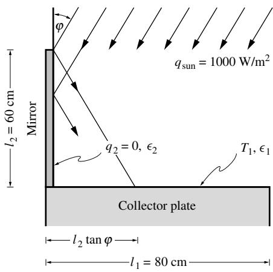

## 内容索引

- [目录](README.md)
- [1 热辐射基础](1-热辐射基础.md)
- [2 基于电磁波理论的辐射特性预测](2-基于电磁波理论的辐射特性预测.md)
- [3 实际表面的辐射特性](3-实际表面的辐射特性.md)
- [4 视角因子](4-视角因子.md)
- [5 灰体漫射表面间的辐射交换](5-灰体漫射表面间的辐射交换.md)
- [6 部分镜面灰体表面间的辐射交换](6-部分镜面灰体表面间的辐射交换.md)
- [7 非理想表面间的辐射交换](7-非理想表面间的辐射交换.md)
- [8 表面交换的蒙特卡洛方法](8-表面交换的蒙特卡洛方法.md)
- [9 传导和对流存在时的表面辐射交换](9-传导和对流存在时的表面辐射交换.md)
- [10 参与介质中的辐射传递方程(RTE)](10-参与介质中的辐射传递方程(RTE).md)
- [11 分子气体的辐射特性](11-分子气体的辐射特性.md)
- [12 颗粒介质的辐射特性](12-颗粒介质的辐射特性.md)
- [13 半透明介质的辐射特性](13-半透明介质的辐射特性.md)
- [14 一维灰体介质的精确解](14-一维灰体介质的精确解.md)
- [15 一维介质的近似求解方法](15-一维介质的近似求解方法.md)
- [16 球谐函数法 (PN-近似)](16-球谐函数法(PN-近似).md)
- [17 离散坐标法 (SN-近似)](17-离散坐标法(SN-近似).md)
- [18 区域法](18-区域法.md)
- [19 准直辐射与瞬态现象](19-准直辐射与瞬态现象.md)
- [20 非灰消光系数的求解方法](20-非灰消光系数的求解方法.md)
- [21 参与介质的蒙特卡洛方法](21-参与介质的蒙特卡洛方法.md)
- [22 辐射与传导和对流的耦合](22-辐射与传导和对流的耦合.md)
- [23 逆辐射传热](23-逆辐射传热.md)
- [24 纳米尺度辐射传热](24-纳米尺度辐射传热.md)
- [附录](附录.md)

- [6.1 引言](#61-引言)  
- [6.2 镜面视角因子](#62-镜面视角因子)  
- [6.3 具有部分镜面反射表面的封闭体](#63-具有部分镜面反射表面的封闭体)  
- [6.4 电路网络类比](#64-电路网络类比)  
- [6.5 辐射屏蔽层](#65-辐射屏蔽层)  
- [6.6 半透明薄板（窗户）](#66-半透明薄板窗户)  
- [6.7 控制积分方程的求解](#67-控制积分方程的求解)  
- [6.8 结论](#68-结论)  
- [参考文献](#参考文献)  
- [习题](#习题)

# 第6章

# 部分镜面灰体表面间的辐射交换

# 6.1 引言

在前两章中，我们假设封闭体内所有表面除了是灰体外，还都是漫射发射体和漫射反射体。漫射发射几乎总是一个可接受的简化假设。然而，漫反射假设往往会导致相当大的误差，因为许多表面的实际行为与此有显著差异。电磁波理论预测，光学光滑表面的反射是镜面反射，即像镜子一样反射光线。所有洁净金属、许多非金属材料（如玻璃质材料）以及大多数抛光材料都表现出强烈的镜面反射峰。尽管如此，由于表面粗糙度的影响，它们都在一定程度上会向其他方向反射。表面在人眼看来可能显得暗淡（即漫反射），但在红外波段却表现出较强的镜面反射特性，因为随着波长增加，表面均方根粗糙度与波长的比值会减小。

对于具有漫反射率的表面，如第5.3节开头所讨论的，反射辐射与发射能量具有相同的（漫射）方向分布。因此，封闭体内的辐射场可以完全用辐射出射度来描述，它仅是沿封闭体壁面位置的函数（而不需要同时是方向的函数）。如果反射是非漫射的，那么离开任何表面的辐射强度就既是表面位置的函数，也是方向的函数，这使得分析变得极其复杂。为了使分析可行，我们可以将反射率理想化为漫反射和镜面反射分量的组合，如图6-1所示的氧化黄铜[1]。因此，在本章中，我们假设辐射特性具有以下形式：

$$
\rho = \rho^{s} + \rho^{d} = 1 - \alpha = 1 - \epsilon = 1 - \epsilon_{\lambda}^{\prime}, \tag{6.1}
$$

其中$\rho^s$和$\rho^d$分别表示反射率的镜面反射分量和漫反射分量。由于假设表面是灰体、漫发射体$(\epsilon = \epsilon_{\lambda}^{\prime})$，因此$\alpha$和$\rho$都不能依赖于波长或入射方向（即$\rho$的大小不依赖于入射方向）；而$\rho$在出射方向上的分布则通过$\rho^s$依赖于入射方向。基于这种近似，可以通过将双向反射函数拆分为两部分来解析地求出各反射分量：

  
图6-1 (a)氧化黄铜反射率在入射平面内的分解：镜面分量（阴影部分）和漫反射分量（非阴影部分），引自[1]；(b)等效的理想化反射率。

$$
\rho^{d^s}(\tau ,\hat{\theta}_r,\hat{\theta}_r) = \rho^{d^s}(\tau ,\hat{\theta}_r,\hat{\theta}_r) + \rho^{d^d}(\tau ,\hat{\theta}_r,\hat{\theta}_r). \tag{6.2}
$$

将该表达式代入方程(3.43)和方程(3.46)即可得到$\rho^s$和$\rho^d$。$\rho^s$和$\rho^d$的值也可以直接通过实验确定，如Birkebak及其合作者[2]所报道的，这样就无需详细测量双向反射函数。

在由纯漫反射和纯镜面反射分量表面组成的封闭体内，通过认识到任何镜面反射光束都可以追溯到封闭体表面上的一个漫射源点（即任何光束都是离开表面后的发射或漫反射能量流的一部分，如图6-2所示），可以显著降低问题的复杂性。因此，通过重新定义视角因子以包含镜面反射路径和直接视线，辐射场可以再次用一个仅依赖于表面位置而不依赖于方向的漫射能量函数来描述。

# 6.2 镜面视角因子

为了适应由方程(6.1)描述的反射率表面，我们定义镜面视角因子为：

$$
dF_{dA_i - dA_j}^s\equiv \frac{\mathrm{diffuse~energy~leaving}dA_i\mathrm{~intercepted~by}dA_j,\mathrm{~by}}{\mathrm{direct~travel~or~any~number~of~specular~reflections}}. \tag{6.3}
$$

镜面视角因子的概念在图6-2和6-3中进行了说明。离开$dA_{i}$的漫射辐射（通过发射或漫反射）可以直接到达$dA_{j}$，也可以经过一次或多次反射后到达。通常只有有限数量的镜面反射路径是可能的，例如$dA_{i} - a - dA_{j}$或$dA_{i} - b - c - dA_{j}$（以及其他图中未标出的路径）。就反射的镜面部分而言，位于点$a,b,$和$c$的表面表现得像完美镜子。因此，如果观察者站在$dA_{j}$上看向$c$，会看到点$b$和$dA_{i}$似乎位于点$c$后方，如图6-3所示；标记为$b(c)$的点是点$b$在$c$处表面的镜像，而$dA_{i}(cb)$是$dA_{i}$在$c$和$b$处表面的镜像。因此，通过观察图6-2和6-3，我们可以正式计算两个微元面积之间的镜面视角因子：

  
图6-3 微元表面之间的镜面视角因子；镜像的形成。

$$
\begin{array}{rl} & dF_{dA_i - dA_j}^s = dF_{dA_i - dA_j} + \rho_a^s dF_{dA_i(a) - dA_j} + \rho_b^s\rho_c^s dF_{dA_i(b) - dA_j}\\ & \qquad +\mathrm{other~possible~reflection~paths.} \end{array} \tag{6.4}
$$

因此，镜面视角因子可以表示为漫射视角因子的总和，每个可能的直接或反射路径都有一个贡献。需要注意的是，对于镜像，漫射视角因子必须乘以镜像表面的镜面反射率，因为从$dA_{i}$传播到$dA_{j}$的辐射在每次反射时都会衰减。

如果封闭体中所有镜面反射部分都是平面，那么$dA_{i}$的所有镜像都具有与$dA_{i}$本身相同的形状和大小。然而，曲面往往会扭曲镜像（产生聚焦和散焦效应）。在只有平面镜面反射表面的情况下，我们可以将方程(6.4)乘以$dA_{i}$，并利用漫射视角因子的互易定律（方程4.7），得到

$$
\begin{array}{rl} & dA_{i}dF_{dA_{i} - dA_{j}}^{s} = dA_{j}dF_{dA_{j} - dA_{i}} + \rho_{a}^{s}dA_{j}dF_{dA_{j} - dA_{i}(a)} + \rho_{b}^{s}\rho_{c}^{s}dA_{j}dF_{dA_{j} - dA_{i}(bc)}\\ & \qquad = dA_{j}dF_{dA_{j} - dA_{i}} + \rho_{a}^{s}dA_{j}dF_{dA_{j}(a) - dA_{i}} + \rho_{b}^{s}\rho_{c}^{s}dA_{j}dF_{dA_{j}(bc) - dA_{i}} + \ldots \\ & \qquad = dA_{j}dF_{dA_{j} - dA_{i}}^{s}, \end{array} \tag{6.5}
$$

  
图6-4(a) 例题6.1的几何结构，(b) 用于计算$F_{1 - 1}^{s}$和$F_{1 - 2}^{s}$的光线追踪示意图

也就是说，只要所有镜面反射表面都是平面，镜面视角因子的互易定律就成立。尽管证明过程更为复杂，但可以证明互易定律对于曲面镜面反射体也同样适用。如果我们进一步假设离开$A_{i}$和$A_{j}$的漫射能量在各自表面上均匀分布，则可得到与方程(4.15)等价的表达式：

$$
\begin{array}{rl} 
& {dA_{i}dF_{di - dj}^{s} = dA_{j}dF_{dj - di}^{s},}\\ 
& {dA_{i}F_{di - j}^{s} = A_{j}dF_{j - di}^{s},\qquad (J_{j} = \mathrm{const}),}\\ 
& {A_{i}F_{i - j}^{s} = A_{j}F_{j - i}^{s},\qquad (J_{i},J_{j} = \mathrm{const}),} 
\end{array} \tag{6.6b}
$$

这里我们采用了第4章首次引入的简洁表示法，$J_{i}$表示离开表面$A_{i}$的总漫射能量（单位面积），即辐射出射度。

例题6.1. 计算图6-4a所示平行平板结构的镜面视角因子$F_{1 - 1}^{s}$和$F_{1 - 2}^{s}$。

# 解答

我们注意到，由于问题的一维特性，对于表面$A_{1}$上的任何微元$dA_{1}$，$F_{d1 - 2}^{s}$都相同。由于$F_{1 - 2}^{s}$不过是$F_{d1 - 2}^{s}$在整个表面的平均值，因此可以得出$F_{d1 - 2}^{s} = F_{1 - 2}^{s}$。只需考虑从微元面积（而非整个$A_{1}$）发出的能量即可。观察图6-4b可见，离开$dA_{1}$的每条光线（假设强度为1）无论朝哪个方向，都必定到达表面$A_{2}$（即强度为"1"的光线被拦截）。在$A_{2}$反射后，强度为$\rho_{2}^{s}$的光线以镜面反射方式返回$A_{1}$，经再次反射后强度为$\rho_{2}^{s}\rho_{1}^{s}$的光线又返回$A_{2}$。经过更多次反射后，强度为$(\rho_{2}^{s}\rho_{1}^{s})\rho_{2}^{s}$的光线返回$A_{1}$，如此循环。因此，镜面视角因子可计算为：

$$
F_{1 - 2}^{s} = F_{1 - 2}^{s} = 1 + \rho_{1}^{s}\rho_{2}^{s} + (\rho_{1}^{s}\rho_{2}^{s})^{2} + (\rho_{1}^{s}\rho_{2}^{s})^{3} + \ldots . \tag{6.7}
$$

由于$\rho_{1}^{s}\rho_{2}^{s}< 1$，该级数求和可采用Wylie[3]给出的方法简便计算，得到：

$$
F_{1 - 2}^{s} = \frac{1}{1 - \rho_{1}^{s}\rho_{2}^{s}} = F_{2 - 1}^{s}. \tag{6.8}
$$

该关系的最后部分可通过交换下标或应用互易性（且$A_{1} = A_{2}$）得出。需要注意的是，镜面视角因子的值不限于0到1之间，由于离开表面的辐射能量会被多次计入，其值常常大于1。$A_{1}$发出的所有能量在直接传播后都被$A_{2}$拦截，但只有$(1 - \rho_{2}^{s})$部分通过吸收和/或漫反射从镜面反射路径中移除。$\rho_{2}^{s}$部分继续以镜面方式传播，因此会被第二次计入，依此类推。因此，$(1 - \rho_{2}^{s})F_{1 - 2}^{s}$的值必须在0到1之间，求和关系式(4.18)应替换为：

$$
\sum_{j = 1}^{N}(1 - \rho_{j}^{s})F_{i - j}^{s} = 1. \tag{6.9}
$$

  
图6-5 (a) 例题6.2的几何结构，(b) 沿外表面的多次反射

方程(6.9)目前是通过直观方式建立的，将在下一节严格推导。$F_{1 - 1}^{s}$可以类似地表示为：

$$
F_{1 - 1}^{s} = \rho_{2}^{s} + (\rho_{1}^{s}\rho_{2}^{s})\rho_{2}^{s} + (\rho_{1}^{s}\rho_{2}^{s})^{2}\rho_{2}^{s} + \ldots = \frac{\rho_{2}^{s}}{1 - \rho_{1}^{s}\rho_{2}^{s}}.
$$

我们注意到：

$$
(1 - \rho_1^s)F_{1 - 1}^s +(1 - \rho_2^s)F_{1 - 2}^s = \frac{(1 - \rho_1^s)\rho_2^s + 1 - \rho_2^s}{1 - \rho_1^s\rho_2^s} = 1,
$$

这与方程(6.9)的假设一致。

例题6.2. 计算两个同心圆柱体或球体的所有镜面视角因子。

# 解答

图6-5a显示了从内圆柱(或球体)到外圆柱(或球体)的镜面反射可能路径，反之亦然。与前一例题类似，从$A_{1}$发出的任何方向的光束必定会到达表面$A_{2}$(强度为"1")。由于圆形几何结构，经过镜面反射后，光束(现在强度为$\rho_{2}^{s}$)必须返回$A_{1}$(即在到达$A_{1}$之前不会再次碰到$A_{2}$)。经过多次反射后，光束在$A_{1}$和$A_{2}$之间来回反弹。因此，与平行平板类似：

$$
F_{1 - 2}^{s} = 1 + \rho_{1}^{s}\rho_{2}^{s} + (\rho_{1}^{s}\rho_{2}^{s})^{2} + \ldots = \frac{1}{1 - \rho_{1}^{s}\rho_{2}^{s}}.
$$

同样地：

$$
F_{1 - 1}^{s} = \rho_{2}^{s} + (\rho_{1}^{s}\rho_{2}^{s})\rho_{2}^{s} + \ldots = \frac{\rho_{2}^{s}}{1 - \rho_{1}^{s}\rho_{2}^{s}}.
$$

从$A_{2}$发出的光束首先会碰到$A_{1}$，然后在$A_{1}$和$A_{2}$之间来回反弹(见图6-5a)；或者碰到$A_{2}$，然后沿着$A_{2}$不断反弹而永远不会碰到$A_{1}$(见图6-5b)。因此，由于离开$A_{2}$的漫射能量中$F_{2 - 1}$部分在直接传播后会到达$A_{1}$，我们有：

$$
\begin{array}{l}{F_{2 - 1}^{s} = F_{2 - 1}\left[1 + \rho_{1}^{s}\rho_{2}^{s} + (\rho_{1}^{s}\rho_{2}^{s})^{2} + \ldots \right] = \frac{A_{1} / A_{2}}{1 - \rho_{1}^{s}\rho_{2}^{s}},}\\ {F_{2 - 2}^{s} = F_{2 - 2}\left[1 + \rho_{2}^{s} + (\rho_{2}^{s})^{2} + (\rho_{2}^{s})^{3} + \ldots \right] + F_{2 - 1}\left[\rho_{1}^{s} + \rho_{1}^{s}(\rho_{1}^{s}\rho_{2}^{s}) + \ldots \right]}\\ {= \frac{1 - A_{1} / A_{2}}{1 - \rho_{2}^{s}} +\frac{\rho_{1}^{s}A_{1} / A_{2}}{1 - \rho_{1}^{s}\rho_{2}^{s}},} \end{array}
$$

其中简单的漫射视角因子$F_{2 - 1}$和$F_{2 - 2}$已用$A_{1}$和$A_{2}$表示。当然，$F_{2 - 1}^{s}$也可以通过互易性从$F_{1 - 2}^{s}$得到，而$F_{2 - 2}^{s}$可以借助方程(6.9)求得。

  
图6-6 具有部分镜面反射表面的能量平衡

在建立了适当的热传递关系后，我们将给出更多镜面视角因子确定的例子。

# 6.3 具有部分镜面反射表面的封闭体

考虑如图6-2所示的任意几何形状的封闭体。所有表面都是灰体、漫发射体和具有纯漫反射与纯镜面反射分量的灰反射体，即它们的辐射特性服从方程(6.1)。在这些条件下，位置$\mathbf{r}$处表面的净热通量(见图6-6)为：

$$
\begin{array}{rl} & q(\mathbf{r}) = q_{\mathrm{emission}} - q_{\mathrm{absorption}} = \epsilon (\mathbf{r})[E_b(\mathbf{r}) - H(\mathbf{r})]\\ & \qquad = q_{\mathrm{out}} - q_{\mathrm{in}} = \epsilon (\mathbf{r})E_b(\mathbf{r}) + \rho^d (\mathbf{r})H(\mathbf{r}) + \rho^s (\mathbf{r})H(\mathbf{r}) - H(\mathbf{r}). \end{array} \tag{6.10}
$$

方程(6.10)最后右侧的前两项，即出射热通量中以漫射方式离开的部分，我们再次称为表面有效辐射：

$$
J(\mathbf{r}) = \epsilon (\mathbf{r})E_b(\mathbf{r}) + \rho^d (\mathbf{r})H(\mathbf{r}), \tag{6.11}
$$

因此：

$$
q(\mathbf{r}) = J(\mathbf{r}) - [1 - \rho^s (\mathbf{r})]H(\mathbf{r}). \tag{6.12}
$$

从方程(6.10)和(6.12)中消去辐照度$H(\mathbf{r})$得到：

$$
q(\mathbf{r}) = \frac{\epsilon(\mathbf{r})}{\rho^d(\mathbf{r})}\bigl [[1 - \rho^s (\mathbf{r})]E_b(\mathbf{r}) - J(\mathbf{r})\bigr ], \tag{6.13}
$$

当然，对于漫反射表面($\rho^s = 0$且$\rho^d = 1 - \epsilon$)，这简化为方程(5.26)。对于纯镜面反射表面($\rho^d = 0$)，方程(6.13)是不确定的，因为有效辐射仅由发射组成，即$J = \epsilon E_b$。

与第5章类似，通过确定来自微分面积$dA^{\prime}(\mathbf{r}^{\prime})$对$H$的贡献，然后对整个封闭体表面积分来找到辐照度$H(\mathbf{r})$。一个微妙的区别是我们不跟踪离开$dA^{\prime}$的总能量(乘以适当的直接传播视角因子)；而是减去镜面反射的贡献并将其归因于以漫射方式离开的表面。这种能量的更复杂路径然后通过镜面视角因子的定义来考虑。因此，类似于方程(5.21)：

$$
H(\mathbf{r})dA = \int_{A}J(\mathbf{r}^{\prime})dF_{dA^{\prime} - dA}^{s}dA^{\prime} + H_{o}^{s}(\mathbf{r})dA, \tag{6.14}
$$

其中$H_{o}^{s}(\mathbf{r})$是任何到达$dA$的外部辐照(通过开口或半透明壁)。与镜面视角因子类似，$H_{o}^{s}$包括直接或经过任何次数镜面反射后到达$dA$的外部辐射。利用互易性，方程(6.14)变为：

$$
H(\mathbf{r}) = \int_{A}J(\mathbf{r}^{\prime})dF_{dA - dA^{\prime}}^{s} + H_{o}^{s}(\mathbf{r}), \tag{6.15}
$$

将其代入方程(6.11)后，得到未知有效辐射的积分方程：

$$
J(\mathbf{r}) = \epsilon (\mathbf{r})E_{b}(\mathbf{r}) + \rho^{d}(\mathbf{r})\left[\int_{A}J(\mathbf{r}^{\prime})dF_{dA - dA^{\prime}}^{s} + H_{o}^{s}(\mathbf{r})\right]. \tag{6.16}
$$

对于给定热通量$q(\mathbf{r})$而非$E_{b}(\mathbf{r})$的表面位置，应使用方程(6.12)而非方程(6.11)。通常更希望消去有效辐射，得到表面黑体辐射力与热通量之间的单一关系。从方程(6.13)解出$J$得：

$$
J(\mathbf{r}) = \left[1 - \rho^s (\mathbf{r})\right]E_b(\mathbf{r}) - \frac{\rho^d(\mathbf{r})}{\epsilon(\mathbf{r})} q(\mathbf{r}), \tag{6.17}
$$

将上述表达式代入方程(6.16)可得：

$$
(1 - \rho^s)E_b - \frac{\rho^d}{\epsilon} q = (1 - \rho^s -\rho^d)E_b + \rho^d\left[\int_A(1 - \rho^s)E_bdF_{dA - dA'}^s -\int_A\frac{\rho^d}{\epsilon} qdF_{dA - dA'}^s +H_o^s\right],
$$

即：

$$
E_{b}(\mathbf{r}) - \int_{A}\left[1 - \rho^{s}(\mathbf{r}^{\prime})\right]E_{b}(\mathbf{r}^{\prime})dF_{dA - dA^{\prime}}^{s} = \frac{q(\mathbf{r})}{\epsilon(\mathbf{r})} -\int_{A}\frac{\rho^{d}(\mathbf{r}^{\prime})}{\epsilon(\mathbf{r}^{\prime})} q(\mathbf{r}^{\prime})dF_{dA - dA^{\prime}}^{s} + H_{o}^{s}(\mathbf{r}). \tag{6.18}
$$

我们注意到，对于漫反射表面($\rho^{s} = 0$，$\rho^{d} = 1 - \epsilon$，$F_{i - j}^{s} = F_{i - j}$，$H_{o}^{s} = H_{o}$)，方程(6.18)简化为方程(5.28)。如果能计算镜面视角因子(这通常是个大前提)，那么求解方程(6.18)并不比求解方程(5.28)更困难。事实上，如果部分或全部表面是纯镜面的($\rho^{d} = 0$)，方程(6.18)会变得简单得多。

与黑体和灰漫射封闭体类似，通常通过使用理想化的封闭体来简化分析，该封闭体由$N$个相对简单的子表面组成，每个子表面上的有效辐射假设为常数。于是：

$$
\int_{A}J(\mathbf{r}^{\prime})dF_{dA - dA^{\prime}}^{s}\simeq \sum_{j = 1}^{N}J_{j}\int_{A_{j}}dF_{dA - dA_{j}}^{s} = \sum_{j = 1}^{N}J_{j}F_{dA - A_{j}}^{s},
$$

在$dA$所在的子表面$A_{i}$上取平均后，方程(6.16)简化为：

$$
J_{i} = \epsilon_{i}E_{bi} + \rho_{i}^{d}\left(\sum_{j = 1}^{N}J_{j}F_{i - j}^{s} + H_{oi}^{s}\right),\quad i = 1,2,\ldots ,N. \tag{6.19}
$$

通过方程(6.17)消去有效辐射后，方程(6.18)简化为：

$$
E_{bi} - \sum_{j = 1}^{N}(1 - \rho_{i}^{s})F_{i - j}^{s}E_{bj} = \frac{q_{i}}{\epsilon_{i}} -\sum_{j = 1}^{N}\frac{\rho_{j}^{d}}{\epsilon_{j}} F_{i - j}^{s}q_{j} + H_{oi}^{s},\quad i = 1,2,\ldots ,N. \tag{6.20}
$$

通过考虑一个特殊情况，可以很容易地从方程(6.20)得到求和关系式(6.9)：在等温封闭体($E_{b1} = E_{b2} = \dots = E_{bN}$)且无外部辐射($H_{o1}^{s} = H_{o2}^{s} = \dots = 0$)的情况下，根据热力学第二定律，所有热通量必须为零($q_{1} = q_{2} = \dots = 0$)。因此，消去辐射力后得到：

$$
\sum_{j = 1}^{N}(1 - \rho_j^s)F_{i - j}^s = 1,\qquad i = 1,2,\ldots ,N. \tag{6.21}
$$

由于$F_{i - j}^{s}$是几何因子，不依赖于温度分布，方程(6.21)对任意辐射力值都成立。

最后，对于计算机计算，将辐射力和热通量写成矩阵形式可能更有利。引入Kronecker delta后，方程(6.20)变为：

$$
\sum_{j = 1}^{N}\left[\delta_{ij} - (1 - \rho_j^s)F_{i - j}^s\right]E_{bj} = \sum_{j = 1}^{N}\left(\frac{\delta_{ij}}{\epsilon_j} -\frac{\rho_j^d}{\epsilon_j} F_{i - j}^s\right)q_j + H_{oi}^s,\quad i = 1,2,\ldots ,N, \tag{6.22}
$$

或：

$$
\mathbf{A}\cdot \mathbf{e}_{\mathsf{b}} = \mathbf{C}\cdot \mathbf{q} + \mathbf{h}_{\mathsf{o}}^{s}, \tag{6.23}
$$

其中$\mathbf{C}$和$\mathbf{A}$是元素为以下值的矩阵：

$$
\begin{array}{l}{A_{ij} = \delta_{ij} - (1 - \rho_j^s)F_{i - j}^s,}\\ {C_{ij} = \frac{\delta_{ij}}{\epsilon_j} -\frac{\rho_j^d}{\epsilon_j} F_{i - j}^s,} \end{array}
$$

而$\mathbf{q},\mathbf{e}_{\mathsf{b}}$和$\mathbf{h}_{\mathbf{o}}^{\mathrm{s}}$分别是表面热通量、辐射力和外部辐射的向量。如果所有温度和外部辐射都已知，则可以通过矩阵求逆轻松找到未知热通量：

$$
\begin{array}{r}\mathbf{q} = \mathbf{C}^{-1}\cdot \left[\mathbf{A}\cdot \mathbf{e}_{\mathbf{b}} - \mathbf{h}_{\mathbf{o}}^{\mathrm{s}}\right]. \end{array} \tag{6.24}
$$

如果仅知道部分表面的辐射力，而其他位置指定了热通量，则可以重新排列方程(6.23)为包含所有未知量的向量的类似方程。附录F提供了子程序graydifspec用于求解联立方程(6.23)，需要输入表面信息和部分视角因子矩阵。还以程序grspecxch的形式给出了一个示例问题的解，可以用作解决其他问题的起点。提供了Fortran90、$\mathbb{C} + +$以及MATLAB®版本。

例6.3 如图6-4a所示，两块大平行平板被非参与介质隔开。底面温度为$T_{1}$，发射率为$\epsilon_{1}$，具有部分镜面和部分漫反射率$\rho_{1} = \rho_{1}^{d} + \rho_{1}^{s}$。同样，顶面温度为$T_{2}$，具有$\epsilon_{2}$和$\rho_{2} = \rho_{2}^{d} + \rho_{2}^{s}$。确定两表面之间的辐射热通量。

# 解答

根据方程(6.20)，当$i=1$且$H_{o1}^{s}=0$时，我们有：

$$
E_{b1} - (1 - \rho_1^s)F_{1 - 1}^s E_{b1} - (1 - \rho_2^s)F_{1 - 2}^s E_{b2} = \frac{q_1}{\epsilon_1} -\frac{\rho_1^d}{\epsilon_1} F_{1 - 1}^s q_1 - \frac{\rho_2^d}{\epsilon_2} F_{1 - 2}^s q_2.
$$

虽然我们可以对$i=2$应用方程(6.20)来获得关于$q_{1}$和$q_{2}$的第二个方程，但这里更简单的方法是使用能量守恒定律，即$q_{2} = - q_{1}$。因此，

$$
q_{1} = \frac{\left[1 - (1 - \rho_{1}^{s})F_{1 - 1}^{s}\right]E_{b1} - (1 - \rho_{2}^{s})F_{1 - 2}^{s}E_{b2}}{\frac{1}{\epsilon_{1}} - \frac{1 - \epsilon_{1} - \rho_{1}^{s}}{\epsilon_{1}}F_{1 - 1}^{s} + \frac{1 - \epsilon_{2} - \rho_{2}^{s}}{\epsilon_{2}}F_{1 - 2}^{s}}.
$$

利用例6.1的结果并将分子分母同时除以$F_{1 - 2}^{s}$，我们得到：

$$
q_{1} = \frac{(1 - \rho_{2}^{s})F_{1 - 2}^{s}(E_{b1} - E_{b2})}{\left(\frac{1}{\epsilon_{1}} + \frac{1}{\epsilon_{2}}\right)(1 - \rho_{2}^{s})F_{1 - 2}^{s} + F_{1 - 1}^{s} - F_{1 - 2}^{s}} = \frac{(1 - \rho_{2}^{s})(1)(E_{b1} - E_{b2})}{\left(\frac{1}{\epsilon_{1}} + \frac{1}{\epsilon_{2}}\right)(1 - \rho_{2}^{s})(1) + \rho_{2}^{s} - 1} = \frac{E_{b1} - E_{b2}}{\frac{1}{\epsilon_{1}} + \frac{1}{\epsilon_{2}} - 1}, \tag{6.25}
$$

无论表面是漫反射还是镜面反射，该方程都给出相同的结果。实际上，方程(6.25)适用于两个等温平行平板之间的辐射传热，与反射率的定向特性无关(即不限于本章考虑的理想化反射率)。任何离开$A_{1}$的辐射束必定会到达表面$A_{2}$，反之亦然，无论反射是漫反射、镜面反射还是两者都不是，表面位置会有所不同，但由于表面是等温的，反射率的定向变化对传热速率没有影响。

例6.4. 对同心球和圆柱重复上述例子。

# 解答

再次从方程(6.20)出发，当$i=1$且$H_{oi}^{s}=0$时，我们得到：

$$
E_{b1} - (1 - \rho_1^s)F_{1 - 1}^s E_{b1} - (1 - \rho_2^s)F_{1 - 2}^s E_{b2} = \frac{q_1}{\epsilon_1} -\frac{\rho_1^d}{\epsilon_1} F_{1 - 1}^s q_1 - \frac{\rho_1^d}{\epsilon_1^2} F_{1 - 2}^s q_2.
$$

在这种情况下，能量守恒要求$q_{2}A_{2} = - q_{1}A_{1}$，因此：

$$
q_{1} = \frac{\left[1 - (1 - \rho_{1}^{s})F_{1 - 1}^{s}\right]E_{b1} - (1 - \rho_{2}^{s})F_{1 - 2}^{s}E_{b2}}{\frac{1}{\epsilon_{1}} - \frac{1 - \epsilon_{1} - \rho_{1}^{s}}{\epsilon_{1}}F_{1 - 1}^{s} + \frac{1 - \epsilon_{2} - \rho_{2}^{s}}{\epsilon_{2}}\frac{A_{1}}{A_{2}}F_{1 - 2}^{s}} = \frac{(1 - \rho_{2}^{s})F_{1 - 2}^{s}(E_{b1} - E_{b2})}{\left(\frac{1}{\epsilon_{1}} + \frac{1}{\epsilon_{2}}\frac{A_{1}}{A_{2}}\right)(1 - \rho_{2}^{s})F_{1 - 2}^{s} + F_{1 - 1}^{s} - \frac{A_{1}}{A_{2}}F_{1 - 2}^{s}}.
$$

镜面视角因子$F_{1 - 1}^{s}$和$F_{1 - 2}^{s}$与前一例子相同(参见例6.2)，最终得到：

$$
q_{1} = \frac{E_{b1} - E_{b2}}{\frac{1}{\epsilon_{1}} + \frac{1}{\epsilon_{2}}\frac{A_{1}}{A_{2}} - \frac{A_{1} / A_{2} - \rho_{2}^{s}}{1 - \rho_{2}^{s}}}. \tag{6.26}
$$

我们注意到方程(6.26)不依赖于$\rho_{1}^{s}$：再次说明，从表面$A_{1}$反射的任何辐射必定会返回表面$A_{2}$，无论其反射率的定向行为如何。如果表面$A_{2}$是纯镜面反射($\rho_{2}^{s} = 1 - \epsilon_{2}$)，来自$A_{1}$的所有辐射将在$A_{1}$和$A_{2}$之间来回反射，方程(6.26)简化为方程(6.25)，即这些同心球或圆柱之间的热通量与平行平板相同。另一方面，如果$A_{2}$是漫反射($\rho_{2}^{s} = 0$)，方程(6.26)简化为纯漫反射情况，因为$\rho_{1}$的定向行为无关紧要。

例6.5. 一个很长的太阳能集热板需要在$T_{1} = 350\mathrm{K}$的温度下收集能量。为了提高其在非垂直太阳入射时的性能，如图6-7所示，在集热器旁边放置了一个高反射表面。为简化起见，可以做出以下假设：集热器是等温的灰体漫反射体，发射率$\epsilon_{1} = 1 - \rho_{1}^{d} = 0.8$；镜子是灰体镜面反射体，$\epsilon_{2} = 1 - \rho_{2}^{s} = 0.1$，并且可以忽略镜子通过对流的热损失以及集热器端部的所有损失。当太阳辐照度为$q_{\mathrm{sun}} = 1000\mathrm{Wm}^{2}$，入射角为$30^{\circ}$时，集热板每单位长度能收集多少能量？

# 解答

将方程(6.22)应用于吸收板$(i=1)$和镜面$(i=2)$，我们得到：

$$
\begin{array}{c}{\left[1 - (1 - \rho_1^s)F_{1 - 1}^s\right]E_{b1} - (1 - \rho_2^s)F_{1 - 2}^s E_{b2} = \left[\frac{1}{\epsilon_1} -\frac{\rho_1^d}{\epsilon_1} F_{1 - 1}^s\right]q_1 - \frac{\rho_2^d}{\epsilon_2} F_{1 - 2}^s q_2 + H_{o1}^s,}\\ {-(1 - \rho_1^s)F_{2 - 1}^s E_{b1} + \left[1 - (1 - \rho_2^s)F_{2 - 2}^s\right]E_{b2} = -\frac{\rho_1^d}{\epsilon_1} F_{2 - 1}^s q_1 + \left[\frac{1}{\epsilon_2} -\frac{\rho_2^d}{\epsilon_2} F_{2 - 2}^s\right]q_2 + H_{o2}^s.} \end{array}
$$

  
图6-7 例6.5的几何结构

由于$\rho_{1}^{s}=0$，因此$F_{1-1}^{s}=F_{2-2}^{s}=0$，且$F_{1-2}^{s}=F_{1-2}$，$F_{2-1}^{s}=F_{2-1}$。在这种配置下，不可能发生从一个表面到另一个表面的镜面反射（从吸收板离开的辐射，经过镜面反射后总是会离开开放空间）。因此，当$q_{2}=0$时：

$$
\begin{array}{l}{E_{b1} - \epsilon_2F_{1 - 2}E_{b2} = \frac{q_1}{\epsilon_1} +H_{o1}^s,}\\ {-F_{2 - 1}E_{b1} + E_{b2} = -\left(\frac{1}{\epsilon_1} -1\right)F_{2 - 1}q_1 + H_{o2}^s.} \end{array}
$$

通过将第二个方程乘以$\epsilon_{2}F_{1-2}$并相加，消去$E_{b2}$，得到：

$$
(1 - \epsilon_{2}F_{1 - 2}F_{2 - 1})E_{b1} = \left[\frac{1}{\epsilon_{1}} -\left(\frac{1}{\epsilon_{1}} -1\right)q_{2}F_{1 - 2}F_{2 - 1}\right]q_{1} + H_{o1}^{s} + \epsilon_{2}F_{1 - 2}F_{2 - 1}H_{o2}^{s}.
$$

外部辐射通量评估如下：镜面仅直接接收太阳辐射通量（不可能有来自吸收板的镜面反射），即$H_{o2}^{s}=q_{\mathrm{sun}}\sin\phi$。吸收板接收直接贡献$q_{\mathrm{sun}}\cos\phi$，以及经过镜面反射后的第二贡献。这第二贡献的强度为$\rho_{2}^{s}q_{\mathrm{sun}}\cos\phi$每单位面积。然而，只有部分集热板$(l_{2}\tan\phi)$接收这个次级贡献，对于我们的粗略双节点描述，必须在$l_{1}$上取平均。因此：

$$
H_{o1}^{s} = q_{\mathrm{sun}}\cos \phi +\rho_{2}^{s}q_{\mathrm{sun}}\cos \phi \frac{l_{2}\tan\phi}{l_{1}} = q_{\mathrm{sun}}\left[\cos \phi +(1 - \epsilon_{2})\frac{l_{2}}{l_{1}}\sin \phi \right].
$$

因此：

$$
q_{1} = \frac{(1 - \epsilon_{2}F_{1 - 2}F_{2 - 1})E_{b1} - [\cos\phi + (1 - \epsilon_{2})\sin\phi(l_{2} / l_{1}) + \epsilon_{2}F_{1 - 2}\sin\phi]q_{\mathrm{sun}}}{\frac{1}{\epsilon_{1}} - \epsilon_{2}\left(\frac{1}{\epsilon_{1}} - 1\right)F_{1 - 2}F_{2 - 1}}.
$$

视角因子可以通过交叉线法轻松计算为$F_{1-2}=(80+60-100)/(2×80)=\frac{1}{4}$和$F_{2-1}=80×\frac{1}{4}/60=\frac{1}{3}$。代入数值，我们得到：

$$
q_{1} = \frac{\left(1 - 0.1\times\frac{1}{4}\times\frac{1}{3}\right)(5.670\times 10^{-8}\times 350^{4} - \left(\frac{\sqrt{3}}{2} + 0.9\times\frac{1}{2}\times \frac{60}{80} + 0.1\times\frac{1}{4}\times \frac{1}{2}\right)1000}{\frac{1}{0.8} - 0.1\left(\frac{1}{0.8} - 1\right)\times\frac{1}{4}\times\frac{1}{3}} = -298\mathrm{W / m^{2}}.
$$

因此，在这些条件下，集热器的效率约为$30\%$。这个结果应该与没有镜面的集热器$(l_{2}=0$和$F_{1-2}=0)$进行比较，对于这种情况我们得到：

$$
q_{1,\mathrm{no~mirror}} = \frac{E_{b1} - q_{\mathrm{sun}}\cos\phi}{1 / \epsilon_1} = 0.8\times \left(5.670\times 10^{-8}\times 350^4 -1000\times \frac{\sqrt{3}}{2}\right) = -12\mathrm{W / m^2}.
$$

该吸收板几乎收集不到任何能量（事实上，考虑对流损失后，它将经历净能量损失）。如果镜子是漫反射体，热增益将为$q_{1,\mathrm{diffuse mirror}} = - 172\mathrm{W / m}^2$，这明显低于镜面反射镜的情况（参见问题5.22）。

  
图6-8 具有单个镜面反射表面的三角形封闭空间，显示了部分可能的辐射路径：(a)无遮挡，(b)有部分遮挡

通过这个例子我们可以得出：(i) 镜子可以显著提高集热器性能，(ii) 近黑体集热器的红外再辐射损失非常严重。当然，使用选择性表面或玻璃覆盖集热器可以显著减少再辐射损失（参见第3章）。

我们将通过三个额外示例来结束本节，这些示例旨在阐明仅由简单平面元素组成的封闭空间中镜面视角因子的评估方法。

例6.6. 考虑图6-8a和b所示的三角形封闭空间。表面$A_{1}$和$A_{2}$分别保持等温$T_{1}$和$T_{2}$，且为纯漫反射体，发射率$\epsilon_{1} = 1 - \rho_{1}^{d}$和$\epsilon_{2} = 1 - \rho_{2}^{d}$。表面$A_{3}$保持等温$T_{3}$，是纯镜面反射体，$\epsilon_{3} = 1 - \rho_{3}^{s}$。建立未知表面热通量的方程组。

# 解答

由于只有一个（且平坦的）镜面表面，不可能发生多次镜面反射。虽然$F_{1 - 1}^{s}$和$F_{2 - 2}^{s}$不为零，但显然$F_{3 - 3}^{s} = 0$。因此，根据方程(6.22)，当$H_{oi}^{s} = 0$时：

$$
\begin{array}{c}{(1 - F_{1 - 1}^{s})E_{b1} - F_{1 - 2}^{s}E_{b2} - \epsilon_{3}F_{1 - 3}^{s}E_{b3} = \left[\frac{1}{\epsilon_{1}} -\left(\frac{1}{\epsilon_{1}} -1\right)F_{1 - 1}^{s}\right]q_{1} - \left(\frac{1}{\epsilon_{2}} -1\right)F_{1 - 2}^{s}q_{2},}\\ {-F_{2 - 1}^{s}E_{b1} + (1 - F_{2 - 2}^{s})E_{b2} - \epsilon_{3}F_{2 - 3}^{s}E_{b3} = -\left(\frac{1}{\epsilon_{1}} -1\right)F_{2 - 1}^{s}q_{1} + \left[\frac{1}{\epsilon_{2}} -\left(\frac{1}{\epsilon_{2}} -1\right)F_{2 - 2}^{s}\right]q_{2},}\\ {-F_{3 - 1}^{s}E_{b1} - F_{3 - 2}^{s}E_{b2} + E_{b3} = -\left(\frac{1}{\epsilon_{1}} -1\right)F_{3 - 1}^{s}q_{1} - \left(\frac{1}{\epsilon_{2}} -1\right)F_{3 - 2}^{s}q_{2} + \frac{q_{3}}{\epsilon_{3}}.} \end{array}
$$

注意到$q_{3}$仅出现在最后一个方程中，因此我们只需要解两个联立方程（即与具有漫反射分量的表面数量相同）。我们需要确定镜面视角因子$F_{1 - 1}^{s}, F_{1 - 2}^{s},$和$F_{2 - 2}^{s}$，其余的可以通过互易性和求和规则计算。考虑图6-8a的第一种情况，我们发现

$$
\begin{array}{rl} & F_{1 - 1}^{s} = \rho_{3}^{s}F_{1(3) - 1},\\ & F_{1 - 2}^{s} = F_{1 - 2} + \rho_{3}^{s}F_{1(3) - 2},\quad \epsilon_{3}F_{1 - 3}^{s} = 1 - F_{1 - 1}^{s} - F_{1 - 2}^{s},\\ & F_{2 - 1}^{s} = A_{1}F_{1 - 2}^{s} / A_{2},\\ & F_{2 - 2}^{s} = \rho_{3}^{s}F_{2(3) - 2},\quad \epsilon_{3}F_{2 - 3}^{s} = 1 - F_{2 - 1}^{s} - F_{2 - 2}^{s},\\ & F_{3 - 1}^{s} = A_{1}F_{1 - 3}^{s} / A_{3},\quad F_{3 - 2}^{s} = A_{2}F_{2 - 3}^{s} / A_{3}, \end{array}
$$

其中右侧的所有视角因子都可以通过标准漫反射视角因子分析轻松求得。对于图6-8b所示的构型，问题会变得稍复杂些——镜面表面连接着开口角度$>90^{\circ}$的另一表面。站在表面$A_{2}$的左角处，显然无法通过"镜子"$A_{3}$看到全部镜像$A_{2(3)}$。必须注意不要忽略这些视觉遮挡。若封闭空间是二维的，这类部分遮挡的视角因子对交叉线法不成问题，但对其他解析解法可能造成很大困难。

  
图6-9 具有两个相邻镜面反射器的矩形封闭空间，展示了部分可能的光束路径：(a) $F_{3-4}^{s}$的求值，(b) $A_{3(12)}$对$F_{3-3}^{s}$的贡献，(c) $A_{3(21)}$对$F_{3-3}^{s}$的贡献

当考虑具有两个或更多相邻镜面表面的构型时，部分遮挡的效应会表现得更为明显。

例6.7. 考虑图6-9所示的矩形封闭空间。表面$A_{1}$和$A_{2}$为纯镜面反射，表面$A_{3}$和$A_{4}$为纯漫反射体。顶壁和底壁温度$T_{1}=T_{3}=1000\mathrm{K}$，发射率$\epsilon_{1}=1-\rho_{1}^{d}=\epsilon_{3}=1-\rho_{1}^{d}=0.3$；侧壁温度$T_{2}=T_{4}=600\mathrm{K}$，发射率$\epsilon_{2}=1-\rho_{2}^{s}=\epsilon_{4}=1-\rho_{4}^{s}=0.8$。求各表面的净辐射热流密度。

# 解答

观察图6-9a可见$F_{1-1}^{s}=F_{2-2}^{s}=0$，而其他镜面视角因子均不为零。当$H_{oi}^{s}=0$时，由方程(6.22)得：

$$
\begin{array}{c}{E_{b1} - \epsilon_{2}F_{1 - 2}^{s}E_{b2} - F_{1 - 3}^{s}E_{b3} - F_{1 - 4}^{s}E_{b4} = \frac{q_{1}}{\epsilon_{1}} -\Big(\frac{1}{\epsilon_{3}} -1\Big)F_{1 - 3}^{s}q_{3} - \Big(\frac{1}{\epsilon_{4}} -1\Big)F_{1 - 4}^{s}q_{4},}\\ {-\epsilon_{1}F_{2 - 1}^{s}E_{b1} + E_{b2} - F_{2 - 3}^{s}E_{b3} - F_{2 - 4}^{s}E_{b4} = \frac{q_{2}}{\epsilon_{2}} -\Big(\frac{1}{\epsilon_{3}} -1\Big)F_{2 - 3}^{s}q_{3} - \Big(\frac{1}{\epsilon_{4}} -1\Big)F_{2 - 4}^{s}q_{4},}\\ {-\epsilon_{1}F_{3 - 1}^{s}E_{b1} - \epsilon_{2}F_{3 - 2}^{s}E_{b2} + (1 - F_{3 - 3}^{s})E_{b3} - F_{3 - 4}^{s}E_{b4} = \Big[\frac{1}{\epsilon_{3}} -\Big(\frac{1}{\epsilon_{3}} -1\Big)F_{3 - 3}^{s}\Big]q_{3} - \Big(\frac{1}{\epsilon_{4}} -1\Big)F_{3 - 4}^{s}q_{4},}\\ {-\epsilon_{1}F_{4 - 1}^{s}E_{b1} - \epsilon_{2}F_{4 - 2}^{s}E_{b2} - F_{4 - 3}^{s}E_{b3} + (1 - F_{4 - 4}^{s})E_{b4} = -\Big(\frac{1}{\epsilon_{3}} -1\Big)F_{4 - 3}^{s}q_{3} + \Big[\frac{1}{\epsilon_{4}} -\Big(\frac{1}{\epsilon_{4}} -1\Big)F_{4 - 4}^{s}\Big]q_{4}.} \end{array}
$$

实际上只需解两个联立方程求两个(漫反射)热流密度$q_{3}$和$q_{4}$：前两个方程分别是$q_{1}$和$q_{2}$的显式表达式。检查图6-9a中各镜像，可得表面$A_{1}$的镜面视角因子：

$$
\begin{array}{l}{F_{1 - 1}^{s} = 0,}\\ {F_{1 - 2}^{s} = F_{1 - 2},}\\ {F_{1 - 3}^{s} = F_{1 - 3} + \rho_{2}^{s}F_{1(2) - 3},}\\ {F_{1 - 4}^{s} = F_{1 - 4} + \rho_{2}^{s}F_{1(2) - 4}.} \end{array}
$$

验证求和规则得：

$$
(1 - \rho_{1}^{s})F_{1 - 1}^{s} + (1 - \rho_{2}^{s})F_{1 - 2}^{s} + F_{1 - 3}^{s} + F_{1 - 4}^{s} = 0 + F_{1 - 2} + F_{1 - 3} + F_{1 - 4} - \rho_{2}^{s}(F_{1 - 2} - F_{1(2) - 3} - F_{1(2) - 4}) = 1
$$

即：

$$
F_{1(2) - 3} + F_{1(2) - 4} = F_{1 - 2}.
$$

由图6-9a可验证：

$$
F_{1(2) - 3} + F_{1(2) - 4} = F_{1(2) - (3 + 4)} = F_{1(2) - 2} = F_{1 - 2}.
$$

同理：

$$
\begin{array}{l}{F_{2 - 2}^{s} = 0,}\\ {F_{2 - 1}^{s} = F_{2 - 1},}\\ {F_{2 - 3}^{s} = F_{2 - 3} + \rho_{1}^{s}F_{2(1) - 3},}\\ {F_{2 - 4}^{s} = F_{2 - 4} + \rho_{1}^{s}F_{2(1) - 4}.} \end{array}
$$

对于表面$A_{3}$和$A_{4}$可能出现双重镜面反射：

$$
\begin{array}{rl} & F_{3 - 1}^{s} = F_{3 - 1} + \rho_{2}^{s}F_{3(2) - 1},\\ & F_{3 - 2}^{s} = F_{3 - 2} + \rho_{1}^{s}F_{3(1) - 2},\\ & F_{3 - 3}^{s} = \rho_{1}^{s}F_{3(1) - 3} + \rho_{1}^{s}\rho_{2}^{s}F_{3(12) - 3} + \rho_{2}^{s}\rho_{1}^{s}F_{3(21) - 3},\\ & F_{3 - 4}^{s} = F_{3 - 4} + \rho_{1}^{s}F_{3(1) - 4} + \rho_{2}^{s}F_{3(2) - 4} + \rho_{1}^{s}\rho_{2}^{s}F_{3(12) - 4} + \rho_{2}^{s}\rho_{1}^{s}F_{3(21) - 4},\\ & F_{4 - 1}^{s} = F_{4 - 1} + \rho_{2}^{s}F_{4(2) - 1},\\ & F_{4 - 2}^{s} = F_{4 - 2} + \rho_{1}^{s}F_{4(1) - 2},\\ & F_{4 - 3}^{s} = F_{4 - 3} + \rho_{1}^{s}F_{4(1) - 3} + \rho_{2}^{s}F_{4(2) - 3} + \rho_{1}^{s}\rho_{2}^{s}F_{4(12) - 3} + \rho_{2}^{s}\rho_{1}^{s}F_{4(21) - 3},\\ & F_{4 - 4}^{s} = \rho_{2}^{s}F_{4(2) - 4} + \rho_{1}^{s}\rho_{2}^{s}F_{4(12) - 4} + \rho_{2}^{s}\rho_{1}^{s}F_{4(21) - 4}. \end{array}
$$

人们很容易假设$F_{4(21) - 4} = F_{4(21) - 4}$等。然而，仔细观察图6-90和$\mathcal{C}$可以发现，这些视角因子存在部分遮挡：例如，对于$F_{4(21) - 4}$，从$A_{4(21)}$到$A_{4}$的所有射线都必须经过镜像$A_{2(1)}$和$A_{1}$，即所有射线必须保持在$A_{1}$和$A_{2}$之间的拐角下方（图6-9b的中心点）。另一方面，对于$F_{4(12) - 4}$，从$A_{4(12)}$出发的所有射线必须保持在$A_{1}$和$A_{2}$之间的拐角上方，两者相加等于从镜像到$A_{4}$的无遮挡视角因子。$F_{3(12) - 3} + F_{3(21) - 3}$的情况也是如此。然而，几何结构使得$F_{4(21) - 3} = 0$，而$F_{4(12) - 3}$未被遮挡（因此仍等于无遮挡视角因子）。类似地，$F_{3(12) - 4} = 0$，而$F_{3(21) - 4}$未被遮挡。

对于这种特定的简单几何结构，我们找到了部分遮挡视角因子的简化方法。在将这些结果外推到其他构型之前必须谨慎。

在实际计算视角因子之前，应该利用只有两种不同表面温度（即$E_{b3} = E_{b1}$和$E_{b4} = E_{b2}$）以及只有两种发射率（$\epsilon_{3} = \epsilon_{1}$和$\epsilon_{4} = \epsilon_{2}$）这一事实。

$$
(1 - F_{1 - 3}^{s})E_{b1} - (\epsilon_{2}F_{1 - 2}^{s} + F_{1 - 4}^{s})E_{b2} = \frac{q_{1}}{\epsilon_{1}} -\left(\frac{1}{\epsilon_{1}} -1\right)F_{1 - 3}^{s}q_{3} - \left(\frac{1}{\epsilon_{2}} -1\right)F_{1 - 4}^{s}q_{4},
$$

$$
-(\epsilon_{1}F_{2 - 1}^{s} + F_{2 - 3}^{s})E_{b1} + (1 - F_{2 - 4}^{s})E_{b2} = \frac{q_{2}}{\epsilon_{2}} -\left(\frac{1}{\epsilon_{1}} -1\right)F_{2 - 3}^{s}q_{3} - \left(\frac{1}{\epsilon_{2}} -1\right)F_{2 - 4}^{s}q_{4},
$$

$$
(1 - \epsilon_{1}F_{3 - 1}^{s} - F_{3 - 3}^{s})E_{b1} - (\epsilon_{2}F_{3 - 2}^{s} + F_{3 - 4}^{s})E_{b2} = \left[\frac{1}{\epsilon_{1}} -\left(\frac{1}{\epsilon_{1}} -1\right)F_{3 - 3}^{s}\right]q_{3} - \left(\frac{1}{\epsilon_{2}} -1\right)F_{3 - 4}^{s}q_{4},
$$

$$
-(\epsilon_{1}F_{4 - 1}^{s} + F_{4 - 3}^{s})E_{b1} + (1 - \epsilon_{2}F_{4 - 2}^{s} - F_{4 - 4}^{s})E_{b2} = -\left(\frac{1}{\epsilon_{1}} -1\right)F_{4 - 3}^{s}q_{3} + \left[\frac{1}{\epsilon_{2}} -\left(\frac{1}{\epsilon_{2}} -1\right)F_{4 - 4}^{s}\right]q_{4}.
$$

所需的视角因子可以通过交叉弦线法[方程(4.50)]、互易性、求和规则[方程(6.21)]以及例5.1中的漫反射视角因子轻松求得：

$$
\begin{array}{rl} & F_{1 - 2}^{s} = F_{1 - 2} = 0.25;\\ & \qquad F_{1 - 3} = 0.5,\quad F_{1(2) - 3} = (\sqrt{64 + 9} +3 - 2\times 5) / 2\times 4 = 0.1930;\\ & F_{1 - 3}^{s} = 0.5 + 0.2\times 0.1930 = 0.5386;\\ & \qquad F_{1 - 4} = 0.25,\quad F_{1(2) - 4} = (5 + 8 - 4 - \sqrt{73}) / 8 = 0.0570;\\ & F_{1 - 4}^{s} = 0.25 + 0.2\times 0.0570 = 0.2614;\\ & F_{2 - 1}^{s} = F_{2 - 1} = 0.3333; \end{array}
$$

$$
\begin{array}{rl} & F_{2 - 3} = 0.3333,F_{2(1) - 3} = (5 + 6 - \sqrt{52} -3) / 6 = 0.1315;\\ & F_{2 - 3}^{s} = 0.3333 + 0.7\times 0.1315 = 0.4254;\\ & F_{2 - 4} = 0.3333,F_{2(1) - 4} = (\sqrt{52} +4 - 2\times 5) / 6 = 0.2019;\\ & F_{2 - 4}^{s} = 0.3333 + 0.7\times 0.2019 = 0.4746;\\ & F_{3 - 1}^{s} = F_{1 - 3}^{s} + 0.5386;\\ & F_{3 - 2}^{s} = A_{2}F_{2 - 3}^{s} / A_{3} = 0.75\times 0.4254 = 0.3191;\\ & F_{3(1) - 3} = (\sqrt{52} -6) / 4 = 0.3028,\\ & F_{3(2) - 3} = F_{3(2) - 3} = (10 + 6 - 2\sqrt{52}) / 8 = 0.1972;\\ & F_{3 - 3}^{s} = 0.7\times 0.3028 + 0.2\times 0.7\times 0.1972 = 0.2396;\\ & F_{3 - 4}^{s} = 1 - \epsilon_{1}F_{3 - 1}^{s} - \epsilon_{2}F_{3 - 2}^{s} - F_{3 - 3}^{s}\\ & = 1 - 0.3\times 0.5386 - 0.8\times 0.3191 - 0.2396 = 0.3436;\\ & F_{4 - 1}^{s} = A_{1}F_{1 - 4}^{s} / A_{4} = 0.2614 / 0.75 = 0.3485;\\ & F_{4 - 2}^{s} = F_{2 - 4}^{s} = 0.4746;\\ & F_{4 - 3}^{s} = A_{3}F_{3 - 4}^{s} / A_{4} = 0.3436 / 0.75 = 0.4581;\\ & F_{4 - 4}^{s} = 1 - \epsilon_{1}F_{4 - 1}^{s} - \epsilon_{2}F_{4 - 2}^{s} - F_{4 - 3}^{s}\\ & = 1 - 0.3\times 0.3485 - 0.8\times 0.4746 - 0.4581 = 0.0576. \end{array}
$$

将这些值代入热流方程，并根据求和规则可知每个方程中$E_{b1}$和$E_{b2}$前的两个系数相同，我们得到：

$$
\begin{array}{c}{(1 - 0.5386)(E_{b1} - E_{b2}) = \frac{q_1}{0.3} -\left(\frac{1}{0.3} -1\right)0.5386q_3 - \left(\frac{1}{0.8} -1\right)0.2614q_4,}\\ {-(1 - 0.4746)(E_{b1} - E_{b2}) = \frac{q_2}{0.8} -\left(\frac{1}{0.3} -1\right)0.4254q_3 - \left(\frac{1}{0.8} -1\right)0.4746q_4,}\\ {(0.8\times 0.3191 + 0.3436)(E_{b1} - E_{b2}) = \left[\frac{1}{0.3} -\left(\frac{1}{0.3} -1\right)0.2396\right]q_3 - \left(\frac{1}{0.8} -1\right)0.3436q_4,}\\ {-(0.3\times 0.3485 + 0.4581)(E_{b1} - E_{b2}) = -\left(\frac{1}{0.3} -1\right)0.4581q_3 + \left[\frac{1}{0.8} -\left(\frac{1}{0.8} -1\right)0.0576\right]q_4.} \end{array}
$$

经过简单整理后，这些方程变为：

$$
\begin{array}{c}{2.7743q_3 - 0.0859q_4 = 0.5989(E_{b1} - E_{b2}),}\\ {-1.0689q_3 + 1.2356q_4 = -0.5627(E_{b1} - E_{b2}),}\\ {q_1 = 0.3770q_3 + 0.0196q_4 + 0.1384(E_{b1} - E_{b2}),}\\ {q_2 = 0.7941q_3 + 0.0949q_4 - 0.4203(E_{b1} - E_{b2}).} \end{array}
$$

求解前两个方程得到：

$$
\begin{array}{l}{q_3 = \frac{0.5989\times 1.2356 - 0.5627\times 0.0859}{2.7743\times 1.2356 - 1.0689\times 0.0859} (E_{b1} - E_{b2}) = 0.2073(E_{b1} - E_{b2}),}\\ {q_4 = \frac{0.5989\times 1.0689 - 0.5627\times 2.7743}{2.7743\times 1.2356 - 1.0689\times 0.0859} (E_{b1} - E_{b2}) = -0.2761(E_{b1} - E_{b2}),} \end{array}
$$

以及：

$$
\begin{array}{rl} & q_{1} = [0.3770\times 0.2073 + 0.0196\times (-0.2761) + 0.1384](E_{b1} - E_{b2}) = 0.2111(E_{b1} - E_{b2}),\\ & q_{2} = [0.7941\times 0.2073 + 0.0949\times (-0.2761) - 0.4203](E_{b1} - E_{b2}) = -0.2819(E_{b1} - E_{b2}). \end{array}
$$

为确定净表面热流，我们计算：

$$
E_{b1} - E_{b2} = \sigma (T_1^4 -T_2^4) = 5.670\times 10^{-8}(1000^4 -600^4)\mathrm{W / m^2} = 4.935\mathrm{W / cm^2}
$$

  
图6-10 例6.8的几何结构：(a)V型波纹表面，(b)用于计算$E_{1 - 1}^{s}$的单个V型结构的镜像

并将结果乘以各自的表面积，得到：

$$
\begin{array}{rl} & Q_1^s = 40\mathrm{cm}\times 0.2111\times 4.935\mathrm{W / cm}^2 = 41.7\mathrm{W / cm},\\ & Q_2^s = 30\mathrm{cm}\times (-0.2819)\times 4.935\mathrm{W / cm}^2 = -41.7\mathrm{W / cm},\\ & Q_3^s = 40\mathrm{cm}\times 0.2073\times 4.935\mathrm{W / cm}^2 = 40.9\mathrm{W / cm},\\ & Q_4^s = 30\mathrm{cm}\times (-0.2761)\times 4.935\mathrm{W / cm}^2 = -40.9\mathrm{W / cm}. \end{array}
$$

验证结果时，我们注意到四个热流相加为零，符合预期。

当前示例（具有两个相邻镜面反射体的封闭空间）的结果应与示例5.4进行比较，后者处理相同问题但四个表面均为完全漫反射体。在示例5.4中，我们得到$Q_{1}^{\prime} = - Q_{2}^{\prime} = Q_{3}^{\prime} = - Q_{4}^{\prime} = 42.3\mathrm{W / cm}$。在当前配置中，镜面表面的热流减少了$1\%$，而漫反射表面的热流减少稍多，约$3\%$。总体而言，镜面反射效应的影响相对较小。

在前两个示例中，尽管分别有三个和四个未知表面热流，但只需解两个联立方程，因为对于任何温度已知的纯镜面表面，辐射出射度$J = \epsilon E_{b}$是已知的。因此，对于由$N$个表面组成的封闭空间，其中$n$个是温度已知的纯镜面表面，只需解$N - n$个联立方程。虽然这一事实使镜面封闭空间分析比漫反射封闭空间更简单，但应记住，通常镜面视角因子的计算要困难得多。

作为平面构型的最后一个示例，我们将考虑可能发生多次镜面反射的情况。

例6.8。由于太阳辐射仅以窄带入射方向（在一天和一年中略有变化）照射到战略定位的太阳能集热器吸收板上，理想的集热器材料应具有方向选择性：对于太阳入射方向发射率应较高（以最大化能量收集），而对于其他方向应较低（以最小化再辐射损失）。图6-10a所示的V型波纹镜面表面就是这样一种材料。假设V型波纹槽的开角为$2\gamma$，涂有纯镜面反射材料，发射率$\epsilon = 1 - \rho^s$，这种表面的表观半球发射率是多少（即与相同温度下的平坦黑体相比，其热损失是多少）？

# 解答

将单个V型槽中的两个表面称为$A_{1}$和$A_{2}$，如图6-10b所示，其中$E_{b1} = E_{b2} = E_{b}$，$\epsilon_{1} = \epsilon_{2} = \epsilon$，且$H_{o1}^{s} = H_{o2}^{s} = 0$，从方程(6.22)（$i = 1$时）得到：

$$
\left[1 - \epsilon \left(F_{1 - 1}^{s} + F_{1 - 2}^{s}\right)\right]E_{b} = \frac{q}{\epsilon}.
$$

槽两侧的总热损失为$Q = q\times 2L = qd / \sin \gamma$；另一方面，覆盖开口的黑体表面的热损失为$Q_{b} = E_{b}d$。因此，表观发射率为：

$$
\epsilon_{a} = \frac{Q}{Q_{b}} = \frac{q}{E_{b}\sin\gamma} = \frac{\epsilon\left[1 - \epsilon\left(F_{1 - 1}^{s} + F_{1 - 2}^{s}\right)\right]}{\sin\gamma}.
$$

该表达式可进一步简化，利用求和规则和互易性，得到$\epsilon_{a} = \epsilon F_{1 - 3}^{s} / \sin \gamma = 2\epsilon F_{3 - 1}^{s}$，其中$A_{3}$是V型槽的开口顶部（宽度为$d$）。然而，$F_{1 - 1}^{s}$和$F_{1 - 2}^{s}$的计算相对简单，我们将在此进行：从表面$A_{1}$出发的光束可以（i）经过表面$A_{2}$的一次反射后返回$A_{1}$[看起来来自镜像$A_{1(2)}$，如图6-10b所示]，或（ii）击中$A_{2}$后返回$A_{1}$，再次返回$A_{2}$并第二次击中$A_{1}$[即看起来来自镜像$A_{1(212)}$的光束]，依此类推。因此，

$$
F_{1 - 1}^{s} = \rho F_{(2) - 1} + \rho^{3}F_{1(212) - 1} + \rho^{5}F_{1(21212) - 1} + \ldots .
$$

$F_{1 - 2}^{s}$可以类似地计算。我们将在此计算$F_{2 - 1}^{s} = F_{1 - 2}^{s}$，因为该表达式允许我们使用图6-10b所示的镜像：能量可以直接从$A_{2}$传播到$A_{1}$，或从$A_{2}$到$A_{1}$，反射回$A_{2}$，再反射回$A_{1}$[看起来来自镜像$A_{2(12)}$]，依此类推。因此，

$$
F_{1 - 2}^{s} = F_{2 - 1}^{s} = F_{2 - 1} + \rho^{2}F_{2(12) - 1} + \rho^{4}F_{2(1212) - 1} + \ldots .
$$

将两者相加并利用互易性（所有面积相同），得到：

$$
F_{1 - 1}^{s} + F_{1 - 2}^{s} = F_{1 - 2} + \rho F_{1 - 1(2)} + \rho^{2}F_{1 - 2(12)} + \rho^{3}F_{1 - 1(212)} + \ldots .
$$

每个视角因子$F_{i - j}$都受到限制，即从$A_{1}$到镜像$A_{j}$的所有光束必须通过$A_{1}$和$A_{j}$之间的所有镜像；然而，在这种几何结构中，从图6-10b可以看出没有部分遮挡。当$A_{1}$与镜像之间的开角超过$180^{\circ}$时，即镜像不再能从$A_{1}$看到时，上述级数终止。根据附录D中的配置34，开角为$2\phi$的V型槽的视角因子为$F_{2\phi} = 1 - \sin \phi$。因此，

$$
F_{1 - 1}^{s} + F_{1 - 2}^{s} = 1 - \sin \gamma +\rho (1 - \sin 2\gamma) + \rho^{2}(1 - \sin 3\gamma) + \ldots +\rho^{n - 1}(1 - \sin n\gamma),\quad n\gamma < \pi /2.
$$

最后，V型波纹表面的表观半球发射率为

$$
\epsilon_{a} = \frac{\epsilon}{\sin\gamma}\left[1 - \epsilon \sum_{k = 0}^{n}\rho^{k - 1}(1 - \sin k\gamma)\right],\quad n< \pi /2\gamma .
$$

图6-11展示了不同平面发射率下，V型波纹表面的表观半球发射率随开角变化的函数关系。图中还显示了法向发射率（或吸收率），该值同样可通过方程(6.22)计算（留作练习）。例如，当$\epsilon = 0.5$且槽开角$\gamma = 30^{\circ}$时，表观半球发射率（对再辐射损失很重要）为0.72，法向发射率（对太阳能收集很重要）为0.88。虽然这两个值的差异不大，但波纹槽结构(i)有助于使吸收板更接近黑体，(ii)显著降低了再辐射损失（对于$\epsilon = 0.5$，$\gamma = 30^{\circ}$的表面约降低$\simeq 20\%$）。关于V型波纹槽辐射特性的更多细节可参阅Eckert和Sparrow[4]、Sparrow和Lin[5]、Hollands[6]的论文，以及Sparrow和Cess[7]的专著。

  
图6-11 镜面反射V型波纹表面的表观法向和半球发射率[6]

# 含镜面反射成分的曲面

在所有示例中，我们仅考虑了由平面组成的理想化封闭空间，其镜面视角因子计算所需的镜像相对容易确定。如果部分或全部反射表面为曲面，则方程(6.18)和(6.20)仍然成立，但镜面视角因子的获取要困难得多。解析解仅适用于相对简单的几何形状（如轴对称表面），即便如此计算过程也非常复杂。Sparrow及其合作者[8-10]以及Perlmutter和Siegel[11]研究了圆柱形空腔（带/不带镜面反射端板）的简单情况。更复杂的锥形空腔由Sparrow团队[9,10,12]和Polgar与Howell[13]处理，而球形空腔则由Tsai团队[14,15]以及Sparrow和Jonsson[16,17]研究。Plamondon和Horton[18]与Burkhard团队[19]对曲面镜面视角因子的确定进行了更一般化的讨论。鉴于这些计算的复杂性，曲面的镜面视角因子最便捷的计算方法可能是统计方法（如蒙特卡洛法），这将在第8章详细讨论。关于凹槽和空腔内外热辐射的更详细讨论可参阅Sparrow和Cess[7]的专著。

  
图6-12 四表面封闭空间的等效电路网络（$A_{1}$=镜面，$A_{2}$=漫反射，$A_{3}$=部分漫反射和镜面，$A_{4}$=绝热，部分镜面）

# 6.4 电路网络类比

首次在第5.4节引入的电路网络类比可轻松扩展至部分镜面反射体的情况。这一可能性由Ziering和Sarofim[20]首次证明。对于理想化封闭空间[即具有恒定有效辐射的有限表面，如方程(6.19)所示]，通过方程(6.12)和(6.15)可计算节点热流为

$$
q_{i} = J_{i} - (1 - \rho_{i}^{s})\left[\sum_{j = 1}^{N}J_{j}^{s}E_{i - j} + H_{oi}^{s}\right],\quad i = 1,2,\ldots ,N. \tag{6.27}
$$

利用求和规则方程(6.21)，该关系也可表示为任意两表面间的净辐射交换总和：

$$
\begin{array}{l}{q_i = \sum_{j = 1}^N\left[(1 - \rho_j^s)J_i - (1 - \rho_i^s)J_j\right]F_{i - j}^s -(1 - \rho_i^s)H_{oi}^s}\\ {= \sum_{j = 1}^N\left[\frac{J_i}{1 - \rho_i^s} -\frac{J_j}{1 - \rho_j^s}\right](1 - \rho_i^s)(1 - \rho_j^s)F_{i - j}^s -(1 - \rho_i^s)H_{oi}^s.} \end{array} \tag{6.28}
$$

类似地，由方程(6.13)可得：

$$
q_{i} = \frac{(1 - \rho_{i}^{s})\epsilon_{i}}{\rho_{i}^{d}}\left(E_{bi} - \frac{J_{i}}{1 - \rho_{i}^{s}}\right). \tag{6.29}
$$

乘以$A_{i}$后，这些关系可结合电势$[E_{bi}$和$J_{i} / (1 - \rho_{i}^{s})]$及电阻表示为：

$$
Q_{i} = \frac{E_{bi} - \frac{J_{i}}{1 - \rho_{i}^{s}}}{\frac{\rho_{i}^{d}}{(1 - \rho_{i}^{s})\epsilon_{i}A_{i}}} = \sum_{j = 1}^{N}\frac{\frac{J_{i}}{1 - \rho_{i}^{s}} - \frac{J_{j}}{1 - \rho_{j}^{s}}}{\frac{1}{(1 - \rho_{i}^{s})(1 - \rho_{j}^{s})A_{i}E_{i - j}^{s}}} -(1 - \rho_{i}^{s})A_{i}H_{oi}^{s}. \tag{6.30}
$$

对于纯漫反射表面（$\rho_{i}^{s} = 0$，$i = 1,2,\ldots ,N$），该关系自然简化为方程(5.46)。例如，图6-12展示了一个由四个表面组成的封闭空间的等效电路网络：表面$A_{1}$为镜面反射体（$\rho_{1}^{d} = 0$），表面$A_{2}$为漫反射体（$\rho_{2}^{s} = 0$），表面$A_{3}$具有镜面和漫反射成分，表面$A_{4}$（也部分镜面）为绝热。注意，与漫反射率不同，镜面反射率对绝热表面并非无关紧要。

# 6.5 辐射屏蔽层

如第5.5节所述，辐射屏蔽层通常由镜面反射材料制成，例如抛光金属或镀有金属膜的介电薄片。因此，我们希望将分析扩展到部分镜面反射表面，即（参考图5-13）所有表面（内外壁、所有屏蔽层表面）的$\epsilon_{k} = 1 - \rho_{k}^{s} - \rho_{k}^{a}$。同样，使用电路网络类比最容易进行分析，任意两层之间的电阻已在例6.4的方程(6.26)中给出：

$$
R_{j + k} = \frac{1}{\epsilon_jA_j} +\frac{1}{\epsilon_kA_k} -\frac{1}{1 - \rho_k^s}\left(\frac{1}{A_k} -\frac{\rho_k^s}{A_j}\right). \tag{6.31}
$$

如果表面$A_{k}$是纯漫反射体$(\rho_{k}^{s} = 0)$或纯镜面反射体$(1 - \rho_{k}^{s} = \epsilon_{k})$，则方程(6.31)给出的电阻可简化为：

$$
\begin{array}{rl}{A_k\quad \mathrm{漫反射:}} & {R_{j - k} = \frac{1}{\epsilon_jA_j} +\left(\frac{1}{\epsilon_k} -1\right)\frac{1}{A_k},}\\ {A_k\quad \mathrm{镜面反射:}} & {R_{j - k} = \left(\frac{1}{\epsilon_j} +\frac{1}{\epsilon_k} -1\right)\frac{1}{A_j}.} \end{array} \tag{6.32b}
$$

按照第5.5节的方法，方程(5.48)仍然成立，即：

$$
Q = \frac{E_{bi} - E_{bo}}{R_{i - 1i} + \sum_{n = 1}^{N - 1}R_{no - n + 1,i} + R_{No - o}}. \tag{6.33}
$$

例6.9. 针对纯镜面反射屏蔽层重复例5.9的计算。壁面材料（钢）可以是漫反射或镜面反射。

# 解

如前所述，我们从方程(6.32)注意到电阻与屏蔽层面积成反比，并再次假设$A_{1} \simeq A_{2} \simeq \ldots \simeq A_{N} = A_{s} = \pi D_{s}L$，其中$D_{s} = 11\mathrm{cm}$。根据方程(6.33)和(6.32)计算总电阻，得到：

$$
A_{i}R_{\mathrm{tot}} = \frac{1}{\epsilon_{w}} +\left(\frac{1}{\epsilon_{s}} -1\right)\frac{A_{i}^{*}}{A_{s}} +\sum_{n = 1}^{N - 1}\left(\frac{2}{\epsilon_{s}} -1\right)\frac{A_{i}}{A_{s}} +\frac{1}{\epsilon_{s}}\frac{A_{i}}{A_{s}} +\left(\frac{1}{\epsilon_{o}} -1\right)\frac{A_{i}}{A_{o}^{*}},
$$

其中，若钢材为镜面反射则$A_{i}^{*} = A_{i}, A_{o}^{*} = A_{s}$；若为漫反射则$A_{i}^{*} = A_{s}, A_{o}^{*} = A_{o}$。我们将研究这两种情况以确定钢材的镜面特性在此配置中是否为重要因素。同样，可求解$N$为：

$$
\begin{array}{rl} & N = \frac{A_{i}R_{\mathrm{tot}} - \frac{1}{\epsilon_{w}} - \left(\frac{1}{\epsilon_{w}} - 1\right)\frac{A_{i}}{A_{o}^{*}} + \left(\frac{1}{\epsilon_{s}} - 1\right)\left(\frac{A_{i}^{*}}{A_{s}} - \frac{A_{i}}{A_{s}}\right)}{\left(\frac{2}{\epsilon_{s}} - 1\right)\frac{A_{i}}{A_{s}}}\\ & = \frac{580.0 - \frac{1}{0.3} - \left(\frac{1}{0.3} - 1\right)\frac{10}{11} - \left(\frac{1}{0.05} - 1\right)\left(1 - \frac{10}{11}\right)}{\left(\frac{2}{0.05} - 1\right)\frac{10}{11}} = 16.16,\\ & = \frac{580.0 - \frac{1}{0.3} - \left(\frac{1}{0.3} - 1\right)\frac{10}{20} - \left(\frac{1}{0.05} - 1\right)\left(\frac{10}{11} - \frac{10}{11}\right)}{\left(\frac{2}{0.05} - 1\right)\frac{10}{11}} = 16.23, \end{array}
$$

钢材镜面反射，

钢材漫反射。

因此，仍需要至少17个辐射屏蔽层。我们注意到屏蔽层的镜面特性完全没有影响（因为在此分析中我们假设它们无限接近），而内外圆柱壁的镜面特性略微提高了性能。在没有辐射屏蔽层的情况下我们得到：

$$
q_{i} = \frac{|E_{bi} - E_{bo}|}{\frac{1}{\epsilon_{w}} + \left(\frac{1}{\epsilon_{w}} - 1\right)\times\left[1\mathrm{or}\frac{A_{i}}{A_{o}}\right]} = \frac{5.670\times 10^{-12}|4.2^{4} - 298^{4}|}{\frac{1}{0.3} + \left(\frac{1}{0.3} - 1\right)\times[1\mathrm{or}\frac{1}{2}]}
$$

$$
= \left\{ \begin{array}{ll}9.94\times 10^{-3}\mathrm{W / cm}^2, & \mathrm{steel~diffuse},\\ 7.89\times 10^{-3}\mathrm{W / cm}^2, & \mathrm{steel~specular}, \end{array} \right.
$$

即，在没有屏蔽层的情况下，面积比$A_{i} / A_{o} = 1 / 2$与1的偏差较大，使得镜面反射圆柱和漫反射圆柱之间的差异更加明显。

# 6.6 半透明薄板（窗户）

当我们在漫反射表面（第5章）或部分漫反射/部分镜面反射表面（本章）包围的封闭空间内建立辐射传热控制关系时，我们考虑了外部辐射通过孔洞和/或半透明表面（窗户）进入封闭空间的可能性。虽然我们已经研究了一些外部辐射通过孔洞进入的例子，但只有一个（例5.8）涉及了简单的半透明表面。

带有半透明窗户的封闭空间内的辐射传热在许多重要应用中都会出现，例如太阳能集热器、在受控气氛中保存的外部辐照样品、带有观察窗的熔炉等。本节将简要概述如何使用方程(6.18)或(6.22)分析这类封闭空间。为此，我们假设半透明窗户的特性与波长无关（灰体），方程(6.1)描述了反射率（面向封闭空间内部），且窗户的透射率也具有镜面（光线传输方向不变）和漫射（离开窗户的光线完全漫射）分量。因此，

$$
\rho +\tau +\alpha = \rho^{s} + \rho^{d} + \tau^{s} + \tau^{d} + \alpha = 1,\quad \epsilon = \alpha . \tag{6.34}
$$

进一步，我们假设照射到窗户外部的辐射具有准直分量$q_{oc}$（即来自单一方向的平行光线，如阳光）和漫射分量$q_{od}$（如来自所有方向强度相等的天空辐射）。对从半透明窗户进入封闭空间的净辐射热通量进行能量平衡可得（参见图6-13）：

$$
\begin{array}{rl} & q(\mathbf{r}) = q_{\mathrm{em}} + q_{\mathrm{tr,in}} - q_{\mathrm{abs}} - q_{\mathrm{tr,out}}\\ & \qquad = \epsilon (\mathbf{r})E_b(\mathbf{r}) + \tau^d (\mathbf{r})q_{\mathrm{oc}}(\mathbf{r}) + \tau (\mathbf{r})q_{\mathrm{od}}(\mathbf{r}) - \alpha (\mathbf{r})H(\mathbf{r}) - \tau (\mathrm{i})H(\mathbf{r}), \end{array} \tag{6.35}
$$

其中，准直外部辐射的镜面透射部分$\tau^{s}q_{oc}$未被计入，因为它以非漫射方式进入封闭空间；这部分被计入$H_{o}^{s}(\mathbf{r}^{\prime})$中，作为在另一个封闭空间位置$\mathbf{r}^{\prime}$处的辐照度（直接到达那里，或经过任意次数的镜面反射后到达）。使用方程(6.34)，方程(6.35)也可以写成

$$
q(\mathbf{r}) = q_{\mathrm{out}} - q_{\mathrm{in}} = \left(\epsilon E_b + \tau^d q_{oc} + \tau q_{od} + \rho^d H + \rho^s H\right) - H, \tag{6.36}
$$

  
图6-13 半透明窗户的能量平衡

其中$q_{\mathrm{in}}$是从封闭空间内部照射到窗户内侧的能量。$q_{\mathrm{out}}$的前四项是漫射的，可以组合成辐射出射度

$$
J(\mathbf{r}) = \epsilon E_b + \tau^d q_{oc} + \tau q_{od} + \rho^d H. \tag{6.37}
$$

通过检查方程(6.34)至(6.37)可以发现，如果引入表观发射率$\epsilon_{a}$和表观黑体辐射力$E_{b,a}$，它们可以简化为方程(6.10)至(6.12)：

$$
\begin{array}{c}{\epsilon_{a}(\tau) = \epsilon +\tau = 1 - \rho ,}\\ {\epsilon_{a}E_{b,a}(\mathbf{r}) = \epsilon E_{b} + \tau^{d}q_{oc} + \tau q_{od}.} \end{array} \tag{6.38a}
$$

因此，半透明窗户等效于具有表观发射率$\epsilon_{a}$和表观辐射力$E_{b,a}$的不透明表面（如果辐射特性是灰体）。因此，只要将半透明表面的发射率和黑体辐射力理解为表观值，方程(6.18)和(6.22)仍然有效。

例6.10. 一个长3米、宽4米的走廊，整个天花板都装有天窗。天窗采用双层玻璃，每层玻璃的光学厚度为$\kappa d = 0.037$。可以假设走廊的地板和侧面是灰体且漫反射，$\epsilon = 0.2$。天窗外暴露在晴朗的天空下，因此有$q_{\mathrm{sky}} = 20,000\mathrm{lm} / \mathrm{m}^2$的漫射可见光照射到天窗上。阳光也以$q_{\mathrm{sun}} = 80,000\mathrm{lm} / \mathrm{m}^2$（垂直于光线）的量直射到天窗上。为简化计算，假设太阳角度为$\theta_{s} = 36.87$，如图6-14所示。确定在右下角点（图中也标出）的光照量，如果$(a)$天窗是透明的，$(b)$天窗是漫射的（具有相同的透射率和反射率）。

# 解

根据图3-32，对于双层玻璃且$\kappa d = 0.037$的情况，我们得到半球透射率（即方向平均）$\tau \simeq 0.70$，而对于太阳入射角$\theta = 36.87^{\circ}$则有$\tau_{\theta} \simeq 0.75$。天窗的半球反射率可以通过假设其与非吸收玻璃相同来估算。从图3-31可得$\rho_{1} = \rho_{1}^{s} = 1 - \tau (\kappa d = 0) \simeq 1 - 0.75 = 0.25$。由方程(6.38)可得$\epsilon_{1,a} = 1 - \rho_{1} = 0.75$，对于透明天窗，由于$\tau^{d} = 0$且窗户（以及其他墙面）没有发光，故$\epsilon_{1,a}E_{b1,a} = 0 + 0 + \tau q_{\mathrm{sky}}$。由于特殊太阳角度，直射阳光仅照射到表面$A_{2}$，充满整个墙面，即$H_{o2}^{s} = \tau_{\theta}q_{\mathrm{sun}}\sin \theta_{s}$。

为确定角落点的照度，需要计算局部辐照度$H$（以流明计）。这需要知道走廊所有表面的辐射度（天窗已知为$J_{1} = \epsilon_{1,a}E_{b1,a} = \tau q_{\mathrm{sky}}$，因为$\rho_{1}^{d} = 0$）。为此，我们将走廊近似为四表面封闭空间来计算平均辐射度。基于这些辐射度，可以从方程(6.15)计算点的局部辐照度。虽然方程(6.22)更适合传热计算，但本例使用方程(6.19)因为辐射度对照明计算更有用。因此，对于$i = 2,3,$和4，

  
图6-14 有天窗的走廊几何形状（例6.10）

$$
\begin{array}{rl} & J_{2} = \rho_{2}\left(J_{1}F_{2 - 1}^{s} + J_{2}F_{2 - 2}^{s} + J_{3}F_{2 - 3}^{s} + J_{4}F_{2 - 4}^{s}\right) + H_{o2}^{s},\\ & J_{3} = \rho_{3}\left(J_{1}F_{3 - 1}^{s} + J_{2}F_{3 - 2}^{s} + J_{3}F_{3 - 3}^{s} + J_{4}F_{3 - 4}^{s}\right),\\ & J_{4} = \rho_{4}\left(J_{1}F_{4 - 1}^{s} + J_{2}F_{4 - 2}^{s} + J_{3}F_{4 - 3}^{s} + J_{4}F_{4 - 4}^{s}\right). \end{array}
$$

所需视角因子可通过交叉线法计算：

$$
\begin{array}{rl} & F_{2 - 1}^{s} = F_{2 - 1} = \frac{3 + 4 - 5}{2\times 4} = 0.25,F_{2 - 2}^{s} = 0,\\ & F_{2 - 3}^{s} = F_{2 - 3} + \rho_{1}F_{2(1) - 3} = 0.25 + 0.25\times \frac{8 + 5 - (4 + \sqrt{73})}{2\times 4} = 0.25(1 + 0.05700) = 0.26425,\\ & F_{2 - 4}^{s} = F_{2 - 4} + \rho_{1}F_{2(1) - 4} = 0.5 + 0.25\times \frac{3 + \sqrt{73} - 2\times 5}{2\times 4} = 0.5 + 0.25\times 0.19300 = 0.54825,\\ & F_{3 - 1}^{s} = F_{3 - 1} = \frac{2\times 5 - 2\times 4}{2\times 3} = 0.33333,\\ & F_{3 - 2}^{s} = \frac{A_{2}}{A_{3}} F_{2 - 3}^{s} = \frac{4}{3}\times 0.26425 = 0.35233,\\ & F_{3 - 3}^{s} = \rho_{1}F_{3(1) - 3} = 0.25\times \frac{2\times\sqrt{73} - 2\times 8}{2\times 3} = 0.25\times 0.18133 = 0.04533,\\ & F_{3 - 4}^{s} = F_{3 - 2}^{s} = 0.35233,\\ & F_{4 - 1}^{s} = F_{2 - 1}^{s} = 0.2500,F_{4 - 2}^{s} = F_{2 - 4}^{s} = 0.54825,\\ & F_{4 - 3}^{s} = F_{2 - 3}^{s} = 0.26425,F_{4 - 4}^{s} = 0. \end{array}
$$

因此，归一化后$\mathcal{J}_i = J_i / J_1$和$\mathcal{H} = H_{o2}^{s} / J_{1}$，且$\rho_{3} = \rho_{3} = \rho_{4} = 1 - 0.2 = 0.8$，

$$
\begin{array}{rl} & {\mathcal{J}_2 = 0.8(0.25 + 0 + 0.26425\mathcal{J}_3 + 0.54825\mathcal{J}_4) + \mathcal{H},}\\ & {\mathcal{J}_3 = 0.8(0.33333 + 0.35233\mathcal{J}_2 + 0.04533\mathcal{J}_3 + 0.35233\mathcal{J}_4),}\\ & {\mathcal{J}_4 = 0.8(0.25 + 0.54825\mathcal{J}_2 + 0.26425\mathcal{J}_3 + 0),} \end{array}
$$

或

$$
\begin{array}{r}\mathcal{J}_2 - 0.21140\mathcal{J}_3 - 0.43860\mathcal{J}_4 = \mathcal{H} + 0.2,\\ -0.28186\mathcal{J}_2 + 0.96374\mathcal{J}_3 - 0.28186\mathcal{J}_4 = 0.26667,\\ -0.43860\mathcal{J}_2 - 0.21140\mathcal{J}_3 + \mathcal{J}_4 = 0.2. \end{array}
$$

省略解这三个联立方程的细节，我们得到

$$
\begin{array}{r}\mathcal{J}_2 = 1.48978\mathcal{H} + 0.59051,\\ \mathcal{J}_3 = 0.66812\mathcal{H} + 0.62211,\\ \mathcal{J}_4 = 0.79466\mathcal{H} + 0.59051. \end{array}
$$

根据方程(6.15)，角落点的辐照度为

$$
H_{p} = \sum_{j = 1}^{4}J_{j}F_{p - j}^{s} = J_{1}\left(F_{p - 1}^{s} + \mathcal{J}_{2}F_{p - 2}^{s} + \mathcal{J}_{3}F_{p - 3}^{s} + \mathcal{J}_{4}F_{p - 4}^{s}\right),
$$

其中视角因子可根据附录D中的配置10和11确定（$b\to \infty$且乘以2因为条带向两个方向无限延伸）：

$$
\begin{array}{l}{F_{p - 1}^{s} = F_{p - 1} = \frac{1}{2}\frac{a}{\sqrt{a^{2} + c^{2}}} = \frac{1}{2}\times \frac{3}{5} = 0.3,}\\ {F_{p - 2}^{s} = F_{p - 2} + \rho_{1}F_{p(1) - 2} = F_{p - 2} + \rho_{1}\left[F_{p(1) - 2 + 2(1)} - F_{p(1) - 2(1)}\right],}\\ {F_{p - 2} = \frac{1}{2}\left(1 - \frac{c}{\sqrt{a^{2} + c^{2}}}\right) = \frac{1}{2}\left(1 - \frac{3}{5}\right) = 0.2,}\\ {F_{p(1) - 2(1)} = F_{p - 2} = 0.2,F_{p(1) - 2 + 2(1)} = \frac{1}{2}\left(1 - \frac{3}{\sqrt{73}}\right) = 0.32444,}\\ {F_{p - 2}^{s} = 0.2 + 0.25\times (0.32444 - 0.2) = 0.23111,}\\ {F_{p - 3}^{s} = \rho_{1}F_{p(1) - 3} = 0.25\times \frac{1}{2}\times \frac{3}{\sqrt{73}} = 0.04389,F_{p - 4}^{s} = 0.5.} \end{array}
$$

因此，

$$
\begin{array}{c}{\mathcal{H}_p = \frac{H_p}{J_1} = 0.3 + 0.23111\times (1.48978\mathcal{H} + 0.59051)}\\ {+0.04389\times (0.66812\mathcal{H} + 0.62211) + 0.5\times (0.79466\mathcal{H} + 0.59051)}\\ {= 0.77096\mathcal{H} + 0.75903.} \end{array}
$$

最终，对于透明窗户，$J_{1} = \tau_{1}q_{\mathrm{sky}} = 0.7\times 20,000 = 14,000\mathrm{lx},$ 且 $H_{o2}^{s} = \tau_{\theta}q_{\mathrm{sun}}\sin 36.87^{\circ} = 0.75\times$ $80,000\times 0.6 = 36,000\mathrm{lx},$ 则

$$
H_{p} = 0.77096\times 36,000 + 0.75903\times 14,000 = 38,381\mathrm{lx}.
$$

另一方面，如果窗户具有漫透射率 $\tau = \tau^{d} = 0.7,$ 则 $H_{o2}^{s} = 0$ 且根据方程(6.37)，$J_{1} = \tau (q_{\mathrm{sky}} + q_{\mathrm{sun}}\cos 36.87^{\circ}) = 0.7\times (20,000 + 80,000\times 0.8) = 58,800\mathrm{lx}.$ 这导致

$$
H_{p} = 0.75903\times 58,800 = 44,631\mathrm{lx}.
$$

对于漫射窗户，光线在走廊中分布更均匀，导致点 $p$ 处的照度更高

  
图6-15 具有镜面反射分量的两个长等温平板间的辐射交换

# 6.7 控制积分方程的求解

与漫反射表面情况类似，前几节的方法要求每个子表面的辐射度保持恒定，这在实际中很少满足。通过求解控制积分方程可以获得更准确的结果，无论是方程(6.16)（确定辐射度$J$）还是方程(6.18)（直接确定未知热流和/或表面温度），采用第5章概述的任何方法。通过重复示例5.10至5.12可以最好地说明这一点。

例6.11. 考虑如图6-15所示的两个宽度为$w$的长平行平板。两板均处于相同温度$T$的等温状态，且都具有灰体漫发射率$\epsilon$。材料的反射率部分为漫反射，部分为镜面反射，因此$\epsilon = 1 - \rho^{s} - \rho^{d}$。两板间距为$h$，置于大的冷环境中。使用数值积分确定沿板的局部辐射热流。

# 解

从方程(6.18)我们得到，对于下板上位置$x_{1}$处，

$$
E_{b} - (1 - \rho^{s})E_{b}\left[\int_{0}^{w}dF_{dx_{1} - dx_{1}^{\prime}}^{s} + \int_{0}^{w}dF_{dx_{1} - dx_{2}^{\prime}}^{s}\right] = \frac{q(x_{1})}{\epsilon} -\frac{\rho^{d}}{\epsilon}\left[\int_{0}^{w}q(x_{1}^{\prime})dF_{dx_{1} - dx_{1}^{\prime}}^{s} + \int_{0}^{w}q(x_{2}^{\prime})dF_{dx_{1} - dx_{2}^{\prime}}^{s}\right].
$$

必要的镜面视角因子可容易地从下式得到

$$
\begin{array}{rl} & {dF_{dx_1 - dx_1'}^s = \rho^s dF_{dx_1(2) - dx_1'} + (\rho^s)^3 dF_{dx_1(212) - dx_1'} + \dots}\\ & {dF_{dx_1 - dx_2'}^s = dF_{dx_1 - dx_2'} + (\rho^s)^2 dF_{dx_1(21) - dx_2'} + \dots} \end{array}
$$

两个无限长平行微元条带之间的视角因子，相距$k\pi (k = 1,2,\ldots)$，由例3.10给出为

$$
\frac{1}{2}\frac{(kh)^2dx'}{[(kh)^2 + (x - x')^2]^{3 / 2}}.
$$

因此，

$$
\begin{array}{rl} & {dF_{dx_1 - dx_1'}^s +dF_{dx_1 - dx_2'}^s = dF_{dx_1 - dx_2'} + \rho^s dF_{dx_1(2) - dx_1'} + (\rho^s)^2 dF_{dx_1(1) - dx_2'} + \dots}\\ & {\qquad = \frac{1}{2}\sum_{k = 1}^{\infty}(\rho^s)^{k - 1}\frac{(kh)^2dx'}{[(kh)^2 + (x_1 - x')^2]^{3 / 2}},} \end{array}
$$

  
图6-16 具有漫反射和镜面反射分量的等温平行平板上的局部辐射热流

其中我们利用了$x_{1}^{\prime} = x_{2}^{\prime} = x^{\prime}$。这个表达式可以代入控制积分方程。通过对称性认识到$q(x_{1}^{\prime}) = q(x_{2}^{\prime}) = q(x^{\prime})$，并用$\xi = x / h$、$W = w / h$和$\Psi = q(\xi) / E_{b}$无量纲化，得到

$$
1 - (1 - \rho^s)\int_0^W\frac{1}{2}\sum_{k = 1}^\infty \frac{(\rho^s)^{k - 1}k^2d\xi'}{[k^2 + (\xi - \xi')^2]^{3 / 2}} = \frac{\Psi(\xi)}{\epsilon} -\frac{\rho^d}{\epsilon}\left[\int_0^W\Psi (\xi ')^{\frac{1}{2}}\sum_{k = 1}^\infty \frac{(\rho^s)^{k - 1}k^2d\xi'}{[k^2 + (\xi - \xi')]^{3 / 2}}\right].
$$

如例5.11所示，该方程可通过数值积分求解为

$$
\Psi_{i} - \rho^{d}W\sum_{j = 1}^{J}c_{j}\Psi_{j}f_{ij} = \epsilon \left[1 - (1 - \rho^{s})W\sum_{j = 1}^{J}c_{j}f_{ij}\right],
$$

其中$\Psi_{i}$在$J$个节点位置$\xi_{i}, i = 1,2,\ldots ,J$处评估，$c_{j}$是数值积分的权重系数。$f_{ij}$是积分核的缩写，

$$
f_{ij} = \frac{1}{2}\sum_{k = 1}^{\infty}\frac{k^2(\rho^s)^{k - 1}}{[k^2 + (\xi_i - \xi_j)^2]^{3 / 2}}.
$$

它们必须通过求和足够多的项来评估（对于大$k$，以$(\rho^{s})^{k - 1} / k$递减）。对于与例5.11相同的简单$J = 5$积分，结果如图6-16所示，与"精确"解（高阶积分）一起。结果表明，对于$W = w / h = 1$，如果反射是镜面的，则平板的热损失减少：镜面反射通过板之间的多次反射在一定程度上捕获了发射的辐射。

注意，如果两个表面都是纯镜面的，则可以直接计算热流（即不需要解积分方程）。这种计算首先由Eckert和Sparrow[4]对平行平板情况完成。一般来说，如果部分或所有表面都是纯镜面的，方程(6.18)实际上比其漫反射对应物更容易求解。然而，必要的镜面视角因子通常更难（如果不是不可能）评估。例如，对于具有多次镜面反射的曲面，就会出现这种情况。由于此类问题的镜面视角因子最容易通过统计方法（如蒙特卡洛方法，第8章）找到，因此通常最好使用蒙特卡洛方法解决整个传热问题。

  
图6-17

等温V型槽表面在不同反射行为下的局部辐射热流；所有表面参数为$2\gamma = 90^{\circ}$且$\epsilon = 0.1$；$\sigma_{\mathrm{b}}$为均方根光学粗糙度，$\bar{a}$是粗糙峰间平均距离的度量[21][22]。

# 6.8 结论

在结束镜面反射表面的讨论前，我们需要简要分析在什么情况下假设表面具有部分漫反射、部分镜面反射的特性是合适的。由于镜面视角因子计算更为复杂，这类表面的分析通常比漫反射表面复杂得多。但另一方面，这种分析又比具有更不规则反射行为的表面（如下章将讨论的）要简单得多。

例6.3和6.7表明，在完全封闭的构型中（无外部辐射），热流对镜面反射特性的依赖性很小。只要没有长而窄的通道分隔温差很大的表面（参见习题6.3和6.4），这一结论适用于所有封闭构型。因此，对于大多数实际应用场景，即使某些表面明显具有镜面反射特性，采用纯漫反射假设来计算热流也足够准确。然而，在开放构型、长窄通道、有准直辐射的构型中——只要存在光束通道效应的可能性——镜面反射的影响就可能非常显著，必须予以考虑。

人们容易将漫反射和镜面反射视为不仅是极端情况也是极限情况：这导致一种观点认为——如果已经分别计算了纯漫反射和纯镜面反射下的热流——那么具有更不规则反射行为的表面的热流必定总是介于这两个极限值之间。在大多数情况下这个观点是正确的，特别是因为大多数实际表面在镜面方向附近往往具有最大反射率。然而，也存在实际热流不被漫反射和镜面反射模型所涵盖的情况，特别是对于方向选择性表面。以等温槽（如图6-10所示）的局部辐射热流为例，Toor[22]使用蒙特卡洛方法研究了漫反射体、镜面反射体以及三种不同表面粗糙度下的情况，其结果如图6-17所示。可以明显看出，在槽顶点附近，漫反射和镜面反射模型都严重高估了热损失。这是因为在掠射角下，粗糙表面往往会将辐射强烈反射回入射方向。

# References

1. Sarofim, A. F., and H. C. Hottel: "非朗伯表面间的辐射交换," ASME Journal of Heat Transfer, vol. 88, pp. 37-44, 1966.  
2. Birkebak, R. C., E. M. Sparrow, E. R. G. Eckert, and J. W. Ramsey: "表面粗糙度对金属表面总反射率和镜面反射率的影响," ASME Journal of Heat Transfer, vol. 86, pp. 193-199, 1964.
3. Wylie, C. R.: 《高等工程数学》第5版, McGraw-Hill, New York, 1982.  
4. Eckert, E. R. G., and E. M. Sparrow: "具有镜面反射的表面间的辐射热交换," International Journal of Heat and Mass Transfer, vol. 3, pp. 42-54, 1961.  
5. Sparrow, E. M., and S. L. Lin: "V型槽腔体中的热辐射吸收," International Journal of Heat and Mass Transfer, vol. 5, pp. 1111-1115, 1962.  
6. Hollands, K. G. T.: "V型波纹镜面表面的方向选择性、发射率和吸收率特性," Solar Energy, vol. 7, no. 3, pp. 108-116, 1963.  
7. Sparrow, E. M., and R. D. Cesa: 《辐射传热》, Hemisphere, New York, 1978.  
8. Sparrow, E. M., L. U. Albers, and E. R. G. Eckert: "圆柱形封闭体的热辐射特性," ASME Journal of Heat Transfer, vol. 84, pp. 73-81, 1962.  
9. Lin, S. H., and E. M. Sparrow: "曲面镜面反射表面间的辐射交换，在圆柱和圆锥腔体中的应用," ASME Journal of Heat Transfer, vol. 87, pp. 299-307, 1965.  
10. Sparrow, E. M., and S. L. Lin: "同时具有镜面和漫反射分量的表面上的辐射热传递," International Journal of Heat and Mass Transfer, vol. 8, pp. 769-779, 1965.  
11. Perlmutter, M., and R. Siegel: "镜面反射灰表面对通过管道的热辐射及其加热壁面的影响," ASME Journal of Heat Transfer, vol. 85, pp. 55-62, 1963.  
12. Sparrow, E. M., and V. K. Jonsson: "漫反射圆锥腔体的辐射发射特性," Journal of the Optical Society of America, vol. 53, pp. 816-821, 1963.  
13. Polgar, L. G., and J. R. Howell: "圆锥腔体的方向性热辐射特性," NASA TN D-2904, 1965.  
14. Tsai, D. S., F. G. Ho, and W. Strieder: "球形空隙中辐射热传递的镜面反射," Chemical Engineering Science-Genie Chimique, vol. 39, pp. 775-779, 1984.  
15. Tsai, D. S., and W. Strieder: "同时具有镜面和漫反射分量的球形腔体中的辐射," Chemical Engineering and Science, vol. 40, no. 1, p. 170, 1985.  
16. Sparrow, E. M., and V. K. Jonsson: "漫反射球形封闭体的吸收和发射特性," NASA TN D-1289, 1962.  
17. Sparrow, E. M., and V. K. Jonsson: "漫反射球形封闭体的吸收和发射特性," ASME Journal of Heat Transfer, vol. 84, pp. 188-189, 1962.  
18. Plamondon, J. A., and T. E. Horton: "非平面镜面反射器中表面图像视角函数的确定," International Journal of Heat and Mass Transfer, vol. 10, no. 5, pp. 665-679, 1967.  
19. Burkhard, D. G., D. L. Shealy, and R. U. Sexl: "从任意反射面到任意接收面的热辐射镜面反射," International Journal of Heat and Mass Transfer, vol. 16, pp. 271-280, 1973.  
20. Ziering, M. B., and A. F. Sarofim: "辐射传递的电网络模拟：考虑镜面反射," ASME Journal of Heat Transfer, vol. 88, pp. 341-342, 1966.  
21. Beckmann, P., and A. Spizzichino: 粗糙表面电磁波散射, Macmillan, New York, 1963.  
22. Toor, J. S.: "通过蒙特卡洛方法分析具有方向依赖性特性的表面间的辐射热传递," M.S. thesis, Purdue University, Lafayette, IN, 1967.

# References

1. Sarofim, A. F., and H. C. Hottel: "Radiation exchange among non-Lambert surfaces," ASME Journal of Heat Transfer, vol. 88, pp. 37-44, 1966.  
2. Birkebak, R. C., E. M. Sparrow, E. R. G. Eckert, and J. W. Ramsey: "Effect of surface roughness on the total and specular reflectance of metallic surfaces," ASME Journal of Heat Transfer, vol. 86, pp. 193-199, 1964.
3. Wylie, C. R.: Advanced Engineering Mathematics, 5th ed., McGraw-Hill, New York, 1982.  
4. Eckert, E. R. G., and E. M. Sparrow: "Radiative heat exchange between surfaces with specular reflection," International Journal of Heat and Mass Transfer, vol. 3, pp. 42-54, 1961.  
5. Sparrow, E. M., and S. L. Lin: "Absorption of thermal radiation in v-groove cavities," International Journal of Heat and Mass Transfer, vol. 5, pp. 1111-1115, 1962.  
6. Hollands, K. G. T.: "Directional selectivity, emittance, and absorptance properties of vee corrugated specular surfaces," Solar Energy, vol. 7, no. 3, pp. 108-116, 1963.  
7. Sparrow, E. M., and R. D. Cesa: Radiation Heat Transfer, Hemisphere, New York, 1978.  
8. Sparrow, E. M., L. U. Albers, and E. R. G. Eckert: "Thermal radiation characteristics of cylindrical enclosures," ASME Journal of Heat Transfer, vol. 84, pp. 73-81, 1962.  
9. Lin, S. H., and E. M. Sparrow: "Radiant interchange among curved specularly reflecting surfaces, application to cylindrical and conical cavities," ASME Journal of Heat Transfer, vol. 87, pp. 299-307, 1965.  
10. Sparrow, E. M., and S. L. Lin: "Radiation heat transfer at a surface having both specular and diffuse reflectance components," International Journal of Heat and Mass Transfer, vol. 8, pp. 769-779, 1965.  
11. Perlmutter, M., and R. Siegel: "Effect of specularly reflecting gray surface on thermal radiation through a tube and from its heated wall," ASME Journal of Heat Transfer, vol. 85, pp. 55-62, 1963.  
12. Sparrow, E. M., and V. K. Jonsson: "Radiant emission characteristics of diffuse conical cavities," Journal of the Optical Society of America, vol. 53, pp. 816-821, 1963.  
13. Polgar, L. G., and J. R. Howell: "Directional thermal-radiative properties of conical cavities," NASA TN D-2904, 1965.  
14. Tsai, D. S., F. G. Ho, and W. Strieder: "Specular reflection in radiant heat transport across a spherical void," Chemical Engineering Science-Genie Chimique, vol. 39, pp. 775-779, 1984.  
15. Tsai, D. S., and W. Strieder: "Radiation across a spherical cavity having both specular and diffuse reflectance components," Chemical Engineering and Science, vol. 40, no. 1, p. 170, 1985.  
16. Sparrow, E. M., and V. K. Jonsson: "Absorption and emission characteristics of diffuse spherical enclosures," NASA TN D-1289, 1962.  
17. Sparrow, E. M., and V. K. Jonsson: "Absorption and emission characteristics of diffuse spherical enclosures," ASME Journal of Heat Transfer, vol. 84, pp. 188-189, 1962.  
18. Plamondon, J. A., and T. E. Horton: "On the determination of the view function to the images of a surface in a nonplanar specular reflector," International Journal of Heat and Mass Transfer, vol. 10, no. 5, pp. 665-679, 1967.  
19. Burkhard, D. G., D. L. Shealy, and R. U. Sexl: "Specular reflection of heat radiation from an arbitrary reflector surface to an arbitrary receiver surface," International Journal of Heat and Mass Transfer, vol. 16, pp. 271-280, 1973.  
20. Ziering, M. B., and A. F. Sarofim: "The electrical network analog to radiative transfer: Allowance for specular reflection," ASME Journal of Heat Transfer, vol. 88, pp. 341-342, 1966.  
21. Beckmann, P., and A. Spizzichino: The Scattering of Electromagnetic Waves from Rough Surfaces, Macmillan, New York, 1963.  
22. Toor, J. S.: "Radiant heat transfer analysis among surfaces having direction dependent properties by the Monte Carlo method," M.S. thesis, Purdue University, Lafayette, IN, 1967.

# 习题

6.1 如图所示，一个无限长的漫反射圆柱体与一个半无限宽(在纸平面内)的无限长平板相对放置。平板具有镜面反射特性，$\rho_{2}^{s} = 0.5$。当圆柱体中心从$x = +\infty$移动到$x = -\infty$时，绘制$F_{1 - 1}^{s}$随位置$h$变化的曲线图(图中应至少包含三个精确值)。

6.2 考虑两个相同的圆锥形空腔(如习题6.7和6.8旁边的图示)，它们除了表面处理方式外完全相同：一个表面是漫反射体，另一个是镜面反射体。如果两个锥体都是等温的，并且通过辐射损失相同的总热量，哪一个的温度更高？

6.3 如图所示，两个宽度为$D$的无限长黑体平板被一个长而窄的通道隔开。一个平板保持等温$T_{1}$，另一个保持等温$T_{2}$。绝缘通道壁的发射率为$\epsilon$。确定平板之间的辐射热通量，如果通道壁是$(a)$镜面反射，$(b)$漫反射。为简化计算，可以将通道壁视为单一节点。漫反射情况近似于光导管的行为，这是一种用于将日光引入无窗内部空间的装置。

是 $(a)$ 镜面反射，$(b)$ 漫反射。为简化计算，可以将通道壁视为单一节点。漫反射情况近似于光导管的行为，这是一种用于将日光引入无窗内部空间的装置。

6.4 如习题6.3旁边的示意图所示，两个直径为$D$的圆形黑体平板被一个长而窄的管状通道隔开。一个平板保持等温$T_{1}$，另一个保持等温$T_{2}$。通道壁是完全反射体，即$\epsilon = 0$。确定平板之间的辐射热通量，如果通道壁是$(a)$镜面反射，$(b)$漫反射。为简化计算，可以将通道壁视为单一节点。如果通道由透明材料制成，镜面反射布置近似于光纤的行为；如果通道充满空气，漫反射情况近似于光导管的行为，这是一种用于将日光引入无窗内部空间的装置。

6.5 两个无限长的平行平板宽度为$w$，间距$h = 2w$。表面1具有$\epsilon_{1} = 0.2$和$T_{1} = 1000\mathrm{K}$，表面2具有$\epsilon_{2} = 0.5$和$T_{2} = 2000\mathrm{K}$。计算这些平板上的热传递，如果$(a)$表面是漫反射体，$(b)$表面是镜面反射体。

6.6 一个长管道具有边长为$L = 1\mathrm{m}$的等边三角形横截面。表面1是一个漫反射体，向其供应速率为$Q_{1}^{\prime} = 1\mathrm{kW / m}$管道长度的外部热通量。表面2和3分别是等温的$T_{2} = 1000\mathrm{K}$和$T_{3} = 500\mathrm{K}$，并且是纯镜面反射体，$\epsilon_{1} = \epsilon_{2} = \epsilon_{3} = 0.5$。

(a) 确定表面1的平均温度，以及表面2和3的热通量。
(b) 如果表面2和3也是漫反射的，结果会如何变化？

6.7 考虑所示的无限凹槽空腔。凹槽的整个表面是等温的$T$，并涂有灰体、漫发射材料，发射率为$\epsilon$。

(a) 假设涂层是漫反射体，空腔的总热损失(每单位长度)是多少？
(b) 如果涂层是镜面反射体，空腔的总热损失是多少？

6.8 考虑相邻示意图中所示的无限凹槽空腔。整个表面$(L = 2\mathrm{cm})$是等温的$T = 1000\mathrm{K}$，并涂有一种灰体材料，其反射率可以理想化为纯漫反射和镜面反射分量，使得$\epsilon = \rho^{d} = \rho^{s} = \frac{1}{3}$。空腔的总热损失是多少？其表观发射率是多少，定义为：

$$
\epsilon_{a} = \frac{\mathrm{离开空腔的总通量}}{\mathrm{凹槽开口面积}\times E_{b}}?
$$

6.9 在相邻示意图所示的轴对称配置中，根据以下数据确定表面$A_{2}$的温度：

$$
\begin{array}{rl}{A_1:} & {T_1 = 1000\mathrm{K},q_1 = -1\mathrm{W / cm}^2,}\\ & {\epsilon_1 = 0.6\quad (\mathrm{漫反射});}\\ {A_2:} & {\epsilon_2 = 0.2\quad (\mathrm{镜面反射});}\\ {A_3:} & {q_3 = 0.0\quad (\mathrm{完全绝缘}),}\\ & {\epsilon_3 = 0.3\quad (\mathrm{漫反射}).} \end{array}
$$

所有表面都是灰体并漫发射。注意：如果要避免积分，可能需要近似一些视角系数。

6.10 为了计算航天器某部分的净热损失，可以将该部分近似为一个无限长的黑体平板，温度为$T_{2} = 600\mathrm{K}$，如图所示。与该平板平行的是一个(无限长的)薄屏蔽层，它是灰体并在两侧具有相同的发射率$\epsilon_{1}$的镜面反射。可以假设周围环境为$0\mathrm{K}$的黑体。计算黑体平板的净热损失。

6.11 一个长的等温平板(在$T_{1}$)是一个灰体、漫发射体$(\epsilon_{1})$和纯镜面反射体，用于向太空排热。为了调节热通量，平板被另一个(黑体)平板屏蔽，如相邻示意图所示，该屏蔽板完全绝缘。给出热损失作为屏蔽板开口角度的函数表达式(忽略沿平板的变化)。在什么开口角度$0 \leq \phi \leq 180^{\circ}$时热损失最大？

6.12 重新考虑习题6.11，但假设整个结构处于等温温度$T$，并覆盖有部分漫反射、部分镜面反射的材料，$\epsilon = 1 - \rho^{s} - \rho^{d}$。确定从空腔损失的热量表达式。

6.13 一个无限长圆柱体，具有灰体、漫反射表面$(\epsilon_{1} = 0.8)$，温度$T_{1} = 2000\mathrm{K}$，其轴线平行于一个无限大平面，该平面$\epsilon_{2} = 0.2$，温度$T_{2} = 1000\mathrm{K}$，处于背景温度为$0\mathrm{K}$的真空环境中。圆柱轴线距离平面两个直径长度。当平板表面是$(a)$灰体漫反射，或$(b)$灰体镜面反射时，分别确定圆柱的热损失。

6.14 如图所示，一根输送高温燃烧气体的管道与薄板存在辐射换热。假设$(a)$管道是等温$2000\mathrm{K}$的黑体，$(b)$薄板两侧涂有灰体、漫发射/镜面反射材料$(\epsilon = 0.1)$，确定管道的辐射热损失。周围环境为$0\mathrm{K}$，可忽略对流。

6.15 针对习题5.7的情况，假设杆的平坦部分$(A_{1})$是纯镜面反射体，重新计算。

6.16 在简化场景中，可将一个长炉视为由以下部分组成：带状平板(待加热材料，$A_{1}$：$\epsilon_{1} = 0.2$，$T_{1} = 500\mathrm{K}$，镜面反射体)、未加热耐火砖(平坦侧面和底部，$A_{2}$：$\epsilon_{2} = 0.1$，漫反射体)和加热耐火砖的圆顶$(A_{3}$：$\epsilon_{3} = 1$，$T_{3} = 1000\mathrm{K}$)。加热砖内部的热释放率为$q_{h}$$(\mathrm{W} / \mathrm{m}^{2})$。总热释放量辐射进入炉腔并通过对流均匀移除(所有三个表面的对流热损失均为$q_{c}$$\mathrm{W} / \mathrm{m}^{2}$)。

(a) 用$q_{h}$表示所有三个表面的净辐射通量。
(b) 确定维持指定温度所需的$q_{h}$。

6.17 典型的空间辐射器可能具有如相邻示意图所示的形状，即一个小管，上面附着若干平板翅片，以等角度间隔排列。假设中心管可忽略不计，且有固定数量的镜面反射翅片材料$\epsilon = \rho^2 = 0.5$，提供(每单位管长)总单侧翅片面积$A' = N \times L$。同时假设整个结构是等温的。建立辐射器总热损失作为翅片数量函数的表达式(每个翅片长度$L = A' / N$)。是否存在最优值？定性讨论更现实的情况：向翅片基部供应固定热量(而非假设等温翅片)。

6.18 针对习题5.15的情况，假设不锈钢虽然是灰体漫发射体，但是纯镜面反射体(所有四个表面)，重新计算。

6.19 针对习题5.16的情况，假设铂球和铝屏蔽虽然都是灰体漫发射体，但都是纯镜面反射体，重新计算。

6.20 重做习题5.29，但假设钢和银是镜面反射体。

6.21 重新考虑习题6.10的航天器。为减少表面2的热损失，在两张平板之间放置一个与黑体表面尺寸相同、发射率$\epsilon = 0.1$的镜面反射屏蔽。确定黑体平板的净热损失作为屏蔽位置的函数。你会将屏蔽放置在何处？

6.22 评估图6-10a所示V型槽表面的法向发射率。提示：这最容易通过确定法向吸收率或冷槽在法向平行光照射下的净热通量来计算；参见习题6.8中"表观发射率"的定义。

6.23 针对任意偏离法线方向$0 < \theta < \pi / 2$，在二维意义上重做习题6.22(即确定平行入射光的偏离法线吸收率，其传播矢量与所有表面法线在同一平面，即图6-10的纸面)。

6.24 一根细长的加热导线，辐射能量$S' = 300 \mathrm{W / cm}$(每厘米导线长度)，位于两张长平行板之间，如相邻示意图所示。底板是绝缘且镜面反射的，$\epsilon_2 = 1 - \rho_2^2 = 0.2$，而顶板是等温$T_1 = 300 \mathrm{K}$且漫反射的，$\epsilon_1 = 1 - \rho_1^d = 0.5$。确定顶板上的净辐射热通量。

6.25 一个长槽的壁面是漫反射且绝热的。所有表面都是灰体，$\epsilon = 0.5$。一束平行辐射$q_0 = 1 \mathrm{W / cm^2}$沿中心线方向完全充满槽口进入空腔。

(a) 该槽的表观反射率是多少(即有多少辐射能量离开槽)？表面$A_1$的温度是多少？  
(b) 如果表面$A_1$是镜面反射体而非漫反射体，这些值会是多少？

6.26 一个特征长度$w = 1\mathrm{m}$的无限长拐角是灰体、漫发射体且纯镜面反射体，$\epsilon = \rho^s = \frac{1}{2}$。整个拐角保持恒定温度$T = 500\mathrm{K}$，并被一个强度$S' = 20\mathrm{kW / m}$的线源从外部照射，该线源距离拐角两侧均为$w$，如示意图所示。为保持500K温度，需要向拐角提供或提取的总热通量$Q'$(每$\mathrm{m}$长度)是多少？

6.27 一个长温室具有等边三角形横截面，如图所示。暴露在阳光下的侧面由薄玻璃板$(A_{1})$组成，反射率$\rho_{1} = 0.1$。可以假设玻璃对太阳辐射完全透明，而对温室内发射的辐射完全不透明。另一侧墙$(A_{2})$是不透明的，发射率$\epsilon_{2} = 0.2$，而地板$(A_{3})$的$\epsilon_{3} = 0.8$。两面墙$(A_{1}$和$A_{2})$都是镜面反射体，地板则是漫反射体。为简化起见，可以假设表面$A_{1}$和$A_{2}$完全绝热，而地板向地面传热满足：

$$
q_{3,\mathrm{conduction}} = U(T_3 - T_\infty)
$$

其中$T_{\infty} = 280\mathrm{K}$是地面温度，$U = 19.5\mathrm{W / m^2K}$是总传热系数。当太阳以$q_{\mathrm{sun}} = 1000\mathrm{W / m^2}$的强度平行于表面$A_{2}$照射温室时，确定所有三个表面的温度。

6.28 两块长平板相互平行，宽度为$w$，间距$L = \sqrt{5} w / 2$，相对放置如图所示。底板为灰体、漫发射且镜面反射，发射率$\epsilon_{1}$，温度$T_{1}$。顶板为灰体、漫发射且漫反射，发射率$\epsilon_{2}$，温度$T_{2}$。底板受到太阳照射(强度$q_{\mathrm{sol}}[\mathrm{W} / \mathrm{m}^{2}]$，角度$\theta$)。确定两板的净热通量。你预计答案的准确度如何？提高准确度的第一步是什么？

6.29 考虑如图所示的太阳能收集器。收集板为灰体漫反射，而绝缘保护板为灰体镜面反射。太阳以角度$\alpha$($\alpha < 45^{\circ}$)照射空腔。收集的热量是多少？与无保护板的收集器比较。该理论在什么$\alpha$值范围内有效？

6.30 如图所示矩形空腔受到平行光源照射，强度$q_{s} = 1000\mathrm{W / m}^{2}$。整个空腔保持恒温$T = 300\mathrm{K}$，并涂有灰体材料，其反射率可理想化为纯漫反射和镜面反射分量，即$\epsilon = \rho^{d} = \rho^{s} = \frac{1}{3}$。空腔应如何朝向光源(即$\phi$角应为多少)才能使表面$A_{1}$的净热通量为零？

6.31 重新考虑习题6.10的航天器。为减少表面2的热损失，将镜面反射屏蔽1替换为由$N$个屏蔽组成的阵列(相互平行且间距极小)，尺寸与黑体表面相同，材料为原始镜面反射屏蔽材料，发射率$\epsilon = 0.1$。确定黑体平板的净热损失作为屏蔽数量$N$的函数。

6.32 使用附录F的子程序graydi fspec(或修改示例程序grspecxch)重做习题6.26。将每个表面划分为$N$个等宽子表面$(n = 1,2,4,8)$

6.33 使用附录F的子程序graydi fspec(或修改示例程序grspecxch)重做习题6.24。将每个表面划分为$N$个等宽子表面$(n = 1,2,4,8)$

6.34 如图所示无限长拐角涂有材料，其发射率为(漫射且灰体)$\epsilon$，且为纯镜面反射。计算沿表面单位面积的热通量变化。两个表面分别保持恒温$T_{1}$和$T_{2}$。

6.35 如图所示无限长空腔涂有灰体镜面反射材料$\epsilon_{1}$和$\epsilon_{2}$(但材料为漫发射体)。垂直表面绝热，水平表面保持恒温$T_{1}$。环境可视为0K黑体。确定垂直板上温度沿板的变化。

6.36 考虑习题6.30的拐角，受到角度为$\phi$的阳光照射。两板均为灰体镜面反射(发射率$\epsilon = 1 - \rho^{s}$)且等温于$T$。建立局部热通量作为$\epsilon$、$T$、$x$、$y$、$q_{s}$和$\phi$函数的表达式。
