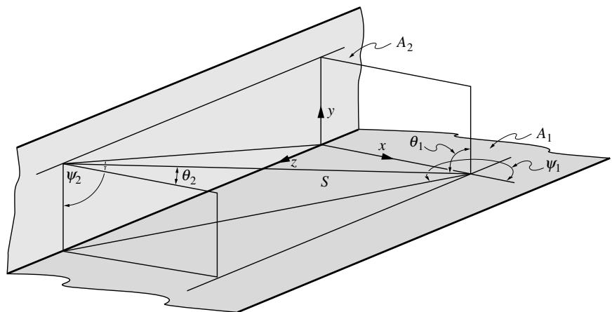

## 内容索引

- [目录](README.md)
- [1 热辐射基础](1-热辐射基础.md)
- [2 基于电磁波理论的辐射特性预测](2-基于电磁波理论的辐射特性预测.md)
- [3 实际表面的辐射特性](3-实际表面的辐射特性.md)
- [4 视角因子](4-视角因子.md)
- [5 灰体漫射表面间的辐射交换](5-灰体漫射表面间的辐射交换.md)
- [6 部分镜面灰体表面间的辐射交换](6-部分镜面灰体表面间的辐射交换.md)
- [7 非理想表面间的辐射交换](7-非理想表面间的辐射交换.md)
- [8 表面交换的蒙特卡洛方法](8-表面交换的蒙特卡洛方法.md)
- [9 传导和对流存在时的表面辐射交换](9-传导和对流存在时的表面辐射交换.md)
- [10 参与介质中的辐射传递方程(RTE)](10-参与介质中的辐射传递方程(RTE).md)
- [11 分子气体的辐射特性](11-分子气体的辐射特性.md)
- [12 颗粒介质的辐射特性](12-颗粒介质的辐射特性.md)
- [13 半透明介质的辐射特性](13-半透明介质的辐射特性.md)
- [14 一维灰体介质的精确解](14-一维灰体介质的精确解.md)
- [15 一维介质的近似求解方法](15-一维介质的近似求解方法.md)
- [16 球谐函数法 (PN-近似)](16-球谐函数法(PN-近似).md)
- [17 离散坐标法 (SN-近似)](17-离散坐标法(SN-近似).md)
- [18 区域法](18-区域法.md)
- [19 准直辐射与瞬态现象](19-准直辐射与瞬态现象.md)
- [20 非灰消光系数的求解方法](20-非灰消光系数的求解方法.md)
- [21 参与介质的蒙特卡洛方法](21-参与介质的蒙特卡洛方法.md)
- [22 辐射与传导和对流的耦合](22-辐射与传导和对流的耦合.md)
- [23 逆辐射传热](23-逆辐射传热.md)
- [24 纳米尺度辐射传热](24-纳米尺度辐射传热.md)
- [附录](附录.md)

- [7.1 引言](#71-引言)  
- [7.2 非灰体表面间的辐射交换](#72-非灰体表面间的辐射交换)  
- [7.3 方向性非理想表面](#73-方向性非理想表面)  
- [7.4 任意表面特性的分析](#74-任意表面特性的分析)  
- [参考文献](#参考文献)  
- [习题](#习题)

# 第7章

# 非理想表面间的辐射交换

# 7.1 引言

在第6章中我们看到，在某些情况下，表面反射的方向特性会强烈影响辐射传热速率。这种效应尤其出现在开放结构中、具有长通道的封闭腔内，或使用准直辐射的应用中。由于实际表面既不是漫反射体也不是镜面反射体，其真实的方向行为可能产生重大影响，如图6-17中的数据所示。我们还注意到，太阳能集热器的表现似乎不太理想，因为在我们的灰体分析中，再辐射损失相当大。然而，经验表明，如果集热板采用选择性表面（即强非灰表面），可以大幅减少再辐射损失。显然，有大量应用场景中我们的理想化处理（灰体、漫射——即方向无关的吸收率和发射率，灰体且漫射或镜面反射）不够准确。实际表面特性在多个方面偏离了我们的理想化处理：

1. 如第3章讨论所示，辐射特性在整个光谱范围内可能有显著变化。
2. 光谱特性，特别是光谱平均特性，可能取决于局部表面温度。
3. 表面的吸收率和反射率可能取决于入射辐射的方向。
4. 表面的发射率和反射率可能取决于出射辐射的方向。
5. 入射辐射的偏振分量会被表面以不同方式反射。即使对于非偏振辐射，如果发生多次连续镜面反射，这种差异也会导致误差。在偏振激光照射情况下，这种效应总是很重要。

本章我们将简要讨论如何将非灰效应纳入前几章的分析中。我们还将推导出具有任意辐射特性（光谱和方向性）的封闭腔内表面出射辐射强度的控制方程，由此可计算传热速率。我们将把这个表达式应用于一个简单几何结构，展示如何将方向不规则表面特性纳入分析。

# 7.2 非灰体表面间的辐射交换

本节我们将考虑方向理想化的非灰表面间的辐射交换：它们的吸收率和发射率与方向无关，而其反射率被理想化为纯漫反射和/或镜面反射分量。对于这种情况，方程(6.22)在光谱基础上变为：

$$
\sum_{j = 1}^{N}\left[\delta_{ij} - (1 - \rho_{\lambda j}^{s})E_{\lambda ,i - j}^{s}\right]E_{b\lambda j} = \sum_{j = 1}^{N}\left(\frac{\delta_{ij}}{\epsilon_{\lambda j}} -\frac{\rho_{\lambda j}^{d}}{\epsilon_{\lambda j}} F_{\lambda ,i - j}^{s}\right)q_{\lambda j} + H_{o\lambda i}^{s},\qquad i = 1,2,\ldots ,N. \tag{7.1}
$$

虽然漫射视角因子纯粹是几何量，因此从不依赖于波长，但镜面视角因子取决于镜面反射率的光谱变化。原则上，可以求解方程(7.1)得到所有未知量$q_{\lambda j}$和/或$E_{b\lambda j}$。然后对整个光谱积分结果，得到：

$$
q_{j} = \int_{0}^{\infty}\mathfrak{q}_{j i}d\lambda ,\qquad E_{b j} = \int_{0}^{\infty}E_{b\lambda j}d\lambda . \tag{7.2}
$$

以矩阵形式表示，类似于方程(6.23)，可写为：

$$
\mathbf{A}_{\lambda}\cdot \mathbf{e}_{\mathbf{b}\lambda} = \mathbf{C}_{\lambda}\cdot \mathbf{q}_{\lambda} + \mathbf{h}_{\mathbf{o}\lambda}^{s}, \tag{7.3}
$$

其中$\mathbf{A}_{\lambda},\mathbf{e}_{\mathbf{b}\lambda},\mathbf{C}_{\lambda},\mathbf{q}_{\lambda},$和$\mathbf{h}_{\mathbf{o}\lambda}^{s}$的定义与第6章相同，但基于光谱。假设所有$q_{j}$都未知（且所有温度已知），方程(7.3)可求解并积分：

$$
{\mathfrak{q}}=\int_{0}^{\infty}{\mathfrak{q}}_{\lambda}d\lambda=\int_{0}^{\infty}{\mathbf{C}}_{\lambda}^{-1}\cdot[{\mathbf{A}}_{\lambda}\cdot{\mathbf{e}}_{\mathfrak{b}\lambda}-{\mathfrak{h}}_{\mathbf{o}\lambda}^{s}]d\lambda. \tag{7.4}
$$

如果某些表面的热流密度已知（温度未知），也可以找到类似的表达式。Branstetter [1]对两个具有铂表面的无限平行板进行了方程(7.4)的积分。实际上，对于大多数应用来说，方程(7.4)的精确数值计算被认为过于复杂。对于数值积分（或求积）中使用的每个波长，矩阵$\mathbf{C}$都需要求逆，对于大量节点通常通过迭代完成。此外，如果一个或多个表面是镜面反射体，则需要为每个波长重新计算镜面视角因子（尽管不需要重新计算组成它们的漫射视角因子）。因此，非灰效应通常通过简化模型处理，如半灰近似或波段近似。

# 半灰近似

在某些应用中，封闭腔内的辐射能量可以自然地划分为两个或多个不同的光谱区域。例如，在太阳能集热器中，入射能量来自高温源，其大部分能量位于3μm以下，而典型集热器温度的辐射损失则发生在3μm以上的波长。在激光加热和加工的情况下，入射能量是单色的（在激光波长处），而再辐射则发生在整个近红外到中红外区域（取决于工件温度）等。在这种情况下，方程(6.22)可以拆分为两组各N个方程，每组对应一个光谱范围，并具有不同的辐射特性。例如，考虑一个受到外部辐射的封闭腔，该辐射被限制在某个光谱范围"(1)"内。由于温度的原因，封闭腔内的表面在光谱范围"(2)"内发射辐射。然后从方程(6.22)可得：

  
图7-1 例7.1的太阳能集热器几何结构

$$
\begin{array}{c}{\sum_{j = 1}^{N}\left[\frac{\delta_{ij}}{\epsilon_j^{(1)}} -\frac{\rho_j^{d_{(1)}}}{\epsilon_j^{(1)}} F_{i - j}^{s(1)}\right]a_j^{(1)} + H_{oi}^s = 0,}\\ {\sum_{j = 1}^{N}\left[\frac{\delta_{ij}}{\epsilon_j^{(2)}} -\frac{\rho_j^{d_{(2)}}}{\epsilon_j^{(2)}} F_{i - j}^{s(2)}\right]a_j^{(2)} = \sum_{j = 1}^{N}\left[\delta_{ij} - (1 - \rho_j^{s(2)})F_{i - j}^{s(2)}\right]E_{ij},}\\ {q_i = q_i^{(1)} + q_i^{(2)},\qquad i = 1,2,\ldots ,N,} \end{array} \tag{7.5b}
$$

其中$\epsilon_{j}^{(1)}$是表面j在光谱区间(1)上的平均发射率，以此类推。

例7.1. 一个非常长的太阳能集热板需要在温度$T_{1} = 350\mathrm{K}$下收集能量。为了提高其在非垂直太阳入射时的性能，在集热器旁边放置了一个在短波长下具有高反射率的表面，如图7-1所示。为简化起见，可以做出以下假设：(i)集热器$A_{1}$是等温且漫反射的；(ii)镜子$A_{2}$是镜面反射的；(iii)集热器和镜子的光谱特性可以近似为：

$$
\begin{array}{c}{\epsilon_1 = 1 - \rho_1^d = \left\{ \begin{array}{ll}0.8, & \lambda < \lambda_c = 4\mu \mathrm{m},\\ 0.1, & \lambda >\lambda_c, \end{array} \right.}\\ {\epsilon_2 = 1 - \rho_2^s = \left\{ \begin{array}{ll}0.1, & \lambda < \lambda_c,\\ 0.8, & \lambda >\lambda_c, \end{array} \right.} \end{array}
$$

且(iv)可以忽略镜子通过对流的热损失以及集热器端部的所有损失。对于30°的太阳入射角，集热板每单位长度收集多少能量？

# 解

从方程(7.5)中，对于范围(1)，有$F_{1 - 2}^{s} = F_{1 - 2}$，$F_{2 - 1}^{s} = F_{2 - 1}$，和$F_{1 - 1}^{s} = F_{2 - 2}^{s} = 0$，

$$
\begin{array}{c}{\frac{q_1^{(1)}}{\epsilon_1^{(1)}} +H_{o1}^s = 0,}\\ {-\left(\frac{1}{\epsilon_1^{(1)}} -1\right)F_{2 - 1}q_1^{(1)} + \frac{q_2^{(1)}}{\epsilon_2^{(1)}} +H_{o2}^s = 0,} \end{array}
$$

对于范围(2)，

$$
\begin{array}{c}{\frac{q_1^{(2)}}{\epsilon_1^{(2)}} = E_{b1} - \epsilon_2^{(2)}F_{1 - 2}E_{b2},}\\ {-\left(\frac{1}{\epsilon_1^{(2)}} -1\right)F_{2 - 1}q_1^{(2)} + \frac{q_2^{(2)}}{\epsilon_2^{(2)}} = -F_{2 - 1}E_{b1} + E_{b2}.} \end{array}
$$

从最后两个方程中消去$E_{b2}$，得到

$$
\left[\frac{1}{\epsilon_1^{(2)}} -\left(\frac{1}{\epsilon_1^{(2)}} -1\right)\epsilon_2^{(2)}F_{1 - 2}F_{2 - 1}\right]q_1^{(2)} + F_{1 - 2}q_2^{(2)} = (1 - \epsilon_2^{(2)}F_{1 - 2}F_{2 - 1})E_{b1}.
$$

将范围(1)的第二个方程乘以$\epsilon_2^{(1)}F_{1 - 2}$得到

$$
\left[-\left(\frac{1}{\epsilon_1^{(1)}} -1\right)\epsilon_2^{(1)}F_{1 - 2}F_{2 - 1}q_1^{(1)} + F_{1 - 2}q_2^{(1)} = -\epsilon_2^{(1)}F_{1 - 2}H_{o2}^s.\right.
$$

将最后两个方程相加，并利用$q_{2} = q_{2}^{(1)} + q_{2}^{(2)} = 0$，得到

$$
\left[\frac{1}{\epsilon_1^{(2)}} -\left(\frac{1}{\epsilon_1^{(2)}} -1\right)\epsilon_2^{(2)}F_{1 - 2}F_{2 - 1}\right]q_1^{(2)} = \left(\frac{1}{\epsilon_1^{(1)}} -1\right)\epsilon_2^{(1)}F_{1 - 2}F_{2 - 1}q_1^{(1)} - \epsilon_2^{(1)}F_{1 - 2}H_{o2}^s +\left(1 - \epsilon_2^{(2)}F_{1 - 2}F_{2 - 1}\right)E_{b1},
$$

或者，当 $q_{1}^{(1)} = - \epsilon_{1}^{(1)}H_{o1}^{s}$ 时

$$
q_{1} = q_{1}^{(1)} + q_{1}^{(2)} = \frac{(1 - \epsilon_{2}^{(2)}F_{1 - 2}F_{2 - 1})E_{b1} - (1 - \epsilon_{1}^{(1)})\epsilon_{2}^{(1)}F_{1 - 2}F_{2 - 1}H_{o1}^{s} - \epsilon_{2}^{(1)}F_{1 - 2}H_{o2}^{s}}{1 / \epsilon_{1}^{(2)} - (1 / \epsilon_{1}^{(2)} - 1)\epsilon_{2}^{(2)}F_{1 - 2}F_{2 - 1}} -\epsilon_{1}^{(1)}H_{o1}^{s}.
$$

根据例6.5可得

$$
\begin{array}{rl} & H_{o2}^{s} = q_{\mathrm{sun}}\sin \phi = 1000\times \sin 30^{\circ} = 500\mathrm{W / m}^{2},\\ & H_{o1}^{s} = q_{\mathrm{sun}}\left[\cos \phi +\rho_{2}^{s(1)}\sin \phi (l_{2} / l_{1})\right] = 1000[\cos 30^{\circ} + 0.9\times \sin 30^{\circ}(60 / 80)] = 1203.5\mathrm{W / m}^{2}. \end{array}
$$

已知 $F_{1 - 2} = \frac{1}{4}$ , $F_{2 - 1} = \frac{1}{3}$ , $F_{1 - 2}F_{2 - 1} = \frac{1}{12}$ , 且 $E_{b1} = 5.670\times 10^{- 8}\times 350^{4} = 850.9\mathrm{W / m}^{2}$ , 可计算 $q_{1}$ 为

$$
q_{1} = \frac{\left(1 - \frac{0.8}{12}\right)\times 850.9 - \frac{0.2\times 0.1}{12}\times 1203.5 - \frac{0.1}{4}\times 500}{\frac{1}{0.1} - \left(\frac{1}{0.1} - 1\right)\times \frac{0.8}{12}} -0.8\times 1203.5 = 82.9 - 962.8 = -880.1\mathrm{W / m}^{2},
$$

即收集效率为 $88\%$。此外，表面 $A_{2}$ 的温度比灰体情况(例6.5)低得多；根据区域(2)的第一个方程

$$
E_{b2} = \left(E_{b1} - \frac{q_1^{(2)}}{\epsilon_1^{(2)}}\right)\epsilon_2^{(2)}F_{1 - 2} = \left(850.9 - \frac{82.9}{0.1}\right)\left(\frac{0.8}{4} = 109.5\mathrm{W / m}^2,\right.
$$

即

$$
T_{2} = (E_{b2} / \sigma)^{1 / 4} = \left[109.5 / 5.670\times 10^{-8}\right]^{1 / 4} = 209\mathrm{K}.
$$

显然，表面 $A_{2}$ 会通过对流从周围环境中加热。$A_{2}$ 的表面辐射将进一步改善收集效率。

因此，选择性表面对高温源辐射配置中的辐射热通量有巨大影响。附录F提供了子程序semigray用于求解联立方程(7.5)，需要输入表面信息和部分视角因子矩阵(即该代码仅限于两个光谱范围，将外部辐射与表面发射分开)。例7.1的解也以程序semigrxch的形式给出，可作为解决其他问题的起点。提供了Fortran90、C++以及MATLAB®版本。

半灰近似不仅限于两个不同的光谱区域。封闭空间的每个表面都可以给定一组吸收率和反射率，每个不同的表面温度对应一个值(具有不同的发射光谱)。Armaly和Tien[2]已经指出了如何确定这些吸收率。然而，尽管简单直接，但无论为每个表面选择多少不同的吸收率和反射率值，该方法都无法变得"精确"。

Bobco及其同事[3]对半灰近似进行了全面讨论。Plamondon和Landram[4]将该方法应用于具有光谱选择性漫反射表面的V型槽腔体中的太阳辐射。与精确(即光谱积分)结果的比较证明该方法非常准确。Shimoji[5]使用半灰近似模拟了太阳辐射对圆锥形和V型槽腔体的照射，这些腔体的反射率具有纯漫反射和镜面反射分量。

# 波段近似

求解方程(7.1)的另一种常用方法是波段近似法。在这种方法中，光谱被划分为$M$个波段，封闭空间内所有表面的辐射特性在这些波段内保持恒定。因此，

$$
\begin{array}{r l r} 
& {} & {\sum_{j = 1}^{N}\left[\delta_{i j} - (1 - \rho_{j}^{s(m)})E_{i - j}^{s(m)}\right]E_{b j}^{(m)} = \sum_{j = 1}^{N}\left[\frac{\delta_{i j}}{\epsilon_{j}^{(m)}} -\frac{\rho_{j}^{d(m)}}{\epsilon_{j}^{(m)}} F_{i - j}^{s(m)}\right]q_{j}^{(m)} + H_{o i}^{s(m)},}\\ 
& {} & {i = 1,2,\ldots ,N,\quad m = 1,2,\ldots ,M;}\\ 
& {} & {E_{b j} = \sum_{m = 1}^{M}E_{b j}^{(m)},\quad q_{j} = \sum_{m = 1}^{M}q_{j}^{(m)},\quad H_{o i}^{s} = \sum_{m = 1}^{M}H_{o i}^{s(m)}.} 
\end{array} \tag{7.6b}
$$

方程(7.6)实际上就是对方程(7.1)的简单数值积分，采用了变步长的梯形法则。这种方法的优点是可以根据特性的光谱变化来调整波段的宽度，从而用相对较少的波段就能获得良好的精度。对于非常少的波段，该方法的精度与半灰近似相似，但应用起来稍微麻烦一些，如果某些表面规定了辐射通量而不是温度，则需要迭代方法。另一方面，波段近似可以通过使用多个波段来实现任何所需的精度。

例7.2 使用波段近似重复例7.1。

# 解

由于本例中的发射率被理想化为在光谱范围内具有恒定值，除了在$\lambda = 4\mu \mathrm{m}$处有一个阶跃，因此两波段近似$(\lambda < \lambda_{c} = 4\mu \mathrm{m}$和$\lambda >4\mu \mathrm{m}$将产生"精确"解(在净辐射法的框架内)。根据方程(7.6)

$$
\begin{array}{rcl}
{E_{b1}^{(m)} - \epsilon_1^{(m)}F_{1 - 2}E_{b2}^{(m)} =} & {\frac{q_1^{(m)}}{\epsilon_1^{(m)}} +H_{o1}^{s(m)},}\\ 
{} & {} & {}\\ 
{-F_{2 - 1}E_{b1}^{(m)} + E_{b2}^{(m)} =} & {-\left(\frac{1}{\epsilon_1^{(m)}} -1\right)F_{2 - 1}q_1^{(m)} + \frac{q_2^{(m)}}{\epsilon_2^{(m)}} +H_{o2}^{s(m)},} & {m = 1,2,} 
\end{array}
$$

其中$\begin{array}{r}E_{bi}^{(1)} = \int_{0}^{\lambda_c}E_{b\lambda i}d\lambda = f(\lambda_cT_i)E_{bi}, \end{array}$ $E_{bi}^{(2)} = [1 - f(\lambda_cT_i)]E_{bi},$ 等等。这是四个方程，六个未知数$q_{1}^{(m)},q_{2}^{(m)},E_{b2}^{(m)},m = 1,2$。另外两个条件来自$q_{2} = q_{2}^{(1)} + q_{2}^{(2)} = 0$和$E_{b2}^{(1)} + E_{b2}^{(2)} = E_{b2} = \sigma T_2^4$。问题是$E_{b2}^{(m)}$与$T_{2},$是非线性关系，使得无法找到所需的$q_{1} = q_{1}^{(1)} + q_{1}^{(2)}$的显式关系。系统通过迭代求解，通过求解$q_{i}^{(m)}$...

$$
\begin{array}{rl} 
& {q_1^{(m)} = \epsilon_1^{(m)}\left(E_{b1}^{(m)} - \epsilon_2^{(m)}F_{1 - 2}E_{b2}^{(m)} - H_{o1}^{s(m)}\right),}\\ 
& {q_2^{(m)} = \epsilon_2^{(m)}\left[\left(\frac{1}{\epsilon_1^{(m)}} -1\right)F_{2 - 1}q_1^{(m)} - F_{2 - 1}E_{b1}^{(m)} + E_{b2}^{(m)} - H_{o2}^{s(m)}\right],m = 1,2.} 
\end{array}
$$

首先，猜测$T_{2}$，从中可以评估$E_{b2}^{(m)}$。然后确定$\ell_1^{(m)}$，之后可以计算$q_{1}^{(m)}$。如果$q_{2} > 0,$表面$A_{2}$太热，降低其温度，反之亦然，直到获得正确的温度。这个计算可以通过编写一个简单的计算机代码来完成，结果为$T_{2} = 212\mathrm{K}$和$q_{1} = - 867\mathrm{W / m^{2}}$。正如预期的那样，对于本示例，波段近似几乎没有改进，同时使分析复杂化。然而，如果没有明显的光谱区域和/或特性的光谱行为更复杂，波段近似是首选方法。

附录F中提供了子程序bandapp，用于求解联立方程(7.6)，需要输入表面信息和部分视角因子矩阵。例7.2的解也以程序bandmxch的形式给出，可以作为解决其他问题的起点。提供了Fortran90、$\mathrm{C + + }$以及MATLAB®版本。Dunkle和Bevans [6]将波段近似应用于与Branstetter [1]相同的问题(无限平行钨板)以及其他一些配置，表明波段近似通常用很少的波段就能达到$2\%$及更好的精度，而灰色分析可能导致$30\%$或更大的误差。

# 7.3 方向性非理想表面

在绝大多数应用中，"方向性理想"表面的假设给出了足够准确的结果，即可以假设表面是漫发射和吸收的，并且是漫反射和/或镜面反射的(反射率的大小与入射方向无关)。然而，图6-17中V型槽的结果表明，这些结果并不总是准确的，热通量不一定由漫反射和镜面反射情况所限定。在某些情况下，$(i)$方向性特性，$(ii)$几何考虑和/或$(iii)$精度要求使得必须考虑辐射特性的方向性行为。

如果要考虑具有任意方向行为的辐射特性，就不可能将控制方程简化为仅与表面位置(而不是方向)有关的单一量(辐射度)的积分方程。相反，对这个问题应用能量守恒会产生一个控制离开表面的方向强度的方程，该方程既是封闭表面位置的函数，也是方向的函数。

# 强度控制方程

考虑图7-2所示的任意封闭空间。从微表面元$dA'$向$\hat{\mathbf{s}} '$方向离开并到达表面元$dA$的光谱辐射热通量为

$$
I_{\lambda}(\mathbf{r}',\lambda ,\hat{\mathbf{s}} ')dA_{p}'d\Omega = I_{\lambda}(\mathbf{r}',\lambda ,\hat{\mathbf{s}} ')(dA'\cos \theta ')\frac{dA\cos\theta}{S^2}, \tag{7.7}
$$

其中$S = |\mathbf{r}' - \mathbf{r}|$是$dA'$和$dA$之间的距离，$\cos \theta ' = \hat{\mathbf{s}} '\cdot \hat{\mathbf{n}} '$是单位方向向量$\hat{\mathbf{s}} ' = (\mathbf{r} - \mathbf{r}') / S$与$dA'$处外表面法线$\hat{\mathbf{n}} '$之间夹角的余弦，类似地，$\cos \theta_{i} = (- \hat{\mathbf{s}} ')\cdot \hat{\mathbf{n}}$在$dA$处。根据方程(3.32)，从$dA'$到达$dA$的辐照度也可以表示为

$$
H_{\lambda}^{\prime}(\mathbf{r},\lambda ,\hat{\mathbf{s}}^{\prime})dAd\Omega_{i} = I_{\lambda}(\mathbf{r},\lambda ,\hat{\mathbf{s}}^{\prime})dAd\cos \theta_{i}\frac{dA^{\prime}\cos\theta^{\prime}}{S^{2}}. \tag{7.8}
$$

使这两个表达式相等，我们发现

$$
I_{\lambda}(\mathbf{r},\lambda ,\hat{\mathbf{s}}^{\prime}) = I_{\lambda}(\mathbf{r}^{\prime},\lambda ,\hat{\mathbf{s}}^{\prime}), \tag{7.9}
$$

也就是说，辐射强度在从$dA'$传播到$dA$时保持不变。

  
图7-2 具有任意表面特性的封闭空间中的辐射交换。

在方向$\hat{\mathbf{s}}$上离开$dA$的出射辐射强度由两部分组成：局部发射强度和反射强度。根据方程(3.1)，局部发射强度为

$$
\epsilon_{\lambda}^{\prime}(\mathbf{r},\lambda ,\hat{\mathbf{s}})I_{b\lambda}(\mathbf{r},\lambda).
$$

从$dA^{\prime}$到达$dA$的辐照度[方程(7.8)]中被反射到方向$\hat{\mathbf{s}}$周围立体角$d\Omega_{o}$的部分，根据双向反射函数的定义(方程3.33)为

$$
dI_{\lambda}(\mathbf{r},\lambda ,\hat{\mathbf{s}})d\Omega_{o} = \rho_{\lambda}^{\prime \prime}(\mathbf{r},\lambda ,\hat{\mathbf{s}}^{\prime},\hat{\mathbf{s}})\left(H_{\lambda}^{\prime}(\mathbf{r},\lambda ,\hat{\mathbf{s}}^{\prime})d\Omega_{i}\right)d\Omega_{o},
$$

或

$$
\begin{array}{rl} & {dI_{\lambda}(\mathbf{r},\lambda ,\hat{\mathbf{s}}) = \rho_{\lambda}^{\prime \prime}(\mathbf{r},\lambda ,\hat{\mathbf{s}}^{\prime},\hat{\mathbf{s}})I_{\lambda}(\mathbf{r},\lambda ,\hat{\mathbf{s}}^{\prime})\cos \theta_{i}d\Omega_{i}}\\ & {\qquad = \rho_{\lambda}^{\prime \prime}(\mathbf{r},\lambda ,\hat{\mathbf{s}}^{\prime},\hat{\mathbf{s}})I_{\lambda}(\mathbf{r},\lambda ,\hat{\mathbf{s}}^{\prime})\frac{\cos\theta_{i}\cos\theta^{\prime}}{S^{2}} dA^{\prime}.} \end{array}
$$

对所有入射方向(或整个封闭表面)积分反射强度，并加上局部发射强度，我们得到$dA$处出射强度的表达式：

$$
\begin{array}{l}{I_{\lambda}(\mathbf{r},\lambda ,\hat{\mathbf{s}}) = \epsilon_{\lambda}^{\prime}(\mathbf{r},\lambda ,\hat{\mathbf{s}})I_{b\lambda}(\mathbf{r},\lambda) + \int_{2\pi}\rho_{\lambda}^{\prime \prime}(\mathbf{r},\lambda ,\hat{\mathbf{s}}^{\prime},\hat{\mathbf{s}})I_{\lambda}(\mathbf{r}^{\prime},\lambda ,\hat{\mathbf{s}}^{\prime})\cos \theta_{i}d\Omega_{i}}\\ {= \epsilon_{\lambda}^{\prime}(\mathbf{r},\lambda ,\hat{\mathbf{s}})I_{b\lambda}(\mathbf{r},\lambda) + \int_{A}\rho_{\lambda}^{\prime \prime}(\mathbf{r},\lambda ,\hat{\mathbf{s}}^{\prime},\hat{\mathbf{s}})I_{\lambda}(\mathbf{r}^{\prime},\lambda ,\hat{\mathbf{s}}^{\prime})\frac{\cos\theta_{i}\cos\theta^{\prime}}{S^{2}} dA^{\prime}.} \end{array} \tag{7.10}
$$

方程(7.10)是封闭表面任意位置$(\hat{\mathbf{n}} \cdot \hat{\mathbf{s}} > 0)$出射强度的积分方程。一旦获得方程(7.10)的解(解析解、数值解或统计解；近似解或"精确"解)，净辐射热流可由下式确定：

$$
\begin{array}{l}{q_{\lambda}(\mathbf{r},\lambda) = q_{\mathrm{out}} - q_{\mathrm{in}}}\\ {= \int_{\hat{\mathbf{n}}\cdot \hat{\mathbf{s}}< 0}I_{\lambda}(\mathbf{r},\lambda ,\hat{\mathbf{s}})\cos \theta d\Omega -\int_{\hat{\mathbf{n}}\cdot \hat{\mathbf{s}}< 0}I_{\lambda}(\mathbf{r},\lambda ,\hat{\mathbf{s}}^{\prime})\cos \theta_{i}d\Omega_{i}}\\ {= \int_{\hat{\mathbf{n}}\cdot \hat{\mathbf{s}}< 0}I_{\lambda}(\mathbf{r},\lambda ,\hat{\mathbf{s}})\cos \theta d\Omega -\int_{A}I_{\lambda}(\mathbf{r}^{\prime},\lambda ,\hat{\mathbf{s}}^{\prime})\frac{\cos\theta_{i}\cos\theta^{\prime}}{S^{2}} dA^{\prime},} \end{array} \tag{7.11}
$$

或等价地：

$$
\begin{array}{l}{q_{\lambda}(\mathbf{r},\lambda) = q_{\mathrm{em}} - q_{\mathrm{abs}} = \epsilon_{\lambda}E_{b\lambda} - \alpha_{\lambda}H_{\lambda}}\\ {= \int_{\hat{\mathbf{n}}\cdot \hat{\mathbf{s}} >0}\epsilon_{\lambda}^{\prime}(\mathbf{r},\lambda ,\hat{\mathbf{s}})\cos \theta d\Omega_{I_{b\lambda}}(\mathbf{r},\lambda) - \int_{A}\alpha_{\lambda}^{\prime}(\mathbf{r},\lambda ,\hat{\mathbf{s}}^{\prime})I_{\lambda}(\mathbf{r}^{\prime},\lambda ,\hat{\mathbf{s}}^{\prime})\frac{\cos\theta_{i}\cos\theta^{\prime}}{S^{2}} dA^{\prime}.} \end{array} \tag{7.12}
$$

根据具体问题，可以采用方程(7.10)的两种形式(立体角积分和面积积分)。例如，如果$dA$是漫发射和漫反射表面，那么根据方程(3.38)，$\rho_{\lambda}^{\prime \prime}(\mathbf{r},\lambda ,\hat{\mathbf{s}}^{\prime},\hat{\mathbf{s}}) = \rho_{\lambda}^{\prime}(\mathbf{r},\lambda) / \pi$，根据方程(5.19)，$I_{\lambda}(\mathbf{r},\lambda ,\hat{\mathbf{s}}) = J_{\lambda}(\mathbf{r},\lambda) / \pi$。如果$dA^{\prime}$也是漫射表面，我们从方程(7.10)的第二种形式得到

$$
J_{\lambda}(\mathbf{r},\lambda) = \epsilon_{\lambda}(\mathbf{r},\lambda)E_{b\lambda}(\mathbf{r},\lambda) + \rho_{\lambda}(\mathbf{r},\lambda)\int_{A}J_{\lambda}(\mathbf{r}',\lambda)dF_{dA - dA'}, \tag{7.13}
$$

这实际上就是没有外部辐照的方程(5.24)的光谱形式。类似地，方程(7.11)简化为

$$
q_{\lambda}(\mathbf{r},\lambda) = J_{\lambda}(\mathbf{r},\lambda) - \int_{A}J_{\lambda}(\mathbf{r}',\lambda)dF_{dA - dA'}, \tag{7.14}
$$

即方程(5.25)的光谱形式。

另一方面，如果$dA$是镜面反射体，则方程(7.10)的第一种形式更为方便：对于镜面，除了$\hat{\mathbf{s}}^{\prime} = \hat{\mathbf{s}}_{s}$方向外，对所有$\hat{\mathbf{s}}^{\prime}$都有$\rho_{\lambda}^{\prime \prime} = 0$，其中$\hat{\mathbf{s}}_{s}$是"镜面方向"，光束必须从该方向入射才能在镜面反射后沿$\hat{\mathbf{s}}$方向传播。对于该方向$\rho_{\lambda}^{\prime \prime}\rightarrow \infty$，显然方程(7.10)积分中的被积函数仅在$\hat{\mathbf{s}}^{\prime} = \hat{\mathbf{s}}_{s}$附近非零。在该附近$I_{\lambda}(\mathbf{r}',\lambda ,\hat{\mathbf{s}} ')$变化很小，可以将其移出积分。根据光谱、方向-半球反射率的定义(方程3.37)和双向反射函数的互易定律(方程3.35)，我们得到

$$
\begin{array}{rl} & {\int_{2\pi}\rho_{\lambda}^{\prime \prime}(\mathbf{r},\lambda ,\hat{\mathbf{s}}^{\prime},\hat{\mathbf{s}})I_{\lambda}(\mathbf{r},\lambda ,\hat{\mathbf{s}}^{\prime})\cos \theta_{i}d\Omega_{i} = I_{\lambda}(\mathbf{r}^{\prime},\lambda ,\hat{\mathbf{s}}_{\mathrm{s}})\int_{2\pi}\rho_{\lambda}^{\prime \prime}(\mathbf{r},\lambda ,\hat{\mathbf{s}}^{\prime},\hat{\mathbf{s}})\cos \theta_{i}d\Omega_{i}}\\ & {\qquad = I_{\lambda}(\mathbf{r}^{\prime},\lambda ,\hat{\mathbf{s}}_{\mathrm{s}})\int_{2\pi}\rho_{\lambda}^{\prime \prime}(\mathbf{r},\lambda , - \hat{\mathbf{s}}, - \hat{\mathbf{s}}^{\prime})\cos \theta_{i}d\Omega_{i}}\\ & {\qquad = I_{\lambda}(\mathbf{r}^{\prime},\lambda ,\hat{\mathbf{s}}_{\mathrm{s}})\rho_{\lambda}^{\prime}(\mathbf{r},\lambda , - \hat{\mathbf{s}}),} \end{array}
$$

其中$- \hat{\mathbf{s}}$表示指向$dA$的入射方向，$\rho_{\lambda}^{\prime}(\mathbf{r},\lambda , - \hat{\mathbf{s}})$是方向-半球反射率。根据用于建立方程(3.35)的相同基尔霍夫定律，可得$\rho_{\lambda}^{\prime}(\mathbf{r},\lambda , - \hat{\mathbf{s}}) = \rho_{\lambda}^{\prime}(\mathbf{r},\lambda ,\hat{\mathbf{s}}_{\mathrm{s}})$，因此

$$
I_{\lambda}(\mathbf{r},\lambda ,\hat{\mathbf{s}}) = \epsilon_{\lambda}^{\prime}(\mathbf{r},\lambda ,\hat{\mathbf{s}})I_{b\lambda}(\mathbf{r},\lambda) + \rho_{\lambda}^{\prime}(\mathbf{r},\lambda ,\hat{\mathbf{s}}_{\mathrm{s}})I_{\lambda}(\mathbf{r}^{\prime},\lambda ,\hat{\mathbf{s}}_{\mathrm{s}}). \tag{7.15}
$$

例7.3. 考虑一个非常长的V型槽，其开口角度为$2\gamma = 90^{\circ}$，具有光学光滑的金属表面，折射率为$m = n - ik = 23.452(1 - i)$，即表面是镜面反射的且其方向依赖性遵循菲涅尔方程。槽在温度$T$下是等温的，且没有外部辐射进入该结构。计算局部净辐射热损失作为距槽顶点距离的函数。

# 解

这是Toor[7]使用蒙特卡洛方法研究的问题之一(图6-17中的实线)。方向发射率可以从金属的菲涅尔方程(3.75)和(3.76)计算得到：

$$
\epsilon^{\prime}(\theta) = 1 - \rho^{\prime}(\theta) = \frac{2n\cos\theta}{(n + \cos\theta)^{2} + k^{2}} +\frac{2n\cos\theta}{(n\cos\theta + 1)^{2} + (k\cos\theta)^{2}},
$$

  
图7-3 具有镜面反射、方向依赖性反射率的等温V型槽(例7.3)

而半球发射率根据方程(3.77)或图3-10为$\epsilon = 0.1$

当前问题特别简单，因为表面是镜面反射体且槽的开口角度为$90^{\circ}$(参见图7-3)。任何离开表面$A_{1}$向$A_{2}$传播的辐射将被$A_{2}$吸收或反射出槽；没有辐射可以反射回$A_{1}$。这一事实意味着到达$A_{1}$的所有辐射都来自$A_{2}$的发射，这是一个已知量。因此，对于指向$A_{1}$的那些方位角$\psi_{2}$，我们有

$$
-\frac{\pi}{2} < \psi_{2}< \frac{\pi}{2}:I_{2}(\theta_{2}) = \epsilon^{\prime}(\theta_{2})I_{b},
$$

局部热流根据方程(7.12)为

$$
\begin{array}{l}{q(x) = \epsilon E_b - \int_{2\pi}\epsilon '(\theta_1)I_2(\theta_2)\cos \theta_1d\Omega_1}\\ {= \epsilon E_b - 2\int_{\psi_1 = 0}^{\pi /2}\int_{\theta_1 = \theta_{\mathrm{min}}(\psi_1)}^{\pi /2}\epsilon '(\theta_1)\epsilon '(\theta_2)I_b\cos \theta_1\sin \theta_1d\theta_1d\psi_1,} \end{array}
$$

或

$$
\frac{q(x)}{\epsilon E_b} = 1 - \frac{2}{\pi\epsilon}\int_{\psi_1 = 0}^{\pi /2}\int_{\theta_1 = \theta_{\mathrm{min}}(\psi_1)}^{\pi /2}\epsilon '(\theta_1)\epsilon '(\theta_2)\cos \theta_1\sin \theta_1d\theta_1d\psi_1.
$$

这里积分限表达了从$A_{1}$看$A_{2}$的立体角是有限的这一事实。还需要将$\theta_{1\mathrm{min}}$和$\theta_{2}$用$\theta_{1}$和$\psi_{1}$表示。从图7-3可得

$$
\cos \theta_{1} = \frac{y}{S},\quad \cos \theta_{2} = \frac{x}{S},\quad S\sin \theta_{1} = \frac{x}{\cos\psi_{1}}.
$$

从这三个关系以及当$y = L$时$\theta_{1}$取最小值的事实，我们得到

$$
\cos \theta_{2} = \sin \theta_{1}\cos \psi_{1}\quad \mathrm{and}\quad \theta_{1\mathrm{min}}(\psi_{1}) = \tan \cdot \frac{x}{L\cos\psi_{1}}.
$$

使用菲涅尔方程计算方向发射率，现在可以通过数值积分计算无量纲局部热流$q(x) / \epsilon E_{b}$。所得热流如图6-17中的实线所示。这个结果应该与漫发射的简单情况($\epsilon^{\prime}(\theta) = \epsilon = 0.1 =$常数)进行比较。对于这种情况，上述积分可以很容易地解析积分，得到图6-17中的点划线。两个结果非常接近，在槽顶点附近的最大误差为$\simeq 2\%$。

虽然在这个非常简单的问题中使用菲涅尔方程评估"精确"热流相当直接，但这些计算通常比漫发射近似复杂得多。在进行如此广泛的计算之前，重要的是要问自己使用菲涅尔方程是否会导致手头问题的结果有显著不同。

精确积分方程的数值解在文献中很少出现。例如，Hering和Smith[8]考虑了与例7.3相同的问题，但针对不同的开口角度和粗糙表面材料(双向反射函数如早期论文[9]中给出)。缺乏对双向反射分布的详细了解，以及求解积分方程(7.10)所涉及的巨大复杂性，使得在实践中必须做出额外的简化假设或采用不同的方法，如蒙特卡洛方法(将在第8章讨论)。

# 净辐射法

虽然应用起来更加困难和受限，但净辐射法可以应用于具有方向性非理想特性的表面。将封闭空间划分为$N$个子表面，对于指向子表面$A_i$上某点$\mathbf{r}$的位置，方程(7.10)可写为：

$$
I(\mathbf{r},\lambda ,\hat{\mathbf{s}}) = \epsilon^{\prime}(\mathbf{r},\lambda ,\hat{\mathbf{s}})I_{b}(\mathbf{r},\lambda) + \pi \sum_{j = 1}^{N}\rho_{j}^{\prime \prime}(\mathbf{r},\lambda ,\hat{\mathbf{s}})I_{j}(\mathbf{r},\lambda)E_{di - j}(\mathbf{r}), \tag{7.16}
$$

为简化表示，我们省略了$\lambda$下标，其中$\rho_{j}^{\prime \prime}$和$I_{j}$是点$\mathbf{r}$与表面$A_j$之间的"适当"平均值。将方程(7.16)在$A_i$上平均得到：

$$
I_{i}(\lambda ,\hat{\mathbf{s}}) = \epsilon_{i}^{\prime}(\lambda ,\hat{\mathbf{s}})I_{bi}(\lambda) + \pi \sum_{j = 1}^{N}\rho_{ji}^{\prime}(\lambda ,\hat{\mathbf{s}})I_{ji}(\lambda)E_{i - j},\quad i = 1,2,\ldots ,N. \tag{7.17}
$$

这里$I_{ji}$是从表面$A_j$射向$A_i$的辐射强度的平均值，$\rho_{ji}^{\prime}$是双向反射函数的对应值。假设封闭空间的温度和表面特性处处已知，则方程(7.17)对每个子表面$A_i$有$N$个未知强度$I_{ji}$ $(j = 1,2,\ldots ,N)$。因此，如果将方程(7.17)对从$A_i$看$A_k$的所有立体角进行平均，就得到一组$N\times N$个方程，包含$N^2$个未知量$I_{ik}$：

$$
I_{ik}(\lambda) = \epsilon_{ik}(\lambda)I_{bi}(\lambda) + \pi \sum_{j = 1}^{N}\rho_{jik}(\lambda)I_{ji}(\lambda)E_{i - j},\quad i,k = 1,2,\ldots ,N. \tag{7.18}
$$

这里$\rho_{jik}$是辐射从$A_j$经$A_i$反射到$A_k$的双向反射函数的平均值。对于漫发射、吸收和反射的封闭空间，有$\epsilon_{ik} = \epsilon_{i}$，$\pi \rho_{jik} = \rho_{i}$，且$I_{ji} = I_{j} = J_{j} / \pi$，方程(7.18)变为：

$$
J_{i} = \epsilon_{i}E_{bi} + \rho_{i}\sum_{j = 1}^{N}J_{j}F_{i - j},\quad i = 1,2,\ldots ,N, \tag{7.19}
$$

这与方程(5.30)和(5.31)相同(无外部辐射)。

如果$N$个子表面相对较小(与它们之间的距离平方相比)，可以通过连接$A_i$、$A_j$和$A_k$的中心点给出的方向评估$\epsilon^{\prime}$和$\rho^{\prime \prime}$来获得平均特性$\epsilon_{ik}$和$\rho_{jik}$。对于较大的子表面，可能需要更精细的平均方法。Bevans和Edwards[10]对此进行了讨论。

  
图7-4 (a)例7.4的几何结构，(b)例7.4材料在入射平面内$\theta_{i} = 0^{\circ}$和$\theta_{i} = 45^{\circ}$时的双向反射函数

一旦确定了$N^2$个未知量$I_{ik}$，就可以根据方程(7.18)和(7.11)或(7.12)计算$A_i$上的平均热流：

$$
\begin{array}{l}{q_i(\lambda) = \pi \sum_{k = 1}^{N}I_{ik}(\lambda)E_{i - k} - \pi \sum_{j = 1}^{N}I_{ji}(\lambda)E_{i - j} = \pi \sum_{j = 1}^{N}(I_{ij} - I_{ji})E_{i - j}}\\ {= \epsilon_i(\lambda)E_{bi}(\lambda) - \pi \sum_{j = 1}^{N}\alpha_{ij}(\lambda)I_{ji}(\lambda)E_{i - j},\quad i = 1,2,\ldots ,N,} \end{array} \tag{7.20b}
$$

其中$\epsilon_{i}$是$A_i$的半球发射率，$\alpha_{ij}$是子表面$A_i$对来自$A_j$的辐射的平均吸收率。

从方程(7.10)和(7.18)明显看出，方向性非理想表面的净辐射法在以下条件下有效：$(i)$每个$I_{bi}$在子表面$A_i$上变化不大；$(ii)$每个$I_{ik}$在$A_i$和$A_k$上任意两点之间变化不大；$(iii)$类似限制适用于$\epsilon_{ik}$、$\alpha_{ij}$和$\rho_{jik}$。除非表面接近漫反射体或非常小(与它们之间的距离相比)，否则$(ii)$和$(iii)$限制很容易被违反。

方程(7.10)和(7.18)适用于具有灰色表面特性的封闭空间，或在光谱基础上适用。对于非灰色表面特性，可以使用前一节概述的方法在光谱上积分控制方程。

为了说明与方向性非理想表面相关的困难，我们将考虑一个特别简单的例子。

例7.4. 考虑图7-4a所示的有限长度等温角。表面材料与上例无限长角的材料相似，即吸收率和发射率遵循菲涅尔方程，$m = n - ik = 23.452(1 - i)$，半球发射率$\epsilon = 0.1$。但在本例中，我们假设材料以非镜面方式反射，其双向反射函数为：

$$
\rho ''(\pmb {\hat{s}}_i,\pmb {\hat{s}}_r) = \frac{\rho'(\pmb{\hat{s}}_i)}{\pi C_n(\pmb{\hat{s}}_i)} (1 + \pmb {\hat{s}}_s\cdot \pmb {\hat{s}}_r)^n,
$$

其中$\hat{\mathbf{s}}_i$是入射方向，$\hat{\mathbf{s}}_s$是镜面反射方向(即$\theta_{s} = \theta_{i}, \psi_{s} = \psi_{i} + \pi$)，$\hat{\mathbf{s}}_r$是实际反射方向。这种形式的双向反射函数描述了一个在镜面方向具有最大反射率，且反射率在远离镜面方向的所有方向上均匀下降(即随着极角和/或方位角变化)的表面。由于方向-半球反射率必须满足$\rho^{\prime}(\hat{\mathbf{s}}_i) = 1 - \epsilon^{\prime}(\hat{\mathbf{s}}_i)$，函数$C_n(\hat{\mathbf{s}}_i)$由方程(3.37)给出：

$$
C_n(\hat{\mathbf{s}}_i) = \frac{1}{\pi}\int_{2\pi}(1 + \hat{\mathbf{s}}_s\cdot \hat{\mathbf{s}}_r)^n\cos \theta_r d\Omega_r.
$$

确定两板处于相同等温温度时的局部辐射热损失率。

# 解

方向向量 $\hat{\mathbf{s}}$ 可以用极角 $\theta$ 和方位角 $\psi$ 表示，即 $\hat{\mathbf{s}} = \sin \theta (\cos \psi \hat{\mathbf{t}}_1 + \sin \psi \hat{\mathbf{t}}_2) + \cos \theta \hat{\mathbf{n}}$，其中 $\hat{\mathbf{n}}$ 是表面法向单位向量，$\hat{\mathbf{t}}_1$ 和 $\hat{\mathbf{t}}_2$ 是表面上两个互相垂直的切向单位向量。因此，双向反射函数可以表示为：

$$
\rho^{\prime \prime}(\theta_{i},\psi_{i},\theta_{r},\psi_{r}) = \frac{\rho^{\prime}(\theta_{i},\psi_{i})}{\pi C_{n}(\theta_{i})}\left[1 + \cos \theta_{i}\cos \theta_{r} - \sin \theta_{i}\sin \theta_{r}\cos (\psi_{i} - \psi_{r})\right]^{n}, \tag{7.21a}
$$

$$
C_{n}(\theta_{i}) = \frac{1}{\pi}\int_{0}^{2\pi}\int_{0}^{\pi /2}(1 + \cos \theta_{i}\cos \theta +\sin \theta_{i}\sin \theta \cos \psi)^{n}\cos \theta \sin \theta d\theta d\psi . \tag{7.21b}
$$

图7-4b展示了入射平面内$(\psi_{r} = \psi$ 或 $\psi_{i} + \pi)$的双向反射函数，针对两种不同入射方向和三个不同的$n$值。显然，当$n=0$时表面呈现漫反射特性（但反射量以及吸收和发射仍通过菲涅尔方程与方向相关）。随着$n$增大，表面反射特性趋向镜面反射，当$n\to \infty$时达到完全镜面反射。针对这种构型和表面材料，我们将采用净辐射法确定平板的热损失。

如图7-4a所示，我们将每个表面划分为$M\times N$个子表面（$x$和$y$方向各$M$等分，$z$方向$N$等分），应用方程(7.18)和(7.20)的净辐射法。考虑底部表面节点$(i,k)$指向垂直壁面节点$(j_0,k_0)$的辐射强度，将方程(7.18)除以$I_b$后得到：

$$
\Phi_{i,k\rightarrow j_o,k_o} = \frac{I_{ik\rightarrow j_0,k_o}}{I_b} = \epsilon_{i,k\rightarrow j_o,k_o} + \sum_{j_i = 1}^{M}\sum_{k = 1}^{N}\pi \rho_{j_i,k_i\rightarrow i,k\rightarrow j_o,k_o}F_{i,k\rightarrow j_i,k_i}F_{j_i,k_i\rightarrow i,k}. \tag{7.22}
$$

在此关系中我们利用了底部表面节点只能看到侧壁节点（反之亦然）的特性。根据对称性有：

$$
\begin{array}{rcl}{\Phi_{i,k\rightarrow j_o,k_o}} & = & {\Phi_{j,k\rightarrow i_o,k_o}\quad \mathrm{if}\quad j = i\quad \mathrm{and}\quad i_o = j_o,}\\ {} & {} & {}\\ {\Phi_{i,k\rightarrow j_o,k_o}} & = & {\Phi_{i,N + 1\rightarrow k\rightarrow j_o,N + 1 - k_o},} \end{array}
$$

即辐射强度必须关于$x = y$和$z = L / 2$两个平面对称。因此我们共有$M\times (N / 2)$个未知量（假设$N$为偶数），需要对$i = 1,2,\ldots ,M$和$k = 1,2,\ldots ,N / 2$应用方程(7.22)。为计算所需的$\epsilon^{\prime}$和$\rho^{\prime \prime}$值，需要确定多个极角和方位角。由图7-4a可得：

$$
\begin{array}{rcl}{(\cos \theta_i)_{i,k\rightarrow j_i,k_i}} & = & {\frac{y_{j_i}}{\sqrt{x_i^2 + y_{j_i}^2 + (z_k - z_{k_i})^2}},}\\ {(\cos \theta_r)_{i,k\rightarrow j_o,k_o}} & = & {\frac{y_{j_o}}{\sqrt{x_i^2 + y_{j_o}^2 + (z_k - z_{k_o})^2}}.} \end{array}
$$

利用$(\cos \theta_r)_{i,k\rightarrow j_o,k_o}$的值，可以方便地通过例7.3给出的菲涅尔方程计算方向发射率$\epsilon_{i,k\rightarrow j_o,k_o} = 1 - \rho^{\prime}(\cos \theta_r)$。类似地，$\rho^{\prime}(\cos \theta_{i})$和$C_n(\cos \theta_i)$分别由菲涅尔方程和方程(7.21)确定；$\rho_{j_i,k_i\rightarrow i,k\rightarrow j_o,k_o}$的所有值则由方程(7.21)得出。所有必要的视角系数可通过方程(4.41)计算，适用于任意方向垂直平板。所有视角系数对应的相对表面具有相同恒定尺寸：$x_{2} - x_{1} = y_{2} - y_{1} = w / M$，$z_{1} = z_{3} - z_{2} = L / N$。偏移量$x_{1}$和$y_{1}$可在0到$(M - 1)w / M$之间变化，$z_{2}$在0到$(N - 1)L / N$之间变化。因此，利用对称性和互易性，总共需要计算$(M / 2) \times M \times N$个视角系数。在现代工作站和计算机中，所有方向发射率的不同值、双向反射函数中的因子$\rho^{\prime} / C_{w}$以及所有视角系数都可以一次性计算并存储（通常需要分配数百万个数字的内存）。双向反射函数本身取决于表面位置以及所有可能的入射和出射方向。即使利用对称性和互易性（对于双向反射函数），也需要存储$[M \times (N / 2)] \times [M \times N]^{2} / 2 = (MN)^{3} / 4$个数字。除非使用较少的细分（如$M, N < 10$），否则无法预先计算和存储双向反射函数的值；而是需要在每次使用时重新计算部分值。

  
图7-5 例7.4角几何结构的无量纲局部热流密度，$w / L = 1$。实心符号：表面划分为$2 \times 2$个子表面；空心符号：$4 \times 4$个子表面；线条：$20 \times 20$个子表面。

通过逐次逼近法，现在可以方便地从方程(7.22)求出无量纲辐射强度：首先假设$\Phi_{i,k \to j_{i}, k_{b}} = \epsilon_{i,k \to j_{i}, k_{b}}$作为强度场的初始猜测。通过反复评估方程(7.22)来改进$\Phi_{i,k \to j_{i}, k_{b}}$的值，直到强度收敛到指定的误差范围内。然后可以通过方程(7.20b)确定局部净辐射热流密度：

$$
\Psi_{i,k} = \frac{q_{i,k}}{\epsilon E_b} = 1 - \frac{1}{\epsilon}\sum_{j_1 = 1}^{M}\sum_{k_1 = 1}^{N}\epsilon_{i,k\rightarrow j_i,k_i}F_{i,k\rightarrow j_i,k_i}\Phi_{j_1,k_1\rightarrow i,j_k}.
$$

图7-5展示了$w = L$（方形平板）情况下，靠近$z = L / 2$（即$k = N / 2$）处局部辐射热流密度的代表性结果。显然，考虑显著不同的反射特性对局部传热速率的影响相当小。显然，随着表面变得更镜面（$n$增大），热损失率会增加（因为较少的辐射会被反射回发射表面），但除了靠近顶点的区域外，增加非常微小（即使在那里，也小于$4\%$）。

发射率的方向分布与双向反射函数的方向分布同样重要：标记为"漫射"的曲线展示了漫射发射和反射的情况，即$\epsilon^{\prime}(\hat{\mathbf{s}}) = \alpha^{\prime}(\hat{\mathbf{s}}) = \epsilon = 0.1$和$\pi \rho^{\prime \prime}(\hat{\mathbf{s}}_i,\hat{\mathbf{s}}_r) = \rho^{\prime} = 1 - \epsilon = 0.9$。相比之下，标记为"菲涅尔，$n = 0^{\prime \prime}$的曲线对应$\epsilon^{\prime}(\hat{\mathbf{s}}) = \alpha^{\prime}(\hat{\mathbf{s}}) = 1 - \rho^{\prime}(\hat{\mathbf{s}})$由菲涅尔方程评估，且$\pi \rho (\hat{\mathbf{s}}_i,\hat{\mathbf{s}}_r) = \rho^{\prime}(\hat{\mathbf{s}}_i)$的情况。图7-5中的所有线条都是通过将每个表面划分为$20 \times 20$个子表面计算得到的。还包括仅将每个表面划分为$2 \times 2$（实心符号）和$4 \times 4$（空心符号）子表面得到的结果数据点。即使对于强非漫反射，使用较少的子表面也能准确预测局部热流密度。总热损失预测更为准确，最大误差分别为$< 0.6\%$（$2\times 2$子表面）和$< 0.3\%$（$4\times 4$子表面）。

这些结果应与Toor[7]在$w / L\rightarrow 0$时的结果（如图6-17所示）进行比较：图7-5中的"漫射"情况几乎与图6-17中的对应情况重合，而$n = 8$的情况与Toor的菲涅尔变化反射率的镜面情况（图6-17中的实线）非常接近。

至少对于本示例而言，考虑到发射率和反射率的方向行为所需的额外复杂性和计算工作量，这种做法很少是合理的。只有在辐射特性已知非常准确，且需要以类似精度确定热流密度时，才应尝试这种类型的分析。对于大多数其他配置也可以做出类似的陈述。例如，如果针对直接相对的平行方形平板重新计算例7.4，菲涅尔方程和双向反射函数的影响更小：漫反射的热流密度——无论是否使用菲涅尔方程——差异小于$0.6\%$，而由于双向反射函数中$n$值引起的差异从未超过$0.2\%$。只有在具有准直辐射和/或强光束通道可能性的配置中，才能预期由于表面特性的方向变化而产生重大影响。

# 7.4 任意表面特性的分析

前两节的讨论表明，虽然非理想表面特性封闭空间内辐射传热速率的计算在公式表达上相对直接，但实际上相当复杂且耗时。如果考虑非灰体表面特性，当采用$M$个光谱带（带近似）或$M$组属性值（半灰近似）时，计算量大约会增加$M$倍。对于具有$N$个子表面的封闭空间进行方向性特性分析时，计算量大约会增加$N$倍（如果进行大量细分，这个增长将非常巨大）。如果辐射特性同时具有非灰性和方向变化性，问题将变得更加困难。虽然将前两节的方法结合起来分析具有此类表面特性的封闭空间相对简单，但据作者所知，目前尚未有任何已发表的工作这样做过。这类问题的解析解很少（仅适用于最简单的几何形状），即使是标准数值方法也可能对非平凡几何形状失效；由于四维特性，需要求逆巨大的矩阵。因此，这类计算通常采用统计方法进行，如蒙特卡洛方法（将在第8章详细讨论）。例如，Toor[7]研究了具有理论确定方向表面特性的简单排列平面间的辐射交换；Modest和Poon[11]以及Modest[12]使用实验数据确定的非灰性和方向性特性，评估了美国航天飞机热排斥面板的热排斥和太阳吸收率。Toor和Wiskanta[13,14]通过实验测试和验证了几种方向性模型的有效性和准确性。他们研究了三个简单排列平行矩形间的辐射传递，将实验结果与采用以下三种简单分析进行比较：(i)半灰模型，(ii)用于评估方向特性的菲涅尔方程，以及(iii)由纯漫反射和镜面反射部分组成的反射率。他们发现与实验有很好的一致性，并得出结论：对于所研究的金表面，(i)方向效应比非灰效应更显著，(ii)在存在一个或多个漫反射表面的情况下，其他表面镜面性的影响变得不重要。

采用带近似和净辐射法相结合的方法有以下缺点：(i)在迭代求解过程中需要重复计算大量方向特性和/或视角因子（使该方法在数值上效率低下），或者(ii)必须存储大量预先计算的特性和/或视角因子（需要巨大的计算机存储空间）。此外，这种方法往往会消耗大量计算机CPU时间。另一方面，它避免了蒙特卡洛解中始终存在的统计波动。鉴于当今计算机领域的快速发展，许多小型工作站和个人计算机拥有数千兆字节的内部存储容量以及强大的数值计算能力，本章讨论的方法可能成为蒙特卡洛方法的有吸引力的替代方案。

# 参考文献

1. Branstetter, J. R.: "钨材料非灰平行平板间的辐射传热", NASA TN D-1088, 1961.  
2. Armaly, B. F., and C. L. Tien: "关于非灰表面间辐射交换的说明", ASME Journal of Heat Transfer, vol. 92, pp. 178-179, 1970.  
3. Bobco, R. P., G. E. Allen, and P. W. Othmer: "半灰封闭空间中的局部辐射平衡温度", Journal of Spacecraft and Rockets, vol. 4, no. 8, pp. 1076-1082, 1967.  
4. Plamondon, J. A., and C. S. Landram: "具有外部辐射的非灰表面辐射传热：热物理学与航天器及再入飞行器温度控制", Progress in Astronautics and Aeronautics, vol. 18, pp. 173-197, 1966.  
5. Shimoji, S.: "半灰非漫射锥形和V形槽中的局部温度", AIAA Journal, vol. 15, no. 3, pp. 289-290, 1977.  
6. Dunkle, R. V., and J. T. Bevans: "第3部分：多节点网络求解方法及能带与灰体辐射近似比较", ASME Journal of Heat Transfer, vol. 82, no. 1, pp. 14-19, 1960.  
7. Toor, J. S.: "采用蒙特卡洛方法分析具有方向相关特性的表面间辐射传热", M.S. thesis, Purdue University, Lafayette, IN, 1967.  
8. Hering, R. G., and T. F. Smith: "表面粗糙度对辐射能交换的影响", ASME Journal of Heat Transfer, vol. 93, no. 1, pp. 88-96, 1971.  
9. Hering, R. G., and T. F. Smith: "粗糙表面的表观辐射特性", AIAA paper no. 69-622, 1969.  
10. Bevans, J. T., and D. K. Edwards: "具有方向性壁面特性的封闭空间中的辐射交换", ASME Journal of Heat Transfer, vol. 87, no. 3, pp. 388-396, 1965.  
11. Modest, M. F., and S. C. Poon: "采用蒙特卡洛方法确定航天飞机的三维辐射交换因子", ASME paper no. 77-HT-49, 1977.  
12. Modest, M. F.: "具有非理想表面特性的三维几何体辐射交换因子的确定", Numerical Heat Transfer, vol. 1, pp. 403-416, 1978.  
13. Toor, J. S., and R. Viskanta: "辐射传热分析简化模型有效性的批判性检验", International Journal of Heat and Mass Transfer, vol. 15, pp. 1553-1567, 1972.  
14. Toor, J. S., and R. Viskanta: "方向效应对辐射传热影响的实验与分析", ASME Journal of Heat Transfer, vol. 94, pp. 459-466, November 1972.

# References

1. Branstetter, J. R.: "Radiant heat transfer between nongray parallel plates of tungsten," NASA TN D-1088, 1961.  
2. Armaly, B. F., and C. L. Tien: "A note on the radiative interchange among nongray surfaces," ASME Journal of Heat Transfer, vol. 92, pp. 178-179, 1970.  
3. Bobco, R. P., G. E. Allen, and P. W. Othmer: "Local radiation equilibrium temperatures in semigray enclosures," Journal of Spacecraft and Rockets, vol. 4, no. 8, pp. 1076-1082, 1967.  
4. Plamondon, J. A., and C. S. Landram: "Radiant heat transfer from nongray surfaces with external radiation. Thermophysics and temperature control of spacecraft and entry vehicles," Progress in Astronautics and Aeronautics, vol. 18, pp. 173-197, 1966.  
5. Shimoji, S.: "Local temperatures in semigray nondiffuse cones and v-grooves," AIAA Journal, vol. 15, no. 3, pp. 289-290, 1977.  
6. Dunkle, R. V., and J. T. Bevans: "Part 3, a method for solving multinode networks and a comparison of the band energy and gray radiation approximations," ASME Journal of Heat Transfer, vol. 82, no. 1, pp. 14-19, 1960.  
7. Toor, J. S.: "Radiant heat transfer analysis among surfaces having direction dependent properties by the Monte Carlo method," M.S. thesis, Purdue University, Lafayette, IN, 1967.  
8. Hering, R. G., and T. F. Smith: "Surface roughness effects on radiant energy interchange," ASME Journal of Heat Transfer, vol. 93, no. 1, pp. 88-96, 1971.  
9. Hering, R. G., and T. F. Smith: "Apparent radiation properties of a rough surface," AIAA paper no. 69-622, 1969.  
10. Bevans, J. T., and D. K. Edwards: "Radiation exchange in an enclosure with directional wall properties," ASME Journal of Heat Transfer, vol. 87, no. 3, pp. 388-396, 1965.  
11. Modest, M. F., and S. C. Poon: "Determination of three-dimensional radiative exchange factors for the space shuttle by Monte Carlo," ASME paper no. 77-HT-49, 1977.  
12. Modest, M. F.: "Determination of radiative exchange factors for three dimensional geometries with nonideal surface properties," Numerical Heat Transfer, vol. 1, pp. 403-416, 1978.  
13. Toor, J. S., and R. Viskanta: "A critical examination of the validity of simplified models for radiant heat transfer analysis," International Journal of Heat and Mass Transfer, vol. 15, pp. 1553-1567, 1972.  
14. Toor, J. S., and R. Viskanta: "Experiment and analysis of directional effects on radiant heat transfer," ASME Journal of Heat Transfer, vol. 94, pp. 459-466, November 1972.

# 习题

7.1 两个直径$D = 1\mathrm{m}$的相同圆盘在其边缘一点通过铰链连接。然后将该结构打开一个角度$\phi$。圆盘1是漫反射体，但其发射和吸收特性为：

$$
\begin{array}{r}\epsilon_{\lambda}^{\prime} = \left\{ \begin{array}{ll}0.95\cos \theta , & \lambda \leq 3\mu \mathrm{m},\\ 0.5, & \lambda >3\mu \mathrm{m}. \end{array} \right. \end{array}
$$

圆盘2为黑体。两个圆盘都是绝热的。假设张开角度为$\phi = 60^{\circ}$，计算当太阳辐射以$q_{\mathrm{sun}} = 1000\mathrm{W / m}^2$的强度平行入射圆盘2时，两个圆盘的平均平衡温度。

7.2 重新考虑习题7.1，假设表面$A_{1}$和$A_{2}$是长的矩形平板的情况。

7.3 使用半灰近似重做习题5.17。圆盘1覆盖有黑铬的漫反射涂层(图3-33)。

7.4 对于由黑铬(图3-33)制成的吸收板和钠钙玻璃(图3-28)制成的玻璃盖板，重做例题5.8。使用半灰近似或能带近似。

7.5 对于铜屏蔽顶部涂有白色环氧漆(图3-33)的情况，重做习题5.36。

7.6 一个立方体腔体有五个表面保持在$300\mathrm{K}$，而第六个表面是$1200\mathrm{K}$的等温面。整个腔体涂有一种漫发射和漫反射材料：

$$
\epsilon_{\lambda} = \left\{ \begin{array}{ll}0.2, & 0\leq \lambda < 4\mu \mathrm{m},\\ 0.8, & 4\mu \mathrm{m}< \lambda < \infty . \end{array} \right.
$$

确定各表面的净辐射热流密度。

7.7 对于表面1涂有习题7.6所述材料的情况，重做习题6.13。

7.8 对于角落涂有漫发射、镜面反射层的情况重做习题6.26，其光谱特性可近似为：

$$
\epsilon_{\lambda} = \left\{ \begin{array}{ll}0.8, & 0\leq \lambda < 3\mu \mathrm{m},\\ 0.2, & 3\mu \mathrm{m}< \lambda < \infty . \end{array} \right.
$$

线源由石英管内$2500\mathrm{K$的长灯丝组成，即该光源在$\lambda < 2.5\mu \mathrm{m}$时表现为灰体，但在$\lambda > 2.5\mu \mathrm{m}$时没有发射。

7.9 对于侧壁$A_{2}$涂有漫发射、镜面反射层的情况重做习题6.27，其光谱特性可近似为：

$$
\epsilon_{\lambda} = \left\{ \begin{array}{ll}0.1, & 0\leq \lambda < 3\mu \mathrm{m},\\ 0.8, & 3\mu \mathrm{m}< \lambda < \infty . \end{array} \right.
$$

7.10 对于$A_{1}$涂有如下光谱方向发射率材料的情况重做习题5.26：

$$
\epsilon_{\lambda}^{\prime} = \left\{ \begin{array}{ll}0.9\cos \theta , & \lambda < 4\mu \mathrm{m},\\ 0.3, & \lambda >4\mu \mathrm{m}. \end{array} \right.0\leq \theta < \frac{\pi}{2}.
$$

7.11 考虑如图所示的配置，由一个锥形腔$A_{1}$和一个带中心孔的圆形对盘组成($d = 1\mathrm{cm}$)。离焦的$10.6\mu \mathrm{m}$激光辐射通过圆盘上的孔进入配置，光束强度为$q_{L} = 10^{3}\mathrm{W / cm^{2}}$。朝下的圆盘$A_{2}$是灰体漫反射材料，$\epsilon_{2} = 0.1$，且完全绝热(朝上)。表面$A_{1}$保持恒定温度$500\mathrm{K}$。没有其他外部表面或源影响传热。

(a) 假设表面$A_{1}$是灰体漫反射，$\epsilon_{1} = 0.3$，确定需要从$A_{1}$移除的热量$(Q_{1})$  
(b) 如果$A_{1}$涂有习题3.12的材料，你将如何确定$Q_{1}$？建立必要的方程并说明如何求解(无需实际解)。你预计$Q_{1}$会增加/减少/保持不变(为什么)？  
(c) 你能建议哪些其他简单措施来提高解的准确性(对(a)或(b))？

7.12 在航天飞机上的材料加工实验(微重力条件下)，一个直径$3\mathrm{mm}$的铂球悬浮在一个大型冷黑真空室中。如图所示，在铂球周围放置了一个带圆形开口的铝制球形屏蔽罩以减少热损失。初始时铂球温度为$200\mathrm{K}$，突然受到激光照射(垂直于光束方向，功率$100\mathrm{W}$)，使其温度迅速升至熔点$(27\pm 1\mathrm{K})$。计算达到熔点所需时间。假设球体始终近似等温，屏蔽罩热容为零。铂和铝可视为漫发射和漫反射体：

$$
\begin{array}{l}\epsilon_{Pt} = \epsilon_{Pt,0}\sqrt{\frac{\lambda_0}{\lambda}}\qquad \epsilon_{Pt,0} = 0.25,\qquad \lambda_0 = 2\mu \mathrm{m},\\ \displaystyle \epsilon_{Al} = \epsilon_{Al,0}\sqrt{\frac{\lambda_0}{\lambda}}\qquad \epsilon_{Al,0} = 0.1,\qquad \lambda_0 = 2\mu \mathrm{m}. \end{array}
$$

(a) 使用半灰近似，对球体和屏蔽罩的再发射采用灰体值
(b) 使用能带近似，将光谱分成三个适当波段

7.13 在UC Merced的太阳能实验室中，使用抛物面聚光器增强管式太阳能集热器的吸收，如图所示。假设太阳能以$q_{\mathrm{sun}} = 1000\mathrm{W / m^2}$的强度(垂直于光线的单位面积)垂直入射开口。抛物面接收器涂有高反射率的灰体漫反射材料$\epsilon_{1} = 0.05$，并通过对流保持低温(即其发射可忽略)。计算收集的太阳能随管外温度(如$300\mathrm{K}$、$400\mathrm{K}$、$500\mathrm{K}$)的变化。

(a) 假设管子为灰体，发射率$\epsilon_{2} = 0.90$
(b) 假设管子覆盖有黑镍，采用2波段方法

将管子和聚光器各自视为单一区域即可。

7.14 一个输出功率$Q_{s} = 10\mathrm{kW}$的小型球形热源(向各方向均匀辐射)被封装在如图所示的反射器中，反射器由半径$R = 40\mathrm{cm}$的半球和半径$R$、高度$h = 30\mathrm{cm}$的圆环组成。该装置用于加热位于反射器下方$L = 30\mathrm{cm}$处、半径$= 25\mathrm{cm}$的圆盘。反射器$A_{2}$为灰体漫反射，发射率$\epsilon_{2} = 0.1$且绝热。圆盘$A_{1}$为漫反射并涂有选择性吸收涂层：

$$
\epsilon_{1\lambda} = \left\{ \begin{array}{ll}0.8, & 0\leq \lambda < 3\mu \mathrm{m},\\ 0.2, & 3\mu \mathrm{m}< \lambda < \infty . \end{array} \right.
$$

热源为钨-卤素类型，即其发射功率的光谱变化遵循$4000\mathrm{K}$黑体。

(a) 确定(以接收面单位面积计)从热源到反射器和圆盘的辐照度
(b) 确定所有相关视角因子
(c) 概述如何获得圆盘温度(若从中提取$0.4\mathrm{kW}$功率)。("概述"指建立所有必要方程，并简要说明解法)

7.15 使用附录F的子程序bandapp(或修改示例程序bandmxch)重做习题7.8。将每个表面分成$N$个等宽子表面$(n = 1,2,4,8)$。

7.16 对于绝缘圆柱体涂有以下材料的情况重做习题5.25：

$$
\epsilon_{2\lambda} = \left\{ \begin{array}{ll}0.2, & 0\leq \lambda < 4\mu \mathrm{m},\\ 0.8, & 4\mu \mathrm{m}< \lambda < \infty \end{array} \right.
$$

(平面保持灰体$\epsilon_{3} = 0.5$)。注意电热丝为灰体漫反射，温度$T_{1} = 3000\mathrm{K}$。

(a) 使用半灰方法求解；同时建立相同问题并使用程序semigrayxchdf求解
(b) 使用能带近似建立解法(即建立联立方程组并概述解法)。同时使用程序bandmxchdf求解

7.17 假设炉壁由氧化铝陶瓷制成(图1-14)，重做习题5.2。使用附录F的子程序bandapp(或修改示例程序bandmxch)。将光谱分成若干部分，比较$N = 1,2,3,$和5时的结果。

7.18 假设炉壁由氧化铝陶瓷制成(图1-14)，重做习题5.19。使用附录F的子程序semigray(或修改示例程序semigrxch)。将凹槽表面分成$N$个等尺寸子表面($N=2$和4)，但仅考虑入射角$\theta=0^{\circ}$和$60^{\circ}$的情况。

7.19 对于拐角处为冷表面(即发射可忽略)的情况重做习题6.26，表面为灰体且镜面反射$\epsilon=\rho^{s}=0.5$，但具有方向发射率/吸收率为：

$$
\epsilon^{\prime}(\theta) = \epsilon_{n}\cos \theta .
$$

确定局部和总吸收辐射热通量。

7.20 考虑两个无限长的平行平板，宽度$w=1\mathrm{m}$，间距$h=0.5\mathrm{m}$(见附录D中的配置32)。两板均为等温$1000\mathrm{K}$，并涂有灰体材料，其方向发射率为：

$$
\epsilon^{\prime}(\theta_{i}) = \alpha^{\prime}(\theta_{i}) = 1 - \rho^{\prime}(\theta_{i}) = \epsilon_{n}\cos \theta_{i}
$$

半球发射率为$\epsilon=0.5$。反射既非漫反射也非镜面反射，材料的双向反射函数为：

$$
\rho ''(\theta_i,\theta_r) = \frac{3}{2\pi}\rho '(0_i)\cos \theta_r.
$$

编写一个小型计算机程序确定每块板的总热损失(单位长度)。与漫发射/反射表面的情况进行比较。
