## 内容索引

- [目录](README.md)
- [1 热辐射基础](1-热辐射基础.md)
- [2 基于电磁波理论的辐射特性预测](2-基于电磁波理论的辐射特性预测.md)
- [3 实际表面的辐射特性](3-实际表面的辐射特性.md)
- [4 视角因子](4-视角因子.md)
- [5 灰体漫射表面间的辐射交换](5-灰体漫射表面间的辐射交换.md)
- [6 部分镜面灰体表面间的辐射交换](6-部分镜面灰体表面间的辐射交换.md)
- [7 非理想表面间的辐射交换](7-非理想表面间的辐射交换.md)
- [8 表面交换的蒙特卡洛方法](8-表面交换的蒙特卡洛方法.md)
- [9 传导和对流存在时的表面辐射交换](9-传导和对流存在时的表面辐射交换.md)
- [10 参与介质中的辐射传递方程(RTE)](10-参与介质中的辐射传递方程(RTE).md)
- [11 分子气体的辐射特性](11-分子气体的辐射特性.md)
- [12 颗粒介质的辐射特性](12-颗粒介质的辐射特性.md)
- [13 半透明介质的辐射特性](13-半透明介质的辐射特性.md)
- [14 一维灰体介质的精确解](14-一维灰体介质的精确解.md)
- [15 一维介质的近似求解方法](15-一维介质的近似求解方法.md)
- [16 球谐函数法 (PN-近似)](16-球谐函数法(PN-近似).md)
- [17 离散坐标法 (SN-近似)](17-离散坐标法(SN-近似).md)
- [18 区域法](18-区域法.md)
- [19 准直辐射与瞬态现象](19-准直辐射与瞬态现象.md)
- [20 非灰消光系数的求解方法](20-非灰消光系数的求解方法.md)
- [21 参与介质的蒙特卡洛方法](21-参与介质的蒙特卡洛方法.md)
- [22 辐射与传导和对流的耦合](22-辐射与传导和对流的耦合.md)
- [23 逆辐射传热](23-逆辐射传热.md)
- [24 纳米尺度辐射传热](24-纳米尺度辐射传热.md)
- [附录](附录.md)

- [8.1 引言](#81-引言)
- [8.2 蒙特卡洛数值积分](#82-蒙特卡洛数值积分)
- [8.3 表面间辐射换热的传热关系](#83-表面间辐射换热的传热关系)
- [8.4 表面交换的随机数关系](#84-表面交换的随机数关系)
- [8.5 表面描述](#85-表面描述)
- [8.6 光线追踪](#86-光线追踪)
- [8.7 效率考量](#87-效率考量)
- [参考文献](#参考文献)
- [习题](#习题)

# 第8章

# 表面交换的蒙特卡洛方法

# 8.1 引言

即使在不存在参与介质的情况下，热辐射问题也很少有精确的封闭形式解。在大多数情况下，必须通过数值方法求解。对于习惯处理偏微分方程的工程师来说，这通常意味着使用有限差分和有限元技术。当然，当选择的求解方法将控制方程转化为偏微分方程组时，这些方法也适用于热辐射问题。然而，对于表面交换问题，辐射传递由积分方程控制，可以通过数值积分来求解积分，或者更近似地使用前三章介绍的"净辐射法"。通过这些技术，可以轻松找到相对简单问题的解。但是，如果几何形状复杂，和/或辐射特性随方向变化，那么使用传统数值技术求解可能很快就会变得极其复杂甚至不可能。

许多数学问题也可以通过统计方法，通过抽样技术，以任何精度求解。例如，考虑预测下一届总统选举的结果。建立一个能够预测选民投票率和投票行为的数学模型当然是不可能的，更不用说找到这种模型的解析解了。然而，如果选择适当的抽样技术，可以通过进行民意调查来预测结果。其预测的准确性主要取决于样本量，即调查了多少人。用统计方法解决数学问题总是涉及随机数的使用，这些随机数可以通过将球放入旋转的轮盘赌轮来选择。由于这个原因，这些抽样方法被称为蒙特卡洛方法(以法国南部以赌场闻名的摩纳哥公国命名)。蒙特卡洛并不是指某一种特定方案，而是通常指任何使用适当统计抽样技术解决数学问题的方法。

热辐射问题特别适合用蒙特卡洛方法求解，因为能量以离散包(光子)的形式沿(通常是)直线传播相当长的距离后才与物质相互作用。因此，用蒙特卡洛方法解决热辐射问题意味着从发射点到吸收点追踪具有统计意义的随机光子样本的历史。蒙特卡洛方法的优势在于即使最复杂的问题也能相对轻松地解决，如图8-1示意所示。对于简单问题，仅建立适当的光子采样技术可能比求解析解需要更多努力。但随着问题复杂度的增加，传统技术的公式复杂度和求解工作量增长得更快。超过一定复杂度后，蒙特卡洛解法将更具优势。遗憾的是，无法先验确定这个复杂度临界点在哪里。蒙特卡洛方法的缺点是作为统计方法会存在统计误差(与实验测量中不可避免的误差非常相似)。

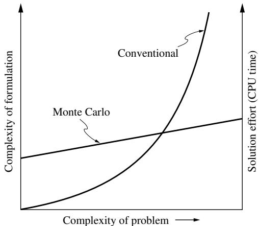  
图8-1 蒙特卡洛与传统求解技术的比较

蒙特卡洛方法的名称和系统发展可追溯至约1944年[1]，尽管前几个世纪就曾零星使用过一些粗糙的数学采样技术。其首次作为研究工具使用源于二战期间为研制原子弹而模拟裂变材料中的中子扩散。Fleck[2,3]以及Howell和Perlmutter[4-6]在1960年代早期首次将其应用于热辐射问题。

要透彻理解蒙特卡洛方法需要良好的统计学基础，这超出了本书范围。本章概述该方法在热辐射中的应用，并以直观方式而非严格数学形式呈现统计考量。更详细的描述可参考Hammersley和Handscomb[1]、Cashwell和Everett[7]、Schreider[8]的著作，或Kahn[9]、Brown[10]、Halton[11]、Hajji-Sheikh[12]的专著。Howell[13]首次给出了专门针对热辐射的蒙特卡洛方法专著。Walters和Buckius[14]较新的专著则侧重散射处理。Howell[15]还对截至1997年采用辐射蒙特卡洛分析的各种文献进行了全面综述。此后大量研究者将蒙特卡洛模拟应用于从纳米尺度辐射特性到大规模断层扫描、表面辐射、参与介质、瞬态辐射、多模式传热等广泛问题，数量之多难以在本书尽述。

# 概率分布

进行政治民意调查时，并非从电话簿随机选人，而是根据概率分布从不同群体随机选择，以确保调查包含具有代表性的理发师、家庭主妇、医生、吸烟者、持枪者、秃顶者、传热工程师等。类似地，要以统计有效的方式追踪辐射能束的历史，其发射点、方向、波长、反射行为等必须按概率分布选择。

例如，考虑表面发射的总辐射热流即总发射功率：

$$
E = \int_{0}^{\infty}E_{\lambda}d\lambda = \int_{0}^{\infty}\epsilon_{\lambda}E_{b\lambda}d\lambda . \tag{8.1}
$$

在波长$\lambda$到$\lambda +d\lambda$间发射的热流为$E_{\lambda}d\lambda = \epsilon_{\lambda}E_{b\lambda}d\lambda$，该波长范围的能量发射分数为

$$
P(\lambda)d\lambda = \frac{E_{\lambda}d\lambda}{\int_{0}^{\infty}E_{\lambda}d\lambda} = \frac{E_{\lambda}}{E} d\lambda . \tag{8.2}
$$

可将离开表面的所有光子视为一组$N$个等能量束(每束由许多单波长光子组成)。每束携带能量$(E / N)$，特定束波长在$\lambda$到$\lambda +d\lambda$间的概率由概率密度函数$P(\lambda)$给出。0到$\lambda$间所有波长的能量发射分数为

$$
R(\lambda) = \int_{0}^{\lambda}P(\lambda)d\lambda = \frac{\int_{0}^{\lambda}E_{\lambda}d\lambda}{\int_{0}^{\infty}E_{\lambda}d\lambda}. \tag{8.3}
$$

显然$R(\lambda)$也是任意能束波长在0到$\lambda$间的概率，称为累积分布函数。能束波长在0到$\infty$间的概率当然是$R(\lambda \to \infty) = 1$，即确定性。式(8.3)表明若要用$N$个等能束模拟表面发射，则其中$R(\lambda)$比例的束波长必须小于$\lambda$。

现考虑0到1间均匀分布的随机数池。均匀分布意味着比例为$R$的随机数值小于$R$本身。选取单个随机数$R_0$，反解式(8.3)得$\lambda (R_0)$即对应累积分布函数值$R_0$的波长，将该波长赋给一个能束。多次重复此过程，则所有能束中比例为$R_0$的束波长将小于$\lambda (R_0)$，因为随机数中比例为$R_0$的数小于该值。因此，为正确模拟表面发射的光谱变化，使用$N$个等能束时，可通过选取0到1间的$N$个随机数并反解式(8.3)确定其波长。

# 随机数

若将球投入旋转的轮盘，球最终会停在0到36间的任一数字上。让轮盘反复决定数字，将得到0到36(或每个数除以36得0到1)间的随机数集。除非荷官以规律(非随机)方式投球转轮，否则每次选数概率均等，与之前所选无关。但若选取足够多的数，可预期约半数(即18/37)的数在0到17之间。

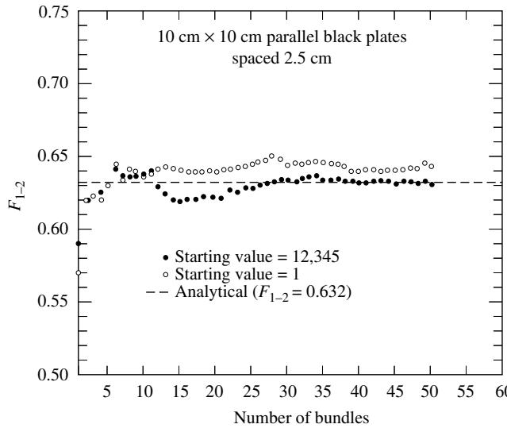  
图8-2 不同随机数集的蒙特卡洛方法收敛性

在蒙特卡洛模拟过程中，通常需要快速生成$10^{5}$到$10^{7}$量级的随机数。显然，使用轮盘赌方式生成随机数是不现实的。一种解决方案是存储外部确定的随机数集，但这会占用大量计算机存储空间，除非使用较小的随机数表并重复调用（但这会破坏随机性）。唯一可行的方案是在计算机内部生成随机数。这看似矛盾，因为数字计算机本质上是逻辑（非随机）的化身。大量研究致力于如何通过伪随机数生成器产生足够随机的数列。现有多种生成器可在选定起始点后，基于前一个数生成新的伪随机数。这类数列的随机性取决于生成器质量及起始点选择，需要通过不同"随机性测试"进行验证。关于伪随机数生成器的更多讨论，读者可参考Hammersley和Handscomb[1]、Schreider[8]或Taussky和Todd[16]的著作。

# 精度考量

由于蒙特卡洛方法是统计方法，其结果相对于样本数的曲线通常会在正确答案附近随机波动。若使用真随机数进行采样，这些波动会随样本数增加而减小。设追踪$N$个能量束得到的蒙特卡洛解为$S(N)$，无限样本的精确解为$S(\infty)$。对于简单问题，可直接计算$S(N)$与$S(\infty)$差异小于某值的概率。

即使能直接计算复杂情形的置信水平，这也不考虑计算机生成伪随机数集的影响。图8-2展示了两块平行黑平板间角系数的蒙特卡洛评估[17]，可见该影响相当显著。两组数据使用相同代码和随机数生成器（UNIVAC 1110）。当起始值为1时，5000束后结果仍不准确；而起始值为12,345时（该生成器测试中收敛最快），仅需4000束即可良好收敛。显然，仔细研究随机数生成器可显著提高收敛性和精度，从而大幅减少计算时间。随机性测试表明，对于Modest和Poon[17]采用的生成器，起始值12,345在所有测试中表现良好，确实比起始值1产生"更优"的随机数集。

对于辐射传热计算，估计采样结果$S(N)$误差最直接的方式是将结果分解为$I$个子样本$S(N_{i})$：

$$
\begin{array}{c}{N = N_1 + N_2 + \ldots +N_I = \sum_{i = 1}^I N_i,}\\ {S(N) = \frac{1}{N}\Big(N_1S(N_1) + \ldots +N_IS(N_I)\Big) = \frac{1}{N}\sum_{i = 1}^I N_iS(N_i).} \end{array} \tag{8.4}
$$

通常各子样本包含相同数量的能量束：

$$
\begin{array}{c}{N_i = N / I;i = 1,2,\ldots ,I,}\\ {S(N) = \frac{1}{I}\sum_{i = 1}^I S(N_i).} \end{array} \tag{8.7}
$$

这些子样本可视为同一量的独立实验测量。可计算均值方差或调整均方偏差：

$$
\sigma_{m}^{2} = \frac{1}{I(I - 1)}\sum_{i = 1}^{I}[S(N_{i}) - S(N)]^{2}. \tag{8.8}
$$

中心极限定理指出，无论单个测量如何分布，$I$次测量均值$S(N)$服从高斯分布。这意味着我们可以以$68.3\%$置信度认为$S(\infty)$位于$S(N)\pm \sigma_{m}$内，$95.5\%$置信度位于$S(N)\pm 2\sigma_{m}$内，或$99\%$置信度位于$S(N)\pm 2.58\sigma_{m}$内。误差统计分析细节可参考Barford[18]等标准实验教材。

# 8.2 蒙特卡洛数值积分

在讨论如何用统计方法解决复杂辐射传输问题前，我们先简要说明蒙特卡洛方法也可用于数值积分（称为数值求积）。考虑积分$\int_{a}^{b}f(x)dx$。最原始的数值积分法是梯形法则，假设$f(x)$在小间隔$\Delta x$内恒定：

$$
\int_{a}^{b}f(x)dx\simeq \sum_{i = 1}^{N}f\left[x_{i} = (i - \frac{1}{2})\Delta x\right]\Delta x;\quad \Delta x = \frac{b - a}{N}. \tag{8.9}
$$

当$N$足够大时，式(8.9)收敛于正确结果。注意$x_{i}$在$a$到$b$间均匀分布。若在$a$到$b$间随机选取$N$个位置，统计意义上可获得相同结果。因此可通过蒙特卡洛方法计算积分：

$$
\int_{a}^{b}f(x)dx\simeq \sum_{i = 1}^{N}f\left[x_{i} = a + (b - a)R_{i}\right]\Delta x;\Delta x = \frac{b - a}{N}, \tag{8.10}
$$

其中$R_{i}$是0到1间均匀分布的随机数集。当被积函数$f(x)$行为异常时（如第11章分子气体吸收系数光谱变化的$k$分布积分），式(8.10)是高效积分方法。但当$f(x)$在$a \leq x \leq b$范围内呈数量级变化（但变化规律可预测）时，均匀选取$x_{i}$会导致对重要与非重要区域同等对待。通过概率密度函数(PDF)$p(x)$确定$x_{i}$可提高随机积分效率：

$$
\int_{a}^{b}f(x)dx = \int_{a}^{b}\frac{f(x)}{p(x)} p(x)dx = \int_{0}^{1}\frac{f(x(\xi))}{p(x(\xi))} d\xi \tag{8.11}
$$

其中

$$
\xi (x) = \int_{a}^{x}p(x)dx,\int_{a}^{b}p(x)dx\equiv 1. \tag{8.12}
$$

选择PDF使$f/p$在$a \leq x \leq b$间相对恒定，确保每个随机样本对结果的贡献大致相同。积分可评估为：

$$
\int_{a}^{b}f(x)dx\simeq \frac{b - a}{N}\sum_{i = 1}^{N}\frac{f(x_{i})}{p(x_{i})},\quad x_{i} = \xi^{-1}(R_{i}). \tag{8.13}
$$

当积分是蒙特卡洛模拟的组成部分时（如本章末尾描述的反向蒙特卡洛方案），式(8.10)和(8.13)也很有用。最后，向二维及更高维积分的扩展是直观且简单的。

# 8.3 表面间辐射换热的传热关系

在没有参与介质且假设折射率为1的情况下，使用蒙特卡洛方法时，离开或进入某表面的辐射热流由以下基本方程控制：

$$
q(\mathbf{r}) = \epsilon (\mathbf{r})\sigma T^4 (\mathbf{r}) - \int_A\epsilon (\mathbf{r}')\sigma T^4 (\mathbf{r}')\frac{d\mathcal{F}_{dA'}\to dA}{dA} dA', \tag{8.14}
$$

其中：

$q(\mathbf{r}) =$ 位置$\mathbf{r}$处的局部表面热流  
$T(\mathbf{r}) =$ 位置$\mathbf{r}$处的表面温度  
$\epsilon (\mathbf{r}) =$ 位置$\mathbf{r}$处表面的半球总发射率  
$A =$ 封闭腔体的表面积  
$d\mathcal{F}_{dA' \to dA} =$ 表面元$dA'$与$dA$之间的广义辐射交换因子

方程(8.14)右侧第一项描述表面发射，第二项被积函数表示最初从$\mathbf{r}'$处表面发射的能量最终被$\mathbf{r}$处吸收的比例。因此，广义交换因子的定义必须为：

$d\mathcal{F}_{dA' \to dA} \equiv$ $dA'$发射的总能量中被$dA$吸收的比例

这个定义与光线追踪技术最为兼容，因此通常用于蒙特卡洛方法的计算。图8-3显示了任意封闭腔体中能量束从$dA'$发射并在$dA$吸收的示意图。

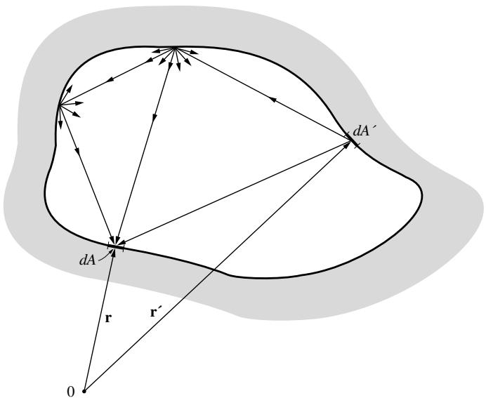  
图8-3 任意封闭腔体中可能的能量束路径

如果封闭腔体不完整（即有开口通向空间），则必须引入一些人工封闭表面。例如，一个朝向太空且不受太阳或地球辐射的开口可以用$0\mathrm{K}$的黑体表面替代。如果开口受到太阳辐射，则用对所有角度（除太阳角度外）发射率为零的非反射表面替代，等等。

将封闭腔体表面划分为$J$个子表面，方程(8.14)简化为：

$$
Q_{i} = \int_{A_{i}}q_{i}dA_{i} = \epsilon_{i}\sigma T_{i}^{4}A_{i} - \sum_{j = 1}^{J}\epsilon_{j}\sigma T_{j}^{4}A_{j}\mathcal{F}_{j\rightarrow i} - q_{\mathrm{ext}}A_{s}\mathcal{F}_{s\rightarrow i},\quad 1\leq i\leq J, \tag{8.16}
$$

其中：

$q_{\mathrm{ext}} =$ 通过封闭腔体任何开口进入的外部能量  
$A_{s} =$ 受外部源辐射的开口面积  
$\epsilon_{j}$和$T_{j}$是每个子表面的适当平均值，即：

$$
\epsilon_{j}\sigma T_{j}^{4} = \frac{1}{A_{j}}\int_{A_{j}}\epsilon \sigma T^{4}dA. \tag{8.17}
$$

虽然热流率$Q_{i}$可以直接通过蒙特卡洛方法计算，但更有利的是确定交换因子：虽然$Q_{i}$依赖于封闭腔体中所有表面温度，但$\mathcal{F}_{i\rightarrow j}$要么不依赖（灰体表面），要么仅依赖于发射表面温度（非灰体表面），前提是表面反射率（和吸收率）与温度无关（实际情况基本如此）。根据热力学第二定律，所有发射的能量必须去向某处，且两个等温表面之间的净交换必须为零，因此交换因子也满足求和规则和互易关系：

$$
\sum_{j = 1}^{J}\mathcal{F}_{i\rightarrow j} = 1, \tag{8.18}
$$

$$
\epsilon_{i}A_{i}\mathcal{F}_{i\rightarrow j} = \epsilon_{j}A_{j}\mathcal{F}_{j\rightarrow i}, \tag{8.19}
$$

（前者当然仅适用于无开口的封闭腔体）。

从表面$A_{i}$发射大量统计样本能量束$N_{i}$，每个携带的辐射能量为：

$$
\Delta E_{i} = \epsilon_{i}\sigma T_{i}^{4}A_{i} / N_{i}. \tag{8.20}
$$

如果这些能量束中有$N_{ij}$个被表面$A_{j}$吸收（无论是直接到达还是经过多次反射后），则交换因子可计算为：

$$
\mathcal{F}_{i\rightarrow j} = \lim_{N_i\rightarrow \infty}\left(\frac{N_{ij}}{N_i}\right)\simeq \left(\frac{N_{ij}}{N_i}\right)_{N_i\gg 1}. \tag{8.21}
$$

MONT3D是一个公开可用的Fortran代码[21-24]，见附录F，用于计算复杂三维几何的通用交换因子。蒙特卡洛计算交换因子本质上自动满足求和规则(8.18)，但由于固有的统计散射，互易关系(8.19)不一定满足。文献中给出了几种平滑方案，确保同时满足方程(8.18)和(8.19)[25-29]。

# 8.4 表面交换的随机数关系

为了通过追踪大量能量束的历史来计算交换因子，我们需要知道如何选择具有统计意义的能量束，如第8.1节所述：对于每个发射的能量束，我们需要确定发射点、发射方向和发射波长。当能量束撞击封闭腔体表面的另一点时，我们需要决定是否反射以及反射方向。

# 发射点

类似于方程(8.1)，我们可以写出表面$A_{j}$的总发射：

$$
E_{j} = \int_{A_{j}}\epsilon \sigma T^{4}dA. \tag{8.22}
$$

由于面积积分是二重积分，不失一般性可改写为：

$$
E_{j} = \int_{x = 0}^{X}\int_{y = 0}^{Y}\epsilon \sigma T^{4}dydx = \int_{0}^{X}E_{j}^{\prime}dx, \tag{8.23}
$$

其中：

$$
E_{j}^{\prime}(x) = \int_{0}^{Y}\epsilon \sigma T^{4}dy. \tag{8.24}
$$

因此，可应用方程(8.3)得到：

$$
R_{x} = \frac{1}{E_{j}}\int_{0}^{x}E_{j}^{\prime}dx. \tag{8.25}
$$

这个关系可以反演，得到发射点的$x$坐标作为随机数$R_{x}$的函数：

$$
x = x(R_{x}). \tag{8.26}
$$

一旦确定$x$坐标，方程(8.3)也可应用于方程(8.24)，得到发射点的$y$坐标表达式：

$$
R_{y} = \frac{1}{E_{j}^{\prime}(x)}\int_{0}^{y}\epsilon \sigma T^{4}dy, \tag{8.27}
$$

和

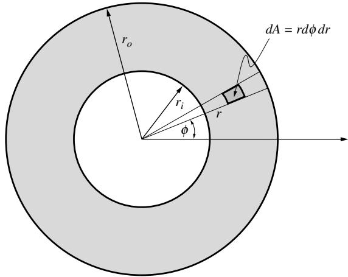  
图8-4 例8.1的几何结构

$$
y = y(R_{y},x). \tag{8.28}
$$

注意$y$坐标的选择不仅依赖于随机数$R_{y}$，还依赖于$x$的位置。

如果发射功率在$x$和$y$方向可分离，即：

$$
E = \epsilon \sigma T^4 = E_x(x)E_y(y), \tag{8.29}
$$

则方程(8.25)简化为：

$$
R_{x} = \int_{0}^{x}E_{x}(x)dx\int_{0}^{x}E_{x}(x)dx, \tag{8.30}
$$

方程(8.27)简化为：

$$
R_{y} = \int_{0}^{y}E_{y}(y)dy\int_{0}^{Y}E_{y}(y)dy, \tag{8.31}
$$

即$x$和$y$坐标的选择变得相互独立。在最简单的等温表面且发射率恒定的情况下，这些关系简化为：

$$
x = R_{x}X,y = R_{y}Y. \tag{8.32}
$$

例8.1. 给定一个黑体等温圆柱底部环形表面元，内半径$r_i = 10\mathrm{cm}$，外半径$r_o = 20\mathrm{cm}$，如图8-4所示，计算随机数对$R_{r} = 0.5$和$R_{\phi} = 0.25$对应的发射位置。

# 解

我们得到

$$
E = \int_{A}E_{b}dA = E_{b}\int_{0}^{2\pi}\int_{r_{i}}^{r_{o}}rdrd\phi .
$$

由于该表达式在$r$和$\phi$上可分离，因此有

$$
R_{\phi} = \int_{0}^{\phi}d\phi \bigg / \int_{0}^{2\pi}d\phi = \frac{\phi}{2\pi},\quad \mathrm{or}\quad \phi = 2\pi R_{\phi},
$$

以及

$$
R_{r} = \int_{r_{i}}^{r}rdr\bigg / \int_{r_{i}}^{r_{o}}rdr = \frac{r^{2} - r_{i}^{2}}{r_{o}^{2} - r_{i}^{2}},
$$

或

$$
r = \sqrt{r_i^2 + (r_o^2 - r_i^2)R_r}.
$$

因此，$\phi = 2\pi \times 0.25 = \pi /2$且$r = \sqrt{100 + (400 - 100)0.5} = 15.8\mathrm{cm}$。虽然对于随机数0.25，发射点角度如预期偏离$\phi = 0$轴$90^{\circ}$，但$r$位置并未落在中点。这是因为圆柱环在较大半径处具有更多表面积，导致总发射量更大。这意味着更多能量束必须从环的外部区域发射。

# 发射波长

一旦选定发射位置，需要确定发射束的波长（除非封闭体内所有表面都是灰体；这种情况下波长不参与计算，可以省略其确定过程）。寻找波长的过程已在第8.1节概述，得到方程(8.3)：

$$
R_{\lambda} = \frac{1}{\epsilon\sigma T^4}\int_0^{\lambda}\epsilon_{\lambda}E_{b\lambda}d\lambda , \tag{8.33}
$$

反演后得到：

$$
\lambda = \lambda (R_{\lambda},x,y). \tag{8.34}
$$

我们注意到，波长的选择通常取决于发射位置$(x,y)$的选择，除非表面是等温且发射率恒定。如果表面是黑体或灰体，方程(8.33)简化为：

$$
R_{\lambda} = \frac{1}{\sigma T^4}\int_0^{\lambda}E_{b\lambda}d\lambda = f(\lambda T). \tag{8.35}
$$

# 发射方向

（给定位置和波长的）光谱发射功率为：

$$
E_{\lambda} = \int_{2\pi}\epsilon_{\lambda}^{\prime}I_{b\lambda}\cos \theta d\Omega = \frac{1}{\pi} E_{b\lambda}\int_{0}^{2\pi}\int_{0}^{\pi /2}\epsilon_{\lambda}^{\prime}\cos \theta \sin \theta d\theta d\psi . \tag{8.36}
$$

与选择（二维）发射点类似，我们写出：

$$
R_{\psi} = \frac{E_{b\lambda}}{\pi E_{\lambda}}\int_{0}^{\psi}\int_{0}^{\pi /2}\epsilon_{\lambda}^{\prime}\cos \theta \sin \theta d\theta d\psi = \frac{1}{\pi}\int_{0}^{\psi}\int_{0}^{\pi /2}\frac{\epsilon_{\lambda}^{\prime}}{\epsilon_{\lambda}}\cos \theta \sin \theta d\theta d\psi , \tag{8.37}
$$

或

$$
\psi = \psi (R_{\psi},x,y,\lambda). \tag{8.38}
$$

从方程(8.37)我们注意到，$\psi$通常不依赖于发射位置，除非发射率在表面变化。然而，$\psi$确实依赖于所选波长，除非发射率的光谱和方向依赖性是可分离的。一旦找到方位角$\psi$，极角$\theta$由下式确定：

$$
R_{\theta} = \int_{0}^{\theta}\epsilon_{\lambda}^{\prime}\cos \theta \sin \theta d\theta \int_{0}^{\pi /2}\epsilon_{\lambda}^{\prime}\cos \theta \sin \theta d\theta , \tag{8.39}
$$

或

$$
\theta = \theta (R_{\theta},x,y,\lambda ,\psi). \tag{8.40}
$$

大多数表面往往是各向同性的，因此方向发射率不依赖于方位角$\psi$。此时$\epsilon_{\lambda} = 2\int_{0}^{\pi /2}\epsilon_{\lambda}^{\prime}\cos \theta \sin \theta d\theta$，方程(8.37)简化为：

$$
R_{\psi} = \frac{\psi}{2\pi},\quad \mathrm{或}\quad \psi = 2\pi R_{\psi}, \tag{8.41}
$$

且极角的选择变得与方位角无关。对于漫发射体，方程(8.39)简化为：

$$
R_{\theta} = \sin^{2}\theta ,\quad \mathrm{or}\quad \theta = \sin^{-1}\sqrt{R_{\theta}}. \tag{8.42}
$$

# 计算顺序

在前文中，我们选择首先确定发射位置，然后是发射波长，最后是发射方向，这是最常见的做法。然而，我们唯一需要以统计方式满足的约束是表面的总发射能量，由下式给出：

$$
E = \int_{A}\epsilon \sigma T^{4}dA = \int_{A}\int_{0}^{\infty}\int_{2\pi}\epsilon_{\lambda}^{\prime}I_{b\lambda}\cos \theta d\Omega d\lambda dA. \tag{8.43}
$$

虽然我们通过按所示顺序剥离方程(8.43)中的积分得到了随机数关系，但积分可以按任意顺序进行（例如首先评估发射波长等）。

# 吸收与反射

当辐射能量投射到表面时，部分能量 $\alpha_{\lambda}^{\prime}$ 将被吸收，这个比例可能取决于入射辐射的波长、入射方向以及局部温度。因此，对于大量入射能量束，$\alpha_{\lambda}^{\prime}$ 比例将被吸收，其余 $1 - \alpha_{\lambda}^{\prime}$ 将被反射。这可以通过选取随机数 $R_{\alpha}$ 并与 $\alpha_{\lambda}^{\prime}$ 比较来模拟：若 $R_{\alpha} \leq \alpha_{\lambda}^{\prime}$，能量束被吸收；若 $R_{\alpha} > \alpha_{\lambda}^{\prime}$，则被反射。

反射方向取决于材料的双向反射分布函数。反射到所有可能方向的能量比例等于方向-半球光谱反射率：

$$
\begin{array}{l}\rho_{\lambda}^{\prime \subset}(\lambda ,\theta_{i},\psi_{i}) = \int_{2\pi}\rho_{\lambda}^{\prime \prime}(\lambda ,\theta_{i},\psi_{i},\theta_{r},\psi_{r})\cos \theta_{r}d\Omega_{r}\\ = \int_{0}^{2\pi}\int_{0}^{\pi /2}\rho_{\lambda}^{\prime \prime}(\lambda ,\theta_{i},\psi_{i},\theta_{r},\psi_{r})\cos \theta_{r}\sin \theta_{r}d\theta_{r}d\psi_{r}. \end{array} \tag{8.44}
$$

如前所述，反射方向可由下式确定：

$$
R_{\psi_r} = \frac{1}{\rho_\lambda^\prime\circ}\int_0^{\psi_r}\int_0^{\pi /2}\rho_\lambda^{\prime \prime}(\lambda ,\theta_i,\psi_i,\theta_r,\psi_r)\cos \theta_r\sin \theta_r d\theta_r d\psi_r, \tag{8.45}
$$

以及

$$
R_{\theta_r} = \frac{\int_{0}^{\theta_r}\rho_\lambda^{\prime\prime}(\lambda,\theta_i,\psi_i,\theta_r,\psi_r)\cos\theta_r\sin\theta_rd\theta_r}{\int_0^{\pi /2}\rho_\lambda^{\prime\prime}(\lambda,\theta_i,\psi_i,\theta_r,\psi_r)\cos\theta_r\sin\theta_rd\theta_r}. \tag{8.46}
$$

若表面为漫反射体，即 $\rho_{\lambda}^{\prime \prime}(\lambda , \theta_{i}, \psi_{i}, \theta_{r}, \psi_{r}) = \rho_{\lambda}^{\prime \prime}(\lambda) = \rho_{\lambda}^{\prime \subset}(\lambda) / \pi$，则方程(8.45)和(8.46)简化为：

$$
R_{\psi_r} = \frac{\psi_r}{2\pi},\quad \mathrm{or}\quad \psi_r = 2\pi R_{\psi_r}, \tag{8.47}
$$

和

$$
R_{\theta_r} = \sin^2\theta_r,\quad \mathrm{or}\quad \theta_r = \sin^{-1}\sqrt{R_{\theta_r}}, \tag{8.48}
$$

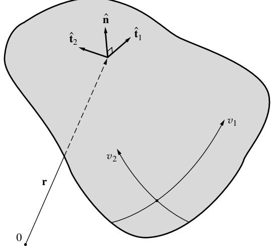  
图 8-5 基于位置矢量的表面描述

这与漫发射情况相同。对于纯镜面反射体，反射方向遵循光学定律：

$$
\psi_{r} = \psi_{i} + \pi ,\quad \theta_{r} = \theta_{i}, \tag{8.49}
$$

即不需要随机数。

# 8.5 表面描述

当蒙特卡洛方法应用于简单构型（如平板，参见Toor和Viskanta[30]）时，表面描述、能量束交点、入射角、反射角等相对直观。对于更复杂的表面，如Weiner等[31]提出的二阶多项式描述或Modest和Poon[17]、Modest[32]提出的任意阶多项式描述，系统化的表面描述方法更为可取。如图8-5所示，最合理的描述方式是矢量形式：

$$
\mathbf{r} = \sum_{i = 1}^{3}x_{i}(v_{1},v_{2})\hat{\mathbf{e}}_{i},\quad v_{1\min}\leq v_{1}\leq v_{1\max},\quad v_{2\min}(v_{1})\leq v_{2\max}(v_{1}), \tag{8.50}
$$

其中 $\mathbf{r}$ 是从原点到表面点的矢量，$v_{1}$ 和 $v_{2}$ 是两个表面参数，$x_{i}$ 是表面点的 $(x,y,z)$ 坐标，$\hat{\mathbf{e}}_i$ 是沿 $x,y,z$ 方向的单位矢量 $(\hat{\mathbf{r}},\hat{\mathbf{j}},\hat{\mathbf{k}})$。我们可以定义表面上任意点处的两个单位切向量：

$$
\hat{\mathbf{t}}_1 = \frac{\partial\mathbf{r}}{\partial v_1}\bigg|\bigg|\frac{\partial\mathbf{r}}{\partial v_1}\bigg|,\quad \hat{\mathbf{t}}_2 = \frac{\partial\mathbf{r}}{\partial v_2}\bigg|\bigg|\frac{\partial\mathbf{r}}{\partial v_2}\bigg|. \tag{8.51}
$$

虽然通常建议选择相互垂直的表面参数 $v_{1}$ 和 $v_{2}$（使 $\hat{\mathbf{t}}_1$ 和 $\hat{\mathbf{t}}_2$ 相互垂直），但这并非必须。无论哪种情况，单位表面法向量可计算为：

$$
\hat{\mathbf{n}} = \frac{\hat{\mathbf{t}}_1\times\hat{\mathbf{t}}_2}{|\hat{\mathbf{t}}_1\times\hat{\mathbf{t}}_2|}, \tag{8.52}
$$

这里假设 $v_{1}$ 和 $v_{2}$ 的顺序使 $\hat{\mathbf{n}}$ 为外法线方向。

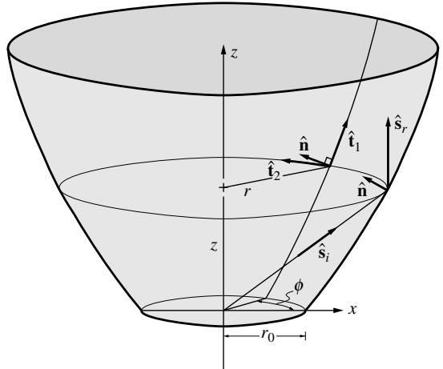  
图 8-6 例8.2的火箭喷管扩压器几何形状

# 8.6 光线追踪

发射点的位置可以通过建立类似方程(8.22)的关系式来确定，该关系式基于方程(8.50)给出的广义矢量表面描述。表面上的微元面积可表示为：

$$
dA = \left|\frac{\partial\mathbf{r}}{\partial v_1}\times \frac{\partial\mathbf{r}}{\partial v_2}\right|dv_1dv_2 = |\hat{\mathbf{t}}_1\times \hat{\mathbf{t}}_2|\left|\frac{\partial\mathbf{r}}{\partial v_1}\right|\left|\frac{\partial\mathbf{r}}{\partial v_2}\right|dv_1dv_2. \tag{8.53}
$$

因此，如果用$v_1$替换$x$，用$v_2$替换$y$，则发射点$(v_1,v_2)$可以直接从方程(8.25)和(8.27)求得。

例8.2. 考虑图8-6所示的轴对称火箭喷管扩压器。假设扩压器为灰体且等温，建立用于确定发射点的适当随机数关系。

# 解答

扩压器表面由以下公式描述：

$$
z = a(r^{2} - r_{0}^{2}),\quad 0\leq z\leq L,\quad r_{0}\leq r\leq r_{L},\quad a = \frac{1}{2r_{0}},
$$

其中$L$是扩压器长度，$r_0$和$r_L$分别是其在$z=0$和$L$处的半径。矢量形式可写为：

$$
\mathbf{r} = r\cos \phi \hat{\mathbf{r}} +r\sin \phi \hat{\mathbf{r}} +a(r^2 -r_0^2)\hat{\mathbf{k}},
$$

其中$\phi$是$x-y$平面内从$x$轴测量的方位角。这建议选择$v_1 = r$和$v_2 = \phi$。两个表面切向量可计算为：

$$
\begin{array}{l}\hat{\mathbf{t}}_1 = \frac{\cos\phi\hat{\mathbf{r}} + \sin\phi\hat{\mathbf{r}} + 2ar\hat{\mathbf{k}}}{\sqrt{1 + 4a^2r^2}},\\ \hat{\mathbf{t}}_2 = -\sin \phi \hat{\mathbf{r}} +\cos \phi \hat{\mathbf{r}}. \end{array}
$$

可见$\hat{\mathbf{t}}_1\cdot \hat{\mathbf{t}}_2 = 0$，即切向量相互垂直。表面法向量为：

$$
\hat{\mathbf{n}} = \hat{\mathbf{t}}_1\times \hat{\mathbf{t}}_2 = \frac{1}{\sqrt{1 + 4a^2r^2}}\left( \begin{array}{ccc}\hat{\mathbf{t}} & \hat{\mathbf{j}} & \hat{\mathbf{k}}\\ \cos \phi & \sin \phi & 2ar\\ -\sin \phi & \cos \phi & 0 \end{array} \right) = \frac{-2ar(\cos\phi\hat{\mathbf{r}} + \sin\phi\hat{\mathbf{r}}) + \hat{\mathbf{k}}}{\sqrt{1 + 4a^2r^2}},
$$

最后，微元表面积为：

$$
dA = |\cos \phi \hat{\mathbf{r}} +\sin \phi \hat{\mathbf{r}} | + 2ar\hat{\mathbf{k}} || - r\sin \phi \hat{\mathbf{r}} +r\cos \phi \hat{\mathbf{r}} |drd\phi = \sqrt{1 + 4a^2r^2} rdrd\phi .
$$

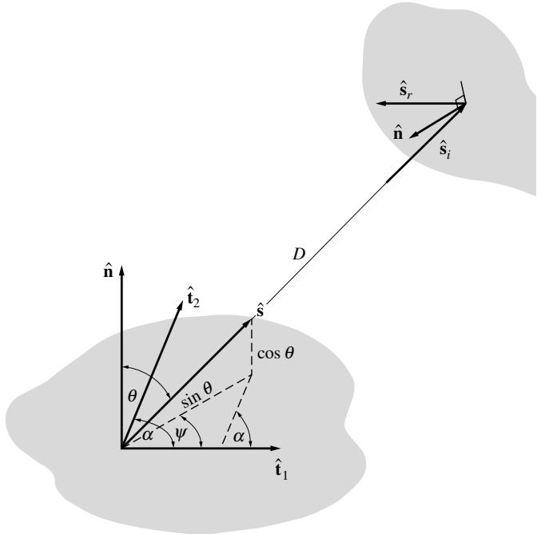  
图8-7 发射方向和撞击点的矢量描述

由于$dA$和发射功率都不依赖于方位角$\phi$，我们立即得到：

$$
R_{\phi} = \frac{\phi}{2\pi},\quad \mathrm{或}\quad \phi = 2\pi R_{\phi},
$$

对于径向位置参数：

$$
R_{r} = \frac{\int_{r_{0}}^{r}\sqrt{1 + 4a^{2}r^{2}}rdr}{\int_{r_{0}}^{r_{L}}\sqrt{1 + 4a^{2}r^{2}}rdr} = \frac{(1 + 4a^{2}r^{2})^{3 / 2}|_{r_{0}}^{r}}{(1 + 4a^{2}r_{L}^{2})^{3 / 2} - (1 + 4a^{2}r_{0}^{2})^{3 / 2}}.
$$

上式可显式求解得到$r = r(R_{r})$的表达式。

一旦找到发射点，就可以从方程(8.33)、(8.37)和(8.39)计算波长和方向。如图8-7所示，方向可以指定为单位方向矢量，其中极角$\theta$从表面法线测量，方位角$\psi$从$\hat{\mathbf{t}}_1$测量，得到：

$$
\hat{\mathbf{s}} = \frac{\sin\theta}{\sin\alpha}\left[\sin (\alpha -\psi)\hat{\mathbf{t}}_1 + \sin \psi \hat{\mathbf{t}}_2\right] + \cos \theta \hat{\mathbf{n}}, \tag{8.54}
$$

且

$$
\sin \alpha = \left|\hat{\mathbf{t}}_1\times \hat{\mathbf{t}}_2\right|, \tag{8.55}
$$

其中$\alpha$是$\hat{\mathbf{t}}_1$和$\hat{\mathbf{t}}_2$之间的夹角。如果$\hat{\mathbf{t}}_1$和$\hat{\mathbf{t}}_2$垂直$(\alpha = \pi /2)$，方程(8.54)简化为：

$$
\hat{\mathbf{s}} = \sin \theta \left[\cos \psi \hat{\mathbf{t}}_1 + \sin \psi \hat{\mathbf{t}}_2\right] + \cos \theta \hat{\mathbf{n}}. \tag{8.56}
$$

如图8-7所示，从位置$\mathbf{r}_e$发射的能量束沿方向$\hat{\mathbf{s}}$传播，与矢量形式描述的表面的交点可确定为：

$$
\mathbf{r}_e + D\hat{\mathbf{s}} = \mathbf{r}, \tag{8.57}
$$

其中$\mathbf{r}$是描述交点的矢量，$D$是能量束传播的距离。方程(8.57)可以写成$x,y,z$分量形式，并通过与单位矢量$\hat{\mathbf{1}}, \hat{\mathbf{j}}$和$\hat{\mathbf{k}}$的点积求解$D$：

$$
D = \frac{x(v_{1},v_{2}) - x_{e}}{\hat{\mathbf{s}}\cdot\hat{\mathbf{1}}} = \frac{y(v_{1},v_{2}) - y_{e}}{\hat{\mathbf{s}}\cdot\hat{\mathbf{j}}} = \frac{z(v_{1},v_{2}) - z_{e}}{\hat{\mathbf{s}}\cdot\hat{\mathbf{k}}}. \tag{8.58}
$$

方程(8.58)是关于三个未知数$v_1,v_2$和$D$的三个方程：首先计算$v_1$和$v_2$，并确定交点是否在所研究表面的范围内。如果是，并且可能存在多个交点（在凸面、突出角等情况下），则还需确定路径长度$D$；如果找到多个交点，则正确的交点是具有最短正路径的那个。

如果能量束被反射，且反射是非镜面的，则从方程(8.45)和(8.46)选择反射方向。然后使用方程(8.54)将该方向表示为矢量形式。如果表面是镜面反射体，则反射方向由方程(8.49)确定，或以矢量形式表示为：

$$
\hat{\mathbf{s}}_r = \hat{\mathbf{s}}_i + 2|\hat{\mathbf{s}}_i\cdot \hat{\mathbf{n}} |\hat{\mathbf{n}}. \tag{8.59}
$$

一旦确定了交点和反射方向，就可以从方程(8.58)等找到新的交点，直到能量束被吸收。

例8.3. 再次考虑例8.2的几何形状。一个能量束从原点$(x = y = z = 0)$沿方向$\hat{\mathbf{s}} = 0.8\hat{\mathbf{i}} +0.6\hat{\mathbf{k}}$发射。确定扩压器上的交点以及反射方向，假设扩压器是镜面反射体。

# 解

根据 $r_{e} = 0$ 和方程(8.50)、(8.58)，我们得到

$$
D = \frac{r\cos\phi}{0.8} = \frac{r\sin\phi}{0} = \frac{a(r^2 - r_0^2)}{0.6}.
$$

显然 $\phi = 0$，解关于 $r$ 的二次方程：

$$
r^2 -r_0^2 = \frac{3}{4}\frac{r}{a} = \frac{3}{2} rr_0,\mathrm{or}r = 2r_0\mathrm{and}z = \frac{1}{2r_0} (4r_0^2 -r_0^2) = \frac{3}{2} r_0.
$$

在该位置我们如例8.2所示构建单位矢量：

$$
\hat{\mathbf{t}}_1 = \frac{1}{\sqrt{5}} (\hat{\mathbf{i}} +2\hat{\mathbf{k}}),\hat{\mathbf{t}}_2 = \hat{\mathbf{j}},\mathrm{and}\hat{\mathbf{n}} = \frac{1}{\sqrt{5}} (-2\hat{\mathbf{i}} +\hat{\mathbf{k}}).
$$

因此，反射方向由方程(8.59)确定为：

$$
\hat{\mathbf{s}}_r = 0.8\hat{\mathbf{i}} +0.6\hat{\mathbf{k}} +2\left|\frac{-2\times 0.8 + 0.6}{\sqrt{5}}\right|\frac{-2\hat{\mathbf{i}} + \hat{\mathbf{k}}}{\sqrt{5}} = \hat{\mathbf{k}},
$$

这可以很容易地从图8-6中得到验证。

# 8.7 效率考量

广义辐射交换因子或壁面热流结果的准确性，如标准偏差方程(8.8)所表征的，由结果的统计散射决定。散射预期与子表面吸收的束数量成反比。而束数量又与总束数量和子表面大小直接成正比。因此，为了实现良好的空间分辨率（小单元尺寸），必须发射和追踪非常大数量的束——通常是数百万甚至数十亿。因此，即使有了当今快速数字计算机的可用性，如果要避免每次计算机运行花费数小时CPU时间，也必须使蒙特卡洛实现及其光线追踪在数值上尽可能高效。当今大规模并行计算的趋势带来了新的效率挑战——虽然超出了本书的范围——但已被几位研究者详细讨论[15]。

# 随机数关系的反演

许多控制发射位置、波长、方向等的随机数关系不能显式反演。例如，要确定发射波长，即使对于简单的黑体表面，给定随机数 $R_{\lambda}$ 也需要解超越方程(8.33)：

$$
R_{\lambda} = \frac{1}{\sigma T4}\int_{0}^{\lambda}E_{b\lambda}d\lambda = f(\lambda T). \tag{8.60}
$$

原则上，这需要猜测 $\lambda_{r}$ 计算 $R_{\lambda},$ 等，直到找到正确的波长；然后对每个发射的光子束重复此过程。在追踪第一个能量束之前一次性反演方程(8.60)会更高效：

$$
\lambda T = f^{-1}(R_{\lambda}). \tag{8.61}
$$

这首先通过计算足够数量点 $j = 0,1,\ldots ,J$ 对应的 $R_{\lambda ,j}$ 和 $(\lambda T)_j$ 来完成。然后可以使用这些数据点获得多项式描述：

$$
\lambda T = A + BR_{\lambda} + CR_{\lambda}^{2} + \dots , \tag{8.62}
$$

如Howell[13]所提出的。然而，利用当今大多数数字计算机上可用的数学库，使用（三次）样条反演方程(8.61)会更可取。

更高效的是Modest和Poon[17]以及Modest[32]采用的方法，他们使用三次样条确定$(J + 1)$个等间距随机数的$(\lambda T)_j$值：

$$
(\lambda T)_j = f^{-1}\left(R_\lambda = \frac{j}{l}\right),\quad j = 0,1,2,\ldots ,J. \tag{8.63}
$$

例如，如果选取随机数$R_{\lambda} = 0.6789$，立即知道$(\lambda T)$位于$(\lambda T)_m$和$(\lambda T)_{m + 1}$之间，其中$m$是小于$J\times R_{\lambda}(= 67$如果$J = 100$)的最大整数。然后可以通过（线性）插值找到$(\lambda T)$的实际值。

要确定的量可能依赖于多个随机数。例如，在具有不可分离发射功率的表面上（比如$x-y$平面上具有局部变化、非灰发射率的表面）确定发射波长需要：

$$
x = x(R_{x}),\quad y = y(R_{y},x),\quad \lambda = \lambda (R_{\lambda},x,y). \tag{8.64}
$$

也就是说，首先选择$x$位置，需要在$J$个数据点$x_{j}(R_{j})$之间进行插值并存储；接着确定$y$位置，需要进行双重插值并存储$J\times K$数组$y_{jk}(R_k,x_j)$；最后$\lambda$通过从$J\times K\times L$数组$\lambda_{jkl}(R_l,x_j,y_k)$进行三重插值找到。如果$J,K,L$选择过大，可能导致计算机存储需求过高：如果$J = K = L = 100$，仅确定发射波长就需要存储一百万个数字的数组！通过选择更好的插值方案和较小的$J,K,L$值（例如选择$J = K = L = 40$将存储需求减少到64,000个数字）可以缓解此问题。

# 能量分配

在一般蒙特卡洛方法中，追踪具有固定能量含量的光线直到被吸收。在没有参与介质的情况下，每次撞击表面后决定束是被吸收还是反射。因此，平均需要$1 / \alpha$次追踪直到束被吸收。因此，需要$1 / \alpha$次追踪才能为$\mathcal{F}_{i\rightarrow j}^{\prime}s$的计算添加一个统计样本。如果配置有开口，许多束可能在逃逸到太空之前被反射几次，而不会为任何$\mathcal{F}_{i\rightarrow j}^{\prime}s$添加统计样本。因此，普通蒙特卡洛方法对于开放配置和/或高反射表面变得极其低效。前一个问题可以通过分配发射束的能量来缓解。这首先由Sparrow及其同事[33, 34]应用，他们在确定发射方向之前将束的能量分成两部分：通过开口离开外壳的部分（等于从发射点到开口的视角因子）和其余部分（将撞击表面）。然后确定方向，限制为那些使束撞击外壳表面的方向。每次反射后重复此过程。此方法保证每个束将为交换因子评估贡献统计样本。Modest和Poon[17,32]应用了一种更通用且更易实现的能量分配方案：不是在每次反射时绘制随机数$R_{\alpha}$来决定束是否（完全）被吸收，而是将束的能量在每次反射时分成被吸收的部分$\alpha$和被反射的部分$\rho = 1 - \alpha$。然后追踪束直到它离开外壳或其能量耗尽（低于原始能量含量的某个分数）。此方法在每次追踪后为$\mathcal{R}_{i\rightarrow j}$添加统计样本，从而对于高反射表面实现更快的收敛。

# 数据平滑

迄今为止，几乎所有蒙特卡洛实现都是零阶的，即给定单元内的所有属性在整个单元中被视为恒定，与周围单元没有连接。这使得局部梯度的估计变得困难，甚至不可能。已经提出了几种平滑方案用于方程(8.21)的交换因子，较简单的方案对修正大小没有限制[26, 27]，而其他方案则找到使交换因子同时满足求和和互易关系的最小修正[28, 29]。

# 其他效率改进

其他改进通常与所研究的特定几何形状相关。例如，由于不知道行进束将撞击许多子表面中的哪一个，可能会浪费大量计算机时间。通常，必须计算每个表面与束的交点。只有这样，才能确定这个交点是否合法，即是否发生在表面的边界内。通常，整个外壳可以分解为（相对较少的）基本表面（由几何形状决定），这些基本表面又分解为多个较小的等温子表面。此外，从某个子表面发射或反射的束可能无法通过任何路径撞击某些基本表面。在其他情况下，如果已经确定了某个表面上的可能撞击点，可能不需要检查其余表面，等等。蒙特卡洛代码的计算结构没有固定规则。在这些应用中，众所周知的"一点独创性"可以在很大程度上提高计算效率。

# 参考文献

1. Hammersley, J. M., and D. C. Handscomb: 蒙特卡洛方法, John Wiley & Sons, New York, 1964.  
2. Fleck, J. A.: "用蒙特卡洛方法计算非线性辐射传输," Technical Report UCRL-7838, Lawrence Radiation Laboratory, 1961.  
3. Fleck, J. A.: "用蒙特卡洛方法计算非线性辐射传输:统计物理," Methods in Computational Physics, vol. 1, pp. 43-65, 1961.  
4. Howell, J. R., and M. Perlmutter: "灰壁间辐射介质热传递的蒙特卡洛解," ASME Journal of Heat Transfer, vol. 86, no. 1, pp. 116-122, 1964.  
5. Howell, J. R., and M. Perlmutter: "非灰非等温气体中温度依赖性热传递的蒙特卡洛解," AIChE Journal, vol. 10, no. 4, pp. 562-567, 1964.  
6. Perlmutter, M., and J. R. Howell: "用蒙特卡洛方法计算同心圆柱间灰气体的辐射传递," ASME Journal of Heat Transfer, vol. 86, no. 2, pp. 169-179, 1964.  
7. Cashwell, E. D., and C. J. Everett: 随机行走问题的蒙特卡洛方法实用手册, Pergamon Press, New York, 1959.
8. Schreider, Y. A.: 统计测试方法-蒙特卡洛方法, Elsevier, New York, 1964.
9. Kahn, H.: "蒙特卡洛方法的应用," Report for Rand Corp., vol. Rept. No. RM-1237-AEC (AEC No. AECU-3259), 1956.
10. Brown, G. W.: "蒙特卡洛方法," in Modern Mathematics for the Engineer, McGraw-Hill, New York, pp. 279-307, 1956.
11. Halton, J. H.: "蒙特卡洛方法的回顾与展望," SIAM Rev., vol. 12, no. 1, pp. 1-63, 1970.
12. Haji-Sheikh, A.: "蒙特卡洛方法," in Handbook of Numerical Heat Transfer, John Wiley & Sons, New York, pp. 673-722, 1988.
13. Howell, J. R.: "蒙特卡洛方法在传热问题中的应用," in Advances in Heat Transfer, eds. J. P. Hartnett and T. F. Irvine, vol. 5, Academic Press, New York, 1968.
14. Walters, D. V., and R. O. Buckius: "散射介质中辐射传热的蒙特卡洛方法," in Annual Review of Heat Transfer, vol. 5, Hemisphere, New York, pp. 131-176, 1992.
15. Howell, J. R.: "辐射传热中的蒙特卡洛方法," ASME Journal of Heat Transfer, vol. 120, no. 3, pp. 547-560, 1998.
16. Taussky, O., and J. Todd: "伪随机数的生成与测试," in Symposium on Monte Carlo Methods, John Wiley & Sons, New York, pp. 15-28, 1956.
17. Modest, M. F., and S. C. Poon: "用蒙特卡洛方法确定航天飞机的三维辐射交换因子," ASME paper no. 77-HT-49, 1977.
18. Barford, N. C.: 《实验测量：精度、误差与真相》, Addison-Wesley, London, 1967.
19. Fröberg, C. E.: 《数值分析导论》, Addison-Wesley, Reading, MA, 1969.
20. Abramowitz, M., and I. A. Stegun (eds.): 《数学函数手册》, Dover Publications, New York, 1965.
21. Maltby, J. D.: "用蒙特卡洛方法进行三维辐射传热模拟," M.S. thesis, Colorado State University, Fort Collins, CO, 1987.
22. Burns, P. J., and J. D. Maltby: "通过蒙特卡洛方法实现光子和电子的大规模表面间传输," Computing Systems in Engineering, vol. 1, no. 1, pp. 75-99, 1990.
23. Maltby, J. D., and P. J. Burns: "三维蒙特卡洛辐射传热模拟的性能、精度和收敛性," Numerical Heat Transfer – Part B: Fundamentals, vol. 16, pp. 191-209, 1991.
24. Zeeb, C. N., P. J. Burns, K. Branner, and J. S. Dolaghan: "Mont3d用户手册-版本2.4," Colorado State University, Fort Collins, CO, 1999.
25. Larsen, M. E., and J. R. Howell: "区域分析中直接交换面积的最小二乘平滑," ASME Journal of Heat Transfer, vol. 108, no. 1, pp. 239-242, 1986.
26. van Leersum, J.: "从非精确方法生成的集合中确定一致的辐射视角因子集的方法," International Journal of Heat and Fluid Flow, vol. 10, no. 1, p. 83, 1989.
27. Lawson, D. A.: "近似交换区域平滑的改进方法", International Journal of Heat and Mass Transfer, vol. 38, no. 16, pp. 3109-3110, 1995.
28. Loehrke, R. I., J. S. Dolaghan, and P. J. Burns: "蒙特卡洛交换因子的平滑处理", ASME Journal of Heat Transfer, vol. 117, no. 2, pp. 524-526, 1995.
29. Daun, K. J., D. P. Morton, and J. R. Howell: "通过约束最大似然估计平滑蒙特卡洛交换因子", ASME Journal of Heat Transfer, vol. 127, no. 10, pp. 1124-1128, 2005.
30. Toor, J. S., and R. Viskanta: "蒙特卡洛方法进行辐射热交换的数值实验", International Journal of Heat and Mass Transfer, vol. 11, no. 5, pp. 883-887, 1968.
31. Weiner, M. M., J. W. Tindall, and L. M. Candell: "蒙特卡洛方法计算辐射交换因子", ASME paper no. 65-WA/HT-51, 1965.
32. Modest, M. F.: "非理想表面特性三维几何中辐射交换因子的确定", Numerical Heat Transfer, vol. 1, pp. 403-416, 1978.
33. Heinisch, R. P., E. M. Sparrow, and N. Shamsundar: "带挡板锥形腔体的辐射发射", Journal of the Optical Society of America, vol. 63, no. 2, pp. 152-158, 1973.
34. Shamsundar, N., E. M. Sparrow, and R. P. Heinisch: "蒙特卡洛解-能量分配和光线数量的影响", International Journal of Heat and Mass Transfer, vol. 16, pp. 690-694, 1973.

# References

1. Hammersley, J. M., and D. C. Handscomb: Monte Carlo Methods, John Wiley & Sons, New York, 1964.  
2. Fleck, J. A.: "The calculation of nonlinear radiation transport by a Monte Carlo method," Technical Report UCRL-7838, Lawrence Radiation Laboratory, 1961.  
3. Fleck, J. A.: "The calculation of nonlinear radiation transport by a Monte Carlo method: Statistical physics," Methods in Computational Physics, vol. 1, pp. 43-65, 1961.  
4. Howell, J. R., and M. Perlmutter: "Monte Carlo solution of thermal transfer through radiant media between gray walls," ASME Journal of Heat Transfer, vol. 86, no. 1, pp. 116-122, 1964.  
5. Howell, J. R., and M. Perlmutter: "Monte Carlo solution of thermal transfer in a nongrey nonisothermal gas with temperature dependent properties," AIChE Journal, vol. 10, no. 4, pp. 562-567, 1964.  
6. Perlmutter, M., and J. R. Howell: "Radiant transfer through a gray gas between concentric cylinders using Monte Carlo," ASME Journal of Heat Transfer, vol. 86, no. 2, pp. 169-179, 1964.  
7. Cashwell, E. D., and C. J. Everett: A Practical Manual on the Monte Carlo Method for Random Walk Problems, Pergamon Press, New York, 1959.
8. Schreider, Y. A.: Method of Statistical Testing – Monte Carlo Method, Elsevier, New York, 1964.
9. Kahn, H.: "Applications of Monte Carlo," Report for Rand Corp., vol. Rept. No. RM-1237-AEC (AEC No. AECU-3259), 1956.
10. Brown, G. W.: "Monte Carlo methods," in Modern Mathematics for the Engineer, McGraw-Hill, New York, pp. 279-307, 1956.
11. Halton, J. H.: "A retrospective and prospective survey of the Monte Carlo method," SIAM Rev., vol. 12, no. 1, pp. 1-63, 1970.
12. Haji-Sheikh, A.: "Monte Carlo methods," in Handbook of Numerical Heat Transfer, John Wiley & Sons, New York, pp. 673-722, 1988.
13. Howell, J. R.: "Application of Monte Carlo to heat transfer problems," in Advances in Heat Transfer, eds. J. P. Hartnett and T. F. Irvine, vol. 5, Academic Press, New York, 1968.
14. Walters, D. V., and R. O. Buckius: "Monte Carlo methods for radiative heat transfer in scattering media," in Annual Review of Heat Transfer, vol. 5, Hemisphere, New York, pp. 131-176, 1992.
15. Howell, J. R.: "The Monte Carlo method in radiative heat transfer," ASME Journal of Heat Transfer, vol. 120, no. 3, pp. 547-560, 1998.
16. Taussky, O., and J. Todd: "Generating and testing of pseudo-random numbers," in Symposium on Monte Carlo Methods, John Wiley & Sons, New York, pp. 15-28, 1956.
17. Modest, M. F., and S. C. Poon: "Determination of three-dimensional radiative exchange factors for the space shuttle by Monte Carlo," ASME paper no. 77-HT-49, 1977.
18. Barford, N. C.: Experimental Measurements: Precision, Error and Truth, Addison-Wesley, London, 1967.
19. Fröberg, C. E.: Introduction to Numerical Analysis, Addison-Wesley, Reading, MA, 1969.
20. Abramowitz, M., and I. A. Stegun (eds.): Handbook of Mathematical Functions, Dover Publications, New York, 1965.
21. Maltby, J. D.: "Three-dimensional simulation of radiative heat transfer by the Monte Carlo method," M.S. thesis, Colorado State University, Fort Collins, CO, 1987.
22. Burns, P. J., and J. D. Maltby: "Large-scale surface to surface transport for photons and electrons via Monte Carlo," Computing Systems in Engineering, vol. 1, no. 1, pp. 75-99, 1990.
23. Maltby, J. D., and P. J. Burns: "Performance, accuracy and convergence in a three-dimensional Monte Carlo radiative heat transfer simulation," Numerical Heat Transfer – Part B: Fundamentals, vol. 16, pp. 191-209, 1991.
24. Zeeb, C. N., P. J. Burns, K. Branner, and J. S. Dolaghan: "User's manual for Mont3d – Version 2.4," Colorado State University, Fort Collins, CO, 1999.
25. Larsen, M. E., and J. R. Howell: "Least-squares smoothing of direct-exchange areas in zonal analysis," ASME Journal of Heat Transfer, vol. 108, no. 1, pp. 239-242, 1986.
26. van Leersum, J.: "A method for determining a consistent set of radiation view factors from a set generated by a nonexact method," International Journal of Heat and Fluid Flow, vol. 10, no. 1, p. 83, 1989.
27. Lawson, D. A.: "An improved method for smoothing approximate exchange areas," International Journal of Heat and Mass Transfer, vol. 38, no. 16, pp. 3109-3110, 1995.
28. Loehrke, R. I., J. S. Dolaghan, and P. J. Burns: "Smoothing Monte Carlo exchange factors," ASME Journal of Heat Transfer, vol. 117, no. 2, pp. 524-526, 1995.
29. Daun, K. J., D. P. Morton, and J. R. Howell: "Smoothing Monte Carlo exchange factors through constrained maximum likelihood estimation," ASME Journal of Heat Transfer, vol. 127, no. 10, pp. 1124-1128, 2005.
30. Toor, J. S., and R. Viskanta: "A numerical experiment of radiant heat exchange by the Monte Carlo method," International Journal of Heat and Mass Transfer, vol. 11, no. 5, pp. 883-887, 1968.
31. Weiner, M. M., J. W. Tindall, and L. M. Candell: "Radiative interchange factors by Monte Carlo," ASME paper no. 65-WA/HT-51, 1965.
32. Modest, M. F.: "Determination of radiative exchange factors for three-dimensional geometries with nonideal surface properties," Numerical Heat Transfer, vol. 1, pp. 403-416, 1978.
33. Heinisch, R. P., E. M. Sparrow, and N. Shamsundar: "Radiant emission from baffled conical cavities," Journal of the Optical Society of America, vol. 63, no. 2, pp. 152-158, 1973.
34. Shamsundar, N., E. M. Sparrow, and R. P. Heinisch: "Monte Carlo solutions – effect of energy partitioning and number of rays," International Journal of Heat and Mass Transfer, vol. 16, pp. 690-694, 1973.

# 习题

由于蒙特卡洛方法的特性，以下大部分习题都需要开发一个小型计算机程序。不过，所有习题的解答都可以通过给出相关关系式、方程和详细流程图来概述。

8.1 编写一个蒙特卡洛小程序来计算积分 $I(z) = \int_{a}^{b} f(z, x) dx$。将该程序应用于几个简单积分，以及

$$
\mathrm{si}(z) = -\int_{0}^{\pi /2}e^{-z\cos x}\cos (z\sin x)dx = \mathrm{Si}(z) - \frac{\pi}{2}.
$$

注：$\mathrm{Si}(1) = 0.94608$。

8.2 在涉及习题3.9中有限宽度$w$平板的蒙特卡洛模拟中，需要从平板发射一个波长为$\lambda = 2\mu \mathrm{m}$的光子束。用随机数表示该光子束的发射点和发射方向。

8.3 如图所示的一个等温三角形表面具有以下光谱发射率：

$$
\epsilon_{\lambda} = \left\{ \begin{array}{ll}0.1, & \lambda < 2\mu \mathrm{m};\theta \leq 60^{\circ}\\ 0.6, & \lambda >2\mu \mathrm{m};\theta \leq 60^{\circ}\\ 0.0, & \mathrm{all}\lambda ;\theta >60^{\circ} \end{array} \right.
$$

对于蒙特卡洛模拟：

(a) 用随机数表示束发射点  
(b) 用随机数表示束发射波长  
(c) 用随机数表示束发射方向

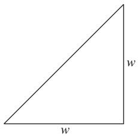

8.4 如图所示的半圆盘具有温度分布$T(r) = T_{0} / \left(1 + (r / R)^{2}\right)$，其发射率为灰色非漫射，且

$$
\epsilon^{\prime} = \epsilon_{\lambda}^{\prime}(\lambda ,\theta ,\psi) = \left\{ \begin{array}{ll}0.6, & 0\leq \theta \leq 30^{\circ},\\ 0, & \theta >30^{\circ}. \end{array} \right.
$$

对于蒙特卡洛模拟：

(a) 用随机数表示发射点

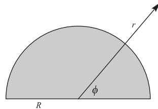

(b) 用随机数表示发射方向。答案可以保留简单的隐式形式。

8.5 需要通过蒙特卡洛方法研究一个受直射阳光照射的光导管。这种装置由覆盖高反射材料的直管或弯管组成，用于将光线导入室内。在可见光波长下，管壁的反射率为$\rho_{\lambda}^{\prime}(\theta_{out}) = 1.5\rho_{\lambda}\cos \theta_{out}$，其中反射角$\theta_{out}$从局部表面法线测量，直射阳光的可见光强度可近似为

$$
L_{\lambda} = K_{\lambda}I_{\lambda ,\mathrm{sun}} = C\exp [-A^{2}(\lambda -\lambda_{0})^{2}],\lambda_{0} = 0.56\mu \mathrm{m},A = 20 / \mu \mathrm{m}.
$$

(a) 找出确定发射波长与随机数关系的相关表达式  
(b) 找出反射角与随机数关系的表达式

8.6 在Aaronsburg(宾夕法尼亚州)苹果节上，你赢得了一大块接骨木莓派(好吃！)如图所示。烤箱里的轮子一定在旋转，因为看起来单位面积上的接骨木莓数量与半径成正比线性增加！如果切片上有1000个接骨木莓随机分布，绘制接骨木莓在派切片上的散点图。

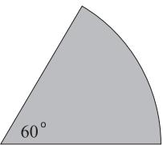  
20cm

8.7 考虑一个黑体圆盘$0\leq r\leq R$，其温度分布为$T^{4}(r) = T_{0}^{4}e^{- C(r / R)^{2}}$。建立发射点与随机数的关系；为1000个发射点绘制随机数，并在$C = 0$和$C = 5$两种情况下绘制它们的散点图。使用$R = 10\mathrm{cm}$。

8.8 一个半径为$R$的圆盘与一个平行于它的正方形平板(边长为$R$)相对，距离为$R$。求圆盘到平板的视角系数。使用100,000个束，每5,000个束后更新并绘制结果。

8.9 考虑两个无限长的平行平板，宽度为$w$，间距为$h$（参见附录D中的配置32）。

(a) 当顶部平板水平偏移距离$L$时，用蒙特卡洛方法计算$F_{1-2}$。取$L = h = w$。

(b) 当两个平板均为镜面反射（具有相同的反射率$\rho_1^s = \rho_2^s = 0.5$）且无水平偏移时，用蒙特卡洛方法计算$F_{1-2}^s$。取$L = 0, h = w$。绘制类似于图8-2的图形，并包含解析结果进行比较。

8.10 两个直接相对的方形平板，宽度$w = 10\mathrm{cm}$，间距$L = 10\mathrm{cm}$，中间有一个居中放置的$b\times b$（$b = 5\mathrm{cm}$）方形平板，距底部距离$l = 5\mathrm{cm}$。用蒙特卡洛方法确定视角系数$F_{1-2}$。为了验证代码（并获得更灵活的工具），最好允许顶部和底部$w$以及$b$可以任意不同。

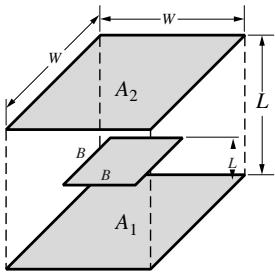

8.11 考虑两个同轴平行圆盘，半径$R$，间距$H$。两个平板均为等温（温度分别为$T_1$和$T_2$），具有灰体漫发射率$\epsilon$，以及灰体反射特性，包含漫反射分量$\rho^d$和纯镜面反射分量$\rho^s$。编写计算广义交换因子$\mathcal{F}_{1\rightarrow 2}$的计算机代码，并利用$\mathcal{F}_{1\rightarrow 2} = \mathcal{F}_{2\rightarrow 1}$的性质，计算每个平板的总热损失。与将每个表面视为单一节点的解析解进行比较。

8.12 重复问题8.11，但直接计算热流密度，即不先计算交换因子。

8.13 确定附录D中配置39的视角系数，取$h = w = l$。与精确结果进行比较。

8.14 考虑问题5.9中的圆锥几何：将侧壁分成若干条带（例如4条），用蒙特卡洛方法计算所有相关视角系数（底部到环带、环带到环带）。

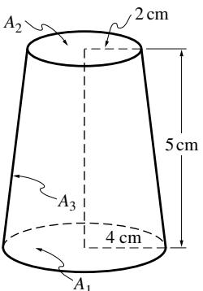

8.15 重新考虑问题5.30：(a)通过编写小型蒙特卡洛程序求解，(b)扩展该程序以考虑非灰体、温度相关的发射率。

8.16 对$T_1 = T_2 = 1000\mathrm{K}$，$\epsilon_1 = \epsilon_2 = 0.5$的情况重复问题5.33。使用蒙特卡洛方法，采用Sparrow及其同事[33,34]的能量分配方法。

8.17 重复问题5.34。对多个$\epsilon$值与精确解进行比较。

8.18 用蒙特卡洛方法重复问题6.3。对几个$D/L$和$\epsilon$值，以及$T_1 = 1000\mathrm{K}$，$T_2 = 2000\mathrm{K}$的情况，与第6章的解法进行比较。如何通过仅从一个表面发射束来完成这个问题？

8.19 用蒙特卡洛方法重复问题6.10。

8.20 用蒙特卡洛方法重复问题6.23。

8.21 用蒙特卡洛方法重复例7.3。

8.22 用蒙特卡洛方法重复例7.4。

8.23 用蒙特卡洛方法重复问题7.20。

