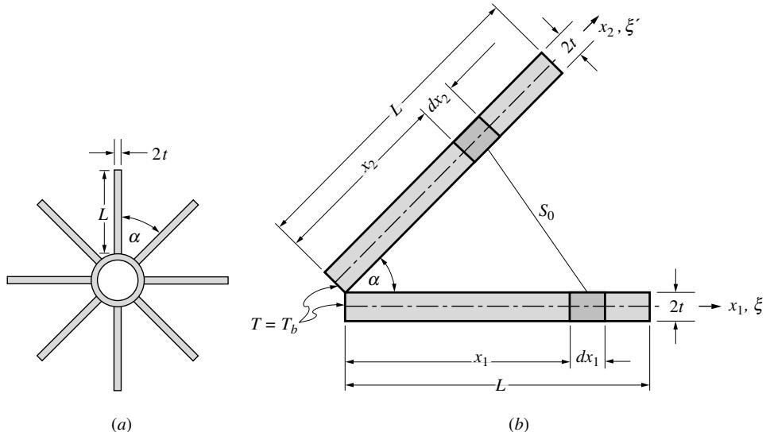
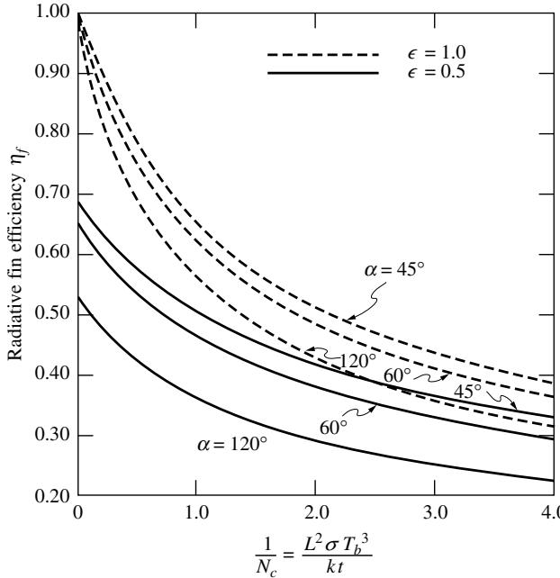
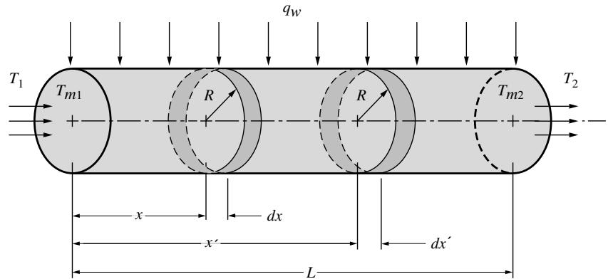
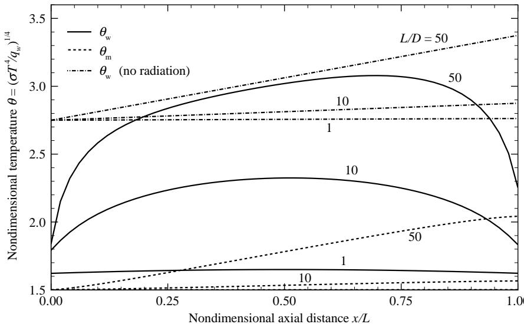
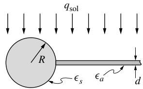
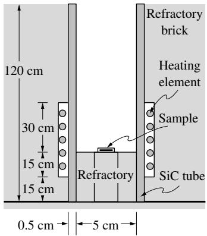

## 内容索引

- [目录](README.md)
- [1 热辐射基础](1-热辐射基础.md)
- [2 基于电磁波理论的辐射特性预测](2-基于电磁波理论的辐射特性预测.md)
- [3 实际表面的辐射特性](3-实际表面的辐射特性.md)
- [4 视角因子](4-视角因子.md)
- [5 灰体漫射表面间的辐射交换](5-灰体漫射表面间的辐射交换.md)
- [6 部分镜面灰体表面间的辐射交换](6-部分镜面灰体表面间的辐射交换.md)
- [7 非理想表面间的辐射交换](7-非理想表面间的辐射交换.md)
- [8 表面交换的蒙特卡洛方法](8-表面交换的蒙特卡洛方法.md)
- [9 传导和对流存在时的表面辐射交换](9-传导和对流存在时的表面辐射交换.md)
- [10 参与介质中的辐射传递方程(RTE)](10-参与介质中的辐射传递方程(RTE).md)
- [11 分子气体的辐射特性](11-分子气体的辐射特性.md)
- [12 颗粒介质的辐射特性](12-颗粒介质的辐射特性.md)
- [13 半透明介质的辐射特性](13-半透明介质的辐射特性.md)
- [14 一维灰体介质的精确解](14-一维灰体介质的精确解.md)
- [15 一维介质的近似求解方法](15-一维介质的近似求解方法.md)
- [16 球谐函数法 (PN-近似)](16-球谐函数法(PN-近似).md)
- [17 离散坐标法 (SN-近似)](17-离散坐标法(SN-近似).md)
- [18 区域法](18-区域法.md)
- [19 准直辐射与瞬态现象](19-准直辐射与瞬态现象.md)
- [20 非灰消光系数的求解方法](20-非灰消光系数的求解方法.md)
- [21 参与介质的蒙特卡洛方法](21-参与介质的蒙特卡洛方法.md)
- [22 辐射与传导和对流的耦合](22-辐射与传导和对流的耦合.md)
- [23 逆辐射传热](23-逆辐射传热.md)
- [24 纳米尺度辐射传热](24-纳米尺度辐射传热.md)
- [附录](附录.md)

- [9.1 引言](#91-引言)
- [9.2 传导与表面辐射-散热片](#92-传导与表面辐射-散热片)
- [9.3 对流与表面辐射](#93-对流与表面辐射)
- [参考文献](#参考文献)
- [习题](#习题)

# 第9章

# 传导和对流存在时的表面辐射交换

## 9.1 引言

在前几章中，我们仅考虑了在给定壁面温度或热流条件下的封闭空间内辐射交换的分析，即忽略了与其他传热模式的相互作用。然而在实际系统中，边界处的辐射几乎总是会受到固体内部传导和/或表面对流的影响。此时，必须同时考虑两种或三种传热模式。这种相互作用可能相当简单，也可能相当复杂。例如，在已知温度的等温表面（与不参与辐射的介质相邻）的热损失可能同时通过对流和辐射发生；然而，对流和辐射热流彼此独立，可以分别计算并简单相加。如果边界条件更为复杂（即表面温度未指定），则辐射会作为非线性边界条件进入剩余的传导/对流问题中。

在许多重要应用中，需要对不透明介质进行传导分析，该介质通过其表面辐射（可能还包括对流）损失（或获得）热量。在这种情况下，辐射作为非线性边界条件进入传导问题；然而，该边界条件中的辐射热流可能取决于周围封闭空间内的辐射交换。在其他应用中，需要评估透明气体或液体中的传导和/或对流，其边界为不透明的辐射壁面。同样，辐射仅作为边界条件进入，而透明介质本身占据着控制辐射传递的封闭空间。在这两类应用中，辐射与传导-对流都是相互依存的，即辐射热流的变化会扰动表面的整体能量平衡，导致温度变化以及传导-对流热流的变化，反之亦然。

文献中已报道了许多关于表面辐射与其他传热模式相互作用的重要应用。在此我们将仅讨论几个基本案例：$(i)$ 展示不同传热模式间相互作用的基本趋势，$(ii)$ 概述用于解决此类问题的一些数值方法。每节末尾会简要描述更高级的问题并提供参考文献列表。

  
图9-1 带纵向肋片的太空辐射管示意图

# 9.2 传导与表面辐射-散热片

绝大多数传导-表面辐射组合应用涉及真空中的热传递，例如航天器的热损失或真空隔热。作为示例，我们将讨论用于航天器散热的简单矩形肋片散热器的性能。

考虑如图9-1所示带有一组径向肋片的管子。为便于分析，我们做出以下假设：

1. 每个肋片厚度$2t$远小于其径向长度$L$，而$L$又远小于肋片沿管轴方向的延伸长度。这意味着肋片内的热传导计算可假设肋片温度仅是径向距离$X_i$的函数。
2. 肋片端部的损失（通过对流和辐射）可忽略，即$\partial T_i / \partial x_i(L)\simeq 0$  
3. 肋片材料的热导率$k$为常数  
4. 所有肋片基部温度相同，即$T_{1}(0) = T_{2}(0) = T_{b}$，且肋片排列对称，即$T_{1}(x_{1}) = T_{2}(x_{2} = x_{1})$等  
5. 表面涂有不透明、灰体、漫发射和漫反射材料，具有均匀发射率$\epsilon$  
6. 没有外部辐射进入肋片空腔$(H_{o} = 0,T_{\infty} = 0)$

前三个假设是薄肋片分析的标准简化（参见Holman[1]等），后三个假设则是为了使辐射部分的问题更易处理。对微元体积（轴向单位长度）$dV = 2t dx$进行能量平衡分析可得：

$\mathcal{X}$处通过横截面积$(2t)$的导入热传导 = $x + dx$处导出热传导 + 上下表面的净辐射损失$(2dx)$

即

$$
-2tk\frac{dT}{dx}\bigg|_x = -2tk\frac{dT}{dx}\bigg|_{x + dx} + 2q_Rdx.
$$

将导出传导项展开为截断泰勒级数，

$$
\left.\frac{dT}{dx}\right|_{x + dx} = \left.\frac{dT}{dx}\right|_x + dx\left.\frac{d^2T}{dx^2}\right|_x + \dots ,
$$

可得

$$
\frac{d^2T}{dx^2} = \frac{1}{tk} q_R. \tag{9.1}
$$

此处$q_{R}(x)$是离开肋片表面单元的净辐射热流，可通过表面辐射度$J$由式(5.24)和(5.25)表示为：

$$
\begin{array}{l}{q_{R}(x_{1}) = J(x_{1}) - \int_{x_{2} = 0}^{L}J(x_{2})dF_{d1 - d2},}\\ {J(x_{1}) = \epsilon \sigma T^{4}(x_{1}) + (1 - \epsilon)\int_{x_{2} = 0}^{L}J(x_{2})dF_{d1 - d2}.} \end{array} \tag{9.3}
$$

通过消去积分，辐射热流表达式可简化为（式5.26）：

$$
q_{R}(x_{1}) = \frac{\epsilon}{1 - \epsilon}\left[\sigma T_{1}^{4}(x_{1}) - J_{1}(x_{1})\right]. \tag{9.4}
$$

两个无限长条带间的视角因子可从附录D配置5或例4.1得到：

$$
F_{d1 - d2} = \frac{x_1\sin^2\alpha x_2dx_2}{2S_0^3} = \frac{\sin^2\alpha x_1x_2dx_2}{2(x_1^2 - 2x_1x_2\cos\alpha + x_2^2)^{3 / 2}}. \tag{9.5}
$$

方程(9.1)需要两个边界条件：

$$
T(x = 0) = T_{b},\quad \frac{dT}{dx} (x = L) = 0. \tag{9.6}
$$

在进行数值求解前，最好用无量纲变量和参数总结数学问题：

$$
\theta (\xi) = \frac{T(x)}{T_b},\mathcal{J}(\xi) = \frac{J(x)}{\sigma T_b^4},N_c = \frac{kt}{\sigma T_b^3L^2},\xi = \frac{x}{L}, \tag{9.7}
$$

其中$\theta$和$\mathcal{J}$是无量纲温度和辐射度，$N_{c}$通常称为传导-辐射参数，有时也称为普朗克数。根据这些定义，

$$
\begin{array}{l}\frac{d^2\theta}{d\xi^2} = \frac{1}{N_c}\frac{\epsilon}{1 - \epsilon}\left[\theta^4 (\xi) - \mathcal{J}(\xi)\right],\\ \displaystyle \mathcal{J}(\xi) = \epsilon \theta^4 (\xi) + (1 - \epsilon)\int_{\xi = 0}^{1}\mathcal{J}(\xi ')K(\xi ,\xi ')d\xi ',\\ \displaystyle K(\xi ,\xi ') = \frac{1}{2}\sin^2\alpha \frac{\xi\xi'}{(\xi^2 - 2\xi\xi'\cos\alpha + \xi'^2)^{3 / 2}}, \end{array} \tag{9.8b}
$$

边界条件为

$$
\theta (\xi = 0) = 1,\quad \frac{d\theta}{d\xi} (\xi = 1) = 0. \tag{9.8d}
$$

与对流冷却肋片类似，定义肋片效率$\eta_{f}$，比较实际肋片与理想肋片(黑体肋片，等温于$T_{b}$)的热损失。理想肋片$(\epsilon = 1,J = \sigma T_b^4)$的总热损失可由式(9.2)和附录$\mathbb{D}$配置34得出：

$$
Q_{\mathrm{ideal}} = 2Lq_{R,\mathrm{ideal}} = 2L\sigma T_b^4 (1 - F_{1 - 2}) = 2L\sin \frac{\alpha}{2}\sigma T_b^4, \tag{9.9}
$$

而实际热损失可通过在基座应用傅里叶定律或沿肋片长度积分得到：

$$
Q_{\mathrm{actual}} = -2t k\left.\frac{dT}{dx}\right|_{x = 0} = 2\int_{0}^{L}q_{R}(x)dx. \tag{9.10}
$$

因此，

$$
\eta_{f} = \frac{Q_{\mathrm{actual}}}{Q_{\mathrm{ideal}}} = -\frac{N_{c}}{\sin\frac{\alpha}{2}}\frac{d\theta}{d\xi}\bigg|_{0} = \frac{1}{\sin\frac{\alpha}{2}}\frac{\epsilon}{1 - \epsilon}\int_{0}^{1}(\theta^{4} - \mathcal{J})d\xi , \tag{9.11}
$$

其中最后一个表达式通过对式(9.8a)沿肋片长度$L$积分得到。

方程组(9.8)可通过多种方法求解，包括净辐射法[将式(9.8b)差分化为有限宽度等温条带，应用式(5.34)]或第5.6节讨论的任何Fredholm方程解法。由于方程的非线性特性，建议采用逐次逼近法：先假设温度场，计算辐射度分布，再通过求解微分方程(已知右侧项)确定更新后的温度场等。

Sparrow及其合作者[2]获得的效率样本结果如图9-2所示。肋片效率的变化规律与对流冷却肋片类似(用"辐射传热系数"$h_{R} = 4\epsilon \sigma T_{b}^{2}$替代传热系数)。当$N_{c} \to \infty$时获得最大效率，此时传导占主导且肋片基本等温。对于$\epsilon < 1$，效率限制在$\eta_{f} < 1$，因为黑体构型总是会损失更多热量。还观察到肋片效率(而非实际热损失)随开口角$\alpha$减小而增加：小开口角时相邻肋片的辐射使净辐射热损失大幅减少，但不如"理想"肋片(相邻肋片为黑体且处于$T_{b}$)减少得多。

文献中有许多其他研究讨论表面辐射与一维导热的相互作用。例如，Hering [3]和Tien [4]研究了图9-1中具有镜面反射表面的肋片，Sparrow及其合作者[2]考察了外部辐射的影响。Bartas和Sellers [5]、Sparrow团队[6,7]以及Lieblein [8]研究了连接平行管道的肋片。Chambers和Sommers [9]（矩形截面）、Keller和Holdredge [10]（变截面）以及Mackay [11]（含外部辐射）研究了单环形肋片（即附着在管道外部的环形圆盘），而Sparrow团队[12]则研究了相邻肋片间的相互作用。还有各种其他文献涉及不同几何形状、表面特性（包括非灰体效应）、辐射条件等，部分列于[13-35]。

  
图9-2 纵向平板肋片的辐射效率[2]。

最近，一些研究者考虑了含空腔介质（如多孔介质[36,37]、球体填充床[38]、镜面炉[39]和蜂窝板[40-42]）中的传导-表面辐射耦合问题。

# 9.3 对流与表面辐射

与纯对流传热类似，通常区分外部流动和内部流动应用。如果流动介质是空气或其他相对惰性气体，透明或非参与性辐射介质的假设通常成立。这里我们考虑透明气体以均匀热流密度$q_w$（单位表面积）流经直径为$D=2R$、长度为$L$的圆管情况。如图9-3示意，流体在$x=0$处以平均（整体）温度$T_{m1}$进入管道。沿管道长度，供应的热流密度$q_w$通过内表面对流（向流体）和辐射（向开口端及管壁其他部分）耗散，而管道外表面绝热。两个开口端分别暴露于温度为$T_1$和$T_2$的辐射环境。假设管道内表面为灰体、漫发射和漫反射，具有均匀发射率$\epsilon$。为简化分析，假设管壁与流体间的对流换热系数$h$恒定，与辐射换热无关且已知。

在这些简化下，控制体积$dV=\pi R^2 \times dx$的能量平衡为：

$x$处焓流入 + $dx$上对流流入 = $x+dx$处焓流出

  
图9-3 承受恒定壁面热流的透明介质在圆管中强制对流与辐射

即

$$
\dot{m} c_{p}T_{m}(x) + h\left[T_{w}(x) - T_{m}(x)\right]2\pi Rdx = \dot{m} c_{p}T_{m}(x + dx) = \dot{m} c_{p}\left[T_{m}(x) + \frac{dT_{m}}{dx} (x)dx\right], \tag{9.12}
$$

或

$$
\frac{dT_{m}}{dx} = \frac{2h}{\rho c_{p}u_{m}R}\left[T_{w}(x) - T_{m}(x)\right], \tag{9.13}
$$

其中忽略了轴向导热，质量流量用平均速度表示为$m=\mu u_m/k^2$。方程(9.13)是关于未知壁温和整体温度$T_w(x)$和$T_m(x)$的单一方程，需满足入口条件：

$$
T_{m}(x = 0) = T_{m1}. \tag{9.14}
$$

管壁能量平衡表明，规定的热流密度$q_w$通过对流和辐射耗散，应用辐射热流方程(5.26)：

$$
q_{w} = h\left[T_{w}(x) - T_{m}(x)\right] + \frac{\epsilon}{1 - \epsilon}\left[\sigma T_{w}^{4}(x) - J(x)\right]. \tag{9.15}
$$

辐射度$J(x)$由方程(5.24)给出：

$$
J(x) = \epsilon \sigma T_w^4 (x) + (1 - \epsilon)\biggl \{\sigma T_1^4 F_{dx - 1} + \sigma T_2^4 F_{dx - 2} + \int_0^L J(x')dt'dx_{-dx'}\biggr \} , \tag{9.16}
$$

其中$F_{dx-1}$是$x处宽度$dx$的环形带对$x=0$开口的视角系数，$F_{dx-2}$是对$x=L$开口的视角系数，$dt_{dx-dx'}$是位于$x$和$x'$的两个环形带间的视角系数（见图9-3）。所有视角系数均可从附录D配置9和31确定，此处不再重复。方程(9.13)、(9.15)和(9.16)是关于$T_w(x)$、$T_m(x)$和$J(x)$的三个联立方程，需数值求解。在求解前，最好用无量纲形式重写方程。定义以下变量和参数：

$$
\begin{array}{l}\xi = \frac{x}{D},\quad \theta (\xi) = \left(\frac{\sigma T^4}{q_w}\right)^{1 / 4},\quad \mathcal{J}(\xi) = \frac{J}{q_w},\\ \displaystyle \mathrm{St} = \frac{h}{\rho c_p u_m},\quad H = \frac{h}{q_w}\left(\frac{q_w}{\sigma}\right)^{1 / 4}, \end{array} \tag{9.17b}
$$

将方程(9.13)-(9.16)转换为：

$$
\begin{array}{c}{\frac{d\theta_m}{d\xi} = 4\mathrm{St}[\theta_w(\xi) - \theta_m(\xi)],\quad \theta_m(\xi = 0) = \theta_{m1},}\\ {1 = H[\theta_w(\xi) - \theta_m(\xi)] + \frac{\epsilon}{1 - \epsilon} [\theta_w^4 (\xi) - \mathcal{J}(\xi)],}\\ {\mathcal{J}(\xi) = \epsilon \theta_w^4 (\xi) + (1 - \epsilon)\Bigg\{\theta_1^4 F_{d\xi -1} + \theta_2^4 F_{d\xi -2} + \int_0^{L / D}\mathcal{J}(\xi ')dF_{d\xi -d\xi '}\Bigg\} .} \end{array} \tag{9.19}
$$

当$\epsilon=1$时方程(9.19)不确定。对于黑管情况$\mathcal{J}=\theta_w^4$，方程(9.19)和(9.20)可合并为：

$$
1 = H[\theta_w(\xi) - \theta_m(\xi)] + \theta_w^4 (\xi) - \theta_1^4 F_{d\xi -1} - \theta_2^4 F_{d\xi -2} - \int_0^{L / D}\theta_w^4 (\xi ')dF_{d\xi -d\xi '}. \tag{9.21}
$$

例9.1. 透明气体流经承受恒定热流的黑管。已知对流换热系数恒定，Stanton数和无量纲换热系数分别为$\mathrm{St}=2.5\times10^{-3}$和$H=0.8$。两端环境温度等于当地气体温度，即$\theta_1=\theta_{m1}$和$\theta_2=\theta_{m2}=\theta_m(\xi=L/D)$，无量纲入口温度为$\theta_{m1}=1.5$。使用例5.11的数值积分方法，确定（无量纲）壁温随相对管长$L/D$的变化。

# 求解

由于管壁是黑体，我们只有两个联立方程(9.18)和(9.21)，包含两个未知量$\theta_{m}$和$\theta_{w}$。然而，这些方程是非线性的，因此需要采用迭代方法求解。为简化计算，我们将采用简单的向后有限差分法求解方程(9.18)，并使用方程(5.52)的数值积分方案计算方程(9.21)中的积分。在$N + 1$个节点$\xi_{i} = i\Delta \xi (i = 0,1,\ldots ,N)$处评估温度，其中$\Delta \xi = L / (ND)$，这意味着：

$$
\left(\frac{d\theta_m}{d\xi}\right)_{\xi_i}\simeq \frac{\theta_m(\xi_i) - \theta_m(\xi_{i - 1})}{\Delta\xi},\quad i = 1,2,\ldots ,N,
$$

$$
\int_0^{L / D}\theta_w^4 (\xi ')\frac{dF_{d\xi - d\xi'}}{d\xi'} d\xi '\simeq \frac{L}{D}\sum_{j = 0}^{N}c_j\theta_w^4 (\xi_j)K(\xi_i,\xi_j),\quad i = 0,1,\ldots ,N,
$$

其中$c_{j}$是积分权重，根据附录D中的配置9：

$$
K(\xi_{i},\xi_{j}) = 1 - \frac{X_{ij}(2X_{ij}^{2} + 3)}{2(X_{ij}^{2} + 1)};X_{ij} = |\xi_{i} - \xi_{j}|.
$$

类似地，两个开口的视角系数根据附录D中的配置31计算：

$$
F_{d\xi_{i} - k} = \frac{X_{ij}^2 + \frac{1}{2}}{\sqrt{X_{ij}^2 + 1}} -X_{ij},
$$

其中

$$
\begin{array}{rl}{j=0}&{\mathrm{if}\quad k=1\quad(\mathrm{open}\mathrm{ing}\mathrm{at}\xi=\xi_0=0),}\\{j=N}&{\mathrm{if}\quad k=2\quad(\mathrm{open}\mathrm{ing}\mathrm{at}\xi=\xi_N=L/D).}\end{array}
$$

为求解未知量$\theta_{m}(\xi_{i})$和$\theta_{w}(\xi_{i})$，我们采用以下迭代过程：

1. 对所有壁面节点猜测一个壁面温度，例如：

$$
\theta_{w}(\xi_{i}) = \theta_{1},\quad i = 0,1,\ldots ,N.
$$

  
图9-4 承受恒定壁面热流的黑管中，对流与表面辐射共同作用下的轴向表面温度发展

2. 根据方程(9.21)计算温差：

$$
\phi_{i} = H[\theta_{w}(\xi_{i}) - \theta_{m}(\xi_{i})] = 1 - \theta_{w}^{4}(\xi_{i}) + \theta_{1}^{4}F_{d\xi_{i} - 1} + \theta_{2}^{4}F_{d\xi_{i} - 2} + \frac{L}{D}\sum_{i = 0}^{N}c_{j}\theta_{w}^{4}(\xi_{j})K(\xi_{i},\xi_{j}).
$$

3. 根据方程(9.18)计算气体整体温度：

$$
\theta_{m}(\xi_{i}) = \theta_{m}(\xi_{i - 1}) + \frac{4\mathrm{St}\Delta\xi}{H}\phi_{i};\quad \theta_{m}(\xi_{0}) = \theta_{1},
$$

4. 然后根据$\phi_{i}$的定义更新壁面温度：

$$
\theta_{w}^{\mathrm{new}}(\xi_{i}) = \omega \left[\theta_{m}(\xi_{i}) + \frac{1}{H}\phi_{i}\right] + (1 - \omega)\theta_{w}^{\mathrm{old}}(\xi_{i}),
$$

其中$\omega$称为松弛参数。当$\omega < 1$时称为欠松弛迭代，$\omega > 1$时称为过松弛迭代。如果$\omega$选择过大，迭代将变得不稳定且不收敛。通常需要通过试错法找到良好或最优的松弛参数值。关于松弛的详细讨论可参考标准数值分析文献如[44,45]。图9-4展示了几个$L / D$值的代表性结果。由于问题的强非线性和这里采用的粗糙数值方案，需要大量节点$(N \simeq 40L / D)$和强欠松弛$(\omega < 0.02)$才能获得良好精度。

对于纯对流情况$(\epsilon = 0$或$\phi_{i} \equiv 1)$，管壁温度随轴向距离线性上升，因为恒定壁面热流意味着整体温度线性增加，因此(假设恒定传热系数)表面温度也线性增加。但当存在辐射时情况不同，特别是对于短管(小$L / D$)。在管的两端附近，大部分辐射能量通过开口离开，导致表面温度明显下降。对于长管$(L / D > 50)$，表面温度在管的中心部分几乎线性上升，尽管温度仍低于纯对流情况：由于下游温度较高，部分净辐射热流向上游传递，使整体传热效率略有提高。这里需要注意的是，恒定传热系数的假设并不特别现实，因为它意味着完全发展的热剖面。众所周知，对于纯对流，入口处$h \to \infty$，因此$\theta_{w}(\xi = 0) = 1$[1]。在管入口附近，纯对流的实际温度分布与图9-3所示的由辐射损失驱动的分布非常相似。虽然对于纯对流最终会达到完全发展的热剖面和恒定$h$(湍流时$L / D > 20$)，但在存在辐射的情况下永远不会达到恒定传热系数(因为辐射项使控制方程非线性)。

许多研究者研究了透明流动介质中对流与辐射的联合作用。Siegel及其合作者[46-48]考虑了圆管中的流动，但总是假设恒定且已知的传热系数。Dussan和Irvine[49]以及Chen[50]通过求解流动介质的二维能量方程计算了局部对流速率，但他们在辐射热流评估中做了严重简化。Thorsen和Karchanagom[51,52]进行了最全面的管流分析。Keshock和Siegel[53](针对恒定传热系数)以及Lin和Thorsen[54](针对二维对流计算)研究了平行板通道流动中的类似问题。Cess[55,56]、Sparrow和Lin[57]以及Sohal和Howell[58]研究了平板外部流动中的辐射与强制对流联合作用。流化床传热也有许多研究者进行了研究[59-61]，最后，表面辐射与自由对流之间的相互作用已通过数值和实验方法进行了研究[62-71]。

# 参考文献

1. Holman, J. P.: 《传热学》第7版, McGraw-Hill Book Company, New York, 1990.  
2. Sparrow, E. M., E. R. G. Eckert, and T. F. Irvine: "考虑相互辐射的散热片有效性研究", Journal of the Aerospace Sciences, no. 28, pp. 763-772, 1961.  
3. Hering, R. G.: "具有镜面反射的导电板之间的辐射热交换", ASME Journal of Heat Transfer, vol. C88, pp. 29-36, 1966.  
4. Tien, C. L.: "导电板间辐射热交换的近似解", ASME Journal of Heat Transfer, vol. 89C, pp. 119-120, 1967.  
5. Bartas, J. G., and W. H. Sellers: "辐射散热片有效性", ASME Journal of Heat Transfer, vol. 82C, pp. 73-75, 1960.  
6. Sparrow, E. M., and E. R. G. Eckert: "散热片与基面之间的辐射相互作用", ASME Journal of Heat Transfer, vol. C84, pp. 12-18, 1962.  
7. Sparrow, E. M., V. K. Jonsson, and W. J. Minkowycz: "考虑纵向热传导和非等温有限表面间辐射交换的翅片管散热器传热", NASA TN D-2077, 1963.  
8. Lieblein, S.: "矩形散热片沿程温度分布和辐射传热分析", NASA TN D-196, 1959.  
9. Chambers, R. L., and E. V. Sommers: "一维热流圆形散热片的辐射效率", ASME Journal of Heat Transfer, vol. 81C, no. 4, pp. 327-329, 1959.  
10. Keller, H. H., and E. S. Holdredge: "梯形截面环形散热片的辐射传热", ASME Journal of Heat Transfer, vol. 92, no. 6, pp. 113-116, 1970.  
11. Mackay, D. B.: 《空间动力装置设计》, Prentice-Hall, Englewood Cliffs, NJ, 1963.  
12. Sparrow, E. M., G. B. Miller, and V. K. Jonsson: "考虑散热元件间相互辐射的环形翅片空间散热器辐射有效性", Journal of Aerospace Sciences, vol. 29, pp. 1291-1299, 1962.  
13. Abarbanel, S. S.: "辐射固体中的瞬态温度分布", J. Math. Phys., vol. 39, no. 4, pp. 246-257, 1960.  
14. Eckert, E. R. G., T. F. Irvine, and E. M. Sparrow: "考虑相互辐射的散热片解析公式", American Rocket Society Journal, vol. 30, pp. 644-646, 1960.  
15. Nilson, E. N., and R. Curry: "向太空辐射的三角形截面直翅片的最小重量设计", Journal of the Aerospace Sciences, vol. 27, p. 146, 1960.  
16. Hickman, R. S.: "加热辐射圆盘的瞬态响应和稳态温度分布", Technical Report 32-169, California Institute of Technology, Jet Propulsion Laboratory, 1961.  
17. Heaslet, M. A., and H. Lonax: "考虑相互辐射的导电翅片间辐射交换的数值预测", NASA TR R-116, 1961.  
18. Nichols, L. D.: "星际空间中受太阳辐射的薄壁体表面温度分布", NASA TN D-584, 1961.  
19. Schreiber, L. H., R. P. Mitchell, G. D. Gillespie, and T. M. Olcott: "翅片管散热器的优化技术", ASME Paper No. 61-SA-44, June 1961.  
20. Olmstead, W. E., and S. Raynor: "旋转球形空间飞行器的太阳加热", International Journal of Heat and Mass Transfer, vol. 5, pp. 1165-1177, 1962.  
21. Wilkins, J. E.: "最小质量薄翅片与恒定温度梯度", J. Soc. Ind. Appl. Math, vol. 10, no. 1, pp. 62-73, 1962.
22. Hrycak, P.: "传导对航天器表面温度的影响", AIAA Journal, vol. 1, pp. 2619-2621, 1963.  
23. Karlekar, B. V., and B. T. Chao: "忽略基座圆柱影响的辐射梯形翅片质量最小化", International Journal of Heat and Mass Transfer, vol. 6, pp. 33-48, 1963.  
24. Stockman, N. O., and J. L. Kramer: "变物性对辐射翅片一维传热的影响", NASA TN D-1878, 1963.  
25. Kotan, K., and O. A. Arnas: "抛物线形辐射翅片设计参数的优化", ASME Paper No. 65-HT-42, August 1963.  
26. Mueller, H. F., and N. D. Malmuth: "采用奇异扰动法的辐射隔热层温度分布", International Journal of Heat and Mass Transfer, vol. 8, pp. 915-920, 1965.  
27. Russell, L. D., and A. J. Chapman: "'已知热负荷'空间散热器问题的解析解", Journal of Spacecraft and Rockets, vol. 4, no. 3, pp. 311-315, 1967.  
28. Frost, W., and A. H. Eraslan: "确定散热片与基座及相邻散热面间存在辐射相互作用时传热的迭代方法", AIAA Paper No. 68-777, June 1968.  
29. Donovan, R. C., and W. M. Rohrer: "平面壁上的辐射传导散热片，包括相互辐射", ASME Paper No. 69-WA/H1122, November 1969.  
30. Schnurr, N. M., A. B. Shapiro, and M. A. Townsend: "辐射散热片阵列的重量优化", ASME Journal of Heat Transfer, vol. 98, no. 4, pp. 643-648, 1976.  
31. Eslinger, R., and B. Chung: "辐射和对流散热片或散热片阵列中的周期性传热", AIAA Journal, vol. 17, no. 10, pp. 1134-1140, 1979.  
32. Gerencser, D. S., and A. Razani: "包含散热片间相互辐射的辐射-对流针翅阵列优化", International Journal of Heat and Mass Transfer, vol. 38, pp. 899-907, 1995.  
33. Chung, B. T. F., B. X. Zhang, and E. T. Lee: "模糊环境下辐射散热片阵列系统的多目标优化", ASME Journal of Heat Transfer, vol. 118, no. 3, pp. 642-649, 1996.  
34. Krishnaprakas, C. K.: "从平面壁延伸的辐射矩形板翅阵列的优化设计", ASME Journal of Heat Transfer, vol. 118, pp. 490-493, 1996.  
35. Krishnaprakas, C. K.: "从圆柱表面延伸的辐射纵向翅阵列的优化设计", ASME Journal of Heat Transfer, vol. 119, pp. 857-860, 1997.  
36. Fitzgerald, S. P., and W. Streeder: "细长球腔中的辐射传热", AIChE Journal, vol. 43, pp. 2-12, 1997.  
37. Liang, X. G., and W. Qu: "高温下气固复合材料的有效导热系数及温差效应", International Journal of Heat and Mass Transfer, vol. 42, no. 10, pp. 1885-1893, 1999.  
38. Singh, B. P., and M. Kaviany: "固体导热系数对填充床中辐射传热的影响", International Journal of Heat and Mass Transfer, vol. 37, no. 16, pp. 2579-2583, 1994.  
39. Haya, R., D. Rivas, and J. Sanz: "圆柱晶体与单椭球镜炉之间的辐射交换", International Journal of Heat and Mass Transfer, vol. 40, pp. 323-332, 1997.  
40. Hollands, K. G. T., and K. Iynkaran: "复合蜂窝透明隔热材料热导率的解析模型及实验验证", Solar Energy, vol. 51, pp. 223-227, 1993.  
41. Jones, P. D.: "真空蜂窝芯板中辐射与传导联合作用的关联", Journal of Solar Energy Engineering, vol. 118, pp. 97-100, 1996.  
42. Schweiger, H., A. Oliva, M. Costa, and C. D. Segarra: "瞬态辐射传热模拟的蒙特卡洛方法：在复合蜂窝透明隔热材料中的应用", Numerical Heat Transfer - Part B: Fundamentals, vol. 33, pp. 113-136, 1999.  
43. Fröberg, C. E.: 《数值分析导论》, Addison-Wesley, Reading, MA, 1969.  
44. Hornbeck, R. W.: 《数值方法》, Quantum Publishers, Inc., New York, 1975.  
45. Ferziger, J. H.: 《工程应用数值方法》, John Wiley & Sons, New York, 1981.  
46. Siegel, R., and M. Perlmutter: "灰色壁面管中透明气体流动的对流和辐射传热", International Journal of Heat and Mass Transfer, vol. 5, pp. 639-660, 1962.  
47. Perlmutter, M., and R. Siegel: "加热管中强制对流与热辐射的联合传热", ASME Journal of Heat Transfer, vol. C84, pp. 301-311, 1962.  
48. Siegel, R., and E. G. Keshock: "具有强制对流、内部辐射交换和轴向壁面导热的管壁温度", NASA TN D-2116, 1964.  
49. Dussan, B. I., and T. F. Irvine: "外壁有辐射通量的圆管层流传热", in Proceedings of the Third International Heat Transfer Conference, vol. 5, Hemisphere, Washington, D.C., pp. 184-189, 1966.  
50. Chen, J. C.: "具有非线性辐射热流边界条件的管中层流传热", International Journal of Heat and Mass Transfer, vol. 9, pp. 433-440, 1966.  
51. Thorsen, R. S.: "具有强制对流、内部辐射交换、轴向壁面导热和任意壁面发热的管中传热", International Journal of Heat and Mass Transfer, vol. 12, pp. 1182-1187, 1969.  
52. Thorsen, R. S., and D. Kanchanagom: "内部辐射交换、任意壁面发热和壁面导热对层流和湍流传热的影响", in Proceedings of the Fourth International Heat Transfer Conference, vol. 3, Elsevier, New York, pp. 1-10, 1970.  
53. Keshock, E. G., and R. Siegel: "非对称加热平行板流道中的辐射与对流联合传热", ASME Journal of Heat Transfer, vol. 86C, pp. 341-350, 1964.
54. Lin, S. T., and R. S. Thorsen: "非对称加热平行板中的强制对流与辐射联合传热", in Proceedings of the Heat Transfer and Fluid Mechanics Institute, Stanford University Press, pp. 32-44, 1970.
55. Cess, R. D.: "辐射对强制对流传热的影响", Applied Scientific Research Part A, vol. 10, pp. 430-438, 1962.
56. Cess, R. D.: "热辐射与传导和对流传热的相互作用", in Advances in Heat Transfer, vol. 1, Academic Press, New York, pp. 1-50, 1964.
57. Sparrow, E. M., and S. H. Lim: "具有规定热通量的边界层-同时考虑对流和辐射的应用", International Journal of Heat and Mass Transfer, vol. 8, pp. 437-448, 1965.
58. Sohal, M., and J. R. Howell: "传导、对流和辐射联合换热情况下板温的确定", International Journal of Heat and Mass Transfer, vol. 16, pp. 2055-2066, 1973.
59. Flamant, G., J. D. Lu, and B. Varlot: "流化床中的辐射传热：精确方法与简化方法的比较", ASME Journal of Heat Transfer, vol. 116, no. 3, pp. 652-659, 1994.
60. Fang, Z. H., J. R. Grace, and C. J. Lim: "循环流化床中的辐射传热", ASME Journal of Heat Transfer, vol. 117, no. 4, pp. 963-968, 1995.
61. Luan, W., C. J. Lim, C. M. H. Brereton, B. D. Bowen, and J. R. Grace: "循环流化床中总传热和辐射传热的实验与理论研究", Chemical Engineering and Science, vol. 54, no. 17, pp. 3749-3764, 1999.
62. Gianoulakis, S., and D. E. Klein: "体积加热内管与有限导热外管之间环形区域的自然对流与表面辐射联合传热", Nuclear Technology, vol. 104, pp. 241-251, 1993.
63. Balaji, C., and S. P. Venkateshan: "考虑表面辐射和传导的L型角区自然对流", ASME Journal of Heat Transfer, vol. 118, pp. 222-225, 1996.
64. Rao, V. R., and S. P. Venkateshan: "水平翅片阵列中自由对流和辐射的实验研究", International Journal of Heat and Mass Transfer, vol. 39, pp. 779-789, 1996.
65. Rao, V. R., C. Balaji, and S. P. Venkateshan: "L型角区自由对流与表面辐射相互作用的干涉测量研究", International Journal of Heat and Mass Transfer, vol. 40, pp. 2941-2947, 1997.
66. Jayaram, K. S., C. Balaji, and S. P. Venkateshan: "带有垂直隔板的封闭空间内表面辐射与自由对流的相互作用", ASME Journal of Heat Transfer, vol. 119, pp. 641-645, 1997.
67. Cheng, X., and U. Müller: "非对称加热大垂直通道中湍流自然对流与热辐射的耦合", International Journal of Heat and Mass Transfer, vol. 41, no. 12, pp. 1681-1692, 1998.
68. Kamesh, N., and S. P. Venkateshan: "表面辐射对方形封闭空间自然对流的影响", Journal of Thermophysics and Heat Transfer, vol. 13, no. 3, pp. 299-301, 1999.
69. Yu, E., and Y. K. Joshi: "通过传导、自然对流和辐射联合传热的侧向通风紧凑封闭空间中的离散加热传热", ASME Journal of Heat Transfer, vol. 121, no. 4, pp. 1002-1010, 1999.
70. Adams, V. H., Y. K. Joshi, and D. L. Blackburn: "水平窄高比封闭空间中离散热源的传导、辐射和自然对流联合传热的三维研究", ASME Journal of Heat Transfer, vol. 121, no. 4, pp. 992-1001, 1999.
71. Velusamy, K., T. Sundararajan, and K. N. Seetharamu: "方形和矩形封闭空间中表面辐射与湍流自然对流的相互作用效应", ASME Journal of Heat Transfer, vol. 123, no. 6, pp. 1062-1070, 2001.
72. Vader, D. T., R. Viskanta, and F. P. Incropera: "多孔和颗粒介电材料高温发射率计的设计与测试", Review of Scientific Instruments, vol. 57, no. 1, pp. 87-93, 1986.
73. Sikka, K. K.: "碳化硅基材料的高温法向光谱发射率", M.S. thesis, The Pennsylvania State University, University Park, PA, 1991.

# References

1. Holman, J. P.: Heat Transfer, 7th ed., McGraw-Hill Book Company, New York, 1990.  
2. Sparrow, E. M., E. R. G. Eckert, and T. F. Irvine: "The effectiveness of radiating fins with mutual irradiation," Journal of the Aerospace Sciences, no. 28, pp. 763-772, 1961.  
3. Hering, R. G.: "Radiative heat exchange between conducting plates with specular reflection," ASME Journal of Heat Transfer, vol. C88, pp. 29-36, 1966.  
4. Tien, C. L.: "Approximate solutions of radiative exchange between conducting plates with specular reflection," ASME Journal of Heat Transfer, vol. 89C, pp. 119-120, 1967.  
5. Bartas, J. G., and W. H. Sellers: "Radiation fin effectiveness," ASME Journal of Heat Transfer, vol. 82C, pp. 73-75, 1960.  
6. Sparrow, E. M., and E. R. G. Eckert: "Radiant interaction between fins and base surfaces," ASME Journal of Heat Transfer, vol. C84, pp. 12-18, 1962.  
7. Sparrow, E. M., V. K. Jonsson, and W. J. Minkowycz: "Heat transfer from fin-tube radiators including longitudinal heat conduction and radiant interchange between longitudinally non-isothermal finite surfaces," NASA TN D-2077, 1963.  
8. Lieblein, S.: "Analysis of temperature distribution and radiant heat transfer along a rectangular fin," NASA TN D-196, 1959.  
9. Chambers, R. L., and E. V. Sommers: "Radiation fin efficiency for one-dimensional heat flow in a circular fin," ASME Journal of Heat Transfer, vol. 81C, no. 4, pp. 327-329, 1959.  
10. Keller, H. H., and E. S. Holdredge: "Radiation heat transfer for annular fins of trapezoid profile," ASME Journal of Heat Transfer, vol. 92, no. 6, pp. 113-116, 1970.  
11. Mackay, D. B.: Design of Space Powerplants, Prentice-Hall, Englewood Cliffs, NJ, 1963.  
12. Sparrow, E. M., G. B. Miller, and V. K. Jonsson: "Radiating effectiveness of annular-finned space radiators including mutual irradiation between radiator elements," Journal of Aerospace Sciences, vol. 29, pp. 1291-1299, 1962.  
13. Abarbanel, S. S.: "Time dependent temperature distribution in radiating solids," J. Math. Phys., vol. 39, no. 4, pp. 246-257, 1960.  
14. Eckert, E. R. G., T. F. Irvine, and E. M. Sparrow: "Analytical formulation for radiating fins with mutual irradiation," American Rocket Society Journal, vol. 30, pp. 644-646, 1960.  
15. Nilson, E. N., and R. Curry: "The minimum weight straight fin of triangular profile radiating to space," Journal of the Aerospace Sciences, vol. 27, p. 146, 1960.  
16. Hickman, R. S.: "Transient response and steady-state temperature distribution in a heated, radiating, circular plate," Technical Report 32-169, California Institute of Technology, Jet Propulsion Laboratory, 1961.  
17. Heaslet, M. A., and H. Lonax: "Numerical predictions of radiative interchange between conducting fins with mutual irradiations," NASA TR R-116, 1961.  
18. Nichols, L. D.: "Surface-temperature distribution on thin-walled bodies subjected to solar radiation in interplanetary space," NASA TN D-584, 1961.  
19. Schreiber, L. H., R. P. Mitchell, G. D. Gillespie, and T. M. Olcott: "Techniques for optimization of a finned-tube radiator," ASME Paper No. 61-SA-44, June 1961.  
20. Olmstead, W. E., and S. Raynor: "Solar heating of a rotating spherical space vehicle," International Journal of Heat and Mass Transfer, vol. 5, pp. 1165-1177, 1962.  
21. Wilkins, J. E.: "Minimum-mass thin fins and constant temperature gradients," J. Soc. Ind. Appl. Math, vol. 10, no. 1, pp. 62-73, 1962.
22. Hrycak, P.: "Influence of conduction on spacecraft skin temperatures," AIAA Journal, vol. 1, pp. 2619-2621, 1963.  
23. Karlekar, B. V., and B. T. Chao: "Mass minimization of radiating trapezoidal fins with negligible base cylinder interaction," International Journal of Heat and Mass Transfer, vol. 6, pp. 33-48, 1963.  
24. Stockman, N. O., and J. L. Kramer: "Effect of variable thermal properties on one-dimensional heat transfer in radiating fins," NASA TN D-1878, 1963.  
25. Kotan, K., and O. A. Arnas: "On the optimization of the design parameters of parabolic radiating fins," ASME Paper No. 65-HT-42, August 1963.  
26. Mueller, H. F., and N. D. Malmuth: "Temperature distribution in radiating heat shields by the method of singular perturbations," International Journal of Heat and Mass Transfer, vol. 8, pp. 915-920, 1965.  
27. Russell, L. D., and A. J. Chapman: "Analytical solution of the 'known-heat-load' space radiator problem," Journal of Spacecraft and Rockets, vol. 4, no. 3, pp. 311-315, 1967.  
28. Frost, W., and A. H. Eraslan: "An iterative method for determining the heat transfer from a fin with radiative interaction between the base and adjacent fin surfaces," AIAA Paper No. 68-777, June 1968.  
29. Donovan, R. C., and W. M. Rohrer: "Radiative conducting fins on a plane wall, including mutual irradiation," ASME Paper No. 69-WA/H1122, November 1969.  
30. Schnurr, N. M., A. B. Shapiro, and M. A. Townsend: "Optimization of radiating fin arrays with respect to weight," ASME Journal of Heat Transfer, vol. 98, no. 4, pp. 643-648, 1976.  
31. Eslinger, R., and B. Chung: "Periodic heat transfer in radiating and convecting fins or fin arrays," AIAA Journal, vol. 17, no. 10, pp. 1134-1140, 1979.  
32. Gerencser, D. S., and A. Razani: "Optimization of radiative-convective arrays of pins fins including mutual irradiation between fins," International Journal of Heat and Mass Transfer, vol. 38, pp. 899-907, 1995.  
33. Chung, B. T. F., B. X. Zhang, and E. T. Lee: "A multi-objective optimization of radiative fin array systems in a fuzzy environment," ASME Journal of Heat Transfer, vol. 118, no. 3, pp. 642-649, 1996.  
34. Krishnaprakas, C. K.: "Optimum design of radiating rectangular plate fin array extending from a plane wall," ASME Journal of Heat Transfer, vol. 118, pp. 490-493, 1996.  
35. Krishnaprakas, C. K.: "Optimum design of radiating longitudinal fin array extending from a cylindrical surface," ASME Journal of Heat Transfer, vol. 119, pp. 857-860, 1997.  
36. Fitzgerald, S. P., and W. Streeder: "Radiation heat transfer down an elongated spheroidal cavity," AIChE Journal, vol. 43, pp. 2-12, 1997.  
37. Liang, X. G., and W. Qu: "Effective thermal conductivity of gas-solid composite materials and the temperature difference effect at high temperature," International Journal of Heat and Mass Transfer, vol. 42, no. 10, pp. 1885-1893, 1999.  
38. Singh, B. P., and M. Kaviany: "Effect of solid conductivity on radiative heat transfer in packed beds," International Journal of Heat and Mass Transfer, vol. 37, no. 16, pp. 2579-2583, 1994.  
39. Haya, R., D. Rivas, and J. Sanz: "Radiative exchange between a cylindrical crystal and a monoellipsoidal mirror furnace," International Journal of Heat and Mass Transfer, vol. 40, pp. 323-332, 1997.  
40. Hollands, K. G. T., and K. Iynkaran: "Analytical model for the thermal conductance of compound honeycomb transparent insulation, with experimental validation," Solar Energy, vol. 51, pp. 223-227, 1993.  
41. Jones, P. D.: "Correlation of combined radiation and conduction in evacuated honeycomb-cored panels," Journal of Solar Energy Engineering, vol. 118, pp. 97-100, 1996.  
42. Schweiger, H., A. Oliva, M. Costa, and C. D. Segarra: "Monte Carlo method for the simulation of transient radiation heat transfer: Application to compound honeycomb transparent insulation," Numerical Heat Transfer - Part B: Fundamentals, vol. 33, pp. 113-136, 1999.  
43. Fröberg, C. E.: Introduction to Numerical Analysis, Addison-Wesley, Reading, MA, 1969.  
44. Hornbeck, R. W.: Numerical Methods, Quantum Publishers, Inc., New York, 1975.  
45. Ferziger, J. H.: Numerical Methods for Engineering Application, John Wiley & Sons, New York, 1981.  
46. Siegel, R., and M. Perlmutter: "Convective and radiant heat transfer for flow of a transparent gas in a tube with gray wall," International Journal of Heat and Mass Transfer, vol. 5, pp. 639-660, 1962.  
47. Perlmutter, M., and R. Siegel: "Heat transfer by combined forced convection and thermal radiation in a heated tube," ASME Journal of Heat Transfer, vol. C84, pp. 301-311, 1962.  
48. Siegel, R., and E. G. Keshock: "Wall temperature in a tube with forced convection, internal radiation exchange and axial wall conduction," NASA TN D-2116, 1964.  
49. Dussan, B. I., and T. F. Irvine: "Laminar heat transfer in a round tube with radiating flux at the outer wall," in Proceedings of the Third International Heat Transfer Conference, vol. 5, Hemisphere, Washington, D.C., pp. 184-189, 1966.  
50. Chen, J. C.: "Laminar heat transfer in a tube with nonlinear radiant heat-flux boundary conditions," International Journal of Heat and Mass Transfer, vol. 9, pp. 433-440, 1966.  
51. Thorsen, R. S.: "Heat transfer in a tube with forced convection, internal radiation exchange, axial wall heat conduction and arbitrary wall heat generation," International Journal of Heat and Mass Transfer, vol. 12, pp. 1182-1187, 1969.  
52. Thorsen, R. S., and D. Kanchanagom: "The influence of internal radiation exchange, arbitrary wall heat generation and wall heat conduction on heat transfer in laminar and turbulent flows," in Proceedings of the Fourth International Heat Transfer Conference, vol. 3, Elsevier, New York, pp. 1-10, 1970.  
53. Keshock, E. G., and R. Siegel: "Combined radiation and convection in asymmetrically heated parallel plate flow channel," ASME Journal of Heat Transfer, vol. 86C, pp. 341-350, 1964.
54. Lin, S. T., and R. S. Thorsen: "Combined forced convection and radiation heat transfer in asymmetrically heated parallel plates," in Proceedings of the Heat Transfer and Fluid Mechanics Institute, Stanford University Press, pp. 32-44, 1970.
55. Cess, R. D.: "The effect of radiation upon forced-convection heat transfer," Applied Scientific Research Part A, vol. 10, pp. 430-438, 1962.
56. Cess, R. D.: "The interaction of thermal radiation with conduction and convection heat transfer," in Advances in Heat Transfer, vol. 1, Academic Press, New York, pp. 1-50, 1964.
57. Sparrow, E. M., and S. H. Lim: "Boundary layers with prescribed heat flux-application to simultaneous convection and radiation," International Journal of Heat and Mass Transfer, vol. 8, pp. 437-448, 1965.
58. Sohal, M., and J. R. Howell: "Determination of plate temperature in case of combined conduction, convection and radiation heat exchange," International Journal of Heat and Mass Transfer, vol. 16, pp. 2055-2066, 1973.
59. Flamant, G., J. D. Lu, and B. Varlot: "Radiation heat transfer in fluidized beds: A comparison of exact and simplified approaches," ASME Journal of Heat Transfer, vol. 116, no. 3, pp. 652-659, 1994.
60. Fang, Z. H., J. R. Grace, and C. J. Lim: "Radiative heat transfer in circulating fluidized beds," ASME Journal of Heat Transfer, vol. 117, no. 4, pp. 963-968, 1995.
61. Luan, W., C. J. Lim, C. M. H. Brereton, B. D. Bowen, and J. R. Grace: "Experimental and theoretical study of total and radiative heat transfer in circulating fluidized beds," Chemical Engineering and Science, vol. 54, no. 17, pp. 3749-3764, 1999.
62. Gianoulakis, S., and D. E. Klein: "Combined natural convection and surface radiation in the annular region between volumetrically heated inner tube and a finite conducting outer tube," Nuclear Technology, vol. 104, pp. 241-251, 1993.
63. Balaji, C., and S. P. Venkateshan: "Natural convection in L-corners with surface radiation and conduction," ASME Journal of Heat Transfer, vol. 118, pp. 222-225, 1996.
64. Rao, V. R., and S. P. Venkateshan: "Experimental study of free convection and radiation in horizontal fin arrays," International Journal of Heat and Mass Transfer, vol. 39, pp. 779-789, 1996.
65. Rao, V. R., C. Balaji, and S. P. Venkateshan: "Interferometric study of interaction of free convection with surface radiation in an L corner," International Journal of Heat and Mass Transfer, vol. 40, pp. 2941-2947, 1997.
66. Jayaram, K. S., C. Balaji, and S. P. Venkateshan: "Interaction of surface radiation and free convection in an enclosure with a vertical partition," ASME Journal of Heat Transfer, vol. 119, pp. 641-645, 1997.
67. Cheng, X., and U. Müller: "Furbulent natural convection coupled with thermal radiation in large vertical channels with asymmetric heating," International Journal of Heat and Mass Transfer, vol. 41, no. 12, pp. 1681-1692, 1998.
68. Kamesh, N., and S. P. Venkateshan: "Effect of surface radiation on natural convection in a square enclosure," Journal of Thermophysics and Heat Transfer, vol. 13, no. 3, pp. 299-301, 1999.
69. Yu, E., and Y. K. Joshi: "Heat transfer in discretely heated side-vented compact enclosures by combined conduction, natural convection, and radiation," ASME Journal of Heat Transfer, vol. 121, no. 4, pp. 1002-1010, 1999.
70. Adams, V. H., Y. K. Joshi, and D. L. Blackburn: "Three-dimensional study of combined conduction, radiation, and natural convection from discrete heat sources in a horizontal narrow-aspect-ratio enclosure," ASME Journal of Heat Transfer, vol. 121, no. 4, pp. 992-1001, 1999.
71. Velusamy, K., T. Sundararajan, and K. N. Seetharamu: "Interaction effects between surface radiation and turbulent natural convection in square and rectangular enclosures," ASME Journal of Heat Transfer, vol. 123, no. 6, pp. 1062-1070, 2001.
72. Vader, D. T., R. Viskanta, and F. P. Incropera: "Design and testing of a high-temperature emissometer for porous and particulate dielectrics," Review of Scientific Instruments, vol. 57, no. 1, pp. 87-93, 1986.
73. Sikka, K. K.: "High temperature normal spectral emittance of silicon carbide based materials," M.S. thesis, The Pennsylvania State University, University Park, PA, 1991.

# 习题

9.1 一个球形卫星$(R = 1\mathrm{m})$表面涂有灰漫射涂层$\epsilon_{s} = 0.3$，并安装了一根细长的圆柱形天线，如附图所示。天线为镜面反射体，$\epsilon_{a} = 0.1$，$k_{a} = 100\mathrm{W / mK}$，$d = 1\mathrm{cm}$。卫星和天线受到垂直于天线方向的太阳辐射$q_{\mathrm{sol}} = 1300\mathrm{W / m}^2$。假设卫星产热功率为$4\mathrm{kW}$，且由于高导热外壳基本处于等温状态，求天线沿线的平衡温度分布。（提示：利用$d\ll R$这一事实，不仅用于导热计算，也用于视角因子计算。）

9.2 一根细长的圆柱形针$(L\gg D)$垂直连接在一个大型等温基板$T = T_{b} = \mathrm{const}$上。基板为灰漫射体$(\epsilon_{b} = \alpha_{b})$，而针为非灰漫射体$(\epsilon \neq \alpha)$。针通过与大型等温环境$T_{\infty}$的对流和辐射进行热交换。

(a) 忽略针自由端的散热，建立计算针温度分布、总热损失和翅片效率的问题模型。
(b) 数值求解该问题，参数为$L = 1\mathrm{m},D = 1\mathrm{cm},k = 10\mathrm{W / mK},h = 40\mathrm{W / m^2K},$ $\epsilon = 0.8,\alpha = 0.4,\epsilon_{b} = 0.8,T_{b} = 1000\mathrm{K},T_{\infty} = 300\mathrm{K}.$

9.3 在Vader等[72]和Sikka[73]的发射率测量仪中，样品置于长碳化硅管内，该管又位于炉内，如附图所示。炉子由多个SiC加热元件加热，在$45\mathrm{cm}$长度上提供均匀热流。假设耐火砖和炉底无热损失，自由对流（空气温度$600^{\circ}\mathrm{C}$）的内部传热系数为$10\mathrm{W / m^2K}$，碳化硅管为灰漫射体($\epsilon = 0.9$，$k = 100\mathrm{W / mK}$)，且样品温度等于同高度处SiC管温度。为维持样品温度$1000^{\circ}\mathrm{C}$，炉子的稳态功率负荷应为多少？在此配置下，探测器接收样品中心小点的辐射量理论上应与$1000^{\circ}\mathrm{C}$黑体相同（参见表5.1）。若样品为灰漫射体$\epsilon_{s} = 0.5$，探测器实际感知的发射率是多少？即这种近黑体配置会引入多大的系统误差？

9.4 使用直径$0.5\mathrm{mm}$的热电偶测量流经等温灰漫射管($T_{w} = 300\mathrm{K}$，$\epsilon_{w} = 0.8$)的非参与性高温气体的局部温度。热电偶为漫发射/镜反射体$\epsilon_{b} = 0.5$，珠体与气体间的传热系数为$30\mathrm{W / m^2K}$。

(a) 确定热电偶误差随气体温度的变化关系（即$|T_{b} - T_{g}|$与$T_{g}$的关系）。
(b) 为减小误差，在热电偶外加装薄不锈钢圆柱形辐射屏蔽罩($\epsilon = 0.1$，$R = 2\mathrm{mm}$，$L = 20\mathrm{mm}$)。这将使珠体与气体间的传热系数降至$15\mathrm{W / m^2K}$（与屏蔽罩内侧相同），屏蔽罩外侧传热系数为$30\mathrm{W / m^2K}$。求此情况下误差与气体温度的关系。

为简化问题，可作如下假设：(i)忽略热电偶引线，(ii)就辐射分析而言屏蔽罩非常长，(iii)屏蔽罩为漫反射体。

9.5 针对表面与屏蔽罩之间1cm厚间隙填充非参与性静止气体($k = 0.04\mathrm{W / mK}$)的情况，重新求解习题5.36。

