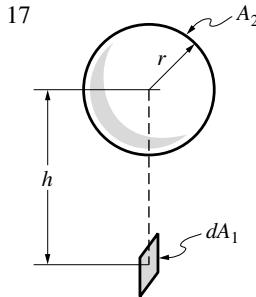
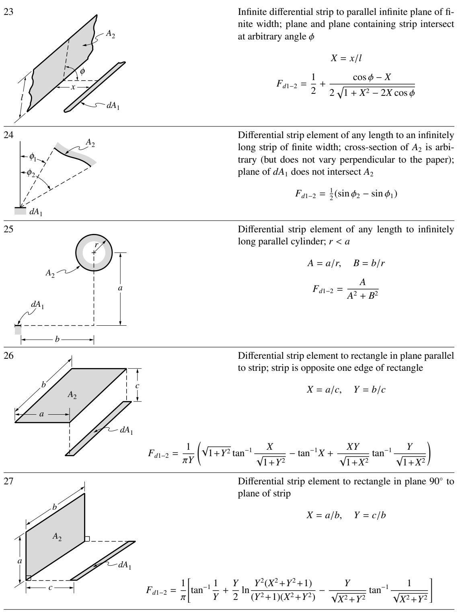

## 内容索引

- [目录](README.md)
- [1 热辐射基础](1-热辐射基础.md)
- [2 基于电磁波理论的辐射特性预测](2-基于电磁波理论的辐射特性预测.md)
- [3 实际表面的辐射特性](3-实际表面的辐射特性.md)
- [4 视角因子](4-视角因子.md)
- [5 灰体漫射表面间的辐射交换](5-灰体漫射表面间的辐射交换.md)
- [6 部分镜面灰体表面间的辐射交换](6-部分镜面灰体表面间的辐射交换.md)
- [7 非理想表面间的辐射交换](7-非理想表面间的辐射交换.md)
- [8 表面交换的蒙特卡洛方法](8-表面交换的蒙特卡洛方法.md)
- [9 传导和对流存在时的表面辐射交换](9-传导和对流存在时的表面辐射交换.md)
- [10 参与介质中的辐射传递方程(RTE)](10-参与介质中的辐射传递方程(RTE).md)
- [11 分子气体的辐射特性](11-分子气体的辐射特性.md)
- [12 颗粒介质的辐射特性](12-颗粒介质的辐射特性.md)
- [13 半透明介质的辐射特性](13-半透明介质的辐射特性.md)
- [14 一维灰体介质的精确解](14-一维灰体介质的精确解.md)
- [15 一维介质的近似求解方法](15-一维介质的近似求解方法.md)
- [16 球谐函数法 (PN-近似)](16-球谐函数法(PN-近似).md)
- [17 离散坐标法 (SN-近似)](17-离散坐标法(SN-近似).md)
- [18 区域法](18-区域法.md)
- [19 准直辐射与瞬态现象](19-准直辐射与瞬态现象.md)
- [20 非灰消光系数的求解方法](20-非灰消光系数的求解方法.md)
- [21 参与介质的蒙特卡洛方法](21-参与介质的蒙特卡洛方法.md)
- [22 辐射与传导和对流的耦合](22-辐射与传导和对流的耦合.md)
- [23 逆辐射传热](23-逆辐射传热.md)
- [24 纳米尺度辐射传热](24-纳米尺度辐射传热.md)
- [附录](附录.md)

- [A 常数与转换因子](#a-常数与转换因子)  
- [B 不透明表面辐射特性表](#b-不透明表面辐射特性表)  
  - [参考文献](#参考文献)  
- [C 黑体辐射表](#c-黑体辐射表)  
- [D 视角因子目录](#d-视角因子目录)  
  - [参考文献](#参考文献)  
- [E 指数积分函数](#e-指数积分函数)  
  - [参考文献](#参考文献)  
- [F 计算机代码](#f-计算机代码)  
  - [参考文献](#参考文献)  
- [致谢](#致谢)  
- [索引](#索引)

# CONSTANTS AND CONVERSION FACTORS

TABLE A.1 Physical constants.  

<table><tr><td>Speed of light in vacuum</td><td>c0</td><td>= 2.9979×108m/s</td></tr><tr><td>First Planck function constant</td><td>C1</td><td>= 3.7418×10-16W m2= 2πhc0</td></tr><tr><td>Second Planck function constant</td><td>C2</td><td>= 14,388 μm K = hc0/k</td></tr><tr><td>Wien&#x27;s constant</td><td>C3</td><td>= 2897.8 μm K</td></tr><tr><td>Electron charge</td><td>e</td><td>= 1.6022×10-19C</td></tr><tr><td>Planck&#x27;s constant</td><td>h</td><td>= 6.6261×10-34J s</td></tr><tr><td>Modified Planck&#x27;s constant</td><td>h</td><td>= 1.0546×10-34J s = h/2π</td></tr><tr><td>Boltzmann&#x27;s constant</td><td>k</td><td>= 1.3807×10-23J/K</td></tr><tr><td>Electron rest mass</td><td>me</td><td>= 9.1094×10-31kg</td></tr><tr><td>Neutron rest mass</td><td>mn</td><td>= 1.6749×10-27kg</td></tr><tr><td>Proton rest mass</td><td>mp</td><td>= 1.6726×10-27kg</td></tr><tr><td>Avogadro&#x27;s number</td><td>NA</td><td>= 6.0221×1023molecules/mol</td></tr><tr><td>Solar constant (at mean RSE)</td><td>qsol</td><td>= 1367 W/m2</td></tr><tr><td>Radius of Earth (mean)</td><td>REarth</td><td>= 6.371×106m</td></tr><tr><td>Radius of solar disk</td><td>Rsun</td><td>= 6.955×108m</td></tr><tr><td>Earth-sun distance (mean)</td><td>RSF</td><td>= 1.4960×1011m</td></tr><tr><td>Universal gas constant</td><td>Ru</td><td>= 8.3145 J/mol K</td></tr><tr><td>Effective surface T of sun</td><td>Tsun</td><td>= 5777 K</td></tr><tr><td rowspan="2">Molar volume of ideal gas 
(at 273.15 K, 101.325 kPa)</td><td rowspan="2">Ymol</td><td>= 22.4140 ℓ/mol</td></tr><tr><td>= 22.4140 m3/kmol</td></tr><tr><td>Electrical permittivity of vacuum</td><td>ε0</td><td>= 8.8542×10-12C2/N m2</td></tr><tr><td>Magnetic permeability of vacuum</td><td>μ0</td><td>= 4π×10-7N s2/C2</td></tr><tr><td>Stefan-Boltzmann constant</td><td>σ</td><td>= 5.6704×10-8W/m2K4</td></tr></table>

TABLE A.2  

<table><tr><td colspan="3">TABLE A.2
Conversion factors.</td></tr><tr><td>Acceleration</td><td>1m/s²</td><td>= 4.2520×10⁷ ft/h²</td></tr><tr><td>Area</td><td>1m²</td><td>= 1550.0 in² = 10.764 ft²</td></tr><tr><td>Diffusivity</td><td>1m²/s</td><td>= 3.875×10⁴ ft²/h</td></tr><tr><td>Energy</td><td>1J</td><td>= 9.4787×10⁻⁴ Btu</td></tr><tr><td></td><td>1eV = 1.6022×10⁻¹⁹ J</td><td>= 1.5187×10⁻²² Btu</td></tr><tr><td>Force</td><td>1N</td><td>= 0.22481 lbf</td></tr><tr><td>Heat transfer rate</td><td>1W</td><td>= 3.4123 Btu/h</td></tr><tr><td>Heat flux</td><td>1W/m²</td><td>= 0.3171 Btu/h ft²</td></tr><tr><td>Heat generation rate</td><td>1W/m³</td><td>= 0.09665 Btu/h ft³</td></tr><tr><td>Heat transfer coefficient</td><td>1W/m² K</td><td>= 0.17612 Btu/h ft²°F</td></tr><tr><td>Intensity</td><td>1W/m² sr</td><td>= 0.3171 Btu/h ft² sr</td></tr><tr><td>Kinematic viscosity</td><td>1m²/s</td><td>= 3.875×10⁴ ft²/h</td></tr><tr><td>Latent heat</td><td>1J/kg</td><td>= 4.2995×10⁻⁴ Btu/lb m</td></tr><tr><td>Length</td><td>1m</td><td>= 39.370 in = 3.2808 ft</td></tr><tr><td></td><td>1km</td><td>= 0.62137 mi</td></tr><tr><td>Mass</td><td>1kg</td><td>= 2.2046 lb m</td></tr><tr><td>Mass density</td><td>1kg/m³</td><td>= 0.062428 lb m/ft³</td></tr><tr><td>Mass flow rate</td><td>1kg/s</td><td>= 7936.6 lb m/h</td></tr><tr><td>Power</td><td>1W</td><td>= 3.4123 Btu/h</td></tr><tr><td>Pressure and stress</td><td>1Pa = 1N/m²</td><td>= 1.4504×10⁻⁴ lb f/ft²</td></tr><tr><td></td><td>1.0133×10⁵ N/m²</td><td>= 1 standard atmosphere</td></tr><tr><td>Specific heat</td><td>1J/kg K</td><td>= 2.3886×10⁻⁴ Btu/lb m°F</td></tr><tr><td>Temperature</td><td>T(K)</td><td>= (5/9)T(°R) = (5/9)T(°F) + 459.67) = T(°C) + 273.16</td></tr><tr><td>Temperature difference</td><td>1K</td><td>= 1°C = (9/5)°R = (9/5)°F</td></tr><tr><td>Thermal conductivity</td><td>1W/m K</td><td>= 0.57782 Btu/h ft°F</td></tr><tr><td>Thermal resistance</td><td>1K/W</td><td>= 0.52750°F h/Btu</td></tr><tr><td>Velocity and speed</td><td>1m/s</td><td>= 3.2808 ft/s = 2.2364 mph</td></tr><tr><td>Viscosity (dynamic)</td><td>1Ns/m² = 1kg/s m</td><td>= 2419.1 lb m/ft h</td></tr><tr><td>Volume</td><td>1m³</td><td>= 6.1023×10⁴ in³ = 35.314 ft³</td></tr><tr><td>Volume flow rate</td><td>1m³/s</td><td>= 1.2713×10⁵ ft³/h = 2.1189×10³ ft³/min</td></tr></table>

TABLE A.3 Conversion factors for spectral variables.  

<table><tr><td>Wavelength to energy</td><td>aμm = a×103nm</td><td>± 1.240/a eV</td></tr><tr><td>to frequency</td><td>aμm = a×104Å</td><td>± 2.9979×1014/a Hz</td></tr><tr><td>to wavenumber</td><td>aμm</td><td>± 104/a cm-1</td></tr><tr><td>Energy to frequency</td><td>a eV</td><td>± 2.418×1014a Hz</td></tr><tr><td>to wavelength</td><td>a eV</td><td>± 1.240/a μm</td></tr><tr><td>to wavenumber</td><td>a eV</td><td>± 8.066×103a cm-1</td></tr><tr><td>Wavenumber to energy</td><td>a cm-1</td><td>± 1.240×10-4a eV</td></tr><tr><td>to frequency</td><td>a cm-1</td><td>± 2.9979×1010a Hz</td></tr><tr><td>to wavelength</td><td>a cm-1</td><td>± 10+4/a μm</td></tr><tr><td>Frequency to energy</td><td>a Hz</td><td>± 4.136×10-15a eV</td></tr><tr><td>to wavelength</td><td>a Hz</td><td>± 2.9979×1014/a μm</td></tr><tr><td>to wavenumber</td><td>a Hz</td><td>± 3.336×10-11a cm-1</td></tr></table>

# APPENDIX B

# TABLES FOR RADIATIVE PROPERTIES OF OPAQUE SURFACES

In this appendix, tables of total normal emittances, as well as a number of total normal solar absorptances, are given. The data have been collected from several surveys [1- 8] that, in turn, have assembled their data from a multitude of references dating back all the way into the 1920s. As seen from the tables, there can sometimes be considerable differences in total emittance for ostensibly the same material, as reported by different researchers. While these discrepancies are partially due to varying accuracy, the primary reason is, as outlined in Chapter 3, the fact that surface layers, surface roughness, oxidation, etc., strongly affect the emittance of materials. Therefore, it should be realized that the total normal emittance or absorptance of a given surface may, in actuality, differ considerably from these reported values.In estimating the total hemispherical emittance from total normal data, one should keep in mind that:

In estimating the total hemispherical emittance from total normal data, one should keep in mind that:

1. Materials with high emittance tend to behave like dielectrics, resulting in a hemispherical emittance that is  $3\%$  to  $5\%$  smaller than the normal one (cf. Fig. 3-19).2. Materials with low emittance tend to behave like metals, resulting in hemispherical emittances that may be up to  $25\%$  larger than normal ones (cf. Fig. 3-9).

# References

References1. Edwards, D. K., A. F. Mills, and V. E. Denny: Transfer Processes, 2nd ed., Hemisphere/McGraw- Hill, New York, 1979.2. Hottel, H. C.: "Radiant heat transmission," in Heat Transmission, ed. W. H. McAdams, 3rd ed., ch. 4, McGraw- Hill, New York, 1954.3. Hottel, H. C., and A. F. Sarofim: Radiative Transfer, McGraw- Hill, New York, 1967.4. Gubareff, G. G., J. E. Janssen, and R. H. Torborg: "Thermal radiation properties survey," Honeywell Research Center, Minneapolis, MI, 1960.5. Wood, W. D., H. W. Deem, and C. F. Lucks: Thermal Radiative Properties, Plenum Publishing Company, New York, 1964.6. Touloukian, Y. S., and D. P. DeWitt (eds.): Thermal Radiative Properties: Metallic Elements and Alloys, vol. 7 of Thermophysical Properties of Matter, Plenum Press, New York, 1970.7. Touloukian, Y. S., and D. P. DeWitt (eds.): Thermal Radiative Properties: Nonmetallic Solids, vol. 8 of Thermophysical Properties of Matter, Plenum Press, New York, 1972.8. Svet, D. I.: Thermal Radiation: Metals, Semiconductors, Ceramics, Partly Transparent Bodies, and Films, Plenum Publishing Company, New York, 1965.9. Gale, W. F., and T. C. Totemeier (eds.): Smithells Metals Reference Book, 8th ed., Butterworth- Heinemann, Oxford, 2002.

TABLE B.1 Total emittance and solar absorptance of selected surfaces (compiled by Edwards et al. [1])  

<table><tr><td></td><td>Temperature 
[°C]</td><td>Total normal emittance</td><td>Extraterrestrial solar absorptance</td></tr><tr><td>Alumina, flame-sprayed</td><td>-25</td><td>0.80</td><td>0.28</td></tr><tr><td>Aluminum foil, as received</td><td>20</td><td>0.04</td><td></td></tr><tr><td>Bright dipped</td><td>20</td><td>0.025</td><td>0.10</td></tr><tr><td>Aluminum, vacuum-deposited on mylar</td><td>20</td><td>0.025</td><td>0.10</td></tr><tr><td>Aluminum alloy 6061, as received</td><td>20</td><td>0.03</td><td>0.37</td></tr><tr><td>Aluminum alloy 75S-T6, weathered</td><td></td><td></td><td></td></tr><tr><td>20,000 h on a DC6 aircraft</td><td>65</td><td>0.16</td><td>0.54</td></tr><tr><td>Aluminum, hard-anodized, 6061-T6</td><td>-25</td><td>0.84</td><td>0.92</td></tr><tr><td>Aluminum, soft-anodized, Reflectal alloy</td><td>-25</td><td>0.79</td><td>0.23</td></tr><tr><td>Aluminum, 7075-T6, sandblasted with</td><td></td><td></td><td></td></tr><tr><td>60 mesh silicon carbide grit</td><td>20</td><td>0.30</td><td>0.55</td></tr><tr><td>Aluminized silicone resin paint</td><td>95</td><td>0.20</td><td>0.27</td></tr><tr><td>Dow Corning XP-310</td><td>425</td><td>0.22</td><td></td></tr><tr><td>Beryllium</td><td>150</td><td>0.18</td><td>0.77</td></tr><tr><td></td><td>370</td><td>0.21</td><td></td></tr><tr><td></td><td>600</td><td>0.30</td><td></td></tr><tr><td>Beryllium, anodized</td><td>150</td><td>0.90</td><td></td></tr><tr><td></td><td>370</td><td>0.88</td><td></td></tr><tr><td></td><td>600</td><td>0.82</td><td></td></tr><tr><td>Black paint, Parson&#x27;s optical black</td><td>-25</td><td>0.95</td><td>0.975</td></tr><tr><td>Black silicone, high-heat</td><td></td><td></td><td></td></tr><tr><td>National Lead Co. 46H47</td><td>-25 to 750</td><td>0.93</td><td>0.94</td></tr><tr><td>Black epoxy paint, Cat-a-lac</td><td></td><td></td><td></td></tr><tr><td>Finch Paint and Chem. Co. 463-1-8</td><td>-25</td><td>0.89</td><td>0.95</td></tr><tr><td>Black enamel paint, Rinshed-Mason</td><td>95</td><td>0.81</td><td></td></tr><tr><td>Heated 1000 h at 375°C in air</td><td>425</td><td>0.80</td><td></td></tr><tr><td>Chromium plate</td><td>95</td><td>0.12</td><td></td></tr><tr><td>Heated 50 h at 600°C</td><td>400</td><td>0.15</td><td></td></tr><tr><td></td><td>35</td><td>0.15</td><td>0.78</td></tr><tr><td>Copper, electroplated</td><td>20</td><td>0.03</td><td>0.47</td></tr><tr><td>Black-oxidized in Ebonol C</td><td>35</td><td>0.16</td><td>0.91</td></tr><tr><td>Glass, second surface mirror</td><td></td><td></td><td></td></tr><tr><td>Aluminized</td><td>-25</td><td>0.83</td><td>0.13</td></tr><tr><td>Silvered</td><td>-25</td><td>0.83</td><td>0.13</td></tr><tr><td>Gold, coated on stainless steel</td><td>95</td><td>0.09</td><td></td></tr><tr><td>Heated in air at 540°C</td><td>400</td><td>0.14</td><td></td></tr><tr><td>Coated on 3M tape Y9814</td><td>20</td><td>0.025</td><td>0.21</td></tr><tr><td>Graphite, crushed on sodium silicate</td><td>-25</td><td>0.91</td><td>0.96</td></tr><tr><td>Inconel X, oxidized 4 h at 1000°C</td><td>-25</td><td>0.71</td><td>0.90</td></tr><tr><td>Oxidized 10 h at 700°C</td><td>95</td><td>0.81</td><td></td></tr><tr><td></td><td>425</td><td>0.79</td><td></td></tr><tr><td>Magnesium-thorium alloy</td><td>95</td><td>0.07</td><td></td></tr><tr><td></td><td>260</td><td>0.06</td><td></td></tr><tr><td>Magnesium, Dow 7 coating</td><td>370</td><td>0.36</td><td></td></tr></table>

TABLE B.1 Total emittance and solar absorptance of selected surfaces (cont'd).  

<table><tr><td></td><td>Temperature 
[°C]</td><td>Total normal emittance</td><td>Extraterrestrial solar absorptance</td></tr><tr><td>Mylar film, aluminized on second surface</td><td></td><td></td><td></td></tr><tr><td>0.0625 mm thick</td><td>20</td><td>0.37</td><td>0.17</td></tr><tr><td>0.025 mm thick</td><td>20</td><td>0.63</td><td>0.17</td></tr><tr><td>0.075 mm thick</td><td>20</td><td>0.81</td><td>0.24</td></tr><tr><td>Nickel, electroplated</td><td>20</td><td>0.03</td><td>0.22</td></tr><tr><td>Nickel, electro-oxidized on copper</td><td></td><td></td><td></td></tr><tr><td>110-30</td><td>35</td><td>0.05</td><td>0.85</td></tr><tr><td>125-30</td><td>35</td><td>0.11</td><td>0.85</td></tr><tr><td>Platinum-coated stainless steel</td><td>95</td><td>0.13</td><td></td></tr><tr><td></td><td>400</td><td>0.15</td><td></td></tr><tr><td>Annealed in air 300 h at 375°C</td><td>95</td><td>0.11</td><td></td></tr><tr><td></td><td>425</td><td>0.13</td><td></td></tr><tr><td>Silica, Corning Glass 7940M</td><td></td><td></td><td></td></tr><tr><td>Sintered, powdered, fused silica</td><td>35</td><td>0.84</td><td>0.08</td></tr><tr><td>Silica, second surface mirror, aluminized</td><td>20</td><td>0.83</td><td>0.14</td></tr><tr><td>Silvered</td><td>20</td><td>0.83</td><td>0.07</td></tr><tr><td>Silicon solar cell, boron-doped, no coverglass</td><td>35</td><td>0.32</td><td>0.94</td></tr><tr><td>Silver, plated on nickel on stainless steel</td><td>95</td><td>0.06</td><td></td></tr><tr><td></td><td>400</td><td>0.08</td><td></td></tr><tr><td>Heated 300 h at 375°C</td><td>95</td><td>0.11</td><td></td></tr><tr><td></td><td>425</td><td>0.13</td><td></td></tr><tr><td>Silver Chromatone paint</td><td>20</td><td>0.24</td><td>0.20</td></tr><tr><td>Stainless steel</td><td></td><td></td><td></td></tr><tr><td>Type 312, heated 300 h at 260°C</td><td>95</td><td>0.27</td><td></td></tr><tr><td></td><td>425</td><td>0.32</td><td></td></tr><tr><td>Type 301 with Armco black oxide</td><td>-25</td><td>0.75</td><td>0.89</td></tr><tr><td>Type 410, heated to 700°C in air</td><td>35</td><td>0.13</td><td>0.76</td></tr><tr><td>Type 303, sandblasted heavily with 80 mesh aluminum oxide grit</td><td>95</td><td>0.42</td><td>0.68</td></tr><tr><td>Titanium, 75A</td><td>95</td><td>0.10</td><td></td></tr><tr><td></td><td>425</td><td>0.19</td><td></td></tr><tr><td>75A, oxidized 300 h at 450°C</td><td>35</td><td>0.21</td><td>0.80</td></tr><tr><td></td><td>425</td><td>0.25</td><td></td></tr><tr><td>C-110M, oxidized 100 h at 425°C in air</td><td>35</td><td>0.16</td><td>0.52</td></tr><tr><td>C-110M, oxidized 300 h at 450°C in air</td><td>35</td><td>0.20</td><td>0.77</td></tr><tr><td>Evaporated 80-100 μm, oxidized 3 h at 400°C</td><td>35</td><td>0.14</td><td>0.75</td></tr><tr><td>Anodized</td><td>-25</td><td>0.73</td><td>0.51</td></tr><tr><td>White acrylic resin paint</td><td>95</td><td>0.92</td><td></td></tr><tr><td>Sherwin-Williams M49WC8-CA-10144</td><td>200</td><td>0.87</td><td></td></tr><tr><td>White epoxy paint, Cat-a-lac Finch Paint and Chemical Co. 483-1-8</td><td>-25</td><td>0.88</td><td>0.25</td></tr><tr><td>White potassium zirconium silicate coating</td><td>20</td><td>0.89</td><td>0.13</td></tr><tr><td>Zinc, blackened by electrochemical treatment</td><td>35</td><td>0.12</td><td>0.89</td></tr></table>

TABLE B.2 Total normal emittance of various surfaces.  

<table><tr><td></td><td>Temperaturea
[°C]</td><td>Total normal emittancea</td></tr><tr><td>A. Metals and their oxides</td><td></td><td></td></tr><tr><td>Aluminum</td><td></td><td></td></tr><tr><td>Highly polished plate, 98.3% pure</td><td>225–575</td><td>0.039–0.057</td></tr><tr><td>Commercial sheet</td><td>100</td><td>0.09</td></tr><tr><td>Rough polish</td><td>100</td><td>0.18</td></tr><tr><td>Rough plate</td><td>40</td><td>0.055–0.07</td></tr><tr><td>Oxidized at 600°C</td><td>200–600</td><td>0.11–0.19</td></tr><tr><td>Heavily oxidized</td><td>95–500</td><td>0.20–0.31</td></tr><tr><td>Aluminum oxide</td><td>275–500</td><td>0.63–0.42</td></tr><tr><td></td><td>500–825</td><td>0.42–0.26</td></tr><tr><td>Al-surfaced roofing</td><td>40</td><td>0.216</td></tr><tr><td>Aluminum alloysb</td><td></td><td></td></tr><tr><td>Alloy 75 ST: A, B1, C</td><td>25</td><td>0.11, 0.10, 0.08</td></tr><tr><td>Alloy 75 ST: A c</td><td>230–480</td><td>0.22–0.16</td></tr><tr><td>Alloy 75 ST: B1 c</td><td>230–425</td><td>0.20–0.18</td></tr><tr><td>Alloy 75 ST: C c</td><td>230–500</td><td>0.22–0.15</td></tr><tr><td>Alloy 24 ST: A, B1, C</td><td>25</td><td>0.09</td></tr><tr><td>Alloy 24 ST: A c</td><td>230–485</td><td>0.17–0.15</td></tr><tr><td>Alloy 24 ST: B1 c</td><td>230–505</td><td>0.20–0.16</td></tr><tr><td>Alloy 24 ST: C c</td><td>230–460</td><td>0.16–0.13</td></tr><tr><td>Calorized surfaces, heated at 600°C</td><td></td><td></td></tr><tr><td>Copper</td><td>200–600</td><td>0.18–1.19</td></tr><tr><td>Steel</td><td>200–600</td><td>0.52–0.57</td></tr><tr><td>Antimony, polished</td><td>35–260</td><td>0.28–0.31</td></tr><tr><td>Beryllium, polished</td><td>1000–1200</td><td>0.37</td></tr><tr><td>Bismuth, bright</td><td>75</td><td>0.34</td></tr><tr><td>Brass</td><td></td><td></td></tr><tr><td>Highly polished</td><td></td><td></td></tr><tr><td>73.2% Cu, 26.7% Zn</td><td>245–355</td><td>0.028–0.031</td></tr><tr><td>62.4% Cu, 36.8% Zn, 0.4% Pb, 0.3% Al</td><td>255–375</td><td>0.033–0.037</td></tr><tr><td>82.9% Cu, 17.0% Zn</td><td>275</td><td>0.030</td></tr><tr><td>Polished</td><td>100</td><td>0.06</td></tr><tr><td></td><td>40–315</td><td>0.10</td></tr><tr><td>Rolled plate, natural surface</td><td>22</td><td>0.06</td></tr><tr><td>Rolled plate, rubbed with coarse emery</td><td>22</td><td>0.20</td></tr><tr><td>Dull plate</td><td>50–350</td><td>0.22</td></tr><tr><td>Oxidized by heating at 600°C</td><td>200–600</td><td>0.61–0.59</td></tr><tr><td>Chromium, polished</td><td>40–1100</td><td>0.08–0.36</td></tr><tr><td>Copper</td><td></td><td></td></tr><tr><td>Carefully polished electrolytic copper</td><td>80</td><td>0.018</td></tr><tr><td>Polished</td><td>115</td><td>0.023</td></tr><tr><td></td><td>100</td><td>0.052</td></tr><tr><td>Commercial emeried, polished, pits remaining</td><td>19</td><td>0.030</td></tr><tr><td>Commercial, scraped shiny, not mirror-like</td><td>22</td><td>0.072</td></tr><tr><td>Plate heated long time, with thick oxide layer</td><td>25</td><td>0.78</td></tr><tr><td>Plate heated at 600°C</td><td>200–600</td><td>0.57</td></tr><tr><td>Cuprous oxide</td><td>800–1100</td><td>0.66–0.54</td></tr><tr><td>Molten copper</td><td>1075–1275</td><td>0.16–0.13</td></tr></table>

TABLE B.2 Total normal emittance of various surfaces (cont'd).  

<table><tr><td></td><td>Temperaturea
[°C]</td><td>Total normal emittancea</td></tr><tr><td>Dow metal: b</td><td></td><td></td></tr><tr><td>A; B1; C</td><td>25</td><td>0.15, 0.15, 0.12</td></tr><tr><td>A c</td><td>230-400</td><td>0.24-0.20</td></tr><tr><td>B1</td><td>230-425</td><td>0.16</td></tr><tr><td>C c</td><td>230-405</td><td>0.21-0.18</td></tr><tr><td>Germanium, polished</td><td>800</td><td>0.55</td></tr><tr><td>Gold, pure, highly polished</td><td>225-625</td><td>0.018-0.035</td></tr><tr><td>Hafnium, polished</td><td>1400</td><td>0.45</td></tr><tr><td>Inconel: b</td><td></td><td></td></tr><tr><td>Types X and B: surface A, B2, C</td><td>25</td><td>0.19-0.21</td></tr><tr><td>Type X: surface A c</td><td>230-880</td><td>0.55-0.78</td></tr><tr><td>Type X: surface B2 c</td><td>230-855</td><td>0.60-0.75</td></tr><tr><td>Type X: surface C c</td><td>230-900</td><td>0.62-0.73</td></tr><tr><td>Type B: surface A c</td><td>230-880</td><td>0.35-0.55</td></tr><tr><td>Type B: surface B2 c</td><td>230-950</td><td>0.32-0.51</td></tr><tr><td>Type B: surface C c</td><td>230-1000</td><td>0.35-0.40</td></tr><tr><td>Iron and steel (not including stainless)</td><td></td><td></td></tr><tr><td>Metallic surfaces (or very thin oxide layer)</td><td></td><td></td></tr><tr><td>Electrolytic iron, highly polished</td><td>175-225</td><td>0.052-0.064</td></tr><tr><td>Steel, polished</td><td>100</td><td>0.066</td></tr><tr><td>Iron, polished</td><td>425-1025</td><td>0.14-0.38</td></tr><tr><td>Iron, roughly polished</td><td>100</td><td>0.17</td></tr><tr><td>Iron, freshly emeried</td><td>20</td><td>0.24</td></tr><tr><td>Cast iron, polished</td><td>200</td><td>0.21</td></tr><tr><td>Cast iron, newly turned</td><td>22</td><td>0.44</td></tr><tr><td>Cast iron, turned and heated</td><td>880-990</td><td>0.60-0.70</td></tr><tr><td>Wrought iron, highly polished</td><td>40-250</td><td>0.28</td></tr><tr><td>Polished steel casting</td><td>770-1035</td><td>0.52-0.56</td></tr><tr><td>Ground sheet steel</td><td>935-1100</td><td>0.55-0.61</td></tr><tr><td>Smooth sheet iron</td><td>900-1040</td><td>0.55-0.60</td></tr><tr><td>Mild steel b: A, B2, C</td><td>25</td><td>0.12, 0.15, 0.10</td></tr><tr><td>Mild steel b: A c</td><td>230-1065</td><td>0.20-0.32</td></tr><tr><td>Mild steel b: B2 c</td><td>230-1050</td><td>0.34-0.35</td></tr><tr><td>Mild steel b: C c</td><td>230-1065</td><td>0.27-0.31</td></tr><tr><td>Oxidized surfaces</td><td></td><td></td></tr><tr><td>Iron plate, pickled, then rusted red</td><td>20</td><td>0.61</td></tr><tr><td>Iron plate, completely rusted</td><td>20</td><td>0.69</td></tr><tr><td>Iron, dark gray surface</td><td>100</td><td>0.31</td></tr><tr><td>Rolled sheet steel</td><td>21</td><td>0.66</td></tr><tr><td>Oxidized iron</td><td>100</td><td>0.74</td></tr><tr><td>Cast iron, oxidized at 600°C</td><td>200-600</td><td>0.64-0.78</td></tr><tr><td>Steel, oxidized at 600°C</td><td>200-600</td><td>0.79</td></tr><tr><td>Smooth, oxidized electrolytic iron</td><td>125-525</td><td>0.78-0.82</td></tr><tr><td>Iron oxide</td><td>500-1200</td><td>0.85-0.89</td></tr><tr><td>Rough ingot iron</td><td>925-1115</td><td>0.87-0.95</td></tr><tr><td>Sheet steel, strong, rough oxide layer</td><td>25</td><td>0.80</td></tr><tr><td>Dense, shiny oxide layer</td><td>25</td><td>0.82</td></tr></table>

TABLE B.2 Total normal emittance of various surfaces (cont'd).  

<table><tr><td></td><td>Temperaturea
[°C]</td><td>Total normal emittancea</td></tr><tr><td>Cast plate, smooth</td><td>23</td><td>0.80</td></tr><tr><td>Cast plate, rough</td><td>23</td><td>0.82</td></tr><tr><td>Cast iron, rough, strongly oxidized</td><td>40–250</td><td>0.95</td></tr><tr><td>Wrought iron, dull oxidized</td><td>20–360</td><td>0.94</td></tr><tr><td>Steel plate, rough</td><td>40–370</td><td>0.94–0.97</td></tr><tr><td>Molten surfaces</td><td></td><td></td></tr><tr><td>Cast iron</td><td>1300–1400</td><td>0.29</td></tr><tr><td>Mild steel</td><td>1600–1800</td><td>0.28</td></tr><tr><td>Steel, several different kinds with 0.25–1.2% C (slightly oxidized surface)</td><td>1560–1710</td><td>0.27–0.39</td></tr><tr><td>Steel</td><td>1500–1650</td><td>0.42–0.53</td></tr><tr><td></td><td>1520–1650</td><td>0.43–0.40</td></tr><tr><td>Pure iron</td><td>1515–1770</td><td>0.42–0.45</td></tr><tr><td>Armco iron</td><td>1520–1690</td><td>0.40–0.41</td></tr><tr><td>Lead</td><td></td><td></td></tr><tr><td>Pure (99.96%), unoxidized</td><td>125–225</td><td>0.057–0.075</td></tr><tr><td>Gray oxidized</td><td>25</td><td>0.28</td></tr><tr><td>Oxidized at 150°C</td><td>200</td><td>0.63</td></tr><tr><td>Magnesium</td><td></td><td></td></tr><tr><td>Magnesium oxide</td><td>275–825</td><td>0.55–0.20</td></tr><tr><td></td><td>900–1705</td><td>0.20</td></tr><tr><td>Magnesium, polished</td><td>35–260</td><td>0.07–0.13</td></tr><tr><td>Mercury</td><td>0–100</td><td>0.09–0.12</td></tr><tr><td>Molybdenum</td><td></td><td></td></tr><tr><td>Filament</td><td>725–2595</td><td>0.096–0.202</td></tr><tr><td>Massive, polished</td><td>100</td><td>0.071</td></tr><tr><td>Polished</td><td>35–260</td><td>0.05–0.08</td></tr><tr><td></td><td>540–1370</td><td>0.10–0.18</td></tr><tr><td></td><td>2750</td><td>0.29</td></tr><tr><td>Monel metalb</td><td></td><td></td></tr><tr><td>Oxidized at 600°C</td><td>200–600</td><td>0.41–0.46</td></tr><tr><td>K Monel 5700: A, B2, C</td><td>25</td><td>0.23, 0.17, 0.14</td></tr><tr><td>K Monel 5700: Ac</td><td>230–875</td><td>0.46–0.65</td></tr><tr><td>K Monel 5700: B2c</td><td>230–955</td><td>0.54–0.77</td></tr><tr><td>K Monel 5700: Cc</td><td>230–975</td><td>0.35–0.53</td></tr><tr><td>Nickel</td><td></td><td></td></tr><tr><td>Electroplated, polished</td><td>23</td><td>0.045</td></tr><tr><td>Technically pure (98.9% Ni, + Mn), polished</td><td>225–375</td><td>0.07–0.087</td></tr><tr><td>Polished</td><td>100</td><td>0.072</td></tr><tr><td>Electroplated, not polished</td><td>20</td><td>0.11</td></tr><tr><td>Wire</td><td>185–1005</td><td>0.096–0.186</td></tr><tr><td>Plate, oxidized by heating at 600°C</td><td>200–600</td><td>0.37–0.48</td></tr><tr><td>Nickel oxide</td><td>650–1255</td><td>0.59–0.86</td></tr><tr><td>Nickel alloys</td><td></td><td></td></tr><tr><td>Chromnickel</td><td>50–1035</td><td>0.64–0.76</td></tr><tr><td>Copper-nickel, polished</td><td>100</td><td>0.059</td></tr><tr><td>Nichrome wire, bright</td><td>50–1000</td><td>0.65–0.79</td></tr></table>

TABLE B.2 Total normal emittance of various surfaces (cont'd).  

<table><tr><td></td><td>Temperaturea
[°C]</td><td>Total normal emittancea</td></tr><tr><td>Nichrome wire, oxidized</td><td>50–500</td><td>0.95–0.98</td></tr><tr><td>Nickel-silver, polished</td><td>100</td><td>0.135</td></tr><tr><td>Nickelin (18–32% Ni; 55–68% Cu; 20% Zn), 
  gray oxidized</td><td>20</td><td>0.262</td></tr><tr><td>Type ACI-HW (60% Ni; 12% Cr), smooth, black, 
  firm adhesive oxide coat from service</td><td>270–560</td><td>0.89–0.82</td></tr><tr><td>Platinum</td><td></td><td></td></tr><tr><td>Pure, polished plate</td><td>225–625</td><td>0.054–0.104</td></tr><tr><td>Strip</td><td>925–1625</td><td>0.12–0.17</td></tr><tr><td>Filament</td><td>27–1225</td><td>0.036–0.192</td></tr><tr><td>Wire</td><td>225–1375</td><td>0.073–0.182</td></tr><tr><td>Silver</td><td></td><td></td></tr><tr><td>Polished, pure</td><td>225–625</td><td>0.020–0.032</td></tr><tr><td>Polished</td><td>40–370</td><td>0.022–0.031</td></tr><tr><td></td><td>100</td><td>0.052</td></tr><tr><td>Stainless steelb</td><td></td><td></td></tr><tr><td>Polished</td><td>100</td><td>0.074</td></tr><tr><td>Type 301: A, B2, C</td><td>25</td><td>0.21, 0.27, 0.16</td></tr><tr><td>Type 301: Ac</td><td>230–950</td><td>0.57–0.55</td></tr><tr><td>Type 301: B2c</td><td>230–940</td><td>0.54–0.63</td></tr><tr><td>Type 301: Cc</td><td>230–900</td><td>0.51–0.70</td></tr><tr><td>Type 316: A, B2, C</td><td>25</td><td>0.28, 0.28, 0.17</td></tr><tr><td>Type 316: Ac</td><td>230–870</td><td>0.57–0.66</td></tr><tr><td>Type 316: B2c</td><td>230–1050</td><td>0.52–0.50</td></tr><tr><td>Type 316: Cc</td><td>230–1050</td><td>0.26–0.31</td></tr><tr><td>Type 347: A, B2, C</td><td>25</td><td>0.39, 0.35, 0.17</td></tr><tr><td>Type 347: Ac</td><td>230–900</td><td>0.52–0.65</td></tr><tr><td>Type 347: B2c</td><td>230–875</td><td>0.51–0.65</td></tr><tr><td>Type 347: Cc</td><td>230–900</td><td>0.49–0.64</td></tr><tr><td>Type 304: (8% Cr; 18% Ni)</td><td></td><td></td></tr><tr><td>Light silvery, rough, brown after heating</td><td>215–490</td><td>0.44–0.36</td></tr><tr><td>After 42 h heating at 525℃</td><td>215–525</td><td>0.62–0.73</td></tr><tr><td>Type 310 (25% Cr; 20% Ni), brown, 
  splotched, oxidized from furnace service</td><td>215–525</td><td>0.90–0.97</td></tr><tr><td>Allegheny metal no. 4, polished</td><td>100</td><td>0.13</td></tr><tr><td>Allegheny alloy no. 66, polished</td><td>100</td><td>0.11</td></tr><tr><td>Tantalum filament</td><td>1340–3000</td><td>0.19–0.31</td></tr><tr><td>Thorium oxide</td><td>275–500</td><td>0.58–0.36</td></tr><tr><td></td><td>500–825</td><td>0.36–0.21</td></tr><tr><td>Tin</td><td></td><td></td></tr><tr><td>Bright tinned iron</td><td>25</td><td>0.043, 0.064</td></tr><tr><td>Bright</td><td>50</td><td>0.06</td></tr><tr><td>Commercial tin-plated sheet iron</td><td>100</td><td>0.07, 0.08</td></tr><tr><td>Tungsten</td><td></td><td></td></tr><tr><td>Filament, aged</td><td>27–3300</td><td>0.032–0.35</td></tr><tr><td>Filament</td><td>3300</td><td>0.39</td></tr><tr><td>Polished coat</td><td>100</td><td>0.066</td></tr><tr><td>Yttrium</td><td>1400</td><td>0.35</td></tr></table>

TABLE B.2 Total normal emittance of various surfaces (cont'd).  

<table><tr><td></td><td>Temperaturea
[°C]</td><td>Total normal emittanced</td></tr><tr><td>Zinc</td><td></td><td></td></tr><tr><td>Commercial 99.1% pure, polished</td><td>225-325</td><td>0.045-0.053</td></tr><tr><td>Oxidized by heating at 400℃</td><td>400</td><td>0.11</td></tr><tr><td>Galvanized sheet iron, fairly bright</td><td>27</td><td>0.23</td></tr><tr><td>Galvanized sheet iron, gray oxidized</td><td>25</td><td>0.28</td></tr><tr><td>Zinc, galvanized sheet</td><td>100</td><td>0.21</td></tr><tr><td colspan="3">B. Refractories, building materials, paints, and miscellaneous</td></tr><tr><td>Alumina (99.5-85% Al2O3; 0-12% SiO2; 0-1% Fe2O3)</td><td></td><td></td></tr><tr><td>Effect of mean grain size</td><td>1010-1565</td><td></td></tr><tr><td>10 μm</td><td></td><td>0.30-0.18</td></tr><tr><td>50 μm</td><td></td><td>0.39-0.28</td></tr><tr><td>100 μm</td><td></td><td>0.50-0.40</td></tr><tr><td>Alumina on Inconel</td><td>540-1100</td><td>0.65-0.45</td></tr><tr><td>Alumina-silica (showing effect of Fe)</td><td>1010-1565</td><td></td></tr><tr><td>80-58% Al2O3; 16-38% SiO2; 0.4% Fe2O3</td><td></td><td>0.61-0.43</td></tr><tr><td>36-26% Al2O3; 50-60% SiO2; 1.7% Fe2O3</td><td></td><td>0.73-0.62</td></tr><tr><td>61% Al2O3; 35% SiO2; 2.9% FeO3</td><td></td><td>0.78-0.68</td></tr><tr><td>Asbestos</td><td></td><td></td></tr><tr><td>Board</td><td>23</td><td>0.96</td></tr><tr><td>Paper</td><td>35-370</td><td>0.93-0.94</td></tr><tr><td>Brick</td><td></td><td></td></tr><tr><td>Red, rough, but no gross irregularities</td><td>20</td><td>0.93</td></tr><tr><td>Grog brick, glazed</td><td>1100</td><td>0.75</td></tr><tr><td>Building</td><td>1000</td><td>0.45</td></tr><tr><td>Fireclay</td><td>1000</td><td>0.75</td></tr><tr><td>White refractory</td><td>1100</td><td>0.29</td></tr><tr><td>Carbon</td><td></td><td></td></tr><tr><td>Filament</td><td>1040-1405</td><td>0.526</td></tr><tr><td>Rough plate</td><td>100-320</td><td>0.77</td></tr><tr><td></td><td>320-500</td><td>0.77-0.72</td></tr><tr><td>Graphitized</td><td>100-320</td><td>0.76-0.75</td></tr><tr><td></td><td>320-500</td><td>0.75-0.71</td></tr><tr><td>Candle soot</td><td>95-270</td><td>0.952</td></tr><tr><td>Lampblack-waterglass coating</td><td>100-275</td><td>0.96-0.95</td></tr><tr><td>Thin layer on iron plate</td><td>20</td><td>0.927</td></tr><tr><td>Thick coat</td><td>20</td><td>0.967</td></tr><tr><td>Lampblack, 0.075 mm or thicker</td><td>40-370</td><td>0.945</td></tr><tr><td>Lampblack, rough deposit</td><td>100-500</td><td>0.84-0.78</td></tr><tr><td>Lampblack, other blacks</td><td>50-1000</td><td>0.96</td></tr><tr><td>Graphite, pressed, filed surface</td><td>250-510</td><td>0.98</td></tr><tr><td>Carborundum (87% SiC; density 2.3 g/cm3)</td><td>1010-1400</td><td>0.92-0.81</td></tr><tr><td>Concrete tiles</td><td>1000</td><td>0.63</td></tr><tr><td>Concrete, rough</td><td>38</td><td>0.94</td></tr><tr><td>Enamel, white fused, on iron</td><td>20</td><td>0.90</td></tr><tr><td>Glass</td><td></td><td></td></tr><tr><td>Smooth</td><td>20</td><td>0.94</td></tr><tr><td>Pyrex, lead, and soda</td><td>260-540</td><td>0.95-0.85</td></tr></table>

TABLE B.2 Total normal emittance of various surfaces (cont'd).  

<table><tr><td></td><td>Temperature/ [°C]</td><td>Total normal emittancea</td></tr><tr><td>Gypsum, 5 mm thick on smooth or blackened plate</td><td>20</td><td>0.903</td></tr><tr><td>Ice</td><td></td><td></td></tr><tr><td>Smooth</td><td>0</td><td>0.966</td></tr><tr><td>Rough crystals</td><td>0</td><td>0.985</td></tr><tr><td>Magnesite refractory brick</td><td>1000</td><td>0.38</td></tr><tr><td>Marble, light gray, polished</td><td>20</td><td>0.93</td></tr><tr><td>Paints, lacquers, varnishes</td><td></td><td></td></tr><tr><td>White enamel varnish on rough iron plate</td><td>72</td><td>0.906</td></tr><tr><td>Black shiny lacquer, sprayed on iron</td><td>25</td><td>0.875</td></tr><tr><td>Black shiny shellac on tinned iron sheet</td><td>20</td><td>0.821</td></tr><tr><td>Black matte shellac</td><td>75–145</td><td>0.91</td></tr><tr><td>Black or white lacquer</td><td>35–95</td><td>0.80–0.95</td></tr><tr><td>Flat black lacquer</td><td>35–95</td><td>0.96–0.98</td></tr><tr><td>Oil paints, 16 different, all colors</td><td>100</td><td>0.92–0.96</td></tr><tr><td>Aluminum paints and lacquers</td><td></td><td></td></tr><tr><td>10% Al, 22% lacquer body, on rough or smooth surface</td><td>100</td><td>0.52</td></tr><tr><td>Other Al paints, varying age and Al content</td><td>100</td><td>0.27–0.67</td></tr><tr><td>Al lacquer, varnish binder, on rough plate</td><td>20</td><td>0.39</td></tr><tr><td>Al paint, after heating at 325°C</td><td>150–315</td><td>0.35</td></tr><tr><td>Lacquer coatings, 0.025–0.37 mm thick on aluminum alloys</td><td>35–150</td><td>0.87–0.97</td></tr><tr><td>Clear silicone vehicle coatings, 0.025–0.375 mm</td><td></td><td></td></tr><tr><td>On mild steel</td><td>260</td><td>0.66</td></tr><tr><td>On stainless steels, 316, 301, 347</td><td>260</td><td>0.68, 0.75, 0.75</td></tr><tr><td>On Dow metal</td><td>260</td><td>0.74</td></tr><tr><td>On Al alloys 24 ST, 75 ST</td><td>260</td><td>0.77, 0.82</td></tr><tr><td>Aluminum paint with silicone vehicle, two coats on Inconel</td><td>260</td><td>0.29</td></tr><tr><td>Paper</td><td></td><td></td></tr><tr><td>White</td><td>35</td><td>0.95</td></tr><tr><td>Thin, pasted on tinned or blackened plate</td><td>20</td><td>0.92, 0.94</td></tr><tr><td>Roofing</td><td>20</td><td>0.91</td></tr><tr><td>Plaster, rough lime</td><td>10–88</td><td>0.91</td></tr><tr><td>Porcelain, glazed</td><td>20</td><td>0.92</td></tr><tr><td>Quartz</td><td></td><td></td></tr><tr><td>Rough, fused</td><td>20</td><td>0.93</td></tr><tr><td>Glass, 1.98 mm thick</td><td>280–840</td><td>0.90–0.41</td></tr><tr><td>Glass, 6.88 mm thick</td><td>280–840</td><td>0.93–0.47</td></tr><tr><td>Opaque</td><td>280–840</td><td>0.92–0.68</td></tr><tr><td>Rubber</td><td></td><td></td></tr><tr><td>Hard, glossy plate</td><td>23</td><td>0.94</td></tr><tr><td>Soft, gray, rough (reclaimed)</td><td>25</td><td>0.86</td></tr><tr><td>Sandstone</td><td>35–260</td><td>0.83–0.90</td></tr><tr><td>Silica (98% SiO2; Fe-free), grain size 10 μm</td><td>1010–1565</td><td>0.42–0.33</td></tr><tr><td>70–600 μm</td><td>1010–1565</td><td>0.62–0.46</td></tr></table>

TABLE B.2 Total normal emittance of various surfaces (cont'd).  

<table><tr><td></td><td>Temperaturea
[°C]</td><td>Total normal emittanced</td></tr><tr><td>Silicon carbide</td><td>150–650</td><td>0.83–0.96</td></tr><tr><td>Slate</td><td>35</td><td>0.67–0.80</td></tr><tr><td>Soot, candle</td><td>90–260</td><td>0.95</td></tr><tr><td>Water</td><td>0–100</td><td>0.95–0.963</td></tr><tr><td>Wood, sawdust</td><td>35</td><td>0.75</td></tr><tr><td>Oak, planed</td><td>20</td><td>0.90</td></tr><tr><td>Beech</td><td>70</td><td>0.94</td></tr><tr><td>Zirconium silicate</td><td>240–500</td><td>0.92–0.80</td></tr><tr><td></td><td>500–830</td><td>0.80–0.52</td></tr></table>

Temperatures and emittances in pairs separated by dashes correspond; use linear interpolation. b Surface treatment: A, cleaned with toluene, then methanol;  $\mathbb{B}_1$  , cleaned with soap and water, toluene, then methanol;  $\mathbb{B}_2$  , cleaned with abrasive soap and water, toluene, and methanol; C, polished, then cleaned with soap and water. Results after repeated heating and cooling.

TABLE B.3 Spectral, normal emittance of metals at room temperature [9].  

<table><tr><td rowspan="2">Metal</td><td colspan="6">Wavelength, μm</td></tr><tr><td>0.5</td><td>0.6</td><td>1.0</td><td>3.0</td><td>5.0</td><td>10.0</td></tr><tr><td>Aluminum</td><td>-</td><td>-</td><td>0.08–0.27</td><td>0.03–0.12</td><td>0.03–0.08</td><td>0.02–0.04</td></tr><tr><td>Antimony</td><td>-</td><td>0.47</td><td>0.45</td><td>0.35</td><td>0.31</td><td>0.28</td></tr><tr><td>Bismuth</td><td>0.75</td><td>0.76</td><td>0.72</td><td>0.26</td><td>0.12</td><td>0.08</td></tr><tr><td>Cadmium</td><td>-</td><td>-</td><td>0.30</td><td>0.07</td><td>0.04</td><td>0.02</td></tr><tr><td>Chromium</td><td>0.45</td><td>0.44</td><td>0.43</td><td>0.30</td><td>0.19</td><td>0.08</td></tr><tr><td>Cobalt</td><td>-</td><td>-</td><td>0.32</td><td>0.23</td><td>0.15</td><td>0.04</td></tr><tr><td>Copper</td><td>0.36</td><td>0.080</td><td>0.030</td><td>0.026</td><td>0.024</td><td>0.021</td></tr><tr><td>Gold</td><td>0.45</td><td>0.080</td><td>0.020</td><td>0.015</td><td>0.015</td><td>0.015</td></tr><tr><td>Iridium</td><td>-</td><td>-</td><td>0.22</td><td>0.09</td><td>0.06</td><td>0.04</td></tr><tr><td>Iron</td><td>0.49</td><td>0.48</td><td>0.41</td><td>-</td><td>-</td><td>-</td></tr><tr><td>Lead</td><td>-</td><td>-</td><td>-</td><td>-</td><td>0.08</td><td>0.06</td></tr><tr><td>Magnesium</td><td>0.28</td><td>0.27</td><td>0.26</td><td>0.20</td><td>0.14</td><td>0.07</td></tr><tr><td>Molybdenum</td><td>-</td><td>-</td><td>0.42</td><td>0.19</td><td>0.16</td><td>0.15</td></tr><tr><td>Nickel</td><td>-</td><td>-</td><td>0.27</td><td>0.12</td><td>0.06</td><td>0.04</td></tr><tr><td>Niobium</td><td>-</td><td>0.55</td><td>0.29</td><td>0.14</td><td>0.06</td><td>0.04</td></tr><tr><td>Palladium</td><td>0.42</td><td>0.37</td><td>0.28</td><td>0.12</td><td>0.10</td><td>0.03</td></tr><tr><td>Platinum</td><td>0.40</td><td>0.36</td><td>0.24</td><td>0.11</td><td>0.06</td><td>0.05</td></tr><tr><td>Rhodium</td><td>0.24</td><td>0.21</td><td>0.16</td><td>0.08</td><td>0.07</td><td>0.05</td></tr><tr><td>Silver</td><td>0.03</td><td>0.03</td><td>0.03</td><td>0.02</td><td>0.02</td><td>0.02</td></tr><tr><td>Tantalum</td><td>0.62</td><td>0.55</td><td>0.22</td><td>0.08</td><td>0.07</td><td>0.06</td></tr><tr><td>Tellurium</td><td>-</td><td>0.51</td><td>0.50</td><td>0.47</td><td>0.43</td><td>0.22</td></tr><tr><td>Tin</td><td>-</td><td>-</td><td>0.46</td><td>0.32</td><td>0.24</td><td>0.14</td></tr><tr><td>Titanium</td><td>-</td><td>-</td><td>0.37–0.49</td><td>0.25–0.33</td><td>0.10–0.18</td><td>0.05–0.12</td></tr><tr><td>Tungsten</td><td>-</td><td>0.44–0.49</td><td>0.40</td><td>0.07</td><td>0.05</td><td>0.03</td></tr><tr><td>Vanadium</td><td>0.43–0.59</td><td>0.42–0.57</td><td>0.36–0.50</td><td>0.10–0.17</td><td>0.07–0.11</td><td>0.06–0.09</td></tr><tr><td>Zinc</td><td>-</td><td>0.42–0.58</td><td>0.50–0.61</td><td>0.08</td><td>0.05</td><td>0.03</td></tr></table>

TABLE B.4 Total, normal emittance of metals for elevated temperatures [9].  

<table><tr><td rowspan="2">Metal</td><td colspan="7">Temperature, [°C]</td></tr><tr><td>100</td><td>500</td><td>1000</td><td>1200</td><td>1400</td><td>1600</td><td>2000</td></tr><tr><td>Aluminum</td><td>0.038</td><td>0.064</td><td>-</td><td>-</td><td>-</td><td>-</td><td>-</td></tr><tr><td>Beryllium</td><td>-</td><td>-</td><td>0.55</td><td>0.87</td><td>-</td><td>-</td><td>-</td></tr><tr><td>Bismuth</td><td>0.06</td><td>-</td><td>-</td><td>-</td><td>-</td><td>-</td><td>-</td></tr><tr><td>Chromium</td><td>0.08</td><td>0.11–0.14</td><td>-</td><td>-</td><td>-</td><td>-</td><td>-</td></tr><tr><td>Cobalt</td><td>0.15–0.24</td><td>0.34–0.46</td><td>-</td><td>-</td><td>-</td><td>-</td><td>-</td></tr><tr><td>Copper</td><td>-</td><td>0.02</td><td>-</td><td>0.12m</td><td>-</td><td>-</td><td>-</td></tr><tr><td>Germanium</td><td>-</td><td>0.54</td><td>-</td><td>-</td><td>-</td><td>-</td><td>-</td></tr><tr><td>Gold</td><td>0.02</td><td>0.02</td><td>-</td><td>-</td><td>-</td><td>-</td><td>-</td></tr><tr><td>Hafnium</td><td>-</td><td>-</td><td>-</td><td>0.30</td><td>0.31</td><td>0.32</td><td>-</td></tr><tr><td>Iron</td><td>0.07</td><td>0.14</td><td>0.24</td><td>-</td><td>-</td><td>-</td><td>-</td></tr><tr><td>Lead</td><td>0.63</td><td>-</td><td>-</td><td>-</td><td>-</td><td>-</td><td>-</td></tr><tr><td>Magnesium</td><td>0.12h</td><td>-</td><td>-</td><td>-</td><td>-</td><td>-</td><td>-</td></tr><tr><td>Mercury</td><td>0.12</td><td>-</td><td>-</td><td>-</td><td>-</td><td>-</td><td>-</td></tr><tr><td>Molybdenum</td><td>0.08</td><td>0.13</td><td>0.19</td><td>0.22</td><td>0.24</td><td>0.27</td><td>-</td></tr><tr><td>Nickel</td><td>-</td><td>0.09–0.15</td><td>0.14–0.22</td><td>-</td><td>-</td><td>-</td><td>-</td></tr><tr><td>Niobium</td><td>-</td><td>-</td><td>0.12</td><td>0.14</td><td>0.16</td><td>0.18</td><td>0.21</td></tr><tr><td>Palladium</td><td>-</td><td>0.06</td><td>0.12</td><td>0.15</td><td>-</td><td>-</td><td>-</td></tr><tr><td>Platinum</td><td>-</td><td>0.086</td><td>0.14</td><td>0.16</td><td>-</td><td>-</td><td>-</td></tr><tr><td>Rhenium</td><td>-</td><td>-</td><td>0.22</td><td>0.25</td><td>0.27</td><td>0.29</td><td>-</td></tr><tr><td>Rhodium</td><td>-</td><td>0.035</td><td>0.07</td><td>0.08</td><td>0.09</td><td>-</td><td>-</td></tr><tr><td>Silver</td><td>0.02–0.03</td><td>0.02–0.03</td><td>-</td><td>-</td><td>-</td><td>-</td><td>-</td></tr><tr><td>Tantalum</td><td>0.04</td><td>0.06</td><td>0.11</td><td>0.13</td><td>0.15</td><td>0.18</td><td>0.23</td></tr><tr><td>Tin</td><td>0.07</td><td>-</td><td>-</td><td>-</td><td>-</td><td>-</td><td>-</td></tr><tr><td>Titanium</td><td>0.11</td><td>-</td><td>-</td><td>-</td><td>-</td><td>-</td><td>-</td></tr><tr><td>Tungsten</td><td>-</td><td>0.05</td><td>0.11</td><td>0.14</td><td>0.17</td><td>0.19</td><td>0.23</td></tr><tr><td>α-Uranium</td><td>-</td><td>0.33h</td><td>-</td><td>-</td><td>-</td><td>-</td><td>-</td></tr><tr><td>γ-Uranium</td><td>-</td><td>-</td><td>0.29–0.40h</td><td>-</td><td>-</td><td>-</td><td>-</td></tr><tr><td>Zinc</td><td>0.07</td><td>-</td><td>-</td><td>-</td><td>-</td><td>-</td><td>-</td></tr><tr><td>Zirconium</td><td>-</td><td>-</td><td>0.22</td><td>0.25</td><td>0.27</td><td>-</td><td>-</td></tr><tr><td>Alloys</td><td></td><td></td><td></td><td></td><td></td><td></td><td></td></tr><tr><td>Brass</td><td>0.059</td><td>-</td><td>-</td><td>-</td><td>-</td><td>-</td><td>-</td></tr><tr><td>Cast iron, cleaned</td><td>0.21</td><td>-</td><td>-</td><td>-</td><td>-</td><td>0.29m</td><td>-</td></tr><tr><td>Nichrome</td><td>-</td><td>0.95</td><td>0.98</td><td>-</td><td>-</td><td>-</td><td>-</td></tr><tr><td>Steel, polished</td><td>0.13–0.21</td><td>0.18–0.26</td><td>0.55–0.80</td><td>-</td><td>-</td><td>-</td><td>-</td></tr><tr><td>cleaned</td><td>0.21–0.38</td><td>0.25–0.42</td><td>0.50–0.77</td><td>-</td><td>-</td><td>-</td><td>-</td></tr></table>

hTotal, hemispherical emittance mValue for molten state

TABLE B.5 Spectral, normal emittance of metals at a wavelength of  $0.65\mu \mathrm{m}$  [9].  

<table><tr><td rowspan="2">Metal</td><td colspan="10">Temperature, [°C]</td></tr><tr><td>600</td><td>800</td><td>1000</td><td>1200</td><td>1400</td><td>1600</td><td>1800</td><td>2000</td><td>2500</td><td>3000</td></tr><tr><td>Chromium</td><td>-</td><td>-</td><td>-</td><td>-</td><td>-</td><td>0.39</td><td>-</td><td>-</td><td>0.39</td><td>-</td></tr><tr><td>Cobalt</td><td>-</td><td>-</td><td>0.33–0.38</td><td>0.34–0.37</td><td>0.35–0.37</td><td>0.37m</td><td>-</td><td>-</td><td>-</td><td>-</td></tr><tr><td>Copper</td><td>-</td><td>0.11</td><td>0.10</td><td>0.10m</td><td>0.11m</td><td>0.12m</td><td>0.14m</td><td>-</td><td>-</td><td>-</td></tr><tr><td>Erbium</td><td>-</td><td>-</td><td>0.55</td><td>0.55</td><td>0.55</td><td>0.58m</td><td>-</td><td>-</td><td>-</td><td>-</td></tr><tr><td>Gold</td><td>0.16–0.18</td><td>0.16–0.19</td><td>0.16–0.21</td><td>0.13m</td><td>-</td><td>-</td><td>-</td><td>-</td><td>-</td><td>-</td></tr><tr><td>Iridium</td><td>-</td><td>-</td><td>0.36</td><td>0.34</td><td>0.32</td><td>-</td><td>-</td><td>0.30</td><td>-</td><td>-</td></tr><tr><td>Iron</td><td>-</td><td>0.37</td><td>0.36</td><td>0.35</td><td>0.35</td><td>0.37m</td><td>-</td><td>-</td><td>-</td><td>-</td></tr><tr><td>Manganese</td><td>-</td><td>-</td><td>-</td><td>0.59</td><td>0.59m</td><td>-</td><td>-</td><td>-</td><td>-</td><td>-</td></tr><tr><td>Molybdenum</td><td>-</td><td>0.37–0.43</td><td>0.36–0.42</td><td>0.35–0.42</td><td>0.34–0.41</td><td>0.34–0.41</td><td>0.33–0.40</td><td>0.32–0.39</td><td>0.31–0.37</td><td>-</td></tr><tr><td>Niobium</td><td>-</td><td>-</td><td>0.37</td><td>0.37</td><td>0.37</td><td>0.37</td><td>0.37</td><td>0.37</td><td>0.40</td><td>-</td></tr><tr><td>Osmium</td><td>-</td><td>-</td><td>0.52</td><td>0.44</td><td>0.40</td><td>0.38</td><td>0.38</td><td>0.38</td><td>-</td><td>-</td></tr><tr><td>Palladium</td><td>-</td><td>0.40</td><td>0.37</td><td>0.34</td><td>0.30</td><td>0.37m</td><td>-</td><td>-</td><td>-</td><td>-</td></tr><tr><td>Platinum</td><td>-</td><td>0.29–0.31</td><td>0.29–0.31</td><td>0.29–0.31</td><td>0.29–0.31</td><td>0.29–0.31</td><td>-</td><td>-</td><td>-</td><td>-</td></tr><tr><td>Rhenium</td><td>-</td><td>-</td><td>-</td><td>-</td><td>0.42</td><td>0.42</td><td>0.41</td><td>0.41</td><td>0.40</td><td>-</td></tr><tr><td>Rhodium</td><td>-</td><td>0.25</td><td>0.22</td><td>0.19</td><td>0.18</td><td>0.16</td><td>-</td><td>-</td><td>-</td><td>-</td></tr><tr><td>Ruthenium</td><td>-</td><td>-</td><td>0.42</td><td>0.35</td><td>0.32</td><td>0.31</td><td>0.31</td><td>0.31</td><td>-</td><td>-</td></tr><tr><td>Silicon</td><td>-</td><td>0.63</td><td>0.57</td><td>0.52</td><td>0.46</td><td>0.48m</td><td>-</td><td>-</td><td>-</td><td>-</td></tr><tr><td>Silver</td><td>-</td><td>0.055</td><td>0.055</td><td>-</td><td>-</td><td>-</td><td>-</td><td>-</td><td>-</td><td>-</td></tr><tr><td>Tantalum</td><td>0.47</td><td>0.46</td><td>0.45</td><td>0.44</td><td>0.42</td><td>0.41</td><td>0.40</td><td>0.39</td><td>0.38</td><td>0.36</td></tr><tr><td>Thorium</td><td>-</td><td>0.38</td><td>0.38</td><td>0.38</td><td>-</td><td>-</td><td>-</td><td>-</td><td>-</td><td>-</td></tr><tr><td>Titanium</td><td>-</td><td>0.48</td><td>0.48</td><td>0.48</td><td>0.47</td><td>-</td><td>-</td><td>-</td><td>-</td><td>-</td></tr><tr><td>Tungsten</td><td>-</td><td>-</td><td>0.46–0.48</td><td>0.43–0.48</td><td>0.42–0.47</td><td>0.42–0.47</td><td>0.41–0.47</td><td>0.40–0.47</td><td>0.38–0.46</td><td>0.36–0.45</td></tr><tr><td>Uranium</td><td>-</td><td>0.19–0.36</td><td>0.19–0.36</td><td>0.34m</td><td>0.34m</td><td>-</td><td>-</td><td>-</td><td>-</td><td>-</td></tr><tr><td>Zirconium</td><td>-</td><td>-</td><td>0.48</td><td>0.45</td><td>0.42</td><td>0.39</td><td>0.36</td><td>-</td><td>-</td><td>-</td></tr><tr><td>Alloys</td><td></td><td></td><td></td><td></td><td></td><td></td><td></td><td></td><td></td><td></td></tr><tr><td>Cast iron</td><td>-</td><td>0.37</td><td>0.37</td><td>0.37</td><td>0.37</td><td>0.40m</td><td>-</td><td>-</td><td>-</td><td>-</td></tr><tr><td>Nichrome</td><td>-</td><td>0.35</td><td>0.35</td><td>0.35</td><td>0.35</td><td>-</td><td>-</td><td>-</td><td>-</td><td>-</td></tr><tr><td>Steel</td><td>-</td><td>0.35–0.40</td><td>0.32–0.40</td><td>0.30–0.40</td><td>-</td><td>0.37m</td><td>-</td><td>-</td><td>-</td><td>-</td></tr></table>

Value for molten state

TABLE B.6 Spectral, normal emittance of metals at high temperatures [9].  

<table><tr><td rowspan="2">Metal</td><td rowspan="2">Tempera-ture [℃]</td><td colspan="11">Wavelength, μm</td><td></td></tr><tr><td>1.0</td><td>1.2</td><td>1.4</td><td>1.5</td><td>1.6</td><td>1.8</td><td>2.0</td><td>2.5</td><td>3.0</td><td>3.5</td><td>4.0</td><td>4.5</td></tr><tr><td rowspan="3">Cobalt</td><td>800</td><td>-</td><td>0.26</td><td>-</td><td>-</td><td>-</td><td>-</td><td>0.21</td><td>-</td><td>-</td><td>-</td><td>-</td><td>-</td></tr><tr><td>1000</td><td>-</td><td>0.26</td><td>-</td><td>-</td><td>-</td><td>-</td><td>0.21</td><td>-</td><td>0.18</td><td>-</td><td>-</td><td>-</td></tr><tr><td>1200</td><td>-</td><td>0.26</td><td>-</td><td>-</td><td>-</td><td>-</td><td>0.22</td><td>-</td><td>0.19</td><td>-</td><td>-</td><td>-</td></tr><tr><td rowspan="3">Copper</td><td>762</td><td>-</td><td>-</td><td>-</td><td>0.031</td><td>-</td><td>-</td><td>0.029</td><td>-</td><td>-</td><td>-</td><td>0.025</td><td>-</td></tr><tr><td>901</td><td>-</td><td>-</td><td>-</td><td>0.079</td><td>-</td><td>-</td><td>0.065</td><td>0.052</td><td>0.043</td><td>0.038</td><td>0.032</td><td>-</td></tr><tr><td>985</td><td>0.049</td><td>-</td><td>-</td><td>0.037</td><td>-</td><td>0.034</td><td>-</td><td>0.032</td><td>0.031</td><td>-</td><td>0.030</td><td>-</td></tr><tr><td rowspan="4">Iron</td><td>800</td><td>-</td><td>0.294</td><td>-</td><td>-</td><td>0.264</td><td>-</td><td>0.237</td><td>0.217</td><td>-</td><td>-</td><td>-</td><td>-</td></tr><tr><td>1000</td><td>-</td><td>0.294</td><td>-</td><td>-</td><td>0.267</td><td>-</td><td>0.245</td><td>0.227</td><td>-</td><td>-</td><td>-</td><td>-</td></tr><tr><td>1200</td><td>-</td><td>0.291</td><td>-</td><td>-</td><td>0.300</td><td>-</td><td>0.252</td><td>0.235</td><td>-</td><td>-</td><td>-</td><td>-</td></tr><tr><td>1245</td><td>0.340</td><td>0.316</td><td>0.298</td><td>0.290</td><td>0.282</td><td>0.268</td><td>0.260</td><td>0.248</td><td>0.240</td><td>0.235</td><td>0.225</td><td>0.218</td></tr><tr><td rowspan="3">Molybdenum</td><td>1327</td><td>0.335</td><td>-</td><td>-</td><td>0.185</td><td>-</td><td>-</td><td>0.140</td><td>-</td><td>0.115</td><td>-</td><td>0.114</td><td>-</td></tr><tr><td>1727</td><td>0.300</td><td>-</td><td>-</td><td>0.195</td><td>-</td><td>-</td><td>0.170</td><td>-</td><td>0.155</td><td>-</td><td>0.145</td><td>-</td></tr><tr><td>2527</td><td>0.260</td><td>-</td><td>-</td><td>0.210</td><td>-</td><td>-</td><td>0.193</td><td>-</td><td>0.185</td><td>-</td><td>0.185</td><td>-</td></tr><tr><td rowspan="4">Nickel</td><td>800</td><td>-</td><td>0.295</td><td>0.267</td><td>-</td><td>0.250</td><td>0.230</td><td>0.215</td><td>-</td><td>-</td><td>-</td><td>-</td><td>-</td></tr><tr><td>1000</td><td>-</td><td>0.293</td><td>0.269</td><td>-</td><td>0.252</td><td>0.232</td><td>0.219</td><td>-</td><td>-</td><td>-</td><td>-</td><td>-</td></tr><tr><td>1200</td><td>-</td><td>0.290</td><td>0.271</td><td>-</td><td>0.253</td><td>0.235</td><td>0.223</td><td>-</td><td>-</td><td>-</td><td>-</td><td>-</td></tr><tr><td>1110</td><td>-</td><td>0.292</td><td>0.270</td><td>0.250</td><td>-</td><td>-</td><td>0.290</td><td>0.205</td><td>0.187</td><td>0.174</td><td>0.162</td><td>-</td></tr><tr><td>Platinum</td><td>1127</td><td>-</td><td>0.257</td><td>-</td><td>0.227</td><td>-</td><td>-</td><td>0.193</td><td>-</td><td>0.151</td><td>-</td><td>0.130</td><td>-</td></tr><tr><td rowspan="3">Rhodium</td><td>1597</td><td>0.36</td><td>-</td><td>-</td><td>0.29</td><td>-</td><td>-</td><td>0.25</td><td>0.23</td><td>-</td><td>-</td><td>-</td><td>-</td></tr><tr><td>2118</td><td>0.36</td><td>-</td><td>-</td><td>0.30</td><td>-</td><td>-</td><td>0.27</td><td>0.24</td><td>-</td><td>-</td><td>-</td><td>-</td></tr><tr><td>2772</td><td>0.36</td><td>-</td><td>-</td><td>0.32</td><td>-</td><td>-</td><td>0.29</td><td>0.26</td><td>-</td><td>-</td><td>-</td><td>-</td></tr><tr><td>Titanium</td><td>750</td><td>0.490</td><td>-</td><td>0.510</td><td>0.500</td><td>-</td><td>-</td><td>0.455</td><td>-</td><td>0.525</td><td>0.575</td><td>0.600</td><td>-</td></tr><tr><td rowspan="3">Tungsten</td><td>1327</td><td>0.385</td><td>-</td><td>-</td><td>0.28</td><td>-</td><td>-</td><td>0.21</td><td>-</td><td>0.13</td><td>-</td><td>0.095</td><td>-</td></tr><tr><td>2127</td><td>0.37</td><td>-</td><td>-</td><td>0.292</td><td>-</td><td>-</td><td>0.245</td><td>-</td><td>0.18</td><td>-</td><td>0.15</td><td>-</td></tr><tr><td>2527</td><td>0.36</td><td>-</td><td>-</td><td>0.30</td><td>-</td><td>-</td><td>0.26</td><td>-</td><td>-</td><td>-</td><td>-</td><td>-</td></tr><tr><td rowspan="3">Zirconium</td><td>1127</td><td>0.46</td><td>-</td><td>-</td><td>0.422</td><td>-</td><td>-</td><td>0.386</td><td>0.360</td><td>0.348</td><td>-</td><td>-</td><td>-</td></tr><tr><td>1327</td><td>0.444</td><td>-</td><td>-</td><td>-</td><td>-</td><td>-</td><td>0.368</td><td>-</td><td>0.343</td><td>-</td><td>0.325</td><td>-</td></tr><tr><td>1727</td><td>0.442</td><td>-</td><td>-</td><td>0.375</td><td>-</td><td>-</td><td>0.357</td><td>0.351</td><td>0.342</td><td>0.330</td><td>-</td><td>-</td></tr></table>

# APPENDIX C

# BLACKBODY EMISSIVE POWER TABLE

<table><tr><td>nλT
[μm K]</td><td>η/nT
[cm-1/K]</td><td>Ebλ/n3T5
[W/m2μm K5]</td><td>Ebn/nT3
[W/m2cm-1K3]</td><td>f(nλT)</td></tr><tr><td>1000</td><td>10.0000</td><td>0.02110×10-11</td><td>0.00211×10-8</td><td>0.00032</td></tr><tr><td>1100</td><td>9.0909</td><td>0.04846</td><td>0.00586</td><td>0.00091</td></tr><tr><td>1200</td><td>8.3333</td><td>0.09329</td><td>0.01343</td><td>0.00213</td></tr><tr><td>1300</td><td>7.6923</td><td>0.15724</td><td>0.02657</td><td>0.00432</td></tr><tr><td>1400</td><td>7.1429</td><td>0.23932</td><td>0.04691</td><td>0.00779</td></tr><tr><td>1500</td><td>6.6667</td><td>0.33631</td><td>0.07567</td><td>0.01285</td></tr><tr><td>1600</td><td>6.2500</td><td>0.44359</td><td>0.11356</td><td>0.01972</td></tr><tr><td>1700</td><td>5.8824</td><td>0.55603</td><td>0.16069</td><td>0.02853</td></tr><tr><td>1800</td><td>5.5556</td><td>0.66872</td><td>0.21666</td><td>0.03934</td></tr><tr><td>1900</td><td>5.2632</td><td>0.77736</td><td>0.28063</td><td>0.05210</td></tr><tr><td>2000</td><td>5.0000</td><td>0.87858</td><td>0.35143</td><td>0.06672</td></tr><tr><td>2100</td><td>4.7619</td><td>0.96994</td><td>0.42774</td><td>0.08305</td></tr><tr><td>2200</td><td>4.5455</td><td>1.04990</td><td>0.50815</td><td>0.10088</td></tr><tr><td>2300</td><td>4.3478</td><td>1.11768</td><td>0.59125</td><td>0.12002</td></tr><tr><td>2400</td><td>4.1667</td><td>1.17314</td><td>0.67573</td><td>0.14025</td></tr><tr><td>2500</td><td>4.0000</td><td>1.21659</td><td>0.76037</td><td>0.16135</td></tr><tr><td>2600</td><td>3.8462</td><td>1.24868</td><td>0.84411</td><td>0.18311</td></tr><tr><td>2700</td><td>3.7037</td><td>1.27029</td><td>0.92604</td><td>0.20535</td></tr><tr><td>2800</td><td>3.5714</td><td>1.28242</td><td>1.00542</td><td>0.22788</td></tr><tr><td>2900</td><td>3.4483</td><td>1.28612</td><td>1.08162</td><td>0.25055</td></tr><tr><td>3000</td><td>3.3333</td><td>1.28245</td><td>1.15420</td><td>0.27322</td></tr><tr><td>3100</td><td>3.2258</td><td>1.27242</td><td>1.22280</td><td>0.29576</td></tr><tr><td>3200</td><td>3.1250</td><td>1.25702</td><td>1.28719</td><td>0.31809</td></tr><tr><td>3300</td><td>3.0303</td><td>1.23711</td><td>1.34722</td><td>0.34009</td></tr><tr><td>3400</td><td>2.9412</td><td>1.21352</td><td>1.40283</td><td>0.36172</td></tr><tr><td>3500</td><td>2.8571</td><td>1.18695</td><td>1.45402</td><td>0.38290</td></tr><tr><td>3600</td><td>2.7778</td><td>1.15806</td><td>1.50084</td><td>0.40359</td></tr><tr><td>3700</td><td>2.7027</td><td>1.12739</td><td>1.54340</td><td>0.42375</td></tr><tr><td>3800</td><td>2.6316</td><td>1.09544</td><td>1.58181</td><td>0.44336</td></tr><tr><td>3900</td><td>2.5641</td><td>1.06261</td><td>1.61623</td><td>0.46240</td></tr><tr><td>4000</td><td>2.5000</td><td>1.02927</td><td>1.64683</td><td>0.48085</td></tr></table>

<table><tr><td>nλT
[μmK]</td><td>η/nT
[cm-1/K]</td><td>Ebλ/n3T5
[W/m2μmK5]</td><td>Ebη/nT3
[W/m2cm-1K3]</td><td>f(nλT)</td></tr><tr><td>4100</td><td>2.4390</td><td>0.99571×10-11</td><td>1.67380×10-8</td><td>0.49872</td></tr><tr><td>4200</td><td>2.3810</td><td>0.96220</td><td>1.69731</td><td>0.51599</td></tr><tr><td>4300</td><td>2.3256</td><td>0.92892</td><td>1.71758</td><td>0.53267</td></tr><tr><td>4400</td><td>2.2727</td><td>0.89607</td><td>1.73478</td><td>0.54877</td></tr><tr><td>4500</td><td>2.2222</td><td>0.86376</td><td>1.74912</td><td>0.56429</td></tr><tr><td>4600</td><td>2.1739</td><td>0.83212</td><td>1.76078</td><td>0.57925</td></tr><tr><td>4700</td><td>2.1277</td><td>0.80124</td><td>1.76994</td><td>0.59366</td></tr><tr><td>4800</td><td>2.0833</td><td>0.77117</td><td>1.77678</td><td>0.60753</td></tr><tr><td>4900</td><td>2.0408</td><td>0.74197</td><td>1.78146</td><td>0.62088</td></tr><tr><td>5000</td><td>2.0000</td><td>0.71366</td><td>1.78416</td><td>0.63372</td></tr><tr><td>5100</td><td>1.9608</td><td>0.68628</td><td>1.78502</td><td>0.64606</td></tr><tr><td>5200</td><td>1.9231</td><td>0.65983</td><td>1.78419</td><td>0.65794</td></tr><tr><td>5300</td><td>1.8868</td><td>0.63432</td><td>1.78181</td><td>0.66935</td></tr><tr><td>5400</td><td>1.8519</td><td>0.60974</td><td>1.77800</td><td>0.68033</td></tr><tr><td>5500</td><td>1.8182</td><td>0.58608</td><td>1.77288</td><td>0.69087</td></tr><tr><td>5600</td><td>1.7857</td><td>0.56332</td><td>1.76658</td><td>0.70101</td></tr><tr><td>5700</td><td>1.7544</td><td>0.54146</td><td>1.75919</td><td>0.71076</td></tr><tr><td>5800</td><td>1.7241</td><td>0.52046</td><td>1.75081</td><td>0.72012</td></tr><tr><td>5900</td><td>1.6949</td><td>0.50030</td><td>1.74154</td><td>0.72913</td></tr><tr><td>6000</td><td>1.6667</td><td>0.48096</td><td>1.73147</td><td>0.73778</td></tr><tr><td>6200</td><td>1.6129</td><td>0.44464</td><td>1.70921</td><td>0.75410</td></tr><tr><td>6400</td><td>1.5625</td><td>0.41128</td><td>1.68460</td><td>0.76920</td></tr><tr><td>6600</td><td>1.5152</td><td>0.38066</td><td>1.65814</td><td>0.78316</td></tr><tr><td>6800</td><td>1.4706</td><td>0.35256</td><td>1.63024</td><td>0.79609</td></tr><tr><td>7000</td><td>1.4286</td><td>0.32679</td><td>1.60127</td><td>0.80807</td></tr><tr><td>7200</td><td>1.3889</td><td>0.30315</td><td>1.57152</td><td>0.81918</td></tr><tr><td>7400</td><td>1.3514</td><td>0.28146</td><td>1.54126</td><td>0.82949</td></tr><tr><td>7600</td><td>1.3158</td><td>0.26155</td><td>1.51069</td><td>0.83906</td></tr><tr><td>7800</td><td>1.2821</td><td>0.24326</td><td>1.48000</td><td>0.84796</td></tr><tr><td>8000</td><td>1.2500</td><td>0.22646</td><td>1.44933</td><td>0.85625</td></tr><tr><td>8200</td><td>1.2195</td><td>0.21101</td><td>1.41882</td><td>0.86396</td></tr><tr><td>8400</td><td>1.1905</td><td>0.19679</td><td>1.38857</td><td>0.87115</td></tr><tr><td>8600</td><td>1.1628</td><td>0.18370</td><td>1.35866</td><td>0.87786</td></tr><tr><td>8800</td><td>1.1364</td><td>0.17164</td><td>1.32916</td><td>0.88413</td></tr><tr><td>9000</td><td>1.1111</td><td>0.16051</td><td>1.30013</td><td>0.88999</td></tr><tr><td>9200</td><td>1.0870</td><td>0.15024</td><td>1.27161</td><td>0.89547</td></tr><tr><td>9400</td><td>1.0638</td><td>0.14075</td><td>1.24363</td><td>0.90060</td></tr><tr><td>9600</td><td>1.0417</td><td>0.13197</td><td>1.21622</td><td>0.90541</td></tr><tr><td>9800</td><td>1.0204</td><td>0.12384</td><td>1.18941</td><td>0.90992</td></tr><tr><td>10,000</td><td>1.0000</td><td>0.11632</td><td>1.16319</td><td>0.91415</td></tr><tr><td>10,200</td><td>0.9804</td><td>0.10934</td><td>1.13759</td><td>0.91813</td></tr><tr><td>10,400</td><td>0.9615</td><td>0.10287</td><td>1.11260</td><td>0.92188</td></tr><tr><td>10,600</td><td>0.9434</td><td>0.09685</td><td>1.08822</td><td>0.92540</td></tr><tr><td>10,800</td><td>0.9259</td><td>0.09126</td><td>1.06446</td><td>0.92872</td></tr><tr><td>11,000</td><td>0.9091</td><td>0.08606</td><td>1.04130</td><td>0.93184</td></tr><tr><td>11,200</td><td>0.8929</td><td>0.08121</td><td>1.01874</td><td>0.93479</td></tr><tr><td>11,400</td><td>0.8772</td><td>0.07670</td><td>0.99677</td><td>0.93758</td></tr><tr><td>11,600</td><td>0.8621</td><td>0.07249</td><td>0.97538</td><td>0.94021</td></tr><tr><td>11,800</td><td>0.8475</td><td>0.06856</td><td>0.95456</td><td>0.94270</td></tr><tr><td>12,000</td><td>0.8333</td><td>0.06488</td><td>0.93430</td><td>0.94505</td></tr></table>

<table><tr><td>nλT
[μmK]</td><td>η/nT
[cm-1/K]</td><td>Ebλ/n3T5
[W/m2μmK5]</td><td>Ebη/nT3
[W/m2cm-1K3]</td><td>f(nλT)</td></tr><tr><td>12,200</td><td>0.8197</td><td>0.06145×10-11</td><td>0.91458×10-8</td><td>0.94728</td></tr><tr><td>12,400</td><td>0.8065</td><td>0.05823</td><td>0.89540</td><td>0.94939</td></tr><tr><td>12,600</td><td>0.7937</td><td>0.05522</td><td>0.87674</td><td>0.95139</td></tr><tr><td>12,800</td><td>0.7813</td><td>0.05240</td><td>0.85858</td><td>0.95329</td></tr><tr><td>13,000</td><td>0.7692</td><td>0.04976</td><td>0.84092</td><td>0.95509</td></tr><tr><td>13,200</td><td>0.7576</td><td>0.04728</td><td>0.82374</td><td>0.95680</td></tr><tr><td>13,400</td><td>0.7463</td><td>0.04494</td><td>0.80702</td><td>0.95843</td></tr><tr><td>13,600</td><td>0.7353</td><td>0.04275</td><td>0.79076</td><td>0.95998</td></tr><tr><td>13,800</td><td>0.7246</td><td>0.04069</td><td>0.77493</td><td>0.96145</td></tr><tr><td>14,000</td><td>0.7143</td><td>0.03875</td><td>0.75954</td><td>0.96285</td></tr><tr><td>14,200</td><td>0.7042</td><td>0.03693</td><td>0.74456</td><td>0.96418</td></tr><tr><td>14,400</td><td>0.6944</td><td>0.03520</td><td>0.72998</td><td>0.96546</td></tr><tr><td>14,600</td><td>0.6849</td><td>0.03358</td><td>0.71579</td><td>0.96667</td></tr><tr><td>14,800</td><td>0.6757</td><td>0.03205</td><td>0.70198</td><td>0.96783</td></tr><tr><td>15,000</td><td>0.6667</td><td>0.03060</td><td>0.68853</td><td>0.96893</td></tr><tr><td>16,000</td><td>0.6250</td><td>0.02447</td><td>0.62643</td><td>0.97377</td></tr><tr><td>17,000</td><td>0.5882</td><td>0.01979</td><td>0.57194</td><td>0.97765</td></tr><tr><td>18,000</td><td>0.5556</td><td>0.01617</td><td>0.52396</td><td>0.98081</td></tr><tr><td>19,000</td><td>0.5263</td><td>0.01334</td><td>0.48155</td><td>0.98340</td></tr><tr><td>20,000</td><td>0.5000</td><td>0.01110</td><td>0.44393</td><td>0.98555</td></tr><tr><td>21,000</td><td>0.4762</td><td>0.00931</td><td>0.41043</td><td>0.98735</td></tr><tr><td>22,000</td><td>0.4545</td><td>0.00786</td><td>0.38049</td><td>0.98886</td></tr><tr><td>23,000</td><td>0.4348</td><td>0.00669</td><td>0.35364</td><td>0.99014</td></tr><tr><td>24,000</td><td>0.4167</td><td>0.00572</td><td>0.32948</td><td>0.99123</td></tr><tr><td>25,000</td><td>0.4000</td><td>0.00492</td><td>0.30767</td><td>0.99217</td></tr><tr><td>26,000</td><td>0.3846</td><td>0.00426</td><td>0.28792</td><td>0.99297</td></tr><tr><td>27,000</td><td>0.3704</td><td>0.00370</td><td>0.26999</td><td>0.99367</td></tr><tr><td>28,000</td><td>0.3571</td><td>0.00324</td><td>0.25366</td><td>0.99429</td></tr><tr><td>29,000</td><td>0.3448</td><td>0.00284</td><td>0.23875</td><td>0.99482</td></tr><tr><td>30,000</td><td>0.3333</td><td>0.00250</td><td>0.22510</td><td>0.99529</td></tr><tr><td>31,000</td><td>0.3226</td><td>0.00221</td><td>0.21258</td><td>0.99571</td></tr><tr><td>32,000</td><td>0.3125</td><td>0.00196</td><td>0.20106</td><td>0.99607</td></tr><tr><td>33,000</td><td>0.3030</td><td>0.00175</td><td>0.19045</td><td>0.99640</td></tr><tr><td>34,000</td><td>0.2941</td><td>0.00156</td><td>0.18065</td><td>0.99669</td></tr><tr><td>35,000</td><td>0.2857</td><td>0.00140</td><td>0.17158</td><td>0.99695</td></tr><tr><td>36,000</td><td>0.2778</td><td>0.00126</td><td>0.16317</td><td>0.99719</td></tr><tr><td>37,000</td><td>0.2703</td><td>0.00113</td><td>0.15536</td><td>0.99740</td></tr><tr><td>38,000</td><td>0.2632</td><td>0.00103</td><td>0.14810</td><td>0.99759</td></tr><tr><td>39,000</td><td>0.2564</td><td>0.00093</td><td>0.14132</td><td>0.99776</td></tr><tr><td>40,000</td><td>0.2500</td><td>0.00084</td><td>0.13501</td><td>0.99792</td></tr><tr><td>41,000</td><td>0.2439</td><td>0.00077</td><td>0.12910</td><td>0.99806</td></tr><tr><td>42,000</td><td>0.2381</td><td>0.00070</td><td>0.12357</td><td>0.99819</td></tr><tr><td>43,000</td><td>0.2326</td><td>0.00064</td><td>0.11839</td><td>0.99831</td></tr><tr><td>44,000</td><td>0.2273</td><td>0.00059</td><td>0.11352</td><td>0.99842</td></tr><tr><td>45,000</td><td>0.2222</td><td>0.00054</td><td>0.10895</td><td>0.99851</td></tr><tr><td>46,000</td><td>0.2174</td><td>0.00049</td><td>0.10464</td><td>0.99861</td></tr><tr><td>47,000</td><td>0.2128</td><td>0.00046</td><td>0.10059</td><td>0.99869</td></tr><tr><td>48,000</td><td>0.2083</td><td>0.00042</td><td>0.09677</td><td>0.99877</td></tr><tr><td>49,000</td><td>0.2041</td><td>0.00039</td><td>0.09315</td><td>0.99884</td></tr><tr><td>50,000</td><td>0.2000</td><td>0.00036</td><td>0.08974</td><td>0.99890</td></tr></table>

# VIEW FACTOR CATALOGUE

In this appendix a small number of view factor relations and figures are presented. A much larger collection from a variety of references has been compiled by Howell [1, 2], from which the present list has been extracted. The latest edition of this collection can be accessed on the Internet via http://www.engr.uky.edu/FL/Catalog/. View factors for all configurations given in this appendix, as well as those between two arbitrarily orientated rectangular plates lying in perpendicular planes, as given by equations (4.41) and (4.42), can be calculated with the stand- alone program viewfactors (prompting for user input) or from within another program through calls to Fortran function view, both given in Appendix F. A number of commercial and noncommercial computer programs are available for the evaluation of more complicated view factors [3- 13]. A list of papers and monographs that either deal with evaluation methods for view factors, or present results for specified configurations (ordered by date of publication) is also given. No attempt at completeness has been made.Note: In all expressions in which inverse trigonometric functions appear, the principal value is to be taken; i.e., for any argument  $\xi$ ,

Note: In all expressions in which inverse trigonometric functions appear, the principal value is to be taken; i.e., for any argument  $\xi$

$$
-\frac{\pi}{2}\leq \sin^{-1}\xi \leq +\frac{\pi}{2};0\leq \cos^{-1}\xi \leq \pi ; - \frac{\pi}{2}\leq \tan^{-1}\xi \leq +\frac{\pi}{2}.
$$

Differential strip element of any length  $\xi$  to infinitely long strip of differential width on parallel line; plane containing element does not intercept strip

$$
dF_{d1 - d2} = \frac{\cos\phi d\phi}{2}
$$

<table><tr><td>7</td><td>Differential ring element to ring element on coaxial disk</td><td></td></tr><tr><td>dA1</td><td>R = r2/r1, L = l/r1</td><td></td></tr><tr><td>r1</td><td>dFd1-d2 = 2RL2[1L2+R2+1]dR
[(L2+R2+1)2-4R2]3/2</td><td></td></tr><tr><td>dA2</td><td>dA2</td><td></td></tr><tr><td>8</td><td>Ring element on base to circumferential ring element on interior of right-circular cylinder</td><td></td></tr><tr><td>r1</td><td>X = x/r2, R = r1/r2</td><td></td></tr><tr><td>r2</td><td>dFd1-d2 = 2X(X2-R2+1)dX
[(X2+R2+1)2-4R2]3/2</td><td></td></tr><tr><td>dA1</td><td>dA1</td><td></td></tr><tr><td>9</td><td>Two ring elements on the interior of right-circular cylinder</td><td></td></tr><tr><td>r</td><td>dX2</td><td>dX2</td></tr><tr><td>dA2</td><td>dA2</td><td></td></tr><tr><td>10</td><td>Differential planar element to finite parallel rectangle; normal to element passes through corner of rectangle</td><td></td></tr><tr><td>b</td><td>A = a/c, B = b/c</td><td></td></tr><tr><td>a</td><td>dA1</td><td>dA1</td></tr><tr><td>11</td><td>Fd1-2 = 1/2π
{A
√(1+A2)tan-1
√(1+A2) + B
√(1+B2)tan-1
√(1+B2)}</td><td></td></tr><tr><td>b</td><td>Differential planar element to rectangle in plane 90° to plane of element</td><td></td></tr><tr><td>A</td><td>X = a/b, Y = c/b</td><td></td></tr><tr><td>dA1</td><td>dA1</td><td></td></tr><tr><td>12</td><td>Differential planar element to circular disk in plane parallel to element; normal to element passes through center of disk</td><td></td></tr><tr><td>h</td><td>H = h/r</td><td></td></tr><tr><td>r</td><td>H2+1</td><td></td></tr></table>

Differential planar element to circular disk in plane parallel to element

$$
H = h / a,\quad R = r / a
$$

$$
Z = 1 + H^{2} + R^{2}
$$

$$
F_{d1 - 2} = \frac{1}{2}\left[1 - \frac{Z - 2R^2}{\sqrt{Z^2 - 4R^2}}\right]
$$

Differential planar element to circular disk; planes containing element and disk intersect at  $90^{\circ}$ ;  $l \geq r$

$$
H = h / l,\quad R = r / l
$$

$$
Z = 1 + H^{2} + R^{2}
$$

$$
F_{d1 - 2} = \frac{H}{2}\left[\frac{Z}{\sqrt{Z^2 - 4R^2}} -1\right]
$$

$$
L = l / r,H = h / r
$$

$$
X = (1 + H)^2 +L^2
$$

$$
Y = (1 - H)^2 +L^2
$$

$$
F_{d1 - 2} = \frac{L}{\pi H}\left[\frac{1}{L}\tan^{-1}\frac{L}{\sqrt{H^2 - 1}} +\frac{X - 2H}{\sqrt{XY}}\tan^{-1}\sqrt{\frac{X(H - 1)}{Y(H + 1)}} -\tan^{-1}\sqrt{\frac{H - 1}{H + 1}}\right]
$$

Differential planar element to sphere; normal to center of element passes through center of sphere

$$
F_{d1 - 2} = \left(\frac{r}{h}\right)^2
$$

Differential planar element to sphere; tangent to element passes through center of sphere

$$
H = h / r
$$

$$
F_{d1 - 2} = \frac{1}{\pi}\left[\tan^{-1}\frac{1}{\sqrt{H^2 - 1}} -\frac{\sqrt{H^2 - 1}}{H^2}\right]
$$

Differential planar element to sphere; element plane does not intersect sphere

$$
\theta \leq \cos^{-1}\frac{r}{h}
$$

$$
F_{d1 - 2} = \left(\frac{r}{h}\right)^2\cos \theta
$$

19

Differential planar element to sphere

$$
L = l / r,H = h / r
$$

$$
H\geq 1:F_{d1 - 2} = \frac{H}{(L^2 + H^2)^{3 / 2}}
$$

$$
\begin{array}{rl}{-1< H< 1:} & {F_{d1 - 2} = \frac{1}{\pi}\Bigg\{\frac{H}{(L^2 + H^2)^{3 / 2}}\cos^{-1}\frac{-H}{L\sqrt{L^2 + H^2} - 1}}\\ & {-\frac{\sqrt{(L^2 + H^2 - 1)(1 - H^2)}}{L^2 + H^2} -\sin^{-1}\frac{\sqrt{H^2 + L^2 - 1}}{L^2} +\frac{\pi}{2}\Bigg\}} \end{array}
$$

Differential element on longitudinal strip inside cylinder to inside cylinder surface

$$
Z = z / 2r,H = h / 2r
$$

$$
F_{d1 - 2} = 1 + H - \frac{Z^2 + \frac{1}{2}}{\sqrt{Z^2 + 1}} -\frac{(H - Z)^2 + \frac{1}{2}}{\sqrt{(H - Z)^2 + 1}}
$$

Differential element on longitudinal strip on inside of right- circular cylinder to base of cylinder

$$
Z = z / r
$$

$$
F_{d1 - 2} = \frac{Z^2 + 2}{2\sqrt{Z^2 + 4}} -\frac{Z}{2}
$$

Differential element on surface of right- circular cylinder to disk on base of cylinder,  $r_2 < r_1$  (see Configuration 13)

$$
Z = z / r_{1},R = r_{2} / r_{1}
$$

$$
X = 1 + Z^2 +R^2
$$

$$
F_{d1 - 2} = \frac{Z}{2}\left\{\frac{X}{\sqrt{X^2 - 4R^2}} -1\right\}
$$

Differential strip element to exterior of right- circular cylinder of finite length; strip and cylinder are parallel and of equal length; plane containing strip does not intersect cylinder

$$
S = s / r,X = x / r,H = h / r
$$

$$
\begin{array}{c}{A = H^2 +S^2 +X^2 -1}\\ {B = H^2 -S^2 -X^2 +1} \end{array}
$$

$$
F_{d1 - 2} = \frac{S}{S^2 + X^2}\left(1 - \frac{1}{\pi}\left[\cos^{-1}\frac{B}{A} -\frac{\sqrt{A^2 + 4H^2}}{2H}\cos^{-1}\frac{B}{A\sqrt{S^2 + X^2}} -\frac{B}{2H}\sin^{-1}\frac{1}{\sqrt{S^2 + X^2}}\right] - \frac{A}{4H}\right)
$$

Differential strip element of any length on exterior of cylinder to plane of infinite length and width

$$
F_{d1 - 2} = \textstyle \frac{1}{2} (1 + \cos \phi)
$$

29

Differential ring element on surface of disk to coaxial sphere

$$
R_{1} = r_{1} / a,R_{2} = r_{2} / a
$$

$$
F_{d1 - 2} = \frac{R_2^2}{\left(1 + R_1^2\right)^{3 / 2}}
$$

$$
X = x / 2r
$$

$$
F_{d1 - 2} = \frac{X^2 + \frac{1}{2}}{\sqrt{X^2 + 1}} -X
$$

Two infinitely long, directly opposed parallel plates of the same finite width

$$
H = h / w
$$

$$
F_{1 - 2} = F_{2 - 1} = \sqrt{1 + H^2} -H
$$

Two infinitely long plates of unequal widths  $h$  and  $w$ , having one common edge, and at an angle of  $90^{\circ}$  to each other

$$
H = h / w
$$

$$
F_{1 - 2} = \frac{1}{2}\Big(1 + H - \sqrt{1 + H^2}\Big)
$$

Two infinitely long plates of equal finite width  $w$ , having one common edge, forming a wedge- like groove with opening angle  $\alpha$

$$
F_{1 - 2} = F_{2 - 1} = 1 - \sin \frac{\alpha}{2}
$$

34

Infinitely long parallel cylinders of the same diameter

$$
X = 1 + \frac{s}{2r}
$$

$$
F_{1 - 2} = \frac{1}{\pi}\left(\sin^{-1}\frac{1}{X} +\sqrt{X^2 - 1} -X\right)
$$

Two infinite parallel cylinders of different radius

$$
\begin{array}{c}{R = r_2 / r_1,S = s / r_1,}\\ {}\\ {C = 1 + R + S} \end{array}
$$

$$
F_{1 - 2} = \frac{1}{2\pi}\left\{\pi +\sqrt{C^2 - (R + 1)^2} -\sqrt{C^2 - (R - 1)^2}\right.
$$

$$
+\left(R - 1\right)\cos^{-1}\frac{R - 1}{C} -(R + 1)\cos^{-1}\frac{R + 1}{C}\Big\}
$$

Exterior of infinitely long cylinder to unsymmetrically placed, infinitely long parallel rectangle;  $r \leq a$

$$
B_{1} = b_{1} / a,\quad B_{2} = b_{2} / a
$$

$$
F_{1 - 2} = \frac{1}{2\pi}\left(\tan^{-1}B_{1} - \tan^{-1}B_{2}\right)
$$

Identical, parallel, directly opposed rectangles

$$
X = a / c,\quad Y = b / c
$$

$$
\begin{array}{l}{F_{1 - 2} = \frac{2}{\pi XY}\left\{\ln \left[\frac{(1 + X^2)(1 + Y^2)}{1 + X^2 + Y^2}\right]^{1 / 2} + X\sqrt{1 + Y^2}\tan^{-1}\frac{X}{\sqrt{1 + Y^2}}\right.}\\ {\left. + Y\sqrt{1 + X^2}\tan^{-1}\frac{Y}{\sqrt{1 + X^2}} -X\tan^{-1}X - Y\tan^{-1}Y\right\}} \end{array}
$$

Two finite rectangles of same length, having one common edge, and at an angle of  $90^{\circ}$  to each other

$$
H = h / l,\quad W = w / l
$$

$$
\begin{array}{l}{F_{1 - 2} = \frac{1}{\pi W}\left(W\tan^{-1}\frac{1}{W} +H\tan^{-1}\frac{1}{H} -\sqrt{H^{2} + W^{2}}\tan^{-1}\frac{1}{\sqrt{H^{2} + W^{2}}}\right.}\\ {\left. + \frac{1}{4}\ln \left\{\frac{(1 + W^{2})(1 + H^{2})}{1 + W^{2} + H^{2}}\left[\frac{W^{2}(1 + W^{2} + H^{2})}{(1 + W^{2})(W^{2} + H^{2})}\right]^{W}\left[\frac{H^{2}(1 + H^{2} + W^{2})}{(1 + H^{2})(H^{2} + W^{2})}\right]^{H^{*}}\right\} \right\}} \end{array}
$$

Disk to parallel coaxial disk of unequal radius

$$
R_{1} = r_{1} / a,\quad R_{2} = r_{2} / a
$$

$$
X = 1 + \frac{1 + R_2^2}{R_1^2}
$$

$$
F_{1 - 2} = \frac{1}{2}\left\{X - \sqrt{X^2 - 4\left(\frac{R_2}{R_1}\right)^2}\right\}
$$

Outer surface of cylinder to annular disk at end of cylinder

$$
\begin{array}{c}{R = r_1 / r_2,L = l / r_2}\\ {A = L^2 +R^2 -1}\\ {B = L^2 -R^2 +1} \end{array}
$$

$$
F_{1 - 2} = \frac{B}{8RL} +\frac{1}{2\pi}\bigg[\cos^{-1}\frac{A}{B} -\frac{1}{2L}\sqrt{\frac{(A + 2)^2}{R^2} - 4\cos^{-1}\frac{AR}{B}} -\frac{A}{2RL}\sin^{-1}R\bigg]
$$

Inside surface of right- circular cylinder to itself

$$
H = h / 2r
$$

$$
F_{1 - 1} = 1 + H - \sqrt{1 + H^2}
$$

Base of right- circular cylinder to inside surface of cylinder

$$
\begin{array}{c}{H = h / 2r}\\ {F_{1 - 2} = 2H\left[\sqrt{1 + H^2} -H\right]} \end{array}
$$

Interior of finite- length, right- circular coaxial cylinder to itself

$$
R = r_{2} / r_{1},\quad H = h / r_{1}
$$

$$
\begin{array}{l}{F_{2 - 2} = 1 - \frac{1}{R} -\frac{\sqrt{H^2 + 4R^2} - H}{4R} +\frac{1}{\pi}\left(\frac{2}{R}\tan^{-1}\frac{2\sqrt{R^2 - 1}}{H}\right.}\\ {\left. - \frac{H}{2R}\left\{\frac{\sqrt{4R^2 + H^2}}{H}\sin^{-1}\frac{H^2 + 4(R^2 - 1) - 2H^2 / R^2}{H^2 + 4(R^2 - 1)} -\sin^{-1}\frac{R^2 - 2}{R^2}\right\}\right)} \end{array}
$$

Interior of outer right- circular cylinder of finite length to exterior of inner right- circular coaxial cylinder

$$
R = r_{2} / r_{1},\quad H = h / r_{1}
$$

$$
\begin{array}{l}{F_{2 - 1} = \frac{1}{R}\Bigg(1 - \frac{H^2 + R^2 - 1}{4H} -\frac{1}{\pi}\Bigg\{\cos^{-1}\frac{H^2 - R^2 + 1}{H^2 + R^2 - 1}}\\ {-\frac{\sqrt{(H^2 + R^2 + 1)^2 - 4R^2}}{2H}\cos^{-1}\frac{H^2 - R^2 + 1}{R(H^2 + R^2 - 1)} -\frac{H^2 - R^2 + 1}{2H}\sin^{-1}\frac{1}{R}\Bigg\} \Bigg)} \end{array}
$$

Interior of outer right- circular cylinder of finite length to annular end enclosing space between coaxial cylinders

$$
\begin{array}{c}{H = h / r_2,R = r_1 / r_2}\\ {X = \sqrt{1 - R^2}}\\ {Y = \frac{R(1 - R^2 - H^2)}{1 - R^2 + H^2}} \end{array}
$$

$$
\begin{array}{l}{F_{1 - 2} = \frac{1}{\pi}\left\{R\left(\tan^{-1}\frac{X}{H} -\tan^{-1}\frac{2X}{H}\right) + \frac{H}{4}\left[\sin^{-1}(2R^2 -1) - \sin^{-1}R\right] + \frac{X^2}{4H}\left(\frac{\pi}{2} +\sin^{-1}R\right)\right.}\\ {\left. - \frac{\sqrt{(1 + R^2 + H^2)^2 - 4R^2}}{4H}\left(\frac{\pi}{2} +\sin^{-1}Y\right) + \frac{\sqrt{4 + H^2}}{4}\left[\frac{\pi}{2} +\sin^{-1}\left(1 - \frac{2R^2H^2}{4X^2 + H^2}\right)\right]\right\}} \end{array}
$$

Sphere to rectangle,  $r < d$

$$
D_{1} = d / l_{1},D_{2} = d / l_{2}
$$

$$
F_{1 - 2} = \frac{1}{4\pi}\tan^{-1}\sqrt{\frac{1}{D_1^2 + D_2^2 + D_1^2D_2^2}}
$$

48

Sphere to coaxial disk

$$
R = r / a
$$

$$
F_{1 - 2} = \frac{1}{2}\left[1 - \frac{1}{\sqrt{1 + R^2}}\right]
$$

Sphere to interior surface of coaxial right- circular cylinder; sphere within ends of cylinder

$$
R = r / a
$$

$$
F_{1 - 2} = \frac{1}{\sqrt{1 + R^2}}
$$

Sphere to coaxial cone

$$
S = s / r_{1},\quad R = r_{2} / r_{1}
$$

for  $\omega \geq \sin^{- 1}\frac{1}{S + 1}$

$$
F_{1 - 2} = \frac{1}{2}\left[1 - \frac{1 + S + R\cot\omega}{\sqrt{(1 + S + R\cot\omega)^2 + R^2}}\right]
$$

Infinite plane to row of cylinders

$$
F_{1 - 2} = \frac{D}{s}\cos^{-1}\frac{D}{s} +1 - \sqrt{1 - \left(\frac{D}{s}\right)^2}
$$

# References

1. Howell, J. R.: A Catalog of Radiation Configuration Factors, McGraw-Hill, New York, 1982.  
2. Howell, J. R., and M. P. Monguc: "Radiative transfer configuration factor catalog: A listing of relations for common geometries," Journal of Quantitative Spectroscopy and Radiative Transfer, vol. 112, pp. 910-912, 2011.  
3. Wong, R. L.: "User's manual for CNVUEAC-the General Dynamics heat transfer radiation view factor program," Technical report, University of California, Lawrence Livermore National Laboratory, 1976.  
4. Shapiro, A. B.: "FACET-a computer view factor computer code for axisymmetric, 2D planar, and 3D geometries with shadowing," Technical report, University of California, Lawrence Livermore National Laboratory, August 1983 (maintained by Nuclear Energy Agency under http://www.oecd-nea.org/tools/abstract/detail/nesc9578/).  
5. Burns, P. J.: "MONTE-a two-dimensional radiative exchange factor code," Technical report, Colorado State University, Fort Collins, 1983.  
6. Emery, A. F.: "VIEW-a radiation view factor program with interactive graphics for geometry definition (version 5.5.3)," Technical report, NASA computer software management and information center, Atlanta, 1986, (available from http://www.openchannelfoundation.org/projects/VIEW).  
7. Ikushima, T.: "MCVIEW: A radiation view factor computer program or three-dimensional geometries using Monte Carlo method," Technical report, Japan Atomic Energy Research Institute (JAERI), 1986, (maintained by Nuclear Energy Agency under http://www.oecd-nea.org/tools/abstract/detail/nea-1166).  
8. Jensen, C. L.: "TRASYS-II user's manual-thermal radiation analysis system," Technical report, Martin Marietta Aerospace Corp., Denver, 1987.

9. Walton, G. N.: "Algorithms for calculating radiation view factors between plane convex polygons with obstructions," in Fundamentals and Applications of Radiation Heat Transfer, vol. HTD-72, ASME, pp. 45-52, 1987.10. Chin, J. H., T. D. Panczak, and L. Fried: "Spacecraft thermal modeling," Int. J. Numer. Methods Eng., vol. 35, pp. 641-653, 1992.11. Zeeb, C. N., P. J. Burns, K. Branner, and J. S. Dolaghan: "User's manual for Mout3d - Version 2.4," Colorado State University, Fort Collins, CO, 1999.12. Walton, G. N.: "Calculation of obstructed view factors by adaptive integration," Technical Report NISTIR-6925, National Institute of Standards and Technology (NIST), Gaithersburg, MD, 2002.13. MacFarlane, J. J.: "VISRAD-a 3D view factor code and design tool for high-energy density physics experiments," Journal of Quantitative Spectroscopy and Radiative Transfer, vol. 81, pp. 287-300, 2003.14. Keene, H. B.: "Calculation of the energy exchange between two fully radiative coaxial circular apertures at different temperatures," Proc. Roy. Soc., vol. LXXXVIII-A, pp. 59-60, 1913.15. Nusselt, W.: "Graphische Bestimming des Winkelverhaltnisses bei der Wärnestrahlung," VDI Zeitschrift, vol. 72, p. 673, 1928.16. Hottel, H. C.: "Radiant heat transmission between surfaces separated by non-absorbing media," Transactions of ASME, Journal of Heat Transfer, vol. 53, pp. 265-273, 1931.17. Hottel, H. C., and F. P. Broughton: "Determination of true temperature and total radiation from luminous gas flames," Industrial and Engineering Chemistry, vol. 4, pp. 166-174, 1932.18. Hottel, H. C., and J. D. Keller: "Effect of reradiation on heat transmission in furnaces and through openings," Transactions of ASME, Journal of Heat Transfer, vol. 55, pp. 39-49, 1933.19. Hamilton, D. C., and W. R. Morgan: "Radiant interchange configuration factors," NACA TN D-2836, 1952.20. Hottel, H. C.: "Radiant heat transmission," in Heat Transmission, ed. W. H. McAdams, 3rd ed., ch. 4, McGraw-Hill, New York, 1954.21. Leuenberger, H., and R. A. Pearson: "Compilation of radiant shape factors for cylindrical assemblies," ASME paper no. 56-A-144, 1956.22. Jakob, M.: Heat Transfer, vol. 2, John Wiley & Sons, New York, 1957.23. Usiskin, C. M., and R. Siegel: "Thermal radiation from a cylindrical enclosure with specified wall heat flux," ASME Journal of Heat Transfer, vol. 82, pp. 369-374, 1960.24. Buschman, A. J., and C. M. Pittman: "Configuration factors for exchange of radiant energy between axisymmetrical sections of cylinders, cones, and hemispheres and their bases," NASA TN D-944, 1961.25. Cunningham, F. G.: "Power input to a small flat plate from a diffusely radiating sphere with application to earth satellites," NASA TN D-710, 1961.26. Moon, P.: Scientific Basis of Illuminating Engineering, Dover Publications, New York, 1961, (originally published by McGraw-Hill, New York, 1936).27. Nichols, L. D.: "Surface-temperature distribution on thin-walled bodies subjected to solar radiation in interplanetary space," NASA TN D-584, 1961.28. Plamondon, J. A.: "Numerical determination of radiation configuration factors for some common geometrical situations," Technical Report 32-127, California Institute of Technology, 1961.29. Robbins, W. H.: "An analysis of thermal radiation heat transfer in a nuclear-rocket nozzle," NASA TN D-586, 1961.30. Stevenson, J. A., and J. C. Grafton: "Radiation heat transfer analysis for space vehicles," Report SID-61-91, North American Aviation, 1961.31. Stephens, C. W., and A. M. Haire: "Internal design considerations for cavity-type solar absorbers," American Rocket Society Journal, vol. 31, no. 7, pp. 896-901, 1961.32. Goetze, D., and C. B. Grosch: "Earth-emitted infrared radiation incident upon a satellite," Journal of Aerospace Science, vol. 29, no. 11, pp. 521-524, 1962.33. Joerg, P., and B. L. McFarland: "Radiation effects in rocket nozzles," Report S62-245, Aerojet-General Corporation, 1962.34. Kreith, F.: Radiation Heat Transfer for Spacecraft and Solar Power Design, International Textbook Company, Scranton, PA, 1962.35. Perry, R. L., and E. P. Speck: "Geometric factors for thermal radiation exchange between cows and their surroundings," Trans. Am. Soc. Ag. Engnrs., vol. 5, no. 1, pp. 31-37, 1962.36. Robbins, W. H., and C. A. Todd: "Analysis, feasibility, and wall-temperature distribution of a radiation-cooled nuclear-rocket nozzle," NASA TN D-878, 1962.37. Sparrow, E. M., and E. R. G. Eckert: "Radiant interaction between fin and base surfaces," ASME Journal of Heat Transfer, vol. 84, no. 1, pp. 12-18, 1962.38. Sparrow, E. M., L. U. Albert, and E. R. G. Eckert: "Thermal radiation characteristics of cylindrical enclosures," ASME Journal of Heat Transfer, vol. 84, pp. 73-81, 1962.39. Sparrow, E. M., and V. K. Jonsson: "Absorption and emission characteristics of diffuse spherical enclosures," NASA TN D-1289, 1962.40. Sparrow, E. M., and V. K. Jonsson: "Absorption and emission characteristics of diffuse spherical enclosures," ASME Journal of Heat Transfer, vol. 84, pp. 188-189, 1962.41. Sparrow, E. M., G. B. Miller, and V. K. Jonsson: "Radiative effectiveness of annular-finned space radiators, including mutual irradiation between radiator elements," Journal of the Aerospace Sciences, vol. 29, no. 11, pp. 1291-1299, 1962.

42. Tripp, W., C. Hwang, and R. E. Crank: "Radiation shape factors for plane surfaces and spheres, circles, or cylinders," Spec. Rept. 16, Kansas State Univ. Bull., 1962.43. Dunkle, R. V.: "Configuration factors for radiant heat-transfer calculations involving people," ASME Journal of Heat Transfer, vol. 85, no. 1, pp. 71-76, 1963.44. Haller, H. C., and N. O. Stockman: "A note on fin-tube view factors," ASME Journal of Heat Transfer, vol. 85, no. 4, pp. 380-381, 1963.45. Sparrow, E. M.: "A new and simpler formulation for radiative angle factors," ASME Journal of Heat Transfer, vol. 85, pp. 73-81, 1963.46. Sparrow, E. M., and V. K. Jonsson: "Radiant emission characteristics of diffuse conical cavities," Journal of the Optical Society of America, vol. 53, pp. 816-821, 1963.47. Sparrow, E. M., and V. K. Jonsson: "Thermal radiation absorption in rectangular-groove cavities," ASME Journal of Applied Mechanics, vol. E30, pp. 237-234, 1963.48. Sparrow, E. M., and V. K. Jonsson: "Angle factors for radiant interchange between parallel-oriented tubes," ASME Journal of Heat Transfer, vol. 85, no. 4, pp. 382-384, 1963.49. Wiebelt, J. A., and S. Y. Ruch: "Radiant-interchange configuration factors for finite right circular cylinders to rectangular planes," International Journal of Heat and Mass Transfer, vol. 6, no. 2, pp. 143-146, 1963.50. Morizumi, S. J.: "Analytical determination of shape factors from a surface element to an axisymmetric surface," AIAA Journal, vol. 2, no. 11, pp. 2028-2030, 1964.51. Sotos, C. J., and N. O. Stockman: "Radiant interchange view factors and limits of visibility for differential cylindrical surfaces with parallel generating lines," NASA TN D-2556, 1964.52. Jones, L. R.: "Diffuse radiation view factors between two spheres," ASME Journal of Heat Transfer, vol. 87, no. 3, pp. 421-422, 1965.53. Toups, K.: "A general computer program for the determination of radiant interchange configuration and form factors - CONFAC-I," Inc. Rept. SID-65-1043-1, North American Aviation, 1965.54. Watts, R. G.: "Radiant heat transfer to earth satellites," ASME Journal of Heat Transfer, vol. 87, no. 3, pp. 369-373, 1965.55. Bien, D. D.: "Configuration factors for thermal radiation from isothermal inner walls of cones and cylinders," Journal of Spacecraft and Rockets, vol. 3, no. 1, pp. 155-156, 1966.56. Bobco, R. P.: "Radiation from conical surfaces with nonuniform radiosity," AIAA Journal, vol. 4, no. 3, pp. 544-546, 1966.57. Feingold, A.: "Radiant-interchange configuration factors between various selected plane surfaces," Proceedings of the Royal Society London, vol. 392, no. 1428, pp. 51-60, 1966.58. Kezios, S. P., and W. Wulff: "Radiative heat transfer through openings of variable cross sections," Third International Heat Transfer Conference, AIChE, vol. 5, pp. 207-218, 1966.59. Mitalas, G. P., and D. G. Stephenson: "Fortran IV programs to calculate radiant interchange factors," Div. of Building Research Report DBR-25, National Research Council of Canada, 1966.60. Wiebelt, J. A.: Engineering Radiation Heat Transfer, Holt, Rinehart & Winston, New York, 1966.61. Farnbach, J. S.: "Radiant interchange between spheres: Accuracy of the point-source approximation," Technical Memo SC-TM-364, Sandia Laboratories, 1967.62. Hottel, H. C., and A. F. Sardifim: Radiative Transfer, McGraw-Hill, New York, 1967.63. Hsu, C. J.: "Shape factor equations for radiant heat transfer between two arbitrary sizes of rectangular planes," Canadian Journal of Chemical Engineering, vol. 45, no. 1, pp. 58-60, 1967.64. Holcomb, R. S., and F. E. Lynch: "Thermal radiation performance of a finned tube with a reflector," Technical Report ORNL-TM-1613, Oak Ridge National Laboratory, 1967.65. Stasenko, A. L.: "Self-irradiation coefficient of a Moebius strip of given shape," Akad. Nauk, SSSR, Izv. Energetika Transport, pp. 104-107, 1967.66. Campbell, J. P., and D. G. McConnell: "Radiant interchange configuration factors for spherical and conical surfaces to spheres," NASA TN D-4457, 1968.67. Hauptmann, E. G.: "Angle factors between a small flat plate and a diffusely radiating sphere," AIAA Journal, vol. 6, no. 5, pp. 938-939, 1968.68. Liebert, C. H., and R. R. Hibbard: "Theoretical temperatures of thin-film solar cells in earth orbit," NASA TN D-4331, 1968.69. Edwards, D. K.: "Comment on 'radiation from conical surfaces with nonuniform radiosity'," AIAA Journal, vol. 7, no. 8, pp. 1656-1659, 1969.70. Grier, N. T.: "Tabulations of configuration factors between and two spheres and their parts," NASA SP-3050, 1969.71. Grier, N. T., and R. D. Sommers: "View factors for toroids and their parts," NASA TN D-5006, 1969.72. Lovin, J. K., and A. W. Lubkowitz: "User's manual for RAVFAC, a radiation view factor digital computer program," Lockheed Missiles and Space Rept. HREC-0154-1, Huntsville Research Park, 1969.73. Sommers, R. D., and N. T. Grier: "Radiation view factors for a toroid: Comparison of Eckert's technique and direct computation," ASME Journal of Heat Transfer, vol. 91, no. 3, pp. 459-461, 1969.74. Wakao, N., K. Kato, and N. Furuya: "View factor between two hemispheres in contact and radiation heat-transfer coefficient in packed beds," International Journal of Heat and Mass Transfer, vol. 12, pp. 118-120, 1969.75. Feingold, A., and K. G. Gupta: "New analytical approach to the evaluation of configuration factors in radiation from spheres and infinitely long cylinders," ASME Journal of Heat Transfer, vol. 92, no. 1, pp. 69-76, 1970.

76. O'Brien, P. F., and R. B. Luning: "Experimental study of luminous transfer in architectural systems," Illum. Engng., vol. 65, no. 4, pp. 193-198, 1970.77. Rein, R. G., C. M. Sliepcevich, and J. R. Welker: "Radiation view factors for tilted cylinders," Journal of Fire and Flammability, vol. 1, pp. 140-153, 1970.78. Sparrow, E. M., and R. P. Heinisch: "The normal emittance of circular cylindrical cavities," Applied Optics, vol. 9, pp. 2569-2572, 1970.79. Sydnor, C. L.: "A numerical study of cavity radiometer emissivities," NASA Contractor Rept. 32-1462, Jet Propulsion Lab., 1970.80. Bernard, J. J., and J. Genot: "Royonnement thermique des surfaces de revolution," International Journal of Heat and Mass Transfer, vol. 14, no. 10, pp. 1611-1619, 1971.81. McAdam, D. W., A. K. Khairy, and M. Iqbal: "Configuration factors for greenhouses," Am. Soc. Ag. Engineers, vol. 14, no. 6, pp. 1068-1092, 1971.82. Crawford, M. E.: "Configuration factor between two unequal, parallel, coaxial squares," ASME paper no. 72-WT/HT-16, November 1972.83. Chung, B. T. F., and P. S. Sumitra: "Radiation shape factors from plane point sources," ASME Journal of Heat Transfer, vol. 94, pp. 328-330, 1972.84. Sowell, E. F., and P. F. O'Brien: "Efficient computation of radiant-interchange factors within an enclosure," ASME Journal of Heat Transfer, vol. 49, no. 3, pp. 326-328, 1972.85. Ballance, J. O., and J. Donovan: "Radiation configuration factors for annular rings and hemispherical sectors," ASME Journal of Heat Transfer, vol. 95, no. 2, pp. 275-276, 1973.86. Masuda, H.: "Radiant heat transfer on circular-finned cylinders," Rep. Inst. High Speed Mechanics, vol. 27, no. 225, pp. 67-89, 1973.87. Reid, R. L., and J. S. Tennant: "Annular ring view factors," AIAA Journal, vol. 11, no. 10, pp. 1446-1448, 1973.88. Holchendler, J., and W. F. Laverty: "Configuration factors for radiant heat exchange in cavities bounded at the ends by parallel disks and having conical centerbodies," ASME Journal of Heat Transfer, vol. 96, no. 2, pp. 254-257, 1974.89. Sauer, H. J.: "Configuration factors for radiant energy interchange with triangular areas," ASHRAE Trans., vol. 80, no. 2322, pp. 268-279, 1974.90. Alfano, G., and A. Sarno: "Normal and hemispherical thermal emittances of cylindrical cavities," ASME Journal of Heat Transfer, vol. 97, no. 3, pp. 387-390, 1975.91. Bartell, F. O., and W. L. Wolfe: "New approach for the design of blackbody simulators," Applied Optics, vol. 14, no. 2, pp. 249-252, 1975.92. Rea, S. N.: "Rapid method for determining concentric cylinder radiation view factors," AIAA Journal, vol. 13, no. 8, pp. 1122-1123, 1975.93. Boeke, W., and L. Wall: "Radiative exchange factors in rectangular spaces for the determination of mean radiant temperatures," Build. Serv. Engng., vol. 43, pp. 244-253, 1976.94. Cox, R. L.: "Radiative heat transfer in arrays of parallel cylinders," Ph.D. thesis, University of Tennessee, Knoxville, Tennessee, 1976.95. Juul, N. H.: "Diffuse radiation configuration view factors between two spheres and their limits," Letters in Heat and Mass Transfer, vol. 3, no. 3, pp. 205-211, 1976.96. Juul, N. H.: "Investigation of approximate methods for calculation of the diffuse radiation configuration view factors between two spheres," Letters in Heat and Mass Transfer, vol. 3, pp. 513-522, 1976.97. Minning, C. P.: "Calculation of shape factors between parallel ring sectors sharing a common centerline," AIAA Journal, vol. 14, no. 6, pp. 813-815, 1976.98. Minning, C. P.: "Calculation of shape factors between rings and inverted cones sharing a common axis," ASME Journal of Heat Transfer, vol. 99, no. 3, pp. 492-494, 1977.99. Feingold, A.: "A new look at radiation configuration factors between disks," ASME Journal of Heat Transfer, vol. 100, no. 4, pp. 742-744, 1978.100. Felske, J. D.: "Approximate radiation shape factors between two spheres," ASME Journal of Heat Transfer, vol. 100, no. 3, pp. 547-548, 1978.101. Sparrow, E. M., and R. D. Cress: Radiation Heat Transfer, Hemisphere, New York, 1978.102. Chekhovskii, I. R., V. V. Sirotkin, V. C. Yu, and V. A. Chebanov: "Determination of radiative view factors for rectangles of different sizes," High Temperature, July 1979.103. Garot, C., and P. Gendre: "Computation of view factors used in radiant energy exchanges in axisymmetric geometry," in Numerical Methods in Thermal Problems; Proc. First Intl. Conf., Pineridge Press, Ltd., Swansea, Wales, 1979.104. Juul, N. H.: "Diffuse radiation view factors from differential plane sources to spheres," ASME Journal of Heat Transfer, vol. 101, no. 3, pp. 558-560, 1979.105. Minning, C. P.: "Shape factors between coaxial annular disks separated by a solid cylinder," AIAA Journal, vol. 17, no. 3, pp. 318-320, 1979.106. Minning, C. P.: "Radiation shape factors between end plane and outer wall of concentric tubular enclosure," AIAA Journal, vol. 17, no. 12, pp. 1406-1408, 1979.107. Currie, I. G., and W. W. Martin: "Temperature calculations for shell enclosures subjected to thermal radiation," Computat. Methods Appl. Mech. Engng., vol. 21, no. 1, pp. 75-79, 1980.108. Hahne, E., and M. K. Bassipuni: "The angle factor for radiant interchange within a constant radius cylindrical enclosure," Letters in Heat and Mass Transfer, vol. 7, pp. 303-309, 1980.

109. Modest, M. F.: "Solar flux incident on an orbiting surface after reflection from a planet," AIAA Journal, vol. 18, no. 6, pp. 727-730, 1980.110. Yuen, W. W.: "A simplified approach to shape-factor calculation between three-dimensional planar objects," ASME Journal of Heat Transfer, vol. 102, no. 2, pp. 386-388, 1980.111. Chung, B. T. F., and M. H. N. Naraghi: "Some exact solutions for radiation view factors from spheres," AIAA Journal, vol. 19, no. 8, pp. 1077-1081, 1981.112. Gross, U., K. Spindler, and E. Hihne: "Shape factor equations for radiation heat transfer between plane rectangular surfaces of arbitrary position and size with parallel boundaries," Letters in Heat and Mass Transfer, vol. 8, p. 219, 1981.113. Ameri, A., and J. D. Felske: "Radiation configuration factors for obliquely oriented finite length circular cylinders," International Journal of Heat and Mass Transfer, vol. 33, no. 1, pp. 728-736, 1982.114. Chung, T. J., and J. Y. Kim: "Radiation view factors by finite elements," ASME Journal of Heat Transfer, vol. 104, p. 792, 1982.115. Chung, B. T. F., and M. H. N. Naraghi: "A simpler formulation for radiative view factors from spheres to a class of axisymmetric bodies," ASME Journal of Heat Transfer, vol. 104, p. 201, 1982.116. Juul, N. H.: "View factors in radiation between two parallel oriented cylinders," ASME Journal of Heat Transfer, vol. 104, p. 235, 1982.117. Kadaba, P. V.: "Thermal radiation view factor methods accuracy and computer-aided procedures," Contract Report NGT-01-002-099, NASA/ASEE, 1982.118. Naraghi, M. H. N., and B. T. F. Chung: "Radiation configuration factors between disks and a class of axisymmetric bodies," ASME Journal of Heat Transfer, vol. 104, p. 426, 1982.119. Buraczewski, C., and J. Stastek: "Application of generalized Pythagoras theorem to calculation of configuration factors between surfaces of channels of revolution," International Journal of Heat and Fluid Flow, vol. 4, no. 3, pp. 157-160, 1983.120. Lipps, F. W.: "Geometric configuration factors for polygonal zones using Nusselt's unit sphere," Solar Energy, vol. 30, no. 5, pp. 413-419, 1983.121. Chung, B. T. F., M. M. Kermani, and M. H. N. Naraghi: "A formulation of radiation view factors from conical surfaces," AIAA Journal, vol. 22, no. 3, pp. 429-436, 1984.122. Mahbod, B., and R. L. Adams: "Radiation view factors between axisymmetric subsurfaces within a cylinder with spherical centerbody," ASME Journal of Heat Transfer, vol. 106, no. 1, p. 244, 1984.123. Yarbrough, D. W., and C. L. Lee: "Monte Carlo calculation of radiation view factors," in Integral Methods in Sciences and Engineering, eds. F. R. Payne et al., Harper and Rowe/Hemisphere, 1984.124. Eichberger, J. I.: "Calculation of geometric configuration factors in an enclosure whose boundary is given by an arbitrary polygon in the plane," Wärme- und Stoffübertragung, vol. 19, no. 4, p. 269, 1985.125. Mathiak, F. U.: "Berechnung von konfigurationsfaktoren polygonal berandeter geberer gebiete (calculation of form- factors for plane areas with polygonal boundaries)," Wärme- und Stoffübertragung, vol. 19, no. 4, p. 273, 1985.126. Shapiro, A. B.: "Computer implementation, accuracy and timing of radiation view factor algorithms," ASME Journal of Heat Transfer, vol. 107, no. 3, pp. 730-732, 1985.127. Shukla, K. N., and D. Ghosh: "Radiation configuration factors for concentric cylinder bodies in enclosure," Indian Journal of Technology, vol. 23, pp. 244-246, 1985.128. Lin, S., P. M. Lee, J. C. Y. Wang, Y. L. Dai, and Y. S. Lou: "Radiant-interchange configuration factors between disk and segment of parallel concentric disk," ASME Journal of Heat Transfer, vol. 29, no. 3, pp. 501-503, 1986.129. Maxwell, G. M., M. J. Bailey, and V. W. Goldschmidt: "Calculations of the radiation configuration factor using ray casting," Computer Aided Design, vol. 18, no. 7, p. 371, 1986.130. Stefanizzi, P.: "Reliability of the Monte Carlo method in black body view factor determination," Thermotechnica, vol. 40, no. 6, p. 29, 1986.131. Wang, J. C. Y., S. Lin, P. M. Lee, W. L. Dai, and Y. S. Lou: "Radiant-interchange configuration factors inside segments of frustum enclosures of right circular cones," International Communications in Heat and Mass Transfer, vol. 13, pp. 423-432, 1986.132. Eddy, T. L., and G. E. Nielsson: "Radiation shape factors for channels with varying cross-section," ASME Journal of Heat Transfer, vol. 110, no. 1, pp. 264-266, 1988.133. Frankel, J. I., and T. P. Wang: "Radiative exchange between gray fins using a coupled integral equation formulation," Journal of Thermophysics and Heat Transfer, vol. 2, no. 4, pp. 296-302, Oct 1988.134. Modest, M. F.: "Radiative shape factors between differential ring elements on concentric axisymmetric bodies," Journal of Thermophysics and Heat Transfer, vol. 2, no. 1, pp. 86-88, 1988.135. Mel'man, M. M., and G. G. Trayanov: "View factors in a system of parallel contacting cylinders," Journal of Engineering Physics, vol. 54, no. 4, p. 401, 1988.136. Naraghi, M. H. N.: "Radiation view factors from differential plane sources to disks—a general formulation," Journal of Thermophysics and Heat Transfer, vol. 2, no. 3, pp. 271-274, 1988.137. Naraghi, M. H. N.: "Radiative view factors from spherical segments to planar surfaces," Journal of Thermophysics and Heat Transfer, vol. 2, no. 4, pp. 373-375, Oct 1988.138. Naraghi, M. H. N., and J. P. Warna: "Radiation configuration factors from axisymmetric bodies to plane surfaces," International Journal of Heat and Mass Transfer, vol. 31, no. 7, pp. 1537-1539, 1988.139. Sabet, M., and B. T. F. Chung: "Radiation view factors from a sphere to nonintersecting planar surfaces," Journal of Thermophysics and Heat Transfer, vol. 2, no. 3, pp. 286-288, 1988.

140. Chung, B. T. F., and M. M. Kermani: "Radiation view factors from a finite rectangular plate," ASME Journal of Heat Transfer, vol. 111, no. 4, p. 1115, 1989.141. van Leersum, J.: "A method for determining a consistent set of radiation view factors from a set generated by a nonexact method," International Journal of Heat and Fluid Flow, vol. 10, no. 1, p. 83, 1989.142. Bornside, D. E., and R. A. Brown: "View factor between differing-diameter, coaxial disks blocked by a coaxial cylinder," Journal of Thermophysics and Heat Transfer, vol. 4, no. 3, pp. 414-416, 1990.143. Saltiel, C., and M. H. N. Narahic: "Radiative configuration factors from cylinders to coaxial axisymmetric bodies," International Journal of Heat and Mass Transfer, vol. 33, no. 1, pp. 215-218, 1990.144. Tseng, J. W. C., and W. Streder: "View factors for wall to random dispersed solid bed transport," ASME Journal of Heat Transfer, vol. 112, pp. 816-819, 1990.145. Emery, A. F., O. Johansson, M. Lobo, and A. Abrous: "A comparative study of methods for computing the diffuse radiation view factors for complex structures," ASME Journal of Heat Transfer, vol. 113, no. 2, pp. 413-422, 1991.146. Rushmeier, H. E., D. R. Baum, and D. E. Hall: "Accelerating the hemi-cube algorithm for calculating radiation form factors," ASME Journal of Heat Transfer, vol. 113, no. 4, pp. 1044-1047, 1991.147. Sika, J.: "Evaluation of direct-exchange areas for a cylindrical enclosure," ASME Journal of Heat Transfer, vol. 113, no. 4, pp. 1040-1043, 1991.148. Ambirajan, A., and S. P. Venkateshan: "Accurate determination of diffuse view factors between planar surfaces," International Journal of Heat and Mass Transfer, vol. 36, no. 8, pp. 2203-2208, 1993.149. Beard, A., D. Drysdale, and P. Holborn: "Configuration factor for radiation in a tunnel or partial cylinder," Fire Technology, vol. 29, no. 3, pp. 281-288, 1993.150. Byrd, L. W.: "View factor algebra for two arbitrary sized non-opposing parallel rectangles," ASME Journal of Heat Transfer, vol. 115, pp. 517-518, 1993.151. Ehlert, J. R., and T. F. Smith: "View factors for perpendicular and parallel, rectangular plates," Journal of Thermophysics and Heat Transfer, vol. 7, no. 1, pp. 173-174, 1993.152. Guelzim, A., J. M. Souil, and J. P. Vantelon: "Suitable configuration factors for radiation calculation concerning tilted flames," ASME Journal of Heat Transfer, vol. 115, no. 2, pp. 489-491, May 1993.153. Murty, C. V. S.: "Evaluation of radiation reception factors in a rotary kiln using a modified Monte Carlo scheme," International Journal of Heat and Mass Transfer, vol. 36, no. 1, pp. 119-132, 1993.154. Noboa, H. L., D. O'Neal, and W. D. Turner: "Calculation of the shape factor from a small rectangular plane to a triangular surface perpendicular to the rectangular plane without a common edge," ASME Journal of Solar Energy Engineering, vol. 115, pp. 117-119, 1993.155. Brockmann, H.: "Analytic angle factors for the radiant interchange among the surface elements of two concentric cylinders," International Journal of Heat and Mass Transfer, vol. 37, no. 7, pp. 1095-1100, 1994.156. Flouros, M., S. Bungart, and W. Leiner: "Calculation of the view factors for radiant heat exchange in a new volumetric receiver with tapered ducts," ASME Journal of Solar Energy Engineering, vol. 117, pp. 58-60, 1995.157. Hollands, K. G. T.: "On the superposition rule for configuration factors," ASME Journal of Heat Transfer, vol. 117, no. 1, pp. 241-244, 1995.158. Lawson, D. A.: "An improved method for smoothing approximate exchange areas," International Journal of Heat and Mass Transfer, vol. 38, no. 16, pp. 3109-3110, 1995.159. Loehrke, R. I., J. S. Dolaghan, and P. J. Burns: "Smoothing Monte Carlo exchange factors," ASME Journal of Heat Transfer, vol. 117, no. 2, pp. 524-526, 1995.160. Rao, V. R., and V. M. K. Sastri: "Efficient evaluation of diffuse view factors for radiation," International Journal of Heat and Mass Transfer, vol. 39, pp. 1281-1286, 1996.161. Krishnaprakas, C. K.: "View factor between inclined rectangles," Journal of Thermophysics and Heat Transfer, vol. 11, no. 3, pp. 480-482, 1997.162. Li, B. W., W. Q. Tao, and R. X. Liu: "Ray effect in ray tracing method for radiative heat transfer," International Journal of Heat and Mass Transfer, vol. 40, no. 14, pp. 3419-3426, 1997.163. Mavroulakis, A., and A. Trembe: "A new semianalytical algorithm for calculating diffuse plane view factors," ASME Journal of Heat Transfer, vol. 120, no. 1, pp. 279-282, 1998.164. Tso, C. P., and S. P. Mahulikar: "View factors between finite length rings on an interior cylindrical shell," Journal of Thermophysics and Heat Transfer, vol. 13, no. 3, pp. 375-379, 1999.165. Katte, S. S., and S. P. Venkateshan: "Accurate determination of view factors in axisymmetric enclosures with shadowing bodies inside," Journal of Thermophysics and Heat Transfer, vol. 14, no. 1, pp. 68-76, 2000.166. Howell, J. R., R. Siegel, and M. P. Mengü: Thermal Radiation Heat Transfer, 4th ed., Taylor and Francis-Hemisphere, Washington, 2011.

# EXPONENTIAL INTEGRAL FUNCTIONS

The exponential integral functions  $E_{n}(x)$  and their derivatives occur frequently in radiative heat transfer calculations; therefore, a summary of their properties as well as a brief tabulation are given here. More detailed discussions of their properties may be found in the books by Chandrasekhar [1] and Kourganoff [2], or in mathematical handbooks such as [3]. Detailed tabulations are given in [3], and formulae for their numerical evaluation are listed in [3, 4].

The exponential integral of order  $n$  is defined as

$$
E_{n}(x) = \int_{1}^{\infty}e^{-xt}\frac{dt}{t^{n}},\quad n = 0,1,2,\ldots , \tag{E.1}
$$

or, setting  $\mu = 1 / t$

$$
E_{n}(x) = \int_{0}^{1}e^{-x / \mu}\mu^{n - 2}d\mu ,\quad n = 0,1,2,\ldots . \tag{E.2}
$$

Differentiating equation (E.1), a first recurrence relationship is found as

$$
\frac{dE_{n}}{dx} (x) = -E_{n - 1}(x),\quad n = 1,2,\ldots , \tag{E.3}
$$

where

$$
E_{0}(x) = \int_{1}^{\infty}e^{-xt}dt = \frac{e^{-x}}{x}. \tag{E.4}
$$

A second recurrence is found by integrating equation (E.3), or

$$
\int_{x}^{\infty}E_{n}(x)dx = E_{n + 1}(x),\quad n = 0,1,2,\ldots . \tag{E.5}
$$

An algebraic recurrence between consecutive orders may be obtained by integrating equation (E.1) by parts, or

$$
E_{n + 1}(x) = \frac{1}{n}\left[e^{-x} - xE_n(x)\right],\quad n = 1,2,3,\ldots . \tag{E.6}
$$

The integral of equation (E.1) may be solved in a general series expansion as [3]

$$
E_{n}(x) = \frac{(-x)^{n - 1}}{(n - 1)!} (\psi_{n} - \ln x) + \sum_{m = 0\atop m\neq n - 1}^{\infty}\frac{(-x)^{m}}{m!(n - 1 - m)},\quad n = 1,2,3,\ldots , \tag{E.7a}
$$

where

$$
\psi_{n} = \left\{ \begin{array}{ll} - \gamma_{E}, & n = 1,\\ -\gamma_{E} + \sum_{m = 1}^{n - 1}\frac{1}{m}, & n\geq 2, \end{array} \right. \tag{E.7b}
$$

and

$$
\gamma_{E} = \int_{1}^{\infty}\left(1 - e^{-t}\right)\frac{dt}{t} = 0.577216\ldots \tag{E.7c}
$$

is known as Euler's constant. Substituting values for  $n$ , one obtains

$$
\begin{array}{l}{E_1(x) = -(\gamma_E + \ln x) + x - \frac{x^2}{2!2} +\frac{x^3}{3!3} -\frac{x^4}{4!4} + - \ldots ,}\\ {E_2(x) = 1 + x(\gamma_E - 1 + \ln x) - \frac{x^2}{2!1} +\frac{x^3}{3!2} -\frac{x^4}{4!3} + - \ldots ,}\\ {E_3(x) = \frac{1}{2} -x + \frac{x^2}{2}\left(-\gamma_E + \frac{3}{2} -\ln x\right) + \frac{x^3}{3!1} -\frac{x^4}{4!2} + - \ldots .} \end{array} \tag{E.10}
$$

A function related to  $E_{1}$  that often occurs in radiation calculations is

$$
\begin{array}{l}\operatorname {Ein}(x) = \int_0^1\left(1 - e^{-xt}\right)\frac{dt}{t} = \int_0^\infty \left(1 - e^{-xe^{-\xi}}\right)d\xi \\ = E_1(x) + \ln x + \gamma_E = x - \frac{x^2}{2!2} +\frac{x^3}{3!3} - + \ldots . \end{array} \tag{E.11}
$$

For vanishing values of  $x$  it follows from equation (E.7), or directly integrating equation (E.1), that

$$
\begin{array}{l}{E_n(0) = \left\{ \begin{array}{ll} + \infty , & n = 1,\\ \displaystyle \frac{1}{n - 1}, & n\geq 2, \end{array} \right.}\\ {\mathrm{Ein}(0) = 0.} \end{array} \tag{E.12b}
$$

For large values of  $x$ , the asymptotic expansion for the exponential integrals is given by [3]

$$
E_{n}(x) = \frac{e^{-x}}{x}\left[1 - \frac{n}{x} +\frac{n(n + 1)}{x^{2}} -\frac{n(n + 1)(n + 2)}{x^{3}} +\ldots \right],\quad n = 0,1,2,\ldots . \tag{E.13}
$$

To estimate the relative magnitude of different orders of exponential integrals, the following inequalities are sometimes handy [3]:

$$
\begin{array}{l}\frac{n - 1}{n} E_n(x)< E_{n + 1}(x)< E_n(x),\quad n = 1,2,3,\ldots ,\\ \displaystyle \frac{1}{x + n} < e^x E_n(x)\leq \frac{1}{x + n - 1},\quad n = 1,2,3,\ldots . \end{array} \tag{E.15}
$$

# References

1. Chandrasekhar, S.: Radiative Transfer, Dover Publications, New York, 1960, (originally published by Oxford University Press, London, 1950).  
2. Kourganoff, V.: Basic Methods in Transfer Problems, Dover Publications, New York, 1963.  
3. Abramowitz, M., and I. A. Stegun (eds.): Handbook of Mathematical Functions, Dover Publications, New York, 1965.  
4. Breig, W. F., and A. L. Crosbie: "Numerical computation of a generalized exponential integral function," Math Comp., vol. 28, no. 126, pp. 575-579, 1974.

TABLE E.1 Values of exponential integral functions.  

<table><tr><td>x</td><td>Ein</td><td>E1</td><td>E2</td><td>E3</td><td>E4</td></tr><tr><td>0.00</td><td>0.000000</td><td>∞</td><td>1.000000</td><td>0.500000</td><td>0.333333</td></tr><tr><td>0.01</td><td>0.009975</td><td>4.037929</td><td>0.949671</td><td>0.490277</td><td>0.328382</td></tr><tr><td>0.02</td><td>0.019900</td><td>3.354707</td><td>0.913105</td><td>0.480068</td><td>0.323526</td></tr><tr><td>0.03</td><td>0.029776</td><td>2.959118</td><td>0.881672</td><td>0.471998</td><td>0.318762</td></tr><tr><td>0.04</td><td>0.039603</td><td>2.681263</td><td>0.853539</td><td>0.463324</td><td>0.314085</td></tr><tr><td>0.05</td><td>0.049382</td><td>2.467898</td><td>0.827835</td><td>0.4454919</td><td>0.309494</td></tr><tr><td>0.06</td><td>0.059112</td><td>2.295307</td><td>0.804046</td><td>0.446761</td><td>0.304986</td></tr><tr><td>0.07</td><td>0.068794</td><td>2.150838</td><td>0.781835</td><td>0.438833</td><td>0.300559</td></tr><tr><td>0.08</td><td>0.078428</td><td>2.026941</td><td>0.760961</td><td>0.431120</td><td>0.296209</td></tr><tr><td>0.09</td><td>0.088015</td><td>1.918744</td><td>0.741244</td><td>0.423610</td><td>0.291935</td></tr><tr><td>0.10</td><td>0.097554</td><td>1.822924</td><td>0.722545</td><td>0.416291</td><td>0.287736</td></tr><tr><td>0.15</td><td>0.144557</td><td>1.464461</td><td>0.641039</td><td>0.382276</td><td>0.267789</td></tr><tr><td>0.20</td><td>0.190428</td><td>1.222650</td><td>0.574201</td><td>0.351945</td><td>0.249447</td></tr><tr><td>0.25</td><td>0.235204</td><td>1.044283</td><td>0.517730</td><td>0.324684</td><td>0.232543</td></tr><tr><td>0.30</td><td>0.278920</td><td>0.905677</td><td>0.469115</td><td>0.300042</td><td>0.216935</td></tr><tr><td>0.35</td><td>0.321609</td><td>0.794215</td><td>0.426713</td><td>0.277669</td><td>0.202501</td></tr><tr><td>0.40</td><td>0.363305</td><td>0.702380</td><td>0.389368</td><td>0.257286</td><td>0.189135</td></tr><tr><td>0.45</td><td>0.404039</td><td>0.625331</td><td>0.356229</td><td>0.238663</td><td>0.176743</td></tr><tr><td>0.50</td><td>0.443842</td><td>0.559773</td><td>0.326644</td><td>0.221604</td><td>0.165243</td></tr><tr><td>0.60</td><td>0.520769</td><td>0.454379</td><td>0.276184</td><td>0.191551</td><td>0.144627</td></tr><tr><td>0.70</td><td>0.594310</td><td>0.373769</td><td>0.234947</td><td>0.166061</td><td>0.126781</td></tr><tr><td>0.80</td><td>0.664669</td><td>0.310597</td><td>0.200852</td><td>0.144524</td><td>0.111290</td></tr><tr><td>0.90</td><td>0.732039</td><td>0.260184</td><td>0.172404</td><td>0.123703</td><td>0.097812</td></tr><tr><td>1.00</td><td>0.796600</td><td>0.219384</td><td>0.148496</td><td>0.109692</td><td>0.086062</td></tr><tr><td>1.10</td><td>0.858517</td><td>0.185991</td><td>0.128281</td><td>0.095881</td><td>0.075801</td></tr><tr><td>1.20</td><td>0.917946</td><td>0.158408</td><td>0.111104</td><td>0.083935</td><td>0.066824</td></tr><tr><td>1.30</td><td>0.975031</td><td>0.135451</td><td>0.096446</td><td>0.073576</td><td>0.058961</td></tr><tr><td>1.40</td><td>1.029907</td><td>0.116219</td><td>0.083890</td><td>0.064576</td><td>0.052064</td></tr><tr><td>1.50</td><td>1.082700</td><td>0.100020</td><td>0.073101</td><td>0.056739</td><td>0.046007</td></tr><tr><td>1.60</td><td>1.133528</td><td>0.086308</td><td>0.063803</td><td>0.049906</td><td>0.040682</td></tr><tr><td>1.70</td><td>1.182499</td><td>0.074655</td><td>0.055771</td><td>0.043937</td><td>0.035997</td></tr><tr><td>1.80</td><td>1.229716</td><td>0.064713</td><td>0.048815</td><td>0.038716</td><td>0.031870</td></tr><tr><td>1.90</td><td>1.275274</td><td>0.056204</td><td>0.042780</td><td>0.034143</td><td>0.028232</td></tr><tr><td>2.00</td><td>1.319263</td><td>0.048901</td><td>0.037534</td><td>0.030133</td><td>0.025023</td></tr><tr><td>2.50</td><td>1.518421</td><td>0.024915</td><td>0.019798</td><td>0.016295</td><td>0.013782</td></tr><tr><td>3.00</td><td>1.688876</td><td>0.013048</td><td>0.010642</td><td>0.008931</td><td>0.007665</td></tr><tr><td>4.00</td><td>1.967289</td><td>0.003779</td><td>0.003198</td><td>0.002761</td><td>0.002423</td></tr><tr><td>5.00</td><td>2.187802</td><td>0.001148</td><td>0.000996</td><td>0.000878</td><td>0.000783</td></tr></table>

# APPENDIX F

# COMPUTER CODES

This appendix contains a listing and brief description of a number of computer programs that may be helpful to the reader of this book, and that can be downloaded from its dedicated website located at http://booksite.elsevier.com/9780123869449. Some of the codes are very basic and are entirely intended to aid the reader with the solution to the problems given at the end of the more basic chapters. Some of the codes were born out of research, but are basic enough to aid a graduate student with more complicated assignments or a semester project. And a few programs are so sophisticated in nature that they will be useful only to the practicing engineer conducting his or her own research. Finally, it is anticipated that the website will be kept up- to- date and augmented once in a while. Thus, there may be a few additional programs not described in this appendix.

It is a fact that most engineers have done, and still do, their programming in Fortran, and the author of this book is no exception. It is also true that computer scientists and most commercial programmers do their work in  $\mathbf{C} + +$  ; more importantly, the younger generation of engineers at many universities across the U.S. are now also learning  $\mathbf{C} + +$  .Both compiled languages have in recent years been trumped by MATLAB@ [1], which- while an interpreted rather than compiled language- - has many convenient mathematical and graphical tools. Since all the programs in this listing were written by the author, either for research purposes or for the creation of this book, they all started their life in Fortran (older programs as Fortran77, and the later ones as Fortran90). However, as a gesture toward the  $\mathbf{C} + +$  and MATLAB@ communities, the most basic codes have all been converted to  $\mathbf{C} + +$  as well as MATLAB, as indicated below by the program suffixes .cpp and .m. If desired, all other programs are easily converted with freeware translators such as f2c (resulting in somewhat clumsy, but functional codes). Finally, self- contained programs that have been precompiled for Microsoft Windows have the suffix . exe.

The programs are listed in order by chapter in which they first appear. More detailed descriptions, sometimes with an example, can be found on the website. Third- party codes that are also provided at the website are listed at the end.

# Chapter 1

bbfn.f, bbfn.cpp, bbfn.m: planck.f, planck.cpp, planck.m, planck.exe:

Function bbfn  $(\mathbf{x})$  calculates the fractional blackbody emissive power, as defined by equation (1.23), where the argument is  $\mathbf{x} = n\lambda T$  with units of  $\mu \mathrm{mK}$

planck is a small stand- alone program that prompts the user for input (temperature and wavelength or wavenumber), then calculates the spectral blackbody emissive powers  $E_{b\lambda} / T^5$ $E_{b\eta} / T^3$  and the fractional blackbody emissive power  $f(\lambda T)$

# Chapters 2 and 3

fresnel.f, fresnel.cpp, fresnel.m:

Subroutine fresnel calculates Fresnel reflectivities from equation (2.113) for a given complex index of refraction and incidence angle.

# Chapter 3

emdiel.f90, emdiel.cpp, emdiel.m: emmet.f90, emmet.cpp, emmet.m: callemdiel.f90, callemdiel.cpp, callemdiel.m, callemdiel.exe: callemmet.f90, callemmet.cpp, callemmet.m, callemmet.exe: dirreflec.f, dirreflec.cpp, dirreflec.m, dirreflec.exe: totem.f90, totem.cpp, totem.m:

Function emdiel calculates the unpolarized, spectral, hemispherical emissivity of an optical surface of a dielectric material from equation (3.82).

Function emmet calculates the unpolarized, spectral, hemispherical emissivity of an optical surface of a metallic material from equation (3.77).

Program callemdiel is a stand- alone front end for function emdiel, prompting for input (refractive index  $n$ ) and returning the unpolarized, spectral, hemispherical as well as normal emissivities.

Program callemmet is a stand- alone front end for function emmet, prompting for input (complex index of refraction  $n, k$ ) and returning the unpolarized, spectral, hemispherical as well as normal emissivities.

Program dirreflec is a stand- alone front end for subroutine fresnel, returning perpendicular polarized, parallel polarized, and unpolarized re- flectances.

Program totem is a routine to evaluate the total, directional or hemispherical emittance or absorptance of an opaque material, based on an array of spectral data.

# Chapter 4 and Appendix D

view.f90, view.cpp, view.m: parlplates.f90, parlplates.cpp parlplates.m: perpplates.f90, perpplates.cpp, perpplates.m: viewfactors.f90, viewfactors.cpp, viewfactors.m, viewfactors.exe:

A function to evaluate any of the 51 view factors given in Appendix D.

A function to evaluate the view factor between two displaced parallel plates, as given by equation (4.42).

A function to evaluate the view factor between two displaced perpendicular plates, as given by equation (4.41).

A stand- alone front end to functions view, parlplates, and perpplates. The user is prompted to input configuration number and arguments; the program then returns the requested view factor.

# Chapter 5

graydiff.f90, graydiff.cpp, graydiff.m:

Subroutine graydiff provides the solution to equation (5.38) for an enclosure consisting of  $N$  gray- diffuse surfaces. For each surface the area, emittance, external irradiation, and either heat flux or temperature must be specified. In addition, the upper triangle of the view factor matrix must be provided  $(F_{i - j}; i = 1, N; j = i, N)$ . For closed configurations, the diagonal view factors  $F_{i - i}$  are not required, since they can be calculated from the summation rule. The remaining view factors are calculated from reciprocity. On output, the program provides all view factors, and temperatures and radiative heat fluxes for all surfaces.

graydiffxch.f90, graydiffxch.cpp, graydiffxch.m:

Program graydiffxch is a front end for subroutine graydiff, generating the necessary input parameters for a three- dimensional variation to Example 5.4, primarily view factors calculated by calls to function view. This program may be used as a starting point for more involved radiative exchange problems.

# Chapter 6

graydifspec.f90, graydifspec.cpp, graydifspec.m:

Subroutine graydifspec provides the solution to equation (6.23) for an enclosure consisting of  $N$  diffusely emitting surfaces with diffuse and specular reflectance components. For each surface the area, emittance, specular reflectance, external irradiation, and either heat flux or temperature must be specified. In addition, the upper triangle of the specular view factor matrix must be provided  $(F_{i - j}; i = 1, N; j = i, N)$ . Otherwise same as graydiff.

grspecxch.f90, grspecxch.cpp, grspecxch.m:

Program grspecxch is a front end for subroutine graydifspec, similar to graydiffxch.

# Chapter 7

semigray.f90, semigray.cpp, semigray.m:

Subroutine semigray provides the solution to equations (7.5) for an enclosure consisting of  $N$  diffusely emitting surfaces with diffuse and specular reflectance components, considering two spectral ranges (one for external irradiation, one for emission). For each surface the area, emittance and specular reflectance (two values each), external irradiation, and either heat flux or temperature must be specified. Otherwise same as graydiff.

semigrxch.f90, semigrxch.cpp, semigrxch.m: bandapp.f90, bandapp.cpp, bandapp.m:

Program semigrxch is a front end for subroutine semigray providing the necessary input for Example 7.1. This program may be used as a starting point for more involved radiative exchange problems.

Subroutine bandapp provides the solution to equations (7.6) for an enclosure consisting of  $N$  diffusely emitting surfaces with diffuse and specular reflectance components, considering  $M$  spectral bands. For each surface the area, emittance, specular reflectance and external irradiation (one value for each spectral band), and either heat flux or temperature must be specified. Otherwise same as graydiff.

bandmxch.f90, bandmxch.cpp, bandmxch.m:

Program bandmxch is a front end for subroutine bandapp providing the necessary input for Example 7.2. This program may be used as a starting point for more involved radiative exchange problems.

# Chapter 8

MCintegral.f90: MCintegral is a little program that evaluates the integral  $\int_{a}^{b}f(x)dx$  for any specified function by the Monte Carlo method.

# Chapter 11

voigt.f:

nbkdistdb.f90:

nbkdistsg.f90:

wbmxxx.f, wbmxxccl.f, wbmxxccl.exe:

emwbm.f, ftwbm.f, wangwbm.f:

wbmodels.f, wbmodels.exe:

wbmkvsg.f:

totemiss.f:

totabsor.f:

Leckner.f, Leckner.exe:

# Chapter 12

coalash.f90:

Subroutine voigt calculates the spectral absorption coefficient for a Voigt- shaped line based on the fast algorithm by Humlíček [2], as a function of line intensity, and Lorentz and Doppler line widths.

Program nbkdistdb is a Fortran90 code to calculate narrow band  $k$ - distributions for a number of temperatures and a number of wavenumber ranges, for a gas mixture containing  $\mathrm{CO_2}$ ,  $\mathrm{H_2O}$ ,  $\mathrm{CH_4}$ , and soot. The spectral absorption coefficient is calculated directly from the HITRAN or HITEMP databases.

Program nbkdistsg is a Fortran90 code to calculate a single narrow band  $k$ - distribution from a given array of wavenumber- absorption coefficient pairs.

Subroutines wbmxxx, where xxx stands for the different gases h20, co2, ch4, co, no, and so2, calculate for a given temperature the ratios  $\Psi^{*}(T) / \Psi^{*}(T_{0})$  [from equations (11.144) and (11.148)] and  $\Phi (T) / \Phi (T_0)$  [from equation (11.149)], i.e., the functions shown in Figs. 11- 23 through 11- 25. The stand- alone programs wbmxxccl.f are front ends for the wbmxxx.f, prompting the user for input, and printing the ratios  $\Psi^{*}(T) / \Psi^{*}(T_{0})$  and  $\Phi (T) / \Phi (T_0)$  to the screen for all bands listed in Table 11.3.

Fortran functions to calculate the nondimensional total band absorptance  $A^{*}$  from the Edwards and Menard model, Table 11.2 (emwbm), the Felske and Tien model, equation (11.156) (ftwbm), and the Wang model, equation (11.158) (wangwbm).

Stand- alone front end for the functions emwbm, ftwbm, and wangwbm; the nondimensional total band absorptance  $A^{*}$  is printed to the screen, as calculated from three band models (Edwards and Menard, Felske and Tien, and Wang models).

Fortran subroutine wbmkvsg calculates the  $\kappa^{*}$  vs.  $g^{*}$  distribution of equation (11.170).

Fortran subroutine totemiss calculates the total emissivity of an isothermal gas mixture, using Leckner's model, equations (11.177) through (11.181).

Fortran subroutine totabsor calculates the total absorptivity of an isothermal gas mixture, using Leckner's model, equations (11.177) through (11.181).

Stand- alone front end for totemiss and totabsor, with total emissivities and absorptivities printed to the screen.

coalash.f90:

This file contains subroutine coalash (plus a front end for screen input and output) to determine nondimensionalized spectral absorption and extinction coefficients  $\kappa^{*}$  and  $\beta^{*}$ , as listed in Table 12.3, from the Buckius and Hwang [3] and the Mengüç and Viskanta [4] models, as functions of complex index of refraction  $m = n - ik$  and size parameter  $x$ .

mmmie.f:

mmmie.f: Program mmmie calculates Mie coefficients (scattering coefficients  $a_{n}$  and  $b_{n}$ , efficiencies  $Q_{\mathrm{sca}}$ ,  $Q_{\mathrm{ext}}$ , and  $Q_{\mathrm{abs}}$ , and asymmetry factor  $g$ ; see Section 12.2 for definitions), and relates them to particle cloud properties (extinction coefficient  $\beta$ , absorption coefficient  $\kappa$ , scattering coefficient  $\sigma_{s}$ , cloud asymmetry factor  $q$ , scattering phase function  $\Phi$  for specified scattering angles, and phase function expansion coefficients  $A_{n}$ , as defined in Section 12.3).

# Chapter 16

P1sor.f90, P1sor.cpp:

Chapter 16P1sor.f90, Subroutine P1sor provides the solution to equation (16.38) with its boundary condition (16.49) for a two- dimensional (rectangular or axisymmetric cylinder) enclosure with reflecting walls and an absorbing, emitting, linear- anisotropically scattering medium. For each surface the emittance and blackbody intensities must be specified; for the medium spatial distributions of radiation properties and blackbody intensities must be input. Internal incident radiation  $(G)$  and wall flux  $(q)$  fields are calculated. Can be used for gray problems or on a spectral basis.

P1- 2D.f90, P1- 2D.cpp:

P1- 2D.f90, P1- 2D.cpp: Program P1- 2D is a front end for subroutine P1sor, setting up the problem for a gray medium with spatially constant radiative properties; it may be used as a starting point for more involved applications.

Delta.f90:

Delta.f90: Program Delta is a stand- alone program to calculate the rotation matrix  $\Delta_{mm'}^n (\alpha , \beta , \gamma)$  required for the boundary conditions of higher- order  $P_{N}$ - approximations, as given by equations (16.64) through (16.67).

pnbcs.f90:

pnbcs.f90: Program pnbcs is a stand- alone program to calculate the Legendre half- moments  $p_{n, j}^{m}$  and coefficients  $u_{li}^{m}, v_{li}^{m}, w_{li}^{m}$ , which are required for the boundary conditions of higher- order  $P_{N}$ - approximations, as given by equations (16.71) through (16.72).

# Chapter 19

transPN.f90:

Chapter 19transPN.f90: Program transPN calculates energy from a pulsed collimated laser source transmitted through an absorbing, isotropically scattering slab as a function of time, using the  $P_{1}$  and  $P_{1 / 3}$  methods.

# Chapter 20

fskdist.f90:

fskdist.f90: Program fskdist is a Fortran90 code to calculate full- spectrum  $k$ - distributions for a number of Planck function temperatures and a single gas property state (temperature, partial and total pressures), for a gas mixture containing  $\mathrm{CO}_{2}$ ,  $\mathrm{H}_{2}\mathrm{O}$ ,  $\mathrm{CH}_{4}$ , and soot; weight functions  $a(T, T_{0}, g)$  are calculated, as well. The spectral absorption coefficient is either calculated directly from the HITRAN or HITEMP databases, or is supplied by the user.

fskdco2. f90, fskdh2o.f90:

fskdco2. f90, fskdh2o.f90: These subroutines determine full spectrum cumulative  $k$ - distributions for  $\mathrm{CO}_{2}$  and  $\mathrm{H}_{2}\mathrm{O}$ , respectively, employing the correlations of Modest and Mehta [5] and of Modest and Singh [6].

fskdco2dw.f90, fskdh2odw.f90:

Equivalent to fskdco2. f90 and fskdh2o.f90, but employing the older correlations of Denison and Webb [7, 8].

kdistmix.f90:

kdistmix.f90: Subroutine kdistmix finds the cumulative  $k$ - distribution for an  $n$ - component mixture from a given set of individual species cumulative  $k$ - distributions (narrow band, wide band, or full spectrum), employing the mixing scheme of Modest and Riazzi [9].

fskdistmix.f90:

fskdistmix.f90: This Fortran90 routine finds the full spectrum cumulative  $k$ - distribution for a  $\mathrm{CO_2 - H_2O}$  mixture, employing the correlations of Modest and Mehta [5] and Modest and Singh [6], using one of three mixing schemes described by equations (20.162) (superposition), (20.163) (multiplication), or (20.167) (uncorrelated mixture).

# Chapter 21

mocacyl.f, rnarray.f:

mocacyl.f, rnarray.f: Program mocacyl is a Monte Carlo routine for a nongray, nonisothermal, isotropically scattering medium confined inside a two- dimensional, axisymmetric cylindrical enclosure bounded by nongray, diffusely emitting and reflecting walls. Temperature and radiative properties are assumed known everywhere inside the enclosure and along the walls. Requires use of program rnarray to set up random number relationships (locations and wavenumbers of emission vs. random numbers). Calculates internal radiative heat sources  $\nabla \cdot q^r$  as well as local radiative fluxes to the walls  $q_w^r$ .

FwdMCcs.f90, FwdMCck1. f90, FwdMCck2. f90:

FwdMCcs.f90, FwdMCck1. f90, FwdMCck2. f90: Program FwdMCcs is a standard forward Monte Carlo code for a narrow collimated beam penetrating through a nonabsorbing, isotropically scattering slab, calculating the flux onto a small, directionally selective detector, as given in Example 21.3. FwdMCck1 and FwdMCck2 are forward Monte Carlo codes for the same problem, but also allow for absorption in the medium; FwdMCck1 uses standard ray tracing, while FwdMCck2 uses energy partitioning; see Example 21.4.

FwdMCps.f90:

FwdMCps.f90: Program FwdMCps is a standard forward Monte Carlo code for a radiative energy emitted by a point source penetrating through a nonabsorbing, isotropically scattering slab, calculating the flux onto a small, directionally selective detector.

RevMCcs.f90, RevMCck1. f90, RevMCck2. f90: RevMCps.f90:

RevMCcs.f90, RevMCck1. f90, RevMCck2. f90: RevMCps.f90: These programs are backward Monte Carlo implementations of the equivalent FwdMCcs, FwdMCcka1, and FwdMCcka2, as also discussed in Examples 21.3 and 21.4.

RevMCps.f90: The backward Monte Carlo equivalent of FwdMCps.

# Software Packages

MONT3D

VIEW3D

MONT3D This code, developed at Colorado State University by Burns et al. [10- 14], calculates radiative exchange factors for complicated, three- dimensional geometries by the Monte Carlo method, as given by equations (8.15) and (8.21). Diffuse and specular view factors may be calculated as special cases.

RADCAL

RADCAL This code, developed at NIST by Grosshandler [16, 17], is a narrow band database for combustion gas properties, using tabulated values and theoretical approximations.

RADCAL This code, developed at NIST by Grosshandler [16, 17], is a narrow band database for combustion gas properties, using tabulated values and theoretical approximations.

This package contains a number of Fortran codes, developed at the Ecole Centrale de Paris by Soufiani and Taine [18], calculating statistical narrow band properties as well as narrow band  $k$ - distributions for  $\mathrm{CO_2}$  and  $\mathrm{H}_2\mathrm{O}$ , using the HITRAN92 database together with some proprietary French high- temperature extensions.

NBKDIR

This package contains a number of Fortran codes, developed at the Pennsylvania State University and the University of California at Merced by the author and his students/postdocs A. Wang, G. Pal, and J. Cai, for the assembly of full spectrum  $k$ - distributions from a narrow band  $k$ - distributions database. At the time of printing NBKDIR contained data for five species  $(\mathrm{CO}_2,\mathrm{H}_2\mathrm{O},\mathrm{CO},\mathrm{CH}_4,\mathrm{C}_2\mathrm{H}_4)$ , as well as nongray soot, for temperatures up to  $3000\mathrm{K}$  and pressures up to 80 bar. Spectroscopic data are taken from the HITEMP 2010  $(\mathrm{CO}_2,\mathrm{H}_2\mathrm{O},\mathrm{CO})$  [19] and HITRAN 2008  $(\mathrm{CH}_4,\mathrm{C}_2\mathrm{H}_4)$  [20].

FVM2D

This Fortran77 code, developed at the University of Minnesota and Nanyang Technological University by Chai and colleagues [21- 23], calculates radiative transfer in participating media using the finite- volume method of Chapter 17 for a two- dimensional, rectangular enclosure with reflecting walls and an absorbing, emitting, anisotropically scattering medium. For each surface the emittance and blackbody intensities must be specified; for the medium spatial distributions of radiation properties and blackbody intensities must be input. Internal incident radiation  $(G)$  and wall flux  $(q)$  fields are calculated. Can be used for gray problems or on a spectral basis.

# References

1. MathWorks MATLAB website, http://www.mathworks.com/products/matlab/.  
2. Humlíček, J.: "Optimized computation of the Voigt and complex probability functions," Journal of Quantitative Spectroscopy and Radiative Transfer, vol. 27, p. 437, 1982.  
3. Buckius, R. O., and D. C. Hwang: "Radiation properties for polydispersions: Application to coal," ASME Journal of Heat Transfer, vol. 102, pp. 99-103, 1980.  
4. Mengüç, M. P., and R. Viskanta: "On the radiative properties of polydispersions: A simplified approach," Combustion Science and Technology, vol. 44, pp. 143-159, 1985.  
5. Modest, M. F., and R. S. Mehta: "Full spectrum  $k$ -distribution correlations for  $\mathrm{CO_2}$  from the CDSD-1000 spectroscopic databank," International Journal of Heat and Mass Transfer, vol. 47, pp. 2487-2491, 2004.  
6. Modest, M. F., and V. Singh: "Engineering correlations for full spectrum  $k$ -distribution of  $\mathrm{H}_2\mathrm{O}$  from the HITEMP spectroscopic databank," Journal of Quantitative Spectroscopy and Radiative Transfer, vol. 93, pp. 263-271, 2005.  
7. Denison, M. K., and B. W. Webb: "Development and application of an absorption line blackbody distribution function for  $\mathrm{CO_2}$ ," International Journal of Heat and Mass Transfer, vol. 38, pp. 1813-1821, 1995.  
8. Denison, M. K., and B. W. Webb: "An absorption-line blackbody distribution function for efficient calculation of total gas radiative transfer," Journal of Quantitative Spectroscopy and Radiative Transfer, vol. 50, pp. 499-510, 1993.  
9. Modest, M. F., and R. J. Rizzzi: "Assembly of full-spectrum  $k$ -distributions from a narrow-band database; effects of mixing gases, gases and nongray absorbing particles, and mixtures with nongray scatterers in nongray enclosures," Journal of Quantitative Spectroscopy and Radiative Transfer, vol. 90, no. 2, pp. 169-189, 2005.  
10. Burns, P. J.: "MONTE-a two-dimensional radiative exchange factor code," Technical report, Colorado State University, Fort Collins, 1983.  
11. Maltby, J. D.: "Three-dimensional simulation of radiative heat transfer by the Monte Carlo method," M.S. thesis, Colorado State University, Fort Collins, CO, 1987.  
12. Burns, P. J., and J. D. Maltby: "Large-scale surface to surface transport for photons and electrons via Monte Carlo," Computing Systems in Engineering, vol. 1, no. 1, pp. 75-99, 1990.  
13. Maltby, J. D., and P. J. Burns: "Performance, accuracy and convergence in a three-dimensional Monte Carlo radiative heat transfer simulation," Numerical Heat Transfer - Part B: Fundamentals, vol. 16, pp. 191-209, 1991.  
14. Zeeb, C. N., P. J. Burns, K. Branner, and J. S. Dolaghan: "User's manual for Mat3d - Version 2.4," Colorado State University, Fort Collins, CO, 1999.  
15. Walton, G. N.: "Calculation of obstructed view factors by adaptive integration," Technical Report NISTIR-6925, National Institute of Standards and Technology (NIST), Gaithersburg, MD, 2002.  
16. Grosshandler, W. L.: "Radiative transfer in nonhomogeneous gases: A simplified approach," International Journal of Heat and Mass Transfer, vol. 23, pp. 1447-1457, 1980.

17. Grosshandler, W. L.: "RADCAL: a narrow-band model for radiation calculations in a combustion environment," Technical Report NIST Technical Note 1402, National Institute of Standards and Technology, 1993.18. Soufiani, A., and J. Taine: "High temperature gas radiative property parameters of statistical narrow-band model for  $\mathrm{H}_2\mathrm{O}$ ,  $\mathrm{CO}_2$  and  $\mathrm{CO}$ , and correlated-z model for  $\mathrm{H}_2\mathrm{O}$  and  $\mathrm{CO}_2$ ," International Journal of Heat and Mass Transfer, vol. 40, no. 4, pp. 987-991, 1997.19. Rothman, L. S., I. E. Gordon, R. J. Barber, H. Dothe, R. R. Gamache, A. Goldman, V. I. Perevalov, S. A. Tashkun, and J. Tennyson: "HITEMP, the high-temperature molecular spectroscopic database," Journal of Quantitative Spectroscopy and Radiative Transfer, vol. 111, no. 15, pp. 2139-2150, 2010.20. Rothman, L. S., I. E. Gordon, A. Barbe, D. C. Benner, P. F. Bernath, M. Birk, V. Boudon, L. R. Brown, A. Campargue, J.-P. Champion, K. Chance, L. H. Coudert, V. Dana, V. M. Devi, S. Fally, J.-M. Fiald, R. R. Gamache, A. Goldman, D. Jacquemart, I. Kleiner, N. Lacome, W. J. Lafferty, J.-Y. Mandin, S. T. Massie, S. N. Mikhailenko, C. E. Miller, N. Moazzen-Ahmadi, O. V. Naumenko, A. V. Nikitin, J. Orphal, V. I. Perevalov, A. Perrin, A. Predoi-Cross, C. P. Rinsland, M. Rotger, M. Simeckova, M. A. H. Smith, K. Sung, S. A. Tashkun, J. Tennyson, R. A. Toth, A. C. Vandaele, and J. V. Auwera: "The HTRAN 2008 molecular spectroscopic database," Journal of Quantitative Spectroscopy and Radiative Transfer, vol. 110, pp. 533-572, 2009.21. Chai, J. C., H. S. Lee, and S. V. Patankar: "Finite volume method for radiation heat transfer," Journal of Thermophysics and Heat Transfer, vol. 8, no. 3, pp. 419-425, 1994.22. Chai, J. C., H. S. Lee, and S. V. Patankar: "Treatment of irregular geometries using a Cartesian coordinates finite-volume radiation heat transfer procedure," Numerical Heat Transfer - Part B: Fundamentals, vol. 26, pp. 225-235, 1994.23. Chai, J. C., G. Parthasarathy, H. S. Lee, and S. V. Patankar: "Finite volume method radiative heat transfer procedure for irregular geometries," Journal of Thermophysics and Heat Transfer, vol. 9, no. 3, pp. 410-415, 1995.

Figs. 1- 1, 1- 8: Incropera, F. P., and DeWitt, D. P. Fundamentals of Heat and Mass Transfer, 3rd ed. Copyright © 1990 John Wiley & Sons, Inc., New York. Reprinted with permission of John Wiley & Sons, Inc.

Fig. 1- 3: Courtesy of NASA.

Fig. 1- 14: White, F. M. Heat Transfer, © 1984 by Addison- Wesley Publishing Co. Reprinted by permission of Addison- Wesley Publishing Co., Inc., Reading, MA.

Fig. 1- 16: Edwards, D. K. "Radiation Interchange in a Nongray Enclosure Containing an Isothermal  $\mathrm{CO_2 - N_2}$  Gas Mixture," ASME Journal of Heat Transfer, vol. 84C, 1962, pp. 1- 11.

Fig. 1- 17: Neuroth, N. "Der Einfluss der Temperatur auf die Spektrale Absorption von Gläsern im Ultraroten, I (Effect of Temperature on Spectral Absorption of Glasses in the Infrared)," Glastechnische Berichte, 25, 242- 249, 1952.

Figs. 2- 2, 9- 1a, b, 9- 3, 22- 8, 22- 11: Özisik, M. N. Radiative Transfer and Interactions with Conduction and Convection, John Wiley & Sons, Inc., New York, 1973. Reprinted by permission of the author.

Figs. 2- 12, 2- 14, 12- 8, 12- 22: Bohren, C. F., and Hoffman, D. R. Absorption and Scattering of Light by Small Particles. Copyright © 1983 John Wiley & Sons, Inc., New York. Reprinted with permission of John Wiley & Sons, Inc.

Fig. 3- 1a, b: Schmidt, E., and Eckert, E. R. G. "Über die Richtungsverteilung der Wirmestrahlung von Oberflächen," Forschung auf dem Gebiete des Ingenieurwesens, vol. 17, 1935, p. 175.

Fig. 3- 5: Torrance, K. E., and Sparrow, E. M. "Biangular Reflectance of an Electric Nonconductor as a Function of Wavelength and Surface Roughness," ASME Journal of Heat Transfer, vol. 87, 1965, pp. 283- 292.

Figs. 3- 8, 3- 11: Parker, W. J., and Abbott, G. L. "Theoretical and Experimental Studies of the Total Emittance of Metals." In Symposium on Thermal Radiation of Solids, NASA SP- 55, 1965, pp. 11- 28.

Fig. 3- 10: Dunkle, R. V. "Emissivity and Inter- Reflection Relationships for Infinite Parallel Specular Surfaces." In Symposium on Thermal Radiation of Solids, NASA SP- 55, 1965, pp. 39- 44.

Fig. 3- 13: From: Spitzer, W. G., Kleinman, D. A., Frosch, C. J., and Walsh, D. J. "Optical Properties of Silicon Carbide." In O'Connor, J. R., and Smittens, J., eds., Silicon Carbide—A High Temperature Semi- Conductor, Proceedings of the 1959 Conference on Silicon Carbide, Boston, MA. Pergamon Press, 1960, pp. 347- 365.

Figs. 3- 14, 3- 20: Jasperse, J. R., Kahan, A., Plendl, J. N., and Mitra, S. S. "Temperature Dependence of Infrared Dispersion in Ionic Crystals LiF and  $\mathrm{MgO}$ ," Physical Review, vol. 140, no. 2, 1966, pp. 526- 542.

Fig. 3- 15: Touloukian, Y. S., and DeWitt, D. P., eds. "Thermal Radiative Properties: Nonmetallic Solids." In Thermophysical Properties of Matter, vol. 8, 1972. Plenum Press Publishing Corp., New York.

Fig. 3- 16: American Institute of Physics Handbook, 3rd ed. Ch. 6, McGraw- Hill Publishing Co., New York, © 1972. Reprinted with permission of McGraw- Hill Publishing Co., Inc.

Fig. 3- 17: Brandenberg, W. M. "The Reflectivity of Solids at Grazing Angles." In Measurement of Thermal Radiation of Solids, 1963, pp. 75- 82, NASA.

Fig. 3- 21: Riethof, T. R., and DeSantis, V. J. "Techniques of Measuring Normal Spectral Emissivity of Conductive Refractory Compounds at High Temperatures." In Measurement of Thermal Radiation Properties of Solids, NASA SP- 31, 1963, pp. 565- 584.

Fig. 3- 23: Torrance, K. E., and Sparrow, E. M. "Theory for Off- Specular Reflection from Roughened Surfaces," Journal of the Optical Society of America, vol. 57, no. 9, 1967, pp. 1105- 1114.

Fig. 3- 24: Tang, K., and R. O. Buckius, "A statistical model of wave scattering from random rough surfaces," International Journal of Heat and Mass Transfer, vol. 44, no. 21, 2001, pp. 4059- 4073, Figure 6. Reprinted with the permission of Elsevier Science.

Fig. 3- 25: Sparrow, E. M., and Cess, R. D. Radiation Heat Transfer, Hemisphere Publishing Corp., New York, 1978. Reprinted by permission.

Fig. 3- 26: Pezdirtz, G. F., and Jewell, R. A. "A Study of the Photodegradation of Selected Thermal Control Surfaces." In Symposium on Thermal Radiation of Solids, NASA SP- 55, 1965, pp. 433- 441.

Fig. 3- 30: Fan, J. C. C., and Bachner, F. J. "Transparent Heat Mirrors for Solar- Energy Applications," Applied Optics, vol. 15, no. 4, pp. 1012- 1017, 1976.

Fig. 3- 32: Duffie, J. A., and Beckman, W. A. Solar Energy Thermal Processes. Copyright © 1974 John Wiley & Sons, Inc., New York. Reprinted with permission of John Wiley & Sons, Inc.Fig. 3- 33, 3- 47b: Edwards, D. K., Nelson, K. E., Roddick, R. D., and Gier, J. T. "Basic Studies on the Use and Control of Solar Energy." Technical Report, The University of California, 1960, Report No. 60- 93. Fig. 3- 35: Trombe, F., Foex, M., and Lephat, V. M. "Research on Selective Surfaces for Air Conditioning Dwellings," Proceedings of the UN Conference on New Sources of Energy, vol. 4, 1964, pp. 625- 638. Fig. 3- 36: Brandenberg, W. M., and Clausen, O. W. "The Directional Spectral Emittance of Surfaces Between 200 and 600 C," in Symposium on Thermal Radiation of Solids, ed. S. Katzoff, NASA SP- 55, 1965, pp. 313- 319. Figs. 3- 37, 3- 38, 3- 39: Courtesy of the Oriel Product Catalog.Fig. 3- 41: Funai, A. I. "A Multichamber Calorimeter for High- Temperature Emittance Studies." In Measurement of Thermal Radiation Properties of Solids, NASA SP- 31, 1963, pp. 317- 327. Figs. 3- 42, 3- 43: Fussell, W. B., and Stair, F. "Preliminary Studies Toward the Determination of Spectral Absorption Coefficients of Homogeneous Dielectric Material in the Infrared at Elevated Temperatures." In Symposium on Thermal Radiation of Solids, NASA SP- 55, 1965, pp. 287- 292. Fig. 3- 45: Birkebak, R. C., and Eckert, E. R. G. "Effect of Roughness of Metal on Angular Distribution of Monochromatic Related Radiation," ASME Journal of Heat Transfer, vol. 87, pp. 85- 94. Reprinted with permission of ASME.Fig. 3- 46: Dunkle, R. V. "Spectral Reflection Measurements," in First Symposium—Surface Effects on Spacecraft Materials, John Wiley & Sons, Inc., New York, pp. 117- 137, 1960. Fig. 3- 48: Touloukian, Y. S., and DeWitt, D. P., eds. Thermal Radiative Properties: Metallic Elements and Alloys, vol. 7 of Thermophysical Properties of Matter, Plenum Press Publishing Corp., New York, 1970. Fig. 6- 1: Sarofim, A. F., and Hottel, H. C. "Radiation Exchange Among Non- Lambert Surfaces," ASME Journal of Heat Transfer, vol. 88C, 1966, pp. 37- 44. Fig. 6- 11: Reprinted with permission from Solar Energy, vol. 7, no. 3, Hollands, K. G. T. "Directional Selectivity Emittance and Absorptance Properties of Vee Corrugated Specular Surfaces," 1963, pp. 108- 116. Fig. 6- 17: Toor, J. S. "Radiant Heat Transfer Analysis Among Surfaces Having Direction Dependent Properties by the Monte Carlo Method," M.S. Thesis, Purdue University, 1967. Fig. 8- 2: Modest, M. F., and Poon, S. C. "Determination of Three- Dimensional Radiative Exchange Factors for the Space Shuttle by Monte Carlo," ASME paper no. 77- HT- 49, 1977. Reprinted with permission of ASME.Fig. 9- 2: Sparrow, E. M., Eckert, E. R. G., and Irvine, T. P. "The Effectiveness of Radiating Fins with Mutual Irradiation," Journal of the Aerospace Sciences, no. 28, 1961, pp. 763- 772. Figs. 11- 5: Tien, C. L. Thermal Radiation Properties of Gases, vol. 5 of Advances in Heat Transfer, Academic Press, 1968, pp. 253- 324. Figs. 11- 29, 11- 30: Reprinted by permission of Elsevier Science Publishing Co., Inc. from "Spectral and Total Emissivity of Water Vapor and Carbon Dioxide" by B. Leckner, Combustion and Flame, vol. 19, pp. 33- 48. © 1972 by the Combustion Institute.Figs. 11- 34, 11- 35: Tien, C. L., and Giedt, W. H. "Experimental Determination of Infrared Absorption of High- Temperature Gases," Advances in Thermophysical Properties at Extreme Temperatures and Pressures, ASME, 1965, pp. 167- 173. Reprinted by permission of ASME.Fig. 11- 36: Bevans, J. T., Dunkle, R. V., Edwards, D. K., Gier, J. T., Levenson, L. L., and Oppenheim, A. K. "Apparatus for the Determination of the Band Absorption of Gases at Elevated Pressures and Temperatures," Journal of the Optical Society of America, vol. 50, 1960, pp. 130- 136. Fig. 12- 2: Tien, C. L., and Drolet, B. L. "Thermal Radiation in Particulate Media with Dependent and Independent Scattering," In Annual Review of Numerical Fluid Mechanics and Heat Transfer, vol. 1, Hemisphere Publishing Corp., New York, 1987, pp. 1- 32. Figs. 12- 3: Van de Hulst, H. C. Light Scattering by Small Particles, Dover Publications, New York, 1981. Figs. 12- 4a, b: Kattawar, G. W., and Plass, G. N. "Electromagnetic Scattering from Absorbing Spheres," Applied Optics, vol. 6, no. 8, 1967, pp. 1377- 1383. Figs. 12- 6, 12- 7, 14- 4: Modest, M. F., and Azad, F. H. "The Influence and Treatment of Mie- Anisotropic Scattering in Radiative Heat Transfer," ASME Journal of Heat Transfer, vol. 102, 1980, pp. 92- 98. Reprinted by permission of ASME.Fig. 12- 16: Reprinted with permission from Journal of Quantitative Spectroscopy and Radiative Transfer, vol. 33, no. 4, Crosbie, A. L., and Davidson, G. W. "Dirac- Delta Function Approximations to the Scattering Phase Function," 1985, Pergamon Press.Fig. 12- 19: Millikan, R. C. "Optical Properties of Soot," Journal of the Optical Society of America, vol. 51, 1961, pp. 698- 699. Figs. 12- 21a, b: Köylü, Ü. Ö., and G. M. Faeth, "Radiative properties of flame- generated soot," ASME Journal of Heat Transfer, vol. 115, no. 2, 1993, pp. 409- 417, Figures 3 and 5. Reprinted by permission of ASME.

Figs. 12- 23, 12- 26: Hottel, H. C., Sarofim, A. F., Vasalos, I. A., and Dalzell, W. H. "Multiple Scatter: Comparison of Theory with Experiment," ASME Journal of Heat Transfer, vol. 92, 1970, pp. 285- 291. Reprinted by permission of ASME. Figs. 12- 24, 12- 25a, b: Smart, C., Jacobsen, R., Kerker, M., Kratohvil, P., and Matijevic, E. "Experimental Study of Multiple Light Scattering," Journal of the Optical Society of America, vol. 55, no. 8, 1965, pp. 947- 955. Figs. 12- 27: Mulholland, G. W., and M. Y. Choi: "Measurement of the mass specific extinction coefficient for acetylene and ethene smoke using the large agglomerate optics facility," Proceedings of the Combustion Institute, vol. 27, pp. 1515- 1522, 1998. Reprinted by permission of the Combustion Institute. Figs. 13- 1, 13- 2: Smakula, A. "Synthetic Crystals and Polarizing Materials," Optica Acta, vol. 9, 1962, pp. 205- 222. Fig. 13- 3: Boyd, I. W., Binnie, J. I., Wilson, B., and Colles, M. J., "Absorption of Infrared Radiation in Silicon," Journal of Applied Physics, vol. 55, no. 8, 1980, pp. 3061- 3063. Fig. 13- 5: Barker, A. J. "The Effect of Melting on the Multiphonon Infrared Absorption Spectra of KBr, NaCL, and LiF," Journal of Physics C: Solid State Physics, vol. 5, 1972, pp. 2276- 2282. Reprinted with permission of The Institute of Physics. Fig. 13- 11: Myers, V. H., Ono, A., and DeWitt, D. P. "A Method for Measuring Optical Properties of Semitransparent Materials at High Temperatures," AIAA Journal, vol. 24, no. 2, 1986, pp. 321- 326. Figs. 13- 12a, b: Ebert, J. L., and Seif, S. A., "The Optical Properties of Molten Coal Slag," In Heat Transfer Phenomena in Radiation, Combustion and Fires, vol. HTD- 106, ASME, 1989, pp. 123- 126. Reprinted by permission of ASME. Fig. 16- 4: Reprinted with permission from Journal of Quantitative Spectroscopy and Radiative Transfer, vol. 23, Modest, M. F., and Azad, F. H. "The Differential Approximation for Radiative Transfer in an Emitting, Absorbing and Anisotropically Scattering Medium," 1980, Pergamon Press. Figs. 16- 6, 16- 7: Reprinted with permission from Journal of Quantitative Spectroscopy and Radiative Transfer, Modest, M. F., and Yang, J. "Elliptic PDE formulation and boundary conditions of the spherical harmonics method of arbitrary order for general three- dimensional geometries," vol. 109, 2008, pp. 1641- 1666, Elsevier Science. Figs. 16- 11, 16- 12: Reprinted with permission from Proceedings of Eurotherm Seminar 95, Modest, M. F., and Lei, S. "Simplified Spherical Harmonics Method For Radiative Heat Transfer," Elsevier Science. Fig. 17- 5: Abstracted from: Truelove, J. S. "Discrete- ordinate Solutions of the Radiation Transport Equation," ASME Journal of Heat Transfer, vol. 109, no. 4, 1987, pp. 1048- 1051. Reprinted with permission of ASME. Figs. 22- 13, 22- 14: Reprinted with permission from International Journal of Heat and Mass Transfer, vol. 24, Azad, F. H. and Modest, M. F. "Combined Radiation and Convection in Absorbing, Emitting and Anisotropically Scattering Gas- Particulate Tube Flow," 1981, Pergamon Press. Figs. 21- 2: Reprinted with permission from International Journal of Heat and Mass Transfer, Wang, A. and Modest, M. F. "Spectral Monte Carlo Models for Nongray Radiation Analyses in Inhomogeneous Participating Media," vol. 26, pp. 3877- 3889, 2007, Elsevier Science. Figs. 21- 3, 21- 4: Reprinted with permission from ASME Journal of Heat Transfer, Wang, A. and Modest, M. F., "Photon Monte Carlo Simulation for Radiative Transfer in Gaseous Media Represented by Discrete Particle Fields," vol. 128, pp. 1041- 1049, 2006. Figs. 22- 9a, b: Reprinted with permission from International Journal of Heat and Mass Transfer, vol. 5, Viskanta, R., and Grosh, R. J. "Effect of Surface Emissivity on Heat Transfer by Simultaneous Conduction and Radiation," 1962, Pergamon Press. Fig. 22- 10: Viskanta, R. "Radiation Transfer and Interaction of Convection with Radiation Heat Transfer," In Advances in Heat Transfer, vol. 3, Academic Press, Inc., New York, 1966, pp. 175- 251. Fig. 22- 12: Kurosaki, Y. "Heat Transfer by Simultaneous Radiation and Convection in an Absorbing and Emitting Medium in a Flow Between Parallel Plates," In Proceedings of the Fourth International Heat Transfer Conference, vol. 3, no. R2.5, 1970. Figs. 22- 13, 22- 14: Reprinted with permission from International Journal of Heat and Mass Transfer, vol. 24, Azad, F. H. and Modest, M. F. "Combined Radiation and Convection in Absorbing, Emitting and Anisotropically Scattering Gas- Particulate Tube Flow," 1981, Pergamon Press. Fig. 22- 15: Negrelli, D. E., J. R. Lloyd, and J. L. Novotny, "A Theoretical and Experimental Study of Radiation- Convection Interaction in a Diffusion Flame," ASME Journal of Heat Transfer, vol. 99, 1977, pp. 212- 220, Figure 3. Reprinted by permission of ASME. Fig. 22- 16: Kaplan, C. R., S. W. Baek, E.S. Oran, and J.L. Ellzey, "Dynamics of a Strongly Radiating Unsteady Ethylene Jet Diffusion Flame," Combustion and Flame, vol. 96, 1994, pp. 1- 21, Figure 10. Reprinted with the permission of Elsevier Science Limited. Figs. 22- 17, 22- 18: Badinand, T., and T. Fransson, "Improvement of the Finite Volume Method for Coupled Flow and Radiation Calculations by the Use of Two Grids and Rotational Periodic Interface," from Radiative Transfer 2001—The Third International Symposium on Radiative Transfer, edited by M. P. Mengiç and N. Selçuk, 2001, Begell House, Figures 4 and 6. Reprinted by permission.

Figs. 22- 19: Reprinted with permission from Journal of Quantitative Spectroscopy and Radiative Transfer, Wang, A., Modest, M. F., Haworth, D. C. and Wang, L. "Monte Carlo Simulation of Radiative Heat Transfer and Turbulence Interactions in Methane/Air Jet Flames," vol. 109, pp. 269- 279, 2008, Elsevier Science.Figs. 22- 20: Proceedings of 2011 ASME/JSME Thermal Engineering Joint conference, Pal, G., Gupta, A., Modest, M. F., and Haworth, D. C. "Comparison of accuracy and computational expense of radiation models in simulation of non- premixed turbulent jet flames," 2011. Reprinted with permission of ASME.Fig. 22- 21a: Reprinted with permission from International Journal of Heat and Mass Transfery, Maag, G., Lipinski, W. and Steinfeld, A. "Particle- gas reacting flow under concentrated solar irradiation," vol. 52, pp. 4997- 5004, 2009. Elsevier Science.Fig. 22- 21b: ASME Journal of Thermal Science and Engineering Applications, Hischier, I. Hess, D., Lipinski, W., Modest, M. F. and Steinfeld, A. "Heat transfer analysis of a novel pressurized air receiver for concentrated solar power via combined cycles," vol. 1, pp. 041002, 2009. Reprinted with permission of ASME.Unnumbered figures in Appendix, D: Howell, J. R. A Catalog of Radiation Configuration Factors, McGraw- Hill, New York, 1982. Reprinted with permission.

# Index Terms

# Links

# A

<table><tr><td>Abel&#x27;s transformation</td><td>795</td><td></td><td></td></tr><tr><td>Absorbing medium</td><td>50</td><td></td><td></td></tr><tr><td>Absorptance</td><td>21</td><td>65–68</td><td></td></tr><tr><td>solar</td><td>103</td><td>821</td><td></td></tr><tr><td>spectral, directional</td><td>65</td><td>66</td><td></td></tr><tr><td>spectral, hemispherical</td><td>66</td><td>71</td><td></td></tr><tr><td>total, directional</td><td>67</td><td>68</td><td></td></tr><tr><td>total, hemispherical</td><td>67</td><td></td><td></td></tr><tr><td>Absorption</td><td>2</td><td>24</td><td>304</td></tr><tr><td>gray, diffuse</td><td>129</td><td></td><td></td></tr><tr><td>in a participating medium</td><td>280–281</td><td></td><td></td></tr><tr><td>multiphoton</td><td>612</td><td></td><td></td></tr><tr><td>negative</td><td>304</td><td>307</td><td></td></tr><tr><td>saturable</td><td>612</td><td></td><td></td></tr><tr><td>Absorption band</td><td>58</td><td>60</td><td>84</td></tr><tr><td rowspan="3">Absorption coefficient</td><td>86</td><td></td><td></td></tr><tr><td>xxi</td><td>24</td><td>37</td></tr><tr><td>85</td><td></td><td></td></tr><tr><td>band-integrated</td><td>xx</td><td></td><td></td></tr><tr><td>correlated</td><td>345</td><td>660</td><td></td></tr><tr><td>database</td><td>669</td><td></td><td></td></tr><tr><td>effective</td><td>307</td><td>634</td><td>635</td></tr><tr><td>for a particle cloud</td><td>394</td><td>395</td><td></td></tr><tr><td>for coal particles</td><td>416</td><td></td><td></td></tr><tr><td>for Rayleigh scattering</td><td>399</td><td></td><td></td></tr><tr><td>line-integrated</td><td>xix</td><td>316</td><td></td></tr><tr><td>linear</td><td>280</td><td>307</td><td></td></tr><tr><td>mass</td><td>280</td><td>307</td><td></td></tr><tr><td>mean</td><td>367–369</td><td></td><td></td></tr></table>

This page has been formatted by Knovel to provide ease- navigation.

# Index Terms

<table><tr><td>Absorption coefficient (Cont.)</td><td></td><td></td><td></td><td></td></tr><tr><td>modified Planck-mean</td><td>368</td><td></td><td></td><td></td></tr><tr><td>narrow band average</td><td>327</td><td>328</td><td></td><td></td></tr><tr><td>Planck-mean</td><td>367</td><td>395</td><td>416</td><td></td></tr><tr><td></td><td>417</td><td>424</td><td>635</td><td></td></tr><tr><td></td><td>709</td><td></td><td></td><td></td></tr><tr><td>pressure</td><td>280</td><td>307</td><td></td><td></td></tr><tr><td>Rosseland-mean</td><td>368</td><td>395</td><td>416</td><td></td></tr><tr><td></td><td>417</td><td>424</td><td>635</td><td></td></tr><tr><td>scaled</td><td>345</td><td>660</td><td></td><td></td></tr><tr><td>spectral</td><td>327</td><td></td><td></td><td></td></tr><tr><td>of carbon dioxide</td><td>313</td><td>324</td><td></td><td></td></tr><tr><td>of clear ice</td><td>443</td><td></td><td></td><td></td></tr><tr><td>of clear water</td><td>443</td><td></td><td></td><td></td></tr><tr><td>of halides</td><td>441</td><td></td><td></td><td></td></tr><tr><td>of ionic crystals</td><td>441</td><td></td><td></td><td></td></tr><tr><td>of lithium fluoride</td><td>444</td><td></td><td></td><td></td></tr><tr><td>of nitrogen</td><td>314</td><td></td><td></td><td></td></tr><tr><td>of silicon</td><td>442</td><td></td><td></td><td></td></tr><tr><td>of window glass</td><td>25</td><td>442</td><td></td><td></td></tr><tr><td>true</td><td>307</td><td></td><td></td><td></td></tr><tr><td>Absorption cross-section</td><td>389</td><td></td><td></td><td></td></tr><tr><td>Absorption Distribution Function model</td><td>654</td><td>748</td><td></td><td></td></tr><tr><td>Absorption edge</td><td>441</td><td>444</td><td></td><td></td></tr><tr><td>Absorption efficiency factor</td><td>389</td><td></td><td></td><td></td></tr><tr><td>for absorbing spheres</td><td>393</td><td></td><td></td><td></td></tr><tr><td>for specularly reflecting spheres</td><td>404</td><td></td><td></td><td></td></tr><tr><td>Absorption suppression</td><td>713</td><td></td><td></td><td></td></tr><tr><td>Absorptive index</td><td>xviii</td><td>7</td><td>35</td><td></td></tr><tr><td></td><td>36</td><td>85</td><td>86</td><td></td></tr><tr><td></td><td>281</td><td>290</td><td></td><td></td></tr><tr><td>Absorptivity</td><td>xx</td><td></td><td></td><td></td></tr><tr><td>see also Absorptance</td><td></td><td></td><td></td><td></td></tr><tr><td>of a gas layer</td><td>24</td><td></td><td></td><td></td></tr><tr><td>of a thick slab</td><td>96</td><td></td><td></td><td></td></tr></table>

This page has been formatted by Knovel to provide ease- navigation.

# Index Terms

# Links

<table><tr><td>Absorptivity (Cont.)</td><td></td><td></td><td></td><td></td></tr><tr><td>of an isothermal medium</td><td></td><td>650</td><td></td><td></td></tr><tr><td>of carbon dioxide</td><td></td><td>24</td><td></td><td></td></tr><tr><td>spectral</td><td></td><td></td><td></td><td></td></tr><tr><td>of a participating medium</td><td></td><td>281</td><td>644</td><td></td></tr><tr><td>total</td><td></td><td></td><td></td><td></td></tr><tr><td>of a gas</td><td></td><td>363</td><td>646</td><td></td></tr><tr><td>of a gas-particulate suspension</td><td></td><td>646</td><td></td><td></td></tr><tr><td>of a participating medium</td><td></td><td>644</td><td></td><td></td></tr><tr><td>of an isothermal medium</td><td></td><td>647</td><td></td><td></td></tr><tr><td>Acetylene</td><td></td><td>430</td><td>750</td><td>751</td></tr><tr><td>Acrylic paint</td><td></td><td>94</td><td></td><td></td></tr><tr><td>ADF method</td><td></td><td>654</td><td>679</td><td>743</td></tr><tr><td></td><td></td><td>748</td><td></td><td></td></tr><tr><td>Aerogel</td><td></td><td>729</td><td></td><td></td></tr><tr><td>Aggregate</td><td></td><td></td><td></td><td></td></tr><tr><td>fractal</td><td></td><td>414</td><td></td><td></td></tr><tr><td>soot</td><td></td><td>414</td><td></td><td></td></tr><tr><td>Air mass</td><td></td><td>6</td><td></td><td></td></tr><tr><td>Air plasma</td><td></td><td>313</td><td></td><td></td></tr><tr><td>Airy&#x27;s formulae</td><td></td><td>57</td><td></td><td></td></tr><tr><td>Albedo, scattering</td><td></td><td>xxi</td><td>26</td><td>27</td></tr><tr><td></td><td></td><td>285</td><td></td><td></td></tr><tr><td>Alumina</td><td></td><td>93</td><td>112</td><td></td></tr><tr><td>Aluminum</td><td></td><td>76</td><td>93</td><td>112</td></tr><tr><td></td><td></td><td>293</td><td>809</td><td>812</td></tr><tr><td>Ammonia</td><td></td><td>369</td><td></td><td></td></tr><tr><td>Amorphous solid</td><td></td><td>89</td><td>442</td><td></td></tr><tr><td>Amplitude function</td><td></td><td>390</td><td>398</td><td></td></tr><tr><td>for diffraction</td><td></td><td>402</td><td></td><td></td></tr><tr><td>Angle</td><td></td><td></td><td></td><td></td></tr><tr><td>azimuthal</td><td></td><td>xxi</td><td>12</td><td></td></tr><tr><td>Brewster&#x27;s</td><td></td><td>48</td><td></td><td></td></tr><tr><td>critical</td><td></td><td>48</td><td>290</td><td></td></tr><tr><td>divergence</td><td></td><td>427</td><td></td><td></td></tr></table>

This page has been formatted by Knovel to provide ease- navigation.

# Index Terms

# Links

# Angle (Cont.)

of incidence 45 48 71  of refraction 45  opening 104  phase 33 55 448  polar  xxi 12 15  polarizing 48  scattering  xxi 391  solid  xxi 11- 13  zenith 6  Angle factor, see View factor 131  Angular frequency  xxi 3  Anomalous diffraction 401- 402  Anomalous skin effect 79 82  Apparent emittance 172 179 213 217  Ash particle 415  Asymmetric top 308  Asymmetry factor 391 410 412  for a particle cloud 394 396  for coal particles 416  Atomic force microscope 815  Attenuation by absorption 280- 281  by scattering 281  Attenuation vector 33  Azimuth 38  Azimuthal angle  xxi 12

# B

Babinet's principle

# Band

absorption 84 86  electron energy 58  electronic- vibration- rotation 313

This page has been formatted by Knovel to provide easter navigation.

# Index Terms

# Links

<table><tr><td>Band (Cont.)</td><td></td><td></td><td></td><td></td></tr><tr><td>fundamental</td><td></td><td>311</td><td></td><td></td></tr><tr><td>molecular vibration</td><td></td><td>442</td><td></td><td></td></tr><tr><td>overtone</td><td></td><td>311</td><td></td><td></td></tr><tr><td>Reststrahlen</td><td></td><td>84</td><td>86</td><td>88</td></tr><tr><td></td><td></td><td>441</td><td>442</td><td></td></tr><tr><td>symmetric</td><td></td><td>350</td><td></td><td></td></tr><tr><td>vibration-rotation</td><td></td><td>304</td><td>308</td><td>311</td></tr><tr><td>with a head</td><td></td><td>312</td><td>351</td><td></td></tr><tr><td>Band absorptance</td><td></td><td>xvii</td><td>333</td><td>349</td></tr><tr><td></td><td></td><td>351</td><td>638</td><td>647</td></tr><tr><td>for nonisothermal gas</td><td></td><td>358</td><td></td><td></td></tr><tr><td>slab</td><td></td><td>648</td><td></td><td></td></tr><tr><td>Band absorptance correlation</td><td></td><td>357</td><td></td><td></td></tr><tr><td>Band approximation</td><td></td><td>233</td><td>234</td><td>242</td></tr><tr><td></td><td></td><td>761</td><td></td><td></td></tr><tr><td>Band center</td><td></td><td>311</td><td></td><td></td></tr><tr><td>Band gap</td><td></td><td>58</td><td>441</td><td></td></tr><tr><td>Band intensity</td><td></td><td>349</td><td></td><td></td></tr><tr><td>Band model</td><td></td><td></td><td></td><td></td></tr><tr><td>narrow band</td><td></td><td>326–336</td><td></td><td></td></tr><tr><td>wide band</td><td></td><td>349–362</td><td></td><td></td></tr><tr><td>Band origin</td><td></td><td>311</td><td>312</td><td></td></tr><tr><td>Band overlap</td><td></td><td>362</td><td></td><td></td></tr><tr><td>Band strength parameter</td><td></td><td>xx</td><td>351</td><td>355</td></tr><tr><td></td><td></td><td>363</td><td></td><td></td></tr><tr><td>Band width</td><td></td><td>637</td><td></td><td></td></tr><tr><td>effective</td><td></td><td>xvii</td><td>349</td><td></td></tr><tr><td>parameter</td><td></td><td>351</td><td></td><td></td></tr><tr><td>Band wing</td><td></td><td>643</td><td></td><td></td></tr><tr><td>bandapp</td><td></td><td>234</td><td>246</td><td>857</td></tr><tr><td>bandmxch</td><td></td><td>234</td><td>246</td><td>857</td></tr><tr><td>Bandpass filter</td><td></td><td>84</td><td></td><td></td></tr><tr><td>Basis function</td><td></td><td>780</td><td></td><td></td></tr><tr><td>Bayesian statistics</td><td></td><td>796</td><td></td><td></td></tr></table>

This page has been formatted by Knovel to provide ease- navigation.

# Index Terms

# Links

<table><tr><td>bbfn</td><td>11</td><td>855</td><td></td></tr><tr><td>Beam channeling</td><td>222</td><td></td><td></td></tr><tr><td>Beam splitter</td><td>110</td><td></td><td></td></tr><tr><td>Beer&#x27;s law</td><td>24</td><td></td><td></td></tr><tr><td>BFGS scheme</td><td>789</td><td></td><td></td></tr><tr><td>Bidirectional reflection function</td><td>198</td><td>235</td><td>238</td></tr><tr><td>for magnesium oxide</td><td>70</td><td>91</td><td></td></tr><tr><td>spectral</td><td>68</td><td>90</td><td></td></tr><tr><td>total</td><td>71</td><td></td><td></td></tr><tr><td>Black chrome</td><td>103</td><td></td><td></td></tr><tr><td>Black nickel</td><td>103</td><td></td><td></td></tr><tr><td>Black surface</td><td>5</td><td></td><td></td></tr><tr><td>Black-walled enclosure</td><td>5</td><td>160</td><td>161</td></tr><tr><td>Blackbody</td><td></td><td></td><td></td></tr><tr><td>manufacture of</td><td>179</td><td></td><td></td></tr><tr><td>reference</td><td>449</td><td></td><td></td></tr><tr><td>Blackbody cavity</td><td>172</td><td></td><td></td></tr><tr><td>Blackbody cavity source</td><td>107</td><td></td><td></td></tr><tr><td>Blackbody emissive power</td><td>xvii</td><td>7</td><td>15</td></tr><tr><td></td><td>833-835</td><td></td><td></td></tr><tr><td>fraction of</td><td>xviii</td><td>10</td><td>833-835</td></tr><tr><td>total</td><td>10</td><td></td><td></td></tr><tr><td>Blackbody intensity</td><td>xviii</td><td>14</td><td>15</td></tr><tr><td></td><td>305</td><td></td><td></td></tr><tr><td>Bleaching</td><td>612</td><td></td><td></td></tr><tr><td>Boltzmann number</td><td>xvii</td><td>741</td><td></td></tr><tr><td>Boltzmann&#x27;s constant</td><td>xviii</td><td>7</td><td></td></tr><tr><td>Boltzmann&#x27;s distribution law</td><td>305</td><td></td><td></td></tr><tr><td>Boltzmann, Ludwig Erhard</td><td>10</td><td></td><td></td></tr><tr><td>Bound electron transition</td><td>76</td><td></td><td></td></tr><tr><td>Boundary layer</td><td>738-743</td><td></td><td></td></tr><tr><td>Box model</td><td>349</td><td>637-643</td><td></td></tr><tr><td>Brass, oxidized</td><td>197</td><td>198</td><td></td></tr><tr><td>Bremsstrahlung</td><td>304</td><td></td><td></td></tr><tr><td>Brewster&#x27;s angle</td><td>48</td><td>448</td><td>807</td></tr></table>

# Index Terms

# Links

Brewster, Sir David 48 Broadening collision 316 Doppler 316- 318 line 24 304 316 Lorentz 316 natural line 316 Stark 316 317 Voigt 319 Bundle, energy 249

# C

Calcium carbonate 763 callemdiel 856 callemmet 856 Candela 18 Carbon foam 450 particle 760 Carbon capture 751 Carbon dioxide 312 315 323 351 353- 355 360 364 365 374 651 652 654 655 662 669 671 Planck- mean absorption coefficient 368 total emissivity 365 366 Carbon foam 445 Carbon monoxide 351 353 354 356 363 369 Carbon particle 418 763 Case's normal- mode expansion technique 475 Causal relationship 448

This page has been formatted by Knovel to provide ease- navigation.

# Index Terms

# Links

<table><tr><td>Cavity</td><td></td><td></td><td></td></tr><tr><td>conical</td><td>213</td><td></td><td></td></tr><tr><td>cylindrical</td><td>171</td><td>179</td><td>213</td></tr><tr><td>hemispherical</td><td>184</td><td></td><td></td></tr><tr><td>spherical</td><td>213</td><td></td><td></td></tr><tr><td>CDSD database</td><td>323</td><td>341</td><td>669</td></tr><tr><td></td><td>670</td><td>678</td><td>684</td></tr><tr><td>Cell</td><td></td><td></td><td></td></tr><tr><td>cold-window</td><td>370</td><td></td><td></td></tr><tr><td>hot-window</td><td>370</td><td></td><td></td></tr><tr><td>nozzle seal</td><td>371</td><td>372</td><td></td></tr><tr><td>Cement</td><td>763</td><td></td><td></td></tr><tr><td>Central limit theorem</td><td>251</td><td></td><td></td></tr><tr><td>Ceramics</td><td></td><td></td><td></td></tr><tr><td>reticulated porous</td><td>446</td><td>447</td><td>450</td></tr><tr><td></td><td>760</td><td>761</td><td></td></tr><tr><td>Cerium dioxide</td><td>762</td><td></td><td></td></tr><tr><td>Cesium</td><td>77</td><td></td><td></td></tr><tr><td>Chamotte</td><td>760</td><td></td><td></td></tr><tr><td>Char</td><td>415</td><td></td><td></td></tr><tr><td>Charge density</td><td>xxi</td><td>32</td><td></td></tr><tr><td>Chemical reaction</td><td>752</td><td>754</td><td></td></tr><tr><td>CHEMKIN</td><td>750</td><td></td><td></td></tr><tr><td>Chopper</td><td>111</td><td>370</td><td></td></tr><tr><td>Chrome-oxide coating</td><td>103</td><td></td><td></td></tr><tr><td>Chromium</td><td>815</td><td></td><td></td></tr><tr><td>CLAM scheme</td><td>559</td><td></td><td></td></tr><tr><td>Cluster T-matrix method</td><td>414</td><td></td><td></td></tr><tr><td>Coal gasification</td><td>763</td><td></td><td></td></tr><tr><td>Coal particle properties</td><td>415-418</td><td></td><td></td></tr><tr><td>coalash</td><td>858</td><td></td><td></td></tr><tr><td>Coating</td><td>53</td><td>98-99</td><td></td></tr><tr><td>antireflective</td><td>53</td><td></td><td></td></tr><tr><td>chrome-oxide</td><td>103</td><td></td><td></td></tr><tr><td>for glass</td><td>103</td><td></td><td></td></tr></table>

This page has been formatted by Knovel to provide ease- navigation.

# Index Terms

# Links

<table><tr><td>Coating (Cont.)</td><td></td><td></td><td></td><td></td></tr><tr><td>nickel-oxide</td><td></td><td>103</td><td></td><td></td></tr><tr><td>reflectivity</td><td></td><td>98</td><td></td><td></td></tr><tr><td>surface</td><td></td><td>95</td><td></td><td></td></tr><tr><td>Cobalt</td><td></td><td>77</td><td></td><td></td></tr><tr><td>Coherence</td><td></td><td>803</td><td></td><td></td></tr><tr><td>Coherence length</td><td></td><td>803</td><td></td><td></td></tr><tr><td>Coherence time</td><td></td><td>803</td><td></td><td></td></tr><tr><td>Cold medium approximation</td><td></td><td>287</td><td></td><td></td></tr><tr><td>Collimated irradiation</td><td></td><td>66</td><td>216</td><td>222</td></tr><tr><td></td><td></td><td>545</td><td>610–625</td><td></td></tr><tr><td>Collision broadening</td><td></td><td>316</td><td></td><td></td></tr><tr><td>Collisional interference</td><td></td><td>316</td><td></td><td></td></tr><tr><td>Color center</td><td></td><td>441</td><td></td><td></td></tr><tr><td>Colors of the sky</td><td></td><td>399</td><td></td><td></td></tr><tr><td>Combustion</td><td></td><td>748–751</td><td></td><td></td></tr><tr><td>Complex index of refraction</td><td></td><td>xix</td><td>35</td><td>73</td></tr><tr><td></td><td></td><td>74</td><td>388</td><td></td></tr><tr><td>of ash</td><td></td><td>415</td><td></td><td></td></tr><tr><td>of coal</td><td></td><td>415</td><td></td><td></td></tr><tr><td>of metals</td><td></td><td>77</td><td></td><td></td></tr><tr><td>of semiconductors</td><td></td><td>77</td><td></td><td></td></tr><tr><td>of various soots</td><td></td><td>421</td><td></td><td></td></tr><tr><td>Composition PDF method</td><td></td><td>756</td><td></td><td></td></tr><tr><td>Composition variable</td><td></td><td>754</td><td>756</td><td></td></tr><tr><td>Computational fluid dynamics</td><td></td><td>751</td><td></td><td></td></tr><tr><td>Computer codes</td><td></td><td>855–862</td><td></td><td></td></tr><tr><td>Computing, parallel</td><td></td><td>261</td><td></td><td></td></tr><tr><td>Concentrator, compound parabolic</td><td></td><td>760</td><td></td><td></td></tr><tr><td>Condition number</td><td></td><td>783</td><td>785</td><td></td></tr><tr><td>Conduction</td><td></td><td>1</td><td>2</td><td>460</td></tr><tr><td></td><td></td><td>706</td><td></td><td></td></tr><tr><td>Conduction-to-radiation parameter</td><td></td><td>xix</td><td>270</td><td>725</td></tr><tr><td></td><td></td><td>741</td><td>745</td><td></td></tr></table>

# Index Terms

# Links

<table><tr><td>Conductivity</td><td></td><td></td><td></td><td></td></tr><tr><td>dc-</td><td>76</td><td>79</td><td></td><td></td></tr><tr><td>electrical</td><td>xxi</td><td>32</td><td>36</td><td></td></tr><tr><td></td><td>57</td><td>76</td><td>77</td><td></td></tr><tr><td></td><td>79</td><td></td><td></td><td></td></tr><tr><td>radiative</td><td>483</td><td></td><td></td><td></td></tr><tr><td>thermal</td><td>xviii</td><td>2</td><td></td><td></td></tr><tr><td>Configuration factor, see View factor</td><td>131</td><td></td><td></td><td></td></tr><tr><td>Conjugate gradient method</td><td>792–796</td><td></td><td></td><td></td></tr><tr><td>Conjugation coefficient</td><td>793</td><td></td><td></td><td></td></tr><tr><td>Conservation of energy</td><td>2</td><td></td><td></td><td></td></tr><tr><td>overall</td><td>297–298</td><td></td><td></td><td></td></tr><tr><td>radiative</td><td>295</td><td>458</td><td></td><td></td></tr><tr><td>Contour integration</td><td>134</td><td></td><td></td><td></td></tr><tr><td>Convection</td><td>1</td><td>2</td><td>460</td><td></td></tr><tr><td></td><td>706</td><td></td><td></td><td></td></tr><tr><td>free</td><td>743</td><td></td><td></td><td></td></tr><tr><td>in boundary layers</td><td>738–743</td><td></td><td></td><td></td></tr><tr><td>in internal flow</td><td>744–753</td><td></td><td></td><td></td></tr><tr><td>interfacing with radiation</td><td>751</td><td></td><td></td><td></td></tr><tr><td>Convection-to-radiation parameter</td><td>xvii</td><td>741</td><td></td><td></td></tr><tr><td>Copper</td><td>76</td><td>77</td><td>93</td><td></td></tr><tr><td></td><td>814</td><td></td><td></td><td></td></tr><tr><td>Correlated k-distribution</td><td>326</td><td></td><td></td><td></td></tr><tr><td>global</td><td>326</td><td>661</td><td></td><td></td></tr><tr><td>narrow band</td><td>345</td><td></td><td></td><td></td></tr><tr><td>wide band</td><td>326</td><td>359–362</td><td></td><td></td></tr><tr><td>Correlation length</td><td>xxi</td><td>91</td><td></td><td></td></tr><tr><td>Cosine law</td><td>15</td><td></td><td></td><td></td></tr><tr><td>Couette flow</td><td>746</td><td></td><td></td><td></td></tr><tr><td>Critical angle</td><td>48</td><td>290</td><td>804</td><td></td></tr><tr><td></td><td>806</td><td></td><td></td><td></td></tr><tr><td>Cross-section</td><td></td><td></td><td></td><td></td></tr><tr><td>for absorption</td><td>389</td><td></td><td></td><td></td></tr><tr><td>for extinction</td><td>389</td><td></td><td></td><td></td></tr></table>

This page has been formatted by Knovel to provide ease- navigation.

# Index Terms

# Links

<table><tr><td>Cross-section (Cont.)</td><td></td><td></td><td></td><td></td></tr><tr><td>for scattering</td><td>389</td><td></td><td></td><td></td></tr><tr><td>Crossed-strings method</td><td>135</td><td>147</td><td>162</td><td></td></tr><tr><td>Crossover wavelength</td><td>82</td><td></td><td></td><td></td></tr><tr><td>Crystal lattice</td><td>57</td><td>83</td><td></td><td></td></tr><tr><td>Cumulative k-distribution</td><td>337</td><td>360</td><td>658</td><td></td></tr><tr><td></td><td>663</td><td></td><td></td><td></td></tr><tr><td>Cumulative wavenumber</td><td>665</td><td></td><td></td><td></td></tr><tr><td>Current density</td><td>810</td><td></td><td></td><td></td></tr><tr><td>Curtis-Godson approximation</td><td>334</td><td></td><td></td><td></td></tr><tr><td>Cutoff wavelength</td><td>102</td><td></td><td></td><td></td></tr><tr><td>Cylinders, concentric</td><td></td><td></td><td></td><td></td></tr><tr><td>at radiative equilibrium</td><td>474</td><td>484</td><td>490</td><td></td></tr><tr><td></td><td>508</td><td></td><td></td><td></td></tr><tr><td>discrete ordinates method</td><td>554–555</td><td></td><td></td><td></td></tr><tr><td>without participating medium</td><td>176</td><td>201</td><td>205</td><td></td></tr><tr><td></td><td>589</td><td></td><td></td><td></td></tr><tr><td>Cylindrical fiber</td><td></td><td></td><td></td><td></td></tr><tr><td>absorption and scattering by</td><td>408</td><td></td><td></td><td></td></tr><tr><td>Cylindrical medium</td><td>471–474</td><td></td><td></td><td></td></tr><tr><td>discrete ordinates method</td><td>554–555</td><td></td><td></td><td></td></tr></table>

# D

<table><tr><td>Damping parameter</td><td>792</td><td></td><td></td><td></td></tr><tr><td>Darkening</td><td>612</td><td></td><td></td><td></td></tr><tr><td>Database</td><td></td><td></td><td></td><td></td></tr><tr><td>absorption coefficient</td><td>669</td><td></td><td></td><td></td></tr><tr><td>CDSD</td><td>323</td><td>341</td><td>669</td><td></td></tr><tr><td></td><td>670</td><td>678</td><td>684</td><td></td></tr><tr><td>EM2C</td><td>333</td><td>341</td><td>374</td><td></td></tr><tr><td></td><td>652</td><td>655</td><td>671</td><td></td></tr><tr><td></td><td>672</td><td></td><td></td><td></td></tr><tr><td>HITEMP</td><td>323</td><td>341</td><td>347</td><td></td></tr><tr><td></td><td>362</td><td>368</td><td>627</td><td></td></tr><tr><td></td><td>652</td><td>655</td><td>657</td><td></td></tr></table>

This page has been formatted by Knovel to provide ease- navigation.

# Index Terms

# Links

Database (Cont.)

<table><tr><td rowspan="3"></td><td>662</td><td>663</td><td>667–672</td></tr><tr><td>676</td><td>678</td><td>684</td></tr><tr><td>861</td><td></td><td></td></tr><tr><td rowspan="5">HITRAN</td><td>312</td><td>315</td><td>323</td></tr><tr><td>330</td><td>333</td><td>334</td></tr><tr><td>341</td><td>368</td><td>374</td></tr><tr><td>627</td><td>655</td><td>669</td></tr><tr><td>671</td><td>861</td><td></td></tr><tr><td>k-distribution</td><td>671</td><td></td><td></td></tr><tr><td>NBKDIR</td><td>341</td><td></td><td></td></tr><tr><td>NEQAIR</td><td>323</td><td></td><td></td></tr><tr><td>NIST</td><td>325</td><td></td><td></td></tr><tr><td>RADCAL</td><td>333</td><td></td><td></td></tr><tr><td>SPECAIR</td><td>323</td><td></td><td></td></tr><tr><td>SPRADIAN</td><td>323</td><td></td><td></td></tr><tr><td>Dc-conductivity</td><td>76</td><td>79</td><td></td></tr><tr><td rowspan="2">Degeneracy</td><td>xviii</td><td>305</td><td>308</td></tr><tr><td>352</td><td></td><td></td></tr><tr><td>Degrees of freedom, of a molecule</td><td>308</td><td></td><td></td></tr><tr><td>Deissler&#x27;s jump boundary conditions</td><td>484</td><td></td><td></td></tr><tr><td>Delta-Eddington approximation</td><td>411</td><td></td><td></td></tr><tr><td>Density</td><td>xxi</td><td></td><td></td></tr><tr><td>charge</td><td>xxi</td><td>32</td><td></td></tr><tr><td>optical</td><td>48</td><td></td><td></td></tr><tr><td>partial, of absorbing gas</td><td>320</td><td></td><td></td></tr><tr><td>Density path length</td><td>320</td><td></td><td></td></tr><tr><td>Detectivity</td><td>xvii</td><td>110</td><td></td></tr><tr><td>Detector</td><td>108–110</td><td>450</td><td></td></tr><tr><td>fiber-optic</td><td>428</td><td></td><td></td></tr><tr><td>photon or quantum</td><td>109</td><td></td><td></td></tr><tr><td>pyroelectric</td><td>370</td><td></td><td></td></tr><tr><td>thermal</td><td>109</td><td></td><td></td></tr><tr><td>Diamond differencing</td><td>557</td><td></td><td></td></tr><tr><td>Diamond scheme</td><td>559</td><td></td><td></td></tr></table>

This page has been formatted by Knovel to provide ease- navigation.

# Index Terms

<table><tr><td>Dielectric film</td><td>56</td><td></td><td></td></tr><tr><td>Dielectric function</td><td>xx</td><td>57–59</td><td>74</td></tr><tr><td></td><td>75</td><td>810</td><td></td></tr><tr><td>Dielectric layer</td><td>93</td><td></td><td></td></tr><tr><td>Dielectric medium</td><td>36</td><td>45</td><td>55</td></tr><tr><td></td><td>74</td><td></td><td></td></tr><tr><td>Differential approximation, see P1-approximation</td><td>488</td><td>497</td><td>502–509</td></tr><tr><td></td><td>730</td><td></td><td></td></tr><tr><td>modified</td><td>527–531</td><td></td><td></td></tr><tr><td>Diffraction</td><td>25</td><td></td><td></td></tr><tr><td>by a particle</td><td>387</td><td></td><td></td></tr><tr><td>from large spheres</td><td>402</td><td></td><td></td></tr><tr><td>Diffraction peak</td><td>397</td><td></td><td></td></tr><tr><td>Diffraction theory</td><td>90</td><td></td><td></td></tr><tr><td>Diffuse emission</td><td>15</td><td>129</td><td></td></tr><tr><td>Diffuse emitter</td><td>62</td><td></td><td></td></tr><tr><td>Diffuse irradiation</td><td>71</td><td></td><td></td></tr><tr><td>Diffuse reflectance</td><td>69</td><td></td><td></td></tr><tr><td>Diffuse reflector</td><td>70</td><td></td><td></td></tr><tr><td>Diffuse view factor, see View factor</td><td>131</td><td></td><td></td></tr><tr><td>Diffusion approximation</td><td>299</td><td>482–486</td><td>741</td></tr><tr><td></td><td>761–763</td><td></td><td></td></tr><tr><td>Diffusion flame</td><td></td><td></td><td></td></tr><tr><td>laminar</td><td>750</td><td>751</td><td></td></tr><tr><td>Dipole</td><td>809</td><td></td><td></td></tr><tr><td>Dipole element</td><td>314</td><td></td><td></td></tr><tr><td>Dipole moment</td><td>309</td><td>443</td><td></td></tr><tr><td>Dirac-delta function</td><td>xx</td><td>337</td><td>409</td></tr><tr><td></td><td>411</td><td>610</td><td></td></tr><tr><td>Direct numerical simulation</td><td>751</td><td>759</td><td></td></tr><tr><td>Direction</td><td></td><td></td><td></td></tr><tr><td>of incidence</td><td>71</td><td></td><td></td></tr><tr><td>of propagation</td><td>281</td><td></td><td></td></tr><tr><td>specular</td><td>69</td><td>236</td><td>289</td></tr></table>

# Index Terms

# Links

<table><tr><td rowspan="2">Direction cosine</td><td>xviii</td><td>xxi</td><td>135</td></tr><tr><td>457</td><td>490</td><td></td></tr><tr><td rowspan="2">Direction vector</td><td>xix</td><td>11</td><td>36</td></tr><tr><td>135</td><td>456</td><td>697</td></tr><tr><td>dirreflec</td><td>856</td><td></td><td></td></tr><tr><td>Discrete dipole approximation</td><td>414</td><td>422</td><td></td></tr><tr><td>Discrete ordinate method</td><td>761</td><td></td><td></td></tr><tr><td rowspan="2">Discrete ordinates method</td><td>299</td><td>300</td><td>488</td></tr><tr><td>532</td><td>541–584</td><td></td></tr><tr><td>even-parity</td><td>573</td><td></td><td></td></tr><tr><td>modified</td><td>572–573</td><td></td><td></td></tr><tr><td rowspan="2">Discrete transfer method</td><td>300</td><td>564</td><td>572</td></tr><tr><td>575</td><td></td><td></td></tr><tr><td>Dispersion</td><td>57</td><td>420</td><td></td></tr><tr><td>anomalous</td><td>59</td><td></td><td></td></tr><tr><td>normal</td><td>59</td><td></td><td></td></tr><tr><td>Dispersion exponent</td><td>419</td><td></td><td></td></tr><tr><td>Dispersion relation</td><td>807</td><td>809</td><td></td></tr><tr><td>Dispersion theory</td><td>73–75</td><td></td><td></td></tr><tr><td>Dissipation function</td><td>xxi</td><td>297</td><td></td></tr><tr><td>Distribution function</td><td></td><td></td><td></td></tr><tr><td>cumulative</td><td>249</td><td></td><td></td></tr><tr><td>Gaussian</td><td>398</td><td></td><td></td></tr><tr><td rowspan="2">particle</td><td>xix</td><td>395</td><td>416</td></tr><tr><td>417</td><td></td><td></td></tr><tr><td>Divergence angle</td><td>427</td><td></td><td></td></tr><tr><td>Dopant</td><td>441</td><td></td><td></td></tr><tr><td>Doppler broadening</td><td>316–318</td><td></td><td></td></tr><tr><td>Doppler effect</td><td>318</td><td>426</td><td></td></tr><tr><td>Doppler shift</td><td>318</td><td></td><td></td></tr><tr><td>Drude theory</td><td>75–78</td><td>809</td><td>812</td></tr><tr><td>Dyadic Green’s function</td><td>xviii</td><td>810</td><td>811</td></tr></table>

# E

Eddington approximation

299

This page has been formatted by Knovel to provide ease- navigation.

# Index Terms

# Links

<table><tr><td>Eddy dissipation model</td><td>753</td><td></td><td></td></tr><tr><td>Efficacy, luminous</td><td>18</td><td>19</td><td></td></tr><tr><td>Efficiency factor</td><td>389</td><td></td><td></td></tr><tr><td>absorption</td><td>389</td><td></td><td></td></tr><tr><td>for absorbing spheres</td><td>393</td><td></td><td></td></tr><tr><td>for specularly reflecting spheres</td><td>404</td><td></td><td></td></tr><tr><td>extinction</td><td>389</td><td></td><td></td></tr><tr><td>for dielectric spheres</td><td>392</td><td></td><td></td></tr><tr><td>for long cylinders</td><td>409</td><td></td><td></td></tr><tr><td>for water droplets</td><td>398</td><td></td><td></td></tr><tr><td>Rayleigh scattering</td><td>398</td><td></td><td></td></tr><tr><td>scattering</td><td>389</td><td></td><td></td></tr><tr><td>for absorbing spheres</td><td>393</td><td></td><td></td></tr><tr><td>for long cylinders</td><td>409</td><td></td><td></td></tr><tr><td>for specularly reflecting spheres</td><td>404</td><td></td><td></td></tr><tr><td>Efficiency, luminous</td><td>18</td><td>19</td><td></td></tr><tr><td>Eigenfrequency</td><td>310</td><td></td><td></td></tr><tr><td>Einstein coefficients</td><td>xvii</td><td>305–308</td><td>313</td></tr><tr><td>Electric field</td><td>xvii</td><td>32</td><td></td></tr><tr><td>Electrical conductivity</td><td>xxi</td><td>32</td><td>36</td></tr><tr><td></td><td>57</td><td>76</td><td>77</td></tr><tr><td></td><td>79</td><td></td><td></td></tr><tr><td>Electrical conductor</td><td>36</td><td>58</td><td>60</td></tr><tr><td></td><td>75</td><td></td><td></td></tr><tr><td>Electrical network analogy</td><td>173–177</td><td>214</td><td>215</td></tr><tr><td>Electrical permittivity</td><td>xx</td><td>32</td><td>57</td></tr><tr><td></td><td>808</td><td>810</td><td></td></tr><tr><td>Electrical resistivity</td><td>76</td><td></td><td></td></tr><tr><td>Electromagnetic energy</td><td>36</td><td></td><td></td></tr><tr><td>Electromagnetic wave</td><td>1</td><td>3</td><td>32</td></tr><tr><td>Electromagnetic wave spectrum</td><td>3</td><td>4</td><td></td></tr><tr><td>Electromagnetic wave theory</td><td>3</td><td>31–60</td><td>73–75</td></tr><tr><td>Electron</td><td>809</td><td></td><td></td></tr><tr><td>bound</td><td>58</td><td>60</td><td></td></tr><tr><td>free</td><td>32</td><td>58</td><td>60</td></tr><tr><td></td><td>75</td><td>442</td><td></td></tr></table>

# Index Terms

# Links

<table><tr><td>Electron energy</td><td>58</td><td>59</td><td></td></tr><tr><td>Electron volt</td><td>4</td><td></td><td></td></tr><tr><td>Electronic transition</td><td>86</td><td>442</td><td></td></tr><tr><td>Electronic-vibration-rotation band</td><td>313</td><td></td><td></td></tr><tr><td>Electrostatic approximation</td><td>423</td><td></td><td></td></tr><tr><td>Ellipsometric parameter</td><td>38</td><td>40</td><td></td></tr><tr><td>Ellipsometric technique</td><td>448</td><td>449</td><td></td></tr><tr><td>Ellipticity</td><td>38</td><td></td><td></td></tr><tr><td>Elsasser model</td><td>327-329</td><td></td><td></td></tr><tr><td>EM2C database</td><td>333</td><td>341</td><td>374</td></tr><tr><td></td><td>652</td><td>655</td><td>671</td></tr><tr><td></td><td>672</td><td>860</td><td></td></tr><tr><td>emdiel</td><td>88</td><td>856</td><td></td></tr><tr><td>emdielr</td><td>88</td><td></td><td></td></tr><tr><td>Emission</td><td>1</td><td></td><td></td></tr><tr><td>blackbody</td><td>7</td><td></td><td></td></tr><tr><td>diffuse</td><td>15</td><td>62</td><td>63</td></tr><tr><td></td><td>129</td><td></td><td></td></tr><tr><td>from a gas volume</td><td>362</td><td></td><td></td></tr><tr><td>from a volume element</td><td>282</td><td></td><td></td></tr><tr><td>from any isothermal volume</td><td>293</td><td></td><td></td></tr><tr><td>gray, diffuse</td><td>129</td><td></td><td></td></tr><tr><td>luminous</td><td>415</td><td></td><td></td></tr><tr><td>spontaneous</td><td>304</td><td>305</td><td>307</td></tr><tr><td>stimulated</td><td>304</td><td>305</td><td>307</td></tr><tr><td></td><td>315</td><td></td><td></td></tr><tr><td>Emission coefficient</td><td>282</td><td>307</td><td></td></tr><tr><td>Emission measurement</td><td>111-113</td><td></td><td></td></tr><tr><td>Emissive power</td><td>xvii</td><td>5-11</td><td></td></tr><tr><td>apparent</td><td>217</td><td></td><td></td></tr><tr><td>blackbody</td><td>xvii</td><td>7</td><td>15</td></tr><tr><td></td><td>833-835</td><td></td><td></td></tr><tr><td>blackbody spectrum</td><td>8</td><td>9</td><td></td></tr><tr><td>directional</td><td>15</td><td></td><td></td></tr></table>

This page has been formatted by Knovel to provide ease- navigation.

# Index Terms

# Links

Emissive power (Cont.)effective 166maximum 8spectral 5 62spectral, directional 62total 5 10weighted 604Emissivity xxsee also Emittance narrow band 327of a nonhomogeneous layer 345of an isothermal medium 282 650spectral 327of a participating medium 644of an isothermal layer 282 629spectral, directional of nonconductors 87spectral, hemispherical 80of nickel 80of nonconductors 87spectrally averaged 328total of a gas 362- 367of an isothermal layer 633of carbon dioxide 365 366of water vapor 364 366total, directional 81Emittance 22 62- 64apparent 172 179 213217hemispherical 22infrared 103of selected materials 22spectral, directional 62 68spectral, hemispherical 62of tungsten 83

This page has been formatted by Knovel to provide ease- navigation.

# Index Terms

# Links

<table><tr><td>Emittance (Cont.)</td><td></td><td></td><td></td><td></td></tr><tr><td>spectral, normal</td><td></td><td></td><td></td><td></td></tr><tr><td>of aluminum</td><td></td><td>93</td><td>94</td><td></td></tr><tr><td>of zirconium carbide</td><td></td><td>90</td><td></td><td></td></tr><tr><td>total, directional</td><td></td><td>62</td><td>64</td><td>68</td></tr><tr><td>of several metals</td><td></td><td>63</td><td></td><td></td></tr><tr><td>of several nonmetals</td><td></td><td>63</td><td></td><td></td></tr><tr><td>total, hemispherical</td><td></td><td>64</td><td>68</td><td></td></tr><tr><td>of a metal</td><td></td><td>82</td><td></td><td></td></tr><tr><td>total, normal</td><td></td><td>78</td><td>79</td><td></td></tr><tr><td>of polished metals</td><td></td><td>79</td><td></td><td></td></tr><tr><td>tables</td><td></td><td>821</td><td></td><td></td></tr><tr><td>Emitted energy</td><td></td><td>13</td><td></td><td></td></tr><tr><td>emmet</td><td></td><td>80</td><td>856</td><td></td></tr><tr><td>emwbm</td><td></td><td>858</td><td></td><td></td></tr><tr><td>Enclosure</td><td></td><td>130</td><td></td><td></td></tr><tr><td>black-walled</td><td></td><td>5</td><td>160</td><td>161</td></tr><tr><td></td><td></td><td>531</td><td>532</td><td>643</td></tr><tr><td>closed</td><td></td><td>130</td><td>164</td><td></td></tr><tr><td>idealized</td><td></td><td>129</td><td>130</td><td>160</td></tr><tr><td></td><td></td><td>203</td><td>214</td><td></td></tr><tr><td>isothermal</td><td></td><td>203</td><td></td><td></td></tr><tr><td>long</td><td></td><td>147</td><td></td><td></td></tr><tr><td>open</td><td></td><td>164</td><td>206</td><td></td></tr><tr><td>Energy</td><td></td><td></td><td></td><td></td></tr><tr><td>electromagnetic</td><td></td><td>36</td><td></td><td></td></tr><tr><td>internal</td><td></td><td>xx</td><td>23</td><td>297</td></tr><tr><td></td><td></td><td>304</td><td></td><td></td></tr><tr><td>of a photon</td><td></td><td>3</td><td></td><td></td></tr><tr><td>solar</td><td></td><td>2</td><td></td><td></td></tr><tr><td>Energy bundle</td><td></td><td>249</td><td></td><td></td></tr><tr><td>path</td><td></td><td>253</td><td></td><td></td></tr><tr><td>Energy conservation equation</td><td></td><td>297</td><td></td><td></td></tr><tr><td>Energy density, radiation</td><td></td><td>292</td><td></td><td></td></tr></table>

# Index Terms

# Links

<table><tr><td>Energy level</td><td></td><td></td><td></td></tr><tr><td>electronic</td><td>23</td><td></td><td></td></tr><tr><td>molecular</td><td>303</td><td>310</td><td></td></tr><tr><td>rotational</td><td>23</td><td>304</td><td>308</td></tr><tr><td>vibrational</td><td>23</td><td>83</td><td>304</td></tr><tr><td></td><td>308</td><td>310</td><td>312</td></tr><tr><td>Energy partitioning</td><td>262</td><td>713</td><td></td></tr><tr><td>Enthalpy</td><td>752</td><td>754</td><td></td></tr><tr><td>Environment, large, isothermal</td><td>170</td><td></td><td></td></tr><tr><td>Epoxy coating</td><td>94</td><td>103</td><td></td></tr><tr><td>Equation of transfer, see Radiative transfer equation (RTE)</td><td></td><td></td><td></td></tr><tr><td>Equilibrium radiation</td><td>305</td><td></td><td></td></tr><tr><td>Error, statistical</td><td>248</td><td></td><td></td></tr><tr><td>Ethene</td><td>430</td><td></td><td></td></tr><tr><td>Ethylene</td><td>750</td><td>758</td><td></td></tr><tr><td>Euler angles</td><td>xx</td><td>512</td><td>513</td></tr><tr><td>Euler&#x27;s constant</td><td>xx</td><td>333</td><td>853</td></tr><tr><td>Evanescent wave</td><td>804–806</td><td></td><td></td></tr><tr><td>Even-parity formulation</td><td>573</td><td></td><td></td></tr><tr><td>Exchange area</td><td></td><td></td><td></td></tr><tr><td>direct</td><td>xviii</td><td>xix</td><td>585–586</td></tr><tr><td></td><td>590–592</td><td>596–597</td><td></td></tr><tr><td>determination of</td><td>606</td><td></td><td></td></tr><tr><td>total</td><td>xviii</td><td>xix</td><td>586–590</td></tr><tr><td></td><td>593–596</td><td>598–600</td><td></td></tr><tr><td>Exchange factor</td><td>xviii</td><td>252</td><td>254</td></tr><tr><td></td><td>585</td><td>586</td><td>695</td></tr><tr><td>Exchange function</td><td>812</td><td></td><td></td></tr><tr><td>Exponential integral</td><td>xviii</td><td>333</td><td>459</td></tr><tr><td></td><td>852–854</td><td></td><td></td></tr><tr><td>Exponential kernel approximation, see Kernel approximation</td><td></td><td></td><td></td></tr><tr><td>Exponential scheme</td><td>559</td><td></td><td></td></tr><tr><td>Extinction</td><td>281</td><td>389</td><td></td></tr></table>

# Index Terms

# Links

Extinction coefficient xx 25 281

426 for a particle cloud 394 395 for coal particles 415 416 modified 558 Planck- mean 395 416 417 424 Rosseland- mean 395 416 417 424 446 483 634 Extinction efficiency factor 389 for dielectric spheres 392 for long cylinders 409 for water droplets 398 Extinction paradox 402

# F

False scattering 560 Favre averaging 753 FDF method 759 Fiberglass 450 Fibers, scattering by 409 450 Fictitious gas technique 348 654 679 Figure of merit 712 Film dielectric 56 metallic 176 nonmetallic 103 porous 99 slightly absorbing 56 thick 56 thin 53 447 Filter, bandpass 84 Filter, optical 107 Filtered density function 759

This page has been formatted by Knovel to provide ease- navigation.

# Index Terms

# Links

<table><tr><td>Fin efficiency</td><td>270</td><td></td><td></td></tr><tr><td>Fin radiator</td><td>268</td><td></td><td></td></tr><tr><td>Finite volume method</td><td>300</td><td>566–572</td><td></td></tr><tr><td>Flame</td><td></td><td></td><td></td></tr><tr><td>axisymmetric</td><td>533</td><td></td><td></td></tr><tr><td>laminar diffusion</td><td>749</td><td></td><td></td></tr><tr><td>luminous</td><td>758</td><td>759</td><td></td></tr><tr><td>nonluminous</td><td>758</td><td></td><td></td></tr><tr><td>Flame D, Sandia</td><td>533</td><td>668</td><td>757</td></tr><tr><td></td><td>758</td><td></td><td></td></tr><tr><td>Fluctuation-dissipation theorem</td><td>810</td><td></td><td></td></tr><tr><td>Fluctuational electrodynamics</td><td>803</td><td>809</td><td></td></tr><tr><td>Fluidized bed</td><td>408</td><td></td><td></td></tr><tr><td>Fluidized bed, solar</td><td>760</td><td></td><td></td></tr><tr><td>Flux</td><td></td><td></td><td></td></tr><tr><td>heat</td><td>xix</td><td>2</td><td></td></tr><tr><td>luminous</td><td>xix</td><td>19</td><td></td></tr><tr><td>momentum</td><td>17</td><td></td><td></td></tr><tr><td>Flux method</td><td>574</td><td></td><td></td></tr><tr><td>Fly ash properties</td><td>415–418</td><td></td><td></td></tr><tr><td>FN-method</td><td>475</td><td></td><td></td></tr><tr><td>Foam</td><td></td><td></td><td></td></tr><tr><td>closed cell</td><td>446</td><td></td><td></td></tr><tr><td>open cell</td><td>444</td><td></td><td></td></tr><tr><td>Foam insulation</td><td>450</td><td></td><td></td></tr><tr><td>Forced collisions</td><td>713</td><td></td><td></td></tr><tr><td>Fourier&#x27;s law</td><td>2</td><td>28</td><td>297</td></tr><tr><td>Fractal aggregate</td><td>414</td><td>422</td><td></td></tr><tr><td>Fractal prefactor</td><td>xviii</td><td>422</td><td>424</td></tr><tr><td>Fractal surface</td><td>91</td><td></td><td></td></tr><tr><td>Fredholm integral equation</td><td>178</td><td>179</td><td>462</td></tr><tr><td>Free electron</td><td>32</td><td>75</td><td>442</td></tr><tr><td>Freezing</td><td>733–738</td><td></td><td></td></tr><tr><td>Frequency</td><td>xxi</td><td>3</td><td></td></tr><tr><td>angular</td><td>xxi</td><td>3</td><td></td></tr></table>

This page has been formatted by Knovel to provide ease- navigation.

# Index Terms

# Links

<table><tr><td>Frequency (Cont.)</td><td></td><td></td><td></td></tr><tr><td>of radiation</td><td>2</td><td></td><td></td></tr><tr><td>plasma</td><td>59</td><td>76</td><td></td></tr><tr><td>resonance</td><td>59</td><td></td><td></td></tr><tr><td>fresnel</td><td>47</td><td>52</td><td>87</td></tr><tr><td></td><td>856</td><td></td><td></td></tr><tr><td>Fresnel&#x27;s relation</td><td>47</td><td>52</td><td>73</td></tr><tr><td></td><td>74</td><td>79</td><td>85</td></tr><tr><td></td><td>86</td><td>290</td><td></td></tr><tr><td>Fresnel, Augustin-Jean</td><td>47</td><td></td><td></td></tr><tr><td>FSCK method</td><td>534</td><td>662</td><td>684</td></tr><tr><td></td><td>704</td><td></td><td></td></tr><tr><td>FSCK Monte Carlo</td><td>704</td><td></td><td></td></tr><tr><td>FSK method</td><td>656–686</td><td></td><td></td></tr><tr><td>fskdco2</td><td>670</td><td>672</td><td>678</td></tr><tr><td>fskdco2</td><td>859</td><td></td><td></td></tr><tr><td>fskdco2dw</td><td>670</td><td></td><td></td></tr><tr><td>fskdco2dw</td><td>859</td><td></td><td></td></tr><tr><td>fskdh2o</td><td>670</td><td>678</td><td></td></tr><tr><td>fskdh2o</td><td>859</td><td></td><td></td></tr><tr><td>fskdh2odw</td><td>670</td><td></td><td></td></tr><tr><td>fskdh2odw</td><td>859</td><td></td><td></td></tr><tr><td>fskdist</td><td>669</td><td>672</td><td>859</td></tr><tr><td>fskdistmix</td><td>859</td><td></td><td></td></tr><tr><td>FSSK method</td><td>664</td><td>684</td><td></td></tr><tr><td>FTIR spectrometer</td><td>108</td><td>370</td><td></td></tr><tr><td>ftwbm</td><td>357</td><td>858</td><td></td></tr><tr><td>Fuel sprays</td><td>706</td><td></td><td></td></tr><tr><td>Full spectrum k-distribution</td><td>656–686</td><td></td><td></td></tr><tr><td>Function estimation</td><td>779</td><td></td><td></td></tr><tr><td>Fundamental band</td><td>311</td><td></td><td></td></tr><tr><td>Furnace</td><td>449</td><td></td><td></td></tr><tr><td>high-temperature</td><td>371</td><td></td><td></td></tr><tr><td>sealed-chamber</td><td>449</td><td></td><td></td></tr><tr><td>FVM2D</td><td>861</td><td></td><td></td></tr></table>

# Index Terms

# Links

FwdMCcs FwdMCxx

719

860

# G

<table><tr><td>Galerkin method</td><td>475</td><td></td><td></td></tr><tr><td>Gamma distribution</td><td>395</td><td></td><td></td></tr><tr><td>Gamma rays</td><td>94</td><td></td><td></td></tr><tr><td>Gas</td><td></td><td></td><td></td></tr><tr><td>emission from</td><td>362</td><td></td><td></td></tr><tr><td>mixture</td><td>334</td><td>341</td><td>673</td></tr><tr><td>sum of gray gases</td><td>603</td><td>649–654</td><td></td></tr><tr><td>total absorptivity</td><td>363</td><td></td><td></td></tr><tr><td>total emissivity</td><td>362</td><td></td><td></td></tr><tr><td>Gas layer</td><td></td><td></td><td></td></tr><tr><td>isothermal</td><td>282</td><td>321</td><td></td></tr><tr><td>nonisothermal</td><td>334</td><td></td><td></td></tr><tr><td>Gas-particulate mixture</td><td>635</td><td>646</td><td></td></tr><tr><td>Gauss’ theorem</td><td>43</td><td></td><td></td></tr><tr><td>Gauss-Newton method</td><td>782</td><td></td><td></td></tr><tr><td>Gaussian distribution function</td><td>398</td><td></td><td></td></tr><tr><td>Genetic algorithms</td><td>796</td><td></td><td></td></tr><tr><td>Geometric optics</td><td>26</td><td>53</td><td>92</td></tr><tr><td></td><td>95</td><td>389</td><td>402</td></tr><tr><td>Geometric path length</td><td>320</td><td></td><td></td></tr><tr><td>Glass</td><td>86</td><td></td><td></td></tr><tr><td>multiple panes</td><td>99</td><td></td><td></td></tr><tr><td>single pane</td><td>95</td><td></td><td></td></tr><tr><td>soda-lime</td><td>97</td><td></td><td></td></tr><tr><td>Global model</td><td>326</td><td>655</td><td></td></tr><tr><td>Global warming</td><td>2</td><td>303</td><td>651</td></tr><tr><td>Global light source</td><td>107</td><td>427</td><td></td></tr><tr><td>Godson approximation</td><td>329</td><td></td><td></td></tr><tr><td>Gold</td><td>77</td><td></td><td></td></tr><tr><td>Goody model</td><td>330</td><td>701</td><td></td></tr></table>

# Index Terms

# Links

<table><tr><td>Graphite</td><td></td><td></td><td></td></tr><tr><td>pyrolytic</td><td>653</td><td></td><td></td></tr><tr><td>Gray medium</td><td>295</td><td>299</td><td></td></tr><tr><td>Gray source</td><td>68</td><td></td><td></td></tr><tr><td>Gray surface</td><td>64</td><td></td><td></td></tr><tr><td>Gray, diffuse surface</td><td>64</td><td>160</td><td>165</td></tr><tr><td></td><td>288</td><td></td><td></td></tr><tr><td>graydiff</td><td>172</td><td>857</td><td></td></tr><tr><td>graydiffxch</td><td>172</td><td>194</td><td>195</td></tr><tr><td></td><td>857</td><td></td><td></td></tr><tr><td>graydifspec</td><td>204</td><td>228</td><td>857</td></tr><tr><td>Greenhouse effect</td><td>2</td><td>96</td><td></td></tr><tr><td>Grid system</td><td>751</td><td></td><td></td></tr><tr><td>Groove</td><td></td><td></td><td></td></tr><tr><td>right-angled</td><td>164</td><td>170</td><td></td></tr><tr><td>V-corrugated</td><td>104</td><td>105</td><td>211</td></tr><tr><td></td><td>212</td><td>222</td><td>236</td></tr><tr><td>grspecxch</td><td>204</td><td>228</td><td>857</td></tr></table>

# H

<table><tr><td>Hagen-Rubens relation</td><td>77</td><td>78</td><td></td></tr><tr><td>Half-width, line</td><td>316</td><td>318</td><td></td></tr><tr><td>Halide</td><td>444</td><td></td><td></td></tr><tr><td>Harmonic oscillator</td><td>58</td><td>74</td><td>310</td></tr><tr><td></td><td>311</td><td>314</td><td></td></tr><tr><td>Heat conduction</td><td>297</td><td></td><td></td></tr><tr><td>Heat flux</td><td>xix</td><td>2</td><td></td></tr><tr><td>at a surface</td><td>202</td><td></td><td></td></tr><tr><td>average</td><td>162</td><td></td><td></td></tr><tr><td>directional</td><td>15</td><td></td><td></td></tr><tr><td>outgoing</td><td>202</td><td></td><td></td></tr><tr><td>prescribed</td><td>272</td><td></td><td></td></tr><tr><td>radiative</td><td>13</td><td>15–17</td><td>66</td></tr><tr><td></td><td>292–293</td><td></td><td></td></tr><tr><td>reflected</td><td>69</td><td></td><td></td></tr></table>

This page has been formatted by Knovel to provide ease- navigation.

# Index Terms

# Links

<table><tr><td>Heat flux vector</td><td>297</td><td></td><td></td></tr><tr><td>Heat of fusion</td><td>735</td><td></td><td></td></tr><tr><td>Heat rate</td><td>xix</td><td>2</td><td></td></tr><tr><td>Heat rejector, radiative</td><td>101</td><td>103</td><td></td></tr><tr><td>Heat source</td><td>297</td><td>298</td><td></td></tr><tr><td>Heat transfer coefficient</td><td>xviii</td><td>2</td><td>815</td></tr><tr><td>convective</td><td>174</td><td>271</td><td></td></tr><tr><td>radiative</td><td>270</td><td></td><td></td></tr><tr><td>Heaviside&#x27;s unit step function</td><td>xviii</td><td>338</td><td>620</td></tr><tr><td></td><td>637</td><td>665</td><td>718</td></tr><tr><td>Helmholtz equation</td><td>504</td><td>810</td><td></td></tr><tr><td>Hemisphere</td><td>11</td><td></td><td></td></tr><tr><td>Hemispherical cavity</td><td>184</td><td></td><td></td></tr><tr><td>Hemispherical volume</td><td>629</td><td></td><td></td></tr><tr><td>Henyey-Greenstein phase function</td><td>410</td><td>411</td><td></td></tr><tr><td>Hessian matrix</td><td>788</td><td>789</td><td></td></tr><tr><td>HITEMP database</td><td>323</td><td>341</td><td>347</td></tr><tr><td></td><td>362</td><td>368</td><td>627</td></tr><tr><td></td><td>652</td><td>655</td><td>657</td></tr><tr><td></td><td>662</td><td>663</td><td>667–672</td></tr><tr><td></td><td>676</td><td>678</td><td>684</td></tr><tr><td></td><td>861</td><td></td><td></td></tr><tr><td>HITRAN database</td><td>312</td><td>315</td><td>323</td></tr><tr><td></td><td>330</td><td>333</td><td>334</td></tr><tr><td></td><td>341</td><td>368</td><td>374</td></tr><tr><td></td><td>627</td><td>655</td><td>669</td></tr><tr><td></td><td>671</td><td>861</td><td></td></tr><tr><td>Hohlraum</td><td>107</td><td>112</td><td></td></tr><tr><td>Hole, cylindrical</td><td>171</td><td>179</td><td></td></tr><tr><td>Hot band</td><td>315</td><td></td><td></td></tr><tr><td>Hot line</td><td>315</td><td>323</td><td>348</td></tr><tr><td></td><td>368</td><td></td><td></td></tr><tr><td>Hottel, Hoyte Clark</td><td>147</td><td></td><td></td></tr></table>

# Index Terms

# Links

# I

<table><tr><td>Ice</td><td>443</td><td></td><td></td></tr><tr><td>Ill-conditioned problem</td><td>782</td><td></td><td></td></tr><tr><td>Ill-posed problem</td><td>779</td><td>780</td><td></td></tr><tr><td>Illumination</td><td>19</td><td>217</td><td></td></tr><tr><td>Image</td><td>199</td><td>207</td><td></td></tr><tr><td>In-scattering</td><td>27</td><td>282</td><td></td></tr><tr><td>Incidence angle</td><td>45</td><td>71</td><td></td></tr><tr><td>Incidence direction</td><td>71</td><td></td><td></td></tr><tr><td>Incident radiation</td><td>xviii</td><td>287</td><td>292</td></tr><tr><td>for a plane-parallel medium</td><td>458</td><td></td><td></td></tr><tr><td>Index of refraction, complex, see Complex index of refraction</td><td></td><td></td><td></td></tr><tr><td>Induced emission, see Emission, stimulated</td><td>304</td><td></td><td></td></tr><tr><td>Infrared emittance</td><td>103</td><td></td><td></td></tr><tr><td>Infrared radiation</td><td>4</td><td>304</td><td>441</td></tr><tr><td>Inside sphere method</td><td>135</td><td></td><td></td></tr><tr><td>Insulation, foam</td><td>450</td><td></td><td></td></tr><tr><td>Insulator</td><td>58</td><td></td><td></td></tr><tr><td>Integral equation</td><td></td><td></td><td></td></tr><tr><td>for outgoing intensity</td><td>235</td><td></td><td></td></tr><tr><td>for radiosity</td><td>166</td><td>203</td><td></td></tr><tr><td>for specular reflections</td><td>220</td><td></td><td></td></tr><tr><td>Fredholm</td><td>178</td><td>179</td><td></td></tr><tr><td>Integrating sphere</td><td>426</td><td>430</td><td></td></tr><tr><td>Intensity</td><td>xviii</td><td>13–15</td><td></td></tr><tr><td>blackbody</td><td>xviii</td><td>14</td><td>15</td></tr><tr><td></td><td>305</td><td></td><td></td></tr><tr><td>in vacuum</td><td>20–21</td><td>234</td><td></td></tr><tr><td>outgoing</td><td>235</td><td></td><td></td></tr><tr><td>reflected</td><td>69</td><td>235</td><td></td></tr><tr><td>weighted</td><td>651</td><td></td><td></td></tr><tr><td>Interaction</td><td></td><td></td><td></td></tr><tr><td>radiation and combustion</td><td>748–751</td><td></td><td></td></tr></table>

# Index Terms

# Links

<table><tr><td>Interaction (Cont.)</td><td></td><td></td><td></td><td></td></tr><tr><td>radiation and conduction</td><td>268–271</td><td>724–733</td><td></td><td></td></tr><tr><td>radiation and convection</td><td>271–275</td><td>738–748</td><td></td><td></td></tr><tr><td>radiation and melting/freezing</td><td>733–738</td><td></td><td></td><td></td></tr><tr><td>radiation and turbulence</td><td>753–759</td><td></td><td></td><td></td></tr><tr><td>Interface</td><td></td><td></td><td></td><td></td></tr><tr><td>moving</td><td>736</td><td></td><td></td><td></td></tr><tr><td>optically smooth</td><td>45</td><td>73</td><td></td><td></td></tr><tr><td>plane</td><td>43</td><td>44</td><td></td><td></td></tr><tr><td>Interface condition</td><td>43</td><td>44</td><td>50</td><td></td></tr><tr><td></td><td>736</td><td></td><td></td><td></td></tr><tr><td>Interface reflectivity</td><td>48</td><td>49</td><td>51</td><td></td></tr><tr><td></td><td>52</td><td></td><td></td><td></td></tr><tr><td>Interfacing, convection with radiation</td><td>751</td><td></td><td></td><td></td></tr><tr><td>Interference structure</td><td>398</td><td></td><td></td><td></td></tr><tr><td>Interference, wave</td><td>53</td><td>56</td><td>98</td><td></td></tr><tr><td></td><td>99</td><td></td><td></td><td></td></tr><tr><td>Internal energy</td><td>xx</td><td>23</td><td>297</td><td></td></tr><tr><td></td><td>304</td><td></td><td></td><td></td></tr><tr><td>Invariance, principle of</td><td>475</td><td></td><td></td><td></td></tr><tr><td>Inverse Bremsstrahlung</td><td>304</td><td></td><td></td><td></td></tr><tr><td>Inverse heat transfer</td><td>779</td><td></td><td></td><td></td></tr><tr><td>Inverse radiation</td><td>779–796</td><td></td><td></td><td></td></tr><tr><td>Ionic crystal</td><td>440</td><td>441</td><td></td><td></td></tr><tr><td>Iron</td><td>77</td><td></td><td></td><td></td></tr><tr><td>Irradiation</td><td>xviii</td><td>130</td><td>160</td><td></td></tr><tr><td></td><td>166</td><td>532</td><td></td><td></td></tr><tr><td>collimated</td><td>66</td><td>216</td><td>222</td><td></td></tr><tr><td></td><td>545</td><td>610–625</td><td></td><td></td></tr><tr><td>diffuse</td><td>66</td><td>71</td><td></td><td></td></tr><tr><td>diffuse and gray</td><td>67</td><td></td><td></td><td></td></tr><tr><td>directional</td><td>65</td><td></td><td></td><td></td></tr><tr><td>external</td><td>161</td><td>162</td><td>202</td><td></td></tr><tr><td>gray</td><td>67</td><td></td><td></td><td></td></tr><tr><td>laser</td><td>229</td><td>610</td><td>611</td><td></td></tr></table>

This page has been formatted by Knovel to provide easterway

# Index Terms

# Links

Irradiation (Cont.)

polarized 86 197  solar 6 611  spectral, directional 65  spectral, hemispherical 70  total 67  Isotropic medium 32  Isotropic scattering 283 287 299  391 411  Isotropic surface 63

# J

Jacobian 781  Jeans, Sir James Hopwood 6  Jet diffusion flame nonluminous 756  Jet engine 752  Jet flame 533  Jump boundary condition 485

# K

$k$  - distribution xviii 326 359- 362 748 cumulative xviii 337 360 658 663 databases 671 for mixtures 673 global 326 656- 686 narrow band 336- 349 Planck function weighted 656 661 wide band 326 Kalman filtering 796 kdistmix 859 Kernel 178 491

This page has been formatted by Knovel to provide ease- navigation.

# Index Terms

# Links

<table><tr><td>Kernel approximation</td><td>179</td><td>182</td><td>300</td></tr><tr><td></td><td>491–493</td><td></td><td></td></tr><tr><td>Kirchhoff approximation</td><td>92</td><td></td><td></td></tr><tr><td>Kirchhoff&#x27;s law</td><td>5</td><td>14</td><td>74</td></tr><tr><td></td><td>236</td><td></td><td></td></tr><tr><td>for absorptance</td><td>66</td><td></td><td></td></tr><tr><td>for bidirectional reflection</td><td>69</td><td></td><td></td></tr><tr><td>Kirchhoff, Gustav Robert</td><td>5</td><td></td><td></td></tr><tr><td>Kramers-Kronig relation</td><td>448</td><td></td><td></td></tr><tr><td>Kronecker&#x27;s delta</td><td>xx</td><td>164</td><td>204</td></tr><tr><td></td><td>781</td><td></td><td></td></tr></table>

# L

<table><tr><td>Ladenburg-Reiche function</td><td>321</td><td></td><td></td></tr><tr><td>Lambert</td><td>18</td><td>62</td><td></td></tr><tr><td>Lambert&#x27;s law</td><td>15</td><td>62</td><td></td></tr><tr><td>Lambert, Johann Heinrich</td><td>15</td><td></td><td></td></tr><tr><td>Laplace transform</td><td>xix</td><td></td><td></td></tr><tr><td>Laplace&#x27;s equation</td><td>504</td><td></td><td></td></tr><tr><td>Large eddy simulation</td><td>751</td><td>759</td><td></td></tr><tr><td>Laser</td><td>729</td><td></td><td></td></tr><tr><td>pulsed</td><td>610</td><td>619–622</td><td></td></tr><tr><td>Laser irradiation</td><td>229</td><td>610</td><td>611</td></tr><tr><td>Laser light source</td><td>106</td><td></td><td></td></tr><tr><td>Latex particles</td><td>427</td><td>430</td><td></td></tr><tr><td>Lattice defect</td><td>79</td><td>82</td><td>83</td></tr><tr><td></td><td>85</td><td>103</td><td>441</td></tr><tr><td>Lattice vibration</td><td>58</td><td>88</td><td>809</td></tr><tr><td>Lattice, crystal</td><td>57</td><td>83</td><td></td></tr><tr><td>Law of reciprocity</td><td></td><td></td><td></td></tr><tr><td>for bidirectional reflection function</td><td>69</td><td></td><td></td></tr><tr><td>for diagonally opposed pairs</td><td>145</td><td></td><td></td></tr><tr><td>for direct exchange areas</td><td>586</td><td>592</td><td></td></tr><tr><td>for exchange factors</td><td>253</td><td></td><td></td></tr><tr><td>for specular view factors</td><td>200</td><td></td><td></td></tr></table>

This page has been formatted by Knovel to provide ease- navigation.

# Index Terms

# Links

<table><tr><td>Law of reciprocity (Cont.)</td><td></td><td></td><td></td><td></td></tr><tr><td>for total exchange areas</td><td></td><td>587</td><td>593</td><td></td></tr><tr><td>for view factors</td><td></td><td>131–133</td><td></td><td></td></tr><tr><td>Layer</td><td></td><td></td><td></td><td></td></tr><tr><td>dielectric</td><td></td><td>93</td><td></td><td></td></tr><tr><td>of alumina</td><td></td><td>93</td><td></td><td></td></tr><tr><td>of silica</td><td></td><td>94</td><td></td><td></td></tr><tr><td>opaque</td><td></td><td>85</td><td></td><td></td></tr><tr><td>oxide</td><td></td><td>93</td><td>94</td><td></td></tr><tr><td>surface</td><td></td><td>79</td><td>84</td><td>93</td></tr><tr><td>thick dielectric</td><td></td><td>98</td><td></td><td></td></tr><tr><td>thin</td><td></td><td>93</td><td></td><td></td></tr><tr><td>LBL, see Line-by-line calculations</td><td></td><td></td><td></td><td></td></tr><tr><td>Least squares norm</td><td></td><td>780</td><td></td><td></td></tr><tr><td>Leckner</td><td></td><td>366</td><td>858</td><td></td></tr><tr><td>Legendre polynomials</td><td></td><td>xix</td><td>391</td><td>456</td></tr><tr><td>associated</td><td></td><td>456</td><td>496</td><td>502</td></tr><tr><td>orthogonality of</td><td></td><td>498</td><td></td><td></td></tr><tr><td>polyadic</td><td></td><td>497</td><td></td><td></td></tr><tr><td>Leibniz&#x27;s rule</td><td></td><td>103</td><td>183</td><td></td></tr><tr><td>Lens</td><td></td><td>110</td><td></td><td></td></tr><tr><td>Levenberg-Marquardt method</td><td></td><td>792</td><td>796</td><td></td></tr><tr><td>Light</td><td></td><td>3</td><td>18</td><td></td></tr><tr><td>polarized</td><td></td><td>448</td><td></td><td></td></tr><tr><td>Light guide</td><td></td><td>223</td><td></td><td></td></tr><tr><td>Light line</td><td></td><td>809</td><td></td><td></td></tr><tr><td>Light source</td><td></td><td>106</td><td>370</td><td></td></tr><tr><td>blackbody cavity</td><td></td><td>107</td><td></td><td></td></tr><tr><td>gobar</td><td></td><td>107</td><td>427</td><td></td></tr><tr><td>laser</td><td></td><td>106</td><td></td><td></td></tr><tr><td>Nernst glower</td><td></td><td>107</td><td></td><td></td></tr><tr><td>Lighting</td><td></td><td>18</td><td>218</td><td></td></tr><tr><td>Lime</td><td></td><td>763</td><td></td><td></td></tr></table>

# Index Terms

# Links

# Line

<table><tr><td>Absorption-emission</td><td>23</td><td></td><td></td></tr><tr><td>collision-broadened</td><td>316</td><td></td><td></td></tr><tr><td>Doppler-broadened</td><td>316</td><td></td><td></td></tr><tr><td>hot</td><td>348</td><td></td><td></td></tr><tr><td>isolated</td><td>316</td><td></td><td></td></tr><tr><td>Lorentz</td><td>316</td><td></td><td></td></tr><tr><td>no overlap</td><td>329</td><td></td><td></td></tr><tr><td>rotational</td><td>304</td><td></td><td></td></tr><tr><td>spectral</td><td>304</td><td>308</td><td>315</td></tr><tr><td>strong</td><td>329</td><td>330</td><td></td></tr><tr><td>Voigt-broadened</td><td>316</td><td></td><td></td></tr><tr><td>weak</td><td>329</td><td>330</td><td></td></tr><tr><td>Line broadening</td><td>24</td><td>304</td><td>316</td></tr><tr><td>Line half-width</td><td>xx</td><td>316</td><td>318</td></tr><tr><td>Line intensity</td><td>306</td><td>313</td><td></td></tr><tr><td>Line mixing</td><td>316</td><td></td><td></td></tr><tr><td>Line overlap parameter</td><td>xx</td><td>328</td><td>355</td></tr><tr><td></td><td>356</td><td></td><td></td></tr><tr><td>Line shape</td><td>316</td><td></td><td></td></tr><tr><td>Line shape function</td><td>xxi</td><td>306</td><td>316</td></tr><tr><td>Line spacing</td><td>xvii</td><td>327</td><td>328</td></tr><tr><td>Line strength</td><td>xix</td><td>306</td><td>316</td></tr><tr><td></td><td>317</td><td></td><td></td></tr><tr><td>Line strength parameter</td><td>xx</td><td>313</td><td>314</td></tr><tr><td></td><td>321</td><td>328</td><td></td></tr><tr><td>Line structure effects</td><td>702</td><td></td><td></td></tr><tr><td>Line width, equivalent</td><td>xx</td><td>320</td><td>329</td></tr><tr><td></td><td>330</td><td></td><td></td></tr><tr><td>nonhomogeneous path</td><td>335</td><td></td><td></td></tr><tr><td>Line-by-line calculations</td><td>325</td><td>627</td><td>652–654</td></tr><tr><td></td><td>659</td><td>667</td><td>668</td></tr><tr><td></td><td>673</td><td>678</td><td>702</td></tr><tr><td>Line-by-line Monte Carlo</td><td>702</td><td></td><td></td></tr><tr><td>Linear-anisotropic phase function</td><td>411</td><td></td><td></td></tr></table>

This page has been formatted by Knovel to provide ease- navigation.

# Index Terms

# Links

Linear- anisotropic scattering 299 411 Liquid high- temperature 449 semitransparent 442 Lithium 77 Lithium fluoride 444 Lorentz broadening 316 Lorentz model 75 440 441 813 single oscillator 83 813 Lorentz, Hendrik Anton 58 Lorenz, Ludvig 388 Lorenz- Mie scattering, see Mie scattering Lumen 18 217 Luminance xviii 18- 19 Luminous Efficacy xviii 18 19 Luminous efficiency xxi 18 19 Luminous emission 415 Luminous flame 758 759 Luminous flux xix 19 Lux 18

# M

Magnesium oxide 84 88 90 91 116 bidirectional reflection function 69 70 Magnetic field xviii 32 Magnetic permeability xxi 32 37 47 808 Malkmus model 330 332 339 655 Manganese sulfide 55 Mark's boundary condition 499 Marshak's boundary condition 500 512- 519 522 529

This page has been formatted by Knovel to provide ease- navigation.

# Index Terms

# Links

Mass fractal dimension xvii 422 424

Mass fraction xx

Maxwell's equations 32 389

Maxwell, James Clerk 32

MCintegral 858

Mean beam length xviii 628- 633 639

definition 628- 630

for an isothermal gas layer 629

for optically thin media 630- 631

geometric 630

spectrally averaged 631- 633

Mean free path

for a photon 2 281

for absorption 281

for collision 2

for scattering 281

Mean square deviation of the mean 251

Measurement

absolute 427

emission 111- 113

gas properties 369- 374

multiple- scattering 428

reflection 113- 118

relative 427

scattering 427

semitransparent media 447- 450

transmission 369

Medium

absorbing 50

cold 287

conducting 73

cylindrical, see Cylindrical medium

dielectric 45 55 74

gray 295 299

isotropic 32

This page has been formatted by Knovel to provide ease- navigation.

# Index Terms

# Links

<table><tr><td>Medium (Cont.)</td><td></td><td></td><td></td><td></td></tr><tr><td>nonabsorbing</td><td>38</td><td></td><td></td><td></td></tr><tr><td>nongray</td><td>299</td><td>603–606</td><td>626–686</td><td></td></tr><tr><td>nonhomogeneous</td><td>334</td><td>345</td><td></td><td></td></tr><tr><td>nonmagnetic</td><td>36</td><td>37</td><td>57</td><td></td></tr><tr><td>nonparticipating</td><td>20</td><td>129</td><td></td><td></td></tr><tr><td>nonscattering</td><td>286</td><td></td><td></td><td></td></tr><tr><td>opaque</td><td>61</td><td>74</td><td></td><td></td></tr><tr><td>optically thick</td><td>462</td><td></td><td></td><td></td></tr><tr><td>participating</td><td>21</td><td>279</td><td></td><td></td></tr><tr><td>plane-parallel, see Plane-parallel medium</td><td></td><td></td><td></td><td></td></tr><tr><td>scattering</td><td>287</td><td></td><td></td><td></td></tr><tr><td>semitransparent</td><td>85</td><td>95</td><td>280</td><td></td></tr><tr><td></td><td>440–450</td><td>733–738</td><td></td><td></td></tr><tr><td>spherical, see Spherical medium</td><td></td><td></td><td></td><td></td></tr><tr><td>transparent</td><td>462</td><td></td><td></td><td></td></tr><tr><td>Melting</td><td>733–738</td><td></td><td></td><td></td></tr><tr><td>Mesh, numerical</td><td>752</td><td></td><td></td><td></td></tr><tr><td>Metaheuristics</td><td>785</td><td>794–796</td><td></td><td></td></tr><tr><td>Metallic foam</td><td>445</td><td></td><td></td><td></td></tr><tr><td>Methane</td><td>323</td><td>351</td><td>353</td><td></td></tr><tr><td></td><td>354</td><td>356</td><td>369</td><td></td></tr><tr><td></td><td>533</td><td>749</td><td>750</td><td></td></tr><tr><td></td><td>760</td><td>762</td><td></td><td></td></tr><tr><td>Microgravity</td><td>750</td><td></td><td></td><td></td></tr><tr><td>Mie scattering</td><td>26</td><td>389</td><td>467</td><td></td></tr><tr><td>equivalent-sphere</td><td>423</td><td></td><td></td><td></td></tr><tr><td>Mie scattering coefficient</td><td>391</td><td></td><td></td><td></td></tr><tr><td>Mie theory</td><td>762</td><td></td><td></td><td></td></tr><tr><td>Mie, Gustav</td><td>388</td><td></td><td></td><td></td></tr><tr><td>Milne-Eddington approximation</td><td>488–491</td><td></td><td></td><td></td></tr><tr><td>Minimization</td><td>792</td><td></td><td></td><td></td></tr><tr><td>Mirror</td><td>14</td><td>69</td><td>110</td><td></td></tr><tr><td></td><td>117</td><td>197</td><td></td><td></td></tr><tr><td>platinum</td><td>449</td><td>450</td><td></td><td></td></tr><tr><td>spherical</td><td>449</td><td>450</td><td></td><td></td></tr></table>

This page has been formatted by Knovel to provide ease- navigation.

# Index Terms

# Links

<table><tr><td>Mixture</td><td></td><td></td><td></td><td></td></tr><tr><td>gas</td><td></td><td>334</td><td>673</td><td></td></tr><tr><td>gas-particulate</td><td></td><td>635</td><td>646</td><td></td></tr><tr><td>mmmie</td><td></td><td>393</td><td>396</td><td>859</td></tr><tr><td>mocacyl</td><td></td><td>860</td><td></td><td></td></tr><tr><td>Modified differential approximation</td><td></td><td>527–531</td><td></td><td></td></tr><tr><td>Mole fraction</td><td></td><td>xx</td><td></td><td></td></tr><tr><td>Moment method</td><td></td><td>299</td><td>488–491</td><td>495</td></tr><tr><td>Momentum, of photons</td><td></td><td>17</td><td></td><td></td></tr><tr><td>Monochromatic radiation</td><td></td><td>6</td><td></td><td></td></tr><tr><td>Monochromator</td><td></td><td>108</td><td>370</td><td>450</td></tr><tr><td>MONT3D</td><td></td><td>254</td><td>860</td><td></td></tr><tr><td>Monte Carlo method</td><td></td><td>134</td><td>247–266</td><td>300</td></tr><tr><td></td><td></td><td>532</td><td>694–723</td><td>761</td></tr><tr><td></td><td></td><td>762</td><td></td><td></td></tr><tr><td>results for a V-groove</td><td></td><td>222</td><td>236</td><td></td></tr><tr><td>results for a gas slab</td><td></td><td>637</td><td></td><td></td></tr><tr><td>MSFSK method</td><td></td><td>679</td><td>684</td><td>686</td></tr><tr><td>Mueller matrix</td><td></td><td>42</td><td></td><td></td></tr><tr><td>Mullite</td><td></td><td>446</td><td>450</td><td></td></tr><tr><td>Multigrid algorithm</td><td></td><td>752</td><td></td><td></td></tr><tr><td>Multiphoton absorption</td><td></td><td>612</td><td></td><td></td></tr><tr><td>Multisphere Mie solution, generalized</td><td></td><td>414</td><td></td><td></td></tr><tr><td>Mushy zone</td><td></td><td>734</td><td>735</td><td></td></tr></table>

# N

<table><tr><td>Nanoscale radiation</td><td>803–815</td><td></td><td></td></tr><tr><td>Narrow band model</td><td>325–336</td><td>700</td><td></td></tr><tr><td>Narrow band model Monte Carlo</td><td>700</td><td></td><td></td></tr><tr><td>Narrow band parameter</td><td>327</td><td></td><td></td></tr><tr><td>Natural line broadening</td><td>316</td><td></td><td></td></tr><tr><td>NBKDIR database</td><td>341</td><td>670</td><td>671</td></tr><tr><td></td><td>678</td><td>684</td><td>861</td></tr><tr><td>nbkdistdb</td><td>339</td><td>858</td><td></td></tr><tr><td>nbkdistsg</td><td>339</td><td>858</td><td></td></tr></table>

This page has been formatted by Knovel to provide ease- navigation.

# Index Terms

# Links

<table><tr><td>Negative index materials</td><td>808</td><td></td><td></td></tr><tr><td>Nephelometer</td><td>427</td><td>430</td><td></td></tr><tr><td>NEQAIR database</td><td>323</td><td></td><td></td></tr><tr><td>Nernst glower</td><td>107</td><td></td><td></td></tr><tr><td>Net radiation method</td><td>166</td><td>238–242</td><td>763</td></tr><tr><td>Neural networks</td><td>796</td><td></td><td></td></tr><tr><td>Neutron transport theory</td><td>495</td><td>541</td><td></td></tr><tr><td>Newton’s direction</td><td>789</td><td></td><td></td></tr><tr><td>Newton’s method</td><td>789</td><td></td><td></td></tr><tr><td>Nickel</td><td>77</td><td></td><td></td></tr><tr><td>Nickel-oxide coating</td><td>103</td><td></td><td></td></tr><tr><td>NIST database</td><td>325</td><td></td><td></td></tr><tr><td>Nitric oxide</td><td>353</td><td>369</td><td></td></tr><tr><td>Nitrous oxide</td><td>351</td><td>369</td><td></td></tr><tr><td>Nonconductor, of electricity</td><td>58</td><td></td><td></td></tr><tr><td>Nonequilibrium radiation</td><td>306</td><td>321</td><td></td></tr><tr><td>Nonequilibrium radiation</td><td>285</td><td></td><td></td></tr><tr><td>Nongray medium</td><td>299</td><td>603–606</td><td>626–686</td></tr><tr><td>Nongray surface</td><td>230</td><td></td><td></td></tr><tr><td>Nonluminous flame</td><td>758</td><td></td><td></td></tr><tr><td>Number density</td><td>396</td><td></td><td></td></tr><tr><td>molecular</td><td>307</td><td>317</td><td></td></tr><tr><td>Numerical quadrature</td><td>179</td><td>181</td><td>542</td></tr><tr><td>Nusselt number</td><td>xix</td><td>745</td><td></td></tr></table>

# 0

<table><tr><td>Objective function</td><td>xviii</td><td>780</td><td>781</td></tr><tr><td></td><td>784</td><td>790</td><td>793</td></tr><tr><td>Obstruction, visual</td><td>147</td><td>208</td><td></td></tr><tr><td>Off-specular peak</td><td>91</td><td></td><td></td></tr><tr><td>Opacity Project</td><td>325</td><td></td><td></td></tr><tr><td>Opaque</td><td>4</td><td></td><td></td></tr><tr><td>Opaque medium</td><td>61</td><td>74</td><td></td></tr><tr><td>Opaque surface</td><td>5</td><td>11</td><td>21–22</td></tr><tr><td></td><td>61</td><td></td><td></td></tr></table>

This page has been formatted by Knovel to provide ease- navigation.

# Index Terms

# Links

<table><tr><td>Opening angle</td><td>104</td><td></td><td></td></tr><tr><td>Optical constants</td><td>57–60</td><td></td><td></td></tr><tr><td>Optical coordinate</td><td>xxi</td><td>285</td><td></td></tr><tr><td>Optical density</td><td>48</td><td></td><td></td></tr><tr><td>Optical depth</td><td>455</td><td></td><td></td></tr><tr><td>Optical filter</td><td>107</td><td></td><td></td></tr><tr><td>Optical path length</td><td>xx</td><td>320</td><td></td></tr><tr><td>Optical thickness</td><td>xxi</td><td>455</td><td></td></tr><tr><td>for absorption</td><td>281</td><td></td><td></td></tr><tr><td>for extinction</td><td>281</td><td></td><td></td></tr><tr><td>for scattering</td><td>281</td><td></td><td></td></tr><tr><td>narrow band</td><td>328</td><td></td><td></td></tr><tr><td>of a spectral line</td><td>321</td><td></td><td></td></tr><tr><td>Optically thick approximation</td><td>482–486</td><td></td><td></td></tr><tr><td>Optically thin approximation</td><td>299</td><td>480–481</td><td></td></tr><tr><td>Optics</td><td></td><td></td><td></td></tr><tr><td>collection</td><td>450</td><td></td><td></td></tr><tr><td>geometric</td><td>26</td><td>53</td><td>95</td></tr><tr><td></td><td>389</td><td>402</td><td></td></tr><tr><td>thin film</td><td>53</td><td></td><td></td></tr><tr><td>Optimization</td><td>795</td><td></td><td></td></tr><tr><td>gradient-based</td><td>785</td><td>788–794</td><td></td></tr><tr><td>Oscillator</td><td></td><td></td><td></td></tr><tr><td>double</td><td>84</td><td></td><td></td></tr><tr><td>harmonic</td><td>58</td><td>74</td><td>310</td></tr><tr><td></td><td>311</td><td>314</td><td></td></tr><tr><td>isolated</td><td>75</td><td></td><td></td></tr><tr><td>single</td><td>83</td><td>813</td><td></td></tr><tr><td>OTFA</td><td>755</td><td>756</td><td></td></tr><tr><td>Out-scattering</td><td>27</td><td>281</td><td></td></tr><tr><td>Overlap</td><td></td><td></td><td></td></tr><tr><td>band</td><td>362</td><td></td><td></td></tr><tr><td>line</td><td>327</td><td></td><td></td></tr><tr><td>Overlap parameter</td><td>xxi</td><td>636</td><td></td></tr><tr><td>(for MSFSK)</td><td>681</td><td></td><td></td></tr></table>

This page has been formatted by Knovel to provide ease- navigation.

# Index Terms

# Links

Overtone band 311  Oxide film 93- 94  Oxy- fuel 651 750

# P

<table><tr><td>P1-2D</td><td>859</td><td></td><td></td></tr><tr><td>P1-approximation</td><td>497</td><td>502–509</td><td>761</td></tr><tr><td>for box model</td><td>642–643</td><td></td><td></td></tr><tr><td>semigray</td><td>634</td><td></td><td></td></tr><tr><td>transient</td><td>620</td><td></td><td></td></tr><tr><td>with collimated irradiation</td><td>616–618</td><td></td><td></td></tr><tr><td>with conduction</td><td>730</td><td></td><td></td></tr><tr><td>P1/3-approximation</td><td>620</td><td></td><td></td></tr><tr><td>P1sor</td><td>505</td><td>859</td><td></td></tr><tr><td>P3-approximation</td><td>497</td><td>509</td><td></td></tr><tr><td>Packed bed</td><td>763</td><td></td><td></td></tr><tr><td>Palladium</td><td>77</td><td></td><td></td></tr><tr><td>Parallel computing</td><td>261</td><td></td><td></td></tr><tr><td>Parallel plates</td><td>173</td><td>176</td><td>179</td></tr><tr><td></td><td>200</td><td>204</td><td>220</td></tr><tr><td></td><td>811–812</td><td>815</td><td></td></tr><tr><td>Parameter vector</td><td>xix</td><td>780</td><td>781</td></tr><tr><td></td><td>793</td><td>796</td><td></td></tr><tr><td>parlplates</td><td>146</td><td>159</td><td></td></tr><tr><td>parlplates.cpp</td><td>856</td><td></td><td></td></tr><tr><td>parlplates.m</td><td>856</td><td></td><td></td></tr><tr><td>Particle</td><td></td><td></td><td></td></tr><tr><td>ash</td><td>415</td><td></td><td></td></tr><tr><td>carbon</td><td>760</td><td></td><td></td></tr><tr><td>coal</td><td>415</td><td></td><td></td></tr><tr><td>large</td><td>402</td><td></td><td></td></tr><tr><td>model</td><td>707</td><td></td><td></td></tr><tr><td>soot</td><td>398</td><td></td><td></td></tr><tr><td>spherical</td><td>387</td><td></td><td></td></tr><tr><td>stochastic</td><td>706</td><td></td><td></td></tr></table>

This page has been formatted by Knovel to provide ease- navigation.

# Index Terms

<table><tr><td>Particle beds</td><td>408</td><td></td><td></td></tr><tr><td>Particle distribution function</td><td>395</td><td>416</td><td>417</td></tr><tr><td>Particle size parameter, see Size parameter</td><td></td><td></td><td></td></tr><tr><td>Particle suspension</td><td>427</td><td>428</td><td>646</td></tr><tr><td></td><td>706</td><td>746</td><td></td></tr><tr><td>Partition function</td><td>314</td><td></td><td></td></tr><tr><td>Path length</td><td></td><td></td><td></td></tr><tr><td>density</td><td>320</td><td></td><td></td></tr><tr><td>geometric</td><td>xix</td><td>320</td><td></td></tr><tr><td>optical</td><td>xx</td><td>320</td><td></td></tr><tr><td>pressure</td><td>320</td><td></td><td></td></tr><tr><td>Pathlength method</td><td>713</td><td></td><td></td></tr><tr><td>PDF method</td><td>706</td><td>754</td><td>756</td></tr><tr><td></td><td>758</td><td></td><td></td></tr><tr><td>Peak</td><td></td><td></td><td></td></tr><tr><td>backward-scattering</td><td>397</td><td>407</td><td>410</td></tr><tr><td></td><td>412</td><td></td><td></td></tr><tr><td>diffraction</td><td>397</td><td></td><td></td></tr><tr><td>forward-scattering</td><td>393</td><td>397</td><td>401</td></tr><tr><td>off-specular</td><td>91</td><td></td><td></td></tr><tr><td>specular</td><td>69</td><td></td><td></td></tr><tr><td>Pellet-reflection technique</td><td>420</td><td>421</td><td></td></tr><tr><td>Pencil of rays</td><td>15</td><td>16</td><td></td></tr><tr><td>Permeability, magnetic</td><td>xxi</td><td>32</td><td>37</td></tr><tr><td></td><td>47</td><td>808</td><td></td></tr><tr><td>Permittivity</td><td></td><td></td><td></td></tr><tr><td>complex</td><td>xx</td><td>33</td><td>43</td></tr><tr><td>electrical</td><td>xx</td><td>32</td><td>57</td></tr><tr><td></td><td>808</td><td>810</td><td></td></tr><tr><td>relative</td><td>57</td><td></td><td></td></tr><tr><td>perpplates</td><td>146</td><td>159</td><td></td></tr><tr><td>perpplates.cpp</td><td>856</td><td></td><td></td></tr><tr><td>perpplates.m</td><td>856</td><td></td><td></td></tr><tr><td>Phase angle</td><td>33</td><td>55</td><td>448</td></tr><tr><td>of polarization</td><td>xx</td><td>40</td><td></td></tr></table>

This page has been formatted by Knovel to provide ease- navigation.

# Index Terms

# Links

<table><tr><td>Phase function</td><td>xxi</td><td>25</td><td>283</td></tr><tr><td></td><td>390</td><td>391</td><td></td></tr><tr><td>approximate</td><td>410–413</td><td></td><td></td></tr><tr><td>for a particle cloud</td><td>394</td><td>396</td><td></td></tr><tr><td>for absorbing particles</td><td>396</td><td></td><td></td></tr><tr><td>for dielectric particles</td><td>397</td><td></td><td></td></tr><tr><td>for diffraction</td><td>402</td><td></td><td></td></tr><tr><td>for diffusely reflecting spheres</td><td>407</td><td></td><td></td></tr><tr><td>for large spheres</td><td>405</td><td></td><td></td></tr><tr><td>for Rayleigh scattering</td><td>399</td><td>400</td><td></td></tr><tr><td>for Rayleigh-Gans scattering</td><td>401</td><td></td><td></td></tr><tr><td>for single sphere</td><td>394</td><td></td><td></td></tr><tr><td>for specularly reflecting spheres</td><td>404</td><td></td><td></td></tr><tr><td>Henyey-Greenstein</td><td>410</td><td>411</td><td></td></tr><tr><td>isotropic</td><td>411</td><td></td><td></td></tr><tr><td>linear-anisotropic</td><td>411</td><td></td><td></td></tr><tr><td>Phase velocity</td><td>34</td><td>36</td><td>401</td></tr><tr><td>Phenomenological coefficient</td><td>32</td><td>36</td><td>57</td></tr><tr><td>Phonon</td><td>58</td><td>807</td><td>809</td></tr><tr><td>Photoacoustic</td><td>426</td><td></td><td></td></tr><tr><td>Photolysis</td><td>612</td><td></td><td></td></tr><tr><td>Photometer, scattering</td><td>426</td><td></td><td></td></tr><tr><td>Photon</td><td>1–3</td><td></td><td></td></tr><tr><td>Photon detector</td><td>109</td><td></td><td></td></tr><tr><td>Photon energy</td><td>4</td><td></td><td></td></tr><tr><td>Photon gas</td><td>503</td><td></td><td></td></tr><tr><td>Photon momentum</td><td>17</td><td></td><td></td></tr><tr><td>Photon pressure</td><td>17</td><td></td><td></td></tr><tr><td>Photon-phonon interaction</td><td>83</td><td></td><td></td></tr><tr><td>Photovoltaics</td><td>759</td><td></td><td></td></tr><tr><td>planck</td><td>11</td><td>855</td><td></td></tr><tr><td>Planck function</td><td>xviii</td><td>15</td><td></td></tr><tr><td>Planck number</td><td>270</td><td></td><td></td></tr><tr><td>Planck oscillator</td><td>xxi</td><td>810</td><td></td></tr></table>

# Index Terms

# Links

<table><tr><td>Planck&#x27;s constant</td><td>xviii</td><td>3</td><td></td></tr><tr><td>modified</td><td>309</td><td></td><td></td></tr><tr><td>Planck&#x27;s law</td><td>7</td><td>9</td><td>306</td></tr><tr><td>Planck, Max</td><td>7</td><td></td><td></td></tr><tr><td>Planck-mean absorption coefficient</td><td>367–369</td><td>635</td><td>705</td></tr><tr><td></td><td>709</td><td></td><td></td></tr><tr><td>for coal particles</td><td>416</td><td>417</td><td></td></tr><tr><td>for particles</td><td>395</td><td></td><td></td></tr><tr><td>for soot</td><td>424</td><td></td><td></td></tr><tr><td>modified</td><td>368</td><td></td><td></td></tr><tr><td>Planck-mean extinction coefficient</td><td></td><td></td><td></td></tr><tr><td>for coal particles</td><td>416</td><td>417</td><td></td></tr><tr><td>for particles</td><td>395</td><td></td><td></td></tr><tr><td>for soot</td><td>424</td><td></td><td></td></tr><tr><td>Planck-mean temperature</td><td>666</td><td></td><td></td></tr><tr><td>Plane</td><td></td><td></td><td></td></tr><tr><td>of equal amplitude</td><td>34</td><td>44</td><td></td></tr><tr><td>of equal phase</td><td>33</td><td>44</td><td></td></tr><tr><td>of incidence</td><td>45</td><td>91</td><td></td></tr><tr><td>Plane wave</td><td>33</td><td>38</td><td>44</td></tr><tr><td>Plane-parallel medium</td><td></td><td></td><td></td></tr><tr><td>approximate methods</td><td>480–494</td><td></td><td></td></tr><tr><td>at radiative equilibrium</td><td>461–467</td><td>639–643</td><td></td></tr><tr><td>discrete ordinates method</td><td>545–550</td><td></td><td></td></tr><tr><td>exact formulation</td><td>454–458</td><td></td><td></td></tr><tr><td>isothermal, nongray gas</td><td>633</td><td>648–649</td><td></td></tr><tr><td>isothermal, nonscattering</td><td>522</td><td>595</td><td></td></tr><tr><td>nonscattering</td><td>459–465</td><td></td><td></td></tr><tr><td>optically thick</td><td>482–486</td><td></td><td></td></tr><tr><td>optically thin</td><td>480–481</td><td></td><td></td></tr><tr><td>scattering</td><td>465–467</td><td></td><td></td></tr><tr><td>specified temperature field</td><td>460–461</td><td>463–466</td><td></td></tr><tr><td>Plasma</td><td>317</td><td></td><td></td></tr><tr><td>Plasma frequency</td><td>59</td><td>76</td><td></td></tr></table>

# Index Terms

# Links

<table><tr><td>Platinum</td><td>77</td><td>79</td><td>80</td></tr><tr><td></td><td>230</td><td></td><td></td></tr><tr><td>PN-approximation</td><td>495-534</td><td></td><td></td></tr><tr><td>Simplified</td><td>495</td><td>522-526</td><td></td></tr><tr><td>Point collocation method</td><td>475</td><td></td><td></td></tr><tr><td>Poiseuille flow</td><td>744</td><td></td><td></td></tr><tr><td>Polar angle</td><td>xx1</td><td>12</td><td>15</td></tr><tr><td>Polaritons</td><td>807</td><td></td><td></td></tr><tr><td>Polarization</td><td>37-42</td><td>612</td><td></td></tr><tr><td>circular</td><td>38</td><td>41</td><td></td></tr><tr><td>degree of</td><td>41</td><td></td><td></td></tr><tr><td>elliptical</td><td>38</td><td></td><td></td></tr><tr><td>linear</td><td>38</td><td>41</td><td></td></tr><tr><td>parallel</td><td>40</td><td>73</td><td>101</td></tr><tr><td>perpendicular</td><td>40</td><td>73</td><td>101</td></tr><tr><td>plane</td><td>38</td><td></td><td></td></tr><tr><td>state of</td><td>38</td><td>197</td><td></td></tr><tr><td>Polarization ellipse</td><td>xvii</td><td>xx</td><td>38</td></tr><tr><td>Polarization phase angle</td><td>xx</td><td>40</td><td></td></tr><tr><td>Polarized light</td><td>448</td><td></td><td></td></tr><tr><td>Polarizer</td><td>427</td><td></td><td></td></tr><tr><td>Polarizing angle</td><td>48</td><td></td><td></td></tr><tr><td>Pollutants</td><td>750</td><td></td><td></td></tr><tr><td>Polystyrene</td><td>446</td><td></td><td></td></tr><tr><td>Porous film</td><td>99</td><td></td><td></td></tr><tr><td>Position vector</td><td>135</td><td>138</td><td></td></tr><tr><td>Potassium</td><td>77</td><td></td><td></td></tr><tr><td>Poynting vector</td><td>xix</td><td>36-38</td><td>390</td></tr><tr><td></td><td>805</td><td>810</td><td>811</td></tr><tr><td>Poynting, John Henry</td><td>36</td><td></td><td></td></tr><tr><td>Prevost&#x27;s law</td><td>5&#x27;</td><td></td><td></td></tr><tr><td>Prandtl number</td><td>xix</td><td>741</td><td></td></tr><tr><td>Prefactor, fractal</td><td>422</td><td>424</td><td></td></tr></table>

# Index Terms

# Links

Pressure xix correction chart 365 correction factor 365 effective 352 365 partial 317 partial, of absorbing gas 320 364 photon 17 radiation xix 17- 18 297 solar 18 Pressure path length 320 Principle of invariance 475 Probability 756 Probability density function xviii 252 706 754 756 758 Probability distribution 248 Profilometer 89 Property, radiative, see Radiative properties Pseudorandom number 250 Pulverized coal 706 Pyroelectric detector 109 Pyrometer 30

# Q

Quadrature, numerical 179 181 542 Quantum detector 109 Quantum mechanics 3 Quantum number rotational xviii 309 vibrational xx 310 352 Quartz 7 112 442 761 Quasi- Newton method 789- 792 794

# Index Terms

# Links

# R

<table><tr><td>RADCAL database</td><td>333</td><td>860</td><td></td></tr><tr><td>Radiation</td><td></td><td></td><td></td></tr><tr><td>background</td><td>450</td><td></td><td></td></tr><tr><td>external</td><td>216</td><td></td><td></td></tr><tr><td>from isolated lines</td><td>320</td><td></td><td></td></tr><tr><td>midinfrared</td><td>4</td><td></td><td></td></tr><tr><td>monochromatic</td><td>6</td><td></td><td></td></tr><tr><td>sky</td><td>216</td><td></td><td></td></tr><tr><td>transient</td><td>619–622</td><td></td><td></td></tr><tr><td>ultraviolet</td><td>4</td><td>76</td><td>94</td></tr><tr><td></td><td>98</td><td></td><td></td></tr><tr><td>visible</td><td>3</td><td>4</td><td>18–19</td></tr><tr><td>Radiation energy density</td><td>xx</td><td>292</td><td></td></tr><tr><td>Radiation pressure</td><td>xix</td><td>17–18</td><td>297</td></tr><tr><td>Radiation shield</td><td>176–178</td><td>215–216</td><td></td></tr><tr><td>Radiation tunneling</td><td>805</td><td></td><td></td></tr><tr><td>Radiation-turbulence interaction</td><td>753–759</td><td></td><td></td></tr><tr><td>Radiative combination</td><td>304</td><td></td><td></td></tr><tr><td>Radiative conductivity</td><td>483</td><td></td><td></td></tr><tr><td>Radiative equilibrium</td><td>298</td><td>571</td><td></td></tr><tr><td>between concentric cylinders</td><td>474</td><td>508</td><td></td></tr><tr><td>between concentric spheres</td><td>469–471</td><td></td><td></td></tr><tr><td>in a gray medium</td><td>705</td><td></td><td></td></tr><tr><td>in a nongray gas slab</td><td>636</td><td>639–643</td><td></td></tr><tr><td>in a nongray medium</td><td>647</td><td>706</td><td></td></tr><tr><td>in a nonscattering slab</td><td>461–465</td><td></td><td></td></tr><tr><td>in a scattering slab</td><td>466–467</td><td>547–548</td><td>568–569</td></tr><tr><td>Radiative heat flux</td><td>13</td><td>15–17</td><td>66</td></tr><tr><td></td><td>292–293</td><td></td><td></td></tr><tr><td>divergence of</td><td>293–295</td><td></td><td></td></tr><tr><td>for a cylindrical medium</td><td>473</td><td></td><td></td></tr><tr><td>for a plane-parallel medium</td><td>458</td><td></td><td></td></tr><tr><td>for a spherical medium</td><td>469</td><td></td><td></td></tr></table>

This page has been formatted by Knovel to provide ease- navigation.

# Index Terms

<table><tr><td>Radiative heat transfer</td><td>1</td><td></td><td></td></tr><tr><td>Radiative intensity, see Intensity</td><td>13–15</td><td></td><td></td></tr><tr><td>Radiative properties</td><td>3</td><td>28</td><td></td></tr><tr><td>definitions for surfaces</td><td>62–72</td><td></td><td></td></tr><tr><td>directional</td><td>22</td><td></td><td></td></tr><tr><td>hemispherical</td><td>22</td><td></td><td></td></tr><tr><td>of coal particles</td><td>415–418</td><td></td><td></td></tr><tr><td>of fly ash</td><td>415–418</td><td></td><td></td></tr><tr><td>of gases</td><td>23–24</td><td>303–386</td><td></td></tr><tr><td>of materials</td><td>2</td><td></td><td></td></tr><tr><td>of metals</td><td>75–83</td><td></td><td></td></tr><tr><td>of nonconductors</td><td>83–89</td><td></td><td></td></tr><tr><td>of particles</td><td>25–26</td><td>387–439</td><td></td></tr><tr><td>of selective absorbers</td><td>103</td><td></td><td></td></tr><tr><td>of semitransparent media</td><td>24–25</td><td>440–450</td><td></td></tr><tr><td>of semitransparent sheets</td><td>95–101</td><td></td><td></td></tr><tr><td>of soot</td><td>418–425</td><td></td><td></td></tr><tr><td>of window glass</td><td>95</td><td></td><td></td></tr><tr><td>spectral</td><td>22</td><td></td><td></td></tr><tr><td>summary for surfaces</td><td>72</td><td>73</td><td></td></tr><tr><td>temperature dependence</td><td>78–79</td><td>82–83</td><td>88–89</td></tr><tr><td></td><td>600</td><td></td><td></td></tr><tr><td>total</td><td>22</td><td></td><td></td></tr><tr><td>Radiative resistance</td><td>xix</td><td>173</td><td>174</td></tr><tr><td></td><td>214</td><td></td><td></td></tr><tr><td>Radiative source</td><td>xix</td><td>27</td><td>285</td></tr><tr><td></td><td>455</td><td></td><td></td></tr><tr><td>for anisotropic scattering</td><td>457</td><td></td><td></td></tr><tr><td>for isotropic scattering</td><td>456</td><td></td><td></td></tr><tr><td>for linear-anisotropic scattering</td><td>457</td><td></td><td></td></tr><tr><td>modified</td><td>558</td><td></td><td></td></tr><tr><td>time-averaged</td><td>754</td><td></td><td></td></tr><tr><td>Radiative transfer equation</td><td>320</td><td>454</td><td></td></tr><tr><td>Radiative transfer equation (RTE)</td><td>26–27</td><td>279–292</td><td></td></tr><tr><td>boundary conditions</td><td>288</td><td></td><td></td></tr></table>

This page has been formatted by Knovel to provide ease- navigation.

# Index Terms

<table><tr><td>Radiative transfer equation (RTE) (Cont.)</td><td></td><td></td><td></td></tr><tr><td>integral formulation</td><td>295–297</td><td></td><td></td></tr><tr><td>solution methods</td><td>299</td><td></td><td></td></tr><tr><td>Radiative transport theory</td><td>27–28</td><td></td><td></td></tr><tr><td>Radiosity</td><td>xviii</td><td>165</td><td>200</td></tr><tr><td></td><td>202</td><td></td><td></td></tr><tr><td>artificial</td><td>587</td><td></td><td></td></tr><tr><td>for a semitransparent wall</td><td>217</td><td></td><td></td></tr><tr><td>spectral</td><td>166</td><td></td><td></td></tr><tr><td>volume zone</td><td>597</td><td></td><td></td></tr><tr><td>Radiosity equation</td><td>166</td><td>168</td><td>178</td></tr><tr><td></td><td>203</td><td></td><td></td></tr><tr><td>Raman effect</td><td>387</td><td></td><td></td></tr><tr><td>Random number</td><td>xix</td><td>247</td><td>249</td></tr><tr><td>Random number generators</td><td>250</td><td></td><td></td></tr><tr><td>Random number relation</td><td></td><td></td><td></td></tr><tr><td>for absorption</td><td>697</td><td>700</td><td></td></tr><tr><td>for absorption and reflection</td><td>257</td><td></td><td></td></tr><tr><td>for direction of emission</td><td>256</td><td>696</td><td></td></tr><tr><td>for point of emission</td><td>254</td><td>696</td><td></td></tr><tr><td>for scattering</td><td>698</td><td></td><td></td></tr><tr><td>for wavelength of emission</td><td>256</td><td>696</td><td>700</td></tr><tr><td>inversion</td><td>262</td><td></td><td></td></tr><tr><td>Ray effect</td><td>560</td><td>570–572</td><td></td></tr><tr><td>Ray model</td><td>707</td><td>708</td><td></td></tr><tr><td>Ray tracing</td><td>95</td><td>99</td><td>200</td></tr><tr><td></td><td>259–261</td><td></td><td></td></tr><tr><td>Rayleigh scattering</td><td>26</td><td>393</td><td>398–401</td></tr><tr><td></td><td>423</td><td>611</td><td></td></tr><tr><td>Rayleigh, John William Strutt, Lord</td><td>6</td><td></td><td></td></tr><tr><td>Rayleigh-Debye Gans-scattering</td><td>423</td><td></td><td></td></tr><tr><td>Rayleigh-Gans scattering</td><td>393</td><td>401</td><td></td></tr><tr><td>Rayleigh-Jeans distribution</td><td>9</td><td></td><td></td></tr><tr><td>Reaction mechanism</td><td>749</td><td></td><td></td></tr><tr><td>Reactive flow</td><td>756</td><td></td><td></td></tr></table>

This page has been formatted by Knovel to provide ease- navigation.

# Index Terms

# Links

Reciprocity, see Law of reciprocity Reflectance 21 68- 72 bidirectional 68 components of 197 diffuse 69 of silicon carbide 88 spectral, directional of platinum 80 spectral, directional- hemispherical 69 spectral, hemispherical 71 spectral, hemispherical- directional 71 spectral, normal of magnesium oxide 89 of silicon 85 total, directional- hemispherical 72 total, hemispherical 72 total, hemispherical- directional 72 total, normal 78 Reflection 25 42- 57 387 by a slab 53- 57 by a thin film 53- 56 from large spheres 402 gray, diffuse 129 irregular 222 specular 45 69 197 Reflection coefficient 5X 47- 49 51 448 808 for a thin film 54 Reflection function bidirectional 198 235 238 spectral 68 total 71 Reflection measurement 113- 118 Reflection technique 447

# Index Terms

# Links

Reflectivity see also Reflectance coating for polarized light interface of a dielectric thin film of a slab of a thick slab of a thin film of aluminum spectral, directional spectral, directional, polarized of glass spectral, normal of aluminum of an  $\mathrm{In}_2\mathrm{O}_3$  film on glass of copper of magnesium oxide of metals of silicon carbide of silver Reflectometer heated cavity integrating mirror integrating sphere Reflector diffuse perfect specular Refraction in large spheres Refraction angle

xxi 47 98 79 49 51 52 55 450 56 96 54 56 52 79 87 85 76 99 76 84 75 84 76 78 115 117 116 70 71 69 73 25 387 402 45

# Index Terms

# Links

<table><tr><td>Refractive index</td><td>xix</td><td>3</td><td>35</td></tr><tr><td></td><td>290</td><td></td><td></td></tr><tr><td>for semitransparent materials</td><td>85</td><td>86</td><td></td></tr><tr><td>of air</td><td>3</td><td></td><td></td></tr><tr><td>of vacuum</td><td>3</td><td></td><td></td></tr><tr><td>varying</td><td>612</td><td></td><td></td></tr><tr><td>Refractive index function</td><td>xvii</td><td>419</td><td></td></tr><tr><td>Regularization</td><td>779</td><td>785–787</td><td></td></tr><tr><td>parameter</td><td>xxi</td><td>787</td><td>792</td></tr><tr><td>Relaxation parameter</td><td>274</td><td></td><td></td></tr><tr><td>Relaxation time</td><td>76</td><td>77</td><td></td></tr><tr><td>Resistance, radiative</td><td>xix</td><td>173</td><td>174</td></tr><tr><td></td><td>214</td><td></td><td></td></tr><tr><td>Resistivity, electrical</td><td>76</td><td></td><td></td></tr><tr><td>Resonance frequency</td><td>59</td><td></td><td></td></tr><tr><td>Reststrahlen band</td><td>84</td><td>86</td><td>88</td></tr><tr><td></td><td>441</td><td>442</td><td></td></tr><tr><td>Reticulated porous ceramics</td><td>446</td><td>447</td><td>450</td></tr><tr><td></td><td>760</td><td>761</td><td></td></tr><tr><td>RevMCcs</td><td>719</td><td></td><td></td></tr><tr><td>RevMCxx</td><td>860</td><td></td><td></td></tr><tr><td>Reynolds number</td><td>xix</td><td>741</td><td></td></tr><tr><td>Rigid rotator</td><td>309</td><td>311</td><td>314</td></tr><tr><td>Ripple</td><td>398</td><td></td><td></td></tr><tr><td>rnarray</td><td>860</td><td></td><td></td></tr><tr><td>Rosseland approximation</td><td>483</td><td>761–763</td><td></td></tr><tr><td>Rosseland-mean absorption coefficient</td><td>368</td><td>635</td><td></td></tr><tr><td>for coal particles</td><td>416</td><td>417</td><td></td></tr><tr><td>for particles</td><td>395</td><td></td><td></td></tr><tr><td>for soot</td><td>424</td><td></td><td></td></tr><tr><td>Rosseland-mean extinction coefficient</td><td>446</td><td>483</td><td>634</td></tr><tr><td>for coal particles</td><td>416</td><td>417</td><td></td></tr><tr><td>for particles</td><td>395</td><td></td><td></td></tr><tr><td>for soot</td><td>424</td><td></td><td></td></tr><tr><td>Rotation matrix</td><td>xx</td><td>513</td><td></td></tr></table>

This page has been formatted by Knovel to provide ease- navigation.

# Index Terms

# Links

Rotational energy level 304 308  Rotational quantum number xviii 309  Rotator, rigid 309 311 314  Roughness root- mean- square xxi 89  surface 69 89- 93  RPC, see Reticulated porous ceramics  RTE (Radiative transfer equation), see Radiative transfer equation (RTE)

# S

<table><tr><td>Sandia Flame D</td><td>533</td><td>668</td><td>757</td></tr><tr><td></td><td>758</td><td></td><td></td></tr><tr><td>Sapphire</td><td>112</td><td>761</td><td>815</td></tr><tr><td>Saturable absorption</td><td>612</td><td></td><td></td></tr><tr><td>Scaled k-distribution</td><td></td><td></td><td></td></tr><tr><td>global</td><td>661</td><td></td><td></td></tr><tr><td>narrow band</td><td>345</td><td></td><td></td></tr><tr><td>Scaling approximation</td><td>346</td><td>654</td><td></td></tr><tr><td>Scaling function</td><td>xx</td><td>345</td><td>660</td></tr><tr><td>Scanning tunneling microscope</td><td>815</td><td></td><td></td></tr><tr><td>Scattering</td><td>25</td><td>26</td><td>299</td></tr><tr><td>attenuation by</td><td>281</td><td></td><td></td></tr><tr><td>augmentation by</td><td>282-283</td><td></td><td></td></tr><tr><td>by fibers</td><td>409</td><td>450</td><td></td></tr><tr><td>by nonspherical particles</td><td>422</td><td></td><td></td></tr><tr><td>dependent</td><td>388</td><td></td><td></td></tr><tr><td>elastic</td><td>387</td><td></td><td></td></tr><tr><td>false</td><td>560</td><td></td><td></td></tr><tr><td>independent</td><td>388</td><td></td><td></td></tr><tr><td>inelastic or Raman</td><td>387</td><td></td><td></td></tr><tr><td>isotropic</td><td>283</td><td>287</td><td>299</td></tr><tr><td></td><td>391</td><td>411</td><td></td></tr><tr><td>linear-anisotropic</td><td>299</td><td>411</td><td></td></tr><tr><td>multiple</td><td>427</td><td></td><td></td></tr></table>

This page has been formatted by Knovel to provide ease- renavigation.

# Index Terms

# Links

<table><tr><td>Scattering (Cont.)</td><td></td><td></td><td></td><td></td></tr><tr><td>Rayleigh</td><td></td><td>393</td><td>398–401</td><td>611</td></tr><tr><td>Rayleigh-Gans</td><td></td><td>393</td><td>401</td><td></td></tr><tr><td>single</td><td></td><td>427</td><td></td><td></td></tr><tr><td>Scattering albedo</td><td></td><td>xxi</td><td>26</td><td>27</td></tr><tr><td></td><td></td><td>285</td><td></td><td></td></tr><tr><td>Scattering angle</td><td></td><td>xxi</td><td>391</td><td></td></tr><tr><td>Scattering coefficient</td><td></td><td>xxi</td><td>25</td><td>281</td></tr><tr><td>for a particle cloud</td><td></td><td>394</td><td>395</td><td></td></tr><tr><td>Scattering cross-section</td><td></td><td>389</td><td></td><td></td></tr><tr><td>Scattering efficiency factor</td><td></td><td>389</td><td></td><td></td></tr><tr><td>for absorbing spheres</td><td></td><td>393</td><td></td><td></td></tr><tr><td>for long cylinders</td><td></td><td>409</td><td></td><td></td></tr><tr><td>for specularly reflecting spheres</td><td></td><td>404</td><td></td><td></td></tr><tr><td>Scattering measurement</td><td></td><td>427</td><td></td><td></td></tr><tr><td>Scattering peak</td><td></td><td>393</td><td>397</td><td>401</td></tr><tr><td></td><td></td><td>407</td><td>410</td><td>412</td></tr><tr><td>Scattering phase function, see Phase function</td><td></td><td></td><td></td><td></td></tr><tr><td>Scattering photometer</td><td></td><td>426</td><td></td><td></td></tr><tr><td>Scattering regimes</td><td></td><td>389</td><td></td><td></td></tr><tr><td>Schrödinger&#x27;s wave equation</td><td></td><td>308</td><td>310</td><td></td></tr><tr><td>Schuster-Schwarzschild approximation</td><td></td><td>299</td><td>486–488</td><td>548</td></tr><tr><td></td><td></td><td>574</td><td></td><td></td></tr><tr><td>Search direction</td><td></td><td>788</td><td>792</td><td>794</td></tr><tr><td>Search step size</td><td></td><td>788</td><td>793</td><td>794</td></tr><tr><td>Selection rule</td><td></td><td>309</td><td>310</td><td></td></tr><tr><td>Selective surface</td><td></td><td>101</td><td>102</td><td>207</td></tr><tr><td></td><td></td><td>229</td><td></td><td></td></tr><tr><td>Self-broadening coefficient</td><td></td><td>xvii</td><td></td><td></td></tr><tr><td>Self-correlation</td><td></td><td></td><td></td><td></td></tr><tr><td>Planck function</td><td></td><td>757</td><td></td><td></td></tr><tr><td>temperature</td><td></td><td>755</td><td>756</td><td></td></tr><tr><td>Semiconductor</td><td></td><td>58</td><td>83</td><td>84</td></tr><tr><td>semigray</td><td></td><td>232</td><td>246</td><td>857</td></tr></table>

# Index Terms

# Links

<table><tr><td>Semigray approximation</td><td>230</td><td>233</td><td>242</td></tr><tr><td></td><td>634–637</td><td></td><td></td></tr><tr><td>semigrxch</td><td>232</td><td>246</td><td>857</td></tr><tr><td>Semitransparent</td><td>4</td><td></td><td></td></tr><tr><td>Semitransparent liquid</td><td>442</td><td></td><td></td></tr><tr><td>Semitransparent medium</td><td>85</td><td>440–450</td><td>733–738</td></tr><tr><td>Semitransparent sheet</td><td>74</td><td>216–219</td><td></td></tr><tr><td>Semitransparent surface</td><td>216–219</td><td></td><td></td></tr><tr><td>Semitransparent wall</td><td>202</td><td>290</td><td></td></tr><tr><td>Semitransparent window</td><td>216–219</td><td>761</td><td></td></tr><tr><td>Sensitivity matrix</td><td>xx</td><td>781</td><td>782</td></tr><tr><td></td><td>784</td><td>793</td><td>796</td></tr><tr><td>Shading, partial</td><td>208</td><td></td><td></td></tr><tr><td>Shadowing</td><td>91</td><td></td><td></td></tr><tr><td>Shape factor, see View factor</td><td>131</td><td></td><td></td></tr><tr><td>Sheet, semitransparent</td><td>74</td><td>216–219</td><td></td></tr><tr><td>Shield, radiation</td><td>176–178</td><td>215–216</td><td></td></tr><tr><td>Signal velocity</td><td>36</td><td>619</td><td></td></tr><tr><td>Silica</td><td>94</td><td>760</td><td></td></tr><tr><td>Silicon</td><td>85</td><td>112</td><td>795</td></tr><tr><td>absorption coefficient</td><td>442</td><td></td><td></td></tr><tr><td>phosphorus-doped</td><td>442</td><td></td><td></td></tr><tr><td>Silicon carbide</td><td>83</td><td>88</td><td>89</td></tr><tr><td></td><td>94</td><td>760</td><td>813</td></tr><tr><td>Silver</td><td>76</td><td>77</td><td></td></tr><tr><td>Simplified PN-approximation</td><td>522–526</td><td></td><td></td></tr><tr><td>Simulated annealing</td><td>795</td><td></td><td></td></tr><tr><td>Single scattering albedo, see Scattering albedo</td><td></td><td></td><td></td></tr><tr><td>Singular value</td><td>783</td><td>785</td><td></td></tr><tr><td>Singular value decomposition</td><td>783</td><td></td><td></td></tr><tr><td>truncated</td><td>785</td><td></td><td></td></tr><tr><td>Six-flux method</td><td>299</td><td>488</td><td>575</td></tr><tr><td>Size parameter</td><td>xx</td><td>26</td><td>388</td></tr><tr><td>Sky radiation</td><td>216</td><td></td><td></td></tr><tr><td>Skylight</td><td>217</td><td></td><td></td></tr></table>

This page has been formatted by Knovel to provide ease- navigation.

# Index Terms

# Links

<table><tr><td>Slab, see Plane-parallel medium</td><td></td><td></td><td></td><td></td></tr><tr><td>reflection by</td><td></td><td>53–57</td><td></td><td></td></tr><tr><td>transmission through</td><td></td><td>53–57</td><td></td><td></td></tr><tr><td>Slab absorptivity</td><td></td><td>xvii</td><td>96</td><td></td></tr><tr><td>Slab band absorptance</td><td></td><td>648</td><td></td><td></td></tr><tr><td>Slab reflectivity</td><td></td><td>xix</td><td>96</td><td></td></tr><tr><td>spectral, normal</td><td></td><td></td><td></td><td></td></tr><tr><td>for several glass panes</td><td></td><td>97</td><td></td><td></td></tr><tr><td>of soda-lime glass</td><td></td><td>97</td><td></td><td></td></tr><tr><td>Slab transmissivity</td><td></td><td>xx</td><td>96</td><td></td></tr><tr><td>spectral, normal</td><td></td><td></td><td></td><td></td></tr><tr><td>for several glass panes</td><td></td><td>97</td><td></td><td></td></tr><tr><td>of soda-lime glass</td><td></td><td>97</td><td></td><td></td></tr><tr><td>Slag</td><td></td><td>450</td><td></td><td></td></tr><tr><td>SLW method</td><td></td><td>654</td><td>659</td><td>664</td></tr><tr><td></td><td></td><td>672</td><td>673</td><td>743</td></tr><tr><td>SN-approximation</td><td></td><td>541–576</td><td></td><td></td></tr><tr><td>Snell&#x27;s law</td><td></td><td>45</td><td>290</td><td>805</td></tr><tr><td>generalized</td><td></td><td>51</td><td>73</td><td></td></tr><tr><td>Soda-lime glass</td><td></td><td>97</td><td></td><td></td></tr><tr><td>Sodium</td><td></td><td>77</td><td></td><td></td></tr><tr><td>Solar absorptance</td><td></td><td>103</td><td></td><td></td></tr><tr><td>Solar cell</td><td></td><td>109</td><td></td><td></td></tr><tr><td>Solar collector</td><td></td><td>101</td><td>102</td><td></td></tr><tr><td>Solar concentration ratio</td><td></td><td>759</td><td></td><td></td></tr><tr><td>Solar constant</td><td></td><td>17</td><td></td><td></td></tr><tr><td>Solar energy</td><td></td><td>2</td><td></td><td></td></tr><tr><td>Solar furnace</td><td></td><td>762</td><td></td><td></td></tr><tr><td>Solar irradiation</td><td></td><td>6</td><td>611</td><td>759</td></tr><tr><td>concentrated</td><td></td><td>759–763</td><td></td><td></td></tr><tr><td>Solar pressure</td><td></td><td>18</td><td></td><td></td></tr><tr><td>Solar reactor</td><td></td><td>760</td><td></td><td></td></tr><tr><td>Solar receiver</td><td></td><td>760</td><td></td><td></td></tr><tr><td>Solar sail</td><td></td><td>18</td><td></td><td></td></tr></table>

# Index Terms

# Links

<table><tr><td>Solar temperature</td><td>8</td><td>11</td><td>17</td></tr><tr><td></td><td>19</td><td></td><td></td></tr><tr><td>Solar transmittance</td><td>103</td><td></td><td></td></tr><tr><td>Solid</td><td></td><td></td><td></td></tr><tr><td>amorphous</td><td>89</td><td>442</td><td></td></tr><tr><td>high-temperature</td><td>448</td><td></td><td></td></tr><tr><td>semitransparent</td><td>440</td><td></td><td></td></tr><tr><td>Solid angle</td><td>xxi</td><td>11–13</td><td></td></tr><tr><td>infinitesimal</td><td>12</td><td></td><td></td></tr><tr><td>overhang</td><td>571</td><td></td><td></td></tr><tr><td>total</td><td>12</td><td></td><td></td></tr><tr><td>Solidification</td><td>733–738</td><td></td><td></td></tr><tr><td>Soot</td><td>398</td><td>415</td><td>651</td></tr><tr><td></td><td>652</td><td>685</td><td></td></tr><tr><td>aggregate</td><td>414</td><td>422</td><td></td></tr><tr><td>cylindrical</td><td>422</td><td></td><td></td></tr><tr><td>size distribution</td><td>424</td><td></td><td></td></tr><tr><td>Soot model</td><td>758</td><td></td><td></td></tr><tr><td>Soot properties</td><td>418–425</td><td>428</td><td></td></tr><tr><td>Soot radiation</td><td>750</td><td></td><td></td></tr><tr><td>Source, radiative, see Radiative source</td><td></td><td></td><td></td></tr><tr><td>Space radiator</td><td>268</td><td></td><td></td></tr><tr><td>SPECAIR database</td><td>323</td><td></td><td></td></tr><tr><td>Special surfaces</td><td>101–104</td><td></td><td></td></tr><tr><td>Species concentration</td><td>752</td><td></td><td></td></tr><tr><td>Spectral line</td><td>304</td><td>308</td><td>315</td></tr><tr><td>strength</td><td>313</td><td></td><td></td></tr><tr><td>Spectral models</td><td>325</td><td></td><td></td></tr><tr><td>Spectral range</td><td>231</td><td></td><td></td></tr><tr><td>Spectral variable</td><td>xx</td><td>7</td><td>279</td></tr><tr><td></td><td>309</td><td></td><td></td></tr><tr><td>Spectral window</td><td>24</td><td>604</td><td>640</td></tr><tr><td></td><td>650</td><td></td><td></td></tr><tr><td>Spectrometer</td><td>108</td><td>426</td><td>428</td></tr><tr><td></td><td>448</td><td></td><td></td></tr></table>

# Index Terms

# Links

<table><tr><td>Spectroscopic database</td><td>322</td><td></td><td></td></tr><tr><td>Spectrum</td><td></td><td></td><td></td></tr><tr><td>electromagnetic wave</td><td>3</td><td>4</td><td></td></tr><tr><td>of the sun</td><td>6</td><td></td><td></td></tr><tr><td>vibration-rotation band</td><td>312</td><td></td><td></td></tr><tr><td>Specular direction</td><td>69</td><td>236</td><td>289</td></tr><tr><td>Specular peak</td><td>69</td><td></td><td></td></tr><tr><td>Specular reflection</td><td>45</td><td>69</td><td>197</td></tr><tr><td>paths</td><td>198</td><td></td><td></td></tr><tr><td>peak</td><td>197</td><td></td><td></td></tr><tr><td>Specular reflector</td><td>69</td><td>73</td><td></td></tr><tr><td>Specular view factor</td><td>xviii</td><td>131</td><td>198–202</td></tr><tr><td></td><td>230</td><td></td><td></td></tr><tr><td>Specularity index</td><td>421</td><td></td><td></td></tr><tr><td>Speed of light</td><td>xvii</td><td>3</td><td>20</td></tr><tr><td>in vacuum</td><td>3</td><td>35</td><td></td></tr><tr><td>Sphere</td><td></td><td></td><td></td></tr><tr><td>integrating</td><td>426</td><td>430</td><td></td></tr><tr><td>large, diffusely reflecting</td><td>406</td><td></td><td></td></tr><tr><td>large, opaque</td><td>402</td><td>762</td><td></td></tr><tr><td>large, specularly reflecting</td><td>403</td><td></td><td></td></tr><tr><td>near-dielectric</td><td>401</td><td></td><td></td></tr><tr><td>Spheres, concentric</td><td></td><td></td><td></td></tr><tr><td>at radiative equilibrium</td><td>470</td><td></td><td></td></tr><tr><td>discrete ordinates method</td><td>550–554</td><td></td><td></td></tr><tr><td>without participating medium</td><td>163</td><td>170</td><td>176</td></tr><tr><td></td><td>201</td><td>205</td><td></td></tr><tr><td>Spherical harmonics</td><td>xx</td><td>491</td><td>496</td></tr><tr><td>Spherical harmonics method</td><td>300</td><td>495–534</td><td></td></tr><tr><td>Spherical medium</td><td>467–471</td><td></td><td></td></tr><tr><td>discrete ordinates method</td><td>550–554</td><td></td><td></td></tr><tr><td>isothermal</td><td>286</td><td>292</td><td>295</td></tr><tr><td>isothermal, nongray gas</td><td>633</td><td></td><td></td></tr><tr><td>Spherical top</td><td>308</td><td></td><td></td></tr><tr><td>Spline</td><td>475</td><td></td><td></td></tr></table>

This page has been formatted by Knovel to provide ease- navigation.

# Index Terms

# Links

<table><tr><td>SPRADIAN database</td><td>323</td><td></td><td></td></tr><tr><td>Stabilization</td><td>779</td><td></td><td></td></tr><tr><td>Stanton number</td><td>xix</td><td>273</td><td></td></tr><tr><td>Stark broadening</td><td>316</td><td>317</td><td></td></tr><tr><td>Stark effect</td><td>318</td><td></td><td></td></tr><tr><td>Stark number</td><td>xix</td><td></td><td></td></tr><tr><td>Statistical error</td><td>248</td><td></td><td></td></tr><tr><td>Statistical model</td><td>327</td><td>329–331</td><td></td></tr><tr><td>general</td><td>351</td><td></td><td></td></tr><tr><td>rough surface</td><td>92</td><td></td><td></td></tr><tr><td>Statistical sampling</td><td>247</td><td></td><td></td></tr><tr><td>Statistical uncertainty</td><td>780</td><td></td><td></td></tr><tr><td>Steepest descent</td><td>789</td><td>794</td><td></td></tr><tr><td>Stefan number</td><td>xix</td><td>737</td><td></td></tr><tr><td>Stefan, Josef</td><td>10</td><td></td><td></td></tr><tr><td>Stefan-Boltzmann constant</td><td>xxi</td><td>10</td><td></td></tr><tr><td>Step scheme</td><td>559</td><td></td><td></td></tr><tr><td>Step size</td><td>789</td><td></td><td></td></tr><tr><td>Stepwise-gray model</td><td>637–643</td><td></td><td></td></tr><tr><td>Steradian</td><td>12</td><td></td><td></td></tr><tr><td>Stimulated emission</td><td>315</td><td></td><td></td></tr><tr><td>Stochastic particle</td><td>706</td><td></td><td></td></tr><tr><td>Stokes&#x27; parameter</td><td>xviii</td><td>40–42</td><td></td></tr><tr><td>for polarization</td><td>xix</td><td>xx</td><td></td></tr><tr><td>Stokes&#x27; theorem</td><td>43</td><td>138</td><td>139</td></tr><tr><td>Successive approximation, method of</td><td>179</td><td></td><td></td></tr><tr><td>Sulfur dioxide</td><td>352</td><td>353</td><td>369</td></tr><tr><td>Summation relation</td><td></td><td></td><td></td></tr><tr><td>for exchange factors</td><td>253</td><td></td><td></td></tr><tr><td>for specular view factors</td><td>200</td><td>203</td><td></td></tr><tr><td>for view factors</td><td>134</td><td></td><td></td></tr><tr><td>Sun, see Solar</td><td></td><td></td><td></td></tr><tr><td>Surface</td><td></td><td></td><td></td></tr><tr><td>artificial</td><td>130</td><td>164</td><td></td></tr><tr><td>black</td><td>5</td><td></td><td></td></tr></table>

This page has been formatted by Knovel to provide ease- navigation.

# Index Terms

# Links

# Surface (Cont.)

<table><tr><td>concave</td><td>134</td><td></td><td></td></tr><tr><td>convex</td><td>134</td><td>147</td><td>170</td></tr><tr><td>curved</td><td>199</td><td>213</td><td>221</td></tr><tr><td>cylindrical</td><td>187</td><td></td><td></td></tr><tr><td>directionally nonideal</td><td>234–242</td><td></td><td></td></tr><tr><td>flat</td><td>134</td><td></td><td></td></tr><tr><td>fractal</td><td>91</td><td></td><td></td></tr><tr><td>gray</td><td>64</td><td></td><td></td></tr><tr><td>gray, diffuse</td><td>64</td><td>160</td><td>165</td></tr><tr><td></td><td>288</td><td></td><td></td></tr><tr><td>grooved</td><td>105</td><td></td><td></td></tr><tr><td>ideal</td><td>102</td><td>129</td><td></td></tr><tr><td>isotropic</td><td>63</td><td></td><td></td></tr><tr><td>nongray</td><td>230</td><td></td><td></td></tr><tr><td>nonideal</td><td>229–246</td><td>289</td><td></td></tr><tr><td>opaque</td><td>5</td><td>11</td><td>21–22</td></tr><tr><td></td><td>61</td><td></td><td></td></tr><tr><td>optically smooth</td><td>45</td><td>69</td><td>78</td></tr><tr><td></td><td>197</td><td></td><td></td></tr><tr><td>polished</td><td>78</td><td></td><td></td></tr><tr><td>rough</td><td>222</td><td></td><td></td></tr><tr><td>selective</td><td>101</td><td>102</td><td>207</td></tr><tr><td></td><td>229</td><td></td><td></td></tr><tr><td>semitransparent</td><td>216–219</td><td></td><td></td></tr><tr><td>solar collector</td><td>101</td><td></td><td></td></tr><tr><td>specularly reflecting</td><td>197</td><td>289</td><td></td></tr><tr><td>V-grooved</td><td>104</td><td>105</td><td>211</td></tr><tr><td></td><td>212</td><td>222</td><td>236</td></tr><tr><td>vector description</td><td>258</td><td></td><td></td></tr><tr><td>Surface coating</td><td>95</td><td></td><td></td></tr><tr><td>Surface damage</td><td>93–94</td><td></td><td></td></tr><tr><td>Surface integration</td><td>134</td><td></td><td></td></tr><tr><td>Surface layer</td><td>79</td><td>84</td><td>93</td></tr><tr><td>Surface modification</td><td>94</td><td></td><td></td></tr></table>

This page has been formatted by Knovel to provide ease- navigation.

# Index Terms

# Links

Surface normal xix 12 131 135 138 Surface phonon polaritons 807 Surface plasmons 807 Surface polaritons 807 808 Surface preparation 76 Surface radiosity 165 Surface roughness 69 89- 93 Surface waves 807 Suspension, particle 427 428 646 706 746 Symmetric top 308 Symmetry number 315

# T

T- matrix method, cluster 414

Tables:

apparent emittance for cylindrical cavities 180 associate Legendre polynomial half- moments  $p^{m}_{n,j}$  515 blackbody emissive powers 833 coefficients for full spectrum  $k$ - distributions 670 671 comparison of different Monte Carlo implementations 720 conversion factors 819 discrete ordinates (one- dimensional) 546 discrete ordinates (three- dimensional) 545 Drude parameters for metals 77 exponential integrals 854 mean beam lengths 632 narrow band correlations 331 optical properties of coal and ash 415 physical constants 818 radiative equilibrium between concentric cylinders 474 between concentric spheres 470 in a plane- parallel medium 463

This page has been formatted by Knovel to provide ease- navigation.

# Index Terms

Tables: (Cont.)

<table><tr><td>radiative heat flux</td><td></td><td></td><td></td><td></td></tr><tr><td>from an isothermal cylinder</td><td></td><td>473</td><td></td><td></td></tr><tr><td>radiative properties of coal particles</td><td></td><td>417</td><td></td><td></td></tr><tr><td>spectral, normal emittances of metals</td><td></td><td>831</td><td>832</td><td></td></tr><tr><td>Stokes&#x27; parameters for polarization</td><td></td><td>41</td><td></td><td></td></tr><tr><td>total emissivity correlation for CO2</td><td></td><td>366</td><td></td><td></td></tr><tr><td>total emissivity correlation for H2O</td><td></td><td>366</td><td></td><td></td></tr><tr><td>total, normal emittances</td><td></td><td>821</td><td>823</td><td></td></tr><tr><td>total, normal emittances of metals</td><td></td><td>830</td><td></td><td></td></tr><tr><td>total, normal solar absorptances</td><td></td><td>821</td><td></td><td></td></tr><tr><td>view factor catalogue</td><td></td><td>836</td><td></td><td></td></tr><tr><td>weighted-sum-of-gray-gases coefficients</td><td></td><td>652</td><td></td><td></td></tr><tr><td>wide band model correlation</td><td></td><td>351</td><td></td><td></td></tr><tr><td>wide band model parameters</td><td></td><td>353</td><td></td><td></td></tr><tr><td>TE wave</td><td></td><td>40</td><td></td><td></td></tr><tr><td>Temperature</td><td></td><td></td><td></td><td></td></tr><tr><td>bulk</td><td></td><td>272</td><td></td><td></td></tr><tr><td>Planck-mean</td><td></td><td>666</td><td></td><td></td></tr><tr><td>solar</td><td></td><td>8</td><td>11</td><td>17</td></tr><tr><td></td><td></td><td>19</td><td></td><td></td></tr><tr><td>Temperature dependence</td><td></td><td></td><td></td><td></td></tr><tr><td>of radiative properties</td><td></td><td>82</td><td>88</td><td></td></tr><tr><td>Temperature discontinuity</td><td></td><td>462</td><td></td><td></td></tr><tr><td>Temperature measurement</td><td></td><td></td><td></td><td></td></tr><tr><td>of gases</td><td></td><td>370</td><td></td><td></td></tr><tr><td>Thermal conductivity</td><td></td><td>xviii</td><td>2</td><td></td></tr><tr><td>Thermal detector</td><td></td><td>109</td><td></td><td></td></tr><tr><td>Thermal radiation</td><td></td><td>1</td><td>2</td><td>4</td></tr><tr><td></td><td></td><td>28</td><td></td><td></td></tr><tr><td>Thermal runaway</td><td></td><td>370</td><td></td><td></td></tr><tr><td>Thermopile</td><td></td><td>109</td><td></td><td></td></tr><tr><td>Thick film</td><td></td><td>56</td><td></td><td></td></tr><tr><td>Thin eddy approximation</td><td></td><td>755</td><td>756</td><td></td></tr></table>

# Index Terms

# Links

<table><tr><td>Thin film</td><td>53</td><td>447</td><td></td></tr><tr><td>reflectivity</td><td>56</td><td></td><td></td></tr><tr><td>transmission through</td><td>53–56</td><td></td><td></td></tr><tr><td>Thin film optics</td><td>53</td><td></td><td></td></tr><tr><td>Thin layer</td><td>93</td><td></td><td></td></tr><tr><td>Tikhonov regularization</td><td>780</td><td>785</td><td>787</td></tr><tr><td></td><td>792</td><td>794–796</td><td></td></tr><tr><td>Titanium dioxide</td><td>94</td><td>430</td><td></td></tr><tr><td>TM wave</td><td>40</td><td></td><td></td></tr><tr><td>Tomography</td><td>445</td><td>796</td><td></td></tr><tr><td>totabsor</td><td>366</td><td>858</td><td></td></tr><tr><td>totem</td><td>856</td><td></td><td></td></tr><tr><td>totemiss</td><td>366</td><td>367</td><td>633</td></tr><tr><td></td><td>858</td><td></td><td></td></tr><tr><td>Transient radiation</td><td>619–622</td><td></td><td></td></tr><tr><td>Transition</td><td></td><td></td><td></td></tr><tr><td>bound electron</td><td>76</td><td></td><td></td></tr><tr><td>bound-bound</td><td>23</td><td>303</td><td></td></tr><tr><td>bound-free</td><td>23</td><td>304</td><td>312</td></tr><tr><td>electronic</td><td>86</td><td>442</td><td></td></tr><tr><td>forbidden</td><td>312</td><td></td><td></td></tr><tr><td>free-bound</td><td>23</td><td></td><td></td></tr><tr><td>free free</td><td>23</td><td>304</td><td>312</td></tr><tr><td>interband</td><td>58</td><td></td><td></td></tr><tr><td>vibrational</td><td>83</td><td>84</td><td></td></tr><tr><td>Translucent</td><td>4</td><td>154</td><td></td></tr><tr><td>Transmission</td><td>42–57</td><td></td><td></td></tr><tr><td>through a slab</td><td>53–57</td><td></td><td></td></tr><tr><td>Transmission coefficient</td><td>xix</td><td>47</td><td></td></tr><tr><td>for a thin film</td><td>54</td><td></td><td></td></tr><tr><td>Transmission measurement</td><td>369</td><td>428</td><td></td></tr><tr><td>Transmission method</td><td>447</td><td>449</td><td></td></tr><tr><td>Transmissivity</td><td>xxi</td><td></td><td></td></tr><tr><td>see also Transmittance</td><td>48</td><td>85</td><td></td></tr><tr><td>full spectrum</td><td>675</td><td></td><td></td></tr></table>

This page has been formatted by Knovel to provide ease- navigation.

# Index Terms

# Links

Transmissivity (Cont.) narrow band 336 of a dielectric thin film 55 of a fictitious gas 348 of a gas layer 24 of a material layer 25 of a nonhomogeneous layer 334 345 of a slab 450 of a thick slab 56 96 of a thin film 54 of a thin gap 806 of an  $\mathrm{In}_2\mathrm{O}_3$  film on glass 99 of multiple glass sheets 101 of window glass 96 vacuum gap 807 Transmittance 21 solar 103 Transparent 4 Transparent medium 462 transPN 621 622 859 Transverse electric 40 Transverse magnetic 40 TRI, see Turbulence- radiation interaction Truncated singular value decomposition 780 Tunneling, of radiation 805 Turbulence interaction with radiation 753- 759 Turbulence model 753 754 Turbulence moment 754 Turbulence- radiation interaction 753- 759 Turbulent diffusivity 754 Two- flux approximation 299 488 574 760

# Index Terms

# Links

# U

UUltraviolet radiation 4 76 9498 304 442Uncertainty, statistical 780Unit sphere method 135Unit tensor 140 503 589Unit vector 135for direction xix 11 36260 456surface normal xix 12 258surface tangent 258Unity tensor 781

# V

V-V- groove 104 105 211212 222 236Vacuum 129Van Royen, Willebrord van Snel 45Variance 251 780Variational calculus 179Velocity xx 297mean 272phase 34 36 401signal 36 619Vibration ellipse 28Vibration, lattice 58 88Vibration- rotation band 24 304 308311spectrum 312Vibrational energy level 83 304 308310 312Vibrational quantum number 310 352Vibrational transition 83 84

This page has been formatted by Knovel to provide ease- navigation.

# Index Terms

# Links

<table><tr><td>view</td><td>134</td><td>146</td><td>159</td></tr><tr><td></td><td>836</td><td></td><td></td></tr><tr><td>View factor</td><td>xviii</td><td>129</td><td></td></tr><tr><td>by area integration</td><td>135</td><td></td><td></td></tr><tr><td>by contour integration</td><td>138</td><td></td><td></td></tr><tr><td>by crossed-strings method</td><td>147</td><td></td><td></td></tr><tr><td>by inside sphere method</td><td>151</td><td></td><td></td></tr><tr><td>by unit sphere method</td><td>153</td><td></td><td></td></tr><tr><td>catalogue</td><td>836–846</td><td></td><td></td></tr><tr><td>definition of</td><td>131</td><td></td><td></td></tr><tr><td>diffuse</td><td>131</td><td></td><td></td></tr><tr><td>evaluation methods</td><td>134</td><td></td><td></td></tr><tr><td>specular</td><td>xviii</td><td>131</td><td>198–202</td></tr><tr><td></td><td>230</td><td></td><td></td></tr><tr><td>View factor algebra</td><td>134</td><td>143</td><td></td></tr><tr><td>view.cpp</td><td>856</td><td></td><td></td></tr><tr><td>view.m</td><td>856</td><td></td><td></td></tr><tr><td>VIEW3D</td><td>860</td><td></td><td></td></tr><tr><td>viewfactors</td><td>134</td><td>159</td><td>836</td></tr><tr><td></td><td>856</td><td></td><td></td></tr><tr><td>Visible radiation</td><td>3</td><td>4</td><td>18–19</td></tr><tr><td></td><td>443</td><td></td><td></td></tr><tr><td>voigt</td><td>319</td><td>858</td><td></td></tr><tr><td>Voigt broadening</td><td>319</td><td></td><td></td></tr><tr><td>Voigt profile</td><td>319</td><td></td><td></td></tr><tr><td>Volume fraction of particles</td><td>395</td><td>399</td><td></td></tr><tr><td></td><td>388</td><td></td><td></td></tr></table>

# W

<table><tr><td>Wall, semitransparent</td><td>202</td><td>290</td></tr><tr><td>wangwbm</td><td>357</td><td>858</td></tr><tr><td>Water</td><td>443</td><td></td></tr><tr><td>Water droplets</td><td>410–412</td><td></td></tr></table>

This page has been formatted by Knovel to provide easy navigation.

# Index Terms

# Links

<table><tr><td rowspan="5">Water vapor</td><td>351</td><td>353–355</td><td>360</td></tr><tr><td>364</td><td>365</td><td>651</td></tr><tr><td>652</td><td>654</td><td>655</td></tr><tr><td>662</td><td>669</td><td>670</td></tr><tr><td>677</td><td></td><td></td></tr><tr><td>Planck-mean absorption coefficient</td><td>368</td><td></td><td></td></tr><tr><td>total emissivity</td><td>364</td><td>366</td><td></td></tr><tr><td>Wave</td><td></td><td></td><td></td></tr><tr><td>homogeneous</td><td>34</td><td></td><td></td></tr><tr><td>inhomogeneous</td><td>34</td><td></td><td></td></tr><tr><td>plane</td><td>33</td><td>38</td><td>44</td></tr><tr><td>Wave equation, Schrödinger&#x27;s</td><td>308</td><td></td><td></td></tr><tr><td>Wave interference</td><td>53</td><td>56</td><td>98</td></tr><tr><td></td><td>99</td><td>103</td><td></td></tr><tr><td>Wave vector</td><td>3x</td><td>33</td><td>804</td></tr><tr><td>for transmission</td><td>50</td><td></td><td></td></tr><tr><td>Wavefront</td><td>44</td><td></td><td></td></tr><tr><td>Wavelength</td><td>xxi</td><td>3</td><td></td></tr><tr><td>crossover</td><td>82</td><td></td><td></td></tr><tr><td>Cutoff</td><td>102</td><td></td><td></td></tr><tr><td>Wavenumber</td><td>xx</td><td>3</td><td>33</td></tr><tr><td>cumulative</td><td>665</td><td></td><td></td></tr><tr><td>reordered</td><td>658</td><td></td><td></td></tr><tr><td>wbmkvsg</td><td>361</td><td>858</td><td></td></tr><tr><td>wbmodels</td><td>357</td><td>858</td><td></td></tr><tr><td>wbmxxx</td><td>354</td><td>858</td><td></td></tr><tr><td>Weight factor (for WSGG)</td><td>650</td><td>652</td><td>654</td></tr><tr><td>Weight function</td><td>708</td><td></td><td></td></tr><tr><td>Weight function (for FSK)</td><td>659</td><td>661</td><td>664</td></tr><tr><td></td><td>666–668</td><td>681</td><td></td></tr><tr><td>Weighted sum of gray gases</td><td>603</td><td>649–654</td><td>743</td></tr><tr><td>Weighting matrix</td><td>xx</td><td></td><td></td></tr><tr><td>Wide band model</td><td>326</td><td>349–362</td><td></td></tr><tr><td>exponential</td><td>350</td><td></td><td></td></tr><tr><td>for isothermal media</td><td>647–649</td><td></td><td></td></tr></table>

This page has been formatted by Knovel to provide ease- navigation.

# Index Terms

# Links

Wien's displacement law 8 814  Wien's distribution 9 10 307  Wien's law 9  Wien, Wilhelm 7  Wigner-  $D$  functions xvii 513  Window 95 449  semitransparent 216- 219 761  spectral 604 640 650  Window glass absorption coefficient 442  WSGG, see Weighted sum of gray gases

# Y

YIX method

# Z

Zenthir angle  Zinc oxide  Zinc selenide  Zirconia  Zirconium carbide  Zonal method

575

6

762

371

760

89

300 585- 609

This page has been formatted by Knovel to provide ease- navigation.