# Machine learning applied to retrieval of temperature and concentration distributions from infrared emission measurements

Tao Rena,b,\*, Michael F. Modest, Alexander Fateev, Gavin Suttond, Weijie Zhaoa, Florin Rusu

a School of Engineering, University of California, Merced, CA, USA b China- UK Low Carbon College, Shanghai Jiao Tong University, Shanghai, China c Department of Chemical and Biochemical Engineering, Technical University of Denmark, 2800 Kgs. Lyngby, Denmark d National Physical Laboratory (NPL), Teddington, United Kingdom

# HIGHLIGHTS

An inverse radiation model is developed based on the machine learning approach. Scalar profiles can be accurately retrieved for mixture of  $\mathrm{CO_2}$ ,  $\mathrm{H_2O}$  and  $\mathrm{CO}$ . Comprehensive tests and experimental measurements were conducted.

# ARTICLEINFO

Keywords: Inverse radiation Temperature Concentration Machine learning Neural network

# ABSTRACT

Inversion of temperature and species concentration distributions from radiometric measurements involves solving nonlinear, ill- posed and high- dimensional problems. Machine Learning approaches allow solving such highly nonlinear problems, offering an alternative way to deal with complex and dynamic systems with good flexibility. In this study, we present a machine learning approach for retrieving temperatures and species concentrations from spectral infrared emission measurements in combustion systems. The training spectra for the machine learning model were synthesized through calculations from HITEMP 2010 for gas mixtures of  $\mathrm{CO_2}$ ,  $\mathrm{H_2O}$ , and  $\mathrm{CO}$ . The method was tested for different line- of- sight temperature and concentration distributions, different gas path lengths and different spectral intervals. Experimental validation was carried out by measuring spectral emission from a Hendken flat flame burner with a Fourier- transform infrared spectrometer with different spectral resolutions. The temperature fields above the burner for combustion with equivalence ratios of  $\phi = 1$ ,  $\phi = 0.8$ , and  $\phi = 1.4$  were retrieved and were in excellent agreement with temperatures deduced from Rayleigh scattering thermometry.

# 1. Introduction

Temperature and concentration profiles of gas- phase molecules in a flame are important characteristics to understand flame structure and combustion chemistry. Advanced optical diagnostics and multi- scale simulation tools will play a central role in the development of nextgeneration clean and efficient combustion systems. High- fidelity experimental diagnostics will be required to understand combustion phenomena, validate chemical kinetic models, and verify advanced numerical simulations. Combustion diagnostics have reached high levels of refinement, but it remains difficult to make quantitatively accurate nonintrusive measurements of temperature and species concentrations in realistic combustion environments. It is ideal to perform these measurements in situ with high temporal and spatial resolution as well as high accuracy and precision. In addition, any disturbances during the measurement should be avoided, since using intrusive techniques, such as thermocouples for temperature and gas chromatographs for concentrations, will invariably alter the flow and heat transfer fields. During the past few decades, many optical- based combustion diagnostic techniques have been developed and become the preferred methods for combustion diagnostics. For example, two- color pyrometers have been employed to measure temperature [1,2], Rayleigh and Raman scattering are used as powerful combustion diagnostic tools for laboratory flames [3,4], laser- induced fluorescence (LIF) was used to determine concentration and/or temperature of certain gaseous species [5- 7], Laser absorption spectrometry (LAS) was employed to

Nomenclature $b$  bias for the artificial neural network $F$  cost function $I_{\eta}$  spectral intensity,  $\mathrm{Wm}^{- 2}(\mathrm{src}\mathrm{cm}^{- 1})^{- 1}$ $L$  length of gas column, cm $s$  length along path, cm $S$  activation function $T$  temperature, K $w$  weight for the artificial neural network $x_{i}$  concentration by volume fraction of species  $i$ , - input for artificial neural network $X$  measured intensity data,  $\mathrm{Wm}^{- 2}(\mathrm{src}\mathrm{cm}^{- 1})^{- 1}$ $y$  output for artificial neural networkGreek symbols $\beta$  base function for generation of scalar profiles

determine gases and soot volume fractions [8,9], etc. Among the numerous combustion diagnostic tools, infrared emission and transmission spectroscopy techniques are especially attractive due to: (1) strong rotational and vibrational transitions of combustion species in the infrared region, (2) separable and specific transitional bands for different species and (3) simplicity of emission and transmission measurements [10,11]. Spectra from a flame or combustion chamber may be recorded with line- of- sight emission or transmission spectroscopy, and temperature and species concentrations can be retrieved along the line- of- sight. With proper tomography techniques, the entire combustion fields might be reconstructed [12,13].

However, inferring temperature and species concentrations in combustion fields from infrared emission and transmission spectroscopic measurements are challenging tasks, requiring solutions to nonlinear, ill- posed, and possibly high- dimensional inverse problems. Nonlinear regressions were usually performed to address the inverse radiation problems using gradient- based [14] optimization methods. Griffith et al. [15,16] were the first to recognize that measurements of the transmissivity or emissivity of rotational spectral lines of a gas can reveal its temperature. In order to extract temperature, a nonlinear least- square method was used to fit the integrated transmissivity minima. Best et al. [17,18] combined tomography and Fourier transform infrared (FTIR) spectrometer transmission and emission spectra to extract temperature, concentration and soot volume fraction fields. By measuring spectral intensity of the  $\mathrm{CO_2}$ $4.3\mu \mathrm{m}$  band, temperature profiles were retrieved in a number of ways [19,20]. At their time these results were not accurate enough due to lack of an accurate radiation prediction model and robust inverse algorithms. Song et al. [21,22] developed a spectral remote sensing technique to reconstruct  $\mathrm{CO_2}$  temperature profiles based on radiative intensity measurements. An accurate narrow band radiation model was employed and several Newton- type regression methods were tested. Due to the nonlinearity and ill- posedness of the problem, regularization of the inverse problems was applied to enforce some degree of smoothness to the solution. It is always difficult to select an appropriate regularization parameter and empirical values for the regularization parameter were employed. Ren and Modest [23] applied the Levenberg- Marquardt optimization method with Tikhonov regularization to reconstruct  $\mathrm{CO_2}$  temperature profiles and average concentrations from synthetic line- of- sight spectral intensity data. Two types of temperature profiles were tested for different gas path lengths and different  $\mathrm{CO_2}$  spectral bands. A new regularization selection method based on the combination of the L- curve criterion and the discrepancy principle was proposed and shows good generality for different temperature profile inversions. However, the accuracy of retrieved temperatures are highly dependent on initial $\eta$  wavenumber,  $\mathrm{cm^{- 1}}$ $\kappa_{\eta}$  absorption coefficient,  $\mathrm{cm^{- 1}}$ $\phi$  equivalence ratio,

# Abbreviations

Abbreviations2- D two- dimensional3- D three- dimensionalFTIR Fourier transform infraredHAB height above burnerILS instrument line shapeLBL line- by- lineLIF laser- induced fluorescenceMLP multi- layer perceptronNPL national physical laboratoryReLU rectified linear unitRRMSE relative root mean square error

guesses and "measurement" noise level.

The optical diagnostics described so far all deal with a single line- of- sight measurement. Researchers attempted to relax this restriction and focused on axisymmetric flames [24,25], in which optical data were collected at uniformly- spaced, parallel lines- of- sight. These data are related to an unknown radial distribution. The most common approach used to deconvolve axisymmetric flames in the combustion literature is the Abel three- point inversion [26], which works by smoothing data in the axial direction but does not treat the underlying ill- posedness of Abel's equation directly, thereby limiting the accuracy and stability of the solution. Liu et al. [27] reported 2- D measurements of temperature and  $\mathrm{CO_2}$  concentration profiles of a laminar co- flow sooting flame obtained by line- of- sight high- resolution absorption spectroscopy with Tikhonov regularization and assuming the co- flow flame to be axisymmetric. Multi- line measurements were performed to reconstruct 2- D temperature and species concentration fields. Deconvolution of line- of- sight data from nonaxisymmetric flames requires more elaborate tomography algorithms, which are either based on Fourier transforms, or algebraic reconstruction [28]. Most recently, hyperspectral imaging devices [29] have been applied to combustion diagnostics [30,31]. Hyperspectral imaging is a promising technology, which contains a two- dimensional array of pixels and each pixel of the spectrometer measures radiation at a large number of continuous wavenumbers along multiple lines- of- sight, providing spatially and spectrally resolved radiation images. However, due to lack of advanced 3- D tomographic algorithms, only 2- D combustion fields were reconstructed with path- averaged scalar fields in these studies [12,30]. A widely used method for 3- D measurements (reconstructions) is computed tomography (CT) [28]. By simultaneously measuring the target at different angles and directions through low- dimensional sensors, high- dimensional flow fields can be reconstructed through inversion algorithms [32]. Such CT method requires multiple detectors installed at different angles and positions. The newly developed light field camera technology [33] is another way to achieve 3- D flame measurements. Light field cameras add a series of micro- lenses in front of the sensor, which are able to capture both intensity and direction of emitted light. Compared to CT, the light field camera approach reduces the complexity of the measurement system and eliminates the use of multiple detectors. However, the application of a light field camera only reduces the measurement complexity, reconstruction algorithms are still required to obtain 3- D temperature and concentration fields.

One promising new solution technique is the machine learning method. Machine learning is a field of computer science that gives computer systems the ability to find relations between inputs and outputs even if they are impossible to be represented by explicit

algorithms. Machine learning algorithms enable computers to learn from experiences without actually modeling the physical and chemical laws that govern the system [34]. The major focus of machine learning is to extract information from data automatically by computational and statistical methods, which may provide global solution models for nonlinear inverse problems when relations between dependent and independent variables are not clear [35]. Due to its ability for predicting and forecasting, machine learning has found many applications in energy systems, such as in thermal load prediction [36], energy consumption estimation for buildings [37], solar radiation forecasting [38], electricity demand forecasting [39], and optimization of coal- fired boiler combustion systems [40], etc. The earliest attempts to apply machine learning techniques to retrieve temperatures and species concentrations from thermal radiation were in the field of meteorology (atmospheric radiation) [41- 48]. Hadji- Lazaro et al. [41] applied the artificial neural network techniques (one group of machine learning algorithms) to retrieve atmospheric CO total columns from high- resolution nadir radiances from the CO  $4.7\mu \mathrm{m}$  band. Aires et al. [42] developed a fast atmospheric and surface temperature retrieval algorithm for the high- resolution Infrared Atmospheric Sounding Interferometer based on artificial neural network techniques. In these studies, machine learning was found to be an accurate and efficient method to handle a huge volume of data as provided by continuous observation of the atmosphere. For combustion diagnostics, García- Cuesta et al. [44- 46] have tried to retrieve hot gas temperature profiles from infrared spectra of  $\mathrm{CO_2}$  and  $\mathrm{H_2O}$  with artificial neural network approaches. Simulations were conducted using very coarse spatial resolution (5 homogeneous gas cells) with smooth temperature profiles and small temperature differences (60 K) [45]. Results have shown that the machine learning method offers some advantages over the conventional gradient- based optimization methods, such as higher speed, nonsensitivity to initial conditions, and adaptability to other conditions. Drawbacks of their studies are that experimental noise in the spectra has not been simulated and the concentration profiles for  $\mathrm{CO_2}$  and  $\mathrm{H_2O}$  were kept unchanged for the entire training datasets. The spectral data dimensionality was reduced from the line- by- line (LBL) spectra based on the principal component analysis [47], and fewer spectral data were picked for the study [45]. In a later study [46], a subset of 17 wave- numbers was selected from the  $2110 - 2410\mathrm{cm}^{- 1}$  spectral interval to retrieve temperatures from the exhaust gas plume of a micro- jet engine. Temperature profiles retrieved with the machine learning approach were compared with thermocouple measurements, with differences as high as  $20\%$ . Cieszczyk [48] retrieved temperature profiles from simulated high- resolution  $\mathrm{CO_2}$  spectrum between 2350 and  $2400\mathrm{cm}^{- 1}$ . The developed method was based on the dependencies of temperatures on intensity ratios of several spectral lines. The maximum considered temperature was only  $800\mathrm{K}$  and "experimental" noise in the spectrum was not considered as well. The method may be problematic when applied to real combustion measurements, since temperature may be much higher than  $800\mathrm{K}$  and line intensities will be subject to theoretical uncertainties and experimental noise.

The capability of artificial neural networks to expressively represent complex data and the prevalence of its usage in a wide range of applications inspired us to readdress its application in solving the inverse radiation problems. For machine learning using the artificial neural network, a large set of training data has to be routinely available [49,50]. These data can be either from experimental measurements or numerical simulations, or both. For combustion diagnostics by infrared spectroscopy, it is difficult to collect a large volume of training data by experiments. However, a number of gas property databases, such as HITRAN [51,52], HITEMP [53] and CDSD [54,55], are available for accurate spectral predictions, which can be used to generate the training data for the artificial neural network. These databases contain LBL information for many gas species. HITEMP 2010 [53] is limited to only 5 species  $\mathrm{CO_2}$ ,  $\mathrm{H_2O}$ , CO, NO and OH), but contains data for "hot lines," which become active at high temperature. The database was extensively tested against measured medium- to high- resolution FTIR spectra of  $\mathrm{CO_2}$  [56- 58],  $\mathrm{H_2O}$  [59,60], and CO [61] at relevant combustion conditions, and can be used to fulfill this task.

In this work, an inverse radiation model is developed based on the Multi- Layer Perceptron (MLP) neural network approach [62,63] to retrieve temperate and species concentrations from infrared emission measurements for combustion gases. A forward calculation model, which is used to generate the training spectra from HITEMP 2010 for the artificial neural network models is presented. The artificial neural network inverse radiation model is then tested with synthetic radiative emission "measurements" (with artificial experimental noises) for different temperature and species concentration distributions (based on typical laboratory flames). The tested cases have temperature ranges from  $300\mathrm{K}$  to  $3000\mathrm{K}$  for gas mixtures of nonhomogeneous  $\mathrm{CO_2}$ ,  $\mathrm{H_2O}$ , and CO. Experimental validation was conducted by retrieving temperature and species concentrations from spectral measurements of thermal radiation with an FTIR- spectrometer for a laboratory laminar flame. Results show that the artificial neural network inverse radiation model provides a powerful tool for accurate retrieval of gas temperatures and concentrations from infrared emission measurements. Although the current work deals with spectral measurements from a single line- of- sight, the proposed neural network inverse radiation model can be easily adapted to 3- D flame diagnostics with advanced spectral measurement devices, such as infrared hyperspectral Fourier transform infrared spectrometer.

# 2. Forward radiation calculation

In the present study, a forward radiation calculation model simulates how spectral intensity along a line- of- sight from combustion products is measured, with known pressure, temperature, species concentrations and gas path length. In Fig. 1 a non- isothermal combustion

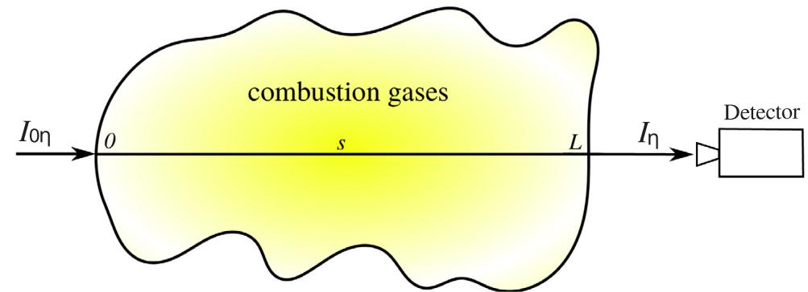  
Fig. 1. Schematic of radiative emission spectral measurement of a combustion system. External irradiation  $I_{0\eta}$  entering the gas column  $0\leq s\leq L$  at  $s = 0$  is interacting with combustion gases resulting the spectral intensity along the line-of-sight, as seen by a detector at  $s = L$ ,  $I(\eta)$ .

gaseous column is shown. It is assumed the system is in local thermal equilibrium and scattering effects in the medium can be neglected. The spectral intensity along a line- of- sight within the medium, as seen by a detector at  $s = L$  is given by [64]

$$
I(\eta) = I_{0\eta}e^{-\int_0^L\kappa_{\eta}ds} + \int_0^L\kappa_{\eta}I_{b\eta}e^{-\int_s^L\kappa_{\eta}ds'}ds \tag{1}
$$

Here  $\kappa_{\eta}$  is the spectral absorption coefficient evaluated at spectral location  $\eta$  .Assuming constant pressure along the gas column, the values of  $\kappa_{\eta}$  depend on gas temperature and species concentrations.  $I_{b\eta}$  is the local blackbody intensity of the medium and  $I_{0\eta}$  is external irradiation entering the gas column  $0\leqslant s\leqslant L$  at  $s = 0$  In this study, we assume there is no external irradiation and only emission from the gaseous medium is taken into account. In the calculation, the entire gas column is divided into  $n$  homogeneous sub- columns, where temperature and species concentrations are assumed constant. To accurately determine the intensity given by Eq. (1) numerically, radiative intensities leaving a gas column are evaluated recursively as,

$$
I_{i}(\eta) = I_{i - 1}(\eta)e^{-\Delta si\kappa_{\eta}i} + I_{b i}(1 - e^{-\Delta si\kappa_{\eta}i}) \tag{2}
$$

where  $I_{i}(\eta)$  is the spectral intensity leaving the  $i$ - th sub- column and  $\kappa_{\eta i}$  is the absorption coefficient for the temperature and gas concentrations of the  $i$ - th sub- column. Therefore, the emission spectrum seen by a detector is the emission that leaves the last sub- column, or,

$$
I(\eta) = I_{n}(\eta) \tag{3}
$$

Combustion products usually are mixtures of several gas species. In this study, a gas mixture containing three major combustion products, i.e.,  $\mathrm{CO_2}$ ,  $\mathrm{H_2O}$ , and  $\mathrm{CO}$  are considered. Absorption coefficients for the three species are calculated from the HITEMP 2010 LBL spectroscopic database. Spectral intensities calculated from Eq. (1) contain information for each individual transition line. However, LBL data obtained from HITEMP 2010 are based on quantum mechanical calculations together with experimental measurements, and are subjected to some degree of theoretical uncertainty (line strengths, shapes, and widths), while intensity measurements are very susceptible to experimental noise, while also requiring larger computation/collection times. To mimic the different finite spectral resolutions of a spectrometer, the LBL spectral intensities from Eq. (3) are convolved with an ideal instrument line shape (ILS) function. Here triangular apodization is used for creating the ideal ILS  $\Gamma (\eta)$ ,

$$
\Gamma (\eta) = \frac{0.5}{Res}\mathrm{sinc}^2\left(\frac{0.5\pi}{Res}\eta\right) \tag{4}
$$

where  $Res$  is the nominal resolution of the ILS function. After intensity spectra are convolved with the ILF  $\Gamma (\eta)$ , they become

$$
I_{c}(\eta) = \int_{0}^{\infty}I(\eta^{\prime})\Gamma (\eta -\eta^{\prime})d\eta^{\prime} \tag{5}
$$

If one measures intensity with a certain spectral resolution, obtaining  $m$  discrete values of wavenumbers, a system of nonlinear equation results,

$$
\mathbf{I} = f(\mathbf{T},\mathbf{x}_{\mathrm{CO}_2},\mathbf{x}_{\mathrm{H}_2\mathrm{O}},\mathbf{x}_{\mathrm{CO}}) \tag{6}
$$

Here  $f$  is a nonlinear function of the temperatures and concentrations of all sub- columns. Eq. (6) shows the relationship between calculated medium- to lower- resolution spectral intensities and temperature and concentration distributions along a line- of- sight, where

$$
\begin{array}{r l} & {\mathbf{I} = [I_{k}];\qquad k = 1,\dots,n}\\ & {\mathbf{T} = [T_{l}],\mathbf{x}_{\mathrm{CO}_{2}} = [x_{1,i}],\mathbf{x}_{\mathrm{H}_{2}\mathrm{O}} = [x_{2,i}],\mathbf{x}_{\mathrm{CO}} = [x_{3,i}];\qquad i = 1,\dots,n} \end{array} \tag{1}
$$

and  $m$  is the spectral dimension of spectral intensities and  $n$  is the spatial dimension for temperatures and species concentrations along the gas mixture column.

As a forward calculation example, Fig. 2 compares the LBL intensity spectrum with intensity spectra of different spectral resolutions. Blackbody emission at the same condition is also presented as a reference. The LBL spectrum exhibits the precise line shape of each transition line, but requires an enormous amount of data points to resolve the fine structures. After convolving to medium- to lower- resolution spectra, smoother averaged shapes of emission spectra were obtained with fewer data points, as shown in Fig. 2 for convoluted spectra with nominal resolutions of  $1\mathrm{cm}^{- 1}$ ,  $4\mathrm{cm}^{- 1}$ , and  $32\mathrm{cm}^{- 1}$ .

The spectra of the three combustion gases contain mostly "spectral windows," since only a few rovibrational bands exist. In order to retrieve temperatures and species concentrations from spectral measurements efficiently and accurately, it is very important to choose appropriate spectral bands to conduct the calculations. In the spectrum shown in Fig. 2, two spectral intervals, namely  $1800 - 2500\mathrm{cm}^{- 1}$  and  $3000 - 4200\mathrm{cm}^{- 1}$ , show relatively strong emission over this entire spectral range and these two spectral intervals are within the measurement capabilities of most infrared instruments. The spectral interval from  $1800 - 2500\mathrm{cm}^{- 1}$  contains the  $\mathrm{CO_2}$ $4.3\mu \mathrm{m}$  band, the  $\mathrm{CO}$ $4.7\mu \mathrm{m}$  band and part of the  $\mathrm{H_2O}$ $0.3\mu \mathrm{m}$  band. On the other hand, the spectral interval from  $3000 - 4200\mathrm{cm}^{- 1}$  contains the  $\mathrm{CO_2}$ $2.7\mu \mathrm{m}$  band, the  $\mathrm{H_2O}$ $2.7\mu \mathrm{m}$  band and part of the  $\mathrm{CO}$ $2.35\mu \mathrm{m}$  band. All three species have overlapping spectral lines in these two spectral intervals. Therefore, choosing these parts of the spectrum may allow retrieving all scalars simultaneously. In the present study, the two spectral intervals were selected to retrieve temperature and species concentrations.

Fig. 3 shows the case of calculated radiative intensities for the  $1800 - 2500\mathrm{cm}^{- 1}$  and  $3000 - 4200\mathrm{cm}^{- 1}$  spectral intervals. Calculations were conducted for a  $10\mathrm{cm}$  long gas column with nonuniform temperature (as shown in the figure) and uniform gas concentrations of  $10\% \mathrm{CO_2} + 10\% \mathrm{H_2O} + 10\% \mathrm{CO}$  with  $\mathrm{N}_2$ . The spectra have a medium spectral resolution of  $8\mathrm{cm}^{- 1}$ . The  $10\mathrm{cm}$  gas column was divided into different numbers of homogeneous sub- columns. As shown in the figure, 21 gas columns are good enough to achieve spatial grid independence for both spectral intervals and is used in this study.

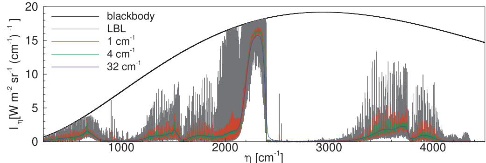  
Fig. 2. Calculated LBL radiative intensities for a  $10\mathrm{cm}$  long homogeneous gas mixture column with  $T = 1500\mathrm{K}$ ,  $x_{\mathrm{CO_2}} = x_{\mathrm{H_2O}} = x_{\mathrm{CO}} = 0.1$  compared against blackbody emission and convoluted spectra with nominal resolution of  $1\mathrm{cm}^{-1}$ ,  $4\mathrm{cm}^{-1}$  and  $32\mathrm{cm}^{-1}$ , respectively.

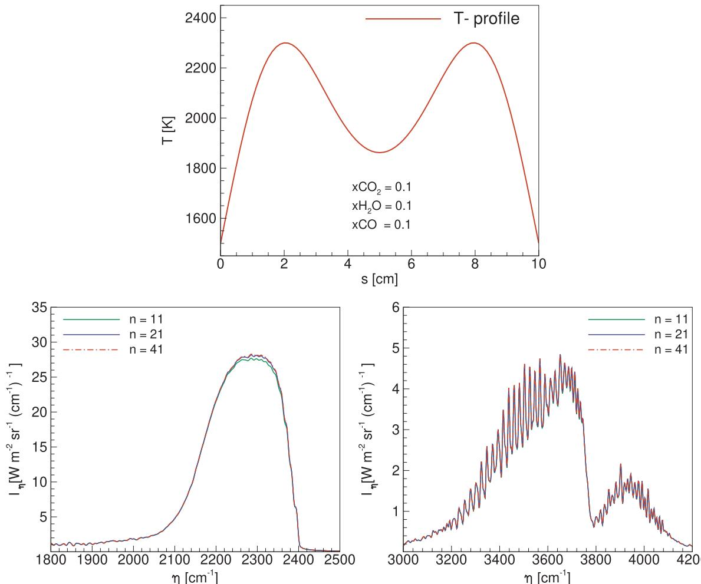  
Fig. 3. Calculated medium resolution  $(8\mathrm{cm}^{-1})$  radiative intensity for the  $1800 - 2500\mathrm{cm}^{-1}$  and  $3000 - 4200\mathrm{cm}^{-1}$  spectral intervals for a  $10\mathrm{cm}$  long gas mixture column with different numbers of sub-columns.

# 3. Machine learning for inverse radiation calculation

Optical diagnostics based on radiometric measurements reconstruct the spatial distribution of temperature, species concentrations and other parameters inside absorbing and emitting combustion gases. Such retrieval techniques based on radiative measurements are known as inverse radiative heat transfer calculations [64]. Retrieval of temperatures and species concentrations from Eq. (6) requires solving nonlinear, ill- posed problems. Conventionally, the solutions to the inverse problems are often obtained through optimization, which minimizes a cost function by properly "guessing" temperatures and species concentrations until the best matches between measured and predicted spectra are achieved. Assuming  $Y_{i}$  to be the measured spectral intensities, and  $L$  to be the predicted ones from the forward calculations, the cost function that needs to be minimized is

$$
F(\mathbf{Z}) = \sum_{k = 1}^{m}(I_k - Y_k)^2 \tag{8}
$$

Here we put temperatures and species concentrations for all gas subcolumns into a parameter vector  $\mathbf{Z}$ , i.e.,

$$
\mathbf{Z} = [\mathbf{T},\mathbf{x}_{\mathrm{CO}_2},\mathbf{x}_{\mathrm{H}_2\mathrm{O}},\mathbf{x}_{\mathrm{CO}}] \tag{9}
$$

Conventional gradient- based [14] optimization methods minimize Eq. (8) gradually by iterations. The ill- posed nature of the problem may cause slow convergence and the solution may also depend on the initial guess for the parameter vector  $\mathbf{Z}$ . At every iteration, a forward calculation has to be conducted to provide predicted spectral data sets  $[I_k]$ . In addition, with different measured spectral data sets  $[Y_k]$ , the

optimization process has to be started again from the very beginning. This makes conventional gradient- based methods very inefficient when applied to high- dimensional tomographic problems.

On the other hand, the machine learning method may provide global solution models for nonlinear inverse problems when explicit inverse relations between spectral radiation of gases and their temperature and concentration are not available. Inspired by the biological neural network information processes, artificial neural networks are a group of algorithms used for machine learning that model data processing by artificial neurons [65]. By training on a dataset and given a set of inputs and outputs, a model is generated which can be used to predict new examples from the same type of input features. The MultiLayer Perceptron neural network is the most popular type of artificial neural networks in machine learning [66,67]. The MLP consists of an input layer, one or more hidden layers, and an output layer. Each layer comprises several nodes called neurons. Neurons of one layer are directly connected to the next layer by weights. By supposing  $n$  inputs that are applied to the network  $\{x_{i}|x_{1},\ldots ,x_{n}\}$ , the output  $y$  of one neuron is a weighted sum of its inputs transformed by an activation function  $S$ . The process can be formulated as [68],

$$
y = S\left(\sum_{i = 1}^{n}w_{i}x_{i} + b\right) \tag{9}
$$

where  $\{w_{i}|w_{1},\ldots ,w_{n}\}$  are weights and  $b$  is the bias. This procedure can be understood by the schematic presentation of the artificial neural network in Fig. 4. The nonlinear activation function is often chosen to be the sigmoid function or hyperbolic tangent function ("S"- shaped

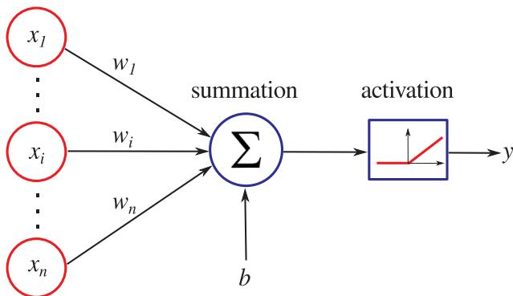  
Fig. 4. Diagram of data processing within one neuron [70]. By supposing  $n$  inputs that are applied to the network  $\{x_{i}|x_{1},\dots,x_{n}\}$ , the output  $y$  of one neuron is a weighted sum of its inputs transformed by an activation function, where  $\{w_{i}|w_{1},\dots,w_{n}\}$  are weights and  $b$  is the bias.

functions). Most recent deep neural networks use rectified linear units (ReLU) [69], which output 0 if the input is less than 0, and raw output otherwise, i.e.,  $S(x) = \max (0,x)$ . The present study adopts the ReLU activation function to develop deep neural networks for temperatures and species concentrations retrieval.

Fig. 5 shows a representative MLP neural network architecture for temperatures and species concentration retrieval from infrared spectral emission measurements. The leftmost layer, known as the input layer, consists of a set of neurons representing the input features (infrared spectral intensities). Each neuron in the hidden layers transforms the values from the previous layer with a weighted linear summation, followed by a nonlinear activation function. The output layer receives the values from the last hidden layer and transforms them into output values (temperatures/concentrations). The numbers of neurons in the input and output layers are determined by the input and output dimensions, respectively. There is no specific approach to determine the number of hidden layers and their neurons for different problems, the choice is usually made by trial and error [34].

An important part of modeling with neural networks is the so- called training of the network (learning). Training neural networks is done by adjusting appropriate weights between neurons to minimize the error of a cost function so that the output values generated by the network are compared with the actual corresponding values. Learning is an iterative process and uses a relatively large number of samples, which contain information spread evenly over the entire range of the system, that allows obtaining a sufficiently low error of the cost function. After training, the model can be directly used to predict new outputs by feeding new inputs. In the present study, the model implementation is based on the scikit- learn Python library [71] and MLP training using a stochastic gradient- based optimizer proposed by Kingma and Ba [72]. Training inputs of emission intensities were synthesized through calculations from HITEMP 2010 using the forward calculation model, for the gas mixture of  $\mathrm{CO_2}$ ,  $\mathrm{H_2O}$  and  $\mathrm{CO}$  with an inert gas  $\mathrm{N_2}$  for a large variety of temperature and species concentration distributions.

# 4. Results and discussion

In this section, first different temperature and species concentration distributions were retrieved from synthetic spectral emissive intensities for different gas path lengths and different spectral intervals. This is followed by retrieving temperature and gas concentrations from experimentally measured emission intensity spectra for a Hencken flat flame burner for combustion with different equivalence ratios.

# 4.1. Temperature and concentration distributions retrieval from synthetic emission measurements

In this section, three types of symmetric profiles for temperatures and species concentrations were tested. Profile Type 1 is relatively flat in the middle with large gradients on both edges; while Type 2 has one peak and Type 3 has two peaks and one valley. 10000 synthetic intensity spectra for each type of the three profiles for the  $1800 - 2500\mathrm{cm}^{- 1}$  and  $3000 - 4200\mathrm{cm}^{- 1}$  spectral intervals were generated from the HITEMP 2010 database with a medium spectral resolution of  $8\mathrm{cm}^{- 1}$  from Eq. (5). Gaussian random noises of  $3\%$  were added to all intensity spectra to simulate the random error inevitable in experiments. These 10,000 data sets for each type of the profile were separated into two categories: 9900 were used to train the MLP neural networks, and the remaining 100 were reserved to test its ability for predicting temperatures and concentrations from never- seen- before spectral "measurements" for the trained artificial neural networks. The temperature and concentration profiles used to create the spectra were calculated from Eqs. (11)- (14) with base functions  $\beta (s)$  as shown in Fig. 6.

$$
\begin{array}{rl} & T(s) = \Delta T\times \beta (s) + T_0;T_0 = (2700\times Rn_1 + 300)\mathrm{K},\\ & \Delta T = (3000 - T_0)\times Rn_2\mathrm{K} \end{array} \tag{11}
$$

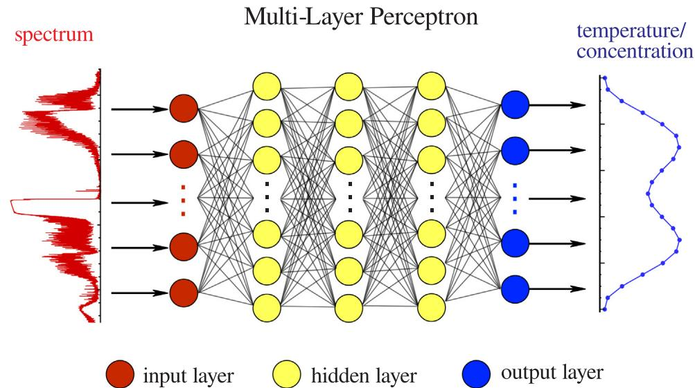  
Fig. 5. Schmatic f a reentive MLP nal ntork chttre for tmprae and spcies ontrtion retiel from inared stal emssion mea surements of combustion gases.

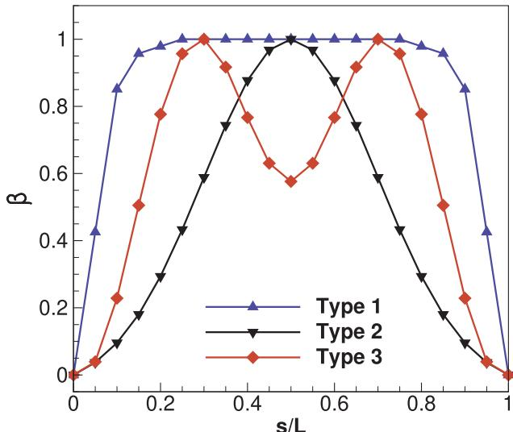  
Fig. 6.  $\beta$  functions used to generate different types of temperature and species concentration profiles.

$$
\begin{array}{rl} & {x_{\mathrm{CO_2}}(s) = \Delta x_1\times \beta (s) + x_{1,0};x_{1,0} = 0.05,\Delta x_1 = 0.10\times Rn_3}\\ & {x_{\mathrm{H_2O}}(s) = \Delta x_2\times \beta (s) + x_{2,0};x_{2,0} = 0.05,\Delta x_2 = 0.10\times Rn_4}\\ & {x_{\mathrm{CO}}(s) = \Delta x_3\times \beta (s) + x_{3,0};x_{3,0} = 0.01,\Delta x_3 = 0.05\times Rn_5} \end{array} \tag{12}
$$

In Eqs. (11)- (14),  $Rn_{1} - Rn_{5}$  are random numbers uniformly distributed between 0 and 1;  $T_{0}, x_{1,0}, x_{2,0}, x_{3,0}$  are the lowest values for temperature and concentrations;  $\Delta T, \Delta x_{1}, \Delta x_{2}, \Delta x_{3}$  are the differences between maximum and minimum values in the temperature and concentration profiles. Eqs. (11)- (14) allow randomly generating a set of large variety of temperatures distributions between  $300 \mathrm{~K}$  and  $3000 \mathrm{~K}, \mathrm{CO}_{2}$  concentration distributions between  $5\%$  and  $15\%$ ,  $\mathrm{H}_{2} \mathrm{O}$  concentration distributions between  $5\%$  and  $15\%$ , and  $\mathrm{CO}$  concentration distributions between  $1\%$  and  $6\%$ . In order to show how the models perform for different optical thickness from small scales to large scales, emission spectra for three different gas columns of  $10 \mathrm{~cm}, 1 \mathrm{~m}$ , and  $10 \mathrm{~m}$  were generated. Correlations between temperatures and gas concentrations were neglected when generating the clouds of spectral data, which may not be physically true. However, in the present study temperature and species concentrations were retrieved simultaneously, and neglecting these correlations only makes the inverse problem more challenging.

Once synthetic intensity spectra were generated, these spectral data and the corresponding temperatures and concentrations were used as inputs and outputs to train the MLP neural networks. The optimal parameters, such as the number of hidden layers, the number of neurons in the hidden layers and regularization parameters, differ from one problem to another for the MLP neural networks and were selected by trial and error [34]. The MLP neural networks were trained for each type of the distribution profiles, different spectral intervals, and different gas path lengths. Once a model is "trained," and we are confident in its ability to be generalized to unseen inputs, it can be used to predict temperatures and concentrations from new radiative intensity spectral "measurements." The performance of the trained models is tested with the reserved 100 synthetic emission spectra for each case. These spectra were fed into the trained models as inputs to predict temperature and concentrations (predicted values), which were compared with known temperature and species concentration distributions used to generate the spectra (observed values). The relative root mean square error (RRMSE) defined as,

$$
RRMSE = 100\times \frac{\sqrt{\frac{1}{N}\sum_{1}^{N}(P_{i} - O_{i})^{2}}}{\frac{1}{N}\sum_{1}^{N}(O_{i})} \tag{15}
$$

was used to qualitatively evaluate the performance of the trained models; where  $P_{i}$  and  $O_{i}$  are the predicted and observed values, respectively. In the present study, temperatures and species concentrations were retrieved simultaneously. However, temperatures and different species concentrations may show different responses to the spectrum, therefore, the relative root mean square errors were evaluated separately for temperature and different species concentrations.

Table 1 shows the average RRMSE of the retrieved temperatures and concentrations from the 100 testing samples for different cases. As indicated before, tests were conducted for three gas columns with different gas path lengths and two spectral intervals. Predicted I and II are results from the  $1800 - 2500 \mathrm{~cm}^{- 1}$  and  $3000 - 4200 \mathrm{~cm}^{- 1}$  spectral intervals, respectively. As shown in the table, using the  $1800 - 2500 \mathrm{~cm}^{- 1}$  spectral interval can retrieve temperature profiles relatively accurately for all gas columns with all types of temperature and species concentration distributions. The  $3000 - 4200 \mathrm{~cm}^{- 1}$  spectral interval performs better when the gas path length gets increased from  $10 \mathrm{~cm}$  to  $100 \mathrm{~cm}$ . Predicted  $\mathrm{CO}_{2}$  concentrations accuracies decrease when the gas path length gets increased from  $100 \mathrm{~cm}$  to  $1000 \mathrm{~cm}$  for both spectral intervals. The conclusions were consistent with our previous work on retrieving temperature profiles using the Levenberg- Marquardt optimization method [23]. For an ideal spectral interval used for inverse calculations, within the spectral interval every portion of the gas column should make a spectrally distinguishable contribution to the detected intensities. A shorter gas path length and smaller gas absorption coefficient result in optically thin paths. In such cases, the detected intensities are almost linearly dependent on local emission, making it difficult to distinguish one location from another. When the optical thickness increases, absorption within the gas column becomes stronger and part of the emitted intensity gets absorbed along the path, which makes the detected intensity at different locations in the gas column

Table 1 The average relative root mean square errors (RRMsE) for the 100 testing samples.  

<table><tr><td rowspan="2" colspan="2">Gas path length</td><td colspan="4">Predicted I (1800–2500 cm−1)</td><td colspan="4">Predicted II (3000–4200 cm−1)</td></tr><tr><td>T</td><td>xCO2</td><td>xH2O</td><td>xCO</td><td>T</td><td>xCO2</td><td>xH2O</td><td>xCO</td></tr><tr><td rowspan="3">10 cm</td><td>Type 1</td><td>4.11%</td><td>2.72%</td><td>2.87%</td><td>4.60%</td><td>8.14%</td><td>5.00%</td><td>4.33%</td><td>16.0%</td></tr><tr><td>Type 2</td><td>2.44%</td><td>3.19%</td><td>1.82%</td><td>4.18%</td><td>3.63%</td><td>3.43%</td><td>3.64%</td><td>21.0%</td></tr><tr><td>Type 3</td><td>2.97%</td><td>3.77%</td><td>3.42%</td><td>6.48%</td><td>5.55%</td><td>5.44%</td><td>4.92%</td><td>21.6%</td></tr><tr><td rowspan="3">100 cm</td><td>Type 1</td><td>1.43%</td><td>2.90%</td><td>2.04%</td><td>3.51%</td><td>4.59%</td><td>4.24%</td><td>3.80%</td><td>11.4%</td></tr><tr><td>Type 2</td><td>1.55%</td><td>4.28%</td><td>2.07%</td><td>4.63%</td><td>3.70%</td><td>4.36%</td><td>3.55%</td><td>23.7%</td></tr><tr><td>Type 3</td><td>1.73%</td><td>3.50%</td><td>2.33%</td><td>4.17%</td><td>4.64%</td><td>4.72%</td><td>3.83%</td><td>12.2%</td></tr><tr><td rowspan="3">1000 cm</td><td>Type 1</td><td>2.13%</td><td>4.98%</td><td>2.48%</td><td>11.6%</td><td>2.14%</td><td>9.51%</td><td>3.55%</td><td>18.7%</td></tr><tr><td>Type 2</td><td>1.28%</td><td>5.89%</td><td>3.00%</td><td>11.2%</td><td>2.81%</td><td>6.38%</td><td>4.04%</td><td>12.5%</td></tr><tr><td>Type 3</td><td>2.10%</td><td>4.78%</td><td>2.70%</td><td>10.3%</td><td>2.28%</td><td>6.81%</td><td>3.55%</td><td>11.7%</td></tr></table>

spectrally different. In the  $1800 - 2500\mathrm{cm}^{- 1}$  spectral interval, all three species have strongly overlapping bands. On the other hand, relatively weak bands for these three species overlap in the  $3000 - 4200\mathrm{cm}^{- 1}$  spectral interval. This explains why the  $1800 - 2500\mathrm{cm}^{- 1}$  spectral interval performs well for gas path lengths of  $10\mathrm{cm}$  and  $100\mathrm{cm}$ , and the  $3000 - 4200\mathrm{cm}^{- 1}$  spectral interval performs better when the gas path length increased from  $10\mathrm{cm}$  to  $100\mathrm{cm}$ . For a large gas path of  $1000\mathrm{cm}$ , in the presence of high concentrations of  $\mathrm{CO_2}$ , the two strong  $\mathrm{CO_2}$  radiation bands  $(4.3\mu \mathrm{m}$  and  $2.7\mu \mathrm{m})$  may become saturated and approach blackbody emission, which masks some of the spectral information, making retrieval of  $\mathrm{CO_2}$  concentrations less accurate. The  $\mathrm{CO}2.35\mu \mathrm{m}$  band within the  $3000 - 4200\mathrm{cm}^{- 1}$  spectral interval is a relatively weak band. With  $\mathrm{CO_2}$  and  $\mathrm{H_2O}$  bands dominating over  $\mathrm{CO}$ . Therefore, as shown in Table 1, large errors occur when using this part of the

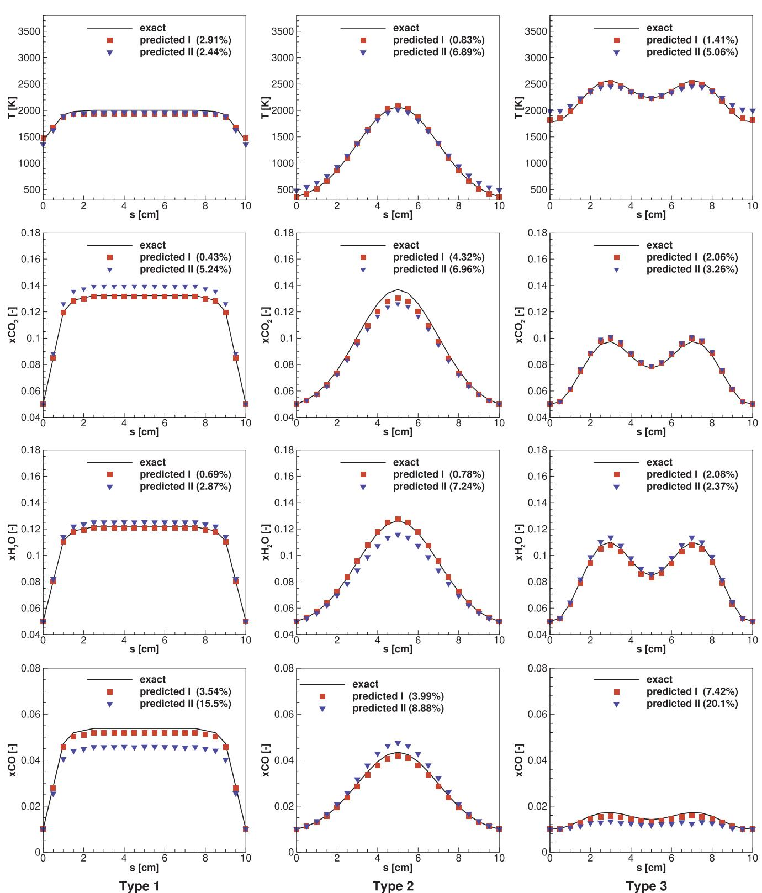  
Fig. 7. Predicted temperatures and species concentration profiles for three types of distributions from the  $1800 - 2500\mathrm{cm}^{-1}$  spectral interval (predicted I) and  $3000 - 4200\mathrm{cm}^{-1}$  spectral interval (predicted II) with a resolution of  $8\mathrm{cm}^{-1}$  for a gas path length of  $10\mathrm{cm}$ .

spectrum to retrieve CO concentrations. But relatively accurate CO concentrations can be retrieved from the  $1800 - 2500\mathrm{cm}^{- 1}$  spectral interval, which contains the stronger CO  $4.7\mu \mathrm{m}$  band. It should be noted that after training of the MLP neural networks, "global" inverse radiation models were obtained, which are able to predict scalar fields with similar features and can handle large volumes of new input data very efficiently. For the 100 test samples for each case, it only takes less than 1 s CPU time to retrieve all the temperatures and species concentrations simultaneously, i.e., approximately  $10\mathrm{ms}$  to retrieve temperatures and species concentrations from a single line- of- sight.

Figs. 7- 9 show examples of the retrieved temperature and species concentration for the three types of distributions from  $10\mathrm{cm}$ ,  $100\mathrm{cm}$  and  $1000\mathrm{cm}$  gas columns, respectively. The RRMSE for the retrieved temperatures and concentrations for the cases are also indicated in each

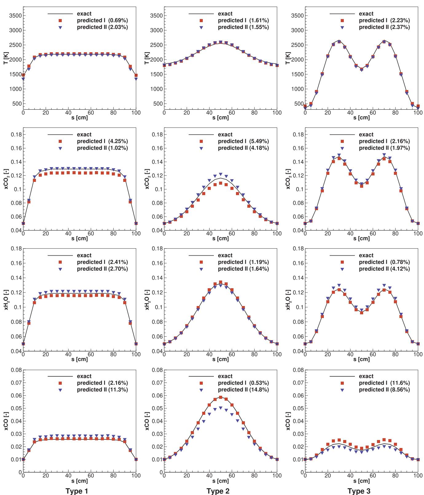  
Fig. 8. Predicted temperature and species concentration profiles for three types of distributions from the  $1800 - 2500\mathrm{cm}^{-1}$  spectral interval (predicted I) and  $3000 - 4200\mathrm{cm}^{-1}$  spectral interval (predicted II) with a resolution of  $8\mathrm{cm}^{-1}$  for a gas path length of  $100\mathrm{cm}$ .

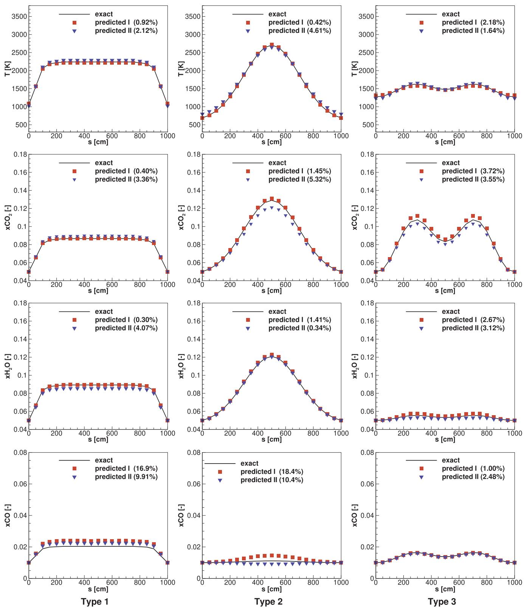  
Fig. 9. Predicted temperature and species concentration profiles for three types of distributions from the  $1800 - 2500\mathrm{cm}^{-1}$  spectral interval (predicted I) and  $3000 - 4200\mathrm{cm}^{-1}$  spectral interval (predicted II) with a resolution of  $8\mathrm{cm}^{-1}$  for a gas path length of  $1000\mathrm{cm}$

of the frames. Retrieved temperature and concentrations for all types of profiles for all species match well with the exact profiles when using the  $1800 - 2500\mathrm{cm}^{- 1}$  spectral interval, considering the fact that there is  $3\%$  of random noise in the spectra. The results from the  $3000 - 4200\mathrm{cm}^{- 1}$  spectral interval are less accurate, especially for the retrieved CO concentrations. Overall, temperature profiles were retrieved relatively accurately for all gas path lengths from both spectral intervals for all three types of temperature distributions. The accuracy of the retrieved  $\mathrm{CO_2}$  and  $\mathrm{H}_2\mathrm{O}$  concentrations depend on different thermodynamic conditions and spectral intervals, but generally have less than  $10\%$  of RRMSEs for all test cases. When using the  $1800 - 2500\mathrm{cm}^{- 1}$  spectral interval, the retrieved CO concentrations are only relatively accurate for relatively small gas path lengths. These tests by using artificial synthetic data show that the machine learning approach of MLP neural networks is

capable of retrieving temperatures,  $\mathrm{CO_2}$ ,  $\mathrm{H_2O}$ , and  $\mathrm{CO}$  concentrations simultaneously from infrared emission measurement with acceptable accuracies.

# 4.2. Temperature and concentration distribution retrievals for the NPL standard flame

To experimentally validate the models, measurements were conducted to obtain the spectral radiative intensities from the NPL standard flame [73,74]. The measured spectra were used to retrieve temperatures and species concentrations from the flame. The flame system is based on the Hencken flat flame burner using dry laboratory air and industrial grade (95% nominal purity) propane under open atmospheric conditions. The NPL standard flame is well- characterized and provides a reproducible region of high- temperature gases of known temperatures and compositions [75,73], which is ideal for validating optical thermometry techniques.

# 4.2.1. Experimental measurements

Infrared emission measurements were performed with an FTIR- spectrometer for the NPL standard flame. The experimental setup is shown in Fig. 10. The flame was produced by a  $40\mathrm{mm}\times 40\mathrm{mm}$  square burner. All optical parts (from A1 to A4 and the FTIR itself) have been purged with  $\mathrm{N}_2$  (99.999%) during the measurements. The purge flow was adjusted to avoid cooling effects on the flame edge. A silver reflection screen along the flame height was used to reduce the effects of flame radiation on the FTIR's thermal stability. The FTIR- spectrometer (Agilent model 660) is equipped with a liquid nitrogen cooled narrow band high- sensitivity linearized mercury- cadmium- telluride (MCT) detector and KBr beam- splitter, which is capable of conducting measurements in the spectral range of  $650 - 8000\mathrm{cm}^{- 1}$  with a highest nominal spectral resolution of  $0.09\mathrm{cm}^{- 1}$ . The spectrometer was upgraded with an additional dual A/D card making it possible to perform fast acquisition measurements at medium- to lower- resolutions, which allows removing flickering effects of the flame in the measured spectra. Raw interferograms were obtained during the measurements. Because of the finite range of the spectrometer's moving mirror, raw interferograms do not extend to infinity, effectively causing the interferogram to be multiplied by an apodization function. Therefore, the intensity spectra were calculated by performing the Fourier transform of the interferograms multiplied by the triangular apodization function. The Fourier transform of the triangular apodization function is the ILS function of Eq. (4). The spectrometer was calibrated in units of  $\mathrm{Wm}^{- 2}\mathrm{sr}^{- 1}(\mathrm{cm}^{- 1})^{- 1}$  with a portable blackbody at  $796.1^{\circ}\mathrm{C}$  and was recalibrated after each measurement sequence. Background measurements (without blackbody and standard flame) were also taken, which were subtracted from the corresponding flame/blackbody measurements to eliminate background emission effects.

Spectral measurements were performed at  $4\mathrm{cm}^{- 1}$  and  $8\mathrm{cm}^{- 1}$  resolutions at  $10\mathrm{mm}$  and  $20\mathrm{mm}$  heights above the center of the burner (HAB) for combustion with equivalence ratios of  $\phi = 1$ ,  $\phi = 0.8$ , and  $\phi = 1.4$ , respectively. The NPL standard flame is highly stable with good long- term reproducibility. Fig. 11 shows two measured spectra with  $8\mathrm{cm}^{- 1}$  resolution, which were measured at  $20\mathrm{mm}$  HAB for an equivalence ratio of  $\phi = 1$ . Differences between these two measurements are also presented. The two measurements were conducted with a time separation of  $70\mathrm{min}$ . Typically, the reproducibility of the measurements, e.g., at  $\phi = 1$ , HAB  $= 20\mathrm{mm}$  in the  $2200 - 2400\mathrm{cm}^{- 1}$  and  $3200 - 3700\mathrm{cm}^{- 1}$  spectral ranges, are better than  $2\%$  and  $5\%$ , respectively, for time spans from minutes to days. (In essence in the experiment, temperatures are very stable, with the variations mostly caused by  $\mathrm{CO_2 / H_2O}$  concentration fluctuations). The temperature fields for the

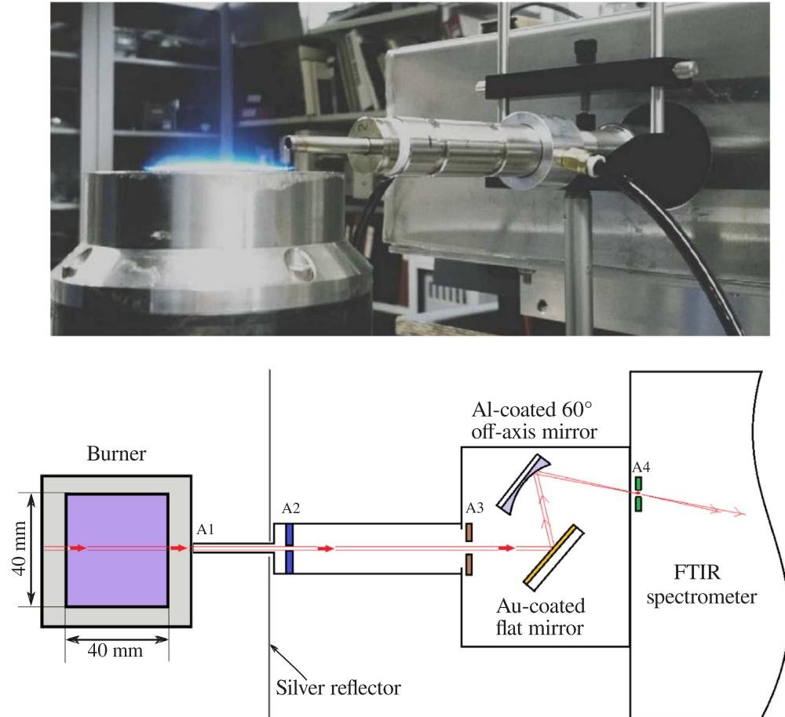  
Fig. 10. Experimental setup for radiative emission intensity measurements for the NPL standard flame; the schematic image is not drawn to scale.

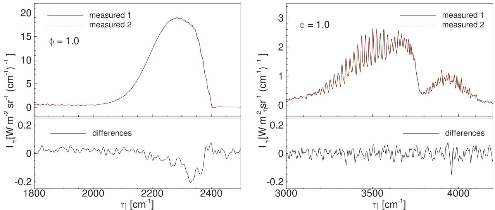  
Fig. 11. Two intensity spectra measured with a time separation of  $70\mathrm{min}$  at  $\phi = 1$  HAB  $= 20\mathrm{mm}$  for the NPL standard flame for the  $1800 - 2500\mathrm{cm}^{-1}$  and  $3000 - 4200\mathrm{cm}^{-1}$  spectral intervals shows good reproducibility of the measurements.

NPL standard flame at  $\mathrm{HAB} = 10\mathrm{mm}$  and  $20\mathrm{mm}$  for equivalence ratios from  $\phi = 0.8$  to  $\phi = 1.4$  were previously measured at NPL with Rayleigh scattering thermometry [76] and reported in [73]. It was reported that the uncertainty in the flame temperature is  $0.45\%$  and the long- term reproducibility of the flame temperature is better than  $0.20\%$ . The NPL standard flame is a flat flame and with temperature profiles flat in the middle and decay only near the edges of the burner. The species compositions for the post- flame are fairly uniform and were previously calculated using the chemical equilibrium calculation program GASEQ [77] for equivalence ratios from  $\phi = 0.8$  to  $\phi = 1.4$  at NPL, which were also reported in [73]. Therefore, in the present study, the retrieved temperatures and species concentrations from the spectral emission measurements with MLP neural networks were compared against the temperatures and species concentrations reported in [73]. It should be noted that during the spectral measurements the combustion may not reach chemical equilibrium at all locations, but we are not aware of any other experimental measurements of species concentrations for the NPL standard flame. Therefore, the predicted concentrations can only be compared against with these equilibrium calculations.

# 4.2.2. Training data generations

In order to make accurate predictions based on neural network methods, a significant number of data sets are required to train the MLP neural network. As discussed before, these data include two categories: temperature and species concentrations, and spectral emission intensities. Temperature and species concentrations should be spread evenly over the entire range of the system and cover all possible distributions. The spectral intensities used to train the model should have the same dimension and resolution as the measured data. Spectral measurements have been performed at  $4\mathrm{cm}^{- 1}$  and  $8\mathrm{cm}^{- 1}$  spectral resolutions. Therefore, two sets of spectral training data were generated at the two spectral resolutions. Each set contains 10,000 samples from 10,000 temperature distributions. The temperature profiles were created based on the basic features reported for the NPL standard flame, which are flat in the middle with large gradients near the edges of the burner, similar to the Type 1 profiles of the previous section. However, the temperature profiles for the NPL standard flame may not be strictly symmetric. Therefore, Eq. (16) is used to generate non- symmetric temperature distributions, i.e.,

$$
T(s) = \left\{ \begin{array}{ll}\Delta T_1\times \beta (s) + T_{0,1} & s\leqslant L / 2\\ \Delta T_2\times \beta (s) + T_{0,2} & s > L / 2 \end{array} \right. \tag{16}
$$

where  $L$  is the width of the burner and is  $40\mathrm{mm}$ ,  $\beta (s)$  is the Type 1 base function from Fig. 6. The lowest temperatures at the burner edges  $T_{0,1}$  and  $T_{0,2}$  and the temperature differences between the center and two edges  $\Delta T_{1}$ , and  $\Delta T_{2}$  are defined as,

$$
T_{0,1} = (2000\times Rn_1 + 500)\mathrm{K} \tag{17}
$$

$$
\Delta T_{1} = (3000\mathrm{K} - T_{0,1})\times Rn_{2} \tag{18}
$$

$$
T_{0,2} = (T_{0,1} + \Delta T_{1} - 500\mathrm{K})\times Rn_{3} \tag{19}
$$

$$
\Delta T_{2} = \Delta T_{1} + T_{0,1} - T_{0,2} \tag{20}
$$

Random numbers of  $Rn_{1} - Rn_{3}$  are uniformly distributed between 0 and 1, which allows generating temperature ranges from  $500\mathrm{K}$  to  $3000\mathrm{K}$ , and are sufficient to cover the flame temperature range. One example of a temperature profile created with Eq. (16) is shown in Fig. 12, with illustrations of  $T_{0,1}$ ,  $T_{0,2}$ ,  $\Delta T_{1}$ , and  $\Delta T_{2}$ , respectively. Due to the uniformity of the species compositions for the flame, uniform concentrations are randomly generated between 0 and  $20\%$ , and were used as concentrations for  $\mathrm{CO_2}$ ,  $\mathrm{H_2O}$ , and  $\mathrm{CO}$ . Which were used together with the temperature distribution of Eq. (16) to generate the training spectral intensities. Again, Gaussian random noises of  $3\%$  were added to all generated intensity spectra. After training of the neural networks, the

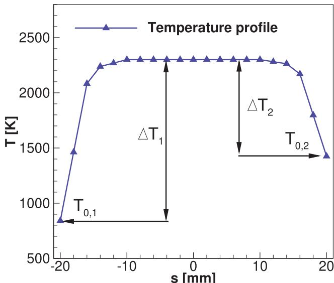  
Fig. 12. Example of temperature profile used for generating training data sets.

models were used to predict temperatures and species concentrations from the measured spectral intensities.

# 4.2.3. Temperature and concentration retrieval results

Fig. 13 shows temperature profiles and concentrations retrieved at  $\mathrm{HAB} = 10\mathrm{mm}$  for  $\phi = 1$ $\phi = 0.8$  and  $\phi = 1.4$  respectively. The spectra used were measured with a resolution of  $4\mathrm{cm}^{- 1}$  . Again, "predicted  $\mathrm{I}^{\ast}$  are retrieved from the  $1800 - 2500\mathrm{cm}^{- 1}$  spectral interval and "predicted II" are retrieved from the  $3000 - 4200\mathrm{cm}^{- 1}$  spectral interval. The measured temperature profiles with calculated chemical equilibrium species concentrations are presented for comparison. The measured temperature profiles are shown with standard deviations of the measurements. However, these standard deviations do not represent the uncertainty of the temperature measurements but can be used as an indicator of the flame stability [73]. As shown in the figure, the NPL standard flame is "flat" and stable around  $\pm 10\mathrm{mm}$  from the center of the burner; beyond this, temperatures start to decay with some instability near the edges. The retrieved temperature profiles follow the trend very well and are able to capture the slightly non- symmetric features. Temperatures were retrieved very accurately for the most part along the line- of- sight. If the  $1800 - 2500\mathrm{cm}^{- 1}$  spectral interval was used for the retrieval, the predicted mean temperatures within  $10\mathrm{mm}$  from the center of the burner have differences of  $- 1.37\%$ $0.19\%$  and  $2.08\%$  from the measured temperatures for  $\phi = 1$ $\phi = 0.8$  and  $\phi = 1.4$  respectively. And the differences are  $- 2.45\%$ $0.63\%$  and  $1.43\%$  respectively for  $\phi = 1$ $\phi = 0.8$  and  $\phi = 1.4$  if the  $3000 - 4200\mathrm{cm}^{- 1}$  spectral interval is used. Concentrations of  $\mathrm{CO_2}$  and  $\mathrm{H_2O}$  were retrieved qualitatively accurate comparing to the calculated chemical equilibrium values. Since combustion may not reach chemical equilibrium at  $\mathrm{HAB} = 10\mathrm{mm}$  ,the retrieved  $\mathrm{CO_2}$  and  $\mathrm{H_2O}$  for all the cases are close or higher than the chemical equilibrium values. CO concentrations were retrieved less accurately, especially for the lean and stoichiometric combustion  $(\phi \leqslant 1)$

The spectral emission spectra for the standard NPL flame were also measured at  $\mathrm{HAB} = 20\mathrm{mm}$  for  $\phi = 1$ $\phi = 0.8$  and  $\phi = 1.4$  with a relatively coarser resolution of  $8\mathrm{cm}^{- 1}$  .The retrieved temperature profiles and concentrations with these spectra are shown in Fig. 14. Temperature retrieved from the  $1800 - 2500\mathrm{cm}^{- 1}$  spectral interval (predicted I) are in good agreement with the measured temperatures for all equivalence ratios: predicted mean temperatures within  $10\mathrm{mm}$  from the center of the burner differ by  $0.23\%$ $- 0.21\%$  and  $1.88\%$  from the measured temperatures for  $\phi = 1$ $\phi = 0.8$  and  $\phi = 1.4$  respectively. The retrieved temperatures show relatively large differences from the measured temperatures near the two edges of the burner. However, it was reported in [73] that temperature measurements beyond  $15\mathrm{mm}$  from the center may be in error due to air mixing and the inherent assumptions used in the Rayleigh thermometry model. The predicted temperatures using the  $3000 - 4200\mathrm{cm}^{- 1}$  spectral interval (predicted II) are also shown in Fig. 14. The retrieved mean temperatures within  $10\mathrm{mm}$  from the center of the burner only show  $1.31\%$  and  $- 0.10\%$  differences compared to the measured temperatures for  $\phi = 1$  and  $\phi = 0.8$  respectively. However, temperatures were retrieved less accurately if the  $3000 - 4200\mathrm{cm}^{- 1}$  spectral interval was used: temperatures for  $\phi = 1.4$  were over- predicted at the center about  $4\%$  and underpredicted near the edges of thee burner. Since the calculated chemical equilibrium species concentrations may not be the actual values under the spectral measurements, the concentrations retrieved from different spectral intervals can also be used as cross- validation. The retrieved  $\mathrm{CO_2}$  concentrations from the two spectral intervals are very close for all equivalence ratios, which are also close to the chemical equilibrium  $\mathrm{CO_2}$  concentrations. All predicted  $\mathrm{H_2O}$  concentrations are higher than the chemical equilibrium values, but the values retrieved from different spectral bands are close to each other. Again, CO concentrations were retrieved less accurately when there was little or no CO in the flame.

# 5. Conclusions

An inverse radiation model based on the multi- layer perceptron neural network method was developed to retrieve temperature and species concentration distributions from infrared spectral emission measurements for combustion gas mixtures. The developed method shows its excellent capability of solving nonlinear inverse problems,

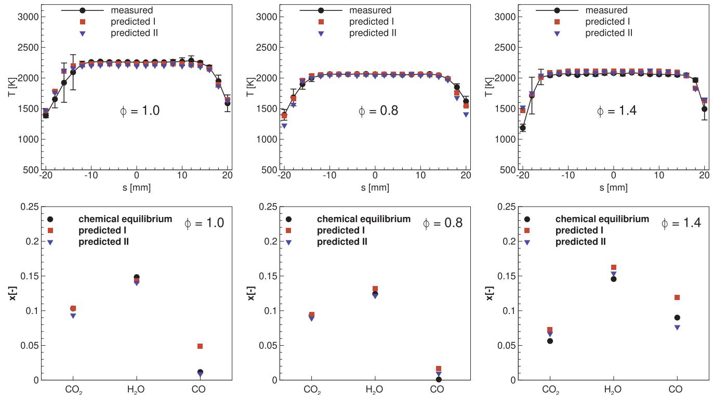  
Fig. 13. Predicted temperatures and species concentrations of the NPL standard flame at  $\mathrm{HAB} = 10\mathrm{mm}$  for  $\phi = 1$ $\phi = 0.8$  and  $\phi = 1.4$  from the  $1800 - 2500\mathrm{cm}^{-1}$  spectral interval (predicted I) and  $3000 - 4200\mathrm{cm}^{-1}$  spectral interval (predicted II) with a resolution of  $4\mathrm{cm}^{-1}$

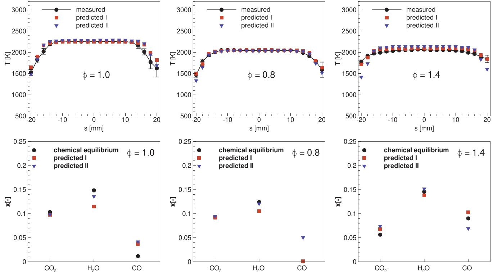  
Fig. 14. Predicted temperatures and species concentrations of the NPL standard flame at  $\mathrm{HAB} = 20\mathrm{mm}$  for  $\phi = 1$ $\phi = 0.8$  and  $\phi = 1.4$  from the  $1800 - 2500\mathrm{cm}^{-1}$  spectral interval (predicted I) and  $3000 - 4200\mathrm{cm}^{-1}$  spectral interval (predicted II) with a resolution of  $8\mathrm{cm}^{-1}$

providing an efficient and global inverse radiation model, and is able to retrieve temperature and species concentrations simultaneously for a gas mixture of  $\mathrm{CO_2}$ $\mathrm{H}_2\mathrm{O}$  and CO. The method was tested with synthetic spectral "measurements" for different temperature and concentration distributions. The performance of the multi- layer perceptron neural network method for retrieving scalars from different spectral interval and for different optical thickness (represented by different gas path lengths) were also investigated. The neural network inverse radiation models show good performance in terms of accuracy and efficiency. Experimental validations were performed by predicting temperatures and concentrations for the National Physical Laboratory standard flame and the results were compared against Rayleigh scattering thermometry and chemical equilibrium calculations. Good agreement between predictions and measurements was found. The retrieval of temperature and species concentrations is very efficient (in the order of  $10\mathrm{ms}$  per line- of- sight), and thus may be used to monitor and control of combustion process.

Although the current work deals with spectral measurements from a single line- of- sight, the proposed neural network inverse radiation model can be easily adapted to 3- D flame diagnostics with advanced spectral measurement devices, such as infrared hyperspectral Fourier transform infrared spectrometer. It should be noted that in the present study, three different types of distribution were tested individually. However, the method is also able to identify different types of distributions if all data are used simultaneously to train the neural network. The current model was used to retrieve temperatures and concentrations for the three gas species simultaneously, from two different relatively wide spectral intervals. Prediction accuracy for different species is different using different spectral intervals. The performance of the neural network inverse radiation model can be further improved by investigating optimal spectral bands for different species.

# Acknowledgment

The third and forth authors gratefully acknowledge the support from the European Metrology Programme for Innovation and Research (EMPIR) and the European Union's Horizon 2020 Research and Innovation Program.

# References

[1] Draper TS, Zeltner D, Tree DR, Xue Y, Tsilova R. Two- dimensional flame temperature and emissivity measurements of pulverized oxy- coal flames. Appl Energy 2012;95:38- 44. [2] Lukovic M, Vicic M, Popovic Z, Zekovic L, Kasalica B, Belca I. Two- color pyrometer- based method for measuring temperature profiles and attenuation coefficients in a coal power plant. Combust Sci Technol 2018;190(11):2018- 29. [3] Fuest F, Barlow RS, Magnotti G, Dreizler A, Ekoto IW, Sutton JA. Quantitative acetylene measurements in laminar and turbulent flames using 1D Raman/Rayleigh scattering. Combust Flame 2015;162(5):2248- 55. [4] Hartl S, Van Winkle R, Geyer D, Dreizler A, Magnotti G, Hasse C, et al. Assessing the relative importance of flame regimes in Raman/Rayleigh line measurements of turbulent lifted flames. Proc Combust Inst 2019;37(2):2297- 305. [5] Li B, He Y, Li Z, Konnov AA. Measurements of NO concentration in NH 3- doped CH 4+ air flames using saturated laser- induced fluorescence and probe sampling. Combust Flame 2013;160(1):40- 6. [6] Bejaoui S, Mercier X, Desgroux P, Therssen E. Laser induced fluorescence spectroscopy of aromatic species produced in atmospheric sooting flames using UV and visible excitation wavelengths. Combust Flame 2014;161(10):2479- 91. [7] Skiba AW, Carter CD, Hammack SD, Miller JD, Gord JR, Driscoll JF. The influence of large eddies on the structure of turbulent premixed flames characterized with stereo- PIV and multi- species PLIF at 20 kHz. Proc Combust Inst 2019;37(2):2477- 84. [8] Sepman A, Ogren Y, Gullberg M, Wiinikka H. Development of TDLAS sensor for diagnostics of CO, H2O and soot concentrations in reactor core of pilot- scale gasifier. Appl Phys B 2016;122(2):29. [9] Wu Q, Wang F, Li M, Yan J, Cen K. Simultaneous in- situ measurement of soot volume fraction, H2O concentration, and temperature in an ethylene/air premixed flame using tunable diode laser absorption spectroscopy. Combust Sci Technol 2017;189(9):1571- 90. [10] Kranendonk LA, Caswell AW, Sanders ST. Robust method for calculating temperature, pressure, and absorber mole fraction from broadband spectra. Appl Opt 2007;46(19):4117- 24. [11] Ellis DJ, Solovjov VP, Tree DR. Temperature measurement using infrared spectral band emissions from H2O. J Energy Resur Technol 2016;138(4):042001. [12] Rhoby MR, Blunck DL, Gross KC. Mid- IR hyperspectral imaging of laminar flames for 2- D scalar values. Opt Exp 2014;22(18):21600- 17. [13] Harley JL, Rankin BA, Blunck DL, Gore JP. Gross KC. Imaging fourier- transform spectrometer measurements of a turbulent nonpremixed jet flame. Opt Lett 2014;39(8):2350- 3. [14] Charette A, Boulanger J, Kim HK. An overview on recent radiation transport

algorithm development for optical tomography imaging. J Quant Spectrosc Radiat Transf 2008;109(17- 18):2743- 66. [15] Anderson RJ, Griffiths PR. Determination of rotational temperatures of diatomic molecules from absorption spectra measured at moderate resolution. J Quant Spectrosc Radiat Transf 1977;17:393- 401. [16] Gross LA, Griffiths PR. Temperature estimation of carbon dioxide by infrared absorption spectrometry at medium resolution. J Quant Spectrosc Radiat Transf 1988;39(2):131- 8. [17] Solomon PR, Best PE, Carangelo RM, Markham JR, Chien P- L, Santoro RJ, et al. Ft- ir emission/ transmission spectroscopy for in situ combustion diagnostics. Proc Comb Inst 1987;21:1763- 71. [18] Best PE, Chien PL, Carangelo RM, Solomon PR, Danchak M, Ilovici I. Tomographic reconstruction of ft- ir emission and transmission spectra in a sooting laminar diffusion flame: species concentrations and temperatures. Combust Flame 1991;85:309- 14. [19] Hommert PJ, Viskanta R, Mellor AM. Flame temperature measurements by spectral remote sensing. Combust Flame 1977;30:295- 308. [20] Buchele DR. Computer program for calculation of a gas temperature profile by infrared emission: absorption spectroscopy. NASA- TM- 73848. [21] Kim HK, Song T- H. Determination of the gas temperature profile in a large- scale furnace using a fast/efficient inversion scheme for the SRS technique. J Quant Spectrosc Radiat Transf 2005;93:369- 81. [22] Song T- H. Spectral remote sensing for furnaces and flames. Heat Transfer Eng 2008;29(4):417- 28. [23] Ren T, Modest MF. Temperature profile inversion from carbon- dioxide spectral intensities through Tikhonov regularization. J Thermoph Heat Transfer 2016;30:211- 8. [24] Zhang G, Wang G, Huang Y, Wang Y, Liu X. Reconstruction and simulation of temperature and  $\mathrm{CO_2}$  concentration in an axisymmetric flame based on TDLAS. Optik 2018;170:166- 77. [25] Liu G, Liu D. Volume radiation analysis for simultaneous reconstruction of temperature and inverse fraction fields of soot and metal- oxide nanoparticles in a nanofluid fuel sooting flame. Int J Heat Mass Transfer 2018;118:1080- 9. [26] Dash CJ. One- dimensional tomography: a comparison of abel, onion- peeling, and filtered backprojection methods. Appl Opt 1992;31:1146- 52. [27] Liu X, Zhang Y, Huang G, Wang Y, Qi F. Two- dimensional temperature and carbon dioxide concentration profiles in atmospheric laminar diffusion flames measured by mid- infrared direct absorption spectroscopy at  $4.2\mu \mathrm{m}$ . Appl Phys B 2018;124(4):61. [28] Cai W, Kaminski CF. Tomographic absorption spectroscopy for the study of gas dynamics and reactive flows. Prog Energy Combust Sci 2017;59:1- 31. [29] Vollmer M, Klaus- Peter M. Infrared thermal imaging: fundamentals, research and applications. John Wiley & Sons, 2017. [30] Liu H, Zheng S, Zhou H. Measurement of soot temperature and volume fraction of axisymmetric ethylene laminar flames using hyperspectral tomography. IEEE Trans Instrum Meas 2017;66(2):315- 24. [31] Hsu PS, Lauriola D, Jiang N, Miller JD, Gord JR, Roy S. Fiber- coupled, uv- swir hyperspectral imaging sensor for combustion diagnostics. Appl Opt 2017;56(21):6029- 34. [32] Grauer SJ, Unterberger A, Rittler A, Daun KJ, Kempf AM, Mohri K. Instantaneous 3d flame imaging by background- oriented schlieren tomography. Combust Flame 2018;196:284- 99. [33] Sun J, Hossain MM, Xu C, Zhang B. Investigation of flame radiation sampling and temperature measurement through light field camera. Int J Heat Mass Transfer 2018;121:1281- 96. [34] Scafati FT, Lavorgna M, Mancaruso E, Vaglieco BM. Artificial intelligence for modeling and control of nonlinear phenomena in internal combustion engines. Nonlinear systems and circuits in internal combustion engines. Springer; 2018. p. 1- 19. [35] Alpaydin E. Machine learning: the new AI. MIT Press; 2016. [36] Rahman A, Smith AD. Predicting heating demand and sizing a stratified thermal storage tank using deep learning algorithms. Appl Energy 2018;228:108- 21. [37] Robinson C, Dilkina B, Hubbs J, Zhang W, Guhathakurta S, Brown MA, Pendyala RM. Machine learning approaches for estimating commercial building energy consumption. Appl Energy 2017;208:889- 904. [38] Lou S, Li DH, Lam JC, Chan WW. Prediction of diffuse solar irradiance using machine learning and multivariable regression. Appl Energy 2016;181:367- 74. [39] Rodrigues E, Pinheiro VHA, Liatsis P, Conci A. Machine learning in the prediction of cardiac epicardial and mediastinal fat volumes. Comput Biol Med 2017;89:520- 9. [40] Rahat AA, Wang C, Everson RM, Fieldsend JE. Data- driven multi- objective optimisation of coal- fired boiler combustion systems. Appl Energy 2018;229:446- 58. [41] Hadji- Lazaro J, Clerbaux C, Thirta S. An inversion algorithm using neural networks to retrieve atmospheric co total columns from high- resolution nadir radiances. J Geophys Res: Atmosph 1999;104(7):19):23841- 54. [42] Aires F, Chedin A, Scott NA, Rosso W. A regularized neural net approach for retrieval of atmospheric and surface temperatures with the iasi instrument. J Appl Meteorol 2002;41(2):144- 59. [43] Blackwell WJ. A neural- network technique for the retrieval of atmospheric temperature and moisture profiles from high spectral resolution sounding data. IEEE Trans Geosci Erm Sens 2005;43(11):2535- 46. [44] Garcia- Cuesta E, de la Torre F, de Castro AJ. A comparative study of supervised learning techniques for the radiative transfer equation inversion. Proceedings of the world congress on engineering and computer science. 2007. p. 24- 6. [45] Garcia- Cuesta E, Galvan IM, de Castro AJ. Multilayer perceptron as inverse model in a ground- based remote sensing temperature retrieval problem. Eng Appl Artif Intell 2008;21(1):26- 34.

[46] Garcia- Cuesta E, de Castro AJ, Galvan IM, Lopez F. Temperature profile retrieval in axisymmetric combustion plumes using multilayer perceptron modeling and spectral feature selection in the infrared CO2 emission band. Appl Spectrosc 2014;68(8):900- 8. [47] Huang HL, Antonelli P. Application of principal component analysis to high- resolution infrared measurement compression and retrieval. J Appl Meteorol 2001;40(3):365- 88. [48] Cieszcyk S. Determination of plume temperature distribution based on the ratios of the radiation intensities of multiple CO2 lines. Optical sensors 2015, vol. 9506. 2015. p. 950623. [49] Nutkiewicz A, Yang Z, Jain RK. Data- driven urban energy simulation (due- s): a framework for integrating engineering simulations and machine learning methods in a multi- scale urban energy modeling workflow. Appl Energy 2018;225:1176- 89. [50] Ma R, Yang T, Breaz E, Li Z, Briois P, Gao F. Data- driven proton exchange membrane fuel cell degradation predication through deep learning method. Appl Energy 2018;231:102- 15. [51] Rothman L, Gordon I, Babikov Y, Barbe A, Benner DC, Bernath P, et al. The HITRAN2012 molecular spectroscopic database. J Quant Spectrosc Radiat Transf 2013;130:4- 50. [52] Gordon I, Rothman L, Hill C, Kochanov R, Tan Y, Bernath P, et al. The HITRAN2016 molecular spectroscopic database. J Quant Spectrosc Radiat Transf 2017;203:3- 69. [53] Rothman LS, Gordon IE, Barber RJ, Dothe H, Gamache RR, Goldman A, et al. HITEMP, the high- temperature molecular spectroscopic database. J Quant Spectrosc Radiat Transf 2010;111(1):2139- 50. [54] Tashkun SA, Prevalov VI, Teffo J- L, Bykoy AD, Lavrentieva NN. CDSD- 1000, the high- temperature carbon dioxide spectroscopic databank. J Quant Spectrosc Radiat Transf 2003;82(1- 4):165- 96 available from ftp://ftp.iao.ru/pub/CDSD- 1000. [55] Tashkun SA, Prevalov VI. CDSD- ,4000: High- resolution, high- temperature carbon dioxide spectroscopic databank. J Quant Spectrosc Radiat Transf 2011;112(9):1403- 10 available from ftp://ftp.iao.ru/pub/CDSD- 4000. [56] Modest MF, Bharadwaj SP. High- resolution, high- temperature transmissivity measurements and correlations for carbon dioxide- nitrogen mixtures. J Quant Spectrosc Radiat Transf 2002;73(2- 5):329- 38. [57] Bharadwaj SP, Modest MF. Medium resolution transmission measurements of CO2 at high temperature - an update. J Quant Spectrosc Radiat Transf 2007;103:146- 55. [58] Evseev V, Fateev A, Clausen S. High- resolution transmission measurements of CO2 at high temperatures for industrial applications. J Quant Spectrosc Radiat Transf 2012;113:2222- 33. [59] Bharadwaj SP, Modest MF, Riazi RJ. Medium resolution transmission measurements of water vapor at high temperature. ASME J Heat Transfer 2006;128:374- 81. [60] Fateev A, Clausen S. On- line non- contact gas analysis. In: Markens Tekniske Universitet, Riso@Nationallaboratoriet for Beredvigtg Energi; 2008. [61] Christiansen C, Stolberg- Rohr T, Fateev A, Clausen S. High temperature and high pressure gas cell for quantitative spectroscopic measurements. J Quant Spectrosc Radiat Transf 2016;169:96- 103. [62] Piliougine M, Elizondo D, Mora- Lopez L, Sidrach- de Cardona M. Multilayer perceptron applied to the estimation of the influence of the solar spectral distribution on thin- film photovoltaic modules. Appl Energy 2013;112:610- 7. [63] Rahman A, Srikumar V, Smith AD. Predicting electricity consumption for commercial and residential buildings using deep recurrent neural networks. Appl Energy 2018;212:372- 85. [64] Modest MF. Radiative heat transfer. 3rd ed. New York: Academic Press; 2013. [65] Gurney K. An introduction to neural networks. CRC Press; 2014. [66] Johns JM, Burkes D. Development of multilayer perceptron networks for isothermal time temperature transformation prediction of u- mo- x alloys. J Nucl Mater 2017;490:155- 66. [67] Deo RC, Ghorbani MA, Samadianfard S, Maraseni T, Bilgili M, Biazar M. Multi- layer perceptron hybrid model integrated with the firefly optimizer algorithm for windspeed prediction of target site using a limited set of neighboring reference station data. Renew Energy 2018;116:309- 23. [68] Bento P, Pombo J, Calado M, Mariano S. A boot- optimized neural network and wavelet transform approach for short- term price forecasting. Appl Energy 2018;210:88- 97. [69] Wang S, Chen H. A novel deep learning method for the classification of power quality disturbances using deep convolutional neural network. Appl Energy 2019;235:1126- 40. [70] Zendehboudi A, Tatar A, Li X. A comparative study and prediction of the liquid desiccant dehumidifiers using intelligent models. Renew Energy 2017;114:1023- 35. [71] Pedregosa F, Varoquaux G, Gramfort A, Michel V, Thirion B, Grisel O, et al. Scikit- learn: Machine learning in Python. J Mach Learn Res 2011;12(Oct):2825- 30. [72] Kingma DP, Ba J. Adam: a Python for stochastic optimization. arXiv preprint arXiv:1412.6980. [73] http://www.npl.co.uk/temperature- humidity/products- services/portable- standard- flame. [74] Pearce J, Edler F, Elliott C, Rosso L, Sutton G, Zante R, et al. A european project to enhance process efficiency through improved temperature measurement: empress. In: 17th international congress of metrology, EDP sciences; 2015. p. 08001. http://www.npl.co.uk/content/ConPublication/7281. [75] Sutton G, Greenen A, Stanger L, de Podesta M. The NPL portable standard flame: characterisation of the temperature field above the burner using precision Rayleigh scattering thermometry. NPL Report. ENG 69; 2018. [76] Morley C. < http://www.gaseq.co.uk/>