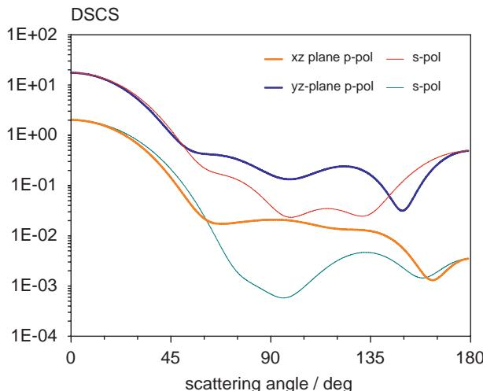
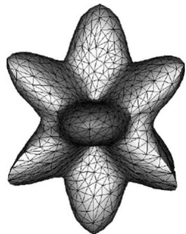
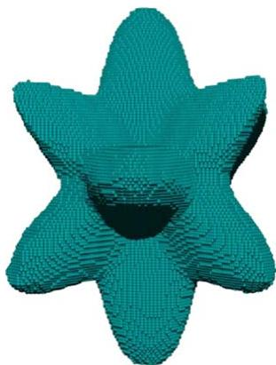
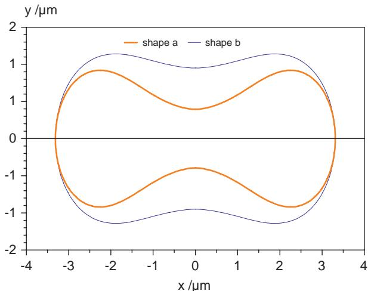
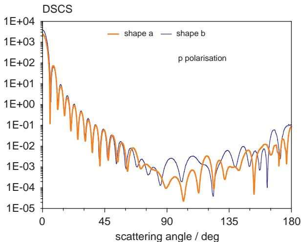
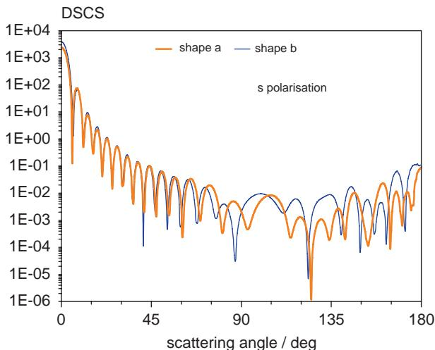

# Light scattering theories and computer codes

Thomas Wriedt *

Institut für Werkstofftechnik, Badgasteiner Str. 3, 28359 Bremen, Germany

# ARTICLEINFO

# ABSTRACT

Article history:  Received 5 November 2008  Received in revised form 24 February 2009  Accepted 24 February 2009

Keywords:  Light scattering theory  Light scattering programs

In aerosol science today light scattering simulations are regarded as an indispensable tool to develop new particle characterization techniques or in solving inverse light scattering problems. Light scattering theories and related computational methods have evolved rapidly during the past decade such that scattering computations for wavelength sized nonspherical scatterers can be easily performed. This significant progress has resulted from rapid advances in computational algorithms developed in this field and from improved computer hardware.

In this paper a review of the recent progress of light scattering theories and available computational programs is presented. We will focus on exact theories and will not cover approximate methods such as geometrical optics. Short outlines of the various theories are given alongside with informations on their capabilities and restrictions.

$\mathfrak{S}$  2009 Elsevier Ltd. All rights reserved.

# 1. Introduction

In aerosol science there is increasing interest not only to determine the size of aerosol particles using optical methods but also the shape or the refractive index of the particles. This can help, for example, to find the source of a particle contamination. To develop new and efficient optical particle characterization methods light scattering simulation methods are needed which can handle a wide variety of particle shapes. In this paper I would like to review the state of the art in this field as it developed over the last decade. I will give a short description of the various theories available and provide information on computation programs.

A number of light scattering theories have been developed, all having their pros and cons. Extensive overviews of available theories have been published by Wriedt [1], Kahnert [2] and more recently by Veronis and Fan [3]. A review of this subject with emphasis on colloid science has been written by Niklasson and Vargas [4]. A paper by Zhao et al. [5] provides an overview of the methods that are currently being used to study the electromagnetics of silver and gold nanoparticles.

Of historic interest might be the critical review by Bouwkamp [6] who presents the progress in classical diffraction theory up to 1954. In this paper both scalar and electromagnetic problems are discussed. This report may also serve as an introduction to general diffraction theory.

Interesting reviews on related subjects of nanooptics and metamaterials have recently been published by Myroshnychenko et al. [7] and by Veselago et al. [8].

With the progress of the Internet in the 1990s two web sites were erected to provide information on and links to available light scattering codes: Electromagnetic Scattering Programs [9] and SCATTERLIB [10]. With both lists there is an emphasis on open access to computational programs. In 2009 this web information has been superseded by a New

Scattering Information Portal for the light- scattering community [11,137]. Most of the mentioned computational programs can be found on either of this two web pages.

For the purpose of this review I will divide the available numerical methods used in electromagnetics into two main categories: analytical and semianalytical methods and numerical methods:

Analytical and semianalytical methods:

Mie theory and its extensions. Separation of variables method (SVM). T- matrix. Generalized multipole technique (GMT). Null- field method with discrete sources (NFM- DS).

Numerical methods:

a) Differential equation methods: Finite difference time domain method (FDTD). Finite element method (FEM). b) Integral equation methods: Method of moments (MOM). Volume integral equation method (VIEM).

With analytical and semianalytical methods all fields are represented as linear combinations of known solutions of Maxwell's equations such as spherical vector wave functions, spheroidal wavefunctions or other fundamental solutions.

The section numerical methods includes two kinds of methods. Under the first heading differential equation methods two methods are included FDTD method and VIEM. With these methods the differential equation must be discretized over the entire volume of the scatterer and part of the surrounding medium. Thus both methods need a special boundary condition to truncate the computational domain. Differential equation methods lead to matrices that are highly sparse reducing computer storage.

Integral equation methods are based on the discretization of an integral equations using Green's function of the surrounding medium. With this methods the radiation conditions for the scattered field is automatically satisfied. The matrix to be solved is a full matrix.

Next, I will shortly review the methods available making reference to review papers where available. For more profound reviews the interested reader is referred to the cited review articles.

# 2. Mie theory and its extensions

In a paper within a special edition commemorating Gustav Mie and the Mie theory a short review of Mie theory and its extensions should not be missing. In 1908 Gustav Mie published his famous paper on simulation of the colour effects connected with colloidal Gold particles [12]. In this paper he gave a first outline of how to compute light scattering by small spherical particles.

Cardona and Marx [13] comment that this paper was almost ignored until about 1945 but its importance rose starting from the 1950s with interest in colloids such that hundred years after publication his paper is still much cited [14] with currently 160 citations a year. The paper is called Dornroschen (Sleeping Beauty) by the researchers at Information Retrieval Services of Max Planck Society [15] because of its late recognition considering the number of citations.

The citations of this paper show that the applications of Mie theory cover a wide range of subjects from climate research, optical particle characterization to interstellar dust in astrophysics.

Understandably prior to the development of electronic computers in the middle of last century there were not many papers written on computing scattering problems using Mie's theory since the computational labour involved in evaluating functions such as Ricatti- Bessel functions was quite extreme.

Even with the rise of the computer it took some time before stable algorithms were developed. Gradually several generally reliable and stable scattering programs were published. Early well- known algorithms were published by Giese [16] and Dave [17]. The IBM report by Dave from 1969 was still sent out on request in the 1990s. Nowadays a number of efficient algorithms and FORTRAN programs are available. A major step was the program MIEVO written by Wiscombe [18,19], which is based on Lentz's continued- fraction method for the calculation of spherical Bessel functions [20]. The program is well tested and widely used. The Supermidi program by Gréhan and Gouesbet [21] is also based on Lentz's algorithm. The authors give numerical results over a wide range of size parameters and refractive indices. The advantage of Lentz's method is that errors do not accumulate as can occur with the use of faster recurrence relation methods [22].

It has been demonstrated that Mie's theory can be now successfully applied up to size parameters of 10,000 [23- 25] and in 2008 Mie's theory has even been programmed on a Java enabled Mobile Phone using a Matlab clone [26]. As the

scattering of a plane electromagnetic wave by a dielectric sphere is considered a canonical problem, Mie's theory is still used as a standard reference to validate methods intended for more complex scattering problems [27,28].

Apparently one of the first English language versions of Mie theory was published by Bateman [29]. Mie's original paper was translated into the English language as late as 1976 by the Royal Aircraft Establishment in the UK [30] and two year later by Sandia Laboratories in US [31]. Recently a Spanish translation of the original paper became available [32] and Chinese and Hebrew translations are on the way [33].

As it is easy to consider spherical scatterers there are many extensions of Mie theory covering different aspects. A theory for a coated dielectric sphere was first published by Aden and Kerker [34]. An advanced algorithm is given by Toon and Ackerman [35]. An algorithm for a sphere having two coatings has been presented by Kaiser and Schweiger [36]. These theories have also been extended to spherical particles consisting of multiple layers by Kai [37]. An other algorithm for plane wave and shaped beam scattering by a multilayered sphere has been published by Wu et al. [38]. Even today improved algorithms are published on this subject [39].

A scattering sphere can also be chiral or optically anisotropic. Theories and programs for such type of scatterers have been published by Bohren in his book for a chiral sphere [41] and by Doicu et al. [40] for anisotropic spheres.

In optical particle characterization scattering by a focused laser beam is quite often of interest. There are different concepts available to handle this problem. A laser beam with Gaussian intensity distribution can be expanded into spherical vector wave functions or into a spectrum of plane waves [42]. The generalized Lorenz- Mie theory (GLMT) developed by Gouesbet and coworkers is based on the first approach computing beam shape coefficients. It has recently been reviewed by Gouesbet [43]. Plane wave expansion is used by Albrecht et al. [44] and it is integrated into the NFM- DS developed by Doicu and coworkers [40]. Doicu et al. [42] give quantitative comparison of the localized approximation method and the plane wave spectrum method for the beam shape coefficients of an off- axis Gaussian beam. Usually the plane wave expansion method is considered computationally inefficient compared to the GLMT method [45].

Scattering by an aggregate of spheres will also be considered in this section. There are efficient programs available by Mackowski [46] and Xu [47]. The theory has recently been extended to clusters of rotationally symmetric particles [48] and arbitrary shaped particles [49].

Mie and absorbing surrounding medium has been considered by Sudiarta [50] and by Frisvad et al. [51].

As colour pigments and crystals are anisotropic there is some interest to extend Mie's theory to such kind of scattering particles. Stout et al. [52] established a vector spherical harmonic expansion of the electromagnetic field propagating inside an arbitrary anisotropic medium to solve this problem. A similar problem of an uniaxial anisotropic sphere was considered by Geng et al. [53] to find the coefficients of the scattered field. Droplets of liquid crystals may be considered as spherical particles with radial anisotropy. This scattering problem is discussed by Qiu et al. [54] using an extension of Mie theory.

Especially with nanosized nobel metal particle of size lower than about  $20\mathrm{nm}$  various modifications, extensions and corrections to Mie's original theory are needed to take into account that "sharp" boundary conditions do not hold in the nanoscale [55]. In his recent survey paper [56] Kreibig lists among others the following supplementary models to the Mie theory, incident wave not plane, nonstep- like boundary condition, dielectric function dependent on particle size. Applying these extensions help to explain measured absorption spectra of Ag nanoparticles and plasmon polaritons.

# 3. Separation of variables method

Asano and Yamamoto [57] apparently were the first who used separation of the vector wave equation in spheroidal coordinates to consider light scattering by homogeneous prolate or oblate spheroidal particles with an arbitrary size. In this way all fields are expanded in terms of spheroidal wavefunctions. This method using spheroidal wavefunctions for field expansion is commonly termed SVM. Voshchinnikov and Farafonov [58] applied a related approach. Their solution is claimed to be more efficient than the one of Asano and Yamamoto from the computational point of view. The approach has especially an advantage for strongly elongated or flattened particles.

Voshchinnikov's SVM codes based on spheroidal expansion are available from Il'in's website of scattering codes [59]. Scattering by coated spheroids can also be computed using SVM [60]. A recursive algorithm for the solution of the problem of scattering by multilayered spheroidal particles has been presented by Farafonov [61]. The method has been reviewed by Farafonov et al. [62]. SVM has also been combined with the GLMT to compute light scattering by a homogeneous spheroid in a shaped laser beam [63].

Suitable Mathematica programs using spheroidal wave functions to compute scattering by spheroidal particles have been published in a book by Li et al. [64]. This includes also programs for coated dielectric spheroids. For more references on this subject using spheroidal wave function I would like to refer the interested reader to this book. In a paper by Schulz [65] a method for computing the T- matrix with the SVM is given.

# 4. T-matrix method

The T- matrix method or null- field method is one of the most well- known light scattering theories to compute scattering by nonspherical particles. A Fortran program for a perfectly electric conducting rotationally symmetric scatterer was

published quite early by Waterman [66]. The book by Barber and Hill [67] includes some nice Fortran programs to compute scattering by spheroids. Near field and internal field can also be computed for spheres.

Recent reviews of the literature on this method have been published by Mishchenko et al. [68,69]. The advantage of this method is that the T- matrix is computed, which includes the full solution of the scattering problem. This matrix relates the expansion coefficients of the incident field to the expansion coefficients of the scattered field. By using a precomputed T- matrix, scattering by a rotated or a translated particle or orientation averaged scattering can easily be computed. Additionally, multiple scattering or scattering by a particle located near a plane interface can be computed from a stored T- matrix of this particle.

Most well known, tested and widely used are the T- matrix programs by Mishchenko et al. [70]. The standard T- matrix method is restricted to particles having an aspect ratio not larger than about 1:4 [71]. To solve the stability problems with particles having a larger aspect ratio expansion of the internal field using discrete sources was introduced into the null- field method. This method is reviewed in one of the following sections of this paper.

The optical tweezers toolbox by Nieminen [72], implemented in Matlab, is based on the T- matrix method for the computational modelling of optical tweezers. The toolbox is designed for the calculation of optical forces and torques, and can be used for both spherical and nonspherical particles, in both Gaussian and other beams.

# 5. Generalized multipole technique

The GMT is a relatively new and fast advancing method which has been developed by different research groups. Ludwig [73] coined the term GMT for this spectrum of methods.

The main idea of the GMT consists in approximating the solution of the problem by a linear combination of discrete sources. These discrete sources are the fundamental solution of the differential equation of the problem. The introduction of discrete sources method (DSM) is generally attributed to Kupradze and Aleksidze [74]. The coefficients of the scattered field are found by satisfying the boundary conditions on the surface of the scatterer by combining point matching with a least squares technique.

There are a variety of methods which use "equivalent sources" for field expansion. The "equivalent sources" may be of any type as long as they are solutions of the wave equation. Spherical waves, dipoles, Mie potentials and Gabor functions have been applied for field expansion.

A review of these methods has been published in an edited volume by Wriedt [75] and more recently by Fairweather [76]. A comprehensive presentation of the DSM is given by Doicu et al. [77]. For an analytic foundation of the null- field method and the DSM in acoustics and electromagnetics the reader is referred to this book.

The Fortran code of the Multiple Multipole Program (MMP) has been published by Hafner and Bomholt [78]. The book is out of print but an electronic version of the book and an executable of the program is available [79]. Boundary methods for solving Maxwell equations with a focus on the MMP are outlined by Hafner [80]. The 5th order Gaussian beam can also quite easily be integrated into the MMP [81].

The DSM is developed by Eremin and coworkers [82]. In this method the unknown amplitudes of the discrete sources are determined from the boundary condition in least square sense. DSM is restricted to rotationally symmetric scatterers but the discrete sources can also be positioned in complex plane such that scattering by really flat discs can be computed [83]. A high aspect ratio of 1:50 for elongated particles and 20:1 for flat particles can be achieved [84]. Using DSM scattering by red blood cell can be computed in an efficient way [85].

# 6. Null-field method with discrete sources

The NFM- DS developed in Bremen combines approaches of the GMT with the T- matrix method. For expansion of the internal field within a scatterer discrete sources are used. This helps to compute the T- matrix of particles having a large aspect ratio.

For rotationally symmetric particles such as finite fibres the discrete sources are positioned on the axis of symmetry of the particle [86]. With oblate rotationally symmetric scatterers it is of advantage to position the discrete sources in a complex plane [87]. In this way, scattering by oblate discs [88], flat Cassini shaped particles [89] has been solved. Scattering by particles having an aspect ratio as large as 100:1 can easily be computed both for extremely oblate or prolate particles.

For a full description of the theory we refer the interested reader to the recently published monograph by Doicu et al. [40] which also includes Fortran90 programs on CD- ROM. Recently the method has been extended to compute scattering by biaxially anisotropic particles [90]. A sample of a computational result is shown in Fig. 1. The full scope of the NFM- DS has recently been presented in a review paper [91].

# 7. Finite difference time domain

The most common electromagnetic modelling technique for scattering simulations is the FDTD method. The FDTD method is an electromagnetic modelling technique which is becoming more popular in computing light scattering by nonspherical or inhomogeneous particles. The FDTD Algorithm has been introduced in 1966 by Yee [92].

  
Fig. 1. Scattering diagram of a biaxially anisotropic cube  $ka = 3$ , with refractive indices  $n = (1.1, 1.3, 1.7)$ . The plane wave is incident along the  $z$ -axis. The scattering diagrams along the  $xz$ - and the  $yz$ -plane are plotted.

For the application of FDTD the computational space and time is divided into a grid of discrete points and then the derivatives of the Maxwell equations are approximated by finite differences. With the FDTD method an entire volume including the scatterer is discretized into a cubical grid. The basic element of discretization is the Yee cell [92]. A difference approximation is applied to evaluate the space and time derivatives of the field. The fields are computed using a time marching scheme until a steady state solution is obtained. Not only the scattering particle has to be gridded but also some part of the surrounding medium. To truncate the computational domain the FDTD needs the use of absorbing boundary conditions that require a layer of grid cells all around the computational domain. The absorbing boundary conditions ensure that the wave is not reflected at the open boundary of the discretized volume.

A near- to far- field transformation is needed to compute the scattered far- field from the near- field values of the computational domain. FDTD can be applied to any kind of problem involving complex materials with arbitrary geometry, and it continues to be an active field of research [93].

Recently, it has been demonstrated that a GPU (graphics processing unit) can be a cost effective co- processor [94]. Currently almost all vendors of FDTD programs offer an acceleration card based on a GPU.

There are about 27 commercial FDTD software vendors [95]. Another list of commercial programs is given in a review paper by Veselago et al. [8]. A survey of the FDTD literature has been published by Shlager and Schneider [96].

There are also a number of open source FDTD development projects such as BigBoy [97], Meep [98], GMES [99] and OpenGEMS [100]. Further open source programs are listed in Wikipedia [101].

The transmission line matrix (TLM) method is related to the FDTD method. It has similar capabilities. With TLM the nodes of the cubic grid are connected by virtual transmission lines [102]. A number of commercial TLM packages is also listed in the review by Veselago et al. [8].

# 8. Finite element method

In light scattering applications the FEM is not that well known. But you will nevertheless find some papers on applying this method. FEM is based on discretition of the total simulation volume including the scattering particle into a set of finite elements (tetrahedra or triangular prisms) which are best suited to describe the geometry of arbitrary shaped scattering particles. Then the unknown functions are represented by simple interpolation functions defined on each element with unknown coefficients. These functions provide an approximation to the solution within a finite element. Thus a system of equations is formulated which has to be solved.

To limit the region of computation like in FDTD the computational space has to be terminated using some artificial absorbing boundary. To solve the problem, the FEM makes use of a variational formulation [103]. The resulting matrix to be solved is sparse which is considered an advantage of this method [104]. A review of the FEM for light scattering computations has been published by Volakis et al. [105].

Currently one of the most popular software packages implementing a 3D FEM is Comsol Multiphysics. COMSOL Multiphysics (formerly FEMLAB) is a finite element analysis and solver software package for various physics and engineering applications [106]. Using this program the polarization dependence of greatly enhanced electromagnetic fields, in coupled gold nanoparticle- nanowire systems has recently been investigated [107]. The enhancement is strongest when the incident light is polarized across the junction of the particle wire system.

# 9. Method of moments

In electrical engineering the boundary element method (BEM) is commonly called MOM. By MOM the surface integral equations are solved by discretization and reducing them to a system of linear equations. The development of the method is commonly attributed to Harrington [108]. The equation solved by MOM generally has the form of an electric field integral equation (EFIE), a magnetic field integral equation (MFIE) or combined field integral equation (CFIE) [109].

In this method the scatterer is replaced by a number of interacting equivalent electric or magnetic surface currents. Thus just the boundary surface has to be discretized. A full matrix is generated which has to be solved to find the surface currents. From the equivalent currents on the surface of the scatterer all far- field quantities can be computed. Currently there is much progress with this method using various acceleration methods such as the fast multipole method (FMM). The FMM accelerates the matrix- vector product in the conjugate gradient (CG) method used to solve the matrix equation iteratively [110].

A personal history of the development of the MOM as applied to electromagnetics is presented by Harrington [111]

Open FMM is a free collection of electromagnetic software for scattering at very large dielectric objects [112] based on an implementation by Fostier [113]. An FMM program is able to handle and solve very large linear systems. Thus scattering by objects as large as  $250\lambda$  in diameter has been solved using a parallel computer [114]. A number of commercial companies offering 3D MOM simulation package are listed in Appendix F of Davidson book [115].

# 10. Volume integral equation method

The volume integral equation (VIE) may be solved by two related methods to compute scattering by an arbitrarily shaped or inhomogeneous scatterer [116]. Most well known and apparently most used is the discrete dipole approximation (DDA) proposed by Purcell and Pennypacker [117]. In DDA an arbitrarily shaped particle is treated as a 3D assembly of dipoles on a cubic grid. Each dipole cell is assigned a complex polarizability which can be computed from the complex refractive index of the bulk material and the number of dipoles in a unit volume. An extensive review of the method has recently been published by Yurkin and Hiekstra [118]. A Wiki on this method covering all aspects from theory to program has been prepared by Draine and Flatau [119].

A number of programs based on these related methods is freely available. This includes DDSCAT [119], ADDA [120], CG- FFT by Manuel F. Catedra, jscat by Jouni Peltoniemi and LIBGREEN by Piller [121]. For the FORTRAN sources programs have a look light scattering portal ScattPort [137].

Also with this method there is a project to accelerate light scattering simulation by reconfigurable computing which intends to implement DDA in an FPGA (field- programmable gate array) chip [122]. A new release of the DDA scattering code DDSCAT recently became available [119]. DDSCAT 7.0 contains a number of new features such as postprocessing to calculate the fields within or near a scattering particle. With this version absorption and scattering by targets containing arbitrarily oriented anisotropic materials can be calculated.

To generate particle shape input data consisting of positions of the dipoles together with the index of refraction for DDA programs from 3D- model file formats based on a surface triangulation such as Wavefront .obj the "point in polyhedron" algorithm can be used [123]. Fig. 2 gives an example of a triangulated Fresnel- 2 shape and Fig. 3 presents the corresponding DDA input data as a collection of spheres representing dipoles.

# 11. Validation

In development of computational programs in the field of light scattering validations is an important aspect. Mostly, results obtained from different computer programs are compared in the literature.

  
Fig. 2. Faceted "Fresnel-2" object represented by triangular surfaces.

  
Fig. 3. "Fresnel-2" object represented by 296,687 spheres (dipoles).

  
Fig. 4. Cross section of axially symmetric erythrocyte of two different shapes.

Examples using DSM [124] for validation of the NFM- DS have been published for the flat discs [89], concave Cassini oval based shapes [88], long fibres [125].

Results for a dielectric cube comparing NFM- DS with DDA, FDTD [126] and VIEM [127] have been published by Wriedt and Comberg [128]. NFM- DS, DDA and MMP [78] have been compared for a two particle multiple scattering problem by Comberg and Wriedt [129]. NFM- DS, MMP, DSM, DDA and finite integration technique (FIT) [130] have all been applied to compute scattering by a red blood cell [131]. Especially DSM proved to be an efficient method to compute scattering by the erythrocyte. Fig. 4 shows the cross sections of two erythrocytes of different shapes used for the sample results computed using DSM presented next. Fig. 5 presents the scattering diagram for incident p- polarization and Fig. 6 for the corresponding s- polarization. In each case the incident plane wave propagates along the axis of symmetry of the scattering erythrocyte.

Recently, several computer implementations of the DDA method have been compared in terms of their accuracy, speed and usability. Additionally, the accuracy of the implementations have been studied by comparing results against results from Mie, T- matrix or cluster T- matrix codes [132].

For validation microwave analog experiments can also be used. Sabouroux et al. [133] measured amplitude and phase of the scattered field of a cluster of spheres and the measurements were compared with theoretical predictions obtained from a multiple- scattering T- matrix method and DDA. Excellent agreement demonstrates the validity of both the experiment and the models.

Grosges et al. [27] compared numerical scattering results in context of near- field spectroscopy for FEM and FDTD on gold nanostructures where the geometrical singularities at the edges of the square generate a high gradient of the electric near field. A good agreement between the different methods was observed.

Some numerical benchmark results computed using various commercial and other software have been published by IEEE Germany [134]. For example problem 1 is a sphere with complex valued permittivity in a field of a plane wave and near- fields computed inside the sphere are provided.

  
Fig. 5. Scattering diagram of erythrocyte with  $\lambda = 476\mathrm{nm}$  and  $n = 1.05$

  
Fig. 6. Scattering diagram of erythrocyte with  $\lambda = 476\mathrm{nm}$  and  $n = 1.05$

Babenko and Petrov [135] also considered internal field computation for comparing three different theories (GMT, T- matrix method, SVM) with respect to computer time, precision and effectiveness. The three numerical techniques are applied to calculate the internal fields in small spheroidal particles. The GMT demonstrated the greatest capabilities with respect to size parameter (up to 100) and aspect ratio (up to 100:1).

Yurkin et al. compared the DDA and the FDTD method for simulating light scattering of spheres in a range of size parameters up to 80 and refractive indices up to 2 [136]. DDA demonstrated to be faster for smaller refractive indices, while the FDTD proved to be more efficient for larger values.

# 12. Conclusion

In this paper an overview of the progress in developing light scattering programs suitable for application in optical particle characterization has been given. A fundamental description of each technique has been presented and suitable references have been provided such that the reader can find more detailed information on the various methods and sources of computer programs.

The state- of- the- art in numerical light scattering modelling is progressing rapidly especially with fast advancing research fields such as nanophotonics and near- field optics. With almost all concepts there was much progress in the recent years.

The recent advance in computer hardware, and the development of fast algorithms with reduced computational demands and memory requirements, has made an exact numerical solution of the problem of scattering from large

scattering particles highly feasible. Today scattering by realistically shaped particles of realistic size can be computed in an efficient way. Especially the number of open source programs and development projects is increasing continuously.

Nevertheless there are still problems to be solved such as calculating scattering properties of atmospheric ice particles having realistic shape and size distributions.

# Acknowledgements

I would like to acknowledge support of this work by Deutsche Forschungsgemeinschaft (DFG). I like to thank Elena Eremina, Vladimir Schmidt and Roman Schuh for providing computational results. The helpful comments by the anonymous reviewers were highly appreciated.

# References

[1] Wriedt T. A review of elastic light scattering theories. Particle & Particle Systems Characterization 1998;15:67- 74. [2] Kahnert FM. Numerical methods in electromagnetic scattering theory. Journal of Quantitative Spectroscopy & Radiative Transfer 2003;79- 80(1):775- 824. [3] Veronis G, Fan S. Overview of simulation techniques for plasmonic devices. In: Brongersma ML, Kirk PG, editors. Surface plasmon nanophotonics. Berlin, Heidelberg: Springer; 2007. [4] Niklasson GA, Vargas WE. Light scattering from particles. In: Somasundaran P, editor. Encyclopedia of surface and colloid science. Boca Raton, FL: CRC Press; 2006. p. 3346- 58. [5] Zhao J, Pinchuk AO, McMahon JM, Li S, Ausman LK, Atkinson AL, et al. Methods for describing the electromagnetic properties of silver and gold nanoparticles. Accounts of Chemical Research 2008;41(12):1710- 20. [6] Bouwkamp CJ. Diffraction theory. Reports on Progress in Physics 1954;17:35- 99. [7] Myroshnychenko V, Rodriguez- Fernandez J, Pastoriza- Santos I, Funston AM, Novo C, Mulvaney P, et al. Modelling the optical response of gold nanoparticles. Chemical Society Reviews 2008, DOI: 10.1039/b711486a. [8] Veselago V, Braginsky L, Shklover V, Hafer C. Negative refractive index materials. Journal of Computational and Theoretical Nanoscience 2006;3:1- 30. [9] Wriedt T. Electromagnetic scattering programs. (http://www.t- matrix.de). [10] Flatau PJ. SCATTERLIB (http://atol.ucsd.edu/ucdllib/index.htm). [11] Wriedt T, Hellmers J. New scattering information portal for the light- scattering community. Journal of Quantitative Spectroscopy & Radiative Transfer 2008;109(8):1536- 42. [12] Mie G. Beitrage zur Optik trubier Medien, speziell kolloidaler Metallosungen. Annalen der Physik, Verte Folge 1908;25(3):377- 445. [13] Cardona M, Marx W. Verwechsel, vergessen, wieder gefunden. Physik Journal 2004;3(11):27- 9. [14] Marx W. Diversiewchen und Merkstoffisen. Niedsliiger und Vergessen Abzitern in der Physik. Physik in Hozver Zeit 2007;1:34- 9. [15] Bowman BF, Marx W. Bibliometrie in der Forschungsevaluierung (http://www.biochem.mpg.de/iv/rgfN_Bibliometrie.pdf). [16] Giese R- H. Die Berechnung der Lichtstreitung an kugelformigen Teilchen mit einem Digitalrechner. Elektronische Rechenanlagen 1961;3(6):240- 5. [17] Dave JV. Subroutines for computing the parameters of the electromagnetic radiation scattered by a sphere, Report No. 320- 3237, IBM Scientific Center, Palo Alto, CA; 1968. [18] Wiscombe WJ. Improved Mie scattering algorithms. Applied Optics 1980;19:1505- 9. [19] Wiscombe WJ. Mie scattering calculations: advances in technique and fast, vector- speed computer codes, National Center for Atmospheric Research Technical Note NCAR/TN- 140+STR; 1979. [20] Lentz WJ. Generating bessel functions in Mie scattering calculations using continued fractions. Applied Optics 1976;15:668- 71. [21] Grehan G, Gouesbet G. Mie theory calculations: new progress, with emphasis on particle sizing. Applied Optics 1979;18:3489- 93. [22] Jones AR. Calculation of the ratios of complex Riccati- Bessel functions for Mie scattering. Journal of Physics D: Applied Physics 1983;16:149- 52. [23] Siu G- G, Cheng L. Mie solution of light scattering from spheres of radii up to 80 with digit- array method. JOSA B 2002;19(8):1922- 9. [24] Du H. Mie- scattering calculation. Applied Optics 2004;43(9):1951- 6. [25] Shen J. Algorithm of numerical calculation on Lorenz Mie theory. PIERS Online 2005;1(6):691- 4. [26] Wriedt T. Mie theory 1908, on the mobile phone 2008. Journal of Quantitative Spectroscopy & Radiative Transfer 2008;109:1543- 8. [27] Groses T, Vial A, Barchiesi D. Models of near- field spectroscopic studies: comparison between finite element and finite- difference methods. Optics Express 2005;13(21):8484. [28] Zhu R- J, Wang J, Jin G- F. Mie scattering calculation by FDTD employing a modified Debye model for Gold material. Optik 2005;116:419- 22. [29] Bateman H. The mathematical analysis of electrical and optical wave- motion on the basis of Maxwell equations. Cambridge: Cambridge University Press; 1915 (http://www.archive.org/download/mathematicalanal00baterich/mathematicalanal00baterich.pdf). [30] Mie G. Contributions to the optics of turbid media, particularly of colloidal metal solutions. Royal Aircraft Establishment, Library Translation 1873, 1976, RAE- Lit- Trans- 1873 (http://diogenes.iwt.uni- bremen.de/vt/laser/papers/RAE- LT1873- 1976- Mie- 1908- translation.pdf). [31] Mie G. Contributions on the optics of turbid media, particularly colloidal metal solutions—Translation. Sandia Laboratories, Albuquerque, New Mexico, 1978. SAND78- 6018, National Translation Center, Chicago, IL, Translation 79- 21946. [32] Mie G. Consideraciones sobre la optical de los medios turbios, especialmente soluciones coloidales (http://www.ugr.es/~aquiran/ciencia/mie/mie1908_spanish.pdf). [33] Quirantes A. Mie translation project (http://www.ugr.es/~aquiran/mie.htm). [34] Aden AL, Kerker M. Scattering of electromagnetic waves from two concentric spheres. Journal of Applied Physics 1951;22:1242- 6. [35] Toon OB, Ackerman TP. Algorithms for the calculation of scattering by stratified spheres. Applied Optics 1981;20:3657- 60. [36] Kaiser T, Schweiger G. Stable algorithms for the computation of Mie coefficients for scattered and transmitted fields of a coated sphere. Computers in Physics 1993;7(6):682- 6. [37] Kai L, Massoli P. Scattering of electromagnetic plane wave by radially inhomogeneous spheres: a finely- stratified sphere model. Applied Optics 1993;33(3):501- 11. [38] Wu ZS, Guo LX, Ren KF, Gouesbet G, Grehan G. Improved algorithm for electromagnetic scattering of plane waves and shaped beams by multilayered spheres. Applied Optics 1997;36(21):5188- 98. [39] Liu L, Wang H, Yu B, Xua Y, Shen J. Improved algorithm of light scattering by a coated sphere. China Particuology 2007;5:230- 6. [40] Doicu A, Wriedt T, Eremin Y. Light scattering by systems of particles. Null- field method with discrete sources—theory and programs. Berlin, Heidelberg, New York: Springer; 2006. [41] Bohren CF, Huffman DR. Absorption and scattering of light by small particles. New York: Wiley- Interscience; 1983. [42] Doicu A, Wriedt T. Plane wave spectrum method of electromagnetic beams. Optics Communications 1997;137:114- 24. [43] Gouesbet G, Grehan G. Generalized Lorenz- Mie theories, from past to future. Atomization Sprays 2000;10:277- 333.

[44] Albrecht H- E, Bech H, Damaschke N, Feleke M. Berechnung der Streuintensität eines beliebig im Laserstrahl positionierten Teilchens mit Hilfe der zweidimensionalen Fouriertransformation. Optik 1995;100(3):118- 24. [45] Lock JA. Improved Gaussian beam- scattering algorithm. Applied Optics 1995;34(3):559- 70. [46] Mackowski DW, Mishchenko MI. Calculation of the T matrix and the scattering matrix for ensembles of spheres. Journal of the Optical Society of America A 1996;12(13):2266- 78. [47] Xu Y- I. Electromagnetic scattering by an aggregate of spheres. Applied Optics 1995;34:4573- 88. [48] Xu Y- I. Radiative- scattering signatures of an ensemble of nonspherical particles. Journal of Quantitative Spectroscopy & Radiative Transfer 2004;89:385- 419. [49] Wriedt T, Schuh R. Decompositioning method to compute scattering by complex shaped particles using a multiple scattering T- matrix approach. Journal of Quantitative Spectroscopy & Radiative Transfer 2008;109:2315- 28. [50] Sudiarta IW, Chylek P. Mie scattering efficiency of a large spherical particle embedded in an absorbing medium. Journal of Quantitative Spectroscopy & Radiative Transfer 2005;70(4- 6):709- 14. [51] Frisvad JR, Christensen NJ, Jensen HW. Computing the scattering properties of participating media using Lorenz- Mie theory. In: ACM transactions on graphics (Proceedings of SIGGRAPH 2007), vol. 26, no. 3, Article 60, 2007 (http://www2. imm.edu.dk/pubdb/p.php?5288), accessed 24.9.2008. [52] Stout B, Neviere E, Popov E. Mie scattering by an anisotropic object. Part I. Homogeneous sphere. Journal of the Optical Society of America A 2006;23(5):1111- 23. [53] Geng YL, Wu XB, Li LW, Guan BR. Mie scattering by a uniaxial anisotropic sphere. Physical Review E 2004;70(5):056609. [54] Qiu C- W, Luk'vanchuk B. Peculiarities in light scattering by spherical particles with radial anisotropy. Journal of the Optical Society of America A 2008;25(7):1623- 8. [55] Kreibig U, Vollmer M. Optical properties of metal clusters. Berlin: Springer; 1995. [56] Kreibig U. Interface- induced dephasing of Mie plasmon polaritons. Applied Physics B 2008;93:79- 89. [57] Asano S, Yamamoto G. Light scattering by a spheroidal particle. Applied Optics 1975;14:29- 49. [58] Voshchinnikov NV, Farafonov VG. Optical properties of spheroidal particles. Astrophysics and Space Science 1993;204:19- 86. [59] Il'in VB. Al SPbU library of scattering codes (http://www.astro.spbu.ru/staff/jilin2/SOFTWARE/), accessed 25.9.2008. [60] Farafonov VG, Voshchinnikov NV, Somnikov VV. Light scattering by a core- mantle spheroidal particle. Applied Optics 1996;35:5412- 26. [61] Farafonov VG. New recursive solution of the problem of scattering of electromagnetic radiation by multilayer spheroidal particles. Optics and Spectroscopy 2001;90:743- 52. [62] Farafonov VG, Il'in VB, Vinokurov AA. On use of the field expansions in terms of spheroidal functions. Journal of Quantitative Spectroscopy & Radiative Transfer 2007;106(1- 3):33- 43. [63] Xu F, Ren K, Gouesbet G, Grehan G, Cai X. Generalized Lorenz- Mie theory for an arbitrarily oriented, located, and shaped beam scattered by a homogeneous spheroid. Journal of the Optical Society of America A 2007;24(1):119- 31. [64] Li L- W, Kang X- K, Leong M- S. Spherical wave functions in electromagnetic theory. New York, NY: Wiley; 2002. [65] Schulz FM, Stammes K, Stammes JJ. Scattering of electromagnetic waves by spheroidal particles: a novel approach exploiting the T- matrix computed in spheroidal coordinates. Applied Optics 1998;37:7875- 96. [66] Waterman PC. Numerical solution of electromagnetic scattering problems. In: Mittra R, editor. Computer techniques for electromagnetics. New York: Pergamon Press; 1973. p. 97- 157. [67] Barber PW, Hill SC. Light scattering by particles: computational methods. Singapore: World Scientific; 1990. [68] Mishchenko MI, Videen G, Babenko VA, Khlebtsov NG, Wriedt T. T- matrix theory of electromagnetic scattering by particles and its applications: a comprehensive reference database. Journal of Quantitative Spectroscopy & Radiative Transfer 2004;88:357- 406. [69] Mishchenko MI, Videen G, Babenko VA, Khlebtsov NG, Wriedt T. Comprehensive T- matrix reference database: a 2004- 2006 update. Journal of Quantitative Spectroscopy & Radiative Transfer 2007;106:304- 24. [70] Mishchenko MI, Travis LD, Mackowski DW. T- matrix codes for computing electromagnetic scattering by nonspherical and aggregated particles (http://www.giss.nasa.gov/~crmin/t_matrix.html), accessed 22.10.2008. [71] Mishchenko MI, Travis LD, Lacie AA. Scattering, absorption and emission of light by small particles. Cambridge: Cambridge University Press; 2002. [72] Nieminen T. Optical tweezers toolbox 1. (http://www.physics.uq.edu.au/people/nieminen/software.html), accessed 22.10.2008. [73] Ludwig AC. The generalized multipole technique. Computer Physics Communications 1991;68:306- 14. [74] Kupradze VD, Aleksidze MA. The method of functional equations for the approximate solution of certain boundary value problems. USSR Computational Mathematics and Mathematical Physics 1964;4(4):82- 126. [75] Wriedt T, editor. Generalized multipole techniques for electromagnetic and light scattering. Amsterdam: Elsevier; 1999. [76] Fairweather G, Karageorghis A, Martin PA. The method of fundamental solutions for scattering and radiation problems. Engineering Analysis with Boundary Elements 2003;27:759- 69. [77] Doicu A, Eremin YA, Wriedt T. Acoustic and electromagnetic scattering analysis using discrete sources. London: Academic Press; 2000. [78] Hafner C, Bomholt L. The 3D electrodynamic wave simulator. Chichester: Wiley; 1993. [79] Hafner C. The Multiple Multipole Programs (MMP) (http://alphard.ethz.ch/ Hafner/ mmp/ mmp.htm), accessed 24.9.2008. [80] Hafner Ch. Boundary methods for optical nano structures. Physica Status Solidi 2007;244(10):3435- 47. [81] Evers T, Dahl H, Wriedt T. Extension of the program 3D MMP with 5th order Gaussian beam. Electronics Letters 1996;32(15):1356- 7. [82] Eremin YuA, Sveshnikov AG. Metod diskretnikh istochnikov v zadachakh elektromagnitnoi difraktsii, Izd- vo Moskovskogo universiteta, Moscow, 1992 (in Russian). [83] Eremin Y, Orlov N, Sveshnikov A. Generalized multipole techniques for electromagnetic and light scattering. In: Wriedt T, editor. Generalized multipole techniques for electromagnetic and light scattering. Amsterdam: Elsevier Science; 1999. p. 39- 80. [84] Eremina E, Wriedt T. Light scattering analysis by a particle of extreme shape via discrete sources method. Journal of Quantitative Spectroscopy & Radiative Transfer 2004;89:67- 77. [85] Eremina E, Eremina Y, Wriedt T. Analysis of light scattering by erythrocyte based on discrete sources method. Optics Communications 2005;244:15- 23. [86] Pulbere S, Wriedt T. Light scattering by cylindrical fibers with high aspect ratio using the null- field method with discrete sources. Particle & Particle Systems Characterization 2004;21:213- 8. [87] Doicu A, Wriedt T. Extended boundary condition method with multipole sources located in the complex plane. Optics Communications 1997;139:85- 91. [88] Hellmers J, Wriedt T, Doicu A. Light scattering simulation by oblate disc spheres using the null field method with discrete sources located in the complex plane. Journal of Modern Optics 2006;53(3):267- 82. [89] Hellmers J, Eremina E, Wriedt T. Simulation of light scattering by biconcave Cassini ovals using the nullfield method with discrete sources. Journal of Optics A 2006;8:1- 9. [90] Schmidt V, Wriedt T. Equivalent refractive index for biaxially anisotropic scatterers using T- matrix approach. In: Hergert W, Wriedt T, editors. Mie theory 1908- 2008. Bremen: Universitat Bremen; 2008. [91] Wriedt T. Review of the null- field method with discrete sources. Journal of Quantitative Spectroscopy & Radiative Transfer 2007;106(1- 3):535- 45. [92] Yee KS. Numerical solution of initial boundary value problems involving Maxwell's equations in isotropic media. IEEE Transactions on Antennas and Propagation 1966;14:302- 7. [93] Schneider BJ. BibTeX FDTD database (http://www.ftdtd.org).

[94] Yu W, et al. Hardware acceleration techniques for the FDTD method. In: EMTS 2007—international URSI commission B—electromagnetic theory symposium, July 26–28, Ottawa, ON, Canada, 2007. [95] Taflove A. Advances in FDTD techniques and applications in photonics. In: Photonics North 2007, Ottawa, Canada, June 4, 2007. [96] Shlager KL, Schneider JB. A selective survey of the finite- difference time domain literature. IEEE Antennas & Propagation Magazine 1995;37:39–57. [97] BigBoy (sourceforge.net/projects/bigboy), accessed 31.10.2008. [98] Meep (ab- initio.mit.edu/wiki/index.php/Main_Page), accessed 31.10.2008. [99] GMES (gmes.sourceforge.net/), accessed 31.10.2008. [100] OpenGEMS. (http://www.2comu.com.cn/products/OpenGEMS.html), accessed 31.10.2008. [101] (http://en.wikipedia.org/wiki/Finite- difference_time- domain_method).[102] Johns PB. On the relationship between TLM and finite- difference methods for Maxwell's equations. IEEE Transactions on Microwave Theory and Techniques 1997;MTT- 35(1):60–1. [103] Monk P. Finite element methods for Maxwell's equations. Oxford: Oxford University Press; 2003. [104] Volakis JL, Kempel LC. Electromagnetics: computational methods and considerations. IEEE Computational Science and Engineering 1995;2(1):42–57. [105] Volakis JL, Chatterjee A, Kempel LC. Review of the finite element method for three- dimensional electromagnetic scattering. Journal of the Optical Society of America A 1994;11:1422–33. [106] (http://en.wikipedia.org/wiki/Computational_electromagnetics).[107] Wei H, Hao F, Huang Y, Wang W, Nordlander P, Xu H. Polarization dependence of surface- enhanced raman scattering in gold nanoparticle- nanowire systems. Nano Letters 2008;8(8):2497–502. [108] Harrington RF. Field computation by moment methods. New Jersey: IEEE Press; 1993. [109] Jung BH, Sarkar TK, Chung Y- S. A survey of various frequency domain integral equations for the analysis of scattering from three- dimensional dielectric objects. Progress in Electromagnetics Research 2002;36:193–246. [110] Song J, Lu C- C, Chew WC. Multilevel fast multipole algorithm for electromagnetic scattering by large complex objects. IEEE Transactions on Antennas and Propagation 1997;45(10):1488–93. [111] Harrington RF. The method of moments—a personal review. In: IEEE antennas and propagation society international symposium, vol. 2000(3). p. 1639–40. [112] Open FMM. (http://openfmm.intec.ugent.be), accessed 29.9.2008. [113] Foster J, Olyslager F. A GRID computer implementation of the multilevel fast multipole algorithm for full- wave analysis of optical devices. IEICE Transactions on Communications 2007;290- B(9):2430–8. [114] Sylvand G. Performance of a parallel implementation of the FMM for electromagnetics applications. International Journal for Numerical Methods in Fluids 2003;43:865–79. [115] Davidson DB. Computational electromagnetics for RF and microwave engineering. Cambridge, New York: Cambridge University Press; 2005. [116] Lakhtakia A, Mulholland GW. On two numerical techniques for light- scattering by dielectric agglomerated structures. Journal of Research of the National Institute of Standards and Technology 1993;98:699–716. [117] Purcell EM, Pennypacker CR. Scattering and absorption of light by nonspherical dielectric grains. Arctospherical Journal 1973;186:705–14. [118] Yurkin MA, Hoekstra AG. The discrete dipole approximation: an overview and recent developments. Journal of Quantitative Spectroscopy & Radiative Transfer 2007;106(1–3):558–89. [119] Draine BT, Flatau PJ. The discrete dipole approximation for scattering and absorption of light by irregular particles (http://ddscat.wikidot.com/start).[120] Yurkin MA, Hoekstra AG. The Amsterdam DDA (http://www.science.uva.nl/research/scs/Software/adda/).[121] Piner NB, Martin O Jr. Extension of the generalized multipole technique to anisotropic media. Optics Communications 1998;150(1–6):9–14. [122] Simon S. Acceleration of simulations based on reconfigurable computing and graphics processing units. In: Workshop on the null- field method with discrete sources, Institut für Werkstofftechnik, Bremen, Germany, 4th April 2008 (http://diggenes.iwt.uni- bremen.de/ vt/ laser/ wriedt/ Conferences/ NFM- DS- Workshop.html), accessed 23.10.2008. [123] Schuh R. Arbitrary particle shape modelling in DDA and validation of simulation results. In: Wriedt T, Hoekstra A, editors. Proceedings of the DDA—workshop, Institut für Werkstofftechnik, Bremen, 23 March 2007. p. 22–24 (http://diggenes.iwt.uni- bremen.de/ vt/ laser/ wriedt/ Conferences/ DDA- Workshop.html), accessed 23.10.2008. [124] Eremin YA, Sveshnikov AG. A computer technology for the discrete source method in scattering problems. Computational Mathematics and Modeling 2003;14(1):16–25. [125] Eremina E, Eremin Y, Wriedt T. Extension of the discrete sources method to light scattering by highly elongated finite cylinders. Journal of Modern Optics 2004;51(3):423–35. [126] Kunz KS, Luebbers RJ. The finite difference time domain method for electromagnetics. Boca Raton: CRC Press; 1993. [127] Peltoniemi J. Variational volume integral equation method for electromagnetic scattering by irregular grains. Journal of Quantitative Spectroscopy & Radiative Transfer 1996;55(5):637–47. [128] Wriedt T, Comberg U. Comparison of computational scattering methods. Journal of Quantitative Spectroscopy & Radiative Transfer 1998;60(3):411–23. [129] Comberg U, Wriedt T. Comparison of scattering calculations for aggregated particles based on different models. Journal of Quantitative Spectroscopy & Radiative Transfer 1999;63:149–62. [130] Computer Simulation Technology GmbH. (http://www.cst.de).[131] Wriedt T, Hellmers J, Eremina E, Schuh R. Light scattering by single erythrocyte: comparison of different methods. Journal of Quantitative Spectroscopy & Radiative Transfer 2006;100:444–56. [132] Penttila A, Zubko E, Lumme K, Mulinonen K, Yurkin MA, Draine BT, et al. Comparison between discrete dipole implementations and exact techniques. Journal of Quantitative Spectroscopy & Radiative Transfer 2007;106:417–36. [133] Sabouroux P, Stout R, Gefflin JM, Eyreud C, Ayronci I, Vaillon R, et al. Amplitude and phase of light scattered by micro- scale aggregates of dielectric spheres: comparison between theory and microwave analogy experiments. Journal of Quantitative Spectroscopy & Radiative Transfer 2007;103(1):156–67. [134] IEEE German EMC Chapter: AG Numerische Modellierung Numerical Benchmarks. (http://www.ewh.ieee.org/r8/germany/emc/ag_num/benchmark.html), accessed 30.9.2008. [135] Babenko VA, Petrov PK. Calculation of optical fields inside spheroidal particles of cosmic dust: comparison of different methods: GMT, T- Matrix, SVM. In: Videen G, Kocifaj M, editors. Optics of cosmic dust. Dordrecht: Kluwer Academic Publishers; 2002. [136] Yurkin MA, Hoekstra AG, Scott Brock R, Lu JQ. Systematic comparison of the discrete dipole approximation and the finite difference time domain method for large dielectric scatterers. Optics Express 2007;15(26):17902–11. [137] Wriedt T. ScottPort, Light Scattering Information Portal (http://www.scattport.org).